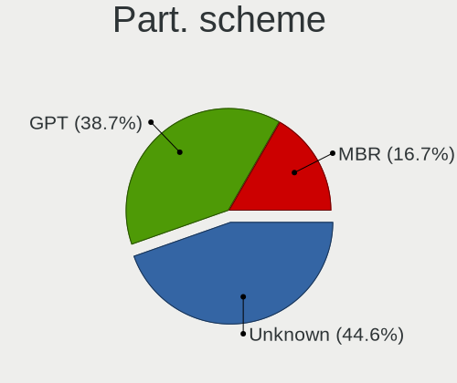
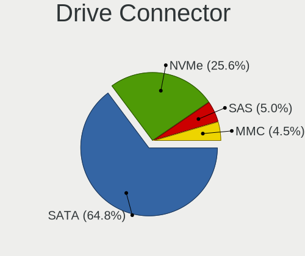

Linux - Tested Hardware & Statistics
------------------------------------

A project to collect tested hardware configurations for Linux.

Anyone can contribute to this report by the [hw-probe](https://github.com/linuxhw/hw-probe) tool:

    sudo -E hw-probe -all -upload

Please contribute! Especially if your hardware is rare.

This is a report for all computer types. See also reports for [desktops](/Desktop/README.md) and [notebooks](/Notebook/README.md).

Distribution-specific reports: [Alpine](/Dist/Alpine), [ALT_Linux](/Dist/ALT_Linux), [antiX](/Dist/antiX), [Artix](/Dist/Artix), [Chrome_OS](/Dist/Chrome_OS), [Clear_Linux](/Dist/Clear_Linux), [Deepin](/Dist/Deepin), [Devuan](/Dist/Devuan), [EndeavourOS](/Dist/EndeavourOS), [Garuda_Linux](/Dist/Garuda_Linux), [GNOME_OS](/Dist/GNOME_OS), [Mageia](/Dist/Mageia), [Makulu](/Dist/Makulu), [NixOS](/Dist/NixOS), [Oracle_Linux](/Dist/Oracle_Linux), [Pardus](/Dist/Pardus), [PureOS](/Dist/PureOS), [Q4OS](/Dist/Q4OS), [Reborn_OS](/Dist/Reborn_OS), [Rocky_Linux](/Dist/Rocky_Linux), [Sparky](/Dist/Sparky), [Void_Linux](/Dist/Void_Linux), [Xero](/Dist/Xero).

This report is for real hardware. Report for virtual hardware: [TestCoverage_VE](https://github.com/linuxhw/TestCoverage_VE)

Contents
--------

* [ Test Cases ](#test-cases)

* [ System ](#system)
  - [ OS                       ](#os)
  - [ OS Family                ](#os-family)
  - [ Kernel                   ](#kernel)
  - [ Kernel Family            ](#kernel-family)
  - [ Kernel Major Ver.        ](#kernel-major-ver)
  - [ Arch                     ](#arch)
  - [ DE                       ](#de)
  - [ Display Server           ](#display-server)
  - [ Display Manager          ](#display-manager)
  - [ OS Lang                  ](#os-lang)
  - [ Boot Mode                ](#boot-mode)
  - [ Filesystem               ](#filesystem)
  - [ Part. scheme             ](#part-scheme)
  - [ Dual Boot with Linux/BSD ](#dual-boot-with-linuxbsd)
  - [ Dual Boot (Win)          ](#dual-boot-win)

* [ Board ](#board)
  - [ Vendor                   ](#vendor)
  - [ Model                    ](#model)
  - [ Model Family             ](#model-family)
  - [ MFG Year                 ](#mfg-year)
  - [ Form Factor              ](#form-factor)
  - [ Secure Boot              ](#secure-boot)
  - [ Coreboot                 ](#coreboot)
  - [ RAM Size                 ](#ram-size)
  - [ RAM Used                 ](#ram-used)
  - [ Total Drives             ](#total-drives)
  - [ Has CD-ROM               ](#has-cd-rom)
  - [ Has Ethernet             ](#has-ethernet)
  - [ Has WiFi                 ](#has-wifi)
  - [ Has Bluetooth            ](#has-bluetooth)

* [ Location ](#location)
  - [ Country                  ](#country)
  - [ City                     ](#city)

* [ Drives ](#drives)
  - [ Drive Vendor             ](#drive-vendor)
  - [ Drive Model              ](#drive-model)
  - [ HDD Vendor               ](#hdd-vendor)
  - [ SSD Vendor               ](#ssd-vendor)
  - [ Drive Kind               ](#drive-kind)
  - [ Drive Connector          ](#drive-connector)
  - [ Drive Size               ](#drive-size)
  - [ Space Total              ](#space-total)
  - [ Space Used               ](#space-used)
  - [ Malfunc. Drives          ](#malfunc-drives)
  - [ Malfunc. Drive Vendor    ](#malfunc-drive-vendor)
  - [ Malfunc. HDD Vendor      ](#malfunc-hdd-vendor)
  - [ Malfunc. Drive Kind      ](#malfunc-drive-kind)
  - [ Failed Drives            ](#failed-drives)
  - [ Failed Drive Vendor      ](#failed-drive-vendor)
  - [ Drive Status             ](#drive-status)

* [ Storage controller ](#storage-controller)
  - [ Storage Vendor           ](#storage-vendor)
  - [ Storage Model            ](#storage-model)
  - [ Storage Kind             ](#storage-kind)

* [ Processor ](#processor)
  - [ CPU Vendor               ](#cpu-vendor)
  - [ CPU Model                ](#cpu-model)
  - [ CPU Model Family         ](#cpu-model-family)
  - [ CPU Cores                ](#cpu-cores)
  - [ CPU Sockets              ](#cpu-sockets)
  - [ CPU Threads              ](#cpu-threads)
  - [ CPU Op-Modes             ](#cpu-op-modes)
  - [ CPU Microcode            ](#cpu-microcode)
  - [ CPU Microarch            ](#cpu-microarch)

* [ Graphics ](#graphics)
  - [ GPU Vendor               ](#gpu-vendor)
  - [ GPU Model                ](#gpu-model)
  - [ GPU Combo                ](#gpu-combo)
  - [ GPU Driver               ](#gpu-driver)
  - [ GPU Memory               ](#gpu-memory)

* [ Monitor ](#monitor)
  - [ Monitor Vendor           ](#monitor-vendor)
  - [ Monitor Model            ](#monitor-model)
  - [ Monitor Resolution       ](#monitor-resolution)
  - [ Monitor Diagonal         ](#monitor-diagonal)
  - [ Monitor Width            ](#monitor-width)
  - [ Aspect Ratio             ](#aspect-ratio)
  - [ Monitor Area             ](#monitor-area)
  - [ Pixel Density            ](#pixel-density)
  - [ Multiple Monitors        ](#multiple-monitors)

* [ Network ](#network)
  - [ Net Controller Vendor    ](#net-controller-vendor)
  - [ Net Controller Model     ](#net-controller-model)
  - [ Wireless Vendor          ](#wireless-vendor)
  - [ Wireless Model           ](#wireless-model)
  - [ Ethernet Vendor          ](#ethernet-vendor)
  - [ Ethernet Model           ](#ethernet-model)
  - [ Net Controller Kind      ](#net-controller-kind)
  - [ Used Controller          ](#used-controller)
  - [ NICs                     ](#nics)
  - [ IPv6                     ](#ipv6)

* [ Bluetooth ](#bluetooth)
  - [ Bluetooth Vendor         ](#bluetooth-vendor)
  - [ Bluetooth Model          ](#bluetooth-model)

* [ Sound ](#sound)
  - [ Sound Vendor             ](#sound-vendor)
  - [ Sound Model              ](#sound-model)

* [ Memory ](#memory)
  - [ Memory Vendor            ](#memory-vendor)
  - [ Memory Model             ](#memory-model)
  - [ Memory Kind              ](#memory-kind)
  - [ Memory Form Factor       ](#memory-form-factor)
  - [ Memory Size              ](#memory-size)
  - [ Memory Speed             ](#memory-speed)

* [ Printers & scanners ](#printers--scanners)
  - [ Printer Vendor           ](#printer-vendor)
  - [ Printer Model            ](#printer-model)
  - [ Scanner Vendor           ](#scanner-vendor)
  - [ Scanner Model            ](#scanner-model)

* [ Camera ](#camera)
  - [ Camera Vendor            ](#camera-vendor)
  - [ Camera Model             ](#camera-model)

* [ Security ](#security)
  - [ Fingerprint Vendor       ](#fingerprint-vendor)
  - [ Fingerprint Model        ](#fingerprint-model)
  - [ Chipcard Vendor          ](#chipcard-vendor)
  - [ Chipcard Model           ](#chipcard-model)

* [ Unsupported ](#unsupported)
  - [ Unsupported Devices      ](#unsupported-devices)
  - [ Unsupported Device Types ](#unsupported-device-types)

Test Cases
----------

Total: 230103

| Vendor        | Model                       | Form-Factor | Probe                                                      | Date         |
|---------------|-----------------------------|-------------|------------------------------------------------------------|--------------|
| ASUSTek       | PRIME B550M-A               | Desktop     | [58051fe7e2](https://linux-hardware.org/?probe=58051fe7e2) | Jun 01, 2022 |
| Intel         | D2700DC AAG32420-602        | Desktop     | [a55bb5f425](https://linux-hardware.org/?probe=a55bb5f425) | Jun 01, 2022 |
| ASUSTek       | GL753VE                     | Notebook    | [a96aa73dd6](https://linux-hardware.org/?probe=a96aa73dd6) | Jun 01, 2022 |
| Fujitsu       | LIFEBOOK U758               | Notebook    | [fe1d5a2b6b](https://linux-hardware.org/?probe=fe1d5a2b6b) | Jun 01, 2022 |
| Dell          | Inspiron 5749               | Notebook    | [408e42beb8](https://linux-hardware.org/?probe=408e42beb8) | Jun 01, 2022 |
| Medion        | E7220                       | Notebook    | [d4a700af57](https://linux-hardware.org/?probe=d4a700af57) | Jun 01, 2022 |
| ASRock        | B365M Pro4-F                | Desktop     | [3a12e41029](https://linux-hardware.org/?probe=3a12e41029) | Jun 01, 2022 |
| MSI           | Bravo 15 B5DD               | Notebook    | [d561d8dbdb](https://linux-hardware.org/?probe=d561d8dbdb) | Jun 01, 2022 |
| Lenovo        | ThinkPad T410 2537HN3       | Notebook    | [e373330c8b](https://linux-hardware.org/?probe=e373330c8b) | Jun 01, 2022 |
| Dell          | 0YNVJG A02                  | Desktop     | [9b84f171eb](https://linux-hardware.org/?probe=9b84f171eb) | Jun 01, 2022 |
| Acer          | Aspire 5740                 | Notebook    | [db6d025d69](https://linux-hardware.org/?probe=db6d025d69) | Jun 01, 2022 |
| Lenovo        | IdeaPad 5 Pro 14ACN6 82L... | Notebook    | [ae39e96b1a](https://linux-hardware.org/?probe=ae39e96b1a) | Jun 01, 2022 |
| ASRock        | P67 Pro3                    | Desktop     | [cd48749015](https://linux-hardware.org/?probe=cd48749015) | Jun 01, 2022 |
| Lenovo        | ThinkPad E14 Gen 3 20YFC... | Notebook    | [ac0d3882ca](https://linux-hardware.org/?probe=ac0d3882ca) | Jun 01, 2022 |
| Alienware     | 0XJKKD A00                  | Desktop     | [ae3a750f2e](https://linux-hardware.org/?probe=ae3a750f2e) | Jun 01, 2022 |
| Intel         | DP67BG AAG10491-305         | Desktop     | [714722d24b](https://linux-hardware.org/?probe=714722d24b) | Jun 01, 2022 |
| Lenovo        | 3190 NOK                    | Mini pc     | [5f6f023f22](https://linux-hardware.org/?probe=5f6f023f22) | Jun 01, 2022 |
| Acer          | Aspire A514-54G             | Notebook    | [1019de0d68](https://linux-hardware.org/?probe=1019de0d68) | Jun 01, 2022 |
| Acer          | Aspire ES1-522              | Notebook    | [60eba56233](https://linux-hardware.org/?probe=60eba56233) | Jun 01, 2022 |
| VIT           | M2420                       | Notebook    | [c2ea650175](https://linux-hardware.org/?probe=c2ea650175) | Jun 01, 2022 |
| Acer          | AOD270                      | Notebook    | [383c9f83c6](https://linux-hardware.org/?probe=383c9f83c6) | Jun 01, 2022 |
| ASUSTek       | VivoBook_ASUSLaptop X509... | Notebook    | [abaa4456ea](https://linux-hardware.org/?probe=abaa4456ea) | Jun 01, 2022 |
| Lenovo        | IdeaPad Y700-15ISK 80NV     | Notebook    | [d12c2f9f7c](https://linux-hardware.org/?probe=d12c2f9f7c) | Jun 01, 2022 |
| Lenovo        | ThinkPad T510 4313CTU       | Notebook    | [d5c0252c4b](https://linux-hardware.org/?probe=d5c0252c4b) | Jun 01, 2022 |
| Dell          | Inspiron 3451               | Notebook    | [04e9ce0ba0](https://linux-hardware.org/?probe=04e9ce0ba0) | Jun 01, 2022 |
| Lenovo        | ThinkPad T440s 20AQ008FU... | Notebook    | [3b5255ec2c](https://linux-hardware.org/?probe=3b5255ec2c) | Jun 01, 2022 |
| ASUSTek       | ROG STRIX Z490-H GAMING     | Desktop     | [0d91ffc3e9](https://linux-hardware.org/?probe=0d91ffc3e9) | Jun 01, 2022 |
| Supermicro    | X10DAL-i                    | Server      | [ec2ed0ad86](https://linux-hardware.org/?probe=ec2ed0ad86) | Jun 01, 2022 |
| Dell          | 0PV3YR A05                  | Server      | [f77e0018cf](https://linux-hardware.org/?probe=f77e0018cf) | Jun 01, 2022 |
| ASUSTek       | ROG STRIX Z490-H GAMING     | Desktop     | [6190087942](https://linux-hardware.org/?probe=6190087942) | Jun 01, 2022 |
| ASUSTek       | PRIME Z590-A                | Desktop     | [fa29e357fa](https://linux-hardware.org/?probe=fa29e357fa) | Jun 01, 2022 |
| HP            | 1632                        | Desktop     | [4f7993cf34](https://linux-hardware.org/?probe=4f7993cf34) | Jun 01, 2022 |
| Apple         | MacBook2,1                  | Notebook    | [12cfa4cdb2](https://linux-hardware.org/?probe=12cfa4cdb2) | Jun 01, 2022 |
| HP            | 1632                        | Desktop     | [9e69c11025](https://linux-hardware.org/?probe=9e69c11025) | Jun 01, 2022 |
| ASUSTek       | P8B75-M LE                  | Desktop     | [8ee7ddfd56](https://linux-hardware.org/?probe=8ee7ddfd56) | Jun 01, 2022 |
| Lenovo        | IdeaPad L340-15IRH Gamin... | Notebook    | [0f84f94a6a](https://linux-hardware.org/?probe=0f84f94a6a) | Jun 01, 2022 |
| Dell          | Inspiron 1525               | Notebook    | [246387e9bc](https://linux-hardware.org/?probe=246387e9bc) | Jun 01, 2022 |
| Lenovo        | Yoga Slim 7 Pro 14ACH5 D... | Notebook    | [57f540db26](https://linux-hardware.org/?probe=57f540db26) | Jun 01, 2022 |
| Dell          | Inspiron 1525               | Notebook    | [1b82b95b9a](https://linux-hardware.org/?probe=1b82b95b9a) | Jun 01, 2022 |
| ASRock        | FM2A88X Extreme6+           | Desktop     | [dd51d706e3](https://linux-hardware.org/?probe=dd51d706e3) | Jun 01, 2022 |
| Dell          | Inspiron 13 5310            | Notebook    | [70eccb19d4](https://linux-hardware.org/?probe=70eccb19d4) | Jun 01, 2022 |
| Dell          | Inspiron 5537               | Notebook    | [506d3fb361](https://linux-hardware.org/?probe=506d3fb361) | Jun 01, 2022 |
| HUAWEI        | BOHK-WAX9X                  | Notebook    | [c4468417e9](https://linux-hardware.org/?probe=c4468417e9) | Jun 01, 2022 |
| MSI           | X99A RAIDER                 | Desktop     | [0b16a52ca1](https://linux-hardware.org/?probe=0b16a52ca1) | Jun 01, 2022 |
| ASUSTek       | F2A85-M                     | Desktop     | [82b4935292](https://linux-hardware.org/?probe=82b4935292) | Jun 01, 2022 |
| HP            | EliteBook 2560p             | Notebook    | [af6a91d3c7](https://linux-hardware.org/?probe=af6a91d3c7) | Jun 01, 2022 |
| Lenovo        | ThinkPad S2 3rd Gen 20L1... | Notebook    | [ee8d9751b0](https://linux-hardware.org/?probe=ee8d9751b0) | Jun 01, 2022 |
| MSI           | MAG B560 TORPEDO            | Desktop     | [72181d6834](https://linux-hardware.org/?probe=72181d6834) | Jun 01, 2022 |
| ASUSTek       | VivoBook_ASUSLaptop X509... | Notebook    | [164d02e437](https://linux-hardware.org/?probe=164d02e437) | Jun 01, 2022 |
| ASUSTek       | PRIME B560M-A               | Desktop     | [b68bcf6b84](https://linux-hardware.org/?probe=b68bcf6b84) | Jun 01, 2022 |
| Lenovo        | IdeaPad Y700-17ISK 80Q0     | Notebook    | [d0dbd3d75e](https://linux-hardware.org/?probe=d0dbd3d75e) | Jun 01, 2022 |
| Raspberry ... | Raspberry Pi                | Soc         | [20de61bf9f](https://linux-hardware.org/?probe=20de61bf9f) | Jun 01, 2022 |
| Intel         | DN2820FYB H24582-205        | Desktop     | [45175a7f3b](https://linux-hardware.org/?probe=45175a7f3b) | Jun 01, 2022 |
| Dell          | XPS 17 9710                 | Notebook    | [d33b756434](https://linux-hardware.org/?probe=d33b756434) | Jun 01, 2022 |
| Lenovo        | ThinkPad T440s 20ARS29U0... | Notebook    | [50de8ad2e9](https://linux-hardware.org/?probe=50de8ad2e9) | Jun 01, 2022 |
| Medion        | E2292                       | Convertible | [85296d99ac](https://linux-hardware.org/?probe=85296d99ac) | Jun 01, 2022 |
| Acer          | Swift SF314-42              | Notebook    | [f4906f3799](https://linux-hardware.org/?probe=f4906f3799) | Jun 01, 2022 |
| Dell          | Inspiron 5415               | Notebook    | [942b343fff](https://linux-hardware.org/?probe=942b343fff) | Jun 01, 2022 |
| Lenovo        | Yoga 2 11 20332             | Notebook    | [ad92325747](https://linux-hardware.org/?probe=ad92325747) | Jun 01, 2022 |
| Lenovo        | ThinkPad X380 Yoga 20LJS... | Convertible | [1ab6112525](https://linux-hardware.org/?probe=1ab6112525) | Jun 01, 2022 |
| MSI           | B250M BAZOOKA               | Desktop     | [45d3300158](https://linux-hardware.org/?probe=45d3300158) | Jun 01, 2022 |
| Dell          | 0NK5PH A00                  | Desktop     | [960e8817bf](https://linux-hardware.org/?probe=960e8817bf) | Jun 01, 2022 |
| Unknown       | SKYBAY                      | Desktop     | [88ef811c4d](https://linux-hardware.org/?probe=88ef811c4d) | May 31, 2022 |
| Lenovo        | ThinkPad X200s 74663RG      | Notebook    | [460e11ebe2](https://linux-hardware.org/?probe=460e11ebe2) | May 31, 2022 |
| Dell          | Inspiron 5521               | Notebook    | [4fdf9880d4](https://linux-hardware.org/?probe=4fdf9880d4) | May 31, 2022 |
| Huanan        | X99-F8 NALEX                | Desktop     | [5c3c77a5a0](https://linux-hardware.org/?probe=5c3c77a5a0) | May 31, 2022 |
| Acer          | AO756                       | Notebook    | [dd33104b58](https://linux-hardware.org/?probe=dd33104b58) | May 31, 2022 |
| HP            | Pavilion Laptop 14-dv0xx... | Notebook    | [1e6ab0f183](https://linux-hardware.org/?probe=1e6ab0f183) | May 31, 2022 |
| Unknown       | Unknown                     | Desktop     | [2b7ddd025b](https://linux-hardware.org/?probe=2b7ddd025b) | May 31, 2022 |
| Dell          | G7 7700                     | Notebook    | [25e22bc243](https://linux-hardware.org/?probe=25e22bc243) | May 31, 2022 |
| Intel         | DH61BF AAG81311-101         | Desktop     | [b1fe95fd93](https://linux-hardware.org/?probe=b1fe95fd93) | May 31, 2022 |
| HP            | Laptop 15s-fq1xxx           | Notebook    | [08fe1f2d0f](https://linux-hardware.org/?probe=08fe1f2d0f) | May 31, 2022 |
| HP            | ProLiant ML110 Gen9         | Desktop     | [2940e1d0b2](https://linux-hardware.org/?probe=2940e1d0b2) | May 31, 2022 |
| ASUSTek       | P5B                         | Desktop     | [12554af571](https://linux-hardware.org/?probe=12554af571) | May 31, 2022 |
| ASUSTek       | G771JW                      | Notebook    | [b6c03572a0](https://linux-hardware.org/?probe=b6c03572a0) | May 31, 2022 |
| ASUSTek       | VivoBook_ASUSLaptop X515... | Notebook    | [ce70b34b9e](https://linux-hardware.org/?probe=ce70b34b9e) | May 31, 2022 |
| HP            | Presario C500 (RT155EA#A... | Notebook    | [5eb3ee9cc2](https://linux-hardware.org/?probe=5eb3ee9cc2) | May 31, 2022 |
| Huanan        | X99-F8 NALEX                | Desktop     | [11d242c4f4](https://linux-hardware.org/?probe=11d242c4f4) | May 31, 2022 |
| Gigabyte      | N3160TN                     | Desktop     | [e2f44a8274](https://linux-hardware.org/?probe=e2f44a8274) | May 31, 2022 |
| ASRock        | P67 Pro3                    | Desktop     | [0494b65f2c](https://linux-hardware.org/?probe=0494b65f2c) | May 31, 2022 |
| ASUSTek       | VivoBook_ASUSLaptop X515... | Notebook    | [a3e63f04e7](https://linux-hardware.org/?probe=a3e63f04e7) | May 31, 2022 |
| Gigabyte      | B365M GAMING HD             | Desktop     | [5b8924befc](https://linux-hardware.org/?probe=5b8924befc) | May 31, 2022 |
| HP            | 255 G5 Notebook PC          | Notebook    | [4ff7c85a84](https://linux-hardware.org/?probe=4ff7c85a84) | May 31, 2022 |
| ASUSTek       | ROG Strix G533QS_G533QS     | Notebook    | [7099867859](https://linux-hardware.org/?probe=7099867859) | May 31, 2022 |
| ASUSTek       | H110M-A/M.2                 | Desktop     | [990cfd2d12](https://linux-hardware.org/?probe=990cfd2d12) | May 31, 2022 |
| MSI           | B450M GAMING PLUS           | Desktop     | [db537b41f4](https://linux-hardware.org/?probe=db537b41f4) | May 31, 2022 |
| Maibenben     | XiaoMai5                    | Notebook    | [db343bc7eb](https://linux-hardware.org/?probe=db343bc7eb) | May 31, 2022 |
| Gigabyte      | P31-S3L                     | Desktop     | [329c96c5af](https://linux-hardware.org/?probe=329c96c5af) | May 31, 2022 |
| Toshiba       | Satellite C70D-A            | Notebook    | [70313d6ed4](https://linux-hardware.org/?probe=70313d6ed4) | May 31, 2022 |
| Dell          | 0J3C2F A02                  | Desktop     | [9ff329a1fd](https://linux-hardware.org/?probe=9ff329a1fd) | May 31, 2022 |
| Chuwi         | GemiBook Pro                | Notebook    | [24fb23a450](https://linux-hardware.org/?probe=24fb23a450) | May 31, 2022 |
| ASUSTek       | VivoBook_ASUSLaptop X510... | Notebook    | [4b11a98b62](https://linux-hardware.org/?probe=4b11a98b62) | May 31, 2022 |
| HP            | ProBook 470 G1              | Notebook    | [ef73457d51](https://linux-hardware.org/?probe=ef73457d51) | May 31, 2022 |
| HP            | ProBook 450 G5              | Notebook    | [7f8acf64cd](https://linux-hardware.org/?probe=7f8acf64cd) | May 31, 2022 |
| Dell          | Inspiron 14 7420 2-in-1     | Notebook    | [131a117ca2](https://linux-hardware.org/?probe=131a117ca2) | May 31, 2022 |
| Sony          | VPCF11JFX                   | Notebook    | [17d6b6b0bb](https://linux-hardware.org/?probe=17d6b6b0bb) | May 31, 2022 |
| Biostar       | J3060NH                     | Desktop     | [e2d33f6c66](https://linux-hardware.org/?probe=e2d33f6c66) | May 31, 2022 |
| Lenovo        | ThinkPad Edge E530 32597... | Notebook    | [4cf2bedfe7](https://linux-hardware.org/?probe=4cf2bedfe7) | May 31, 2022 |
| HP            | 255 G5 Notebook PC          | Notebook    | [c65fb5ddb9](https://linux-hardware.org/?probe=c65fb5ddb9) | May 31, 2022 |
| Pegatron      | 2AED                        | Desktop     | [67df0b1c08](https://linux-hardware.org/?probe=67df0b1c08) | May 31, 2022 |
| MSI           | Z170A MPOWER GAMING TITA... | Desktop     | [538feade4f](https://linux-hardware.org/?probe=538feade4f) | May 31, 2022 |
| Dell          | Latitude E6400              | Notebook    | [d70c53a9df](https://linux-hardware.org/?probe=d70c53a9df) | May 31, 2022 |
| ASUSTek       | P8Z68-V GEN3                | Desktop     | [139f0688be](https://linux-hardware.org/?probe=139f0688be) | May 31, 2022 |
| Acer          | TravelMate 5760             | Notebook    | [6d4b89571e](https://linux-hardware.org/?probe=6d4b89571e) | May 31, 2022 |
| Dell          | Latitude E6400              | Notebook    | [85d314bfd8](https://linux-hardware.org/?probe=85d314bfd8) | May 31, 2022 |
| ASUSTek       | P5B                         | Desktop     | [845c2f114b](https://linux-hardware.org/?probe=845c2f114b) | May 31, 2022 |
| Lenovo        | ThinkPad L13 20R4S4WG00     | Notebook    | [14100804b6](https://linux-hardware.org/?probe=14100804b6) | May 31, 2022 |
| ASUSTek       | A8R32-MVP Deluxe            | Desktop     | [0faa61f3a9](https://linux-hardware.org/?probe=0faa61f3a9) | May 31, 2022 |
| ASUSTek       | PRIME H310M-R R2.0          | Desktop     | [4dad4a323a](https://linux-hardware.org/?probe=4dad4a323a) | May 31, 2022 |
| 3Logic Gro... | DMB-H510-MCA01              | Desktop     | [acc0a6ae9c](https://linux-hardware.org/?probe=acc0a6ae9c) | May 31, 2022 |
| Dell          | XPS 13 9310                 | Notebook    | [726e3b4cd7](https://linux-hardware.org/?probe=726e3b4cd7) | May 31, 2022 |
| Foxconn       | 2ABF                        | Desktop     | [8188c1e0a8](https://linux-hardware.org/?probe=8188c1e0a8) | May 31, 2022 |
| ASUSTek       | A8R32-MVP Deluxe            | Desktop     | [9f5906337b](https://linux-hardware.org/?probe=9f5906337b) | May 31, 2022 |
| Gigabyte      | B460 AORUS PRO AC           | Desktop     | [2966cd34b8](https://linux-hardware.org/?probe=2966cd34b8) | May 31, 2022 |
| ASUSTek       | X541NA                      | Notebook    | [3d32754542](https://linux-hardware.org/?probe=3d32754542) | May 31, 2022 |
| HP            | EliteBook 8440p             | Notebook    | [4df2d3c129](https://linux-hardware.org/?probe=4df2d3c129) | May 31, 2022 |
| Dell          | Inspiron 5520               | Notebook    | [199523cb84](https://linux-hardware.org/?probe=199523cb84) | May 31, 2022 |
| Lenovo        | ThinkPad X1 Carbon 2nd 2... | Notebook    | [dc3ee2e520](https://linux-hardware.org/?probe=dc3ee2e520) | May 31, 2022 |
| HP            | 09E8h                       | Desktop     | [9c75a338fc](https://linux-hardware.org/?probe=9c75a338fc) | May 31, 2022 |
| Samsung       | RF511/RF411/RF711           | Notebook    | [ddafd23ad4](https://linux-hardware.org/?probe=ddafd23ad4) | May 31, 2022 |
| Intel         | NUC8BEB J72693-306          | Mini pc     | [ec75dd8324](https://linux-hardware.org/?probe=ec75dd8324) | May 31, 2022 |
| ASUSTek       | TUF Gaming X570-PLUS        | Desktop     | [951bd2ea8d](https://linux-hardware.org/?probe=951bd2ea8d) | May 31, 2022 |
| Dell          | G7 7588                     | Notebook    | [3e41b876c2](https://linux-hardware.org/?probe=3e41b876c2) | May 31, 2022 |
| Lenovo        | Z50-75 80EC                 | Notebook    | [11f3206539](https://linux-hardware.org/?probe=11f3206539) | May 31, 2022 |
| Dell          | Inspiron 3180               | Notebook    | [ee18866cf0](https://linux-hardware.org/?probe=ee18866cf0) | May 31, 2022 |
| Raspberry ... | Raspberry Pi                | Soc         | [989b41f386](https://linux-hardware.org/?probe=989b41f386) | May 31, 2022 |
| Unknown       | ZynqMP SMK-K26 Rev1/B/A     | Soc         | [1acb6dc064](https://linux-hardware.org/?probe=1acb6dc064) | May 31, 2022 |
| HP            | EliteBook 8460p             | Notebook    | [a9cca9972f](https://linux-hardware.org/?probe=a9cca9972f) | May 31, 2022 |
| Aquarius      | NS585                       | Notebook    | [44bd30c95d](https://linux-hardware.org/?probe=44bd30c95d) | May 31, 2022 |
| Aquarius      | NS585                       | Notebook    | [2a7545f0f9](https://linux-hardware.org/?probe=2a7545f0f9) | May 31, 2022 |
| Lenovo        | Edge 15 80K9                | Notebook    | [9bbdfc95bb](https://linux-hardware.org/?probe=9bbdfc95bb) | May 31, 2022 |
| Aquarius      | NS585                       | Notebook    | [12e45f7665](https://linux-hardware.org/?probe=12e45f7665) | May 31, 2022 |
| Lenovo        | Erazer Y50-70               | Notebook    | [abb6af451d](https://linux-hardware.org/?probe=abb6af451d) | May 31, 2022 |
| Lenovo        | G450 2949                   | Notebook    | [20a00b739f](https://linux-hardware.org/?probe=20a00b739f) | May 31, 2022 |
| Lenovo        | IdeaPad S145-14IWL 81MU     | Notebook    | [0709fef0e8](https://linux-hardware.org/?probe=0709fef0e8) | May 31, 2022 |
| Dell          | 0HY9JP A01                  | Desktop     | [ddaf2f5f45](https://linux-hardware.org/?probe=ddaf2f5f45) | May 31, 2022 |
| Intel         | MAHOBAY                     | Desktop     | [2d6ef8ef23](https://linux-hardware.org/?probe=2d6ef8ef23) | May 31, 2022 |
| ASUSTek       | VivoBook_ASUSLaptop M350... | Notebook    | [ec1c8e7378](https://linux-hardware.org/?probe=ec1c8e7378) | May 31, 2022 |
| Dell          | 07WP95 A02                  | Desktop     | [65ae31976a](https://linux-hardware.org/?probe=65ae31976a) | May 31, 2022 |
| Aquarius      | NS585                       | Notebook    | [c420e4cafb](https://linux-hardware.org/?probe=c420e4cafb) | May 31, 2022 |
| Dell          | Vostro 5481                 | Notebook    | [5fd6fe3593](https://linux-hardware.org/?probe=5fd6fe3593) | May 31, 2022 |
| Aquarius      | NS585                       | Notebook    | [e562931a35](https://linux-hardware.org/?probe=e562931a35) | May 31, 2022 |
| Aquarius      | NS585                       | Notebook    | [26a3362040](https://linux-hardware.org/?probe=26a3362040) | May 31, 2022 |
| Aquarius      | NS585                       | Notebook    | [51595712dd](https://linux-hardware.org/?probe=51595712dd) | May 31, 2022 |
| HP            | EliteBook 2570p             | Notebook    | [dabb678748](https://linux-hardware.org/?probe=dabb678748) | May 31, 2022 |
| MSI           | A320M-HDV R4.0              | Desktop     | [c6f912a3cd](https://linux-hardware.org/?probe=c6f912a3cd) | May 31, 2022 |
| Supermicro    | X10SLL-F                    | Server      | [a271a0cc58](https://linux-hardware.org/?probe=a271a0cc58) | May 31, 2022 |
| Lenovo        | ThinkPad T410 25223FG       | Notebook    | [aae8744a5c](https://linux-hardware.org/?probe=aae8744a5c) | May 31, 2022 |
| Dell          | Latitude 3420               | Notebook    | [70b898ae27](https://linux-hardware.org/?probe=70b898ae27) | May 31, 2022 |
| ASUSTek       | PRIME H310M-R R2.0          | Desktop     | [c60a969370](https://linux-hardware.org/?probe=c60a969370) | May 31, 2022 |
| Acer          | Aspire 5738                 | Notebook    | [ce5695fd2a](https://linux-hardware.org/?probe=ce5695fd2a) | May 31, 2022 |
| Aquarius      | NS585                       | Notebook    | [0d31fa737e](https://linux-hardware.org/?probe=0d31fa737e) | May 31, 2022 |
| Positivo      | C14CR21TV                   | Notebook    | [caf01d40f1](https://linux-hardware.org/?probe=caf01d40f1) | May 31, 2022 |
| Aquarius      | NS585                       | Notebook    | [6e5a613444](https://linux-hardware.org/?probe=6e5a613444) | May 31, 2022 |
| Aquarius      | NS585                       | Notebook    | [7744e6a785](https://linux-hardware.org/?probe=7744e6a785) | May 31, 2022 |
| Aquarius      | NS585                       | Notebook    | [828c791c7c](https://linux-hardware.org/?probe=828c791c7c) | May 31, 2022 |
| HP            | EliteBook x360 1030 G2      | Convertible | [ed68bc8e1d](https://linux-hardware.org/?probe=ed68bc8e1d) | May 31, 2022 |
| HP            | OMEN Laptop 15-en0xxx       | Notebook    | [956299505f](https://linux-hardware.org/?probe=956299505f) | May 31, 2022 |
| HP            | ProBook 450 G7              | Notebook    | [010b492184](https://linux-hardware.org/?probe=010b492184) | May 31, 2022 |
| Kraftway      | ACCORD                      | Notebook    | [bc4e085e40](https://linux-hardware.org/?probe=bc4e085e40) | May 31, 2022 |
| Lenovo        | IdeaPad 3 15ITL6 82H8       | Notebook    | [606c1d3f8e](https://linux-hardware.org/?probe=606c1d3f8e) | May 31, 2022 |
| Aquarius      | NS585                       | Notebook    | [ff8ca3e68b](https://linux-hardware.org/?probe=ff8ca3e68b) | May 31, 2022 |
| Aquarius      | NS585                       | Notebook    | [dbbe2e1b71](https://linux-hardware.org/?probe=dbbe2e1b71) | May 31, 2022 |
| HP            | ProBook 455 G7              | Notebook    | [d95897f938](https://linux-hardware.org/?probe=d95897f938) | May 31, 2022 |
| Aquarius      | NS585                       | Notebook    | [099918e5b2](https://linux-hardware.org/?probe=099918e5b2) | May 31, 2022 |
| Aquarius      | NS585                       | Notebook    | [bdcf61dc44](https://linux-hardware.org/?probe=bdcf61dc44) | May 31, 2022 |
| 3Logic Gro... | DMB-H510-MCA01              | Desktop     | [4ad9ca01bd](https://linux-hardware.org/?probe=4ad9ca01bd) | May 31, 2022 |
| Lenovo        | IdeaPad S400 VIUS3          | Notebook    | [474a9da762](https://linux-hardware.org/?probe=474a9da762) | May 31, 2022 |
| HP            | Pavilion Laptop 14-dv0xx... | Notebook    | [9b53c4df9d](https://linux-hardware.org/?probe=9b53c4df9d) | May 31, 2022 |
| ASUSTek       | N501VW                      | Notebook    | [2f8215fb0a](https://linux-hardware.org/?probe=2f8215fb0a) | May 31, 2022 |
| Lenovo        | IdeaPad Gaming 3 15IHU6 ... | Notebook    | [6378f52a92](https://linux-hardware.org/?probe=6378f52a92) | May 31, 2022 |
| HP            | EliteBook 850 G8 Noteboo... | Notebook    | [a08d3e5d4b](https://linux-hardware.org/?probe=a08d3e5d4b) | May 31, 2022 |
| Acer          | Swift SF515-51T             | Notebook    | [d4283c0b8b](https://linux-hardware.org/?probe=d4283c0b8b) | May 31, 2022 |
| Schenker      | XMG FUSION 15 (XFU15L19)    | Notebook    | [3195728920](https://linux-hardware.org/?probe=3195728920) | May 31, 2022 |
| HP            | EliteBook 840 G3            | Notebook    | [92acbd4c3f](https://linux-hardware.org/?probe=92acbd4c3f) | May 31, 2022 |
| Intel         | NUC7i3BNB J22859-313        | Mini pc     | [4863034bc5](https://linux-hardware.org/?probe=4863034bc5) | May 31, 2022 |
| Aquarius      | NS585                       | Notebook    | [3693e77fee](https://linux-hardware.org/?probe=3693e77fee) | May 31, 2022 |
| Acer          | Swift SF515-51T             | Notebook    | [1d0b1a1c50](https://linux-hardware.org/?probe=1d0b1a1c50) | May 31, 2022 |
| ASUSTek       | P8H61-M LX3 R2.0            | Desktop     | [7bd2b1490a](https://linux-hardware.org/?probe=7bd2b1490a) | May 31, 2022 |
| Lenovo        | IdeaPad S400 VIUS3          | Notebook    | [ec364402d8](https://linux-hardware.org/?probe=ec364402d8) | May 31, 2022 |
| Lenovo        | ThinkCentre M57 00P4496     | Desktop     | [07ba75838a](https://linux-hardware.org/?probe=07ba75838a) | May 31, 2022 |
| Dell          | 0200DY A01                  | Desktop     | [0d7be8de90](https://linux-hardware.org/?probe=0d7be8de90) | May 31, 2022 |
| HP            | EliteBook 840 G2            | Notebook    | [2f6bce8773](https://linux-hardware.org/?probe=2f6bce8773) | May 31, 2022 |
| HP            | 3047h                       | Desktop     | [59affe5430](https://linux-hardware.org/?probe=59affe5430) | May 31, 2022 |
| Supermicro    | C7Z270-CG-M                 | Server      | [dbbe7457ff](https://linux-hardware.org/?probe=dbbe7457ff) | May 31, 2022 |
| Dell          | Inspiron 15 3511            | Notebook    | [3fbca187e7](https://linux-hardware.org/?probe=3fbca187e7) | May 31, 2022 |
| MSI           | B450-A PRO MAX              | Desktop     | [72484e859d](https://linux-hardware.org/?probe=72484e859d) | May 31, 2022 |
| Aquarius      | NS585                       | Notebook    | [e41a23ba31](https://linux-hardware.org/?probe=e41a23ba31) | May 31, 2022 |
| Acer          | Aspire 5739G                | Notebook    | [6f6f16ee08](https://linux-hardware.org/?probe=6f6f16ee08) | May 31, 2022 |
| Aquarius      | NS585                       | Notebook    | [a8aa698844](https://linux-hardware.org/?probe=a8aa698844) | May 31, 2022 |
| Dell          | Latitude E6400              | Notebook    | [f5ae9fef9c](https://linux-hardware.org/?probe=f5ae9fef9c) | May 31, 2022 |
| Aquarius      | NS585                       | Notebook    | [f0c6dbeb87](https://linux-hardware.org/?probe=f0c6dbeb87) | May 31, 2022 |
| ASUSTek       | P7H55-USB3                  | Desktop     | [69107f5575](https://linux-hardware.org/?probe=69107f5575) | May 31, 2022 |
| Aquarius      | NS585                       | Notebook    | [ff453a32b6](https://linux-hardware.org/?probe=ff453a32b6) | May 31, 2022 |
| Dell          | 0200DY A01                  | Desktop     | [c3c585ba02](https://linux-hardware.org/?probe=c3c585ba02) | May 31, 2022 |
| ASUSTek       | N550JV                      | Notebook    | [37af34e2e7](https://linux-hardware.org/?probe=37af34e2e7) | May 31, 2022 |
| ASUSTek       | P7H55-M SI                  | Desktop     | [bd7e895652](https://linux-hardware.org/?probe=bd7e895652) | May 31, 2022 |
| Unknown       | Unknown                     | Desktop     | [c2d6d647d8](https://linux-hardware.org/?probe=c2d6d647d8) | May 31, 2022 |
| HUAWEI        | BOM-WXX9                    | Notebook    | [0d21170323](https://linux-hardware.org/?probe=0d21170323) | May 31, 2022 |
| Supermicro    | C7Z270-CG-M                 | Server      | [a9c593dd0b](https://linux-hardware.org/?probe=a9c593dd0b) | May 31, 2022 |
| Aquarius      | NS585                       | Notebook    | [1ed72b7951](https://linux-hardware.org/?probe=1ed72b7951) | May 31, 2022 |
| HP            | ProBook 450 G5              | Notebook    | [2fbbe84744](https://linux-hardware.org/?probe=2fbbe84744) | May 31, 2022 |
| Lenovo        | 3148 SDK0K13476 WIN 3306... | Desktop     | [5723328e24](https://linux-hardware.org/?probe=5723328e24) | May 31, 2022 |
| ASUSTek       | Pro WS WRX80E-SAGE SE WI... | Desktop     | [dedf695fc6](https://linux-hardware.org/?probe=dedf695fc6) | May 31, 2022 |
| iRU           | v1.0                        | Mini pc     | [15b125fb9e](https://linux-hardware.org/?probe=15b125fb9e) | May 31, 2022 |
| MSI           | Z370M MORTAR                | Desktop     | [adf569334b](https://linux-hardware.org/?probe=adf569334b) | May 31, 2022 |
| iRU           | v1.0                        | Mini pc     | [991e061d78](https://linux-hardware.org/?probe=991e061d78) | May 31, 2022 |
| MSI           | G31TM-P21                   | Desktop     | [3ddbd38a08](https://linux-hardware.org/?probe=3ddbd38a08) | May 31, 2022 |
| ASUSTek       | H81M-K                      | Desktop     | [512fb81a9b](https://linux-hardware.org/?probe=512fb81a9b) | May 31, 2022 |
| Dell          | Inspiron 7590 2n1           | Convertible | [30a0d0ec81](https://linux-hardware.org/?probe=30a0d0ec81) | May 31, 2022 |
| ASUSTek       | B85M-G                      | Desktop     | [451572720e](https://linux-hardware.org/?probe=451572720e) | May 31, 2022 |
| ASUSTek       | VivoBook_ASUSLaptop TP42... | Convertible | [00e41181b1](https://linux-hardware.org/?probe=00e41181b1) | May 31, 2022 |
| Acer          | Aspire XC-886 V:2.0         | Desktop     | [2fe8cdaf93](https://linux-hardware.org/?probe=2fe8cdaf93) | May 31, 2022 |
| ASUSTek       | ASUS TUF Gaming A17 FA70... | Notebook    | [799a25df83](https://linux-hardware.org/?probe=799a25df83) | May 31, 2022 |
| Acer          | Aspire AV15-51              | Notebook    | [a9183103ee](https://linux-hardware.org/?probe=a9183103ee) | May 31, 2022 |
| ASUSTek       | PRIME A320M-K               | Desktop     | [bee74ec003](https://linux-hardware.org/?probe=bee74ec003) | May 31, 2022 |
| Dell          | Latitude 5511               | Notebook    | [ef262c4020](https://linux-hardware.org/?probe=ef262c4020) | May 31, 2022 |
| Gigabyte      | M61PME-S2P                  | Desktop     | [6960eaa85b](https://linux-hardware.org/?probe=6960eaa85b) | May 31, 2022 |
| ASUSTek       | G73Jh                       | Notebook    | [b7db998ac4](https://linux-hardware.org/?probe=b7db998ac4) | May 31, 2022 |
| Acer          | Aspire A315-55G             | Notebook    | [8fb35bd970](https://linux-hardware.org/?probe=8fb35bd970) | May 31, 2022 |
| Notebook      | Multicom Xishan NL50        | Notebook    | [9ffa89c7a9](https://linux-hardware.org/?probe=9ffa89c7a9) | May 31, 2022 |
| HP            | ProBook 455 G8 Notebook ... | Notebook    | [e0d6b45da8](https://linux-hardware.org/?probe=e0d6b45da8) | May 31, 2022 |
| Raspberry ... | Raspberry Pi 4 Model B R... | Soc         | [e5e0ab76de](https://linux-hardware.org/?probe=e5e0ab76de) | May 31, 2022 |
| Aquarius      | NS585                       | Notebook    | [222ff0011e](https://linux-hardware.org/?probe=222ff0011e) | May 31, 2022 |
| MSI           | B450-A PRO MAX              | Desktop     | [9f7d224ed7](https://linux-hardware.org/?probe=9f7d224ed7) | May 31, 2022 |
| Lenovo        | ThinkPad T430s 2355C33      | Notebook    | [33de2bbd12](https://linux-hardware.org/?probe=33de2bbd12) | May 31, 2022 |
| Apple         | MacBookPro8,3               | Notebook    | [38f4cc4c5a](https://linux-hardware.org/?probe=38f4cc4c5a) | May 31, 2022 |
| Apple         | MacBookAir4,1               | Notebook    | [a0b4c18cd0](https://linux-hardware.org/?probe=a0b4c18cd0) | May 31, 2022 |
| MSI           | B250M PRO-VDH               | Desktop     | [eede963720](https://linux-hardware.org/?probe=eede963720) | May 31, 2022 |
| ASUSTek       | N550JV                      | Notebook    | [2652284f1a](https://linux-hardware.org/?probe=2652284f1a) | May 31, 2022 |
| MSI           | B250M PRO-VDH               | Desktop     | [e2dd690b16](https://linux-hardware.org/?probe=e2dd690b16) | May 31, 2022 |
| Dell          | Inspiron 5567               | Notebook    | [2f14b6956f](https://linux-hardware.org/?probe=2f14b6956f) | May 31, 2022 |
| ASRock        | B450 Steel Legend           | Desktop     | [136730f4ac](https://linux-hardware.org/?probe=136730f4ac) | May 31, 2022 |
| ASUSTek       | ROG STRIX X570-E GAMING     | Desktop     | [6560268d80](https://linux-hardware.org/?probe=6560268d80) | May 31, 2022 |
| HP            | Pavilion Gaming Laptop 1... | Notebook    | [a1dfbe3337](https://linux-hardware.org/?probe=a1dfbe3337) | May 31, 2022 |
| Acer          | One Z1402                   | Notebook    | [4278b806cf](https://linux-hardware.org/?probe=4278b806cf) | May 31, 2022 |
| Acer          | Aspire T5000                | Notebook    | [55aaebdab5](https://linux-hardware.org/?probe=55aaebdab5) | May 31, 2022 |
| HP            | EliteBook 8460p             | Notebook    | [f05323c723](https://linux-hardware.org/?probe=f05323c723) | May 31, 2022 |
| ASRock        | B450 Steel Legend           | Desktop     | [62b7e9aacd](https://linux-hardware.org/?probe=62b7e9aacd) | May 31, 2022 |
| HP            | ProBook 455 15.6 inch G9... | Notebook    | [d4698d909e](https://linux-hardware.org/?probe=d4698d909e) | May 31, 2022 |
| Raspberry ... | Raspberry Pi 4 Model B R... | Soc         | [e2855e4c95](https://linux-hardware.org/?probe=e2855e4c95) | May 31, 2022 |
| Lenovo        | V14-IIL 82C4                | Notebook    | [871738fea2](https://linux-hardware.org/?probe=871738fea2) | May 31, 2022 |
| HP            | EliteBook 2560p             | Notebook    | [4ad762abcb](https://linux-hardware.org/?probe=4ad762abcb) | May 31, 2022 |
| Dell          | Inspiron 5770               | Notebook    | [02b32c935c](https://linux-hardware.org/?probe=02b32c935c) | May 31, 2022 |
| Toshiba       | Satellite M305D             | Notebook    | [6d558c3665](https://linux-hardware.org/?probe=6d558c3665) | May 31, 2022 |
| HP            | 158A                        | Desktop     | [7f7c6ae514](https://linux-hardware.org/?probe=7f7c6ae514) | May 31, 2022 |
| Acer          | Aspire T5000                | Notebook    | [7bdeb5fb3b](https://linux-hardware.org/?probe=7bdeb5fb3b) | May 31, 2022 |
| ASRock        | B450 Pro4                   | Desktop     | [394d112de5](https://linux-hardware.org/?probe=394d112de5) | May 31, 2022 |
| Microsoft     | Surface Laptop 3            | Tablet      | [e7d02810c1](https://linux-hardware.org/?probe=e7d02810c1) | May 31, 2022 |
| Toshiba       | Satellite M305D             | Notebook    | [43315304ac](https://linux-hardware.org/?probe=43315304ac) | May 31, 2022 |
| Microsoft     | Surface Laptop 3            | Tablet      | [56929c3f8f](https://linux-hardware.org/?probe=56929c3f8f) | May 31, 2022 |
| Positivo      | POS-PIG41BAG                | Desktop     | [7bfeaeb75b](https://linux-hardware.org/?probe=7bfeaeb75b) | May 31, 2022 |
| ASUSTek       | TUF Gaming B450-PLUS II     | Desktop     | [eb660008d7](https://linux-hardware.org/?probe=eb660008d7) | May 31, 2022 |
| Dell          | 0PV3YR A05                  | Server      | [43d826eb72](https://linux-hardware.org/?probe=43d826eb72) | May 31, 2022 |
| Positivo      | POS-PIG41BAG                | Desktop     | [3ca7484fcf](https://linux-hardware.org/?probe=3ca7484fcf) | May 31, 2022 |
| ASUSTek       | P5L-VM 1394                 | Desktop     | [5f44d47258](https://linux-hardware.org/?probe=5f44d47258) | May 31, 2022 |
| ASUSTek       | ROG Strix G533QS_G533QS     | Notebook    | [aeb3a20df7](https://linux-hardware.org/?probe=aeb3a20df7) | May 31, 2022 |
| Dell          | XPS 15 9520                 | Notebook    | [4d4c32223e](https://linux-hardware.org/?probe=4d4c32223e) | May 31, 2022 |
| Alienware     | 15 R2                       | Notebook    | [776abe61ea](https://linux-hardware.org/?probe=776abe61ea) | May 31, 2022 |
| Gigabyte      | B450 AORUS M                | Desktop     | [eec83e91f0](https://linux-hardware.org/?probe=eec83e91f0) | May 31, 2022 |
| ASUSTek       | ROG Strix G513QY_G513QY     | Notebook    | [49c400d1f7](https://linux-hardware.org/?probe=49c400d1f7) | May 31, 2022 |
| Lenovo        | ThinkBook 16p Gen 2 20YM    | Notebook    | [3d58c27cd7](https://linux-hardware.org/?probe=3d58c27cd7) | May 31, 2022 |
| MSI           | X99A RAIDER                 | Desktop     | [8794ca2ca9](https://linux-hardware.org/?probe=8794ca2ca9) | May 31, 2022 |
| Acer          | Aspire E5-575G              | Notebook    | [7c44163245](https://linux-hardware.org/?probe=7c44163245) | May 31, 2022 |
| ASRock        | FM2A88X Extreme6+           | Desktop     | [85a456dd94](https://linux-hardware.org/?probe=85a456dd94) | May 31, 2022 |
| ASUSTek       | Rampage V EDITION 10        | Desktop     | [ab6fb60b96](https://linux-hardware.org/?probe=ab6fb60b96) | May 31, 2022 |
| ASUSTek       | H81M-A                      | Desktop     | [d24672a3cd](https://linux-hardware.org/?probe=d24672a3cd) | May 31, 2022 |
| Dell          | Inspiron 5547               | Notebook    | [066f6369b2](https://linux-hardware.org/?probe=066f6369b2) | May 31, 2022 |
| ASUSTek       | TUF Gaming B450-PLUS II     | Desktop     | [53dbc2fe14](https://linux-hardware.org/?probe=53dbc2fe14) | May 31, 2022 |
| Intel         | DP67BG AAG10491-305         | Desktop     | [966ab11802](https://linux-hardware.org/?probe=966ab11802) | May 31, 2022 |
| HP            | 255 G1                      | Notebook    | [86f7198193](https://linux-hardware.org/?probe=86f7198193) | May 31, 2022 |
| Lenovo        | ThinkPad W510 431963G       | Notebook    | [e46a1497d8](https://linux-hardware.org/?probe=e46a1497d8) | May 31, 2022 |
| MSI           | B450M PRO-VDH MAX           | Desktop     | [ece9950c65](https://linux-hardware.org/?probe=ece9950c65) | May 31, 2022 |
| ASUSTek       | P8Z77-V LX                  | Desktop     | [0368b3543a](https://linux-hardware.org/?probe=0368b3543a) | May 31, 2022 |
| ASUSTek       | P5QPL-AM                    | Desktop     | [accc8d064e](https://linux-hardware.org/?probe=accc8d064e) | May 31, 2022 |
| Toshiba       | Satellite C850D-115         | Notebook    | [fca373e327](https://linux-hardware.org/?probe=fca373e327) | May 31, 2022 |
| ASRock        | B460 Phantom Gaming 4       | Desktop     | [b450673fc0](https://linux-hardware.org/?probe=b450673fc0) | May 31, 2022 |
| ASUSTek       | PRIME B550M-A               | Desktop     | [f2500a22ea](https://linux-hardware.org/?probe=f2500a22ea) | May 31, 2022 |
| Acer          | Aspire A315-34              | Notebook    | [8b9190338e](https://linux-hardware.org/?probe=8b9190338e) | May 31, 2022 |
| ASUSTek       | X450LD                      | Notebook    | [b77a4297da](https://linux-hardware.org/?probe=b77a4297da) | May 31, 2022 |
| Acer          | Aspire V5-571G              | Notebook    | [b1c8a97e57](https://linux-hardware.org/?probe=b1c8a97e57) | May 31, 2022 |
| ASUSTek       | ASUS TUF Gaming A15 FA50... | Notebook    | [deaac8464e](https://linux-hardware.org/?probe=deaac8464e) | May 31, 2022 |
| ASUSTek       | TUF Gaming B550M-PLUS       | Desktop     | [c1db97e482](https://linux-hardware.org/?probe=c1db97e482) | May 31, 2022 |
| Lenovo        | IdeaPad S300 20197          | Notebook    | [fcb07ac9aa](https://linux-hardware.org/?probe=fcb07ac9aa) | May 31, 2022 |
| HYPA          | FLUX                        | Notebook    | [8a69e3a34e](https://linux-hardware.org/?probe=8a69e3a34e) | May 31, 2022 |
| ASUSTek       | VivoBook_ASUSLaptop TP42... | Convertible | [ead15ec00b](https://linux-hardware.org/?probe=ead15ec00b) | May 31, 2022 |
| System76      | Thelio Major thelio-majo... | Desktop     | [291730a3bb](https://linux-hardware.org/?probe=291730a3bb) | May 31, 2022 |
| Philco        | 10D                         | Notebook    | [b4fc893791](https://linux-hardware.org/?probe=b4fc893791) | May 31, 2022 |
| Acer          | TravelMate P256-MG          | Notebook    | [22b617425d](https://linux-hardware.org/?probe=22b617425d) | May 31, 2022 |
| Acer          | TravelMate P256-MG          | Notebook    | [ab330f08f1](https://linux-hardware.org/?probe=ab330f08f1) | May 31, 2022 |
| Dell          | Inspiron 3541               | Notebook    | [20b5815ca3](https://linux-hardware.org/?probe=20b5815ca3) | May 31, 2022 |
| HP            | EliteBook 8470p             | Notebook    | [6b22d31e8e](https://linux-hardware.org/?probe=6b22d31e8e) | May 31, 2022 |
| Alienware     | M11x R2                     | Notebook    | [4a364390a6](https://linux-hardware.org/?probe=4a364390a6) | May 31, 2022 |
| Lenovo        | ThinkPad T14s Gen 1 20UJ... | Notebook    | [ed28d49715](https://linux-hardware.org/?probe=ed28d49715) | May 30, 2022 |
| Alienware     | M11x R2                     | Notebook    | [87e8835eba](https://linux-hardware.org/?probe=87e8835eba) | May 30, 2022 |
| Lenovo        | ThinkPad X13 Gen 1 20UGS... | Notebook    | [7899887373](https://linux-hardware.org/?probe=7899887373) | May 30, 2022 |
| SANTECH       | NHx0DB,DE                   | Notebook    | [f3444e62bb](https://linux-hardware.org/?probe=f3444e62bb) | May 30, 2022 |
| HP            | Spectre x360 Convertible... | Convertible | [e308c653b2](https://linux-hardware.org/?probe=e308c653b2) | May 30, 2022 |
| Purism        | Librem Mini v2              | Desktop     | [a0a090240d](https://linux-hardware.org/?probe=a0a090240d) | May 30, 2022 |
| ASRock        | A75M-HVS                    | Desktop     | [8acb02e08e](https://linux-hardware.org/?probe=8acb02e08e) | May 30, 2022 |
| ASRock        | B550 PG Velocita            | Desktop     | [0d7f71a24d](https://linux-hardware.org/?probe=0d7f71a24d) | May 30, 2022 |
| ASUSTek       | TUF Gaming B550M-PLUS       | Desktop     | [c274a43a82](https://linux-hardware.org/?probe=c274a43a82) | May 30, 2022 |
| ASUSTek       | PRIME A320M-K               | Desktop     | [d078b8d5dd](https://linux-hardware.org/?probe=d078b8d5dd) | May 30, 2022 |
| Gigabyte      | Q35M-S2                     | Desktop     | [7ef3498226](https://linux-hardware.org/?probe=7ef3498226) | May 30, 2022 |
| Lenovo        | ThinkPad E595 20NF001PTX    | Notebook    | [cf41cc78f7](https://linux-hardware.org/?probe=cf41cc78f7) | May 30, 2022 |
| HP            | 2B02                        | Desktop     | [d7c68e4767](https://linux-hardware.org/?probe=d7c68e4767) | May 30, 2022 |
| SANTECH       | NHx0DB,DE                   | Notebook    | [4fbdcfe44b](https://linux-hardware.org/?probe=4fbdcfe44b) | May 30, 2022 |
| Dell          | Inspiron 5491 2n1           | Convertible | [652f774655](https://linux-hardware.org/?probe=652f774655) | May 30, 2022 |
| MSI           | MPG Z390 GAMING PRO CARB... | Desktop     | [6f8785bd56](https://linux-hardware.org/?probe=6f8785bd56) | May 30, 2022 |
| MSI           | MPG Z390 GAMING PRO CARB... | Desktop     | [580abb0cf9](https://linux-hardware.org/?probe=580abb0cf9) | May 30, 2022 |
| Lenovo        | ThinkPad X1 Carbon 2nd 2... | Notebook    | [5a813419eb](https://linux-hardware.org/?probe=5a813419eb) | May 30, 2022 |
| Lenovo        | ThinkPad T460p 20FW0005A... | Notebook    | [df0f623625](https://linux-hardware.org/?probe=df0f623625) | May 30, 2022 |
| Fujitsu       | LIFEBOOK E5511              | Notebook    | [32317d8883](https://linux-hardware.org/?probe=32317d8883) | May 30, 2022 |
| Dell          | Vostro 3590                 | Notebook    | [e7f7489e9e](https://linux-hardware.org/?probe=e7f7489e9e) | May 30, 2022 |
| HP            | Spectre 13 x2 PC            | Notebook    | [9b67243691](https://linux-hardware.org/?probe=9b67243691) | May 30, 2022 |
| Lenovo        | Edge 15 80K9                | Notebook    | [586a31368f](https://linux-hardware.org/?probe=586a31368f) | May 30, 2022 |
| HP            | Stream Laptop 11-ak1xxx     | Notebook    | [2d2044b499](https://linux-hardware.org/?probe=2d2044b499) | May 30, 2022 |
| Gigabyte      | X570 AORUS PRO              | Desktop     | [c39f904361](https://linux-hardware.org/?probe=c39f904361) | May 30, 2022 |
| Supermicro    | X10SRH-CFA                  | Server      | [775d543d9c](https://linux-hardware.org/?probe=775d543d9c) | May 30, 2022 |
| MW            | GMLK-2_5G4L                 | Desktop     | [69e61d13d7](https://linux-hardware.org/?probe=69e61d13d7) | May 30, 2022 |
| HP            | Stream 7 Tablet             | Tablet      | [df34e6adf2](https://linux-hardware.org/?probe=df34e6adf2) | May 30, 2022 |
| Dell          | Latitude 7400               | Notebook    | [685a5a8006](https://linux-hardware.org/?probe=685a5a8006) | May 30, 2022 |
| HP            | Pavilion Laptop 15-cw1xx... | Notebook    | [be0f84abb3](https://linux-hardware.org/?probe=be0f84abb3) | May 30, 2022 |
| Gigabyte      | H77-DS3H                    | Desktop     | [d593c93e62](https://linux-hardware.org/?probe=d593c93e62) | May 30, 2022 |
| HP            | Stream 7 Tablet             | Tablet      | [767d2b361c](https://linux-hardware.org/?probe=767d2b361c) | May 30, 2022 |
| Toshiba       | Satellite C50D-B            | Notebook    | [ce4eb9abc2](https://linux-hardware.org/?probe=ce4eb9abc2) | May 30, 2022 |
| MSI           | B450M PRO-VDH MAX           | Desktop     | [07a1bcfa9e](https://linux-hardware.org/?probe=07a1bcfa9e) | May 30, 2022 |
| MSI           | B450 TOMAHAWK               | Desktop     | [0020802901](https://linux-hardware.org/?probe=0020802901) | May 30, 2022 |
| Gigabyte      | H410M H V3                  | Desktop     | [1dbf357f4f](https://linux-hardware.org/?probe=1dbf357f4f) | May 30, 2022 |
| Google        | Coral                       | Notebook    | [c517ad03c1](https://linux-hardware.org/?probe=c517ad03c1) | May 30, 2022 |
| ASRock        | N68C-GS4 FX                 | Desktop     | [d7db5b0968](https://linux-hardware.org/?probe=d7db5b0968) | May 30, 2022 |
| ASUSTek       | M5A78L LE                   | Desktop     | [8eda28a8d4](https://linux-hardware.org/?probe=8eda28a8d4) | May 30, 2022 |
| ASRock        | 870 Extreme3                | Desktop     | [7e2000d3a1](https://linux-hardware.org/?probe=7e2000d3a1) | May 30, 2022 |
| Lenovo        | ThinkPad T530 2394C98       | Notebook    | [b5aebb2490](https://linux-hardware.org/?probe=b5aebb2490) | May 30, 2022 |
| ASUSTek       | ROG Strix G713IH_G713IH     | Notebook    | [883f055fb1](https://linux-hardware.org/?probe=883f055fb1) | May 30, 2022 |
| ASRock        | B365M Pro4-F                | Desktop     | [afc161c6fb](https://linux-hardware.org/?probe=afc161c6fb) | May 30, 2022 |
| ASUSTek       | Maximus II Formula          | Desktop     | [84df720c51](https://linux-hardware.org/?probe=84df720c51) | May 30, 2022 |
| ASUSTek       | ROG Strix G713IH_G713IH     | Notebook    | [e475b560cf](https://linux-hardware.org/?probe=e475b560cf) | May 30, 2022 |
| Dell          | 0R6PCT A01                  | Desktop     | [08c460e0a3](https://linux-hardware.org/?probe=08c460e0a3) | May 30, 2022 |
| ASUSTek       | TUF Gaming Z690-PLUS WIF... | Desktop     | [2c33cbbbe2](https://linux-hardware.org/?probe=2c33cbbbe2) | May 30, 2022 |
| ASRock        | A88M-G                      | Desktop     | [9b82b09acc](https://linux-hardware.org/?probe=9b82b09acc) | May 30, 2022 |
| Gigabyte      | H61M-S2-B3                  | Desktop     | [3de5695c62](https://linux-hardware.org/?probe=3de5695c62) | May 30, 2022 |
| ASUSTek       | ROG Strix G513QY_G513QY     | Notebook    | [50927f5cae](https://linux-hardware.org/?probe=50927f5cae) | May 30, 2022 |
| Lenovo        | Yoga Duet IML 2020 82E9     | Tablet      | [63eab4a6b5](https://linux-hardware.org/?probe=63eab4a6b5) | May 30, 2022 |
| HP            | 339A                        | Desktop     | [a637c54b40](https://linux-hardware.org/?probe=a637c54b40) | May 30, 2022 |
| ASUSTek       | K53U                        | Notebook    | [efd067c3a8](https://linux-hardware.org/?probe=efd067c3a8) | May 30, 2022 |
| ASUSTek       | ROG STRIX Z690-A GAMING ... | Desktop     | [11882c80d6](https://linux-hardware.org/?probe=11882c80d6) | May 30, 2022 |
| Gigabyte      | B550 AORUS PRO V2           | Desktop     | [7fe5175e37](https://linux-hardware.org/?probe=7fe5175e37) | May 30, 2022 |
| Dell          | 0R6PCT A01                  | Desktop     | [89aadb96f3](https://linux-hardware.org/?probe=89aadb96f3) | May 30, 2022 |
| Dell          | Latitude 5511               | Notebook    | [33b796acff](https://linux-hardware.org/?probe=33b796acff) | May 30, 2022 |
| MSI           | B365M PRO-VH                | Desktop     | [a1e7cf7158](https://linux-hardware.org/?probe=a1e7cf7158) | May 30, 2022 |
| Gigabyte      | H61M-S2PV                   | Desktop     | [b002ab0fe8](https://linux-hardware.org/?probe=b002ab0fe8) | May 30, 2022 |
| HP            | 829A                        | Mini pc     | [534d46fcab](https://linux-hardware.org/?probe=534d46fcab) | May 30, 2022 |
| Notebook      | V15x_V17xPNKPNJPNH          | Notebook    | [9ded10943d](https://linux-hardware.org/?probe=9ded10943d) | May 30, 2022 |
| ASUSTek       | VivoBook_ASUSLaptop X580... | Notebook    | [aa1cb34c55](https://linux-hardware.org/?probe=aa1cb34c55) | May 30, 2022 |
| ASUSTek       | K53U                        | Notebook    | [a26756238b](https://linux-hardware.org/?probe=a26756238b) | May 30, 2022 |
| Lenovo        | ThinkBook 15p 20V3          | Notebook    | [e63df7d890](https://linux-hardware.org/?probe=e63df7d890) | May 30, 2022 |
| Google        | Droid                       | Notebook    | [35e3edeab3](https://linux-hardware.org/?probe=35e3edeab3) | May 30, 2022 |
| Gigabyte      | EP45C-DS3R                  | Desktop     | [dc6dbe40d9](https://linux-hardware.org/?probe=dc6dbe40d9) | May 30, 2022 |
| MSI           | B450 TOMAHAWK MAX           | Desktop     | [a6506e0582](https://linux-hardware.org/?probe=a6506e0582) | May 30, 2022 |
| Apple         | Mac-FFE5EF870D7BA81A iMa... | All in one  | [f4c9e8f3f2](https://linux-hardware.org/?probe=f4c9e8f3f2) | May 30, 2022 |
| Lenovo        | SHARKBAY SDK0E50510 WIN     | Desktop     | [9a8c443285](https://linux-hardware.org/?probe=9a8c443285) | May 30, 2022 |
| HP            | ZBook Firefly 14 inch G8... | Notebook    | [55e99cb697](https://linux-hardware.org/?probe=55e99cb697) | May 30, 2022 |
| HP            | 212B                        | Desktop     | [f651b20f02](https://linux-hardware.org/?probe=f651b20f02) | May 30, 2022 |
| Dell          | Inspiron MM061              | Notebook    | [904ddbbbb1](https://linux-hardware.org/?probe=904ddbbbb1) | May 30, 2022 |
| Dell          | Precision 7710              | Notebook    | [f24e29d104](https://linux-hardware.org/?probe=f24e29d104) | May 30, 2022 |
| Dell          | Latitude E6510              | Notebook    | [4fe104ba1c](https://linux-hardware.org/?probe=4fe104ba1c) | May 30, 2022 |
| Framework     | Laptop                      | Notebook    | [f1c2a80b70](https://linux-hardware.org/?probe=f1c2a80b70) | May 30, 2022 |
| MSI           | B365M PRO-VH                | Desktop     | [4d4ea4beec](https://linux-hardware.org/?probe=4d4ea4beec) | May 30, 2022 |
| Dell          | Latitude 7320               | Notebook    | [63c6f252ab](https://linux-hardware.org/?probe=63c6f252ab) | May 30, 2022 |
| Dell          | Precision 7710              | Notebook    | [1bae5a0bf0](https://linux-hardware.org/?probe=1bae5a0bf0) | May 30, 2022 |
| ASUSTek       | X555UQ                      | Notebook    | [c266f3d070](https://linux-hardware.org/?probe=c266f3d070) | May 30, 2022 |
| Huanan        | X99-F8 NALEX                | Desktop     | [d6de670b16](https://linux-hardware.org/?probe=d6de670b16) | May 30, 2022 |
| ASUSTek       | ProArt Z690-CREATOR WIFI    | Desktop     | [f3a24fbc49](https://linux-hardware.org/?probe=f3a24fbc49) | May 30, 2022 |
| Gigabyte      | GA-890GPA-UD3H              | Desktop     | [3195007eb2](https://linux-hardware.org/?probe=3195007eb2) | May 30, 2022 |
| HP            | 0AECh D                     | Desktop     | [09438db418](https://linux-hardware.org/?probe=09438db418) | May 30, 2022 |
| Lenovo        | Legion Y540-15IRH 81SX      | Notebook    | [ed0b412ea1](https://linux-hardware.org/?probe=ed0b412ea1) | May 30, 2022 |
| Packard Be... | EasyNote TE11HC             | Notebook    | [8350bd6d87](https://linux-hardware.org/?probe=8350bd6d87) | May 30, 2022 |
| Dell          | 0Y5DDC A00                  | Desktop     | [1a67c11533](https://linux-hardware.org/?probe=1a67c11533) | May 30, 2022 |
| ASRock        | B550M Pro4                  | Desktop     | [a5eee874a5](https://linux-hardware.org/?probe=a5eee874a5) | May 30, 2022 |
| HP            | ProLiant DL380 Gen9         | Server      | [2a3de77b66](https://linux-hardware.org/?probe=2a3de77b66) | May 30, 2022 |
| Huanan        | X99-TF                      | Desktop     | [cb08cd42a9](https://linux-hardware.org/?probe=cb08cd42a9) | May 30, 2022 |
| ASUSTek       | F1A75-M-PRO R2.0            | Desktop     | [070e59ce1e](https://linux-hardware.org/?probe=070e59ce1e) | May 30, 2022 |
| Lenovo        | ThinkPad X240 20AM0040BR    | Notebook    | [e0ff07b590](https://linux-hardware.org/?probe=e0ff07b590) | May 30, 2022 |
| IT Channel... | PA70Hx                      | Notebook    | [091ad22c2d](https://linux-hardware.org/?probe=091ad22c2d) | May 30, 2022 |
| Lenovo        | ThinkPad E14 Gen 3 20YFC... | Notebook    | [784e1ca4cc](https://linux-hardware.org/?probe=784e1ca4cc) | May 30, 2022 |
| Intel         | MAHOBAY                     | Desktop     | [90c386e917](https://linux-hardware.org/?probe=90c386e917) | May 30, 2022 |
| Gigabyte      | H110N-CF                    | Desktop     | [3a0b00c45d](https://linux-hardware.org/?probe=3a0b00c45d) | May 30, 2022 |
| Lenovo        | ThinkPad T15 Gen 2i 20W5... | Notebook    | [8ee33363ef](https://linux-hardware.org/?probe=8ee33363ef) | May 30, 2022 |
| HP            | ENVY Laptop 15-ep1xxx       | Notebook    | [e6145c7453](https://linux-hardware.org/?probe=e6145c7453) | May 30, 2022 |
| Gigabyte      | M52L-S3                     | Desktop     | [1add8e904e](https://linux-hardware.org/?probe=1add8e904e) | May 30, 2022 |
| ASUSTek       | VivoBook_ASUSLaptop M350... | Notebook    | [217b497fa9](https://linux-hardware.org/?probe=217b497fa9) | May 30, 2022 |
| Acer          | Aspire A315-51              | Notebook    | [6a48092da4](https://linux-hardware.org/?probe=6a48092da4) | May 30, 2022 |
| Dell          | Inspiron 15-3567            | Notebook    | [3299abfc78](https://linux-hardware.org/?probe=3299abfc78) | May 30, 2022 |
| Lenovo        | ThinkPad T14 Gen 1 20S1S... | Notebook    | [1be8c71a37](https://linux-hardware.org/?probe=1be8c71a37) | May 30, 2022 |
| Apple         | Mac-FFE5EF870D7BA81A iMa... | All in one  | [14ebca03fe](https://linux-hardware.org/?probe=14ebca03fe) | May 30, 2022 |
| ASUSTek       | VM40B                       | Desktop     | [7ca55e50b4](https://linux-hardware.org/?probe=7ca55e50b4) | May 30, 2022 |
| Dell          | Inspiron 14 5410 2-in-1     | Convertible | [867e55cbfe](https://linux-hardware.org/?probe=867e55cbfe) | May 30, 2022 |
| Dell          | Inspiron 14 5410 2-in-1     | Convertible | [4c4e4e6690](https://linux-hardware.org/?probe=4c4e4e6690) | May 30, 2022 |
| Intel         | DH55TC AAE70932-204         | Desktop     | [774da6cf18](https://linux-hardware.org/?probe=774da6cf18) | May 30, 2022 |
| Packard Be... | FIH57                       | Desktop     | [87a8b26ecd](https://linux-hardware.org/?probe=87a8b26ecd) | May 30, 2022 |
| Apple         | Mac-F22C86C8                | Mini pc     | [28bb098deb](https://linux-hardware.org/?probe=28bb098deb) | May 30, 2022 |
| HP            | Pavilion Laptop 14-ec0xx... | Notebook    | [f47dbc0616](https://linux-hardware.org/?probe=f47dbc0616) | May 30, 2022 |
| HP            | ProLiant DL380p Gen8        | Server      | [23d012c738](https://linux-hardware.org/?probe=23d012c738) | May 30, 2022 |
| Lenovo        | ThinkPad X1 Carbon 6th 2... | Notebook    | [e72ac27af1](https://linux-hardware.org/?probe=e72ac27af1) | May 30, 2022 |
| Samsung       | 300E4A/300E5A/300E7A/343... | Notebook    | [cc7ddb2cbc](https://linux-hardware.org/?probe=cc7ddb2cbc) | May 30, 2022 |
| ECS           | GF8100VM-M5                 | Desktop     | [f36fc15fdc](https://linux-hardware.org/?probe=f36fc15fdc) | May 30, 2022 |
| HP            | ProBook x360 435 G8 Note... | Convertible | [60a88b2d81](https://linux-hardware.org/?probe=60a88b2d81) | May 30, 2022 |
| Dell          | Latitude 5400               | Notebook    | [0440362644](https://linux-hardware.org/?probe=0440362644) | May 30, 2022 |
| HP            | Spectre x360 Convertible... | Convertible | [923158d12f](https://linux-hardware.org/?probe=923158d12f) | May 30, 2022 |
| Lenovo        | IdeaPad 330-15IKB 81DE      | Notebook    | [7b22d97da7](https://linux-hardware.org/?probe=7b22d97da7) | May 30, 2022 |
| ASUSTek       | ZenBook UX325SA_UM325SA     | Notebook    | [378e6ca9c6](https://linux-hardware.org/?probe=378e6ca9c6) | May 30, 2022 |
| Gigabyte      | H61M-S2PV                   | Desktop     | [990a8757b8](https://linux-hardware.org/?probe=990a8757b8) | May 30, 2022 |
| Dell          | Latitude 5511               | Notebook    | [bc6fd9e79d](https://linux-hardware.org/?probe=bc6fd9e79d) | May 30, 2022 |
| Razer         | Blade                       | Notebook    | [d7271bb7c4](https://linux-hardware.org/?probe=d7271bb7c4) | May 30, 2022 |
| Gigabyte      | Z97M-DS3H                   | Desktop     | [3192e3b512](https://linux-hardware.org/?probe=3192e3b512) | May 30, 2022 |
| ASUSTek       | ROG STRIX X570-E GAMING     | Desktop     | [e474768a25](https://linux-hardware.org/?probe=e474768a25) | May 30, 2022 |
| Lenovo        | ThinkPad T430 2349BS7       | Notebook    | [2369e183ec](https://linux-hardware.org/?probe=2369e183ec) | May 30, 2022 |
| Gigabyte      | Z87X-UD3H-CF                | Desktop     | [b0e96de917](https://linux-hardware.org/?probe=b0e96de917) | May 30, 2022 |
| Gigabyte      | M52L-S3                     | Desktop     | [e49b2962df](https://linux-hardware.org/?probe=e49b2962df) | May 30, 2022 |
| Raspberry ... | Raspberry Pi 4 Model B R... | Soc         | [92a956a8b0](https://linux-hardware.org/?probe=92a956a8b0) | May 30, 2022 |
| MSI           | FM2-A75MA-E35               | Desktop     | [b19d5dd73f](https://linux-hardware.org/?probe=b19d5dd73f) | May 30, 2022 |
| ASUSTek       | P8H67                       | Desktop     | [dff99aa7e6](https://linux-hardware.org/?probe=dff99aa7e6) | May 30, 2022 |
| Toshiba       | Satellite U400              | Notebook    | [cbcfeeeb48](https://linux-hardware.org/?probe=cbcfeeeb48) | May 30, 2022 |
| Dell          | Latitude 5520               | Notebook    | [03622600a8](https://linux-hardware.org/?probe=03622600a8) | May 30, 2022 |
| HP            | ProBook 455 G8 Notebook ... | Notebook    | [ce6b717155](https://linux-hardware.org/?probe=ce6b717155) | May 30, 2022 |
| Gigabyte      | GA-78LMT-USB3               | Desktop     | [33ac99c04e](https://linux-hardware.org/?probe=33ac99c04e) | May 30, 2022 |
| ASUSTek       | PN41                        | Mini pc     | [6dd26d47b1](https://linux-hardware.org/?probe=6dd26d47b1) | May 30, 2022 |
| ASUSTek       | ROG STRIX Z590-F GAMING ... | Desktop     | [f1ed3c6a46](https://linux-hardware.org/?probe=f1ed3c6a46) | May 30, 2022 |
| HP            | Laptop 14-dq2xxx            | Notebook    | [14f581788f](https://linux-hardware.org/?probe=14f581788f) | May 30, 2022 |
| Lenovo        | ThinkPad T430s 2355C33      | Notebook    | [4eab57bebf](https://linux-hardware.org/?probe=4eab57bebf) | May 30, 2022 |
| ASUSTek       | PRO H410M-C                 | Desktop     | [c40635b66e](https://linux-hardware.org/?probe=c40635b66e) | May 30, 2022 |
| Dell          | 0Y2MRG A00                  | Desktop     | [013e0da975](https://linux-hardware.org/?probe=013e0da975) | May 30, 2022 |
| ASRock        | H470M-HVS                   | Desktop     | [b7404d28e0](https://linux-hardware.org/?probe=b7404d28e0) | May 30, 2022 |
| Toshiba       | Satellite C70D-A            | Notebook    | [820a9fb182](https://linux-hardware.org/?probe=820a9fb182) | May 30, 2022 |
| Dell          | 0GWHMW A01                  | Desktop     | [f427859019](https://linux-hardware.org/?probe=f427859019) | May 30, 2022 |
| ASUSTek       | ROG STRIX B550-F GAMING     | Desktop     | [7b27373492](https://linux-hardware.org/?probe=7b27373492) | May 30, 2022 |
| Dell          | Latitude 5289               | Notebook    | [f9e3e0fa57](https://linux-hardware.org/?probe=f9e3e0fa57) | May 30, 2022 |
| ASUSTek       | H110M-K                     | Desktop     | [58566ab4b6](https://linux-hardware.org/?probe=58566ab4b6) | May 30, 2022 |
| Dell          | Latitude 3190               | Notebook    | [e43c62a67a](https://linux-hardware.org/?probe=e43c62a67a) | May 30, 2022 |
| Dell          | 0GDG8Y A00                  | Desktop     | [623aaff733](https://linux-hardware.org/?probe=623aaff733) | May 30, 2022 |
| MSI           | FM2-A75MA-E35               | Desktop     | [586597ee3b](https://linux-hardware.org/?probe=586597ee3b) | May 30, 2022 |
| HP            | Spectre x360 Convertible... | Convertible | [6b394ac051](https://linux-hardware.org/?probe=6b394ac051) | May 30, 2022 |
| Acer          | Aspire E5-573               | Notebook    | [467494fb1a](https://linux-hardware.org/?probe=467494fb1a) | May 30, 2022 |
| Unknown       | Unknown                     | Desktop     | [59d0634230](https://linux-hardware.org/?probe=59d0634230) | May 30, 2022 |
| Acer          | Aspire 4720Z                | Notebook    | [a1dd5003f5](https://linux-hardware.org/?probe=a1dd5003f5) | May 30, 2022 |
| ASUSTek       | P5Q SE                      | Desktop     | [386a88c2b6](https://linux-hardware.org/?probe=386a88c2b6) | May 30, 2022 |
| Dell          | XPS 15 9520                 | Notebook    | [eee1a317b6](https://linux-hardware.org/?probe=eee1a317b6) | May 30, 2022 |
| HP            | Laptop 15-ra0xx             | Notebook    | [dab3ef3dee](https://linux-hardware.org/?probe=dab3ef3dee) | May 30, 2022 |
| Notebook      | Multicom Xishan NL50        | Notebook    | [0c45263f11](https://linux-hardware.org/?probe=0c45263f11) | May 30, 2022 |
| ASUSTek       | PRIME B450M-A               | Desktop     | [2ce35a0cba](https://linux-hardware.org/?probe=2ce35a0cba) | May 30, 2022 |
| MSI           | GE60 2PE                    | Notebook    | [1e15d749ee](https://linux-hardware.org/?probe=1e15d749ee) | May 30, 2022 |
| ASUSTek       | P5Q SE                      | Desktop     | [5a51cc8767](https://linux-hardware.org/?probe=5a51cc8767) | May 30, 2022 |
| HP            | 1998                        | Desktop     | [48be2e4a99](https://linux-hardware.org/?probe=48be2e4a99) | May 30, 2022 |
| MSI           | MPG Z690 EDGE WIFI DDR4     | Desktop     | [415752672c](https://linux-hardware.org/?probe=415752672c) | May 30, 2022 |
| ASUSTek       | X541NA                      | Notebook    | [c1fd0c2d4f](https://linux-hardware.org/?probe=c1fd0c2d4f) | May 30, 2022 |
| Dell          | 0PV3YR A05                  | Server      | [9a53f74b70](https://linux-hardware.org/?probe=9a53f74b70) | May 30, 2022 |
| AXIOO         | NEON HNM MODEL              | Notebook    | [0fbd1cf4af](https://linux-hardware.org/?probe=0fbd1cf4af) | May 30, 2022 |
| ASUSTek       | SABERTOOTH Z77              | Desktop     | [3bb74db496](https://linux-hardware.org/?probe=3bb74db496) | May 30, 2022 |
| Lenovo        | Yoga 910-13IKB 80VF         | Convertible | [7167a72758](https://linux-hardware.org/?probe=7167a72758) | May 30, 2022 |
| Unknown       | Unknown                     | Desktop     | [b64c215325](https://linux-hardware.org/?probe=b64c215325) | May 30, 2022 |
| MSI           | GE60 2PE                    | Notebook    | [b52762040d](https://linux-hardware.org/?probe=b52762040d) | May 30, 2022 |
| ASRock        | FM2A88X Extreme6+           | Desktop     | [ff73ff1ea6](https://linux-hardware.org/?probe=ff73ff1ea6) | May 30, 2022 |
| MSI           | X99A RAIDER                 | Desktop     | [e6fc3ad487](https://linux-hardware.org/?probe=e6fc3ad487) | May 30, 2022 |
| HP            | EliteBook 8470p             | Notebook    | [d5d9d52b83](https://linux-hardware.org/?probe=d5d9d52b83) | May 30, 2022 |
| ASUSTek       | VM60                        | Desktop     | [57bea34864](https://linux-hardware.org/?probe=57bea34864) | May 30, 2022 |
| ASUSTek       | X540LA                      | Notebook    | [57e0b15d17](https://linux-hardware.org/?probe=57e0b15d17) | May 30, 2022 |
| GPU Compan... | GWTC116-2                   | Notebook    | [dbf473f0a0](https://linux-hardware.org/?probe=dbf473f0a0) | May 30, 2022 |
| Gigabyte      | Z87X-UD3H-CF                | Desktop     | [b4f73129a2](https://linux-hardware.org/?probe=b4f73129a2) | May 30, 2022 |
| ASUSTek       | VM60                        | Desktop     | [bf1dcb2901](https://linux-hardware.org/?probe=bf1dcb2901) | May 30, 2022 |
| Dell          | Latitude E6540              | Notebook    | [ece4d207f3](https://linux-hardware.org/?probe=ece4d207f3) | May 30, 2022 |
| HP            | Spectre x360 Convertible... | Convertible | [5766b308a7](https://linux-hardware.org/?probe=5766b308a7) | May 30, 2022 |
| Lenovo        | SHARKBAY NOK                | Desktop     | [2292ca3341](https://linux-hardware.org/?probe=2292ca3341) | May 30, 2022 |
| Lenovo        | ThinkPad X1 Carbon 7th 2... | Notebook    | [6e43e1d4f1](https://linux-hardware.org/?probe=6e43e1d4f1) | May 30, 2022 |
| Dell          | 0D02VH A01                  | Desktop     | [fc97b0a5bf](https://linux-hardware.org/?probe=fc97b0a5bf) | May 30, 2022 |
| Lenovo        | ThinkCentre A57 98517HG     | Desktop     | [254fda14c1](https://linux-hardware.org/?probe=254fda14c1) | May 30, 2022 |
| GPU Compan... | GWTC116-2                   | Notebook    | [574439c3c6](https://linux-hardware.org/?probe=574439c3c6) | May 30, 2022 |
| Intel         | H61                         | Desktop     | [7f87ff703e](https://linux-hardware.org/?probe=7f87ff703e) | May 30, 2022 |
| HP            | 3398                        | Desktop     | [3ef17274f8](https://linux-hardware.org/?probe=3ef17274f8) | May 30, 2022 |
| HP            | 8711                        | Mini pc     | [e6822ab801](https://linux-hardware.org/?probe=e6822ab801) | May 30, 2022 |
| Apple         | Mac-031B6874CF7F642A iMa... | All in one  | [cdc051336a](https://linux-hardware.org/?probe=cdc051336a) | May 30, 2022 |
| ASUSTek       | PRIME Z590-A                | Desktop     | [1058cdf867](https://linux-hardware.org/?probe=1058cdf867) | May 30, 2022 |
| Lenovo        | ThinkPad Edge E430 32543... | Notebook    | [dc9d61a80b](https://linux-hardware.org/?probe=dc9d61a80b) | May 30, 2022 |
| Apple         | Mac-031B6874CF7F642A iMa... | All in one  | [2e1fd846a3](https://linux-hardware.org/?probe=2e1fd846a3) | May 30, 2022 |
| Lenovo        | ThinkCentre M90p 5536WAZ    | Desktop     | [c6c32dc36b](https://linux-hardware.org/?probe=c6c32dc36b) | May 30, 2022 |
| Lenovo        | IdeaPad Z480                | Notebook    | [b1cf8ca505](https://linux-hardware.org/?probe=b1cf8ca505) | May 30, 2022 |
| HP            | Laptop 15-da0xxx            | Notebook    | [1780281b4c](https://linux-hardware.org/?probe=1780281b4c) | May 30, 2022 |
| Acer          | Nitro AN515-44              | Notebook    | [c3c66e49ab](https://linux-hardware.org/?probe=c3c66e49ab) | May 30, 2022 |
| ASUSTek       | M5A78L LE                   | Desktop     | [44e2ec7714](https://linux-hardware.org/?probe=44e2ec7714) | May 30, 2022 |
| MSI           | A68HM-E33 V2                | Desktop     | [c7d90aab1f](https://linux-hardware.org/?probe=c7d90aab1f) | May 30, 2022 |
| ASRock        | P67 Pro3                    | Desktop     | [e01dc9eb3d](https://linux-hardware.org/?probe=e01dc9eb3d) | May 30, 2022 |
| Lenovo        | Legion 5 15ACH6H 82JU       | Notebook    | [0e59a69b8d](https://linux-hardware.org/?probe=0e59a69b8d) | May 30, 2022 |
| MSI           | A68HM-E33 V2                | Desktop     | [4df785d4ff](https://linux-hardware.org/?probe=4df785d4ff) | May 30, 2022 |
| ASUSTek       | X99-E-10G WS                | Desktop     | [83e525ca4e](https://linux-hardware.org/?probe=83e525ca4e) | May 30, 2022 |
| HP            | EliteBook 840 G8 Noteboo... | Notebook    | [15fb1b0353](https://linux-hardware.org/?probe=15fb1b0353) | May 30, 2022 |
| ECS           | MCP61M-M3                   | Desktop     | [b785b68657](https://linux-hardware.org/?probe=b785b68657) | May 29, 2022 |
| Lenovo        | IdeaPad Gaming 3 15ACH6 ... | Notebook    | [63fd75f1a8](https://linux-hardware.org/?probe=63fd75f1a8) | May 29, 2022 |
| ASUSTek       | Maximus VII RANGER          | Desktop     | [68103ecbe5](https://linux-hardware.org/?probe=68103ecbe5) | May 29, 2022 |
| Dell          | 0R6PCT A01                  | Desktop     | [23c83c37e6](https://linux-hardware.org/?probe=23c83c37e6) | May 29, 2022 |
| Lenovo        | ThinkPad X1 Carbon Gen 8... | Notebook    | [c71a8e9817](https://linux-hardware.org/?probe=c71a8e9817) | May 29, 2022 |
| Toshiba       | Satellite L10W-B-101        | Notebook    | [4fadee73e4](https://linux-hardware.org/?probe=4fadee73e4) | May 29, 2022 |
| ASUSTek       | TUF Gaming B550M-PLUS       | Desktop     | [ca67455f28](https://linux-hardware.org/?probe=ca67455f28) | May 29, 2022 |
| Positivo      | ONE700                      | All in one  | [0675afbbfb](https://linux-hardware.org/?probe=0675afbbfb) | May 29, 2022 |
| HP            | G62                         | Notebook    | [34f47b753d](https://linux-hardware.org/?probe=34f47b753d) | May 29, 2022 |
| ASUSTek       | AT4NM10T-I                  | Desktop     | [c70d152830](https://linux-hardware.org/?probe=c70d152830) | May 29, 2022 |
| HP            | 8266                        | Desktop     | [d0e35451ab](https://linux-hardware.org/?probe=d0e35451ab) | May 29, 2022 |
| Gigabyte      | AB350-Gaming-CF             | Desktop     | [bd36f27f9b](https://linux-hardware.org/?probe=bd36f27f9b) | May 29, 2022 |
| Toshiba       | Satellite L50D-B            | Notebook    | [860be26e14](https://linux-hardware.org/?probe=860be26e14) | May 29, 2022 |
| Acer          | Aspire A315-51              | Notebook    | [083e3a354a](https://linux-hardware.org/?probe=083e3a354a) | May 29, 2022 |
| Timi          | TM1604                      | Notebook    | [cd9b839800](https://linux-hardware.org/?probe=cd9b839800) | May 29, 2022 |
| Intel         | DG43GT AAE62768-300         | Desktop     | [643ebac3b3](https://linux-hardware.org/?probe=643ebac3b3) | May 29, 2022 |
| Acer          | Aspire A515-51              | Notebook    | [4c1c5915bc](https://linux-hardware.org/?probe=4c1c5915bc) | May 29, 2022 |
| Lenovo        | IdeaPad 330-17IKB 81DK      | Notebook    | [84f8bf29fd](https://linux-hardware.org/?probe=84f8bf29fd) | May 29, 2022 |
| Gigabyte      | H270-Gaming 3               | Desktop     | [c28c21c4d8](https://linux-hardware.org/?probe=c28c21c4d8) | May 29, 2022 |
| Acer          | Aspire A515-51              | Notebook    | [443f0579bb](https://linux-hardware.org/?probe=443f0579bb) | May 29, 2022 |
| Dell          | 0R790T A00                  | Desktop     | [f9388b2163](https://linux-hardware.org/?probe=f9388b2163) | May 29, 2022 |
| Dell          | Inspiron 7472               | Notebook    | [7d8d96d851](https://linux-hardware.org/?probe=7d8d96d851) | May 29, 2022 |
| Fujitsu Si... | D2464-A1 S26361-D2464-A1    | Desktop     | [2f5bdf6497](https://linux-hardware.org/?probe=2f5bdf6497) | May 29, 2022 |
| Lenovo        | 3129 SDK0J40679 WIN 3273... | Desktop     | [0314182c7f](https://linux-hardware.org/?probe=0314182c7f) | May 29, 2022 |
| ASUSTek       | ROG CROSSHAIR VIII DARK ... | Desktop     | [5d899f8fc5](https://linux-hardware.org/?probe=5d899f8fc5) | May 29, 2022 |
| Dell          | Vostro 5468                 | Notebook    | [551400dba1](https://linux-hardware.org/?probe=551400dba1) | May 29, 2022 |
| Dell          | 0C522T A03                  | Desktop     | [b1323f0c11](https://linux-hardware.org/?probe=b1323f0c11) | May 29, 2022 |
| HP            | Pavilion g4                 | Notebook    | [39cdebfff4](https://linux-hardware.org/?probe=39cdebfff4) | May 29, 2022 |
| HONOR         | BOHK-WAX9X                  | Notebook    | [7941caaa08](https://linux-hardware.org/?probe=7941caaa08) | May 29, 2022 |
| Acer          | Aspire A515-45              | Notebook    | [72b7fc79d4](https://linux-hardware.org/?probe=72b7fc79d4) | May 29, 2022 |
| Acer          | Swift SF314-54              | Notebook    | [cacc1a50c2](https://linux-hardware.org/?probe=cacc1a50c2) | May 29, 2022 |
| Dell          | XPS 13 7390 2-in-1          | Convertible | [9365d534ab](https://linux-hardware.org/?probe=9365d534ab) | May 29, 2022 |
| Dell          | Studio XPS 1645             | Notebook    | [5fdf8e3100](https://linux-hardware.org/?probe=5fdf8e3100) | May 29, 2022 |
| Medion        | E15407                      | Notebook    | [6e457b6abb](https://linux-hardware.org/?probe=6e457b6abb) | May 29, 2022 |
| HP            | 240 G2                      | Notebook    | [6fc3a4bb99](https://linux-hardware.org/?probe=6fc3a4bb99) | May 29, 2022 |
| Medion        | E15407                      | Notebook    | [a0d6c795e7](https://linux-hardware.org/?probe=a0d6c795e7) | May 29, 2022 |
| ASUSTek       | ROG CROSSHAIR VIII HERO     | Desktop     | [0b83e8fa79](https://linux-hardware.org/?probe=0b83e8fa79) | May 29, 2022 |
| Chuwi         | GemiBook                    | Notebook    | [432c1135b8](https://linux-hardware.org/?probe=432c1135b8) | May 29, 2022 |
| Gigabyte      | H97N-WIFI                   | Desktop     | [031d4a8f7f](https://linux-hardware.org/?probe=031d4a8f7f) | May 29, 2022 |
| Intel         | NUC5i3RYB H41000-507        | Mini pc     | [5874582cbc](https://linux-hardware.org/?probe=5874582cbc) | May 29, 2022 |
| ASUSTek       | M5A97 R2.0                  | Desktop     | [5e75c2d00d](https://linux-hardware.org/?probe=5e75c2d00d) | May 29, 2022 |
| ASUSTek       | PRIME H310M-K R2.0          | Desktop     | [1a8dbccc21](https://linux-hardware.org/?probe=1a8dbccc21) | May 29, 2022 |
| Intel         | NUC5i3RYB H41000-507        | Mini pc     | [8435958f2a](https://linux-hardware.org/?probe=8435958f2a) | May 29, 2022 |
| ASUSTek       | ROG STRIX X570-E GAMING     | Desktop     | [d1923db949](https://linux-hardware.org/?probe=d1923db949) | May 29, 2022 |
| Dell          | 0PM2CW A00                  | Server      | [2b559392cc](https://linux-hardware.org/?probe=2b559392cc) | May 29, 2022 |
| Dell          | Inspiron 3420               | Notebook    | [2e79e10052](https://linux-hardware.org/?probe=2e79e10052) | May 29, 2022 |
| Lenovo        | ThinkPad T480s 20L8S34C0... | Notebook    | [c272fc283f](https://linux-hardware.org/?probe=c272fc283f) | May 29, 2022 |
| HP            | Compaq 6510b (KE135EA#AK... | Notebook    | [28c05654fc](https://linux-hardware.org/?probe=28c05654fc) | May 29, 2022 |
| Biostar       | A960D+V2                    | Desktop     | [e14b3c6b95](https://linux-hardware.org/?probe=e14b3c6b95) | May 29, 2022 |
| Lenovo        | 3178 SDK0J40697 WIN 3305... | Desktop     | [63747954e9](https://linux-hardware.org/?probe=63747954e9) | May 29, 2022 |
| Minix         | NEO Z83-4A V1.1             | Desktop     | [e828d9bd38](https://linux-hardware.org/?probe=e828d9bd38) | May 29, 2022 |
| Biostar       | A960D+V2                    | Desktop     | [fcf9116768](https://linux-hardware.org/?probe=fcf9116768) | May 29, 2022 |
| ASUSTek       | UX51VZA                     | Notebook    | [c7c6e27cae](https://linux-hardware.org/?probe=c7c6e27cae) | May 29, 2022 |
| Dell          | Latitude E7470              | Notebook    | [159516aefb](https://linux-hardware.org/?probe=159516aefb) | May 29, 2022 |
| HP            | 250 G6 Notebook PC          | Notebook    | [5d2f3565ff](https://linux-hardware.org/?probe=5d2f3565ff) | May 29, 2022 |
| HP            | Laptop 15-da2xxx            | Notebook    | [b261adaa93](https://linux-hardware.org/?probe=b261adaa93) | May 29, 2022 |
| Lenovo        | G580 20150                  | Notebook    | [60128f5782](https://linux-hardware.org/?probe=60128f5782) | May 29, 2022 |
| ASUSTek       | M5A97 R2.0                  | Desktop     | [ae1874ffd5](https://linux-hardware.org/?probe=ae1874ffd5) | May 29, 2022 |
| Gigabyte      | B450M GAMING                | Desktop     | [2f4ff624ba](https://linux-hardware.org/?probe=2f4ff624ba) | May 29, 2022 |
| Gigabyte      | B450M GAMING                | Desktop     | [726cb8d22e](https://linux-hardware.org/?probe=726cb8d22e) | May 29, 2022 |
| ASUSTek       | ROG Maximus X HERO          | Desktop     | [33a2de91a2](https://linux-hardware.org/?probe=33a2de91a2) | May 29, 2022 |
| Intel         | DQ35JO AAD82085-803         | Desktop     | [40429e6d9a](https://linux-hardware.org/?probe=40429e6d9a) | May 29, 2022 |
| Gigabyte      | G31M-S2C                    | Desktop     | [458bf7fd6d](https://linux-hardware.org/?probe=458bf7fd6d) | May 29, 2022 |
| MSI           | MEG X570 UNIFY              | Desktop     | [b86f47e828](https://linux-hardware.org/?probe=b86f47e828) | May 29, 2022 |
| Chuwi         | LarkBook                    | Notebook    | [46e805f477](https://linux-hardware.org/?probe=46e805f477) | May 29, 2022 |
| HUAWEI        | HLYL-WXX9                   | Notebook    | [b1670ac481](https://linux-hardware.org/?probe=b1670ac481) | May 29, 2022 |
| Dell          | Latitude E6420              | Notebook    | [e109444519](https://linux-hardware.org/?probe=e109444519) | May 29, 2022 |
| HP            | 1998                        | Desktop     | [d68e99102e](https://linux-hardware.org/?probe=d68e99102e) | May 29, 2022 |
| HUAWEI        | HLYL-WXX9                   | Notebook    | [4fec6454b4](https://linux-hardware.org/?probe=4fec6454b4) | May 29, 2022 |
| Lenovo        | 30C7 SDK0J40688 WIN 3424... | Desktop     | [93ffb95e1a](https://linux-hardware.org/?probe=93ffb95e1a) | May 29, 2022 |
| Gigabyte      | X570 UD                     | Desktop     | [627604d5dc](https://linux-hardware.org/?probe=627604d5dc) | May 29, 2022 |
| Acer          | Aspire E5-573G              | Notebook    | [bd9b967f9b](https://linux-hardware.org/?probe=bd9b967f9b) | May 29, 2022 |
| Biostar       | G41U3G                      | Desktop     | [1c6caef665](https://linux-hardware.org/?probe=1c6caef665) | May 29, 2022 |
| MSI           | GP76 Leopard 10UE           | Notebook    | [9e74d767a6](https://linux-hardware.org/?probe=9e74d767a6) | May 29, 2022 |
| Unknown       | Unknown                     | Desktop     | [24a7b3121f](https://linux-hardware.org/?probe=24a7b3121f) | May 29, 2022 |
| Dell          | Inspiron 3451               | Notebook    | [8ad9f9f5d9](https://linux-hardware.org/?probe=8ad9f9f5d9) | May 29, 2022 |
| ASUSTek       | PRIME A320M-R               | Desktop     | [70e20c1143](https://linux-hardware.org/?probe=70e20c1143) | May 29, 2022 |
| Lenovo        | Legion Y7000P2020H 82AX     | Notebook    | [220325c031](https://linux-hardware.org/?probe=220325c031) | May 29, 2022 |
| MSI           | H510I PRO WIFI              | Desktop     | [b4b8c3db64](https://linux-hardware.org/?probe=b4b8c3db64) | May 29, 2022 |
| Dell          | Vostro V130                 | Notebook    | [abefbba5b8](https://linux-hardware.org/?probe=abefbba5b8) | May 29, 2022 |
| Lenovo        | ThinkPad T14 Gen 2i 20W0... | Notebook    | [5e77f9d2f9](https://linux-hardware.org/?probe=5e77f9d2f9) | May 29, 2022 |
| Medion        | S6445 MD61489               | Notebook    | [a933286b06](https://linux-hardware.org/?probe=a933286b06) | May 29, 2022 |
| ASUSTek       | M4A88TD-V EVO/USB3          | Desktop     | [8de22bccc5](https://linux-hardware.org/?probe=8de22bccc5) | May 29, 2022 |
| Lenovo        | IdeaPad S145-15IWL 81S9     | Notebook    | [c908e08818](https://linux-hardware.org/?probe=c908e08818) | May 29, 2022 |
| Lenovo        | ThinkCentre M58p 7220A72    | Desktop     | [96cd8abf05](https://linux-hardware.org/?probe=96cd8abf05) | May 29, 2022 |
| Lenovo        | IdeaPad S145-15IWL 81S9     | Notebook    | [b8a514c650](https://linux-hardware.org/?probe=b8a514c650) | May 29, 2022 |
| Lenovo        | IdeaPad Gaming 3 15ARH05... | Notebook    | [959728c7eb](https://linux-hardware.org/?probe=959728c7eb) | May 29, 2022 |
| Lenovo        | ThinkPad T14 Gen 1 20S1S... | Notebook    | [2669150033](https://linux-hardware.org/?probe=2669150033) | May 29, 2022 |
| Lenovo        | ThinkCentre A57 98517HG     | Desktop     | [b550a4b70e](https://linux-hardware.org/?probe=b550a4b70e) | May 29, 2022 |
| ASUSTek       | F1A55-M LX                  | Desktop     | [eeeb2c5bfa](https://linux-hardware.org/?probe=eeeb2c5bfa) | May 29, 2022 |
| Gigabyte      | B250-HD3-CF                 | Desktop     | [75d42068ac](https://linux-hardware.org/?probe=75d42068ac) | May 29, 2022 |
| Dell          | Latitude E6230              | Notebook    | [068d9b4143](https://linux-hardware.org/?probe=068d9b4143) | May 29, 2022 |
| ASUSTek       | SABERTOOTH 990FX R2.0       | Desktop     | [9c69f7b836](https://linux-hardware.org/?probe=9c69f7b836) | May 29, 2022 |
| Lenovo        | Legion 5 Pro 16ACH6H 82J... | Notebook    | [b9eae1074f](https://linux-hardware.org/?probe=b9eae1074f) | May 29, 2022 |
| ASRock        | B450M-HDV R4.0              | Desktop     | [b6d663fde6](https://linux-hardware.org/?probe=b6d663fde6) | May 29, 2022 |
| System76      | Lemur Pro                   | Notebook    | [4a6174b7a4](https://linux-hardware.org/?probe=4a6174b7a4) | May 29, 2022 |
| Dell          | Latitude E6230              | Notebook    | [c50bb14e9a](https://linux-hardware.org/?probe=c50bb14e9a) | May 29, 2022 |
| Apple         | MacBookPro9,1               | Notebook    | [6fe2c4a416](https://linux-hardware.org/?probe=6fe2c4a416) | May 29, 2022 |
| MSI           | Z97 XPOWER AC               | Desktop     | [dd5c7a981a](https://linux-hardware.org/?probe=dd5c7a981a) | May 29, 2022 |
| ASRock        | B85M-HDS                    | Desktop     | [54a1e6b445](https://linux-hardware.org/?probe=54a1e6b445) | May 29, 2022 |
| Dell          | XPS 15 9520                 | Notebook    | [75d345243e](https://linux-hardware.org/?probe=75d345243e) | May 29, 2022 |
| ASUSTek       | ASUS TUF Gaming F15 FX50... | Notebook    | [27dffb7089](https://linux-hardware.org/?probe=27dffb7089) | May 29, 2022 |
| Toshiba       | Satellite C850-1KN          | Notebook    | [60b2c12831](https://linux-hardware.org/?probe=60b2c12831) | May 29, 2022 |
| Gigabyte      | G1.Sniper Z97               | Desktop     | [2c3ba3123f](https://linux-hardware.org/?probe=2c3ba3123f) | May 29, 2022 |
| Lenovo        | IdeaPad Z500 20202          | Notebook    | [8e577a4a1a](https://linux-hardware.org/?probe=8e577a4a1a) | May 29, 2022 |
| Valve         | Jupiter                     | Notebook    | [f3910c9796](https://linux-hardware.org/?probe=f3910c9796) | May 29, 2022 |
| Gigabyte      | H61M-S1                     | Desktop     | [444e61772c](https://linux-hardware.org/?probe=444e61772c) | May 29, 2022 |
| Notebook      | W65_67SJ                    | Notebook    | [2f6d77befb](https://linux-hardware.org/?probe=2f6d77befb) | May 29, 2022 |
| Gigabyte      | H61M-S1                     | Desktop     | [09b39cf91e](https://linux-hardware.org/?probe=09b39cf91e) | May 29, 2022 |
| Gigabyte      | A320M-H-CF                  | Desktop     | [522da9476b](https://linux-hardware.org/?probe=522da9476b) | May 29, 2022 |
| HP            | 0AECh D                     | Desktop     | [f415a5920f](https://linux-hardware.org/?probe=f415a5920f) | May 29, 2022 |
| Gigabyte      | H81M-S                      | Desktop     | [143b8e7ea9](https://linux-hardware.org/?probe=143b8e7ea9) | May 29, 2022 |
| Gigabyte      | B250-HD3-CF                 | Desktop     | [f4a35d313c](https://linux-hardware.org/?probe=f4a35d313c) | May 29, 2022 |
| HP            | Pavilion g6                 | Notebook    | [a82494e1f3](https://linux-hardware.org/?probe=a82494e1f3) | May 29, 2022 |
| AZW           | GT-R                        | Notebook    | [7823df6a86](https://linux-hardware.org/?probe=7823df6a86) | May 29, 2022 |
| HP            | Pavilion g6                 | Notebook    | [49471ad092](https://linux-hardware.org/?probe=49471ad092) | May 29, 2022 |
| HP            | EW7-I7D22875GR1             | Notebook    | [e34608096b](https://linux-hardware.org/?probe=e34608096b) | May 29, 2022 |
| ASUSTek       | P7P55D DELUXE               | Desktop     | [ba2d55d308](https://linux-hardware.org/?probe=ba2d55d308) | May 29, 2022 |
| Samsung       | RV410/RV510/S3510/E3510     | Notebook    | [d7800ffe07](https://linux-hardware.org/?probe=d7800ffe07) | May 29, 2022 |
| Lenovo        | ThinkPad T440s 20AQ007SM... | Notebook    | [6e41ef26bf](https://linux-hardware.org/?probe=6e41ef26bf) | May 29, 2022 |
| ASUSTek       | UX31E                       | Notebook    | [201add5732](https://linux-hardware.org/?probe=201add5732) | May 29, 2022 |
| Gigabyte      | GA-MA770-UD3                | Desktop     | [d1c4685112](https://linux-hardware.org/?probe=d1c4685112) | May 29, 2022 |
| Acer          | Swift SF314-54              | Notebook    | [eb522816a1](https://linux-hardware.org/?probe=eb522816a1) | May 29, 2022 |
| ASUSTek       | PRO H410M-C                 | Desktop     | [bcca466c5e](https://linux-hardware.org/?probe=bcca466c5e) | May 29, 2022 |
| Acer          | Aspire TC-895 V:1.0         | Desktop     | [19a5c1de8e](https://linux-hardware.org/?probe=19a5c1de8e) | May 29, 2022 |
| Apple         | Mac-FFE5EF870D7BA81A iMa... | All in one  | [e054e02eba](https://linux-hardware.org/?probe=e054e02eba) | May 29, 2022 |
| ASUSTek       | ROG STRIX B450-F GAMING ... | Desktop     | [c11ae8de66](https://linux-hardware.org/?probe=c11ae8de66) | May 29, 2022 |
| MSI           | MPG B550 GAMING EDGE WIF... | Desktop     | [c07bfd58f1](https://linux-hardware.org/?probe=c07bfd58f1) | May 29, 2022 |
| Notebook      | P65_P67SG                   | Notebook    | [a2aecd5cd3](https://linux-hardware.org/?probe=a2aecd5cd3) | May 29, 2022 |
| Gigabyte      | Z87X-UD3H-CF                | Desktop     | [c1dd2cf1be](https://linux-hardware.org/?probe=c1dd2cf1be) | May 29, 2022 |
| Gigabyte      | Z87X-UD3H-CF                | Desktop     | [0df520da7e](https://linux-hardware.org/?probe=0df520da7e) | May 29, 2022 |
| HP            | Laptop 15-dy2xxx            | Notebook    | [1c71dac18b](https://linux-hardware.org/?probe=1c71dac18b) | May 29, 2022 |
| ASRock        | P67 Pro3                    | Desktop     | [40ac10c85e](https://linux-hardware.org/?probe=40ac10c85e) | May 29, 2022 |
| KLLISRE       | X99-B5 V1.1                 | Desktop     | [a4e80143d1](https://linux-hardware.org/?probe=a4e80143d1) | May 29, 2022 |
| HP            | EW7-I7D22875GR1             | Notebook    | [d21454c335](https://linux-hardware.org/?probe=d21454c335) | May 29, 2022 |
| MSI           | X79A-GD45                   | Desktop     | [16379fe38e](https://linux-hardware.org/?probe=16379fe38e) | May 29, 2022 |
| ASUSTek       | VivoBook_ASUSLaptop X509... | Notebook    | [33de40a2e1](https://linux-hardware.org/?probe=33de40a2e1) | May 29, 2022 |
| System76      | Oryx Pro                    | Notebook    | [5f84134f5d](https://linux-hardware.org/?probe=5f84134f5d) | May 29, 2022 |
| HP            | Laptop 14-dq0xxx            | Notebook    | [fac9e55ae9](https://linux-hardware.org/?probe=fac9e55ae9) | May 29, 2022 |
| ASUSTek       | UX360CA                     | Notebook    | [63fac2dc9b](https://linux-hardware.org/?probe=63fac2dc9b) | May 29, 2022 |
| Lenovo        | G50-30 80G0                 | Notebook    | [0bf1fadaa2](https://linux-hardware.org/?probe=0bf1fadaa2) | May 29, 2022 |
| ASUSTek       | PRO H410M-C                 | Desktop     | [b83d80f5d2](https://linux-hardware.org/?probe=b83d80f5d2) | May 29, 2022 |
| Raspberry ... | Raspberry Pi 4 Model B R... | Soc         | [bee7f3506c](https://linux-hardware.org/?probe=bee7f3506c) | May 29, 2022 |
| MSI           | Delta 15 A5EFK              | Notebook    | [1679888c2c](https://linux-hardware.org/?probe=1679888c2c) | May 29, 2022 |
| Lenovo        | G50-30 80G0                 | Notebook    | [8895ea240a](https://linux-hardware.org/?probe=8895ea240a) | May 29, 2022 |
| Acer          | Aspire E5-571               | Notebook    | [8767a79d4a](https://linux-hardware.org/?probe=8767a79d4a) | May 29, 2022 |
| Raspberry ... | Raspberry Pi Zero W Rev ... | Soc         | [a68b786241](https://linux-hardware.org/?probe=a68b786241) | May 29, 2022 |
| Positivo B... | VJFE51F11X-B0111H           | Notebook    | [68a3e8d432](https://linux-hardware.org/?probe=68a3e8d432) | May 29, 2022 |
| MSI           | Z590-A PRO                  | Desktop     | [55a37b3d9c](https://linux-hardware.org/?probe=55a37b3d9c) | May 29, 2022 |
| Gigabyte      | X570 GAMING X               | Desktop     | [3ddc17645b](https://linux-hardware.org/?probe=3ddc17645b) | May 29, 2022 |
| ASUSTek       | ROG STRIX Z590-F GAMING ... | Desktop     | [bcc7398945](https://linux-hardware.org/?probe=bcc7398945) | May 29, 2022 |
| Unknown       | Unknown                     | Desktop     | [1da299e36e](https://linux-hardware.org/?probe=1da299e36e) | May 29, 2022 |
| ASUSTek       | N53SM                       | Notebook    | [83209051cb](https://linux-hardware.org/?probe=83209051cb) | May 29, 2022 |
| ASUSTek       | K55A                        | Notebook    | [0eb5e9ea50](https://linux-hardware.org/?probe=0eb5e9ea50) | May 29, 2022 |
| ASUSTek       | PRIME Z690-P WIFI           | Desktop     | [91306ce19f](https://linux-hardware.org/?probe=91306ce19f) | May 29, 2022 |
| ASUSTek       | TUF Gaming X570-PLUS        | Desktop     | [0050247c85](https://linux-hardware.org/?probe=0050247c85) | May 29, 2022 |
| Acer          | Nitro AN515-44              | Notebook    | [fd8554b3de](https://linux-hardware.org/?probe=fd8554b3de) | May 29, 2022 |
| MSI           | GE60 2PE                    | Notebook    | [84d5af4ebe](https://linux-hardware.org/?probe=84d5af4ebe) | May 29, 2022 |
| ASRock        | A320M-HD                    | Desktop     | [b9b89a0256](https://linux-hardware.org/?probe=b9b89a0256) | May 29, 2022 |
| ASUSTek       | AM1M-A/BR                   | Desktop     | [c8532fbb66](https://linux-hardware.org/?probe=c8532fbb66) | May 29, 2022 |
| ASUSTek       | GL502VSK                    | Notebook    | [44fb5da9d6](https://linux-hardware.org/?probe=44fb5da9d6) | May 29, 2022 |
| MSI           | GE60 2PE                    | Notebook    | [c8d325a744](https://linux-hardware.org/?probe=c8d325a744) | May 29, 2022 |
| Dell          | 0PV3YR A05                  | Server      | [37f53be1d7](https://linux-hardware.org/?probe=37f53be1d7) | May 29, 2022 |
| Valve         | Jupiter                     | Notebook    | [e415de106f](https://linux-hardware.org/?probe=e415de106f) | May 29, 2022 |
| ASUSTek       | M4A78 PRO                   | Desktop     | [276f8565dc](https://linux-hardware.org/?probe=276f8565dc) | May 29, 2022 |
| MSI           | GF63 Thin 10SCXR            | Notebook    | [0d556408f3](https://linux-hardware.org/?probe=0d556408f3) | May 29, 2022 |
| ASRock        | FM2A88X Extreme6+           | Desktop     | [3487c76d47](https://linux-hardware.org/?probe=3487c76d47) | May 29, 2022 |
| Dell          | 0J3C2F A00                  | Desktop     | [c192680ab5](https://linux-hardware.org/?probe=c192680ab5) | May 29, 2022 |
| MSI           | X99A RAIDER                 | Desktop     | [1783c56618](https://linux-hardware.org/?probe=1783c56618) | May 29, 2022 |
| ASRock        | B450 Pro4                   | Desktop     | [fa0b4c98df](https://linux-hardware.org/?probe=fa0b4c98df) | May 29, 2022 |
| Acer          | Acadia V1.45                | Notebook    | [3734fbcb7d](https://linux-hardware.org/?probe=3734fbcb7d) | May 29, 2022 |
| Lenovo        | Legion S7 15ACH6 82K8       | Notebook    | [10ade1b182](https://linux-hardware.org/?probe=10ade1b182) | May 29, 2022 |
| TUXEDO        | N14xWU                      | Notebook    | [c20d682e14](https://linux-hardware.org/?probe=c20d682e14) | May 29, 2022 |
| ASUSTek       | ROG STRIX B450-F GAMING ... | Desktop     | [0e5f6d9e4c](https://linux-hardware.org/?probe=0e5f6d9e4c) | May 29, 2022 |
| Acer          | Nitro AN515-44              | Notebook    | [2383d77ab9](https://linux-hardware.org/?probe=2383d77ab9) | May 29, 2022 |
| HP            | ENVY x360 Convertible 15... | Convertible | [ced26bb73e](https://linux-hardware.org/?probe=ced26bb73e) | May 29, 2022 |
| Acer          | Aspire 4349                 | Notebook    | [3d1051c72e](https://linux-hardware.org/?probe=3d1051c72e) | May 29, 2022 |
| Dell          | XPS 15 7590                 | Notebook    | [482ed9f535](https://linux-hardware.org/?probe=482ed9f535) | May 29, 2022 |
| Valve         | Jupiter                     | Notebook    | [0af4b9c805](https://linux-hardware.org/?probe=0af4b9c805) | May 29, 2022 |
| HP            | Pavilion Laptop 15t-eg10... | Notebook    | [e24b789c03](https://linux-hardware.org/?probe=e24b789c03) | May 29, 2022 |
| Gigabyte      | H310M H                     | Desktop     | [60e8f2017c](https://linux-hardware.org/?probe=60e8f2017c) | May 29, 2022 |
| eMachines     | eM350                       | Notebook    | [2573854a09](https://linux-hardware.org/?probe=2573854a09) | May 29, 2022 |
| Lenovo        | ThinkPad W500 4061W8H       | Notebook    | [db9160e089](https://linux-hardware.org/?probe=db9160e089) | May 29, 2022 |
| SLIMBOOK      | TITAN                       | Notebook    | [1029a819d7](https://linux-hardware.org/?probe=1029a819d7) | May 29, 2022 |
| SLIMBOOK      | TITAN                       | Notebook    | [c4e27f4d19](https://linux-hardware.org/?probe=c4e27f4d19) | May 29, 2022 |
| Gigabyte      | B75M-D3V                    | Desktop     | [30be732591](https://linux-hardware.org/?probe=30be732591) | May 29, 2022 |
| Gigabyte      | X570 AORUS MASTER           | Desktop     | [91508b9375](https://linux-hardware.org/?probe=91508b9375) | May 29, 2022 |
| Dell          | 0HN7XN A01                  | Desktop     | [9ebd09a280](https://linux-hardware.org/?probe=9ebd09a280) | May 29, 2022 |
| ASUSTek       | ROG STRIX Z690-A GAMING ... | Desktop     | [1416d5a87d](https://linux-hardware.org/?probe=1416d5a87d) | May 29, 2022 |
| Google        | Guado                       | Desktop     | [d026c0565d](https://linux-hardware.org/?probe=d026c0565d) | May 29, 2022 |
| ASUSTek       | 970 PRO GAMING/AURA         | Desktop     | [7fd1e065eb](https://linux-hardware.org/?probe=7fd1e065eb) | May 29, 2022 |
| Lenovo        | IdeaPad 320-15AST 80XV      | Notebook    | [55dfdf01c6](https://linux-hardware.org/?probe=55dfdf01c6) | May 29, 2022 |
| MSI           | MAG B550M BAZOOKA           | Desktop     | [9399a639c8](https://linux-hardware.org/?probe=9399a639c8) | May 29, 2022 |
| ASUSTek       | VivoBook_ASUSLaptop X509... | Notebook    | [de7ed0046e](https://linux-hardware.org/?probe=de7ed0046e) | May 29, 2022 |
| ASRock        | B550M Pro4                  | Desktop     | [4e2d37a90d](https://linux-hardware.org/?probe=4e2d37a90d) | May 29, 2022 |
| ASUSTek       | X555LAB                     | Notebook    | [24d84de091](https://linux-hardware.org/?probe=24d84de091) | May 29, 2022 |
| TUXEDO        | Unknown                     | Notebook    | [6bda60151b](https://linux-hardware.org/?probe=6bda60151b) | May 29, 2022 |
| ASUSTek       | ASUS EXPERTBOOK P5440FA_... | Notebook    | [a0e5cf5b03](https://linux-hardware.org/?probe=a0e5cf5b03) | May 29, 2022 |
| Dell          | Latitude E6410              | Notebook    | [72345f9352](https://linux-hardware.org/?probe=72345f9352) | May 28, 2022 |
| ASUSTek       | P5KPL-AM IN/ROEM/SI         | Desktop     | [4647f374ee](https://linux-hardware.org/?probe=4647f374ee) | May 28, 2022 |
| HP            | EliteBook 8460p             | Notebook    | [5388187aa2](https://linux-hardware.org/?probe=5388187aa2) | May 28, 2022 |
| Toshiba       | Satellite C675              | Notebook    | [72daf96a34](https://linux-hardware.org/?probe=72daf96a34) | May 28, 2022 |
| HP            | 2B29                        | Desktop     | [d2ab16d631](https://linux-hardware.org/?probe=d2ab16d631) | May 28, 2022 |
| Biostar       | X470GTQ                     | Desktop     | [44e1072418](https://linux-hardware.org/?probe=44e1072418) | May 28, 2022 |
| Dell          | Latitude 3410               | Notebook    | [b1115f6bbc](https://linux-hardware.org/?probe=b1115f6bbc) | May 28, 2022 |
| Microsoft     | Surface Laptop Go           | Tablet      | [462a42a8c9](https://linux-hardware.org/?probe=462a42a8c9) | May 28, 2022 |
| Lenovo        | IdeaPad S145-15IWL 81S9     | Notebook    | [09aa4c998d](https://linux-hardware.org/?probe=09aa4c998d) | May 28, 2022 |
| HP            | OMEN by Laptop 15z-en100    | Notebook    | [35e3478a5d](https://linux-hardware.org/?probe=35e3478a5d) | May 28, 2022 |
| HP            | ProBook 4540s               | Notebook    | [bb0ac4bfa9](https://linux-hardware.org/?probe=bb0ac4bfa9) | May 28, 2022 |
| ASUSTek       | M32CD_A_F_K20CD_K31CD       | Desktop     | [e404cf594b](https://linux-hardware.org/?probe=e404cf594b) | May 28, 2022 |
| Notebook      | W65_67SF                    | Notebook    | [c8ba646143](https://linux-hardware.org/?probe=c8ba646143) | May 28, 2022 |
| ASUSTek       | PRIME B550M-A               | Desktop     | [c84d9cc3c4](https://linux-hardware.org/?probe=c84d9cc3c4) | May 28, 2022 |
| Medion        | X6816                       | Notebook    | [6d7996894c](https://linux-hardware.org/?probe=6d7996894c) | May 28, 2022 |
| HP            | Pavilion 17                 | Notebook    | [077be5d10b](https://linux-hardware.org/?probe=077be5d10b) | May 28, 2022 |
| Acer          | Swift SF314-43              | Notebook    | [44b220163b](https://linux-hardware.org/?probe=44b220163b) | May 28, 2022 |
| Dell          | Vostro 5468                 | Notebook    | [2784f8c927](https://linux-hardware.org/?probe=2784f8c927) | May 28, 2022 |
| Lenovo        | ThinkPad L15 Gen 2 20X30... | Notebook    | [03a4099a33](https://linux-hardware.org/?probe=03a4099a33) | May 28, 2022 |
| HUAWEI        | NBLB-WAX9N                  | Notebook    | [7ae101b473](https://linux-hardware.org/?probe=7ae101b473) | May 28, 2022 |
| ASUSTek       | PRIME A320M-K               | Desktop     | [b7b419d941](https://linux-hardware.org/?probe=b7b419d941) | May 28, 2022 |
| Samsung       | 535U3C                      | Notebook    | [e9f7102573](https://linux-hardware.org/?probe=e9f7102573) | May 28, 2022 |
| HUAWEI        | NBLB-WAX9N                  | Notebook    | [469ed3f68b](https://linux-hardware.org/?probe=469ed3f68b) | May 28, 2022 |
| ASRock        | P67 Pro3                    | Desktop     | [bd8541bdaa](https://linux-hardware.org/?probe=bd8541bdaa) | May 28, 2022 |
| ASRock        | X470 Gaming-ITX/ac          | Desktop     | [c01dbfddee](https://linux-hardware.org/?probe=c01dbfddee) | May 28, 2022 |
| ASUSTek       | TUF B450M-PRO GAMING        | Desktop     | [7e68528d56](https://linux-hardware.org/?probe=7e68528d56) | May 28, 2022 |
| Lenovo        | ThinkPad E14 Gen 3 20Y70... | Notebook    | [96bc0699c3](https://linux-hardware.org/?probe=96bc0699c3) | May 28, 2022 |
| Microsoft     | Surface Pro 4               | Tablet      | [4111506bc3](https://linux-hardware.org/?probe=4111506bc3) | May 28, 2022 |
| ASUSTek       | VivoBook_ASUSLaptop X712... | Notebook    | [d1c3a33e75](https://linux-hardware.org/?probe=d1c3a33e75) | May 28, 2022 |
| Pegatron      | 2A73h                       | Desktop     | [c9af41f21f](https://linux-hardware.org/?probe=c9af41f21f) | May 28, 2022 |
| Pegatron      | 2A73h                       | Desktop     | [d09310f985](https://linux-hardware.org/?probe=d09310f985) | May 28, 2022 |
| Gigabyte      | 965P-S3                     | Desktop     | [2058a25c1e](https://linux-hardware.org/?probe=2058a25c1e) | May 28, 2022 |
| ASUSTek       | PRIME X570-P                | Desktop     | [6b3439b423](https://linux-hardware.org/?probe=6b3439b423) | May 28, 2022 |
| Dell          | Vostro 3546                 | Notebook    | [3acd5d4cb0](https://linux-hardware.org/?probe=3acd5d4cb0) | May 28, 2022 |
| Shuttle       | FS81                        | Desktop     | [756f86d9fc](https://linux-hardware.org/?probe=756f86d9fc) | May 28, 2022 |
| Gigabyte      | X470 AORUS GAMING 7 WIFI... | Desktop     | [8306cefd31](https://linux-hardware.org/?probe=8306cefd31) | May 28, 2022 |
| HP            | 213D A01                    | Desktop     | [1be94a04b6](https://linux-hardware.org/?probe=1be94a04b6) | May 28, 2022 |
| ASRock        | B550M Pro4                  | Desktop     | [b861a73ade](https://linux-hardware.org/?probe=b861a73ade) | May 28, 2022 |
| Unknown       | Unknown                     | Desktop     | [0ac7c4deee](https://linux-hardware.org/?probe=0ac7c4deee) | May 28, 2022 |
| Intel         | X79 V2.72B                  | Desktop     | [15d19c724b](https://linux-hardware.org/?probe=15d19c724b) | May 28, 2022 |
| Medion        | P6630                       | Notebook    | [7f5b714dfc](https://linux-hardware.org/?probe=7f5b714dfc) | May 28, 2022 |
| MSI           | GT70 2OC/2OD                | Notebook    | [43144c3166](https://linux-hardware.org/?probe=43144c3166) | May 28, 2022 |
| Acer          | Veriton X2631G V:1.0        | Desktop     | [3c144d36f0](https://linux-hardware.org/?probe=3c144d36f0) | May 28, 2022 |
| HP            | Pavilion dv6                | Notebook    | [3623a980f8](https://linux-hardware.org/?probe=3623a980f8) | May 28, 2022 |
| ASUSTek       | VivoBook 12_ASUS Laptop ... | Notebook    | [ad2442631e](https://linux-hardware.org/?probe=ad2442631e) | May 28, 2022 |
| MSI           | Boston                      | Desktop     | [53510ee8ef](https://linux-hardware.org/?probe=53510ee8ef) | May 28, 2022 |
| Dell          | XPS 13 9380                 | Notebook    | [7220b6a007](https://linux-hardware.org/?probe=7220b6a007) | May 28, 2022 |
| HP            | 8245 001                    | All in one  | [809b3fb754](https://linux-hardware.org/?probe=809b3fb754) | May 28, 2022 |
| Dell          | XPS 13 9380                 | Notebook    | [962defa2c3](https://linux-hardware.org/?probe=962defa2c3) | May 28, 2022 |
| Dell          | XPS 13 9343                 | Notebook    | [5881b6ea1b](https://linux-hardware.org/?probe=5881b6ea1b) | May 28, 2022 |
| Gigabyte      | AB350M-DS3H V2-CF           | Desktop     | [c7eceb86c2](https://linux-hardware.org/?probe=c7eceb86c2) | May 28, 2022 |
| Dell          | Precision 7710              | Notebook    | [befe390051](https://linux-hardware.org/?probe=befe390051) | May 28, 2022 |
| HP            | 0AECh D                     | Desktop     | [c178fb2398](https://linux-hardware.org/?probe=c178fb2398) | May 28, 2022 |
| Pegatron      | 2ACF                        | Desktop     | [bd97a6b3dd](https://linux-hardware.org/?probe=bd97a6b3dd) | May 28, 2022 |
| BESSTAR Te... | HM80                        | Desktop     | [f507d65c2e](https://linux-hardware.org/?probe=f507d65c2e) | May 28, 2022 |
| Lenovo        | CRESCENTBAY 31900059 STD... | All in one  | [d222b1e86e](https://linux-hardware.org/?probe=d222b1e86e) | May 28, 2022 |
| MSI           | MAG B550 TOMAHAWK           | Desktop     | [b78390767c](https://linux-hardware.org/?probe=b78390767c) | May 28, 2022 |
| MSI           | X570-A PRO                  | Desktop     | [6e231b1970](https://linux-hardware.org/?probe=6e231b1970) | May 28, 2022 |
| AMI           | Aptio CRB                   | Mini pc     | [63ccee44b1](https://linux-hardware.org/?probe=63ccee44b1) | May 28, 2022 |
| Gigabyte      | B450M DS3H-CF               | Desktop     | [c3d1916e14](https://linux-hardware.org/?probe=c3d1916e14) | May 28, 2022 |
| Gigabyte      | F2A58M-DS2                  | Desktop     | [3b95da87e9](https://linux-hardware.org/?probe=3b95da87e9) | May 28, 2022 |
| ASRock        | B450M Pro4                  | Desktop     | [2359c2d4d6](https://linux-hardware.org/?probe=2359c2d4d6) | May 28, 2022 |
| ASUSTek       | K56CB                       | Notebook    | [b42b75bb92](https://linux-hardware.org/?probe=b42b75bb92) | May 28, 2022 |
| Medion        | P6613                       | Notebook    | [715486413e](https://linux-hardware.org/?probe=715486413e) | May 28, 2022 |
| ASUSTek       | H110M-K                     | Desktop     | [9ff7306bbd](https://linux-hardware.org/?probe=9ff7306bbd) | May 28, 2022 |
| ASRock        | H87 Pro4                    | Desktop     | [c2bbd20120](https://linux-hardware.org/?probe=c2bbd20120) | May 28, 2022 |
| Dell          | Vostro 5515                 | Notebook    | [ae8649e10b](https://linux-hardware.org/?probe=ae8649e10b) | May 28, 2022 |
| Dell          | G3 3590                     | Notebook    | [59b0590542](https://linux-hardware.org/?probe=59b0590542) | May 28, 2022 |
| MACHINIST     | X99-K9 V2.0                 | Desktop     | [6c8e83728c](https://linux-hardware.org/?probe=6c8e83728c) | May 28, 2022 |
| Raspberry ... | Raspberry Pi                | Soc         | [1bb179225c](https://linux-hardware.org/?probe=1bb179225c) | May 28, 2022 |
| Gigabyte      | B150M-D3H-CF                | Desktop     | [e5fdf1083f](https://linux-hardware.org/?probe=e5fdf1083f) | May 28, 2022 |
| ASUSTek       | P7H55-M LE                  | Desktop     | [4f55b87c44](https://linux-hardware.org/?probe=4f55b87c44) | May 28, 2022 |
| Dell          | Inspiron 15-3567            | Notebook    | [ba66fccfa1](https://linux-hardware.org/?probe=ba66fccfa1) | May 28, 2022 |
| Lenovo        | ThinkPad X230 2325N66       | Notebook    | [2061351dbc](https://linux-hardware.org/?probe=2061351dbc) | May 28, 2022 |
| Dell          | XPS 15 9500                 | Notebook    | [ec336b7bfb](https://linux-hardware.org/?probe=ec336b7bfb) | May 28, 2022 |
| MACHINIST     | X99-K9 V2.0                 | Desktop     | [11bdd69dc0](https://linux-hardware.org/?probe=11bdd69dc0) | May 28, 2022 |
| Dell          | Inspiron 1545               | Notebook    | [ce0e24a314](https://linux-hardware.org/?probe=ce0e24a314) | May 28, 2022 |
| MSI           | MS-7717                     | Desktop     | [101b488b80](https://linux-hardware.org/?probe=101b488b80) | May 28, 2022 |
| Gigabyte      | B550M AORUS PRO             | Desktop     | [0075e2d9df](https://linux-hardware.org/?probe=0075e2d9df) | May 28, 2022 |
| Lenovo        | 3000 G410                   | Notebook    | [e745b05a55](https://linux-hardware.org/?probe=e745b05a55) | May 28, 2022 |
| Raspberry ... | Raspberry Pi 3 Model B R... | Soc         | [c3f0f96b0e](https://linux-hardware.org/?probe=c3f0f96b0e) | May 28, 2022 |
| ASUSTek       | X541UVK                     | Notebook    | [af4a83b898](https://linux-hardware.org/?probe=af4a83b898) | May 28, 2022 |
| HP            | 250 G3                      | Notebook    | [bddc428262](https://linux-hardware.org/?probe=bddc428262) | May 28, 2022 |
| ASUSTek       | TUF Gaming X570-PLUS        | Desktop     | [c0399b42b7](https://linux-hardware.org/?probe=c0399b42b7) | May 28, 2022 |
| HP            | 81C3                        | Desktop     | [7a57cdec90](https://linux-hardware.org/?probe=7a57cdec90) | May 28, 2022 |
| HP            | 250 G3                      | Notebook    | [911bf39209](https://linux-hardware.org/?probe=911bf39209) | May 28, 2022 |
| Dell          | Inspiron 5566               | Notebook    | [88c420d481](https://linux-hardware.org/?probe=88c420d481) | May 28, 2022 |
| Lenovo        | Yoga 910-13IKB 80VF         | Convertible | [f36cd0847f](https://linux-hardware.org/?probe=f36cd0847f) | May 28, 2022 |
| Dell          | 0K240Y A01                  | Desktop     | [4ef7645f2d](https://linux-hardware.org/?probe=4ef7645f2d) | May 28, 2022 |
| Lenovo        | ThinkPad P14s Gen 2a 21A... | Notebook    | [61cbe48681](https://linux-hardware.org/?probe=61cbe48681) | May 28, 2022 |
| Valve         | Jupiter                     | Notebook    | [06b56d54d4](https://linux-hardware.org/?probe=06b56d54d4) | May 28, 2022 |
| Toshiba       | IS 1413G                    | Notebook    | [c7a5f5eef3](https://linux-hardware.org/?probe=c7a5f5eef3) | May 28, 2022 |
| ASUSTek       | P8H61                       | Desktop     | [45ec66aa68](https://linux-hardware.org/?probe=45ec66aa68) | May 28, 2022 |
| Gigabyte      | G41MT-S2                    | Desktop     | [255d32d2b3](https://linux-hardware.org/?probe=255d32d2b3) | May 28, 2022 |
| HP            | 255 G5 Notebook PC          | Notebook    | [672f924aec](https://linux-hardware.org/?probe=672f924aec) | May 28, 2022 |
| ASUSTek       | B250 MINING EXPERT          | Desktop     | [ac2e497963](https://linux-hardware.org/?probe=ac2e497963) | May 28, 2022 |
| HP            | Unknown                     | Notebook    | [521124e0e2](https://linux-hardware.org/?probe=521124e0e2) | May 28, 2022 |
| ASUSTek       | K53U                        | Notebook    | [fdbe31f666](https://linux-hardware.org/?probe=fdbe31f666) | May 28, 2022 |
| HP            | 255 G7 Notebook PC          | Notebook    | [6d1dde1e5f](https://linux-hardware.org/?probe=6d1dde1e5f) | May 28, 2022 |
| HP            | 255 G5 Notebook PC          | Notebook    | [7f91291747](https://linux-hardware.org/?probe=7f91291747) | May 28, 2022 |
| ASUSTek       | H61M-K                      | Desktop     | [1001d81aa0](https://linux-hardware.org/?probe=1001d81aa0) | May 28, 2022 |
| ASUSTek       | P5Q DELUXE                  | Desktop     | [65bb3086df](https://linux-hardware.org/?probe=65bb3086df) | May 28, 2022 |
| Dell          | 04YP6J A02                  | Desktop     | [5c0b3c0e56](https://linux-hardware.org/?probe=5c0b3c0e56) | May 28, 2022 |
| ASUSTek       | Maximus IV Extreme-Z        | Desktop     | [57a20bde9f](https://linux-hardware.org/?probe=57a20bde9f) | May 28, 2022 |
| HP            | ProBook 650 G1              | Notebook    | [b32a949b01](https://linux-hardware.org/?probe=b32a949b01) | May 28, 2022 |
| Lenovo        | Y70-70 Touch 80DU           | Notebook    | [4c4689f4b7](https://linux-hardware.org/?probe=4c4689f4b7) | May 28, 2022 |
| Gigabyte      | B450M DS3H-CF               | Desktop     | [ed9c55ffc6](https://linux-hardware.org/?probe=ed9c55ffc6) | May 28, 2022 |
| ASUSTek       | K53U                        | Notebook    | [28565fc028](https://linux-hardware.org/?probe=28565fc028) | May 28, 2022 |
| Intel         | X79 V2.72B                  | Desktop     | [a1a4ad8594](https://linux-hardware.org/?probe=a1a4ad8594) | May 28, 2022 |
| ASUSTek       | H81M-A                      | Desktop     | [0aa77d107c](https://linux-hardware.org/?probe=0aa77d107c) | May 28, 2022 |
| Gigabyte      | Z270-HD3P-CF                | Desktop     | [326c7a11e6](https://linux-hardware.org/?probe=326c7a11e6) | May 28, 2022 |
| MSI           | B450-A PRO                  | Desktop     | [a634794de3](https://linux-hardware.org/?probe=a634794de3) | May 28, 2022 |
| ASUSTek       | TUF Z390-PRO GAMING         | Desktop     | [b0e56c97d2](https://linux-hardware.org/?probe=b0e56c97d2) | May 28, 2022 |
| Dell          | 0NW6H5 A00                  | Desktop     | [b722cdafe4](https://linux-hardware.org/?probe=b722cdafe4) | May 28, 2022 |
| Pegatron      | Benicia                     | Desktop     | [64aa376623](https://linux-hardware.org/?probe=64aa376623) | May 28, 2022 |
| Unknown       | Unknown                     | Phone       | [63d3c9a3b6](https://linux-hardware.org/?probe=63d3c9a3b6) | May 28, 2022 |
| Teclast       | X16                         | Tablet      | [f896e98656](https://linux-hardware.org/?probe=f896e98656) | May 28, 2022 |
| Lenovo        | IdeaPad 530S-14IKB 81EU     | Notebook    | [df2d7a274d](https://linux-hardware.org/?probe=df2d7a274d) | May 28, 2022 |
| ASUSTek       | VivoBook_ASUSLaptop X421... | Notebook    | [177e92d46b](https://linux-hardware.org/?probe=177e92d46b) | May 28, 2022 |
| Medion        | E6220                       | Notebook    | [7eae842473](https://linux-hardware.org/?probe=7eae842473) | May 28, 2022 |
| ASUSTek       | T101HA                      | Tablet      | [de0b2a5b77](https://linux-hardware.org/?probe=de0b2a5b77) | May 28, 2022 |
| MSI           | MS-7717                     | Desktop     | [9b0c2d0d8c](https://linux-hardware.org/?probe=9b0c2d0d8c) | May 28, 2022 |
| Teclast       | X4                          | Tablet      | [2b831ad0d3](https://linux-hardware.org/?probe=2b831ad0d3) | May 28, 2022 |
| ASUSTek       | ROG Strix G513QY_G513QY     | Notebook    | [ee508ca972](https://linux-hardware.org/?probe=ee508ca972) | May 28, 2022 |
| Apple         | Mac-F4238CC8 PVT            | All in one  | [d6adaef7cc](https://linux-hardware.org/?probe=d6adaef7cc) | May 28, 2022 |
| ECS           | G31T-M7                     | Desktop     | [706532d328](https://linux-hardware.org/?probe=706532d328) | May 28, 2022 |
| Lenovo        | MIIX 510-12IKB 80XE         | Tablet      | [512d3f18ce](https://linux-hardware.org/?probe=512d3f18ce) | May 28, 2022 |
| Apple         | Mac-F4238CC8 PVT            | All in one  | [c848e4649e](https://linux-hardware.org/?probe=c848e4649e) | May 28, 2022 |
| Unknown       | Unknown                     | Notebook    | [7ca69b6206](https://linux-hardware.org/?probe=7ca69b6206) | May 28, 2022 |
| HP            | Pavilion dv8                | Notebook    | [e2e28a055e](https://linux-hardware.org/?probe=e2e28a055e) | May 28, 2022 |
| MSI           | B450M GAMING PLUS           | Desktop     | [4b57fddd32](https://linux-hardware.org/?probe=4b57fddd32) | May 28, 2022 |
| MSI           | MAG B550M BAZOOKA           | Desktop     | [42b16ce834](https://linux-hardware.org/?probe=42b16ce834) | May 28, 2022 |
| Lenovo        | ThinkPad P52 20MAS3X200     | Notebook    | [da2a67f904](https://linux-hardware.org/?probe=da2a67f904) | May 28, 2022 |
| ASUSTek       | P5Q DELUXE                  | Desktop     | [fcff479318](https://linux-hardware.org/?probe=fcff479318) | May 28, 2022 |
| Lenovo        | Yoga 300-11IBY 80M0         | Notebook    | [8d120a2350](https://linux-hardware.org/?probe=8d120a2350) | May 28, 2022 |
| HP            | ProBook 470 G4              | Notebook    | [6049c10c3c](https://linux-hardware.org/?probe=6049c10c3c) | May 28, 2022 |
| MSI           | MAG B550M BAZOOKA           | Desktop     | [4620e51e7b](https://linux-hardware.org/?probe=4620e51e7b) | May 28, 2022 |
| HP            | ProBook 450 G0              | Notebook    | [0086280448](https://linux-hardware.org/?probe=0086280448) | May 28, 2022 |
| HP            | Pavilion Power Laptop 15... | Notebook    | [4813c4e0b4](https://linux-hardware.org/?probe=4813c4e0b4) | May 28, 2022 |
| Raspberry ... | Raspberry Pi                | Soc         | [87b4d5df31](https://linux-hardware.org/?probe=87b4d5df31) | May 28, 2022 |
| Lenovo        | IdeaPad 320-15IKB 80XL      | Notebook    | [9d9d577f12](https://linux-hardware.org/?probe=9d9d577f12) | May 28, 2022 |
| Dell          | XPS 13 9365                 | Convertible | [cd703bd1b1](https://linux-hardware.org/?probe=cd703bd1b1) | May 28, 2022 |
| Supermicro    | X9DRi-LN4+/X9DR3-LN4+       | Desktop     | [e2e854cde1](https://linux-hardware.org/?probe=e2e854cde1) | May 28, 2022 |
| ASUSTek       | 1001PX                      | Notebook    | [f276d6c00a](https://linux-hardware.org/?probe=f276d6c00a) | May 28, 2022 |
| ASRock        | P67 Pro3                    | Desktop     | [79a9263b65](https://linux-hardware.org/?probe=79a9263b65) | May 28, 2022 |
| ASRock        | H110M-HDV R3.0              | Desktop     | [2540080e55](https://linux-hardware.org/?probe=2540080e55) | May 28, 2022 |
| HP            | 15                          | Notebook    | [d44aca33f7](https://linux-hardware.org/?probe=d44aca33f7) | May 28, 2022 |
| Gigabyte      | GA-MA785G-UD3H              | Desktop     | [b810bd52cc](https://linux-hardware.org/?probe=b810bd52cc) | May 28, 2022 |
| HP            | Laptop 14-dq0xxx            | Notebook    | [7d47123b6c](https://linux-hardware.org/?probe=7d47123b6c) | May 28, 2022 |
| Fanless Mi... | Rev GMLR1                   | Mini pc     | [a7f61e2b9b](https://linux-hardware.org/?probe=a7f61e2b9b) | May 28, 2022 |
| ASRock        | B450M Pro4-F                | Desktop     | [f67fdd8166](https://linux-hardware.org/?probe=f67fdd8166) | May 28, 2022 |
| Acer          | Aspire A715-75G             | Notebook    | [30fc2ddbf0](https://linux-hardware.org/?probe=30fc2ddbf0) | May 28, 2022 |
| ASUSTek       | VivoBook E14 E402WAS        | Notebook    | [9f3d329e42](https://linux-hardware.org/?probe=9f3d329e42) | May 28, 2022 |
| Fanless Mi... | Rev GMLR1                   | Mini pc     | [3442533a85](https://linux-hardware.org/?probe=3442533a85) | May 28, 2022 |
| Medion        | P6812                       | Notebook    | [b5416af5fd](https://linux-hardware.org/?probe=b5416af5fd) | May 28, 2022 |
| ASUSTek       | Zenbook UM3402YA_UM3402Y... | Notebook    | [1a31d93797](https://linux-hardware.org/?probe=1a31d93797) | May 28, 2022 |
| HP            | 17E2                        | Mini pc     | [ef752c1a0b](https://linux-hardware.org/?probe=ef752c1a0b) | May 28, 2022 |
| ASRock        | B450 Steel Legend           | Desktop     | [5d47d967ba](https://linux-hardware.org/?probe=5d47d967ba) | May 28, 2022 |
| Toshiba       | Satellite U300              | Notebook    | [1635f05f8d](https://linux-hardware.org/?probe=1635f05f8d) | May 28, 2022 |
| Intel         | X99                         | Desktop     | [bda2610780](https://linux-hardware.org/?probe=bda2610780) | May 28, 2022 |
| ASUSTek       | PRIME B550M-A               | Desktop     | [1238dba054](https://linux-hardware.org/?probe=1238dba054) | May 28, 2022 |
| Gigabyte      | GA-870A-USB3                | Desktop     | [f61c44c7b4](https://linux-hardware.org/?probe=f61c44c7b4) | May 28, 2022 |
| Lenovo        | G50-70 20351                | Notebook    | [1150f03cf0](https://linux-hardware.org/?probe=1150f03cf0) | May 28, 2022 |
| MSI           | MS-7D52                     | Notebook    | [f70c160542](https://linux-hardware.org/?probe=f70c160542) | May 28, 2022 |
| Lenovo        | ThinkCentre M81 5049W15     | Desktop     | [df4917e32f](https://linux-hardware.org/?probe=df4917e32f) | May 28, 2022 |
| Gigabyte      | GA-870A-UD3                 | Desktop     | [719fe6db76](https://linux-hardware.org/?probe=719fe6db76) | May 28, 2022 |
| HP            | 8643 SMVB                   | Desktop     | [cf38cf9584](https://linux-hardware.org/?probe=cf38cf9584) | May 28, 2022 |
| ASUSTek       | G750JX                      | Notebook    | [dfb08cef0b](https://linux-hardware.org/?probe=dfb08cef0b) | May 28, 2022 |
| Lenovo        | Z50-70 20354                | Notebook    | [cd40cf2e16](https://linux-hardware.org/?probe=cd40cf2e16) | May 28, 2022 |
| ASUSTek       | 900                         | Notebook    | [e50c30c38d](https://linux-hardware.org/?probe=e50c30c38d) | May 28, 2022 |
| Dell          | 0PV3YR A05                  | Server      | [2accc22366](https://linux-hardware.org/?probe=2accc22366) | May 28, 2022 |
| ASUSTek       | 900                         | Notebook    | [dfd6af657c](https://linux-hardware.org/?probe=dfd6af657c) | May 28, 2022 |
| Biostar       | J3060NH                     | Desktop     | [2c67e6fc81](https://linux-hardware.org/?probe=2c67e6fc81) | May 28, 2022 |
| ASUSTek       | ROG Zephyrus G14 GA401QM... | Notebook    | [114a036605](https://linux-hardware.org/?probe=114a036605) | May 28, 2022 |
| ASRock        | FM2A88X Extreme6+           | Desktop     | [db4eade79e](https://linux-hardware.org/?probe=db4eade79e) | May 28, 2022 |
| Google        | Phaser360                   | Notebook    | [1795c158e4](https://linux-hardware.org/?probe=1795c158e4) | May 28, 2022 |
| MSI           | X99A RAIDER                 | Desktop     | [d83c99fb0e](https://linux-hardware.org/?probe=d83c99fb0e) | May 28, 2022 |
| ASUSTek       | Strix 17 GL703GE            | Notebook    | [5d5ba64239](https://linux-hardware.org/?probe=5d5ba64239) | May 28, 2022 |
| Pegatron      | 2AC2                        | Desktop     | [ab5d6c08d5](https://linux-hardware.org/?probe=ab5d6c08d5) | May 28, 2022 |
| Lenovo        | SHARKBAY SDK0E50510 PRO     | Desktop     | [1094233e96](https://linux-hardware.org/?probe=1094233e96) | May 28, 2022 |
| Dell          | Vostro 5490                 | Notebook    | [56ffa50c5b](https://linux-hardware.org/?probe=56ffa50c5b) | May 28, 2022 |
| Schenker      | XMG_APEX15_XAP15E20         | Notebook    | [475315dc10](https://linux-hardware.org/?probe=475315dc10) | May 28, 2022 |
| Dell          | 040DDP A01                  | Desktop     | [925d3dce8d](https://linux-hardware.org/?probe=925d3dce8d) | May 28, 2022 |
| Dell          | 0C2XKD A01                  | Desktop     | [2aaa53dd85](https://linux-hardware.org/?probe=2aaa53dd85) | May 28, 2022 |
| HP            | 158B                        | Desktop     | [a74e9da8aa](https://linux-hardware.org/?probe=a74e9da8aa) | May 28, 2022 |
| ASUSTek       | VivoBook_ASUSLaptop TP42... | Convertible | [09a0a17046](https://linux-hardware.org/?probe=09a0a17046) | May 28, 2022 |
| Gigabyte      | AB350-Gaming-CF             | Desktop     | [5458522367](https://linux-hardware.org/?probe=5458522367) | May 28, 2022 |
| ASUSTek       | S400CA                      | Notebook    | [dadda333d2](https://linux-hardware.org/?probe=dadda333d2) | May 28, 2022 |
| MSI           | MPG X570 GAMING EDGE WIF... | Desktop     | [ce112fb9d2](https://linux-hardware.org/?probe=ce112fb9d2) | May 28, 2022 |
| Gigabyte      | X570 AORUS MASTER           | Desktop     | [bd7aea9bfd](https://linux-hardware.org/?probe=bd7aea9bfd) | May 28, 2022 |
| Framework     | Laptop                      | Notebook    | [03475f758c](https://linux-hardware.org/?probe=03475f758c) | May 28, 2022 |
| Lenovo        | ThinkPad T14 Gen 1 20S1S... | Notebook    | [77989d3d20](https://linux-hardware.org/?probe=77989d3d20) | May 28, 2022 |
| HP            | 2B36                        | Desktop     | [7a6bff3398](https://linux-hardware.org/?probe=7a6bff3398) | May 28, 2022 |
| HP            | G60                         | Notebook    | [a577d64352](https://linux-hardware.org/?probe=a577d64352) | May 28, 2022 |
| Gigabyte      | X570 GAMING X               | Desktop     | [2dba625d78](https://linux-hardware.org/?probe=2dba625d78) | May 28, 2022 |
| PC Special... | NH5x_7xDCx_DDx              | Notebook    | [bd70d45ed2](https://linux-hardware.org/?probe=bd70d45ed2) | May 28, 2022 |
| ASUSTek       | ROG STRIX X570-E GAMING     | Desktop     | [caeeaac144](https://linux-hardware.org/?probe=caeeaac144) | May 28, 2022 |
| Toshiba       | Satellite L10W-B-101        | Notebook    | [774d5a9eae](https://linux-hardware.org/?probe=774d5a9eae) | May 28, 2022 |
| Intel         | Greencity                   | Server      | [841df68a54](https://linux-hardware.org/?probe=841df68a54) | May 28, 2022 |
| Acer          | Veriton X2631G V:1.0        | Desktop     | [26e26a3995](https://linux-hardware.org/?probe=26e26a3995) | May 28, 2022 |
| HP            | 0AECh D                     | Desktop     | [c4db4a5384](https://linux-hardware.org/?probe=c4db4a5384) | May 28, 2022 |
| Protectli     | FW4A Ver                    | Desktop     | [5484bd3167](https://linux-hardware.org/?probe=5484bd3167) | May 28, 2022 |
| Lenovo        | ThinkPad X1 Carbon Gen 8... | Notebook    | [ae044ab2d9](https://linux-hardware.org/?probe=ae044ab2d9) | May 28, 2022 |
| MSI           | B450I GAMING PLUS AC        | Desktop     | [e64dfe3f6f](https://linux-hardware.org/?probe=e64dfe3f6f) | May 28, 2022 |
| MSI           | PRO Z690-A DDR4             | Desktop     | [b9f38d3572](https://linux-hardware.org/?probe=b9f38d3572) | May 28, 2022 |
| ASUSTek       | TUF Gaming FX505DY_FX505... | Notebook    | [af42d8d0b4](https://linux-hardware.org/?probe=af42d8d0b4) | May 27, 2022 |
| Lenovo        | ThinkPad T400 6474ES3       | Notebook    | [cf8b67714d](https://linux-hardware.org/?probe=cf8b67714d) | May 27, 2022 |
| Lenovo        | ThinkPad X1 Carbon Gen 8... | Notebook    | [b8c8e8baef](https://linux-hardware.org/?probe=b8c8e8baef) | May 27, 2022 |
| Lenovo        | ThinkPad P14s Gen 1 20Y1... | Notebook    | [24fc1b394e](https://linux-hardware.org/?probe=24fc1b394e) | May 27, 2022 |
| ASUSTek       | PRIME B550M-A               | Desktop     | [74c7a449f9](https://linux-hardware.org/?probe=74c7a449f9) | May 27, 2022 |
| Dell          | 096JG8 A01                  | Desktop     | [c932e2dd60](https://linux-hardware.org/?probe=c932e2dd60) | May 27, 2022 |
| HP            | Pavilion dv6000 (GP639EA... | Notebook    | [3a472b96d3](https://linux-hardware.org/?probe=3a472b96d3) | May 27, 2022 |
| ASRock        | Z87 Extreme4                | Desktop     | [d3315c5c94](https://linux-hardware.org/?probe=d3315c5c94) | May 27, 2022 |
| Samsung       | 950QDB                      | Convertible | [99178c7961](https://linux-hardware.org/?probe=99178c7961) | May 27, 2022 |
| HP            | EliteBook 840 G1            | Notebook    | [07b116767e](https://linux-hardware.org/?probe=07b116767e) | May 27, 2022 |
| MSI           | B450 TOMAHAWK               | Desktop     | [2651c1881a](https://linux-hardware.org/?probe=2651c1881a) | May 27, 2022 |
| Microsoft     | Surface Go 2                | Tablet      | [2e809f0e07](https://linux-hardware.org/?probe=2e809f0e07) | May 27, 2022 |
| HP            | Pavilion dv6000 (GP639EA... | Notebook    | [7f3e3aada0](https://linux-hardware.org/?probe=7f3e3aada0) | May 27, 2022 |
| Dell          | 0GXM1W A02                  | Desktop     | [8e0891e3c7](https://linux-hardware.org/?probe=8e0891e3c7) | May 27, 2022 |
| Dell          | 0T7D40 A00                  | Desktop     | [c9c3fd7a7e](https://linux-hardware.org/?probe=c9c3fd7a7e) | May 27, 2022 |
| Acer          | Nitro AN515-42              | Notebook    | [a2f2dc2eee](https://linux-hardware.org/?probe=a2f2dc2eee) | May 27, 2022 |
| Gigabyte      | MCMLUCB-00                  | Desktop     | [90c886e471](https://linux-hardware.org/?probe=90c886e471) | May 27, 2022 |
| HUAWEI        | MACHD-WXX9                  | Notebook    | [6cc36ec0ae](https://linux-hardware.org/?probe=6cc36ec0ae) | May 27, 2022 |
| Lenovo        | IdeaPadFlex 5 14ARE05 81... | Convertible | [3980ea8269](https://linux-hardware.org/?probe=3980ea8269) | May 27, 2022 |
| MSI           | Z270 SLI PLUS               | Desktop     | [c0a846ffe7](https://linux-hardware.org/?probe=c0a846ffe7) | May 27, 2022 |
| ASUSTek       | SABERTOOTH Z170 MARK 1      | Desktop     | [bdf54228e5](https://linux-hardware.org/?probe=bdf54228e5) | May 27, 2022 |
| Dell          | Inspiron 5521               | Notebook    | [84cc31cb32](https://linux-hardware.org/?probe=84cc31cb32) | May 27, 2022 |
| Lenovo        | ThinkPad T14 Gen 1 20S00... | Notebook    | [65bccd9c04](https://linux-hardware.org/?probe=65bccd9c04) | May 27, 2022 |
| ASUSTek       | P5K                         | Desktop     | [2b5230c5f8](https://linux-hardware.org/?probe=2b5230c5f8) | May 27, 2022 |
| Acer          | Veriton X2665G              | Desktop     | [b07be0c2aa](https://linux-hardware.org/?probe=b07be0c2aa) | May 27, 2022 |
| ASUSTek       | P5K                         | Desktop     | [b816732403](https://linux-hardware.org/?probe=b816732403) | May 27, 2022 |
| Dell          | Vostro 5402                 | Notebook    | [323fc36eb6](https://linux-hardware.org/?probe=323fc36eb6) | May 27, 2022 |
| Medion        | X6816                       | Notebook    | [69e3c742fe](https://linux-hardware.org/?probe=69e3c742fe) | May 27, 2022 |
| Lenovo        | Legion 7 15IMH05 81YT       | Notebook    | [602f942afc](https://linux-hardware.org/?probe=602f942afc) | May 27, 2022 |
| Lenovo        | Legion 7 15IMH05 81YT       | Notebook    | [a7cb65fb76](https://linux-hardware.org/?probe=a7cb65fb76) | May 27, 2022 |
| ASUSTek       | PRIME A320M-R               | Desktop     | [93de227774](https://linux-hardware.org/?probe=93de227774) | May 27, 2022 |
| ASRock        | AM2NF6G-VSTA                | Desktop     | [475179d795](https://linux-hardware.org/?probe=475179d795) | May 27, 2022 |
| Gigabyte      | B560M H                     | Desktop     | [7e17227514](https://linux-hardware.org/?probe=7e17227514) | May 27, 2022 |
| HP            | Notebook                    | Notebook    | [9900044e89](https://linux-hardware.org/?probe=9900044e89) | May 27, 2022 |
| HP            | Pavilion Laptop 15-eh0xx... | Notebook    | [0000ab45a7](https://linux-hardware.org/?probe=0000ab45a7) | May 27, 2022 |
| Dell          | Inspiron 15 7000 Gaming     | Notebook    | [665b1b35a9](https://linux-hardware.org/?probe=665b1b35a9) | May 27, 2022 |
| MSI           | MPG X570S CARBON MAX WIF... | Desktop     | [a4f2a9b24b](https://linux-hardware.org/?probe=a4f2a9b24b) | May 27, 2022 |
| MSI           | PR600                       | Notebook    | [09b736e706](https://linux-hardware.org/?probe=09b736e706) | May 27, 2022 |
| HP            | ENVY TS 15                  | Notebook    | [cde5dba599](https://linux-hardware.org/?probe=cde5dba599) | May 27, 2022 |
| HP            | Berknip                     | Notebook    | [c81d3442c2](https://linux-hardware.org/?probe=c81d3442c2) | May 27, 2022 |
| ASUSTek       | 1001PX                      | Notebook    | [8cdbd043a4](https://linux-hardware.org/?probe=8cdbd043a4) | May 27, 2022 |
| HP            | ENVY TS 15                  | Notebook    | [e6ee61fdd8](https://linux-hardware.org/?probe=e6ee61fdd8) | May 27, 2022 |
| Timi          | A35S                        | Notebook    | [8a1bee3210](https://linux-hardware.org/?probe=8a1bee3210) | May 27, 2022 |
| Dell          | 09KPNV A01                  | Desktop     | [b98a471ead](https://linux-hardware.org/?probe=b98a471ead) | May 27, 2022 |
| ASRock        | FM2A85X Extreme6            | Desktop     | [365ff27343](https://linux-hardware.org/?probe=365ff27343) | May 27, 2022 |
| MSI           | B360I GMAING PRO AC         | Desktop     | [b2057f21bd](https://linux-hardware.org/?probe=b2057f21bd) | May 27, 2022 |
| Lenovo        | V320-17IKB 81AH             | Notebook    | [c5d9a03264](https://linux-hardware.org/?probe=c5d9a03264) | May 27, 2022 |
| Dell          | 09KPNV A01                  | Desktop     | [44162ea497](https://linux-hardware.org/?probe=44162ea497) | May 27, 2022 |
| ASRock        | N68C-GS4 FX                 | Desktop     | [e78421dc9f](https://linux-hardware.org/?probe=e78421dc9f) | May 27, 2022 |
| ASUSTek       | P5G41T-M LX                 | Desktop     | [5dbf3199e0](https://linux-hardware.org/?probe=5dbf3199e0) | May 27, 2022 |
| Dell          | Inspiron 3451               | Notebook    | [798f65546b](https://linux-hardware.org/?probe=798f65546b) | May 27, 2022 |
| Gigabyte      | B560M AORUS PRO             | Desktop     | [31f246f96e](https://linux-hardware.org/?probe=31f246f96e) | May 27, 2022 |
| Alienware     | 17 R4                       | Notebook    | [0a7c1705c9](https://linux-hardware.org/?probe=0a7c1705c9) | May 27, 2022 |
| Dell          | Studio 1749                 | Notebook    | [ac564826fe](https://linux-hardware.org/?probe=ac564826fe) | May 27, 2022 |
| Toshiba       | QOSMIO X770                 | Notebook    | [8f7d0ba9f9](https://linux-hardware.org/?probe=8f7d0ba9f9) | May 27, 2022 |
| MSI           | TRX40 PRO WIFI              | Desktop     | [36ee0ea60c](https://linux-hardware.org/?probe=36ee0ea60c) | May 27, 2022 |
| HP            | Pavilion Laptop 15-eh1xx... | Notebook    | [cdec823f13](https://linux-hardware.org/?probe=cdec823f13) | May 27, 2022 |
| Gigabyte      | B560M AORUS PRO             | Desktop     | [1d381d6ec9](https://linux-hardware.org/?probe=1d381d6ec9) | May 27, 2022 |
| HP            | 255 G6 Notebook PC          | Notebook    | [8746b1aa23](https://linux-hardware.org/?probe=8746b1aa23) | May 27, 2022 |
| HP            | EliteBook 840 G2            | Notebook    | [eeab3d23c4](https://linux-hardware.org/?probe=eeab3d23c4) | May 27, 2022 |
| YANYU         | ITX-N29 VER:1.3             | Desktop     | [b577dd621f](https://linux-hardware.org/?probe=b577dd621f) | May 27, 2022 |
| Dell          | Latitude E7450              | Notebook    | [929e69f0ad](https://linux-hardware.org/?probe=929e69f0ad) | May 27, 2022 |
| ASUSTek       | PRIME B450M-A II            | Desktop     | [c9d649d5c7](https://linux-hardware.org/?probe=c9d649d5c7) | May 27, 2022 |
| MSI           | 785G-E53                    | Desktop     | [18ee1d0980](https://linux-hardware.org/?probe=18ee1d0980) | May 27, 2022 |
| Dell          | Vostro 15-3568              | Notebook    | [ee23f2618c](https://linux-hardware.org/?probe=ee23f2618c) | May 27, 2022 |
| AMI           | PCHK-Z83 Poslab_ECO         | Desktop     | [a3d73b70b2](https://linux-hardware.org/?probe=a3d73b70b2) | May 27, 2022 |
| ASUSTek       | ROG STRIX B450-F GAMING ... | Desktop     | [8f40318937](https://linux-hardware.org/?probe=8f40318937) | May 27, 2022 |
| HP            | Presario CQ62               | Notebook    | [fe3cac8868](https://linux-hardware.org/?probe=fe3cac8868) | May 27, 2022 |
| MSI           | H110M PRO-VD                | Desktop     | [6c505927be](https://linux-hardware.org/?probe=6c505927be) | May 27, 2022 |
| HP            | Pavilion x360 Convertibl... | Convertible | [6e7b6eddea](https://linux-hardware.org/?probe=6e7b6eddea) | May 27, 2022 |
| Dell          | XPS 13 9305                 | Notebook    | [5dc9e065e3](https://linux-hardware.org/?probe=5dc9e065e3) | May 27, 2022 |
| HP            | 304Bh                       | Desktop     | [eaf30cead9](https://linux-hardware.org/?probe=eaf30cead9) | May 27, 2022 |
| Dell          | 0Y5DDC A00                  | Desktop     | [e5dd5ddffe](https://linux-hardware.org/?probe=e5dd5ddffe) | May 27, 2022 |
| TUXEDO        | Unknown                     | Notebook    | [2d5566dd3f](https://linux-hardware.org/?probe=2d5566dd3f) | May 27, 2022 |
| Dell          | 09CGW2 A11                  | Server      | [27b873f279](https://linux-hardware.org/?probe=27b873f279) | May 27, 2022 |
| Lenovo        | ThinkPad T580 20L9CTO1WW    | Notebook    | [397d64e10c](https://linux-hardware.org/?probe=397d64e10c) | May 27, 2022 |
| Gigabyte      | H61M-S1                     | Desktop     | [3db842adc9](https://linux-hardware.org/?probe=3db842adc9) | May 27, 2022 |
| Dell          | XPS 15 9570                 | Notebook    | [93d1ebbb72](https://linux-hardware.org/?probe=93d1ebbb72) | May 27, 2022 |
| ASUSTek       | CROSSHAIR VI HERO           | Desktop     | [f5beaba229](https://linux-hardware.org/?probe=f5beaba229) | May 27, 2022 |
| HP            | 0A80h                       | Desktop     | [7e5c6cf61e](https://linux-hardware.org/?probe=7e5c6cf61e) | May 27, 2022 |
| HP            | 255 G8 Notebook PC          | Notebook    | [9430147fab](https://linux-hardware.org/?probe=9430147fab) | May 27, 2022 |
| Lenovo        | IdeaPad 520-15IKB 81BF      | Notebook    | [37d87b9245](https://linux-hardware.org/?probe=37d87b9245) | May 27, 2022 |
| Dell          | 073MMW A02                  | Desktop     | [6c7cfb5226](https://linux-hardware.org/?probe=6c7cfb5226) | May 27, 2022 |
| HP            | Pavilion x360 Convertibl... | Convertible | [8bcdd771fa](https://linux-hardware.org/?probe=8bcdd771fa) | May 27, 2022 |
| Gigabyte      | B85M-D3H                    | Desktop     | [dc5f3161bd](https://linux-hardware.org/?probe=dc5f3161bd) | May 27, 2022 |
| ASUSTek       | X75A1                       | Notebook    | [59159b4b05](https://linux-hardware.org/?probe=59159b4b05) | May 27, 2022 |
| Gigabyte      | Z97X-UD3H-BK-CF             | Desktop     | [3dbf1858d0](https://linux-hardware.org/?probe=3dbf1858d0) | May 27, 2022 |
| ASRock        | 970M Pro3                   | Desktop     | [7c13c36e57](https://linux-hardware.org/?probe=7c13c36e57) | May 27, 2022 |
| Dell          | Precision 5530              | Notebook    | [2ecf3390bf](https://linux-hardware.org/?probe=2ecf3390bf) | May 27, 2022 |
| Dell          | 0KP561                      | Desktop     | [2435960bba](https://linux-hardware.org/?probe=2435960bba) | May 27, 2022 |
| ASUSTek       | CROSSHAIR VI HERO           | Desktop     | [2624ebd3a1](https://linux-hardware.org/?probe=2624ebd3a1) | May 27, 2022 |
| Dell          | Inspiron 15 7000 Gaming     | Notebook    | [a945f4d12f](https://linux-hardware.org/?probe=a945f4d12f) | May 27, 2022 |
| Positivo      | POS-PIQ57BQA                | Desktop     | [f33ecab5de](https://linux-hardware.org/?probe=f33ecab5de) | May 27, 2022 |
| ASUSTek       | TUF X299 MARK 2             | Desktop     | [8409764263](https://linux-hardware.org/?probe=8409764263) | May 27, 2022 |
| Lenovo        | ThinkPad L460 20FVS14V00    | Notebook    | [63b7b8022c](https://linux-hardware.org/?probe=63b7b8022c) | May 27, 2022 |
| ASUSTek       | VivoBook_ASUSLaptop TP40... | Convertible | [41529bd0e1](https://linux-hardware.org/?probe=41529bd0e1) | May 27, 2022 |
| ASUSTek       | PRIME B460M-K               | Desktop     | [a6dafabf0c](https://linux-hardware.org/?probe=a6dafabf0c) | May 27, 2022 |
| Panasonic     | CF-20-1                     | Notebook    | [a0a97f2bd1](https://linux-hardware.org/?probe=a0a97f2bd1) | May 27, 2022 |
| Medion        | S6421 MD60703               | Notebook    | [9fffed019c](https://linux-hardware.org/?probe=9fffed019c) | May 27, 2022 |
| Lenovo        | Yoga C740-15IML 81TD        | Convertible | [d17aaf4cc5](https://linux-hardware.org/?probe=d17aaf4cc5) | May 27, 2022 |
| Login Info... | LOG-QAL30                   | Notebook    | [5643c9fb9b](https://linux-hardware.org/?probe=5643c9fb9b) | May 27, 2022 |
| Lenovo        | ThinkPad T580 20L9CTO1WW    | Notebook    | [a74cc1410a](https://linux-hardware.org/?probe=a74cc1410a) | May 27, 2022 |
| Minix         | Z64 V1.2                    | Notebook    | [97525a1dc3](https://linux-hardware.org/?probe=97525a1dc3) | May 27, 2022 |
| Dell          | Latitude 7389               | Convertible | [c7c04eece7](https://linux-hardware.org/?probe=c7c04eece7) | May 27, 2022 |
| ASRock        | H270M-ITX/ac                | Desktop     | [e77300d74a](https://linux-hardware.org/?probe=e77300d74a) | May 27, 2022 |
| Login Info... | LOG-QAL30                   | Notebook    | [644f3a8dbc](https://linux-hardware.org/?probe=644f3a8dbc) | May 27, 2022 |
| ECS           | H61H2-M13                   | Desktop     | [6c5eea6e0a](https://linux-hardware.org/?probe=6c5eea6e0a) | May 27, 2022 |
| Lenovo        | SHARKBAY 0B98401 WIN        | Desktop     | [f5195788f8](https://linux-hardware.org/?probe=f5195788f8) | May 27, 2022 |
| ASUSTek       | VivoBook_ASUSLaptop TP40... | Convertible | [da6bd78cdb](https://linux-hardware.org/?probe=da6bd78cdb) | May 27, 2022 |
| MSI           | MAG B460 TOMAHAWK           | Desktop     | [bd499069a8](https://linux-hardware.org/?probe=bd499069a8) | May 27, 2022 |
| ASRock        | FM2A75M-DGS                 | Desktop     | [73260214ee](https://linux-hardware.org/?probe=73260214ee) | May 27, 2022 |
| AMI           | Aptio CRB A                 | Mini pc     | [c77f0f6328](https://linux-hardware.org/?probe=c77f0f6328) | May 27, 2022 |
| ASUSTek       | B150-PLUS                   | Desktop     | [bdcda1dabc](https://linux-hardware.org/?probe=bdcda1dabc) | May 27, 2022 |
| Lenovo        | G575 20081                  | Notebook    | [14e84df65f](https://linux-hardware.org/?probe=14e84df65f) | May 27, 2022 |
| Dell EMC      | Edge Gateway 3200           | Mini pc     | [15d4b0e11d](https://linux-hardware.org/?probe=15d4b0e11d) | May 27, 2022 |
| ASUSTek       | PRIME H310M-R R2.0          | Desktop     | [e28ecda6a9](https://linux-hardware.org/?probe=e28ecda6a9) | May 27, 2022 |
| ASRock        | IMB-185                     | Desktop     | [f7b3b565a0](https://linux-hardware.org/?probe=f7b3b565a0) | May 27, 2022 |
| AMI           | Aptio CRB                   | Mini pc     | [372a1d69d7](https://linux-hardware.org/?probe=372a1d69d7) | May 27, 2022 |
| ASUSTek       | PRIME H310M-R R2.0          | Desktop     | [5b4a1a0b2d](https://linux-hardware.org/?probe=5b4a1a0b2d) | May 27, 2022 |
| Dell          | 02K9CR A03                  | Desktop     | [5656d7a0d5](https://linux-hardware.org/?probe=5656d7a0d5) | May 27, 2022 |
| Lenovo        | ThinkBook 14 G3 ACL 21A2    | Notebook    | [983144763a](https://linux-hardware.org/?probe=983144763a) | May 27, 2022 |
| ASUSTek       | PRIME H310M-R R2.0          | Desktop     | [8a9debf1da](https://linux-hardware.org/?probe=8a9debf1da) | May 27, 2022 |
| Gigabyte      | H87-HD3                     | Desktop     | [38875f631e](https://linux-hardware.org/?probe=38875f631e) | May 27, 2022 |
| Lenovo        | ThinkPad E15 Gen 3 20YG0... | Notebook    | [071bc80c0b](https://linux-hardware.org/?probe=071bc80c0b) | May 27, 2022 |
| TUXEDO        | Polaris 15 AMD Gen1         | Notebook    | [f592de92c2](https://linux-hardware.org/?probe=f592de92c2) | May 27, 2022 |
| ASUSTek       | ROG STRIX B450-F GAMING     | Desktop     | [3766ac4bad](https://linux-hardware.org/?probe=3766ac4bad) | May 27, 2022 |
| Gigabyte      | Z590 VISION G               | Desktop     | [586d86827b](https://linux-hardware.org/?probe=586d86827b) | May 27, 2022 |
| Dell          | 0YJPT1 A00                  | Desktop     | [b122151e55](https://linux-hardware.org/?probe=b122151e55) | May 27, 2022 |
| ASUSTek       | PRIME H310M-R R2.0          | Desktop     | [c34cf96051](https://linux-hardware.org/?probe=c34cf96051) | May 27, 2022 |
| Intel         | DX58SO AAE29331-501         | Desktop     | [c574de14a5](https://linux-hardware.org/?probe=c574de14a5) | May 27, 2022 |
| Lenovo        | 14w 81MQS02H00              | Notebook    | [e31087bfa9](https://linux-hardware.org/?probe=e31087bfa9) | May 27, 2022 |
| ASUSTek       | P8H61                       | Desktop     | [0145453c1a](https://linux-hardware.org/?probe=0145453c1a) | May 27, 2022 |
| Dell          | 0NKW6Y A00                  | Desktop     | [778ccadd42](https://linux-hardware.org/?probe=778ccadd42) | May 27, 2022 |
| Intel         | NUC9i7QNB K49245-403        | Mini pc     | [af7e6249f0](https://linux-hardware.org/?probe=af7e6249f0) | May 27, 2022 |
| Intel         | DX58SO AAE29331-501         | Desktop     | [7bbcdf39b4](https://linux-hardware.org/?probe=7bbcdf39b4) | May 27, 2022 |
| Apple         | Mac-AA95B1DDAB278B95 iMa... | All in one  | [3fdbd67fa3](https://linux-hardware.org/?probe=3fdbd67fa3) | May 27, 2022 |
| Intel         | NUC9i7QNB K49245-403        | Mini pc     | [44ceac3592](https://linux-hardware.org/?probe=44ceac3592) | May 27, 2022 |
| Lenovo        | ThinkPad T580 20L9S14S00    | Notebook    | [63bc3a2ce5](https://linux-hardware.org/?probe=63bc3a2ce5) | May 27, 2022 |
| Acer          | Aspire A315-55G             | Notebook    | [c6088aecb4](https://linux-hardware.org/?probe=c6088aecb4) | May 27, 2022 |
| Lenovo        | IdeaPad 330-15IKB 81DE      | Notebook    | [4728993173](https://linux-hardware.org/?probe=4728993173) | May 27, 2022 |
| Gigabyte      | X570 AORUS MASTER           | Desktop     | [c025e27a90](https://linux-hardware.org/?probe=c025e27a90) | May 27, 2022 |
| ONDA          | OBOOK 20 PLUS               | Notebook    | [c0152b04cb](https://linux-hardware.org/?probe=c0152b04cb) | May 27, 2022 |
| Lenovo        | G505s 20255                 | Notebook    | [578aee86ed](https://linux-hardware.org/?probe=578aee86ed) | May 27, 2022 |
| MSI           | MPG X570 GAMING PRO CARB... | Desktop     | [2cca2a7979](https://linux-hardware.org/?probe=2cca2a7979) | May 27, 2022 |
| ASUSTek       | ROG Strix G513QY_G513QY     | Notebook    | [5718bd4854](https://linux-hardware.org/?probe=5718bd4854) | May 27, 2022 |
| AMI           | Aptio CRB                   | Mini pc     | [3302c5de16](https://linux-hardware.org/?probe=3302c5de16) | May 27, 2022 |
| ASUSTek       | VivoBook E14 E402WAS        | Notebook    | [8234e83675](https://linux-hardware.org/?probe=8234e83675) | May 27, 2022 |
| ASUSTek       | K30AD_M31AD_M51AD_M32AD     | Desktop     | [4e77d22694](https://linux-hardware.org/?probe=4e77d22694) | May 27, 2022 |
| Valve         | Jupiter                     | Notebook    | [1e966da4f8](https://linux-hardware.org/?probe=1e966da4f8) | May 27, 2022 |
| Dell          | Inspiron 15 5510            | Notebook    | [641c79318b](https://linux-hardware.org/?probe=641c79318b) | May 27, 2022 |
| Valve         | Jupiter                     | Notebook    | [c716690aa2](https://linux-hardware.org/?probe=c716690aa2) | May 27, 2022 |
| Gigabyte      | AORUS 15 XE4                | Notebook    | [f56ba4f49d](https://linux-hardware.org/?probe=f56ba4f49d) | May 27, 2022 |
| HP            | 0AECh D                     | Desktop     | [ee3f56c60e](https://linux-hardware.org/?probe=ee3f56c60e) | May 27, 2022 |
| Microsoft     | Surface Book 2              | Tablet      | [bc517297a6](https://linux-hardware.org/?probe=bc517297a6) | May 27, 2022 |
| Dell          | Latitude 5480               | Notebook    | [6056df9c22](https://linux-hardware.org/?probe=6056df9c22) | May 27, 2022 |
| Intel         | NUC5i5RYB H40999-502        | Mini pc     | [3edceaf423](https://linux-hardware.org/?probe=3edceaf423) | May 27, 2022 |
| Lenovo        | ThinkPad X1 Carbon Gen 9... | Notebook    | [d2581e2c05](https://linux-hardware.org/?probe=d2581e2c05) | May 27, 2022 |
| Apple         | MacBookPro5,5               | Notebook    | [75eebad111](https://linux-hardware.org/?probe=75eebad111) | May 27, 2022 |
| Lenovo        | IdeaPad Flex-14IWL 81SQ     | Convertible | [650e81d0df](https://linux-hardware.org/?probe=650e81d0df) | May 27, 2022 |
| MSI           | X99A RAIDER                 | Desktop     | [8226c07ba6](https://linux-hardware.org/?probe=8226c07ba6) | May 27, 2022 |
| MSI           | MPG X570S CARBON MAX WIF... | Desktop     | [3143793e8f](https://linux-hardware.org/?probe=3143793e8f) | May 27, 2022 |
| Gigabyte      | AB350-Gaming 3-CF           | Desktop     | [63690e08a1](https://linux-hardware.org/?probe=63690e08a1) | May 27, 2022 |
| MSI           | PRO B660M-A WIFI DDR4       | Desktop     | [8546d9cf10](https://linux-hardware.org/?probe=8546d9cf10) | May 27, 2022 |
| MSI           | Katana GF66 11UD            | Notebook    | [f3ee20f625](https://linux-hardware.org/?probe=f3ee20f625) | May 27, 2022 |
| Dell          | 0GDG8Y A00                  | Desktop     | [6fddb5c0b2](https://linux-hardware.org/?probe=6fddb5c0b2) | May 27, 2022 |
| Dell          | Latitude D630               | Notebook    | [0560d4c462](https://linux-hardware.org/?probe=0560d4c462) | May 27, 2022 |
| MSI           | MAG B550 TOMAHAWK           | Desktop     | [d1891c2d3b](https://linux-hardware.org/?probe=d1891c2d3b) | May 27, 2022 |
| Dell          | Inspiron 5570               | Notebook    | [ea74ff47bc](https://linux-hardware.org/?probe=ea74ff47bc) | May 27, 2022 |
| Dell          | Inspiron 5570               | Notebook    | [83e0c49ab0](https://linux-hardware.org/?probe=83e0c49ab0) | May 27, 2022 |
| Google        | Kasumi                      | Notebook    | [112d887e7a](https://linux-hardware.org/?probe=112d887e7a) | May 27, 2022 |
| Dell          | Inspiron 7460               | Notebook    | [3171915433](https://linux-hardware.org/?probe=3171915433) | May 27, 2022 |
| Google        | Kasumi                      | Notebook    | [9c5ae593d2](https://linux-hardware.org/?probe=9c5ae593d2) | May 27, 2022 |
| AMI           | Aptio CRB                   | Mini pc     | [9011cf0a9b](https://linux-hardware.org/?probe=9011cf0a9b) | May 27, 2022 |
| Positivo      | S14CT01                     | Notebook    | [6f98caeed5](https://linux-hardware.org/?probe=6f98caeed5) | May 27, 2022 |
| Positivo      | S14CT01                     | Notebook    | [955a228d56](https://linux-hardware.org/?probe=955a228d56) | May 27, 2022 |
| ASUSTek       | PRIME Z270-A                | Desktop     | [5d1ee4048a](https://linux-hardware.org/?probe=5d1ee4048a) | May 27, 2022 |
| Dell          | Inspiron 15 3510            | Notebook    | [860cd7b1f5](https://linux-hardware.org/?probe=860cd7b1f5) | May 27, 2022 |
| MSI           | Boston                      | Desktop     | [7e3c443fb1](https://linux-hardware.org/?probe=7e3c443fb1) | May 27, 2022 |
| Dell          | Inspiron 15 3510            | Notebook    | [3d9ff1d25f](https://linux-hardware.org/?probe=3d9ff1d25f) | May 27, 2022 |
| Gigabyte      | Z77X-UD3H                   | Desktop     | [0cf6ee749e](https://linux-hardware.org/?probe=0cf6ee749e) | May 27, 2022 |
| Lenovo        | MIIX 320-10ICR 80XF         | Tablet      | [e4ccdee802](https://linux-hardware.org/?probe=e4ccdee802) | May 27, 2022 |
| HP            | Stream Laptop 14-cb1xxx     | Notebook    | [50f70bc9af](https://linux-hardware.org/?probe=50f70bc9af) | May 27, 2022 |
| ASUSTek       | STRIKER II FORMULA          | Desktop     | [f10aecd449](https://linux-hardware.org/?probe=f10aecd449) | May 27, 2022 |
| ASUSTek       | Z170-A                      | Desktop     | [86021dcc38](https://linux-hardware.org/?probe=86021dcc38) | May 27, 2022 |
| ASUSTek       | STRIKER II FORMULA          | Desktop     | [df37e5c694](https://linux-hardware.org/?probe=df37e5c694) | May 27, 2022 |
| ASUSTek       | B85-PLUS                    | Desktop     | [ea1d17f234](https://linux-hardware.org/?probe=ea1d17f234) | May 27, 2022 |
| Dell          | Inspiron One 2320           | All in one  | [82b5a900c4](https://linux-hardware.org/?probe=82b5a900c4) | May 27, 2022 |
| Lenovo        | Yoga 7 16IAP7 82QG          | Convertible | [509fc21647](https://linux-hardware.org/?probe=509fc21647) | May 27, 2022 |
| HP            | Pavilion Gaming Laptop 1... | Notebook    | [e879d3c292](https://linux-hardware.org/?probe=e879d3c292) | May 27, 2022 |
| ASUSTek       | B85-PLUS                    | Desktop     | [e1efc36540](https://linux-hardware.org/?probe=e1efc36540) | May 27, 2022 |
| Sony          | VPCEE3S1E                   | Notebook    | [f3c7988996](https://linux-hardware.org/?probe=f3c7988996) | May 27, 2022 |
| Valve         | Jupiter                     | Notebook    | [43f315aa0c](https://linux-hardware.org/?probe=43f315aa0c) | May 27, 2022 |
| ASUSTek       | TUF B365M-PLUS GAMING       | Desktop     | [1137f80fcd](https://linux-hardware.org/?probe=1137f80fcd) | May 27, 2022 |
| ASUSTek       | TUF B365M-PLUS GAMING       | Desktop     | [57dbc86807](https://linux-hardware.org/?probe=57dbc86807) | May 27, 2022 |
| HUAWEI        | NBM-WXX9                    | Notebook    | [d7adff5a41](https://linux-hardware.org/?probe=d7adff5a41) | May 27, 2022 |
| Lenovo        | ThinkPad P1 Gen 3 20TJS3... | Notebook    | [88aabea122](https://linux-hardware.org/?probe=88aabea122) | May 27, 2022 |
| BESSTAR Te... | UM350                       | Desktop     | [e4082f489e](https://linux-hardware.org/?probe=e4082f489e) | May 27, 2022 |
| ASUSTek       | PRIME A520M-K               | Desktop     | [ab13de0478](https://linux-hardware.org/?probe=ab13de0478) | May 27, 2022 |
| Lenovo        | ThinkPad P15v Gen 1 20TQ... | Notebook    | [a53ea69c8e](https://linux-hardware.org/?probe=a53ea69c8e) | May 27, 2022 |
| ASUSTek       | UX51VZA                     | Notebook    | [5507c9109e](https://linux-hardware.org/?probe=5507c9109e) | May 27, 2022 |
| ASUSTek       | G20AJ                       | Desktop     | [72ead90cb6](https://linux-hardware.org/?probe=72ead90cb6) | May 26, 2022 |
| TUXEDO        | N14xWU                      | Notebook    | [8711ac9989](https://linux-hardware.org/?probe=8711ac9989) | May 26, 2022 |
| Intel         | NUC6i7KYB H90766-405        | Mini pc     | [fc581d0fb4](https://linux-hardware.org/?probe=fc581d0fb4) | May 26, 2022 |
| HP            | Pavilion g6                 | Notebook    | [0e98027e39](https://linux-hardware.org/?probe=0e98027e39) | May 26, 2022 |
| System76      | Lemur Pro                   | Notebook    | [dcfd3abdd6](https://linux-hardware.org/?probe=dcfd3abdd6) | May 26, 2022 |
| HP            | ENVY x360 Convertible 15... | Convertible | [05bcc31b5d](https://linux-hardware.org/?probe=05bcc31b5d) | May 26, 2022 |
| HP            | 212B                        | Desktop     | [14db1a01c5](https://linux-hardware.org/?probe=14db1a01c5) | May 26, 2022 |
| LG Electro... | 22V280 FAB1                 | All in one  | [d61829e715](https://linux-hardware.org/?probe=d61829e715) | May 26, 2022 |
| ASUSTek       | F1A55-M LX                  | Desktop     | [ec77008f63](https://linux-hardware.org/?probe=ec77008f63) | May 26, 2022 |
| ASUSTek       | U31Jg                       | Notebook    | [b761173e5e](https://linux-hardware.org/?probe=b761173e5e) | May 26, 2022 |
| Lenovo        | Legion 5 Pro 16ACH6H 82J... | Notebook    | [de0614be43](https://linux-hardware.org/?probe=de0614be43) | May 26, 2022 |
| Lenovo        | Legion 5 Pro 16ACH6H 82J... | Notebook    | [30eed68f77](https://linux-hardware.org/?probe=30eed68f77) | May 26, 2022 |
| Lenovo        | IdeaPad 3 15ARE05 81W4      | Notebook    | [9b4287fa8b](https://linux-hardware.org/?probe=9b4287fa8b) | May 26, 2022 |
| ASUSTek       | M4A88TD-V EVO/USB3          | Desktop     | [bb0591d5c8](https://linux-hardware.org/?probe=bb0591d5c8) | May 26, 2022 |
| HP            | EliteBook x360 830 G6       | Convertible | [f9df0f4196](https://linux-hardware.org/?probe=f9df0f4196) | May 26, 2022 |
| ASUSTek       | X205TA                      | Notebook    | [9fa4c6beef](https://linux-hardware.org/?probe=9fa4c6beef) | May 26, 2022 |
| Fujitsu Si... | D2840-A1 S26361-D2840-A1    | Desktop     | [a9d7621b8d](https://linux-hardware.org/?probe=a9d7621b8d) | May 26, 2022 |
| Dell          | Inspiron 5423               | Notebook    | [bd9cd24b2d](https://linux-hardware.org/?probe=bd9cd24b2d) | May 26, 2022 |
| Acer          | Aspire 7750G                | Notebook    | [d059ef8864](https://linux-hardware.org/?probe=d059ef8864) | May 26, 2022 |
| HP            | 0B54h D                     | Desktop     | [d36988a09b](https://linux-hardware.org/?probe=d36988a09b) | May 26, 2022 |
| HP            | ProBook 6450b               | Notebook    | [8c35a4c278](https://linux-hardware.org/?probe=8c35a4c278) | May 26, 2022 |
| Lenovo        | IdeaPad Z580                | Notebook    | [4b1c87e746](https://linux-hardware.org/?probe=4b1c87e746) | May 26, 2022 |
| Lenovo        | ThinkPad T14s Gen 2i 20W... | Notebook    | [9bfee4c94e](https://linux-hardware.org/?probe=9bfee4c94e) | May 26, 2022 |
| Dell          | 0N4YC8 A00                  | Desktop     | [74525891a0](https://linux-hardware.org/?probe=74525891a0) | May 26, 2022 |
| HP            | Pavilion TS 14              | Notebook    | [b7b3d504e2](https://linux-hardware.org/?probe=b7b3d504e2) | May 26, 2022 |
| Juana Mans... | SF20GM7                     | Notebook    | [2078b0ab3f](https://linux-hardware.org/?probe=2078b0ab3f) | May 26, 2022 |
| Dell          | Latitude 3520               | Notebook    | [6c5618416d](https://linux-hardware.org/?probe=6c5618416d) | May 26, 2022 |
| Acer          | Swift SF113-31              | Notebook    | [2bdba73cfa](https://linux-hardware.org/?probe=2bdba73cfa) | May 26, 2022 |
| Intel         | DP67BA AAG10219-300         | Desktop     | [005b9cdb8e](https://linux-hardware.org/?probe=005b9cdb8e) | May 26, 2022 |
| Dell          | Inspiron 5502               | Notebook    | [90ee31b219](https://linux-hardware.org/?probe=90ee31b219) | May 26, 2022 |
| Intel         | NUC11ATBPE M49844-202       | Mini pc     | [e42cf4ab1f](https://linux-hardware.org/?probe=e42cf4ab1f) | May 26, 2022 |
| Lenovo        | IdeaPad 5 14ALC05 82LM      | Notebook    | [8a4d6e798d](https://linux-hardware.org/?probe=8a4d6e798d) | May 26, 2022 |
| ASUSTek       | ROG STRIX B550-I GAMING     | Desktop     | [d6bd3ae553](https://linux-hardware.org/?probe=d6bd3ae553) | May 26, 2022 |
| ASUSTek       | TUF Gaming B550M-PLUS       | Desktop     | [bf3f9d0ed3](https://linux-hardware.org/?probe=bf3f9d0ed3) | May 26, 2022 |
| Dell          | Latitude E7440              | Notebook    | [975715a96b](https://linux-hardware.org/?probe=975715a96b) | May 26, 2022 |
| HP            | 8767 A                      | Desktop     | [553a8de02a](https://linux-hardware.org/?probe=553a8de02a) | May 26, 2022 |
| Valve         | Jupiter                     | Notebook    | [643322d821](https://linux-hardware.org/?probe=643322d821) | May 26, 2022 |
| ASUSTek       | 970 PRO GAMING/AURA         | Desktop     | [24b4b7cb04](https://linux-hardware.org/?probe=24b4b7cb04) | May 26, 2022 |
| Gigabyte      | F2A68HM-DS2                 | Desktop     | [1fa6bb2d62](https://linux-hardware.org/?probe=1fa6bb2d62) | May 26, 2022 |
| HP            | ProBook 6450b               | Notebook    | [863987eb13](https://linux-hardware.org/?probe=863987eb13) | May 26, 2022 |
| ASUSTek       | K43E                        | Notebook    | [968007a0a9](https://linux-hardware.org/?probe=968007a0a9) | May 26, 2022 |
| Gigabyte      | H110M-S2H-CF                | Desktop     | [305a4aa2be](https://linux-hardware.org/?probe=305a4aa2be) | May 26, 2022 |
| ASUSTek       | PRIME X299-DELUXE           | Desktop     | [d7d06bf7ef](https://linux-hardware.org/?probe=d7d06bf7ef) | May 26, 2022 |
| ASUSTek       | ZenBook UX333FN_UX333FN     | Notebook    | [ecebcc6033](https://linux-hardware.org/?probe=ecebcc6033) | May 26, 2022 |
| Intel         | NUC8BEB J72692-303          | Mini pc     | [94796b9e96](https://linux-hardware.org/?probe=94796b9e96) | May 26, 2022 |
| Acer          | AOD257                      | Notebook    | [149baf3a7b](https://linux-hardware.org/?probe=149baf3a7b) | May 26, 2022 |
| Dell          | 09M8Y8 A01                  | Desktop     | [7514f64b6e](https://linux-hardware.org/?probe=7514f64b6e) | May 26, 2022 |
| Lenovo        | 3000 G410                   | Notebook    | [3ebbe29445](https://linux-hardware.org/?probe=3ebbe29445) | May 26, 2022 |
| Lenovo        | IdeaPad 3 15ITL6 82H8       | Notebook    | [53dc0937af](https://linux-hardware.org/?probe=53dc0937af) | May 26, 2022 |
| Intel         | MAHOBAY                     | Desktop     | [1eddee7bcd](https://linux-hardware.org/?probe=1eddee7bcd) | May 26, 2022 |
| Lenovo        | ThinkCentre M90p 5864AL2    | Desktop     | [679cfd5a27](https://linux-hardware.org/?probe=679cfd5a27) | May 26, 2022 |
| Medion        | MS-7621                     | Desktop     | [185387c178](https://linux-hardware.org/?probe=185387c178) | May 26, 2022 |
| ASUSTek       | ROG STRIX Z690-I GAMING ... | Desktop     | [084dab5bd4](https://linux-hardware.org/?probe=084dab5bd4) | May 26, 2022 |
| Dell          | 02P9X9 A05                  | Server      | [495ed7a7a4](https://linux-hardware.org/?probe=495ed7a7a4) | May 26, 2022 |
| Dell          | G15 5515                    | Notebook    | [4f47780467](https://linux-hardware.org/?probe=4f47780467) | May 26, 2022 |
| Lenovo        | 11051CS ThinkServer TS13... | Desktop     | [48e6a5501d](https://linux-hardware.org/?probe=48e6a5501d) | May 26, 2022 |
| Samsung       | 300V3A/300V4A/300V5A/200... | Notebook    | [36d7baa56d](https://linux-hardware.org/?probe=36d7baa56d) | May 26, 2022 |
| Gigabyte      | 990XA-UD3                   | Desktop     | [6cc0861cc3](https://linux-hardware.org/?probe=6cc0861cc3) | May 26, 2022 |
| ASUSTek       | PRIME H310M-R R2.0          | Desktop     | [a434348da9](https://linux-hardware.org/?probe=a434348da9) | May 26, 2022 |
| Acer          | Aspire A315-57G             | Notebook    | [d0400f8d02](https://linux-hardware.org/?probe=d0400f8d02) | May 26, 2022 |
| Acer          | Swift SF314-42              | Notebook    | [42577fc274](https://linux-hardware.org/?probe=42577fc274) | May 26, 2022 |
| ASUSTek       | P9X79 PRO                   | Desktop     | [cd6886f1d3](https://linux-hardware.org/?probe=cd6886f1d3) | May 26, 2022 |
| MSI           | X370 GAMING PLUS            | Desktop     | [2f96ea6c22](https://linux-hardware.org/?probe=2f96ea6c22) | May 26, 2022 |
| HP            | Compaq 6730s                | Notebook    | [4dabec8399](https://linux-hardware.org/?probe=4dabec8399) | May 26, 2022 |
| Acer          | Swift SF314-42              | Notebook    | [08f7af683d](https://linux-hardware.org/?probe=08f7af683d) | May 26, 2022 |
| ASRock        | B85M Pro3                   | Desktop     | [661f30003c](https://linux-hardware.org/?probe=661f30003c) | May 26, 2022 |
| ASUSTek       | P8Z77-V LX                  | Desktop     | [5f505dd767](https://linux-hardware.org/?probe=5f505dd767) | May 26, 2022 |
| Fujitsu       | D2759 S26361-D2759-A13 W... | Server      | [b4cf75e580](https://linux-hardware.org/?probe=b4cf75e580) | May 26, 2022 |
| HP            | Laptop 14-dq0xxx            | Notebook    | [f1707ab670](https://linux-hardware.org/?probe=f1707ab670) | May 26, 2022 |
| Dell          | XPS 13 7390                 | Notebook    | [4aa126f1e7](https://linux-hardware.org/?probe=4aa126f1e7) | May 26, 2022 |
| ASUSTek       | P5KPL-SE                    | Desktop     | [c4b27d79ef](https://linux-hardware.org/?probe=c4b27d79ef) | May 26, 2022 |
| Dell          | 08NPPY A00                  | Desktop     | [e1e9853d49](https://linux-hardware.org/?probe=e1e9853d49) | May 26, 2022 |
| Positivo      | POS-PIQ57BQA                | Desktop     | [2175bbae83](https://linux-hardware.org/?probe=2175bbae83) | May 26, 2022 |
| ASUSTek       | P9X79 PRO                   | Desktop     | [60cf709d09](https://linux-hardware.org/?probe=60cf709d09) | May 26, 2022 |
| Lenovo        | ThinkPad L490 20Q50021MX    | Notebook    | [018e2a8bff](https://linux-hardware.org/?probe=018e2a8bff) | May 26, 2022 |
| Lenovo        | ThinkPad T490 20N2000LMZ    | Notebook    | [9ebff03a43](https://linux-hardware.org/?probe=9ebff03a43) | May 26, 2022 |
| HP            | Pavilion g6                 | Notebook    | [ef71909561](https://linux-hardware.org/?probe=ef71909561) | May 26, 2022 |
| Alienware     | 15 R3                       | Notebook    | [84df370117](https://linux-hardware.org/?probe=84df370117) | May 26, 2022 |
| Lenovo        | ThinkPad T430 23501F9       | Notebook    | [4144c1bc41](https://linux-hardware.org/?probe=4144c1bc41) | May 26, 2022 |
| Lenovo        | ThinkPad L490 20Q50021MX    | Notebook    | [6d4ab67cb8](https://linux-hardware.org/?probe=6d4ab67cb8) | May 26, 2022 |
| Dell          | 0MY171 A01                  | Desktop     | [9500786a21](https://linux-hardware.org/?probe=9500786a21) | May 26, 2022 |
| ASUSTek       | M2N68-AM                    | Desktop     | [9038c662b6](https://linux-hardware.org/?probe=9038c662b6) | May 26, 2022 |
| Gateway       | NV57H                       | Notebook    | [75c484ec74](https://linux-hardware.org/?probe=75c484ec74) | May 26, 2022 |
| Gigabyte      | Z170XP-SLI-CF               | Desktop     | [d4bef1e450](https://linux-hardware.org/?probe=d4bef1e450) | May 26, 2022 |
| Dell          | Latitude E6430              | Notebook    | [5a914a9c89](https://linux-hardware.org/?probe=5a914a9c89) | May 26, 2022 |
| HP            | 3047h                       | Desktop     | [5ff85894f2](https://linux-hardware.org/?probe=5ff85894f2) | May 26, 2022 |
| Fujitsu Si... | ESPRIMO Mobile U9200        | Notebook    | [7e370a9b3a](https://linux-hardware.org/?probe=7e370a9b3a) | May 26, 2022 |
| Lenovo        | ThinkPad L490 20Q5002GPG    | Notebook    | [9e1d2f7e8a](https://linux-hardware.org/?probe=9e1d2f7e8a) | May 26, 2022 |
| HP            | Pavilion g6                 | Notebook    | [41d1e81397](https://linux-hardware.org/?probe=41d1e81397) | May 26, 2022 |
| Dell          | 0RY007                      | Desktop     | [2d0a227175](https://linux-hardware.org/?probe=2d0a227175) | May 26, 2022 |
| ASRock        | B460 Phantom Gaming 4       | Desktop     | [e692b2a091](https://linux-hardware.org/?probe=e692b2a091) | May 26, 2022 |
| Dell          | Inspiron 7559               | Notebook    | [61fe0db491](https://linux-hardware.org/?probe=61fe0db491) | May 26, 2022 |
| Dell          | Inspiron 3543               | Notebook    | [bf6cb72634](https://linux-hardware.org/?probe=bf6cb72634) | May 26, 2022 |
| ASUSTek       | PRIME X570-P                | Desktop     | [3774c9e6e6](https://linux-hardware.org/?probe=3774c9e6e6) | May 26, 2022 |
| Dell          | Inspiron 7559               | Notebook    | [47f48c626a](https://linux-hardware.org/?probe=47f48c626a) | May 26, 2022 |
| Lenovo        | IdeaPad 330-15IKB 81DC      | Notebook    | [533beb13eb](https://linux-hardware.org/?probe=533beb13eb) | May 26, 2022 |
| ASUSTek       | PRIME X570-P                | Desktop     | [db51e7c435](https://linux-hardware.org/?probe=db51e7c435) | May 26, 2022 |
| Fujitsu Si... | ESPRIMO Mobile U9200        | Notebook    | [a207ad4b72](https://linux-hardware.org/?probe=a207ad4b72) | May 26, 2022 |
| Dell          | Inspiron 1420               | Notebook    | [4ca4bb715c](https://linux-hardware.org/?probe=4ca4bb715c) | May 26, 2022 |
| Gigabyte      | H410M S2H                   | Desktop     | [c7e011235c](https://linux-hardware.org/?probe=c7e011235c) | May 26, 2022 |
| Lenovo        | Yoga 530-14ARR 81H9         | Convertible | [d4b6f36ee5](https://linux-hardware.org/?probe=d4b6f36ee5) | May 26, 2022 |
| ASUSTek       | M32CD                       | Desktop     | [1c70901862](https://linux-hardware.org/?probe=1c70901862) | May 26, 2022 |
| HUAWEI        | HN-WX9X                     | Notebook    | [ebb7ce2605](https://linux-hardware.org/?probe=ebb7ce2605) | May 26, 2022 |
| Lenovo        | ThinkPad E15 Gen 2 20T80... | Notebook    | [143ca380f9](https://linux-hardware.org/?probe=143ca380f9) | May 26, 2022 |
| Fujitsu       | CELSIUS H730                | Notebook    | [6f0b24d450](https://linux-hardware.org/?probe=6f0b24d450) | May 26, 2022 |
| Lenovo        | Yoga 530-14ARR 81H9         | Convertible | [22ce653e17](https://linux-hardware.org/?probe=22ce653e17) | May 26, 2022 |
| LG Electro... | 17Z90P-G.AA89G              | Notebook    | [2908c86fa6](https://linux-hardware.org/?probe=2908c86fa6) | May 26, 2022 |
| Acer          | Swift SF314-43              | Notebook    | [640f9226a1](https://linux-hardware.org/?probe=640f9226a1) | May 26, 2022 |
| Fujitsu Si... | AMILO Xi 3650               | Notebook    | [1a6213307d](https://linux-hardware.org/?probe=1a6213307d) | May 26, 2022 |
| Intel         | DH55TC AAE70932-204         | Desktop     | [63c6e6a359](https://linux-hardware.org/?probe=63c6e6a359) | May 26, 2022 |
| Lenovo        | ThinkPad T490 20N2000LMZ    | Notebook    | [cc80808aea](https://linux-hardware.org/?probe=cc80808aea) | May 26, 2022 |
| ASUSTek       | 970 PRO GAMING/AURA         | Desktop     | [4673dbdffc](https://linux-hardware.org/?probe=4673dbdffc) | May 26, 2022 |
| HP            | Laptop 14-dq0xxx            | Notebook    | [d55ccb53e4](https://linux-hardware.org/?probe=d55ccb53e4) | May 26, 2022 |
| HUAWEI        | BOHK-WAX9X                  | Notebook    | [3a8329a411](https://linux-hardware.org/?probe=3a8329a411) | May 26, 2022 |
| MSI           | MPG B550I GAMING EDGE WI... | Desktop     | [740aeb1dff](https://linux-hardware.org/?probe=740aeb1dff) | May 26, 2022 |
| MSI           | A520M PRO                   | Desktop     | [3eb8006c14](https://linux-hardware.org/?probe=3eb8006c14) | May 26, 2022 |
| ASUSTek       | ASUS EXPERTBOOK B9400CEA... | Notebook    | [f5488ccb22](https://linux-hardware.org/?probe=f5488ccb22) | May 26, 2022 |
| Dell          | Inspiron 3420               | Notebook    | [a3509450fc](https://linux-hardware.org/?probe=a3509450fc) | May 26, 2022 |
| ASUSTek       | PRIME X470-PRO              | Desktop     | [496399846f](https://linux-hardware.org/?probe=496399846f) | May 26, 2022 |
| Dell          | Inspiron 3420               | Notebook    | [63592b1c26](https://linux-hardware.org/?probe=63592b1c26) | May 26, 2022 |
| MSI           | A320M-A PRO MAX             | Desktop     | [f1ccdbbba4](https://linux-hardware.org/?probe=f1ccdbbba4) | May 26, 2022 |
| MSI           | H110M PRO-VD                | Desktop     | [f50e4f5314](https://linux-hardware.org/?probe=f50e4f5314) | May 26, 2022 |
| Dell          | Latitude E6540              | Notebook    | [9171fd4d35](https://linux-hardware.org/?probe=9171fd4d35) | May 26, 2022 |
| Lenovo        | IdeaPadFlex 5 14ALC05 82... | Convertible | [0d0af584d5](https://linux-hardware.org/?probe=0d0af584d5) | May 26, 2022 |
| Lenovo        | IdeaPad 510-15IKB 80SV      | Notebook    | [caaf2a56b6](https://linux-hardware.org/?probe=caaf2a56b6) | May 26, 2022 |
| ASRock        | ALiveNF6G-GLAN              | Desktop     | [ae17b83ca5](https://linux-hardware.org/?probe=ae17b83ca5) | May 26, 2022 |
| ASUSTek       | ROG Strix G513QY_G513QY     | Notebook    | [1eecb7a012](https://linux-hardware.org/?probe=1eecb7a012) | May 26, 2022 |
| American M... | K7S41GX                     | Desktop     | [b311270c22](https://linux-hardware.org/?probe=b311270c22) | May 26, 2022 |
| ASUSTek       | PN50                        | Mini pc     | [60a16a0a17](https://linux-hardware.org/?probe=60a16a0a17) | May 26, 2022 |
| ASRock        | H470M-HVS                   | Desktop     | [134bd88895](https://linux-hardware.org/?probe=134bd88895) | May 26, 2022 |
| ASUSTek       | P5QPL-AM                    | Desktop     | [938ab3ec5c](https://linux-hardware.org/?probe=938ab3ec5c) | May 26, 2022 |
| Gigabyte      | Z77-DS3H                    | Desktop     | [fe6eb0ff04](https://linux-hardware.org/?probe=fe6eb0ff04) | May 26, 2022 |
| HONOR         | HLYL-WXX9                   | Notebook    | [57d71fca8a](https://linux-hardware.org/?probe=57d71fca8a) | May 26, 2022 |
| Lenovo        | IdeaPadFlex 5 81X2          | Convertible | [df65cb7a9e](https://linux-hardware.org/?probe=df65cb7a9e) | May 26, 2022 |
| Dell          | XPS 13 9310 2-in-1          | Convertible | [515c374814](https://linux-hardware.org/?probe=515c374814) | May 26, 2022 |
| Dell          | Latitude E6540              | Notebook    | [e7a078f1a1](https://linux-hardware.org/?probe=e7a078f1a1) | May 26, 2022 |
| Hometech      | Alfa 430C                   | Notebook    | [4f0e4e240d](https://linux-hardware.org/?probe=4f0e4e240d) | May 26, 2022 |
| Gigabyte      | H77N-WIFI                   | Desktop     | [ac41fb756c](https://linux-hardware.org/?probe=ac41fb756c) | May 26, 2022 |
| ASUSTek       | 1005HA                      | Notebook    | [0948f30719](https://linux-hardware.org/?probe=0948f30719) | May 26, 2022 |
| Acer          | Aspire 5740                 | Notebook    | [2c541b20f6](https://linux-hardware.org/?probe=2c541b20f6) | May 26, 2022 |
| Acer          | Aspire E3-112M              | Notebook    | [240ed3197a](https://linux-hardware.org/?probe=240ed3197a) | May 26, 2022 |
| ASUSTek       | H81M-K                      | Desktop     | [3fc005308d](https://linux-hardware.org/?probe=3fc005308d) | May 26, 2022 |
| ASUSTek       | H110M-K                     | Desktop     | [9c2c8025ed](https://linux-hardware.org/?probe=9c2c8025ed) | May 26, 2022 |
| HP            | ProBook 650 G1              | Notebook    | [1e3cb9027d](https://linux-hardware.org/?probe=1e3cb9027d) | May 26, 2022 |
| Dell          | Latitude E6420              | Notebook    | [425a9e4f0d](https://linux-hardware.org/?probe=425a9e4f0d) | May 26, 2022 |
| Lenovo        | IdeaPad 110-14IBR 80UJ      | Notebook    | [ba19793a38](https://linux-hardware.org/?probe=ba19793a38) | May 26, 2022 |
| Acer          | Aspire A517-51G             | Notebook    | [ad47cf8631](https://linux-hardware.org/?probe=ad47cf8631) | May 26, 2022 |
| Gigabyte      | F2A78M-HD2                  | Desktop     | [fc9dd3db05](https://linux-hardware.org/?probe=fc9dd3db05) | May 26, 2022 |
| Lenovo        | IdeaPad 5 15ITL05 82FG      | Notebook    | [110903519d](https://linux-hardware.org/?probe=110903519d) | May 26, 2022 |
| ASUSTek       | H87-PLUS                    | Desktop     | [b3abdcf25f](https://linux-hardware.org/?probe=b3abdcf25f) | May 26, 2022 |
| ASRock        | H570M Pro4                  | Desktop     | [fe647f8d6c](https://linux-hardware.org/?probe=fe647f8d6c) | May 26, 2022 |
| ASUSTek       | B250 MINING EXPERT          | Desktop     | [987ef7b2e7](https://linux-hardware.org/?probe=987ef7b2e7) | May 26, 2022 |
| ASUSTek       | PRIME X570-P                | Desktop     | [f52de609a0](https://linux-hardware.org/?probe=f52de609a0) | May 26, 2022 |
| HP            | Pavilion Laptop 15-cd0xx    | Notebook    | [ad9da27671](https://linux-hardware.org/?probe=ad9da27671) | May 26, 2022 |
| ASUSTek       | ROG CROSSHAIR VIII DARK ... | Desktop     | [c035632382](https://linux-hardware.org/?probe=c035632382) | May 26, 2022 |
| Gigabyte      | P61A-D3                     | Desktop     | [2ec61142d0](https://linux-hardware.org/?probe=2ec61142d0) | May 26, 2022 |
| ASUSTek       | Z170-A                      | Desktop     | [b8603fccc0](https://linux-hardware.org/?probe=b8603fccc0) | May 26, 2022 |
| Lenovo        | ThinkPad T420 4236MBU       | Notebook    | [7a7ef6ced7](https://linux-hardware.org/?probe=7a7ef6ced7) | May 26, 2022 |
| ASUSTek       | TUF B450M-PLUS GAMING       | Desktop     | [ae0ada290a](https://linux-hardware.org/?probe=ae0ada290a) | May 26, 2022 |
| Lenovo        | ThinkPad P15 Gen 1 20SUS... | Notebook    | [75063d8f18](https://linux-hardware.org/?probe=75063d8f18) | May 26, 2022 |
| Panasonic     | CF53-4                      | Notebook    | [5ca3312ac9](https://linux-hardware.org/?probe=5ca3312ac9) | May 26, 2022 |
| Lenovo        | ThinkPad P15 Gen 1 20SUS... | Notebook    | [0d1ba4ee73](https://linux-hardware.org/?probe=0d1ba4ee73) | May 26, 2022 |
| Lenovo        | Legion 5 15IMH05H 81Y6      | Notebook    | [ab2cd65153](https://linux-hardware.org/?probe=ab2cd65153) | May 26, 2022 |
| IBM           | 00D4062                     | Server      | [57c6388ef2](https://linux-hardware.org/?probe=57c6388ef2) | May 26, 2022 |
| ASUSTek       | P8B75-M LE                  | Desktop     | [af3a0a674a](https://linux-hardware.org/?probe=af3a0a674a) | May 26, 2022 |
| Unknown       | G41 Series                  | Desktop     | [e9a273726a](https://linux-hardware.org/?probe=e9a273726a) | May 26, 2022 |
| ASUSTek       | PRO H410M-C                 | Desktop     | [e38c676047](https://linux-hardware.org/?probe=e38c676047) | May 26, 2022 |
| Lenovo        | IdeaPad 310-14ISK 80UG      | Notebook    | [2eb4f98b37](https://linux-hardware.org/?probe=2eb4f98b37) | May 26, 2022 |
| Lenovo        | ThinkPad T14s Gen 1 20UH... | Notebook    | [3f8118956b](https://linux-hardware.org/?probe=3f8118956b) | May 26, 2022 |
| Lenovo        | ThinkPad T14s Gen 1 20UH... | Notebook    | [b96c4ebd01](https://linux-hardware.org/?probe=b96c4ebd01) | May 26, 2022 |
| Lenovo        | Yoga Slim 7 14ITL05 82A3    | Notebook    | [159819d677](https://linux-hardware.org/?probe=159819d677) | May 26, 2022 |
| ASUSTek       | H81M-A/BR                   | Desktop     | [5df43d2ecd](https://linux-hardware.org/?probe=5df43d2ecd) | May 26, 2022 |
| Gigabyte      | AB350-Gaming 3-CF           | Desktop     | [c9c34c5c6f](https://linux-hardware.org/?probe=c9c34c5c6f) | May 26, 2022 |
| System76      | Galago Pro                  | Notebook    | [3baddb9faa](https://linux-hardware.org/?probe=3baddb9faa) | May 26, 2022 |
| Dell          | Latitude E5410              | Notebook    | [fcb77d9c00](https://linux-hardware.org/?probe=fcb77d9c00) | May 26, 2022 |
| Acer          | TravelMate 5742Z            | Notebook    | [fd6407ece1](https://linux-hardware.org/?probe=fd6407ece1) | May 26, 2022 |
| Gigabyte      | X570 AORUS ELITE            | Desktop     | [c8f47b62d2](https://linux-hardware.org/?probe=c8f47b62d2) | May 26, 2022 |
| Sony          | VPCCA17FX                   | Notebook    | [4ced9d5222](https://linux-hardware.org/?probe=4ced9d5222) | May 26, 2022 |
| ASUSTek       | B85M-E                      | Desktop     | [d153ce4509](https://linux-hardware.org/?probe=d153ce4509) | May 26, 2022 |
| ASUSTek       | X550CA                      | Notebook    | [6789d8dad5](https://linux-hardware.org/?probe=6789d8dad5) | May 26, 2022 |
| ASUSTek       | P5KPL/1600                  | Desktop     | [4198598e6f](https://linux-hardware.org/?probe=4198598e6f) | May 26, 2022 |
| Lenovo        | V145-15AST 81MT             | Notebook    | [86f00d534a](https://linux-hardware.org/?probe=86f00d534a) | May 26, 2022 |
| Lenovo        | IdeaPad Slim 1-14AST-05 ... | Notebook    | [0f450fb6e0](https://linux-hardware.org/?probe=0f450fb6e0) | May 26, 2022 |
| Gigabyte      | GA-E7AUM-DS2H               | Desktop     | [9f18dbe621](https://linux-hardware.org/?probe=9f18dbe621) | May 26, 2022 |
| ASUSTek       | TUF Gaming B550M-PLUS       | Desktop     | [cca34ae407](https://linux-hardware.org/?probe=cca34ae407) | May 26, 2022 |
| HP            | Pavilion tx2500             | Notebook    | [4f5faea87f](https://linux-hardware.org/?probe=4f5faea87f) | May 26, 2022 |
| Samsung       | 550XDA                      | Notebook    | [807781d70e](https://linux-hardware.org/?probe=807781d70e) | May 26, 2022 |
| ASUSTek       | TUF Gaming B550M-PLUS       | Desktop     | [d998776096](https://linux-hardware.org/?probe=d998776096) | May 26, 2022 |
| Lenovo        | V145-15AST 81MT             | Notebook    | [3929f17532](https://linux-hardware.org/?probe=3929f17532) | May 26, 2022 |
| Intel         | DZ77SL-50K AAG55115-300     | Desktop     | [a05a4109f7](https://linux-hardware.org/?probe=a05a4109f7) | May 26, 2022 |
| HP            | ENVY x360 Convertible 15... | Convertible | [f08ef13508](https://linux-hardware.org/?probe=f08ef13508) | May 26, 2022 |
| ASUSTek       | VivoBook_ASUSLaptop X712... | Notebook    | [8120719b26](https://linux-hardware.org/?probe=8120719b26) | May 26, 2022 |
| Lenovo        | Legion Y740-15IRHg 81UH     | Notebook    | [74c64ebe72](https://linux-hardware.org/?probe=74c64ebe72) | May 26, 2022 |
| HP            | 8245 001                    | All in one  | [8c163f2937](https://linux-hardware.org/?probe=8c163f2937) | May 25, 2022 |
| Lenovo        | MAHOBAY                     | Desktop     | [ba204646ba](https://linux-hardware.org/?probe=ba204646ba) | May 25, 2022 |
| HP            | Laptop 15-ef0xxx            | Notebook    | [a214740f99](https://linux-hardware.org/?probe=a214740f99) | May 25, 2022 |
| Gigabyte      | B450M H                     | Desktop     | [9c3f88c494](https://linux-hardware.org/?probe=9c3f88c494) | May 25, 2022 |
| MSI           | GP62MVR 7RF                 | Notebook    | [2690f91679](https://linux-hardware.org/?probe=2690f91679) | May 25, 2022 |
| BESSTAR Te... | UM700                       | Desktop     | [f754f78f66](https://linux-hardware.org/?probe=f754f78f66) | May 25, 2022 |
| ASRock        | B550M Pro4                  | Desktop     | [d5df82a4ce](https://linux-hardware.org/?probe=d5df82a4ce) | May 25, 2022 |
| ASRock        | Z270 Gaming K6              | Desktop     | [fbf8e08024](https://linux-hardware.org/?probe=fbf8e08024) | May 25, 2022 |
| HP            | ZHAN 66 Pro A 14 G3         | Notebook    | [9d27d641ca](https://linux-hardware.org/?probe=9d27d641ca) | May 25, 2022 |
| HP            | ZBook 15 G5                 | Notebook    | [4f083f0d35](https://linux-hardware.org/?probe=4f083f0d35) | May 25, 2022 |
| Dell          | Inspiron 5770               | Notebook    | [8bacf91a6b](https://linux-hardware.org/?probe=8bacf91a6b) | May 25, 2022 |
| Gigabyte      | B85M-D3H-A                  | Desktop     | [36e5918bc8](https://linux-hardware.org/?probe=36e5918bc8) | May 25, 2022 |
| Dell          | Inspiron 3721               | Notebook    | [d4af21adb8](https://linux-hardware.org/?probe=d4af21adb8) | May 25, 2022 |
| HP            | ZHAN 66 Pro A 14 G3         | Notebook    | [db3577b92d](https://linux-hardware.org/?probe=db3577b92d) | May 25, 2022 |
| ASUSTek       | ZenBook S UX391UA           | Notebook    | [aa6a60a379](https://linux-hardware.org/?probe=aa6a60a379) | May 25, 2022 |
| ASUSTek       | P8H77-M                     | Desktop     | [a34b43d64c](https://linux-hardware.org/?probe=a34b43d64c) | May 25, 2022 |
| A-DATA Tec... | XENIA 15                    | Notebook    | [1d7941d921](https://linux-hardware.org/?probe=1d7941d921) | May 25, 2022 |
| Dell          | Inspiron 5521               | Notebook    | [69cec459af](https://linux-hardware.org/?probe=69cec459af) | May 25, 2022 |
| Acer          | Nitro AN515-54              | Notebook    | [4c0609eff4](https://linux-hardware.org/?probe=4c0609eff4) | May 25, 2022 |
| Intel         | H55                         | Desktop     | [fa014a938e](https://linux-hardware.org/?probe=fa014a938e) | May 25, 2022 |
| AMI           | Intel                       | Notebook    | [ee3b1abf63](https://linux-hardware.org/?probe=ee3b1abf63) | May 25, 2022 |
| Acer          | Aspire A515-46              | Notebook    | [e004aa3fd2](https://linux-hardware.org/?probe=e004aa3fd2) | May 25, 2022 |
| Lenovo        | ThinkPad X220 4286CTO       | Notebook    | [4c0d37687e](https://linux-hardware.org/?probe=4c0d37687e) | May 25, 2022 |
| Lenovo        | IdeaPad S540-15IWL GTX 8... | Notebook    | [cff9e3245c](https://linux-hardware.org/?probe=cff9e3245c) | May 25, 2022 |
| Dell          | 088DT1 A01                  | Desktop     | [19d760099e](https://linux-hardware.org/?probe=19d760099e) | May 25, 2022 |
| HP            | 635                         | Notebook    | [79aa62cc98](https://linux-hardware.org/?probe=79aa62cc98) | May 25, 2022 |
| Lenovo        | ThinkPad S1 Yoga 12 20DK... | Notebook    | [fc05deca82](https://linux-hardware.org/?probe=fc05deca82) | May 25, 2022 |
| Lenovo        | ThinkPad X230 2324FV6       | Notebook    | [6386696f31](https://linux-hardware.org/?probe=6386696f31) | May 25, 2022 |
| Dell          | Vostro 15 3515              | Notebook    | [6a41815a3a](https://linux-hardware.org/?probe=6a41815a3a) | May 25, 2022 |
| MSI           | MPG B550I GAMING EDGE WI... | Desktop     | [44386f8bae](https://linux-hardware.org/?probe=44386f8bae) | May 25, 2022 |
| Samsung       | 350V5C/351V5C/3540VC/344... | Notebook    | [29b8def5b3](https://linux-hardware.org/?probe=29b8def5b3) | May 25, 2022 |
| Dell          | 088DT1 A01                  | Desktop     | [3334efe1e7](https://linux-hardware.org/?probe=3334efe1e7) | May 25, 2022 |
| ASRock        | H670M-ITX/ax                | Desktop     | [b3f7ff3d98](https://linux-hardware.org/?probe=b3f7ff3d98) | May 25, 2022 |
| Samsung       | 550XDA                      | Notebook    | [6a497c5971](https://linux-hardware.org/?probe=6a497c5971) | May 25, 2022 |
| ASRock        | H670M-ITX/ax                | Desktop     | [c11c9ac073](https://linux-hardware.org/?probe=c11c9ac073) | May 25, 2022 |
| Alienware     | x17 R1                      | Notebook    | [a4cfdafe9d](https://linux-hardware.org/?probe=a4cfdafe9d) | May 25, 2022 |
| Acer          | Aspire C24-865              | All in one  | [c0215bd100](https://linux-hardware.org/?probe=c0215bd100) | May 25, 2022 |
| Lenovo        | ThinkPad 25 20K70004US      | Notebook    | [8984183801](https://linux-hardware.org/?probe=8984183801) | May 25, 2022 |
| Acer          | Extensa 5630                | Notebook    | [9728bad307](https://linux-hardware.org/?probe=9728bad307) | May 25, 2022 |
| Gigabyte      | Z590 AORUS ULTRA            | Desktop     | [544888143f](https://linux-hardware.org/?probe=544888143f) | May 25, 2022 |
| HP            | Pavilion g6                 | Notebook    | [3972cb6508](https://linux-hardware.org/?probe=3972cb6508) | May 25, 2022 |
| Lenovo        | 30D9 SDK0J40705 WIN 3425... | Desktop     | [9d9a7dc189](https://linux-hardware.org/?probe=9d9a7dc189) | May 25, 2022 |
| ECS           | G31T-M9                     | Desktop     | [cbc52e0724](https://linux-hardware.org/?probe=cbc52e0724) | May 25, 2022 |
| ASUSTek       | 1005HA                      | Notebook    | [1d5fe9025a](https://linux-hardware.org/?probe=1d5fe9025a) | May 25, 2022 |
| ASUSTek       | P8Z77-M                     | Desktop     | [6e2da39201](https://linux-hardware.org/?probe=6e2da39201) | May 25, 2022 |
| Positivo      | AT510                       | Notebook    | [2845c5ebd6](https://linux-hardware.org/?probe=2845c5ebd6) | May 25, 2022 |
| Gigabyte      | B550 AORUS PRO AC           | Desktop     | [0390e0a7c2](https://linux-hardware.org/?probe=0390e0a7c2) | May 25, 2022 |
| HP            | ZBook 15 G2                 | Notebook    | [42ebc7f075](https://linux-hardware.org/?probe=42ebc7f075) | May 25, 2022 |
| ASUSTek       | N552VW                      | Notebook    | [1bc0990250](https://linux-hardware.org/?probe=1bc0990250) | May 25, 2022 |
| HP            | Laptop 15-bw0xx             | Notebook    | [f71c048a96](https://linux-hardware.org/?probe=f71c048a96) | May 25, 2022 |
| Acer          | Aspire E5-571               | Notebook    | [b43bf0505e](https://linux-hardware.org/?probe=b43bf0505e) | May 25, 2022 |
| ASRock        | AB350M Pro4                 | Desktop     | [dd39f18241](https://linux-hardware.org/?probe=dd39f18241) | May 25, 2022 |
| HP            | Pavilion Gaming Laptop 1... | Notebook    | [74796bddc6](https://linux-hardware.org/?probe=74796bddc6) | May 25, 2022 |
| Intel         | NUC11ATBC4 M53051-202       | Mini pc     | [fe6eb17434](https://linux-hardware.org/?probe=fe6eb17434) | May 25, 2022 |
| Intel         | D946GZIS AAD66165-301       | Desktop     | [24c058da74](https://linux-hardware.org/?probe=24c058da74) | May 25, 2022 |
| HP            | EliteBook 8760w             | Notebook    | [b4066f49b0](https://linux-hardware.org/?probe=b4066f49b0) | May 25, 2022 |
| ASUSTek       | TUF Z390-PLUS GAMING        | Desktop     | [8e49a588d4](https://linux-hardware.org/?probe=8e49a588d4) | May 25, 2022 |
| Dell          | 0RF703                      | Desktop     | [228efad4f1](https://linux-hardware.org/?probe=228efad4f1) | May 25, 2022 |
| Alienware     | m15 R7                      | Notebook    | [d8155181ec](https://linux-hardware.org/?probe=d8155181ec) | May 25, 2022 |
| Lenovo        | Legion 5 15ACH6 82JW        | Notebook    | [dbf37b46f6](https://linux-hardware.org/?probe=dbf37b46f6) | May 25, 2022 |
| Microsoft     | Surface Pro 4               | Tablet      | [dd317d92a3](https://linux-hardware.org/?probe=dd317d92a3) | May 25, 2022 |
| ASUSTek       | P5KPL-VM/S                  | Desktop     | [66223d6ef0](https://linux-hardware.org/?probe=66223d6ef0) | May 25, 2022 |
| Acer          | Aspire 6930G                | Notebook    | [a07fb7cbcd](https://linux-hardware.org/?probe=a07fb7cbcd) | May 25, 2022 |
| Lenovo        | Legion 5 15ACH6 82JW        | Notebook    | [9fcb918138](https://linux-hardware.org/?probe=9fcb918138) | May 25, 2022 |
| Acer          | Aspire E5-553G              | Notebook    | [2d4c950e2f](https://linux-hardware.org/?probe=2d4c950e2f) | May 25, 2022 |
| Lenovo        | Yoga 530-14ARR 81H9         | Convertible | [324297291d](https://linux-hardware.org/?probe=324297291d) | May 25, 2022 |
| Gigabyte      | H67M-UD2H-B3                | Desktop     | [e355a95cfd](https://linux-hardware.org/?probe=e355a95cfd) | May 25, 2022 |
| ASUSTek       | P5KPL-VM/S                  | Desktop     | [d44e9d6290](https://linux-hardware.org/?probe=d44e9d6290) | May 25, 2022 |
| Foxconn       | H61MXL/H61MXL-K             | Desktop     | [c44b877046](https://linux-hardware.org/?probe=c44b877046) | May 25, 2022 |
| HP            | Laptop 14-cf3xxx            | Notebook    | [9e4cd6dab4](https://linux-hardware.org/?probe=9e4cd6dab4) | May 25, 2022 |
| Acer          | Aspire E5-553G              | Notebook    | [73139cdb17](https://linux-hardware.org/?probe=73139cdb17) | May 25, 2022 |
| Intel         | NUC7JYB J67967-404          | Mini pc     | [4976553dfc](https://linux-hardware.org/?probe=4976553dfc) | May 25, 2022 |
| HP            | ProBook 6560b               | Notebook    | [d5046da394](https://linux-hardware.org/?probe=d5046da394) | May 25, 2022 |
| Acer          | Aspire A315-56              | Notebook    | [8a2f221830](https://linux-hardware.org/?probe=8a2f221830) | May 25, 2022 |
| ASUSTek       | M4A785TD-V EVO              | Desktop     | [29dd7760ba](https://linux-hardware.org/?probe=29dd7760ba) | May 25, 2022 |
| Framework     | Laptop                      | Notebook    | [f8790adbf2](https://linux-hardware.org/?probe=f8790adbf2) | May 25, 2022 |
| ASUSTek       | ProArt Z690-CREATOR WIFI    | Desktop     | [c01e0f9ac4](https://linux-hardware.org/?probe=c01e0f9ac4) | May 25, 2022 |
| Gigabyte      | H61M-DS2                    | Desktop     | [09ba129a3b](https://linux-hardware.org/?probe=09ba129a3b) | May 25, 2022 |
| IP3 Techno... | APN23                       | Notebook    | [4395a91f24](https://linux-hardware.org/?probe=4395a91f24) | May 25, 2022 |
| Acer          | Seawolf                     | Desktop     | [dccbcb7ef3](https://linux-hardware.org/?probe=dccbcb7ef3) | May 25, 2022 |
| Toshiba       | Satellite P850              | Notebook    | [9ec49310ff](https://linux-hardware.org/?probe=9ec49310ff) | May 25, 2022 |
| System76      | Oryx Pro                    | Notebook    | [2652ac64a4](https://linux-hardware.org/?probe=2652ac64a4) | May 25, 2022 |
| Lenovo        | ThinkPad L540 20AUS39X00    | Notebook    | [6a294d74f4](https://linux-hardware.org/?probe=6a294d74f4) | May 25, 2022 |
| Pegatron      | 2A94                        | Desktop     | [0b4773f876](https://linux-hardware.org/?probe=0b4773f876) | May 25, 2022 |
| HP            | 8103 A01                    | Mini pc     | [e46d84c5c8](https://linux-hardware.org/?probe=e46d84c5c8) | May 25, 2022 |
| Dell          | 0YJPT1 A00                  | Desktop     | [f4afc8ed1d](https://linux-hardware.org/?probe=f4afc8ed1d) | May 25, 2022 |
| Dell          | Latitude 5420               | Notebook    | [fedd7d10fb](https://linux-hardware.org/?probe=fedd7d10fb) | May 25, 2022 |
| Toshiba       | TECRA A50-C                 | Notebook    | [60a580cb3b](https://linux-hardware.org/?probe=60a580cb3b) | May 25, 2022 |
| Fujitsu       | D2628-C1 S26361-D2628-C1    | Desktop     | [200070a992](https://linux-hardware.org/?probe=200070a992) | May 25, 2022 |
| HP            | Pavilion Laptop 15-eh2xx... | Notebook    | [364356854c](https://linux-hardware.org/?probe=364356854c) | May 25, 2022 |
| Acer          | Aspire E5-573G              | Notebook    | [6f5b6d8d03](https://linux-hardware.org/?probe=6f5b6d8d03) | May 25, 2022 |
| HP            | EliteBook 850 G6            | Notebook    | [25e4d08ac2](https://linux-hardware.org/?probe=25e4d08ac2) | May 25, 2022 |
| Gigabyte      | B450M DS3H-CF               | Desktop     | [06e3526c59](https://linux-hardware.org/?probe=06e3526c59) | May 25, 2022 |
| ASUSTek       | VivoBook_ASUSLaptop M350... | Notebook    | [30207c3cdc](https://linux-hardware.org/?probe=30207c3cdc) | May 25, 2022 |
| Gigabyte      | G31M-S2C                    | Desktop     | [5251ce0950](https://linux-hardware.org/?probe=5251ce0950) | May 25, 2022 |
| Clevo         | W55xEU                      | Notebook    | [c5fd2417f4](https://linux-hardware.org/?probe=c5fd2417f4) | May 25, 2022 |
| Lenovo        | MAHOBAY NOK                 | Desktop     | [aa8d9cb3b9](https://linux-hardware.org/?probe=aa8d9cb3b9) | May 25, 2022 |
| IP3 Techno... | APN23                       | Notebook    | [281f1263dc](https://linux-hardware.org/?probe=281f1263dc) | May 25, 2022 |
| Itautec       | Infoway w7430               | Notebook    | [876a0fae15](https://linux-hardware.org/?probe=876a0fae15) | May 25, 2022 |
| HP            | Notebook                    | Notebook    | [87460a83e8](https://linux-hardware.org/?probe=87460a83e8) | May 25, 2022 |
| Apple         | MacBookPro15,2              | Notebook    | [c0fe1740e0](https://linux-hardware.org/?probe=c0fe1740e0) | May 25, 2022 |
| ASUSTek       | GL502VMK                    | Notebook    | [dfca615a89](https://linux-hardware.org/?probe=dfca615a89) | May 25, 2022 |
| HONOR         | NMH-WCX9                    | Notebook    | [afdda4edc0](https://linux-hardware.org/?probe=afdda4edc0) | May 25, 2022 |
| HP            | 8643 SMVB                   | Desktop     | [fc5aa62215](https://linux-hardware.org/?probe=fc5aa62215) | May 25, 2022 |
| Dell          | Inspiron 7501               | Notebook    | [81f3b14e0a](https://linux-hardware.org/?probe=81f3b14e0a) | May 25, 2022 |
| Intel         | S1200SP H57532-250          | Server      | [c8175992e0](https://linux-hardware.org/?probe=c8175992e0) | May 25, 2022 |
| Dell          | Latitude 5310               | Notebook    | [2117fbfccb](https://linux-hardware.org/?probe=2117fbfccb) | May 25, 2022 |
| Intel         | NUC11PABi5 K90634-305       | Mini pc     | [18427eddde](https://linux-hardware.org/?probe=18427eddde) | May 25, 2022 |
| Gigabyte      | Z77X-UD3H                   | Desktop     | [0d439f9812](https://linux-hardware.org/?probe=0d439f9812) | May 25, 2022 |
| HONOR         | NMH-WCX9                    | Notebook    | [222e1d3dd4](https://linux-hardware.org/?probe=222e1d3dd4) | May 25, 2022 |
| ASUSTek       | PRIME Z490-A                | Desktop     | [6e5dd6f76f](https://linux-hardware.org/?probe=6e5dd6f76f) | May 25, 2022 |
| Acer          | Aspire S3                   | Notebook    | [d91145e274](https://linux-hardware.org/?probe=d91145e274) | May 25, 2022 |
| ZoomSmart     | A8006                       | Tablet      | [c5ae648f10](https://linux-hardware.org/?probe=c5ae648f10) | May 25, 2022 |
| HP            | Pavilion g4                 | Notebook    | [0c943e458a](https://linux-hardware.org/?probe=0c943e458a) | May 25, 2022 |
| MSI           | GP70 2PE                    | Notebook    | [8c01d681b1](https://linux-hardware.org/?probe=8c01d681b1) | May 25, 2022 |
| HP            | Notebook                    | Notebook    | [05e785c8c2](https://linux-hardware.org/?probe=05e785c8c2) | May 25, 2022 |
| ASUSTek       | PRO H410T                   | Desktop     | [7d7a4c7536](https://linux-hardware.org/?probe=7d7a4c7536) | May 25, 2022 |
| ASUSTek       | M5A78L/USB3                 | Desktop     | [852a292ba3](https://linux-hardware.org/?probe=852a292ba3) | May 25, 2022 |
| Raspberry ... | Raspberry Pi 4 Model B R... | Soc         | [f2e5a856f4](https://linux-hardware.org/?probe=f2e5a856f4) | May 25, 2022 |
| HP            | Notebook                    | Notebook    | [17ca21b3a4](https://linux-hardware.org/?probe=17ca21b3a4) | May 25, 2022 |
| AMI           | Aptio CRB A                 | Mini pc     | [2ab0d31bce](https://linux-hardware.org/?probe=2ab0d31bce) | May 25, 2022 |
| MSI           | PRO Z690-A DDR4             | Desktop     | [38ac6de56d](https://linux-hardware.org/?probe=38ac6de56d) | May 25, 2022 |
| MouseCompu... | B5-R5RENASW11               | Notebook    | [35eae81eca](https://linux-hardware.org/?probe=35eae81eca) | May 25, 2022 |
| Packard Be... | EasyNote LM98               | Notebook    | [0024e410e9](https://linux-hardware.org/?probe=0024e410e9) | May 25, 2022 |
| Lenovo        | V15 G2 ITL 82KB             | Notebook    | [afa36e649d](https://linux-hardware.org/?probe=afa36e649d) | May 25, 2022 |
| Gigabyte      | AB350-Gaming 3-CF           | Desktop     | [4738560555](https://linux-hardware.org/?probe=4738560555) | May 25, 2022 |
| HP            | Pavilion g7                 | Notebook    | [e038c828f9](https://linux-hardware.org/?probe=e038c828f9) | May 25, 2022 |
| HP            | ProBook 450 G6              | Notebook    | [3f78a19968](https://linux-hardware.org/?probe=3f78a19968) | May 25, 2022 |
| ASUSTek       | X540LA                      | Notebook    | [2015df99d9](https://linux-hardware.org/?probe=2015df99d9) | May 25, 2022 |
| Gigabyte      | B550 AORUS ELITE AX V2      | Desktop     | [ea24b77e94](https://linux-hardware.org/?probe=ea24b77e94) | May 25, 2022 |
| Gigabyte      | A320M-S2H-CF                | Desktop     | [293f5586bd](https://linux-hardware.org/?probe=293f5586bd) | May 25, 2022 |
| Gigabyte      | P75-D3                      | Desktop     | [becf8cce19](https://linux-hardware.org/?probe=becf8cce19) | May 25, 2022 |
| ASRock        | X99 Taichi                  | Desktop     | [18ec1a6a1a](https://linux-hardware.org/?probe=18ec1a6a1a) | May 25, 2022 |
| ASUSTek       | ROG CROSSHAIR VIII DARK ... | Desktop     | [a22a5ebbff](https://linux-hardware.org/?probe=a22a5ebbff) | May 25, 2022 |
| MSI           | A520M PRO                   | Desktop     | [9766bbe4c0](https://linux-hardware.org/?probe=9766bbe4c0) | May 25, 2022 |
| Acer          | Aspire A715-42G             | Notebook    | [b343d4e9b9](https://linux-hardware.org/?probe=b343d4e9b9) | May 25, 2022 |
| Lenovo        | ThinkPad L540 20AV0031GE    | Notebook    | [13f326fc7d](https://linux-hardware.org/?probe=13f326fc7d) | May 25, 2022 |
| HP            | 250 G8 Notebook PC          | Notebook    | [ce09b72069](https://linux-hardware.org/?probe=ce09b72069) | May 25, 2022 |
| Acer          | Aspire A715-42G             | Notebook    | [89a48429dc](https://linux-hardware.org/?probe=89a48429dc) | May 25, 2022 |
| Dell          | Studio 1555                 | Notebook    | [2b61592333](https://linux-hardware.org/?probe=2b61592333) | May 25, 2022 |
| Acer          | Aspire A315-23              | Notebook    | [dd46d19f05](https://linux-hardware.org/?probe=dd46d19f05) | May 25, 2022 |
| Packard Be... | IMEDIA S3840                | Desktop     | [d102437a6f](https://linux-hardware.org/?probe=d102437a6f) | May 25, 2022 |
| Dell          | 0DT029 A00                  | Desktop     | [17b19530f5](https://linux-hardware.org/?probe=17b19530f5) | May 25, 2022 |
| ASUSTek       | ROG Strix G512LU_G512LU     | Notebook    | [24b9b9fc85](https://linux-hardware.org/?probe=24b9b9fc85) | May 25, 2022 |
| ASUSTek       | ROG Strix G512LU_G512LU     | Notebook    | [7d581f520f](https://linux-hardware.org/?probe=7d581f520f) | May 25, 2022 |
| HP            | 250 G8 Notebook PC          | Notebook    | [cee3591bcd](https://linux-hardware.org/?probe=cee3591bcd) | May 25, 2022 |
| Lenovo        | IdeaPad 5 15ARE05 81YQ      | Notebook    | [dcbaf5defc](https://linux-hardware.org/?probe=dcbaf5defc) | May 25, 2022 |
| HP            | ENVY x360 Convertible 15... | Convertible | [c5b5b092a6](https://linux-hardware.org/?probe=c5b5b092a6) | May 25, 2022 |
| Quanta        | Leopard ORv2-DDR4 31F06M... | Server      | [b133e19c7a](https://linux-hardware.org/?probe=b133e19c7a) | May 25, 2022 |
| Gigabyte      | GA-MA78GM-S2H               | Desktop     | [93d4bd3b14](https://linux-hardware.org/?probe=93d4bd3b14) | May 25, 2022 |
| HUAWEI        | NBLB-WAX9N                  | Notebook    | [4de838a88c](https://linux-hardware.org/?probe=4de838a88c) | May 25, 2022 |
| Lenovo        | G400 20235                  | Notebook    | [351b94ec15](https://linux-hardware.org/?probe=351b94ec15) | May 25, 2022 |
| Dell          | Latitude 5520               | Notebook    | [45f6ad8868](https://linux-hardware.org/?probe=45f6ad8868) | May 25, 2022 |
| ASUSTek       | X540LJ                      | Notebook    | [dbbcdcd2b5](https://linux-hardware.org/?probe=dbbcdcd2b5) | May 25, 2022 |
| HUAWEI        | NBLB-WAX9N                  | Notebook    | [26745bace2](https://linux-hardware.org/?probe=26745bace2) | May 25, 2022 |
| Lenovo        | ThinkPad T470 W10DG 20JM... | Notebook    | [284a30af50](https://linux-hardware.org/?probe=284a30af50) | May 25, 2022 |
| ASUSTek       | STRIX Z270F GAMING          | Desktop     | [aea91adcbf](https://linux-hardware.org/?probe=aea91adcbf) | May 25, 2022 |
| ASUSTek       | STRIX Z270F GAMING          | Desktop     | [c2eb6bb974](https://linux-hardware.org/?probe=c2eb6bb974) | May 25, 2022 |
| Samsung       | 530U3C/530U4C               | Notebook    | [a52fc8f40a](https://linux-hardware.org/?probe=a52fc8f40a) | May 25, 2022 |
| HP            | Pavilion Gaming Laptop 1... | Notebook    | [b672eefb50](https://linux-hardware.org/?probe=b672eefb50) | May 25, 2022 |
| Unknown       | Unknown                     | Desktop     | [dd0ffbf45b](https://linux-hardware.org/?probe=dd0ffbf45b) | May 25, 2022 |
| ASUSTek       | M4A78-EM                    | Desktop     | [37a8e41d00](https://linux-hardware.org/?probe=37a8e41d00) | May 25, 2022 |
| Unknown       | Unknown                     | Desktop     | [213e81318d](https://linux-hardware.org/?probe=213e81318d) | May 25, 2022 |
| ASUSTek       | TP500LA                     | Notebook    | [d72b249f1a](https://linux-hardware.org/?probe=d72b249f1a) | May 25, 2022 |
| Acer          | Aspire S3-391               | Notebook    | [d7289b7bd6](https://linux-hardware.org/?probe=d7289b7bd6) | May 25, 2022 |
| MSI           | GP62MVR 6RF                 | Notebook    | [1dd5741ea8](https://linux-hardware.org/?probe=1dd5741ea8) | May 25, 2022 |
| ASUSTek       | K52F                        | Notebook    | [601b1c4857](https://linux-hardware.org/?probe=601b1c4857) | May 25, 2022 |
| ASUSTek       | TUF Gaming X570-PLUS        | Desktop     | [a649429f59](https://linux-hardware.org/?probe=a649429f59) | May 25, 2022 |
| Apple         | MacBookPro14,3              | Notebook    | [ca090207b8](https://linux-hardware.org/?probe=ca090207b8) | May 25, 2022 |
| AMI           | Intel                       | Notebook    | [6f43f8000f](https://linux-hardware.org/?probe=6f43f8000f) | May 25, 2022 |
| ASUSTek       | ROG STRIX Z390-E GAMING     | Desktop     | [13006f8cc4](https://linux-hardware.org/?probe=13006f8cc4) | May 25, 2022 |
| HP            | Unknown                     | Notebook    | [c6b346ecc6](https://linux-hardware.org/?probe=c6b346ecc6) | May 25, 2022 |
| Dell          | Inspiron 3543               | Notebook    | [c48c32ae19](https://linux-hardware.org/?probe=c48c32ae19) | May 25, 2022 |
| Lenovo        | IdeaPad 310-14ISK 80UG      | Notebook    | [4b23940919](https://linux-hardware.org/?probe=4b23940919) | May 25, 2022 |
| Gigabyte      | G41MT-D3                    | Desktop     | [89927eb8f5](https://linux-hardware.org/?probe=89927eb8f5) | May 25, 2022 |
| Gigabyte      | H510M S2H                   | Desktop     | [a5fb178d31](https://linux-hardware.org/?probe=a5fb178d31) | May 25, 2022 |
| Lenovo        | IdeaPad 3 15ITL6 82H8       | Notebook    | [2b5ef1dbe5](https://linux-hardware.org/?probe=2b5ef1dbe5) | May 25, 2022 |
| Lenovo        | Legion Y740-17IRHg 81UJ     | Notebook    | [6be38c26b4](https://linux-hardware.org/?probe=6be38c26b4) | May 25, 2022 |
| T-bao         | MINI PC V1.0                | Desktop     | [1715d72a33](https://linux-hardware.org/?probe=1715d72a33) | May 25, 2022 |
| Lenovo        | ThinkPad P14s Gen 1 20Y1... | Notebook    | [0a468b99d2](https://linux-hardware.org/?probe=0a468b99d2) | May 25, 2022 |
| ASRock        | G41M-GS3                    | Desktop     | [85e26d9b09](https://linux-hardware.org/?probe=85e26d9b09) | May 25, 2022 |
| T-bao         | MINI PC V1.0                | Desktop     | [f964c9691e](https://linux-hardware.org/?probe=f964c9691e) | May 25, 2022 |
| Lenovo        | Legion Y740-17IRHg 81UJ     | Notebook    | [8adba273fb](https://linux-hardware.org/?probe=8adba273fb) | May 25, 2022 |
| Dell          | Precision 5560              | Notebook    | [117f0ea357](https://linux-hardware.org/?probe=117f0ea357) | May 25, 2022 |
| Dell          | Precision 5560              | Notebook    | [326ecde715](https://linux-hardware.org/?probe=326ecde715) | May 25, 2022 |
| Valve         | Jupiter                     | Notebook    | [dee0bbedd1](https://linux-hardware.org/?probe=dee0bbedd1) | May 25, 2022 |
| Dell          | Inspiron 15-7568            | Notebook    | [7e52decd6c](https://linux-hardware.org/?probe=7e52decd6c) | May 25, 2022 |
| Lenovo        | ThinkPad W540 20BHS04B00    | Notebook    | [376f43287f](https://linux-hardware.org/?probe=376f43287f) | May 25, 2022 |
| Monster       | TULPAR T5 V14.1             | Notebook    | [647e502881](https://linux-hardware.org/?probe=647e502881) | May 25, 2022 |
| Acer          | TravelMate 8372             | Notebook    | [fda4340056](https://linux-hardware.org/?probe=fda4340056) | May 25, 2022 |
| Monster       | TULPAR T5 V14.1             | Notebook    | [0db0bd7aa8](https://linux-hardware.org/?probe=0db0bd7aa8) | May 25, 2022 |
| HUAWEI        | CREM-WXX9                   | Notebook    | [5410acf8ab](https://linux-hardware.org/?probe=5410acf8ab) | May 25, 2022 |
| Lenovo        | IdeaPad 5 Pro 16ACH6 82L... | Notebook    | [2d28231751](https://linux-hardware.org/?probe=2d28231751) | May 25, 2022 |
| Dell          | Latitude E7450              | Notebook    | [3f8f8b3b23](https://linux-hardware.org/?probe=3f8f8b3b23) | May 25, 2022 |
| Dell          | Vostro 3590                 | Notebook    | [911d4f5b0c](https://linux-hardware.org/?probe=911d4f5b0c) | May 25, 2022 |
| ASUSTek       | X201EP                      | Notebook    | [a6e55f9bd8](https://linux-hardware.org/?probe=a6e55f9bd8) | May 25, 2022 |
| ASUSTek       | VivoBook_ASUSLaptop X510... | Notebook    | [7a1059d5cc](https://linux-hardware.org/?probe=7a1059d5cc) | May 25, 2022 |
| Dell          | Vostro 3590                 | Notebook    | [84edfb2984](https://linux-hardware.org/?probe=84edfb2984) | May 24, 2022 |
| HP            | ENVY Sleekbook 6 PC         | Notebook    | [28b7e84c50](https://linux-hardware.org/?probe=28b7e84c50) | May 24, 2022 |
| HP            | ENVY Sleekbook 6 PC         | Notebook    | [5d78835d90](https://linux-hardware.org/?probe=5d78835d90) | May 24, 2022 |
| Gigabyte      | 970A-DS3P                   | Desktop     | [8e0addf4d3](https://linux-hardware.org/?probe=8e0addf4d3) | May 24, 2022 |
| Dell          | Vostro 5625                 | Notebook    | [2ae97190b6](https://linux-hardware.org/?probe=2ae97190b6) | May 24, 2022 |
| Dell          | Latitude 7480               | Notebook    | [4ba0a0ec3c](https://linux-hardware.org/?probe=4ba0a0ec3c) | May 24, 2022 |
| Lenovo        | ThinkPad W520 428223G       | Notebook    | [5672a27a7e](https://linux-hardware.org/?probe=5672a27a7e) | May 24, 2022 |
| Acer          | WG43M                       | Desktop     | [ae5adc512f](https://linux-hardware.org/?probe=ae5adc512f) | May 24, 2022 |
| ASRock        | B450 Gaming K4              | Desktop     | [af256d7649](https://linux-hardware.org/?probe=af256d7649) | May 24, 2022 |
| Intel         | D54250WYK H13922-303        | Desktop     | [59eda31291](https://linux-hardware.org/?probe=59eda31291) | May 24, 2022 |
| ASUSTek       | G551JM                      | Notebook    | [3db2e28ef2](https://linux-hardware.org/?probe=3db2e28ef2) | May 24, 2022 |
| Wortmann      | TERRA_MOBILE_1450           | Notebook    | [8606815d58](https://linux-hardware.org/?probe=8606815d58) | May 24, 2022 |
| HP            | EliteBook 2560p             | Notebook    | [00b2e6d758](https://linux-hardware.org/?probe=00b2e6d758) | May 24, 2022 |
| ASUSTek       | KCMA-D8                     | Desktop     | [2d8bea4f55](https://linux-hardware.org/?probe=2d8bea4f55) | May 24, 2022 |
| Toshiba       | IS 1413G                    | Notebook    | [a34eaa3e4a](https://linux-hardware.org/?probe=a34eaa3e4a) | May 24, 2022 |
| Lenovo        | ThinkPad E15 Gen 3 20YG0... | Notebook    | [c8051b3bfc](https://linux-hardware.org/?probe=c8051b3bfc) | May 24, 2022 |
| ASUSTek       | ROG Zephyrus G15 GA503RS... | Notebook    | [940a448ea6](https://linux-hardware.org/?probe=940a448ea6) | May 24, 2022 |
| Dell          | Latitude 7480               | Notebook    | [33c94e6121](https://linux-hardware.org/?probe=33c94e6121) | May 24, 2022 |
| Dell          | 096JG8 A01                  | Desktop     | [51aaf4adcd](https://linux-hardware.org/?probe=51aaf4adcd) | May 24, 2022 |
| HUAWEI        | NBLK-WAX9X                  | Notebook    | [0517751353](https://linux-hardware.org/?probe=0517751353) | May 24, 2022 |
| Dell          | Precision 5550              | Notebook    | [6b17026494](https://linux-hardware.org/?probe=6b17026494) | May 24, 2022 |
| MSI           | B450 TOMAHAWK               | Desktop     | [66b453536a](https://linux-hardware.org/?probe=66b453536a) | May 24, 2022 |
| Lenovo        | IdeaPad S145-15IWL 81S9     | Notebook    | [3ecc5b8b4c](https://linux-hardware.org/?probe=3ecc5b8b4c) | May 24, 2022 |
| Toshiba       | Satellite C55-C             | Notebook    | [0c52032af4](https://linux-hardware.org/?probe=0c52032af4) | May 24, 2022 |
| Lenovo        | IdeaPad S145-15IWL 81S9     | Notebook    | [75d95076eb](https://linux-hardware.org/?probe=75d95076eb) | May 24, 2022 |
| Lenovo        | ThinkPad P50 20EQS28400     | Notebook    | [a439693491](https://linux-hardware.org/?probe=a439693491) | May 24, 2022 |
| Dell          | G15 5520                    | Notebook    | [6725c0ec16](https://linux-hardware.org/?probe=6725c0ec16) | May 24, 2022 |
| Lenovo        | ThinkPad P50 20EQS28400     | Notebook    | [cca71eec7f](https://linux-hardware.org/?probe=cca71eec7f) | May 24, 2022 |
| MSI           | X470 GAMING PRO             | Desktop     | [8409fe7eab](https://linux-hardware.org/?probe=8409fe7eab) | May 24, 2022 |
| HP            | Laptop 14-fq0xxx            | Notebook    | [cce2c3d087](https://linux-hardware.org/?probe=cce2c3d087) | May 24, 2022 |
| ASUSTek       | TUF Gaming X570-PRO         | Notebook    | [a6626edfaa](https://linux-hardware.org/?probe=a6626edfaa) | May 24, 2022 |
| ASUSTek       | H97-PLUS                    | Desktop     | [cab2025064](https://linux-hardware.org/?probe=cab2025064) | May 24, 2022 |
| OrangePi      | 3                           | Soc         | [657a314985](https://linux-hardware.org/?probe=657a314985) | May 24, 2022 |
| Raspberry ... | Raspberry Pi                | Soc         | [62974af203](https://linux-hardware.org/?probe=62974af203) | May 24, 2022 |
| Dell          | Venue 8 Pro 5830            | Notebook    | [c07937f5ea](https://linux-hardware.org/?probe=c07937f5ea) | May 24, 2022 |
| ASUSTek       | M5A97 EVO R2.0              | Desktop     | [257b7363bd](https://linux-hardware.org/?probe=257b7363bd) | May 24, 2022 |
| ASUSTek       | M5A78L-M/USB3               | Desktop     | [8dcce6eadb](https://linux-hardware.org/?probe=8dcce6eadb) | May 24, 2022 |
| Intel         | NUC6i5SYB H81131-503        | Mini pc     | [c00f6e1b2a](https://linux-hardware.org/?probe=c00f6e1b2a) | May 24, 2022 |
| ASUSTek       | X201EP                      | Notebook    | [783e306676](https://linux-hardware.org/?probe=783e306676) | May 24, 2022 |
| HP            | Laptop 14-fq0xxx            | Notebook    | [a26b5f2e62](https://linux-hardware.org/?probe=a26b5f2e62) | May 24, 2022 |
| ASUSTek       | UX31E                       | Notebook    | [3905de150e](https://linux-hardware.org/?probe=3905de150e) | May 24, 2022 |
| ASUSTek       | TUF Gaming X570-PRO         | Notebook    | [fca93c5473](https://linux-hardware.org/?probe=fca93c5473) | May 24, 2022 |
| Dell          | 0WG864                      | Desktop     | [5bda6fbb3a](https://linux-hardware.org/?probe=5bda6fbb3a) | May 24, 2022 |
| ASRock        | B550M Pro4                  | Desktop     | [35ba2b5a7a](https://linux-hardware.org/?probe=35ba2b5a7a) | May 24, 2022 |
| HP            | 86EE                        | All in one  | [0870a9cf1a](https://linux-hardware.org/?probe=0870a9cf1a) | May 24, 2022 |
| Acer          | Nitro AN515-42              | Notebook    | [c755d907ca](https://linux-hardware.org/?probe=c755d907ca) | May 24, 2022 |
| ASUSTek       | M3A78-CM                    | Desktop     | [b253c6e007](https://linux-hardware.org/?probe=b253c6e007) | May 24, 2022 |
| HP            | ZBook 15 G5                 | Notebook    | [fea70c6484](https://linux-hardware.org/?probe=fea70c6484) | May 24, 2022 |
| Lenovo        | ThinkPad P14s Gen 1 20Y1... | Notebook    | [8b214b9114](https://linux-hardware.org/?probe=8b214b9114) | May 24, 2022 |
| LG Electro... | 17Z90N-V.AA77G              | Notebook    | [701a55dbe1](https://linux-hardware.org/?probe=701a55dbe1) | May 24, 2022 |
| Dell          | Latitude 5310               | Notebook    | [cb40714b3f](https://linux-hardware.org/?probe=cb40714b3f) | May 24, 2022 |
| Lenovo        | Remore CRB Win8 STD MM D... | Desktop     | [eb96be3541](https://linux-hardware.org/?probe=eb96be3541) | May 24, 2022 |
| Foxconn       | G31MXP FAB:1.1              | Desktop     | [64552194de](https://linux-hardware.org/?probe=64552194de) | May 24, 2022 |
| Gigabyte      | P55-UD3L                    | Desktop     | [256b5355c3](https://linux-hardware.org/?probe=256b5355c3) | May 24, 2022 |
| Lenovo        | Remore CRB Win8 STD MM D... | Desktop     | [f1a79871f7](https://linux-hardware.org/?probe=f1a79871f7) | May 24, 2022 |
| ASUSTek       | VivoBook_ASUSLaptop TP40... | Convertible | [540416deba](https://linux-hardware.org/?probe=540416deba) | May 24, 2022 |
| Lenovo        | ThinkPad T490s 20NX0077M... | Notebook    | [cea81a1d63](https://linux-hardware.org/?probe=cea81a1d63) | May 24, 2022 |
| Gigabyte      | H510M H                     | Desktop     | [4bf981574e](https://linux-hardware.org/?probe=4bf981574e) | May 24, 2022 |
| ASUSTek       | M5A97 EVO R2.0              | Desktop     | [666b9afd8f](https://linux-hardware.org/?probe=666b9afd8f) | May 24, 2022 |
| HP            | OMEN Laptop 15-en0xxx       | Notebook    | [d98649058e](https://linux-hardware.org/?probe=d98649058e) | May 24, 2022 |
| Dell          | 0HY9JP A01                  | Desktop     | [4107e267d7](https://linux-hardware.org/?probe=4107e267d7) | May 24, 2022 |
| MSI           | 970A-G43                    | Desktop     | [92dd93dd78](https://linux-hardware.org/?probe=92dd93dd78) | May 24, 2022 |
| Toshiba       | Satellite Pro C665          | Notebook    | [23fd853a45](https://linux-hardware.org/?probe=23fd853a45) | May 24, 2022 |
| Hardkernel    | ODROID-M1                   | Soc         | [16c06e9416](https://linux-hardware.org/?probe=16c06e9416) | May 24, 2022 |
| Dell          | XPS 13 9305                 | Notebook    | [c06270a534](https://linux-hardware.org/?probe=c06270a534) | May 24, 2022 |
| Dell          | G15 5520                    | Notebook    | [93c48c8560](https://linux-hardware.org/?probe=93c48c8560) | May 24, 2022 |
| Dell          | 0PU052                      | Desktop     | [4e3e3cc0fd](https://linux-hardware.org/?probe=4e3e3cc0fd) | May 24, 2022 |
| ASUSTek       | ASUS TUF Gaming A15 FA50... | Notebook    | [93c67e62e7](https://linux-hardware.org/?probe=93c67e62e7) | May 24, 2022 |
| Lenovo        | 313A NOK                    | Desktop     | [9df6ec850c](https://linux-hardware.org/?probe=9df6ec850c) | May 24, 2022 |
| HP            | Pavilion TS 14 Sleekbook    | Notebook    | [18a9e78640](https://linux-hardware.org/?probe=18a9e78640) | May 24, 2022 |
| Apple         | MacBookAir3,2               | Notebook    | [d53c4aa502](https://linux-hardware.org/?probe=d53c4aa502) | May 24, 2022 |
| ASUSTek       | 1001PXD                     | Notebook    | [8c3e0451e1](https://linux-hardware.org/?probe=8c3e0451e1) | May 24, 2022 |
| Toshiba       | PORTEGE R30-A               | Notebook    | [94cf17bcb6](https://linux-hardware.org/?probe=94cf17bcb6) | May 24, 2022 |
| Gigabyte      | B550I AORUS PRO AX          | Desktop     | [7375e6d7ec](https://linux-hardware.org/?probe=7375e6d7ec) | May 24, 2022 |
| ASUSTek       | TUF Gaming FX504GE_FX80G... | Notebook    | [ed4df544d6](https://linux-hardware.org/?probe=ed4df544d6) | May 24, 2022 |
| MACHINIST     | X99-RS9 V2.0                | Desktop     | [ca5eb0e4ff](https://linux-hardware.org/?probe=ca5eb0e4ff) | May 24, 2022 |
| ASUSTek       | M4N68T-M-V2                 | Desktop     | [e317246d50](https://linux-hardware.org/?probe=e317246d50) | May 24, 2022 |
| HP            | Pavilion Gaming Laptop 1... | Notebook    | [692cdfaf7e](https://linux-hardware.org/?probe=692cdfaf7e) | May 24, 2022 |
| HP            | OMEN by Laptop              | Notebook    | [6e1f063199](https://linux-hardware.org/?probe=6e1f063199) | May 24, 2022 |
| Dell          | Latitude 5420               | Notebook    | [28c0f1ba96](https://linux-hardware.org/?probe=28c0f1ba96) | May 24, 2022 |
| HP            | EliteBook 855 G8 Noteboo... | Notebook    | [86242183ee](https://linux-hardware.org/?probe=86242183ee) | May 24, 2022 |
| Seeed Stud... | ODYSSEY-X86J41X5 SD-BS-C... | Desktop     | [de2c57e521](https://linux-hardware.org/?probe=de2c57e521) | May 24, 2022 |
| Apple         | MacBook6,1                  | Notebook    | [683ff3ab1a](https://linux-hardware.org/?probe=683ff3ab1a) | May 24, 2022 |
| Dell          | Vostro 3500                 | Notebook    | [9dff398fa9](https://linux-hardware.org/?probe=9dff398fa9) | May 24, 2022 |
| Acer          | Aspire TC-705               | Desktop     | [57bd3c5501](https://linux-hardware.org/?probe=57bd3c5501) | May 24, 2022 |
| Gigabyte      | B450 AORUS PRO WIFI-CF      | Desktop     | [6e45ae9f7c](https://linux-hardware.org/?probe=6e45ae9f7c) | May 24, 2022 |
| ASUSTek       | ROG STRIX B550-I GAMING     | Desktop     | [f680d813d7](https://linux-hardware.org/?probe=f680d813d7) | May 24, 2022 |
| Gigabyte      | EP45-UD3LR                  | Desktop     | [ea7f269697](https://linux-hardware.org/?probe=ea7f269697) | May 24, 2022 |
| ASUSTek       | P8H67-V                     | Desktop     | [aadb91c1a3](https://linux-hardware.org/?probe=aadb91c1a3) | May 24, 2022 |
| HP            | 255 G3                      | Notebook    | [a6e7ea804b](https://linux-hardware.org/?probe=a6e7ea804b) | May 24, 2022 |
| Lenovo        | IdeaPad 330S-14IKB 81F4     | Notebook    | [7e4dbd239c](https://linux-hardware.org/?probe=7e4dbd239c) | May 24, 2022 |
| LG Electro... | 15Z95P-P.AAE8U1             | Notebook    | [b6f94c26a6](https://linux-hardware.org/?probe=b6f94c26a6) | May 24, 2022 |
| MSI           | Prestige 15 A11SCS          | Notebook    | [2433529434](https://linux-hardware.org/?probe=2433529434) | May 24, 2022 |
| ASUSTek       | Z97M-PLUS/BR                | Desktop     | [66b8c4e68c](https://linux-hardware.org/?probe=66b8c4e68c) | May 24, 2022 |
| Lenovo        | ThinkPad T14 Gen 1 20UDC... | Notebook    | [00baf8a2ff](https://linux-hardware.org/?probe=00baf8a2ff) | May 24, 2022 |
| Toshiba       | IS 1413G                    | Notebook    | [e6e080d6e0](https://linux-hardware.org/?probe=e6e080d6e0) | May 24, 2022 |
| MSI           | H110M PRO-VD                | Desktop     | [5f3d17f133](https://linux-hardware.org/?probe=5f3d17f133) | May 24, 2022 |
| Dell          | Vostro 3480                 | Notebook    | [7c5c6aa985](https://linux-hardware.org/?probe=7c5c6aa985) | May 24, 2022 |
| ASUSTek       | N53SM                       | Notebook    | [3115570400](https://linux-hardware.org/?probe=3115570400) | May 24, 2022 |
| Gigabyte      | B550 AORUS PRO AC           | Desktop     | [7260e3bf3b](https://linux-hardware.org/?probe=7260e3bf3b) | May 24, 2022 |
| Unknown       | G41 Series                  | Desktop     | [f0890bb556](https://linux-hardware.org/?probe=f0890bb556) | May 24, 2022 |
| HPE           | ProLiant DL160 Gen10        | Server      | [dc086873ea](https://linux-hardware.org/?probe=dc086873ea) | May 24, 2022 |
| ICL           | Unknown                     | Notebook    | [07ff87175d](https://linux-hardware.org/?probe=07ff87175d) | May 24, 2022 |
| Lenovo        | IdeaPad 330-17IKB 81DM      | Notebook    | [53475a6004](https://linux-hardware.org/?probe=53475a6004) | May 24, 2022 |
| Fujitsu       | LIFEBOOK S760               | Notebook    | [4a88ea0c1f](https://linux-hardware.org/?probe=4a88ea0c1f) | May 24, 2022 |
| HP            | 8158 A01                    | Mini pc     | [0d32a2b2e3](https://linux-hardware.org/?probe=0d32a2b2e3) | May 24, 2022 |
| MSI           | GF75 Thin 9SC               | Notebook    | [49b7f895e9](https://linux-hardware.org/?probe=49b7f895e9) | May 24, 2022 |
| ASUSTek       | M5A78L-M/USB3               | Desktop     | [401023c3b3](https://linux-hardware.org/?probe=401023c3b3) | May 24, 2022 |
| HP            | 635                         | Notebook    | [f97ec34a67](https://linux-hardware.org/?probe=f97ec34a67) | May 24, 2022 |
| HP            | Pavilion 15                 | Notebook    | [4140810d35](https://linux-hardware.org/?probe=4140810d35) | May 24, 2022 |
| ASUSTek       | PN50                        | Mini pc     | [da9b5c2be2](https://linux-hardware.org/?probe=da9b5c2be2) | May 24, 2022 |
| Intel         | D2500HN AAG81480-500        | Desktop     | [bc39db0484](https://linux-hardware.org/?probe=bc39db0484) | May 24, 2022 |
| Toshiba       | Satellite Pro U400          | Notebook    | [4aeeca648d](https://linux-hardware.org/?probe=4aeeca648d) | May 24, 2022 |
| ROCK Pi       | Unknown                     | Notebook    | [aa891c0178](https://linux-hardware.org/?probe=aa891c0178) | May 24, 2022 |
| INP           | i1000BTS                    | Desktop     | [95da2ada33](https://linux-hardware.org/?probe=95da2ada33) | May 24, 2022 |
| ASUSTek       | PRIME B450M-A               | Desktop     | [0b71165d45](https://linux-hardware.org/?probe=0b71165d45) | May 24, 2022 |
| HP            | 250 G8 Notebook PC          | Notebook    | [2f4c72e2a9](https://linux-hardware.org/?probe=2f4c72e2a9) | May 24, 2022 |
| HP            | Laptop 15s-du2xxx           | Notebook    | [aeb154944d](https://linux-hardware.org/?probe=aeb154944d) | May 24, 2022 |
| ASRock        | FM2A85X Extreme6            | Desktop     | [00d4dc8661](https://linux-hardware.org/?probe=00d4dc8661) | May 24, 2022 |
| Lenovo        | G50-70 20351                | Notebook    | [e3247c6066](https://linux-hardware.org/?probe=e3247c6066) | May 24, 2022 |
| Dell          | Latitude D520               | Notebook    | [55364bfdc0](https://linux-hardware.org/?probe=55364bfdc0) | May 24, 2022 |
| Gigabyte      | EX58-UD5                    | Desktop     | [0b675c4390](https://linux-hardware.org/?probe=0b675c4390) | May 24, 2022 |
| Shuttle       | FH170                       | Desktop     | [2645369ebc](https://linux-hardware.org/?probe=2645369ebc) | May 24, 2022 |
| ASUSTek       | TUF Gaming B550-PLUS        | Desktop     | [282c849b82](https://linux-hardware.org/?probe=282c849b82) | May 24, 2022 |
| ASUSTek       | VivoBook_ASUSLaptop X512... | Notebook    | [67aa7158d3](https://linux-hardware.org/?probe=67aa7158d3) | May 24, 2022 |
| Lenovo        | Yoga 7 16IAP7 82QG          | Convertible | [0c5e493177](https://linux-hardware.org/?probe=0c5e493177) | May 24, 2022 |
| ASUSTek       | PRIME B560M-A               | Desktop     | [7b393b3933](https://linux-hardware.org/?probe=7b393b3933) | May 24, 2022 |
| Lenovo        | ThinkPad X301 277418G       | Notebook    | [0d9a530751](https://linux-hardware.org/?probe=0d9a530751) | May 24, 2022 |
| PC Special... | NH5x_NH7x_HHx_HJx_HKx       | Notebook    | [edbc299690](https://linux-hardware.org/?probe=edbc299690) | May 24, 2022 |
| Acer          | Acadia V1.45                | Notebook    | [f99b47321c](https://linux-hardware.org/?probe=f99b47321c) | May 24, 2022 |
| Acer          | Aspire A715-42G             | Notebook    | [2979dfecb7](https://linux-hardware.org/?probe=2979dfecb7) | May 24, 2022 |
| HP            | Laptop 15s-du2xxx           | Notebook    | [bcccd55aab](https://linux-hardware.org/?probe=bcccd55aab) | May 24, 2022 |
| HP            | 83EE                        | Desktop     | [dba7684d63](https://linux-hardware.org/?probe=dba7684d63) | May 24, 2022 |
| Lenovo        | ThinkPad P53 20QN0011IV     | Notebook    | [24c2ad0798](https://linux-hardware.org/?probe=24c2ad0798) | May 24, 2022 |
| MSI           | H61M-P31/W8                 | Desktop     | [2be14c5fa8](https://linux-hardware.org/?probe=2be14c5fa8) | May 24, 2022 |
| LG Electro... | C500                        | Notebook    | [e59da09f71](https://linux-hardware.org/?probe=e59da09f71) | May 24, 2022 |
| Dell          | Inspiron 15 7000 Gaming     | Notebook    | [887985e68a](https://linux-hardware.org/?probe=887985e68a) | May 24, 2022 |
| Medion        | P7649 MD60817               | Notebook    | [afcecb3b4e](https://linux-hardware.org/?probe=afcecb3b4e) | May 24, 2022 |
| Dell          | Precision 3561              | Notebook    | [71657d24c1](https://linux-hardware.org/?probe=71657d24c1) | May 24, 2022 |
| MSI           | MAG B550 TOMAHAWK           | Desktop     | [5c9c033d2f](https://linux-hardware.org/?probe=5c9c033d2f) | May 24, 2022 |
| Dell          | Precision 3561              | Notebook    | [385a286d0d](https://linux-hardware.org/?probe=385a286d0d) | May 24, 2022 |
| Dell          | Latitude 5300               | Notebook    | [b2e8f91f15](https://linux-hardware.org/?probe=b2e8f91f15) | May 24, 2022 |
| HP            | 1000                        | Notebook    | [e83bc1e8fe](https://linux-hardware.org/?probe=e83bc1e8fe) | May 24, 2022 |
| HP            | 8703                        | Desktop     | [14af29c571](https://linux-hardware.org/?probe=14af29c571) | May 24, 2022 |
| HP            | Mini 110-4100               | Notebook    | [c09a467c25](https://linux-hardware.org/?probe=c09a467c25) | May 24, 2022 |
| ASRock        | H470M-ITX/ac                | Desktop     | [181f7decc6](https://linux-hardware.org/?probe=181f7decc6) | May 24, 2022 |
| Allview       | Allbook H                   | Notebook    | [9ea4897c6b](https://linux-hardware.org/?probe=9ea4897c6b) | May 24, 2022 |
| Dell          | XPS 13 9360                 | Notebook    | [41f966f459](https://linux-hardware.org/?probe=41f966f459) | May 24, 2022 |
| Dell          | Latitude D830               | Notebook    | [f2f09cee8c](https://linux-hardware.org/?probe=f2f09cee8c) | May 24, 2022 |
| Lenovo        | ThinkPad E14 20RAS0KX00     | Notebook    | [9df127ec26](https://linux-hardware.org/?probe=9df127ec26) | May 24, 2022 |
| Intel         | DX79SR AAG57199-200         | Desktop     | [0675f1755a](https://linux-hardware.org/?probe=0675f1755a) | May 24, 2022 |
| Toshiba       | Satellite L10W-B-101        | Notebook    | [bb4ce9afdd](https://linux-hardware.org/?probe=bb4ce9afdd) | May 24, 2022 |
| ASUSTek       | Zenbook UM3402YA_UM3402Y... | Notebook    | [9f202f07cd](https://linux-hardware.org/?probe=9f202f07cd) | May 24, 2022 |
| Toshiba       | Satellite L40               | Notebook    | [37af5b0ba4](https://linux-hardware.org/?probe=37af5b0ba4) | May 24, 2022 |
| Dell          | 0Y2MRG A00                  | Desktop     | [08527b166e](https://linux-hardware.org/?probe=08527b166e) | May 24, 2022 |
| Lenovo        | ThinkBook 16p Gen 2 20YM    | Notebook    | [f2c3a907b7](https://linux-hardware.org/?probe=f2c3a907b7) | May 24, 2022 |
| Gigabyte      | B550M AORUS PRO-P           | Desktop     | [1122022ae1](https://linux-hardware.org/?probe=1122022ae1) | May 24, 2022 |
| HP            | EliteBook 845 G8 Noteboo... | Notebook    | [ddd705ecaf](https://linux-hardware.org/?probe=ddd705ecaf) | May 24, 2022 |
| Lenovo        | ThinkPad X1 Carbon 7th 2... | Notebook    | [32f7f3aa4b](https://linux-hardware.org/?probe=32f7f3aa4b) | May 24, 2022 |
| Unknown       | Unknown                     | Desktop     | [62b61f57ef](https://linux-hardware.org/?probe=62b61f57ef) | May 24, 2022 |
| Gigabyte      | Z590 VISION G               | Desktop     | [1158b31567](https://linux-hardware.org/?probe=1158b31567) | May 24, 2022 |
| Dell          | Latitude E7470              | Notebook    | [b01633e1ae](https://linux-hardware.org/?probe=b01633e1ae) | May 24, 2022 |
| Pine Micro... | Pine64 RK3566 Quartz64-A    | Soc         | [b31235961f](https://linux-hardware.org/?probe=b31235961f) | May 24, 2022 |
| HP            | EliteBook 840 G8 Noteboo... | Notebook    | [eccd990241](https://linux-hardware.org/?probe=eccd990241) | May 24, 2022 |
| Lenovo        | IdeaPad S340-14API 81NB     | Notebook    | [1b061ef293](https://linux-hardware.org/?probe=1b061ef293) | May 24, 2022 |
| Toshiba       | Satellite L75D-A            | Notebook    | [0a4b6bedbf](https://linux-hardware.org/?probe=0a4b6bedbf) | May 24, 2022 |
| Valve         | Jupiter                     | Notebook    | [c34173715a](https://linux-hardware.org/?probe=c34173715a) | May 24, 2022 |
| Dell          | Latitude E5570              | Notebook    | [310aadd79a](https://linux-hardware.org/?probe=310aadd79a) | May 24, 2022 |
| ASUSTek       | VivoBook_ASUSLaptop X512... | Notebook    | [8d8d5ff5e1](https://linux-hardware.org/?probe=8d8d5ff5e1) | May 24, 2022 |
| ASUSTek       | VivoBook 15_ASUS Laptop ... | Notebook    | [4f941ba9fe](https://linux-hardware.org/?probe=4f941ba9fe) | May 24, 2022 |
| Dell          | Latitude E5440              | Notebook    | [21f0eba93a](https://linux-hardware.org/?probe=21f0eba93a) | May 24, 2022 |
| Lenovo        | Yoga 9 14ITL5 82BG          | Convertible | [4f43d0fc78](https://linux-hardware.org/?probe=4f43d0fc78) | May 24, 2022 |
| Apple         | MacBookPro8,2               | Notebook    | [764a660c33](https://linux-hardware.org/?probe=764a660c33) | May 24, 2022 |
| HP            | 83EF                        | Desktop     | [4f52313cee](https://linux-hardware.org/?probe=4f52313cee) | May 24, 2022 |
| Schenker      | VISION 15 (SVS15E21)        | Notebook    | [eb3ad5999e](https://linux-hardware.org/?probe=eb3ad5999e) | May 24, 2022 |
| ASUSTek       | M5A78L-M LX                 | Desktop     | [6c5438b4b4](https://linux-hardware.org/?probe=6c5438b4b4) | May 24, 2022 |
| Raspberry ... | Raspberry Pi                | Soc         | [add67dab1a](https://linux-hardware.org/?probe=add67dab1a) | May 24, 2022 |
| Lenovo        | MAHOBAY Win8 STD MM DPK ... | Desktop     | [b3958742aa](https://linux-hardware.org/?probe=b3958742aa) | May 24, 2022 |
| Dell          | Inspiron 5557               | Notebook    | [1b07902e70](https://linux-hardware.org/?probe=1b07902e70) | May 24, 2022 |
| Apple         | Mac-FFE5EF870D7BA81A iMa... | All in one  | [7e8bde85cc](https://linux-hardware.org/?probe=7e8bde85cc) | May 24, 2022 |
| System76      | Oryx Pro                    | Notebook    | [f95bed2419](https://linux-hardware.org/?probe=f95bed2419) | May 24, 2022 |
| Raspberry ... | Raspberry Pi                | Soc         | [0656adeb11](https://linux-hardware.org/?probe=0656adeb11) | May 24, 2022 |
| Apple         | Mac-FFE5EF870D7BA81A iMa... | All in one  | [02c35436fd](https://linux-hardware.org/?probe=02c35436fd) | May 24, 2022 |
| ASRock        | N68-S3 UCC                  | Desktop     | [068b759d6e](https://linux-hardware.org/?probe=068b759d6e) | May 24, 2022 |
| ASUSTek       | Zephyrus G GU502DU_GA502... | Notebook    | [bd95cdf1cd](https://linux-hardware.org/?probe=bd95cdf1cd) | May 24, 2022 |
| Dell          | XPS 15 9500                 | Notebook    | [4f2f7e71db](https://linux-hardware.org/?probe=4f2f7e71db) | May 24, 2022 |
| Dell          | 0N4YC8 A00                  | Desktop     | [76789ea4f5](https://linux-hardware.org/?probe=76789ea4f5) | May 24, 2022 |
| ASRockRack    | E3C232D2I                   | Desktop     | [0442460b97](https://linux-hardware.org/?probe=0442460b97) | May 24, 2022 |
| Acer          | Aspire E5-411               | Notebook    | [7c3a3077ff](https://linux-hardware.org/?probe=7c3a3077ff) | May 24, 2022 |
| HP            | Laptop 14-df0xxx            | Notebook    | [94992083bc](https://linux-hardware.org/?probe=94992083bc) | May 24, 2022 |
| ASUSTek       | TUF Gaming X570-PRO         | Desktop     | [5076d170e0](https://linux-hardware.org/?probe=5076d170e0) | May 24, 2022 |
| ASUSTek       | P8H61                       | Desktop     | [5514e95c95](https://linux-hardware.org/?probe=5514e95c95) | May 24, 2022 |
| SIEMENS       | A5E02122237 ES010           | Desktop     | [3d7173e7a3](https://linux-hardware.org/?probe=3d7173e7a3) | May 24, 2022 |
| HP            | 0B54h D                     | Desktop     | [9dc982847a](https://linux-hardware.org/?probe=9dc982847a) | May 24, 2022 |
| Unknown       | Aspire E                    | Notebook    | [d437b15b97](https://linux-hardware.org/?probe=d437b15b97) | May 24, 2022 |
| Lenovo        | IdeaPad 5 Pro 16IHU6 82L... | Notebook    | [322f05198a](https://linux-hardware.org/?probe=322f05198a) | May 24, 2022 |
| Unknown       | Aspire E                    | Notebook    | [f46b38824f](https://linux-hardware.org/?probe=f46b38824f) | May 24, 2022 |
| Dell          | Vostro 3550                 | Notebook    | [eb16993291](https://linux-hardware.org/?probe=eb16993291) | May 24, 2022 |
| ASUSTek       | PRIME B350-PLUS             | Desktop     | [f87621c475](https://linux-hardware.org/?probe=f87621c475) | May 24, 2022 |
| Lenovo        | ThinkPad P14s Gen 1 20Y1... | Notebook    | [a59234d081](https://linux-hardware.org/?probe=a59234d081) | May 24, 2022 |
| System76      | Oryx Pro                    | Notebook    | [10502c5379](https://linux-hardware.org/?probe=10502c5379) | May 24, 2022 |
| ASUSTek       | B150M-A/M.2                 | Desktop     | [3aea6596c6](https://linux-hardware.org/?probe=3aea6596c6) | May 23, 2022 |
| ASUSTek       | P8H61                       | Desktop     | [873dd31f8e](https://linux-hardware.org/?probe=873dd31f8e) | May 23, 2022 |
| HP            | ProBook 6460b               | Notebook    | [7af90825ff](https://linux-hardware.org/?probe=7af90825ff) | May 23, 2022 |
| Gigabyte      | H510M S2H                   | Desktop     | [f37210fa6b](https://linux-hardware.org/?probe=f37210fa6b) | May 23, 2022 |
| HP            | 250 G6 Notebook PC          | Notebook    | [e9ef612051](https://linux-hardware.org/?probe=e9ef612051) | May 23, 2022 |
| Lenovo        | SHARKBAY SDK0E50512 STD     | Desktop     | [da5f6c9ba0](https://linux-hardware.org/?probe=da5f6c9ba0) | May 23, 2022 |
| HP            | Laptop 15-da2xxx            | Notebook    | [7dd1f5b528](https://linux-hardware.org/?probe=7dd1f5b528) | May 23, 2022 |
| Lenovo        | Yoga C930-13IKB 81C4        | Convertible | [63a10ce1e0](https://linux-hardware.org/?probe=63a10ce1e0) | May 23, 2022 |
| Lenovo        | ThinkPad W540 20BHS04B00    | Notebook    | [8d62205131](https://linux-hardware.org/?probe=8d62205131) | May 23, 2022 |
| Dell          | Vostro 3550                 | Notebook    | [b40dbcb6e4](https://linux-hardware.org/?probe=b40dbcb6e4) | May 23, 2022 |
| Acer          | Aspire M5-581TG             | Notebook    | [c6ffc6271c](https://linux-hardware.org/?probe=c6ffc6271c) | May 23, 2022 |
| Dell          | 08NPPY A00                  | Desktop     | [62c1081de8](https://linux-hardware.org/?probe=62c1081de8) | May 23, 2022 |
| Gigabyte      | Z77M-D3H                    | Desktop     | [b7369242f9](https://linux-hardware.org/?probe=b7369242f9) | May 23, 2022 |
| Lenovo        | ThinkPad T480s 20L8S1RS0... | Notebook    | [174f6e2270](https://linux-hardware.org/?probe=174f6e2270) | May 23, 2022 |
| Dell          | Latitude E5450              | Notebook    | [7d23576abb](https://linux-hardware.org/?probe=7d23576abb) | May 23, 2022 |
| Dell          | Latitude E6510              | Notebook    | [52b94e68a9](https://linux-hardware.org/?probe=52b94e68a9) | May 23, 2022 |
| Dell          | XPS 15 9560                 | Notebook    | [7152b312be](https://linux-hardware.org/?probe=7152b312be) | May 23, 2022 |
| MSI           | H97M-G43                    | Desktop     | [4c1e9752b6](https://linux-hardware.org/?probe=4c1e9752b6) | May 23, 2022 |
| Dell          | Latitude 5410               | Notebook    | [3fce888577](https://linux-hardware.org/?probe=3fce888577) | May 23, 2022 |
| ASUSTek       | N550JV                      | Notebook    | [7b3acdb5ac](https://linux-hardware.org/?probe=7b3acdb5ac) | May 23, 2022 |
| Dell          | Latitude E5450              | Notebook    | [f0c746ba9e](https://linux-hardware.org/?probe=f0c746ba9e) | May 23, 2022 |
| ASUSTek       | TUF B360M-PLUS GAMING/BR    | Desktop     | [7fae2860ed](https://linux-hardware.org/?probe=7fae2860ed) | May 23, 2022 |
| Gigabyte      | 970A-DS3P                   | Desktop     | [23d890ffc6](https://linux-hardware.org/?probe=23d890ffc6) | May 23, 2022 |
| Intel         | DH55HC AAE70933-505         | Desktop     | [6c27613f85](https://linux-hardware.org/?probe=6c27613f85) | May 23, 2022 |
| Dell          | Latitude E7470              | Notebook    | [815dbb114b](https://linux-hardware.org/?probe=815dbb114b) | May 23, 2022 |
| HP            | 1497                        | Desktop     | [4b9a65b621](https://linux-hardware.org/?probe=4b9a65b621) | May 23, 2022 |
| Acer          | Aspire C24-865              | All in one  | [e61762236d](https://linux-hardware.org/?probe=e61762236d) | May 23, 2022 |
| ASUSTek       | VivoBook 15_ASUS Laptop ... | Notebook    | [21c0d575b0](https://linux-hardware.org/?probe=21c0d575b0) | May 23, 2022 |
| Unknown       | Unknown                     | Desktop     | [4e370a75aa](https://linux-hardware.org/?probe=4e370a75aa) | May 23, 2022 |
| HP            | ProBook 6460b               | Notebook    | [e3819153ed](https://linux-hardware.org/?probe=e3819153ed) | May 23, 2022 |
| Dell          | XPS 13 9360                 | Notebook    | [d49650c67c](https://linux-hardware.org/?probe=d49650c67c) | May 23, 2022 |
| HP            | 8158 A01                    | Mini pc     | [8a68f9f326](https://linux-hardware.org/?probe=8a68f9f326) | May 23, 2022 |
| Gigabyte      | H61M-DS2                    | Desktop     | [1613ab8b42](https://linux-hardware.org/?probe=1613ab8b42) | May 23, 2022 |
| HP            | Mini 5103                   | Notebook    | [aa7f4e957e](https://linux-hardware.org/?probe=aa7f4e957e) | May 23, 2022 |
| Gigabyte      | Z97X-UD3H-CF                | Desktop     | [a1315854db](https://linux-hardware.org/?probe=a1315854db) | May 23, 2022 |
| MSI           | Z77A-G43                    | Desktop     | [7d35f08c28](https://linux-hardware.org/?probe=7d35f08c28) | May 23, 2022 |
| HP            | 620                         | Notebook    | [b5bf98b16a](https://linux-hardware.org/?probe=b5bf98b16a) | May 23, 2022 |
| HP            | 8158 A01                    | Mini pc     | [04bee24742](https://linux-hardware.org/?probe=04bee24742) | May 23, 2022 |
| ASRock        | H470M-HVS                   | Desktop     | [0e8f0ed773](https://linux-hardware.org/?probe=0e8f0ed773) | May 23, 2022 |
| HP            | 620                         | Notebook    | [8bf9517a97](https://linux-hardware.org/?probe=8bf9517a97) | May 23, 2022 |
| ASUSTek       | PRIME B550M-A               | Desktop     | [65710bb1bc](https://linux-hardware.org/?probe=65710bb1bc) | May 23, 2022 |
| Lenovo        | IdeaPad 330-15ARR 81D2      | Notebook    | [7200a39439](https://linux-hardware.org/?probe=7200a39439) | May 23, 2022 |
| Lenovo        | IdeaPad 330-15IKB 81FD      | Notebook    | [77ff0216c6](https://linux-hardware.org/?probe=77ff0216c6) | May 23, 2022 |
| Gigabyte      | A320M-H-CF                  | Desktop     | [13c83f5c47](https://linux-hardware.org/?probe=13c83f5c47) | May 23, 2022 |
| Gigabyte      | A320M-S2H-CF                | Desktop     | [0754e1c6e6](https://linux-hardware.org/?probe=0754e1c6e6) | May 23, 2022 |
| Lenovo        | SDK0E50510 WIN              | Desktop     | [1f8b067cca](https://linux-hardware.org/?probe=1f8b067cca) | May 23, 2022 |
| ASUSTek       | PRIME B660M-A AC D4         | Desktop     | [286688e46b](https://linux-hardware.org/?probe=286688e46b) | May 23, 2022 |
| Lenovo        | Legion 5 15ACH6 82JW        | Notebook    | [9a3948a7e8](https://linux-hardware.org/?probe=9a3948a7e8) | May 23, 2022 |
| HP            | Compaq 15                   | Notebook    | [262d99131a](https://linux-hardware.org/?probe=262d99131a) | May 23, 2022 |
| Lenovo        | Legion 5 15ACH6 82JW        | Notebook    | [2e520c1e13](https://linux-hardware.org/?probe=2e520c1e13) | May 23, 2022 |
| Intel         | NUC8BEB J72692-310          | Mini pc     | [8dccf1be64](https://linux-hardware.org/?probe=8dccf1be64) | May 23, 2022 |
| Lenovo        | Legion 5 15ACH6 82JW        | Notebook    | [9be915450d](https://linux-hardware.org/?probe=9be915450d) | May 23, 2022 |
| ASUSTek       | X550CL                      | Notebook    | [49ebd9e68d](https://linux-hardware.org/?probe=49ebd9e68d) | May 23, 2022 |
| Gigabyte      | GB-BRR7H-4700               | Desktop     | [4e378acf87](https://linux-hardware.org/?probe=4e378acf87) | May 23, 2022 |
| Dell          | 02P9X9 A05                  | Server      | [9c274b7318](https://linux-hardware.org/?probe=9c274b7318) | May 23, 2022 |
| Acer          | Aspire XC-830               | Desktop     | [0339b395ed](https://linux-hardware.org/?probe=0339b395ed) | May 23, 2022 |
| HP            | Pavilion Laptop 15-eg0xx... | Notebook    | [377330c2b5](https://linux-hardware.org/?probe=377330c2b5) | May 23, 2022 |
| Lenovo        | IdeaPad 100-15IBY 80MJ      | Notebook    | [db944454c8](https://linux-hardware.org/?probe=db944454c8) | May 23, 2022 |
| HP            | OMEN by Laptop 16-b0xxx     | Notebook    | [9eef1e277c](https://linux-hardware.org/?probe=9eef1e277c) | May 23, 2022 |
| Packard Be... | EasyNote LM98               | Notebook    | [5730a17a5e](https://linux-hardware.org/?probe=5730a17a5e) | May 23, 2022 |
| HP            | ProBook 450 G1              | Notebook    | [0097404cab](https://linux-hardware.org/?probe=0097404cab) | May 23, 2022 |
| Gigabyte      | B450M DS3H-CF               | Desktop     | [6d2738eb29](https://linux-hardware.org/?probe=6d2738eb29) | May 23, 2022 |
| Gigabyte      | Z97M-DS3H                   | Desktop     | [f9e86bb522](https://linux-hardware.org/?probe=f9e86bb522) | May 23, 2022 |
| HP            | 240 G7                      | Notebook    | [687546391a](https://linux-hardware.org/?probe=687546391a) | May 23, 2022 |
| Chuwi         | HeroBook Pro                | Notebook    | [9f009d836c](https://linux-hardware.org/?probe=9f009d836c) | May 23, 2022 |
| ASRock        | 970 Pro3 R2.0               | Desktop     | [afeae78ecd](https://linux-hardware.org/?probe=afeae78ecd) | May 23, 2022 |
| Apple         | Mac-F65AE981FFA204ED Mac... | Mini pc     | [70b5e91823](https://linux-hardware.org/?probe=70b5e91823) | May 23, 2022 |
| Unknown       | Unknown                     | Desktop     | [98a5322922](https://linux-hardware.org/?probe=98a5322922) | May 23, 2022 |
| Shuttle       | FS110                       | Desktop     | [d1147263be](https://linux-hardware.org/?probe=d1147263be) | May 23, 2022 |
| Gigabyte      | GB-BRR7H-4700               | Desktop     | [9ba025f6fd](https://linux-hardware.org/?probe=9ba025f6fd) | May 23, 2022 |
| Lenovo        | IdeaPad 3 15ADA05 81W1      | Notebook    | [bf692d5408](https://linux-hardware.org/?probe=bf692d5408) | May 23, 2022 |
| Dell          | Inspiron 3502               | Notebook    | [b934f2b201](https://linux-hardware.org/?probe=b934f2b201) | May 23, 2022 |
| HP            | ProBook 6475b               | Notebook    | [5202cf8c75](https://linux-hardware.org/?probe=5202cf8c75) | May 23, 2022 |
| Fujitsu       | D2759 S26361-D2759-A13 W... | Server      | [f5aefeb81c](https://linux-hardware.org/?probe=f5aefeb81c) | May 23, 2022 |
| Lenovo        | MAHOBAY                     | Desktop     | [dbfb736222](https://linux-hardware.org/?probe=dbfb736222) | May 23, 2022 |
| Raspberry ... | Raspberry Pi                | Soc         | [86440c2017](https://linux-hardware.org/?probe=86440c2017) | May 23, 2022 |
| HP            | ProBook 6560b               | Notebook    | [ef4d958c61](https://linux-hardware.org/?probe=ef4d958c61) | May 23, 2022 |
| Acer          | Aspire 5736Z                | Notebook    | [78318327dd](https://linux-hardware.org/?probe=78318327dd) | May 23, 2022 |
| Fujitsu       | D3822-A1 S26361-D3822-A1... | Desktop     | [3aa973e069](https://linux-hardware.org/?probe=3aa973e069) | May 23, 2022 |
| ASUSTek       | PRIME Z270-P                | Desktop     | [afb47f4860](https://linux-hardware.org/?probe=afb47f4860) | May 23, 2022 |
| Acer          | Aspire 5736Z                | Notebook    | [621183d005](https://linux-hardware.org/?probe=621183d005) | May 23, 2022 |
| BOX           | W54_W94_W955TU,-T,-C        | Notebook    | [a36f54939d](https://linux-hardware.org/?probe=a36f54939d) | May 23, 2022 |
| Acer          | Swift SF314-54              | Notebook    | [39f85b46d7](https://linux-hardware.org/?probe=39f85b46d7) | May 23, 2022 |
| Mediacom      | WinPad 11,6 FullHD- WPU1... | Notebook    | [0d13155508](https://linux-hardware.org/?probe=0d13155508) | May 23, 2022 |
| ASUSTek       | B85M-E                      | Desktop     | [4ea6883bee](https://linux-hardware.org/?probe=4ea6883bee) | May 23, 2022 |
| HP            | 8523 A01                    | Mini pc     | [d3affbbdf4](https://linux-hardware.org/?probe=d3affbbdf4) | May 23, 2022 |
| ASUSTek       | C60M1-I                     | Desktop     | [169d96b73b](https://linux-hardware.org/?probe=169d96b73b) | May 23, 2022 |
| HP            | Notebook                    | Notebook    | [3e5ee0fcbb](https://linux-hardware.org/?probe=3e5ee0fcbb) | May 23, 2022 |
| Dell          | XPS 15 7590                 | Notebook    | [b5f49ae2e9](https://linux-hardware.org/?probe=b5f49ae2e9) | May 23, 2022 |
| Toshiba       | Satellite Pro T130          | Notebook    | [2771a53784](https://linux-hardware.org/?probe=2771a53784) | May 23, 2022 |
| HUAWEI        | BOHB-WAX9                   | Notebook    | [64a3f31676](https://linux-hardware.org/?probe=64a3f31676) | May 23, 2022 |
| ASUSTek       | ROG Zephyrus G14 GA401QM... | Notebook    | [43a374c1d4](https://linux-hardware.org/?probe=43a374c1d4) | May 23, 2022 |
| Apple         | Mac-F221BEC8                | Desktop     | [e254f29ffd](https://linux-hardware.org/?probe=e254f29ffd) | May 23, 2022 |
| Dell          | Vostro 5490                 | Notebook    | [413a708e81](https://linux-hardware.org/?probe=413a708e81) | May 23, 2022 |
| Gigabyte      | B85M-DS3H-A                 | Desktop     | [f833ddc13b](https://linux-hardware.org/?probe=f833ddc13b) | May 23, 2022 |
| Timi          | TM1612                      | Notebook    | [50c4a534fb](https://linux-hardware.org/?probe=50c4a534fb) | May 23, 2022 |
| Timi          | TM1612                      | Notebook    | [8eb7ad8654](https://linux-hardware.org/?probe=8eb7ad8654) | May 23, 2022 |
| MSI           | GF63 Thin 9SC               | Notebook    | [a2a182a63e](https://linux-hardware.org/?probe=a2a182a63e) | May 23, 2022 |
| ASRock        | H470M-HVS                   | Desktop     | [193d7daf36](https://linux-hardware.org/?probe=193d7daf36) | May 23, 2022 |
| Notebook      | NL5xRU                      | Notebook    | [fa1c36e965](https://linux-hardware.org/?probe=fa1c36e965) | May 23, 2022 |
| Dell          | Latitude 3450               | Notebook    | [f788f954ec](https://linux-hardware.org/?probe=f788f954ec) | May 23, 2022 |
| ASUSTek       | VivoBook_ASUSLaptop X415... | Notebook    | [26d3a29dc1](https://linux-hardware.org/?probe=26d3a29dc1) | May 23, 2022 |
| Dell          | Inspiron N4010              | Notebook    | [872649a8b4](https://linux-hardware.org/?probe=872649a8b4) | May 23, 2022 |
| Raspberry ... | Raspberry Pi 4 Model B R... | Soc         | [80ccb1775d](https://linux-hardware.org/?probe=80ccb1775d) | May 23, 2022 |
| HP            | 1495                        | Desktop     | [68ead7bd6a](https://linux-hardware.org/?probe=68ead7bd6a) | May 23, 2022 |
| ASUSTek       | H61M-C                      | Desktop     | [4b17ea4a7f](https://linux-hardware.org/?probe=4b17ea4a7f) | May 23, 2022 |
| ASRock        | H470M-HVS                   | Desktop     | [0d1907cc6f](https://linux-hardware.org/?probe=0d1907cc6f) | May 23, 2022 |
| ASRock        | H470M-HVS                   | Desktop     | [ea8294c786](https://linux-hardware.org/?probe=ea8294c786) | May 23, 2022 |
| ASRock        | H470M-HVS                   | Desktop     | [a888bc633f](https://linux-hardware.org/?probe=a888bc633f) | May 23, 2022 |
| Acer          | Nitro AN515-45              | Notebook    | [293712cc51](https://linux-hardware.org/?probe=293712cc51) | May 23, 2022 |
| Gigabyte      | F2A78M-HD2                  | Desktop     | [fdc743e9e1](https://linux-hardware.org/?probe=fdc743e9e1) | May 23, 2022 |
| MSI           | B450I GAMING PLUS AC        | Desktop     | [dbc555961b](https://linux-hardware.org/?probe=dbc555961b) | May 23, 2022 |
| ASRock        | H470M-HVS                   | Desktop     | [4277ebe7e7](https://linux-hardware.org/?probe=4277ebe7e7) | May 23, 2022 |
| ASRock        | H470M-HVS                   | Desktop     | [6bfc4ef24f](https://linux-hardware.org/?probe=6bfc4ef24f) | May 23, 2022 |
| Acer          | Swift SF114-32              | Notebook    | [601f82b2dd](https://linux-hardware.org/?probe=601f82b2dd) | May 23, 2022 |
| ASRock        | H470M-HVS                   | Desktop     | [3629d7c796](https://linux-hardware.org/?probe=3629d7c796) | May 23, 2022 |
| ASRock        | H470M-HVS                   | Desktop     | [9938056162](https://linux-hardware.org/?probe=9938056162) | May 23, 2022 |
| ASRock        | H470M-HVS                   | Desktop     | [02393f8ed7](https://linux-hardware.org/?probe=02393f8ed7) | May 23, 2022 |
| ASRock        | H470M-HVS                   | Desktop     | [f8257427c6](https://linux-hardware.org/?probe=f8257427c6) | May 23, 2022 |
| Lenovo        | IdeaPad Gaming 3 15ARH05... | Notebook    | [f2e32c336d](https://linux-hardware.org/?probe=f2e32c336d) | May 23, 2022 |
| ASRock        | H470M-HVS                   | Desktop     | [3c545f2940](https://linux-hardware.org/?probe=3c545f2940) | May 23, 2022 |
| MAINBRD       | OPS62A-SHA                  | Desktop     | [9450237ae3](https://linux-hardware.org/?probe=9450237ae3) | May 23, 2022 |
| Lenovo        | ThinkPad T440p 20AWS17N0... | Notebook    | [0a9f7ecc76](https://linux-hardware.org/?probe=0a9f7ecc76) | May 23, 2022 |
| Entroware     | Apollo                      | Notebook    | [30881be24b](https://linux-hardware.org/?probe=30881be24b) | May 23, 2022 |
| Dell          | 0F6X5P A00                  | Desktop     | [506150769b](https://linux-hardware.org/?probe=506150769b) | May 23, 2022 |
| MSI           | Prestige 14Evo A11M         | Notebook    | [166b6b7ac3](https://linux-hardware.org/?probe=166b6b7ac3) | May 23, 2022 |
| Apple         | MacBookPro6,1               | Notebook    | [40d33cea3f](https://linux-hardware.org/?probe=40d33cea3f) | May 23, 2022 |
| ASUSTek       | TUF Gaming B550-PLUS        | Desktop     | [93700a286d](https://linux-hardware.org/?probe=93700a286d) | May 23, 2022 |
| Lenovo        | ThinkPad X1 Extreme 20MF... | Notebook    | [1d8684d1f5](https://linux-hardware.org/?probe=1d8684d1f5) | May 23, 2022 |
| Acer          | Aspire 5739G                | Notebook    | [428631aa4a](https://linux-hardware.org/?probe=428631aa4a) | May 23, 2022 |
| ECS           | H61H2-MV                    | Desktop     | [13918cd2b7](https://linux-hardware.org/?probe=13918cd2b7) | May 23, 2022 |
| ASUSTek       | X756UQ                      | Notebook    | [e8736821c1](https://linux-hardware.org/?probe=e8736821c1) | May 23, 2022 |
| Fujitsu       | CELSIUS H7510               | Notebook    | [5380d9bfca](https://linux-hardware.org/?probe=5380d9bfca) | May 23, 2022 |
| Lenovo        | Legion 5 15ACH6H 82JU       | Notebook    | [5c74b9f6e4](https://linux-hardware.org/?probe=5c74b9f6e4) | May 23, 2022 |
| ASRock        | B365M Pro4-F                | Desktop     | [b3b2ee08af](https://linux-hardware.org/?probe=b3b2ee08af) | May 23, 2022 |
| SANTECH       | NHx0EH_EJ_EK                | Notebook    | [72b5c6d06b](https://linux-hardware.org/?probe=72b5c6d06b) | May 23, 2022 |
| HP            | 1495                        | Desktop     | [adf94f2549](https://linux-hardware.org/?probe=adf94f2549) | May 23, 2022 |
| HP            | 1495                        | Desktop     | [be2c2cbd65](https://linux-hardware.org/?probe=be2c2cbd65) | May 23, 2022 |
| Lenovo        | S20-30 20421                | Notebook    | [58d0509bff](https://linux-hardware.org/?probe=58d0509bff) | May 23, 2022 |
| ASUSTek       | X99-A II                    | Desktop     | [288a6b3b20](https://linux-hardware.org/?probe=288a6b3b20) | May 23, 2022 |
| HP            | 1495                        | Desktop     | [9d476ad9d1](https://linux-hardware.org/?probe=9d476ad9d1) | May 23, 2022 |
| HP            | 1495                        | Desktop     | [61f2119a07](https://linux-hardware.org/?probe=61f2119a07) | May 23, 2022 |
| Acer          | Aspire 5750G                | Notebook    | [e04f02de57](https://linux-hardware.org/?probe=e04f02de57) | May 23, 2022 |
| Gigabyte      | P34V5                       | Notebook    | [6fa844b91e](https://linux-hardware.org/?probe=6fa844b91e) | May 23, 2022 |
| ASUSTek       | ASUS TUF Gaming A15 FA50... | Notebook    | [7fa4ca7312](https://linux-hardware.org/?probe=7fa4ca7312) | May 23, 2022 |
| HP            | Pavilion 15                 | Notebook    | [ca77af8ab9](https://linux-hardware.org/?probe=ca77af8ab9) | May 23, 2022 |
| Acer          | TravelMate 7750G            | Notebook    | [3ff0c1c7f2](https://linux-hardware.org/?probe=3ff0c1c7f2) | May 23, 2022 |
| Acer          | TravelMate 7750G            | Notebook    | [80bfe5a0c6](https://linux-hardware.org/?probe=80bfe5a0c6) | May 23, 2022 |
| Gigabyte      | P34V5                       | Notebook    | [3ad8e4b239](https://linux-hardware.org/?probe=3ad8e4b239) | May 23, 2022 |
| Lenovo        | ThinkPad X1 Extreme 2nd ... | Notebook    | [c941dc302f](https://linux-hardware.org/?probe=c941dc302f) | May 23, 2022 |
| Dell          | XPS 13 9310                 | Notebook    | [c7cf536a61](https://linux-hardware.org/?probe=c7cf536a61) | May 23, 2022 |
| ASUSTek       | H110M-K                     | Desktop     | [d0d6870830](https://linux-hardware.org/?probe=d0d6870830) | May 23, 2022 |
| MSI           | H97M-P35                    | Desktop     | [2b5866b09d](https://linux-hardware.org/?probe=2b5866b09d) | May 23, 2022 |
| Intel         | H55                         | Desktop     | [8dd80b1c9d](https://linux-hardware.org/?probe=8dd80b1c9d) | May 23, 2022 |
| Lenovo        | IdeaPad S145-14IWL 81MU     | Notebook    | [add4882c79](https://linux-hardware.org/?probe=add4882c79) | May 23, 2022 |
| ASUSTek       | TUF Z390-PLUS GAMING        | Desktop     | [192f2ac212](https://linux-hardware.org/?probe=192f2ac212) | May 23, 2022 |
| LG Electro... | 17Z90P-G.AA89G              | Notebook    | [62c8debd61](https://linux-hardware.org/?probe=62c8debd61) | May 23, 2022 |
| ASUSTek       | PRIME A320M-K               | Desktop     | [be78ab6334](https://linux-hardware.org/?probe=be78ab6334) | May 23, 2022 |
| ASUSTek       | PRIME B460M-K               | Desktop     | [765d22e752](https://linux-hardware.org/?probe=765d22e752) | May 23, 2022 |
| Valve         | Jupiter                     | Notebook    | [6ca95b630c](https://linux-hardware.org/?probe=6ca95b630c) | May 23, 2022 |
| HP            | Laptop 14-dk1xxx            | Notebook    | [6f78dba14b](https://linux-hardware.org/?probe=6f78dba14b) | May 23, 2022 |
| ASUSTek       | PRIME A320M-K               | Desktop     | [c21c66647d](https://linux-hardware.org/?probe=c21c66647d) | May 23, 2022 |
| Raspberry ... | Raspberry Pi 4 Model B R... | Soc         | [b58e8317a1](https://linux-hardware.org/?probe=b58e8317a1) | May 23, 2022 |
| ASUSTek       | Z87-A                       | Desktop     | [861da6e999](https://linux-hardware.org/?probe=861da6e999) | May 23, 2022 |
| Lenovo        | ThinkBook 14-IIL 20SL       | Notebook    | [36a8a2a0ee](https://linux-hardware.org/?probe=36a8a2a0ee) | May 23, 2022 |
| Dell          | Precision M4400             | Notebook    | [681a684aa6](https://linux-hardware.org/?probe=681a684aa6) | May 23, 2022 |
| Sony          | SVE14113ELW                 | Notebook    | [647c09a7be](https://linux-hardware.org/?probe=647c09a7be) | May 23, 2022 |
| ASUSTek       | PRO H410M-C                 | Desktop     | [a700df310a](https://linux-hardware.org/?probe=a700df310a) | May 23, 2022 |
| Intel         | H55                         | Desktop     | [c383403505](https://linux-hardware.org/?probe=c383403505) | May 23, 2022 |
| ASUSTek       | TUF Gaming B550-PLUS        | Desktop     | [da563697c4](https://linux-hardware.org/?probe=da563697c4) | May 23, 2022 |
| Google        | Guado                       | Desktop     | [3245615e95](https://linux-hardware.org/?probe=3245615e95) | May 23, 2022 |
| Apple         | MacBook5,1                  | Notebook    | [74e6dbe9af](https://linux-hardware.org/?probe=74e6dbe9af) | May 23, 2022 |
| Chuwi         | HeroBook Pro                | Notebook    | [206aa9b805](https://linux-hardware.org/?probe=206aa9b805) | May 23, 2022 |
| Dell          | Latitude 5400               | Notebook    | [fdfa7356be](https://linux-hardware.org/?probe=fdfa7356be) | May 23, 2022 |
| Apple         | MacBook5,1                  | Notebook    | [a53d746d08](https://linux-hardware.org/?probe=a53d746d08) | May 23, 2022 |
| ASUSTek       | PRIME B450M-A II            | Desktop     | [ee4d26d407](https://linux-hardware.org/?probe=ee4d26d407) | May 23, 2022 |
| Gigabyte      | B550 AORUS ELITE AX         | Desktop     | [b81dd29850](https://linux-hardware.org/?probe=b81dd29850) | May 23, 2022 |
| Dell          | 0T2HR0 A00                  | Desktop     | [bc174d82db](https://linux-hardware.org/?probe=bc174d82db) | May 23, 2022 |
| Dell          | 0T2HR0 A00                  | Desktop     | [3cd038705c](https://linux-hardware.org/?probe=3cd038705c) | May 23, 2022 |
| Gigabyte      | X99-UD4-CF                  | Desktop     | [f5ff0b74e4](https://linux-hardware.org/?probe=f5ff0b74e4) | May 23, 2022 |
| ASUSTek       | Rampage V EXTREME           | Desktop     | [ce350dd874](https://linux-hardware.org/?probe=ce350dd874) | May 23, 2022 |
| ASUSTek       | M4A88T-M/USB3               | Desktop     | [51ce08137b](https://linux-hardware.org/?probe=51ce08137b) | May 23, 2022 |
| LORD ELECT... | LORD G4x 775 ICH7 8712 A... | Desktop     | [2e27b6fac9](https://linux-hardware.org/?probe=2e27b6fac9) | May 23, 2022 |
| Valve         | Jupiter                     | Notebook    | [7d3f9c0a5f](https://linux-hardware.org/?probe=7d3f9c0a5f) | May 23, 2022 |
| Dell          | System Inspiron 17 7000 ... | Notebook    | [5f646f4e8c](https://linux-hardware.org/?probe=5f646f4e8c) | May 23, 2022 |
| Dell          | Inspiron M5030              | Notebook    | [e59616f367](https://linux-hardware.org/?probe=e59616f367) | May 23, 2022 |
| ASUSTek       | F50SL                       | Notebook    | [7d588b102d](https://linux-hardware.org/?probe=7d588b102d) | May 23, 2022 |
| Dell          | 01HYR7 A01                  | Desktop     | [2cd1f7fd5e](https://linux-hardware.org/?probe=2cd1f7fd5e) | May 23, 2022 |
| Lenovo        | 364F SDK0J40700 WIN 3258... | Desktop     | [2034bf506d](https://linux-hardware.org/?probe=2034bf506d) | May 23, 2022 |
| Unknown       | Unknown                     | Desktop     | [aa6db2ed41](https://linux-hardware.org/?probe=aa6db2ed41) | May 23, 2022 |
| Microsoft     | Surface Laptop Go           | Tablet      | [4495957eae](https://linux-hardware.org/?probe=4495957eae) | May 23, 2022 |
| Dell          | G7 7588                     | Notebook    | [6224d3a656](https://linux-hardware.org/?probe=6224d3a656) | May 23, 2022 |
| ASUSTek       | VivoBook_ASUSLaptop X509... | Notebook    | [68b7552bfa](https://linux-hardware.org/?probe=68b7552bfa) | May 23, 2022 |
| Toshiba       | Satellite A100              | Notebook    | [a789d51565](https://linux-hardware.org/?probe=a789d51565) | May 23, 2022 |
| ASUSTek       | ROG CROSSHAIR VIII DARK ... | Desktop     | [78bb2ba75c](https://linux-hardware.org/?probe=78bb2ba75c) | May 23, 2022 |
| MSI           | H310M PRO-VDH PLUS          | Desktop     | [de3cd5c495](https://linux-hardware.org/?probe=de3cd5c495) | May 23, 2022 |
| Acer          | Aspire A115-32              | Notebook    | [c850b0c266](https://linux-hardware.org/?probe=c850b0c266) | May 23, 2022 |
| Dell          | Latitude 3120               | Notebook    | [e97cf58459](https://linux-hardware.org/?probe=e97cf58459) | May 23, 2022 |
| Dell          | XPS 13 9310                 | Notebook    | [a76a3417d7](https://linux-hardware.org/?probe=a76a3417d7) | May 23, 2022 |
| Acer          | Nitro AN515-54              | Notebook    | [5408aee890](https://linux-hardware.org/?probe=5408aee890) | May 23, 2022 |
| Gigabyte      | X99-UD4-CF                  | Desktop     | [9678842f4f](https://linux-hardware.org/?probe=9678842f4f) | May 23, 2022 |
| Toshiba       | Unknown                     | Notebook    | [56ac954440](https://linux-hardware.org/?probe=56ac954440) | May 23, 2022 |
| Apple         | MacBookPro11,1              | Notebook    | [1d4f3a60c0](https://linux-hardware.org/?probe=1d4f3a60c0) | May 23, 2022 |
| HP            | 15                          | Notebook    | [a61f6dd1eb](https://linux-hardware.org/?probe=a61f6dd1eb) | May 23, 2022 |
| Gigabyte      | Z390 UD                     | Desktop     | [d49bf6427c](https://linux-hardware.org/?probe=d49bf6427c) | May 23, 2022 |
| Unknown       | P4M800Pro-8237              | Desktop     | [31c80b1ea7](https://linux-hardware.org/?probe=31c80b1ea7) | May 23, 2022 |
| Acer          | Aspire A515-55              | Notebook    | [52dce4d0c3](https://linux-hardware.org/?probe=52dce4d0c3) | May 23, 2022 |
| HP            | Notebook                    | Notebook    | [efacf04654](https://linux-hardware.org/?probe=efacf04654) | May 23, 2022 |
| Dell          | 0KRC95 A00                  | Desktop     | [8b45e8387c](https://linux-hardware.org/?probe=8b45e8387c) | May 23, 2022 |
| Samsung       | SR70S/SR71S                 | Notebook    | [53642077bd](https://linux-hardware.org/?probe=53642077bd) | May 23, 2022 |
| Supermicro    | C9Z390-CG-IW                | Server      | [8648fc0825](https://linux-hardware.org/?probe=8648fc0825) | May 23, 2022 |
| Lenovo        | ThinkPad X230 2325AC7       | Notebook    | [bf82ad1cc3](https://linux-hardware.org/?probe=bf82ad1cc3) | May 23, 2022 |
| ASUSTek       | ROG Maximus XII FORMULA     | Desktop     | [685e1fb0e9](https://linux-hardware.org/?probe=685e1fb0e9) | May 22, 2022 |
| MSI           | 2AE0                        | Desktop     | [ea14a764bb](https://linux-hardware.org/?probe=ea14a764bb) | May 22, 2022 |
| MSI           | MPG B550 GAMING EDGE WIF... | Desktop     | [3e34ce179d](https://linux-hardware.org/?probe=3e34ce179d) | May 22, 2022 |
| Gigabyte      | TRX40 AORUS PRO WIFI        | Desktop     | [0c144ce08f](https://linux-hardware.org/?probe=0c144ce08f) | May 22, 2022 |
| Alienware     | m15 Ryzen Ed. R5            | Notebook    | [f451e1b307](https://linux-hardware.org/?probe=f451e1b307) | May 22, 2022 |
| ASUSTek       | ROG Zephyrus G14 GA401IV    | Notebook    | [50a0ed5e81](https://linux-hardware.org/?probe=50a0ed5e81) | May 22, 2022 |
| Dell          | Inspiron 15-3552            | Notebook    | [a97b4f8a75](https://linux-hardware.org/?probe=a97b4f8a75) | May 22, 2022 |
| Apple         | Mac-F2268CC8                | All in one  | [5ec2b88c83](https://linux-hardware.org/?probe=5ec2b88c83) | May 22, 2022 |
| Lenovo        | Yoga 7 14ITL5 82BH          | Convertible | [9020ffe67d](https://linux-hardware.org/?probe=9020ffe67d) | May 22, 2022 |
| Apple         | Mac-F2268CC8                | All in one  | [5a2f6291b5](https://linux-hardware.org/?probe=5a2f6291b5) | May 22, 2022 |
| ASUSTek       | VivoBook_ASUS Laptop E21... | Notebook    | [601cffe31d](https://linux-hardware.org/?probe=601cffe31d) | May 22, 2022 |
| HP            | Laptop 14-dk1xxx            | Notebook    | [f05080d3fd](https://linux-hardware.org/?probe=f05080d3fd) | May 22, 2022 |
| Acer          | Aspire A315-23              | Notebook    | [b5d37bf4f2](https://linux-hardware.org/?probe=b5d37bf4f2) | May 22, 2022 |
| Lenovo        | Yoga Slim 7 14ARE05 82A2    | Notebook    | [952fd6afe9](https://linux-hardware.org/?probe=952fd6afe9) | May 22, 2022 |
| Acer          | Swift SF314-54              | Notebook    | [fc1233f258](https://linux-hardware.org/?probe=fc1233f258) | May 22, 2022 |
| ASRock        | B365M Pro4-F                | Desktop     | [4cbbeda22c](https://linux-hardware.org/?probe=4cbbeda22c) | May 22, 2022 |
| ASUSTek       | ROG Maximus XII FORMULA     | Desktop     | [d702284a55](https://linux-hardware.org/?probe=d702284a55) | May 22, 2022 |
| ASUSTek       | VivoBook_ASUSLaptop X415... | Notebook    | [be23737ca8](https://linux-hardware.org/?probe=be23737ca8) | May 22, 2022 |
| Intel         | NUC6i5SYB H81131-503        | Mini pc     | [594e42160c](https://linux-hardware.org/?probe=594e42160c) | May 22, 2022 |
| Dell          | Vostro 3400                 | Notebook    | [bee7a3bfc6](https://linux-hardware.org/?probe=bee7a3bfc6) | May 22, 2022 |
| Gigabyte      | AB350-Gaming-CF             | Desktop     | [f129f3b1d5](https://linux-hardware.org/?probe=f129f3b1d5) | May 22, 2022 |
| ASUSTek       | VivoBook_ASUSLaptop X430... | Notebook    | [d972595598](https://linux-hardware.org/?probe=d972595598) | May 22, 2022 |
| Lenovo        | ThinkBook 14s Yoga ITL 2... | Convertible | [8cd4fba0ca](https://linux-hardware.org/?probe=8cd4fba0ca) | May 22, 2022 |
| Apple         | MacBookPro11,4              | Notebook    | [1f931afa11](https://linux-hardware.org/?probe=1f931afa11) | May 22, 2022 |
| ASUSTek       | H170M-E D3                  | Desktop     | [279a2c9102](https://linux-hardware.org/?probe=279a2c9102) | May 22, 2022 |
| Lenovo        | V14-IIL 82C4                | Notebook    | [1ca9184b98](https://linux-hardware.org/?probe=1ca9184b98) | May 22, 2022 |
| Lenovo        | ThinkBook 15 G2 ITL 20VE    | Notebook    | [5ab3662d65](https://linux-hardware.org/?probe=5ab3662d65) | May 22, 2022 |
| Gigabyte      | AB350M-DS3H-CF              | Desktop     | [ee04d8165a](https://linux-hardware.org/?probe=ee04d8165a) | May 22, 2022 |
| Lenovo        | ThinkPad Edge 03193TG       | Notebook    | [1ef9886070](https://linux-hardware.org/?probe=1ef9886070) | May 22, 2022 |
| ASUSTek       | ROG STRIX B550-F GAMING     | Desktop     | [2bd8d64c3b](https://linux-hardware.org/?probe=2bd8d64c3b) | May 22, 2022 |
| Toshiba       | TECRA R850                  | Notebook    | [aa0bfd6c6a](https://linux-hardware.org/?probe=aa0bfd6c6a) | May 22, 2022 |
| ASUSTek       | ASUS TUF Gaming F17 FX70... | Notebook    | [fe1d187774](https://linux-hardware.org/?probe=fe1d187774) | May 22, 2022 |
| Toshiba       | Satellite L755D             | Notebook    | [3614e30a7e](https://linux-hardware.org/?probe=3614e30a7e) | May 22, 2022 |
| HP            | Compaq 6720s                | Notebook    | [b7ea743814](https://linux-hardware.org/?probe=b7ea743814) | May 22, 2022 |
| Lenovo        | IdeaPad S206 2638           | Notebook    | [2cc2003078](https://linux-hardware.org/?probe=2cc2003078) | May 22, 2022 |
| Acer          | TravelMate P2510-G2-MG      | Notebook    | [d736bb9da8](https://linux-hardware.org/?probe=d736bb9da8) | May 22, 2022 |
| Dell          | Inspiron 3558               | Notebook    | [47b2310054](https://linux-hardware.org/?probe=47b2310054) | May 22, 2022 |
| MSI           | B350 TOMAHAWK               | Desktop     | [0a640ad729](https://linux-hardware.org/?probe=0a640ad729) | May 22, 2022 |
| MSI           | H81M-P33                    | Desktop     | [5694eb0d0e](https://linux-hardware.org/?probe=5694eb0d0e) | May 22, 2022 |
| Lenovo        | ThinkPad T61 7661BM5        | Notebook    | [9a6d69d512](https://linux-hardware.org/?probe=9a6d69d512) | May 22, 2022 |
| Gigabyte      | H55M-USB3                   | Desktop     | [08e7d1f0d2](https://linux-hardware.org/?probe=08e7d1f0d2) | May 22, 2022 |
| HP            | Presario CQ58               | Notebook    | [bdf8b7e229](https://linux-hardware.org/?probe=bdf8b7e229) | May 22, 2022 |
| Foxconn       | 2ABF                        | Desktop     | [39f9e9e717](https://linux-hardware.org/?probe=39f9e9e717) | May 22, 2022 |
| Dell          | XPS 13 9360                 | Notebook    | [47c446b3d8](https://linux-hardware.org/?probe=47c446b3d8) | May 22, 2022 |
| ASUSTek       | M4A88TD-V EVO/USB3          | Desktop     | [ed2bf9256c](https://linux-hardware.org/?probe=ed2bf9256c) | May 22, 2022 |
| HP            | Laptop 15-db0xxx            | Notebook    | [fcc0ac8546](https://linux-hardware.org/?probe=fcc0ac8546) | May 22, 2022 |
| Sony          | VPCSA2Z9R                   | Notebook    | [5697622de7](https://linux-hardware.org/?probe=5697622de7) | May 22, 2022 |
| HP            | Presario CQ58               | Notebook    | [383a27dd29](https://linux-hardware.org/?probe=383a27dd29) | May 22, 2022 |
| Gigabyte      | Z68MA-D2H-B3                | Desktop     | [e4fa1610cb](https://linux-hardware.org/?probe=e4fa1610cb) | May 22, 2022 |
| Samsung       | 950XDB/951XDB/950XDY        | Notebook    | [fc970670a8](https://linux-hardware.org/?probe=fc970670a8) | May 22, 2022 |
| Lenovo        | S21e-20 80M4                | Notebook    | [90d0bb5bc0](https://linux-hardware.org/?probe=90d0bb5bc0) | May 22, 2022 |
| Lenovo        | ThinkPad X270 20HMS1QT0E    | Notebook    | [f17079bdce](https://linux-hardware.org/?probe=f17079bdce) | May 22, 2022 |
| Acer          | Aspire 5750G                | Notebook    | [eb1685b47e](https://linux-hardware.org/?probe=eb1685b47e) | May 22, 2022 |
| Lenovo        | S21e-20 80M4                | Notebook    | [48047cdaf6](https://linux-hardware.org/?probe=48047cdaf6) | May 22, 2022 |
| Fujitsu       | D2828-A2 S26361-D2828-A2    | Desktop     | [43d5dce3ee](https://linux-hardware.org/?probe=43d5dce3ee) | May 22, 2022 |
| ASUSTek       | G752VL                      | Notebook    | [6cb02316f1](https://linux-hardware.org/?probe=6cb02316f1) | May 22, 2022 |
| Toshiba       | Satellite C55-C             | Notebook    | [46f7672c43](https://linux-hardware.org/?probe=46f7672c43) | May 22, 2022 |
| Acer          | Swift SFX14-41G             | Notebook    | [da40fdda29](https://linux-hardware.org/?probe=da40fdda29) | May 22, 2022 |
| Lenovo        | IdeaPad 700-15ISK 80RU      | Notebook    | [8949bc2cf8](https://linux-hardware.org/?probe=8949bc2cf8) | May 22, 2022 |
| Lenovo        | ThinkPad T530 2359CTO       | Notebook    | [277734b1fe](https://linux-hardware.org/?probe=277734b1fe) | May 22, 2022 |
| Acer          | Aspire E1-530               | Notebook    | [48747611a5](https://linux-hardware.org/?probe=48747611a5) | May 22, 2022 |
| Lenovo        | ThinkPad T420 42362L0       | Notebook    | [3aa17b879d](https://linux-hardware.org/?probe=3aa17b879d) | May 22, 2022 |
| ASUSTek       | ROG Strix G513QY_G513QY     | Notebook    | [bdb9536c9c](https://linux-hardware.org/?probe=bdb9536c9c) | May 22, 2022 |
| ASUSTek       | X505BA                      | Notebook    | [685c1f7378](https://linux-hardware.org/?probe=685c1f7378) | May 22, 2022 |
| Apple         | MacBookPro8,1               | Notebook    | [1af89e5ffb](https://linux-hardware.org/?probe=1af89e5ffb) | May 22, 2022 |
| ASUSTek       | PRIME B550M-A               | Desktop     | [97fc69a492](https://linux-hardware.org/?probe=97fc69a492) | May 22, 2022 |
| ASUSTek       | PRIME B550M-A               | Desktop     | [a5cd1ea7e4](https://linux-hardware.org/?probe=a5cd1ea7e4) | May 22, 2022 |
| Lenovo        | Yoga C740-14IML 81TC        | Convertible | [e7c21e067a](https://linux-hardware.org/?probe=e7c21e067a) | May 22, 2022 |
| Acer          | Swift SF514-52T             | Notebook    | [d49880e4c2](https://linux-hardware.org/?probe=d49880e4c2) | May 22, 2022 |
| ASUSTek       | X705UAP                     | Notebook    | [bd15f53ec3](https://linux-hardware.org/?probe=bd15f53ec3) | May 22, 2022 |
| Intel         | D33217GKE G76540-203        | Desktop     | [306d3e6caf](https://linux-hardware.org/?probe=306d3e6caf) | May 22, 2022 |
| Lenovo        | Yoga C740-14IML 81TC        | Convertible | [8ed772fb1d](https://linux-hardware.org/?probe=8ed772fb1d) | May 22, 2022 |
| Apple         | MacBookAir7,2               | Notebook    | [b620a51628](https://linux-hardware.org/?probe=b620a51628) | May 22, 2022 |
| Lenovo        | B490 37722FP                | Notebook    | [ec2c933c63](https://linux-hardware.org/?probe=ec2c933c63) | May 22, 2022 |
| Acer          | Swift SF514-52T             | Notebook    | [40d5ca6bab](https://linux-hardware.org/?probe=40d5ca6bab) | May 22, 2022 |
| Gigabyte      | Z690 UD DDR4                | Desktop     | [85ec601970](https://linux-hardware.org/?probe=85ec601970) | May 22, 2022 |
| Lenovo        | Yoga Slim 9 14ITL5 82D1     | Notebook    | [d728114b9b](https://linux-hardware.org/?probe=d728114b9b) | May 22, 2022 |
| HP            | ENVY x360 Convertible 13... | Convertible | [c4c8431707](https://linux-hardware.org/?probe=c4c8431707) | May 22, 2022 |
| Intel         | X79                         | Desktop     | [904bf5297c](https://linux-hardware.org/?probe=904bf5297c) | May 22, 2022 |
| TUXEDO        | InfinityBook Pro 14 Gen6    | Notebook    | [32b5f99569](https://linux-hardware.org/?probe=32b5f99569) | May 22, 2022 |
| ASRock        | 760GM-HDV                   | Desktop     | [a7c99d7f14](https://linux-hardware.org/?probe=a7c99d7f14) | May 22, 2022 |
| Fujitsu       | D2628-C1 S26361-D2628-C1    | Desktop     | [70c677bafe](https://linux-hardware.org/?probe=70c677bafe) | May 22, 2022 |
| ASRock        | 760GM-HDV                   | Desktop     | [a37dd040cc](https://linux-hardware.org/?probe=a37dd040cc) | May 22, 2022 |
| ASUSTek       | X510UA                      | Notebook    | [51d57b9e53](https://linux-hardware.org/?probe=51d57b9e53) | May 22, 2022 |
| Acer          | Aspire E5-571G              | Notebook    | [8f47f3a71c](https://linux-hardware.org/?probe=8f47f3a71c) | May 22, 2022 |
| Gigabyte      | Z690 UD DDR4                | Desktop     | [1ceb70430f](https://linux-hardware.org/?probe=1ceb70430f) | May 22, 2022 |
| MSI           | MS-7360                     | Desktop     | [1ca1d835ad](https://linux-hardware.org/?probe=1ca1d835ad) | May 22, 2022 |
| Acer          | Aspire XC600 v1.0           | Desktop     | [d3b38962f8](https://linux-hardware.org/?probe=d3b38962f8) | May 22, 2022 |
| ASRock        | B460 Phantom Gaming 4       | Desktop     | [2a6ba92f67](https://linux-hardware.org/?probe=2a6ba92f67) | May 22, 2022 |
| Acer          | Aspire A715-75G             | Notebook    | [10d158c79e](https://linux-hardware.org/?probe=10d158c79e) | May 22, 2022 |
| Gigabyte      | B85M-DS3H                   | Desktop     | [63d7169ac1](https://linux-hardware.org/?probe=63d7169ac1) | May 22, 2022 |
| Apple         | MacBook4,1                  | Notebook    | [27f751618e](https://linux-hardware.org/?probe=27f751618e) | May 22, 2022 |
| Acer          | Aspire A715-75G             | Notebook    | [4e1e3e6863](https://linux-hardware.org/?probe=4e1e3e6863) | May 22, 2022 |
| Foxconn       | 2A8C                        | Desktop     | [eda69f1faf](https://linux-hardware.org/?probe=eda69f1faf) | May 22, 2022 |
| ASUSTek       | ROG STRIX Z390-E GAMING     | Desktop     | [21818b99b4](https://linux-hardware.org/?probe=21818b99b4) | May 22, 2022 |
| ASUSTek       | PRIME X570-PRO              | Desktop     | [7a2b254899](https://linux-hardware.org/?probe=7a2b254899) | May 22, 2022 |
| MSI           | Z97 GAMING 3                | Desktop     | [495bcbd710](https://linux-hardware.org/?probe=495bcbd710) | May 22, 2022 |
| HP            | ProBook 650 G1              | Notebook    | [d3f5e5aa45](https://linux-hardware.org/?probe=d3f5e5aa45) | May 22, 2022 |
| Unknown       | Intel X79                   | Desktop     | [52d19fdb12](https://linux-hardware.org/?probe=52d19fdb12) | May 22, 2022 |
| AMI           | Cherry Trail CR             | Desktop     | [e3860849ce](https://linux-hardware.org/?probe=e3860849ce) | May 22, 2022 |
| MSI           | GT60 2OC/2OD                | Notebook    | [c3b5eb704d](https://linux-hardware.org/?probe=c3b5eb704d) | May 22, 2022 |
| ASUSTek       | P8P67-M                     | Desktop     | [83917315b7](https://linux-hardware.org/?probe=83917315b7) | May 22, 2022 |
| HP            | EliteBook x360 1030 G2      | Convertible | [0ea1ce7372](https://linux-hardware.org/?probe=0ea1ce7372) | May 22, 2022 |
| Lenovo        | ThinkBook 14-IML 20RV       | Notebook    | [6f5d1c9f06](https://linux-hardware.org/?probe=6f5d1c9f06) | May 22, 2022 |
| Lenovo        | ThinkPad T530 2359CTO       | Notebook    | [9a7b6da037](https://linux-hardware.org/?probe=9a7b6da037) | May 22, 2022 |
| Google        | Glimmer                     | Notebook    | [f16458e3ea](https://linux-hardware.org/?probe=f16458e3ea) | May 22, 2022 |
| Raspberry ... | Raspberry Pi 4 Model B R... | Soc         | [5ecfcfab7b](https://linux-hardware.org/?probe=5ecfcfab7b) | May 22, 2022 |
| Lenovo        | ThinkPad X1 Carbon 6th 2... | Notebook    | [ae7670331c](https://linux-hardware.org/?probe=ae7670331c) | May 22, 2022 |
| Acer          | Aspire XC600 v1.0           | Desktop     | [15fe2a020b](https://linux-hardware.org/?probe=15fe2a020b) | May 22, 2022 |
| Lenovo        | SDK0E50510 WIN              | Desktop     | [6efef2bd1e](https://linux-hardware.org/?probe=6efef2bd1e) | May 22, 2022 |
| HP            | ENVY x360 Convertible 13... | Convertible | [a8e1b16b1b](https://linux-hardware.org/?probe=a8e1b16b1b) | May 22, 2022 |
| Lenovo        | ThinkPad T400 6474AL9       | Notebook    | [06ec4e94a2](https://linux-hardware.org/?probe=06ec4e94a2) | May 22, 2022 |
| HP            | Compaq 6720s                | Notebook    | [c0b723e185](https://linux-hardware.org/?probe=c0b723e185) | May 22, 2022 |
| ASUSTek       | VivoBook_ASUSLaptop X513... | Notebook    | [c986b274be](https://linux-hardware.org/?probe=c986b274be) | May 22, 2022 |
| HP            | 15-dc1018ur                 | Notebook    | [aceb1a1011](https://linux-hardware.org/?probe=aceb1a1011) | May 22, 2022 |
| Lenovo        | ThinkPad T400 6474AL9       | Notebook    | [d333d63d80](https://linux-hardware.org/?probe=d333d63d80) | May 22, 2022 |
| Gigabyte      | H81M-D2W                    | Desktop     | [6c87e24016](https://linux-hardware.org/?probe=6c87e24016) | May 22, 2022 |
| ASRock        | B450 Gaming K4              | Desktop     | [152469abdd](https://linux-hardware.org/?probe=152469abdd) | May 22, 2022 |
| Acer          | Aspire C24-865              | All in one  | [98c5c2fbfd](https://linux-hardware.org/?probe=98c5c2fbfd) | May 22, 2022 |
| Lenovo        | ThinkPad T530 2429F86       | Notebook    | [e7c83773f1](https://linux-hardware.org/?probe=e7c83773f1) | May 22, 2022 |
| ASUSTek       | ROG STRIX Z390-E GAMING     | Desktop     | [f1db82519f](https://linux-hardware.org/?probe=f1db82519f) | May 22, 2022 |
| Intel         | NUC8BEB J72693-305          | Mini pc     | [85fe027fff](https://linux-hardware.org/?probe=85fe027fff) | May 22, 2022 |
| MSI           | MS-7235                     | Desktop     | [cb9b6ded76](https://linux-hardware.org/?probe=cb9b6ded76) | May 22, 2022 |
| ASRock        | P67 Pro3                    | Desktop     | [6bb8448487](https://linux-hardware.org/?probe=6bb8448487) | May 22, 2022 |
| HP            | 3398                        | Desktop     | [d7e6c0c903](https://linux-hardware.org/?probe=d7e6c0c903) | May 22, 2022 |
| Apple         | Mac-942B5BF58194151B        | All in one  | [ccd1bfb682](https://linux-hardware.org/?probe=ccd1bfb682) | May 22, 2022 |
| Dell          | Inspiron 5567               | Notebook    | [afca2e1045](https://linux-hardware.org/?probe=afca2e1045) | May 22, 2022 |
| ASUSTek       | N53Jq                       | Notebook    | [f8e79d7221](https://linux-hardware.org/?probe=f8e79d7221) | May 22, 2022 |
| MSI           | GT60 2OC/2OD                | Notebook    | [96f6fda5d5](https://linux-hardware.org/?probe=96f6fda5d5) | May 22, 2022 |
| Lenovo        | G780 2182                   | Notebook    | [4ba22e506c](https://linux-hardware.org/?probe=4ba22e506c) | May 22, 2022 |
| Lenovo        | ThinkPad T480 20L5S00F00    | Notebook    | [7a1f70c8aa](https://linux-hardware.org/?probe=7a1f70c8aa) | May 22, 2022 |
| Lenovo        | Yoga 7 14ITL5 82BH          | Convertible | [a1d48698b0](https://linux-hardware.org/?probe=a1d48698b0) | May 22, 2022 |
| ASRock        | B550M-HDV                   | Desktop     | [b64b85418b](https://linux-hardware.org/?probe=b64b85418b) | May 22, 2022 |
| Gigabyte      | GA-78LMT-S2P                | Desktop     | [3d856e6f83](https://linux-hardware.org/?probe=3d856e6f83) | May 22, 2022 |
| HP            | ENVY x360 Convertible 13... | Convertible | [914eca828e](https://linux-hardware.org/?probe=914eca828e) | May 22, 2022 |
| Acer          | Aspire 5734Z                | Notebook    | [6c47938031](https://linux-hardware.org/?probe=6c47938031) | May 22, 2022 |
| Gigabyte      | GA-MA770-UD3                | Desktop     | [58dcd147b7](https://linux-hardware.org/?probe=58dcd147b7) | May 22, 2022 |
| Shuttle       | FS110                       | Desktop     | [4845946b59](https://linux-hardware.org/?probe=4845946b59) | May 22, 2022 |
| HP            | Pavilion 17                 | Notebook    | [d2dbdbd444](https://linux-hardware.org/?probe=d2dbdbd444) | May 22, 2022 |
| ASRock        | Z77 Extreme4                | Desktop     | [198a8b039a](https://linux-hardware.org/?probe=198a8b039a) | May 22, 2022 |
| Gigabyte      | GA-MA770-UD3                | Desktop     | [aeb22efb30](https://linux-hardware.org/?probe=aeb22efb30) | May 22, 2022 |
| ASRock        | Z77 Extreme4                | Desktop     | [3c45f702eb](https://linux-hardware.org/?probe=3c45f702eb) | May 22, 2022 |
| ASRock        | X570 Pro4                   | Desktop     | [da35dd6295](https://linux-hardware.org/?probe=da35dd6295) | May 22, 2022 |
| Lenovo        | ThinkPad W520 42763JF       | Notebook    | [2b87bae835](https://linux-hardware.org/?probe=2b87bae835) | May 22, 2022 |
| ASUSTek       | N61Da                       | Notebook    | [e96feda0f9](https://linux-hardware.org/?probe=e96feda0f9) | May 22, 2022 |
| Toshiba       | Satellite Radius P55W-B     | Notebook    | [5b9c197c67](https://linux-hardware.org/?probe=5b9c197c67) | May 22, 2022 |
| Lenovo        | SHARKBAY SDK0E50510 WIN     | Desktop     | [68cb4801ac](https://linux-hardware.org/?probe=68cb4801ac) | May 22, 2022 |
| Gigabyte      | B550 GAMING X V2            | Desktop     | [a84132c514](https://linux-hardware.org/?probe=a84132c514) | May 22, 2022 |
| Apple         | MacBookPro5,5               | Notebook    | [8d2abc6eb8](https://linux-hardware.org/?probe=8d2abc6eb8) | May 22, 2022 |
| Microsoft     | Surface Book 2              | Tablet      | [6668780f77](https://linux-hardware.org/?probe=6668780f77) | May 22, 2022 |
| ASUSTek       | VivoBook_ASUSLaptop X521... | Notebook    | [f9f00f46cc](https://linux-hardware.org/?probe=f9f00f46cc) | May 22, 2022 |
| Valve         | Jupiter                     | Notebook    | [595b06f6c9](https://linux-hardware.org/?probe=595b06f6c9) | May 22, 2022 |
| Gigabyte      | B365M DS3H                  | Desktop     | [092f8be315](https://linux-hardware.org/?probe=092f8be315) | May 22, 2022 |
| Lenovo        | SHARKBAY 31900058 STD       | Desktop     | [850fd67788](https://linux-hardware.org/?probe=850fd67788) | May 22, 2022 |
| Dell          | G3 3500                     | Notebook    | [49f86cc226](https://linux-hardware.org/?probe=49f86cc226) | May 22, 2022 |
| MSI           | B150M BAZOOKA               | Desktop     | [b8ec3bee43](https://linux-hardware.org/?probe=b8ec3bee43) | May 22, 2022 |
| Lenovo        | ThinkBook 14-IML 20RV       | Notebook    | [6f780776df](https://linux-hardware.org/?probe=6f780776df) | May 22, 2022 |
| ASUSTek       | PN41                        | Mini pc     | [1993c161fd](https://linux-hardware.org/?probe=1993c161fd) | May 22, 2022 |
| Gigabyte      | A320M-S2H-CF                | Desktop     | [900181bbff](https://linux-hardware.org/?probe=900181bbff) | May 22, 2022 |
| Samsung       | 530U3C/530U4C               | Notebook    | [cd12ece868](https://linux-hardware.org/?probe=cd12ece868) | May 22, 2022 |
| Google        | Quawks                      | Notebook    | [cb763161cf](https://linux-hardware.org/?probe=cb763161cf) | May 22, 2022 |
| Raspberry ... | Raspberry Pi Zero W Rev ... | Soc         | [1544360577](https://linux-hardware.org/?probe=1544360577) | May 22, 2022 |
| ASUSTek       | N61Da                       | Notebook    | [406255b638](https://linux-hardware.org/?probe=406255b638) | May 22, 2022 |
| MSI           | GF63 Thin 8RCS              | Notebook    | [8cd1ebfa12](https://linux-hardware.org/?probe=8cd1ebfa12) | May 22, 2022 |
| Intel         | Unknown                     | Notebook    | [9f704ad203](https://linux-hardware.org/?probe=9f704ad203) | May 22, 2022 |
| Intel Clie... | LAPKC71F                    | Notebook    | [1f67896c5c](https://linux-hardware.org/?probe=1f67896c5c) | May 22, 2022 |
| Gigabyte      | B450 AORUS PRO WIFI-CF      | Desktop     | [5ebbcedcc1](https://linux-hardware.org/?probe=5ebbcedcc1) | May 22, 2022 |
| MSI           | MEG Z390 ACE                | Desktop     | [0065576586](https://linux-hardware.org/?probe=0065576586) | May 22, 2022 |
| HP            | Notebook                    | Notebook    | [4508e41795](https://linux-hardware.org/?probe=4508e41795) | May 22, 2022 |
| Dell          | G15 5510                    | Notebook    | [0ca1f736f9](https://linux-hardware.org/?probe=0ca1f736f9) | May 22, 2022 |
| Intel         | HURONRIVER                  | Desktop     | [1ebb900517](https://linux-hardware.org/?probe=1ebb900517) | May 22, 2022 |
| Dell          | 0PV3YR A05                  | Server      | [76925ad5ca](https://linux-hardware.org/?probe=76925ad5ca) | May 22, 2022 |
| Acer          | Aspire E5-573               | Notebook    | [dce8b618f8](https://linux-hardware.org/?probe=dce8b618f8) | May 22, 2022 |
| ASUSTek       | H81M-CS/BR                  | Desktop     | [d7908e91b2](https://linux-hardware.org/?probe=d7908e91b2) | May 22, 2022 |
| HP            | Laptop 15-bs0xx             | Notebook    | [40e9bdb15d](https://linux-hardware.org/?probe=40e9bdb15d) | May 22, 2022 |
| MSI           | MEG Z390 GODLIKE            | Desktop     | [4249d49f41](https://linux-hardware.org/?probe=4249d49f41) | May 22, 2022 |
| MSI           | Katana GF76 12UGS           | Notebook    | [06cb917381](https://linux-hardware.org/?probe=06cb917381) | May 22, 2022 |
| HP            | Notebook                    | Notebook    | [dc587c572e](https://linux-hardware.org/?probe=dc587c572e) | May 22, 2022 |
| Dell          | Latitude 3490               | Notebook    | [36a2ce11ef](https://linux-hardware.org/?probe=36a2ce11ef) | May 22, 2022 |
| ASRock        | FM2A88X Extreme6+           | Desktop     | [19d23eb25f](https://linux-hardware.org/?probe=19d23eb25f) | May 22, 2022 |
| Toshiba       | Satellite C55-C             | Notebook    | [6f6a96c1cb](https://linux-hardware.org/?probe=6f6a96c1cb) | May 22, 2022 |
| MSI           | Katana GF76 12UGS           | Notebook    | [22776216d6](https://linux-hardware.org/?probe=22776216d6) | May 22, 2022 |
| HUAWEI        | BOHB-WAX9                   | Notebook    | [c0c592bdd7](https://linux-hardware.org/?probe=c0c592bdd7) | May 22, 2022 |
| HP            | 18E4                        | Desktop     | [e8bc371de1](https://linux-hardware.org/?probe=e8bc371de1) | May 22, 2022 |
| MSI           | H97M-G43                    | Desktop     | [3869b1146e](https://linux-hardware.org/?probe=3869b1146e) | May 22, 2022 |
| LG Electro... | A410-G.BC48P1               | Notebook    | [fb2344f915](https://linux-hardware.org/?probe=fb2344f915) | May 22, 2022 |
| Samsung       | RF510/RF410/RF710           | Notebook    | [c146b79bd6](https://linux-hardware.org/?probe=c146b79bd6) | May 22, 2022 |
| ASRock        | X470 Taichi                 | Desktop     | [114aa0b977](https://linux-hardware.org/?probe=114aa0b977) | May 22, 2022 |
| Pegatron      | 2AC2                        | Desktop     | [4875ed5eaf](https://linux-hardware.org/?probe=4875ed5eaf) | May 22, 2022 |
| MSI           | X570-A PRO                  | Desktop     | [d5af9cfce8](https://linux-hardware.org/?probe=d5af9cfce8) | May 22, 2022 |
| Apple         | MacBookPro10,1              | Notebook    | [5bf86728dc](https://linux-hardware.org/?probe=5bf86728dc) | May 22, 2022 |
| Gigabyte      | B250M-D3H-CF                | Desktop     | [a4275c42f4](https://linux-hardware.org/?probe=a4275c42f4) | May 22, 2022 |
| Gigabyte      | Z97M-DS3H                   | Desktop     | [ebf2b174b8](https://linux-hardware.org/?probe=ebf2b174b8) | May 22, 2022 |
| Lenovo        | ThinkPad T450s 20BXCTO1W... | Notebook    | [c1b20c63e0](https://linux-hardware.org/?probe=c1b20c63e0) | May 22, 2022 |
| HP            | EliteBook 8470p             | Notebook    | [ba9a4dd332](https://linux-hardware.org/?probe=ba9a4dd332) | May 22, 2022 |
| ASUSTek       | P5KPL-AM IN/ROEM/SI         | Desktop     | [0e14154fc0](https://linux-hardware.org/?probe=0e14154fc0) | May 22, 2022 |
| Dell          | Vostro 3400                 | Notebook    | [27be8e7d2f](https://linux-hardware.org/?probe=27be8e7d2f) | May 21, 2022 |
| Lenovo        | ThinkBook 14-IML 20RV       | Notebook    | [6e46286500](https://linux-hardware.org/?probe=6e46286500) | May 21, 2022 |
| Acer          | Nitro AN515-54              | Notebook    | [04a8f20f28](https://linux-hardware.org/?probe=04a8f20f28) | May 21, 2022 |
| ASUSTek       | H170M-PLUS/BR               | Desktop     | [da237b1570](https://linux-hardware.org/?probe=da237b1570) | May 21, 2022 |
| Toshiba       | Satellite L10W-C            | Notebook    | [a66d178a46](https://linux-hardware.org/?probe=a66d178a46) | May 21, 2022 |
| Dell          | 0KWVT8 A03                  | Desktop     | [01b1caa77a](https://linux-hardware.org/?probe=01b1caa77a) | May 21, 2022 |
| Apple         | Mac-35C5E08120C7EEAF Mac... | Mini pc     | [722a69de0d](https://linux-hardware.org/?probe=722a69de0d) | May 21, 2022 |
| Lenovo        | IdeaPad 520-15IKB 81BF      | Notebook    | [4058369652](https://linux-hardware.org/?probe=4058369652) | May 21, 2022 |
| Lenovo        | IdeaPad 520-15IKB 81BF      | Notebook    | [bd33528d52](https://linux-hardware.org/?probe=bd33528d52) | May 21, 2022 |
| Intel         | Q3XXG4-P V1.0               | Desktop     | [5f6635f148](https://linux-hardware.org/?probe=5f6635f148) | May 21, 2022 |
| ASUSTek       | VivoBook_ASUSLaptop M340... | Notebook    | [b128814505](https://linux-hardware.org/?probe=b128814505) | May 21, 2022 |
| Dell          | Inspiron 3451               | Notebook    | [38c450f343](https://linux-hardware.org/?probe=38c450f343) | May 21, 2022 |
| MSI           | B350M PRO-VD PLUS           | Desktop     | [6098005a1a](https://linux-hardware.org/?probe=6098005a1a) | May 21, 2022 |
| HP            | ProBook 6550b               | Notebook    | [5a80f0ac5d](https://linux-hardware.org/?probe=5a80f0ac5d) | May 21, 2022 |
| ASUSTek       | P5KPL-AM IN/ROEM/SI         | Desktop     | [a94464dc7e](https://linux-hardware.org/?probe=a94464dc7e) | May 21, 2022 |
| Dell          | Latitude E7470              | Notebook    | [9a6c29a243](https://linux-hardware.org/?probe=9a6c29a243) | May 21, 2022 |
| Dell          | Latitude E6320              | Notebook    | [7f2af32493](https://linux-hardware.org/?probe=7f2af32493) | May 21, 2022 |
| ASUSTek       | UX31E                       | Notebook    | [12407852be](https://linux-hardware.org/?probe=12407852be) | May 21, 2022 |
| Acer          | Aspire ES1-523              | Notebook    | [e856d4589a](https://linux-hardware.org/?probe=e856d4589a) | May 21, 2022 |
| HP            | ENVY x360 Convertible 13... | Convertible | [c687aa039e](https://linux-hardware.org/?probe=c687aa039e) | May 21, 2022 |
| Lenovo        | IdeaPad 5 Pro 14ITL6 82L... | Notebook    | [aaf4857517](https://linux-hardware.org/?probe=aaf4857517) | May 21, 2022 |
| MSI           | MAG X570S TOMAHAWK MAX W... | Desktop     | [5f03a4b52d](https://linux-hardware.org/?probe=5f03a4b52d) | May 21, 2022 |
| Gigabyte      | Z97P-D3                     | Desktop     | [1b7bdd0f65](https://linux-hardware.org/?probe=1b7bdd0f65) | May 21, 2022 |
| Gigabyte      | G41MT-D3                    | Desktop     | [aac14b5554](https://linux-hardware.org/?probe=aac14b5554) | May 21, 2022 |
| Lenovo        | IdeaPad 320S-14IKB 80X4     | Notebook    | [aa6aefb86a](https://linux-hardware.org/?probe=aa6aefb86a) | May 21, 2022 |
| ASRock        | B550M Pro4                  | Desktop     | [85974104c5](https://linux-hardware.org/?probe=85974104c5) | May 21, 2022 |
| Toshiba       | PORTEGE Z830                | Notebook    | [9a4ebfe8cf](https://linux-hardware.org/?probe=9a4ebfe8cf) | May 21, 2022 |
| HP            | Pavilion g6                 | Notebook    | [3b904a10e3](https://linux-hardware.org/?probe=3b904a10e3) | May 21, 2022 |
| Samsung       | 550XDA                      | Notebook    | [37cd026470](https://linux-hardware.org/?probe=37cd026470) | May 21, 2022 |
| HP            | ProBook 470 G5              | Notebook    | [4be19d46e1](https://linux-hardware.org/?probe=4be19d46e1) | May 21, 2022 |
| MSI           | MS-7235                     | Desktop     | [4dfaad64fd](https://linux-hardware.org/?probe=4dfaad64fd) | May 21, 2022 |
| Google        | Lulu                        | Notebook    | [e7a0842114](https://linux-hardware.org/?probe=e7a0842114) | May 21, 2022 |
| Gigabyte      | H67N-USB3-B3                | Desktop     | [382f206597](https://linux-hardware.org/?probe=382f206597) | May 21, 2022 |
| Unknown       | Unknown                     | Notebook    | [261a0bf179](https://linux-hardware.org/?probe=261a0bf179) | May 21, 2022 |
| Lenovo        | Legion Y740-17IRHg 81UJ     | Notebook    | [bb07dfbc56](https://linux-hardware.org/?probe=bb07dfbc56) | May 21, 2022 |
| MSI           | Modern 14 A10M              | Notebook    | [97a0996658](https://linux-hardware.org/?probe=97a0996658) | May 21, 2022 |
| Samsung       | 550XDA                      | Notebook    | [dc90dc647b](https://linux-hardware.org/?probe=dc90dc647b) | May 21, 2022 |
| MSI           | MAG Z690 TOMAHAWK WIFI D... | Desktop     | [f0fb1b2fc1](https://linux-hardware.org/?probe=f0fb1b2fc1) | May 21, 2022 |
| MSI           | B450M GAMING PLUS           | Desktop     | [99a1044b8a](https://linux-hardware.org/?probe=99a1044b8a) | May 21, 2022 |
| Lenovo        | Legion Y740-17IRHg 81UJ     | Notebook    | [596b029521](https://linux-hardware.org/?probe=596b029521) | May 21, 2022 |
| ASUSTek       | F2A85-V                     | Desktop     | [4d990d8f08](https://linux-hardware.org/?probe=4d990d8f08) | May 21, 2022 |
| Lenovo        | Legion 7 15IMH05 81YT       | Notebook    | [a44f38fd50](https://linux-hardware.org/?probe=a44f38fd50) | May 21, 2022 |
| Acer          | Aspire One 522              | Notebook    | [0ac567a5cf](https://linux-hardware.org/?probe=0ac567a5cf) | May 21, 2022 |
| Toshiba       | Satellite L655              | Notebook    | [3ea531093a](https://linux-hardware.org/?probe=3ea531093a) | May 21, 2022 |
| Lenovo        | ThinkPad X220 Tablet 429... | Notebook    | [1c2288918d](https://linux-hardware.org/?probe=1c2288918d) | May 21, 2022 |
| ASRock        | AB350M-HDV R3.0             | Desktop     | [01fcce62c6](https://linux-hardware.org/?probe=01fcce62c6) | May 21, 2022 |
| HP            | Unknown                     | Notebook    | [2277c14d4d](https://linux-hardware.org/?probe=2277c14d4d) | May 21, 2022 |
| Lenovo        | 31900058 STD                | Desktop     | [cb4959b996](https://linux-hardware.org/?probe=cb4959b996) | May 21, 2022 |
| Acer          | Aspire 5750G                | Notebook    | [910cae5e1e](https://linux-hardware.org/?probe=910cae5e1e) | May 21, 2022 |
| Gigabyte      | G41MT-D3                    | Desktop     | [6763ad45ce](https://linux-hardware.org/?probe=6763ad45ce) | May 21, 2022 |
| Lenovo        | Z50-75 80EC                 | Notebook    | [adddbe7947](https://linux-hardware.org/?probe=adddbe7947) | May 21, 2022 |
| Dell          | XPS 13 9310                 | Notebook    | [06943bb7f1](https://linux-hardware.org/?probe=06943bb7f1) | May 21, 2022 |
| Supermicro    | H12SSL-NT                   | Server      | [6492614879](https://linux-hardware.org/?probe=6492614879) | May 21, 2022 |
| MSI           | MAG X570S TORPEDO MAX       | Desktop     | [eaf9e6332b](https://linux-hardware.org/?probe=eaf9e6332b) | May 21, 2022 |
| Clevo         | W251EFQ/W270EFQ             | Notebook    | [bd3a571c95](https://linux-hardware.org/?probe=bd3a571c95) | May 21, 2022 |
| MSI           | CX61 2PC                    | Notebook    | [0efd671877](https://linux-hardware.org/?probe=0efd671877) | May 21, 2022 |
| Lenovo        | B590 20208                  | Notebook    | [b32a821a4c](https://linux-hardware.org/?probe=b32a821a4c) | May 21, 2022 |
| HP            | Pavilion g6                 | Notebook    | [e165a36a31](https://linux-hardware.org/?probe=e165a36a31) | May 21, 2022 |
| Lenovo        | B590 20208                  | Notebook    | [3386aeef48](https://linux-hardware.org/?probe=3386aeef48) | May 21, 2022 |
| Lenovo        | G50-70 20351                | Notebook    | [b6f469418c](https://linux-hardware.org/?probe=b6f469418c) | May 21, 2022 |
| Unknown       | HX90                        | Desktop     | [22dac34b7b](https://linux-hardware.org/?probe=22dac34b7b) | May 21, 2022 |
| Acer          | Swift SF314-54              | Notebook    | [478550abf1](https://linux-hardware.org/?probe=478550abf1) | May 21, 2022 |
| Raspberry ... | Raspberry Pi 4 Model B R... | Soc         | [b6a4466bd7](https://linux-hardware.org/?probe=b6a4466bd7) | May 21, 2022 |
| Intel         | NUC8BEB J72693-309          | Mini pc     | [ecc465abb8](https://linux-hardware.org/?probe=ecc465abb8) | May 21, 2022 |
| Raspberry ... | Raspberry Pi 4 Model B R... | Soc         | [d6b65a07a2](https://linux-hardware.org/?probe=d6b65a07a2) | May 21, 2022 |
| Google        | Kasumi                      | Notebook    | [6e04238da2](https://linux-hardware.org/?probe=6e04238da2) | May 21, 2022 |
| Acer          | Aspire E5-573               | Notebook    | [e31114a6b2](https://linux-hardware.org/?probe=e31114a6b2) | May 21, 2022 |
| ASUSTek       | X402CA                      | Notebook    | [eb6132725e](https://linux-hardware.org/?probe=eb6132725e) | May 21, 2022 |
| ASRock        | B460 Phantom Gaming 4       | Desktop     | [f697c39b33](https://linux-hardware.org/?probe=f697c39b33) | May 21, 2022 |
| Medion        | P6624                       | Notebook    | [ed8bd28269](https://linux-hardware.org/?probe=ed8bd28269) | May 21, 2022 |
| Pine Micro... | Pine64 PinePhone (1.2)      | Phone       | [37f92aa173](https://linux-hardware.org/?probe=37f92aa173) | May 21, 2022 |
| ASUSTek       | ROG STRIX B450-F GAMING     | Desktop     | [654070d432](https://linux-hardware.org/?probe=654070d432) | May 21, 2022 |
| Sony          | VGN-NS21S_S                 | Notebook    | [0c972ad98b](https://linux-hardware.org/?probe=0c972ad98b) | May 21, 2022 |
| HP            | Pavilion Notebook           | Notebook    | [1cd571d585](https://linux-hardware.org/?probe=1cd571d585) | May 21, 2022 |
| Dell          | Inspiron 5521               | Notebook    | [59c909c05e](https://linux-hardware.org/?probe=59c909c05e) | May 21, 2022 |
| ASRock        | P67 Pro3                    | Desktop     | [855045a0fa](https://linux-hardware.org/?probe=855045a0fa) | May 21, 2022 |
| Gigabyte      | GA-990FXA-UD3               | Desktop     | [db04e4f9dc](https://linux-hardware.org/?probe=db04e4f9dc) | May 21, 2022 |
| Google        | Atlas                       | Notebook    | [d9406ed20d](https://linux-hardware.org/?probe=d9406ed20d) | May 21, 2022 |
| TUXEDO        | Unknown                     | Notebook    | [487d75fce7](https://linux-hardware.org/?probe=487d75fce7) | May 21, 2022 |
| ASUSTek       | X510UR                      | Notebook    | [40b1695a67](https://linux-hardware.org/?probe=40b1695a67) | May 21, 2022 |
| HP            | Pavilion dv6000 (RR374EA... | Notebook    | [926749e311](https://linux-hardware.org/?probe=926749e311) | May 21, 2022 |
| Gigabyte      | Z690 AORUS ELITE AX DDR4    | Desktop     | [7ba08ba4b5](https://linux-hardware.org/?probe=7ba08ba4b5) | May 21, 2022 |
| ASUSTek       | X510UR                      | Notebook    | [e7cea85f09](https://linux-hardware.org/?probe=e7cea85f09) | May 21, 2022 |
| Gigabyte      | Z690 AORUS ELITE AX DDR4    | Desktop     | [81aa40219e](https://linux-hardware.org/?probe=81aa40219e) | May 21, 2022 |
| ASUSTek       | VivoBook_ASUSLaptop M350... | Notebook    | [f1f75187e1](https://linux-hardware.org/?probe=f1f75187e1) | May 21, 2022 |
| Lenovo        | IdeaPad 100-14IBY 80MH      | Notebook    | [1c63e5e513](https://linux-hardware.org/?probe=1c63e5e513) | May 21, 2022 |
| ASUSTek       | ROG Zephyrus G15 GA503QM... | Notebook    | [bc911a9c04](https://linux-hardware.org/?probe=bc911a9c04) | May 21, 2022 |
| Timi          | TM1613                      | Notebook    | [695d8d5ff0](https://linux-hardware.org/?probe=695d8d5ff0) | May 21, 2022 |
| Dell          | Latitude E6410              | Notebook    | [739ffac681](https://linux-hardware.org/?probe=739ffac681) | May 21, 2022 |
| MSI           | Katana GF76 12UGS           | Notebook    | [cd50fa44c3](https://linux-hardware.org/?probe=cd50fa44c3) | May 21, 2022 |
| ASRock        | AB350 Pro4                  | Desktop     | [49223fe44b](https://linux-hardware.org/?probe=49223fe44b) | May 21, 2022 |
| MSI           | B450M-A PRO MAX             | Desktop     | [758bdaefe9](https://linux-hardware.org/?probe=758bdaefe9) | May 21, 2022 |
| Lenovo        | ThinkPad X1 Carbon Gen 9... | Notebook    | [62486fe8d6](https://linux-hardware.org/?probe=62486fe8d6) | May 21, 2022 |
| MSI           | Katana GF76 12UGS           | Notebook    | [556940f73e](https://linux-hardware.org/?probe=556940f73e) | May 21, 2022 |
| ASUSTek       | PRIME Z490-A                | Desktop     | [d1ca28a2fb](https://linux-hardware.org/?probe=d1ca28a2fb) | May 21, 2022 |
| Lenovo        | B590 20206                  | Notebook    | [77ba979b27](https://linux-hardware.org/?probe=77ba979b27) | May 21, 2022 |
| MSI           | Z390-A PRO                  | Desktop     | [8baf319c52](https://linux-hardware.org/?probe=8baf319c52) | May 21, 2022 |
| ASUSTek       | Crosshair IV Formula        | Desktop     | [d6c9df82c6](https://linux-hardware.org/?probe=d6c9df82c6) | May 21, 2022 |
| MSI           | X370 GAMING PRO CARBON      | Desktop     | [9acb45109f](https://linux-hardware.org/?probe=9acb45109f) | May 21, 2022 |
| ECS           | IC780M-A2                   | Desktop     | [135f0a4328](https://linux-hardware.org/?probe=135f0a4328) | May 21, 2022 |
| HP            | ENVY x360 Convertible 15... | Convertible | [0c76f44992](https://linux-hardware.org/?probe=0c76f44992) | May 21, 2022 |
| Lenovo        | IdeaPadFlex 5 14ALC05 82... | Convertible | [da6b66b74f](https://linux-hardware.org/?probe=da6b66b74f) | May 21, 2022 |
| ASUSTek       | M5A99X EVO R2.0             | Desktop     | [cedcf3fa98](https://linux-hardware.org/?probe=cedcf3fa98) | May 21, 2022 |
| MSI           | Katana GF76 12UGS           | Notebook    | [fbea498a36](https://linux-hardware.org/?probe=fbea498a36) | May 21, 2022 |
| ASUSTek       | N53Jq                       | Notebook    | [a0d24cad99](https://linux-hardware.org/?probe=a0d24cad99) | May 21, 2022 |
| ASRock        | AB350 Pro4                  | Desktop     | [40cb336486](https://linux-hardware.org/?probe=40cb336486) | May 21, 2022 |
| ASUSTek       | M5A99X EVO R2.0             | Desktop     | [72560a6e0c](https://linux-hardware.org/?probe=72560a6e0c) | May 21, 2022 |
| Gigabyte      | A520 AORUS ELITE            | Desktop     | [2fdd079ebc](https://linux-hardware.org/?probe=2fdd079ebc) | May 21, 2022 |
| Standard      | B14HM21                     | Notebook    | [cc85dd7b32](https://linux-hardware.org/?probe=cc85dd7b32) | May 21, 2022 |
| ASUSTek       | P7P55D-E PRO                | Desktop     | [dfa1010543](https://linux-hardware.org/?probe=dfa1010543) | May 21, 2022 |
| Lenovo        | ThinkPad X1 Carbon Gen 9... | Notebook    | [f0f481f187](https://linux-hardware.org/?probe=f0f481f187) | May 21, 2022 |
| ASUSTek       | H61M-A/USB3                 | Desktop     | [4d5f3d8c33](https://linux-hardware.org/?probe=4d5f3d8c33) | May 21, 2022 |
| ASRock        | B450 Steel Legend           | Desktop     | [3c436952c7](https://linux-hardware.org/?probe=3c436952c7) | May 21, 2022 |
| Dell          | Inspiron 1545               | Notebook    | [890010e793](https://linux-hardware.org/?probe=890010e793) | May 21, 2022 |
| Fujitsu       | LIFEBOOK U745               | Notebook    | [9003466ff8](https://linux-hardware.org/?probe=9003466ff8) | May 21, 2022 |
| Lenovo        | Z710 20250                  | Notebook    | [ce719211e5](https://linux-hardware.org/?probe=ce719211e5) | May 21, 2022 |
| Dell          | Latitude 5490               | Notebook    | [450756ee49](https://linux-hardware.org/?probe=450756ee49) | May 21, 2022 |
| HP            | Pavilion Notebook           | Notebook    | [f729776db3](https://linux-hardware.org/?probe=f729776db3) | May 21, 2022 |
| Fujitsu       | LIFEBOOK U745               | Notebook    | [2e05001696](https://linux-hardware.org/?probe=2e05001696) | May 21, 2022 |
| ASUSTek       | 900                         | Notebook    | [082b51aa29](https://linux-hardware.org/?probe=082b51aa29) | May 21, 2022 |
| Gigabyte      | Z77P-D3                     | Desktop     | [fc0a2b2595](https://linux-hardware.org/?probe=fc0a2b2595) | May 21, 2022 |
| Acer          | One Z1402                   | Notebook    | [ae69c0fdbd](https://linux-hardware.org/?probe=ae69c0fdbd) | May 21, 2022 |
| ASUSTek       | F7L                         | Notebook    | [f5bcd583ac](https://linux-hardware.org/?probe=f5bcd583ac) | May 21, 2022 |
| ASUSTek       | K73SD                       | Notebook    | [8c77e10639](https://linux-hardware.org/?probe=8c77e10639) | May 21, 2022 |
| Mediacom      | WinPad 11,6 FullHD- WPU1... | Notebook    | [f52f5b7be2](https://linux-hardware.org/?probe=f52f5b7be2) | May 21, 2022 |
| Gigabyte      | B550 AORUS PRO V2           | Desktop     | [dffc3ea80a](https://linux-hardware.org/?probe=dffc3ea80a) | May 21, 2022 |
| MSI           | 2AE0                        | Desktop     | [d99294cadc](https://linux-hardware.org/?probe=d99294cadc) | May 21, 2022 |
| Notebook      | N8xxEP6                     | Notebook    | [ae2202ea9e](https://linux-hardware.org/?probe=ae2202ea9e) | May 21, 2022 |
| ASRock        | P67 Pro3                    | Desktop     | [1cbf12b67a](https://linux-hardware.org/?probe=1cbf12b67a) | May 21, 2022 |
| Gigabyte      | X99-Designare EX-CF         | Desktop     | [365368c750](https://linux-hardware.org/?probe=365368c750) | May 21, 2022 |
| Samsung       | R59P/R60P/R61P              | Notebook    | [12aa7cac29](https://linux-hardware.org/?probe=12aa7cac29) | May 21, 2022 |
| ASUSTek       | VivoBook_ASUSLaptop X350... | Notebook    | [80d32848bf](https://linux-hardware.org/?probe=80d32848bf) | May 21, 2022 |
| ASUSTek       | K56CB                       | Notebook    | [299fbf792e](https://linux-hardware.org/?probe=299fbf792e) | May 21, 2022 |
| Acer          | Swift SF514-54T             | Notebook    | [29b06de977](https://linux-hardware.org/?probe=29b06de977) | May 21, 2022 |
| ASUSTek       | K42Jc                       | Notebook    | [29538e9e80](https://linux-hardware.org/?probe=29538e9e80) | May 21, 2022 |
| HP            | Notebook                    | Notebook    | [a1be02b2d6](https://linux-hardware.org/?probe=a1be02b2d6) | May 21, 2022 |
| PC Special... | NP5x_NP6x_NP7xPNK_PNH_PN... | Notebook    | [e002072665](https://linux-hardware.org/?probe=e002072665) | May 21, 2022 |
| HP            | ProBook 430 G7              | Notebook    | [04a6359630](https://linux-hardware.org/?probe=04a6359630) | May 21, 2022 |
| Gigabyte      | H61M-S2PV                   | Desktop     | [4dce3bdb3a](https://linux-hardware.org/?probe=4dce3bdb3a) | May 21, 2022 |
| MSI           | B450M-A PRO MAX             | Desktop     | [fce678a9e8](https://linux-hardware.org/?probe=fce678a9e8) | May 21, 2022 |
| HP            | 620                         | Notebook    | [babb1f392a](https://linux-hardware.org/?probe=babb1f392a) | May 21, 2022 |
| HUAWEI        | HVY-WXX9                    | Notebook    | [93bb32d1b2](https://linux-hardware.org/?probe=93bb32d1b2) | May 21, 2022 |
| HP            | Laptop 15s-eq1xxx           | Notebook    | [702e495c23](https://linux-hardware.org/?probe=702e495c23) | May 21, 2022 |
| Dell          | Inspiron 3541               | Notebook    | [9869bcac0c](https://linux-hardware.org/?probe=9869bcac0c) | May 21, 2022 |
| ASUSTek       | Z97-DELUXE                  | Desktop     | [084bacdad3](https://linux-hardware.org/?probe=084bacdad3) | May 21, 2022 |
| Lenovo        | ThinkPad T460 20FMS421US    | Notebook    | [47297bafb5](https://linux-hardware.org/?probe=47297bafb5) | May 21, 2022 |
| Lenovo        | ThinkPad T460 20FMS421US    | Notebook    | [7b878500c1](https://linux-hardware.org/?probe=7b878500c1) | May 21, 2022 |
| Dell          | System Inspiron N7110       | Notebook    | [d96cf27a36](https://linux-hardware.org/?probe=d96cf27a36) | May 21, 2022 |
| ASUSTek       | P7P55D-E LX                 | Desktop     | [358e85c524](https://linux-hardware.org/?probe=358e85c524) | May 21, 2022 |
| ASUSTek       | PRIME Z690-P D4             | Desktop     | [01e2d063e8](https://linux-hardware.org/?probe=01e2d063e8) | May 21, 2022 |
| ASUSTek       | PRIME B550M-A               | Desktop     | [77ee982546](https://linux-hardware.org/?probe=77ee982546) | May 21, 2022 |
| ASUSTek       | PRIME Z690-P D4             | Desktop     | [f3986d7e7d](https://linux-hardware.org/?probe=f3986d7e7d) | May 21, 2022 |
| HP            | Laptop 15-dw3xxx            | Notebook    | [dad32d6137](https://linux-hardware.org/?probe=dad32d6137) | May 21, 2022 |
| Dell          | 0PV3YR A05                  | Server      | [484739016d](https://linux-hardware.org/?probe=484739016d) | May 21, 2022 |
| Acer          | Aspire A515-55              | Notebook    | [445a484f8d](https://linux-hardware.org/?probe=445a484f8d) | May 21, 2022 |
| HP            | Laptop 15-dw3xxx            | Notebook    | [395e3badb3](https://linux-hardware.org/?probe=395e3badb3) | May 21, 2022 |
| HP            | OMEN Laptop 15-en0xxx       | Notebook    | [00a44d4f7e](https://linux-hardware.org/?probe=00a44d4f7e) | May 21, 2022 |
| Gigabyte      | X470 AORUS ULTRA GAMING-... | Desktop     | [42338941c5](https://linux-hardware.org/?probe=42338941c5) | May 21, 2022 |
| Dell          | Vostro 5515                 | Notebook    | [b884e51280](https://linux-hardware.org/?probe=b884e51280) | May 21, 2022 |
| Dell          | XPS 13 7390 2-in-1          | Convertible | [c90fe96957](https://linux-hardware.org/?probe=c90fe96957) | May 21, 2022 |
| Lenovo        | IdeaPad 330S-15ARR 81FB     | Notebook    | [cc0b92bd45](https://linux-hardware.org/?probe=cc0b92bd45) | May 21, 2022 |
| HP            | Notebook                    | Notebook    | [7e7b774d40](https://linux-hardware.org/?probe=7e7b774d40) | May 21, 2022 |
| HP            | 18E4                        | Desktop     | [e567895819](https://linux-hardware.org/?probe=e567895819) | May 21, 2022 |
| Gigabyte      | EP45-DS3L                   | Desktop     | [81360dffcc](https://linux-hardware.org/?probe=81360dffcc) | May 21, 2022 |
| ASRock        | FM2A88X Extreme6+           | Desktop     | [f5ea71aeb2](https://linux-hardware.org/?probe=f5ea71aeb2) | May 21, 2022 |
| Biostar       | GF8200C M2+                 | Desktop     | [b80588cbea](https://linux-hardware.org/?probe=b80588cbea) | May 21, 2022 |
| AMI           | Intel                       | Notebook    | [6c571e79d0](https://linux-hardware.org/?probe=6c571e79d0) | May 21, 2022 |
| Intel         | DQ77MK AAG39642-400         | Desktop     | [f694bcfbc5](https://linux-hardware.org/?probe=f694bcfbc5) | May 21, 2022 |
| eMachines     | E525                        | Notebook    | [ca296b06c9](https://linux-hardware.org/?probe=ca296b06c9) | May 21, 2022 |
| Lenovo        | ThinkPad E550 20DF002YUS    | Notebook    | [fe9f7989ef](https://linux-hardware.org/?probe=fe9f7989ef) | May 21, 2022 |
| HP            | ProBook 470 G5              | Notebook    | [1557d1e15f](https://linux-hardware.org/?probe=1557d1e15f) | May 21, 2022 |
| Lenovo        | IdeaPad 3 15ITL6 82H8       | Notebook    | [48c8683aa8](https://linux-hardware.org/?probe=48c8683aa8) | May 21, 2022 |
| HP            | 635                         | Notebook    | [2421582549](https://linux-hardware.org/?probe=2421582549) | May 21, 2022 |
| ASUSTek       | K43U                        | Notebook    | [a46669147d](https://linux-hardware.org/?probe=a46669147d) | May 21, 2022 |
| HP            | 0A08h                       | Desktop     | [86c65b6b1f](https://linux-hardware.org/?probe=86c65b6b1f) | May 21, 2022 |
| MSI           | 970 GAMING                  | Desktop     | [082a1ac531](https://linux-hardware.org/?probe=082a1ac531) | May 21, 2022 |
| HP            | 0A08h                       | Desktop     | [18b2ce1297](https://linux-hardware.org/?probe=18b2ce1297) | May 21, 2022 |
| Acer          | Aspire 5332                 | Notebook    | [f48da95c17](https://linux-hardware.org/?probe=f48da95c17) | May 21, 2022 |
| HP            | ENVY x360 Convertible 13... | Convertible | [b8b132df34](https://linux-hardware.org/?probe=b8b132df34) | May 21, 2022 |
| Valve         | Jupiter                     | Notebook    | [d706d00651](https://linux-hardware.org/?probe=d706d00651) | May 21, 2022 |
| ASUSTek       | P8H61-M LE/USB3             | Desktop     | [6f6a104d35](https://linux-hardware.org/?probe=6f6a104d35) | May 21, 2022 |
| Lenovo        | V130-15IKB 81HN             | Notebook    | [9fbbff1973](https://linux-hardware.org/?probe=9fbbff1973) | May 21, 2022 |
| Lenovo        | IdeaPadFlex 5 14ITL05 82... | Convertible | [6d384d3502](https://linux-hardware.org/?probe=6d384d3502) | May 21, 2022 |
| Lenovo        | IdeaPadFlex 5 14ITL05 82... | Convertible | [aa4b76df10](https://linux-hardware.org/?probe=aa4b76df10) | May 21, 2022 |
| Valve         | Jupiter                     | Notebook    | [317e492fa3](https://linux-hardware.org/?probe=317e492fa3) | May 21, 2022 |
| MSI           | MS-7D52                     | Notebook    | [1144b23f51](https://linux-hardware.org/?probe=1144b23f51) | May 21, 2022 |
| Gigabyte      | B450M DS3H-CF               | Desktop     | [fb7cb376e9](https://linux-hardware.org/?probe=fb7cb376e9) | May 21, 2022 |
| MSI           | MS-7A34                     | Notebook    | [8956078328](https://linux-hardware.org/?probe=8956078328) | May 21, 2022 |
| MSI           | B250M PRO-VD                | Desktop     | [540e0831b1](https://linux-hardware.org/?probe=540e0831b1) | May 20, 2022 |
| Apple         | Mac-F227BEC8 PVT            | All in one  | [77d5276ecc](https://linux-hardware.org/?probe=77d5276ecc) | May 20, 2022 |
| ASUSTek       | ROG Strix G512LV_G512LV     | Notebook    | [a0597ba198](https://linux-hardware.org/?probe=a0597ba198) | May 20, 2022 |
| ASRock        | TRX40 Creator               | Desktop     | [a810336f3f](https://linux-hardware.org/?probe=a810336f3f) | May 20, 2022 |
| ASRock        | TRX40 Creator               | Desktop     | [6993400976](https://linux-hardware.org/?probe=6993400976) | May 20, 2022 |
| ASUSTek       | N550JV                      | Notebook    | [8a1f2ffc65](https://linux-hardware.org/?probe=8a1f2ffc65) | May 20, 2022 |
| Supermicro    | X12SPO-F                    | Server      | [1cdd61e1cc](https://linux-hardware.org/?probe=1cdd61e1cc) | May 20, 2022 |
| Gigabyte      | X570 AORUS MASTER           | Desktop     | [1609781085](https://linux-hardware.org/?probe=1609781085) | May 20, 2022 |
| Lenovo        | IdeaPad 3 15ITL6 82H8       | Notebook    | [8d30966279](https://linux-hardware.org/?probe=8d30966279) | May 20, 2022 |
| Timi          | A35S                        | Notebook    | [8278281113](https://linux-hardware.org/?probe=8278281113) | May 20, 2022 |
| Lenovo        | V320-17ISK 81B6             | Notebook    | [7035b51dc0](https://linux-hardware.org/?probe=7035b51dc0) | May 20, 2022 |
| Packard Be... | MCP73PV                     | Desktop     | [14085bdcf2](https://linux-hardware.org/?probe=14085bdcf2) | May 20, 2022 |
| ASUSTek       | N550JV                      | Notebook    | [286611f4de](https://linux-hardware.org/?probe=286611f4de) | May 20, 2022 |
| Positivo      | CHT14B                      | Notebook    | [435bbd3b75](https://linux-hardware.org/?probe=435bbd3b75) | May 20, 2022 |
| Supermicro    | X12SPO-F                    | Server      | [5b5ab34565](https://linux-hardware.org/?probe=5b5ab34565) | May 20, 2022 |
| Dell          | Inspiron 3451               | Notebook    | [d14ff2c62e](https://linux-hardware.org/?probe=d14ff2c62e) | May 20, 2022 |
| ASRock        | B460 Phantom Gaming 4       | Desktop     | [280302cc7b](https://linux-hardware.org/?probe=280302cc7b) | May 20, 2022 |
| Dell          | Inspiron 3542               | Notebook    | [949f8f3e50](https://linux-hardware.org/?probe=949f8f3e50) | May 20, 2022 |
| ASRock        | A75M-ITX                    | Desktop     | [6287159bfa](https://linux-hardware.org/?probe=6287159bfa) | May 20, 2022 |
| Gigabyte      | GA-78LMT-S2P                | Desktop     | [2211d5c2a2](https://linux-hardware.org/?probe=2211d5c2a2) | May 20, 2022 |
| MSI           | B450-A PRO MAX              | Desktop     | [0fe6809527](https://linux-hardware.org/?probe=0fe6809527) | May 20, 2022 |
| Samsung       | 930QDB                      | Convertible | [ecaa182549](https://linux-hardware.org/?probe=ecaa182549) | May 20, 2022 |
| Gigabyte      | GB-BRR7H-4700               | Desktop     | [1f9eed3fb4](https://linux-hardware.org/?probe=1f9eed3fb4) | May 20, 2022 |
| Gigabyte      | G41MT-S2                    | Desktop     | [0245a34484](https://linux-hardware.org/?probe=0245a34484) | May 20, 2022 |
| MSI           | B450M PRO-M2 MAX            | Desktop     | [1984313b19](https://linux-hardware.org/?probe=1984313b19) | May 20, 2022 |
| ASUSTek       | VivoBook_ASUSLaptop X513... | Notebook    | [f2c0dedc02](https://linux-hardware.org/?probe=f2c0dedc02) | May 20, 2022 |
| Sony          | SVE1712C1EW                 | Notebook    | [9410df7433](https://linux-hardware.org/?probe=9410df7433) | May 20, 2022 |
| ASUSTek       | P7H55-M LX                  | Desktop     | [72a96fc8a3](https://linux-hardware.org/?probe=72a96fc8a3) | May 20, 2022 |
| Lenovo        | ThinkPad X1 Carbon Gen 9... | Notebook    | [d5b9f1fd4a](https://linux-hardware.org/?probe=d5b9f1fd4a) | May 20, 2022 |
| ASUSTek       | H81M-R                      | Desktop     | [d29d7ee0ad](https://linux-hardware.org/?probe=d29d7ee0ad) | May 20, 2022 |
| Google        | Snappy                      | Notebook    | [c88d27b24a](https://linux-hardware.org/?probe=c88d27b24a) | May 20, 2022 |
| Google        | Snappy                      | Notebook    | [9fc85cd49a](https://linux-hardware.org/?probe=9fc85cd49a) | May 20, 2022 |
| HP            | Pavilion g4                 | Notebook    | [b29455a037](https://linux-hardware.org/?probe=b29455a037) | May 20, 2022 |
| Microsoft     | Surface Pro 3               | Tablet      | [49df794b0b](https://linux-hardware.org/?probe=49df794b0b) | May 20, 2022 |
| ASRock        | B460 Phantom Gaming 4       | Desktop     | [6e8eed720d](https://linux-hardware.org/?probe=6e8eed720d) | May 20, 2022 |
| Lenovo        | ThinkPad X1 Carbon Gen 9... | Notebook    | [567c91351f](https://linux-hardware.org/?probe=567c91351f) | May 20, 2022 |
| HP            | Pavilion g4                 | Notebook    | [001f7d91d2](https://linux-hardware.org/?probe=001f7d91d2) | May 20, 2022 |
| Entroware     | Triton                      | Notebook    | [2bfa3e5cc8](https://linux-hardware.org/?probe=2bfa3e5cc8) | May 20, 2022 |
| Lenovo        | Legion 5 15ACH6H 82JU       | Notebook    | [c273310228](https://linux-hardware.org/?probe=c273310228) | May 20, 2022 |
| Raspberry ... | Raspberry Pi                | Soc         | [3af76337a4](https://linux-hardware.org/?probe=3af76337a4) | May 20, 2022 |
| Gigabyte      | GA-MA770-UD3                | Desktop     | [0861065332](https://linux-hardware.org/?probe=0861065332) | May 20, 2022 |
| Dell          | 0D6H9T A02                  | Desktop     | [3f87c84f7a](https://linux-hardware.org/?probe=3f87c84f7a) | May 20, 2022 |
| MSI           | Stealth GS66 12UE           | Notebook    | [98bccdf1f2](https://linux-hardware.org/?probe=98bccdf1f2) | May 20, 2022 |
| Fujitsu       | D3164-C2 S26361-D3164-C2    | Desktop     | [942f142f46](https://linux-hardware.org/?probe=942f142f46) | May 20, 2022 |
| MSI           | B460M-A PRO                 | Desktop     | [2f1ec161d1](https://linux-hardware.org/?probe=2f1ec161d1) | May 20, 2022 |
| Acer          | Aspire 7750G                | Notebook    | [0fd6c8569c](https://linux-hardware.org/?probe=0fd6c8569c) | May 20, 2022 |
| Google        | Snappy                      | Notebook    | [cb9e7730ad](https://linux-hardware.org/?probe=cb9e7730ad) | May 20, 2022 |
| HP            | Compaq 6735s                | Notebook    | [bcd9db6031](https://linux-hardware.org/?probe=bcd9db6031) | May 20, 2022 |
| HP            | Pavilion Power Laptop 15... | Notebook    | [91fe66d159](https://linux-hardware.org/?probe=91fe66d159) | May 20, 2022 |
| Gigabyte      | B660M DS3H AX DDR4          | Desktop     | [d5e0667318](https://linux-hardware.org/?probe=d5e0667318) | May 20, 2022 |
| Raspberry ... | Raspberry Pi                | Soc         | [f644b30d69](https://linux-hardware.org/?probe=f644b30d69) | May 20, 2022 |
| HP            | Laptop 15-dw2xxx            | Notebook    | [1e441cdd81](https://linux-hardware.org/?probe=1e441cdd81) | May 20, 2022 |
| HP            | EliteBook 8570w             | Notebook    | [3f21c66d5c](https://linux-hardware.org/?probe=3f21c66d5c) | May 20, 2022 |
| HP            | Laptop 15-dw2xxx            | Notebook    | [12b3ea9a8b](https://linux-hardware.org/?probe=12b3ea9a8b) | May 20, 2022 |
| Positivo      | S15KL                       | Notebook    | [71fffe977a](https://linux-hardware.org/?probe=71fffe977a) | May 20, 2022 |
| HP            | EliteBook 840 G8 Noteboo... | Notebook    | [42bb303b25](https://linux-hardware.org/?probe=42bb303b25) | May 20, 2022 |
| ASUSTek       | TUF Gaming FX705DU_FX705... | Notebook    | [a3e1bf045d](https://linux-hardware.org/?probe=a3e1bf045d) | May 20, 2022 |
| MSI           | MAG Z490 TOMAHAWK           | Desktop     | [a21b574411](https://linux-hardware.org/?probe=a21b574411) | May 20, 2022 |
| Gigabyte      | B560M H                     | Desktop     | [193e7d05a0](https://linux-hardware.org/?probe=193e7d05a0) | May 20, 2022 |
| Dell          | Inspiron 15-3567            | Notebook    | [327da044de](https://linux-hardware.org/?probe=327da044de) | May 20, 2022 |
| ASUSTek       | Maximus III Formula         | Desktop     | [866cd3e9f6](https://linux-hardware.org/?probe=866cd3e9f6) | May 20, 2022 |
| Lenovo        | NOK                         | Desktop     | [567c167a97](https://linux-hardware.org/?probe=567c167a97) | May 20, 2022 |
| Dell          | Inspiron 5452               | Notebook    | [16cb0f8cab](https://linux-hardware.org/?probe=16cb0f8cab) | May 20, 2022 |
| Acer          | Aspire 8940G                | Notebook    | [f6f8622b30](https://linux-hardware.org/?probe=f6f8622b30) | May 20, 2022 |
| Dell          | Latitude E6410              | Notebook    | [b098a84988](https://linux-hardware.org/?probe=b098a84988) | May 20, 2022 |
| JGINYUE       | X99M-PLUS V2 V2.0           | Desktop     | [de7a2328c3](https://linux-hardware.org/?probe=de7a2328c3) | May 20, 2022 |
| Acer          | Aspire C24-865              | All in one  | [97f59bfda5](https://linux-hardware.org/?probe=97f59bfda5) | May 20, 2022 |
| Lenovo        | G40-30 80FY                 | Notebook    | [4280810a31](https://linux-hardware.org/?probe=4280810a31) | May 20, 2022 |
| MSI           | Z170A GAMING PRO            | Desktop     | [3a9789ed8a](https://linux-hardware.org/?probe=3a9789ed8a) | May 20, 2022 |
| ALLDOCUBE     | i1402A                      | Notebook    | [28612026f3](https://linux-hardware.org/?probe=28612026f3) | May 20, 2022 |
| Lenovo        | ThinkPad L13 Yoga Gen 2a... | Notebook    | [59279fc1ba](https://linux-hardware.org/?probe=59279fc1ba) | May 20, 2022 |
| Dell          | Inspiron 5452               | Notebook    | [6d7d7710a8](https://linux-hardware.org/?probe=6d7d7710a8) | May 20, 2022 |
| Dell          | 0P01GV A03                  | Desktop     | [45fa54c9ff](https://linux-hardware.org/?probe=45fa54c9ff) | May 20, 2022 |
| Lenovo        | ThinkPad E15 Gen 3 20YG0... | Notebook    | [20309ca84a](https://linux-hardware.org/?probe=20309ca84a) | May 20, 2022 |
| Fujitsu       | D2628-C1 S26361-D2628-C1    | Desktop     | [73c9c54bb6](https://linux-hardware.org/?probe=73c9c54bb6) | May 20, 2022 |
| HP            | ProBook 440 G8 Notebook ... | Notebook    | [99283be07b](https://linux-hardware.org/?probe=99283be07b) | May 20, 2022 |
| Medion        | H81H3-EM2                   | Desktop     | [ba616a92bf](https://linux-hardware.org/?probe=ba616a92bf) | May 20, 2022 |
| Acer          | Z2621G                      | All in one  | [139c780029](https://linux-hardware.org/?probe=139c780029) | May 20, 2022 |
| Fujitsu       | D2628-C1 S26361-D2628-C1    | Desktop     | [7dcdef576a](https://linux-hardware.org/?probe=7dcdef576a) | May 20, 2022 |
| Intel         | CM-iAM/SBC-FITPC2i          | Desktop     | [cbfe433386](https://linux-hardware.org/?probe=cbfe433386) | May 20, 2022 |
| Unknown       | Unknown                     | Soc         | [3028420085](https://linux-hardware.org/?probe=3028420085) | May 20, 2022 |
| ASUSTek       | H61M-E                      | Desktop     | [97e497505a](https://linux-hardware.org/?probe=97e497505a) | May 20, 2022 |
| ASUSTek       | ROG Strix G513IC_G513IC     | Notebook    | [efd1b236a1](https://linux-hardware.org/?probe=efd1b236a1) | May 20, 2022 |
| ASUSTek       | H110M-R                     | Desktop     | [7cae58580a](https://linux-hardware.org/?probe=7cae58580a) | May 20, 2022 |
| Chatreey      | AC1-DP                      | Desktop     | [aefe90ce82](https://linux-hardware.org/?probe=aefe90ce82) | May 20, 2022 |
| HP            | 255 G7 Notebook PC          | Notebook    | [f11383a8cc](https://linux-hardware.org/?probe=f11383a8cc) | May 20, 2022 |
| HP            | Laptop 15-bs1xx             | Notebook    | [e2a3654000](https://linux-hardware.org/?probe=e2a3654000) | May 20, 2022 |
| HP            | 255 G7 Notebook PC          | Notebook    | [5d2713e2f0](https://linux-hardware.org/?probe=5d2713e2f0) | May 20, 2022 |
| Apple         | Mac-F4208DC8 PVT            | Desktop     | [9330599ada](https://linux-hardware.org/?probe=9330599ada) | May 20, 2022 |
| Apple         | Mac-4BC72D62AD45599E Mac... | Mini pc     | [4ae1475168](https://linux-hardware.org/?probe=4ae1475168) | May 20, 2022 |
| Lenovo        | G550 2958                   | Notebook    | [af5cc85e39](https://linux-hardware.org/?probe=af5cc85e39) | May 20, 2022 |
| MSI           | H110M PRO-VD                | Desktop     | [a9d54e08c9](https://linux-hardware.org/?probe=a9d54e08c9) | May 20, 2022 |
| Alienware     | x17 R2                      | Notebook    | [019dbb46a4](https://linux-hardware.org/?probe=019dbb46a4) | May 20, 2022 |
| MSI           | MS-7309                     | Desktop     | [9093ca0773](https://linux-hardware.org/?probe=9093ca0773) | May 20, 2022 |
| ASUSTek       | 970 PRO GAMING/AURA         | Desktop     | [54f43d3430](https://linux-hardware.org/?probe=54f43d3430) | May 20, 2022 |
| MAINBRD       | OPS62A-SHA                  | Desktop     | [ad85836549](https://linux-hardware.org/?probe=ad85836549) | May 20, 2022 |
| HP            | ProBook 470 G2              | Notebook    | [9d14cc23ca](https://linux-hardware.org/?probe=9d14cc23ca) | May 20, 2022 |
| Unknown       | G41 Series                  | Desktop     | [94dcbec5e7](https://linux-hardware.org/?probe=94dcbec5e7) | May 20, 2022 |
| ASUSTek       | VivoBook_ASUSLaptop M740... | Notebook    | [4d2d33c41c](https://linux-hardware.org/?probe=4d2d33c41c) | May 20, 2022 |
| ASRock        | A320M-HDV R4.0              | Desktop     | [71797f9336](https://linux-hardware.org/?probe=71797f9336) | May 20, 2022 |
| ASUSTek       | ROG STRIX X299-E GAMING     | Desktop     | [162c85f06d](https://linux-hardware.org/?probe=162c85f06d) | May 20, 2022 |
| Apple         | MacBook7,1                  | Notebook    | [de4e9f2e03](https://linux-hardware.org/?probe=de4e9f2e03) | May 20, 2022 |
| ASUSTek       | H110M-K                     | Desktop     | [25cf1b1ec9](https://linux-hardware.org/?probe=25cf1b1ec9) | May 20, 2022 |
| ASUSTek       | VivoBook_ASUSLaptop X430... | Notebook    | [8f9ca8d66b](https://linux-hardware.org/?probe=8f9ca8d66b) | May 20, 2022 |
| Gigabyte      | Z590 VISION G               | Desktop     | [6e7143bfd4](https://linux-hardware.org/?probe=6e7143bfd4) | May 20, 2022 |
| Lenovo        | ThinkPad L560 20F1001YGE    | Notebook    | [8e5e8ea1ba](https://linux-hardware.org/?probe=8e5e8ea1ba) | May 20, 2022 |
| Dell          | Vostro 3500                 | Notebook    | [617edab20c](https://linux-hardware.org/?probe=617edab20c) | May 20, 2022 |
| Intel Clie... | LAPKC71F                    | Notebook    | [a227af798c](https://linux-hardware.org/?probe=a227af798c) | May 20, 2022 |
| Gigabyte      | GA-MA770-UD3                | Desktop     | [afce6e6cee](https://linux-hardware.org/?probe=afce6e6cee) | May 20, 2022 |
| Lenovo        | ThinkPad T14s Gen 2i 20W... | Notebook    | [3447cfbef2](https://linux-hardware.org/?probe=3447cfbef2) | May 20, 2022 |
| ASRock        | Z390 Phantom Gaming 4-IB    | Desktop     | [543ab770e8](https://linux-hardware.org/?probe=543ab770e8) | May 20, 2022 |
| ASRock        | A320M/ac                    | Desktop     | [78ee9c8853](https://linux-hardware.org/?probe=78ee9c8853) | May 20, 2022 |
| MSI           | H510M PRO                   | Desktop     | [838a31905c](https://linux-hardware.org/?probe=838a31905c) | May 20, 2022 |
| ASUSTek       | SABERTOOTH 990FX R2.0       | Desktop     | [886a958a28](https://linux-hardware.org/?probe=886a958a28) | May 20, 2022 |
| ASUSTek       | P8H67-M PRO                 | Desktop     | [da744c49fd](https://linux-hardware.org/?probe=da744c49fd) | May 20, 2022 |
| Raspberry ... | Raspberry Pi                | Soc         | [a69b44dedb](https://linux-hardware.org/?probe=a69b44dedb) | May 20, 2022 |
| ASUSTek       | ASUS TUF Gaming A15 FA50... | Notebook    | [d226cdf436](https://linux-hardware.org/?probe=d226cdf436) | May 20, 2022 |
| Gigabyte      | Z77X-UP7                    | Desktop     | [8b4b27f72d](https://linux-hardware.org/?probe=8b4b27f72d) | May 20, 2022 |
| Lenovo        | ThinkPad X1 Carbon 4th 2... | Notebook    | [e876753143](https://linux-hardware.org/?probe=e876753143) | May 20, 2022 |
| Gigabyte      | X570S AORUS MASTER          | Desktop     | [d26b453c29](https://linux-hardware.org/?probe=d26b453c29) | May 20, 2022 |
| Medion        | Akoya S6214T                | Notebook    | [b0a0df98e0](https://linux-hardware.org/?probe=b0a0df98e0) | May 20, 2022 |
| ASUSTek       | ROG STRIX B450-F GAMING     | Desktop     | [f02fa869ff](https://linux-hardware.org/?probe=f02fa869ff) | May 20, 2022 |
| MSI           | B550-A PRO                  | Desktop     | [373569ca56](https://linux-hardware.org/?probe=373569ca56) | May 20, 2022 |
| MSI           | Modern 14 B11MO             | Notebook    | [c3b01c8c1b](https://linux-hardware.org/?probe=c3b01c8c1b) | May 20, 2022 |
| ASUSTek       | P8H61-I                     | Desktop     | [2b589c0488](https://linux-hardware.org/?probe=2b589c0488) | May 20, 2022 |
| Acer          | Unknown                     | Notebook    | [c8e97c31be](https://linux-hardware.org/?probe=c8e97c31be) | May 20, 2022 |
| ASUSTek       | PRIME B550M-A               | Desktop     | [1d5fec86a8](https://linux-hardware.org/?probe=1d5fec86a8) | May 20, 2022 |
| Dell          | 09M8Y8 A01                  | Desktop     | [f4894739f4](https://linux-hardware.org/?probe=f4894739f4) | May 20, 2022 |
| HP            | 212B                        | Desktop     | [a52da35d02](https://linux-hardware.org/?probe=a52da35d02) | May 20, 2022 |
| Gigabyte      | B550I AORUS PRO AX          | Desktop     | [96b24b0640](https://linux-hardware.org/?probe=96b24b0640) | May 20, 2022 |
| Google        | Glimmer                     | Notebook    | [78c39ceda9](https://linux-hardware.org/?probe=78c39ceda9) | May 20, 2022 |
| System76      | Oryx Pro                    | Notebook    | [d705be052a](https://linux-hardware.org/?probe=d705be052a) | May 20, 2022 |
| Acer          | V3-771                      | Notebook    | [8bcab66496](https://linux-hardware.org/?probe=8bcab66496) | May 20, 2022 |
| Acer          | Aspire A314-22              | Notebook    | [b476e4fd95](https://linux-hardware.org/?probe=b476e4fd95) | May 20, 2022 |
| HP            | Mini 210-1000               | Notebook    | [f4d6735690](https://linux-hardware.org/?probe=f4d6735690) | May 20, 2022 |
| HP            | 3647h                       | Desktop     | [eccb82bec8](https://linux-hardware.org/?probe=eccb82bec8) | May 20, 2022 |
| HP            | Compaq nc6320 (RH374EA#A... | Notebook    | [baed2325d7](https://linux-hardware.org/?probe=baed2325d7) | May 20, 2022 |
| ASUSTek       | ROG STRIX B450-F GAMING     | Desktop     | [5c133a0848](https://linux-hardware.org/?probe=5c133a0848) | May 20, 2022 |
| HP            | EliteBook 850 G6            | Notebook    | [1b672f1faa](https://linux-hardware.org/?probe=1b672f1faa) | May 20, 2022 |
| HP            | Laptop 15-bs0xx             | Notebook    | [5c989cad8d](https://linux-hardware.org/?probe=5c989cad8d) | May 20, 2022 |
| HP            | EliteBook 850 G6            | Notebook    | [d2232927a7](https://linux-hardware.org/?probe=d2232927a7) | May 20, 2022 |
| ASUSTek       | M5A97 LE R2.0               | Desktop     | [696932f291](https://linux-hardware.org/?probe=696932f291) | May 20, 2022 |
| Acer          | Aspire A315-56              | Notebook    | [7ee53cbe1b](https://linux-hardware.org/?probe=7ee53cbe1b) | May 20, 2022 |
| Dell          | Inspiron 5459               | Notebook    | [ea99252046](https://linux-hardware.org/?probe=ea99252046) | May 20, 2022 |
| ASUSTek       | M5A97 LE R2.0               | Desktop     | [be0659ce93](https://linux-hardware.org/?probe=be0659ce93) | May 20, 2022 |
| HP            | ENVY x360 Convertible 15... | Convertible | [acbead429c](https://linux-hardware.org/?probe=acbead429c) | May 20, 2022 |
| HP            | 250 G3                      | Notebook    | [463622ad88](https://linux-hardware.org/?probe=463622ad88) | May 20, 2022 |
| Microsoft     | Surface Pro 7               | Tablet      | [d06ddc54ef](https://linux-hardware.org/?probe=d06ddc54ef) | May 20, 2022 |
| MSI           | X470 GAMING PLUS            | Desktop     | [5b52af46b1](https://linux-hardware.org/?probe=5b52af46b1) | May 20, 2022 |
| HP            | 8053                        | Desktop     | [53c0148d64](https://linux-hardware.org/?probe=53c0148d64) | May 20, 2022 |
| ECS           | P67H2-A3                    | Desktop     | [2bc21b9c81](https://linux-hardware.org/?probe=2bc21b9c81) | May 20, 2022 |
| Dell          | Inspiron 5555               | Notebook    | [35c2610913](https://linux-hardware.org/?probe=35c2610913) | May 20, 2022 |
| ASUSTek       | VivoBook_ASUSLaptop X515... | Notebook    | [586933cfe0](https://linux-hardware.org/?probe=586933cfe0) | May 20, 2022 |
| Dell          | 0T568R A00                  | Desktop     | [68a3bee13b](https://linux-hardware.org/?probe=68a3bee13b) | May 20, 2022 |
| Gigabyte      | AX370M-Gaming 3-CF          | Desktop     | [830532746e](https://linux-hardware.org/?probe=830532746e) | May 20, 2022 |
| ASUSTek       | Z87-DELUXE                  | Desktop     | [bcd22d5d0e](https://linux-hardware.org/?probe=bcd22d5d0e) | May 20, 2022 |
| Apple         | Mac-F221BEC8                | Desktop     | [15f66f87a5](https://linux-hardware.org/?probe=15f66f87a5) | May 20, 2022 |
| Lenovo        | Legion 5 17IMH05H 81Y8      | Notebook    | [88882c2c94](https://linux-hardware.org/?probe=88882c2c94) | May 19, 2022 |
| Lenovo        | Legion 5 17IMH05H 81Y8      | Notebook    | [08638290ff](https://linux-hardware.org/?probe=08638290ff) | May 19, 2022 |
| Dell          | Inspiron 3502               | Notebook    | [0d26fe46da](https://linux-hardware.org/?probe=0d26fe46da) | May 19, 2022 |
| HP            | Pavilion dv6                | Notebook    | [b83a85cdbb](https://linux-hardware.org/?probe=b83a85cdbb) | May 19, 2022 |
| Positivo      | POS-MI945AA                 | Desktop     | [0f9875e8fc](https://linux-hardware.org/?probe=0f9875e8fc) | May 19, 2022 |
| Gigabyte      | GA-78LMT-S2P                | Desktop     | [73fdd642c6](https://linux-hardware.org/?probe=73fdd642c6) | May 19, 2022 |
| HP            | ZBook Studio 16.0 inch G... | Notebook    | [7b11b85bc2](https://linux-hardware.org/?probe=7b11b85bc2) | May 19, 2022 |
| Gigabyte      | AX370M-Gaming 3-CF          | Desktop     | [27289062cb](https://linux-hardware.org/?probe=27289062cb) | May 19, 2022 |
| Samsung       | 550XDA                      | Notebook    | [1f77e9f8f6](https://linux-hardware.org/?probe=1f77e9f8f6) | May 19, 2022 |
| Dell          | Latitude E6410              | Notebook    | [39be06dd23](https://linux-hardware.org/?probe=39be06dd23) | May 19, 2022 |
| Gigabyte      | B85M-D2V                    | Desktop     | [2bc6293c6a](https://linux-hardware.org/?probe=2bc6293c6a) | May 19, 2022 |
| Samsung       | 550XDA                      | Notebook    | [8c31783747](https://linux-hardware.org/?probe=8c31783747) | May 19, 2022 |
| Gigabyte      | Z270-HD3P-CF                | Desktop     | [1efa62dcdb](https://linux-hardware.org/?probe=1efa62dcdb) | May 19, 2022 |
| HP            | 8767 A                      | Desktop     | [a1b50431fa](https://linux-hardware.org/?probe=a1b50431fa) | May 19, 2022 |
| HP            | ENVY x360 Convertible 13... | Convertible | [42315f5cab](https://linux-hardware.org/?probe=42315f5cab) | May 19, 2022 |
| HP            | Pavilion Gaming Laptop 1... | Notebook    | [342929d56c](https://linux-hardware.org/?probe=342929d56c) | May 19, 2022 |
| Dell          | Inspiron 5770               | Notebook    | [f87ba7a410](https://linux-hardware.org/?probe=f87ba7a410) | May 19, 2022 |
| Medion        | MS-7728                     | Desktop     | [72b22a927a](https://linux-hardware.org/?probe=72b22a927a) | May 19, 2022 |
| Lenovo        | Yoga 7 14ITL5 82BH          | Convertible | [ee3726a591](https://linux-hardware.org/?probe=ee3726a591) | May 19, 2022 |
| Fujitsu       | D3403-A1 S26361-D3403-A1    | Desktop     | [ccf347729e](https://linux-hardware.org/?probe=ccf347729e) | May 19, 2022 |
| Acer          | Extensa 2509                | Notebook    | [46df59d8b3](https://linux-hardware.org/?probe=46df59d8b3) | May 19, 2022 |
| HP            | Spectre x360 Convertible... | Convertible | [7a5744012f](https://linux-hardware.org/?probe=7a5744012f) | May 19, 2022 |
| MSI           | MPG B550I GAMING EDGE MA... | Desktop     | [407d3e4f43](https://linux-hardware.org/?probe=407d3e4f43) | May 19, 2022 |
| Lenovo        | ThinkPad X1 Carbon 2nd 2... | Notebook    | [e8df231af7](https://linux-hardware.org/?probe=e8df231af7) | May 19, 2022 |
| ASUSTek       | ZenBook UX333FA_UX333FA     | Notebook    | [9f4f14ebd1](https://linux-hardware.org/?probe=9f4f14ebd1) | May 19, 2022 |
| Positivo      | S14CT01                     | Notebook    | [66c43e49bf](https://linux-hardware.org/?probe=66c43e49bf) | May 19, 2022 |
| Toshiba       | PORTEGE Z830                | Notebook    | [8d4eb653b6](https://linux-hardware.org/?probe=8d4eb653b6) | May 19, 2022 |
| Lenovo        | B590 20208                  | Notebook    | [04c26fdb1b](https://linux-hardware.org/?probe=04c26fdb1b) | May 19, 2022 |
| Microsoft     | Surface Pro 4               | Tablet      | [bdc2dbdba3](https://linux-hardware.org/?probe=bdc2dbdba3) | May 19, 2022 |
| HP            | EliteBook 840 G5            | Notebook    | [48e5424ecb](https://linux-hardware.org/?probe=48e5424ecb) | May 19, 2022 |
| Gigabyte      | A520M S2H                   | Desktop     | [74a45b7cec](https://linux-hardware.org/?probe=74a45b7cec) | May 19, 2022 |
| Lenovo        | G570 20079                  | Notebook    | [db9d229530](https://linux-hardware.org/?probe=db9d229530) | May 19, 2022 |
| ASRock        | X470 Gaming-ITX/ac          | Desktop     | [551deb38cb](https://linux-hardware.org/?probe=551deb38cb) | May 19, 2022 |
| ASUSTek       | ROG STRIX B365-G GAMING     | Desktop     | [a941ac6fa0](https://linux-hardware.org/?probe=a941ac6fa0) | May 19, 2022 |
| MSI           | 760GM-P21                   | Desktop     | [b6b5e0738c](https://linux-hardware.org/?probe=b6b5e0738c) | May 19, 2022 |
| Gigabyte      | B550 GAMING X V2            | Desktop     | [371eb0d1b7](https://linux-hardware.org/?probe=371eb0d1b7) | May 19, 2022 |
| HP            | ProBook 470 G2              | Notebook    | [9a331b90a5](https://linux-hardware.org/?probe=9a331b90a5) | May 19, 2022 |
| Lenovo        | ThinkPad P14s Gen 2a 21A... | Notebook    | [711e483bb9](https://linux-hardware.org/?probe=711e483bb9) | May 19, 2022 |
| Lenovo        | Legion Y540-17IRH-PG0 81... | Notebook    | [086fceea4f](https://linux-hardware.org/?probe=086fceea4f) | May 19, 2022 |
| Lenovo        | IdeaPad Creator 5 15IMH0... | Notebook    | [59d945a9b3](https://linux-hardware.org/?probe=59d945a9b3) | May 19, 2022 |
| Intel         | ChiefRiver                  | Desktop     | [8e4aca2b1f](https://linux-hardware.org/?probe=8e4aca2b1f) | May 19, 2022 |
| Intel         | ChiefRiver                  | Desktop     | [4d38806404](https://linux-hardware.org/?probe=4d38806404) | May 19, 2022 |
| HP            | ProBook 430 G5              | Notebook    | [be383d0db4](https://linux-hardware.org/?probe=be383d0db4) | May 19, 2022 |
| ASUSTek       | TUF Gaming B450-PLUS II     | Desktop     | [6a9166ca20](https://linux-hardware.org/?probe=6a9166ca20) | May 19, 2022 |
| Lenovo        | G585 20137                  | Notebook    | [5eae6b5a34](https://linux-hardware.org/?probe=5eae6b5a34) | May 19, 2022 |
| Gigabyte      | H67MA-USB3-B3               | Desktop     | [8fd26320ef](https://linux-hardware.org/?probe=8fd26320ef) | May 19, 2022 |
| Fujitsu       | D3161-A1 S26361-D3161-A1    | Desktop     | [93b08c2d75](https://linux-hardware.org/?probe=93b08c2d75) | May 19, 2022 |
| Dell          | Inspiron 5520               | Notebook    | [0e7bf88677](https://linux-hardware.org/?probe=0e7bf88677) | May 19, 2022 |
| Lenovo        | V145-15AST 81MT             | Notebook    | [ab767eaa59](https://linux-hardware.org/?probe=ab767eaa59) | May 19, 2022 |
| ASRock        | Z390 Taichi Ultimate        | Desktop     | [68d0cdd597](https://linux-hardware.org/?probe=68d0cdd597) | May 19, 2022 |
| ASUSTek       | F5RL                        | Notebook    | [30e7f880d5](https://linux-hardware.org/?probe=30e7f880d5) | May 19, 2022 |
| HP            | Pavilion dv6                | Notebook    | [50fc292dd2](https://linux-hardware.org/?probe=50fc292dd2) | May 19, 2022 |
| HP            | 8298                        | Desktop     | [3f45b43adb](https://linux-hardware.org/?probe=3f45b43adb) | May 19, 2022 |
| Dell          | XPS 17 9720                 | Notebook    | [4481be171e](https://linux-hardware.org/?probe=4481be171e) | May 19, 2022 |
| HP            | ENVY x360 Convertible 13... | Convertible | [28b26566bf](https://linux-hardware.org/?probe=28b26566bf) | May 19, 2022 |
| Dell          | Inspiron 7506 2n1           | Convertible | [dd7489603b](https://linux-hardware.org/?probe=dd7489603b) | May 19, 2022 |
| Foxconn       | 946 7MA Series              | Desktop     | [9f88edf79e](https://linux-hardware.org/?probe=9f88edf79e) | May 19, 2022 |
| Lenovo        | V15-ADA 82C7                | Notebook    | [b42178398a](https://linux-hardware.org/?probe=b42178398a) | May 19, 2022 |
| ASRock        | A88M-G                      | Desktop     | [e2baae7114](https://linux-hardware.org/?probe=e2baae7114) | May 19, 2022 |
| ASUSTek       | M4A79 Deluxe                | Desktop     | [83e476a7a0](https://linux-hardware.org/?probe=83e476a7a0) | May 19, 2022 |
| Lenovo        | Yoga 730-13IKB 81CT         | Convertible | [e05dd4d3f6](https://linux-hardware.org/?probe=e05dd4d3f6) | May 19, 2022 |
| ASUSTek       | VivoBook_ASUSLaptop M350... | Notebook    | [d61129ec0f](https://linux-hardware.org/?probe=d61129ec0f) | May 19, 2022 |
| Apple         | MacBook6,1                  | Notebook    | [97e7c3fd74](https://linux-hardware.org/?probe=97e7c3fd74) | May 19, 2022 |
| Dell          | Inspiron 5565               | Notebook    | [a583bbdc35](https://linux-hardware.org/?probe=a583bbdc35) | May 19, 2022 |
| Lenovo        | MAHOBAY                     | Desktop     | [fa1f318919](https://linux-hardware.org/?probe=fa1f318919) | May 19, 2022 |
| Lenovo        | ThinkPad X230 23255Z6       | Notebook    | [a3bc898bef](https://linux-hardware.org/?probe=a3bc898bef) | May 19, 2022 |
| HP            | EliteBook 8460p             | Notebook    | [a1cbc8b911](https://linux-hardware.org/?probe=a1cbc8b911) | May 19, 2022 |
| ASUSTek       | ROG STRIX X570-F GAMING     | Desktop     | [bcb2dd930d](https://linux-hardware.org/?probe=bcb2dd930d) | May 19, 2022 |
| Apple         | Mac-F221BEC8                | Desktop     | [27ebc7fd11](https://linux-hardware.org/?probe=27ebc7fd11) | May 19, 2022 |
| ASUSTek       | P8Z77-V DELUXE              | Desktop     | [539a5b0327](https://linux-hardware.org/?probe=539a5b0327) | May 19, 2022 |
| Apple         | Mac-F221BEC8                | Desktop     | [ae9b0dc77e](https://linux-hardware.org/?probe=ae9b0dc77e) | May 19, 2022 |
| ASUSTek       | H110M-A/DP                  | Desktop     | [9e2c754ed6](https://linux-hardware.org/?probe=9e2c754ed6) | May 19, 2022 |
| ASUSTek       | P50IJ                       | Notebook    | [5458cbfe9b](https://linux-hardware.org/?probe=5458cbfe9b) | May 19, 2022 |
| Apple         | Mac-F65AE981FFA204ED Mac... | Mini pc     | [d5712e1976](https://linux-hardware.org/?probe=d5712e1976) | May 19, 2022 |
| Apple         | MacBookPro16,1              | Notebook    | [a60048a58a](https://linux-hardware.org/?probe=a60048a58a) | May 19, 2022 |
| Sony          | SVE1512H1RB                 | Notebook    | [3894ca4fe2](https://linux-hardware.org/?probe=3894ca4fe2) | May 19, 2022 |
| eMachines     | E525                        | Notebook    | [2c397d4229](https://linux-hardware.org/?probe=2c397d4229) | May 19, 2022 |
| HP            | EliteBook Folio 1040 G3     | Notebook    | [13bc0ce7c5](https://linux-hardware.org/?probe=13bc0ce7c5) | May 19, 2022 |
| eMachines     | E525                        | Notebook    | [7a1e439150](https://linux-hardware.org/?probe=7a1e439150) | May 19, 2022 |
| Lenovo        | ThinkPad E580 20KS001JGE    | Notebook    | [724c06c08c](https://linux-hardware.org/?probe=724c06c08c) | May 19, 2022 |
| Lenovo        | IdeaPad S145-15IGM 81WT     | Notebook    | [08052ba55e](https://linux-hardware.org/?probe=08052ba55e) | May 19, 2022 |
| Lenovo        | ThinkPad X1 Carbon 5th 2... | Notebook    | [0e0fc0905a](https://linux-hardware.org/?probe=0e0fc0905a) | May 19, 2022 |
| Lenovo        | SDK0E50510 WIN              | Desktop     | [0044468fc2](https://linux-hardware.org/?probe=0044468fc2) | May 19, 2022 |
| HP            | EliteBook 8540w             | Notebook    | [2f973c22ec](https://linux-hardware.org/?probe=2f973c22ec) | May 19, 2022 |
| Acer          | Aspire TC-780               | Desktop     | [8392fa13b2](https://linux-hardware.org/?probe=8392fa13b2) | May 19, 2022 |
| Dell          | XPS 15 9510                 | Notebook    | [ee62ecda2e](https://linux-hardware.org/?probe=ee62ecda2e) | May 19, 2022 |
| SKIKK         | GREEN 4                     | Notebook    | [f58c4904f7](https://linux-hardware.org/?probe=f58c4904f7) | May 19, 2022 |
| Lenovo        | SDK0E50510 WIN              | Desktop     | [ae6f7ab64b](https://linux-hardware.org/?probe=ae6f7ab64b) | May 19, 2022 |
| Acer          | Swift SF314-42              | Notebook    | [6ea1e6d50a](https://linux-hardware.org/?probe=6ea1e6d50a) | May 19, 2022 |
| MSI           | Prestige 14 A12UC           | Notebook    | [189b62a372](https://linux-hardware.org/?probe=189b62a372) | May 19, 2022 |
| HP            | EliteBook 855 G8 Noteboo... | Notebook    | [2320338e52](https://linux-hardware.org/?probe=2320338e52) | May 19, 2022 |
| Lenovo        | ThinkCentre M57 9181A28     | Desktop     | [51ec46a243](https://linux-hardware.org/?probe=51ec46a243) | May 19, 2022 |
| Dell          | 05842Y A00                  | Desktop     | [7c67079823](https://linux-hardware.org/?probe=7c67079823) | May 19, 2022 |
| Apple         | MacBookPro5,5               | Notebook    | [af3a0c021a](https://linux-hardware.org/?probe=af3a0c021a) | May 19, 2022 |
| MSI           | H510TI-S01                  | Desktop     | [efe42ef07a](https://linux-hardware.org/?probe=efe42ef07a) | May 19, 2022 |
| Toshiba       | Satellite U940              | Notebook    | [249374be01](https://linux-hardware.org/?probe=249374be01) | May 19, 2022 |
| Gigabyte      | Z390 AORUS ELITE-CF         | Desktop     | [95ac26b654](https://linux-hardware.org/?probe=95ac26b654) | May 19, 2022 |
| ASUSTek       | UX330UAK                    | Notebook    | [7b50efe523](https://linux-hardware.org/?probe=7b50efe523) | May 19, 2022 |
| HP            | 8924 0100                   | All in one  | [67c69eba1d](https://linux-hardware.org/?probe=67c69eba1d) | May 19, 2022 |
| Apple         | MacBookPro8,1               | Notebook    | [e9a6f0bd85](https://linux-hardware.org/?probe=e9a6f0bd85) | May 19, 2022 |
| MSI           | H110M PRO-VD                | Desktop     | [5c61e35792](https://linux-hardware.org/?probe=5c61e35792) | May 19, 2022 |
| Compaq        | Presario CQ-25              | Notebook    | [4412b90950](https://linux-hardware.org/?probe=4412b90950) | May 19, 2022 |
| ASRock        | H470M-HVS                   | Desktop     | [b78055bf57](https://linux-hardware.org/?probe=b78055bf57) | May 19, 2022 |
| HP            | 8924 0100                   | All in one  | [496b64fffa](https://linux-hardware.org/?probe=496b64fffa) | May 19, 2022 |
| ASUSTek       | PRIME Z270-A                | Desktop     | [f11849c880](https://linux-hardware.org/?probe=f11849c880) | May 19, 2022 |
| HP            | 250 G4 Notebook PC          | Notebook    | [1472f65ca0](https://linux-hardware.org/?probe=1472f65ca0) | May 19, 2022 |
| MSI           | B450-A PRO MAX              | Desktop     | [7b1a855704](https://linux-hardware.org/?probe=7b1a855704) | May 19, 2022 |
| Apple         | MacBookPro8,1               | Notebook    | [94d2bd3233](https://linux-hardware.org/?probe=94d2bd3233) | May 19, 2022 |
| HP            | 82A2                        | Desktop     | [56d6c8d749](https://linux-hardware.org/?probe=56d6c8d749) | May 19, 2022 |
| Lenovo        | ThinkPad E14 Gen 2 20TA0... | Notebook    | [2972e28673](https://linux-hardware.org/?probe=2972e28673) | May 19, 2022 |
| iRU           | LPGR.469559.012             | Desktop     | [9163b267bc](https://linux-hardware.org/?probe=9163b267bc) | May 19, 2022 |
| SLIMBOOK      | PROX14-10                   | Notebook    | [b0d5e9b290](https://linux-hardware.org/?probe=b0d5e9b290) | May 19, 2022 |
| ZoomSmart     | A8006                       | Tablet      | [2db4f5f5ff](https://linux-hardware.org/?probe=2db4f5f5ff) | May 19, 2022 |
| Biostar       | A68N-5600E                  | Desktop     | [025e31f0d1](https://linux-hardware.org/?probe=025e31f0d1) | May 19, 2022 |
| HP            | 8381 1000                   | All in one  | [04684aee01](https://linux-hardware.org/?probe=04684aee01) | May 19, 2022 |
| HP            | 8381 1000                   | All in one  | [57e63582bf](https://linux-hardware.org/?probe=57e63582bf) | May 19, 2022 |
| Google        | Caroline                    | Notebook    | [2b665e84d3](https://linux-hardware.org/?probe=2b665e84d3) | May 19, 2022 |
| Lenovo        | IdeaPad 110S-11IBR 80WG     | Notebook    | [c17842aaa6](https://linux-hardware.org/?probe=c17842aaa6) | May 19, 2022 |
| ASUSTek       | P6T WS PRO                  | Desktop     | [1064f07721](https://linux-hardware.org/?probe=1064f07721) | May 19, 2022 |
| MSI           | MAG B560M MORTAR WIFI       | Desktop     | [4e7e663f39](https://linux-hardware.org/?probe=4e7e663f39) | May 19, 2022 |
| Toshiba       | PORTEGE Z10t-A              | Notebook    | [8266843e53](https://linux-hardware.org/?probe=8266843e53) | May 19, 2022 |
| Acer          | TravelMate 5320             | Notebook    | [4d7e13024d](https://linux-hardware.org/?probe=4d7e13024d) | May 19, 2022 |
| HP            | 8591                        | Desktop     | [60c5d4f8ca](https://linux-hardware.org/?probe=60c5d4f8ca) | May 19, 2022 |
| ASUSTek       | V241IC-R                    | All in one  | [48add8dc01](https://linux-hardware.org/?probe=48add8dc01) | May 19, 2022 |
| Dell          | Vostro 3500                 | Notebook    | [d30a648e90](https://linux-hardware.org/?probe=d30a648e90) | May 19, 2022 |
| Dell          | Latitude E4310              | Notebook    | [79cda1608c](https://linux-hardware.org/?probe=79cda1608c) | May 19, 2022 |
| Dell          | Precision 7510              | Notebook    | [25f8c31c77](https://linux-hardware.org/?probe=25f8c31c77) | May 19, 2022 |
| Gigabyte      | Z68XP-UD3                   | Desktop     | [063aeed1a1](https://linux-hardware.org/?probe=063aeed1a1) | May 19, 2022 |
| ASUSTek       | ROG STRIX X570-E GAMING ... | Desktop     | [3f9a21ddc1](https://linux-hardware.org/?probe=3f9a21ddc1) | May 19, 2022 |
| ASUSTek       | ROG CROSSHAIR VIII IMPAC... | Desktop     | [d94f4b0a43](https://linux-hardware.org/?probe=d94f4b0a43) | May 19, 2022 |
| Dell          | Inspiron 7506 2n1           | Convertible | [6d97ad191a](https://linux-hardware.org/?probe=6d97ad191a) | May 19, 2022 |
| ASUSTek       | ZenBook UX333FN_UX333FN     | Notebook    | [bdc04b3c5d](https://linux-hardware.org/?probe=bdc04b3c5d) | May 19, 2022 |
| ASUSTek       | K43U                        | Notebook    | [2748cd44f0](https://linux-hardware.org/?probe=2748cd44f0) | May 19, 2022 |
| Lenovo        | IdeaPad Slim 1-14AST-05 ... | Notebook    | [6528155c00](https://linux-hardware.org/?probe=6528155c00) | May 19, 2022 |
| Lenovo        | IdeaPad Slim 1-14AST-05 ... | Notebook    | [53219da3f5](https://linux-hardware.org/?probe=53219da3f5) | May 19, 2022 |
| MSI           | Z270 GAMING PLUS            | Desktop     | [659f9524f5](https://linux-hardware.org/?probe=659f9524f5) | May 19, 2022 |
| Lenovo        | ThinkPad P52 20MAS3X200     | Notebook    | [7f0fc0c72e](https://linux-hardware.org/?probe=7f0fc0c72e) | May 19, 2022 |
| Lenovo        | ThinkPad E595 20NFA000AU    | Notebook    | [5d150789cb](https://linux-hardware.org/?probe=5d150789cb) | May 19, 2022 |
| Dell          | Precision M4500             | Notebook    | [8f3b6f7e89](https://linux-hardware.org/?probe=8f3b6f7e89) | May 19, 2022 |
| Lenovo        | B590 20206                  | Notebook    | [d5649e5a3a](https://linux-hardware.org/?probe=d5649e5a3a) | May 19, 2022 |
| Dell          | Inspiron 7572               | Notebook    | [b7747e3ea4](https://linux-hardware.org/?probe=b7747e3ea4) | May 19, 2022 |
| Dell          | Latitude 7400               | Notebook    | [caf85903ad](https://linux-hardware.org/?probe=caf85903ad) | May 19, 2022 |
| Samsung       | 930QDB                      | Convertible | [42c8637cfa](https://linux-hardware.org/?probe=42c8637cfa) | May 19, 2022 |
| ASUSTek       | P8Z68-V                     | Desktop     | [c3438d922b](https://linux-hardware.org/?probe=c3438d922b) | May 19, 2022 |
| Lenovo        | Yoga 710-14IKB 80V4         | Convertible | [75100b20cc](https://linux-hardware.org/?probe=75100b20cc) | May 19, 2022 |
| Lenovo        | ThinkPad T410 2516CTO       | Notebook    | [e4150ff93b](https://linux-hardware.org/?probe=e4150ff93b) | May 19, 2022 |
| Gigabyte      | B450 AORUS M                | Desktop     | [5ddfbf547b](https://linux-hardware.org/?probe=5ddfbf547b) | May 19, 2022 |
| Dell          | XPS 15 9510                 | Notebook    | [c913032cb7](https://linux-hardware.org/?probe=c913032cb7) | May 19, 2022 |
| HP            | EliteBook 840 G4            | Notebook    | [2864dc6f0a](https://linux-hardware.org/?probe=2864dc6f0a) | May 19, 2022 |
| Dell          | 0HY9JP A01                  | Desktop     | [d845952849](https://linux-hardware.org/?probe=d845952849) | May 19, 2022 |
| Dell          | Inspiron 5565               | Notebook    | [d5a8629a31](https://linux-hardware.org/?probe=d5a8629a31) | May 19, 2022 |
| Gigabyte      | AX370M-DS3H-CF              | Desktop     | [39fb6cd4e3](https://linux-hardware.org/?probe=39fb6cd4e3) | May 19, 2022 |
| Intel         | NUC8BEB J72693-309          | Mini pc     | [73bd0df4ae](https://linux-hardware.org/?probe=73bd0df4ae) | May 19, 2022 |
| Positivo      | Mobile                      | Notebook    | [1ef43bb988](https://linux-hardware.org/?probe=1ef43bb988) | May 19, 2022 |
| Google        | Celes                       | Notebook    | [ca6be0abba](https://linux-hardware.org/?probe=ca6be0abba) | May 19, 2022 |
| ASUSTek       | Z97-C                       | Desktop     | [11968efbc5](https://linux-hardware.org/?probe=11968efbc5) | May 19, 2022 |
| ASUSTek       | P5K-V                       | Desktop     | [148b64ffd8](https://linux-hardware.org/?probe=148b64ffd8) | May 19, 2022 |
| Lenovo        | ThinkPad P50 20EQS1DD00     | Notebook    | [819420bd66](https://linux-hardware.org/?probe=819420bd66) | May 19, 2022 |
| Lenovo        | ThinkPad P50 20EQS1DD00     | Notebook    | [479ab8b5d7](https://linux-hardware.org/?probe=479ab8b5d7) | May 19, 2022 |
| Dell          | Inspiron 5770               | Notebook    | [9ad815929d](https://linux-hardware.org/?probe=9ad815929d) | May 19, 2022 |
| ASUSTek       | TUF Gaming B560M-PLUS WI... | Desktop     | [ac02a18c73](https://linux-hardware.org/?probe=ac02a18c73) | May 19, 2022 |
| ASUSTek       | TUF Gaming B560M-PLUS WI... | Desktop     | [b687cbc301](https://linux-hardware.org/?probe=b687cbc301) | May 19, 2022 |
| System76      | Kudu                        | Notebook    | [78ce5e3b3e](https://linux-hardware.org/?probe=78ce5e3b3e) | May 19, 2022 |
| Acer          | Swift SF314-52              | Notebook    | [4c199417ea](https://linux-hardware.org/?probe=4c199417ea) | May 19, 2022 |
| Samsung       | 730QCJ/730QCR               | Notebook    | [08452b3686](https://linux-hardware.org/?probe=08452b3686) | May 19, 2022 |
| Lenovo        | ThinkPad X230 2306CTO       | Notebook    | [720ba0b788](https://linux-hardware.org/?probe=720ba0b788) | May 19, 2022 |
| ASUSTek       | A8R-MX                      | Desktop     | [50420da989](https://linux-hardware.org/?probe=50420da989) | May 19, 2022 |
| Packard Be... | DOT S                       | Notebook    | [2ccdc340c9](https://linux-hardware.org/?probe=2ccdc340c9) | May 19, 2022 |
| Dell          | Inspiron 3437               | Notebook    | [fcd1a7ae14](https://linux-hardware.org/?probe=fcd1a7ae14) | May 19, 2022 |
| ASUSTek       | N53Jq                       | Notebook    | [b8c3bdc3de](https://linux-hardware.org/?probe=b8c3bdc3de) | May 19, 2022 |
| HP            | 82A2                        | Desktop     | [6e0efeba1d](https://linux-hardware.org/?probe=6e0efeba1d) | May 19, 2022 |
| ASUSTek       | H81M-K                      | Desktop     | [22fb59a94a](https://linux-hardware.org/?probe=22fb59a94a) | May 19, 2022 |
| MSI           | B450M PRO-VDH MAX           | Desktop     | [b2eceeef6d](https://linux-hardware.org/?probe=b2eceeef6d) | May 19, 2022 |
| Dell          | XPS 15 9570                 | Notebook    | [ba19473e18](https://linux-hardware.org/?probe=ba19473e18) | May 19, 2022 |
| ASUSTek       | K73BR                       | Notebook    | [9344159530](https://linux-hardware.org/?probe=9344159530) | May 19, 2022 |
| ASUSTek       | Z97-PRO GAMER               | Desktop     | [4a971be254](https://linux-hardware.org/?probe=4a971be254) | May 19, 2022 |
| Lenovo        | ThinkPad X1 Carbon Gen 8... | Notebook    | [592a32a1af](https://linux-hardware.org/?probe=592a32a1af) | May 18, 2022 |
| Apple         | MacBookPro8,1               | Notebook    | [7a6f957def](https://linux-hardware.org/?probe=7a6f957def) | May 18, 2022 |
| Lenovo        | ThinkPad T490 20N2005VMX    | Notebook    | [736bd1ab68](https://linux-hardware.org/?probe=736bd1ab68) | May 18, 2022 |
| Alienware     | m15                         | Notebook    | [88f12bc13a](https://linux-hardware.org/?probe=88f12bc13a) | May 18, 2022 |
| ASUSTek       | PRIME B360M-D               | Desktop     | [6a00f5f597](https://linux-hardware.org/?probe=6a00f5f597) | May 18, 2022 |
| Sony          | VGN-NR32L_S                 | Notebook    | [2709583292](https://linux-hardware.org/?probe=2709583292) | May 18, 2022 |
| Lenovo        | ThinkPad T490 20N2005VMX    | Notebook    | [6c41f73e8a](https://linux-hardware.org/?probe=6c41f73e8a) | May 18, 2022 |
| Dell          | Inspiron 5755               | Notebook    | [f0e2daf83f](https://linux-hardware.org/?probe=f0e2daf83f) | May 18, 2022 |
| EVGA          | 151-IB-E699                 | Desktop     | [7df0c6167d](https://linux-hardware.org/?probe=7df0c6167d) | May 18, 2022 |
| Intel         | DH77EB AAG39073-304         | Desktop     | [dc2f9f56a5](https://linux-hardware.org/?probe=dc2f9f56a5) | May 18, 2022 |
| Valve         | Jupiter                     | Notebook    | [f849597120](https://linux-hardware.org/?probe=f849597120) | May 18, 2022 |
| Dell          | Vostro 15 3515              | Notebook    | [90d9ac6bf3](https://linux-hardware.org/?probe=90d9ac6bf3) | May 18, 2022 |
| MSI           | PS63 Modern 8M              | Notebook    | [1c7a25463d](https://linux-hardware.org/?probe=1c7a25463d) | May 18, 2022 |
| Lenovo        | ThinkPad L540 20AUA06000    | Notebook    | [6406f26e69](https://linux-hardware.org/?probe=6406f26e69) | May 18, 2022 |
| Notebook      | NH5x_NH7x_HHx_HJx_HKx       | Notebook    | [e30e3da709](https://linux-hardware.org/?probe=e30e3da709) | May 18, 2022 |
| Pegatron      | A15                         | Notebook    | [335d6a014c](https://linux-hardware.org/?probe=335d6a014c) | May 18, 2022 |
| Lenovo        | G505 20240                  | Notebook    | [6c4aff8f5f](https://linux-hardware.org/?probe=6c4aff8f5f) | May 18, 2022 |
| HP            | ProLiant DL360e Gen8        | Server      | [5ac7cb91c3](https://linux-hardware.org/?probe=5ac7cb91c3) | May 18, 2022 |
| MSI           | B85M-G43                    | Desktop     | [ef33bf347c](https://linux-hardware.org/?probe=ef33bf347c) | May 18, 2022 |
| Intel         | X79 (INTEL Xeon E5/Corei... | Desktop     | [9254de4361](https://linux-hardware.org/?probe=9254de4361) | May 18, 2022 |
| ASUSTek       | Zenbook UX3402ZA_UX3402Z... | Convertible | [6aea229376](https://linux-hardware.org/?probe=6aea229376) | May 18, 2022 |
| ASUSTek       | ROG STRIX X570-E GAMING     | Desktop     | [63acfbdc55](https://linux-hardware.org/?probe=63acfbdc55) | May 18, 2022 |
| Gigabyte      | B365 HD3                    | Desktop     | [82bd3dbfe9](https://linux-hardware.org/?probe=82bd3dbfe9) | May 18, 2022 |
| Dell          | Latitude 5580               | Notebook    | [4ffe20fd16](https://linux-hardware.org/?probe=4ffe20fd16) | May 18, 2022 |
| ASUSTek       | VivoBook_ASUSLaptop X515... | Notebook    | [a18c103de9](https://linux-hardware.org/?probe=a18c103de9) | May 18, 2022 |
| HP            | 2820h                       | Desktop     | [af311c3a41](https://linux-hardware.org/?probe=af311c3a41) | May 18, 2022 |
| ECS           | GF7050VT-M5                 | Desktop     | [485f780320](https://linux-hardware.org/?probe=485f780320) | May 18, 2022 |
| Lenovo        | IdeaPad Slim 1-14AST-05 ... | Notebook    | [e83ddc569f](https://linux-hardware.org/?probe=e83ddc569f) | May 18, 2022 |
| HP            | 82A5                        | Mini pc     | [4390094fd8](https://linux-hardware.org/?probe=4390094fd8) | May 18, 2022 |
| Gigabyte      | H55-UD3H                    | Desktop     | [e766ad4581](https://linux-hardware.org/?probe=e766ad4581) | May 18, 2022 |
| Apple         | Mac-F227BEC8 PVT            | All in one  | [fba154be66](https://linux-hardware.org/?probe=fba154be66) | May 18, 2022 |
| ASUSTek       | TUF Gaming FX505DY_FX505... | Notebook    | [dba5104e21](https://linux-hardware.org/?probe=dba5104e21) | May 18, 2022 |
| HP            | 158A                        | Desktop     | [befd0b5756](https://linux-hardware.org/?probe=befd0b5756) | May 18, 2022 |
| Acer          | Aspire G7750                | Desktop     | [28f3018ecc](https://linux-hardware.org/?probe=28f3018ecc) | May 18, 2022 |
| HP            | 635                         | Notebook    | [3168b50a90](https://linux-hardware.org/?probe=3168b50a90) | May 18, 2022 |
| HP            | 8767 A                      | Desktop     | [0f564fe004](https://linux-hardware.org/?probe=0f564fe004) | May 18, 2022 |
| ASUSTek       | VivoBook_ASUSLaptop X530... | Notebook    | [020f190608](https://linux-hardware.org/?probe=020f190608) | May 18, 2022 |
| ASUSTek       | P5G41T-M LX2/BR             | Desktop     | [9044b2e4e2](https://linux-hardware.org/?probe=9044b2e4e2) | May 18, 2022 |
| HP            | 8906 SMVB                   | Desktop     | [0bc568827c](https://linux-hardware.org/?probe=0bc568827c) | May 18, 2022 |
| Supermicro    | X12SCZ-TLN4FA               | Desktop     | [d29a88fa1f](https://linux-hardware.org/?probe=d29a88fa1f) | May 18, 2022 |
| Acer          | Aspire A315-21              | Notebook    | [8f9f8c2634](https://linux-hardware.org/?probe=8f9f8c2634) | May 18, 2022 |
| MSI           | X470 GAMING PRO CARBON      | Desktop     | [b098eb44db](https://linux-hardware.org/?probe=b098eb44db) | May 18, 2022 |
| Gigabyte      | B75-D3V                     | Desktop     | [81bd72f465](https://linux-hardware.org/?probe=81bd72f465) | May 18, 2022 |
| Supermicro    | X12SCZ-TLN4FA               | Desktop     | [d87dcc4dff](https://linux-hardware.org/?probe=d87dcc4dff) | May 18, 2022 |
| Lenovo        | IdeaPadFlex 5 14ARE05 81... | Convertible | [feb7ce77bf](https://linux-hardware.org/?probe=feb7ce77bf) | May 18, 2022 |
| AZW           | SER                         | Mini pc     | [9da3c6ca34](https://linux-hardware.org/?probe=9da3c6ca34) | May 18, 2022 |
| MSI           | B450M PRO-VDH MAX           | Desktop     | [9c3b90c60d](https://linux-hardware.org/?probe=9c3b90c60d) | May 18, 2022 |
| MSI           | GS63 Stealth 8RE            | Notebook    | [fead5c194e](https://linux-hardware.org/?probe=fead5c194e) | May 18, 2022 |
| MSI           | GS63 Stealth 8RE            | Notebook    | [da579f24ed](https://linux-hardware.org/?probe=da579f24ed) | May 18, 2022 |
| Dell          | Latitude 5430 Rugged        | Notebook    | [c32e65738e](https://linux-hardware.org/?probe=c32e65738e) | May 18, 2022 |
| Gigabyte      | F2A88XM-D3H                 | Desktop     | [cf5954d738](https://linux-hardware.org/?probe=cf5954d738) | May 18, 2022 |
| Intel         | NUC8i7HVB J68196-502        | Mini pc     | [23879a78d3](https://linux-hardware.org/?probe=23879a78d3) | May 18, 2022 |
| ASRock        | 970M Pro3                   | Desktop     | [d39e962536](https://linux-hardware.org/?probe=d39e962536) | May 18, 2022 |
| ASUSTek       | VivoBook 14_ASUS Laptop ... | Notebook    | [b85af00b16](https://linux-hardware.org/?probe=b85af00b16) | May 18, 2022 |
| Dell          | Inspiron 5593               | Notebook    | [e08308603a](https://linux-hardware.org/?probe=e08308603a) | May 18, 2022 |
| Lenovo        | IdeaPad U430p 20269         | Notebook    | [bcf848458f](https://linux-hardware.org/?probe=bcf848458f) | May 18, 2022 |
| ASUSTek       | PRIME X570-PRO              | Desktop     | [f7225b80ed](https://linux-hardware.org/?probe=f7225b80ed) | May 18, 2022 |
| ASUSTek       | M5A88-V EVO                 | Desktop     | [ab5a307891](https://linux-hardware.org/?probe=ab5a307891) | May 18, 2022 |
| Acer          | Nitro AN515-54              | Notebook    | [8ab9ee4b18](https://linux-hardware.org/?probe=8ab9ee4b18) | May 18, 2022 |
| Dell          | XPS 13 9370                 | Notebook    | [c7f7168362](https://linux-hardware.org/?probe=c7f7168362) | May 18, 2022 |
| ASUSTek       | PRIME X570-PRO              | Desktop     | [84a0dc5b83](https://linux-hardware.org/?probe=84a0dc5b83) | May 18, 2022 |
| Lenovo        | ThinkPad X1 Carbon 6th 2... | Notebook    | [1e61b49f67](https://linux-hardware.org/?probe=1e61b49f67) | May 18, 2022 |
| Dell          | Precision 3520              | Notebook    | [9e2b1878d1](https://linux-hardware.org/?probe=9e2b1878d1) | May 18, 2022 |
| ASUSTek       | VivoBook E14 E402WAS        | Notebook    | [df0ca9457c](https://linux-hardware.org/?probe=df0ca9457c) | May 18, 2022 |
| MouseCompu... | B360M-ITX                   | Desktop     | [bee48ca0b0](https://linux-hardware.org/?probe=bee48ca0b0) | May 18, 2022 |
| ASUSTek       | P5E                         | Desktop     | [4038be4f49](https://linux-hardware.org/?probe=4038be4f49) | May 18, 2022 |
| Gigabyte      | AERO 15 KC                  | Notebook    | [5ebc19bd4c](https://linux-hardware.org/?probe=5ebc19bd4c) | May 18, 2022 |
| ASRock        | B450M Steel Legend          | Desktop     | [82304dff79](https://linux-hardware.org/?probe=82304dff79) | May 18, 2022 |
| Dell          | Latitude 5400               | Notebook    | [402603a522](https://linux-hardware.org/?probe=402603a522) | May 18, 2022 |
| Unknown       | Unknown                     | Notebook    | [f3395963a9](https://linux-hardware.org/?probe=f3395963a9) | May 18, 2022 |
| Gigabyte      | AB350M-DS3H-CF              | Desktop     | [cc38925ca1](https://linux-hardware.org/?probe=cc38925ca1) | May 18, 2022 |
| HP            | EliteBook 745 G3            | Notebook    | [fac15b2640](https://linux-hardware.org/?probe=fac15b2640) | May 18, 2022 |
| HP            | 8591                        | Desktop     | [fd05ae27e7](https://linux-hardware.org/?probe=fd05ae27e7) | May 18, 2022 |
| Lenovo        | ThinkPad qqqqS2E            | Notebook    | [7c8ef0ae32](https://linux-hardware.org/?probe=7c8ef0ae32) | May 18, 2022 |
| HP            | Pavilion Notebook           | Notebook    | [2e663e698c](https://linux-hardware.org/?probe=2e663e698c) | May 18, 2022 |
| ASRock        | B560M Pro4                  | Desktop     | [ba3b29db98](https://linux-hardware.org/?probe=ba3b29db98) | May 18, 2022 |
| Notebook      | NS50_70MU                   | Notebook    | [382192bd2c](https://linux-hardware.org/?probe=382192bd2c) | May 18, 2022 |
| HP            | Laptop 17-cn0xxx            | Notebook    | [39bb2b41e5](https://linux-hardware.org/?probe=39bb2b41e5) | May 18, 2022 |
| Acer          | Aspire 3100                 | Notebook    | [47e42883f4](https://linux-hardware.org/?probe=47e42883f4) | May 18, 2022 |
| Acer          | Aspire A315-42              | Notebook    | [cd2a742b8c](https://linux-hardware.org/?probe=cd2a742b8c) | May 18, 2022 |
| Razer         | Blade 15 Mid 2019-Base      | Notebook    | [0d4945774e](https://linux-hardware.org/?probe=0d4945774e) | May 18, 2022 |
| MSI           | B450M PRO-VDH MAX           | Desktop     | [76c661d512](https://linux-hardware.org/?probe=76c661d512) | May 18, 2022 |
| Foxconn       | 2AAF                        | Desktop     | [dd1193f7ab](https://linux-hardware.org/?probe=dd1193f7ab) | May 18, 2022 |
| ASUSTek       | PRIME B450M-K               | Desktop     | [54f3323bd2](https://linux-hardware.org/?probe=54f3323bd2) | May 18, 2022 |
| Microsoft     | Surface 3                   | Tablet      | [37b1a8f178](https://linux-hardware.org/?probe=37b1a8f178) | May 18, 2022 |
| Raspberry ... | Raspberry Pi 4 Model B R... | Soc         | [57610c67ba](https://linux-hardware.org/?probe=57610c67ba) | May 18, 2022 |
| ASUSTek       | P8B75-M LX PLUS             | Desktop     | [5995dc5192](https://linux-hardware.org/?probe=5995dc5192) | May 18, 2022 |
| Lenovo        | ThinkPad L520 5017BK4       | Notebook    | [087884b808](https://linux-hardware.org/?probe=087884b808) | May 18, 2022 |
| ICL           | H310SB-TM                   | All in one  | [72c2889a81](https://linux-hardware.org/?probe=72c2889a81) | May 18, 2022 |
| IBM           | ThinkPad T43 2668F5G        | Notebook    | [af59841e31](https://linux-hardware.org/?probe=af59841e31) | May 18, 2022 |
| Dell          | Inspiron 14 7420 2-in-1     | Notebook    | [6ce320a4ac](https://linux-hardware.org/?probe=6ce320a4ac) | May 18, 2022 |
| Dell          | Inspiron 14 7420 2-in-1     | Notebook    | [63e24c7f2d](https://linux-hardware.org/?probe=63e24c7f2d) | May 18, 2022 |
| Supermicro    | X8SIL                       | Desktop     | [66e8a4001f](https://linux-hardware.org/?probe=66e8a4001f) | May 18, 2022 |
| Raspberry ... | Raspberry Pi 2 Model B R... | Soc         | [0d06f313d8](https://linux-hardware.org/?probe=0d06f313d8) | May 18, 2022 |
| ASUSTek       | UX305FA                     | Notebook    | [5ec0821cdf](https://linux-hardware.org/?probe=5ec0821cdf) | May 18, 2022 |
| MSI           | B350M MORTAR                | Desktop     | [fd66fd9a5a](https://linux-hardware.org/?probe=fd66fd9a5a) | May 18, 2022 |
| Lenovo        | ThinkBook 14 G2 ITL 20VD    | Notebook    | [1ef52e97fa](https://linux-hardware.org/?probe=1ef52e97fa) | May 18, 2022 |
| Gigabyte      | E350N WIN8                  | Desktop     | [31923a075f](https://linux-hardware.org/?probe=31923a075f) | May 18, 2022 |
| ASUSTek       | H81M-K                      | Desktop     | [c5cdf9ba52](https://linux-hardware.org/?probe=c5cdf9ba52) | May 18, 2022 |
| Razer         | Blade 15 Mid 2019-Base      | Notebook    | [e771dc589b](https://linux-hardware.org/?probe=e771dc589b) | May 18, 2022 |
| Gigabyte      | H55M-S2                     | Desktop     | [4d68acc78c](https://linux-hardware.org/?probe=4d68acc78c) | May 18, 2022 |
| Supermicro    | X8SIL                       | Desktop     | [5cb6f1067b](https://linux-hardware.org/?probe=5cb6f1067b) | May 18, 2022 |
| Valve         | Jupiter                     | Notebook    | [48df6e5c71](https://linux-hardware.org/?probe=48df6e5c71) | May 18, 2022 |
| HP            | OMEN by Laptop              | Notebook    | [0a25740096](https://linux-hardware.org/?probe=0a25740096) | May 18, 2022 |
| Dell          | XPS 13 7390                 | Notebook    | [98752f9fb4](https://linux-hardware.org/?probe=98752f9fb4) | May 18, 2022 |
| Gigabyte      | P61A-D3                     | Desktop     | [dd4b8bf4e7](https://linux-hardware.org/?probe=dd4b8bf4e7) | May 18, 2022 |
| ASUSTek       | ROG CROSSHAIR VI EXTREME    | Desktop     | [bcc6954482](https://linux-hardware.org/?probe=bcc6954482) | May 18, 2022 |
| HP            | Laptop 15-dy2xxx            | Notebook    | [75ec4a948b](https://linux-hardware.org/?probe=75ec4a948b) | May 18, 2022 |
| Acer          | Extensa 5230                | Notebook    | [c3bc919821](https://linux-hardware.org/?probe=c3bc919821) | May 18, 2022 |
| Dell          | Latitude E6420              | Notebook    | [0f06571934](https://linux-hardware.org/?probe=0f06571934) | May 18, 2022 |
| Gigabyte      | Z97M-DS3H                   | Desktop     | [72747e63e5](https://linux-hardware.org/?probe=72747e63e5) | May 18, 2022 |
| ASUSTek       | Maximus IV Extreme          | Desktop     | [08dedbb3cb](https://linux-hardware.org/?probe=08dedbb3cb) | May 18, 2022 |
| Lenovo        | ThinkPad X1 Carbon 7th 2... | Notebook    | [c9a82e1be0](https://linux-hardware.org/?probe=c9a82e1be0) | May 18, 2022 |
| MSI           | MPG B550 GAMING EDGE WIF... | Desktop     | [eaea352b1a](https://linux-hardware.org/?probe=eaea352b1a) | May 18, 2022 |
| HP            | 8054                        | Desktop     | [725f204fd0](https://linux-hardware.org/?probe=725f204fd0) | May 18, 2022 |
| Foxconn       | 2ADA                        | Desktop     | [60579b7d68](https://linux-hardware.org/?probe=60579b7d68) | May 18, 2022 |
| ASUSTek       | P8Z68-V PRO GEN3            | Desktop     | [8a6fc346c5](https://linux-hardware.org/?probe=8a6fc346c5) | May 18, 2022 |
| ASUSTek       | X556URK                     | Notebook    | [b217fd2c65](https://linux-hardware.org/?probe=b217fd2c65) | May 18, 2022 |
| ASUSTek       | 1015PE                      | Notebook    | [3ca5e4d427](https://linux-hardware.org/?probe=3ca5e4d427) | May 18, 2022 |
| Lenovo        | V145-15AST 81MT             | Notebook    | [badf4d0a88](https://linux-hardware.org/?probe=badf4d0a88) | May 18, 2022 |
| MSI           | B85I                        | Desktop     | [c822196290](https://linux-hardware.org/?probe=c822196290) | May 18, 2022 |
| ASUSTek       | ROG STRIX X570-I GAMING     | Desktop     | [05c3d14729](https://linux-hardware.org/?probe=05c3d14729) | May 18, 2022 |
| Apple         | Mac-942B5BF58194151B        | All in one  | [f400995910](https://linux-hardware.org/?probe=f400995910) | May 18, 2022 |
| Acer          | Aspire A515-55              | Notebook    | [c01f14c77f](https://linux-hardware.org/?probe=c01f14c77f) | May 18, 2022 |
| MSI           | Z270-A PRO                  | Desktop     | [b1212b11ed](https://linux-hardware.org/?probe=b1212b11ed) | May 18, 2022 |
| Gigabyte      | GA-E6010N                   | Desktop     | [679cd1e540](https://linux-hardware.org/?probe=679cd1e540) | May 18, 2022 |
| HP            | Pavilion g4                 | Notebook    | [dcb7b65b12](https://linux-hardware.org/?probe=dcb7b65b12) | May 18, 2022 |
| Gigabyte      | Z370 AORUS ULTRA GAMING-... | Desktop     | [ea23b1fec2](https://linux-hardware.org/?probe=ea23b1fec2) | May 18, 2022 |
| Dell          | 0DF42J A00                  | Desktop     | [ac9f539524](https://linux-hardware.org/?probe=ac9f539524) | May 18, 2022 |
| Lenovo        | ThinkPad T490 20N2CTO1WW    | Notebook    | [9ff24e3f8b](https://linux-hardware.org/?probe=9ff24e3f8b) | May 18, 2022 |
| Gateway       | NV55C                       | Notebook    | [16404d222a](https://linux-hardware.org/?probe=16404d222a) | May 18, 2022 |
| Lenovo        | ThinkPad T61 6463Y3W        | Notebook    | [065aa2538b](https://linux-hardware.org/?probe=065aa2538b) | May 18, 2022 |
| Lenovo        | IdeaPad 330S-14IKB 81JM     | Notebook    | [3b3d6ba1e3](https://linux-hardware.org/?probe=3b3d6ba1e3) | May 18, 2022 |
| HP            | 8053                        | Desktop     | [67ea3799ad](https://linux-hardware.org/?probe=67ea3799ad) | May 18, 2022 |
| Gateway       | NV55C                       | Notebook    | [82fcde80bb](https://linux-hardware.org/?probe=82fcde80bb) | May 18, 2022 |
| Dell          | XPS 15 9500                 | Notebook    | [671279f960](https://linux-hardware.org/?probe=671279f960) | May 18, 2022 |
| Raspberry ... | Raspberry Pi 4 Model B      | Soc         | [5e6298871c](https://linux-hardware.org/?probe=5e6298871c) | May 18, 2022 |
| HP            | ProBook 445 G7 Notebook ... | Notebook    | [e85e2e6559](https://linux-hardware.org/?probe=e85e2e6559) | May 18, 2022 |
| Apple         | MacBookPro16,1              | Notebook    | [e5c6c46d14](https://linux-hardware.org/?probe=e5c6c46d14) | May 18, 2022 |
| Raspberry ... | Raspberry Pi 4 Model B R... | Soc         | [e6c6f42dd7](https://linux-hardware.org/?probe=e6c6f42dd7) | May 18, 2022 |
| ASUSTek       | ROG Strix G731GT_G731GT     | Notebook    | [5c20c841d1](https://linux-hardware.org/?probe=5c20c841d1) | May 18, 2022 |
| Sony          | SVS1512U1RW                 | Notebook    | [491818d2e0](https://linux-hardware.org/?probe=491818d2e0) | May 18, 2022 |
| MSI           | A320M-A PRO MAX             | Desktop     | [13bacdb7b6](https://linux-hardware.org/?probe=13bacdb7b6) | May 18, 2022 |
| ASRock        | FM2A68M-DG3+                | Desktop     | [a1b9d7e608](https://linux-hardware.org/?probe=a1b9d7e608) | May 18, 2022 |
| Lenovo        | IdeaPad L340-15IRH Gamin... | Notebook    | [0571b7cb83](https://linux-hardware.org/?probe=0571b7cb83) | May 18, 2022 |
| Gigabyte      | A520M AORUS ELITE           | Desktop     | [959370d8dc](https://linux-hardware.org/?probe=959370d8dc) | May 18, 2022 |
| Lenovo        | 110520U ThinkServer TS13... | Desktop     | [367c5ee71a](https://linux-hardware.org/?probe=367c5ee71a) | May 18, 2022 |
| Gigabyte      | A520M AORUS ELITE           | Desktop     | [3f7443585b](https://linux-hardware.org/?probe=3f7443585b) | May 18, 2022 |
| ASUSTek       | X555LD                      | Notebook    | [66a07f5e71](https://linux-hardware.org/?probe=66a07f5e71) | May 18, 2022 |
| ASUSTek       | ROG Strix G513QY_G513QY     | Notebook    | [716443586f](https://linux-hardware.org/?probe=716443586f) | May 18, 2022 |
| Apple         | MacBookAir7,2               | Notebook    | [a46fea4edb](https://linux-hardware.org/?probe=a46fea4edb) | May 18, 2022 |
| ASUSTek       | PRIME B450M-K               | Desktop     | [1dba88e243](https://linux-hardware.org/?probe=1dba88e243) | May 18, 2022 |
| ASUSTek       | X550LA                      | Notebook    | [9f7a5277ee](https://linux-hardware.org/?probe=9f7a5277ee) | May 18, 2022 |
| ASUSTek       | X550LA                      | Notebook    | [49cdc2a458](https://linux-hardware.org/?probe=49cdc2a458) | May 18, 2022 |
| ASUSTek       | X555LD                      | Notebook    | [3856a337bb](https://linux-hardware.org/?probe=3856a337bb) | May 18, 2022 |
| ASUSTek       | F2A85-M PRO                 | Desktop     | [99e949c3e8](https://linux-hardware.org/?probe=99e949c3e8) | May 18, 2022 |
| Acer          | Nitro AN515-44              | Notebook    | [82a239d311](https://linux-hardware.org/?probe=82a239d311) | May 18, 2022 |
| MSI           | X470 GAMING PLUS MAX        | Desktop     | [77c7c34b9e](https://linux-hardware.org/?probe=77c7c34b9e) | May 18, 2022 |
| Dell          | Latitude E7450              | Notebook    | [26b07c8dfc](https://linux-hardware.org/?probe=26b07c8dfc) | May 18, 2022 |
| Microsoft     | Surface Laptop Go           | Tablet      | [bc731dc190](https://linux-hardware.org/?probe=bc731dc190) | May 18, 2022 |
| HP            | 8767 A                      | Desktop     | [caad4001f1](https://linux-hardware.org/?probe=caad4001f1) | May 18, 2022 |
| Microsoft     | Surface Laptop Go           | Tablet      | [aa810f6e41](https://linux-hardware.org/?probe=aa810f6e41) | May 18, 2022 |
| ASUSTek       | ROG Strix G513QY_G513QY     | Notebook    | [2ee4916960](https://linux-hardware.org/?probe=2ee4916960) | May 18, 2022 |
| Gigabyte      | H61M-DS2                    | Desktop     | [01dc038814](https://linux-hardware.org/?probe=01dc038814) | May 18, 2022 |
| Dell          | 0HN7XN A00                  | Desktop     | [6fba9a10da](https://linux-hardware.org/?probe=6fba9a10da) | May 18, 2022 |
| Acer          | Predator PH315-53           | Notebook    | [eb5d08e402](https://linux-hardware.org/?probe=eb5d08e402) | May 18, 2022 |
| Samsung       | 270E5G/270E5U               | Notebook    | [8d8783e43f](https://linux-hardware.org/?probe=8d8783e43f) | May 18, 2022 |
| MSI           | Z97-G45 GAMING              | Desktop     | [1b02844b0b](https://linux-hardware.org/?probe=1b02844b0b) | May 18, 2022 |
| Samsung       | 270E5G/270E5U               | Notebook    | [6e01c5c9f5](https://linux-hardware.org/?probe=6e01c5c9f5) | May 18, 2022 |
| ASUSTek       | P8H61 PRO                   | Desktop     | [87a148ac90](https://linux-hardware.org/?probe=87a148ac90) | May 18, 2022 |
| ASUSTek       | PRIME A320M-K               | Desktop     | [cb6038cd9b](https://linux-hardware.org/?probe=cb6038cd9b) | May 18, 2022 |
| Apple         | Mac-F2238BAE iMac11,3       | All in one  | [48b2a9b021](https://linux-hardware.org/?probe=48b2a9b021) | May 17, 2022 |
| ASUSTek       | ROG Zephyrus G14 GA402RJ... | Notebook    | [8ef2235464](https://linux-hardware.org/?probe=8ef2235464) | May 17, 2022 |
| Acer          | Aspire 5250                 | Notebook    | [7ca9e60266](https://linux-hardware.org/?probe=7ca9e60266) | May 17, 2022 |
| Lenovo        | G780 20138                  | Notebook    | [ee6e90c751](https://linux-hardware.org/?probe=ee6e90c751) | May 17, 2022 |
| Gigabyte      | GA-78LMT-USB3               | Desktop     | [b93895e03f](https://linux-hardware.org/?probe=b93895e03f) | May 17, 2022 |
| HP            | Pavilion Notebook           | Notebook    | [2b8318661b](https://linux-hardware.org/?probe=2b8318661b) | May 17, 2022 |
| Lenovo        | Yoga Duet 7 13ITL6 82MA     | Tablet      | [625d790cde](https://linux-hardware.org/?probe=625d790cde) | May 17, 2022 |
| HP            | ZBook Fury 17.3 inch G8 ... | Notebook    | [8757941b52](https://linux-hardware.org/?probe=8757941b52) | May 17, 2022 |
| Gigabyte      | Z170X-Gaming 7              | Desktop     | [813349f89b](https://linux-hardware.org/?probe=813349f89b) | May 17, 2022 |
| Lenovo        | Legion 5 82B5               | Notebook    | [40b039a144](https://linux-hardware.org/?probe=40b039a144) | May 17, 2022 |
| Acer          | Aspire one 1-431            | Notebook    | [216bdf2075](https://linux-hardware.org/?probe=216bdf2075) | May 17, 2022 |
| Dell          | Latitude D610               | Notebook    | [2e945626d4](https://linux-hardware.org/?probe=2e945626d4) | May 17, 2022 |
| MSI           | Stealth GS66 12UGS          | Notebook    | [f92e29b330](https://linux-hardware.org/?probe=f92e29b330) | May 17, 2022 |
| Apple         | Mac-F221BEC8                | Desktop     | [92c20deb50](https://linux-hardware.org/?probe=92c20deb50) | May 17, 2022 |
| Dell          | Latitude D610               | Notebook    | [9ee1df5d0e](https://linux-hardware.org/?probe=9ee1df5d0e) | May 17, 2022 |
| ASUSTek       | P8Z68-V                     | Desktop     | [4e8ebb2b51](https://linux-hardware.org/?probe=4e8ebb2b51) | May 17, 2022 |
| Lenovo        | B570e HuronRiver Platfor... | Notebook    | [232b74e86b](https://linux-hardware.org/?probe=232b74e86b) | May 17, 2022 |
| Lenovo        | IdeaPad S540-14API 81NH     | Notebook    | [5e0b60c547](https://linux-hardware.org/?probe=5e0b60c547) | May 17, 2022 |
| Dell          | Latitude 7480               | Notebook    | [b30f6ca8ed](https://linux-hardware.org/?probe=b30f6ca8ed) | May 17, 2022 |
| Dell          | 0M9KCM A00                  | Desktop     | [f34124f7e4](https://linux-hardware.org/?probe=f34124f7e4) | May 17, 2022 |
| ASRock        | N68-S3 UCC                  | Desktop     | [5f2fb2e8bd](https://linux-hardware.org/?probe=5f2fb2e8bd) | May 17, 2022 |
| Dell          | Inspiron 3442               | Notebook    | [5c9ce47f76](https://linux-hardware.org/?probe=5c9ce47f76) | May 17, 2022 |
| Chuwi         | HeroBook Air                | Notebook    | [7d96e10672](https://linux-hardware.org/?probe=7d96e10672) | May 17, 2022 |
| HP            | ProBook 430 G1              | Notebook    | [5fee96836d](https://linux-hardware.org/?probe=5fee96836d) | May 17, 2022 |
| ASUSTek       | VivoBook 15 ASUS Laptop ... | Notebook    | [1bce5b14e3](https://linux-hardware.org/?probe=1bce5b14e3) | May 17, 2022 |
| Dell          | Inspiron 5577               | Notebook    | [d14ee897f2](https://linux-hardware.org/?probe=d14ee897f2) | May 17, 2022 |
| Lenovo        | ThinkPad X1 Carbon 6th 2... | Notebook    | [a76c24b01b](https://linux-hardware.org/?probe=a76c24b01b) | May 17, 2022 |
| ASUSTek       | A8N32-SLI-Deluxe            | Desktop     | [78a9ab4d15](https://linux-hardware.org/?probe=78a9ab4d15) | May 17, 2022 |
| System76      | Oryx Pro                    | Notebook    | [b68edfe15c](https://linux-hardware.org/?probe=b68edfe15c) | May 17, 2022 |
| Dell          | XPS 15 9560                 | Notebook    | [d1575ec23a](https://linux-hardware.org/?probe=d1575ec23a) | May 17, 2022 |
| Lenovo        | IdeaPad Y500 20193          | Notebook    | [a3931c5e60](https://linux-hardware.org/?probe=a3931c5e60) | May 17, 2022 |
| HP            | EliteBook 8570p             | Notebook    | [703787dd00](https://linux-hardware.org/?probe=703787dd00) | May 17, 2022 |
| Lenovo        | Flex 3-1130 80LY            | Notebook    | [ed68601966](https://linux-hardware.org/?probe=ed68601966) | May 17, 2022 |
| ASRock        | 970M Pro3                   | Desktop     | [6f48a71a87](https://linux-hardware.org/?probe=6f48a71a87) | May 17, 2022 |
| ASUSTek       | X550CC                      | Notebook    | [1f15f778fd](https://linux-hardware.org/?probe=1f15f778fd) | May 17, 2022 |
| ASUSTek       | GA15DH                      | Desktop     | [ca68812bf2](https://linux-hardware.org/?probe=ca68812bf2) | May 17, 2022 |
| Acer          | Aspire A515-51G             | Notebook    | [9a945a6cf5](https://linux-hardware.org/?probe=9a945a6cf5) | May 17, 2022 |
| Unknown       | Unknown                     | Notebook    | [834d86e9da](https://linux-hardware.org/?probe=834d86e9da) | May 17, 2022 |
| ASUSTek       | H61M-E                      | Desktop     | [1dc25cb237](https://linux-hardware.org/?probe=1dc25cb237) | May 17, 2022 |
| MSI           | Z270-A PRO                  | Desktop     | [f005623f03](https://linux-hardware.org/?probe=f005623f03) | May 17, 2022 |
| Gigabyte      | B550 AORUS PRO V2           | Desktop     | [2b889fc85b](https://linux-hardware.org/?probe=2b889fc85b) | May 17, 2022 |
| ASUSTek       | ASUS TUF Dash F15 FX516P... | Notebook    | [aac3b4ad27](https://linux-hardware.org/?probe=aac3b4ad27) | May 17, 2022 |
| Apple         | MacBookPro11,4              | Notebook    | [8bf515d1d3](https://linux-hardware.org/?probe=8bf515d1d3) | May 17, 2022 |
| Acer          | Aspire 5750                 | Notebook    | [4c6bbffcae](https://linux-hardware.org/?probe=4c6bbffcae) | May 17, 2022 |
| Gigabyte      | GA-78LMT-USB3               | Desktop     | [b9f903a680](https://linux-hardware.org/?probe=b9f903a680) | May 17, 2022 |
| Samsung       | 550XCJ/550XCR               | Notebook    | [5bc959890b](https://linux-hardware.org/?probe=5bc959890b) | May 17, 2022 |
| Dell          | Vostro 1000                 | Notebook    | [d1fae6443d](https://linux-hardware.org/?probe=d1fae6443d) | May 17, 2022 |
| TUXEDO        | Polaris AMD Gen3 (CZN)      | Notebook    | [a49d97c9e6](https://linux-hardware.org/?probe=a49d97c9e6) | May 17, 2022 |
| Gigabyte      | 990FXA-UD3                  | Desktop     | [4bc8f93383](https://linux-hardware.org/?probe=4bc8f93383) | May 17, 2022 |
| ASUSTek       | VivoBook 15_ASUS Laptop ... | Notebook    | [61e58bea6c](https://linux-hardware.org/?probe=61e58bea6c) | May 17, 2022 |
| Dell          | 0MWYPT A02                  | Desktop     | [8038517efe](https://linux-hardware.org/?probe=8038517efe) | May 17, 2022 |
| HP            | 8704                        | Desktop     | [84fd199efc](https://linux-hardware.org/?probe=84fd199efc) | May 17, 2022 |
| Gigabyte      | B85M-D2V                    | Desktop     | [da9da96cda](https://linux-hardware.org/?probe=da9da96cda) | May 17, 2022 |
| ASUSTek       | Z97M-PLUS                   | Desktop     | [a54f021132](https://linux-hardware.org/?probe=a54f021132) | May 17, 2022 |
| ASUSTek       | GL703VD                     | Notebook    | [4e6962ed18](https://linux-hardware.org/?probe=4e6962ed18) | May 17, 2022 |
| ASUSTek       | Z97M-PLUS                   | Desktop     | [5feb18b37b](https://linux-hardware.org/?probe=5feb18b37b) | May 17, 2022 |
| HP            | Pavilion g6                 | Notebook    | [9a7ac94310](https://linux-hardware.org/?probe=9a7ac94310) | May 17, 2022 |
| Lenovo        | SDK0E50510 WIN              | Desktop     | [26837853fd](https://linux-hardware.org/?probe=26837853fd) | May 17, 2022 |
| HP            | Pavilion x360 Convertibl... | Convertible | [798bcbfce3](https://linux-hardware.org/?probe=798bcbfce3) | May 17, 2022 |
| HP            | Laptop 15s-eq2xxx           | Notebook    | [9e7bf270db](https://linux-hardware.org/?probe=9e7bf270db) | May 17, 2022 |
| Samsung       | RV411/RV511/E3511/S3511/... | Notebook    | [e4bf8d23b8](https://linux-hardware.org/?probe=e4bf8d23b8) | May 17, 2022 |
| Toshiba       | Satellite L350D             | Notebook    | [ff1e87338a](https://linux-hardware.org/?probe=ff1e87338a) | May 17, 2022 |
| Shuttle       | FZ87                        | Desktop     | [ce4198da70](https://linux-hardware.org/?probe=ce4198da70) | May 17, 2022 |
| HP            | Pavilion x360 Convertibl... | Convertible | [ac086e77c6](https://linux-hardware.org/?probe=ac086e77c6) | May 17, 2022 |
| Gigabyte      | F2A88X-D3H                  | Desktop     | [ae481d2526](https://linux-hardware.org/?probe=ae481d2526) | May 17, 2022 |
| Dell          | XPS 15 9570                 | Notebook    | [ce6b14cd55](https://linux-hardware.org/?probe=ce6b14cd55) | May 17, 2022 |
| EPoX Compu... | nForce3 DDR: 8KDA3I Seri... | Desktop     | [4b38991c7a](https://linux-hardware.org/?probe=4b38991c7a) | May 17, 2022 |
| Shuttle       | DS20U                       | Desktop     | [c904499bfe](https://linux-hardware.org/?probe=c904499bfe) | May 17, 2022 |
| ASUSTek       | CROSSHAIR VI HERO           | Desktop     | [b5a519663c](https://linux-hardware.org/?probe=b5a519663c) | May 17, 2022 |
| Dell          | Studio 1555                 | Notebook    | [2f84ca8885](https://linux-hardware.org/?probe=2f84ca8885) | May 17, 2022 |
| ASUSTek       | AM1M-A/BR                   | Desktop     | [e23e8291e0](https://linux-hardware.org/?probe=e23e8291e0) | May 17, 2022 |
| Gigabyte      | B75M-D2V                    | Desktop     | [6eba5e9bf2](https://linux-hardware.org/?probe=6eba5e9bf2) | May 17, 2022 |
| Dell          | Latitude E6230              | Notebook    | [1afeba4362](https://linux-hardware.org/?probe=1afeba4362) | May 17, 2022 |
| Dell          | XPS 13 9370                 | Notebook    | [6459eab7e8](https://linux-hardware.org/?probe=6459eab7e8) | May 17, 2022 |
| HP            | 1905                        | Desktop     | [eae1688df4](https://linux-hardware.org/?probe=eae1688df4) | May 17, 2022 |
| HP            | Pavilion dm3                | Notebook    | [2cbaf3ea69](https://linux-hardware.org/?probe=2cbaf3ea69) | May 17, 2022 |
| HP            | ProBook 450 G7              | Notebook    | [0d1a3da50a](https://linux-hardware.org/?probe=0d1a3da50a) | May 17, 2022 |
| ICL           | NJ50_70CU                   | Notebook    | [c16ccbe95b](https://linux-hardware.org/?probe=c16ccbe95b) | May 17, 2022 |
| HP            | 8924 0100                   | All in one  | [ba5d4617f9](https://linux-hardware.org/?probe=ba5d4617f9) | May 17, 2022 |
| HP            | Pavilion Aero Laptop 13-... | Notebook    | [6efbcdabfc](https://linux-hardware.org/?probe=6efbcdabfc) | May 17, 2022 |
| Lenovo        | Yoga Duet 7 13ITL6 82MA     | Tablet      | [d8b886317a](https://linux-hardware.org/?probe=d8b886317a) | May 17, 2022 |
| Lenovo        | SDK0F82993 WIN              | All in one  | [39c4df81a2](https://linux-hardware.org/?probe=39c4df81a2) | May 17, 2022 |
| Foxconn       | 945 7MD Series              | Desktop     | [523af6afbd](https://linux-hardware.org/?probe=523af6afbd) | May 17, 2022 |
| ASUSTek       | P8H67-M LE                  | Desktop     | [ef70fd2699](https://linux-hardware.org/?probe=ef70fd2699) | May 17, 2022 |
| Dell          | Latitude 5580               | Notebook    | [18cefe0718](https://linux-hardware.org/?probe=18cefe0718) | May 17, 2022 |
| Gigabyte      | X470 AORUS ULTRA GAMING-... | Desktop     | [d831b6cb22](https://linux-hardware.org/?probe=d831b6cb22) | May 17, 2022 |
| MSI           | MPG X570 GAMING PLUS        | Desktop     | [0e42effbfb](https://linux-hardware.org/?probe=0e42effbfb) | May 17, 2022 |
| MSI           | H310M PRO-VDH PLUS          | Desktop     | [7fe3dc4301](https://linux-hardware.org/?probe=7fe3dc4301) | May 17, 2022 |
| ASUSTek       | TUF Gaming B550-PLUS        | Desktop     | [91638ab9be](https://linux-hardware.org/?probe=91638ab9be) | May 17, 2022 |
| HP            | ProLiant MicroServer        | Desktop     | [eb3f9d541e](https://linux-hardware.org/?probe=eb3f9d541e) | May 17, 2022 |
| HP            | ProLiant MicroServer Gen... | Desktop     | [2a8a53c628](https://linux-hardware.org/?probe=2a8a53c628) | May 17, 2022 |
| Supermicro    | X9SRA/X9SRA-3               | Server      | [2e9d55d3a7](https://linux-hardware.org/?probe=2e9d55d3a7) | May 17, 2022 |
| Acer          | Nitro AN515-44              | Notebook    | [d93d2fe653](https://linux-hardware.org/?probe=d93d2fe653) | May 17, 2022 |
| Lenovo        | ThinkPad X1 Yoga 4th 20Q... | Convertible | [2886b99972](https://linux-hardware.org/?probe=2886b99972) | May 17, 2022 |
| Lenovo        | ThinkBook 15 G2 ITL 20VE    | Notebook    | [f86ea538c8](https://linux-hardware.org/?probe=f86ea538c8) | May 17, 2022 |
| MECHREVO      | X10Ti-S Series GM7MPHS      | Notebook    | [3af043f369](https://linux-hardware.org/?probe=3af043f369) | May 17, 2022 |
| Lenovo        | IdeaPad Gaming 3 15IMH05... | Notebook    | [153dab147a](https://linux-hardware.org/?probe=153dab147a) | May 17, 2022 |
| Gigabyte      | AX370M-DS3H-CF              | Desktop     | [2f7a99c28b](https://linux-hardware.org/?probe=2f7a99c28b) | May 17, 2022 |
| Fujitsu       | LIFEBOOK S760               | Notebook    | [63fd31813f](https://linux-hardware.org/?probe=63fd31813f) | May 17, 2022 |
| HUAWEI        | HN-WX9X                     | Notebook    | [f5ade437dc](https://linux-hardware.org/?probe=f5ade437dc) | May 17, 2022 |
| Dell          | Inspiron 5735               | Notebook    | [b678e46de2](https://linux-hardware.org/?probe=b678e46de2) | May 17, 2022 |
| ASUSTek       | G15DK                       | Desktop     | [1df44e40e2](https://linux-hardware.org/?probe=1df44e40e2) | May 17, 2022 |
| ASRock        | H470M-HVS                   | Desktop     | [d71e59e4ef](https://linux-hardware.org/?probe=d71e59e4ef) | May 17, 2022 |
| ASUSTek       | A68HM-K                     | Desktop     | [a3b4c84c89](https://linux-hardware.org/?probe=a3b4c84c89) | May 17, 2022 |
| Dell          | Latitude 5520               | Notebook    | [320ed1c4fc](https://linux-hardware.org/?probe=320ed1c4fc) | May 17, 2022 |
| Dell          | 0T0MHW A02                  | Desktop     | [709512376a](https://linux-hardware.org/?probe=709512376a) | May 17, 2022 |
| Dell          | Latitude 5520               | Notebook    | [18823f33fb](https://linux-hardware.org/?probe=18823f33fb) | May 17, 2022 |
| ASUSTek       | P5L-VM 1394                 | Desktop     | [1589892eec](https://linux-hardware.org/?probe=1589892eec) | May 17, 2022 |
| ASRock        | 970M Pro3                   | Desktop     | [f08826b5b4](https://linux-hardware.org/?probe=f08826b5b4) | May 17, 2022 |
| Lex           | 3I610DW                     | Notebook    | [145688ea36](https://linux-hardware.org/?probe=145688ea36) | May 17, 2022 |
| Lex           | 3I610DW                     | Notebook    | [8baf27bb6a](https://linux-hardware.org/?probe=8baf27bb6a) | May 17, 2022 |
| ASUSTek       | ROG Strix G513RM_G513RM     | Notebook    | [331099a3da](https://linux-hardware.org/?probe=331099a3da) | May 17, 2022 |
| MSI           | X99S GAMING 7               | Desktop     | [ff6fe109c0](https://linux-hardware.org/?probe=ff6fe109c0) | May 17, 2022 |
| Lenovo        | Legion 5 Pro 16ACH6H 82J... | Notebook    | [1ccddf153e](https://linux-hardware.org/?probe=1ccddf153e) | May 17, 2022 |
| Dell          | XPS 13 7390                 | Notebook    | [395da9a242](https://linux-hardware.org/?probe=395da9a242) | May 17, 2022 |
| Dell          | XPS 13 7390                 | Notebook    | [b2543f26eb](https://linux-hardware.org/?probe=b2543f26eb) | May 17, 2022 |
| ASUSTek       | A68HM-K                     | Desktop     | [a38bac0479](https://linux-hardware.org/?probe=a38bac0479) | May 17, 2022 |
| MSI           | 760GM-P33                   | Desktop     | [d37fca6b00](https://linux-hardware.org/?probe=d37fca6b00) | May 17, 2022 |
| Lenovo        | Legion 5 15ACH6H 82JU       | Notebook    | [124aa63eaf](https://linux-hardware.org/?probe=124aa63eaf) | May 17, 2022 |
| Razer         | Blade 15 Advanced Model ... | Notebook    | [9ee25daa97](https://linux-hardware.org/?probe=9ee25daa97) | May 17, 2022 |
| Acer          | Swift SF314-52              | Notebook    | [a532101bbf](https://linux-hardware.org/?probe=a532101bbf) | May 17, 2022 |
| HP            | Laptop 14-dk1xxx            | Notebook    | [77a8cae8a0](https://linux-hardware.org/?probe=77a8cae8a0) | May 17, 2022 |
| Lenovo        | IdeaPad 5 15ARE05 81YQ      | Notebook    | [ecfb1c48d9](https://linux-hardware.org/?probe=ecfb1c48d9) | May 17, 2022 |
| ASUSTek       | PRIME X570-P                | Desktop     | [0e0b2d38d8](https://linux-hardware.org/?probe=0e0b2d38d8) | May 17, 2022 |
| Lenovo        | Legion 5 15ACH6A 82NW       | Notebook    | [e0697c999e](https://linux-hardware.org/?probe=e0697c999e) | May 17, 2022 |
| ASUSTek       | VivoBook_ASUSLaptop X403... | Notebook    | [843a31b222](https://linux-hardware.org/?probe=843a31b222) | May 17, 2022 |
| ASUSTek       | ASUS TUF Gaming A17 FA70... | Notebook    | [f437686d40](https://linux-hardware.org/?probe=f437686d40) | May 17, 2022 |
| Lex           | 3I610DW                     | Notebook    | [6c61eabd7c](https://linux-hardware.org/?probe=6c61eabd7c) | May 17, 2022 |
| HP            | 250 G3                      | Notebook    | [73dbcb9953](https://linux-hardware.org/?probe=73dbcb9953) | May 17, 2022 |
| ASUSTek       | TUF Gaming X570-PLUS        | Desktop     | [713dcb3d05](https://linux-hardware.org/?probe=713dcb3d05) | May 17, 2022 |
| Gigabyte      | G31M-ES2L                   | Desktop     | [1ab7586d5f](https://linux-hardware.org/?probe=1ab7586d5f) | May 17, 2022 |
| Lenovo        | IdeaPad C340-14IML 81TK     | Convertible | [c024e69cf4](https://linux-hardware.org/?probe=c024e69cf4) | May 17, 2022 |
| Gigabyte      | B75N                        | Desktop     | [b3e561590b](https://linux-hardware.org/?probe=b3e561590b) | May 17, 2022 |
| HP            | ProBook 455 G7              | Notebook    | [95daa19596](https://linux-hardware.org/?probe=95daa19596) | May 17, 2022 |
| HP            | ProBook 455 G7              | Notebook    | [a96c7163a5](https://linux-hardware.org/?probe=a96c7163a5) | May 17, 2022 |
| Gigabyte      | H67N-USB3-B3                | Desktop     | [8feeed71b7](https://linux-hardware.org/?probe=8feeed71b7) | May 17, 2022 |
| Toshiba       | Satellite L655              | Notebook    | [7709c37037](https://linux-hardware.org/?probe=7709c37037) | May 17, 2022 |
| Lenovo        | IdeaPad 330S-15IKB 81F5     | Notebook    | [39581d3868](https://linux-hardware.org/?probe=39581d3868) | May 17, 2022 |
| Apple         | MacBookPro9,2               | Notebook    | [cfba770336](https://linux-hardware.org/?probe=cfba770336) | May 17, 2022 |
| Apple         | MacBookPro9,2               | Notebook    | [c19acfde6f](https://linux-hardware.org/?probe=c19acfde6f) | May 17, 2022 |
| ASUSTek       | P5QL PRO                    | Desktop     | [60e61a51df](https://linux-hardware.org/?probe=60e61a51df) | May 17, 2022 |
| Lex           | 3I610DW                     | Notebook    | [8a75530d17](https://linux-hardware.org/?probe=8a75530d17) | May 17, 2022 |
| Packard Be... | EasyNote TV44HC             | Notebook    | [5186d57b24](https://linux-hardware.org/?probe=5186d57b24) | May 17, 2022 |
| ASUSTek       | P5L-VM 1394                 | Desktop     | [aee504bd13](https://linux-hardware.org/?probe=aee504bd13) | May 17, 2022 |
| Dell          | 07N90W A01                  | Desktop     | [09d256b2ea](https://linux-hardware.org/?probe=09d256b2ea) | May 17, 2022 |
| Microsoft     | Surface 3                   | Tablet      | [9159a8f839](https://linux-hardware.org/?probe=9159a8f839) | May 17, 2022 |
| Toshiba       | Satellite C850              | Notebook    | [5927aac0b7](https://linux-hardware.org/?probe=5927aac0b7) | May 17, 2022 |
| Gigabyte      | P61A-D3                     | Desktop     | [d495e3aa63](https://linux-hardware.org/?probe=d495e3aa63) | May 17, 2022 |
| Lenovo        | ThinkCentre M90p 5536WAZ    | Desktop     | [45d6eb4008](https://linux-hardware.org/?probe=45d6eb4008) | May 17, 2022 |
| ASUSTek       | G73Jh                       | Notebook    | [2d96e5ecba](https://linux-hardware.org/?probe=2d96e5ecba) | May 17, 2022 |
| ASUSTek       | M4A78-EM                    | Desktop     | [ac65146c38](https://linux-hardware.org/?probe=ac65146c38) | May 17, 2022 |
| ASUSTek       | M4A785TD-V EVO              | Desktop     | [ee4e4a7bc7](https://linux-hardware.org/?probe=ee4e4a7bc7) | May 17, 2022 |
| Dell          | 040DDP A00                  | Desktop     | [4806ca2a7e](https://linux-hardware.org/?probe=4806ca2a7e) | May 17, 2022 |
| Acer          | Aspire A515-56              | Notebook    | [a32b5ba574](https://linux-hardware.org/?probe=a32b5ba574) | May 17, 2022 |
| Acer          | Aspire A515-56              | Notebook    | [27366d5566](https://linux-hardware.org/?probe=27366d5566) | May 17, 2022 |
| MSI           | B150M MORTAR                | Desktop     | [a2124255a2](https://linux-hardware.org/?probe=a2124255a2) | May 17, 2022 |
| Apple         | Mac-FFE5EF870D7BA81A iMa... | All in one  | [c006d01be7](https://linux-hardware.org/?probe=c006d01be7) | May 17, 2022 |
| Lenovo        | IdeaPad Slim 7 14ITL05 8... | Notebook    | [2179a16a87](https://linux-hardware.org/?probe=2179a16a87) | May 17, 2022 |
| Acer          | Nitro AN515-44              | Notebook    | [1752fe60cc](https://linux-hardware.org/?probe=1752fe60cc) | May 17, 2022 |
| Lenovo        | IdeaPad 330S-15IKB 81F5     | Notebook    | [dd2fb5f70b](https://linux-hardware.org/?probe=dd2fb5f70b) | May 17, 2022 |
| Lenovo        | IdeaPad Gaming 3 15ACH6 ... | Notebook    | [a10241fd00](https://linux-hardware.org/?probe=a10241fd00) | May 17, 2022 |
| Raspberry ... | Raspberry Pi                | Soc         | [1dbb37fcd0](https://linux-hardware.org/?probe=1dbb37fcd0) | May 17, 2022 |
| Lenovo        | G580 20150                  | Notebook    | [ec5867b2f7](https://linux-hardware.org/?probe=ec5867b2f7) | May 17, 2022 |
| Microsoft     | Surface Book 3              | Tablet      | [343a0ed611](https://linux-hardware.org/?probe=343a0ed611) | May 17, 2022 |
| Gigabyte      | Z97M-DS3H                   | Desktop     | [1c9a384e09](https://linux-hardware.org/?probe=1c9a384e09) | May 17, 2022 |
| Acer          | Aspire one 1-431            | Notebook    | [33b2da3e70](https://linux-hardware.org/?probe=33b2da3e70) | May 17, 2022 |
| MSI           | H310M PRO-VD                | Desktop     | [70a3302b36](https://linux-hardware.org/?probe=70a3302b36) | May 17, 2022 |
| Sony          | VPCEB23FM                   | Notebook    | [4d73e73cf8](https://linux-hardware.org/?probe=4d73e73cf8) | May 17, 2022 |
| ASUSTek       | G752VL                      | Notebook    | [8295577f79](https://linux-hardware.org/?probe=8295577f79) | May 17, 2022 |
| MSI           | H310M PRO-VD                | Desktop     | [a04d3bd332](https://linux-hardware.org/?probe=a04d3bd332) | May 17, 2022 |
| Sony          | VPCEB23FM                   | Notebook    | [07d2cadefb](https://linux-hardware.org/?probe=07d2cadefb) | May 17, 2022 |
| Lenovo        | G580 20150                  | Notebook    | [9b06242456](https://linux-hardware.org/?probe=9b06242456) | May 17, 2022 |
| Toshiba       | Satellite L50D-C            | Notebook    | [f06e254906](https://linux-hardware.org/?probe=f06e254906) | May 17, 2022 |
| HP            | 8704                        | Desktop     | [863dcbe2ae](https://linux-hardware.org/?probe=863dcbe2ae) | May 17, 2022 |
| Acer          | Aspire V3-571G              | Notebook    | [e7e00fe579](https://linux-hardware.org/?probe=e7e00fe579) | May 17, 2022 |
| Multilaser    | PC130                       | Notebook    | [eeca6caff7](https://linux-hardware.org/?probe=eeca6caff7) | May 17, 2022 |
| ASUSTek       | PRIME X570-P                | Desktop     | [a80d230e6e](https://linux-hardware.org/?probe=a80d230e6e) | May 17, 2022 |
| Notebook      | N8xEJEK                     | Notebook    | [5c2c66e8f5](https://linux-hardware.org/?probe=5c2c66e8f5) | May 17, 2022 |
| HP            | ProBook 6470b               | Notebook    | [0581bb1005](https://linux-hardware.org/?probe=0581bb1005) | May 17, 2022 |
| Dell          | Precision 5560              | Notebook    | [f7b7c1b7ac](https://linux-hardware.org/?probe=f7b7c1b7ac) | May 17, 2022 |
| Apple         | Mac-FFE5EF870D7BA81A iMa... | All in one  | [de37f2b586](https://linux-hardware.org/?probe=de37f2b586) | May 17, 2022 |
| Dell          | 08HPGT A01                  | Desktop     | [aa8b5a4aec](https://linux-hardware.org/?probe=aa8b5a4aec) | May 17, 2022 |
| ASUSTek       | M3A78-CM                    | Desktop     | [d5477b3bb9](https://linux-hardware.org/?probe=d5477b3bb9) | May 17, 2022 |
| Samsung       | 730QDA                      | Convertible | [c46de205cd](https://linux-hardware.org/?probe=c46de205cd) | May 17, 2022 |
| Alienware     | 18                          | Notebook    | [7aa82b2786](https://linux-hardware.org/?probe=7aa82b2786) | May 17, 2022 |
| ASUSTek       | X55U                        | Notebook    | [29fe54133b](https://linux-hardware.org/?probe=29fe54133b) | May 17, 2022 |
| Gigabyte      | M61PME-S2P                  | Desktop     | [7ab57b617f](https://linux-hardware.org/?probe=7ab57b617f) | May 17, 2022 |
| ASUSTek       | PRIME Z690M-PLUS D4         | Desktop     | [818ee286b7](https://linux-hardware.org/?probe=818ee286b7) | May 17, 2022 |
| Gigabyte      | H310M S2H x.x               | Desktop     | [4d76b03e66](https://linux-hardware.org/?probe=4d76b03e66) | May 17, 2022 |
| Dell          | 08HPGT A01                  | Desktop     | [4b277b05bb](https://linux-hardware.org/?probe=4b277b05bb) | May 17, 2022 |
| HP            | 2ADE                        | Desktop     | [77c2ea750b](https://linux-hardware.org/?probe=77c2ea750b) | May 17, 2022 |
| Sony          | VGN-FW51MF_H                | Notebook    | [084402167e](https://linux-hardware.org/?probe=084402167e) | May 17, 2022 |
| Dell          | 0C27VV A01                  | Desktop     | [aea8e14bff](https://linux-hardware.org/?probe=aea8e14bff) | May 17, 2022 |
| HP            | 158A                        | Desktop     | [dd67e1f8d2](https://linux-hardware.org/?probe=dd67e1f8d2) | May 17, 2022 |
| Dell          | Vostro 3405                 | Notebook    | [fcec5f1cdd](https://linux-hardware.org/?probe=fcec5f1cdd) | May 17, 2022 |
| Intel         | B75 V124                    | Desktop     | [fe86136319](https://linux-hardware.org/?probe=fe86136319) | May 17, 2022 |
| Gigabyte      | G31M-ES2L                   | Desktop     | [06d20940b6](https://linux-hardware.org/?probe=06d20940b6) | May 17, 2022 |
| Toshiba       | Satellite L655              | Notebook    | [1d12d6b59a](https://linux-hardware.org/?probe=1d12d6b59a) | May 17, 2022 |
| Fujitsu Si... | AMILO Li 2727               | Notebook    | [d52e9e2938](https://linux-hardware.org/?probe=d52e9e2938) | May 17, 2022 |
| ASUSTek       | ROG Strix G513QY_G513QY     | Notebook    | [21f3f7368f](https://linux-hardware.org/?probe=21f3f7368f) | May 17, 2022 |
| HP            | ProBook 470 G2              | Notebook    | [4c3a3b2de2](https://linux-hardware.org/?probe=4c3a3b2de2) | May 17, 2022 |
| Medion        | E2293 MD61491               | Convertible | [e999c40f96](https://linux-hardware.org/?probe=e999c40f96) | May 17, 2022 |
| ASUSTek       | ROG Strix G713IM_G713IM     | Notebook    | [eb1da20105](https://linux-hardware.org/?probe=eb1da20105) | May 17, 2022 |
| Dell          | Inspiron 3459               | Notebook    | [b36df0b4df](https://linux-hardware.org/?probe=b36df0b4df) | May 17, 2022 |
| Lenovo        | ThinkPad T480 20L6S14Y01    | Notebook    | [d3f3fff089](https://linux-hardware.org/?probe=d3f3fff089) | May 16, 2022 |
| Dell          | Inspiron 5759               | Notebook    | [bfe6579a0e](https://linux-hardware.org/?probe=bfe6579a0e) | May 16, 2022 |
| Acer          | Nitro AN515-44              | Notebook    | [a9e249f407](https://linux-hardware.org/?probe=a9e249f407) | May 16, 2022 |
| Pegatron      | 2A94                        | Desktop     | [c54b357993](https://linux-hardware.org/?probe=c54b357993) | May 16, 2022 |
| Raspberry ... | Raspberry Pi                | Soc         | [e3bdbed050](https://linux-hardware.org/?probe=e3bdbed050) | May 16, 2022 |
| Dell          | Vostro 5568                 | Notebook    | [c7075dab69](https://linux-hardware.org/?probe=c7075dab69) | May 16, 2022 |
| Raspberry ... | Raspberry Pi                | Soc         | [097aa719da](https://linux-hardware.org/?probe=097aa719da) | May 16, 2022 |
| HP            | 3047h                       | Desktop     | [cc184c817b](https://linux-hardware.org/?probe=cc184c817b) | May 16, 2022 |

...

System
------

OS
--

Installed operating systems

| Name                         | Computers | Percent |
|------------------------------|-----------|---------|
| Ubuntu 20.04                 | 23348     | 14.27%  |
| Ubuntu 18.04                 | 12940     | 7.91%   |
| OpenMandriva 4.2             | 4460      | 2.73%   |
| ROSA R10                     | 4388      | 2.68%   |
| ROSA R11                     | 4101      | 2.51%   |
| ROSA R8                      | 3637      | 2.22%   |
| ROSA R6                      | 3496      | 2.14%   |
| Debian 11                    | 3437      | 2.1%    |
| ROSA R7                      | 3301      | 2.02%   |
| ROSA R8.1                    | 2852      | 1.74%   |
| BlackPanther 18.1            | 2645      | 1.62%   |
| Arch                         | 2594      | 1.59%   |
| ROSA R9                      | 2547      | 1.56%   |
| KDE neon 20.04               | 2409      | 1.47%   |
| Linux Mint 20.2              | 2263      | 1.38%   |
| OpenMandriva 4.3             | 2262      | 1.38%   |
| Ubuntu 20.10                 | 2214      | 1.35%   |
| Linux Mint 20.1              | 2181      | 1.33%   |
| ROSA R11.1                   | 2120      | 1.3%    |
| Pop!_OS 20.04                | 2103      | 1.29%   |
| Linux Mint 19.3              | 2103      | 1.29%   |
| Ubuntu 19.10                 | 2067      | 1.26%   |
| Manjaro                      | 2041      | 1.25%   |
| Ubuntu 21.10                 | 2034      | 1.24%   |
| Linux Mint 20                | 1928      | 1.18%   |
| Ubuntu 19.04                 | 1902      | 1.16%   |
| Pop!_OS 21.04                | 1793      | 1.1%    |
| Ubuntu 21.04                 | 1763      | 1.08%   |
| Arch Rolling                 | 1734      | 1.06%   |
| Xubuntu 20.04                | 1722      | 1.05%   |
| Debian 10                    | 1689      | 1.03%   |
| Pop!_OS 20.10                | 1646      | 1.01%   |
| Linux Mint 20.3              | 1626      | 0.99%   |
| Fedora 34                    | 1572      | 0.96%   |
| Fedora 35                    | 1562      | 0.95%   |
| Zorin 16                     | 1556      | 0.95%   |
| Fedora 33                    | 1555      | 0.95%   |
| Zorin 15                     | 1542      | 0.94%   |
| Fedora 32                    | 1366      | 0.83%   |
| Kubuntu 20.04                | 1291      | 0.79%   |
| Ubuntu 16.04                 | 1191      | 0.73%   |
| Pop!_OS 21.10                | 1092      | 0.67%   |
| ArcoLinux Rolling            | 1047      | 0.64%   |
| Xubuntu 18.04                | 986       | 0.6%    |
| ROSA 12.2                    | 971       | 0.59%   |
| Ubuntu 22.04                 | 952       | 0.58%   |
| Fedora 31                    | 908       | 0.55%   |
| Linux Mint 19.1              | 897       | 0.55%   |
| Ubuntu 18.10                 | 857       | 0.52%   |
| openSUSE Tumbleweed-XXXXXXXX | 799       | 0.49%   |
| Linux Mint 19.2              | 761       | 0.47%   |
| ROSA R5                      | 571       | 0.35%   |
| Ubuntu MATE 20.04            | 564       | 0.34%   |
| Gentoo 2.7                   | 554       | 0.34%   |
| OpenMandriva 4.50            | 534       | 0.33%   |
| Debian Testing               | 533       | 0.33%   |
| Gentoo 2.6                   | 410       | 0.25%   |
| Elementary 6.1               | 390       | 0.24%   |
| Fedora 36                    | 389       | 0.24%   |
| LMDE 4                       | 382       | 0.23%   |

OS Family
---------

OS without a version

| Name          | Computers | Percent |
|---------------|-----------|---------|
| Ubuntu        | 47498     | 31.14%  |
| ROSA          | 23956     | 15.71%  |
| Linux Mint    | 11655     | 7.64%   |
| OpenMandriva  | 7255      | 4.76%   |
| Fedora        | 7033      | 4.61%   |
| Pop!_OS       | 6654      | 4.36%   |
| Debian        | 6101      | 4%      |
| Manjaro       | 5097      | 3.34%   |
| Arch          | 4256      | 2.79%   |
| Zorin         | 3282      | 2.15%   |
| Xubuntu       | 3252      | 2.13%   |
| Endless       | 3162      | 2.07%   |
| BlackPanther  | 2859      | 1.87%   |
| KDE neon      | 2756      | 1.81%   |
| Kubuntu       | 2434      | 1.6%    |
| openSUSE      | 1298      | 0.85%   |
| ArcoLinux     | 1178      | 0.77%   |
| Elementary    | 1050      | 0.69%   |
| Gentoo        | 1029      | 0.67%   |
| Ubuntu MATE   | 1026      | 0.67%   |
| Lubuntu       | 869       | 0.57%   |
| Kali          | 833       | 0.55%   |
| Clear Linux   | 725       | 0.48%   |
| CentOS        | 592       | 0.39%   |
| EndeavourOS   | 488       | 0.32%   |
| LMDE          | 475       | 0.31%   |
| Ubuntu Budgie | 469       | 0.31%   |
| ALT Linux     | 348       | 0.23%   |
| MX            | 309       | 0.2%    |
| Parrot        | 272       | 0.18%   |
| Peppermint    | 259       | 0.17%   |
| Garuda Linux  | 241       | 0.16%   |
| RHEL          | 206       | 0.14%   |
| RED           | 190       | 0.12%   |
| LinuxFX       | 190       | 0.12%   |
| Deepin        | 173       | 0.11%   |
| Raspbian      | 164       | 0.11%   |
| Solus         | 154       | 0.1%    |
| Reborn OS     | 126       | 0.08%   |
| Artix         | 126       | 0.08%   |
| Slackware     | 111       | 0.07%   |
| Void Linux    | 106       | 0.07%   |
| Ubuntu Studio | 105       | 0.07%   |
| UbuntuDDE     | 86        | 0.06%   |
| Linux Lite    | 86        | 0.06%   |
| Devuan        | 86        | 0.06%   |
| Mageia        | 81        | 0.05%   |
| Android       | 78        | 0.05%   |
| RELS          | 76        | 0.05%   |
| Feren OS      | 75        | 0.05%   |
| Alpine        | 74        | 0.05%   |
| Manjaro-ARM   | 68        | 0.04%   |
| NixOS         | 66        | 0.04%   |
| Xero          | 63        | 0.04%   |
| Chrome OS     | 58        | 0.04%   |
| Red OS        | 52        | 0.03%   |
| Rocky Linux   | 49        | 0.03%   |
| antergos      | 47        | 0.03%   |
| SteamOS       | 43        | 0.03%   |
| Sparky        | 41        | 0.03%   |

Kernel
------

Version of the Linux kernel

| Version                            | Computers | Percent |
|------------------------------------|-----------|---------|
| 5.10.14-desktop-1omv4002           | 4297      | 2.39%   |
| 5.4.0-42-generic                   | 3795      | 2.11%   |
| 5.16.7-desktop-1omv4003            | 2218      | 1.24%   |
| 4.9.60-nrj-desktop-1rosa-x86_64    | 2052      | 1.14%   |
| 4.18.16-desktop-1bP                | 2029      | 1.13%   |
| 3.14.44-nrj-desktop-2rosa-x86_64   | 1868      | 1.04%   |
| 4.9.20-nrj-desktop-1rosa-x86_64    | 1838      | 1.02%   |
| 4.15.0-desktop-45.1rosa-x86_64     | 1791      | 1%      |
| 5.4.0-58-generic                   | 1716      | 0.96%   |
| 4.1.25-nrj-desktop-1rosa-x86_64    | 1602      | 0.89%   |
| 5.4.0-48-generic                   | 1529      | 0.85%   |
| 5.4.0-52-generic                   | 1517      | 0.85%   |
| 4.1.15-nrj-desktop-1rosa-x86_64    | 1381      | 0.77%   |
| 5.4.0-26-generic                   | 1312      | 0.73%   |
| 5.10.74-generic-2rosa2021.1-x86_64 | 1154      | 0.64%   |
| 5.3.0-28-generic                   | 1134      | 0.63%   |
| 5.4.0-29-generic                   | 1125      | 0.63%   |
| 5.4.0-40-generic                   | 1102      | 0.61%   |
| 5.3.0-40-generic                   | 1089      | 0.61%   |
| 5.11.0-27-generic                  | 1040      | 0.58%   |
| 5.10.0-8-amd64                     | 1001      | 0.56%   |
| 5.3.0-46-generic                   | 997       | 0.56%   |
| 4.1.34-nrj-desktop-2rosa-x86_64    | 972       | 0.54%   |
| 5.4.0-54-generic                   | 942       | 0.52%   |
| 5.11.0-37-generic                  | 923       | 0.51%   |
| 5.4.0-37-generic                   | 922       | 0.51%   |
| 5.8.0-43-generic                   | 919       | 0.51%   |
| 5.11.0-38-generic                  | 911       | 0.51%   |
| 5.4.0-65-generic                   | 909       | 0.51%   |
| 5.4.0-47-generic                   | 878       | 0.49%   |
| 5.0.0-37-generic                   | 874       | 0.49%   |
| 5.13.0-39-generic                  | 850       | 0.47%   |
| 5.11.0-7620-generic                | 843       | 0.47%   |
| 3.14.44-nrj-desktop-2rosa-i586     | 833       | 0.46%   |
| 5.4.0-91-generic                   | 827       | 0.46%   |
| 5.11.0-40-generic                  | 810       | 0.45%   |
| 4.9.124-nrj-desktop-1rosa-x86_64   | 802       | 0.45%   |
| 5.13.0-30-generic                  | 775       | 0.43%   |
| 5.8.0-14-generic                   | 773       | 0.43%   |
| 5.13.0-28-generic                  | 761       | 0.42%   |
| 5.8.0-50-generic                   | 754       | 0.42%   |
| 5.8.0-7630-generic                 | 751       | 0.42%   |
| 5.4.0-33-generic                   | 747       | 0.42%   |
| 5.6.14-desktop-2bP                 | 729       | 0.41%   |
| 4.18.0-15-generic                  | 711       | 0.4%    |
| 5.8.0-44-generic                   | 707       | 0.39%   |
| 5.11.0-43-generic                  | 705       | 0.39%   |
| 4.9.9-nrj-desktop-1rosa-x86_64     | 697       | 0.39%   |
| 5.3.0-42-generic                   | 695       | 0.39%   |
| 5.4.0-74-generic                   | 694       | 0.39%   |
| 5.4.0-72-generic                   | 685       | 0.38%   |
| 5.4.0-66-generic                   | 678       | 0.38%   |
| 5.8.0-48-generic                   | 671       | 0.37%   |
| 5.4.0-7634-generic                 | 670       | 0.37%   |
| 5.0.0-32-generic                   | 667       | 0.37%   |
| 5.4.0-56-generic                   | 666       | 0.37%   |
| 5.11.0-41-generic                  | 654       | 0.36%   |
| 5.4.0-31-generic                   | 649       | 0.36%   |
| 4.1.38-nrj-desktop-2rosa-x86_64    | 647       | 0.36%   |
| 5.8.0-59-generic                   | 641       | 0.36%   |

Kernel Family
-------------

Linux kernel without a distro release

| Version | Computers | Percent |
|---------|-----------|---------|
| 5.4.0   | 30577     | 18.05%  |
| 4.15.0  | 13987     | 8.26%   |
| 5.8.0   | 10541     | 6.22%   |
| 5.11.0  | 9936      | 5.86%   |
| 5.3.0   | 7846      | 4.63%   |
| 5.13.0  | 7301      | 4.31%   |
| 5.0.0   | 5238      | 3.09%   |
| 5.10.14 | 4349      | 2.57%   |
| 5.10.0  | 4113      | 2.43%   |
| 4.18.0  | 3877      | 2.29%   |
| 3.14.44 | 2697      | 1.59%   |
| 4.9.60  | 2593      | 1.53%   |
| 4.9.20  | 2578      | 1.52%   |
| 5.16.7  | 2284      | 1.35%   |
| 4.1.25  | 2174      | 1.28%   |
| 4.18.16 | 2084      | 1.23%   |
| 4.19.0  | 1882      | 1.11%   |
| 4.1.15  | 1836      | 1.08%   |
| 5.15.0  | 1406      | 0.83%   |
| 4.1.34  | 1350      | 0.8%    |
| 5.10.74 | 1191      | 0.7%    |
| 4.1.38  | 1110      | 0.66%   |
| 4.9.9   | 1003      | 0.59%   |
| 4.9.124 | 994       | 0.59%   |
| 5.6.14  | 831       | 0.49%   |
| 4.9.155 | 670       | 0.4%    |
| 4.9.76  | 648       | 0.38%   |
| 4.1.16  | 633       | 0.37%   |
| 4.9.41  | 627       | 0.37%   |
| 4.4.0   | 576       | 0.34%   |
| 5.4.32  | 555       | 0.33%   |
| 5.9.16  | 495       | 0.29%   |
| 5.14.0  | 479       | 0.28%   |
| 5.4.83  | 472       | 0.28%   |
| 5.17.5  | 472       | 0.28%   |
| 5.12.4  | 429       | 0.25%   |
| 5.16.11 | 428       | 0.25%   |
| 5.6.0   | 390       | 0.23%   |
| 4.1.19  | 390       | 0.23%   |
| 3.14.53 | 387       | 0.23%   |
| 5.7.0   | 370       | 0.22%   |
| 4.1.22  | 368       | 0.22%   |
| 3.10.0  | 366       | 0.22%   |
| 4.13.0  | 361       | 0.21%   |
| 5.9.0   | 357       | 0.21%   |
| 5.11.12 | 357       | 0.21%   |
| 5.16.0  | 356       | 0.21%   |
| 4.9.95  | 343       | 0.2%    |
| 4.1.33  | 340       | 0.2%    |
| 5.15.5  | 339       | 0.2%    |
| 5.3.18  | 325       | 0.19%   |
| 5.15.15 | 315       | 0.19%   |
| 5.17.1  | 312       | 0.18%   |
| 4.1.13  | 309       | 0.18%   |
| 5.13.19 | 301       | 0.18%   |
| 5.9.11  | 288       | 0.17%   |
| 4.9.0   | 285       | 0.17%   |
| 5.15.12 | 278       | 0.16%   |
| 5.13.13 | 255       | 0.15%   |
| 5.15.8  | 250       | 0.15%   |

Kernel Major Ver.
-----------------

Linux kernel major version

| Version  | Computers | Percent |
|----------|-----------|---------|
| 5.4      | 33832     | 20.53%  |
| 4.15     | 14057     | 8.53%   |
| 5.10     | 13016     | 7.9%    |
| 5.8      | 12828     | 7.78%   |
| 5.11     | 11820     | 7.17%   |
| 4.9      | 9195      | 5.58%   |
| 5.13     | 8921      | 5.41%   |
| 5.3      | 8834      | 5.36%   |
| 4.1      | 7572      | 4.59%   |
| 4.18     | 6064      | 3.68%   |
| 5.0      | 5553      | 3.37%   |
| 5.16     | 4823      | 2.93%   |
| 5.15     | 4780      | 2.9%    |
| 3.14     | 3554      | 2.16%   |
| 5.6      | 2600      | 1.58%   |
| 4.19     | 2461      | 1.49%   |
| 5.9      | 2345      | 1.42%   |
| 5.14     | 2097      | 1.27%   |
| 5.12     | 1883      | 1.14%   |
| 5.17     | 1775      | 1.08%   |
| 5.7      | 1631      | 0.99%   |
| 5.5      | 976       | 0.59%   |
| 4.4      | 800       | 0.49%   |
| 3.10     | 492       | 0.3%    |
| 4.13     | 404       | 0.25%   |
| 5.2      | 399       | 0.24%   |
| 5.1      | 389       | 0.24%   |
| 4.14     | 215       | 0.13%   |
| 4.12     | 186       | 0.11%   |
| 4.16     | 171       | 0.1%    |
| 4.10     | 155       | 0.09%   |
| 4.8      | 136       | 0.08%   |
| 4.20     | 127       | 0.08%   |
| 4.17     | 93        | 0.06%   |
| 4.7      | 66        | 0.04%   |
| 2.6      | 63        | 0.04%   |
| 3.18     | 56        | 0.03%   |
| 5.18     | 55        | 0.03%   |
| 4.6      | 54        | 0.03%   |
| 4.0      | 49        | 0.03%   |
| 3.16     | 36        | 0.02%   |
| 4.11     | 35        | 0.02%   |
| 4.3      | 32        | 0.02%   |
| 4.2      | 31        | 0.02%   |
| 4.5      | 28        | 0.02%   |
| 3.13     | 20        | 0.01%   |
| 5        | 16        | 0.01%   |
| Unknown  | 16        | 0.01%   |
| 3.0      | 15        | 0.01%   |
| 3.17     | 12        | 0.01%   |
| 3.4      | 10        | 0.01%   |
| 3.19     | 10        | 0.01%   |
| 3.2      | 5         | 0.003%  |
| 3.8      | 3         | 0.002%  |
| 3.15     | 3         | 0.002%  |
| 3.12     | 2         | 0.001%  |
| 6.0      | 1         | 0.001%  |
| 5.4.104  | 1         | 0.001%  |
| 5.15.6   | 1         | 0.001%  |
| 4.9.273~ | 1         | 0.001%  |

Arch
----

OS architecture (x86_64, i586, etc.)

| Name     | Computers | Percent |
|----------|-----------|---------|
| x86_64   | 137629    | 92.64%  |
| i686     | 9633      | 6.48%   |
| aarch64  | 946       | 0.64%   |
| armv7l   | 264       | 0.18%   |
| armv8l   | 38        | 0.03%   |
| armv6l   | 18        | 0.01%   |
| ppc      | 7         | 0.005%  |
| Unknown  | 6         | 0.004%  |
| ppc64    | 5         | 0.003%  |
| i586     | 3         | 0.002%  |
| e2k      | 3         | 0.002%  |
| ppc64le  | 2         | 0.001%  |
| mips64   | 2         | 0.001%  |
| unknow   | 1         | 0.001%  |
| riscv64  | 1         | 0.001%  |
| mips     | 1         | 0.001%  |
| armv5tel | 1         | 0.001%  |

DE
--

Desktop Environment

| Name                     | Computers | Percent |
|--------------------------|-----------|---------|
| GNOME                    | 56915     | 36.62%  |
| KDE5                     | 23926     | 15.39%  |
| Unknown                  | 20983     | 13.5%   |
| KDE4                     | 18188     | 11.7%   |
| XFCE                     | 9335      | 6.01%   |
| X-Cinnamon               | 7958      | 5.12%   |
| KDE                      | 4425      | 2.85%   |
| MATE                     | 3722      | 2.39%   |
| Cinnamon                 | 2106      | 1.35%   |
| LXQt                     | 1559      | 1%      |
| Unity                    | 1042      | 0.67%   |
| Pantheon                 | 961       | 0.62%   |
| LXDE                     | 854       | 0.55%   |
| Budgie                   | 728       | 0.47%   |
| i3                       | 656       | 0.42%   |
| Deepin                   | 416       | 0.27%   |
| GNOME Flashback          | 392       | 0.25%   |
| GNOME Classic            | 152       | 0.1%    |
| awesome                  | 144       | 0.09%   |
| openbox                  | 130       | 0.08%   |
| GNUstep                  | 124       | 0.08%   |
| sway                     | 84        | 0.05%   |
| bspwm                    | 82        | 0.05%   |
| dwm                      | 72        | 0.05%   |
| qtile                    | 65        | 0.04%   |
| xmonad                   | 58        | 0.04%   |
| lightdm-xsession         | 48        | 0.03%   |
| Trinity                  | 44        | 0.03%   |
| Enlightenment            | 42        | 0.03%   |
| icewm                    | 30        | 0.02%   |
| LeftWM                   | 23        | 0.01%   |
| i3-with-shmlog           | 16        | 0.01%   |
| herbstluftwm             | 11        | 0.01%   |
| fluxbox                  | 11        | 0.01%   |
| Yaru:ubuntu:GNOME        | 8         | 0.01%   |
| UKUI                     | 8         | 0.01%   |
| fly                      | 8         | 0.01%   |
| xubuntu                  | 7         | 0.005%  |
| Cutefish                 | 7         | 0.005%  |
| default                  | 6         | 0.004%  |
| XSession                 | 5         | 0.003%  |
| Lubuntu                  | 5         | 0.003%  |
| fvwm                     | 5         | 0.003%  |
| jwm                      | 4         | 0.003%  |
| spectrwm                 | 3         | 0.002%  |
| Phosh:GNOME              | 3         | 0.002%  |
| dusk                     | 3         | 0.002%  |
| Core                     | 3         | 0.002%  |
| /usr/bin/openbox-session | 3         | 0.002%  |
| xinitrc                  | 2         | 0.001%  |
| wmaker-common            | 2         | 0.001%  |
| WindowMaker              | 2         | 0.001%  |
| ubuntustudio             | 2         | 0.001%  |
| river                    | 2         | 0.001%  |
| qtile-default            | 2         | 0.001%  |
| Peppermint               | 2         | 0.001%  |
| pearl:GNOME              | 2         | 0.001%  |
| none+i3                  | 2         | 0.001%  |
| Lumina                   | 2         | 0.001%  |
| GNOME:Phosh              | 2         | 0.001%  |

Display Server
--------------

X11 or Wayland

| Name        | Computers | Percent |
|-------------|-----------|---------|
| X11         | 124598    | 82.35%  |
| Wayland     | 12969     | 8.57%   |
| Unknown     | 11465     | 7.58%   |
| Tty         | 2261      | 1.49%   |
| Web         | 15        | 0.01%   |
| Unspecified | 4         | 0.003%  |

Display Manager
---------------

SDDM, LightDM, etc.

| Name    | Computers | Percent |
|---------|-----------|---------|
| Unknown | 74896     | 48.64%  |
| SDDM    | 23414     | 15.21%  |
| KDM     | 18326     | 11.9%   |
| GDM     | 16165     | 10.5%   |
| LightDM | 8190      | 5.32%   |
| GDM3    | 6238      | 4.05%   |
| TDM     | 6045      | 3.93%   |
| XDM     | 279       | 0.18%   |
| SLiM    | 146       | 0.09%   |
| MDM     | 86        | 0.06%   |
| LXDM    | 85        | 0.06%   |
| Ly      | 54        | 0.04%   |
| NODM    | 23        | 0.01%   |
| GREETD  | 12        | 0.01%   |
| FLY-DM  | 3         | 0.002%  |
| LDM     | 2         | 0.001%  |
| WDM     | 1         | 0.001%  |
| SLIMSKI | 1         | 0.001%  |
| EMPTTY  | 1         | 0.001%  |

OS Lang
-------

Language

| Lang    | Computers | Percent |
|---------|-----------|---------|
| en_US   | 45105     | 29.68%  |
| Unknown | 41451     | 27.27%  |
| de_DE   | 9268      | 6.1%    |
| ru_RU   | 8065      | 5.31%   |
| pt_BR   | 6458      | 4.25%   |
| en_GB   | 5853      | 3.85%   |
| fr_FR   | 4802      | 3.16%   |
| it_IT   | 3000      | 1.97%   |
| es_ES   | 2687      | 1.77%   |
| en_CA   | 2244      | 1.48%   |
| C       | 2081      | 1.37%   |
| pl_PL   | 2062      | 1.36%   |
| en_IN   | 2002      | 1.32%   |
| en_AU   | 1692      | 1.11%   |
| nl_NL   | 895       | 0.59%   |
| es_MX   | 834       | 0.55%   |
| cs_CZ   | 789       | 0.52%   |
| es_AR   | 731       | 0.48%   |
| hu_HU   | 713       | 0.47%   |
| pt_PT   | 550       | 0.36%   |
| en_ZA   | 529       | 0.35%   |
| de_AT   | 499       | 0.33%   |
| ru_UA   | 463       | 0.3%    |
| zh_CN   | 456       | 0.3%    |
| tr_TR   | 446       | 0.29%   |
| sv_SE   | 420       | 0.28%   |
| ja_JP   | 404       | 0.27%   |
| de_CH   | 364       | 0.24%   |
| es_CL   | 326       | 0.21%   |
| fi_FI   | 325       | 0.21%   |
| es_CO   | 323       | 0.21%   |
| fr_CA   | 295       | 0.19%   |
| en_NZ   | 286       | 0.19%   |
| ro_RO   | 278       | 0.18%   |
| el_GR   | 278       | 0.18%   |
| en_IE   | 277       | 0.18%   |
| fr_BE   | 230       | 0.15%   |
| nl_BE   | 225       | 0.15%   |
| uk_UA   | 218       | 0.14%   |
| da_DK   | 211       | 0.14%   |
| sk_SK   | 209       | 0.14%   |
| en_IL   | 198       | 0.13%   |
| nb_NO   | 166       | 0.11%   |
| en_PH   | 165       | 0.11%   |
| bg_BG   | 147       | 0.1%    |
| zh_TW   | 144       | 0.09%   |
| ko_KR   | 144       | 0.09%   |
| es_PE   | 141       | 0.09%   |
| ca_ES   | 139       | 0.09%   |
| POSIX   | 131       | 0.09%   |
| es_VE   | 127       | 0.08%   |
| en_SG   | 120       | 0.08%   |
| fr_CH   | 113       | 0.07%   |
| en_DK   | 108       | 0.07%   |
| hr_HR   | 105       | 0.07%   |
| es_EC   | 97        | 0.06%   |
| es_UY   | 89        | 0.06%   |
| en_HK   | 80        | 0.05%   |
| C.UTF8  | 75        | 0.05%   |
| sl_SI   | 71        | 0.05%   |

Boot Mode
---------

EFI or BIOS

| Mode | Computers | Percent |
|------|-----------|---------|
| BIOS | 86833     | 57.46%  |
| EFI  | 64293     | 42.54%  |

Filesystem
----------

Type of filesystem

| Type                | Computers | Percent |
|---------------------|-----------|---------|
| Ext4                | 107161    | 70.36%  |
| Unknown             | 21398     | 14.05%  |
| Overlay             | 11858     | 7.79%   |
| Btrfs               | 7902      | 5.19%   |
| Xfs                 | 1817      | 1.19%   |
| Zfs                 | 861       | 0.57%   |
| Ext2                | 448       | 0.29%   |
| Ext3                | 341       | 0.22%   |
| F2fs                | 178       | 0.12%   |
| Tmpfs               | 152       | 0.1%    |
| Aufs                | 68        | 0.04%   |
| Reiserfs            | 36        | 0.02%   |
| Jfs                 | 26        | 0.02%   |
| Rootfs              | 13        | 0.01%   |
| SAMSUNG             | 6         | 0.004%  |
| XXXXXXX             | 5         | 0.003%  |
| XXXXX               | 4         | 0.003%  |
| Fuse.fuse-overlayfs | 4         | 0.003%  |
| ExX4                | 3         | 0.002%  |
| XXXX                | 2         | 0.001%  |
| XXX4                | 2         | 0.001%  |
| XXX                 | 2         | 0.001%  |
| Ubifs               | 2         | 0.001%  |
| XXXfs               | 1         | 0.001%  |
| Xtrfs               | 1         | 0.001%  |
| Ufs                 | 1         | 0.001%  |
| SquXshfs            | 1         | 0.001%  |
| SquasXfs            | 1         | 0.001%  |
| OveXlay             | 1         | 0.001%  |
| Ntfs                | 1         | 0.001%  |
| Nfs                 | 1         | 0.001%  |
| Lvm                 | 1         | 0.001%  |
| Fuse.sshfs          | 1         | 0.001%  |
| Exfat               | 1         | 0.001%  |
| 2G                  | 1         | 0.001%  |
| 20G                 | 1         | 0.001%  |
| 12G                 | 1         | 0.001%  |

Part. scheme
------------

Scheme of partitioning

| Type    | Computers | Percent |
|---------|-----------|---------|
| Unknown | 81954     | 53.89%  |
| GPT     | 40197     | 26.43%  |
| MBR     | 29927     | 19.68%  |

Dual Boot with Linux/BSD
------------------------

Hosting more than one Linux/BSD

| Dual boot | Computers | Percent |
|-----------|-----------|---------|
| No        | 129850    | 85.99%  |
| Yes       | 21151     | 14.01%  |

Dual Boot (Win)
---------------

Hosting Linux and Windows

| Dual boot | Computers | Percent |
|-----------|-----------|---------|
| No        | 107973    | 71.36%  |
| Yes       | 43332     | 28.64%  |

Board
-----

Vendor
------

Motherboard manufacturer

| Name                    | Computers | Percent |
|-------------------------|-----------|---------|
| ASUSTek Computer        | 26808     | 18.14%  |
| Hewlett-Packard         | 18821     | 12.73%  |
| Lenovo                  | 18600     | 12.58%  |
| Dell                    | 17255     | 11.67%  |
| Gigabyte Technology     | 11211     | 7.58%   |
| Acer                    | 9423      | 6.37%   |
| MSI                     | 8160      | 5.52%   |
| ASRock                  | 5928      | 4.01%   |
| Apple                   | 3112      | 2.11%   |
| Intel                   | 2671      | 1.81%   |
| Toshiba                 | 2640      | 1.79%   |
| Samsung Electronics     | 2405      | 1.63%   |
| Sony                    | 1414      | 0.96%   |
| Unknown                 | 1309      | 0.89%   |
| Fujitsu                 | 1059      | 0.72%   |
| Raspberry Pi Foundation | 846       | 0.57%   |
| Pegatron                | 732       | 0.5%    |
| Packard Bell            | 721       | 0.49%   |
| Medion                  | 720       | 0.49%   |
| ECS                     | 690       | 0.47%   |
| Foxconn                 | 654       | 0.44%   |
| Biostar                 | 618       | 0.42%   |
| Positivo                | 586       | 0.4%    |
| HUAWEI                  | 559       | 0.38%   |
| Supermicro              | 524       | 0.35%   |
| Fujitsu Siemens         | 518       | 0.35%   |
| Notebook                | 517       | 0.35%   |
| Google                  | 418       | 0.28%   |
| eMachines               | 381       | 0.26%   |
| Microsoft               | 369       | 0.25%   |
| Alienware               | 340       | 0.23%   |
| System76                | 269       | 0.18%   |
| AMI                     | 257       | 0.17%   |
| Gateway                 | 242       | 0.16%   |
| Timi                    | 237       | 0.16%   |
| Clevo                   | 236       | 0.16%   |
| LG Electronics          | 233       | 0.16%   |
| TUXEDO                  | 224       | 0.15%   |
| Chuwi                   | 151       | 0.1%    |
| IBM                     | 134       | 0.09%   |
| Razer                   | 126       | 0.09%   |
| Shuttle                 | 125       | 0.08%   |
| Huanan                  | 125       | 0.08%   |
| Panasonic               | 123       | 0.08%   |
| ZOTAC                   | 122       | 0.08%   |
| Semp Toshiba            | 98        | 0.07%   |
| Quanta                  | 98        | 0.07%   |
| Nvidia                  | 95        | 0.06%   |
| Itautec                 | 94        | 0.06%   |
| PCWare                  | 88        | 0.06%   |
| OEM                     | 85        | 0.06%   |
| Teclast                 | 83        | 0.06%   |
| BESSTAR Tech            | 77        | 0.05%   |
| PC Specialist           | 76        | 0.05%   |
| AZW                     | 68        | 0.05%   |
| NEC Computers           | 66        | 0.04%   |
| Schenker                | 61        | 0.04%   |
| Pine Microsystems       | 61        | 0.04%   |
| Framework               | 61        | 0.04%   |
| EVGA                    | 59        | 0.04%   |

Model
-----

Motherboard model

| Name                               | Computers | Percent |
|------------------------------------|-----------|---------|
| Unknown                            | 1860      | 1.26%   |
| ASUS All Series                    | 1604      | 1.09%   |
| HP Notebook                        | 576       | 0.39%   |
| HP Pavilion g6                     | 436       | 0.29%   |
| HP Pavilion dv6                    | 417       | 0.28%   |
| Apple MacBook5,2                   | 326       | 0.22%   |
| RPi Raspberry Pi                   | 299       | 0.2%    |
| Dell OptiPlex 7010                 | 272       | 0.18%   |
| HP Pavilion dv7                    | 257       | 0.17%   |
| Gigabyte B450M DS3H                | 248       | 0.17%   |
| HP Pavilion 15                     | 245       | 0.17%   |
| MSI MS-7C37                        | 236       | 0.16%   |
| ASUS TUF Gaming X570-PLUS          | 229       | 0.15%   |
| MSI MS-7C02                        | 225       | 0.15%   |
| HP Pavilion Notebook               | 219       | 0.15%   |
| Gigabyte 970A-DS3P                 | 218       | 0.15%   |
| MSI MS-7817                        | 216       | 0.15%   |
| ASUS PRIME A320M-K                 | 210       | 0.14%   |
| Dell Latitude E6420                | 197       | 0.13%   |
| ASUS M5A78L-M/USB3                 | 191       | 0.13%   |
| Dell OptiPlex 9020                 | 190       | 0.13%   |
| Dell Latitude E6410                | 180       | 0.12%   |
| Acer Nitro AN515-54                | 180       | 0.12%   |
| HP 15                              | 179       | 0.12%   |
| Dell OptiPlex 780                  | 179       | 0.12%   |
| MSI MS-7693                        | 177       | 0.12%   |
| Dell OptiPlex 790                  | 172       | 0.12%   |
| Dell Latitude E6430                | 172       | 0.12%   |
| ASUS M5A97 R2.0                    | 171       | 0.12%   |
| MSI MS-7B86                        | 168       | 0.11%   |
| HP Laptop 15-bw0xx                 | 167       | 0.11%   |
| MSI MS-7721                        | 166       | 0.11%   |
| Dell XPS 15 7590                   | 164       | 0.11%   |
| Dell Inspiron 15-3567              | 152       | 0.1%    |
| MSI MS-7A38                        | 151       | 0.1%    |
| HP Pavilion g7                     | 149       | 0.1%    |
| Dell Latitude E6400                | 148       | 0.1%    |
| ASUS PRIME B450M-A                 | 148       | 0.1%    |
| Dell XPS 15 9570                   | 147       | 0.1%    |
| Dell Inspiron N5110                | 147       | 0.1%    |
| RPi Raspberry Pi 4 Model B Rev 1.4 | 145       | 0.1%    |
| ASRock B450M Pro4                  | 145       | 0.1%    |
| Apple MacBookAir7,2                | 144       | 0.1%    |
| Gigabyte G31M-ES2L                 | 143       | 0.1%    |
| Apple MacBookPro9,2                | 141       | 0.1%    |
| Dell Inspiron 1545                 | 139       | 0.09%   |
| ASUS ROG STRIX B450-F GAMING       | 139       | 0.09%   |
| MSI MS-7B79                        | 138       | 0.09%   |
| Dell OptiPlex 755                  | 135       | 0.09%   |
| Dell OptiPlex 3020                 | 135       | 0.09%   |
| Dell Inspiron 5570                 | 133       | 0.09%   |
| HP Laptop 15-bs0xx                 | 131       | 0.09%   |
| Apple MacBookPro8,1                | 130       | 0.09%   |
| ASRock N68C-S UCC                  | 129       | 0.09%   |
| Gigabyte A320M-S2H                 | 127       | 0.09%   |
| HP EliteBook 8460p                 | 126       | 0.09%   |
| Lenovo G50-45 80E3                 | 125       | 0.08%   |
| ASUS M5A97 LE R2.0                 | 123       | 0.08%   |
| HP Laptop 15-db0xxx                | 122       | 0.08%   |
| HP Compaq Elite 8300 SFF           | 122       | 0.08%   |

Model Family
------------

Motherboard model prefix

| Name                   | Computers | Percent |
|------------------------|-----------|---------|
| Lenovo ThinkPad        | 7763      | 5.25%   |
| Acer Aspire            | 6369      | 4.31%   |
| Dell Inspiron          | 4985      | 3.37%   |
| Dell Latitude          | 4084      | 2.76%   |
| HP Pavilion            | 3756      | 2.54%   |
| Lenovo IdeaPad         | 3709      | 2.51%   |
| Dell OptiPlex          | 2481      | 1.68%   |
| Toshiba Satellite      | 2260      | 1.53%   |
| ASUS PRIME             | 2211      | 1.5%    |
| HP Compaq              | 2182      | 1.48%   |
| HP EliteBook           | 2150      | 1.45%   |
| HP ProBook             | 1874      | 1.27%   |
| Unknown                | 1860      | 1.26%   |
| Dell XPS               | 1854      | 1.25%   |
| HP Laptop              | 1653      | 1.12%   |
| ASUS ROG               | 1652      | 1.12%   |
| ASUS All               | 1604      | 1.09%   |
| ASUS VivoBook          | 1551      | 1.05%   |
| Dell Precision         | 1411      | 0.95%   |
| ASUS TUF               | 1095      | 0.74%   |
| Lenovo ThinkCentre     | 1094      | 0.74%   |
| Dell Vostro            | 1051      | 0.71%   |
| RPi Raspberry          | 844       | 0.57%   |
| HP ENVY                | 823       | 0.56%   |
| Lenovo Yoga            | 687       | 0.46%   |
| Acer Nitro             | 650       | 0.44%   |
| ASUS M5A78L-M          | 602       | 0.41%   |
| HP Notebook            | 578       | 0.39%   |
| Packard Bell EasyNote  | 506       | 0.34%   |
| Lenovo Legion          | 500       | 0.34%   |
| Acer Swift             | 481       | 0.33%   |
| Fujitsu LIFEBOOK       | 472       | 0.32%   |
| Gigabyte X570          | 448       | 0.3%    |
| ASUS P8H61-M           | 429       | 0.29%   |
| ASUS M5A97             | 409       | 0.28%   |
| Gigabyte B450M         | 396       | 0.27%   |
| ASUS ZenBook           | 394       | 0.27%   |
| HP ZBook               | 383       | 0.26%   |
| Acer TravelMate        | 383       | 0.26%   |
| HP 250                 | 381       | 0.26%   |
| Acer Extensa           | 377       | 0.26%   |
| Apple MacBook5         | 371       | 0.25%   |
| Microsoft Surface      | 369       | 0.25%   |
| HP EliteDesk           | 369       | 0.25%   |
| Gigabyte B450          | 352       | 0.24%   |
| ASUS P8Z77-V           | 342       | 0.23%   |
| Fujitsu ESPRIMO        | 325       | 0.22%   |
| Dell PowerEdge         | 308       | 0.21%   |
| HP ProDesk             | 300       | 0.2%    |
| Lenovo ThinkBook       | 281       | 0.19%   |
| HP OMEN                | 275       | 0.19%   |
| ASUS P5KPL-AM          | 275       | 0.19%   |
| Lenovo IdeaCentre      | 271       | 0.18%   |
| ASUS SABERTOOTH        | 266       | 0.18%   |
| ASRock B450M           | 258       | 0.17%   |
| HP ProLiant            | 256       | 0.17%   |
| ASUS P5G41T-M          | 249       | 0.17%   |
| HP Spectre             | 243       | 0.16%   |
| Gigabyte GA-78LMT-USB3 | 239       | 0.16%   |
| HP 15                  | 237       | 0.16%   |

MFG Year
--------

Motherboard manufacture year

| Year    | Computers | Percent |
|---------|-----------|---------|
| 2012    | 13909     | 9.41%   |
| 2018    | 13471     | 9.11%   |
| 2011    | 12981     | 8.78%   |
| 2019    | 12445     | 8.42%   |
| 2013    | 10982     | 7.43%   |
| 2020    | 10004     | 6.77%   |
| 2010    | 9639      | 6.52%   |
| 2017    | 9592      | 6.49%   |
| 2014    | 8717      | 5.9%    |
| 2009    | 7902      | 5.35%   |
| 2016    | 7551      | 5.11%   |
| 2015    | 7454      | 5.04%   |
| 2008    | 7447      | 5.04%   |
| 2007    | 5470      | 3.7%    |
| 2021    | 4798      | 3.25%   |
| 2006    | 2460      | 1.66%   |
| Unknown | 1258      | 0.85%   |
| 2005    | 971       | 0.66%   |
| 2004    | 298       | 0.2%    |
| 2022    | 248       | 0.17%   |
| 2003    | 153       | 0.1%    |
| 2002    | 38        | 0.03%   |
| 2001    | 15        | 0.01%   |
| 2000    | 9         | 0.01%   |
| 1999    | 1         | 0.001%  |

Form Factor
-----------

Physical design of the computer

| Name           | Computers | Percent |
|----------------|-----------|---------|
| Notebook       | 78932     | 53.4%   |
| Desktop        | 59492     | 40.25%  |
| Convertible    | 2700      | 1.83%   |
| All in one     | 1718      | 1.16%   |
| Mini pc        | 1600      | 1.08%   |
| Server         | 1149      | 0.78%   |
| System on chip | 1082      | 0.73%   |
| Tablet         | 1023      | 0.69%   |
| Phone          | 102       | 0.07%   |
| Stick pc       | 12        | 0.01%   |
| Firewall       | 3         | 0.002%  |

Secure Boot
-----------

Enabled or disabled

| State    | Computers | Percent |
|----------|-----------|---------|
| Disabled | 139110    | 93.57%  |
| Enabled  | 9552      | 6.43%   |

Coreboot
--------

Have coreboot on board

| Used | Computers | Percent |
|------|-----------|---------|
| No   | 147164    | 99.56%  |
| Yes  | 650       | 0.44%   |

RAM Size
--------

Total RAM memory

| Size in GB      | Computers | Percent |
|-----------------|-----------|---------|
| 3.01-4.0        | 35311     | 23.36%  |
| 4.01-8.0        | 32363     | 21.41%  |
| 8.01-16.0       | 26253     | 17.37%  |
| 16.01-24.0      | 25100     | 16.61%  |
| 32.01-64.0      | 10283     | 6.8%    |
| 1.01-2.0        | 9949      | 6.58%   |
| 2.01-3.0        | 4728      | 3.13%   |
| 64.01-256.0     | 2898      | 1.92%   |
| 0.51-1.0        | 1763      | 1.17%   |
| 24.01-32.0      | 1747      | 1.16%   |
| Unknown         | 422       | 0.28%   |
| More than 256.0 | 183       | 0.12%   |
| 0.01-0.5        | 147       | 0.1%    |

RAM Used
--------

Used RAM memory

| Used GB         | Computers | Percent |
|-----------------|-----------|---------|
| 1.01-2.0        | 62905     | 38.07%  |
| 2.01-3.0        | 34921     | 21.13%  |
| 0.51-1.0        | 23807     | 14.41%  |
| 4.01-8.0        | 17381     | 10.52%  |
| 3.01-4.0        | 16199     | 9.8%    |
| 8.01-16.0       | 4683      | 2.83%   |
| 0.01-0.5        | 3516      | 2.13%   |
| 16.01-24.0      | 705       | 0.43%   |
| Unknown         | 610       | 0.37%   |
| 24.01-32.0      | 257       | 0.16%   |
| 32.01-64.0      | 193       | 0.12%   |
| 64.01-256.0     | 65        | 0.04%   |
| More than 256.0 | 5         | 0.003%  |
| 0               | 4         | 0.002%  |

Total Drives
------------

Number of drives on board

| Drives  | Computers | Percent |
|---------|-----------|---------|
| 1       | 93325     | 60.93%  |
| 2       | 37304     | 24.36%  |
| 3       | 11381     | 7.43%   |
| 4       | 4977      | 3.25%   |
| 5       | 2293      | 1.5%    |
| 0       | 1591      | 1.04%   |
| 6       | 1021      | 0.67%   |
| 7       | 504       | 0.33%   |
| 8       | 243       | 0.16%   |
| 9       | 140       | 0.09%   |
| Unknown | 118       | 0.08%   |
| 10      | 69        | 0.05%   |
| 11      | 56        | 0.04%   |
| 13      | 29        | 0.02%   |
| 12      | 24        | 0.02%   |
| 14      | 16        | 0.01%   |
| 16      | 9         | 0.01%   |
| 15      | 8         | 0.01%   |
| 18      | 7         | 0.005%  |
| 17      | 6         | 0.004%  |
| 20      | 5         | 0.003%  |
| 36      | 4         | 0.003%  |
| 24      | 4         | 0.003%  |
| 19      | 3         | 0.002%  |
| 97      | 2         | 0.001%  |
| 93      | 2         | 0.001%  |
| 28      | 2         | 0.001%  |
| 27      | 2         | 0.001%  |
| 25      | 2         | 0.001%  |
| 23      | 2         | 0.001%  |
| 22      | 2         | 0.001%  |
| 21      | 2         | 0.001%  |
| 209     | 1         | 0.001%  |
| 87      | 1         | 0.001%  |
| 71      | 1         | 0.001%  |
| 68      | 1         | 0.001%  |
| 45      | 1         | 0.001%  |
| 37      | 1         | 0.001%  |
| 35      | 1         | 0.001%  |
| 32      | 1         | 0.001%  |
| 30      | 1         | 0.001%  |
| 26      | 1         | 0.001%  |

Has CD-ROM
----------

Has CD-ROM on board

| Presented | Computers | Percent |
|-----------|-----------|---------|
| No        | 79935     | 53.45%  |
| Yes       | 69625     | 46.55%  |

Has Ethernet
------------

Has Ethernet on board

| Presented | Computers | Percent |
|-----------|-----------|---------|
| Yes       | 132014    | 89.12%  |
| No        | 16120     | 10.88%  |

Has WiFi
--------

Has WiFi module

| Presented | Computers | Percent |
|-----------|-----------|---------|
| Yes       | 106409    | 71.44%  |
| No        | 42531     | 28.56%  |

Has Bluetooth
-------------

Has Bluetooth module

| Presented | Computers | Percent |
|-----------|-----------|---------|
| Yes       | 77342     | 51.63%  |
| No        | 72456     | 48.37%  |

Location
--------

Country
-------

Geographic location (country)

| Country      | Computers | Percent |
|--------------|-----------|---------|
| USA          | 22399     | 14.94%  |
| Russia       | 20030     | 13.36%  |
| Germany      | 13512     | 9.01%   |
| Brazil       | 9631      | 6.42%   |
| Unknown      | 8072      | 5.38%   |
| France       | 6126      | 4.09%   |
| UK           | 5209      | 3.48%   |
| Italy        | 4626      | 3.09%   |
| Canada       | 3908      | 2.61%   |
| Spain        | 3729      | 2.49%   |
| Poland       | 3380      | 2.25%   |
| Hungary      | 3144      | 2.1%    |
| India        | 3130      | 2.09%   |
| Ukraine      | 2948      | 1.97%   |
| Netherlands  | 2688      | 1.79%   |
| Australia    | 2201      | 1.47%   |
| Mexico       | 1571      | 1.05%   |
| Switzerland  | 1479      | 0.99%   |
| Czechia      | 1436      | 0.96%   |
| Sweden       | 1415      | 0.94%   |
| Romania      | 1313      | 0.88%   |
| Austria      | 1288      | 0.86%   |
| Argentina    | 1280      | 0.85%   |
| Belgium      | 1257      | 0.84%   |
| Turkey       | 1134      | 0.76%   |
| Portugal     | 1079      | 0.72%   |
| Finland      | 971       | 0.65%   |
| Greece       | 921       | 0.61%   |
| China        | 868       | 0.58%   |
| Indonesia    | 809       | 0.54%   |
| Japan        | 799       | 0.53%   |
| South Africa | 779       | 0.52%   |
| Belarus      | 777       | 0.52%   |
| Norway       | 723       | 0.48%   |
| Bulgaria     | 688       | 0.46%   |
| Colombia     | 680       | 0.45%   |
| Denmark      | 636       | 0.42%   |
| Chile        | 612       | 0.41%   |
| Slovakia     | 540       | 0.36%   |
| Serbia       | 525       | 0.35%   |
| New Zealand  | 484       | 0.32%   |
| Israel       | 484       | 0.32%   |
| Iran         | 450       | 0.3%    |
| Ireland      | 407       | 0.27%   |
| Kazakhstan   | 375       | 0.25%   |
| Taiwan       | 372       | 0.25%   |
| Croatia      | 354       | 0.24%   |
| Philippines  | 352       | 0.23%   |
| Egypt        | 322       | 0.21%   |
| South Korea  | 314       | 0.21%   |
| Vietnam      | 299       | 0.2%    |
| Thailand     | 292       | 0.19%   |
| Malaysia     | 273       | 0.18%   |
| Peru         | 259       | 0.17%   |
| Lithuania    | 254       | 0.17%   |
| Slovenia     | 249       | 0.17%   |
| Singapore    | 242       | 0.16%   |
| Hong Kong    | 234       | 0.16%   |
| Estonia      | 225       | 0.15%   |
| Latvia       | 224       | 0.15%   |

City
----

Geographic location (city)

| City              | Computers | Percent |
|-------------------|-----------|---------|
| Unknown           | 8090      | 5.08%   |
| Moscow            | 3911      | 2.46%   |
| St Petersburg     | 1687      | 1.06%   |
| Sao Paulo         | 1289      | 0.81%   |
| Berlin            | 1228      | 0.77%   |
| Budapest          | 1198      | 0.75%   |
| Paris             | 981       | 0.62%   |
| Voronezh          | 783       | 0.49%   |
| Warsaw            | 782       | 0.49%   |
| Pecherskoye       | 765       | 0.48%   |
| Vienna            | 757       | 0.48%   |
| Kyiv              | 706       | 0.44%   |
| Novosibirsk       | 641       | 0.4%    |
| Munich            | 632       | 0.4%    |
| Sydney            | 628       | 0.39%   |
| Rome              | 589       | 0.37%   |
| Milan             | 589       | 0.37%   |
| Madrid            | 587       | 0.37%   |
| Rio de Janeiro    | 564       | 0.35%   |
| Hamburg           | 563       | 0.35%   |
| Bangor            | 558       | 0.35%   |
| Yekaterinburg     | 555       | 0.35%   |
| Prague            | 547       | 0.34%   |
| Krasnodar         | 539       | 0.34%   |
| Athens            | 508       | 0.32%   |
| Amsterdam         | 501       | 0.31%   |
| Melbourne         | 448       | 0.28%   |
| Istanbul          | 440       | 0.28%   |
| Frankfurt am Main | 440       | 0.28%   |
| Zurich            | 437       | 0.27%   |
| Barcelona         | 433       | 0.27%   |
| Bucharest         | 431       | 0.27%   |
| Helsinki          | 428       | 0.27%   |
| Nizhniy Novgorod  | 424       | 0.27%   |
| Samara            | 416       | 0.26%   |
| Toronto           | 413       | 0.26%   |
| Montreal          | 405       | 0.25%   |
| Bengaluru         | 379       | 0.24%   |
| Sofia             | 369       | 0.23%   |
| Rostov-on-Don     | 364       | 0.23%   |
| Minsk             | 364       | 0.23%   |
| Perm              | 352       | 0.22%   |
| Chelyabinsk       | 342       | 0.21%   |
| London            | 339       | 0.21%   |
| Mexico City       | 333       | 0.21%   |
| Buenos Aires      | 323       | 0.2%    |
| Brisbane          | 321       | 0.2%    |
| Braslia         | 319       | 0.2%    |
| Cologne           | 316       | 0.2%    |
| Chicago           | 310       | 0.19%   |
| Dover-Foxcroft    | 306       | 0.19%   |
| Belgrade          | 303       | 0.19%   |
| New York          | 294       | 0.18%   |
| Stuttgart         | 288       | 0.18%   |
| Curitiba          | 278       | 0.17%   |
| Bogot           | 275       | 0.17%   |
| Belo Horizonte    | 273       | 0.17%   |
| Los ngeles      | 271       | 0.17%   |
| Dallas            | 267       | 0.17%   |
| Krakow            | 262       | 0.16%   |

Drives
------

Drive Vendor
------------

Hard drive vendors

| Vendor                    | Computers | Drives | Percent |
|---------------------------|-----------|--------|---------|
| WDC                       | 37292     | 57660  | 17.67%  |
| Seagate                   | 37121     | 56933  | 17.59%  |
| Samsung Electronics       | 29286     | 44196  | 13.88%  |
| Toshiba                   | 15697     | 20871  | 7.44%   |
| Kingston                  | 11145     | 14789  | 5.28%   |
| Hitachi                   | 9231      | 12269  | 4.37%   |
| SanDisk                   | 9119      | 11870  | 4.32%   |
| Unknown                   | 8142      | 11048  | 3.86%   |
| Crucial                   | 6168      | 8506   | 2.92%   |
| Intel                     | 4840      | 6732   | 2.29%   |
| HGST                      | 4523      | 6475   | 2.14%   |
| SK Hynix                  | 3899      | 4842   | 1.85%   |
| A-DATA Technology         | 2947      | 3834   | 1.4%    |
| Micron Technology         | 1989      | 2512   | 0.94%   |
| Phison                    | 1506      | 2090   | 0.71%   |
| China                     | 1504      | 1913   | 0.71%   |
| Fujitsu                   | 1387      | 1617   | 0.66%   |
| MAXTOR                    | 1333      | 1757   | 0.63%   |
| Apple                     | 1279      | 1608   | 0.61%   |
| OCZ                       | 1197      | 1556   | 0.57%   |
| SPCC                      | 1153      | 1509   | 0.55%   |
| PNY                       | 966       | 1241   | 0.46%   |
| Transcend                 | 903       | 1153   | 0.43%   |
| LITEON                    | 793       | 950    | 0.38%   |
| Corsair                   | 779       | 1014   | 0.37%   |
| Patriot                   | 750       | 977    | 0.36%   |
| KIOXIA                    | 746       | 940    | 0.35%   |
| Intenso                   | 728       | 971    | 0.34%   |
| Silicon Motion            | 712       | 949    | 0.34%   |
| GOODRAM                   | 584       | 773    | 0.28%   |
| PLEXTOR                   | 560       | 800    | 0.27%   |
| JMicron                   | 523       | 618    | 0.25%   |
| LITEONIT                  | 481       | 596    | 0.23%   |
| Hewlett-Packard           | 441       | 670    | 0.21%   |
| Apacer                    | 440       | 564    | 0.21%   |
| Micron/Crucial Technology | 423       | 557    | 0.2%    |
| KingSpec                  | 413       | 534    | 0.2%    |
| Team                      | 358       | 456    | 0.17%   |
| XPG                       | 354       | 470    | 0.17%   |
| HUAWEI                    | 334       | 398    | 0.16%   |
| ASMT                      | 325       | 454    | 0.15%   |
| Gigabyte Technology       | 310       | 427    | 0.15%   |
| SABRENT                   | 254       | 294    | 0.12%   |
| KingDian                  | 252       | 326    | 0.12%   |
| Unknown                   | 249       | 276    | 0.12%   |
| Netac                     | 229       | 306    | 0.11%   |
| Realtek Semiconductor     | 222       | 283    | 0.11%   |
| Lexar                     | 220       | 253    | 0.1%    |
| Smartbuy                  | 206       | 253    | 0.1%    |
| Mushkin                   | 177       | 254    | 0.08%   |
| Lenovo                    | 162       | 207    | 0.08%   |
| AMD                       | 152       | 211    | 0.07%   |
| Lite-On                   | 142       | 176    | 0.07%   |
| KingFast                  | 137       | 182    | 0.06%   |
| TO Exter                  | 132       | 163    | 0.06%   |
| ADATA Technology          | 120       | 146    | 0.06%   |
| FORESEE                   | 118       | 140    | 0.06%   |
| Dogfish                   | 98        | 126    | 0.05%   |
| Kingmax                   | 96        | 155    | 0.05%   |
| External                  | 91        | 111    | 0.04%   |

Drive Model
-----------

Hard drive models

| Model                               | Computers | Percent |
|-------------------------------------|-----------|---------|
| Kingston SA400S37240G 240GB SSD     | 2202      | 0.95%   |
| Seagate ST1000LM035-1RK172 1TB      | 1924      | 0.83%   |
| Seagate ST500DM002-1BD142 500GB     | 1912      | 0.82%   |
| Seagate ST1000LM024 HN-M101MBB 1TB  | 1765      | 0.76%   |
| Samsung SSD 860 EVO 500GB           | 1591      | 0.68%   |
| Samsung SSD 850 EVO 250GB           | 1531      | 0.66%   |
| Kingston SA400S37120G 120GB SSD     | 1530      | 0.66%   |
| Toshiba MQ01ABD100 1TB              | 1458      | 0.63%   |
| Unknown MMC Card  32GB              | 1441      | 0.62%   |
| Toshiba MQ01ABF050 500GB            | 1312      | 0.56%   |
| Seagate ST1000DM010-2EP102 1TB      | 1255      | 0.54%   |
| Seagate ST500LT012-1DG142 500GB     | 1243      | 0.53%   |
| Kingston SV300S37A120G 120GB SSD    | 1220      | 0.52%   |
| Samsung SSD 850 EVO 500GB           | 1173      | 0.5%    |
| Toshiba DT01ACA100 1TB              | 1140      | 0.49%   |
| Samsung NVMe SSD Drive 512GB        | 1125      | 0.48%   |
| Unknown MMC Card  64GB              | 1078      | 0.46%   |
| Samsung NVMe SSD Drive 500GB        | 1066      | 0.46%   |
| Seagate ST9500325AS 500GB           | 1050      | 0.45%   |
| Kingston SA400S37480G 480GB SSD     | 1020      | 0.44%   |
| HGST HTS721010A9E630 1TB            | 1014      | 0.44%   |
| Seagate ST3500418AS 500GB           | 966       | 0.42%   |
| Samsung SSD 860 EVO 1TB             | 965       | 0.41%   |
| Toshiba MQ04ABF100 1TB              | 959       | 0.41%   |
| Samsung SSD 860 EVO 250GB           | 947       | 0.41%   |
| WDC WD10EZEX-08WN4A0 1TB            | 929       | 0.4%    |
| Samsung NVMe SSD Drive 256GB        | 902       | 0.39%   |
| Seagate ST1000DM003-1CH162 1TB      | 885       | 0.38%   |
| Samsung NVMe SSD Drive 1TB          | 835       | 0.36%   |
| Seagate ST2000DM008-2FR102 2TB      | 833       | 0.36%   |
| Crucial CT500MX500SSD1 500GB        | 828       | 0.36%   |
| Crucial CT240BX500SSD1 240GB        | 761       | 0.33%   |
| Sandisk NVMe SSD Drive 512GB        | 753       | 0.32%   |
| Intel NVMe SSD Drive 512GB          | 750       | 0.32%   |
| Toshiba DT01ACA050 500GB            | 747       | 0.32%   |
| Seagate ST1000DM003-1ER162 1TB      | 732       | 0.31%   |
| HGST HTS545050A7E680 500GB          | 700       | 0.3%    |
| WDC WD10SPZX-21Z10T0 1TB            | 695       | 0.3%    |
| Unknown SD/MMC/MS PRO 999GB         | 680       | 0.29%   |
| Seagate Expansion 4TB               | 674       | 0.29%   |
| WDC WDS240G2G0A-00JH30 240GB SSD    | 666       | 0.29%   |
| Seagate ST500LM012 HN-M500MBB 500GB | 666       | 0.29%   |
| Crucial CT1000MX500SSD1 1TB         | 630       | 0.27%   |
| Toshiba HDWD110 1TB                 | 619       | 0.27%   |
| Seagate ST31000528AS 1TB            | 610       | 0.26%   |
| HGST HTS541010A9E680 1TB            | 608       | 0.26%   |
| Unknown MMC Card  128GB             | 573       | 0.25%   |
| Samsung SSD 840 EVO 250GB           | 547       | 0.24%   |
| Seagate ST31000524AS 1TB            | 537       | 0.23%   |
| SanDisk SSD PLUS 240GB              | 533       | 0.23%   |
| SK Hynix NVMe SSD Drive 512GB       | 531       | 0.23%   |
| WDC WD10JPVX-22JC3T0 1TB            | 530       | 0.23%   |
| Seagate ST2000DM001-1ER164 2TB      | 525       | 0.23%   |
| Seagate ST2000DM001-1CH164 2TB      | 520       | 0.22%   |
| Seagate ST500LT012-9WS142 500GB     | 519       | 0.22%   |
| WDC WD10EZEX-00BN5A0 1TB            | 517       | 0.22%   |
| Samsung SSD 970 EVO Plus 1TB        | 513       | 0.22%   |
| Seagate ST9320325AS 320GB           | 509       | 0.22%   |
| HGST HTS725050A7E630 500GB          | 508       | 0.22%   |
| Samsung SSD 970 EVO Plus 500GB      | 494       | 0.21%   |

HDD Vendor
----------

Hard disk drive vendors

| Vendor              | Computers | Drives | Percent |
|---------------------|-----------|--------|---------|
| Seagate             | 36601     | 55869  | 34.49%  |
| WDC                 | 32008     | 49384  | 30.16%  |
| Toshiba             | 12794     | 16959  | 12.06%  |
| Hitachi             | 9229      | 12266  | 8.7%    |
| Samsung Electronics | 5744      | 8021   | 5.41%   |
| HGST                | 4517      | 6329   | 4.26%   |
| Fujitsu             | 1373      | 1593   | 1.29%   |
| MAXTOR              | 1290      | 1692   | 1.22%   |
| Unknown             | 748       | 1059   | 0.7%    |
| Apple               | 399       | 464    | 0.38%   |
| ASMT                | 238       | 337    | 0.22%   |
| SABRENT             | 230       | 267    | 0.22%   |
| Hewlett-Packard     | 127       | 235    | 0.12%   |
| Intenso             | 87        | 124    | 0.08%   |
| IBM/Hitachi         | 80        | 92     | 0.08%   |
| ExcelStor           | 50        | 62     | 0.05%   |
| asmedia             | 46        | 64     | 0.04%   |
| WD MediaMax         | 37        | 53     | 0.03%   |
| LaCie               | 29        | 49     | 0.03%   |
| USB                 | 27        | 32     | 0.03%   |
| USB3.0              | 26        | 35     | 0.02%   |
| HGST HTS            | 25        | 27     | 0.02%   |
| HPE                 | 21        | 34     | 0.02%   |
| KESU                | 20        | 26     | 0.02%   |
| ASMT109x            | 20        | 30     | 0.02%   |
| QUANTUM             | 19        | 20     | 0.02%   |
| JMicron             | 18        | 36     | 0.02%   |
| PHD 3.0             | 17        | 18     | 0.02%   |
| MARVELL             | 17        | 24     | 0.02%   |
| Inateck             | 16        | 21     | 0.02%   |
| IBM                 | 15        | 21     | 0.01%   |
| Apricorn            | 12        | 15     | 0.01%   |
| Maxone              | 11        | 13     | 0.01%   |
| Magnetic Data       | 10        | 11     | 0.01%   |
| Dell                | 10        | 16     | 0.01%   |
| USB 3.0             | 9         | 17     | 0.01%   |
| StoreJet            | 8         | 9      | 0.01%   |
| MARSHAL             | 8         | 10     | 0.01%   |
| LIO-ORG             | 7         | 31     | 0.01%   |
| MaxDigital          | 6         | 10     | 0.01%   |
| Lenovo              | 6         | 15     | 0.01%   |
| DAS                 | 6         | 19     | 0.01%   |
| SYNOLOGY            | 5         | 13     | 0.005%  |
| SILICONMOTION       | 5         | 6      | 0.005%  |
| sage                | 5         | 5      | 0.005%  |
| IET                 | 5         | 9      | 0.005%  |
| Fantom              | 5         | 7      | 0.005%  |
| DELLBOSS            | 5         | 5      | 0.005%  |
| China               | 5         | 5      | 0.005%  |
| Unknown             | 5         | 7      | 0.005%  |
| RSH-339             | 4         | 4      | 0.004%  |
| RSH-319             | 4         | 5      | 0.004%  |
| Pear 2TB            | 4         | 4      | 0.004%  |
| MDT                 | 4         | 4      | 0.004%  |
| Maxtor 6            | 4         | 5      | 0.004%  |
| ICY BOX             | 4         | 5      | 0.004%  |
| CLOVER              | 4         | 4      | 0.004%  |
| TrueNAS             | 3         | 5      | 0.003%  |
| QNAP                | 3         | 9      | 0.003%  |
| OEM                 | 3         | 4      | 0.003%  |

SSD Vendor
----------

Solid state drive vendors

| Vendor              | Computers | Drives | Percent |
|---------------------|-----------|--------|---------|
| Samsung Electronics | 14746     | 21295  | 22.53%  |
| Kingston            | 9713      | 12824  | 14.84%  |
| SanDisk             | 6340      | 8309   | 9.68%   |
| Crucial             | 5719      | 7908   | 8.74%   |
| WDC                 | 3846      | 5002   | 5.88%   |
| A-DATA Technology   | 2464      | 3212   | 3.76%   |
| Intel               | 2073      | 2815   | 3.17%   |
| China               | 1482      | 1889   | 2.26%   |
| Micron Technology   | 1198      | 1538   | 1.83%   |
| OCZ                 | 1183      | 1520   | 1.81%   |
| Toshiba             | 1106      | 1475   | 1.69%   |
| SK Hynix            | 1076      | 1341   | 1.64%   |
| SPCC                | 1055      | 1381   | 1.61%   |
| PNY                 | 908       | 1165   | 1.39%   |
| Transcend           | 846       | 1077   | 1.29%   |
| LITEON              | 718       | 868    | 1.1%    |
| Patriot             | 715       | 936    | 1.09%   |
| Apple               | 654       | 753    | 1%      |
| GOODRAM             | 570       | 752    | 0.87%   |
| Corsair             | 564       | 724    | 0.86%   |
| Intenso             | 547       | 713    | 0.84%   |
| PLEXTOR             | 519       | 737    | 0.79%   |
| LITEONIT            | 481       | 596    | 0.73%   |
| Apacer              | 405       | 526    | 0.62%   |
| KingSpec            | 395       | 513    | 0.6%    |
| Team                | 328       | 409    | 0.5%    |
| JMicron             | 326       | 370    | 0.5%    |
| KingDian            | 243       | 317    | 0.37%   |
| Seagate             | 229       | 311    | 0.35%   |
| Hewlett-Packard     | 227       | 303    | 0.35%   |
| Gigabyte Technology | 214       | 295    | 0.33%   |
| Netac               | 206       | 280    | 0.31%   |
| Smartbuy            | 199       | 244    | 0.3%    |
| Lexar               | 197       | 227    | 0.3%    |
| Unknown             | 163       | 191    | 0.25%   |
| Mushkin             | 155       | 229    | 0.24%   |
| AMD                 | 133       | 177    | 0.2%    |
| TO Exter            | 132       | 163    | 0.2%    |
| FORESEE             | 106       | 125    | 0.16%   |
| Dogfish             | 98        | 126    | 0.15%   |
| Kingmax             | 96        | 155    | 0.15%   |
| Unknown             | 93        | 103    | 0.14%   |
| Verbatim            | 86        | 108    | 0.13%   |
| External            | 81        | 101    | 0.12%   |
| Leven               | 73        | 86     | 0.11%   |
| BHT                 | 72        | 85     | 0.11%   |
| KingFast            | 68        | 79     | 0.1%    |
| Teclast             | 66        | 72     | 0.1%    |
| DREVO               | 65        | 82     | 0.1%    |
| ASMT                | 61        | 84     | 0.09%   |
| TCSUNBOW            | 57        | 80     | 0.09%   |
| KIOXIA-EXCERIA      | 56        | 70     | 0.09%   |
| Vaseky              | 54        | 73     | 0.08%   |
| OWC                 | 53        | 75     | 0.08%   |
| BIWIN               | 53        | 61     | 0.08%   |
| LDLC                | 50        | 68     | 0.08%   |
| EMTEC               | 49        | 57     | 0.07%   |
| Zheino              | 46        | 60     | 0.07%   |
| MAXTOR              | 43        | 65     | 0.07%   |
| OCZ-VERTEX3         | 39        | 50     | 0.06%   |

Drive Kind
----------

HDD or SSD

| Kind    | Computers | Drives | Percent |
|---------|-----------|--------|---------|
| HDD     | 90116     | 155649 | 47.86%  |
| SSD     | 57633     | 87626  | 30.61%  |
| NVMe    | 30574     | 43591  | 16.24%  |
| MMC     | 6895      | 9277   | 3.66%   |
| Unknown | 3068      | 4465   | 1.63%   |

Drive Connector
---------------

SATA, SAS, NVMe, etc.

| Type | Computers | Drives | Percent |
|------|-----------|--------|---------|
| SATA | 122306    | 235957 | 73.13%  |
| NVMe | 30560     | 43534  | 18.27%  |
| SAS  | 7494      | 11840  | 4.48%   |
| MMC  | 6895      | 9277   | 4.12%   |

Drive Size
----------

Size of hard drive

| Size in TB  | Computers | Drives | Percent |
|-------------|-----------|--------|---------|
| 0.01-0.5    | 94777     | 150812 | 61.76%  |
| 0.51-1.0    | 41407     | 61943  | 26.98%  |
| 1.01-2.0    | 9530      | 15494  | 6.21%   |
| 3.01-4.0    | 3265      | 5912   | 2.13%   |
| 2.01-3.0    | 2202      | 3898   | 1.43%   |
| 4.01-10.0   | 2015      | 4354   | 1.31%   |
| 10.01-20.0  | 255       | 842    | 0.17%   |
| 0           | 7         | 7      | 0.005%  |
| 20.01-50.0  | 5         | 9      | 0.003%  |
| 50.01-100.0 | 1         | 4      | 0.001%  |

Space Total
-----------

Amount of disk space available on the file system

| Size in GB     | Computers | Percent |
|----------------|-----------|---------|
| 101-250        | 41480     | 26.08%  |
| 251-500        | 34657     | 21.79%  |
| 501-1000       | 22037     | 13.85%  |
| 1-20           | 12918     | 8.12%   |
| 51-100         | 12243     | 7.7%    |
| 1001-2000      | 10801     | 6.79%   |
| 21-50          | 8257      | 5.19%   |
| Unknown        | 6724      | 4.23%   |
| More than 3000 | 6018      | 3.78%   |
| 2001-3000      | 3931      | 2.47%   |

Space Used
----------

Amount of used disk space

| Used GB        | Computers | Percent |
|----------------|-----------|---------|
| 1-20           | 71216     | 43.47%  |
| 21-50          | 25401     | 15.5%   |
| 101-250        | 17857     | 10.9%   |
| 51-100         | 16329     | 9.97%   |
| 251-500        | 10744     | 6.56%   |
| 501-1000       | 7638      | 4.66%   |
| Unknown        | 6724      | 4.1%    |
| 1001-2000      | 4247      | 2.59%   |
| More than 3000 | 2180      | 1.33%   |
| 2001-3000      | 1474      | 0.9%    |
| 0              | 25        | 0.02%   |

Malfunc. Drives
---------------

Drive models with a malfunction

| Model                               | Computers | Drives | Percent |
|-------------------------------------|-----------|--------|---------|
| Seagate ST500DM002-1BD142 500GB     | 387       | 491    | 1.68%   |
| Seagate ST9500325AS 500GB           | 381       | 492    | 1.65%   |
| Seagate ST500LT012-9WS142 500GB     | 257       | 329    | 1.12%   |
| Seagate ST3500418AS 500GB           | 256       | 339    | 1.11%   |
| Seagate ST1000LM024 HN-M101MBB 1TB  | 256       | 311    | 1.11%   |
| Seagate ST9320325AS 320GB           | 204       | 254    | 0.89%   |
| Seagate ST500LT012-1DG142 500GB     | 195       | 233    | 0.85%   |
| HGST HTS545050A7E680 500GB          | 192       | 261    | 0.83%   |
| Seagate ST9250315AS 250GB           | 165       | 202    | 0.72%   |
| WDC WD5000AAKX-001CA0 500GB         | 141       | 180    | 0.61%   |
| Seagate ST31000528AS 1TB            | 141       | 179    | 0.61%   |
| Toshiba MQ01ABD100 1TB              | 140       | 167    | 0.61%   |
| Seagate ST3250410AS 250GB           | 137       | 175    | 0.6%    |
| Seagate ST1000LM035-1RK172 1TB      | 131       | 141    | 0.57%   |
| Kingston SV300S37A120G 120GB SSD    | 130       | 149    | 0.56%   |
| HGST HTS541010A9E680 1TB            | 124       | 155    | 0.54%   |
| HGST HTS545050A7E380 500GB          | 121       | 171    | 0.53%   |
| Seagate ST3250310AS 250GB           | 120       | 170    | 0.52%   |
| Hitachi HTS543232A7A384 320GB       | 117       | 142    | 0.51%   |
| HGST HTS721010A9E630 1TB            | 109       | 126    | 0.47%   |
| Seagate ST31000524AS 1TB            | 105       | 136    | 0.46%   |
| Seagate ST320LT020-9YG142 320GB     | 104       | 146    | 0.45%   |
| Toshiba MQ01ABF050 500GB            | 102       | 126    | 0.44%   |
| HGST HTS725050A7E630 500GB          | 102       | 121    | 0.44%   |
| Seagate ST9500420AS 500GB           | 101       | 128    | 0.44%   |
| Seagate ST1000DM003-1CH162 1TB      | 101       | 133    | 0.44%   |
| Seagate ST1000DM003-9YN162 1TB      | 98        | 111    | 0.43%   |
| Seagate ST3320613AS 320GB           | 95        | 125    | 0.41%   |
| Hitachi HTS547575A9E384 752GB       | 95        | 121    | 0.41%   |
| Toshiba MQ01ABD050 500GB            | 94        | 112    | 0.41%   |
| WDC WD10EARS-00Y5B1 1TB             | 91        | 130    | 0.4%    |
| Seagate ST3160815AS 160GB           | 91        | 107    | 0.4%    |
| SanDisk SSD U100 256GB              | 90        | 90     | 0.39%   |
| Hitachi HTS545050A7E380 500GB       | 90        | 110    | 0.39%   |
| Hitachi HTS547550A9E384 500GB       | 87        | 112    | 0.38%   |
| Hitachi HTS545050B9A300 500GB       | 87        | 112    | 0.38%   |
| Hitachi HTS545025B9A300 250GB       | 86        | 110    | 0.37%   |
| WDC WD5000AADS-00S9B0 500GB         | 85        | 99     | 0.37%   |
| Seagate ST31500341AS 1TB            | 84        | 114    | 0.36%   |
| Seagate ST3250318AS 250GB           | 82        | 105    | 0.36%   |
| Hitachi HDS721050CLA362 500GB       | 82        | 105    | 0.36%   |
| Seagate ST500LM012 HN-M500MBB 500GB | 80        | 97     | 0.35%   |
| Hitachi HDS721010CLA332 1TB         | 80        | 102    | 0.35%   |
| Samsung Electronics HM160HI 160GB   | 78        | 98     | 0.34%   |
| Samsung Electronics HD080HJ 80GB    | 78        | 95     | 0.34%   |
| Hitachi HDP725050GLA360 500GB       | 74        | 97     | 0.32%   |
| Seagate ST380011A 80GB              | 73        | 83     | 0.32%   |
| Seagate ST3500413AS 500GB           | 71        | 79     | 0.31%   |
| Seagate ST3160811AS 160GB           | 70        | 96     | 0.3%    |
| Toshiba DT01ACA050 500GB            | 68        | 84     | 0.3%    |
| Hitachi HTS542512K9SA00 120GB       | 68        | 78     | 0.3%    |
| Samsung Electronics HD160JJ 160GB   | 67        | 97     | 0.29%   |
| WDC WD3200AAJS-00L7A0 320GB         | 66        | 75     | 0.29%   |
| Seagate ST500LM021-1KJ152 500GB     | 66        | 73     | 0.29%   |
| Seagate ST3320620AS 320GB           | 66        | 85     | 0.29%   |
| Hitachi HTS541612J9SA00 120GB       | 66        | 80     | 0.29%   |
| Seagate ST3500320AS 500GB           | 65        | 83     | 0.28%   |
| Samsung Electronics HD161HJ 160GB   | 65        | 78     | 0.28%   |
| Hitachi HTS545032B9A300 320GB       | 65        | 78     | 0.28%   |
| Toshiba DT01ACA100 1TB              | 64        | 86     | 0.28%   |

Malfunc. Drive Vendor
---------------------

Vendors of faulty drives

| Vendor              | Computers | Drives | Percent |
|---------------------|-----------|--------|---------|
| Seagate             | 6872      | 9142   | 31.02%  |
| WDC                 | 4973      | 6679   | 22.45%  |
| Hitachi             | 2497      | 3189   | 11.27%  |
| Samsung Electronics | 1752      | 2270   | 7.91%   |
| Toshiba             | 1699      | 2101   | 7.67%   |
| HGST                | 804       | 1026   | 3.63%   |
| Kingston            | 477       | 567    | 2.15%   |
| MAXTOR              | 423       | 522    | 1.91%   |
| SanDisk             | 386       | 430    | 1.74%   |
| Intel               | 302       | 370    | 1.36%   |
| Crucial             | 256       | 310    | 1.16%   |
| Fujitsu             | 248       | 287    | 1.12%   |
| A-DATA Technology   | 196       | 241    | 0.88%   |
| SK Hynix            | 161       | 194    | 0.73%   |
| OCZ                 | 129       | 171    | 0.58%   |
| Micron Technology   | 110       | 133    | 0.5%    |
| SPCC                | 87        | 106    | 0.39%   |
| Corsair             | 80        | 104    | 0.36%   |
| LITEON              | 44        | 51     | 0.2%    |
| Apple               | 40        | 43     | 0.18%   |
| China               | 39        | 47     | 0.18%   |
| LITEONIT            | 37        | 45     | 0.17%   |
| Kingmax             | 37        | 60     | 0.17%   |
| IBM/Hitachi         | 37        | 42     | 0.17%   |
| KingSpec            | 31        | 40     | 0.14%   |
| PLEXTOR             | 29        | 44     | 0.13%   |
| Hewlett-Packard     | 27        | 31     | 0.12%   |
| Transcend           | 23        | 30     | 0.1%    |
| ASMT                | 20        | 28     | 0.09%   |
| Unknown             | 18        | 23     | 0.08%   |
| Intenso             | 16        | 21     | 0.07%   |
| Mushkin             | 15        | 15     | 0.07%   |
| Patriot             | 13        | 15     | 0.06%   |
| Apacer              | 13        | 20     | 0.06%   |
| KingDian            | 11        | 16     | 0.05%   |
| IBM                 | 11        | 13     | 0.05%   |
| ExcelStor           | 11        | 13     | 0.05%   |
| AMD                 | 11        | 15     | 0.05%   |
| WD MediaMax         | 9         | 14     | 0.04%   |
| DREVO               | 9         | 12     | 0.04%   |
| Unknown             | 9         | 10     | 0.04%   |
| PNY                 | 8         | 11     | 0.04%   |
| OCZ-VERTEX3         | 8         | 13     | 0.04%   |
| XPG                 | 7         | 7      | 0.03%   |
| Asmedia             | 7         | 8      | 0.03%   |
| Team                | 6         | 9      | 0.03%   |
| SSSTC               | 6         | 7      | 0.03%   |
| Smartbuy            | 5         | 5      | 0.02%   |
| LDLC                | 5         | 7      | 0.02%   |
| GOODRAM             | 5         | 5      | 0.02%   |
| Phison              | 4         | 5      | 0.02%   |
| Netac               | 4         | 4      | 0.02%   |
| MARSHAL             | 4         | 5      | 0.02%   |
| Lenovo              | 4         | 4      | 0.02%   |
| KingFast            | 4         | 4      | 0.02%   |
| Colorful            | 4         | 5      | 0.02%   |
| Zheino              | 3         | 4      | 0.01%   |
| Silicon Motion      | 3         | 4      | 0.01%   |
| QUMO                | 3         | 4      | 0.01%   |
| QUANTUM             | 3         | 3      | 0.01%   |

Malfunc. HDD Vendor
-------------------

Vendors of faulty HDD drives

| Vendor              | Computers | Drives | Percent |
|---------------------|-----------|--------|---------|
| Seagate             | 6871      | 9139   | 36.15%  |
| WDC                 | 4882      | 6568   | 25.69%  |
| Hitachi             | 2497      | 3189   | 13.14%  |
| Toshiba             | 1652      | 2044   | 8.69%   |
| Samsung Electronics | 1464      | 1927   | 7.7%    |
| HGST                | 804       | 1026   | 4.23%   |
| MAXTOR              | 423       | 522    | 2.23%   |
| Fujitsu             | 248       | 287    | 1.3%    |
| IBM/Hitachi         | 37        | 42     | 0.19%   |
| Apple               | 28        | 31     | 0.15%   |
| Hewlett-Packard     | 16        | 20     | 0.08%   |
| ASMT                | 12        | 14     | 0.06%   |
| IBM                 | 11        | 13     | 0.06%   |
| ExcelStor           | 11        | 13     | 0.06%   |
| Unknown             | 10        | 15     | 0.05%   |
| WD MediaMax         | 9         | 14     | 0.05%   |
| ASMedia             | 6         | 6      | 0.03%   |
| MARSHAL             | 4         | 5      | 0.02%   |
| QUANTUM             | 3         | 3      | 0.02%   |
| HGST HTS            | 3         | 3      | 0.02%   |
| Unknown             | 3         | 4      | 0.02%   |
| MDT                 | 2         | 2      | 0.01%   |
| HPE                 | 2         | 2      | 0.01%   |
| TPH00100500GB       | 1         | 1      | 0.01%   |
| RSH-339             | 1         | 1      | 0.01%   |
| MaxDigital          | 1         | 1      | 0.01%   |
| ICY BOX             | 1         | 1      | 0.01%   |
| IB                  | 1         | 1      | 0.01%   |
| FEASSO              | 1         | 2      | 0.01%   |
| DAS                 | 1         | 3      | 0.01%   |
| China               | 1         | 1      | 0.01%   |
| Apricorn            | 1         | 1      | 0.01%   |

Malfunc. Drive Kind
-------------------

Kinds of faulty drives

| Kind    | Computers | Drives | Percent |
|---------|-----------|--------|---------|
| HDD     | 17549     | 24901  | 84.9%   |
| SSD     | 2849      | 3482   | 13.78%  |
| NVMe    | 271       | 333    | 1.31%   |
| Unknown | 1         | 1      | 0.005%  |

Failed Drives
-------------

Failed drive models

| Model                               | Computers | Drives | Percent |
|-------------------------------------|-----------|--------|---------|
| Seagate ST3500418AS 500GB           | 18        | 21     | 2.86%   |
| Seagate ST31000528AS 1TB            | 13        | 15     | 2.07%   |
| Samsung Electronics HD502HJ 500GB   | 10        | 12     | 1.59%   |
| Hitachi HDS721010DLE630 1TB         | 9         | 16     | 1.43%   |
| Seagate ST31000524AS 1TB            | 8         | 10     | 1.27%   |
| Samsung Electronics HM321HI 320GB   | 8         | 10     | 1.27%   |
| HGST HTS545050A7E680 500GB          | 8         | 8      | 1.27%   |
| Seagate ST9500325AS 500GB           | 7         | 8      | 1.11%   |
| Seagate ST9320325AS 320GB           | 7         | 8      | 1.11%   |
| Seagate ST500LT012-1DG142 500GB     | 7         | 7      | 1.11%   |
| Seagate ST1000LM024 HN-M101MBB 1TB  | 7         | 7      | 1.11%   |
| WDC WD3200BEVT-22ZCT0 320GB         | 6         | 7      | 0.95%   |
| WDC WD1600BEVT-22ZCT0 160GB         | 6         | 7      | 0.95%   |
| Seagate ST3500412AS 500GB           | 6         | 8      | 0.95%   |
| Toshiba MK6465GSX 640GB             | 5         | 7      | 0.79%   |
| Seagate ST3250318AS 250GB           | 5         | 9      | 0.79%   |
| Samsung Electronics HD502IJ 500GB   | 5         | 5      | 0.79%   |
| Samsung Electronics HD322GJ 320GB   | 5         | 6      | 0.79%   |
| Samsung Electronics HD103SJ 1TB     | 5         | 5      | 0.79%   |
| Hitachi HTS545050A7E380 500GB       | 5         | 5      | 0.79%   |
| HGST HTS721010A9E630 1TB            | 5         | 6      | 0.79%   |
| HGST HTS545050A7E380 500GB          | 5         | 5      | 0.79%   |
| Apple HDD HTS541010A9E662 1TB       | 5         | 5      | 0.79%   |
| Toshiba MQ01ABD050 500GB            | 4         | 4      | 0.64%   |
| Toshiba MK5065GSX 500GB             | 4         | 4      | 0.64%   |
| Toshiba MK3265GSX 320GB             | 4         | 4      | 0.64%   |
| Seagate ST9250315AS 250GB           | 4         | 4      | 0.64%   |
| Seagate ST3500410AS 500GB           | 4         | 5      | 0.64%   |
| Seagate ST31000333AS 1TB            | 4         | 4      | 0.64%   |
| Samsung Electronics SP0411N 34GB    | 4         | 5      | 0.64%   |
| Hitachi HTS547575A9E384 752GB       | 4         | 5      | 0.64%   |
| Hitachi HTS547550A9E384 500GB       | 4         | 5      | 0.64%   |
| HGST HTS541010A9E680 1TB            | 4         | 4      | 0.64%   |
| WDC WD7500BPVT-22HXZT1 752GB        | 3         | 3      | 0.48%   |
| WDC WD5000BEVT-22A0RT0 500GB        | 3         | 4      | 0.48%   |
| WDC WD5000AAKS-00V1A0 500GB         | 3         | 4      | 0.48%   |
| WDC WD3200BPVT-22JJ5T0 320GB        | 3         | 3      | 0.48%   |
| WDC WD3200AAJS-00L7A0 320GB         | 3         | 4      | 0.48%   |
| WDC WD2500BEVT-22A23T0 250GB        | 3         | 4      | 0.48%   |
| WDC WD1600BEVS-22RST0 160GB         | 3         | 4      | 0.48%   |
| WDC WD15EARS-00MVWB0 1TB            | 3         | 6      | 0.48%   |
| WDC WD10SPZX-21Z10T0 1TB            | 3         | 3      | 0.48%   |
| Toshiba MQ01ABD100 1TB              | 3         | 3      | 0.48%   |
| Toshiba MK6475GSX 640GB             | 3         | 3      | 0.48%   |
| Toshiba MK5065GSXN 500GB            | 3         | 3      | 0.48%   |
| Toshiba MK3259GSXP 320GB            | 3         | 3      | 0.48%   |
| Toshiba MK1059GSM 1TB               | 3         | 4      | 0.48%   |
| Toshiba DT01ACA200 2TB              | 3         | 3      | 0.48%   |
| Seagate ST500LM012 HN-M500MBB 500GB | 3         | 3      | 0.48%   |
| Seagate ST500DM002-1BD142 500GB     | 3         | 3      | 0.48%   |
| Seagate ST500DM002-1BC142 500GB     | 3         | 3      | 0.48%   |
| Seagate ST3750528AS 752GB           | 3         | 3      | 0.48%   |
| Seagate ST3320613AS 320GB           | 3         | 4      | 0.48%   |
| Seagate ST32000542AS 2TB            | 3         | 5      | 0.48%   |
| Seagate ST31500341AS 1TB            | 3         | 4      | 0.48%   |
| Samsung Electronics SSD 980 500GB   | 3         | 4      | 0.48%   |
| Samsung Electronics HM160HI 160GB   | 3         | 3      | 0.48%   |
| Samsung Electronics HD252HJ 250GB   | 3         | 7      | 0.48%   |
| Samsung Electronics HD204UI 2TB     | 3         | 3      | 0.48%   |
| MAXTOR 6Y080L0 82GB                 | 3         | 3      | 0.48%   |

Failed Drive Vendor
-------------------

Failed drive vendors

| Vendor              | Computers | Drives | Percent |
|---------------------|-----------|--------|---------|
| Seagate             | 168       | 203    | 26.75%  |
| WDC                 | 161       | 184    | 25.64%  |
| Samsung Electronics | 100       | 120    | 15.92%  |
| Toshiba             | 69        | 76     | 10.99%  |
| Hitachi             | 53        | 63     | 8.44%   |
| HGST                | 26        | 28     | 4.14%   |
| MAXTOR              | 12        | 12     | 1.91%   |
| Apple               | 7         | 8      | 1.11%   |
| Kingston            | 4         | 4      | 0.64%   |
| Crucial             | 4         | 4      | 0.64%   |
| Intel               | 3         | 3      | 0.48%   |
| Hewlett-Packard     | 2         | 2      | 0.32%   |
| Fujitsu             | 2         | 2      | 0.32%   |
| Zheino              | 1         | 1      | 0.16%   |
| Unknown             | 1         | 1      | 0.16%   |
| Transcend           | 1         | 1      | 0.16%   |
| TPH00800640GB       | 1         | 1      | 0.16%   |
| SK Hynix            | 1         | 1      | 0.16%   |
| SanDisk             | 1         | 1      | 0.16%   |
| Patriot             | 1         | 2      | 0.16%   |
| OCZ-AGIL            | 1         | 1      | 0.16%   |
| OCZ                 | 1         | 1      | 0.16%   |
| Mushkin             | 1         | 1      | 0.16%   |
| Micron Technology   | 1         | 1      | 0.16%   |
| LITEON              | 1         | 2      | 0.16%   |
| JMicron             | 1         | 1      | 0.16%   |
| Intenso             | 1         | 1      | 0.16%   |
| GOODRAM             | 1         | 1      | 0.16%   |
| Corsair             | 1         | 1      | 0.16%   |
| A-DATA Technology   | 1         | 1      | 0.16%   |

Drive Status
------------

Number of failed and malfunc. drives

| Status   | Computers | Drives | Percent |
|----------|-----------|--------|---------|
| Detected | 82759     | 163670 | 51.1%   |
| Works    | 58374     | 107489 | 36.04%  |
| Malfunc  | 20197     | 28717  | 12.47%  |
| Failed   | 624       | 728    | 0.39%   |
| Limited  | 4         | 4      | 0.002%  |

Storage controller
------------------

Storage Vendor
--------------

Storage controller vendors

| Vendor                           | Computers | Percent |
|----------------------------------|-----------|---------|
| Intel                            | 101288    | 57.36%  |
| AMD                              | 28977     | 16.41%  |
| Samsung Electronics              | 11542     | 6.54%   |
| Sandisk                          | 4744      | 2.69%   |
| Nvidia                           | 4266      | 2.42%   |
| JMicron Technology               | 2890      | 1.64%   |
| SK Hynix                         | 2715      | 1.54%   |
| ASMedia Technology               | 2701      | 1.53%   |
| Marvell Technology Group         | 2481      | 1.41%   |
| Phison Electronics               | 2025      | 1.15%   |
| Toshiba America Info Systems     | 1913      | 1.08%   |
| Kingston Technology Company      | 1539      | 0.87%   |
| Silicon Motion                   | 995       | 0.56%   |
| VIA Technologies                 | 876       | 0.5%    |
| Micron/Crucial Technology        | 860       | 0.49%   |
| KIOXIA                           | 850       | 0.48%   |
| ADATA Technology                 | 844       | 0.48%   |
| Micron Technology                | 823       | 0.47%   |
| Silicon Integrated Systems [SiS] | 534       | 0.3%    |
| LSI Logic / Symbios Logic        | 522       | 0.3%    |
| Realtek Semiconductor            | 406       | 0.23%   |
| Broadcom / LSI                   | 394       | 0.22%   |
| Silicon Image                    | 296       | 0.17%   |
| Union Memory (Shenzhen)          | 274       | 0.16%   |
| Lite-On Technology               | 247       | 0.14%   |
| Apple                            | 237       | 0.13%   |
| Solid State Storage Technology   | 183       | 0.1%    |
| Adaptec                          | 172       | 0.1%    |
| Hewlett-Packard                  | 161       | 0.09%   |
| Seagate Technology               | 145       | 0.08%   |
| Lenovo                           | 129       | 0.07%   |
| Integrated Technology Express    | 105       | 0.06%   |
| Shenzhen Longsys Electronics     | 57        | 0.03%   |
| ULi Electronics                  | 40        | 0.02%   |
| Yangtze Memory Technologies      | 39        | 0.02%   |
| OCZ Technology Group             | 37        | 0.02%   |
| Promise Technology               | 29        | 0.02%   |
| Unknown                          | 27        | 0.02%   |
| HighPoint Technologies           | 23        | 0.01%   |
| 3ware                            | 23        | 0.01%   |
| MAXIO Technology (Hangzhou)      | 19        | 0.01%   |
| Lite-On IT Corp. / Plextor       | 19        | 0.01%   |
| Biwin Storage Technology         | 18        | 0.01%   |
| Areca Technology                 | 17        | 0.01%   |
| Broadcom                         | 13        | 0.01%   |
| Dell                             | 11        | 0.01%   |
| Huawei Technologies              | 7         | 0.004%  |
| O2 Micro                         | 5         | 0.003%  |
| Tekram Technology                | 4         | 0.002%  |
| Beijing Starblaze Technology     | 4         | 0.002%  |
| ATTO Technology                  | 4         | 0.002%  |
| Advanced System Products         | 4         | 0.002%  |
| Zhaoxin                          | 3         | 0.002%  |
| Western Digital                  | 3         | 0.002%  |
| MCST                             | 3         | 0.002%  |
| Initio                           | 3         | 0.002%  |
| Chelsio Communications           | 3         | 0.002%  |
| ATI Technologies                 | 3         | 0.002%  |
| Artop Electronic                 | 3         | 0.002%  |
| Unknown                          | 3         | 0.002%  |

Storage Model
-------------

Storage controller models

| Model                                                                                   | Computers | Percent |
|-----------------------------------------------------------------------------------------|-----------|---------|
| AMD FCH SATA Controller [AHCI mode]                                                     | 17967     | 8.43%   |
| Intel 7 Series Chipset Family 6-port SATA Controller [AHCI mode]                        | 7460      | 3.5%    |
| Intel Sunrise Point-LP SATA Controller [AHCI mode]                                      | 7261      | 3.41%   |
| Samsung NVMe SSD Controller SM981/PM981/PM983                                           | 6767      | 3.17%   |
| Intel 8 Series/C220 Series Chipset Family 6-port SATA Controller 1 [AHCI mode]          | 6445      | 3.02%   |
| Intel 6 Series/C200 Series Chipset Family 6 port Mobile SATA AHCI Controller            | 5487      | 2.57%   |
| Intel 82801 Mobile SATA Controller [RAID mode]                                          | 5051      | 2.37%   |
| Intel NM10/ICH7 Family SATA Controller [IDE mode]                                       | 4760      | 2.23%   |
| AMD SB7x0/SB8x0/SB9x0 SATA Controller [AHCI mode]                                       | 4611      | 2.16%   |
| AMD SB7x0/SB8x0/SB9x0 IDE Controller                                                    | 4568      | 2.14%   |
| Intel 82801G (ICH7 Family) IDE Controller                                               | 4288      | 2.01%   |
| AMD 400 Series Chipset SATA Controller                                                  | 3533      | 1.66%   |
| Intel 6 Series/C200 Series Chipset Family 6 port Desktop SATA AHCI Controller           | 3509      | 1.65%   |
| Intel 82801IBM/IEM (ICH9M/ICH9M-E) 4 port SATA Controller [AHCI mode]                   | 3506      | 1.64%   |
| Intel 8 Series SATA Controller 1 [AHCI mode]                                            | 3370      | 1.58%   |
| Intel Q170/Q150/B150/H170/H110/Z170/CM236 Chipset SATA Controller [AHCI Mode]           | 3260      | 1.53%   |
| AMD SB7x0/SB8x0/SB9x0 SATA Controller [IDE mode]                                        | 3118      | 1.46%   |
| Intel 7 Series/C210 Series Chipset Family 6-port SATA Controller [AHCI mode]            | 2666      | 1.25%   |
| Intel 5 Series/3400 Series Chipset 4 port SATA AHCI Controller                          | 2543      | 1.19%   |
| ASMedia ASM1062 Serial ATA Controller                                                   | 2530      | 1.19%   |
| Intel Wildcat Point-LP SATA Controller [AHCI Mode]                                      | 2412      | 1.13%   |
| Intel 82801HM/HEM (ICH8M/ICH8M-E) IDE Controller                                        | 2303      | 1.08%   |
| Intel 200 Series PCH SATA controller [AHCI mode]                                        | 2242      | 1.05%   |
| Intel Cannon Lake Mobile PCH SATA AHCI Controller                                       | 2184      | 1.02%   |
| Intel SATA Controller [RAID mode]                                                       | 2104      | 0.99%   |
| Intel 5 Series/3400 Series Chipset 6 port SATA AHCI Controller                          | 2017      | 0.95%   |
| Intel 6 Series/C200 Series Chipset Family Desktop SATA Controller (IDE mode, ports 4-5) | 1967      | 0.92%   |
| Intel 6 Series/C200 Series Chipset Family Desktop SATA Controller (IDE mode, ports 0-3) | 1965      | 0.92%   |
| Intel 82801HM/HEM (ICH8M/ICH8M-E) SATA Controller [AHCI mode]                           | 1913      | 0.9%    |
| Samsung NVMe SSD Controller SM961/PM961/SM963                                           | 1754      | 0.82%   |
| Intel Cannon Lake PCH SATA AHCI Controller                                              | 1708      | 0.8%    |
| Intel Atom Processor E3800 Series SATA AHCI Controller                                  | 1653      | 0.78%   |
| Nvidia MCP61 SATA Controller                                                            | 1600      | 0.75%   |
| Samsung NVMe SSD Controller 980                                                         | 1587      | 0.74%   |
| Intel HM170/QM170 Chipset SATA Controller [AHCI Mode]                                   | 1526      | 0.72%   |
| JMicron JMB363 SATA/IDE Controller                                                      | 1479      | 0.69%   |
| Intel Celeron/Pentium Silver Processor SATA Controller                                  | 1472      | 0.69%   |
| Intel Comet Lake SATA AHCI Controller                                                   | 1410      | 0.66%   |
| Nvidia MCP61 IDE                                                                        | 1378      | 0.65%   |
| Intel Volume Management Device NVMe RAID Controller                                     | 1321      | 0.62%   |
| Intel NM10/ICH7 Family SATA Controller [AHCI mode]                                      | 1273      | 0.6%    |
| Intel SSD 660P Series                                                                   | 1261      | 0.59%   |
| Sandisk WD Black SN750 / PC SN730 NVMe SSD                                              | 1256      | 0.59%   |
| Intel Cannon Point-LP SATA Controller [AHCI Mode]                                       | 1232      | 0.58%   |
| Intel Atom/Celeron/Pentium Processor x5-E8000/J3xxx/N3xxx Series SATA Controller        | 1208      | 0.57%   |
| AMD 500 Series Chipset SATA Controller                                                  | 1205      | 0.57%   |
| Intel 82801JI (ICH10 Family) 4 port SATA IDE Controller #1                              | 1129      | 0.53%   |
| Intel 5 Series/3400 Series Chipset 4 port SATA IDE Controller                           | 1120      | 0.53%   |
| Sandisk WD Blue SN550 NVMe SSD                                                          | 1107      | 0.52%   |
| Intel 82801I (ICH9 Family) 2 port SATA Controller [IDE mode]                            | 1100      | 0.52%   |
| Intel 82801JI (ICH10 Family) 2 port SATA IDE Controller #2                              | 1068      | 0.5%    |
| Intel 5 Series/3400 Series Chipset 2 port SATA IDE Controller                           | 1067      | 0.5%    |
| Phison E12 NVMe Controller                                                              | 1059      | 0.5%    |
| Intel 9 Series Chipset Family SATA Controller [AHCI Mode]                               | 1043      | 0.49%   |
| Intel Celeron N3350/Pentium N4200/Atom E3900 Series SATA AHCI Controller                | 1020      | 0.48%   |
| AMD 300 Series Chipset SATA Controller                                                  | 959       | 0.45%   |
| AMD FCH SATA Controller D                                                               | 928       | 0.44%   |
| AMD FCH IDE Controller                                                                  | 919       | 0.43%   |
| Intel 82801JI (ICH10 Family) SATA AHCI Controller                                       | 897       | 0.42%   |
| Intel 82801GBM/GHM (ICH7-M Family) SATA Controller [IDE mode]                           | 894       | 0.42%   |

Storage Kind
------------

Kind of storage controller (IDE, SATA, NVMe, SAS, ...)

| Kind | Computers | Percent |
|------|-----------|---------|
| SATA | 107313    | 59.25%  |
| IDE  | 31479     | 17.38%  |
| NVMe | 31051     | 17.14%  |
| RAID | 10355     | 5.72%   |
| SAS  | 574       | 0.32%   |
| SCSI | 342       | 0.19%   |

Processor
---------

CPU Vendor
----------

Processor vendors

| Vendor                   | Computers | Percent |
|--------------------------|-----------|---------|
| Intel                    | 112047    | 75.8%   |
| AMD                      | 34439     | 23.3%   |
| ARM                      | 1175      | 0.79%   |
| QUALCOMM                 | 50        | 0.03%   |
| CentaurHauls             | 45        | 0.03%   |
| Unknown                  | 30        | 0.02%   |
| Phytium                  | 6         | 0.004%  |
| Hisilicon                | 4         | 0.003%  |
| PowerNV C1P9S01 REV 1.01 | 2         | 0.001%  |
| Marvell Semiconductor    | 2         | 0.001%  |
| CHRP IBM,9131-52A        | 2         | 0.001%  |
| sifive,u74-mc            | 1         | 0.001%  |
| PowerMac8,1              | 1         | 0.001%  |
| PowerMac7,2              | 1         | 0.001%  |
| PowerMac3,6              | 1         | 0.001%  |
| PowerMac10,2             | 1         | 0.001%  |
| PowerBook6,7             | 1         | 0.001%  |
| PowerBook5,6             | 1         | 0.001%  |
| PowerBook5,5             | 1         | 0.001%  |
| PowerBook5,4             | 1         | 0.001%  |
| PowerBook3,4             | 1         | 0.001%  |
| MIPS                     | 1         | 0.001%  |
| MBE8C-PC                 | 1         | 0.001%  |
| E8C/EATX                 | 1         | 0.001%  |
| E8C-SWTX                 | 1         | 0.001%  |
| CHRP IBM,8233-E8B        | 1         | 0.001%  |
| AppliedMicro             | 1         | 0.001%  |

CPU Model
---------

Processor models

| Model                                         | Computers | Percent |
|-----------------------------------------------|-----------|---------|
| Intel Core i5-8250U CPU @ 1.60GHz             | 1553      | 1.05%   |
| Intel Core i7-8550U CPU @ 1.80GHz             | 1315      | 0.89%   |
| Intel Core i5-7200U CPU @ 2.50GHz             | 1292      | 0.87%   |
| Intel Core i7-8565U CPU @ 1.80GHz             | 1091      | 0.74%   |
| Intel Core i5-8265U CPU @ 1.60GHz             | 1016      | 0.68%   |
| Intel 11th Gen Core i7-1165G7 @ 2.80GHz       | 1005      | 0.68%   |
| AMD Ryzen 5 3600 6-Core Processor             | 994       | 0.67%   |
| Intel Core i7-9750H CPU @ 2.60GHz             | 927       | 0.62%   |
| Intel Core i7-8750H CPU @ 2.20GHz             | 923       | 0.62%   |
| Intel Core i5-3210M CPU @ 2.50GHz             | 919       | 0.62%   |
| ARM Processor                                 | 859       | 0.58%   |
| AMD Ryzen 5 3500U with Radeon Vega Mobile Gfx | 850       | 0.57%   |
| Intel Core i5-6200U CPU @ 2.30GHz             | 843       | 0.57%   |
| Intel Core i5-2520M CPU @ 2.50GHz             | 838       | 0.56%   |
| Intel Core i7-7700HQ CPU @ 2.80GHz            | 836       | 0.56%   |
| Intel Core i7-10510U CPU @ 1.80GHz            | 825       | 0.56%   |
| Intel Core 2 Duo CPU E8400 @ 3.00GHz          | 819       | 0.55%   |
| Intel Core i7-7500U CPU @ 2.70GHz             | 780       | 0.53%   |
| AMD Ryzen 7 3700X 8-Core Processor            | 771       | 0.52%   |
| Intel Atom x5-Z8350 CPU @ 1.44GHz             | 761       | 0.51%   |
| Intel Core i5-3470 CPU @ 3.20GHz              | 728       | 0.49%   |
| Intel Core i5-5200U CPU @ 2.20GHz             | 726       | 0.49%   |
| Intel Core i5-10210U CPU @ 1.60GHz            | 709       | 0.48%   |
| Intel 11th Gen Core i5-1135G7 @ 2.40GHz       | 702       | 0.47%   |
| Intel Core i5-2400 CPU @ 3.10GHz              | 691       | 0.47%   |
| Intel Core i5-3320M CPU @ 2.60GHz             | 684       | 0.46%   |
| Intel Core i5-3230M CPU @ 2.60GHz             | 637       | 0.43%   |
| Intel Core i7-3770 CPU @ 3.40GHz              | 631       | 0.43%   |
| Intel Core i5-4210U CPU @ 1.70GHz             | 621       | 0.42%   |
| Intel Celeron CPU N2840 @ 2.16GHz             | 611       | 0.41%   |
| Intel Core i5-2410M CPU @ 2.30GHz             | 597       | 0.4%    |
| AMD FX-8350 Eight-Core Processor              | 594       | 0.4%    |
| AMD FX-6300 Six-Core Processor                | 587       | 0.4%    |
| Intel Core i5-2450M CPU @ 2.50GHz             | 583       | 0.39%   |
| AMD Ryzen 5 2600 Six-Core Processor           | 578       | 0.39%   |
| Intel Core i7-6700HQ CPU @ 2.60GHz            | 577       | 0.39%   |
| Intel Core i3-2120 CPU @ 3.30GHz              | 561       | 0.38%   |
| Intel Core i3-6006U CPU @ 2.00GHz             | 555       | 0.37%   |
| Intel Core i5-6300U CPU @ 2.40GHz             | 532       | 0.36%   |
| Intel Core i5-4200U CPU @ 1.60GHz             | 532       | 0.36%   |
| Intel Core i7-4790 CPU @ 3.60GHz              | 508       | 0.34%   |
| AMD Ryzen 7 2700X Eight-Core Processor        | 507       | 0.34%   |
| AMD Ryzen 9 3900X 12-Core Processor           | 503       | 0.34%   |
| Intel Core i7-2600 CPU @ 3.40GHz              | 497       | 0.34%   |
| Intel Core 2 Quad CPU Q6600 @ 2.40GHz         | 496       | 0.33%   |
| Intel Core i7-10750H CPU @ 2.60GHz            | 495       | 0.33%   |
| Intel Core i3-3110M CPU @ 2.40GHz             | 494       | 0.33%   |
| Intel Celeron CPU N3060 @ 1.60GHz             | 493       | 0.33%   |
| Intel Core 2 Duo CPU E7500 @ 2.93GHz          | 478       | 0.32%   |
| Intel Core i7-6500U CPU @ 2.50GHz             | 477       | 0.32%   |
| AMD Ryzen 5 1600 Six-Core Processor           | 473       | 0.32%   |
| Intel Core i3-5005U CPU @ 2.00GHz             | 472       | 0.32%   |
| Intel Celeron CPU N3350 @ 1.10GHz             | 472       | 0.32%   |
| Intel Core i3-2350M CPU @ 2.30GHz             | 468       | 0.32%   |
| Intel Core i5-2430M CPU @ 2.40GHz             | 464       | 0.31%   |
| Intel Core i3-2310M CPU @ 2.10GHz             | 459       | 0.31%   |
| Intel Core i5 CPU M 520 @ 2.40GHz             | 457       | 0.31%   |
| Intel Core i3 CPU M 370 @ 2.40GHz             | 455       | 0.31%   |
| Intel Core i7-2670QM CPU @ 2.20GHz            | 449       | 0.3%    |
| Intel Celeron N4000 CPU @ 1.10GHz             | 449       | 0.3%    |

CPU Model Family
----------------

Processor model prefix

| Model                          | Computers | Percent |
|--------------------------------|-----------|---------|
| Intel Core i5                  | 30682     | 20.71%  |
| Intel Core i7                  | 25311     | 17.08%  |
| Intel Core i3                  | 12772     | 8.62%   |
| Intel Core 2 Duo               | 8328      | 5.62%   |
| Intel Celeron                  | 7689      | 5.19%   |
| AMD Ryzen 5                    | 6475      | 4.37%   |
| Intel Pentium                  | 5118      | 3.45%   |
| Other                          | 4699      | 3.17%   |
| AMD Ryzen 7                    | 4560      | 3.08%   |
| Intel Atom                     | 3650      | 2.46%   |
| Intel Xeon                     | 3548      | 2.39%   |
| AMD FX                         | 2881      | 1.94%   |
| Intel Pentium Dual-Core        | 2585      | 1.74%   |
| Intel Core 2 Quad              | 1745      | 1.18%   |
| AMD Ryzen 3                    | 1466      | 0.99%   |
| AMD A6                         | 1443      | 0.97%   |
| AMD A8                         | 1413      | 0.95%   |
| AMD Athlon 64 X2               | 1364      | 0.92%   |
| Intel Core 2                   | 1343      | 0.91%   |
| AMD Ryzen 9                    | 1339      | 0.9%    |
| Intel Pentium Dual             | 1249      | 0.84%   |
| AMD A4                         | 1191      | 0.8%    |
| AMD A10                        | 1176      | 0.79%   |
| AMD Athlon II X2               | 1148      | 0.77%   |
| AMD Phenom II X4               | 1038      | 0.7%    |
| Intel Pentium 4                | 941       | 0.64%   |
| Intel Core i9                  | 792       | 0.53%   |
| AMD E                          | 755       | 0.51%   |
| Intel Genuine                  | 729       | 0.49%   |
| AMD E1                         | 598       | 0.4%    |
| AMD Athlon II X4               | 531       | 0.36%   |
| AMD Athlon                     | 525       | 0.35%   |
| AMD E2                         | 457       | 0.31%   |
| AMD Ryzen 7 PRO                | 429       | 0.29%   |
| Intel Pentium Silver           | 428       | 0.29%   |
| Intel Pentium D                | 417       | 0.28%   |
| AMD Phenom II X6               | 369       | 0.25%   |
| AMD Sempron                    | 342       | 0.23%   |
| AMD Ryzen Threadripper         | 324       | 0.22%   |
| AMD Phenom                     | 318       | 0.21%   |
| AMD Turion 64 X2 Mobile        | 301       | 0.2%    |
| Intel Celeron M                | 298       | 0.2%    |
| AMD Athlon 64                  | 294       | 0.2%    |
| AMD Athlon II X3               | 277       | 0.19%   |
| Intel Pentium M                | 273       | 0.18%   |
| Intel Celeron Dual-Core        | 231       | 0.16%   |
| AMD Ryzen 5 PRO                | 228       | 0.15%   |
| AMD Athlon II                  | 210       | 0.14%   |
| AMD Athlon X4                  | 209       | 0.14%   |
| ARM BCM                        | 208       | 0.14%   |
| Intel Pentium Gold             | 192       | 0.13%   |
| AMD Phenom II X2               | 173       | 0.12%   |
| AMD Athlon X2                  | 167       | 0.11%   |
| AMD Phenom II                  | 163       | 0.11%   |
| AMD C-60                       | 163       | 0.11%   |
| Intel Core m3                  | 161       | 0.11%   |
| AMD A12                        | 150       | 0.1%    |
| AMD C-50                       | 104       | 0.07%   |
| Intel Core Duo                 | 102       | 0.07%   |
| AMD Turion X2 Dual-Core Mobile | 89        | 0.06%   |

CPU Cores
---------

Number of processor cores

| Number  | Computers | Percent |
|---------|-----------|---------|
| 2       | 68366     | 45.96%  |
| 4       | 49972     | 33.6%   |
| 6       | 11128     | 7.48%   |
| 8       | 7281      | 4.9%    |
| 1       | 5747      | 3.86%   |
| Unknown | 1966      | 1.32%   |
| 12      | 1338      | 0.9%    |
| 3       | 1331      | 0.89%   |
| 16      | 694       | 0.47%   |
| 10      | 294       | 0.2%    |
| 24      | 145       | 0.1%    |
| 20      | 113       | 0.08%   |
| 32      | 111       | 0.07%   |
| 14      | 75        | 0.05%   |
| 64      | 28        | 0.02%   |
| 40      | 28        | 0.02%   |
| 28      | 27        | 0.02%   |
| 18      | 23        | 0.02%   |
| 48      | 14        | 0.01%   |
| 5       | 13        | 0.01%   |
| 96      | 7         | 0.005%  |
| 36      | 7         | 0.005%  |
| 128     | 6         | 0.004%  |
| 44      | 6         | 0.004%  |
| 56      | 4         | 0.003%  |
| 22      | 4         | 0.003%  |
| 192     | 2         | 0.001%  |
| 52      | 2         | 0.001%  |
| 120     | 1         | 0.001%  |
| 72      | 1         | 0.001%  |
| 68      | 1         | 0.001%  |
| 26      | 1         | 0.001%  |
| 15      | 1         | 0.001%  |
| 7       | 1         | 0.001%  |

CPU Sockets
-----------

Number of sockets

| Number  | Computers | Percent |
|---------|-----------|---------|
| 1       | 146136    | 98.8%   |
| 2       | 1479      | 1%      |
| Unknown | 230       | 0.16%   |
| 4       | 53        | 0.04%   |
| 3       | 16        | 0.01%   |
| 8       | 2         | 0.001%  |
| 6       | 1         | 0.001%  |
| 0       | 1         | 0.001%  |

CPU Threads
-----------

Threads per core (Hyper-Threading)

| Number  | Computers | Percent |
|---------|-----------|---------|
| 2       | 87027     | 58.52%  |
| 1       | 59694     | 40.14%  |
| Unknown | 1966      | 1.32%   |
| 8       | 10        | 0.01%   |
| 4       | 7         | 0.005%  |
| 112     | 1         | 0.001%  |
| 16      | 1         | 0.001%  |

CPU Op-Modes
------------

CPU Operation Modes (32-bit, 64-bit)

| Op mode        | Computers | Percent |
|----------------|-----------|---------|
| 32-bit, 64-bit | 141565    | 95.28%  |
| Unknown        | 4504      | 3.03%   |
| 32-bit         | 2226      | 1.5%    |
| 64-bit         | 280       | 0.19%   |

CPU Microcode
-------------

Microcode number

| Number     | Computers | Percent |
|------------|-----------|---------|
| Unknown    | 26298     | 17.24%  |
| 0x206a7    | 10876     | 7.13%   |
| 0x306a9    | 9907      | 6.5%    |
| 0x1067a    | 7562      | 4.96%   |
| 0x306c3    | 7026      | 4.61%   |
| 0x906ea    | 3808      | 2.5%    |
| 0x806ea    | 3311      | 2.17%   |
| 0x40651    | 3178      | 2.08%   |
| 0x20655    | 3123      | 2.05%   |
| 0x806ec    | 2944      | 1.93%   |
| 0x506e3    | 2872      | 1.88%   |
| 0x806e9    | 2832      | 1.86%   |
| 0x6fd      | 2777      | 1.82%   |
| 0x406e3    | 2719      | 1.78%   |
| 0x906e9    | 2596      | 1.7%    |
| 0x306d4    | 2506      | 1.64%   |
| 0x010000c8 | 2193      | 1.44%   |
| 0x10676    | 1981      | 1.3%    |
| 0x806c1    | 1940      | 1.27%   |
| 0x30678    | 1837      | 1.2%    |
| 0x08701021 | 1596      | 1.05%   |
| 0x06001119 | 1565      | 1.03%   |
| 0x406c4    | 1472      | 0.97%   |
| 0x06000852 | 1389      | 0.91%   |
| 0x6fb      | 1371      | 0.9%    |
| 0x08108109 | 1348      | 0.88%   |
| 0x20652    | 1303      | 0.85%   |
| 0x0800820d | 1244      | 0.82%   |
| 0x106ca    | 1018      | 0.67%   |
| 0x08108102 | 1002      | 0.66%   |
| 0x706e5    | 969       | 0.64%   |
| 0x706a1    | 961       | 0.63%   |
| 0x106e5    | 961       | 0.63%   |
| 0x08701013 | 936       | 0.61%   |
| 0x6f6      | 919       | 0.6%    |
| 0x806eb    | 885       | 0.58%   |
| 0xa0652    | 861       | 0.56%   |
| 0x506c9    | 860       | 0.56%   |
| 0x906ed    | 859       | 0.56%   |
| 0x05000119 | 822       | 0.54%   |
| 0x406c3    | 807       | 0.53%   |
| 0x08600106 | 788       | 0.52%   |
| 0x0810100b | 705       | 0.46%   |
| 0x06006705 | 699       | 0.46%   |
| 0x07030105 | 688       | 0.45%   |
| 0x03000027 | 683       | 0.45%   |
| 0x0a50000c | 616       | 0.4%    |
| 0x106c2    | 591       | 0.39%   |
| 0x0700010f | 533       | 0.35%   |
| 0x06003106 | 529       | 0.35%   |
| 0x08001138 | 509       | 0.33%   |
| 0x010000db | 486       | 0.32%   |
| 0x206d7    | 478       | 0.31%   |
| 0x106a5    | 474       | 0.31%   |
| 0x08600104 | 460       | 0.3%    |
| 0x206c2    | 451       | 0.3%    |
| 0x10661    | 451       | 0.3%    |
| 0x306f2    | 443       | 0.29%   |
| 0xa0655    | 433       | 0.28%   |
| 0x6f2      | 433       | 0.28%   |

CPU Microarch
-------------

Microarchitecture

| Name             | Computers | Percent |
|------------------|-----------|---------|
| KabyLake         | 21269     | 14.36%  |
| SandyBridge      | 12748     | 8.6%    |
| Haswell          | 12523     | 8.45%   |
| IvyBridge        | 11669     | 7.88%   |
| Penryn           | 10655     | 7.19%   |
| Skylake          | 7055      | 4.76%   |
| Core             | 6780      | 4.58%   |
| Westmere         | 5468      | 3.69%   |
| Zen 2            | 5442      | 3.67%   |
| Silvermont       | 4941      | 3.34%   |
| K10              | 4837      | 3.26%   |
| Zen+             | 4589      | 3.1%    |
| Piledriver       | 4079      | 2.75%   |
| Broadwell        | 3168      | 2.14%   |
| Zen              | 2930      | 1.98%   |
| Unknown          | 2619      | 1.77%   |
| K8 Hammer        | 2503      | 1.69%   |
| TigerLake        | 2344      | 1.58%   |
| CometLake        | 2340      | 1.58%   |
| Bonnell          | 2019      | 1.36%   |
| Excavator        | 1840      | 1.24%   |
| Zen 3            | 1801      | 1.22%   |
| Nehalem          | 1696      | 1.14%   |
| NetBurst         | 1674      | 1.13%   |
| Goldmont plus    | 1578      | 1.07%   |
| IceLake          | 1534      | 1.04%   |
| Bobcat           | 1453      | 0.98%   |
| Goldmont         | 1065      | 0.72%   |
| Puma             | 1059      | 0.71%   |
| P6               | 958       | 0.65%   |
| K10 Llano        | 823       | 0.56%   |
| Jaguar           | 773       | 0.52%   |
| Steamroller      | 704       | 0.48%   |
| Bulldozer        | 614       | 0.41%   |
| K8 & K10 hybrid  | 324       | 0.22%   |
| Alderlake Hybrid | 128       | 0.09%   |
| Tremont          | 82        | 0.06%   |
| K6               | 61        | 0.04%   |
| Sapphire Rapids  | 2         | 0.001%  |
| CannonLake       | 2         | 0.001%  |
| Geode            | 1         | 0.001%  |

Graphics
--------

GPU Vendor
----------

Vendors of graphics cards

| Vendor                                       | Computers | Percent |
|----------------------------------------------|-----------|---------|
| Intel                                        | 81713     | 47.42%  |
| Nvidia                                       | 49753     | 28.87%  |
| AMD                                          | 39022     | 22.65%  |
| Matrox Electronics Systems                   | 685       | 0.4%    |
| ASPEED Technology                            | 437       | 0.25%   |
| Silicon Integrated Systems [SiS]             | 334       | 0.19%   |
| VIA Technologies                             | 228       | 0.13%   |
| ATI Technologies                             | 61        | 0.04%   |
| XGI Technology (eXtreme Graphics Innovation) | 29        | 0.02%   |
| S3 Graphics                                  | 23        | 0.01%   |
| Silicon Motion                               | 11        | 0.01%   |
| Huawei Technologies                          | 8         | 0.005%  |
| Zhaoxin                                      | 3         | 0.002%  |
| Neomagic                                     | 3         | 0.002%  |
| Trident Microsystems                         | 2         | 0.001%  |
| Loongson Technology                          | 2         | 0.001%  |
| NVidia / SGS Thomson (Joint Venture)         | 1         | 0.001%  |
| Dome Imaging Systems                         | 1         | 0.001%  |
| Conexant Systems                             | 1         | 0.001%  |
| Alliance Semiconductor                       | 1         | 0.001%  |

GPU Model
---------

Graphics card models

| Model                                                                                    | Computers | Percent |
|------------------------------------------------------------------------------------------|-----------|---------|
| Intel 2nd Generation Core Processor Family Integrated Graphics Controller                | 9167      | 5.11%   |
| Intel 3rd Gen Core processor Graphics Controller                                         | 6611      | 3.69%   |
| Intel Haswell-ULT Integrated Graphics Controller                                         | 3642      | 2.03%   |
| Intel UHD Graphics 620                                                                   | 3605      | 2.01%   |
| Intel Core Processor Integrated Graphics Controller                                      | 3180      | 1.77%   |
| Intel CoffeeLake-H GT2 [UHD Graphics 630]                                                | 2901      | 1.62%   |
| Intel HD Graphics 620                                                                    | 2875      | 1.6%    |
| Intel Mobile 4 Series Chipset Integrated Graphics Controller                             | 2838      | 1.58%   |
| Intel Skylake GT2 [HD Graphics 520]                                                      | 2823      | 1.58%   |
| Intel Xeon E3-1200 v3/4th Gen Core Processor Integrated Graphics Controller              | 2718      | 1.52%   |
| AMD Picasso/Raven 2 [Radeon Vega Series / Radeon Vega Mobile Series]                     | 2676      | 1.49%   |
| Intel WhiskeyLake-U GT2 [UHD Graphics 620]                                               | 2621      | 1.46%   |
| Intel Atom/Celeron/Pentium Processor x5-E8000/J3xxx/N3xxx Integrated Graphics Controller | 2595      | 1.45%   |
| AMD Ellesmere [Radeon RX 470/480/570/570X/580/580X/590]                                  | 2574      | 1.44%   |
| Intel HD Graphics 5500                                                                   | 2335      | 1.3%    |
| Intel Atom Processor Z36xxx/Z37xxx Series Graphics & Display                             | 2319      | 1.29%   |
| Intel 4th Gen Core Processor Integrated Graphics Controller                              | 2205      | 1.23%   |
| Intel TigerLake-LP GT2 [Iris Xe Graphics]                                                | 2139      | 1.19%   |
| AMD Renoir                                                                               | 2105      | 1.17%   |
| Intel HD Graphics 630                                                                    | 1927      | 1.08%   |
| Intel HD Graphics 530                                                                    | 1859      | 1.04%   |
| Intel CometLake-U GT2 [UHD Graphics]                                                     | 1792      | 1%      |
| Intel Xeon E3-1200 v2/3rd Gen Core processor Graphics Controller                         | 1614      | 0.9%    |
| Intel 4 Series Chipset Integrated Graphics Controller                                    | 1519      | 0.85%   |
| Intel Mobile GM965/GL960 Integrated Graphics Controller (secondary)                      | 1503      | 0.84%   |
| Intel Mobile GM965/GL960 Integrated Graphics Controller (primary)                        | 1503      | 0.84%   |
| Nvidia GK208B [GeForce GT 710]                                                           | 1409      | 0.79%   |
| Nvidia GP107 [GeForce GTX 1050 Ti]                                                       | 1294      | 0.72%   |
| AMD Raven Ridge [Radeon Vega Series / Radeon Vega Mobile Series]                         | 1292      | 0.72%   |
| Intel CoffeeLake-S GT2 [UHD Graphics 630]                                                | 1289      | 0.72%   |
| Intel GeminiLake [UHD Graphics 600]                                                      | 1226      | 0.68%   |
| Nvidia GT218 [GeForce 210]                                                               | 1209      | 0.67%   |
| Intel Mobile 945GM/GMS/GME, 943/940GML Express Integrated Graphics Controller            | 1192      | 0.67%   |
| Nvidia GF117M [GeForce 610M/710M/810M/820M / GT 620M/625M/630M/720M]                     | 1109      | 0.62%   |
| AMD Stoney [Radeon R2/R3/R4/R5 Graphics]                                                 | 1083      | 0.6%    |
| Nvidia GP107M [GeForce GTX 1050 Mobile]                                                  | 1021      | 0.57%   |
| Intel CometLake-H GT2 [UHD Graphics]                                                     | 993       | 0.55%   |
| Intel Atom Processor D4xx/D5xx/N4xx/N5xx Integrated Graphics Controller                  | 990       | 0.55%   |
| Nvidia TU117M [GeForce GTX 1650 Mobile / Max-Q]                                          | 955       | 0.53%   |
| Nvidia GP106 [GeForce GTX 1060 6GB]                                                      | 887       | 0.49%   |
| AMD Topaz XT [Radeon R7 M260/M265 / M340/M360 / M440/M445 / 530/535 / 620/625 Mobile]    | 882       | 0.49%   |
| Intel 82G33/G31 Express Integrated Graphics Controller                                   | 840       | 0.47%   |
| AMD Cezanne                                                                              | 823       | 0.46%   |
| AMD Cedar [Radeon HD 5000/6000/7350/8350 Series]                                         | 816       | 0.46%   |
| Intel HD Graphics 500                                                                    | 814       | 0.45%   |
| AMD Sun XT [Radeon HD 8670A/8670M/8690M / R5 M330 / M430 / Radeon 520 Mobile]            | 806       | 0.45%   |
| AMD Navi 10 [Radeon RX 5600 OEM/5600 XT / 5700/5700 XT]                                  | 789       | 0.44%   |
| AMD Seymour [Radeon HD 6400M/7400M Series]                                               | 788       | 0.44%   |
| Intel Mobile 945GM/GMS, 943/940GML Express Integrated Graphics Controller                | 769       | 0.43%   |
| Nvidia GP107M [GeForce GTX 1050 Ti Mobile]                                               | 718       | 0.4%    |
| Nvidia GP108M [GeForce MX150]                                                            | 716       | 0.4%    |
| Nvidia GP108 [GeForce GT 1030]                                                           | 666       | 0.37%   |
| Intel Iris Plus Graphics G1 (Ice Lake)                                                   | 664       | 0.37%   |
| Nvidia GM107 [GeForce GTX 750 Ti]                                                        | 662       | 0.37%   |
| AMD Mullins [Radeon R4/R5 Graphics]                                                      | 662       | 0.37%   |
| Intel 4th Generation Core Processor Family Integrated Graphics Controller                | 654       | 0.36%   |
| AMD Wani [Radeon R5/R6/R7 Graphics]                                                      | 647       | 0.36%   |
| Nvidia GP104 [GeForce GTX 1070]                                                          | 599       | 0.33%   |
| Nvidia GF119 [GeForce GT 610]                                                            | 597       | 0.33%   |
| Nvidia GM204 [GeForce GTX 970]                                                           | 578       | 0.32%   |

GPU Combo
---------

Combinations of graphics cards

| Name                                     | Computers | Percent |
|------------------------------------------|-----------|---------|
| 1 x Intel                                | 58747     | 39.41%  |
| 1 x Nvidia                               | 30465     | 20.44%  |
| 1 x AMD                                  | 30391     | 20.39%  |
| Intel + Nvidia                           | 17208     | 11.54%  |
| Intel + AMD                              | 4246      | 2.85%   |
| 2 x AMD                                  | 2887      | 1.94%   |
| AMD + Nvidia                             | 1486      | 1%      |
| Other                                    | 1358      | 0.91%   |
| 1 x Matrox                               | 592       | 0.4%    |
| 2 x Nvidia                               | 382       | 0.26%   |
| 1 x SiS                                  | 333       | 0.22%   |
| 1 x ASPEED                               | 313       | 0.21%   |
| 1 x VIA                                  | 226       | 0.15%   |
| Nvidia + ASPEED                          | 96        | 0.06%   |
| Nvidia + Matrox                          | 61        | 0.04%   |
| Intel + 2 x Nvidia                       | 30        | 0.02%   |
| AMD + Matrox                             | 29        | 0.02%   |
| AMD + ASPEED                             | 24        | 0.02%   |
| 1 x XGI                                  | 23        | 0.02%   |
| 1 x S3 Graphics                          | 20        | 0.01%   |
| Intel + AMD + 1 x Nvidia                 | 17        | 0.01%   |
| 2 x Intel                                | 16        | 0.01%   |
| 3 x AMD                                  | 12        | 0.01%   |
| 3 x Nvidia                               | 11        | 0.01%   |
| Intel + 2 x AMD                          | 11        | 0.01%   |
| 2 x AMD + 1 x Nvidia                     | 9         | 0.01%   |
| 1 x Silicon Motion                       | 8         | 0.01%   |
| AMD + 2 x Nvidia                         | 8         | 0.01%   |
| 1 x Huawei Technologies                  | 7         | 0.005%  |
| 2 x Nvidia + 1 x Matrox                  | 4         | 0.003%  |
| 2 x Nvidia + 1 x ASPEED                  | 3         | 0.002%  |
| 1 x Zhaoxin                              | 3         | 0.002%  |
| Nvidia + XGI                             | 3         | 0.002%  |
| 1 x Neomagic                             | 3         | 0.002%  |
| 1 x Intel + 3 x Nvidia                   | 3         | 0.002%  |
| AMD + XGI                                | 3         | 0.002%  |
| 4 x Nvidia                               | 2         | 0.001%  |
| 2 x AMD + 1 x Nvidia + 1 x ASPEED        | 2         | 0.001%  |
| 1 x Trident Microsystems                 | 2         | 0.001%  |
| 1 x Intel + 4 x Nvidia                   | 2         | 0.001%  |
| 1 x Intel + 3 x AMD                      | 2         | 0.001%  |
| Intel + Silicon Motion                   | 2         | 0.001%  |
| 6 x Nvidia                               | 1         | 0.001%  |
| 5 x Nvidia                               | 1         | 0.001%  |
| 5 x AMD                                  | 1         | 0.001%  |
| 3 x AMD + 1 x Nvidia                     | 1         | 0.001%  |
| 2 x Loongson Technology                  | 1         | 0.001%  |
| 2 x AMD + 2 x Nvidia + 1 x Matrox        | 1         | 0.001%  |
| 2 x AMD + 1 x Conexant Systems           | 1         | 0.001%  |
| 2 x AMD + 1 x ASPEED                     | 1         | 0.001%  |
| 2 x AMD + 1 x Alliance Semiconductor     | 1         | 0.001%  |
| 1 x NVidia / SGS Thomson (Joint Venture) | 1         | 0.001%  |
| Nvidia + VIA                             | 1         | 0.001%  |
| Nvidia + Silicon Motion                  | 1         | 0.001%  |
| Nvidia + Huawei Technologies             | 1         | 0.001%  |
| Nvidia + Dome Imaging Systems            | 1         | 0.001%  |
| 1 x Loongson Technology                  | 1         | 0.001%  |
| 1 x Intel + 7 x Nvidia                   | 1         | 0.001%  |
| Intel + 5 x AMD + Nvidia                 | 1         | 0.001%  |
| 1 x Intel + 4 x AMD                      | 1         | 0.001%  |

GPU Driver
----------

Free vs proprietary

| Driver      | Computers | Percent |
|-------------|-----------|---------|
| Free        | 118786    | 78.65%  |
| Proprietary | 24671     | 16.34%  |
| Unknown     | 7570      | 5.01%   |

GPU Memory
----------

Total video memory

| Size in GB | Computers | Percent |
|------------|-----------|---------|
| Unknown    | 72789     | 47.53%  |
| 1.01-2.0   | 24698     | 16.13%  |
| 0.01-0.5   | 22048     | 14.4%   |
| 0.51-1.0   | 14014     | 9.15%   |
| 3.01-4.0   | 9850      | 6.43%   |
| 7.01-8.0   | 4807      | 3.14%   |
| 5.01-6.0   | 2799      | 1.83%   |
| 2.01-3.0   | 1012      | 0.66%   |
| 8.01-16.0  | 994       | 0.65%   |
| 16.01-24.0 | 96        | 0.06%   |
| 4.01-5.0   | 37        | 0.02%   |
| 32.01-64.0 | 6         | 0.004%  |
| 24.01-32.0 | 5         | 0.003%  |
| 0          | 2         | 0.001%  |

Monitor
-------

Monitor Vendor
--------------

Monitor vendors

| Vendor                  | Computers | Percent |
|-------------------------|-----------|---------|
| Samsung Electronics     | 22483     | 14.36%  |
| AU Optronics            | 18195     | 11.62%  |
| LG Display              | 14207     | 9.07%   |
| Chimei Innolux          | 11019     | 7.04%   |
| BOE                     | 10254     | 6.55%   |
| Goldstar                | 9239      | 5.9%    |
| Dell                    | 8513      | 5.44%   |
| Acer                    | 6001      | 3.83%   |
| Hewlett-Packard         | 5060      | 3.23%   |
| BenQ                    | 4079      | 2.6%    |
| AOC                     | 3706      | 2.37%   |
| Philips                 | 3661      | 2.34%   |
| Ancor Communications    | 3555      | 2.27%   |
| Chi Mei Optoelectronics | 3203      | 2.05%   |
| Lenovo                  | 2812      | 1.8%    |
| Apple                   | 2794      | 1.78%   |
| Sharp                   | 2361      | 1.51%   |
| ViewSonic               | 1955      | 1.25%   |
| Iiyama                  | 1368      | 0.87%   |
| Sony                    | 1229      | 0.78%   |
| LG Philips              | 1191      | 0.76%   |
| PANDA                   | 1105      | 0.71%   |
| Unknown                 | 1048      | 0.67%   |
| LG Electronics          | 975       | 0.62%   |
| InfoVision              | 941       | 0.6%    |
| HannStar                | 907       | 0.58%   |
| ASUSTek Computer        | 866       | 0.55%   |
| NEC Computers           | 817       | 0.52%   |
| CPT                     | 567       | 0.36%   |
| Eizo                    | 545       | 0.35%   |
| Fujitsu Siemens         | 537       | 0.34%   |
| Panasonic               | 490       | 0.31%   |
| Toshiba                 | 473       | 0.3%    |
| Vizio                   | 425       | 0.27%   |
| Medion                  | 309       | 0.2%    |
| Sceptre Tech            | 306       | 0.2%    |
| MSI                     | 265       | 0.17%   |
| InnoLux Display         | 228       | 0.15%   |
| Vestel Elektronik       | 223       | 0.14%   |
| CSO                     | 210       | 0.13%   |
| Hitachi                 | 196       | 0.13%   |
| LGD                     | 180       | 0.11%   |
| ___                     | 169       | 0.11%   |
| Plain Tree Systems      | 166       | 0.11%   |
| Belinea                 | 164       | 0.1%    |
| RTK                     | 163       | 0.1%    |
| Insignia                | 160       | 0.1%    |
| Packard Bell            | 159       | 0.1%    |
| Quanta Display          | 157       | 0.1%    |
| MStar                   | 157       | 0.1%    |
| Idek Iiyama             | 143       | 0.09%   |
| Seiko/Epson             | 132       | 0.08%   |
| Gateway                 | 121       | 0.08%   |
| HKC                     | 112       | 0.07%   |
| Lenovo Group Limited    | 111       | 0.07%   |
| IBM                     | 107       | 0.07%   |
| AUS                     | 107       | 0.07%   |
| Gigabyte Technology     | 106       | 0.07%   |
| MiTAC                   | 102       | 0.07%   |
| Unknown                 | 96        | 0.06%   |

Monitor Model
-------------

Monitor models

| Model                                                                     | Computers | Percent |
|---------------------------------------------------------------------------|-----------|---------|
| AU Optronics LCD Monitor AUO38ED 1920x1080 344x193mm 15.5-inch            | 821       | 0.51%   |
| LG Display LCD Monitor LGD02DC 1366x768 344x194mm 15.5-inch               | 801       | 0.49%   |
| Samsung Electronics LCD Monitor SEC5441 1366x768 309x174mm 14.0-inch      | 731       | 0.45%   |
| AU Optronics LCD Monitor AUO22EC 1366x768 344x193mm 15.5-inch             | 697       | 0.43%   |
| Chimei Innolux LCD Monitor CMN15DB 1366x768 344x193mm 15.5-inch           | 639       | 0.39%   |
| AU Optronics LCD Monitor AUO21ED 1920x1080 344x194mm 15.5-inch            | 637       | 0.39%   |
| Chimei Innolux LCD Monitor CMN14D4 1920x1080 309x173mm 13.9-inch          | 607       | 0.38%   |
| Chi Mei Optoelectronics LCD Monitor CMO15A7 1366x768 344x193mm 15.5-inch  | 534       | 0.33%   |
| AU Optronics LCD Monitor AUO26EC 1366x768 344x193mm 15.5-inch             | 495       | 0.31%   |
| Goldstar ULTRAWIDE GSM59F1 2560x1080 673x284mm 28.8-inch                  | 461       | 0.28%   |
| AU Optronics LCD Monitor AUO61ED 1920x1080 344x194mm 15.5-inch            | 453       | 0.28%   |
| Chimei Innolux LCD Monitor CMN15F5 1920x1080 344x193mm 15.5-inch          | 431       | 0.27%   |
| LG Display LCD Monitor LGD033A 1366x768 344x194mm 15.5-inch               | 420       | 0.26%   |
| Goldstar FULL HD GSM5B55 1920x1080 480x270mm 21.7-inch                    | 392       | 0.24%   |
| AU Optronics LCD Monitor AUO71EC 1366x768 344x193mm 15.5-inch             | 361       | 0.22%   |
| BOE LCD Monitor BOE06A5 1366x768 344x194mm 15.5-inch                      | 351       | 0.22%   |
| AU Optronics LCD Monitor AUO45EC 1366x768 344x193mm 15.5-inch             | 310       | 0.19%   |
| AU Optronics LCD Monitor AUO403D 1920x1080 309x174mm 14.0-inch            | 309       | 0.19%   |
| Chimei Innolux LCD Monitor CMN15D5 1920x1080 344x193mm 15.5-inch          | 293       | 0.18%   |
| Goldstar IPS FULLHD GSM5AB8 1920x1080 480x270mm 21.7-inch                 | 291       | 0.18%   |
| BOE LCD Monitor BOE06A4 1366x768 344x194mm 15.5-inch                      | 281       | 0.17%   |
| Samsung Electronics C24F390 SAM0D2C 1920x1080 521x293mm 23.5-inch         | 280       | 0.17%   |
| AU Optronics LCD Monitor AUO20EC 1366x768 344x193mm 15.5-inch             | 271       | 0.17%   |
| AU Optronics LCD Monitor AUO21EC 1366x768 344x193mm 15.5-inch             | 270       | 0.17%   |
| HannStar LCD Monitor HSD03E9 1024x600 220x129mm 10.0-inch                 | 266       | 0.16%   |
| Dell U2412M DELA07A 1920x1200 518x324mm 24.1-inch                         | 265       | 0.16%   |
| Chi Mei Optoelectronics LCD Monitor CMO1592 1366x768 344x193mm 15.5-inch  | 259       | 0.16%   |
| Samsung Electronics LCD Monitor SEC3245 1280x800 331x207mm 15.4-inch      | 256       | 0.16%   |
| Chimei Innolux LCD Monitor CMN15E6 1366x768 344x193mm 15.5-inch           | 256       | 0.16%   |
| AU Optronics LCD Monitor AUO10EC 1366x768 344x193mm 15.5-inch             | 256       | 0.16%   |
| Chimei Innolux LCD Monitor CMN15DC 1366x768 340x190mm 15.3-inch           | 255       | 0.16%   |
| BOE LCD Monitor BOE0687 1920x1080 344x193mm 15.5-inch                     | 248       | 0.15%   |
| Samsung Electronics C27F390 SAM0D32 1920x1080 598x336mm 27.0-inch         | 247       | 0.15%   |
| Chimei Innolux LCD Monitor CMN15CA 1366x768 344x193mm 15.5-inch           | 244       | 0.15%   |
| Chimei Innolux LCD Monitor CMN15E8 1920x1080 344x193mm 15.5-inch          | 241       | 0.15%   |
| Apple LCD Monitor APP9C5F 1280x800 286x179mm 13.3-inch                    | 239       | 0.15%   |
| LG Display LCD Monitor LGD046F 1920x1080 344x194mm 15.5-inch              | 237       | 0.15%   |
| AU Optronics LCD Monitor AUO70EC 1366x768 344x193mm 15.5-inch             | 236       | 0.15%   |
| AU Optronics LCD Monitor AUO106C 1366x768 276x155mm 12.5-inch             | 235       | 0.15%   |
| Apple Color LCD APP9C5B 1280x800 286x179mm 13.3-inch                      | 233       | 0.14%   |
| Samsung Electronics LCD Monitor SEC544B 1600x900 310x174mm 14.0-inch      | 231       | 0.14%   |
| BOE LCD Monitor BOE0672 1366x768 344x194mm 15.5-inch                      | 227       | 0.14%   |
| Vestel Elektronik 22W_LCD_TV VES3700 1920x540                             | 223       | 0.14%   |
| LG Display LCD Monitor LGD0456 1366x768 344x194mm 15.5-inch               | 223       | 0.14%   |
| AU Optronics LCD Monitor AUO139E 1600x900 382x214mm 17.2-inch             | 218       | 0.13%   |
| AU Optronics LCD Monitor AUO23EC 1366x768 344x193mm 15.5-inch             | 217       | 0.13%   |
| LG Display LCD Monitor LGD039F 1366x768 345x194mm 15.6-inch               | 215       | 0.13%   |
| Lenovo LCD Monitor LEN40B0 1366x768 345x194mm 15.6-inch                   | 210       | 0.13%   |
| Chimei Innolux LCD Monitor CMN15E7 1920x1080 344x193mm 15.5-inch          | 205       | 0.13%   |
| Chi Mei Optoelectronics LCD Monitor CMO15A3 1366x768 344x193mm 15.5-inch  | 205       | 0.13%   |
| LG Display LCD Monitor LGD038E 1366x768 344x194mm 15.5-inch               | 204       | 0.13%   |
| Chi Mei Optoelectronics LCD Monitor CMO1720 1920x1080 382x215mm 17.3-inch | 204       | 0.13%   |
| Chimei Innolux LCD Monitor CMN1735 1920x1080 382x215mm 17.3-inch          | 203       | 0.13%   |
| AU Optronics LCD Monitor AUO183C 1366x768 309x173mm 13.9-inch             | 203       | 0.13%   |
| Samsung Electronics S24F350 SAM0D20 1920x1080 521x293mm 23.5-inch         | 201       | 0.12%   |
| Samsung Electronics LCD Monitor SEC324A 1366x768 344x194mm 15.5-inch      | 197       | 0.12%   |
| AU Optronics LCD Monitor AUO8174 1280x800 331x207mm 15.4-inch             | 196       | 0.12%   |
| LG Display LCD Monitor LGD05E5 1920x1080 344x194mm 15.5-inch              | 195       | 0.12%   |
| Chimei Innolux LCD Monitor CMN15AB 1366x768 344x193mm 15.5-inch           | 195       | 0.12%   |
| AU Optronics LCD Monitor AUO313C 1366x768 309x173mm 13.9-inch             | 194       | 0.12%   |

Monitor Resolution
------------------

Monitor screen resolution

| Resolution         | Computers | Percent |
|--------------------|-----------|---------|
| 1920x1080 (FHD)    | 58973     | 38.92%  |
| 1366x768 (WXGA)    | 33454     | 22.08%  |
| 1280x1024 (SXGA)   | 7986      | 5.27%   |
| 1600x900 (HD+)     | 7450      | 4.92%   |
| 3840x2160 (4K)     | 7108      | 4.69%   |
| 1280x800 (WXGA)    | 5045      | 3.33%   |
| 1680x1050 (WSXGA+) | 4871      | 3.22%   |
| 2560x1440 (QHD)    | 4837      | 3.19%   |
| 1440x900 (WXGA+)   | 4569      | 3.02%   |
| 1920x1200 (WUXGA)  | 3080      | 2.03%   |
| Unknown            | 1837      | 1.21%   |
| 1360x768           | 1510      | 1%      |
| 2560x1080          | 1225      | 0.81%   |
| 1024x600           | 1164      | 0.77%   |
| 1024x768 (XGA)     | 941       | 0.62%   |
| 3440x1440          | 939       | 0.62%   |
| 3840x1080          | 722       | 0.48%   |
| 2560x1600          | 528       | 0.35%   |
| 1920x540           | 503       | 0.33%   |
| 1600x1200          | 492       | 0.32%   |
| 3200x1800 (QHD+)   | 282       | 0.19%   |
| 2880x1800          | 277       | 0.18%   |
| 1280x720 (HD)      | 277       | 0.18%   |
| 2160x1440          | 259       | 0.17%   |
| 3840x2400          | 235       | 0.16%   |
| 2736x1824          | 172       | 0.11%   |
| 1400x1050          | 132       | 0.09%   |
| 2288x1287          | 131       | 0.09%   |
| 3000x2000          | 98        | 0.06%   |
| 3840x1600          | 95        | 0.06%   |
| 2256x1504          | 95        | 0.06%   |
| 3840x1200          | 91        | 0.06%   |
| 2048x1152          | 91        | 0.06%   |
| 4480x1440          | 89        | 0.06%   |
| 1680x945           | 85        | 0.06%   |
| 1280x960           | 78        | 0.05%   |
| 3200x1080          | 74        | 0.05%   |
| 1920x1280          | 72        | 0.05%   |
| 5760x1080          | 70        | 0.05%   |
| 1280x768           | 69        | 0.05%   |
| 1152x864           | 66        | 0.04%   |
| 5760x2160          | 63        | 0.04%   |
| 3600x1080          | 60        | 0.04%   |
| 7680x2160          | 50        | 0.03%   |
| 5120x1440          | 49        | 0.03%   |
| 3456x2160          | 38        | 0.03%   |
| 3072x1920          | 37        | 0.02%   |
| 800x1280           | 35        | 0.02%   |
| 3286x1080          | 34        | 0.02%   |
| 2048x1536          | 33        | 0.02%   |
| 3360x1080          | 31        | 0.02%   |
| 2880x1920          | 31        | 0.02%   |
| 3520x1080          | 30        | 0.02%   |
| 4480x1080          | 25        | 0.02%   |
| 3200x2000          | 23        | 0.02%   |
| 1024x576           | 23        | 0.02%   |
| 3360x1050          | 22        | 0.01%   |
| 2800x1752          | 22        | 0.01%   |
| 6400x2160          | 21        | 0.01%   |
| 2560x1024          | 21        | 0.01%   |

Monitor Diagonal
----------------

Diagonal size in inches

| Inches  | Computers | Percent |
|---------|-----------|---------|
| 15      | 41457     | 26.53%  |
| 13      | 12735     | 8.15%   |
| 17      | 10538     | 6.74%   |
| 14      | 10273     | 6.57%   |
| 23      | 9866      | 6.31%   |
| 24      | 9704      | 6.21%   |
| 21      | 9298      | 5.95%   |
| 27      | 9103      | 5.83%   |
| Unknown | 7964      | 5.1%    |
| 19      | 6485      | 4.15%   |
| 18      | 3944      | 2.52%   |
| 20      | 3073      | 1.97%   |
| 22      | 3052      | 1.95%   |
| 12      | 2557      | 1.64%   |
| 31      | 2411      | 1.54%   |
| 11      | 2023      | 1.29%   |
| 34      | 1768      | 1.13%   |
| 10      | 1443      | 0.92%   |
| 84      | 946       | 0.61%   |
| 72      | 879       | 0.56%   |
| 32      | 787       | 0.5%    |
| 54      | 676       | 0.43%   |
| 40      | 646       | 0.41%   |
| 25      | 563       | 0.36%   |
| 16      | 552       | 0.35%   |
| 26      | 416       | 0.27%   |
| 52      | 239       | 0.15%   |
| 48      | 238       | 0.15%   |
| 28      | 216       | 0.14%   |
| 37      | 188       | 0.12%   |
| 46      | 174       | 0.11%   |
| 49      | 167       | 0.11%   |
| 42      | 167       | 0.11%   |
| 65      | 166       | 0.11%   |
| 29      | 152       | 0.1%    |
| 33      | 136       | 0.09%   |
| 39      | 129       | 0.08%   |
| 47      | 116       | 0.07%   |
| 43      | 111       | 0.07%   |
| 8       | 103       | 0.07%   |
| 35      | 83        | 0.05%   |
| 55      | 80        | 0.05%   |
| 74      | 75        | 0.05%   |
| 142     | 70        | 0.04%   |
| 36      | 52        | 0.03%   |
| 60      | 50        | 0.03%   |
| 41      | 50        | 0.03%   |
| 50      | 39        | 0.02%   |
| 38      | 37        | 0.02%   |
| 30      | 36        | 0.02%   |
| 57      | 34        | 0.02%   |
| 64      | 24        | 0.02%   |
| 44      | 24        | 0.02%   |
| 66      | 22        | 0.01%   |
| 69      | 18        | 0.01%   |
| 75      | 15        | 0.01%   |
| 59      | 13        | 0.01%   |
| 9       | 13        | 0.01%   |
| 7       | 9         | 0.01%   |
| 63      | 7         | 0.004%  |

Monitor Width
-------------

Physical width

| Width in mm    | Computers | Percent |
|----------------|-----------|---------|
| 301-350        | 60472     | 39.3%   |
| 501-600        | 26853     | 17.45%  |
| 401-500        | 21643     | 14.07%  |
| 201-300        | 12560     | 8.16%   |
| 351-400        | 12226     | 7.95%   |
| Unknown        | 7964      | 5.18%   |
| 601-700        | 3835      | 2.49%   |
| 701-800        | 2719      | 1.77%   |
| 1001-1500      | 2031      | 1.32%   |
| 1501-2000      | 1935      | 1.26%   |
| 801-900        | 1045      | 0.68%   |
| 901-1000       | 384       | 0.25%   |
| 101-200        | 120       | 0.08%   |
| More than 2000 | 80        | 0.05%   |
| 1-100          | 7         | 0.005%  |

Aspect Ratio
------------

Proportional relationship between the width and the height

| Ratio   | Computers | Percent |
|---------|-----------|---------|
| 16/9    | 104736    | 72.91%  |
| 16/10   | 18232     | 12.69%  |
| 5/4     | 7398      | 5.15%   |
| Unknown | 6776      | 4.72%   |
| 4/3     | 2243      | 1.56%   |
| 21/9    | 2062      | 1.44%   |
| 3/2     | 1374      | 0.96%   |
| 32/9    | 286       | 0.2%    |
| 6/5     | 270       | 0.19%   |
| 1.00    | 80        | 0.06%   |
| 1.96    | 51        | 0.04%   |
| 0.62    | 48        | 0.03%   |
| 0.45    | 22        | 0.02%   |
| 3.40    | 14        | 0.01%   |
| 3.20    | 14        | 0.01%   |
| 3.73    | 8         | 0.01%   |
| 2.65    | 5         | 0.003%  |
| 2.00    | 4         | 0.003%  |
| 11/10   | 4         | 0.003%  |
| 0.56    | 4         | 0.003%  |
| 0.80    | 3         | 0.002%  |
| 2.01    | 2         | 0.001%  |
| 0.75    | 2         | 0.001%  |
| 3.88    | 1         | 0.001%  |
| 3.76    | 1         | 0.001%  |
| 2.50    | 1         | 0.001%  |
| 2.21    | 1         | 0.001%  |
| 1.98    | 1         | 0.001%  |
| 1.03    | 1         | 0.001%  |
| 0.89    | 1         | 0.001%  |
| 0.65    | 1         | 0.001%  |
| 0.57    | 1         | 0.001%  |
| 0.00    | 1         | 0.001%  |

Monitor Area
------------

Area in inch

| Area in inch | Computers | Percent |
|----------------|-----------|---------|
| 101-110        | 41028     | 26.46%  |
| 201-250        | 25757     | 16.61%  |
| 81-90          | 17806     | 11.49%  |
| 151-200        | 12529     | 8.08%   |
| 301-350        | 9391      | 6.06%   |
| Unknown        | 7965      | 5.14%   |
| 141-150        | 6816      | 4.4%    |
| 121-130        | 5631      | 3.63%   |
| 351-500        | 5317      | 3.43%   |
| 71-80          | 5216      | 3.36%   |
| 251-300        | 3800      | 2.45%   |
| More than 1000 | 3537      | 2.28%   |
| 61-70          | 2282      | 1.47%   |
| 51-60          | 2052      | 1.32%   |
| 501-1000       | 1935      | 1.25%   |
| 41-50          | 1435      | 0.93%   |
| 131-140        | 1321      | 0.85%   |
| 111-120        | 640       | 0.41%   |
| 91-100         | 452       | 0.29%   |
| 1-40           | 124       | 0.08%   |

Pixel Density
-------------

Pixels per inch

| Density       | Computers | Percent |
|---------------|-----------|---------|
| 51-100        | 54039     | 35.8%   |
| 101-120       | 44581     | 29.54%  |
| 121-160       | 32358     | 21.44%  |
| Unknown       | 7965      | 5.28%   |
| 161-240       | 5967      | 3.95%   |
| 1-50          | 3538      | 2.34%   |
| More than 240 | 2481      | 1.64%   |

Multiple Monitors
-----------------

Total monitors connected

| Total | Computers | Percent |
|-------|-----------|---------|
| 1     | 123175    | 81.49%  |
| 2     | 19080     | 12.62%  |
| 0     | 6806      | 4.5%    |
| 3     | 1914      | 1.27%   |
| 4     | 156       | 0.1%    |
| 5     | 11        | 0.01%   |
| 6     | 4         | 0.003%  |

Network
-------

Net Controller Vendor
---------------------

Controller vendors

| Vendor                                | Computers | Percent |
|---------------------------------------|-----------|---------|
| Realtek Semiconductor                 | 81162     | 36.32%  |
| Intel                                 | 60254     | 26.97%  |
| Qualcomm Atheros                      | 31102     | 13.92%  |
| Broadcom                              | 14056     | 6.29%   |
| Marvell Technology Group              | 3578      | 1.6%    |
| Nvidia                                | 3536      | 1.58%   |
| Broadcom Limited                      | 3482      | 1.56%   |
| Ralink Technology                     | 3202      | 1.43%   |
| Ralink                                | 2906      | 1.3%    |
| TP-Link                               | 1952      | 0.87%   |
| Huawei Technologies                   | 1189      | 0.53%   |
| Samsung Electronics                   | 968       | 0.43%   |
| Qualcomm Atheros Communications       | 965       | 0.43%   |
| MEDIATEK                              | 942       | 0.42%   |
| ASIX Electronics                      | 684       | 0.31%   |
| D-Link                                | 674       | 0.3%    |
| VIA Technologies                      | 643       | 0.29%   |
| D-Link System                         | 618       | 0.28%   |
| NetGear                               | 587       | 0.26%   |
| JMicron Technology                    | 585       | 0.26%   |
| ASUSTek Computer                      | 583       | 0.26%   |
| Xiaomi                                | 543       | 0.24%   |
| Dell                                  | 534       | 0.24%   |
| Microsoft                             | 475       | 0.21%   |
| Ericsson Business Mobile Networks     | 464       | 0.21%   |
| Sierra Wireless                       | 432       | 0.19%   |
| Silicon Integrated Systems [SiS]      | 427       | 0.19%   |
| Lenovo                                | 391       | 0.17%   |
| DisplayLink                           | 376       | 0.17%   |
| Hewlett-Packard                       | 339       | 0.15%   |
| Aquantia                              | 309       | 0.14%   |
| Edimax Technology                     | 292       | 0.13%   |
| Attansic Technology                   | 250       | 0.11%   |
| Linksys                               | 236       | 0.11%   |
| Qualcomm                              | 230       | 0.1%    |
| Belkin Components                     | 225       | 0.1%    |
| ZTE WCDMA Technologies MSM            | 206       | 0.09%   |
| Motorola PCS                          | 202       | 0.09%   |
| Microchip Technology                  | 155       | 0.07%   |
| IMC Networks                          | 134       | 0.06%   |
| Apple                                 | 121       | 0.05%   |
| 3Com                                  | 121       | 0.05%   |
| Google                                | 120       | 0.05%   |
| Fibocom                               | 111       | 0.05%   |
| Gemtek                                | 104       | 0.05%   |
| Mellanox Technologies                 | 101       | 0.05%   |
| Arduino SA                            | 101       | 0.05%   |
| Sundance Technology Inc / IC Plus     | 99        | 0.04%   |
| ICS Advent                            | 98        | 0.04%   |
| AVM                                   | 97        | 0.04%   |
| OPPO Electronics                      | 84        | 0.04%   |
| OnePlus Technology (Shenzhen)         | 83        | 0.04%   |
| HTC (High Tech Computer)              | 82        | 0.04%   |
| Sitecom Europe                        | 68        | 0.03%   |
| AMD                                   | 68        | 0.03%   |
| T & A Mobile Phones                   | 62        | 0.03%   |
| ZyXEL Communications                  | 59        | 0.03%   |
| U-Blox                                | 58        | 0.03%   |
| LG Electronics                        | 57        | 0.03%   |
| 802.11g Adapter [Linksys WUSB54GC v3] | 57        | 0.03%   |

Net Controller Model
--------------------

Controller models

| Model                                                                   | Computers | Percent |
|-------------------------------------------------------------------------|-----------|---------|
| Realtek RTL8111/8168/8411 PCI Express Gigabit Ethernet Controller       | 56410     | 21.79%  |
| Realtek RTL810xE PCI Express Fast Ethernet controller                   | 12063     | 4.66%   |
| Intel 82579LM Gigabit Network Connection (Lewisville)                   | 5139      | 1.98%   |
| Intel Wi-Fi 6 AX200                                                     | 5063      | 1.96%   |
| Qualcomm Atheros AR9285 Wireless Network Adapter (PCI-Express)          | 4609      | 1.78%   |
| Qualcomm Atheros AR9485 Wireless Network Adapter                        | 4160      | 1.61%   |
| Qualcomm Atheros QCA9377 802.11ac Wireless Network Adapter              | 3957      | 1.53%   |
| Qualcomm Atheros QCA9565 / AR9565 Wireless Network Adapter              | 3712      | 1.43%   |
| Intel Wireless 8265 / 8275                                              | 3423      | 1.32%   |
| Intel I211 Gigabit Network Connection                                   | 3053      | 1.18%   |
| Intel Wireless 7260                                                     | 2778      | 1.07%   |
| Intel Wireless 7265                                                     | 2606      | 1.01%   |
| Realtek RTL8153 Gigabit Ethernet Adapter                                | 2524      | 0.97%   |
| Realtek RTL8821CE 802.11ac PCIe Wireless Network Adapter                | 2356      | 0.91%   |
| Broadcom BCM4313 802.11bgn Wireless Network Adapter                     | 2352      | 0.91%   |
| Qualcomm Atheros QCA6174 802.11ac Wireless Network Adapter              | 2151      | 0.83%   |
| Intel Centrino Advanced-N 6205 [Taylor Peak]                            | 2097      | 0.81%   |
| Intel Ethernet Connection (2) I219-V                                    | 2036      | 0.79%   |
| Intel Wireless 8260                                                     | 1990      | 0.77%   |
| Intel Cannon Lake PCH CNVi WiFi                                         | 1959      | 0.76%   |
| Realtek RTL8723BE PCIe Wireless Network Adapter                         | 1953      | 0.75%   |
| Intel Wireless 3165                                                     | 1850      | 0.71%   |
| Intel Wi-Fi 6 AX201                                                     | 1795      | 0.69%   |
| Realtek RTL-8100/8101L/8139 PCI Fast Ethernet Adapter                   | 1767      | 0.68%   |
| Qualcomm Atheros AR8151 v2.0 Gigabit Ethernet                           | 1736      | 0.67%   |
| Intel Ethernet Connection I217-LM                                       | 1728      | 0.67%   |
| Intel Cannon Point-LP CNVi [Wireless-AC]                                | 1711      | 0.66%   |
| Intel Dual Band Wireless-AC 3168NGW [Stone Peak]                        | 1571      | 0.61%   |
| Intel Comet Lake PCH-LP CNVi WiFi                                       | 1526      | 0.59%   |
| Broadcom BCM43142 802.11b/g/n                                           | 1486      | 0.57%   |
| Realtek RTL8822CE 802.11ac PCIe Wireless Network Adapter                | 1469      | 0.57%   |
| Realtek RTL8125 2.5GbE Controller                                       | 1437      | 0.55%   |
| Qualcomm Atheros AR242x / AR542x Wireless Network Adapter (PCI-Express) | 1427      | 0.55%   |
| Intel 82579V Gigabit Network Connection                                 | 1421      | 0.55%   |
| Nvidia MCP61 Ethernet                                                   | 1399      | 0.54%   |
| Intel PRO/Wireless 3945ABG [Golan] Network Connection                   | 1354      | 0.52%   |
| Ralink MT7601U Wireless Adapter                                         | 1307      | 0.5%    |
| Intel Wireless-AC 9260                                                  | 1272      | 0.49%   |
| Realtek RTL8188CE 802.11b/g/n WiFi Adapter                              | 1207      | 0.47%   |
| Realtek RTL8188EUS 802.11n Wireless Network Adapter                     | 1194      | 0.46%   |
| Realtek RTL8822BE 802.11a/b/g/n/ac WiFi adapter                         | 1160      | 0.45%   |
| Intel Wireless 3160                                                     | 1104      | 0.43%   |
| Intel Comet Lake PCH CNVi WiFi                                          | 1104      | 0.43%   |
| Qualcomm Atheros AR9462 Wireless Network Adapter                        | 1052      | 0.41%   |
| Intel Ethernet Connection (7) I219-V                                    | 1030      | 0.4%    |
| Intel 82577LM Gigabit Network Connection                                | 1020      | 0.39%   |
| Qualcomm Atheros AR8161 Gigabit Ethernet                                | 954       | 0.37%   |
| Intel WiFi Link 5100                                                    | 934       | 0.36%   |
| Intel Dual Band Wireless-AC 3165 Plus Bluetooth                         | 912       | 0.35%   |
| Qualcomm Atheros AR8131 Gigabit Ethernet                                | 890       | 0.34%   |
| Ralink RT3290 Wireless 802.11n 1T/1R PCIe                               | 868       | 0.34%   |
| Qualcomm Atheros AR9287 Wireless Network Adapter (PCI-Express)          | 864       | 0.33%   |
| Intel Centrino Ultimate-N 6300                                          | 842       | 0.33%   |
| Realtek RTL8188EE Wireless Network Adapter                              | 827       | 0.32%   |
| Intel Ethernet Connection I218-LM                                       | 811       | 0.31%   |
| Qualcomm Atheros AR9271 802.11n                                         | 807       | 0.31%   |
| Broadcom NetLink BCM57785 Gigabit Ethernet PCIe                         | 806       | 0.31%   |
| Intel Ethernet Connection I217-V                                        | 801       | 0.31%   |
| Qualcomm Atheros AR8121/AR8113/AR8114 Gigabit or Fast Ethernet          | 786       | 0.3%    |
| Intel Centrino Advanced-N 6200                                          | 783       | 0.3%    |

Wireless Vendor
---------------

Wireless vendors

| Vendor                                | Computers | Percent |
|---------------------------------------|-----------|---------|
| Intel                                 | 43847     | 39.11%  |
| Qualcomm Atheros                      | 24208     | 21.59%  |
| Realtek Semiconductor                 | 17679     | 15.77%  |
| Broadcom                              | 9324      | 8.32%   |
| Ralink Technology                     | 3202      | 2.86%   |
| Ralink                                | 2904      | 2.59%   |
| Broadcom Limited                      | 1997      | 1.78%   |
| TP-Link                               | 1772      | 1.58%   |
| Qualcomm Atheros Communications       | 965       | 0.86%   |
| MEDIATEK                              | 708       | 0.63%   |
| D-Link                                | 628       | 0.56%   |
| NetGear                               | 569       | 0.51%   |
| ASUSTek Computer                      | 551       | 0.49%   |
| Sierra Wireless                       | 432       | 0.39%   |
| Microsoft                             | 415       | 0.37%   |
| D-Link System                         | 377       | 0.34%   |
| Dell                                  | 297       | 0.26%   |
| Marvell Technology Group              | 295       | 0.26%   |
| Edimax Technology                     | 292       | 0.26%   |
| Belkin Components                     | 218       | 0.19%   |
| Linksys                               | 216       | 0.19%   |
| IMC Networks                          | 134       | 0.12%   |
| AVM                                   | 97        | 0.09%   |
| Fibocom                               | 92        | 0.08%   |
| Qualcomm                              | 84        | 0.07%   |
| Hewlett-Packard                       | 75        | 0.07%   |
| Sitecom Europe                        | 67        | 0.06%   |
| 802.11g Adapter [Linksys WUSB54GC v3] | 57        | 0.05%   |
| ZyDAS                                 | 55        | 0.05%   |
| Gemtek                                | 54        | 0.05%   |
| ZyXEL Communications                  | 53        | 0.05%   |
| Micro Star International              | 46        | 0.04%   |
| BUFFALO                               | 42        | 0.04%   |
| Mercucys                              | 37        | 0.03%   |
| Wilocity                              | 27        | 0.02%   |
| TRENDnet                              | 22        | 0.02%   |
| Wacom                                 | 20        | 0.02%   |
| Tenda                                 | 20        | 0.02%   |
| Accton Technology                     | 20        | 0.02%   |
| Texas Instruments                     | 19        | 0.02%   |
| Samsung Electronics                   | 15        | 0.01%   |
| Fujitsu Siemens Computers             | 15        | 0.01%   |
| PLANEX                                | 12        | 0.01%   |
| Guillemot                             | 12        | 0.01%   |
| AboCom Systems                        | 12        | 0.01%   |
| Sagem                                 | 11        | 0.01%   |
| Philips (or NXP)                      | 8         | 0.01%   |
| Qcom                                  | 7         | 0.01%   |
| Senao                                 | 6         | 0.01%   |
| Elecom                                | 6         | 0.01%   |
| Apple                                 | 6         | 0.01%   |
| VIA Technologies                      | 5         | 0.004%  |
| Quectel Wireless Solutions            | 5         | 0.004%  |
| Panasonic (Matsushita)                | 5         | 0.004%  |
| Encore Electronics                    | 5         | 0.004%  |
| Hawking Technologies                  | 4         | 0.004%  |
| Chu Yuen Enterprise                   | 4         | 0.004%  |
| Belkin                                | 4         | 0.004%  |
| 3Com                                  | 4         | 0.004%  |
| Z-Com                                 | 3         | 0.003%  |

Wireless Model
--------------

Wireless models

| Model                                                                   | Computers | Percent |
|-------------------------------------------------------------------------|-----------|---------|
| Intel Wi-Fi 6 AX200                                                     | 5063      | 4.48%   |
| Qualcomm Atheros AR9285 Wireless Network Adapter (PCI-Express)          | 4609      | 4.08%   |
| Qualcomm Atheros AR9485 Wireless Network Adapter                        | 4160      | 3.68%   |
| Qualcomm Atheros QCA9377 802.11ac Wireless Network Adapter              | 3957      | 3.5%    |
| Qualcomm Atheros QCA9565 / AR9565 Wireless Network Adapter              | 3712      | 3.29%   |
| Intel Wireless 8265 / 8275                                              | 3423      | 3.03%   |
| Intel Wireless 7260                                                     | 2778      | 2.46%   |
| Intel Wireless 7265                                                     | 2606      | 2.31%   |
| Realtek RTL8821CE 802.11ac PCIe Wireless Network Adapter                | 2356      | 2.09%   |
| Broadcom BCM4313 802.11bgn Wireless Network Adapter                     | 2352      | 2.08%   |
| Qualcomm Atheros QCA6174 802.11ac Wireless Network Adapter              | 2151      | 1.9%    |
| Intel Centrino Advanced-N 6205 [Taylor Peak]                            | 2097      | 1.86%   |
| Intel Wireless 8260                                                     | 1990      | 1.76%   |
| Intel Cannon Lake PCH CNVi WiFi                                         | 1959      | 1.73%   |
| Realtek RTL8723BE PCIe Wireless Network Adapter                         | 1953      | 1.73%   |
| Intel Wireless 3165                                                     | 1850      | 1.64%   |
| Intel Wi-Fi 6 AX201                                                     | 1795      | 1.59%   |
| Intel Cannon Point-LP CNVi [Wireless-AC]                                | 1711      | 1.51%   |
| Intel Dual Band Wireless-AC 3168NGW [Stone Peak]                        | 1571      | 1.39%   |
| Intel Comet Lake PCH-LP CNVi WiFi                                       | 1526      | 1.35%   |
| Broadcom BCM43142 802.11b/g/n                                           | 1486      | 1.32%   |
| Realtek RTL8822CE 802.11ac PCIe Wireless Network Adapter                | 1469      | 1.3%    |
| Qualcomm Atheros AR242x / AR542x Wireless Network Adapter (PCI-Express) | 1427      | 1.26%   |
| Intel PRO/Wireless 3945ABG [Golan] Network Connection                   | 1354      | 1.2%    |
| Ralink MT7601U Wireless Adapter                                         | 1307      | 1.16%   |
| Intel Wireless-AC 9260                                                  | 1272      | 1.13%   |
| Realtek RTL8188CE 802.11b/g/n WiFi Adapter                              | 1207      | 1.07%   |
| Realtek RTL8188EUS 802.11n Wireless Network Adapter                     | 1194      | 1.06%   |
| Realtek RTL8822BE 802.11a/b/g/n/ac WiFi adapter                         | 1160      | 1.03%   |
| Intel Wireless 3160                                                     | 1104      | 0.98%   |
| Intel Comet Lake PCH CNVi WiFi                                          | 1104      | 0.98%   |
| Qualcomm Atheros AR9462 Wireless Network Adapter                        | 1052      | 0.93%   |
| Intel WiFi Link 5100                                                    | 934       | 0.83%   |
| Intel Dual Band Wireless-AC 3165 Plus Bluetooth                         | 912       | 0.81%   |
| Ralink RT3290 Wireless 802.11n 1T/1R PCIe                               | 868       | 0.77%   |
| Qualcomm Atheros AR9287 Wireless Network Adapter (PCI-Express)          | 864       | 0.76%   |
| Intel Centrino Ultimate-N 6300                                          | 842       | 0.75%   |
| Realtek RTL8188EE Wireless Network Adapter                              | 827       | 0.73%   |
| Qualcomm Atheros AR9271 802.11n                                         | 807       | 0.71%   |
| Intel Centrino Advanced-N 6200                                          | 783       | 0.69%   |
| Qualcomm Atheros AR928X Wireless Network Adapter (PCI-Express)          | 760       | 0.67%   |
| Broadcom BCM4322 802.11a/b/g/n Wireless LAN Controller                  | 759       | 0.67%   |
| Intel Centrino Wireless-N 2230                                          | 746       | 0.66%   |
| Realtek RTL8723DE Wireless Network Adapter                              | 733       | 0.65%   |
| Intel Ice Lake-LP PCH CNVi WiFi                                         | 706       | 0.63%   |
| Intel Centrino Advanced-N 6235                                          | 690       | 0.61%   |
| Intel PRO/Wireless 4965 AG or AGN [Kedron] Network Connection           | 679       | 0.6%    |
| Realtek RTL88x2bu [AC1200 Techkey]                                      | 670       | 0.59%   |
| Broadcom BCM4312 802.11b/g LP-PHY                                       | 667       | 0.59%   |
| Ralink RT5370 Wireless Adapter                                          | 606       | 0.54%   |
| Realtek 802.11ac NIC                                                    | 595       | 0.53%   |
| Ralink RT3090 Wireless 802.11n 1T/1R PCIe                               | 565       | 0.5%    |
| Realtek RTL8821AE 802.11ac PCIe Wireless Network Adapter                | 546       | 0.48%   |
| Ralink RT2870/RT3070 Wireless Adapter                                   | 543       | 0.48%   |
| Broadcom BCM4360 802.11ac Wireless Network Adapter                      | 533       | 0.47%   |
| Broadcom BCM43228 802.11a/b/g/n                                         | 533       | 0.47%   |
| Intel Centrino Wireless-N 1000 [Condor Peak]                            | 510       | 0.45%   |
| Broadcom Limited BCM4312 802.11b/g LP-PHY                               | 508       | 0.45%   |
| Intel PRO/Wireless 5100 AGN [Shiloh] Network Connection                 | 484       | 0.43%   |
| Intel Wi-Fi 6 AX210/AX211/AX411 160MHz                                  | 481       | 0.43%   |

Ethernet Vendor
---------------

Ethernet vendors

| Vendor                                 | Computers | Percent |
|----------------------------------------|-----------|---------|
| Realtek Semiconductor                  | 74591     | 53.26%  |
| Intel                                  | 31765     | 22.68%  |
| Qualcomm Atheros                       | 10205     | 7.29%   |
| Broadcom                               | 6337      | 4.53%   |
| Nvidia                                 | 3530      | 2.52%   |
| Marvell Technology Group               | 3285      | 2.35%   |
| Broadcom Limited                       | 1553      | 1.11%   |
| Samsung Electronics                    | 926       | 0.66%   |
| ASIX Electronics                       | 684       | 0.49%   |
| VIA Technologies                       | 624       | 0.45%   |
| JMicron Technology                     | 585       | 0.42%   |
| Xiaomi                                 | 542       | 0.39%   |
| Huawei Technologies                    | 529       | 0.38%   |
| Silicon Integrated Systems [SiS]       | 416       | 0.3%    |
| Lenovo                                 | 382       | 0.27%   |
| DisplayLink                            | 376       | 0.27%   |
| Aquantia                               | 309       | 0.22%   |
| Attansic Technology                    | 250       | 0.18%   |
| D-Link System                          | 242       | 0.17%   |
| MediaTek                               | 220       | 0.16%   |
| ZTE WCDMA Technologies MSM             | 184       | 0.13%   |
| TP-Link                                | 182       | 0.13%   |
| Qualcomm                               | 140       | 0.1%    |
| Motorola PCS                           | 136       | 0.1%    |
| 3Com                                   | 117       | 0.08%   |
| Apple                                  | 113       | 0.08%   |
| Microchip Technology                   | 104       | 0.07%   |
| Sundance Technology Inc / IC Plus      | 99        | 0.07%   |
| ICS Advent                             | 98        | 0.07%   |
| Google                                 | 94        | 0.07%   |
| OPPO Electronics                       | 82        | 0.06%   |
| HTC (High Tech Computer)               | 82        | 0.06%   |
| Hewlett-Packard                        | 78        | 0.06%   |
| Mellanox Technologies                  | 72        | 0.05%   |
| OnePlus Technology (Shenzhen)          | 59        | 0.04%   |
| Microsoft                              | 57        | 0.04%   |
| IBM                                    | 52        | 0.04%   |
| HMD Global                             | 50        | 0.04%   |
| Gemtek                                 | 50        | 0.04%   |
| T & A Mobile Phones                    | 48        | 0.03%   |
| LG Electronics                         | 47        | 0.03%   |
| D-Link                                 | 46        | 0.03%   |
| Sony Ericsson Mobile Communications AB | 42        | 0.03%   |
| Standard Microsystems                  | 37        | 0.03%   |
| Spreadtrum Communications              | 34        | 0.02%   |
| ADMtek                                 | 34        | 0.02%   |
| American Megatrends                    | 33        | 0.02%   |
| ASUSTek Computer                       | 32        | 0.02%   |
| Davicom Semiconductor                  | 26        | 0.02%   |
| Cypress Semiconductor                  | 23        | 0.02%   |
| Linksys                                | 20        | 0.01%   |
| GCT Semiconductor                      | 20        | 0.01%   |
| QLogic                                 | 19        | 0.01%   |
| NTmore                                 | 19        | 0.01%   |
| NetGear                                | 19        | 0.01%   |
| Accton Technology                      | 19        | 0.01%   |
| Foxconn / Hon Hai                      | 18        | 0.01%   |
| Emulex                                 | 18        | 0.01%   |
| Vimtron Electronics                    | 17        | 0.01%   |
| Fibocom                                | 17        | 0.01%   |

Ethernet Model
--------------

Ethernet models

| Model                                                             | Computers | Percent |
|-------------------------------------------------------------------|-----------|---------|
| Realtek RTL8111/8168/8411 PCI Express Gigabit Ethernet Controller | 56410     | 39.5%   |
| Realtek RTL810xE PCI Express Fast Ethernet controller             | 12063     | 8.45%   |
| Intel 82579LM Gigabit Network Connection (Lewisville)             | 5139      | 3.6%    |
| Intel I211 Gigabit Network Connection                             | 3053      | 2.14%   |
| Realtek RTL8153 Gigabit Ethernet Adapter                          | 2524      | 1.77%   |
| Intel Ethernet Connection (2) I219-V                              | 2036      | 1.43%   |
| Realtek RTL-8100/8101L/8139 PCI Fast Ethernet Adapter             | 1767      | 1.24%   |
| Qualcomm Atheros AR8151 v2.0 Gigabit Ethernet                     | 1736      | 1.22%   |
| Intel Ethernet Connection I217-LM                                 | 1728      | 1.21%   |
| Realtek RTL8125 2.5GbE Controller                                 | 1435      | 1%      |
| Intel 82579V Gigabit Network Connection                           | 1421      | 0.99%   |
| Nvidia MCP61 Ethernet                                             | 1399      | 0.98%   |
| Intel Ethernet Connection (7) I219-V                              | 1030      | 0.72%   |
| Intel 82577LM Gigabit Network Connection                          | 1020      | 0.71%   |
| Qualcomm Atheros AR8161 Gigabit Ethernet                          | 954       | 0.67%   |
| Qualcomm Atheros AR8131 Gigabit Ethernet                          | 890       | 0.62%   |
| Intel Ethernet Connection I218-LM                                 | 811       | 0.57%   |
| Broadcom NetLink BCM57785 Gigabit Ethernet PCIe                   | 806       | 0.56%   |
| Intel Ethernet Connection I217-V                                  | 801       | 0.56%   |
| Qualcomm Atheros AR8121/AR8113/AR8114 Gigabit or Fast Ethernet    | 786       | 0.55%   |
| Intel Ethernet Connection (2) I219-LM                             | 778       | 0.54%   |
| Intel Ethernet Connection I219-LM                                 | 770       | 0.54%   |
| Intel 82567LM-3 Gigabit Network Connection                        | 758       | 0.53%   |
| Qualcomm Atheros AR8152 v2.0 Fast Ethernet                        | 755       | 0.53%   |
| Intel Ethernet Connection (4) I219-LM                             | 750       | 0.53%   |
| Nvidia MCP79 Ethernet                                             | 745       | 0.52%   |
| Qualcomm Atheros Killer E220x Gigabit Ethernet Controller         | 742       | 0.52%   |
| Intel 82567LM Gigabit Network Connection                          | 722       | 0.51%   |
| Marvell Group 88E8040 PCI-E Fast Ethernet Controller              | 686       | 0.48%   |
| Intel 82574L Gigabit Network Connection                           | 685       | 0.48%   |
| Qualcomm Atheros QCA8171 Gigabit Ethernet                         | 668       | 0.47%   |
| Samsung Galaxy series, misc. (tethering mode)                     | 664       | 0.46%   |
| Intel Ethernet Connection (2) I218-V                              | 659       | 0.46%   |
| Intel Ethernet Connection (4) I219-V                              | 658       | 0.46%   |
| Intel Ethernet Connection (3) I218-LM                             | 658       | 0.46%   |
| Qualcomm Atheros AR8132 Fast Ethernet                             | 640       | 0.45%   |
| Intel I210 Gigabit Network Connection                             | 632       | 0.44%   |
| Intel Ethernet Connection (6) I219-V                              | 627       | 0.44%   |
| Broadcom NetLink BCM57780 Gigabit Ethernet PCIe                   | 613       | 0.43%   |
| Intel Ethernet Controller I225-V                                  | 600       | 0.42%   |
| Intel Ethernet Connection (7) I219-LM                             | 560       | 0.39%   |
| Broadcom NetXtreme BCM57765 Gigabit Ethernet PCIe                 | 546       | 0.38%   |
| Qualcomm Atheros QCA8172 Fast Ethernet                            | 483       | 0.34%   |
| Marvell Group 88E8056 PCI-E Gigabit Ethernet Controller           | 479       | 0.34%   |
| Qualcomm Atheros AR8162 Fast Ethernet                             | 475       | 0.33%   |
| JMicron JMC250 PCI Express Gigabit Ethernet Controller            | 470       | 0.33%   |
| Qualcomm Atheros Killer E2500 Gigabit Ethernet Controller         | 468       | 0.33%   |
| Qualcomm Atheros Killer E2400 Gigabit Ethernet Controller         | 458       | 0.32%   |
| ASIX AX88179 Gigabit Ethernet                                     | 457       | 0.32%   |
| Broadcom NetXtreme BCM5764M Gigabit Ethernet PCIe                 | 455       | 0.32%   |
| Qualcomm Atheros Attansic L1 Gigabit Ethernet                     | 451       | 0.32%   |
| Realtek RTL8169 PCI Gigabit Ethernet Controller                   | 435       | 0.3%    |
| Xiaomi Mi/Redmi series (RNDIS)                                    | 425       | 0.3%    |
| Intel 82566DM-2 Gigabit Network Connection                        | 392       | 0.27%   |
| Broadcom NetXtreme BCM5761 Gigabit Ethernet PCIe                  | 390       | 0.27%   |
| Marvell Group 88E8055 PCI-E Gigabit Ethernet Controller           | 386       | 0.27%   |
| Intel Ethernet Connection (10) I219-V                             | 366       | 0.26%   |
| Intel Ethernet Connection I219-V                                  | 355       | 0.25%   |
| Broadcom NetLink BCM5787M Gigabit Ethernet PCI Express            | 351       | 0.25%   |
| Realtek RTL8152 Fast Ethernet Adapter                             | 345       | 0.24%   |

Net Controller Kind
-------------------

Ethernet, WiFi or modem

| Kind     | Computers | Percent |
|----------|-----------|---------|
| Ethernet | 131827    | 54.64%  |
| WiFi     | 106330    | 44.07%  |
| Modem    | 2739      | 1.14%   |
| Unknown  | 361       | 0.15%   |

Used Controller
---------------

Currently used network controller

| Kind     | Computers | Percent |
|----------|-----------|---------|
| WiFi     | 82861     | 54.35%  |
| Ethernet | 69518     | 45.6%   |
| Unknown  | 62        | 0.04%   |
| Modem    | 13        | 0.01%   |

NICs
----

Total network controllers on board

| Total | Computers | Percent |
|-------|-----------|---------|
| 2     | 81582     | 54.95%  |
| 1     | 60200     | 40.55%  |
| 0     | 3215      | 2.17%   |
| 3     | 2522      | 1.7%    |
| 4     | 602       | 0.41%   |
| 5     | 127       | 0.09%   |
| 6     | 126       | 0.08%   |
| 8     | 43        | 0.03%   |
| 10    | 13        | 0.01%   |
| 7     | 12        | 0.01%   |
| 12    | 7         | 0.005%  |
| 18    | 3         | 0.002%  |
| 13    | 3         | 0.002%  |
| 9     | 3         | 0.002%  |
| 14    | 2         | 0.001%  |
| 132   | 1         | 0.001%  |
| 66    | 1         | 0.001%  |
| 33    | 1         | 0.001%  |
| 32    | 1         | 0.001%  |
| 22    | 1         | 0.001%  |
| 21    | 1         | 0.001%  |
| 20    | 1         | 0.001%  |
| 17    | 1         | 0.001%  |
| 16    | 1         | 0.001%  |
| 11    | 1         | 0.001%  |

IPv6
----

IPv6 vs IPv4

| Used    | Computers | Percent |
|---------|-----------|---------|
| No      | 126443    | 83.57%  |
| Yes     | 16785     | 11.09%  |
| Unknown | 8071      | 5.33%   |

Bluetooth
---------

Bluetooth Vendor
----------------

Controller vendors

| Vendor                          | Computers | Percent |
|---------------------------------|-----------|---------|
| Intel                           | 32647     | 41.74%  |
| Qualcomm Atheros Communications | 7893      | 10.09%  |
| Realtek Semiconductor           | 7027      | 8.98%   |
| Broadcom                        | 5161      | 6.6%    |
| Cambridge Silicon Radio         | 5137      | 6.57%   |
| Lite-On Technology              | 3345      | 4.28%   |
| IMC Networks                    | 3316      | 4.24%   |
| Apple                           | 2958      | 3.78%   |
| Foxconn / Hon Hai               | 2298      | 2.94%   |
| ASUSTek Computer                | 1617      | 2.07%   |
| Dell                            | 1351      | 1.73%   |
| Hewlett-Packard                 | 1104      | 1.41%   |
| Ralink                          | 868       | 1.11%   |
| Toshiba                         | 818       | 1.05%   |
| Foxconn International           | 385       | 0.49%   |
| Realtek                         | 372       | 0.48%   |
| Alps Electric                   | 281       | 0.36%   |
| Marvell Semiconductor           | 267       | 0.34%   |
| Ralink Technology               | 210       | 0.27%   |
| Integrated System Solution      | 154       | 0.2%    |
| MediaTek                        | 101       | 0.13%   |
| Belkin Components               | 86        | 0.11%   |
| Askey Computer                  | 84        | 0.11%   |
| Dynex                           | 79        | 0.1%    |
| Chicony Electronics             | 79        | 0.1%    |
| Micro Star International        | 72        | 0.09%   |
| Taiyo Yuden                     | 61        | 0.08%   |
| Qcom                            | 54        | 0.07%   |
| Edimax Technology               | 52        | 0.07%   |
| Unknown                         | 47        | 0.06%   |
| HTC (High Tech Computer)        | 46        | 0.06%   |
| Logitech                        | 33        | 0.04%   |
| Conwise Technology              | 33        | 0.04%   |
| TP-Link                         | 28        | 0.04%   |
| USI                             | 18        | 0.02%   |
| Fujitsu                         | 15        | 0.02%   |
| Roper                           | 14        | 0.02%   |
| Primax Electronics              | 13        | 0.02%   |
| D-Link System                   | 11        | 0.01%   |
| Syntek                          | 8         | 0.01%   |
| Opticis                         | 8         | 0.01%   |
| Sitecom Europe                  | 7         | 0.01%   |
| Kensington                      | 7         | 0.01%   |
| Creative Technology             | 7         | 0.01%   |
| Unknown                         | 6         | 0.01%   |
| SINO WEALTH                     | 5         | 0.01%   |
| D-Link                          | 5         | 0.01%   |
| Mobile Action Technology        | 4         | 0.01%   |
| Fujitsu Siemens Computers       | 4         | 0.01%   |
| TRENDnet                        | 3         | 0.004%  |
| Samsung Electronics             | 3         | 0.004%  |
| Motorola PCS                    | 3         | 0.004%  |
| i.Tech Dynamic Limited          | 2         | 0.003%  |
| Corsair                         | 2         | 0.003%  |
| AboCom Systems                  | 2         | 0.003%  |
| Zeevo                           | 1         | 0.001%  |
| Qualcomm Atheros                | 1         | 0.001%  |
| National Semiconductor          | 1         | 0.001%  |
| Microsoft                       | 1         | 0.001%  |
| Cypress Semiconductor           | 1         | 0.001%  |

Bluetooth Model
---------------

Controller models

| Model                                                                               | Computers | Percent |
|-------------------------------------------------------------------------------------|-----------|---------|
| Intel Bluetooth wireless interface                                                  | 13377     | 17.09%  |
| Cambridge Silicon Radio Bluetooth Dongle (HCI mode)                                 | 5136      | 6.56%   |
| Intel Bluetooth 9460/9560 Jefferson Peak (JfP)                                      | 4837      | 6.18%   |
| Intel AX200 Bluetooth                                                               | 4819      | 6.16%   |
| Intel AX201 Bluetooth                                                               | 4349      | 5.55%   |
| Qualcomm Atheros  Bluetooth Device                                                  | 3897      | 4.98%   |
| Realtek Bluetooth Radio                                                             | 3600      | 4.6%    |
| Realtek  Bluetooth 4.2 Adapter                                                      | 2105      | 2.69%   |
| Intel Wireless-AC 3168 Bluetooth                                                    | 1520      | 1.94%   |
| Qualcomm Atheros AR3011 Bluetooth                                                   | 1418      | 1.81%   |
| Intel Centrino Bluetooth Wireless Transceiver                                       | 1355      | 1.73%   |
| Qualcomm Atheros AR3012 Bluetooth 4.0                                               | 1244      | 1.59%   |
| Lite-On Qualcomm Atheros QCA9377 Bluetooth                                          | 1196      | 1.53%   |
| Intel Wireless-AC 9260 Bluetooth Adapter                                            | 1179      | 1.51%   |
| IMC Networks Bluetooth Radio                                                        | 1111      | 1.42%   |
| IMC Networks Bluetooth Device                                                       | 1026      | 1.31%   |
| Apple Bluetooth Host Controller                                                     | 927       | 1.18%   |
| Foxconn / Hon Hai Bluetooth Device                                                  | 901       | 1.15%   |
| Lite-On Bluetooth Device                                                            | 884       | 1.13%   |
| Apple Bluetooth USB Host Controller                                                 | 876       | 1.12%   |
| Ralink RT3290 Bluetooth                                                             | 868       | 1.11%   |
| Intel Centrino Advanced-N 6230 Bluetooth adapter                                    | 727       | 0.93%   |
| Qualcomm Atheros QCA61x4 Bluetooth 4.0                                              | 718       | 0.92%   |
| Apple Built-in Bluetooth 2.0+EDR HCI                                                | 711       | 0.91%   |
| Lite-On Atheros AR3012 Bluetooth                                                    | 667       | 0.85%   |
| Broadcom BCM2045B (BDC-2.1)                                                         | 659       | 0.84%   |
| Broadcom BCM20702A0 Bluetooth 4.0                                                   | 632       | 0.81%   |
| HP Broadcom 2070 Bluetooth Combo                                                    | 550       | 0.7%    |
| HP Bluetooth 2.0 Interface [Broadcom BCM2045]                                       | 496       | 0.63%   |
| Broadcom BCM20702 Bluetooth 4.0 [ThinkPad]                                          | 465       | 0.59%   |
| Realtek 802.11ac WLAN Adapter                                                       | 464       | 0.59%   |
| Intel AX210 Bluetooth                                                               | 462       | 0.59%   |
| Dell DW375 Bluetooth Module                                                         | 449       | 0.57%   |
| Realtek RTL8723B Bluetooth                                                          | 448       | 0.57%   |
| ASUS Broadcom BCM20702A0 Bluetooth                                                  | 441       | 0.56%   |
| IMC Networks Atheros AR3012 Bluetooth 4.0 Adapter                                   | 422       | 0.54%   |
| Foxconn International BCM43142A0 Bluetooth module                                   | 383       | 0.49%   |
| Broadcom BCM2070 Bluetooth 2.1 + EDR                                                | 382       | 0.49%   |
| Realtek Bluetooth Radio                                                             | 372       | 0.48%   |
| Broadcom BCM2045 Bluetooth                                                          | 364       | 0.46%   |
| Apple Bluetooth HCI                                                                 | 344       | 0.44%   |
| Broadcom BCM2070 Bluetooth Device                                                   | 317       | 0.4%    |
| Qualcomm Atheros Bluetooth USB Host Controller                                      | 284       | 0.36%   |
| Realtek RTL8822BE Bluetooth 4.2 Adapter                                             | 283       | 0.36%   |
| Broadcom HP Portable SoftSailing                                                    | 278       | 0.36%   |
| Dell BCM20702A0 Bluetooth Module                                                    | 273       | 0.35%   |
| Broadcom BCM43142A0 Bluetooth 4.0                                                   | 271       | 0.35%   |
| Foxconn / Hon Hai Foxconn T77H114 BCM2070 [Single-Chip Bluetooth 2.1 + EDR Adapter] | 241       | 0.31%   |
| Foxconn / Hon Hai Bluetooth USB Host Controller                                     | 225       | 0.29%   |
| IMC Networks Wireless_Device                                                        | 223       | 0.28%   |
| Foxconn / Hon Hai BCM20702A0                                                        | 220       | 0.28%   |
| Qualcomm Atheros Bluetooth                                                          | 202       | 0.26%   |
| Broadcom BCM2045B (BDC-2.1) [Bluetooth Controller]                                  | 201       | 0.26%   |
| Broadcom BCM43142 Bluetooth 4.0                                                     | 196       | 0.25%   |
| Marvell Bluetooth and Wireless LAN Composite                                        | 189       | 0.24%   |
| Toshiba Integrated Bluetooth HCI                                                    | 186       | 0.24%   |
| Toshiba Bluetooth Device                                                            | 185       | 0.24%   |
| Foxconn / Hon Hai Broadcom Bluetooth 2.1 Device                                     | 169       | 0.22%   |
| Lite-On Broadcom BCM43142A0 Bluetooth Device                                        | 167       | 0.21%   |
| ASUS Bluetooth Radio                                                                | 167       | 0.21%   |

Sound
-----

Sound Vendor
------------

Sound card vendors

| Vendor                                          | Computers | Percent |
|-------------------------------------------------|-----------|---------|
| Intel                                           | 105803    | 53.32%  |
| AMD                                             | 40629     | 20.47%  |
| Nvidia                                          | 34410     | 17.34%  |
| C-Media Electronics                             | 3139      | 1.58%   |
| Creative Labs                                   | 1534      | 0.77%   |
| Logitech                                        | 1281      | 0.65%   |
| VIA Technologies                                | 643       | 0.32%   |
| Texas Instruments                               | 637       | 0.32%   |
| JMTek                                           | 561       | 0.28%   |
| Silicon Integrated Systems [SiS]                | 525       | 0.26%   |
| Realtek Semiconductor                           | 522       | 0.26%   |
| GN Netcom                                       | 478       | 0.24%   |
| Creative Technology                             | 477       | 0.24%   |
| Plantronics                                     | 406       | 0.2%    |
| Generalplus Technology                          | 398       | 0.2%    |
| Kingston Technology                             | 390       | 0.2%    |
| Lenovo                                          | 359       | 0.18%   |
| Focusrite-Novation                              | 336       | 0.17%   |
| Corsair                                         | 326       | 0.16%   |
| SteelSeries ApS                                 | 300       | 0.15%   |
| Razer USA                                       | 284       | 0.14%   |
| ASUSTek Computer                                | 216       | 0.11%   |
| Blue Microphones                                | 205       | 0.1%    |
| Sennheiser Communications                       | 199       | 0.1%    |
| Tenx Technology                                 | 152       | 0.08%   |
| Apple                                           | 130       | 0.07%   |
| BEHRINGER International                         | 126       | 0.06%   |
| GYROCOM C&C                                     | 125       | 0.06%   |
| M-Audio                                         | 123       | 0.06%   |
| Dell                                            | 122       | 0.06%   |
| Samson Technologies                             | 120       | 0.06%   |
| Sony                                            | 115       | 0.06%   |
| Hewlett-Packard                                 | 115       | 0.06%   |
| Yamaha                                          | 114       | 0.06%   |
| Microsoft                                       | 103       | 0.05%   |
| XMOS                                            | 90        | 0.05%   |
| RODE Microphones                                | 84        | 0.04%   |
| SAVITECH                                        | 74        | 0.04%   |
| Ensoniq                                         | 73        | 0.04%   |
| Licensed by Sony Computer Entertainment America | 62        | 0.03%   |
| Cambridge Silicon Radio                         | 61        | 0.03%   |
| Thesycon Systemsoftware & Consulting            | 58        | 0.03%   |
| Giga-Byte Technology                            | 57        | 0.03%   |
| Micro Star International                        | 53        | 0.03%   |
| Unknown                                         | 51        | 0.03%   |
| Conexant Systems                                | 51        | 0.03%   |
| Astro Gaming                                    | 51        | 0.03%   |
| Turtle Beach                                    | 50        | 0.03%   |
| AKAI Professional M.I.                          | 47        | 0.02%   |
| PreSonus Audio Electronics                      | 45        | 0.02%   |
| Audio-Technica                                  | 44        | 0.02%   |
| Native Instruments                              | 43        | 0.02%   |
| Asahi Kasei Microsystems                        | 43        | 0.02%   |
| ATI Technologies                                | 42        | 0.02%   |
| Valve Software                                  | 41        | 0.02%   |
| ULi Electronics                                 | 41        | 0.02%   |
| No brand                                        | 37        | 0.02%   |
| FiiO Electronics Technology                     | 37        | 0.02%   |
| Bose                                            | 37        | 0.02%   |
| Samsung Electronics                             | 33        | 0.02%   |

Sound Model
-----------

Sound card models

| Model                                                                                             | Computers | Percent |
|---------------------------------------------------------------------------------------------------|-----------|---------|
| Intel 7 Series/C216 Chipset Family High Definition Audio Controller                               | 11706     | 5.01%   |
| Intel 6 Series/C200 Series Chipset Family High Definition Audio Controller                        | 11479     | 4.92%   |
| Intel Sunrise Point-LP HD Audio                                                                   | 10346     | 4.43%   |
| AMD SBx00 Azalia (Intel HDA)                                                                      | 8075      | 3.46%   |
| AMD Family 17h/19h HD Audio Controller                                                            | 7707      | 3.3%    |
| Intel NM10/ICH7 Family High Definition Audio Controller                                           | 7376      | 3.16%   |
| Intel 8 Series/C220 Series Chipset High Definition Audio Controller                               | 7050      | 3.02%   |
| Intel 5 Series/3400 Series Chipset High Definition Audio                                          | 5866      | 2.51%   |
| AMD FCH Azalia Controller                                                                         | 5698      | 2.44%   |
| Intel 82801I (ICH9 Family) HD Audio Controller                                                    | 5624      | 2.41%   |
| Intel Xeon E3-1200 v3/4th Gen Core Processor HD Audio Controller                                  | 5127      | 2.2%    |
| Intel Cannon Lake PCH cAVS                                                                        | 5011      | 2.15%   |
| AMD Starship/Matisse HD Audio Controller                                                          | 4005      | 1.72%   |
| Intel 100 Series/C230 Series Chipset Family HD Audio Controller                                   | 3881      | 1.66%   |
| AMD Raven/Raven2/Fenghuang HDMI/DP Audio Controller                                               | 3797      | 1.63%   |
| Intel 8 Series HD Audio Controller                                                                | 3700      | 1.58%   |
| Intel Haswell-ULT HD Audio Controller                                                             | 3675      | 1.57%   |
| AMD Family 17h (Models 00h-0fh) HD Audio Controller                                               | 3151      | 1.35%   |
| Intel 82801H (ICH8 Family) HD Audio Controller                                                    | 3066      | 1.31%   |
| AMD Renoir Radeon High Definition Audio Controller                                                | 2980      | 1.28%   |
| Intel Broadwell-U Audio Controller                                                                | 2930      | 1.25%   |
| Intel Cannon Point-LP High Definition Audio Controller                                            | 2902      | 1.24%   |
| Intel Wildcat Point-LP High Definition Audio Controller                                           | 2861      | 1.23%   |
| Nvidia GP107GL High Definition Audio Controller                                                   | 2805      | 1.2%    |
| Nvidia GF108 High Definition Audio Controller                                                     | 2711      | 1.16%   |
| AMD Ellesmere HDMI Audio [Radeon RX 470/480 / 570/580/590]                                        | 2598      | 1.11%   |
| Nvidia GK208 HDMI/DP Audio Controller                                                             | 2446      | 1.05%   |
| Nvidia High Definition Audio Controller                                                           | 2445      | 1.05%   |
| Intel 200 Series PCH HD Audio                                                                     | 2430      | 1.04%   |
| AMD Kabini HDMI/DP Audio                                                                          | 2405      | 1.03%   |
| Intel Tiger Lake-LP Smart Sound Technology Audio Controller                                       | 2342      | 1%      |
| AMD Oland/Hainan/Cape Verde/Pitcairn HDMI Audio [Radeon HD 7000 Series]                           | 2125      | 0.91%   |
| Intel Comet Lake PCH-LP cAVS                                                                      | 2031      | 0.87%   |
| Intel 82801JI (ICH10 Family) HD Audio Controller                                                  | 1954      | 0.84%   |
| Intel Atom Processor Z36xxx/Z37xxx Series High Definition Audio Controller                        | 1917      | 0.82%   |
| AMD Family 15h (Models 60h-6fh) Audio Controller                                                  | 1770      | 0.76%   |
| Nvidia GP106 High Definition Audio Controller                                                     | 1763      | 0.75%   |
| Nvidia GK107 HDMI Audio Controller                                                                | 1570      | 0.67%   |
| Intel Celeron/Pentium Silver Processor High Definition Audio                                      | 1569      | 0.67%   |
| Nvidia MCP61 High Definition Audio                                                                | 1551      | 0.66%   |
| Nvidia TU107 GeForce GTX 1650 High Definition Audio Controller                                    | 1533      | 0.66%   |
| Intel Atom/Celeron/Pentium Processor x5-E8000/J3xxx/N3xxx Series High Definition Audio Controller | 1512      | 0.65%   |
| AMD Cedar HDMI Audio [Radeon HD 5400/6300/7300 Series]                                            | 1512      | 0.65%   |
| Nvidia GP104 High Definition Audio Controller                                                     | 1509      | 0.65%   |
| Intel Comet Lake PCH cAVS                                                                         | 1496      | 0.64%   |
| Nvidia GM107 High Definition Audio Controller [GeForce 940MX]                                     | 1435      | 0.61%   |
| Intel CM238 HD Audio Controller                                                                   | 1335      | 0.57%   |
| Nvidia TU106 High Definition Audio Controller                                                     | 1327      | 0.57%   |
| AMD Trinity HDMI Audio Controller                                                                 | 1320      | 0.57%   |
| Nvidia GF119 HDMI Audio Controller                                                                | 1315      | 0.56%   |
| Nvidia TU116 High Definition Audio Controller                                                     | 1283      | 0.55%   |
| AMD RV710/730 HDMI Audio [Radeon HD 4000 series]                                                  | 1215      | 0.52%   |
| AMD Baffin HDMI/DP Audio [Radeon RX 550 640SP / RX 560/560X]                                      | 1175      | 0.5%    |
| AMD Wrestler HDMI Audio                                                                           | 1146      | 0.49%   |
| Intel Ice Lake-LP Smart Sound Technology Audio Controller                                         | 1125      | 0.48%   |
| AMD Caicos HDMI Audio [Radeon HD 6450 / 7450/8450/8490 OEM / R5 230/235/235X OEM]                 | 1095      | 0.47%   |
| AMD High Definition Audio Controller                                                              | 1080      | 0.46%   |
| Intel 9 Series Chipset Family HD Audio Controller                                                 | 1078      | 0.46%   |
| AMD Navi 10 HDMI Audio                                                                            | 1067      | 0.46%   |
| Intel Celeron N3350/Pentium N4200/Atom E3900 Series Audio Cluster                                 | 1039      | 0.44%   |

Memory
------

Memory Vendor
-------------

Memory module vendors

| Vendor                | Computers | Percent |
|-----------------------|-----------|---------|
| Samsung Electronics   | 18539     | 19.33%  |
| Unknown               | 16217     | 16.91%  |
| SK Hynix              | 15237     | 15.89%  |
| Kingston              | 12024     | 12.54%  |
| Micron Technology     | 7260      | 7.57%   |
| Crucial               | 4960      | 5.17%   |
| Corsair               | 4317      | 4.5%    |
| G.Skill               | 2574      | 2.68%   |
| Elpida                | 1932      | 2.01%   |
| A-DATA Technology     | 1801      | 1.88%   |
| Ramaxel Technology    | 1715      | 1.79%   |
| Nanya Technology      | 1576      | 1.64%   |
| Patriot               | 736       | 0.77%   |
| Smart                 | 501       | 0.52%   |
| Team                  | 499       | 0.52%   |
| Unknown (ABCD)        | 489       | 0.51%   |
| Transcend             | 446       | 0.47%   |
| GOODRAM               | 371       | 0.39%   |
| AMD                   | 326       | 0.34%   |
| ASint Technology      | 285       | 0.3%    |
| Apacer                | 234       | 0.24%   |
| Goldkey               | 230       | 0.24%   |
| Silicon Power         | 200       | 0.21%   |
| Kingmax               | 199       | 0.21%   |
| Unknown               | 191       | 0.2%    |
| 48spaces              | 166       | 0.17%   |
| Qimonda               | 165       | 0.17%   |
| Teikon                | 148       | 0.15%   |
| GeIL                  | 122       | 0.13%   |
| Unifosa               | 121       | 0.13%   |
| SHARETRONIC           | 110       | 0.11%   |
| Avant                 | 109       | 0.11%   |
| PNY                   | 101       | 0.11%   |
| Qumo                  | 93        | 0.1%    |
| Smart Brazil          | 86        | 0.09%   |
| Kllisre               | 76        | 0.08%   |
| Toshiba               | 74        | 0.08%   |
| CSX                   | 74        | 0.08%   |
| Hewlett-Packard       | 58        | 0.06%   |
| Neo Forza             | 54        | 0.06%   |
| High Bridge           | 53        | 0.06%   |
| Foxline               | 44        | 0.05%   |
| Multilaser            | 35        | 0.04%   |
| OCZ                   | 34        | 0.04%   |
| KETECH                | 33        | 0.03%   |
| atermiter             | 31        | 0.03%   |
| TIMETEC               | 28        | 0.03%   |
| TakeMS                | 28        | 0.03%   |
| Kingmax Semiconductor | 27        | 0.03%   |
| Hikvision             | 26        | 0.03%   |
| Ramos Technology      | 25        | 0.03%   |
| Sesame                | 24        | 0.03%   |
| Infineon              | 24        | 0.03%   |
| Exceleram             | 24        | 0.03%   |
| Golden Empire         | 23        | 0.02%   |
| AXIOM                 | 21        | 0.02%   |
| Super Talent          | 20        | 0.02%   |
| Kreton                | 19        | 0.02%   |
| V-Color               | 18        | 0.02%   |
| TwinMOS               | 18        | 0.02%   |

Memory Model
------------

Memory module models

| Model                                                          | Computers | Percent |
|----------------------------------------------------------------|-----------|---------|
| Samsung RAM M471B5273DH0-CH9 4GB SODIMM DDR3 1334MT/s          | 773       | 0.74%   |
| Samsung RAM M471A5244CB0-CTD 4GB SODIMM DDR4 3266MT/s          | 724       | 0.69%   |
| SK Hynix RAM HMA81GS6AFR8N-UH 8GB SODIMM DDR4 2667MT/s         | 687       | 0.65%   |
| SK Hynix RAM HMT451S6BFR8A-PB 4GB SODIMM DDR3 1600MT/s         | 674       | 0.64%   |
| Samsung RAM M471B5173DB0-YK0 4GB SODIMM DDR3 1600MT/s          | 650       | 0.62%   |
| SK Hynix RAM HMT351S6CFR8C-PB 4GB SODIMM DDR3 1600MT/s         | 643       | 0.61%   |
| Unknown RAM Module 2048MB DIMM DDR2 800MT/s                    | 625       | 0.59%   |
| Unknown RAM Module 2048MB DIMM SDRAM                           | 604       | 0.57%   |
| Samsung RAM M471B5173QH0-YK0 4GB SODIMM DDR3 1600MT/s          | 594       | 0.56%   |
| Unknown RAM Module 2048MB DIMM 800MT/s                         | 560       | 0.53%   |
| Unknown RAM Module 4096MB DIMM 1333MT/s                        | 556       | 0.53%   |
| Samsung RAM M471B5273CH0-CH9 4GB SODIMM DDR3 1334MT/s          | 528       | 0.5%    |
| Samsung RAM M471A5244CB0-CRC 4GB SODIMM DDR4 2667MT/s          | 519       | 0.49%   |
| Unknown RAM Module 2048MB DIMM 1333MT/s                        | 511       | 0.49%   |
| Samsung RAM M471A1G44AB0-CWE 8GB SODIMM DDR4 3200MT/s          | 508       | 0.48%   |
| Unknown RAM Module 1024MB DIMM SDRAM                           | 487       | 0.46%   |
| Samsung RAM M471B5173EB0-YK0 4GB SODIMM DDR3 1600MT/s          | 485       | 0.46%   |
| SK Hynix RAM HMT41GS6BFR8A-PB 8GB SODIMM DDR3 1600MT/s         | 413       | 0.39%   |
| Samsung RAM M471B5773CHS-CH9 2GB SODIMM DDR3 4199MT/s          | 401       | 0.38%   |
| Samsung RAM M471A1K43CB1-CRC 8GB SODIMM DDR4 2667MT/s          | 400       | 0.38%   |
| Samsung RAM M471B5773DH0-CH9 2GB SODIMM DDR3 1600MT/s          | 393       | 0.37%   |
| Samsung RAM M471B5273DH0-CK0 4096MB SODIMM DDR3 1600MT/s       | 386       | 0.37%   |
| Samsung RAM M471A1K43CB1-CTD 8GB SODIMM DDR4 2667MT/s          | 381       | 0.36%   |
| Unknown RAM Module 1024MB DIMM DDR2 800MT/s                    | 369       | 0.35%   |
| SK Hynix RAM HMT451S6AFR8A-PB 4GB SODIMM DDR3 1600MT/s         | 368       | 0.35%   |
| Unknown RAM Module 2048MB SODIMM DDR2 667MT/s                  | 361       | 0.34%   |
| Samsung RAM M471A1K43DB1-CWE 8GB SODIMM DDR4 3200MT/s          | 355       | 0.34%   |
| Unknown (ABCD) RAM 123456789012345678 2GB SODIMM DDR4 2400MT/s | 351       | 0.33%   |
| Samsung RAM M471B1G73DB0-YK0 8192MB SODIMM DDR3 1600MT/s       | 338       | 0.32%   |
| Samsung RAM M471A1K43DB1-CTD 8GB SODIMM DDR4 2667MT/s          | 335       | 0.32%   |
| Micron RAM 4ATF51264HZ-2G6E1 4GB SODIMM DDR4 2667MT/s          | 324       | 0.31%   |
| Samsung RAM M471B1G73QH0-YK0 8192MB SODIMM DDR3 1600MT/s       | 308       | 0.29%   |
| SK Hynix RAM HMA851S6AFR6N-UH 4GB SODIMM DDR4 2667MT/s         | 304       | 0.29%   |
| Corsair RAM CMK16GX4M2B3200C16 8GB DIMM DDR4 3600MT/s          | 304       | 0.29%   |
| Unknown RAM Module 2048MB SODIMM DDR2                          | 303       | 0.29%   |
| Unknown RAM Module 1024MB DIMM 800MT/s                         | 293       | 0.28%   |
| Unknown RAM Module 1024MB DIMM DDR2 667MT/s                    | 292       | 0.28%   |
| Unknown RAM Module 4096MB DIMM DDR3 1333MT/s                   | 291       | 0.28%   |
| Unknown RAM Module 2048MB DIMM DDR2 667MT/s                    | 275       | 0.26%   |
| SK Hynix RAM HMA81GS6CJR8N-VK 8192MB SODIMM DDR4 2667MT/s      | 271       | 0.26%   |
| Kingston RAM KHX1600C9D3/4GX 4096MB DIMM DDR3 2400MT/s         | 267       | 0.25%   |
| SK Hynix RAM HMA81GS6JJR8N-VK 8GB SODIMM DDR4 2667MT/s         | 261       | 0.25%   |
| Samsung RAM M471A1K43BB1-CRC 8GB SODIMM DDR4 2667MT/s          | 259       | 0.25%   |
| SK Hynix RAM Module 1GB SODIMM DDR2 800MT/s                    | 256       | 0.24%   |
| SK Hynix RAM HMT425S6AFR6A-PB 2GB SODIMM DDR3 1600MT/s         | 251       | 0.24%   |
| Elpida RAM EBJ41UF8BCS0-DJ-F 4GB SODIMM DDR3 1334MT/s          | 251       | 0.24%   |
| SK Hynix RAM HMA851S6CJR6N-VK 4GB SODIMM DDR4 2667MT/s         | 246       | 0.23%   |
| Unknown RAM Module 1024MB SODIMM DDR2                          | 245       | 0.23%   |
| SK Hynix RAM HMA81GS6DJR8N-XN 8GB SODIMM DDR4 3200MT/s         | 240       | 0.23%   |
| Kingston RAM KHX1600C10D3/8G 4096MB DIMM DDR3 1600MT/s         | 237       | 0.23%   |
| Samsung RAM M471B5673FH0-CH9 2GB SODIMM DDR3 1334MT/s          | 236       | 0.22%   |
| Unknown RAM Module 4096MB SODIMM DDR3                          | 232       | 0.22%   |
| Samsung RAM M471B1G73EB0-YK0 8192MB SODIMM DDR3 1600MT/s       | 231       | 0.22%   |
| Unknown RAM Module 1024MB SODIMM DDR2 667MT/s                  | 230       | 0.22%   |
| Corsair RAM CMK16GX4M2B3000C15 8GB DIMM DDR4 3000MT/s          | 229       | 0.22%   |
| Samsung RAM M471A1G44AB0-CWE 8GB Row Of Chips DDR4 3200MT/s    | 215       | 0.2%    |
| Samsung RAM M471A2K43CB1-CTD 16GB SODIMM DDR4 2667MT/s         | 214       | 0.2%    |
| Unknown RAM Module 2048MB DIMM 667MT/s                         | 211       | 0.2%    |
| Samsung RAM M471B5673FH0-CF8 2048MB SODIMM DDR3 1067MT/s       | 209       | 0.2%    |
| Micron RAM 8ATF1G64HZ-2G6E1 8GB SODIMM DDR4 2667MT/s           | 207       | 0.2%    |

Memory Kind
-----------

Memory module kinds

| Kind         | Computers | Percent |
|--------------|-----------|---------|
| DDR3         | 33543     | 40.22%  |
| DDR4         | 28340     | 33.98%  |
| DDR2         | 7432      | 8.91%   |
| Unknown      | 4997      | 5.99%   |
| SDRAM        | 4067      | 4.88%   |
| LPDDR4       | 1855      | 2.22%   |
| LPDDR3       | 1588      | 1.9%    |
| DDR          | 1239      | 1.49%   |
| DRAM         | 320       | 0.38%   |
| EEPROM       | 6         | 0.01%   |
| RAM          | 3         | 0.004%  |
| DDR2 FB-DIMM | 2         | 0.002%  |
| SRAM         | 1         | 0.001%  |

Memory Form Factor
------------------

Physical design of the memory module

| Name            | Computers | Percent |
|-----------------|-----------|---------|
| SODIMM          | 44558     | 54.15%  |
| DIMM            | 33827     | 41.11%  |
| Row Of Chips    | 3280      | 3.99%   |
| Chip            | 329       | 0.4%    |
| Unknown         | 138       | 0.17%   |
| FB-DIMM         | 91        | 0.11%   |
| RIMM            | 60        | 0.07%   |
| Proprietary Car | 1         | 0.001%  |

Memory Size
-----------

Memory module size

| Size    | Computers | Percent |
|---------|-----------|---------|
| 4096    | 29527     | 31.9%   |
| 8192    | 25313     | 27.35%  |
| 2048    | 19098     | 20.63%  |
| 16384   | 8204      | 8.86%   |
| 1024    | 7260      | 7.84%   |
| 32768   | 1497      | 1.62%   |
| 512     | 1301      | 1.41%   |
| 256     | 253       | 0.27%   |
| 65536   | 34        | 0.04%   |
| 128     | 17        | 0.02%   |
| Unknown | 17        | 0.02%   |
| 1536    | 13        | 0.01%   |
| 32      | 7         | 0.01%   |
| 16      | 6         | 0.01%   |
| 1       | 6         | 0.01%   |
| 64      | 5         | 0.01%   |
| 129408  | 3         | 0.003%  |
| 6144    | 2         | 0.002%  |
| 3072    | 2         | 0.002%  |
| 258496  | 1         | 0.001%  |
| 131072  | 1         | 0.001%  |
| 32767   | 1         | 0.001%  |
| 13      | 1         | 0.001%  |

Memory Speed
------------

Memory module speed

| Speed   | Computers | Percent |
|---------|-----------|---------|
| 1600    | 20578     | 22.67%  |
| 2667    | 10667     | 11.75%  |
| 1333    | 8903      | 9.81%   |
| 3200    | 7166      | 7.89%   |
| 2400    | 5770      | 6.36%   |
| 800     | 4251      | 4.68%   |
| 1334    | 4209      | 4.64%   |
| 667     | 4018      | 4.43%   |
| Unknown | 3984      | 4.39%   |
| 2133    | 3956      | 4.36%   |
| 1867    | 1536      | 1.69%   |
| 3600    | 1463      | 1.61%   |
| 1067    | 1431      | 1.58%   |
| 1066    | 1074      | 1.18%   |
| 4199    | 821       | 0.9%    |
| 533     | 820       | 0.9%    |
| 3266    | 782       | 0.86%   |
| 400     | 738       | 0.81%   |
| 4267    | 713       | 0.79%   |
| 1866    | 661       | 0.73%   |
| 3466    | 632       | 0.7%    |
| 2048    | 566       | 0.62%   |
| 3000    | 565       | 0.62%   |
| 2933    | 545       | 0.6%    |
| 2666    | 527       | 0.58%   |
| 333     | 424       | 0.47%   |
| 1800    | 325       | 0.36%   |
| 975     | 322       | 0.35%   |
| 3733    | 265       | 0.29%   |
| 3400    | 223       | 0.25%   |
| 2800    | 209       | 0.23%   |
| 3533    | 167       | 0.18%   |
| 1639    | 161       | 0.18%   |
| 266     | 159       | 0.18%   |
| 4266    | 129       | 0.14%   |
| 3800    | 120       | 0.13%   |
| 2000    | 115       | 0.13%   |
| 49926   | 87        | 0.1%    |
| 1400    | 86        | 0.09%   |
| 2134    | 82        | 0.09%   |
| 4800    | 79        | 0.09%   |
| 3066    | 74        | 0.08%   |
| 3334    | 73        | 0.08%   |
| 3333    | 73        | 0.08%   |
| 2733    | 71        | 0.08%   |
| 3100    | 68        | 0.07%   |
| 3151    | 62        | 0.07%   |
| 66      | 60        | 0.07%   |
| 2200    | 59        | 0.06%   |
| 3866    | 58        | 0.06%   |
| 3500    | 52        | 0.06%   |
| 200     | 50        | 0.06%   |
| 2465    | 46        | 0.05%   |
| 4000    | 38        | 0.04%   |
| 3007    | 34        | 0.04%   |
| 8400    | 28        | 0.03%   |
| 3666    | 28        | 0.03%   |
| 3067    | 25        | 0.03%   |
| 133     | 25        | 0.03%   |
| 2934    | 24        | 0.03%   |

Printers & scanners
-------------------

Printer Vendor
--------------

Printer device vendors

| Vendor                             | Computers | Percent |
|------------------------------------|-----------|---------|
| Hewlett-Packard                    | 1833      | 35.14%  |
| Canon                              | 923       | 17.7%   |
| Brother Industries                 | 722       | 13.84%  |
| Samsung Electronics                | 667       | 12.79%  |
| Seiko Epson                        | 469       | 8.99%   |
| Xerox                              | 78        | 1.5%    |
| Prolific Technology                | 73        | 1.4%    |
| Kyocera                            | 54        | 1.04%   |
| QinHeng Electronics                | 45        | 0.86%   |
| Panasonic (Matsushita)             | 43        | 0.82%   |
| Lexmark International              | 43        | 0.82%   |
| Ricoh                              | 40        | 0.77%   |
| Pantum                             | 40        | 0.77%   |
| Dymo-CoStar                        | 36        | 0.69%   |
| Zebra                              | 17        | 0.33%   |
| Oki Data                           | 17        | 0.33%   |
| STMicroelectronics                 | 15        | 0.29%   |
| Dell                               | 15        | 0.29%   |
| Fuji Xerox                         | 11        | 0.21%   |
| Konica Minolta                     | 7         | 0.13%   |
| Apple                              | 7         | 0.13%   |
| TSC Auto ID Technology             | 6         | 0.12%   |
| WinChipHead                        | 3         | 0.06%   |
| Star Micronics                     | 3         | 0.06%   |
| Sharp                              | 3         | 0.06%   |
| MIIIW                              | 3         | 0.06%   |
| Magic Control Technology           | 3         | 0.06%   |
| Citizen                            | 3         | 0.06%   |
| cab Produkttechnik GmbH & Co KG    | 3         | 0.06%   |
| ATEN International                 | 3         | 0.06%   |
| Zhuhai Poskey Technology           | 2         | 0.04%   |
| Xiaomi                             | 2         | 0.04%   |
| Seiko Instruments                  | 2         | 0.04%   |
| SAT                                | 2         | 0.04%   |
| NXP Semiconductors                 | 2         | 0.04%   |
| GODEX INTERNATIONAL                | 2         | 0.04%   |
| Datamax-O'Neil                     | 2         | 0.04%   |
| Custom Engineering SPA             | 2         | 0.04%   |
| Bixolon                            | 2         | 0.04%   |
| Yurex                              | 1         | 0.02%   |
| Toshiba TEC                        | 1         | 0.02%   |
| Sato                               | 1         | 0.02%   |
| Samsung Info. Systems America      | 1         | 0.02%   |
| Sagem                              | 1         | 0.02%   |
| Omnidirectional Control Technology | 1         | 0.02%   |
| Kodak                              | 1         | 0.02%   |
| ICS Advent                         | 1         | 0.02%   |
| Boca Systems                       | 1         | 0.02%   |
| BeiJing LanXum Computer Technology | 1         | 0.02%   |
| ARGOX                              | 1         | 0.02%   |
| Agere Systems (Lucent)             | 1         | 0.02%   |
| Unknown                            | 1         | 0.02%   |

Printer Model
-------------

Printer device models

| Model                                 | Computers | Percent |
|---------------------------------------|-----------|---------|
| HP LaserJet 1020                      | 114       | 2.16%   |
| HP LaserJet 1018                      | 78        | 1.48%   |
| Prolific PL2305 Parallel Port         | 73        | 1.38%   |
| Samsung SCX-4200 series               | 61        | 1.15%   |
| Samsung M2020 Series                  | 61        | 1.15%   |
| HP DeskJet 2620 All-in-One Printer    | 61        | 1.15%   |
| HP LaserJet P1102                     | 59        | 1.12%   |
| Seiko Epson Printer                   | 56        | 1.06%   |
| Canon PIXMA MG2500 Series             | 53        | 1%      |
| Samsung M2070 Series                  | 52        | 0.98%   |
| HP DeskJet 2130 series                | 52        | 0.98%   |
| Brother Printer                       | 52        | 0.98%   |
| Samsung SCX-3400 Series               | 50        | 0.95%   |
| HP ENVY 4520 series                   | 47        | 0.89%   |
| Canon LBP2900                         | 46        | 0.87%   |
| QinHeng CH340S                        | 45        | 0.85%   |
| HP LaserJet P1005                     | 41        | 0.78%   |
| Brother HL-2030 Laser Printer         | 41        | 0.78%   |
| HP LaserJet 1010                      | 36        | 0.68%   |
| Samsung SCX-3200 Series               | 35        | 0.66%   |
| Samsung ML-1640 Series Laser Printer  | 35        | 0.66%   |
| HP DeskJet 3630 series                | 34        | 0.64%   |
| HP Deskjet 2540 series                | 33        | 0.62%   |
| HP Deskjet 2050 J510                  | 33        | 0.62%   |
| Canon iP7200 series                   | 32        | 0.61%   |
| Brother HL-1110 series                | 32        | 0.61%   |
| Canon PIXMA MX920 Series              | 30        | 0.57%   |
| Samsung ML-216x Series Laser Printer  | 29        | 0.55%   |
| HP Deskjet 1050 J410                  | 29        | 0.55%   |
| Panasonic (Matsushita) KX-MB1500CX    | 28        | 0.53%   |
| Canon PIXMA MG3600 Series             | 28        | 0.53%   |
| Seiko Epson USB2.0 Printer (Hi-speed) | 27        | 0.51%   |
| HP LaserJet Professional P 1102w      | 27        | 0.51%   |
| HP LaserJet 1200                      | 27        | 0.51%   |
| Canon MF4410                          | 27        | 0.51%   |
| Canon MF3010                          | 26        | 0.49%   |
| Seiko Epson L210 Series               | 25        | 0.47%   |
| HP LaserJet 1022                      | 24        | 0.45%   |
| HP DeskJet 2700 series                | 24        | 0.45%   |
| HP LaserJet Professional P1102w       | 23        | 0.44%   |
| HP LaserJet 1320                      | 22        | 0.42%   |
| HP ENVY 5000 series                   | 22        | 0.42%   |
| HP DeskJet F4200 series               | 22        | 0.42%   |
| HP Deskjet 3050 J610 series           | 22        | 0.42%   |
| Canon MF4010 series                   | 22        | 0.42%   |
| Canon LiDE 300                        | 22        | 0.42%   |
| Seiko Epson ET-2710 Series            | 21        | 0.4%    |
| Samsung ML-2010P Mono Laser Printer   | 20        | 0.38%   |
| Samsung ML-1660 Series                | 20        | 0.38%   |
| HP LaserJet P1006                     | 20        | 0.38%   |
| HP LaserJet 3050                      | 20        | 0.38%   |
| Canon LBP6000                         | 20        | 0.38%   |
| Brother HL-2130 series                | 20        | 0.38%   |
| Seiko Epson L222 Series               | 19        | 0.36%   |
| HP Officejet 4500 G510g-m             | 19        | 0.36%   |
| Seiko Epson L395 Series               | 18        | 0.34%   |
| Seiko Epson L120 Series               | 18        | 0.34%   |
| HP Printing Support                   | 18        | 0.34%   |
| HP OfficeJet 5200 series              | 18        | 0.34%   |
| HP DeskJet 3700 series                | 18        | 0.34%   |

Scanner Vendor
--------------

Scanner device vendors

| Vendor                                         | Computers | Percent |
|------------------------------------------------|-----------|---------|
| Canon                                          | 612       | 49.84%  |
| Seiko Epson                                    | 266       | 21.66%  |
| Hewlett-Packard                                | 175       | 14.25%  |
| Mustek Systems                                 | 79        | 6.43%   |
| Ultima Electronics                             | 26        | 2.12%   |
| Acer Peripherals (now BenQ)                    | 22        | 1.79%   |
| AGFA-Gevaert NV                                | 12        | 0.98%   |
| KYE Systems (Mouse Systems)                    | 8         | 0.65%   |
| Plustek                                        | 7         | 0.57%   |
| Microtek International                         | 4         | 0.33%   |
| Fujitsu                                        | 4         | 0.33%   |
| Visioneer                                      | 2         | 0.16%   |
| UMAX                                           | 2         | 0.16%   |
| Canon Electronics                              | 2         | 0.16%   |
| Avision                                        | 2         | 0.16%   |
| Syscan                                         | 1         | 0.08%   |
| Siemens Information and Communication Products | 1         | 0.08%   |
| Papillon Systems                               | 1         | 0.08%   |
| Nikon                                          | 1         | 0.08%   |
| Minolta                                        | 1         | 0.08%   |

Scanner Model
-------------

Scanner device models

| Model                                                                                 | Computers | Percent |
|---------------------------------------------------------------------------------------|-----------|---------|
| Canon CanoScan LiDE 110                                                               | 98        | 7.95%   |
| Canon CanoScan LIDE 25                                                                | 78        | 6.33%   |
| Canon CanoScan LiDE 210                                                               | 66        | 5.36%   |
| Canon CanoScan N670U/N676U/LiDE 20                                                    | 65        | 5.28%   |
| Canon CanoScan LiDE 220                                                               | 54        | 4.38%   |
| Canon CanoScan LiDE 120                                                               | 44        | 3.57%   |
| HP ScanJet 2400c                                                                      | 34        | 2.76%   |
| Canon CanoScan LiDE 100                                                               | 32        | 2.6%    |
| Canon CanoScan N1240U/LiDE 30                                                         | 31        | 2.52%   |
| Seiko Epson GT-F730 [GT-S630/Perfection V33/V330 Photo]                               | 26        | 2.11%   |
| Seiko Epson GT-F500/GT-F550 [Perfection 2480/2580 PHOTO]                              | 25        | 2.03%   |
| Ultima Artec Ultima 2000 (GT6801 based)/Lifetec LT9385/ScanMagic 1200 UB Plus Scanner | 23        | 1.87%   |
| Mustek Systems BearPaw 1200 CU Plus                                                   | 23        | 1.87%   |
| Seiko Epson GT-X770 [Perfection V500]                                                 | 20        | 1.62%   |
| Canon CanoScan LiDE 60                                                                | 20        | 1.62%   |
| Seiko Epson GT-X820 [Perfection V600 Photo]                                           | 17        | 1.38%   |
| Seiko Epson GT-F650 [GT-S600/Perfection V10/V100]                                     | 17        | 1.38%   |
| Seiko Epson GT-F520/GT-F570 [Perfection 3590 PHOTO]                                   | 17        | 1.38%   |
| Canon CanoScan LiDE 50/LiDE 35/LiDE 40                                                | 17        | 1.38%   |
| Mustek Systems SNAPSCAN e22                                                           | 14        | 1.14%   |
| Seiko Epson GT-8400UF [Perfection 1670/1670 PHOTO]                                    | 13        | 1.06%   |
| Seiko Epson GT-7400U [Perfection 1270]                                                | 13        | 1.06%   |
| Canon CanoScan LiDE 700F                                                              | 13        | 1.06%   |
| Canon CanoScan LiDE 200                                                               | 13        | 1.06%   |
| Seiko Epson GT-9300UF [Perfection 2400 PHOTO]                                         | 11        | 0.89%   |
| Seiko Epson Scanner                                                                   | 10        | 0.81%   |
| Seiko Epson GT-X750 [Perfection 4490 Photo]                                           | 10        | 0.81%   |
| Canon CanoScan LiDE 90                                                                | 10        | 0.81%   |
| Seiko Epson GT-F720 [GT-S620/Perfection V30/V300 Photo]                               | 9         | 0.73%   |
| Seiko Epson GT-F670 [Perfection V200 Photo]                                           | 9         | 0.73%   |
| Canon CanoScan 4400F                                                                  | 9         | 0.73%   |
| Mustek Systems BearPaw 2400 CU Plus                                                   | 8         | 0.65%   |
| HP ScanJet 5590                                                                       | 8         | 0.65%   |
| HP ScanJet 3800c                                                                      | 8         | 0.65%   |
| HP Scanjet 200                                                                        | 8         | 0.65%   |
| Canon CanoScan N650U/N656U                                                            | 8         | 0.65%   |
| Canon CanoScan LiDE 600F                                                              | 8         | 0.65%   |
| Seiko Epson GT-7200U [Perfection 1250/1250 PHOTO]                                     | 7         | 0.57%   |
| Mustek Systems ScanExpress 1200 UB                                                    | 7         | 0.57%   |
| HP ScanJet 3970c                                                                      | 7         | 0.57%   |
| HP Scanjet 300                                                                        | 7         | 0.57%   |
| Canon CanoScan LiDE 70                                                                | 7         | 0.57%   |
| Canon CanoScan                                                                        | 7         | 0.57%   |
| Seiko Epson GT-7300U [Perfection 1260/1260 PHOTO]                                     | 6         | 0.49%   |
| Mustek Systems BearPaw 2448 TA Plus                                                   | 6         | 0.49%   |
| Mustek Systems BearPaw 2448 CU Pro                                                    | 6         | 0.49%   |
| HP ScanJet 82x0C                                                                      | 6         | 0.49%   |
| HP ScanJet 2200c                                                                      | 6         | 0.49%   |
| HP PSC 1200                                                                           | 6         | 0.49%   |
| Canon CanoScan LiDE 500F                                                              | 6         | 0.49%   |
| Canon CanoScan 9000F Mark II                                                          | 6         | 0.49%   |
| Acer Peripherals (now BenQ) S2W 3300U/4300U                                           | 6         | 0.49%   |
| Seiko Epson Perfection 660                                                            | 5         | 0.41%   |
| Seiko Epson GT-X800 [Perfection 4990 PHOTO]                                           | 5         | 0.41%   |
| Seiko Epson GT-8300UF [Perfection 1660 PHOTO]                                         | 5         | 0.41%   |
| HP ScanJet G4050                                                                      | 5         | 0.41%   |
| HP ScanJet 3570c                                                                      | 5         | 0.41%   |
| HP ScanJet 3400cse                                                                    | 5         | 0.41%   |
| HP HP4470C                                                                            | 5         | 0.41%   |
| Canon CanoScan 4200F                                                                  | 5         | 0.41%   |

Camera
------

Camera Vendor
-------------

Camera device vendors

| Vendor                                 | Computers | Percent |
|----------------------------------------|-----------|---------|
| Chicony Electronics                    | 18870     | 22.15%  |
| IMC Networks                           | 7383      | 8.67%   |
| Microdia                               | 6913      | 8.12%   |
| Realtek Semiconductor                  | 6465      | 7.59%   |
| Acer                                   | 6140      | 7.21%   |
| Logitech                               | 5127      | 6.02%   |
| Sunplus Innovation Technology          | 4393      | 5.16%   |
| Suyin                                  | 3432      | 4.03%   |
| Quanta                                 | 3242      | 3.81%   |
| Cheng Uei Precision Industry (Foxlink) | 3055      | 3.59%   |
| Apple                                  | 2308      | 2.71%   |
| Syntek                                 | 1924      | 2.26%   |
| Silicon Motion                         | 1788      | 2.1%    |
| Lite-On Technology                     | 1635      | 1.92%   |
| Alcor Micro                            | 1373      | 1.61%   |
| Z-Star Microelectronics                | 1326      | 1.56%   |
| Microsoft                              | 948       | 1.11%   |
| Ricoh                                  | 894       | 1.05%   |
| Samsung Electronics                    | 852       | 1%      |
| Luxvisions Innotech Limited            | 511       | 0.6%    |
| Lenovo                                 | 503       | 0.59%   |
| ALi                                    | 402       | 0.47%   |
| Importek                               | 355       | 0.42%   |
| Primax Electronics                     | 299       | 0.35%   |
| GEMBIRD                                | 280       | 0.33%   |
| KYE Systems (Mouse Systems)            | 276       | 0.32%   |
| Generalplus Technology                 | 275       | 0.32%   |
| Cubeternet                             | 247       | 0.29%   |
| Creative Technology                    | 237       | 0.28%   |
| DigiTech                               | 234       | 0.27%   |
| Aveo Technology                        | 193       | 0.23%   |
| OmniVision Technologies                | 189       | 0.22%   |
| Pixart Imaging                         | 181       | 0.21%   |
| Arkmicro Technologies                  | 177       | 0.21%   |
| ARC International                      | 149       | 0.17%   |
| Unknown                                | 141       | 0.17%   |
| Genesys Logic                          | 138       | 0.16%   |
| MacroSilicon                           | 119       | 0.14%   |
| LG Electronics                         | 113       | 0.13%   |
| Sunplus Technology                     | 111       | 0.13%   |
| Sonix Technology                       | 110       | 0.13%   |
| Jieli Technology                       | 105       | 0.12%   |
| Intel                                  | 101       | 0.12%   |
| Hewlett-Packard                        | 95        | 0.11%   |
| SunplusIT                              | 73        | 0.09%   |
| Huawei Technologies                    | 70        | 0.08%   |
| Trust                                  | 66        | 0.08%   |
| Razer USA                              | 62        | 0.07%   |
| 2M UVC CAMERA                          | 56        | 0.07%   |
| Guillemot                              | 54        | 0.06%   |
| Philips (or NXP)                       | 43        | 0.05%   |
| USB Camera                             | 42        | 0.05%   |
| Valve Software                         | 36        | 0.04%   |
| Google                                 | 36        | 0.04%   |
| Foxconn / Hon Hai                      | 35        | 0.04%   |
| AVerMedia Technologies                 | 35        | 0.04%   |
| Nokia Mobile Phones                    | 34        | 0.04%   |
| Novatek Microelectronics               | 32        | 0.04%   |
| Alpha Imaging Technology               | 28        | 0.03%   |
| A4Tech                                 | 28        | 0.03%   |

Camera Model
------------

Camera device models

| Model                                                   | Computers | Percent |
|---------------------------------------------------------|-----------|---------|
| Chicony Integrated Camera                               | 2859      | 3.33%   |
| Microdia Integrated_Webcam_HD                           | 2509      | 2.93%   |
| Realtek Integrated_Webcam_HD                            | 2013      | 2.35%   |
| Chicony HD WebCam                                       | 1856      | 2.16%   |
| IMC Networks Integrated Camera                          | 1609      | 1.88%   |
| IMC Networks USB2.0 HD UVC WebCam                       | 1436      | 1.67%   |
| Acer Integrated Camera                                  | 1348      | 1.57%   |
| IMC Networks USB2.0 VGA UVC WebCam                      | 1286      | 1.5%    |
| Logitech Webcam C270                                    | 1252      | 1.46%   |
| Sunplus Integrated_Webcam_HD                            | 1180      | 1.38%   |
| Acer Lenovo EasyCamera                                  | 914       | 1.07%   |
| Samsung Galaxy A5 (MTP)                                 | 832       | 0.97%   |
| Syntek Integrated Camera                                | 770       | 0.9%    |
| Logitech HD Pro Webcam C920                             | 750       | 0.87%   |
| Chicony USB 2.0 Camera                                  | 736       | 0.86%   |
| Apple iPhone 5/5C/5S/6/SE                               | 700       | 0.82%   |
| Sunplus HD WebCam                                       | 689       | 0.8%    |
| Chicony Lenovo EasyCamera                               | 689       | 0.8%    |
| Apple Built-in iSight                                   | 637       | 0.74%   |
| Chicony USB2.0 HD UVC WebCam                            | 624       | 0.73%   |
| Chicony HP TrueVision HD                                | 616       | 0.72%   |
| Microdia Integrated Webcam                              | 613       | 0.71%   |
| Acer BisonCam, NB Pro                                   | 587       | 0.68%   |
| Chicony USB2.0 VGA UVC WebCam                           | 572       | 0.67%   |
| Lite-On Integrated Camera                               | 569       | 0.66%   |
| Chicony HP HD Camera                                    | 569       | 0.66%   |
| Quanta HD User Facing                                   | 562       | 0.66%   |
| Realtek USB Camera                                      | 550       | 0.64%   |
| Chicony EasyCamera                                      | 527       | 0.61%   |
| Chicony TOSHIBA Web Camera - HD                         | 505       | 0.59%   |
| Chicony VGA Webcam                                      | 482       | 0.56%   |
| Acer EasyCamera                                         | 467       | 0.54%   |
| Chicony HD User Facing                                  | 463       | 0.54%   |
| Chicony USB2.0 Camera                                   | 455       | 0.53%   |
| Acer Lenovo Integrated Webcam                           | 452       | 0.53%   |
| Syntek Lenovo EasyCamera                                | 450       | 0.52%   |
| Quanta VGA WebCam                                       | 444       | 0.52%   |
| Microdia Laptop_Integrated_Webcam_HD                    | 443       | 0.52%   |
| Apple FaceTime HD Camera (Built-in)                     | 430       | 0.5%    |
| Chicony HP Truevision HD camera                         | 428       | 0.5%    |
| Realtek Integrated Webcam                               | 422       | 0.49%   |
| Chicony HP Webcam                                       | 416       | 0.49%   |
| IMC Networks UVC VGA Webcam                             | 412       | 0.48%   |
| Quanta HP TrueVision HD Camera                          | 410       | 0.48%   |
| Chicony Integrated Camera (1280x720@30)                 | 403       | 0.47%   |
| Quanta HD Webcam                                        | 402       | 0.47%   |
| Suyin Acer/HP Integrated Webcam [CN0314]                | 399       | 0.47%   |
| Z-Star Venus USB2.0 Camera                              | 388       | 0.45%   |
| Suyin HP Truevision HD                                  | 386       | 0.45%   |
| Alcor Micro SHUNCCM2MP                                  | 384       | 0.45%   |
| Acer SunplusIT Integrated Camera                        | 384       | 0.45%   |
| Acer HD Webcam                                          | 379       | 0.44%   |
| Cheng Uei Precision Industry (Foxlink) HP Truevision HD | 378       | 0.44%   |
| Lite-On HP HD Camera                                    | 377       | 0.44%   |
| Cheng Uei Precision Industry (Foxlink) HP Webcam        | 372       | 0.43%   |
| Chicony HP Wide Vision HD Camera                        | 366       | 0.43%   |
| Apple FaceTime HD Camera                                | 366       | 0.43%   |
| Realtek Lenovo EasyCamera                               | 362       | 0.42%   |
| Microdia Sonix USB 2.0 Camera                           | 351       | 0.41%   |
| Cheng Uei Precision Industry (Foxlink) Webcam           | 351       | 0.41%   |

Security
--------

Fingerprint Vendor
------------------

Fingerprint sensor vendors

| Vendor                     | Computers | Percent |
|----------------------------|-----------|---------|
| Validity Sensors           | 5104      | 35.87%  |
| Synaptics                  | 3576      | 25.13%  |
| Shenzhen Goodix Technology | 1679      | 11.8%   |
| AuthenTec                  | 1154      | 8.11%   |
| Upek                       | 917       | 6.44%   |
| Elan Microelectronics      | 734       | 5.16%   |
| LighTuning Technology      | 654       | 4.6%    |
| STMicroelectronics         | 297       | 2.09%   |
| Samsung Electronics        | 57        | 0.4%    |
| Focal-systems.Corp         | 27        | 0.19%   |
| DigitalPersona             | 10        | 0.07%   |
| Microsoft                  | 6         | 0.04%   |
| HOLTEK                     | 5         | 0.04%   |
| Dell                       | 4         | 0.03%   |
| Futronic Technology        | 3         | 0.02%   |
| Suprema                    | 2         | 0.01%   |
| Gingytech                  | 1         | 0.01%   |

Fingerprint Model
-----------------

Fingerprint sensor models

| Model                                                                      | Computers | Percent |
|----------------------------------------------------------------------------|-----------|---------|
| Synaptics Prometheus MIS Touch Fingerprint Reader                          | 1133      | 7.96%   |
| Validity Sensors VFS495 Fingerprint Reader                                 | 1070      | 7.52%   |
| Unknown                                                                    | 876       | 6.16%   |
| Upek Biometric Touchchip/Touchstrip Fingerprint Sensor                     | 851       | 5.98%   |
| Shenzhen Goodix  Fingerprint Device                                        | 755       | 5.31%   |
| Shenzhen Goodix Fingerprint Reader                                         | 587       | 4.12%   |
| Validity Sensors VFS5011 Fingerprint Reader                                | 574       | 4.03%   |
| Validity Sensors VFS 5011 fingerprint sensor                               | 566       | 3.98%   |
| Elan ELAN:Fingerprint                                                      | 496       | 3.49%   |
| Synaptics Metallica MIS Touch Fingerprint Reader                           | 469       | 3.3%    |
| Validity Sensors Fingerprint scanner                                       | 387       | 2.72%   |
| AuthenTec AES2810                                                          | 360       | 2.53%   |
| Validity Sensors VFS491                                                    | 356       | 2.5%    |
| Validity Sensors VFS471 Fingerprint Reader                                 | 355       | 2.49%   |
| Synaptics  WBDI                                                            | 346       | 2.43%   |
| LighTuning EgisTec Touch Fingerprint Sensor                                | 342       | 2.4%    |
| Shenzhen Goodix FingerPrint                                                | 337       | 2.37%   |
| Validity Sensors Synaptics WBDI                                            | 329       | 2.31%   |
| AuthenTec AES2501 Fingerprint Sensor                                       | 305       | 2.14%   |
| STMicroelectronics Fingerprint Reader                                      | 295       | 2.07%   |
| Validity Sensors VFS451 Fingerprint Reader                                 | 270       | 1.9%    |
| Synaptics  VFS7552 Touch Fingerprint Sensor with PurePrint                 | 237       | 1.67%   |
| Validity Sensors VFS7500 Touch Fingerprint Sensor                          | 227       | 1.6%    |
| Synaptics Metallica MOH Touch Fingerprint Reader                           | 222       | 1.56%   |
| Validity Sensors Synaptics VFS7552 Touch Fingerprint Sensor with PurePrint | 212       | 1.49%   |
| Validity Sensors Swipe Fingerprint Sensor                                  | 212       | 1.49%   |
| AuthenTec AES1600                                                          | 199       | 1.4%    |
| Synaptics  FS7604 Touch Fingerprint Sensor with PurePrint                  | 196       | 1.38%   |
| Elan ELAN:ARM-M4                                                           | 195       | 1.37%   |
| LighTuning ES603 Swipe Fingerprint Sensor                                  | 190       | 1.34%   |
| AuthenTec Fingerprint Sensor                                               | 148       | 1.04%   |
| Validity Sensors VFS301 Fingerprint Reader                                 | 140       | 0.98%   |
| Validity Sensors VFS101 Fingerprint Reader                                 | 129       | 0.91%   |
| LighTuning Fingerprint Reader                                              | 112       | 0.79%   |
| Validity Sensors VFS7552 Touch Fingerprint Sensor                          | 96        | 0.67%   |
| Validity Sensors VFS Fingerprint sensor                                    | 82        | 0.58%   |
| AuthenTec AES1660 Fingerprint Sensor                                       | 76        | 0.53%   |
| Synaptics WBDI Device                                                      | 73        | 0.51%   |
| Validity Sensors Synaptics VFS7552 Touch Fingerprint Sensor                | 68        | 0.48%   |
| Upek TCS5B Fingerprint sensor                                              | 64        | 0.45%   |
| AuthenTec AES2550 Fingerprint Sensor                                       | 62        | 0.44%   |
| Elan fingerprint sensor [FeinTech FPS00200]                                | 42        | 0.3%    |
| Samsung Fingerprint Sensor Device - 730B                                   | 32        | 0.22%   |
| Validity Sensors VFS300 Fingerprint Reader                                 | 31        | 0.22%   |
| Focal-systems.Corp FT9201Fingerprint.                                      | 27        | 0.19%   |
| Synaptics  WBDI Fingerprint Reader - USB 052                               | 25        | 0.18%   |
| Samsung Fingerprint Device                                                 | 25        | 0.18%   |
| LighTuning Fingerprint Sensor                                              | 10        | 0.07%   |
| DigitalPersona Fingerprint Reader                                          | 9         | 0.06%   |
| Microsoft Fingerprint Reader                                               | 6         | 0.04%   |
| HOLTEK FocalTech Fingerprint Device                                        | 5         | 0.04%   |
| Dell MS819 Wired Mouse With Fingerprint Reader                             | 4         | 0.03%   |
| Suprema SUP-SFR400(A) BioMini Fingerprint Reader                           | 2         | 0.01%   |
| STMicroelectronics TouchChip Fingerprint Reader                          | 2         | 0.01%   |
| Futronic FS81 Fingerprint Scanner Module                                   | 2         | 0.01%   |
| AuthenTec AES3500 TruePrint Sensor                                         | 2         | 0.01%   |
| Upek TouchStrip Fingerprint Sensor                                         | 1         | 0.01%   |
| Upek TCS1C EIM/STM32 Fingerprint sensor                                    | 1         | 0.01%   |
| Gingytech Fingerprint sensor                                               | 1         | 0.01%   |
| Futronic Fingerprint Scanner Model FS88                                    | 1         | 0.01%   |

Chipcard Vendor
---------------

Chipcard module vendors

| Vendor                                  | Computers | Percent |
|-----------------------------------------|-----------|---------|
| Broadcom                                | 2620      | 44.42%  |
| Alcor Micro                             | 1476      | 25.03%  |
| O2 Micro                                | 495       | 8.39%   |
| Upek                                    | 359       | 6.09%   |
| Lenovo                                  | 346       | 5.87%   |
| Gemalto (was Gemplus)                   | 90        | 1.53%   |
| SCM Microsystems                        | 73        | 1.24%   |
| Advanced Card Systems                   | 61        | 1.03%   |
| OmniKey                                 | 58        | 0.98%   |
| Aladdin Knowledge Systems               | 37        | 0.63%   |
| Realtek Semiconductor                   | 36        | 0.61%   |
| Yubico.com                              | 31        | 0.53%   |
| VASCO Data Security International       | 20        | 0.34%   |
| Reiner SCT Kartensysteme                | 20        | 0.34%   |
| Clay Logic                              | 20        | 0.34%   |
| Cherry                                  | 19        | 0.32%   |
| Hewlett-Packard                         | 17        | 0.29%   |
| Chicony Electronics                     | 16        | 0.27%   |
| BIT4ID                                  | 13        | 0.22%   |
| Giesecke & Devrient                     | 12        | 0.2%    |
| Aktiv                                   | 12        | 0.2%    |
| Fujitsu Siemens Computers               | 11        | 0.19%   |
| Athena Smartcard Solutions              | 8         | 0.14%   |
| ARDS                                    | 8         | 0.14%   |
| Watchdata                               | 5         | 0.08%   |
| Kobil Systems                           | 4         | 0.07%   |
| In Focus Systems                        | 4         | 0.07%   |
| Purism, SPC                             | 3         | 0.05%   |
| Microchip Technology                    | 3         | 0.05%   |
| C3PO                                    | 3         | 0.05%   |
| NXP Semiconductors                      | 2         | 0.03%   |
| Feitian Technologies                    | 2         | 0.03%   |
| Castles Technology                      | 2         | 0.03%   |
| Avtor                                   | 2         | 0.03%   |
| ST-Ericsson                             | 1         | 0.02%   |
| SpringCard                              | 1         | 0.02%   |
| Mako Technologies                       | 1         | 0.02%   |
| MagTek                                  | 1         | 0.02%   |
| Jing-Mold Enterprise                    | 1         | 0.02%   |
| Integrated Technology Express           | 1         | 0.02%   |
| HID Global                              | 1         | 0.02%   |
| Future Technology Devices International | 1         | 0.02%   |
| BLUTRONICS                              | 1         | 0.02%   |
| BIFIT                                   | 1         | 0.02%   |

Chipcard Model
--------------

Chipcard module models

| Model                                                                        | Computers | Percent |
|------------------------------------------------------------------------------|-----------|---------|
| Alcor Micro AU9540 Smartcard Reader                                          | 1439      | 24.39%  |
| Broadcom BCM5880 Secure Applications Processor                               | 1095      | 18.56%  |
| Broadcom 5880                                                                | 563       | 9.54%   |
| Broadcom BCM5880 Secure Applications Processor with fingerprint swipe sensor | 530       | 8.98%   |
| O2 Micro OZ776 CCID Smartcard Reader                                         | 421       | 7.13%   |
| Broadcom 58200                                                               | 410       | 6.95%   |
| Upek TouchChip Fingerprint Coprocessor (WBF advanced mode)                   | 359       | 6.08%   |
| Lenovo Integrated Smart Card Reader                                          | 345       | 5.85%   |
| O2 Micro Oz776 SmartCard Reader                                              | 74        | 1.25%   |
| Gemalto (was Gemplus) GemPC Twin SmartCard Reader                            | 50        | 0.85%   |
| Advanced Card Systems ACR38 SmartCard Reader                                 | 38        | 0.64%   |
| Aladdin Knowledge Systems Token JC                                           | 37        | 0.63%   |
| Realtek Semiconductor Smart Card Reader Interface                            | 36        | 0.61%   |
| Alcor Micro Watchdata W 1981                                                 | 36        | 0.61%   |
| Gemalto (was Gemplus) Compact Smart Card Reader Writer                       | 30        | 0.51%   |
| SCM Microsystems SCR331-LC1 / SCR3310 SmartCard Reader                       | 25        | 0.42%   |
| Broadcom BCM5880 Secure Applications Processor with fingerprint touch sensor | 24        | 0.41%   |
| OmniKey CardMan 3021 / 3121                                                  | 21        | 0.36%   |
| Yubico.com Yubikey 4/5 U2F+CCID                                              | 20        | 0.34%   |
| SCM Microsystems SCR3340 - ExpressCard54 Smart Card Reader                   | 17        | 0.29%   |
| Hewlett-Packard SC Keyboard - Apollo (Liteon)                                | 17        | 0.29%   |
| Chicony Electronics HP Skylab USB Smartcard Keyboard                         | 16        | 0.27%   |
| OmniKey CardMan 1021                                                         | 14        | 0.24%   |
| Clay Logic Nitrokey Pro                                                      | 13        | 0.22%   |
| VASCO Data Security International Digipass 905 SmartCard Reader              | 12        | 0.2%    |
| BIT4ID miniLector EVO                                                        | 12        | 0.2%    |
| Aktiv Rutoken lite                                                           | 11        | 0.19%   |
| Advanced Card Systems ACR122U                                                | 11        | 0.19%   |
| Cherry SmartCard Reader Keyboard KC 1000 SC                                  | 10        | 0.17%   |
| Yubico.com Yubikey NEO(-N) OTP+CCID                                          | 9         | 0.15%   |
| OmniKey CardMan 4321                                                         | 9         | 0.15%   |
| VASCO Data Security International DIGIPASS 870                               | 8         | 0.14%   |
| SCM Microsystems SCR35xx Smart Card Reader                                   | 8         | 0.14%   |
| Reiner SCT Kartensysteme cyberJack RFID basis contactless smartcard reader   | 8         | 0.14%   |
| Gemalto (was Gemplus) GemPC Key SmartCard Reader                             | 8         | 0.14%   |
| Athena Smartcard Solutions ASEDrive CCID                                     | 8         | 0.14%   |
| ARDS JaCarta                                                                 | 8         | 0.14%   |
| SCM Microsystems SCR331 SmartCard Reader                                     | 7         | 0.12%   |
| Reiner SCT Kartensysteme cyberJack one                                       | 7         | 0.12%   |
| Fujitsu Siemens Computers SmartCard Reader 2A                                | 7         | 0.12%   |
| OmniKey 3x21 Smart Card Reader                                               | 6         | 0.1%    |
| Giesecke & Devrient StarSign CUT S                                           | 6         | 0.1%    |
| Giesecke & Devrient StarSign CUT                                             | 6         | 0.1%    |
| Watchdata USB Key                                                            | 5         | 0.08%   |
| SCM Microsystems SCR335 SmartCard Reader                                     | 5         | 0.08%   |
| Advanced Card Systems ACR39U                                                 | 5         | 0.08%   |
| In Focus Systems EMV Smartcard Reader                                        | 4         | 0.07%   |
| Clay Logic Nitrokey Start                                                    | 4         | 0.07%   |
| Cherry SmartTerminal XX1X                                                    | 4         | 0.07%   |
| SCM Microsystems SCR3500 A Contact Reader                                    | 3         | 0.05%   |
| Reiner SCT Kartensysteme tanJack USB                                         | 3         | 0.05%   |
| Purism, SPC Librem Key                                                       | 3         | 0.05%   |
| OmniKey CardMan Smart@Link                                                   | 3         | 0.05%   |
| OmniKey CardMan 3121 (HID Technologies)                                      | 3         | 0.05%   |
| Microchip Technology SMSC USX101x Reader                                     | 3         | 0.05%   |
| Advanced Card Systems Token USB 64K                                          | 3         | 0.05%   |
| Advanced Card Systems ACR1281 1S Dual Reader                                 | 3         | 0.05%   |
| Yubico.com Yubikey 4/5 CCID                                                  | 2         | 0.03%   |
| Reiner SCT Kartensysteme cyberJack e-com/pinpad                              | 2         | 0.03%   |
| OmniKey Smart Card Reader USB                                                | 2         | 0.03%   |

Unsupported
-----------

Unsupported Devices
-------------------

Total unsupported devices on board

| Total | Computers | Percent |
|-------|-----------|---------|
| 0     | 109286    | 72%     |
| 1     | 34374     | 22.65%  |
| 2     | 6501      | 4.28%   |
| 3     | 1070      | 0.7%    |
| 4     | 326       | 0.21%   |
| 5     | 116       | 0.08%   |
| 6     | 52        | 0.03%   |
| 7     | 32        | 0.02%   |
| 8     | 15        | 0.01%   |
| 9     | 4         | 0.003%  |
| 10    | 2         | 0.001%  |

Unsupported Device Types
------------------------

Types of unsupported devices

| Type                     | Computers | Percent |
|--------------------------|-----------|---------|
| Fingerprint reader       | 14075     | 28.01%  |
| Graphics card            | 12051     | 23.98%  |
| Net/wireless             | 6287      | 12.51%  |
| Chipcard                 | 5239      | 10.43%  |
| Multimedia controller    | 2696      | 5.37%   |
| Communication controller | 2303      | 4.58%   |
| Bluetooth                | 1528      | 3.04%   |
| Camera                   | 1089      | 2.17%   |
| Unassigned class         | 1049      | 2.09%   |
| Storage                  | 897       | 1.79%   |
| Sound                    | 724       | 1.44%   |
| Card reader              | 503       | 1%      |
| Net/ethernet             | 474       | 0.94%   |
| Modem                    | 323       | 0.64%   |
| Network                  | 257       | 0.51%   |
| Flash memory             | 228       | 0.45%   |
| Storage/raid             | 111       | 0.22%   |
| Dvb card                 | 110       | 0.22%   |
| Storage/ide              | 92        | 0.18%   |
| Firewire controller      | 86        | 0.17%   |
| Tv card                  | 31        | 0.06%   |
| Storage/ata              | 31        | 0.06%   |
| Storage/nvme             | 27        | 0.05%   |
| Video                    | 15        | 0.03%   |
| Unclassified device      | 12        | 0.02%   |
| Wireless                 | 10        | 0.02%   |

