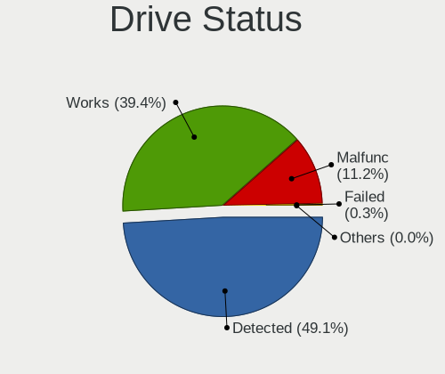
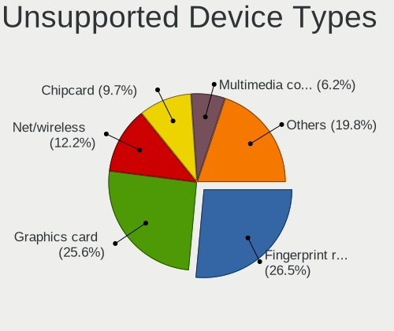

Linux - Tested Hardware & Statistics
------------------------------------

A project to collect tested hardware configurations for Linux.

Anyone can contribute to this report by the [hw-probe](https://github.com/linuxhw/hw-probe) tool:

    sudo -E hw-probe -all -upload

Please contribute! Especially if your hardware is rare.

This is a report for all computer types. See also reports for [desktops](/Desktop/README.md) and [notebooks](/Notebook/README.md).

Distribution-specific reports: [AlmaLinux](/Dist/AlmaLinux), [Alpine](/Dist/Alpine), [ALT_Linux](/Dist/ALT_Linux), [antiX](/Dist/antiX), [Artix](/Dist/Artix), [Chrome_OS](/Dist/Chrome_OS), [Clear_Linux](/Dist/Clear_Linux), [Deepin](/Dist/Deepin), [Devuan](/Dist/Devuan), [EndeavourOS](/Dist/EndeavourOS), [Garuda_Linux](/Dist/Garuda_Linux), [GNOME_OS](/Dist/GNOME_OS), [Kaisen](/Dist/Kaisen), [Mageia](/Dist/Mageia), [Makulu](/Dist/Makulu), [NixOS](/Dist/NixOS), [Nobara](/Dist/Nobara), [Oracle_Linux](/Dist/Oracle_Linux), [Pardus](/Dist/Pardus), [PureOS](/Dist/PureOS), [Q4OS](/Dist/Q4OS), [Reborn_OS](/Dist/Reborn_OS), [Rocky_Linux](/Dist/Rocky_Linux), [Sparky](/Dist/Sparky), [Void_Linux](/Dist/Void_Linux), [Xero](/Dist/Xero).

This report is for real hardware. Report for virtual hardware: [TestDays_VE](https://github.com/linuxhw/TestDays_VE)

Contents
--------

* [ Test Cases ](#test-cases)

* [ System ](#system)
  - [ OS                       ](#os)
  - [ OS Family                ](#os-family)
  - [ Kernel                   ](#kernel)
  - [ Kernel Family            ](#kernel-family)
  - [ Kernel Major Ver.        ](#kernel-major-ver)
  - [ Arch                     ](#arch)
  - [ DE                       ](#de)
  - [ Display Server           ](#display-server)
  - [ Display Manager          ](#display-manager)
  - [ OS Lang                  ](#os-lang)
  - [ Boot Mode                ](#boot-mode)
  - [ Filesystem               ](#filesystem)
  - [ Part. scheme             ](#part-scheme)
  - [ Dual Boot with Linux/BSD ](#dual-boot-with-linuxbsd)
  - [ Dual Boot (Win)          ](#dual-boot-win)

* [ Board ](#board)
  - [ Vendor                   ](#vendor)
  - [ Model                    ](#model)
  - [ Model Family             ](#model-family)
  - [ MFG Year                 ](#mfg-year)
  - [ Form Factor              ](#form-factor)
  - [ Secure Boot              ](#secure-boot)
  - [ Coreboot                 ](#coreboot)
  - [ RAM Size                 ](#ram-size)
  - [ RAM Used                 ](#ram-used)
  - [ Total Drives             ](#total-drives)
  - [ Has CD-ROM               ](#has-cd-rom)
  - [ Has Ethernet             ](#has-ethernet)
  - [ Has WiFi                 ](#has-wifi)
  - [ Has Bluetooth            ](#has-bluetooth)

* [ Location ](#location)
  - [ Country                  ](#country)
  - [ City                     ](#city)

* [ Drives ](#drives)
  - [ Drive Vendor             ](#drive-vendor)
  - [ Drive Model              ](#drive-model)
  - [ HDD Vendor               ](#hdd-vendor)
  - [ SSD Vendor               ](#ssd-vendor)
  - [ Drive Kind               ](#drive-kind)
  - [ Drive Connector          ](#drive-connector)
  - [ Drive Size               ](#drive-size)
  - [ Space Total              ](#space-total)
  - [ Space Used               ](#space-used)
  - [ Malfunc. Drives          ](#malfunc-drives)
  - [ Malfunc. Drive Vendor    ](#malfunc-drive-vendor)
  - [ Malfunc. HDD Vendor      ](#malfunc-hdd-vendor)
  - [ Malfunc. Drive Kind      ](#malfunc-drive-kind)
  - [ Failed Drives            ](#failed-drives)
  - [ Failed Drive Vendor      ](#failed-drive-vendor)
  - [ Drive Status             ](#drive-status)

* [ Storage controller ](#storage-controller)
  - [ Storage Vendor           ](#storage-vendor)
  - [ Storage Model            ](#storage-model)
  - [ Storage Kind             ](#storage-kind)

* [ Processor ](#processor)
  - [ CPU Vendor               ](#cpu-vendor)
  - [ CPU Model                ](#cpu-model)
  - [ CPU Model Family         ](#cpu-model-family)
  - [ CPU Cores                ](#cpu-cores)
  - [ CPU Sockets              ](#cpu-sockets)
  - [ CPU Threads              ](#cpu-threads)
  - [ CPU Op-Modes             ](#cpu-op-modes)
  - [ CPU Microcode            ](#cpu-microcode)
  - [ CPU Microarch            ](#cpu-microarch)

* [ Graphics ](#graphics)
  - [ GPU Vendor               ](#gpu-vendor)
  - [ GPU Model                ](#gpu-model)
  - [ GPU Combo                ](#gpu-combo)
  - [ GPU Driver               ](#gpu-driver)
  - [ GPU Memory               ](#gpu-memory)

* [ Monitor ](#monitor)
  - [ Monitor Vendor           ](#monitor-vendor)
  - [ Monitor Model            ](#monitor-model)
  - [ Monitor Resolution       ](#monitor-resolution)
  - [ Monitor Diagonal         ](#monitor-diagonal)
  - [ Monitor Width            ](#monitor-width)
  - [ Aspect Ratio             ](#aspect-ratio)
  - [ Monitor Area             ](#monitor-area)
  - [ Pixel Density            ](#pixel-density)
  - [ Multiple Monitors        ](#multiple-monitors)

* [ Network ](#network)
  - [ Net Controller Vendor    ](#net-controller-vendor)
  - [ Net Controller Model     ](#net-controller-model)
  - [ Wireless Vendor          ](#wireless-vendor)
  - [ Wireless Model           ](#wireless-model)
  - [ Ethernet Vendor          ](#ethernet-vendor)
  - [ Ethernet Model           ](#ethernet-model)
  - [ Net Controller Kind      ](#net-controller-kind)
  - [ Used Controller          ](#used-controller)
  - [ NICs                     ](#nics)
  - [ IPv6                     ](#ipv6)

* [ Bluetooth ](#bluetooth)
  - [ Bluetooth Vendor         ](#bluetooth-vendor)
  - [ Bluetooth Model          ](#bluetooth-model)

* [ Sound ](#sound)
  - [ Sound Vendor             ](#sound-vendor)
  - [ Sound Model              ](#sound-model)

* [ Memory ](#memory)
  - [ Memory Vendor            ](#memory-vendor)
  - [ Memory Model             ](#memory-model)
  - [ Memory Kind              ](#memory-kind)
  - [ Memory Form Factor       ](#memory-form-factor)
  - [ Memory Size              ](#memory-size)
  - [ Memory Speed             ](#memory-speed)

* [ Printers & scanners ](#printers--scanners)
  - [ Printer Vendor           ](#printer-vendor)
  - [ Printer Model            ](#printer-model)
  - [ Scanner Vendor           ](#scanner-vendor)
  - [ Scanner Model            ](#scanner-model)

* [ Camera ](#camera)
  - [ Camera Vendor            ](#camera-vendor)
  - [ Camera Model             ](#camera-model)

* [ Security ](#security)
  - [ Fingerprint Vendor       ](#fingerprint-vendor)
  - [ Fingerprint Model        ](#fingerprint-model)
  - [ Chipcard Vendor          ](#chipcard-vendor)
  - [ Chipcard Model           ](#chipcard-model)

* [ Unsupported ](#unsupported)
  - [ Unsupported Devices      ](#unsupported-devices)
  - [ Unsupported Device Types ](#unsupported-device-types)

Test Cases
----------

Total: 316746

| Vendor        | Model                       | Form-Factor | Probe                                                      | Date         |
|---------------|-----------------------------|-------------|------------------------------------------------------------|--------------|
| lapbook       | S15 PRO                     | Notebook    | [06ae615fd1](https://linux-hardware.org/?probe=06ae615fd1) | Jul 01, 2023 |
| Lenovo        | Yoga 9 14IAP7 82LU          | Convertible | [cb6f37ea2b](https://linux-hardware.org/?probe=cb6f37ea2b) | Jul 01, 2023 |
| HUAWEI        | BOM-WXX9                    | Notebook    | [4d4d992cb0](https://linux-hardware.org/?probe=4d4d992cb0) | Jul 01, 2023 |
| Dell          | 0HC3G4 A00                  | Mini pc     | [c111f0f4be](https://linux-hardware.org/?probe=c111f0f4be) | Jul 01, 2023 |
| Dell          | Inspiron 3537               | Notebook    | [43b81e38cd](https://linux-hardware.org/?probe=43b81e38cd) | Jul 01, 2023 |
| Dell          | Inspiron 16 5625            | Notebook    | [bf36f89d32](https://linux-hardware.org/?probe=bf36f89d32) | Jul 01, 2023 |
| ASRock        | A320M-HD                    | Desktop     | [1df7c65f40](https://linux-hardware.org/?probe=1df7c65f40) | Jul 01, 2023 |
| Google        | Kohaku                      | Notebook    | [e533de07bd](https://linux-hardware.org/?probe=e533de07bd) | Jul 01, 2023 |
| HP            | 255 G8 Notebook PC          | Notebook    | [3c3ddffa8b](https://linux-hardware.org/?probe=3c3ddffa8b) | Jul 01, 2023 |
| Intel         | D845GRG AAA84341-206        | Desktop     | [1863434dc7](https://linux-hardware.org/?probe=1863434dc7) | Jul 01, 2023 |
| Acer          | Aspire E5-772               | Notebook    | [b33f11c7c9](https://linux-hardware.org/?probe=b33f11c7c9) | Jul 01, 2023 |
| ASUSTek       | N752VX                      | Notebook    | [d4fd40a9f3](https://linux-hardware.org/?probe=d4fd40a9f3) | Jul 01, 2023 |
| Chuwi         | Hi10 pro tablet             | Tablet      | [ac39cc2f2a](https://linux-hardware.org/?probe=ac39cc2f2a) | Jul 01, 2023 |
| Acer          | FRS780M                     | Desktop     | [3066c1772f](https://linux-hardware.org/?probe=3066c1772f) | Jul 01, 2023 |
| Lenovo        | ThinkPad P14s Gen 1 20Y1... | Notebook    | [4d377fc8b8](https://linux-hardware.org/?probe=4d377fc8b8) | Jul 01, 2023 |
| Acer          | FRS780M                     | Desktop     | [4f8ad26557](https://linux-hardware.org/?probe=4f8ad26557) | Jul 01, 2023 |
| Toshiba       | Satellite Pro L650          | Notebook    | [d8da913f23](https://linux-hardware.org/?probe=d8da913f23) | Jul 01, 2023 |
| Gigabyte      | X79-UD3                     | Desktop     | [36fed79d81](https://linux-hardware.org/?probe=36fed79d81) | Jul 01, 2023 |
| Packard Be... | EasyNote TSX66HR            | Notebook    | [96253a3da8](https://linux-hardware.org/?probe=96253a3da8) | Jul 01, 2023 |
| ASUSTek       | M4A78LT-M-LE                | Desktop     | [9564e74fb6](https://linux-hardware.org/?probe=9564e74fb6) | Jul 01, 2023 |
| Acer          | Aspire V5-123               | Notebook    | [8507833f22](https://linux-hardware.org/?probe=8507833f22) | Jul 01, 2023 |
| Fujitsu       | LIFEBOOK E780               | Notebook    | [12c5cd0309](https://linux-hardware.org/?probe=12c5cd0309) | Jul 01, 2023 |
| ASRock        | H510M-HDV/M.2               | Desktop     | [ec9ab3662c](https://linux-hardware.org/?probe=ec9ab3662c) | Jul 01, 2023 |
| Intel         | D845GRG AAA84341-206        | Desktop     | [7734dda00e](https://linux-hardware.org/?probe=7734dda00e) | Jun 30, 2023 |
| Dell          | Precision M4800             | Notebook    | [d85b2b94d6](https://linux-hardware.org/?probe=d85b2b94d6) | Jun 30, 2023 |
| ASUSTek       | X553MA                      | Notebook    | [969994628c](https://linux-hardware.org/?probe=969994628c) | Jun 30, 2023 |
| Gigabyte      | Z77X-UD5H                   | Desktop     | [eea1d9623c](https://linux-hardware.org/?probe=eea1d9623c) | Jun 30, 2023 |
| Pegatron      | 2ACB                        | Desktop     | [ceb2b4c1c5](https://linux-hardware.org/?probe=ceb2b4c1c5) | Jun 30, 2023 |
| Teclast       | F15Plus 2                   | Notebook    | [4593b411f0](https://linux-hardware.org/?probe=4593b411f0) | Jun 30, 2023 |
| ZR            | A320M-F 1005                | Desktop     | [c32d8de777](https://linux-hardware.org/?probe=c32d8de777) | Jun 30, 2023 |
| Gigabyte      | Q87M-D2H                    | Desktop     | [633c55d4ba](https://linux-hardware.org/?probe=633c55d4ba) | Jun 30, 2023 |
| Apple         | Mac-63001698E7A34814 iMa... | All in one  | [2ee9ffdaa0](https://linux-hardware.org/?probe=2ee9ffdaa0) | Jun 30, 2023 |
| Medion        | TJ4125                      | Desktop     | [5cebe0a1d0](https://linux-hardware.org/?probe=5cebe0a1d0) | Jun 30, 2023 |
| Apple         | Mac-63001698E7A34814 iMa... | All in one  | [6ab7575bed](https://linux-hardware.org/?probe=6ab7575bed) | Jun 30, 2023 |
| ASUSTek       | PRIME H610M-K D4            | Desktop     | [196daaa768](https://linux-hardware.org/?probe=196daaa768) | Jun 30, 2023 |
| Gigabyte      | B85M-D3H                    | Desktop     | [99b07ae636](https://linux-hardware.org/?probe=99b07ae636) | Jun 30, 2023 |
| ASUSTek       | X553MA                      | Notebook    | [53a5b9567e](https://linux-hardware.org/?probe=53a5b9567e) | Jun 30, 2023 |
| ASUSTek       | TUF Gaming Z690-PLUS D4     | Desktop     | [292b7f6f0f](https://linux-hardware.org/?probe=292b7f6f0f) | Jun 30, 2023 |
| ASUSTek       | K52Dr                       | Notebook    | [f97425ba5f](https://linux-hardware.org/?probe=f97425ba5f) | Jun 30, 2023 |
| HP            | 1998                        | Desktop     | [91f6e54877](https://linux-hardware.org/?probe=91f6e54877) | Jun 30, 2023 |
| HP            | Pavilion dv6                | Notebook    | [9e3a0f3a0b](https://linux-hardware.org/?probe=9e3a0f3a0b) | Jun 30, 2023 |
| Gigabyte      | B650 AORUS PRO AX           | Notebook    | [f8ced52649](https://linux-hardware.org/?probe=f8ced52649) | Jun 30, 2023 |
| ASUSTek       | K501UX                      | Notebook    | [a7fb172b7d](https://linux-hardware.org/?probe=a7fb172b7d) | Jun 30, 2023 |
| ASUSTek       | PRIME Z790-A WIFI           | Desktop     | [fa055ceb7c](https://linux-hardware.org/?probe=fa055ceb7c) | Jun 30, 2023 |
| Acer          | Spin SP314-54N              | Convertible | [446ce08df0](https://linux-hardware.org/?probe=446ce08df0) | Jun 30, 2023 |
| Lenovo        | IdeaPadFlex 5 14ALC05 82... | Convertible | [d772da19a0](https://linux-hardware.org/?probe=d772da19a0) | Jun 30, 2023 |
| Gigabyte      | H410M S2H V3                | Desktop     | [e539937c27](https://linux-hardware.org/?probe=e539937c27) | Jun 30, 2023 |
| ASUSTek       | TUF Gaming X570-PLUS        | Desktop     | [ef49f25cf8](https://linux-hardware.org/?probe=ef49f25cf8) | Jun 30, 2023 |
| HP            | Pavilion Laptop 15-cs1xx... | Notebook    | [6c8a67be9e](https://linux-hardware.org/?probe=6c8a67be9e) | Jun 30, 2023 |
| HP            | ProLiant DL360 G7           | Server      | [7e37520061](https://linux-hardware.org/?probe=7e37520061) | Jun 30, 2023 |
| Supermicro    | X10DDW-i                    | Desktop     | [c43e65f1ae](https://linux-hardware.org/?probe=c43e65f1ae) | Jun 30, 2023 |
| Acer          | Aspire E5-575G              | Notebook    | [f127804b4a](https://linux-hardware.org/?probe=f127804b4a) | Jun 30, 2023 |
| Sony          | VGN-NS38E_S                 | Notebook    | [270e8b9fb7](https://linux-hardware.org/?probe=270e8b9fb7) | Jun 30, 2023 |
| Valve         | Jupiter                     | Notebook    | [86984d2e19](https://linux-hardware.org/?probe=86984d2e19) | Jun 30, 2023 |
| Sony          | VGN-NS38E_S                 | Notebook    | [ca33cfbc67](https://linux-hardware.org/?probe=ca33cfbc67) | Jun 30, 2023 |
| ASUSTek       | PRIME H610M-K D4            | Desktop     | [8e7db66929](https://linux-hardware.org/?probe=8e7db66929) | Jun 30, 2023 |
| Intel         | X99 V1.x                    | Desktop     | [8e4ce021b1](https://linux-hardware.org/?probe=8e4ce021b1) | Jun 30, 2023 |
| Gigabyte      | H81M-S2PH                   | Desktop     | [69b69e2a09](https://linux-hardware.org/?probe=69b69e2a09) | Jun 30, 2023 |
| Fujitsu       | LIFEBOOK P771               | Notebook    | [9d6575a3aa](https://linux-hardware.org/?probe=9d6575a3aa) | Jun 30, 2023 |
| Apple         | MacBookAir7,2               | Notebook    | [cb1bcce659](https://linux-hardware.org/?probe=cb1bcce659) | Jun 30, 2023 |
| Apple         | MacBookPro8,1               | Notebook    | [566b883024](https://linux-hardware.org/?probe=566b883024) | Jun 30, 2023 |
| HP            | Pavilion g6                 | Notebook    | [5d632e53c6](https://linux-hardware.org/?probe=5d632e53c6) | Jun 30, 2023 |
| ASUSTek       | ROG CROSSHAIR VII HERO      | Desktop     | [d42cdc8551](https://linux-hardware.org/?probe=d42cdc8551) | Jun 30, 2023 |
| HP            | ProBook 650 G1              | Notebook    | [593959e6f3](https://linux-hardware.org/?probe=593959e6f3) | Jun 30, 2023 |
| Acer          | Aspire A517-52              | Notebook    | [79f2cae4d6](https://linux-hardware.org/?probe=79f2cae4d6) | Jun 30, 2023 |
| Medion        | TJ4125                      | Desktop     | [327794cb1a](https://linux-hardware.org/?probe=327794cb1a) | Jun 30, 2023 |
| Gigabyte      | GA-78LMT-USB3 SEx           | Desktop     | [af3e6790e4](https://linux-hardware.org/?probe=af3e6790e4) | Jun 30, 2023 |
| Gigabyte      | B85M-D3H                    | Desktop     | [498eb9b539](https://linux-hardware.org/?probe=498eb9b539) | Jun 30, 2023 |
| Dell          | Inspiron N5110              | Notebook    | [b465607eea](https://linux-hardware.org/?probe=b465607eea) | Jun 30, 2023 |
| Lenovo        | Yoga 530-14IKB 81EK         | Convertible | [4b57a18d9b](https://linux-hardware.org/?probe=4b57a18d9b) | Jun 30, 2023 |
| Acer          | Predator PO5-640            | Desktop     | [416b01c954](https://linux-hardware.org/?probe=416b01c954) | Jun 30, 2023 |
| MSI           | Z390-A PRO                  | Desktop     | [7c3ce62039](https://linux-hardware.org/?probe=7c3ce62039) | Jun 30, 2023 |
| ASUSTek       | TUF Gaming B550M-E WIFI     | Desktop     | [916b60f6f7](https://linux-hardware.org/?probe=916b60f6f7) | Jun 30, 2023 |
| Timi          | Redmi Book Pro 14 2022      | Notebook    | [b5d1a7e115](https://linux-hardware.org/?probe=b5d1a7e115) | Jun 30, 2023 |
| Lenovo        | Yoga 7 16IAP7 82QG          | Convertible | [5ac29ea67f](https://linux-hardware.org/?probe=5ac29ea67f) | Jun 30, 2023 |
| Intel         | B85 V5.56                   | Desktop     | [a582972a5e](https://linux-hardware.org/?probe=a582972a5e) | Jun 30, 2023 |
| Acer          | Aspire A315-23              | Notebook    | [434ba90999](https://linux-hardware.org/?probe=434ba90999) | Jun 30, 2023 |
| ASUSTek       | VivoBook_ASUSLaptop X160... | Notebook    | [a203a588f9](https://linux-hardware.org/?probe=a203a588f9) | Jun 30, 2023 |
| Lenovo        | Yoga 530-14IKB 81EK         | Convertible | [1abd7f9f95](https://linux-hardware.org/?probe=1abd7f9f95) | Jun 30, 2023 |
| Gigabyte      | B760M DS3H AX DDR4          | Desktop     | [0d3ecc7c44](https://linux-hardware.org/?probe=0d3ecc7c44) | Jun 30, 2023 |
| ASUSTek       | K50IJ                       | Notebook    | [8262209249](https://linux-hardware.org/?probe=8262209249) | Jun 30, 2023 |
| HP            | Notebook                    | Notebook    | [552c6713e1](https://linux-hardware.org/?probe=552c6713e1) | Jun 30, 2023 |
| Lenovo        | ThinkPad T430 2347AT2       | Notebook    | [951adb91cd](https://linux-hardware.org/?probe=951adb91cd) | Jun 30, 2023 |
| HP            | ENVY m6                     | Notebook    | [b4f8d19895](https://linux-hardware.org/?probe=b4f8d19895) | Jun 30, 2023 |
| Lenovo        | IdeaPad 330S-15IKB 81F5     | Notebook    | [39a8ee4269](https://linux-hardware.org/?probe=39a8ee4269) | Jun 30, 2023 |
| Pegatron      | 2AB5                        | Desktop     | [f23fa01e43](https://linux-hardware.org/?probe=f23fa01e43) | Jun 30, 2023 |
| HP            | EliteBook 820 G2            | Notebook    | [c99236ef84](https://linux-hardware.org/?probe=c99236ef84) | Jun 30, 2023 |
| Gigabyte      | B550 AORUS ELITE V2         | Desktop     | [0eb501cde5](https://linux-hardware.org/?probe=0eb501cde5) | Jun 30, 2023 |
| ASUSTek       | P6X58D PREMIUM              | Desktop     | [b2d81d6e67](https://linux-hardware.org/?probe=b2d81d6e67) | Jun 30, 2023 |
| HP            | Laptop 17-by3xxx            | Notebook    | [8bfe14749f](https://linux-hardware.org/?probe=8bfe14749f) | Jun 30, 2023 |
| ASUSTek       | ASUS TUF Gaming F15 FX50... | Notebook    | [10467d9f3e](https://linux-hardware.org/?probe=10467d9f3e) | Jun 30, 2023 |
| Apple         | MacBookPro8,2               | Notebook    | [8386acaa29](https://linux-hardware.org/?probe=8386acaa29) | Jun 30, 2023 |
| Gigabyte      | G33M-S2L                    | Desktop     | [99ffcc407b](https://linux-hardware.org/?probe=99ffcc407b) | Jun 30, 2023 |
| Samsung       | R528/R728                   | Notebook    | [dc84de44ff](https://linux-hardware.org/?probe=dc84de44ff) | Jun 30, 2023 |
| HP            | 8158 A01                    | Mini pc     | [6137e1cbbb](https://linux-hardware.org/?probe=6137e1cbbb) | Jun 30, 2023 |
| ASUSTek       | H81M-R                      | Desktop     | [83cd667719](https://linux-hardware.org/?probe=83cd667719) | Jun 30, 2023 |
| ASUSTek       | VivoBook_ASUSLaptop X513... | Notebook    | [559c10480e](https://linux-hardware.org/?probe=559c10480e) | Jun 30, 2023 |
| Gigabyte      | Z87X-UD5H-CF                | Desktop     | [3749bda51b](https://linux-hardware.org/?probe=3749bda51b) | Jun 30, 2023 |
| ASUSTek       | ROG CROSSHAIR X670E GENE    | Desktop     | [c93f4f0d0b](https://linux-hardware.org/?probe=c93f4f0d0b) | Jun 30, 2023 |
| Gigabyte      | H55M-UD2H                   | Desktop     | [befac7b8de](https://linux-hardware.org/?probe=befac7b8de) | Jun 30, 2023 |
| Supermicro    | X8DTU                       | Server      | [4ff2cd1bcf](https://linux-hardware.org/?probe=4ff2cd1bcf) | Jun 30, 2023 |
| Fujitsu Si... | D2721-A1 S26361-D2721-A1    | Desktop     | [908af533fc](https://linux-hardware.org/?probe=908af533fc) | Jun 30, 2023 |
| Dell          | Inspiron 1545               | Notebook    | [cfcc86ddd5](https://linux-hardware.org/?probe=cfcc86ddd5) | Jun 30, 2023 |
| MSI           | MPG X570 GAMING PRO CARB... | Desktop     | [661dc06ef7](https://linux-hardware.org/?probe=661dc06ef7) | Jun 30, 2023 |
| Toshiba       | All In One PC MP            | All in one  | [d9f55bbac6](https://linux-hardware.org/?probe=d9f55bbac6) | Jun 30, 2023 |
| ASUSTek       | TUF Gaming B550-PLUS WIF... | Desktop     | [3c3556dd33](https://linux-hardware.org/?probe=3c3556dd33) | Jun 30, 2023 |
| ASRock        | 775Dual-VSTA                | Desktop     | [7ddc95bb2f](https://linux-hardware.org/?probe=7ddc95bb2f) | Jun 30, 2023 |
| MSI           | G41M-P33 Combo              | Desktop     | [07ab83bef1](https://linux-hardware.org/?probe=07ab83bef1) | Jun 30, 2023 |
| Dell          | Latitude E6400              | Notebook    | [c8f88ff5b6](https://linux-hardware.org/?probe=c8f88ff5b6) | Jun 30, 2023 |
| HP            | EliteBook 850 G1            | Notebook    | [a5f3a5ad14](https://linux-hardware.org/?probe=a5f3a5ad14) | Jun 30, 2023 |
| HP            | Spectre x360 Convertible... | Convertible | [a3c2f0155c](https://linux-hardware.org/?probe=a3c2f0155c) | Jun 30, 2023 |
| Gigabyte      | P67A-UD5-B3                 | Desktop     | [b763c860fa](https://linux-hardware.org/?probe=b763c860fa) | Jun 30, 2023 |
| MSI           | G41M-P33 Combo              | Desktop     | [fcf9a0fd47](https://linux-hardware.org/?probe=fcf9a0fd47) | Jun 30, 2023 |
| Gigabyte      | H61M-S1                     | Desktop     | [b6be2d7f9f](https://linux-hardware.org/?probe=b6be2d7f9f) | Jun 30, 2023 |
| Gigabyte      | Z170XP-SLI-CF               | Desktop     | [ed171ca808](https://linux-hardware.org/?probe=ed171ca808) | Jun 30, 2023 |
| Gigabyte      | Z87X-UD5H-CF                | Desktop     | [6ee8476c0e](https://linux-hardware.org/?probe=6ee8476c0e) | Jun 30, 2023 |
| HP            | 8056                        | Desktop     | [32d1199c51](https://linux-hardware.org/?probe=32d1199c51) | Jun 30, 2023 |
| Lenovo        | ThinkPad E490 20N80017RT    | Notebook    | [a2a1011725](https://linux-hardware.org/?probe=a2a1011725) | Jun 30, 2023 |
| AZW           | SEi                         | Desktop     | [37527da518](https://linux-hardware.org/?probe=37527da518) | Jun 30, 2023 |
| Intel         | X99H                        | Desktop     | [8e8c7e8b20](https://linux-hardware.org/?probe=8e8c7e8b20) | Jun 30, 2023 |
| HP            | Laptop 15s-eq1xxx           | Notebook    | [00442193a6](https://linux-hardware.org/?probe=00442193a6) | Jun 30, 2023 |
| Valve         | Jupiter                     | Notebook    | [cd28af9419](https://linux-hardware.org/?probe=cd28af9419) | Jun 30, 2023 |
| Lenovo        | ThinkPad T495 20NK000XBR    | Notebook    | [2b5e40efaa](https://linux-hardware.org/?probe=2b5e40efaa) | Jun 30, 2023 |
| MSI           | B450-A PRO MAX              | Desktop     | [2fe05dff41](https://linux-hardware.org/?probe=2fe05dff41) | Jun 30, 2023 |
| HP            | 15                          | Notebook    | [2d80407689](https://linux-hardware.org/?probe=2d80407689) | Jun 30, 2023 |
| Google        | Fleex                       | Notebook    | [7e3eb2d4f9](https://linux-hardware.org/?probe=7e3eb2d4f9) | Jun 30, 2023 |
| Maibenben     | MaiBook X series            | Notebook    | [5e11bea093](https://linux-hardware.org/?probe=5e11bea093) | Jun 30, 2023 |
| TUXEDO        | Pulse 15 Gen1               | Notebook    | [b15b3b6025](https://linux-hardware.org/?probe=b15b3b6025) | Jun 30, 2023 |
| ASUSTek       | N76VM                       | Notebook    | [df79346cd4](https://linux-hardware.org/?probe=df79346cd4) | Jun 30, 2023 |
| Lenovo        | ThinkPad T430s 23554L7      | Notebook    | [501b0860c8](https://linux-hardware.org/?probe=501b0860c8) | Jun 30, 2023 |
| Gigabyte      | B550M AORUS PRO             | Desktop     | [08d14942e4](https://linux-hardware.org/?probe=08d14942e4) | Jun 30, 2023 |
| HP            | ProBook 650 G5              | Notebook    | [99a03772fb](https://linux-hardware.org/?probe=99a03772fb) | Jun 30, 2023 |
| Gigabyte      | B650M AORUS ELITE AX        | Desktop     | [ffcfef2edb](https://linux-hardware.org/?probe=ffcfef2edb) | Jun 30, 2023 |
| Gigabyte      | B550 UD AC                  | Desktop     | [7d7d37522c](https://linux-hardware.org/?probe=7d7d37522c) | Jun 30, 2023 |
| HP            | 15                          | Notebook    | [398d659d8c](https://linux-hardware.org/?probe=398d659d8c) | Jun 30, 2023 |
| Acer          | Aspire E5-575               | Notebook    | [602d134940](https://linux-hardware.org/?probe=602d134940) | Jun 30, 2023 |
| Gateway       | MD7309U                     | Notebook    | [e21ff27153](https://linux-hardware.org/?probe=e21ff27153) | Jun 30, 2023 |
| HP            | Laptop 17-cp2xxx            | Notebook    | [2012cd2c37](https://linux-hardware.org/?probe=2012cd2c37) | Jun 30, 2023 |
| Timi          | Xiaomi Book Air 13 2022     | Convertible | [2d7ee2c4a8](https://linux-hardware.org/?probe=2d7ee2c4a8) | Jun 30, 2023 |
| HP            | EliteBook 8460p             | Notebook    | [d4a008aefb](https://linux-hardware.org/?probe=d4a008aefb) | Jun 30, 2023 |
| Gigabyte      | Z77X-D3H                    | Desktop     | [3e1517b7a7](https://linux-hardware.org/?probe=3e1517b7a7) | Jun 30, 2023 |
| HP            | 245 G6 Notebook PC          | Notebook    | [22a896d74b](https://linux-hardware.org/?probe=22a896d74b) | Jun 30, 2023 |
| Chuwi         | CoreBook XPro               | Notebook    | [501d899938](https://linux-hardware.org/?probe=501d899938) | Jun 30, 2023 |
| Gateway       | MD7309U                     | Notebook    | [8d97d507d1](https://linux-hardware.org/?probe=8d97d507d1) | Jun 30, 2023 |
| MSI           | Katana GF66 11UG            | Notebook    | [e9f98cc102](https://linux-hardware.org/?probe=e9f98cc102) | Jun 30, 2023 |
| MSI           | B450-A PRO MAX              | Desktop     | [5199efd89e](https://linux-hardware.org/?probe=5199efd89e) | Jun 30, 2023 |
| ASUSTek       | F1A75-V EVO                 | Desktop     | [b59f4f203c](https://linux-hardware.org/?probe=b59f4f203c) | Jun 30, 2023 |
| ASUSTek       | P8Z77-V DELUXE              | Desktop     | [a7bcb95d10](https://linux-hardware.org/?probe=a7bcb95d10) | Jun 30, 2023 |
| AZW           | U59                         | Desktop     | [2b5d4dd033](https://linux-hardware.org/?probe=2b5d4dd033) | Jun 30, 2023 |
| Acer          | Aspire A315-56              | Notebook    | [3a814856ae](https://linux-hardware.org/?probe=3a814856ae) | Jun 30, 2023 |
| Gigabyte      | B365M DS3H                  | Desktop     | [0272953855](https://linux-hardware.org/?probe=0272953855) | Jun 30, 2023 |
| Gigabyte      | H81M-S2H                    | Desktop     | [fe8b1af179](https://linux-hardware.org/?probe=fe8b1af179) | Jun 30, 2023 |
| Lenovo        | ThinkPad X1 Carbon Gen 1... | Notebook    | [31db4fffd0](https://linux-hardware.org/?probe=31db4fffd0) | Jun 30, 2023 |
| Toshiba       | IS 1413G                    | Notebook    | [b95a7c049a](https://linux-hardware.org/?probe=b95a7c049a) | Jun 30, 2023 |
| HP            | EliteBook 8760w             | Notebook    | [470630eb65](https://linux-hardware.org/?probe=470630eb65) | Jun 30, 2023 |
| Dell          | Latitude E6540              | Notebook    | [a526c901ee](https://linux-hardware.org/?probe=a526c901ee) | Jun 30, 2023 |
| Supermicro    | X8DTU                       | Server      | [a1fa5d4047](https://linux-hardware.org/?probe=a1fa5d4047) | Jun 30, 2023 |
| Dell          | Latitude 7350               | Notebook    | [95fc412b55](https://linux-hardware.org/?probe=95fc412b55) | Jun 30, 2023 |
| Supermicro    | X8DTU                       | Server      | [f62d2cd7ee](https://linux-hardware.org/?probe=f62d2cd7ee) | Jun 30, 2023 |
| ASUSTek       | VivoBook_ASUSLaptop X321... | Notebook    | [05cb990f84](https://linux-hardware.org/?probe=05cb990f84) | Jun 30, 2023 |
| MSI           | MPG B550 GAMING EDGE WIF... | Desktop     | [9f8e4c6a70](https://linux-hardware.org/?probe=9f8e4c6a70) | Jun 30, 2023 |
| ASUSTek       | B85M-E                      | Desktop     | [f36fa2d610](https://linux-hardware.org/?probe=f36fa2d610) | Jun 30, 2023 |
| Valve         | Jupiter                     | Notebook    | [89d751f07f](https://linux-hardware.org/?probe=89d751f07f) | Jun 30, 2023 |
| Teclast       | F7 Plus                     | Notebook    | [cebd3b027c](https://linux-hardware.org/?probe=cebd3b027c) | Jun 30, 2023 |
| ASRock        | X670E Pro RS                | Desktop     | [e1ed0643fb](https://linux-hardware.org/?probe=e1ed0643fb) | Jun 30, 2023 |
| Supermicro    | X9DRW                       | Desktop     | [cb955d7a58](https://linux-hardware.org/?probe=cb955d7a58) | Jun 30, 2023 |
| ATOPNUC       | MA90                        | Mini pc     | [c959833db6](https://linux-hardware.org/?probe=c959833db6) | Jun 30, 2023 |
| eMachines     | eME443                      | Notebook    | [0d6808da66](https://linux-hardware.org/?probe=0d6808da66) | Jun 30, 2023 |
| Dell          | Inspiron N5010              | Notebook    | [eab5331f66](https://linux-hardware.org/?probe=eab5331f66) | Jun 30, 2023 |
| ASUSTek       | ROG CROSSHAIR VI HERO       | Notebook    | [6a4f9f32d6](https://linux-hardware.org/?probe=6a4f9f32d6) | Jun 30, 2023 |
| Intel         | B75                         | Desktop     | [73d881c953](https://linux-hardware.org/?probe=73d881c953) | Jun 30, 2023 |
| HP            | Unknown                     | Notebook    | [0f4ae63ce0](https://linux-hardware.org/?probe=0f4ae63ce0) | Jun 30, 2023 |
| Acer          | Nitro AN515-52              | Notebook    | [3932620fb9](https://linux-hardware.org/?probe=3932620fb9) | Jun 30, 2023 |
| ASRock        | X670E Pro RS                | Desktop     | [0e98c1f04a](https://linux-hardware.org/?probe=0e98c1f04a) | Jun 30, 2023 |
| HP            | EliteBook 830 G6            | Notebook    | [6c6741deb9](https://linux-hardware.org/?probe=6c6741deb9) | Jun 30, 2023 |
| ASRock        | Z68 Pro3 Gen3               | Desktop     | [9fc143ab80](https://linux-hardware.org/?probe=9fc143ab80) | Jun 30, 2023 |
| Dell          | 0H21J3 A07                  | Server      | [621e96507a](https://linux-hardware.org/?probe=621e96507a) | Jun 30, 2023 |
| UMAX          | VisionBook-N12R             | Notebook    | [6144190349](https://linux-hardware.org/?probe=6144190349) | Jun 30, 2023 |
| Dell          | G3 3590                     | Notebook    | [5c7312fed9](https://linux-hardware.org/?probe=5c7312fed9) | Jun 30, 2023 |
| ASUSTek       | ASUS TUF Gaming F17 FX70... | Notebook    | [4677625b04](https://linux-hardware.org/?probe=4677625b04) | Jun 30, 2023 |
| ASUSTek       | X201EV                      | Notebook    | [a3fe51bc01](https://linux-hardware.org/?probe=a3fe51bc01) | Jun 30, 2023 |
| HP            | Laptop 15-da0xxx            | Notebook    | [703ae4bd0b](https://linux-hardware.org/?probe=703ae4bd0b) | Jun 30, 2023 |
| Acer          | TravelMate 8572T            | Notebook    | [a73fd92e21](https://linux-hardware.org/?probe=a73fd92e21) | Jun 30, 2023 |
| ASRock        | G31M-GS                     | Desktop     | [3bd67e0f9f](https://linux-hardware.org/?probe=3bd67e0f9f) | Jun 30, 2023 |
| Acer          | Aspire 5551                 | Notebook    | [0b4df3165f](https://linux-hardware.org/?probe=0b4df3165f) | Jun 30, 2023 |
| ASUSTek       | VivoBook 14_ASUS Laptop ... | Notebook    | [14a983e6d3](https://linux-hardware.org/?probe=14a983e6d3) | Jun 30, 2023 |
| ASUSTek       | P8H67-V                     | Desktop     | [afe93b44f3](https://linux-hardware.org/?probe=afe93b44f3) | Jun 30, 2023 |
| Gigabyte      | GA-MA770-UD3                | Desktop     | [03b1ea3bfa](https://linux-hardware.org/?probe=03b1ea3bfa) | Jun 30, 2023 |
| ASUSTek       | PRIME A320M-K               | Desktop     | [ec846958c9](https://linux-hardware.org/?probe=ec846958c9) | Jun 30, 2023 |
| Phytium       | FT-2000/4 V0001             | Server      | [5f78f7d216](https://linux-hardware.org/?probe=5f78f7d216) | Jun 30, 2023 |
| ASUSTek       | PRIME A320M-K               | Desktop     | [310342d290](https://linux-hardware.org/?probe=310342d290) | Jun 30, 2023 |
| Dell          | 0NW6H5 A00                  | Desktop     | [593512053f](https://linux-hardware.org/?probe=593512053f) | Jun 30, 2023 |
| ASUSTek       | X201EV                      | Notebook    | [3cffef17f3](https://linux-hardware.org/?probe=3cffef17f3) | Jun 30, 2023 |
| HUAWEI        | NBLB-WAX9N                  | Notebook    | [e555922bb2](https://linux-hardware.org/?probe=e555922bb2) | Jun 30, 2023 |
| ASUSTek       | VivoBook_ASUSLaptop M560... | Notebook    | [5dd37cbc97](https://linux-hardware.org/?probe=5dd37cbc97) | Jun 30, 2023 |
| Dell          | Latitude 5440               | Notebook    | [7868400967](https://linux-hardware.org/?probe=7868400967) | Jun 30, 2023 |
| Dell          | Precision M4800             | Notebook    | [769a982a68](https://linux-hardware.org/?probe=769a982a68) | Jun 30, 2023 |
| Acer          | Aspire A517-52              | Notebook    | [954ac9a8e4](https://linux-hardware.org/?probe=954ac9a8e4) | Jun 30, 2023 |
| Gigabyte      | H170-HD3-CF                 | Desktop     | [59d1be1c5d](https://linux-hardware.org/?probe=59d1be1c5d) | Jun 30, 2023 |
| VALE          | Notebook Slim S132          | Notebook    | [3e381e10f7](https://linux-hardware.org/?probe=3e381e10f7) | Jun 30, 2023 |
| MSI           | MAG B550 TOMAHAWK           | Desktop     | [265cbaedcc](https://linux-hardware.org/?probe=265cbaedcc) | Jun 30, 2023 |
| HP            | Pavilion Laptop 15-eh1xx... | Notebook    | [1e4c2cf905](https://linux-hardware.org/?probe=1e4c2cf905) | Jun 30, 2023 |
| ASUSTek       | N76VM                       | Notebook    | [d770e894db](https://linux-hardware.org/?probe=d770e894db) | Jun 30, 2023 |
| Apple         | MacBookAir9,1               | Notebook    | [bd5c030739](https://linux-hardware.org/?probe=bd5c030739) | Jun 30, 2023 |
| Dell          | Inspiron N5110              | Notebook    | [0668932749](https://linux-hardware.org/?probe=0668932749) | Jun 30, 2023 |
| Lenovo        | 0B98401 WIN                 | Desktop     | [35871c9acc](https://linux-hardware.org/?probe=35871c9acc) | Jun 30, 2023 |
| ASUSTek       | ME176C                      | Notebook    | [2f2e7076e1](https://linux-hardware.org/?probe=2f2e7076e1) | Jun 30, 2023 |
| ASUSTek       | ROG Strix G533ZW_G533ZW     | Notebook    | [bbd5ba331d](https://linux-hardware.org/?probe=bbd5ba331d) | Jun 30, 2023 |
| Apple         | MacBookAir9,1               | Notebook    | [ce486a5063](https://linux-hardware.org/?probe=ce486a5063) | Jun 30, 2023 |
| Google        | Eldrid                      | Notebook    | [4e08107dd6](https://linux-hardware.org/?probe=4e08107dd6) | Jun 30, 2023 |
| Dell          | Latitude E5440              | Notebook    | [1fd8c9652a](https://linux-hardware.org/?probe=1fd8c9652a) | Jun 30, 2023 |
| HP            | Laptop 15-dy2xxx            | Notebook    | [12871de62d](https://linux-hardware.org/?probe=12871de62d) | Jun 30, 2023 |
| Gigabyte      | B450M S2H                   | Desktop     | [9a9ca045af](https://linux-hardware.org/?probe=9a9ca045af) | Jun 30, 2023 |
| HP            | Laptop 15-ef2xxx            | Notebook    | [d0ea6a2d9d](https://linux-hardware.org/?probe=d0ea6a2d9d) | Jun 30, 2023 |
| HP            | 1497                        | Desktop     | [4dd582d288](https://linux-hardware.org/?probe=4dd582d288) | Jun 30, 2023 |
| HP            | EliteBook 2540p             | Notebook    | [7b546735a4](https://linux-hardware.org/?probe=7b546735a4) | Jun 30, 2023 |
| Dell          | G3 3779                     | Notebook    | [a6c5553133](https://linux-hardware.org/?probe=a6c5553133) | Jun 30, 2023 |
| Dell          | Latitude E5450              | Notebook    | [e0826ab83a](https://linux-hardware.org/?probe=e0826ab83a) | Jun 30, 2023 |
| Gigabyte      | H77N-WIFI                   | Desktop     | [a366d05b2b](https://linux-hardware.org/?probe=a366d05b2b) | Jun 30, 2023 |
| Fujitsu Si... | D2721-A1 S26361-D2721-A1    | Desktop     | [298a4bf290](https://linux-hardware.org/?probe=298a4bf290) | Jun 30, 2023 |
| Samsung       | DT1234567890 SAMSUNG_SW_... | Desktop     | [878e617ba4](https://linux-hardware.org/?probe=878e617ba4) | Jun 30, 2023 |
| ASRockRack    | X470D4U2-2T                 | Desktop     | [70ed50862c](https://linux-hardware.org/?probe=70ed50862c) | Jun 30, 2023 |
| Supermicro    | H12SSL-i                    | Server      | [52b4c086dc](https://linux-hardware.org/?probe=52b4c086dc) | Jun 30, 2023 |
| Dell          | 0PV3YR A05                  | Server      | [7cb124d729](https://linux-hardware.org/?probe=7cb124d729) | Jun 30, 2023 |
| ASUSTek       | PRIME Z370-A II             | Desktop     | [5907f43d41](https://linux-hardware.org/?probe=5907f43d41) | Jun 30, 2023 |
| Acer          | Aspire A314-22              | Notebook    | [ef54ec3027](https://linux-hardware.org/?probe=ef54ec3027) | Jun 30, 2023 |
| Dell          | 0KYJ8C A02                  | Desktop     | [f4fff60df3](https://linux-hardware.org/?probe=f4fff60df3) | Jun 30, 2023 |
| Dell          | XPS 13 9370                 | Notebook    | [ec4bf131f5](https://linux-hardware.org/?probe=ec4bf131f5) | Jun 30, 2023 |
| HP            | 89B5 A                      | Desktop     | [f0330163de](https://linux-hardware.org/?probe=f0330163de) | Jun 30, 2023 |
| ASRock        | X570 Taichi                 | Desktop     | [af8af2c7e8](https://linux-hardware.org/?probe=af8af2c7e8) | Jun 30, 2023 |
| ASRock        | FM2A88X Extreme6+           | Desktop     | [77e6b09eb9](https://linux-hardware.org/?probe=77e6b09eb9) | Jun 30, 2023 |
| BANGHO        | BES G0304                   | Notebook    | [7b9e2a7570](https://linux-hardware.org/?probe=7b9e2a7570) | Jun 30, 2023 |
| Dell          | Vostro 2520                 | Notebook    | [48d04d8282](https://linux-hardware.org/?probe=48d04d8282) | Jun 30, 2023 |
| MSI           | X99A RAIDER                 | Desktop     | [bb8a8eac46](https://linux-hardware.org/?probe=bb8a8eac46) | Jun 30, 2023 |
| Gigabyte      | X570 AORUS ELITE WIFI       | Desktop     | [cdb77bf9b6](https://linux-hardware.org/?probe=cdb77bf9b6) | Jun 30, 2023 |
| ASUSTek       | M51AC                       | Desktop     | [d32d060e9c](https://linux-hardware.org/?probe=d32d060e9c) | Jun 30, 2023 |
| Dell          | Inspiron 16 5625            | Notebook    | [cbbe256fa2](https://linux-hardware.org/?probe=cbbe256fa2) | Jun 30, 2023 |
| Acer          | Aspire 5737Z                | Notebook    | [842aa57faf](https://linux-hardware.org/?probe=842aa57faf) | Jun 30, 2023 |
| Dell          | 0M6C7G A00                  | Desktop     | [d7dfcc4a38](https://linux-hardware.org/?probe=d7dfcc4a38) | Jun 30, 2023 |
| Lenovo        | ThinkPad L512 44444NG       | Notebook    | [300a79aa88](https://linux-hardware.org/?probe=300a79aa88) | Jun 30, 2023 |
| Dell          | Latitude E6400              | Notebook    | [a5af3e134e](https://linux-hardware.org/?probe=a5af3e134e) | Jun 30, 2023 |
| Notebook      | NJx0MU                      | Notebook    | [136060092c](https://linux-hardware.org/?probe=136060092c) | Jun 30, 2023 |
| ASUSTek       | T100TA                      | Notebook    | [921821fda8](https://linux-hardware.org/?probe=921821fda8) | Jun 30, 2023 |
| Apple         | MacBookPro12,1              | Notebook    | [997b1fe1f8](https://linux-hardware.org/?probe=997b1fe1f8) | Jun 30, 2023 |
| Acer          | Aspire 5551                 | Notebook    | [73a0f2fd37](https://linux-hardware.org/?probe=73a0f2fd37) | Jun 30, 2023 |
| HP            | Laptop 15-da0xxx            | Notebook    | [bf3c982248](https://linux-hardware.org/?probe=bf3c982248) | Jun 30, 2023 |
| Microsoft     | Surface Go 2                | Tablet      | [ef3b3cf51e](https://linux-hardware.org/?probe=ef3b3cf51e) | Jun 30, 2023 |
| Lenovo        | G50-30 80G0                 | Notebook    | [3c1007547d](https://linux-hardware.org/?probe=3c1007547d) | Jun 30, 2023 |
| Lenovo        | ThinkPad X1 Yoga 3rd 20L... | Convertible | [394788bdc8](https://linux-hardware.org/?probe=394788bdc8) | Jun 30, 2023 |
| Dell          | 0KYJ8C A02                  | Desktop     | [c860545122](https://linux-hardware.org/?probe=c860545122) | Jun 30, 2023 |
| Dell          | Inspiron 7373               | Convertible | [e7edaad244](https://linux-hardware.org/?probe=e7edaad244) | Jun 30, 2023 |
| Samsung       | R430/R480                   | Notebook    | [485a09a0d2](https://linux-hardware.org/?probe=485a09a0d2) | Jun 30, 2023 |
| Positivo      | Mobile                      | Notebook    | [fdaaf6915b](https://linux-hardware.org/?probe=fdaaf6915b) | Jun 30, 2023 |
| HP            | 2129                        | Desktop     | [73daf1de6b](https://linux-hardware.org/?probe=73daf1de6b) | Jun 30, 2023 |
| Gigabyte      | Z590 AORUS ULTRA            | Desktop     | [45d5903c62](https://linux-hardware.org/?probe=45d5903c62) | Jun 30, 2023 |
| Multilaser    | MLSH1H LINUX                | Notebook    | [3aa4a11068](https://linux-hardware.org/?probe=3aa4a11068) | Jun 30, 2023 |
| Shenzhen W... | AERO 5 Lite Mini PC         | Mini pc     | [7375ced625](https://linux-hardware.org/?probe=7375ced625) | Jun 30, 2023 |
| Lenovo        | ThinkPad L430 246634S       | Notebook    | [5368d4410f](https://linux-hardware.org/?probe=5368d4410f) | Jun 30, 2023 |
| HP            | Pavilion Laptop 15-cc5xx    | Notebook    | [39f7adb927](https://linux-hardware.org/?probe=39f7adb927) | Jun 30, 2023 |
| Gigabyte      | X670E AORUS MASTER          | Desktop     | [70ddebe460](https://linux-hardware.org/?probe=70ddebe460) | Jun 30, 2023 |
| Gigabyte      | X670E AORUS MASTER          | Desktop     | [7ae106bfd6](https://linux-hardware.org/?probe=7ae106bfd6) | Jun 30, 2023 |
| ASUSTek       | K52F                        | Notebook    | [98e9b448c7](https://linux-hardware.org/?probe=98e9b448c7) | Jun 30, 2023 |
| Apple         | MacBookAir7,1               | Notebook    | [70ce1e280f](https://linux-hardware.org/?probe=70ce1e280f) | Jun 30, 2023 |
| Medion        | Z370H4-EM                   | Desktop     | [b8327a4d00](https://linux-hardware.org/?probe=b8327a4d00) | Jun 30, 2023 |
| Multilaser    | MLSH1H LINUX                | Notebook    | [3a8a822af9](https://linux-hardware.org/?probe=3a8a822af9) | Jun 30, 2023 |
| Apple         | MacBookAir7,1               | Notebook    | [b5e0044759](https://linux-hardware.org/?probe=b5e0044759) | Jun 30, 2023 |
| HP            | Laptop 15-db1xxx            | Notebook    | [6d3d6e002f](https://linux-hardware.org/?probe=6d3d6e002f) | Jun 30, 2023 |
| Monster       | TULPAR T7 V21.7             | Notebook    | [046803a297](https://linux-hardware.org/?probe=046803a297) | Jun 30, 2023 |
| Dell          | Latitude E4310              | Notebook    | [725b89a524](https://linux-hardware.org/?probe=725b89a524) | Jun 30, 2023 |
| LG Electro... | 16Z90P-G.AA55H              | Notebook    | [9d40263129](https://linux-hardware.org/?probe=9d40263129) | Jun 30, 2023 |
| Schenker      | XMG PRO (E23)               | Notebook    | [c70da63bd9](https://linux-hardware.org/?probe=c70da63bd9) | Jun 30, 2023 |
| MSI           | GS65 Stealth 9SD            | Notebook    | [568380fd59](https://linux-hardware.org/?probe=568380fd59) | Jun 30, 2023 |
| MSI           | GS65 Stealth 9SD            | Notebook    | [54013b2dfd](https://linux-hardware.org/?probe=54013b2dfd) | Jun 30, 2023 |
| Lenovo        | ThinkPad T460s 20F90057M... | Notebook    | [a78e2b4096](https://linux-hardware.org/?probe=a78e2b4096) | Jun 29, 2023 |
| Gigabyte      | GA-MA770-DS3                | Desktop     | [5b7bc3205d](https://linux-hardware.org/?probe=5b7bc3205d) | Jun 29, 2023 |
| AZW           | MINI S 10                   | Desktop     | [84eec8c276](https://linux-hardware.org/?probe=84eec8c276) | Jun 29, 2023 |
| MSI           | P67A-G43                    | Desktop     | [8e5f71c975](https://linux-hardware.org/?probe=8e5f71c975) | Jun 29, 2023 |
| AZW           | MINI S 10                   | Desktop     | [d1795fbf64](https://linux-hardware.org/?probe=d1795fbf64) | Jun 29, 2023 |
| Timi          | Redmi Book Pro 14 2022      | Notebook    | [b98433fa84](https://linux-hardware.org/?probe=b98433fa84) | Jun 29, 2023 |
| Lenovo        | Legion 5 15ACH6 82JW        | Notebook    | [7f9164d1e0](https://linux-hardware.org/?probe=7f9164d1e0) | Jun 29, 2023 |
| Positivo      | S14CT01                     | Notebook    | [b70845bd08](https://linux-hardware.org/?probe=b70845bd08) | Jun 29, 2023 |
| LG Electro... | 16Z90P-G.AA55H              | Notebook    | [4e47d108a0](https://linux-hardware.org/?probe=4e47d108a0) | Jun 29, 2023 |
| ASUSTek       | X555LAB                     | Notebook    | [99e1623ea0](https://linux-hardware.org/?probe=99e1623ea0) | Jun 29, 2023 |
| HP            | 8055                        | Desktop     | [47536e2cde](https://linux-hardware.org/?probe=47536e2cde) | Jun 29, 2023 |
| ASRock        | 970 Pro3 R2.0               | Desktop     | [64e81a22a5](https://linux-hardware.org/?probe=64e81a22a5) | Jun 29, 2023 |
| Lenovo        | IdeaPad 5 Pro 16ARH7 82S... | Notebook    | [287d7d6f60](https://linux-hardware.org/?probe=287d7d6f60) | Jun 29, 2023 |
| HP            | ProBook 4530s               | Notebook    | [d1c3bf37ff](https://linux-hardware.org/?probe=d1c3bf37ff) | Jun 29, 2023 |
| Dell          | XPS 15 9570                 | Notebook    | [e0492d6173](https://linux-hardware.org/?probe=e0492d6173) | Jun 29, 2023 |
| MSI           | A320M-A PRO                 | Desktop     | [7dffb9055b](https://linux-hardware.org/?probe=7dffb9055b) | Jun 29, 2023 |
| Dell          | Studio 1558                 | Notebook    | [66e76ea87d](https://linux-hardware.org/?probe=66e76ea87d) | Jun 29, 2023 |
| Intel         | SHARKBAY                    | Desktop     | [581282a150](https://linux-hardware.org/?probe=581282a150) | Jun 29, 2023 |
| Intel         | X99 V1.x                    | Desktop     | [1c7ef9ef35](https://linux-hardware.org/?probe=1c7ef9ef35) | Jun 29, 2023 |
| HP            | ProBook x360 435 G8 Note... | Convertible | [a64b48a5a2](https://linux-hardware.org/?probe=a64b48a5a2) | Jun 29, 2023 |
| Raspberry ... | Raspberry Pi Model B Rev... | Soc         | [bce7d100cf](https://linux-hardware.org/?probe=bce7d100cf) | Jun 29, 2023 |
| Valve         | Jupiter                     | Notebook    | [d8a4613446](https://linux-hardware.org/?probe=d8a4613446) | Jun 29, 2023 |
| MSI           | GT70                        | Notebook    | [7471aab8f7](https://linux-hardware.org/?probe=7471aab8f7) | Jun 29, 2023 |
| ASUSTek       | PRIME X370-PRO              | Desktop     | [6c7621fe04](https://linux-hardware.org/?probe=6c7621fe04) | Jun 29, 2023 |
| Dell          | Latitude 7350               | Notebook    | [8ae13e8fdb](https://linux-hardware.org/?probe=8ae13e8fdb) | Jun 29, 2023 |
| ASUSTek       | CM6330_CM6630_CM6730_CM6... | Desktop     | [42624c8bb1](https://linux-hardware.org/?probe=42624c8bb1) | Jun 29, 2023 |
| Intel         | B85 V5.56                   | Desktop     | [e8b15eb823](https://linux-hardware.org/?probe=e8b15eb823) | Jun 29, 2023 |
| Acer          | Aspire V3-772               | Notebook    | [0fae87e118](https://linux-hardware.org/?probe=0fae87e118) | Jun 29, 2023 |
| Acer          | NC-A515-51G-59DM            | Notebook    | [a521f2cc60](https://linux-hardware.org/?probe=a521f2cc60) | Jun 29, 2023 |
| Apple         | Mac-BE088AF8C5EB4FA2 iMa... | All in one  | [1e30b2ea59](https://linux-hardware.org/?probe=1e30b2ea59) | Jun 29, 2023 |
| PCWare        | IPMH61R3                    | Desktop     | [e190259144](https://linux-hardware.org/?probe=e190259144) | Jun 29, 2023 |
| Intel         | Whiskey Platform            | Notebook    | [1caca06d89](https://linux-hardware.org/?probe=1caca06d89) | Jun 29, 2023 |
| Gigabyte      | X79-UD3                     | Desktop     | [5a88d6945d](https://linux-hardware.org/?probe=5a88d6945d) | Jun 29, 2023 |
| Acer          | Aspire XC-840               | Desktop     | [76c750aae4](https://linux-hardware.org/?probe=76c750aae4) | Jun 29, 2023 |
| ASUSTek       | ASUS TUF Gaming F15 FX50... | Notebook    | [5873d04afe](https://linux-hardware.org/?probe=5873d04afe) | Jun 29, 2023 |
| ASRock        | H310CM-DVS                  | Desktop     | [46429ac6ae](https://linux-hardware.org/?probe=46429ac6ae) | Jun 29, 2023 |
| Gigabyte      | H81M-S2PH                   | Desktop     | [d0ec676a22](https://linux-hardware.org/?probe=d0ec676a22) | Jun 29, 2023 |
| ASUSTek       | K56CB                       | Notebook    | [952909bc80](https://linux-hardware.org/?probe=952909bc80) | Jun 29, 2023 |
| Medion        | Akoya P7818                 | Notebook    | [cfe9ae82fa](https://linux-hardware.org/?probe=cfe9ae82fa) | Jun 29, 2023 |
| MSI           | MPG Z390 GAMING EDGE AC     | Desktop     | [5a6b149eb4](https://linux-hardware.org/?probe=5a6b149eb4) | Jun 29, 2023 |
| Lenovo        | IdeaPad S340-14API 81NB     | Notebook    | [f3cb4dc749](https://linux-hardware.org/?probe=f3cb4dc749) | Jun 29, 2023 |
| HP            | ProBook 6560b               | Notebook    | [e8e8e6881d](https://linux-hardware.org/?probe=e8e8e6881d) | Jun 29, 2023 |
| Lenovo        | IdeaPad 1 14AMN7 82VF       | Notebook    | [c44fba1fa2](https://linux-hardware.org/?probe=c44fba1fa2) | Jun 29, 2023 |
| Huanan        | X99-F8 GAMING V5.0          | Desktop     | [6a95d2096d](https://linux-hardware.org/?probe=6a95d2096d) | Jun 29, 2023 |
| Acer          | Aspire E5-531G              | Notebook    | [a6eaac367e](https://linux-hardware.org/?probe=a6eaac367e) | Jun 29, 2023 |
| Apple         | Mac-BE088AF8C5EB4FA2 iMa... | All in one  | [e21f5d35bb](https://linux-hardware.org/?probe=e21f5d35bb) | Jun 29, 2023 |
| Dell          | Latitude E5470              | Notebook    | [fd56f44c38](https://linux-hardware.org/?probe=fd56f44c38) | Jun 29, 2023 |
| Apple         | MacBookPro12,1              | Notebook    | [6cc649e9ba](https://linux-hardware.org/?probe=6cc649e9ba) | Jun 29, 2023 |
| MSI           | MS-7267 100                 | Desktop     | [3a014aae8a](https://linux-hardware.org/?probe=3a014aae8a) | Jun 29, 2023 |
| HP            | Pavilion 11 x360 PC         | Notebook    | [cfbc8c8a97](https://linux-hardware.org/?probe=cfbc8c8a97) | Jun 29, 2023 |
| Lenovo        | Y520-15IKBN 80WK            | Notebook    | [d058f48980](https://linux-hardware.org/?probe=d058f48980) | Jun 29, 2023 |
| MSI           | GF75 Thin 9SC               | Notebook    | [1f2cf12e26](https://linux-hardware.org/?probe=1f2cf12e26) | Jun 29, 2023 |
| Dell          | 0T568R A00                  | Desktop     | [cf98a8a69b](https://linux-hardware.org/?probe=cf98a8a69b) | Jun 29, 2023 |
| Acer          | TravelMate P449-G2-M        | Notebook    | [b9291d6951](https://linux-hardware.org/?probe=b9291d6951) | Jun 29, 2023 |
| ASUSTek       | M5A97 R2.0                  | Desktop     | [2dd6be0ddc](https://linux-hardware.org/?probe=2dd6be0ddc) | Jun 29, 2023 |
| Lenovo        | ThinkPad E15 Gen 2 20TDC... | Notebook    | [62ff10cadc](https://linux-hardware.org/?probe=62ff10cadc) | Jun 29, 2023 |
| MSI           | B450-A PRO MAX              | Desktop     | [69cb8803e1](https://linux-hardware.org/?probe=69cb8803e1) | Jun 29, 2023 |
| ASUSTek       | TUF Gaming X570-PLUS        | Desktop     | [d6cb722f64](https://linux-hardware.org/?probe=d6cb722f64) | Jun 29, 2023 |
| Microsoft     | Surface Pro 2               | Tablet      | [5b92d42213](https://linux-hardware.org/?probe=5b92d42213) | Jun 29, 2023 |
| ASUSTek       | P8Z68-V PRO                 | Desktop     | [a3de72d73c](https://linux-hardware.org/?probe=a3de72d73c) | Jun 29, 2023 |
| ASRock        | Z690 Steel Legend WiFi 6... | Desktop     | [d09ee66df1](https://linux-hardware.org/?probe=d09ee66df1) | Jun 29, 2023 |
| ASUSTek       | H87M-E                      | Desktop     | [7e7af2948c](https://linux-hardware.org/?probe=7e7af2948c) | Jun 29, 2023 |
| HP            | Pro x2 612 G2               | Tablet      | [e47898dc3d](https://linux-hardware.org/?probe=e47898dc3d) | Jun 29, 2023 |
| MSI           | PS63 Modern 8SC             | Notebook    | [dcbb8108cf](https://linux-hardware.org/?probe=dcbb8108cf) | Jun 29, 2023 |
| MSI           | Modern 14 B5M               | Notebook    | [cb0eb574da](https://linux-hardware.org/?probe=cb0eb574da) | Jun 29, 2023 |
| Loongson      | LS3A5000-7A2000-1w-EVB-V... | Desktop     | [7baa260d16](https://linux-hardware.org/?probe=7baa260d16) | Jun 29, 2023 |
| Sony          | VGN-FE41M                   | Notebook    | [3bc894dc99](https://linux-hardware.org/?probe=3bc894dc99) | Jun 29, 2023 |
| Dell          | 0GDG8Y A00                  | Desktop     | [f0fdd509f7](https://linux-hardware.org/?probe=f0fdd509f7) | Jun 29, 2023 |
| Lenovo        | ThinkPad X1 Carbon 6th 2... | Notebook    | [93e0628fbe](https://linux-hardware.org/?probe=93e0628fbe) | Jun 29, 2023 |
| Positivo      | H14CU02                     | Notebook    | [d50e6fbbdc](https://linux-hardware.org/?probe=d50e6fbbdc) | Jun 29, 2023 |
| Dell          | 0PU052                      | Desktop     | [b4fde65c68](https://linux-hardware.org/?probe=b4fde65c68) | Jun 29, 2023 |
| HP            | ProBook 440 G3              | Notebook    | [98a588f9ff](https://linux-hardware.org/?probe=98a588f9ff) | Jun 29, 2023 |
| Gigabyte      | H310M H                     | Desktop     | [0ad496c06d](https://linux-hardware.org/?probe=0ad496c06d) | Jun 29, 2023 |
| HP            | Pavilion dv6                | Notebook    | [a24ee9a903](https://linux-hardware.org/?probe=a24ee9a903) | Jun 29, 2023 |
| ASUSTek       | X751MA                      | Notebook    | [b36ca5687c](https://linux-hardware.org/?probe=b36ca5687c) | Jun 29, 2023 |
| Dell          | Inspiron 5555               | Notebook    | [7c07dbad40](https://linux-hardware.org/?probe=7c07dbad40) | Jun 29, 2023 |
| Lenovo        | IdeaPad 100-15IBY 80MJ      | Notebook    | [723de914e2](https://linux-hardware.org/?probe=723de914e2) | Jun 29, 2023 |
| Lenovo        | ThinkPad T440p 2000CT0      | Notebook    | [10c852dc38](https://linux-hardware.org/?probe=10c852dc38) | Jun 29, 2023 |
| Dell          | 0GY6Y8 A02                  | Desktop     | [eb31590a2c](https://linux-hardware.org/?probe=eb31590a2c) | Jun 29, 2023 |
| Lenovo        | G50-80 80L0                 | Notebook    | [9979e7a733](https://linux-hardware.org/?probe=9979e7a733) | Jun 29, 2023 |
| ASRock        | Z77 Performance             | Notebook    | [a678dc9605](https://linux-hardware.org/?probe=a678dc9605) | Jun 29, 2023 |
| HP            | ProLiant DL360 Gen9         | Server      | [057b246898](https://linux-hardware.org/?probe=057b246898) | Jun 29, 2023 |
| Supermicro    | X8DTU                       | Server      | [1f006cb678](https://linux-hardware.org/?probe=1f006cb678) | Jun 29, 2023 |
| HP            | Pavilion Notebook           | Notebook    | [a33602b335](https://linux-hardware.org/?probe=a33602b335) | Jun 29, 2023 |
| MSI           | H61M-P31                    | Desktop     | [9012219f61](https://linux-hardware.org/?probe=9012219f61) | Jun 29, 2023 |
| Gigabyte      | A320M-S2H-CF                | Desktop     | [bb1cb1ef13](https://linux-hardware.org/?probe=bb1cb1ef13) | Jun 29, 2023 |
| Lenovo        | ThinkPad X200 7458AH8       | Notebook    | [a81af2d7e2](https://linux-hardware.org/?probe=a81af2d7e2) | Jun 29, 2023 |
| HP            | EliteBook 840 G3            | Notebook    | [979c4b20fc](https://linux-hardware.org/?probe=979c4b20fc) | Jun 29, 2023 |
| ASUSTek       | H81M-C                      | Desktop     | [e12c71fb39](https://linux-hardware.org/?probe=e12c71fb39) | Jun 29, 2023 |
| Dell          | Inspiron 1440               | Notebook    | [ed9bcaecd2](https://linux-hardware.org/?probe=ed9bcaecd2) | Jun 29, 2023 |
| Lenovo        | 3000 G530 4151/200          | Notebook    | [f3482421c4](https://linux-hardware.org/?probe=f3482421c4) | Jun 29, 2023 |
| Lenovo        | V14 G2 ITL 82NM             | Notebook    | [25a1aaf938](https://linux-hardware.org/?probe=25a1aaf938) | Jun 29, 2023 |
| Dell          | Latitude 5521               | Notebook    | [3a8f3794aa](https://linux-hardware.org/?probe=3a8f3794aa) | Jun 29, 2023 |
| HP            | Notebook                    | Notebook    | [a178cbf707](https://linux-hardware.org/?probe=a178cbf707) | Jun 29, 2023 |
| Acer          | Aspire A517-52              | Notebook    | [06d27800c2](https://linux-hardware.org/?probe=06d27800c2) | Jun 29, 2023 |
| ASUSTek       | ROG Strix G513QY_G513QY     | Notebook    | [a77c825995](https://linux-hardware.org/?probe=a77c825995) | Jun 29, 2023 |
| HP            | Pavilion Gaming Laptop 1... | Notebook    | [06212dc183](https://linux-hardware.org/?probe=06212dc183) | Jun 29, 2023 |
| Acer          | TravelMate P648-G2-M        | Notebook    | [1bb728e7dd](https://linux-hardware.org/?probe=1bb728e7dd) | Jun 29, 2023 |
| ASUSTek       | X541UAK                     | Notebook    | [83d0d28a2a](https://linux-hardware.org/?probe=83d0d28a2a) | Jun 29, 2023 |
| Dell          | System XPS L321X            | Notebook    | [abf6b8b341](https://linux-hardware.org/?probe=abf6b8b341) | Jun 29, 2023 |
| HP            | ProBook 450 G3              | Notebook    | [8f7b4c61c0](https://linux-hardware.org/?probe=8f7b4c61c0) | Jun 29, 2023 |
| HP            | 0B54h D                     | Desktop     | [c13f21ea22](https://linux-hardware.org/?probe=c13f21ea22) | Jun 29, 2023 |
| Gigabyte      | H410M H V3                  | Desktop     | [5496b9130e](https://linux-hardware.org/?probe=5496b9130e) | Jun 29, 2023 |
| Gigabyte      | B450 AORUS ELITE            | Desktop     | [ddb283952b](https://linux-hardware.org/?probe=ddb283952b) | Jun 29, 2023 |
| HP            | 8459                        | Desktop     | [11e9d33725](https://linux-hardware.org/?probe=11e9d33725) | Jun 29, 2023 |
| Dell          | 0T656F A02                  | Desktop     | [bf4264c797](https://linux-hardware.org/?probe=bf4264c797) | Jun 29, 2023 |
| Lenovo        | G50-30 80G0                 | Notebook    | [1e33cadd37](https://linux-hardware.org/?probe=1e33cadd37) | Jun 29, 2023 |
| ASUSTek       | PRIME Z270-A                | Desktop     | [171e61b165](https://linux-hardware.org/?probe=171e61b165) | Jun 29, 2023 |
| Timi          | Redmi Book Pro 15 2022      | Notebook    | [1c349accca](https://linux-hardware.org/?probe=1c349accca) | Jun 29, 2023 |
| HP            | ENVY x360 Convertible 15... | Convertible | [81868a0214](https://linux-hardware.org/?probe=81868a0214) | Jun 29, 2023 |
| Lenovo        | ThinkPad T480 20L6S68T00    | Notebook    | [a50310948a](https://linux-hardware.org/?probe=a50310948a) | Jun 29, 2023 |
| Lenovo        | ThinkPad T430 2349OB6       | Notebook    | [f2f66bb9d0](https://linux-hardware.org/?probe=f2f66bb9d0) | Jun 29, 2023 |
| ASUSTek       | H110M-A                     | Desktop     | [c3118a3d89](https://linux-hardware.org/?probe=c3118a3d89) | Jun 29, 2023 |
| Acer          | TravelMate B113             | Notebook    | [04738ce824](https://linux-hardware.org/?probe=04738ce824) | Jun 29, 2023 |
| HP            | Pavilion dv6                | Notebook    | [b6c2bcb025](https://linux-hardware.org/?probe=b6c2bcb025) | Jun 29, 2023 |
| Acer          | Aspire V3-571G              | Notebook    | [9d4c4f5506](https://linux-hardware.org/?probe=9d4c4f5506) | Jun 29, 2023 |
| Acer          | Aspire TC-705               | Desktop     | [326f873ac3](https://linux-hardware.org/?probe=326f873ac3) | Jun 29, 2023 |
| Acer          | TravelMate B113             | Notebook    | [9cfe4d5036](https://linux-hardware.org/?probe=9cfe4d5036) | Jun 29, 2023 |
| ASUSTek       | PRIME X299-DELUXE           | Desktop     | [4df7190c46](https://linux-hardware.org/?probe=4df7190c46) | Jun 29, 2023 |
| Acer          | TravelMate P648-G2-M        | Notebook    | [d1ade76136](https://linux-hardware.org/?probe=d1ade76136) | Jun 29, 2023 |
| Acer          | Aspire XC-830               | Desktop     | [eccf186dfd](https://linux-hardware.org/?probe=eccf186dfd) | Jun 29, 2023 |
| Lenovo        | SHARKBAY SDK0E50510 PRO     | Desktop     | [56e2b61337](https://linux-hardware.org/?probe=56e2b61337) | Jun 29, 2023 |
| Lenovo        | ThinkPad X1 Carbon 2nd 2... | Notebook    | [df0ca94515](https://linux-hardware.org/?probe=df0ca94515) | Jun 29, 2023 |
| eMachines     | eME728                      | Notebook    | [37dc0ef617](https://linux-hardware.org/?probe=37dc0ef617) | Jun 29, 2023 |
| ASUSTek       | VivoBook_ASUSLaptop M350... | Notebook    | [076e14da35](https://linux-hardware.org/?probe=076e14da35) | Jun 29, 2023 |
| ASUSTek       | VivoBook_ASUSLaptop X512... | Notebook    | [0f0defbd9c](https://linux-hardware.org/?probe=0f0defbd9c) | Jun 29, 2023 |
| Lenovo        | Legion 5 Pro 16ARH7H 82R... | Notebook    | [b52c0ac96a](https://linux-hardware.org/?probe=b52c0ac96a) | Jun 29, 2023 |
| HP            | EliteBook 845 G7 Noteboo... | Notebook    | [61930889dc](https://linux-hardware.org/?probe=61930889dc) | Jun 29, 2023 |
| Acer          | Aspire 5830TG               | Notebook    | [8c001b69bb](https://linux-hardware.org/?probe=8c001b69bb) | Jun 29, 2023 |
| Biostar       | H510MHP                     | Desktop     | [7ddeb5c281](https://linux-hardware.org/?probe=7ddeb5c281) | Jun 29, 2023 |
| Unknown       | Unknown                     | Notebook    | [d358089f32](https://linux-hardware.org/?probe=d358089f32) | Jun 29, 2023 |
| Gigabyte      | Z390 AORUS PRO WIFI-CF      | Desktop     | [304ff06fc0](https://linux-hardware.org/?probe=304ff06fc0) | Jun 29, 2023 |
| MSI           | Z87 MPOWER                  | Desktop     | [e34420b76e](https://linux-hardware.org/?probe=e34420b76e) | Jun 29, 2023 |
| Lenovo        | ThinkPad T14 Gen 2i 20W1... | Notebook    | [bbd13c14eb](https://linux-hardware.org/?probe=bbd13c14eb) | Jun 29, 2023 |
| ASUSTek       | PRIME X299-DELUXE           | Desktop     | [6388cc47ae](https://linux-hardware.org/?probe=6388cc47ae) | Jun 29, 2023 |
| Acer          | Aspire xxxx                 | Notebook    | [67e8606837](https://linux-hardware.org/?probe=67e8606837) | Jun 29, 2023 |
| Dell          | 0D28YY A03                  | Desktop     | [9c056f8643](https://linux-hardware.org/?probe=9c056f8643) | Jun 29, 2023 |
| ASUSTek       | P7H55-M LX                  | Desktop     | [8a0d6c1825](https://linux-hardware.org/?probe=8a0d6c1825) | Jun 29, 2023 |
| ASUSTek       | P5G41T-M LX                 | Desktop     | [20f509028b](https://linux-hardware.org/?probe=20f509028b) | Jun 29, 2023 |
| Dell          | Precision M6500             | Notebook    | [199e90722c](https://linux-hardware.org/?probe=199e90722c) | Jun 29, 2023 |
| Gigabyte      | B365M D3H-CF                | Desktop     | [f40af0020a](https://linux-hardware.org/?probe=f40af0020a) | Jun 29, 2023 |
| HP            | Pavilion dv6500             | Notebook    | [0286d2f5e5](https://linux-hardware.org/?probe=0286d2f5e5) | Jun 29, 2023 |
| HP            | 240 G6 Notebook PC          | Notebook    | [f72fe64697](https://linux-hardware.org/?probe=f72fe64697) | Jun 29, 2023 |
| ASUSTek       | ROG STRIX X670E-E GAMING... | Desktop     | [95fb20193a](https://linux-hardware.org/?probe=95fb20193a) | Jun 29, 2023 |
| Gigabyte      | H61M-HD2                    | Desktop     | [404728f350](https://linux-hardware.org/?probe=404728f350) | Jun 29, 2023 |
| HP            | Stream Laptop 14-cb1XX      | Notebook    | [1db11a4fa9](https://linux-hardware.org/?probe=1db11a4fa9) | Jun 29, 2023 |
| HP            | 1589                        | Desktop     | [dcb3289360](https://linux-hardware.org/?probe=dcb3289360) | Jun 29, 2023 |
| MSI           | B450 TOMAHAWK               | Desktop     | [86866241cd](https://linux-hardware.org/?probe=86866241cd) | Jun 29, 2023 |
| ASUSTek       | TUF Gaming Z690-PLUS WIF... | Desktop     | [a996f391dc](https://linux-hardware.org/?probe=a996f391dc) | Jun 29, 2023 |
| ASUSTek       | PRIME B550M-A               | Desktop     | [5bb4af3f8b](https://linux-hardware.org/?probe=5bb4af3f8b) | Jun 29, 2023 |
| Lenovo        | ThinkBook 14p Gen 3 21EJ    | Notebook    | [0086cae258](https://linux-hardware.org/?probe=0086cae258) | Jun 29, 2023 |
| HP            | Laptop 17-cp2xxx            | Notebook    | [f1a1aa76e2](https://linux-hardware.org/?probe=f1a1aa76e2) | Jun 29, 2023 |
| MSI           | B550-A PRO                  | Desktop     | [722b0302f4](https://linux-hardware.org/?probe=722b0302f4) | Jun 29, 2023 |
| Microsoft     | Surface Laptop Go           | Tablet      | [89f1647ea1](https://linux-hardware.org/?probe=89f1647ea1) | Jun 29, 2023 |
| HP            | Pavilion g6                 | Notebook    | [ef275e1249](https://linux-hardware.org/?probe=ef275e1249) | Jun 29, 2023 |
| Lenovo        | ThinkPad Edge E545 20B2S... | Notebook    | [c7e71c8c0b](https://linux-hardware.org/?probe=c7e71c8c0b) | Jun 29, 2023 |
| Lenovo        | Yoga 14sITL 2021 82G2       | Notebook    | [9814b54843](https://linux-hardware.org/?probe=9814b54843) | Jun 29, 2023 |
| Lenovo        | ThinkPad Edge E545 20B2S... | Notebook    | [0c3b48af38](https://linux-hardware.org/?probe=0c3b48af38) | Jun 29, 2023 |
| Supermicro    | X8ST3                       | Desktop     | [305a3e3c1a](https://linux-hardware.org/?probe=305a3e3c1a) | Jun 29, 2023 |
| Acer          | Swift SF313-53              | Notebook    | [17ea716a87](https://linux-hardware.org/?probe=17ea716a87) | Jun 29, 2023 |
| Lenovo        | Yoga 14sITL 2021 82G2       | Notebook    | [5b82e1dd39](https://linux-hardware.org/?probe=5b82e1dd39) | Jun 29, 2023 |
| Raspberry ... | Raspberry Pi 4 Model B R... | Soc         | [a536b66fc6](https://linux-hardware.org/?probe=a536b66fc6) | Jun 29, 2023 |
| Alienware     | 17 R4                       | Notebook    | [e7f3110f1f](https://linux-hardware.org/?probe=e7f3110f1f) | Jun 29, 2023 |
| Sony          | SVE17137CXB                 | Notebook    | [ed6f82dc16](https://linux-hardware.org/?probe=ed6f82dc16) | Jun 29, 2023 |
| Acer          | Swift SF314-43              | Notebook    | [363067c171](https://linux-hardware.org/?probe=363067c171) | Jun 29, 2023 |
| Dell          | Inspiron 7506 2n1           | Convertible | [4c4d870bdb](https://linux-hardware.org/?probe=4c4d870bdb) | Jun 29, 2023 |
| MSI           | MS-7438 100                 | Desktop     | [4d0d23065e](https://linux-hardware.org/?probe=4d0d23065e) | Jun 29, 2023 |
| HP            | ProLiant DL160 G6           | Server      | [8a47bef402](https://linux-hardware.org/?probe=8a47bef402) | Jun 29, 2023 |
| ASUSTek       | Z170-E                      | Desktop     | [8be9720ca6](https://linux-hardware.org/?probe=8be9720ca6) | Jun 29, 2023 |
| ASUSTek       | M5A78L-M PLUS/USB3          | Desktop     | [2f50312c02](https://linux-hardware.org/?probe=2f50312c02) | Jun 29, 2023 |
| Lenovo        | ThinkBook 14s-IML 20RS      | Notebook    | [e3d095fc9f](https://linux-hardware.org/?probe=e3d095fc9f) | Jun 29, 2023 |
| Lenovo        | ThinkPad P14s Gen 3 21J5... | Notebook    | [2d16f5be74](https://linux-hardware.org/?probe=2d16f5be74) | Jun 29, 2023 |
| Apple         | MacBookPro9,2               | Notebook    | [0a8268aae6](https://linux-hardware.org/?probe=0a8268aae6) | Jun 29, 2023 |
| HP            | Laptop 15-dy2xxx            | Notebook    | [ea4a5ccb1a](https://linux-hardware.org/?probe=ea4a5ccb1a) | Jun 29, 2023 |
| ASUSTek       | Zenbook Pro Duo UX582ZW_... | Notebook    | [791bfd25bf](https://linux-hardware.org/?probe=791bfd25bf) | Jun 29, 2023 |
| Google        | Nami                        | Notebook    | [6ffc403580](https://linux-hardware.org/?probe=6ffc403580) | Jun 29, 2023 |
| Lenovo        | ThinkPad X1 Yoga 3rd 20L... | Convertible | [2a5ae27f54](https://linux-hardware.org/?probe=2a5ae27f54) | Jun 29, 2023 |
| Intel         | DG41RQ AAE54511-205         | Desktop     | [0e896bc137](https://linux-hardware.org/?probe=0e896bc137) | Jun 29, 2023 |
| Acer          | Nitro AN515-55              | Notebook    | [a41ff8c573](https://linux-hardware.org/?probe=a41ff8c573) | Jun 29, 2023 |
| Fujitsu       | D3400-A1 S26361-D3400-A1    | Desktop     | [4ad54ee28d](https://linux-hardware.org/?probe=4ad54ee28d) | Jun 29, 2023 |
| Google        | Reef                        | Notebook    | [221e64e148](https://linux-hardware.org/?probe=221e64e148) | Jun 29, 2023 |
| MSI           | Vector GP76 12UH            | Notebook    | [b7035d78a6](https://linux-hardware.org/?probe=b7035d78a6) | Jun 29, 2023 |
| Lenovo        | ThinkPad L520 50153CJ       | Notebook    | [1793064ee5](https://linux-hardware.org/?probe=1793064ee5) | Jun 29, 2023 |
| HP            | Elite x360 1040 14 inch ... | Convertible | [8086d33203](https://linux-hardware.org/?probe=8086d33203) | Jun 29, 2023 |
| HP            | Spectre x360 2-in-1 Lapt... | Convertible | [c7a5d0ef6c](https://linux-hardware.org/?probe=c7a5d0ef6c) | Jun 29, 2023 |
| Medion        | BTDD-TI                     | All in one  | [64b84cf34d](https://linux-hardware.org/?probe=64b84cf34d) | Jun 29, 2023 |
| ASUSTek       | PRIME Z590-P                | Desktop     | [6147d58cdf](https://linux-hardware.org/?probe=6147d58cdf) | Jun 29, 2023 |
| Lenovo        | ThinkPad T580 20LAS0DL00    | Notebook    | [5d27a44710](https://linux-hardware.org/?probe=5d27a44710) | Jun 28, 2023 |
| Acer          | Aspire 5745G                | Notebook    | [c3394b9eb0](https://linux-hardware.org/?probe=c3394b9eb0) | Jun 28, 2023 |
| Lenovo        | ThinkPad X240 20AL00C7MD    | Notebook    | [5c5334f633](https://linux-hardware.org/?probe=5c5334f633) | Jun 28, 2023 |
| Acer          | Aspire 5750G                | Notebook    | [3c4acbf380](https://linux-hardware.org/?probe=3c4acbf380) | Jun 28, 2023 |
| HP            | Pavilion g6                 | Notebook    | [b16b0ced2f](https://linux-hardware.org/?probe=b16b0ced2f) | Jun 28, 2023 |
| HP            | Notebook                    | Notebook    | [d5ab0810e6](https://linux-hardware.org/?probe=d5ab0810e6) | Jun 28, 2023 |
| Acer          | Aspire V5-572P              | Notebook    | [1a28142960](https://linux-hardware.org/?probe=1a28142960) | Jun 28, 2023 |
| Lenovo        | IdeaPad 5 15ARE05 81YQ      | Notebook    | [ff560998d8](https://linux-hardware.org/?probe=ff560998d8) | Jun 28, 2023 |
| Lenovo        | IdeaPad 5 15ALC05 82LN      | Notebook    | [7017964456](https://linux-hardware.org/?probe=7017964456) | Jun 28, 2023 |
| Apple         | MacBookAir7,2               | Notebook    | [92a71d25d7](https://linux-hardware.org/?probe=92a71d25d7) | Jun 28, 2023 |
| HP            | Notebook                    | Notebook    | [2b5ac7b339](https://linux-hardware.org/?probe=2b5ac7b339) | Jun 28, 2023 |
| Dell          | Latitude 3500               | Notebook    | [e1831984f8](https://linux-hardware.org/?probe=e1831984f8) | Jun 28, 2023 |
| Dell          | Latitude 7370               | Notebook    | [cb11921012](https://linux-hardware.org/?probe=cb11921012) | Jun 28, 2023 |
| Schenker      | XMG FUSION 15 (XFU15M22)    | Notebook    | [b62328e801](https://linux-hardware.org/?probe=b62328e801) | Jun 28, 2023 |
| Shuttle       | FS61                        | Desktop     | [a67d2edea8](https://linux-hardware.org/?probe=a67d2edea8) | Jun 28, 2023 |
| ASUSTek       | M2A-VM                      | Desktop     | [d25910c419](https://linux-hardware.org/?probe=d25910c419) | Jun 28, 2023 |
| Gigabyte      | MRHM3AP                     | Desktop     | [2d91c7c05a](https://linux-hardware.org/?probe=2d91c7c05a) | Jun 28, 2023 |
| Dell          | Inspiron 15-3552            | Notebook    | [6197072395](https://linux-hardware.org/?probe=6197072395) | Jun 28, 2023 |
| ASUSTek       | ROG STRIX B450-F GAMING ... | Desktop     | [b94582735c](https://linux-hardware.org/?probe=b94582735c) | Jun 28, 2023 |
| Lenovo        | IdeaPad S540-15IWL          | Notebook    | [de699b13ba](https://linux-hardware.org/?probe=de699b13ba) | Jun 28, 2023 |
| Lenovo        | 3111 SDK0J40697 WIN 3305... | Desktop     | [323464eebb](https://linux-hardware.org/?probe=323464eebb) | Jun 28, 2023 |
| ASUSTek       | VivoBook_ASUSLaptop X415... | Notebook    | [5819c72f02](https://linux-hardware.org/?probe=5819c72f02) | Jun 28, 2023 |
| Acer          | Aspire VN7-593G             | Notebook    | [2302cbfba7](https://linux-hardware.org/?probe=2302cbfba7) | Jun 28, 2023 |
| Microsoft     | Surface Laptop 4            | Tablet      | [6e6779c5d6](https://linux-hardware.org/?probe=6e6779c5d6) | Jun 28, 2023 |
| Gigabyte      | P31-DS3L                    | Desktop     | [0d32728bdf](https://linux-hardware.org/?probe=0d32728bdf) | Jun 28, 2023 |
| Gigabyte      | 970A-DS3P                   | Desktop     | [3ef19cf418](https://linux-hardware.org/?probe=3ef19cf418) | Jun 28, 2023 |
| Dell          | XPS 15 9570                 | Notebook    | [34df27504f](https://linux-hardware.org/?probe=34df27504f) | Jun 28, 2023 |
| ASUSTek       | H170-PRO                    | Desktop     | [506c909e37](https://linux-hardware.org/?probe=506c909e37) | Jun 28, 2023 |
| Chuwi         | GemiBook                    | Notebook    | [90f0de1460](https://linux-hardware.org/?probe=90f0de1460) | Jun 28, 2023 |
| Acer          | Aspire 5738                 | Notebook    | [b4fcb0d0c0](https://linux-hardware.org/?probe=b4fcb0d0c0) | Jun 28, 2023 |
| MSI           | H110M GAMING                | Desktop     | [23de26f1b2](https://linux-hardware.org/?probe=23de26f1b2) | Jun 28, 2023 |
| MSI           | MAG Z390 TOMAHAWK           | Desktop     | [49f05e412e](https://linux-hardware.org/?probe=49f05e412e) | Jun 28, 2023 |
| Dell          | 08NPPY A00                  | Desktop     | [b1b4052442](https://linux-hardware.org/?probe=b1b4052442) | Jun 28, 2023 |
| Dell          | Inspiron N5010              | Notebook    | [5683980090](https://linux-hardware.org/?probe=5683980090) | Jun 28, 2023 |
| Dell          | 00X7CK A04                  | Server      | [c59e7b7f26](https://linux-hardware.org/?probe=c59e7b7f26) | Jun 28, 2023 |
| Intel         | NUC8BEB J72688-304          | Mini pc     | [5bc93ff20d](https://linux-hardware.org/?probe=5bc93ff20d) | Jun 28, 2023 |
| HP            | Pavilion 17                 | Notebook    | [01c3ae7698](https://linux-hardware.org/?probe=01c3ae7698) | Jun 28, 2023 |
| Dell          | 0WK833                      | Desktop     | [fd4a07e088](https://linux-hardware.org/?probe=fd4a07e088) | Jun 28, 2023 |
| ASUSTek       | ROG STRIX B650E-F GAMING... | Desktop     | [08708e8e9d](https://linux-hardware.org/?probe=08708e8e9d) | Jun 28, 2023 |
| ASUSTek       | F2A85-M PRO                 | Desktop     | [a7617c12c5](https://linux-hardware.org/?probe=a7617c12c5) | Jun 28, 2023 |
| ASRock        | Z97 Extreme4                | Desktop     | [b1e629bc3c](https://linux-hardware.org/?probe=b1e629bc3c) | Jun 28, 2023 |
| ASUSTek       | ROG STRIX X370-F GAMING     | Desktop     | [793ee1e44c](https://linux-hardware.org/?probe=793ee1e44c) | Jun 28, 2023 |
| Apple         | MacBookPro7,1               | Notebook    | [5a82f91882](https://linux-hardware.org/?probe=5a82f91882) | Jun 28, 2023 |
| Lenovo        | ThinkPad T430 2349HNU       | Notebook    | [9d6748ef56](https://linux-hardware.org/?probe=9d6748ef56) | Jun 28, 2023 |
| MSI           | MAG Z390 TOMAHAWK           | Desktop     | [5c049dc792](https://linux-hardware.org/?probe=5c049dc792) | Jun 28, 2023 |
| Dell          | Precision 3560              | Notebook    | [d7dfa3c472](https://linux-hardware.org/?probe=d7dfa3c472) | Jun 28, 2023 |
| Toshiba       | TECRA R950                  | Notebook    | [cab34ec3dc](https://linux-hardware.org/?probe=cab34ec3dc) | Jun 28, 2023 |
| Intel         | DG965SS AAD41678-304        | Desktop     | [696cd9ce01](https://linux-hardware.org/?probe=696cd9ce01) | Jun 28, 2023 |
| ASUSTek       | GA35DX                      | Desktop     | [a91acc04b6](https://linux-hardware.org/?probe=a91acc04b6) | Jun 28, 2023 |
| ASUSTek       | ROG STRIX X470-I GAMING     | Desktop     | [b8194aee09](https://linux-hardware.org/?probe=b8194aee09) | Jun 28, 2023 |
| Lenovo        | Yoga 730-15IWL 81JS         | Convertible | [4eef67e633](https://linux-hardware.org/?probe=4eef67e633) | Jun 28, 2023 |
| Toshiba       | Satellite X200              | Notebook    | [4a3e7008cf](https://linux-hardware.org/?probe=4a3e7008cf) | Jun 28, 2023 |
| ASUSTek       | VivoBook_ASUSLaptop TN34... | Convertible | [c6402add6a](https://linux-hardware.org/?probe=c6402add6a) | Jun 28, 2023 |
| Lenovo        | ThinkPad L13 Yoga Gen 3 ... | Convertible | [d6d67cffd3](https://linux-hardware.org/?probe=d6d67cffd3) | Jun 28, 2023 |
| Supermicro    | X10DRU-i+                   | Server      | [978c7d9a50](https://linux-hardware.org/?probe=978c7d9a50) | Jun 28, 2023 |
| Unknown       | Unknown                     | Notebook    | [0ea4bcb3df](https://linux-hardware.org/?probe=0ea4bcb3df) | Jun 28, 2023 |
| Supermicro    | X10DRU-i+                   | Server      | [69f1784c40](https://linux-hardware.org/?probe=69f1784c40) | Jun 28, 2023 |
| Supermicro    | X10DRU-i+                   | Server      | [2545527872](https://linux-hardware.org/?probe=2545527872) | Jun 28, 2023 |
| Supermicro    | X10DRU-i+                   | Server      | [9a96d38f8a](https://linux-hardware.org/?probe=9a96d38f8a) | Jun 28, 2023 |
| Acer          | Aspire 5750G                | Notebook    | [8ae62960d8](https://linux-hardware.org/?probe=8ae62960d8) | Jun 28, 2023 |
| ASUSTek       | P8Z77-V LE                  | Desktop     | [802b3686d4](https://linux-hardware.org/?probe=802b3686d4) | Jun 28, 2023 |
| Gigabyte      | B550 AORUS ELITE            | Desktop     | [e46c7340d7](https://linux-hardware.org/?probe=e46c7340d7) | Jun 28, 2023 |
| HP            | ProBook 470 G3              | Notebook    | [1025bf4027](https://linux-hardware.org/?probe=1025bf4027) | Jun 28, 2023 |
| HP            | ProBook 470 G3              | Notebook    | [b8453a6830](https://linux-hardware.org/?probe=b8453a6830) | Jun 28, 2023 |
| ZR            | A320M-F 1005                | Desktop     | [f70bb41b80](https://linux-hardware.org/?probe=f70bb41b80) | Jun 28, 2023 |
| HP            | OMEN by Laptop              | Notebook    | [971852cb38](https://linux-hardware.org/?probe=971852cb38) | Jun 28, 2023 |
| HP            | ENVY x360 Convertible 15... | Convertible | [0081fa215e](https://linux-hardware.org/?probe=0081fa215e) | Jun 28, 2023 |
| Gigabyte      | Z490 AORUS MASTER           | Desktop     | [031ec94437](https://linux-hardware.org/?probe=031ec94437) | Jun 28, 2023 |
| ATOPNUC       | MA90                        | Mini pc     | [73b2087727](https://linux-hardware.org/?probe=73b2087727) | Jun 28, 2023 |
| HP            | Spectre x360 2-in-1 Lapt... | Convertible | [ad91997e3e](https://linux-hardware.org/?probe=ad91997e3e) | Jun 28, 2023 |
| MSI           | PRO B760M-A WIFI DDR4       | Desktop     | [7f5dfae0db](https://linux-hardware.org/?probe=7f5dfae0db) | Jun 28, 2023 |
| Acer          | Nitro AN515-54              | Notebook    | [b30ff15571](https://linux-hardware.org/?probe=b30ff15571) | Jun 28, 2023 |
| HP            | Laptop 15-db0xxx            | Notebook    | [892229f999](https://linux-hardware.org/?probe=892229f999) | Jun 28, 2023 |
| HP            | Laptop 15-db0xxx            | Notebook    | [6d470794e9](https://linux-hardware.org/?probe=6d470794e9) | Jun 28, 2023 |
| Gigabyte      | H81M-S2H                    | Desktop     | [9cb1b45a65](https://linux-hardware.org/?probe=9cb1b45a65) | Jun 28, 2023 |
| ASUSTek       | M4N78                       | Desktop     | [03e5d24ba1](https://linux-hardware.org/?probe=03e5d24ba1) | Jun 28, 2023 |
| TUXEDO        | Polaris AMD Gen2 (REN)      | Notebook    | [18847b167a](https://linux-hardware.org/?probe=18847b167a) | Jun 28, 2023 |
| Huanan        | X99-BD4 V1.31               | Desktop     | [fcd9a6b1e2](https://linux-hardware.org/?probe=fcd9a6b1e2) | Jun 28, 2023 |
| ASUSTek       | GL553VD                     | Notebook    | [884a5ecd03](https://linux-hardware.org/?probe=884a5ecd03) | Jun 28, 2023 |
| Huanan        | Unknown                     | Desktop     | [397d33202e](https://linux-hardware.org/?probe=397d33202e) | Jun 28, 2023 |
| ASRock        | X570 Taichi                 | Desktop     | [77e9996f3c](https://linux-hardware.org/?probe=77e9996f3c) | Jun 28, 2023 |
| Intel         | NUC11PABi5 M68265-501       | Mini pc     | [b6c0bd1df6](https://linux-hardware.org/?probe=b6c0bd1df6) | Jun 28, 2023 |
| Lenovo        | ThinkPad T14 Gen 2i 20W0... | Notebook    | [d94ad2e231](https://linux-hardware.org/?probe=d94ad2e231) | Jun 28, 2023 |
| HP            | ProBook 450 G2              | Notebook    | [2b47aff042](https://linux-hardware.org/?probe=2b47aff042) | Jun 28, 2023 |
| Apple         | Mac-F2238AC8                | All in one  | [d73388baab](https://linux-hardware.org/?probe=d73388baab) | Jun 28, 2023 |
| Gigabyte      | X470 AORUS ULTRA GAMING-... | Desktop     | [81bbfe3459](https://linux-hardware.org/?probe=81bbfe3459) | Jun 28, 2023 |
| ASRock        | Z75 Pro3                    | Desktop     | [cb40f5d060](https://linux-hardware.org/?probe=cb40f5d060) | Jun 28, 2023 |
| ASUSTek       | PRIME B550M-A               | Desktop     | [d6823d5ec7](https://linux-hardware.org/?probe=d6823d5ec7) | Jun 28, 2023 |
| MSI           | B450 TOMAHAWK               | Desktop     | [1ef1762ac3](https://linux-hardware.org/?probe=1ef1762ac3) | Jun 28, 2023 |
| Gigabyte      | X470 AORUS ULTRA GAMING-... | Desktop     | [ebb41279ae](https://linux-hardware.org/?probe=ebb41279ae) | Jun 28, 2023 |
| ASUSTek       | VivoBook E14 E402YA_L402... | Notebook    | [54dfdc8842](https://linux-hardware.org/?probe=54dfdc8842) | Jun 28, 2023 |
| Lenovo        | ThinkPad X240 20AL007LUK    | Notebook    | [ee0761a131](https://linux-hardware.org/?probe=ee0761a131) | Jun 28, 2023 |
| Dell          | Latitude 7440               | Notebook    | [24f85667ac](https://linux-hardware.org/?probe=24f85667ac) | Jun 28, 2023 |
| AXIOO         | SlimBook 11                 | Notebook    | [5f838f5922](https://linux-hardware.org/?probe=5f838f5922) | Jun 28, 2023 |
| Aquarius      | NS585                       | Notebook    | [52a07593c9](https://linux-hardware.org/?probe=52a07593c9) | Jun 28, 2023 |
| Dell          | 0PC5F7 A01                  | Desktop     | [133ed5cc64](https://linux-hardware.org/?probe=133ed5cc64) | Jun 28, 2023 |
| ASUSTek       | ROG Zephyrus G15 GA502IV... | Notebook    | [76e11b36e9](https://linux-hardware.org/?probe=76e11b36e9) | Jun 28, 2023 |
| ASRock        | Z75 Pro3                    | Desktop     | [13ac46e7fb](https://linux-hardware.org/?probe=13ac46e7fb) | Jun 28, 2023 |
| Acer          | Aspire A315-42              | Notebook    | [d2a1351f86](https://linux-hardware.org/?probe=d2a1351f86) | Jun 28, 2023 |
| HP            | Pavilion dv6                | Notebook    | [7fe9e439c0](https://linux-hardware.org/?probe=7fe9e439c0) | Jun 28, 2023 |
| Lenovo        | Z70-80 80FG                 | Notebook    | [d4b8002633](https://linux-hardware.org/?probe=d4b8002633) | Jun 28, 2023 |
| Lenovo        | NO DPK                      | Desktop     | [2f12ef933e](https://linux-hardware.org/?probe=2f12ef933e) | Jun 28, 2023 |
| HP            | ProBook 450 G2              | Notebook    | [dc758ef355](https://linux-hardware.org/?probe=dc758ef355) | Jun 28, 2023 |
| Intel         | NUC11PABi5 M68265-501       | Mini pc     | [498d9375d4](https://linux-hardware.org/?probe=498d9375d4) | Jun 28, 2023 |
| ASRock        | B460M-HDV                   | Desktop     | [966b21f9af](https://linux-hardware.org/?probe=966b21f9af) | Jun 28, 2023 |
| ASUSTek       | SABERTOOTH X79              | Desktop     | [e39c7f5f6f](https://linux-hardware.org/?probe=e39c7f5f6f) | Jun 28, 2023 |
| MSI           | GE66 Dragonshield 10SF      | Notebook    | [42f6b46bb1](https://linux-hardware.org/?probe=42f6b46bb1) | Jun 28, 2023 |
| ASUSTek       | PRIME Z390-P                | Desktop     | [1ef6edecef](https://linux-hardware.org/?probe=1ef6edecef) | Jun 28, 2023 |
| MSI           | MS-B0A1                     | Desktop     | [cc161cc65b](https://linux-hardware.org/?probe=cc161cc65b) | Jun 28, 2023 |
| Lenovo        | ThinkPad X1 Extreme Gen ... | Notebook    | [80b6536a46](https://linux-hardware.org/?probe=80b6536a46) | Jun 28, 2023 |
| Lenovo        | ThinkPad X1 Tablet Gen 3... | Tablet      | [e2ea94e083](https://linux-hardware.org/?probe=e2ea94e083) | Jun 28, 2023 |
| HP            | ENVY m6                     | Notebook    | [715d68bfc0](https://linux-hardware.org/?probe=715d68bfc0) | Jun 28, 2023 |
| ASRock        | G41M-VS3                    | Desktop     | [344a5eda20](https://linux-hardware.org/?probe=344a5eda20) | Jun 28, 2023 |
| ASUSTek       | N75SF                       | Notebook    | [eda2a0d726](https://linux-hardware.org/?probe=eda2a0d726) | Jun 28, 2023 |
| ASUSTek       | PRIME H310M-K R2.0          | Desktop     | [3f9d0da410](https://linux-hardware.org/?probe=3f9d0da410) | Jun 28, 2023 |
| Lenovo        | ThinkPad Z13 Gen 1 21D2C... | Notebook    | [90a10ed8ed](https://linux-hardware.org/?probe=90a10ed8ed) | Jun 28, 2023 |
| Lenovo        | ThinkPad E15 Gen 2 20TD0... | Notebook    | [4a4411b820](https://linux-hardware.org/?probe=4a4411b820) | Jun 28, 2023 |
| ATOPNUC       | MA90                        | Mini pc     | [ed5faedbe1](https://linux-hardware.org/?probe=ed5faedbe1) | Jun 28, 2023 |
| Aquarius      | NS585                       | Notebook    | [b2f86e98f9](https://linux-hardware.org/?probe=b2f86e98f9) | Jun 28, 2023 |
| Lenovo        | ThinkPad E15 Gen 2 20TD0... | Notebook    | [2ed2f000d3](https://linux-hardware.org/?probe=2ed2f000d3) | Jun 28, 2023 |
| Supermicro    | H11SSL-i                    | Server      | [2713ca5a34](https://linux-hardware.org/?probe=2713ca5a34) | Jun 28, 2023 |
| Lenovo        | ThinkPad P17 Gen 1 20SN0... | Notebook    | [5ea6336cb5](https://linux-hardware.org/?probe=5ea6336cb5) | Jun 28, 2023 |
| Lenovo        | ThinkPad Yoga 370 20JJS0... | Convertible | [f60ead06fd](https://linux-hardware.org/?probe=f60ead06fd) | Jun 28, 2023 |
| Acer          | Aspire Z3-705               | All in one  | [058c58505d](https://linux-hardware.org/?probe=058c58505d) | Jun 28, 2023 |
| Dell          | 0XJ5V0 A03                  | Desktop     | [a1595a590c](https://linux-hardware.org/?probe=a1595a590c) | Jun 28, 2023 |
| Acer          | Aspire A315-23              | Notebook    | [36f9eb51e6](https://linux-hardware.org/?probe=36f9eb51e6) | Jun 28, 2023 |
| HP            | Pavilion Laptop 15-eh2xx... | Notebook    | [5d30ae9d05](https://linux-hardware.org/?probe=5d30ae9d05) | Jun 28, 2023 |
| HP            | Laptop 14s-dq2xxx           | Notebook    | [7dd7d8e8ea](https://linux-hardware.org/?probe=7dd7d8e8ea) | Jun 28, 2023 |
| MSI           | MPG Z490 GAMING EDGE WIF... | Desktop     | [238e77122e](https://linux-hardware.org/?probe=238e77122e) | Jun 28, 2023 |
| Lenovo        | Win8 Pro DPK TPG            | Desktop     | [0efc49ca3a](https://linux-hardware.org/?probe=0efc49ca3a) | Jun 28, 2023 |
| TUXEDO        | InfinityBook S 15/17 Gen... | Notebook    | [ed4a581e3e](https://linux-hardware.org/?probe=ed4a581e3e) | Jun 28, 2023 |
| Lenovo        | SDK0E50510 WIN              | Desktop     | [565c1ea1c2](https://linux-hardware.org/?probe=565c1ea1c2) | Jun 28, 2023 |
| Acer          | EG43M                       | Desktop     | [e6d28dd1e5](https://linux-hardware.org/?probe=e6d28dd1e5) | Jun 28, 2023 |
| Lenovo        | IdeaPad 100S-14IBR 80R9     | Notebook    | [ff919014cd](https://linux-hardware.org/?probe=ff919014cd) | Jun 28, 2023 |
| ASUSTek       | VivoBook_ASUSLaptop X170... | Notebook    | [4e40b350ca](https://linux-hardware.org/?probe=4e40b350ca) | Jun 28, 2023 |
| Lenovo        | SDK0E50510 WIN              | Desktop     | [545a2c4e26](https://linux-hardware.org/?probe=545a2c4e26) | Jun 28, 2023 |
| ASUSTek       | VivoBook 15_ASUS Laptop ... | Notebook    | [6a29eda577](https://linux-hardware.org/?probe=6a29eda577) | Jun 28, 2023 |
| HP            | 250 G3                      | Notebook    | [90647a4b33](https://linux-hardware.org/?probe=90647a4b33) | Jun 28, 2023 |
| MSI           | H81M-P32                    | Desktop     | [c0c2f3ba48](https://linux-hardware.org/?probe=c0c2f3ba48) | Jun 28, 2023 |
| Dell          | 02YYK5 A01                  | Desktop     | [4054ebeac8](https://linux-hardware.org/?probe=4054ebeac8) | Jun 28, 2023 |
| MSI           | H81M-P32                    | Desktop     | [75cbcde6b8](https://linux-hardware.org/?probe=75cbcde6b8) | Jun 28, 2023 |
| Gigabyte      | B560M DS3H V2               | Desktop     | [aa24aa071b](https://linux-hardware.org/?probe=aa24aa071b) | Jun 28, 2023 |
| HP            | 8459                        | Desktop     | [7b60320110](https://linux-hardware.org/?probe=7b60320110) | Jun 28, 2023 |
| Apple         | MacBookAir7,2               | Notebook    | [98ad52d973](https://linux-hardware.org/?probe=98ad52d973) | Jun 28, 2023 |
| Intel         | Unknown                     | Desktop     | [3c85a0c7b9](https://linux-hardware.org/?probe=3c85a0c7b9) | Jun 28, 2023 |
| ASUSTek       | VivoBook 15_ASUS Laptop ... | Notebook    | [bf4abd6e9e](https://linux-hardware.org/?probe=bf4abd6e9e) | Jun 28, 2023 |
| Lenovo        | IdeaPad 5 15ALC05 82LN      | Notebook    | [ba0db6c3e9](https://linux-hardware.org/?probe=ba0db6c3e9) | Jun 28, 2023 |
| Dell          | Precision M6500             | Notebook    | [1db851fd5d](https://linux-hardware.org/?probe=1db851fd5d) | Jun 28, 2023 |
| HP            | 21B4 A01                    | Desktop     | [50656fb7ec](https://linux-hardware.org/?probe=50656fb7ec) | Jun 28, 2023 |
| Gigabyte      | X670 AORUS ELITE AX         | Desktop     | [32e4f74711](https://linux-hardware.org/?probe=32e4f74711) | Jun 28, 2023 |
| ASUSTek       | PRIME B550-PLUS             | Desktop     | [6a2c4254e7](https://linux-hardware.org/?probe=6a2c4254e7) | Jun 28, 2023 |
| HP            | 21B4 A01                    | Desktop     | [4d9322819d](https://linux-hardware.org/?probe=4d9322819d) | Jun 28, 2023 |
| COLORFUL      | X16 Pro 23                  | Notebook    | [656cf52198](https://linux-hardware.org/?probe=656cf52198) | Jun 28, 2023 |
| ASRock        | H310CM-HG4                  | Desktop     | [8147961b6c](https://linux-hardware.org/?probe=8147961b6c) | Jun 28, 2023 |
| Raspberry ... | Raspberry Pi 2 Model B R... | Soc         | [04d1ab025a](https://linux-hardware.org/?probe=04d1ab025a) | Jun 28, 2023 |
| ASUSTek       | VivoBook_ASUS Laptop E51... | Notebook    | [2debd02f0c](https://linux-hardware.org/?probe=2debd02f0c) | Jun 28, 2023 |
| Apple         | MacBookPro8,3               | Notebook    | [4846eae54f](https://linux-hardware.org/?probe=4846eae54f) | Jun 28, 2023 |
| ASUSTek       | VivoBook_ASUS Laptop E51... | Notebook    | [3b775b8099](https://linux-hardware.org/?probe=3b775b8099) | Jun 28, 2023 |
| Gigabyte      | B550M AORUS PRO-P           | Desktop     | [e29021ab76](https://linux-hardware.org/?probe=e29021ab76) | Jun 28, 2023 |
| Acer          | Veriton M490G               | Desktop     | [1f3da6e87f](https://linux-hardware.org/?probe=1f3da6e87f) | Jun 28, 2023 |
| MSI           | 880GM-E41                   | Desktop     | [91a2474332](https://linux-hardware.org/?probe=91a2474332) | Jun 28, 2023 |
| Lenovo        | IdeaPad Gaming 3 15IMH05... | Notebook    | [f64ccf77fb](https://linux-hardware.org/?probe=f64ccf77fb) | Jun 28, 2023 |
| Apple         | MacBookPro8,3               | Notebook    | [f5c922b6d3](https://linux-hardware.org/?probe=f5c922b6d3) | Jun 28, 2023 |
| MSI           | S3361                       | Server      | [81c0a2f5b6](https://linux-hardware.org/?probe=81c0a2f5b6) | Jun 28, 2023 |
| ASUSTek       | PRIME Z370M-PLUS II         | Desktop     | [1114cf7328](https://linux-hardware.org/?probe=1114cf7328) | Jun 28, 2023 |
| ASUSTek       | K54C                        | Notebook    | [4152d1fcff](https://linux-hardware.org/?probe=4152d1fcff) | Jun 28, 2023 |
| ASUSTek       | ZenBook Pro 15 UX550GEX_... | Notebook    | [56eef68e89](https://linux-hardware.org/?probe=56eef68e89) | Jun 28, 2023 |
| HUAWEI        | MACHC-WAX9                  | Notebook    | [a5dd94faa7](https://linux-hardware.org/?probe=a5dd94faa7) | Jun 28, 2023 |
| Lenovo        | Win8 Pro DPK TPG            | Desktop     | [72514911c8](https://linux-hardware.org/?probe=72514911c8) | Jun 28, 2023 |
| Fill By OE... | Q7700                       | Desktop     | [93c7c01ecb](https://linux-hardware.org/?probe=93c7c01ecb) | Jun 28, 2023 |
| Toshiba       | PORTEGE R500                | Notebook    | [2c6448083e](https://linux-hardware.org/?probe=2c6448083e) | Jun 28, 2023 |
| Intel         | NUC7i5DNB J57626-509        | Mini pc     | [a8ee980594](https://linux-hardware.org/?probe=a8ee980594) | Jun 28, 2023 |
| OEM           | Unknown                     | Desktop     | [0448bbee67](https://linux-hardware.org/?probe=0448bbee67) | Jun 28, 2023 |
| MSI           | B550M PRO-VDH WIFI          | Desktop     | [cd0c241308](https://linux-hardware.org/?probe=cd0c241308) | Jun 28, 2023 |
| Acer          | Aspire A315-23G             | Notebook    | [1c07c9f0b8](https://linux-hardware.org/?probe=1c07c9f0b8) | Jun 28, 2023 |
| Lenovo        | IdeaPadFlex 5 15ITL05 82... | Convertible | [7973ce0535](https://linux-hardware.org/?probe=7973ce0535) | Jun 28, 2023 |
| Lenovo        | Legion Y7000 81FW           | Notebook    | [6615a04065](https://linux-hardware.org/?probe=6615a04065) | Jun 28, 2023 |
| Dell          | Inspiron 3501               | Notebook    | [afc9f56d8d](https://linux-hardware.org/?probe=afc9f56d8d) | Jun 28, 2023 |
| Lenovo        | ThinkPad T470s 20HF005QM... | Notebook    | [fee1e04033](https://linux-hardware.org/?probe=fee1e04033) | Jun 28, 2023 |
| MSI           | GE70 2PL                    | Notebook    | [e5354b6cb4](https://linux-hardware.org/?probe=e5354b6cb4) | Jun 28, 2023 |
| ASRock        | X570 Taichi                 | Desktop     | [75cb221d91](https://linux-hardware.org/?probe=75cb221d91) | Jun 28, 2023 |
| Dell          | Latitude E6400              | Notebook    | [0f9255924f](https://linux-hardware.org/?probe=0f9255924f) | Jun 28, 2023 |
| ASUSTek       | PRIME B350M-A               | Desktop     | [1f5a11092b](https://linux-hardware.org/?probe=1f5a11092b) | Jun 28, 2023 |
| HP            | EliteBook 745 G2            | Notebook    | [f64e6dd56e](https://linux-hardware.org/?probe=f64e6dd56e) | Jun 28, 2023 |
| ASRock        | H510M-HVS                   | Desktop     | [b90f532588](https://linux-hardware.org/?probe=b90f532588) | Jun 28, 2023 |
| Lenovo        | XiaoXinPro 16 ARP8 83AS     | Notebook    | [1d6bf708ce](https://linux-hardware.org/?probe=1d6bf708ce) | Jun 28, 2023 |
| Acer          | Aspire A315-51              | Notebook    | [771e2e233a](https://linux-hardware.org/?probe=771e2e233a) | Jun 28, 2023 |
| Dell          | XPS 15 9510                 | Notebook    | [0294ef5e1f](https://linux-hardware.org/?probe=0294ef5e1f) | Jun 28, 2023 |
| Notebook      | NJx0MU                      | Notebook    | [235e541e2d](https://linux-hardware.org/?probe=235e541e2d) | Jun 28, 2023 |
| Lenovo        | ThinkPad X1 Carbon Gen 8... | Notebook    | [3ea9e41d03](https://linux-hardware.org/?probe=3ea9e41d03) | Jun 28, 2023 |
| HP            | 86F3 00100                  | All in one  | [8895116a7d](https://linux-hardware.org/?probe=8895116a7d) | Jun 28, 2023 |
| MSI           | MAG B550 TOMAHAWK           | Desktop     | [607da926f3](https://linux-hardware.org/?probe=607da926f3) | Jun 28, 2023 |
| MSI           | GE75 Raider 10SF            | Notebook    | [c2a5aeb291](https://linux-hardware.org/?probe=c2a5aeb291) | Jun 28, 2023 |
| Lenovo        | Legion R9000P ARH7H 82RG    | Notebook    | [ab4772fd2e](https://linux-hardware.org/?probe=ab4772fd2e) | Jun 28, 2023 |
| Acer          | Aspire 4349                 | Notebook    | [9064db77e4](https://linux-hardware.org/?probe=9064db77e4) | Jun 28, 2023 |
| HP            | 86F3 00100                  | All in one  | [8e3236446c](https://linux-hardware.org/?probe=8e3236446c) | Jun 28, 2023 |
| ASUSTek       | X99-WS/IPMI                 | Desktop     | [fff4bc4f46](https://linux-hardware.org/?probe=fff4bc4f46) | Jun 28, 2023 |
| Sony          | Unknown                     | Notebook    | [59cedce53d](https://linux-hardware.org/?probe=59cedce53d) | Jun 28, 2023 |
| Sony          | Unknown                     | Notebook    | [d7bf706b4e](https://linux-hardware.org/?probe=d7bf706b4e) | Jun 28, 2023 |
| ASUSTek       | F2A55-M LK                  | Desktop     | [0fcac8a0af](https://linux-hardware.org/?probe=0fcac8a0af) | Jun 28, 2023 |
| Acer          | Aspire A515-56              | Notebook    | [78b59f70ff](https://linux-hardware.org/?probe=78b59f70ff) | Jun 28, 2023 |
| ASUSTek       | F5SR                        | Notebook    | [3722cfa5fb](https://linux-hardware.org/?probe=3722cfa5fb) | Jun 27, 2023 |
| AZW           | GTR V02                     | Desktop     | [d8a1975328](https://linux-hardware.org/?probe=d8a1975328) | Jun 27, 2023 |
| Lenovo        | ThinkPad X1 Carbon 5th 2... | Notebook    | [c9cbb8f947](https://linux-hardware.org/?probe=c9cbb8f947) | Jun 27, 2023 |
| Lenovo        | ThinkPad 13 2nd Gen 20J2... | Notebook    | [46e3ea33a3](https://linux-hardware.org/?probe=46e3ea33a3) | Jun 27, 2023 |
| Dell          | Latitude E6530              | Notebook    | [f015f73aef](https://linux-hardware.org/?probe=f015f73aef) | Jun 27, 2023 |
| ASUSTek       | PRIME A320I-K               | Desktop     | [bc9d733b89](https://linux-hardware.org/?probe=bc9d733b89) | Jun 27, 2023 |
| MSI           | B550M PRO-VDH WIFI          | Desktop     | [6f96789257](https://linux-hardware.org/?probe=6f96789257) | Jun 27, 2023 |
| Gigabyte      | B450 I AORUS PRO WIFI-CF    | Desktop     | [0251f7e1ab](https://linux-hardware.org/?probe=0251f7e1ab) | Jun 27, 2023 |
| HP            | Pavilion Laptop 15-eh0xx... | Notebook    | [9128946047](https://linux-hardware.org/?probe=9128946047) | Jun 27, 2023 |
| Lenovo        | ThinkPad X280 20KF001RUK    | Notebook    | [a1da72b9a5](https://linux-hardware.org/?probe=a1da72b9a5) | Jun 27, 2023 |
| Foxconn       | G41MD                       | Desktop     | [926a733402](https://linux-hardware.org/?probe=926a733402) | Jun 27, 2023 |
| MSI           | B550M PRO-VDH WIFI          | Desktop     | [f46408c9b6](https://linux-hardware.org/?probe=f46408c9b6) | Jun 27, 2023 |
| Acer          | Aspire E5-573               | Notebook    | [cd65c92d12](https://linux-hardware.org/?probe=cd65c92d12) | Jun 27, 2023 |
| ASUSTek       | VivoBook_ASUSLaptop M540... | Notebook    | [9619e6fb09](https://linux-hardware.org/?probe=9619e6fb09) | Jun 27, 2023 |
| HP            | Laptop 17-by2xxx            | Notebook    | [55682b5871](https://linux-hardware.org/?probe=55682b5871) | Jun 27, 2023 |
| Dell          | Precision M6600             | Notebook    | [bcc4817c8b](https://linux-hardware.org/?probe=bcc4817c8b) | Jun 27, 2023 |
| Lenovo        | ThinkPad T430 2349HNU       | Notebook    | [64433a8783](https://linux-hardware.org/?probe=64433a8783) | Jun 27, 2023 |
| Acer          | Aspire E5-573               | Notebook    | [e3b1cdc71c](https://linux-hardware.org/?probe=e3b1cdc71c) | Jun 27, 2023 |
| MSI           | A320M PRO-VH                | Desktop     | [1a84c61bd4](https://linux-hardware.org/?probe=1a84c61bd4) | Jun 27, 2023 |
| Dell          | 0P01GV A03                  | Desktop     | [a2ef6d8517](https://linux-hardware.org/?probe=a2ef6d8517) | Jun 27, 2023 |
| Intel         | Unknown                     | Desktop     | [dbfbe4b6aa](https://linux-hardware.org/?probe=dbfbe4b6aa) | Jun 27, 2023 |
| MSI           | Z390-A PRO                  | Desktop     | [638d6b4ef3](https://linux-hardware.org/?probe=638d6b4ef3) | Jun 27, 2023 |
| Dell          | 0F6X5P A00                  | Desktop     | [cad43414b4](https://linux-hardware.org/?probe=cad43414b4) | Jun 27, 2023 |
| HP            | Laptop 14-ck0xxx            | Notebook    | [663ce69f30](https://linux-hardware.org/?probe=663ce69f30) | Jun 27, 2023 |
| Gigabyte      | MRHM3AP                     | Desktop     | [7007bb2db5](https://linux-hardware.org/?probe=7007bb2db5) | Jun 27, 2023 |
| ASUSTek       | X455LJ                      | Notebook    | [c147d5716d](https://linux-hardware.org/?probe=c147d5716d) | Jun 27, 2023 |
| TUXEDO        | P64_HJ,HK1                  | Notebook    | [4c542d50e7](https://linux-hardware.org/?probe=4c542d50e7) | Jun 27, 2023 |
| Acer          | Aspire A315-21              | Notebook    | [4bf524cd80](https://linux-hardware.org/?probe=4bf524cd80) | Jun 27, 2023 |
| Lenovo        | G500s 20245                 | Notebook    | [1aa332e26f](https://linux-hardware.org/?probe=1aa332e26f) | Jun 27, 2023 |
| HP            | ZBook Studio G3             | Notebook    | [f51bc4a275](https://linux-hardware.org/?probe=f51bc4a275) | Jun 27, 2023 |
| HP            | EliteBook 8440p             | Notebook    | [3d2a2196ae](https://linux-hardware.org/?probe=3d2a2196ae) | Jun 27, 2023 |
| Dell          | Inspiron 15-3567            | Notebook    | [d3f7bcfb2c](https://linux-hardware.org/?probe=d3f7bcfb2c) | Jun 27, 2023 |
| HP            | Laptop 14-ck0xxx            | Notebook    | [73eab89788](https://linux-hardware.org/?probe=73eab89788) | Jun 27, 2023 |
| Apple         | MacBookAir7,1               | Notebook    | [37b4621542](https://linux-hardware.org/?probe=37b4621542) | Jun 27, 2023 |
| ASUSTek       | PRIME B660M-K D4            | Desktop     | [48b0ff43fa](https://linux-hardware.org/?probe=48b0ff43fa) | Jun 27, 2023 |
| Samsung       | 550XCJ/550XCR               | Notebook    | [bca3e799e0](https://linux-hardware.org/?probe=bca3e799e0) | Jun 27, 2023 |
| Intel         | NUC6i3SYB H81132-503        | Mini pc     | [07941536c0](https://linux-hardware.org/?probe=07941536c0) | Jun 27, 2023 |
| HP            | 871A                        | Mini pc     | [79b5fd11c3](https://linux-hardware.org/?probe=79b5fd11c3) | Jun 27, 2023 |
| Dell          | 0H1TR9 A00                  | All in one  | [b4be8eaa80](https://linux-hardware.org/?probe=b4be8eaa80) | Jun 27, 2023 |
| HP            | 802F                        | Desktop     | [585f9bf338](https://linux-hardware.org/?probe=585f9bf338) | Jun 27, 2023 |
| HP            | Laptop 15s-eq2xxx           | Notebook    | [5922b4d31f](https://linux-hardware.org/?probe=5922b4d31f) | Jun 27, 2023 |
| Gigabyte      | H61M-D2-B3                  | Desktop     | [7de1b2a03f](https://linux-hardware.org/?probe=7de1b2a03f) | Jun 27, 2023 |
| UNOWHY        | Y13G002S4EI                 | Notebook    | [dae5fc72df](https://linux-hardware.org/?probe=dae5fc72df) | Jun 27, 2023 |
| MSI           | B250M PRO-VH                | Desktop     | [cb47380993](https://linux-hardware.org/?probe=cb47380993) | Jun 27, 2023 |
| ASUSTek       | PRIME H510M-K               | Desktop     | [b96f0a3b19](https://linux-hardware.org/?probe=b96f0a3b19) | Jun 27, 2023 |
| UNOWHY        | Y13G002S4EI                 | Notebook    | [c91c09307d](https://linux-hardware.org/?probe=c91c09307d) | Jun 27, 2023 |
| HP            | Laptop 17-bs0xx             | Notebook    | [638a0571c3](https://linux-hardware.org/?probe=638a0571c3) | Jun 27, 2023 |
| MSI           | GL65 Leopard 10SCSR         | Notebook    | [165a76b787](https://linux-hardware.org/?probe=165a76b787) | Jun 27, 2023 |
| HP            | 802F                        | Desktop     | [efceba0028](https://linux-hardware.org/?probe=efceba0028) | Jun 27, 2023 |
| HP            | 821D                        | Desktop     | [9b007c8a3f](https://linux-hardware.org/?probe=9b007c8a3f) | Jun 27, 2023 |
| Gigabyte      | H410M S2 V2                 | Desktop     | [65794907cc](https://linux-hardware.org/?probe=65794907cc) | Jun 27, 2023 |
| HP            | Pavilion g6                 | Notebook    | [ec6a70b7d4](https://linux-hardware.org/?probe=ec6a70b7d4) | Jun 27, 2023 |
| ASUSTek       | TUF Gaming B550M-PLUS       | Desktop     | [2ed9f4248c](https://linux-hardware.org/?probe=2ed9f4248c) | Jun 27, 2023 |
| PCsmart       | PCSGOB14p-C                 | Notebook    | [a45977461f](https://linux-hardware.org/?probe=a45977461f) | Jun 27, 2023 |
| ASUSTek       | PRIME H510M-K               | Desktop     | [a0c358b2b3](https://linux-hardware.org/?probe=a0c358b2b3) | Jun 27, 2023 |
| Lenovo        | IdeaPadFlex 5 14ITL05 82... | Convertible | [c77b479e22](https://linux-hardware.org/?probe=c77b479e22) | Jun 27, 2023 |
| Acer          | Aspire Z1811                | All in one  | [0115283b1c](https://linux-hardware.org/?probe=0115283b1c) | Jun 27, 2023 |
| AMI           | Aptio CRB                   | Mini pc     | [8c2e9b8870](https://linux-hardware.org/?probe=8c2e9b8870) | Jun 27, 2023 |
| ASRock        | AB350M-HDV                  | Desktop     | [a055db3af3](https://linux-hardware.org/?probe=a055db3af3) | Jun 27, 2023 |
| Acer          | Aspire 5738                 | Notebook    | [09d8109c56](https://linux-hardware.org/?probe=09d8109c56) | Jun 27, 2023 |
| Lenovo        | Legion Y7000 81FW           | Notebook    | [c0af461776](https://linux-hardware.org/?probe=c0af461776) | Jun 27, 2023 |
| Dell          | 0WK833                      | Desktop     | [39a5ca93a7](https://linux-hardware.org/?probe=39a5ca93a7) | Jun 27, 2023 |
| ASUSTek       | M5A97 PLUS                  | Desktop     | [2faeb24e37](https://linux-hardware.org/?probe=2faeb24e37) | Jun 27, 2023 |
| Valve         | Jupiter                     | Notebook    | [f6d3a1e787](https://linux-hardware.org/?probe=f6d3a1e787) | Jun 27, 2023 |
| MSI           | PRO B660M-B DDR4            | Desktop     | [09f4e0e86a](https://linux-hardware.org/?probe=09f4e0e86a) | Jun 27, 2023 |
| Kennex        | POS-PIG41BA                 | Desktop     | [90addad9e1](https://linux-hardware.org/?probe=90addad9e1) | Jun 27, 2023 |
| ASUSTek       | P8Z77-V                     | Desktop     | [177c923e5a](https://linux-hardware.org/?probe=177c923e5a) | Jun 27, 2023 |
| ASUSTek       | VivoBook_ASUSLaptop M760... | Notebook    | [abf9b9909f](https://linux-hardware.org/?probe=abf9b9909f) | Jun 27, 2023 |
| Dell          | Inspiron 3543               | Notebook    | [4baea798b1](https://linux-hardware.org/?probe=4baea798b1) | Jun 27, 2023 |
| Acer          | Aspire E1-571               | Notebook    | [894f8583ea](https://linux-hardware.org/?probe=894f8583ea) | Jun 27, 2023 |
| Intel Clie... | LAPRC710                    | Notebook    | [5aabe7850a](https://linux-hardware.org/?probe=5aabe7850a) | Jun 27, 2023 |
| HP            | Pavilion Gaming Laptop 1... | Notebook    | [1efefadbdf](https://linux-hardware.org/?probe=1efefadbdf) | Jun 27, 2023 |
| Dell          | 0KWVT8 A03                  | Desktop     | [8dcd3c3200](https://linux-hardware.org/?probe=8dcd3c3200) | Jun 27, 2023 |
| Lenovo        | 30BB SDK0J40697 WIN 3305... | All in one  | [a2dbae939a](https://linux-hardware.org/?probe=a2dbae939a) | Jun 27, 2023 |
| HP            | Pavilion Gaming Laptop 1... | Notebook    | [e304e9beeb](https://linux-hardware.org/?probe=e304e9beeb) | Jun 27, 2023 |
| Fujitsu       | D3403-U1 S26361-D3403-U1    | Desktop     | [90067b8232](https://linux-hardware.org/?probe=90067b8232) | Jun 27, 2023 |
| AMI           | Cherry Trail CR             | Desktop     | [65fb07ed8d](https://linux-hardware.org/?probe=65fb07ed8d) | Jun 27, 2023 |
| Lenovo        | Legion 5 15ACH6H 82JU       | Notebook    | [c05a780b64](https://linux-hardware.org/?probe=c05a780b64) | Jun 27, 2023 |
| ASRock        | H310CM-HG4                  | Desktop     | [16c2222f50](https://linux-hardware.org/?probe=16c2222f50) | Jun 27, 2023 |
| Lenovo        | ThinkPad SL 2746EDG         | Notebook    | [7f0ae1c657](https://linux-hardware.org/?probe=7f0ae1c657) | Jun 27, 2023 |
| Gigabyte      | EG45M-DS2H                  | Desktop     | [b9b25df5a3](https://linux-hardware.org/?probe=b9b25df5a3) | Jun 27, 2023 |
| Gigabyte      | Q87M-D2H                    | Desktop     | [95e5472f48](https://linux-hardware.org/?probe=95e5472f48) | Jun 27, 2023 |
| ASRock        | H61M-DGS R2.0               | Desktop     | [9cab8ca8c0](https://linux-hardware.org/?probe=9cab8ca8c0) | Jun 27, 2023 |
| Lenovo        | 1048 SDK0K17763 WIN 1801... | Desktop     | [d903758323](https://linux-hardware.org/?probe=d903758323) | Jun 27, 2023 |
| HP            | 2B2C                        | Desktop     | [a8ec805431](https://linux-hardware.org/?probe=a8ec805431) | Jun 27, 2023 |
| Dell          | Vostro 15 3510              | Notebook    | [adb3a3de68](https://linux-hardware.org/?probe=adb3a3de68) | Jun 27, 2023 |
| Gigabyte      | B550 AORUS PRO V2           | Desktop     | [1143a7eebc](https://linux-hardware.org/?probe=1143a7eebc) | Jun 27, 2023 |
| Unknown       | T3 MRD                      | Desktop     | [7478cd5b81](https://linux-hardware.org/?probe=7478cd5b81) | Jun 27, 2023 |
| Toshiba       | Satellite L300              | Notebook    | [8b04801d40](https://linux-hardware.org/?probe=8b04801d40) | Jun 27, 2023 |
| Dell          | 0427JK A00                  | Desktop     | [0dda4e26da](https://linux-hardware.org/?probe=0dda4e26da) | Jun 27, 2023 |
| Dell          | Latitude E5530 non-vPro     | Notebook    | [b415502d04](https://linux-hardware.org/?probe=b415502d04) | Jun 27, 2023 |
| ASRock        | H61M-DGS R2.0               | Desktop     | [f719df9920](https://linux-hardware.org/?probe=f719df9920) | Jun 27, 2023 |
| Supermicro    | X9DRT                       | Server      | [807e745cb1](https://linux-hardware.org/?probe=807e745cb1) | Jun 27, 2023 |
| Acer          | Extensa 2519                | Notebook    | [1a8a4ee11e](https://linux-hardware.org/?probe=1a8a4ee11e) | Jun 27, 2023 |
| Clevo         | NL41MU2                     | Notebook    | [d7e51d1ddb](https://linux-hardware.org/?probe=d7e51d1ddb) | Jun 27, 2023 |
| Clevo         | M540SS Bottom               | Notebook    | [4b613733a0](https://linux-hardware.org/?probe=4b613733a0) | Jun 27, 2023 |
| HP            | EliteBook 845 G8 Noteboo... | Notebook    | [8112f38f33](https://linux-hardware.org/?probe=8112f38f33) | Jun 27, 2023 |
| Gigabyte      | H310M M.2 x.x               | Desktop     | [6f9c836bb4](https://linux-hardware.org/?probe=6f9c836bb4) | Jun 27, 2023 |
| ASUSTek       | VivoBook_ASUSLaptop M350... | Notebook    | [5336cd4400](https://linux-hardware.org/?probe=5336cd4400) | Jun 27, 2023 |
| 3Logic Gro... | Graviton N15i               | Notebook    | [1f7adfe250](https://linux-hardware.org/?probe=1f7adfe250) | Jun 27, 2023 |
| Valve         | Jupiter                     | Notebook    | [0817dd25ff](https://linux-hardware.org/?probe=0817dd25ff) | Jun 27, 2023 |
| Dell          | XPS 15 9500                 | Notebook    | [8ea6d92813](https://linux-hardware.org/?probe=8ea6d92813) | Jun 27, 2023 |
| Samsung       | 305U1A                      | Notebook    | [cd7de3aecf](https://linux-hardware.org/?probe=cd7de3aecf) | Jun 27, 2023 |
| Lenovo        | 36C5 SDK0K17763 WIN 1801... | Desktop     | [708131b231](https://linux-hardware.org/?probe=708131b231) | Jun 27, 2023 |
| Lenovo        | 36C5 SDK0K17763 WIN 1801... | Desktop     | [ef8f76e9e1](https://linux-hardware.org/?probe=ef8f76e9e1) | Jun 27, 2023 |
| Lenovo        | IdeaPad Gaming 3 15ACH6 ... | Notebook    | [24d66c058b](https://linux-hardware.org/?probe=24d66c058b) | Jun 27, 2023 |
| Supermicro    | H11SSL-i                    | Server      | [15e179f857](https://linux-hardware.org/?probe=15e179f857) | Jun 27, 2023 |
| Lenovo        | ThinkPad SL410 2842RN9      | Notebook    | [37157ab2f7](https://linux-hardware.org/?probe=37157ab2f7) | Jun 27, 2023 |
| Apple         | Mac-031AEE4D24BFF0B1 Mac... | Mini pc     | [c3ae8b2d38](https://linux-hardware.org/?probe=c3ae8b2d38) | Jun 27, 2023 |
| Dell          | 0FXD80 A00                  | Desktop     | [4427c2159c](https://linux-hardware.org/?probe=4427c2159c) | Jun 27, 2023 |
| Packard Be... | EasyNote ENTF71BM           | Notebook    | [8ef6f6f24a](https://linux-hardware.org/?probe=8ef6f6f24a) | Jun 27, 2023 |
| ASUSTek       | VivoBook_ASUSLaptop X415... | Notebook    | [0c87fda1f9](https://linux-hardware.org/?probe=0c87fda1f9) | Jun 27, 2023 |
| MSI           | MAG Z790 TOMAHAWK WIFI      | Desktop     | [9450fc030e](https://linux-hardware.org/?probe=9450fc030e) | Jun 27, 2023 |
| ASUSTek       | EX-B250M-V3                 | Desktop     | [0746c8e92b](https://linux-hardware.org/?probe=0746c8e92b) | Jun 27, 2023 |
| Acer          | Swift SFG14-71              | Notebook    | [f66ac636e6](https://linux-hardware.org/?probe=f66ac636e6) | Jun 27, 2023 |
| HP            | ProBook 455 15.6 inch G9... | Notebook    | [d4c9f8de35](https://linux-hardware.org/?probe=d4c9f8de35) | Jun 27, 2023 |
| Lenovo        | V110-15IKB 80TH             | Notebook    | [e6b9f96475](https://linux-hardware.org/?probe=e6b9f96475) | Jun 27, 2023 |
| Pegatron      | 2AB5                        | Desktop     | [8aaaef4a62](https://linux-hardware.org/?probe=8aaaef4a62) | Jun 27, 2023 |
| ASUSTek       | TUF Gaming FX505DT_FX505... | Notebook    | [39ec9cf6c4](https://linux-hardware.org/?probe=39ec9cf6c4) | Jun 27, 2023 |
| HP            | Pavilion Laptop 15-eh2xx... | Notebook    | [fc7f2b378b](https://linux-hardware.org/?probe=fc7f2b378b) | Jun 27, 2023 |
| ASRock        | X570 Taichi                 | Desktop     | [895760e7db](https://linux-hardware.org/?probe=895760e7db) | Jun 27, 2023 |
| MSI           | Katana GF66 11SC            | Notebook    | [dc32791d25](https://linux-hardware.org/?probe=dc32791d25) | Jun 27, 2023 |
| MSI           | Katana GF66 11SC            | Notebook    | [adf7a275be](https://linux-hardware.org/?probe=adf7a275be) | Jun 27, 2023 |
| MSI           | H81M-P33                    | Desktop     | [1726bb80ec](https://linux-hardware.org/?probe=1726bb80ec) | Jun 27, 2023 |
| ASUSTek       | P5P41D                      | Desktop     | [cd85f8d99e](https://linux-hardware.org/?probe=cd85f8d99e) | Jun 27, 2023 |
| Gigabyte      | GA-MA770T-UD3               | Desktop     | [73dfca737b](https://linux-hardware.org/?probe=73dfca737b) | Jun 27, 2023 |
| Lenovo        | ThinkPad A485 20MUCTO1WW    | Notebook    | [465cc8968f](https://linux-hardware.org/?probe=465cc8968f) | Jun 27, 2023 |
| ASUSTek       | ROG STRIX X670E-F GAMING... | Desktop     | [8619447305](https://linux-hardware.org/?probe=8619447305) | Jun 27, 2023 |
| Lenovo        | Yoga Slim 7 Carbon 13ITL... | Notebook    | [78b698279a](https://linux-hardware.org/?probe=78b698279a) | Jun 27, 2023 |
| Apple         | Mac-F226BEC8 PVT            | All in one  | [f4540c6370](https://linux-hardware.org/?probe=f4540c6370) | Jun 27, 2023 |
| ASUSTek       | ROG STRIX X670E-F GAMING... | Desktop     | [bddefdfb2c](https://linux-hardware.org/?probe=bddefdfb2c) | Jun 27, 2023 |
| Lenovo        | ThinkPad X13 Gen 1 20UGS... | Notebook    | [3928ad0893](https://linux-hardware.org/?probe=3928ad0893) | Jun 27, 2023 |
| Intel         | LADPNVMO AAE76523-300       | Desktop     | [76cc7bbb86](https://linux-hardware.org/?probe=76cc7bbb86) | Jun 27, 2023 |
| Dell          | Latitude 3190               | Notebook    | [5f68b5235f](https://linux-hardware.org/?probe=5f68b5235f) | Jun 27, 2023 |
| Dell          | 00010C A00                  | Desktop     | [f965b0f028](https://linux-hardware.org/?probe=f965b0f028) | Jun 27, 2023 |
| Dell          | Precision M6800             | Notebook    | [b0fe737883](https://linux-hardware.org/?probe=b0fe737883) | Jun 27, 2023 |
| HP            | ENVY 15                     | Notebook    | [0d46d829d2](https://linux-hardware.org/?probe=0d46d829d2) | Jun 27, 2023 |
| Lenovo        | IdeaPad 330-15IGM 81D1      | Notebook    | [47451d9f30](https://linux-hardware.org/?probe=47451d9f30) | Jun 27, 2023 |
| HP            | ENVY 15                     | Notebook    | [189cf01c37](https://linux-hardware.org/?probe=189cf01c37) | Jun 27, 2023 |
| Sony          | VPCEB37FD                   | Notebook    | [afe6ac4f32](https://linux-hardware.org/?probe=afe6ac4f32) | Jun 27, 2023 |
| ASUSTek       | K53E                        | Notebook    | [8e1f4ee31f](https://linux-hardware.org/?probe=8e1f4ee31f) | Jun 27, 2023 |
| HP            | Laptop 15s-eq2xxx           | Notebook    | [7497c404d4](https://linux-hardware.org/?probe=7497c404d4) | Jun 27, 2023 |
| Lenovo        | ThinkPad T15g Gen1 20URC... | Notebook    | [e4c7449911](https://linux-hardware.org/?probe=e4c7449911) | Jun 27, 2023 |
| Lenovo        | IdeaPad S145-15API 81V7     | Notebook    | [ec69000909](https://linux-hardware.org/?probe=ec69000909) | Jun 27, 2023 |
| Fill By OE... | Q7700                       | Desktop     | [32ac9cb839](https://linux-hardware.org/?probe=32ac9cb839) | Jun 27, 2023 |
| Acer          | Nitro AN515-45              | Notebook    | [0bfb7dc30a](https://linux-hardware.org/?probe=0bfb7dc30a) | Jun 27, 2023 |
| ASUSTek       | VivoBook_ASUSLaptop X570... | Notebook    | [fce3ec0379](https://linux-hardware.org/?probe=fce3ec0379) | Jun 27, 2023 |
| Dell          | Inspiron 5558               | Notebook    | [126187748f](https://linux-hardware.org/?probe=126187748f) | Jun 27, 2023 |
| Acer          | Aspire E5-573G              | Notebook    | [fc532e9492](https://linux-hardware.org/?probe=fc532e9492) | Jun 27, 2023 |
| Dell          | Inspiron 7520               | Notebook    | [6754aac0be](https://linux-hardware.org/?probe=6754aac0be) | Jun 27, 2023 |
| Dell          | Inspiron 7520               | Notebook    | [4ff818e0cb](https://linux-hardware.org/?probe=4ff818e0cb) | Jun 27, 2023 |
| Lenovo        | IdeaPad Gaming 3 15IMH05... | Notebook    | [5eac5b8b6d](https://linux-hardware.org/?probe=5eac5b8b6d) | Jun 27, 2023 |
| Toshiba       | IS 1413G                    | Notebook    | [882bd512a2](https://linux-hardware.org/?probe=882bd512a2) | Jun 27, 2023 |
| HP            | ENVY Laptop 17-ch2xxx       | Notebook    | [41e22753cc](https://linux-hardware.org/?probe=41e22753cc) | Jun 27, 2023 |
| Microsoft     | Surface Pro 3               | Tablet      | [c9a8bc63d4](https://linux-hardware.org/?probe=c9a8bc63d4) | Jun 27, 2023 |
| HP            | Laptop 15-dy1xxx            | Notebook    | [6958b0e619](https://linux-hardware.org/?probe=6958b0e619) | Jun 27, 2023 |
| Microsoft     | Surface Pro 3               | Tablet      | [4428a36327](https://linux-hardware.org/?probe=4428a36327) | Jun 27, 2023 |
| MSI           | B450M GAMING PLUS           | Desktop     | [57e792219c](https://linux-hardware.org/?probe=57e792219c) | Jun 27, 2023 |
| HP            | Pavilion dv6700             | Notebook    | [182bf6e4a7](https://linux-hardware.org/?probe=182bf6e4a7) | Jun 27, 2023 |
| Acer          | Aspire A317-53              | Notebook    | [5e6365efcf](https://linux-hardware.org/?probe=5e6365efcf) | Jun 27, 2023 |
| HP            | ProBook 450 G8 Notebook ... | Notebook    | [5b2ca9b826](https://linux-hardware.org/?probe=5b2ca9b826) | Jun 27, 2023 |
| Dell          | Inspiron 7720               | Notebook    | [89858274fd](https://linux-hardware.org/?probe=89858274fd) | Jun 27, 2023 |
| Supermicro    | C7Z370-CG-L                 | Server      | [5731d8f8dc](https://linux-hardware.org/?probe=5731d8f8dc) | Jun 27, 2023 |
| HP            | 0A9Ch                       | Desktop     | [08eccac462](https://linux-hardware.org/?probe=08eccac462) | Jun 27, 2023 |
| Unknown       | Unknown                     | Soc         | [baebeebbdb](https://linux-hardware.org/?probe=baebeebbdb) | Jun 27, 2023 |
| Lenovo        | ThinkPad X230 2325CW1       | Notebook    | [70cbf738e8](https://linux-hardware.org/?probe=70cbf738e8) | Jun 27, 2023 |
| Microsoft     | Surface Laptop Go           | Tablet      | [d0d602b518](https://linux-hardware.org/?probe=d0d602b518) | Jun 27, 2023 |
| HP            | 8653 A                      | Desktop     | [076dd9a4b8](https://linux-hardware.org/?probe=076dd9a4b8) | Jun 27, 2023 |
| Lenovo        | ThinkPad P53 20QNS00X00     | Notebook    | [a4b38b88cc](https://linux-hardware.org/?probe=a4b38b88cc) | Jun 27, 2023 |
| Dell          | 0R6PCT A01                  | Desktop     | [2fd7aa28db](https://linux-hardware.org/?probe=2fd7aa28db) | Jun 27, 2023 |
| Lenovo        | ThinkPad Yoga 11e 20DA50... | Notebook    | [b756e54029](https://linux-hardware.org/?probe=b756e54029) | Jun 27, 2023 |
| ASRock        | X370 Gaming-ITX/ac          | Desktop     | [975e5164c6](https://linux-hardware.org/?probe=975e5164c6) | Jun 27, 2023 |
| Dell          | Inspiron N5110              | Notebook    | [ec28913b4e](https://linux-hardware.org/?probe=ec28913b4e) | Jun 27, 2023 |
| Dell          | 0NDYHG A01                  | Desktop     | [15e9b561e3](https://linux-hardware.org/?probe=15e9b561e3) | Jun 27, 2023 |
| ASRock        | 960GM-VGS3 FX               | Desktop     | [2cd4ef0e5d](https://linux-hardware.org/?probe=2cd4ef0e5d) | Jun 27, 2023 |
| Acer          | Aspire VX5-591G             | Notebook    | [b4bd8360ea](https://linux-hardware.org/?probe=b4bd8360ea) | Jun 27, 2023 |
| Acer          | Aspire VX5-591G             | Notebook    | [1ffeb058e9](https://linux-hardware.org/?probe=1ffeb058e9) | Jun 27, 2023 |
| ASRock        | Z270 Gaming K6              | Desktop     | [f94b4ddd1b](https://linux-hardware.org/?probe=f94b4ddd1b) | Jun 27, 2023 |
| Lenovo        | ThinkPad P53 20QNS00X00     | Notebook    | [e28a0d43ed](https://linux-hardware.org/?probe=e28a0d43ed) | Jun 27, 2023 |
| Intel         | DN2820FYK H24582-204        | Desktop     | [f296b651e4](https://linux-hardware.org/?probe=f296b651e4) | Jun 27, 2023 |
| Daten Tecn... | ESTELAR                     | Notebook    | [0052df6a90](https://linux-hardware.org/?probe=0052df6a90) | Jun 27, 2023 |
| Apple         | MacBookPro8,2               | Notebook    | [3e5baaaa01](https://linux-hardware.org/?probe=3e5baaaa01) | Jun 27, 2023 |
| MSI           | GP72 7RDX                   | Notebook    | [d61ba42fcf](https://linux-hardware.org/?probe=d61ba42fcf) | Jun 27, 2023 |
| ASUSTek       | TUF B450M-PLUS GAMING       | Desktop     | [9e3cbeb0f5](https://linux-hardware.org/?probe=9e3cbeb0f5) | Jun 27, 2023 |
| Acer          | Aspire A317-53              | Notebook    | [88baca047c](https://linux-hardware.org/?probe=88baca047c) | Jun 27, 2023 |
| Dell          | Inspiron 1545               | Notebook    | [d6b3d5cb90](https://linux-hardware.org/?probe=d6b3d5cb90) | Jun 27, 2023 |
| Valve         | Jupiter                     | Notebook    | [650287f33d](https://linux-hardware.org/?probe=650287f33d) | Jun 27, 2023 |
| ASUSTek       | Zenbook UX5401EA_UX5401E... | Notebook    | [0defa5c92d](https://linux-hardware.org/?probe=0defa5c92d) | Jun 27, 2023 |
| ASUSTek       | ROG STRIX Z590-E GAMING ... | Desktop     | [962cd7b905](https://linux-hardware.org/?probe=962cd7b905) | Jun 27, 2023 |
| Coradir       | Coradir/ES10IS5             | Notebook    | [d2d1f5b2a5](https://linux-hardware.org/?probe=d2d1f5b2a5) | Jun 27, 2023 |
| GPU Compan... | GWTN141-10                  | Notebook    | [474833dcec](https://linux-hardware.org/?probe=474833dcec) | Jun 27, 2023 |
| Apple         | Mac-F2268DAE                | All in one  | [7a5a27ddd7](https://linux-hardware.org/?probe=7a5a27ddd7) | Jun 27, 2023 |
| ASUSTek       | ROG STRIX B650E-E GAMING... | Desktop     | [0a35c3c750](https://linux-hardware.org/?probe=0a35c3c750) | Jun 27, 2023 |
| Fujitsu       | D3061-A1 S26361-D3061-A1    | Desktop     | [e1b714fdf1](https://linux-hardware.org/?probe=e1b714fdf1) | Jun 27, 2023 |
| Gigabyte      | AB350M-D3H-CF               | Desktop     | [c73458700f](https://linux-hardware.org/?probe=c73458700f) | Jun 27, 2023 |
| Cisco         | WAVE-694-K9 A0              | Desktop     | [26b9c3adb7](https://linux-hardware.org/?probe=26b9c3adb7) | Jun 27, 2023 |
| ASUSTek       | X550JX                      | Notebook    | [80770014b8](https://linux-hardware.org/?probe=80770014b8) | Jun 27, 2023 |
| Dell          | Latitude E6230              | Notebook    | [b52e22e663](https://linux-hardware.org/?probe=b52e22e663) | Jun 27, 2023 |
| Dell          | Inspiron 3583               | Notebook    | [e1e76b3d77](https://linux-hardware.org/?probe=e1e76b3d77) | Jun 27, 2023 |
| Valve         | Jupiter                     | Notebook    | [563dc53040](https://linux-hardware.org/?probe=563dc53040) | Jun 27, 2023 |
| Samsung       | 305U1A                      | Notebook    | [ab46376842](https://linux-hardware.org/?probe=ab46376842) | Jun 27, 2023 |
| Lenovo        | ThinkPad Z13 Gen 1 21D20... | Notebook    | [7487f61ff1](https://linux-hardware.org/?probe=7487f61ff1) | Jun 26, 2023 |
| Valve         | Jupiter                     | Notebook    | [9262a02e0e](https://linux-hardware.org/?probe=9262a02e0e) | Jun 26, 2023 |
| HUAWEI        | KLVL-WXXW                   | Notebook    | [5454a08ba6](https://linux-hardware.org/?probe=5454a08ba6) | Jun 26, 2023 |
| Gigabyte      | GA-78LMT-USB3 x.x           | Desktop     | [baf77629c1](https://linux-hardware.org/?probe=baf77629c1) | Jun 26, 2023 |
| Supermicro    | C7Z370-CG-L                 | Server      | [c373b5b24d](https://linux-hardware.org/?probe=c373b5b24d) | Jun 26, 2023 |
| eMachines     | E725                        | Notebook    | [e1ed487442](https://linux-hardware.org/?probe=e1ed487442) | Jun 26, 2023 |
| ASRock        | H370M-ITX/ac                | Desktop     | [5e1d8d04f2](https://linux-hardware.org/?probe=5e1d8d04f2) | Jun 26, 2023 |
| ASUSTek       | ROG ZENITH II EXTREME       | Desktop     | [51f9f56f44](https://linux-hardware.org/?probe=51f9f56f44) | Jun 26, 2023 |
| ASUSTek       | A88XM-E                     | Desktop     | [4557637b8a](https://linux-hardware.org/?probe=4557637b8a) | Jun 26, 2023 |
| Samsung       | 305U1A                      | Notebook    | [b2f2c2b000](https://linux-hardware.org/?probe=b2f2c2b000) | Jun 26, 2023 |
| Gigabyte      | B550M AORUS PRO-P           | Desktop     | [91b5e02477](https://linux-hardware.org/?probe=91b5e02477) | Jun 26, 2023 |
| MSI           | MAG X570S TOMAHAWK MAX W... | Desktop     | [4b069e524d](https://linux-hardware.org/?probe=4b069e524d) | Jun 26, 2023 |
| Lenovo        | ThinkPad X1 Carbon Gen 1... | Notebook    | [699aa2d6e1](https://linux-hardware.org/?probe=699aa2d6e1) | Jun 26, 2023 |
| Biostar       | B550T-SILVER                | Desktop     | [bae0c9a5b0](https://linux-hardware.org/?probe=bae0c9a5b0) | Jun 26, 2023 |
| HP            | Laptop 15-ef1xxx            | Notebook    | [765d0708eb](https://linux-hardware.org/?probe=765d0708eb) | Jun 26, 2023 |
| Pine Micro... | Pine64 PinePhone (1.2)      | Phone       | [cf6a7757d5](https://linux-hardware.org/?probe=cf6a7757d5) | Jun 26, 2023 |
| ASRock        | A320M-DVS R4.0              | Desktop     | [742d015edb](https://linux-hardware.org/?probe=742d015edb) | Jun 26, 2023 |
| Lenovo        | ThinkPad T480 20L6S5LF00    | Notebook    | [5a062be874](https://linux-hardware.org/?probe=5a062be874) | Jun 26, 2023 |
| Gigabyte      | B450M DS3H-CF               | Desktop     | [b21d5b2e0a](https://linux-hardware.org/?probe=b21d5b2e0a) | Jun 26, 2023 |
| MSI           | X570-A PRO                  | Desktop     | [f664b455eb](https://linux-hardware.org/?probe=f664b455eb) | Jun 26, 2023 |
| ASRock        | X570 Phantom Gaming 4       | Desktop     | [309cb87000](https://linux-hardware.org/?probe=309cb87000) | Jun 26, 2023 |
| Intel         | DH55TC AAE70932-206         | Desktop     | [9ff872e2a3](https://linux-hardware.org/?probe=9ff872e2a3) | Jun 26, 2023 |
| MW            | NVR-N5105                   | Desktop     | [36ee490ef2](https://linux-hardware.org/?probe=36ee490ef2) | Jun 26, 2023 |
| Intel         | NUC11ATBC4 M53051-400       | Mini pc     | [7c6c7cff66](https://linux-hardware.org/?probe=7c6c7cff66) | Jun 26, 2023 |
| ASRock        | A320M-DVS R4.0              | Desktop     | [6c659f8e1f](https://linux-hardware.org/?probe=6c659f8e1f) | Jun 26, 2023 |
| ASRock        | G31M-S                      | Desktop     | [2437008395](https://linux-hardware.org/?probe=2437008395) | Jun 26, 2023 |
| ASUSTek       | K53SJ                       | Notebook    | [922c017262](https://linux-hardware.org/?probe=922c017262) | Jun 26, 2023 |
| MSI           | GE66 Dragonshield 10SF      | Notebook    | [00fd5b9706](https://linux-hardware.org/?probe=00fd5b9706) | Jun 26, 2023 |
| Acer          | AOA150                      | Notebook    | [61f8e3c7d2](https://linux-hardware.org/?probe=61f8e3c7d2) | Jun 26, 2023 |
| Lenovo        | ThinkCentre M90p 5450A26    | Desktop     | [78632c3242](https://linux-hardware.org/?probe=78632c3242) | Jun 26, 2023 |
| Apple         | MacBook4,1                  | Notebook    | [fe27e643ac](https://linux-hardware.org/?probe=fe27e643ac) | Jun 26, 2023 |
| HP            | 859B                        | Desktop     | [63fdd4ed7e](https://linux-hardware.org/?probe=63fdd4ed7e) | Jun 26, 2023 |
| HP            | EliteBook 8540w             | Notebook    | [d675031e74](https://linux-hardware.org/?probe=d675031e74) | Jun 26, 2023 |
| ASUSTek       | K53SJ                       | Notebook    | [fe211e4239](https://linux-hardware.org/?probe=fe211e4239) | Jun 26, 2023 |
| ASUSTek       | ROG STRIX B450-F GAMING     | Desktop     | [13c7f88d66](https://linux-hardware.org/?probe=13c7f88d66) | Jun 26, 2023 |
| ASUSTek       | H61M-CS                     | Desktop     | [2878c06857](https://linux-hardware.org/?probe=2878c06857) | Jun 26, 2023 |
| Dell          | 0PU052                      | Desktop     | [34eaa7185d](https://linux-hardware.org/?probe=34eaa7185d) | Jun 26, 2023 |
| ASUSTek       | PRIME B560M-A AC            | Desktop     | [b598080123](https://linux-hardware.org/?probe=b598080123) | Jun 26, 2023 |
| Dell          | Inspiron 3442               | Notebook    | [6e179dbfb0](https://linux-hardware.org/?probe=6e179dbfb0) | Jun 26, 2023 |
| Positivo      | POS-PIH81DI                 | Desktop     | [42e304c777](https://linux-hardware.org/?probe=42e304c777) | Jun 26, 2023 |
| Gigabyte      | GA-970A-UD3                 | Desktop     | [157d424ec0](https://linux-hardware.org/?probe=157d424ec0) | Jun 26, 2023 |
| HP            | EliteBook x360 1030 G4      | Convertible | [740bd03ee0](https://linux-hardware.org/?probe=740bd03ee0) | Jun 26, 2023 |
| MSI           | GP72MVR 7RGX                | Notebook    | [7fa12ec2d8](https://linux-hardware.org/?probe=7fa12ec2d8) | Jun 26, 2023 |
| HP            | 21F5 0A                     | Desktop     | [dd990a6e99](https://linux-hardware.org/?probe=dd990a6e99) | Jun 26, 2023 |
| Samsung       | 950QED                      | Convertible | [8053ccf4cd](https://linux-hardware.org/?probe=8053ccf4cd) | Jun 26, 2023 |
| ASUSTek       | VivoBook_ASUSLaptop X160... | Notebook    | [85c3968edc](https://linux-hardware.org/?probe=85c3968edc) | Jun 26, 2023 |
| HP            | EliteBook 850 G8 Noteboo... | Notebook    | [e16689358e](https://linux-hardware.org/?probe=e16689358e) | Jun 26, 2023 |
| MSI           | MAG X570S TORPEDO MAX       | Desktop     | [9b9eeefdef](https://linux-hardware.org/?probe=9b9eeefdef) | Jun 26, 2023 |
| Daten Tecn... | ESTELAR                     | Notebook    | [d5f99bced6](https://linux-hardware.org/?probe=d5f99bced6) | Jun 26, 2023 |
| HP            | 18E7                        | Desktop     | [1ae4c92b7f](https://linux-hardware.org/?probe=1ae4c92b7f) | Jun 26, 2023 |
| Lenovo        | ThinkPad W520 428425G       | Notebook    | [48d9a1b9fc](https://linux-hardware.org/?probe=48d9a1b9fc) | Jun 26, 2023 |
| Lenovo        | MAHOBAY                     | Desktop     | [46ed210eb0](https://linux-hardware.org/?probe=46ed210eb0) | Jun 26, 2023 |
| ASUSTek       | T102HA                      | Tablet      | [09acdc7c4a](https://linux-hardware.org/?probe=09acdc7c4a) | Jun 26, 2023 |
| Lenovo        | V15 G2 ALC 82KD             | Notebook    | [d3e14b3015](https://linux-hardware.org/?probe=d3e14b3015) | Jun 26, 2023 |
| Gigabyte      | Z97-HD3                     | Desktop     | [731b4a6479](https://linux-hardware.org/?probe=731b4a6479) | Jun 26, 2023 |
| Lenovo        | ThinkPad W520 428425G       | Notebook    | [813d5adfd5](https://linux-hardware.org/?probe=813d5adfd5) | Jun 26, 2023 |
| GEEKOM        | MiniAir 11                  | Server      | [98c7079daa](https://linux-hardware.org/?probe=98c7079daa) | Jun 26, 2023 |
| 3Logic Gro... | APM Graviton A15i-K2        | Notebook    | [6371ce9a45](https://linux-hardware.org/?probe=6371ce9a45) | Jun 26, 2023 |
| HP            | 82A2                        | Desktop     | [aa7e838d53](https://linux-hardware.org/?probe=aa7e838d53) | Jun 26, 2023 |
| ASUSTek       | VivoBook_ASUSLaptop X321... | Notebook    | [cde6a94b92](https://linux-hardware.org/?probe=cde6a94b92) | Jun 26, 2023 |
| ASUSTek       | M4A78T-E                    | Desktop     | [7b60ea1445](https://linux-hardware.org/?probe=7b60ea1445) | Jun 26, 2023 |
| Acer          | Nitro AN515-45              | Notebook    | [674acd96a8](https://linux-hardware.org/?probe=674acd96a8) | Jun 26, 2023 |
| HP            | 8430 1000                   | All in one  | [cba036b5d2](https://linux-hardware.org/?probe=cba036b5d2) | Jun 26, 2023 |
| ASUSTek       | B85M-G                      | Desktop     | [5a9f85740e](https://linux-hardware.org/?probe=5a9f85740e) | Jun 26, 2023 |
| ASUSTek       | VivoBook 15_ASUS Laptop ... | Notebook    | [18c2eb78d4](https://linux-hardware.org/?probe=18c2eb78d4) | Jun 26, 2023 |
| HP            | Pavilion dv6                | Notebook    | [fe7974bbc9](https://linux-hardware.org/?probe=fe7974bbc9) | Jun 26, 2023 |
| Clevo         | NL41MU2                     | Notebook    | [91bb626fa8](https://linux-hardware.org/?probe=91bb626fa8) | Jun 26, 2023 |
| HP            | Pavilion dv6                | Notebook    | [3051c4ac4e](https://linux-hardware.org/?probe=3051c4ac4e) | Jun 26, 2023 |
| Lenovo        | G780 20138                  | Notebook    | [41cdbe05fe](https://linux-hardware.org/?probe=41cdbe05fe) | Jun 26, 2023 |
| MSI           | Prestige 14H B12UCX         | Notebook    | [abf425c8d7](https://linux-hardware.org/?probe=abf425c8d7) | Jun 26, 2023 |
| MSI           | Crosshair 15 A11UEK         | Notebook    | [8ce4fd5481](https://linux-hardware.org/?probe=8ce4fd5481) | Jun 26, 2023 |
| HP            | 8599                        | Desktop     | [d72522f488](https://linux-hardware.org/?probe=d72522f488) | Jun 26, 2023 |
| Gigabyte      | H310MD2P-CF                 | Desktop     | [1ad319cfc7](https://linux-hardware.org/?probe=1ad319cfc7) | Jun 26, 2023 |
| Lenovo        | ThinkPad X1 Extreme 2nd ... | Notebook    | [178ed56625](https://linux-hardware.org/?probe=178ed56625) | Jun 26, 2023 |
| eMachines     | E725                        | Notebook    | [909f61c87a](https://linux-hardware.org/?probe=909f61c87a) | Jun 26, 2023 |
| HP            | EliteBook 835 13 inch G1... | Notebook    | [e43818af40](https://linux-hardware.org/?probe=e43818af40) | Jun 26, 2023 |
| Lenovo        | ThinkPad P51 20HJS16Q0J     | Notebook    | [d328a1e8f3](https://linux-hardware.org/?probe=d328a1e8f3) | Jun 26, 2023 |
| Gigabyte      | MZBAYAB-00                  | Desktop     | [a44397603c](https://linux-hardware.org/?probe=a44397603c) | Jun 26, 2023 |
| Lenovo        | ThinkPad X1 Carbon 6th 2... | Notebook    | [253fb546a2](https://linux-hardware.org/?probe=253fb546a2) | Jun 26, 2023 |
| MSI           | Crosshair 15 A11UEK         | Notebook    | [bdb7d2c45e](https://linux-hardware.org/?probe=bdb7d2c45e) | Jun 26, 2023 |
| Intel         | NUC7JYB M37316-600          | Mini pc     | [566e7a4396](https://linux-hardware.org/?probe=566e7a4396) | Jun 26, 2023 |
| Acer          | Nitro AN515-55              | Notebook    | [e5b49b2807](https://linux-hardware.org/?probe=e5b49b2807) | Jun 26, 2023 |
| Gigabyte      | B450M GAMING                | Desktop     | [bc4e778aa5](https://linux-hardware.org/?probe=bc4e778aa5) | Jun 26, 2023 |
| Samsung       | 935QDB                      | Convertible | [d206412575](https://linux-hardware.org/?probe=d206412575) | Jun 26, 2023 |
| ASUSTek       | H110M-K                     | Desktop     | [8a0a603eef](https://linux-hardware.org/?probe=8a0a603eef) | Jun 26, 2023 |
| BESSTAR Te... | B550                        | Desktop     | [87962635d3](https://linux-hardware.org/?probe=87962635d3) | Jun 26, 2023 |
| MSI           | MAG B550M BAZOOKA           | Desktop     | [ad1a470baf](https://linux-hardware.org/?probe=ad1a470baf) | Jun 26, 2023 |
| HP            | Notebook                    | Notebook    | [ce52423528](https://linux-hardware.org/?probe=ce52423528) | Jun 26, 2023 |
| ASUSTek       | M4A87TD/USB3                | Desktop     | [fa54c60ae0](https://linux-hardware.org/?probe=fa54c60ae0) | Jun 26, 2023 |
| Lenovo        | IdeaPad S145-15IWL 81S9     | Notebook    | [e89c1b2b89](https://linux-hardware.org/?probe=e89c1b2b89) | Jun 26, 2023 |
| LG Electro... | 17Z90R-G.AD79F              | Notebook    | [0d641b84fe](https://linux-hardware.org/?probe=0d641b84fe) | Jun 26, 2023 |
| Infinix       | INBook X1 Pro               | Notebook    | [a03717af50](https://linux-hardware.org/?probe=a03717af50) | Jun 26, 2023 |
| Acer          | Nitro AN515-55              | Notebook    | [49c7e22c1e](https://linux-hardware.org/?probe=49c7e22c1e) | Jun 26, 2023 |
| ASUSTek       | GL752VW                     | Notebook    | [1256645a67](https://linux-hardware.org/?probe=1256645a67) | Jun 26, 2023 |
| Acer          | Aspire A515-56              | Notebook    | [0ee45fd3e8](https://linux-hardware.org/?probe=0ee45fd3e8) | Jun 26, 2023 |
| Coradir       | Coradir/ES10IS5             | Notebook    | [d6a1e61945](https://linux-hardware.org/?probe=d6a1e61945) | Jun 26, 2023 |
| eMachines     | E525                        | Notebook    | [9e477a5fad](https://linux-hardware.org/?probe=9e477a5fad) | Jun 26, 2023 |
| Lenovo        | ThinkPad P53 20QQS34C04     | Notebook    | [3019d7a733](https://linux-hardware.org/?probe=3019d7a733) | Jun 26, 2023 |
| HP            | ProBook 455 15.6 inch G9... | Notebook    | [eeb516967a](https://linux-hardware.org/?probe=eeb516967a) | Jun 26, 2023 |
| Lenovo        | IdeaPadFlex 5 14ABR8 82X... | Convertible | [076507dc77](https://linux-hardware.org/?probe=076507dc77) | Jun 26, 2023 |
| Unknown       | Unknown                     | Desktop     | [7c0c11558d](https://linux-hardware.org/?probe=7c0c11558d) | Jun 26, 2023 |
| Neousys Te... | NVS-9000 Rev. ES2           | Server      | [1680be6585](https://linux-hardware.org/?probe=1680be6585) | Jun 26, 2023 |
| Intel Clie... | STK1AW32SC                  | Stick pc    | [0f27631293](https://linux-hardware.org/?probe=0f27631293) | Jun 26, 2023 |
| HP            | EliteBook 8540w             | Notebook    | [2f2e5281ef](https://linux-hardware.org/?probe=2f2e5281ef) | Jun 26, 2023 |
| AZW           | SER V1.0                    | Mini pc     | [3b27404402](https://linux-hardware.org/?probe=3b27404402) | Jun 26, 2023 |
| Intel Clie... | STK1AW32SC                  | Stick pc    | [21a187daab](https://linux-hardware.org/?probe=21a187daab) | Jun 26, 2023 |
| Lenovo        | IdeaPad 3 15ABA7 82RN       | Notebook    | [b8a3042b9d](https://linux-hardware.org/?probe=b8a3042b9d) | Jun 26, 2023 |
| Acer          | Aspire A715-51G             | Notebook    | [08ba4bf92b](https://linux-hardware.org/?probe=08ba4bf92b) | Jun 26, 2023 |
| HP            | 8906 SMVB                   | Desktop     | [18ab778722](https://linux-hardware.org/?probe=18ab778722) | Jun 26, 2023 |
| Gigabyte      | AERO 15 KD                  | Notebook    | [1a17b8ee06](https://linux-hardware.org/?probe=1a17b8ee06) | Jun 26, 2023 |
| Timi          | TM1613                      | Notebook    | [e6b5bc59c2](https://linux-hardware.org/?probe=e6b5bc59c2) | Jun 26, 2023 |
| Acer          | Aspire A715-51G             | Notebook    | [3dc15705c8](https://linux-hardware.org/?probe=3dc15705c8) | Jun 26, 2023 |
| HP            | EliteBook 8540w             | Notebook    | [ca160c2c1c](https://linux-hardware.org/?probe=ca160c2c1c) | Jun 26, 2023 |
| Gigabyte      | AERO 15 KD                  | Notebook    | [2fd779cefc](https://linux-hardware.org/?probe=2fd779cefc) | Jun 26, 2023 |
| Aquarius      | NS585                       | Notebook    | [25af22ec30](https://linux-hardware.org/?probe=25af22ec30) | Jun 26, 2023 |
| Lenovo        | ThinkCentre M91p 4524WAP    | Desktop     | [85eeeb037b](https://linux-hardware.org/?probe=85eeeb037b) | Jun 26, 2023 |
| Positivo      | POS-PIH81DI                 | Desktop     | [77d2d3d01b](https://linux-hardware.org/?probe=77d2d3d01b) | Jun 26, 2023 |
| Dell          | Precision 5570              | Notebook    | [dbf68aa669](https://linux-hardware.org/?probe=dbf68aa669) | Jun 26, 2023 |
| Dell          | PowerEdge R720xd            | Server      | [4570023480](https://linux-hardware.org/?probe=4570023480) | Jun 26, 2023 |
| Pegatron      | 2A99h                       | Desktop     | [86b2544e47](https://linux-hardware.org/?probe=86b2544e47) | Jun 26, 2023 |
| Pegatron      | 2A99h                       | Desktop     | [e3716dffd6](https://linux-hardware.org/?probe=e3716dffd6) | Jun 26, 2023 |
| HP            | Unknown                     | Notebook    | [d681765bb7](https://linux-hardware.org/?probe=d681765bb7) | Jun 26, 2023 |
| Lenovo        | ThinkPad T460 20FMS50T1J    | Notebook    | [91955c07a6](https://linux-hardware.org/?probe=91955c07a6) | Jun 26, 2023 |
| Lenovo        | 30BB SDK0J40697 WIN 3305... | All in one  | [929fce049c](https://linux-hardware.org/?probe=929fce049c) | Jun 26, 2023 |
| Aquarius      | NS585                       | Notebook    | [8e957a70f0](https://linux-hardware.org/?probe=8e957a70f0) | Jun 26, 2023 |
| HUAWEI        | BOM-WXX9                    | Notebook    | [2e9bc10188](https://linux-hardware.org/?probe=2e9bc10188) | Jun 26, 2023 |
| MSI           | X399 GAMING PRO CARBON A... | Desktop     | [b9bef208f1](https://linux-hardware.org/?probe=b9bef208f1) | Jun 26, 2023 |
| ASUSTek       | PRIME X370-PRO              | Desktop     | [827cec37c7](https://linux-hardware.org/?probe=827cec37c7) | Jun 26, 2023 |
| Dell          | Latitude E5470              | Notebook    | [c463ab7b16](https://linux-hardware.org/?probe=c463ab7b16) | Jun 26, 2023 |
| BESSTAR Te... | X400                        | Notebook    | [8e98b345cf](https://linux-hardware.org/?probe=8e98b345cf) | Jun 26, 2023 |
| Apple         | MacBookAir6,1               | Notebook    | [6b44c8513d](https://linux-hardware.org/?probe=6b44c8513d) | Jun 26, 2023 |
| Toshiba       | TECRA R950                  | Notebook    | [f02bb9a43a](https://linux-hardware.org/?probe=f02bb9a43a) | Jun 26, 2023 |
| Aquarius      | NS585                       | Notebook    | [bb09ae1f8d](https://linux-hardware.org/?probe=bb09ae1f8d) | Jun 26, 2023 |
| MSI           | B550M PRO-VDH WIFI          | Desktop     | [544c014552](https://linux-hardware.org/?probe=544c014552) | Jun 26, 2023 |
| HP            | OMEN by Laptop              | Notebook    | [07d9cc6d71](https://linux-hardware.org/?probe=07d9cc6d71) | Jun 26, 2023 |
| Lenovo        | IdeaPad 330-15AST 81D6      | Notebook    | [604d6b2b6f](https://linux-hardware.org/?probe=604d6b2b6f) | Jun 26, 2023 |
| Zebra Tech... | ET85B                       | Tablet      | [0ad09dee4f](https://linux-hardware.org/?probe=0ad09dee4f) | Jun 26, 2023 |
| Apple         | MacBook2,1                  | Notebook    | [f5c0a2fd49](https://linux-hardware.org/?probe=f5c0a2fd49) | Jun 26, 2023 |
| Dell          | XPS 13 9365                 | Convertible | [da86501858](https://linux-hardware.org/?probe=da86501858) | Jun 26, 2023 |

...

System
------

OS
--

Installed operating systems

| Name               | Computers | Percent |
|--------------------|-----------|---------|
| Ubuntu 20.04       | 25134     | 11.21%  |
| Ubuntu 18.04       | 13097     | 5.84%   |
| Ubuntu 22.04       | 9795      | 4.37%   |
| Debian 11          | 6470      | 2.89%   |
| OpenMandriva 4.2   | 4645      | 2.07%   |
| OpenMandriva 4.3   | 4497      | 2.01%   |
| ROSA R10           | 4390      | 1.96%   |
| ROSA R11           | 4119      | 1.84%   |
| ROSA R8            | 3637      | 1.62%   |
| Arch Rolling       | 3542      | 1.58%   |
| ROSA R6            | 3496      | 1.56%   |
| ROSA R7            | 3301      | 1.47%   |
| Zorin 16           | 3149      | 1.4%    |
| Linux Mint 20.3    | 3067      | 1.37%   |
| Arch               | 2982      | 1.33%   |
| Pop!_OS 22.04      | 2903      | 1.3%    |
| KDE neon 20.04     | 2863      | 1.28%   |
| ROSA R8.1          | 2852      | 1.27%   |
| Manjaro            | 2839      | 1.27%   |
| BlackPanther 18.1  | 2828      | 1.26%   |
| ROSA R9            | 2549      | 1.14%   |
| Linux Mint 20.2    | 2406      | 1.07%   |
| Linux Mint 21.1    | 2307      | 1.03%   |
| ROSA R11.1         | 2298      | 1.03%   |
| Linux Mint 20.1    | 2252      | 1%      |
| Ubuntu 20.10       | 2222      | 0.99%   |
| Linux Mint 19.3    | 2186      | 0.98%   |
| Fedora 36          | 2127      | 0.95%   |
| Pop!_OS 20.04      | 2124      | 0.95%   |
| Ubuntu 21.10       | 2090      | 0.93%   |
| Ubuntu 19.10       | 2056      | 0.92%   |
| Linux Mint 20      | 2008      | 0.9%    |
| ROSA 12.2          | 2001      | 0.89%   |
| Fedora 37          | 1972      | 0.88%   |
| Xubuntu 20.04      | 1963      | 0.88%   |
| OpenMandriva 23.01 | 1936      | 0.86%   |
| Ubuntu 19.04       | 1903      | 0.85%   |
| Pop!_OS 21.04      | 1803      | 0.8%    |
| Debian 10          | 1776      | 0.79%   |
| Ubuntu 21.04       | 1771      | 0.79%   |

OS Family
---------

OS without a version

| Name          | Computers | Percent |
|---------------|-----------|---------|
| Ubuntu        | 59122     | 28.39%  |
| ROSA          | 26104     | 12.54%  |
| Linux Mint    | 16765     | 8.05%   |
| OpenMandriva  | 13463     | 6.47%   |
| Fedora        | 11412     | 5.48%   |
| Debian        | 10003     | 4.8%    |
| Pop!_OS       | 9155      | 4.4%    |
| Manjaro       | 6689      | 3.21%   |
| Arch          | 6368      | 3.06%   |
| Zorin         | 4960      | 2.38%   |
| Xubuntu       | 4046      | 1.94%   |
| KDE neon      | 3881      | 1.86%   |
| Kubuntu       | 3802      | 1.83%   |
| Endless       | 3437      | 1.65%   |
| BlackPanther  | 3048      | 1.46%   |
| openSUSE      | 2037      | 0.98%   |
| ArcoLinux     | 1894      | 0.91%   |
| Elementary    | 1543      | 0.74%   |
| Kali          | 1511      | 0.73%   |
| Gentoo        | 1470      | 0.71%   |
| Ubuntu MATE   | 1361      | 0.65%   |
| Lubuntu       | 1245      | 0.6%    |
| Ubuntu Unity  | 1137      | 0.55%   |
| EndeavourOS   | 962       | 0.46%   |
| SteamOS       | 949       | 0.46%   |
| Clear Linux   | 845       | 0.41%   |
| LMDE          | 790       | 0.38%   |
| CentOS        | 705       | 0.34%   |
| Ubuntu Budgie | 624       | 0.3%    |
| MX            | 571       | 0.27%   |
| ALT Linux     | 551       | 0.26%   |
| Nobara        | 491       | 0.24%   |
| Parrot        | 468       | 0.22%   |
| Garuda Linux  | 445       | 0.21%   |
| Peppermint    | 293       | 0.14%   |
| Red OS        | 283       | 0.14%   |
| RHEL          | 270       | 0.13%   |
| Raspbian      | 266       | 0.13%   |
| LinuxFX       | 226       | 0.11%   |
| Deepin        | 202       | 0.1%    |

Kernel
------

Version of the Linux kernel

| Version                            | Computers | Percent |
|------------------------------------|-----------|---------|
| 5.10.14-desktop-1omv4002           | 4474      | 1.81%   |
| 5.16.7-desktop-1omv4003            | 4235      | 1.72%   |
| 5.4.0-42-generic                   | 3813      | 1.55%   |
| 4.18.16-desktop-1bP                | 2127      | 0.86%   |
| 5.15.0-56-generic                  | 2109      | 0.86%   |
| 4.9.60-nrj-desktop-1rosa-x86_64    | 2054      | 0.83%   |
| 3.14.44-nrj-desktop-2rosa-x86_64   | 1868      | 0.76%   |
| 4.9.20-nrj-desktop-1rosa-x86_64    | 1840      | 0.75%   |
| 4.15.0-desktop-45.1rosa-x86_64     | 1803      | 0.73%   |
| 6.1.1-desktop-1omv2290             | 1770      | 0.72%   |
| 5.10.74-generic-2rosa2021.1-x86_64 | 1764      | 0.72%   |
| 5.4.0-58-generic                   | 1735      | 0.7%    |
| 4.1.25-nrj-desktop-1rosa-x86_64    | 1602      | 0.65%   |
| 5.4.0-48-generic                   | 1531      | 0.62%   |
| 6.2.6-desktop-1omv2390             | 1526      | 0.62%   |
| 5.4.0-52-generic                   | 1520      | 0.62%   |
| 5.15.0-58-generic                  | 1479      | 0.6%    |
| 5.15.0-52-generic                  | 1458      | 0.59%   |
| 4.1.15-nrj-desktop-1rosa-x86_64    | 1381      | 0.56%   |
| 5.4.0-26-generic                   | 1335      | 0.54%   |
| 5.15.0-46-generic                  | 1217      | 0.49%   |
| 5.3.0-28-generic                   | 1136      | 0.46%   |
| 5.4.0-29-generic                   | 1125      | 0.46%   |
| 5.4.0-40-generic                   | 1101      | 0.45%   |
| 5.3.0-40-generic                   | 1090      | 0.44%   |
| 5.11.0-27-generic                  | 1070      | 0.43%   |
| 5.15.0-48-generic                  | 1067      | 0.43%   |
| 5.10.0-8-amd64                     | 1008      | 0.41%   |
| 5.3.0-46-generic                   | 998       | 0.4%    |
| 4.1.34-nrj-desktop-2rosa-x86_64    | 972       | 0.39%   |
| 5.19.0-35-generic                  | 949       | 0.38%   |
| 5.4.0-54-generic                   | 947       | 0.38%   |
| 5.4.0-91-generic                   | 939       | 0.38%   |
| 5.8.0-43-generic                   | 937       | 0.38%   |
| 5.11.0-38-generic                  | 928       | 0.38%   |
| 5.11.0-37-generic                  | 926       | 0.38%   |
| 5.4.0-37-generic                   | 922       | 0.37%   |
| 5.4.0-65-generic                   | 914       | 0.37%   |
| 5.4.0-47-generic                   | 884       | 0.36%   |
| 5.13.0-39-generic                  | 879       | 0.36%   |

Kernel Family
-------------

Linux kernel without a distro release

| Version | Computers | Percent |
|---------|-----------|---------|
| 5.4.0   | 33048     | 14.19%  |
| 5.15.0  | 16584     | 7.12%   |
| 4.15.0  | 14375     | 6.17%   |
| 5.8.0   | 10656     | 4.58%   |
| 5.11.0  | 10281     | 4.42%   |
| 5.13.0  | 9152      | 3.93%   |
| 5.3.0   | 7858      | 3.37%   |
| 5.10.0  | 7174      | 3.08%   |
| 5.19.0  | 6071      | 2.61%   |
| 5.0.0   | 5258      | 2.26%   |
| 5.10.14 | 4526      | 1.94%   |
| 5.16.7  | 4302      | 1.85%   |
| 4.18.0  | 3965      | 1.7%    |
| 3.14.44 | 2697      | 1.16%   |
| 4.9.60  | 2596      | 1.11%   |
| 4.9.20  | 2582      | 1.11%   |
| 6.2.6   | 2249      | 0.97%   |
| 4.18.16 | 2183      | 0.94%   |
| 4.1.25  | 2174      | 0.93%   |
| 6.1.1   | 2030      | 0.87%   |
| 4.19.0  | 1973      | 0.85%   |
| 4.1.15  | 1836      | 0.79%   |
| 5.10.74 | 1828      | 0.79%   |
| 4.1.34  | 1350      | 0.58%   |
| 6.1.0   | 1184      | 0.51%   |
| 4.1.38  | 1110      | 0.48%   |
| 6.2.0   | 1019      | 0.44%   |
| 4.9.9   | 1003      | 0.43%   |
| 4.9.124 | 995       | 0.43%   |
| 5.6.14  | 942       | 0.4%    |
| 5.17.5  | 853       | 0.37%   |
| 5.14.0  | 847       | 0.36%   |
| 6.0.12  | 772       | 0.33%   |
| 6.0.0   | 747       | 0.32%   |
| 4.9.155 | 688       | 0.3%    |
| 4.9.76  | 648       | 0.28%   |
| 4.1.16  | 633       | 0.27%   |
| 4.9.41  | 627       | 0.27%   |
| 4.4.0   | 613       | 0.26%   |
| 5.4.32  | 609       | 0.26%   |

Kernel Major Ver.
-----------------

Linux kernel major version

| Version | Computers | Percent |
|---------|-----------|---------|
| 5.4     | 36472     | 16.09%  |
| 5.15    | 22731     | 10.03%  |
| 5.10    | 17555     | 7.74%   |
| 4.15    | 14448     | 6.37%   |
| 5.8     | 12943     | 5.71%   |
| 5.11    | 12212     | 5.39%   |
| 5.13    | 10798     | 4.76%   |
| 4.9     | 9270      | 4.09%   |
| 5.3     | 8871      | 3.91%   |
| 5.19    | 8211      | 3.62%   |
| 4.1     | 7577      | 3.34%   |
| 5.16    | 7243      | 3.2%    |
| 6.1     | 6504      | 2.87%   |
| 4.18    | 6251      | 2.76%   |
| 6.2     | 5583      | 2.46%   |
| 5.0     | 5577      | 2.46%   |
| 6.0     | 4217      | 1.86%   |
| 3.14    | 3554      | 1.57%   |
| 5.17    | 2904      | 1.28%   |
| 5.18    | 2902      | 1.28%   |
| 5.6     | 2716      | 1.2%    |
| 5.14    | 2658      | 1.17%   |
| 4.19    | 2582      | 1.14%   |
| 5.9     | 2353      | 1.04%   |
| 5.12    | 1893      | 0.84%   |
| 5.7     | 1639      | 0.72%   |
| 6.3     | 1638      | 0.72%   |
| 5.5     | 985       | 0.43%   |
| 4.4     | 852       | 0.38%   |
| 3.10    | 590       | 0.26%   |
| 4.13    | 406       | 0.18%   |
| 5.2     | 400       | 0.18%   |
| 5.1     | 389       | 0.17%   |
| 4.14    | 226       | 0.1%    |
| 4.12    | 188       | 0.08%   |
| 4.16    | 173       | 0.08%   |
| 4.10    | 159       | 0.07%   |
| 4.8     | 139       | 0.06%   |
| 4.20    | 127       | 0.06%   |
| 4.17    | 94        | 0.04%   |

Arch
----

OS architecture (x86_64, i586, etc.)

| Name        | Computers | Percent |
|-------------|-----------|---------|
| x86_64      | 189380    | 94.03%  |
| i686        | 10151     | 5.04%   |
| aarch64     | 1328      | 0.66%   |
| armv7l      | 390       | 0.19%   |
| armv8l      | 40        | 0.02%   |
| armv6l      | 36        | 0.02%   |
| riscv64     | 18        | 0.01%   |
| ppc64       | 10        | 0.005%  |
| ppc         | 9         | 0.004%  |
| Unknown     | 7         | 0.003%  |
| i586        | 6         | 0.003%  |
| ppc64le     | 5         | 0.002%  |
| e2k         | 4         | 0.002%  |
| mips64      | 3         | 0.001%  |
| loongarch64 | 3         | 0.001%  |
| mips        | 2         | 0.001%  |
| armv5tel    | 2         | 0.001%  |
| unknow      | 1         | 0.0005% |
| sparc64     | 1         | 0.0005% |
| sh4a        | 1         | 0.0005% |
| s390x       | 1         | 0.0005% |

DE
--

Desktop Environment

| Name             | Computers | Percent |
|------------------|-----------|---------|
| GNOME            | 80326     | 38.06%  |
| KDE5             | 39137     | 18.54%  |
| Unknown          | 23836     | 11.29%  |
| KDE4             | 18326     | 8.68%   |
| XFCE             | 13270     | 6.29%   |
| X-Cinnamon       | 12361     | 5.86%   |
| MATE             | 5375      | 2.55%   |
| KDE              | 4527      | 2.14%   |
| Cinnamon         | 2562      | 1.21%   |
| LXQt             | 2429      | 1.15%   |
| Pantheon         | 1460      | 0.69%   |
| Unity            | 1160      | 0.55%   |
| LXDE             | 1101      | 0.52%   |
| i3               | 976       | 0.46%   |
| Budgie           | 966       | 0.46%   |
| GNOME Flashback  | 518       | 0.25%   |
| Deepin           | 491       | 0.23%   |
| GNOME Classic    | 238       | 0.11%   |
| awesome          | 216       | 0.1%    |
| sway             | 208       | 0.1%    |
| openbox          | 203       | 0.1%    |
| GNUstep          | 168       | 0.08%   |
| bspwm            | 140       | 0.07%   |
| Hyprland         | 111       | 0.05%   |
| DWM              | 106       | 0.05%   |
| qtile            | 104       | 0.05%   |
| lightdm-xsession | 102       | 0.05%   |
| xmonad           | 77        | 0.04%   |
| Trinity          | 74        | 0.04%   |
| enlightenment    | 67        | 0.03%   |
| ICEWM            | 62        | 0.03%   |
| LeftWM           | 43        | 0.02%   |
| i3-with-shmlog   | 27        | 0.01%   |
| fluxbox          | 19        | 0.01%   |
| BunsenLabs       | 19        | 0.01%   |
| herbstluftwm     | 18        | 0.01%   |
| chadwm           | 18        | 0.01%   |
| UKUI             | 16        | 0.01%   |
| fly              | 15        | 0.01%   |
| Cutefish         | 11        | 0.01%   |

Display Server
--------------

X11 or Wayland

| Name        | Computers | Percent |
|-------------|-----------|---------|
| X11         | 160616    | 77.76%  |
| Wayland     | 28941     | 14.01%  |
| Unknown     | 12972     | 6.28%   |
| Tty         | 3988      | 1.93%   |
| Web         | 28        | 0.01%   |
| Unspecified | 9         | 0.004%  |
| Xcb         | 1         | 0.0005% |

Display Manager
---------------

SDDM, LightDM, etc.

| Name    | Computers | Percent |
|---------|-----------|---------|
| Unknown | 92278     | 43.94%  |
| SDDM    | 35456     | 16.88%  |
| GDM     | 22034     | 10.49%  |
| KDM     | 18461     | 8.79%   |
| GDM3    | 18252     | 8.69%   |
| LightDM | 16453     | 7.84%   |
| TDM     | 6019      | 2.87%   |
| XDM     | 357       | 0.17%   |
| SLiM    | 215       | 0.1%    |
| LXDM    | 162       | 0.08%   |
| Ly      | 93        | 0.04%   |
| MDM     | 88        | 0.04%   |
| GREETD  | 48        | 0.02%   |
| NODM    | 33        | 0.02%   |
| FLY-DM  | 11        | 0.01%   |
| SLIMSKI | 8         | 0.004%  |
| EMPTTY  | 5         | 0.002%  |
| WDM     | 3         | 0.001%  |
| LY-DM   | 3         | 0.001%  |
| LDM     | 3         | 0.001%  |
| SU      | 2         | 0.001%  |
| XINIT   | 1         | 0.0005% |
| LYNDE   | 1         | 0.0005% |
| CDM     | 1         | 0.0005% |

OS Lang
-------

Language

| Lang    | Computers | Percent |
|---------|-----------|---------|
| en_US   | 69213     | 33.54%  |
| Unknown | 42489     | 20.59%  |
| de_DE   | 13200     | 6.4%    |
| ru_RU   | 12613     | 6.11%   |
| en_GB   | 8522      | 4.13%   |
| pt_BR   | 8427      | 4.08%   |
| fr_FR   | 7310      | 3.54%   |
| it_IT   | 4751      | 2.3%    |
| es_ES   | 3827      | 1.85%   |
| en_CA   | 3199      | 1.55%   |
| C       | 3124      | 1.51%   |
| pl_PL   | 2901      | 1.41%   |
| en_IN   | 2717      | 1.32%   |
| en_AU   | 2413      | 1.17%   |
| es_MX   | 1283      | 0.62%   |
| nl_NL   | 1256      | 0.61%   |
| cs_CZ   | 1115      | 0.54%   |
| es_AR   | 1025      | 0.5%    |
| hu_HU   | 956       | 0.46%   |
| zh_CN   | 755       | 0.37%   |
| pt_PT   | 746       | 0.36%   |
| de_AT   | 739       | 0.36%   |
| en_ZA   | 705       | 0.34%   |
| tr_TR   | 666       | 0.32%   |
| sv_SE   | 591       | 0.29%   |
| de_CH   | 534       | 0.26%   |
| ja_JP   | 526       | 0.25%   |
| ru_UA   | 517       | 0.25%   |
| es_CL   | 473       | 0.23%   |
| es_CO   | 466       | 0.23%   |
| fi_FI   | 458       | 0.22%   |
| en_NZ   | 453       | 0.22%   |
| en_IE   | 400       | 0.19%   |
| fr_CA   | 398       | 0.19%   |
| el_GR   | 354       | 0.17%   |
| ro_RO   | 348       | 0.17%   |
| fr_BE   | 345       | 0.17%   |
| nl_BE   | 300       | 0.15%   |
| da_DK   | 283       | 0.14%   |
| sk_SK   | 268       | 0.13%   |

Boot Mode
---------

EFI or BIOS

| Mode | Computers | Percent |
|------|-----------|---------|
| BIOS | 112026    | 54.5%   |
| EFI  | 93538     | 45.5%   |

Filesystem
----------

Type of filesystem

| Type                | Computers | Percent |
|---------------------|-----------|---------|
| Ext4                | 144699    | 69.78%  |
| Unknown             | 21438     | 10.34%  |
| Overlay             | 17885     | 8.63%   |
| Btrfs               | 16190     | 7.81%   |
| Xfs                 | 2635      | 1.27%   |
| Tmpfs               | 1715      | 0.83%   |
| Zfs                 | 1367      | 0.66%   |
| Ext2                | 496       | 0.24%   |
| Ext3                | 398       | 0.19%   |
| F2fs                | 274       | 0.13%   |
| Aufs                | 76        | 0.04%   |
| Reiserfs            | 47        | 0.02%   |
| Jfs                 | 36        | 0.02%   |
| Rootfs              | 26        | 0.01%   |
| XXXXXXX             | 23        | 0.01%   |
| XXXXX               | 6         | 0.003%  |
| SAMSUNG             | 6         | 0.003%  |
| XXX4                | 4         | 0.002%  |
| Fuse.fuse-overlayfs | 4         | 0.002%  |
| XXXX                | 3         | 0.001%  |
| ExX4                | 3         | 0.001%  |
| XXXfs               | 2         | 0.001%  |
| XXX                 | 2         | 0.001%  |
| Ubifs               | 2         | 0.001%  |
| Xtrfs               | 1         | 0.0005% |
| Ufs                 | 1         | 0.0005% |
| SquXshfs            | 1         | 0.0005% |
| SquasXfs            | 1         | 0.0005% |
| OveXlay             | 1         | 0.0005% |
| Ntfs                | 1         | 0.0005% |
| Nfs                 | 1         | 0.0005% |
| Lvm                 | 1         | 0.0005% |
| Fuse.sshfs          | 1         | 0.0005% |
| Fuse.snapfuse       | 1         | 0.0005% |
| Exfat               | 1         | 0.0005% |
| Bcachefs            | 1         | 0.0005% |
| 2G                  | 1         | 0.0005% |
| 20G                 | 1         | 0.0005% |
| 12G                 | 1         | 0.0005% |

Part. scheme
------------

Scheme of partitioning

| Type    | Computers | Percent |
|---------|-----------|---------|
| Unknown | 99051     | 47.74%  |
| GPT     | 71068     | 34.25%  |
| MBR     | 37350     | 18%     |

Dual Boot with Linux/BSD
------------------------

Hosting more than one Linux/BSD

| Dual boot | Computers | Percent |
|-----------|-----------|---------|
| No        | 174927    | 85.17%  |
| Yes       | 30466     | 14.83%  |

Dual Boot (Win)
---------------

Hosting Linux and Windows

| Dual boot | Computers | Percent |
|-----------|-----------|---------|
| No        | 145920    | 71.03%  |
| Yes       | 59520     | 28.97%  |

Board
-----

Vendor
------

Motherboard manufacturer

| Name                    | Computers | Percent |
|-------------------------|-----------|---------|
| ASUSTek Computer        | 35362     | 17.63%  |
| Lenovo                  | 26093     | 13.01%  |
| Hewlett-Packard         | 25705     | 12.81%  |
| Dell                    | 23465     | 11.7%   |
| Gigabyte Technology     | 14578     | 7.27%   |
| Acer                    | 12193     | 6.08%   |
| MSI                     | 11369     | 5.67%   |
| ASRock                  | 7554      | 3.77%   |
| Apple                   | 4500      | 2.24%   |
| Intel                   | 3536      | 1.76%   |
| Toshiba                 | 3267      | 1.63%   |
| Samsung Electronics     | 2939      | 1.47%   |
| Unknown                 | 1930      | 0.96%   |
| Sony                    | 1732      | 0.86%   |
| Fujitsu                 | 1456      | 0.73%   |
| Raspberry Pi Foundation | 1129      | 0.56%   |
| HUAWEI                  | 1083      | 0.54%   |
| Medion                  | 925       | 0.46%   |
| Pegatron                | 902       | 0.45%   |
| Packard Bell            | 848       | 0.42%   |
| Foxconn                 | 819       | 0.41%   |
| ECS                     | 804       | 0.4%    |
| Biostar                 | 790       | 0.39%   |
| Valve                   | 781       | 0.39%   |
| Google                  | 772       | 0.38%   |
| Supermicro              | 742       | 0.37%   |
| Positivo                | 735       | 0.37%   |
| Notebook                | 685       | 0.34%   |
| Microsoft               | 599       | 0.3%    |
| Fujitsu Siemens         | 594       | 0.3%    |
| Alienware               | 496       | 0.25%   |
| eMachines               | 452       | 0.23%   |
| Timi                    | 392       | 0.2%    |
| System76                | 377       | 0.19%   |
| TUXEDO                  | 342       | 0.17%   |
| AMI                     | 340       | 0.17%   |
| Gateway                 | 308       | 0.15%   |
| Clevo                   | 308       | 0.15%   |
| LG Electronics          | 304       | 0.15%   |
| AZW                     | 273       | 0.14%   |

Model
-----

Motherboard model

| Name                      | Computers | Percent |
|---------------------------|-----------|---------|
| Unknown                   | 2627      | 1.31%   |
| ASUS All Series           | 2000      | 1%      |
| Valve Jupiter             | 781       | 0.39%   |
| HP Notebook               | 738       | 0.37%   |
| HP Pavilion g6            | 527       | 0.26%   |
| HP Pavilion dv6           | 502       | 0.25%   |
| Dell OptiPlex 7010        | 390       | 0.19%   |
| Apple MacBook5,2          | 381       | 0.19%   |
| RPi Raspberry Pi          | 365       | 0.18%   |
| ASUS TUF Gaming X570-PLUS | 353       | 0.18%   |
| MSI MS-7C37               | 350       | 0.17%   |
| Gigabyte B450M DS3H       | 321       | 0.16%   |
| HP Pavilion dv7           | 318       | 0.16%   |
| HP Pavilion 15            | 314       | 0.16%   |
| MSI MS-7C02               | 310       | 0.15%   |
| ASUS PRIME A320M-K        | 294       | 0.15%   |
| HP Pavilion Notebook      | 291       | 0.15%   |
| MSI MS-7817               | 284       | 0.14%   |
| Dell OptiPlex 9020        | 273       | 0.14%   |
| Gigabyte 970A-DS3P        | 262       | 0.13%   |
| Dell Latitude E6420       | 248       | 0.12%   |
| MSI MS-7B86               | 244       | 0.12%   |
| Dell OptiPlex 780         | 233       | 0.12%   |
| HP 15                     | 225       | 0.11%   |
| Apple MacBookPro9,2       | 225       | 0.11%   |
| Dell OptiPlex 790         | 224       | 0.11%   |
| ASUS M5A78L-M/USB3        | 224       | 0.11%   |
| Dell Latitude E6430       | 222       | 0.11%   |
| Apple MacBookAir7,2       | 222       | 0.11%   |
| MSI MS-7721               | 218       | 0.11%   |
| MSI MS-7693               | 217       | 0.11%   |
| Dell Latitude E6410       | 214       | 0.11%   |
| ASUS M5A97 R2.0           | 213       | 0.11%   |
| Acer Nitro AN515-54       | 207       | 0.1%    |
| MSI MS-7A38               | 204       | 0.1%    |
| Dell OptiPlex 3020        | 200       | 0.1%    |
| ASUS PRIME B450M-A        | 196       | 0.1%    |
| ASRock B450M Pro4         | 196       | 0.1%    |
| Apple MacBookPro8,1       | 196       | 0.1%    |
| Dell XPS 15 9570          | 195       | 0.1%    |

Model Family
------------

Motherboard model prefix

| Name                  | Computers | Percent |
|-----------------------|-----------|---------|
| Lenovo ThinkPad       | 10967     | 5.47%   |
| Acer Aspire           | 8157      | 4.07%   |
| Dell Inspiron         | 6353      | 3.17%   |
| Dell Latitude         | 5767      | 2.87%   |
| Lenovo IdeaPad        | 5219      | 2.6%    |
| HP Pavilion           | 4922      | 2.45%   |
| Dell OptiPlex         | 3431      | 1.71%   |
| ASUS PRIME            | 3361      | 1.68%   |
| HP EliteBook          | 3022      | 1.51%   |
| ASUS ROG              | 2843      | 1.42%   |
| HP Compaq             | 2774      | 1.38%   |
| Toshiba Satellite     | 2744      | 1.37%   |
| Unknown               | 2627      | 1.31%   |
| Dell XPS              | 2539      | 1.27%   |
| HP ProBook            | 2448      | 1.22%   |
| HP Laptop             | 2382      | 1.19%   |
| ASUS VivoBook         | 2355      | 1.17%   |
| Dell Precision        | 2064      | 1.03%   |
| ASUS All              | 2000      | 1%      |
| ASUS TUF              | 1752      | 0.87%   |
| Lenovo ThinkCentre    | 1566      | 0.78%   |
| Dell Vostro           | 1404      | 0.7%    |
| HP ENVY               | 1206      | 0.6%    |
| RPi Raspberry         | 1127      | 0.56%   |
| Lenovo Yoga           | 1019      | 0.51%   |
| Acer Nitro            | 909       | 0.45%   |
| Lenovo Legion         | 838       | 0.42%   |
| Valve Jupiter         | 781       | 0.39%   |
| HP Notebook           | 741       | 0.37%   |
| ASUS M5A78L-M         | 713       | 0.36%   |
| ASUS ZenBook          | 676       | 0.34%   |
| Acer Swift            | 675       | 0.34%   |
| Fujitsu LIFEBOOK      | 633       | 0.32%   |
| Gigabyte X570         | 603       | 0.3%    |
| Microsoft Surface     | 599       | 0.3%    |
| HP EliteDesk          | 599       | 0.3%    |
| Packard Bell EasyNote | 592       | 0.3%    |
| HP ZBook              | 576       | 0.29%   |
| Gigabyte B450M        | 560       | 0.28%   |
| Lenovo ThinkBook      | 533       | 0.27%   |

MFG Year
--------

Motherboard manufacture year

| Year    | Computers | Percent |
|---------|-----------|---------|
| 2018    | 17558     | 8.75%   |
| 2012    | 17523     | 8.74%   |
| 2019    | 16740     | 8.34%   |
| 2011    | 15891     | 7.92%   |
| 2020    | 15484     | 7.72%   |
| 2013    | 14319     | 7.14%   |
| 2017    | 12546     | 6.25%   |
| 2010    | 11638     | 5.8%    |
| 2014    | 11230     | 5.6%    |
| 2021    | 11158     | 5.56%   |
| 2015    | 10086     | 5.03%   |
| 2016    | 9714      | 4.84%   |
| 2009    | 9582      | 4.78%   |
| 2008    | 8809      | 4.39%   |
| 2007    | 6169      | 3.08%   |
| 2022    | 5520      | 2.75%   |
| 2006    | 2898      | 1.44%   |
| Unknown | 1687      | 0.84%   |
| 2005    | 1063      | 0.53%   |
| 2023    | 432       | 0.22%   |
| 2004    | 316       | 0.16%   |
| 2003    | 167       | 0.08%   |
| 2002    | 43        | 0.02%   |
| 2001    | 19        | 0.01%   |
| 2000    | 10        | 0.005%  |
| 1999    | 3         | 0.001%  |

Form Factor
-----------

Physical design of the computer

| Name           | Computers | Percent |
|----------------|-----------|---------|
| Notebook       | 107682    | 53.68%  |
| Desktop        | 78708     | 39.24%  |
| Convertible    | 4220      | 2.1%    |
| Mini pc        | 2584      | 1.29%   |
| All in one     | 2478      | 1.24%   |
| Server         | 1691      | 0.84%   |
| Tablet         | 1548      | 0.77%   |
| System on chip | 1544      | 0.77%   |
| Phone          | 130       | 0.06%   |
| Stick pc       | 15        | 0.01%   |
| Firewall       | 4         | 0.002%  |
| Other          | 1         | 0.0005% |

Secure Boot
-----------

Enabled or disabled

| State    | Computers | Percent |
|----------|-----------|---------|
| Disabled | 188345    | 93.25%  |
| Enabled  | 13644     | 6.75%   |

Coreboot
--------

Have coreboot on board

| Used | Computers | Percent |
|------|-----------|---------|
| No   | 199475    | 99.43%  |
| Yes  | 1135      | 0.57%   |

RAM Size
--------

Total RAM memory

| Size in GB      | Computers | Percent |
|-----------------|-----------|---------|
| 4.01-8.0        | 45055     | 21.96%  |
| 3.01-4.0        | 43497     | 21.2%   |
| 16.01-24.0      | 36174     | 17.63%  |
| 8.01-16.0       | 36136     | 17.61%  |
| 32.01-64.0      | 16644     | 8.11%   |
| 1.01-2.0        | 11475     | 5.59%   |
| 2.01-3.0        | 5314      | 2.59%   |
| 64.01-256.0     | 4942      | 2.41%   |
| 24.01-32.0      | 2962      | 1.44%   |
| 0.51-1.0        | 2016      | 0.98%   |
| Unknown         | 435       | 0.21%   |
| More than 256.0 | 338       | 0.16%   |
| 0.01-0.5        | 205       | 0.1%    |
| 0               | 1         | 0.0005% |

RAM Used
--------

Used RAM memory

| Used GB         | Computers | Percent |
|-----------------|-----------|---------|
| 1.01-2.0        | 80861     | 35.88%  |
| 2.01-3.0        | 50271     | 22.31%  |
| 4.01-8.0        | 27537     | 12.22%  |
| 0.51-1.0        | 27102     | 12.03%  |
| 3.01-4.0        | 24923     | 11.06%  |
| 8.01-16.0       | 7693      | 3.41%   |
| 0.01-0.5        | 4258      | 1.89%   |
| 16.01-24.0      | 1156      | 0.51%   |
| Unknown         | 635       | 0.28%   |
| 24.01-32.0      | 419       | 0.19%   |
| 32.01-64.0      | 349       | 0.15%   |
| 64.01-256.0     | 122       | 0.05%   |
| More than 256.0 | 14        | 0.01%   |
| 0               | 10        | 0.004%  |

Total Drives
------------

Number of drives on board

| Drives  | Computers | Percent |
|---------|-----------|---------|
| 1       | 125759    | 60.39%  |
| 2       | 51020     | 24.5%   |
| 3       | 15726     | 7.55%   |
| 4       | 7052      | 3.39%   |
| 5       | 3286      | 1.58%   |
| 0       | 1999      | 0.96%   |
| 6       | 1508      | 0.72%   |
| 7       | 738       | 0.35%   |
| 8       | 366       | 0.18%   |
| 9       | 210       | 0.1%    |
| Unknown | 118       | 0.06%   |
| 10      | 114       | 0.05%   |
| 11      | 89        | 0.04%   |
| 13      | 46        | 0.02%   |
| 12      | 45        | 0.02%   |
| 14      | 26        | 0.01%   |
| 17      | 13        | 0.01%   |
| 16      | 12        | 0.01%   |
| 18      | 11        | 0.01%   |
| 15      | 10        | 0.005%  |
| 20      | 8         | 0.004%  |
| 19      | 8         | 0.004%  |
| 21      | 7         | 0.003%  |
| 28      | 6         | 0.003%  |
| 27      | 6         | 0.003%  |
| 25      | 6         | 0.003%  |
| 36      | 5         | 0.002%  |
| 24      | 5         | 0.002%  |
| 26      | 4         | 0.002%  |
| 23      | 3         | 0.001%  |
| 22      | 3         | 0.001%  |
| 97      | 2         | 0.001%  |
| 93      | 2         | 0.001%  |
| 32      | 2         | 0.001%  |
| 29      | 2         | 0.001%  |
| 209     | 1         | 0.0005% |
| 87      | 1         | 0.0005% |
| 79      | 1         | 0.0005% |
| 71      | 1         | 0.0005% |
| 68      | 1         | 0.0005% |

Has CD-ROM
----------

Has CD-ROM on board

| Presented | Computers | Percent |
|-----------|-----------|---------|
| No        | 116796    | 57.55%  |
| Yes       | 86163     | 42.45%  |

Has Ethernet
------------

Has Ethernet on board

| Presented | Computers | Percent |
|-----------|-----------|---------|
| Yes       | 175728    | 87.37%  |
| No        | 25405     | 12.63%  |

Has WiFi
--------

Has WiFi module

| Presented | Computers | Percent |
|-----------|-----------|---------|
| Yes       | 147372    | 72.88%  |
| No        | 54826     | 27.12%  |

Has Bluetooth
-------------

Has Bluetooth module

| Presented | Computers | Percent |
|-----------|-----------|---------|
| Yes       | 111319    | 54.71%  |
| No        | 92146     | 45.29%  |

Location
--------

Country
-------

Geographic location (country)

| Country      | Computers | Percent |
|--------------|-----------|---------|
| USA          | 32191     | 15.85%  |
| Russia       | 25147     | 12.38%  |
| Germany      | 18913     | 9.31%   |
| Brazil       | 12343     | 6.08%   |
| France       | 9093      | 4.48%   |
| Unknown      | 8148      | 4.01%   |
| UK           | 7236      | 3.56%   |
| Italy        | 7167      | 3.53%   |
| Canada       | 5440      | 2.68%   |
| Spain        | 5170      | 2.54%   |
| Poland       | 4745      | 2.34%   |
| India        | 4248      | 2.09%   |
| Netherlands  | 3861      | 1.9%    |
| Hungary      | 3712      | 1.83%   |
| Ukraine      | 3184      | 1.57%   |
| Australia    | 3130      | 1.54%   |
| Mexico       | 2259      | 1.11%   |
| Switzerland  | 2094      | 1.03%   |
| Sweden       | 1983      | 0.98%   |
| Czechia      | 1976      | 0.97%   |
| Austria      | 1793      | 0.88%   |
| Argentina    | 1767      | 0.87%   |
| Belgium      | 1735      | 0.85%   |
| Romania      | 1704      | 0.84%   |
| Turkey       | 1667      | 0.82%   |
| Portugal     | 1487      | 0.73%   |
| Finland      | 1402      | 0.69%   |
| China        | 1310      | 0.64%   |
| Greece       | 1233      | 0.61%   |
| Indonesia    | 1182      | 0.58%   |
| Japan        | 1167      | 0.57%   |
| South Africa | 1033      | 0.51%   |
| Norway       | 981       | 0.48%   |
| Belarus      | 956       | 0.47%   |
| Colombia     | 940       | 0.46%   |
| Bulgaria     | 936       | 0.46%   |
| Denmark      | 897       | 0.44%   |
| Chile        | 882       | 0.43%   |
| Slovakia     | 737       | 0.36%   |
| Serbia       | 712       | 0.35%   |

City
----

Geographic location (city)

| City              | Computers | Percent |
|-------------------|-----------|---------|
| Unknown           | 8192      | 3.77%   |
| Moscow            | 5175      | 2.38%   |
| St Petersburg     | 2159      | 0.99%   |
| Berlin            | 1710      | 0.79%   |
| Sao Paulo         | 1600      | 0.74%   |
| Budapest          | 1459      | 0.67%   |
| Paris             | 1410      | 0.65%   |
| Voronezh          | 1183      | 0.54%   |
| Warsaw            | 1082      | 0.5%    |
| Vienna            | 1048      | 0.48%   |
| Milan             | 1004      | 0.46%   |
| Munich            | 878       | 0.4%    |
| Sydney            | 872       | 0.4%    |
| Madrid            | 861       | 0.4%    |
| Rome              | 854       | 0.39%   |
| Novosibirsk       | 806       | 0.37%   |
| Bangor            | 800       | 0.37%   |
| Hamburg           | 793       | 0.36%   |
| Prague            | 775       | 0.36%   |
| Pecherskoye       | 765       | 0.35%   |
| Kyiv              | 762       | 0.35%   |
| Rio de Janeiro    | 760       | 0.35%   |
| Amsterdam         | 738       | 0.34%   |
| Krasnodar         | 692       | 0.32%   |
| Melbourne         | 689       | 0.32%   |
| Yekaterinburg     | 687       | 0.32%   |
| Athens            | 652       | 0.3%    |
| Frankfurt am Main | 645       | 0.3%    |
| Helsinki          | 641       | 0.29%   |
| Istanbul          | 639       | 0.29%   |
| Zurich            | 608       | 0.28%   |
| Barcelona         | 586       | 0.27%   |
| Toronto           | 562       | 0.26%   |
| Bucharest         | 550       | 0.25%   |
| Montreal          | 542       | 0.25%   |
| London            | 539       | 0.25%   |
| Bengaluru         | 537       | 0.25%   |
| Nizhniy Novgorod  | 517       | 0.24%   |
| Samara            | 501       | 0.23%   |
| Sofia             | 486       | 0.22%   |

Drives
------

Drive Vendor
------------

Hard drive vendors

| Vendor                      | Computers | Drives | Percent |
|-----------------------------|-----------|--------|---------|
| WDC                         | 47608     | 75017  | 16.37%  |
| Seagate                     | 46686     | 73358  | 16.05%  |
| Samsung Electronics         | 41726     | 64644  | 14.34%  |
| Toshiba                     | 20090     | 27237  | 6.91%   |
| Kingston                    | 15645     | 21083  | 5.38%   |
| SanDisk                     | 13692     | 18270  | 4.71%   |
| Unknown                     | 11647     | 15842  | 4%      |
| Hitachi                     | 11164     | 15098  | 3.84%   |
| Crucial                     | 9273      | 13009  | 3.19%   |
| Intel                       | 6737      | 9583   | 2.32%   |
| SK hynix                    | 6135      | 7689   | 2.11%   |
| HGST                        | 5706      | 8234   | 1.96%   |
| A-DATA Technology           | 4142      | 5510   | 1.42%   |
| Micron Technology           | 3563      | 4533   | 1.22%   |
| China                       | 2549      | 3316   | 0.88%   |
| Phison                      | 2040      | 2786   | 0.7%    |
| Apple                       | 1970      | 2572   | 0.68%   |
| SPCC                        | 1715      | 2290   | 0.59%   |
| Fujitsu                     | 1632      | 1937   | 0.56%   |
| KIOXIA                      | 1560      | 1993   | 0.54%   |
| Maxtor                      | 1542      | 2036   | 0.53%   |
| PNY                         | 1493      | 1969   | 0.51%   |
| OCZ                         | 1422      | 1872   | 0.49%   |
| Silicon Motion              | 1249      | 1657   | 0.43%   |
| Transcend                   | 1219      | 1548   | 0.42%   |
| Intenso                     | 1163      | 1570   | 0.4%    |
| Patriot                     | 1090      | 1448   | 0.37%   |
| LITEON                      | 1056      | 1274   | 0.36%   |
| Corsair                     | 972       | 1302   | 0.33%   |
| Micron/Crucial Technology   | 949       | 1268   | 0.33%   |
| Phison Electronics          | 948       | 1220   | 0.33%   |
| Unknown                     | 890       | 1006   | 0.31%   |
| GOODRAM                     | 837       | 1177   | 0.29%   |
| JMicron Technology          | 822       | 992    | 0.28%   |
| Apacer                      | 715       | 923    | 0.25%   |
| Plextor                     | 660       | 935    | 0.23%   |
| Hewlett-Packard             | 637       | 1050   | 0.22%   |
| LITEONIT                    | 612       | 774    | 0.21%   |
| Kingston Technology Company | 604       | 707    | 0.21%   |
| KingSpec                    | 597       | 766    | 0.21%   |

Drive Model
-----------

Hard drive models

| Model                                               | Computers | Percent |
|-----------------------------------------------------|-----------|---------|
| Kingston SA400S37240G 240GB SSD                     | 3177      | 0.99%   |
| Seagate ST1000LM035-1RK172 1TB                      | 2435      | 0.76%   |
| Seagate ST500DM002-1BD142 500GB                     | 2411      | 0.75%   |
| Samsung SSD 860 EVO 500GB                           | 2162      | 0.67%   |
| Seagate ST1000LM024 HN-M101MBB 1TB                  | 2127      | 0.66%   |
| Samsung SSD 850 EVO 250GB                           | 1987      | 0.62%   |
| Kingston SA400S37120G 120GB SSD                     | 1933      | 0.6%    |
| Unknown MMC Card  32GB                              | 1925      | 0.6%    |
| Toshiba MQ01ABD100 1TB                              | 1841      | 0.57%   |
| Seagate ST1000DM010-2EP102 1TB                      | 1725      | 0.54%   |
| Toshiba MQ01ABF050 500GB                            | 1609      | 0.5%    |
| Kingston SA400S37480G 480GB SSD                     | 1584      | 0.49%   |
| Samsung SSD 850 EVO 500GB                           | 1570      | 0.49%   |
| Unknown MMC Card  64GB                              | 1554      | 0.48%   |
| Seagate ST500LT012-1DG142 500GB                     | 1534      | 0.48%   |
| Samsung NVMe SSD Controller SM981/PM981/PM983 250GB | 1518      | 0.47%   |
| Kingston SV300S37A120G 120GB SSD                    | 1482      | 0.46%   |
| Toshiba DT01ACA100 1TB                              | 1465      | 0.46%   |
| Toshiba MQ04ABF100 1TB                              | 1292      | 0.4%    |
| HGST HTS721010A9E630 1TB                            | 1284      | 0.4%    |
| Samsung SSD 860 EVO 1TB                             | 1278      | 0.4%    |
| Seagate ST2000DM008-2FR102 2TB                      | 1271      | 0.4%    |
| Crucial CT500MX500SSD1 500GB                        | 1259      | 0.39%   |
| WDC WD10EZEX-08WN4A0 1TB                            | 1250      | 0.39%   |
| Samsung NVMe SSD Drive 512GB                        | 1250      | 0.39%   |
| Seagate ST9500325AS 500GB                           | 1236      | 0.38%   |
| Samsung SSD 860 EVO 250GB                           | 1219      | 0.38%   |
| Seagate ST3500418AS 500GB                           | 1161      | 0.36%   |
| Samsung NVMe SSD Drive 500GB                        | 1157      | 0.36%   |
| Crucial CT240BX500SSD1 240GB                        | 1140      | 0.35%   |
| Seagate ST1000DM003-1CH162 1TB                      | 1122      | 0.35%   |
| Crucial CT1000MX500SSD1 1TB                         | 1056      | 0.33%   |
| Samsung NVMe SSD Drive 1TB                          | 1004      | 0.31%   |
| Samsung NVMe SSD Drive 256GB                        | 999       | 0.31%   |
| Unknown SD/MMC/MS PRO 250GB                         | 982       | 0.31%   |
| Toshiba DT01ACA050 500GB                            | 961       | 0.3%    |
| Seagate ST1000DM003-1ER162 1TB                      | 953       | 0.3%    |
| WDC WDS240G2G0A-00JH30 240GB SSD                    | 915       | 0.28%   |
| SanDisk NVMe SSD Drive 512GB                        | 908       | 0.28%   |
| Unknown MMC Card  128GB                             | 900       | 0.28%   |

HDD Vendor
----------

Hard disk drive vendors

| Vendor              | Computers | Drives | Percent |
|---------------------|-----------|--------|---------|
| Seagate             | 45922     | 71809  | 34.75%  |
| WDC                 | 39955     | 62979  | 30.24%  |
| Toshiba             | 16174     | 21889  | 12.24%  |
| Hitachi             | 11161     | 15094  | 8.45%   |
| Samsung Electronics | 6726      | 9554   | 5.09%   |
| HGST                | 5696      | 8077   | 4.31%   |
| Fujitsu             | 1614      | 1906   | 1.22%   |
| Maxtor              | 1484      | 1943   | 1.12%   |
| Unknown             | 1073      | 1496   | 0.81%   |
| Apple               | 598       | 699    | 0.45%   |
| Hewlett-Packard     | 171       | 367    | 0.13%   |
| ASMT                | 162       | 290    | 0.12%   |
| Intenso             | 136       | 189    | 0.1%    |
| USB3.0              | 101       | 122    | 0.08%   |
| ASMedia             | 95        | 123    | 0.07%   |
| IBM/Hitachi         | 86        | 101    | 0.07%   |
| JMicron Technology  | 76        | 145    | 0.06%   |
| ExcelStor           | 60        | 72     | 0.05%   |
| HGST HTS            | 54        | 66     | 0.04%   |
| SSK                 | 51        | 56     | 0.04%   |
| WD MediaMax         | 50        | 76     | 0.04%   |
| LaCie               | 44        | 68     | 0.03%   |
| HPE                 | 39        | 74     | 0.03%   |
| Inateck             | 31        | 39     | 0.02%   |
| USB                 | 29        | 35     | 0.02%   |
| PHD 3.0             | 25        | 26     | 0.02%   |
| QUANTUM             | 23        | 25     | 0.02%   |
| KESU                | 23        | 33     | 0.02%   |
| SABRENT             | 22        | 33     | 0.02%   |
| ASMT109x            | 21        | 31     | 0.02%   |
| MARVELL             | 20        | 27     | 0.02%   |
| SAGE                | 19        | 25     | 0.01%   |
| External            | 17        | 17     | 0.01%   |
| Maxone              | 16        | 19     | 0.01%   |
| Magnetic Data       | 16        | 18     | 0.01%   |
| Pioneer             | 15        | 25     | 0.01%   |
| IBM                 | 15        | 21     | 0.01%   |
| Unknown             | 15        | 19     | 0.01%   |
| StoreJet            | 14        | 15     | 0.01%   |
| Apricorn            | 13        | 16     | 0.01%   |

SSD Vendor
----------

Solid state drive vendors

| Vendor              | Computers | Drives | Percent |
|---------------------|-----------|--------|---------|
| Samsung Electronics | 20020     | 29638  | 21.98%  |
| Kingston            | 13059     | 17554  | 14.34%  |
| SanDisk             | 8454      | 11312  | 9.28%   |
| Crucial             | 8451      | 11897  | 9.28%   |
| WDC                 | 5344      | 7116   | 5.87%   |
| A-DATA Technology   | 3357      | 4464   | 3.69%   |
| Intel               | 2610      | 3629   | 2.87%   |
| China               | 2521      | 3279   | 2.77%   |
| Micron Technology   | 1623      | 2128   | 1.78%   |
| SPCC                | 1544      | 2068   | 1.7%    |
| Toshiba             | 1480      | 1988   | 1.62%   |
| SK hynix            | 1450      | 1830   | 1.59%   |
| OCZ                 | 1407      | 1831   | 1.54%   |
| PNY                 | 1384      | 1833   | 1.52%   |
| Transcend           | 1122      | 1415   | 1.23%   |
| Patriot             | 1030      | 1377   | 1.13%   |
| Apple               | 992       | 1160   | 1.09%   |
| LITEON              | 955       | 1163   | 1.05%   |
| Intenso             | 866       | 1149   | 0.95%   |
| GOODRAM             | 807       | 1134   | 0.89%   |
| Corsair             | 666       | 883    | 0.73%   |
| Apacer              | 640       | 832    | 0.7%    |
| LITEONIT            | 612       | 774    | 0.67%   |
| Plextor             | 610       | 861    | 0.67%   |
| KingSpec            | 578       | 744    | 0.63%   |
| Team                | 528       | 683    | 0.58%   |
| Netac               | 455       | 624    | 0.5%    |
| Gigabyte Technology | 350       | 489    | 0.38%   |
| Hewlett-Packard     | 331       | 453    | 0.36%   |
| Lexar               | 329       | 387    | 0.36%   |
| Seagate             | 304       | 427    | 0.33%   |
| KingDian            | 289       | 396    | 0.32%   |
| ASMT                | 289       | 354    | 0.32%   |
| Unknown             | 284       | 322    | 0.31%   |
| Smartbuy            | 243       | 317    | 0.27%   |
| Mushkin             | 203       | 301    | 0.22%   |
| AMD                 | 200       | 263    | 0.22%   |
| Unknown             | 190       | 227    | 0.21%   |
| TO Exter            | 187       | 235    | 0.21%   |
| FORESEE             | 159       | 188    | 0.17%   |

Drive Kind
----------

HDD or SSD

| Kind    | Computers | Drives | Percent |
|---------|-----------|--------|---------|
| HDD     | 111840    | 198117 | 43.17%  |
| SSD     | 79690     | 124273 | 30.76%  |
| NVMe    | 53006     | 77749  | 20.46%  |
| MMC     | 10346     | 13863  | 3.99%   |
| Unknown | 4216      | 6130   | 1.63%   |

Drive Connector
---------------

SATA, SAS, NVMe, etc.

| Type | Computers | Drives | Percent |
|------|-----------|--------|---------|
| SATA | 157380    | 312256 | 68.09%  |
| NVMe | 52457     | 76656  | 22.7%   |
| SAS  | 10947     | 17357  | 4.74%   |
| MMC  | 10346     | 13863  | 4.48%   |

Drive Size
----------

Size of hard drive

| Size in TB      | Computers | Drives | Percent |
|-----------------|-----------|--------|---------|
| 0.01-0.5        | 120808    | 195369 | 60.62%  |
| 0.51-1.0        | 54864     | 83658  | 27.53%  |
| 1.01-2.0        | 13247     | 22018  | 6.65%   |
| 3.01-4.0        | 3860      | 7540   | 1.94%   |
| 4.01-10.0       | 3084      | 6955   | 1.55%   |
| 2.01-3.0        | 2876      | 5226   | 1.44%   |
| 10.01-20.0      | 507       | 1583   | 0.25%   |
| More than 100.0 | 16        | 18     | 0.01%   |
| 0               | 9         | 9      | 0.005%  |
| 20.01-50.0      | 6         | 10     | 0.003%  |
| 50.01-100.0     | 1         | 4      | 0.001%  |

Space Total
-----------

Amount of disk space available on the file system

| Size in GB     | Computers | Percent |
|----------------|-----------|---------|
| 101-250        | 55301     | 25.52%  |
| 251-500        | 46870     | 21.63%  |
| 501-1000       | 30715     | 14.18%  |
| 1-20           | 18360     | 8.47%   |
| 1001-2000      | 15573     | 7.19%   |
| 51-100         | 15518     | 7.16%   |
| 21-50          | 10258     | 4.73%   |
| More than 3000 | 9266      | 4.28%   |
| Unknown        | 9137      | 4.22%   |
| 2001-3000      | 5683      | 2.62%   |
| 0              | 1         | 0.0005% |

Space Used
----------

Amount of used disk space

| Used GB        | Computers | Percent |
|----------------|-----------|---------|
| 1-20           | 92906     | 41.57%  |
| 21-50          | 35451     | 15.86%  |
| 101-250        | 25199     | 11.28%  |
| 51-100         | 23012     | 10.3%   |
| 251-500        | 15396     | 6.89%   |
| 501-1000       | 10906     | 4.88%   |
| Unknown        | 9137      | 4.09%   |
| 1001-2000      | 6041      | 2.7%    |
| More than 3000 | 3257      | 1.46%   |
| 2001-3000      | 2135      | 0.96%   |
| 0              | 49        | 0.02%   |

Malfunc. Drives
---------------

Drive models with a malfunction

| Model                               | Computers | Drives | Percent |
|-------------------------------------|-----------|--------|---------|
| Seagate ST500DM002-1BD142 500GB     | 518       | 665    | 1.74%   |
| Seagate ST9500325AS 500GB           | 460       | 582    | 1.55%   |
| Seagate ST1000LM024 HN-M101MBB 1TB  | 337       | 414    | 1.13%   |
| Seagate ST500LT012-9WS142 500GB     | 318       | 401    | 1.07%   |
| Seagate ST3500418AS 500GB           | 307       | 407    | 1.03%   |
| HGST HTS545050A7E680 500GB          | 256       | 338    | 0.86%   |
| Seagate ST500LT012-1DG142 500GB     | 251       | 299    | 0.84%   |
| Seagate ST9320325AS 320GB           | 238       | 297    | 0.8%    |
| Toshiba MQ01ABD100 1TB              | 190       | 227    | 0.64%   |
| Seagate ST1000LM035-1RK172 1TB      | 187       | 204    | 0.63%   |
| Kingston SV300S37A120G 120GB SSD    | 182       | 206    | 0.61%   |
| Seagate ST9250315AS 250GB           | 181       | 221    | 0.61%   |
| Seagate ST31000528AS 1TB            | 169       | 213    | 0.57%   |
| HGST HTS541010A9E680 1TB            | 167       | 205    | 0.56%   |
| WDC WD5000AAKX-001CA0 500GB         | 164       | 207    | 0.55%   |
| Seagate ST3250410AS 250GB           | 151       | 192    | 0.51%   |
| HGST HTS721010A9E630 1TB            | 149       | 176    | 0.5%    |
| Toshiba MQ01ABF050 500GB            | 145       | 185    | 0.49%   |
| Seagate ST3250310AS 250GB           | 144       | 207    | 0.48%   |
| HGST HTS545050A7E380 500GB          | 144       | 198    | 0.48%   |
| Hitachi HTS543232A7A384 320GB       | 134       | 161    | 0.45%   |
| Seagate ST1000DM003-1CH162 1TB      | 130       | 175    | 0.44%   |
| Seagate ST31000524AS 1TB            | 129       | 161    | 0.43%   |
| HGST HTS725050A7E630 500GB          | 128       | 161    | 0.43%   |
| SanDisk SSD U100 256GB              | 125       | 125    | 0.42%   |
| Seagate ST1000DM003-9YN162 1TB      | 123       | 141    | 0.41%   |
| Toshiba MQ01ABD050 500GB            | 118       | 138    | 0.4%    |
| Seagate ST9500420AS 500GB           | 118       | 146    | 0.4%    |
| Seagate ST320LT020-9YG142 320GB     | 116       | 164    | 0.39%   |
| Hitachi HTS547575A9E384 752GB       | 116       | 147    | 0.39%   |
| Seagate ST3320613AS 320GB           | 111       | 145    | 0.37%   |
| Hitachi HTS545050A7E380 500GB       | 111       | 134    | 0.37%   |
| Hitachi HTS545050B9A300 500GB       | 110       | 142    | 0.37%   |
| WDC WD10EARS-00Y5B1 1TB             | 109       | 157    | 0.37%   |
| Seagate ST500LM012 HN-M500MBB 500GB | 108       | 128    | 0.36%   |
| WDC WD5000AADS-00S9B0 500GB         | 101       | 117    | 0.34%   |
| Seagate ST3500413AS 500GB           | 101       | 115    | 0.34%   |
| Hitachi HDS721010CLA332 1TB         | 101       | 123    | 0.34%   |
| Seagate ST3160815AS 160GB           | 100       | 116    | 0.34%   |
| Hitachi HTS547550A9E384 500GB       | 100       | 134    | 0.34%   |

Malfunc. Drive Vendor
---------------------

Vendors of faulty drives

| Vendor              | Computers | Drives | Percent |
|---------------------|-----------|--------|---------|
| Seagate             | 8562      | 11421  | 29.91%  |
| WDC                 | 6377      | 8556   | 22.28%  |
| Hitachi             | 3047      | 3873   | 10.64%  |
| Samsung Electronics | 2235      | 2954   | 7.81%   |
| Toshiba             | 2227      | 2739   | 7.78%   |
| HGST                | 1052      | 1340   | 3.67%   |
| Kingston            | 673       | 799    | 2.35%   |
| SanDisk             | 548       | 616    | 1.91%   |
| Maxtor              | 497       | 609    | 1.74%   |
| Intel               | 432       | 569    | 1.51%   |
| Crucial             | 362       | 460    | 1.26%   |
| SK hynix            | 290       | 350    | 1.01%   |
| Fujitsu             | 289       | 338    | 1.01%   |
| A-DATA Technology   | 274       | 340    | 0.96%   |
| Micron Technology   | 163       | 212    | 0.57%   |
| OCZ                 | 158       | 205    | 0.55%   |
| China               | 115       | 133    | 0.4%    |
| SPCC                | 106       | 127    | 0.37%   |
| Corsair             | 92        | 129    | 0.32%   |
| LITEON              | 66        | 74     | 0.23%   |
| Apple               | 63        | 69     | 0.22%   |
| KingSpec            | 52        | 66     | 0.18%   |
| LITEONIT            | 47        | 60     | 0.16%   |
| Hewlett-Packard     | 47        | 51     | 0.16%   |
| IBM/Hitachi         | 40        | 47     | 0.14%   |
| Kingmax             | 37        | 64     | 0.13%   |
| Plextor             | 36        | 52     | 0.13%   |
| Intenso             | 33        | 40     | 0.12%   |
| Transcend           | 32        | 44     | 0.11%   |
| ASMT                | 32        | 46     | 0.11%   |
| Unknown             | 30        | 34     | 0.1%    |
| Netac               | 28        | 30     | 0.1%    |
| Apacer              | 25        | 33     | 0.09%   |
| Patriot             | 24        | 27     | 0.08%   |
| AMD                 | 21        | 26     | 0.07%   |
| Unknown             | 18        | 23     | 0.06%   |
| Mushkin             | 18        | 18     | 0.06%   |
| PNY                 | 17        | 29     | 0.06%   |
| ExcelStor           | 15        | 17     | 0.05%   |
| XPG                 | 14        | 17     | 0.05%   |

Malfunc. HDD Vendor
-------------------

Vendors of faulty HDD drives

| Vendor              | Computers | Drives | Percent |
|---------------------|-----------|--------|---------|
| Seagate             | 8560      | 11417  | 36.09%  |
| WDC                 | 6183      | 8313   | 26.07%  |
| Hitachi             | 3047      | 3873   | 12.85%  |
| Toshiba             | 2158      | 2655   | 9.1%    |
| Samsung Electronics | 1693      | 2252   | 7.14%   |
| HGST                | 1052      | 1340   | 4.44%   |
| Maxtor              | 497       | 609    | 2.1%    |
| Fujitsu             | 289       | 338    | 1.22%   |
| Apple               | 42        | 46     | 0.18%   |
| IBM/Hitachi         | 40        | 47     | 0.17%   |
| Hewlett-Packard     | 27        | 31     | 0.11%   |
| ASMT                | 17        | 26     | 0.07%   |
| ExcelStor           | 15        | 17     | 0.06%   |
| WD MediaMax         | 13        | 18     | 0.05%   |
| IBM                 | 11        | 13     | 0.05%   |
| ASMedia             | 11        | 14     | 0.05%   |
| Unknown             | 10        | 15     | 0.04%   |
| HGST HTS            | 7         | 9      | 0.03%   |
| MARSHAL             | 6         | 7      | 0.03%   |
| USB3.0              | 5         | 6      | 0.02%   |
| Quantum             | 5         | 5      | 0.02%   |
| HPE                 | 4         | 5      | 0.02%   |
| Unknown             | 4         | 5      | 0.02%   |
| JMicron Technology  | 3         | 4      | 0.01%   |
| MDT                 | 2         | 2      | 0.01%   |
| Magnetic Data       | 2         | 2      | 0.01%   |
| LaCie               | 2         | 2      | 0.01%   |
| Intenso             | 2         | 2      | 0.01%   |
| TPH00100500GB       | 1         | 1      | 0.004%  |
| SAGE                | 1         | 1      | 0.004%  |
| RSH-339             | 1         | 1      | 0.004%  |
| RSH-319             | 1         | 1      | 0.004%  |
| MaxDigital          | 1         | 1      | 0.004%  |
| Inateck             | 1         | 1      | 0.004%  |
| ICY BOX             | 1         | 1      | 0.004%  |
| IB                  | 1         | 1      | 0.004%  |
| FEASSO              | 1         | 2      | 0.004%  |
| DAS                 | 1         | 3      | 0.004%  |
| CSD                 | 1         | 2      | 0.004%  |
| China               | 1         | 1      | 0.004%  |

Malfunc. Drive Kind
-------------------

Kinds of faulty drives

| Kind    | Computers | Drives | Percent |
|---------|-----------|--------|---------|
| HDD     | 21901     | 31090  | 81.84%  |
| SSD     | 4290      | 5364   | 16.03%  |
| NVMe    | 565       | 713    | 2.11%   |
| Unknown | 5         | 5      | 0.02%   |

Failed Drives
-------------

Failed drive models

| Model                              | Computers | Drives | Percent |
|------------------------------------|-----------|--------|---------|
| Seagate ST3500418AS 500GB          | 20        | 24     | 2.56%   |
| Seagate ST31000528AS 1TB           | 16        | 20     | 2.05%   |
| Samsung Electronics HD502HJ 500GB  | 11        | 13     | 1.41%   |
| Hitachi HDS721010DLE630 1TB        | 10        | 17     | 1.28%   |
| Seagate ST500DM002-1BD142 500GB    | 9         | 10     | 1.15%   |
| Samsung Electronics HM321HI 320GB  | 9         | 11     | 1.15%   |
| Seagate ST9500325AS 500GB          | 8         | 10     | 1.03%   |
| Seagate ST31000524AS 1TB           | 8         | 10     | 1.03%   |
| Samsung Electronics SSD 980 1TB    | 8         | 8      | 1.03%   |
| HGST HTS545050A7E680 500GB         | 8         | 8      | 1.03%   |
| Seagate ST9320325AS 320GB          | 7         | 8      | 0.9%    |
| Seagate ST500LT012-1DG142 500GB    | 7         | 7      | 0.9%    |
| Seagate ST1000LM024 HN-M101MBB 1TB | 7         | 7      | 0.9%    |
| Samsung Electronics HD103SJ 1TB    | 7         | 9      | 0.9%    |
| Hitachi HTS545050A7E380 500GB      | 7         | 8      | 0.9%    |
| HGST HTS721010A9E630 1TB           | 7         | 8      | 0.9%    |
| WDC WD3200BEVT-22ZCT0 320GB        | 6         | 7      | 0.77%   |
| WDC WD1600BEVT-22ZCT0 160GB        | 6         | 7      | 0.77%   |
| Seagate ST3500412AS 500GB          | 6         | 8      | 0.77%   |
| Seagate ST3250318AS 250GB          | 6         | 10     | 0.77%   |
| Samsung Electronics SSD 980 500GB  | 6         | 7      | 0.77%   |
| Samsung Electronics HD502IJ 500GB  | 6         | 6      | 0.77%   |
| Samsung Electronics HD252HJ 250GB  | 6         | 10     | 0.77%   |
| Hitachi HTS547550A9E384 500GB      | 6         | 7      | 0.77%   |
| HGST HTS545050A7E380 500GB         | 6         | 6      | 0.77%   |
| Apple HDD HTS541010A9E662 1TB      | 6         | 6      | 0.77%   |
| Toshiba MQ01ABD100 1TB             | 5         | 5      | 0.64%   |
| Toshiba MQ01ABD050 500GB           | 5         | 5      | 0.64%   |
| Toshiba MK6465GSX 640GB            | 5         | 7      | 0.64%   |
| Toshiba MK3265GSX 320GB            | 5         | 5      | 0.64%   |
| Toshiba DT01ACA100 1TB             | 5         | 6      | 0.64%   |
| Seagate ST3500410AS 500GB          | 5         | 7      | 0.64%   |
| Samsung Electronics HD322GJ 320GB  | 5         | 6      | 0.64%   |
| WDC WD5000BEVT-22A0RT0 500GB       | 4         | 10     | 0.51%   |
| Toshiba MK5065GSX 500GB            | 4         | 4      | 0.51%   |
| Toshiba DT01ACA050 500GB           | 4         | 4      | 0.51%   |
| Seagate ST9250315AS 250GB          | 4         | 4      | 0.51%   |
| Seagate ST31500341AS 1TB           | 4         | 6      | 0.51%   |
| Seagate ST31000333AS 1TB           | 4         | 4      | 0.51%   |
| Samsung Electronics SP0411N 40GB   | 4         | 5      | 0.51%   |

Failed Drive Vendor
-------------------

Failed drive vendors

| Vendor              | Computers | Drives | Percent |
|---------------------|-----------|--------|---------|
| Seagate             | 195       | 239    | 25.1%   |
| WDC                 | 189       | 224    | 24.32%  |
| Samsung Electronics | 144       | 168    | 18.53%  |
| Toshiba             | 84        | 96     | 10.81%  |
| Hitachi             | 63        | 74     | 8.11%   |
| HGST                | 34        | 37     | 4.38%   |
| Maxtor              | 12        | 12     | 1.54%   |
| Apple               | 8         | 9      | 1.03%   |
| Intel               | 7         | 7      | 0.9%    |
| Crucial             | 6         | 6      | 0.77%   |
| Kingston            | 4         | 4      | 0.51%   |
| Hewlett-Packard     | 4         | 8      | 0.51%   |
| SK hynix            | 2         | 2      | 0.26%   |
| Fujitsu             | 2         | 2      | 0.26%   |
| Zheino              | 1         | 1      | 0.13%   |
| Unknown             | 1         | 1      | 0.13%   |
| Transcend           | 1         | 1      | 0.13%   |
| TPH00800640GB       | 1         | 1      | 0.13%   |
| SPCC                | 1         | 1      | 0.13%   |
| SanDisk             | 1         | 1      | 0.13%   |
| Phison              | 1         | 1      | 0.13%   |
| Patriot             | 1         | 2      | 0.13%   |
| OCZ-AGIL            | 1         | 1      | 0.13%   |
| OCZ                 | 1         | 1      | 0.13%   |
| Mushkin             | 1         | 1      | 0.13%   |
| Micron Technology   | 1         | 1      | 0.13%   |
| LITEON              | 1         | 2      | 0.13%   |
| KingDian            | 1         | 4      | 0.13%   |
| JMicron Technology  | 1         | 1      | 0.13%   |
| Intenso             | 1         | 1      | 0.13%   |
| Inland              | 1         | 1      | 0.13%   |
| IBM-ESXS            | 1         | 2      | 0.13%   |
| GOODRAM             | 1         | 1      | 0.13%   |
| External            | 1         | 1      | 0.13%   |
| Corsair             | 1         | 1      | 0.13%   |
| Acer                | 1         | 1      | 0.13%   |
| A-DATA Technology   | 1         | 1      | 0.13%   |

Drive Status
------------

Number of failed and malfunc. drives

| Status   | Computers | Drives | Percent |
|----------|-----------|--------|---------|
| Detected | 109303    | 221295 | 49.43%  |
| Works    | 84985     | 160739 | 38.43%  |
| Malfunc  | 26054     | 37172  | 11.78%  |
| Failed   | 770       | 917    | 0.35%   |
| Limited  | 8         | 8      | 0.004%  |
| Fixed    | 1         | 1      | 0.0005% |

Storage controller
------------------

Storage Vendor
--------------

Storage controller vendors

| Vendor                           | Computers | Percent |
|----------------------------------|-----------|---------|
| Intel                            | 133661    | 54.33%  |
| AMD                              | 39523     | 16.07%  |
| Samsung Electronics              | 18900     | 7.68%   |
| SanDisk                          | 8324      | 3.38%   |
| Nvidia                           | 4995      | 2.03%   |
| SK hynix                         | 4534      | 1.84%   |
| ASMedia Technology               | 3768      | 1.53%   |
| Phison Electronics               | 3635      | 1.48%   |
| JMicron Technology               | 3401      | 1.38%   |
| Kingston Technology Company      | 3291      | 1.34%   |
| Marvell Technology Group         | 3055      | 1.24%   |
| Toshiba America Info Systems     | 2632      | 1.07%   |
| Micron Technology                | 1996      | 0.81%   |
| Micron/Crucial Technology        | 1759      | 0.72%   |
| Silicon Motion                   | 1734      | 0.7%    |
| KIOXIA                           | 1652      | 0.67%   |
| ADATA Technology                 | 1413      | 0.57%   |
| VIA Technologies                 | 995       | 0.4%    |
| LSI Logic / Symbios Logic        | 727       | 0.3%    |
| Realtek Semiconductor            | 698       | 0.28%   |
| Broadcom / LSI                   | 590       | 0.24%   |
| Silicon Integrated Systems [SiS] | 581       | 0.24%   |
| Union Memory (Shenzhen)          | 470       | 0.19%   |
| Solid State Storage Technology   | 420       | 0.17%   |
| Apple                            | 380       | 0.15%   |
| Silicon Image                    | 357       | 0.15%   |
| Lite-On Technology               | 322       | 0.13%   |
| Seagate Technology               | 252       | 0.1%    |
| Hewlett-Packard                  | 231       | 0.09%   |
| Adaptec                          | 231       | 0.09%   |
| MAXIO Technology (Hangzhou)      | 200       | 0.08%   |
| Lenovo                           | 164       | 0.07%   |
| Shenzhen Longsys Electronics     | 155       | 0.06%   |
| Integrated Technology Express    | 121       | 0.05%   |
| O2 Micro                         | 113       | 0.05%   |
| Yangtze Memory Technologies      | 97        | 0.04%   |
| INNOGRIT                         | 95        | 0.04%   |
| Biwin Storage Technology         | 62        | 0.03%   |
| Netac Technology                 | 47        | 0.02%   |
| ULi Electronics                  | 43        | 0.02%   |

Storage Model
-------------

Storage controller models

| Model                                                                                   | Computers | Percent |
|-----------------------------------------------------------------------------------------|-----------|---------|
| AMD FCH SATA Controller [AHCI mode]                                                     | 25053     | 8.58%   |
| Samsung NVMe SSD Controller SM981/PM981/PM983                                           | 9738      | 3.34%   |
| Intel Sunrise Point-LP SATA Controller [AHCI mode]                                      | 9527      | 3.26%   |
| Intel 7 Series Chipset Family 6-port SATA Controller [AHCI mode]                        | 9411      | 3.22%   |
| Intel 8 Series/C220 Series Chipset Family 6-port SATA Controller 1 [AHCI mode]          | 8538      | 2.92%   |
| Intel 6 Series/C200 Series Chipset Family 6 port Mobile SATA AHCI Controller            | 6725      | 2.3%    |
| Intel 82801 Mobile SATA Controller [RAID mode]                                          | 6600      | 2.26%   |
| AMD SB7x0/SB8x0/SB9x0 SATA Controller [AHCI mode]                                       | 5555      | 1.9%    |
| Intel NM10/ICH7 Family SATA Controller [IDE mode]                                       | 5430      | 1.86%   |
| AMD SB7x0/SB8x0/SB9x0 IDE Controller                                                    | 5397      | 1.85%   |
| AMD 400 Series Chipset SATA Controller                                                  | 4923      | 1.69%   |
| Intel 82801G (ICH7 Family) IDE Controller                                               | 4883      | 1.67%   |
| Intel 6 Series/C200 Series Chipset Family 6 port Desktop SATA AHCI Controller           | 4487      | 1.54%   |
| Intel Q170/Q150/B150/H170/H110/Z170/CM236 Chipset SATA Controller [AHCI Mode]           | 4425      | 1.52%   |
| Intel 8 Series SATA Controller 1 [AHCI mode]                                            | 4352      | 1.49%   |
| Intel 82801IBM/IEM (ICH9M/ICH9M-E) 4 port SATA Controller [AHCI mode]                   | 4205      | 1.44%   |
| AMD SB7x0/SB8x0/SB9x0 SATA Controller [IDE mode]                                        | 3657      | 1.25%   |
| Samsung NVMe SSD Controller 980                                                         | 3525      | 1.21%   |
| Intel 7 Series/C210 Series Chipset Family 6-port SATA Controller [AHCI mode]            | 3498      | 1.2%    |
| ASMedia ASM1062 Serial ATA Controller                                                   | 3487      | 1.19%   |
| Intel Volume Management Device NVMe RAID Controller                                     | 3335      | 1.14%   |
| Intel 200 Series PCH SATA controller [AHCI mode]                                        | 3237      | 1.11%   |
| Intel Wildcat Point-LP SATA Controller [AHCI Mode]                                      | 3171      | 1.09%   |
| Intel 5 Series/3400 Series Chipset 4 port SATA AHCI Controller                          | 3113      | 1.07%   |
| Intel SATA Controller [RAID mode]                                                       | 2833      | 0.97%   |
| Intel Cannon Lake Mobile PCH SATA AHCI Controller                                       | 2805      | 0.96%   |
| Intel 82801HM/HEM (ICH8M/ICH8M-E) IDE Controller                                        | 2742      | 0.94%   |
| Intel 5 Series/3400 Series Chipset 6 port SATA AHCI Controller                          | 2539      | 0.87%   |
| AMD 500 Series Chipset SATA Controller                                                  | 2479      | 0.85%   |
| Intel Celeron/Pentium Silver Processor SATA Controller                                  | 2441      | 0.84%   |
| Intel Cannon Lake PCH SATA AHCI Controller                                              | 2399      | 0.82%   |
| Samsung NVMe SSD Controller SM961/PM961/SM963                                           | 2379      | 0.81%   |
| Intel 6 Series/C200 Series Chipset Family Desktop SATA Controller (IDE mode, ports 4-5) | 2371      | 0.81%   |
| Intel 6 Series/C200 Series Chipset Family Desktop SATA Controller (IDE mode, ports 0-3) | 2364      | 0.81%   |
| Samsung NVMe SSD Controller PM9A1/PM9A3/980PRO                                          | 2363      | 0.81%   |
| Intel 82801HM/HEM (ICH8M/ICH8M-E) SATA Controller [AHCI mode]                           | 2308      | 0.79%   |
| Intel Comet Lake SATA AHCI Controller                                                   | 2156      | 0.74%   |
| Intel Atom Processor E3800 Series SATA AHCI Controller                                  | 2090      | 0.72%   |
| Intel HM170/QM170 Chipset SATA Controller [AHCI Mode]                                   | 1954      | 0.67%   |
| SanDisk WD Blue SN550 NVMe SSD                                                          | 1945      | 0.67%   |

Storage Kind
------------

Kind of storage controller (IDE, SATA, NVMe, SAS, ...)

| Kind | Computers | Percent |
|------|-----------|---------|
| SATA | 143911    | 57.45%  |
| NVMe | 52959     | 21.14%  |
| IDE  | 36853     | 14.71%  |
| RAID | 15473     | 6.18%   |
| SAS  | 875       | 0.35%   |
| SCSI | 436       | 0.17%   |

Processor
---------

CPU Vendor
----------

Processor vendors

| Vendor                   | Computers | Percent |
|--------------------------|-----------|---------|
| Intel                    | 149982    | 74.76%  |
| AMD                      | 48721     | 24.29%  |
| ARM                      | 1649      | 0.82%   |
| CentaurHauls             | 64        | 0.03%   |
| Qualcomm                 | 63        | 0.03%   |
| Unknown                  | 61        | 0.03%   |
| PHYTIUM                  | 20        | 0.01%   |
| sifive,u74-mc            | 9         | 0.004%  |
| HISILICON                | 6         | 0.003%  |
| Marvell Semiconductor    | 5         | 0.002%  |
| CHRP IBM,8233-E8B        | 5         | 0.002%  |
| thead,c906               | 3         | 0.001%  |
| sifive,bullet0           | 3         | 0.001%  |
| PowerNV C1P9S01 REV 1.01 | 3         | 0.001%  |
| PowerBook5,6             | 2         | 0.001%  |
| MIPS                     | 2         | 0.001%  |
| Loongson                 | 2         | 0.001%  |
| CHRP IBM,9131-52A        | 2         | 0.001%  |
| PowerNV FP5466G2         | 1         | 0.0005% |
| PowerNV C829UAG3         | 1         | 0.0005% |
| PowerMac8,1              | 1         | 0.0005% |
| PowerMac7,2              | 1         | 0.0005% |
| PowerMac3,6              | 1         | 0.0005% |
| PowerMac11,2             | 1         | 0.0005% |
| PowerMac10,2             | 1         | 0.0005% |
| PowerBook6,7             | 1         | 0.0005% |
| PowerBook5,5             | 1         | 0.0005% |
| PowerBook5,4             | 1         | 0.0005% |
| PowerBook3,4             | 1         | 0.0005% |
| MBE8C-PC                 | 1         | 0.0005% |
| IBM/S390                 | 1         | 0.0005% |
| GenuineTMx86             | 1         | 0.0005% |
| FSP-1                    | 1         | 0.0005% |
| Elbrus-MCST              | 1         | 0.0005% |
| E8C/EATX                 | 1         | 0.0005% |
| E8C-SWTX                 | 1         | 0.0005% |
| AppliedMicro             | 1         | 0.0005% |

CPU Model
---------

Processor models

| Model                                         | Computers | Percent |
|-----------------------------------------------|-----------|---------|
| Intel Core i5-8250U CPU @ 1.60GHz             | 1970      | 0.98%   |
| Intel Core i5-7200U CPU @ 2.50GHz             | 1706      | 0.85%   |
| Intel Core i7-8550U CPU @ 1.80GHz             | 1681      | 0.83%   |
| Intel 11th Gen Core i7-1165G7 @ 2.80GHz       | 1655      | 0.82%   |
| Intel 11th Gen Core i5-1135G7 @ 2.40GHz       | 1527      | 0.76%   |
| AMD Ryzen 5 3600 6-Core Processor             | 1398      | 0.69%   |
| Intel Core i7-8565U CPU @ 1.80GHz             | 1360      | 0.68%   |
| Intel Core i5-8265U CPU @ 1.60GHz             | 1337      | 0.66%   |
| Intel Core i7-9750H CPU @ 2.60GHz             | 1190      | 0.59%   |
| Intel Core i5-3210M CPU @ 2.50GHz             | 1184      | 0.59%   |
| ARM Processor                                 | 1176      | 0.58%   |
| Intel Core i7-8750H CPU @ 2.20GHz             | 1163      | 0.58%   |
| AMD Ryzen 5 3500U with Radeon Vega Mobile Gfx | 1156      | 0.57%   |
| Intel Core i5-6200U CPU @ 2.30GHz             | 1133      | 0.56%   |
| Intel Core i7-10510U CPU @ 1.80GHz            | 1093      | 0.54%   |
| Intel Core i5-10210U CPU @ 1.60GHz            | 1078      | 0.54%   |
| Intel Core i7-7700HQ CPU @ 2.80GHz            | 1058      | 0.53%   |
| AMD Ryzen 7 3700X 8-Core Processor            | 1057      | 0.52%   |
| Intel Core i5-2520M CPU @ 2.50GHz             | 1042      | 0.52%   |
| Intel Atom x5-Z8350 CPU @ 1.44GHz             | 975       | 0.48%   |
| Intel Core 2 Duo CPU E8400 @ 3.00GHz          | 967       | 0.48%   |
| Intel Core i7-7500U CPU @ 2.70GHz             | 966       | 0.48%   |
| Intel Core i5-5200U CPU @ 2.20GHz             | 958       | 0.48%   |
| Intel Core i5-3470 CPU @ 3.20GHz              | 958       | 0.48%   |
| Intel Core i5-3320M CPU @ 2.60GHz             | 916       | 0.45%   |
| Intel Core i5-2400 CPU @ 3.10GHz              | 886       | 0.44%   |
| Intel Core i7-3770 CPU @ 3.40GHz              | 857       | 0.43%   |
| Intel Core i5-6300U CPU @ 2.40GHz             | 801       | 0.4%    |
| Intel Core i5-3230M CPU @ 2.60GHz             | 793       | 0.39%   |
| Intel Core i5-4210U CPU @ 1.70GHz             | 786       | 0.39%   |
| AMD Ryzen 5 2600 Six-Core Processor           | 783       | 0.39%   |
| AMD Custom APU 0405                           | 781       | 0.39%   |
| Intel Celeron CPU N2840 @ 2.16GHz             | 770       | 0.38%   |
| Intel Core i7-10750H CPU @ 2.60GHz            | 764       | 0.38%   |
| Intel Core i7-6700HQ CPU @ 2.60GHz            | 762       | 0.38%   |
| AMD FX-8350 Eight-Core Processor              | 742       | 0.37%   |
| Intel Core i5-2410M CPU @ 2.30GHz             | 720       | 0.36%   |
| AMD FX-6300 Six-Core Processor                | 710       | 0.35%   |
| Intel Core i5-2450M CPU @ 2.50GHz             | 700       | 0.35%   |
| Intel Core i3-2120 CPU @ 3.30GHz              | 697       | 0.35%   |

CPU Model Family
----------------

Processor model prefix

| Model                   | Computers | Percent |
|-------------------------|-----------|---------|
| Intel Core i5           | 41136     | 20.45%  |
| Intel Core i7           | 33380     | 16.6%   |
| Intel Core i3           | 16448     | 8.18%   |
| Other                   | 11636     | 5.79%   |
| Intel Celeron           | 10534     | 5.24%   |
| AMD Ryzen 5             | 10302     | 5.12%   |
| Intel Core 2 Duo        | 9978      | 4.96%   |
| AMD Ryzen 7             | 7662      | 3.81%   |
| Intel Pentium           | 6269      | 3.12%   |
| Intel Xeon              | 4961      | 2.47%   |
| Intel Atom              | 4396      | 2.19%   |
| AMD FX                  | 3529      | 1.75%   |
| Intel Pentium Dual-Core | 3058      | 1.52%   |
| AMD Ryzen 9             | 2561      | 1.27%   |
| AMD Ryzen 3             | 2097      | 1.04%   |
| Intel Core 2 Quad       | 2095      | 1.04%   |
| AMD A6                  | 1790      | 0.89%   |
| AMD A8                  | 1753      | 0.87%   |
| Intel Core 2            | 1530      | 0.76%   |
| AMD Athlon 64 X2        | 1499      | 0.75%   |
| AMD A10                 | 1476      | 0.73%   |
| AMD A4                  | 1441      | 0.72%   |
| Intel Pentium Dual      | 1438      | 0.71%   |
| AMD Athlon II X2        | 1323      | 0.66%   |
| AMD Phenom II X4        | 1211      | 0.6%    |
| Intel Core i9           | 1111      | 0.55%   |
| Intel Pentium 4         | 1008      | 0.5%    |
| AMD E                   | 903       | 0.45%   |
| Intel Genuine           | 830       | 0.41%   |
| AMD E1                  | 744       | 0.37%   |
| Intel Pentium Silver    | 711       | 0.35%   |
| AMD Athlon              | 711       | 0.35%   |
| AMD Ryzen 7 PRO         | 706       | 0.35%   |
| AMD Athlon II X4        | 615       | 0.31%   |
| AMD E2                  | 564       | 0.28%   |
| AMD Phenom II X6        | 469       | 0.23%   |
| Intel Pentium D         | 468       | 0.23%   |
| AMD Ryzen Threadripper  | 455       | 0.23%   |
| AMD Ryzen 5 PRO         | 434       | 0.22%   |
| AMD Sempron             | 390       | 0.19%   |

CPU Cores
---------

Number of processor cores

| Number  | Computers | Percent |
|---------|-----------|---------|
| 2       | 86479     | 42.87%  |
| 4       | 68566     | 33.99%  |
| 6       | 17291     | 8.57%   |
| 8       | 12367     | 6.13%   |
| 1       | 6637      | 3.29%   |
| 12      | 2742      | 1.36%   |
| Unknown | 2079      | 1.03%   |
| 3       | 1607      | 0.8%    |
| 16      | 1367      | 0.68%   |
| 10      | 974       | 0.48%   |
| 14      | 705       | 0.35%   |
| 24      | 298       | 0.15%   |
| 32      | 169       | 0.08%   |
| 20      | 161       | 0.08%   |
| 28      | 53        | 0.03%   |
| 18      | 42        | 0.02%   |
| 64      | 41        | 0.02%   |
| 40      | 38        | 0.02%   |
| 48      | 25        | 0.01%   |
| 5       | 22        | 0.01%   |
| 36      | 21        | 0.01%   |
| 128     | 10        | 0.005%  |
| 44      | 9         | 0.004%  |
| 96      | 8         | 0.004%  |
| 56      | 7         | 0.003%  |
| 22      | 7         | 0.003%  |
| 80      | 4         | 0.002%  |
| 192     | 3         | 0.001%  |
| 52      | 3         | 0.001%  |
| 104     | 2         | 0.001%  |
| 26      | 2         | 0.001%  |
| 7       | 2         | 0.001%  |
| 384     | 1         | 0.0005% |
| 120     | 1         | 0.0005% |
| 72      | 1         | 0.0005% |
| 68      | 1         | 0.0005% |
| 15      | 1         | 0.0005% |

CPU Sockets
-----------

Number of sockets

| Number  | Computers | Percent |
|---------|-----------|---------|
| 1       | 198253    | 98.77%  |
| 2       | 2033      | 1.01%   |
| Unknown | 342       | 0.17%   |
| 4       | 62        | 0.03%   |
| 3       | 29        | 0.01%   |
| 8       | 4         | 0.002%  |
| 0       | 3         | 0.001%  |
| 16      | 1         | 0.0005% |
| 6       | 1         | 0.0005% |

CPU Threads
-----------

Threads per core (Hyper-Threading)

| Number  | Computers | Percent |
|---------|-----------|---------|
| 2       | 123814    | 61.4%   |
| 1       | 75687     | 37.53%  |
| Unknown | 2079      | 1.03%   |
| 4       | 48        | 0.02%   |
| 8       | 24        | 0.01%   |
| 12      | 4         | 0.002%  |
| 16      | 2         | 0.001%  |
| 6       | 2         | 0.001%  |
| 112     | 1         | 0.0005% |

CPU Op-Modes
------------

CPU Operation Modes (32-bit, 64-bit)

| Op mode        | Computers | Percent |
|----------------|-----------|---------|
| 32-bit, 64-bit | 193853    | 96.25%  |
| Unknown        | 4796      | 2.38%   |
| 32-bit         | 2420      | 1.2%    |
| 64-bit         | 343       | 0.17%   |

CPU Microcode
-------------

Microcode number

| Number     | Computers | Percent |
|------------|-----------|---------|
| Unknown    | 45796     | 21.98%  |
| 0x206a7    | 12814     | 6.15%   |
| 0x306a9    | 12050     | 5.78%   |
| 0x1067a    | 8817      | 4.23%   |
| 0x306c3    | 8683      | 4.17%   |
| 0x906ea    | 4815      | 2.31%   |
| 0x806ea    | 4173      | 2%      |
| 0x40651    | 3934      | 1.89%   |
| 0x806ec    | 3933      | 1.89%   |
| 0x506e3    | 3728      | 1.79%   |
| 0x20655    | 3664      | 1.76%   |
| 0x806e9    | 3591      | 1.72%   |
| 0x806c1    | 3483      | 1.67%   |
| 0x406e3    | 3462      | 1.66%   |
| 0x906e9    | 3237      | 1.55%   |
| 0x6fd      | 3141      | 1.51%   |
| 0x306d4    | 3100      | 1.49%   |
| 0x010000c8 | 2461      | 1.18%   |
| 0x08701021 | 2274      | 1.09%   |
| 0x10676    | 2252      | 1.08%   |
| 0x30678    | 2217      | 1.06%   |
| 0x08108109 | 2036      | 0.98%   |
| 0x406c4    | 1869      | 0.9%    |
| 0x06001119 | 1802      | 0.86%   |
| 0x0800820d | 1635      | 0.78%   |
| 0x06000852 | 1618      | 0.78%   |
| 0x0a50000c | 1616      | 0.78%   |
| 0x6fb      | 1566      | 0.75%   |
| 0x20652    | 1535      | 0.74%   |
| 0x706e5    | 1347      | 0.65%   |
| 0xa0652    | 1287      | 0.62%   |
| 0x08600106 | 1280      | 0.61%   |
| 0x706a1    | 1215      | 0.58%   |
| 0x08108102 | 1206      | 0.58%   |
| 0x106ca    | 1161      | 0.56%   |
| 0x506c9    | 1144      | 0.55%   |
| 0x106e5    | 1133      | 0.54%   |
| 0x906ed    | 1119      | 0.54%   |
| 0x08701013 | 1093      | 0.52%   |
| 0x806eb    | 1091      | 0.52%   |

CPU Microarch
-------------

Microarchitecture

| Name             | Computers | Percent |
|------------------|-----------|---------|
| KabyLake         | 28641     | 14.24%  |
| Haswell          | 16582     | 8.24%   |
| SandyBridge      | 15777     | 7.84%   |
| IvyBridge        | 15017     | 7.46%   |
| Penryn           | 12775     | 6.35%   |
| Skylake          | 9752      | 4.85%   |
| Core             | 7837      | 3.9%    |
| Zen 2            | 7720      | 3.84%   |
| Unknown          | 6869      | 3.41%   |
| Westmere         | 6777      | 3.37%   |
| Silvermont       | 6353      | 3.16%   |
| Zen+             | 6320      | 3.14%   |
| K10              | 5644      | 2.81%   |
| Piledriver       | 4996      | 2.48%   |
| Zen 3            | 4932      | 2.45%   |
| TigerLake        | 4676      | 2.32%   |
| Broadwell        | 4292      | 2.13%   |
| CometLake        | 3796      | 1.89%   |
| Zen              | 3776      | 1.88%   |
| K8 Hammer        | 2788      | 1.39%   |
| IceLake          | 2677      | 1.33%   |
| Goldmont plus    | 2653      | 1.32%   |
| Excavator        | 2412      | 1.2%    |
| Bonnell          | 2304      | 1.15%   |
| Nehalem          | 2094      | 1.04%   |
| Alderlake Hybrid | 1823      | 0.91%   |
| NetBurst         | 1813      | 0.9%    |
| Bobcat           | 1755      | 0.87%   |
| Goldmont         | 1489      | 0.74%   |
| Puma             | 1344      | 0.67%   |
| P6               | 1076      | 0.53%   |
| K10 Llano        | 973       | 0.48%   |
| Jaguar           | 950       | 0.47%   |
| Steamroller      | 922       | 0.46%   |
| Bulldozer        | 731       | 0.36%   |
| K8 & K10 hybrid  | 383       | 0.19%   |
| Tremont          | 372       | 0.18%   |
| K6               | 63        | 0.03%   |
| Gracemont        | 7         | 0.003%  |
| Sapphire Rapids  | 4         | 0.002%  |

Graphics
--------

GPU Vendor
----------

Vendors of graphics cards

| Vendor                                       | Computers | Percent |
|----------------------------------------------|-----------|---------|
| Intel                                        | 111312    | 47.51%  |
| Nvidia                                       | 66367     | 28.33%  |
| AMD                                          | 54090     | 23.09%  |
| Matrox Electronics Systems                   | 990       | 0.42%   |
| ASPEED Technology                            | 705       | 0.3%    |
| Silicon Integrated Systems [SiS]             | 361       | 0.15%   |
| VIA Technologies                             | 255       | 0.11%   |
| ATI Technologies                             | 74        | 0.03%   |
| XGI Technology (eXtreme Graphics Innovation) | 33        | 0.01%   |
| S3 Graphics                                  | 25        | 0.01%   |
| Zhaoxin                                      | 15        | 0.01%   |
| Silicon Motion                               | 13        | 0.01%   |
| Huawei Technologies                          | 10        | 0.004%  |
| Neomagic                                     | 5         | 0.002%  |
| Loongson Technology                          | 5         | 0.002%  |
| Phytium Technology                           | 3         | 0.001%  |
| Trident Microsystems                         | 2         | 0.001%  |
| Conexant Systems                             | 2         | 0.001%  |
| Red Hat                                      | 1         | 0.0004% |
| NVidia / SGS Thomson (Joint Venture)         | 1         | 0.0004% |
| Nanjing Ruixinview Technology                | 1         | 0.0004% |
| Moore Threads Technology                     | 1         | 0.0004% |
| Dome Imaging Systems                         | 1         | 0.0004% |
| Cirrus Logic                                 | 1         | 0.0004% |
| Alliance Semiconductor                       | 1         | 0.0004% |
| 3DLabs                                       | 1         | 0.0004% |

GPU Model
---------

Graphics card models

| Model                                                                                    | Computers | Percent |
|------------------------------------------------------------------------------------------|-----------|---------|
| Intel 2nd Generation Core Processor Family Integrated Graphics Controller                | 11404     | 4.69%   |
| Intel 3rd Gen Core processor Graphics Controller                                         | 8371      | 3.44%   |
| Intel UHD Graphics 620                                                                   | 4749      | 1.95%   |
| Intel Haswell-ULT Integrated Graphics Controller                                         | 4742      | 1.95%   |
| Intel TigerLake-LP GT2 [Iris Xe Graphics]                                                | 4128      | 1.7%    |
| Intel HD Graphics 620                                                                    | 4052      | 1.67%   |
| Intel Core Processor Integrated Graphics Controller                                      | 3929      | 1.62%   |
| AMD Picasso/Raven 2 [Radeon Vega Series / Radeon Vega Mobile Series]                     | 3850      | 1.58%   |
| Intel Skylake GT2 [HD Graphics 520]                                                      | 3817      | 1.57%   |
| Intel CoffeeLake-H GT2 [UHD Graphics 630]                                                | 3686      | 1.52%   |
| Intel Xeon E3-1200 v3/4th Gen Core Processor Integrated Graphics Controller              | 3656      | 1.5%    |
| Intel Mobile 4 Series Chipset Integrated Graphics Controller                             | 3440      | 1.42%   |
| AMD Ellesmere [Radeon RX 470/480/570/570X/580/580X/590]                                  | 3425      | 1.41%   |
| Intel WhiskeyLake-U GT2 [UHD Graphics 620]                                               | 3388      | 1.39%   |
| Intel Atom/Celeron/Pentium Processor x5-E8000/J3xxx/N3xxx Integrated Graphics Controller | 3365      | 1.38%   |
| AMD Renoir                                                                               | 3074      | 1.27%   |
| Intel HD Graphics 5500                                                                   | 3072      | 1.26%   |
| Intel Atom Processor Z36xxx/Z37xxx Series Graphics & Display                             | 2956      | 1.22%   |
| Intel 4th Gen Core Processor Integrated Graphics Controller                              | 2891      | 1.19%   |
| Intel HD Graphics 530                                                                    | 2661      | 1.1%    |
| Intel CometLake-U GT2 [UHD Graphics]                                                     | 2654      | 1.09%   |
| Intel HD Graphics 630                                                                    | 2538      | 1.04%   |
| AMD Cezanne [Radeon Vega Series / Radeon Vega Mobile Series]                             | 2270      | 0.93%   |
| Intel Xeon E3-1200 v2/3rd Gen Core processor Graphics Controller                         | 2166      | 0.89%   |
| Intel GeminiLake [UHD Graphics 600]                                                      | 2112      | 0.87%   |
| Intel 4 Series Chipset Integrated Graphics Controller                                    | 1881      | 0.77%   |
| Nvidia GK208B [GeForce GT 710]                                                           | 1855      | 0.76%   |
| Intel CoffeeLake-S GT2 [UHD Graphics 630]                                                | 1833      | 0.75%   |
| Nvidia GP107 [GeForce GTX 1050 Ti]                                                       | 1767      | 0.73%   |
| Intel Mobile GM965/GL960 Integrated Graphics Controller (secondary)                      | 1760      | 0.72%   |
| Intel Mobile GM965/GL960 Integrated Graphics Controller (primary)                        | 1760      | 0.72%   |
| AMD Raven Ridge [Radeon Vega Series / Radeon Vega Mobile Series]                         | 1656      | 0.68%   |
| Intel CometLake-H GT2 [UHD Graphics]                                                     | 1566      | 0.64%   |
| Nvidia GT218 [GeForce 210]                                                               | 1431      | 0.59%   |
| AMD Stoney [Radeon R2/R3/R4/R5 Graphics]                                                 | 1410      | 0.58%   |
| AMD Lucienne                                                                             | 1365      | 0.56%   |
| Nvidia GF117M [GeForce 610M/710M/810M/820M / GT 620M/625M/630M/720M]                     | 1354      | 0.56%   |
| Nvidia TU117M [GeForce GTX 1650 Mobile / Max-Q]                                          | 1348      | 0.55%   |
| Intel Mobile 945GM/GMS/GME, 943/940GML Express Integrated Graphics Controller            | 1322      | 0.54%   |
| Nvidia GP107M [GeForce GTX 1050 Mobile]                                                  | 1281      | 0.53%   |

GPU Combo
---------

Combinations of graphics cards

| Name                     | Computers | Percent |
|--------------------------|-----------|---------|
| 1 x Intel                | 80181     | 39.59%  |
| 1 x AMD                  | 42291     | 20.88%  |
| 1 x Nvidia               | 39314     | 19.41%  |
| Intel + Nvidia           | 23505     | 11.61%  |
| Intel + AMD              | 5325      | 2.63%   |
| 2 x AMD                  | 3717      | 1.84%   |
| AMD + Nvidia             | 2768      | 1.37%   |
| Other                    | 1968      | 0.97%   |
| 1 x Matrox               | 851       | 0.42%   |
| 2 x Nvidia               | 514       | 0.25%   |
| 1 x ASPEED               | 514       | 0.25%   |
| 1 x SiS                  | 360       | 0.18%   |
| 2 x Intel                | 321       | 0.16%   |
| 1 x VIA                  | 253       | 0.12%   |
| Nvidia + ASPEED          | 138       | 0.07%   |
| Nvidia + Matrox          | 95        | 0.05%   |
| Intel + 2 x Nvidia       | 43        | 0.02%   |
| AMD + Matrox             | 42        | 0.02%   |
| AMD + ASPEED             | 39        | 0.02%   |
| 1 x XGI                  | 24        | 0.01%   |
| Intel + AMD + 1 x Nvidia | 24        | 0.01%   |
| 1 x S3 Graphics          | 22        | 0.01%   |
| 3 x AMD                  | 19        | 0.01%   |
| Intel + 2 x AMD          | 16        | 0.01%   |
| 1 x Zhaoxin              | 14        | 0.01%   |
| 3 x Nvidia               | 12        | 0.01%   |
| 2 x AMD + 1 x Nvidia     | 12        | 0.01%   |
| AMD + 2 x Nvidia         | 11        | 0.01%   |
| 1 x Silicon Motion       | 10        | 0.005%  |
| 2 x Nvidia + 1 x ASPEED  | 9         | 0.004%  |
| 1 x Huawei Technologies  | 9         | 0.004%  |
| Nvidia + XGI             | 5         | 0.002%  |
| 1 x Neomagic             | 5         | 0.002%  |
| 2 x Nvidia + 1 x Matrox  | 4         | 0.002%  |
| 1 x Intel + 3 x Nvidia   | 4         | 0.002%  |
| AMD + XGI                | 4         | 0.002%  |
| 4 x Nvidia               | 3         | 0.001%  |
| 1 x Phytium Technology   | 3         | 0.001%  |
| 1 x Loongson Technology  | 3         | 0.001%  |
| Intel + ASPEED           | 3         | 0.001%  |

GPU Driver
----------

Free vs proprietary

| Driver      | Computers | Percent |
|-------------|-----------|---------|
| Free        | 161409    | 78.76%  |
| Proprietary | 33204     | 16.2%   |
| Unknown     | 10313     | 5.03%   |

GPU Memory
----------

Total video memory

| Size in GB     | Computers | Percent |
|----------------|-----------|---------|
| Unknown        | 107500    | 51.65%  |
| 1.01-2.0       | 29391     | 14.12%  |
| 0.01-0.5       | 27210     | 13.07%  |
| 0.51-1.0       | 17079     | 8.21%   |
| 3.01-4.0       | 12621     | 6.06%   |
| 7.01-8.0       | 6920      | 3.32%   |
| 5.01-6.0       | 3838      | 1.84%   |
| 8.01-16.0      | 1945      | 0.93%   |
| 2.01-3.0       | 1300      | 0.62%   |
| 16.01-24.0     | 256       | 0.12%   |
| 4.01-5.0       | 62        | 0.03%   |
| 24.01-32.0     | 10        | 0.005%  |
| 32.01-64.0     | 9         | 0.004%  |
| 0              | 2         | 0.001%  |
| More than 64.0 | 1         | 0.0005% |

Monitor
-------

Monitor Vendor
--------------

Monitor vendors

| Vendor                  | Computers | Percent |
|-------------------------|-----------|---------|
| Samsung Electronics     | 29018     | 13.64%  |
| AU Optronics            | 24087     | 11.32%  |
| LG Display              | 18547     | 8.72%   |
| Chimei Innolux          | 15734     | 7.39%   |
| BOE                     | 15681     | 7.37%   |
| Goldstar                | 12079     | 5.68%   |
| Dell                    | 11637     | 5.47%   |
| Acer                    | 7913      | 3.72%   |
| Hewlett-Packard         | 6992      | 3.29%   |
| BenQ                    | 5299      | 2.49%   |
| AOC                     | 5130      | 2.41%   |
| Philips                 | 4898      | 2.3%    |
| Ancor Communications    | 4590      | 2.16%   |
| Apple                   | 3971      | 1.87%   |
| Chi Mei Optoelectronics | 3820      | 1.8%    |
| Lenovo                  | 3810      | 1.79%   |
| Sharp                   | 3366      | 1.58%   |
| ViewSonic               | 2574      | 1.21%   |
| Iiyama                  | 1918      | 0.9%    |
| PANDA                   | 1738      | 0.82%   |
| Sony                    | 1624      | 0.76%   |
| ASUSTek Computer        | 1532      | 0.72%   |
| LG Philips              | 1399      | 0.66%   |
| InfoVision              | 1392      | 0.65%   |
| Unknown                 | 1265      | 0.59%   |
| LG Electronics          | 1178      | 0.55%   |
| HannStar                | 1080      | 0.51%   |
| NEC Computers           | 1005      | 0.47%   |
| Eizo                    | 800       | 0.38%   |
| Fujitsu Siemens         | 704       | 0.33%   |
| Panasonic               | 674       | 0.32%   |
| CPT                     | 672       | 0.32%   |
| Toshiba                 | 646       | 0.3%    |
| Vizio                   | 596       | 0.28%   |
| MSI                     | 544       | 0.26%   |
| CSO                     | 536       | 0.25%   |
| Valve                   | 489       | 0.23%   |
| Sceptre Tech            | 469       | 0.22%   |
| Medion                  | 389       | 0.18%   |
| Vestel Elektronik       | 316       | 0.15%   |

Monitor Model
-------------

Monitor models

| Model                                                                    | Computers | Percent |
|--------------------------------------------------------------------------|-----------|---------|
| AU Optronics LCD Monitor AUO38ED 1920x1080 344x193mm 15.5-inch           | 1001      | 0.46%   |
| LG Display LCD Monitor LGD02DC 1366x768 344x194mm 15.5-inch              | 950       | 0.43%   |
| Samsung Electronics LCD Monitor SEC5441 1366x768 293x165mm 13.2-inch     | 892       | 0.41%   |
| Chimei Innolux LCD Monitor CMN14D4 1920x1080 309x173mm 13.9-inch         | 869       | 0.4%    |
| AU Optronics LCD Monitor AUO21ED 1920x1080 344x194mm 15.5-inch           | 835       | 0.38%   |
| AU Optronics LCD Monitor AUO22EC 1366x768 344x193mm 15.5-inch            | 822       | 0.37%   |
| Chimei Innolux LCD Monitor CMN15DB 1366x768 344x193mm 15.5-inch          | 796       | 0.36%   |
| Chimei Innolux LCD Monitor CMN15F5 1920x1080 344x193mm 15.5-inch         | 686       | 0.31%   |
| Chi Mei Optoelectronics LCD Monitor CMO15A7 1366x768 344x193mm 15.5-inch | 628       | 0.29%   |
| AU Optronics LCD Monitor AUO26EC 1366x768 344x193mm 15.5-inch            | 614       | 0.28%   |
| Goldstar FULL HD GSM5B55 1920x1080 480x270mm 21.7-inch                   | 595       | 0.27%   |
| Goldstar ULTRAWIDE GSM59F1 2560x1080 673x284mm 28.8-inch                 | 590       | 0.27%   |
| LG Display LCD Monitor LGD033A 1366x768 344x194mm 15.5-inch              | 509       | 0.23%   |
| AU Optronics LCD Monitor AUO403D 1920x1080 309x174mm 14.0-inch           | 457       | 0.21%   |
| Valve ANX7530 U VLV3001 800x1280 100x150mm 7.1-inch                      | 453       | 0.21%   |
| AU Optronics LCD Monitor AUO71EC 1366x768 344x193mm 15.5-inch            | 451       | 0.21%   |
| BOE LCD Monitor BOE06A5 1366x768 344x194mm 15.5-inch                     | 430       | 0.2%    |
| Samsung Electronics C24F390 SAM0D2C 1920x1080 521x293mm 23.5-inch        | 419       | 0.19%   |
| Goldstar LG IPS FULLHD GSM5AB8 1920x1080 480x270mm 21.7-inch             | 402       | 0.18%   |
| AU Optronics LCD Monitor AUO45EC 1366x768 344x193mm 15.5-inch            | 385       | 0.18%   |
| Chimei Innolux LCD Monitor CMN15E7 1920x1080 344x193mm 15.5-inch         | 378       | 0.17%   |
| Chimei Innolux LCD Monitor CMN15E6 1366x768 344x193mm 15.5-inch          | 367       | 0.17%   |
| Samsung Electronics C27F390 SAM0D32 1920x1080 598x336mm 27.0-inch        | 362       | 0.16%   |
| Chimei Innolux LCD Monitor CMN15D5 1920x1080 344x193mm 15.5-inch         | 357       | 0.16%   |
| Dell U2412M DELA07A 1920x1200 518x324mm 24.1-inch                        | 349       | 0.16%   |
| PANDA LCD Monitor NCP004D 1920x1080 344x194mm 15.5-inch                  | 347       | 0.16%   |
| BOE LCD Monitor BOE06A4 1366x768 344x194mm 15.5-inch                     | 340       | 0.15%   |
| AU Optronics LCD Monitor AUO20EC 1366x768 344x193mm 15.5-inch            | 334       | 0.15%   |
| AU Optronics LCD Monitor AUO21EC 1366x768 344x193mm 15.5-inch            | 326       | 0.15%   |
| Chimei Innolux LCD Monitor CMN15DC 1366x768 344x193mm 15.5-inch          | 317       | 0.14%   |
| Chimei Innolux LCD Monitor CMN15CA 1366x768 344x193mm 15.5-inch          | 316       | 0.14%   |
| AU Optronics LCD Monitor AUO10EC 1366x768 344x193mm 15.5-inch            | 315       | 0.14%   |
| AU Optronics LCD Monitor AUO106C 1366x768 277x156mm 12.5-inch            | 315       | 0.14%   |
| Vestel Elektronik 32FHD_LCD_TV VES3700 1920x1080 700x400mm 31.7-inch     | 314       | 0.14%   |
| Samsung Electronics S24F350 SAM0D20 1920x1080 521x293mm 23.5-inch        | 312       | 0.14%   |
| LG Display LCD Monitor LGD046F 1920x1080 350x190mm 15.7-inch             | 312       | 0.14%   |
| Chimei Innolux LCD Monitor CMN15E8 1920x1080 344x193mm 15.5-inch         | 311       | 0.14%   |
| Chi Mei Optoelectronics LCD Monitor CMO1592 1366x768 344x193mm 15.5-inch | 309       | 0.14%   |
| BOE LCD Monitor BOE0687 1920x1080 344x193mm 15.5-inch                    | 306       | 0.14%   |
| Chimei Innolux LCD Monitor CMN14D5 1920x1080 309x173mm 13.9-inch         | 298       | 0.14%   |

Monitor Resolution
------------------

Monitor screen resolution

| Resolution         | Computers | Percent |
|--------------------|-----------|---------|
| 1920x1080 (FHD)    | 82663     | 40.28%  |
| 1366x768 (WXGA)    | 42461     | 20.69%  |
| 3840x2160 (4K)     | 10698     | 5.21%   |
| 1280x1024 (SXGA)   | 9355      | 4.56%   |
| 1600x900 (HD+)     | 9347      | 4.55%   |
| 2560x1440 (QHD)    | 7818      | 3.81%   |
| 1680x1050 (WSXGA+) | 6070      | 2.96%   |
| 1280x800 (WXGA)    | 6031      | 2.94%   |
| 1440x900 (WXGA+)   | 5652      | 2.75%   |
| 1920x1200 (WUXGA)  | 4450      | 2.17%   |
| Unknown            | 2290      | 1.12%   |
| 1360x768           | 1918      | 0.93%   |
| 2560x1080          | 1779      | 0.87%   |
| 3440x1440          | 1679      | 0.82%   |
| 1024x600           | 1280      | 0.62%   |
| 2560x1600          | 1211      | 0.59%   |
| 1024x768 (XGA)     | 1107      | 0.54%   |
| 3840x1080          | 979       | 0.48%   |
| 1920x540           | 698       | 0.34%   |
| 2880x1800          | 673       | 0.33%   |
| 800x1280           | 611       | 0.3%    |
| 1600x1200          | 603       | 0.29%   |
| 3840x2400          | 491       | 0.24%   |
| 2160x1440          | 455       | 0.22%   |
| 1280x720 (HD)      | 354       | 0.17%   |
| 3200x1800 (QHD+)   | 329       | 0.16%   |
| 2736x1824          | 268       | 0.13%   |
| 2288x1287          | 226       | 0.11%   |
| 2256x1504          | 184       | 0.09%   |
| 3840x1600          | 165       | 0.08%   |
| 1400x1050          | 163       | 0.08%   |
| 3000x2000          | 151       | 0.07%   |
| 1920x1280          | 142       | 0.07%   |
| 3840x1200          | 124       | 0.06%   |
| 2048x1152          | 117       | 0.06%   |
| 4480x1440          | 109       | 0.05%   |
| 1280x960           | 99        | 0.05%   |
| 1680x945           | 98        | 0.05%   |
| 5760x1080          | 96        | 0.05%   |
| 3200x1080          | 90        | 0.04%   |

Monitor Diagonal
----------------

Diagonal size in inches

| Inches  | Computers | Percent |
|---------|-----------|---------|
| 15      | 54794     | 25.79%  |
| 13      | 17902     | 8.43%   |
| 14      | 14825     | 6.98%   |
| 24      | 13861     | 6.52%   |
| 17      | 13412     | 6.31%   |
| 23      | 13317     | 6.27%   |
| 27      | 13163     | 6.2%    |
| 21      | 12445     | 5.86%   |
| Unknown | 9745      | 4.59%   |
| 19      | 7874      | 3.71%   |
| 18      | 4927      | 2.32%   |
| 31      | 3891      | 1.83%   |
| 20      | 3872      | 1.82%   |
| 22      | 3798      | 1.79%   |
| 12      | 3464      | 1.63%   |
| 34      | 2834      | 1.33%   |
| 11      | 2787      | 1.31%   |
| 10      | 1593      | 0.75%   |
| 84      | 1410      | 0.66%   |
| 16      | 1335      | 0.63%   |
| 72      | 1192      | 0.56%   |
| 32      | 1100      | 0.52%   |
| 40      | 1052      | 0.5%    |
| 54      | 849       | 0.4%    |
| 25      | 764       | 0.36%   |
| 26      | 624       | 0.29%   |
| 7       | 470       | 0.22%   |
| 52      | 375       | 0.18%   |
| 48      | 375       | 0.18%   |
| 28      | 363       | 0.17%   |
| 46      | 315       | 0.15%   |
| 37      | 282       | 0.13%   |
| 65      | 275       | 0.13%   |
| 42      | 257       | 0.12%   |
| 29      | 256       | 0.12%   |
| 49      | 226       | 0.11%   |
| 33      | 197       | 0.09%   |
| 47      | 181       | 0.09%   |
| 3       | 176       | 0.08%   |
| 39      | 170       | 0.08%   |

Monitor Width
-------------

Physical width

| Width in mm    | Computers | Percent |
|----------------|-----------|---------|
| 301-350        | 81614     | 39.04%  |
| 501-600        | 37718     | 18.04%  |
| 401-500        | 27882     | 13.34%  |
| 201-300        | 17133     | 8.2%    |
| 351-400        | 15700     | 7.51%   |
| Unknown        | 9745      | 4.66%   |
| 601-700        | 5979      | 2.86%   |
| 701-800        | 4273      | 2.04%   |
| 1001-1500      | 3043      | 1.46%   |
| 1501-2000      | 2805      | 1.34%   |
| 801-900        | 1713      | 0.82%   |
| 1-100          | 614       | 0.29%   |
| 901-1000       | 529       | 0.25%   |
| More than 2000 | 159       | 0.08%   |
| 101-200        | 152       | 0.07%   |

Aspect Ratio
------------

Proportional relationship between the width and the height

| Ratio   | Computers | Percent |
|---------|-----------|---------|
| 16/9    | 142815    | 73.53%  |
| 16/10   | 24499     | 12.61%  |
| 5/4     | 8691      | 4.47%   |
| Unknown | 8207      | 4.23%   |
| 21/9    | 3356      | 1.73%   |
| 4/3     | 2702      | 1.39%   |
| 3/2     | 2113      | 1.09%   |
| 6/5     | 494       | 0.25%   |
| 0.67    | 453       | 0.23%   |
| 32/9    | 444       | 0.23%   |
| 1.00    | 164       | 0.08%   |
| 1.96    | 69        | 0.04%   |
| 0.62    | 31        | 0.02%   |
| 3.40    | 27        | 0.01%   |
| 0.56    | 27        | 0.01%   |
| 0.45    | 24        | 0.01%   |
| 3.20    | 21        | 0.01%   |
| 3.73    | 14        | 0.01%   |
| 2.65    | 13        | 0.01%   |
| 2.00    | 10        | 0.01%   |
| 2.12    | 6         | 0.003%  |
| 0.89    | 6         | 0.003%  |
| 0.80    | 5         | 0.003%  |
| 11/10   | 4         | 0.002%  |
| 0.58    | 4         | 0.002%  |
| 0.63    | 3         | 0.002%  |
| 3.33    | 2         | 0.001%  |
| 2.01    | 2         | 0.001%  |
| 1.03    | 2         | 0.001%  |
| 0.75    | 2         | 0.001%  |
| 0.25    | 2         | 0.001%  |
| 3.88    | 1         | 0.001%  |
| 3.76    | 1         | 0.001%  |
| 2.50    | 1         | 0.001%  |
| 2.21    | 1         | 0.001%  |
| 0.65    | 1         | 0.001%  |
| 0.57    | 1         | 0.001%  |
| 0.31    | 1         | 0.001%  |
| 0.00    | 1         | 0.001%  |

Monitor Area
------------

Area in inch

| Area in inch | Computers | Percent |
|----------------|-----------|---------|
| 101-110        | 54237     | 25.75%  |
| 201-250        | 34999     | 16.62%  |
| 81-90          | 25480     | 12.1%   |
| 151-200        | 15480     | 7.35%   |
| 301-350        | 13617     | 6.47%   |
| Unknown        | 9746      | 4.63%   |
| 351-500        | 8433      | 4%      |
| 141-150        | 8258      | 3.92%   |
| 121-130        | 7570      | 3.59%   |
| 71-80          | 7282      | 3.46%   |
| 251-300        | 5261      | 2.5%    |
| More than 1000 | 5172      | 2.46%   |
| 501-1000       | 3092      | 1.47%   |
| 61-70          | 3037      | 1.44%   |
| 51-60          | 2852      | 1.35%   |
| 131-140        | 1690      | 0.8%    |
| 41-50          | 1565      | 0.74%   |
| 111-120        | 1467      | 0.7%    |
| 1-40           | 761       | 0.36%   |
| 91-100         | 613       | 0.29%   |

Pixel Density
-------------

Pixels per inch

| Density       | Computers | Percent |
|---------------|-----------|---------|
| 51-100        | 71293     | 34.78%  |
| 101-120       | 58002     | 28.3%   |
| 121-160       | 46832     | 22.85%  |
| 161-240       | 10079     | 4.92%   |
| Unknown       | 9746      | 4.76%   |
| 1-50          | 4990      | 2.43%   |
| More than 240 | 4013      | 1.96%   |

Multiple Monitors
-----------------

Total monitors connected

| Total | Computers | Percent |
|-------|-----------|---------|
| 1     | 165084    | 80.29%  |
| 2     | 27374     | 13.31%  |
| 0     | 9967      | 4.85%   |
| 3     | 2914      | 1.42%   |
| 4     | 252       | 0.12%   |
| 5     | 19        | 0.01%   |
| 6     | 8         | 0.004%  |
| 7     | 1         | 0.0005% |

Network
-------

Net Controller Vendor
---------------------

Controller vendors

| Vendor                            | Computers | Percent |
|-----------------------------------|-----------|---------|
| Realtek Semiconductor             | 110413    | 36.48%  |
| Intel                             | 85758     | 28.34%  |
| Qualcomm Atheros                  | 38443     | 12.7%   |
| Broadcom                          | 18073     | 5.97%   |
| Broadcom Limited                  | 4424      | 1.46%   |
| Marvell Technology Group          | 4249      | 1.4%    |
| Nvidia                            | 4118      | 1.36%   |
| Ralink Technology                 | 4089      | 1.35%   |
| Ralink                            | 3514      | 1.16%   |
| TP-Link                           | 2963      | 0.98%   |
| MediaTek                          | 2843      | 0.94%   |
| Samsung Electronics               | 1464      | 0.48%   |
| Huawei Technologies               | 1405      | 0.46%   |
| ASIX Electronics                  | 1356      | 0.45%   |
| Qualcomm Atheros Communications   | 1191      | 0.39%   |
| Xiaomi                            | 856       | 0.28%   |
| D-Link                            | 835       | 0.28%   |
| NetGear                           | 820       | 0.27%   |
| Dell                              | 743       | 0.25%   |
| D-Link System                     | 742       | 0.25%   |
| ASUSTek Computer                  | 737       | 0.24%   |
| JMicron Technology                | 704       | 0.23%   |
| VIA Technologies                  | 703       | 0.23%   |
| Microsoft                         | 677       | 0.22%   |
| Sierra Wireless                   | 644       | 0.21%   |
| Lenovo                            | 589       | 0.19%   |
| DisplayLink                       | 586       | 0.19%   |
| Ericsson Business Mobile Networks | 583       | 0.19%   |
| Aquantia                          | 500       | 0.17%   |
| Qualcomm                          | 478       | 0.16%   |
| Silicon Integrated Systems [SiS]  | 464       | 0.15%   |
| Hewlett-Packard                   | 446       | 0.15%   |
| Edimax Technology                 | 385       | 0.13%   |
| Linksys                           | 311       | 0.1%    |
| Belkin Components                 | 290       | 0.1%    |
| Motorola PCS                      | 277       | 0.09%   |
| Attansic Technology               | 267       | 0.09%   |
| Microchip Technology              | 247       | 0.08%   |
| ZTE WCDMA Technologies MSM        | 245       | 0.08%   |
| Google                            | 219       | 0.07%   |

Net Controller Model
--------------------

Controller models

| Model                                                                   | Computers | Percent |
|-------------------------------------------------------------------------|-----------|---------|
| Realtek RTL8111/8168/8411 PCI Express Gigabit Ethernet Controller       | 74933     | 21.29%  |
| Realtek RTL810xE PCI Express Fast Ethernet controller                   | 14749     | 4.19%   |
| Intel Wi-Fi 6 AX200                                                     | 7381      | 2.1%    |
| Intel 82579LM Gigabit Network Connection (Lewisville)                   | 6731      | 1.91%   |
| Qualcomm Atheros AR9285 Wireless Network Adapter (PCI-Express)          | 5401      | 1.53%   |
| Qualcomm Atheros QCA9377 802.11ac Wireless Network Adapter              | 5138      | 1.46%   |
| Qualcomm Atheros AR9485 Wireless Network Adapter                        | 5068      | 1.44%   |
| Intel Wireless 8265 / 8275                                              | 4886      | 1.39%   |
| Qualcomm Atheros QCA9565 / AR9565 Wireless Network Adapter              | 4684      | 1.33%   |
| Realtek RTL8153 Gigabit Ethernet Adapter                                | 4241      | 1.21%   |
| Intel I211 Gigabit Network Connection                                   | 4075      | 1.16%   |
| Intel Wireless 7265                                                     | 3796      | 1.08%   |
| Realtek RTL8821CE 802.11ac PCIe Wireless Network Adapter                | 3716      | 1.06%   |
| Intel Wireless 7260                                                     | 3632      | 1.03%   |
| Intel Wi-Fi 6 AX201                                                     | 3546      | 1.01%   |
| Realtek RTL8822CE 802.11ac PCIe Wireless Network Adapter                | 3340      | 0.95%   |
| Realtek RTL8125 2.5GbE Controller                                       | 3189      | 0.91%   |
| Qualcomm Atheros QCA6174 802.11ac Wireless Network Adapter              | 2901      | 0.82%   |
| Intel Wireless 8260                                                     | 2817      | 0.8%    |
| Broadcom BCM4313 802.11bgn Wireless Network Adapter                     | 2800      | 0.8%    |
| Intel Ethernet Connection (2) I219-V                                    | 2735      | 0.78%   |
| Intel Centrino Advanced-N 6205 [Taylor Peak]                            | 2657      | 0.75%   |
| Intel Cannon Lake PCH CNVi WiFi                                         | 2594      | 0.74%   |
| Intel Wireless 3165                                                     | 2506      | 0.71%   |
| Intel Ethernet Connection I217-LM                                       | 2478      | 0.7%    |
| Realtek RTL8723BE PCIe Wireless Network Adapter                         | 2395      | 0.68%   |
| Intel Comet Lake PCH-LP CNVi WiFi                                       | 2268      | 0.64%   |
| Intel Cannon Point-LP CNVi [Wireless-AC]                                | 2194      | 0.62%   |
| Intel Dual Band Wireless-AC 3168NGW [Stone Peak]                        | 2160      | 0.61%   |
| Qualcomm Atheros AR8151 v2.0 Gigabit Ethernet                           | 2076      | 0.59%   |
| Realtek RTL-8100/8101L/8139 PCI Fast Ethernet Adapter                   | 1947      | 0.55%   |
| Broadcom BCM43142 802.11b/g/n                                           | 1875      | 0.53%   |
| Intel 82579V Gigabit Network Connection                                 | 1779      | 0.51%   |
| Intel Comet Lake PCH CNVi WiFi                                          | 1744      | 0.5%    |
| Ralink MT7601U Wireless Adapter                                         | 1704      | 0.48%   |
| Intel Wireless-AC 9260                                                  | 1701      | 0.48%   |
| Intel Ethernet Controller I225-V                                        | 1616      | 0.46%   |
| Qualcomm Atheros AR242x / AR542x Wireless Network Adapter (PCI-Express) | 1597      | 0.45%   |
| Nvidia MCP61 Ethernet                                                   | 1582      | 0.45%   |
| Realtek RTL8188EUS 802.11n Wireless Network Adapter                     | 1570      | 0.45%   |

Wireless Vendor
---------------

Wireless vendors

| Vendor                                | Computers | Percent |
|---------------------------------------|-----------|---------|
| Intel                                 | 63243     | 40.65%  |
| Qualcomm Atheros                      | 30120     | 19.36%  |
| Realtek Semiconductor                 | 26119     | 16.79%  |
| Broadcom                              | 11976     | 7.7%    |
| Ralink Technology                     | 4089      | 2.63%   |
| Ralink                                | 3512      | 2.26%   |
| TP-Link                               | 2672      | 1.72%   |
| Broadcom Limited                      | 2613      | 1.68%   |
| MediaTek                              | 2521      | 1.62%   |
| Qualcomm Atheros Communications       | 1191      | 0.77%   |
| NetGear                               | 795       | 0.51%   |
| D-Link                                | 776       | 0.5%    |
| ASUSTek Computer                      | 698       | 0.45%   |
| Sierra Wireless                       | 644       | 0.41%   |
| Microsoft                             | 590       | 0.38%   |
| D-Link System                         | 460       | 0.3%    |
| Dell                                  | 435       | 0.28%   |
| Marvell Technology Group              | 413       | 0.27%   |
| Edimax Technology                     | 385       | 0.25%   |
| Linksys                               | 283       | 0.18%   |
| Belkin Components                     | 281       | 0.18%   |
| Qualcomm                              | 235       | 0.15%   |
| IMC Networks                          | 164       | 0.11%   |
| Fibocom                               | 158       | 0.1%    |
| AVM                                   | 137       | 0.09%   |
| Hewlett-Packard                       | 102       | 0.07%   |
| Sitecom Europe                        | 81        | 0.05%   |
| 802.11g Adapter [Linksys WUSB54GC v3] | 77        | 0.05%   |
| ZyDAS                                 | 67        | 0.04%   |
| Gemtek                                | 66        | 0.04%   |
| ZyXEL Communications                  | 63        | 0.04%   |
| Mercucys                              | 57        | 0.04%   |
| Micro Star International              | 52        | 0.03%   |
| BUFFALO                               | 46        | 0.03%   |
| Wilocity                              | 37        | 0.02%   |
| Realtek                               | 32        | 0.02%   |
| Wacom                                 | 30        | 0.02%   |
| TRENDnet                              | 29        | 0.02%   |
| Accton Technology                     | 25        | 0.02%   |
| Xiaomi                                | 23        | 0.01%   |

Wireless Model
--------------

Wireless models

| Model                                                                   | Computers | Percent |
|-------------------------------------------------------------------------|-----------|---------|
| Intel Wi-Fi 6 AX200                                                     | 7381      | 4.71%   |
| Qualcomm Atheros AR9285 Wireless Network Adapter (PCI-Express)          | 5401      | 3.44%   |
| Qualcomm Atheros QCA9377 802.11ac Wireless Network Adapter              | 5138      | 3.28%   |
| Qualcomm Atheros AR9485 Wireless Network Adapter                        | 5068      | 3.23%   |
| Intel Wireless 8265 / 8275                                              | 4886      | 3.11%   |
| Qualcomm Atheros QCA9565 / AR9565 Wireless Network Adapter              | 4684      | 2.99%   |
| Intel Wireless 7265                                                     | 3796      | 2.42%   |
| Realtek RTL8821CE 802.11ac PCIe Wireless Network Adapter                | 3716      | 2.37%   |
| Intel Wireless 7260                                                     | 3632      | 2.32%   |
| Intel Wi-Fi 6 AX201                                                     | 3546      | 2.26%   |
| Realtek RTL8822CE 802.11ac PCIe Wireless Network Adapter                | 3340      | 2.13%   |
| Qualcomm Atheros QCA6174 802.11ac Wireless Network Adapter              | 2901      | 1.85%   |
| Intel Wireless 8260                                                     | 2817      | 1.8%    |
| Broadcom BCM4313 802.11bgn Wireless Network Adapter                     | 2800      | 1.79%   |
| Intel Centrino Advanced-N 6205 [Taylor Peak]                            | 2657      | 1.69%   |
| Intel Cannon Lake PCH CNVi WiFi                                         | 2594      | 1.65%   |
| Intel Wireless 3165                                                     | 2506      | 1.6%    |
| Realtek RTL8723BE PCIe Wireless Network Adapter                         | 2395      | 1.53%   |
| Intel Comet Lake PCH-LP CNVi WiFi                                       | 2268      | 1.45%   |
| Intel Cannon Point-LP CNVi [Wireless-AC]                                | 2194      | 1.4%    |
| Intel Dual Band Wireless-AC 3168NGW [Stone Peak]                        | 2160      | 1.38%   |
| Broadcom BCM43142 802.11b/g/n                                           | 1875      | 1.2%    |
| Intel Comet Lake PCH CNVi WiFi                                          | 1744      | 1.11%   |
| Ralink MT7601U Wireless Adapter                                         | 1704      | 1.09%   |
| Intel Wireless-AC 9260                                                  | 1701      | 1.08%   |
| Qualcomm Atheros AR242x / AR542x Wireless Network Adapter (PCI-Express) | 1597      | 1.02%   |
| Realtek RTL8188EUS 802.11n Wireless Network Adapter                     | 1570      | 1%      |
| Intel PRO/Wireless 3945ABG [Golan] Network Connection                   | 1551      | 0.99%   |
| Realtek RTL8822BE 802.11a/b/g/n/ac WiFi adapter                         | 1496      | 0.95%   |
| Realtek RTL8188CE 802.11b/g/n WiFi Adapter                              | 1490      | 0.95%   |
| Intel Wireless 3160                                                     | 1428      | 0.91%   |
| Qualcomm Atheros AR9462 Wireless Network Adapter                        | 1384      | 0.88%   |
| Intel Wi-Fi 6 AX210/AX211/AX411 160MHz                                  | 1376      | 0.88%   |
| Intel Alder Lake-P PCH CNVi WiFi                                        | 1350      | 0.86%   |
| MediaTek MT7921 802.11ax PCI Express Wireless Network Adapter           | 1277      | 0.81%   |
| Intel Dual Band Wireless-AC 3165 Plus Bluetooth                         | 1175      | 0.75%   |
| Intel WiFi Link 5100                                                    | 1117      | 0.71%   |
| Intel Centrino Ultimate-N 6300                                          | 1086      | 0.69%   |
| Realtek 802.11ac NIC                                                    | 1072      | 0.68%   |
| Realtek RTL88x2bu [AC1200 Techkey]                                      | 1062      | 0.68%   |

Ethernet Vendor
---------------

Ethernet vendors

| Vendor                            | Computers | Percent |
|-----------------------------------|-----------|---------|
| Realtek Semiconductor             | 99716     | 53.45%  |
| Intel                             | 44344     | 23.77%  |
| Qualcomm Atheros                  | 12306     | 6.6%    |
| Broadcom                          | 8302      | 4.45%   |
| Nvidia                            | 4108      | 2.2%    |
| Marvell Technology Group          | 3839      | 2.06%   |
| Broadcom Limited                  | 1887      | 1.01%   |
| ASIX Electronics                  | 1356      | 0.73%   |
| Samsung Electronics               | 1040      | 0.56%   |
| Xiaomi                            | 832       | 0.45%   |
| JMicron Technology                | 704       | 0.38%   |
| Huawei Technologies               | 688       | 0.37%   |
| VIA Technologies                  | 683       | 0.37%   |
| DisplayLink                       | 586       | 0.31%   |
| Lenovo                            | 576       | 0.31%   |
| Aquantia                          | 500       | 0.27%   |
| Silicon Integrated Systems [SiS]  | 451       | 0.24%   |
| MediaTek                          | 302       | 0.16%   |
| TP-Link                           | 297       | 0.16%   |
| D-Link System                     | 283       | 0.15%   |
| Attansic Technology               | 267       | 0.14%   |
| Qualcomm                          | 232       | 0.12%   |
| Google                            | 210       | 0.11%   |
| OPPO Electronics                  | 206       | 0.11%   |
| Motorola PCS                      | 192       | 0.1%    |
| Apple                             | 184       | 0.1%    |
| Microchip Technology              | 174       | 0.09%   |
| ICS Advent                        | 155       | 0.08%   |
| Mellanox Technologies             | 150       | 0.08%   |
| 3Com                              | 133       | 0.07%   |
| Hewlett-Packard                   | 117       | 0.06%   |
| Sundance Technology Inc / IC Plus | 111       | 0.06%   |
| OnePlus Technology (Shenzhen)     | 93        | 0.05%   |
| HTC (High Tech Computer)          | 88        | 0.05%   |
| IBM                               | 83        | 0.04%   |
| Microsoft                         | 78        | 0.04%   |
| American Megatrends               | 62        | 0.03%   |
| T & A Mobile Phones               | 60        | 0.03%   |
| LG Electronics                    | 60        | 0.03%   |
| D-Link                            | 60        | 0.03%   |

Ethernet Model
--------------

Ethernet models

| Model                                                             | Computers | Percent |
|-------------------------------------------------------------------|-----------|---------|
| Realtek RTL8111/8168/8411 PCI Express Gigabit Ethernet Controller | 74933     | 39.32%  |
| Realtek RTL810xE PCI Express Fast Ethernet controller             | 14749     | 7.74%   |
| Intel 82579LM Gigabit Network Connection (Lewisville)             | 6731      | 3.53%   |
| Realtek RTL8153 Gigabit Ethernet Adapter                          | 4241      | 2.23%   |
| Intel I211 Gigabit Network Connection                             | 4075      | 2.14%   |
| Realtek RTL8125 2.5GbE Controller                                 | 3189      | 1.67%   |
| Intel Ethernet Connection (2) I219-V                              | 2735      | 1.44%   |
| Intel Ethernet Connection I217-LM                                 | 2478      | 1.3%    |
| Qualcomm Atheros AR8151 v2.0 Gigabit Ethernet                     | 2076      | 1.09%   |
| Realtek RTL-8100/8101L/8139 PCI Fast Ethernet Adapter             | 1947      | 1.02%   |
| Intel 82579V Gigabit Network Connection                           | 1779      | 0.93%   |
| Intel Ethernet Controller I225-V                                  | 1616      | 0.85%   |
| Nvidia MCP61 Ethernet                                             | 1582      | 0.83%   |
| Intel Ethernet Connection (7) I219-V                              | 1406      | 0.74%   |
| Intel Ethernet Connection (4) I219-LM                             | 1264      | 0.66%   |
| Intel 82577LM Gigabit Network Connection                          | 1254      | 0.66%   |
| Intel Ethernet Connection (2) I219-LM                             | 1160      | 0.61%   |
| Qualcomm Atheros AR8161 Gigabit Ethernet                          | 1154      | 0.61%   |
| Intel Ethernet Connection I219-LM                                 | 1148      | 0.6%    |
| Intel Ethernet Connection I218-LM                                 | 1080      | 0.57%   |
| Qualcomm Atheros AR8131 Gigabit Ethernet                          | 1068      | 0.56%   |
| Intel Ethernet Connection I217-V                                  | 1067      | 0.56%   |
| ASIX AX88179 Gigabit Ethernet                                     | 1058      | 0.56%   |
| Samsung Galaxy series, misc. (tethering mode)                     | 1017      | 0.53%   |
| Broadcom NetLink BCM57785 Gigabit Ethernet PCIe                   | 968       | 0.51%   |
| Nvidia MCP79 Ethernet                                             | 956       | 0.5%    |
| Qualcomm Atheros Killer E220x Gigabit Ethernet Controller         | 943       | 0.49%   |
| Intel 82567LM-3 Gigabit Network Connection                        | 930       | 0.49%   |
| Intel I210 Gigabit Network Connection                             | 925       | 0.49%   |
| Qualcomm Atheros AR8121/AR8113/AR8114 Gigabit or Fast Ethernet    | 901       | 0.47%   |
| Intel Ethernet Connection (3) I218-LM                             | 901       | 0.47%   |
| Intel 82574L Gigabit Network Connection                           | 900       | 0.47%   |
| Qualcomm Atheros AR8152 v2.0 Fast Ethernet                        | 895       | 0.47%   |
| Intel Ethernet Connection (4) I219-V                              | 882       | 0.46%   |
| Intel 82567LM Gigabit Network Connection                          | 877       | 0.46%   |
| Intel Ethernet Connection (2) I218-V                              | 853       | 0.45%   |
| Qualcomm Atheros QCA8171 Gigabit Ethernet                         | 834       | 0.44%   |
| Broadcom NetXtreme BCM57765 Gigabit Ethernet PCIe                 | 832       | 0.44%   |
| Intel Ethernet Connection (6) I219-V                              | 812       | 0.43%   |
| Intel Ethernet Connection (7) I219-LM                             | 787       | 0.41%   |

Net Controller Kind
-------------------

Ethernet, WiFi or modem

| Kind     | Computers | Percent |
|----------|-----------|---------|
| Ethernet | 175440    | 53.64%  |
| WiFi     | 147228    | 45.01%  |
| Modem    | 3920      | 1.2%    |
| Unknown  | 500       | 0.15%   |

Used Controller
---------------

Currently used network controller

| Kind     | Computers | Percent |
|----------|-----------|---------|
| WiFi     | 113639    | 54.85%  |
| Ethernet | 93346     | 45.05%  |
| Modem    | 142       | 0.07%   |
| Unknown  | 60        | 0.03%   |

NICs
----

Total network controllers on board

| Total | Computers | Percent |
|-------|-----------|---------|
| 2     | 108849    | 53.99%  |
| 1     | 82986     | 41.16%  |
| 0     | 4577      | 2.27%   |
| 3     | 3738      | 1.85%   |
| 4     | 907       | 0.45%   |
| 6     | 198       | 0.1%    |
| 5     | 195       | 0.1%    |
| 8     | 64        | 0.03%   |
| 7     | 35        | 0.02%   |
| 10    | 20        | 0.01%   |
| 12    | 9         | 0.004%  |
| 9     | 8         | 0.004%  |
| 13    | 4         | 0.002%  |
| 20    | 3         | 0.001%  |
| 18    | 3         | 0.001%  |
| 17    | 2         | 0.001%  |
| 16    | 2         | 0.001%  |
| 14    | 2         | 0.001%  |
| 11    | 2         | 0.001%  |
| 132   | 1         | 0.0005% |
| 66    | 1         | 0.0005% |
| 42    | 1         | 0.0005% |
| 33    | 1         | 0.0005% |
| 32    | 1         | 0.0005% |
| 22    | 1         | 0.0005% |
| 21    | 1         | 0.0005% |

IPv6
----

IPv6 vs IPv4

| Used    | Computers | Percent |
|---------|-----------|---------|
| No      | 164770    | 80.1%   |
| Yes     | 32875     | 15.98%  |
| Unknown | 8071      | 3.92%   |

Bluetooth
---------

Bluetooth Vendor
----------------

Controller vendors

| Vendor                          | Computers | Percent |
|---------------------------------|-----------|---------|
| Intel                           | 49230     | 43.68%  |
| Realtek Semiconductor           | 10775     | 9.56%   |
| Qualcomm Atheros Communications | 10012     | 8.88%   |
| Cambridge Silicon Radio         | 6983      | 6.2%    |
| Broadcom                        | 6435      | 5.71%   |
| IMC Networks                    | 5595      | 4.96%   |
| Lite-On Technology              | 4439      | 3.94%   |
| Apple                           | 4206      | 3.73%   |
| Foxconn / Hon Hai               | 3474      | 3.08%   |
| ASUSTek Computer                | 2158      | 1.91%   |
| Dell                            | 1675      | 1.49%   |
| Hewlett-Packard                 | 1371      | 1.22%   |
| Ralink                          | 1037      | 0.92%   |
| Toshiba                         | 1024      | 0.91%   |
| Realtek                         | 626       | 0.56%   |
| MediaTek                        | 540       | 0.48%   |
| Foxconn International           | 457       | 0.41%   |
| Marvell Semiconductor           | 375       | 0.33%   |
| Alps Electric                   | 339       | 0.3%    |
| Ralink Technology               | 244       | 0.22%   |
| TP-Link                         | 211       | 0.19%   |
| Integrated System Solution      | 192       | 0.17%   |
| Belkin Components               | 115       | 0.1%    |
| Dynex                           | 105       | 0.09%   |
| Askey Computer                  | 104       | 0.09%   |
| Edimax Technology               | 95        | 0.08%   |
| Chicony Electronics             | 90        | 0.08%   |
| Micro Star International        | 88        | 0.08%   |
| Taiyo Yuden                     | 75        | 0.07%   |
| USI                             | 74        | 0.07%   |
| Qcom                            | 62        | 0.06%   |
| Opticis                         | 54        | 0.05%   |
| HTC (High Tech Computer)        | 54        | 0.05%   |
| Smart Modular Technologies      | 46        | 0.04%   |
| Logitech                        | 44        | 0.04%   |
| Conwise Technology              | 37        | 0.03%   |
| Fujitsu                         | 31        | 0.03%   |
| ISSC                            | 29        | 0.03%   |
| Unknown                         | 22        | 0.02%   |
| SINO WEALTH                     | 21        | 0.02%   |

Bluetooth Model
---------------

Controller models

| Model                                               | Computers | Percent |
|-----------------------------------------------------|-----------|---------|
| Intel Bluetooth wireless interface                  | 18578     | 16.47%  |
| Intel AX201 Bluetooth                               | 7963      | 7.06%   |
| Intel AX200 Bluetooth                               | 7032      | 6.23%   |
| Cambridge Silicon Radio Bluetooth Dongle (HCI mode) | 6982      | 6.19%   |
| Intel Bluetooth 9460/9560 Jefferson Peak (JfP)      | 6952      | 6.16%   |
| Realtek Bluetooth Radio                             | 6524      | 5.78%   |
| Qualcomm Atheros  Bluetooth Device                  | 4423      | 3.92%   |
| Realtek  Bluetooth 4.2 Adapter                      | 2777      | 2.46%   |
| IMC Networks Bluetooth Radio                        | 2380      | 2.11%   |
| Intel Wireless-AC 3168 Bluetooth                    | 2089      | 1.85%   |
| Intel Centrino Bluetooth Wireless Transceiver       | 1718      | 1.52%   |
| Qualcomm Atheros AR3011 Bluetooth                   | 1677      | 1.49%   |
| Intel Wireless-AC 9260 Bluetooth Adapter            | 1587      | 1.41%   |
| Lite-On Qualcomm Atheros QCA9377 Bluetooth          | 1527      | 1.35%   |
| Qualcomm Atheros AR3012 Bluetooth 4.0               | 1520      | 1.35%   |
| Apple Bluetooth Host Controller                     | 1375      | 1.22%   |
| Apple Bluetooth USB Host Controller                 | 1334      | 1.18%   |
| IMC Networks Bluetooth Device                       | 1330      | 1.18%   |
| Intel AX210 Bluetooth                               | 1298      | 1.15%   |
| Intel Bluetooth Device                              | 1220      | 1.08%   |
| Foxconn / Hon Hai Bluetooth Device                  | 1186      | 1.05%   |
| Lite-On Bluetooth Device                            | 1132      | 1%      |
| Ralink RT3290 Bluetooth                             | 1037      | 0.92%   |
| Qualcomm Atheros QCA61x4 Bluetooth 4.0              | 1021      | 0.9%    |
| Apple Built-in Bluetooth 2.0+EDR HCI                | 956       | 0.85%   |
| Intel Centrino Advanced-N 6230 Bluetooth adapter    | 869       | 0.77%   |
| Lite-On Atheros AR3012 Bluetooth                    | 845       | 0.75%   |
| Broadcom BCM2045B (BDC-2.1)                         | 824       | 0.73%   |
| Broadcom BCM20702A0 Bluetooth 4.0                   | 811       | 0.72%   |
| IMC Networks Wireless_Device                        | 726       | 0.64%   |
| HP Broadcom 2070 Bluetooth Combo                    | 710       | 0.63%   |
| Qualcomm Atheros AR9462 Bluetooth                   | 630       | 0.56%   |
| Realtek Bluetooth Radio                             | 626       | 0.55%   |
| Broadcom BCM20702 Bluetooth 4.0 [ThinkPad]          | 610       | 0.54%   |
| HP Bluetooth 2.0 Interface [Broadcom BCM2045]       | 592       | 0.52%   |
| ASUS Broadcom BCM20702A0 Bluetooth                  | 580       | 0.51%   |
| Dell DW375 Bluetooth Module                         | 557       | 0.49%   |
| Realtek RTL8723B Bluetooth                          | 543       | 0.48%   |
| IMC Networks Atheros AR3012 Bluetooth 4.0 Adapter   | 512       | 0.45%   |
| MediaTek Wireless_Device                            | 485       | 0.43%   |

Sound
-----

Sound Vendor
------------

Sound card vendors

| Vendor                           | Computers | Percent |
|----------------------------------|-----------|---------|
| Intel                            | 142034    | 52.18%  |
| AMD                              | 57088     | 20.97%  |
| Nvidia                           | 46966     | 17.25%  |
| C-Media Electronics              | 4428      | 1.63%   |
| Creative Labs                    | 1920      | 0.71%   |
| Logitech                         | 1905      | 0.7%    |
| Texas Instruments                | 928       | 0.34%   |
| JMTek                            | 844       | 0.31%   |
| Realtek Semiconductor            | 803       | 0.29%   |
| GN Netcom                        | 762       | 0.28%   |
| VIA Technologies                 | 733       | 0.27%   |
| Generalplus Technology           | 665       | 0.24%   |
| Creative Technology              | 664       | 0.24%   |
| Kingston Technology              | 660       | 0.24%   |
| Lenovo                           | 584       | 0.21%   |
| Silicon Integrated Systems [SiS] | 571       | 0.21%   |
| Plantronics                      | 556       | 0.2%    |
| ASUSTek Computer                 | 535       | 0.2%    |
| Razer USA                        | 509       | 0.19%   |
| Corsair                          | 466       | 0.17%   |
| SteelSeries ApS                  | 465       | 0.17%   |
| Focusrite-Novation               | 438       | 0.16%   |
| Blue Microphones                 | 284       | 0.1%    |
| Hewlett-Packard                  | 250       | 0.09%   |
| Apple                            | 246       | 0.09%   |
| Tenx Technology                  | 210       | 0.08%   |
| Sony                             | 206       | 0.08%   |
| Sennheiser Communications        | 203       | 0.07%   |
| Samson Technologies              | 195       | 0.07%   |
| Micro Star International         | 192       | 0.07%   |
| Dell                             | 186       | 0.07%   |
| BEHRINGER International          | 186       | 0.07%   |
| M-Audio                          | 162       | 0.06%   |
| GYROCOM C&C                      | 157       | 0.06%   |
| Yamaha                           | 152       | 0.06%   |
| Microsoft                        | 140       | 0.05%   |
| RODE Microphones                 | 136       | 0.05%   |
| XMOS                             | 135       | 0.05%   |
| SAVITECH                         | 113       | 0.04%   |
| Giga-Byte Technology             | 105       | 0.04%   |

Sound Model
-----------

Sound card models

| Model                                                                      | Computers | Percent |
|----------------------------------------------------------------------------|-----------|---------|
| Intel 7 Series/C216 Chipset Family High Definition Audio Controller        | 14917     | 4.64%   |
| Intel 6 Series/C200 Series Chipset Family High Definition Audio Controller | 14224     | 4.42%   |
| Intel Sunrise Point-LP HD Audio                                            | 13897     | 4.32%   |
| AMD Family 17h/19h HD Audio Controller                                     | 13716     | 4.26%   |
| AMD SBx00 Azalia (Intel HDA)                                               | 9586      | 2.98%   |
| Intel 8 Series/C220 Series Chipset High Definition Audio Controller        | 9399      | 2.92%   |
| Intel NM10/ICH7 Family High Definition Audio Controller                    | 8392      | 2.61%   |
| Intel 5 Series/3400 Series Chipset High Definition Audio                   | 7228      | 2.25%   |
| AMD FCH Azalia Controller                                                  | 7014      | 2.18%   |
| Intel Xeon E3-1200 v3/4th Gen Core Processor HD Audio Controller           | 6834      | 2.12%   |
| Intel 82801I (ICH9 Family) HD Audio Controller                             | 6713      | 2.09%   |
| Intel Cannon Lake PCH cAVS                                                 | 6630      | 2.06%   |
| AMD Renoir Radeon High Definition Audio Controller                         | 6421      | 2%      |
| AMD Starship/Matisse HD Audio Controller                                   | 6322      | 1.97%   |
| Intel 100 Series/C230 Series Chipset Family HD Audio Controller            | 5252      | 1.63%   |
| AMD Raven/Raven2/Fenghuang HDMI/DP Audio Controller                        | 5244      | 1.63%   |
| Intel 8 Series HD Audio Controller                                         | 4825      | 1.5%    |
| Intel Haswell-ULT HD Audio Controller                                      | 4798      | 1.49%   |
| Intel Tiger Lake-LP Smart Sound Technology Audio Controller                | 4669      | 1.45%   |
| AMD Family 17h (Models 00h-0fh) HD Audio Controller                        | 4069      | 1.27%   |
| Intel Broadwell-U Audio Controller                                         | 3906      | 1.21%   |
| Intel Cannon Point-LP High Definition Audio Controller                     | 3826      | 1.19%   |
| Intel Wildcat Point-LP High Definition Audio Controller                    | 3796      | 1.18%   |
| Nvidia GP107GL High Definition Audio Controller                            | 3748      | 1.17%   |
| Intel 82801H (ICH8 Family) HD Audio Controller                             | 3626      | 1.13%   |
| Intel 200 Series PCH HD Audio                                              | 3511      | 1.09%   |
| AMD Ellesmere HDMI Audio [Radeon RX 470/480 / 570/580/590]                 | 3495      | 1.09%   |
| Nvidia GF108 High Definition Audio Controller                              | 3363      | 1.05%   |
| Nvidia GK208 HDMI/DP Audio Controller                                      | 3276      | 1.02%   |
| AMD Kabini HDMI/DP Audio                                                   | 3060      | 0.95%   |
| Intel Comet Lake PCH-LP cAVS                                               | 2965      | 0.92%   |
| Nvidia High Definition Audio Controller                                    | 2923      | 0.91%   |
| Intel Celeron/Pentium Silver Processor High Definition Audio               | 2642      | 0.82%   |
| AMD Oland/Hainan/Cape Verde/Pitcairn HDMI Audio [Radeon HD 7000 Series]    | 2635      | 0.82%   |
| Intel Atom Processor Z36xxx/Z37xxx Series High Definition Audio Controller | 2433      | 0.76%   |
| Nvidia TU107 GeForce GTX 1650 High Definition Audio Controller             | 2375      | 0.74%   |
| Intel Comet Lake PCH cAVS                                                  | 2375      | 0.74%   |
| Intel 82801JI (ICH10 Family) HD Audio Controller                           | 2375      | 0.74%   |
| Nvidia GP106 High Definition Audio Controller                              | 2353      | 0.73%   |
| AMD Family 15h (Models 60h-6fh) Audio Controller                           | 2307      | 0.72%   |

Memory
------

Memory Vendor
-------------

Memory module vendors

| Vendor              | Computers | Percent |
|---------------------|-----------|---------|
| Samsung Electronics | 27007     | 20.03%  |
| SK hynix            | 21734     | 16.12%  |
| Unknown             | 19463     | 14.44%  |
| Kingston            | 16404     | 12.17%  |
| Micron Technology   | 11226     | 8.33%   |
| Crucial             | 7403      | 5.49%   |
| Corsair             | 6269      | 4.65%   |
| G.Skill             | 3862      | 2.86%   |
| A-DATA Technology   | 2637      | 1.96%   |
| Elpida              | 2431      | 1.8%    |
| Ramaxel Technology  | 2311      | 1.71%   |
| Nanya Technology    | 1981      | 1.47%   |
| Patriot             | 1036      | 0.77%   |
| Unknown (ABCD)      | 993       | 0.74%   |
| Team                | 866       | 0.64%   |
| Smart               | 733       | 0.54%   |
| Unknown             | 660       | 0.49%   |
| Transcend           | 610       | 0.45%   |
| GOODRAM             | 536       | 0.4%    |
| AMD                 | 534       | 0.4%    |
| Apacer              | 350       | 0.26%   |
| ASint Technology    | 323       | 0.24%   |
| Goldkey             | 275       | 0.2%    |
| Silicon Power       | 251       | 0.19%   |
| Kingmax             | 237       | 0.18%   |
| Qimonda             | 207       | 0.15%   |
| Teikon              | 197       | 0.15%   |
| 48spaces            | 185       | 0.14%   |
| PNY                 | 171       | 0.13%   |
| Avant               | 163       | 0.12%   |
| Unifosa             | 161       | 0.12%   |
| GeIL                | 154       | 0.11%   |
| SHARETRONIC         | 126       | 0.09%   |
| Foxline             | 115       | 0.09%   |
| Smart Brazil        | 114       | 0.08%   |
| Qumo                | 114       | 0.08%   |
| Kllisre             | 111       | 0.08%   |
| CSX                 | 104       | 0.08%   |
| Toshiba             | 103       | 0.08%   |
| Hewlett-Packard     | 98        | 0.07%   |

Memory Model
------------

Memory module models

| Model                                                            | Computers | Percent |
|------------------------------------------------------------------|-----------|---------|
| Samsung RAM M471A5244CB0-CTD 4GB SODIMM DDR4 3266MT/s            | 984       | 0.67%   |
| SK hynix RAM HMA81GS6AFR8N-UH 8GB SODIMM DDR4 2667MT/s           | 970       | 0.66%   |
| Samsung RAM M471B5273DH0-CH9 4GB SODIMM DDR3 1334MT/s            | 953       | 0.65%   |
| SK hynix RAM HMT451S6BFR8A-PB 4GB SODIMM DDR3 1600MT/s           | 936       | 0.64%   |
| Samsung RAM M471B5173DB0-YK0 4GB SODIMM DDR3 1600MT/s            | 872       | 0.59%   |
| Samsung RAM M471A1G44AB0-CWE 8GB SODIMM DDR4 3200MT/s            | 834       | 0.57%   |
| SK hynix RAM HMT351S6CFR8C-PB 4GB SODIMM DDR3 1600MT/s           | 817       | 0.56%   |
| Samsung RAM M471B5173QH0-YK0 4GB SODIMM DDR3 1600MT/s            | 814       | 0.55%   |
| Unknown (ABCD) RAM 123456789012345678 3GB SODIMM LPDDR4 2400MT/s | 713       | 0.49%   |
| Samsung RAM M471A5244CB0-CRC 4GB SODIMM DDR4 2667MT/s            | 674       | 0.46%   |
| Samsung RAM M471B5173EB0-YK0 4096MB SODIMM DDR3 1600MT/s         | 672       | 0.46%   |
| Samsung RAM M471B5273CH0-CH9 4GB SODIMM DDR3 1334MT/s            | 660       | 0.45%   |
| Unknown                                                          | 660       | 0.45%   |
| Unknown RAM Module 2048MB DIMM DDR2 800MT/s                      | 641       | 0.44%   |
| Unknown RAM Module 2048MB DIMM SDRAM                             | 616       | 0.42%   |
| Samsung RAM M471A1K43DB1-CWE 8GB SODIMM DDR4 3200MT/s            | 588       | 0.4%    |
| Unknown RAM Module 4096MB DIMM 1333MT/s                          | 577       | 0.39%   |
| Unknown RAM Module 2048MB DIMM 800MT/s                           | 572       | 0.39%   |
| SK hynix RAM HMT41GS6BFR8A-PB 8GB SODIMM DDR3 1600MT/s           | 568       | 0.39%   |
| Samsung RAM M471A1K43CB1-CRC 8GB SODIMM DDR4 2667MT/s            | 560       | 0.38%   |
| Samsung RAM M471A1K43CB1-CTD 8GB SODIMM DDR4 2667MT/s            | 551       | 0.37%   |
| Unknown RAM Module 2048MB DIMM 1333MT/s                          | 520       | 0.35%   |
| Unknown RAM Module 1024MB DIMM SDRAM                             | 494       | 0.34%   |
| SK hynix RAM HMT451S6AFR8A-PB 4GB SODIMM DDR3 1600MT/s           | 489       | 0.33%   |
| Samsung RAM M471B5773CHS-CH9 2GB SODIMM DDR3 4199MT/s            | 483       | 0.33%   |
| Samsung RAM M471A1K43DB1-CTD 8GB SODIMM DDR4 2667MT/s            | 479       | 0.33%   |
| Samsung RAM M471B1G73DB0-YK0 8GB SODIMM DDR3 1600MT/s            | 476       | 0.32%   |
| Corsair RAM CMK16GX4M2B3200C16 8192MB DIMM DDR4 3600MT/s         | 473       | 0.32%   |
| Samsung RAM M471B5273DH0-CK0 4GB SODIMM DDR3 1600MT/s            | 470       | 0.32%   |
| SK hynix RAM HMA81GS6DJR8N-XN 8GB SODIMM DDR4 3200MT/s           | 465       | 0.32%   |
| Samsung RAM M471B5773DH0-CH9 2GB SODIMM DDR3 1600MT/s            | 462       | 0.31%   |
| SK hynix RAM HMAA1GS6CJR6N-XN 8GB SODIMM DDR4 3200MT/s           | 447       | 0.3%    |
| Micron RAM 4ATF51264HZ-2G6E1 4GB SODIMM DDR4 2667MT/s            | 446       | 0.3%    |
| Samsung RAM M471B1G73QH0-YK0 8GB SODIMM DDR3 1867MT/s            | 435       | 0.3%    |
| SK hynix RAM HMA81GS6JJR8N-VK 8GB SODIMM DDR4 2667MT/s           | 421       | 0.29%   |
| SK hynix RAM HMA851S6AFR6N-UH 4GB SODIMM DDR4 2667MT/s           | 418       | 0.28%   |
| Samsung RAM M471A5244CB0-CWE 4GB SODIMM DDR4 3200MT/s            | 413       | 0.28%   |
| Samsung RAM M471A1K43BB1-CRC 8GB SODIMM DDR4 2667MT/s            | 389       | 0.26%   |
| Unknown RAM Module 1024MB DIMM DDR2 800MT/s                      | 381       | 0.26%   |
| Samsung RAM M471A1K43EB1-CWE 8GB SODIMM DDR4 3200MT/s            | 380       | 0.26%   |

Memory Kind
-----------

Memory module kinds

| Kind            | Computers | Percent |
|-----------------|-----------|---------|
| DDR4            | 44754     | 38.29%  |
| DDR3            | 43381     | 37.11%  |
| DDR2            | 8863      | 7.58%   |
| Unknown         | 5794      | 4.96%   |
| SDRAM           | 5040      | 4.31%   |
| LPDDR4          | 3503      | 3%      |
| LPDDR3          | 2285      | 1.95%   |
| DDR             | 1425      | 1.22%   |
| DDR5            | 961       | 0.82%   |
| LPDDR5          | 496       | 0.42%   |
| DRAM            | 373       | 0.32%   |
| EEPROM          | 7         | 0.01%   |
| RAM             | 5         | 0.004%  |
| Logical non-vol | 3         | 0.003%  |
| DDR2 FB-DIMM    | 2         | 0.002%  |
| SRAM            | 1         | 0.001%  |

Memory Form Factor
------------------

Physical design of the memory module

| Name            | Computers | Percent |
|-----------------|-----------|---------|
| SODIMM          | 63031     | 54.51%  |
| DIMM            | 45612     | 39.44%  |
| Row Of Chips    | 5978      | 5.17%   |
| Chip            | 477       | 0.41%   |
| Unknown         | 332       | 0.29%   |
| FB-DIMM         | 116       | 0.1%    |
| RIMM            | 91        | 0.08%   |
| Proprietary Car | 3         | 0.003%  |
| DIP             | 1         | 0.001%  |

Memory Size
-----------

Memory module size

| Size    | Computers | Percent |
|---------|-----------|---------|
| 8192    | 39777     | 30.8%   |
| 4096    | 38451     | 29.77%  |
| 2048    | 23142     | 17.92%  |
| 16384   | 14394     | 11.15%  |
| 1024    | 8318      | 6.44%   |
| 32768   | 3165      | 2.45%   |
| 512     | 1433      | 1.11%   |
| 256     | 270       | 0.21%   |
| 65536   | 88        | 0.07%   |
| 1536    | 21        | 0.02%   |
| 128     | 18        | 0.01%   |
| Unknown | 18        | 0.01%   |
| 64      | 8         | 0.01%   |
| 32      | 7         | 0.01%   |
| 16      | 7         | 0.01%   |
| 1       | 7         | 0.01%   |
| 3072    | 5         | 0.004%  |
| 129408  | 4         | 0.003%  |
| 131072  | 2         | 0.002%  |
| 32767   | 2         | 0.002%  |
| 6144    | 2         | 0.002%  |
| 258496  | 1         | 0.001%  |
| 8072    | 1         | 0.001%  |
| 384     | 1         | 0.001%  |
| 232     | 1         | 0.001%  |
| 13      | 1         | 0.001%  |
| 8       | 1         | 0.001%  |

Memory Speed
------------

Memory module speed

| Speed   | Computers | Percent |
|---------|-----------|---------|
| 1600    | 27057     | 21.25%  |
| 2667    | 15024     | 11.8%   |
| 3200    | 13832     | 10.86%  |
| 1333    | 10912     | 8.57%   |
| 2400    | 8267      | 6.49%   |
| 2133    | 5469      | 4.29%   |
| 1334    | 5149      | 4.04%   |
| 800     | 5019      | 3.94%   |
| 667     | 4791      | 3.76%   |
| Unknown | 4583      | 3.6%    |
| 3600    | 2663      | 2.09%   |
| 1867    | 2197      | 1.73%   |
| 1067    | 1799      | 1.41%   |
| 1066    | 1378      | 1.08%   |
| 4267    | 1316      | 1.03%   |
| 3266    | 1227      | 0.96%   |
| 4199    | 1043      | 0.82%   |
| 1866    | 973       | 0.76%   |
| 533     | 967       | 0.76%   |
| 400     | 827       | 0.65%   |
| 3000    | 795       | 0.62%   |
| 4800    | 781       | 0.61%   |
| 3400    | 754       | 0.59%   |
| 2666    | 714       | 0.56%   |
| 2048    | 713       | 0.56%   |
| 2933    | 704       | 0.55%   |
| 3733    | 601       | 0.47%   |
| 1800    | 591       | 0.46%   |
| 6400    | 527       | 0.41%   |
| 333     | 480       | 0.38%   |
| 975     | 413       | 0.32%   |
| 3800    | 379       | 0.3%    |
| 3533    | 354       | 0.28%   |
| 2800    | 345       | 0.27%   |
| 3466    | 339       | 0.27%   |
| 3866    | 327       | 0.26%   |
| 8400    | 326       | 0.26%   |
| 4266    | 285       | 0.22%   |
| 1639    | 197       | 0.15%   |
| 266     | 174       | 0.14%   |

Printers & scanners
-------------------

Printer Vendor
--------------

Printer device vendors

| Vendor                          | Computers | Percent |
|---------------------------------|-----------|---------|
| Hewlett-Packard                 | 2271      | 34.47%  |
| Canon                           | 1151      | 17.47%  |
| Brother Industries              | 975       | 14.8%   |
| Samsung Electronics             | 791       | 12%     |
| Seiko Epson                     | 597       | 9.06%   |
| Xerox                           | 102       | 1.55%   |
| Prolific Technology             | 86        | 1.31%   |
| Lexmark International           | 66        | 1%      |
| Kyocera                         | 66        | 1%      |
| Dymo-CoStar                     | 63        | 0.96%   |
| QinHeng Electronics             | 59        | 0.9%    |
| Pantum                          | 58        | 0.88%   |
| Ricoh                           | 48        | 0.73%   |
| Panasonic (Matsushita)          | 48        | 0.73%   |
| Zebra                           | 25        | 0.38%   |
| STMicroelectronics              | 25        | 0.38%   |
| Oki Data                        | 19        | 0.29%   |
| Dell                            | 17        | 0.26%   |
| Fuji Xerox                      | 13        | 0.2%    |
| Apple                           | 10        | 0.15%   |
| Konica Minolta                  | 8         | 0.12%   |
| TSC Auto ID Technology          | 6         | 0.09%   |
| MIIIW                           | 6         | 0.09%   |
| Star Micronics                  | 5         | 0.08%   |
| Citizen                         | 5         | 0.08%   |
| Xiaomi                          | 4         | 0.06%   |
| NXP Semiconductors              | 4         | 0.06%   |
| Datamax-O'Neil                  | 4         | 0.06%   |
| WinChipHead                     | 3         | 0.05%   |
| Sharp                           | 3         | 0.05%   |
| Magic Control Technology        | 3         | 0.05%   |
| ICS Advent                      | 3         | 0.05%   |
| Custom Engineering SPA          | 3         | 0.05%   |
| cab Produkttechnik GmbH & Co KG | 3         | 0.05%   |
| BIXOLON                         | 3         | 0.05%   |
| BESTEASY                        | 3         | 0.05%   |
| ATEN International              | 3         | 0.05%   |
| Zhuhai Poskey Technology        | 2         | 0.03%   |
| Toshiba TEC                     | 2         | 0.03%   |
| Seiko Instruments               | 2         | 0.03%   |

Printer Model
-------------

Printer device models

| Model                                | Computers | Percent |
|--------------------------------------|-----------|---------|
| HP LaserJet 1020                     | 124       | 1.86%   |
| HP LaserJet 1018                     | 90        | 1.35%   |
| Prolific PL2305 Parallel Port        | 86        | 1.29%   |
| Samsung M2020 Series                 | 78        | 1.17%   |
| HP DeskJet 2620 All-in-One Printer   | 76        | 1.14%   |
| HP LaserJet P1102                    | 67        | 1%      |
| Brother Printer                      | 66        | 0.99%   |
| HP DeskJet 2130 series               | 65        | 0.97%   |
| Samsung SCX-4200 series              | 64        | 0.96%   |
| Samsung M2070 Series                 | 64        | 0.96%   |
| Canon PIXMA MG2500 Series            | 64        | 0.96%   |
| Seiko Epson Printer                  | 60        | 0.9%    |
| QinHeng CH340S                       | 59        | 0.88%   |
| Samsung SCX-3400 Series              | 58        | 0.87%   |
| HP LaserJet P1005                    | 54        | 0.81%   |
| Canon LBP2900                        | 53        | 0.79%   |
| HP ENVY 4520 series                  | 52        | 0.78%   |
| HP DeskJet 2700 series               | 46        | 0.69%   |
| Brother HL-2030 Laser Printer        | 46        | 0.69%   |
| HP LaserJet 1010                     | 43        | 0.64%   |
| Samsung ML-1640 Series Laser Printer | 42        | 0.63%   |
| HP DeskJet 3630 series               | 42        | 0.63%   |
| HP Deskjet 2050 J510                 | 42        | 0.63%   |
| Canon PIXMA MX920 Series             | 39        | 0.58%   |
| Samsung SCX-3200 Series              | 38        | 0.57%   |
| Brother HL-1110 series               | 38        | 0.57%   |
| Samsung ML-216x Series Laser Printer | 35        | 0.52%   |
| Canon PIXMA MG3600 Series            | 35        | 0.52%   |
| HP Deskjet 2540 series               | 34        | 0.51%   |
| HP Deskjet 1050 J410                 | 34        | 0.51%   |
| Canon iP7200 series                  | 34        | 0.51%   |
| Canon CanoScan LiDE 300              | 34        | 0.51%   |
| Seiko Epson ET-2710 Series           | 33        | 0.49%   |
| HP LaserJet Professional P1102w      | 33        | 0.49%   |
| HP LaserJet 1200                     | 33        | 0.49%   |
| Canon MF4410                         | 33        | 0.49%   |
| Panasonic (Matsushita) KX-MB1500RU   | 32        | 0.48%   |
| HP ENVY 5000 series                  | 31        | 0.46%   |
| Canon MF3010                         | 31        | 0.46%   |
| Canon LiDE 400                       | 31        | 0.46%   |

Scanner Vendor
--------------

Scanner device vendors

| Vendor                                         | Computers | Percent |
|------------------------------------------------|-----------|---------|
| Canon                                          | 760       | 51.53%  |
| Seiko Epson                                    | 323       | 21.9%   |
| Hewlett-Packard                                | 197       | 13.36%  |
| Mustek Systems                                 | 86        | 5.83%   |
| Ultima Electronics                             | 28        | 1.9%    |
| Acer Peripherals (now BenQ)                    | 25        | 1.69%   |
| AGFA-Gevaert NV                                | 17        | 1.15%   |
| KYE Systems (Mouse Systems)                    | 9         | 0.61%   |
| Plustek                                        | 7         | 0.47%   |
| Microtek International                         | 4         | 0.27%   |
| Fujitsu                                        | 4         | 0.27%   |
| Visioneer                                      | 2         | 0.14%   |
| UMAX                                           | 2         | 0.14%   |
| Siemens Information and Communication Products | 2         | 0.14%   |
| Canon Electronics                              | 2         | 0.14%   |
| Avision                                        | 2         | 0.14%   |
| Syscan                                         | 1         | 0.07%   |
| Salix Technology                               | 1         | 0.07%   |
| Papillon Systems                               | 1         | 0.07%   |
| Nikon                                          | 1         | 0.07%   |
| Minolta                                        | 1         | 0.07%   |

Scanner Model
-------------

Scanner device models

| Model                                                                                 | Computers | Percent |
|---------------------------------------------------------------------------------------|-----------|---------|
| Canon CanoScan LiDE 110                                                               | 117       | 7.91%   |
| Canon CanoScan LIDE 25                                                                | 88        | 5.95%   |
| Canon CanoScan LiDE 210                                                               | 82        | 5.54%   |
| Canon CanoScan N670U/N676U/LiDE 20                                                    | 80        | 5.41%   |
| Canon CanoScan LiDE 220                                                               | 67        | 4.53%   |
| Canon CanoScan LiDE 120                                                               | 57        | 3.85%   |
| Canon CanoScan LiDE 100                                                               | 45        | 3.04%   |
| HP ScanJet 2400c                                                                      | 37        | 2.5%    |
| Canon CanoScan N1240U/LiDE 30                                                         | 37        | 2.5%    |
| Seiko Epson GT-F500/GT-F550 [Perfection 2480/2580 PHOTO]                              | 28        | 1.89%   |
| Seiko Epson GT-F730 [GT-S630/Perfection V33/V330 Photo]                               | 27        | 1.83%   |
| Canon CanoScan LiDE 60                                                                | 27        | 1.83%   |
| Ultima Artec Ultima 2000 (GT6801 based)/Lifetec LT9385/ScanMagic 1200 UB Plus Scanner | 25        | 1.69%   |
| Seiko Epson GT-X770 [Perfection V500]                                                 | 24        | 1.62%   |
| Seiko Epson GT-X820 [Perfection V600 Photo]                                           | 23        | 1.56%   |
| Mustek Systems BearPaw 1200 CU Plus                                                   | 23        | 1.56%   |
| Canon CanoScan LiDE 200                                                               | 23        | 1.56%   |
| Seiko Epson GT-F520/GT-F570 [Perfection 3590 PHOTO]                                   | 21        | 1.42%   |
| Seiko Epson GT-F650 [GT-S600/Perfection V10/V100]                                     | 20        | 1.35%   |
| Canon CanoScan LiDE 50/LiDE 35/LiDE 40                                                | 20        | 1.35%   |
| Seiko Epson GT-8400UF [Perfection 1670/1670 PHOTO]                                    | 15        | 1.01%   |
| Mustek Systems SNAPSCAN e22                                                           | 15        | 1.01%   |
| Seiko Epson GT-9300UF [Perfection 2400 PHOTO]                                         | 13        | 0.88%   |
| Seiko Epson GT-7400U [Perfection 1270]                                                | 13        | 0.88%   |
| Canon CanoScan LiDE 700F                                                              | 13        | 0.88%   |
| Canon CanoScan N650U/N656U                                                            | 12        | 0.81%   |
| Canon CanoScan LiDE 90                                                                | 12        | 0.81%   |
| Canon CanoScan 4400F                                                                  | 12        | 0.81%   |
| Seiko Epson GT-F720 [GT-S620/Perfection V30/V300 Photo]                               | 11        | 0.74%   |
| Seiko Epson Scanner                                                                   | 10        | 0.68%   |
| Seiko Epson GT-X750 [Perfection 4490 Photo]                                           | 10        | 0.68%   |
| Mustek Systems ScanExpress 1200 UB                                                    | 10        | 0.68%   |
| Seiko Epson GT-F670 [Perfection V200 Photo]                                           | 9         | 0.61%   |
| Mustek Systems BearPaw 2400 CU Plus                                                   | 9         | 0.61%   |
| HP ScanJet 3800c                                                                      | 9         | 0.61%   |
| Canon CanoScan 9000F Mark II                                                          | 9         | 0.61%   |
| Seiko Epson GT-7300U [Perfection 1260/1260 PHOTO]                                     | 8         | 0.54%   |
| HP ScanJet 5590                                                                       | 8         | 0.54%   |
| HP ScanJet 3970c                                                                      | 8         | 0.54%   |
| HP Scanjet 300                                                                        | 8         | 0.54%   |

Camera
------

Camera Vendor
-------------

Camera device vendors

| Vendor                                 | Computers | Percent |
|----------------------------------------|-----------|---------|
| Chicony Electronics                    | 25149     | 21.53%  |
| IMC Networks                           | 10435     | 8.93%   |
| Microdia                               | 9682      | 8.29%   |
| Realtek Semiconductor                  | 8658      | 7.41%   |
| Logitech                               | 6962      | 5.96%   |
| Sunplus Innovation Technology          | 5997      | 5.13%   |
| Quanta                                 | 5084      | 4.35%   |
| Bison Electronics                      | 4944      | 4.23%   |
| Suyin                                  | 4220      | 3.61%   |
| Cheng Uei Precision Industry (Foxlink) | 4117      | 3.52%   |
| Acer                                   | 3646      | 3.12%   |
| Apple                                  | 3371      | 2.89%   |
| Syntek                                 | 2735      | 2.34%   |
| Lite-On Technology                     | 2178      | 1.86%   |
| Silicon Motion                         | 2133      | 1.83%   |
| Alcor Micro                            | 1727      | 1.48%   |
| Z-Star Microelectronics                | 1512      | 1.29%   |
| Microsoft                              | 1288      | 1.1%    |
| Luxvisions Innotech Limited            | 1247      | 1.07%   |
| Samsung Electronics                    | 1135      | 0.97%   |
| Ricoh                                  | 1078      | 0.92%   |
| Lenovo                                 | 658       | 0.56%   |
| ALi                                    | 493       | 0.42%   |
| Importek                               | 445       | 0.38%   |
| Generalplus Technology                 | 427       | 0.37%   |
| Sonix Technology                       | 419       | 0.36%   |
| Primax Electronics                     | 384       | 0.33%   |
| KYE Systems (Mouse Systems)            | 349       | 0.3%    |
| GEMBIRD                                | 348       | 0.3%    |
| Cubeternet                             | 298       | 0.26%   |
| Creative Technology                    | 293       | 0.25%   |
| DigiTech                               | 264       | 0.23%   |
| ARC International                      | 238       | 0.2%    |
| OmniVision Technologies                | 229       | 0.2%    |
| SunplusIT                              | 219       | 0.19%   |
| Aveo Technology                        | 218       | 0.19%   |
| Pixart Imaging                         | 197       | 0.17%   |
| Arkmicro Technologies                  | 192       | 0.16%   |
| MacroSilicon                           | 175       | 0.15%   |
| Jieli Technology                       | 167       | 0.14%   |

Camera Model
------------

Camera device models

| Model                               | Computers | Percent |
|-------------------------------------|-----------|---------|
| Chicony Integrated Camera           | 4305      | 3.66%   |
| Microdia Integrated_Webcam_HD       | 3536      | 3.01%   |
| Realtek Integrated_Webcam_HD        | 2729      | 2.32%   |
| IMC Networks Integrated Camera      | 2424      | 2.06%   |
| Chicony HD Webcam                   | 2402      | 2.04%   |
| IMC Networks USB2.0 HD UVC WebCam   | 2367      | 2.01%   |
| Logitech Webcam C270                | 1660      | 1.41%   |
| Sunplus Integrated_Webcam_HD        | 1620      | 1.38%   |
| IMC Networks USB2.0 VGA UVC WebCam  | 1607      | 1.37%   |
| Syntek Integrated Camera            | 1317      | 1.12%   |
| Bison Integrated Camera             | 1226      | 1.04%   |
| Samsung Galaxy A5 (MTP)             | 1112      | 0.95%   |
| Logitech HD Pro Webcam C920         | 1030      | 0.88%   |
| Apple iPhone 5/5C/5S/6/SE/7/8/X     | 1010      | 0.86%   |
| Acer Integrated Camera              | 903       | 0.77%   |
| Apple Built-in iSight               | 891       | 0.76%   |
| Quanta HD User Facing               | 885       | 0.75%   |
| Sunplus HD WebCam                   | 874       | 0.74%   |
| Chicony HP HD Camera                | 853       | 0.73%   |
| Microdia Integrated Webcam          | 827       | 0.7%    |
| Chicony USB 2.0 camera              | 826       | 0.7%    |
| Chicony Lenovo EasyCamera           | 807       | 0.69%   |
| Chicony HP Truevision HD            | 801       | 0.68%   |
| Chicony USB2.0 HD UVC WebCam        | 798       | 0.68%   |
| Lite-On Integrated Camera           | 753       | 0.64%   |
| Realtek USB Camera                  | 751       | 0.64%   |
| Chicony USB2.0 VGA UVC WebCam       | 735       | 0.62%   |
| Apple FaceTime HD Camera (Built-in) | 712       | 0.61%   |
| Chicony HD User Facing              | 705       | 0.6%    |
| Quanta VGA WebCam                   | 669       | 0.57%   |
| Chicony EasyCamera                  | 668       | 0.57%   |
| Chicony USB2.0 Camera               | 655       | 0.56%   |
| Chicony HP Truevision HD camera     | 653       | 0.56%   |
| Quanta HP TrueVision HD Camera      | 637       | 0.54%   |
| Chicony TOSHIBA Web Camera - HD     | 634       | 0.54%   |
| Chicony VGA Webcam                  | 612       | 0.52%   |
| Alcor Micro USB 2.0 Camera          | 607       | 0.52%   |
| Acer Lenovo EasyCamera              | 560       | 0.48%   |
| Syntek Lenovo EasyCamera            | 555       | 0.47%   |
| Chicony HP Wide Vision HD Camera    | 553       | 0.47%   |

Security
--------

Fingerprint Vendor
------------------

Fingerprint sensor vendors

| Vendor                             | Computers | Percent |
|------------------------------------|-----------|---------|
| Validity Sensors                   | 6771      | 34.23%  |
| Synaptics                          | 5164      | 26.1%   |
| Shenzhen Goodix Technology         | 2698      | 13.64%  |
| AuthenTec                          | 1402      | 7.09%   |
| Upek                               | 1154      | 5.83%   |
| Elan Microelectronics              | 1129      | 5.71%   |
| LighTuning Technology              | 829       | 4.19%   |
| STMicroelectronics                 | 358       | 1.81%   |
| Samsung Electronics                | 81        | 0.41%   |
| Focal-systems.Corp                 | 70        | 0.35%   |
| Realtek USB2.0 Finger Print Bridge | 55        | 0.28%   |
| DigitalPersona                     | 19        | 0.1%    |
| HOLTEK                             | 18        | 0.09%   |
| Microsoft                          | 13        | 0.07%   |
| Dell                               | 8         | 0.04%   |
| Futronic Technology                | 4         | 0.02%   |
| Next Biometrics                    | 3         | 0.02%   |
| Gingytech                          | 3         | 0.02%   |
| Suprema                            | 2         | 0.01%   |
| GDMicroelectronics                 | 1         | 0.01%   |

Fingerprint Model
-----------------

Fingerprint sensor models

| Model                                                                      | Computers | Percent |
|----------------------------------------------------------------------------|-----------|---------|
| Synaptics Prometheus MIS Touch Fingerprint Reader                          | 1597      | 8.07%   |
| Shenzhen Goodix  Fingerprint Device                                        | 1433      | 7.24%   |
| Validity Sensors VFS495 Fingerprint Reader                                 | 1425      | 7.2%    |
| Upek Biometric Touchchip/Touchstrip Fingerprint Sensor                     | 1066      | 5.39%   |
| Shenzhen Goodix Fingerprint Reader                                         | 821       | 4.15%   |
| Validity Sensors VFS 5011 fingerprint sensor                               | 763       | 3.86%   |
| Validity Sensors VFS5011 Fingerprint Reader                                | 717       | 3.62%   |
| Synaptics Metallica MIS Touch Fingerprint Reader                           | 686       | 3.47%   |
| Elan ELAN:Fingerprint                                                      | 651       | 3.29%   |
| Validity Sensors Synaptics WBDI                                            | 525       | 2.65%   |
| Validity Sensors Fingerprint scanner                                       | 474       | 2.4%    |
| Validity Sensors VFS491                                                    | 462       | 2.34%   |
| Validity Sensors VFS471 Fingerprint Reader                                 | 457       | 2.31%   |
| Shenzhen Goodix FingerPrint                                                | 444       | 2.24%   |
| AuthenTec AES2810                                                          | 435       | 2.2%    |
| Synaptics  WBDI                                                            | 428       | 2.16%   |
| Elan ELAN:ARM-M4                                                           | 426       | 2.15%   |
| Synaptics UWP WBDI                                                         | 417       | 2.11%   |
| LighTuning EgisTec Touch Fingerprint Sensor                                | 412       | 2.08%   |
| Synaptics WBDI                                                             | 367       | 1.86%   |
| AuthenTec AES2501 Fingerprint Sensor                                       | 364       | 1.84%   |
| STMicroelectronics Fingerprint Reader                                      | 356       | 1.8%    |
| Validity Sensors VFS451 Fingerprint Reader                                 | 335       | 1.69%   |
| Validity Sensors VFS7500 Touch Fingerprint Sensor                          | 332       | 1.68%   |
| Synaptics  VFS7552 Touch Fingerprint Sensor with PurePrint                 | 317       | 1.6%    |
| Validity Sensors Synaptics VFS7552 Touch Fingerprint Sensor with PurePrint | 311       | 1.57%   |
| Synaptics Metallica MOH Touch Fingerprint Reader                           | 280       | 1.42%   |
| Validity Sensors Swipe Fingerprint Sensor                                  | 277       | 1.4%    |
| Synaptics  FS7604 Touch Fingerprint Sensor with PurePrint                  | 270       | 1.36%   |
| LighTuning ES603 Swipe Fingerprint Sensor                                  | 241       | 1.22%   |
| AuthenTec AES1600                                                          | 230       | 1.16%   |
| Synaptics FS7604 Touch Fingerprint Sensor with PurePrint                   | 206       | 1.04%   |
| AuthenTec Fingerprint Sensor                                               | 198       | 1%      |
| Synaptics WBDI Fingerprint Reader USB 086                                  | 197       | 1%      |
| Validity Sensors VFS301 Fingerprint Reader                                 | 172       | 0.87%   |
| Validity Sensors VFS101 Fingerprint Reader                                 | 143       | 0.72%   |
| LighTuning Fingerprint Reader                                              | 135       | 0.68%   |
| Synaptics UWP WBDI Device                                                  | 125       | 0.63%   |
| Validity Sensors VFS7552 Touch Fingerprint Sensor                          | 122       | 0.62%   |
| Validity Sensors VFS Fingerprint sensor                                    | 112       | 0.57%   |

Chipcard Vendor
---------------

Chipcard module vendors

| Vendor                            | Computers | Percent |
|-----------------------------------|-----------|---------|
| Broadcom                          | 3659      | 44.48%  |
| Alcor Micro                       | 2170      | 26.38%  |
| O2 Micro                          | 631       | 7.67%   |
| Upek                              | 479       | 5.82%   |
| Lenovo                            | 436       | 5.3%    |
| Gemalto (was Gemplus)             | 131       | 1.59%   |
| SCM Microsystems                  | 104       | 1.26%   |
| Advanced Card Systems             | 85        | 1.03%   |
| OmniKey                           | 76        | 0.92%   |
| Realtek Semiconductor             | 56        | 0.68%   |
| Yubico.com                        | 54        | 0.66%   |
| Aladdin Knowledge Systems         | 46        | 0.56%   |
| Clay Logic                        | 32        | 0.39%   |
| Reiner SCT Kartensysteme          | 31        | 0.38%   |
| VASCO Data Security International | 24        | 0.29%   |
| Chicony Electronics               | 24        | 0.29%   |
| Cherry                            | 24        | 0.29%   |
| BIT4ID                            | 21        | 0.26%   |
| Aktiv                             | 21        | 0.26%   |
| Hewlett-Packard                   | 19        | 0.23%   |
| Giesecke & Devrient               | 14        | 0.17%   |
| Fujitsu Siemens Computers         | 14        | 0.17%   |
| Aladdin R.D.                      | 11        | 0.13%   |
| Athena Smartcard Solutions        | 10        | 0.12%   |
| Watchdata                         | 7         | 0.09%   |
| C3PO                              | 6         | 0.07%   |
| Purism, SPC                       | 5         | 0.06%   |
| In Focus Systems                  | 5         | 0.06%   |
| NXP Semiconductors                | 4         | 0.05%   |
| Kobil Systems                     | 4         | 0.05%   |
| Castles Technology                | 4         | 0.05%   |
| Microchip Technology              | 3         | 0.04%   |
| Feitian Technologies              | 3         | 0.04%   |
| Avtor                             | 2         | 0.02%   |
| ST-Ericsson                       | 1         | 0.01%   |
| SpringCard                        | 1         | 0.01%   |
| Precise Biometrics                | 1         | 0.01%   |
| Mako Technologies                 | 1         | 0.01%   |
| MagTek                            | 1         | 0.01%   |
| Jing-Mold Enterprise              | 1         | 0.01%   |

Chipcard Model
--------------

Chipcard module models

| Model                                                                        | Computers | Percent |
|------------------------------------------------------------------------------|-----------|---------|
| Alcor Micro AU9540 Smartcard Reader                                          | 2121      | 25.76%  |
| Broadcom BCM5880 Secure Applications Processor                               | 1384      | 16.81%  |
| Broadcom 5880                                                                | 830       | 10.08%  |
| Broadcom 58200                                                               | 718       | 8.72%   |
| Broadcom BCM5880 Secure Applications Processor with fingerprint swipe sensor | 697       | 8.47%   |
| O2 Micro OZ776 CCID Smartcard Reader                                         | 541       | 6.57%   |
| Upek TouchChip Fingerprint Coprocessor (WBF advanced mode)                   | 479       | 5.82%   |
| Lenovo Integrated Smart Card Reader                                          | 432       | 5.25%   |
| O2 Micro Oz776 SmartCard Reader                                              | 90        | 1.09%   |
| Gemalto (was Gemplus) GemPC Twin SmartCard Reader                            | 78        | 0.95%   |
| Realtek Semiconductor Smart Card Reader Interface                            | 56        | 0.68%   |
| SCM Microsystems SCR331-LC1 / SCR3310 SmartCard Reader                       | 46        | 0.56%   |
| Alcor Micro Watchdata W 1981                                                 | 46        | 0.56%   |
| Aladdin Knowledge Systems Token JC                                           | 46        | 0.56%   |
| Advanced Card Systems ACR38 SmartCard Reader                                 | 45        | 0.55%   |
| Gemalto (was Gemplus) Compact Smart Card Reader Writer                       | 40        | 0.49%   |
| Yubico.com Yubikey 4/5 U2F+CCID                                              | 37        | 0.45%   |
| Broadcom BCM5880 Secure Applications Processor with fingerprint touch sensor | 34        | 0.41%   |
| OmniKey CardMan 3021 / 3121                                                  | 25        | 0.3%    |
| Chicony Electronics HP Skylab USB Smartcard Keyboard                         | 24        | 0.29%   |
| Clay Logic Nitrokey Pro                                                      | 23        | 0.28%   |
| OmniKey CardMan 1021                                                         | 20        | 0.24%   |
| Aktiv Rutoken lite                                                           | 20        | 0.24%   |
| SCM Microsystems SCR3340 - ExpressCard54 Smart Card Reader                   | 19        | 0.23%   |
| Hewlett-Packard SC Keyboard - Apollo (Liteon)                                | 19        | 0.23%   |
| Reiner SCT Kartensysteme cyberJack RFID basis contactless smartcard reader   | 18        | 0.22%   |
| BIT4ID miniLector EVO                                                        | 18        | 0.22%   |
| Advanced Card Systems ACR122U                                                | 17        | 0.21%   |
| Cherry SmartCard Reader Keyboard KC 1000 SC                                  | 15        | 0.18%   |
| VASCO Data Security International Digipass 905 SmartCard Reader              | 14        | 0.17%   |
| Yubico.com Yubikey NEO(-N) OTP+CCID                                          | 12        | 0.15%   |
| OmniKey CardMan 4321                                                         | 11        | 0.13%   |
| Gemalto (was Gemplus) GemPC Key SmartCard Reader                             | 11        | 0.13%   |
| Athena Smartcard Solutions ASEDrive CCID                                     | 10        | 0.12%   |
| Aladdin R.D. JaCarta                                                         | 10        | 0.12%   |
| Advanced Card Systems ACR39U                                                 | 10        | 0.12%   |
| VASCO Data Security International DIGIPASS 870                               | 9         | 0.11%   |
| SCM Microsystems SCR35xx Smart Card Reader                                   | 9         | 0.11%   |
| SCM Microsystems SCR331 SmartCard Reader                                     | 9         | 0.11%   |
| Fujitsu Siemens Computers SmartCard Reader 2A                                | 9         | 0.11%   |

Unsupported
-----------

Unsupported Devices
-------------------

Total unsupported devices on board

| Total | Computers | Percent |
|-------|-----------|---------|
| 0     | 146121    | 70.8%   |
| 1     | 48301     | 23.4%   |
| 2     | 9513      | 4.61%   |
| 3     | 1602      | 0.78%   |
| 4     | 503       | 0.24%   |
| 5     | 189       | 0.09%   |
| 6     | 82        | 0.04%   |
| 7     | 47        | 0.02%   |
| 8     | 25        | 0.01%   |
| 9     | 9         | 0.004%  |
| 10    | 4         | 0.002%  |

Unsupported Device Types
------------------------

Types of unsupported devices

| Type                     | Computers | Percent |
|--------------------------|-----------|---------|
| Fingerprint reader       | 19539     | 27.19%  |
| Graphics card            | 17802     | 24.77%  |
| Net/wireless             | 8914      | 12.4%   |
| Chipcard                 | 7201      | 10.02%  |
| Multimedia controller    | 4168      | 5.8%    |
| Communication controller | 3216      | 4.47%   |
| Bluetooth                | 2074      | 2.89%   |
| Camera                   | 1931      | 2.69%   |
| Unassigned class         | 1542      | 2.15%   |
| Sound                    | 1143      | 1.59%   |
| Storage                  | 1101      | 1.53%   |
| Net/ethernet             | 709       | 0.99%   |
| Card reader              | 679       | 0.94%   |
| Network                  | 414       | 0.58%   |
| Modem                    | 407       | 0.57%   |
| Flash memory             | 259       | 0.36%   |
| Storage/raid             | 184       | 0.26%   |
| Dvb card                 | 155       | 0.22%   |
| Storage/ide              | 124       | 0.17%   |
| Firewire controller      | 112       | 0.16%   |
| Storage/ata              | 51        | 0.07%   |
| Storage/nvme             | 46        | 0.06%   |
| Tv card                  | 40        | 0.06%   |
| Wireless                 | 22        | 0.03%   |
| Video                    | 17        | 0.02%   |
| Unclassified device      | 16        | 0.02%   |

