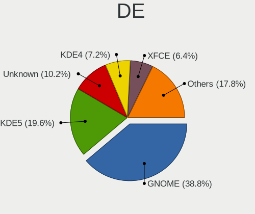
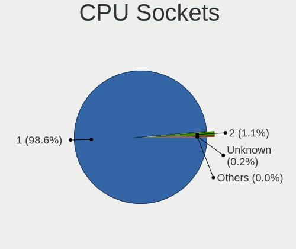

Linux - Tested Hardware & Statistics
------------------------------------

A project to collect tested hardware configurations for Linux.

Anyone can contribute to this report by the [hw-probe](https://github.com/linuxhw/hw-probe) tool:

    sudo -E hw-probe -all -upload

Please contribute! Especially if your hardware is rare.

This is a report for all computer types. See also reports for [desktops](/Desktop/README.md) and [notebooks](/Notebook/README.md).

Distribution-specific reports: [AlmaLinux](/Dist/AlmaLinux), [Alpine](/Dist/Alpine), [ALT_Linux](/Dist/ALT_Linux), [antiX](/Dist/antiX), [Artix](/Dist/Artix), [Chrome_OS](/Dist/Chrome_OS), [Clear_Linux](/Dist/Clear_Linux), [Deepin](/Dist/Deepin), [Devuan](/Dist/Devuan), [EndeavourOS](/Dist/EndeavourOS), [Garuda_Linux](/Dist/Garuda_Linux), [GNOME_OS](/Dist/GNOME_OS), [Kaisen](/Dist/Kaisen), [Mageia](/Dist/Mageia), [Makulu](/Dist/Makulu), [NixOS](/Dist/NixOS), [Nobara](/Dist/Nobara), [Oracle_Linux](/Dist/Oracle_Linux), [Pardus](/Dist/Pardus), [PureOS](/Dist/PureOS), [Q4OS](/Dist/Q4OS), [Reborn_OS](/Dist/Reborn_OS), [Rocky_Linux](/Dist/Rocky_Linux), [Sparky](/Dist/Sparky), [Void_Linux](/Dist/Void_Linux), [Xero](/Dist/Xero).

This report is for real hardware. Report for virtual hardware: [TestDays_VE](https://github.com/linuxhw/TestDays_VE)

Contents
--------

* [ Test Cases ](#test-cases)

* [ System ](#system)
  - [ OS                       ](#os)
  - [ OS Family                ](#os-family)
  - [ Kernel                   ](#kernel)
  - [ Kernel Family            ](#kernel-family)
  - [ Kernel Major Ver.        ](#kernel-major-ver)
  - [ Arch                     ](#arch)
  - [ DE                       ](#de)
  - [ Display Server           ](#display-server)
  - [ Display Manager          ](#display-manager)
  - [ OS Lang                  ](#os-lang)
  - [ Boot Mode                ](#boot-mode)
  - [ Filesystem               ](#filesystem)
  - [ Part. scheme             ](#part-scheme)
  - [ Dual Boot with Linux/BSD ](#dual-boot-with-linuxbsd)
  - [ Dual Boot (Win)          ](#dual-boot-win)

* [ Board ](#board)
  - [ Vendor                   ](#vendor)
  - [ Model                    ](#model)
  - [ Model Family             ](#model-family)
  - [ MFG Year                 ](#mfg-year)
  - [ Form Factor              ](#form-factor)
  - [ Secure Boot              ](#secure-boot)
  - [ Coreboot                 ](#coreboot)
  - [ RAM Size                 ](#ram-size)
  - [ RAM Used                 ](#ram-used)
  - [ Total Drives             ](#total-drives)
  - [ Has CD-ROM               ](#has-cd-rom)
  - [ Has Ethernet             ](#has-ethernet)
  - [ Has WiFi                 ](#has-wifi)
  - [ Has Bluetooth            ](#has-bluetooth)

* [ Location ](#location)
  - [ Country                  ](#country)
  - [ City                     ](#city)

* [ Drives ](#drives)
  - [ Drive Vendor             ](#drive-vendor)
  - [ Drive Model              ](#drive-model)
  - [ HDD Vendor               ](#hdd-vendor)
  - [ SSD Vendor               ](#ssd-vendor)
  - [ Drive Kind               ](#drive-kind)
  - [ Drive Connector          ](#drive-connector)
  - [ Drive Size               ](#drive-size)
  - [ Space Total              ](#space-total)
  - [ Space Used               ](#space-used)
  - [ Malfunc. Drives          ](#malfunc-drives)
  - [ Malfunc. Drive Vendor    ](#malfunc-drive-vendor)
  - [ Malfunc. HDD Vendor      ](#malfunc-hdd-vendor)
  - [ Malfunc. Drive Kind      ](#malfunc-drive-kind)
  - [ Failed Drives            ](#failed-drives)
  - [ Failed Drive Vendor      ](#failed-drive-vendor)
  - [ Drive Status             ](#drive-status)

* [ Storage controller ](#storage-controller)
  - [ Storage Vendor           ](#storage-vendor)
  - [ Storage Model            ](#storage-model)
  - [ Storage Kind             ](#storage-kind)

* [ Processor ](#processor)
  - [ CPU Vendor               ](#cpu-vendor)
  - [ CPU Model                ](#cpu-model)
  - [ CPU Model Family         ](#cpu-model-family)
  - [ CPU Cores                ](#cpu-cores)
  - [ CPU Sockets              ](#cpu-sockets)
  - [ CPU Threads              ](#cpu-threads)
  - [ CPU Op-Modes             ](#cpu-op-modes)
  - [ CPU Microcode            ](#cpu-microcode)
  - [ CPU Microarch            ](#cpu-microarch)

* [ Graphics ](#graphics)
  - [ GPU Vendor               ](#gpu-vendor)
  - [ GPU Model                ](#gpu-model)
  - [ GPU Combo                ](#gpu-combo)
  - [ GPU Driver               ](#gpu-driver)
  - [ GPU Memory               ](#gpu-memory)

* [ Monitor ](#monitor)
  - [ Monitor Vendor           ](#monitor-vendor)
  - [ Monitor Model            ](#monitor-model)
  - [ Monitor Resolution       ](#monitor-resolution)
  - [ Monitor Diagonal         ](#monitor-diagonal)
  - [ Monitor Width            ](#monitor-width)
  - [ Aspect Ratio             ](#aspect-ratio)
  - [ Monitor Area             ](#monitor-area)
  - [ Pixel Density            ](#pixel-density)
  - [ Multiple Monitors        ](#multiple-monitors)

* [ Network ](#network)
  - [ Net Controller Vendor    ](#net-controller-vendor)
  - [ Net Controller Model     ](#net-controller-model)
  - [ Wireless Vendor          ](#wireless-vendor)
  - [ Wireless Model           ](#wireless-model)
  - [ Ethernet Vendor          ](#ethernet-vendor)
  - [ Ethernet Model           ](#ethernet-model)
  - [ Net Controller Kind      ](#net-controller-kind)
  - [ Used Controller          ](#used-controller)
  - [ NICs                     ](#nics)
  - [ IPv6                     ](#ipv6)

* [ Bluetooth ](#bluetooth)
  - [ Bluetooth Vendor         ](#bluetooth-vendor)
  - [ Bluetooth Model          ](#bluetooth-model)

* [ Sound ](#sound)
  - [ Sound Vendor             ](#sound-vendor)
  - [ Sound Model              ](#sound-model)

* [ Memory ](#memory)
  - [ Memory Vendor            ](#memory-vendor)
  - [ Memory Model             ](#memory-model)
  - [ Memory Kind              ](#memory-kind)
  - [ Memory Form Factor       ](#memory-form-factor)
  - [ Memory Size              ](#memory-size)
  - [ Memory Speed             ](#memory-speed)

* [ Printers & scanners ](#printers--scanners)
  - [ Printer Vendor           ](#printer-vendor)
  - [ Printer Model            ](#printer-model)
  - [ Scanner Vendor           ](#scanner-vendor)
  - [ Scanner Model            ](#scanner-model)

* [ Camera ](#camera)
  - [ Camera Vendor            ](#camera-vendor)
  - [ Camera Model             ](#camera-model)

* [ Security ](#security)
  - [ Fingerprint Vendor       ](#fingerprint-vendor)
  - [ Fingerprint Model        ](#fingerprint-model)
  - [ Chipcard Vendor          ](#chipcard-vendor)
  - [ Chipcard Model           ](#chipcard-model)

* [ Unsupported ](#unsupported)
  - [ Unsupported Devices      ](#unsupported-devices)
  - [ Unsupported Device Types ](#unsupported-device-types)

Test Cases
----------

Total: 360249

| Vendor        | Model                       | Form-Factor | Probe                                                      | Date         |
|---------------|-----------------------------|-------------|------------------------------------------------------------|--------------|
| ASUSTek       | VivoBook_ASUSLaptop X515... | Notebook    | [700ae279ed](https://linux-hardware.org/?probe=700ae279ed) | Jan 02, 2024 |
| ASRock        | J5005-ITX                   | Desktop     | [5373e7f16c](https://linux-hardware.org/?probe=5373e7f16c) | Jan 02, 2024 |
| iQual         | NQ4X                        | Notebook    | [5c66dfd710](https://linux-hardware.org/?probe=5c66dfd710) | Jan 02, 2024 |
| MSI           | MAG B550M MORTAR            | Desktop     | [3fbea8cbf8](https://linux-hardware.org/?probe=3fbea8cbf8) | Jan 02, 2024 |
| Notebook      | N14xWU                      | Notebook    | [0460984dea](https://linux-hardware.org/?probe=0460984dea) | Jan 02, 2024 |
| Lenovo        | V14 G2 ALC 82KC             | Notebook    | [8250c46efe](https://linux-hardware.org/?probe=8250c46efe) | Jan 02, 2024 |
| ASUSTek       | ROG Strix G533ZM_G533ZM     | Notebook    | [00e99b0067](https://linux-hardware.org/?probe=00e99b0067) | Jan 02, 2024 |
| Lenovo        | V14 G2 ALC 82KC             | Notebook    | [57cd074cfd](https://linux-hardware.org/?probe=57cd074cfd) | Jan 02, 2024 |
| Gigabyte      | Z390 AORUS PRO WIFI-CF      | Desktop     | [3a67df5dcf](https://linux-hardware.org/?probe=3a67df5dcf) | Jan 02, 2024 |
| Gigabyte      | Z390 AORUS PRO WIFI-CF      | Desktop     | [b163926938](https://linux-hardware.org/?probe=b163926938) | Jan 02, 2024 |
| ASUSTek       | H81M-C                      | Desktop     | [221ebe85fb](https://linux-hardware.org/?probe=221ebe85fb) | Jan 02, 2024 |
| Lenovo        | ThinkPad P16s Gen 1 21BT... | Notebook    | [e15430e53e](https://linux-hardware.org/?probe=e15430e53e) | Jan 02, 2024 |
| Acer          | Aspire 8730                 | Notebook    | [a435ff1bd6](https://linux-hardware.org/?probe=a435ff1bd6) | Jan 02, 2024 |
| Gigabyte      | AB350N-Gaming WIFI-CF       | Desktop     | [24166c136e](https://linux-hardware.org/?probe=24166c136e) | Jan 02, 2024 |
| Acer          | Aspire 8730                 | Notebook    | [4db4a265b6](https://linux-hardware.org/?probe=4db4a265b6) | Jan 02, 2024 |
| Dell          | Inspiron 5558               | Notebook    | [acc47dae75](https://linux-hardware.org/?probe=acc47dae75) | Jan 02, 2024 |
| HP            | ZBook Fury 17.3 inch G8 ... | Notebook    | [65ddbd761c](https://linux-hardware.org/?probe=65ddbd761c) | Jan 02, 2024 |
| Sony          | SVE1713X1EB                 | Notebook    | [6c3167a5a7](https://linux-hardware.org/?probe=6c3167a5a7) | Jan 02, 2024 |
| ASUSTek       | P5QL                        | Desktop     | [723455abf9](https://linux-hardware.org/?probe=723455abf9) | Jan 02, 2024 |
| Lenovo        | Win8 STD EM DPK IPG         | All in one  | [26647a45b1](https://linux-hardware.org/?probe=26647a45b1) | Jan 02, 2024 |
| ASUSTek       | X75VC                       | Notebook    | [c80297163a](https://linux-hardware.org/?probe=c80297163a) | Jan 02, 2024 |
| Dell          | Inspiron 13-5368            | Notebook    | [811a112c63](https://linux-hardware.org/?probe=811a112c63) | Jan 02, 2024 |
| Dell          | Inspiron 15-3567            | Notebook    | [50d926ec76](https://linux-hardware.org/?probe=50d926ec76) | Jan 02, 2024 |
| Samsung       | 550XCJ/550XCR               | Notebook    | [daf43e4658](https://linux-hardware.org/?probe=daf43e4658) | Jan 02, 2024 |
| MouseCompu... | EGPN711R307                 | Notebook    | [fc34633537](https://linux-hardware.org/?probe=fc34633537) | Jan 02, 2024 |
| Lenovo        | G505 20240                  | Notebook    | [ff10a3ab7d](https://linux-hardware.org/?probe=ff10a3ab7d) | Jan 02, 2024 |
| ECS           | GLKD-I2                     | Desktop     | [97247e0a90](https://linux-hardware.org/?probe=97247e0a90) | Jan 02, 2024 |
| Lenovo        | G50-70 20351                | Notebook    | [cb1029f101](https://linux-hardware.org/?probe=cb1029f101) | Jan 02, 2024 |
| Notebook      | N13xWU                      | Notebook    | [b88a27e565](https://linux-hardware.org/?probe=b88a27e565) | Jan 02, 2024 |
| Azulle        | Byte 3                      | Desktop     | [28f6b7cbad](https://linux-hardware.org/?probe=28f6b7cbad) | Jan 02, 2024 |
| Lenovo        | ThinkPad L380 Yoga 20M7C... | Convertible | [fa3f52294e](https://linux-hardware.org/?probe=fa3f52294e) | Jan 02, 2024 |
| HP            | 0A54h                       | Desktop     | [6db4931db4](https://linux-hardware.org/?probe=6db4931db4) | Jan 02, 2024 |
| Google        | Caroline                    | Notebook    | [8b3ec77c48](https://linux-hardware.org/?probe=8b3ec77c48) | Jan 02, 2024 |
| Acidanther... | MacBookPro16,4              | Notebook    | [3c8c520472](https://linux-hardware.org/?probe=3c8c520472) | Jan 02, 2024 |
| Gigabyte      | B560M DS3H                  | Desktop     | [4ff670c80b](https://linux-hardware.org/?probe=4ff670c80b) | Jan 02, 2024 |
| Google        | Blooguard                   | Notebook    | [dc6c0354a9](https://linux-hardware.org/?probe=dc6c0354a9) | Jan 02, 2024 |
| ASUSTek       | ROG STRIX B350-F GAMING     | Desktop     | [f10936a9f7](https://linux-hardware.org/?probe=f10936a9f7) | Jan 02, 2024 |
| Dell          | 0D28YY A01                  | Desktop     | [f67d5d22eb](https://linux-hardware.org/?probe=f67d5d22eb) | Jan 02, 2024 |
| HP            | Pavilion dm4                | Notebook    | [7b2206d3e1](https://linux-hardware.org/?probe=7b2206d3e1) | Jan 02, 2024 |
| HP            | Pavilion dm4                | Notebook    | [97f8b54561](https://linux-hardware.org/?probe=97f8b54561) | Jan 02, 2024 |
| HP            | Pavilion Gaming Laptop 1... | Notebook    | [88bc9fe11f](https://linux-hardware.org/?probe=88bc9fe11f) | Jan 02, 2024 |
| Supermicro    | H12SSL-i                    | Server      | [454b403b53](https://linux-hardware.org/?probe=454b403b53) | Jan 02, 2024 |
| ASRockRack    | B650D4U-2L2T/BCM            | Server      | [a1095fd614](https://linux-hardware.org/?probe=a1095fd614) | Jan 02, 2024 |
| Lenovo        | V15 G3 IAP 82TT             | Notebook    | [2ca86aaf30](https://linux-hardware.org/?probe=2ca86aaf30) | Jan 02, 2024 |
| Dell          | 0PV3YR A05                  | Server      | [d87da5bee4](https://linux-hardware.org/?probe=d87da5bee4) | Jan 02, 2024 |
| Lenovo        | ThinkPad L15 Gen 1 20U7C... | Notebook    | [389ae3afc8](https://linux-hardware.org/?probe=389ae3afc8) | Jan 02, 2024 |
| HP            | Laptop 17-cp0xxx            | Notebook    | [a9e2dd2fb6](https://linux-hardware.org/?probe=a9e2dd2fb6) | Jan 02, 2024 |
| MSI           | X99A RAIDER                 | Desktop     | [0c40685bac](https://linux-hardware.org/?probe=0c40685bac) | Jan 02, 2024 |
| Gigabyte      | B560M DS3H                  | Desktop     | [1529597f3c](https://linux-hardware.org/?probe=1529597f3c) | Jan 02, 2024 |
| HP            | Notebook                    | Notebook    | [3db48f7d59](https://linux-hardware.org/?probe=3db48f7d59) | Jan 02, 2024 |
| Dell          | 0C2XKD A01                  | Desktop     | [9accd399c5](https://linux-hardware.org/?probe=9accd399c5) | Jan 02, 2024 |
| Lenovo        | ThinkPad T410 2522PT3       | Notebook    | [db100cd948](https://linux-hardware.org/?probe=db100cd948) | Jan 02, 2024 |
| System76      | Serval                      | Notebook    | [a0597a9161](https://linux-hardware.org/?probe=a0597a9161) | Jan 02, 2024 |
| HP            | ProBook 450 G5              | Notebook    | [b80a7c9287](https://linux-hardware.org/?probe=b80a7c9287) | Jan 02, 2024 |
| System76      | Serval                      | Notebook    | [c4a91b64e5](https://linux-hardware.org/?probe=c4a91b64e5) | Jan 02, 2024 |
| HP            | 0A54h                       | Desktop     | [cbf6bc2e02](https://linux-hardware.org/?probe=cbf6bc2e02) | Jan 02, 2024 |
| Gigabyte      | Z490 UD                     | Desktop     | [939fe5ab0c](https://linux-hardware.org/?probe=939fe5ab0c) | Jan 02, 2024 |
| ASUSTek       | ROG STRIX Z370-H GAMING     | Desktop     | [ee3998d501](https://linux-hardware.org/?probe=ee3998d501) | Jan 02, 2024 |
| Fujitsu       | D3501-A1 S26361-D3501-A1    | Desktop     | [9711c69823](https://linux-hardware.org/?probe=9711c69823) | Jan 02, 2024 |
| Lenovo        | Legion Y740-17IRHg 81UJ     | Notebook    | [c106ff91a5](https://linux-hardware.org/?probe=c106ff91a5) | Jan 02, 2024 |
| Lenovo        | IdeaPad Slim 5 16IRL8 82... | Notebook    | [5570fbf22f](https://linux-hardware.org/?probe=5570fbf22f) | Jan 02, 2024 |
| ASUSTek       | VivoBook_ASUSLaptop K350... | Notebook    | [a9ddfb0974](https://linux-hardware.org/?probe=a9ddfb0974) | Jan 02, 2024 |
| MSI           | GS65 Stealth 9SG            | Notebook    | [6f3ddca46b](https://linux-hardware.org/?probe=6f3ddca46b) | Jan 02, 2024 |
| ASUSTek       | ROG STRIX B650E-E GAMING... | Desktop     | [57a12c9041](https://linux-hardware.org/?probe=57a12c9041) | Jan 02, 2024 |
| Dell          | 0XJ8C4 A00                  | Desktop     | [e902f5396d](https://linux-hardware.org/?probe=e902f5396d) | Jan 02, 2024 |
| Gigabyte      | B560 DS3H AC-Y1             | Desktop     | [9868062aa3](https://linux-hardware.org/?probe=9868062aa3) | Jan 02, 2024 |
| HP            | ProBook 430 G2              | Notebook    | [c56ad1ad48](https://linux-hardware.org/?probe=c56ad1ad48) | Jan 02, 2024 |
| HP            | 8710                        | Mini pc     | [be32ecba69](https://linux-hardware.org/?probe=be32ecba69) | Jan 02, 2024 |
| HP            | 15 Notebook PC              | Notebook    | [9eb25ba0bf](https://linux-hardware.org/?probe=9eb25ba0bf) | Jan 02, 2024 |
| Lenovo        | ThinkPad T460s 20FAS1V60... | Notebook    | [ca5f55438f](https://linux-hardware.org/?probe=ca5f55438f) | Jan 02, 2024 |
| MSI           | Z77A-G43                    | Desktop     | [b33c14ee42](https://linux-hardware.org/?probe=b33c14ee42) | Jan 02, 2024 |
| Acer          | Nitro AN515-44              | Notebook    | [9ac5286530](https://linux-hardware.org/?probe=9ac5286530) | Jan 02, 2024 |
| HP            | Laptop 15-db0xxx            | Notebook    | [dc302f3b3e](https://linux-hardware.org/?probe=dc302f3b3e) | Jan 02, 2024 |
| Gateway       | MT6707                      | Notebook    | [a2a87f6e95](https://linux-hardware.org/?probe=a2a87f6e95) | Jan 02, 2024 |
| Dell          | XPS 13 9380                 | Notebook    | [d290e010eb](https://linux-hardware.org/?probe=d290e010eb) | Jan 02, 2024 |
| HP            | Laptop 15-dw0xxx            | Notebook    | [b732d30db5](https://linux-hardware.org/?probe=b732d30db5) | Jan 02, 2024 |
| Lenovo        | Legion 5 15ARH05H 82B1      | Notebook    | [502ebc99c3](https://linux-hardware.org/?probe=502ebc99c3) | Jan 02, 2024 |
| Valve         | Jupiter                     | Notebook    | [e381b764b0](https://linux-hardware.org/?probe=e381b764b0) | Jan 02, 2024 |
| Dell          | G3 3590                     | Notebook    | [ae7267dd5f](https://linux-hardware.org/?probe=ae7267dd5f) | Jan 02, 2024 |
| Lenovo        | IdeaPad Slim 5 16IRL8 82... | Notebook    | [197c876252](https://linux-hardware.org/?probe=197c876252) | Jan 02, 2024 |
| MSI           | PRO B650-P WIFI             | Desktop     | [544a799ce8](https://linux-hardware.org/?probe=544a799ce8) | Jan 02, 2024 |
| ASUSTek       | ROG Strix G513RW_G513RW     | Notebook    | [7fbbe32bb5](https://linux-hardware.org/?probe=7fbbe32bb5) | Jan 02, 2024 |
| Samsung       | 730QDA                      | Convertible | [e9603387e6](https://linux-hardware.org/?probe=e9603387e6) | Jan 02, 2024 |
| HP            | ProBook 430 G1              | Notebook    | [7f61fa84aa](https://linux-hardware.org/?probe=7f61fa84aa) | Jan 02, 2024 |
| Lenovo        | IdeaPad 5 15ARE05 81YQ      | Notebook    | [fb59929b28](https://linux-hardware.org/?probe=fb59929b28) | Jan 02, 2024 |
| HP            | Laptop 15-dw0xxx            | Notebook    | [43bc3cd4bd](https://linux-hardware.org/?probe=43bc3cd4bd) | Jan 02, 2024 |
| Dell          | 07KY25 A01                  | Desktop     | [7936cb8967](https://linux-hardware.org/?probe=7936cb8967) | Jan 02, 2024 |
| Philco        | 14M2                        | Notebook    | [b5771423fb](https://linux-hardware.org/?probe=b5771423fb) | Jan 02, 2024 |
| ASUSTek       | M3702WFA                    | All in one  | [878dc1f9b0](https://linux-hardware.org/?probe=878dc1f9b0) | Jan 02, 2024 |
| Gigabyte      | B550M AORUS ELITE           | Desktop     | [3de5d6e06c](https://linux-hardware.org/?probe=3de5d6e06c) | Jan 02, 2024 |
| Apple         | MacBookPro9,2               | Notebook    | [133a9d6ebc](https://linux-hardware.org/?probe=133a9d6ebc) | Jan 02, 2024 |
| ASUSTek       | M4A87TD/USB3                | Desktop     | [8c2ae70cdd](https://linux-hardware.org/?probe=8c2ae70cdd) | Jan 02, 2024 |
| Lenovo        | Legion Y545 81Q6            | Notebook    | [954ab5a643](https://linux-hardware.org/?probe=954ab5a643) | Jan 02, 2024 |
| System76      | Oryx Pro                    | Notebook    | [07e4e6a0a8](https://linux-hardware.org/?probe=07e4e6a0a8) | Jan 02, 2024 |
| ASRock        | X470 Taichi                 | Desktop     | [93ce6b9074](https://linux-hardware.org/?probe=93ce6b9074) | Jan 02, 2024 |
| ASUSTek       | TUF Gaming Z490-PLUS        | Desktop     | [f96513dd00](https://linux-hardware.org/?probe=f96513dd00) | Jan 02, 2024 |
| HP            | Notebook                    | Notebook    | [f6e5af2da0](https://linux-hardware.org/?probe=f6e5af2da0) | Jan 02, 2024 |
| HP            | Pavilion dv3                | Notebook    | [351a45926e](https://linux-hardware.org/?probe=351a45926e) | Jan 02, 2024 |
| HP            | ProBook 440 G5              | Notebook    | [04753e77e0](https://linux-hardware.org/?probe=04753e77e0) | Jan 02, 2024 |
| Dell          | 0NDYHG A01                  | Desktop     | [68cde01489](https://linux-hardware.org/?probe=68cde01489) | Jan 02, 2024 |
| ASUSTek       | PRIME X470-PRO              | Desktop     | [68d3d8c6be](https://linux-hardware.org/?probe=68d3d8c6be) | Jan 02, 2024 |
| Positivo      | C464C                       | Convertible | [2301ed86ce](https://linux-hardware.org/?probe=2301ed86ce) | Jan 02, 2024 |
| Acer          | Aspire A515-51G             | Notebook    | [e7b0efb20a](https://linux-hardware.org/?probe=e7b0efb20a) | Jan 02, 2024 |
| ASRock        | B550M Pro4                  | Desktop     | [9eb47b934a](https://linux-hardware.org/?probe=9eb47b934a) | Jan 02, 2024 |
| ASUSTek       | ROG STRIX X670E-E GAMING... | Desktop     | [21c267752a](https://linux-hardware.org/?probe=21c267752a) | Jan 02, 2024 |
| Azulle        | Byte 3                      | Desktop     | [273bcd474a](https://linux-hardware.org/?probe=273bcd474a) | Jan 02, 2024 |
| Lenovo        | IdeaPad 330-15IKB 81FE      | Notebook    | [14df5ebb53](https://linux-hardware.org/?probe=14df5ebb53) | Jan 02, 2024 |
| HP            | Pavilion 15                 | Notebook    | [277c4aa7d6](https://linux-hardware.org/?probe=277c4aa7d6) | Jan 02, 2024 |
| Samsung       | 930QED                      | Convertible | [c9d218a2c8](https://linux-hardware.org/?probe=c9d218a2c8) | Jan 02, 2024 |
| eMachines     | E725                        | Notebook    | [1c62e8a613](https://linux-hardware.org/?probe=1c62e8a613) | Jan 02, 2024 |
| Lenovo        | Y520-15IKBN 80WK            | Notebook    | [8701a130d2](https://linux-hardware.org/?probe=8701a130d2) | Jan 02, 2024 |
| BESSTAR Te... | GB7                         | Mini pc     | [48afb483d6](https://linux-hardware.org/?probe=48afb483d6) | Jan 02, 2024 |
| Acer          | Nitro AN515-58              | Notebook    | [b822b77797](https://linux-hardware.org/?probe=b822b77797) | Jan 02, 2024 |
| Gigabyte      | Z590 UD AC                  | Desktop     | [0db9ec67ac](https://linux-hardware.org/?probe=0db9ec67ac) | Jan 02, 2024 |
| MSI           | MS-B9181                    | Desktop     | [56b0ad4a01](https://linux-hardware.org/?probe=56b0ad4a01) | Jan 02, 2024 |
| Gigabyte      | AX370-Gaming K7             | Desktop     | [435dc251c1](https://linux-hardware.org/?probe=435dc251c1) | Jan 02, 2024 |
| Sony          | VGN-AR51SU                  | Notebook    | [ad09db7b69](https://linux-hardware.org/?probe=ad09db7b69) | Jan 01, 2024 |
| Valve         | Jupiter                     | Notebook    | [95183ba54e](https://linux-hardware.org/?probe=95183ba54e) | Jan 01, 2024 |
| Sony          | VGN-AR51SU                  | Notebook    | [01e1a67d40](https://linux-hardware.org/?probe=01e1a67d40) | Jan 01, 2024 |
| Unknown       | X99H                        | Desktop     | [61c57cb006](https://linux-hardware.org/?probe=61c57cb006) | Jan 01, 2024 |
| Medion        | E11202                      | Notebook    | [cb45690620](https://linux-hardware.org/?probe=cb45690620) | Jan 01, 2024 |
| ASUSTek       | Vivobook Go E1504FA_E150... | Notebook    | [83ae2c858c](https://linux-hardware.org/?probe=83ae2c858c) | Jan 01, 2024 |
| ASUSTek       | VivoBook_ASUSLaptop E210... | Notebook    | [689f8869db](https://linux-hardware.org/?probe=689f8869db) | Jan 01, 2024 |
| HP            | 886C                        | Desktop     | [d076e5b70a](https://linux-hardware.org/?probe=d076e5b70a) | Jan 01, 2024 |
| HP            | ProBook 4540s               | Notebook    | [aaebda14c1](https://linux-hardware.org/?probe=aaebda14c1) | Jan 01, 2024 |
| Lenovo        | ThinkPad X200s 7469W92      | Notebook    | [6ea14ec02e](https://linux-hardware.org/?probe=6ea14ec02e) | Jan 01, 2024 |
| Lenovo        | IdeaPad 330-15IKB 81FE      | Notebook    | [00ee13cdb6](https://linux-hardware.org/?probe=00ee13cdb6) | Jan 01, 2024 |
| ASUSTek       | Vivobook Go E1504FA_E150... | Notebook    | [4ec973722a](https://linux-hardware.org/?probe=4ec973722a) | Jan 01, 2024 |
| ASUSTek       | PRIME X570-P                | Desktop     | [f7f3e0ddc9](https://linux-hardware.org/?probe=f7f3e0ddc9) | Jan 01, 2024 |
| Chuwi         | HeroBook Pro                | Notebook    | [97c2ff9710](https://linux-hardware.org/?probe=97c2ff9710) | Jan 01, 2024 |
| Unknown       | Unknown                     | Desktop     | [b101d94fff](https://linux-hardware.org/?probe=b101d94fff) | Jan 01, 2024 |
| ASRock        | J3355M                      | Desktop     | [305d025c0f](https://linux-hardware.org/?probe=305d025c0f) | Jan 01, 2024 |
| Dell          | Inspiron 15 3530            | Notebook    | [ee21ee0e37](https://linux-hardware.org/?probe=ee21ee0e37) | Jan 01, 2024 |
| eMachines     | E725                        | Notebook    | [6485437ffb](https://linux-hardware.org/?probe=6485437ffb) | Jan 01, 2024 |
| Unknown       | Apple MacBook Air (13-in... | Notebook    | [834855dcac](https://linux-hardware.org/?probe=834855dcac) | Jan 01, 2024 |
| Fujitsu       | LIFEBOOK E780               | Notebook    | [6606e3d150](https://linux-hardware.org/?probe=6606e3d150) | Jan 01, 2024 |
| Gigabyte      | Z790 AERO G                 | Desktop     | [121de16d3b](https://linux-hardware.org/?probe=121de16d3b) | Jan 01, 2024 |
| Gigabyte      | Z790 AERO G                 | Desktop     | [2ad2af0de5](https://linux-hardware.org/?probe=2ad2af0de5) | Jan 01, 2024 |
| Notebook      | NJx0MU                      | Notebook    | [cdb97873fa](https://linux-hardware.org/?probe=cdb97873fa) | Jan 01, 2024 |
| ASRock        | Z77 Professional            | Desktop     | [d1d9fce85d](https://linux-hardware.org/?probe=d1d9fce85d) | Jan 01, 2024 |
| TUXEDO        | N8xxEZ                      | Notebook    | [4eb785f281](https://linux-hardware.org/?probe=4eb785f281) | Jan 01, 2024 |
| System76      | Pangolin                    | Notebook    | [58876a3573](https://linux-hardware.org/?probe=58876a3573) | Jan 01, 2024 |
| Gigabyte      | X670 GAMING X AX            | Desktop     | [6b4b87c927](https://linux-hardware.org/?probe=6b4b87c927) | Jan 01, 2024 |
| Timi          | RedmiBook Pro 14S           | Notebook    | [08718e205b](https://linux-hardware.org/?probe=08718e205b) | Jan 01, 2024 |
| Dell          | Inspiron N5110              | Notebook    | [bf974230c7](https://linux-hardware.org/?probe=bf974230c7) | Jan 01, 2024 |
| HP            | G60                         | Notebook    | [a151a8084c](https://linux-hardware.org/?probe=a151a8084c) | Jan 01, 2024 |
| Gigabyte      | X79-UP4                     | Desktop     | [4c7ec5ec88](https://linux-hardware.org/?probe=4c7ec5ec88) | Jan 01, 2024 |
| ASUSTek       | P8H77-M                     | Desktop     | [7ae937132b](https://linux-hardware.org/?probe=7ae937132b) | Jan 01, 2024 |
| Notebook      | NJx0MU                      | Notebook    | [f9d4fa4d55](https://linux-hardware.org/?probe=f9d4fa4d55) | Jan 01, 2024 |
| ASUSTek       | TUF Gaming FX705DT_FX705... | Notebook    | [c71368b0eb](https://linux-hardware.org/?probe=c71368b0eb) | Jan 01, 2024 |
| HP            | 0B4Ch D                     | Desktop     | [b7d97486fb](https://linux-hardware.org/?probe=b7d97486fb) | Jan 01, 2024 |
| ASUSTek       | VivoBook_ASUSLaptop X509... | Notebook    | [d4335b1132](https://linux-hardware.org/?probe=d4335b1132) | Jan 01, 2024 |
| MSI           | N6105                       | Notebook    | [0b934bf922](https://linux-hardware.org/?probe=0b934bf922) | Jan 01, 2024 |
| Gigabyte      | F2A88XM-HD3                 | Desktop     | [79b5e7c7b0](https://linux-hardware.org/?probe=79b5e7c7b0) | Jan 01, 2024 |
| ASUSTek       | TUF Gaming Z490-PLUS        | Desktop     | [ccaa0646d7](https://linux-hardware.org/?probe=ccaa0646d7) | Jan 01, 2024 |
| MSI           | X79A-GD65                   | Desktop     | [ecb9a57738](https://linux-hardware.org/?probe=ecb9a57738) | Jan 01, 2024 |
| HP            | Laptop 15-dw0xxx            | Notebook    | [66f6fa63a2](https://linux-hardware.org/?probe=66f6fa63a2) | Jan 01, 2024 |
| Lenovo        | ThinkPad X260 20F5S0KE00    | Notebook    | [08d2a7a982](https://linux-hardware.org/?probe=08d2a7a982) | Jan 01, 2024 |
| Acer          | Aspire A517-52G             | Notebook    | [fb86c6f71c](https://linux-hardware.org/?probe=fb86c6f71c) | Jan 01, 2024 |
| Packard Be... | EasyNote TE11HC             | Notebook    | [8dab3905db](https://linux-hardware.org/?probe=8dab3905db) | Jan 01, 2024 |
| ASUSTek       | H81M-A/BR                   | Desktop     | [6f2227d209](https://linux-hardware.org/?probe=6f2227d209) | Jan 01, 2024 |
| ASUSTek       | PRIME X570-P                | Desktop     | [f8dd732e7a](https://linux-hardware.org/?probe=f8dd732e7a) | Jan 01, 2024 |
| ASUSTek       | ROG Flow X16 GV601RW_GV6... | Convertible | [4389374c55](https://linux-hardware.org/?probe=4389374c55) | Jan 01, 2024 |
| ASUSTek       | ZenBook UX425UA_UM425UA     | Notebook    | [6826d7c88d](https://linux-hardware.org/?probe=6826d7c88d) | Jan 01, 2024 |
| ASUSTek       | K54HR                       | Notebook    | [c84a5fe9d7](https://linux-hardware.org/?probe=c84a5fe9d7) | Jan 01, 2024 |
| Lenovo        | ThinkBook 16 G6 ABP 21KK    | Notebook    | [8a14ad7cc9](https://linux-hardware.org/?probe=8a14ad7cc9) | Jan 01, 2024 |
| Google        | Gallop                      | Notebook    | [917756724c](https://linux-hardware.org/?probe=917756724c) | Jan 01, 2024 |
| Lenovo        | ThinkBook 16 G6 ABP 21KK    | Notebook    | [a2acc5bb5f](https://linux-hardware.org/?probe=a2acc5bb5f) | Jan 01, 2024 |
| Lenovo        | Legion Pro 5 16ARX8 82WM    | Notebook    | [67ef36b749](https://linux-hardware.org/?probe=67ef36b749) | Jan 01, 2024 |
| ASUSTek       | P8Z77-V LX                  | Desktop     | [148f8c250f](https://linux-hardware.org/?probe=148f8c250f) | Jan 01, 2024 |
| Dell          | 0YXT71 A02                  | Desktop     | [e08ca6924a](https://linux-hardware.org/?probe=e08ca6924a) | Jan 01, 2024 |
| Gigabyte      | H61M-S1                     | Desktop     | [1e34cd1559](https://linux-hardware.org/?probe=1e34cd1559) | Jan 01, 2024 |
| ASRock        | B450M Gaming                | Desktop     | [81242d3eca](https://linux-hardware.org/?probe=81242d3eca) | Jan 01, 2024 |
| ASUSTek       | ROG Zephyrus G15 GA503QR... | Notebook    | [9c0957293d](https://linux-hardware.org/?probe=9c0957293d) | Jan 01, 2024 |
| Apple         | MacBookPro11,2              | Notebook    | [4a37a9b35c](https://linux-hardware.org/?probe=4a37a9b35c) | Jan 01, 2024 |
| Lenovo        | ThinkPad T15 Gen 1 20S60... | Notebook    | [a679e6f722](https://linux-hardware.org/?probe=a679e6f722) | Jan 01, 2024 |
| Sony          | VJF153                      | Notebook    | [9bf924f424](https://linux-hardware.org/?probe=9bf924f424) | Jan 01, 2024 |
| ASUSTek       | Vivobook Go E1504FA_E150... | Notebook    | [5cde8dcd78](https://linux-hardware.org/?probe=5cde8dcd78) | Jan 01, 2024 |
| ASUSTek       | PRIME A320M-K               | Desktop     | [685d971973](https://linux-hardware.org/?probe=685d971973) | Jan 01, 2024 |
| Apple         | Mac-27ADBB7B4CEE8E61 iMa... | All in one  | [c3356daec6](https://linux-hardware.org/?probe=c3356daec6) | Jan 01, 2024 |
| Dell          | Inspiron 5537               | Notebook    | [d19fc7dff7](https://linux-hardware.org/?probe=d19fc7dff7) | Jan 01, 2024 |
| Gigabyte      | X58A-UD3R                   | Desktop     | [757bac1cef](https://linux-hardware.org/?probe=757bac1cef) | Jan 01, 2024 |
| Dell          | Latitude 5511               | Notebook    | [3b186725e3](https://linux-hardware.org/?probe=3b186725e3) | Jan 01, 2024 |
| ASUSTek       | VivoBook_ASUSLaptop K650... | Notebook    | [20f988146c](https://linux-hardware.org/?probe=20f988146c) | Jan 01, 2024 |
| ASUSTek       | TUF Gaming X670E-PLUS WI... | Desktop     | [c6c9c3c74e](https://linux-hardware.org/?probe=c6c9c3c74e) | Jan 01, 2024 |
| Acer          | Aspire A315-54K             | Notebook    | [d0fa49f90a](https://linux-hardware.org/?probe=d0fa49f90a) | Jan 01, 2024 |
| ASUSTek       | K54HR                       | Notebook    | [03ce083285](https://linux-hardware.org/?probe=03ce083285) | Jan 01, 2024 |
| ASUSTek       | P8H67-M LE                  | Desktop     | [82877fbf5e](https://linux-hardware.org/?probe=82877fbf5e) | Jan 01, 2024 |
| Intel         | NUC11TNBi5 M11904-404       | Mini pc     | [769eb69c0e](https://linux-hardware.org/?probe=769eb69c0e) | Jan 01, 2024 |
| ASUSTek       | P6T                         | Desktop     | [7b5a14566d](https://linux-hardware.org/?probe=7b5a14566d) | Jan 01, 2024 |
| HP            | 82A2                        | Desktop     | [7cc3d17916](https://linux-hardware.org/?probe=7cc3d17916) | Jan 01, 2024 |
| Gigabyte      | H470M K                     | Desktop     | [90b6ff9ff3](https://linux-hardware.org/?probe=90b6ff9ff3) | Jan 01, 2024 |
| Lenovo        | ThinkPad L440 20AT0030MD    | Notebook    | [095d9cbf7e](https://linux-hardware.org/?probe=095d9cbf7e) | Jan 01, 2024 |
| ASRock        | X570 Phantom Gaming-ITX/... | Desktop     | [58557ae7c7](https://linux-hardware.org/?probe=58557ae7c7) | Jan 01, 2024 |
| eMachines     | E525                        | Notebook    | [a99f0e3394](https://linux-hardware.org/?probe=a99f0e3394) | Jan 01, 2024 |
| Dell          | Inspiron 15-3567            | Notebook    | [54e9b80fb3](https://linux-hardware.org/?probe=54e9b80fb3) | Jan 01, 2024 |
| Lenovo        | ThinkPad T460 20FMS2291P    | Notebook    | [1a86f2a3d4](https://linux-hardware.org/?probe=1a86f2a3d4) | Jan 01, 2024 |
| ASUSTek       | K52Jc                       | Notebook    | [5f0c993270](https://linux-hardware.org/?probe=5f0c993270) | Jan 01, 2024 |
| Dell          | Latitude 7490               | Notebook    | [efab03db5f](https://linux-hardware.org/?probe=efab03db5f) | Jan 01, 2024 |
| Dell          | Inspiron 15-3567            | Notebook    | [c67f642893](https://linux-hardware.org/?probe=c67f642893) | Jan 01, 2024 |
| ASUSTek       | M5A99X EVO R2.0             | Desktop     | [aedbae5d00](https://linux-hardware.org/?probe=aedbae5d00) | Jan 01, 2024 |
| ASUSTek       | P8H67-M EVO                 | Desktop     | [7c95d175bb](https://linux-hardware.org/?probe=7c95d175bb) | Jan 01, 2024 |
| ASUSTek       | Z87-DELUXE                  | Desktop     | [018238aa79](https://linux-hardware.org/?probe=018238aa79) | Jan 01, 2024 |
| ASUSTek       | V241IC-R                    | All in one  | [555f0208db](https://linux-hardware.org/?probe=555f0208db) | Jan 01, 2024 |
| Gigabyte      | P67A-D3-B3                  | Desktop     | [28494e9d46](https://linux-hardware.org/?probe=28494e9d46) | Jan 01, 2024 |
| ASRock        | B550M-ITX/ac                | Desktop     | [2ae0bbe734](https://linux-hardware.org/?probe=2ae0bbe734) | Jan 01, 2024 |
| Lenovo        | LOQ 15IRH8 82XV             | Notebook    | [494b496889](https://linux-hardware.org/?probe=494b496889) | Jan 01, 2024 |
| MSI           | N6105                       | Notebook    | [24f1343e04](https://linux-hardware.org/?probe=24f1343e04) | Jan 01, 2024 |
| Dell          | 0F6X5P A00                  | Desktop     | [750a1d90dd](https://linux-hardware.org/?probe=750a1d90dd) | Jan 01, 2024 |
| Dell          | 0F6X5P A00                  | Desktop     | [b4f1a69ca3](https://linux-hardware.org/?probe=b4f1a69ca3) | Jan 01, 2024 |
| Apple         | MacBookPro7,1               | Notebook    | [9181cf5581](https://linux-hardware.org/?probe=9181cf5581) | Jan 01, 2024 |
| Sony          | VPCEH3P1R                   | Notebook    | [d5a18ec675](https://linux-hardware.org/?probe=d5a18ec675) | Jan 01, 2024 |
| Gigabyte      | H270N-WIFI-CF               | Desktop     | [d47bc3897f](https://linux-hardware.org/?probe=d47bc3897f) | Jan 01, 2024 |
| Gigabyte      | F2A88XM-HD3                 | Desktop     | [23eb635b4e](https://linux-hardware.org/?probe=23eb635b4e) | Jan 01, 2024 |
| Dell          | 0F6X5P A00                  | Desktop     | [b5efb44fe4](https://linux-hardware.org/?probe=b5efb44fe4) | Jan 01, 2024 |
| ASUSTek       | PRIME X470-PRO              | Desktop     | [7cb99217f7](https://linux-hardware.org/?probe=7cb99217f7) | Jan 01, 2024 |
| Acer          | One 14 Z8-415               | Notebook    | [b022baea77](https://linux-hardware.org/?probe=b022baea77) | Jan 01, 2024 |
| Acer          | One 14 Z8-415               | Notebook    | [0e2bbf3d20](https://linux-hardware.org/?probe=0e2bbf3d20) | Jan 01, 2024 |
| Medion        | H110H4-EM                   | Desktop     | [da3367c80e](https://linux-hardware.org/?probe=da3367c80e) | Jan 01, 2024 |
| Acer          | Aspire ES1-523              | Notebook    | [65fb7df562](https://linux-hardware.org/?probe=65fb7df562) | Jan 01, 2024 |
| Pegatron      | EVANS                       | Desktop     | [b2a67b83cd](https://linux-hardware.org/?probe=b2a67b83cd) | Jan 01, 2024 |
| Apple         | Mac-F22C86C8                | Mini pc     | [b1e1f0314c](https://linux-hardware.org/?probe=b1e1f0314c) | Jan 01, 2024 |
| HP            | EliteBook 850 G4            | Notebook    | [bd25e4866f](https://linux-hardware.org/?probe=bd25e4866f) | Jan 01, 2024 |
| ASUSTek       | PRIME X470-PRO              | Desktop     | [1934632c28](https://linux-hardware.org/?probe=1934632c28) | Jan 01, 2024 |
| ASUSTek       | ROG STRIX B650E-I GAMING... | Desktop     | [769bd9153a](https://linux-hardware.org/?probe=769bd9153a) | Jan 01, 2024 |
| KunPengDia... | Unknown                     | Desktop     | [574df96e17](https://linux-hardware.org/?probe=574df96e17) | Jan 01, 2024 |
| ASUSTek       | X555LB                      | Notebook    | [6e12fcec56](https://linux-hardware.org/?probe=6e12fcec56) | Jan 01, 2024 |
| Dell          | 0V8F20 A01                  | Desktop     | [ceebdc4f9e](https://linux-hardware.org/?probe=ceebdc4f9e) | Jan 01, 2024 |
| Dell          | 0D24M8 A01                  | Desktop     | [f363c3e115](https://linux-hardware.org/?probe=f363c3e115) | Jan 01, 2024 |
| Gigabyte      | A320M-S2H-CF                | Desktop     | [ac00eb404d](https://linux-hardware.org/?probe=ac00eb404d) | Jan 01, 2024 |
| ASUSTek       | PRIME X470-PRO              | Desktop     | [7df50c6495](https://linux-hardware.org/?probe=7df50c6495) | Jan 01, 2024 |
| Acer          | Spin SP314-21N              | Convertible | [a58ed9a59b](https://linux-hardware.org/?probe=a58ed9a59b) | Jan 01, 2024 |
| Dell          | Latitude 5310               | Notebook    | [87c543db6f](https://linux-hardware.org/?probe=87c543db6f) | Jan 01, 2024 |
| Sapphire      | PI-AM3RS760G2               | Desktop     | [5f34a26ab3](https://linux-hardware.org/?probe=5f34a26ab3) | Jan 01, 2024 |
| Valve         | Jupiter                     | Notebook    | [c9de553faa](https://linux-hardware.org/?probe=c9de553faa) | Jan 01, 2024 |
| HP            | ENVY x360 Convertible 15... | Convertible | [a3d3e92cce](https://linux-hardware.org/?probe=a3d3e92cce) | Jan 01, 2024 |
| Supermicro    | X10SRi-FB                   | Server      | [f4d124acc9](https://linux-hardware.org/?probe=f4d124acc9) | Jan 01, 2024 |
| HP            | ProLiant ML310e Gen8 v2     | Desktop     | [7271f244c2](https://linux-hardware.org/?probe=7271f244c2) | Jan 01, 2024 |
| Google        | Caroline                    | Notebook    | [95fb0e423e](https://linux-hardware.org/?probe=95fb0e423e) | Jan 01, 2024 |
| ASUSTek       | PRIME B550M-A               | Desktop     | [a4cf1bb1ea](https://linux-hardware.org/?probe=a4cf1bb1ea) | Jan 01, 2024 |
| ASUSTek       | VivoBook_ASUSLaptop X571... | Notebook    | [de7126bf06](https://linux-hardware.org/?probe=de7126bf06) | Jan 01, 2024 |
| ASUSTek       | P7P55D                      | Desktop     | [23a30b2497](https://linux-hardware.org/?probe=23a30b2497) | Jan 01, 2024 |
| Rockchip      | RK3588 OPi 5 Plus           | Soc         | [e8e24c9091](https://linux-hardware.org/?probe=e8e24c9091) | Jan 01, 2024 |
| Dell          | Latitude 5480               | Notebook    | [c1d96bef16](https://linux-hardware.org/?probe=c1d96bef16) | Jan 01, 2024 |
| TUXEDO        | Polaris AMD Gen5            | Notebook    | [aa5447c317](https://linux-hardware.org/?probe=aa5447c317) | Jan 01, 2024 |
| Lenovo        | SHARKBAY SDK0E50519 WIN     | Desktop     | [fc9ced99d5](https://linux-hardware.org/?probe=fc9ced99d5) | Jan 01, 2024 |
| ASUSTek       | M2N68-AM SE2                | Desktop     | [553bcade60](https://linux-hardware.org/?probe=553bcade60) | Jan 01, 2024 |
| HP            | Pavilion Notebook           | Notebook    | [a7ff16d496](https://linux-hardware.org/?probe=a7ff16d496) | Jan 01, 2024 |
| Lenovo        | Legion Y7000P2020H 82AX     | Notebook    | [59d5eb147b](https://linux-hardware.org/?probe=59d5eb147b) | Jan 01, 2024 |
| Lenovo        | ThinkPad T430 2349SB4       | Notebook    | [06956b900b](https://linux-hardware.org/?probe=06956b900b) | Jan 01, 2024 |
| ASUSTek       | PRIME Z270-A                | Desktop     | [dea2dc38e4](https://linux-hardware.org/?probe=dea2dc38e4) | Jan 01, 2024 |
| HP            | EliteBook 820 G1            | Notebook    | [60a0cb2296](https://linux-hardware.org/?probe=60a0cb2296) | Jan 01, 2024 |
| MSI           | B250M PRO-VD                | Desktop     | [f0cb030b5f](https://linux-hardware.org/?probe=f0cb030b5f) | Jan 01, 2024 |
| Dell          | 09KPNV A01                  | Desktop     | [d6c27424e2](https://linux-hardware.org/?probe=d6c27424e2) | Jan 01, 2024 |
| Sony          | VJF153                      | Notebook    | [b3949d3670](https://linux-hardware.org/?probe=b3949d3670) | Jan 01, 2024 |
| Fujitsu       | LIFEBOOK A530               | Notebook    | [044d66edb4](https://linux-hardware.org/?probe=044d66edb4) | Jan 01, 2024 |
| Raspberry ... | Raspberry Pi 3 Model B R... | Soc         | [2f74327d87](https://linux-hardware.org/?probe=2f74327d87) | Jan 01, 2024 |
| MSI           | P65 Creator 9SE             | Notebook    | [2e5c1a6b06](https://linux-hardware.org/?probe=2e5c1a6b06) | Jan 01, 2024 |
| ASUSTek       | VivoBook 17_ASUS Laptop ... | Notebook    | [156c23e1d0](https://linux-hardware.org/?probe=156c23e1d0) | Jan 01, 2024 |
| Sony          | SVE1713X1EB                 | Notebook    | [f9081b680a](https://linux-hardware.org/?probe=f9081b680a) | Jan 01, 2024 |
| ASUSTek       | H97-PLUS                    | Desktop     | [e208caf8f1](https://linux-hardware.org/?probe=e208caf8f1) | Jan 01, 2024 |
| Gigabyte      | 970A-DS3P                   | Desktop     | [74a0ff16d4](https://linux-hardware.org/?probe=74a0ff16d4) | Jan 01, 2024 |
| Packard Be... | EasyNote LJ65               | Notebook    | [52bbda495f](https://linux-hardware.org/?probe=52bbda495f) | Jan 01, 2024 |
| Notebook      | N13xWU                      | Notebook    | [d877ecb7be](https://linux-hardware.org/?probe=d877ecb7be) | Jan 01, 2024 |
| Valve         | Jupiter                     | Notebook    | [b16497fbfc](https://linux-hardware.org/?probe=b16497fbfc) | Jan 01, 2024 |
| Gateway       | M-6307                      | Notebook    | [0936f4a650](https://linux-hardware.org/?probe=0936f4a650) | Jan 01, 2024 |
| Lenovo        | G400s 20244                 | Notebook    | [29ab65f09e](https://linux-hardware.org/?probe=29ab65f09e) | Jan 01, 2024 |
| Lenovo        | ThinkPad Twist 33476LU      | Notebook    | [bb88a71510](https://linux-hardware.org/?probe=bb88a71510) | Jan 01, 2024 |
| Lenovo        | G400s 20244                 | Notebook    | [3afdb557c8](https://linux-hardware.org/?probe=3afdb557c8) | Jan 01, 2024 |
| Lenovo        | IdeaPad 3 17ITL6 82H9       | Notebook    | [a70caacf5a](https://linux-hardware.org/?probe=a70caacf5a) | Jan 01, 2024 |
| Lenovo        | ThinkPad L380 Yoga 20M7C... | Convertible | [7e61024957](https://linux-hardware.org/?probe=7e61024957) | Jan 01, 2024 |
| Centerm       | C92                         | Desktop     | [5ede09f987](https://linux-hardware.org/?probe=5ede09f987) | Jan 01, 2024 |
| Centerm       | C92                         | Desktop     | [0201370bf4](https://linux-hardware.org/?probe=0201370bf4) | Jan 01, 2024 |
| HP            | 18E7                        | Desktop     | [cf9a9bbe99](https://linux-hardware.org/?probe=cf9a9bbe99) | Jan 01, 2024 |
| Supermicro    | H12SSL-i                    | Server      | [0003baf54d](https://linux-hardware.org/?probe=0003baf54d) | Jan 01, 2024 |
| ASRockRack    | B650D4U-2L2T/BCM            | Server      | [cc645ac529](https://linux-hardware.org/?probe=cc645ac529) | Jan 01, 2024 |
| Samsung       | DT1234567890 SEC_SW_REVI... | Desktop     | [d2112b91c1](https://linux-hardware.org/?probe=d2112b91c1) | Jan 01, 2024 |
| Dell          | 0PV3YR A05                  | Server      | [0bf596656b](https://linux-hardware.org/?probe=0bf596656b) | Jan 01, 2024 |
| Dell          | Inspiron 5379               | Notebook    | [c3c47e54db](https://linux-hardware.org/?probe=c3c47e54db) | Jan 01, 2024 |
| MSI           | X99A RAIDER                 | Desktop     | [bb37fe4632](https://linux-hardware.org/?probe=bb37fe4632) | Jan 01, 2024 |
| ASRock        | Z690M Phantom Gaming 4      | Desktop     | [9b11da6c92](https://linux-hardware.org/?probe=9b11da6c92) | Jan 01, 2024 |
| Samsung       | DT1234567890 SEC_SW_REVI... | Desktop     | [252e78398a](https://linux-hardware.org/?probe=252e78398a) | Jan 01, 2024 |
| Toshiba       | Satellite A660              | Notebook    | [34dd6e3ec3](https://linux-hardware.org/?probe=34dd6e3ec3) | Jan 01, 2024 |
| Apple         | MacBookAir9,1               | Notebook    | [5a511e238e](https://linux-hardware.org/?probe=5a511e238e) | Jan 01, 2024 |
| Apple         | Mac-F2208EC8                | Mini pc     | [c649800a53](https://linux-hardware.org/?probe=c649800a53) | Jan 01, 2024 |
| Toshiba       | Satellite A660              | Notebook    | [4b00ffd071](https://linux-hardware.org/?probe=4b00ffd071) | Jan 01, 2024 |
| ASUSTek       | ASUS TUF Gaming A16 FA61... | Notebook    | [488deac73a](https://linux-hardware.org/?probe=488deac73a) | Jan 01, 2024 |
| Gigabyte      | Z170X-Gaming 3              | Desktop     | [cd5e5dff22](https://linux-hardware.org/?probe=cd5e5dff22) | Jan 01, 2024 |
| ASUSTek       | TUF Gaming Z590-PLUS        | Desktop     | [6dbc709464](https://linux-hardware.org/?probe=6dbc709464) | Jan 01, 2024 |
| MSI           | 2AE0                        | Desktop     | [00b5d15112](https://linux-hardware.org/?probe=00b5d15112) | Jan 01, 2024 |
| Dell          | Latitude E5470              | Notebook    | [fdc804210f](https://linux-hardware.org/?probe=fdc804210f) | Jan 01, 2024 |
| ASUSTek       | T102HA                      | Tablet      | [9238ebe65d](https://linux-hardware.org/?probe=9238ebe65d) | Jan 01, 2024 |
| Unknown       | Unknown                     | Desktop     | [3be8582d82](https://linux-hardware.org/?probe=3be8582d82) | Jan 01, 2024 |
| Dell          | Inspiron 3593               | Notebook    | [a2424d3523](https://linux-hardware.org/?probe=a2424d3523) | Jan 01, 2024 |
| Lenovo        | ThinkPad T410 2537BF9       | Notebook    | [5d62cfc80b](https://linux-hardware.org/?probe=5d62cfc80b) | Jan 01, 2024 |
| Lenovo        | ThinkPad T495 20NJ0008US    | Notebook    | [2872198e9f](https://linux-hardware.org/?probe=2872198e9f) | Jan 01, 2024 |
| Dell          | Inspiron 5402               | Notebook    | [388a6a9fc1](https://linux-hardware.org/?probe=388a6a9fc1) | Jan 01, 2024 |
| Dell          | Vostro 3405                 | Notebook    | [78db308528](https://linux-hardware.org/?probe=78db308528) | Jan 01, 2024 |
| MSI           | X470 GAMING PRO CARBON      | Desktop     | [8a1771af4b](https://linux-hardware.org/?probe=8a1771af4b) | Jan 01, 2024 |
| Microsoft     | Surface Pro 8               | Tablet      | [eca0b8e39a](https://linux-hardware.org/?probe=eca0b8e39a) | Jan 01, 2024 |
| ASRock        | B450 Gaming K4              | Desktop     | [082442f033](https://linux-hardware.org/?probe=082442f033) | Jan 01, 2024 |
| Dell          | Inspiron 7786               | Convertible | [b495c4c522](https://linux-hardware.org/?probe=b495c4c522) | Jan 01, 2024 |
| HP            | Stream Laptop 14-ax0XX      | Notebook    | [4434600249](https://linux-hardware.org/?probe=4434600249) | Jan 01, 2024 |
| ASUSTek       | M5A97 R2.0                  | Desktop     | [1e67ed5915](https://linux-hardware.org/?probe=1e67ed5915) | Jan 01, 2024 |
| Sony          | VPCSB1V9E                   | Notebook    | [31cb181036](https://linux-hardware.org/?probe=31cb181036) | Jan 01, 2024 |
| Lenovo        | IdeaPad 3 15ITL6 82H8       | Notebook    | [4eb26f2685](https://linux-hardware.org/?probe=4eb26f2685) | Jan 01, 2024 |
| HP            | 1850                        | Desktop     | [b635f6412c](https://linux-hardware.org/?probe=b635f6412c) | Jan 01, 2024 |
| Acer          | Aspire ES1-523              | Notebook    | [e270ce7266](https://linux-hardware.org/?probe=e270ce7266) | Jan 01, 2024 |
| Intel         | NUC12WSBi7 M46422-302       | Mini pc     | [553c16eb6c](https://linux-hardware.org/?probe=553c16eb6c) | Jan 01, 2024 |
| MSI           | B550M PRO-VDH WIFI          | Desktop     | [b1f90491ab](https://linux-hardware.org/?probe=b1f90491ab) | Jan 01, 2024 |
| Lenovo        | ThinkPad E14 Gen 2 20T7S... | Notebook    | [6a6513cf92](https://linux-hardware.org/?probe=6a6513cf92) | Jan 01, 2024 |
| ASUSTek       | X75VC                       | Notebook    | [cb47b15eb9](https://linux-hardware.org/?probe=cb47b15eb9) | Jan 01, 2024 |
| ASUSTek       | PRIME A320M-R               | Desktop     | [da76fd5108](https://linux-hardware.org/?probe=da76fd5108) | Jan 01, 2024 |
| ASUSTek       | TUF Gaming B550-PLUS        | Desktop     | [4b8ffea2ef](https://linux-hardware.org/?probe=4b8ffea2ef) | Jan 01, 2024 |
| HP            | EliteBook 840 G1            | Notebook    | [9ab6343dd7](https://linux-hardware.org/?probe=9ab6343dd7) | Jan 01, 2024 |
| ASUSTek       | PRIME A320M-R               | Desktop     | [d646e8d5fb](https://linux-hardware.org/?probe=d646e8d5fb) | Jan 01, 2024 |
| HP            | ProBook 640 G1              | Notebook    | [a6ba47a6e6](https://linux-hardware.org/?probe=a6ba47a6e6) | Jan 01, 2024 |
| ASRock        | X399 Professional Gaming    | Desktop     | [2d812c76d3](https://linux-hardware.org/?probe=2d812c76d3) | Jan 01, 2024 |
| ASUSTek       | P5G41T-M LX                 | Desktop     | [ab74a1228a](https://linux-hardware.org/?probe=ab74a1228a) | Jan 01, 2024 |
| Valve         | Jupiter                     | Notebook    | [e714aab1f3](https://linux-hardware.org/?probe=e714aab1f3) | Jan 01, 2024 |
| Win Elemen... | M9                          | Desktop     | [33b3133a1c](https://linux-hardware.org/?probe=33b3133a1c) | Jan 01, 2024 |
| Win Elemen... | M9                          | Desktop     | [93f17e23c2](https://linux-hardware.org/?probe=93f17e23c2) | Jan 01, 2024 |
| HP            | Laptop 15s-eq2xxx           | Notebook    | [2f1b4ada4b](https://linux-hardware.org/?probe=2f1b4ada4b) | Jan 01, 2024 |
| ASUSTek       | ROG STRIX B550-E GAMING     | Desktop     | [4fb6fd51a2](https://linux-hardware.org/?probe=4fb6fd51a2) | Jan 01, 2024 |
| ASUSTek       | PRIME J4005I-C/BR           | Desktop     | [12a957b14b](https://linux-hardware.org/?probe=12a957b14b) | Jan 01, 2024 |
| Gigabyte      | H97N-WIFI                   | Desktop     | [eb47ce9900](https://linux-hardware.org/?probe=eb47ce9900) | Jan 01, 2024 |
| Acer          | Aspire E1-531               | Notebook    | [6c2a4cd173](https://linux-hardware.org/?probe=6c2a4cd173) | Jan 01, 2024 |
| Dell          | XPS 15 9530                 | Notebook    | [22ba5950e3](https://linux-hardware.org/?probe=22ba5950e3) | Jan 01, 2024 |
| Sony          | VGN-NW11S_S                 | Notebook    | [6d47430c42](https://linux-hardware.org/?probe=6d47430c42) | Jan 01, 2024 |
| Lenovo        | ThinkPad T470 20JNS08H00    | Notebook    | [0120368c3a](https://linux-hardware.org/?probe=0120368c3a) | Jan 01, 2024 |
| Sony          | VGN-NW11S_S                 | Notebook    | [e898dd413e](https://linux-hardware.org/?probe=e898dd413e) | Jan 01, 2024 |
| Dell          | 0P658H A05                  | Server      | [1ae3680481](https://linux-hardware.org/?probe=1ae3680481) | Jan 01, 2024 |
| Dell          | XPS 15 9530                 | Notebook    | [dddd9b59bf](https://linux-hardware.org/?probe=dddd9b59bf) | Jan 01, 2024 |
| ASUSTek       | X751LA                      | Notebook    | [089bb5bca9](https://linux-hardware.org/?probe=089bb5bca9) | Jan 01, 2024 |
| Rockchip      | RK3588 OPi 5 Plus           | Soc         | [c6a3df522b](https://linux-hardware.org/?probe=c6a3df522b) | Dec 31, 2023 |
| ASRock        | B450M Pro4                  | Desktop     | [126f6b0c9c](https://linux-hardware.org/?probe=126f6b0c9c) | Dec 31, 2023 |
| MSI           | 880GM-E41                   | Desktop     | [caf8e2f533](https://linux-hardware.org/?probe=caf8e2f533) | Dec 31, 2023 |
| ASUSTek       | VivoBook_ASUSLaptop TP42... | Convertible | [fe68cbddbb](https://linux-hardware.org/?probe=fe68cbddbb) | Dec 31, 2023 |
| ASRock        | B450M Pro4                  | Desktop     | [8625e5d1fa](https://linux-hardware.org/?probe=8625e5d1fa) | Dec 31, 2023 |
| ASUSTek       | G75VW                       | Notebook    | [56e330d7bc](https://linux-hardware.org/?probe=56e330d7bc) | Dec 31, 2023 |
| ASUSTek       | PRIME J4005I-C/BR           | Desktop     | [7f4bbc6a71](https://linux-hardware.org/?probe=7f4bbc6a71) | Dec 31, 2023 |
| Dell          | Inspiron N5110              | Notebook    | [439d746143](https://linux-hardware.org/?probe=439d746143) | Dec 31, 2023 |
| MSI           | B550-A PRO                  | Desktop     | [3b6183bbb5](https://linux-hardware.org/?probe=3b6183bbb5) | Dec 31, 2023 |
| Foxconn       | 2ADA                        | Desktop     | [ae6e6ab09f](https://linux-hardware.org/?probe=ae6e6ab09f) | Dec 31, 2023 |
| ASUSTek       | PRIME J4005I-C/BR           | Desktop     | [5b8817b3de](https://linux-hardware.org/?probe=5b8817b3de) | Dec 31, 2023 |
| Supermicro    | H13DSH                      | Desktop     | [4110ba22a1](https://linux-hardware.org/?probe=4110ba22a1) | Dec 31, 2023 |
| HP            | Pavilion Gaming Notebook    | Notebook    | [8fdfce9fb8](https://linux-hardware.org/?probe=8fdfce9fb8) | Dec 31, 2023 |
| Medion        | Akoya E6239                 | Notebook    | [757858a876](https://linux-hardware.org/?probe=757858a876) | Dec 31, 2023 |
| ASUSTek       | TUF Gaming B650M-PLUS WI... | Desktop     | [8635d2ee55](https://linux-hardware.org/?probe=8635d2ee55) | Dec 31, 2023 |
| Dell          | Latitude 3420               | Notebook    | [775325daa6](https://linux-hardware.org/?probe=775325daa6) | Dec 31, 2023 |
| Acer          | Nitro AN515-55              | Notebook    | [14f7c6a9df](https://linux-hardware.org/?probe=14f7c6a9df) | Dec 31, 2023 |
| Dell          | Latitude E6320              | Notebook    | [1833dcdd43](https://linux-hardware.org/?probe=1833dcdd43) | Dec 31, 2023 |
| Apple         | MacBookAir4,2               | Notebook    | [7ebd4a00e7](https://linux-hardware.org/?probe=7ebd4a00e7) | Dec 31, 2023 |
| Dell          | 0HX555                      | Desktop     | [72e32eaf42](https://linux-hardware.org/?probe=72e32eaf42) | Dec 31, 2023 |
| Apple         | Mac-F42386C8 PVT            | All in one  | [4e8ac17eb6](https://linux-hardware.org/?probe=4e8ac17eb6) | Dec 31, 2023 |
| Apple         | MacBookAir7,2               | Notebook    | [b25bae6ded](https://linux-hardware.org/?probe=b25bae6ded) | Dec 31, 2023 |
| ASUSTek       | UX550VE                     | Notebook    | [90014cac84](https://linux-hardware.org/?probe=90014cac84) | Dec 31, 2023 |
| Dell          | 0HX555                      | Desktop     | [535a5964b8](https://linux-hardware.org/?probe=535a5964b8) | Dec 31, 2023 |
| ASRock        | H97M Pro4                   | Desktop     | [3955acda3d](https://linux-hardware.org/?probe=3955acda3d) | Dec 31, 2023 |
| Shenzhen M... | F7BFD                       | Desktop     | [a55f5157bc](https://linux-hardware.org/?probe=a55f5157bc) | Dec 31, 2023 |
| HUAWEI        | KLVL-WXX9                   | Notebook    | [28ad8513b4](https://linux-hardware.org/?probe=28ad8513b4) | Dec 31, 2023 |
| Gigabyte      | B660 DS3H DDR4              | Desktop     | [3cb3c98a92](https://linux-hardware.org/?probe=3cb3c98a92) | Dec 31, 2023 |
| ASRock        | Z170A-X1                    | Desktop     | [faba481c2b](https://linux-hardware.org/?probe=faba481c2b) | Dec 31, 2023 |
| ASUSTek       | M4N72-E                     | Desktop     | [7d21517ee3](https://linux-hardware.org/?probe=7d21517ee3) | Dec 31, 2023 |
| Dell          | Latitude E6220              | Notebook    | [11568cda87](https://linux-hardware.org/?probe=11568cda87) | Dec 31, 2023 |
| HP            | Laptop 17-cn0xxx            | Notebook    | [b3568ff9cb](https://linux-hardware.org/?probe=b3568ff9cb) | Dec 31, 2023 |
| Apple         | MacBookPro8,1               | Notebook    | [85665aae4c](https://linux-hardware.org/?probe=85665aae4c) | Dec 31, 2023 |
| MSI           | PRO Z790-A WIFI             | Desktop     | [40362f198b](https://linux-hardware.org/?probe=40362f198b) | Dec 31, 2023 |
| Supermicro    | X10SL7-F                    | Server      | [5aef85f1c3](https://linux-hardware.org/?probe=5aef85f1c3) | Dec 31, 2023 |
| ASUSTek       | K54HR                       | Notebook    | [0e5edd355d](https://linux-hardware.org/?probe=0e5edd355d) | Dec 31, 2023 |
| Lenovo        | ThinkPad T470s 20HGS1R90... | Notebook    | [c0587a6f3f](https://linux-hardware.org/?probe=c0587a6f3f) | Dec 31, 2023 |
| Google        | Caroline                    | Notebook    | [94a1dd78ec](https://linux-hardware.org/?probe=94a1dd78ec) | Dec 31, 2023 |
| Dell          | Latitude E6500              | Notebook    | [8d7d1376fd](https://linux-hardware.org/?probe=8d7d1376fd) | Dec 31, 2023 |
| Dell          | Latitude 7420               | Notebook    | [a32d08979b](https://linux-hardware.org/?probe=a32d08979b) | Dec 31, 2023 |
| ASUSTek       | K53SC                       | Notebook    | [1f2ddea9fa](https://linux-hardware.org/?probe=1f2ddea9fa) | Dec 31, 2023 |
| Positivo      | POS-PIH55BXA                | Desktop     | [6ab5cb395f](https://linux-hardware.org/?probe=6ab5cb395f) | Dec 31, 2023 |
| Alienware     | M17xR3                      | Notebook    | [ed05d87c74](https://linux-hardware.org/?probe=ed05d87c74) | Dec 31, 2023 |
| Gigabyte      | B450M DS3H-CF               | Desktop     | [08f5647277](https://linux-hardware.org/?probe=08f5647277) | Dec 31, 2023 |
| HP            | Laptop 17-ca1xxx            | Notebook    | [b569c39f5a](https://linux-hardware.org/?probe=b569c39f5a) | Dec 31, 2023 |
| ASUSTek       | H81M-A/BR                   | Desktop     | [61946a6719](https://linux-hardware.org/?probe=61946a6719) | Dec 31, 2023 |
| ASUSTek       | VivoBook_ASUSLaptop X571... | Notebook    | [cd2840bccc](https://linux-hardware.org/?probe=cd2840bccc) | Dec 31, 2023 |
| ASUSTek       | 1001PX                      | Notebook    | [e0e36774e8](https://linux-hardware.org/?probe=e0e36774e8) | Dec 31, 2023 |
| Google        | Caroline                    | Notebook    | [0d1ce09fbd](https://linux-hardware.org/?probe=0d1ce09fbd) | Dec 31, 2023 |
| Apple         | MacBookAir9,1               | Notebook    | [5dde4deb12](https://linux-hardware.org/?probe=5dde4deb12) | Dec 31, 2023 |
| Lenovo        | ThinkCentre M91p 7005A21    | Desktop     | [043bcfc503](https://linux-hardware.org/?probe=043bcfc503) | Dec 31, 2023 |
| ASUSTek       | ROG STRIX X570-F GAMING     | Notebook    | [ec8f742a7f](https://linux-hardware.org/?probe=ec8f742a7f) | Dec 31, 2023 |
| HP            | Elite Dragonfly 13.5 inc... | Notebook    | [bc788ac36f](https://linux-hardware.org/?probe=bc788ac36f) | Dec 31, 2023 |
| ASRock        | B650E PG Riptide WiFi       | Desktop     | [9c99c1bf71](https://linux-hardware.org/?probe=9c99c1bf71) | Dec 31, 2023 |
| Info Quest... | GTN1402 4-64                | Notebook    | [c363bd26ad](https://linux-hardware.org/?probe=c363bd26ad) | Dec 31, 2023 |
| ASUSTek       | SABERTOOTH P67              | Desktop     | [fa478c5226](https://linux-hardware.org/?probe=fa478c5226) | Dec 31, 2023 |
| HP            | Laptop 14s-dq1xxx           | Notebook    | [f5f0fa82e5](https://linux-hardware.org/?probe=f5f0fa82e5) | Dec 31, 2023 |
| Dell          | Inspiron 5567               | Notebook    | [c271898460](https://linux-hardware.org/?probe=c271898460) | Dec 31, 2023 |
| Lenovo        | ThinkPad P50 20EQS3YS00     | Notebook    | [34294e5b8b](https://linux-hardware.org/?probe=34294e5b8b) | Dec 31, 2023 |
| Dell          | Inspiron 15-3567            | Notebook    | [390160b8e5](https://linux-hardware.org/?probe=390160b8e5) | Dec 31, 2023 |
| Microsoft     | Surface Pro 7+              | Tablet      | [b4c9aa37e6](https://linux-hardware.org/?probe=b4c9aa37e6) | Dec 31, 2023 |
| Alienware     | 0VDT73 A00                  | Desktop     | [2a4b22a489](https://linux-hardware.org/?probe=2a4b22a489) | Dec 31, 2023 |
| Fujitsu Si... | LIFEBOOK E8410              | Notebook    | [eeba7c76f2](https://linux-hardware.org/?probe=eeba7c76f2) | Dec 31, 2023 |
| ASUSTek       | VivoBook E14 E402YA_R417... | Notebook    | [47112e4c46](https://linux-hardware.org/?probe=47112e4c46) | Dec 31, 2023 |
| Apple         | MacBookPro10,2              | Notebook    | [386449d6f7](https://linux-hardware.org/?probe=386449d6f7) | Dec 31, 2023 |
| Acer          | WMCP78M                     | Desktop     | [e2d232fa11](https://linux-hardware.org/?probe=e2d232fa11) | Dec 31, 2023 |
| HP            | Pavilion 17                 | Notebook    | [77a7431f73](https://linux-hardware.org/?probe=77a7431f73) | Dec 31, 2023 |
| ASUSTek       | M2A-MX                      | Desktop     | [9be60381fc](https://linux-hardware.org/?probe=9be60381fc) | Dec 31, 2023 |
| Intel         | NUC13ANBi7 M89645-203       | Mini pc     | [23f3ddf830](https://linux-hardware.org/?probe=23f3ddf830) | Dec 31, 2023 |
| ASUSTek       | H110M-A/M.2                 | Desktop     | [9e622b4006](https://linux-hardware.org/?probe=9e622b4006) | Dec 31, 2023 |
| Gigabyte      | B450 AORUS M                | Desktop     | [76a4e84057](https://linux-hardware.org/?probe=76a4e84057) | Dec 31, 2023 |
| ASUSTek       | P8Z77-V LX                  | Desktop     | [109efb840b](https://linux-hardware.org/?probe=109efb840b) | Dec 31, 2023 |
| Acer          | EX5235                      | Notebook    | [c92709aa57](https://linux-hardware.org/?probe=c92709aa57) | Dec 31, 2023 |
| MSI           | MAG B550M MORTAR MAX WIF... | Desktop     | [586b998af3](https://linux-hardware.org/?probe=586b998af3) | Dec 31, 2023 |
| Dell          | Latitude 7420               | Notebook    | [9bee55a186](https://linux-hardware.org/?probe=9bee55a186) | Dec 31, 2023 |
| Google        | Peppy                       | Notebook    | [9b8131eea3](https://linux-hardware.org/?probe=9b8131eea3) | Dec 31, 2023 |
| MSI           | X58 Pro-E                   | Desktop     | [59b2e1dab3](https://linux-hardware.org/?probe=59b2e1dab3) | Dec 31, 2023 |
| ASRock        | B75M-DGS                    | Desktop     | [3a2df88d60](https://linux-hardware.org/?probe=3a2df88d60) | Dec 31, 2023 |
| Acer          | EX5235                      | Notebook    | [4a0cb756ff](https://linux-hardware.org/?probe=4a0cb756ff) | Dec 31, 2023 |
| Dell          | Latitude E6540              | Notebook    | [aa122de07a](https://linux-hardware.org/?probe=aa122de07a) | Dec 31, 2023 |
| Gigabyte      | Q87M-D2H                    | Desktop     | [0f440edfb5](https://linux-hardware.org/?probe=0f440edfb5) | Dec 31, 2023 |
| Lenovo        | 1046 SBB1C50523 WIN 3556... | Desktop     | [080172526c](https://linux-hardware.org/?probe=080172526c) | Dec 31, 2023 |
| Unknown       | Unknown                     | Notebook    | [764c59c56e](https://linux-hardware.org/?probe=764c59c56e) | Dec 31, 2023 |
| ASUSTek       | ROG Ally RC71L_RC71L        | Tablet      | [d492f561d9](https://linux-hardware.org/?probe=d492f561d9) | Dec 31, 2023 |
| Acer          | Aspire SW5-012              | Notebook    | [efc348dbe0](https://linux-hardware.org/?probe=efc348dbe0) | Dec 31, 2023 |
| HP            | 84F5                        | Mini pc     | [b4c20746bb](https://linux-hardware.org/?probe=b4c20746bb) | Dec 31, 2023 |
| ASUSTek       | M5A97 LE R2.0               | Desktop     | [210fa8e369](https://linux-hardware.org/?probe=210fa8e369) | Dec 31, 2023 |
| Irbis         | NB264                       | Notebook    | [b7da9b39c3](https://linux-hardware.org/?probe=b7da9b39c3) | Dec 31, 2023 |
| Dell          | Latitude E4310              | Notebook    | [10397fd191](https://linux-hardware.org/?probe=10397fd191) | Dec 31, 2023 |
| Medion        | M14L-256                    | Notebook    | [0dbbd4db74](https://linux-hardware.org/?probe=0dbbd4db74) | Dec 31, 2023 |
| ASUSTek       | TUF Gaming B550M-PLUS       | Desktop     | [e1c9fdb53b](https://linux-hardware.org/?probe=e1c9fdb53b) | Dec 31, 2023 |
| MSI           | P43i                        | Desktop     | [a31ae3403f](https://linux-hardware.org/?probe=a31ae3403f) | Dec 31, 2023 |
| ASUSTek       | X450CC                      | Notebook    | [0d985ff465](https://linux-hardware.org/?probe=0d985ff465) | Dec 31, 2023 |
| ASRock        | FM2A55M-HD+                 | Desktop     | [d60c82646d](https://linux-hardware.org/?probe=d60c82646d) | Dec 31, 2023 |
| OEM           | G41 775 ICH7 8712           | Desktop     | [bfb91f354b](https://linux-hardware.org/?probe=bfb91f354b) | Dec 31, 2023 |
| Dell          | Latitude 7480               | Notebook    | [9872ef6241](https://linux-hardware.org/?probe=9872ef6241) | Dec 31, 2023 |
| HP            | ProBook 450 G1              | Notebook    | [a83eb9d306](https://linux-hardware.org/?probe=a83eb9d306) | Dec 31, 2023 |
| Raspberry ... | Raspberry Pi                | Soc         | [cee7f7036e](https://linux-hardware.org/?probe=cee7f7036e) | Dec 31, 2023 |
| ASUSTek       | P8Z77-V LX                  | Desktop     | [bb0f439fbe](https://linux-hardware.org/?probe=bb0f439fbe) | Dec 31, 2023 |
| Dell          | Latitude 7480               | Notebook    | [527544c2de](https://linux-hardware.org/?probe=527544c2de) | Dec 31, 2023 |
| ASUSTek       | ROG Strix G513IC_G513IC     | Notebook    | [1f44330bcf](https://linux-hardware.org/?probe=1f44330bcf) | Dec 31, 2023 |
| ASRock        | H61M-VG4                    | Desktop     | [6eee51a63f](https://linux-hardware.org/?probe=6eee51a63f) | Dec 31, 2023 |
| XIAOMI        | Redmi Book Pro 15 2023      | Notebook    | [9f9b454f97](https://linux-hardware.org/?probe=9f9b454f97) | Dec 31, 2023 |
| Acer          | Aspire TC-885 V:1.1         | Desktop     | [19be3bdc5b](https://linux-hardware.org/?probe=19be3bdc5b) | Dec 31, 2023 |
| ASRock        | H61M-VG4                    | Desktop     | [1c5959e766](https://linux-hardware.org/?probe=1c5959e766) | Dec 31, 2023 |
| HP            | 250 G1                      | Notebook    | [da6bcc5b27](https://linux-hardware.org/?probe=da6bcc5b27) | Dec 31, 2023 |
| ASUSTek       | TUF Gaming X570-PRO         | Desktop     | [ca2b52b64f](https://linux-hardware.org/?probe=ca2b52b64f) | Dec 31, 2023 |
| HP            | 18E9                        | Desktop     | [298cd92eb1](https://linux-hardware.org/?probe=298cd92eb1) | Dec 31, 2023 |
| HP            | 872E                        | Mini pc     | [5791679f5b](https://linux-hardware.org/?probe=5791679f5b) | Dec 31, 2023 |
| MSI           | 970 GAMING                  | Desktop     | [aa028d5af2](https://linux-hardware.org/?probe=aa028d5af2) | Dec 31, 2023 |
| Apple         | MacBookPro6,2               | Notebook    | [1a25482d3d](https://linux-hardware.org/?probe=1a25482d3d) | Dec 31, 2023 |
| Raspberry ... | Raspberry Pi                | Soc         | [d6121834a4](https://linux-hardware.org/?probe=d6121834a4) | Dec 31, 2023 |
| Intel         | NUC7JYB M37329-600          | Mini pc     | [7237a0a423](https://linux-hardware.org/?probe=7237a0a423) | Dec 31, 2023 |
| HP            | 2AF7                        | Desktop     | [8bae22b1aa](https://linux-hardware.org/?probe=8bae22b1aa) | Dec 31, 2023 |
| ASUSTek       | ROG Strix G713PI_G713PI     | Notebook    | [a37bbce8de](https://linux-hardware.org/?probe=a37bbce8de) | Dec 31, 2023 |
| Lenovo        | 312D SDK0J40697 WIN 3305... | Mini pc     | [53e87c1e24](https://linux-hardware.org/?probe=53e87c1e24) | Dec 31, 2023 |
| Toshiba       | Satellite Pro C660          | Notebook    | [c3736ea548](https://linux-hardware.org/?probe=c3736ea548) | Dec 31, 2023 |
| Lenovo        | IdeaPad 320-14IAP 80XQ      | Notebook    | [1fedc1bf30](https://linux-hardware.org/?probe=1fedc1bf30) | Dec 31, 2023 |
| HP            | EliteBook 840 G8 Noteboo... | Notebook    | [1258df680a](https://linux-hardware.org/?probe=1258df680a) | Dec 31, 2023 |
| Gigabyte      | GA-MA790GPT-UD3H            | Desktop     | [0ff4f2cb79](https://linux-hardware.org/?probe=0ff4f2cb79) | Dec 31, 2023 |
| ASUSTek       | CM6870                      | Desktop     | [bdc19328ef](https://linux-hardware.org/?probe=bdc19328ef) | Dec 31, 2023 |
| HP            | OMEN by Laptop              | Notebook    | [8b1ac4e80c](https://linux-hardware.org/?probe=8b1ac4e80c) | Dec 31, 2023 |
| ASUSTek       | K53U                        | Notebook    | [84ba38c3c5](https://linux-hardware.org/?probe=84ba38c3c5) | Dec 31, 2023 |
| AMI           | Intel                       | Desktop     | [532ef0e65e](https://linux-hardware.org/?probe=532ef0e65e) | Dec 31, 2023 |
| ZOTAC         | NM10                        | Desktop     | [c0f4135bd0](https://linux-hardware.org/?probe=c0f4135bd0) | Dec 31, 2023 |
| Dell          | Inspiron 5485 2n1           | Convertible | [a68ce92fec](https://linux-hardware.org/?probe=a68ce92fec) | Dec 31, 2023 |
| Valve         | Jupiter                     | Notebook    | [ca7a54408f](https://linux-hardware.org/?probe=ca7a54408f) | Dec 31, 2023 |
| HP            | 3047h                       | Desktop     | [b7a000586f](https://linux-hardware.org/?probe=b7a000586f) | Dec 31, 2023 |
| Gigabyte      | Q87M-D2H                    | Desktop     | [edbe61f4fa](https://linux-hardware.org/?probe=edbe61f4fa) | Dec 31, 2023 |
| Dell          | Latitude 5480               | Notebook    | [3d096bf8e4](https://linux-hardware.org/?probe=3d096bf8e4) | Dec 31, 2023 |
| Shenzhen M... | F7BSC                       | Mini pc     | [0961855530](https://linux-hardware.org/?probe=0961855530) | Dec 31, 2023 |
| HP            | Pavilion Laptop 15-eh1xx... | Notebook    | [577f6b15de](https://linux-hardware.org/?probe=577f6b15de) | Dec 31, 2023 |
| Dell          | Latitude D630               | Notebook    | [bbae93d767](https://linux-hardware.org/?probe=bbae93d767) | Dec 31, 2023 |
| MSI           | B450M MORTAR MAX            | Desktop     | [0c20bdae04](https://linux-hardware.org/?probe=0c20bdae04) | Dec 31, 2023 |
| Gigabyte      | H77N-WIFI                   | Desktop     | [a7a54aba38](https://linux-hardware.org/?probe=a7a54aba38) | Dec 31, 2023 |
| MSI           | B450M MORTAR MAX            | Desktop     | [d6622a2c0a](https://linux-hardware.org/?probe=d6622a2c0a) | Dec 31, 2023 |
| HP            | 8704                        | Desktop     | [49843bcacc](https://linux-hardware.org/?probe=49843bcacc) | Dec 31, 2023 |
| ASUSTek       | PRIME A320M-K               | Desktop     | [f45ebb1f0d](https://linux-hardware.org/?probe=f45ebb1f0d) | Dec 31, 2023 |
| MSI           | A320M-A PRO MAX             | Desktop     | [e89341eb95](https://linux-hardware.org/?probe=e89341eb95) | Dec 31, 2023 |
| ASUSTek       | X75VC                       | Notebook    | [92906e6c95](https://linux-hardware.org/?probe=92906e6c95) | Dec 31, 2023 |
| MSI           | A320M-A PRO MAX             | Desktop     | [b24918bdbc](https://linux-hardware.org/?probe=b24918bdbc) | Dec 31, 2023 |
| ASUSTek       | X75VC                       | Notebook    | [e2ebd9354f](https://linux-hardware.org/?probe=e2ebd9354f) | Dec 31, 2023 |
| Google        | Delbin                      | Notebook    | [51a51a978d](https://linux-hardware.org/?probe=51a51a978d) | Dec 31, 2023 |
| HP            | Pavilion x360 Convertibl... | Convertible | [96395212e8](https://linux-hardware.org/?probe=96395212e8) | Dec 31, 2023 |
| ASRock        | B450M Pro4 R2.0             | Desktop     | [f70bdb7fa5](https://linux-hardware.org/?probe=f70bdb7fa5) | Dec 31, 2023 |
| AZW           | U57                         | Mini pc     | [857aa7dbae](https://linux-hardware.org/?probe=857aa7dbae) | Dec 31, 2023 |
| Lenovo        | ThinkPad S1 Yoga 12 20DK... | Notebook    | [a4596b8ae1](https://linux-hardware.org/?probe=a4596b8ae1) | Dec 31, 2023 |
| Valve         | Jupiter                     | Notebook    | [5be404c400](https://linux-hardware.org/?probe=5be404c400) | Dec 31, 2023 |
| MACHINIST     | X99-D8-MAX V1.0             | Desktop     | [ef584ae5a8](https://linux-hardware.org/?probe=ef584ae5a8) | Dec 31, 2023 |
| Dell          | Inspiron 3537               | Notebook    | [7adc50aeab](https://linux-hardware.org/?probe=7adc50aeab) | Dec 31, 2023 |
| Gigabyte      | AB350M-DS3H V2-CF           | Desktop     | [f59bee0805](https://linux-hardware.org/?probe=f59bee0805) | Dec 31, 2023 |
| HP            | ENVY x360 2-in-1 Laptop ... | Convertible | [53913ce746](https://linux-hardware.org/?probe=53913ce746) | Dec 31, 2023 |
| ASUSTek       | M5A78L-M PLUS/USB3          | Desktop     | [fda4d32a86](https://linux-hardware.org/?probe=fda4d32a86) | Dec 31, 2023 |
| Lenovo        | ThinkPad T400 2768WGB       | Notebook    | [9894c7bf9f](https://linux-hardware.org/?probe=9894c7bf9f) | Dec 31, 2023 |
| Lenovo        | ThinkPad T61 7662CTO        | Notebook    | [d38807fbbe](https://linux-hardware.org/?probe=d38807fbbe) | Dec 31, 2023 |
| ASUSTek       | ROG STRIX B650E-I GAMING... | Desktop     | [ca4a3eaa00](https://linux-hardware.org/?probe=ca4a3eaa00) | Dec 31, 2023 |
| Lenovo        | ThinkPad P1 20MDCTO1WW      | Notebook    | [b66d7c38c1](https://linux-hardware.org/?probe=b66d7c38c1) | Dec 31, 2023 |
| Lenovo        | Legion 7 16ARHA7 82UH       | Notebook    | [d694f21feb](https://linux-hardware.org/?probe=d694f21feb) | Dec 31, 2023 |
| Lenovo        | IdeaPad 3 15ITL6 82H8       | Notebook    | [47e1e3c766](https://linux-hardware.org/?probe=47e1e3c766) | Dec 31, 2023 |
| ASUSTek       | ASUS BR1100CKA BR1100CKA... | Notebook    | [fc3a637b52](https://linux-hardware.org/?probe=fc3a637b52) | Dec 31, 2023 |
| Gigabyte      | B450M DS3H-CF               | Desktop     | [c341d04885](https://linux-hardware.org/?probe=c341d04885) | Dec 31, 2023 |
| Dell          | 03X6X0 A06                  | Server      | [37cb3cf7de](https://linux-hardware.org/?probe=37cb3cf7de) | Dec 31, 2023 |
| Acer          | Extensa 5220                | Notebook    | [dd3638713e](https://linux-hardware.org/?probe=dd3638713e) | Dec 31, 2023 |
| Dell          | Latitude 7490               | Notebook    | [455ad2a6f1](https://linux-hardware.org/?probe=455ad2a6f1) | Dec 31, 2023 |
| Lenovo        | ThinkPad T480s 20L8S35G0... | Notebook    | [f2357e961c](https://linux-hardware.org/?probe=f2357e961c) | Dec 31, 2023 |
| ASUSTek       | H81M-K                      | Desktop     | [8262129320](https://linux-hardware.org/?probe=8262129320) | Dec 31, 2023 |
| Acer          | Aspire A515-43              | Notebook    | [68a2707c3f](https://linux-hardware.org/?probe=68a2707c3f) | Dec 31, 2023 |
| Gigabyte      | Z490 AORUS ELITE AC         | Desktop     | [4faca6dad4](https://linux-hardware.org/?probe=4faca6dad4) | Dec 31, 2023 |
| Gigabyte      | Z390 UD V2                  | Desktop     | [c7c5239d23](https://linux-hardware.org/?probe=c7c5239d23) | Dec 31, 2023 |
| Lenovo        | ThinkPad X270 W10DG 20K5... | Notebook    | [d975ab384e](https://linux-hardware.org/?probe=d975ab384e) | Dec 31, 2023 |
| Raspberry ... | Raspberry Pi Zero W Rev ... | Soc         | [e51fc438b3](https://linux-hardware.org/?probe=e51fc438b3) | Dec 31, 2023 |
| Thirdwave     | Prime Series                | Notebook    | [dc3d167b01](https://linux-hardware.org/?probe=dc3d167b01) | Dec 31, 2023 |
| Gigabyte      | X570S AORUS MASTER          | Desktop     | [cc1f8b0b86](https://linux-hardware.org/?probe=cc1f8b0b86) | Dec 31, 2023 |
| HP            | ProBook 11 G2               | Notebook    | [6cf8228f10](https://linux-hardware.org/?probe=6cf8228f10) | Dec 31, 2023 |
| Toshiba       | Satellite P55-B             | Notebook    | [9a1e5dc1f6](https://linux-hardware.org/?probe=9a1e5dc1f6) | Dec 31, 2023 |
| Dell          | Inspiron 3521               | Notebook    | [7de98bea51](https://linux-hardware.org/?probe=7de98bea51) | Dec 31, 2023 |
| Gigabyte      | Z370 HD3P-CF                | Desktop     | [83ef33bf03](https://linux-hardware.org/?probe=83ef33bf03) | Dec 31, 2023 |
| ASUSTek       | PN53-G                      | Mini pc     | [63fd2a4477](https://linux-hardware.org/?probe=63fd2a4477) | Dec 31, 2023 |
| Valve         | Jupiter                     | Notebook    | [e80d5f8a2b](https://linux-hardware.org/?probe=e80d5f8a2b) | Dec 31, 2023 |
| IBM           | ThinkPad T43 1875DMU        | Notebook    | [a33e9f7b0d](https://linux-hardware.org/?probe=a33e9f7b0d) | Dec 31, 2023 |
| Lenovo        | ThinkPad X1 Tablet 20GG0... | Tablet      | [c1b48795ed](https://linux-hardware.org/?probe=c1b48795ed) | Dec 31, 2023 |
| MACHINIST     | X99-RS9 V2.0                | Desktop     | [daee98e116](https://linux-hardware.org/?probe=daee98e116) | Dec 31, 2023 |
| Lenovo        | ThinkPad P43s 20RHCTO1WW    | Notebook    | [7b1fe348e4](https://linux-hardware.org/?probe=7b1fe348e4) | Dec 31, 2023 |
| ASUSTek       | ROG CROSSHAIR X670E HERO    | Desktop     | [dd7c0e5406](https://linux-hardware.org/?probe=dd7c0e5406) | Dec 31, 2023 |
| Lenovo        | Slim 7 ProX 14ARH7 82V2     | Notebook    | [f160a53f1b](https://linux-hardware.org/?probe=f160a53f1b) | Dec 31, 2023 |
| Apple         | MacBookPro9,2               | Notebook    | [7f113211a4](https://linux-hardware.org/?probe=7f113211a4) | Dec 31, 2023 |
| Lenovo        | ThinkPad X1 Tablet 20GG0... | Tablet      | [094fb36931](https://linux-hardware.org/?probe=094fb36931) | Dec 31, 2023 |
| ASRock        | 990FX Extreme4              | Desktop     | [edf3eae913](https://linux-hardware.org/?probe=edf3eae913) | Dec 31, 2023 |
| HP            | 82B4                        | Desktop     | [02bcf6a9d1](https://linux-hardware.org/?probe=02bcf6a9d1) | Dec 31, 2023 |
| HP            | 8643 SMVB                   | Desktop     | [2a12979b75](https://linux-hardware.org/?probe=2a12979b75) | Dec 31, 2023 |
| HP            | 8643 SMVB                   | Desktop     | [23b04c5445](https://linux-hardware.org/?probe=23b04c5445) | Dec 31, 2023 |
| Lenovo        | ThinkPad T430 23426QU       | Notebook    | [70bbf55180](https://linux-hardware.org/?probe=70bbf55180) | Dec 31, 2023 |
| Supermicro    | H12SSL-i                    | Server      | [ae544239b5](https://linux-hardware.org/?probe=ae544239b5) | Dec 31, 2023 |
| ASRockRack    | B650D4U-2L2T/BCM            | Server      | [b9db9c256b](https://linux-hardware.org/?probe=b9db9c256b) | Dec 31, 2023 |
| Dell          | 0PV3YR A05                  | Server      | [b67462ae25](https://linux-hardware.org/?probe=b67462ae25) | Dec 31, 2023 |
| Dell          | 0RW199                      | Desktop     | [62dc9ffa33](https://linux-hardware.org/?probe=62dc9ffa33) | Dec 31, 2023 |
| Lenovo        | ThinkPad T490 20N3S4PX02    | Notebook    | [0afd47e9fc](https://linux-hardware.org/?probe=0afd47e9fc) | Dec 31, 2023 |
| Dell          | Latitude E4300              | Notebook    | [528165bb06](https://linux-hardware.org/?probe=528165bb06) | Dec 31, 2023 |
| Acer          | Predator PH16-71            | Notebook    | [deae7730f2](https://linux-hardware.org/?probe=deae7730f2) | Dec 31, 2023 |
| ASUSTek       | ROG STRIX B550-E GAMING     | Desktop     | [eb264efa92](https://linux-hardware.org/?probe=eb264efa92) | Dec 31, 2023 |
| MSI           | X99A RAIDER                 | Desktop     | [a9aee13c48](https://linux-hardware.org/?probe=a9aee13c48) | Dec 31, 2023 |
| HP            | 8623 A01                    | Mini pc     | [675505f64e](https://linux-hardware.org/?probe=675505f64e) | Dec 31, 2023 |
| Dell          | Latitude E5430 non-vPro     | Notebook    | [e27c2e0ade](https://linux-hardware.org/?probe=e27c2e0ade) | Dec 31, 2023 |
| NEC Comput... | PC-VK19SGZDF                | Notebook    | [aa9f420488](https://linux-hardware.org/?probe=aa9f420488) | Dec 31, 2023 |
| ASUSTek       | VivoBook_ASUSLaptop K540... | Notebook    | [70c84eadc0](https://linux-hardware.org/?probe=70c84eadc0) | Dec 31, 2023 |
| HP            | 8054                        | Desktop     | [5389720de6](https://linux-hardware.org/?probe=5389720de6) | Dec 31, 2023 |
| Apple         | MacBook6,1                  | Notebook    | [ba4ad2bc18](https://linux-hardware.org/?probe=ba4ad2bc18) | Dec 31, 2023 |
| ASUSTek       | Pro WS X570-ACE             | Desktop     | [99950d43fc](https://linux-hardware.org/?probe=99950d43fc) | Dec 31, 2023 |
| Apple         | Mac-35C5E08120C7EEAF Mac... | Mini pc     | [12c41e6a5f](https://linux-hardware.org/?probe=12c41e6a5f) | Dec 31, 2023 |
| Apple         | Mac-35C5E08120C7EEAF Mac... | Mini pc     | [c0381749ea](https://linux-hardware.org/?probe=c0381749ea) | Dec 31, 2023 |
| ASUSTek       | VivoBook_ASUSLaptop X170... | Notebook    | [9c355f1603](https://linux-hardware.org/?probe=9c355f1603) | Dec 31, 2023 |
| HP            | 339A                        | Desktop     | [f109c46a8a](https://linux-hardware.org/?probe=f109c46a8a) | Dec 31, 2023 |
| HC Technol... | HCAR5000-MI2                | Desktop     | [907ca49963](https://linux-hardware.org/?probe=907ca49963) | Dec 31, 2023 |
| Lenovo        | Legion Y545 81Q6            | Notebook    | [a91810bda7](https://linux-hardware.org/?probe=a91810bda7) | Dec 31, 2023 |
| HP            | ENVY x360 2-in-1 Laptop ... | Convertible | [70057bbd62](https://linux-hardware.org/?probe=70057bbd62) | Dec 31, 2023 |
| Gigabyte      | B650 AORUS ELITE AX         | Desktop     | [5f1c662ba4](https://linux-hardware.org/?probe=5f1c662ba4) | Dec 31, 2023 |
| Apple         | Mac-F221BEC8                | Desktop     | [57b09cabf5](https://linux-hardware.org/?probe=57b09cabf5) | Dec 31, 2023 |
| Dell          | 0C2XKD A01                  | Desktop     | [5e36d4fb43](https://linux-hardware.org/?probe=5e36d4fb43) | Dec 31, 2023 |
| Huanan        | X58 V1.0                    | Desktop     | [d13c9b1573](https://linux-hardware.org/?probe=d13c9b1573) | Dec 31, 2023 |
| Apple         | MacBookPro10,2              | Notebook    | [275f675ca4](https://linux-hardware.org/?probe=275f675ca4) | Dec 31, 2023 |
| ASUSTek       | PRIME B660M-A WIFI D4       | Desktop     | [7caa5da564](https://linux-hardware.org/?probe=7caa5da564) | Dec 31, 2023 |
| Apple         | MacBookPro8,2               | Notebook    | [34fcef3266](https://linux-hardware.org/?probe=34fcef3266) | Dec 31, 2023 |
| Lenovo        | ThinkCentre M91p 7005A21    | Desktop     | [e783d0ce11](https://linux-hardware.org/?probe=e783d0ce11) | Dec 31, 2023 |
| Lenovo        | Y50-70 20378                | Notebook    | [ff5e2959f8](https://linux-hardware.org/?probe=ff5e2959f8) | Dec 31, 2023 |
| Gigabyte      | B650 AORUS ELITE AX         | Desktop     | [fde784b0b5](https://linux-hardware.org/?probe=fde784b0b5) | Dec 31, 2023 |
| Acer          | Nitro AN16-41               | Notebook    | [7130d1a699](https://linux-hardware.org/?probe=7130d1a699) | Dec 31, 2023 |
| Acer          | Nitro AN16-41               | Notebook    | [d04c4d749f](https://linux-hardware.org/?probe=d04c4d749f) | Dec 31, 2023 |
| Lenovo        | ThinkPad E16 Gen 1 21JT0... | Notebook    | [815e8736a2](https://linux-hardware.org/?probe=815e8736a2) | Dec 31, 2023 |
| ASRock        | B760M PG SONIC WiFi         | Desktop     | [a066542ba9](https://linux-hardware.org/?probe=a066542ba9) | Dec 31, 2023 |
| Lenovo        | ThinkPad T420 4178AFU       | Notebook    | [8fb51545f7](https://linux-hardware.org/?probe=8fb51545f7) | Dec 31, 2023 |
| HP            | Laptop 15s-fq5xxx           | Notebook    | [b5bf7051ef](https://linux-hardware.org/?probe=b5bf7051ef) | Dec 31, 2023 |
| Toshiba       | STI 013442                  | Desktop     | [c8488906f2](https://linux-hardware.org/?probe=c8488906f2) | Dec 31, 2023 |
| Notebook      | NL5xNU                      | Notebook    | [915031852a](https://linux-hardware.org/?probe=915031852a) | Dec 31, 2023 |
| Lenovo        | ThinkPad T430 2349SVA       | Notebook    | [1a897f9fbd](https://linux-hardware.org/?probe=1a897f9fbd) | Dec 31, 2023 |
| Lenovo        | ThinkPad T14s Gen 4 21F8... | Notebook    | [49a4d9cad0](https://linux-hardware.org/?probe=49a4d9cad0) | Dec 31, 2023 |
| Gigabyte      | Z790 GAMING X AX            | Desktop     | [e330d0191e](https://linux-hardware.org/?probe=e330d0191e) | Dec 31, 2023 |
| ASRock        | Q1900M                      | Desktop     | [67778ed569](https://linux-hardware.org/?probe=67778ed569) | Dec 31, 2023 |
| ASUSTek       | PRIME A520M-K               | Desktop     | [7baccc479c](https://linux-hardware.org/?probe=7baccc479c) | Dec 31, 2023 |
| HP            | 8918                        | Desktop     | [0e8d4a626d](https://linux-hardware.org/?probe=0e8d4a626d) | Dec 31, 2023 |
| Toshiba       | STI 013442                  | Desktop     | [ed56d2dcb5](https://linux-hardware.org/?probe=ed56d2dcb5) | Dec 31, 2023 |
| Gigabyte      | Z790 AORUS ELITE AX         | Desktop     | [5d368c5304](https://linux-hardware.org/?probe=5d368c5304) | Dec 31, 2023 |
| HP            | OMEN by Laptop 15-dc0xxx    | Notebook    | [942c025f11](https://linux-hardware.org/?probe=942c025f11) | Dec 31, 2023 |
| Lenovo        | IdeaPad 330-15IKB 81DE      | Notebook    | [4582e28453](https://linux-hardware.org/?probe=4582e28453) | Dec 31, 2023 |
| Lenovo        | ThinkPad E16 Gen 1 21JT0... | Notebook    | [4dd47839a4](https://linux-hardware.org/?probe=4dd47839a4) | Dec 31, 2023 |
| Lenovo        | IdeaPad S340-15IWL 81N8     | Notebook    | [934f756965](https://linux-hardware.org/?probe=934f756965) | Dec 31, 2023 |
| Apple         | MacBookAir9,1               | Notebook    | [71c755966f](https://linux-hardware.org/?probe=71c755966f) | Dec 31, 2023 |
| AZW           | SER V1.0                    | Mini pc     | [59909058f1](https://linux-hardware.org/?probe=59909058f1) | Dec 31, 2023 |
| Valve         | Jupiter                     | Notebook    | [c459051f01](https://linux-hardware.org/?probe=c459051f01) | Dec 31, 2023 |
| Framework     | Laptop 13 (AMD Ryzen 704... | Notebook    | [a62110fad4](https://linux-hardware.org/?probe=a62110fad4) | Dec 31, 2023 |
| Apple         | MacBookAir9,1               | Notebook    | [b13ec8c4fe](https://linux-hardware.org/?probe=b13ec8c4fe) | Dec 31, 2023 |
| ASUSTek       | PRIME B360M-K               | Desktop     | [d333516660](https://linux-hardware.org/?probe=d333516660) | Dec 31, 2023 |
| Raspberry ... | Raspberry Pi 400 Rev 1.0    | Soc         | [fce85a876d](https://linux-hardware.org/?probe=fce85a876d) | Dec 31, 2023 |
| MSI           | H110M PRO-VD                | Desktop     | [d508dc8f38](https://linux-hardware.org/?probe=d508dc8f38) | Dec 31, 2023 |
| MSI           | Z170A TOMAHAWK              | Desktop     | [451e3803a0](https://linux-hardware.org/?probe=451e3803a0) | Dec 31, 2023 |
| Lenovo        | IdeaPad S340-15IWL 81N8     | Notebook    | [76869cc8d4](https://linux-hardware.org/?probe=76869cc8d4) | Dec 31, 2023 |
| Raspberry ... | Raspberry Pi 400 Rev 1.0    | Soc         | [26371b17d1](https://linux-hardware.org/?probe=26371b17d1) | Dec 31, 2023 |
| ASRock        | Z97X Killer                 | Desktop     | [9508234fa4](https://linux-hardware.org/?probe=9508234fa4) | Dec 31, 2023 |
| Acer          | Aspire 8943G                | Notebook    | [a75a2524f2](https://linux-hardware.org/?probe=a75a2524f2) | Dec 31, 2023 |
| ASUSTek       | P8H67-M PRO                 | Desktop     | [63d62dd94e](https://linux-hardware.org/?probe=63d62dd94e) | Dec 31, 2023 |
| MSI           | MPG B550 GAMING PLUS        | Desktop     | [d0b71859f2](https://linux-hardware.org/?probe=d0b71859f2) | Dec 31, 2023 |
| Dell          | Latitude 5480               | Notebook    | [cf678e4c6d](https://linux-hardware.org/?probe=cf678e4c6d) | Dec 31, 2023 |
| HP            | ProLiant ML110 Gen9         | Desktop     | [0181b68b4a](https://linux-hardware.org/?probe=0181b68b4a) | Dec 31, 2023 |
| Microsoft     | Surface Pro                 | Tablet      | [f6c29ea729](https://linux-hardware.org/?probe=f6c29ea729) | Dec 31, 2023 |
| MSI           | 970 GAMING                  | Desktop     | [7f7f8f09ae](https://linux-hardware.org/?probe=7f7f8f09ae) | Dec 31, 2023 |
| HP            | Laptop 17-cn3xxx            | Notebook    | [3a84122c5a](https://linux-hardware.org/?probe=3a84122c5a) | Dec 30, 2023 |
| Dell          | Latitude E6440              | Notebook    | [f4ba63ff52](https://linux-hardware.org/?probe=f4ba63ff52) | Dec 30, 2023 |
| Lenovo        | IdeaPad S540-14API 81NH     | Notebook    | [eb25c26beb](https://linux-hardware.org/?probe=eb25c26beb) | Dec 30, 2023 |
| Google        | Blorb                       | Notebook    | [4e0c068a82](https://linux-hardware.org/?probe=4e0c068a82) | Dec 30, 2023 |
| ASUSTek       | P8H67-M PRO                 | Desktop     | [6a45d6cf9e](https://linux-hardware.org/?probe=6a45d6cf9e) | Dec 30, 2023 |
| Gigabyte      | A620I AX                    | Desktop     | [7f73790fbf](https://linux-hardware.org/?probe=7f73790fbf) | Dec 30, 2023 |
| ASUSTek       | PRIME B360M-A               | Notebook    | [42b25d8ac5](https://linux-hardware.org/?probe=42b25d8ac5) | Dec 30, 2023 |
| HP            | Laptop 14s-ef1xxx           | Notebook    | [961d2db618](https://linux-hardware.org/?probe=961d2db618) | Dec 30, 2023 |
| QIYIDA        | X99-H9 V2.0                 | Desktop     | [af479728a3](https://linux-hardware.org/?probe=af479728a3) | Dec 30, 2023 |
| Dell          | 0GN6JF A01                  | Desktop     | [19456ad0cb](https://linux-hardware.org/?probe=19456ad0cb) | Dec 30, 2023 |
| Apple         | Mac-7BA5B2DFE22DDD8C Mac... | Mini pc     | [7fa25fe746](https://linux-hardware.org/?probe=7fa25fe746) | Dec 30, 2023 |
| ASRock        | X570 Extreme4               | Desktop     | [13312e6a34](https://linux-hardware.org/?probe=13312e6a34) | Dec 30, 2023 |
| HP            | 250 G6 Notebook PC          | Notebook    | [1a5d669774](https://linux-hardware.org/?probe=1a5d669774) | Dec 30, 2023 |
| Lenovo        | ThinkPad X390 20Q0004VUS    | Notebook    | [4bd6b36cd6](https://linux-hardware.org/?probe=4bd6b36cd6) | Dec 30, 2023 |
| Notebook      | NJx0MU                      | Notebook    | [c7f2d68d77](https://linux-hardware.org/?probe=c7f2d68d77) | Dec 30, 2023 |
| ASUSTek       | PRIME X470-PRO              | Desktop     | [495efd257e](https://linux-hardware.org/?probe=495efd257e) | Dec 30, 2023 |
| MSI           | B450M MORTAR TITANIUM       | Desktop     | [646c8d24fb](https://linux-hardware.org/?probe=646c8d24fb) | Dec 30, 2023 |
| Toshiba       | Satellite Pro C50-A-1C8     | Notebook    | [8b28cb5a8f](https://linux-hardware.org/?probe=8b28cb5a8f) | Dec 30, 2023 |
| Dell          | Inspiron 3505               | Notebook    | [bbcd14000a](https://linux-hardware.org/?probe=bbcd14000a) | Dec 30, 2023 |
| HP            | Pavilion g6                 | Notebook    | [6adc1110b8](https://linux-hardware.org/?probe=6adc1110b8) | Dec 30, 2023 |
| Dell          | Latitude 5540               | Notebook    | [604aab0481](https://linux-hardware.org/?probe=604aab0481) | Dec 30, 2023 |
| Lenovo        | IdeaPad 320S-13IKB 81AK     | Notebook    | [11892aa026](https://linux-hardware.org/?probe=11892aa026) | Dec 30, 2023 |
| ASUSTek       | PRIME X570-P                | Notebook    | [12b2d456ed](https://linux-hardware.org/?probe=12b2d456ed) | Dec 30, 2023 |
| ASUSTek       | H110M-A                     | Desktop     | [f2fd99d70d](https://linux-hardware.org/?probe=f2fd99d70d) | Dec 30, 2023 |
| ASUSTek       | M2N-VM HDMI                 | Desktop     | [3429c969a5](https://linux-hardware.org/?probe=3429c969a5) | Dec 30, 2023 |
| ASUSTek       | P11C-I Series               | Desktop     | [b38bcf215d](https://linux-hardware.org/?probe=b38bcf215d) | Dec 30, 2023 |
| ASUSTek       | PN50                        | Mini pc     | [bf96c5a66e](https://linux-hardware.org/?probe=bf96c5a66e) | Dec 30, 2023 |
| ASUSTek       | M2N-VM HDMI                 | Desktop     | [e90dfa13e1](https://linux-hardware.org/?probe=e90dfa13e1) | Dec 30, 2023 |
| ASUSTek       | PN50                        | Mini pc     | [458091606d](https://linux-hardware.org/?probe=458091606d) | Dec 30, 2023 |
| Apple         | Mac-FFE5EF870D7BA81A iMa... | All in one  | [4897e5a806](https://linux-hardware.org/?probe=4897e5a806) | Dec 30, 2023 |
| Pine Micro... | Pine64 RockPro64 v2.1       | Soc         | [38ff4c1e6c](https://linux-hardware.org/?probe=38ff4c1e6c) | Dec 30, 2023 |
| Packard Be... | EasyNote TS44HR             | Notebook    | [a06265dd1e](https://linux-hardware.org/?probe=a06265dd1e) | Dec 30, 2023 |
| MSI           | Stealth 16Studio A13VF      | Notebook    | [04acb5230d](https://linux-hardware.org/?probe=04acb5230d) | Dec 30, 2023 |
| Lenovo        | Yoga 720-13IKB 81C3         | Convertible | [3607077350](https://linux-hardware.org/?probe=3607077350) | Dec 30, 2023 |
| ASUSTek       | G74Sx                       | Notebook    | [0933c174aa](https://linux-hardware.org/?probe=0933c174aa) | Dec 30, 2023 |
| Lenovo        | IdeaPad Slim 3 15ABR8 82... | Notebook    | [4f95b9d510](https://linux-hardware.org/?probe=4f95b9d510) | Dec 30, 2023 |
| Unknown       | Unknown                     | Desktop     | [e6e8bd6545](https://linux-hardware.org/?probe=e6e8bd6545) | Dec 30, 2023 |
| Apple         | Mac-031AEE4D24BFF0B1 Mac... | Mini pc     | [2b7e4fe145](https://linux-hardware.org/?probe=2b7e4fe145) | Dec 30, 2023 |
| Lenovo        | ThinkPad T480 20L6S29E1T    | Notebook    | [f96a0610cb](https://linux-hardware.org/?probe=f96a0610cb) | Dec 30, 2023 |
| Sony          | VGN-CS21Z_Q                 | Notebook    | [6c9140100e](https://linux-hardware.org/?probe=6c9140100e) | Dec 30, 2023 |
| HP            | ProBook 470 G3              | Notebook    | [22bd0ee412](https://linux-hardware.org/?probe=22bd0ee412) | Dec 30, 2023 |
| Dell          | Precision 3551              | Notebook    | [38a733d0c4](https://linux-hardware.org/?probe=38a733d0c4) | Dec 30, 2023 |
| HP            | ENVY x360 2-in-1 Laptop ... | Convertible | [bee026166f](https://linux-hardware.org/?probe=bee026166f) | Dec 30, 2023 |
| ASUSTek       | PRIME X399-A                | Desktop     | [ac506b01e6](https://linux-hardware.org/?probe=ac506b01e6) | Dec 30, 2023 |
| MSI           | B85M-G43                    | Desktop     | [16b0ff5ec7](https://linux-hardware.org/?probe=16b0ff5ec7) | Dec 30, 2023 |
| Dell          | 0GN6JF A01                  | Desktop     | [fcf352f5e9](https://linux-hardware.org/?probe=fcf352f5e9) | Dec 30, 2023 |
| ASRockRack    | E3C256D4U-2L2T              | Server      | [b599abfcfe](https://linux-hardware.org/?probe=b599abfcfe) | Dec 30, 2023 |
| HP            | 82F1                        | Desktop     | [9fc9cb3de0](https://linux-hardware.org/?probe=9fc9cb3de0) | Dec 30, 2023 |
| Seeed Stud... | ODYSSEY-X86J41X5 SD-BS-C... | Desktop     | [90b5ba3d1e](https://linux-hardware.org/?probe=90b5ba3d1e) | Dec 30, 2023 |
| Lenovo        | Legion 5 Pro 16IAH7H 82R... | Notebook    | [0b8c1c9e17](https://linux-hardware.org/?probe=0b8c1c9e17) | Dec 30, 2023 |
| ASRock        | X300M-STX                   | Desktop     | [7cd1d9d16c](https://linux-hardware.org/?probe=7cd1d9d16c) | Dec 30, 2023 |
| Lenovo        | IdeaPad 3 15ALC6 82MF       | Notebook    | [2352ac6075](https://linux-hardware.org/?probe=2352ac6075) | Dec 30, 2023 |
| Lenovo        | Legion 5 Pro 16IAH7H 82R... | Notebook    | [ca0a0fe5cf](https://linux-hardware.org/?probe=ca0a0fe5cf) | Dec 30, 2023 |
| ASRock        | X300M-STX                   | Desktop     | [5fa6e9f755](https://linux-hardware.org/?probe=5fa6e9f755) | Dec 30, 2023 |
| MSI           | Prestige 15 A10SC           | Notebook    | [e61eb5428f](https://linux-hardware.org/?probe=e61eb5428f) | Dec 30, 2023 |
| Medion        | Akoya E6240T                | Notebook    | [f23e5a29d5](https://linux-hardware.org/?probe=f23e5a29d5) | Dec 30, 2023 |
| ASUSTek       | PRIME Z690-A                | Desktop     | [faf34bf75f](https://linux-hardware.org/?probe=faf34bf75f) | Dec 30, 2023 |
| Apple         | MacBookAir9,1               | Notebook    | [25fea8aab5](https://linux-hardware.org/?probe=25fea8aab5) | Dec 30, 2023 |
| Intel         | ChiefRiver                  | Notebook    | [6fc4ceeaa6](https://linux-hardware.org/?probe=6fc4ceeaa6) | Dec 30, 2023 |
| ASUSTek       | PRIME B660-PLUS D4          | Desktop     | [0e7bbb6dea](https://linux-hardware.org/?probe=0e7bbb6dea) | Dec 30, 2023 |
| ASRock        | H170M Pro4                  | Desktop     | [27e24a6ef3](https://linux-hardware.org/?probe=27e24a6ef3) | Dec 30, 2023 |
| Lenovo        | IdeaPad 3 15ALC6 82MF       | Notebook    | [5f33ce2d18](https://linux-hardware.org/?probe=5f33ce2d18) | Dec 30, 2023 |
| MSI           | B350 KRAIT GAMING           | Desktop     | [a4582db0da](https://linux-hardware.org/?probe=a4582db0da) | Dec 30, 2023 |
| Lenovo        | IdeaPad 320-15IKB 81BT      | Notebook    | [136a9fa2b5](https://linux-hardware.org/?probe=136a9fa2b5) | Dec 30, 2023 |
| Dell          | 0C4Y3R A00                  | Server      | [c49d0c3239](https://linux-hardware.org/?probe=c49d0c3239) | Dec 30, 2023 |
| ASUSTek       | M5A97 R2.0                  | Desktop     | [674f54c42c](https://linux-hardware.org/?probe=674f54c42c) | Dec 30, 2023 |
| MSI           | Stealth 16Studio A13VF      | Notebook    | [1fd1d2e727](https://linux-hardware.org/?probe=1fd1d2e727) | Dec 30, 2023 |
| MSI           | B550 GAMING GEN3            | Desktop     | [02163b04b7](https://linux-hardware.org/?probe=02163b04b7) | Dec 30, 2023 |
| MSI           | B450M-A PRO MAX II          | Desktop     | [3698a044ca](https://linux-hardware.org/?probe=3698a044ca) | Dec 30, 2023 |
| HP            | 81B4                        | Desktop     | [b596129d5d](https://linux-hardware.org/?probe=b596129d5d) | Dec 30, 2023 |
| DERE          | Unknown                     | Notebook    | [0c27b482df](https://linux-hardware.org/?probe=0c27b482df) | Dec 30, 2023 |
| Dell          | Latitude E7450              | Notebook    | [dd5f4a17c4](https://linux-hardware.org/?probe=dd5f4a17c4) | Dec 30, 2023 |
| ASRock        | B450 Gaming K4              | Desktop     | [8651fcb2dc](https://linux-hardware.org/?probe=8651fcb2dc) | Dec 30, 2023 |
| Huanan        | X99-QD4 V1.0                | Desktop     | [00b52d9fa3](https://linux-hardware.org/?probe=00b52d9fa3) | Dec 30, 2023 |
| MSI           | H270 GAMING M3              | Desktop     | [92615e0827](https://linux-hardware.org/?probe=92615e0827) | Dec 30, 2023 |
| Gigabyte      | AX370-Gaming K5-CF          | Desktop     | [ba1b2a738a](https://linux-hardware.org/?probe=ba1b2a738a) | Dec 30, 2023 |
| Dell          | 0VRWRC A00                  | Desktop     | [c58ff5350b](https://linux-hardware.org/?probe=c58ff5350b) | Dec 30, 2023 |
| DFI           | LP DK 790FXB-M2RS           | Desktop     | [8d0c82bedc](https://linux-hardware.org/?probe=8d0c82bedc) | Dec 30, 2023 |
| Dell          | Inspiron 7386               | Convertible | [f462e5f53d](https://linux-hardware.org/?probe=f462e5f53d) | Dec 30, 2023 |
| Dell          | Inspiron 7460               | Notebook    | [1085eef155](https://linux-hardware.org/?probe=1085eef155) | Dec 30, 2023 |
| Dell          | Inspiron 5748               | Notebook    | [20017233b9](https://linux-hardware.org/?probe=20017233b9) | Dec 30, 2023 |
| Gigabyte      | H61M-S2PV                   | Desktop     | [455d19da89](https://linux-hardware.org/?probe=455d19da89) | Dec 30, 2023 |
| HP            | Pavilion 17                 | Notebook    | [d6e11fbd64](https://linux-hardware.org/?probe=d6e11fbd64) | Dec 30, 2023 |
| ASUSTek       | TUF Gaming H670-PRO WIFI... | Desktop     | [3b26c92d22](https://linux-hardware.org/?probe=3b26c92d22) | Dec 30, 2023 |
| ASUSTek       | A88XM-A                     | Desktop     | [175ef5b9a8](https://linux-hardware.org/?probe=175ef5b9a8) | Dec 30, 2023 |
| MSI           | MS-ACB31 100                | All in one  | [ffe63dc278](https://linux-hardware.org/?probe=ffe63dc278) | Dec 30, 2023 |
| Chuwi         | HeroBook Pro                | Notebook    | [7528cb1c24](https://linux-hardware.org/?probe=7528cb1c24) | Dec 30, 2023 |
| Apple         | MacBookPro11,5              | Notebook    | [4987fb1cb9](https://linux-hardware.org/?probe=4987fb1cb9) | Dec 30, 2023 |
| Microtech     | CoreBook                    | Notebook    | [f82534d32b](https://linux-hardware.org/?probe=f82534d32b) | Dec 30, 2023 |
| ASRock        | J4125M                      | Desktop     | [59f93c9ec4](https://linux-hardware.org/?probe=59f93c9ec4) | Dec 30, 2023 |
| Dell          | Inspiron 15-3567            | Notebook    | [5d1ed5c106](https://linux-hardware.org/?probe=5d1ed5c106) | Dec 30, 2023 |
| Lenovo        | Yoga S740-15IRH 81NX        | Notebook    | [aa1bee686a](https://linux-hardware.org/?probe=aa1bee686a) | Dec 30, 2023 |
| Lenovo        | V15 G3 IAP 82TT             | Notebook    | [adf7c97dab](https://linux-hardware.org/?probe=adf7c97dab) | Dec 30, 2023 |
| ASRock        | B450M Pro4 R2.0             | Desktop     | [fa7e23a6ee](https://linux-hardware.org/?probe=fa7e23a6ee) | Dec 30, 2023 |
| ASUSTek       | PRIME H510M-E               | Desktop     | [cfec230076](https://linux-hardware.org/?probe=cfec230076) | Dec 30, 2023 |
| ASUSTek       | X751LJ                      | Notebook    | [0ebf64067f](https://linux-hardware.org/?probe=0ebf64067f) | Dec 30, 2023 |
| Valve         | Jupiter                     | Notebook    | [2f8ea60a38](https://linux-hardware.org/?probe=2f8ea60a38) | Dec 30, 2023 |
| ASUSTek       | G75VW                       | Notebook    | [763233abcb](https://linux-hardware.org/?probe=763233abcb) | Dec 30, 2023 |
| AZW           | SER V2.0                    | Mini pc     | [2ecb9b3019](https://linux-hardware.org/?probe=2ecb9b3019) | Dec 30, 2023 |
| ASRock        | B550M-ITX/ac                | Desktop     | [2f69bdfbc7](https://linux-hardware.org/?probe=2f69bdfbc7) | Dec 30, 2023 |
| ASUSTek       | TUF Z390M-PRO GAMING        | Desktop     | [b7be314f8d](https://linux-hardware.org/?probe=b7be314f8d) | Dec 30, 2023 |
| ASUSTek       | M5A78L-M LX3                | Desktop     | [c4b0b7c31a](https://linux-hardware.org/?probe=c4b0b7c31a) | Dec 30, 2023 |
| Google        | Barla                       | Notebook    | [585887bc42](https://linux-hardware.org/?probe=585887bc42) | Dec 30, 2023 |
| Dell          | Latitude E5520              | Notebook    | [bdc879aa29](https://linux-hardware.org/?probe=bdc879aa29) | Dec 30, 2023 |
| ASRock        | H410M/ac                    | Desktop     | [7d74a172c8](https://linux-hardware.org/?probe=7d74a172c8) | Dec 30, 2023 |
| HP            | ProBook 440 G6              | Notebook    | [14623af544](https://linux-hardware.org/?probe=14623af544) | Dec 30, 2023 |
| Chuwi         | GemiBook                    | Notebook    | [3e5282eb93](https://linux-hardware.org/?probe=3e5282eb93) | Dec 30, 2023 |
| HP            | 1494                        | Desktop     | [a7618ec01a](https://linux-hardware.org/?probe=a7618ec01a) | Dec 30, 2023 |
| HP            | ProLiant ML110 Gen9         | Desktop     | [4cb0683071](https://linux-hardware.org/?probe=4cb0683071) | Dec 30, 2023 |
| ASUSTek       | K52JB                       | Notebook    | [169f787cff](https://linux-hardware.org/?probe=169f787cff) | Dec 30, 2023 |
| HP            | 89E9 0100                   | All in one  | [e05f44b587](https://linux-hardware.org/?probe=e05f44b587) | Dec 30, 2023 |
| ASUSTek       | ASUS TUF Gaming A17 FA70... | Notebook    | [1372c9e7e6](https://linux-hardware.org/?probe=1372c9e7e6) | Dec 30, 2023 |
| MSI           | MS-B9311                    | Desktop     | [47bab5481d](https://linux-hardware.org/?probe=47bab5481d) | Dec 30, 2023 |
| Dell          | 0R6PCT A01                  | Desktop     | [8409c4a0d6](https://linux-hardware.org/?probe=8409c4a0d6) | Dec 30, 2023 |
| Infinix       | INBOOK X1 NEO               | Notebook    | [71e74b3e03](https://linux-hardware.org/?probe=71e74b3e03) | Dec 30, 2023 |
| HP            | EliteBook 840 G3            | Notebook    | [d3bb35f033](https://linux-hardware.org/?probe=d3bb35f033) | Dec 30, 2023 |
| HP            | 8374 1100                   | All in one  | [29b989dbb6](https://linux-hardware.org/?probe=29b989dbb6) | Dec 30, 2023 |
| ASUSTek       | PRIME X570-P                | Notebook    | [596a41673a](https://linux-hardware.org/?probe=596a41673a) | Dec 30, 2023 |
| Lenovo        | V15 G2 ALC 82KD             | Notebook    | [ff8e890649](https://linux-hardware.org/?probe=ff8e890649) | Dec 30, 2023 |
| Lenovo        | IdeaPad Gaming 3 15IMH05... | Notebook    | [b94c50cb10](https://linux-hardware.org/?probe=b94c50cb10) | Dec 30, 2023 |
| Gigabyte      | B550M DS3H                  | Desktop     | [bf4f14e416](https://linux-hardware.org/?probe=bf4f14e416) | Dec 30, 2023 |
| Gigabyte      | Z370P D3-CF                 | Desktop     | [4c2ef0d59a](https://linux-hardware.org/?probe=4c2ef0d59a) | Dec 30, 2023 |
| ASUSTek       | VivoBook_ASUSLaptop X421... | Notebook    | [f391231013](https://linux-hardware.org/?probe=f391231013) | Dec 30, 2023 |
| Intel         | B75                         | Desktop     | [df9a51de80](https://linux-hardware.org/?probe=df9a51de80) | Dec 30, 2023 |
| ASUSTek       | VivoBook_ASUSLaptop X150... | Notebook    | [8f3ab867ea](https://linux-hardware.org/?probe=8f3ab867ea) | Dec 30, 2023 |
| ASUSTek       | ROG Strix G512LV_G512LV     | Notebook    | [86a499d322](https://linux-hardware.org/?probe=86a499d322) | Dec 30, 2023 |
| HP            | EliteBook 840 G3            | Notebook    | [52ed3f7e82](https://linux-hardware.org/?probe=52ed3f7e82) | Dec 30, 2023 |
| Monster       | ABRA A5 V13.4               | Notebook    | [8cb3a2ee0a](https://linux-hardware.org/?probe=8cb3a2ee0a) | Dec 30, 2023 |
| ASUSTek       | VivoBook 15_ASUS Laptop ... | Notebook    | [895594b67d](https://linux-hardware.org/?probe=895594b67d) | Dec 30, 2023 |
| MSI           | Z590-A PRO                  | Desktop     | [f6eb92aa92](https://linux-hardware.org/?probe=f6eb92aa92) | Dec 30, 2023 |
| Microsoft     | Surface Book 2              | Tablet      | [4351871367](https://linux-hardware.org/?probe=4351871367) | Dec 30, 2023 |
| ASUSTek       | VivoBook_ASUSLaptop X160... | Notebook    | [460fe0575c](https://linux-hardware.org/?probe=460fe0575c) | Dec 30, 2023 |
| Intel         | S5500HCV E40912-458         | Server      | [8fd119823a](https://linux-hardware.org/?probe=8fd119823a) | Dec 30, 2023 |
| Intel         | S5500HCV E40912-458         | Server      | [5931ff74f5](https://linux-hardware.org/?probe=5931ff74f5) | Dec 30, 2023 |
| Samsung       | R530/R730/R540              | Notebook    | [c914756956](https://linux-hardware.org/?probe=c914756956) | Dec 30, 2023 |
| Medion        | DEFENDER E10                | Notebook    | [811e5b34cd](https://linux-hardware.org/?probe=811e5b34cd) | Dec 30, 2023 |
| HP            | 8053                        | Desktop     | [26cb660757](https://linux-hardware.org/?probe=26cb660757) | Dec 30, 2023 |
| Dell          | Latitude 5480               | Notebook    | [a1bc8df9e4](https://linux-hardware.org/?probe=a1bc8df9e4) | Dec 30, 2023 |
| Lenovo        | IdeaPad Gaming 3 15IAH7 ... | Notebook    | [3185001cb4](https://linux-hardware.org/?probe=3185001cb4) | Dec 30, 2023 |
| Samsung       | RC530/RC730                 | Notebook    | [866c256904](https://linux-hardware.org/?probe=866c256904) | Dec 30, 2023 |
| Fujitsu       | D3222-A1 S26361-D3222-A1    | Desktop     | [7e628cb2ca](https://linux-hardware.org/?probe=7e628cb2ca) | Dec 30, 2023 |
| Dell          | Latitude E6440              | Notebook    | [8c8ec73113](https://linux-hardware.org/?probe=8c8ec73113) | Dec 30, 2023 |
| HP            | ProBook 6460b               | Notebook    | [45038d4599](https://linux-hardware.org/?probe=45038d4599) | Dec 30, 2023 |
| Dell          | Latitude E5420              | Notebook    | [0bc1fb2eaf](https://linux-hardware.org/?probe=0bc1fb2eaf) | Dec 30, 2023 |
| ASUSTek       | B85M-E                      | Desktop     | [5ded7ca887](https://linux-hardware.org/?probe=5ded7ca887) | Dec 30, 2023 |
| ASUSTek       | TUF Gaming B760M-PLUS WI... | Desktop     | [843542e7eb](https://linux-hardware.org/?probe=843542e7eb) | Dec 30, 2023 |
| HP            | ProBook 6450b               | Notebook    | [ce6d3d0e7f](https://linux-hardware.org/?probe=ce6d3d0e7f) | Dec 30, 2023 |
| Dell          | 0TY565                      | Desktop     | [97111d45ea](https://linux-hardware.org/?probe=97111d45ea) | Dec 30, 2023 |
| HP            | ProBook 6450b               | Notebook    | [f2128c8e8a](https://linux-hardware.org/?probe=f2128c8e8a) | Dec 30, 2023 |
| Lenovo        | ThinkPad T440p 20AWS4YE0... | Notebook    | [74d75dc18d](https://linux-hardware.org/?probe=74d75dc18d) | Dec 30, 2023 |
| ASUSTek       | M5A78L-M PLUS/USB3          | Desktop     | [6cb0db7e23](https://linux-hardware.org/?probe=6cb0db7e23) | Dec 30, 2023 |
| Lenovo        | 30BD NOK                    | Desktop     | [033b3c8abd](https://linux-hardware.org/?probe=033b3c8abd) | Dec 30, 2023 |
| HP            | Pavilion Plus Laptop 14-... | Notebook    | [c6751f4e51](https://linux-hardware.org/?probe=c6751f4e51) | Dec 30, 2023 |
| Lenovo        | ThinkPad T440p 20AWS4UD0... | Notebook    | [0305a2f3cf](https://linux-hardware.org/?probe=0305a2f3cf) | Dec 30, 2023 |
| HP            | ProBook 440 G7              | Notebook    | [10d9fd3230](https://linux-hardware.org/?probe=10d9fd3230) | Dec 30, 2023 |
| Gigabyte      | EP31-DS3L                   | Desktop     | [428843cfe5](https://linux-hardware.org/?probe=428843cfe5) | Dec 30, 2023 |
| Acer          | Nitro AN515-58              | Notebook    | [a0039ef79d](https://linux-hardware.org/?probe=a0039ef79d) | Dec 30, 2023 |
| Dell          | 0GY6Y8 A02                  | Desktop     | [81e91658c9](https://linux-hardware.org/?probe=81e91658c9) | Dec 30, 2023 |
| Dell          | Latitude E7440              | Notebook    | [d9fb6a9ead](https://linux-hardware.org/?probe=d9fb6a9ead) | Dec 30, 2023 |
| HP            | Notebook                    | Notebook    | [c5f68d3103](https://linux-hardware.org/?probe=c5f68d3103) | Dec 30, 2023 |
| Gigabyte      | GA-870A-UD3                 | Desktop     | [090ed6d6f3](https://linux-hardware.org/?probe=090ed6d6f3) | Dec 30, 2023 |
| ASUSTek       | ROG Strix G533ZW_G533ZW     | Notebook    | [f48ada0e7b](https://linux-hardware.org/?probe=f48ada0e7b) | Dec 30, 2023 |
| ANGXUN        | X79 (INTEL Xeon E5/Corei... | Desktop     | [92d3ce2ee5](https://linux-hardware.org/?probe=92d3ce2ee5) | Dec 30, 2023 |
| HUAWEI        | KLVL-WXX9                   | Notebook    | [f8aeb2c6c3](https://linux-hardware.org/?probe=f8aeb2c6c3) | Dec 30, 2023 |
| Lenovo        | IdeaPad 3 15ITL6 82MD       | Notebook    | [33556742c3](https://linux-hardware.org/?probe=33556742c3) | Dec 30, 2023 |
| HP            | ENVY m4                     | Notebook    | [6416f24210](https://linux-hardware.org/?probe=6416f24210) | Dec 30, 2023 |
| Unknown       | Unknown                     | Notebook    | [e67f78cf16](https://linux-hardware.org/?probe=e67f78cf16) | Dec 30, 2023 |
| HP            | EliteBook Folio 1040 G3     | Notebook    | [98f6888dcd](https://linux-hardware.org/?probe=98f6888dcd) | Dec 30, 2023 |
| HP            | EliteBook Folio 1040 G3     | Notebook    | [cb51f62169](https://linux-hardware.org/?probe=cb51f62169) | Dec 30, 2023 |
| System76      | Serval WS                   | Notebook    | [3dd4d45859](https://linux-hardware.org/?probe=3dd4d45859) | Dec 30, 2023 |
| Gigabyte      | B550M K                     | Desktop     | [8340ced087](https://linux-hardware.org/?probe=8340ced087) | Dec 30, 2023 |
| Dell          | 0KV62T A02                  | Desktop     | [0722563902](https://linux-hardware.org/?probe=0722563902) | Dec 30, 2023 |
| Lenovo        | ThinkPad T440p              | Notebook    | [e45829bd8b](https://linux-hardware.org/?probe=e45829bd8b) | Dec 30, 2023 |
| ASUSTek       | ASUS TUF Gaming F15 FX50... | Notebook    | [2490d5b834](https://linux-hardware.org/?probe=2490d5b834) | Dec 30, 2023 |
| Lenovo        | ThinkPad E15 20RD002RUS     | Notebook    | [221c773946](https://linux-hardware.org/?probe=221c773946) | Dec 30, 2023 |
| Lenovo        | B590 20206                  | Notebook    | [d3c6913a54](https://linux-hardware.org/?probe=d3c6913a54) | Dec 30, 2023 |
| Medion        | DEFENDER E10                | Notebook    | [2e99d46be8](https://linux-hardware.org/?probe=2e99d46be8) | Dec 30, 2023 |
| Acer          | Spin SP314-21N              | Convertible | [4605e31e7d](https://linux-hardware.org/?probe=4605e31e7d) | Dec 30, 2023 |
| Gigabyte      | B650 AORUS ELITE AX         | Desktop     | [aa8dc3e6ae](https://linux-hardware.org/?probe=aa8dc3e6ae) | Dec 30, 2023 |
| Acer          | Spin SP314-21N              | Convertible | [4f7ad65c82](https://linux-hardware.org/?probe=4f7ad65c82) | Dec 30, 2023 |
| Metabox       | Alpha-X NH58HP              | Notebook    | [983844e1c8](https://linux-hardware.org/?probe=983844e1c8) | Dec 30, 2023 |
| HP            | 339A                        | Desktop     | [56210b6b8c](https://linux-hardware.org/?probe=56210b6b8c) | Dec 30, 2023 |
| HP            | Laptop 15-dy2xxx            | Notebook    | [2a29a4613c](https://linux-hardware.org/?probe=2a29a4613c) | Dec 30, 2023 |
| Alurin        | ALU-BAR-I511-000-140        | Notebook    | [04ce6d9f2e](https://linux-hardware.org/?probe=04ce6d9f2e) | Dec 30, 2023 |
| Lenovo        | ThinkPad E14 Gen 2 20T7S... | Notebook    | [394c35d74b](https://linux-hardware.org/?probe=394c35d74b) | Dec 30, 2023 |
| Positivo      | C4128A-15                   | Notebook    | [6416d967b8](https://linux-hardware.org/?probe=6416d967b8) | Dec 30, 2023 |
| Positivo      | C4128A-15                   | Notebook    | [bd9afc6d73](https://linux-hardware.org/?probe=bd9afc6d73) | Dec 30, 2023 |
| Positivo      | Harrison                    | Notebook    | [bf31594bef](https://linux-hardware.org/?probe=bf31594bef) | Dec 30, 2023 |
| HP            | Laptop 15-dy2xxx            | Notebook    | [9ee9bc6de8](https://linux-hardware.org/?probe=9ee9bc6de8) | Dec 30, 2023 |
| Dell          | 0C522T A03                  | Desktop     | [67a47d8d83](https://linux-hardware.org/?probe=67a47d8d83) | Dec 30, 2023 |
| ASUSTek       | Pro WS X570-ACE             | Desktop     | [a2ba669444](https://linux-hardware.org/?probe=a2ba669444) | Dec 30, 2023 |
| Lenovo        | ThinkPad E16 Gen 1 21JNC... | Notebook    | [6410cef098](https://linux-hardware.org/?probe=6410cef098) | Dec 30, 2023 |
| Gigabyte      | G41MT-D3                    | Desktop     | [442c87e7d9](https://linux-hardware.org/?probe=442c87e7d9) | Dec 30, 2023 |
| Gigabyte      | Z77X-UD3H                   | Desktop     | [85c8033229](https://linux-hardware.org/?probe=85c8033229) | Dec 30, 2023 |
| ASUSTek       | VivoBook_ASUSLaptop M760... | Notebook    | [60da2c756f](https://linux-hardware.org/?probe=60da2c756f) | Dec 30, 2023 |
| ASUSTek       | M5A97 R2.0                  | Desktop     | [e14a6e4044](https://linux-hardware.org/?probe=e14a6e4044) | Dec 30, 2023 |
| HP            | 212B                        | Desktop     | [0ca173f4a7](https://linux-hardware.org/?probe=0ca173f4a7) | Dec 30, 2023 |
| HP            | 8949 11                     | Desktop     | [1add0bc0e2](https://linux-hardware.org/?probe=1add0bc0e2) | Dec 30, 2023 |
| HP            | OMEN by Laptop 16-c0xxx     | Notebook    | [ebdb840dba](https://linux-hardware.org/?probe=ebdb840dba) | Dec 30, 2023 |
| Acer          | Aspire A517-52              | Notebook    | [0dfed3df52](https://linux-hardware.org/?probe=0dfed3df52) | Dec 30, 2023 |
| ASUSTek       | ROG STRIX X670E-I GAMING... | Desktop     | [b1b1057a4b](https://linux-hardware.org/?probe=b1b1057a4b) | Dec 30, 2023 |
| Acer          | Aspire F5-573G              | Notebook    | [4744ad0a98](https://linux-hardware.org/?probe=4744ad0a98) | Dec 30, 2023 |
| HP            | Compaq 610                  | Notebook    | [d0849e0580](https://linux-hardware.org/?probe=d0849e0580) | Dec 30, 2023 |
| ASUSTek       | U52F                        | Notebook    | [acf3ac6f23](https://linux-hardware.org/?probe=acf3ac6f23) | Dec 30, 2023 |
| Lenovo        | SDK0K11822 WIN              | Desktop     | [075f05f3df](https://linux-hardware.org/?probe=075f05f3df) | Dec 30, 2023 |
| HP            | ENVY m4                     | Notebook    | [f0cd285399](https://linux-hardware.org/?probe=f0cd285399) | Dec 30, 2023 |
| Lenovo        | Yoga Slim 7 14APU8 83AA     | Notebook    | [8fe9261232](https://linux-hardware.org/?probe=8fe9261232) | Dec 30, 2023 |
| Dell          | 0V8WGR A00                  | Desktop     | [88a9972a33](https://linux-hardware.org/?probe=88a9972a33) | Dec 30, 2023 |
| HP            | 18E7                        | Desktop     | [f5115e035f](https://linux-hardware.org/?probe=f5115e035f) | Dec 30, 2023 |
| HP            | 1495                        | Desktop     | [48d0ae2bf5](https://linux-hardware.org/?probe=48d0ae2bf5) | Dec 30, 2023 |
| Dell          | 0M5DCD A00                  | Desktop     | [a85c9d93c8](https://linux-hardware.org/?probe=a85c9d93c8) | Dec 30, 2023 |
| Lenovo        | ThinkPad P15v Gen 1 20TR... | Notebook    | [017090bd57](https://linux-hardware.org/?probe=017090bd57) | Dec 30, 2023 |
| Dell          | 0V8WGR A00                  | Desktop     | [91be04698f](https://linux-hardware.org/?probe=91be04698f) | Dec 30, 2023 |
| ASUSTek       | VivoBook_ASUSLaptop M760... | Notebook    | [f805c2c9fc](https://linux-hardware.org/?probe=f805c2c9fc) | Dec 30, 2023 |
| Samsung       | 730QFG                      | Convertible | [3cb8ce6daf](https://linux-hardware.org/?probe=3cb8ce6daf) | Dec 30, 2023 |
| HP            | Laptop 15-db0xxx            | Notebook    | [bacd120c51](https://linux-hardware.org/?probe=bacd120c51) | Dec 30, 2023 |
| Pegatron      | 2A9A                        | Desktop     | [92def1bf4a](https://linux-hardware.org/?probe=92def1bf4a) | Dec 30, 2023 |
| Dell          | 03NVJ6 A03                  | Desktop     | [a87a530d24](https://linux-hardware.org/?probe=a87a530d24) | Dec 30, 2023 |
| ASUSTek       | N551JW                      | Notebook    | [12339778af](https://linux-hardware.org/?probe=12339778af) | Dec 30, 2023 |
| ASUSTek       | H81M-C                      | Desktop     | [a9a91f6c49](https://linux-hardware.org/?probe=a9a91f6c49) | Dec 30, 2023 |
| Lenovo        | ThinkPad T430 2349FC4       | Notebook    | [689d3295aa](https://linux-hardware.org/?probe=689d3295aa) | Dec 30, 2023 |
| ASUSTek       | ROG STRIX B350-F GAMING     | Desktop     | [b8c7cbf672](https://linux-hardware.org/?probe=b8c7cbf672) | Dec 30, 2023 |
| Framework     | Laptop (12th Gen Intel C... | Notebook    | [24ca756f75](https://linux-hardware.org/?probe=24ca756f75) | Dec 30, 2023 |
| Radxa         | ROCK 5B                     | Soc         | [b95cb4b883](https://linux-hardware.org/?probe=b95cb4b883) | Dec 30, 2023 |
| HP            | Pavilion Laptop 15-eh1xx... | Notebook    | [96662ed691](https://linux-hardware.org/?probe=96662ed691) | Dec 30, 2023 |
| Acer          | Aspire A517-52              | Notebook    | [1c4684011d](https://linux-hardware.org/?probe=1c4684011d) | Dec 30, 2023 |
| Lenovo        | ThinkPad T61 7662CTO        | Notebook    | [9e025b8cde](https://linux-hardware.org/?probe=9e025b8cde) | Dec 30, 2023 |
| Lenovo        | V15-ADA 82C7                | Notebook    | [80604ec459](https://linux-hardware.org/?probe=80604ec459) | Dec 30, 2023 |
| Google        | Reef                        | Notebook    | [362a174638](https://linux-hardware.org/?probe=362a174638) | Dec 30, 2023 |
| Apple         | Mac-F4208AC8 PVT            | Desktop     | [11a7c2b836](https://linux-hardware.org/?probe=11a7c2b836) | Dec 30, 2023 |
| Acer          | Aspire A715-75G             | Notebook    | [753b419047](https://linux-hardware.org/?probe=753b419047) | Dec 30, 2023 |
| HP            | Pavilion 15                 | Notebook    | [50b4c1504f](https://linux-hardware.org/?probe=50b4c1504f) | Dec 29, 2023 |
| HP            | EliteBook x360 1030 G3      | Convertible | [a110775379](https://linux-hardware.org/?probe=a110775379) | Dec 29, 2023 |
| HP            | Laptop 15-dy2xxx            | Notebook    | [c10327a38f](https://linux-hardware.org/?probe=c10327a38f) | Dec 29, 2023 |
| HC Technol... | HCAR5000-MI2                | Desktop     | [44a9ba60e7](https://linux-hardware.org/?probe=44a9ba60e7) | Dec 29, 2023 |
| Monster       | ABRA A5 V13.4               | Notebook    | [274f6e86fc](https://linux-hardware.org/?probe=274f6e86fc) | Dec 29, 2023 |
| ASUSTek       | VivoBook_ASUSLaptop X513... | Notebook    | [61c1444cfc](https://linux-hardware.org/?probe=61c1444cfc) | Dec 29, 2023 |
| Chuwi         | HeroBook Pro                | Notebook    | [f071a372c0](https://linux-hardware.org/?probe=f071a372c0) | Dec 29, 2023 |
| TUXEDO        | InfinityBook Pro Gen8 (M... | Notebook    | [5cfb3467bc](https://linux-hardware.org/?probe=5cfb3467bc) | Dec 29, 2023 |
| Acer          | Aspire A115-31              | Notebook    | [01aeb12545](https://linux-hardware.org/?probe=01aeb12545) | Dec 29, 2023 |
| Valve         | Jupiter                     | Notebook    | [0254493ea3](https://linux-hardware.org/?probe=0254493ea3) | Dec 29, 2023 |
| Acer          | WMCP78M                     | Desktop     | [1384395472](https://linux-hardware.org/?probe=1384395472) | Dec 29, 2023 |
| Dell          | 0PU052                      | Desktop     | [7da56e0b33](https://linux-hardware.org/?probe=7da56e0b33) | Dec 29, 2023 |
| Apple         | Mac-F227BEC8 PVT            | All in one  | [101c85733f](https://linux-hardware.org/?probe=101c85733f) | Dec 29, 2023 |
| Lenovo        | ThinkPad P53 20QNCTO1WW     | Notebook    | [76f94ce16a](https://linux-hardware.org/?probe=76f94ce16a) | Dec 29, 2023 |
| Lenovo        | ThinkPad X280 20KF0025US    | Notebook    | [5766ed7c57](https://linux-hardware.org/?probe=5766ed7c57) | Dec 29, 2023 |
| ASRock        | B550M-ITX/ac                | Desktop     | [3729a3492e](https://linux-hardware.org/?probe=3729a3492e) | Dec 29, 2023 |
| MSI           | 760GMA-P34                  | Desktop     | [4d6001354b](https://linux-hardware.org/?probe=4d6001354b) | Dec 29, 2023 |
| Gigabyte      | GA-78LMT-S2P                | Desktop     | [658dc99555](https://linux-hardware.org/?probe=658dc99555) | Dec 29, 2023 |
| Acer          | Aspire A515-54G             | Notebook    | [35e2f8c10c](https://linux-hardware.org/?probe=35e2f8c10c) | Dec 29, 2023 |
| ASUSTek       | TUF Gaming B550M-PLUS       | Desktop     | [aa1befaf25](https://linux-hardware.org/?probe=aa1befaf25) | Dec 29, 2023 |
| Intel         | Thurley                     | Desktop     | [2ad7d27607](https://linux-hardware.org/?probe=2ad7d27607) | Dec 29, 2023 |
| Dell          | Inspiron 3482               | Notebook    | [bbcb062420](https://linux-hardware.org/?probe=bbcb062420) | Dec 29, 2023 |
| Gigabyte      | H310M A-CF x.x              | Desktop     | [85efe53330](https://linux-hardware.org/?probe=85efe53330) | Dec 29, 2023 |
| Dell          | Latitude 5580               | Notebook    | [3079edcb81](https://linux-hardware.org/?probe=3079edcb81) | Dec 29, 2023 |
| Lenovo        | ThinkPad T480 20L6SE6900    | Notebook    | [f9e5fe1156](https://linux-hardware.org/?probe=f9e5fe1156) | Dec 29, 2023 |
| ASUSTek       | PRIME H510M-E               | Desktop     | [85ac43fbee](https://linux-hardware.org/?probe=85ac43fbee) | Dec 29, 2023 |
| Lenovo        | ThinkBook 15 G2 ITL 20VE    | Notebook    | [63af20b791](https://linux-hardware.org/?probe=63af20b791) | Dec 29, 2023 |
| ASUSTek       | PRIME B365M-A               | Desktop     | [d094c3b4e3](https://linux-hardware.org/?probe=d094c3b4e3) | Dec 29, 2023 |
| Lenovo        | IdeaPad U430 Touch 20270    | Notebook    | [75516d0dbc](https://linux-hardware.org/?probe=75516d0dbc) | Dec 29, 2023 |
| Lenovo        | IdeaPad 110-14ISK 80UC      | Notebook    | [a55f917cf6](https://linux-hardware.org/?probe=a55f917cf6) | Dec 29, 2023 |
| Lenovo        | Legion Slim 5 14APH8 82Y... | Notebook    | [402a1c70b8](https://linux-hardware.org/?probe=402a1c70b8) | Dec 29, 2023 |
| HP            | EliteBook 8560w             | Notebook    | [c7e5dc5d9b](https://linux-hardware.org/?probe=c7e5dc5d9b) | Dec 29, 2023 |
| Lenovo        | ThinkBook 16p Gen 4 21J8    | Notebook    | [afd9883450](https://linux-hardware.org/?probe=afd9883450) | Dec 29, 2023 |
| HP            | EliteBook 8560w             | Notebook    | [e3ecbaedf9](https://linux-hardware.org/?probe=e3ecbaedf9) | Dec 29, 2023 |
| ASUSTek       | VivoBook_ASUSLaptop X515... | Notebook    | [e0fa90555a](https://linux-hardware.org/?probe=e0fa90555a) | Dec 29, 2023 |
| MSI           | MAG B760M MORTAR WIFI       | Desktop     | [342164a6a4](https://linux-hardware.org/?probe=342164a6a4) | Dec 29, 2023 |
| Lenovo        | Legion Slim 5 14APH8 82Y... | Notebook    | [13e876e5cf](https://linux-hardware.org/?probe=13e876e5cf) | Dec 29, 2023 |
| LG Electro... | P420-N.AE21G                | Notebook    | [3fdf04ae52](https://linux-hardware.org/?probe=3fdf04ae52) | Dec 29, 2023 |
| Dell          | Inspiron 17 7000 Series ... | Notebook    | [63794eecd3](https://linux-hardware.org/?probe=63794eecd3) | Dec 29, 2023 |
| ASUSTek       | ROG Strix G513QY_G513QY     | Notebook    | [988bd71a05](https://linux-hardware.org/?probe=988bd71a05) | Dec 29, 2023 |
| ASUSTek       | TUF Gaming X570-PLUS        | Desktop     | [7dca6779be](https://linux-hardware.org/?probe=7dca6779be) | Dec 29, 2023 |
| Pegatron      | 2ACD                        | Desktop     | [44b4857097](https://linux-hardware.org/?probe=44b4857097) | Dec 29, 2023 |
| HUAWEI        | NBLK-WAX9X                  | Notebook    | [55340871af](https://linux-hardware.org/?probe=55340871af) | Dec 29, 2023 |
| Lenovo        | IdeaPad 100-15IBD 80QQ      | Notebook    | [01c6121d4c](https://linux-hardware.org/?probe=01c6121d4c) | Dec 29, 2023 |
| Gigabyte      | P55A-UD4                    | Desktop     | [c1694a8923](https://linux-hardware.org/?probe=c1694a8923) | Dec 29, 2023 |
| Acer          | Aspire A315-24P             | Notebook    | [64dddef2fa](https://linux-hardware.org/?probe=64dddef2fa) | Dec 29, 2023 |
| Dell          | 09KPNV A01                  | Desktop     | [115ec4e7a9](https://linux-hardware.org/?probe=115ec4e7a9) | Dec 29, 2023 |
| HP            | 212B                        | Desktop     | [6afcd77ad6](https://linux-hardware.org/?probe=6afcd77ad6) | Dec 29, 2023 |
| Intel         | NUC6i3SYB H81132-503        | Mini pc     | [c834d2e2e0](https://linux-hardware.org/?probe=c834d2e2e0) | Dec 29, 2023 |
| Dell          | Latitude E7450              | Notebook    | [0d3dc05a2d](https://linux-hardware.org/?probe=0d3dc05a2d) | Dec 29, 2023 |
| HP            | Victus by Gaming Laptop ... | Notebook    | [d82dad2793](https://linux-hardware.org/?probe=d82dad2793) | Dec 29, 2023 |
| ASRock        | H310CM-HDV                  | Desktop     | [df518ecaf1](https://linux-hardware.org/?probe=df518ecaf1) | Dec 29, 2023 |
| HP            | 304Ah                       | Desktop     | [0a84d8bd4a](https://linux-hardware.org/?probe=0a84d8bd4a) | Dec 29, 2023 |
| Lenovo        | ThinkPad T410 2537BY8       | Notebook    | [0117a0ab48](https://linux-hardware.org/?probe=0117a0ab48) | Dec 29, 2023 |
| Unknown       | X99                         | Desktop     | [cc4f5ea8e5](https://linux-hardware.org/?probe=cc4f5ea8e5) | Dec 29, 2023 |
| HP            | Pavilion dv5                | Notebook    | [f347184b5c](https://linux-hardware.org/?probe=f347184b5c) | Dec 29, 2023 |
| ASUSTek       | VivoBook_ASUSLaptop X515... | Notebook    | [03199adbd4](https://linux-hardware.org/?probe=03199adbd4) | Dec 29, 2023 |
| Dell          | Inspiron 3593               | Notebook    | [dc67ac3e38](https://linux-hardware.org/?probe=dc67ac3e38) | Dec 29, 2023 |
| Apple         | MacBookPro5,2               | Notebook    | [b6269d662d](https://linux-hardware.org/?probe=b6269d662d) | Dec 29, 2023 |
| Lenovo        | G50-80 80E5                 | Notebook    | [0e612ffdf7](https://linux-hardware.org/?probe=0e612ffdf7) | Dec 29, 2023 |
| Dell          | Latitude 5480               | Notebook    | [ddcc69c02c](https://linux-hardware.org/?probe=ddcc69c02c) | Dec 29, 2023 |
| Gigabyte      | H81M-S2H                    | Desktop     | [a3a0b274d0](https://linux-hardware.org/?probe=a3a0b274d0) | Dec 29, 2023 |
| HP            | x2 Detachable 10-p0XX       | Tablet      | [604c05059a](https://linux-hardware.org/?probe=604c05059a) | Dec 29, 2023 |
| Lenovo        | ThinkPad E580 20KTS0TF00    | Notebook    | [fe64fba0a5](https://linux-hardware.org/?probe=fe64fba0a5) | Dec 29, 2023 |
| HP            | Laptop 17t-cn200            | Notebook    | [4c241f7e1d](https://linux-hardware.org/?probe=4c241f7e1d) | Dec 29, 2023 |
| ASUSTek       | K72JT                       | Notebook    | [51117cd448](https://linux-hardware.org/?probe=51117cd448) | Dec 29, 2023 |
| Dell          | Precision 5560              | Notebook    | [3555a4c2fa](https://linux-hardware.org/?probe=3555a4c2fa) | Dec 29, 2023 |
| Razer         | Blade                       | Notebook    | [87f8a27b0a](https://linux-hardware.org/?probe=87f8a27b0a) | Dec 29, 2023 |
| ASUSTek       | M5A99FX PRO R2.0            | Desktop     | [c6cd1c43ba](https://linux-hardware.org/?probe=c6cd1c43ba) | Dec 29, 2023 |
| Lenovo        | IdeaPad 3 14ALC6 82KT       | Notebook    | [d11d965739](https://linux-hardware.org/?probe=d11d965739) | Dec 29, 2023 |
| Foxconn       | Irvine HP P/N               | Desktop     | [cd125aca3c](https://linux-hardware.org/?probe=cd125aca3c) | Dec 29, 2023 |
| Dell          | Latitude E6220              | Notebook    | [c106ee001b](https://linux-hardware.org/?probe=c106ee001b) | Dec 29, 2023 |
| Lenovo        | IdeaPad 110-15ACL 80TJ      | Notebook    | [55a9c00e34](https://linux-hardware.org/?probe=55a9c00e34) | Dec 29, 2023 |
| Dell          | Vostro 3405                 | Notebook    | [e527034e74](https://linux-hardware.org/?probe=e527034e74) | Dec 29, 2023 |
| BESSTAR Te... | GB7                         | Mini pc     | [80ed6c8614](https://linux-hardware.org/?probe=80ed6c8614) | Dec 29, 2023 |
| Sony          | VGN-CR21S_W                 | Notebook    | [732175d0f6](https://linux-hardware.org/?probe=732175d0f6) | Dec 29, 2023 |
| HP            | ProBook 650 G1              | Notebook    | [c7383a1237](https://linux-hardware.org/?probe=c7383a1237) | Dec 29, 2023 |
| Dell          | Vostro 3405                 | Notebook    | [aee31d728f](https://linux-hardware.org/?probe=aee31d728f) | Dec 29, 2023 |
| Lenovo        | IdeaPad 320-15IAP 80XR      | Notebook    | [d2c1896794](https://linux-hardware.org/?probe=d2c1896794) | Dec 29, 2023 |
| ASUSTek       | K54HR                       | Notebook    | [ce4e5d4a5b](https://linux-hardware.org/?probe=ce4e5d4a5b) | Dec 29, 2023 |
| ASUSTek       | ROG STRIX B450-F GAMING ... | Desktop     | [7108d28aab](https://linux-hardware.org/?probe=7108d28aab) | Dec 29, 2023 |
| Dell          | XPS 15 9560                 | Notebook    | [aabd2af674](https://linux-hardware.org/?probe=aabd2af674) | Dec 29, 2023 |
| HP            | ProLiant MicroServer        | Desktop     | [30f06f373e](https://linux-hardware.org/?probe=30f06f373e) | Dec 29, 2023 |
| HP            | ProBook 650 G1              | Notebook    | [cc8196ebec](https://linux-hardware.org/?probe=cc8196ebec) | Dec 29, 2023 |
| ASUSTek       | TUF Gaming B650M-E WIFI     | Desktop     | [f42a6325e3](https://linux-hardware.org/?probe=f42a6325e3) | Dec 29, 2023 |
| Sony          | VGN-FW21E                   | Notebook    | [52ff803e03](https://linux-hardware.org/?probe=52ff803e03) | Dec 29, 2023 |
| Apple         | MacBookPro14,3              | Notebook    | [83399f5e60](https://linux-hardware.org/?probe=83399f5e60) | Dec 29, 2023 |
| Toshiba       | Satellite C50D-A-138        | Notebook    | [cfb74314e2](https://linux-hardware.org/?probe=cfb74314e2) | Dec 29, 2023 |
| MSI           | B450M PRO-VDH V2            | Desktop     | [7efa5db123](https://linux-hardware.org/?probe=7efa5db123) | Dec 29, 2023 |
| ASUSTek       | K53SV                       | Notebook    | [c285275ef1](https://linux-hardware.org/?probe=c285275ef1) | Dec 29, 2023 |
| MSI           | B450 TOMAHAWK MAX           | Desktop     | [403210cab1](https://linux-hardware.org/?probe=403210cab1) | Dec 29, 2023 |
| Acer          | SF314-71-50E8               | Notebook    | [a2704f17ea](https://linux-hardware.org/?probe=a2704f17ea) | Dec 29, 2023 |
| Lenovo        | 1038                        | Server      | [99f96df8da](https://linux-hardware.org/?probe=99f96df8da) | Dec 29, 2023 |
| MSI           | 760GMA-P34                  | Desktop     | [0e59657bca](https://linux-hardware.org/?probe=0e59657bca) | Dec 29, 2023 |
| ASUSTek       | TUF Gaming X570-PLUS        | Desktop     | [50eef7421d](https://linux-hardware.org/?probe=50eef7421d) | Dec 29, 2023 |
| Dell          | 0HD5W2 A01                  | Desktop     | [91ac22ebca](https://linux-hardware.org/?probe=91ac22ebca) | Dec 29, 2023 |
| HP            | ProBook 655 G2              | Notebook    | [50589e94ba](https://linux-hardware.org/?probe=50589e94ba) | Dec 29, 2023 |
| Gigabyte      | X670 GAMING X AX V2         | Desktop     | [fb8e3461de](https://linux-hardware.org/?probe=fb8e3461de) | Dec 29, 2023 |
| ASUSTek       | K53BE                       | Notebook    | [23efadbf2f](https://linux-hardware.org/?probe=23efadbf2f) | Dec 29, 2023 |
| ASRock        | 970 Pro3 R2.0               | Desktop     | [2f24e45b02](https://linux-hardware.org/?probe=2f24e45b02) | Dec 29, 2023 |
| MSI           | H310M PRO-VD PLUS           | Desktop     | [d7083ded0a](https://linux-hardware.org/?probe=d7083ded0a) | Dec 29, 2023 |
| Gigabyte      | 990FXA-UD3                  | Desktop     | [9104adc237](https://linux-hardware.org/?probe=9104adc237) | Dec 29, 2023 |
| Shenzhen M... | AHBNB OEM                   | Desktop     | [9883edd543](https://linux-hardware.org/?probe=9883edd543) | Dec 29, 2023 |
| Gigabyte      | X79-UP4                     | Desktop     | [618dfee965](https://linux-hardware.org/?probe=618dfee965) | Dec 29, 2023 |
| HP            | ENVY Laptop 13-ba1xxx       | Notebook    | [99561c9ed3](https://linux-hardware.org/?probe=99561c9ed3) | Dec 29, 2023 |
| HP            | ENVY Laptop 13-ba1xxx       | Notebook    | [13e6674db0](https://linux-hardware.org/?probe=13e6674db0) | Dec 29, 2023 |
| ASUSTek       | TUF Gaming B650M-E WIFI     | Desktop     | [a9dd36da25](https://linux-hardware.org/?probe=a9dd36da25) | Dec 29, 2023 |
| Microsoft     | Surface Pro 7+              | Tablet      | [8b3b7b1de7](https://linux-hardware.org/?probe=8b3b7b1de7) | Dec 29, 2023 |
| HP            | ProBook 655 G2              | Notebook    | [71ef8433cc](https://linux-hardware.org/?probe=71ef8433cc) | Dec 29, 2023 |
| ASUSTek       | ASUS EXPERTBOOK B9400CBA... | Notebook    | [f37cd9143d](https://linux-hardware.org/?probe=f37cd9143d) | Dec 29, 2023 |
| Dell          | Inspiron 3443               | Notebook    | [0c56a0465b](https://linux-hardware.org/?probe=0c56a0465b) | Dec 29, 2023 |
| eMachines     | EMCP73VT-PM                 | Desktop     | [cd0de3ca07](https://linux-hardware.org/?probe=cd0de3ca07) | Dec 29, 2023 |
| Lenovo        | ThinkPad X230 2325V2Y       | Notebook    | [791788fbbc](https://linux-hardware.org/?probe=791788fbbc) | Dec 29, 2023 |
| ASRock        | B550M-C                     | Desktop     | [ba3fa09385](https://linux-hardware.org/?probe=ba3fa09385) | Dec 29, 2023 |
| ASUSTek       | VivoBook_ASUSLaptop E410... | Notebook    | [9e856c326a](https://linux-hardware.org/?probe=9e856c326a) | Dec 29, 2023 |
| Lenovo        | 36EB SDK0J40700 WIN 3258... | Desktop     | [7a34810f0e](https://linux-hardware.org/?probe=7a34810f0e) | Dec 29, 2023 |
| ASRock        | AD2700-ITX                  | Desktop     | [3296b05cf8](https://linux-hardware.org/?probe=3296b05cf8) | Dec 29, 2023 |
| Gigabyte      | B75M-D3H                    | Desktop     | [1229449c91](https://linux-hardware.org/?probe=1229449c91) | Dec 29, 2023 |
| ASUSTek       | K54LY                       | Notebook    | [d2e504447e](https://linux-hardware.org/?probe=d2e504447e) | Dec 29, 2023 |
| Toshiba       | Satellite P70-B             | Notebook    | [2a5acedd16](https://linux-hardware.org/?probe=2a5acedd16) | Dec 29, 2023 |
| Acer          | Aspire A515-44              | Notebook    | [b063fdc8bf](https://linux-hardware.org/?probe=b063fdc8bf) | Dec 29, 2023 |
| Gigabyte      | B450M DS3H V2               | Desktop     | [c8430d442b](https://linux-hardware.org/?probe=c8430d442b) | Dec 29, 2023 |
| HP            | 250 G1                      | Notebook    | [c0c195904c](https://linux-hardware.org/?probe=c0c195904c) | Dec 29, 2023 |
| Supermicro    | X10DDW-i                    | Desktop     | [36b4cb3de7](https://linux-hardware.org/?probe=36b4cb3de7) | Dec 29, 2023 |
| Supermicro    | X10DDW-i                    | Desktop     | [7accaaedbb](https://linux-hardware.org/?probe=7accaaedbb) | Dec 29, 2023 |
| ASUSTek       | ROG STRIX B650-A GAMING ... | Desktop     | [dffaa09f84](https://linux-hardware.org/?probe=dffaa09f84) | Dec 29, 2023 |
| Supermicro    | X10DDW-i                    | Desktop     | [5d7ab2ff4b](https://linux-hardware.org/?probe=5d7ab2ff4b) | Dec 29, 2023 |
| Lenovo        | ThinkBook 13s-IWL 20R9      | Notebook    | [53fc03e451](https://linux-hardware.org/?probe=53fc03e451) | Dec 29, 2023 |
| ASUSTek       | VivoBook_ASUSLaptop X571... | Notebook    | [3b6d015d5a](https://linux-hardware.org/?probe=3b6d015d5a) | Dec 29, 2023 |
| Supermicro    | X10DDW-i                    | Desktop     | [be9b9577fd](https://linux-hardware.org/?probe=be9b9577fd) | Dec 29, 2023 |
| MSI           | GP75 Leopard 9SE            | Notebook    | [29e0740b9d](https://linux-hardware.org/?probe=29e0740b9d) | Dec 29, 2023 |
| Lenovo        | ThinkPad T450 20BUS2VK00    | Notebook    | [15de64acfb](https://linux-hardware.org/?probe=15de64acfb) | Dec 29, 2023 |
| HP            | 802E                        | Desktop     | [a519d89c9e](https://linux-hardware.org/?probe=a519d89c9e) | Dec 29, 2023 |
| Supermicro    | X10DDW-i                    | Desktop     | [4f7ea59b94](https://linux-hardware.org/?probe=4f7ea59b94) | Dec 29, 2023 |
| ASUSTek       | ROG Strix G713PV_G713PV     | Notebook    | [36856f5ac1](https://linux-hardware.org/?probe=36856f5ac1) | Dec 29, 2023 |
| MSI           | PRO Z790-A WIFI             | Desktop     | [74b6d51ade](https://linux-hardware.org/?probe=74b6d51ade) | Dec 29, 2023 |
| Supermicro    | X8DTU                       | Server      | [f1f8eb7460](https://linux-hardware.org/?probe=f1f8eb7460) | Dec 29, 2023 |
| Supermicro    | X8DTU                       | Server      | [85a63e7856](https://linux-hardware.org/?probe=85a63e7856) | Dec 29, 2023 |
| Supermicro    | X8DTU                       | Server      | [17a55bc4e2](https://linux-hardware.org/?probe=17a55bc4e2) | Dec 29, 2023 |
| Supermicro    | X8DTT                       | Server      | [88a46dccc4](https://linux-hardware.org/?probe=88a46dccc4) | Dec 29, 2023 |
| Supermicro    | X8DTL                       | Server      | [bcd6e1b410](https://linux-hardware.org/?probe=bcd6e1b410) | Dec 29, 2023 |
| Supermicro    | X8DTT                       | Server      | [bbb803049b](https://linux-hardware.org/?probe=bbb803049b) | Dec 29, 2023 |
| Acer          | Aspire E5-573G              | Notebook    | [0c4a68d81f](https://linux-hardware.org/?probe=0c4a68d81f) | Dec 29, 2023 |
| MSI           | MEG X570S ACE MAX           | Desktop     | [e0e92720cb](https://linux-hardware.org/?probe=e0e92720cb) | Dec 29, 2023 |
| ASUSTek       | X99-DELUXE                  | Desktop     | [2433b4bc75](https://linux-hardware.org/?probe=2433b4bc75) | Dec 29, 2023 |
| HP            | 3033h                       | Desktop     | [05bb2e9644](https://linux-hardware.org/?probe=05bb2e9644) | Dec 29, 2023 |
| Framework     | Laptop (12th Gen Intel C... | Notebook    | [fb4b958ae6](https://linux-hardware.org/?probe=fb4b958ae6) | Dec 29, 2023 |
| Acer          | Aspire XC-330               | Desktop     | [1b2d301d07](https://linux-hardware.org/?probe=1b2d301d07) | Dec 29, 2023 |
| Toshiba       | Satellite L655              | Notebook    | [c7e2a4aa7c](https://linux-hardware.org/?probe=c7e2a4aa7c) | Dec 29, 2023 |
| Gigabyte      | P55A-UD4                    | Desktop     | [580efd7b07](https://linux-hardware.org/?probe=580efd7b07) | Dec 29, 2023 |
| Lenovo        | B560                        | Notebook    | [1f8cf50933](https://linux-hardware.org/?probe=1f8cf50933) | Dec 29, 2023 |
| ASRock        | Z68 Professional Gen3       | Desktop     | [730262494e](https://linux-hardware.org/?probe=730262494e) | Dec 29, 2023 |
| ASUSTek       | P5QL-E                      | Desktop     | [fb478f78b1](https://linux-hardware.org/?probe=fb478f78b1) | Dec 29, 2023 |
| Lenovo        | Yoga 2 11 20332             | Notebook    | [04bb236111](https://linux-hardware.org/?probe=04bb236111) | Dec 29, 2023 |
| Lenovo        | ThinkPad X230 2325V2Y       | Notebook    | [4861953728](https://linux-hardware.org/?probe=4861953728) | Dec 29, 2023 |
| Lenovo        | Annapurna CRB NOK           | Desktop     | [1e5fb94730](https://linux-hardware.org/?probe=1e5fb94730) | Dec 29, 2023 |
| Acer          | Aspire A715-76G             | Notebook    | [e25984fb5e](https://linux-hardware.org/?probe=e25984fb5e) | Dec 29, 2023 |
| Acer          | Aspire E5-573G              | Notebook    | [210403cf9d](https://linux-hardware.org/?probe=210403cf9d) | Dec 29, 2023 |
| Lenovo        | ThinkPad X230 2325V2Y       | Notebook    | [650d02f634](https://linux-hardware.org/?probe=650d02f634) | Dec 29, 2023 |
| Lenovo        | ThinkPad X230 2325V2Y       | Notebook    | [0a2d1d5688](https://linux-hardware.org/?probe=0a2d1d5688) | Dec 29, 2023 |
| Apple         | MacBookAir4,2               | Notebook    | [ab4628dffe](https://linux-hardware.org/?probe=ab4628dffe) | Dec 29, 2023 |
| Dell          | Inspiron 3584               | Notebook    | [818e96295f](https://linux-hardware.org/?probe=818e96295f) | Dec 29, 2023 |
| Lenovo        | ThinkPad X230 2325V2Y       | Notebook    | [3d0513bb6c](https://linux-hardware.org/?probe=3d0513bb6c) | Dec 29, 2023 |
| Apple         | Mac-F42786A9 DVT            | All in one  | [c2a3ce3927](https://linux-hardware.org/?probe=c2a3ce3927) | Dec 29, 2023 |
| Lenovo        | IdeaPad 110-15ACL 80TJ      | Notebook    | [bb3e77da36](https://linux-hardware.org/?probe=bb3e77da36) | Dec 29, 2023 |
| MSI           | MAG Z690 TOMAHAWK WIFI D... | Desktop     | [0daa9bd3eb](https://linux-hardware.org/?probe=0daa9bd3eb) | Dec 29, 2023 |
| Alienware     | x17 R2                      | Notebook    | [b439c4c2a9](https://linux-hardware.org/?probe=b439c4c2a9) | Dec 29, 2023 |
| HP            | OMEN by Laptop 15-dc0xxx    | Notebook    | [690962312c](https://linux-hardware.org/?probe=690962312c) | Dec 29, 2023 |
| Apple         | Mac-77EB7D7DAF985301 iMa... | All in one  | [d1657d2b79](https://linux-hardware.org/?probe=d1657d2b79) | Dec 29, 2023 |
| MSI           | H510M PRO                   | Desktop     | [642f22170e](https://linux-hardware.org/?probe=642f22170e) | Dec 29, 2023 |
| ASRock        | Z370 Extreme4               | Desktop     | [97e413d4b8](https://linux-hardware.org/?probe=97e413d4b8) | Dec 29, 2023 |
| Fujitsu       | D2828-A2 S26361-D2828-A2    | Desktop     | [780047716e](https://linux-hardware.org/?probe=780047716e) | Dec 29, 2023 |

...

System
------

OS
--

Installed operating systems

| Name               | Computers | Percent |
|--------------------|-----------|---------|
| Ubuntu 20.04       | 25650     | 10.09%  |
| Ubuntu 22.04       | 13712     | 5.39%   |
| Ubuntu 18.04       | 13179     | 5.18%   |
| Debian 11          | 6806      | 2.68%   |
| Arch Rolling       | 4755      | 1.87%   |
| OpenMandriva 4.2   | 4696      | 1.85%   |
| OpenMandriva 4.3   | 4640      | 1.82%   |
| ROSA R10           | 4390      | 1.73%   |
| ROSA R11           | 4121      | 1.62%   |
| Zorin 16           | 3856      | 1.52%   |
| Pop!_OS 22.04      | 3856      | 1.52%   |
| ROSA R8            | 3637      | 1.43%   |
| ROSA R6            | 3496      | 1.37%   |
| ROSA R7            | 3301      | 1.3%    |
| Linux Mint 20.3    | 3215      | 1.26%   |
| Manjaro            | 3160      | 1.24%   |
| Arch               | 2981      | 1.17%   |
| BlackPanther 18.1  | 2977      | 1.17%   |
| Fedora 38          | 2944      | 1.16%   |
| KDE neon 20.04     | 2866      | 1.13%   |
| ROSA R8.1          | 2853      | 1.12%   |
| Linux Mint 21.1    | 2751      | 1.08%   |
| ROSA R9            | 2549      | 1%      |
| Debian 12          | 2527      | 0.99%   |
| Linux Mint 20.2    | 2437      | 0.96%   |
| ROSA R11.1         | 2347      | 0.92%   |
| ArcoLinux Rolling  | 2284      | 0.9%    |
| Linux Mint 20.1    | 2267      | 0.89%   |
| Ubuntu 20.10       | 2231      | 0.88%   |
| Linux Mint 19.3    | 2204      | 0.87%   |
| Fedora 36          | 2148      | 0.84%   |
| Pop!_OS 20.04      | 2131      | 0.84%   |
| Ubuntu 21.10       | 2094      | 0.82%   |
| Ubuntu 19.10       | 2057      | 0.81%   |
| Fedora 37          | 2052      | 0.81%   |
| Linux Mint 20      | 2033      | 0.8%    |
| ROSA 12.2          | 2014      | 0.79%   |
| Linux Mint 21.2    | 2011      | 0.79%   |
| Xubuntu 20.04      | 2005      | 0.79%   |
| OpenMandriva 23.01 | 2003      | 0.79%   |

OS Family
---------

OS without a version

| Name          | Computers | Percent |
|---------------|-----------|---------|
| Ubuntu        | 64942     | 27.57%  |
| ROSA          | 26900     | 11.42%  |
| Linux Mint    | 19254     | 8.17%   |
| OpenMandriva  | 16068     | 6.82%   |
| Fedora        | 14003     | 5.94%   |
| Debian        | 12208     | 5.18%   |
| Pop!_OS       | 10094     | 4.29%   |
| Arch          | 7565      | 3.21%   |
| Manjaro       | 7289      | 3.09%   |
| Zorin         | 5766      | 2.45%   |
| Kubuntu       | 4451      | 1.89%   |
| Xubuntu       | 4347      | 1.85%   |
| KDE neon      | 4194      | 1.78%   |
| Endless       | 3506      | 1.49%   |
| BlackPanther  | 3220      | 1.37%   |
| openSUSE      | 2589      | 1.1%    |
| ArcoLinux     | 2460      | 1.04%   |
| Kali          | 1861      | 0.79%   |
| Elementary    | 1735      | 0.74%   |
| Gentoo        | 1653      | 0.7%    |
| Ubuntu MATE   | 1494      | 0.63%   |
| Lubuntu       | 1409      | 0.6%    |
| SteamOS       | 1357      | 0.58%   |
| EndeavourOS   | 1296      | 0.55%   |
| Ubuntu Unity  | 1189      | 0.5%    |
| LMDE          | 976       | 0.41%   |
| Clear Linux   | 878       | 0.37%   |
| CentOS        | 808       | 0.34%   |
| Nobara        | 744       | 0.32%   |
| MX            | 724       | 0.31%   |
| Ubuntu Budgie | 676       | 0.29%   |
| ALT Linux     | 656       | 0.28%   |
| Garuda Linux  | 580       | 0.25%   |
| Parrot        | 549       | 0.23%   |
| Xero          | 424       | 0.18%   |
| Red OS        | 374       | 0.16%   |
| Raspbian      | 315       | 0.13%   |
| Peppermint    | 306       | 0.13%   |
| RHEL          | 301       | 0.13%   |
| NixOS         | 289       | 0.12%   |

Kernel
------

Version of the Linux kernel

| Version                            | Computers | Percent |
|------------------------------------|-----------|---------|
| 5.10.14-desktop-1omv4002           | 4526      | 1.61%   |
| 5.16.7-desktop-1omv4003            | 4334      | 1.55%   |
| 5.4.0-42-generic                   | 3815      | 1.36%   |
| 4.18.16-desktop-1bP                | 2191      | 0.78%   |
| 5.15.0-56-generic                  | 2183      | 0.78%   |
| 4.9.60-nrj-desktop-1rosa-x86_64    | 2054      | 0.73%   |
| 6.2.6-desktop-1omv2390             | 1880      | 0.67%   |
| 3.14.44-nrj-desktop-2rosa-x86_64   | 1868      | 0.67%   |
| 4.9.20-nrj-desktop-1rosa-x86_64    | 1840      | 0.66%   |
| 6.1.1-desktop-1omv2290             | 1836      | 0.65%   |
| 4.15.0-desktop-45.1rosa-x86_64     | 1804      | 0.64%   |
| 5.10.74-generic-2rosa2021.1-x86_64 | 1791      | 0.64%   |
| 5.4.0-58-generic                   | 1741      | 0.62%   |
| 4.1.25-nrj-desktop-1rosa-x86_64    | 1602      | 0.57%   |
| 5.4.0-48-generic                   | 1532      | 0.55%   |
| 5.4.0-52-generic                   | 1522      | 0.54%   |
| 5.15.0-58-generic                  | 1514      | 0.54%   |
| 5.15.0-52-generic                  | 1465      | 0.52%   |
| 4.1.15-nrj-desktop-1rosa-x86_64    | 1381      | 0.49%   |
| 5.4.0-26-generic                   | 1343      | 0.48%   |
| 5.15.0-46-generic                  | 1226      | 0.44%   |
| 6.4.11-desktop-1omv2390            | 1171      | 0.42%   |
| 5.3.0-28-generic                   | 1137      | 0.41%   |
| 5.4.0-29-generic                   | 1125      | 0.4%    |
| 5.4.0-40-generic                   | 1101      | 0.39%   |
| 5.3.0-40-generic                   | 1090      | 0.39%   |
| 5.11.0-27-generic                  | 1075      | 0.38%   |
| 5.15.0-48-generic                  | 1071      | 0.38%   |
| 5.10.0-8-amd64                     | 1010      | 0.36%   |
| 6.2.0-26-generic                   | 1006      | 0.36%   |
| 5.3.0-46-generic                   | 998       | 0.36%   |
| 4.1.34-nrj-desktop-2rosa-x86_64    | 972       | 0.35%   |
| 5.19.0-35-generic                  | 955       | 0.34%   |
| 5.4.0-54-generic                   | 950       | 0.34%   |
| 5.4.0-91-generic                   | 948       | 0.34%   |
| 5.8.0-43-generic                   | 943       | 0.34%   |
| 5.11.0-38-generic                  | 928       | 0.33%   |
| 5.11.0-37-generic                  | 927       | 0.33%   |
| 5.4.0-37-generic                   | 923       | 0.33%   |
| 5.6.14-desktop-2bP                 | 916       | 0.33%   |

Kernel Family
-------------

Linux kernel without a distro release

| Version | Computers | Percent |
|---------|-----------|---------|
| 5.4.0   | 33466     | 12.63%  |
| 5.15.0  | 20584     | 7.77%   |
| 4.15.0  | 14475     | 5.46%   |
| 5.8.0   | 10684     | 4.03%   |
| 5.11.0  | 10329     | 3.9%    |
| 5.13.0  | 9377      | 3.54%   |
| 5.3.0   | 7860      | 2.97%   |
| 5.10.0  | 7536      | 2.84%   |
| 5.19.0  | 7168      | 2.71%   |
| 6.2.0   | 6338      | 2.39%   |
| 5.0.0   | 5263      | 1.99%   |
| 5.10.14 | 4578      | 1.73%   |
| 5.16.7  | 4401      | 1.66%   |
| 4.18.0  | 4002      | 1.51%   |
| 6.1.0   | 3396      | 1.28%   |
| 6.2.6   | 2866      | 1.08%   |
| 3.14.44 | 2697      | 1.02%   |
| 4.9.60  | 2596      | 0.98%   |
| 4.9.20  | 2584      | 0.98%   |
| 4.18.16 | 2247      | 0.85%   |
| 4.1.25  | 2174      | 0.82%   |
| 6.1.1   | 2102      | 0.79%   |
| 4.19.0  | 1989      | 0.75%   |
| 5.10.74 | 1856      | 0.7%    |
| 4.1.15  | 1836      | 0.69%   |
| 6.5.0   | 1473      | 0.56%   |
| 6.4.11  | 1436      | 0.54%   |
| 4.1.34  | 1350      | 0.51%   |
| 4.1.38  | 1111      | 0.42%   |
| 5.6.14  | 1020      | 0.39%   |
| 4.9.9   | 1003      | 0.38%   |
| 4.9.124 | 995       | 0.38%   |
| 5.14.0  | 961       | 0.36%   |
| 5.17.5  | 865       | 0.33%   |
| 6.6.2   | 818       | 0.31%   |
| 6.0.12  | 795       | 0.3%    |
| 6.0.0   | 785       | 0.3%    |
| 6.1.20  | 696       | 0.26%   |
| 4.9.155 | 693       | 0.26%   |
| 6.5.6   | 673       | 0.25%   |

Kernel Major Ver.
-----------------

Linux kernel major version

| Version | Computers | Percent |
|---------|-----------|---------|
| 5.4     | 36939     | 14.32%  |
| 5.15    | 27031     | 10.48%  |
| 5.10    | 18177     | 7.05%   |
| 4.15    | 14548     | 5.64%   |
| 5.8     | 12974     | 5.03%   |
| 5.11    | 12264     | 4.75%   |
| 6.2     | 11904     | 4.61%   |
| 5.13    | 11026     | 4.27%   |
| 6.1     | 10654     | 4.13%   |
| 5.19    | 9324      | 3.61%   |
| 4.9     | 9289      | 3.6%    |
| 5.3     | 8875      | 3.44%   |
| 4.1     | 7578      | 2.94%   |
| 5.16    | 7398      | 2.87%   |
| 4.18    | 6352      | 2.46%   |
| 5.0     | 5582      | 2.16%   |
| 6.5     | 4882      | 1.89%   |
| 6.4     | 4453      | 1.73%   |
| 6.0     | 4301      | 1.67%   |
| 3.14    | 3554      | 1.38%   |
| 5.14    | 2950      | 1.14%   |
| 5.17    | 2944      | 1.14%   |
| 5.18    | 2924      | 1.13%   |
| 5.6     | 2798      | 1.08%   |
| 6.3     | 2716      | 1.05%   |
| 4.19    | 2606      | 1.01%   |
| 6.6     | 2520      | 0.98%   |
| 5.9     | 2356      | 0.91%   |
| 5.12    | 1893      | 0.73%   |
| 5.7     | 1639      | 0.64%   |
| 5.5     | 985       | 0.38%   |
| 4.4     | 865       | 0.34%   |
| 3.10    | 698       | 0.27%   |
| 4.13    | 407       | 0.16%   |
| 5.2     | 400       | 0.16%   |
| 5.1     | 390       | 0.15%   |
| 4.14    | 234       | 0.09%   |
| 4.12    | 188       | 0.07%   |
| 4.16    | 173       | 0.07%   |
| 4.10    | 159       | 0.06%   |

Arch
----

OS architecture (x86_64, i586, etc.)

| Name        | Computers | Percent |
|-------------|-----------|---------|
| x86_64      | 214667    | 94.5%   |
| i686        | 10329     | 4.55%   |
| aarch64     | 1547      | 0.68%   |
| armv7l      | 436       | 0.19%   |
| armv6l      | 42        | 0.02%   |
| armv8l      | 40        | 0.02%   |
| riscv64     | 26        | 0.01%   |
| ppc64       | 10        | 0.004%  |
| ppc         | 9         | 0.004%  |
| Unknown     | 7         | 0.003%  |
| loongarch64 | 6         | 0.003%  |
| i586        | 6         | 0.003%  |
| e2k         | 6         | 0.003%  |
| ppc64le     | 5         | 0.002%  |
| mips64      | 4         | 0.002%  |
| mips        | 2         | 0.001%  |
| armv5tel    | 2         | 0.001%  |
| unknow      | 1         | 0.0004% |
| sparc64     | 1         | 0.0004% |
| sh4a        | 1         | 0.0004% |
| s390x       | 1         | 0.0004% |
| i486        | 1         | 0.0004% |

DE
--

Desktop Environment

| Name             | Computers | Percent |
|------------------|-----------|---------|
| GNOME            | 91774     | 38.5%   |
| KDE5             | 46436     | 19.48%  |
| Unknown          | 25156     | 10.55%  |
| KDE4             | 18362     | 7.7%    |
| XFCE             | 15195     | 6.38%   |
| X-Cinnamon       | 14699     | 6.17%   |
| MATE             | 6108      | 2.56%   |
| KDE              | 4583      | 1.92%   |
| LXQt             | 2963      | 1.24%   |
| Cinnamon         | 2762      | 1.16%   |
| Pantheon         | 1661      | 0.7%    |
| LXDE             | 1234      | 0.52%   |
| Unity            | 1217      | 0.51%   |
| i3               | 1174      | 0.49%   |
| Budgie           | 1106      | 0.46%   |
| GNOME Flashback  | 564       | 0.24%   |
| Deepin           | 546       | 0.23%   |
| GNOME Classic    | 283       | 0.12%   |
| sway             | 270       | 0.11%   |
| Hyprland         | 248       | 0.1%    |
| awesome          | 235       | 0.1%    |
| Openbox          | 231       | 0.1%    |
| GNUstep          | 170       | 0.07%   |
| bspwm            | 157       | 0.07%   |
| lightdm-xsession | 131       | 0.05%   |
| dwm              | 121       | 0.05%   |
| qtile            | 117       | 0.05%   |
| Trinity          | 83        | 0.03%   |
| enlightenment    | 82        | 0.03%   |
| xmonad           | 79        | 0.03%   |
| icewm            | 74        | 0.03%   |
| LeftWM           | 46        | 0.02%   |
| BunsenLabs       | 30        | 0.01%   |
| i3-with-shmlog   | 29        | 0.01%   |
| Endless:GNOME    | 27        | 0.01%   |
| UKUI             | 24        | 0.01%   |
| fluxbox          | 24        | 0.01%   |
| chadwm           | 23        | 0.01%   |
| fly              | 21        | 0.01%   |
| herbstluftwm     | 18        | 0.01%   |

Display Server
--------------

X11 or Wayland

| Name        | Computers | Percent |
|-------------|-----------|---------|
| X11         | 175322    | 74.91%  |
| Wayland     | 40176     | 17.17%  |
| Unknown     | 13703     | 5.85%   |
| Tty         | 4795      | 2.05%   |
| Web         | 33        | 0.01%   |
| Unspecified | 11        | 0.005%  |
| Xcb         | 1         | 0.0004% |

Display Manager
---------------

SDDM, LightDM, etc.

| Name    | Computers | Percent |
|---------|-----------|---------|
| Unknown | 101320    | 42.7%   |
| SDDM    | 41528     | 17.5%   |
| GDM     | 24267     | 10.23%  |
| GDM3    | 24156     | 10.18%  |
| LightDM | 20260     | 8.54%   |
| KDM     | 18495     | 7.8%    |
| TDM     | 6025      | 2.54%   |
| XDM     | 376       | 0.16%   |
| SLiM    | 248       | 0.1%    |
| LXDM    | 185       | 0.08%   |
| Ly      | 105       | 0.04%   |
| MDM     | 88        | 0.04%   |
| NODM    | 65        | 0.03%   |
| GREETD  | 63        | 0.03%   |
| LY-DM   | 25        | 0.01%   |
| FLY-DM  | 18        | 0.01%   |
| SLIMSKI | 16        | 0.01%   |
| EMPTTY  | 9         | 0.004%  |
| WDM     | 5         | 0.002%  |
| LDM     | 4         | 0.002%  |
| SU      | 2         | 0.001%  |
| LEMURS  | 2         | 0.001%  |
| XINIT   | 1         | 0.0004% |
| LYNDE   | 1         | 0.0004% |
| CDM     | 1         | 0.0004% |

OS Lang
-------

Language

| Lang    | Computers | Percent |
|---------|-----------|---------|
| en_US   | 80909     | 34.73%  |
| Unknown | 43048     | 18.48%  |
| de_DE   | 15171     | 6.51%   |
| ru_RU   | 14496     | 6.22%   |
| en_GB   | 9929      | 4.26%   |
| pt_BR   | 9446      | 4.05%   |
| fr_FR   | 8471      | 3.64%   |
| it_IT   | 5595      | 2.4%    |
| es_ES   | 4415      | 1.9%    |
| C       | 3957      | 1.7%    |
| en_CA   | 3648      | 1.57%   |
| pl_PL   | 3319      | 1.42%   |
| en_IN   | 3058      | 1.31%   |
| en_AU   | 2766      | 1.19%   |
| es_MX   | 1550      | 0.67%   |
| nl_NL   | 1398      | 0.6%    |
| cs_CZ   | 1239      | 0.53%   |
| es_AR   | 1162      | 0.5%    |
| hu_HU   | 1097      | 0.47%   |
| zh_CN   | 925       | 0.4%    |
| pt_PT   | 840       | 0.36%   |
| de_AT   | 828       | 0.36%   |
| tr_TR   | 793       | 0.34%   |
| en_ZA   | 792       | 0.34%   |
| sv_SE   | 665       | 0.29%   |
| de_CH   | 611       | 0.26%   |
| ja_JP   | 597       | 0.26%   |
| es_CO   | 552       | 0.24%   |
| es_CL   | 547       | 0.23%   |
| ru_UA   | 536       | 0.23%   |
| fi_FI   | 513       | 0.22%   |
| en_NZ   | 508       | 0.22%   |
| en_IE   | 465       | 0.2%    |
| fr_CA   | 457       | 0.2%    |
| fr_BE   | 387       | 0.17%   |
| el_GR   | 376       | 0.16%   |
| ro_RO   | 375       | 0.16%   |
| nl_BE   | 341       | 0.15%   |
| da_DK   | 332       | 0.14%   |
| en_PH   | 306       | 0.13%   |

Boot Mode
---------

EFI or BIOS

| Mode | Computers | Percent |
|------|-----------|---------|
| BIOS | 123720    | 53.28%  |
| EFI  | 108498    | 46.72%  |

Filesystem
----------

Type of filesystem

| Type                | Computers | Percent |
|---------------------|-----------|---------|
| Ext4                | 160237    | 68.2%   |
| Unknown             | 21456     | 9.13%   |
| Btrfs               | 21197     | 9.02%   |
| Overlay             | 19990     | 8.51%   |
| Tmpfs               | 5798      | 2.47%   |
| Xfs                 | 3080      | 1.31%   |
| Zfs                 | 1561      | 0.66%   |
| Ext2                | 516       | 0.22%   |
| Ext3                | 464       | 0.2%    |
| F2fs                | 339       | 0.14%   |
| Aufs                | 85        | 0.04%   |
| Rootfs              | 57        | 0.02%   |
| Reiserfs            | 53        | 0.02%   |
| Jfs                 | 43        | 0.02%   |
| XXXXXXX             | 27        | 0.01%   |
| XXXXX               | 8         | 0.003%  |
| XXX4                | 7         | 0.003%  |
| SAMSUNG             | 6         | 0.003%  |
| Fuse.fuse-overlayfs | 5         | 0.002%  |
| XXXX                | 4         | 0.002%  |
| ExX4                | 3         | 0.001%  |
| Bcachefs            | 3         | 0.001%  |
| XXXfs               | 2         | 0.001%  |
| XXX                 | 2         | 0.001%  |
| Ubifs               | 2         | 0.001%  |
| Ntfs                | 2         | 0.001%  |
| Xtrfs               | 1         | 0.0004% |
| Ufs                 | 1         | 0.0004% |
| SquXshfs            | 1         | 0.0004% |
| SquasXfs            | 1         | 0.0004% |
| OveXlay             | 1         | 0.0004% |
| Nilfs2              | 1         | 0.0004% |
| Nfs                 | 1         | 0.0004% |
| Lvm                 | 1         | 0.0004% |
| Fuse.sshfs          | 1         | 0.0004% |
| Fuse.snapfuse       | 1         | 0.0004% |
| Fake                | 1         | 0.0004% |
| Exfat               | 1         | 0.0004% |
| 2G                  | 1         | 0.0004% |
| 20G                 | 1         | 0.0004% |

Part. scheme
------------

Scheme of partitioning

| Type    | Computers | Percent |
|---------|-----------|---------|
| Unknown | 107067    | 45.68%  |
| GPT     | 87013     | 37.12%  |
| MBR     | 40303     | 17.2%   |

Dual Boot with Linux/BSD
------------------------

Hosting more than one Linux/BSD

| Dual boot | Computers | Percent |
|-----------|-----------|---------|
| No        | 197388    | 85.06%  |
| Yes       | 34674     | 14.94%  |

Dual Boot (Win)
---------------

Hosting Linux and Windows

| Dual boot | Computers | Percent |
|-----------|-----------|---------|
| No        | 165018    | 71.15%  |
| Yes       | 66920     | 28.85%  |

Board
-----

Vendor
------

Motherboard manufacturer

| Name                    | Computers | Percent |
|-------------------------|-----------|---------|
| ASUSTek Computer        | 39367     | 17.39%  |
| Lenovo                  | 29813     | 13.17%  |
| Hewlett-Packard         | 29115     | 12.86%  |
| Dell                    | 26408     | 11.67%  |
| Gigabyte Technology     | 16121     | 7.12%   |
| Acer                    | 13480     | 5.96%   |
| MSI                     | 12927     | 5.71%   |
| ASRock                  | 8300      | 3.67%   |
| Apple                   | 5352      | 2.36%   |
| Intel                   | 3977      | 1.76%   |
| Toshiba                 | 3522      | 1.56%   |
| Samsung Electronics     | 3192      | 1.41%   |
| Unknown                 | 2295      | 1.01%   |
| Sony                    | 1858      | 0.82%   |
| Fujitsu                 | 1690      | 0.75%   |
| HUAWEI                  | 1355      | 0.6%    |
| Raspberry Pi Foundation | 1249      | 0.55%   |
| Valve                   | 1146      | 0.51%   |
| Medion                  | 1025      | 0.45%   |
| Google                  | 981       | 0.43%   |
| Pegatron                | 977       | 0.43%   |
| Packard Bell            | 905       | 0.4%    |
| Foxconn                 | 880       | 0.39%   |
| Supermicro              | 879       | 0.39%   |
| Biostar                 | 863       | 0.38%   |
| ECS                     | 852       | 0.38%   |
| Positivo                | 805       | 0.36%   |
| Notebook                | 761       | 0.34%   |
| Microsoft               | 713       | 0.32%   |
| Fujitsu Siemens         | 623       | 0.28%   |
| Alienware               | 585       | 0.26%   |
| eMachines               | 476       | 0.21%   |
| Timi                    | 459       | 0.2%    |
| System76                | 429       | 0.19%   |
| AZW                     | 425       | 0.19%   |
| TUXEDO                  | 400       | 0.18%   |
| AMI                     | 384       | 0.17%   |
| LG Electronics          | 345       | 0.15%   |
| Clevo                   | 342       | 0.15%   |
| Gateway                 | 336       | 0.15%   |

Model
-----

Motherboard model

| Name                         | Computers | Percent |
|------------------------------|-----------|---------|
| Unknown                      | 3056      | 1.35%   |
| ASUS All Series              | 2173      | 0.96%   |
| Valve Jupiter                | 1120      | 0.49%   |
| HP Notebook                  | 816       | 0.36%   |
| HP Pavilion g6               | 553       | 0.24%   |
| HP Pavilion dv6              | 534       | 0.24%   |
| Dell OptiPlex 7010           | 447       | 0.2%    |
| ASUS TUF Gaming X570-PLUS    | 395       | 0.17%   |
| MSI MS-7C37                  | 392       | 0.17%   |
| Apple MacBook5,2             | 384       | 0.17%   |
| RPi Raspberry Pi             | 377       | 0.17%   |
| MSI MS-7C02                  | 347       | 0.15%   |
| Gigabyte B450M DS3H          | 346       | 0.15%   |
| HP Pavilion 15               | 344       | 0.15%   |
| HP Pavilion dv7              | 337       | 0.15%   |
| ASUS PRIME A320M-K           | 329       | 0.15%   |
| HP Pavilion Notebook         | 321       | 0.14%   |
| Dell OptiPlex 9020           | 316       | 0.14%   |
| MSI MS-7817                  | 308       | 0.14%   |
| MSI MS-7B86                  | 280       | 0.12%   |
| Gigabyte 970A-DS3P           | 278       | 0.12%   |
| Apple MacBookPro9,2          | 272       | 0.12%   |
| Dell Latitude E6420          | 269       | 0.12%   |
| Dell OptiPlex 780            | 257       | 0.11%   |
| Apple MacBookAir7,2          | 251       | 0.11%   |
| HP 15                        | 247       | 0.11%   |
| Dell OptiPlex 790            | 247       | 0.11%   |
| Dell Latitude E6430          | 246       | 0.11%   |
| Apple MacBookPro8,1          | 243       | 0.11%   |
| ASUS M5A78L-M/USB3           | 239       | 0.11%   |
| MSI MS-7C91                  | 235       | 0.1%    |
| MSI MS-7721                  | 235       | 0.1%    |
| Dell Latitude E6410          | 235       | 0.1%    |
| ASUS M5A97 R2.0              | 234       | 0.1%    |
| MSI MS-7693                  | 230       | 0.1%    |
| MSI MS-7A38                  | 227       | 0.1%    |
| MSI MS-7B79                  | 223       | 0.1%    |
| Dell OptiPlex 3020           | 223       | 0.1%    |
| Acer Nitro AN515-54          | 221       | 0.1%    |
| ASUS ROG STRIX B550-F GAMING | 220       | 0.1%    |

Model Family
------------

Motherboard model prefix

| Name                  | Computers | Percent |
|-----------------------|-----------|---------|
| Lenovo ThinkPad       | 12554     | 5.55%   |
| Acer Aspire           | 8947      | 3.95%   |
| Dell Inspiron         | 6966      | 3.08%   |
| Dell Latitude         | 6593      | 2.91%   |
| Lenovo IdeaPad        | 5933      | 2.62%   |
| HP Pavilion           | 5407      | 2.39%   |
| Dell OptiPlex         | 3909      | 1.73%   |
| ASUS PRIME            | 3876      | 1.71%   |
| ASUS ROG              | 3496      | 1.54%   |
| HP EliteBook          | 3442      | 1.52%   |
| Unknown               | 3056      | 1.35%   |
| HP Compaq             | 3026      | 1.34%   |
| Toshiba Satellite     | 2946      | 1.3%    |
| ASUS VivoBook         | 2858      | 1.26%   |
| Dell XPS              | 2848      | 1.26%   |
| HP ProBook            | 2770      | 1.22%   |
| HP Laptop             | 2765      | 1.22%   |
| Dell Precision        | 2359      | 1.04%   |
| ASUS All              | 2173      | 0.96%   |
| ASUS TUF              | 2057      | 0.91%   |
| Lenovo ThinkCentre    | 1832      | 0.81%   |
| Dell Vostro           | 1567      | 0.69%   |
| HP ENVY               | 1373      | 0.61%   |
| RPi Raspberry         | 1247      | 0.55%   |
| Lenovo Yoga           | 1204      | 0.53%   |
| Valve Jupiter         | 1120      | 0.49%   |
| Acer Nitro            | 1076      | 0.48%   |
| Lenovo Legion         | 1055      | 0.47%   |
| ASUS ZenBook          | 835       | 0.37%   |
| HP Notebook           | 819       | 0.36%   |
| ASUS M5A78L-M         | 760       | 0.34%   |
| Acer Swift            | 759       | 0.34%   |
| HP EliteDesk          | 747       | 0.33%   |
| Fujitsu LIFEBOOK      | 737       | 0.33%   |
| Microsoft Surface     | 713       | 0.32%   |
| Gigabyte X570         | 682       | 0.3%    |
| HP ZBook              | 674       | 0.3%    |
| ASUS ASUS             | 666       | 0.29%   |
| Packard Bell EasyNote | 635       | 0.28%   |
| Lenovo ThinkBook      | 631       | 0.28%   |

MFG Year
--------

Motherboard manufacture year

| Year    | Computers | Percent |
|---------|-----------|---------|
| 2018    | 19413     | 8.58%   |
| 2012    | 19406     | 8.57%   |
| 2019    | 18397     | 8.13%   |
| 2020    | 17701     | 7.82%   |
| 2011    | 17215     | 7.61%   |
| 2013    | 15831     | 6.99%   |
| 2017    | 13944     | 6.16%   |
| 2021    | 13688     | 6.05%   |
| 2014    | 12781     | 5.65%   |
| 2010    | 12496     | 5.52%   |
| 2015    | 10812     | 4.78%   |
| 2016    | 10754     | 4.75%   |
| 2009    | 10277     | 4.54%   |
| 2008    | 9371      | 4.14%   |
| 2022    | 8240      | 3.64%   |
| 2007    | 6773      | 2.99%   |
| 2006    | 2986      | 1.32%   |
| 2023    | 2631      | 1.16%   |
| Unknown | 1952      | 0.86%   |
| 2005    | 1090      | 0.48%   |
| 2004    | 330       | 0.15%   |
| 2003    | 175       | 0.08%   |
| 2002    | 44        | 0.02%   |
| 2001    | 21        | 0.01%   |
| 2000    | 10        | 0.004%  |
| 1999    | 3         | 0.001%  |
| 2024    | 2         | 0.001%  |

Form Factor
-----------

Physical design of the computer

| Name           | Computers | Percent |
|----------------|-----------|---------|
| Notebook       | 121660    | 53.75%  |
| Desktop        | 87934     | 38.85%  |
| Convertible    | 4947      | 2.19%   |
| Mini pc        | 3112      | 1.37%   |
| All in one     | 2901      | 1.28%   |
| Server         | 2020      | 0.89%   |
| Tablet         | 1825      | 0.81%   |
| System on chip | 1779      | 0.79%   |
| Phone          | 135       | 0.06%   |
| Stick pc       | 16        | 0.01%   |
| Other          | 9         | 0.004%  |
| Firewall       | 5         | 0.002%  |

Secure Boot
-----------

Enabled or disabled

| State    | Computers | Percent |
|----------|-----------|---------|
| Disabled | 212312    | 93.11%  |
| Enabled  | 15702     | 6.89%   |

Coreboot
--------

Have coreboot on board

| Used | Computers | Percent |
|------|-----------|---------|
| No   | 224963    | 99.39%  |
| Yes  | 1388      | 0.61%   |

RAM Size
--------

Total RAM memory

| Size in GB      | Computers | Percent |
|-----------------|-----------|---------|
| 4.01-8.0        | 51259     | 22.11%  |
| 3.01-4.0        | 46908     | 20.23%  |
| 16.01-24.0      | 41712     | 17.99%  |
| 8.01-16.0       | 41030     | 17.69%  |
| 32.01-64.0      | 20137     | 8.68%   |
| 1.01-2.0        | 12005     | 5.18%   |
| 64.01-256.0     | 6236      | 2.69%   |
| 2.01-3.0        | 5598      | 2.41%   |
| 24.01-32.0      | 3792      | 1.64%   |
| 0.51-1.0        | 2102      | 0.91%   |
| Unknown         | 438       | 0.19%   |
| More than 256.0 | 432       | 0.19%   |
| 0.01-0.5        | 227       | 0.1%    |
| 0               | 2         | 0.001%  |

RAM Used
--------

Used RAM memory

| Used GB         | Computers | Percent |
|-----------------|-----------|---------|
| 1.01-2.0        | 88481     | 34.68%  |
| 2.01-3.0        | 57961     | 22.72%  |
| 4.01-8.0        | 33387     | 13.09%  |
| 3.01-4.0        | 29675     | 11.63%  |
| 0.51-1.0        | 28376     | 11.12%  |
| 8.01-16.0       | 9414      | 3.69%   |
| 0.01-0.5        | 4612      | 1.81%   |
| 16.01-24.0      | 1454      | 0.57%   |
| Unknown         | 643       | 0.25%   |
| 24.01-32.0      | 521       | 0.2%    |
| 32.01-64.0      | 413       | 0.16%   |
| 64.01-256.0     | 157       | 0.06%   |
| More than 256.0 | 19        | 0.01%   |
| 0               | 12        | 0.005%  |

Total Drives
------------

Number of drives on board

| Drives  | Computers | Percent |
|---------|-----------|---------|
| 1       | 141628    | 60.19%  |
| 2       | 57753     | 24.54%  |
| 3       | 17917     | 7.61%   |
| 4       | 8060      | 3.43%   |
| 5       | 3774      | 1.6%    |
| 0       | 2194      | 0.93%   |
| 6       | 1772      | 0.75%   |
| 7       | 851       | 0.36%   |
| 8       | 424       | 0.18%   |
| 9       | 255       | 0.11%   |
| 10      | 145       | 0.06%   |
| Unknown | 119       | 0.05%   |
| 11      | 112       | 0.05%   |
| 13      | 56        | 0.02%   |
| 12      | 53        | 0.02%   |
| 14      | 31        | 0.01%   |
| 17      | 19        | 0.01%   |
| 16      | 14        | 0.01%   |
| 18      | 13        | 0.01%   |
| 19      | 12        | 0.01%   |
| 15      | 11        | 0.005%  |
| 20      | 10        | 0.004%  |
| 21      | 9         | 0.004%  |
| 27      | 7         | 0.003%  |
| 25      | 7         | 0.003%  |
| 36      | 6         | 0.003%  |
| 28      | 6         | 0.003%  |
| 26      | 6         | 0.003%  |
| 24      | 5         | 0.002%  |
| 23      | 4         | 0.002%  |
| 22      | 4         | 0.002%  |
| 32      | 3         | 0.001%  |
| 97      | 2         | 0.001%  |
| 93      | 2         | 0.001%  |
| 29      | 2         | 0.001%  |
| 410     | 1         | 0.0004% |
| 209     | 1         | 0.0004% |
| 101     | 1         | 0.0004% |
| 87      | 1         | 0.0004% |
| 79      | 1         | 0.0004% |

Has CD-ROM
----------

Has CD-ROM on board

| Presented | Computers | Percent |
|-----------|-----------|---------|
| No        | 135618    | 59.22%  |
| Yes       | 93377     | 40.78%  |

Has Ethernet
------------

Has Ethernet on board

| Presented | Computers | Percent |
|-----------|-----------|---------|
| Yes       | 196947    | 86.75%  |
| No        | 30076     | 13.25%  |

Has WiFi
--------

Has WiFi module

| Presented | Computers | Percent |
|-----------|-----------|---------|
| Yes       | 167592    | 73.45%  |
| No        | 60589     | 26.55%  |

Has Bluetooth
-------------

Has Bluetooth module

| Presented | Computers | Percent |
|-----------|-----------|---------|
| Yes       | 128564    | 55.99%  |
| No        | 101060    | 44.01%  |

Location
--------

Country
-------

Geographic location (country)

| Country      | Computers | Percent |
|--------------|-----------|---------|
| USA          | 36871     | 16.09%  |
| Russia       | 27406     | 11.96%  |
| Germany      | 21593     | 9.42%   |
| Brazil       | 13739     | 6%      |
| France       | 10421     | 4.55%   |
| Italy        | 8351      | 3.64%   |
| UK           | 8267      | 3.61%   |
| Unknown      | 8148      | 3.56%   |
| Canada       | 6290      | 2.74%   |
| Spain        | 5909      | 2.58%   |
| Poland       | 5410      | 2.36%   |
| India        | 4803      | 2.1%    |
| Netherlands  | 4338      | 1.89%   |
| Hungary      | 4096      | 1.79%   |
| Australia    | 3666      | 1.6%    |
| Ukraine      | 3275      | 1.43%   |
| Mexico       | 2671      | 1.17%   |
| Switzerland  | 2372      | 1.04%   |
| Sweden       | 2260      | 0.99%   |
| Czechia      | 2240      | 0.98%   |
| Austria      | 2043      | 0.89%   |
| Argentina    | 2001      | 0.87%   |
| Turkey       | 1951      | 0.85%   |
| Belgium      | 1951      | 0.85%   |
| Romania      | 1911      | 0.83%   |
| Portugal     | 1680      | 0.73%   |
| Finland      | 1571      | 0.69%   |
| China        | 1560      | 0.68%   |
| Greece       | 1382      | 0.6%    |
| Indonesia    | 1377      | 0.6%    |
| Japan        | 1330      | 0.58%   |
| South Africa | 1152      | 0.5%    |
| Norway       | 1134      | 0.49%   |
| Colombia     | 1101      | 0.48%   |
| Bulgaria     | 1068      | 0.47%   |
| Belarus      | 1036      | 0.45%   |
| Denmark      | 1027      | 0.45%   |
| Chile        | 993       | 0.43%   |
| Slovakia     | 844       | 0.37%   |
| Serbia       | 796       | 0.35%   |

City
----

Geographic location (city)

| City              | Computers | Percent |
|-------------------|-----------|---------|
| Unknown           | 8198      | 3.33%   |
| Moscow            | 5880      | 2.39%   |
| St Petersburg     | 2382      | 0.97%   |
| Berlin            | 1976      | 0.8%    |
| Sao Paulo         | 1751      | 0.71%   |
| Budapest          | 1616      | 0.66%   |
| Paris             | 1598      | 0.65%   |
| Voronezh          | 1288      | 0.52%   |
| Warsaw            | 1251      | 0.51%   |
| Vienna            | 1193      | 0.48%   |
| Milan             | 1168      | 0.47%   |
| Sydney            | 1022      | 0.42%   |
| Munich            | 987       | 0.4%    |
| Madrid            | 980       | 0.4%    |
| Rome              | 975       | 0.4%    |
| Hamburg           | 910       | 0.37%   |
| Melbourne         | 882       | 0.36%   |
| Prague            | 874       | 0.35%   |
| Novosibirsk       | 854       | 0.35%   |
| Rio de Janeiro    | 851       | 0.35%   |
| Bangor            | 849       | 0.34%   |
| Amsterdam         | 829       | 0.34%   |
| Kyiv              | 783       | 0.32%   |
| Pecherskoye       | 766       | 0.31%   |
| Krasnodar         | 751       | 0.31%   |
| Yekaterinburg     | 745       | 0.3%    |
| Athens            | 737       | 0.3%    |
| Istanbul          | 731       | 0.3%    |
| Helsinki          | 731       | 0.3%    |
| Frankfurt am Main | 723       | 0.29%   |
| Barcelona         | 674       | 0.27%   |
| Zurich            | 673       | 0.27%   |
| Toronto           | 667       | 0.27%   |
| Montreal          | 634       | 0.26%   |
| Bengaluru         | 615       | 0.25%   |
| Bucharest         | 610       | 0.25%   |
| London            | 602       | 0.24%   |
| Sofia             | 557       | 0.23%   |
| Brisbane          | 554       | 0.23%   |
| Nizhniy Novgorod  | 550       | 0.22%   |

Drives
------

Drive Vendor
------------

Hard drive vendors

| Vendor                      | Computers | Drives | Percent |
|-----------------------------|-----------|--------|---------|
| WDC                         | 52033     | 82986  | 15.76%  |
| Seagate                     | 50787     | 80453  | 15.39%  |
| Samsung Electronics         | 47872     | 75322  | 14.5%   |
| Toshiba                     | 21972     | 30173  | 6.66%   |
| Kingston                    | 17714     | 24195  | 5.37%   |
| SanDisk                     | 16199     | 21939  | 4.91%   |
| Unknown                     | 13266     | 18169  | 4.02%   |
| Hitachi                     | 11966     | 16347  | 3.62%   |
| Crucial                     | 10785     | 15264  | 3.27%   |
| Intel                       | 7771      | 11264  | 2.35%   |
| SK hynix                    | 7299      | 9274   | 2.21%   |
| HGST                        | 6232      | 9229   | 1.89%   |
| A-DATA Technology           | 4717      | 6299   | 1.43%   |
| Micron Technology           | 4563      | 5857   | 1.38%   |
| China                       | 3090      | 4045   | 0.94%   |
| Apple                       | 2415      | 3179   | 0.73%   |
| Phison                      | 2186      | 2991   | 0.66%   |
| KIOXIA                      | 2000      | 2538   | 0.61%   |
| SPCC                        | 1997      | 2704   | 0.6%    |
| Fujitsu                     | 1770      | 2279   | 0.54%   |
| PNY                         | 1719      | 2339   | 0.52%   |
| Maxtor                      | 1628      | 2163   | 0.49%   |
| Silicon Motion              | 1580      | 2101   | 0.48%   |
| OCZ                         | 1517      | 1992   | 0.46%   |
| Phison Electronics          | 1499      | 1975   | 0.45%   |
| Micron/Crucial Technology   | 1416      | 1918   | 0.43%   |
| Intenso                     | 1379      | 1888   | 0.42%   |
| Transcend                   | 1348      | 1734   | 0.41%   |
| Patriot                     | 1270      | 1705   | 0.38%   |
| Unknown                     | 1260      | 1468   | 0.38%   |
| LITEON                      | 1166      | 1428   | 0.35%   |
| Kingston Technology Company | 1064      | 1305   | 0.32%   |
| Corsair                     | 1060      | 1433   | 0.32%   |
| JMicron Technology          | 987       | 1196   | 0.3%    |
| GOODRAM                     | 953       | 1371   | 0.29%   |
| Apacer                      | 848       | 1104   | 0.26%   |
| Hewlett-Packard             | 758       | 1308   | 0.23%   |
| Team                        | 725       | 952    | 0.22%   |
| Plextor                     | 696       | 990    | 0.21%   |
| KingSpec                    | 692       | 884    | 0.21%   |

Drive Model
-----------

Hard drive models

| Model                                               | Computers | Percent |
|-----------------------------------------------------|-----------|---------|
| Kingston SA400S37240G 240GB SSD                     | 3625      | 0.99%   |
| Seagate ST1000LM035-1RK172 1TB                      | 2659      | 0.73%   |
| Seagate ST500DM002-1BD142 500GB                     | 2617      | 0.72%   |
| Samsung NVMe SSD Controller SM981/PM981/PM983 512GB | 2423      | 0.66%   |
| Samsung SSD 860 EVO 500GB                           | 2375      | 0.65%   |
| Seagate ST1000LM024 HN-M101MBB 1TB                  | 2288      | 0.63%   |
| Samsung SSD 850 EVO 250GB                           | 2199      | 0.6%    |
| Unknown MMC Card  32GB                              | 2111      | 0.58%   |
| Kingston SA400S37120G 120GB SSD                     | 2107      | 0.58%   |
| Toshiba MQ01ABD100 1TB                              | 1995      | 0.55%   |
| Seagate ST1000DM010-2EP102 1TB                      | 1931      | 0.53%   |
| Kingston SA400S37480G 480GB SSD                     | 1911      | 0.52%   |
| Unknown MMC Card  64GB                              | 1808      | 0.5%    |
| Samsung SSD 850 EVO 500GB                           | 1749      | 0.48%   |
| Toshiba MQ01ABF050 500GB                            | 1724      | 0.47%   |
| Seagate ST500LT012-1DG142 500GB                     | 1649      | 0.45%   |
| Toshiba DT01ACA100 1TB                              | 1628      | 0.45%   |
| Kingston SV300S37A120G 120GB SSD                    | 1582      | 0.43%   |
| Crucial CT500MX500SSD1 500GB                        | 1472      | 0.4%    |
| Seagate ST2000DM008-2FR102 2TB                      | 1464      | 0.4%    |
| Samsung SSD 860 EVO 1TB                             | 1447      | 0.4%    |
| WDC WD10EZEX-08WN4A0 1TB                            | 1431      | 0.39%   |
| Toshiba MQ04ABF100 1TB                              | 1428      | 0.39%   |
| HGST HTS721010A9E630 1TB                            | 1390      | 0.38%   |
| Samsung NVMe SSD Controller PM9A1/PM9A3/980PRO 2TB  | 1360      | 0.37%   |
| Samsung SSD 860 EVO 250GB                           | 1326      | 0.36%   |
| Seagate ST9500325AS 500GB                           | 1323      | 0.36%   |
| Crucial CT240BX500SSD1 240GB                        | 1311      | 0.36%   |
| Crucial CT1000MX500SSD1 1TB                         | 1260      | 0.35%   |
| Unknown                                             | 1260      | 0.35%   |
| Samsung NVMe SSD Drive 512GB                        | 1250      | 0.34%   |
| Seagate ST3500418AS 500GB                           | 1243      | 0.34%   |
| Seagate ST1000DM003-1CH162 1TB                      | 1210      | 0.33%   |
| Samsung NVMe SSD Drive 500GB                        | 1157      | 0.32%   |
| Unknown SD/MMC/MS PRO 512GB                         | 1123      | 0.31%   |
| Unknown MMC Card  128GB                             | 1077      | 0.29%   |
| Seagate ST1000DM003-1ER162 1TB                      | 1063      | 0.29%   |
| Toshiba DT01ACA050 500GB                            | 1047      | 0.29%   |
| WDC WDS240G2G0A-00JH30 240GB SSD                    | 1007      | 0.28%   |
| Samsung NVMe SSD Drive 1TB                          | 1005      | 0.28%   |

HDD Vendor
----------

Hard disk drive vendors

| Vendor              | Computers | Drives | Percent |
|---------------------|-----------|--------|---------|
| Seagate             | 49905     | 78680  | 34.59%  |
| WDC                 | 43450     | 69327  | 30.11%  |
| Toshiba             | 17616     | 24168  | 12.21%  |
| Hitachi             | 11961     | 16340  | 8.29%   |
| Samsung Electronics | 7131      | 10222  | 4.94%   |
| HGST                | 6220      | 9047   | 4.31%   |
| Fujitsu             | 1751      | 2246   | 1.21%   |
| Maxtor              | 1567      | 2062   | 1.09%   |
| Unknown             | 1227      | 1706   | 0.85%   |
| Apple               | 721       | 849    | 0.5%    |
| SABRENT             | 412       | 503    | 0.29%   |
| TO Exter            | 213       | 265    | 0.15%   |
| Hewlett-Packard     | 195       | 464    | 0.14%   |
| ASMT                | 182       | 340    | 0.13%   |
| External            | 162       | 209    | 0.11%   |
| Intenso             | 150       | 213    | 0.1%    |
| USB3.0              | 129       | 150    | 0.09%   |
| IBM/Hitachi         | 89        | 104    | 0.06%   |
| JMicron Technology  | 80        | 162    | 0.06%   |
| StoreJet            | 66        | 70     | 0.05%   |
| ExcelStor           | 66        | 79     | 0.05%   |
| SSK                 | 63        | 70     | 0.04%   |
| HGST HTS            | 61        | 73     | 0.04%   |
| USB                 | 58        | 69     | 0.04%   |
| WD MediaMax         | 57        | 88     | 0.04%   |
| LaCie               | 53        | 80     | 0.04%   |
| Inateck             | 38        | 48     | 0.03%   |
| HPE                 | 38        | 87     | 0.03%   |
| Unknown             | 33        | 40     | 0.02%   |
| ASMedia             | 30        | 40     | 0.02%   |
| KESU                | 28        | 38     | 0.02%   |
| SAGE                | 24        | 31     | 0.02%   |
| Quantum             | 24        | 26     | 0.02%   |
| Maxone              | 22        | 29     | 0.02%   |
| MARVELL             | 21        | 28     | 0.01%   |
| ASMT109x            | 21        | 31     | 0.01%   |
| Magnetic Data       | 17        | 19     | 0.01%   |
| Initio              | 17        | 17     | 0.01%   |
| IBM                 | 16        | 22     | 0.01%   |
| Pioneer             | 15        | 26     | 0.01%   |

SSD Vendor
----------

Solid state drive vendors

| Vendor              | Computers | Drives | Percent |
|---------------------|-----------|--------|---------|
| Samsung Electronics | 22614     | 33952  | 21.75%  |
| Kingston            | 14614     | 19879  | 14.06%  |
| Crucial             | 9737      | 13805  | 9.37%   |
| SanDisk             | 9322      | 12655  | 8.97%   |
| WDC                 | 6054      | 8173   | 5.82%   |
| A-DATA Technology   | 3792      | 5070   | 3.65%   |
| China               | 3058      | 4003   | 2.94%   |
| Intel               | 2898      | 4146   | 2.79%   |
| Micron Technology   | 1870      | 2508   | 1.8%    |
| SPCC                | 1783      | 2424   | 1.71%   |
| SK hynix            | 1642      | 2151   | 1.58%   |
| Toshiba             | 1626      | 2198   | 1.56%   |
| PNY                 | 1600      | 2187   | 1.54%   |
| OCZ                 | 1502      | 1951   | 1.44%   |
| Transcend           | 1235      | 1579   | 1.19%   |
| Apple               | 1220      | 1425   | 1.17%   |
| Patriot             | 1190      | 1611   | 1.14%   |
| LITEON              | 1059      | 1307   | 1.02%   |
| Intenso             | 1042      | 1405   | 1%      |
| GOODRAM             | 917       | 1316   | 0.88%   |
| Apacer              | 753       | 981    | 0.72%   |
| Corsair             | 714       | 957    | 0.69%   |
| KingSpec            | 670       | 859    | 0.64%   |
| LITEONIT            | 665       | 852    | 0.64%   |
| Plextor             | 643       | 910    | 0.62%   |
| Team                | 642       | 842    | 0.62%   |
| Netac               | 566       | 785    | 0.54%   |
| JMicron Technology  | 563       | 633    | 0.54%   |
| Gigabyte Technology | 411       | 577    | 0.4%    |
| Lexar               | 406       | 486    | 0.39%   |
| Hewlett-Packard     | 403       | 577    | 0.39%   |
| Unknown             | 366       | 420    | 0.35%   |
| Seagate             | 332       | 465    | 0.32%   |
| ASMT                | 332       | 403    | 0.32%   |
| KingDian            | 310       | 430    | 0.3%    |
| Smartbuy            | 262       | 341    | 0.25%   |
| AMD                 | 244       | 315    | 0.23%   |
| Mushkin             | 226       | 329    | 0.22%   |
| Unknown             | 198       | 237    | 0.19%   |
| Verbatim            | 185       | 259    | 0.18%   |

Drive Kind
----------

HDD or SSD

| Kind    | Computers | Drives | Percent |
|---------|-----------|--------|---------|
| HDD     | 121730    | 218763 | 41.49%  |
| SSD     | 90507     | 143890 | 30.85%  |
| NVMe    | 64470     | 96130  | 21.97%  |
| MMC     | 11854     | 15974  | 4.04%   |
| Unknown | 4861      | 7082   | 1.66%   |

Drive Connector
---------------

SATA, SAS, NVMe, etc.

| Type | Computers | Drives | Percent |
|------|-----------|--------|---------|
| SATA | 173539    | 349508 | 66.09%  |
| NVMe | 64401     | 95819  | 24.53%  |
| SAS  | 12785     | 20538  | 4.87%   |
| MMC  | 11854     | 15974  | 4.51%   |

Drive Size
----------

Size of hard drive

| Size in TB      | Computers | Drives | Percent |
|-----------------|-----------|--------|---------|
| 0.01-0.5        | 131558    | 214594 | 59.32%  |
| 0.51-1.0        | 61396     | 94956  | 27.68%  |
| 1.01-2.0        | 16876     | 28029  | 7.61%   |
| 3.01-4.0        | 4745      | 9324   | 2.14%   |
| 4.01-10.0       | 3330      | 7790   | 1.5%    |
| 2.01-3.0        | 3181      | 5914   | 1.43%   |
| 10.01-20.0      | 663       | 1998   | 0.3%    |
| More than 100.0 | 16        | 18     | 0.01%   |
| 20.01-50.0      | 10        | 16     | 0.005%  |
| 0               | 10        | 10     | 0.005%  |
| 50.01-100.0     | 1         | 4      | 0.0005% |

Space Total
-----------

Amount of disk space available on the file system

| Size in GB     | Computers | Percent |
|----------------|-----------|---------|
| 101-250        | 61712     | 25.17%  |
| 251-500        | 52847     | 21.55%  |
| 501-1000       | 35458     | 14.46%  |
| 1-20           | 20511     | 8.36%   |
| 1001-2000      | 18301     | 7.46%   |
| 51-100         | 17118     | 6.98%   |
| More than 3000 | 11286     | 4.6%    |
| 21-50          | 11103     | 4.53%   |
| Unknown        | 10250     | 4.18%   |
| 2001-3000      | 6635      | 2.71%   |
| 0              | 2         | 0.001%  |

Space Used
----------

Amount of used disk space

| Used GB        | Computers | Percent |
|----------------|-----------|---------|
| 1-20           | 102787    | 40.6%   |
| 21-50          | 40716     | 16.08%  |
| 101-250        | 29077     | 11.49%  |
| 51-100         | 26411     | 10.43%  |
| 251-500        | 17806     | 7.03%   |
| 501-1000       | 12589     | 4.97%   |
| Unknown        | 10250     | 4.05%   |
| 1001-2000      | 7056      | 2.79%   |
| More than 3000 | 3884      | 1.53%   |
| 2001-3000      | 2525      | 1%      |
| 0              | 72        | 0.03%   |

Malfunc. Drives
---------------

Drive models with a malfunction

| Model                               | Computers | Drives | Percent |
|-------------------------------------|-----------|--------|---------|
| Seagate ST500DM002-1BD142 500GB     | 576       | 736    | 1.76%   |
| Seagate ST9500325AS 500GB           | 495       | 631    | 1.52%   |
| Seagate ST1000LM024 HN-M101MBB 1TB  | 362       | 449    | 1.11%   |
| Seagate ST500LT012-9WS142 500GB     | 341       | 429    | 1.04%   |
| Seagate ST3500418AS 500GB           | 336       | 447    | 1.03%   |
| Seagate ST500LT012-1DG142 500GB     | 282       | 337    | 0.86%   |
| HGST HTS545050A7E680 500GB          | 277       | 365    | 0.85%   |
| Seagate ST9320325AS 320GB           | 248       | 311    | 0.76%   |
| Toshiba MQ01ABD100 1TB              | 220       | 266    | 0.67%   |
| Seagate ST1000LM035-1RK172 1TB      | 211       | 232    | 0.65%   |
| Kingston SV300S37A120G 120GB SSD    | 195       | 223    | 0.6%    |
| Seagate ST9250315AS 250GB           | 190       | 231    | 0.58%   |
| HGST HTS541010A9E680 1TB            | 187       | 236    | 0.57%   |
| Seagate ST31000528AS 1TB            | 181       | 228    | 0.55%   |
| WDC WD5000AAKX-001CA0 500GB         | 177       | 223    | 0.54%   |
| HGST HTS721010A9E630 1TB            | 173       | 207    | 0.53%   |
| Toshiba MQ01ABF050 500GB            | 162       | 217    | 0.5%    |
| Seagate ST3250410AS 250GB           | 157       | 201    | 0.48%   |
| HGST HTS545050A7E380 500GB          | 156       | 214    | 0.48%   |
| Seagate ST3250310AS 250GB           | 149       | 216    | 0.46%   |
| HGST HTS725050A7E630 500GB          | 149       | 186    | 0.46%   |
| Hitachi HTS543232A7A384 320GB       | 143       | 170    | 0.44%   |
| Seagate ST1000DM003-1CH162 1TB      | 140       | 191    | 0.43%   |
| Seagate ST31000524AS 1TB            | 138       | 174    | 0.42%   |
| Seagate ST1000DM003-9YN162 1TB      | 128       | 152    | 0.39%   |
| SanDisk SSD U100 256GB              | 128       | 129    | 0.39%   |
| Toshiba MQ01ABD050 500GB            | 125       | 149    | 0.38%   |
| Seagate ST9500420AS 500GB           | 123       | 155    | 0.38%   |
| Seagate ST320LT020-9YG142 320GB     | 120       | 170    | 0.37%   |
| Hitachi HTS547575A9E384 752GB       | 120       | 151    | 0.37%   |
| Hitachi HTS545050A7E380 500GB       | 120       | 146    | 0.37%   |
| WDC WD10EARS-00Y5B1 1TB             | 117       | 170    | 0.36%   |
| Seagate ST500LM012 HN-M500MBB 500GB | 117       | 138    | 0.36%   |
| Hitachi HTS545050B9A300 500GB       | 116       | 151    | 0.36%   |
| Seagate ST3320613AS 320GB           | 113       | 150    | 0.35%   |
| Toshiba DT01ACA100 1TB              | 112       | 155    | 0.34%   |
| Toshiba DT01ACA050 500GB            | 110       | 138    | 0.34%   |
| Hitachi HDS721010CLA332 1TB         | 109       | 133    | 0.33%   |
| Seagate ST500LM021-1KJ152 500GB     | 108       | 129    | 0.33%   |
| Hitachi HTS547550A9E384 500GB       | 108       | 146    | 0.33%   |

Malfunc. Drive Vendor
---------------------

Vendors of faulty drives

| Vendor              | Computers | Drives | Percent |
|---------------------|-----------|--------|---------|
| Seagate             | 9248      | 12377  | 29.41%  |
| WDC                 | 7001      | 9472   | 22.27%  |
| Hitachi             | 3251      | 4137   | 10.34%  |
| Samsung Electronics | 2467      | 3294   | 7.85%   |
| Toshiba             | 2435      | 3023   | 7.74%   |
| HGST                | 1173      | 1514   | 3.73%   |
| Kingston            | 745       | 908    | 2.37%   |
| SanDisk             | 614       | 696    | 1.95%   |
| Maxtor              | 535       | 664    | 1.7%    |
| Intel               | 503       | 701    | 1.6%    |
| Crucial             | 410       | 530    | 1.3%    |
| SK hynix            | 354       | 419    | 1.13%   |
| A-DATA Technology   | 315       | 395    | 1%      |
| Fujitsu             | 307       | 373    | 0.98%   |
| Micron Technology   | 196       | 253    | 0.62%   |
| OCZ                 | 171       | 220    | 0.54%   |
| China               | 148       | 170    | 0.47%   |
| SPCC                | 117       | 138    | 0.37%   |
| Corsair             | 103       | 144    | 0.33%   |
| Apple               | 85        | 97     | 0.27%   |
| LITEON              | 78        | 88     | 0.25%   |
| LITEONIT            | 55        | 69     | 0.17%   |
| KingSpec            | 54        | 68     | 0.17%   |
| Hewlett-Packard     | 53        | 60     | 0.17%   |
| Netac               | 43        | 47     | 0.14%   |
| IBM/Hitachi         | 43        | 50     | 0.14%   |
| Intenso             | 40        | 49     | 0.13%   |
| Plextor             | 39        | 57     | 0.12%   |
| Kingmax             | 39        | 67     | 0.12%   |
| Unknown             | 38        | 42     | 0.12%   |
| Transcend           | 37        | 52     | 0.12%   |
| ASMT                | 34        | 49     | 0.11%   |
| Patriot             | 28        | 31     | 0.09%   |
| Apacer              | 27        | 35     | 0.09%   |
| AMD                 | 23        | 28     | 0.07%   |
| Unknown             | 20        | 25     | 0.06%   |
| SSSTC               | 19        | 22     | 0.06%   |
| PNY                 | 19        | 34     | 0.06%   |
| Mushkin             | 18        | 18     | 0.06%   |
| ExcelStor           | 18        | 20     | 0.06%   |

Malfunc. HDD Vendor
-------------------

Vendors of faulty HDD drives

| Vendor              | Computers | Drives | Percent |
|---------------------|-----------|--------|---------|
| Seagate             | 9246      | 12373  | 35.97%  |
| WDC                 | 6745      | 9156   | 26.24%  |
| Hitachi             | 3251      | 4137   | 12.65%  |
| Toshiba             | 2359      | 2931   | 9.18%   |
| Samsung Electronics | 1799      | 2414   | 7%      |
| HGST                | 1173      | 1514   | 4.56%   |
| Maxtor              | 535       | 664    | 2.08%   |
| Fujitsu             | 307       | 373    | 1.19%   |
| Apple               | 59        | 64     | 0.23%   |
| IBM/Hitachi         | 43        | 50     | 0.17%   |
| Hewlett-Packard     | 30        | 37     | 0.12%   |
| ExcelStor           | 18        | 20     | 0.07%   |
| ASMT                | 18        | 28     | 0.07%   |
| WD MediaMax         | 16        | 21     | 0.06%   |
| Unknown             | 12        | 17     | 0.05%   |
| IBM                 | 12        | 14     | 0.05%   |
| HGST HTS            | 7         | 9      | 0.03%   |
| USB3.0              | 6         | 7      | 0.02%   |
| MARSHAL             | 6         | 7      | 0.02%   |
| ASMedia             | 6         | 10     | 0.02%   |
| Unknown             | 6         | 7      | 0.02%   |
| QUANTUM             | 5         | 5      | 0.02%   |
| Initio              | 4         | 5      | 0.02%   |
| HPE                 | 4         | 6      | 0.02%   |
| SABRENT             | 3         | 3      | 0.01%   |
| MDT                 | 3         | 3      | 0.01%   |
| Magnetic Data       | 3         | 3      | 0.01%   |
| JMicron Technology  | 3         | 4      | 0.01%   |
| TO Exter            | 2         | 2      | 0.01%   |
| SAGE                | 2         | 2      | 0.01%   |
| LaCie               | 2         | 2      | 0.01%   |
| Intenso             | 2         | 2      | 0.01%   |
| Inateck             | 2         | 2      | 0.01%   |
| USB                 | 1         | 1      | 0.004%  |
| TPH00100500GB       | 1         | 1      | 0.004%  |
| StoreJet            | 1         | 1      | 0.004%  |
| RSH-339             | 1         | 1      | 0.004%  |
| RSH-319             | 1         | 1      | 0.004%  |
| MaxDigital          | 1         | 1      | 0.004%  |
| ICY BOX             | 1         | 2      | 0.004%  |

Malfunc. Drive Kind
-------------------

Kinds of faulty drives

| Kind    | Computers | Drives | Percent |
|---------|-----------|--------|---------|
| HDD     | 23716     | 33912  | 80.68%  |
| SSD     | 4963      | 6302   | 16.88%  |
| NVMe    | 710       | 896    | 2.42%   |
| Unknown | 5         | 6      | 0.02%   |

Failed Drives
-------------

Failed drive models

| Model                              | Computers | Drives | Percent |
|------------------------------------|-----------|--------|---------|
| Seagate ST3500418AS 500GB          | 21        | 25     | 2.51%   |
| Seagate ST31000528AS 1TB           | 19        | 23     | 2.27%   |
| Samsung Electronics HD502HJ 500GB  | 12        | 17     | 1.43%   |
| Samsung Electronics SSD 980 1TB    | 10        | 11     | 1.19%   |
| Hitachi HDS721010DLE630 1TB        | 10        | 21     | 1.19%   |
| Seagate ST500DM002-1BD142 500GB    | 9         | 10     | 1.08%   |
| Seagate ST1000LM024 HN-M101MBB 1TB | 9         | 9      | 1.08%   |
| Samsung Electronics HM321HI 320GB  | 9         | 11     | 1.08%   |
| Samsung Electronics HD103SJ 1TB    | 9         | 11     | 1.08%   |
| Seagate ST9500325AS 500GB          | 8         | 10     | 0.96%   |
| Seagate ST9320325AS 320GB          | 8         | 9      | 0.96%   |
| Seagate ST500LT012-1DG142 500GB    | 8         | 8      | 0.96%   |
| Seagate ST31000524AS 1TB           | 8         | 10     | 0.96%   |
| HGST HTS545050A7E680 500GB         | 8         | 8      | 0.96%   |
| Seagate ST3250318AS 250GB          | 7         | 11     | 0.84%   |
| Samsung Electronics SSD 980 500GB  | 7         | 8      | 0.84%   |
| Hitachi HTS545050A7E380 500GB      | 7         | 8      | 0.84%   |
| HGST HTS721010A9E630 1TB           | 7         | 8      | 0.84%   |
| Apple HDD HTS541010A9E662 1TB      | 7         | 7      | 0.84%   |
| WDC WD3200BEVT-22ZCT0 320GB        | 6         | 7      | 0.72%   |
| WDC WD1600BEVT-22ZCT0 160GB        | 6         | 7      | 0.72%   |
| Seagate ST3500412AS 500GB          | 6         | 8      | 0.72%   |
| Samsung Electronics HD502IJ 500GB  | 6         | 6      | 0.72%   |
| Samsung Electronics HD252HJ 250GB  | 6         | 10     | 0.72%   |
| Hitachi HTS547550A9E384 500GB      | 6         | 7      | 0.72%   |
| HGST HTS545050A7E380 500GB         | 6         | 6      | 0.72%   |
| HGST HTS541010A9E680 1TB           | 6         | 7      | 0.72%   |
| Toshiba MQ01ABD100 1TB             | 5         | 5      | 0.6%    |
| Toshiba MQ01ABD050 500GB           | 5         | 5      | 0.6%    |
| Toshiba MK6465GSX 640GB            | 5         | 7      | 0.6%    |
| Toshiba MK3265GSX 320GB            | 5         | 5      | 0.6%    |
| Toshiba DT01ACA100 1TB             | 5         | 6      | 0.6%    |
| Seagate ST3500410AS 500GB          | 5         | 7      | 0.6%    |
| Seagate ST3320613AS 320GB          | 5         | 6      | 0.6%    |
| Samsung Electronics HD322GJ 320GB  | 5         | 6      | 0.6%    |
| WDC WD5000BEVT-22A0RT0 500GB       | 4         | 10     | 0.48%   |
| WDC WD3200BPVT-22JJ5T0 320GB       | 4         | 4      | 0.48%   |
| Toshiba MK5065GSX 500GB            | 4         | 4      | 0.48%   |
| Toshiba DT01ACA050 500GB           | 4         | 4      | 0.48%   |
| Seagate ST9250315AS 250GB          | 4         | 4      | 0.48%   |

Failed Drive Vendor
-------------------

Failed drive vendors

| Vendor                  | Computers | Drives | Percent |
|-------------------------|-----------|--------|---------|
| Seagate                 | 210       | 254    | 25.18%  |
| WDC                     | 195       | 230    | 23.38%  |
| Samsung Electronics     | 155       | 188    | 18.59%  |
| Toshiba                 | 88        | 100    | 10.55%  |
| Hitachi                 | 68        | 83     | 8.15%   |
| HGST                    | 36        | 40     | 4.32%   |
| Maxtor                  | 13        | 13     | 1.56%   |
| Apple                   | 10        | 11     | 1.2%    |
| Intel                   | 9         | 12     | 1.08%   |
| Crucial                 | 6         | 6      | 0.72%   |
| SK hynix                | 5         | 5      | 0.6%    |
| Kingston                | 4         | 4      | 0.48%   |
| Hewlett-Packard         | 4         | 8      | 0.48%   |
| Sandisk                 | 2         | 2      | 0.24%   |
| Mushkin                 | 2         | 2      | 0.24%   |
| JMicron Technology      | 2         | 2      | 0.24%   |
| Intenso                 | 2         | 2      | 0.24%   |
| Fujitsu                 | 2         | 2      | 0.24%   |
| A-DATA Technology       | 2         | 2      | 0.24%   |
| Zheino                  | 1         | 1      | 0.12%   |
| Unknown                 | 1         | 1      | 0.12%   |
| Union Memory (Shenzhen) | 1         | 1      | 0.12%   |
| Transcend               | 1         | 1      | 0.12%   |
| TPH00800640GB           | 1         | 1      | 0.12%   |
| SPCC                    | 1         | 1      | 0.12%   |
| Phison                  | 1         | 1      | 0.12%   |
| Patriot                 | 1         | 2      | 0.12%   |
| OCZ-AGIL                | 1         | 1      | 0.12%   |
| OCZ                     | 1         | 1      | 0.12%   |
| Micron Technology       | 1         | 1      | 0.12%   |
| LITEON                  | 1         | 2      | 0.12%   |
| KingDian                | 1         | 4      | 0.12%   |
| Inland                  | 1         | 1      | 0.12%   |
| IBM-ESXS                | 1         | 2      | 0.12%   |
| GOODRAM                 | 1         | 1      | 0.12%   |
| External                | 1         | 1      | 0.12%   |
| Corsair                 | 1         | 1      | 0.12%   |
| Acer                    | 1         | 1      | 0.12%   |

Drive Status
------------

Number of failed and malfunc. drives

| Status   | Computers | Drives | Percent |
|----------|-----------|--------|---------|
| Detected | 122568    | 250886 | 49.04%  |
| Works    | 97929     | 188832 | 39.18%  |
| Malfunc  | 28591     | 41116  | 11.44%  |
| Failed   | 827       | 991    | 0.33%   |
| Limited  | 9         | 9      | 0.004%  |
| Fixed    | 5         | 5      | 0.002%  |

Storage controller
------------------

Storage Vendor
--------------

Storage controller vendors

| Vendor                           | Computers | Percent |
|----------------------------------|-----------|---------|
| Intel                            | 149139    | 53.11%  |
| AMD                              | 44360     | 15.8%   |
| Samsung Electronics              | 22659     | 8.07%   |
| SanDisk                          | 10329     | 3.68%   |
| SK hynix                         | 5490      | 1.95%   |
| Nvidia                           | 5258      | 1.87%   |
| Phison Electronics               | 4406      | 1.57%   |
| ASMedia Technology               | 4321      | 1.54%   |
| Kingston Technology Company      | 4277      | 1.52%   |
| JMicron Technology               | 3630      | 1.29%   |
| Marvell Technology Group         | 3337      | 1.19%   |
| Toshiba America Info Systems     | 2948      | 1.05%   |
| Micron Technology                | 2757      | 0.98%   |
| Micron/Crucial Technology        | 2452      | 0.87%   |
| Silicon Motion                   | 2144      | 0.76%   |
| KIOXIA                           | 2096      | 0.75%   |
| ADATA Technology                 | 1737      | 0.62%   |
| VIA Technologies                 | 1047      | 0.37%   |
| Realtek Semiconductor            | 876       | 0.31%   |
| LSI Logic / Symbios Logic        | 848       | 0.3%    |
| Broadcom / LSI                   | 719       | 0.26%   |
| Silicon Integrated Systems [SiS] | 598       | 0.21%   |
| Union Memory (Shenzhen)          | 555       | 0.2%    |
| Solid State Storage Technology   | 500       | 0.18%   |
| MAXIO Technology (Hangzhou)      | 495       | 0.18%   |
| Apple                            | 475       | 0.17%   |
| Silicon Image                    | 381       | 0.14%   |
| Lite-On Technology               | 342       | 0.12%   |
| Seagate Technology               | 316       | 0.11%   |
| Shenzhen Longsys Electronics     | 278       | 0.1%    |
| Hewlett-Packard                  | 266       | 0.09%   |
| Adaptec                          | 263       | 0.09%   |
| Lenovo                           | 189       | 0.07%   |
| O2 Micro                         | 173       | 0.06%   |
| INNOGRIT                         | 166       | 0.06%   |
| Yangtze Memory Technologies      | 129       | 0.05%   |
| Integrated Technology Express    | 126       | 0.04%   |
| Biwin Storage Technology         | 88        | 0.03%   |
| Netac Technology                 | 80        | 0.03%   |
| Solidigm                         | 64        | 0.02%   |

Storage Model
-------------

Storage controller models

| Model                                                                                   | Computers | Percent |
|-----------------------------------------------------------------------------------------|-----------|---------|
| AMD FCH SATA Controller [AHCI mode]                                                     | 28265     | 8.54%   |
| Samsung NVMe SSD Controller SM981/PM981/PM983                                           | 11081     | 3.35%   |
| Intel Sunrise Point-LP SATA Controller [AHCI mode]                                      | 10577     | 3.2%    |
| Intel 7 Series Chipset Family 6-port SATA Controller [AHCI mode]                        | 10302     | 3.11%   |
| Intel 8 Series/C220 Series Chipset Family 6-port SATA Controller 1 [AHCI mode]          | 9570      | 2.89%   |
| Intel 6 Series/C200 Series Chipset Family 6 port Mobile SATA AHCI Controller            | 7343      | 2.22%   |
| Intel 82801 Mobile SATA Controller [RAID mode]                                          | 7339      | 2.22%   |
| AMD SB7x0/SB8x0/SB9x0 SATA Controller [AHCI mode]                                       | 5931      | 1.79%   |
| AMD SB7x0/SB8x0/SB9x0 IDE Controller                                                    | 5727      | 1.73%   |
| Intel NM10/ICH7 Family SATA Controller [IDE mode]                                       | 5697      | 1.72%   |
| AMD 400 Series Chipset SATA Controller                                                  | 5541      | 1.67%   |
| Intel 82801G (ICH7 Family) IDE Controller                                               | 5108      | 1.54%   |
| Intel Q170/Q150/B150/H170/H110/Z170/CM236 Chipset SATA Controller [AHCI Mode]           | 5035      | 1.52%   |
| Intel 6 Series/C200 Series Chipset Family 6 port Desktop SATA AHCI Controller           | 4977      | 1.5%    |
| Intel 8 Series SATA Controller 1 [AHCI mode]                                            | 4790      | 1.45%   |
| Intel 82801IBM/IEM (ICH9M/ICH9M-E) 4 port SATA Controller [AHCI mode]                   | 4515      | 1.36%   |
| Samsung NVMe SSD Controller 980 (DRAM-less)                                             | 4407      | 1.33%   |
| Intel Volume Management Device NVMe RAID Controller                                     | 4316      | 1.3%    |
| ASMedia ASM1062 Serial ATA Controller                                                   | 3963      | 1.2%    |
| AMD SB7x0/SB8x0/SB9x0 SATA Controller [IDE mode]                                        | 3877      | 1.17%   |
| Intel 7 Series/C210 Series Chipset Family 6-port SATA Controller [AHCI mode]            | 3867      | 1.17%   |
| Intel 200 Series PCH SATA controller [AHCI mode]                                        | 3715      | 1.12%   |
| Intel Wildcat Point-LP SATA Controller [AHCI Mode]                                      | 3531      | 1.07%   |
| Intel 5 Series/3400 Series Chipset 4 port SATA AHCI Controller                          | 3359      | 1.01%   |
| Samsung NVMe SSD Controller PM9A1/PM9A3/980PRO                                          | 3266      | 0.99%   |
| Intel SATA Controller [RAID mode]                                                       | 3169      | 0.96%   |
| AMD 500 Series Chipset SATA Controller                                                  | 3166      | 0.96%   |
| Intel Cannon Lake Mobile PCH SATA AHCI Controller                                       | 3074      | 0.93%   |
| Intel 82801HM/HEM (ICH8M/ICH8M-E) IDE Controller                                        | 2924      | 0.88%   |
| Intel Celeron/Pentium Silver Processor SATA Controller                                  | 2838      | 0.86%   |
| Intel 5 Series/3400 Series Chipset 6 port SATA AHCI Controller                          | 2755      | 0.83%   |
| Intel Cannon Lake PCH SATA AHCI Controller                                              | 2731      | 0.82%   |
| Samsung NVMe SSD Controller SM961/PM961/SM963                                           | 2651      | 0.8%    |
| Intel 6 Series/C200 Series Chipset Family Desktop SATA Controller (IDE mode, ports 4-5) | 2549      | 0.77%   |
| Intel 6 Series/C200 Series Chipset Family Desktop SATA Controller (IDE mode, ports 0-3) | 2542      | 0.77%   |
| Intel Comet Lake SATA AHCI Controller                                                   | 2520      | 0.76%   |
| Intel 82801HM/HEM (ICH8M/ICH8M-E) SATA Controller [AHCI mode]                           | 2473      | 0.75%   |
| SanDisk Ultra 3D / WD Blue SN550 NVMe SSD                                               | 2301      | 0.7%    |
| Intel Atom Processor E3800 Series SATA AHCI Controller                                  | 2246      | 0.68%   |
| SanDisk Extreme Pro / WD Black SN750 / PC SN730 / Red SN700 NVMe SSD                    | 2215      | 0.67%   |

Storage Kind
------------

Kind of storage controller (IDE, SATA, NVMe, SAS, ...)

| Kind | Computers | Percent |
|------|-----------|---------|
| SATA | 161367    | 56.64%  |
| NVMe | 64912     | 22.78%  |
| IDE  | 39014     | 13.69%  |
| RAID | 18097     | 6.35%   |
| SAS  | 1028      | 0.36%   |
| SCSI | 480       | 0.17%   |

Processor
---------

CPU Vendor
----------

Processor vendors

| Vendor                   | Computers | Percent |
|--------------------------|-----------|---------|
| Intel                    | 168356    | 74.37%  |
| AMD                      | 55791     | 24.65%  |
| ARM                      | 1897      | 0.84%   |
| Unknown                  | 77        | 0.03%   |
| QUALCOMM                 | 74        | 0.03%   |
| CentaurHauls             | 72        | 0.03%   |
| Phytium                  | 23        | 0.01%   |
| sifive,u74-mc            | 14        | 0.01%   |
| HiSilicon                | 6         | 0.003%  |
| Marvell Semiconductor    | 5         | 0.002%  |
| Loongson                 | 5         | 0.002%  |
| CHRP IBM,8233-E8B        | 5         | 0.002%  |
| thead,c906               | 3         | 0.001%  |
| sifive,bullet0           | 3         | 0.001%  |
| PowerNV C1P9S01 REV 1.01 | 3         | 0.001%  |
| PowerBook5,6             | 2         | 0.001%  |
| MIPS                     | 2         | 0.001%  |
| CHRP IBM,9131-52A        | 2         | 0.001%  |
| PowerNV FP5466G2         | 1         | 0.0004% |
| PowerNV C829UAG3         | 1         | 0.0004% |
| PowerMac8,1              | 1         | 0.0004% |
| PowerMac7,2              | 1         | 0.0004% |
| PowerMac3,6              | 1         | 0.0004% |
| PowerMac11,2             | 1         | 0.0004% |
| PowerMac10,2             | 1         | 0.0004% |
| PowerBook6,7             | 1         | 0.0004% |
| PowerBook5,5             | 1         | 0.0004% |
| PowerBook5,4             | 1         | 0.0004% |
| PowerBook3,4             | 1         | 0.0004% |
| MBE8C-PC                 | 1         | 0.0004% |
| iSH                      | 1         | 0.0004% |
| IBM/S390                 | 1         | 0.0004% |
| HUAWEI                   | 1         | 0.0004% |
| GenuineTMx86             | 1         | 0.0004% |
| FSP-1                    | 1         | 0.0004% |
| Elbrus-MCST              | 1         | 0.0004% |
| EL2S4                    | 1         | 0.0004% |
| E8C/EATX                 | 1         | 0.0004% |
| E8C-SWTX                 | 1         | 0.0004% |
| E8C-mITX                 | 1         | 0.0004% |

CPU Model
---------

Processor models

| Model                                         | Computers | Percent |
|-----------------------------------------------|-----------|---------|
| Intel Core i5-8250U CPU @ 1.60GHz             | 2176      | 0.96%   |
| Intel 11th Gen Core i7-1165G7 @ 2.80GHz       | 1903      | 0.84%   |
| Intel 11th Gen Core i5-1135G7 @ 2.40GHz       | 1884      | 0.83%   |
| Intel Core i5-7200U CPU @ 2.50GHz             | 1883      | 0.83%   |
| Intel Core i7-8550U CPU @ 1.80GHz             | 1836      | 0.81%   |
| AMD Ryzen 5 3600 6-Core Processor             | 1599      | 0.7%    |
| Intel Core i7-8565U CPU @ 1.80GHz             | 1465      | 0.64%   |
| Intel Core i5-8265U CPU @ 1.60GHz             | 1458      | 0.64%   |
| ARM Processor                                 | 1350      | 0.59%   |
| Intel Core i7-9750H CPU @ 2.60GHz             | 1319      | 0.58%   |
| Intel Core i5-3210M CPU @ 2.50GHz             | 1318      | 0.58%   |
| AMD Ryzen 5 3500U with Radeon Vega Mobile Gfx | 1282      | 0.56%   |
| Intel Core i5-6200U CPU @ 2.30GHz             | 1263      | 0.56%   |
| Intel Core i7-8750H CPU @ 2.20GHz             | 1260      | 0.55%   |
| Intel Core i5-10210U CPU @ 1.60GHz            | 1237      | 0.54%   |
| Intel Core i7-10510U CPU @ 1.80GHz            | 1203      | 0.53%   |
| AMD Ryzen 7 3700X 8-Core Processor            | 1169      | 0.51%   |
| Intel Core i7-7700HQ CPU @ 2.80GHz            | 1168      | 0.51%   |
| AMD Custom APU 0405                           | 1146      | 0.5%    |
| Intel Core i5-2520M CPU @ 2.50GHz             | 1139      | 0.5%    |
| Intel Core i5-3470 CPU @ 3.20GHz              | 1080      | 0.48%   |
| Intel Atom x5-Z8350 CPU @ 1.44GHz             | 1056      | 0.46%   |
| Intel Core i7-7500U CPU @ 2.70GHz             | 1055      | 0.46%   |
| Intel Core i5-5200U CPU @ 2.20GHz             | 1055      | 0.46%   |
| Intel Core 2 Duo CPU E8400 @ 3.00GHz          | 1036      | 0.46%   |
| Intel Core i5-3320M CPU @ 2.60GHz             | 997       | 0.44%   |
| Intel Core i5-2400 CPU @ 3.10GHz              | 975       | 0.43%   |
| Intel Core i5-6300U CPU @ 2.40GHz             | 966       | 0.43%   |
| Intel Core i7-3770 CPU @ 3.40GHz              | 953       | 0.42%   |
| AMD Ryzen 5 5500U with Radeon Graphics        | 898       | 0.4%    |
| Intel Core i7-10750H CPU @ 2.60GHz            | 877       | 0.39%   |
| Intel Core i5-3230M CPU @ 2.60GHz             | 877       | 0.39%   |
| Intel Core i5-4210U CPU @ 1.70GHz             | 873       | 0.38%   |
| AMD Ryzen 5 2600 Six-Core Processor           | 852       | 0.37%   |
| Intel Core i7-6700HQ CPU @ 2.60GHz            | 835       | 0.37%   |
| Intel Celeron CPU N2840 @ 2.16GHz             | 814       | 0.36%   |
| AMD FX-8350 Eight-Core Processor              | 796       | 0.35%   |
| Intel Core i7-4790 CPU @ 3.60GHz              | 789       | 0.35%   |
| Intel Core i5-2410M CPU @ 2.30GHz             | 784       | 0.34%   |
| Intel Celeron CPU N3350 @ 1.10GHz             | 773       | 0.34%   |

CPU Model Family
----------------

Processor model prefix

| Model                   | Computers | Percent |
|-------------------------|-----------|---------|
| Intel Core i5           | 46296     | 20.4%   |
| Intel Core i7           | 37160     | 16.37%  |
| Intel Core i3           | 18034     | 7.95%   |
| Other                   | 15781     | 6.95%   |
| AMD Ryzen 5             | 12236     | 5.39%   |
| Intel Celeron           | 11763     | 5.18%   |
| Intel Core 2 Duo        | 10662     | 4.7%    |
| AMD Ryzen 7             | 9465      | 4.17%   |
| Intel Pentium           | 6724      | 2.96%   |
| Intel Xeon              | 5733      | 2.53%   |
| Intel Atom              | 4693      | 2.07%   |
| AMD FX                  | 3765      | 1.66%   |
| AMD Ryzen 9             | 3274      | 1.44%   |
| Intel Pentium Dual-Core | 3235      | 1.43%   |
| AMD Ryzen 3             | 2406      | 1.06%   |
| Intel Core 2 Quad       | 2236      | 0.99%   |
| AMD A6                  | 1950      | 0.86%   |
| AMD A8                  | 1869      | 0.82%   |
| AMD A10                 | 1596      | 0.7%    |
| Intel Core 2            | 1594      | 0.7%    |
| AMD Athlon 64 X2        | 1554      | 0.68%   |
| AMD A4                  | 1551      | 0.68%   |
| Intel Pentium Dual      | 1504      | 0.66%   |
| AMD Athlon II X2        | 1395      | 0.61%   |
| AMD Phenom II X4        | 1301      | 0.57%   |
| Intel Core i9           | 1269      | 0.56%   |
| Intel Pentium 4         | 1034      | 0.46%   |
| AMD E                   | 958       | 0.42%   |
| Intel Genuine           | 888       | 0.39%   |
| AMD Ryzen 7 PRO         | 864       | 0.38%   |
| AMD E1                  | 805       | 0.35%   |
| AMD Athlon              | 796       | 0.35%   |
| Intel Pentium Silver    | 795       | 0.35%   |
| AMD Athlon II X4        | 637       | 0.28%   |
| AMD E2                  | 616       | 0.27%   |
| AMD Ryzen 5 PRO         | 537       | 0.24%   |
| AMD Phenom II X6        | 501       | 0.22%   |
| AMD Ryzen Threadripper  | 499       | 0.22%   |
| Intel Pentium D         | 476       | 0.21%   |
| AMD Sempron             | 402       | 0.18%   |

CPU Cores
---------

Number of processor cores

| Number  | Computers | Percent |
|---------|-----------|---------|
| 2       | 94529     | 41.53%  |
| 4       | 77208     | 33.92%  |
| 6       | 20302     | 8.92%   |
| 8       | 15162     | 6.66%   |
| 1       | 6964      | 3.06%   |
| 12      | 3625      | 1.59%   |
| Unknown | 2173      | 0.95%   |
| 16      | 1820      | 0.8%    |
| 3       | 1708      | 0.75%   |
| 10      | 1613      | 0.71%   |
| 14      | 1211      | 0.53%   |
| 24      | 483       | 0.21%   |
| 32      | 190       | 0.08%   |
| 20      | 186       | 0.08%   |
| 28      | 89        | 0.04%   |
| 18      | 58        | 0.03%   |
| 64      | 52        | 0.02%   |
| 40      | 52        | 0.02%   |
| 36      | 33        | 0.01%   |
| 5       | 33        | 0.01%   |
| 48      | 30        | 0.01%   |
| 44      | 17        | 0.01%   |
| 128     | 16        | 0.01%   |
| 96      | 9         | 0.004%  |
| 22      | 9         | 0.004%  |
| 56      | 7         | 0.003%  |
| 80      | 4         | 0.002%  |
| 52      | 4         | 0.002%  |
| 192     | 3         | 0.001%  |
| 26      | 3         | 0.001%  |
| 104     | 2         | 0.001%  |
| 7       | 2         | 0.001%  |
| 384     | 1         | 0.0004% |
| 120     | 1         | 0.0004% |
| 72      | 1         | 0.0004% |
| 68      | 1         | 0.0004% |
| 15      | 1         | 0.0004% |
| 9       | 1         | 0.0004% |

CPU Sockets
-----------

Number of sockets

| Number  | Computers | Percent |
|---------|-----------|---------|
| 1       | 223507    | 98.69%  |
| 2       | 2407      | 1.06%   |
| Unknown | 435       | 0.19%   |
| 4       | 75        | 0.03%   |
| 3       | 37        | 0.02%   |
| 8       | 4         | 0.002%  |
| 0       | 3         | 0.001%  |
| 16      | 2         | 0.001%  |
| 6       | 2         | 0.001%  |
| 14      | 1         | 0.0004% |

CPU Threads
-----------

Threads per core (Hyper-Threading)

| Number  | Computers | Percent |
|---------|-----------|---------|
| 2       | 142360    | 62.58%  |
| 1       | 82874     | 36.43%  |
| Unknown | 2173      | 0.96%   |
| 4       | 54        | 0.02%   |
| 8       | 28        | 0.01%   |
| 12      | 6         | 0.003%  |
| 16      | 2         | 0.001%  |
| 6       | 2         | 0.001%  |
| 112     | 1         | 0.0004% |

CPU Op-Modes
------------

CPU Operation Modes (32-bit, 64-bit)

| Op mode        | Computers | Percent |
|----------------|-----------|---------|
| 32-bit, 64-bit | 219366    | 96.57%  |
| Unknown        | 4909      | 2.16%   |
| 32-bit         | 2494      | 1.1%    |
| 64-bit         | 389       | 0.17%   |

CPU Microcode
-------------

Microcode number

| Number     | Computers | Percent |
|------------|-----------|---------|
| Unknown    | 62007     | 26.25%  |
| 0x206a7    | 13324     | 5.64%   |
| 0x306a9    | 12566     | 5.32%   |
| 0x306c3    | 9160      | 3.88%   |
| 0x1067a    | 9135      | 3.87%   |
| 0x906ea    | 5012      | 2.12%   |
| 0x806ea    | 4348      | 1.84%   |
| 0x806ec    | 4127      | 1.75%   |
| 0x40651    | 4102      | 1.74%   |
| 0x506e3    | 3921      | 1.66%   |
| 0x20655    | 3806      | 1.61%   |
| 0x806c1    | 3765      | 1.59%   |
| 0x806e9    | 3743      | 1.58%   |
| 0x406e3    | 3645      | 1.54%   |
| 0x906e9    | 3441      | 1.46%   |
| 0x306d4    | 3235      | 1.37%   |
| 0x6fd      | 3232      | 1.37%   |
| 0x010000c8 | 2582      | 1.09%   |
| 0x08701021 | 2485      | 1.05%   |
| 0x08108109 | 2352      | 1%      |
| 0x10676    | 2325      | 0.98%   |
| 0x30678    | 2301      | 0.97%   |
| 0x0a50000c | 1985      | 0.84%   |
| 0x406c4    | 1979      | 0.84%   |
| 0x06001119 | 1878      | 0.8%    |
| 0x0800820d | 1780      | 0.75%   |
| 0x06000852 | 1706      | 0.72%   |
| 0x6fb      | 1608      | 0.68%   |
| 0x20652    | 1590      | 0.67%   |
| 0x08600106 | 1465      | 0.62%   |
| 0x706e5    | 1430      | 0.61%   |
| 0xa0652    | 1339      | 0.57%   |
| 0x08108102 | 1279      | 0.54%   |
| 0x706a1    | 1277      | 0.54%   |
| 0x506c9    | 1208      | 0.51%   |
| 0x106ca    | 1195      | 0.51%   |
| 0x106e5    | 1179      | 0.5%    |
| 0x906ed    | 1172      | 0.5%    |
| 0x08701013 | 1133      | 0.48%   |
| 0x08608103 | 1120      | 0.47%   |

CPU Microarch
-------------

Microarchitecture

| Name             | Computers | Percent |
|------------------|-----------|---------|
| KabyLake         | 32037     | 14.11%  |
| Haswell          | 18595     | 8.19%   |
| SandyBridge      | 17227     | 7.59%   |
| IvyBridge        | 16580     | 7.3%    |
| Penryn           | 13687     | 6.03%   |
| Skylake          | 11111     | 4.89%   |
| Unknown          | 9849      | 4.34%   |
| Zen 2            | 8703      | 3.83%   |
| Core             | 8227      | 3.62%   |
| Westmere         | 7345      | 3.23%   |
| Zen+             | 7043      | 3.1%    |
| Silvermont       | 6893      | 3.04%   |
| Zen 3            | 6628      | 2.92%   |
| K10              | 5969      | 2.63%   |
| TigerLake        | 5703      | 2.51%   |
| Piledriver       | 5312      | 2.34%   |
| Broadwell        | 4878      | 2.15%   |
| CometLake        | 4438      | 1.95%   |
| Zen              | 4100      | 1.81%   |
| Alderlake Hybrid | 3286      | 1.45%   |
| IceLake          | 3245      | 1.43%   |
| Goldmont plus    | 3114      | 1.37%   |
| K8 Hammer        | 2891      | 1.27%   |
| Excavator        | 2691      | 1.18%   |
| Bonnell          | 2414      | 1.06%   |
| Nehalem          | 2285      | 1.01%   |
| Bobcat           | 1860      | 0.82%   |
| NetBurst         | 1852      | 0.82%   |
| Goldmont         | 1660      | 0.73%   |
| Puma             | 1449      | 0.64%   |
| P6               | 1121      | 0.49%   |
| Jaguar           | 1038      | 0.46%   |
| K10 Llano        | 1034      | 0.46%   |
| Steamroller      | 1006      | 0.44%   |
| Bulldozer        | 774       | 0.34%   |
| Tremont          | 492       | 0.22%   |
| K8 & K10 hybrid  | 404       | 0.18%   |
| Gracemont        | 80        | 0.04%   |
| K6               | 65        | 0.03%   |
| Sapphire Rapids  | 4         | 0.002%  |

Graphics
--------

GPU Vendor
----------

Vendors of graphics cards

| Vendor                                       | Computers | Percent |
|----------------------------------------------|-----------|---------|
| Intel                                        | 125833    | 47.57%  |
| Nvidia                                       | 74096     | 28.01%  |
| AMD                                          | 61670     | 23.31%  |
| Matrox Electronics Systems                   | 1197      | 0.45%   |
| ASPEED Technology                            | 858       | 0.32%   |
| Silicon Integrated Systems [SiS]             | 375       | 0.14%   |
| VIA Technologies                             | 264       | 0.1%    |
| ATI Technologies                             | 83        | 0.03%   |
| XGI Technology (eXtreme Graphics Innovation) | 35        | 0.01%   |
| S3 Graphics                                  | 27        | 0.01%   |
| Zhaoxin                                      | 18        | 0.01%   |
| Silicon Motion                               | 15        | 0.01%   |
| Huawei Technologies                          | 12        | 0.005%  |
| Loongson Technology                          | 8         | 0.003%  |
| Red Hat                                      | 5         | 0.002%  |
| Neomagic                                     | 5         | 0.002%  |
| NVidia / SGS Thomson (Joint Venture)         | 4         | 0.002%  |
| Phytium Technology                           | 3         | 0.001%  |
| Trident Microsystems                         | 2         | 0.001%  |
| Conexant Systems                             | 2         | 0.001%  |
| Nanjing Ruixinview Technology                | 1         | 0.0004% |
| Moore Threads Technology                     | 1         | 0.0004% |
| Jingjia Microelectronics                     | 1         | 0.0004% |
| Dome Imaging Systems                         | 1         | 0.0004% |
| Cirrus Logic                                 | 1         | 0.0004% |
| Alliance Semiconductor                       | 1         | 0.0004% |
| 3DLabs                                       | 1         | 0.0004% |

GPU Model
---------

Graphics card models

| Model                                                                                    | Computers | Percent |
|------------------------------------------------------------------------------------------|-----------|---------|
| Intel 2nd Generation Core Processor Family Integrated Graphics Controller                | 12461     | 4.54%   |
| Intel 3rd Gen Core processor Graphics Controller                                         | 9195      | 3.35%   |
| Intel UHD Graphics 620                                                                   | 5337      | 1.95%   |
| Intel Haswell-ULT Integrated Graphics Controller                                         | 5288      | 1.93%   |
| Intel TigerLake-LP GT2 [Iris Xe Graphics]                                                | 4976      | 1.81%   |
| Intel HD Graphics 620                                                                    | 4511      | 1.65%   |
| AMD Picasso/Raven 2 [Radeon Vega Series / Radeon Vega Mobile Series]                     | 4362      | 1.59%   |
| Intel Skylake GT2 [HD Graphics 520]                                                      | 4341      | 1.58%   |
| Intel Core Processor Integrated Graphics Controller                                      | 4263      | 1.55%   |
| Intel Xeon E3-1200 v3/4th Gen Core Processor Integrated Graphics Controller              | 4154      | 1.51%   |
| Intel CoffeeLake-H GT2 [UHD Graphics 630]                                                | 4031      | 1.47%   |
| AMD Ellesmere [Radeon RX 470/480/570/570X/580/580X/590]                                  | 3789      | 1.38%   |
| Intel WhiskeyLake-U GT2 [UHD Graphics 620]                                               | 3737      | 1.36%   |
| Intel Mobile 4 Series Chipset Integrated Graphics Controller                             | 3696      | 1.35%   |
| Intel Atom/Celeron/Pentium Processor x5-E8000/J3xxx/N3xxx Integrated Graphics Controller | 3672      | 1.34%   |
| AMD Renoir [Radeon RX Vega 6 (Ryzen 4000/5000 Mobile Series)]                            | 3486      | 1.27%   |
| Intel HD Graphics 5500                                                                   | 3410      | 1.24%   |
| Intel 4th Gen Core Processor Integrated Graphics Controller                              | 3198      | 1.17%   |
| Intel Atom Processor Z36xxx/Z37xxx Series Graphics & Display                             | 3185      | 1.16%   |
| Intel HD Graphics 530                                                                    | 3109      | 1.13%   |
| Intel CometLake-U GT2 [UHD Graphics]                                                     | 3000      | 1.09%   |
| AMD Cezanne [Radeon Vega Series / Radeon Vega Mobile Series]                             | 2966      | 1.08%   |
| Intel HD Graphics 630                                                                    | 2872      | 1.05%   |
| Intel GeminiLake [UHD Graphics 600]                                                      | 2515      | 0.92%   |
| Intel Xeon E3-1200 v2/3rd Gen Core processor Graphics Controller                         | 2427      | 0.89%   |
| Nvidia TU117M [GeForce GTX 1650 Mobile / Max-Q]                                          | 2164      | 0.79%   |
| Intel CoffeeLake-S GT2 [UHD Graphics 630]                                                | 2110      | 0.77%   |
| Intel 4 Series Chipset Integrated Graphics Controller                                    | 2029      | 0.74%   |
| Nvidia GK208B [GeForce GT 710]                                                           | 2021      | 0.74%   |
| Nvidia GP107 [GeForce GTX 1050 Ti]                                                       | 1938      | 0.71%   |
| Intel Mobile GM965/GL960 Integrated Graphics Controller (secondary)                      | 1870      | 0.68%   |
| Intel Mobile GM965/GL960 Integrated Graphics Controller (primary)                        | 1870      | 0.68%   |
| AMD Raven Ridge [Radeon Vega Series / Radeon Vega Mobile Series]                         | 1811      | 0.66%   |
| Intel CometLake-H GT2 [UHD Graphics]                                                     | 1785      | 0.65%   |
| AMD Lucienne                                                                             | 1772      | 0.65%   |
| AMD Stoney [Radeon R2/R3/R4/R5 Graphics]                                                 | 1570      | 0.57%   |
| Nvidia GT218 [GeForce 210]                                                               | 1508      | 0.55%   |
| Nvidia GF117M [GeForce 610M/710M/810M/820M / GT 620M/625M/630M/720M]                     | 1462      | 0.53%   |
| Intel Alder Lake-P GT2 [Iris Xe Graphics]                                                | 1419      | 0.52%   |
| Nvidia GP107M [GeForce GTX 1050 Mobile]                                                  | 1390      | 0.51%   |

GPU Combo
---------

Combinations of graphics cards

| Name                     | Computers | Percent |
|--------------------------|-----------|---------|
| 1 x Intel                | 90731     | 39.69%  |
| 1 x AMD                  | 48135     | 21.06%  |
| 1 x Nvidia               | 43216     | 18.9%   |
| Intel + Nvidia           | 26507     | 11.6%   |
| Intel + AMD              | 5871      | 2.57%   |
| 2 x AMD                  | 4189      | 1.83%   |
| AMD + Nvidia             | 3511      | 1.54%   |
| Other                    | 2291      | 1%      |
| 1 x Matrox               | 1030      | 0.45%   |
| 1 x ASPEED               | 627       | 0.27%   |
| 2 x Nvidia               | 577       | 0.25%   |
| 2 x Intel                | 550       | 0.24%   |
| 1 x SiS                  | 374       | 0.16%   |
| 1 x VIA                  | 261       | 0.11%   |
| Nvidia + ASPEED          | 158       | 0.07%   |
| Nvidia + Matrox          | 117       | 0.05%   |
| AMD + ASPEED             | 55        | 0.02%   |
| Intel + 2 x Nvidia       | 47        | 0.02%   |
| AMD + Matrox             | 47        | 0.02%   |
| 1 x XGI                  | 26        | 0.01%   |
| Intel + AMD + 1 x Nvidia | 26        | 0.01%   |
| 1 x S3 Graphics          | 23        | 0.01%   |
| 3 x AMD                  | 21        | 0.01%   |
| Intel + 2 x AMD          | 18        | 0.01%   |
| 1 x Zhaoxin              | 17        | 0.01%   |
| 3 x Nvidia               | 13        | 0.01%   |
| 2 x AMD + 1 x Nvidia     | 13        | 0.01%   |
| AMD + 2 x Nvidia         | 13        | 0.01%   |
| 2 x Nvidia + 1 x ASPEED  | 12        | 0.01%   |
| 1 x Silicon Motion       | 12        | 0.01%   |
| 1 x Huawei Technologies  | 11        | 0.005%  |
| 2 x Nvidia + 1 x Matrox  | 7         | 0.003%  |
| 1 x Red Hat              | 5         | 0.002%  |
| Nvidia + XGI             | 5         | 0.002%  |
| 1 x Neomagic             | 5         | 0.002%  |
| 1 x Intel + 3 x Nvidia   | 5         | 0.002%  |
| Intel + ASPEED           | 5         | 0.002%  |
| 1 x Loongson Technology  | 4         | 0.002%  |
| AMD + XGI                | 4         | 0.002%  |
| 4 x Nvidia               | 3         | 0.001%  |

GPU Driver
----------

Free vs proprietary

| Driver      | Computers | Percent |
|-------------|-----------|---------|
| Free        | 182206    | 78.79%  |
| Proprietary | 37406     | 16.17%  |
| Unknown     | 11651     | 5.04%   |

GPU Memory
----------

Total video memory

| Size in GB     | Computers | Percent |
|----------------|-----------|---------|
| Unknown        | 124811    | 53.13%  |
| 1.01-2.0       | 31411     | 13.37%  |
| 0.01-0.5       | 29721     | 12.65%  |
| 0.51-1.0       | 18297     | 7.79%   |
| 3.01-4.0       | 13844     | 5.89%   |
| 7.01-8.0       | 8042      | 3.42%   |
| 5.01-6.0       | 4307      | 1.83%   |
| 8.01-16.0      | 2551      | 1.09%   |
| 2.01-3.0       | 1438      | 0.61%   |
| 16.01-24.0     | 409       | 0.17%   |
| 4.01-5.0       | 70        | 0.03%   |
| 32.01-64.0     | 12        | 0.01%   |
| 24.01-32.0     | 10        | 0.004%  |
| 0              | 3         | 0.001%  |
| More than 64.0 | 1         | 0.0004% |
| 6.01-7.0       | 1         | 0.0004% |

Monitor
-------

Monitor Vendor
--------------

Monitor vendors

| Vendor                  | Computers | Percent |
|-------------------------|-----------|---------|
| Samsung Electronics     | 32466     | 13.45%  |
| AU Optronics            | 27126     | 11.24%  |
| LG Display              | 20477     | 8.48%   |
| BOE                     | 18505     | 7.67%   |
| Chimei Innolux          | 18155     | 7.52%   |
| Goldstar                | 13723     | 5.68%   |
| Dell                    | 13294     | 5.51%   |
| Acer                    | 8836      | 3.66%   |
| Hewlett-Packard         | 7956      | 3.3%    |
| BenQ                    | 5847      | 2.42%   |
| AOC                     | 5792      | 2.4%    |
| Philips                 | 5534      | 2.29%   |
| Ancor Communications    | 5073      | 2.1%    |
| Apple                   | 4700      | 1.95%   |
| Lenovo                  | 4347      | 1.8%    |
| Chi Mei Optoelectronics | 4102      | 1.7%    |
| Sharp                   | 3808      | 1.58%   |
| ViewSonic               | 2857      | 1.18%   |
| Iiyama                  | 2218      | 0.92%   |
| PANDA                   | 2022      | 0.84%   |
| ASUSTek Computer        | 1883      | 0.78%   |
| Sony                    | 1809      | 0.75%   |
| InfoVision              | 1619      | 0.67%   |
| LG Philips              | 1482      | 0.61%   |
| Unknown                 | 1394      | 0.58%   |
| LG Electronics          | 1253      | 0.52%   |
| HannStar                | 1139      | 0.47%   |
| NEC Computers           | 1086      | 0.45%   |
| Eizo                    | 888       | 0.37%   |
| Valve                   | 861       | 0.36%   |
| Fujitsu Siemens         | 796       | 0.33%   |
| Panasonic               | 768       | 0.32%   |
| CSO                     | 721       | 0.3%    |
| MSI                     | 709       | 0.29%   |
| Toshiba                 | 706       | 0.29%   |
| CPT                     | 700       | 0.29%   |
| Vizio                   | 672       | 0.28%   |
| Sceptre Tech            | 558       | 0.23%   |
| Medion                  | 408       | 0.17%   |
| Gigabyte Technology     | 384       | 0.16%   |

Monitor Model
-------------

Monitor models

| Model                                                                    | Computers | Percent |
|--------------------------------------------------------------------------|-----------|---------|
| AU Optronics LCD Monitor AUO38ED 1920x1080 344x193mm 15.5-inch           | 1077      | 0.43%   |
| LG Display LCD Monitor LGD02DC 1366x768 344x194mm 15.5-inch              | 1011      | 0.4%    |
| Chimei Innolux LCD Monitor CMN14D4 1920x1080 309x173mm 13.9-inch         | 1010      | 0.4%    |
| Samsung Electronics LCD Monitor SEC5441 1366x768 344x194mm 15.5-inch     | 964       | 0.39%   |
| AU Optronics LCD Monitor AUO21ED 1920x1080 344x193mm 15.5-inch           | 911       | 0.36%   |
| AU Optronics LCD Monitor AUO22EC 1366x768 344x193mm 15.5-inch            | 883       | 0.35%   |
| Chimei Innolux LCD Monitor CMN15DB 1366x768 344x193mm 15.5-inch          | 875       | 0.35%   |
| Chimei Innolux LCD Monitor CMN15F5 1920x1080 344x193mm 15.5-inch         | 819       | 0.33%   |
| Valve ANX7530 U VLV3001 800x1280 100x150mm 7.1-inch                      | 788       | 0.32%   |
| Goldstar FULL HD GSM5B55 1920x1080 480x270mm 21.7-inch                   | 693       | 0.28%   |
| Chi Mei Optoelectronics LCD Monitor CMO15A7 1366x768 344x193mm 15.5-inch | 666       | 0.27%   |
| AU Optronics LCD Monitor AUO26EC 1366x768 344x193mm 15.5-inch            | 666       | 0.27%   |
| Goldstar ULTRAWIDE GSM59F1 2560x1080 673x284mm 28.8-inch                 | 661       | 0.26%   |
| LG Display LCD Monitor LGD033A 1366x768 344x194mm 15.5-inch              | 530       | 0.21%   |
| AU Optronics LCD Monitor AUO403D 1920x1080 309x173mm 13.9-inch           | 513       | 0.21%   |
| Chimei Innolux LCD Monitor CMN15E7 1920x1080 344x193mm 15.5-inch         | 494       | 0.2%    |
| AU Optronics LCD Monitor AUO71EC 1366x768 344x193mm 15.5-inch            | 490       | 0.2%    |
| Samsung Electronics C24F390 SAM0D2C 1920x1080 521x293mm 23.5-inch        | 484       | 0.19%   |
| BOE LCD Monitor BOE06A5 1366x768 344x194mm 15.5-inch                     | 453       | 0.18%   |
| Goldstar LG IPS FULLHD GSM5AB8 1920x1080 480x270mm 21.7-inch             | 444       | 0.18%   |
| Samsung Electronics C27F390 SAM0D32 1920x1080 598x336mm 27.0-inch        | 425       | 0.17%   |
| AU Optronics LCD Monitor AUO45EC 1366x768 344x193mm 15.5-inch            | 423       | 0.17%   |
| Chimei Innolux LCD Monitor CMN15E6 1366x768 344x193mm 15.5-inch          | 419       | 0.17%   |
| PANDA LCD Monitor NCP004D 1920x1080 344x194mm 15.5-inch                  | 405       | 0.16%   |
| Dell U2412M DELA07A 1920x1200 520x320mm 24.0-inch                        | 387       | 0.16%   |
| Chimei Innolux LCD Monitor CMN15D5 1920x1080 344x193mm 15.5-inch         | 380       | 0.15%   |
| BOE LCD Monitor BOE06A4 1366x768 344x194mm 15.5-inch                     | 377       | 0.15%   |
| AU Optronics LCD Monitor AUO106C 1366x768 277x156mm 12.5-inch            | 366       | 0.15%   |
| AU Optronics LCD Monitor AUO20EC 1366x768 344x193mm 15.5-inch            | 363       | 0.15%   |
| Samsung Electronics S24F350 SAM0D20 1920x1080 521x293mm 23.5-inch        | 361       | 0.14%   |
| Chimei Innolux LCD Monitor CMN15E8 1920x1080 344x193mm 15.5-inch         | 360       | 0.14%   |
| Unknown                                                                  | 357       | 0.14%   |
| Chimei Innolux LCD Monitor CMN1521 1920x1080 344x193mm 15.5-inch         | 355       | 0.14%   |
| AU Optronics LCD Monitor AUO21EC 1366x768 344x193mm 15.5-inch            | 350       | 0.14%   |
| Vestel Elektronik 55UHD_LCD_TV VES3700 3840x2160 1872x1053mm 84.6-inch   | 345       | 0.14%   |
| AU Optronics LCD Monitor AUO10EC 1366x768 344x193mm 15.5-inch            | 343       | 0.14%   |
| Chimei Innolux LCD Monitor CMN15DC 1366x768 344x193mm 15.5-inch          | 342       | 0.14%   |
| LG Display LCD Monitor LGD046F 1920x1080 344x194mm 15.5-inch             | 341       | 0.14%   |
| Chimei Innolux LCD Monitor CMN15CA 1366x768 344x193mm 15.5-inch          | 341       | 0.14%   |
| Chi Mei Optoelectronics LCD Monitor CMO1592 1366x768 344x193mm 15.5-inch | 333       | 0.13%   |

Monitor Resolution
------------------

Monitor screen resolution

| Resolution         | Computers | Percent |
|--------------------|-----------|---------|
| 1920x1080 (FHD)    | 94779     | 40.78%  |
| 1366x768 (WXGA)    | 46458     | 19.99%  |
| 3840x2160 (4K)     | 12836     | 5.52%   |
| 1600x900 (HD+)     | 10230     | 4.4%    |
| 1280x1024 (SXGA)   | 9924      | 4.27%   |
| 2560x1440 (QHD)    | 9324      | 4.01%   |
| 1680x1050 (WSXGA+) | 6619      | 2.85%   |
| 1280x800 (WXGA)    | 6440      | 2.77%   |
| 1440x900 (WXGA+)   | 6180      | 2.66%   |
| 1920x1200 (WUXGA)  | 5405      | 2.33%   |
| Unknown            | 2426      | 1.04%   |
| 1360x768           | 2067      | 0.89%   |
| 3440x1440          | 2055      | 0.88%   |
| 2560x1080          | 2050      | 0.88%   |
| 2560x1600          | 1735      | 0.75%   |
| 1024x600           | 1338      | 0.58%   |
| 1024x768 (XGA)     | 1196      | 0.51%   |
| 3840x1080          | 1090      | 0.47%   |
| 800x1280           | 969       | 0.42%   |
| 2880x1800          | 945       | 0.41%   |
| 1920x540           | 780       | 0.34%   |
| 1600x1200          | 648       | 0.28%   |
| 3840x2400          | 592       | 0.25%   |
| 2160x1440          | 569       | 0.24%   |
| 1280x720 (HD)      | 390       | 0.17%   |
| 3200x1800 (QHD+)   | 374       | 0.16%   |
| 2736x1824          | 339       | 0.15%   |
| 2288x1287          | 313       | 0.13%   |
| 2256x1504          | 248       | 0.11%   |
| 3840x1600          | 192       | 0.08%   |
| 1920x1280          | 190       | 0.08%   |
| 3000x2000          | 177       | 0.08%   |
| 1400x1050          | 173       | 0.07%   |
| 2048x1152          | 132       | 0.06%   |
| 3840x1200          | 130       | 0.06%   |
| 3200x2000          | 130       | 0.06%   |
| 3072x1920          | 128       | 0.06%   |
| 4480x1440          | 121       | 0.05%   |
| 1280x960           | 108       | 0.05%   |
| 1680x945           | 107       | 0.05%   |

Monitor Diagonal
----------------

Diagonal size in inches

| Inches  | Computers | Percent |
|---------|-----------|---------|
| 15      | 61233     | 25.39%  |
| 13      | 20404     | 8.46%   |
| 14      | 17170     | 7.12%   |
| 24      | 16115     | 6.68%   |
| 27      | 15595     | 6.47%   |
| 23      | 15008     | 6.22%   |
| 17      | 14780     | 6.13%   |
| 21      | 14026     | 5.82%   |
| Unknown | 10459     | 4.34%   |
| 19      | 8512      | 3.53%   |
| 18      | 5368      | 2.23%   |
| 31      | 4732      | 1.96%   |
| 20      | 4264      | 1.77%   |
| 22      | 4158      | 1.72%   |
| 12      | 3937      | 1.63%   |
| 34      | 3378      | 1.4%    |
| 11      | 3102      | 1.29%   |
| 16      | 2077      | 0.86%   |
| 10      | 1694      | 0.7%    |
| 84      | 1644      | 0.68%   |
| 72      | 1352      | 0.56%   |
| 40      | 1310      | 0.54%   |
| 32      | 1271      | 0.53%   |
| 54      | 1144      | 0.47%   |
| 25      | 847       | 0.35%   |
| 7       | 843       | 0.35%   |
| 26      | 716       | 0.3%    |
| 28      | 462       | 0.19%   |
| 48      | 442       | 0.18%   |
| 52      | 430       | 0.18%   |
| 46      | 363       | 0.15%   |
| 37      | 320       | 0.13%   |
| 65      | 317       | 0.13%   |
| 29      | 313       | 0.13%   |
| 42      | 301       | 0.12%   |
| 49      | 243       | 0.1%    |
| 142     | 227       | 0.09%   |
| 33      | 223       | 0.09%   |
| 39      | 195       | 0.08%   |
| 43      | 186       | 0.08%   |

Monitor Width
-------------

Physical width

| Width in mm    | Computers | Percent |
|----------------|-----------|---------|
| 301-350        | 92293     | 38.92%  |
| 501-600        | 43528     | 18.36%  |
| 401-500        | 30902     | 13.03%  |
| 201-300        | 19355     | 8.16%   |
| 351-400        | 17370     | 7.32%   |
| Unknown        | 10459     | 4.41%   |
| 601-700        | 7235      | 3.05%   |
| 701-800        | 5056      | 2.13%   |
| 1001-1500      | 3602      | 1.52%   |
| 1501-2000      | 3254      | 1.37%   |
| 801-900        | 2067      | 0.87%   |
| 1-100          | 973       | 0.41%   |
| 901-1000       | 623       | 0.26%   |
| More than 2000 | 242       | 0.1%    |
| 101-200        | 184       | 0.08%   |

Aspect Ratio
------------

Proportional relationship between the width and the height

| Ratio   | Computers | Percent |
|---------|-----------|---------|
| 16/9    | 161751    | 73.59%  |
| 16/10   | 28074     | 12.77%  |
| 5/4     | 9287      | 4.23%   |
| Unknown | 8729      | 3.97%   |
| 21/9    | 4005      | 1.82%   |
| 4/3     | 2869      | 1.31%   |
| 3/2     | 2533      | 1.15%   |
| 0.67    | 789       | 0.36%   |
| 32/9    | 555       | 0.25%   |
| 6/5     | 524       | 0.24%   |
| 1.00    | 251       | 0.11%   |
| 0.56    | 104       | 0.05%   |
| 1.96    | 70        | 0.03%   |
| 0.62    | 67        | 0.03%   |
| 3.40    | 34        | 0.02%   |
| 0.45    | 31        | 0.01%   |
| 3.20    | 25        | 0.01%   |
| 2.00    | 18        | 0.01%   |
| 3.73    | 16        | 0.01%   |
| 2.65    | 14        | 0.01%   |
| 0.89    | 9         | 0.004%  |
| 0.58    | 7         | 0.003%  |
| 2.12    | 6         | 0.003%  |
| 0.80    | 5         | 0.002%  |
| 0.75    | 5         | 0.002%  |
| 11/10   | 4         | 0.002%  |
| 0.63    | 4         | 0.002%  |
| 3.33    | 2         | 0.001%  |
| 2.01    | 2         | 0.001%  |
| 1.03    | 2         | 0.001%  |
| 0.65    | 2         | 0.001%  |
| 0.25    | 2         | 0.001%  |
| 3.88    | 1         | 0.0005% |
| 3.76    | 1         | 0.0005% |
| 2.69    | 1         | 0.0005% |
| 2.50    | 1         | 0.0005% |
| 2.21    | 1         | 0.0005% |
| 0.57    | 1         | 0.0005% |
| 0.31    | 1         | 0.0005% |
| 0.00    | 1         | 0.0005% |

Monitor Area
------------

Area in inch

| Area in inch | Computers | Percent |
|----------------|-----------|---------|
| 101-110        | 60708     | 25.41%  |
| 201-250        | 39579     | 16.56%  |
| 81-90          | 29333     | 12.28%  |
| 151-200        | 16916     | 7.08%   |
| 301-350        | 16117     | 6.75%   |
| Unknown        | 10460     | 4.38%   |
| 351-500        | 10104     | 4.23%   |
| 141-150        | 8913      | 3.73%   |
| 121-130        | 8638      | 3.62%   |
| 71-80          | 8268      | 3.46%   |
| More than 1000 | 6211      | 2.6%    |
| 251-300        | 6108      | 2.56%   |
| 501-1000       | 3592      | 1.5%    |
| 61-70          | 3421      | 1.43%   |
| 51-60          | 3182      | 1.33%   |
| 111-120        | 2034      | 0.85%   |
| 131-140        | 1823      | 0.76%   |
| 41-50          | 1659      | 0.69%   |
| 1-40           | 1151      | 0.48%   |
| 91-100         | 723       | 0.3%    |

Pixel Density
-------------

Pixels per inch

| Density       | Computers | Percent |
|---------------|-----------|---------|
| 51-100        | 79946     | 34.4%   |
| 101-120       | 64368     | 27.7%   |
| 121-160       | 54364     | 23.39%  |
| 161-240       | 12770     | 5.5%    |
| Unknown       | 10460     | 4.5%    |
| 1-50          | 5722      | 2.46%   |
| More than 240 | 4746      | 2.04%   |

Multiple Monitors
-----------------

Total monitors connected

| Total | Computers | Percent |
|-------|-----------|---------|
| 1     | 185457    | 79.83%  |
| 2     | 31515     | 13.57%  |
| 0     | 11551     | 4.97%   |
| 3     | 3438      | 1.48%   |
| 4     | 308       | 0.13%   |
| 5     | 22        | 0.01%   |
| 6     | 10        | 0.004%  |
| 7     | 1         | 0.0004% |

Network
-------

Net Controller Vendor
---------------------

Controller vendors

| Vendor                            | Computers | Percent |
|-----------------------------------|-----------|---------|
| Realtek Semiconductor             | 124564    | 36.5%   |
| Intel                             | 98361     | 28.82%  |
| Qualcomm Atheros                  | 41534     | 12.17%  |
| Broadcom                          | 20065     | 5.88%   |
| Broadcom Limited                  | 4882      | 1.43%   |
| Marvell Technology Group          | 4566      | 1.34%   |
| Ralink Technology                 | 4460      | 1.31%   |
| MediaTek                          | 4321      | 1.27%   |
| Nvidia                            | 4319      | 1.27%   |
| Ralink                            | 3756      | 1.1%    |
| TP-Link                           | 3445      | 1.01%   |
| ASIX Electronics                  | 1753      | 0.51%   |
| Samsung Electronics               | 1657      | 0.49%   |
| Huawei Technologies               | 1476      | 0.43%   |
| Qualcomm Atheros Communications   | 1294      | 0.38%   |
| Xiaomi                            | 1011      | 0.3%    |
| NetGear                           | 923       | 0.27%   |
| D-Link                            | 923       | 0.27%   |
| Dell                              | 846       | 0.25%   |
| ASUSTek Computer                  | 813       | 0.24%   |
| D-Link System                     | 800       | 0.23%   |
| Microsoft                         | 797       | 0.23%   |
| DisplayLink                       | 771       | 0.23%   |
| Sierra Wireless                   | 764       | 0.22%   |
| JMicron Technology                | 745       | 0.22%   |
| VIA Technologies                  | 718       | 0.21%   |
| Lenovo                            | 678       | 0.2%    |
| Qualcomm                          | 654       | 0.19%   |
| Ericsson Business Mobile Networks | 638       | 0.19%   |
| Aquantia                          | 610       | 0.18%   |
| Hewlett-Packard                   | 501       | 0.15%   |
| Silicon Integrated Systems [SiS]  | 479       | 0.14%   |
| Edimax Technology                 | 424       | 0.12%   |
| Linksys                           | 340       | 0.1%    |
| Motorola PCS                      | 323       | 0.09%   |
| Belkin Components                 | 312       | 0.09%   |
| Microchip Technology              | 287       | 0.08%   |
| Attansic Technology               | 279       | 0.08%   |
| Google                            | 274       | 0.08%   |
| OPPO Electronics                  | 269       | 0.08%   |

Net Controller Model
--------------------

Controller models

| Model                                                             | Computers | Percent |
|-------------------------------------------------------------------|-----------|---------|
| Realtek RTL8111/8168/8411 PCI Express Gigabit Ethernet Controller | 83693     | 21.05%  |
| Realtek RTL810xE PCI Express Fast Ethernet controller             | 15942     | 4.01%   |
| Intel Wi-Fi 6 AX200                                               | 8354      | 2.1%    |
| Intel 82579LM Gigabit Network Connection (Lewisville)             | 7496      | 1.89%   |
| Qualcomm Atheros AR9285 Wireless Network Adapter (PCI-Express)    | 5741      | 1.44%   |
| Intel Wireless 8265 / 8275                                        | 5639      | 1.42%   |
| Qualcomm Atheros QCA9377 802.11ac Wireless Network Adapter        | 5620      | 1.41%   |
| Qualcomm Atheros AR9485 Wireless Network Adapter                  | 5457      | 1.37%   |
| Realtek RTL8153 Gigabit Ethernet Adapter                          | 5175      | 1.3%    |
| Qualcomm Atheros QCA9565 / AR9565 Wireless Network Adapter        | 5059      | 1.27%   |
| Intel I211 Gigabit Network Connection                             | 4507      | 1.13%   |
| Realtek RTL8821CE 802.11ac PCIe Wireless Network Adapter          | 4377      | 1.1%    |
| Intel Wireless 7265                                               | 4349      | 1.09%   |
| Intel Wi-Fi 6 AX201                                               | 4307      | 1.08%   |
| Realtek RTL8125 2.5GbE Controller                                 | 4293      | 1.08%   |
| Realtek RTL8822CE 802.11ac PCIe Wireless Network Adapter          | 4221      | 1.06%   |
| Intel Wireless 7260                                               | 4037      | 1.02%   |
| Intel Wireless 8260                                               | 3241      | 0.82%   |
| Qualcomm Atheros QCA6174 802.11ac Wireless Network Adapter        | 3239      | 0.81%   |
| Intel Ethernet Connection (2) I219-V                              | 3020      | 0.76%   |
| Broadcom BCM4313 802.11bgn Wireless Network Adapter               | 2998      | 0.75%   |
| Intel Centrino Advanced-N 6205 [Taylor Peak]                      | 2930      | 0.74%   |
| Intel Cannon Lake PCH CNVi WiFi                                   | 2873      | 0.72%   |
| Intel Ethernet Connection I217-LM                                 | 2868      | 0.72%   |
| Intel Wireless 3165                                               | 2817      | 0.71%   |
| Realtek RTL8723BE PCIe Wireless Network Adapter                   | 2593      | 0.65%   |
| Intel Comet Lake PCH-LP CNVi WiFi                                 | 2581      | 0.65%   |
| Intel Dual Band Wireless-AC 3168NGW [Stone Peak]                  | 2430      | 0.61%   |
| Intel Cannon Point-LP CNVi [Wireless-AC]                          | 2417      | 0.61%   |
| Qualcomm Atheros AR8151 v2.0 Gigabit Ethernet                     | 2257      | 0.57%   |
| Intel Ethernet Controller I225-V                                  | 2147      | 0.54%   |
| Intel Alder Lake-P PCH CNVi WiFi                                  | 2062      | 0.52%   |
| Broadcom BCM43142 802.11b/g/n                                     | 2059      | 0.52%   |
| Realtek RTL-8100/8101L/8139 PCI Fast Ethernet Adapter             | 2034      | 0.51%   |
| Intel Comet Lake PCH CNVi WiFi                                    | 2002      | 0.5%    |
| Intel Wi-Fi 6 AX210/AX211/AX411 160MHz                            | 1941      | 0.49%   |
| Intel 82579V Gigabit Network Connection                           | 1937      | 0.49%   |
| Intel Wireless-AC 9260                                            | 1908      | 0.48%   |
| Ralink MT7601U Wireless Adapter                                   | 1867      | 0.47%   |
| Realtek RTL8188EUS 802.11n Wireless Network Adapter               | 1760      | 0.44%   |

Wireless Vendor
---------------

Wireless vendors

| Vendor                                | Computers | Percent |
|---------------------------------------|-----------|---------|
| Intel                                 | 72868     | 41.12%  |
| Qualcomm Atheros                      | 32575     | 18.38%  |
| Realtek Semiconductor                 | 30153     | 17.01%  |
| Broadcom                              | 13345     | 7.53%   |
| Ralink Technology                     | 4460      | 2.52%   |
| MediaTek                              | 3925      | 2.21%   |
| Ralink                                | 3754      | 2.12%   |
| TP-Link                               | 3124      | 1.76%   |
| Broadcom Limited                      | 2942      | 1.66%   |
| Qualcomm Atheros Communications       | 1294      | 0.73%   |
| NetGear                               | 897       | 0.51%   |
| D-Link                                | 864       | 0.49%   |
| ASUSTek Computer                      | 768       | 0.43%   |
| Sierra Wireless                       | 764       | 0.43%   |
| Microsoft                             | 696       | 0.39%   |
| Dell                                  | 600       | 0.34%   |
| D-Link System                         | 502       | 0.28%   |
| Marvell Technology Group              | 487       | 0.27%   |
| Qualcomm                              | 369       | 0.21%   |
| Edimax Technology                     | 364       | 0.21%   |
| Linksys                               | 310       | 0.17%   |
| Belkin Components                     | 303       | 0.17%   |
| Fibocom                               | 187       | 0.11%   |
| IMC Networks                          | 170       | 0.1%    |
| AVM                                   | 160       | 0.09%   |
| Ericsson Business Mobile Networks     | 136       | 0.08%   |
| Hewlett-Packard                       | 115       | 0.06%   |
| Sitecom Europe                        | 86        | 0.05%   |
| 802.11g Adapter [Linksys WUSB54GC v3] | 81        | 0.05%   |
| ZyDAS                                 | 73        | 0.04%   |
| Mercucys                              | 71        | 0.04%   |
| ZyXEL Communications                  | 70        | 0.04%   |
| Gemtek                                | 69        | 0.04%   |
| Micro Star International              | 57        | 0.03%   |
| BUFFALO                               | 54        | 0.03%   |
| Wilocity                              | 41        | 0.02%   |
| Tenda                                 | 39        | 0.02%   |
| Wacom                                 | 33        | 0.02%   |
| TRENDnet                              | 31        | 0.02%   |
| Xiaomi                                | 29        | 0.02%   |

Wireless Model
--------------

Wireless models

| Model                                                                   | Computers | Percent |
|-------------------------------------------------------------------------|-----------|---------|
| Intel Wi-Fi 6 AX200                                                     | 8354      | 4.68%   |
| Qualcomm Atheros AR9285 Wireless Network Adapter (PCI-Express)          | 5741      | 3.21%   |
| Intel Wireless 8265 / 8275                                              | 5639      | 3.16%   |
| Qualcomm Atheros QCA9377 802.11ac Wireless Network Adapter              | 5620      | 3.15%   |
| Qualcomm Atheros AR9485 Wireless Network Adapter                        | 5457      | 3.06%   |
| Qualcomm Atheros QCA9565 / AR9565 Wireless Network Adapter              | 5059      | 2.83%   |
| Realtek RTL8821CE 802.11ac PCIe Wireless Network Adapter                | 4377      | 2.45%   |
| Intel Wireless 7265                                                     | 4349      | 2.43%   |
| Intel Wi-Fi 6 AX201                                                     | 4307      | 2.41%   |
| Realtek RTL8822CE 802.11ac PCIe Wireless Network Adapter                | 4221      | 2.36%   |
| Intel Wireless 7260                                                     | 4037      | 2.26%   |
| Intel Wireless 8260                                                     | 3241      | 1.81%   |
| Qualcomm Atheros QCA6174 802.11ac Wireless Network Adapter              | 3239      | 1.81%   |
| Broadcom BCM4313 802.11bgn Wireless Network Adapter                     | 2998      | 1.68%   |
| Intel Centrino Advanced-N 6205 [Taylor Peak]                            | 2930      | 1.64%   |
| Intel Cannon Lake PCH CNVi WiFi                                         | 2873      | 1.61%   |
| Intel Wireless 3165                                                     | 2817      | 1.58%   |
| Realtek RTL8723BE PCIe Wireless Network Adapter                         | 2593      | 1.45%   |
| Intel Comet Lake PCH-LP CNVi WiFi                                       | 2581      | 1.44%   |
| Intel Dual Band Wireless-AC 3168NGW [Stone Peak]                        | 2430      | 1.36%   |
| Intel Cannon Point-LP CNVi [Wireless-AC]                                | 2417      | 1.35%   |
| Intel Alder Lake-P PCH CNVi WiFi                                        | 2062      | 1.15%   |
| Broadcom BCM43142 802.11b/g/n                                           | 2059      | 1.15%   |
| Intel Comet Lake PCH CNVi WiFi                                          | 2002      | 1.12%   |
| Intel Wi-Fi 6 AX210/AX211/AX411 160MHz                                  | 1941      | 1.09%   |
| Intel Wireless-AC 9260                                                  | 1908      | 1.07%   |
| Ralink MT7601U Wireless Adapter                                         | 1867      | 1.05%   |
| Realtek RTL8188EUS 802.11n Wireless Network Adapter                     | 1760      | 0.99%   |
| MediaTek MT7921 802.11ax PCI Express Wireless Network Adapter           | 1734      | 0.97%   |
| Qualcomm Atheros AR242x / AR542x Wireless Network Adapter (PCI-Express) | 1674      | 0.94%   |
| Realtek RTL8188CE 802.11b/g/n WiFi Adapter                              | 1634      | 0.91%   |
| Realtek RTL8822BE 802.11a/b/g/n/ac WiFi adapter                         | 1620      | 0.91%   |
| Intel PRO/Wireless 3945ABG [Golan] Network Connection                   | 1613      | 0.9%    |
| Intel Wireless 3160                                                     | 1558      | 0.87%   |
| Qualcomm Atheros AR9462 Wireless Network Adapter                        | 1509      | 0.84%   |
| Realtek 802.11ac NIC                                                    | 1307      | 0.73%   |
| Intel Dual Band Wireless-AC 3165 Plus Bluetooth                         | 1288      | 0.72%   |
| Realtek RTL88x2bu [AC1200 Techkey]                                      | 1238      | 0.69%   |
| Intel Ice Lake-LP PCH CNVi WiFi                                         | 1198      | 0.67%   |
| Intel WiFi Link 5100                                                    | 1191      | 0.67%   |

Ethernet Vendor
---------------

Ethernet vendors

| Vendor                            | Computers | Percent |
|-----------------------------------|-----------|---------|
| Realtek Semiconductor             | 111924    | 53.38%  |
| Intel                             | 50703     | 24.18%  |
| Qualcomm Atheros                  | 13230     | 6.31%   |
| Broadcom                          | 9273      | 4.42%   |
| Nvidia                            | 4308      | 2.05%   |
| Marvell Technology Group          | 4082      | 1.95%   |
| Broadcom Limited                  | 2020      | 0.96%   |
| ASIX Electronics                  | 1753      | 0.84%   |
| Samsung Electronics               | 1182      | 0.56%   |
| Xiaomi                            | 981       | 0.47%   |
| DisplayLink                       | 771       | 0.37%   |
| Huawei Technologies               | 746       | 0.36%   |
| JMicron Technology                | 745       | 0.36%   |
| VIA Technologies                  | 697       | 0.33%   |
| Lenovo                            | 657       | 0.31%   |
| Aquantia                          | 610       | 0.29%   |
| Silicon Integrated Systems [SiS]  | 466       | 0.22%   |
| MediaTek                          | 376       | 0.18%   |
| TP-Link                           | 327       | 0.16%   |
| D-Link System                     | 299       | 0.14%   |
| Attansic Technology               | 279       | 0.13%   |
| Qualcomm                          | 273       | 0.13%   |
| OPPO Electronics                  | 267       | 0.13%   |
| Google                            | 264       | 0.13%   |
| ZTE WCDMA Technologies MSM        | 235       | 0.11%   |
| Motorola PCS                      | 226       | 0.11%   |
| Apple                             | 211       | 0.1%    |
| Microchip Technology              | 209       | 0.1%    |
| Mellanox Technologies             | 185       | 0.09%   |
| ICS Advent                        | 181       | 0.09%   |
| Hewlett-Packard                   | 142       | 0.07%   |
| 3Com                              | 139       | 0.07%   |
| Sundance Technology Inc / IC Plus | 112       | 0.05%   |
| OnePlus Technology (Shenzhen)     | 95        | 0.05%   |
| Microsoft                         | 89        | 0.04%   |
| IBM                               | 89        | 0.04%   |
| HTC (High Tech Computer)          | 89        | 0.04%   |
| American Megatrends               | 81        | 0.04%   |
| T & A Mobile Phones               | 76        | 0.04%   |
| LG Electronics                    | 61        | 0.03%   |

Ethernet Model
--------------

Ethernet models

| Model                                                             | Computers | Percent |
|-------------------------------------------------------------------|-----------|---------|
| Realtek RTL8111/8168/8411 PCI Express Gigabit Ethernet Controller | 83693     | 39.04%  |
| Realtek RTL810xE PCI Express Fast Ethernet controller             | 15942     | 7.44%   |
| Intel 82579LM Gigabit Network Connection (Lewisville)             | 7496      | 3.5%    |
| Realtek RTL8153 Gigabit Ethernet Adapter                          | 5175      | 2.41%   |
| Intel I211 Gigabit Network Connection                             | 4507      | 2.1%    |
| Realtek RTL8125 2.5GbE Controller                                 | 4293      | 2%      |
| Intel Ethernet Connection (2) I219-V                              | 3020      | 1.41%   |
| Intel Ethernet Connection I217-LM                                 | 2868      | 1.34%   |
| Qualcomm Atheros AR8151 v2.0 Gigabit Ethernet                     | 2257      | 1.05%   |
| Intel Ethernet Controller I225-V                                  | 2147      | 1%      |
| Realtek RTL-8100/8101L/8139 PCI Fast Ethernet Adapter             | 2034      | 0.95%   |
| Intel 82579V Gigabit Network Connection                           | 1937      | 0.9%    |
| Nvidia MCP61 Ethernet                                             | 1633      | 0.76%   |
| Intel Ethernet Connection (7) I219-V                              | 1579      | 0.74%   |
| Intel Ethernet Connection (4) I219-LM                             | 1551      | 0.72%   |
| ASIX AX88179 Gigabit Ethernet                                     | 1411      | 0.66%   |
| Intel Ethernet Connection (2) I219-LM                             | 1377      | 0.64%   |
| Intel Ethernet Connection I219-LM                                 | 1363      | 0.64%   |
| Intel 82577LM Gigabit Network Connection                          | 1360      | 0.63%   |
| Qualcomm Atheros AR8161 Gigabit Ethernet                          | 1241      | 0.58%   |
| Intel Ethernet Connection I217-V                                  | 1191      | 0.56%   |
| Intel Ethernet Connection I218-LM                                 | 1190      | 0.56%   |
| Samsung Galaxy series, misc. (tethering mode)                     | 1157      | 0.54%   |
| Qualcomm Atheros AR8131 Gigabit Ethernet                          | 1145      | 0.53%   |
| Intel I210 Gigabit Network Connection                             | 1062      | 0.5%    |
| Qualcomm Atheros Killer E220x Gigabit Ethernet Controller         | 1055      | 0.49%   |
| Broadcom NetLink BCM57785 Gigabit Ethernet PCIe                   | 1050      | 0.49%   |
| Nvidia MCP79 Ethernet                                             | 1042      | 0.49%   |
| Intel Ethernet Connection (4) I219-V                              | 1025      | 0.48%   |
| Intel Ethernet Connection (3) I218-LM                             | 1019      | 0.48%   |
| Intel 82567LM-3 Gigabit Network Connection                        | 1013      | 0.47%   |
| Broadcom NetXtreme BCM57765 Gigabit Ethernet PCIe                 | 1006      | 0.47%   |
| Intel 82574L Gigabit Network Connection                           | 996       | 0.46%   |
| Qualcomm Atheros AR8152 v2.0 Fast Ethernet                        | 957       | 0.45%   |
| Intel 82567LM Gigabit Network Connection                          | 951       | 0.44%   |
| Qualcomm Atheros AR8121/AR8113/AR8114 Gigabit or Fast Ethernet    | 941       | 0.44%   |
| Intel Ethernet Connection (2) I218-V                              | 930       | 0.43%   |
| Intel Ethernet Connection (7) I219-LM                             | 900       | 0.42%   |
| Intel Ethernet Connection (6) I219-V                              | 891       | 0.42%   |
| Qualcomm Atheros QCA8171 Gigabit Ethernet                         | 888       | 0.41%   |

Net Controller Kind
-------------------

Ethernet, WiFi or modem

| Kind     | Computers | Percent |
|----------|-----------|---------|
| Ethernet | 196605    | 53.36%  |
| WiFi     | 167400    | 45.43%  |
| Modem    | 3896      | 1.06%   |
| Unknown  | 581       | 0.16%   |

Used Controller
---------------

Currently used network controller

| Kind     | Computers | Percent |
|----------|-----------|---------|
| WiFi     | 128952    | 55.1%   |
| Ethernet | 104950    | 44.85%  |
| Unknown  | 64        | 0.03%   |
| Modem    | 61        | 0.03%   |

NICs
----

Total network controllers on board

| Total | Computers | Percent |
|-------|-----------|---------|
| 2     | 122329    | 53.76%  |
| 1     | 93954     | 41.29%  |
| 0     | 5157      | 2.27%   |
| 3     | 4357      | 1.91%   |
| 4     | 1076      | 0.47%   |
| 6     | 241       | 0.11%   |
| 5     | 230       | 0.1%    |
| 8     | 79        | 0.03%   |
| 7     | 40        | 0.02%   |
| 10    | 26        | 0.01%   |
| 12    | 11        | 0.005%  |
| 9     | 10        | 0.004%  |
| 11    | 5         | 0.002%  |
| 13    | 4         | 0.002%  |
| 20    | 3         | 0.001%  |
| 18    | 3         | 0.001%  |
| 132   | 2         | 0.001%  |
| 33    | 2         | 0.001%  |
| 17    | 2         | 0.001%  |
| 16    | 2         | 0.001%  |
| 14    | 2         | 0.001%  |
| 66    | 1         | 0.0004% |
| 42    | 1         | 0.0004% |
| 32    | 1         | 0.0004% |
| 22    | 1         | 0.0004% |
| 21    | 1         | 0.0004% |

IPv6
----

IPv6 vs IPv4

| Used    | Computers | Percent |
|---------|-----------|---------|
| No      | 182903    | 78.71%  |
| Yes     | 41414     | 17.82%  |
| Unknown | 8071      | 3.47%   |

Bluetooth
---------

Bluetooth Vendor
----------------

Controller vendors

| Vendor                          | Computers | Percent |
|---------------------------------|-----------|---------|
| Intel                           | 57570     | 44.2%   |
| Realtek Semiconductor           | 12743     | 9.78%   |
| Qualcomm Atheros Communications | 10964     | 8.42%   |
| Cambridge Silicon Radio         | 7787      | 5.98%   |
| Broadcom                        | 7147      | 5.49%   |
| IMC Networks                    | 6799      | 5.22%   |
| Apple                           | 4963      | 3.81%   |
| Lite-On Technology              | 4887      | 3.75%   |
| Foxconn / Hon Hai               | 4213      | 3.23%   |
| ASUSTek Computer                | 2310      | 1.77%   |
| Dell                            | 1824      | 1.4%    |
| Hewlett-Packard                 | 1488      | 1.14%   |
| Ralink                          | 1119      | 0.86%   |
| Toshiba                         | 1099      | 0.84%   |
| MediaTek                        | 958       | 0.74%   |
| Realtek                         | 773       | 0.59%   |
| Foxconn International           | 494       | 0.38%   |
| Marvell Semiconductor           | 444       | 0.34%   |
| Alps Electric                   | 370       | 0.28%   |
| TP-Link                         | 332       | 0.25%   |
| Ralink Technology               | 254       | 0.19%   |
| Integrated System Solution      | 207       | 0.16%   |
| USI                             | 132       | 0.1%    |
| Belkin Components               | 126       | 0.1%    |
| Askey Computer                  | 121       | 0.09%   |
| Dynex                           | 120       | 0.09%   |
| Edimax Technology               | 110       | 0.08%   |
| Chicony Electronics             | 96        | 0.07%   |
| Micro Star International        | 94        | 0.07%   |
| Taiyo Yuden                     | 83        | 0.06%   |
| Opticis                         | 70        | 0.05%   |
| Qcom                            | 65        | 0.05%   |
| HTC (High Tech Computer)        | 63        | 0.05%   |
| Smart Modular Technologies      | 49        | 0.04%   |
| Logitech                        | 47        | 0.04%   |
| Actions                         | 45        | 0.03%   |
| Unknown                         | 40        | 0.03%   |
| Conwise Technology              | 39        | 0.03%   |
| Fujitsu                         | 37        | 0.03%   |
| SINO WEALTH                     | 22        | 0.02%   |

Bluetooth Model
---------------

Controller models

| Model                                               | Computers | Percent |
|-----------------------------------------------------|-----------|---------|
| Intel Bluetooth wireless interface                  | 21027     | 16.12%  |
| Intel Bluetooth Device                              | 11957     | 9.17%   |
| Realtek Bluetooth Radio                             | 7990      | 6.13%   |
| Intel AX200 Bluetooth                               | 7965      | 6.11%   |
| Intel Bluetooth 9460/9560 Jefferson Peak (JfP)      | 7936      | 6.09%   |
| Cambridge Silicon Radio Bluetooth Dongle (HCI mode) | 7786      | 5.97%   |
| Qualcomm Atheros  Bluetooth Device                  | 4875      | 3.74%   |
| Realtek  Bluetooth 4.2 Adapter                      | 3072      | 2.36%   |
| Intel Wireless-AC 3168 Bluetooth                    | 2357      | 1.81%   |
| Intel Centrino Bluetooth Wireless Transceiver       | 1890      | 1.45%   |
| IMC Networks Bluetooth Radio                        | 1855      | 1.42%   |
| Intel AX210 Bluetooth                               | 1817      | 1.39%   |
| Qualcomm Atheros AR3011 Bluetooth                   | 1811      | 1.39%   |
| Intel Wireless-AC 9260 Bluetooth Adapter            | 1778      | 1.36%   |
| Apple Bluetooth Host Controller                     | 1672      | 1.28%   |
| Lite-On Qualcomm Atheros QCA9377 Bluetooth          | 1642      | 1.26%   |
| Qualcomm Atheros AR3012 Bluetooth 4.0               | 1632      | 1.25%   |
| Apple Bluetooth USB Host Controller                 | 1616      | 1.24%   |
| IMC Networks Bluetooth Device                       | 1452      | 1.11%   |
| Foxconn / Hon Hai Bluetooth Device                  | 1316      | 1.01%   |
| Lite-On Bluetooth Device                            | 1239      | 0.95%   |
| Qualcomm Atheros QCA61x4 Bluetooth 4.0              | 1159      | 0.89%   |
| IMC Networks Wireless_Device                        | 1129      | 0.87%   |
| IMC Networks 802.11ac WLAN Adapter                  | 1124      | 0.86%   |
| Ralink RT3290 Bluetooth                             | 1119      | 0.86%   |
| Apple Built-in Bluetooth 2.0+EDR HCI                | 1082      | 0.83%   |
| Intel Centrino Advanced-N 6230 Bluetooth adapter    | 941       | 0.72%   |
| Lite-On Atheros AR3012 Bluetooth                    | 907       | 0.7%    |
| Broadcom BCM2045B (BDC-2.1)                         | 907       | 0.7%    |
| MediaTek Wireless_Device                            | 900       | 0.69%   |
| Broadcom BCM20702A0 Bluetooth 4.0                   | 888       | 0.68%   |
| HP Broadcom 2070 Bluetooth Combo                    | 787       | 0.6%    |
| Realtek Bluetooth Radio                             | 773       | 0.59%   |
| Qualcomm Atheros AR9462 Bluetooth                   | 686       | 0.53%   |
| Broadcom BCM20702 Bluetooth 4.0 [ThinkPad]          | 670       | 0.51%   |
| ASUS Broadcom BCM20702A0 Bluetooth                  | 641       | 0.49%   |
| HP Bluetooth 2.0 Interface [Broadcom BCM2045]       | 628       | 0.48%   |
| Dell DW375 Bluetooth Module                         | 616       | 0.47%   |
| Realtek RTL8723B Bluetooth                          | 588       | 0.45%   |
| IMC Networks Atheros AR3012 Bluetooth 4.0 Adapter   | 546       | 0.42%   |

Sound
-----

Sound Vendor
------------

Sound card vendors

| Vendor                               | Computers | Percent |
|--------------------------------------|-----------|---------|
| Intel                                | 159595    | 51.76%  |
| AMD                                  | 65207     | 21.15%  |
| Nvidia                               | 52962     | 17.18%  |
| C-Media Electronics                  | 5031      | 1.63%   |
| Logitech                             | 2210      | 0.72%   |
| Creative Labs                        | 2080      | 0.67%   |
| Texas Instruments                    | 1076      | 0.35%   |
| JMTek                                | 1005      | 0.33%   |
| Realtek Semiconductor                | 939       | 0.3%    |
| GN Netcom                            | 905       | 0.29%   |
| Generalplus Technology               | 814       | 0.26%   |
| Kingston Technology                  | 796       | 0.26%   |
| VIA Technologies                     | 765       | 0.25%   |
| ASUSTek Computer                     | 754       | 0.24%   |
| Creative Technology                  | 745       | 0.24%   |
| Lenovo                               | 695       | 0.23%   |
| Plantronics                          | 625       | 0.2%    |
| Focusrite-Novation                   | 619       | 0.2%    |
| Razer USA                            | 611       | 0.2%    |
| Silicon Integrated Systems [SiS]     | 588       | 0.19%   |
| SteelSeries ApS                      | 567       | 0.18%   |
| Corsair                              | 541       | 0.18%   |
| Hewlett-Packard                      | 339       | 0.11%   |
| Apple                                | 324       | 0.11%   |
| Blue Microphones                     | 322       | 0.1%    |
| Micro Star International             | 319       | 0.1%    |
| Sony                                 | 263       | 0.09%   |
| DSEA A/S                             | 245       | 0.08%   |
| Tenx Technology                      | 233       | 0.08%   |
| Dell                                 | 219       | 0.07%   |
| BEHRINGER International              | 218       | 0.07%   |
| Samson Technologies                  | 214       | 0.07%   |
| M-Audio                              | 185       | 0.06%   |
| Yamaha                               | 175       | 0.06%   |
| GYROCOM C&C                          | 170       | 0.06%   |
| Microsoft                            | 163       | 0.05%   |
| RODE Microphones                     | 158       | 0.05%   |
| XMOS                                 | 150       | 0.05%   |
| SAVITECH                             | 125       | 0.04%   |
| Thesycon Systemsoftware & Consulting | 121       | 0.04%   |

Sound Model
-----------

Sound card models

| Model                                                                      | Computers | Percent |
|----------------------------------------------------------------------------|-----------|---------|
| AMD Family 17h/19h HD Audio Controller                                     | 17218     | 4.71%   |
| Intel 7 Series/C216 Chipset Family High Definition Audio Controller        | 16372     | 4.48%   |
| Intel Sunrise Point-LP HD Audio                                            | 15639     | 4.28%   |
| Intel 6 Series/C200 Series Chipset Family High Definition Audio Controller | 15564     | 4.26%   |
| Intel 8 Series/C220 Series Chipset High Definition Audio Controller        | 10596     | 2.9%    |
| AMD SBx00 Azalia (Intel HDA)                                               | 10178     | 2.79%   |
| Intel NM10/ICH7 Family High Definition Audio Controller                    | 8794      | 2.41%   |
| AMD Renoir Radeon High Definition Audio Controller                         | 8183      | 2.24%   |
| Intel 5 Series/3400 Series Chipset High Definition Audio                   | 7799      | 2.14%   |
| Intel Xeon E3-1200 v3/4th Gen Core Processor HD Audio Controller           | 7677      | 2.1%    |
| AMD FCH Azalia Controller                                                  | 7518      | 2.06%   |
| AMD Starship/Matisse HD Audio Controller                                   | 7397      | 2.03%   |
| Intel Cannon Lake PCH cAVS                                                 | 7382      | 2.02%   |
| Intel 82801I (ICH9 Family) HD Audio Controller                             | 7159      | 1.96%   |
| Intel 100 Series/C230 Series Chipset Family HD Audio Controller            | 5929      | 1.62%   |
| AMD Raven/Raven2/Fenghuang HDMI/DP Audio Controller                        | 5889      | 1.61%   |
| Intel Tiger Lake-LP Smart Sound Technology Audio Controller                | 5695      | 1.56%   |
| Intel 8 Series HD Audio Controller                                         | 5375      | 1.47%   |
| Intel Haswell-ULT HD Audio Controller                                      | 5347      | 1.46%   |
| AMD Family 17h (Models 00h-0fh) HD Audio Controller                        | 4404      | 1.21%   |
| Intel Broadwell-U Audio Controller                                         | 4366      | 1.2%    |
| Intel Wildcat Point-LP High Definition Audio Controller                    | 4244      | 1.16%   |
| Intel Cannon Point-LP High Definition Audio Controller                     | 4221      | 1.16%   |
| Nvidia GP107GL High Definition Audio Controller                            | 4127      | 1.13%   |
| Intel 200 Series PCH HD Audio                                              | 4030      | 1.1%    |
| AMD Ellesmere HDMI Audio [Radeon RX 470/480 / 570/580/590]                 | 3928      | 1.08%   |
| Intel 82801H (ICH8 Family) HD Audio Controller                             | 3860      | 1.06%   |
| Nvidia GF108 High Definition Audio Controller                              | 3661      | 1%      |
| Nvidia GK208 HDMI/DP Audio Controller                                      | 3575      | 0.98%   |
| Intel Comet Lake PCH-LP cAVS                                               | 3351      | 0.92%   |
| AMD Kabini HDMI/DP Audio                                                   | 3349      | 0.92%   |
| Nvidia High Definition Audio Controller                                    | 3130      | 0.86%   |
| Intel Celeron/Pentium Silver Processor High Definition Audio               | 3101      | 0.85%   |
| AMD Oland/Hainan/Cape Verde/Pitcairn HDMI Audio [Radeon HD 7000 Series]    | 2863      | 0.78%   |
| AMD Rembrandt Radeon High Definition Audio Controller                      | 2784      | 0.76%   |
| Intel Comet Lake PCH cAVS                                                  | 2747      | 0.75%   |
| Nvidia TU107 GeForce GTX 1650 High Definition Audio Controller             | 2729      | 0.75%   |
| Intel Atom Processor Z36xxx/Z37xxx Series High Definition Audio Controller | 2608      | 0.71%   |
| Nvidia GP106 High Definition Audio Controller                              | 2596      | 0.71%   |
| Intel 82801JI (ICH10 Family) HD Audio Controller                           | 2567      | 0.7%    |

Memory
------

Memory Vendor
-------------

Memory module vendors

| Vendor              | Computers | Percent |
|---------------------|-----------|---------|
| Samsung Electronics | 31047     | 20.23%  |
| SK hynix            | 24923     | 16.24%  |
| Unknown             | 20764     | 13.53%  |
| Kingston            | 18507     | 12.06%  |
| Micron Technology   | 13244     | 8.63%   |
| Crucial             | 8497      | 5.54%   |
| Corsair             | 7201      | 4.69%   |
| G.Skill             | 4542      | 2.96%   |
| A-DATA Technology   | 3036      | 1.98%   |
| Elpida              | 2680      | 1.75%   |
| Ramaxel Technology  | 2588      | 1.69%   |
| Nanya Technology    | 2173      | 1.42%   |
| Unknown (ABCD)      | 1199      | 0.78%   |
| Patriot             | 1163      | 0.76%   |
| Team                | 1027      | 0.67%   |
| Unknown             | 1019      | 0.66%   |
| Smart               | 834       | 0.54%   |
| Transcend           | 680       | 0.44%   |
| AMD                 | 595       | 0.39%   |
| GOODRAM             | 591       | 0.39%   |
| Apacer              | 413       | 0.27%   |
| ASint Technology    | 349       | 0.23%   |
| Goldkey             | 294       | 0.19%   |
| Silicon Power       | 280       | 0.18%   |
| Kingmax             | 265       | 0.17%   |
| Teikon              | 224       | 0.15%   |
| Qimonda             | 217       | 0.14%   |
| PNY                 | 201       | 0.13%   |
| 48spaces            | 197       | 0.13%   |
| Avant               | 187       | 0.12%   |
| GeIL                | 175       | 0.11%   |
| Unifosa             | 172       | 0.11%   |
| SHARETRONIC         | 132       | 0.09%   |
| Hewlett-Packard     | 132       | 0.09%   |
| Smart Brazil        | 127       | 0.08%   |
| Foxline             | 126       | 0.08%   |
| Kllisre             | 125       | 0.08%   |
| Timetec             | 120       | 0.08%   |
| Qumo                | 116       | 0.08%   |
| CSX                 | 116       | 0.08%   |

Memory Model
------------

Memory module models

| Model                                                            | Computers | Percent |
|------------------------------------------------------------------|-----------|---------|
| Samsung RAM M471A5244CB0-CTD 4GB SODIMM DDR4 3266MT/s            | 1101      | 0.66%   |
| SK hynix RAM HMA81GS6AFR8N-UH 8GB SODIMM DDR4 2667MT/s           | 1089      | 0.65%   |
| SK hynix RAM HMT451S6BFR8A-PB 4GB SODIMM DDR3 1600MT/s           | 1049      | 0.63%   |
| Samsung RAM M471B5273DH0-CH9 4096MB SODIMM DDR3 1334MT/s         | 1044      | 0.62%   |
| Unknown                                                          | 1019      | 0.61%   |
| Samsung RAM M471A1G44AB0-CWE 8GB SODIMM DDR4 3200MT/s            | 962       | 0.58%   |
| Samsung RAM M471B5173DB0-YK0 4GB SODIMM DDR3 1600MT/s            | 961       | 0.58%   |
| SK hynix RAM HMT351S6CFR8C-PB 4GB SODIMM DDR3 1600MT/s           | 902       | 0.54%   |
| Samsung RAM M471B5173QH0-YK0 4GB SODIMM DDR3 1600MT/s            | 899       | 0.54%   |
| Unknown (ABCD) RAM 123456789012345678 2GB SODIMM LPDDR4 2400MT/s | 870       | 0.52%   |
| Samsung RAM M471B5173EB0-YK0 4GB SODIMM DDR3 1600MT/s            | 737       | 0.44%   |
| Samsung RAM M471A5244CB0-CRC 4096MB SODIMM DDR4 2667MT/s         | 730       | 0.44%   |
| Samsung RAM M471B5273CH0-CH9 4096MB SODIMM DDR3 1334MT/s         | 719       | 0.43%   |
| Samsung RAM M471A1K43DB1-CWE 8GB SODIMM DDR4 3200MT/s            | 664       | 0.4%    |
| SK hynix RAM HMT41GS6BFR8A-PB 8GB SODIMM DDR3 1600MT/s           | 644       | 0.39%   |
| Unknown RAM Module 2048MB DIMM DDR2 800MT/s                      | 641       | 0.38%   |
| Samsung RAM M471A1K43CB1-CRC 8GB SODIMM DDR4 2667MT/s            | 638       | 0.38%   |
| Unknown RAM Module 2048MB DIMM SDRAM                             | 619       | 0.37%   |
| Samsung RAM M471A1K43CB1-CTD 8192MB SODIMM DDR4 2667MT/s         | 616       | 0.37%   |
| Unknown RAM Module 4096MB DIMM 1333MT/s                          | 582       | 0.35%   |
| Unknown RAM Module 2048MB DIMM 800MT/s                           | 577       | 0.35%   |
| SK hynix RAM HMAA1GS6CJR6N-XN 8GB SODIMM DDR4 3200MT/s           | 567       | 0.34%   |
| Samsung RAM M471A1K43EB1-CWE 8GB SODIMM DDR4 3200MT/s            | 561       | 0.34%   |
| Corsair RAM CMK16GX4M2B3200C16 8GB DIMM DDR4 3600MT/s            | 558       | 0.33%   |
| Samsung RAM M471A1K43DB1-CTD 8GB SODIMM DDR4 2667MT/s            | 543       | 0.32%   |
| Samsung RAM M471B1G73DB0-YK0 8GB SODIMM DDR3 1600MT/s            | 541       | 0.32%   |
| SK hynix RAM HMA81GS6DJR8N-XN 8GB SODIMM DDR4 3200MT/s           | 538       | 0.32%   |
| Samsung RAM M471A5244CB0-CWE 4GB SODIMM DDR4 3200MT/s            | 536       | 0.32%   |
| Unknown RAM Module 2048MB DIMM 1333MT/s                          | 521       | 0.31%   |
| Samsung RAM M471B5773CHS-CH9 2GB SODIMM DDR3 4199MT/s            | 517       | 0.31%   |
| Samsung RAM M471B1G73QH0-YK0 8GB SODIMM DDR3 1867MT/s            | 499       | 0.3%    |
| Samsung RAM M471B5273DH0-CK0 4GB SODIMM DDR3 1600MT/s            | 498       | 0.3%    |
| Unknown RAM Module 1024MB DIMM SDRAM                             | 496       | 0.3%    |
| Micron RAM 4ATF51264HZ-2G6E1 4GB SODIMM DDR4 2667MT/s            | 495       | 0.3%    |
| Samsung RAM M471B5773DH0-CH9 2048MB SODIMM DDR3 1600MT/s         | 489       | 0.29%   |
| SK hynix RAM HMA81GS6JJR8N-VK 8GB SODIMM DDR4 2667MT/s           | 467       | 0.28%   |
| SK hynix RAM HMA81GS6CJR8N-VK 8GB SODIMM DDR4 2667MT/s           | 467       | 0.28%   |
| SK hynix RAM HMA851S6AFR6N-UH 4096MB SODIMM DDR4 2667MT/s        | 462       | 0.28%   |
| Samsung RAM M471A1G44AB0-CWE 8GB Row Of Chips DDR4 3200MT/s      | 451       | 0.27%   |
| Samsung RAM M471A1K43BB1-CRC 8GB SODIMM DDR4 2667MT/s            | 433       | 0.26%   |

Memory Kind
-----------

Memory module kinds

| Kind            | Computers | Percent |
|-----------------|-----------|---------|
| DDR4            | 52315     | 39.38%  |
| DDR3            | 47755     | 35.95%  |
| DDR2            | 9411      | 7.08%   |
| Unknown         | 6172      | 4.65%   |
| SDRAM           | 5414      | 4.08%   |
| LPDDR4          | 4247      | 3.2%    |
| LPDDR3          | 2603      | 1.96%   |
| DDR5            | 1916      | 1.44%   |
| DDR             | 1503      | 1.13%   |
| LPDDR5          | 1023      | 0.77%   |
| DRAM            | 455       | 0.34%   |
| RAM             | 9         | 0.01%   |
| EEPROM          | 7         | 0.01%   |
| DDR2 FB-DIMM    | 4         | 0.003%  |
| Logical non-vol | 3         | 0.002%  |
| SRAM            | 1         | 0.001%  |

Memory Form Factor
------------------

Physical design of the memory module

| Name            | Computers | Percent |
|-----------------|-----------|---------|
| SODIMM          | 71857     | 54.63%  |
| DIMM            | 51029     | 38.79%  |
| Row Of Chips    | 7412      | 5.63%   |
| Chip            | 543       | 0.41%   |
| Unknown         | 460       | 0.35%   |
| FB-DIMM         | 128       | 0.1%    |
| RIMM            | 105       | 0.08%   |
| Proprietary Car | 6         | 0.005%  |
| DIP             | 1         | 0.001%  |

Memory Size
-----------

Memory module size

| Size    | Computers | Percent |
|---------|-----------|---------|
| 8192    | 47589     | 32.33%  |
| 4096    | 41782     | 28.38%  |
| 2048    | 24982     | 16.97%  |
| 16384   | 17571     | 11.94%  |
| 1024    | 8740      | 5.94%   |
| 32768   | 4510      | 3.06%   |
| 512     | 1490      | 1.01%   |
| 256     | 279       | 0.19%   |
| 65536   | 112       | 0.08%   |
| 1536    | 23        | 0.02%   |
| 128     | 19        | 0.01%   |
| Unknown | 18        | 0.01%   |
| 49152   | 17        | 0.01%   |
| 3072    | 11        | 0.01%   |
| 64      | 8         | 0.01%   |
| 16      | 8         | 0.01%   |
| 12288   | 7         | 0.005%  |
| 32      | 7         | 0.005%  |
| 1       | 7         | 0.005%  |
| 6144    | 6         | 0.004%  |
| 129408  | 4         | 0.003%  |
| 131072  | 3         | 0.002%  |
| 258496  | 1         | 0.001%  |
| 32767   | 1         | 0.001%  |
| 24576   | 1         | 0.001%  |
| 16315   | 1         | 0.001%  |
| 15616   | 1         | 0.001%  |
| 12536   | 1         | 0.001%  |
| 12333   | 1         | 0.001%  |
| 8072    | 1         | 0.001%  |
| 384     | 1         | 0.001%  |
| 232     | 1         | 0.001%  |
| 13      | 1         | 0.001%  |
| 8       | 1         | 0.001%  |

Memory Speed
------------

Memory module speed

| Speed   | Computers | Percent |
|---------|-----------|---------|
| 1600    | 29659     | 20.47%  |
| 3200    | 17748     | 12.25%  |
| 2667    | 16952     | 11.7%   |
| 1333    | 11956     | 8.25%   |
| 2400    | 9159      | 6.32%   |
| 2133    | 6183      | 4.27%   |
| 1334    | 5560      | 3.84%   |
| 800     | 5303      | 3.66%   |
| 667     | 5086      | 3.51%   |
| Unknown | 4832      | 3.33%   |
| 3600    | 3016      | 2.08%   |
| 1867    | 2517      | 1.74%   |
| 1067    | 1941      | 1.34%   |
| 4267    | 1579      | 1.09%   |
| 1066    | 1487      | 1.03%   |
| 4800    | 1303      | 0.9%    |
| 3266    | 1262      | 0.87%   |
| 4199    | 1111      | 0.77%   |
| 1866    | 1102      | 0.76%   |
| 6400    | 1045      | 0.72%   |
| 533     | 1021      | 0.7%    |
| 3733    | 1017      | 0.7%    |
| 3400    | 912       | 0.63%   |
| 2666    | 896       | 0.62%   |
| 2933    | 875       | 0.6%    |
| 3000    | 867       | 0.6%    |
| 400     | 865       | 0.6%    |
| 1800    | 830       | 0.57%   |
| 2048    | 782       | 0.54%   |
| 333     | 505       | 0.35%   |
| 3800    | 498       | 0.34%   |
| 975     | 456       | 0.31%   |
| 3533    | 391       | 0.27%   |
| 3466    | 371       | 0.26%   |
| 4266    | 370       | 0.26%   |
| 3866    | 369       | 0.25%   |
| 8400    | 357       | 0.25%   |
| 2800    | 354       | 0.24%   |
| 5600    | 275       | 0.19%   |
| 3666    | 234       | 0.16%   |

Printers & scanners
-------------------

Printer Vendor
--------------

Printer device vendors

| Vendor                          | Computers | Percent |
|---------------------------------|-----------|---------|
| Hewlett-Packard                 | 2476      | 34.37%  |
| Canon                           | 1249      | 17.34%  |
| Brother Industries              | 1087      | 15.09%  |
| Samsung Electronics             | 843       | 11.7%   |
| Seiko Epson                     | 656       | 9.1%    |
| Xerox                           | 112       | 1.55%   |
| Prolific Technology             | 89        | 1.24%   |
| Dymo-CoStar                     | 79        | 1.1%    |
| Lexmark International           | 75        | 1.04%   |
| Pantum                          | 74        | 1.03%   |
| Kyocera                         | 73        | 1.01%   |
| QinHeng Electronics             | 60        | 0.83%   |
| Ricoh                           | 52        | 0.72%   |
| Panasonic (Matsushita)          | 49        | 0.68%   |
| STMicroelectronics              | 30        | 0.42%   |
| Zebra                           | 27        | 0.37%   |
| Oki Data                        | 21        | 0.29%   |
| Dell                            | 19        | 0.26%   |
| Fuji Xerox                      | 13        | 0.18%   |
| Apple                           | 11        | 0.15%   |
| Konica Minolta                  | 8         | 0.11%   |
| TSC Auto ID Technology          | 6         | 0.08%   |
| MIIIW                           | 6         | 0.08%   |
| Xiaomi                          | 5         | 0.07%   |
| Star Micronics                  | 5         | 0.07%   |
| Citizen                         | 5         | 0.07%   |
| NXP Semiconductors              | 4         | 0.06%   |
| Datamax-O'Neil                  | 4         | 0.06%   |
| Custom Engineering SPA          | 4         | 0.06%   |
| WinChipHead                     | 3         | 0.04%   |
| Sharp                           | 3         | 0.04%   |
| Samsung Info. Systems America   | 3         | 0.04%   |
| Minolta                         | 3         | 0.04%   |
| Magic Control Technology        | 3         | 0.04%   |
| ICS Advent                      | 3         | 0.04%   |
| cab Produkttechnik GmbH & Co KG | 3         | 0.04%   |
| BIXOLON                         | 3         | 0.04%   |
| BESTEASY                        | 3         | 0.04%   |
| ATEN International              | 3         | 0.04%   |
| Zhuhai Poskey Technology        | 2         | 0.03%   |

Printer Model
-------------

Printer device models

| Model                                | Computers | Percent |
|--------------------------------------|-----------|---------|
| HP LaserJet 1020                     | 132       | 1.81%   |
| HP LaserJet 1018                     | 99        | 1.36%   |
| Prolific PL2305 Parallel Port        | 89        | 1.22%   |
| Samsung M2020 Series                 | 88        | 1.21%   |
| HP DeskJet 2600 series               | 84        | 1.15%   |
| HP LaserJet P1102                    | 80        | 1.1%    |
| Samsung M2070 Series                 | 73        | 1%      |
| HP DeskJet 2130 series               | 69        | 0.95%   |
| Canon PIXMA MG2500 Series            | 68        | 0.93%   |
| Brother Printer                      | 67        | 0.92%   |
| Samsung SCX-4200 series              | 65        | 0.89%   |
| Seiko Epson Printer                  | 63        | 0.86%   |
| QinHeng CH340S                       | 60        | 0.82%   |
| Samsung SCX-3400 Series              | 58        | 0.79%   |
| HP LaserJet P1005                    | 58        | 0.79%   |
| HP DeskJet 2700 series               | 56        | 0.77%   |
| HP ENVY 4520 series                  | 55        | 0.75%   |
| Canon LBP2900                        | 55        | 0.75%   |
| Brother HL-2030 Laser Printer        | 49        | 0.67%   |
| HP DeskJet 3630 series               | 47        | 0.64%   |
| HP Deskjet 2050 J510                 | 47        | 0.64%   |
| HP LaserJet 1010                     | 46        | 0.63%   |
| Samsung ML-1640 Series Laser Printer | 45        | 0.62%   |
| Canon PIXMA MG3600 Series            | 44        | 0.6%    |
| Canon PIXMA MX920 Series             | 41        | 0.56%   |
| Seiko Epson L3150 Series             | 40        | 0.55%   |
| Samsung SCX-3200 Series              | 40        | 0.55%   |
| Brother HL-1110 series               | 39        | 0.53%   |
| Canon LiDE 400                       | 38        | 0.52%   |
| Canon CanoScan LiDE 300              | 37        | 0.51%   |
| Samsung ML-216x Series Laser Printer | 36        | 0.49%   |
| HP Deskjet 2540 series               | 36        | 0.49%   |
| HP LaserJet 1200                     | 34        | 0.47%   |
| HP Deskjet 1050 J410                 | 34        | 0.47%   |
| Canon MF4410                         | 34        | 0.47%   |
| Canon iP7200 series                  | 34        | 0.47%   |
| HP LaserJet Professional P1102w      | 33        | 0.45%   |
| HP ENVY 5000 series                  | 33        | 0.45%   |
| HP DeskJet 3700 series               | 33        | 0.45%   |
| Canon MF3010                         | 33        | 0.45%   |

Scanner Vendor
--------------

Scanner device vendors

| Vendor                                         | Computers | Percent |
|------------------------------------------------|-----------|---------|
| Canon                                          | 823       | 51.92%  |
| Seiko Epson                                    | 346       | 21.83%  |
| Hewlett-Packard                                | 207       | 13.06%  |
| Mustek Systems                                 | 90        | 5.68%   |
| Ultima Electronics                             | 30        | 1.89%   |
| Acer Peripherals (now BenQ)                    | 26        | 1.64%   |
| AGFA-Gevaert NV                                | 18        | 1.14%   |
| Plustek                                        | 11        | 0.69%   |
| KYE Systems (Mouse Systems)                    | 10        | 0.63%   |
| Microtek International                         | 4         | 0.25%   |
| Fujitsu                                        | 4         | 0.25%   |
| UMAX                                           | 3         | 0.19%   |
| Visioneer                                      | 2         | 0.13%   |
| Siemens Information and Communication Products | 2         | 0.13%   |
| Canon Electronics                              | 2         | 0.13%   |
| Avision                                        | 2         | 0.13%   |
| Syscan                                         | 1         | 0.06%   |
| Salix Technology                               | 1         | 0.06%   |
| Papillon Systems                               | 1         | 0.06%   |
| Nikon                                          | 1         | 0.06%   |
| Minolta                                        | 1         | 0.06%   |

Scanner Model
-------------

Scanner device models

| Model                                                                                 | Computers | Percent |
|---------------------------------------------------------------------------------------|-----------|---------|
| Canon CanoScan LiDE 110                                                               | 126       | 7.92%   |
| Canon CanoScan LIDE 25                                                                | 94        | 5.91%   |
| Canon CanoScan LiDE 210                                                               | 91        | 5.72%   |
| Canon CanoScan N670U/N676U/LiDE 20                                                    | 87        | 5.47%   |
| Canon CanoScan LiDE 220                                                               | 77        | 4.84%   |
| Canon CanoScan LiDE 120                                                               | 58        | 3.65%   |
| Canon CanoScan LiDE 100                                                               | 47        | 2.96%   |
| HP ScanJet 2400c                                                                      | 39        | 2.45%   |
| Canon CanoScan N1240U/LiDE 30                                                         | 38        | 2.39%   |
| Seiko Epson GT-F500/GT-F550 [Perfection 2480/2580 PHOTO]                              | 29        | 1.82%   |
| Canon CanoScan LiDE 60                                                                | 28        | 1.76%   |
| Seiko Epson GT-F730 [GT-S630/Perfection V33/V330 Photo]                               | 27        | 1.7%    |
| Ultima Artec Ultima 2000 (GT6801 based)/Lifetec LT9385/ScanMagic 1200 UB Plus Scanner | 26        | 1.64%   |
| Seiko Epson GT-X820 [Perfection V600 Photo]                                           | 26        | 1.64%   |
| Seiko Epson GT-X770 [Perfection V500]                                                 | 26        | 1.64%   |
| Canon CanoScan LiDE 200                                                               | 26        | 1.64%   |
| Mustek Systems BearPaw 1200 CU Plus                                                   | 24        | 1.51%   |
| Canon CanoScan LiDE 50/LiDE 35/LiDE 40                                                | 23        | 1.45%   |
| Seiko Epson GT-F650 [GT-S600/Perfection V10/V100]                                     | 21        | 1.32%   |
| Seiko Epson GT-F520/GT-F570 [Perfection 3590 PHOTO]                                   | 21        | 1.32%   |
| Seiko Epson GT-8400UF [Perfection 1670/1670 PHOTO]                                    | 15        | 0.94%   |
| Mustek Systems SNAPSCAN e22                                                           | 15        | 0.94%   |
| Canon CanoScan LiDE 90                                                                | 15        | 0.94%   |
| Seiko Epson GT-9300UF [Perfection 2400 PHOTO]                                         | 14        | 0.88%   |
| Canon CanoScan LiDE 700F                                                              | 14        | 0.88%   |
| Seiko Epson GT-7400U [Perfection 1270]                                                | 13        | 0.82%   |
| Canon CanoScan N650U/N656U                                                            | 13        | 0.82%   |
| Canon CanoScan 4400F                                                                  | 13        | 0.82%   |
| Seiko Epson Scanner                                                                   | 12        | 0.75%   |
| Seiko Epson GT-X750 [Perfection 4490 Photo]                                           | 12        | 0.75%   |
| Seiko Epson GT-F720 [GT-S620/Perfection V30/V300 Photo]                               | 12        | 0.75%   |
| Mustek Systems ScanExpress 1200 UB                                                    | 11        | 0.69%   |
| Seiko Epson GT-8300UF [Perfection 1660 PHOTO]                                         | 10        | 0.63%   |
| HP Scanjet 300                                                                        | 10        | 0.63%   |
| Seiko Epson GT-F670 [Perfection V200 Photo]                                           | 9         | 0.57%   |
| Seiko Epson GT-7300U [Perfection 1260/1260 PHOTO]                                     | 9         | 0.57%   |
| Mustek Systems BearPaw 2400 CU Plus                                                   | 9         | 0.57%   |
| HP ScanJet 3800c                                                                      | 9         | 0.57%   |
| HP Scanjet 200                                                                        | 9         | 0.57%   |
| Canon CanoScan LiDE 70                                                                | 9         | 0.57%   |

Camera
------

Camera Vendor
-------------

Camera device vendors

| Vendor                                 | Computers | Percent |
|----------------------------------------|-----------|---------|
| Chicony Electronics                    | 28129     | 21.28%  |
| IMC Networks                           | 11851     | 8.97%   |
| Microdia                               | 10941     | 8.28%   |
| Realtek Semiconductor                  | 9690      | 7.33%   |
| Logitech                               | 7789      | 5.89%   |
| Bison Electronics                      | 7309      | 5.53%   |
| Sunplus Innovation Technology          | 6777      | 5.13%   |
| Quanta                                 | 6029      | 4.56%   |
| Cheng Uei Precision Industry (Foxlink) | 4625      | 3.5%    |
| Suyin                                  | 4536      | 3.43%   |
| Apple                                  | 3992      | 3.02%   |
| Syntek                                 | 3132      | 2.37%   |
| Lite-On Technology                     | 2453      | 1.86%   |
| Acer                                   | 2438      | 1.84%   |
| Silicon Motion                         | 2312      | 1.75%   |
| Alcor Micro                            | 1867      | 1.41%   |
| Luxvisions Innotech Limited            | 1630      | 1.23%   |
| Z-Star Microelectronics                | 1591      | 1.2%    |
| Microsoft                              | 1430      | 1.08%   |
| Samsung Electronics                    | 1274      | 0.96%   |
| Ricoh                                  | 1167      | 0.88%   |
| Lenovo                                 | 709       | 0.54%   |
| Sonix Technology                       | 705       | 0.53%   |
| ALi                                    | 528       | 0.4%    |
| Importek                               | 487       | 0.37%   |
| Generalplus Technology                 | 478       | 0.36%   |
| Primax Electronics                     | 420       | 0.32%   |
| GEMBIRD                                | 377       | 0.29%   |
| KYE Systems (Mouse Systems)            | 376       | 0.28%   |
| SunplusIT                              | 368       | 0.28%   |
| Creative Technology                    | 321       | 0.24%   |
| Cubeternet                             | 312       | 0.24%   |
| DigiTech                               | 284       | 0.21%   |
| ARC International                      | 280       | 0.21%   |
| OmniVision Technologies                | 244       | 0.18%   |
| Aveo Technology                        | 225       | 0.17%   |
| icSpring                               | 213       | 0.16%   |
| MacroSilicon                           | 211       | 0.16%   |
| Pixart Imaging                         | 204       | 0.15%   |
| Arkmicro Technologies                  | 204       | 0.15%   |

Camera Model
------------

Camera device models

| Model                                   | Computers | Percent |
|-----------------------------------------|-----------|---------|
| Chicony Integrated Camera               | 5022      | 3.77%   |
| Microdia Integrated_Webcam_HD           | 3992      | 3%      |
| Realtek Integrated_Webcam_HD            | 3054      | 2.29%   |
| IMC Networks Integrated Camera          | 2880      | 2.16%   |
| IMC Networks USB2.0 HD UVC WebCam       | 2847      | 2.14%   |
| Chicony HD WebCam                       | 2561      | 1.92%   |
| Bison Integrated Camera                 | 2185      | 1.64%   |
| Sunplus Integrated_Webcam_HD            | 2089      | 1.57%   |
| Logitech Webcam C270                    | 1820      | 1.37%   |
| IMC Networks USB2.0 VGA UVC WebCam      | 1744      | 1.31%   |
| Syntek Integrated Camera                | 1609      | 1.21%   |
| Samsung Galaxy series, misc. (MTP mode) | 1250      | 0.94%   |
| Realtek USB camera                      | 1224      | 0.92%   |
| Apple iPhone 5/5C/5S/6/SE               | 1167      | 0.88%   |
| Logitech HD Pro Webcam C920             | 1156      | 0.87%   |
| Apple Built-in iSight                   | 1044      | 0.78%   |
| Quanta HD User Facing                   | 1040      | 0.78%   |
| Chicony HP HD Camera                    | 994       | 0.75%   |
| Chicony USB 2.0 Camera                  | 944       | 0.71%   |
| Sunplus HD WebCam                       | 941       | 0.71%   |
| Microdia Integrated Webcam              | 918       | 0.69%   |
| Chicony HP Truevision HD                | 886       | 0.67%   |
| Apple FaceTime HD Camera (Built-in)     | 880       | 0.66%   |
| Lite-On Integrated Camera               | 870       | 0.65%   |
| Chicony USB2.0 HD UVC WebCam            | 869       | 0.65%   |
| Chicony Lenovo EasyCamera               | 847       | 0.64%   |
| Chicony HD User Facing                  | 816       | 0.61%   |
| Bison Lenovo EasyCamera                 | 804       | 0.6%    |
| Chicony USB2.0 VGA UVC WebCam           | 793       | 0.6%    |
| Chicony HP TrueVision HD Camera         | 785       | 0.59%   |
| Bison HD Webcam                         | 741       | 0.56%   |
| Chicony EasyCamera                      | 737       | 0.55%   |
| Quanta HP TrueVision HD Camera          | 728       | 0.55%   |
| Alcor Micro USB 2.0 Camera              | 726       | 0.55%   |
| Chicony TOSHIBA Web Camera - HD         | 695       | 0.52%   |
| Chicony USB2.0 Camera                   | 693       | 0.52%   |
| Chicony VGA Webcam                      | 673       | 0.51%   |
| Apple FaceTime HD Camera                | 664       | 0.5%    |
| Chicony HP Wide Vision HD Camera        | 627       | 0.47%   |
| Chicony Integrated Camera (1280x720@30) | 621       | 0.47%   |

Security
--------

Fingerprint Vendor
------------------

Fingerprint sensor vendors

| Vendor                             | Computers | Percent |
|------------------------------------|-----------|---------|
| Validity Sensors                   | 7527      | 33.66%  |
| Synaptics                          | 5964      | 26.67%  |
| Shenzhen Goodix Technology         | 3137      | 14.03%  |
| AuthenTec                          | 1513      | 6.77%   |
| Elan Microelectronics              | 1310      | 5.86%   |
| Upek                               | 1239      | 5.54%   |
| LighTuning Technology              | 907       | 4.06%   |
| STMicroelectronics                 | 375       | 1.68%   |
| Realtek USB2.0 Finger Print Bridge | 114       | 0.51%   |
| Samsung Electronics                | 93        | 0.42%   |
| Focal-systems.Corp                 | 92        | 0.41%   |
| HOLTEK                             | 29        | 0.13%   |
| DigitalPersona                     | 25        | 0.11%   |
| Microsoft                          | 13        | 0.06%   |
| Dell                               | 10        | 0.04%   |
| GDMicroelectronics                 | 4         | 0.02%   |
| Futronic Technology                | 4         | 0.02%   |
| Next Biometrics                    | 3         | 0.01%   |
| Gingytech                          | 3         | 0.01%   |
| Suprema                            | 2         | 0.01%   |

Fingerprint Model
-----------------

Fingerprint sensor models

| Model                                                                      | Computers | Percent |
|----------------------------------------------------------------------------|-----------|---------|
| Synaptics Prometheus MIS Touch Fingerprint Reader                          | 1777      | 7.95%   |
| Shenzhen Goodix  FingerPrint Device                                        | 1714      | 7.66%   |
| Validity Sensors VFS495 Fingerprint Reader                                 | 1606      | 7.18%   |
| Upek Biometric Touchchip/Touchstrip Fingerprint Sensor                     | 1144      | 5.11%   |
| Shenzhen Goodix Fingerprint Reader                                         | 933       | 4.17%   |
| Validity Sensors VFS 5011 fingerprint sensor                               | 858       | 3.84%   |
| Synaptics Metallica MIS Touch Fingerprint Reader                           | 818       | 3.66%   |
| Validity Sensors VFS5011 Fingerprint Reader                                | 784       | 3.51%   |
| Elan ELAN:Fingerprint                                                      | 732       | 3.27%   |
| Validity Sensors Synaptics WBDI                                            | 622       | 2.78%   |
| Elan ELAN:ARM-M4                                                           | 526       | 2.35%   |
| Validity Sensors VFS491                                                    | 510       | 2.28%   |
| Validity Sensors VFS471 Fingerprint Reader                                 | 500       | 2.24%   |
| Validity Sensors Fingerprint scanner                                       | 500       | 2.24%   |
| Shenzhen Goodix FingerPrint                                                | 490       | 2.19%   |
| AuthenTec AES2810                                                          | 472       | 2.11%   |
| Synaptics  WBDI                                                            | 465       | 2.08%   |
| LighTuning EgisTec Touch Fingerprint Sensor                                | 445       | 1.99%   |
| Synaptics WBDI                                                             | 429       | 1.92%   |
| AuthenTec AES2501 Fingerprint Sensor                                       | 388       | 1.73%   |
| Validity Sensors VFS7500 Touch Fingerprint Sensor                          | 375       | 1.68%   |
| STMicroelectronics Fingerprint Reader                                      | 373       | 1.67%   |
| Synaptics UWP WBDI                                                         | 372       | 1.66%   |
| Synaptics Fingerprint reader [HP G6]                                       | 357       | 1.6%    |
| Validity Sensors VFS451 Fingerprint Reader                                 | 355       | 1.59%   |
| Validity Sensors Synaptics VFS7552 Touch Fingerprint Sensor with PurePrint | 349       | 1.56%   |
| Synaptics Metallica MOH Touch Fingerprint Reader                           | 312       | 1.39%   |
| Validity Sensors Swipe Fingerprint Sensor                                  | 301       | 1.35%   |
| Synaptics  FS7604 Touch Fingerprint Sensor with PurePrint                  | 301       | 1.35%   |
| Synaptics FS7604 Touch Fingerprint Sensor with PurePrint                   | 294       | 1.31%   |
| LighTuning ES603 Swipe Fingerprint Sensor                                  | 257       | 1.15%   |
| AuthenTec AES1600                                                          | 240       | 1.07%   |
| Synaptics WBDI Fingerprint Reader USB 086                                  | 223       | 1%      |
| AuthenTec Fingerprint Sensor                                               | 218       | 0.97%   |
| Validity Sensors VFS301 Fingerprint Reader                                 | 190       | 0.85%   |
| Synaptics UWP WBDI Device                                                  | 179       | 0.8%    |
| Validity Sensors VFS101 Fingerprint Reader                                 | 155       | 0.69%   |
| LighTuning Fingerprint Reader                                              | 146       | 0.65%   |
| Validity Sensors VFS7552 Touch Fingerprint Sensor                          | 135       | 0.6%    |
| Validity Sensors Synaptics VFS7552 Touch Fingerprint Sensor                | 123       | 0.55%   |

Chipcard Vendor
---------------

Chipcard module vendors

| Vendor                            | Computers | Percent |
|-----------------------------------|-----------|---------|
| Broadcom                          | 4207      | 45.12%  |
| Alcor Micro                       | 2484      | 26.64%  |
| O2 Micro                          | 677       | 7.26%   |
| Upek                              | 521       | 5.59%   |
| Lenovo                            | 470       | 5.04%   |
| Gemalto (was Gemplus)             | 145       | 1.56%   |
| SCM Microsystems                  | 120       | 1.29%   |
| Advanced Card Systems             | 98        | 1.05%   |
| OmniKey                           | 84        | 0.9%    |
| Realtek Semiconductor             | 65        | 0.7%    |
| Yubico.com                        | 62        | 0.67%   |
| Aladdin Knowledge Systems         | 51        | 0.55%   |
| Reiner SCT Kartensysteme          | 35        | 0.38%   |
| Clay Logic                        | 32        | 0.34%   |
| Cherry                            | 32        | 0.34%   |
| Chicony Electronics               | 29        | 0.31%   |
| VASCO Data Security International | 27        | 0.29%   |
| Aktiv                             | 27        | 0.29%   |
| Bit4id                            | 23        | 0.25%   |
| Hewlett-Packard                   | 19        | 0.2%    |
| Giesecke & Devrient               | 17        | 0.18%   |
| Fujitsu Siemens Computers         | 14        | 0.15%   |
| Aladdin R.D.                      | 14        | 0.15%   |
| Athena Smartcard Solutions        | 10        | 0.11%   |
| Watchdata                         | 7         | 0.08%   |
| NXP Semiconductors                | 6         | 0.06%   |
| C3PO                              | 6         | 0.06%   |
| Purism, SPC                       | 5         | 0.05%   |
| In Focus Systems                  | 5         | 0.05%   |
| Microchip Technology              | 4         | 0.04%   |
| Kobil Systems                     | 4         | 0.04%   |
| Feitian Technologies              | 4         | 0.04%   |
| Castles Technology                | 4         | 0.04%   |
| Jing-Mold Enterprise              | 2         | 0.02%   |
| Avtor                             | 2         | 0.02%   |
| ST-Ericsson                       | 1         | 0.01%   |
| SpringCard                        | 1         | 0.01%   |
| Precise Biometrics                | 1         | 0.01%   |
| Mako Technologies                 | 1         | 0.01%   |
| MagTek                            | 1         | 0.01%   |

Chipcard Model
--------------

Chipcard module models

| Model                                                                        | Computers | Percent |
|------------------------------------------------------------------------------|-----------|---------|
| Alcor Micro AU9540 Smartcard Reader                                          | 2434      | 26.09%  |
| Broadcom BCM5880 Secure Applications Processor                               | 1524      | 16.34%  |
| Broadcom 5880                                                                | 998       | 10.7%   |
| Broadcom 58200                                                               | 878       | 9.41%   |
| Broadcom BCM5880 Secure Applications Processor with fingerprint swipe sensor | 773       | 8.29%   |
| O2 Micro OZ776 CCID Smartcard Reader                                         | 583       | 6.25%   |
| Upek TouchChip Fingerprint Coprocessor (WBF advanced mode)                   | 521       | 5.58%   |
| Lenovo Integrated Smart Card Reader                                          | 465       | 4.98%   |
| O2 Micro Oz776 SmartCard Reader                                              | 94        | 1.01%   |
| Gemalto (was Gemplus) GemPC Twin SmartCard Reader                            | 87        | 0.93%   |
| Realtek Semiconductor Smart Card Reader Interface                            | 65        | 0.7%    |
| SCM Microsystems SCR331-LC1 / SCR3310 SmartCard Reader                       | 54        | 0.58%   |
| Aladdin Knowledge Systems Token JC                                           | 51        | 0.55%   |
| Advanced Card Systems ACR38 SmartCard Reader                                 | 49        | 0.53%   |
| Alcor Micro Watchdata W 1981                                                 | 47        | 0.5%    |
| Yubico.com Yubikey 4/5 U2F+CCID                                              | 44        | 0.47%   |
| Gemalto (was Gemplus) Compact Smart Card Reader Writer                       | 44        | 0.47%   |
| Broadcom BCM5880 Secure Applications Processor with fingerprint touch sensor | 38        | 0.41%   |
| OmniKey CardMan 3021 / 3121                                                  | 29        | 0.31%   |
| Chicony Electronics HP Skylab USB Smartcard Keyboard                         | 29        | 0.31%   |
| Aktiv Rutoken lite                                                           | 26        | 0.28%   |
| SCM Microsystems SCR3340 - ExpressCard54 Smart Card Reader                   | 23        | 0.25%   |
| Clay Logic Nitrokey Pro                                                      | 23        | 0.25%   |
| Advanced Card Systems ACR122U                                                | 23        | 0.25%   |
| Reiner SCT Kartensysteme cyberJack RFID basis contactless smartcard reader   | 22        | 0.24%   |
| Cherry SmartCard Reader Keyboard KC 1000 SC                                  | 22        | 0.24%   |
| OmniKey CardMan 1021                                                         | 20        | 0.21%   |
| Hewlett-Packard SC Keyboard - Apollo (Liteon)                                | 19        | 0.2%    |
| Bit4id miniLector EVO                                                        | 19        | 0.2%    |
| VASCO Data Security International Digipass 905 SmartCard Reader              | 16        | 0.17%   |
| Yubico.com Yubikey NEO(-N) OTP+CCID                                          | 12        | 0.13%   |
| Gemalto (was Gemplus) GemPC Key SmartCard Reader                             | 12        | 0.13%   |
| Aladdin R.D. JaCarta                                                         | 12        | 0.13%   |
| Advanced Card Systems ACR39U                                                 | 12        | 0.13%   |
| OmniKey CardMan 4321                                                         | 11        | 0.12%   |
| VASCO Data Security International DIGIPASS 870                               | 10        | 0.11%   |
| Athena Smartcard Solutions ASEDrive CCID                                     | 10        | 0.11%   |
| SCM Microsystems SCR35xx Smart Card Reader                                   | 9         | 0.1%    |
| SCM Microsystems SCR331 SmartCard Reader                                     | 9         | 0.1%    |
| Giesecke & Devrient StarSign CUT                                             | 9         | 0.1%    |

Unsupported
-----------

Unsupported Devices
-------------------

Total unsupported devices on board

| Total | Computers | Percent |
|-------|-----------|---------|
| 0     | 163488    | 70.14%  |
| 1     | 55564     | 23.84%  |
| 2     | 11092     | 4.76%   |
| 3     | 1922      | 0.82%   |
| 4     | 612       | 0.26%   |
| 5     | 216       | 0.09%   |
| 6     | 110       | 0.05%   |
| 7     | 53        | 0.02%   |
| 8     | 26        | 0.01%   |
| 9     | 12        | 0.01%   |
| 10    | 6         | 0.003%  |

Unsupported Device Types
------------------------

Types of unsupported devices

| Type                     | Computers | Percent |
|--------------------------|-----------|---------|
| Fingerprint reader       | 22088     | 26.53%  |
| Graphics card            | 21526     | 25.86%  |
| Net/wireless             | 10085     | 12.11%  |
| Chipcard                 | 8106      | 9.74%   |
| Multimedia controller    | 4988      | 5.99%   |
| Communication controller | 3698      | 4.44%   |
| Bluetooth                | 2348      | 2.82%   |
| Camera                   | 2307      | 2.77%   |
| Unassigned class         | 1854      | 2.23%   |
| Sound                    | 1374      | 1.65%   |
| Storage                  | 1217      | 1.46%   |
| Net/ethernet             | 830       | 1%      |
| Card reader              | 761       | 0.91%   |
| Network                  | 479       | 0.58%   |
| Modem                    | 439       | 0.53%   |
| Flash memory             | 271       | 0.33%   |
| Storage/raid             | 236       | 0.28%   |
| Dvb card                 | 167       | 0.2%    |
| Storage/ide              | 144       | 0.17%   |
| Firewire controller      | 127       | 0.15%   |
| Storage/ata              | 54        | 0.06%   |
| Storage/nvme             | 53        | 0.06%   |
| Tv card                  | 42        | 0.05%   |
| Wireless                 | 26        | 0.03%   |
| Video                    | 19        | 0.02%   |
| Unclassified device      | 17        | 0.02%   |

