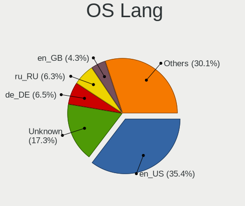
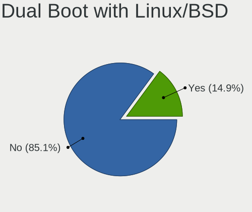
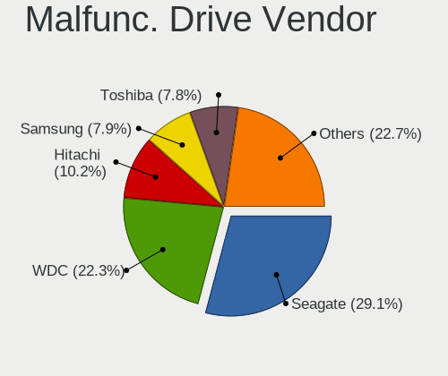

Linux - Tested Hardware & Statistics
------------------------------------

A project to collect tested hardware configurations for Linux.

Anyone can contribute to this report by the [hw-probe](https://github.com/linuxhw/hw-probe) tool:

    sudo -E hw-probe -all -upload

Please contribute! Especially if your hardware is rare.

This is a report for all computer types. See also reports for [desktops](/Desktop/README.md) and [notebooks](/Notebook/README.md).

Distribution-specific reports: [AlmaLinux](/Dist/AlmaLinux), [Alpine](/Dist/Alpine), [ALT_Linux](/Dist/ALT_Linux), [antiX](/Dist/antiX), [Artix](/Dist/Artix), [Chrome_OS](/Dist/Chrome_OS), [Clear_Linux](/Dist/Clear_Linux), [Deepin](/Dist/Deepin), [Devuan](/Dist/Devuan), [EndeavourOS](/Dist/EndeavourOS), [Garuda_Linux](/Dist/Garuda_Linux), [GNOME_OS](/Dist/GNOME_OS), [Kaisen](/Dist/Kaisen), [Mageia](/Dist/Mageia), [Makulu](/Dist/Makulu), [NixOS](/Dist/NixOS), [Nobara](/Dist/Nobara), [Oracle_Linux](/Dist/Oracle_Linux), [Pardus](/Dist/Pardus), [PureOS](/Dist/PureOS), [Q4OS](/Dist/Q4OS), [Reborn_OS](/Dist/Reborn_OS), [Rocky_Linux](/Dist/Rocky_Linux), [Sparky](/Dist/Sparky), [Void_Linux](/Dist/Void_Linux), [Xero](/Dist/Xero).

This report is for real hardware. Report for virtual hardware: [TestDays_VE](https://github.com/linuxhw/TestDays_VE)

Contents
--------

* [ Test Cases ](#test-cases)

* [ System ](#system)
  - [ OS                       ](#os)
  - [ OS Family                ](#os-family)
  - [ Kernel                   ](#kernel)
  - [ Kernel Family            ](#kernel-family)
  - [ Kernel Major Ver.        ](#kernel-major-ver)
  - [ Arch                     ](#arch)
  - [ DE                       ](#de)
  - [ Display Server           ](#display-server)
  - [ Display Manager          ](#display-manager)
  - [ OS Lang                  ](#os-lang)
  - [ Boot Mode                ](#boot-mode)
  - [ Filesystem               ](#filesystem)
  - [ Part. scheme             ](#part-scheme)
  - [ Dual Boot with Linux/BSD ](#dual-boot-with-linuxbsd)
  - [ Dual Boot (Win)          ](#dual-boot-win)

* [ Board ](#board)
  - [ Vendor                   ](#vendor)
  - [ Model                    ](#model)
  - [ Model Family             ](#model-family)
  - [ MFG Year                 ](#mfg-year)
  - [ Form Factor              ](#form-factor)
  - [ Secure Boot              ](#secure-boot)
  - [ Coreboot                 ](#coreboot)
  - [ RAM Size                 ](#ram-size)
  - [ RAM Used                 ](#ram-used)
  - [ Total Drives             ](#total-drives)
  - [ Has CD-ROM               ](#has-cd-rom)
  - [ Has Ethernet             ](#has-ethernet)
  - [ Has WiFi                 ](#has-wifi)
  - [ Has Bluetooth            ](#has-bluetooth)

* [ Location ](#location)
  - [ Country                  ](#country)
  - [ City                     ](#city)

* [ Drives ](#drives)
  - [ Drive Vendor             ](#drive-vendor)
  - [ Drive Model              ](#drive-model)
  - [ HDD Vendor               ](#hdd-vendor)
  - [ SSD Vendor               ](#ssd-vendor)
  - [ Drive Kind               ](#drive-kind)
  - [ Drive Connector          ](#drive-connector)
  - [ Drive Size               ](#drive-size)
  - [ Space Total              ](#space-total)
  - [ Space Used               ](#space-used)
  - [ Malfunc. Drives          ](#malfunc-drives)
  - [ Malfunc. Drive Vendor    ](#malfunc-drive-vendor)
  - [ Malfunc. HDD Vendor      ](#malfunc-hdd-vendor)
  - [ Malfunc. Drive Kind      ](#malfunc-drive-kind)
  - [ Failed Drives            ](#failed-drives)
  - [ Failed Drive Vendor      ](#failed-drive-vendor)
  - [ Drive Status             ](#drive-status)

* [ Storage controller ](#storage-controller)
  - [ Storage Vendor           ](#storage-vendor)
  - [ Storage Model            ](#storage-model)
  - [ Storage Kind             ](#storage-kind)

* [ Processor ](#processor)
  - [ CPU Vendor               ](#cpu-vendor)
  - [ CPU Model                ](#cpu-model)
  - [ CPU Model Family         ](#cpu-model-family)
  - [ CPU Cores                ](#cpu-cores)
  - [ CPU Sockets              ](#cpu-sockets)
  - [ CPU Threads              ](#cpu-threads)
  - [ CPU Op-Modes             ](#cpu-op-modes)
  - [ CPU Microcode            ](#cpu-microcode)
  - [ CPU Microarch            ](#cpu-microarch)

* [ Graphics ](#graphics)
  - [ GPU Vendor               ](#gpu-vendor)
  - [ GPU Model                ](#gpu-model)
  - [ GPU Combo                ](#gpu-combo)
  - [ GPU Driver               ](#gpu-driver)
  - [ GPU Memory               ](#gpu-memory)

* [ Monitor ](#monitor)
  - [ Monitor Vendor           ](#monitor-vendor)
  - [ Monitor Model            ](#monitor-model)
  - [ Monitor Resolution       ](#monitor-resolution)
  - [ Monitor Diagonal         ](#monitor-diagonal)
  - [ Monitor Width            ](#monitor-width)
  - [ Aspect Ratio             ](#aspect-ratio)
  - [ Monitor Area             ](#monitor-area)
  - [ Pixel Density            ](#pixel-density)
  - [ Multiple Monitors        ](#multiple-monitors)

* [ Network ](#network)
  - [ Net Controller Vendor    ](#net-controller-vendor)
  - [ Net Controller Model     ](#net-controller-model)
  - [ Wireless Vendor          ](#wireless-vendor)
  - [ Wireless Model           ](#wireless-model)
  - [ Ethernet Vendor          ](#ethernet-vendor)
  - [ Ethernet Model           ](#ethernet-model)
  - [ Net Controller Kind      ](#net-controller-kind)
  - [ Used Controller          ](#used-controller)
  - [ NICs                     ](#nics)
  - [ IPv6                     ](#ipv6)

* [ Bluetooth ](#bluetooth)
  - [ Bluetooth Vendor         ](#bluetooth-vendor)
  - [ Bluetooth Model          ](#bluetooth-model)

* [ Sound ](#sound)
  - [ Sound Vendor             ](#sound-vendor)
  - [ Sound Model              ](#sound-model)

* [ Memory ](#memory)
  - [ Memory Vendor            ](#memory-vendor)
  - [ Memory Model             ](#memory-model)
  - [ Memory Kind              ](#memory-kind)
  - [ Memory Form Factor       ](#memory-form-factor)
  - [ Memory Size              ](#memory-size)
  - [ Memory Speed             ](#memory-speed)

* [ Printers & scanners ](#printers--scanners)
  - [ Printer Vendor           ](#printer-vendor)
  - [ Printer Model            ](#printer-model)
  - [ Scanner Vendor           ](#scanner-vendor)
  - [ Scanner Model            ](#scanner-model)

* [ Camera ](#camera)
  - [ Camera Vendor            ](#camera-vendor)
  - [ Camera Model             ](#camera-model)

* [ Security ](#security)
  - [ Fingerprint Vendor       ](#fingerprint-vendor)
  - [ Fingerprint Model        ](#fingerprint-model)
  - [ Chipcard Vendor          ](#chipcard-vendor)
  - [ Chipcard Model           ](#chipcard-model)

* [ Unsupported ](#unsupported)
  - [ Unsupported Devices      ](#unsupported-devices)
  - [ Unsupported Device Types ](#unsupported-device-types)

Test Cases
----------

Total: 358002

| Vendor        | Model                       | Form-Factor | Probe                                                      | Date         |
|---------------|-----------------------------|-------------|------------------------------------------------------------|--------------|
| ASRock        | Z790 PG Lightning           | Desktop     | [0b5268372a](https://linux-hardware.org/?probe=0b5268372a) | Dec 24, 2023 |
| MSI           | H97 PC Mate                 | Desktop     | [f1c5d0d405](https://linux-hardware.org/?probe=f1c5d0d405) | Dec 24, 2023 |
| HP            | 0B40h                       | Desktop     | [e3ad55af3f](https://linux-hardware.org/?probe=e3ad55af3f) | Dec 24, 2023 |
| Lenovo        | IdeaPad 3 15ITL6 82H8       | Notebook    | [720ff4cf67](https://linux-hardware.org/?probe=720ff4cf67) | Dec 24, 2023 |
| Dell          | 0WMJ54 A01                  | Desktop     | [31f29a3843](https://linux-hardware.org/?probe=31f29a3843) | Dec 24, 2023 |
| ASUSTek       | Z97-K                       | Desktop     | [2474ae00d3](https://linux-hardware.org/?probe=2474ae00d3) | Dec 24, 2023 |
| Sony          | VPCS13V9E                   | Notebook    | [61230cc69b](https://linux-hardware.org/?probe=61230cc69b) | Dec 24, 2023 |
| HP            | ENVY Laptop 17-ch1xxx       | Notebook    | [d41bca7300](https://linux-hardware.org/?probe=d41bca7300) | Dec 24, 2023 |
| Lenovo        | ThinkPad E460 20ET0016US    | Notebook    | [96959ec0a3](https://linux-hardware.org/?probe=96959ec0a3) | Dec 24, 2023 |
| Toshiba       | Satellite C55-C             | Notebook    | [256b476a15](https://linux-hardware.org/?probe=256b476a15) | Dec 24, 2023 |
| Dell          | Inspiron 15 7000 Gaming     | Notebook    | [9eff3f535e](https://linux-hardware.org/?probe=9eff3f535e) | Dec 24, 2023 |
| HP            | ENVY Laptop 17-ch1xxx       | Notebook    | [8080c75b27](https://linux-hardware.org/?probe=8080c75b27) | Dec 24, 2023 |
| ASUSTek       | M5A97 EVO R2.0              | Desktop     | [cccb18ead9](https://linux-hardware.org/?probe=cccb18ead9) | Dec 24, 2023 |
| Dell          | 03X6X0 A06                  | Server      | [ca9bb6b7ff](https://linux-hardware.org/?probe=ca9bb6b7ff) | Dec 24, 2023 |
| Dell          | Inspiron 5482               | Convertible | [e084484713](https://linux-hardware.org/?probe=e084484713) | Dec 24, 2023 |
| Lenovo        | IdeaPad Pro 5 16APH8 83A... | Notebook    | [de6b5ead5b](https://linux-hardware.org/?probe=de6b5ead5b) | Dec 24, 2023 |
| Dell          | Latitude E6430              | Notebook    | [d949738171](https://linux-hardware.org/?probe=d949738171) | Dec 24, 2023 |
| Notebook      | W65_67SJ                    | Notebook    | [8bea89f7c9](https://linux-hardware.org/?probe=8bea89f7c9) | Dec 24, 2023 |
| MSI           | B450 GAMING PLUS MAX        | Desktop     | [587884179e](https://linux-hardware.org/?probe=587884179e) | Dec 24, 2023 |
| HP            | 82F1                        | Desktop     | [86959f8199](https://linux-hardware.org/?probe=86959f8199) | Dec 24, 2023 |
| Apple         | Mac-7BA5B2DFE22DDD8C Mac... | Mini pc     | [33ab4000ee](https://linux-hardware.org/?probe=33ab4000ee) | Dec 24, 2023 |
| Unknown       | Unknown                     | Desktop     | [74c274a303](https://linux-hardware.org/?probe=74c274a303) | Dec 24, 2023 |
| Raspberry ... | Raspberry Pi Zero W Rev ... | Soc         | [c9bcc97e5b](https://linux-hardware.org/?probe=c9bcc97e5b) | Dec 24, 2023 |
| Unknown       | Unknown                     | Desktop     | [123aa39382](https://linux-hardware.org/?probe=123aa39382) | Dec 24, 2023 |
| Acer          | Aspire TC-885 V:1.1         | Desktop     | [bdb39d60de](https://linux-hardware.org/?probe=bdb39d60de) | Dec 24, 2023 |
| Dell          | Latitude E6430              | Notebook    | [c821d379ec](https://linux-hardware.org/?probe=c821d379ec) | Dec 24, 2023 |
| ASUSTek       | G75VW                       | Notebook    | [63fa97bd36](https://linux-hardware.org/?probe=63fa97bd36) | Dec 24, 2023 |
| ASRock        | 990FX Extreme4              | Desktop     | [d698ea94f5](https://linux-hardware.org/?probe=d698ea94f5) | Dec 24, 2023 |
| Dell          | Inspiron 1564               | Notebook    | [a1945990cc](https://linux-hardware.org/?probe=a1945990cc) | Dec 24, 2023 |
| ASRock        | H610D4-P1                   | Desktop     | [88f9c52b47](https://linux-hardware.org/?probe=88f9c52b47) | Dec 24, 2023 |
| ASRock        | 990FX Extreme4              | Desktop     | [bfe0870fab](https://linux-hardware.org/?probe=bfe0870fab) | Dec 24, 2023 |
| Intel         | H61                         | Desktop     | [a10f481c10](https://linux-hardware.org/?probe=a10f481c10) | Dec 24, 2023 |
| Dell          | Inspiron 1564               | Notebook    | [e02428db4a](https://linux-hardware.org/?probe=e02428db4a) | Dec 24, 2023 |
| Lenovo        | ThinkPad T400 6474AV5       | Notebook    | [b98f0a2c09](https://linux-hardware.org/?probe=b98f0a2c09) | Dec 24, 2023 |
| ASRock        | 990FX Extreme4              | Desktop     | [d6c1f0d202](https://linux-hardware.org/?probe=d6c1f0d202) | Dec 24, 2023 |
| Valve         | Jupiter                     | Notebook    | [19f8d4f0b4](https://linux-hardware.org/?probe=19f8d4f0b4) | Dec 24, 2023 |
| MAXSUN        | MS-Terminator B550M         | Desktop     | [57ce047c4c](https://linux-hardware.org/?probe=57ce047c4c) | Dec 24, 2023 |
| Lenovo        | IdeaPad 3 15IAU7 82RK       | Notebook    | [a69b3fa1ca](https://linux-hardware.org/?probe=a69b3fa1ca) | Dec 24, 2023 |
| Apple         | MacBookAir7,1               | Notebook    | [f666ec3927](https://linux-hardware.org/?probe=f666ec3927) | Dec 24, 2023 |
| Dell          | Inspiron 5720               | Notebook    | [bcb6745ac2](https://linux-hardware.org/?probe=bcb6745ac2) | Dec 24, 2023 |
| Gigabyte      | AB350N-Gaming WIFI-CF       | Desktop     | [27a814dd64](https://linux-hardware.org/?probe=27a814dd64) | Dec 24, 2023 |
| Notebook      | W65_67SJ                    | Notebook    | [439816e10c](https://linux-hardware.org/?probe=439816e10c) | Dec 24, 2023 |
| Acer          | Aspire 5742Z                | Notebook    | [ddf1553f4b](https://linux-hardware.org/?probe=ddf1553f4b) | Dec 24, 2023 |
| Lenovo        | IdeaPad 3 15IAU7 82RK       | Notebook    | [9ac48a1719](https://linux-hardware.org/?probe=9ac48a1719) | Dec 24, 2023 |
| HUAWEI        | KLVD-WXX9                   | Notebook    | [ee7b7ce7cc](https://linux-hardware.org/?probe=ee7b7ce7cc) | Dec 24, 2023 |
| Acer          | Aspire V3-571               | Notebook    | [0819197709](https://linux-hardware.org/?probe=0819197709) | Dec 24, 2023 |
| Supermicro    | H12SSL-i                    | Server      | [df01343f10](https://linux-hardware.org/?probe=df01343f10) | Dec 24, 2023 |
| ASRockRack    | B650D4U-2L2T/BCM            | Server      | [346c422237](https://linux-hardware.org/?probe=346c422237) | Dec 24, 2023 |
| Dell          | 0PV3YR A05                  | Server      | [43718a5746](https://linux-hardware.org/?probe=43718a5746) | Dec 24, 2023 |
| HP            | 8918                        | Desktop     | [4b922c3362](https://linux-hardware.org/?probe=4b922c3362) | Dec 24, 2023 |
| BESSTAR Te... | GB7                         | Mini pc     | [f76e4b41dc](https://linux-hardware.org/?probe=f76e4b41dc) | Dec 24, 2023 |
| Dell          | Inspiron 5485 2n1           | Convertible | [334b43f409](https://linux-hardware.org/?probe=334b43f409) | Dec 24, 2023 |
| Toshiba       | Satellite A205              | Notebook    | [c3680bfd29](https://linux-hardware.org/?probe=c3680bfd29) | Dec 24, 2023 |
| Samsung       | RV415/RV515                 | Notebook    | [da980644b4](https://linux-hardware.org/?probe=da980644b4) | Dec 24, 2023 |
| Dell          | 0WR7PY A02                  | Desktop     | [df3b1f1cc3](https://linux-hardware.org/?probe=df3b1f1cc3) | Dec 24, 2023 |
| Gigabyte      | X670 GAMING X AX            | Desktop     | [4452cd4a25](https://linux-hardware.org/?probe=4452cd4a25) | Dec 24, 2023 |
| MSI           | X99A RAIDER                 | Desktop     | [b150280df5](https://linux-hardware.org/?probe=b150280df5) | Dec 24, 2023 |
| HP            | 2B29                        | Desktop     | [93ef9f39bd](https://linux-hardware.org/?probe=93ef9f39bd) | Dec 24, 2023 |
| Toshiba       | Satellite Pro L450          | Notebook    | [8da0c619f3](https://linux-hardware.org/?probe=8da0c619f3) | Dec 24, 2023 |
| Intel         | B85                         | Desktop     | [5b462c9ed1](https://linux-hardware.org/?probe=5b462c9ed1) | Dec 24, 2023 |
| Notebook      | NJx0MU                      | Notebook    | [b57fdd9854](https://linux-hardware.org/?probe=b57fdd9854) | Dec 24, 2023 |
| Dell          | Latitude 7490               | Notebook    | [69205c648f](https://linux-hardware.org/?probe=69205c648f) | Dec 24, 2023 |
| Acer          | Aspire 5250                 | Notebook    | [224ca602f3](https://linux-hardware.org/?probe=224ca602f3) | Dec 24, 2023 |
| Intel         | NUC13ANBi7 M89645-203       | Mini pc     | [27124f064a](https://linux-hardware.org/?probe=27124f064a) | Dec 24, 2023 |
| Intel         | NUC13ANBi7 M89645-203       | Mini pc     | [e12710e5bd](https://linux-hardware.org/?probe=e12710e5bd) | Dec 24, 2023 |
| ASUSTek       | PRIME B450M-A II            | Desktop     | [3366f8e90d](https://linux-hardware.org/?probe=3366f8e90d) | Dec 24, 2023 |
| Samsung       | 750QFG                      | Convertible | [12b0133961](https://linux-hardware.org/?probe=12b0133961) | Dec 24, 2023 |
| Acer          | Nitro AN515-44              | Notebook    | [cc87c11e7b](https://linux-hardware.org/?probe=cc87c11e7b) | Dec 24, 2023 |
| ASUSTek       | PRIME B450M-A II            | Desktop     | [6484f4217b](https://linux-hardware.org/?probe=6484f4217b) | Dec 24, 2023 |
| Dell          | Inspiron 3521               | Notebook    | [a109a64bdd](https://linux-hardware.org/?probe=a109a64bdd) | Dec 24, 2023 |
| Acer          | Aspire 5750G                | Notebook    | [a12f3e5ce6](https://linux-hardware.org/?probe=a12f3e5ce6) | Dec 24, 2023 |
| Intel         | NUC13ANBi7 M89645-203       | Mini pc     | [1fe8e8f18d](https://linux-hardware.org/?probe=1fe8e8f18d) | Dec 24, 2023 |
| Acer          | Aspire 5750G                | Notebook    | [1a31482d70](https://linux-hardware.org/?probe=1a31482d70) | Dec 24, 2023 |
| Notebook      | NL5xNU                      | Notebook    | [1cb09f63f9](https://linux-hardware.org/?probe=1cb09f63f9) | Dec 24, 2023 |
| Lenovo        | Yoga 9 14ITL5 82BG          | Convertible | [234581f461](https://linux-hardware.org/?probe=234581f461) | Dec 24, 2023 |
| Fujitsu       | D3061-A1 S26361-D3061-A1    | Desktop     | [646b9af5a9](https://linux-hardware.org/?probe=646b9af5a9) | Dec 24, 2023 |
| Intel         | NUC13ANBi7 M89645-203       | Mini pc     | [381955efac](https://linux-hardware.org/?probe=381955efac) | Dec 24, 2023 |
| Lenovo        | IdeaPad 100-15IBD 80QQ      | Notebook    | [f8abeb2607](https://linux-hardware.org/?probe=f8abeb2607) | Dec 24, 2023 |
| HP            | 21D0                        | Desktop     | [733191fd29](https://linux-hardware.org/?probe=733191fd29) | Dec 24, 2023 |
| ASUSTek       | ROG Zephyrus G14 GA402RJ... | Notebook    | [29b4b5a349](https://linux-hardware.org/?probe=29b4b5a349) | Dec 24, 2023 |
| HP            | Pavilion g7                 | Notebook    | [bbe3fb1914](https://linux-hardware.org/?probe=bbe3fb1914) | Dec 24, 2023 |
| Dell          | G16 7630                    | Notebook    | [71f36f8ed0](https://linux-hardware.org/?probe=71f36f8ed0) | Dec 24, 2023 |
| ASUSTek       | P7P55D-E PRO                | Desktop     | [ef61ad2663](https://linux-hardware.org/?probe=ef61ad2663) | Dec 24, 2023 |
| Lenovo        | IdeaPad Pro 5 14APH8 83A... | Notebook    | [39e33e4510](https://linux-hardware.org/?probe=39e33e4510) | Dec 24, 2023 |
| MSI           | B350M PRO-VDH               | Desktop     | [d845a3492b](https://linux-hardware.org/?probe=d845a3492b) | Dec 24, 2023 |
| Dell          | 0P658H A05                  | Server      | [14a0701959](https://linux-hardware.org/?probe=14a0701959) | Dec 24, 2023 |
| HP            | Notebook                    | Notebook    | [69bef099c0](https://linux-hardware.org/?probe=69bef099c0) | Dec 24, 2023 |
| MSI           | B350M PRO-VDH               | Desktop     | [a6e1fc3b29](https://linux-hardware.org/?probe=a6e1fc3b29) | Dec 24, 2023 |
| Google        | Magolor                     | Notebook    | [f5d079bc79](https://linux-hardware.org/?probe=f5d079bc79) | Dec 24, 2023 |
| Dell          | Latitude E7450              | Notebook    | [6758499db8](https://linux-hardware.org/?probe=6758499db8) | Dec 24, 2023 |
| Dell          | Latitude 5300               | Notebook    | [68336d8bc1](https://linux-hardware.org/?probe=68336d8bc1) | Dec 24, 2023 |
| ASUSTek       | VivoBook_ASUS Laptop E41... | Notebook    | [c0ff23eba6](https://linux-hardware.org/?probe=c0ff23eba6) | Dec 24, 2023 |
| Anbernic      | Win600                      | Notebook    | [3b5255f14b](https://linux-hardware.org/?probe=3b5255f14b) | Dec 24, 2023 |
| Dell          | Latitude 12 Rugged Table... | Notebook    | [7690d56522](https://linux-hardware.org/?probe=7690d56522) | Dec 24, 2023 |
| Lenovo        | ThinkPad X1 Carbon Gen 1... | Notebook    | [1297c97e04](https://linux-hardware.org/?probe=1297c97e04) | Dec 24, 2023 |
| Dell          | Precision 3560              | Notebook    | [b945ab8339](https://linux-hardware.org/?probe=b945ab8339) | Dec 24, 2023 |
| MSI           | 770-C45                     | Desktop     | [b627deabe4](https://linux-hardware.org/?probe=b627deabe4) | Dec 24, 2023 |
| Dell          | Latitude E7450              | Notebook    | [d3eb47d0a5](https://linux-hardware.org/?probe=d3eb47d0a5) | Dec 24, 2023 |
| MSI           | MPG B650 EDGE WIFI          | Desktop     | [8503d79f6c](https://linux-hardware.org/?probe=8503d79f6c) | Dec 24, 2023 |
| Valve         | Galileo                     | Notebook    | [aa141b8ea2](https://linux-hardware.org/?probe=aa141b8ea2) | Dec 24, 2023 |
| Lenovo        | ThinkPad T460s 20FAS0600... | Notebook    | [07efd36bbe](https://linux-hardware.org/?probe=07efd36bbe) | Dec 24, 2023 |
| Apple         | MacBookAir6,2               | Notebook    | [a3af8ee68a](https://linux-hardware.org/?probe=a3af8ee68a) | Dec 24, 2023 |
| Lenovo        | 3181 NO DPK                 | Mini pc     | [441eb7b439](https://linux-hardware.org/?probe=441eb7b439) | Dec 24, 2023 |
| MSI           | PRO B650-S WIFI             | Desktop     | [c084478d6e](https://linux-hardware.org/?probe=c084478d6e) | Dec 24, 2023 |
| HP            | Laptop 15-ef2xxx            | Notebook    | [31291c7bc9](https://linux-hardware.org/?probe=31291c7bc9) | Dec 24, 2023 |
| HP            | Unknown                     | Notebook    | [3bc06ba7d3](https://linux-hardware.org/?probe=3bc06ba7d3) | Dec 24, 2023 |
| HP            | Presario CQ61               | Notebook    | [249a217a7c](https://linux-hardware.org/?probe=249a217a7c) | Dec 24, 2023 |
| Teclast       | F6 Plus                     | Notebook    | [a8fee53f37](https://linux-hardware.org/?probe=a8fee53f37) | Dec 24, 2023 |
| Lenovo        | G50-70 20351                | Notebook    | [3ac6a566ab](https://linux-hardware.org/?probe=3ac6a566ab) | Dec 24, 2023 |
| Lenovo        | G50-70 20351                | Notebook    | [dc269fb33a](https://linux-hardware.org/?probe=dc269fb33a) | Dec 24, 2023 |
| Lenovo        | ThinkPad T440 20B7A1P700    | Notebook    | [d49a8fe4d4](https://linux-hardware.org/?probe=d49a8fe4d4) | Dec 24, 2023 |
| Lenovo        | ThinkPad T520 424049U       | Notebook    | [c393fb64e3](https://linux-hardware.org/?probe=c393fb64e3) | Dec 24, 2023 |
| Lenovo        | V15 G4 AMN 82YU             | Notebook    | [d7518dd730](https://linux-hardware.org/?probe=d7518dd730) | Dec 24, 2023 |
| Apple         | MacBookAir7,2               | Notebook    | [03b1209523](https://linux-hardware.org/?probe=03b1209523) | Dec 24, 2023 |
| Lenovo        | ThinkPad T440 20B7A1P700    | Notebook    | [f1c9eab3f4](https://linux-hardware.org/?probe=f1c9eab3f4) | Dec 24, 2023 |
| Lenovo        | ThinkPad P14s Gen 4 21K5... | Notebook    | [d7b7e34741](https://linux-hardware.org/?probe=d7b7e34741) | Dec 24, 2023 |
| ASRock        | X670E Taichi Carrara        | Desktop     | [3c53e69328](https://linux-hardware.org/?probe=3c53e69328) | Dec 24, 2023 |
| Acer          | Aspire A515-43              | Notebook    | [922518c025](https://linux-hardware.org/?probe=922518c025) | Dec 23, 2023 |
| Dell          | Inspiron 15 3530            | Notebook    | [0688896e27](https://linux-hardware.org/?probe=0688896e27) | Dec 23, 2023 |
| Apple         | MacBookPro9,1               | Notebook    | [a70e7da743](https://linux-hardware.org/?probe=a70e7da743) | Dec 23, 2023 |
| Apple         | MacBookAir7,2               | Notebook    | [b7f3ca9ba4](https://linux-hardware.org/?probe=b7f3ca9ba4) | Dec 23, 2023 |
| ASUSTek       | P5GC-MX/1333                | Desktop     | [a95c11e27b](https://linux-hardware.org/?probe=a95c11e27b) | Dec 23, 2023 |
| HP            | Elite x2 1012 G1            | Notebook    | [b093087b3c](https://linux-hardware.org/?probe=b093087b3c) | Dec 23, 2023 |
| Raspberry ... | Raspberry Pi 3 Model B R... | Soc         | [adc4da12d3](https://linux-hardware.org/?probe=adc4da12d3) | Dec 23, 2023 |
| ASUSTek       | Zenbook 15 UM3504DA_UM35... | Notebook    | [6cc304ea54](https://linux-hardware.org/?probe=6cc304ea54) | Dec 23, 2023 |
| ASUSTek       | ROG STRIX B450-F GAMING     | Desktop     | [a84743b247](https://linux-hardware.org/?probe=a84743b247) | Dec 23, 2023 |
| ASUSTek       | H110M-A                     | Desktop     | [63306d22b2](https://linux-hardware.org/?probe=63306d22b2) | Dec 23, 2023 |
| Gigabyte      | GA-78LMT-USB3               | Desktop     | [dd658b1151](https://linux-hardware.org/?probe=dd658b1151) | Dec 23, 2023 |
| MSI           | H510M-A PRO                 | Desktop     | [fe19f4de86](https://linux-hardware.org/?probe=fe19f4de86) | Dec 23, 2023 |
| Acer          | TDPS05                      | Desktop     | [ce9b5d0c48](https://linux-hardware.org/?probe=ce9b5d0c48) | Dec 23, 2023 |
| Packard Be... | EasyNote TE11HC             | Notebook    | [2c88ade0b2](https://linux-hardware.org/?probe=2c88ade0b2) | Dec 23, 2023 |
| Lenovo        | ThinkPad T420 4178AFU       | Notebook    | [67caa6c117](https://linux-hardware.org/?probe=67caa6c117) | Dec 23, 2023 |
| Raspberry ... | Raspberry Pi Zero W Rev ... | Soc         | [861b433642](https://linux-hardware.org/?probe=861b433642) | Dec 23, 2023 |
| ASUSTek       | TUF Gaming B550M-E          | Desktop     | [518e259c3c](https://linux-hardware.org/?probe=518e259c3c) | Dec 23, 2023 |
| Unknown       | Unknown                     | Notebook    | [a0d7edc452](https://linux-hardware.org/?probe=a0d7edc452) | Dec 23, 2023 |
| Lenovo        | IdeaPad Gaming 3 15IAH7 ... | Notebook    | [a79885417a](https://linux-hardware.org/?probe=a79885417a) | Dec 23, 2023 |
| ASRock        | B450 Gaming-ITX/ac          | Desktop     | [6c6f281927](https://linux-hardware.org/?probe=6c6f281927) | Dec 23, 2023 |
| Gigabyte      | B460M GAMING HD             | Desktop     | [6669971369](https://linux-hardware.org/?probe=6669971369) | Dec 23, 2023 |
| HP            | ZBook 17 G5                 | Notebook    | [ad6c489ffc](https://linux-hardware.org/?probe=ad6c489ffc) | Dec 23, 2023 |
| HP            | Elite x2 1012 G1            | Notebook    | [c93fffc388](https://linux-hardware.org/?probe=c93fffc388) | Dec 23, 2023 |
| ASUSTek       | M2V                         | Desktop     | [67c7bc43ed](https://linux-hardware.org/?probe=67c7bc43ed) | Dec 23, 2023 |
| TECNO Mobi... | MEGABOOK T15DA              | Notebook    | [82d65cfce4](https://linux-hardware.org/?probe=82d65cfce4) | Dec 23, 2023 |
| Gateway       | NV59C                       | Notebook    | [1537866140](https://linux-hardware.org/?probe=1537866140) | Dec 23, 2023 |
| ASRock        | B450 Gaming-ITX/ac          | Desktop     | [5590fcbfaf](https://linux-hardware.org/?probe=5590fcbfaf) | Dec 23, 2023 |
| Dell          | 09KPNV A00                  | Desktop     | [a90623afe1](https://linux-hardware.org/?probe=a90623afe1) | Dec 23, 2023 |
| ASUSTek       | M2V                         | Desktop     | [1d6970f290](https://linux-hardware.org/?probe=1d6970f290) | Dec 23, 2023 |
| Lenovo        | G50-80 80L0                 | Notebook    | [21df7039b9](https://linux-hardware.org/?probe=21df7039b9) | Dec 23, 2023 |
| Lenovo        | ThinkPad X1 Tablet Gen 2... | Tablet      | [caa5d04521](https://linux-hardware.org/?probe=caa5d04521) | Dec 23, 2023 |
| MSI           | 970 GAMING                  | Desktop     | [275aa2eb92](https://linux-hardware.org/?probe=275aa2eb92) | Dec 23, 2023 |
| Acer          | Nitro AN515-43              | Notebook    | [b1342e1524](https://linux-hardware.org/?probe=b1342e1524) | Dec 23, 2023 |
| Gigabyte      | Q87M-D2H                    | Desktop     | [4b2ed8b976](https://linux-hardware.org/?probe=4b2ed8b976) | Dec 23, 2023 |
| Dell          | Latitude E4310              | Notebook    | [41f607e5e5](https://linux-hardware.org/?probe=41f607e5e5) | Dec 23, 2023 |
| Lenovo        | V15 G4 AMN 82YU             | Notebook    | [a4b5f3a556](https://linux-hardware.org/?probe=a4b5f3a556) | Dec 23, 2023 |
| ASRock        | Q1900DC-ITX                 | Desktop     | [ee59bde7c9](https://linux-hardware.org/?probe=ee59bde7c9) | Dec 23, 2023 |
| Lenovo        | ThinkPad T520 424049U       | Notebook    | [d800424ece](https://linux-hardware.org/?probe=d800424ece) | Dec 23, 2023 |
| Apple         | Mac-7BA5B2DFE22DDD8C Mac... | Mini pc     | [aef21854a2](https://linux-hardware.org/?probe=aef21854a2) | Dec 23, 2023 |
| ASRock        | Q1900DC-ITX                 | Desktop     | [9733217ad2](https://linux-hardware.org/?probe=9733217ad2) | Dec 23, 2023 |
| ASUSTek       | PRIME B450-PLUS             | Desktop     | [a32ea319ca](https://linux-hardware.org/?probe=a32ea319ca) | Dec 23, 2023 |
| AZW           | EQ                          | Desktop     | [a04c9735a7](https://linux-hardware.org/?probe=a04c9735a7) | Dec 23, 2023 |
| Acer          | Veriton X2631G V:1.0        | Desktop     | [a57f2ee15f](https://linux-hardware.org/?probe=a57f2ee15f) | Dec 23, 2023 |
| AZW           | EQ                          | Desktop     | [9b3d265cd1](https://linux-hardware.org/?probe=9b3d265cd1) | Dec 23, 2023 |
| Lenovo        | Yoga 510-14AST 80S9         | Convertible | [ce31053fe2](https://linux-hardware.org/?probe=ce31053fe2) | Dec 23, 2023 |
| HP            | EliteBook 2530p             | Notebook    | [996611fcab](https://linux-hardware.org/?probe=996611fcab) | Dec 23, 2023 |
| Dell          | Latitude E6420              | Notebook    | [82c13c188b](https://linux-hardware.org/?probe=82c13c188b) | Dec 23, 2023 |
| Acer          | Aspire ES1-572              | Notebook    | [e726ce9f63](https://linux-hardware.org/?probe=e726ce9f63) | Dec 23, 2023 |
| Acer          | Veriton X2631G V:1.0        | Desktop     | [c9555a34f2](https://linux-hardware.org/?probe=c9555a34f2) | Dec 23, 2023 |
| Dell          | Latitude E4310              | Notebook    | [0c4f2ab6b3](https://linux-hardware.org/?probe=0c4f2ab6b3) | Dec 23, 2023 |
| Dell          | 0J1C3P A01                  | Desktop     | [faea7a3006](https://linux-hardware.org/?probe=faea7a3006) | Dec 23, 2023 |
| Lenovo        | IdeaPad 5 15ALC05 82LN      | Notebook    | [b3e3c041d7](https://linux-hardware.org/?probe=b3e3c041d7) | Dec 23, 2023 |
| ASUSTek       | GL503VM                     | Notebook    | [dfedaea706](https://linux-hardware.org/?probe=dfedaea706) | Dec 23, 2023 |
| MSI           | MPG B550 GAMING PLUS        | Desktop     | [9aa71593d4](https://linux-hardware.org/?probe=9aa71593d4) | Dec 23, 2023 |
| MSI           | PRO Z790-A WIFI             | Desktop     | [8becdfe1a4](https://linux-hardware.org/?probe=8becdfe1a4) | Dec 23, 2023 |
| Acer          | Aspire 7750G                | Notebook    | [0b0beeca3a](https://linux-hardware.org/?probe=0b0beeca3a) | Dec 23, 2023 |
| Unknown       | Unknown                     | Notebook    | [ef80f96d40](https://linux-hardware.org/?probe=ef80f96d40) | Dec 23, 2023 |
| HP            | 1998                        | Desktop     | [c2e72e513c](https://linux-hardware.org/?probe=c2e72e513c) | Dec 23, 2023 |
| ASUSTek       | GL503VM                     | Notebook    | [05b212db99](https://linux-hardware.org/?probe=05b212db99) | Dec 23, 2023 |
| Sony          | VPCEA1S1E                   | Notebook    | [af850dd5f3](https://linux-hardware.org/?probe=af850dd5f3) | Dec 23, 2023 |
| PC Special... | GK7NP5R                     | Notebook    | [1d97edcad7](https://linux-hardware.org/?probe=1d97edcad7) | Dec 23, 2023 |
| ASUSTek       | TUF B360-PLUS GAMING        | Desktop     | [b1c3408d24](https://linux-hardware.org/?probe=b1c3408d24) | Dec 23, 2023 |
| ASRock        | H310CM-HDV/M.2              | Desktop     | [76d95ab75c](https://linux-hardware.org/?probe=76d95ab75c) | Dec 23, 2023 |
| System76      | Gazelle                     | Notebook    | [2b9bce59e7](https://linux-hardware.org/?probe=2b9bce59e7) | Dec 23, 2023 |
| Framework     | Laptop (12th Gen Intel C... | Notebook    | [ef18e09b69](https://linux-hardware.org/?probe=ef18e09b69) | Dec 23, 2023 |
| Lenovo        | Yoga C740-14IML 81TC        | Convertible | [3625c673e4](https://linux-hardware.org/?probe=3625c673e4) | Dec 23, 2023 |
| TUXEDO        | N24_25JU                    | Notebook    | [8a1a153723](https://linux-hardware.org/?probe=8a1a153723) | Dec 23, 2023 |
| MSI           | MPG B550 GAMING PLUS        | Desktop     | [3819a04ddd](https://linux-hardware.org/?probe=3819a04ddd) | Dec 23, 2023 |
| Fujitsu       | D3161-A1 S26361-D3161-A1    | Desktop     | [c8bab56547](https://linux-hardware.org/?probe=c8bab56547) | Dec 23, 2023 |
| Lenovo        | IdeaPad 320-17ABR 80YN      | Notebook    | [fd501fc946](https://linux-hardware.org/?probe=fd501fc946) | Dec 23, 2023 |
| ASUSTek       | P8Z77-V PRO                 | Desktop     | [4f8558438f](https://linux-hardware.org/?probe=4f8558438f) | Dec 23, 2023 |
| Gigabyte      | GA-78LMT-S2P                | Desktop     | [6f36390142](https://linux-hardware.org/?probe=6f36390142) | Dec 23, 2023 |
| ASUSTek       | PRIME Z490-P                | Desktop     | [61724f27e7](https://linux-hardware.org/?probe=61724f27e7) | Dec 23, 2023 |
| Fujitsu       | D3161-A1 S26361-D3161-A1    | Desktop     | [c1069bda0b](https://linux-hardware.org/?probe=c1069bda0b) | Dec 23, 2023 |
| IBM           | ThinkPad R50e 1842QDU       | Notebook    | [32a349ab97](https://linux-hardware.org/?probe=32a349ab97) | Dec 23, 2023 |
| Lenovo        | ThinkPad T420 4178AFU       | Notebook    | [c2681f33cc](https://linux-hardware.org/?probe=c2681f33cc) | Dec 23, 2023 |
| MSI           | H110M PRO-D                 | Desktop     | [7a442e82cf](https://linux-hardware.org/?probe=7a442e82cf) | Dec 23, 2023 |
| HUAWEI        | BOM-WXX9                    | Notebook    | [40ba77bcb8](https://linux-hardware.org/?probe=40ba77bcb8) | Dec 23, 2023 |
| Gigabyte      | M68MT-S2                    | Desktop     | [ba4e48312e](https://linux-hardware.org/?probe=ba4e48312e) | Dec 23, 2023 |
| Acer          | Extensa 2519                | Notebook    | [29bc812d6d](https://linux-hardware.org/?probe=29bc812d6d) | Dec 23, 2023 |
| ASUSTek       | M4A785-M                    | Desktop     | [fe6c638acc](https://linux-hardware.org/?probe=fe6c638acc) | Dec 23, 2023 |
| HP            | 1998                        | Desktop     | [8eb25518c4](https://linux-hardware.org/?probe=8eb25518c4) | Dec 23, 2023 |
| Intel         | S5000PSL                    | Server      | [4abb5e39fc](https://linux-hardware.org/?probe=4abb5e39fc) | Dec 23, 2023 |
| HP            | 2ADC                        | Desktop     | [2c9d8d03d2](https://linux-hardware.org/?probe=2c9d8d03d2) | Dec 23, 2023 |
| Gigabyte      | M68MT-S2                    | Desktop     | [e91530e41d](https://linux-hardware.org/?probe=e91530e41d) | Dec 23, 2023 |
| Lenovo        | IdeaPad 5 14ARE05 81YM      | Notebook    | [6b0368fd61](https://linux-hardware.org/?probe=6b0368fd61) | Dec 23, 2023 |
| Acer          | Aspire A515-55              | Notebook    | [9412d138fb](https://linux-hardware.org/?probe=9412d138fb) | Dec 23, 2023 |
| Lenovo        | IdeaPad Y500 9541           | Notebook    | [a85ec375f5](https://linux-hardware.org/?probe=a85ec375f5) | Dec 23, 2023 |
| HP            | ProBook 655 G2              | Notebook    | [033325e722](https://linux-hardware.org/?probe=033325e722) | Dec 23, 2023 |
| Acer          | Aspire A515-55              | Notebook    | [4166459262](https://linux-hardware.org/?probe=4166459262) | Dec 23, 2023 |
| Acer          | H81-M1                      | Desktop     | [e9fd2a5dc4](https://linux-hardware.org/?probe=e9fd2a5dc4) | Dec 23, 2023 |
| ASUSTek       | ASUS TUF Gaming A15 FA50... | Notebook    | [5c4d1c7d64](https://linux-hardware.org/?probe=5c4d1c7d64) | Dec 23, 2023 |
| ASRock        | AMCP7A-ION                  | Desktop     | [fb0acc2d50](https://linux-hardware.org/?probe=fb0acc2d50) | Dec 23, 2023 |
| Acer          | Nitro AN515-51              | Notebook    | [52a7a4d6d8](https://linux-hardware.org/?probe=52a7a4d6d8) | Dec 23, 2023 |
| MSI           | B550-A PRO                  | Desktop     | [64a00841b2](https://linux-hardware.org/?probe=64a00841b2) | Dec 23, 2023 |
| Acer          | Nitro AN517-55              | Notebook    | [f3e3de235b](https://linux-hardware.org/?probe=f3e3de235b) | Dec 23, 2023 |
| ASUSTek       | U5A                         | Notebook    | [fd3c48af54](https://linux-hardware.org/?probe=fd3c48af54) | Dec 23, 2023 |
| Unknown       | Unknown                     | Desktop     | [9549fcd83e](https://linux-hardware.org/?probe=9549fcd83e) | Dec 23, 2023 |
| ASUSTek       | N53SV                       | Notebook    | [5098aee09b](https://linux-hardware.org/?probe=5098aee09b) | Dec 23, 2023 |
| GITSTAR       | GDC-1461                    | Notebook    | [5412cf0f39](https://linux-hardware.org/?probe=5412cf0f39) | Dec 23, 2023 |
| Dell          | Latitude E6530              | Notebook    | [2a62f5f318](https://linux-hardware.org/?probe=2a62f5f318) | Dec 23, 2023 |
| Acer          | TDPS05                      | Desktop     | [d0260b1327](https://linux-hardware.org/?probe=d0260b1327) | Dec 23, 2023 |
| Dell          | Latitude E6530              | Notebook    | [2d9ff2bdb9](https://linux-hardware.org/?probe=2d9ff2bdb9) | Dec 23, 2023 |
| ASUSTek       | Zenbook UM3402YAR_UM3402... | Notebook    | [a72824a48c](https://linux-hardware.org/?probe=a72824a48c) | Dec 23, 2023 |
| MACHINIST     | X99-K9 V2.0                 | Desktop     | [7f4061fd49](https://linux-hardware.org/?probe=7f4061fd49) | Dec 23, 2023 |
| Lenovo        | ThinkPad T410 2537E82       | Notebook    | [d153c701cc](https://linux-hardware.org/?probe=d153c701cc) | Dec 23, 2023 |
| Alienware     | m15 R7 AMD                  | Notebook    | [9d80128f05](https://linux-hardware.org/?probe=9d80128f05) | Dec 23, 2023 |
| Unknown       | FastRhino R66S              | Soc         | [a9cd767c91](https://linux-hardware.org/?probe=a9cd767c91) | Dec 23, 2023 |
| ASUSTek       | Vivobook Go E1504GAB_E15... | Notebook    | [1947533de1](https://linux-hardware.org/?probe=1947533de1) | Dec 23, 2023 |
| ASUSTek       | X99-A II                    | Desktop     | [37e4430c0e](https://linux-hardware.org/?probe=37e4430c0e) | Dec 23, 2023 |
| Samsung       | 730QED                      | Convertible | [c7670723ff](https://linux-hardware.org/?probe=c7670723ff) | Dec 23, 2023 |
| Dell          | Latitude E5510              | Notebook    | [379ebf6111](https://linux-hardware.org/?probe=379ebf6111) | Dec 23, 2023 |
| ASUSTek       | N53SV                       | Notebook    | [5ad49bc6d3](https://linux-hardware.org/?probe=5ad49bc6d3) | Dec 23, 2023 |
| ASUSTek       | P5B-VM SE                   | Desktop     | [4640d8f333](https://linux-hardware.org/?probe=4640d8f333) | Dec 23, 2023 |
| MSI           | MPG B760I EDGE WIFI DDR4    | Desktop     | [58bbd67a73](https://linux-hardware.org/?probe=58bbd67a73) | Dec 23, 2023 |
| AVITA         | NS14A6                      | Notebook    | [adf732b1b6](https://linux-hardware.org/?probe=adf732b1b6) | Dec 23, 2023 |
| Lenovo        | Legion Pro 5 16ARX8 82WM    | Notebook    | [6d8c495e90](https://linux-hardware.org/?probe=6d8c495e90) | Dec 23, 2023 |
| MSI           | GE62 2QF                    | Notebook    | [cf9a783196](https://linux-hardware.org/?probe=cf9a783196) | Dec 23, 2023 |
| Foxconn       | 2ABF                        | Desktop     | [d12d3a2f21](https://linux-hardware.org/?probe=d12d3a2f21) | Dec 23, 2023 |
| MSI           | H110M PRO-D                 | Desktop     | [10257919e4](https://linux-hardware.org/?probe=10257919e4) | Dec 23, 2023 |
| Anbernic      | Win600                      | Notebook    | [02e1d7adeb](https://linux-hardware.org/?probe=02e1d7adeb) | Dec 23, 2023 |
| Toshiba       | Satellite A660              | Notebook    | [d0415e05d3](https://linux-hardware.org/?probe=d0415e05d3) | Dec 23, 2023 |
| Lenovo        | IdeaPad S145-15IGM 81WT     | Notebook    | [d409d2fe79](https://linux-hardware.org/?probe=d409d2fe79) | Dec 23, 2023 |
| HP            | 1497                        | Desktop     | [9d5244b557](https://linux-hardware.org/?probe=9d5244b557) | Dec 23, 2023 |
| Lenovo        | IdeaPad S145-15IGM 81WT     | Notebook    | [eae7bab112](https://linux-hardware.org/?probe=eae7bab112) | Dec 23, 2023 |
| Sony          | VPCS13V9E                   | Notebook    | [05f387de9b](https://linux-hardware.org/?probe=05f387de9b) | Dec 23, 2023 |
| HP            | Victus by Gaming Laptop ... | Notebook    | [95adcc5c56](https://linux-hardware.org/?probe=95adcc5c56) | Dec 23, 2023 |
| ASUSTek       | X441BA                      | Notebook    | [04e5c55b92](https://linux-hardware.org/?probe=04e5c55b92) | Dec 23, 2023 |
| Lenovo        | ThinkPad T410 2537E82       | Notebook    | [398233e395](https://linux-hardware.org/?probe=398233e395) | Dec 23, 2023 |
| Lenovo        | ThinkCentre M58 7373AJ5     | Desktop     | [201981bc3f](https://linux-hardware.org/?probe=201981bc3f) | Dec 23, 2023 |
| TULPAR        | A5 V20.3                    | Notebook    | [83c6679958](https://linux-hardware.org/?probe=83c6679958) | Dec 23, 2023 |
| HP            | ProBook 4540s               | Notebook    | [fbed208acc](https://linux-hardware.org/?probe=fbed208acc) | Dec 23, 2023 |
| ASRock        | X370 Taichi                 | Desktop     | [689d51f57e](https://linux-hardware.org/?probe=689d51f57e) | Dec 23, 2023 |
| Intel         | NUC6CAYB J23203-403         | Mini pc     | [83e47fa893](https://linux-hardware.org/?probe=83e47fa893) | Dec 23, 2023 |
| HP            | EliteBook 8570w             | Notebook    | [4b6025ed6e](https://linux-hardware.org/?probe=4b6025ed6e) | Dec 23, 2023 |
| Dell          | 0WMJ54 A01                  | Desktop     | [ac0b6ab055](https://linux-hardware.org/?probe=ac0b6ab055) | Dec 23, 2023 |
| Gigabyte      | B85-HD3                     | Desktop     | [79fbb89592](https://linux-hardware.org/?probe=79fbb89592) | Dec 23, 2023 |
| ASUSTek       | PRIME B360-PLUS             | Desktop     | [4cd7d986cd](https://linux-hardware.org/?probe=4cd7d986cd) | Dec 23, 2023 |
| Dell          | 04Y8V0 A02                  | Desktop     | [1c3e40ac13](https://linux-hardware.org/?probe=1c3e40ac13) | Dec 23, 2023 |
| ASUSTek       | UL80VT                      | Notebook    | [5b04b67d44](https://linux-hardware.org/?probe=5b04b67d44) | Dec 23, 2023 |
| Lenovo        | IdeaPad 320-17ABR 80YN      | Notebook    | [7d9fabde46](https://linux-hardware.org/?probe=7d9fabde46) | Dec 23, 2023 |
| ASUSTek       | PRIME H310M-K R2.0          | Desktop     | [8decde512f](https://linux-hardware.org/?probe=8decde512f) | Dec 23, 2023 |
| T-bao Tian... | GOD78                       | Desktop     | [cd28753d06](https://linux-hardware.org/?probe=cd28753d06) | Dec 23, 2023 |
| Dell          | XPS 13 9310                 | Notebook    | [78b73643ff](https://linux-hardware.org/?probe=78b73643ff) | Dec 23, 2023 |
| AOKZOE        | A1 AR07                     | Tablet      | [788f53e0dd](https://linux-hardware.org/?probe=788f53e0dd) | Dec 23, 2023 |
| Acer          | Aspire A3SP14-31PT          | Convertible | [d9850a7566](https://linux-hardware.org/?probe=d9850a7566) | Dec 23, 2023 |
| Lenovo        | G50-30 80G0                 | Notebook    | [45b0f5ae9a](https://linux-hardware.org/?probe=45b0f5ae9a) | Dec 23, 2023 |
| ASUSTek       | P8H61-M LX                  | Desktop     | [29bb247885](https://linux-hardware.org/?probe=29bb247885) | Dec 23, 2023 |
| HP            | Victus by 15.6 inch Gami... | Notebook    | [b74170ede4](https://linux-hardware.org/?probe=b74170ede4) | Dec 23, 2023 |
| Foxconn       | 2ADA                        | Desktop     | [f30aec24c2](https://linux-hardware.org/?probe=f30aec24c2) | Dec 23, 2023 |
| MSI           | MS-7388                     | Desktop     | [5027d4b8ed](https://linux-hardware.org/?probe=5027d4b8ed) | Dec 23, 2023 |
| ASRock        | AMCP7A-ION                  | Desktop     | [7d19dec574](https://linux-hardware.org/?probe=7d19dec574) | Dec 23, 2023 |
| Lenovo        | ThinkPad T480 20L5000BGE    | Notebook    | [8753b04999](https://linux-hardware.org/?probe=8753b04999) | Dec 23, 2023 |
| ASUSTek       | TUF Gaming FX504GD_FX80G... | Notebook    | [76b5abd1bd](https://linux-hardware.org/?probe=76b5abd1bd) | Dec 23, 2023 |
| eMachines     | EMCP61M                     | Desktop     | [d464b480dd](https://linux-hardware.org/?probe=d464b480dd) | Dec 23, 2023 |
| Lenovo        | ThinkPad X270 20HMS25R00    | Notebook    | [91820391fd](https://linux-hardware.org/?probe=91820391fd) | Dec 23, 2023 |
| ASUSTek       | TUF Gaming B650-PLUS WIF... | Desktop     | [a7194ce97c](https://linux-hardware.org/?probe=a7194ce97c) | Dec 23, 2023 |
| Dell          | 0VHWTR A02                  | Desktop     | [86e89b6ffd](https://linux-hardware.org/?probe=86e89b6ffd) | Dec 23, 2023 |
| HP            | Elite x2 1012 G2            | Tablet      | [fd17cc0e66](https://linux-hardware.org/?probe=fd17cc0e66) | Dec 23, 2023 |
| ASRock        | B450 Steel Legend           | Desktop     | [039823b939](https://linux-hardware.org/?probe=039823b939) | Dec 23, 2023 |
| Microsoft     | Surface Go 2                | Tablet      | [0e05c29504](https://linux-hardware.org/?probe=0e05c29504) | Dec 23, 2023 |
| Lenovo        | NOK                         | Desktop     | [35841ab3ed](https://linux-hardware.org/?probe=35841ab3ed) | Dec 23, 2023 |
| Gigabyte      | EP45-DS3L                   | Desktop     | [a7ad5fb789](https://linux-hardware.org/?probe=a7ad5fb789) | Dec 23, 2023 |
| Lenovo        | SHARKBAY SDK0E50510 WIN     | Desktop     | [ab3cc8a89c](https://linux-hardware.org/?probe=ab3cc8a89c) | Dec 23, 2023 |
| Dell          | 0XPDFK A01                  | Desktop     | [538aa9126b](https://linux-hardware.org/?probe=538aa9126b) | Dec 23, 2023 |
| Lenovo        | Legion Y7000 81FW           | Notebook    | [f67367aa62](https://linux-hardware.org/?probe=f67367aa62) | Dec 23, 2023 |
| MSI           | 890FXA-GD70                 | Desktop     | [1093dc8236](https://linux-hardware.org/?probe=1093dc8236) | Dec 23, 2023 |
| MSI           | PRO H410M-B                 | Desktop     | [28d6a6092b](https://linux-hardware.org/?probe=28d6a6092b) | Dec 23, 2023 |
| Dell          | 0Y5DDC A00                  | Desktop     | [7ab5ac3907](https://linux-hardware.org/?probe=7ab5ac3907) | Dec 23, 2023 |
| Samsung       | 300E4C/300E5C/300E7C        | Notebook    | [bf31061d97](https://linux-hardware.org/?probe=bf31061d97) | Dec 23, 2023 |
| Samsung       | 300E4C/300E5C/300E7C        | Notebook    | [a4ecaaf236](https://linux-hardware.org/?probe=a4ecaaf236) | Dec 23, 2023 |
| Acer          | TravelMate 5730             | Notebook    | [69571c0b91](https://linux-hardware.org/?probe=69571c0b91) | Dec 23, 2023 |
| MSI           | A88XM-E35                   | Desktop     | [dce385e94b](https://linux-hardware.org/?probe=dce385e94b) | Dec 23, 2023 |
| Lenovo        | ThinkPad 13 2nd Gen 20J2... | Notebook    | [30446f4198](https://linux-hardware.org/?probe=30446f4198) | Dec 23, 2023 |
| Dell          | Latitude E6410              | Notebook    | [7e14c30601](https://linux-hardware.org/?probe=7e14c30601) | Dec 23, 2023 |
| Valve         | Jupiter                     | Notebook    | [6fd8f41741](https://linux-hardware.org/?probe=6fd8f41741) | Dec 23, 2023 |
| Dell          | 0P4T42 A01                  | All in one  | [db76245a52](https://linux-hardware.org/?probe=db76245a52) | Dec 23, 2023 |
| Apple         | MacBookAir3,1               | Notebook    | [860a7b9b4c](https://linux-hardware.org/?probe=860a7b9b4c) | Dec 23, 2023 |
| Foxconn       | 2ABF                        | Desktop     | [3441aa81e6](https://linux-hardware.org/?probe=3441aa81e6) | Dec 23, 2023 |
| Lenovo        | ThinkBook 15 G4 ABA 21DL    | Notebook    | [5aae7c7b5c](https://linux-hardware.org/?probe=5aae7c7b5c) | Dec 23, 2023 |
| ASUSTek       | T100TA                      | Notebook    | [9ad17d2d3c](https://linux-hardware.org/?probe=9ad17d2d3c) | Dec 23, 2023 |
| Lenovo        | ThinkBook 16 G6 IRL 21KH    | Notebook    | [c197684b37](https://linux-hardware.org/?probe=c197684b37) | Dec 23, 2023 |
| HP            | ENVY x360 Convertible 15... | Convertible | [51eda90982](https://linux-hardware.org/?probe=51eda90982) | Dec 23, 2023 |
| HP            | EliteBook 845 G8 Noteboo... | Notebook    | [d3dabca767](https://linux-hardware.org/?probe=d3dabca767) | Dec 23, 2023 |
| Unknown       | Unknown                     | Notebook    | [006211d916](https://linux-hardware.org/?probe=006211d916) | Dec 23, 2023 |
| Dell          | Latitude E6330              | Notebook    | [afca8c73b2](https://linux-hardware.org/?probe=afca8c73b2) | Dec 23, 2023 |
| Lenovo        | 3115 SDK0J40697 WIN 3305... | All in one  | [69406da1d4](https://linux-hardware.org/?probe=69406da1d4) | Dec 23, 2023 |
| Toshiba       | Satellite Pro R50-C         | Notebook    | [b4d280ac6a](https://linux-hardware.org/?probe=b4d280ac6a) | Dec 23, 2023 |
| HP            | EliteBook 845 G8 Noteboo... | Notebook    | [26673c372e](https://linux-hardware.org/?probe=26673c372e) | Dec 23, 2023 |
| Toshiba       | Satellite Pro R50-C         | Notebook    | [421d62894b](https://linux-hardware.org/?probe=421d62894b) | Dec 23, 2023 |
| Samsung       | 350V5C/351V5C/3540VC/344... | Notebook    | [541c5efbf3](https://linux-hardware.org/?probe=541c5efbf3) | Dec 23, 2023 |
| Dell          | Inspiron 3501               | Notebook    | [2fcf77279a](https://linux-hardware.org/?probe=2fcf77279a) | Dec 23, 2023 |
| ASUSTek       | PRIME A320M-K               | Desktop     | [aaf6ab3d26](https://linux-hardware.org/?probe=aaf6ab3d26) | Dec 23, 2023 |
| ASRock        | Z97 Pro4                    | Desktop     | [f8e2df67b1](https://linux-hardware.org/?probe=f8e2df67b1) | Dec 23, 2023 |
| Toshiba       | Satellite L750              | Notebook    | [8f2f7cd8c9](https://linux-hardware.org/?probe=8f2f7cd8c9) | Dec 23, 2023 |
| ASUSTek       | ROG STRIX X570-E GAMING     | Desktop     | [391ef34135](https://linux-hardware.org/?probe=391ef34135) | Dec 23, 2023 |
| HP            | Laptop 17-bs1xx             | Notebook    | [984a979a7b](https://linux-hardware.org/?probe=984a979a7b) | Dec 23, 2023 |
| Supermicro    | M12SWA-TF                   | Server      | [704ccc2dc4](https://linux-hardware.org/?probe=704ccc2dc4) | Dec 23, 2023 |
| Unknown       | W1415A                      | Notebook    | [f1fbd72c23](https://linux-hardware.org/?probe=f1fbd72c23) | Dec 23, 2023 |
| Unknown       | Unknown                     | Desktop     | [3ead5f7cee](https://linux-hardware.org/?probe=3ead5f7cee) | Dec 23, 2023 |
| Dell          | System XPS L322X            | Notebook    | [6b050ff1c8](https://linux-hardware.org/?probe=6b050ff1c8) | Dec 23, 2023 |
| Gigabyte      | D525TUD                     | Desktop     | [dd2248530b](https://linux-hardware.org/?probe=dd2248530b) | Dec 23, 2023 |
| Lenovo        | ThinkPad T14 Gen 2a 20XL... | Notebook    | [19e33f2ead](https://linux-hardware.org/?probe=19e33f2ead) | Dec 23, 2023 |
| Lenovo        | Yoga 2 Pro 20266            | Notebook    | [201d4ed37f](https://linux-hardware.org/?probe=201d4ed37f) | Dec 23, 2023 |
| Gigabyte      | Z390 UD                     | Desktop     | [cd36fc0dc1](https://linux-hardware.org/?probe=cd36fc0dc1) | Dec 23, 2023 |
| MSI           | PRO Z790-A WIFI             | Desktop     | [9b8ad6a3f1](https://linux-hardware.org/?probe=9b8ad6a3f1) | Dec 23, 2023 |
| Sony          | VPCF215FX                   | Notebook    | [1a79c8b60f](https://linux-hardware.org/?probe=1a79c8b60f) | Dec 23, 2023 |
| Gigabyte      | X570 AORUS ELITE WIFI       | Desktop     | [6c9e82db47](https://linux-hardware.org/?probe=6c9e82db47) | Dec 23, 2023 |
| Timi          | TM1612                      | Notebook    | [cf4f859193](https://linux-hardware.org/?probe=cf4f859193) | Dec 23, 2023 |
| System76      | Serval WS                   | Notebook    | [92d124a8aa](https://linux-hardware.org/?probe=92d124a8aa) | Dec 23, 2023 |
| GPU Compan... | GWTN116-3                   | Notebook    | [89366f9a48](https://linux-hardware.org/?probe=89366f9a48) | Dec 23, 2023 |
| Toshiba       | Satellite P850              | Notebook    | [e16f04d074](https://linux-hardware.org/?probe=e16f04d074) | Dec 23, 2023 |
| Dell          | Latitude 3190 2-in-1        | Convertible | [f189893dcb](https://linux-hardware.org/?probe=f189893dcb) | Dec 23, 2023 |
| Danew         | Dbook 131                   | Notebook    | [a3880bd02c](https://linux-hardware.org/?probe=a3880bd02c) | Dec 23, 2023 |
| Dell          | 0D6H9T A00                  | Desktop     | [f6dd1b447a](https://linux-hardware.org/?probe=f6dd1b447a) | Dec 23, 2023 |
| Lenovo        | 30C0 SDK0J40697 WIN 3305... | Desktop     | [da46ad37d3](https://linux-hardware.org/?probe=da46ad37d3) | Dec 23, 2023 |
| Apple         | MacBookAir5,1               | Notebook    | [5c7029f981](https://linux-hardware.org/?probe=5c7029f981) | Dec 23, 2023 |
| Apple         | MacBookPro7,1               | Notebook    | [0f291ca562](https://linux-hardware.org/?probe=0f291ca562) | Dec 23, 2023 |
| ASUSTek       | M5A99FX PRO R2.0            | Desktop     | [1622d9b25b](https://linux-hardware.org/?probe=1622d9b25b) | Dec 23, 2023 |
| ASUSTek       | X555LAB                     | Notebook    | [6a3b9f5bb2](https://linux-hardware.org/?probe=6a3b9f5bb2) | Dec 23, 2023 |
| Gigabyte      | EP45-DS3L                   | Desktop     | [7cf925bed4](https://linux-hardware.org/?probe=7cf925bed4) | Dec 23, 2023 |
| MSI           | PRO Z790-A WIFI             | Desktop     | [ff13629db9](https://linux-hardware.org/?probe=ff13629db9) | Dec 23, 2023 |
| Dell          | Latitude E6540              | Notebook    | [9e3371b6b2](https://linux-hardware.org/?probe=9e3371b6b2) | Dec 23, 2023 |
| HP            | 8299                        | Desktop     | [7cb3e71107](https://linux-hardware.org/?probe=7cb3e71107) | Dec 23, 2023 |
| ASUSTek       | P7P55D-E                    | Desktop     | [dc2914021f](https://linux-hardware.org/?probe=dc2914021f) | Dec 23, 2023 |
| Dell          | 0NW73C A00                  | Desktop     | [5ac83b9740](https://linux-hardware.org/?probe=5ac83b9740) | Dec 23, 2023 |
| Lenovo        | SHARKBAY SDK0J40705 WIN ... | Desktop     | [739d4b0840](https://linux-hardware.org/?probe=739d4b0840) | Dec 23, 2023 |
| ASUSTek       | M4A89GTD-PRO                | Desktop     | [05b49062ef](https://linux-hardware.org/?probe=05b49062ef) | Dec 23, 2023 |
| HP            | Pavilion dv6                | Notebook    | [c4a6b58303](https://linux-hardware.org/?probe=c4a6b58303) | Dec 23, 2023 |
| HPE           | ProLiant MicroServer Gen... | Desktop     | [4d38d67af1](https://linux-hardware.org/?probe=4d38d67af1) | Dec 23, 2023 |
| Gigabyte      | X570 AORUS ELITE            | Desktop     | [9425eb3c77](https://linux-hardware.org/?probe=9425eb3c77) | Dec 23, 2023 |
| Toshiba       | QOSMIO X770                 | Notebook    | [dceb1203ed](https://linux-hardware.org/?probe=dceb1203ed) | Dec 23, 2023 |
| MSI           | B560M PRO                   | Desktop     | [3885df62ab](https://linux-hardware.org/?probe=3885df62ab) | Dec 23, 2023 |
| Toshiba       | QOSMIO X770                 | Notebook    | [b9557b6218](https://linux-hardware.org/?probe=b9557b6218) | Dec 23, 2023 |
| Lenovo        | Slim Pro 7 14ARP8 83AX      | Notebook    | [1ace47e8fd](https://linux-hardware.org/?probe=1ace47e8fd) | Dec 23, 2023 |
| HP            | Pavilion x360 Convertibl... | Convertible | [4da8d961c0](https://linux-hardware.org/?probe=4da8d961c0) | Dec 23, 2023 |
| Gigabyte      | G41MT-D3                    | Desktop     | [d7f5fd2175](https://linux-hardware.org/?probe=d7f5fd2175) | Dec 23, 2023 |
| ASRock        | Z370 Professional Gaming... | Desktop     | [d46814af3c](https://linux-hardware.org/?probe=d46814af3c) | Dec 23, 2023 |
| eMachines     | EL1360                      | Desktop     | [af31609559](https://linux-hardware.org/?probe=af31609559) | Dec 23, 2023 |
| Acer          | Aspire R3-131T              | Notebook    | [647b2fddf6](https://linux-hardware.org/?probe=647b2fddf6) | Dec 23, 2023 |
| ATARI         | VCS 800 Black Walnut        | Notebook    | [34456982d3](https://linux-hardware.org/?probe=34456982d3) | Dec 23, 2023 |
| HP            | EliteBook 840 G5            | Notebook    | [6406b552c4](https://linux-hardware.org/?probe=6406b552c4) | Dec 23, 2023 |
| ASUSTek       | ASUS TUF Gaming A15 FA50... | Notebook    | [87b9f04878](https://linux-hardware.org/?probe=87b9f04878) | Dec 23, 2023 |
| HP            | Pavilion x360 Convertibl... | Convertible | [9e269e6a94](https://linux-hardware.org/?probe=9e269e6a94) | Dec 23, 2023 |
| Apple         | MacBookAir7,2               | Notebook    | [18ef14b687](https://linux-hardware.org/?probe=18ef14b687) | Dec 23, 2023 |
| Unknown       | Unknown                     | Desktop     | [41b66d1144](https://linux-hardware.org/?probe=41b66d1144) | Dec 23, 2023 |
| ASUSTek       | P6T                         | Desktop     | [d90adb3a12](https://linux-hardware.org/?probe=d90adb3a12) | Dec 23, 2023 |
| Dell          | Latitude E6400              | Notebook    | [1a10fd9a2e](https://linux-hardware.org/?probe=1a10fd9a2e) | Dec 23, 2023 |
| System76      | Gazelle                     | Notebook    | [6671df79bd](https://linux-hardware.org/?probe=6671df79bd) | Dec 23, 2023 |
| Dell          | System XPS L702X            | Notebook    | [d69355a342](https://linux-hardware.org/?probe=d69355a342) | Dec 23, 2023 |
| System76      | Serval WS                   | Notebook    | [a250c12d1d](https://linux-hardware.org/?probe=a250c12d1d) | Dec 23, 2023 |
| Lenovo        | ThinkPad T480 20L6S69B00    | Notebook    | [16b6aaa173](https://linux-hardware.org/?probe=16b6aaa173) | Dec 23, 2023 |
| HP            | EliteBook 840 G5            | Notebook    | [5b7a85e9fc](https://linux-hardware.org/?probe=5b7a85e9fc) | Dec 23, 2023 |
| HP            | ENVY x360 2-in-1 Laptop ... | Convertible | [b646451269](https://linux-hardware.org/?probe=b646451269) | Dec 23, 2023 |
| Lenovo        | Legion Slim 7 16APH8 82Y... | Notebook    | [9a5d0ca94a](https://linux-hardware.org/?probe=9a5d0ca94a) | Dec 23, 2023 |
| Gigabyte      | Z97M-DS3H                   | Desktop     | [da051b693c](https://linux-hardware.org/?probe=da051b693c) | Dec 23, 2023 |
| ASUSTek       | ROG CROSSHAIR VIII IMPAC... | Desktop     | [a953876b2c](https://linux-hardware.org/?probe=a953876b2c) | Dec 23, 2023 |
| Apple         | MacBookPro9,1               | Notebook    | [e3576ca49c](https://linux-hardware.org/?probe=e3576ca49c) | Dec 23, 2023 |
| Gigabyte      | X570 AORUS PRO WIFI         | Desktop     | [bbd50ba27b](https://linux-hardware.org/?probe=bbd50ba27b) | Dec 23, 2023 |
| HP            | 340S G7 Notebook PC         | Notebook    | [097603b65a](https://linux-hardware.org/?probe=097603b65a) | Dec 23, 2023 |
| Fujitsu Si... | ESPRIMO Mobile U9210        | Notebook    | [2cc486fed2](https://linux-hardware.org/?probe=2cc486fed2) | Dec 23, 2023 |
| ASUSTek       | ROG STRIX X570-E GAMING     | Desktop     | [b9b670d3c0](https://linux-hardware.org/?probe=b9b670d3c0) | Dec 23, 2023 |
| HP            | EliteBook 745 G6            | Notebook    | [9bf64ae4b7](https://linux-hardware.org/?probe=9bf64ae4b7) | Dec 23, 2023 |
| Lenovo        | ThinkBook 16 G6 ABP 21KK    | Notebook    | [569ce717aa](https://linux-hardware.org/?probe=569ce717aa) | Dec 23, 2023 |
| Lenovo        | Legion 7 16ARHA7 82UH       | Notebook    | [8dad235090](https://linux-hardware.org/?probe=8dad235090) | Dec 23, 2023 |
| Lenovo        | Legion 5 15IAH7H 82RB       | Notebook    | [2ca58f3eb8](https://linux-hardware.org/?probe=2ca58f3eb8) | Dec 23, 2023 |
| Lenovo        | ThinkPad E15 20RD002RUS     | Notebook    | [6ba8bb7550](https://linux-hardware.org/?probe=6ba8bb7550) | Dec 23, 2023 |
| ASUSTek       | ASUS TUF Gaming A17 FA70... | Notebook    | [8a36394313](https://linux-hardware.org/?probe=8a36394313) | Dec 23, 2023 |
| ASUSTek       | ASUS TUF Gaming A17 FA70... | Notebook    | [eb035a95fa](https://linux-hardware.org/?probe=eb035a95fa) | Dec 22, 2023 |
| Dell          | Inspiron N5050              | Notebook    | [51b49fb205](https://linux-hardware.org/?probe=51b49fb205) | Dec 22, 2023 |
| XIAOMI        | Redmi Book Pro 15 2023      | Notebook    | [36492390fd](https://linux-hardware.org/?probe=36492390fd) | Dec 22, 2023 |
| AZW           | SER V1                      | Desktop     | [73cc7b7f87](https://linux-hardware.org/?probe=73cc7b7f87) | Dec 22, 2023 |
| MSI           | PRO B650M-A WIFI            | Desktop     | [4adc5f3f81](https://linux-hardware.org/?probe=4adc5f3f81) | Dec 22, 2023 |
| eMachines     | E527                        | Notebook    | [cf5b096be7](https://linux-hardware.org/?probe=cf5b096be7) | Dec 22, 2023 |
| ASUSTek       | PRIME B450-PLUS             | Desktop     | [852693eb71](https://linux-hardware.org/?probe=852693eb71) | Dec 22, 2023 |
| Lenovo        | ThinkPad P14s Gen 4 21K6... | Notebook    | [d53640436b](https://linux-hardware.org/?probe=d53640436b) | Dec 22, 2023 |
| Lenovo        | MAHOBAY NOK                 | Desktop     | [51cee07e16](https://linux-hardware.org/?probe=51cee07e16) | Dec 22, 2023 |
| HUAWEI        | KLVL-WXXW                   | Notebook    | [ccf505804c](https://linux-hardware.org/?probe=ccf505804c) | Dec 22, 2023 |
| GPD           | G1621-02                    | Notebook    | [eaf78f9da1](https://linux-hardware.org/?probe=eaf78f9da1) | Dec 22, 2023 |
| Lenovo        | ThinkPad T14 Gen 2i 20W1... | Notebook    | [0f2cad4391](https://linux-hardware.org/?probe=0f2cad4391) | Dec 22, 2023 |
| Acer          | Aspire A515-45              | Notebook    | [acab7c340a](https://linux-hardware.org/?probe=acab7c340a) | Dec 22, 2023 |
| ASRock        | H77 Pro4-M                  | Desktop     | [e2bc5dabc2](https://linux-hardware.org/?probe=e2bc5dabc2) | Dec 22, 2023 |
| HP            | Spectre x360 2-in-1 Lapt... | Convertible | [c6caf2cc7a](https://linux-hardware.org/?probe=c6caf2cc7a) | Dec 22, 2023 |
| HP            | ProBook 4330s               | Notebook    | [fce67d52c0](https://linux-hardware.org/?probe=fce67d52c0) | Dec 22, 2023 |
| Intel         | NUC10i3FNB M38070-308       | Mini pc     | [006c2edbad](https://linux-hardware.org/?probe=006c2edbad) | Dec 22, 2023 |
| Lenovo        | 3136 SDK0J40697 WIN 3305... | Mini pc     | [e778e7923a](https://linux-hardware.org/?probe=e778e7923a) | Dec 22, 2023 |
| Dell          | Latitude 5420               | Notebook    | [9858586a84](https://linux-hardware.org/?probe=9858586a84) | Dec 22, 2023 |
| Lenovo        | 3136 SDK0J40697 WIN 3305... | Mini pc     | [b601b75917](https://linux-hardware.org/?probe=b601b75917) | Dec 22, 2023 |
| Acer          | Aspire 5920G                | Notebook    | [93945148f3](https://linux-hardware.org/?probe=93945148f3) | Dec 22, 2023 |
| Google        | Reks                        | Notebook    | [52375a57c5](https://linux-hardware.org/?probe=52375a57c5) | Dec 22, 2023 |
| HP            | Pavilion Notebook           | Notebook    | [42c72b303d](https://linux-hardware.org/?probe=42c72b303d) | Dec 22, 2023 |
| Dell          | 0FDY5C A00                  | Desktop     | [a3fc39604c](https://linux-hardware.org/?probe=a3fc39604c) | Dec 22, 2023 |
| Lenovo        | ThinkPad T550 20CK0002MZ    | Notebook    | [dbfd9ef700](https://linux-hardware.org/?probe=dbfd9ef700) | Dec 22, 2023 |
| ASRock        | 4X4-4000 Series             | Desktop     | [b4333bcaaf](https://linux-hardware.org/?probe=b4333bcaaf) | Dec 22, 2023 |
| Dell          | 0K3CM7 A00                  | Desktop     | [019b46745e](https://linux-hardware.org/?probe=019b46745e) | Dec 22, 2023 |
| Alienware     | 0P0JWX A00                  | Desktop     | [99d0e56ef1](https://linux-hardware.org/?probe=99d0e56ef1) | Dec 22, 2023 |
| Dell          | Precision M4800             | Notebook    | [ce7a9239f4](https://linux-hardware.org/?probe=ce7a9239f4) | Dec 22, 2023 |
| Lenovo        | ThinkBook 14 G3 ACL 21A2    | Notebook    | [b09c4dd8a2](https://linux-hardware.org/?probe=b09c4dd8a2) | Dec 22, 2023 |
| HP            | ProBook 450 G1              | Notebook    | [980f7dfed7](https://linux-hardware.org/?probe=980f7dfed7) | Dec 22, 2023 |
| Pine Micro... | Pine64 Pinebook Pro         | Notebook    | [961dddc49e](https://linux-hardware.org/?probe=961dddc49e) | Dec 22, 2023 |
| Lenovo        | ThinkPad E14 20RB000UBR     | Notebook    | [d65cca0578](https://linux-hardware.org/?probe=d65cca0578) | Dec 22, 2023 |
| HP            | 8643 SMVB                   | Desktop     | [bbdb2204d8](https://linux-hardware.org/?probe=bbdb2204d8) | Dec 22, 2023 |
| Apple         | MacBookAir6,1               | Notebook    | [0275987230](https://linux-hardware.org/?probe=0275987230) | Dec 22, 2023 |
| Lenovo        | ThinkBook 15 G2 ARE 20VG    | Notebook    | [f5f4795192](https://linux-hardware.org/?probe=f5f4795192) | Dec 22, 2023 |
| HP            | Pavilion Notebook           | Notebook    | [7afecc25eb](https://linux-hardware.org/?probe=7afecc25eb) | Dec 22, 2023 |
| HP            | EliteBook 850 G3            | Notebook    | [5e8dc79e2c](https://linux-hardware.org/?probe=5e8dc79e2c) | Dec 22, 2023 |
| Dell          | Inspiron 5577               | Notebook    | [e6827a291e](https://linux-hardware.org/?probe=e6827a291e) | Dec 22, 2023 |
| Acer          | Aspire VX5-591G             | Notebook    | [2268342e9f](https://linux-hardware.org/?probe=2268342e9f) | Dec 22, 2023 |
| ASUSTek       | Maximus VIII RANGER         | Desktop     | [3fa9465c1a](https://linux-hardware.org/?probe=3fa9465c1a) | Dec 22, 2023 |
| Medion        | X682X                       | Notebook    | [c0deb0e748](https://linux-hardware.org/?probe=c0deb0e748) | Dec 22, 2023 |
| MSI           | 970 GAMING                  | Desktop     | [498753636e](https://linux-hardware.org/?probe=498753636e) | Dec 22, 2023 |
| ASRock        | Z790 Taichi                 | Desktop     | [3bc8305321](https://linux-hardware.org/?probe=3bc8305321) | Dec 22, 2023 |
| Apple         | MacBookPro13,1              | Notebook    | [89ef1fa23c](https://linux-hardware.org/?probe=89ef1fa23c) | Dec 22, 2023 |
| Dell          | 0D6H9T A00                  | Desktop     | [84275b737e](https://linux-hardware.org/?probe=84275b737e) | Dec 22, 2023 |
| ASUSTek       | X555LD                      | Notebook    | [c81a75e686](https://linux-hardware.org/?probe=c81a75e686) | Dec 22, 2023 |
| ASUSTek       | PRIME B450-PLUS             | Desktop     | [c9bee45423](https://linux-hardware.org/?probe=c9bee45423) | Dec 22, 2023 |
| MSI           | MPG B550 GAMING PLUS        | Desktop     | [db8c00daf3](https://linux-hardware.org/?probe=db8c00daf3) | Dec 22, 2023 |
| HP            | 84F5                        | Mini pc     | [e91c19712f](https://linux-hardware.org/?probe=e91c19712f) | Dec 22, 2023 |
| ASUSTek       | X555LJ                      | Notebook    | [8f1a82681b](https://linux-hardware.org/?probe=8f1a82681b) | Dec 22, 2023 |
| Dell          | Studio 1737                 | Notebook    | [a157d70ea2](https://linux-hardware.org/?probe=a157d70ea2) | Dec 22, 2023 |
| ASUSTek       | X555LJ                      | Notebook    | [44b0b8bd05](https://linux-hardware.org/?probe=44b0b8bd05) | Dec 22, 2023 |
| HP            | Notebook                    | Notebook    | [bb4cdbdf05](https://linux-hardware.org/?probe=bb4cdbdf05) | Dec 22, 2023 |
| Dell          | Latitude 7300               | Notebook    | [8792895835](https://linux-hardware.org/?probe=8792895835) | Dec 22, 2023 |
| ASUSTek       | VivoBook_ASUSLaptop X530... | Notebook    | [3f903fafe6](https://linux-hardware.org/?probe=3f903fafe6) | Dec 22, 2023 |
| Intel         | H61                         | Desktop     | [72c7724ef0](https://linux-hardware.org/?probe=72c7724ef0) | Dec 22, 2023 |
| HP            | 212B                        | Desktop     | [8fa44a703b](https://linux-hardware.org/?probe=8fa44a703b) | Dec 22, 2023 |
| HP            | 1495                        | Desktop     | [475715312b](https://linux-hardware.org/?probe=475715312b) | Dec 22, 2023 |
| AZW           | MINI S 10                   | Desktop     | [59d6fa667d](https://linux-hardware.org/?probe=59d6fa667d) | Dec 22, 2023 |
| ASUSTek       | K50AF                       | Notebook    | [367c28d17a](https://linux-hardware.org/?probe=367c28d17a) | Dec 22, 2023 |
| HP            | OMEN by Gaming Laptop 16... | Notebook    | [d36af9d69e](https://linux-hardware.org/?probe=d36af9d69e) | Dec 22, 2023 |
| Lenovo        | ThinkPad T500 20564RG       | Notebook    | [e17f4b51d6](https://linux-hardware.org/?probe=e17f4b51d6) | Dec 22, 2023 |
| HP            | Notebook                    | Notebook    | [1b95abcc1b](https://linux-hardware.org/?probe=1b95abcc1b) | Dec 22, 2023 |
| HP            | Laptop 15-bs0xx             | Notebook    | [e42f9ff8f6](https://linux-hardware.org/?probe=e42f9ff8f6) | Dec 22, 2023 |
| HP            | Spectre x360 Laptop 14-e... | Convertible | [f3bc7a2912](https://linux-hardware.org/?probe=f3bc7a2912) | Dec 22, 2023 |
| Gigabyte      | Z790 GAMING X AX            | Desktop     | [155e0f1c37](https://linux-hardware.org/?probe=155e0f1c37) | Dec 22, 2023 |
| HP            | Pavilion g6                 | Notebook    | [ebdf3d244f](https://linux-hardware.org/?probe=ebdf3d244f) | Dec 22, 2023 |
| ASUSTek       | ASUSLaptop_Q540VJ           | Notebook    | [937842fe5d](https://linux-hardware.org/?probe=937842fe5d) | Dec 22, 2023 |
| HP            | EliteBook 655 15.6 inch ... | Notebook    | [72084f8af0](https://linux-hardware.org/?probe=72084f8af0) | Dec 22, 2023 |
| HP            | EliteBook 8460p             | Notebook    | [6ff6445717](https://linux-hardware.org/?probe=6ff6445717) | Dec 22, 2023 |
| Samsung       | 300E4C/300E5C/300E7C        | Notebook    | [a11f0a948c](https://linux-hardware.org/?probe=a11f0a948c) | Dec 22, 2023 |
| Lenovo        | ThinkPad T440p 20AWS0280... | Notebook    | [239bc0b85a](https://linux-hardware.org/?probe=239bc0b85a) | Dec 22, 2023 |
| HP            | Pavilion g6                 | Notebook    | [b62f9f41d3](https://linux-hardware.org/?probe=b62f9f41d3) | Dec 22, 2023 |
| ASUSTek       | P8H61 EVO                   | Desktop     | [a123efbb84](https://linux-hardware.org/?probe=a123efbb84) | Dec 22, 2023 |
| ASUSTek       | H110M-K                     | Desktop     | [1049cbc16b](https://linux-hardware.org/?probe=1049cbc16b) | Dec 22, 2023 |
| Acer          | Nitro AN515-58              | Notebook    | [c7a31a4dab](https://linux-hardware.org/?probe=c7a31a4dab) | Dec 22, 2023 |
| Gigabyte      | B550 AORUS ELITE V2         | Desktop     | [f71924e3e4](https://linux-hardware.org/?probe=f71924e3e4) | Dec 22, 2023 |
| ASRock        | X300M-STX                   | Desktop     | [9109738b7f](https://linux-hardware.org/?probe=9109738b7f) | Dec 22, 2023 |
| Dell          | Latitude 7280               | Notebook    | [5397e7633e](https://linux-hardware.org/?probe=5397e7633e) | Dec 22, 2023 |
| Gateway       | NV59C                       | Notebook    | [62d62c0a3b](https://linux-hardware.org/?probe=62d62c0a3b) | Dec 22, 2023 |
| ASRock        | X300M-STX                   | Desktop     | [4017c676bf](https://linux-hardware.org/?probe=4017c676bf) | Dec 22, 2023 |
| Dell          | 0X7841                      | Desktop     | [3757ec7f5f](https://linux-hardware.org/?probe=3757ec7f5f) | Dec 22, 2023 |
| Gigabyte      | H87M-HD3                    | Desktop     | [00781519db](https://linux-hardware.org/?probe=00781519db) | Dec 22, 2023 |
| HUAWEI        | KLVL-WXXW                   | Notebook    | [75c61bce6d](https://linux-hardware.org/?probe=75c61bce6d) | Dec 22, 2023 |
| ASUSTek       | ROG STRIX B650E-F GAMING... | Desktop     | [ff8ded7ff8](https://linux-hardware.org/?probe=ff8ded7ff8) | Dec 22, 2023 |
| MSI           | B450M PRO-VDH MAX           | Desktop     | [94462e79e4](https://linux-hardware.org/?probe=94462e79e4) | Dec 22, 2023 |
| Medion        | E11202                      | Notebook    | [af0c7baf03](https://linux-hardware.org/?probe=af0c7baf03) | Dec 22, 2023 |
| Toshiba       | Satellite Pro C50-A-1C8     | Notebook    | [bfc1ebaf00](https://linux-hardware.org/?probe=bfc1ebaf00) | Dec 22, 2023 |
| MSI           | MAG B650M MORTAR WIFI       | Desktop     | [7e506254e0](https://linux-hardware.org/?probe=7e506254e0) | Dec 22, 2023 |
| Colorful T... | A320M-M.2 PRO V15           | Desktop     | [821494cfbf](https://linux-hardware.org/?probe=821494cfbf) | Dec 22, 2023 |
| MSI           | B450M PRO-VDH MAX           | Desktop     | [851dce0b14](https://linux-hardware.org/?probe=851dce0b14) | Dec 22, 2023 |
| Acer          | Aspire E5-576               | Notebook    | [e40f16f86b](https://linux-hardware.org/?probe=e40f16f86b) | Dec 22, 2023 |
| ASUSTek       | VivoBook_ASUSLaptop K660... | Notebook    | [e1225d2a37](https://linux-hardware.org/?probe=e1225d2a37) | Dec 22, 2023 |
| ASUSTek       | Maximus VI GENE             | Desktop     | [178aab1062](https://linux-hardware.org/?probe=178aab1062) | Dec 22, 2023 |
| HP            | 886C                        | Desktop     | [2432d4f585](https://linux-hardware.org/?probe=2432d4f585) | Dec 22, 2023 |
| HP            | 83E0                        | Desktop     | [07e6f563f9](https://linux-hardware.org/?probe=07e6f563f9) | Dec 22, 2023 |
| Positivo      | W940TU                      | Notebook    | [40dff18a74](https://linux-hardware.org/?probe=40dff18a74) | Dec 22, 2023 |
| MSI           | X570-A PRO                  | Desktop     | [27a132c185](https://linux-hardware.org/?probe=27a132c185) | Dec 22, 2023 |
| ASUSTek       | M4A785-M                    | Desktop     | [f6f10099c2](https://linux-hardware.org/?probe=f6f10099c2) | Dec 22, 2023 |
| ASUSTek       | SABERTOOTH 990FX R3.0       | Desktop     | [a1a6c29257](https://linux-hardware.org/?probe=a1a6c29257) | Dec 22, 2023 |
| Gigabyte      | B650 GAMING X AX            | Desktop     | [9c0210d1ed](https://linux-hardware.org/?probe=9c0210d1ed) | Dec 22, 2023 |
| ASUSTek       | P7H55-M LE                  | Desktop     | [d15476594e](https://linux-hardware.org/?probe=d15476594e) | Dec 22, 2023 |
| HP            | 8643 SMVB                   | Desktop     | [03ddd69e34](https://linux-hardware.org/?probe=03ddd69e34) | Dec 22, 2023 |
| HP            | Pavilion Laptop 15-cs3xx... | Notebook    | [18788fe1ea](https://linux-hardware.org/?probe=18788fe1ea) | Dec 22, 2023 |
| Dell          | Inspiron 3537               | Notebook    | [e4c0a2d0d7](https://linux-hardware.org/?probe=e4c0a2d0d7) | Dec 22, 2023 |
| HP            | ENVY Laptop 17-ch0xxx       | Notebook    | [38a9810e94](https://linux-hardware.org/?probe=38a9810e94) | Dec 22, 2023 |
| Dell          | Latitude 5540               | Notebook    | [3716993a6e](https://linux-hardware.org/?probe=3716993a6e) | Dec 22, 2023 |
| MSI           | PRO Z790-A WIFI             | Desktop     | [8e38fb94ba](https://linux-hardware.org/?probe=8e38fb94ba) | Dec 22, 2023 |
| Apple         | Mac-F226BEC8 PVT            | All in one  | [7b3f2a201c](https://linux-hardware.org/?probe=7b3f2a201c) | Dec 22, 2023 |
| HP            | EliteBook 840 G8 Noteboo... | Notebook    | [b8f11e5aeb](https://linux-hardware.org/?probe=b8f11e5aeb) | Dec 22, 2023 |
| Dell          | Inspiron 3537               | Notebook    | [41b209e906](https://linux-hardware.org/?probe=41b209e906) | Dec 22, 2023 |
| ASUSTek       | PRIME A320M-K               | Desktop     | [c83a6a5f5d](https://linux-hardware.org/?probe=c83a6a5f5d) | Dec 22, 2023 |
| Microsoft     | Surface Go                  | Tablet      | [33d1b64e50](https://linux-hardware.org/?probe=33d1b64e50) | Dec 22, 2023 |
| HP            | G62                         | Notebook    | [9f6a13bc50](https://linux-hardware.org/?probe=9f6a13bc50) | Dec 22, 2023 |
| ASUSTek       | PN53                        | Mini pc     | [1310ad15a9](https://linux-hardware.org/?probe=1310ad15a9) | Dec 22, 2023 |
| ASUSTek       | B85-PLUS                    | Desktop     | [58a2ef76f9](https://linux-hardware.org/?probe=58a2ef76f9) | Dec 22, 2023 |
| HP            | EliteBook 840 G8 Noteboo... | Notebook    | [7d521242f4](https://linux-hardware.org/?probe=7d521242f4) | Dec 22, 2023 |
| Dell          | Latitude E5510              | Notebook    | [92074a5231](https://linux-hardware.org/?probe=92074a5231) | Dec 22, 2023 |
| ASUSTek       | BU201LA                     | Notebook    | [2985f7a222](https://linux-hardware.org/?probe=2985f7a222) | Dec 22, 2023 |
| Lenovo        | ThinkPad Edge E431 62771... | Notebook    | [e6f38cb85e](https://linux-hardware.org/?probe=e6f38cb85e) | Dec 22, 2023 |
| Irbis         | NB264                       | Notebook    | [8821679765](https://linux-hardware.org/?probe=8821679765) | Dec 22, 2023 |
| Microsoft     | Surface Go                  | Tablet      | [8191965e71](https://linux-hardware.org/?probe=8191965e71) | Dec 22, 2023 |
| Lenovo        | Legion S7 15IMH5 82BC       | Notebook    | [5d41a0e0d5](https://linux-hardware.org/?probe=5d41a0e0d5) | Dec 22, 2023 |
| Lenovo        | Legion S7 15IMH5 82BC       | Notebook    | [ad67aeb103](https://linux-hardware.org/?probe=ad67aeb103) | Dec 22, 2023 |
| ASUSTek       | X555LD                      | Notebook    | [30e988edc9](https://linux-hardware.org/?probe=30e988edc9) | Dec 22, 2023 |
| Valve         | Jupiter                     | Notebook    | [482500f7b0](https://linux-hardware.org/?probe=482500f7b0) | Dec 22, 2023 |
| ASUSTek       | X75A                        | Notebook    | [ed3c88f944](https://linux-hardware.org/?probe=ed3c88f944) | Dec 22, 2023 |
| Dell          | Latitude 5440               | Notebook    | [d7462b97ac](https://linux-hardware.org/?probe=d7462b97ac) | Dec 22, 2023 |
| Valve         | Jupiter                     | Notebook    | [03491495da](https://linux-hardware.org/?probe=03491495da) | Dec 22, 2023 |
| Lenovo        | M30-70 80H8                 | Notebook    | [8ec7db7a8a](https://linux-hardware.org/?probe=8ec7db7a8a) | Dec 22, 2023 |
| HP            | ENVY 15                     | Notebook    | [2997ffe5cf](https://linux-hardware.org/?probe=2997ffe5cf) | Dec 22, 2023 |
| ASUSTek       | X555LA                      | Notebook    | [2f52e3fdc9](https://linux-hardware.org/?probe=2f52e3fdc9) | Dec 22, 2023 |
| Dell          | 0WR7PY A03                  | Desktop     | [9ff527cfd0](https://linux-hardware.org/?probe=9ff527cfd0) | Dec 22, 2023 |
| ASUSTek       | Vivobook Go E1504GAB_E15... | Notebook    | [e7c2d69943](https://linux-hardware.org/?probe=e7c2d69943) | Dec 22, 2023 |
| HP            | ProBook 4540s               | Notebook    | [27155e8350](https://linux-hardware.org/?probe=27155e8350) | Dec 22, 2023 |
| Apple         | Mac-F2268DAE                | All in one  | [3e49a75ff4](https://linux-hardware.org/?probe=3e49a75ff4) | Dec 22, 2023 |
| HP            | 8626                        | Desktop     | [b04d9fcad9](https://linux-hardware.org/?probe=b04d9fcad9) | Dec 22, 2023 |
| HP            | Laptop 15s-eq1xxx           | Notebook    | [1dc0b2a06a](https://linux-hardware.org/?probe=1dc0b2a06a) | Dec 22, 2023 |
| HP            | Pavilion Laptop 14-dv1xx... | Notebook    | [7148cd104d](https://linux-hardware.org/?probe=7148cd104d) | Dec 22, 2023 |
| Framework     | Laptop (13th Gen Intel C... | Notebook    | [fa4275395f](https://linux-hardware.org/?probe=fa4275395f) | Dec 22, 2023 |
| Apple         | Mac-CFF7D910A743CAAF iMa... | All in one  | [61154d87f0](https://linux-hardware.org/?probe=61154d87f0) | Dec 22, 2023 |
| PCWare        | IPMH61R3                    | Desktop     | [891c2058a8](https://linux-hardware.org/?probe=891c2058a8) | Dec 22, 2023 |
| Lenovo        | ThinkPad X1 Yoga Gen 6 2... | Convertible | [78ab91ae47](https://linux-hardware.org/?probe=78ab91ae47) | Dec 22, 2023 |
| MSI           | B250M PRO-VD                | Desktop     | [1a4d75f062](https://linux-hardware.org/?probe=1a4d75f062) | Dec 22, 2023 |
| Lenovo        | ThinkBook 16 G6 IRL 21KH    | Notebook    | [c6cefd749d](https://linux-hardware.org/?probe=c6cefd749d) | Dec 22, 2023 |
| Microsoft     | Surface Pro 7               | Tablet      | [3fe6ce1b31](https://linux-hardware.org/?probe=3fe6ce1b31) | Dec 22, 2023 |
| ASUSTek       | M3702WFA                    | All in one  | [9091136a65](https://linux-hardware.org/?probe=9091136a65) | Dec 22, 2023 |
| ASUSTek       | P7P55D PRO                  | Desktop     | [ce940a8975](https://linux-hardware.org/?probe=ce940a8975) | Dec 22, 2023 |
| Lenovo        | ThinkPad T480 20L5004HUS    | Notebook    | [10c32df82e](https://linux-hardware.org/?probe=10c32df82e) | Dec 22, 2023 |
| Gigabyte      | B550 AORUS PRO AC           | Desktop     | [de502eec48](https://linux-hardware.org/?probe=de502eec48) | Dec 22, 2023 |
| Microsoft     | Surface Pro 7               | Tablet      | [b8dcef4553](https://linux-hardware.org/?probe=b8dcef4553) | Dec 22, 2023 |
| MSI           | B75A-G43                    | Desktop     | [70c44f3ff8](https://linux-hardware.org/?probe=70c44f3ff8) | Dec 22, 2023 |
| Raspberry ... | Raspberry Pi 4 Model B R... | Soc         | [dfc1d4289e](https://linux-hardware.org/?probe=dfc1d4289e) | Dec 22, 2023 |
| Apple         | MacBookPro11,3              | Notebook    | [ec4972e3b4](https://linux-hardware.org/?probe=ec4972e3b4) | Dec 22, 2023 |
| Medion        | S17403                      | Notebook    | [167acdd156](https://linux-hardware.org/?probe=167acdd156) | Dec 22, 2023 |
| ASUSTek       | PRIME X470-PRO              | Desktop     | [45079856a0](https://linux-hardware.org/?probe=45079856a0) | Dec 22, 2023 |
| Dell          | Latitude 5580               | Notebook    | [e20360557a](https://linux-hardware.org/?probe=e20360557a) | Dec 22, 2023 |
| Dell          | 0HY9JP A02                  | Desktop     | [6f47019169](https://linux-hardware.org/?probe=6f47019169) | Dec 22, 2023 |
| Valve         | Jupiter                     | Notebook    | [4899962b6a](https://linux-hardware.org/?probe=4899962b6a) | Dec 22, 2023 |
| ASRock        | FM2A68M-HD+                 | Desktop     | [83fd663b68](https://linux-hardware.org/?probe=83fd663b68) | Dec 22, 2023 |
| Toshiba       | Satellite Pro L850-1L2      | Notebook    | [c3bfd150bc](https://linux-hardware.org/?probe=c3bfd150bc) | Dec 22, 2023 |
| Dell          | Inspiron 15 3515            | Notebook    | [cdff1cf322](https://linux-hardware.org/?probe=cdff1cf322) | Dec 22, 2023 |
| iRU           | 15ALC                       | Notebook    | [28f7177799](https://linux-hardware.org/?probe=28f7177799) | Dec 22, 2023 |
| Fujitsu       | LIFEBOOK E736               | Notebook    | [49cdf35ca4](https://linux-hardware.org/?probe=49cdf35ca4) | Dec 22, 2023 |
| Dell          | 0D4MD1 A00                  | Desktop     | [858b84769f](https://linux-hardware.org/?probe=858b84769f) | Dec 22, 2023 |
| Gigabyte      | Z390 AORUS PRO WIFI-CF      | Desktop     | [8a2d46dced](https://linux-hardware.org/?probe=8a2d46dced) | Dec 22, 2023 |
| Allview       | Allbook I/1                 | Notebook    | [960dfde4cd](https://linux-hardware.org/?probe=960dfde4cd) | Dec 22, 2023 |
| ASUSTek       | B150-PRO D3                 | Desktop     | [a686071950](https://linux-hardware.org/?probe=a686071950) | Dec 22, 2023 |
| Dell          | Latitude 5414               | Notebook    | [9b02eedb05](https://linux-hardware.org/?probe=9b02eedb05) | Dec 22, 2023 |
| Gigabyte      | B550 AORUS PRO V2           | Desktop     | [be8f1bf021](https://linux-hardware.org/?probe=be8f1bf021) | Dec 22, 2023 |
| Acer          | One 14 Z2-493               | Notebook    | [11215309a3](https://linux-hardware.org/?probe=11215309a3) | Dec 22, 2023 |
| HP            | ENVY Notebook               | Notebook    | [ca2e6f9061](https://linux-hardware.org/?probe=ca2e6f9061) | Dec 22, 2023 |
| Samsung       | 300V3A/300V4A/300V5A/200... | Notebook    | [4bf5538ba0](https://linux-hardware.org/?probe=4bf5538ba0) | Dec 22, 2023 |
| Fujitsu       | LIFEBOOK T939               | Convertible | [2f5eddacdb](https://linux-hardware.org/?probe=2f5eddacdb) | Dec 22, 2023 |
| ASUSTek       | X553MA                      | Notebook    | [af944b3278](https://linux-hardware.org/?probe=af944b3278) | Dec 22, 2023 |
| ASUSTek       | X553MA                      | Notebook    | [ccc1d214ce](https://linux-hardware.org/?probe=ccc1d214ce) | Dec 22, 2023 |
| Dell          | Vostro 15 3510              | Notebook    | [d2c7d30632](https://linux-hardware.org/?probe=d2c7d30632) | Dec 22, 2023 |
| Lenovo        | IdeaPad 310-15ABR 80ST      | Notebook    | [60690b9d12](https://linux-hardware.org/?probe=60690b9d12) | Dec 22, 2023 |
| Gigabyte      | Z68MA-D2H-B3                | Desktop     | [f3f83a4f0a](https://linux-hardware.org/?probe=f3f83a4f0a) | Dec 22, 2023 |
| Intel         | NUC10i3FNB K61362-302       | Mini pc     | [26743f9015](https://linux-hardware.org/?probe=26743f9015) | Dec 22, 2023 |
| LattePanda    | Sigma                       | Desktop     | [09cb864933](https://linux-hardware.org/?probe=09cb864933) | Dec 22, 2023 |
| Lenovo        | Flex 2-15D 20377            | Notebook    | [a22602448b](https://linux-hardware.org/?probe=a22602448b) | Dec 22, 2023 |
| Alienware     | 0K9TKY A00                  | Desktop     | [ec6847b7f2](https://linux-hardware.org/?probe=ec6847b7f2) | Dec 22, 2023 |
| ASUSTek       | N551VW                      | Notebook    | [f73a190483](https://linux-hardware.org/?probe=f73a190483) | Dec 22, 2023 |
| Toshiba       | Satellite C55D-B            | Notebook    | [d705d8ee57](https://linux-hardware.org/?probe=d705d8ee57) | Dec 22, 2023 |
| Google        | Garg                        | Notebook    | [05bbd9f9f8](https://linux-hardware.org/?probe=05bbd9f9f8) | Dec 22, 2023 |
| Google        | Bobba                       | Notebook    | [c0e8038184](https://linux-hardware.org/?probe=c0e8038184) | Dec 22, 2023 |
| ASUSTek       | ROG STRIX Z790-I GAMING ... | Desktop     | [60e10649cc](https://linux-hardware.org/?probe=60e10649cc) | Dec 22, 2023 |
| Gigabyte      | B360M HD3                   | Desktop     | [9acf6baf05](https://linux-hardware.org/?probe=9acf6baf05) | Dec 22, 2023 |
| ASUSTek       | H110M-K                     | Desktop     | [55109c1bbc](https://linux-hardware.org/?probe=55109c1bbc) | Dec 22, 2023 |
| Gigabyte      | H81M-S2H                    | Desktop     | [bbd22340fc](https://linux-hardware.org/?probe=bbd22340fc) | Dec 22, 2023 |
| MSI           | B250M PRO-VH                | Desktop     | [6911b47a19](https://linux-hardware.org/?probe=6911b47a19) | Dec 22, 2023 |
| Gigabyte      | H81M-S2H                    | Desktop     | [fd80bdeaed](https://linux-hardware.org/?probe=fd80bdeaed) | Dec 22, 2023 |
| ASUSTek       | H110M-K                     | Desktop     | [ac7383c630](https://linux-hardware.org/?probe=ac7383c630) | Dec 22, 2023 |
| MSI           | H110M PRO-VH PLUS           | Desktop     | [7b862a6a81](https://linux-hardware.org/?probe=7b862a6a81) | Dec 22, 2023 |
| Intel         | S1200SP H57532-210          | Server      | [8edff49a96](https://linux-hardware.org/?probe=8edff49a96) | Dec 22, 2023 |
| Intel         | S1200RP_SE G62252-408       | Server      | [3e27ac63c6](https://linux-hardware.org/?probe=3e27ac63c6) | Dec 22, 2023 |
| MSI           | H110M PRO-VH PLUS           | Desktop     | [17dd42b383](https://linux-hardware.org/?probe=17dd42b383) | Dec 22, 2023 |
| Gigabyte      | H81M-DS2                    | Desktop     | [e50bd82756](https://linux-hardware.org/?probe=e50bd82756) | Dec 22, 2023 |
| Gigabyte      | H81M-S2H                    | Desktop     | [2194b0ad9c](https://linux-hardware.org/?probe=2194b0ad9c) | Dec 22, 2023 |
| MSI           | H110M PRO-VH PLUS           | Desktop     | [c334514b1f](https://linux-hardware.org/?probe=c334514b1f) | Dec 22, 2023 |
| Gigabyte      | H81M-S2PV                   | Desktop     | [761eebee94](https://linux-hardware.org/?probe=761eebee94) | Dec 22, 2023 |
| Gigabyte      | H81M-S2PH                   | Desktop     | [b6608c7603](https://linux-hardware.org/?probe=b6608c7603) | Dec 22, 2023 |
| MSI           | B365M PRO-VH                | Desktop     | [33bccf75e0](https://linux-hardware.org/?probe=33bccf75e0) | Dec 22, 2023 |
| MSI           | H110M PRO-VH PLUS           | Desktop     | [59b5ebb0c3](https://linux-hardware.org/?probe=59b5ebb0c3) | Dec 22, 2023 |
| MSI           | H110M PRO-VH PLUS           | Desktop     | [0c51eb213d](https://linux-hardware.org/?probe=0c51eb213d) | Dec 22, 2023 |
| Gigabyte      | B250M-HD3-CF                | Desktop     | [347eec7ee9](https://linux-hardware.org/?probe=347eec7ee9) | Dec 22, 2023 |
| MSI           | B365M PRO-VH                | Desktop     | [561a4c0809](https://linux-hardware.org/?probe=561a4c0809) | Dec 22, 2023 |
| MSI           | H110M PRO-VH PLUS           | Desktop     | [27115feb62](https://linux-hardware.org/?probe=27115feb62) | Dec 22, 2023 |
| Gigabyte      | B560M AORUS PRO             | Desktop     | [3ce597e06a](https://linux-hardware.org/?probe=3ce597e06a) | Dec 22, 2023 |
| Gigabyte      | H81M-S2H                    | Desktop     | [be34427eb1](https://linux-hardware.org/?probe=be34427eb1) | Dec 22, 2023 |
| Gigabyte      | H81M-S2H                    | Desktop     | [496ad2d93b](https://linux-hardware.org/?probe=496ad2d93b) | Dec 22, 2023 |
| MSI           | B360M PRO-VH                | Desktop     | [d0bce14740](https://linux-hardware.org/?probe=d0bce14740) | Dec 22, 2023 |
| Gigabyte      | H81M-S2H                    | Desktop     | [5fb5668250](https://linux-hardware.org/?probe=5fb5668250) | Dec 22, 2023 |
| ASUSTek       | H110M-K                     | Desktop     | [caad19d314](https://linux-hardware.org/?probe=caad19d314) | Dec 22, 2023 |
| MSI           | B360M PRO-VH                | Desktop     | [b1c0126e05](https://linux-hardware.org/?probe=b1c0126e05) | Dec 22, 2023 |
| MSI           | B365M PRO-VH                | Desktop     | [d1c63c1a0b](https://linux-hardware.org/?probe=d1c63c1a0b) | Dec 22, 2023 |
| Gigabyte      | H81M-S2H                    | Desktop     | [a42bd5e717](https://linux-hardware.org/?probe=a42bd5e717) | Dec 22, 2023 |
| MSI           | B365M PRO-VH                | Desktop     | [a75998d2da](https://linux-hardware.org/?probe=a75998d2da) | Dec 22, 2023 |
| MSI           | B365M PRO-VH                | Desktop     | [b55f33d76e](https://linux-hardware.org/?probe=b55f33d76e) | Dec 22, 2023 |
| MSI           | B365M PRO-VH                | Desktop     | [49e9a2f26f](https://linux-hardware.org/?probe=49e9a2f26f) | Dec 22, 2023 |
| MSI           | B365M PRO-VH                | Desktop     | [8c3370c21e](https://linux-hardware.org/?probe=8c3370c21e) | Dec 22, 2023 |
| Gigabyte      | B560M AORUS PRO             | Desktop     | [94de79174c](https://linux-hardware.org/?probe=94de79174c) | Dec 22, 2023 |
| MSI           | B365M PRO-VH                | Desktop     | [59bc9b5d02](https://linux-hardware.org/?probe=59bc9b5d02) | Dec 22, 2023 |
| MSI           | B250M PRO-VH                | Desktop     | [87af1005b8](https://linux-hardware.org/?probe=87af1005b8) | Dec 22, 2023 |
| Gigabyte      | H81M-S2H                    | Desktop     | [55570e65a7](https://linux-hardware.org/?probe=55570e65a7) | Dec 22, 2023 |
| Gigabyte      | H81M-DS2                    | Desktop     | [eea4397d45](https://linux-hardware.org/?probe=eea4397d45) | Dec 22, 2023 |
| MSI           | B365M PRO-VH                | Desktop     | [b32df5066d](https://linux-hardware.org/?probe=b32df5066d) | Dec 22, 2023 |
| MSI           | B365M PRO-VH                | Desktop     | [a949e7fa06](https://linux-hardware.org/?probe=a949e7fa06) | Dec 22, 2023 |
| MSI           | B365M PRO-VH                | Desktop     | [e2b4e10140](https://linux-hardware.org/?probe=e2b4e10140) | Dec 22, 2023 |
| MSI           | B365M PRO-VH                | Desktop     | [87c9436145](https://linux-hardware.org/?probe=87c9436145) | Dec 22, 2023 |
| MSI           | B365M PRO-VH                | Desktop     | [b3a3b91d1d](https://linux-hardware.org/?probe=b3a3b91d1d) | Dec 22, 2023 |
| ASUSTek       | M5A78L-M LX V2              | Desktop     | [0ae8561f0a](https://linux-hardware.org/?probe=0ae8561f0a) | Dec 22, 2023 |
| Gigabyte      | H81M-S2PV                   | Desktop     | [2f23b66d3b](https://linux-hardware.org/?probe=2f23b66d3b) | Dec 22, 2023 |
| ASUSTek       | H110M-K                     | Desktop     | [617899113a](https://linux-hardware.org/?probe=617899113a) | Dec 22, 2023 |
| Gigabyte      | H81M-S2PV                   | Desktop     | [3092182d1d](https://linux-hardware.org/?probe=3092182d1d) | Dec 22, 2023 |
| Gigabyte      | H81M-S2H                    | Desktop     | [3f48c50868](https://linux-hardware.org/?probe=3f48c50868) | Dec 22, 2023 |
| MSI           | B250M PRO-VH                | Desktop     | [cac98c44ed](https://linux-hardware.org/?probe=cac98c44ed) | Dec 22, 2023 |
| Gigabyte      | H81M-S2H                    | Desktop     | [6d0e82b783](https://linux-hardware.org/?probe=6d0e82b783) | Dec 22, 2023 |
| Gigabyte      | H81M-DS2                    | Desktop     | [afd422517d](https://linux-hardware.org/?probe=afd422517d) | Dec 22, 2023 |
| MSI           | B360M PRO-VH                | Desktop     | [1db23ed649](https://linux-hardware.org/?probe=1db23ed649) | Dec 22, 2023 |
| MSI           | B360M PRO-VH                | Desktop     | [8ed791bd6d](https://linux-hardware.org/?probe=8ed791bd6d) | Dec 22, 2023 |
| Gigabyte      | H81M-S2H                    | Desktop     | [5a63cf039d](https://linux-hardware.org/?probe=5a63cf039d) | Dec 22, 2023 |
| MSI           | H110M PRO-VH PLUS           | Desktop     | [46e2b13b34](https://linux-hardware.org/?probe=46e2b13b34) | Dec 22, 2023 |
| MSI           | B250M PRO-VH                | Desktop     | [d09a9c1d0b](https://linux-hardware.org/?probe=d09a9c1d0b) | Dec 22, 2023 |
| Gigabyte      | H81M-S2H                    | Desktop     | [9181bd8696](https://linux-hardware.org/?probe=9181bd8696) | Dec 22, 2023 |
| MSI           | H110M PRO-VH PLUS           | Desktop     | [67188e1b67](https://linux-hardware.org/?probe=67188e1b67) | Dec 22, 2023 |
| Gigabyte      | H81M-DS2                    | Desktop     | [75e2601753](https://linux-hardware.org/?probe=75e2601753) | Dec 22, 2023 |
| MSI           | B250M PRO-VH                | Desktop     | [83d6013a05](https://linux-hardware.org/?probe=83d6013a05) | Dec 22, 2023 |
| Gigabyte      | H81M-S2H                    | Desktop     | [86e58bba42](https://linux-hardware.org/?probe=86e58bba42) | Dec 22, 2023 |
| Gigabyte      | H81M-S2H                    | Desktop     | [6b6c41afa2](https://linux-hardware.org/?probe=6b6c41afa2) | Dec 22, 2023 |
| Gigabyte      | B360M HD3                   | Desktop     | [635fdfc9be](https://linux-hardware.org/?probe=635fdfc9be) | Dec 22, 2023 |
| MSI           | B365M PRO-VH                | Desktop     | [057ea7f38a](https://linux-hardware.org/?probe=057ea7f38a) | Dec 22, 2023 |
| ASUSTek       | H110M-K                     | Desktop     | [0318224393](https://linux-hardware.org/?probe=0318224393) | Dec 22, 2023 |
| Gigabyte      | H81M-S2H                    | Desktop     | [6f2b8275b2](https://linux-hardware.org/?probe=6f2b8275b2) | Dec 22, 2023 |
| MSI           | B365M PRO-VH                | Desktop     | [4cd5825edf](https://linux-hardware.org/?probe=4cd5825edf) | Dec 22, 2023 |
| MSI           | B360M PRO-VH                | Desktop     | [3e070bb5d3](https://linux-hardware.org/?probe=3e070bb5d3) | Dec 22, 2023 |
| MSI           | H110M PRO-VH PLUS           | Desktop     | [c3140237d9](https://linux-hardware.org/?probe=c3140237d9) | Dec 22, 2023 |
| MSI           | B360M PRO-VH                | Desktop     | [2169da8737](https://linux-hardware.org/?probe=2169da8737) | Dec 22, 2023 |
| MSI           | B250M PRO-VH                | Desktop     | [968400d838](https://linux-hardware.org/?probe=968400d838) | Dec 22, 2023 |
| Google        | Bobba                       | Notebook    | [c03b219f2e](https://linux-hardware.org/?probe=c03b219f2e) | Dec 22, 2023 |
| Gigabyte      | H610M S2H                   | Desktop     | [6c554a9668](https://linux-hardware.org/?probe=6c554a9668) | Dec 22, 2023 |
| Acer          | Nitro AN515-44              | Notebook    | [5f1c04a086](https://linux-hardware.org/?probe=5f1c04a086) | Dec 22, 2023 |
| ASUSTek       | STRIX X99 GAMING            | Desktop     | [2af66f541d](https://linux-hardware.org/?probe=2af66f541d) | Dec 22, 2023 |
| HP            | EliteBook x360 1020 G2      | Convertible | [18fc29611b](https://linux-hardware.org/?probe=18fc29611b) | Dec 22, 2023 |
| Dell          | Inspiron 7572               | Notebook    | [b6a03a82a6](https://linux-hardware.org/?probe=b6a03a82a6) | Dec 22, 2023 |
| ASUSTek       | N551VW                      | Notebook    | [467015083e](https://linux-hardware.org/?probe=467015083e) | Dec 22, 2023 |
| ASUSTek       | VivoBook_ASUSLaptop E203... | Notebook    | [ae01ab2ebe](https://linux-hardware.org/?probe=ae01ab2ebe) | Dec 22, 2023 |
| Lenovo        | Yoga 7 16ARP8 83BS          | Convertible | [bf0861748d](https://linux-hardware.org/?probe=bf0861748d) | Dec 22, 2023 |
| Gigabyte      | MZ72-HB0-00 01020102        | Server      | [771f7edd98](https://linux-hardware.org/?probe=771f7edd98) | Dec 22, 2023 |
| Eluktronic... | MECH-17                     | Notebook    | [0a69b2e084](https://linux-hardware.org/?probe=0a69b2e084) | Dec 22, 2023 |
| Lenovo        | IdeaPad 3 15IIL05 81WE      | Notebook    | [684b42a95a](https://linux-hardware.org/?probe=684b42a95a) | Dec 22, 2023 |
| HP            | Spectre x360 Convertible... | Convertible | [d5d900d691](https://linux-hardware.org/?probe=d5d900d691) | Dec 22, 2023 |
| Entroware     | Hybris                      | Notebook    | [870d0c5323](https://linux-hardware.org/?probe=870d0c5323) | Dec 22, 2023 |
| Dell          | Latitude 14 Rugged (5404... | Notebook    | [084f663c15](https://linux-hardware.org/?probe=084f663c15) | Dec 22, 2023 |
| Dell          | Latitude 5501               | Notebook    | [0b6206153c](https://linux-hardware.org/?probe=0b6206153c) | Dec 22, 2023 |
| Dell          | Precision 5480              | Notebook    | [7cc190b5c0](https://linux-hardware.org/?probe=7cc190b5c0) | Dec 22, 2023 |
| Acer          | Aspire 5742G                | Notebook    | [1f9d486306](https://linux-hardware.org/?probe=1f9d486306) | Dec 22, 2023 |
| ASUSTek       | PRIME B450-PLUS             | Desktop     | [9515cb0c90](https://linux-hardware.org/?probe=9515cb0c90) | Dec 22, 2023 |
| Danew         | Dbook 131                   | Notebook    | [0568c9bdbf](https://linux-hardware.org/?probe=0568c9bdbf) | Dec 22, 2023 |
| Lenovo        | ThinkPad T14 Gen 1 20UES... | Notebook    | [283320e72d](https://linux-hardware.org/?probe=283320e72d) | Dec 22, 2023 |
| BYTENUC       | AZ51                        | Mini pc     | [5ab3f7363c](https://linux-hardware.org/?probe=5ab3f7363c) | Dec 22, 2023 |
| Chuwi         | LarkBox Pro                 | Mini pc     | [cd782ea234](https://linux-hardware.org/?probe=cd782ea234) | Dec 22, 2023 |
| Supermicro    | M11SDV-8C-LN4F              | Server      | [3256f09051](https://linux-hardware.org/?probe=3256f09051) | Dec 22, 2023 |
| ASRock        | J3160DC-ITX                 | Desktop     | [c84aa85d4e](https://linux-hardware.org/?probe=c84aa85d4e) | Dec 22, 2023 |
| Supermicro    | X8DTH                       | Server      | [e00e89ffec](https://linux-hardware.org/?probe=e00e89ffec) | Dec 22, 2023 |
| ASUSTek       | M5A97 R2.0                  | Desktop     | [3ff2f289b9](https://linux-hardware.org/?probe=3ff2f289b9) | Dec 22, 2023 |
| Lenovo        | 3731 SDK0J40697 WIN 3305... | Desktop     | [090681a459](https://linux-hardware.org/?probe=090681a459) | Dec 22, 2023 |
| Gigabyte      | P35-DS3R                    | Desktop     | [741ad16651](https://linux-hardware.org/?probe=741ad16651) | Dec 22, 2023 |
| HP            | Pavilion Laptop 15-eg2xx... | Notebook    | [db6db43604](https://linux-hardware.org/?probe=db6db43604) | Dec 22, 2023 |
| ASUSTek       | VivoBook_ASUSLaptop X170... | Notebook    | [9e521ad3e9](https://linux-hardware.org/?probe=9e521ad3e9) | Dec 22, 2023 |
| HP            | Notebook                    | Notebook    | [7541fcf0c8](https://linux-hardware.org/?probe=7541fcf0c8) | Dec 22, 2023 |
| HUAWEI        | RLEF-XX                     | Notebook    | [cdcc0b8368](https://linux-hardware.org/?probe=cdcc0b8368) | Dec 22, 2023 |
| VTEX          | NOTEBOOK                    | Notebook    | [972b407abc](https://linux-hardware.org/?probe=972b407abc) | Dec 22, 2023 |
| MACHINIST     | X99-RS9 V2.0                | Desktop     | [e0cd6655cb](https://linux-hardware.org/?probe=e0cd6655cb) | Dec 22, 2023 |
| Acer          | Aspire A515-44              | Notebook    | [874744ee1f](https://linux-hardware.org/?probe=874744ee1f) | Dec 22, 2023 |
| HP            | EliteBook 830 G5            | Notebook    | [aa3d919a29](https://linux-hardware.org/?probe=aa3d919a29) | Dec 22, 2023 |
| SHANGZHAOY... | B85M-PRO V1.1               | Desktop     | [bd7c6e2693](https://linux-hardware.org/?probe=bd7c6e2693) | Dec 22, 2023 |
| Gigabyte      | B450M GAMING                | Desktop     | [1767c5b291](https://linux-hardware.org/?probe=1767c5b291) | Dec 21, 2023 |
| Gigabyte      | B760M AORUS ELITE AX        | Desktop     | [7eb85caf57](https://linux-hardware.org/?probe=7eb85caf57) | Dec 21, 2023 |
| Gigabyte      | GA-78LMT-S2P                | Desktop     | [dbc2e93666](https://linux-hardware.org/?probe=dbc2e93666) | Dec 21, 2023 |
| LG Electro... | 17U70Q-P.AAS7U1             | Notebook    | [8846a0ac06](https://linux-hardware.org/?probe=8846a0ac06) | Dec 21, 2023 |
| ASUSTek       | TUF Gaming B650M-PLUS       | Desktop     | [0dc09851b1](https://linux-hardware.org/?probe=0dc09851b1) | Dec 21, 2023 |
| Lenovo        | MIIX 300-10IBY 80NR         | Tablet      | [456c5b7613](https://linux-hardware.org/?probe=456c5b7613) | Dec 21, 2023 |
| Gigabyte      | B450 AORUS M                | Desktop     | [084e48827c](https://linux-hardware.org/?probe=084e48827c) | Dec 21, 2023 |
| MSI           | A320M-A PRO MAX             | Desktop     | [37e175c7a2](https://linux-hardware.org/?probe=37e175c7a2) | Dec 21, 2023 |
| Dell          | Latitude E6440              | Notebook    | [904540fc01](https://linux-hardware.org/?probe=904540fc01) | Dec 21, 2023 |
| Gigabyte      | GA-990XA-UD3                | Desktop     | [f8215b7e03](https://linux-hardware.org/?probe=f8215b7e03) | Dec 21, 2023 |
| Lenovo        | ThinkPad T14s Gen 2a 20X... | Notebook    | [6f60c08653](https://linux-hardware.org/?probe=6f60c08653) | Dec 21, 2023 |
| HP            | EliteBook 850 G3            | Notebook    | [1265cfb294](https://linux-hardware.org/?probe=1265cfb294) | Dec 21, 2023 |
| Lenovo        | IdeaPadFlex 5 15ITL05 82... | Convertible | [851f0386b3](https://linux-hardware.org/?probe=851f0386b3) | Dec 21, 2023 |
| Dell          | Precision 5480              | Notebook    | [382626cfb5](https://linux-hardware.org/?probe=382626cfb5) | Dec 21, 2023 |
| Sony          | VPCCA3X1R                   | Notebook    | [156b109950](https://linux-hardware.org/?probe=156b109950) | Dec 21, 2023 |
| Huanan        | X58 V1.0                    | Desktop     | [ac62468ad1](https://linux-hardware.org/?probe=ac62468ad1) | Dec 21, 2023 |
| Lenovo        | ThinkPad T14s Gen 2a 20X... | Notebook    | [cf835775a4](https://linux-hardware.org/?probe=cf835775a4) | Dec 21, 2023 |
| Apple         | MacBookPro9,2               | Notebook    | [41256541b5](https://linux-hardware.org/?probe=41256541b5) | Dec 21, 2023 |
| HP            | ProBook 6450b               | Notebook    | [dd9c6803cb](https://linux-hardware.org/?probe=dd9c6803cb) | Dec 21, 2023 |
| Dell          | Inspiron 3541               | Notebook    | [67f350fefc](https://linux-hardware.org/?probe=67f350fefc) | Dec 21, 2023 |
| Intel         | DH77EB AAG39073-304         | Desktop     | [83183dbb01](https://linux-hardware.org/?probe=83183dbb01) | Dec 21, 2023 |
| Dell          | Latitude E6400              | Notebook    | [6e6d4fec11](https://linux-hardware.org/?probe=6e6d4fec11) | Dec 21, 2023 |
| MSI           | MAG X570 TOMAHAWK WIFI      | Desktop     | [13b303a58b](https://linux-hardware.org/?probe=13b303a58b) | Dec 21, 2023 |
| Lenovo        | ThinkPad T420 4177QGU       | Notebook    | [7ec167a926](https://linux-hardware.org/?probe=7ec167a926) | Dec 21, 2023 |
| Dell          | System Vostro 3750          | Notebook    | [aa1fb5d9a6](https://linux-hardware.org/?probe=aa1fb5d9a6) | Dec 21, 2023 |
| Dell          | Precision M4700             | Notebook    | [3048d06ee6](https://linux-hardware.org/?probe=3048d06ee6) | Dec 21, 2023 |
| Apple         | Mac-00BE6ED71E35EB86 iMa... | All in one  | [b3c6d4826f](https://linux-hardware.org/?probe=b3c6d4826f) | Dec 21, 2023 |
| ASRock        | A520M-HDV                   | Desktop     | [918677a1da](https://linux-hardware.org/?probe=918677a1da) | Dec 21, 2023 |
| Dell          | 0HD5W2 A00                  | Desktop     | [2bd748691b](https://linux-hardware.org/?probe=2bd748691b) | Dec 21, 2023 |
| Apple         | Mac-00BE6ED71E35EB86 iMa... | All in one  | [3441fd68be](https://linux-hardware.org/?probe=3441fd68be) | Dec 21, 2023 |
| Dell          | 0JP3NX A01                  | Desktop     | [706947928d](https://linux-hardware.org/?probe=706947928d) | Dec 21, 2023 |
| MSI           | MPG X570 GAMING EDGE WIF... | Desktop     | [628ca02992](https://linux-hardware.org/?probe=628ca02992) | Dec 21, 2023 |
| HONOR         | HYM-WXX                     | Notebook    | [1c225a853e](https://linux-hardware.org/?probe=1c225a853e) | Dec 21, 2023 |
| Gigabyte      | Z790 AORUS MASTER X         | Desktop     | [e71bed6be5](https://linux-hardware.org/?probe=e71bed6be5) | Dec 21, 2023 |
| Dell          | 0WMJ54 A01                  | Desktop     | [6cacd38012](https://linux-hardware.org/?probe=6cacd38012) | Dec 21, 2023 |
| Dell          | Latitude 7420               | Notebook    | [f2b2511de1](https://linux-hardware.org/?probe=f2b2511de1) | Dec 21, 2023 |
| ASUSTek       | M3702WFA                    | All in one  | [a6d6ecda48](https://linux-hardware.org/?probe=a6d6ecda48) | Dec 21, 2023 |
| ASRock        | A520M-HDV                   | Desktop     | [7136ba3916](https://linux-hardware.org/?probe=7136ba3916) | Dec 21, 2023 |
| ASUSTek       | Zenbook 15 UM3504DA_UM35... | Notebook    | [907851c66b](https://linux-hardware.org/?probe=907851c66b) | Dec 21, 2023 |
| LG Electro... | F1-2A85R                    | Notebook    | [06bdffa7cc](https://linux-hardware.org/?probe=06bdffa7cc) | Dec 21, 2023 |
| Lenovo        | ThinkPad T490 20N3S5GP12    | Notebook    | [093906d110](https://linux-hardware.org/?probe=093906d110) | Dec 21, 2023 |
| Fujitsu       | LIFEBOOK T939               | Convertible | [b9c3b5a089](https://linux-hardware.org/?probe=b9c3b5a089) | Dec 21, 2023 |
| Lenovo        | ThinkPad T470 W10DG 20JM... | Notebook    | [c5c9d669ae](https://linux-hardware.org/?probe=c5c9d669ae) | Dec 21, 2023 |
| Gigabyte      | X570 AORUS PRO WIFI         | Desktop     | [119a1632aa](https://linux-hardware.org/?probe=119a1632aa) | Dec 21, 2023 |
| Gigabyte      | Z170X-UD5-CF                | Desktop     | [67662437e4](https://linux-hardware.org/?probe=67662437e4) | Dec 21, 2023 |
| Apple         | MacBookPro16,1              | Notebook    | [d67a62b447](https://linux-hardware.org/?probe=d67a62b447) | Dec 21, 2023 |
| Gigabyte      | AORUS 15 XE4                | Notebook    | [5dd281e2dd](https://linux-hardware.org/?probe=5dd281e2dd) | Dec 21, 2023 |
| ASUSTek       | PRIME X670-P WIFI           | Desktop     | [64131ee7e0](https://linux-hardware.org/?probe=64131ee7e0) | Dec 21, 2023 |
| Dell          | Inspiron 5558               | Notebook    | [b847e03f71](https://linux-hardware.org/?probe=b847e03f71) | Dec 21, 2023 |
| Toshiba       | Satellite L655              | Notebook    | [7a1001a094](https://linux-hardware.org/?probe=7a1001a094) | Dec 21, 2023 |
| Gigabyte      | A320M-S2H-CF                | Desktop     | [7a1be2ed24](https://linux-hardware.org/?probe=7a1be2ed24) | Dec 21, 2023 |
| Dell          | Precision M6600             | Notebook    | [5e387ee3ac](https://linux-hardware.org/?probe=5e387ee3ac) | Dec 21, 2023 |
| Gigabyte      | B560M AORUS ELITE           | Desktop     | [82304c2a5f](https://linux-hardware.org/?probe=82304c2a5f) | Dec 21, 2023 |
| Alienware     | 14                          | Notebook    | [ee2678a24f](https://linux-hardware.org/?probe=ee2678a24f) | Dec 21, 2023 |
| Dell          | 0KWVT8 A03                  | Desktop     | [82a8bc3c6e](https://linux-hardware.org/?probe=82a8bc3c6e) | Dec 21, 2023 |
| Gigabyte      | AB350-Gaming 3-CF           | Desktop     | [b49d16daf5](https://linux-hardware.org/?probe=b49d16daf5) | Dec 21, 2023 |
| Acer          | Aspire ES1-531              | Notebook    | [0bacfb8ebc](https://linux-hardware.org/?probe=0bacfb8ebc) | Dec 21, 2023 |
| AZW           | GTR V21                     | Mini pc     | [24ed791d67](https://linux-hardware.org/?probe=24ed791d67) | Dec 21, 2023 |
| ASUSTek       | ROG STRIX X670E-E GAMING... | Desktop     | [278967cf92](https://linux-hardware.org/?probe=278967cf92) | Dec 21, 2023 |
| Lenovo        | SHARKBAY SDK0E50510 WIN     | Desktop     | [0bc1c80333](https://linux-hardware.org/?probe=0bc1c80333) | Dec 21, 2023 |
| Microsoft     | Surface Pro 7               | Tablet      | [ac1d637679](https://linux-hardware.org/?probe=ac1d637679) | Dec 21, 2023 |
| Dell          | XPS 15 9520                 | Notebook    | [9fea6c876a](https://linux-hardware.org/?probe=9fea6c876a) | Dec 21, 2023 |
| ASUSTek       | X75A                        | Notebook    | [6d9c65c8ac](https://linux-hardware.org/?probe=6d9c65c8ac) | Dec 21, 2023 |
| Dell          | 033FF6 A00                  | Desktop     | [88cad415fb](https://linux-hardware.org/?probe=88cad415fb) | Dec 21, 2023 |
| ASUSTek       | M3N78-VM                    | Desktop     | [bd28c77bd4](https://linux-hardware.org/?probe=bd28c77bd4) | Dec 21, 2023 |
| Lenovo        | ThinkPad X131e 33691K7      | Notebook    | [360dc0f244](https://linux-hardware.org/?probe=360dc0f244) | Dec 21, 2023 |
| HP            | EliteBook 650 15.6 inch ... | Notebook    | [2e9f8a97e5](https://linux-hardware.org/?probe=2e9f8a97e5) | Dec 21, 2023 |
| ASRock        | B760M Pro RS                | Desktop     | [f648cda96d](https://linux-hardware.org/?probe=f648cda96d) | Dec 21, 2023 |
| Valve         | Jupiter                     | Notebook    | [f30a4a2d8a](https://linux-hardware.org/?probe=f30a4a2d8a) | Dec 21, 2023 |
| Acer          | Aspire ES1-531              | Notebook    | [14e802a51f](https://linux-hardware.org/?probe=14e802a51f) | Dec 21, 2023 |
| Dell          | Latitude 5440               | Notebook    | [bd5e743ebb](https://linux-hardware.org/?probe=bd5e743ebb) | Dec 21, 2023 |
| Dell          | Precision 3581              | Notebook    | [aa0186ade6](https://linux-hardware.org/?probe=aa0186ade6) | Dec 21, 2023 |
| Acer          | TravelMate P215-41-G2       | Notebook    | [476ef9075c](https://linux-hardware.org/?probe=476ef9075c) | Dec 21, 2023 |
| Dell          | Latitude E7270              | Notebook    | [4574a46c78](https://linux-hardware.org/?probe=4574a46c78) | Dec 21, 2023 |
| Lenovo        | ThinkPad T14 Gen 2i 20W1... | Notebook    | [972314af13](https://linux-hardware.org/?probe=972314af13) | Dec 21, 2023 |
| ASUSTek       | X555LAB                     | Notebook    | [8a8a35c616](https://linux-hardware.org/?probe=8a8a35c616) | Dec 21, 2023 |
| HP            | 18E7                        | Desktop     | [71f34bba13](https://linux-hardware.org/?probe=71f34bba13) | Dec 21, 2023 |
| Sony          | SVE1713X1EB                 | Notebook    | [dd67c36ae3](https://linux-hardware.org/?probe=dd67c36ae3) | Dec 21, 2023 |
| HP            | ProBook 445 14 inch G10 ... | Notebook    | [0e95b32d0b](https://linux-hardware.org/?probe=0e95b32d0b) | Dec 21, 2023 |
| Gigabyte      | B660I AORUS PRO DDR4        | Desktop     | [f9552f9e38](https://linux-hardware.org/?probe=f9552f9e38) | Dec 21, 2023 |
| ASUSTek       | X540LA                      | Notebook    | [ae9a60ec08](https://linux-hardware.org/?probe=ae9a60ec08) | Dec 21, 2023 |
| Lenovo        | IdeaPad 3 15ALC6 82MF       | Notebook    | [808fe0568d](https://linux-hardware.org/?probe=808fe0568d) | Dec 21, 2023 |
| Acer          | Aspire A315-35              | Notebook    | [52af26d8a1](https://linux-hardware.org/?probe=52af26d8a1) | Dec 21, 2023 |
| MSI           | Modern 15 B7M               | Notebook    | [77760018a7](https://linux-hardware.org/?probe=77760018a7) | Dec 21, 2023 |
| Dell          | Inspiron 15 3535            | Notebook    | [466204d787](https://linux-hardware.org/?probe=466204d787) | Dec 21, 2023 |
| HP            | 876C SMVB                   | Desktop     | [c13f4eb91b](https://linux-hardware.org/?probe=c13f4eb91b) | Dec 21, 2023 |
| Google        | Reks                        | Notebook    | [9a6f15c5d9](https://linux-hardware.org/?probe=9a6f15c5d9) | Dec 21, 2023 |
| ASUSTek       | M5A97 LE R2.0               | Desktop     | [e222a97c0b](https://linux-hardware.org/?probe=e222a97c0b) | Dec 21, 2023 |
| Fujitsu       | LIFEBOOK U749               | Notebook    | [75a3ef28b0](https://linux-hardware.org/?probe=75a3ef28b0) | Dec 21, 2023 |
| Dell          | Inspiron 15-3567            | Notebook    | [f9d9539e00](https://linux-hardware.org/?probe=f9d9539e00) | Dec 21, 2023 |
| Lenovo        | ThinkPad E15 Gen 2 20TES... | Notebook    | [4e773891cd](https://linux-hardware.org/?probe=4e773891cd) | Dec 21, 2023 |
| ASUSTek       | Maximus VIII RANGER         | Desktop     | [b87a575222](https://linux-hardware.org/?probe=b87a575222) | Dec 21, 2023 |
| HUAWEI        | BOD-WXX9                    | Notebook    | [f95bb7d27c](https://linux-hardware.org/?probe=f95bb7d27c) | Dec 21, 2023 |
| Lenovo        | ThinkBook 13s-IWL 20R9      | Notebook    | [e864a3cd22](https://linux-hardware.org/?probe=e864a3cd22) | Dec 21, 2023 |
| Lenovo        | Yoga 9 14ITL5 82BG          | Convertible | [22b9c27eb8](https://linux-hardware.org/?probe=22b9c27eb8) | Dec 21, 2023 |
| Fujitsu       | LIFEBOOK AH530              | Notebook    | [cb7f868a54](https://linux-hardware.org/?probe=cb7f868a54) | Dec 21, 2023 |
| ASUSTek       | X411UA                      | Notebook    | [a4a14550e8](https://linux-hardware.org/?probe=a4a14550e8) | Dec 21, 2023 |
| Lenovo        | G70-70 80HW                 | Notebook    | [b5d6e26b97](https://linux-hardware.org/?probe=b5d6e26b97) | Dec 21, 2023 |
| Gigabyte      | Z87-HD3                     | Desktop     | [49e514e9c4](https://linux-hardware.org/?probe=49e514e9c4) | Dec 21, 2023 |
| Intel         | NUC7i5BNB J31144-309        | Mini pc     | [75c700e92a](https://linux-hardware.org/?probe=75c700e92a) | Dec 21, 2023 |
| Acer          | Aspire XC-1760              | Desktop     | [ac3910a453](https://linux-hardware.org/?probe=ac3910a453) | Dec 21, 2023 |
| Fujitsu       | LIFEBOOK T5010              | Notebook    | [27e7d6f705](https://linux-hardware.org/?probe=27e7d6f705) | Dec 21, 2023 |
| ASRock        | B450M Pro4                  | Desktop     | [8bce457975](https://linux-hardware.org/?probe=8bce457975) | Dec 21, 2023 |
| ASUSTek       | PRIME H510M-K               | Desktop     | [5c0166e1f8](https://linux-hardware.org/?probe=5c0166e1f8) | Dec 21, 2023 |
| Dell          | Latitude 7490               | Notebook    | [d0ea360540](https://linux-hardware.org/?probe=d0ea360540) | Dec 21, 2023 |
| realme        | RMNBXXXX                    | Notebook    | [d8e473e1e4](https://linux-hardware.org/?probe=d8e473e1e4) | Dec 21, 2023 |
| HP            | Pavilion dv7                | Notebook    | [ef719917ef](https://linux-hardware.org/?probe=ef719917ef) | Dec 21, 2023 |
| ASUSTek       | P5G41T-M LX                 | Desktop     | [8bc6ac892f](https://linux-hardware.org/?probe=8bc6ac892f) | Dec 21, 2023 |
| Gigabyte      | B550 GAMING X V2            | Desktop     | [ce4bc6f455](https://linux-hardware.org/?probe=ce4bc6f455) | Dec 21, 2023 |
| MSI           | X570-A PRO                  | Desktop     | [07a7762b25](https://linux-hardware.org/?probe=07a7762b25) | Dec 21, 2023 |
| HP            | ProBook 6570b               | Notebook    | [7dbd0f9be1](https://linux-hardware.org/?probe=7dbd0f9be1) | Dec 21, 2023 |
| Gigabyte      | B660M GAMING DDR4           | Desktop     | [544fdd3054](https://linux-hardware.org/?probe=544fdd3054) | Dec 21, 2023 |
| Lenovo        | Yoga 9 15IMH5 82DE          | Convertible | [d0d0568d9d](https://linux-hardware.org/?probe=d0d0568d9d) | Dec 21, 2023 |
| Supermicro    | H13DSG-O-CPU                | Desktop     | [1ba9d3bc0c](https://linux-hardware.org/?probe=1ba9d3bc0c) | Dec 21, 2023 |
| INTECH PRO    | H510-M2 v5.0                | Desktop     | [9d99caa058](https://linux-hardware.org/?probe=9d99caa058) | Dec 21, 2023 |
| Gigabyte      | B550M S2H                   | Desktop     | [0cf7feafe8](https://linux-hardware.org/?probe=0cf7feafe8) | Dec 21, 2023 |
| HP            | ProBook 6570b               | Notebook    | [7a4a6018b6](https://linux-hardware.org/?probe=7a4a6018b6) | Dec 21, 2023 |
| Dell          | Latitude 5590               | Notebook    | [9877862088](https://linux-hardware.org/?probe=9877862088) | Dec 21, 2023 |
| ASUSTek       | X550LD                      | Notebook    | [ebaf3f3e71](https://linux-hardware.org/?probe=ebaf3f3e71) | Dec 21, 2023 |
| Lenovo        | ThinkPad T440 20B6005BUS    | Notebook    | [d699475273](https://linux-hardware.org/?probe=d699475273) | Dec 21, 2023 |
| MSI           | B450M PRO-VDH MAX           | Desktop     | [1b8100314e](https://linux-hardware.org/?probe=1b8100314e) | Dec 21, 2023 |
| Supermicro    | H13DSG-O-CPU                | Desktop     | [066ebdde5b](https://linux-hardware.org/?probe=066ebdde5b) | Dec 21, 2023 |
| Lenovo        | ThinkPad T440 20B70048US    | Notebook    | [f937778ee0](https://linux-hardware.org/?probe=f937778ee0) | Dec 21, 2023 |
| Neousys Te... | NVS-10000 Rev. A2           | Server      | [cde616cde3](https://linux-hardware.org/?probe=cde616cde3) | Dec 21, 2023 |
| ASUSTek       | E201NA                      | Notebook    | [ee5e05ce6d](https://linux-hardware.org/?probe=ee5e05ce6d) | Dec 21, 2023 |
| HP            | Laptop 15-dw3xxx            | Notebook    | [1b860f6465](https://linux-hardware.org/?probe=1b860f6465) | Dec 21, 2023 |
| MSI           | B85M-G43                    | Desktop     | [f2b41e4ce3](https://linux-hardware.org/?probe=f2b41e4ce3) | Dec 21, 2023 |
| TUXEDO        | Book XP15 / XP17 Gen12      | Notebook    | [62624ca97b](https://linux-hardware.org/?probe=62624ca97b) | Dec 21, 2023 |
| HP            | Victus by Laptop 16-e0xx... | Notebook    | [a102e5839d](https://linux-hardware.org/?probe=a102e5839d) | Dec 21, 2023 |
| ASUSTek       | VivoBook_ASUSLaptop X421... | Notebook    | [ec0a846182](https://linux-hardware.org/?probe=ec0a846182) | Dec 21, 2023 |
| HP            | Notebook                    | Notebook    | [9010ced489](https://linux-hardware.org/?probe=9010ced489) | Dec 21, 2023 |
| Dell          | Inspiron 5448               | Notebook    | [edf818740d](https://linux-hardware.org/?probe=edf818740d) | Dec 21, 2023 |
| ASUSTek       | ROG Strix G732LXS_G732LX... | Notebook    | [6e4bcb9311](https://linux-hardware.org/?probe=6e4bcb9311) | Dec 21, 2023 |
| Dell          | 0F6X5P A00                  | Desktop     | [fb2877e727](https://linux-hardware.org/?probe=fb2877e727) | Dec 21, 2023 |
| Lenovo        | IdeaPad Gaming 3 15IAH7 ... | Notebook    | [ef2e756e7b](https://linux-hardware.org/?probe=ef2e756e7b) | Dec 21, 2023 |
| Dell          | Latitude E6430s             | Notebook    | [2b580a7725](https://linux-hardware.org/?probe=2b580a7725) | Dec 21, 2023 |
| ASUSTek       | X99-DELUXE II               | Desktop     | [dca266a251](https://linux-hardware.org/?probe=dca266a251) | Dec 21, 2023 |
| Lenovo        | ThinkPad X280 20KEA00SUK    | Notebook    | [bc380b4334](https://linux-hardware.org/?probe=bc380b4334) | Dec 21, 2023 |
| Lenovo        | ThinkPad 20FRS22T00         | Convertible | [d52b91f681](https://linux-hardware.org/?probe=d52b91f681) | Dec 21, 2023 |
| Apple         | Mac-F4238CC8 PVT            | All in one  | [ecefa48588](https://linux-hardware.org/?probe=ecefa48588) | Dec 21, 2023 |
| Raspberry ... | Raspberry Pi 4 Model B R... | Soc         | [b0f2aee070](https://linux-hardware.org/?probe=b0f2aee070) | Dec 21, 2023 |
| Apple         | Mac-031B6874CF7F642A iMa... | All in one  | [e3a45d6095](https://linux-hardware.org/?probe=e3a45d6095) | Dec 21, 2023 |
| Lenovo        | 318E SDK0J40697 WIN 3305... | Desktop     | [191d4913cd](https://linux-hardware.org/?probe=191d4913cd) | Dec 21, 2023 |
| Lenovo        | ThinkPad 20FRS22T00         | Convertible | [1d07dbc740](https://linux-hardware.org/?probe=1d07dbc740) | Dec 21, 2023 |
| Intel         | SKYBAY                      | Desktop     | [36f317de81](https://linux-hardware.org/?probe=36f317de81) | Dec 21, 2023 |
| Dell          | OptiPlex 5050               | Desktop     | [c1cffe744f](https://linux-hardware.org/?probe=c1cffe744f) | Dec 21, 2023 |
| ASUSTek       | TUF Gaming B550M-PLUS       | Desktop     | [6311def15e](https://linux-hardware.org/?probe=6311def15e) | Dec 21, 2023 |
| Lenovo        | ThinkPad X1 Nano Gen 1 2... | Notebook    | [d178358ee1](https://linux-hardware.org/?probe=d178358ee1) | Dec 21, 2023 |
| ASUSTek       | PRIME H510M-E               | Desktop     | [a2194f1fc6](https://linux-hardware.org/?probe=a2194f1fc6) | Dec 21, 2023 |
| sunxi         | Unknown                     | Soc         | [07307d0820](https://linux-hardware.org/?probe=07307d0820) | Dec 21, 2023 |
| Lenovo        | ThinkPad Yoga 11e 3rd Ge... | Convertible | [d14a2228a1](https://linux-hardware.org/?probe=d14a2228a1) | Dec 21, 2023 |
| HP            | Compaq 15                   | Notebook    | [e97b5e227e](https://linux-hardware.org/?probe=e97b5e227e) | Dec 21, 2023 |
| Foxconn       | 2ADA                        | Desktop     | [735572694e](https://linux-hardware.org/?probe=735572694e) | Dec 21, 2023 |
| ASRock        | H61M-DGS R2.0               | Desktop     | [5693d09326](https://linux-hardware.org/?probe=5693d09326) | Dec 21, 2023 |
| ASRock        | B760 Pro RS/D4              | Desktop     | [4b020f53e1](https://linux-hardware.org/?probe=4b020f53e1) | Dec 21, 2023 |
| HP            | Pavilion dv7                | Notebook    | [cd7f768fe8](https://linux-hardware.org/?probe=cd7f768fe8) | Dec 21, 2023 |
| Dell          | 0NKW6Y A02                  | Desktop     | [d41c926291](https://linux-hardware.org/?probe=d41c926291) | Dec 21, 2023 |
| HP            | 18E7                        | Desktop     | [ad6cf02d18](https://linux-hardware.org/?probe=ad6cf02d18) | Dec 21, 2023 |
| Unknown       | Unknown                     | Desktop     | [ded73c0619](https://linux-hardware.org/?probe=ded73c0619) | Dec 21, 2023 |
| ASUSTek       | X99-DELUXE II               | Desktop     | [b9409f01d5](https://linux-hardware.org/?probe=b9409f01d5) | Dec 21, 2023 |
| ASUSTek       | M4A785TD-V EVO              | Desktop     | [8b094a74c9](https://linux-hardware.org/?probe=8b094a74c9) | Dec 21, 2023 |
| ASUSTek       | Z87-PRO                     | Desktop     | [1c5b8cb7de](https://linux-hardware.org/?probe=1c5b8cb7de) | Dec 21, 2023 |
| ASUSTek       | PRIME H610M-R D4            | Desktop     | [5e7428fc75](https://linux-hardware.org/?probe=5e7428fc75) | Dec 21, 2023 |
| HUAWEI        | NBLL-WXX9                   | Notebook    | [c125585a5d](https://linux-hardware.org/?probe=c125585a5d) | Dec 21, 2023 |
| ASUSTek       | M4A785-M                    | Desktop     | [271869a253](https://linux-hardware.org/?probe=271869a253) | Dec 21, 2023 |
| ASUSTek       | K53SM                       | Notebook    | [7af945d0af](https://linux-hardware.org/?probe=7af945d0af) | Dec 21, 2023 |
| Lenovo        | ThinkPad L14 Gen 1 20U10... | Notebook    | [e36c36774e](https://linux-hardware.org/?probe=e36c36774e) | Dec 21, 2023 |
| ASUSTek       | VivoBook_ASUSLaptop X150... | Notebook    | [46c4d5053b](https://linux-hardware.org/?probe=46c4d5053b) | Dec 21, 2023 |
| Dell          | Inspiron 5559               | Notebook    | [7666e1047d](https://linux-hardware.org/?probe=7666e1047d) | Dec 21, 2023 |
| ASUSTek       | H97M-E                      | Desktop     | [090fcf5a52](https://linux-hardware.org/?probe=090fcf5a52) | Dec 21, 2023 |
| HP            | 18E7                        | Desktop     | [fdb8b2d229](https://linux-hardware.org/?probe=fdb8b2d229) | Dec 21, 2023 |
| TUXEDO        | InfinityBook Pro Gen7 (M... | Notebook    | [030e411799](https://linux-hardware.org/?probe=030e411799) | Dec 21, 2023 |
| Gigabyte      | Z390 AORUS PRO WIFI-CF      | Desktop     | [8eca3c15e7](https://linux-hardware.org/?probe=8eca3c15e7) | Dec 21, 2023 |
| Toshiba       | Satellite L15-B             | Notebook    | [0b1e126b9b](https://linux-hardware.org/?probe=0b1e126b9b) | Dec 21, 2023 |
| ASUSTek       | H110M-A                     | Desktop     | [3b149d0e20](https://linux-hardware.org/?probe=3b149d0e20) | Dec 21, 2023 |
| Acer          | Spin SP314-54N              | Convertible | [3a065e8d32](https://linux-hardware.org/?probe=3a065e8d32) | Dec 21, 2023 |
| ASRock        | Z77 Pro4                    | Desktop     | [d8d81bc3e2](https://linux-hardware.org/?probe=d8d81bc3e2) | Dec 21, 2023 |
| HUAWEI        | MRGFG-XX                    | Notebook    | [747de8fa3c](https://linux-hardware.org/?probe=747de8fa3c) | Dec 21, 2023 |
| Microsoft     | Surface Pro 4               | Tablet      | [5dd9b40dd6](https://linux-hardware.org/?probe=5dd9b40dd6) | Dec 21, 2023 |
| Acer          | Aspire M5-581T              | Notebook    | [c99da67d31](https://linux-hardware.org/?probe=c99da67d31) | Dec 21, 2023 |
| ASRock        | B550M Pro4                  | Desktop     | [bb26992a0a](https://linux-hardware.org/?probe=bb26992a0a) | Dec 21, 2023 |
| HP            | 2B4B                        | Desktop     | [19a3edb061](https://linux-hardware.org/?probe=19a3edb061) | Dec 21, 2023 |
| Inter Sale... | NID-11125DE                 | Notebook    | [d65538541d](https://linux-hardware.org/?probe=d65538541d) | Dec 21, 2023 |
| ASUSTek       | M2NPV-VM                    | Desktop     | [312d56f544](https://linux-hardware.org/?probe=312d56f544) | Dec 21, 2023 |
| ASUSTek       | Z10PG-D16 Series            | Desktop     | [6b3c6c4099](https://linux-hardware.org/?probe=6b3c6c4099) | Dec 21, 2023 |
| HP            | 2B28                        | Desktop     | [a3c79770af](https://linux-hardware.org/?probe=a3c79770af) | Dec 21, 2023 |
| Gigabyte      | Z590 AORUS ULTRA            | Desktop     | [341417afe4](https://linux-hardware.org/?probe=341417afe4) | Dec 21, 2023 |
| Valve         | Jupiter                     | Notebook    | [6003cb709f](https://linux-hardware.org/?probe=6003cb709f) | Dec 21, 2023 |
| Lenovo        | Yoga 2 11 20332             | Notebook    | [16a8e6f875](https://linux-hardware.org/?probe=16a8e6f875) | Dec 21, 2023 |
| Valve         | Jupiter                     | Notebook    | [186428f160](https://linux-hardware.org/?probe=186428f160) | Dec 21, 2023 |
| Dell          | Latitude E6520              | Notebook    | [9e16e8b2a6](https://linux-hardware.org/?probe=9e16e8b2a6) | Dec 21, 2023 |
| HP            | ProBook 445 G7              | Notebook    | [4153ae7cc6](https://linux-hardware.org/?probe=4153ae7cc6) | Dec 21, 2023 |
| Acer          | Predator PH16-71            | Notebook    | [403fcc076f](https://linux-hardware.org/?probe=403fcc076f) | Dec 21, 2023 |
| ASUSTek       | PRIME Z690-P                | Desktop     | [72187eb090](https://linux-hardware.org/?probe=72187eb090) | Dec 21, 2023 |
| Lenovo        | ThinkPad T14 Gen 3 21AH0... | Notebook    | [03b86f8fd8](https://linux-hardware.org/?probe=03b86f8fd8) | Dec 21, 2023 |
| Gigabyte      | A320M-H-CF                  | Desktop     | [4294629777](https://linux-hardware.org/?probe=4294629777) | Dec 21, 2023 |
| System76      | Adder WS                    | Notebook    | [d272c23e51](https://linux-hardware.org/?probe=d272c23e51) | Dec 21, 2023 |
| MSI           | NF725M-P43                  | Desktop     | [43756d6fad](https://linux-hardware.org/?probe=43756d6fad) | Dec 21, 2023 |
| Acer          | Swift SF314-54              | Notebook    | [edc5223b9b](https://linux-hardware.org/?probe=edc5223b9b) | Dec 21, 2023 |
| Dell          | 0101XX A00                  | Desktop     | [13751aa80b](https://linux-hardware.org/?probe=13751aa80b) | Dec 21, 2023 |
| Razer         | Blade 15 (2022) - RZ09-0... | Notebook    | [4e4e1e2329](https://linux-hardware.org/?probe=4e4e1e2329) | Dec 21, 2023 |
| Google        | Garg                        | Notebook    | [fb4804bee9](https://linux-hardware.org/?probe=fb4804bee9) | Dec 21, 2023 |
| Lenovo        | SHARKBAY 0B98401 PRO        | Desktop     | [2675cca8c2](https://linux-hardware.org/?probe=2675cca8c2) | Dec 21, 2023 |
| Google        | Garg                        | Notebook    | [d2558e0746](https://linux-hardware.org/?probe=d2558e0746) | Dec 21, 2023 |
| Gigabyte      | GA-MA790FXT-UD5P            | Desktop     | [5fa215a8cd](https://linux-hardware.org/?probe=5fa215a8cd) | Dec 21, 2023 |
| HP            | 1000                        | Notebook    | [2279f68ba4](https://linux-hardware.org/?probe=2279f68ba4) | Dec 21, 2023 |
| ASUSTek       | X550LD                      | Notebook    | [bc65f1d620](https://linux-hardware.org/?probe=bc65f1d620) | Dec 21, 2023 |
| AZW           | EQ                          | Desktop     | [11b8a012c0](https://linux-hardware.org/?probe=11b8a012c0) | Dec 21, 2023 |
| Apple         | Mac-8ED6AF5B48C039E1 Mac... | Mini pc     | [1a7734c3ec](https://linux-hardware.org/?probe=1a7734c3ec) | Dec 21, 2023 |
| HP            | EliteBook 840 G6            | Notebook    | [5266cee35b](https://linux-hardware.org/?probe=5266cee35b) | Dec 21, 2023 |
| MSI           | 770-C45                     | Desktop     | [cf5f865e2a](https://linux-hardware.org/?probe=cf5f865e2a) | Dec 21, 2023 |
| Apple         | Mac-F221BEC8                | Desktop     | [c5d51ca43d](https://linux-hardware.org/?probe=c5d51ca43d) | Dec 21, 2023 |
| ASUSTek       | M5A99X EVO                  | Desktop     | [c0c637bbba](https://linux-hardware.org/?probe=c0c637bbba) | Dec 21, 2023 |
| Lenovo        | ThinkBook 15 G2 ARE 20VG    | Notebook    | [1e223a9ea1](https://linux-hardware.org/?probe=1e223a9ea1) | Dec 21, 2023 |
| Lenovo        | ThinkPad X201 3680WXT       | Notebook    | [a6e0d33afd](https://linux-hardware.org/?probe=a6e0d33afd) | Dec 21, 2023 |
| ASUSTek       | ROG STRIX Z690-E GAMING ... | Desktop     | [47d1d26375](https://linux-hardware.org/?probe=47d1d26375) | Dec 21, 2023 |
| MSI           | GF65 Thin 10SDR             | Notebook    | [73408e34a6](https://linux-hardware.org/?probe=73408e34a6) | Dec 21, 2023 |
| Apple         | Mac-F2218FC8                | All in one  | [81855c7ee8](https://linux-hardware.org/?probe=81855c7ee8) | Dec 21, 2023 |
| Lenovo        | ThinkPad T550 20CJS1MW00    | Notebook    | [f5bb1db361](https://linux-hardware.org/?probe=f5bb1db361) | Dec 21, 2023 |
| MSI           | H81M-E34                    | Desktop     | [4b1991c655](https://linux-hardware.org/?probe=4b1991c655) | Dec 21, 2023 |
| Dell          | Vostro 3550                 | Notebook    | [2c9d7daa8b](https://linux-hardware.org/?probe=2c9d7daa8b) | Dec 21, 2023 |
| Shenzhen M... | F7BSC                       | Desktop     | [70147072be](https://linux-hardware.org/?probe=70147072be) | Dec 21, 2023 |
| Acer          | Aspire M3970                | Desktop     | [5da3b6c46f](https://linux-hardware.org/?probe=5da3b6c46f) | Dec 21, 2023 |
| ASRock        | B550M Pro4                  | Desktop     | [0f7957917e](https://linux-hardware.org/?probe=0f7957917e) | Dec 21, 2023 |
| Lenovo        | Legion 5 15IAH7H 82RB       | Notebook    | [57d4ccc05e](https://linux-hardware.org/?probe=57d4ccc05e) | Dec 21, 2023 |
| Lenovo        | ThinkPad SL 2746E9G         | Notebook    | [594a56a070](https://linux-hardware.org/?probe=594a56a070) | Dec 21, 2023 |
| ASUSTek       | M5A97 R2.0                  | Desktop     | [93a7029d22](https://linux-hardware.org/?probe=93a7029d22) | Dec 21, 2023 |
| Dell          | Inspiron 7572               | Notebook    | [cd9385a64b](https://linux-hardware.org/?probe=cd9385a64b) | Dec 21, 2023 |
| Lenovo        | ThinkPad L580 20LW0010GE    | Notebook    | [4bd3fc58a8](https://linux-hardware.org/?probe=4bd3fc58a8) | Dec 21, 2023 |
| Lenovo        | ThinkPad T490 20RY0002US    | Notebook    | [95dfdb9327](https://linux-hardware.org/?probe=95dfdb9327) | Dec 21, 2023 |
| ASUSTek       | VivoBook_ASUSLaptop X421... | Notebook    | [5632b47c38](https://linux-hardware.org/?probe=5632b47c38) | Dec 21, 2023 |
| Acer          | Veriton X2631G V:1.0        | Desktop     | [8116f31329](https://linux-hardware.org/?probe=8116f31329) | Dec 21, 2023 |
| HP            | ProBook 430 G7              | Notebook    | [50a3c349a0](https://linux-hardware.org/?probe=50a3c349a0) | Dec 21, 2023 |
| HP            | ProBook 430 G7              | Notebook    | [f79ed192ac](https://linux-hardware.org/?probe=f79ed192ac) | Dec 21, 2023 |
| Google        | Casta                       | Notebook    | [70f6e5e978](https://linux-hardware.org/?probe=70f6e5e978) | Dec 21, 2023 |
| Alienware     | m16 R1 AMD                  | Notebook    | [8fc737975c](https://linux-hardware.org/?probe=8fc737975c) | Dec 21, 2023 |
| Apple         | MacBookPro14,1              | Notebook    | [e221a6befb](https://linux-hardware.org/?probe=e221a6befb) | Dec 21, 2023 |
| Acer          | Veriton X2631G V:1.0        | Desktop     | [7597019eca](https://linux-hardware.org/?probe=7597019eca) | Dec 21, 2023 |
| Panasonic     | CF-19RDRCHH7                | Notebook    | [0e67081368](https://linux-hardware.org/?probe=0e67081368) | Dec 21, 2023 |
| ASUSTek       | VX7                         | Notebook    | [df8564bf5b](https://linux-hardware.org/?probe=df8564bf5b) | Dec 21, 2023 |
| HP            | Spectre x360 Convertible    | Convertible | [3aec09e469](https://linux-hardware.org/?probe=3aec09e469) | Dec 21, 2023 |
| Acer          | Swift SF314-59              | Notebook    | [13432c28a6](https://linux-hardware.org/?probe=13432c28a6) | Dec 21, 2023 |
| DEXP          | Aquilon C14                 | Notebook    | [09cd71a27d](https://linux-hardware.org/?probe=09cd71a27d) | Dec 21, 2023 |
| Lenovo        | ThinkPad T470s W10DG 20J... | Notebook    | [faabc05597](https://linux-hardware.org/?probe=faabc05597) | Dec 21, 2023 |
| Pegatron      | 2AB6                        | Desktop     | [fc2beada0a](https://linux-hardware.org/?probe=fc2beada0a) | Dec 21, 2023 |
| Acer          | Swift SF314-59              | Notebook    | [0eb55bee7d](https://linux-hardware.org/?probe=0eb55bee7d) | Dec 20, 2023 |
| eMachines     | E725                        | Notebook    | [7b9f0ee917](https://linux-hardware.org/?probe=7b9f0ee917) | Dec 20, 2023 |
| Lenovo        | Legion 5 Pro 16ARH7H 82R... | Notebook    | [1c3113c9b9](https://linux-hardware.org/?probe=1c3113c9b9) | Dec 20, 2023 |
| Sony          | VGN-NW270F                  | Notebook    | [eee640a54d](https://linux-hardware.org/?probe=eee640a54d) | Dec 20, 2023 |
| HP            | 82F1                        | Desktop     | [6e05cf58df](https://linux-hardware.org/?probe=6e05cf58df) | Dec 20, 2023 |
| ASUSTek       | VivoBook_ASUSLaptop M160... | Notebook    | [5a16e00d6c](https://linux-hardware.org/?probe=5a16e00d6c) | Dec 20, 2023 |
| ASUSTek       | TUF Gaming B550M-PLUS       | Desktop     | [d5f60126bb](https://linux-hardware.org/?probe=d5f60126bb) | Dec 20, 2023 |
| Dell          | Inspiron 7506 2n1           | Convertible | [1d8538aeef](https://linux-hardware.org/?probe=1d8538aeef) | Dec 20, 2023 |
| ASRock        | H610M-HVS                   | Desktop     | [25b5c11ccc](https://linux-hardware.org/?probe=25b5c11ccc) | Dec 20, 2023 |
| Dell          | Latitude E6320              | Notebook    | [a1e4b48d85](https://linux-hardware.org/?probe=a1e4b48d85) | Dec 20, 2023 |
| Lenovo        | V15 G3 IAP 82TT             | Notebook    | [d33b5845ef](https://linux-hardware.org/?probe=d33b5845ef) | Dec 20, 2023 |
| Gigabyte      | Z390 DESIGNARE-CF           | Desktop     | [680a9f5001](https://linux-hardware.org/?probe=680a9f5001) | Dec 20, 2023 |
| Fujitsu Si... | ESPRIMO Mobile V5535        | Notebook    | [664d34d04d](https://linux-hardware.org/?probe=664d34d04d) | Dec 20, 2023 |
| DEXP          | Atlas M15-I3W302            | Notebook    | [176dd6f77a](https://linux-hardware.org/?probe=176dd6f77a) | Dec 20, 2023 |
| ASUSTek       | Zenbook UX535QE_UM535QE     | Notebook    | [d420770c44](https://linux-hardware.org/?probe=d420770c44) | Dec 20, 2023 |
| Lenovo        | ThinkPad T530 239233G       | Notebook    | [83d94e2acb](https://linux-hardware.org/?probe=83d94e2acb) | Dec 20, 2023 |
| HP            | ProBook 445 14 inch G10 ... | Notebook    | [5b3a77bd87](https://linux-hardware.org/?probe=5b3a77bd87) | Dec 20, 2023 |
| In-S          | C116A                       | Notebook    | [ba252bb452](https://linux-hardware.org/?probe=ba252bb452) | Dec 20, 2023 |
| ASUSTek       | ROG Zephyrus G15 GA503QR... | Notebook    | [fb187c2fa4](https://linux-hardware.org/?probe=fb187c2fa4) | Dec 20, 2023 |
| Fujitsu       | LIFEBOOK AH530              | Notebook    | [fb91eaef3b](https://linux-hardware.org/?probe=fb91eaef3b) | Dec 20, 2023 |
| ASUSTek       | P5G41-M                     | Desktop     | [cbab9e248d](https://linux-hardware.org/?probe=cbab9e248d) | Dec 20, 2023 |
| ASUSTek       | VM40B                       | Desktop     | [8deb79e86e](https://linux-hardware.org/?probe=8deb79e86e) | Dec 20, 2023 |
| Lenovo        | ThinkCentre A70 7099L8G     | Desktop     | [9720608634](https://linux-hardware.org/?probe=9720608634) | Dec 20, 2023 |
| Dell          | 0FM586                      | Desktop     | [eadcdb629b](https://linux-hardware.org/?probe=eadcdb629b) | Dec 20, 2023 |
| Lenovo        | Yoga 500-15IBD 80N6         | Notebook    | [088b5d3bba](https://linux-hardware.org/?probe=088b5d3bba) | Dec 20, 2023 |
| Lenovo        | ThinkPad T480 20L6S01W00    | Notebook    | [c38a7a8ad4](https://linux-hardware.org/?probe=c38a7a8ad4) | Dec 20, 2023 |
| ASUSTek       | V241IC-R                    | All in one  | [dedb790269](https://linux-hardware.org/?probe=dedb790269) | Dec 20, 2023 |
| HP            | 3396                        | Desktop     | [d0d084ecc8](https://linux-hardware.org/?probe=d0d084ecc8) | Dec 20, 2023 |
| Lenovo        | IdeaPad S340-15APITOUCH ... | Notebook    | [0eb3eaa1c6](https://linux-hardware.org/?probe=0eb3eaa1c6) | Dec 20, 2023 |
| Toshiba       | Satellite C850              | Notebook    | [caa584d966](https://linux-hardware.org/?probe=caa584d966) | Dec 20, 2023 |
| Gigabyte      | B560M H                     | Desktop     | [6e7f8b2300](https://linux-hardware.org/?probe=6e7f8b2300) | Dec 20, 2023 |
| Dell          | Inspiron N5110              | Notebook    | [c983a4857a](https://linux-hardware.org/?probe=c983a4857a) | Dec 20, 2023 |
| Dell          | Latitude 3410               | Notebook    | [3de48ebce1](https://linux-hardware.org/?probe=3de48ebce1) | Dec 20, 2023 |
| Lenovo        | ThinkPad T420 4236DA4       | Notebook    | [1188c1619d](https://linux-hardware.org/?probe=1188c1619d) | Dec 20, 2023 |
| ASUSTek       | TUF Gaming B550M-PLUS       | Desktop     | [70aa06688c](https://linux-hardware.org/?probe=70aa06688c) | Dec 20, 2023 |
| HP            | 350 G1                      | Notebook    | [c219133bce](https://linux-hardware.org/?probe=c219133bce) | Dec 20, 2023 |
| Cisco Syst... | UCSC-C220-M4S 74-12419-0... | Server      | [80f235148b](https://linux-hardware.org/?probe=80f235148b) | Dec 20, 2023 |
| Dell          | XPS 15 9510                 | Notebook    | [107d6edb72](https://linux-hardware.org/?probe=107d6edb72) | Dec 20, 2023 |
| ASUSTek       | X580VD                      | Notebook    | [18f5888ad5](https://linux-hardware.org/?probe=18f5888ad5) | Dec 20, 2023 |
| MSI           | 760GM-P23                   | Desktop     | [cec4f5fa78](https://linux-hardware.org/?probe=cec4f5fa78) | Dec 20, 2023 |
| ASUSTek       | TUF Gaming B650M-E WIFI     | Desktop     | [2464a532b8](https://linux-hardware.org/?probe=2464a532b8) | Dec 20, 2023 |
| eMachines     | E725                        | Notebook    | [950542e12b](https://linux-hardware.org/?probe=950542e12b) | Dec 20, 2023 |
| ASUSTek       | ROG Flow X16 GV601VI_GV6... | Convertible | [9c16cd82aa](https://linux-hardware.org/?probe=9c16cd82aa) | Dec 20, 2023 |
| HC Technol... | HCAR5000-MI                 | Desktop     | [16f9dec3e0](https://linux-hardware.org/?probe=16f9dec3e0) | Dec 20, 2023 |
| Acer          | Aspire E1-771G              | Notebook    | [07bcd26f94](https://linux-hardware.org/?probe=07bcd26f94) | Dec 20, 2023 |
| Dell          | Latitude 5590               | Notebook    | [4f307c792f](https://linux-hardware.org/?probe=4f307c792f) | Dec 20, 2023 |
| Lenovo        | G450 2949                   | Notebook    | [c8c0737175](https://linux-hardware.org/?probe=c8c0737175) | Dec 20, 2023 |
| ASUSTek       | M4A785TD-M EVO              | Desktop     | [ae2fef5c99](https://linux-hardware.org/?probe=ae2fef5c99) | Dec 20, 2023 |
| Lenovo        | IdeaPad S540-14IML 81NF     | Notebook    | [942da4e853](https://linux-hardware.org/?probe=942da4e853) | Dec 20, 2023 |
| Dell          | Latitude 3420               | Notebook    | [35a3241602](https://linux-hardware.org/?probe=35a3241602) | Dec 20, 2023 |
| Lenovo        | Yoga 530-14IKB 81EK         | Convertible | [c7acd610c0](https://linux-hardware.org/?probe=c7acd610c0) | Dec 20, 2023 |
| Hampoo        | Cherry Trail CR             | Desktop     | [2c180fa555](https://linux-hardware.org/?probe=2c180fa555) | Dec 20, 2023 |
| ASUSTek       | VivoBook_ASUSLaptop X340... | Notebook    | [00d649079a](https://linux-hardware.org/?probe=00d649079a) | Dec 20, 2023 |
| ASUSTek       | ROG STRIX Z390-F GAMING     | Desktop     | [761fb59fa5](https://linux-hardware.org/?probe=761fb59fa5) | Dec 20, 2023 |
| Dell          | 0D6H9T A00                  | Desktop     | [2c968508ee](https://linux-hardware.org/?probe=2c968508ee) | Dec 20, 2023 |
| MSI           | MPG X570 GAMING PRO CARB... | Desktop     | [67098aebca](https://linux-hardware.org/?probe=67098aebca) | Dec 20, 2023 |
| Gigabyte      | Z77X-UD3H                   | Desktop     | [25a077d35e](https://linux-hardware.org/?probe=25a077d35e) | Dec 20, 2023 |
| Lenovo        | ThinkPad W520 42844DG       | Notebook    | [52cd813233](https://linux-hardware.org/?probe=52cd813233) | Dec 20, 2023 |
| ASUSTek       | ROG CROSSHAIR VIII HERO     | Desktop     | [98298e164f](https://linux-hardware.org/?probe=98298e164f) | Dec 20, 2023 |
| Apple         | MacBookPro9,2               | Notebook    | [da159da872](https://linux-hardware.org/?probe=da159da872) | Dec 20, 2023 |
| Lenovo        | IdeaPad L340-15IRH Gamin... | Notebook    | [1fff6e8409](https://linux-hardware.org/?probe=1fff6e8409) | Dec 20, 2023 |
| Valve         | Jupiter                     | Notebook    | [091511a6c2](https://linux-hardware.org/?probe=091511a6c2) | Dec 20, 2023 |
| Wortmann      | TERRA_MOBILE_1529H          | Notebook    | [49f1bedb5a](https://linux-hardware.org/?probe=49f1bedb5a) | Dec 20, 2023 |
| HP            | 805D                        | Desktop     | [6768e6fc48](https://linux-hardware.org/?probe=6768e6fc48) | Dec 20, 2023 |
| Acer          | Aspire 6930G                | Notebook    | [3013bf91cd](https://linux-hardware.org/?probe=3013bf91cd) | Dec 20, 2023 |
| Dell          | 042P49 A01                  | Desktop     | [fb968ffb8b](https://linux-hardware.org/?probe=fb968ffb8b) | Dec 20, 2023 |
| Lenovo        | IdeaPad 530S-14ARR 81H1     | Notebook    | [2785a8b9c6](https://linux-hardware.org/?probe=2785a8b9c6) | Dec 20, 2023 |
| Lenovo        | 317C NOK                    | Desktop     | [87064e6d98](https://linux-hardware.org/?probe=87064e6d98) | Dec 20, 2023 |
| ASUSTek       | PRIME B250M-A               | Desktop     | [11628f388e](https://linux-hardware.org/?probe=11628f388e) | Dec 20, 2023 |
| Acer          | Aspire 6930G                | Notebook    | [6bc25073be](https://linux-hardware.org/?probe=6bc25073be) | Dec 20, 2023 |
| HP            | 1632                        | Desktop     | [e9f36a25a0](https://linux-hardware.org/?probe=e9f36a25a0) | Dec 20, 2023 |
| Dell          | XPS 15 7590                 | Notebook    | [74136911a0](https://linux-hardware.org/?probe=74136911a0) | Dec 20, 2023 |

...

System
------

OS
--

Installed operating systems

| Name               | Computers | Percent |
|--------------------|-----------|---------|
| Ubuntu 20.04       | 25629     | 10.14%  |
| Ubuntu 22.04       | 13548     | 5.36%   |
| Ubuntu 18.04       | 13177     | 5.21%   |
| Debian 11          | 6801      | 2.69%   |
| OpenMandriva 4.2   | 4692      | 1.86%   |
| Arch Rolling       | 4690      | 1.85%   |
| OpenMandriva 4.3   | 4636      | 1.83%   |
| ROSA R10           | 4390      | 1.74%   |
| ROSA R11           | 4121      | 1.63%   |
| Zorin 16           | 3829      | 1.51%   |
| Pop!_OS 22.04      | 3813      | 1.51%   |
| ROSA R8            | 3637      | 1.44%   |
| ROSA R6            | 3496      | 1.38%   |
| ROSA R7            | 3301      | 1.31%   |
| Linux Mint 20.3    | 3208      | 1.27%   |
| Manjaro            | 3147      | 1.24%   |
| Arch               | 2981      | 1.18%   |
| BlackPanther 18.1  | 2969      | 1.17%   |
| Fedora 38          | 2936      | 1.16%   |
| KDE neon 20.04     | 2866      | 1.13%   |
| ROSA R8.1          | 2853      | 1.13%   |
| Linux Mint 21.1    | 2739      | 1.08%   |
| ROSA R9            | 2549      | 1.01%   |
| Linux Mint 20.2    | 2435      | 0.96%   |
| Debian 12          | 2425      | 0.96%   |
| ROSA R11.1         | 2345      | 0.93%   |
| Linux Mint 20.1    | 2266      | 0.9%    |
| ArcoLinux Rolling  | 2256      | 0.89%   |
| Ubuntu 20.10       | 2231      | 0.88%   |
| Linux Mint 19.3    | 2203      | 0.87%   |
| Fedora 36          | 2146      | 0.85%   |
| Pop!_OS 20.04      | 2130      | 0.84%   |
| Ubuntu 21.10       | 2094      | 0.83%   |
| Ubuntu 19.10       | 2056      | 0.81%   |
| Fedora 37          | 2051      | 0.81%   |
| Linux Mint 20      | 2032      | 0.8%    |
| ROSA 12.2          | 2013      | 0.8%    |
| Xubuntu 20.04      | 2004      | 0.79%   |
| OpenMandriva 23.01 | 2001      | 0.79%   |
| OpenMandriva 23.03 | 1942      | 0.77%   |

OS Family
---------

OS without a version

| Name          | Computers | Percent |
|---------------|-----------|---------|
| Ubuntu        | 64680     | 27.62%  |
| ROSA          | 26862     | 11.47%  |
| Linux Mint    | 19113     | 8.16%   |
| OpenMandriva  | 15995     | 6.83%   |
| Fedora        | 13875     | 5.92%   |
| Debian        | 12087     | 5.16%   |
| Pop!_OS       | 10051     | 4.29%   |
| Arch          | 7501      | 3.2%    |
| Manjaro       | 7260      | 3.1%    |
| Zorin         | 5681      | 2.43%   |
| Kubuntu       | 4413      | 1.88%   |
| Xubuntu       | 4334      | 1.85%   |
| KDE neon      | 4182      | 1.79%   |
| Endless       | 3498      | 1.49%   |
| BlackPanther  | 3211      | 1.37%   |
| openSUSE      | 2562      | 1.09%   |
| ArcoLinux     | 2431      | 1.04%   |
| Kali          | 1851      | 0.79%   |
| Elementary    | 1727      | 0.74%   |
| Gentoo        | 1646      | 0.7%    |
| Ubuntu MATE   | 1489      | 0.64%   |
| Lubuntu       | 1396      | 0.6%    |
| SteamOS       | 1337      | 0.57%   |
| EndeavourOS   | 1279      | 0.55%   |
| Ubuntu Unity  | 1187      | 0.51%   |
| LMDE          | 965       | 0.41%   |
| Clear Linux   | 876       | 0.37%   |
| CentOS        | 807       | 0.34%   |
| Nobara        | 727       | 0.31%   |
| MX            | 716       | 0.31%   |
| Ubuntu Budgie | 673       | 0.29%   |
| ALT Linux     | 655       | 0.28%   |
| Garuda Linux  | 571       | 0.24%   |
| Parrot        | 542       | 0.23%   |
| Xero          | 407       | 0.17%   |
| Red OS        | 374       | 0.16%   |
| Raspbian      | 313       | 0.13%   |
| Peppermint    | 306       | 0.13%   |
| RHEL          | 301       | 0.13%   |
| NixOS         | 280       | 0.12%   |

Kernel
------

Version of the Linux kernel

| Version                            | Computers | Percent |
|------------------------------------|-----------|---------|
| 5.10.14-desktop-1omv4002           | 4522      | 1.62%   |
| 5.16.7-desktop-1omv4003            | 4330      | 1.55%   |
| 5.4.0-42-generic                   | 3815      | 1.37%   |
| 4.18.16-desktop-1bP                | 2189      | 0.79%   |
| 5.15.0-56-generic                  | 2181      | 0.78%   |
| 4.9.60-nrj-desktop-1rosa-x86_64    | 2054      | 0.74%   |
| 6.2.6-desktop-1omv2390             | 1878      | 0.67%   |
| 3.14.44-nrj-desktop-2rosa-x86_64   | 1868      | 0.67%   |
| 4.9.20-nrj-desktop-1rosa-x86_64    | 1840      | 0.66%   |
| 6.1.1-desktop-1omv2290             | 1834      | 0.66%   |
| 4.15.0-desktop-45.1rosa-x86_64     | 1804      | 0.65%   |
| 5.10.74-generic-2rosa2021.1-x86_64 | 1789      | 0.64%   |
| 5.4.0-58-generic                   | 1741      | 0.62%   |
| 4.1.25-nrj-desktop-1rosa-x86_64    | 1602      | 0.57%   |
| 5.4.0-48-generic                   | 1532      | 0.55%   |
| 5.4.0-52-generic                   | 1522      | 0.55%   |
| 5.15.0-58-generic                  | 1514      | 0.54%   |
| 5.15.0-52-generic                  | 1465      | 0.53%   |
| 4.1.15-nrj-desktop-1rosa-x86_64    | 1381      | 0.5%    |
| 5.4.0-26-generic                   | 1343      | 0.48%   |
| 5.15.0-46-generic                  | 1226      | 0.44%   |
| 6.4.11-desktop-1omv2390            | 1151      | 0.41%   |
| 5.3.0-28-generic                   | 1137      | 0.41%   |
| 5.4.0-29-generic                   | 1125      | 0.4%    |
| 5.4.0-40-generic                   | 1101      | 0.39%   |
| 5.3.0-40-generic                   | 1090      | 0.39%   |
| 5.11.0-27-generic                  | 1075      | 0.39%   |
| 5.15.0-48-generic                  | 1071      | 0.38%   |
| 5.10.0-8-amd64                     | 1010      | 0.36%   |
| 5.3.0-46-generic                   | 998       | 0.36%   |
| 6.2.0-26-generic                   | 992       | 0.36%   |
| 4.1.34-nrj-desktop-2rosa-x86_64    | 972       | 0.35%   |
| 5.19.0-35-generic                  | 955       | 0.34%   |
| 5.4.0-54-generic                   | 950       | 0.34%   |
| 5.4.0-91-generic                   | 948       | 0.34%   |
| 5.8.0-43-generic                   | 943       | 0.34%   |
| 5.11.0-38-generic                  | 928       | 0.33%   |
| 5.11.0-37-generic                  | 927       | 0.33%   |
| 5.4.0-37-generic                   | 923       | 0.33%   |
| 5.4.0-65-generic                   | 914       | 0.33%   |

Kernel Family
-------------

Linux kernel without a distro release

| Version | Computers | Percent |
|---------|-----------|---------|
| 5.4.0   | 33442     | 12.7%   |
| 5.15.0  | 20393     | 7.74%   |
| 4.15.0  | 14474     | 5.5%    |
| 5.8.0   | 10682     | 4.06%   |
| 5.11.0  | 10327     | 3.92%   |
| 5.13.0  | 9376      | 3.56%   |
| 5.3.0   | 7859      | 2.98%   |
| 5.10.0  | 7527      | 2.86%   |
| 5.19.0  | 7161      | 2.72%   |
| 6.2.0   | 6079      | 2.31%   |
| 5.0.0   | 5263      | 2%      |
| 5.10.14 | 4574      | 1.74%   |
| 5.16.7  | 4397      | 1.67%   |
| 4.18.0  | 4002      | 1.52%   |
| 6.1.0   | 3288      | 1.25%   |
| 6.2.6   | 2864      | 1.09%   |
| 3.14.44 | 2697      | 1.02%   |
| 4.9.60  | 2596      | 0.99%   |
| 4.9.20  | 2584      | 0.98%   |
| 4.18.16 | 2245      | 0.85%   |
| 4.1.25  | 2174      | 0.83%   |
| 6.1.1   | 2100      | 0.8%    |
| 4.19.0  | 1989      | 0.76%   |
| 5.10.74 | 1854      | 0.7%    |
| 4.1.15  | 1836      | 0.7%    |
| 6.4.11  | 1416      | 0.54%   |
| 4.1.34  | 1350      | 0.51%   |
| 6.5.0   | 1304      | 0.5%    |
| 4.1.38  | 1111      | 0.42%   |
| 5.6.14  | 1017      | 0.39%   |
| 4.9.9   | 1003      | 0.38%   |
| 4.9.124 | 995       | 0.38%   |
| 5.14.0  | 959       | 0.36%   |
| 5.17.5  | 864       | 0.33%   |
| 6.0.12  | 794       | 0.3%    |
| 6.0.0   | 784       | 0.3%    |
| 6.6.2   | 769       | 0.29%   |
| 4.9.155 | 692       | 0.26%   |
| 6.1.20  | 684       | 0.26%   |
| 6.5.6   | 648       | 0.25%   |

Kernel Major Ver.
-----------------

Linux kernel major version

| Version | Computers | Percent |
|---------|-----------|---------|
| 5.4     | 36914     | 14.39%  |
| 5.15    | 26827     | 10.46%  |
| 5.10    | 18157     | 7.08%   |
| 4.15    | 14547     | 5.67%   |
| 5.8     | 12971     | 5.06%   |
| 5.11    | 12262     | 4.78%   |
| 6.2     | 11641     | 4.54%   |
| 5.13    | 11025     | 4.3%    |
| 6.1     | 10445     | 4.07%   |
| 5.19    | 9316      | 3.63%   |
| 4.9     | 9288      | 3.62%   |
| 5.3     | 8874      | 3.46%   |
| 4.1     | 7578      | 2.95%   |
| 5.16    | 7394      | 2.88%   |
| 4.18    | 6350      | 2.48%   |
| 5.0     | 5582      | 2.18%   |
| 6.5     | 4661      | 1.82%   |
| 6.4     | 4426      | 1.73%   |
| 6.0     | 4299      | 1.68%   |
| 3.14    | 3554      | 1.39%   |
| 5.17    | 2942      | 1.15%   |
| 5.14    | 2940      | 1.15%   |
| 5.18    | 2922      | 1.14%   |
| 5.6     | 2795      | 1.09%   |
| 6.3     | 2707      | 1.06%   |
| 4.19    | 2606      | 1.02%   |
| 5.9     | 2356      | 0.92%   |
| 6.6     | 2055      | 0.8%    |
| 5.12    | 1893      | 0.74%   |
| 5.7     | 1639      | 0.64%   |
| 5.5     | 985       | 0.38%   |
| 4.4     | 864       | 0.34%   |
| 3.10    | 698       | 0.27%   |
| 4.13    | 406       | 0.16%   |
| 5.2     | 400       | 0.16%   |
| 5.1     | 390       | 0.15%   |
| 4.14    | 233       | 0.09%   |
| 4.12    | 188       | 0.07%   |
| 4.16    | 173       | 0.07%   |
| 4.10    | 159       | 0.06%   |

Arch
----

OS architecture (x86_64, i586, etc.)

| Name        | Computers | Percent |
|-------------|-----------|---------|
| x86_64      | 213415    | 94.48%  |
| i686        | 10319     | 4.57%   |
| aarch64     | 1535      | 0.68%   |
| armv7l      | 434       | 0.19%   |
| armv6l      | 41        | 0.02%   |
| armv8l      | 40        | 0.02%   |
| riscv64     | 26        | 0.01%   |
| ppc64       | 10        | 0.004%  |
| ppc         | 9         | 0.004%  |
| Unknown     | 7         | 0.003%  |
| loongarch64 | 6         | 0.003%  |
| i586        | 6         | 0.003%  |
| e2k         | 6         | 0.003%  |
| ppc64le     | 5         | 0.002%  |
| mips64      | 4         | 0.002%  |
| mips        | 2         | 0.001%  |
| armv5tel    | 2         | 0.001%  |
| unknow      | 1         | 0.0004% |
| sparc64     | 1         | 0.0004% |
| sh4a        | 1         | 0.0004% |
| s390x       | 1         | 0.0004% |
| i486        | 1         | 0.0004% |

DE
--

Desktop Environment

| Name             | Computers | Percent |
|------------------|-----------|---------|
| GNOME            | 91219     | 38.49%  |
| KDE5             | 46077     | 19.44%  |
| Unknown          | 25095     | 10.59%  |
| KDE4             | 18361     | 7.75%   |
| XFCE             | 15115     | 6.38%   |
| X-Cinnamon       | 14551     | 6.14%   |
| MATE             | 6082      | 2.57%   |
| KDE              | 4580      | 1.93%   |
| LXQt             | 2940      | 1.24%   |
| Cinnamon         | 2748      | 1.16%   |
| Pantheon         | 1653      | 0.7%    |
| LXDE             | 1229      | 0.52%   |
| Unity            | 1216      | 0.51%   |
| i3               | 1167      | 0.49%   |
| Budgie           | 1098      | 0.46%   |
| GNOME Flashback  | 563       | 0.24%   |
| Deepin           | 542       | 0.23%   |
| GNOME Classic    | 279       | 0.12%   |
| sway             | 266       | 0.11%   |
| Hyprland         | 242       | 0.1%    |
| awesome          | 234       | 0.1%    |
| openbox          | 231       | 0.1%    |
| GNUstep          | 170       | 0.07%   |
| bspwm            | 156       | 0.07%   |
| lightdm-xsession | 129       | 0.05%   |
| DWM              | 121       | 0.05%   |
| qtile            | 117       | 0.05%   |
| Trinity          | 82        | 0.03%   |
| Enlightenment    | 81        | 0.03%   |
| xmonad           | 79        | 0.03%   |
| icewm            | 73        | 0.03%   |
| leftwm           | 46        | 0.02%   |
| BunsenLabs       | 30        | 0.01%   |
| i3-with-shmlog   | 29        | 0.01%   |
| UKUI             | 24        | 0.01%   |
| fluxbox          | 24        | 0.01%   |
| Endless:GNOME    | 23        | 0.01%   |
| chadwm           | 23        | 0.01%   |
| fly              | 20        | 0.01%   |
| herbstluftwm     | 18        | 0.01%   |

Display Server
--------------

X11 or Wayland

| Name        | Computers | Percent |
|-------------|-----------|---------|
| X11         | 174639    | 75.05%  |
| Wayland     | 39604     | 17.02%  |
| Unknown     | 13664     | 5.87%   |
| Tty         | 4750      | 2.04%   |
| Web         | 32        | 0.01%   |
| Unspecified | 11        | 0.005%  |
| Xcb         | 1         | 0.0004% |

Display Manager
---------------

SDDM, LightDM, etc.

| Name    | Computers | Percent |
|---------|-----------|---------|
| Unknown | 100831    | 42.74%  |
| SDDM    | 41251     | 17.48%  |
| GDM     | 24201     | 10.26%  |
| GDM3    | 23861     | 10.11%  |
| LightDM | 20066     | 8.5%    |
| KDM     | 18494     | 7.84%   |
| TDM     | 6024      | 2.55%   |
| XDM     | 375       | 0.16%   |
| SLiM    | 248       | 0.11%   |
| LXDM    | 185       | 0.08%   |
| Ly      | 104       | 0.04%   |
| MDM     | 88        | 0.04%   |
| NODM    | 65        | 0.03%   |
| GREETD  | 61        | 0.03%   |
| LY-DM   | 25        | 0.01%   |
| FLY-DM  | 18        | 0.01%   |
| SLIMSKI | 15        | 0.01%   |
| EMPTTY  | 7         | 0.003%  |
| WDM     | 5         | 0.002%  |
| LDM     | 4         | 0.002%  |
| SU      | 2         | 0.001%  |
| LEMURS  | 2         | 0.001%  |
| XINIT   | 1         | 0.0004% |
| LYNDE   | 1         | 0.0004% |
| CDM     | 1         | 0.0004% |

OS Lang
-------

Language

| Lang    | Computers | Percent |
|---------|-----------|---------|
| en_US   | 80330     | 34.68%  |
| Unknown | 43018     | 18.57%  |
| de_DE   | 15084     | 6.51%   |
| ru_RU   | 14426     | 6.23%   |
| en_GB   | 9875      | 4.26%   |
| pt_BR   | 9400      | 4.06%   |
| fr_FR   | 8389      | 3.62%   |
| it_IT   | 5536      | 2.39%   |
| es_ES   | 4389      | 1.89%   |
| C       | 3921      | 1.69%   |
| en_CA   | 3624      | 1.56%   |
| pl_PL   | 3289      | 1.42%   |
| en_IN   | 3044      | 1.31%   |
| en_AU   | 2748      | 1.19%   |
| es_MX   | 1534      | 0.66%   |
| nl_NL   | 1390      | 0.6%    |
| cs_CZ   | 1233      | 0.53%   |
| es_AR   | 1158      | 0.5%    |
| hu_HU   | 1086      | 0.47%   |
| zh_CN   | 916       | 0.4%    |
| pt_PT   | 836       | 0.36%   |
| de_AT   | 824       | 0.36%   |
| tr_TR   | 788       | 0.34%   |
| en_ZA   | 786       | 0.34%   |
| sv_SE   | 661       | 0.29%   |
| de_CH   | 607       | 0.26%   |
| ja_JP   | 595       | 0.26%   |
| es_CO   | 546       | 0.24%   |
| es_CL   | 543       | 0.23%   |
| ru_UA   | 534       | 0.23%   |
| fi_FI   | 512       | 0.22%   |
| en_NZ   | 505       | 0.22%   |
| en_IE   | 463       | 0.2%    |
| fr_CA   | 456       | 0.2%    |
| fr_BE   | 385       | 0.17%   |
| el_GR   | 374       | 0.16%   |
| ro_RO   | 373       | 0.16%   |
| nl_BE   | 339       | 0.15%   |
| da_DK   | 329       | 0.14%   |
| en_PH   | 305       | 0.13%   |

Boot Mode
---------

EFI or BIOS

| Mode | Computers | Percent |
|------|-----------|---------|
| BIOS | 123122    | 53.32%  |
| EFI  | 107775    | 46.68%  |

Filesystem
----------

Type of filesystem

| Type                | Computers | Percent |
|---------------------|-----------|---------|
| Ext4                | 159434    | 68.25%  |
| Unknown             | 21453     | 9.18%   |
| Btrfs               | 20940     | 8.96%   |
| Overlay             | 19915     | 8.52%   |
| Tmpfs               | 5613      | 2.4%    |
| Xfs                 | 3068      | 1.31%   |
| Zfs                 | 1549      | 0.66%   |
| Ext2                | 516       | 0.22%   |
| Ext3                | 463       | 0.2%    |
| F2fs                | 338       | 0.14%   |
| Aufs                | 85        | 0.04%   |
| Rootfs              | 57        | 0.02%   |
| Reiserfs            | 53        | 0.02%   |
| Jfs                 | 43        | 0.02%   |
| XXXXXXX             | 27        | 0.01%   |
| XXXXX               | 8         | 0.003%  |
| XXX4                | 7         | 0.003%  |
| SAMSUNG             | 6         | 0.003%  |
| Fuse.fuse-overlayfs | 5         | 0.002%  |
| XXXX                | 4         | 0.002%  |
| ExX4                | 3         | 0.001%  |
| Bcachefs            | 3         | 0.001%  |
| XXXfs               | 2         | 0.001%  |
| XXX                 | 2         | 0.001%  |
| Ubifs               | 2         | 0.001%  |
| Ntfs                | 2         | 0.001%  |
| Xtrfs               | 1         | 0.0004% |
| Ufs                 | 1         | 0.0004% |
| SquXshfs            | 1         | 0.0004% |
| SquasXfs            | 1         | 0.0004% |
| OveXlay             | 1         | 0.0004% |
| Nilfs2              | 1         | 0.0004% |
| Nfs                 | 1         | 0.0004% |
| Lvm                 | 1         | 0.0004% |
| Fuse.sshfs          | 1         | 0.0004% |
| Fuse.snapfuse       | 1         | 0.0004% |
| Fake                | 1         | 0.0004% |
| Exfat               | 1         | 0.0004% |
| 2G                  | 1         | 0.0004% |
| 20G                 | 1         | 0.0004% |

Part. scheme
------------

Scheme of partitioning

| Type    | Computers | Percent |
|---------|-----------|---------|
| Unknown | 106627    | 45.75%  |
| GPT     | 86255     | 37.01%  |
| MBR     | 40178     | 17.24%  |

Dual Boot with Linux/BSD
------------------------

Hosting more than one Linux/BSD

| Dual boot | Computers | Percent |
|-----------|-----------|---------|
| No        | 196280    | 85.06%  |
| Yes       | 34469     | 14.94%  |

Dual Boot (Win)
---------------

Hosting Linux and Windows

| Dual boot | Computers | Percent |
|-----------|-----------|---------|
| No        | 164052    | 71.13%  |
| Yes       | 66582     | 28.87%  |

Board
-----

Vendor
------

Motherboard manufacturer

| Name                    | Computers | Percent |
|-------------------------|-----------|---------|
| ASUSTek Computer        | 39155     | 17.4%   |
| Lenovo                  | 29615     | 13.16%  |
| Hewlett-Packard         | 28942     | 12.86%  |
| Dell                    | 26288     | 11.68%  |
| Gigabyte Technology     | 16050     | 7.13%   |
| Acer                    | 13422     | 5.96%   |
| MSI                     | 12857     | 5.71%   |
| ASRock                  | 8253      | 3.67%   |
| Apple                   | 5307      | 2.36%   |
| Intel                   | 3959      | 1.76%   |
| Toshiba                 | 3515      | 1.56%   |
| Samsung Electronics     | 3180      | 1.41%   |
| Unknown                 | 2277      | 1.01%   |
| Sony                    | 1850      | 0.82%   |
| Fujitsu                 | 1683      | 0.75%   |
| HUAWEI                  | 1348      | 0.6%    |
| Raspberry Pi Foundation | 1243      | 0.55%   |
| Valve                   | 1128      | 0.5%    |
| Medion                  | 1019      | 0.45%   |
| Pegatron                | 973       | 0.43%   |
| Google                  | 969       | 0.43%   |
| Packard Bell            | 900       | 0.4%    |
| Foxconn                 | 876       | 0.39%   |
| Supermicro              | 874       | 0.39%   |
| Biostar                 | 860       | 0.38%   |
| ECS                     | 852       | 0.38%   |
| Positivo                | 800       | 0.36%   |
| Notebook                | 755       | 0.34%   |
| Microsoft               | 707       | 0.31%   |
| Fujitsu Siemens         | 622       | 0.28%   |
| Alienware               | 580       | 0.26%   |
| eMachines               | 473       | 0.21%   |
| Timi                    | 458       | 0.2%    |
| System76                | 426       | 0.19%   |
| AZW                     | 418       | 0.19%   |
| TUXEDO                  | 396       | 0.18%   |
| AMI                     | 382       | 0.17%   |
| LG Electronics          | 342       | 0.15%   |
| Clevo                   | 341       | 0.15%   |
| Gateway                 | 334       | 0.15%   |

Model
-----

Motherboard model

| Name                         | Computers | Percent |
|------------------------------|-----------|---------|
| Unknown                      | 3033      | 1.35%   |
| ASUS All Series              | 2163      | 0.96%   |
| Valve Jupiter                | 1106      | 0.49%   |
| HP Notebook                  | 812       | 0.36%   |
| HP Pavilion g6               | 552       | 0.25%   |
| HP Pavilion dv6              | 531       | 0.24%   |
| Dell OptiPlex 7010           | 442       | 0.2%    |
| ASUS TUF Gaming X570-PLUS    | 394       | 0.18%   |
| MSI MS-7C37                  | 391       | 0.17%   |
| Apple MacBook5,2             | 384       | 0.17%   |
| RPi Raspberry Pi             | 376       | 0.17%   |
| MSI MS-7C02                  | 345       | 0.15%   |
| Gigabyte B450M DS3H          | 345       | 0.15%   |
| HP Pavilion 15               | 342       | 0.15%   |
| HP Pavilion dv7              | 334       | 0.15%   |
| ASUS PRIME A320M-K           | 328       | 0.15%   |
| HP Pavilion Notebook         | 321       | 0.14%   |
| Dell OptiPlex 9020           | 315       | 0.14%   |
| MSI MS-7817                  | 308       | 0.14%   |
| MSI MS-7B86                  | 278       | 0.12%   |
| Gigabyte 970A-DS3P           | 278       | 0.12%   |
| Apple MacBookPro9,2          | 270       | 0.12%   |
| Dell Latitude E6420          | 268       | 0.12%   |
| Dell OptiPlex 780            | 256       | 0.11%   |
| Apple MacBookAir7,2          | 249       | 0.11%   |
| HP 15                        | 247       | 0.11%   |
| Dell OptiPlex 790            | 247       | 0.11%   |
| Dell Latitude E6430          | 245       | 0.11%   |
| Apple MacBookPro8,1          | 242       | 0.11%   |
| ASUS M5A78L-M/USB3           | 239       | 0.11%   |
| MSI MS-7C91                  | 235       | 0.1%    |
| MSI MS-7721                  | 235       | 0.1%    |
| Dell Latitude E6410          | 235       | 0.1%    |
| ASUS M5A97 R2.0              | 230       | 0.1%    |
| MSI MS-7693                  | 229       | 0.1%    |
| MSI MS-7A38                  | 226       | 0.1%    |
| Dell OptiPlex 3020           | 223       | 0.1%    |
| MSI MS-7B79                  | 222       | 0.1%    |
| ASUS ROG STRIX B550-F GAMING | 219       | 0.1%    |
| Acer Nitro AN515-54          | 219       | 0.1%    |

Model Family
------------

Motherboard model prefix

| Name                  | Computers | Percent |
|-----------------------|-----------|---------|
| Lenovo ThinkPad       | 12452     | 5.53%   |
| Acer Aspire           | 8912      | 3.96%   |
| Dell Inspiron         | 6939      | 3.08%   |
| Dell Latitude         | 6554      | 2.91%   |
| Lenovo IdeaPad        | 5908      | 2.62%   |
| HP Pavilion           | 5375      | 2.39%   |
| Dell OptiPlex         | 3889      | 1.73%   |
| ASUS PRIME            | 3847      | 1.71%   |
| ASUS ROG              | 3457      | 1.54%   |
| HP EliteBook          | 3428      | 1.52%   |
| Unknown               | 3033      | 1.35%   |
| HP Compaq             | 3012      | 1.34%   |
| Toshiba Satellite     | 2940      | 1.31%   |
| Dell XPS              | 2835      | 1.26%   |
| ASUS VivoBook         | 2830      | 1.26%   |
| HP Laptop             | 2747      | 1.22%   |
| HP ProBook            | 2745      | 1.22%   |
| Dell Precision        | 2349      | 1.04%   |
| ASUS All              | 2163      | 0.96%   |
| ASUS TUF              | 2040      | 0.91%   |
| Lenovo ThinkCentre    | 1824      | 0.81%   |
| Dell Vostro           | 1561      | 0.69%   |
| HP ENVY               | 1361      | 0.6%    |
| RPi Raspberry         | 1241      | 0.55%   |
| Lenovo Yoga           | 1196      | 0.53%   |
| Valve Jupiter         | 1106      | 0.49%   |
| Acer Nitro            | 1066      | 0.47%   |
| Lenovo Legion         | 1043      | 0.46%   |
| ASUS ZenBook          | 830       | 0.37%   |
| HP Notebook           | 815       | 0.36%   |
| ASUS M5A78L-M         | 757       | 0.34%   |
| Acer Swift            | 757       | 0.34%   |
| HP EliteDesk          | 741       | 0.33%   |
| Fujitsu LIFEBOOK      | 732       | 0.33%   |
| Microsoft Surface     | 707       | 0.31%   |
| Gigabyte X570         | 680       | 0.3%    |
| HP ZBook              | 672       | 0.3%    |
| ASUS ASUS             | 655       | 0.29%   |
| Packard Bell EasyNote | 631       | 0.28%   |
| Lenovo ThinkBook      | 627       | 0.28%   |

MFG Year
--------

Motherboard manufacture year

| Year    | Computers | Percent |
|---------|-----------|---------|
| 2018    | 19321     | 8.58%   |
| 2012    | 19315     | 8.58%   |
| 2019    | 18313     | 8.14%   |
| 2020    | 17617     | 7.83%   |
| 2011    | 17165     | 7.63%   |
| 2013    | 15758     | 7%      |
| 2017    | 13898     | 6.18%   |
| 2021    | 13577     | 6.03%   |
| 2014    | 12715     | 5.65%   |
| 2010    | 12461     | 5.54%   |
| 2015    | 10762     | 4.78%   |
| 2016    | 10654     | 4.73%   |
| 2009    | 10258     | 4.56%   |
| 2008    | 9336      | 4.15%   |
| 2022    | 8134      | 3.61%   |
| 2007    | 6718      | 2.98%   |
| 2006    | 2985      | 1.33%   |
| 2023    | 2468      | 1.1%    |
| Unknown | 1939      | 0.86%   |
| 2005    | 1089      | 0.48%   |
| 2004    | 329       | 0.15%   |
| 2003    | 175       | 0.08%   |
| 2002    | 44        | 0.02%   |
| 2001    | 21        | 0.01%   |
| 2000    | 10        | 0.004%  |
| 1999    | 3         | 0.001%  |
| 2024    | 2         | 0.001%  |

Form Factor
-----------

Physical design of the computer

| Name           | Computers | Percent |
|----------------|-----------|---------|
| Notebook       | 120949    | 53.74%  |
| Desktop        | 87489     | 38.87%  |
| Convertible    | 4912      | 2.18%   |
| Mini pc        | 3084      | 1.37%   |
| All in one     | 2882      | 1.28%   |
| Server         | 2010      | 0.89%   |
| Tablet         | 1810      | 0.8%    |
| System on chip | 1766      | 0.78%   |
| Phone          | 135       | 0.06%   |
| Stick pc       | 16        | 0.01%   |
| Other          | 9         | 0.004%  |
| Firewall       | 5         | 0.002%  |

Secure Boot
-----------

Enabled or disabled

| State    | Computers | Percent |
|----------|-----------|---------|
| Disabled | 211122    | 93.12%  |
| Enabled  | 15604     | 6.88%   |

Coreboot
--------

Have coreboot on board

| Used | Computers | Percent |
|------|-----------|---------|
| No   | 223701    | 99.39%  |
| Yes  | 1374      | 0.61%   |

RAM Size
--------

Total RAM memory

| Size in GB      | Computers | Percent |
|-----------------|-----------|---------|
| 4.01-8.0        | 50938     | 22.09%  |
| 3.01-4.0        | 46730     | 20.27%  |
| 16.01-24.0      | 41452     | 17.98%  |
| 8.01-16.0       | 40815     | 17.7%   |
| 32.01-64.0      | 19959     | 8.66%   |
| 1.01-2.0        | 11981     | 5.2%    |
| 64.01-256.0     | 6171      | 2.68%   |
| 2.01-3.0        | 5586      | 2.42%   |
| 24.01-32.0      | 3753      | 1.63%   |
| 0.51-1.0        | 2096      | 0.91%   |
| Unknown         | 437       | 0.19%   |
| More than 256.0 | 430       | 0.19%   |
| 0.01-0.5        | 225       | 0.1%    |
| 0               | 2         | 0.001%  |

RAM Used
--------

Used RAM memory

| Used GB         | Computers | Percent |
|-----------------|-----------|---------|
| 1.01-2.0        | 88122     | 34.74%  |
| 2.01-3.0        | 57595     | 22.71%  |
| 4.01-8.0        | 33078     | 13.04%  |
| 3.01-4.0        | 29424     | 11.6%   |
| 0.51-1.0        | 28324     | 11.17%  |
| 8.01-16.0       | 9328      | 3.68%   |
| 0.01-0.5        | 4589      | 1.81%   |
| 16.01-24.0      | 1438      | 0.57%   |
| Unknown         | 642       | 0.25%   |
| 24.01-32.0      | 515       | 0.2%    |
| 32.01-64.0      | 410       | 0.16%   |
| 64.01-256.0     | 155       | 0.06%   |
| More than 256.0 | 19        | 0.01%   |
| 0               | 11        | 0.004%  |

Total Drives
------------

Number of drives on board

| Drives  | Computers | Percent |
|---------|-----------|---------|
| 1       | 140846    | 60.2%   |
| 2       | 57439     | 24.55%  |
| 3       | 17791     | 7.6%    |
| 4       | 8006      | 3.42%   |
| 5       | 3747      | 1.6%    |
| 0       | 2189      | 0.94%   |
| 6       | 1760      | 0.75%   |
| 7       | 846       | 0.36%   |
| 8       | 421       | 0.18%   |
| 9       | 254       | 0.11%   |
| 10      | 143       | 0.06%   |
| Unknown | 119       | 0.05%   |
| 11      | 111       | 0.05%   |
| 13      | 56        | 0.02%   |
| 12      | 52        | 0.02%   |
| 14      | 31        | 0.01%   |
| 17      | 19        | 0.01%   |
| 16      | 14        | 0.01%   |
| 18      | 13        | 0.01%   |
| 19      | 12        | 0.01%   |
| 20      | 10        | 0.004%  |
| 15      | 10        | 0.004%  |
| 21      | 9         | 0.004%  |
| 27      | 7         | 0.003%  |
| 25      | 7         | 0.003%  |
| 36      | 6         | 0.003%  |
| 28      | 6         | 0.003%  |
| 26      | 6         | 0.003%  |
| 24      | 5         | 0.002%  |
| 23      | 4         | 0.002%  |
| 22      | 4         | 0.002%  |
| 32      | 3         | 0.001%  |
| 97      | 2         | 0.001%  |
| 93      | 2         | 0.001%  |
| 29      | 2         | 0.001%  |
| 410     | 1         | 0.0004% |
| 209     | 1         | 0.0004% |
| 101     | 1         | 0.0004% |
| 87      | 1         | 0.0004% |
| 79      | 1         | 0.0004% |

Has CD-ROM
----------

Has CD-ROM on board

| Presented | Computers | Percent |
|-----------|-----------|---------|
| No        | 133837    | 58.73%  |
| Yes       | 94051     | 41.27%  |

Has Ethernet
------------

Has Ethernet on board

| Presented | Computers | Percent |
|-----------|-----------|---------|
| Yes       | 195876    | 86.77%  |
| No        | 29862     | 13.23%  |

Has WiFi
--------

Has WiFi module

| Presented | Computers | Percent |
|-----------|-----------|---------|
| Yes       | 166581    | 73.42%  |
| No        | 60322     | 26.58%  |

Has Bluetooth
-------------

Has Bluetooth module

| Presented | Computers | Percent |
|-----------|-----------|---------|
| Yes       | 127685    | 55.92%  |
| No        | 100644    | 44.08%  |

Location
--------

Country
-------

Geographic location (country)

| Country      | Computers | Percent |
|--------------|-----------|---------|
| USA          | 36624     | 16.07%  |
| Russia       | 27329     | 11.99%  |
| Germany      | 21460     | 9.42%   |
| Brazil       | 13677     | 6%      |
| France       | 10345     | 4.54%   |
| Italy        | 8276      | 3.63%   |
| UK           | 8226      | 3.61%   |
| Unknown      | 8148      | 3.58%   |
| Canada       | 6250      | 2.74%   |
| Spain        | 5870      | 2.58%   |
| Poland       | 5359      | 2.35%   |
| India        | 4781      | 2.1%    |
| Netherlands  | 4319      | 1.9%    |
| Hungary      | 4073      | 1.79%   |
| Australia    | 3644      | 1.6%    |
| Ukraine      | 3272      | 1.44%   |
| Mexico       | 2645      | 1.16%   |
| Switzerland  | 2362      | 1.04%   |
| Sweden       | 2245      | 0.99%   |
| Czechia      | 2231      | 0.98%   |
| Austria      | 2030      | 0.89%   |
| Argentina    | 1992      | 0.87%   |
| Turkey       | 1940      | 0.85%   |
| Belgium      | 1937      | 0.85%   |
| Romania      | 1904      | 0.84%   |
| Portugal     | 1675      | 0.74%   |
| Finland      | 1562      | 0.69%   |
| China        | 1550      | 0.68%   |
| Greece       | 1371      | 0.6%    |
| Indonesia    | 1369      | 0.6%    |
| Japan        | 1324      | 0.58%   |
| South Africa | 1146      | 0.5%    |
| Norway       | 1126      | 0.49%   |
| Colombia     | 1093      | 0.48%   |
| Bulgaria     | 1058      | 0.46%   |
| Belarus      | 1033      | 0.45%   |
| Denmark      | 1021      | 0.45%   |
| Chile        | 987       | 0.43%   |
| Slovakia     | 838       | 0.37%   |
| Serbia       | 793       | 0.35%   |

City
----

Geographic location (city)

| City              | Computers | Percent |
|-------------------|-----------|---------|
| Unknown           | 8198      | 3.35%   |
| Moscow            | 5864      | 2.4%    |
| St Petersburg     | 2376      | 0.97%   |
| Berlin            | 1962      | 0.8%    |
| Sao Paulo         | 1743      | 0.71%   |
| Budapest          | 1605      | 0.66%   |
| Paris             | 1593      | 0.65%   |
| Voronezh          | 1287      | 0.53%   |
| Warsaw            | 1233      | 0.5%    |
| Vienna            | 1184      | 0.48%   |
| Milan             | 1161      | 0.47%   |
| Sydney            | 1016      | 0.42%   |
| Munich            | 977       | 0.4%    |
| Madrid            | 974       | 0.4%    |
| Rome              | 967       | 0.4%    |
| Hamburg           | 902       | 0.37%   |
| Melbourne         | 878       | 0.36%   |
| Prague            | 871       | 0.36%   |
| Novosibirsk       | 851       | 0.35%   |
| Bangor            | 849       | 0.35%   |
| Rio de Janeiro    | 848       | 0.35%   |
| Amsterdam         | 823       | 0.34%   |
| Kyiv              | 781       | 0.32%   |
| Pecherskoye       | 766       | 0.31%   |
| Krasnodar         | 750       | 0.31%   |
| Yekaterinburg     | 742       | 0.3%    |
| Athens            | 733       | 0.3%    |
| Istanbul          | 727       | 0.3%    |
| Helsinki          | 727       | 0.3%    |
| Frankfurt am Main | 721       | 0.29%   |
| Zurich            | 670       | 0.27%   |
| Barcelona         | 668       | 0.27%   |
| Toronto           | 661       | 0.27%   |
| Montreal          | 630       | 0.26%   |
| Bengaluru         | 615       | 0.25%   |
| Bucharest         | 608       | 0.25%   |
| London            | 601       | 0.25%   |
| Sofia             | 551       | 0.23%   |
| Brisbane          | 551       | 0.23%   |
| Nizhniy Novgorod  | 549       | 0.22%   |

Drives
------

Drive Vendor
------------

Hard drive vendors

| Vendor                      | Computers | Drives | Percent |
|-----------------------------|-----------|--------|---------|
| WDC                         | 51825     | 82581  | 15.79%  |
| Seagate                     | 50593     | 80105  | 15.42%  |
| Samsung Electronics         | 47575     | 74782  | 14.5%   |
| Toshiba                     | 21851     | 30003  | 6.66%   |
| Kingston                    | 17605     | 24042  | 5.37%   |
| SanDisk                     | 16060     | 21736  | 4.89%   |
| Unknown                     | 13191     | 18063  | 4.02%   |
| Hitachi                     | 11924     | 16291  | 3.63%   |
| Crucial                     | 10699     | 15150  | 3.26%   |
| Intel                       | 7723      | 11194  | 2.35%   |
| SK hynix                    | 7244      | 9200   | 2.21%   |
| HGST                        | 6198      | 9187   | 1.89%   |
| A-DATA Technology           | 4688      | 6263   | 1.43%   |
| Micron Technology           | 4527      | 5805   | 1.38%   |
| China                       | 3066      | 4012   | 0.93%   |
| Apple                       | 2388      | 3140   | 0.73%   |
| Phison                      | 2181      | 2983   | 0.66%   |
| SPCC                        | 1984      | 2684   | 0.6%    |
| KIOXIA                      | 1984      | 2516   | 0.6%    |
| Fujitsu                     | 1763      | 2270   | 0.54%   |
| PNY                         | 1708      | 2320   | 0.52%   |
| Maxtor                      | 1625      | 2160   | 0.5%    |
| Silicon Motion              | 1568      | 2084   | 0.48%   |
| OCZ                         | 1509      | 1983   | 0.46%   |
| Phison Electronics          | 1467      | 1933   | 0.45%   |
| Micron/Crucial Technology   | 1384      | 1870   | 0.42%   |
| Intenso                     | 1371      | 1876   | 0.42%   |
| Transcend                   | 1340      | 1724   | 0.41%   |
| Patriot                     | 1263      | 1691   | 0.38%   |
| Unknown                     | 1241      | 1440   | 0.38%   |
| LITEON                      | 1161      | 1419   | 0.35%   |
| Corsair                     | 1055      | 1426   | 0.32%   |
| Kingston Technology Company | 1044      | 1272   | 0.32%   |
| JMicron Technology          | 980       | 1188   | 0.3%    |
| GOODRAM                     | 947       | 1361   | 0.29%   |
| Apacer                      | 843       | 1098   | 0.26%   |
| Hewlett-Packard             | 755       | 1299   | 0.23%   |
| Team                        | 716       | 942    | 0.22%   |
| Plextor                     | 695       | 988    | 0.21%   |
| KingSpec                    | 685       | 876    | 0.21%   |

Drive Model
-----------

Hard drive models

| Model                                               | Computers | Percent |
|-----------------------------------------------------|-----------|---------|
| Kingston SA400S37240G 240GB SSD                     | 3597      | 0.99%   |
| Seagate ST1000LM035-1RK172 1TB                      | 2648      | 0.73%   |
| Seagate ST500DM002-1BD142 500GB                     | 2601      | 0.72%   |
| Samsung NVMe SSD Controller SM981/PM981/PM983 250GB | 2383      | 0.66%   |
| Samsung SSD 860 EVO 500GB                           | 2369      | 0.65%   |
| Seagate ST1000LM024 HN-M101MBB 1TB                  | 2280      | 0.63%   |
| Samsung SSD 850 EVO 250GB                           | 2187      | 0.6%    |
| Unknown MMC Card  32GB                              | 2099      | 0.58%   |
| Kingston SA400S37120G 120GB SSD                     | 2099      | 0.58%   |
| Toshiba MQ01ABD100 1TB                              | 1988      | 0.55%   |
| Seagate ST1000DM010-2EP102 1TB                      | 1918      | 0.53%   |
| Kingston SA400S37480G 480GB SSD                     | 1894      | 0.52%   |
| Unknown MMC Card  64GB                              | 1794      | 0.49%   |
| Samsung SSD 850 EVO 500GB                           | 1738      | 0.48%   |
| Toshiba MQ01ABF050 500GB                            | 1714      | 0.47%   |
| Seagate ST500LT012-1DG142 500GB                     | 1645      | 0.45%   |
| Toshiba DT01ACA100 1TB                              | 1616      | 0.45%   |
| Kingston SV300S37A120G 120GB SSD                    | 1579      | 0.44%   |
| Crucial CT500MX500SSD1 500GB                        | 1461      | 0.4%    |
| Seagate ST2000DM008-2FR102 2TB                      | 1455      | 0.4%    |
| Samsung SSD 860 EVO 1TB                             | 1443      | 0.4%    |
| Toshiba MQ04ABF100 1TB                              | 1425      | 0.39%   |
| WDC WD10EZEX-08WN4A0 1TB                            | 1423      | 0.39%   |
| HGST HTS721010A9E630 1TB                            | 1381      | 0.38%   |
| Samsung SSD 860 EVO 250GB                           | 1319      | 0.36%   |
| Samsung NVMe SSD Controller PM9A1/PM9A3/980PRO 2TB  | 1319      | 0.36%   |
| Seagate ST9500325AS 500GB                           | 1316      | 0.36%   |
| Crucial CT240BX500SSD1 240GB                        | 1300      | 0.36%   |
| Samsung NVMe SSD Drive 512GB                        | 1250      | 0.34%   |
| Crucial CT1000MX500SSD1 1TB                         | 1243      | 0.34%   |
| Unknown                                             | 1241      | 0.34%   |
| Seagate ST3500418AS 500GB                           | 1239      | 0.34%   |
| Seagate ST1000DM003-1CH162 1TB                      | 1205      | 0.33%   |
| Samsung NVMe SSD Drive 500GB                        | 1157      | 0.32%   |
| Unknown SD/MMC/MS PRO 128GB                         | 1119      | 0.31%   |
| Unknown MMC Card  128GB                             | 1068      | 0.29%   |
| Seagate ST1000DM003-1ER162 1TB                      | 1058      | 0.29%   |
| Toshiba DT01ACA050 500GB                            | 1043      | 0.29%   |
| Samsung NVMe SSD Drive 1TB                          | 1005      | 0.28%   |
| WDC WDS240G2G0A-00JH30 240GB SSD                    | 999       | 0.28%   |

HDD Vendor
----------

Hard disk drive vendors

| Vendor              | Computers | Drives | Percent |
|---------------------|-----------|--------|---------|
| Seagate             | 49718     | 78344  | 34.69%  |
| WDC                 | 43284     | 68996  | 30.2%   |
| Toshiba             | 17520     | 24032  | 12.23%  |
| Hitachi             | 11919     | 16284  | 8.32%   |
| Samsung Electronics | 7110      | 10188  | 4.96%   |
| HGST                | 6186      | 9005   | 4.32%   |
| Fujitsu             | 1744      | 2237   | 1.22%   |
| Maxtor              | 1564      | 2059   | 1.09%   |
| Unknown             | 1223      | 1696   | 0.85%   |
| Apple               | 713       | 840    | 0.5%    |
| TO Exter            | 209       | 261    | 0.15%   |
| Hewlett-Packard     | 195       | 461    | 0.14%   |
| ASMT                | 172       | 313    | 0.12%   |
| External            | 160       | 207    | 0.11%   |
| Intenso             | 150       | 212    | 0.1%    |
| USB3.0              | 126       | 147    | 0.09%   |
| IBM/Hitachi         | 89        | 104    | 0.06%   |
| JMicron Technology  | 80        | 162    | 0.06%   |
| StoreJet            | 66        | 70     | 0.05%   |
| ExcelStor           | 66        | 79     | 0.05%   |
| SSK                 | 63        | 70     | 0.04%   |
| HGST HTS            | 61        | 73     | 0.04%   |
| USB                 | 56        | 66     | 0.04%   |
| WD MediaMax         | 54        | 84     | 0.04%   |
| LaCie               | 53        | 80     | 0.04%   |
| Inateck             | 38        | 48     | 0.03%   |
| HPE                 | 38        | 87     | 0.03%   |
| Unknown             | 33        | 40     | 0.02%   |
| SABRENT             | 32        | 46     | 0.02%   |
| ASMedia             | 30        | 40     | 0.02%   |
| KESU                | 27        | 37     | 0.02%   |
| SAGE                | 24        | 31     | 0.02%   |
| Quantum             | 24        | 26     | 0.02%   |
| Maxone              | 22        | 29     | 0.02%   |
| MARVELL             | 21        | 28     | 0.01%   |
| ASMT109x            | 21        | 31     | 0.01%   |
| Magnetic Data       | 17        | 19     | 0.01%   |
| Initio              | 16        | 16     | 0.01%   |
| IBM                 | 16        | 22     | 0.01%   |
| Pioneer             | 15        | 26     | 0.01%   |

SSD Vendor
----------

Solid state drive vendors

| Vendor              | Computers | Drives | Percent |
|---------------------|-----------|--------|---------|
| Samsung Electronics | 22416     | 33611  | 21.71%  |
| Kingston            | 14529     | 19759  | 14.07%  |
| Crucial             | 9657      | 13700  | 9.35%   |
| SanDisk             | 9281      | 12594  | 8.99%   |
| WDC                 | 6018      | 8120   | 5.83%   |
| A-DATA Technology   | 3771      | 5042   | 3.65%   |
| China               | 3034      | 3970   | 2.94%   |
| Intel               | 2884      | 4124   | 2.79%   |
| Micron Technology   | 1862      | 2495   | 1.8%    |
| SPCC                | 1771      | 2405   | 1.72%   |
| SK hynix            | 1636      | 2139   | 1.58%   |
| Toshiba             | 1616      | 2186   | 1.56%   |
| PNY                 | 1589      | 2168   | 1.54%   |
| OCZ                 | 1494      | 1942   | 1.45%   |
| Transcend           | 1228      | 1570   | 1.19%   |
| Apple               | 1211      | 1414   | 1.17%   |
| Patriot             | 1184      | 1598   | 1.15%   |
| LITEON              | 1055      | 1300   | 1.02%   |
| Intenso             | 1036      | 1397   | 1%      |
| GOODRAM             | 911       | 1308   | 0.88%   |
| Apacer              | 748       | 975    | 0.72%   |
| Corsair             | 711       | 953    | 0.69%   |
| KingSpec            | 663       | 851    | 0.64%   |
| LITEONIT            | 662       | 848    | 0.64%   |
| Plextor             | 642       | 908    | 0.62%   |
| Team                | 637       | 836    | 0.62%   |
| JMicron Technology  | 558       | 627    | 0.54%   |
| Netac               | 556       | 773    | 0.54%   |
| Gigabyte Technology | 405       | 569    | 0.39%   |
| Hewlett-Packard     | 403       | 575    | 0.39%   |
| Lexar               | 397       | 474    | 0.38%   |
| Unknown             | 362       | 415    | 0.35%   |
| ASMT                | 332       | 403    | 0.32%   |
| Seagate             | 329       | 462    | 0.32%   |
| KingDian            | 309       | 428    | 0.3%    |
| Smartbuy            | 262       | 340    | 0.25%   |
| AMD                 | 242       | 313    | 0.23%   |
| Mushkin             | 225       | 328    | 0.22%   |
| Unknown             | 198       | 237    | 0.19%   |
| Verbatim            | 182       | 253    | 0.18%   |

Drive Kind
----------

HDD or SSD

| Kind    | Computers | Drives | Percent |
|---------|-----------|--------|---------|
| HDD     | 121029    | 217284 | 41.49%  |
| SSD     | 89926     | 142832 | 30.83%  |
| NVMe    | 64130     | 95737  | 21.99%  |
| MMC     | 11780     | 15872  | 4.04%   |
| Unknown | 4827      | 7036   | 1.65%   |

Drive Connector
---------------

SATA, SAS, NVMe, etc.

| Type | Computers | Drives | Percent |
|------|-----------|--------|---------|
| SATA | 172739    | 347657 | 66.18%  |
| NVMe | 63804     | 94858  | 24.44%  |
| SAS  | 12694     | 20374  | 4.86%   |
| MMC  | 11780     | 15872  | 4.51%   |

Drive Size
----------

Size of hard drive

| Size in TB      | Computers | Drives | Percent |
|-----------------|-----------|--------|---------|
| 0.01-0.5        | 131930    | 215626 | 60.01%  |
| 0.51-1.0        | 61066     | 94321  | 27.77%  |
| 1.01-2.0        | 15029     | 25321  | 6.84%   |
| 3.01-4.0        | 4593      | 9082   | 2.09%   |
| 4.01-10.0       | 3411      | 7893   | 1.55%   |
| 2.01-3.0        | 3170      | 5886   | 1.44%   |
| 10.01-20.0      | 626       | 1940   | 0.28%   |
| More than 100.0 | 16        | 18     | 0.01%   |
| 20.01-50.0      | 10        | 15     | 0.005%  |
| 0               | 10        | 10     | 0.005%  |
| 50.01-100.0     | 1         | 4      | 0.0005% |

Space Total
-----------

Amount of disk space available on the file system

| Size in GB     | Computers | Percent |
|----------------|-----------|---------|
| 101-250        | 61412     | 25.19%  |
| 251-500        | 52562     | 21.56%  |
| 501-1000       | 35218     | 14.44%  |
| 1-20           | 20417     | 8.37%   |
| 1001-2000      | 18153     | 7.45%   |
| 51-100         | 17030     | 6.98%   |
| More than 3000 | 11174     | 4.58%   |
| 21-50          | 11079     | 4.54%   |
| Unknown        | 10192     | 4.18%   |
| 2001-3000      | 6577      | 2.7%    |
| 0              | 2         | 0.001%  |

Space Used
----------

Amount of used disk space

| Used GB        | Computers | Percent |
|----------------|-----------|---------|
| 1-20           | 102330    | 40.65%  |
| 21-50          | 40474     | 16.08%  |
| 101-250        | 28892     | 11.48%  |
| 51-100         | 26227     | 10.42%  |
| 251-500        | 17679     | 7.02%   |
| 501-1000       | 12504     | 4.97%   |
| Unknown        | 10192     | 4.05%   |
| 1001-2000      | 6994      | 2.78%   |
| More than 3000 | 3850      | 1.53%   |
| 2001-3000      | 2505      | 1%      |
| 0              | 71        | 0.03%   |

Malfunc. Drives
---------------

Drive models with a malfunction

| Model                               | Computers | Drives | Percent |
|-------------------------------------|-----------|--------|---------|
| Seagate ST500DM002-1BD142 500GB     | 570       | 729    | 1.75%   |
| Seagate ST9500325AS 500GB           | 491       | 626    | 1.51%   |
| Seagate ST1000LM024 HN-M101MBB 1TB  | 360       | 447    | 1.11%   |
| Seagate ST500LT012-9WS142 500GB     | 341       | 428    | 1.05%   |
| Seagate ST3500418AS 500GB           | 336       | 447    | 1.03%   |
| Seagate ST500LT012-1DG142 500GB     | 282       | 337    | 0.87%   |
| HGST HTS545050A7E680 500GB          | 276       | 364    | 0.85%   |
| Seagate ST9320325AS 320GB           | 248       | 311    | 0.76%   |
| Toshiba MQ01ABD100 1TB              | 220       | 264    | 0.68%   |
| Seagate ST1000LM035-1RK172 1TB      | 209       | 230    | 0.64%   |
| Kingston SV300S37A120G 120GB SSD    | 195       | 223    | 0.6%    |
| Seagate ST9250315AS 250GB           | 190       | 231    | 0.58%   |
| HGST HTS541010A9E680 1TB            | 186       | 233    | 0.57%   |
| Seagate ST31000528AS 1TB            | 180       | 227    | 0.55%   |
| WDC WD5000AAKX-001CA0 500GB         | 175       | 221    | 0.54%   |
| HGST HTS721010A9E630 1TB            | 173       | 207    | 0.53%   |
| Toshiba MQ01ABF050 500GB            | 162       | 215    | 0.5%    |
| Seagate ST3250410AS 250GB           | 157       | 201    | 0.48%   |
| HGST HTS545050A7E380 500GB          | 155       | 213    | 0.48%   |
| Seagate ST3250310AS 250GB           | 149       | 215    | 0.46%   |
| HGST HTS725050A7E630 500GB          | 146       | 183    | 0.45%   |
| Hitachi HTS543232A7A384 320GB       | 142       | 169    | 0.44%   |
| Seagate ST1000DM003-1CH162 1TB      | 140       | 191    | 0.43%   |
| Seagate ST31000524AS 1TB            | 137       | 173    | 0.42%   |
| Seagate ST1000DM003-9YN162 1TB      | 128       | 151    | 0.39%   |
| SanDisk SSD U100 256GB              | 128       | 129    | 0.39%   |
| Toshiba MQ01ABD050 500GB            | 125       | 148    | 0.38%   |
| Seagate ST9500420AS 500GB           | 123       | 154    | 0.38%   |
| Seagate ST320LT020-9YG142 320GB     | 120       | 170    | 0.37%   |
| Hitachi HTS547575A9E384 752GB       | 120       | 151    | 0.37%   |
| Hitachi HTS545050A7E380 500GB       | 120       | 145    | 0.37%   |
| WDC WD10EARS-00Y5B1 1TB             | 117       | 169    | 0.36%   |
| Seagate ST500LM012 HN-M500MBB 500GB | 117       | 138    | 0.36%   |
| Hitachi HTS545050B9A300 500GB       | 116       | 151    | 0.36%   |
| Seagate ST3320613AS 320GB           | 113       | 150    | 0.35%   |
| Toshiba DT01ACA100 1TB              | 111       | 153    | 0.34%   |
| Toshiba DT01ACA050 500GB            | 109       | 137    | 0.34%   |
| Hitachi HTS547550A9E384 500GB       | 108       | 146    | 0.33%   |
| Hitachi HDS721010CLA332 1TB         | 108       | 132    | 0.33%   |
| Seagate ST500LM021-1KJ152 500GB     | 107       | 128    | 0.33%   |

Malfunc. Drive Vendor
---------------------

Vendors of faulty drives

| Vendor              | Computers | Drives | Percent |
|---------------------|-----------|--------|---------|
| Seagate             | 9210      | 12322  | 29.42%  |
| WDC                 | 6968      | 9411   | 22.26%  |
| Hitachi             | 3242      | 4121   | 10.36%  |
| Samsung Electronics | 2460      | 3281   | 7.86%   |
| Toshiba             | 2427      | 3009   | 7.75%   |
| HGST                | 1167      | 1505   | 3.73%   |
| Kingston            | 739       | 899    | 2.36%   |
| SanDisk             | 611       | 692    | 1.95%   |
| Maxtor              | 533       | 662    | 1.7%    |
| Intel               | 500       | 696    | 1.6%    |
| Crucial             | 408       | 526    | 1.3%    |
| SK hynix            | 351       | 416    | 1.12%   |
| A-DATA Technology   | 312       | 392    | 1%      |
| Fujitsu             | 306       | 372    | 0.98%   |
| Micron Technology   | 194       | 251    | 0.62%   |
| OCZ                 | 170       | 219    | 0.54%   |
| China               | 146       | 168    | 0.47%   |
| SPCC                | 117       | 138    | 0.37%   |
| Corsair             | 103       | 144    | 0.33%   |
| Apple               | 82        | 93     | 0.26%   |
| LITEON              | 78        | 88     | 0.25%   |
| LITEONIT            | 55        | 69     | 0.18%   |
| KingSpec            | 54        | 68     | 0.17%   |
| Hewlett-Packard     | 53        | 60     | 0.17%   |
| IBM/Hitachi         | 43        | 50     | 0.14%   |
| Netac               | 42        | 46     | 0.13%   |
| Intenso             | 40        | 49     | 0.13%   |
| Plextor             | 39        | 57     | 0.12%   |
| Kingmax             | 39        | 67     | 0.12%   |
| Unknown             | 38        | 42     | 0.12%   |
| Transcend           | 36        | 51     | 0.12%   |
| ASMT                | 34        | 49     | 0.11%   |
| Patriot             | 27        | 30     | 0.09%   |
| Apacer              | 26        | 34     | 0.08%   |
| AMD                 | 23        | 28     | 0.07%   |
| Unknown             | 20        | 25     | 0.06%   |
| SSSTC               | 19        | 22     | 0.06%   |
| PNY                 | 19        | 34     | 0.06%   |
| Mushkin             | 18        | 18     | 0.06%   |
| ExcelStor           | 18        | 20     | 0.06%   |

Malfunc. HDD Vendor
-------------------

Vendors of faulty HDD drives

| Vendor              | Computers | Drives | Percent |
|---------------------|-----------|--------|---------|
| Seagate             | 9208      | 12318  | 35.97%  |
| WDC                 | 6713      | 9096   | 26.22%  |
| Hitachi             | 3242      | 4121   | 12.66%  |
| Toshiba             | 2353      | 2919   | 9.19%   |
| Samsung Electronics | 1796      | 2408   | 7.02%   |
| HGST                | 1167      | 1505   | 4.56%   |
| Maxtor              | 533       | 662    | 2.08%   |
| Fujitsu             | 306       | 372    | 1.2%    |
| Apple               | 57        | 62     | 0.22%   |
| IBM/Hitachi         | 43        | 50     | 0.17%   |
| Hewlett-Packard     | 30        | 37     | 0.12%   |
| ExcelStor           | 18        | 20     | 0.07%   |
| ASMT                | 18        | 28     | 0.07%   |
| WD MediaMax         | 16        | 21     | 0.06%   |
| Unknown             | 12        | 17     | 0.05%   |
| IBM                 | 12        | 14     | 0.05%   |
| HGST HTS            | 7         | 9      | 0.03%   |
| MARSHAL             | 6         | 7      | 0.02%   |
| ASMedia             | 6         | 10     | 0.02%   |
| Unknown             | 6         | 7      | 0.02%   |
| USB3.0              | 5         | 6      | 0.02%   |
| Quantum             | 5         | 5      | 0.02%   |
| Initio              | 4         | 5      | 0.02%   |
| HPE                 | 4         | 6      | 0.02%   |
| MDT                 | 3         | 3      | 0.01%   |
| Magnetic Data       | 3         | 3      | 0.01%   |
| JMicron Technology  | 3         | 4      | 0.01%   |
| TO Exter            | 2         | 2      | 0.01%   |
| SAGE                | 2         | 2      | 0.01%   |
| LaCie               | 2         | 2      | 0.01%   |
| Intenso             | 2         | 2      | 0.01%   |
| Inateck             | 2         | 2      | 0.01%   |
| USB                 | 1         | 1      | 0.004%  |
| TPH00100500GB       | 1         | 1      | 0.004%  |
| StoreJet            | 1         | 1      | 0.004%  |
| RSH-339             | 1         | 1      | 0.004%  |
| RSH-319             | 1         | 1      | 0.004%  |
| MaxDigital          | 1         | 1      | 0.004%  |
| ICY BOX             | 1         | 2      | 0.004%  |
| IB                  | 1         | 1      | 0.004%  |

Malfunc. Drive Kind
-------------------

Kinds of faulty drives

| Kind    | Computers | Drives | Percent |
|---------|-----------|--------|---------|
| HDD     | 23620     | 33745  | 80.72%  |
| SSD     | 4934      | 6260   | 16.86%  |
| NVMe    | 703       | 887    | 2.4%    |
| Unknown | 5         | 6      | 0.02%   |

Failed Drives
-------------

Failed drive models

| Model                              | Computers | Drives | Percent |
|------------------------------------|-----------|--------|---------|
| Seagate ST3500418AS 500GB          | 21        | 25     | 2.51%   |
| Seagate ST31000528AS 1TB           | 19        | 23     | 2.28%   |
| Samsung Electronics HD502HJ 500GB  | 12        | 17     | 1.44%   |
| Samsung Electronics SSD 980 1TB    | 10        | 11     | 1.2%    |
| Hitachi HDS721010DLE630 1TB        | 10        | 21     | 1.2%    |
| Seagate ST500DM002-1BD142 500GB    | 9         | 10     | 1.08%   |
| Seagate ST1000LM024 HN-M101MBB 1TB | 9         | 9      | 1.08%   |
| Samsung Electronics HM321HI 320GB  | 9         | 11     | 1.08%   |
| Samsung Electronics HD103SJ 1TB    | 9         | 11     | 1.08%   |
| Seagate ST9500325AS 500GB          | 8         | 10     | 0.96%   |
| Seagate ST9320325AS 320GB          | 8         | 9      | 0.96%   |
| Seagate ST500LT012-1DG142 500GB    | 8         | 8      | 0.96%   |
| Seagate ST31000524AS 1TB           | 8         | 10     | 0.96%   |
| HGST HTS545050A7E680 500GB         | 8         | 8      | 0.96%   |
| Seagate ST3250318AS 250GB          | 7         | 11     | 0.84%   |
| Samsung Electronics SSD 980 500GB  | 7         | 8      | 0.84%   |
| Hitachi HTS545050A7E380 500GB      | 7         | 8      | 0.84%   |
| HGST HTS721010A9E630 1TB           | 7         | 8      | 0.84%   |
| Apple HDD HTS541010A9E662 1TB      | 7         | 7      | 0.84%   |
| WDC WD3200BEVT-22ZCT0 320GB        | 6         | 7      | 0.72%   |
| WDC WD1600BEVT-22ZCT0 160GB        | 6         | 7      | 0.72%   |
| Seagate ST3500412AS 500GB          | 6         | 8      | 0.72%   |
| Samsung Electronics HD502IJ 500GB  | 6         | 6      | 0.72%   |
| Samsung Electronics HD252HJ 250GB  | 6         | 10     | 0.72%   |
| Hitachi HTS547550A9E384 500GB      | 6         | 7      | 0.72%   |
| HGST HTS545050A7E380 500GB         | 6         | 6      | 0.72%   |
| HGST HTS541010A9E680 1TB           | 6         | 7      | 0.72%   |
| Toshiba MQ01ABD100 1TB             | 5         | 5      | 0.6%    |
| Toshiba MQ01ABD050 500GB           | 5         | 5      | 0.6%    |
| Toshiba MK6465GSX 640GB            | 5         | 7      | 0.6%    |
| Toshiba MK3265GSX 320GB            | 5         | 5      | 0.6%    |
| Toshiba DT01ACA100 1TB             | 5         | 6      | 0.6%    |
| Seagate ST3500410AS 500GB          | 5         | 7      | 0.6%    |
| Seagate ST3320613AS 320GB          | 5         | 6      | 0.6%    |
| Samsung Electronics HD322GJ 320GB  | 5         | 6      | 0.6%    |
| WDC WD5000BEVT-22A0RT0 500GB       | 4         | 10     | 0.48%   |
| WDC WD3200BPVT-22JJ5T0 320GB       | 4         | 4      | 0.48%   |
| Toshiba MK5065GSX 500GB            | 4         | 4      | 0.48%   |
| Toshiba DT01ACA050 500GB           | 4         | 4      | 0.48%   |
| Seagate ST9250315AS 250GB          | 4         | 4      | 0.48%   |

Failed Drive Vendor
-------------------

Failed drive vendors

| Vendor                  | Computers | Drives | Percent |
|-------------------------|-----------|--------|---------|
| Seagate                 | 209       | 253    | 25.12%  |
| WDC                     | 195       | 230    | 23.44%  |
| Samsung Electronics     | 155       | 188    | 18.63%  |
| Toshiba                 | 88        | 100    | 10.58%  |
| Hitachi                 | 68        | 83     | 8.17%   |
| HGST                    | 36        | 40     | 4.33%   |
| Maxtor                  | 13        | 13     | 1.56%   |
| Apple                   | 10        | 11     | 1.2%    |
| Intel                   | 9         | 12     | 1.08%   |
| Crucial                 | 6         | 6      | 0.72%   |
| SK hynix                | 5         | 5      | 0.6%    |
| Kingston                | 4         | 4      | 0.48%   |
| Hewlett-Packard         | 4         | 8      | 0.48%   |
| SanDisk                 | 2         | 2      | 0.24%   |
| Mushkin                 | 2         | 2      | 0.24%   |
| Intenso                 | 2         | 2      | 0.24%   |
| Fujitsu                 | 2         | 2      | 0.24%   |
| A-DATA Technology       | 2         | 2      | 0.24%   |
| Zheino                  | 1         | 1      | 0.12%   |
| Unknown                 | 1         | 1      | 0.12%   |
| Union Memory (Shenzhen) | 1         | 1      | 0.12%   |
| Transcend               | 1         | 1      | 0.12%   |
| TPH00800640GB           | 1         | 1      | 0.12%   |
| SPCC                    | 1         | 1      | 0.12%   |
| Phison                  | 1         | 1      | 0.12%   |
| Patriot                 | 1         | 2      | 0.12%   |
| OCZ-AGIL                | 1         | 1      | 0.12%   |
| OCZ                     | 1         | 1      | 0.12%   |
| Micron Technology       | 1         | 1      | 0.12%   |
| LITEON                  | 1         | 2      | 0.12%   |
| KingDian                | 1         | 4      | 0.12%   |
| JMicron Technology      | 1         | 1      | 0.12%   |
| Inland                  | 1         | 1      | 0.12%   |
| IBM-ESXS                | 1         | 2      | 0.12%   |
| GOODRAM                 | 1         | 1      | 0.12%   |
| External                | 1         | 1      | 0.12%   |
| Corsair                 | 1         | 1      | 0.12%   |
| Acer                    | 1         | 1      | 0.12%   |

Drive Status
------------

Number of failed and malfunc. drives

| Status   | Computers | Drives | Percent |
|----------|-----------|--------|---------|
| Detected | 121863    | 249279 | 49.04%  |
| Works    | 97340     | 187581 | 39.17%  |
| Malfunc  | 28462     | 40898  | 11.45%  |
| Failed   | 825       | 989    | 0.33%   |
| Limited  | 9         | 9      | 0.004%  |
| Fixed    | 5         | 5      | 0.002%  |

Storage controller
------------------

Storage Vendor
--------------

Storage controller vendors

| Vendor                           | Computers | Percent |
|----------------------------------|-----------|---------|
| Intel                            | 148366    | 53.16%  |
| AMD                              | 44122     | 15.81%  |
| Samsung Electronics              | 22483     | 8.06%   |
| SanDisk                          | 10214     | 3.66%   |
| SK hynix                         | 5442      | 1.95%   |
| Nvidia                           | 5243      | 1.88%   |
| Phison Electronics               | 4368      | 1.57%   |
| ASMedia Technology               | 4291      | 1.54%   |
| Kingston Technology Company      | 4231      | 1.52%   |
| JMicron Technology               | 3619      | 1.3%    |
| Marvell Technology Group         | 3322      | 1.19%   |
| Toshiba America Info Systems     | 2931      | 1.05%   |
| Micron Technology                | 2729      | 0.98%   |
| Micron/Crucial Technology        | 2413      | 0.86%   |
| Silicon Motion                   | 2127      | 0.76%   |
| KIOXIA                           | 2080      | 0.75%   |
| ADATA Technology                 | 1719      | 0.62%   |
| VIA Technologies                 | 1044      | 0.37%   |
| Realtek Semiconductor            | 863       | 0.31%   |
| LSI Logic / Symbios Logic        | 847       | 0.3%    |
| Broadcom / LSI                   | 712       | 0.26%   |
| Silicon Integrated Systems [SiS] | 596       | 0.21%   |
| Union Memory (Shenzhen)          | 551       | 0.2%    |
| Solid State Storage Technology   | 498       | 0.18%   |
| MAXIO Technology (Hangzhou)      | 472       | 0.17%   |
| Apple                            | 466       | 0.17%   |
| Silicon Image                    | 380       | 0.14%   |
| Lite-On Technology               | 341       | 0.12%   |
| Seagate Technology               | 312       | 0.11%   |
| Shenzhen Longsys Electronics     | 272       | 0.1%    |
| Hewlett-Packard                  | 264       | 0.09%   |
| Adaptec                          | 263       | 0.09%   |
| Lenovo                           | 188       | 0.07%   |
| O2 Micro                         | 171       | 0.06%   |
| INNOGRIT                         | 161       | 0.06%   |
| Yangtze Memory Technologies      | 128       | 0.05%   |
| Integrated Technology Express    | 125       | 0.04%   |
| Biwin Storage Technology         | 88        | 0.03%   |
| Netac Technology                 | 80        | 0.03%   |
| Solidigm                         | 62        | 0.02%   |

Storage Model
-------------

Storage controller models

| Model                                                                                   | Computers | Percent |
|-----------------------------------------------------------------------------------------|-----------|---------|
| AMD FCH SATA Controller [AHCI mode]                                                     | 28109     | 8.54%   |
| Samsung NVMe SSD Controller SM981/PM981/PM983                                           | 11027     | 3.35%   |
| Intel Sunrise Point-LP SATA Controller [AHCI mode]                                      | 10526     | 3.2%    |
| Intel 7 Series Chipset Family 6-port SATA Controller [AHCI mode]                        | 10250     | 3.11%   |
| Intel 8 Series/C220 Series Chipset Family 6-port SATA Controller 1 [AHCI mode]          | 9511      | 2.89%   |
| Intel 6 Series/C200 Series Chipset Family 6 port Mobile SATA AHCI Controller            | 7313      | 2.22%   |
| Intel 82801 Mobile SATA Controller [RAID mode]                                          | 7299      | 2.22%   |
| AMD SB7x0/SB8x0/SB9x0 SATA Controller [AHCI mode]                                       | 5910      | 1.8%    |
| AMD SB7x0/SB8x0/SB9x0 IDE Controller                                                    | 5713      | 1.74%   |
| Intel NM10/ICH7 Family SATA Controller [IDE mode]                                       | 5688      | 1.73%   |
| AMD 400 Series Chipset SATA Controller                                                  | 5511      | 1.67%   |
| Intel 82801G (ICH7 Family) IDE Controller                                               | 5102      | 1.55%   |
| Intel Q170/Q150/B150/H170/H110/Z170/CM236 Chipset SATA Controller [AHCI Mode]           | 5006      | 1.52%   |
| Intel 6 Series/C200 Series Chipset Family 6 port Desktop SATA AHCI Controller           | 4960      | 1.51%   |
| Intel 8 Series SATA Controller 1 [AHCI mode]                                            | 4768      | 1.45%   |
| Intel 82801IBM/IEM (ICH9M/ICH9M-E) 4 port SATA Controller [AHCI mode]                   | 4500      | 1.37%   |
| Samsung NVMe SSD Controller 980 (DRAM-less)                                             | 4371      | 1.33%   |
| Intel Volume Management Device NVMe RAID Controller                                     | 4270      | 1.3%    |
| ASMedia ASM1062 Serial ATA Controller                                                   | 3940      | 1.2%    |
| AMD SB7x0/SB8x0/SB9x0 SATA Controller [IDE mode]                                        | 3869      | 1.18%   |
| Intel 7 Series/C210 Series Chipset Family 6-port SATA Controller [AHCI mode]            | 3841      | 1.17%   |
| Intel 200 Series PCH SATA controller [AHCI mode]                                        | 3691      | 1.12%   |
| Intel Wildcat Point-LP SATA Controller [AHCI Mode]                                      | 3512      | 1.07%   |
| Intel 5 Series/3400 Series Chipset 4 port SATA AHCI Controller                          | 3345      | 1.02%   |
| Samsung NVMe SSD Controller PM9A1/PM9A3/980PRO                                          | 3218      | 0.98%   |
| Intel SATA Controller [RAID mode]                                                       | 3151      | 0.96%   |
| AMD 500 Series Chipset SATA Controller                                                  | 3135      | 0.95%   |
| Intel Cannon Lake Mobile PCH SATA AHCI Controller                                       | 3059      | 0.93%   |
| Intel 82801HM/HEM (ICH8M/ICH8M-E) IDE Controller                                        | 2916      | 0.89%   |
| Intel Celeron/Pentium Silver Processor SATA Controller                                  | 2812      | 0.85%   |
| Intel 5 Series/3400 Series Chipset 6 port SATA AHCI Controller                          | 2748      | 0.83%   |
| Intel Cannon Lake PCH SATA AHCI Controller                                              | 2722      | 0.83%   |
| Samsung NVMe SSD Controller SM961/PM961/SM963                                           | 2635      | 0.8%    |
| Intel 6 Series/C200 Series Chipset Family Desktop SATA Controller (IDE mode, ports 4-5) | 2542      | 0.77%   |
| Intel 6 Series/C200 Series Chipset Family Desktop SATA Controller (IDE mode, ports 0-3) | 2535      | 0.77%   |
| Intel Comet Lake SATA AHCI Controller                                                   | 2502      | 0.76%   |
| Intel 82801HM/HEM (ICH8M/ICH8M-E) SATA Controller [AHCI mode]                           | 2466      | 0.75%   |
| SanDisk Ultra 3D / WD Blue SN550 NVMe SSD                                               | 2277      | 0.69%   |
| Intel Atom Processor E3800 Series SATA AHCI Controller                                  | 2239      | 0.68%   |
| SanDisk Extreme Pro / WD Black SN750 / PC SN730 / Red SN700 NVMe SSD                    | 2202      | 0.67%   |

Storage Kind
------------

Kind of storage controller (IDE, SATA, NVMe, SAS, ...)

| Kind | Computers | Percent |
|------|-----------|---------|
| SATA | 160500    | 56.66%  |
| NVMe | 64317     | 22.71%  |
| IDE  | 38848     | 13.72%  |
| RAID | 18082     | 6.38%   |
| SAS  | 1019      | 0.36%   |
| SCSI | 479       | 0.17%   |

Processor
---------

CPU Vendor
----------

Processor vendors

| Vendor                   | Computers | Percent |
|--------------------------|-----------|---------|
| Intel                    | 167440    | 74.39%  |
| AMD                      | 55446     | 24.63%  |
| ARM                      | 1884      | 0.84%   |
| Unknown                  | 75        | 0.03%   |
| QUALCOMM                 | 74        | 0.03%   |
| CentaurHauls             | 72        | 0.03%   |
| PHYTIUM                  | 23        | 0.01%   |
| sifive,u74-mc            | 14        | 0.01%   |
| HISILICON                | 6         | 0.003%  |
| Marvell Semiconductor    | 5         | 0.002%  |
| Loongson                 | 5         | 0.002%  |
| CHRP IBM,8233-E8B        | 5         | 0.002%  |
| thead,c906               | 3         | 0.001%  |
| sifive,bullet0           | 3         | 0.001%  |
| PowerNV C1P9S01 REV 1.01 | 3         | 0.001%  |
| PowerBook5,6             | 2         | 0.001%  |
| MIPS                     | 2         | 0.001%  |
| CHRP IBM,9131-52A        | 2         | 0.001%  |
| PowerNV FP5466G2         | 1         | 0.0004% |
| PowerNV C829UAG3         | 1         | 0.0004% |
| PowerMac8,1              | 1         | 0.0004% |
| PowerMac7,2              | 1         | 0.0004% |
| PowerMac3,6              | 1         | 0.0004% |
| PowerMac11,2             | 1         | 0.0004% |
| PowerMac10,2             | 1         | 0.0004% |
| PowerBook6,7             | 1         | 0.0004% |
| PowerBook5,5             | 1         | 0.0004% |
| PowerBook5,4             | 1         | 0.0004% |
| PowerBook3,4             | 1         | 0.0004% |
| MBE8C-PC                 | 1         | 0.0004% |
| iSH                      | 1         | 0.0004% |
| IBM/S390                 | 1         | 0.0004% |
| HUAWEI                   | 1         | 0.0004% |
| GenuineTMx86             | 1         | 0.0004% |
| FSP-1                    | 1         | 0.0004% |
| Elbrus-MCST              | 1         | 0.0004% |
| EL2S4                    | 1         | 0.0004% |
| E8C/EATX                 | 1         | 0.0004% |
| E8C-SWTX                 | 1         | 0.0004% |
| E8C-mITX                 | 1         | 0.0004% |

CPU Model
---------

Processor models

| Model                                         | Computers | Percent |
|-----------------------------------------------|-----------|---------|
| Intel Core i5-8250U CPU @ 1.60GHz             | 2161      | 0.96%   |
| Intel 11th Gen Core i7-1165G7 @ 2.80GHz       | 1895      | 0.84%   |
| Intel Core i5-7200U CPU @ 2.50GHz             | 1876      | 0.83%   |
| Intel 11th Gen Core i5-1135G7 @ 2.40GHz       | 1863      | 0.82%   |
| Intel Core i7-8550U CPU @ 1.80GHz             | 1826      | 0.81%   |
| AMD Ryzen 5 3600 6-Core Processor             | 1588      | 0.7%    |
| Intel Core i7-8565U CPU @ 1.80GHz             | 1458      | 0.65%   |
| Intel Core i5-8265U CPU @ 1.60GHz             | 1446      | 0.64%   |
| ARM Processor                                 | 1341      | 0.59%   |
| Intel Core i5-3210M CPU @ 2.50GHz             | 1311      | 0.58%   |
| Intel Core i7-9750H CPU @ 2.60GHz             | 1306      | 0.58%   |
| AMD Ryzen 5 3500U with Radeon Vega Mobile Gfx | 1278      | 0.57%   |
| Intel Core i5-6200U CPU @ 2.30GHz             | 1259      | 0.56%   |
| Intel Core i7-8750H CPU @ 2.20GHz             | 1253      | 0.55%   |
| Intel Core i5-10210U CPU @ 1.60GHz            | 1231      | 0.54%   |
| Intel Core i7-10510U CPU @ 1.80GHz            | 1200      | 0.53%   |
| Intel Core i7-7700HQ CPU @ 2.80GHz            | 1161      | 0.51%   |
| AMD Ryzen 7 3700X 8-Core Processor            | 1160      | 0.51%   |
| Intel Core i5-2520M CPU @ 2.50GHz             | 1133      | 0.5%    |
| AMD Custom APU 0405                           | 1128      | 0.5%    |
| Intel Core i5-3470 CPU @ 3.20GHz              | 1071      | 0.47%   |
| Intel Core i7-7500U CPU @ 2.70GHz             | 1054      | 0.47%   |
| Intel Atom x5-Z8350 CPU @ 1.44GHz             | 1051      | 0.47%   |
| Intel Core i5-5200U CPU @ 2.20GHz             | 1047      | 0.46%   |
| Intel Core 2 Duo CPU E8400 @ 3.00GHz          | 1032      | 0.46%   |
| Intel Core i5-3320M CPU @ 2.60GHz             | 991       | 0.44%   |
| Intel Core i5-2400 CPU @ 3.10GHz              | 971       | 0.43%   |
| Intel Core i5-6300U CPU @ 2.40GHz             | 961       | 0.43%   |
| Intel Core i7-3770 CPU @ 3.40GHz              | 946       | 0.42%   |
| AMD Ryzen 5 5500U with Radeon Graphics        | 890       | 0.39%   |
| Intel Core i5-4210U CPU @ 1.70GHz             | 870       | 0.38%   |
| Intel Core i7-10750H CPU @ 2.60GHz            | 868       | 0.38%   |
| Intel Core i5-3230M CPU @ 2.60GHz             | 864       | 0.38%   |
| AMD Ryzen 5 2600 Six-Core Processor           | 848       | 0.38%   |
| Intel Core i7-6700HQ CPU @ 2.60GHz            | 828       | 0.37%   |
| Intel Celeron CPU N2840 @ 2.16GHz             | 812       | 0.36%   |
| AMD FX-8350 Eight-Core Processor              | 794       | 0.35%   |
| Intel Core i7-4790 CPU @ 3.60GHz              | 787       | 0.35%   |
| Intel Core i5-2410M CPU @ 2.30GHz             | 782       | 0.35%   |
| Intel Celeron CPU N3350 @ 1.10GHz             | 765       | 0.34%   |

CPU Model Family
----------------

Processor model prefix

| Model                   | Computers | Percent |
|-------------------------|-----------|---------|
| Intel Core i5           | 46027     | 20.39%  |
| Intel Core i7           | 36964     | 16.38%  |
| Intel Core i3           | 17954     | 7.96%   |
| Other                   | 15583     | 6.9%    |
| AMD Ryzen 5             | 12137     | 5.38%   |
| Intel Celeron           | 11702     | 5.18%   |
| Intel Core 2 Duo        | 10631     | 4.71%   |
| AMD Ryzen 7             | 9372      | 4.15%   |
| Intel Pentium           | 6702      | 2.97%   |
| Intel Xeon              | 5694      | 2.52%   |
| Intel Atom              | 4682      | 2.07%   |
| AMD FX                  | 3751      | 1.66%   |
| AMD Ryzen 9             | 3242      | 1.44%   |
| Intel Pentium Dual-Core | 3229      | 1.43%   |
| AMD Ryzen 3             | 2396      | 1.06%   |
| Intel Core 2 Quad       | 2231      | 0.99%   |
| AMD A6                  | 1945      | 0.86%   |
| AMD A8                  | 1862      | 0.83%   |
| Intel Core 2            | 1592      | 0.71%   |
| AMD A10                 | 1590      | 0.7%    |
| AMD Athlon 64 X2        | 1551      | 0.69%   |
| AMD A4                  | 1545      | 0.68%   |
| Intel Pentium Dual      | 1500      | 0.66%   |
| AMD Athlon II X2        | 1391      | 0.62%   |
| AMD Phenom II X4        | 1297      | 0.57%   |
| Intel Core i9           | 1263      | 0.56%   |
| Intel Pentium 4         | 1033      | 0.46%   |
| AMD E                   | 957       | 0.42%   |
| Intel Genuine           | 883       | 0.39%   |
| AMD Ryzen 7 PRO         | 856       | 0.38%   |
| AMD E1                  | 796       | 0.35%   |
| AMD Athlon              | 795       | 0.35%   |
| Intel Pentium Silver    | 792       | 0.35%   |
| AMD Athlon II X4        | 637       | 0.28%   |
| AMD E2                  | 614       | 0.27%   |
| AMD Ryzen 5 PRO         | 537       | 0.24%   |
| AMD Phenom II X6        | 498       | 0.22%   |
| AMD Ryzen Threadripper  | 496       | 0.22%   |
| Intel Pentium D         | 476       | 0.21%   |
| AMD Sempron             | 402       | 0.18%   |

CPU Cores
---------

Number of processor cores

| Number  | Computers | Percent |
|---------|-----------|---------|
| 2       | 94126     | 41.59%  |
| 4       | 76779     | 33.92%  |
| 6       | 20146     | 8.9%    |
| 8       | 15026     | 6.64%   |
| 1       | 6949      | 3.07%   |
| 12      | 3593      | 1.59%   |
| Unknown | 2168      | 0.96%   |
| 16      | 1793      | 0.79%   |
| 3       | 1699      | 0.75%   |
| 10      | 1587      | 0.7%    |
| 14      | 1184      | 0.52%   |
| 24      | 476       | 0.21%   |
| 32      | 189       | 0.08%   |
| 20      | 185       | 0.08%   |
| 28      | 88        | 0.04%   |
| 18      | 56        | 0.02%   |
| 64      | 51        | 0.02%   |
| 40      | 51        | 0.02%   |
| 36      | 33        | 0.01%   |
| 5       | 32        | 0.01%   |
| 48      | 30        | 0.01%   |
| 44      | 17        | 0.01%   |
| 128     | 16        | 0.01%   |
| 96      | 9         | 0.004%  |
| 22      | 9         | 0.004%  |
| 56      | 7         | 0.003%  |
| 80      | 4         | 0.002%  |
| 52      | 4         | 0.002%  |
| 192     | 3         | 0.001%  |
| 26      | 3         | 0.001%  |
| 104     | 2         | 0.001%  |
| 7       | 2         | 0.001%  |
| 384     | 1         | 0.0004% |
| 120     | 1         | 0.0004% |
| 72      | 1         | 0.0004% |
| 68      | 1         | 0.0004% |
| 15      | 1         | 0.0004% |
| 9       | 1         | 0.0004% |

CPU Sockets
-----------

Number of sockets

| Number  | Computers | Percent |
|---------|-----------|---------|
| 1       | 222248    | 98.69%  |
| 2       | 2395      | 1.06%   |
| Unknown | 430       | 0.19%   |
| 4       | 75        | 0.03%   |
| 3       | 37        | 0.02%   |
| 8       | 4         | 0.002%  |
| 0       | 3         | 0.001%  |
| 16      | 2         | 0.001%  |
| 6       | 2         | 0.001%  |
| 14      | 1         | 0.0004% |

CPU Threads
-----------

Threads per core (Hyper-Threading)

| Number  | Computers | Percent |
|---------|-----------|---------|
| 2       | 141420    | 62.51%  |
| 1       | 82539     | 36.49%  |
| Unknown | 2168      | 0.96%   |
| 4       | 54        | 0.02%   |
| 8       | 28        | 0.01%   |
| 12      | 6         | 0.003%  |
| 16      | 2         | 0.001%  |
| 6       | 2         | 0.001%  |
| 112     | 1         | 0.0004% |

CPU Op-Modes
------------

CPU Operation Modes (32-bit, 64-bit)

| Op mode        | Computers | Percent |
|----------------|-----------|---------|
| 32-bit, 64-bit | 218106    | 96.56%  |
| Unknown        | 4904      | 2.17%   |
| 32-bit         | 2488      | 1.1%    |
| 64-bit         | 384       | 0.17%   |

CPU Microcode
-------------

Microcode number

| Number     | Computers | Percent |
|------------|-----------|---------|
| Unknown    | 61187     | 26.05%  |
| 0x206a7    | 13305     | 5.67%   |
| 0x306a9    | 12528     | 5.33%   |
| 0x306c3    | 9135      | 3.89%   |
| 0x1067a    | 9127      | 3.89%   |
| 0x906ea    | 5003      | 2.13%   |
| 0x806ea    | 4338      | 1.85%   |
| 0x806ec    | 4118      | 1.75%   |
| 0x40651    | 4092      | 1.74%   |
| 0x506e3    | 3913      | 1.67%   |
| 0x20655    | 3798      | 1.62%   |
| 0x806c1    | 3749      | 1.6%    |
| 0x806e9    | 3740      | 1.59%   |
| 0x406e3    | 3629      | 1.55%   |
| 0x906e9    | 3431      | 1.46%   |
| 0x306d4    | 3231      | 1.38%   |
| 0x6fd      | 3224      | 1.37%   |
| 0x010000c8 | 2579      | 1.1%    |
| 0x08701021 | 2480      | 1.06%   |
| 0x08108109 | 2345      | 1%      |
| 0x10676    | 2322      | 0.99%   |
| 0x30678    | 2297      | 0.98%   |
| 0x406c4    | 1977      | 0.84%   |
| 0x0a50000c | 1972      | 0.84%   |
| 0x06001119 | 1874      | 0.8%    |
| 0x0800820d | 1770      | 0.75%   |
| 0x06000852 | 1699      | 0.72%   |
| 0x6fb      | 1608      | 0.68%   |
| 0x20652    | 1586      | 0.68%   |
| 0x08600106 | 1457      | 0.62%   |
| 0x706e5    | 1429      | 0.61%   |
| 0xa0652    | 1334      | 0.57%   |
| 0x08108102 | 1276      | 0.54%   |
| 0x706a1    | 1274      | 0.54%   |
| 0x506c9    | 1203      | 0.51%   |
| 0x106ca    | 1192      | 0.51%   |
| 0x106e5    | 1173      | 0.5%    |
| 0x906ed    | 1170      | 0.5%    |
| 0x08701013 | 1128      | 0.48%   |
| 0x806eb    | 1113      | 0.47%   |

CPU Microarch
-------------

Microarchitecture

| Name             | Computers | Percent |
|------------------|-----------|---------|
| KabyLake         | 31864     | 14.11%  |
| Haswell          | 18493     | 8.19%   |
| SandyBridge      | 17163     | 7.6%    |
| IvyBridge        | 16489     | 7.3%    |
| Penryn           | 13652     | 6.05%   |
| Skylake          | 11039     | 4.89%   |
| Unknown          | 9690      | 4.29%   |
| Zen 2            | 8660      | 3.84%   |
| Core             | 8207      | 3.63%   |
| Westmere         | 7325      | 3.24%   |
| Zen+             | 7017      | 3.11%   |
| Silvermont       | 6870      | 3.04%   |
| Zen 3            | 6551      | 2.9%    |
| K10              | 5952      | 2.64%   |
| TigerLake        | 5648      | 2.5%    |
| Piledriver       | 5291      | 2.34%   |
| Broadwell        | 4852      | 2.15%   |
| CometLake        | 4401      | 1.95%   |
| Zen              | 4084      | 1.81%   |
| Alderlake Hybrid | 3220      | 1.43%   |
| Icelake          | 3216      | 1.42%   |
| Goldmont plus    | 3087      | 1.37%   |
| K8 Hammer        | 2884      | 1.28%   |
| Excavator        | 2679      | 1.19%   |
| Bonnell          | 2410      | 1.07%   |
| Nehalem          | 2271      | 1.01%   |
| Bobcat           | 1856      | 0.82%   |
| NetBurst         | 1851      | 0.82%   |
| Goldmont         | 1647      | 0.73%   |
| Puma             | 1442      | 0.64%   |
| P6               | 1116      | 0.49%   |
| K10 Llano        | 1033      | 0.46%   |
| Jaguar           | 1030      | 0.46%   |
| Steamroller      | 1005      | 0.45%   |
| Bulldozer        | 772       | 0.34%   |
| Tremont          | 489       | 0.22%   |
| K8 & K10 hybrid  | 404       | 0.18%   |
| Gracemont        | 73        | 0.03%   |
| K6               | 65        | 0.03%   |
| Sapphire Rapids  | 4         | 0.002%  |

Graphics
--------

GPU Vendor
----------

Vendors of graphics cards

| Vendor                                       | Computers | Percent |
|----------------------------------------------|-----------|---------|
| Intel                                        | 125106    | 47.56%  |
| Nvidia                                       | 73712     | 28.02%  |
| AMD                                          | 61309     | 23.31%  |
| Matrox Electronics Systems                   | 1192      | 0.45%   |
| ASPEED Technology                            | 852       | 0.32%   |
| Silicon Integrated Systems [SiS]             | 373       | 0.14%   |
| VIA Technologies                             | 263       | 0.1%    |
| ATI Technologies                             | 83        | 0.03%   |
| XGI Technology (eXtreme Graphics Innovation) | 35        | 0.01%   |
| S3 Graphics                                  | 27        | 0.01%   |
| Zhaoxin                                      | 18        | 0.01%   |
| Silicon Motion                               | 15        | 0.01%   |
| Huawei Technologies                          | 12        | 0.005%  |
| Loongson Technology                          | 8         | 0.003%  |
| Red Hat                                      | 5         | 0.002%  |
| Neomagic                                     | 5         | 0.002%  |
| Phytium Technology                           | 3         | 0.001%  |
| NVidia / SGS Thomson (Joint Venture)         | 3         | 0.001%  |
| Trident Microsystems                         | 2         | 0.001%  |
| Conexant Systems                             | 2         | 0.001%  |
| Nanjing Ruixinview Technology                | 1         | 0.0004% |
| Moore Threads Technology                     | 1         | 0.0004% |
| Jingjia Microelectronics                     | 1         | 0.0004% |
| Dome Imaging Systems                         | 1         | 0.0004% |
| Cirrus Logic                                 | 1         | 0.0004% |
| Alliance Semiconductor                       | 1         | 0.0004% |
| 3DLabs                                       | 1         | 0.0004% |

GPU Model
---------

Graphics card models

| Model                                                                                    | Computers | Percent |
|------------------------------------------------------------------------------------------|-----------|---------|
| Intel 2nd Generation Core Processor Family Integrated Graphics Controller                | 12411     | 4.55%   |
| Intel 3rd Gen Core processor Graphics Controller                                         | 9147      | 3.35%   |
| Intel UHD Graphics 620                                                                   | 5301      | 1.94%   |
| Intel Haswell-ULT Integrated Graphics Controller                                         | 5263      | 1.93%   |
| Intel TigerLake-LP GT2 [Iris Xe Graphics]                                                | 4935      | 1.81%   |
| Intel HD Graphics 620                                                                    | 4494      | 1.65%   |
| AMD Picasso/Raven 2 [Radeon Vega Series / Radeon Vega Mobile Series]                     | 4346      | 1.59%   |
| Intel Skylake GT2 [HD Graphics 520]                                                      | 4315      | 1.58%   |
| Intel Core Processor Integrated Graphics Controller                                      | 4251      | 1.56%   |
| Intel Xeon E3-1200 v3/4th Gen Core Processor Integrated Graphics Controller              | 4134      | 1.52%   |
| Intel CoffeeLake-H GT2 [UHD Graphics 630]                                                | 4007      | 1.47%   |
| AMD Ellesmere [Radeon RX 470/480/570/570X/580/580X/590]                                  | 3770      | 1.38%   |
| Intel WhiskeyLake-U GT2 [UHD Graphics 620]                                               | 3712      | 1.36%   |
| Intel Mobile 4 Series Chipset Integrated Graphics Controller                             | 3686      | 1.35%   |
| Intel Atom/Celeron/Pentium Processor x5-E8000/J3xxx/N3xxx Integrated Graphics Controller | 3660      | 1.34%   |
| AMD Renoir [Radeon RX Vega 6 (Ryzen 4000/5000 Mobile Series)]                            | 3472      | 1.27%   |
| Intel HD Graphics 5500                                                                   | 3392      | 1.24%   |
| Intel Atom Processor Z36xxx/Z37xxx Series Graphics & Display                             | 3175      | 1.16%   |
| Intel 4th Gen Core Processor Integrated Graphics Controller                              | 3170      | 1.16%   |
| Intel HD Graphics 530                                                                    | 3086      | 1.13%   |
| Intel CometLake-U GT2 [UHD Graphics]                                                     | 2985      | 1.09%   |
| AMD Cezanne [Radeon Vega Series / Radeon Vega Mobile Series]                             | 2935      | 1.08%   |
| Intel HD Graphics 630                                                                    | 2857      | 1.05%   |
| Intel GeminiLake [UHD Graphics 600]                                                      | 2490      | 0.91%   |
| Intel Xeon E3-1200 v2/3rd Gen Core processor Graphics Controller                         | 2415      | 0.89%   |
| Nvidia TU117M [GeForce GTX 1650 Mobile / Max-Q]                                          | 2149      | 0.79%   |
| Intel CoffeeLake-S GT2 [UHD Graphics 630]                                                | 2099      | 0.77%   |
| Intel 4 Series Chipset Integrated Graphics Controller                                    | 2025      | 0.74%   |
| Nvidia GK208B [GeForce GT 710]                                                           | 2009      | 0.74%   |
| Nvidia GP107 [GeForce GTX 1050 Ti]                                                       | 1931      | 0.71%   |
| Intel Mobile GM965/GL960 Integrated Graphics Controller (secondary)                      | 1865      | 0.68%   |
| Intel Mobile GM965/GL960 Integrated Graphics Controller (primary)                        | 1865      | 0.68%   |
| AMD Raven Ridge [Radeon Vega Series / Radeon Vega Mobile Series]                         | 1805      | 0.66%   |
| Intel CometLake-H GT2 [UHD Graphics]                                                     | 1772      | 0.65%   |
| AMD Lucienne                                                                             | 1757      | 0.64%   |
| AMD Stoney [Radeon R2/R3/R4/R5 Graphics]                                                 | 1564      | 0.57%   |
| Nvidia GT218 [GeForce 210]                                                               | 1505      | 0.55%   |
| Nvidia GF117M [GeForce 610M/710M/810M/820M / GT 620M/625M/630M/720M]                     | 1457      | 0.53%   |
| Intel Alder Lake-P GT2 [Iris Xe Graphics]                                                | 1406      | 0.52%   |
| Nvidia GP107M [GeForce GTX 1050 Mobile]                                                  | 1384      | 0.51%   |

GPU Combo
---------

Combinations of graphics cards

| Name                     | Computers | Percent |
|--------------------------|-----------|---------|
| 1 x Intel                | 90190     | 39.68%  |
| 1 x AMD                  | 47866     | 21.06%  |
| 1 x Nvidia               | 43017     | 18.92%  |
| Intel + Nvidia           | 26363     | 11.6%   |
| Intel + AMD              | 5847      | 2.57%   |
| 2 x AMD                  | 4159      | 1.83%   |
| AMD + Nvidia             | 3474      | 1.53%   |
| Other                    | 2273      | 1%      |
| 1 x Matrox               | 1026      | 0.45%   |
| 1 x ASPEED               | 624       | 0.27%   |
| 2 x Nvidia               | 575       | 0.25%   |
| 2 x Intel                | 542       | 0.24%   |
| 1 x SiS                  | 372       | 0.16%   |
| 1 x VIA                  | 260       | 0.11%   |
| Nvidia + ASPEED          | 157       | 0.07%   |
| Nvidia + Matrox          | 116       | 0.05%   |
| AMD + ASPEED             | 54        | 0.02%   |
| AMD + Matrox             | 47        | 0.02%   |
| Intel + 2 x Nvidia       | 46        | 0.02%   |
| 1 x XGI                  | 26        | 0.01%   |
| Intel + AMD + 1 x Nvidia | 26        | 0.01%   |
| 1 x S3 Graphics          | 23        | 0.01%   |
| 3 x AMD                  | 21        | 0.01%   |
| Intel + 2 x AMD          | 18        | 0.01%   |
| 1 x Zhaoxin              | 17        | 0.01%   |
| 3 x Nvidia               | 13        | 0.01%   |
| 2 x AMD + 1 x Nvidia     | 13        | 0.01%   |
| AMD + 2 x Nvidia         | 13        | 0.01%   |
| 2 x Nvidia + 1 x ASPEED  | 12        | 0.01%   |
| 1 x Silicon Motion       | 12        | 0.01%   |
| 1 x Huawei Technologies  | 11        | 0.005%  |
| 2 x Nvidia + 1 x Matrox  | 7         | 0.003%  |
| 1 x Red Hat              | 5         | 0.002%  |
| Nvidia + XGI             | 5         | 0.002%  |
| 1 x Neomagic             | 5         | 0.002%  |
| 1 x Intel + 3 x Nvidia   | 5         | 0.002%  |
| 1 x Loongson Technology  | 4         | 0.002%  |
| Intel + ASPEED           | 4         | 0.002%  |
| AMD + XGI                | 4         | 0.002%  |
| 4 x Nvidia               | 3         | 0.001%  |

GPU Driver
----------

Free vs proprietary

| Driver      | Computers | Percent |
|-------------|-----------|---------|
| Free        | 181176    | 78.79%  |
| Proprietary | 37181     | 16.17%  |
| Unknown     | 11595     | 5.04%   |

GPU Memory
----------

Total video memory

| Size in GB     | Computers | Percent |
|----------------|-----------|---------|
| Unknown        | 123931    | 53.05%  |
| 1.01-2.0       | 31324     | 13.41%  |
| 0.01-0.5       | 29597     | 12.67%  |
| 0.51-1.0       | 18250     | 7.81%   |
| 3.01-4.0       | 13794     | 5.9%    |
| 7.01-8.0       | 7984      | 3.42%   |
| 5.01-6.0       | 4278      | 1.83%   |
| 8.01-16.0      | 2517      | 1.08%   |
| 2.01-3.0       | 1431      | 0.61%   |
| 16.01-24.0     | 401       | 0.17%   |
| 4.01-5.0       | 70        | 0.03%   |
| 32.01-64.0     | 12        | 0.01%   |
| 24.01-32.0     | 10        | 0.004%  |
| 0              | 3         | 0.001%  |
| More than 64.0 | 1         | 0.0004% |
| 6.01-7.0       | 1         | 0.0004% |

Monitor
-------

Monitor Vendor
--------------

Monitor vendors

| Vendor                  | Computers | Percent |
|-------------------------|-----------|---------|
| Samsung Electronics     | 32319     | 13.47%  |
| AU Optronics            | 26956     | 11.23%  |
| LG Display              | 20379     | 8.49%   |
| BOE                     | 18365     | 7.65%   |
| Chimei Innolux          | 18038     | 7.52%   |
| Goldstar                | 13644     | 5.68%   |
| Dell                    | 13222     | 5.51%   |
| Acer                    | 8793      | 3.66%   |
| Hewlett-Packard         | 7923      | 3.3%    |
| BenQ                    | 5825      | 2.43%   |
| AOC                     | 5765      | 2.4%    |
| Philips                 | 5512      | 2.3%    |
| Ancor Communications    | 5042      | 2.1%    |
| Apple                   | 4665      | 1.94%   |
| Lenovo                  | 4321      | 1.8%    |
| Chi Mei Optoelectronics | 4087      | 1.7%    |
| Sharp                   | 3791      | 1.58%   |
| ViewSonic               | 2845      | 1.19%   |
| Iiyama                  | 2204      | 0.92%   |
| PANDA                   | 2000      | 0.83%   |
| ASUSTek Computer        | 1857      | 0.77%   |
| Sony                    | 1800      | 0.75%   |
| InfoVision              | 1612      | 0.67%   |
| LG Philips              | 1478      | 0.62%   |
| Unknown                 | 1386      | 0.58%   |
| LG Electronics          | 1249      | 0.52%   |
| HannStar                | 1137      | 0.47%   |
| NEC Computers           | 1084      | 0.45%   |
| Eizo                    | 885       | 0.37%   |
| Valve                   | 843       | 0.35%   |
| Fujitsu Siemens         | 793       | 0.33%   |
| Panasonic               | 765       | 0.32%   |
| CSO                     | 712       | 0.3%    |
| Toshiba                 | 704       | 0.29%   |
| MSI                     | 701       | 0.29%   |
| CPT                     | 699       | 0.29%   |
| Vizio                   | 666       | 0.28%   |
| Sceptre Tech            | 550       | 0.23%   |
| Medion                  | 406       | 0.17%   |
| Gigabyte Technology     | 379       | 0.16%   |

Monitor Model
-------------

Monitor models

| Model                                                                    | Computers | Percent |
|--------------------------------------------------------------------------|-----------|---------|
| AU Optronics LCD Monitor AUO38ED 1920x1080 344x193mm 15.5-inch           | 1073      | 0.43%   |
| LG Display LCD Monitor LGD02DC 1366x768 344x194mm 15.5-inch              | 1010      | 0.41%   |
| Chimei Innolux LCD Monitor CMN14D4 1920x1080 309x173mm 13.9-inch         | 1005      | 0.4%    |
| Samsung Electronics LCD Monitor SEC5441 1366x768 309x174mm 14.0-inch     | 964       | 0.39%   |
| AU Optronics LCD Monitor AUO21ED 1920x1080 344x194mm 15.5-inch           | 906       | 0.36%   |
| AU Optronics LCD Monitor AUO22EC 1366x768 344x193mm 15.5-inch            | 878       | 0.35%   |
| Chimei Innolux LCD Monitor CMN15DB 1366x768 344x193mm 15.5-inch          | 870       | 0.35%   |
| Chimei Innolux LCD Monitor CMN15F5 1920x1080 344x193mm 15.5-inch         | 812       | 0.33%   |
| Valve ANX7530 U VLV3001 800x1280 100x150mm 7.1-inch                      | 774       | 0.31%   |
| Goldstar FULL HD GSM5B55 1920x1080 480x270mm 21.7-inch                   | 689       | 0.28%   |
| Chi Mei Optoelectronics LCD Monitor CMO15A7 1366x768 344x193mm 15.5-inch | 664       | 0.27%   |
| AU Optronics LCD Monitor AUO26EC 1366x768 344x193mm 15.5-inch            | 661       | 0.27%   |
| Goldstar ULTRAWIDE GSM59F1 2560x1080 798x334mm 34.1-inch                 | 658       | 0.27%   |
| LG Display LCD Monitor LGD033A 1366x768 344x194mm 15.5-inch              | 528       | 0.21%   |
| AU Optronics LCD Monitor AUO403D 1920x1080 309x174mm 14.0-inch           | 510       | 0.21%   |
| Chimei Innolux LCD Monitor CMN15E7 1920x1080 344x193mm 15.5-inch         | 489       | 0.2%    |
| AU Optronics LCD Monitor AUO71EC 1366x768 344x193mm 15.5-inch            | 488       | 0.2%    |
| Samsung Electronics C24F390 SAM0D2C 1920x1080 521x293mm 23.5-inch        | 483       | 0.19%   |
| BOE LCD Monitor BOE06A5 1366x768 344x194mm 15.5-inch                     | 452       | 0.18%   |
| Goldstar LG IPS FULLHD GSM5AB8 1920x1080 480x270mm 21.7-inch             | 444       | 0.18%   |
| Samsung Electronics C27F390 SAM0D32 1920x1080 598x336mm 27.0-inch        | 425       | 0.17%   |
| AU Optronics LCD Monitor AUO45EC 1366x768 344x193mm 15.5-inch            | 423       | 0.17%   |
| Chimei Innolux LCD Monitor CMN15E6 1366x768 344x193mm 15.5-inch          | 417       | 0.17%   |
| PANDA LCD Monitor NCP004D 1920x1080 344x194mm 15.5-inch                  | 401       | 0.16%   |
| Dell U2412M DELA07A 1920x1200 518x324mm 24.1-inch                        | 386       | 0.16%   |
| Chimei Innolux LCD Monitor CMN15D5 1920x1080 344x193mm 15.5-inch         | 380       | 0.15%   |
| BOE LCD Monitor BOE06A4 1366x768 344x194mm 15.5-inch                     | 375       | 0.15%   |
| AU Optronics LCD Monitor AUO20EC 1366x768 344x193mm 15.5-inch            | 361       | 0.15%   |
| Samsung Electronics S24F350 SAM0D20 1920x1080 521x293mm 23.5-inch        | 357       | 0.14%   |
| Chimei Innolux LCD Monitor CMN15E8 1920x1080 344x193mm 15.5-inch         | 357       | 0.14%   |
| AU Optronics LCD Monitor AUO106C 1366x768 276x155mm 12.5-inch            | 354       | 0.14%   |
| Chimei Innolux LCD Monitor CMN1521 1920x1080 344x193mm 15.5-inch         | 352       | 0.14%   |
| Unknown                                                                  | 350       | 0.14%   |
| AU Optronics LCD Monitor AUO21EC 1366x768 344x193mm 15.5-inch            | 349       | 0.14%   |
| Vestel Elektronik 32W_LCD_TV VES3700 1920x1080 706x398mm 31.9-inch       | 343       | 0.14%   |
| Chimei Innolux LCD Monitor CMN15DC 1366x768 344x193mm 15.5-inch          | 342       | 0.14%   |
| AU Optronics LCD Monitor AUO10EC 1366x768 344x193mm 15.5-inch            | 342       | 0.14%   |
| LG Display LCD Monitor LGD046F 1920x1080 344x194mm 15.5-inch             | 340       | 0.14%   |
| Chimei Innolux LCD Monitor CMN15CA 1366x768 344x193mm 15.5-inch          | 340       | 0.14%   |
| Chi Mei Optoelectronics LCD Monitor CMO1592 1366x768 344x193mm 15.5-inch | 331       | 0.13%   |

Monitor Resolution
------------------

Monitor screen resolution

| Resolution         | Computers | Percent |
|--------------------|-----------|---------|
| 1920x1080 (FHD)    | 94170     | 40.75%  |
| 1366x768 (WXGA)    | 46247     | 20.01%  |
| 3840x2160 (4K)     | 12724     | 5.51%   |
| 1600x900 (HD+)     | 10182     | 4.41%   |
| 1280x1024 (SXGA)   | 9900      | 4.28%   |
| 2560x1440 (QHD)    | 9268      | 4.01%   |
| 1680x1050 (WSXGA+) | 6590      | 2.85%   |
| 1280x800 (WXGA)    | 6424      | 2.78%   |
| 1440x900 (WXGA+)   | 6164      | 2.67%   |
| 1920x1200 (WUXGA)  | 5367      | 2.32%   |
| Unknown            | 2423      | 1.05%   |
| 1360x768           | 2059      | 0.89%   |
| 3440x1440          | 2040      | 0.88%   |
| 2560x1080          | 2034      | 0.88%   |
| 2560x1600          | 1703      | 0.74%   |
| 1024x600           | 1337      | 0.58%   |
| 1024x768 (XGA)     | 1192      | 0.52%   |
| 3840x1080          | 1081      | 0.47%   |
| 800x1280           | 952       | 0.41%   |
| 2880x1800          | 933       | 0.4%    |
| 1920x540           | 779       | 0.34%   |
| 1600x1200          | 647       | 0.28%   |
| 3840x2400          | 589       | 0.25%   |
| 2160x1440          | 562       | 0.24%   |
| 1280x720 (HD)      | 387       | 0.17%   |
| 3200x1800 (QHD+)   | 370       | 0.16%   |
| 2736x1824          | 335       | 0.14%   |
| 2288x1287          | 306       | 0.13%   |
| 2256x1504          | 239       | 0.1%    |
| 3840x1600          | 191       | 0.08%   |
| 1920x1280          | 188       | 0.08%   |
| 3000x2000          | 176       | 0.08%   |
| 1400x1050          | 173       | 0.07%   |
| 2048x1152          | 131       | 0.06%   |
| 3840x1200          | 130       | 0.06%   |
| 3200x2000          | 127       | 0.05%   |
| 3072x1920          | 126       | 0.05%   |
| 4480x1440          | 121       | 0.05%   |
| 1680x945           | 107       | 0.05%   |
| 1280x960           | 107       | 0.05%   |

Monitor Diagonal
----------------

Diagonal size in inches

| Inches  | Computers | Percent |
|---------|-----------|---------|
| 15      | 60907     | 25.41%  |
| 13      | 20261     | 8.45%   |
| 14      | 17061     | 7.12%   |
| 24      | 16003     | 6.68%   |
| 27      | 15467     | 6.45%   |
| 23      | 14944     | 6.23%   |
| 17      | 14714     | 6.14%   |
| 21      | 13959     | 5.82%   |
| Unknown | 10423     | 4.35%   |
| 19      | 8485      | 3.54%   |
| 18      | 5345      | 2.23%   |
| 31      | 4699      | 1.96%   |
| 20      | 4247      | 1.77%   |
| 22      | 4141      | 1.73%   |
| 12      | 3908      | 1.63%   |
| 34      | 3351      | 1.4%    |
| 11      | 3090      | 1.29%   |
| 16      | 2048      | 0.85%   |
| 10      | 1692      | 0.71%   |
| 84      | 1636      | 0.68%   |
| 72      | 1341      | 0.56%   |
| 40      | 1300      | 0.54%   |
| 32      | 1264      | 0.53%   |
| 54      | 1135      | 0.47%   |
| 25      | 843       | 0.35%   |
| 7       | 824       | 0.34%   |
| 26      | 710       | 0.3%    |
| 28      | 460       | 0.19%   |
| 48      | 433       | 0.18%   |
| 52      | 427       | 0.18%   |
| 46      | 360       | 0.15%   |
| 65      | 321       | 0.13%   |
| 37      | 318       | 0.13%   |
| 29      | 310       | 0.13%   |
| 42      | 297       | 0.12%   |
| 49      | 242       | 0.1%    |
| 33      | 223       | 0.09%   |
| 142     | 220       | 0.09%   |
| 39      | 194       | 0.08%   |
| 43      | 182       | 0.08%   |

Monitor Width
-------------

Physical width

| Width in mm    | Computers | Percent |
|----------------|-----------|---------|
| 301-350        | 91774     | 38.93%  |
| 501-600        | 43241     | 18.34%  |
| 401-500        | 30766     | 13.05%  |
| 201-300        | 19223     | 8.15%   |
| 351-400        | 17287     | 7.33%   |
| Unknown        | 10423     | 4.42%   |
| 601-700        | 7186      | 3.05%   |
| 701-800        | 5023      | 2.13%   |
| 1001-1500      | 3571      | 1.51%   |
| 1501-2000      | 3226      | 1.37%   |
| 801-900        | 2051      | 0.87%   |
| 1-100          | 956       | 0.41%   |
| 901-1000       | 612       | 0.26%   |
| More than 2000 | 235       | 0.1%    |
| 101-200        | 183       | 0.08%   |

Aspect Ratio
------------

Proportional relationship between the width and the height

| Ratio   | Computers | Percent |
|---------|-----------|---------|
| 16/9    | 160797    | 73.58%  |
| 16/10   | 27919     | 12.78%  |
| 5/4     | 9265      | 4.24%   |
| Unknown | 8700      | 3.98%   |
| 21/9    | 3972      | 1.82%   |
| 4/3     | 2861      | 1.31%   |
| 3/2     | 2507      | 1.15%   |
| 0.67    | 775       | 0.35%   |
| 32/9    | 545       | 0.25%   |
| 6/5     | 524       | 0.24%   |
| 1.00    | 243       | 0.11%   |
| 0.56    | 104       | 0.05%   |
| 1.96    | 70        | 0.03%   |
| 0.62    | 63        | 0.03%   |
| 3.40    | 34        | 0.02%   |
| 0.45    | 31        | 0.01%   |
| 3.20    | 25        | 0.01%   |
| 3.73    | 16        | 0.01%   |
| 2.00    | 16        | 0.01%   |
| 2.65    | 14        | 0.01%   |
| 0.89    | 9         | 0.004%  |
| 0.58    | 7         | 0.003%  |
| 2.12    | 6         | 0.003%  |
| 0.80    | 5         | 0.002%  |
| 0.75    | 5         | 0.002%  |
| 11/10   | 4         | 0.002%  |
| 0.63    | 4         | 0.002%  |
| 3.33    | 2         | 0.001%  |
| 2.01    | 2         | 0.001%  |
| 1.03    | 2         | 0.001%  |
| 0.65    | 2         | 0.001%  |
| 0.25    | 2         | 0.001%  |
| 3.88    | 1         | 0.0005% |
| 3.76    | 1         | 0.0005% |
| 2.50    | 1         | 0.0005% |
| 2.21    | 1         | 0.0005% |
| 0.57    | 1         | 0.0005% |
| 0.31    | 1         | 0.0005% |
| 0.00    | 1         | 0.0005% |

Monitor Area
------------

Area in inch

| Area in inch | Computers | Percent |
|----------------|-----------|---------|
| 101-110        | 60381     | 25.42%  |
| 201-250        | 39374     | 16.58%  |
| 81-90          | 29152     | 12.27%  |
| 151-200        | 16849     | 7.09%   |
| 301-350        | 15983     | 6.73%   |
| Unknown        | 10424     | 4.39%   |
| 351-500        | 10034     | 4.22%   |
| 141-150        | 8887      | 3.74%   |
| 121-130        | 8584      | 3.61%   |
| 71-80          | 8200      | 3.45%   |
| More than 1000 | 6161      | 2.59%   |
| 251-300        | 6072      | 2.56%   |
| 501-1000       | 3551      | 1.49%   |
| 61-70          | 3396      | 1.43%   |
| 51-60          | 3169      | 1.33%   |
| 111-120        | 2006      | 0.84%   |
| 131-140        | 1818      | 0.77%   |
| 41-50          | 1657      | 0.7%    |
| 1-40           | 1133      | 0.48%   |
| 91-100         | 717       | 0.3%    |

Pixel Density
-------------

Pixels per inch

| Density       | Computers | Percent |
|---------------|-----------|---------|
| 51-100        | 79525     | 34.42%  |
| 101-120       | 64054     | 27.73%  |
| 121-160       | 53991     | 23.37%  |
| 161-240       | 12627     | 5.47%   |
| Unknown       | 10424     | 4.51%   |
| 1-50          | 5677      | 2.46%   |
| More than 240 | 4713      | 2.04%   |

Multiple Monitors
-----------------

Total monitors connected

| Total | Computers | Percent |
|-------|-----------|---------|
| 1     | 184420    | 79.84%  |
| 2     | 31321     | 13.56%  |
| 0     | 11474     | 4.97%   |
| 3     | 3421      | 1.48%   |
| 4     | 307       | 0.13%   |
| 5     | 22        | 0.01%   |
| 6     | 9         | 0.004%  |
| 7     | 1         | 0.0004% |

Network
-------

Net Controller Vendor
---------------------

Controller vendors

| Vendor                            | Computers | Percent |
|-----------------------------------|-----------|---------|
| Realtek Semiconductor             | 123869    | 36.5%   |
| Intel                             | 97722     | 28.8%   |
| Qualcomm Atheros                  | 41385     | 12.2%   |
| Broadcom                          | 19975     | 5.89%   |
| Broadcom Limited                  | 4862      | 1.43%   |
| Marvell Technology Group          | 4549      | 1.34%   |
| Ralink Technology                 | 4440      | 1.31%   |
| Nvidia                            | 4308      | 1.27%   |
| MediaTek                          | 4237      | 1.25%   |
| Ralink                            | 3743      | 1.1%    |
| TP-Link                           | 3426      | 1.01%   |
| ASIX Electronics                  | 1734      | 0.51%   |
| Samsung Electronics               | 1645      | 0.48%   |
| Huawei Technologies               | 1476      | 0.43%   |
| Qualcomm Atheros Communications   | 1286      | 0.38%   |
| Xiaomi                            | 1004      | 0.3%    |
| D-Link                            | 920       | 0.27%   |
| NetGear                           | 916       | 0.27%   |
| Dell                              | 840       | 0.25%   |
| ASUSTek Computer                  | 811       | 0.24%   |
| D-Link System                     | 796       | 0.23%   |
| Microsoft                         | 793       | 0.23%   |
| DisplayLink                       | 762       | 0.22%   |
| Sierra Wireless                   | 758       | 0.22%   |
| JMicron Technology                | 743       | 0.22%   |
| VIA Technologies                  | 717       | 0.21%   |
| Lenovo                            | 675       | 0.2%    |
| Qualcomm                          | 640       | 0.19%   |
| Ericsson Business Mobile Networks | 625       | 0.18%   |
| Aquantia                          | 608       | 0.18%   |
| Hewlett-Packard                   | 497       | 0.15%   |
| Silicon Integrated Systems [SiS]  | 478       | 0.14%   |
| Edimax Technology                 | 422       | 0.12%   |
| Linksys                           | 339       | 0.1%    |
| Motorola PCS                      | 318       | 0.09%   |
| Belkin Components                 | 312       | 0.09%   |
| Microchip Technology              | 284       | 0.08%   |
| Attansic Technology               | 279       | 0.08%   |
| Google                            | 272       | 0.08%   |
| OPPO Electronics                  | 266       | 0.08%   |

Net Controller Model
--------------------

Controller models

| Model                                                             | Computers | Percent |
|-------------------------------------------------------------------|-----------|---------|
| Realtek RTL8111/8168/8411 PCI Express Gigabit Ethernet Controller | 83254     | 21.06%  |
| Realtek RTL810xE PCI Express Fast Ethernet controller             | 15889     | 4.02%   |
| Intel Wi-Fi 6 AX200                                               | 8305      | 2.1%    |
| Intel 82579LM Gigabit Network Connection (Lewisville)             | 7442      | 1.88%   |
| Qualcomm Atheros AR9285 Wireless Network Adapter (PCI-Express)    | 5725      | 1.45%   |
| Intel Wireless 8265 / 8275                                        | 5602      | 1.42%   |
| Qualcomm Atheros QCA9377 802.11ac Wireless Network Adapter        | 5591      | 1.41%   |
| Qualcomm Atheros AR9485 Wireless Network Adapter                  | 5437      | 1.38%   |
| Realtek RTL8153 Gigabit Ethernet Adapter                          | 5130      | 1.3%    |
| Qualcomm Atheros QCA9565 / AR9565 Wireless Network Adapter        | 5046      | 1.28%   |
| Intel I211 Gigabit Network Connection                             | 4482      | 1.13%   |
| Realtek RTL8821CE 802.11ac PCIe Wireless Network Adapter          | 4342      | 1.1%    |
| Intel Wireless 7265                                               | 4323      | 1.09%   |
| Intel Wi-Fi 6 AX201                                               | 4267      | 1.08%   |
| Realtek RTL8125 2.5GbE Controller                                 | 4232      | 1.07%   |
| Realtek RTL8822CE 802.11ac PCIe Wireless Network Adapter          | 4191      | 1.06%   |
| Intel Wireless 7260                                               | 4008      | 1.01%   |
| Qualcomm Atheros QCA6174 802.11ac Wireless Network Adapter        | 3220      | 0.81%   |
| Intel Wireless 8260                                               | 3218      | 0.81%   |
| Intel Ethernet Connection (2) I219-V                              | 3007      | 0.76%   |
| Broadcom BCM4313 802.11bgn Wireless Network Adapter               | 2982      | 0.75%   |
| Intel Centrino Advanced-N 6205 [Taylor Peak]                      | 2913      | 0.74%   |
| Intel Cannon Lake PCH CNVi WiFi                                   | 2858      | 0.72%   |
| Intel Ethernet Connection I217-LM                                 | 2855      | 0.72%   |
| Intel Wireless 3165                                               | 2800      | 0.71%   |
| Realtek RTL8723BE PCIe Wireless Network Adapter                   | 2584      | 0.65%   |
| Intel Comet Lake PCH-LP CNVi WiFi                                 | 2569      | 0.65%   |
| Intel Dual Band Wireless-AC 3168NGW [Stone Peak]                  | 2421      | 0.61%   |
| Intel Cannon Point-LP CNVi [Wireless-AC]                          | 2400      | 0.61%   |
| Qualcomm Atheros AR8151 v2.0 Gigabit Ethernet                     | 2247      | 0.57%   |
| Intel Ethernet Controller I225-V                                  | 2117      | 0.54%   |
| Broadcom BCM43142 802.11b/g/n                                     | 2050      | 0.52%   |
| Intel Alder Lake-P PCH CNVi WiFi                                  | 2037      | 0.52%   |
| Realtek RTL-8100/8101L/8139 PCI Fast Ethernet Adapter             | 2032      | 0.51%   |
| Intel Comet Lake PCH CNVi WiFi                                    | 1985      | 0.5%    |
| Intel 82579V Gigabit Network Connection                           | 1933      | 0.49%   |
| Intel Wi-Fi 6 AX210/AX211/AX411 160MHz                            | 1906      | 0.48%   |
| Intel Wireless-AC 9260                                            | 1901      | 0.48%   |
| Ralink MT7601U Wireless Adapter                                   | 1861      | 0.47%   |
| Realtek RTL8188EUS 802.11n Wireless Network Adapter               | 1752      | 0.44%   |

Wireless Vendor
---------------

Wireless vendors

| Vendor                                | Computers | Percent |
|---------------------------------------|-----------|---------|
| Intel                                 | 72358     | 41.07%  |
| Qualcomm Atheros                      | 32462     | 18.43%  |
| Realtek Semiconductor                 | 29961     | 17.01%  |
| Broadcom                              | 13269     | 7.53%   |
| Ralink Technology                     | 4440      | 2.52%   |
| MediaTek                              | 3844      | 2.18%   |
| Ralink                                | 3741      | 2.12%   |
| TP-Link                               | 3105      | 1.76%   |
| Broadcom Limited                      | 2927      | 1.66%   |
| Qualcomm Atheros Communications       | 1286      | 0.73%   |
| NetGear                               | 890       | 0.51%   |
| D-Link                                | 861       | 0.49%   |
| ASUSTek Computer                      | 766       | 0.43%   |
| Sierra Wireless                       | 758       | 0.43%   |
| Microsoft                             | 692       | 0.39%   |
| Dell                                  | 597       | 0.34%   |
| D-Link System                         | 499       | 0.28%   |
| Marvell Technology Group              | 484       | 0.27%   |
| Edimax Technology                     | 422       | 0.24%   |
| Qualcomm                              | 359       | 0.2%    |
| Linksys                               | 309       | 0.18%   |
| Belkin Components                     | 303       | 0.17%   |
| Fibocom                               | 186       | 0.11%   |
| IMC Networks                          | 170       | 0.1%    |
| AVM                                   | 158       | 0.09%   |
| Ericsson Business Mobile Networks     | 134       | 0.08%   |
| Hewlett-Packard                       | 113       | 0.06%   |
| Sitecom Europe                        | 84        | 0.05%   |
| 802.11g Adapter [Linksys WUSB54GC v3] | 81        | 0.05%   |
| ZyDAS                                 | 73        | 0.04%   |
| ZyXEL Communications                  | 70        | 0.04%   |
| Mercucys                              | 69        | 0.04%   |
| Gemtek                                | 67        | 0.04%   |
| Micro Star International              | 57        | 0.03%   |
| BUFFALO                               | 54        | 0.03%   |
| Wilocity                              | 41        | 0.02%   |
| Tenda                                 | 38        | 0.02%   |
| Wacom                                 | 32        | 0.02%   |
| TRENDnet                              | 31        | 0.02%   |
| Xiaomi                                | 29        | 0.02%   |

Wireless Model
--------------

Wireless models

| Model                                                                   | Computers | Percent |
|-------------------------------------------------------------------------|-----------|---------|
| Intel Wi-Fi 6 AX200                                                     | 8305      | 4.68%   |
| Qualcomm Atheros AR9285 Wireless Network Adapter (PCI-Express)          | 5725      | 3.22%   |
| Intel Wireless 8265 / 8275                                              | 5602      | 3.15%   |
| Qualcomm Atheros QCA9377 802.11ac Wireless Network Adapter              | 5591      | 3.15%   |
| Qualcomm Atheros AR9485 Wireless Network Adapter                        | 5437      | 3.06%   |
| Qualcomm Atheros QCA9565 / AR9565 Wireless Network Adapter              | 5046      | 2.84%   |
| Realtek RTL8821CE 802.11ac PCIe Wireless Network Adapter                | 4342      | 2.45%   |
| Intel Wireless 7265                                                     | 4323      | 2.43%   |
| Intel Wi-Fi 6 AX201                                                     | 4267      | 2.4%    |
| Realtek RTL8822CE 802.11ac PCIe Wireless Network Adapter                | 4191      | 2.36%   |
| Intel Wireless 7260                                                     | 4008      | 2.26%   |
| Qualcomm Atheros QCA6174 802.11ac Wireless Network Adapter              | 3220      | 1.81%   |
| Intel Wireless 8260                                                     | 3218      | 1.81%   |
| Broadcom BCM4313 802.11bgn Wireless Network Adapter                     | 2982      | 1.68%   |
| Intel Centrino Advanced-N 6205 [Taylor Peak]                            | 2913      | 1.64%   |
| Intel Cannon Lake PCH CNVi WiFi                                         | 2858      | 1.61%   |
| Intel Wireless 3165                                                     | 2800      | 1.58%   |
| Realtek RTL8723BE PCIe Wireless Network Adapter                         | 2584      | 1.46%   |
| Intel Comet Lake PCH-LP CNVi WiFi                                       | 2569      | 1.45%   |
| Intel Dual Band Wireless-AC 3168NGW [Stone Peak]                        | 2421      | 1.36%   |
| Intel Cannon Point-LP CNVi [Wireless-AC]                                | 2400      | 1.35%   |
| Broadcom BCM43142 802.11b/g/n                                           | 2050      | 1.15%   |
| Intel Alder Lake-P PCH CNVi WiFi                                        | 2037      | 1.15%   |
| Intel Comet Lake PCH CNVi WiFi                                          | 1985      | 1.12%   |
| Intel Wi-Fi 6 AX210/AX211/AX411 160MHz                                  | 1906      | 1.07%   |
| Intel Wireless-AC 9260                                                  | 1901      | 1.07%   |
| Ralink MT7601U Wireless Adapter                                         | 1861      | 1.05%   |
| Realtek RTL8188EUS 802.11n Wireless Network Adapter                     | 1752      | 0.99%   |
| MediaTek MT7921 802.11ax PCI Express Wireless Network Adapter           | 1719      | 0.97%   |
| Qualcomm Atheros AR242x / AR542x Wireless Network Adapter (PCI-Express) | 1673      | 0.94%   |
| Realtek RTL8188CE 802.11b/g/n WiFi Adapter                              | 1623      | 0.91%   |
| Realtek RTL8822BE 802.11a/b/g/n/ac WiFi adapter                         | 1615      | 0.91%   |
| Intel PRO/Wireless 3945ABG [Golan] Network Connection                   | 1611      | 0.91%   |
| Intel Wireless 3160                                                     | 1551      | 0.87%   |
| Qualcomm Atheros AR9462 Wireless Network Adapter                        | 1503      | 0.85%   |
| Realtek 802.11ac NIC                                                    | 1301      | 0.73%   |
| Intel Dual Band Wireless-AC 3165 Plus Bluetooth                         | 1282      | 0.72%   |
| Realtek RTL88x2bu [AC1200 Techkey]                                      | 1229      | 0.69%   |
| Intel Ice Lake-LP PCH CNVi WiFi                                         | 1193      | 0.67%   |
| Intel WiFi Link 5100                                                    | 1185      | 0.67%   |

Ethernet Vendor
---------------

Ethernet vendors

| Vendor                            | Computers | Percent |
|-----------------------------------|-----------|---------|
| Realtek Semiconductor             | 111315    | 53.39%  |
| Intel                             | 50393     | 24.17%  |
| Qualcomm Atheros                  | 13173     | 6.32%   |
| Broadcom                          | 9239      | 4.43%   |
| Nvidia                            | 4297      | 2.06%   |
| Marvell Technology Group          | 4068      | 1.95%   |
| Broadcom Limited                  | 2015      | 0.97%   |
| ASIX Electronics                  | 1734      | 0.83%   |
| Samsung Electronics               | 1173      | 0.56%   |
| Xiaomi                            | 974       | 0.47%   |
| DisplayLink                       | 762       | 0.37%   |
| Huawei Technologies               | 746       | 0.36%   |
| JMicron Technology                | 743       | 0.36%   |
| VIA Technologies                  | 696       | 0.33%   |
| Lenovo                            | 655       | 0.31%   |
| Aquantia                          | 608       | 0.29%   |
| Silicon Integrated Systems [SiS]  | 465       | 0.22%   |
| MediaTek                          | 372       | 0.18%   |
| TP-Link                           | 327       | 0.16%   |
| D-Link System                     | 298       | 0.14%   |
| Attansic Technology               | 279       | 0.13%   |
| Qualcomm                          | 269       | 0.13%   |
| OPPO Electronics                  | 264       | 0.13%   |
| Google                            | 262       | 0.13%   |
| ZTE WCDMA Technologies MSM        | 235       | 0.11%   |
| Motorola PCS                      | 221       | 0.11%   |
| Apple                             | 207       | 0.1%    |
| Microchip Technology              | 206       | 0.1%    |
| Mellanox Technologies             | 185       | 0.09%   |
| ICS Advent                        | 180       | 0.09%   |
| Hewlett-Packard                   | 141       | 0.07%   |
| 3Com                              | 139       | 0.07%   |
| Sundance Technology Inc / IC Plus | 112       | 0.05%   |
| OnePlus Technology (Shenzhen)     | 95        | 0.05%   |
| Microsoft                         | 89        | 0.04%   |
| IBM                               | 89        | 0.04%   |
| HTC (High Tech Computer)          | 89        | 0.04%   |
| American Megatrends               | 80        | 0.04%   |
| T & A Mobile Phones               | 76        | 0.04%   |
| LG Electronics                    | 61        | 0.03%   |

Ethernet Model
--------------

Ethernet models

| Model                                                             | Computers | Percent |
|-------------------------------------------------------------------|-----------|---------|
| Realtek RTL8111/8168/8411 PCI Express Gigabit Ethernet Controller | 83254     | 39.05%  |
| Realtek RTL810xE PCI Express Fast Ethernet controller             | 15889     | 7.45%   |
| Intel 82579LM Gigabit Network Connection (Lewisville)             | 7442      | 3.49%   |
| Realtek RTL8153 Gigabit Ethernet Adapter                          | 5130      | 2.41%   |
| Intel I211 Gigabit Network Connection                             | 4482      | 2.1%    |
| Realtek RTL8125 2.5GbE Controller                                 | 4231      | 1.98%   |
| Intel Ethernet Connection (2) I219-V                              | 3007      | 1.41%   |
| Intel Ethernet Connection I217-LM                                 | 2855      | 1.34%   |
| Qualcomm Atheros AR8151 v2.0 Gigabit Ethernet                     | 2247      | 1.05%   |
| Intel Ethernet Controller I225-V                                  | 2117      | 0.99%   |
| Realtek RTL-8100/8101L/8139 PCI Fast Ethernet Adapter             | 2032      | 0.95%   |
| Intel 82579V Gigabit Network Connection                           | 1933      | 0.91%   |
| Nvidia MCP61 Ethernet                                             | 1632      | 0.77%   |
| Intel Ethernet Connection (7) I219-V                              | 1574      | 0.74%   |
| Intel Ethernet Connection (4) I219-LM                             | 1536      | 0.72%   |
| ASIX AX88179 Gigabit Ethernet                                     | 1394      | 0.65%   |
| Intel Ethernet Connection (2) I219-LM                             | 1364      | 0.64%   |
| Intel Ethernet Connection I219-LM                                 | 1356      | 0.64%   |
| Intel 82577LM Gigabit Network Connection                          | 1356      | 0.64%   |
| Qualcomm Atheros AR8161 Gigabit Ethernet                          | 1238      | 0.58%   |
| Intel Ethernet Connection I218-LM                                 | 1184      | 0.56%   |
| Intel Ethernet Connection I217-V                                  | 1178      | 0.55%   |
| Samsung Galaxy series, misc. (tethering mode)                     | 1149      | 0.54%   |
| Qualcomm Atheros AR8131 Gigabit Ethernet                          | 1137      | 0.53%   |
| Intel I210 Gigabit Network Connection                             | 1055      | 0.49%   |
| Qualcomm Atheros Killer E220x Gigabit Ethernet Controller         | 1049      | 0.49%   |
| Broadcom NetLink BCM57785 Gigabit Ethernet PCIe                   | 1047      | 0.49%   |
| Nvidia MCP79 Ethernet                                             | 1038      | 0.49%   |
| Intel Ethernet Connection (4) I219-V                              | 1019      | 0.48%   |
| Intel Ethernet Connection (3) I218-LM                             | 1016      | 0.48%   |
| Intel 82567LM-3 Gigabit Network Connection                        | 1010      | 0.47%   |
| Broadcom NetXtreme BCM57765 Gigabit Ethernet PCIe                 | 1000      | 0.47%   |
| Intel 82574L Gigabit Network Connection                           | 991       | 0.46%   |
| Qualcomm Atheros AR8152 v2.0 Fast Ethernet                        | 954       | 0.45%   |
| Intel 82567LM Gigabit Network Connection                          | 949       | 0.45%   |
| Qualcomm Atheros AR8121/AR8113/AR8114 Gigabit or Fast Ethernet    | 940       | 0.44%   |
| Intel Ethernet Connection (2) I218-V                              | 927       | 0.43%   |
| Intel Ethernet Connection (7) I219-LM                             | 897       | 0.42%   |
| Intel Ethernet Connection (6) I219-V                              | 887       | 0.42%   |
| Qualcomm Atheros QCA8171 Gigabit Ethernet                         | 884       | 0.41%   |

Net Controller Kind
-------------------

Ethernet, WiFi or modem

| Kind     | Computers | Percent |
|----------|-----------|---------|
| Ethernet | 195538    | 53.37%  |
| WiFi     | 166390    | 45.42%  |
| Modem    | 3867      | 1.06%   |
| Unknown  | 570       | 0.16%   |

Used Controller
---------------

Currently used network controller

| Kind     | Computers | Percent |
|----------|-----------|---------|
| WiFi     | 128135    | 55.06%  |
| Ethernet | 104441    | 44.88%  |
| Unknown  | 64        | 0.03%   |
| Modem    | 61        | 0.03%   |

NICs
----

Total network controllers on board

| Total | Computers | Percent |
|-------|-----------|---------|
| 2     | 121629    | 53.76%  |
| 1     | 93433     | 41.29%  |
| 0     | 5129      | 2.27%   |
| 3     | 4335      | 1.92%   |
| 4     | 1070      | 0.47%   |
| 6     | 240       | 0.11%   |
| 5     | 229       | 0.1%    |
| 8     | 78        | 0.03%   |
| 7     | 40        | 0.02%   |
| 10    | 26        | 0.01%   |
| 12    | 11        | 0.005%  |
| 9     | 10        | 0.004%  |
| 11    | 5         | 0.002%  |
| 13    | 4         | 0.002%  |
| 20    | 3         | 0.001%  |
| 18    | 3         | 0.001%  |
| 132   | 2         | 0.001%  |
| 33    | 2         | 0.001%  |
| 17    | 2         | 0.001%  |
| 16    | 2         | 0.001%  |
| 14    | 2         | 0.001%  |
| 66    | 1         | 0.0004% |
| 42    | 1         | 0.0004% |
| 32    | 1         | 0.0004% |
| 22    | 1         | 0.0004% |
| 21    | 1         | 0.0004% |

IPv6
----

IPv6 vs IPv4

| Used    | Computers | Percent |
|---------|-----------|---------|
| No      | 182037    | 78.78%  |
| Yes     | 40962     | 17.73%  |
| Unknown | 8071      | 3.49%   |

Bluetooth
---------

Bluetooth Vendor
----------------

Controller vendors

| Vendor                          | Computers | Percent |
|---------------------------------|-----------|---------|
| Intel                           | 57150     | 44.18%  |
| Realtek Semiconductor           | 12645     | 9.77%   |
| Qualcomm Atheros Communications | 10924     | 8.44%   |
| Cambridge Silicon Radio         | 7735      | 5.98%   |
| Broadcom                        | 7002      | 5.41%   |
| IMC Networks                    | 6735      | 5.21%   |
| Apple                           | 4928      | 3.81%   |
| Lite-On Technology              | 4869      | 3.76%   |
| Foxconn / Hon Hai               | 4172      | 3.22%   |
| ASUSTek Computer                | 2400      | 1.86%   |
| Dell                            | 1817      | 1.4%    |
| Hewlett-Packard                 | 1483      | 1.15%   |
| Ralink                          | 1114      | 0.86%   |
| Toshiba                         | 1098      | 0.85%   |
| MediaTek                        | 932       | 0.72%   |
| Realtek                         | 772       | 0.6%    |
| Foxconn International           | 489       | 0.38%   |
| Marvell Semiconductor           | 441       | 0.34%   |
| Alps Electric                   | 369       | 0.29%   |
| TP-Link                         | 328       | 0.25%   |
| Ralink Technology               | 254       | 0.2%    |
| Integrated System Solution      | 206       | 0.16%   |
| USI                             | 130       | 0.1%    |
| Belkin Components               | 126       | 0.1%    |
| Dynex                           | 120       | 0.09%   |
| Askey Computer                  | 118       | 0.09%   |
| Edimax Technology               | 110       | 0.09%   |
| Chicony Electronics             | 96        | 0.07%   |
| Micro Star International        | 94        | 0.07%   |
| Taiyo Yuden                     | 82        | 0.06%   |
| Opticis                         | 70        | 0.05%   |
| Qcom                            | 65        | 0.05%   |
| HTC (High Tech Computer)        | 63        | 0.05%   |
| Smart Modular Technologies      | 49        | 0.04%   |
| Logitech                        | 47        | 0.04%   |
| Actions                         | 43        | 0.03%   |
| Conwise Technology              | 39        | 0.03%   |
| Unknown                         | 39        | 0.03%   |
| Fujitsu                         | 37        | 0.03%   |
| SINO WEALTH                     | 22        | 0.02%   |

Bluetooth Model
---------------

Controller models

| Model                                               | Computers | Percent |
|-----------------------------------------------------|-----------|---------|
| Intel Bluetooth wireless interface                  | 20899     | 16.13%  |
| Intel AX201 Bluetooth                               | 9617      | 7.42%   |
| Intel AX200 Bluetooth                               | 7920      | 6.11%   |
| Intel Bluetooth 9460/9560 Jefferson Peak (JfP)      | 7879      | 6.08%   |
| Cambridge Silicon Radio Bluetooth Dongle (HCI mode) | 7734      | 5.97%   |
| Realtek Bluetooth Radio                             | 7293      | 5.63%   |
| Qualcomm Atheros  Bluetooth Device                  | 4852      | 3.75%   |
| Realtek  Bluetooth 4.2 Adapter                      | 3057      | 2.36%   |
| IMC Networks Bluetooth Radio                        | 2955      | 2.28%   |
| Intel Wireless-AC 3168 Bluetooth                    | 2347      | 1.81%   |
| Intel Bluetooth Device                              | 2210      | 1.71%   |
| Apple Bluetooth Host Controller                     | 1958      | 1.51%   |
| Intel Centrino Bluetooth Wireless Transceiver       | 1882      | 1.45%   |
| Qualcomm Atheros AR3011 Bluetooth                   | 1806      | 1.39%   |
| Intel AX210 Bluetooth                               | 1784      | 1.38%   |
| Intel Wireless-AC 9260 Bluetooth Adapter            | 1771      | 1.37%   |
| Lite-On Qualcomm Atheros QCA9377 Bluetooth          | 1633      | 1.26%   |
| Qualcomm Atheros AR3012 Bluetooth 4.0               | 1629      | 1.26%   |
| IMC Networks Bluetooth Device                       | 1444      | 1.11%   |
| Foxconn / Hon Hai Bluetooth Device                  | 1302      | 1.01%   |
| Apple Bluetooth USB Host Controller                 | 1300      | 1%      |
| Lite-On Bluetooth Device                            | 1235      | 0.95%   |
| Qualcomm Atheros QCA61x4 Bluetooth 4.0              | 1153      | 0.89%   |
| Ralink RT3290 Bluetooth                             | 1114      | 0.86%   |
| IMC Networks Wireless_Device                        | 1099      | 0.85%   |
| Apple Built-in Bluetooth 2.0+EDR HCI                | 1080      | 0.83%   |
| Realtek 802.11ac WLAN Adapter                       | 1071      | 0.83%   |
| Intel Centrino Advanced-N 6230 Bluetooth adapter    | 939       | 0.72%   |
| Lite-On Atheros AR3012 Bluetooth                    | 906       | 0.7%    |
| Broadcom BCM2045B (BDC-2.1)                         | 903       | 0.7%    |
| Broadcom BCM20702A0 Bluetooth 4.0                   | 887       | 0.68%   |
| MediaTek Wireless_Device                            | 874       | 0.67%   |
| HP Broadcom 2070 Bluetooth Combo                    | 783       | 0.6%    |
| Qualcomm Atheros AR9462 Bluetooth                   | 685       | 0.53%   |
| Broadcom BCM20702 Bluetooth 4.0 [ThinkPad]          | 657       | 0.51%   |
| ASUS Broadcom BCM20702A0 Bluetooth                  | 641       | 0.49%   |
| HP Bluetooth 2.0 Interface [Broadcom BCM2045]       | 627       | 0.48%   |
| Realtek 802.11ac WLAN Adapter                       | 619       | 0.48%   |
| Dell DW375 Bluetooth Module                         | 611       | 0.47%   |
| Realtek RTL8723B Bluetooth                          | 585       | 0.45%   |

Sound
-----

Sound Vendor
------------

Sound card vendors

| Vendor                               | Computers | Percent |
|--------------------------------------|-----------|---------|
| Intel                                | 158713    | 51.78%  |
| AMD                                  | 64816     | 21.14%  |
| Nvidia                               | 52658     | 17.18%  |
| C-Media Electronics                  | 5003      | 1.63%   |
| Logitech                             | 2197      | 0.72%   |
| Creative Labs                        | 2072      | 0.68%   |
| Texas Instruments                    | 1069      | 0.35%   |
| JMTek                                | 995       | 0.32%   |
| Realtek Semiconductor                | 934       | 0.3%    |
| GN Netcom                            | 898       | 0.29%   |
| Generalplus Technology               | 805       | 0.26%   |
| Kingston Technology                  | 788       | 0.26%   |
| VIA Technologies                     | 764       | 0.25%   |
| ASUSTek Computer                     | 740       | 0.24%   |
| Creative Technology                  | 739       | 0.24%   |
| Lenovo                               | 694       | 0.23%   |
| Plantronics                          | 623       | 0.2%    |
| Focusrite-Novation                   | 617       | 0.2%    |
| Razer USA                            | 609       | 0.2%    |
| Silicon Integrated Systems [SiS]     | 586       | 0.19%   |
| SteelSeries ApS                      | 563       | 0.18%   |
| Corsair                              | 538       | 0.18%   |
| Hewlett-Packard                      | 334       | 0.11%   |
| Blue Microphones                     | 320       | 0.1%    |
| Apple                                | 316       | 0.1%    |
| Micro Star International             | 314       | 0.1%    |
| DSEA A/S                             | 265       | 0.09%   |
| Sony                                 | 257       | 0.08%   |
| Tenx Technology                      | 232       | 0.08%   |
| Dell                                 | 218       | 0.07%   |
| BEHRINGER International              | 216       | 0.07%   |
| Samson Technologies                  | 214       | 0.07%   |
| M-Audio                              | 185       | 0.06%   |
| Yamaha                               | 174       | 0.06%   |
| GYROCOM C&C                          | 170       | 0.06%   |
| Microsoft                            | 162       | 0.05%   |
| RODE Microphones                     | 154       | 0.05%   |
| XMOS                                 | 150       | 0.05%   |
| SAVITECH                             | 125       | 0.04%   |
| Thesycon Systemsoftware & Consulting | 119       | 0.04%   |

Sound Model
-----------

Sound card models

| Model                                                                      | Computers | Percent |
|----------------------------------------------------------------------------|-----------|---------|
| AMD Family 17h/19h HD Audio Controller                                     | 17056     | 4.7%    |
| Intel 7 Series/C216 Chipset Family High Definition Audio Controller        | 16288     | 4.49%   |
| Intel Sunrise Point-LP HD Audio                                            | 15551     | 4.28%   |
| Intel 6 Series/C200 Series Chipset Family High Definition Audio Controller | 15506     | 4.27%   |
| Intel 8 Series/C220 Series Chipset High Definition Audio Controller        | 10531     | 2.9%    |
| AMD SBx00 Azalia (Intel HDA)                                               | 10146     | 2.79%   |
| Intel NM10/ICH7 Family High Definition Audio Controller                    | 8781      | 2.42%   |
| AMD Renoir Radeon High Definition Audio Controller                         | 8117      | 2.24%   |
| Intel 5 Series/3400 Series Chipset High Definition Audio                   | 7772      | 2.14%   |
| Intel Xeon E3-1200 v3/4th Gen Core Processor HD Audio Controller           | 7631      | 2.1%    |
| AMD FCH Azalia Controller                                                  | 7491      | 2.06%   |
| Intel Cannon Lake PCH cAVS                                                 | 7345      | 2.02%   |
| AMD Starship/Matisse HD Audio Controller                                   | 7343      | 2.02%   |
| Intel 82801I (ICH9 Family) HD Audio Controller                             | 7140      | 1.97%   |
| Intel 100 Series/C230 Series Chipset Family HD Audio Controller            | 5895      | 1.62%   |
| AMD Raven/Raven2/Fenghuang HDMI/DP Audio Controller                        | 5867      | 1.62%   |
| Intel Tiger Lake-LP Smart Sound Technology Audio Controller                | 5640      | 1.55%   |
| Intel 8 Series HD Audio Controller                                         | 5350      | 1.47%   |
| Intel Haswell-ULT HD Audio Controller                                      | 5322      | 1.47%   |
| AMD Family 17h (Models 00h-0fh) HD Audio Controller                        | 4386      | 1.21%   |
| Intel Broadwell-U Audio Controller                                         | 4343      | 1.2%    |
| Intel Wildcat Point-LP High Definition Audio Controller                    | 4222      | 1.16%   |
| Intel Cannon Point-LP High Definition Audio Controller                     | 4195      | 1.16%   |
| Nvidia GP107GL High Definition Audio Controller                            | 4111      | 1.13%   |
| Intel 200 Series PCH HD Audio                                              | 4005      | 1.1%    |
| AMD Ellesmere HDMI Audio [Radeon RX 470/480 / 570/580/590]                 | 3906      | 1.08%   |
| Intel 82801H (ICH8 Family) HD Audio Controller                             | 3849      | 1.06%   |
| Nvidia GF108 High Definition Audio Controller                              | 3647      | 1%      |
| Nvidia GK208 HDMI/DP Audio Controller                                      | 3557      | 0.98%   |
| Intel Comet Lake PCH-LP cAVS                                               | 3334      | 0.92%   |
| AMD Kabini HDMI/DP Audio                                                   | 3329      | 0.92%   |
| Nvidia High Definition Audio Controller                                    | 3121      | 0.86%   |
| Intel Celeron/Pentium Silver Processor High Definition Audio               | 3073      | 0.85%   |
| AMD Oland/Hainan/Cape Verde/Pitcairn HDMI Audio [Radeon HD 7000 Series]    | 2851      | 0.79%   |
| Intel Comet Lake PCH cAVS                                                  | 2723      | 0.75%   |
| Nvidia TU107 GeForce GTX 1650 High Definition Audio Controller             | 2707      | 0.75%   |
| AMD Rembrandt Radeon High Definition Audio Controller                      | 2706      | 0.75%   |
| Intel Atom Processor Z36xxx/Z37xxx Series High Definition Audio Controller | 2599      | 0.72%   |
| Nvidia GP106 High Definition Audio Controller                              | 2588      | 0.71%   |
| Intel 82801JI (ICH10 Family) HD Audio Controller                           | 2559      | 0.7%    |

Memory
------

Memory Vendor
-------------

Memory module vendors

| Vendor              | Computers | Percent |
|---------------------|-----------|---------|
| Samsung Electronics | 30867     | 20.23%  |
| SK hynix            | 24769     | 16.23%  |
| Unknown             | 20695     | 13.56%  |
| Kingston            | 18413     | 12.07%  |
| Micron Technology   | 13137     | 8.61%   |
| Crucial             | 8440      | 5.53%   |
| Corsair             | 7158      | 4.69%   |
| G.Skill             | 4514      | 2.96%   |
| A-DATA Technology   | 3016      | 1.98%   |
| Elpida              | 2670      | 1.75%   |
| Ramaxel Technology  | 2571      | 1.68%   |
| Nanya Technology    | 2169      | 1.42%   |
| Unknown (ABCD)      | 1184      | 0.78%   |
| Patriot             | 1156      | 0.76%   |
| Team                | 1020      | 0.67%   |
| Unknown             | 1004      | 0.66%   |
| Smart               | 833       | 0.55%   |
| Transcend           | 674       | 0.44%   |
| AMD                 | 593       | 0.39%   |
| GOODRAM             | 585       | 0.38%   |
| Apacer              | 410       | 0.27%   |
| ASint Technology    | 346       | 0.23%   |
| Goldkey             | 294       | 0.19%   |
| Silicon Power       | 277       | 0.18%   |
| Kingmax             | 265       | 0.17%   |
| Teikon              | 222       | 0.15%   |
| Qimonda             | 217       | 0.14%   |
| PNY                 | 199       | 0.13%   |
| 48spaces            | 196       | 0.13%   |
| Avant               | 186       | 0.12%   |
| GeIL                | 175       | 0.11%   |
| Unifosa             | 172       | 0.11%   |
| SHARETRONIC         | 130       | 0.09%   |
| Hewlett-Packard     | 130       | 0.09%   |
| Smart Brazil        | 127       | 0.08%   |
| Foxline             | 126       | 0.08%   |
| Kllisre             | 125       | 0.08%   |
| Timetec             | 118       | 0.08%   |
| Qumo                | 116       | 0.08%   |
| CSX                 | 116       | 0.08%   |

Memory Model
------------

Memory module models

| Model                                                            | Computers | Percent |
|------------------------------------------------------------------|-----------|---------|
| Samsung RAM M471A5244CB0-CTD 4GB SODIMM DDR4 3266MT/s            | 1094      | 0.66%   |
| SK hynix RAM HMA81GS6AFR8N-UH 8GB SODIMM DDR4 2667MT/s           | 1082      | 0.65%   |
| Samsung RAM M471B5273DH0-CH9 4GB SODIMM DDR3 1334MT/s            | 1039      | 0.63%   |
| Unknown                                                          | 1004      | 0.6%    |
| Samsung RAM M471A1G44AB0-CWE 8GB SODIMM DDR4 3200MT/s            | 960       | 0.58%   |
| Samsung RAM M471B5173DB0-YK0 4GB SODIMM DDR3 1600MT/s            | 958       | 0.58%   |
| SK hynix RAM HMT451S6BFR8A-PB 4GB SODIMM DDR3 1600MT/s           | 909       | 0.55%   |
| SK hynix RAM HMT351S6CFR8C-PB 4GB SODIMM DDR3 1600MT/s           | 897       | 0.54%   |
| Samsung RAM M471B5173QH0-YK0 4GB SODIMM DDR3 1600MT/s            | 893       | 0.54%   |
| Unknown (ABCD) RAM 123456789012345678 2GB SODIMM LPDDR4 2400MT/s | 857       | 0.52%   |
| Samsung RAM M471B5173EB0-YK0 4GB SODIMM DDR3 1600MT/s            | 731       | 0.44%   |
| Samsung RAM M471A5244CB0-CRC 4096MB SODIMM DDR4 2667MT/s         | 728       | 0.44%   |
| Samsung RAM M471B5273CH0-CH9 4GB SODIMM DDR3 1334MT/s            | 716       | 0.43%   |
| Samsung RAM M471A1K43DB1-CWE 8GB SODIMM DDR4 3200MT/s            | 661       | 0.4%    |
| Unknown RAM Module 2048MB DIMM DDR2 800MT/s                      | 641       | 0.39%   |
| SK hynix RAM HMT41GS6BFR8A-PB 8GB SODIMM DDR3 1600MT/s           | 638       | 0.38%   |
| Samsung RAM M471A1K43CB1-CRC 8GB SODIMM DDR4 2667MT/s            | 633       | 0.38%   |
| Unknown RAM Module 2048MB DIMM SDRAM                             | 619       | 0.37%   |
| Samsung RAM M471A1K43CB1-CTD 8GB SODIMM DDR4 2667MT/s            | 615       | 0.37%   |
| Unknown RAM Module 4096MB DIMM 1333MT/s                          | 582       | 0.35%   |
| Unknown RAM Module 2048MB DIMM 800MT/s                           | 577       | 0.35%   |
| SK hynix RAM HMAA1GS6CJR6N-XN 8GB SODIMM DDR4 3200MT/s           | 563       | 0.34%   |
| Corsair RAM CMK16GX4M2B3200C16 8GB DIMM DDR4 3600MT/s            | 556       | 0.33%   |
| Samsung RAM M471A1K43EB1-CWE 8GB SODIMM DDR4 3200MT/s            | 552       | 0.33%   |
| Samsung RAM M471B1G73DB0-YK0 8GB SODIMM DDR3 1600MT/s            | 538       | 0.32%   |
| SK hynix RAM HMA81GS6DJR8N-XN 8GB SODIMM DDR4 3200MT/s           | 536       | 0.32%   |
| Samsung RAM M471A1K43DB1-CTD 8GB SODIMM DDR4 2667MT/s            | 536       | 0.32%   |
| Samsung RAM M471A5244CB0-CWE 4GB SODIMM DDR4 3200MT/s            | 530       | 0.32%   |
| Unknown RAM Module 2048MB DIMM 1333MT/s                          | 521       | 0.31%   |
| SK hynix RAM HMT451S6AFR8A-PB 4GB SODIMM DDR3 1600MT/s           | 521       | 0.31%   |
| Samsung RAM M471B5773CHS-CH9 2GB SODIMM DDR3 4199MT/s            | 514       | 0.31%   |
| Samsung RAM M471B5273DH0-CK0 4GB SODIMM DDR3 1600MT/s            | 498       | 0.3%    |
| Unknown RAM Module 1024MB DIMM SDRAM                             | 496       | 0.3%    |
| Samsung RAM M471B1G73QH0-YK0 8GB SODIMM DDR3 1867MT/s            | 493       | 0.3%    |
| Micron RAM 4ATF51264HZ-2G6E1 4GB SODIMM DDR4 2667MT/s            | 493       | 0.3%    |
| Samsung RAM M471B5773DH0-CH9 2GB SODIMM DDR3 1600MT/s            | 485       | 0.29%   |
| SK hynix RAM HMA81GS6CJR8N-VK 8GB SODIMM DDR4 2667MT/s           | 464       | 0.28%   |
| SK hynix RAM HMA81GS6JJR8N-VK 8GB SODIMM DDR4 2667MT/s           | 462       | 0.28%   |
| SK hynix RAM HMA851S6AFR6N-UH 4GB SODIMM DDR4 2667MT/s           | 458       | 0.28%   |
| Samsung RAM M471A1G44AB0-CWE 8GB Row Of Chips DDR4 3200MT/s      | 449       | 0.27%   |

Memory Kind
-----------

Memory module kinds

| Kind            | Computers | Percent |
|-----------------|-----------|---------|
| DDR4            | 51970     | 39.35%  |
| DDR3            | 47542     | 35.99%  |
| DDR2            | 9383      | 7.1%    |
| Unknown         | 6160      | 4.66%   |
| SDRAM           | 5396      | 4.09%   |
| LPDDR4          | 4201      | 3.18%   |
| LPDDR3          | 2589      | 1.96%   |
| DDR5            | 1867      | 1.41%   |
| DDR             | 1499      | 1.13%   |
| LPDDR5          | 999       | 0.76%   |
| DRAM            | 451       | 0.34%   |
| RAM             | 9         | 0.01%   |
| EEPROM          | 7         | 0.01%   |
| DDR2 FB-DIMM    | 4         | 0.003%  |
| Logical non-vol | 3         | 0.002%  |
| SRAM            | 1         | 0.001%  |

Memory Form Factor
------------------

Physical design of the memory module

| Name            | Computers | Percent |
|-----------------|-----------|---------|
| SODIMM          | 71423     | 54.61%  |
| DIMM            | 50784     | 38.83%  |
| Row Of Chips    | 7349      | 5.62%   |
| Chip            | 539       | 0.41%   |
| Unknown         | 455       | 0.35%   |
| FB-DIMM         | 127       | 0.1%    |
| RIMM            | 104       | 0.08%   |
| Proprietary Car | 6         | 0.005%  |
| DIP             | 1         | 0.001%  |

Memory Size
-----------

Memory module size

| Size    | Computers | Percent |
|---------|-----------|---------|
| 8192    | 47244     | 32.28%  |
| 4096    | 41609     | 28.43%  |
| 2048    | 24895     | 17.01%  |
| 16384   | 17428     | 11.91%  |
| 1024    | 8718      | 5.96%   |
| 32768   | 4454      | 3.04%   |
| 512     | 1487      | 1.02%   |
| 256     | 279       | 0.19%   |
| 65536   | 112       | 0.08%   |
| 1536    | 23        | 0.02%   |
| 128     | 19        | 0.01%   |
| Unknown | 18        | 0.01%   |
| 49152   | 15        | 0.01%   |
| 3072    | 10        | 0.01%   |
| 64      | 8         | 0.01%   |
| 16      | 8         | 0.01%   |
| 12288   | 7         | 0.005%  |
| 32      | 7         | 0.005%  |
| 1       | 7         | 0.005%  |
| 6144    | 6         | 0.004%  |
| 129408  | 4         | 0.003%  |
| 131072  | 3         | 0.002%  |
| 258496  | 1         | 0.001%  |
| 32767   | 1         | 0.001%  |
| 24576   | 1         | 0.001%  |
| 16315   | 1         | 0.001%  |
| 15616   | 1         | 0.001%  |
| 12536   | 1         | 0.001%  |
| 12333   | 1         | 0.001%  |
| 8072    | 1         | 0.001%  |
| 384     | 1         | 0.001%  |
| 232     | 1         | 0.001%  |
| 13      | 1         | 0.001%  |
| 8       | 1         | 0.001%  |

Memory Speed
------------

Memory module speed

| Speed   | Computers | Percent |
|---------|-----------|---------|
| 1600    | 29506     | 20.48%  |
| 3200    | 17613     | 12.22%  |
| 2667    | 16848     | 11.69%  |
| 1333    | 11913     | 8.27%   |
| 2400    | 9082      | 6.3%    |
| 2133    | 6153      | 4.27%   |
| 1334    | 5541      | 3.85%   |
| 800     | 5290      | 3.67%   |
| 667     | 5073      | 3.52%   |
| Unknown | 4818      | 3.34%   |
| 3600    | 2997      | 2.08%   |
| 1867    | 2505      | 1.74%   |
| 1067    | 1935      | 1.34%   |
| 4267    | 1571      | 1.09%   |
| 1066    | 1486      | 1.03%   |
| 4800    | 1284      | 0.89%   |
| 3266    | 1254      | 0.87%   |
| 4199    | 1107      | 0.77%   |
| 1866    | 1098      | 0.76%   |
| 6400    | 1024      | 0.71%   |
| 533     | 1019      | 0.71%   |
| 3733    | 1004      | 0.7%    |
| 3400    | 909       | 0.63%   |
| 2666    | 890       | 0.62%   |
| 2933    | 871       | 0.6%    |
| 3000    | 863       | 0.6%    |
| 400     | 861       | 0.6%    |
| 1800    | 827       | 0.57%   |
| 2048    | 777       | 0.54%   |
| 333     | 502       | 0.35%   |
| 3800    | 494       | 0.34%   |
| 975     | 456       | 0.32%   |
| 3533    | 390       | 0.27%   |
| 3466    | 370       | 0.26%   |
| 3866    | 368       | 0.26%   |
| 4266    | 365       | 0.25%   |
| 8400    | 356       | 0.25%   |
| 2800    | 352       | 0.24%   |
| 5600    | 256       | 0.18%   |
| 3666    | 228       | 0.16%   |

Printers & scanners
-------------------

Printer Vendor
--------------

Printer device vendors

| Vendor                          | Computers | Percent |
|---------------------------------|-----------|---------|
| Hewlett-Packard                 | 2463      | 34.33%  |
| Canon                           | 1243      | 17.33%  |
| Brother Industries              | 1085      | 15.12%  |
| Samsung Electronics             | 841       | 11.72%  |
| Seiko Epson                     | 652       | 9.09%   |
| Xerox                           | 112       | 1.56%   |
| Prolific Technology             | 89        | 1.24%   |
| Dymo-CoStar                     | 78        | 1.09%   |
| Lexmark International           | 75        | 1.05%   |
| Pantum                          | 74        | 1.03%   |
| Kyocera                         | 73        | 1.02%   |
| QinHeng Electronics             | 60        | 0.84%   |
| Ricoh                           | 52        | 0.72%   |
| Panasonic (Matsushita)          | 49        | 0.68%   |
| STMicroelectronics              | 29        | 0.4%    |
| Zebra                           | 27        | 0.38%   |
| Oki Data                        | 20        | 0.28%   |
| Dell                            | 19        | 0.26%   |
| Fuji Xerox                      | 13        | 0.18%   |
| Apple                           | 11        | 0.15%   |
| Konica Minolta                  | 8         | 0.11%   |
| TSC Auto ID Technology          | 6         | 0.08%   |
| MIIIW                           | 6         | 0.08%   |
| XiaoMi                          | 5         | 0.07%   |
| Star Micronics                  | 5         | 0.07%   |
| Citizen                         | 5         | 0.07%   |
| NXP Semiconductors              | 4         | 0.06%   |
| Datamax-O'Neil                  | 4         | 0.06%   |
| Custom Engineering SPA          | 4         | 0.06%   |
| WinChipHead                     | 3         | 0.04%   |
| Sharp                           | 3         | 0.04%   |
| Samsung Info. Systems America   | 3         | 0.04%   |
| Magic Control Technology        | 3         | 0.04%   |
| ICS Advent                      | 3         | 0.04%   |
| cab Produkttechnik GmbH & Co KG | 3         | 0.04%   |
| BIXOLON                         | 3         | 0.04%   |
| BESTEASY                        | 3         | 0.04%   |
| ATEN International              | 3         | 0.04%   |
| Zhuhai Poskey Technology        | 2         | 0.03%   |
| Toshiba TEC                     | 2         | 0.03%   |

Printer Model
-------------

Printer device models

| Model                                | Computers | Percent |
|--------------------------------------|-----------|---------|
| HP LaserJet 1020                     | 130       | 1.79%   |
| HP LaserJet 1018                     | 99        | 1.36%   |
| Prolific PL2305 Parallel Port        | 89        | 1.22%   |
| Samsung M2020 Series                 | 88        | 1.21%   |
| HP DeskJet 2620 All-in-One Printer   | 84        | 1.16%   |
| HP LaserJet P1102                    | 80        | 1.1%    |
| Samsung M2070 Series                 | 73        | 1%      |
| HP DeskJet 2130 series               | 69        | 0.95%   |
| Canon PIXMA MG2500 Series            | 68        | 0.94%   |
| Brother Printer                      | 67        | 0.92%   |
| Samsung SCX-4200 series              | 65        | 0.89%   |
| Seiko Epson Printer                  | 63        | 0.87%   |
| QinHeng CH340S                       | 60        | 0.83%   |
| Samsung SCX-3400 Series              | 58        | 0.8%    |
| HP LaserJet P1005                    | 57        | 0.78%   |
| HP DeskJet 2700 series               | 56        | 0.77%   |
| Canon LBP2900                        | 55        | 0.76%   |
| HP ENVY 4520 series                  | 54        | 0.74%   |
| Brother HL-2030 Laser Printer        | 49        | 0.67%   |
| HP DeskJet 3630 series               | 47        | 0.65%   |
| HP Deskjet 2050 J510                 | 47        | 0.65%   |
| HP LaserJet 1010                     | 46        | 0.63%   |
| Samsung ML-1640 Series Laser Printer | 45        | 0.62%   |
| Canon PIXMA MG3600 Series            | 43        | 0.59%   |
| Canon PIXMA MX920 Series             | 41        | 0.56%   |
| Samsung SCX-3200 Series              | 40        | 0.55%   |
| Seiko Epson L3150 Series             | 39        | 0.54%   |
| Brother HL-1110 series               | 39        | 0.54%   |
| Canon LiDE 400                       | 38        | 0.52%   |
| Canon CanoScan LiDE 300              | 37        | 0.51%   |
| Samsung ML-216x Series Laser Printer | 36        | 0.5%    |
| HP Deskjet 2540 series               | 35        | 0.48%   |
| HP LaserJet 1200                     | 34        | 0.47%   |
| HP Deskjet 1050 J410                 | 34        | 0.47%   |
| Canon MF4410                         | 34        | 0.47%   |
| Canon iP7200 series                  | 34        | 0.47%   |
| HP LaserJet Professional P1102w      | 33        | 0.45%   |
| HP ENVY 5000 series                  | 33        | 0.45%   |
| Canon MF3010                         | 33        | 0.45%   |
| Panasonic (Matsushita) KX-MB1500RU   | 32        | 0.44%   |

Scanner Vendor
--------------

Scanner device vendors

| Vendor                                         | Computers | Percent |
|------------------------------------------------|-----------|---------|
| Canon                                          | 821       | 51.96%  |
| Seiko Epson                                    | 346       | 21.9%   |
| Hewlett-Packard                                | 206       | 13.04%  |
| Mustek Systems                                 | 90        | 5.7%    |
| Ultima Electronics                             | 29        | 1.84%   |
| Acer Peripherals (now BenQ)                    | 25        | 1.58%   |
| AGFA-Gevaert NV                                | 18        | 1.14%   |
| Plustek                                        | 11        | 0.7%    |
| KYE Systems (Mouse Systems)                    | 10        | 0.63%   |
| Microtek International                         | 4         | 0.25%   |
| Fujitsu                                        | 4         | 0.25%   |
| UMAX                                           | 3         | 0.19%   |
| Visioneer                                      | 2         | 0.13%   |
| Siemens Information and Communication Products | 2         | 0.13%   |
| Canon Electronics                              | 2         | 0.13%   |
| Avision                                        | 2         | 0.13%   |
| Syscan                                         | 1         | 0.06%   |
| Salix Technology                               | 1         | 0.06%   |
| Papillon Systems                               | 1         | 0.06%   |
| Nikon                                          | 1         | 0.06%   |
| Minolta                                        | 1         | 0.06%   |

Scanner Model
-------------

Scanner device models

| Model                                                                                 | Computers | Percent |
|---------------------------------------------------------------------------------------|-----------|---------|
| Canon CanoScan LiDE 110                                                               | 126       | 7.95%   |
| Canon CanoScan LIDE 25                                                                | 94        | 5.93%   |
| Canon CanoScan LiDE 210                                                               | 91        | 5.74%   |
| Canon CanoScan N670U/N676U/LiDE 20                                                    | 87        | 5.49%   |
| Canon CanoScan LiDE 220                                                               | 76        | 4.79%   |
| Canon CanoScan LiDE 120                                                               | 58        | 3.66%   |
| Canon CanoScan LiDE 100                                                               | 47        | 2.97%   |
| HP ScanJet 2400c                                                                      | 39        | 2.46%   |
| Canon CanoScan N1240U/LiDE 30                                                         | 38        | 2.4%    |
| Seiko Epson GT-F500/GT-F550 [Perfection 2480/2580 PHOTO]                              | 29        | 1.83%   |
| Canon CanoScan LiDE 60                                                                | 28        | 1.77%   |
| Seiko Epson GT-F730 [GT-S630/Perfection V33/V330 Photo]                               | 27        | 1.7%    |
| Ultima Artec Ultima 2000 (GT6801 based)/Lifetec LT9385/ScanMagic 1200 UB Plus Scanner | 26        | 1.64%   |
| Seiko Epson GT-X820 [Perfection V600 Photo]                                           | 26        | 1.64%   |
| Seiko Epson GT-X770 [Perfection V500]                                                 | 26        | 1.64%   |
| Canon CanoScan LiDE 200                                                               | 26        | 1.64%   |
| Mustek Systems BearPaw 1200 CU Plus                                                   | 24        | 1.51%   |
| Canon CanoScan LiDE 50/LiDE 35/LiDE 40                                                | 23        | 1.45%   |
| Seiko Epson GT-F650 [GT-S600/Perfection V10/V100]                                     | 21        | 1.32%   |
| Seiko Epson GT-F520/GT-F570 [Perfection 3590 PHOTO]                                   | 21        | 1.32%   |
| Seiko Epson GT-8400UF [Perfection 1670/1670 PHOTO]                                    | 15        | 0.95%   |
| Mustek Systems SNAPSCAN e22                                                           | 15        | 0.95%   |
| Seiko Epson GT-9300UF [Perfection 2400 PHOTO]                                         | 14        | 0.88%   |
| Canon CanoScan LiDE 90                                                                | 14        | 0.88%   |
| Canon CanoScan LiDE 700F                                                              | 14        | 0.88%   |
| Seiko Epson GT-7400U [Perfection 1270]                                                | 13        | 0.82%   |
| Canon CanoScan N650U/N656U                                                            | 13        | 0.82%   |
| Canon CanoScan 4400F                                                                  | 13        | 0.82%   |
| Seiko Epson Scanner                                                                   | 12        | 0.76%   |
| Seiko Epson GT-X750 [Perfection 4490 Photo]                                           | 12        | 0.76%   |
| Seiko Epson GT-F720 [GT-S620/Perfection V30/V300 Photo]                               | 12        | 0.76%   |
| Mustek Systems ScanExpress 1200 UB                                                    | 11        | 0.69%   |
| Seiko Epson GT-8300UF [Perfection 1660 PHOTO]                                         | 10        | 0.63%   |
| Seiko Epson GT-F670 [Perfection V200 Photo]                                           | 9         | 0.57%   |
| Seiko Epson GT-7300U [Perfection 1260/1260 PHOTO]                                     | 9         | 0.57%   |
| Mustek Systems BearPaw 2400 CU Plus                                                   | 9         | 0.57%   |
| HP ScanJet 3800c                                                                      | 9         | 0.57%   |
| HP Scanjet 300                                                                        | 9         | 0.57%   |
| HP Scanjet 200                                                                        | 9         | 0.57%   |
| Canon CanoScan LiDE 70                                                                | 9         | 0.57%   |

Camera
------

Camera Vendor
-------------

Camera device vendors

| Vendor                                 | Computers | Percent |
|----------------------------------------|-----------|---------|
| Chicony Electronics                    | 27986     | 21.29%  |
| IMC Networks                           | 11791     | 8.97%   |
| Microdia                               | 10885     | 8.28%   |
| Realtek Semiconductor                  | 9632      | 7.33%   |
| Logitech                               | 7745      | 5.89%   |
| Bison Electronics                      | 7465      | 5.68%   |
| Sunplus Innovation Technology          | 6738      | 5.13%   |
| Quanta                                 | 5980      | 4.55%   |
| Cheng Uei Precision Industry (Foxlink) | 4597      | 3.5%    |
| Suyin                                  | 4522      | 3.44%   |
| Apple                                  | 3962      | 3.01%   |
| Syntek                                 | 3113      | 2.37%   |
| Lite-On Technology                     | 2434      | 1.85%   |
| Silicon Motion                         | 2306      | 1.75%   |
| Acer                                   | 2232      | 1.7%    |
| Alcor Micro                            | 1857      | 1.41%   |
| Luxvisions Innotech Limited            | 1649      | 1.25%   |
| Z-Star Microelectronics                | 1587      | 1.21%   |
| Microsoft                              | 1426      | 1.08%   |
| Samsung Electronics                    | 1269      | 0.97%   |
| Ricoh                                  | 1161      | 0.88%   |
| Lenovo                                 | 706       | 0.54%   |
| Sonix Technology                       | 692       | 0.53%   |
| ALi                                    | 527       | 0.4%    |
| Importek                               | 485       | 0.37%   |
| Generalplus Technology                 | 477       | 0.36%   |
| Primax Electronics                     | 419       | 0.32%   |
| KYE Systems (Mouse Systems)            | 376       | 0.29%   |
| GEMBIRD                                | 374       | 0.28%   |
| SunplusIT                              | 362       | 0.28%   |
| Creative Technology                    | 321       | 0.24%   |
| Cubeternet                             | 312       | 0.24%   |
| DigiTech                               | 283       | 0.22%   |
| ARC International                      | 277       | 0.21%   |
| OmniVision Technologies                | 244       | 0.19%   |
| Aveo Technology                        | 225       | 0.17%   |
| MacroSilicon                           | 210       | 0.16%   |
| icSpring                               | 209       | 0.16%   |
| Pixart Imaging                         | 203       | 0.15%   |
| Arkmicro Technologies                  | 203       | 0.15%   |

Camera Model
------------

Camera device models

| Model                                   | Computers | Percent |
|-----------------------------------------|-----------|---------|
| Chicony Integrated Camera               | 4994      | 3.77%   |
| Microdia Integrated_Webcam_HD           | 3974      | 3%      |
| Realtek Integrated_Webcam_HD            | 3005      | 2.27%   |
| IMC Networks USB2.0 HD UVC WebCam       | 2827      | 2.14%   |
| IMC Networks Integrated Camera          | 2785      | 2.1%    |
| Chicony HD WebCam                       | 2475      | 1.87%   |
| Bison Integrated Camera                 | 2286      | 1.73%   |
| Logitech Webcam C270                    | 1809      | 1.37%   |
| Sunplus Integrated_Webcam_HD            | 1796      | 1.36%   |
| IMC Networks USB2.0 VGA UVC WebCam      | 1737      | 1.31%   |
| Syntek Integrated Camera                | 1600      | 1.21%   |
| Samsung Galaxy series, misc. (MTP mode) | 1245      | 0.94%   |
| Realtek USB Camera                      | 1212      | 0.92%   |
| Apple iPhone 5/5C/5S/6/SE/7/8/X/XR      | 1160      | 0.88%   |
| Logitech HD Pro Webcam C920             | 1150      | 0.87%   |
| Apple Built-in iSight                   | 1038      | 0.78%   |
| Quanta HD User Facing                   | 1030      | 0.78%   |
| Chicony HP HD Camera                    | 990       | 0.75%   |
| Sunplus HD WebCam                       | 937       | 0.71%   |
| Microdia Integrated Webcam              | 915       | 0.69%   |
| Chicony HP TrueVision HD                | 882       | 0.67%   |
| Apple FaceTime HD Camera (Built-in)     | 870       | 0.66%   |
| Chicony USB2.0 HD UVC WebCam            | 866       | 0.65%   |
| Lite-On Integrated Camera               | 864       | 0.65%   |
| Chicony Lenovo EasyCamera               | 844       | 0.64%   |
| Chicony USB 2.0 Camera                  | 815       | 0.62%   |
| Chicony HD User Facing                  | 812       | 0.61%   |
| Bison Lenovo EasyCamera                 | 803       | 0.61%   |
| Chicony USB2.0 VGA UVC WebCam           | 793       | 0.6%    |
| Chicony HP TrueVision HD Camera         | 779       | 0.59%   |
| Bison HD Webcam                         | 740       | 0.56%   |
| Chicony EasyCamera                      | 733       | 0.55%   |
| Quanta HP TrueVision HD Camera          | 721       | 0.54%   |
| Alcor Micro USB 2.0 Camera              | 719       | 0.54%   |
| Chicony TOSHIBA Web Camera - HD         | 692       | 0.52%   |
| Bison Lenovo Integrated Webcam          | 689       | 0.52%   |
| Chicony VGA Webcam                      | 672       | 0.51%   |
| Apple FaceTime HD Camera                | 659       | 0.5%    |
| Chicony HP Wide Vision HD Camera        | 622       | 0.47%   |
| Chicony Integrated Camera (1280x720@30) | 609       | 0.46%   |

Security
--------

Fingerprint Vendor
------------------

Fingerprint sensor vendors

| Vendor                             | Computers | Percent |
|------------------------------------|-----------|---------|
| Validity Sensors                   | 7497      | 33.68%  |
| Synaptics                          | 5929      | 26.64%  |
| Shenzhen Goodix Technology         | 3123      | 14.03%  |
| AuthenTec                          | 1505      | 6.76%   |
| Elan Microelectronics              | 1304      | 5.86%   |
| Upek                               | 1236      | 5.55%   |
| LighTuning Technology              | 903       | 4.06%   |
| STMicroelectronics                 | 374       | 1.68%   |
| Realtek USB2.0 Finger Print Bridge | 113       | 0.51%   |
| Samsung Electronics                | 92        | 0.41%   |
| Focal-systems.Corp                 | 91        | 0.41%   |
| HOLTEK                             | 29        | 0.13%   |
| DigitalPersona                     | 24        | 0.11%   |
| Microsoft                          | 13        | 0.06%   |
| Dell                               | 10        | 0.04%   |
| GDMicroelectronics                 | 4         | 0.02%   |
| Futronic Technology                | 4         | 0.02%   |
| Next Biometrics                    | 3         | 0.01%   |
| Gingytech                          | 3         | 0.01%   |
| Suprema                            | 2         | 0.01%   |

Fingerprint Model
-----------------

Fingerprint sensor models

| Model                                                                      | Computers | Percent |
|----------------------------------------------------------------------------|-----------|---------|
| Synaptics Prometheus MIS Touch Fingerprint Reader                          | 1764      | 7.92%   |
| Shenzhen Goodix  Fingerprint Device                                        | 1703      | 7.65%   |
| Validity Sensors VFS495 Fingerprint Reader                                 | 1597      | 7.17%   |
| Upek Biometric Touchchip/Touchstrip Fingerprint Sensor                     | 1141      | 5.13%   |
| Shenzhen Goodix Fingerprint Reader                                         | 930       | 4.18%   |
| Validity Sensors VFS 5011 fingerprint sensor                               | 855       | 3.84%   |
| Synaptics Metallica MIS Touch Fingerprint Reader                           | 813       | 3.65%   |
| Validity Sensors VFS5011 Fingerprint Reader                                | 780       | 3.5%    |
| Elan ELAN:Fingerprint                                                      | 728       | 3.27%   |
| Validity Sensors Synaptics WBDI                                            | 619       | 2.78%   |
| Elan ELAN:ARM-M4                                                           | 524       | 2.35%   |
| Validity Sensors VFS491                                                    | 510       | 2.29%   |
| Validity Sensors VFS471 Fingerprint Reader                                 | 499       | 2.24%   |
| Validity Sensors Fingerprint scanner                                       | 497       | 2.23%   |
| Shenzhen Goodix FingerPrint                                                | 490       | 2.2%    |
| AuthenTec AES2810                                                          | 471       | 2.12%   |
| Synaptics  WBDI                                                            | 464       | 2.08%   |
| LighTuning EgisTec Touch Fingerprint Sensor                                | 444       | 1.99%   |
| Synaptics WBDI                                                             | 427       | 1.92%   |
| AuthenTec AES2501 Fingerprint Sensor                                       | 386       | 1.73%   |
| Validity Sensors VFS7500 Touch Fingerprint Sensor                          | 373       | 1.68%   |
| STMicroelectronics Fingerprint Reader                                      | 372       | 1.67%   |
| Synaptics UWP WBDI                                                         | 370       | 1.66%   |
| Synaptics Fingerprint reader [HP G6]                                       | 356       | 1.6%    |
| Validity Sensors VFS451 Fingerprint Reader                                 | 355       | 1.59%   |
| Validity Sensors Synaptics VFS7552 Touch Fingerprint Sensor with PurePrint | 347       | 1.56%   |
| Synaptics Metallica MOH Touch Fingerprint Reader                           | 309       | 1.39%   |
| Validity Sensors Swipe Fingerprint Sensor                                  | 301       | 1.35%   |
| Synaptics  FS7604 Touch Fingerprint Sensor with PurePrint                  | 301       | 1.35%   |
| Synaptics FS7604 Touch Fingerprint Sensor with PurePrint                   | 293       | 1.32%   |
| LighTuning ES603 Swipe Fingerprint Sensor                                  | 256       | 1.15%   |
| AuthenTec AES1600                                                          | 239       | 1.07%   |
| Synaptics WBDI Fingerprint Reader USB 086                                  | 221       | 0.99%   |
| AuthenTec Fingerprint Sensor                                               | 216       | 0.97%   |
| Validity Sensors VFS301 Fingerprint Reader                                 | 187       | 0.84%   |
| Synaptics UWP WBDI Device                                                  | 177       | 0.8%    |
| Validity Sensors VFS101 Fingerprint Reader                                 | 155       | 0.7%    |
| LighTuning Fingerprint Reader                                              | 144       | 0.65%   |
| Validity Sensors VFS7552 Touch Fingerprint Sensor                          | 135       | 0.61%   |
| Validity Sensors Synaptics VFS7552 Touch Fingerprint Sensor                | 123       | 0.55%   |

Chipcard Vendor
---------------

Chipcard module vendors

| Vendor                            | Computers | Percent |
|-----------------------------------|-----------|---------|
| Broadcom                          | 4179      | 45.08%  |
| Alcor Micro                       | 2471      | 26.65%  |
| O2 Micro                          | 675       | 7.28%   |
| Upek                              | 518       | 5.59%   |
| Lenovo                            | 466       | 5.03%   |
| Gemalto (was Gemplus)             | 145       | 1.56%   |
| SCM Microsystems                  | 120       | 1.29%   |
| Advanced Card Systems             | 97        | 1.05%   |
| OmniKey                           | 84        | 0.91%   |
| Realtek Semiconductor             | 65        | 0.7%    |
| Yubico.com                        | 62        | 0.67%   |
| Aladdin Knowledge Systems         | 51        | 0.55%   |
| Reiner SCT Kartensysteme          | 35        | 0.38%   |
| Clay Logic                        | 32        | 0.35%   |
| Cherry                            | 32        | 0.35%   |
| Chicony Electronics               | 29        | 0.31%   |
| VASCO Data Security International | 27        | 0.29%   |
| Aktiv                             | 27        | 0.29%   |
| Bit4id                            | 23        | 0.25%   |
| Hewlett-Packard                   | 19        | 0.2%    |
| Giesecke & Devrient               | 16        | 0.17%   |
| Fujitsu Siemens Computers         | 14        | 0.15%   |
| Aladdin R.D.                      | 14        | 0.15%   |
| Athena Smartcard Solutions        | 10        | 0.11%   |
| Watchdata                         | 7         | 0.08%   |
| NXP Semiconductors                | 6         | 0.06%   |
| C3PO                              | 6         | 0.06%   |
| Purism, SPC                       | 5         | 0.05%   |
| In Focus Systems                  | 5         | 0.05%   |
| Microchip Technology              | 4         | 0.04%   |
| Kobil Systems                     | 4         | 0.04%   |
| Feitian Technologies              | 4         | 0.04%   |
| Castles Technology                | 4         | 0.04%   |
| Jing-Mold Enterprise              | 2         | 0.02%   |
| Avtor                             | 2         | 0.02%   |
| ST-Ericsson                       | 1         | 0.01%   |
| SpringCard                        | 1         | 0.01%   |
| Precise Biometrics                | 1         | 0.01%   |
| Mako Technologies                 | 1         | 0.01%   |
| MagTek                            | 1         | 0.01%   |

Chipcard Model
--------------

Chipcard module models

| Model                                                                        | Computers | Percent |
|------------------------------------------------------------------------------|-----------|---------|
| Alcor Micro AU9540 Smartcard Reader                                          | 2421      | 26.1%   |
| Broadcom BCM5880 Secure Applications Processor                               | 1519      | 16.37%  |
| Broadcom 5880                                                                | 992       | 10.69%  |
| Broadcom 58200                                                               | 867       | 9.35%   |
| Broadcom BCM5880 Secure Applications Processor with fingerprint swipe sensor | 767       | 8.27%   |
| O2 Micro OZ776 CCID Smartcard Reader                                         | 581       | 6.26%   |
| Upek TouchChip Fingerprint Coprocessor (WBF advanced mode)                   | 518       | 5.58%   |
| Lenovo Integrated Smart Card Reader                                          | 461       | 4.97%   |
| O2 Micro Oz776 SmartCard Reader                                              | 94        | 1.01%   |
| Gemalto (was Gemplus) GemPC Twin SmartCard Reader                            | 87        | 0.94%   |
| Realtek Semiconductor Smart Card Reader Interface                            | 65        | 0.7%    |
| SCM Microsystems SCR331-LC1 / SCR3310 SmartCard Reader                       | 54        | 0.58%   |
| Aladdin Knowledge Systems Token JC                                           | 51        | 0.55%   |
| Advanced Card Systems ACR38 SmartCard Reader                                 | 48        | 0.52%   |
| Alcor Micro Watchdata W 1981                                                 | 47        | 0.51%   |
| Yubico.com Yubikey 4/5 U2F+CCID                                              | 44        | 0.47%   |
| Gemalto (was Gemplus) Compact Smart Card Reader Writer                       | 44        | 0.47%   |
| Broadcom BCM5880 Secure Applications Processor with fingerprint touch sensor | 38        | 0.41%   |
| OmniKey CardMan 3021 / 3121                                                  | 29        | 0.31%   |
| Chicony Electronics HP Skylab USB Smartcard Keyboard                         | 29        | 0.31%   |
| Aktiv Rutoken lite                                                           | 26        | 0.28%   |
| SCM Microsystems SCR3340 - ExpressCard54 Smart Card Reader                   | 23        | 0.25%   |
| Clay Logic Nitrokey Pro                                                      | 23        | 0.25%   |
| Advanced Card Systems ACR122U                                                | 23        | 0.25%   |
| Reiner SCT Kartensysteme cyberJack RFID basis contactless smartcard reader   | 22        | 0.24%   |
| Cherry SmartCard Reader Keyboard KC 1000 SC                                  | 22        | 0.24%   |
| OmniKey CardMan 1021                                                         | 20        | 0.22%   |
| Hewlett-Packard SC Keyboard - Apollo (Liteon)                                | 19        | 0.2%    |
| Bit4id miniLector EVO                                                        | 19        | 0.2%    |
| VASCO Data Security International Digipass 905 SmartCard Reader              | 16        | 0.17%   |
| Yubico.com Yubikey NEO(-N) OTP+CCID                                          | 12        | 0.13%   |
| Gemalto (was Gemplus) GemPC Key SmartCard Reader                             | 12        | 0.13%   |
| Aladdin R.D. JaCarta                                                         | 12        | 0.13%   |
| Advanced Card Systems ACR39U                                                 | 12        | 0.13%   |
| OmniKey CardMan 4321                                                         | 11        | 0.12%   |
| VASCO Data Security International DIGIPASS 870                               | 10        | 0.11%   |
| Athena Smartcard Solutions ASEDrive CCID                                     | 10        | 0.11%   |
| SCM Microsystems SCR35xx Smart Card Reader                                   | 9         | 0.1%    |
| SCM Microsystems SCR331 SmartCard Reader                                     | 9         | 0.1%    |
| Fujitsu Siemens Computers SmartCard Reader 2A                                | 9         | 0.1%    |

Unsupported
-----------

Unsupported Devices
-------------------

Total unsupported devices on board

| Total | Computers | Percent |
|-------|-----------|---------|
| 0     | 162102    | 69.93%  |
| 1     | 55642     | 24%     |
| 2     | 11095     | 4.79%   |
| 3     | 1927      | 0.83%   |
| 4     | 610       | 0.26%   |
| 5     | 215       | 0.09%   |
| 6     | 110       | 0.05%   |
| 7     | 53        | 0.02%   |
| 8     | 26        | 0.01%   |
| 9     | 11        | 0.005%  |
| 10    | 6         | 0.003%  |

Unsupported Device Types
------------------------

Types of unsupported devices

| Type                     | Computers | Percent |
|--------------------------|-----------|---------|
| Fingerprint reader       | 21984     | 26.39%  |
| Graphics card            | 21919     | 26.31%  |
| Net/wireless             | 10033     | 12.04%  |
| Chipcard                 | 8061      | 9.68%   |
| Multimedia controller    | 4956      | 5.95%   |
| Communication controller | 3677      | 4.41%   |
| Bluetooth                | 2338      | 2.81%   |
| Camera                   | 2288      | 2.75%   |
| Unassigned class         | 1843      | 2.21%   |
| Sound                    | 1363      | 1.64%   |
| Storage                  | 1209      | 1.45%   |
| Net/ethernet             | 822       | 0.99%   |
| Card reader              | 759       | 0.91%   |
| Network                  | 475       | 0.57%   |
| Modem                    | 433       | 0.52%   |
| Flash memory             | 271       | 0.33%   |
| Storage/raid             | 233       | 0.28%   |
| Dvb card                 | 166       | 0.2%    |
| Storage/ide              | 142       | 0.17%   |
| Firewire controller      | 126       | 0.15%   |
| Storage/nvme             | 53        | 0.06%   |
| Storage/ata              | 53        | 0.06%   |
| Tv card                  | 42        | 0.05%   |
| Wireless                 | 26        | 0.03%   |
| Video                    | 19        | 0.02%   |
| Unclassified device      | 17        | 0.02%   |

