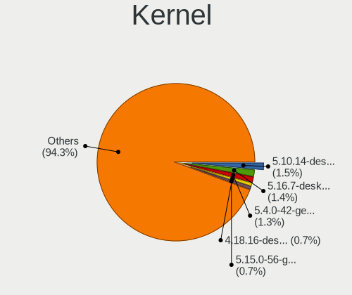
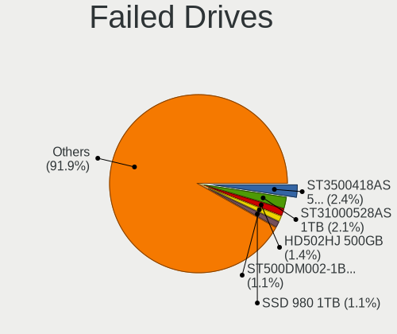
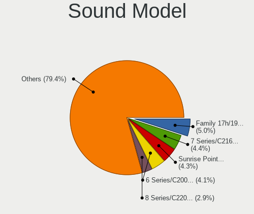

Linux - Tested Hardware & Statistics
------------------------------------

A project to collect tested hardware configurations for Linux.

Anyone can contribute to this report by the [hw-probe](https://github.com/linuxhw/hw-probe) tool:

    sudo -E hw-probe -all -upload

Please contribute! Especially if your hardware is rare.

This is a report for all computer types. See also reports for [desktops](/Desktop/README.md) and [notebooks](/Notebook/README.md).

Distribution-specific reports: [AlmaLinux](/Dist/AlmaLinux), [Alpine](/Dist/Alpine), [ALT_Linux](/Dist/ALT_Linux), [antiX](/Dist/antiX), [Artix](/Dist/Artix), [Chrome_OS](/Dist/Chrome_OS), [Clear_Linux](/Dist/Clear_Linux), [Deepin](/Dist/Deepin), [Devuan](/Dist/Devuan), [EndeavourOS](/Dist/EndeavourOS), [Garuda_Linux](/Dist/Garuda_Linux), [GNOME_OS](/Dist/GNOME_OS), [Kaisen](/Dist/Kaisen), [Mageia](/Dist/Mageia), [Makulu](/Dist/Makulu), [NixOS](/Dist/NixOS), [Nobara](/Dist/Nobara), [Oracle_Linux](/Dist/Oracle_Linux), [Pardus](/Dist/Pardus), [PureOS](/Dist/PureOS), [Q4OS](/Dist/Q4OS), [Reborn_OS](/Dist/Reborn_OS), [Rocky_Linux](/Dist/Rocky_Linux), [Sparky](/Dist/Sparky), [Void_Linux](/Dist/Void_Linux), [Xero](/Dist/Xero).

This report is for real hardware. Report for virtual hardware: [TestCoverage_VE](https://github.com/linuxhw/TestCoverage_VE)

Contents
--------

* [ Test Cases ](#test-cases)

* [ System ](#system)
  - [ OS                       ](#os)
  - [ OS Family                ](#os-family)
  - [ Kernel                   ](#kernel)
  - [ Kernel Family            ](#kernel-family)
  - [ Kernel Major Ver.        ](#kernel-major-ver)
  - [ Arch                     ](#arch)
  - [ DE                       ](#de)
  - [ Display Server           ](#display-server)
  - [ Display Manager          ](#display-manager)
  - [ OS Lang                  ](#os-lang)
  - [ Boot Mode                ](#boot-mode)
  - [ Filesystem               ](#filesystem)
  - [ Part. scheme             ](#part-scheme)
  - [ Dual Boot with Linux/BSD ](#dual-boot-with-linuxbsd)
  - [ Dual Boot (Win)          ](#dual-boot-win)

* [ Board ](#board)
  - [ Vendor                   ](#vendor)
  - [ Model                    ](#model)
  - [ Model Family             ](#model-family)
  - [ MFG Year                 ](#mfg-year)
  - [ Form Factor              ](#form-factor)
  - [ Secure Boot              ](#secure-boot)
  - [ Coreboot                 ](#coreboot)
  - [ RAM Size                 ](#ram-size)
  - [ RAM Used                 ](#ram-used)
  - [ Total Drives             ](#total-drives)
  - [ Has CD-ROM               ](#has-cd-rom)
  - [ Has Ethernet             ](#has-ethernet)
  - [ Has WiFi                 ](#has-wifi)
  - [ Has Bluetooth            ](#has-bluetooth)

* [ Location ](#location)
  - [ Country                  ](#country)
  - [ City                     ](#city)

* [ Drives ](#drives)
  - [ Drive Vendor             ](#drive-vendor)
  - [ Drive Model              ](#drive-model)
  - [ HDD Vendor               ](#hdd-vendor)
  - [ SSD Vendor               ](#ssd-vendor)
  - [ Drive Kind               ](#drive-kind)
  - [ Drive Connector          ](#drive-connector)
  - [ Drive Size               ](#drive-size)
  - [ Space Total              ](#space-total)
  - [ Space Used               ](#space-used)
  - [ Malfunc. Drives          ](#malfunc-drives)
  - [ Malfunc. Drive Vendor    ](#malfunc-drive-vendor)
  - [ Malfunc. HDD Vendor      ](#malfunc-hdd-vendor)
  - [ Malfunc. Drive Kind      ](#malfunc-drive-kind)
  - [ Failed Drives            ](#failed-drives)
  - [ Failed Drive Vendor      ](#failed-drive-vendor)
  - [ Drive Status             ](#drive-status)

* [ Storage controller ](#storage-controller)
  - [ Storage Vendor           ](#storage-vendor)
  - [ Storage Model            ](#storage-model)
  - [ Storage Kind             ](#storage-kind)

* [ Processor ](#processor)
  - [ CPU Vendor               ](#cpu-vendor)
  - [ CPU Model                ](#cpu-model)
  - [ CPU Model Family         ](#cpu-model-family)
  - [ CPU Cores                ](#cpu-cores)
  - [ CPU Sockets              ](#cpu-sockets)
  - [ CPU Threads              ](#cpu-threads)
  - [ CPU Op-Modes             ](#cpu-op-modes)
  - [ CPU Microcode            ](#cpu-microcode)
  - [ CPU Microarch            ](#cpu-microarch)

* [ Graphics ](#graphics)
  - [ GPU Vendor               ](#gpu-vendor)
  - [ GPU Model                ](#gpu-model)
  - [ GPU Combo                ](#gpu-combo)
  - [ GPU Driver               ](#gpu-driver)
  - [ GPU Memory               ](#gpu-memory)

* [ Monitor ](#monitor)
  - [ Monitor Vendor           ](#monitor-vendor)
  - [ Monitor Model            ](#monitor-model)
  - [ Monitor Resolution       ](#monitor-resolution)
  - [ Monitor Diagonal         ](#monitor-diagonal)
  - [ Monitor Width            ](#monitor-width)
  - [ Aspect Ratio             ](#aspect-ratio)
  - [ Monitor Area             ](#monitor-area)
  - [ Pixel Density            ](#pixel-density)
  - [ Multiple Monitors        ](#multiple-monitors)

* [ Network ](#network)
  - [ Net Controller Vendor    ](#net-controller-vendor)
  - [ Net Controller Model     ](#net-controller-model)
  - [ Wireless Vendor          ](#wireless-vendor)
  - [ Wireless Model           ](#wireless-model)
  - [ Ethernet Vendor          ](#ethernet-vendor)
  - [ Ethernet Model           ](#ethernet-model)
  - [ Net Controller Kind      ](#net-controller-kind)
  - [ Used Controller          ](#used-controller)
  - [ NICs                     ](#nics)
  - [ IPv6                     ](#ipv6)

* [ Bluetooth ](#bluetooth)
  - [ Bluetooth Vendor         ](#bluetooth-vendor)
  - [ Bluetooth Model          ](#bluetooth-model)

* [ Sound ](#sound)
  - [ Sound Vendor             ](#sound-vendor)
  - [ Sound Model              ](#sound-model)

* [ Memory ](#memory)
  - [ Memory Vendor            ](#memory-vendor)
  - [ Memory Model             ](#memory-model)
  - [ Memory Kind              ](#memory-kind)
  - [ Memory Form Factor       ](#memory-form-factor)
  - [ Memory Size              ](#memory-size)
  - [ Memory Speed             ](#memory-speed)

* [ Printers & scanners ](#printers--scanners)
  - [ Printer Vendor           ](#printer-vendor)
  - [ Printer Model            ](#printer-model)
  - [ Scanner Vendor           ](#scanner-vendor)
  - [ Scanner Model            ](#scanner-model)

* [ Camera ](#camera)
  - [ Camera Vendor            ](#camera-vendor)
  - [ Camera Model             ](#camera-model)

* [ Security ](#security)
  - [ Fingerprint Vendor       ](#fingerprint-vendor)
  - [ Fingerprint Model        ](#fingerprint-model)
  - [ Chipcard Vendor          ](#chipcard-vendor)
  - [ Chipcard Model           ](#chipcard-model)

* [ Unsupported ](#unsupported)
  - [ Unsupported Devices      ](#unsupported-devices)
  - [ Unsupported Device Types ](#unsupported-device-types)

Test Cases
----------

Total: 272890

| Vendor        | Model                       | Form-Factor | Probe                                                      | Date         |
|---------------|-----------------------------|-------------|------------------------------------------------------------|--------------|
| HUAWEI        | NBLK-WAX9X                  | Notebook    | [2391058f73](https://linux-hardware.org/?probe=2391058f73) | Jan 01, 2023 |
| Notebook      | NJx0MU                      | Notebook    | [43923d1e98](https://linux-hardware.org/?probe=43923d1e98) | Jan 01, 2023 |
| Dell          | Inspiron 14 7420 2-in-1     | Convertible | [fa5ce31d04](https://linux-hardware.org/?probe=fa5ce31d04) | Jan 01, 2023 |
| MSI           | MS-B0A41                    | Desktop     | [c69ab6fbe8](https://linux-hardware.org/?probe=c69ab6fbe8) | Jan 01, 2023 |
| Gigabyte      | B450 AORUS PRO WIFI-CF      | Desktop     | [b79de349a9](https://linux-hardware.org/?probe=b79de349a9) | Jan 01, 2023 |
| HP            | 18E4                        | Desktop     | [c83c8341e3](https://linux-hardware.org/?probe=c83c8341e3) | Jan 01, 2023 |
| MSI           | MPG B560I GAMING EDGE WI... | Desktop     | [20eb2d93e2](https://linux-hardware.org/?probe=20eb2d93e2) | Jan 01, 2023 |
| ASUSTek       | TUF Gaming B550M-PLUS       | Desktop     | [2c31fd54e4](https://linux-hardware.org/?probe=2c31fd54e4) | Jan 01, 2023 |
| ASUSTek       | PRIME A320M-K               | Desktop     | [afbe6b4362](https://linux-hardware.org/?probe=afbe6b4362) | Dec 31, 2022 |
| Acer          | Aspire E5-573G              | Notebook    | [527a92f562](https://linux-hardware.org/?probe=527a92f562) | Dec 31, 2022 |
| HP            | 806A                        | Desktop     | [72e5b78d96](https://linux-hardware.org/?probe=72e5b78d96) | Dec 31, 2022 |
| HP            | 802F                        | Desktop     | [22444b4b2c](https://linux-hardware.org/?probe=22444b4b2c) | Dec 31, 2022 |
| Gigabyte      | G5 MD                       | Notebook    | [901f1e43f0](https://linux-hardware.org/?probe=901f1e43f0) | Dec 31, 2022 |
| Gigabyte      | G5 MD                       | Notebook    | [631ee5c81c](https://linux-hardware.org/?probe=631ee5c81c) | Dec 31, 2022 |
| Lenovo        | IdeaPad 3 15ALC6 82MF       | Notebook    | [4d7f89dc6d](https://linux-hardware.org/?probe=4d7f89dc6d) | Dec 31, 2022 |
| ASUSTek       | TUF Z390-PRO GAMING         | Desktop     | [de65f4b654](https://linux-hardware.org/?probe=de65f4b654) | Dec 31, 2022 |
| Unknown       | Intel X79                   | Desktop     | [f26c05e261](https://linux-hardware.org/?probe=f26c05e261) | Dec 31, 2022 |
| Lenovo        | ThinkPad X390 20Q00051GE    | Notebook    | [5b3d1b750d](https://linux-hardware.org/?probe=5b3d1b750d) | Dec 31, 2022 |
| ASUSTek       | PRIME B550M-A               | Desktop     | [162ad451eb](https://linux-hardware.org/?probe=162ad451eb) | Dec 31, 2022 |
| Fujitsu Si... | D2420 S26361-D2420          | Desktop     | [9e8c937daa](https://linux-hardware.org/?probe=9e8c937daa) | Dec 31, 2022 |
| Acer          | Spin SP513-54N              | Convertible | [0cb6dfa7ce](https://linux-hardware.org/?probe=0cb6dfa7ce) | Dec 31, 2022 |
| Acer          | Predator PO3-600 V:1.1      | Desktop     | [e5f5073bcd](https://linux-hardware.org/?probe=e5f5073bcd) | Dec 31, 2022 |
| ASUSTek       | TUF Gaming X570-PLUS        | Desktop     | [ea3b140a7f](https://linux-hardware.org/?probe=ea3b140a7f) | Dec 31, 2022 |
| Supermicro    | H12SSL-NT                   | Server      | [954e228bd5](https://linux-hardware.org/?probe=954e228bd5) | Dec 31, 2022 |
| Valve         | Jupiter                     | Notebook    | [97da60caa9](https://linux-hardware.org/?probe=97da60caa9) | Dec 31, 2022 |
| Valve         | Jupiter                     | Notebook    | [c0fb48bccb](https://linux-hardware.org/?probe=c0fb48bccb) | Dec 31, 2022 |
| Lenovo        | ThinkPad T410 2537DH6       | Notebook    | [23c0cbbe94](https://linux-hardware.org/?probe=23c0cbbe94) | Dec 31, 2022 |
| Lenovo        | ThinkCentre M90 3692X01     | Desktop     | [702838caff](https://linux-hardware.org/?probe=702838caff) | Dec 31, 2022 |
| Dell          | Latitude E5500              | Notebook    | [f04cd8f466](https://linux-hardware.org/?probe=f04cd8f466) | Dec 31, 2022 |
| Toshiba       | Satellite A305D             | Notebook    | [b85a377462](https://linux-hardware.org/?probe=b85a377462) | Dec 31, 2022 |
| HP            | Folio 13                    | Notebook    | [9f00cfe432](https://linux-hardware.org/?probe=9f00cfe432) | Dec 31, 2022 |
| HP            | Folio 13                    | Notebook    | [3ed5b405cb](https://linux-hardware.org/?probe=3ed5b405cb) | Dec 31, 2022 |
| ASUSTek       | P5KPL-AM SE                 | Desktop     | [c6c0626dd1](https://linux-hardware.org/?probe=c6c0626dd1) | Dec 31, 2022 |
| Dell          | 0PTTT9 A00                  | Desktop     | [7f2851fcf5](https://linux-hardware.org/?probe=7f2851fcf5) | Dec 31, 2022 |
| Dell          | 0JP3NX A01                  | Desktop     | [0749146323](https://linux-hardware.org/?probe=0749146323) | Dec 31, 2022 |
| Apple         | Mac-942B5BF58194151B        | All in one  | [d82f6dded4](https://linux-hardware.org/?probe=d82f6dded4) | Dec 31, 2022 |
| ASUSTek       | TUF Gaming B560-PLUS WIF... | Desktop     | [7295ec02b5](https://linux-hardware.org/?probe=7295ec02b5) | Dec 31, 2022 |
| ASUSTek       | PRIME B350-PLUS             | Desktop     | [c4eccac7c7](https://linux-hardware.org/?probe=c4eccac7c7) | Dec 31, 2022 |
| System76      | Oryx Pro                    | Notebook    | [0d65e57758](https://linux-hardware.org/?probe=0d65e57758) | Dec 31, 2022 |
| Dell          | 0TWFTR A02                  | All in one  | [5f63c2fd15](https://linux-hardware.org/?probe=5f63c2fd15) | Dec 31, 2022 |
| Dell          | Latitude E5500              | Notebook    | [24a0ca1b65](https://linux-hardware.org/?probe=24a0ca1b65) | Dec 31, 2022 |
| HP            | ProLiant DL360 Gen9         | Server      | [54425f89cc](https://linux-hardware.org/?probe=54425f89cc) | Dec 31, 2022 |
| Lenovo        | ThinkPad X390 20Q00051GE    | Notebook    | [775096be09](https://linux-hardware.org/?probe=775096be09) | Dec 31, 2022 |
| Lenovo        | ThinkBook 15-IIL 20SM       | Notebook    | [a30f96dea4](https://linux-hardware.org/?probe=a30f96dea4) | Dec 31, 2022 |
| Lenovo        | ThinkPad P16s Gen 1 21BT... | Notebook    | [b68fa80860](https://linux-hardware.org/?probe=b68fa80860) | Dec 31, 2022 |
| ASUSTek       | K53SC                       | Notebook    | [25912a6795](https://linux-hardware.org/?probe=25912a6795) | Dec 31, 2022 |
| MSI           | A88X-G45 GAMING             | Desktop     | [891e0757ed](https://linux-hardware.org/?probe=891e0757ed) | Dec 31, 2022 |
| Dell          | 0VR8V9 A01                  | Desktop     | [0e7d4ac326](https://linux-hardware.org/?probe=0e7d4ac326) | Dec 31, 2022 |
| HP            | Pavilion dv6                | Notebook    | [30ec83dbd4](https://linux-hardware.org/?probe=30ec83dbd4) | Dec 31, 2022 |
| MSI           | B360M BAZOOKA               | Desktop     | [ad26afeb83](https://linux-hardware.org/?probe=ad26afeb83) | Dec 31, 2022 |
| Dell          | 0GWHMW A01                  | Desktop     | [59287847c9](https://linux-hardware.org/?probe=59287847c9) | Dec 31, 2022 |
| ASUSTek       | ROG STRIX X570-F GAMING     | Desktop     | [7e22db9b23](https://linux-hardware.org/?probe=7e22db9b23) | Dec 31, 2022 |
| MSI           | A88X-G45 GAMING             | Desktop     | [bdb45edaad](https://linux-hardware.org/?probe=bdb45edaad) | Dec 31, 2022 |
| Unknown       | Unknown                     | Notebook    | [10496680a5](https://linux-hardware.org/?probe=10496680a5) | Dec 31, 2022 |
| Lenovo        | 36DB SDK0J40688 WIN 3424... | All in one  | [ddad62bbcb](https://linux-hardware.org/?probe=ddad62bbcb) | Dec 31, 2022 |
| MSI           | B250M PRO-VDH               | Desktop     | [0a4b320a9e](https://linux-hardware.org/?probe=0a4b320a9e) | Dec 31, 2022 |
| MSI           | MPG X570 GAMING PRO CARB... | Desktop     | [ecf944f539](https://linux-hardware.org/?probe=ecf944f539) | Dec 31, 2022 |
| Acidanther... | Mac-7BA5B2D9E42DDD94 iMa... | All in one  | [a470da90e8](https://linux-hardware.org/?probe=a470da90e8) | Dec 31, 2022 |
| Raspberry ... | Raspberry Pi 4 Model B R... | Soc         | [5246120c58](https://linux-hardware.org/?probe=5246120c58) | Dec 31, 2022 |
| ASUSTek       | Crosshair IV Formula        | Desktop     | [da685b7ff8](https://linux-hardware.org/?probe=da685b7ff8) | Dec 31, 2022 |
| HP            | Pavilion dv7                | Notebook    | [4e42e627b8](https://linux-hardware.org/?probe=4e42e627b8) | Dec 31, 2022 |
| ASUSTek       | M5A78L-M/USB3               | Desktop     | [2508c5972e](https://linux-hardware.org/?probe=2508c5972e) | Dec 31, 2022 |
| Google        | Teemo                       | Desktop     | [6f6671a40e](https://linux-hardware.org/?probe=6f6671a40e) | Dec 31, 2022 |
| ASUSTek       | UN45                        | Desktop     | [bde2e2efb1](https://linux-hardware.org/?probe=bde2e2efb1) | Dec 31, 2022 |
| Lenovo        | G500 20236                  | Notebook    | [75f2e6fae1](https://linux-hardware.org/?probe=75f2e6fae1) | Dec 31, 2022 |
| ASUSTek       | M5A78L-M/USB3               | Desktop     | [e18f6635d3](https://linux-hardware.org/?probe=e18f6635d3) | Dec 31, 2022 |
| Raspberry ... | Raspberry Pi 4 Model B R... | Soc         | [5115dfb7a9](https://linux-hardware.org/?probe=5115dfb7a9) | Dec 31, 2022 |
| Dynabook      | Satellite Pro C40-G         | Notebook    | [e7555a4df8](https://linux-hardware.org/?probe=e7555a4df8) | Dec 31, 2022 |
| Gigabyte      | AB350-Gaming 3-CF           | Desktop     | [500ce7ae28](https://linux-hardware.org/?probe=500ce7ae28) | Dec 31, 2022 |
| Dell          | System XPS L702X            | Notebook    | [7030c340cc](https://linux-hardware.org/?probe=7030c340cc) | Dec 31, 2022 |
| Lenovo        | ThinkPad T14 Gen 3 21AH0... | Notebook    | [322cf5484d](https://linux-hardware.org/?probe=322cf5484d) | Dec 31, 2022 |
| Lenovo        | ThinkPad T430s 235368U      | Notebook    | [8420930d53](https://linux-hardware.org/?probe=8420930d53) | Dec 31, 2022 |
| Dell          | Latitude 7370               | Notebook    | [cf1f751fbf](https://linux-hardware.org/?probe=cf1f751fbf) | Dec 31, 2022 |
| Notebook      | PB50_70RF,RD,RC             | Notebook    | [d1f655b9b1](https://linux-hardware.org/?probe=d1f655b9b1) | Dec 31, 2022 |
| ASUSTek       | ZenBook UX425UAZ_UM425UA... | Notebook    | [8d33275e7b](https://linux-hardware.org/?probe=8d33275e7b) | Dec 31, 2022 |
| ASUSTek       | PRIME B550M-A               | Desktop     | [2161cbc9a0](https://linux-hardware.org/?probe=2161cbc9a0) | Dec 31, 2022 |
| Lenovo        | G500 20236                  | Notebook    | [0d3ed20685](https://linux-hardware.org/?probe=0d3ed20685) | Dec 31, 2022 |
| Lenovo        | Yoga 2 13 20344             | Notebook    | [39c9c8aaea](https://linux-hardware.org/?probe=39c9c8aaea) | Dec 31, 2022 |
| Lenovo        | ThinkPad T14 Gen 2i 20W0... | Notebook    | [2abdc57712](https://linux-hardware.org/?probe=2abdc57712) | Dec 31, 2022 |
| Acer          | Aspire V3-571G              | Notebook    | [273f6722e0](https://linux-hardware.org/?probe=273f6722e0) | Dec 31, 2022 |
| Lenovo        | ThinkPad T14 Gen 2i 20W0... | Notebook    | [632515014d](https://linux-hardware.org/?probe=632515014d) | Dec 31, 2022 |
| Gigabyte      | B75M-D3V                    | Desktop     | [ce23d2f7cd](https://linux-hardware.org/?probe=ce23d2f7cd) | Dec 31, 2022 |
| ASUSTek       | ROG STRIX X570-E GAMING     | Desktop     | [f16b55ea54](https://linux-hardware.org/?probe=f16b55ea54) | Dec 31, 2022 |
| Lenovo        | Yoga 7 14ITL5 82BH          | Convertible | [3592017c4a](https://linux-hardware.org/?probe=3592017c4a) | Dec 31, 2022 |
| MSI           | Z170A GAMING PRO CARBON     | Desktop     | [7c96c6776e](https://linux-hardware.org/?probe=7c96c6776e) | Dec 31, 2022 |
| ASUSTek       | UX31E                       | Notebook    | [58391b15a5](https://linux-hardware.org/?probe=58391b15a5) | Dec 31, 2022 |
| Lenovo        | ThinkPad E470 20H2A02NBR    | Notebook    | [18827f3f77](https://linux-hardware.org/?probe=18827f3f77) | Dec 31, 2022 |
| Lenovo        | ThinkPad E15 Gen 3 20YHS... | Notebook    | [5fbe1632b0](https://linux-hardware.org/?probe=5fbe1632b0) | Dec 31, 2022 |
| Medion        | MS-7728                     | Desktop     | [3d6078552c](https://linux-hardware.org/?probe=3d6078552c) | Dec 31, 2022 |
| Google        | Teemo                       | Desktop     | [e3c39f29da](https://linux-hardware.org/?probe=e3c39f29da) | Dec 31, 2022 |
| Lenovo        | ThinkPad E15 Gen 3 20YHS... | Notebook    | [5a479fed95](https://linux-hardware.org/?probe=5a479fed95) | Dec 31, 2022 |
| TrekStor      | Primebook C11B              | Convertible | [e96819bd00](https://linux-hardware.org/?probe=e96819bd00) | Dec 31, 2022 |
| ASUSTek       | VivoBook_ASUSLaptop X509... | Notebook    | [fb22f9430c](https://linux-hardware.org/?probe=fb22f9430c) | Dec 31, 2022 |
| Dell          | 0T10XW A00                  | Desktop     | [21638e1dfe](https://linux-hardware.org/?probe=21638e1dfe) | Dec 31, 2022 |
| ASUSTek       | X540YA                      | Notebook    | [37ef421251](https://linux-hardware.org/?probe=37ef421251) | Dec 31, 2022 |
| HP            | Laptop 15-db0xxx            | Notebook    | [375dccca30](https://linux-hardware.org/?probe=375dccca30) | Dec 31, 2022 |
| Dell          | Latitude E5440              | Notebook    | [9578ad1ea3](https://linux-hardware.org/?probe=9578ad1ea3) | Dec 31, 2022 |
| Fujitsu       | LIFEBOOK U772               | Notebook    | [3ecdad230a](https://linux-hardware.org/?probe=3ecdad230a) | Dec 31, 2022 |
| HP            | Pavilion 17                 | Notebook    | [ce5baca257](https://linux-hardware.org/?probe=ce5baca257) | Dec 31, 2022 |
| Lenovo        | G780 20138                  | Notebook    | [896aeb4e20](https://linux-hardware.org/?probe=896aeb4e20) | Dec 31, 2022 |
| Dell          | Inspiron 1420               | Notebook    | [fe6a8714da](https://linux-hardware.org/?probe=fe6a8714da) | Dec 31, 2022 |
| HP            | Notebook                    | Notebook    | [d25df9daf4](https://linux-hardware.org/?probe=d25df9daf4) | Dec 31, 2022 |
| ASUSTek       | PRIME B250M-K               | Desktop     | [9db6f0fda7](https://linux-hardware.org/?probe=9db6f0fda7) | Dec 31, 2022 |
| Lenovo        | ThinkPad T430s 235368U      | Notebook    | [e31244bdd7](https://linux-hardware.org/?probe=e31244bdd7) | Dec 31, 2022 |
| ASUSTek       | PRIME H610M-K D4            | Desktop     | [0031785936](https://linux-hardware.org/?probe=0031785936) | Dec 31, 2022 |
| Lenovo        | IdeaPad 330-15IKB 81DE      | Notebook    | [cc19d2cf24](https://linux-hardware.org/?probe=cc19d2cf24) | Dec 31, 2022 |
| ASRock        | B360M Performance           | Desktop     | [679d25f9be](https://linux-hardware.org/?probe=679d25f9be) | Dec 31, 2022 |
| MSI           | MS-7502 Fab D               | Desktop     | [9126e1035f](https://linux-hardware.org/?probe=9126e1035f) | Dec 31, 2022 |
| Phoenix       | 945GM                       | Desktop     | [d391eaf6e2](https://linux-hardware.org/?probe=d391eaf6e2) | Dec 31, 2022 |
| Lenovo        | Yoga 6 13ALC6 82ND          | Convertible | [de75bb19fa](https://linux-hardware.org/?probe=de75bb19fa) | Dec 31, 2022 |
| Lenovo        | Y520-15IKBN 80WK            | Notebook    | [9f2441851f](https://linux-hardware.org/?probe=9f2441851f) | Dec 31, 2022 |
| Raspberry ... | Raspberry Pi                | Soc         | [a5030d74d4](https://linux-hardware.org/?probe=a5030d74d4) | Dec 31, 2022 |
| MSI           | B250M BAZOOKA               | Desktop     | [5b204eade4](https://linux-hardware.org/?probe=5b204eade4) | Dec 31, 2022 |
| ASUSTek       | ProArt StudioBook H5600Q... | Notebook    | [07ca2ed63d](https://linux-hardware.org/?probe=07ca2ed63d) | Dec 31, 2022 |
| ASUSTek       | VivoBook_ASUSLaptop TP14... | Convertible | [195eb3e6eb](https://linux-hardware.org/?probe=195eb3e6eb) | Dec 31, 2022 |
| Acer          | Aspire E5-575G              | Notebook    | [db40dc530a](https://linux-hardware.org/?probe=db40dc530a) | Dec 31, 2022 |
| HP            | 21B4 A01                    | Desktop     | [cdc9730e81](https://linux-hardware.org/?probe=cdc9730e81) | Dec 31, 2022 |
| Lenovo        | ThinkCentre M58p 9728W47    | Desktop     | [68bc291efd](https://linux-hardware.org/?probe=68bc291efd) | Dec 31, 2022 |
| ASRock        | A320M-DGS                   | Desktop     | [a9df519d4f](https://linux-hardware.org/?probe=a9df519d4f) | Dec 31, 2022 |
| Dell          | XPS 9320                    | Notebook    | [c98fd80f29](https://linux-hardware.org/?probe=c98fd80f29) | Dec 31, 2022 |
| ASUSTek       | X550VXK                     | Notebook    | [b8cd38522a](https://linux-hardware.org/?probe=b8cd38522a) | Dec 31, 2022 |
| Google        | Candy                       | Notebook    | [86bb9a73fc](https://linux-hardware.org/?probe=86bb9a73fc) | Dec 31, 2022 |
| Chuwi         | UBook X                     | Convertible | [93f1861a61](https://linux-hardware.org/?probe=93f1861a61) | Dec 31, 2022 |
| Gigabyte      | F2A68HM-DS2                 | Desktop     | [7b10613c1e](https://linux-hardware.org/?probe=7b10613c1e) | Dec 31, 2022 |
| Lenovo        | ThinkPad L470 20J5S0Y700    | Notebook    | [9e54ccbafa](https://linux-hardware.org/?probe=9e54ccbafa) | Dec 31, 2022 |
| HP            | ProLiant DL360p Gen8        | Server      | [9b6998f35c](https://linux-hardware.org/?probe=9b6998f35c) | Dec 31, 2022 |
| Lenovo        | ThinkPad T14 Gen 1 20UDC... | Notebook    | [ac397dc318](https://linux-hardware.org/?probe=ac397dc318) | Dec 31, 2022 |
| Lenovo        | ThinkPad W540 20BG0033RT    | Notebook    | [5cfa12cec1](https://linux-hardware.org/?probe=5cfa12cec1) | Dec 31, 2022 |
| HP            | 840A                        | Desktop     | [ad51866fe9](https://linux-hardware.org/?probe=ad51866fe9) | Dec 31, 2022 |
| ASRock        | B550 Steel Legend           | Desktop     | [8705e10ac6](https://linux-hardware.org/?probe=8705e10ac6) | Dec 31, 2022 |
| HP            | EliteBook 845 14 inch G9... | Notebook    | [5b5e58e433](https://linux-hardware.org/?probe=5b5e58e433) | Dec 31, 2022 |
| Shuttle       | SH570                       | Desktop     | [09994766ed](https://linux-hardware.org/?probe=09994766ed) | Dec 31, 2022 |
| Shuttle       | SH570                       | Desktop     | [f4d5ef752c](https://linux-hardware.org/?probe=f4d5ef752c) | Dec 31, 2022 |
| Lenovo        | Legion 5 Pro 16ACH6H 82J... | Notebook    | [d326e34afc](https://linux-hardware.org/?probe=d326e34afc) | Dec 31, 2022 |
| AZW           | U59                         | Desktop     | [39f0dfe71f](https://linux-hardware.org/?probe=39f0dfe71f) | Dec 31, 2022 |
| HP            | Elite x2 1012 G2            | Tablet      | [cc24dc6f72](https://linux-hardware.org/?probe=cc24dc6f72) | Dec 31, 2022 |
| HP            | Elite x2 1012 G2            | Tablet      | [bf3922e95d](https://linux-hardware.org/?probe=bf3922e95d) | Dec 31, 2022 |
| Dell          | 0KWVT8 A03                  | Desktop     | [ad32666c8c](https://linux-hardware.org/?probe=ad32666c8c) | Dec 31, 2022 |
| Lenovo        | ThinkPad Edge E545 20B2S... | Notebook    | [c83f51d7d9](https://linux-hardware.org/?probe=c83f51d7d9) | Dec 31, 2022 |
| Apple         | Mac-F226BEC8 PVT            | All in one  | [e7ac43e8c3](https://linux-hardware.org/?probe=e7ac43e8c3) | Dec 31, 2022 |
| Apple         | Mac-F226BEC8 PVT            | All in one  | [4d613961a4](https://linux-hardware.org/?probe=4d613961a4) | Dec 31, 2022 |
| MSI           | B550M PRO-VDH WIFI          | Desktop     | [92920d8ac2](https://linux-hardware.org/?probe=92920d8ac2) | Dec 31, 2022 |
| ASUSTek       | PRIME H610M-K D4            | Desktop     | [4bd2096c80](https://linux-hardware.org/?probe=4bd2096c80) | Dec 31, 2022 |
| Timi          | Xiaomi NoteBook Pro         | Notebook    | [5d0ff5ea2d](https://linux-hardware.org/?probe=5d0ff5ea2d) | Dec 31, 2022 |
| Valve         | Jupiter                     | Notebook    | [1922673e86](https://linux-hardware.org/?probe=1922673e86) | Dec 31, 2022 |
| Lenovo        | IdeaPad S340-14API 81NB     | Notebook    | [270ba62d9d](https://linux-hardware.org/?probe=270ba62d9d) | Dec 31, 2022 |
| Valve         | Jupiter                     | Notebook    | [b5b95e62a1](https://linux-hardware.org/?probe=b5b95e62a1) | Dec 31, 2022 |
| ASRock        | A320M-DVS R4.0              | Desktop     | [f82bf510be](https://linux-hardware.org/?probe=f82bf510be) | Dec 31, 2022 |
| Valve         | Jupiter                     | Notebook    | [206fed6963](https://linux-hardware.org/?probe=206fed6963) | Dec 31, 2022 |
| Gigabyte      | W480 VISION D               | Desktop     | [133d8a7f70](https://linux-hardware.org/?probe=133d8a7f70) | Dec 31, 2022 |
| AZW           | SER V1.0                    | Mini pc     | [1c406a3696](https://linux-hardware.org/?probe=1c406a3696) | Dec 31, 2022 |
| AZW           | Green G2                    | Desktop     | [257948e699](https://linux-hardware.org/?probe=257948e699) | Dec 31, 2022 |
| ASRock        | X99 Extreme3                | Desktop     | [565f486b7f](https://linux-hardware.org/?probe=565f486b7f) | Dec 31, 2022 |
| ASRock        | X99 Extreme3                | Desktop     | [eaf8cc0ed5](https://linux-hardware.org/?probe=eaf8cc0ed5) | Dec 31, 2022 |
| ASUSTek       | E410                        | Desktop     | [98e0007b65](https://linux-hardware.org/?probe=98e0007b65) | Dec 31, 2022 |
| AZW           | SER V1.0                    | Mini pc     | [08ac155787](https://linux-hardware.org/?probe=08ac155787) | Dec 31, 2022 |
| Lenovo        | IdeaPad 5 Pro 14ACN6 82L... | Notebook    | [cf40d3f30c](https://linux-hardware.org/?probe=cf40d3f30c) | Dec 31, 2022 |
| Dell          | Latitude 7370               | Notebook    | [c9423665bb](https://linux-hardware.org/?probe=c9423665bb) | Dec 31, 2022 |
| Dell          | Inspiron 15-3552            | Notebook    | [e8b804ddd5](https://linux-hardware.org/?probe=e8b804ddd5) | Dec 31, 2022 |
| Dell          | Latitude E6430              | Notebook    | [de9b03cf29](https://linux-hardware.org/?probe=de9b03cf29) | Dec 31, 2022 |
| Acer          | Aspire E5-521               | Notebook    | [d9b5e3cfc3](https://linux-hardware.org/?probe=d9b5e3cfc3) | Dec 31, 2022 |
| Lenovo        | ThinkPad T14 Gen 3 21AH0... | Notebook    | [591d985e85](https://linux-hardware.org/?probe=591d985e85) | Dec 31, 2022 |
| HP            | Pavilion Aero Laptop 13-... | Notebook    | [c2a949b725](https://linux-hardware.org/?probe=c2a949b725) | Dec 31, 2022 |
| Intel         | DB75EN AAG39650-400         | Desktop     | [086831bbca](https://linux-hardware.org/?probe=086831bbca) | Dec 31, 2022 |
| Dell          | 0PV3YR A05                  | Server      | [3710331d81](https://linux-hardware.org/?probe=3710331d81) | Dec 31, 2022 |
| MSI           | X99A RAIDER                 | Desktop     | [8582096251](https://linux-hardware.org/?probe=8582096251) | Dec 31, 2022 |
| ASRock        | FM2A88X Extreme6+           | Desktop     | [c45e0f54fd](https://linux-hardware.org/?probe=c45e0f54fd) | Dec 31, 2022 |
| Lenovo        | IdeaPad Y560                | Notebook    | [c9d3a1d0a3](https://linux-hardware.org/?probe=c9d3a1d0a3) | Dec 31, 2022 |
| Dell          | 0D24M8 A00                  | Desktop     | [def123de2d](https://linux-hardware.org/?probe=def123de2d) | Dec 31, 2022 |
| MSI           | Modern 15 A5M               | Notebook    | [e0cb4d278d](https://linux-hardware.org/?probe=e0cb4d278d) | Dec 31, 2022 |
| Intel Clie... | LAPRC710                    | Notebook    | [47e562afc7](https://linux-hardware.org/?probe=47e562afc7) | Dec 31, 2022 |
| HP            | Victus by Laptop 16-e0xx... | Notebook    | [9220da7abb](https://linux-hardware.org/?probe=9220da7abb) | Dec 31, 2022 |
| MSI           | MPG Z490 GAMING PLUS        | Desktop     | [b4aecf5fa1](https://linux-hardware.org/?probe=b4aecf5fa1) | Dec 31, 2022 |
| Lenovo        | ThinkPad T480 20L6S29E0A    | Notebook    | [82168627b7](https://linux-hardware.org/?probe=82168627b7) | Dec 31, 2022 |
| Dell          | 0VNP2H A02                  | Desktop     | [5d3da04d45](https://linux-hardware.org/?probe=5d3da04d45) | Dec 31, 2022 |
| ASRock        | B450 Gaming-ITX/ac          | Desktop     | [afdda0ad31](https://linux-hardware.org/?probe=afdda0ad31) | Dec 31, 2022 |
| ASRock        | B450 Gaming-ITX/ac          | Desktop     | [3659d7377d](https://linux-hardware.org/?probe=3659d7377d) | Dec 31, 2022 |
| Apple         | MacBookPro8,1               | Notebook    | [97f93aa235](https://linux-hardware.org/?probe=97f93aa235) | Dec 31, 2022 |
| Valve         | Jupiter                     | Notebook    | [61cb7375d1](https://linux-hardware.org/?probe=61cb7375d1) | Dec 31, 2022 |
| Lenovo        | HASWELLREFRESHDT 3190005... | All in one  | [3fdb423e72](https://linux-hardware.org/?probe=3fdb423e72) | Dec 31, 2022 |
| Acer          | Aspire A514-54              | Notebook    | [5775c77a91](https://linux-hardware.org/?probe=5775c77a91) | Dec 31, 2022 |
| Lenovo        | ThinkPad P17 Gen 2i 20YU... | Notebook    | [34169c74c5](https://linux-hardware.org/?probe=34169c74c5) | Dec 31, 2022 |
| Dell          | Latitude D620               | Notebook    | [5337d0b0f9](https://linux-hardware.org/?probe=5337d0b0f9) | Dec 31, 2022 |
| Dell          | Latitude D620               | Notebook    | [ea81d9f6a5](https://linux-hardware.org/?probe=ea81d9f6a5) | Dec 31, 2022 |
| Lenovo        | Win8 Pro DPK TPG            | Desktop     | [9561e51689](https://linux-hardware.org/?probe=9561e51689) | Dec 31, 2022 |
| MAXSUN        | MS-TZZ A320M.2-VH           | Desktop     | [8f06578f10](https://linux-hardware.org/?probe=8f06578f10) | Dec 31, 2022 |
| HP            | Pavilion 17                 | Notebook    | [c87d61d0cd](https://linux-hardware.org/?probe=c87d61d0cd) | Dec 31, 2022 |
| ASUSTek       | Z97-A                       | Desktop     | [6f61aac097](https://linux-hardware.org/?probe=6f61aac097) | Dec 31, 2022 |
| Samsung       | 300V3A/300V4A/300V5A        | Notebook    | [14b589709d](https://linux-hardware.org/?probe=14b589709d) | Dec 31, 2022 |
| HP            | 18E4                        | Desktop     | [1b1eccbbe1](https://linux-hardware.org/?probe=1b1eccbbe1) | Dec 31, 2022 |
| Dell          | Latitude 3420               | Notebook    | [05095533cd](https://linux-hardware.org/?probe=05095533cd) | Dec 31, 2022 |
| Gigabyte      | GA-78LMT-USB3 SEx           | Desktop     | [b0dd8fc6b5](https://linux-hardware.org/?probe=b0dd8fc6b5) | Dec 31, 2022 |
| HP            | Pavilion 17                 | Notebook    | [bbf52af119](https://linux-hardware.org/?probe=bbf52af119) | Dec 31, 2022 |
| HP            | Pavilion Gaming Laptop 1... | Notebook    | [e0f696a9b9](https://linux-hardware.org/?probe=e0f696a9b9) | Dec 31, 2022 |
| Gigabyte      | G31M-S2C                    | Desktop     | [39f08657f8](https://linux-hardware.org/?probe=39f08657f8) | Dec 31, 2022 |
| ASUSTek       | Benicia                     | Desktop     | [9d307c5f2f](https://linux-hardware.org/?probe=9d307c5f2f) | Dec 31, 2022 |
| ASUSTek       | P5Q-PRO                     | Desktop     | [cec0830928](https://linux-hardware.org/?probe=cec0830928) | Dec 31, 2022 |
| Gigabyte      | GA-MA785GMT-UD2H            | Desktop     | [c4059f2954](https://linux-hardware.org/?probe=c4059f2954) | Dec 31, 2022 |
| HP            | EliteBook 8740w (WH274UT... | Notebook    | [e42d4e66a0](https://linux-hardware.org/?probe=e42d4e66a0) | Dec 31, 2022 |
| MSI           | MAG B650 TOMAHAWK WIFI      | Desktop     | [b1220a23ad](https://linux-hardware.org/?probe=b1220a23ad) | Dec 31, 2022 |
| MSI           | MAG B650 TOMAHAWK WIFI      | Desktop     | [31343e35f0](https://linux-hardware.org/?probe=31343e35f0) | Dec 31, 2022 |
| Shuttle       | SH570                       | Desktop     | [2d7f57de8f](https://linux-hardware.org/?probe=2d7f57de8f) | Dec 31, 2022 |
| ASUSTek       | Pro WS X570-ACE             | Desktop     | [fc2f55c02e](https://linux-hardware.org/?probe=fc2f55c02e) | Dec 31, 2022 |
| Lenovo        | IdeaPad 320-15ISK 80XH      | Notebook    | [fc108fb0d8](https://linux-hardware.org/?probe=fc108fb0d8) | Dec 31, 2022 |
| MSI           | MPG X570 GAMING PRO CARB... | Desktop     | [1347eaedb9](https://linux-hardware.org/?probe=1347eaedb9) | Dec 31, 2022 |
| ASUSTek       | Benicia                     | Desktop     | [bc835cbca9](https://linux-hardware.org/?probe=bc835cbca9) | Dec 31, 2022 |
| HP            | Victus by Laptop 16-e0xx... | Notebook    | [60989ad0c4](https://linux-hardware.org/?probe=60989ad0c4) | Dec 31, 2022 |
| Intel         | NUC10i5FNB K61361-303       | Mini pc     | [d4054063fd](https://linux-hardware.org/?probe=d4054063fd) | Dec 31, 2022 |
| Foxconn       | 2ADA                        | Desktop     | [92ce347d5f](https://linux-hardware.org/?probe=92ce347d5f) | Dec 31, 2022 |
| Dell          | G3 3579                     | Notebook    | [cad48f0160](https://linux-hardware.org/?probe=cad48f0160) | Dec 30, 2022 |
| ASRock        | X79 Extreme6                | Desktop     | [5ea31811b4](https://linux-hardware.org/?probe=5ea31811b4) | Dec 30, 2022 |
| MSI           | Boston                      | Desktop     | [a5fd252dc2](https://linux-hardware.org/?probe=a5fd252dc2) | Dec 30, 2022 |
| HP            | Pavilion dv6700             | Notebook    | [4b3b106bee](https://linux-hardware.org/?probe=4b3b106bee) | Dec 30, 2022 |
| Valve         | Jupiter                     | Notebook    | [82b86d954a](https://linux-hardware.org/?probe=82b86d954a) | Dec 30, 2022 |
| Dell          | 0GDG8Y A00                  | Desktop     | [8c8e9d66e7](https://linux-hardware.org/?probe=8c8e9d66e7) | Dec 30, 2022 |
| Apple         | MacBookAir7,2               | Notebook    | [8b84042dc6](https://linux-hardware.org/?probe=8b84042dc6) | Dec 30, 2022 |
| Lenovo        | ThinkPad T410 2537BF9       | Notebook    | [f83ed1dd39](https://linux-hardware.org/?probe=f83ed1dd39) | Dec 30, 2022 |
| HUAWEI        | BOHK-WAX9X                  | Notebook    | [62b14864e1](https://linux-hardware.org/?probe=62b14864e1) | Dec 30, 2022 |
| Apple         | MacBookAir7,2               | Notebook    | [dae09ec15f](https://linux-hardware.org/?probe=dae09ec15f) | Dec 30, 2022 |
| MSI           | H510M-A PRO                 | Desktop     | [4dba3b7c55](https://linux-hardware.org/?probe=4dba3b7c55) | Dec 30, 2022 |
| Intel         | NUC10i5FNB K61361-303       | Mini pc     | [637d12f7c5](https://linux-hardware.org/?probe=637d12f7c5) | Dec 30, 2022 |
| ASUSTek       | TP501UA                     | Notebook    | [1f2aaf8804](https://linux-hardware.org/?probe=1f2aaf8804) | Dec 30, 2022 |
| Acer          | Aspire 8943G                | Notebook    | [dd6e590470](https://linux-hardware.org/?probe=dd6e590470) | Dec 30, 2022 |
| Acer          | Aspire A315-41              | Notebook    | [9cddb65ac1](https://linux-hardware.org/?probe=9cddb65ac1) | Dec 30, 2022 |
| Lenovo        | Legion Y540-15IRH-PG0 81... | Notebook    | [4b130212a2](https://linux-hardware.org/?probe=4b130212a2) | Dec 30, 2022 |
| Valve         | Jupiter                     | Notebook    | [294144217a](https://linux-hardware.org/?probe=294144217a) | Dec 30, 2022 |
| Dell          | G15 5520                    | Notebook    | [2e82f45fb6](https://linux-hardware.org/?probe=2e82f45fb6) | Dec 30, 2022 |
| Raspberry ... | Raspberry Pi 2 Model B R... | Soc         | [74b3157c61](https://linux-hardware.org/?probe=74b3157c61) | Dec 30, 2022 |
| HP            | Laptop 17-cn1xxx            | Notebook    | [dde4bcd574](https://linux-hardware.org/?probe=dde4bcd574) | Dec 30, 2022 |
| Acer          | TravelMate B117-M           | Notebook    | [23985812a9](https://linux-hardware.org/?probe=23985812a9) | Dec 30, 2022 |
| MSI           | GE60 2OC\2OE                | Notebook    | [c307379c36](https://linux-hardware.org/?probe=c307379c36) | Dec 30, 2022 |
| ASUSTek       | PRIME B450M-K               | Desktop     | [cc1d0776d5](https://linux-hardware.org/?probe=cc1d0776d5) | Dec 30, 2022 |
| Lenovo        | Legion Y540-15IRH-PG0 81... | Notebook    | [0c7ced8708](https://linux-hardware.org/?probe=0c7ced8708) | Dec 30, 2022 |
| Gigabyte      | H55M-USB3                   | Desktop     | [729e1569a8](https://linux-hardware.org/?probe=729e1569a8) | Dec 30, 2022 |
| Gigabyte      | H61M-DS2                    | Desktop     | [dff8a56537](https://linux-hardware.org/?probe=dff8a56537) | Dec 30, 2022 |
| Dell          | G3 3500                     | Notebook    | [6be65a4ee5](https://linux-hardware.org/?probe=6be65a4ee5) | Dec 30, 2022 |
| Gigabyte      | H55M-USB3                   | Desktop     | [8fdced7ae8](https://linux-hardware.org/?probe=8fdced7ae8) | Dec 30, 2022 |
| Lenovo        | Z50-70 20354                | Notebook    | [29984f68c6](https://linux-hardware.org/?probe=29984f68c6) | Dec 30, 2022 |
| MSI           | B360M GAMING PLUS           | Desktop     | [9d4f6afc25](https://linux-hardware.org/?probe=9d4f6afc25) | Dec 30, 2022 |
| Acer          | Aspire E5-576G              | Notebook    | [883bd1cd8d](https://linux-hardware.org/?probe=883bd1cd8d) | Dec 30, 2022 |
| MACHENIKE     | MACHCREATOR-16              | Notebook    | [f7ed4a6609](https://linux-hardware.org/?probe=f7ed4a6609) | Dec 30, 2022 |
| Lenovo        | ThinkPad T480 20L50000UK    | Notebook    | [5043868e71](https://linux-hardware.org/?probe=5043868e71) | Dec 30, 2022 |
| ASUSTek       | PRIME X670-P WIFI           | Desktop     | [cecef0575d](https://linux-hardware.org/?probe=cecef0575d) | Dec 30, 2022 |
| Dell          | 0KWVT8 A03                  | Desktop     | [17fc3a4abc](https://linux-hardware.org/?probe=17fc3a4abc) | Dec 30, 2022 |
| ASUSTek       | TUF Gaming B550-PLUS        | Desktop     | [76e9829e66](https://linux-hardware.org/?probe=76e9829e66) | Dec 30, 2022 |
| ASUSTek       | PRIME B550M-A               | Desktop     | [83810bf0a9](https://linux-hardware.org/?probe=83810bf0a9) | Dec 30, 2022 |
| Lenovo        | Y520-15IKBN 80WK            | Notebook    | [d44828a455](https://linux-hardware.org/?probe=d44828a455) | Dec 30, 2022 |
| Lenovo        | ThinkPad L15 Gen 1 20U8S... | Notebook    | [afa28ba4f3](https://linux-hardware.org/?probe=afa28ba4f3) | Dec 30, 2022 |
| Radxa         | ROCK 5B                     | Soc         | [d864d2a31b](https://linux-hardware.org/?probe=d864d2a31b) | Dec 30, 2022 |
| Dell          | 0XPDFK A01                  | Desktop     | [37d47ff0dc](https://linux-hardware.org/?probe=37d47ff0dc) | Dec 30, 2022 |
| Lenovo        | IdeaPad Gaming 3 15ACH6 ... | Notebook    | [bd53b75b7b](https://linux-hardware.org/?probe=bd53b75b7b) | Dec 30, 2022 |
| Lenovo        | Y520-15IKBN 80WK            | Notebook    | [43f808e1e4](https://linux-hardware.org/?probe=43f808e1e4) | Dec 30, 2022 |
| Dell          | Inspiron 3421               | Notebook    | [d2cd50a2a6](https://linux-hardware.org/?probe=d2cd50a2a6) | Dec 30, 2022 |
| Apple         | Mac-942B5BF58194151B        | All in one  | [6d047b6620](https://linux-hardware.org/?probe=6d047b6620) | Dec 30, 2022 |
| Chuwi         | HeroBook Pro                | Notebook    | [cdc31b8338](https://linux-hardware.org/?probe=cdc31b8338) | Dec 30, 2022 |
| Valve         | Jupiter                     | Notebook    | [d66944e019](https://linux-hardware.org/?probe=d66944e019) | Dec 30, 2022 |
| ASUSTek       | Z170M-PLUS                  | Desktop     | [858fd62d74](https://linux-hardware.org/?probe=858fd62d74) | Dec 30, 2022 |
| Acer          | Aspire R7-371T              | Notebook    | [057e717cb7](https://linux-hardware.org/?probe=057e717cb7) | Dec 30, 2022 |
| Timi          | A35S                        | Notebook    | [c62c9ae956](https://linux-hardware.org/?probe=c62c9ae956) | Dec 30, 2022 |
| Apple         | Mac-942B5BF58194151B        | All in one  | [26e56628ec](https://linux-hardware.org/?probe=26e56628ec) | Dec 30, 2022 |
| Lenovo        | ThinkPad X250 20CLS2D404    | Notebook    | [68afcc38f2](https://linux-hardware.org/?probe=68afcc38f2) | Dec 30, 2022 |
| Dell          | Inspiron 3421               | Notebook    | [ae7d821823](https://linux-hardware.org/?probe=ae7d821823) | Dec 30, 2022 |
| Dell          | XPS 15 9520                 | Notebook    | [19b4bfd852](https://linux-hardware.org/?probe=19b4bfd852) | Dec 30, 2022 |
| Valve         | Jupiter                     | Notebook    | [7efd41e9e3](https://linux-hardware.org/?probe=7efd41e9e3) | Dec 30, 2022 |
| HP            | Pavilion x360 Convertibl... | Convertible | [7be9115c85](https://linux-hardware.org/?probe=7be9115c85) | Dec 30, 2022 |
| Valve         | Jupiter                     | Notebook    | [d35711a607](https://linux-hardware.org/?probe=d35711a607) | Dec 30, 2022 |
| Valve         | Jupiter                     | Notebook    | [617508d444](https://linux-hardware.org/?probe=617508d444) | Dec 30, 2022 |
| Alienware     | x17 R2                      | Notebook    | [f213236189](https://linux-hardware.org/?probe=f213236189) | Dec 30, 2022 |
| Acer          | Predator G3-572             | Notebook    | [ab03199a79](https://linux-hardware.org/?probe=ab03199a79) | Dec 30, 2022 |
| HP            | Pavilion g6                 | Notebook    | [6f29ccd86e](https://linux-hardware.org/?probe=6f29ccd86e) | Dec 30, 2022 |
| Dell          | 05KX61 A00                  | Server      | [9f365307f3](https://linux-hardware.org/?probe=9f365307f3) | Dec 30, 2022 |
| Compaq        | CQ-27                       | Notebook    | [fc5b98e1db](https://linux-hardware.org/?probe=fc5b98e1db) | Dec 30, 2022 |
| ASUSTek       | P8Z77-V                     | Desktop     | [b0a607e8d8](https://linux-hardware.org/?probe=b0a607e8d8) | Dec 30, 2022 |
| Gigabyte      | GA-78LMT-USB3               | Desktop     | [6de26a316e](https://linux-hardware.org/?probe=6de26a316e) | Dec 30, 2022 |
| HP            | Compaq 6710b (KE207ES#AB... | Notebook    | [d7d0be3872](https://linux-hardware.org/?probe=d7d0be3872) | Dec 30, 2022 |
| Samsung       | 3570R/370R/470R/450R/510... | Notebook    | [465d2da36b](https://linux-hardware.org/?probe=465d2da36b) | Dec 30, 2022 |
| Lenovo        | IdeaPad L340-15API 81LW     | Notebook    | [5b5e0e4535](https://linux-hardware.org/?probe=5b5e0e4535) | Dec 30, 2022 |
| Gigabyte      | B550 AORUS PRO              | Desktop     | [c8da48f03c](https://linux-hardware.org/?probe=c8da48f03c) | Dec 30, 2022 |
| HUAWEI        | BOHK-WAX9X                  | Notebook    | [68b3b51892](https://linux-hardware.org/?probe=68b3b51892) | Dec 30, 2022 |
| Notebook      | P17SM                       | Notebook    | [18605208b6](https://linux-hardware.org/?probe=18605208b6) | Dec 30, 2022 |
| ASUSTek       | ZenBook UX425EA_UX425EA     | Notebook    | [4c8f1bd9d4](https://linux-hardware.org/?probe=4c8f1bd9d4) | Dec 30, 2022 |
| Lenovo        | ThinkPad R61 8918DEG        | Notebook    | [48c688033a](https://linux-hardware.org/?probe=48c688033a) | Dec 30, 2022 |
| Chuwi         | HeroBook                    | Notebook    | [1664994b07](https://linux-hardware.org/?probe=1664994b07) | Dec 30, 2022 |
| GPU Compan... | GWNR71517                   | Notebook    | [d8b5801637](https://linux-hardware.org/?probe=d8b5801637) | Dec 30, 2022 |
| Fujitsu       | D3003-S2 S26361-D3003-S2    | Desktop     | [cb55beafca](https://linux-hardware.org/?probe=cb55beafca) | Dec 30, 2022 |
| ASUSTek       | K55VD                       | Notebook    | [e4c90250df](https://linux-hardware.org/?probe=e4c90250df) | Dec 30, 2022 |
| AZW           | Green G2                    | Desktop     | [33f1a5c1a9](https://linux-hardware.org/?probe=33f1a5c1a9) | Dec 30, 2022 |
| Gigabyte      | A320M-H-CF                  | Desktop     | [b4511daea8](https://linux-hardware.org/?probe=b4511daea8) | Dec 30, 2022 |
| ASUSTek       | PRIME X670-P WIFI           | Desktop     | [498c8c83e2](https://linux-hardware.org/?probe=498c8c83e2) | Dec 30, 2022 |
| HP            | ZBook Studio G5             | Notebook    | [6d0b6881ac](https://linux-hardware.org/?probe=6d0b6881ac) | Dec 30, 2022 |
| ASRock        | X670E Steel Legend          | Desktop     | [6aa950201f](https://linux-hardware.org/?probe=6aa950201f) | Dec 30, 2022 |
| MSI           | MPG X570 GAMING PRO CARB... | Desktop     | [7b3c89637b](https://linux-hardware.org/?probe=7b3c89637b) | Dec 30, 2022 |
| MSI           | Z87-G45 GAMING              | Desktop     | [c2d592a9e5](https://linux-hardware.org/?probe=c2d592a9e5) | Dec 30, 2022 |
| Valve         | Jupiter                     | Notebook    | [ba8c4aff6e](https://linux-hardware.org/?probe=ba8c4aff6e) | Dec 30, 2022 |
| Valve         | Jupiter                     | Notebook    | [6723dd2f21](https://linux-hardware.org/?probe=6723dd2f21) | Dec 30, 2022 |
| Acer          | Aspire XC-1660 V:1.1        | Desktop     | [9c4b578c67](https://linux-hardware.org/?probe=9c4b578c67) | Dec 30, 2022 |
| Lenovo        | ChiefRiver                  | Desktop     | [847a9e86cd](https://linux-hardware.org/?probe=847a9e86cd) | Dec 30, 2022 |
| ASRock        | J3455-ITX                   | Desktop     | [4f45d532ac](https://linux-hardware.org/?probe=4f45d532ac) | Dec 30, 2022 |
| HP            | Pavilion Laptop 15-cw1xx... | Notebook    | [7a685e175c](https://linux-hardware.org/?probe=7a685e175c) | Dec 30, 2022 |
| Lenovo        | ThinkPad T14 Gen 1 20S00... | Notebook    | [347dc56d43](https://linux-hardware.org/?probe=347dc56d43) | Dec 30, 2022 |
| Fujitsu       | D3003-S2 S26361-D3003-S2    | Desktop     | [938db016a2](https://linux-hardware.org/?probe=938db016a2) | Dec 30, 2022 |
| HP            | EliteBook 2570p             | Notebook    | [b8eccb0fbe](https://linux-hardware.org/?probe=b8eccb0fbe) | Dec 30, 2022 |
| ASRock        | B450M Pro4                  | Desktop     | [4393041949](https://linux-hardware.org/?probe=4393041949) | Dec 30, 2022 |
| Apple         | MacBookPro7,1               | Notebook    | [db4379ed1e](https://linux-hardware.org/?probe=db4379ed1e) | Dec 30, 2022 |
| ASUSTek       | VivoBook 15_ASUS Laptop ... | Notebook    | [5710b93654](https://linux-hardware.org/?probe=5710b93654) | Dec 30, 2022 |
| Google        | Nautilus                    | Convertible | [8d1977d0ae](https://linux-hardware.org/?probe=8d1977d0ae) | Dec 30, 2022 |
| Dell          | 0HN7XN A00                  | Desktop     | [27fa9012d0](https://linux-hardware.org/?probe=27fa9012d0) | Dec 30, 2022 |
| Lenovo        | ThinkPad T470s 20HGS1JN0... | Notebook    | [049bc54496](https://linux-hardware.org/?probe=049bc54496) | Dec 30, 2022 |
| HP            | ProLiant MicroServer        | Desktop     | [03b6f5a97d](https://linux-hardware.org/?probe=03b6f5a97d) | Dec 30, 2022 |
| Unknown       | Unknown                     | Notebook    | [86dcc5a2ff](https://linux-hardware.org/?probe=86dcc5a2ff) | Dec 30, 2022 |
| HP            | ProBook 455R G6             | Notebook    | [71c9651ee2](https://linux-hardware.org/?probe=71c9651ee2) | Dec 30, 2022 |
| Lenovo        | ThinkPad X1 Carbon Gen 8... | Notebook    | [80abf89bc6](https://linux-hardware.org/?probe=80abf89bc6) | Dec 30, 2022 |
| ASUSTek       | ASUS EXPERTBOOK B9400CEA... | Notebook    | [8b0b7eb91a](https://linux-hardware.org/?probe=8b0b7eb91a) | Dec 30, 2022 |
| Gigabyte      | H61M-DS2                    | Desktop     | [4ea88219d8](https://linux-hardware.org/?probe=4ea88219d8) | Dec 30, 2022 |
| ASUSTek       | K72F                        | Notebook    | [f761bf9bd6](https://linux-hardware.org/?probe=f761bf9bd6) | Dec 30, 2022 |
| Dell          | Inspiron 5490               | Notebook    | [c8a80649d2](https://linux-hardware.org/?probe=c8a80649d2) | Dec 30, 2022 |
| HP            | Pavilion Gaming Laptop 1... | Notebook    | [6c00206f7e](https://linux-hardware.org/?probe=6c00206f7e) | Dec 30, 2022 |
| Toshiba       | Satellite C850-1GL          | Notebook    | [f6f61f1841](https://linux-hardware.org/?probe=f6f61f1841) | Dec 30, 2022 |
| Toshiba       | Satellite C850-1GL          | Notebook    | [796edd73f6](https://linux-hardware.org/?probe=796edd73f6) | Dec 30, 2022 |
| HP            | EliteBook 840 G7 Noteboo... | Notebook    | [e7a5c8704b](https://linux-hardware.org/?probe=e7a5c8704b) | Dec 30, 2022 |
| Gigabyte      | B550M AORUS PRO-P           | Desktop     | [de6ea0ae2e](https://linux-hardware.org/?probe=de6ea0ae2e) | Dec 30, 2022 |
| Dell          | Latitude 5480               | Notebook    | [e02be15b45](https://linux-hardware.org/?probe=e02be15b45) | Dec 30, 2022 |
| HP            | EliteBook 840 G7 Noteboo... | Notebook    | [fa210be351](https://linux-hardware.org/?probe=fa210be351) | Dec 30, 2022 |
| HP            | EliteBook 830 G5            | Notebook    | [bdd6f3912d](https://linux-hardware.org/?probe=bdd6f3912d) | Dec 30, 2022 |
| Dell          | Latitude 5480               | Notebook    | [5afd8e73be](https://linux-hardware.org/?probe=5afd8e73be) | Dec 30, 2022 |
| Intel         | H61                         | Desktop     | [b294748570](https://linux-hardware.org/?probe=b294748570) | Dec 30, 2022 |
| Apple         | Mac-77F17D7DA9285301 iMa... | All in one  | [eab8778810](https://linux-hardware.org/?probe=eab8778810) | Dec 30, 2022 |
| Notebook      | NJx0MU                      | Notebook    | [8540c1c554](https://linux-hardware.org/?probe=8540c1c554) | Dec 30, 2022 |
| Lenovo        | ThinkPad R61 8918DEG        | Notebook    | [82cbc15539](https://linux-hardware.org/?probe=82cbc15539) | Dec 30, 2022 |
| AZW           | U59                         | Desktop     | [290e34b89a](https://linux-hardware.org/?probe=290e34b89a) | Dec 30, 2022 |
| Gigabyte      | Z390 UD                     | Desktop     | [70dc568eae](https://linux-hardware.org/?probe=70dc568eae) | Dec 30, 2022 |
| MSI           | GP72MVR 7RFX                | Notebook    | [cefedef93c](https://linux-hardware.org/?probe=cefedef93c) | Dec 30, 2022 |
| HP            | Pavilion Gaming Laptop 1... | Notebook    | [c28fb2edb2](https://linux-hardware.org/?probe=c28fb2edb2) | Dec 30, 2022 |
| HP            | EliteBook 2540p             | Notebook    | [279718a62f](https://linux-hardware.org/?probe=279718a62f) | Dec 30, 2022 |
| ASRock        | N68-GS4 FX                  | Desktop     | [379552e4d2](https://linux-hardware.org/?probe=379552e4d2) | Dec 30, 2022 |
| Dell          | Latitude 5480               | Notebook    | [64aa4b9161](https://linux-hardware.org/?probe=64aa4b9161) | Dec 30, 2022 |
| Lenovo        | ThinkPad W541 20EF0011IX    | Notebook    | [a2f6a6831a](https://linux-hardware.org/?probe=a2f6a6831a) | Dec 30, 2022 |
| MSI           | 760GM-P23                   | Desktop     | [06c8e21a6f](https://linux-hardware.org/?probe=06c8e21a6f) | Dec 30, 2022 |
| Notebook      | NJx0MU                      | Notebook    | [b4c615f28c](https://linux-hardware.org/?probe=b4c615f28c) | Dec 30, 2022 |
| Lenovo        | ThinkPad W541 20EF0011IX    | Notebook    | [3f5a2c6ea1](https://linux-hardware.org/?probe=3f5a2c6ea1) | Dec 30, 2022 |
| MSI           | Stealth GS66 12UGS          | Notebook    | [da812c8fa2](https://linux-hardware.org/?probe=da812c8fa2) | Dec 30, 2022 |
| Lenovo        | Z70-80 80FG                 | Notebook    | [16419f6991](https://linux-hardware.org/?probe=16419f6991) | Dec 30, 2022 |
| ASUSTek       | UX31E                       | Notebook    | [5e6dc18098](https://linux-hardware.org/?probe=5e6dc18098) | Dec 30, 2022 |
| ASUSTek       | X540LA                      | Notebook    | [65f5548781](https://linux-hardware.org/?probe=65f5548781) | Dec 30, 2022 |
| Lenovo        | IdeaPad 110-15IBR 80T7      | Notebook    | [ceb89aefed](https://linux-hardware.org/?probe=ceb89aefed) | Dec 30, 2022 |
| Lenovo        | IdeaPad 330-15IKB 81DE      | Notebook    | [2d63537d23](https://linux-hardware.org/?probe=2d63537d23) | Dec 30, 2022 |
| ASUSTek       | P8B-M Series                | Server      | [b559ad98cf](https://linux-hardware.org/?probe=b559ad98cf) | Dec 30, 2022 |
| ASUSTek       | PRIME B560M-A               | Desktop     | [ee7c086eb6](https://linux-hardware.org/?probe=ee7c086eb6) | Dec 30, 2022 |
| Dell          | Precision M4800             | Notebook    | [505f1b47dc](https://linux-hardware.org/?probe=505f1b47dc) | Dec 30, 2022 |
| MSI           | H61M-P22                    | Desktop     | [23b5356c0a](https://linux-hardware.org/?probe=23b5356c0a) | Dec 30, 2022 |
| Lenovo        | Z70-80 80FG                 | Notebook    | [4386242be1](https://linux-hardware.org/?probe=4386242be1) | Dec 30, 2022 |
| ASRock        | 960GM-GS3 FX                | Desktop     | [1d8b5f0509](https://linux-hardware.org/?probe=1d8b5f0509) | Dec 30, 2022 |
| Intel         | NUC8BEB J72688-308          | Mini pc     | [b4a7d759f7](https://linux-hardware.org/?probe=b4a7d759f7) | Dec 30, 2022 |
| ASUSTek       | PRIME B450M-A II            | Desktop     | [0842d26251](https://linux-hardware.org/?probe=0842d26251) | Dec 30, 2022 |
| Lenovo        | G575 4383                   | Notebook    | [7c203c43cc](https://linux-hardware.org/?probe=7c203c43cc) | Dec 30, 2022 |
| Supermicro    | X11SRA-RF                   | Server      | [2887a82948](https://linux-hardware.org/?probe=2887a82948) | Dec 30, 2022 |
| Supermicro    | X11SRA-RF                   | Server      | [e5f0b1d802](https://linux-hardware.org/?probe=e5f0b1d802) | Dec 30, 2022 |
| Gigabyte      | Z87-HD3                     | Desktop     | [97f08bd689](https://linux-hardware.org/?probe=97f08bd689) | Dec 30, 2022 |
| Supermicro    | X11SRA-RF                   | Server      | [cd84ddc342](https://linux-hardware.org/?probe=cd84ddc342) | Dec 30, 2022 |
| Dell          | Vostro 1015                 | Notebook    | [fd48487066](https://linux-hardware.org/?probe=fd48487066) | Dec 30, 2022 |
| Acer          | Aspire XC-1660 V:1.1        | Desktop     | [c352c59c64](https://linux-hardware.org/?probe=c352c59c64) | Dec 30, 2022 |
| ITI LIMITE... | ITI Smaash ITIB15LI3        | Notebook    | [6a08f378e2](https://linux-hardware.org/?probe=6a08f378e2) | Dec 30, 2022 |
| ASUSTek       | P7P55D-E                    | Desktop     | [f725a0095a](https://linux-hardware.org/?probe=f725a0095a) | Dec 30, 2022 |
| Acer          | Aspire XC-885 V:1.1         | Desktop     | [4f3bc75747](https://linux-hardware.org/?probe=4f3bc75747) | Dec 30, 2022 |
| HP            | ZBook Studio G3             | Notebook    | [ca204b6900](https://linux-hardware.org/?probe=ca204b6900) | Dec 30, 2022 |
| Dell          | Latitude E7270              | Notebook    | [2770f493c1](https://linux-hardware.org/?probe=2770f493c1) | Dec 30, 2022 |
| ASRock        | H270 Pro4                   | Desktop     | [669d1fd05e](https://linux-hardware.org/?probe=669d1fd05e) | Dec 30, 2022 |
| ASUSTek       | UN65U                       | Desktop     | [b7f1365865](https://linux-hardware.org/?probe=b7f1365865) | Dec 30, 2022 |
| Acer          | Aspire XC-885 V:1.1         | Desktop     | [e0f8b8c7b9](https://linux-hardware.org/?probe=e0f8b8c7b9) | Dec 30, 2022 |
| ASUSTek       | PRIME B450M-A II            | Desktop     | [d91b55f9f1](https://linux-hardware.org/?probe=d91b55f9f1) | Dec 30, 2022 |
| ITI LIMITE... | ITI Smaash ITIB15LI3        | Notebook    | [282a44d1ff](https://linux-hardware.org/?probe=282a44d1ff) | Dec 30, 2022 |
| ASUSTek       | G10DK                       | Desktop     | [5a5172ad44](https://linux-hardware.org/?probe=5a5172ad44) | Dec 30, 2022 |
| Phytium       | D2000                       | Server      | [497220c5dd](https://linux-hardware.org/?probe=497220c5dd) | Dec 30, 2022 |
| ASUSTek       | ROG STRIX B360-F GAMING     | Desktop     | [aa6b264eb4](https://linux-hardware.org/?probe=aa6b264eb4) | Dec 30, 2022 |
| ASUSTek       | ASUS TUF Gaming A15 FA50... | Notebook    | [3f1ca6740d](https://linux-hardware.org/?probe=3f1ca6740d) | Dec 30, 2022 |
| Intel         | LADPNVMO AAE76523-300       | Desktop     | [4e6065532f](https://linux-hardware.org/?probe=4e6065532f) | Dec 30, 2022 |
| Dell          | Latitude E7240              | Notebook    | [5f83c8f4ad](https://linux-hardware.org/?probe=5f83c8f4ad) | Dec 30, 2022 |
| MSI           | MPG Z490 GAMING EDGE WIF... | Desktop     | [056ae8185c](https://linux-hardware.org/?probe=056ae8185c) | Dec 30, 2022 |
| Lenovo        | ThinkPad P15v Gen 1 20TQ... | Notebook    | [770c5eee84](https://linux-hardware.org/?probe=770c5eee84) | Dec 30, 2022 |
| HUAWEI        | BOM-WXX9                    | Notebook    | [4409746122](https://linux-hardware.org/?probe=4409746122) | Dec 30, 2022 |
| Dell          | XPS 15 9570                 | Notebook    | [cc31efb32d](https://linux-hardware.org/?probe=cc31efb32d) | Dec 30, 2022 |
| ASUSTek       | X555UJ                      | Notebook    | [f4ba8643aa](https://linux-hardware.org/?probe=f4ba8643aa) | Dec 30, 2022 |
| Lenovo        | IdeaPad 320-15IKB 81BT      | Notebook    | [3a7cfd8073](https://linux-hardware.org/?probe=3a7cfd8073) | Dec 30, 2022 |
| Lenovo        | G575 4383                   | Notebook    | [c9656285fc](https://linux-hardware.org/?probe=c9656285fc) | Dec 30, 2022 |
| Apple         | MacBookPro14,3              | Notebook    | [fdd6af96b3](https://linux-hardware.org/?probe=fdd6af96b3) | Dec 30, 2022 |
| Lenovo        | ThinkStation C20 4263BA7    | Desktop     | [7b55955e2a](https://linux-hardware.org/?probe=7b55955e2a) | Dec 30, 2022 |
| ASUSTek       | X556UQK                     | Notebook    | [42a9dc760d](https://linux-hardware.org/?probe=42a9dc760d) | Dec 30, 2022 |
| System76      | Oryx Pro                    | Notebook    | [dcc09f8dc5](https://linux-hardware.org/?probe=dcc09f8dc5) | Dec 30, 2022 |
| Gigabyte      | B450M DS3H-CF               | Desktop     | [47f838ca34](https://linux-hardware.org/?probe=47f838ca34) | Dec 30, 2022 |
| ASUSTek       | VivoBook_ASUS Laptop E21... | Notebook    | [41da11b027](https://linux-hardware.org/?probe=41da11b027) | Dec 30, 2022 |
| HP            | Pavilion dv7                | Notebook    | [6ba364face](https://linux-hardware.org/?probe=6ba364face) | Dec 30, 2022 |
| Gigabyte      | H310M S2 x.x                | Desktop     | [9aba0ac647](https://linux-hardware.org/?probe=9aba0ac647) | Dec 30, 2022 |
| ASUSTek       | ROG STRIX X570-I GAMING     | Desktop     | [a634defd54](https://linux-hardware.org/?probe=a634defd54) | Dec 30, 2022 |
| HP            | 2B36                        | Desktop     | [4b363628a9](https://linux-hardware.org/?probe=4b363628a9) | Dec 30, 2022 |
| ASUSTek       | VivoBook_ASUSLaptop M340... | Notebook    | [d7806eec79](https://linux-hardware.org/?probe=d7806eec79) | Dec 30, 2022 |
| Dell          | Inspiron 14-3462            | Notebook    | [1a8ed5998a](https://linux-hardware.org/?probe=1a8ed5998a) | Dec 30, 2022 |
| ASRock        | H110 Pro BTC+               | Desktop     | [a7ccef79ad](https://linux-hardware.org/?probe=a7ccef79ad) | Dec 30, 2022 |
| ASUSTek       | Z87-PLUS                    | Desktop     | [85bfa942e6](https://linux-hardware.org/?probe=85bfa942e6) | Dec 30, 2022 |
| Apple         | Mac-F2238BAE iMac11,3       | All in one  | [a323cc954e](https://linux-hardware.org/?probe=a323cc954e) | Dec 30, 2022 |
| HP            | 2B36                        | Desktop     | [be6670b1ad](https://linux-hardware.org/?probe=be6670b1ad) | Dec 30, 2022 |
| Google        | Edgar                       | Notebook    | [738a0d9324](https://linux-hardware.org/?probe=738a0d9324) | Dec 30, 2022 |
| Lenovo        | IdeaPadFlex 5 14IIL05 81... | Convertible | [30e1303337](https://linux-hardware.org/?probe=30e1303337) | Dec 30, 2022 |
| AMI           | F3C2                        | Notebook    | [ed7d4a2a13](https://linux-hardware.org/?probe=ed7d4a2a13) | Dec 30, 2022 |
| MSI           | Stealth 15M B12UE           | Notebook    | [45ef7b8ac9](https://linux-hardware.org/?probe=45ef7b8ac9) | Dec 30, 2022 |
| Gigabyte      | H55M-USB3                   | Desktop     | [6621ba66ac](https://linux-hardware.org/?probe=6621ba66ac) | Dec 30, 2022 |
| HP            | Laptop 17-ca2xxx            | Notebook    | [add21e3026](https://linux-hardware.org/?probe=add21e3026) | Dec 30, 2022 |
| HOUTER        | IPMIP-GS                    | Desktop     | [6fddf7d035](https://linux-hardware.org/?probe=6fddf7d035) | Dec 30, 2022 |
| HP            | Pavilion dv6                | Notebook    | [12a8186204](https://linux-hardware.org/?probe=12a8186204) | Dec 30, 2022 |
| HP            | 82DC 1000                   | All in one  | [12c8c204ff](https://linux-hardware.org/?probe=12c8c204ff) | Dec 30, 2022 |
| HP            | EliteBook 820 G4            | Notebook    | [9e794046d8](https://linux-hardware.org/?probe=9e794046d8) | Dec 30, 2022 |
| Dell          | 0PV3YR A05                  | Server      | [a295f18c9f](https://linux-hardware.org/?probe=a295f18c9f) | Dec 30, 2022 |
| ASUSTek       | PRIME Z690M-PLUS D4         | Desktop     | [b1bfc3d1ff](https://linux-hardware.org/?probe=b1bfc3d1ff) | Dec 30, 2022 |
| Biostar       | TA970                       | Desktop     | [6a55825894](https://linux-hardware.org/?probe=6a55825894) | Dec 30, 2022 |
| Acer          | TravelMate P214             | Notebook    | [436186d9e5](https://linux-hardware.org/?probe=436186d9e5) | Dec 30, 2022 |
| HP            | 240 G7 Notebook PC          | Notebook    | [414db30bff](https://linux-hardware.org/?probe=414db30bff) | Dec 30, 2022 |
| ASRock        | FM2A88X Extreme6+           | Desktop     | [8289d108fb](https://linux-hardware.org/?probe=8289d108fb) | Dec 30, 2022 |
| HP            | 250 G8 Notebook PC          | Notebook    | [6b8db26ab8](https://linux-hardware.org/?probe=6b8db26ab8) | Dec 30, 2022 |
| Apple         | MacBookAir9,1               | Notebook    | [d560c94d76](https://linux-hardware.org/?probe=d560c94d76) | Dec 30, 2022 |
| MSI           | X99A RAIDER                 | Desktop     | [3b0d4e8973](https://linux-hardware.org/?probe=3b0d4e8973) | Dec 30, 2022 |
| Lenovo        | IdeaPad 330-15IKB 81FE      | Notebook    | [d048930c78](https://linux-hardware.org/?probe=d048930c78) | Dec 30, 2022 |
| Dell          | XPS 9320                    | Notebook    | [c7a7749a95](https://linux-hardware.org/?probe=c7a7749a95) | Dec 30, 2022 |
| Gigabyte      | AB350M-DS3H V2-CF           | Desktop     | [1c7a329282](https://linux-hardware.org/?probe=1c7a329282) | Dec 30, 2022 |
| Raspberry ... | Raspberry Pi Compute Mod... | Soc         | [34cd286c5f](https://linux-hardware.org/?probe=34cd286c5f) | Dec 30, 2022 |
| Acer          | Aspire A115-32              | Notebook    | [7c8ec90c8a](https://linux-hardware.org/?probe=7c8ec90c8a) | Dec 30, 2022 |
| HP            | 431 Notebook                | Notebook    | [6a8d323e0c](https://linux-hardware.org/?probe=6a8d323e0c) | Dec 30, 2022 |
| ASUSTek       | PRIME B550M-A               | Desktop     | [da9b785d2a](https://linux-hardware.org/?probe=da9b785d2a) | Dec 30, 2022 |
| Dell          | Inspiron 5593               | Notebook    | [bf0f36d69a](https://linux-hardware.org/?probe=bf0f36d69a) | Dec 30, 2022 |
| Lenovo        | ThinkPad T430 23426FU       | Notebook    | [eec74990ca](https://linux-hardware.org/?probe=eec74990ca) | Dec 30, 2022 |
| Intel         | X99                         | Desktop     | [ad6b288b38](https://linux-hardware.org/?probe=ad6b288b38) | Dec 30, 2022 |
| Dell          | Inspiron N5110              | Notebook    | [08682d735c](https://linux-hardware.org/?probe=08682d735c) | Dec 30, 2022 |
| ASUSTek       | PRIME X399-A                | Desktop     | [d8ae46ad2b](https://linux-hardware.org/?probe=d8ae46ad2b) | Dec 30, 2022 |
| Lenovo        | ThinkPad X240 20AMS1J60B    | Notebook    | [1d8fcd4a75](https://linux-hardware.org/?probe=1d8fcd4a75) | Dec 30, 2022 |
| ASUSTek       | Z87-PRO                     | Desktop     | [eafab9edba](https://linux-hardware.org/?probe=eafab9edba) | Dec 30, 2022 |
| ASUSTek       | M3A78-CM                    | Desktop     | [9a05e8c413](https://linux-hardware.org/?probe=9a05e8c413) | Dec 30, 2022 |
| HP            | 255 G3                      | Notebook    | [89d6bd459c](https://linux-hardware.org/?probe=89d6bd459c) | Dec 30, 2022 |
| Lenovo        | 31900003 STD                | All in one  | [4cc2e8cadd](https://linux-hardware.org/?probe=4cc2e8cadd) | Dec 30, 2022 |
| ASUSTek       | TUF Gaming X570-PLUS        | Desktop     | [da829c6683](https://linux-hardware.org/?probe=da829c6683) | Dec 30, 2022 |
| SK hynix      | Mini PC                     | Mini pc     | [6d5a252e3e](https://linux-hardware.org/?probe=6d5a252e3e) | Dec 30, 2022 |
| SK hynix      | Mini PC                     | Mini pc     | [24fdcb9d6a](https://linux-hardware.org/?probe=24fdcb9d6a) | Dec 30, 2022 |
| Microsoft     | Surface Laptop Go           | Tablet      | [4d915292f4](https://linux-hardware.org/?probe=4d915292f4) | Dec 30, 2022 |
| Gigabyte      | M68MT-S2P                   | Desktop     | [93adad7445](https://linux-hardware.org/?probe=93adad7445) | Dec 30, 2022 |
| Valve         | Jupiter                     | Notebook    | [15c60654b3](https://linux-hardware.org/?probe=15c60654b3) | Dec 30, 2022 |
| Lenovo        | IdeaPad Gaming 3 15ARH05... | Notebook    | [c51bc128e2](https://linux-hardware.org/?probe=c51bc128e2) | Dec 30, 2022 |
| HP            | Laptop 17-by0xxx            | Notebook    | [0da7f8e1d5](https://linux-hardware.org/?probe=0da7f8e1d5) | Dec 30, 2022 |
| Raspberry ... | Raspberry Pi 4 Model B R... | Soc         | [531e60d101](https://linux-hardware.org/?probe=531e60d101) | Dec 30, 2022 |
| HP            | EliteBook 745 G5            | Notebook    | [d819dbd901](https://linux-hardware.org/?probe=d819dbd901) | Dec 30, 2022 |
| Gigabyte      | B450 AORUS ELITE V2         | Desktop     | [4b3cfd1d9c](https://linux-hardware.org/?probe=4b3cfd1d9c) | Dec 30, 2022 |
| Lenovo        | Legion 5 Pro 16ACH6H 82J... | Notebook    | [816ab16fd0](https://linux-hardware.org/?probe=816ab16fd0) | Dec 30, 2022 |
| ASUSTek       | N56VB                       | Notebook    | [6201ddc028](https://linux-hardware.org/?probe=6201ddc028) | Dec 30, 2022 |
| Dell          | Latitude E6540              | Notebook    | [e0e5f33e60](https://linux-hardware.org/?probe=e0e5f33e60) | Dec 30, 2022 |
| Acer          | Veriton N4680G              | Desktop     | [0053ddb3c9](https://linux-hardware.org/?probe=0053ddb3c9) | Dec 30, 2022 |
| Lenovo        | IdeaPad 330-15IKB 81DE      | Notebook    | [954fdfcd25](https://linux-hardware.org/?probe=954fdfcd25) | Dec 30, 2022 |
| Apple         | MacBookPro11,3              | Notebook    | [87d0f67d84](https://linux-hardware.org/?probe=87d0f67d84) | Dec 30, 2022 |
| ASUSTek       | TUF Gaming B560M-PLUS       | Desktop     | [b38e3cc51e](https://linux-hardware.org/?probe=b38e3cc51e) | Dec 30, 2022 |
| BESSTAR Te... | C-J34 Pro                   | Desktop     | [1b54a52c3c](https://linux-hardware.org/?probe=1b54a52c3c) | Dec 30, 2022 |
| Gigabyte      | 970A-DS3P                   | Desktop     | [c841093094](https://linux-hardware.org/?probe=c841093094) | Dec 30, 2022 |
| Fujitsu Si... | D2420 S26361-D2420          | Desktop     | [019236854d](https://linux-hardware.org/?probe=019236854d) | Dec 30, 2022 |
| Intel         | NUC8BEB J72688-308          | Mini pc     | [d3daa756b4](https://linux-hardware.org/?probe=d3daa756b4) | Dec 30, 2022 |
| Dell          | XPS 9320                    | Notebook    | [458727c26e](https://linux-hardware.org/?probe=458727c26e) | Dec 30, 2022 |
| ASUSTek       | M5A88-M                     | Desktop     | [dc7201711c](https://linux-hardware.org/?probe=dc7201711c) | Dec 30, 2022 |
| Dell          | G5 5590                     | Notebook    | [dada63bf04](https://linux-hardware.org/?probe=dada63bf04) | Dec 30, 2022 |
| Fujitsu Si... | D2420 S26361-D2420          | Desktop     | [d6f064e643](https://linux-hardware.org/?probe=d6f064e643) | Dec 30, 2022 |
| Gigabyte      | Z490I AORUS ULTRA           | Desktop     | [6cf8d26754](https://linux-hardware.org/?probe=6cf8d26754) | Dec 30, 2022 |
| Intel         | NUC13SBBi9 M58736-302       | Mini pc     | [5a13b60a0d](https://linux-hardware.org/?probe=5a13b60a0d) | Dec 30, 2022 |
| MSI           | MAG B660M MORTAR WIFI DD... | Desktop     | [d689576b2d](https://linux-hardware.org/?probe=d689576b2d) | Dec 29, 2022 |
| Acer          | Aspire A517-51              | Notebook    | [7ec5b8bb3f](https://linux-hardware.org/?probe=7ec5b8bb3f) | Dec 29, 2022 |
| Dell          | Latitude 9420               | Notebook    | [3c43afbd50](https://linux-hardware.org/?probe=3c43afbd50) | Dec 29, 2022 |
| Lenovo        | Legion 5 Pro 16ACH6H 82J... | Notebook    | [43e6103cd0](https://linux-hardware.org/?probe=43e6103cd0) | Dec 29, 2022 |
| Medion        | Akoya E6416                 | Notebook    | [ddd9ba1ffc](https://linux-hardware.org/?probe=ddd9ba1ffc) | Dec 29, 2022 |
| ASUSTek       | ASUS TUF Gaming A15 FA50... | Notebook    | [614187020c](https://linux-hardware.org/?probe=614187020c) | Dec 29, 2022 |
| Acer          | Predator G3-572             | Notebook    | [f99480426f](https://linux-hardware.org/?probe=f99480426f) | Dec 29, 2022 |
| Toshiba       | Satellite L775-12V          | Notebook    | [2c601f6366](https://linux-hardware.org/?probe=2c601f6366) | Dec 29, 2022 |
| Dell          | Latitude E6430              | Notebook    | [8ecaae98d3](https://linux-hardware.org/?probe=8ecaae98d3) | Dec 29, 2022 |
| MSI           | X99A RAIDER                 | Desktop     | [59f6170d5b](https://linux-hardware.org/?probe=59f6170d5b) | Dec 29, 2022 |
| Lenovo        | G40-30 80FY                 | Notebook    | [49bb82ca4b](https://linux-hardware.org/?probe=49bb82ca4b) | Dec 29, 2022 |
| MSI           | X570-A PRO                  | Desktop     | [7af9125172](https://linux-hardware.org/?probe=7af9125172) | Dec 29, 2022 |
| MSI           | MAG B650 TOMAHAWK WIFI      | Desktop     | [bdc5158ffb](https://linux-hardware.org/?probe=bdc5158ffb) | Dec 29, 2022 |
| HP            | 339A                        | Desktop     | [8e0b785427](https://linux-hardware.org/?probe=8e0b785427) | Dec 29, 2022 |
| MSI           | A320M-A PRO MAX             | Desktop     | [6a419b06d6](https://linux-hardware.org/?probe=6a419b06d6) | Dec 29, 2022 |
| Lenovo        | IdeaPad 320-14IAP 80XQ      | Notebook    | [e133481ab3](https://linux-hardware.org/?probe=e133481ab3) | Dec 29, 2022 |
| ASRock        | B650M PG Riptide            | Desktop     | [614e6307eb](https://linux-hardware.org/?probe=614e6307eb) | Dec 29, 2022 |
| Lenovo        | ThinkBook 14-IIL 20SL       | Notebook    | [8e201646a8](https://linux-hardware.org/?probe=8e201646a8) | Dec 29, 2022 |
| ASRock        | P67 Pro3                    | Desktop     | [47ea7331f5](https://linux-hardware.org/?probe=47ea7331f5) | Dec 29, 2022 |
| Samsung       | 550XBE/350XBE               | Notebook    | [33c4b80d0a](https://linux-hardware.org/?probe=33c4b80d0a) | Dec 29, 2022 |
| HP            | Spectre x360 2-in-1 Lapt... | Convertible | [3303908896](https://linux-hardware.org/?probe=3303908896) | Dec 29, 2022 |
| Unknown       | Unknown                     | Notebook    | [b74128543f](https://linux-hardware.org/?probe=b74128543f) | Dec 29, 2022 |
| HP            | 1998                        | Desktop     | [c3404205e3](https://linux-hardware.org/?probe=c3404205e3) | Dec 29, 2022 |
| MSI           | Raider GE67HX 12UGS         | Notebook    | [28822be06e](https://linux-hardware.org/?probe=28822be06e) | Dec 29, 2022 |
| ASUSTek       | PRIME B360M-C               | Desktop     | [c38ca6386e](https://linux-hardware.org/?probe=c38ca6386e) | Dec 29, 2022 |
| Acer          | Nitro AN515-57              | Notebook    | [b0bfa9530a](https://linux-hardware.org/?probe=b0bfa9530a) | Dec 29, 2022 |
| HP            | ProBook 430 G8 Notebook ... | Notebook    | [3f4178001d](https://linux-hardware.org/?probe=3f4178001d) | Dec 29, 2022 |
| Toshiba       | dynabook T653/46JR          | Notebook    | [a1f59f6ff9](https://linux-hardware.org/?probe=a1f59f6ff9) | Dec 29, 2022 |
| ASUSTek       | G10DK                       | Desktop     | [26e2460b8d](https://linux-hardware.org/?probe=26e2460b8d) | Dec 29, 2022 |
| Dell          | Inspiron N4050              | Notebook    | [b34f09894d](https://linux-hardware.org/?probe=b34f09894d) | Dec 29, 2022 |
| ASUSTek       | M5A78L-M LX                 | Desktop     | [b0f7933824](https://linux-hardware.org/?probe=b0f7933824) | Dec 29, 2022 |
| Samsung       | 935XDB                      | Notebook    | [650bd43eae](https://linux-hardware.org/?probe=650bd43eae) | Dec 29, 2022 |
| HP            | 255 G8 Notebook PC          | Notebook    | [05209e0503](https://linux-hardware.org/?probe=05209e0503) | Dec 29, 2022 |
| Lenovo        | IdeaPad 5 Pro 14ITL6 82L... | Notebook    | [6c836dde26](https://linux-hardware.org/?probe=6c836dde26) | Dec 29, 2022 |
| ASUSTek       | VivoBook_ASUSLaptop X515... | Notebook    | [ce66958f69](https://linux-hardware.org/?probe=ce66958f69) | Dec 29, 2022 |
| Acer          | Swift SF314-57G             | Notebook    | [9d71d087d8](https://linux-hardware.org/?probe=9d71d087d8) | Dec 29, 2022 |
| ASUSTek       | Zenbook UX3402ZA_UX3402Z... | Notebook    | [250104c525](https://linux-hardware.org/?probe=250104c525) | Dec 29, 2022 |
| Lenovo        | ThinkPad T470p 20J7S1JT0... | Notebook    | [4b7bbb186f](https://linux-hardware.org/?probe=4b7bbb186f) | Dec 29, 2022 |
| BESSTAR Te... | HM80                        | Desktop     | [9af0f05e7e](https://linux-hardware.org/?probe=9af0f05e7e) | Dec 29, 2022 |
| Acer          | Aspire A517-51              | Notebook    | [d6e1d87869](https://linux-hardware.org/?probe=d6e1d87869) | Dec 29, 2022 |
| Apple         | MacBook4,1                  | Notebook    | [41a9d09ec8](https://linux-hardware.org/?probe=41a9d09ec8) | Dec 29, 2022 |
| Dell          | Inspiron 3583               | Notebook    | [35f6da18cc](https://linux-hardware.org/?probe=35f6da18cc) | Dec 29, 2022 |
| ASUSTek       | H81M-A                      | Desktop     | [10f0b28589](https://linux-hardware.org/?probe=10f0b28589) | Dec 29, 2022 |
| HP            | 250 G8 Notebook PC          | Notebook    | [754ba4696d](https://linux-hardware.org/?probe=754ba4696d) | Dec 29, 2022 |
| Lenovo        | 3181 SEK0T35577 IOT 4247... | Mini pc     | [fa1b60ae23](https://linux-hardware.org/?probe=fa1b60ae23) | Dec 29, 2022 |
| Dell          | 0UW457 A04                  | Desktop     | [047e7036d4](https://linux-hardware.org/?probe=047e7036d4) | Dec 29, 2022 |
| Supermicro    | H8SCM                       | Server      | [9ee42dcf6f](https://linux-hardware.org/?probe=9ee42dcf6f) | Dec 29, 2022 |
| Toshiba       | Satellite A305              | Notebook    | [b27112a271](https://linux-hardware.org/?probe=b27112a271) | Dec 29, 2022 |
| MSI           | B550M PRO-VDH WIFI          | Desktop     | [17f72460f6](https://linux-hardware.org/?probe=17f72460f6) | Dec 29, 2022 |
| ASUSTek       | STRIKER II EXTREME          | Desktop     | [3258ffa0c1](https://linux-hardware.org/?probe=3258ffa0c1) | Dec 29, 2022 |
| Gigabyte      | H510M H                     | Desktop     | [24574296e5](https://linux-hardware.org/?probe=24574296e5) | Dec 29, 2022 |
| Toshiba       | Satellite A305              | Notebook    | [a955e57ba0](https://linux-hardware.org/?probe=a955e57ba0) | Dec 29, 2022 |
| MSI           | B550M PRO                   | Desktop     | [61b36bfa2e](https://linux-hardware.org/?probe=61b36bfa2e) | Dec 29, 2022 |
| HP            | Pavilion Sleekbook 14 PC    | Notebook    | [11d4e1f9a1](https://linux-hardware.org/?probe=11d4e1f9a1) | Dec 29, 2022 |
| HP            | Pavilion x360 Convertibl... | Convertible | [9d5d98e818](https://linux-hardware.org/?probe=9d5d98e818) | Dec 29, 2022 |
| Dell          | Latitude E6410              | Notebook    | [0ee655e2cc](https://linux-hardware.org/?probe=0ee655e2cc) | Dec 29, 2022 |
| ASUSTek       | G1                          | Notebook    | [1f8e426f96](https://linux-hardware.org/?probe=1f8e426f96) | Dec 29, 2022 |
| Toshiba       | Satellite C870-13V          | Notebook    | [5ad370d470](https://linux-hardware.org/?probe=5ad370d470) | Dec 29, 2022 |
| MACHCREATO... | AB                          | Notebook    | [52a6beb872](https://linux-hardware.org/?probe=52a6beb872) | Dec 29, 2022 |
| MSI           | B75MA-P45                   | Desktop     | [f0b4df8849](https://linux-hardware.org/?probe=f0b4df8849) | Dec 29, 2022 |
| Acer          | Aspire 4820TG               | Notebook    | [77721c13c4](https://linux-hardware.org/?probe=77721c13c4) | Dec 29, 2022 |
| Acer          | Aspire A515-55              | Notebook    | [296961ae2d](https://linux-hardware.org/?probe=296961ae2d) | Dec 29, 2022 |
| HP            | Pavilion Sleekbook 14 PC    | Notebook    | [b60b954dc4](https://linux-hardware.org/?probe=b60b954dc4) | Dec 29, 2022 |
| ASUSTek       | GL553VD                     | Notebook    | [9c4eab8774](https://linux-hardware.org/?probe=9c4eab8774) | Dec 29, 2022 |
| Anbernic      | Win600                      | Notebook    | [db576ded28](https://linux-hardware.org/?probe=db576ded28) | Dec 29, 2022 |
| Apple         | Mac-F226BEC8 PVT            | All in one  | [1780cf9c13](https://linux-hardware.org/?probe=1780cf9c13) | Dec 29, 2022 |
| HP            | ENVY x360 Convertible 15... | Convertible | [51f9de5f53](https://linux-hardware.org/?probe=51f9de5f53) | Dec 29, 2022 |
| Intel         | DP55WB AAE64798-206         | Desktop     | [2373b5141b](https://linux-hardware.org/?probe=2373b5141b) | Dec 29, 2022 |
| Gigabyte      | H61M-D2H                    | Desktop     | [28aede6faf](https://linux-hardware.org/?probe=28aede6faf) | Dec 29, 2022 |
| Timi          | RedmiBook Pro 15S           | Notebook    | [42640b7b6e](https://linux-hardware.org/?probe=42640b7b6e) | Dec 29, 2022 |
| Acer          | Aspire AV14-51              | Notebook    | [4f92ccde69](https://linux-hardware.org/?probe=4f92ccde69) | Dec 29, 2022 |
| ASUSTek       | VivoBook_ASUSLaptop X140... | Notebook    | [1cab27a65e](https://linux-hardware.org/?probe=1cab27a65e) | Dec 29, 2022 |
| HP            | 0AE8h                       | Desktop     | [b23a6da065](https://linux-hardware.org/?probe=b23a6da065) | Dec 29, 2022 |
| TUXEDO        | Polaris (CML/Gen2)          | Notebook    | [a14e00ab97](https://linux-hardware.org/?probe=a14e00ab97) | Dec 29, 2022 |
| Timi          | RedmiBook Pro 15S           | Notebook    | [16c240a462](https://linux-hardware.org/?probe=16c240a462) | Dec 29, 2022 |
| ASUSTek       | ROG STRIX B650E-I GAMING... | Desktop     | [e4c8909f2c](https://linux-hardware.org/?probe=e4c8909f2c) | Dec 29, 2022 |
| Lenovo        | ThinkPad E14 Gen 3 20Y7S... | Notebook    | [5bf3ff5c0e](https://linux-hardware.org/?probe=5bf3ff5c0e) | Dec 29, 2022 |
| ASUSTek       | Z170 PRO GAMING/AURA        | Desktop     | [87e8ae1350](https://linux-hardware.org/?probe=87e8ae1350) | Dec 29, 2022 |
| HP            | ProBook 450 G7              | Notebook    | [ca7468f975](https://linux-hardware.org/?probe=ca7468f975) | Dec 29, 2022 |
| Gigabyte      | B550 AORUS PRO V2           | Desktop     | [7a7f335c4a](https://linux-hardware.org/?probe=7a7f335c4a) | Dec 29, 2022 |
| Acer          | Aspire 5680                 | Notebook    | [c14cfe5386](https://linux-hardware.org/?probe=c14cfe5386) | Dec 29, 2022 |
| Gigabyte      | B450M GAMING                | Desktop     | [199a8927b8](https://linux-hardware.org/?probe=199a8927b8) | Dec 29, 2022 |
| Lenovo        | IdeaPad 330-15IKB 81DE      | Notebook    | [ed5315b768](https://linux-hardware.org/?probe=ed5315b768) | Dec 29, 2022 |
| Dell          | 0KRC95 A02                  | Desktop     | [4cf9d40c0d](https://linux-hardware.org/?probe=4cf9d40c0d) | Dec 29, 2022 |
| Prestigio     | PSB141C04CGH                | Notebook    | [591f91b689](https://linux-hardware.org/?probe=591f91b689) | Dec 29, 2022 |
| HP            | Pavilion 15                 | Notebook    | [956866bbdd](https://linux-hardware.org/?probe=956866bbdd) | Dec 29, 2022 |
| Acer          | Aspire A715-41G             | Notebook    | [92f3c92191](https://linux-hardware.org/?probe=92f3c92191) | Dec 29, 2022 |
| Gigabyte      | B450M GAMING                | Desktop     | [012f398d07](https://linux-hardware.org/?probe=012f398d07) | Dec 29, 2022 |
| MSI           | B450M PRO-VDH MAX           | Desktop     | [0447771b4f](https://linux-hardware.org/?probe=0447771b4f) | Dec 29, 2022 |
| HP            | Pavilion Gaming Laptop 1... | Notebook    | [23d1e04f4c](https://linux-hardware.org/?probe=23d1e04f4c) | Dec 29, 2022 |
| HP            | ZBook 15 G2                 | Notebook    | [6d1ae8a0c9](https://linux-hardware.org/?probe=6d1ae8a0c9) | Dec 29, 2022 |
| MACHENIKE     | MACHCREATOR-16              | Notebook    | [3c627bc707](https://linux-hardware.org/?probe=3c627bc707) | Dec 29, 2022 |
| ASUSTek       | ZenBook UX325EA_UX325EA     | Notebook    | [fdb827eff9](https://linux-hardware.org/?probe=fdb827eff9) | Dec 29, 2022 |
| HP            | Pavilion 17                 | Notebook    | [4a8c3f4014](https://linux-hardware.org/?probe=4a8c3f4014) | Dec 29, 2022 |
| Gigabyte      | Z97M-DS3H                   | Desktop     | [9b264f00f0](https://linux-hardware.org/?probe=9b264f00f0) | Dec 29, 2022 |
| TUXEDO        | Polaris (CML/Gen2)          | Notebook    | [00e25b3232](https://linux-hardware.org/?probe=00e25b3232) | Dec 29, 2022 |
| Gigabyte      | B550 GAMING X               | Desktop     | [6e92b3e37b](https://linux-hardware.org/?probe=6e92b3e37b) | Dec 29, 2022 |
| Lenovo        | ThinkPad E14 Gen 3 20Y7S... | Notebook    | [4f63c4474c](https://linux-hardware.org/?probe=4f63c4474c) | Dec 29, 2022 |
| Lenovo        | ThinkPad T500 2089W3A       | Notebook    | [401f529e18](https://linux-hardware.org/?probe=401f529e18) | Dec 29, 2022 |
| ASUSTek       | TUF Gaming FX705GM_FX705... | Notebook    | [c286883155](https://linux-hardware.org/?probe=c286883155) | Dec 29, 2022 |
| MACHENIKE     | MACHCREATOR-16              | Notebook    | [b246257695](https://linux-hardware.org/?probe=b246257695) | Dec 29, 2022 |
| ASUSTek       | VivoBook_ASUSLaptop X512... | Notebook    | [ce45aaceaf](https://linux-hardware.org/?probe=ce45aaceaf) | Dec 29, 2022 |
| Lenovo        | V17 G2 ITL 82NX             | Notebook    | [5e094b34a5](https://linux-hardware.org/?probe=5e094b34a5) | Dec 29, 2022 |
| Gigabyte      | B660M AORUS PRO AX DDR4     | Desktop     | [c6325d4647](https://linux-hardware.org/?probe=c6325d4647) | Dec 29, 2022 |
| HUAWEI        | BOM-WXX9                    | Notebook    | [fb1d454bc2](https://linux-hardware.org/?probe=fb1d454bc2) | Dec 29, 2022 |
| MSI           | MPG Z490 GAMING EDGE WIF... | Desktop     | [a72887241e](https://linux-hardware.org/?probe=a72887241e) | Dec 29, 2022 |
| Lenovo        | IdeaPad L340-17IRH Gamin... | Notebook    | [83acd419e0](https://linux-hardware.org/?probe=83acd419e0) | Dec 29, 2022 |
| ASUSTek       | H97-PRO                     | Desktop     | [b96b861fd7](https://linux-hardware.org/?probe=b96b861fd7) | Dec 29, 2022 |
| Lenovo        | ThinkPad T430s 235368U      | Notebook    | [c9b7e858ae](https://linux-hardware.org/?probe=c9b7e858ae) | Dec 29, 2022 |
| Shenzhen W... | TANK56                      | Notebook    | [4cd3e6c8e4](https://linux-hardware.org/?probe=4cd3e6c8e4) | Dec 29, 2022 |
| Lenovo        | Legion 5 15ACH6H 82JU       | Notebook    | [bb1b612416](https://linux-hardware.org/?probe=bb1b612416) | Dec 29, 2022 |
| Apple         | MacBookPro10,2              | Notebook    | [a01c19a34d](https://linux-hardware.org/?probe=a01c19a34d) | Dec 29, 2022 |
| HUAWEI        | BOM-WXX9                    | Notebook    | [62010fe267](https://linux-hardware.org/?probe=62010fe267) | Dec 29, 2022 |
| Gigabyte      | H61M-DS2                    | Desktop     | [50149bf9e3](https://linux-hardware.org/?probe=50149bf9e3) | Dec 29, 2022 |
| Unknown       | Freecom Silverstore HNCN... | Desktop     | [723fbcd23f](https://linux-hardware.org/?probe=723fbcd23f) | Dec 29, 2022 |
| Dell          | Latitude 5480               | Notebook    | [b578e196dd](https://linux-hardware.org/?probe=b578e196dd) | Dec 29, 2022 |
| Acer          | Nitro AN515-55              | Notebook    | [79f628b951](https://linux-hardware.org/?probe=79f628b951) | Dec 29, 2022 |
| Lenovo        | IdeaPad 110-15ISK 80UD      | Notebook    | [2d653884d9](https://linux-hardware.org/?probe=2d653884d9) | Dec 29, 2022 |
| ASUSTek       | N551JM                      | Notebook    | [932615a484](https://linux-hardware.org/?probe=932615a484) | Dec 29, 2022 |
| Gigabyte      | H61M-DS2                    | Desktop     | [b0a40a3ac0](https://linux-hardware.org/?probe=b0a40a3ac0) | Dec 29, 2022 |
| Lenovo        | ThinkBook 13s G4 ARB 21A... | Notebook    | [29bca2b322](https://linux-hardware.org/?probe=29bca2b322) | Dec 29, 2022 |
| AMI           | Intel                       | Notebook    | [b4f7a84546](https://linux-hardware.org/?probe=b4f7a84546) | Dec 29, 2022 |
| HP            | Stream Notebook PC 13       | Notebook    | [2154a332b0](https://linux-hardware.org/?probe=2154a332b0) | Dec 29, 2022 |
| ASUSTek       | K40IN                       | Notebook    | [1b4a2d0604](https://linux-hardware.org/?probe=1b4a2d0604) | Dec 29, 2022 |
| MSI           | Z490-A PRO                  | Desktop     | [e4e5afd812](https://linux-hardware.org/?probe=e4e5afd812) | Dec 29, 2022 |
| ASUSTek       | Zephyrus G GU502DU_GA502... | Notebook    | [aa2aad674b](https://linux-hardware.org/?probe=aa2aad674b) | Dec 29, 2022 |
| ASRock        | B550 Taichi                 | Desktop     | [469f9d71e2](https://linux-hardware.org/?probe=469f9d71e2) | Dec 29, 2022 |
| HP            | ProLiant ML110 Gen9         | Desktop     | [ea9aef1e8d](https://linux-hardware.org/?probe=ea9aef1e8d) | Dec 29, 2022 |
| Dell          | Inspiron 7506 2n1           | Convertible | [716ba7f970](https://linux-hardware.org/?probe=716ba7f970) | Dec 29, 2022 |
| ASUSTek       | TUF Gaming B560M-PLUS       | Desktop     | [adb13e2649](https://linux-hardware.org/?probe=adb13e2649) | Dec 29, 2022 |
| MSI           | Z97 PC Mate                 | Desktop     | [1b7e70ab6e](https://linux-hardware.org/?probe=1b7e70ab6e) | Dec 29, 2022 |
| Dell          | 0KRC95 A02                  | Desktop     | [7e53808767](https://linux-hardware.org/?probe=7e53808767) | Dec 29, 2022 |
| Dell          | Latitude E6230              | Notebook    | [a8df3d8262](https://linux-hardware.org/?probe=a8df3d8262) | Dec 29, 2022 |
| Lenovo        | G50-45 80E3                 | Notebook    | [05070bdc72](https://linux-hardware.org/?probe=05070bdc72) | Dec 29, 2022 |
| Dell          | Latitude E6230              | Notebook    | [a57d2f5ccb](https://linux-hardware.org/?probe=a57d2f5ccb) | Dec 29, 2022 |
| ASUSTek       | X540YA                      | Notebook    | [d128cfee28](https://linux-hardware.org/?probe=d128cfee28) | Dec 29, 2022 |
| ASUSTek       | PRIME A320M-A               | Desktop     | [2cdb821b42](https://linux-hardware.org/?probe=2cdb821b42) | Dec 29, 2022 |
| HP            | Laptop 17-cp0xxx            | Notebook    | [7f54c2425b](https://linux-hardware.org/?probe=7f54c2425b) | Dec 29, 2022 |
| HP            | Victus by Laptop 16-e1xx... | Notebook    | [25183d70e2](https://linux-hardware.org/?probe=25183d70e2) | Dec 29, 2022 |
| Lenovo        | IdeaPad L340-15API 81LW     | Notebook    | [a05251fd39](https://linux-hardware.org/?probe=a05251fd39) | Dec 29, 2022 |
| ASUSTek       | PRIME H310M-R R2.0          | Desktop     | [6f0f984312](https://linux-hardware.org/?probe=6f0f984312) | Dec 29, 2022 |
| HP            | Pavilion 15                 | Notebook    | [264e3738ec](https://linux-hardware.org/?probe=264e3738ec) | Dec 29, 2022 |
| HP            | EliteBook Folio 1040 G3     | Notebook    | [6aad572cd5](https://linux-hardware.org/?probe=6aad572cd5) | Dec 29, 2022 |
| 3Logic Gro... | Graviton N15i-K2            | Notebook    | [fe79eba13b](https://linux-hardware.org/?probe=fe79eba13b) | Dec 29, 2022 |
| Intel         | H61                         | Desktop     | [39f3cddffb](https://linux-hardware.org/?probe=39f3cddffb) | Dec 29, 2022 |
| Lenovo        | IdeaPad S130-11IGM 81J1     | Notebook    | [2b646304f0](https://linux-hardware.org/?probe=2b646304f0) | Dec 29, 2022 |
| TrekStor      | Primebook P14               | Notebook    | [c22676280e](https://linux-hardware.org/?probe=c22676280e) | Dec 29, 2022 |
| HP            | EliteBook 2560p             | Notebook    | [89c0ffe36d](https://linux-hardware.org/?probe=89c0ffe36d) | Dec 29, 2022 |
| Acer          | Aspire V3-772               | Notebook    | [9f431b484a](https://linux-hardware.org/?probe=9f431b484a) | Dec 29, 2022 |
| MSI           | Z390-A PRO                  | Desktop     | [3a3375e173](https://linux-hardware.org/?probe=3a3375e173) | Dec 29, 2022 |
| Lenovo        | ThinkPad W510 4389W14       | Notebook    | [c83a9ac8a9](https://linux-hardware.org/?probe=c83a9ac8a9) | Dec 29, 2022 |
| ASUSTek       | PRIME X570-P                | Desktop     | [33fd3ed258](https://linux-hardware.org/?probe=33fd3ed258) | Dec 29, 2022 |
| Lenovo        | ThinkPad T430s 235368U      | Notebook    | [8ba8cedf66](https://linux-hardware.org/?probe=8ba8cedf66) | Dec 29, 2022 |
| Dell          | Latitude 3420               | Notebook    | [eb6d4c6921](https://linux-hardware.org/?probe=eb6d4c6921) | Dec 29, 2022 |
| HP            | ZBook 15 G6                 | Notebook    | [af1655497e](https://linux-hardware.org/?probe=af1655497e) | Dec 29, 2022 |
| Lenovo        | IdeaPad 330-15IKB 81DE      | Notebook    | [2ea31ca86e](https://linux-hardware.org/?probe=2ea31ca86e) | Dec 29, 2022 |
| Lenovo        | Z50-70 20354                | Notebook    | [7b8f5e4379](https://linux-hardware.org/?probe=7b8f5e4379) | Dec 29, 2022 |
| HP            | 8399                        | Desktop     | [8a4ef9ab88](https://linux-hardware.org/?probe=8a4ef9ab88) | Dec 29, 2022 |
| HP            | Pavilion Laptop 15-cs2xx... | Notebook    | [587aa5f819](https://linux-hardware.org/?probe=587aa5f819) | Dec 29, 2022 |
| Unknown       | Unknown                     | Desktop     | [34b6109940](https://linux-hardware.org/?probe=34b6109940) | Dec 29, 2022 |
| ASUSTek       | ASUS TUF Gaming F15 FX50... | Notebook    | [8702939897](https://linux-hardware.org/?probe=8702939897) | Dec 29, 2022 |
| Lenovo        | ThinkPad X240 20AL007AMZ    | Notebook    | [bcb9b7a061](https://linux-hardware.org/?probe=bcb9b7a061) | Dec 29, 2022 |
| Lenovo        | Yoga Slim 7 Pro 16ACH6 8... | Notebook    | [1c46a3fdd3](https://linux-hardware.org/?probe=1c46a3fdd3) | Dec 29, 2022 |
| Apple         | Mac-F2238BAE iMac11,3       | All in one  | [36074d3f54](https://linux-hardware.org/?probe=36074d3f54) | Dec 29, 2022 |
| Gigabyte      | M61SME-S2L                  | Desktop     | [660194090d](https://linux-hardware.org/?probe=660194090d) | Dec 29, 2022 |
| Lenovo        | G50-70 20351                | Notebook    | [6ece20ec58](https://linux-hardware.org/?probe=6ece20ec58) | Dec 29, 2022 |
| Samsung       | RV420/RV520/RV720/E3530/... | Notebook    | [8db34630c3](https://linux-hardware.org/?probe=8db34630c3) | Dec 29, 2022 |
| HP            | Notebook                    | Notebook    | [91bc85bf6e](https://linux-hardware.org/?probe=91bc85bf6e) | Dec 29, 2022 |
| Gigabyte      | M61SME-S2L                  | Desktop     | [7ba365cac3](https://linux-hardware.org/?probe=7ba365cac3) | Dec 29, 2022 |
| HP            | ZBook 17 G4                 | Notebook    | [86eec5f93c](https://linux-hardware.org/?probe=86eec5f93c) | Dec 29, 2022 |
| Acer          | Aspire A315-53              | Notebook    | [9c28036440](https://linux-hardware.org/?probe=9c28036440) | Dec 29, 2022 |
| ASUSTek       | H110M-K                     | Desktop     | [4dab06b05f](https://linux-hardware.org/?probe=4dab06b05f) | Dec 29, 2022 |
| ASUSTek       | P6T DELUXE V2               | Desktop     | [0d8d6061d7](https://linux-hardware.org/?probe=0d8d6061d7) | Dec 29, 2022 |
| ASUSTek       | P6T DELUXE V2               | Desktop     | [4bda137e99](https://linux-hardware.org/?probe=4bda137e99) | Dec 29, 2022 |
| Gigabyte      | H61M-S2V-B3                 | Desktop     | [b3970a8e5a](https://linux-hardware.org/?probe=b3970a8e5a) | Dec 29, 2022 |
| Gigabyte      | B360M HD3                   | Desktop     | [556bc61c51](https://linux-hardware.org/?probe=556bc61c51) | Dec 29, 2022 |
| HP            | Pavilion 15                 | Notebook    | [15ec0001c5](https://linux-hardware.org/?probe=15ec0001c5) | Dec 29, 2022 |
| Apple         | Mac-F226BEC8 PVT            | All in one  | [c93684da4d](https://linux-hardware.org/?probe=c93684da4d) | Dec 29, 2022 |
| MSI           | Modern 15 A5M               | Notebook    | [1e7182cb70](https://linux-hardware.org/?probe=1e7182cb70) | Dec 29, 2022 |
| ASUSTek       | Z87M-PLUS                   | Desktop     | [6dac0c0943](https://linux-hardware.org/?probe=6dac0c0943) | Dec 29, 2022 |
| Gigabyte      | B360M HD3                   | Desktop     | [f0ab6f0649](https://linux-hardware.org/?probe=f0ab6f0649) | Dec 29, 2022 |
| Dell          | XPS 13 9370                 | Notebook    | [1f72002986](https://linux-hardware.org/?probe=1f72002986) | Dec 29, 2022 |
| HP            | Pavilion 15                 | Notebook    | [e84551a6eb](https://linux-hardware.org/?probe=e84551a6eb) | Dec 29, 2022 |
| Samsung       | NB30/N146                   | Notebook    | [7f9b976789](https://linux-hardware.org/?probe=7f9b976789) | Dec 29, 2022 |
| ASUSTek       | P5K SE/EPU                  | Desktop     | [6eed1ad6e5](https://linux-hardware.org/?probe=6eed1ad6e5) | Dec 29, 2022 |
| Lenovo        | ThinkPad T430 23426FU       | Notebook    | [9e4e7d1738](https://linux-hardware.org/?probe=9e4e7d1738) | Dec 29, 2022 |
| HP            | ProBook 6570b               | Notebook    | [46fd918b7c](https://linux-hardware.org/?probe=46fd918b7c) | Dec 29, 2022 |
| HP            | ZBook Fury 16 G9 Mobile ... | Notebook    | [6c67e1435e](https://linux-hardware.org/?probe=6c67e1435e) | Dec 29, 2022 |
| Acer          | Nitro N50-610               | Desktop     | [fdb09844e9](https://linux-hardware.org/?probe=fdb09844e9) | Dec 29, 2022 |
| Acer          | Nitro N50-610               | Desktop     | [9ff3461c31](https://linux-hardware.org/?probe=9ff3461c31) | Dec 29, 2022 |
| Acer          | Swift SFX14-41G             | Notebook    | [e422b934d0](https://linux-hardware.org/?probe=e422b934d0) | Dec 29, 2022 |
| Lenovo        | IdeaPad 320-15IKB 81BT      | Notebook    | [d5be261567](https://linux-hardware.org/?probe=d5be261567) | Dec 29, 2022 |
| Lenovo        | Legion 5 Pro 16ITH6H 82J... | Notebook    | [467a749806](https://linux-hardware.org/?probe=467a749806) | Dec 29, 2022 |
| GPU Compan... | GWNR71517                   | Notebook    | [bc9e41ea0d](https://linux-hardware.org/?probe=bc9e41ea0d) | Dec 29, 2022 |
| HP            | Pavilion g7                 | Notebook    | [444363b7ec](https://linux-hardware.org/?probe=444363b7ec) | Dec 29, 2022 |
| GPU Compan... | GWNR71517                   | Notebook    | [65f3d3dd65](https://linux-hardware.org/?probe=65f3d3dd65) | Dec 29, 2022 |
| Carbon Sys... | Iridium 14                  | Notebook    | [d2275f6785](https://linux-hardware.org/?probe=d2275f6785) | Dec 29, 2022 |
| HP            | 8399                        | Desktop     | [204c8c0a3f](https://linux-hardware.org/?probe=204c8c0a3f) | Dec 29, 2022 |
| HP            | ProBook 430 G1              | Notebook    | [217bb0ea0f](https://linux-hardware.org/?probe=217bb0ea0f) | Dec 29, 2022 |
| Dell          | Latitude E6430              | Notebook    | [6d5bc96456](https://linux-hardware.org/?probe=6d5bc96456) | Dec 29, 2022 |
| Dell          | Latitude E6420              | Notebook    | [9733c425b6](https://linux-hardware.org/?probe=9733c425b6) | Dec 29, 2022 |
| Apple         | MacBookAir7,2               | Notebook    | [0ad2bdf744](https://linux-hardware.org/?probe=0ad2bdf744) | Dec 29, 2022 |
| HP            | 158A                        | Desktop     | [bfd338cf36](https://linux-hardware.org/?probe=bfd338cf36) | Dec 29, 2022 |
| Dell          | Inspiron 5555               | Notebook    | [37635ca062](https://linux-hardware.org/?probe=37635ca062) | Dec 29, 2022 |
| Aquarius      | NS685U R11                  | Notebook    | [d99ae12a0c](https://linux-hardware.org/?probe=d99ae12a0c) | Dec 29, 2022 |
| Lenovo        | ThinkPad T440p 20AWS3980... | Notebook    | [43783d2dda](https://linux-hardware.org/?probe=43783d2dda) | Dec 29, 2022 |
| Dell          | 0KWVT8 A03                  | Desktop     | [7ce6d4b3e3](https://linux-hardware.org/?probe=7ce6d4b3e3) | Dec 29, 2022 |
| Dell          | 0KWVT8 A03                  | Desktop     | [f828f74e07](https://linux-hardware.org/?probe=f828f74e07) | Dec 29, 2022 |
| Dell          | 0PV3YR A05                  | Server      | [4239e2fa3c](https://linux-hardware.org/?probe=4239e2fa3c) | Dec 29, 2022 |
| ASRock        | FM2A88X Extreme6+           | Desktop     | [12c052156c](https://linux-hardware.org/?probe=12c052156c) | Dec 29, 2022 |
| Lenovo        | ThinkPad T480 20L5001DUS    | Notebook    | [51bb19bbf2](https://linux-hardware.org/?probe=51bb19bbf2) | Dec 29, 2022 |
| MSI           | X99A RAIDER                 | Desktop     | [daf7777113](https://linux-hardware.org/?probe=daf7777113) | Dec 29, 2022 |
| Dell          | Inspiron MM061              | Notebook    | [34804f8a34](https://linux-hardware.org/?probe=34804f8a34) | Dec 29, 2022 |
| MSI           | X370 GAMING M7 ACK          | Desktop     | [60fe0d0b31](https://linux-hardware.org/?probe=60fe0d0b31) | Dec 29, 2022 |
| Notebook      | NJx0MU                      | Notebook    | [4a26556b6b](https://linux-hardware.org/?probe=4a26556b6b) | Dec 29, 2022 |
| Valve         | Jupiter                     | Notebook    | [135a0237fc](https://linux-hardware.org/?probe=135a0237fc) | Dec 29, 2022 |
| Apple         | MacBookAir6,2               | Notebook    | [af9ab4ba4d](https://linux-hardware.org/?probe=af9ab4ba4d) | Dec 29, 2022 |
| Dell          | Inspiron 14 5425            | Notebook    | [42f45d59d2](https://linux-hardware.org/?probe=42f45d59d2) | Dec 29, 2022 |
| HP            | Laptop 15-dw0xxx            | Notebook    | [b851f7bcfc](https://linux-hardware.org/?probe=b851f7bcfc) | Dec 29, 2022 |
| ASUSTek       | PRIME B550M-A               | Desktop     | [e6ac6cac6c](https://linux-hardware.org/?probe=e6ac6cac6c) | Dec 29, 2022 |
| Lenovo        | ThinkPad T15 Gen 1 20S7S... | Notebook    | [74f8dcfbb4](https://linux-hardware.org/?probe=74f8dcfbb4) | Dec 29, 2022 |
| Acer          | Aspire XC-603G              | Desktop     | [08dc8ac6b7](https://linux-hardware.org/?probe=08dc8ac6b7) | Dec 29, 2022 |
| HP            | EliteBook 2560p             | Notebook    | [e0c82de440](https://linux-hardware.org/?probe=e0c82de440) | Dec 29, 2022 |
| Fujitsu       | LIFEBOOK E736               | Notebook    | [8d54484965](https://linux-hardware.org/?probe=8d54484965) | Dec 29, 2022 |
| Schenker      | VISION 16 Pro (L22)         | Notebook    | [bbd6e1daf5](https://linux-hardware.org/?probe=bbd6e1daf5) | Dec 29, 2022 |
| Lenovo        | ThinkPad T490s 20NYS9MJ0... | Notebook    | [8489abdbe7](https://linux-hardware.org/?probe=8489abdbe7) | Dec 29, 2022 |
| Lenovo        | V14-IIL 82C4                | Notebook    | [9b77a1e3f3](https://linux-hardware.org/?probe=9b77a1e3f3) | Dec 29, 2022 |
| HP            | Compaq Presario C700        | Notebook    | [20a055c383](https://linux-hardware.org/?probe=20a055c383) | Dec 29, 2022 |
| HP            | OMEN Laptop 15-en0xxx       | Notebook    | [23fe358945](https://linux-hardware.org/?probe=23fe358945) | Dec 29, 2022 |
| System76      | Lemur Pro                   | Notebook    | [0a61e4fe8d](https://linux-hardware.org/?probe=0a61e4fe8d) | Dec 29, 2022 |
| Dell          | Inspiron 7506 2n1           | Convertible | [7881f027ea](https://linux-hardware.org/?probe=7881f027ea) | Dec 29, 2022 |
| HP            | ENVY dv7                    | Notebook    | [97e029af78](https://linux-hardware.org/?probe=97e029af78) | Dec 29, 2022 |
| Acer          | Predator PH315-53           | Notebook    | [d5d0e740c1](https://linux-hardware.org/?probe=d5d0e740c1) | Dec 29, 2022 |
| Acer          | Aspire X3960                | Desktop     | [f045d61192](https://linux-hardware.org/?probe=f045d61192) | Dec 29, 2022 |
| Schenker      | VISION 16 Pro (L22)         | Notebook    | [2412713729](https://linux-hardware.org/?probe=2412713729) | Dec 29, 2022 |
| Apple         | MacBookPro14,1              | Notebook    | [2bd4899c8a](https://linux-hardware.org/?probe=2bd4899c8a) | Dec 29, 2022 |
| HP            | 0B4Ch D                     | Desktop     | [ed3b8e2e69](https://linux-hardware.org/?probe=ed3b8e2e69) | Dec 29, 2022 |
| ASRock        | X570 Taichi                 | Desktop     | [c1e5e82fbb](https://linux-hardware.org/?probe=c1e5e82fbb) | Dec 29, 2022 |
| Dell          | Vostro 1015                 | Notebook    | [11e78b0f9b](https://linux-hardware.org/?probe=11e78b0f9b) | Dec 29, 2022 |
| ASUSTek       | ROG CROSSHAIR VII HERO      | Desktop     | [4ca2070d42](https://linux-hardware.org/?probe=4ca2070d42) | Dec 29, 2022 |
| Lenovo        | ThinkPad X1 Carbon 6th 2... | Notebook    | [499c91958a](https://linux-hardware.org/?probe=499c91958a) | Dec 29, 2022 |
| Pine Micro... | Pine64 PinePhone (1.2)      | Phone       | [b8cb61c70a](https://linux-hardware.org/?probe=b8cb61c70a) | Dec 29, 2022 |
| ASRock        | Z790 PG Riptide             | Desktop     | [19c8814aba](https://linux-hardware.org/?probe=19c8814aba) | Dec 29, 2022 |
| ASUSTek       | P5K SE/EPU                  | Desktop     | [3f0c89985c](https://linux-hardware.org/?probe=3f0c89985c) | Dec 29, 2022 |
| HP            | ProLiant ML110 Gen9         | Desktop     | [728793a92a](https://linux-hardware.org/?probe=728793a92a) | Dec 29, 2022 |
| Acer          | Aspire X3960                | Desktop     | [75e053c90f](https://linux-hardware.org/?probe=75e053c90f) | Dec 29, 2022 |
| Acer          | Aspire F5-572G              | Notebook    | [71168d8107](https://linux-hardware.org/?probe=71168d8107) | Dec 29, 2022 |
| PCWare        | IPMH61R1                    | Desktop     | [a221946f02](https://linux-hardware.org/?probe=a221946f02) | Dec 29, 2022 |
| Lenovo        | ThinkPad T480 20L50000UK    | Notebook    | [f5cbe897b8](https://linux-hardware.org/?probe=f5cbe897b8) | Dec 29, 2022 |
| Notebook      | W65_67SZ                    | Notebook    | [cbebefb520](https://linux-hardware.org/?probe=cbebefb520) | Dec 29, 2022 |
| Unknown       | Unknown                     | Notebook    | [0c7bea2d0f](https://linux-hardware.org/?probe=0c7bea2d0f) | Dec 29, 2022 |
| Pegatron      | 2AC2                        | Desktop     | [adc3978bcc](https://linux-hardware.org/?probe=adc3978bcc) | Dec 29, 2022 |
| ASUSTek       | ROG STRIX B450-F GAMING     | Desktop     | [2d47973101](https://linux-hardware.org/?probe=2d47973101) | Dec 29, 2022 |
| Dell          | 0T10XW A01                  | Desktop     | [8b16a66b73](https://linux-hardware.org/?probe=8b16a66b73) | Dec 29, 2022 |
| Apple         | Mac-77F17D7DA9285301 iMa... | All in one  | [a101aebc11](https://linux-hardware.org/?probe=a101aebc11) | Dec 29, 2022 |
| Lenovo        | ThinkPad E580 20KS001RIX    | Notebook    | [4ca01731b4](https://linux-hardware.org/?probe=4ca01731b4) | Dec 29, 2022 |
| Acer          | Aspire A315-41              | Notebook    | [09c901fe98](https://linux-hardware.org/?probe=09c901fe98) | Dec 29, 2022 |
| Apple         | MacBookPro14,1              | Notebook    | [919cfc2c9c](https://linux-hardware.org/?probe=919cfc2c9c) | Dec 29, 2022 |
| MSI           | PRO B660M-A DDR4            | Desktop     | [dbc37ff826](https://linux-hardware.org/?probe=dbc37ff826) | Dec 29, 2022 |
| Apple         | MacBookPro15,2              | Notebook    | [e5a7b5b5be](https://linux-hardware.org/?probe=e5a7b5b5be) | Dec 28, 2022 |
| Dell          | 0NNGP2 A00                  | Desktop     | [12638171d9](https://linux-hardware.org/?probe=12638171d9) | Dec 28, 2022 |
| Lenovo        | IdeaPad Gaming 3 15ACH6 ... | Notebook    | [0760eec7e2](https://linux-hardware.org/?probe=0760eec7e2) | Dec 28, 2022 |
| ASUSTek       | M5A78L/USB3                 | Desktop     | [b89e7eb1c9](https://linux-hardware.org/?probe=b89e7eb1c9) | Dec 28, 2022 |
| Acer          | Aspire M3920                | Desktop     | [49cb4f51a8](https://linux-hardware.org/?probe=49cb4f51a8) | Dec 28, 2022 |
| Dell          | 0JP3NX A01                  | Desktop     | [3b094471e0](https://linux-hardware.org/?probe=3b094471e0) | Dec 28, 2022 |
| HP            | Compaq 6730s                | Notebook    | [9294bf57da](https://linux-hardware.org/?probe=9294bf57da) | Dec 28, 2022 |
| HP            | EliteBook 2540p             | Notebook    | [ec9251ac5d](https://linux-hardware.org/?probe=ec9251ac5d) | Dec 28, 2022 |
| Fujitsu       | LIFEBOOK P702               | Notebook    | [4734f4370b](https://linux-hardware.org/?probe=4734f4370b) | Dec 28, 2022 |
| Dell          | G5 5590                     | Notebook    | [58bd69f40b](https://linux-hardware.org/?probe=58bd69f40b) | Dec 28, 2022 |
| PC Special... | PCX0DX                      | Notebook    | [0a33ad889c](https://linux-hardware.org/?probe=0a33ad889c) | Dec 28, 2022 |
| Gigabyte      | Z77M-D3H                    | Desktop     | [f20c6365d3](https://linux-hardware.org/?probe=f20c6365d3) | Dec 28, 2022 |
| Dell          | XPS 13 9365                 | Convertible | [a0e606d89d](https://linux-hardware.org/?probe=a0e606d89d) | Dec 28, 2022 |
| Dell          | XPS 13 9365                 | Convertible | [fd98910e6d](https://linux-hardware.org/?probe=fd98910e6d) | Dec 28, 2022 |
| Dell          | 0VRWRC A00                  | Desktop     | [2135b5161f](https://linux-hardware.org/?probe=2135b5161f) | Dec 28, 2022 |
| Lenovo        | ThinkPad T14 Gen 3 21AH0... | Notebook    | [8901206dd0](https://linux-hardware.org/?probe=8901206dd0) | Dec 28, 2022 |
| Rockchip      | RK3318 BOX                  | Soc         | [a9c1fc9fbd](https://linux-hardware.org/?probe=a9c1fc9fbd) | Dec 28, 2022 |
| HP            | 805D                        | Desktop     | [cf88e571df](https://linux-hardware.org/?probe=cf88e571df) | Dec 28, 2022 |
| HP            | Pavilion Notebook 15-bc5... | Notebook    | [f2ea0a18c8](https://linux-hardware.org/?probe=f2ea0a18c8) | Dec 28, 2022 |
| HP            | Pavilion Notebook 15-bc5... | Notebook    | [2e62e57e1c](https://linux-hardware.org/?probe=2e62e57e1c) | Dec 28, 2022 |
| HP            | Pavilion Gaming Laptop 1... | Notebook    | [1cf63ef1ad](https://linux-hardware.org/?probe=1cf63ef1ad) | Dec 28, 2022 |
| Apple         | Mac-F22C86C8                | Mini pc     | [e90b9703e5](https://linux-hardware.org/?probe=e90b9703e5) | Dec 28, 2022 |
| Intel         | X99                         | Desktop     | [eb6babb799](https://linux-hardware.org/?probe=eb6babb799) | Dec 28, 2022 |
| HP            | Pavilion Laptop 15-eg0xx... | Notebook    | [b915fc0d47](https://linux-hardware.org/?probe=b915fc0d47) | Dec 28, 2022 |
| HP            | Pavilion 17                 | Notebook    | [03976dea5a](https://linux-hardware.org/?probe=03976dea5a) | Dec 28, 2022 |
| ASUSTek       | ROG STRIX B550-A GAMING     | Desktop     | [447852c33b](https://linux-hardware.org/?probe=447852c33b) | Dec 28, 2022 |
| HP            | Mini 100e                   | Notebook    | [dd184e04ad](https://linux-hardware.org/?probe=dd184e04ad) | Dec 28, 2022 |
| Gigabyte      | A320M-H-CF                  | Desktop     | [83608f4248](https://linux-hardware.org/?probe=83608f4248) | Dec 28, 2022 |
| ASUSTek       | PRIME B550M-A               | Desktop     | [1219225d5d](https://linux-hardware.org/?probe=1219225d5d) | Dec 28, 2022 |
| ASUSTek       | P453UA                      | Notebook    | [0bf89f0f8f](https://linux-hardware.org/?probe=0bf89f0f8f) | Dec 28, 2022 |
| Dell          | Inspiron 5458               | Notebook    | [269d455191](https://linux-hardware.org/?probe=269d455191) | Dec 28, 2022 |
| ASUSTek       | G10DK                       | Desktop     | [1ffb248d93](https://linux-hardware.org/?probe=1ffb248d93) | Dec 28, 2022 |
| Lenovo        | V560                        | Notebook    | [f937de4c61](https://linux-hardware.org/?probe=f937de4c61) | Dec 28, 2022 |
| ASUSTek       | VivoBook_ASUSLaptop X509... | Notebook    | [1ff4c4bf09](https://linux-hardware.org/?probe=1ff4c4bf09) | Dec 28, 2022 |
| Lenovo        | ThinkPad E480 20KQS13M00    | Notebook    | [fb7e2874d3](https://linux-hardware.org/?probe=fb7e2874d3) | Dec 28, 2022 |
| Toshiba       | Satellite C870-1C2          | Notebook    | [cc1dd99957](https://linux-hardware.org/?probe=cc1dd99957) | Dec 28, 2022 |
| HP            | ENVY x360 Convertible 15... | Convertible | [47f95e17c5](https://linux-hardware.org/?probe=47f95e17c5) | Dec 28, 2022 |
| Gigabyte      | AERO 17 XE5                 | Notebook    | [979483f168](https://linux-hardware.org/?probe=979483f168) | Dec 28, 2022 |
| Lenovo        | No DPK                      | Desktop     | [944f84567a](https://linux-hardware.org/?probe=944f84567a) | Dec 28, 2022 |
| Dell          | Inspiron 5490               | Notebook    | [457c2ae4ae](https://linux-hardware.org/?probe=457c2ae4ae) | Dec 28, 2022 |
| Fujitsu       | D3161-A1 S26361-D3161-A1    | Desktop     | [efa2d6986f](https://linux-hardware.org/?probe=efa2d6986f) | Dec 28, 2022 |
| Lenovo        | V14-IIL 82C4                | Notebook    | [221e9b9fd6](https://linux-hardware.org/?probe=221e9b9fd6) | Dec 28, 2022 |
| Dell          | Inspiron 5490               | Notebook    | [fdfd0f21c7](https://linux-hardware.org/?probe=fdfd0f21c7) | Dec 28, 2022 |
| HP            | OMEN Laptop 15-en1xxx       | Notebook    | [9e95d6a4ac](https://linux-hardware.org/?probe=9e95d6a4ac) | Dec 28, 2022 |
| HP            | ENVY x360 Convertible 15... | Convertible | [599c42b4e6](https://linux-hardware.org/?probe=599c42b4e6) | Dec 28, 2022 |
| ASUSTek       | PRIME B450-PLUS             | Desktop     | [e9a313bb81](https://linux-hardware.org/?probe=e9a313bb81) | Dec 28, 2022 |
| Lenovo        | Y50-70 20378                | Notebook    | [fe7926d39a](https://linux-hardware.org/?probe=fe7926d39a) | Dec 28, 2022 |
| HP            | ProBook 440 14 inch G9 N... | Notebook    | [e23c23e61f](https://linux-hardware.org/?probe=e23c23e61f) | Dec 28, 2022 |
| Apple         | MacBookPro8,1               | Notebook    | [7b03f438db](https://linux-hardware.org/?probe=7b03f438db) | Dec 28, 2022 |
| Lanix         | P55M-UD2 LNXACT             | Desktop     | [5575ce838c](https://linux-hardware.org/?probe=5575ce838c) | Dec 28, 2022 |
| System76      | Bonobo Extreme              | Notebook    | [cedfb426df](https://linux-hardware.org/?probe=cedfb426df) | Dec 28, 2022 |
| HP            | ProBook 440 14 inch G9 N... | Notebook    | [5c4856e5c8](https://linux-hardware.org/?probe=5c4856e5c8) | Dec 28, 2022 |
| Clevo         | NL41MU2                     | Notebook    | [6aaaf2e570](https://linux-hardware.org/?probe=6aaaf2e570) | Dec 28, 2022 |
| Chuwi         | HeroBook                    | Notebook    | [941a22d5fd](https://linux-hardware.org/?probe=941a22d5fd) | Dec 28, 2022 |
| Gigabyte      | Z370XP SLI-CF               | Desktop     | [be56999d2a](https://linux-hardware.org/?probe=be56999d2a) | Dec 28, 2022 |
| HP            | Pavilion Laptop 15-cs3xx... | Notebook    | [7f33845279](https://linux-hardware.org/?probe=7f33845279) | Dec 28, 2022 |
| HP            | 339A                        | Desktop     | [eb2bb9bcec](https://linux-hardware.org/?probe=eb2bb9bcec) | Dec 28, 2022 |
| System76      | Bonobo Extreme              | Notebook    | [1b6caec010](https://linux-hardware.org/?probe=1b6caec010) | Dec 28, 2022 |
| Dell          | Inspiron 3583               | Notebook    | [41c7a16579](https://linux-hardware.org/?probe=41c7a16579) | Dec 28, 2022 |
| Lenovo        | IdeaPad L3 15ITL6 82HL      | Notebook    | [0852995abb](https://linux-hardware.org/?probe=0852995abb) | Dec 28, 2022 |
| Lenovo        | ThinkPad T480 20L50000UK    | Notebook    | [f19e16b1ac](https://linux-hardware.org/?probe=f19e16b1ac) | Dec 28, 2022 |
| Fujitsu       | LIFEBOOK A544               | Notebook    | [efdc6bb5cb](https://linux-hardware.org/?probe=efdc6bb5cb) | Dec 28, 2022 |
| Packard Be... | EasyNote TE69HW             | Notebook    | [9613dfc76b](https://linux-hardware.org/?probe=9613dfc76b) | Dec 28, 2022 |
| Intel         | NUC10i7FNB K61360-306       | Mini pc     | [6e3a112190](https://linux-hardware.org/?probe=6e3a112190) | Dec 28, 2022 |
| HP            | Compaq Presario CQ60        | Notebook    | [92ece593f5](https://linux-hardware.org/?probe=92ece593f5) | Dec 28, 2022 |
| Toshiba       | Satellite L455D             | Notebook    | [35c085aa82](https://linux-hardware.org/?probe=35c085aa82) | Dec 28, 2022 |
| GPU Compan... | GWTN116-3                   | Notebook    | [73323d3bad](https://linux-hardware.org/?probe=73323d3bad) | Dec 28, 2022 |
| Apple         | Mac-F2268CC8                | All in one  | [fd1cdfc132](https://linux-hardware.org/?probe=fd1cdfc132) | Dec 28, 2022 |
| Acer          | AO756                       | Notebook    | [d0cf64acd1](https://linux-hardware.org/?probe=d0cf64acd1) | Dec 28, 2022 |
| GPU Compan... | GWTN116-3                   | Notebook    | [bcad5903ae](https://linux-hardware.org/?probe=bcad5903ae) | Dec 28, 2022 |
| HP            | 840A                        | Desktop     | [85b8b7f9b1](https://linux-hardware.org/?probe=85b8b7f9b1) | Dec 28, 2022 |
| Dell          | Vostro 3400                 | Notebook    | [27f58a8ad1](https://linux-hardware.org/?probe=27f58a8ad1) | Dec 28, 2022 |
| ASUSTek       | Zenbook UM5302TA_UM5302T... | Notebook    | [74c1f3a4c2](https://linux-hardware.org/?probe=74c1f3a4c2) | Dec 28, 2022 |
| ASUSTek       | M5A78L-M LE/USB3            | Desktop     | [d0969c6a4c](https://linux-hardware.org/?probe=d0969c6a4c) | Dec 28, 2022 |
| ASUSTek       | ROG STRIX B450-F GAMING     | Desktop     | [24b822291e](https://linux-hardware.org/?probe=24b822291e) | Dec 28, 2022 |
| Lenovo        | ThinkPad T480 20L50000UK    | Notebook    | [41f77d037b](https://linux-hardware.org/?probe=41f77d037b) | Dec 28, 2022 |
| ASUSTek       | M5A78L-M LE/USB3            | Desktop     | [8a4dce4662](https://linux-hardware.org/?probe=8a4dce4662) | Dec 28, 2022 |
| Lenovo        | ThinkPad P14s Gen 2a 21A... | Notebook    | [c844147ffd](https://linux-hardware.org/?probe=c844147ffd) | Dec 28, 2022 |
| HP            | ProLiant ML30 Gen9          | Desktop     | [174e7e831b](https://linux-hardware.org/?probe=174e7e831b) | Dec 28, 2022 |
| ASRock        | H61M-ITX                    | Desktop     | [0ee8e9bb5b](https://linux-hardware.org/?probe=0ee8e9bb5b) | Dec 28, 2022 |
| Alienware     | M11x R2                     | Notebook    | [a0da72bec0](https://linux-hardware.org/?probe=a0da72bec0) | Dec 28, 2022 |
| Acer          | Aspire ES1-531              | Notebook    | [c29088a63f](https://linux-hardware.org/?probe=c29088a63f) | Dec 28, 2022 |
| Acer          | Swift SF314-41              | Notebook    | [2923c4c0fc](https://linux-hardware.org/?probe=2923c4c0fc) | Dec 28, 2022 |
| Alienware     | x17 R2                      | Notebook    | [5a7ea2683a](https://linux-hardware.org/?probe=5a7ea2683a) | Dec 28, 2022 |
| HP            | EliteBook 820 G2            | Notebook    | [bd56ec4f01](https://linux-hardware.org/?probe=bd56ec4f01) | Dec 28, 2022 |
| Lenovo        | IdeaPad 330-14IGM 81D0      | Notebook    | [e12c24fd74](https://linux-hardware.org/?probe=e12c24fd74) | Dec 28, 2022 |
| ASRock        | B450 Gaming K4              | Desktop     | [1afc5015f1](https://linux-hardware.org/?probe=1afc5015f1) | Dec 28, 2022 |
| Lenovo        | V14-IIL 82C4                | Notebook    | [58825656f9](https://linux-hardware.org/?probe=58825656f9) | Dec 28, 2022 |
| MSI           | PRO Z690-A WIFI DDR4        | Desktop     | [a4292b855d](https://linux-hardware.org/?probe=a4292b855d) | Dec 28, 2022 |
| ASUSTek       | PRIME B450M-A               | Desktop     | [422238387a](https://linux-hardware.org/?probe=422238387a) | Dec 28, 2022 |
| Dell          | 03KWTV A02                  | Desktop     | [82612358ac](https://linux-hardware.org/?probe=82612358ac) | Dec 28, 2022 |
| HP            | 0A54h                       | Desktop     | [7f1e1152d9](https://linux-hardware.org/?probe=7f1e1152d9) | Dec 28, 2022 |
| Dell          | 0D883F A06                  | Desktop     | [23c5689182](https://linux-hardware.org/?probe=23c5689182) | Dec 28, 2022 |
| Dell          | Inspiron 5505               | Notebook    | [ba2d75cfa7](https://linux-hardware.org/?probe=ba2d75cfa7) | Dec 28, 2022 |
| Lenovo        | IdeaPad 5 15ARE05 81YQ      | Notebook    | [b8099c7a94](https://linux-hardware.org/?probe=b8099c7a94) | Dec 28, 2022 |
| Gigabyte      | B365M DS3H                  | Desktop     | [0dc3c192fd](https://linux-hardware.org/?probe=0dc3c192fd) | Dec 28, 2022 |
| Acer          | Aspire A315-55G             | Notebook    | [92155ba882](https://linux-hardware.org/?probe=92155ba882) | Dec 28, 2022 |
| Dell          | 0D883F A06                  | Desktop     | [8e9e780028](https://linux-hardware.org/?probe=8e9e780028) | Dec 28, 2022 |
| Dell          | Latitude 5480               | Notebook    | [4b2fda33f4](https://linux-hardware.org/?probe=4b2fda33f4) | Dec 28, 2022 |
| HP            | 17E2                        | Mini pc     | [8460664f2a](https://linux-hardware.org/?probe=8460664f2a) | Dec 28, 2022 |
| ASUSTek       | M5A78L-M LX                 | Desktop     | [a8b80cb4f6](https://linux-hardware.org/?probe=a8b80cb4f6) | Dec 28, 2022 |
| DEPO Compu... | DPC156                      | Notebook    | [b49fe3beb3](https://linux-hardware.org/?probe=b49fe3beb3) | Dec 28, 2022 |
| Dell          | 0TTDMJ A00                  | Desktop     | [198e723dc2](https://linux-hardware.org/?probe=198e723dc2) | Dec 28, 2022 |
| Valve         | Jupiter                     | Notebook    | [a89e87f342](https://linux-hardware.org/?probe=a89e87f342) | Dec 28, 2022 |
| MSI           | Z270 PC MATE                | Desktop     | [08186ccafe](https://linux-hardware.org/?probe=08186ccafe) | Dec 28, 2022 |
| Google        | Voxel rev3                  | Notebook    | [430244f188](https://linux-hardware.org/?probe=430244f188) | Dec 28, 2022 |
| HP            | ProBook 440 G6              | Notebook    | [6240bc3677](https://linux-hardware.org/?probe=6240bc3677) | Dec 28, 2022 |
| Apple         | Mac-F226BEC8 PVT            | All in one  | [5c9cadd190](https://linux-hardware.org/?probe=5c9cadd190) | Dec 28, 2022 |
| HP            | ProBook 440 G6              | Notebook    | [f5689c6edc](https://linux-hardware.org/?probe=f5689c6edc) | Dec 28, 2022 |
| Dell          | Latitude 5580               | Notebook    | [7c006e8c6d](https://linux-hardware.org/?probe=7c006e8c6d) | Dec 28, 2022 |
| Lenovo        | ThinkPad X230 23252S4       | Notebook    | [667dcc287e](https://linux-hardware.org/?probe=667dcc287e) | Dec 28, 2022 |
| Dell          | 0JP3NX A01                  | Desktop     | [acbe3ce1ef](https://linux-hardware.org/?probe=acbe3ce1ef) | Dec 28, 2022 |
| BESSTAR Te... | F6BFC                       | Desktop     | [7c6adb6279](https://linux-hardware.org/?probe=7c6adb6279) | Dec 28, 2022 |
| Raspberry ... | Raspberry Pi Compute Mod... | Soc         | [7c60cc0210](https://linux-hardware.org/?probe=7c60cc0210) | Dec 28, 2022 |
| ASUSTek       | X555BP                      | Notebook    | [6ddc84aa0d](https://linux-hardware.org/?probe=6ddc84aa0d) | Dec 28, 2022 |
| Lenovo        | ThinkBook 13s G3 ACN 20Y... | Notebook    | [f5c5147826](https://linux-hardware.org/?probe=f5c5147826) | Dec 28, 2022 |
| ASRock        | B75 Pro3-M                  | Desktop     | [108f0c24de](https://linux-hardware.org/?probe=108f0c24de) | Dec 28, 2022 |
| Dell          | 0N4YC8 A00                  | Desktop     | [fc766b2a1b](https://linux-hardware.org/?probe=fc766b2a1b) | Dec 28, 2022 |
| BESSTAR Te... | F6BFC                       | Desktop     | [59b38f9b63](https://linux-hardware.org/?probe=59b38f9b63) | Dec 28, 2022 |
| HP            | 0AE4h                       | Desktop     | [c44d06efa6](https://linux-hardware.org/?probe=c44d06efa6) | Dec 28, 2022 |
| Dell          | Inspiron 16 5625            | Notebook    | [dbc2d2fc6f](https://linux-hardware.org/?probe=dbc2d2fc6f) | Dec 28, 2022 |
| Lenovo        | ThinkBook 13s G3 ACN 20Y... | Notebook    | [8dfcf5860f](https://linux-hardware.org/?probe=8dfcf5860f) | Dec 28, 2022 |
| Biostar       | TZ68K+                      | Desktop     | [7bb1d349cc](https://linux-hardware.org/?probe=7bb1d349cc) | Dec 28, 2022 |
| Dell          | Latitude 7490               | Notebook    | [0c49efe5e1](https://linux-hardware.org/?probe=0c49efe5e1) | Dec 28, 2022 |
| Biostar       | TZ68K+                      | Desktop     | [1d200fa462](https://linux-hardware.org/?probe=1d200fa462) | Dec 28, 2022 |
| HP            | Stream Laptop 14-cb1xxx     | Notebook    | [7ac222385a](https://linux-hardware.org/?probe=7ac222385a) | Dec 28, 2022 |
| Dell          | 0YXT71 A01                  | Desktop     | [ed5e31a6bc](https://linux-hardware.org/?probe=ed5e31a6bc) | Dec 28, 2022 |
| ASUSTek       | ROG STRIX B550-F GAMING     | Desktop     | [6297565fda](https://linux-hardware.org/?probe=6297565fda) | Dec 28, 2022 |
| HP            | Stream Laptop 14-cb1xxx     | Notebook    | [faf2c0e5d7](https://linux-hardware.org/?probe=faf2c0e5d7) | Dec 28, 2022 |
| MSI           | Z370 PC PRO                 | Desktop     | [367bcf2d16](https://linux-hardware.org/?probe=367bcf2d16) | Dec 28, 2022 |
| Lenovo        | ThinkPad X1 Yoga 2nd 20J... | Convertible | [72f770277e](https://linux-hardware.org/?probe=72f770277e) | Dec 28, 2022 |
| HP            | 240 G6 Notebook PC          | Notebook    | [b593030fef](https://linux-hardware.org/?probe=b593030fef) | Dec 28, 2022 |
| HP            | 240 G6 Notebook PC          | Notebook    | [27e4ff648f](https://linux-hardware.org/?probe=27e4ff648f) | Dec 28, 2022 |
| ASRock        | X570M Pro4                  | Desktop     | [71d2c76079](https://linux-hardware.org/?probe=71d2c76079) | Dec 28, 2022 |
| Dell          | 0HY9JP A01                  | Desktop     | [97a3e6ce9d](https://linux-hardware.org/?probe=97a3e6ce9d) | Dec 28, 2022 |
| HUAWEI        | HLYL-WXX9                   | Notebook    | [790b3dcdde](https://linux-hardware.org/?probe=790b3dcdde) | Dec 28, 2022 |
| HP            | ENVY x360 2-in-1 Laptop ... | Convertible | [0382c36a9d](https://linux-hardware.org/?probe=0382c36a9d) | Dec 28, 2022 |
| ASUSTek       | ROG STRIX B365-G GAMING     | Desktop     | [328cfe3747](https://linux-hardware.org/?probe=328cfe3747) | Dec 28, 2022 |
| HP            | ENVY x360 2-in-1 Laptop ... | Convertible | [a42da327a2](https://linux-hardware.org/?probe=a42da327a2) | Dec 28, 2022 |
| MSI           | MAG B550M MORTAR            | Desktop     | [bf50da5153](https://linux-hardware.org/?probe=bf50da5153) | Dec 28, 2022 |
| ASRock        | Z790M-ITX WiFi              | Desktop     | [c1c0ab5824](https://linux-hardware.org/?probe=c1c0ab5824) | Dec 28, 2022 |
| HP            | EliteBook 850 G3            | Notebook    | [0dede5b37a](https://linux-hardware.org/?probe=0dede5b37a) | Dec 28, 2022 |
| Lenovo        | IdeaPad 3 15ITL6 82H8       | Notebook    | [27e072cb3e](https://linux-hardware.org/?probe=27e072cb3e) | Dec 28, 2022 |
| Lenovo        | G580 20157                  | Notebook    | [bfefa4ee83](https://linux-hardware.org/?probe=bfefa4ee83) | Dec 28, 2022 |
| ASUSTek       | PRIME A320M-K               | Desktop     | [20c0841830](https://linux-hardware.org/?probe=20c0841830) | Dec 28, 2022 |
| HP            | ProBook 6470b               | Notebook    | [055705b3f2](https://linux-hardware.org/?probe=055705b3f2) | Dec 28, 2022 |
| ASUSTek       | PRIME Z790-P WIFI           | Desktop     | [7bb247e453](https://linux-hardware.org/?probe=7bb247e453) | Dec 28, 2022 |
| Dell          | Latitude 5480               | Notebook    | [abcd3bea2f](https://linux-hardware.org/?probe=abcd3bea2f) | Dec 28, 2022 |
| Lenovo        | ThinkPad X1 Yoga 2nd 20J... | Convertible | [0e619635fe](https://linux-hardware.org/?probe=0e619635fe) | Dec 28, 2022 |
| Lenovo        | 3130 SDK0J40697 WIN 3305... | Mini pc     | [52b38cee5c](https://linux-hardware.org/?probe=52b38cee5c) | Dec 28, 2022 |
| Pegatron      | 2AB6                        | Desktop     | [742c9ebcca](https://linux-hardware.org/?probe=742c9ebcca) | Dec 28, 2022 |
| Toshiba       | Satellite C55-C             | Notebook    | [2966924363](https://linux-hardware.org/?probe=2966924363) | Dec 28, 2022 |
| HP            | ENVY x360 Convertible 15... | Convertible | [c42c0afa9b](https://linux-hardware.org/?probe=c42c0afa9b) | Dec 28, 2022 |
| Pegatron      | 2AB6                        | Desktop     | [9e95c7e7c7](https://linux-hardware.org/?probe=9e95c7e7c7) | Dec 28, 2022 |
| Toshiba       | Satellite C55-C             | Notebook    | [f3e27d230f](https://linux-hardware.org/?probe=f3e27d230f) | Dec 28, 2022 |
| ASUSTek       | ROG STRIX B350-F GAMING     | Desktop     | [71bccea2dc](https://linux-hardware.org/?probe=71bccea2dc) | Dec 28, 2022 |
| HP            | Pavilion Notebook 15-bc5... | Notebook    | [9cc79e51c0](https://linux-hardware.org/?probe=9cc79e51c0) | Dec 28, 2022 |
| Dell          | XPS 13 9380                 | Notebook    | [a73fe5e678](https://linux-hardware.org/?probe=a73fe5e678) | Dec 28, 2022 |
| ASUSTek       | G73Jh                       | Notebook    | [e406daa47c](https://linux-hardware.org/?probe=e406daa47c) | Dec 28, 2022 |
| ASUSTek       | VivoBook_ASUSLaptop N760... | Notebook    | [7ef5d874e9](https://linux-hardware.org/?probe=7ef5d874e9) | Dec 28, 2022 |
| MSI           | Z97 GAMING 3                | Desktop     | [519607ec55](https://linux-hardware.org/?probe=519607ec55) | Dec 28, 2022 |
| System76      | Darter Pro                  | Notebook    | [a46000c111](https://linux-hardware.org/?probe=a46000c111) | Dec 28, 2022 |
| HP            | EliteBook 8570p             | Notebook    | [268f34635a](https://linux-hardware.org/?probe=268f34635a) | Dec 28, 2022 |
| ASUSTek       | M4A79XTD EVO                | Desktop     | [91c217e497](https://linux-hardware.org/?probe=91c217e497) | Dec 28, 2022 |
| HP            | EliteBook 850 G6            | Notebook    | [b30d6f1b58](https://linux-hardware.org/?probe=b30d6f1b58) | Dec 28, 2022 |
| ASUSTek       | ASUS TUF Gaming F15 FX50... | Notebook    | [ad33bb0d6f](https://linux-hardware.org/?probe=ad33bb0d6f) | Dec 28, 2022 |
| HP            | 158A                        | Desktop     | [c80bfd7c30](https://linux-hardware.org/?probe=c80bfd7c30) | Dec 28, 2022 |
| Lenovo        | ThinkPad T430 23448AG       | Notebook    | [00ba06cfd1](https://linux-hardware.org/?probe=00ba06cfd1) | Dec 28, 2022 |
| Lenovo        | G580 20157                  | Notebook    | [39f72fea9c](https://linux-hardware.org/?probe=39f72fea9c) | Dec 28, 2022 |
| Samsung       | 305E4A/305E5A/305E7A        | Notebook    | [75fe6d9325](https://linux-hardware.org/?probe=75fe6d9325) | Dec 28, 2022 |
| HP            | 1905                        | Desktop     | [5c576316f8](https://linux-hardware.org/?probe=5c576316f8) | Dec 28, 2022 |
| pine64,pin... | Pinebook Pro                | Soc         | [931d20e8ae](https://linux-hardware.org/?probe=931d20e8ae) | Dec 28, 2022 |
| ASUSTek       | P5K SE/EPU                  | Desktop     | [ea64c817e2](https://linux-hardware.org/?probe=ea64c817e2) | Dec 28, 2022 |
| HP            | Compaq Presario CQ60        | Notebook    | [f3f1a02bce](https://linux-hardware.org/?probe=f3f1a02bce) | Dec 28, 2022 |
| Dell          | Inspiron 7737               | Notebook    | [4b5c3bf639](https://linux-hardware.org/?probe=4b5c3bf639) | Dec 28, 2022 |
| ASUSTek       | P5K SE/EPU                  | Desktop     | [b1c95f1d21](https://linux-hardware.org/?probe=b1c95f1d21) | Dec 28, 2022 |
| Dell          | Inspiron 7737               | Notebook    | [39c1f12699](https://linux-hardware.org/?probe=39c1f12699) | Dec 28, 2022 |
| ASRock        | H270 Pro4                   | Desktop     | [18c67453d3](https://linux-hardware.org/?probe=18c67453d3) | Dec 28, 2022 |
| ASRock        | H270 Pro4                   | Desktop     | [411b246a3f](https://linux-hardware.org/?probe=411b246a3f) | Dec 28, 2022 |
| Dell          | Vostro 3550                 | Notebook    | [0708d07cd4](https://linux-hardware.org/?probe=0708d07cd4) | Dec 28, 2022 |
| ASUSTek       | ROG STRIX X670E-I GAMING... | Desktop     | [338e7b0029](https://linux-hardware.org/?probe=338e7b0029) | Dec 28, 2022 |
| HP            | Compaq Presario CQ60        | Notebook    | [b1f32ea75c](https://linux-hardware.org/?probe=b1f32ea75c) | Dec 28, 2022 |
| HUAWEI        | HVY-WXX9                    | Notebook    | [069f0917d6](https://linux-hardware.org/?probe=069f0917d6) | Dec 28, 2022 |
| ASUSTek       | Z87-C                       | Desktop     | [4929f6a6c9](https://linux-hardware.org/?probe=4929f6a6c9) | Dec 28, 2022 |
| Dell          | Inspiron 7586               | Convertible | [d670af270f](https://linux-hardware.org/?probe=d670af270f) | Dec 28, 2022 |
| Lenovo        | IdeaPad S340-15API 81NC     | Notebook    | [0f15c0b801](https://linux-hardware.org/?probe=0f15c0b801) | Dec 28, 2022 |
| Acer          | Aspire 5742G                | Notebook    | [f58bb411b8](https://linux-hardware.org/?probe=f58bb411b8) | Dec 28, 2022 |
| Gigabyte      | B365M D2V                   | Desktop     | [93f7c010a2](https://linux-hardware.org/?probe=93f7c010a2) | Dec 28, 2022 |
| HP            | EliteBook 845 14 inch G9... | Notebook    | [475b76e98a](https://linux-hardware.org/?probe=475b76e98a) | Dec 28, 2022 |
| HP            | ENVY Laptop 13-ba1xxx       | Notebook    | [c25b644aca](https://linux-hardware.org/?probe=c25b644aca) | Dec 28, 2022 |
| AZW           | GTR V01                     | Mini pc     | [408691cd85](https://linux-hardware.org/?probe=408691cd85) | Dec 28, 2022 |
| HP            | G62                         | Notebook    | [05ad917600](https://linux-hardware.org/?probe=05ad917600) | Dec 28, 2022 |
| Dell          | 00CV7F A00                  | Desktop     | [49a36278c4](https://linux-hardware.org/?probe=49a36278c4) | Dec 28, 2022 |
| Lenovo        | IdeaPad 3 14ITL6 82H7       | Notebook    | [b6413f9cf2](https://linux-hardware.org/?probe=b6413f9cf2) | Dec 28, 2022 |
| Dell          | 0PV3YR A05                  | Server      | [ec0ad4d293](https://linux-hardware.org/?probe=ec0ad4d293) | Dec 28, 2022 |
| Lenovo        | IdeaPad 3 14ITL6 82H7       | Notebook    | [4ddf1fecb8](https://linux-hardware.org/?probe=4ddf1fecb8) | Dec 28, 2022 |
| ASRock        | FM2A88X Extreme6+           | Desktop     | [f5ac2a0028](https://linux-hardware.org/?probe=f5ac2a0028) | Dec 28, 2022 |
| ASUSTek       | Z170M-PLUS                  | Desktop     | [6b61c9a811](https://linux-hardware.org/?probe=6b61c9a811) | Dec 28, 2022 |
| Apple         | MacBookPro8,2               | Notebook    | [e4255e8ed7](https://linux-hardware.org/?probe=e4255e8ed7) | Dec 28, 2022 |
| MSI           | X99A RAIDER                 | Desktop     | [2d572d06d7](https://linux-hardware.org/?probe=2d572d06d7) | Dec 28, 2022 |
| HP            | 2AF7                        | Desktop     | [9663a281c1](https://linux-hardware.org/?probe=9663a281c1) | Dec 28, 2022 |
| Lenovo        | IdeaPad L340-17API 81LY     | Notebook    | [f4df1b165b](https://linux-hardware.org/?probe=f4df1b165b) | Dec 28, 2022 |
| ASUSTek       | ROG Zephyrus G14 GA401IU... | Notebook    | [d1f63174e4](https://linux-hardware.org/?probe=d1f63174e4) | Dec 28, 2022 |
| Dell          | Precision 7720              | Notebook    | [56db0ab146](https://linux-hardware.org/?probe=56db0ab146) | Dec 28, 2022 |
| HUAWEI        | BOM-WXX9                    | Notebook    | [826a683b58](https://linux-hardware.org/?probe=826a683b58) | Dec 28, 2022 |
| Dell          | Precision 7720              | Notebook    | [e94a7bb989](https://linux-hardware.org/?probe=e94a7bb989) | Dec 28, 2022 |
| Lenovo        | ThinkPad X131e 33672K5      | Notebook    | [70d10e91fb](https://linux-hardware.org/?probe=70d10e91fb) | Dec 28, 2022 |
| Google        | Gnawty                      | Notebook    | [98902e9806](https://linux-hardware.org/?probe=98902e9806) | Dec 28, 2022 |
| ASUSTek       | ROG Strix G513QE_G513QE     | Notebook    | [00a92c3818](https://linux-hardware.org/?probe=00a92c3818) | Dec 28, 2022 |
| HP            | Laptop 15-dw0xxx            | Notebook    | [7c2b9af9c3](https://linux-hardware.org/?probe=7c2b9af9c3) | Dec 28, 2022 |
| MSI           | Z97 GAMING 3                | Desktop     | [7aab4546f6](https://linux-hardware.org/?probe=7aab4546f6) | Dec 28, 2022 |
| HP            | Laptop 14-fq0xxx            | Notebook    | [e020678b51](https://linux-hardware.org/?probe=e020678b51) | Dec 28, 2022 |
| ASRock        | Z370M-ITX/ac                | Desktop     | [f87fbed6a1](https://linux-hardware.org/?probe=f87fbed6a1) | Dec 28, 2022 |
| ASRock        | X470 Gaming-ITX/ac          | Desktop     | [c4d1d971d1](https://linux-hardware.org/?probe=c4d1d971d1) | Dec 28, 2022 |
| HP            | Compaq Presario C700        | Notebook    | [a4d55d44ed](https://linux-hardware.org/?probe=a4d55d44ed) | Dec 28, 2022 |
| Lenovo        | 100-14IBY 80R7              | Notebook    | [92b2614ac2](https://linux-hardware.org/?probe=92b2614ac2) | Dec 28, 2022 |
| HP            | 250 G8 Notebook PC          | Notebook    | [7d79eadc7d](https://linux-hardware.org/?probe=7d79eadc7d) | Dec 28, 2022 |
| ASUSTek       | ROG Zephyrus G14 GA401IU... | Notebook    | [6eaa690ff2](https://linux-hardware.org/?probe=6eaa690ff2) | Dec 28, 2022 |
| ASUSTek       | ZenBook UX363EA_UX363EA     | Convertible | [56e25a5805](https://linux-hardware.org/?probe=56e25a5805) | Dec 28, 2022 |
| MSI           | MEG X570 UNIFY              | Desktop     | [2c2bf7f512](https://linux-hardware.org/?probe=2c2bf7f512) | Dec 28, 2022 |
| Toshiba       | PORTEGE Z30T-A              | Notebook    | [cab72e8a11](https://linux-hardware.org/?probe=cab72e8a11) | Dec 28, 2022 |
| MSI           | MEG X570 UNIFY              | Desktop     | [19f962298b](https://linux-hardware.org/?probe=19f962298b) | Dec 28, 2022 |
| Valve         | Jupiter                     | Notebook    | [15cbe24d03](https://linux-hardware.org/?probe=15cbe24d03) | Dec 28, 2022 |
| Apple         | Mac-F42786A9 DVT            | All in one  | [2ceb80faeb](https://linux-hardware.org/?probe=2ceb80faeb) | Dec 28, 2022 |
| HP            | EliteBook 820 G3            | Notebook    | [3c494dd1eb](https://linux-hardware.org/?probe=3c494dd1eb) | Dec 28, 2022 |
| Lenovo        | 0B98401 WIN                 | Desktop     | [0f71bbaf67](https://linux-hardware.org/?probe=0f71bbaf67) | Dec 28, 2022 |
| Dell          | 040DDP A01                  | Desktop     | [3548fd618d](https://linux-hardware.org/?probe=3548fd618d) | Dec 28, 2022 |
| Gigabyte      | B650I AORUS ULTRA           | Desktop     | [3c25f43c23](https://linux-hardware.org/?probe=3c25f43c23) | Dec 28, 2022 |
| Lenovo        | ThinkPad P50 20EQS3BT1R     | Notebook    | [a86fddc0b9](https://linux-hardware.org/?probe=a86fddc0b9) | Dec 28, 2022 |
| Gigabyte      | MJPLNBB-00                  | Desktop     | [879a5b77ff](https://linux-hardware.org/?probe=879a5b77ff) | Dec 28, 2022 |
| Gigabyte      | AB350M-DS3H V2-CF           | Desktop     | [2522f716da](https://linux-hardware.org/?probe=2522f716da) | Dec 28, 2022 |
| Acer          | Aspire E5-573G              | Notebook    | [6e1255aa44](https://linux-hardware.org/?probe=6e1255aa44) | Dec 28, 2022 |
| Lenovo        | Y50-70 20378                | Notebook    | [e232c2de6d](https://linux-hardware.org/?probe=e232c2de6d) | Dec 28, 2022 |
| Samsung       | 550XDA                      | Notebook    | [6d744c7602](https://linux-hardware.org/?probe=6d744c7602) | Dec 28, 2022 |
| Lenovo        | G470 20078                  | Notebook    | [8cbb4aa960](https://linux-hardware.org/?probe=8cbb4aa960) | Dec 28, 2022 |
| HP            | 2B4B                        | Desktop     | [b07e2ecc23](https://linux-hardware.org/?probe=b07e2ecc23) | Dec 28, 2022 |
| Apple         | Mac-F221BEC8                | Desktop     | [85730ed1a1](https://linux-hardware.org/?probe=85730ed1a1) | Dec 28, 2022 |
| Lenovo        | G470 20078                  | Notebook    | [d6e7a07be2](https://linux-hardware.org/?probe=d6e7a07be2) | Dec 28, 2022 |
| Lenovo        | IdeaPadFlex 15 20309        | Notebook    | [5cbcee30c7](https://linux-hardware.org/?probe=5cbcee30c7) | Dec 28, 2022 |
| ASUSTek       | A4110                       | All in one  | [fa417dc5c7](https://linux-hardware.org/?probe=fa417dc5c7) | Dec 28, 2022 |
| Samsung       | 550XDA                      | Notebook    | [b463fa7a54](https://linux-hardware.org/?probe=b463fa7a54) | Dec 28, 2022 |
| Dell          | 0HN7XN A01                  | Desktop     | [43a0d87199](https://linux-hardware.org/?probe=43a0d87199) | Dec 28, 2022 |
| Dell          | Latitude E7450              | Notebook    | [b641b13d8a](https://linux-hardware.org/?probe=b641b13d8a) | Dec 28, 2022 |
| GPD           | WIN2                        | Notebook    | [d7d31b67d0](https://linux-hardware.org/?probe=d7d31b67d0) | Dec 28, 2022 |
| ASUSTek       | VivoBook 15_ASUS Laptop ... | Notebook    | [e36e85614e](https://linux-hardware.org/?probe=e36e85614e) | Dec 28, 2022 |
| Lenovo        | ThinkPad E15 Gen 2 20T80... | Notebook    | [538bf2bb33](https://linux-hardware.org/?probe=538bf2bb33) | Dec 28, 2022 |
| ASRock        | J3455-ITX                   | Desktop     | [6e628aeb01](https://linux-hardware.org/?probe=6e628aeb01) | Dec 28, 2022 |
| Gigabyte      | A320M-H-CF                  | Desktop     | [aff2b93aa5](https://linux-hardware.org/?probe=aff2b93aa5) | Dec 28, 2022 |
| ASUSTek       | P8Z77-V PRO                 | Desktop     | [79427500b5](https://linux-hardware.org/?probe=79427500b5) | Dec 28, 2022 |
| Toshiba       | PORTEGE Z30-C               | Notebook    | [03dad182bb](https://linux-hardware.org/?probe=03dad182bb) | Dec 28, 2022 |
| Samsung       | 340XAA/350XAA/550XAA        | Notebook    | [5383fb814b](https://linux-hardware.org/?probe=5383fb814b) | Dec 28, 2022 |
| Gigabyte      | Z590 AORUS PRO AX           | Desktop     | [d680b8dd2a](https://linux-hardware.org/?probe=d680b8dd2a) | Dec 28, 2022 |
| Gigabyte      | GB-BRR3H-4300               | Desktop     | [241d631981](https://linux-hardware.org/?probe=241d631981) | Dec 28, 2022 |
| Dell          | G3 3500                     | Notebook    | [78e803b44e](https://linux-hardware.org/?probe=78e803b44e) | Dec 28, 2022 |
| Valve         | Jupiter                     | Notebook    | [08161cc2cd](https://linux-hardware.org/?probe=08161cc2cd) | Dec 28, 2022 |
| MSI           | MAG X570S TOMAHAWK MAX W... | Desktop     | [1522e4a536](https://linux-hardware.org/?probe=1522e4a536) | Dec 28, 2022 |
| Toshiba       | Satellite C50-B             | Notebook    | [31241c1f30](https://linux-hardware.org/?probe=31241c1f30) | Dec 28, 2022 |
| Acer          | Aspire XC-603G              | Desktop     | [e8adbb63a4](https://linux-hardware.org/?probe=e8adbb63a4) | Dec 28, 2022 |
| ASRock        | 4CoreDual-SATA2             | Desktop     | [05ae1afd3f](https://linux-hardware.org/?probe=05ae1afd3f) | Dec 28, 2022 |
| ASRock        | B450M Pro4                  | Desktop     | [fcaf938a12](https://linux-hardware.org/?probe=fcaf938a12) | Dec 28, 2022 |
| ASUSTek       | M4N72-E                     | Desktop     | [1902350147](https://linux-hardware.org/?probe=1902350147) | Dec 28, 2022 |
| libre-comp... | aml-s905x-cc                | Soc         | [6378a6afbf](https://linux-hardware.org/?probe=6378a6afbf) | Dec 28, 2022 |
| ASUSTek       | P8H61-M LE R2.0             | Desktop     | [b9fd8381a4](https://linux-hardware.org/?probe=b9fd8381a4) | Dec 27, 2022 |
| Valve         | Jupiter                     | Notebook    | [42288a62eb](https://linux-hardware.org/?probe=42288a62eb) | Dec 27, 2022 |
| ASUSTek       | TUF Gaming X570-PLUS        | Desktop     | [3ba397a9f4](https://linux-hardware.org/?probe=3ba397a9f4) | Dec 27, 2022 |
| Gigabyte      | X570 AORUS ELITE WIFI       | Desktop     | [49ca01435b](https://linux-hardware.org/?probe=49ca01435b) | Dec 27, 2022 |
| Gigabyte      | B550 AORUS PRO V2           | Desktop     | [6d56c4c392](https://linux-hardware.org/?probe=6d56c4c392) | Dec 27, 2022 |
| HP            | Laptop 15s-eq2xxx           | Notebook    | [6a2f859c67](https://linux-hardware.org/?probe=6a2f859c67) | Dec 27, 2022 |
| Gigabyte      | B550 AORUS PRO V2           | Desktop     | [d6a12148ec](https://linux-hardware.org/?probe=d6a12148ec) | Dec 27, 2022 |
| HP            | EliteBook 745 G3            | Notebook    | [1ca2f43148](https://linux-hardware.org/?probe=1ca2f43148) | Dec 27, 2022 |
| HP            | 0AE8h                       | Desktop     | [c1bd1ff073](https://linux-hardware.org/?probe=c1bd1ff073) | Dec 27, 2022 |
| Lenovo        | G555 0873                   | Notebook    | [f705d0146a](https://linux-hardware.org/?probe=f705d0146a) | Dec 27, 2022 |
| Apple         | Mac-F221BEC8                | Desktop     | [94ae481e51](https://linux-hardware.org/?probe=94ae481e51) | Dec 27, 2022 |
| Apple         | MacBookAir7,2               | Notebook    | [10dce91da1](https://linux-hardware.org/?probe=10dce91da1) | Dec 27, 2022 |
| ASUSTek       | ROG STRIX B550-F GAMING     | Desktop     | [c62ee60963](https://linux-hardware.org/?probe=c62ee60963) | Dec 27, 2022 |
| Lenovo        | ThinkPad E14 Gen 2 20T60... | Notebook    | [b62b4d2134](https://linux-hardware.org/?probe=b62b4d2134) | Dec 27, 2022 |
| Valve         | Jupiter                     | Notebook    | [bcdce3240d](https://linux-hardware.org/?probe=bcdce3240d) | Dec 27, 2022 |
| MSI           | GL63 8RC                    | Notebook    | [0b973e252f](https://linux-hardware.org/?probe=0b973e252f) | Dec 27, 2022 |

...

System
------

OS
--

Installed operating systems

| Name              | Computers | Percent |
|-------------------|-----------|---------|
| Ubuntu 20.04      | 24497     | 12.64%  |
| Ubuntu 18.04      | 12972     | 6.69%   |
| Ubuntu 22.04      | 5736      | 2.96%   |
| Debian 11         | 5075      | 2.62%   |
| OpenMandriva 4.2  | 4577      | 2.36%   |
| ROSA R10          | 4389      | 2.26%   |
| ROSA R11          | 4114      | 2.12%   |
| OpenMandriva 4.3  | 4090      | 2.11%   |
| ROSA R8           | 3637      | 1.88%   |
| ROSA R6           | 3496      | 1.8%    |
| ROSA R7           | 3301      | 1.7%    |
| Arch              | 2984      | 1.54%   |
| ROSA R8.1         | 2852      | 1.47%   |
| KDE neon 20.04    | 2851      | 1.47%   |
| Linux Mint 20.3   | 2745      | 1.42%   |
| BlackPanther 18.1 | 2717      | 1.4%    |
| ROSA R9           | 2548      | 1.31%   |
| Arch Rolling      | 2506      | 1.29%   |
| Manjaro           | 2447      | 1.26%   |
| Zorin 16          | 2374      | 1.22%   |
| Linux Mint 20.2   | 2357      | 1.22%   |
| ROSA R11.1        | 2240      | 1.16%   |
| Linux Mint 20.1   | 2225      | 1.15%   |
| Ubuntu 20.10      | 2217      | 1.14%   |
| Linux Mint 19.3   | 2159      | 1.11%   |
| Pop!_OS 20.04     | 2119      | 1.09%   |
| Ubuntu 21.10      | 2083      | 1.07%   |
| Ubuntu 19.10      | 2055      | 1.06%   |
| Fedora 36         | 2031      | 1.05%   |
| Linux Mint 20     | 1973      | 1.02%   |
| ROSA 12.2         | 1970      | 1.02%   |
| Ubuntu 19.04      | 1903      | 0.98%   |
| Xubuntu 20.04     | 1896      | 0.98%   |
| Pop!_OS 21.04     | 1799      | 0.93%   |
| Pop!_OS 22.04     | 1782      | 0.92%   |
| Ubuntu 21.04      | 1768      | 0.91%   |
| Debian 10         | 1737      | 0.9%    |
| Pop!_OS 20.10     | 1650      | 0.85%   |
| Fedora 35         | 1636      | 0.84%   |
| Zorin 15          | 1591      | 0.82%   |

OS Family
---------

OS without a version

| Name          | Computers | Percent |
|---------------|-----------|---------|
| Ubuntu        | 53100     | 29.4%   |
| ROSA          | 25255     | 13.98%  |
| Linux Mint    | 14111     | 7.81%   |
| OpenMandriva  | 9881      | 5.47%   |
| Fedora        | 9240      | 5.12%   |
| Pop!_OS       | 8055      | 4.46%   |
| Debian        | 8031      | 4.45%   |
| Manjaro       | 5956      | 3.3%    |
| Arch          | 5367      | 2.97%   |
| Zorin         | 4148      | 2.3%    |
| Xubuntu       | 3707      | 2.05%   |
| KDE neon      | 3399      | 1.88%   |
| Endless       | 3324      | 1.84%   |
| Kubuntu       | 3153      | 1.75%   |
| BlackPanther  | 2931      | 1.62%   |
| openSUSE      | 1624      | 0.9%    |
| ArcoLinux     | 1455      | 0.81%   |
| Elementary    | 1327      | 0.73%   |
| Gentoo        | 1269      | 0.7%    |
| Ubuntu MATE   | 1215      | 0.67%   |
| Kali          | 1161      | 0.64%   |
| Ubuntu Unity  | 1067      | 0.59%   |
| Lubuntu       | 1065      | 0.59%   |
| Clear Linux   | 807       | 0.45%   |
| EndeavourOS   | 712       | 0.39%   |
| CentOS        | 664       | 0.37%   |
| LMDE          | 637       | 0.35%   |
| Ubuntu Budgie | 551       | 0.31%   |
| SteamOS       | 515       | 0.29%   |
| ALT Linux     | 444       | 0.25%   |
| MX            | 421       | 0.23%   |
| Parrot        | 369       | 0.2%    |
| Garuda Linux  | 350       | 0.19%   |
| Peppermint    | 281       | 0.16%   |
| RHEL          | 239       | 0.13%   |
| Nobara        | 224       | 0.12%   |
| Raspbian      | 215       | 0.12%   |
| LinuxFX       | 215       | 0.12%   |
| RED           | 193       | 0.11%   |
| Deepin        | 183       | 0.1%    |

Kernel
------

Version of the Linux kernel

| Version                            | Computers | Percent |
|------------------------------------|-----------|---------|
| 5.10.14-desktop-1omv4002           | 4406      | 2.07%   |
| 5.16.7-desktop-1omv4003            | 3945      | 1.85%   |
| 5.4.0-42-generic                   | 3805      | 1.79%   |
| 4.18.16-desktop-1bP                | 2075      | 0.97%   |
| 4.9.60-nrj-desktop-1rosa-x86_64    | 2053      | 0.96%   |
| 3.14.44-nrj-desktop-2rosa-x86_64   | 1868      | 0.88%   |
| 4.9.20-nrj-desktop-1rosa-x86_64    | 1839      | 0.86%   |
| 4.15.0-desktop-45.1rosa-x86_64     | 1799      | 0.84%   |
| 5.4.0-58-generic                   | 1727      | 0.81%   |
| 5.10.74-generic-2rosa2021.1-x86_64 | 1719      | 0.81%   |
| 4.1.25-nrj-desktop-1rosa-x86_64    | 1602      | 0.75%   |
| 5.4.0-48-generic                   | 1531      | 0.72%   |
| 5.4.0-52-generic                   | 1520      | 0.71%   |
| 5.15.0-56-generic                  | 1443      | 0.68%   |
| 5.15.0-52-generic                  | 1419      | 0.67%   |
| 4.1.15-nrj-desktop-1rosa-x86_64    | 1381      | 0.65%   |
| 5.4.0-26-generic                   | 1326      | 0.62%   |
| 5.15.0-46-generic                  | 1190      | 0.56%   |
| 5.3.0-28-generic                   | 1135      | 0.53%   |
| 5.4.0-29-generic                   | 1125      | 0.53%   |
| 5.4.0-40-generic                   | 1101      | 0.52%   |
| 5.3.0-40-generic                   | 1090      | 0.51%   |
| 5.11.0-27-generic                  | 1062      | 0.5%    |
| 5.15.0-48-generic                  | 1057      | 0.5%    |
| 5.10.0-8-amd64                     | 1005      | 0.47%   |
| 5.3.0-46-generic                   | 998       | 0.47%   |
| 4.1.34-nrj-desktop-2rosa-x86_64    | 972       | 0.46%   |
| 5.4.0-54-generic                   | 945       | 0.44%   |
| 5.8.0-43-generic                   | 931       | 0.44%   |
| 5.11.0-37-generic                  | 926       | 0.43%   |
| 5.4.0-91-generic                   | 923       | 0.43%   |
| 5.11.0-38-generic                  | 923       | 0.43%   |
| 5.4.0-37-generic                   | 922       | 0.43%   |
| 5.4.0-65-generic                   | 914       | 0.43%   |
| 5.4.0-47-generic                   | 881       | 0.41%   |
| 5.13.0-39-generic                  | 875       | 0.41%   |
| 5.0.0-37-generic                   | 875       | 0.41%   |
| 5.11.0-7620-generic                | 844       | 0.4%    |
| 5.15.0-41-generic                  | 838       | 0.39%   |
| 3.14.44-nrj-desktop-2rosa-i586     | 833       | 0.39%   |

Kernel Family
-------------

Linux kernel without a distro release

| Version | Computers | Percent |
|---------|-----------|---------|
| 5.4.0   | 32289     | 16.06%  |
| 4.15.0  | 14261     | 7.1%    |
| 5.15.0  | 10733     | 5.34%   |
| 5.8.0   | 10611     | 5.28%   |
| 5.11.0  | 10200     | 5.07%   |
| 5.13.0  | 8699      | 4.33%   |
| 5.3.0   | 7855      | 3.91%   |
| 5.10.0  | 5760      | 2.87%   |
| 5.0.0   | 5250      | 2.61%   |
| 5.10.14 | 4458      | 2.22%   |
| 5.16.7  | 4012      | 2%      |
| 4.18.0  | 3929      | 1.95%   |
| 3.14.44 | 2697      | 1.34%   |
| 4.9.60  | 2595      | 1.29%   |
| 4.9.20  | 2580      | 1.28%   |
| 4.1.25  | 2174      | 1.08%   |
| 4.18.16 | 2131      | 1.06%   |
| 4.19.0  | 1930      | 0.96%   |
| 4.1.15  | 1836      | 0.91%   |
| 5.10.74 | 1779      | 0.89%   |
| 5.19.0  | 1439      | 0.72%   |
| 4.1.34  | 1350      | 0.67%   |
| 4.1.38  | 1110      | 0.55%   |
| 4.9.9   | 1003      | 0.5%    |
| 4.9.124 | 994       | 0.49%   |
| 5.6.14  | 865       | 0.43%   |
| 5.17.5  | 836       | 0.42%   |
| 5.14.0  | 698       | 0.35%   |
| 4.9.155 | 683       | 0.34%   |
| 4.9.76  | 648       | 0.32%   |
| 4.1.16  | 633       | 0.31%   |
| 4.9.41  | 627       | 0.31%   |
| 4.4.0   | 598       | 0.3%    |
| 5.4.32  | 593       | 0.3%    |
| 5.18.0  | 537       | 0.27%   |
| 5.4.83  | 512       | 0.25%   |
| 5.9.16  | 496       | 0.25%   |
| 5.16.0  | 444       | 0.22%   |
| 5.16.11 | 434       | 0.22%   |
| 5.12.4  | 430       | 0.21%   |

Kernel Major Ver.
-----------------

Linux kernel major version

| Version | Computers | Percent |
|---------|-----------|---------|
| 5.4     | 35653     | 18.22%  |
| 5.10    | 15821     | 8.09%   |
| 5.15    | 15765     | 8.06%   |
| 4.15    | 14334     | 7.33%   |
| 5.8     | 12898     | 6.59%   |
| 5.11    | 12104     | 6.19%   |
| 5.13    | 10334     | 5.28%   |
| 4.9     | 9234      | 4.72%   |
| 5.3     | 8862      | 4.53%   |
| 4.1     | 7576      | 3.87%   |
| 5.16    | 6803      | 3.48%   |
| 4.18    | 6163      | 3.15%   |
| 5.0     | 5567      | 2.85%   |
| 3.14    | 3554      | 1.82%   |
| 5.19    | 3499      | 1.79%   |
| 6.0     | 2939      | 1.5%    |
| 5.18    | 2812      | 1.44%   |
| 5.17    | 2806      | 1.43%   |
| 5.6     | 2637      | 1.35%   |
| 4.19    | 2530      | 1.29%   |
| 5.14    | 2410      | 1.23%   |
| 5.9     | 2350      | 1.2%    |
| 5.12    | 1886      | 0.96%   |
| 5.7     | 1637      | 0.84%   |
| 5.5     | 983       | 0.5%    |
| 4.4     | 830       | 0.42%   |
| 3.10    | 542       | 0.28%   |
| 4.13    | 406       | 0.21%   |
| 5.2     | 399       | 0.2%    |
| 5.1     | 389       | 0.2%    |
| 6.1     | 226       | 0.12%   |
| 4.14    | 222       | 0.11%   |
| 4.12    | 188       | 0.1%    |
| 4.16    | 172       | 0.09%   |
| 4.10    | 156       | 0.08%   |
| 4.8     | 136       | 0.07%   |
| 4.20    | 127       | 0.06%   |
| 4.17    | 94        | 0.05%   |
| 4.7     | 66        | 0.03%   |
| 2.6     | 65        | 0.03%   |

Arch
----

OS architecture (x86_64, i586, etc.)

| Name     | Computers | Percent |
|----------|-----------|---------|
| x86_64   | 163704    | 93.42%  |
| i686     | 9923      | 5.66%   |
| aarch64  | 1156      | 0.66%   |
| armv7l   | 327       | 0.19%   |
| armv8l   | 39        | 0.02%   |
| armv6l   | 27        | 0.02%   |
| riscv64  | 10        | 0.01%   |
| ppc64    | 9         | 0.01%   |
| ppc      | 9         | 0.01%   |
| Unknown  | 6         | 0.003%  |
| i586     | 5         | 0.003%  |
| e2k      | 4         | 0.002%  |
| ppc64le  | 3         | 0.002%  |
| mips64   | 2         | 0.001%  |
| mips     | 2         | 0.001%  |
| armv5tel | 2         | 0.001%  |
| unknow   | 1         | 0.001%  |
| sh4a     | 1         | 0.001%  |
| s390x    | 1         | 0.001%  |

DE
--

Desktop Environment

| Name              | Computers | Percent |
|-------------------|-----------|---------|
| GNOME             | 68956     | 37.57%  |
| KDE5              | 31408     | 17.11%  |
| Unknown           | 22520     | 12.27%  |
| KDE4              | 18284     | 9.96%   |
| XFCE              | 11329     | 6.17%   |
| X-Cinnamon        | 10042     | 5.47%   |
| MATE              | 4567      | 2.49%   |
| KDE               | 4461      | 2.43%   |
| Cinnamon          | 2364      | 1.29%   |
| LXQt              | 1974      | 1.08%   |
| Pantheon          | 1239      | 0.68%   |
| Unity             | 1092      | 0.6%    |
| LXDE              | 980       | 0.53%   |
| Budgie            | 856       | 0.47%   |
| i3                | 820       | 0.45%   |
| GNOME Flashback   | 463       | 0.25%   |
| Deepin            | 450       | 0.25%   |
| GNOME Classic     | 200       | 0.11%   |
| awesome           | 188       | 0.1%    |
| openbox           | 168       | 0.09%   |
| sway              | 150       | 0.08%   |
| GNUstep           | 125       | 0.07%   |
| bspwm             | 113       | 0.06%   |
| qtile             | 90        | 0.05%   |
| dwm               | 85        | 0.05%   |
| lightdm-xsession  | 80        | 0.04%   |
| xmonad            | 66        | 0.04%   |
| trinity           | 61        | 0.03%   |
| Enlightenment     | 58        | 0.03%   |
| ICEWM             | 42        | 0.02%   |
| LeftWM            | 32        | 0.02%   |
| i3-with-shmlog    | 21        | 0.01%   |
| Hyprland          | 19        | 0.01%   |
| UKUI              | 15        | 0.01%   |
| herbstluftwm      | 15        | 0.01%   |
| fluxbox           | 15        | 0.01%   |
| fly               | 12        | 0.01%   |
| Cutefish          | 10        | 0.01%   |
| Yaru:ubuntu:GNOME | 9         | 0.005%  |
| xubuntu           | 7         | 0.004%  |

Display Server
--------------

X11 or Wayland

| Name        | Computers | Percent |
|-------------|-----------|---------|
| X11         | 143093    | 79.85%  |
| Wayland     | 20761     | 11.58%  |
| Unknown     | 12255     | 6.84%   |
| Tty         | 3074      | 1.72%   |
| Web         | 24        | 0.01%   |
| Unspecified | 5         | 0.003%  |

Display Manager
---------------

SDDM, LightDM, etc.

| Name    | Computers | Percent |
|---------|-----------|---------|
| Unknown | 83714     | 45.92%  |
| SDDM    | 29136     | 15.98%  |
| GDM     | 19320     | 10.6%   |
| KDM     | 18421     | 10.1%   |
| GDM3    | 12432     | 6.82%   |
| LightDM | 12423     | 6.81%   |
| TDM     | 6009      | 3.3%    |
| XDM     | 328       | 0.18%   |
| SLiM    | 171       | 0.09%   |
| LXDM    | 121       | 0.07%   |
| MDM     | 87        | 0.05%   |
| Ly      | 78        | 0.04%   |
| GREETD  | 30        | 0.02%   |
| NODM    | 26        | 0.01%   |
| FLY-DM  | 8         | 0.004%  |
| WDM     | 3         | 0.002%  |
| SLIMSKI | 3         | 0.002%  |
| LDM     | 3         | 0.002%  |
| EMPTTY  | 3         | 0.002%  |
| XINIT   | 1         | 0.001%  |
| CDM     | 1         | 0.001%  |

OS Lang
-------

Language

| Lang    | Computers | Percent |
|---------|-----------|---------|
| en_US   | 57183     | 31.89%  |
| Unknown | 42000     | 23.43%  |
| de_DE   | 11057     | 6.17%   |
| ru_RU   | 10571     | 5.9%    |
| pt_BR   | 7476      | 4.17%   |
| en_GB   | 7115      | 3.97%   |
| fr_FR   | 6044      | 3.37%   |
| it_IT   | 4022      | 2.24%   |
| es_ES   | 3241      | 1.81%   |
| en_CA   | 2700      | 1.51%   |
| C       | 2582      | 1.44%   |
| pl_PL   | 2446      | 1.36%   |
| en_IN   | 2378      | 1.33%   |
| en_AU   | 2086      | 1.16%   |
| nl_NL   | 1072      | 0.6%    |
| es_MX   | 1023      | 0.57%   |
| cs_CZ   | 935       | 0.52%   |
| es_AR   | 887       | 0.49%   |
| hu_HU   | 837       | 0.47%   |
| pt_PT   | 644       | 0.36%   |
| en_ZA   | 626       | 0.35%   |
| zh_CN   | 603       | 0.34%   |
| de_AT   | 602       | 0.34%   |
| tr_TR   | 551       | 0.31%   |
| ru_UA   | 493       | 0.27%   |
| sv_SE   | 489       | 0.27%   |
| ja_JP   | 469       | 0.26%   |
| de_CH   | 428       | 0.24%   |
| es_CL   | 397       | 0.22%   |
| es_CO   | 389       | 0.22%   |
| fi_FI   | 386       | 0.22%   |
| en_NZ   | 370       | 0.21%   |
| fr_CA   | 346       | 0.19%   |
| en_IE   | 333       | 0.19%   |
| el_GR   | 316       | 0.18%   |
| ro_RO   | 309       | 0.17%   |
| fr_BE   | 294       | 0.16%   |
| nl_BE   | 261       | 0.15%   |
| da_DK   | 250       | 0.14%   |
| uk_UA   | 236       | 0.13%   |

Boot Mode
---------

EFI or BIOS

| Mode | Computers | Percent |
|------|-----------|---------|
| BIOS | 99786     | 55.88%  |
| EFI  | 78781     | 44.12%  |

Filesystem
----------

Type of filesystem

| Type                | Computers | Percent |
|---------------------|-----------|---------|
| Ext4                | 126788    | 70.57%  |
| Unknown             | 21411     | 11.92%  |
| Overlay             | 14881     | 8.28%   |
| Btrfs               | 11806     | 6.57%   |
| Xfs                 | 2212      | 1.23%   |
| Zfs                 | 1113      | 0.62%   |
| Ext2                | 471       | 0.26%   |
| Ext3                | 372       | 0.21%   |
| F2fs                | 218       | 0.12%   |
| Tmpfs               | 176       | 0.1%    |
| Aufs                | 70        | 0.04%   |
| Reiserfs            | 43        | 0.02%   |
| Jfs                 | 29        | 0.02%   |
| XXXXXXX             | 19        | 0.01%   |
| Rootfs              | 18        | 0.01%   |
| XXXXX               | 6         | 0.003%  |
| SAMSUNG             | 6         | 0.003%  |
| Fuse.fuse-overlayfs | 4         | 0.002%  |
| XXXX                | 3         | 0.002%  |
| XXX4                | 3         | 0.002%  |
| ExX4                | 3         | 0.002%  |
| XXX                 | 2         | 0.001%  |
| Ubifs               | 2         | 0.001%  |
| XXXfs               | 1         | 0.001%  |
| Xtrfs               | 1         | 0.001%  |
| Ufs                 | 1         | 0.001%  |
| SquXshfs            | 1         | 0.001%  |
| SquasXfs            | 1         | 0.001%  |
| OveXlay             | 1         | 0.001%  |
| Ntfs                | 1         | 0.001%  |
| Nfs                 | 1         | 0.001%  |
| Lvm                 | 1         | 0.001%  |
| Fuse.sshfs          | 1         | 0.001%  |
| Fuse.snapfuse       | 1         | 0.001%  |
| Exfat               | 1         | 0.001%  |
| Bcachefs            | 1         | 0.001%  |
| 2G                  | 1         | 0.001%  |
| 20G                 | 1         | 0.001%  |
| 12G                 | 1         | 0.001%  |

Part. scheme
------------

Scheme of partitioning

| Type    | Computers | Percent |
|---------|-----------|---------|
| Unknown | 91639     | 50.92%  |
| GPT     | 54573     | 30.32%  |
| MBR     | 33761     | 18.76%  |

Dual Boot with Linux/BSD
------------------------

Hosting more than one Linux/BSD

| Dual boot | Computers | Percent |
|-----------|-----------|---------|
| No        | 152716    | 85.62%  |
| Yes       | 25654     | 14.38%  |

Dual Boot (Win)
---------------

Hosting Linux and Windows

| Dual boot | Computers | Percent |
|-----------|-----------|---------|
| No        | 126913    | 71.07%  |
| Yes       | 51669     | 28.93%  |

Board
-----

Vendor
------

Motherboard manufacturer

| Name                    | Computers | Percent |
|-------------------------|-----------|---------|
| ASUSTek Computer        | 31235     | 17.9%   |
| Hewlett-Packard         | 22297     | 12.78%  |
| Lenovo                  | 22296     | 12.78%  |
| Dell                    | 20518     | 11.76%  |
| Gigabyte Technology     | 12922     | 7.41%   |
| Acer                    | 10814     | 6.2%    |
| MSI                     | 9795      | 5.61%   |
| ASRock                  | 6740      | 3.86%   |
| Apple                   | 3761      | 2.16%   |
| Intel                   | 3073      | 1.76%   |
| Toshiba                 | 2958      | 1.7%    |
| Samsung Electronics     | 2685      | 1.54%   |
| Unknown                 | 1603      | 0.92%   |
| Sony                    | 1578      | 0.9%    |
| Fujitsu                 | 1231      | 0.71%   |
| Raspberry Pi Foundation | 1007      | 0.58%   |
| HUAWEI                  | 838       | 0.48%   |
| Pegatron                | 814       | 0.47%   |
| Medion                  | 813       | 0.47%   |
| Packard Bell            | 791       | 0.45%   |
| ECS                     | 755       | 0.43%   |
| Foxconn                 | 742       | 0.43%   |
| Biostar                 | 708       | 0.41%   |
| Positivo                | 667       | 0.38%   |
| Supermicro              | 611       | 0.35%   |
| Notebook                | 600       | 0.34%   |
| Google                  | 596       | 0.34%   |
| Fujitsu Siemens         | 544       | 0.31%   |
| Microsoft               | 474       | 0.27%   |
| Alienware               | 429       | 0.25%   |
| Valve                   | 418       | 0.24%   |
| eMachines               | 414       | 0.24%   |
| System76                | 335       | 0.19%   |
| Timi                    | 312       | 0.18%   |
| AMI                     | 298       | 0.17%   |
| LG Electronics          | 280       | 0.16%   |
| Gateway                 | 274       | 0.16%   |
| TUXEDO                  | 266       | 0.15%   |
| Clevo                   | 260       | 0.15%   |
| Chuwi                   | 214       | 0.12%   |

Model
-----

Motherboard model

| Name                      | Computers | Percent |
|---------------------------|-----------|---------|
| Unknown                   | 2230      | 1.28%   |
| ASUS All Series           | 1805      | 1.03%   |
| HP Notebook               | 650       | 0.37%   |
| HP Pavilion g6            | 487       | 0.28%   |
| HP Pavilion dv6           | 454       | 0.26%   |
| Valve Jupiter             | 418       | 0.24%   |
| RPi Raspberry Pi          | 348       | 0.2%    |
| Dell OptiPlex 7010        | 337       | 0.19%   |
| Apple MacBook5,2          | 330       | 0.19%   |
| MSI MS-7C37               | 297       | 0.17%   |
| Gigabyte B450M DS3H       | 293       | 0.17%   |
| HP Pavilion dv7           | 285       | 0.16%   |
| ASUS TUF Gaming X570-PLUS | 285       | 0.16%   |
| HP Pavilion 15            | 280       | 0.16%   |
| MSI MS-7C02               | 270       | 0.15%   |
| MSI MS-7817               | 258       | 0.15%   |
| HP Pavilion Notebook      | 258       | 0.15%   |
| ASUS PRIME A320M-K        | 250       | 0.14%   |
| Gigabyte 970A-DS3P        | 249       | 0.14%   |
| Dell Latitude E6420       | 227       | 0.13%   |
| Dell OptiPlex 9020        | 222       | 0.13%   |
| ASUS M5A78L-M/USB3        | 214       | 0.12%   |
| Dell OptiPlex 780         | 211       | 0.12%   |
| MSI MS-7B86               | 206       | 0.12%   |
| HP 15                     | 203       | 0.12%   |
| Dell Latitude E6430       | 202       | 0.12%   |
| MSI MS-7721               | 199       | 0.11%   |
| MSI MS-7693               | 198       | 0.11%   |
| Dell Latitude E6410       | 198       | 0.11%   |
| Dell OptiPlex 790         | 197       | 0.11%   |
| Acer Nitro AN515-54       | 193       | 0.11%   |
| ASUS M5A97 R2.0           | 192       | 0.11%   |
| Apple MacBookAir7,2       | 187       | 0.11%   |
| MSI MS-7A38               | 181       | 0.1%    |
| HP Laptop 15-bw0xx        | 181       | 0.1%    |
| Dell XPS 15 7590          | 179       | 0.1%    |
| Apple MacBookPro9,2       | 179       | 0.1%    |
| Dell Inspiron 15-3567     | 175       | 0.1%    |
| ASUS PRIME B450M-A        | 174       | 0.1%    |
| HP Pavilion g7            | 172       | 0.1%    |

Model Family
------------

Motherboard model prefix

| Name                  | Computers | Percent |
|-----------------------|-----------|---------|
| Lenovo ThinkPad       | 9281      | 5.32%   |
| Acer Aspire           | 7257      | 4.16%   |
| Dell Inspiron         | 5727      | 3.28%   |
| Dell Latitude         | 5014      | 2.87%   |
| Lenovo IdeaPad        | 4470      | 2.56%   |
| HP Pavilion           | 4341      | 2.49%   |
| Dell OptiPlex         | 2961      | 1.7%    |
| ASUS PRIME            | 2750      | 1.58%   |
| HP EliteBook          | 2586      | 1.48%   |
| Toshiba Satellite     | 2503      | 1.43%   |
| HP Compaq             | 2484      | 1.42%   |
| ASUS ROG              | 2257      | 1.29%   |
| Unknown               | 2230      | 1.28%   |
| Dell XPS              | 2207      | 1.27%   |
| HP ProBook            | 2179      | 1.25%   |
| HP Laptop             | 2020      | 1.16%   |
| ASUS VivoBook         | 1953      | 1.12%   |
| ASUS All              | 1805      | 1.03%   |
| Dell Precision        | 1729      | 0.99%   |
| ASUS TUF              | 1417      | 0.81%   |
| Lenovo ThinkCentre    | 1316      | 0.75%   |
| Dell Vostro           | 1240      | 0.71%   |
| HP ENVY               | 1024      | 0.59%   |
| RPi Raspberry         | 1005      | 0.58%   |
| Lenovo Yoga           | 840       | 0.48%   |
| Acer Nitro            | 789       | 0.45%   |
| Lenovo Legion         | 671       | 0.38%   |
| ASUS M5A78L-M         | 661       | 0.38%   |
| HP Notebook           | 653       | 0.37%   |
| Acer Swift            | 578       | 0.33%   |
| Packard Bell EasyNote | 557       | 0.32%   |
| Fujitsu LIFEBOOK      | 543       | 0.31%   |
| ASUS ZenBook          | 538       | 0.31%   |
| Gigabyte X570         | 536       | 0.31%   |
| HP ZBook              | 481       | 0.28%   |
| Gigabyte B450M        | 480       | 0.28%   |
| Microsoft Surface     | 474       | 0.27%   |
| HP EliteDesk          | 474       | 0.27%   |
| ASUS P8H61-M          | 473       | 0.27%   |
| ASUS M5A97            | 457       | 0.26%   |

MFG Year
--------

Motherboard manufacture year

| Year    | Computers | Percent |
|---------|-----------|---------|
| 2012    | 15743     | 9.02%   |
| 2018    | 15496     | 8.88%   |
| 2019    | 14807     | 8.49%   |
| 2011    | 14465     | 8.29%   |
| 2020    | 12917     | 7.4%    |
| 2013    | 12805     | 7.34%   |
| 2017    | 11110     | 6.37%   |
| 2010    | 10656     | 6.11%   |
| 2014    | 9921      | 5.69%   |
| 2015    | 8927      | 5.12%   |
| 2009    | 8774      | 5.03%   |
| 2016    | 8563      | 4.91%   |
| 2021    | 8186      | 4.69%   |
| 2008    | 8137      | 4.66%   |
| 2007    | 5799      | 3.32%   |
| 2006    | 2741      | 1.57%   |
| 2022    | 2420      | 1.39%   |
| Unknown | 1427      | 0.82%   |
| 2005    | 1025      | 0.59%   |
| 2004    | 309       | 0.18%   |
| 2003    | 158       | 0.09%   |
| 2002    | 39        | 0.02%   |
| 2001    | 18        | 0.01%   |
| 2000    | 10        | 0.01%   |
| 1999    | 3         | 0.002%  |

Form Factor
-----------

Physical design of the computer

| Name           | Computers | Percent |
|----------------|-----------|---------|
| Notebook       | 93575     | 53.64%  |
| Desktop        | 69147     | 39.64%  |
| Convertible    | 3477      | 1.99%   |
| All in one     | 2069      | 1.19%   |
| Mini pc        | 2063      | 1.18%   |
| Server         | 1383      | 0.79%   |
| System on chip | 1321      | 0.76%   |
| Tablet         | 1282      | 0.73%   |
| Phone          | 114       | 0.07%   |
| Stick pc       | 12        | 0.01%   |
| Other          | 9         | 0.01%   |
| Firewall       | 4         | 0.002%  |

Secure Boot
-----------

Enabled or disabled

| State    | Computers | Percent |
|----------|-----------|---------|
| Disabled | 163918    | 93.36%  |
| Enabled  | 11657     | 6.64%   |

Coreboot
--------

Have coreboot on board

| Used | Computers | Percent |
|------|-----------|---------|
| No   | 173557    | 99.48%  |
| Yes  | 903       | 0.52%   |

RAM Size
--------

Total RAM memory

| Size in GB      | Computers | Percent |
|-----------------|-----------|---------|
| 3.01-4.0        | 39634     | 22.22%  |
| 4.01-8.0        | 38859     | 21.79%  |
| 8.01-16.0       | 31265     | 17.53%  |
| 16.01-24.0      | 30607     | 17.16%  |
| 32.01-64.0      | 13315     | 7.47%   |
| 1.01-2.0        | 10767     | 6.04%   |
| 2.01-3.0        | 5016      | 2.81%   |
| 64.01-256.0     | 3839      | 2.15%   |
| 24.01-32.0      | 2282      | 1.28%   |
| 0.51-1.0        | 1902      | 1.07%   |
| Unknown         | 430       | 0.24%   |
| More than 256.0 | 251       | 0.14%   |
| 0.01-0.5        | 179       | 0.1%    |
| 0               | 1         | 0.001%  |

RAM Used
--------

Used RAM memory

| Used GB         | Computers | Percent |
|-----------------|-----------|---------|
| 1.01-2.0        | 72140     | 36.94%  |
| 2.01-3.0        | 42450     | 21.74%  |
| 0.51-1.0        | 25689     | 13.15%  |
| 4.01-8.0        | 22145     | 11.34%  |
| 3.01-4.0        | 20597     | 10.55%  |
| 8.01-16.0       | 6143      | 3.15%   |
| 0.01-0.5        | 3899      | 2%      |
| 16.01-24.0      | 904       | 0.46%   |
| Unknown         | 626       | 0.32%   |
| 24.01-32.0      | 328       | 0.17%   |
| 32.01-64.0      | 268       | 0.14%   |
| 64.01-256.0     | 89        | 0.05%   |
| More than 256.0 | 11        | 0.01%   |
| 0               | 7         | 0.004%  |

Total Drives
------------

Number of drives on board

| Drives  | Computers | Percent |
|---------|-----------|---------|
| 1       | 109742    | 60.69%  |
| 2       | 44174     | 24.43%  |
| 3       | 13562     | 7.5%    |
| 4       | 5986      | 3.31%   |
| 5       | 2765      | 1.53%   |
| 0       | 1780      | 0.98%   |
| 6       | 1257      | 0.7%    |
| 7       | 626       | 0.35%   |
| 8       | 297       | 0.16%   |
| 9       | 172       | 0.1%    |
| Unknown | 118       | 0.07%   |
| 10      | 87        | 0.05%   |
| 11      | 74        | 0.04%   |
| 12      | 36        | 0.02%   |
| 13      | 33        | 0.02%   |
| 14      | 22        | 0.01%   |
| 16      | 11        | 0.01%   |
| 15      | 10        | 0.01%   |
| 17      | 9         | 0.005%  |
| 18      | 8         | 0.004%  |
| 20      | 6         | 0.003%  |
| 36      | 4         | 0.002%  |
| 24      | 4         | 0.002%  |
| 21      | 4         | 0.002%  |
| 19      | 4         | 0.002%  |
| 27      | 3         | 0.002%  |
| 23      | 3         | 0.002%  |
| 97      | 2         | 0.001%  |
| 93      | 2         | 0.001%  |
| 32      | 2         | 0.001%  |
| 28      | 2         | 0.001%  |
| 26      | 2         | 0.001%  |
| 25      | 2         | 0.001%  |
| 22      | 2         | 0.001%  |
| 209     | 1         | 0.001%  |
| 87      | 1         | 0.001%  |
| 71      | 1         | 0.001%  |
| 68      | 1         | 0.001%  |
| 51      | 1         | 0.001%  |
| 46      | 1         | 0.001%  |

Has CD-ROM
----------

Has CD-ROM on board

| Presented | Computers | Percent |
|-----------|-----------|---------|
| No        | 98536     | 55.84%  |
| Yes       | 77932     | 44.16%  |

Has Ethernet
------------

Has Ethernet on board

| Presented | Computers | Percent |
|-----------|-----------|---------|
| Yes       | 154052    | 88.09%  |
| No        | 20826     | 11.91%  |

Has WiFi
--------

Has WiFi module

| Presented | Computers | Percent |
|-----------|-----------|---------|
| Yes       | 127005    | 72.24%  |
| No        | 48800     | 27.76%  |

Has Bluetooth
-------------

Has Bluetooth module

| Presented | Computers | Percent |
|-----------|-----------|---------|
| Yes       | 94307     | 53.32%  |
| No        | 82549     | 46.68%  |

Location
--------

Country
-------

Geographic location (country)

| Country      | Computers | Percent |
|--------------|-----------|---------|
| USA          | 27313     | 15.45%  |
| Russia       | 22845     | 12.92%  |
| Germany      | 16015     | 9.06%   |
| Brazil       | 10996     | 6.22%   |
| Unknown      | 8139      | 4.6%    |
| France       | 7617      | 4.31%   |
| UK           | 6205      | 3.51%   |
| Italy        | 6117      | 3.46%   |
| Canada       | 4627      | 2.62%   |
| Spain        | 4427      | 2.5%    |
| Poland       | 4025      | 2.28%   |
| India        | 3733      | 2.11%   |
| Hungary      | 3411      | 1.93%   |
| Netherlands  | 3292      | 1.86%   |
| Ukraine      | 3069      | 1.74%   |
| Australia    | 2680      | 1.52%   |
| Mexico       | 1918      | 1.09%   |
| Switzerland  | 1747      | 0.99%   |
| Czechia      | 1696      | 0.96%   |
| Sweden       | 1680      | 0.95%   |
| Argentina    | 1545      | 0.87%   |
| Austria      | 1539      | 0.87%   |
| Belgium      | 1510      | 0.85%   |
| Romania      | 1508      | 0.85%   |
| Turkey       | 1392      | 0.79%   |
| Portugal     | 1280      | 0.72%   |
| Finland      | 1154      | 0.65%   |
| China        | 1106      | 0.63%   |
| Greece       | 1091      | 0.62%   |
| Indonesia    | 1019      | 0.58%   |
| Japan        | 966       | 0.55%   |
| South Africa | 908       | 0.51%   |
| Belarus      | 868       | 0.49%   |
| Norway       | 844       | 0.48%   |
| Bulgaria     | 814       | 0.46%   |
| Colombia     | 795       | 0.45%   |
| Denmark      | 762       | 0.43%   |
| Chile        | 742       | 0.42%   |
| Slovakia     | 626       | 0.35%   |
| Serbia       | 621       | 0.35%   |

City
----

Geographic location (city)

| City              | Computers | Percent |
|-------------------|-----------|---------|
| Unknown           | 8180      | 4.34%   |
| Moscow            | 4541      | 2.41%   |
| St Petersburg     | 1933      | 1.03%   |
| Berlin            | 1449      | 0.77%   |
| Sao Paulo         | 1443      | 0.77%   |
| Budapest          | 1322      | 0.7%    |
| Paris             | 1206      | 0.64%   |
| Voronezh          | 1035      | 0.55%   |
| Warsaw            | 909       | 0.48%   |
| Vienna            | 902       | 0.48%   |
| Milan             | 843       | 0.45%   |
| Pecherskoye       | 765       | 0.41%   |
| Munich            | 752       | 0.4%    |
| Sydney            | 751       | 0.4%    |
| Novosibirsk       | 737       | 0.39%   |
| Rome              | 733       | 0.39%   |
| Kyiv              | 727       | 0.39%   |
| Madrid            | 720       | 0.38%   |
| Bangor            | 712       | 0.38%   |
| Hamburg           | 678       | 0.36%   |
| Prague            | 663       | 0.35%   |
| Rio de Janeiro    | 658       | 0.35%   |
| Yekaterinburg     | 633       | 0.34%   |
| Krasnodar         | 632       | 0.34%   |
| Amsterdam         | 614       | 0.33%   |
| Athens            | 589       | 0.31%   |
| Melbourne         | 559       | 0.3%    |
| Istanbul          | 542       | 0.29%   |
| Frankfurt am Main | 537       | 0.29%   |
| Helsinki          | 527       | 0.28%   |
| Zurich            | 502       | 0.27%   |
| Barcelona         | 493       | 0.26%   |
| Bucharest         | 490       | 0.26%   |
| Toronto           | 481       | 0.26%   |
| Nizhniy Novgorod  | 476       | 0.25%   |
| Montreal          | 467       | 0.25%   |
| Bengaluru         | 466       | 0.25%   |
| Samara            | 454       | 0.24%   |
| London            | 439       | 0.23%   |
| Sofia             | 431       | 0.23%   |

Drives
------

Drive Vendor
------------

Hard drive vendors

| Vendor                    | Computers | Drives | Percent |
|---------------------------|-----------|--------|---------|
| WDC                       | 42669     | 66454  | 17%     |
| Seagate                   | 42051     | 65176  | 16.75%  |
| Samsung Electronics       | 35500     | 54294  | 14.14%  |
| Toshiba                   | 17979     | 24199  | 7.16%   |
| Kingston                  | 13422     | 17916  | 5.35%   |
| SanDisk                   | 11331     | 14932  | 4.51%   |
| Hitachi                   | 10256     | 13756  | 4.09%   |
| Unknown                   | 9919      | 13483  | 3.95%   |
| Crucial                   | 7683      | 10673  | 3.06%   |
| Intel                     | 5771      | 8134   | 2.3%    |
| HGST                      | 5121      | 7370   | 2.04%   |
| SK hynix                  | 5059      | 6302   | 2.02%   |
| A-DATA Technology         | 3588      | 4721   | 1.43%   |
| Micron Technology         | 2743      | 3438   | 1.09%   |
| China                     | 1964      | 2539   | 0.78%   |
| Phison                    | 1867      | 2568   | 0.74%   |
| Apple                     | 1623      | 2085   | 0.65%   |
| Fujitsu                   | 1487      | 1749   | 0.59%   |
| Maxtor                    | 1446      | 1906   | 0.58%   |
| SPCC                      | 1418      | 1874   | 0.56%   |
| OCZ                       | 1322      | 1728   | 0.53%   |
| PNY                       | 1226      | 1582   | 0.49%   |
| KIOXIA                    | 1136      | 1445   | 0.45%   |
| Transcend                 | 1050      | 1342   | 0.42%   |
| Silicon Motion            | 974       | 1278   | 0.39%   |
| LITEON                    | 942       | 1128   | 0.38%   |
| Intenso                   | 931       | 1240   | 0.37%   |
| Patriot                   | 923       | 1212   | 0.37%   |
| Corsair                   | 889       | 1177   | 0.35%   |
| Goodram                   | 709       | 969    | 0.28%   |
| JMicron Technology        | 654       | 784    | 0.26%   |
| Micron/Crucial Technology | 637       | 830    | 0.25%   |
| Plextor                   | 617       | 875    | 0.25%   |
| Unknown                   | 602       | 671    | 0.24%   |
| Apacer                    | 580       | 741    | 0.23%   |
| LITEONIT                  | 546       | 681    | 0.22%   |
| Hewlett-Packard           | 536       | 823    | 0.21%   |
| KingSpec                  | 508       | 658    | 0.2%    |
| Team                      | 473       | 618    | 0.19%   |
| XPG                       | 433       | 581    | 0.17%   |

Drive Model
-----------

Hard drive models

| Model                                  | Computers | Percent |
|----------------------------------------|-----------|---------|
| Kingston SA400S37240G 240GB SSD        | 2694      | 0.97%   |
| Seagate ST1000LM035-1RK172 1TB         | 2191      | 0.79%   |
| Seagate ST500DM002-1BD142 500GB        | 2181      | 0.79%   |
| Seagate ST1000LM024 HN-M101MBB 1TB     | 1959      | 0.71%   |
| Samsung SSD 860 EVO 500GB              | 1892      | 0.68%   |
| Samsung SSD 850 EVO 250GB              | 1761      | 0.64%   |
| Kingston SA400S37120G 120GB SSD        | 1732      | 0.62%   |
| Unknown MMC Card  32GB                 | 1683      | 0.61%   |
| Toshiba MQ01ABD100 1TB                 | 1655      | 0.6%    |
| Seagate ST1000DM010-2EP102 1TB         | 1494      | 0.54%   |
| Toshiba MQ01ABF050 500GB               | 1474      | 0.53%   |
| Seagate ST500LT012-1DG142 500GB        | 1397      | 0.5%    |
| Samsung SSD 850 EVO 500GB              | 1388      | 0.5%    |
| Kingston SV300S37A120G 120GB SSD       | 1363      | 0.49%   |
| Toshiba DT01ACA100 1TB                 | 1304      | 0.47%   |
| Unknown MMC Card  64GB                 | 1296      | 0.47%   |
| Kingston SA400S37480G 480GB SSD        | 1275      | 0.46%   |
| Samsung NVMe SSD Drive 512GB           | 1248      | 0.45%   |
| HGST HTS721010A9E630 1TB               | 1157      | 0.42%   |
| Samsung NVMe SSD Drive 500GB           | 1155      | 0.42%   |
| Samsung SSD 860 EVO 1TB                | 1144      | 0.41%   |
| Seagate ST9500325AS 500GB              | 1142      | 0.41%   |
| Toshiba MQ04ABF100 1TB                 | 1130      | 0.41%   |
| WDC WD10EZEX-08WN4A0 1TB               | 1111      | 0.4%    |
| Samsung SSD 860 EVO 250GB              | 1097      | 0.4%    |
| Seagate ST3500418AS 500GB              | 1071      | 0.39%   |
| Seagate ST2000DM008-2FR102 2TB         | 1058      | 0.38%   |
| Crucial CT500MX500SSD1 500GB           | 1040      | 0.38%   |
| Seagate ST1000DM003-1CH162 1TB         | 1011      | 0.36%   |
| Samsung SM963 2.5" NVMe PCIe SSD 256GB | 998       | 0.36%   |
| Samsung NVMe SSD Drive 1TB             | 991       | 0.36%   |
| Crucial CT240BX500SSD1 240GB           | 948       | 0.34%   |
| Toshiba DT01ACA050 500GB               | 864       | 0.31%   |
| SanDisk NVMe SSD Drive 512GB           | 856       | 0.31%   |
| Seagate ST1000DM003-1ER162 1TB         | 853       | 0.31%   |
| Crucial CT1000MX500SSD1 1TB            | 841       | 0.3%    |
| Unknown SD/MMC/MS PRO 64GB             | 837       | 0.3%    |
| Intel NVMe SSD Drive 512GB             | 811       | 0.29%   |
| WDC WDS240G2G0A-00JH30 240GB SSD       | 793       | 0.29%   |
| Seagate Expansion 4TB                  | 788       | 0.28%   |

HDD Vendor
----------

Hard disk drive vendors

| Vendor              | Computers | Drives | Percent |
|---------------------|-----------|--------|---------|
| Seagate             | 41408     | 63871  | 34.62%  |
| WDC                 | 36147     | 56224  | 30.22%  |
| Toshiba             | 14550     | 19530  | 12.16%  |
| Hitachi             | 10254     | 13753  | 8.57%   |
| Samsung Electronics | 6264      | 8834   | 5.24%   |
| HGST                | 5114      | 7218   | 4.28%   |
| Fujitsu             | 1470      | 1719   | 1.23%   |
| Maxtor              | 1395      | 1827   | 1.17%   |
| Unknown             | 925       | 1299   | 0.77%   |
| Apple               | 498       | 582    | 0.42%   |
| ASMT                | 306       | 440    | 0.26%   |
| Hewlett-Packard     | 146       | 285    | 0.12%   |
| Intenso             | 111       | 154    | 0.09%   |
| IBM/Hitachi         | 84        | 97     | 0.07%   |
| USB3.0              | 82        | 100    | 0.07%   |
| JMicron Technology  | 72        | 113    | 0.06%   |
| ExcelStor           | 55        | 67     | 0.05%   |
| ASMedia             | 52        | 66     | 0.04%   |
| HGST HTS            | 48        | 57     | 0.04%   |
| WD MediaMax         | 44        | 61     | 0.04%   |
| LaCie               | 33        | 54     | 0.03%   |
| USB                 | 32        | 38     | 0.03%   |
| HPE                 | 26        | 48     | 0.02%   |
| Inateck             | 23        | 28     | 0.02%   |
| ASMT109x            | 23        | 33     | 0.02%   |
| KESU                | 22        | 30     | 0.02%   |
| PHD 3.0             | 21        | 22     | 0.02%   |
| Quantum             | 20        | 21     | 0.02%   |
| SABRENT             | 19        | 27     | 0.02%   |
| MARVELL             | 19        | 26     | 0.02%   |
| Magnetic Data       | 16        | 18     | 0.01%   |
| Pioneer             | 15        | 25     | 0.01%   |
| IBM                 | 15        | 21     | 0.01%   |
| SAGE                | 13        | 17     | 0.01%   |
| Maxone              | 13        | 16     | 0.01%   |
| Apricorn            | 13        | 16     | 0.01%   |
| Unknown             | 13        | 17     | 0.01%   |
| External            | 12        | 12     | 0.01%   |
| StoreJet            | 11        | 12     | 0.01%   |
| Dell                | 10        | 16     | 0.01%   |

SSD Vendor
----------

Solid state drive vendors

| Vendor              | Computers | Drives | Percent |
|---------------------|-----------|--------|---------|
| Samsung Electronics | 17422     | 25383  | 22.28%  |
| Kingston            | 11373     | 15135  | 14.55%  |
| SanDisk             | 7407      | 9830   | 9.47%   |
| Crucial             | 7084      | 9863   | 9.06%   |
| WDC                 | 4597      | 6056   | 5.88%   |
| A-DATA Technology   | 2942      | 3870   | 3.76%   |
| Intel               | 2312      | 3174   | 2.96%   |
| China               | 1938      | 2510   | 2.48%   |
| Micron Technology   | 1403      | 1812   | 1.79%   |
| OCZ                 | 1307      | 1687   | 1.67%   |
| Toshiba             | 1294      | 1736   | 1.65%   |
| SPCC                | 1287      | 1705   | 1.65%   |
| SK hynix            | 1269      | 1592   | 1.62%   |
| PNY                 | 1144      | 1478   | 1.46%   |
| Transcend           | 973       | 1237   | 1.24%   |
| Patriot             | 875       | 1156   | 1.12%   |
| LITEON              | 855       | 1032   | 1.09%   |
| Apple               | 827       | 955    | 1.06%   |
| Intenso             | 695       | 902    | 0.89%   |
| Goodram             | 686       | 939    | 0.88%   |
| Corsair             | 628       | 820    | 0.8%    |
| Plextor             | 571       | 806    | 0.73%   |
| LITEONIT            | 546       | 681    | 0.7%    |
| Apacer              | 525       | 680    | 0.67%   |
| KingSpec            | 490       | 636    | 0.63%   |
| Team                | 426       | 550    | 0.54%   |
| JMicron Technology  | 357       | 398    | 0.46%   |
| Netac               | 336       | 464    | 0.43%   |
| Gigabyte Technology | 285       | 393    | 0.36%   |
| Hewlett-Packard     | 275       | 373    | 0.35%   |
| KingDian            | 268       | 360    | 0.34%   |
| Seagate             | 264       | 366    | 0.34%   |
| Lexar               | 259       | 304    | 0.33%   |
| Smartbuy            | 222       | 283    | 0.28%   |
| Unknown             | 220       | 250    | 0.28%   |
| Unknown             | 188       | 221    | 0.24%   |
| Mushkin             | 179       | 265    | 0.23%   |
| AMD                 | 176       | 231    | 0.23%   |
| TO Exter            | 154       | 195    | 0.2%    |
| FORESEE             | 137       | 158    | 0.18%   |

Drive Kind
----------

HDD or SSD

| Kind    | Computers | Drives | Percent |
|---------|-----------|--------|---------|
| HDD     | 101394    | 177191 | 45.3%   |
| SSD     | 68672     | 105546 | 30.68%  |
| NVMe    | 41483     | 60028  | 18.53%  |
| MMC     | 8647      | 11607  | 3.86%   |
| Unknown | 3654      | 5306   | 1.63%   |

Drive Connector
---------------

SATA, SAS, NVMe, etc.

| Type | Computers | Drives | Percent |
|------|-----------|--------|---------|
| SATA | 140202    | 274102 | 70.36%  |
| NVMe | 41218     | 59474  | 20.69%  |
| SAS  | 9189      | 14495  | 4.61%   |
| MMC  | 8647      | 11607  | 4.34%   |

Drive Size
----------

Size of hard drive

| Size in TB      | Computers | Drives | Percent |
|-----------------|-----------|--------|---------|
| 0.01-0.5        | 108502    | 173979 | 61.31%  |
| 0.51-1.0        | 47697     | 71572  | 26.95%  |
| 1.01-2.0        | 11278     | 18567  | 6.37%   |
| 3.01-4.0        | 4104      | 7409   | 2.32%   |
| 2.01-3.0        | 2518      | 4520   | 1.42%   |
| 4.01-10.0       | 2435      | 5440   | 1.38%   |
| 10.01-20.0      | 417       | 1217   | 0.24%   |
| 20.01-50.0      | 9         | 20     | 0.01%   |
| 0               | 8         | 8      | 0.005%  |
| More than 100.0 | 1         | 1      | 0.001%  |
| 50.01-100.0     | 1         | 4      | 0.001%  |

Space Total
-----------

Amount of disk space available on the file system

| Size in GB     | Computers | Percent |
|----------------|-----------|---------|
| 101-250        | 48574     | 25.86%  |
| 251-500        | 40749     | 21.69%  |
| 501-1000       | 26322     | 14.01%  |
| 1-20           | 15703     | 8.36%   |
| 51-100         | 13872     | 7.38%   |
| 1001-2000      | 13108     | 6.98%   |
| 21-50          | 9247      | 4.92%   |
| Unknown        | 7949      | 4.23%   |
| More than 3000 | 7543      | 4.02%   |
| 2001-3000      | 4793      | 2.55%   |
| 0              | 1         | 0.001%  |

Space Used
----------

Amount of used disk space

| Used GB        | Computers | Percent |
|----------------|-----------|---------|
| 1-20           | 82276     | 42.47%  |
| 21-50          | 30276     | 15.63%  |
| 101-250        | 21565     | 11.13%  |
| 51-100         | 19680     | 10.16%  |
| 251-500        | 13085     | 6.75%   |
| 501-1000       | 9259      | 4.78%   |
| Unknown        | 7949      | 4.1%    |
| 1001-2000      | 5095      | 2.63%   |
| More than 3000 | 2709      | 1.4%    |
| 2001-3000      | 1802      | 0.93%   |
| 0              | 39        | 0.02%   |

Malfunc. Drives
---------------

Drive models with a malfunction

| Model                              | Computers | Drives | Percent |
|------------------------------------|-----------|--------|---------|
| Seagate ST500DM002-1BD142 500GB    | 457       | 581    | 1.74%   |
| Seagate ST9500325AS 500GB          | 415       | 530    | 1.58%   |
| Seagate ST500LT012-9WS142 500GB    | 292       | 373    | 1.11%   |
| Seagate ST1000LM024 HN-M101MBB 1TB | 291       | 356    | 1.11%   |
| Seagate ST3500418AS 500GB          | 283       | 372    | 1.08%   |
| HGST HTS545050A7E680 500GB         | 230       | 303    | 0.87%   |
| Seagate ST500LT012-1DG142 500GB    | 224       | 264    | 0.85%   |
| Seagate ST9320325AS 320GB          | 219       | 276    | 0.83%   |
| Seagate ST9250315AS 250GB          | 173       | 211    | 0.66%   |
| Seagate ST1000LM035-1RK172 1TB     | 160       | 172    | 0.61%   |
| Toshiba MQ01ABD100 1TB             | 159       | 189    | 0.6%    |
| Kingston SV300S37A120G 120GB SSD   | 156       | 176    | 0.59%   |
| WDC WD5000AAKX-001CA0 500GB        | 152       | 193    | 0.58%   |
| Seagate ST31000528AS 1TB           | 152       | 192    | 0.58%   |
| HGST HTS541010A9E680 1TB           | 146       | 178    | 0.55%   |
| Seagate ST3250410AS 250GB          | 144       | 182    | 0.55%   |
| HGST HTS545050A7E380 500GB         | 132       | 183    | 0.5%    |
| Seagate ST3250310AS 250GB          | 130       | 186    | 0.49%   |
| HGST HTS721010A9E630 1TB           | 128       | 152    | 0.49%   |
| Hitachi HTS543232A7A384 320GB      | 125       | 151    | 0.48%   |
| Toshiba MQ01ABF050 500GB           | 120       | 152    | 0.46%   |
| Seagate ST31000524AS 1TB           | 115       | 147    | 0.44%   |
| Seagate ST1000DM003-1CH162 1TB     | 115       | 155    | 0.44%   |
| HGST HTS725050A7E630 500GB         | 114       | 142    | 0.43%   |
| Seagate ST9500420AS 500GB          | 113       | 141    | 0.43%   |
| Seagate ST1000DM003-9YN162 1TB     | 112       | 127    | 0.43%   |
| Seagate ST320LT020-9YG142 320GB    | 109       | 155    | 0.41%   |
| SanDisk SSD U100 256GB             | 109       | 109    | 0.41%   |
| Hitachi HTS547575A9E384 752GB      | 106       | 134    | 0.4%    |
| Toshiba MQ01ABD050 500GB           | 105       | 124    | 0.4%    |
| Seagate ST3320613AS 320GB          | 105       | 135    | 0.4%    |
| Hitachi HTS545050A7E380 500GB      | 100       | 122    | 0.38%   |
| WDC WD10EARS-00Y5B1 1TB            | 99        | 142    | 0.38%   |
| Hitachi HTS545050B9A300 500GB      | 99        | 126    | 0.38%   |
| WDC WD5000AADS-00S9B0 500GB        | 96        | 112    | 0.36%   |
| Seagate ST3160815AS 160GB          | 96        | 112    | 0.36%   |
| Hitachi HTS547550A9E384 500GB      | 93        | 125    | 0.35%   |
| Hitachi HDS721050CLA362 500GB      | 93        | 117    | 0.35%   |
| Seagate ST3250318AS 250GB          | 92        | 117    | 0.35%   |
| Hitachi HTS545025B9A300 250GB      | 91        | 117    | 0.35%   |

Malfunc. Drive Vendor
---------------------

Vendors of faulty drives

| Vendor              | Computers | Drives | Percent |
|---------------------|-----------|--------|---------|
| Seagate             | 7696      | 10241  | 30.38%  |
| WDC                 | 5682      | 7602   | 22.43%  |
| Hitachi             | 2802      | 3559   | 11.06%  |
| Samsung Electronics | 1998      | 2602   | 7.89%   |
| Toshiba             | 1936      | 2390   | 7.64%   |
| HGST                | 930       | 1181   | 3.67%   |
| Kingston            | 570       | 673    | 2.25%   |
| SanDisk             | 474       | 529    | 1.87%   |
| Maxtor              | 460       | 564    | 1.82%   |
| Intel               | 361       | 459    | 1.43%   |
| Crucial             | 306       | 376    | 1.21%   |
| Fujitsu             | 261       | 305    | 1.03%   |
| A-DATA Technology   | 238       | 292    | 0.94%   |
| SK hynix            | 221       | 264    | 0.87%   |
| OCZ                 | 142       | 186    | 0.56%   |
| Micron Technology   | 140       | 167    | 0.55%   |
| SPCC                | 99        | 120    | 0.39%   |
| Corsair             | 89        | 119    | 0.35%   |
| China               | 66        | 78     | 0.26%   |
| LITEON              | 57        | 64     | 0.23%   |
| Apple               | 51        | 55     | 0.2%    |
| LITEONIT            | 44        | 56     | 0.17%   |
| IBM/Hitachi         | 38        | 43     | 0.15%   |
| KingSpec            | 37        | 48     | 0.15%   |
| Kingmax             | 37        | 63     | 0.15%   |
| Hewlett-Packard     | 33        | 37     | 0.13%   |
| Plextor             | 32        | 48     | 0.13%   |
| Transcend           | 26        | 35     | 0.1%    |
| ASMT                | 25        | 37     | 0.1%    |
| Intenso             | 21        | 28     | 0.08%   |
| Unknown             | 18        | 23     | 0.07%   |
| Apacer              | 18        | 26     | 0.07%   |
| Patriot             | 17        | 20     | 0.07%   |
| Unknown             | 17        | 20     | 0.07%   |
| AMD                 | 16        | 20     | 0.06%   |
| Mushkin             | 15        | 15     | 0.06%   |
| PNY                 | 12        | 17     | 0.05%   |
| ExcelStor           | 12        | 14     | 0.05%   |
| WD MediaMax         | 11        | 16     | 0.04%   |
| OCZ-VERTEX3         | 11        | 18     | 0.04%   |

Malfunc. HDD Vendor
-------------------

Vendors of faulty HDD drives

| Vendor              | Computers | Drives | Percent |
|---------------------|-----------|--------|---------|
| Seagate             | 7695      | 10238  | 36.03%  |
| WDC                 | 5544      | 7431   | 25.96%  |
| Hitachi             | 2802      | 3559   | 13.12%  |
| Toshiba             | 1879      | 2320   | 8.8%    |
| Samsung Electronics | 1584      | 2096   | 7.42%   |
| HGST                | 930       | 1181   | 4.35%   |
| Maxtor              | 460       | 564    | 2.15%   |
| Fujitsu             | 261       | 305    | 1.22%   |
| IBM/Hitachi         | 38        | 43     | 0.18%   |
| Apple               | 36        | 40     | 0.17%   |
| Hewlett-Packard     | 19        | 23     | 0.09%   |
| ASMT                | 17        | 25     | 0.08%   |
| ExcelStor           | 12        | 14     | 0.06%   |
| WD MediaMax         | 11        | 16     | 0.05%   |
| IBM                 | 11        | 13     | 0.05%   |
| Unknown             | 10        | 15     | 0.05%   |
| HGST HTS            | 6         | 8      | 0.03%   |
| ASMedia             | 6         | 6      | 0.03%   |
| MARSHAL             | 4         | 5      | 0.02%   |
| Unknown             | 4         | 5      | 0.02%   |
| USB3.0              | 3         | 4      | 0.01%   |
| Quantum             | 3         | 3      | 0.01%   |
| HPE                 | 3         | 3      | 0.01%   |
| MDT                 | 2         | 2      | 0.01%   |
| Magnetic Data       | 2         | 2      | 0.01%   |
| JMicron Technology  | 2         | 2      | 0.01%   |
| TPH00100500GB       | 1         | 1      | 0.005%  |
| RSH-339             | 1         | 1      | 0.005%  |
| MaxDigital          | 1         | 1      | 0.005%  |
| LaCie               | 1         | 1      | 0.005%  |
| Initio              | 1         | 1      | 0.005%  |
| Inateck             | 1         | 1      | 0.005%  |
| ICY BOX             | 1         | 1      | 0.005%  |
| IB                  | 1         | 1      | 0.005%  |
| FEASSO              | 1         | 2      | 0.005%  |
| DAS                 | 1         | 3      | 0.005%  |
| China               | 1         | 1      | 0.005%  |
| Apricorn            | 1         | 1      | 0.005%  |

Malfunc. Drive Kind
-------------------

Kinds of faulty drives

| Kind    | Computers | Drives | Percent |
|---------|-----------|--------|---------|
| HDD     | 19734     | 27938  | 83.34%  |
| SSD     | 3536      | 4337   | 14.93%  |
| NVMe    | 405       | 502    | 1.71%   |
| Unknown | 3         | 3      | 0.01%   |

Failed Drives
-------------

Failed drive models

| Model                              | Computers | Drives | Percent |
|------------------------------------|-----------|--------|---------|
| Seagate ST3500418AS 500GB          | 19        | 22     | 2.69%   |
| Seagate ST31000528AS 1TB           | 14        | 16     | 1.98%   |
| Samsung Electronics HD502HJ 500GB  | 10        | 12     | 1.41%   |
| Samsung Electronics HM321HI 320GB  | 9         | 11     | 1.27%   |
| Hitachi HDS721010DLE630 1TB        | 9         | 16     | 1.27%   |
| Seagate ST9500325AS 500GB          | 8         | 9      | 1.13%   |
| Seagate ST31000524AS 1TB           | 8         | 10     | 1.13%   |
| HGST HTS545050A7E680 500GB         | 8         | 8      | 1.13%   |
| Seagate ST9320325AS 320GB          | 7         | 8      | 0.99%   |
| Seagate ST500LT012-1DG142 500GB    | 7         | 7      | 0.99%   |
| Seagate ST1000LM024 HN-M101MBB 1TB | 7         | 7      | 0.99%   |
| HGST HTS721010A9E630 1TB           | 7         | 8      | 0.99%   |
| WDC WD3200BEVT-22ZCT0 320GB        | 6         | 7      | 0.85%   |
| WDC WD1600BEVT-22ZCT0 160GB        | 6         | 7      | 0.85%   |
| Seagate ST500DM002-1BD142 500GB    | 6         | 7      | 0.85%   |
| Seagate ST3500412AS 500GB          | 6         | 8      | 0.85%   |
| Seagate ST3250318AS 250GB          | 6         | 10     | 0.85%   |
| Samsung Electronics HD502IJ 500GB  | 6         | 6      | 0.85%   |
| Samsung Electronics HD103SJ 1TB    | 6         | 7      | 0.85%   |
| Hitachi HTS545050A7E380 500GB      | 6         | 7      | 0.85%   |
| HGST HTS545050A7E380 500GB         | 6         | 6      | 0.85%   |
| Toshiba MQ01ABD100 1TB             | 5         | 5      | 0.71%   |
| Toshiba MQ01ABD050 500GB           | 5         | 5      | 0.71%   |
| Toshiba MK6465GSX 640GB            | 5         | 7      | 0.71%   |
| Seagate ST3500410AS 500GB          | 5         | 7      | 0.71%   |
| Samsung Electronics HD322GJ 320GB  | 5         | 6      | 0.71%   |
| Samsung Electronics HD252HJ 250GB  | 5         | 9      | 0.71%   |
| Hitachi HTS547550A9E384 500GB      | 5         | 6      | 0.71%   |
| Apple HDD HTS541010A9E662 1TB      | 5         | 5      | 0.71%   |
| WDC WD5000BEVT-22A0RT0 500GB       | 4         | 10     | 0.57%   |
| Toshiba MK5065GSX 500GB            | 4         | 4      | 0.57%   |
| Toshiba MK3265GSX 320GB            | 4         | 4      | 0.57%   |
| Seagate ST9250315AS 250GB          | 4         | 4      | 0.57%   |
| Seagate ST31500341AS 1TB           | 4         | 6      | 0.57%   |
| Seagate ST31000333AS 1TB           | 4         | 4      | 0.57%   |
| Samsung Electronics SSD 980 500GB  | 4         | 5      | 0.57%   |
| Samsung Electronics SSD 980 1TB    | 4         | 4      | 0.57%   |
| Samsung Electronics SP0411N 40GB   | 4         | 5      | 0.57%   |
| Samsung Electronics HM160HI 160GB  | 4         | 4      | 0.57%   |
| Hitachi HTS547575A9E384 752GB      | 4         | 5      | 0.57%   |

Failed Drive Vendor
-------------------

Failed drive vendors

| Vendor              | Computers | Drives | Percent |
|---------------------|-----------|--------|---------|
| Seagate             | 183       | 222    | 25.96%  |
| WDC                 | 177       | 207    | 25.11%  |
| Samsung Electronics | 123       | 144    | 17.45%  |
| Toshiba             | 76        | 84     | 10.78%  |
| Hitachi             | 58        | 69     | 8.23%   |
| HGST                | 30        | 32     | 4.26%   |
| Maxtor              | 12        | 12     | 1.7%    |
| Apple               | 7         | 8      | 0.99%   |
| Kingston            | 4         | 4      | 0.57%   |
| Intel               | 4         | 4      | 0.57%   |
| Hewlett-Packard     | 4         | 8      | 0.57%   |
| Crucial             | 4         | 4      | 0.57%   |
| Fujitsu             | 2         | 2      | 0.28%   |
| Zheino              | 1         | 1      | 0.14%   |
| Unknown             | 1         | 1      | 0.14%   |
| Transcend           | 1         | 1      | 0.14%   |
| TPH00800640GB       | 1         | 1      | 0.14%   |
| SPCC                | 1         | 1      | 0.14%   |
| SK hynix            | 1         | 1      | 0.14%   |
| SanDisk             | 1         | 1      | 0.14%   |
| Phison              | 1         | 1      | 0.14%   |
| Patriot             | 1         | 2      | 0.14%   |
| OCZ-AGIL            | 1         | 1      | 0.14%   |
| OCZ                 | 1         | 1      | 0.14%   |
| Mushkin             | 1         | 1      | 0.14%   |
| Micron Technology   | 1         | 1      | 0.14%   |
| LITEON              | 1         | 2      | 0.14%   |
| KingDian            | 1         | 1      | 0.14%   |
| JMicron Technology  | 1         | 1      | 0.14%   |
| Intenso             | 1         | 1      | 0.14%   |
| GOODRAM             | 1         | 1      | 0.14%   |
| External            | 1         | 1      | 0.14%   |
| Corsair             | 1         | 1      | 0.14%   |
| A-DATA Technology   | 1         | 1      | 0.14%   |

Drive Status
------------

Number of failed and malfunc. drives

| Status   | Computers | Drives | Percent |
|----------|-----------|--------|---------|
| Detected | 96295     | 192933 | 50.26%  |
| Works    | 71514     | 133136 | 37.32%  |
| Malfunc  | 23094     | 32780  | 12.05%  |
| Failed   | 698       | 823    | 0.36%   |
| Limited  | 6         | 6      | 0.003%  |

Storage controller
------------------

Storage Vendor
--------------

Storage controller vendors

| Vendor                           | Computers | Percent |
|----------------------------------|-----------|---------|
| Intel                            | 117746    | 55.76%  |
| AMD                              | 34260     | 16.22%  |
| Samsung Electronics              | 15128     | 7.16%   |
| SanDisk                          | 6488      | 3.07%   |
| Nvidia                           | 4633      | 2.19%   |
| SK hynix                         | 3653      | 1.73%   |
| ASMedia Technology               | 3207      | 1.52%   |
| JMicron Technology               | 3158      | 1.5%    |
| Phison Electronics               | 2829      | 1.34%   |
| Marvell Technology Group         | 2786      | 1.32%   |
| Kingston Technology Company      | 2363      | 1.12%   |
| Toshiba America Info Systems     | 2298      | 1.09%   |
| Micron Technology                | 1387      | 0.66%   |
| Silicon Motion                   | 1360      | 0.64%   |
| KIOXIA                           | 1235      | 0.58%   |
| Micron/Crucial Technology        | 1224      | 0.58%   |
| ADATA Technology                 | 1123      | 0.53%   |
| VIA Technologies                 | 940       | 0.45%   |
| LSI Logic / Symbios Logic        | 619       | 0.29%   |
| Silicon Integrated Systems [SiS] | 556       | 0.26%   |
| Realtek Semiconductor            | 538       | 0.25%   |
| Broadcom / LSI                   | 491       | 0.23%   |
| Union Memory (Shenzhen)          | 372       | 0.18%   |
| Silicon Image                    | 328       | 0.16%   |
| Apple                            | 308       | 0.15%   |
| Solid State Storage Technology   | 300       | 0.14%   |
| Lite-On Technology               | 285       | 0.13%   |
| Seagate Technology               | 201       | 0.1%    |
| Adaptec                          | 196       | 0.09%   |
| Hewlett-Packard                  | 189       | 0.09%   |
| Lenovo                           | 145       | 0.07%   |
| Integrated Technology Express    | 112       | 0.05%   |
| Shenzhen Longsys Electronics     | 88        | 0.04%   |
| MAXIO Technology (Hangzhou)      | 69        | 0.03%   |
| Yangtze Memory Technologies      | 61        | 0.03%   |
| O2 Micro                         | 46        | 0.02%   |
| INNOGRIT                         | 45        | 0.02%   |
| ULi Electronics                  | 41        | 0.02%   |
| Biwin Storage Technology         | 41        | 0.02%   |
| OCZ Technology Group             | 40        | 0.02%   |

Storage Model
-------------

Storage controller models

| Model                                                                                   | Computers | Percent |
|-----------------------------------------------------------------------------------------|-----------|---------|
| AMD FCH SATA Controller [AHCI mode]                                                     | 21432     | 8.49%   |
| Intel 7 Series Chipset Family 6-port SATA Controller [AHCI mode]                        | 8508      | 3.37%   |
| Intel Sunrise Point-LP SATA Controller [AHCI mode]                                      | 8384      | 3.32%   |
| Samsung NVMe SSD Controller SM981/PM981/PM983                                           | 8271      | 3.28%   |
| Intel 8 Series/C220 Series Chipset Family 6-port SATA Controller 1 [AHCI mode]          | 7488      | 2.97%   |
| Intel 6 Series/C200 Series Chipset Family 6 port Mobile SATA AHCI Controller            | 6097      | 2.41%   |
| Intel 82801 Mobile SATA Controller [RAID mode]                                          | 5889      | 2.33%   |
| Intel NM10/ICH7 Family SATA Controller [IDE mode]                                       | 5128      | 2.03%   |
| AMD SB7x0/SB8x0/SB9x0 SATA Controller [AHCI mode]                                       | 5097      | 2.02%   |
| AMD SB7x0/SB8x0/SB9x0 IDE Controller                                                    | 5011      | 1.98%   |
| Intel 82801G (ICH7 Family) IDE Controller                                               | 4605      | 1.82%   |
| AMD 400 Series Chipset SATA Controller                                                  | 4272      | 1.69%   |
| Intel 6 Series/C200 Series Chipset Family 6 port Desktop SATA AHCI Controller           | 4020      | 1.59%   |
| Intel 8 Series SATA Controller 1 [AHCI mode]                                            | 3877      | 1.54%   |
| Intel 82801IBM/IEM (ICH9M/ICH9M-E) 4 port SATA Controller [AHCI mode]                   | 3864      | 1.53%   |
| Intel Q170/Q150/B150/H170/H110/Z170/CM236 Chipset SATA Controller [AHCI Mode]           | 3842      | 1.52%   |
| AMD SB7x0/SB8x0/SB9x0 SATA Controller [IDE mode]                                        | 3403      | 1.35%   |
| Intel 7 Series/C210 Series Chipset Family 6-port SATA Controller [AHCI mode]            | 3099      | 1.23%   |
| ASMedia ASM1062 Serial ATA Controller                                                   | 2995      | 1.19%   |
| Intel 5 Series/3400 Series Chipset 4 port SATA AHCI Controller                          | 2845      | 1.13%   |
| Intel Wildcat Point-LP SATA Controller [AHCI Mode]                                      | 2799      | 1.11%   |
| Intel 200 Series PCH SATA controller [AHCI mode]                                        | 2791      | 1.11%   |
| Samsung NVMe SSD Controller 980                                                         | 2551      | 1.01%   |
| Intel 82801HM/HEM (ICH8M/ICH8M-E) IDE Controller                                        | 2511      | 0.99%   |
| Intel Cannon Lake Mobile PCH SATA AHCI Controller                                       | 2494      | 0.99%   |
| Intel SATA Controller [RAID mode]                                                       | 2473      | 0.98%   |
| Intel Volume Management Device NVMe RAID Controller                                     | 2335      | 0.92%   |
| Intel 5 Series/3400 Series Chipset 6 port SATA AHCI Controller                          | 2269      | 0.9%    |
| Intel 6 Series/C200 Series Chipset Family Desktop SATA Controller (IDE mode, ports 4-5) | 2185      | 0.87%   |
| Intel 6 Series/C200 Series Chipset Family Desktop SATA Controller (IDE mode, ports 0-3) | 2181      | 0.86%   |
| Intel 82801HM/HEM (ICH8M/ICH8M-E) SATA Controller [AHCI mode]                           | 2102      | 0.83%   |
| Samsung NVMe SSD Controller SM961/PM961/SM963                                           | 2058      | 0.82%   |
| Intel Cannon Lake PCH SATA AHCI Controller                                              | 2022      | 0.8%    |
| Intel Celeron/Pentium Silver Processor SATA Controller                                  | 1999      | 0.79%   |
| Intel Atom Processor E3800 Series SATA AHCI Controller                                  | 1878      | 0.74%   |
| AMD 500 Series Chipset SATA Controller                                                  | 1800      | 0.71%   |
| Intel Comet Lake SATA AHCI Controller                                                   | 1792      | 0.71%   |
| Intel HM170/QM170 Chipset SATA Controller [AHCI Mode]                                   | 1749      | 0.69%   |
| Nvidia MCP61 SATA Controller                                                            | 1717      | 0.68%   |
| JMicron JMB363 SATA/IDE Controller                                                      | 1639      | 0.65%   |

Storage Kind
------------

Kind of storage controller (IDE, SATA, NVMe, SAS, ...)

| Kind | Computers | Percent |
|------|-----------|---------|
| SATA | 125703    | 58.25%  |
| NVMe | 41713     | 19.33%  |
| IDE  | 34340     | 15.91%  |
| RAID | 12969     | 6.01%   |
| SAS  | 692       | 0.32%   |
| SCSI | 385       | 0.18%   |

Processor
---------

CPU Vendor
----------

Processor vendors

| Vendor                   | Computers | Percent |
|--------------------------|-----------|---------|
| Intel                    | 131240    | 75.22%  |
| AMD                      | 41582     | 23.83%  |
| ARM                      | 1421      | 0.81%   |
| Qualcomm                 | 58        | 0.03%   |
| CentaurHauls             | 55        | 0.03%   |
| Unknown                  | 46        | 0.03%   |
| Phytium                  | 18        | 0.01%   |
| HiSilicon                | 6         | 0.003%  |
| sifive,u74-mc            | 4         | 0.002%  |
| Marvell Semiconductor    | 4         | 0.002%  |
| CHRP IBM,8233-E8B        | 4         | 0.002%  |
| sifive,bullet0           | 3         | 0.002%  |
| PowerNV C1P9S01 REV 1.01 | 2         | 0.001%  |
| PowerBook5,6             | 2         | 0.001%  |
| MIPS                     | 2         | 0.001%  |
| CHRP IBM,9131-52A        | 2         | 0.001%  |
| thead,c906               | 1         | 0.001%  |
| PowerNV FP5466G2         | 1         | 0.001%  |
| PowerMac8,1              | 1         | 0.001%  |
| PowerMac7,2              | 1         | 0.001%  |
| PowerMac3,6              | 1         | 0.001%  |
| PowerMac11,2             | 1         | 0.001%  |
| PowerMac10,2             | 1         | 0.001%  |
| PowerBook6,7             | 1         | 0.001%  |
| PowerBook5,5             | 1         | 0.001%  |
| PowerBook5,4             | 1         | 0.001%  |
| PowerBook3,4             | 1         | 0.001%  |
| MBE8C-PC                 | 1         | 0.001%  |
| IBM/S390                 | 1         | 0.001%  |
| GenuineTMx86             | 1         | 0.001%  |
| FSP-1                    | 1         | 0.001%  |
| Elbrus-MCST              | 1         | 0.001%  |
| E8C/EATX                 | 1         | 0.001%  |
| E8C-SWTX                 | 1         | 0.001%  |
| AppliedMicro             | 1         | 0.001%  |

CPU Model
---------

Processor models

| Model                                         | Computers | Percent |
|-----------------------------------------------|-----------|---------|
| Intel Core i5-8250U CPU @ 1.60GHz             | 1768      | 1.01%   |
| Intel Core i7-8550U CPU @ 1.80GHz             | 1517      | 0.87%   |
| Intel Core i5-7200U CPU @ 2.50GHz             | 1503      | 0.86%   |
| Intel 11th Gen Core i7-1165G7 @ 2.80GHz       | 1386      | 0.79%   |
| Intel Core i7-8565U CPU @ 1.80GHz             | 1240      | 0.71%   |
| AMD Ryzen 5 3600 6-Core Processor             | 1211      | 0.69%   |
| Intel Core i5-8265U CPU @ 1.60GHz             | 1197      | 0.68%   |
| Intel 11th Gen Core i5-1135G7 @ 2.40GHz       | 1115      | 0.64%   |
| Intel Core i7-9750H CPU @ 2.60GHz             | 1064      | 0.61%   |
| Intel Core i5-3210M CPU @ 2.50GHz             | 1052      | 0.6%    |
| Intel Core i7-8750H CPU @ 2.20GHz             | 1049      | 0.6%    |
| ARM Processor                                 | 1031      | 0.59%   |
| AMD Ryzen 5 3500U with Radeon Vega Mobile Gfx | 1017      | 0.58%   |
| Intel Core i5-6200U CPU @ 2.30GHz             | 992       | 0.57%   |
| Intel Core i7-10510U CPU @ 1.80GHz            | 971       | 0.55%   |
| Intel Core i7-7700HQ CPU @ 2.80GHz            | 965       | 0.55%   |
| Intel Core i5-2520M CPU @ 2.50GHz             | 947       | 0.54%   |
| AMD Ryzen 7 3700X 8-Core Processor            | 914       | 0.52%   |
| Intel Core i5-10210U CPU @ 1.60GHz            | 903       | 0.52%   |
| Intel Core 2 Duo CPU E8400 @ 3.00GHz          | 902       | 0.52%   |
| Intel Core i7-7500U CPU @ 2.70GHz             | 883       | 0.5%    |
| Intel Atom x5-Z8350 CPU @ 1.44GHz             | 870       | 0.5%    |
| Intel Core i5-5200U CPU @ 2.20GHz             | 849       | 0.48%   |
| Intel Core i5-3470 CPU @ 3.20GHz              | 847       | 0.48%   |
| Intel Core i5-3320M CPU @ 2.60GHz             | 808       | 0.46%   |
| Intel Core i5-2400 CPU @ 3.10GHz              | 787       | 0.45%   |
| Intel Core i7-3770 CPU @ 3.40GHz              | 733       | 0.42%   |
| Intel Core i5-3230M CPU @ 2.60GHz             | 715       | 0.41%   |
| Intel Core i5-4210U CPU @ 1.70GHz             | 711       | 0.41%   |
| Intel Celeron CPU N2840 @ 2.16GHz             | 703       | 0.4%    |
| AMD Ryzen 5 2600 Six-Core Processor           | 672       | 0.38%   |
| AMD FX-8350 Eight-Core Processor              | 672       | 0.38%   |
| Intel Core i5-2410M CPU @ 2.30GHz             | 669       | 0.38%   |
| Intel Core i7-6700HQ CPU @ 2.60GHz            | 662       | 0.38%   |
| AMD FX-6300 Six-Core Processor                | 657       | 0.38%   |
| Intel Core i5-6300U CPU @ 2.40GHz             | 646       | 0.37%   |
| Intel Core i5-2450M CPU @ 2.50GHz             | 646       | 0.37%   |
| Intel Core i7-10750H CPU @ 2.60GHz            | 630       | 0.36%   |
| Intel Core i3-2120 CPU @ 3.30GHz              | 627       | 0.36%   |
| Intel Core i3-6006U CPU @ 2.00GHz             | 621       | 0.35%   |

CPU Model Family
----------------

Processor model prefix

| Model                   | Computers | Percent |
|-------------------------|-----------|---------|
| Intel Core i5           | 36106     | 20.64%  |
| Intel Core i7           | 29398     | 16.81%  |
| Intel Core i3           | 14645     | 8.37%   |
| Intel Celeron           | 9163      | 5.24%   |
| Intel Core 2 Duo        | 9144      | 5.23%   |
| AMD Ryzen 5             | 8355      | 4.78%   |
| Other                   | 7972      | 4.56%   |
| AMD Ryzen 7             | 6053      | 3.46%   |
| Intel Pentium           | 5714      | 3.27%   |
| Intel Xeon              | 4254      | 2.43%   |
| Intel Atom              | 4046      | 2.31%   |
| AMD FX                  | 3247      | 1.86%   |
| Intel Pentium Dual-Core | 2842      | 1.63%   |
| Intel Core 2 Quad       | 1927      | 1.1%    |
| AMD Ryzen 9             | 1913      | 1.09%   |
| AMD Ryzen 3             | 1792      | 1.02%   |
| AMD A6                  | 1622      | 0.93%   |
| AMD A8                  | 1591      | 0.91%   |
| AMD Athlon 64 X2        | 1439      | 0.82%   |
| Intel Core 2            | 1436      | 0.82%   |
| Intel Pentium Dual      | 1351      | 0.77%   |
| AMD A10                 | 1335      | 0.76%   |
| AMD A4                  | 1324      | 0.76%   |
| AMD Athlon II X2        | 1239      | 0.71%   |
| AMD Phenom II X4        | 1123      | 0.64%   |
| Intel Pentium 4         | 969       | 0.55%   |
| Intel Core i9           | 965       | 0.55%   |
| AMD E                   | 822       | 0.47%   |
| Intel Genuine           | 784       | 0.45%   |
| AMD E1                  | 673       | 0.38%   |
| AMD Athlon              | 623       | 0.36%   |
| Intel Pentium Silver    | 596       | 0.34%   |
| AMD Athlon II X4        | 578       | 0.33%   |
| AMD Ryzen 7 PRO         | 575       | 0.33%   |
| AMD E2                  | 514       | 0.29%   |
| Intel Pentium D         | 446       | 0.26%   |
| AMD Phenom II X6        | 419       | 0.24%   |
| AMD Ryzen Threadripper  | 397       | 0.23%   |
| AMD Sempron             | 369       | 0.21%   |
| AMD Phenom              | 349       | 0.2%    |

CPU Cores
---------

Number of processor cores

| Number  | Computers | Percent |
|---------|-----------|---------|
| 2       | 77678     | 44.27%  |
| 4       | 59532     | 33.93%  |
| 6       | 14200     | 8.09%   |
| 8       | 9788      | 5.58%   |
| 1       | 6221      | 3.55%   |
| Unknown | 2025      | 1.15%   |
| 12      | 1975      | 1.13%   |
| 3       | 1480      | 0.84%   |
| 16      | 992       | 0.57%   |
| 10      | 541       | 0.31%   |
| 14      | 345       | 0.2%    |
| 24      | 191       | 0.11%   |
| 32      | 147       | 0.08%   |
| 20      | 138       | 0.08%   |
| 64      | 35        | 0.02%   |
| 28      | 35        | 0.02%   |
| 18      | 34        | 0.02%   |
| 40      | 32        | 0.02%   |
| 48      | 18        | 0.01%   |
| 5       | 17        | 0.01%   |
| 44      | 8         | 0.005%  |
| 36      | 8         | 0.005%  |
| 128     | 7         | 0.004%  |
| 96      | 7         | 0.004%  |
| 56      | 5         | 0.003%  |
| 22      | 4         | 0.002%  |
| 80      | 3         | 0.002%  |
| 192     | 2         | 0.001%  |
| 52      | 2         | 0.001%  |
| 120     | 1         | 0.001%  |
| 104     | 1         | 0.001%  |
| 72      | 1         | 0.001%  |
| 68      | 1         | 0.001%  |
| 26      | 1         | 0.001%  |
| 15      | 1         | 0.001%  |
| 7       | 1         | 0.001%  |

CPU Sockets
-----------

Number of sockets

| Number  | Computers | Percent |
|---------|-----------|---------|
| 1       | 172483    | 98.8%   |
| 2       | 1715      | 0.98%   |
| Unknown | 288       | 0.16%   |
| 4       | 59        | 0.03%   |
| 3       | 23        | 0.01%   |
| 8       | 2         | 0.001%  |
| 6       | 1         | 0.001%  |
| 0       | 1         | 0.001%  |

CPU Threads
-----------

Threads per core (Hyper-Threading)

| Number  | Computers | Percent |
|---------|-----------|---------|
| 2       | 105373    | 60.07%  |
| 1       | 67983     | 38.75%  |
| Unknown | 2025      | 1.15%   |
| 4       | 19        | 0.01%   |
| 8       | 14        | 0.01%   |
| 6       | 2         | 0.001%  |
| 112     | 1         | 0.001%  |
| 16      | 1         | 0.001%  |

CPU Op-Modes
------------

CPU Operation Modes (32-bit, 64-bit)

| Op mode        | Computers | Percent |
|----------------|-----------|---------|
| 32-bit, 64-bit | 167921    | 95.82%  |
| Unknown        | 4671      | 2.67%   |
| 32-bit         | 2338      | 1.33%   |
| 64-bit         | 312       | 0.18%   |

CPU Microcode
-------------

Microcode number

| Number     | Computers | Percent |
|------------|-----------|---------|
| Unknown    | 34295     | 19.01%  |
| 0x206a7    | 11987     | 6.64%   |
| 0x306a9    | 11175     | 6.19%   |
| 0x1067a    | 8243      | 4.57%   |
| 0x306c3    | 7962      | 4.41%   |
| 0x906ea    | 4405      | 2.44%   |
| 0x806ea    | 3801      | 2.11%   |
| 0x40651    | 3605      | 2%      |
| 0x806ec    | 3527      | 1.96%   |
| 0x20655    | 3428      | 1.9%    |
| 0x506e3    | 3343      | 1.85%   |
| 0x806e9    | 3273      | 1.81%   |
| 0x406e3    | 3118      | 1.73%   |
| 0x6fd      | 2987      | 1.66%   |
| 0x906e9    | 2971      | 1.65%   |
| 0x306d4    | 2855      | 1.58%   |
| 0x806c1    | 2827      | 1.57%   |
| 0x010000c8 | 2334      | 1.29%   |
| 0x10676    | 2142      | 1.19%   |
| 0x30678    | 2068      | 1.15%   |
| 0x08701021 | 1984      | 1.1%    |
| 0x406c4    | 1712      | 0.95%   |
| 0x08108109 | 1712      | 0.95%   |
| 0x06001119 | 1699      | 0.94%   |
| 0x06000852 | 1521      | 0.84%   |
| 0x6fb      | 1489      | 0.83%   |
| 0x0800820d | 1448      | 0.8%    |
| 0x20652    | 1433      | 0.79%   |
| 0x706e5    | 1203      | 0.67%   |
| 0x0a50000c | 1164      | 0.65%   |
| 0x706a1    | 1115      | 0.62%   |
| 0xa0652    | 1114      | 0.62%   |
| 0x08108102 | 1104      | 0.61%   |
| 0x106ca    | 1096      | 0.61%   |
| 0x106e5    | 1062      | 0.59%   |
| 0x08600106 | 1046      | 0.58%   |
| 0x506c9    | 1023      | 0.57%   |
| 0x08701013 | 1021      | 0.57%   |
| 0x906ed    | 1008      | 0.56%   |
| 0x806eb    | 1004      | 0.56%   |

CPU Microarch
-------------

Microarchitecture

| Name             | Computers | Percent |
|------------------|-----------|---------|
| KabyLake         | 25063     | 14.33%  |
| Haswell          | 14573     | 8.33%   |
| SandyBridge      | 14326     | 8.19%   |
| IvyBridge        | 13404     | 7.66%   |
| Penryn           | 11737     | 6.71%   |
| Skylake          | 8385      | 4.79%   |
| Core             | 7331      | 4.19%   |
| Zen 2            | 6681      | 3.82%   |
| Westmere         | 6133      | 3.51%   |
| Silvermont       | 5689      | 3.25%   |
| Zen+             | 5491      | 3.14%   |
| K10              | 5263      | 3.01%   |
| Piledriver       | 4572      | 2.61%   |
| Unknown          | 4527      | 2.59%   |
| Broadwell        | 3734      | 2.14%   |
| TigerLake        | 3539      | 2.02%   |
| Zen              | 3372      | 1.93%   |
| Zen 3            | 3285      | 1.88%   |
| CometLake        | 3078      | 1.76%   |
| K8 Hammer        | 2662      | 1.52%   |
| Bonnell          | 2176      | 1.24%   |
| IceLake          | 2150      | 1.23%   |
| Goldmont plus    | 2150      | 1.23%   |
| Excavator        | 2126      | 1.22%   |
| Nehalem          | 1905      | 1.09%   |
| NetBurst         | 1744      | 1%      |
| Bobcat           | 1583      | 0.91%   |
| Goldmont         | 1294      | 0.74%   |
| Puma             | 1214      | 0.69%   |
| P6               | 1032      | 0.59%   |
| K10 Llano        | 909       | 0.52%   |
| Jaguar           | 853       | 0.49%   |
| Steamroller      | 822       | 0.47%   |
| Alderlake Hybrid | 776       | 0.44%   |
| Bulldozer        | 683       | 0.39%   |
| K8 & K10 hybrid  | 351       | 0.2%    |
| Tremont          | 210       | 0.12%   |
| K6               | 62        | 0.04%   |
| Sapphire Rapids  | 3         | 0.002%  |
| CannonLake       | 2         | 0.001%  |

Graphics
--------

GPU Vendor
----------

Vendors of graphics cards

| Vendor                                       | Computers | Percent |
|----------------------------------------------|-----------|---------|
| Intel                                        | 96661     | 47.49%  |
| Nvidia                                       | 58205     | 28.6%   |
| AMD                                          | 46528     | 22.86%  |
| Matrox Electronics Systems                   | 823       | 0.4%    |
| ASPEED Technology                            | 553       | 0.27%   |
| Silicon Integrated Systems [SiS]             | 349       | 0.17%   |
| VIA Technologies                             | 241       | 0.12%   |
| ATI Technologies                             | 68        | 0.03%   |
| XGI Technology (eXtreme Graphics Innovation) | 30        | 0.01%   |
| S3 Graphics                                  | 24        | 0.01%   |
| Silicon Motion                               | 12        | 0.01%   |
| Zhaoxin                                      | 10        | 0.005%  |
| Huawei Technologies                          | 9         | 0.004%  |
| Neomagic                                     | 5         | 0.002%  |
| Phytium Technology                           | 3         | 0.001%  |
| Trident Microsystems                         | 2         | 0.001%  |
| Loongson Technology                          | 2         | 0.001%  |
| Conexant Systems                             | 2         | 0.001%  |
| Red Hat                                      | 1         | 0.0005% |
| NVidia / SGS Thomson (Joint Venture)         | 1         | 0.0005% |
| Moore Threads Technology                     | 1         | 0.0005% |
| Dome Imaging Systems                         | 1         | 0.0005% |
| Cirrus Logic                                 | 1         | 0.0005% |
| Alliance Semiconductor                       | 1         | 0.0005% |

GPU Model
---------

Graphics card models

| Model                                                                                    | Computers | Percent |
|------------------------------------------------------------------------------------------|-----------|---------|
| Intel 2nd Generation Core Processor Family Integrated Graphics Controller                | 10335     | 4.89%   |
| Intel 3rd Gen Core processor Graphics Controller                                         | 7543      | 3.57%   |
| Intel Haswell-ULT Integrated Graphics Controller                                         | 4222      | 2%      |
| Intel UHD Graphics 620                                                                   | 4183      | 1.98%   |
| Intel Core Processor Integrated Graphics Controller                                      | 3561      | 1.69%   |
| Intel HD Graphics 620                                                                    | 3542      | 1.68%   |
| Intel CoffeeLake-H GT2 [UHD Graphics 630]                                                | 3306      | 1.56%   |
| Intel Skylake GT2 [HD Graphics 520]                                                      | 3298      | 1.56%   |
| AMD Picasso/Raven 2 [Radeon Vega Series / Radeon Vega Mobile Series]                     | 3297      | 1.56%   |
| Intel TigerLake-LP GT2 [Iris Xe Graphics]                                                | 3178      | 1.5%    |
| Intel Xeon E3-1200 v3/4th Gen Core Processor Integrated Graphics Controller              | 3172      | 1.5%    |
| Intel Mobile 4 Series Chipset Integrated Graphics Controller                             | 3148      | 1.49%   |
| Intel WhiskeyLake-U GT2 [UHD Graphics 620]                                               | 3041      | 1.44%   |
| Intel Atom/Celeron/Pentium Processor x5-E8000/J3xxx/N3xxx Integrated Graphics Controller | 3005      | 1.42%   |
| AMD Ellesmere [Radeon RX 470/480/570/570X/580/580X/590]                                  | 2986      | 1.41%   |
| Intel HD Graphics 5500                                                                   | 2720      | 1.29%   |
| Intel Atom Processor Z36xxx/Z37xxx Series Graphics & Display                             | 2655      | 1.26%   |
| AMD Renoir                                                                               | 2646      | 1.25%   |
| Intel 4th Gen Core Processor Integrated Graphics Controller                              | 2559      | 1.21%   |
| Intel HD Graphics 630                                                                    | 2247      | 1.06%   |
| Intel CometLake-U GT2 [UHD Graphics]                                                     | 2236      | 1.06%   |
| Intel HD Graphics 530                                                                    | 2221      | 1.05%   |
| Intel Xeon E3-1200 v2/3rd Gen Core processor Graphics Controller                         | 1895      | 0.9%    |
| Intel 4 Series Chipset Integrated Graphics Controller                                    | 1713      | 0.81%   |
| Intel GeminiLake [UHD Graphics 600]                                                      | 1690      | 0.8%    |
| Nvidia GK208B [GeForce GT 710]                                                           | 1651      | 0.78%   |
| Intel Mobile GM965/GL960 Integrated Graphics Controller (secondary)                      | 1632      | 0.77%   |
| Intel Mobile GM965/GL960 Integrated Graphics Controller (primary)                        | 1632      | 0.77%   |
| Intel CoffeeLake-S GT2 [UHD Graphics 630]                                                | 1557      | 0.74%   |
| Nvidia GP107 [GeForce GTX 1050 Ti]                                                       | 1550      | 0.73%   |
| AMD Cezanne [Radeon Vega Series / Radeon Vega Mobile Series]                             | 1546      | 0.73%   |
| AMD Raven Ridge [Radeon Vega Series / Radeon Vega Mobile Series]                         | 1477      | 0.7%    |
| Nvidia GT218 [GeForce 210]                                                               | 1326      | 0.63%   |
| Intel CometLake-H GT2 [UHD Graphics]                                                     | 1283      | 0.61%   |
| Intel Mobile 945GM/GMS/GME, 943/940GML Express Integrated Graphics Controller            | 1259      | 0.6%    |
| AMD Stoney [Radeon R2/R3/R4/R5 Graphics]                                                 | 1249      | 0.59%   |
| Nvidia GF117M [GeForce 610M/710M/810M/820M / GT 620M/625M/630M/720M]                     | 1227      | 0.58%   |
| Nvidia GP107M [GeForce GTX 1050 Mobile]                                                  | 1155      | 0.55%   |
| Nvidia TU117M [GeForce GTX 1650 Mobile / Max-Q]                                          | 1137      | 0.54%   |
| Intel Atom Processor D4xx/D5xx/N4xx/N5xx Integrated Graphics Controller                  | 1067      | 0.5%    |

GPU Combo
---------

Combinations of graphics cards

| Name                              | Computers | Percent |
|-----------------------------------|-----------|---------|
| 1 x Intel                         | 69637     | 39.56%  |
| 1 x AMD                           | 36356     | 20.66%  |
| 1 x Nvidia                        | 35035     | 19.9%   |
| Intel + Nvidia                    | 20385     | 11.58%  |
| Intel + AMD                       | 4784      | 2.72%   |
| 2 x AMD                           | 3302      | 1.88%   |
| AMD + Nvidia                      | 2091      | 1.19%   |
| Other                             | 1675      | 0.95%   |
| 1 x Matrox                        | 707       | 0.4%    |
| 2 x Nvidia                        | 451       | 0.26%   |
| 1 x ASPEED                        | 397       | 0.23%   |
| 1 x SiS                           | 348       | 0.2%    |
| 1 x VIA                           | 239       | 0.14%   |
| Nvidia + ASPEED                   | 118       | 0.07%   |
| 2 x Intel                         | 88        | 0.05%   |
| Nvidia + Matrox                   | 77        | 0.04%   |
| Intel + 2 x Nvidia                | 36        | 0.02%   |
| AMD + Matrox                      | 36        | 0.02%   |
| AMD + ASPEED                      | 30        | 0.02%   |
| 1 x XGI                           | 24        | 0.01%   |
| 1 x S3 Graphics                   | 21        | 0.01%   |
| Intel + AMD + 1 x Nvidia          | 20        | 0.01%   |
| 3 x AMD                           | 16        | 0.01%   |
| Intel + 2 x AMD                   | 13        | 0.01%   |
| 3 x Nvidia                        | 12        | 0.01%   |
| 2 x AMD + 1 x Nvidia              | 10        | 0.01%   |
| 1 x Zhaoxin                       | 9         | 0.01%   |
| 1 x Silicon Motion                | 9         | 0.01%   |
| 1 x Huawei Technologies           | 8         | 0.005%  |
| AMD + 2 x Nvidia                  | 8         | 0.005%  |
| 2 x Nvidia + 1 x ASPEED           | 7         | 0.004%  |
| 1 x Neomagic                      | 5         | 0.003%  |
| 2 x Nvidia + 1 x Matrox           | 4         | 0.002%  |
| 1 x Phytium Technology            | 3         | 0.002%  |
| Nvidia + XGI                      | 3         | 0.002%  |
| 1 x Intel + 3 x Nvidia            | 3         | 0.002%  |
| AMD + XGI                         | 3         | 0.002%  |
| 4 x Nvidia                        | 2         | 0.001%  |
| 2 x AMD + 1 x Nvidia + 1 x ASPEED | 2         | 0.001%  |
| 1 x Trident Microsystems          | 2         | 0.001%  |

GPU Driver
----------

Free vs proprietary

| Driver      | Computers | Percent |
|-------------|-----------|---------|
| Free        | 140152    | 78.64%  |
| Proprietary | 29030     | 16.29%  |
| Unknown     | 9030      | 5.07%   |

GPU Memory
----------

Total video memory

| Size in GB     | Computers | Percent |
|----------------|-----------|---------|
| Unknown        | 90238     | 49.89%  |
| 1.01-2.0       | 27177     | 15.03%  |
| 0.01-0.5       | 24660     | 13.63%  |
| 0.51-1.0       | 15645     | 8.65%   |
| 3.01-4.0       | 11222     | 6.2%    |
| 7.01-8.0       | 5858      | 3.24%   |
| 5.01-6.0       | 3302      | 1.83%   |
| 8.01-16.0      | 1408      | 0.78%   |
| 2.01-3.0       | 1153      | 0.64%   |
| 16.01-24.0     | 142       | 0.08%   |
| 4.01-5.0       | 49        | 0.03%   |
| 32.01-64.0     | 9         | 0.005%  |
| 24.01-32.0     | 7         | 0.004%  |
| 0              | 2         | 0.001%  |
| More than 64.0 | 1         | 0.001%  |

Monitor
-------

Monitor Vendor
--------------

Monitor vendors

| Vendor                  | Computers | Percent |
|-------------------------|-----------|---------|
| Samsung Electronics     | 25864     | 13.92%  |
| AU Optronics            | 21537     | 11.59%  |
| LG Display              | 16449     | 8.86%   |
| Chimei Innolux          | 13381     | 7.2%    |
| BOE                     | 13053     | 7.03%   |
| Goldstar                | 10875     | 5.85%   |
| Dell                    | 10143     | 5.46%   |
| Acer                    | 6945      | 3.74%   |
| Hewlett-Packard         | 6036      | 3.25%   |
| BenQ                    | 4756      | 2.56%   |
| AOC                     | 4396      | 2.37%   |
| Philips                 | 4321      | 2.33%   |
| Ancor Communications    | 4109      | 2.21%   |
| Chi Mei Optoelectronics | 3516      | 1.89%   |
| Apple                   | 3340      | 1.8%    |
| Lenovo                  | 3299      | 1.78%   |
| Sharp                   | 2870      | 1.55%   |
| ViewSonic               | 2276      | 1.23%   |
| Iiyama                  | 1654      | 0.89%   |
| Sony                    | 1421      | 0.76%   |
| PANDA                   | 1414      | 0.76%   |
| LG Philips              | 1293      | 0.7%    |
| ASUSTek Computer        | 1176      | 0.63%   |
| InfoVision              | 1168      | 0.63%   |
| Unknown                 | 1158      | 0.62%   |
| LG Electronics          | 1079      | 0.58%   |
| HannStar                | 996       | 0.54%   |
| NEC Computers           | 910       | 0.49%   |
| Eizo                    | 678       | 0.37%   |
| CPT                     | 621       | 0.33%   |
| Fujitsu Siemens         | 610       | 0.33%   |
| Panasonic               | 588       | 0.32%   |
| Toshiba                 | 565       | 0.3%    |
| Vizio                   | 515       | 0.28%   |
| MSI                     | 403       | 0.22%   |
| Sceptre Tech            | 389       | 0.21%   |
| CSO                     | 367       | 0.2%    |
| Medion                  | 348       | 0.19%   |
| Vestel Elektronik       | 269       | 0.14%   |
| InnoLux Display         | 246       | 0.13%   |

Monitor Model
-------------

Monitor models

| Model                                                                    | Computers | Percent |
|--------------------------------------------------------------------------|-----------|---------|
| AU Optronics LCD Monitor AUO38ED 1920x1080 344x193mm 15.5-inch           | 919       | 0.48%   |
| LG Display LCD Monitor LGD02DC 1366x768 344x194mm 15.5-inch              | 878       | 0.46%   |
| Samsung Electronics LCD Monitor SEC5441 1366x768 344x194mm 15.5-inch     | 825       | 0.43%   |
| AU Optronics LCD Monitor AUO22EC 1366x768 344x193mm 15.5-inch            | 778       | 0.41%   |
| AU Optronics LCD Monitor AUO21ED 1920x1080 344x193mm 15.5-inch           | 750       | 0.39%   |
| Chimei Innolux LCD Monitor CMN14D4 1920x1080 309x173mm 13.9-inch         | 734       | 0.38%   |
| Chimei Innolux LCD Monitor CMN15DB 1366x768 344x193mm 15.5-inch          | 723       | 0.38%   |
| Chi Mei Optoelectronics LCD Monitor CMO15A7 1366x768 344x193mm 15.5-inch | 585       | 0.3%    |
| Chimei Innolux LCD Monitor CMN15F5 1920x1080 344x193mm 15.5-inch         | 560       | 0.29%   |
| AU Optronics LCD Monitor AUO26EC 1366x768 344x193mm 15.5-inch            | 557       | 0.29%   |
| AU Optronics LCD Monitor AUO61ED 1920x1080 344x194mm 15.5-inch           | 532       | 0.28%   |
| Goldstar ULTRAWIDE GSM59F1 2560x1080 798x334mm 34.1-inch                 | 529       | 0.28%   |
| Goldstar FULL HD GSM5B55 1920x1080 480x270mm 21.7-inch                   | 502       | 0.26%   |
| LG Display LCD Monitor LGD033A 1366x768 344x194mm 15.5-inch              | 459       | 0.24%   |
| AU Optronics LCD Monitor AUO71EC 1366x768 344x193mm 15.5-inch            | 412       | 0.21%   |
| BOE LCD Monitor BOE06A5 1366x768 344x194mm 15.5-inch                     | 391       | 0.2%    |
| AU Optronics LCD Monitor AUO403D 1920x1080 309x173mm 13.9-inch           | 383       | 0.2%    |
| Samsung Electronics C24F390 SAM0D2C 1920x1080 521x293mm 23.5-inch        | 352       | 0.18%   |
| AU Optronics LCD Monitor AUO45EC 1366x768 344x193mm 15.5-inch            | 352       | 0.18%   |
| Goldstar IPS FULLHD GSM5AB8 1920x1080 480x270mm 21.7-inch                | 347       | 0.18%   |
| Chimei Innolux LCD Monitor CMN15D5 1920x1080 344x193mm 15.5-inch         | 327       | 0.17%   |
| Chimei Innolux LCD Monitor CMN15E6 1366x768 344x193mm 15.5-inch          | 319       | 0.17%   |
| BOE LCD Monitor BOE06A4 1366x768 344x194mm 15.5-inch                     | 316       | 0.16%   |
| Dell U2412M DELA07A 1920x1200 518x324mm 24.1-inch                        | 309       | 0.16%   |
| Samsung Electronics C27F390 SAM0D32 1920x1080 598x336mm 27.0-inch        | 306       | 0.16%   |
| AU Optronics LCD Monitor AUO21EC 1366x768 344x193mm 15.5-inch            | 302       | 0.16%   |
| AU Optronics LCD Monitor AUO20EC 1366x768 344x193mm 15.5-inch            | 301       | 0.16%   |
| Chimei Innolux LCD Monitor CMN15DC 1366x768 344x193mm 15.5-inch          | 290       | 0.15%   |
| Chi Mei Optoelectronics LCD Monitor CMO1592 1366x768 344x193mm 15.5-inch | 287       | 0.15%   |
| AU Optronics LCD Monitor AUO10EC 1366x768 344x193mm 15.5-inch            | 285       | 0.15%   |
| LG Display LCD Monitor LGD046F 1920x1080 344x194mm 15.5-inch             | 283       | 0.15%   |
| HannStar HSD101PFW2 HSD03E9 1024x600 222x125mm 10.0-inch                 | 281       | 0.15%   |
| Samsung Electronics LCD Monitor SEC3245 1366x768 344x194mm 15.5-inch     | 279       | 0.15%   |
| Chimei Innolux LCD Monitor CMN15CA 1366x768 344x193mm 15.5-inch          | 279       | 0.15%   |
| BOE LCD Monitor BOE0687 1920x1080 344x193mm 15.5-inch                    | 279       | 0.15%   |
| Chimei Innolux LCD Monitor CMN15E7 1920x1080 344x193mm 15.5-inch         | 278       | 0.14%   |
| Chimei Innolux LCD Monitor CMN15E8 1920x1080 344x193mm 15.5-inch         | 274       | 0.14%   |
| AU Optronics LCD Monitor AUO70EC 1366x768 344x193mm 15.5-inch            | 274       | 0.14%   |
| AU Optronics LCD Monitor AUO106C 1366x768 276x155mm 12.5-inch            | 274       | 0.14%   |
| Vestel Elektronik 40UHD_LCD_TV VES3700 3840x2160 890x500mm 40.2-inch     | 269       | 0.14%   |

Monitor Resolution
------------------

Monitor screen resolution

| Resolution         | Computers | Percent |
|--------------------|-----------|---------|
| 1920x1080 (FHD)    | 71348     | 39.8%   |
| 1366x768 (WXGA)    | 38190     | 21.3%   |
| 3840x2160 (4K)     | 9008      | 5.02%   |
| 1280x1024 (SXGA)   | 8718      | 4.86%   |
| 1600x900 (HD+)     | 8404      | 4.69%   |
| 2560x1440 (QHD)    | 6190      | 3.45%   |
| 1280x800 (WXGA)    | 5509      | 3.07%   |
| 1680x1050 (WSXGA+) | 5492      | 3.06%   |
| 1440x900 (WXGA+)   | 5159      | 2.88%   |
| 1920x1200 (WUXGA)  | 3806      | 2.12%   |
| Unknown            | 2032      | 1.13%   |
| 1360x768           | 1739      | 0.97%   |
| 2560x1080          | 1512      | 0.84%   |
| 3440x1440          | 1292      | 0.72%   |
| 1024x600           | 1226      | 0.68%   |
| 1024x768 (XGA)     | 1030      | 0.57%   |
| 3840x1080          | 855       | 0.48%   |
| 2560x1600          | 847       | 0.47%   |
| 1920x540           | 610       | 0.34%   |
| 1600x1200          | 556       | 0.31%   |
| 2880x1800          | 459       | 0.26%   |
| 800x1280           | 417       | 0.23%   |
| 3840x2400          | 370       | 0.21%   |
| 2160x1440          | 361       | 0.2%    |
| 1280x720 (HD)      | 319       | 0.18%   |
| 3200x1800 (QHD+)   | 300       | 0.17%   |
| 2736x1824          | 215       | 0.12%   |
| 2288x1287          | 175       | 0.1%    |
| 1400x1050          | 151       | 0.08%   |
| 2256x1504          | 145       | 0.08%   |
| 3000x2000          | 128       | 0.07%   |
| 3840x1600          | 121       | 0.07%   |
| 3840x1200          | 105       | 0.06%   |
| 2048x1152          | 104       | 0.06%   |
| 1920x1280          | 102       | 0.06%   |
| 4480x1440          | 99        | 0.06%   |
| 1680x945           | 90        | 0.05%   |
| 1280x960           | 87        | 0.05%   |
| 3200x1080          | 84        | 0.05%   |
| 5760x1080          | 81        | 0.05%   |

Monitor Diagonal
----------------

Diagonal size in inches

| Inches  | Computers | Percent |
|---------|-----------|---------|
| 15      | 48656     | 26.24%  |
| 13      | 15365     | 8.29%   |
| 14      | 12618     | 6.81%   |
| 17      | 12024     | 6.49%   |
| 24      | 11839     | 6.39%   |
| 23      | 11739     | 6.33%   |
| 27      | 11429     | 6.16%   |
| 21      | 10856     | 5.86%   |
| Unknown | 9080      | 4.9%    |
| 19      | 7214      | 3.89%   |
| 18      | 4471      | 2.41%   |
| 20      | 3472      | 1.87%   |
| 22      | 3457      | 1.86%   |
| 31      | 3168      | 1.71%   |
| 12      | 2994      | 1.61%   |
| 11      | 2414      | 1.3%    |
| 34      | 2307      | 1.24%   |
| 10      | 1470      | 0.79%   |
| 84      | 1172      | 0.63%   |
| 72      | 1030      | 0.56%   |
| 32      | 931       | 0.5%    |
| 16      | 921       | 0.5%    |
| 54      | 782       | 0.42%   |
| 25      | 668       | 0.36%   |
| 40      | 621       | 0.33%   |
| 26      | 543       | 0.29%   |
| 52      | 311       | 0.17%   |
| 48      | 309       | 0.17%   |
| 28      | 278       | 0.15%   |
| 46      | 265       | 0.14%   |
| 37      | 236       | 0.13%   |
| 29      | 208       | 0.11%   |
| 65      | 207       | 0.11%   |
| 49      | 206       | 0.11%   |
| 42      | 205       | 0.11%   |
| 33      | 168       | 0.09%   |
| 39      | 152       | 0.08%   |
| 43      | 139       | 0.07%   |
| 47      | 137       | 0.07%   |
| 8       | 116       | 0.06%   |

Monitor Width
-------------

Physical width

| Width in mm    | Computers | Percent |
|----------------|-----------|---------|
| 301-350        | 71702     | 39.3%   |
| 501-600        | 32727     | 17.94%  |
| 401-500        | 24818     | 13.6%   |
| 201-300        | 14771     | 8.1%    |
| 351-400        | 14002     | 7.67%   |
| Unknown        | 9080      | 4.98%   |
| 601-700        | 4950      | 2.71%   |
| 701-800        | 3473      | 1.9%    |
| 1001-1500      | 2607      | 1.43%   |
| 1501-2000      | 2367      | 1.3%    |
| 801-900        | 1138      | 0.62%   |
| 901-1000       | 462       | 0.25%   |
| 101-200        | 141       | 0.08%   |
| More than 2000 | 114       | 0.06%   |
| 1-100          | 87        | 0.05%   |

Aspect Ratio
------------

Proportional relationship between the width and the height

| Ratio   | Computers | Percent |
|---------|-----------|---------|
| 16/9    | 124549    | 73.36%  |
| 16/10   | 21383     | 12.6%   |
| 5/4     | 8101      | 4.77%   |
| Unknown | 7389      | 4.35%   |
| 21/9    | 2695      | 1.59%   |
| 4/3     | 2486      | 1.46%   |
| 3/2     | 1727      | 1.02%   |
| 32/9    | 374       | 0.22%   |
| 0.62    | 364       | 0.21%   |
| 6/5     | 305       | 0.18%   |
| 1.00    | 115       | 0.07%   |
| 0.67    | 80        | 0.05%   |
| 1.96    | 58        | 0.03%   |
| 0.45    | 22        | 0.01%   |
| 0.56    | 21        | 0.01%   |
| 3.40    | 19        | 0.01%   |
| 3.20    | 18        | 0.01%   |
| 3.73    | 13        | 0.01%   |
| 2.65    | 11        | 0.01%   |
| 2.00    | 7         | 0.004%  |
| 0.80    | 4         | 0.002%  |
| 0.58    | 4         | 0.002%  |
| 11/10   | 3         | 0.002%  |
| 1.98    | 3         | 0.002%  |
| 2.01    | 2         | 0.001%  |
| 1.03    | 2         | 0.001%  |
| 0.89    | 2         | 0.001%  |
| 0.75    | 2         | 0.001%  |
| 3.88    | 1         | 0.001%  |
| 3.76    | 1         | 0.001%  |
| 2.50    | 1         | 0.001%  |
| 2.21    | 1         | 0.001%  |
| 2.12    | 1         | 0.001%  |
| 0.65    | 1         | 0.001%  |
| 0.57    | 1         | 0.001%  |
| 0.31    | 1         | 0.001%  |
| 0.25    | 1         | 0.001%  |
| 0.00    | 1         | 0.001%  |

Monitor Area
------------

Area in inch

| Area in inch | Computers | Percent |
|----------------|-----------|---------|
| 101-110        | 48219     | 26.23%  |
| 201-250        | 30531     | 16.61%  |
| 81-90          | 21737     | 11.82%  |
| 151-200        | 14023     | 7.63%   |
| 301-350        | 11805     | 6.42%   |
| Unknown        | 9081      | 4.94%   |
| 141-150        | 7602      | 4.13%   |
| 351-500        | 6866      | 3.73%   |
| 121-130        | 6632      | 3.61%   |
| 71-80          | 6265      | 3.41%   |
| 251-300        | 4631      | 2.52%   |
| More than 1000 | 4403      | 2.39%   |
| 61-70          | 2653      | 1.44%   |
| 51-60          | 2454      | 1.33%   |
| 501-1000       | 2291      | 1.25%   |
| 131-140        | 1480      | 0.81%   |
| 41-50          | 1458      | 0.79%   |
| 111-120        | 959       | 0.52%   |
| 91-100         | 536       | 0.29%   |
| 1-40           | 223       | 0.12%   |

Pixel Density
-------------

Pixels per inch

| Density       | Computers | Percent |
|---------------|-----------|---------|
| 51-100        | 63018     | 35.22%  |
| 101-120       | 51446     | 28.75%  |
| 121-160       | 39966     | 22.34%  |
| Unknown       | 9081      | 5.07%   |
| 161-240       | 7907      | 4.42%   |
| 1-50          | 4362      | 2.44%   |
| More than 240 | 3158      | 1.76%   |

Multiple Monitors
-----------------

Total monitors connected

| Total | Computers | Percent |
|-------|-----------|---------|
| 1     | 144262    | 80.76%  |
| 2     | 23267     | 13.03%  |
| 0     | 8457      | 4.73%   |
| 3     | 2417      | 1.35%   |
| 4     | 203       | 0.11%   |
| 5     | 13        | 0.01%   |
| 6     | 8         | 0.004%  |
| 7     | 1         | 0.001%  |

Network
-------

Net Controller Vendor
---------------------

Controller vendors

| Vendor                            | Computers | Percent |
|-----------------------------------|-----------|---------|
| Realtek Semiconductor             | 96066     | 36.47%  |
| Intel                             | 73014     | 27.72%  |
| Qualcomm Atheros                  | 34971     | 13.28%  |
| Broadcom                          | 16029     | 6.09%   |
| Broadcom Limited                  | 3977      | 1.51%   |
| Marvell Technology Group          | 3916      | 1.49%   |
| Nvidia                            | 3832      | 1.45%   |
| Ralink Technology                 | 3660      | 1.39%   |
| Ralink                            | 3226      | 1.22%   |
| TP-Link                           | 2467      | 0.94%   |
| MediaTek                          | 1757      | 0.67%   |
| Huawei Technologies               | 1313      | 0.5%    |
| Samsung Electronics               | 1222      | 0.46%   |
| Qualcomm Atheros Communications   | 1079      | 0.41%   |
| ASIX Electronics                  | 998       | 0.38%   |
| D-Link                            | 749       | 0.28%   |
| NetGear                           | 712       | 0.27%   |
| Xiaomi                            | 692       | 0.26%   |
| D-Link System                     | 687       | 0.26%   |
| VIA Technologies                  | 676       | 0.26%   |
| ASUSTek Computer                  | 658       | 0.25%   |
| Dell                              | 639       | 0.24%   |
| JMicron Technology                | 638       | 0.24%   |
| Microsoft                         | 580       | 0.22%   |
| Sierra Wireless                   | 530       | 0.2%    |
| Ericsson Business Mobile Networks | 517       | 0.2%    |
| Lenovo                            | 489       | 0.19%   |
| DisplayLink                       | 483       | 0.18%   |
| Silicon Integrated Systems [SiS]  | 444       | 0.17%   |
| Aquantia                          | 407       | 0.15%   |
| Hewlett-Packard                   | 400       | 0.15%   |
| Qualcomm                          | 336       | 0.13%   |
| Edimax Technology                 | 335       | 0.13%   |
| Linksys                           | 290       | 0.11%   |
| Attansic Technology               | 259       | 0.1%    |
| Belkin Components                 | 254       | 0.1%    |
| Motorola PCS                      | 237       | 0.09%   |
| ZTE WCDMA Technologies MSM        | 225       | 0.09%   |
| Microchip Technology              | 206       | 0.08%   |
| Google                            | 167       | 0.06%   |

Net Controller Model
--------------------

Controller models

| Model                                                                   | Computers | Percent |
|-------------------------------------------------------------------------|-----------|---------|
| Realtek RTL8111/8168/8411 PCI Express Gigabit Ethernet Controller       | 65888     | 21.55%  |
| Realtek RTL810xE PCI Express Fast Ethernet controller                   | 13490     | 4.41%   |
| Intel Wi-Fi 6 AX200                                                     | 6322      | 2.07%   |
| Intel 82579LM Gigabit Network Connection (Lewisville)                   | 5950      | 1.95%   |
| Qualcomm Atheros AR9285 Wireless Network Adapter (PCI-Express)          | 5019      | 1.64%   |
| Qualcomm Atheros AR9485 Wireless Network Adapter                        | 4653      | 1.52%   |
| Qualcomm Atheros QCA9377 802.11ac Wireless Network Adapter              | 4589      | 1.5%    |
| Qualcomm Atheros QCA9565 / AR9565 Wireless Network Adapter              | 4219      | 1.38%   |
| Intel Wireless 8265 / 8275                                              | 4138      | 1.35%   |
| Intel I211 Gigabit Network Connection                                   | 3609      | 1.18%   |
| Realtek RTL8153 Gigabit Ethernet Adapter                                | 3398      | 1.11%   |
| Intel Wireless 7265                                                     | 3236      | 1.06%   |
| Intel Wireless 7260                                                     | 3196      | 1.05%   |
| Realtek RTL8821CE 802.11ac PCIe Wireless Network Adapter                | 3062      | 1%      |
| Intel Wi-Fi 6 AX201                                                     | 2679      | 0.88%   |
| Broadcom BCM4313 802.11bgn Wireless Network Adapter                     | 2574      | 0.84%   |
| Qualcomm Atheros QCA6174 802.11ac Wireless Network Adapter              | 2561      | 0.84%   |
| Realtek RTL8822CE 802.11ac PCIe Wireless Network Adapter                | 2421      | 0.79%   |
| Intel Ethernet Connection (2) I219-V                                    | 2418      | 0.79%   |
| Intel Centrino Advanced-N 6205 [Taylor Peak]                            | 2376      | 0.78%   |
| Intel Wireless 8260                                                     | 2375      | 0.78%   |
| Intel Cannon Lake PCH CNVi WiFi                                         | 2283      | 0.75%   |
| Realtek RTL8125 2.5GbE Controller                                       | 2215      | 0.72%   |
| Realtek RTL8723BE PCIe Wireless Network Adapter                         | 2182      | 0.71%   |
| Intel Wireless 3165                                                     | 2179      | 0.71%   |
| Intel Ethernet Connection I217-LM                                       | 2080      | 0.68%   |
| Intel Cannon Point-LP CNVi [Wireless-AC]                                | 1969      | 0.64%   |
| Qualcomm Atheros AR8151 v2.0 Gigabit Ethernet                           | 1909      | 0.62%   |
| Intel Comet Lake PCH-LP CNVi WiFi                                       | 1909      | 0.62%   |
| Realtek RTL-8100/8101L/8139 PCI Fast Ethernet Adapter                   | 1876      | 0.61%   |
| Intel Dual Band Wireless-AC 3168NGW [Stone Peak]                        | 1853      | 0.61%   |
| Broadcom BCM43142 802.11b/g/n                                           | 1695      | 0.55%   |
| Intel 82579V Gigabit Network Connection                                 | 1611      | 0.53%   |
| Qualcomm Atheros AR242x / AR542x Wireless Network Adapter (PCI-Express) | 1518      | 0.5%    |
| Ralink MT7601U Wireless Adapter                                         | 1506      | 0.49%   |
| Nvidia MCP61 Ethernet                                                   | 1503      | 0.49%   |
| Intel Wireless-AC 9260                                                  | 1495      | 0.49%   |
| Intel PRO/Wireless 3945ABG [Golan] Network Connection                   | 1456      | 0.48%   |
| Intel Comet Lake PCH CNVi WiFi                                          | 1432      | 0.47%   |
| Realtek RTL8188EUS 802.11n Wireless Network Adapter                     | 1389      | 0.45%   |

Wireless Vendor
---------------

Wireless vendors

| Vendor                                | Computers | Percent |
|---------------------------------------|-----------|---------|
| Intel                                 | 53565     | 39.99%  |
| Qualcomm Atheros                      | 27344     | 20.41%  |
| Realtek Semiconductor                 | 21928     | 16.37%  |
| Broadcom                              | 10625     | 7.93%   |
| Ralink Technology                     | 3660      | 2.73%   |
| Ralink                                | 3224      | 2.41%   |
| Broadcom Limited                      | 2339      | 1.75%   |
| TP-Link                               | 2219      | 1.66%   |
| MediaTek                              | 1475      | 1.1%    |
| Qualcomm Atheros Communications       | 1079      | 0.81%   |
| NetGear                               | 692       | 0.52%   |
| D-Link                                | 682       | 0.51%   |
| ASUSTek Computer                      | 621       | 0.46%   |
| Sierra Wireless                       | 530       | 0.4%    |
| Microsoft                             | 506       | 0.38%   |
| D-Link System                         | 425       | 0.32%   |
| Dell                                  | 370       | 0.28%   |
| Marvell Technology Group              | 356       | 0.27%   |
| Edimax Technology                     | 335       | 0.25%   |
| Linksys                               | 268       | 0.2%    |
| Belkin Components                     | 246       | 0.18%   |
| IMC Networks                          | 154       | 0.11%   |
| Qualcomm                              | 136       | 0.1%    |
| Fibocom                               | 129       | 0.1%    |
| AVM                                   | 117       | 0.09%   |
| Hewlett-Packard                       | 92        | 0.07%   |
| Sitecom Europe                        | 76        | 0.06%   |
| Gemtek                                | 59        | 0.04%   |
| ZyXEL Communications                  | 58        | 0.04%   |
| ZyDAS                                 | 58        | 0.04%   |
| Micro Star International              | 49        | 0.04%   |
| Mercucys                              | 46        | 0.03%   |
| BUFFALO                               | 44        | 0.03%   |
| 802.11g Adapter [Linksys WUSB54GC v3] | 44        | 0.03%   |
| Wilocity                              | 33        | 0.02%   |
| TRENDnet                              | 27        | 0.02%   |
| Tenda                                 | 24        | 0.02%   |
| Xiaomi                                | 23        | 0.02%   |
| Accton Technology                     | 23        | 0.02%   |
| Wacom                                 | 22        | 0.02%   |

Wireless Model
--------------

Wireless models

| Model                                                                   | Computers | Percent |
|-------------------------------------------------------------------------|-----------|---------|
| Intel Wi-Fi 6 AX200                                                     | 6322      | 4.68%   |
| Qualcomm Atheros AR9285 Wireless Network Adapter (PCI-Express)          | 5019      | 3.72%   |
| Qualcomm Atheros AR9485 Wireless Network Adapter                        | 4653      | 3.45%   |
| Qualcomm Atheros QCA9377 802.11ac Wireless Network Adapter              | 4589      | 3.4%    |
| Qualcomm Atheros QCA9565 / AR9565 Wireless Network Adapter              | 4219      | 3.13%   |
| Intel Wireless 8265 / 8275                                              | 4138      | 3.07%   |
| Intel Wireless 7265                                                     | 3236      | 2.4%    |
| Intel Wireless 7260                                                     | 3196      | 2.37%   |
| Realtek RTL8821CE 802.11ac PCIe Wireless Network Adapter                | 3062      | 2.27%   |
| Intel Wi-Fi 6 AX201                                                     | 2679      | 1.98%   |
| Broadcom BCM4313 802.11bgn Wireless Network Adapter                     | 2574      | 1.91%   |
| Qualcomm Atheros QCA6174 802.11ac Wireless Network Adapter              | 2561      | 1.9%    |
| Realtek RTL8822CE 802.11ac PCIe Wireless Network Adapter                | 2421      | 1.79%   |
| Intel Centrino Advanced-N 6205 [Taylor Peak]                            | 2376      | 1.76%   |
| Intel Wireless 8260                                                     | 2375      | 1.76%   |
| Intel Cannon Lake PCH CNVi WiFi                                         | 2283      | 1.69%   |
| Realtek RTL8723BE PCIe Wireless Network Adapter                         | 2182      | 1.62%   |
| Intel Wireless 3165                                                     | 2179      | 1.61%   |
| Intel Cannon Point-LP CNVi [Wireless-AC]                                | 1969      | 1.46%   |
| Intel Comet Lake PCH-LP CNVi WiFi                                       | 1909      | 1.41%   |
| Intel Dual Band Wireless-AC 3168NGW [Stone Peak]                        | 1853      | 1.37%   |
| Broadcom BCM43142 802.11b/g/n                                           | 1695      | 1.26%   |
| Qualcomm Atheros AR242x / AR542x Wireless Network Adapter (PCI-Express) | 1518      | 1.12%   |
| Ralink MT7601U Wireless Adapter                                         | 1506      | 1.12%   |
| Intel Wireless-AC 9260                                                  | 1495      | 1.11%   |
| Intel PRO/Wireless 3945ABG [Golan] Network Connection                   | 1456      | 1.08%   |
| Intel Comet Lake PCH CNVi WiFi                                          | 1432      | 1.06%   |
| Realtek RTL8188EUS 802.11n Wireless Network Adapter                     | 1389      | 1.03%   |
| Realtek RTL8188CE 802.11b/g/n WiFi Adapter                              | 1366      | 1.01%   |
| Realtek RTL8822BE 802.11a/b/g/n/ac WiFi adapter                         | 1355      | 1%      |
| Intel Wireless 3160                                                     | 1272      | 0.94%   |
| Qualcomm Atheros AR9462 Wireless Network Adapter                        | 1219      | 0.9%    |
| Intel Dual Band Wireless-AC 3165 Plus Bluetooth                         | 1042      | 0.77%   |
| Intel WiFi Link 5100                                                    | 1028      | 0.76%   |
| Intel Centrino Ultimate-N 6300                                          | 981       | 0.73%   |
| Ralink RT3290 Wireless 802.11n 1T/1R PCIe                               | 962       | 0.71%   |
| Qualcomm Atheros AR9287 Wireless Network Adapter (PCI-Express)          | 958       | 0.71%   |
| Realtek RTL8188EE Wireless Network Adapter                              | 954       | 0.71%   |
| Intel Wi-Fi 6 AX210/AX211/AX411 160MHz                                  | 928       | 0.69%   |
| Qualcomm Atheros AR9271 802.11n                                         | 909       | 0.67%   |

Ethernet Vendor
---------------

Ethernet vendors

| Vendor                            | Computers | Percent |
|-----------------------------------|-----------|---------|
| Realtek Semiconductor             | 87393     | 53.38%  |
| Intel                             | 37982     | 23.2%   |
| Qualcomm Atheros                  | 11276     | 6.89%   |
| Broadcom                          | 7297      | 4.46%   |
| Nvidia                            | 3822      | 2.33%   |
| Marvell Technology Group          | 3562      | 2.18%   |
| Broadcom Limited                  | 1710      | 1.04%   |
| Samsung Electronics               | 1195      | 0.73%   |
| ASIX Electronics                  | 998       | 0.61%   |
| Xiaomi                            | 668       | 0.41%   |
| VIA Technologies                  | 656       | 0.4%    |
| JMicron Technology                | 638       | 0.39%   |
| Huawei Technologies               | 625       | 0.38%   |
| DisplayLink                       | 483       | 0.29%   |
| Lenovo                            | 476       | 0.29%   |
| Silicon Integrated Systems [SiS]  | 433       | 0.26%   |
| Aquantia                          | 407       | 0.25%   |
| MediaTek                          | 264       | 0.16%   |
| D-Link System                     | 263       | 0.16%   |
| Attansic Technology               | 259       | 0.16%   |
| TP-Link                           | 252       | 0.15%   |
| ZTE WCDMA Technologies MSM        | 200       | 0.12%   |
| Qualcomm                          | 190       | 0.12%   |
| Motorola PCS                      | 165       | 0.1%    |
| Google                            | 160       | 0.1%    |
| Apple                             | 157       | 0.1%    |
| Microchip Technology              | 140       | 0.09%   |
| ICS Advent                        | 133       | 0.08%   |
| OPPO Electronics                  | 128       | 0.08%   |
| 3Com                              | 122       | 0.07%   |
| Sundance Technology Inc / IC Plus | 108       | 0.07%   |
| Mellanox Technologies             | 105       | 0.06%   |
| Hewlett-Packard                   | 99        | 0.06%   |
| HTC (High Tech Computer)          | 86        | 0.05%   |
| OnePlus Technology (Shenzhen)     | 81        | 0.05%   |
| IBM                               | 71        | 0.04%   |
| D-Link                            | 68        | 0.04%   |
| Microsoft                         | 67        | 0.04%   |
| T & A Mobile Phones               | 55        | 0.03%   |
| LG Electronics                    | 55        | 0.03%   |

Ethernet Model
--------------

Ethernet models

| Model                                                             | Computers | Percent |
|-------------------------------------------------------------------|-----------|---------|
| Realtek RTL8111/8168/8411 PCI Express Gigabit Ethernet Controller | 65888     | 39.42%  |
| Realtek RTL810xE PCI Express Fast Ethernet controller             | 13490     | 8.07%   |
| Intel 82579LM Gigabit Network Connection (Lewisville)             | 5950      | 3.56%   |
| Intel I211 Gigabit Network Connection                             | 3609      | 2.16%   |
| Realtek RTL8153 Gigabit Ethernet Adapter                          | 3398      | 2.03%   |
| Intel Ethernet Connection (2) I219-V                              | 2418      | 1.45%   |
| Realtek RTL8125 2.5GbE Controller                                 | 2214      | 1.32%   |
| Intel Ethernet Connection I217-LM                                 | 2080      | 1.24%   |
| Qualcomm Atheros AR8151 v2.0 Gigabit Ethernet                     | 1909      | 1.14%   |
| Realtek RTL-8100/8101L/8139 PCI Fast Ethernet Adapter             | 1876      | 1.12%   |
| Intel 82579V Gigabit Network Connection                           | 1611      | 0.96%   |
| Nvidia MCP61 Ethernet                                             | 1503      | 0.9%    |
| Intel Ethernet Connection (7) I219-V                              | 1216      | 0.73%   |
| Intel 82577LM Gigabit Network Connection                          | 1137      | 0.68%   |
| Intel Ethernet Controller I225-V                                  | 1053      | 0.63%   |
| Qualcomm Atheros AR8161 Gigabit Ethernet                          | 1048      | 0.63%   |
| Qualcomm Atheros AR8131 Gigabit Ethernet                          | 984       | 0.59%   |
| Intel Ethernet Connection (4) I219-LM                             | 977       | 0.58%   |
| Intel Ethernet Connection I218-LM                                 | 962       | 0.58%   |
| Intel Ethernet Connection (2) I219-LM                             | 957       | 0.57%   |
| Intel Ethernet Connection I219-LM                                 | 933       | 0.56%   |
| Intel Ethernet Connection I217-V                                  | 920       | 0.55%   |
| Broadcom NetLink BCM57785 Gigabit Ethernet PCIe                   | 890       | 0.53%   |
| Intel 82567LM-3 Gigabit Network Connection                        | 860       | 0.51%   |
| Qualcomm Atheros AR8121/AR8113/AR8114 Gigabit or Fast Ethernet    | 852       | 0.51%   |
| Samsung Galaxy series, misc. (tethering mode)                     | 842       | 0.5%    |
| Qualcomm Atheros Killer E220x Gigabit Ethernet Controller         | 833       | 0.5%    |
| Qualcomm Atheros AR8152 v2.0 Fast Ethernet                        | 829       | 0.5%    |
| Nvidia MCP79 Ethernet                                             | 827       | 0.49%   |
| Intel 82567LM Gigabit Network Connection                          | 806       | 0.48%   |
| Intel 82574L Gigabit Network Connection                           | 802       | 0.48%   |
| Intel Ethernet Connection (3) I218-LM                             | 786       | 0.47%   |
| Intel I210 Gigabit Network Connection                             | 782       | 0.47%   |
| Intel Ethernet Connection (4) I219-V                              | 768       | 0.46%   |
| Intel Ethernet Connection (2) I218-V                              | 761       | 0.46%   |
| Qualcomm Atheros QCA8171 Gigabit Ethernet                         | 748       | 0.45%   |
| Marvell Group 88E8040 PCI-E Fast Ethernet Controller              | 739       | 0.44%   |
| ASIX AX88179 Gigabit Ethernet                                     | 731       | 0.44%   |
| Intel Ethernet Connection (6) I219-V                              | 722       | 0.43%   |
| Broadcom NetLink BCM57780 Gigabit Ethernet PCIe                   | 693       | 0.41%   |

Net Controller Kind
-------------------

Ethernet, WiFi or modem

| Kind     | Computers | Percent |
|----------|-----------|---------|
| Ethernet | 153810    | 54.12%  |
| WiFi     | 126914    | 44.65%  |
| Modem    | 3043      | 1.07%   |
| Unknown  | 448       | 0.16%   |

Used Controller
---------------

Currently used network controller

| Kind     | Computers | Percent |
|----------|-----------|---------|
| WiFi     | 98399     | 54.65%  |
| Ethernet | 81555     | 45.3%   |
| Unknown  | 70        | 0.04%   |
| Modem    | 16        | 0.01%   |

NICs
----

Total network controllers on board

| Total | Computers | Percent |
|-------|-----------|---------|
| 2     | 95249     | 54.34%  |
| 1     | 71772     | 40.95%  |
| 0     | 3951      | 2.25%   |
| 3     | 3137      | 1.79%   |
| 4     | 731       | 0.42%   |
| 5     | 159       | 0.09%   |
| 6     | 151       | 0.09%   |
| 8     | 49        | 0.03%   |
| 7     | 23        | 0.01%   |
| 10    | 18        | 0.01%   |
| 12    | 9         | 0.01%   |
| 9     | 5         | 0.003%  |
| 20    | 3         | 0.002%  |
| 18    | 3         | 0.002%  |
| 13    | 3         | 0.002%  |
| 14    | 2         | 0.001%  |
| 132   | 1         | 0.001%  |
| 66    | 1         | 0.001%  |
| 33    | 1         | 0.001%  |
| 32    | 1         | 0.001%  |
| 22    | 1         | 0.001%  |
| 21    | 1         | 0.001%  |
| 17    | 1         | 0.001%  |
| 16    | 1         | 0.001%  |
| 11    | 1         | 0.001%  |

IPv6
----

IPv6 vs IPv4

| Used    | Computers | Percent |
|---------|-----------|---------|
| No      | 146080    | 81.76%  |
| Yes     | 24521     | 13.72%  |
| Unknown | 8071      | 4.52%   |

Bluetooth
---------

Bluetooth Vendor
----------------

Controller vendors

| Vendor                          | Computers | Percent |
|---------------------------------|-----------|---------|
| Intel                           | 40914     | 42.87%  |
| Qualcomm Atheros Communications | 9009      | 9.44%   |
| Realtek Semiconductor           | 8890      | 9.32%   |
| Cambridge Silicon Radio         | 6095      | 6.39%   |
| Broadcom                        | 5850      | 6.13%   |
| IMC Networks                    | 4465      | 4.68%   |
| Lite-On Technology              | 3914      | 4.1%    |
| Apple                           | 3537      | 3.71%   |
| Foxconn / Hon Hai               | 2848      | 2.98%   |
| ASUSTek Computer                | 1871      | 1.96%   |
| Dell                            | 1538      | 1.61%   |
| Hewlett-Packard                 | 1233      | 1.29%   |
| Ralink                          | 962       | 1.01%   |
| Toshiba                         | 916       | 0.96%   |
| Realtek                         | 514       | 0.54%   |
| Foxconn International           | 428       | 0.45%   |
| Marvell Semiconductor           | 327       | 0.34%   |
| Alps Electric                   | 308       | 0.32%   |
| MediaTek                        | 260       | 0.27%   |
| Ralink Technology               | 230       | 0.24%   |
| Integrated System Solution      | 175       | 0.18%   |
| TP-Link                         | 100       | 0.1%    |
| Belkin Components               | 98        | 0.1%    |
| Askey Computer                  | 90        | 0.09%   |
| Dynex                           | 88        | 0.09%   |
| Chicony Electronics             | 83        | 0.09%   |
| Micro Star International        | 80        | 0.08%   |
| Edimax Technology               | 78        | 0.08%   |
| Taiyo Yuden                     | 64        | 0.07%   |
| Qcom                            | 57        | 0.06%   |
| HTC (High Tech Computer)        | 52        | 0.05%   |
| Unknown                         | 50        | 0.05%   |
| Logitech                        | 39        | 0.04%   |
| USI                             | 36        | 0.04%   |
| Conwise Technology              | 35        | 0.04%   |
| Opticis                         | 24        | 0.03%   |
| Fujitsu                         | 22        | 0.02%   |
| SINO WEALTH                     | 15        | 0.02%   |
| Roper                           | 14        | 0.01%   |
| Primax Electronics              | 14        | 0.01%   |

Bluetooth Model
---------------

Controller models

| Model                                               | Computers | Percent |
|-----------------------------------------------------|-----------|---------|
| Intel Bluetooth wireless interface                  | 15964     | 16.71%  |
| Intel AX201 Bluetooth                               | 6161      | 6.45%   |
| Cambridge Silicon Radio Bluetooth Dongle (HCI mode) | 6094      | 6.38%   |
| Intel AX200 Bluetooth                               | 6011      | 6.29%   |
| Intel Bluetooth 9460/9560 Jefferson Peak (JfP)      | 5913      | 6.19%   |
| Realtek Bluetooth Radio                             | 5418      | 5.67%   |
| Qualcomm Atheros  Bluetooth Device                  | 3904      | 4.09%   |
| Realtek  Bluetooth 4.2 Adapter                      | 2462      | 2.58%   |
| Intel Wireless-AC 3168 Bluetooth                    | 1790      | 1.87%   |
| IMC Networks Bluetooth Radio                        | 1751      | 1.83%   |
| Qualcomm Atheros AR3011 Bluetooth                   | 1546      | 1.62%   |
| Intel Centrino Bluetooth Wireless Transceiver       | 1540      | 1.61%   |
| Qualcomm Atheros AR3012 Bluetooth 4.0               | 1401      | 1.47%   |
| Intel Wireless-AC 9260 Bluetooth Adapter            | 1391      | 1.46%   |
| Lite-On Qualcomm Atheros QCA9377 Bluetooth          | 1378      | 1.44%   |
| IMC Networks Bluetooth Device                       | 1190      | 1.25%   |
| Apple Bluetooth Host Controller                     | 1142      | 1.2%    |
| Apple Bluetooth USB Host Controller                 | 1103      | 1.15%   |
| Lite-On Bluetooth Device                            | 1034      | 1.08%   |
| Foxconn / Hon Hai Bluetooth Device                  | 1032      | 1.08%   |
| Ralink RT3290 Bluetooth                             | 962       | 1.01%   |
| Qualcomm Atheros QCA61x4 Bluetooth 4.0              | 894       | 0.94%   |
| Intel AX210 Bluetooth                               | 886       | 0.93%   |
| Apple Built-in Bluetooth 2.0+EDR HCI                | 806       | 0.84%   |
| Intel Centrino Advanced-N 6230 Bluetooth adapter    | 796       | 0.83%   |
| Lite-On Atheros AR3012 Bluetooth                    | 746       | 0.78%   |
| Broadcom BCM2045B (BDC-2.1)                         | 737       | 0.77%   |
| Broadcom BCM20702A0 Bluetooth 4.0                   | 728       | 0.76%   |
| HP Broadcom 2070 Bluetooth Combo                    | 626       | 0.66%   |
| Qualcomm Atheros AR9462 Bluetooth                   | 581       | 0.61%   |
| HP Bluetooth 2.0 Interface [Broadcom BCM2045]       | 543       | 0.57%   |
| Broadcom BCM20702 Bluetooth 4.0 [ThinkPad]          | 536       | 0.56%   |
| Intel Bluetooth Device                              | 520       | 0.54%   |
| Realtek Bluetooth Radio                             | 514       | 0.54%   |
| ASUS Broadcom BCM20702A0 Bluetooth                  | 512       | 0.54%   |
| Dell DW375 Bluetooth Module                         | 509       | 0.53%   |
| Realtek RTL8723B Bluetooth                          | 501       | 0.52%   |
| IMC Networks Atheros AR3012 Bluetooth 4.0 Adapter   | 472       | 0.49%   |
| IMC Networks Wireless_Device                        | 459       | 0.48%   |
| Foxconn International BCM43142A0 Bluetooth module   | 426       | 0.45%   |

Sound
-----

Sound Vendor
------------

Sound card vendors

| Vendor                           | Computers | Percent |
|----------------------------------|-----------|---------|
| Intel                            | 124151    | 52.7%   |
| AMD                              | 48887     | 20.75%  |
| Nvidia                           | 40778     | 17.31%  |
| C-Media Electronics              | 3778      | 1.6%    |
| Creative Labs                    | 1733      | 0.74%   |
| Logitech                         | 1587      | 0.67%   |
| Texas Instruments                | 785       | 0.33%   |
| JMTek                            | 710       | 0.3%    |
| VIA Technologies                 | 677       | 0.29%   |
| Realtek Semiconductor            | 672       | 0.29%   |
| GN Netcom                        | 601       | 0.26%   |
| Creative Technology              | 570       | 0.24%   |
| Silicon Integrated Systems [SiS] | 547       | 0.23%   |
| Kingston Technology              | 537       | 0.23%   |
| Generalplus Technology           | 503       | 0.21%   |
| Plantronics                      | 478       | 0.2%    |
| Lenovo                           | 461       | 0.2%    |
| Focusrite-Novation               | 419       | 0.18%   |
| Razer USA                        | 402       | 0.17%   |
| Corsair                          | 400       | 0.17%   |
| SteelSeries ApS                  | 383       | 0.16%   |
| ASUSTek Computer                 | 347       | 0.15%   |
| Blue Microphones                 | 250       | 0.11%   |
| Apple                            | 190       | 0.08%   |
| Tenx Technology                  | 178       | 0.08%   |
| Hewlett-Packard                  | 164       | 0.07%   |
| Samson Technologies              | 163       | 0.07%   |
| Sony                             | 160       | 0.07%   |
| BEHRINGER International          | 158       | 0.07%   |
| Dell                             | 146       | 0.06%   |
| M-Audio                          | 144       | 0.06%   |
| GYROCOM C&C                      | 143       | 0.06%   |
| Sennheiser Communications        | 135       | 0.06%   |
| Yamaha                           | 130       | 0.06%   |
| Microsoft                        | 120       | 0.05%   |
| RODE Microphones                 | 116       | 0.05%   |
| DSEA A/S                         | 111       | 0.05%   |
| XMOS                             | 110       | 0.05%   |
| SAVITECH                         | 100       | 0.04%   |
| Micro Star International         | 100       | 0.04%   |

Sound Model
-----------

Sound card models

| Model                                                                      | Computers | Percent |
|----------------------------------------------------------------------------|-----------|---------|
| Intel 7 Series/C216 Chipset Family High Definition Audio Controller        | 13408     | 4.83%   |
| Intel 6 Series/C200 Series Chipset Family High Definition Audio Controller | 12889     | 4.64%   |
| Intel Sunrise Point-LP HD Audio                                            | 12102     | 4.36%   |
| AMD Family 17h/19h HD Audio Controller                                     | 10580     | 3.81%   |
| AMD SBx00 Azalia (Intel HDA)                                               | 8861      | 3.19%   |
| Intel 8 Series/C220 Series Chipset High Definition Audio Controller        | 8215      | 2.96%   |
| Intel NM10/ICH7 Family High Definition Audio Controller                    | 7936      | 2.86%   |
| Intel 5 Series/3400 Series Chipset High Definition Audio                   | 6563      | 2.36%   |
| AMD FCH Azalia Controller                                                  | 6377      | 2.3%    |
| Intel 82801I (ICH9 Family) HD Audio Controller                             | 6193      | 2.23%   |
| Intel Xeon E3-1200 v3/4th Gen Core Processor HD Audio Controller           | 5979      | 2.15%   |
| Intel Cannon Lake PCH cAVS                                                 | 5815      | 2.09%   |
| AMD Starship/Matisse HD Audio Controller                                   | 5205      | 1.87%   |
| AMD Renoir Radeon High Definition Audio Controller                         | 4691      | 1.69%   |
| AMD Raven/Raven2/Fenghuang HDMI/DP Audio Controller                        | 4572      | 1.65%   |
| Intel 100 Series/C230 Series Chipset Family HD Audio Controller            | 4558      | 1.64%   |
| Intel 8 Series HD Audio Controller                                         | 4289      | 1.54%   |
| Intel Haswell-ULT HD Audio Controller                                      | 4263      | 1.54%   |
| AMD Family 17h (Models 00h-0fh) HD Audio Controller                        | 3636      | 1.31%   |
| Intel Tiger Lake-LP Smart Sound Technology Audio Controller                | 3534      | 1.27%   |
| Intel Broadwell-U Audio Controller                                         | 3434      | 1.24%   |
| Intel Cannon Point-LP High Definition Audio Controller                     | 3410      | 1.23%   |
| Intel Wildcat Point-LP High Definition Audio Controller                    | 3343      | 1.2%    |
| Intel 82801H (ICH8 Family) HD Audio Controller                             | 3327      | 1.2%    |
| Nvidia GP107GL High Definition Audio Controller                            | 3312      | 1.19%   |
| Nvidia GF108 High Definition Audio Controller                              | 3066      | 1.1%    |
| Intel 200 Series PCH HD Audio                                              | 3024      | 1.09%   |
| AMD Ellesmere HDMI Audio [Radeon RX 470/480 / 570/580/590]                 | 3014      | 1.09%   |
| Nvidia GK208 HDMI/DP Audio Controller                                      | 2885      | 1.04%   |
| AMD Kabini HDMI/DP Audio                                                   | 2733      | 0.98%   |
| Nvidia High Definition Audio Controller                                    | 2700      | 0.97%   |
| Intel Comet Lake PCH-LP cAVS                                               | 2517      | 0.91%   |
| AMD Oland/Hainan/Cape Verde/Pitcairn HDMI Audio [Radeon HD 7000 Series]    | 2397      | 0.86%   |
| Intel Atom Processor Z36xxx/Z37xxx Series High Definition Audio Controller | 2187      | 0.79%   |
| Intel 82801JI (ICH10 Family) HD Audio Controller                           | 2178      | 0.78%   |
| Intel Celeron/Pentium Silver Processor High Definition Audio               | 2141      | 0.77%   |
| Nvidia GP106 High Definition Audio Controller                              | 2050      | 0.74%   |
| AMD Family 15h (Models 60h-6fh) Audio Controller                           | 2039      | 0.73%   |
| Intel Comet Lake PCH cAVS                                                  | 1953      | 0.7%    |
| Nvidia TU107 GeForce GTX 1650 High Definition Audio Controller             | 1926      | 0.69%   |

Memory
------

Memory Vendor
-------------

Memory module vendors

| Vendor              | Computers | Percent |
|---------------------|-----------|---------|
| Samsung Electronics | 22804     | 19.79%  |
| SK hynix            | 18489     | 16.04%  |
| Unknown             | 17897     | 15.53%  |
| Kingston            | 14176     | 12.3%   |
| Micron Technology   | 9133      | 7.92%   |
| Crucial             | 6178      | 5.36%   |
| Corsair             | 5275      | 4.58%   |
| G.Skill             | 3163      | 2.74%   |
| A-DATA Technology   | 2204      | 1.91%   |
| Elpida              | 2193      | 1.9%    |
| Ramaxel Technology  | 1986      | 1.72%   |
| Nanya Technology    | 1768      | 1.53%   |
| Patriot             | 903       | 0.78%   |
| Unknown (ABCD)      | 753       | 0.65%   |
| Team                | 684       | 0.59%   |
| Smart               | 631       | 0.55%   |
| Transcend           | 530       | 0.46%   |
| Unknown             | 506       | 0.44%   |
| AMD                 | 449       | 0.39%   |
| GOODRAM             | 446       | 0.39%   |
| ASint Technology    | 307       | 0.27%   |
| Apacer              | 284       | 0.25%   |
| Goldkey             | 259       | 0.22%   |
| Silicon Power       | 223       | 0.19%   |
| Kingmax             | 221       | 0.19%   |
| Qimonda             | 189       | 0.16%   |
| Teikon              | 175       | 0.15%   |
| 48spaces            | 174       | 0.15%   |
| GeIL                | 142       | 0.12%   |
| PNY                 | 140       | 0.12%   |
| Unifosa             | 139       | 0.12%   |
| Avant               | 135       | 0.12%   |
| SHARETRONIC         | 117       | 0.1%    |
| Qumo                | 105       | 0.09%   |
| Smart Brazil        | 96        | 0.08%   |
| Kllisre             | 95        | 0.08%   |
| Foxline             | 90        | 0.08%   |
| CSX                 | 88        | 0.08%   |
| Toshiba             | 87        | 0.08%   |
| Hewlett-Packard     | 75        | 0.07%   |

Memory Model
------------

Memory module models

| Model                                                            | Computers | Percent |
|------------------------------------------------------------------|-----------|---------|
| Samsung RAM M471A5244CB0-CTD 4GB SODIMM DDR4 3266MT/s            | 873       | 0.69%   |
| Samsung RAM M471B5273DH0-CH9 4096MB SODIMM DDR3 1334MT/s         | 863       | 0.69%   |
| SK hynix RAM HMA81GS6AFR8N-UH 8GB SODIMM DDR4 2667MT/s           | 831       | 0.66%   |
| SK hynix RAM HMT451S6BFR8A-PB 4GB SODIMM DDR3 1600MT/s           | 809       | 0.64%   |
| Samsung RAM M471B5173DB0-YK0 4GB SODIMM DDR3 1600MT/s            | 776       | 0.62%   |
| SK hynix RAM HMT351S6CFR8C-PB 4GB SODIMM DDR3 1600MT/s           | 726       | 0.58%   |
| Samsung RAM M471B5173QH0-YK0 4GB SODIMM DDR3 1600MT/s            | 709       | 0.56%   |
| Samsung RAM M471A1G44AB0-CWE 8GB SODIMM DDR4 3200MT/s            | 695       | 0.55%   |
| Unknown RAM Module 2048MB DIMM DDR2 800MT/s                      | 636       | 0.5%    |
| Unknown RAM Module 2048MB DIMM SDRAM                             | 613       | 0.49%   |
| Samsung RAM M471A5244CB0-CRC 4GB SODIMM DDR4 2667MT/s            | 598       | 0.47%   |
| Samsung RAM M471B5273CH0-CH9 4GB SODIMM DDR3 1334MT/s            | 591       | 0.47%   |
| Samsung RAM M471B5173EB0-YK0 4GB SODIMM DDR3 1600MT/s            | 583       | 0.46%   |
| Unknown RAM Module 4096MB DIMM 1333MT/s                          | 572       | 0.45%   |
| Unknown RAM Module 2048MB DIMM 800MT/s                           | 566       | 0.45%   |
| Unknown (ABCD) RAM 123456789012345678 2GB SODIMM LPDDR4 2400MT/s | 540       | 0.43%   |
| Unknown RAM Module 2048MB DIMM 1333MT/s                          | 517       | 0.41%   |
| Unknown                                                          | 506       | 0.4%    |
| SK hynix RAM HMT41GS6BFR8A-PB 8GB SODIMM DDR3 1600MT/s           | 493       | 0.39%   |
| Unknown RAM Module 1024MB DIMM SDRAM                             | 492       | 0.39%   |
| Samsung RAM M471A1K43DB1-CWE 8GB SODIMM DDR4 3200MT/s            | 489       | 0.39%   |
| Samsung RAM M471A1K43CB1-CRC 8GB SODIMM DDR4 2667MT/s            | 484       | 0.38%   |
| Samsung RAM M471A1K43CB1-CTD 8GB SODIMM DDR4 2667MT/s            | 464       | 0.37%   |
| Samsung RAM M471B5773CHS-CH9 2GB SODIMM DDR3 4199MT/s            | 442       | 0.35%   |
| Samsung RAM M471B5773DH0-CH9 2GB SODIMM DDR3 1600MT/s            | 436       | 0.35%   |
| SK hynix RAM HMT451S6AFR8A-PB 4GB SODIMM DDR3 1600MT/s           | 434       | 0.34%   |
| Samsung RAM M471B5273DH0-CK0 4GB SODIMM DDR3 1600MT/s            | 433       | 0.34%   |
| Samsung RAM M471A1K43DB1-CTD 8GB SODIMM DDR4 2667MT/s            | 411       | 0.33%   |
| Samsung RAM M471B1G73DB0-YK0 8GB SODIMM DDR3 1600MT/s            | 410       | 0.33%   |
| Micron RAM 4ATF51264HZ-2G6E1 4GB SODIMM DDR4 2667MT/s            | 388       | 0.31%   |
| Corsair RAM CMK16GX4M2B3200C16 8GB DIMM DDR4 3600MT/s            | 387       | 0.31%   |
| Unknown RAM Module 1024MB DIMM DDR2 800MT/s                      | 379       | 0.3%    |
| SK hynix RAM HMA81GS6JJR8N-VK 8GB SODIMM DDR4 2667MT/s           | 374       | 0.3%    |
| Samsung RAM M471B1G73QH0-YK0 8192MB SODIMM DDR3 1600MT/s         | 372       | 0.3%    |
| Unknown RAM Module 2048MB SODIMM DDR2 667MT/s                    | 370       | 0.29%   |
| SK hynix RAM HMA851S6AFR6N-UH 2GB SODIMM LPDDR4 2667MT/s         | 368       | 0.29%   |
| SK hynix RAM HMA81GS6CJR8N-VK 8GB SODIMM DDR4 2667MT/s           | 368       | 0.29%   |
| SK hynix RAM HMA81GS6DJR8N-XN 8GB SODIMM DDR4 3200MT/s           | 345       | 0.27%   |
| Samsung RAM M471A1K43BB1-CRC 8192MB SODIMM DDR4 2667MT/s         | 318       | 0.25%   |
| Unknown RAM Module 2048MB SODIMM DDR2                            | 305       | 0.24%   |

Memory Kind
-----------

Memory module kinds

| Kind         | Computers | Percent |
|--------------|-----------|---------|
| DDR3         | 38542     | 38.51%  |
| DDR4         | 36541     | 36.51%  |
| DDR2         | 8134      | 8.13%   |
| Unknown      | 5402      | 5.4%    |
| SDRAM        | 4577      | 4.57%   |
| LPDDR4       | 2678      | 2.68%   |
| LPDDR3       | 1960      | 1.96%   |
| DDR          | 1349      | 1.35%   |
| DRAM         | 356       | 0.36%   |
| DDR5         | 338       | 0.34%   |
| LPDDR5       | 189       | 0.19%   |
| EEPROM       | 6         | 0.01%   |
| RAM          | 5         | 0.005%  |
| DDR2 FB-DIMM | 2         | 0.002%  |
| SRAM         | 1         | 0.001%  |

Memory Form Factor
------------------

Physical design of the memory module

| Name            | Computers | Percent |
|-----------------|-----------|---------|
| SODIMM          | 53724     | 54.33%  |
| DIMM            | 39754     | 40.2%   |
| Row Of Chips    | 4608      | 4.66%   |
| Chip            | 405       | 0.41%   |
| Unknown         | 225       | 0.23%   |
| FB-DIMM         | 103       | 0.1%    |
| RIMM            | 70        | 0.07%   |
| Proprietary Car | 1         | 0.001%  |

Memory Size
-----------

Memory module size

| Size    | Computers | Percent |
|---------|-----------|---------|
| 4096    | 34015     | 30.73%  |
| 8192    | 32735     | 29.57%  |
| 2048    | 21005     | 18.97%  |
| 16384   | 11085     | 10.01%  |
| 1024    | 7819      | 7.06%   |
| 32768   | 2249      | 2.03%   |
| 512     | 1369      | 1.24%   |
| 256     | 265       | 0.24%   |
| 65536   | 64        | 0.06%   |
| 128     | 18        | 0.02%   |
| 1536    | 17        | 0.02%   |
| Unknown | 17        | 0.02%   |
| 64      | 7         | 0.01%   |
| 32      | 7         | 0.01%   |
| 16      | 7         | 0.01%   |
| 1       | 6         | 0.01%   |
| 6144    | 5         | 0.005%  |
| 3072    | 5         | 0.005%  |
| 129408  | 3         | 0.003%  |
| 258496  | 1         | 0.001%  |
| 131072  | 1         | 0.001%  |
| 32767   | 1         | 0.001%  |
| 232     | 1         | 0.001%  |
| 13      | 1         | 0.001%  |

Memory Speed
------------

Memory module speed

| Speed   | Computers | Percent |
|---------|-----------|---------|
| 1600    | 23892     | 21.91%  |
| 2667    | 12715     | 11.66%  |
| 3200    | 10593     | 9.71%   |
| 1333    | 9952      | 9.13%   |
| 2400    | 7061      | 6.47%   |
| 2133    | 4764      | 4.37%   |
| 1334    | 4677      | 4.29%   |
| 800     | 4630      | 4.25%   |
| 667     | 4417      | 4.05%   |
| Unknown | 4298      | 3.94%   |
| 3600    | 2128      | 1.95%   |
| 1867    | 1899      | 1.74%   |
| 1067    | 1606      | 1.47%   |
| 1066    | 1229      | 1.13%   |
| 4267    | 1017      | 0.93%   |
| 4199    | 960       | 0.88%   |
| 533     | 895       | 0.82%   |
| 3266    | 888       | 0.81%   |
| 1866    | 808       | 0.74%   |
| 400     | 792       | 0.73%   |
| 3000    | 695       | 0.64%   |
| 3400    | 648       | 0.59%   |
| 2048    | 640       | 0.59%   |
| 2666    | 632       | 0.58%   |
| 2933    | 588       | 0.54%   |
| 3466    | 564       | 0.52%   |
| 333     | 458       | 0.42%   |
| 3733    | 456       | 0.42%   |
| 1800    | 395       | 0.36%   |
| 975     | 368       | 0.34%   |
| 4800    | 358       | 0.33%   |
| 8400    | 287       | 0.26%   |
| 2800    | 272       | 0.25%   |
| 3866    | 266       | 0.24%   |
| 3800    | 233       | 0.21%   |
| 4266    | 204       | 0.19%   |
| 6400    | 195       | 0.18%   |
| 1639    | 174       | 0.16%   |
| 266     | 167       | 0.15%   |
| 2000    | 136       | 0.12%   |

Printers & scanners
-------------------

Printer Vendor
--------------

Printer device vendors

| Vendor                          | Computers | Percent |
|---------------------------------|-----------|---------|
| Hewlett-Packard                 | 2038      | 34.68%  |
| Canon                           | 1033      | 17.58%  |
| Brother Industries              | 853       | 14.52%  |
| Samsung Electronics             | 727       | 12.37%  |
| Seiko Epson                     | 521       | 8.87%   |
| Xerox                           | 91        | 1.55%   |
| Prolific Technology             | 82        | 1.4%    |
| Kyocera                         | 57        | 0.97%   |
| Pantum                          | 54        | 0.92%   |
| Lexmark International           | 53        | 0.9%    |
| Dymo-CoStar                     | 52        | 0.88%   |
| QinHeng Electronics             | 50        | 0.85%   |
| Panasonic (Matsushita)          | 48        | 0.82%   |
| Ricoh                           | 43        | 0.73%   |
| Zebra                           | 20        | 0.34%   |
| STMicroelectronics              | 17        | 0.29%   |
| Oki Data                        | 17        | 0.29%   |
| Dell                            | 15        | 0.26%   |
| Fuji Xerox                      | 11        | 0.19%   |
| Apple                           | 9         | 0.15%   |
| Konica Minolta                  | 7         | 0.12%   |
| TSC Auto ID Technology          | 6         | 0.1%    |
| MIIIW                           | 5         | 0.09%   |
| Star Micronics                  | 4         | 0.07%   |
| NXP Semiconductors              | 4         | 0.07%   |
| Datamax-O'Neil                  | 4         | 0.07%   |
| Citizen                         | 4         | 0.07%   |
| Xiaomi                          | 3         | 0.05%   |
| WinChipHead                     | 3         | 0.05%   |
| Sharp                           | 3         | 0.05%   |
| Magic Control Technology        | 3         | 0.05%   |
| ICS Advent                      | 3         | 0.05%   |
| cab Produkttechnik GmbH & Co KG | 3         | 0.05%   |
| ATEN International              | 3         | 0.05%   |
| Zhuhai Poskey Technology        | 2         | 0.03%   |
| Toshiba TEC                     | 2         | 0.03%   |
| Seiko Instruments               | 2         | 0.03%   |
| SAT                             | 2         | 0.03%   |
| GODEX INTERNATIONAL             | 2         | 0.03%   |
| Custom Engineering SPA          | 2         | 0.03%   |

Printer Model
-------------

Printer device models

| Model                                 | Computers | Percent |
|---------------------------------------|-----------|---------|
| HP LaserJet 1020                      | 118       | 1.98%   |
| Prolific PL2305 Parallel Port         | 82        | 1.38%   |
| HP LaserJet 1018                      | 82        | 1.38%   |
| Samsung M2020 Series                  | 69        | 1.16%   |
| HP DeskJet 2620 All-in-One Printer    | 67        | 1.13%   |
| HP LaserJet P1102                     | 63        | 1.06%   |
| Samsung SCX-4200 series               | 62        | 1.04%   |
| Seiko Epson Printer                   | 59        | 0.99%   |
| Samsung M2070 Series                  | 59        | 0.99%   |
| Brother Printer                       | 59        | 0.99%   |
| HP DeskJet 2130 series                | 58        | 0.97%   |
| Canon PIXMA MG2500 Series             | 58        | 0.97%   |
| Samsung SCX-3400 Series               | 52        | 0.87%   |
| Canon LBP2900                         | 52        | 0.87%   |
| QinHeng CH340S                        | 50        | 0.84%   |
| HP ENVY 4520 series                   | 49        | 0.82%   |
| HP LaserJet P1005                     | 48        | 0.81%   |
| Brother HL-2030 Laser Printer         | 44        | 0.74%   |
| HP LaserJet 1010                      | 41        | 0.69%   |
| HP DeskJet 3630 series                | 40        | 0.67%   |
| HP Deskjet 2050 J510                  | 39        | 0.66%   |
| Samsung ML-1640 Series Laser Printer  | 37        | 0.62%   |
| Samsung SCX-3200 Series               | 36        | 0.6%    |
| Canon PIXMA MX920 Series              | 36        | 0.6%    |
| Brother HL-1110 series                | 35        | 0.59%   |
| HP Deskjet 2540 series                | 34        | 0.57%   |
| HP DeskJet 2700 series                | 33        | 0.55%   |
| Canon PIXMA MG3600 Series             | 33        | 0.55%   |
| Samsung ML-216x Series Laser Printer  | 32        | 0.54%   |
| Panasonic (Matsushita) KX-MB1500RU    | 32        | 0.54%   |
| HP Deskjet 1050 J410                  | 32        | 0.54%   |
| Canon iP7200 series                   | 32        | 0.54%   |
| Canon MF4410                          | 31        | 0.52%   |
| HP LaserJet Professional P1102w       | 30        | 0.5%    |
| HP LaserJet 1200                      | 30        | 0.5%    |
| Canon MF3010                          | 29        | 0.49%   |
| Seiko Epson L3150 Series              | 28        | 0.47%   |
| Canon CanoScan LiDE 300               | 28        | 0.47%   |
| Seiko Epson USB2.0 Printer (Hi-speed) | 27        | 0.45%   |
| HP LaserJet Professional P 1102w      | 27        | 0.45%   |

Scanner Vendor
--------------

Scanner device vendors

| Vendor                                         | Computers | Percent |
|------------------------------------------------|-----------|---------|
| Canon                                          | 688       | 51.04%  |
| Seiko Epson                                    | 292       | 21.66%  |
| Hewlett-Packard                                | 186       | 13.8%   |
| Mustek Systems                                 | 81        | 6.01%   |
| Ultima Electronics                             | 27        | 2%      |
| Acer Peripherals (now BenQ)                    | 24        | 1.78%   |
| AGFA-Gevaert NV                                | 14        | 1.04%   |
| KYE Systems (Mouse Systems)                    | 8         | 0.59%   |
| Plustek                                        | 7         | 0.52%   |
| Microtek International                         | 4         | 0.3%    |
| Fujitsu                                        | 4         | 0.3%    |
| Visioneer                                      | 2         | 0.15%   |
| UMAX                                           | 2         | 0.15%   |
| Canon Electronics                              | 2         | 0.15%   |
| Avision                                        | 2         | 0.15%   |
| Syscan                                         | 1         | 0.07%   |
| Siemens Information and Communication Products | 1         | 0.07%   |
| Papillon Systems                               | 1         | 0.07%   |
| Nikon                                          | 1         | 0.07%   |
| Minolta                                        | 1         | 0.07%   |

Scanner Model
-------------

Scanner device models

| Model                                                                                 | Computers | Percent |
|---------------------------------------------------------------------------------------|-----------|---------|
| Canon CanoScan LiDE 110                                                               | 105       | 7.77%   |
| Canon CanoScan LIDE 25                                                                | 86        | 6.36%   |
| Canon CanoScan N670U/N676U/LiDE 20                                                    | 73        | 5.4%    |
| Canon CanoScan LiDE 210                                                               | 72        | 5.33%   |
| Canon CanoScan LiDE 220                                                               | 61        | 4.51%   |
| Canon CanoScan LiDE 120                                                               | 52        | 3.85%   |
| HP ScanJet 2400c                                                                      | 36        | 2.66%   |
| Canon CanoScan N1240U/LiDE 30                                                         | 36        | 2.66%   |
| Canon CanoScan LiDE 100                                                               | 36        | 2.66%   |
| Seiko Epson GT-F500/GT-F550 [Perfection 2480/2580 PHOTO]                              | 27        | 2%      |
| Seiko Epson GT-F730 [GT-S630/Perfection V33/V330 Photo]                               | 26        | 1.92%   |
| Ultima Artec Ultima 2000 (GT6801 based)/Lifetec LT9385/ScanMagic 1200 UB Plus Scanner | 24        | 1.78%   |
| Mustek Systems BearPaw 1200 CU Plus                                                   | 23        | 1.7%    |
| Canon CanoScan LiDE 60                                                                | 23        | 1.7%    |
| Seiko Epson GT-X820 [Perfection V600 Photo]                                           | 22        | 1.63%   |
| Seiko Epson GT-X770 [Perfection V500]                                                 | 21        | 1.55%   |
| Seiko Epson GT-F650 [GT-S600/Perfection V10/V100]                                     | 19        | 1.41%   |
| Seiko Epson GT-F520/GT-F570 [Perfection 3590 PHOTO]                                   | 19        | 1.41%   |
| Canon CanoScan LiDE 50/LiDE 35/LiDE 40                                                | 18        | 1.33%   |
| Canon CanoScan LiDE 200                                                               | 18        | 1.33%   |
| Seiko Epson GT-8400UF [Perfection 1670/1670 PHOTO]                                    | 14        | 1.04%   |
| Mustek Systems SNAPSCAN e22                                                           | 14        | 1.04%   |
| Seiko Epson GT-7400U [Perfection 1270]                                                | 13        | 0.96%   |
| Canon CanoScan LiDE 700F                                                              | 13        | 0.96%   |
| Seiko Epson GT-9300UF [Perfection 2400 PHOTO]                                         | 12        | 0.89%   |
| Canon CanoScan N650U/N656U                                                            | 12        | 0.89%   |
| Canon CanoScan LiDE 90                                                                | 11        | 0.81%   |
| Seiko Epson Scanner                                                                   | 10        | 0.74%   |
| Seiko Epson GT-X750 [Perfection 4490 Photo]                                           | 10        | 0.74%   |
| Seiko Epson GT-F720 [GT-S620/Perfection V30/V300 Photo]                               | 10        | 0.74%   |
| Seiko Epson GT-F670 [Perfection V200 Photo]                                           | 9         | 0.67%   |
| Canon CanoScan 4400F                                                                  | 9         | 0.67%   |
| Mustek Systems ScanExpress 1200 UB                                                    | 8         | 0.59%   |
| Mustek Systems BearPaw 2400 CU Plus                                                   | 8         | 0.59%   |
| HP ScanJet 5590                                                                       | 8         | 0.59%   |
| HP ScanJet 3800c                                                                      | 8         | 0.59%   |
| HP Scanjet 200                                                                        | 8         | 0.59%   |
| Canon CanoScan LiDE 600F                                                              | 8         | 0.59%   |
| Canon CanoScan 9000F Mark II                                                          | 8         | 0.59%   |
| Seiko Epson GT-7300U [Perfection 1260/1260 PHOTO]                                     | 7         | 0.52%   |

Camera
------

Camera Vendor
-------------

Camera device vendors

| Vendor                                 | Computers | Percent |
|----------------------------------------|-----------|---------|
| Chicony Electronics                    | 22029     | 21.77%  |
| IMC Networks                           | 8970      | 8.87%   |
| Microdia                               | 8380      | 8.28%   |
| Realtek Semiconductor                  | 7630      | 7.54%   |
| Acer                                   | 7293      | 7.21%   |
| Logitech                               | 6034      | 5.96%   |
| Sunplus Innovation Technology          | 5202      | 5.14%   |
| Quanta                                 | 4174      | 4.13%   |
| Suyin                                  | 3854      | 3.81%   |
| Cheng Uei Precision Industry (Foxlink) | 3602      | 3.56%   |
| Apple                                  | 2817      | 2.78%   |
| Syntek                                 | 2334      | 2.31%   |
| Silicon Motion                         | 1958      | 1.94%   |
| Lite-On Technology                     | 1916      | 1.89%   |
| Alcor Micro                            | 1551      | 1.53%   |
| Z-Star Microelectronics                | 1430      | 1.41%   |
| Microsoft                              | 1128      | 1.11%   |
| Ricoh                                  | 995       | 0.98%   |
| Samsung Electronics                    | 993       | 0.98%   |
| Luxvisions Innotech Limited            | 800       | 0.79%   |
| Lenovo                                 | 586       | 0.58%   |
| ALi                                    | 456       | 0.45%   |
| Importek                               | 398       | 0.39%   |
| Generalplus Technology                 | 347       | 0.34%   |
| Primax Electronics                     | 345       | 0.34%   |
| KYE Systems (Mouse Systems)            | 326       | 0.32%   |
| GEMBIRD                                | 310       | 0.31%   |
| Cubeternet                             | 275       | 0.27%   |
| Creative Technology                    | 265       | 0.26%   |
| DigiTech                               | 251       | 0.25%   |
| Sonix Technology                       | 233       | 0.23%   |
| Aveo Technology                        | 206       | 0.2%    |
| OmniVision Technologies                | 202       | 0.2%    |
| ARC International                      | 195       | 0.19%   |
| Pixart Imaging                         | 190       | 0.19%   |
| Arkmicro Technologies                  | 186       | 0.18%   |
| Unknown                                | 180       | 0.18%   |
| Genesys Logic                          | 146       | 0.14%   |
| MacroSilicon                           | 144       | 0.14%   |
| Jieli Technology                       | 132       | 0.13%   |

Camera Model
------------

Camera device models

| Model                               | Computers | Percent |
|-------------------------------------|-----------|---------|
| Chicony Integrated Camera           | 3588      | 3.52%   |
| Microdia Integrated_Webcam_HD       | 3162      | 3.1%    |
| Realtek Integrated_Webcam_HD        | 2537      | 2.49%   |
| Chicony HD WebCam                   | 2167      | 2.13%   |
| IMC Networks Integrated Camera      | 2025      | 1.99%   |
| IMC Networks USB2.0 HD UVC WebCam   | 1915      | 1.88%   |
| Acer Integrated Camera              | 1897      | 1.86%   |
| Logitech Webcam C270                | 1462      | 1.43%   |
| IMC Networks USB2.0 VGA UVC WebCam  | 1461      | 1.43%   |
| Sunplus Integrated_Webcam_HD        | 1409      | 1.38%   |
| Syntek Integrated Camera            | 1038      | 1.02%   |
| Samsung Galaxy A5 (MTP)             | 973       | 0.95%   |
| Acer Lenovo EasyCamera              | 928       | 0.91%   |
| Logitech HD Pro Webcam C920         | 888       | 0.87%   |
| Apple iPhone5/5C/5S/6               | 857       | 0.84%   |
| Realtek USB Camera                  | 842       | 0.83%   |
| Chicony USB 2.0 Camera              | 819       | 0.8%    |
| Sunplus HD WebCam                   | 792       | 0.78%   |
| Chicony Lenovo EasyCamera           | 748       | 0.73%   |
| Apple Built-in iSight               | 748       | 0.73%   |
| Microdia Integrated Webcam          | 734       | 0.72%   |
| Chicony USB2.0 HD UVC WebCam        | 730       | 0.72%   |
| Quanta HD User Facing               | 727       | 0.71%   |
| Chicony HP HD Camera                | 714       | 0.7%    |
| Chicony HP Truevision HD            | 709       | 0.7%    |
| Lite-On Integrated Camera           | 661       | 0.65%   |
| Chicony USB2.0 VGA UVC WebCam       | 655       | 0.64%   |
| Acer BisonCam, NB Pro               | 653       | 0.64%   |
| Microdia USB 2.0 Camera             | 649       | 0.64%   |
| Acer Lenovo Integrated Webcam       | 606       | 0.59%   |
| Chicony EasyCamera                  | 604       | 0.59%   |
| Chicony HD User Facing              | 588       | 0.58%   |
| Chicony TOSHIBA Web Camera - HD     | 572       | 0.56%   |
| Apple FaceTime HD Camera (Built-in) | 572       | 0.56%   |
| Chicony VGA WebCam                  | 553       | 0.54%   |
| Chicony USB2.0 Camera               | 546       | 0.54%   |
| Chicony HP TrueVision HD Camera     | 541       | 0.53%   |
| Alcor Micro USB 2.0 Camera          | 536       | 0.53%   |
| Quanta HP TrueVision HD Camera      | 530       | 0.52%   |
| Acer EasyCamera                     | 514       | 0.5%    |

Security
--------

Fingerprint Vendor
------------------

Fingerprint sensor vendors

| Vendor                             | Computers | Percent |
|------------------------------------|-----------|---------|
| Validity Sensors                   | 5919      | 34.86%  |
| Synaptics                          | 4359      | 25.67%  |
| Shenzhen Goodix Technology         | 2226      | 13.11%  |
| AuthenTec                          | 1279      | 7.53%   |
| Upek                               | 1030      | 6.07%   |
| Elan Microelectronics              | 926       | 5.45%   |
| LighTuning Technology              | 729       | 4.29%   |
| STMicroelectronics                 | 330       | 1.94%   |
| Samsung Electronics                | 66        | 0.39%   |
| Focal-systems.Corp                 | 51        | 0.3%    |
| Realtek USB2.0 Finger Print Bridge | 14        | 0.08%   |
| DigitalPersona                     | 14        | 0.08%   |
| HOLTEK                             | 10        | 0.06%   |
| Microsoft                          | 8         | 0.05%   |
| Dell                               | 6         | 0.04%   |
| Futronic Technology                | 4         | 0.02%   |
| Next Biometrics                    | 3         | 0.02%   |
| Suprema                            | 2         | 0.01%   |
| Gingytech                          | 1         | 0.01%   |
| GDMicroelectronics                 | 1         | 0.01%   |

Fingerprint Model
-----------------

Fingerprint sensor models

| Model                                                                      | Computers | Percent |
|----------------------------------------------------------------------------|-----------|---------|
| Synaptics Prometheus MIS Touch Fingerprint Reader                          | 1377      | 8.11%   |
| Validity Sensors VFS495 Fingerprint Reader                                 | 1256      | 7.4%    |
| Unknown                                                                    | 1141      | 6.72%   |
| Shenzhen Goodix  Fingerprint Device                                        | 1121      | 6.6%    |
| Upek Biometric Touchchip/Touchstrip Fingerprint Sensor                     | 954       | 5.62%   |
| Shenzhen Goodix Fingerprint Reader                                         | 711       | 4.19%   |
| Validity Sensors VFS 5011 fingerprint sensor                               | 663       | 3.9%    |
| Validity Sensors VFS5011 Fingerprint Reader                                | 655       | 3.86%   |
| Elan ELAN:Fingerprint                                                      | 577       | 3.4%    |
| Synaptics Metallica MIS Touch Fingerprint Reader                           | 574       | 3.38%   |
| Validity Sensors Fingerprint scanner                                       | 428       | 2.52%   |
| Validity Sensors Synaptics WBDI                                            | 411       | 2.42%   |
| Validity Sensors VFS491                                                    | 408       | 2.4%    |
| Validity Sensors VFS471 Fingerprint Reader                                 | 407       | 2.4%    |
| AuthenTec AES2810                                                          | 402       | 2.37%   |
| Shenzhen Goodix FingerPrint                                                | 394       | 2.32%   |
| Synaptics  WBDI                                                            | 386       | 2.27%   |
| LighTuning EgisTec Touch Fingerprint Sensor                                | 376       | 2.21%   |
| AuthenTec AES2501 Fingerprint Sensor                                       | 336       | 1.98%   |
| STMicroelectronics Fingerprint Reader                                      | 328       | 1.93%   |
| Elan ELAN:ARM-M4                                                           | 302       | 1.78%   |
| Validity Sensors VFS451 Fingerprint Reader                                 | 299       | 1.76%   |
| Synaptics  VFS7552 Touch Fingerprint Sensor with PurePrint                 | 285       | 1.68%   |
| Validity Sensors VFS7500 Touch Fingerprint Sensor                          | 273       | 1.61%   |
| Validity Sensors Synaptics VFS7552 Touch Fingerprint Sensor with PurePrint | 260       | 1.53%   |
| Synaptics Metallica MOH Touch Fingerprint Reader                           | 250       | 1.47%   |
| Validity Sensors Swipe Fingerprint Sensor                                  | 243       | 1.43%   |
| Synaptics  FS7604 Touch Fingerprint Sensor with PurePrint                  | 239       | 1.41%   |
| AuthenTec AES1600                                                          | 215       | 1.27%   |
| LighTuning ES603 Swipe Fingerprint Sensor                                  | 209       | 1.23%   |
| AuthenTec Fingerprint Sensor                                               | 174       | 1.02%   |
| Validity Sensors VFS301 Fingerprint Reader                                 | 155       | 0.91%   |
| Validity Sensors VFS101 Fingerprint Reader                                 | 131       | 0.77%   |
| LighTuning Fingerprint Reader                                              | 123       | 0.72%   |
| Validity Sensors VFS7552 Touch Fingerprint Sensor                          | 110       | 0.65%   |
| Validity Sensors VFS Fingerprint sensor                                    | 97        | 0.57%   |
| Validity Sensors Synaptics VFS7552 Touch Fingerprint Sensor                | 87        | 0.51%   |
| AuthenTec AES1660 Fingerprint Sensor                                       | 82        | 0.48%   |
| Synaptics WBDI Device                                                      | 80        | 0.47%   |
| Upek TCS5B Fingerprint sensor                                              | 74        | 0.44%   |

Chipcard Vendor
---------------

Chipcard module vendors

| Vendor                            | Computers | Percent |
|-----------------------------------|-----------|---------|
| Broadcom                          | 3146      | 44.59%  |
| Alcor Micro                       | 1812      | 25.68%  |
| O2 Micro                          | 556       | 7.88%   |
| Upek                              | 411       | 5.82%   |
| Lenovo                            | 393       | 5.57%   |
| Gemalto (was Gemplus)             | 116       | 1.64%   |
| SCM Microsystems                  | 94        | 1.33%   |
| Advanced Card Systems             | 73        | 1.03%   |
| OmniKey                           | 68        | 0.96%   |
| Realtek Semiconductor             | 47        | 0.67%   |
| Yubico.com                        | 43        | 0.61%   |
| Aladdin Knowledge Systems         | 41        | 0.58%   |
| Clay Logic                        | 28        | 0.4%    |
| Reiner SCT Kartensysteme          | 25        | 0.35%   |
| VASCO Data Security International | 21        | 0.3%    |
| Cherry                            | 21        | 0.3%    |
| Chicony Electronics               | 20        | 0.28%   |
| Aktiv                             | 18        | 0.26%   |
| Hewlett-Packard                   | 17        | 0.24%   |
| BIT4ID                            | 16        | 0.23%   |
| Giesecke & Devrient               | 12        | 0.17%   |
| Fujitsu Siemens Computers         | 12        | 0.17%   |
| Athena Smartcard Solutions        | 10        | 0.14%   |
| Aladdin R.D.                      | 9         | 0.13%   |
| Watchdata                         | 6         | 0.09%   |
| In Focus Systems                  | 5         | 0.07%   |
| C3PO                              | 5         | 0.07%   |
| Kobil Systems                     | 4         | 0.06%   |
| Purism, SPC                       | 3         | 0.04%   |
| NXP Semiconductors                | 3         | 0.04%   |
| Microchip Technology              | 3         | 0.04%   |
| Feitian Technologies              | 3         | 0.04%   |
| Castles Technology                | 2         | 0.03%   |
| Avtor                             | 2         | 0.03%   |
| ST-Ericsson                       | 1         | 0.01%   |
| SpringCard                        | 1         | 0.01%   |
| Precise Biometrics                | 1         | 0.01%   |
| Mako Technologies                 | 1         | 0.01%   |
| MagTek                            | 1         | 0.01%   |
| Jing-Mold Enterprise              | 1         | 0.01%   |

Chipcard Model
--------------

Chipcard module models

| Model                                                                        | Computers | Percent |
|------------------------------------------------------------------------------|-----------|---------|
| Alcor Micro AU9540 Smartcard Reader                                          | 1770      | 25.07%  |
| Broadcom BCM5880 Secure Applications Processor                               | 1255      | 17.77%  |
| Broadcom 5880                                                                | 684       | 9.69%   |
| Broadcom BCM5880 Secure Applications Processor with fingerprint swipe sensor | 622       | 8.81%   |
| Broadcom 58200                                                               | 558       | 7.9%    |
| O2 Micro OZ776 CCID Smartcard Reader                                         | 472       | 6.68%   |
| Upek TouchChip Fingerprint Coprocessor (WBF advanced mode)                   | 411       | 5.82%   |
| Lenovo Integrated Smart Card Reader                                          | 390       | 5.52%   |
| O2 Micro Oz776 SmartCard Reader                                              | 84        | 1.19%   |
| Gemalto (was Gemplus) GemPC Twin SmartCard Reader                            | 67        | 0.95%   |
| Realtek Semiconductor Smart Card Reader Interface                            | 47        | 0.67%   |
| Advanced Card Systems ACR38 SmartCard Reader                                 | 42        | 0.59%   |
| SCM Microsystems SCR331-LC1 / SCR3310 SmartCard Reader                       | 41        | 0.58%   |
| Aladdin Knowledge Systems Token JC                                           | 41        | 0.58%   |
| Alcor Micro Watchdata W 1981                                                 | 40        | 0.57%   |
| Gemalto (was Gemplus) Compact Smart Card Reader Writer                       | 36        | 0.51%   |
| Broadcom BCM5880 Secure Applications Processor with fingerprint touch sensor | 30        | 0.42%   |
| Yubico.com Yubikey 4/5 U2F+CCID                                              | 29        | 0.41%   |
| OmniKey CardMan 3021 / 3121                                                  | 22        | 0.31%   |
| Clay Logic Nitrokey Pro                                                      | 20        | 0.28%   |
| Chicony Electronics HP Skylab USB Smartcard Keyboard                         | 20        | 0.28%   |
| OmniKey CardMan 1021                                                         | 18        | 0.25%   |
| SCM Microsystems SCR3340 - ExpressCard54 Smart Card Reader                   | 17        | 0.24%   |
| Hewlett-Packard SC Keyboard - Apollo (Liteon)                                | 17        | 0.24%   |
| Aktiv Rutoken lite                                                           | 17        | 0.24%   |
| BIT4ID miniLector EVO                                                        | 15        | 0.21%   |
| Advanced Card Systems ACR122U                                                | 14        | 0.2%    |
| VASCO Data Security International Digipass 905 SmartCard Reader              | 12        | 0.17%   |
| Reiner SCT Kartensysteme cyberJack RFID basis contactless smartcard reader   | 12        | 0.17%   |
| Cherry SmartCard Reader Keyboard KC 1000 SC                                  | 12        | 0.17%   |
| Yubico.com Yubikey NEO(-N) OTP+CCID                                          | 11        | 0.16%   |
| OmniKey CardMan 4321                                                         | 11        | 0.16%   |
| Gemalto (was Gemplus) GemPC Key SmartCard Reader                             | 11        | 0.16%   |
| Athena Smartcard Solutions ASEDrive CCID                                     | 10        | 0.14%   |
| SCM Microsystems SCR35xx Smart Card Reader                                   | 9         | 0.13%   |
| Aladdin R.D. JaCarta                                                         | 9         | 0.13%   |
| VASCO Data Security International DIGIPASS 870                               | 8         | 0.11%   |
| SCM Microsystems SCR331 SmartCard Reader                                     | 8         | 0.11%   |
| OmniKey 3x21 Smart Card Reader                                               | 8         | 0.11%   |
| Fujitsu Siemens Computers SmartCard Reader 2A                                | 8         | 0.11%   |

Unsupported
-----------

Unsupported Devices
-------------------

Total unsupported devices on board

| Total | Computers | Percent |
|-------|-----------|---------|
| 0     | 128001    | 71.38%  |
| 1     | 41190     | 22.97%  |
| 2     | 8079      | 4.51%   |
| 3     | 1328      | 0.74%   |
| 4     | 419       | 0.23%   |
| 5     | 161       | 0.09%   |
| 6     | 69        | 0.04%   |
| 7     | 39        | 0.02%   |
| 8     | 20        | 0.01%   |
| 9     | 6         | 0.003%  |
| 10    | 2         | 0.001%  |

Unsupported Device Types
------------------------

Types of unsupported devices

| Type                     | Computers | Percent |
|--------------------------|-----------|---------|
| Fingerprint reader       | 16772     | 27.45%  |
| Graphics card            | 14905     | 24.39%  |
| Net/wireless             | 7618      | 12.47%  |
| Chipcard                 | 6214      | 10.17%  |
| Multimedia controller    | 3442      | 5.63%   |
| Communication controller | 2782      | 4.55%   |
| Bluetooth                | 1838      | 3.01%   |
| Camera                   | 1495      | 2.45%   |
| Unassigned class         | 1279      | 2.09%   |
| Storage                  | 1001      | 1.64%   |
| Sound                    | 957       | 1.57%   |
| Net/ethernet             | 617       | 1.01%   |
| Card reader              | 594       | 0.97%   |
| Modem                    | 369       | 0.6%    |
| Network                  | 345       | 0.56%   |
| Flash memory             | 243       | 0.4%    |
| Storage/raid             | 151       | 0.25%   |
| Dvb card                 | 130       | 0.21%   |
| Storage/ide              | 108       | 0.18%   |
| Firewire controller      | 99        | 0.16%   |
| Storage/ata              | 38        | 0.06%   |
| Tv card                  | 36        | 0.06%   |
| Storage/nvme             | 33        | 0.05%   |
| Video                    | 16        | 0.03%   |
| Wireless                 | 15        | 0.02%   |
| Unclassified device      | 13        | 0.02%   |

