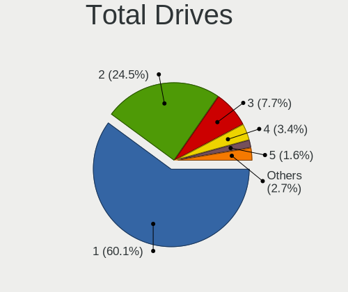
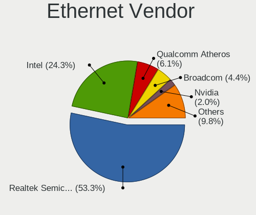

Linux - Tested Hardware & Statistics
------------------------------------

A project to collect tested hardware configurations for Linux.

Anyone can contribute to this report by the [hw-probe](https://github.com/linuxhw/hw-probe) tool:

    sudo -E hw-probe -all -upload

Please contribute! Especially if your hardware is rare.

This is a report for all computer types. See also reports for [desktops](/Desktop/README.md) and [notebooks](/Notebook/README.md).

Distribution-specific reports: [Alpine](/Dist/Alpine), [ALT_Linux](/Dist/ALT_Linux), [antiX](/Dist/antiX), [Artix](/Dist/Artix), [Chrome_OS](/Dist/Chrome_OS), [Clear_Linux](/Dist/Clear_Linux), [Deepin](/Dist/Deepin), [Devuan](/Dist/Devuan), [EndeavourOS](/Dist/EndeavourOS), [Garuda_Linux](/Dist/Garuda_Linux), [GNOME_OS](/Dist/GNOME_OS), [Mageia](/Dist/Mageia), [Makulu](/Dist/Makulu), [NixOS](/Dist/NixOS), [Oracle_Linux](/Dist/Oracle_Linux), [Pardus](/Dist/Pardus), [PureOS](/Dist/PureOS), [Q4OS](/Dist/Q4OS), [Reborn_OS](/Dist/Reborn_OS), [Rocky_Linux](/Dist/Rocky_Linux), [Sparky](/Dist/Sparky), [Void_Linux](/Dist/Void_Linux), [Xero](/Dist/Xero).

This report is for real hardware. Report for virtual hardware: [TestCoverage_VE](https://github.com/linuxhw/TestCoverage_VE)

Contents
--------

* [ Test Cases ](#test-cases)

* [ System ](#system)
  - [ OS                       ](#os)
  - [ OS Family                ](#os-family)
  - [ Kernel                   ](#kernel)
  - [ Kernel Family            ](#kernel-family)
  - [ Kernel Major Ver.        ](#kernel-major-ver)
  - [ Arch                     ](#arch)
  - [ DE                       ](#de)
  - [ Display Server           ](#display-server)
  - [ Display Manager          ](#display-manager)
  - [ OS Lang                  ](#os-lang)
  - [ Boot Mode                ](#boot-mode)
  - [ Filesystem               ](#filesystem)
  - [ Part. scheme             ](#part-scheme)
  - [ Dual Boot with Linux/BSD ](#dual-boot-with-linuxbsd)
  - [ Dual Boot (Win)          ](#dual-boot-win)

* [ Board ](#board)
  - [ Vendor                   ](#vendor)
  - [ Model                    ](#model)
  - [ Model Family             ](#model-family)
  - [ MFG Year                 ](#mfg-year)
  - [ Form Factor              ](#form-factor)
  - [ Secure Boot              ](#secure-boot)
  - [ Coreboot                 ](#coreboot)
  - [ RAM Size                 ](#ram-size)
  - [ RAM Used                 ](#ram-used)
  - [ Total Drives             ](#total-drives)
  - [ Has CD-ROM               ](#has-cd-rom)
  - [ Has Ethernet             ](#has-ethernet)
  - [ Has WiFi                 ](#has-wifi)
  - [ Has Bluetooth            ](#has-bluetooth)

* [ Location ](#location)
  - [ Country                  ](#country)
  - [ City                     ](#city)

* [ Drives ](#drives)
  - [ Drive Vendor             ](#drive-vendor)
  - [ Drive Model              ](#drive-model)
  - [ HDD Vendor               ](#hdd-vendor)
  - [ SSD Vendor               ](#ssd-vendor)
  - [ Drive Kind               ](#drive-kind)
  - [ Drive Connector          ](#drive-connector)
  - [ Drive Size               ](#drive-size)
  - [ Space Total              ](#space-total)
  - [ Space Used               ](#space-used)
  - [ Malfunc. Drives          ](#malfunc-drives)
  - [ Malfunc. Drive Vendor    ](#malfunc-drive-vendor)
  - [ Malfunc. HDD Vendor      ](#malfunc-hdd-vendor)
  - [ Malfunc. Drive Kind      ](#malfunc-drive-kind)
  - [ Failed Drives            ](#failed-drives)
  - [ Failed Drive Vendor      ](#failed-drive-vendor)
  - [ Drive Status             ](#drive-status)

* [ Storage controller ](#storage-controller)
  - [ Storage Vendor           ](#storage-vendor)
  - [ Storage Model            ](#storage-model)
  - [ Storage Kind             ](#storage-kind)

* [ Processor ](#processor)
  - [ CPU Vendor               ](#cpu-vendor)
  - [ CPU Model                ](#cpu-model)
  - [ CPU Model Family         ](#cpu-model-family)
  - [ CPU Cores                ](#cpu-cores)
  - [ CPU Sockets              ](#cpu-sockets)
  - [ CPU Threads              ](#cpu-threads)
  - [ CPU Op-Modes             ](#cpu-op-modes)
  - [ CPU Microcode            ](#cpu-microcode)
  - [ CPU Microarch            ](#cpu-microarch)

* [ Graphics ](#graphics)
  - [ GPU Vendor               ](#gpu-vendor)
  - [ GPU Model                ](#gpu-model)
  - [ GPU Combo                ](#gpu-combo)
  - [ GPU Driver               ](#gpu-driver)
  - [ GPU Memory               ](#gpu-memory)

* [ Monitor ](#monitor)
  - [ Monitor Vendor           ](#monitor-vendor)
  - [ Monitor Model            ](#monitor-model)
  - [ Monitor Resolution       ](#monitor-resolution)
  - [ Monitor Diagonal         ](#monitor-diagonal)
  - [ Monitor Width            ](#monitor-width)
  - [ Aspect Ratio             ](#aspect-ratio)
  - [ Monitor Area             ](#monitor-area)
  - [ Pixel Density            ](#pixel-density)
  - [ Multiple Monitors        ](#multiple-monitors)

* [ Network ](#network)
  - [ Net Controller Vendor    ](#net-controller-vendor)
  - [ Net Controller Model     ](#net-controller-model)
  - [ Wireless Vendor          ](#wireless-vendor)
  - [ Wireless Model           ](#wireless-model)
  - [ Ethernet Vendor          ](#ethernet-vendor)
  - [ Ethernet Model           ](#ethernet-model)
  - [ Net Controller Kind      ](#net-controller-kind)
  - [ Used Controller          ](#used-controller)
  - [ NICs                     ](#nics)
  - [ IPv6                     ](#ipv6)

* [ Bluetooth ](#bluetooth)
  - [ Bluetooth Vendor         ](#bluetooth-vendor)
  - [ Bluetooth Model          ](#bluetooth-model)

* [ Sound ](#sound)
  - [ Sound Vendor             ](#sound-vendor)
  - [ Sound Model              ](#sound-model)

* [ Memory ](#memory)
  - [ Memory Vendor            ](#memory-vendor)
  - [ Memory Model             ](#memory-model)
  - [ Memory Kind              ](#memory-kind)
  - [ Memory Form Factor       ](#memory-form-factor)
  - [ Memory Size              ](#memory-size)
  - [ Memory Speed             ](#memory-speed)

* [ Printers & scanners ](#printers--scanners)
  - [ Printer Vendor           ](#printer-vendor)
  - [ Printer Model            ](#printer-model)
  - [ Scanner Vendor           ](#scanner-vendor)
  - [ Scanner Model            ](#scanner-model)

* [ Camera ](#camera)
  - [ Camera Vendor            ](#camera-vendor)
  - [ Camera Model             ](#camera-model)

* [ Security ](#security)
  - [ Fingerprint Vendor       ](#fingerprint-vendor)
  - [ Fingerprint Model        ](#fingerprint-model)
  - [ Chipcard Vendor          ](#chipcard-vendor)
  - [ Chipcard Model           ](#chipcard-model)

* [ Unsupported ](#unsupported)
  - [ Unsupported Devices      ](#unsupported-devices)
  - [ Unsupported Device Types ](#unsupported-device-types)

Test Cases
----------

Total: 235701

| Vendor        | Model                       | Form-Factor | Probe                                                      | Date         |
|---------------|-----------------------------|-------------|------------------------------------------------------------|--------------|
| Fujitsu       | D3162-A1 S26361-D3162-A1    | Desktop     | [060a34b3a1](https://linux-hardware.org/?probe=060a34b3a1) | Jul 01, 2022 |
| Lenovo        | ThinkPad T14 Gen 1 20S00... | Notebook    | [06d4d79742](https://linux-hardware.org/?probe=06d4d79742) | Jul 01, 2022 |
| Lenovo        | ThinkPad T480 20L6S2EQ00    | Notebook    | [1b45ef7d10](https://linux-hardware.org/?probe=1b45ef7d10) | Jul 01, 2022 |
| Fujitsu       | D3162-A1 S26361-D3162-A1    | Desktop     | [630bb92cd8](https://linux-hardware.org/?probe=630bb92cd8) | Jul 01, 2022 |
| MSI           | MPG X570 GAMING EDGE WIF... | Desktop     | [7da3547526](https://linux-hardware.org/?probe=7da3547526) | Jul 01, 2022 |
| Dell          | Precision M4600             | Notebook    | [ea07b9e45f](https://linux-hardware.org/?probe=ea07b9e45f) | Jul 01, 2022 |
| Apple         | Mac-27ADBB7B4CEE8E61 iMa... | All in one  | [b78c848494](https://linux-hardware.org/?probe=b78c848494) | Jul 01, 2022 |
| MSI           | Z390 GAM PRO CARB AC        | Desktop     | [a55ab11db7](https://linux-hardware.org/?probe=a55ab11db7) | Jul 01, 2022 |
| Supermicro    | A2SAN-E-WOHSA               | Desktop     | [f8d0b19c1e](https://linux-hardware.org/?probe=f8d0b19c1e) | Jul 01, 2022 |
| Dell          | Precision M4600             | Notebook    | [535d6029bc](https://linux-hardware.org/?probe=535d6029bc) | Jul 01, 2022 |
| Pegatron      | IPM41-D3                    | Desktop     | [a7cc8d2654](https://linux-hardware.org/?probe=a7cc8d2654) | Jul 01, 2022 |
| Gigabyte      | X470 AORUS GAMING 7 WIFI... | Desktop     | [47f8ea8d1d](https://linux-hardware.org/?probe=47f8ea8d1d) | Jul 01, 2022 |
| MSI           | X370 GAMING PRO CARBON      | Desktop     | [5763cb4576](https://linux-hardware.org/?probe=5763cb4576) | Jul 01, 2022 |
| HP            | Pavilion Aero Laptop 13-... | Notebook    | [9b8bb07ff0](https://linux-hardware.org/?probe=9b8bb07ff0) | Jul 01, 2022 |
| Intel         | X99 V3.0                    | Desktop     | [278a8cf70a](https://linux-hardware.org/?probe=278a8cf70a) | Jul 01, 2022 |
| Gigabyte      | B450 GAMING X               | Desktop     | [b381e9b1fe](https://linux-hardware.org/?probe=b381e9b1fe) | Jul 01, 2022 |
| Intel         | X99 V3.0                    | Desktop     | [c697bf23dd](https://linux-hardware.org/?probe=c697bf23dd) | Jul 01, 2022 |
| ASRock        | H310CM-HDV                  | Desktop     | [4e6539bf57](https://linux-hardware.org/?probe=4e6539bf57) | Jul 01, 2022 |
| Lenovo        | ThinkPad P14s Gen 1 20Y1... | Notebook    | [16413aeb23](https://linux-hardware.org/?probe=16413aeb23) | Jul 01, 2022 |
| Apple         | MacBookPro16,1              | Notebook    | [05c07aba75](https://linux-hardware.org/?probe=05c07aba75) | Jul 01, 2022 |
| Dell          | 042P49 A02                  | Desktop     | [110e5da723](https://linux-hardware.org/?probe=110e5da723) | Jul 01, 2022 |
| ASUSTek       | P5G41T-M LX2/GB             | Desktop     | [faf850bb00](https://linux-hardware.org/?probe=faf850bb00) | Jul 01, 2022 |
| Gigabyte      | X570 AORUS PRO WIFI         | Desktop     | [2f0ac248ed](https://linux-hardware.org/?probe=2f0ac248ed) | Jul 01, 2022 |
| Lenovo        | IdeaPad 700-15ISK 80RU      | Notebook    | [10ff366630](https://linux-hardware.org/?probe=10ff366630) | Jul 01, 2022 |
| Gigabyte      | X570 AORUS PRO WIFI         | Desktop     | [5a6d827ebe](https://linux-hardware.org/?probe=5a6d827ebe) | Jul 01, 2022 |
| ASUSTek       | TUF X470-PLUS GAMING        | Desktop     | [80a981f992](https://linux-hardware.org/?probe=80a981f992) | Jul 01, 2022 |
| Samsung       | 930XED                      | Notebook    | [56a04fa69d](https://linux-hardware.org/?probe=56a04fa69d) | Jul 01, 2022 |
| TUXEDO        | Pulse 15 Gen1               | Notebook    | [9de0586493](https://linux-hardware.org/?probe=9de0586493) | Jul 01, 2022 |
| Apple         | Mac-27ADBB7B4CEE8E61 iMa... | All in one  | [f0c4468694](https://linux-hardware.org/?probe=f0c4468694) | Jul 01, 2022 |
| Dell          | Latitude 7530               | Notebook    | [a66aca8921](https://linux-hardware.org/?probe=a66aca8921) | Jul 01, 2022 |
| Dell          | Inspiron 1501               | Notebook    | [f6efa72c1f](https://linux-hardware.org/?probe=f6efa72c1f) | Jul 01, 2022 |
| Apple         | MacBookPro16,1              | Notebook    | [3eb50f5177](https://linux-hardware.org/?probe=3eb50f5177) | Jul 01, 2022 |
| Intel         | DX58SO AAE29331-703         | Desktop     | [3b22974574](https://linux-hardware.org/?probe=3b22974574) | Jul 01, 2022 |
| HP            | Laptop 14s-cf2xxx           | Notebook    | [8da2258fea](https://linux-hardware.org/?probe=8da2258fea) | Jul 01, 2022 |
| Gigabyte      | X570 I AORUS PRO WIFI       | Desktop     | [d979555615](https://linux-hardware.org/?probe=d979555615) | Jul 01, 2022 |
| Lenovo        | ThinkPad L412 0585E86       | Notebook    | [ad82717c98](https://linux-hardware.org/?probe=ad82717c98) | Jul 01, 2022 |
| Medion        | MS-7797                     | Desktop     | [01ff2f8272](https://linux-hardware.org/?probe=01ff2f8272) | Jul 01, 2022 |
| ASUSTek       | M5A78L LE                   | Desktop     | [19dbe00e60](https://linux-hardware.org/?probe=19dbe00e60) | Jul 01, 2022 |
| ASUSTek       | S550CA                      | Notebook    | [8ed63bbdfd](https://linux-hardware.org/?probe=8ed63bbdfd) | Jul 01, 2022 |
| Dell          | Precision 5530              | Notebook    | [d6dc0ecd91](https://linux-hardware.org/?probe=d6dc0ecd91) | Jul 01, 2022 |
| Acer          | Aspire A315-51              | Notebook    | [8febe62da6](https://linux-hardware.org/?probe=8febe62da6) | Jul 01, 2022 |
| ASRock        | B450 Gaming K4              | Desktop     | [2bdfc5f472](https://linux-hardware.org/?probe=2bdfc5f472) | Jul 01, 2022 |
| Intel         | H510SB-TM v2.0              | All in one  | [a1f664db17](https://linux-hardware.org/?probe=a1f664db17) | Jul 01, 2022 |
| MSI           | B250M PRO-VD                | Desktop     | [b48e88849b](https://linux-hardware.org/?probe=b48e88849b) | Jul 01, 2022 |
| MSI           | X399 GAMING PRO CARBON A... | Desktop     | [153a698b74](https://linux-hardware.org/?probe=153a698b74) | Jul 01, 2022 |
| Acer          | Aspire 5536                 | Notebook    | [67bb645804](https://linux-hardware.org/?probe=67bb645804) | Jul 01, 2022 |
| Dell          | Latitude E6400              | Notebook    | [1c5025c952](https://linux-hardware.org/?probe=1c5025c952) | Jul 01, 2022 |
| HP            | 805D                        | Desktop     | [3610332b9c](https://linux-hardware.org/?probe=3610332b9c) | Jul 01, 2022 |
| Gigabyte      | X470 AORUS ULTRA GAMING-... | Desktop     | [3633eb51d4](https://linux-hardware.org/?probe=3633eb51d4) | Jul 01, 2022 |
| HP            | OMEN by Laptop 15-dc1xxx    | Notebook    | [b7fedc25e4](https://linux-hardware.org/?probe=b7fedc25e4) | Jul 01, 2022 |
| Dell          | Precision 5550              | Notebook    | [0ddb8905e5](https://linux-hardware.org/?probe=0ddb8905e5) | Jul 01, 2022 |
| Dell          | 042P49 A02                  | Desktop     | [169b7b8c30](https://linux-hardware.org/?probe=169b7b8c30) | Jul 01, 2022 |
| Gigabyte      | H81M-DS2V                   | Desktop     | [5f35ee7109](https://linux-hardware.org/?probe=5f35ee7109) | Jul 01, 2022 |
| ASUSTek       | PRIME H670-PLUS D4          | Desktop     | [8f90bed577](https://linux-hardware.org/?probe=8f90bed577) | Jul 01, 2022 |
| Gigabyte      | P55A-UD3                    | Desktop     | [36dcdacdb1](https://linux-hardware.org/?probe=36dcdacdb1) | Jul 01, 2022 |
| HP            | ProBook 4540s               | Notebook    | [c47e971697](https://linux-hardware.org/?probe=c47e971697) | Jul 01, 2022 |
| HP            | 8459                        | Desktop     | [f43fdff127](https://linux-hardware.org/?probe=f43fdff127) | Jul 01, 2022 |
| Lenovo        | ThinkPad X1 Yoga Gen 7 2... | Convertible | [5f076638f4](https://linux-hardware.org/?probe=5f076638f4) | Jul 01, 2022 |
| Dell          | 0NRKPK A02                  | Desktop     | [c483bc3c81](https://linux-hardware.org/?probe=c483bc3c81) | Jul 01, 2022 |
| ASUSTek       | STRIX Z270H GAMING          | Desktop     | [48ff25c4d2](https://linux-hardware.org/?probe=48ff25c4d2) | Jul 01, 2022 |
| Dell          | 06NWYK A01                  | Desktop     | [91408af847](https://linux-hardware.org/?probe=91408af847) | Jul 01, 2022 |
| MSI           | B450 TOMAHAWK MAX           | Desktop     | [21dd020507](https://linux-hardware.org/?probe=21dd020507) | Jul 01, 2022 |
| Toshiba       | Satellite L350              | Notebook    | [06df7a6c59](https://linux-hardware.org/?probe=06df7a6c59) | Jul 01, 2022 |
| Tactus        | GeoPad 220                  | Tablet      | [0be548592c](https://linux-hardware.org/?probe=0be548592c) | Jul 01, 2022 |
| Gigabyte      | H81M-S2PH                   | Desktop     | [cc62a478ac](https://linux-hardware.org/?probe=cc62a478ac) | Jul 01, 2022 |
| HP            | Laptop 15s-fq1xxx           | Notebook    | [bd9caa15d5](https://linux-hardware.org/?probe=bd9caa15d5) | Jul 01, 2022 |
| HP            | ProBook 4545s               | Notebook    | [d743bf83fe](https://linux-hardware.org/?probe=d743bf83fe) | Jul 01, 2022 |
| TUXEDO        | Pulse 15 Gen1               | Notebook    | [8c7b7c1b45](https://linux-hardware.org/?probe=8c7b7c1b45) | Jul 01, 2022 |
| Tactus        | GeoPad 220                  | Tablet      | [f0421c3e3f](https://linux-hardware.org/?probe=f0421c3e3f) | Jul 01, 2022 |
| Lenovo        | ThinkPad T480 20L5000UUS    | Notebook    | [60c86ea9e1](https://linux-hardware.org/?probe=60c86ea9e1) | Jul 01, 2022 |
| ASUSTek       | ROG STRIX B550-F GAMING     | Desktop     | [8e6d23cf01](https://linux-hardware.org/?probe=8e6d23cf01) | Jul 01, 2022 |
| Dell          | 0R5KP9 A04                  | Server      | [2a9a66a9d9](https://linux-hardware.org/?probe=2a9a66a9d9) | Jul 01, 2022 |
| Valve         | Jupiter                     | Notebook    | [c591d23b4d](https://linux-hardware.org/?probe=c591d23b4d) | Jul 01, 2022 |
| ZOTAC         | ZBOX-ECM73070C/53060C       | Mini pc     | [77c632ea8e](https://linux-hardware.org/?probe=77c632ea8e) | Jul 01, 2022 |
| Samsung       | Q210/P210                   | Notebook    | [dfc97062be](https://linux-hardware.org/?probe=dfc97062be) | Jul 01, 2022 |
| Dell          | Inspiron M5010              | Notebook    | [14b9aa33d2](https://linux-hardware.org/?probe=14b9aa33d2) | Jul 01, 2022 |
| Toshiba       | Satellite L350              | Notebook    | [49c8c1b96a](https://linux-hardware.org/?probe=49c8c1b96a) | Jul 01, 2022 |
| MSI           | GF63 Thin 11UD              | Notebook    | [63508059d3](https://linux-hardware.org/?probe=63508059d3) | Jul 01, 2022 |
| ASUSTek       | ET2400A                     | Desktop     | [8801791f80](https://linux-hardware.org/?probe=8801791f80) | Jul 01, 2022 |
| eMachines     | E725                        | Notebook    | [8ba1579921](https://linux-hardware.org/?probe=8ba1579921) | Jul 01, 2022 |
| Lenovo        | Z70-80 80FG                 | Notebook    | [eaf34443c7](https://linux-hardware.org/?probe=eaf34443c7) | Jul 01, 2022 |
| Acer          | Extensa 5220                | Notebook    | [1ee1e31b52](https://linux-hardware.org/?probe=1ee1e31b52) | Jul 01, 2022 |
| Lenovo        | 312D NOK                    | Mini pc     | [97dfd06a92](https://linux-hardware.org/?probe=97dfd06a92) | Jul 01, 2022 |
| MSI           | GF63 Thin 11UD              | Notebook    | [b7aef43e9e](https://linux-hardware.org/?probe=b7aef43e9e) | Jul 01, 2022 |
| eMachines     | E725                        | Notebook    | [874b6bd7de](https://linux-hardware.org/?probe=874b6bd7de) | Jul 01, 2022 |
| Gigabyte      | AB350-Gaming-CF             | Desktop     | [6b1b522b7e](https://linux-hardware.org/?probe=6b1b522b7e) | Jul 01, 2022 |
| Dell          | Latitude 3420               | Notebook    | [1e31a0ce68](https://linux-hardware.org/?probe=1e31a0ce68) | Jul 01, 2022 |
| ASUSTek       | PRIME H310M-R R2.0          | Desktop     | [d7d9387e6d](https://linux-hardware.org/?probe=d7d9387e6d) | Jul 01, 2022 |
| ASRock        | H570M Pro4                  | Desktop     | [7edf16eeea](https://linux-hardware.org/?probe=7edf16eeea) | Jul 01, 2022 |
| ASRock        | P67 Pro3                    | Desktop     | [403db88011](https://linux-hardware.org/?probe=403db88011) | Jul 01, 2022 |
| ASUSTek       | TUF Gaming FX505DT_FX505... | Notebook    | [9034bf7260](https://linux-hardware.org/?probe=9034bf7260) | Jul 01, 2022 |
| Lenovo        | IdeaPad 510-15IKB 80SV      | Notebook    | [0532069637](https://linux-hardware.org/?probe=0532069637) | Jul 01, 2022 |
| Lenovo        | V110-15IAP 80TG             | Notebook    | [05d0271371](https://linux-hardware.org/?probe=05d0271371) | Jul 01, 2022 |
| ASUSTek       | UX31E                       | Notebook    | [d3f27ab291](https://linux-hardware.org/?probe=d3f27ab291) | Jul 01, 2022 |
| Lenovo        | IdeaPad S145-15IGM 81MX     | Notebook    | [de35c60b5f](https://linux-hardware.org/?probe=de35c60b5f) | Jul 01, 2022 |
| ASRock        | P67 Pro3                    | Desktop     | [4ba5c0b79e](https://linux-hardware.org/?probe=4ba5c0b79e) | Jul 01, 2022 |
| Sony          | VPCEA26FG                   | Notebook    | [b72a4de42b](https://linux-hardware.org/?probe=b72a4de42b) | Jul 01, 2022 |
| Dell          | 0MFHTR A00                  | Desktop     | [bb4d1c2872](https://linux-hardware.org/?probe=bb4d1c2872) | Jul 01, 2022 |
| Gigabyte      | Z97X-Gaming 3               | Desktop     | [9b8bb163d3](https://linux-hardware.org/?probe=9b8bb163d3) | Jul 01, 2022 |
| Gigabyte      | B550M DS3H                  | Desktop     | [36ea7e26d0](https://linux-hardware.org/?probe=36ea7e26d0) | Jul 01, 2022 |
| ASUSTek       | VivoBook_ASUSLaptop X515... | Notebook    | [81fff806a4](https://linux-hardware.org/?probe=81fff806a4) | Jul 01, 2022 |
| ASUSTek       | VivoBook_ASUSLaptop X515... | Notebook    | [294f501cdd](https://linux-hardware.org/?probe=294f501cdd) | Jul 01, 2022 |
| Raspberry ... | Raspberry Pi 4 Model B R... | Soc         | [5a2507857c](https://linux-hardware.org/?probe=5a2507857c) | Jul 01, 2022 |
| Gigabyte      | B85M-D3H                    | Desktop     | [d0d9e7b5c7](https://linux-hardware.org/?probe=d0d9e7b5c7) | Jul 01, 2022 |
| MSI           | H81M-E33                    | Desktop     | [737e14fea7](https://linux-hardware.org/?probe=737e14fea7) | Jul 01, 2022 |
| ASUSTek       | Maximus IX FORMULA          | Desktop     | [8c29343495](https://linux-hardware.org/?probe=8c29343495) | Jul 01, 2022 |
| HP            | 829E                        | Mini pc     | [91fee1441e](https://linux-hardware.org/?probe=91fee1441e) | Jul 01, 2022 |
| Dell          | XPS 15 9520                 | Notebook    | [ca7efa311a](https://linux-hardware.org/?probe=ca7efa311a) | Jul 01, 2022 |
| ASUSTek       | Maximus IX FORMULA          | Desktop     | [2631bf2ae1](https://linux-hardware.org/?probe=2631bf2ae1) | Jul 01, 2022 |
| ASUSTek       | A88XM-A/USB                 | Desktop     | [01fb492b9d](https://linux-hardware.org/?probe=01fb492b9d) | Jul 01, 2022 |
| Lenovo        | V110-15IAP 80TG             | Notebook    | [23519c6427](https://linux-hardware.org/?probe=23519c6427) | Jul 01, 2022 |
| ASUSTek       | A88XM-A/USB                 | Desktop     | [b4b8457bd9](https://linux-hardware.org/?probe=b4b8457bd9) | Jul 01, 2022 |
| ASRock        | H270 Pro4                   | Desktop     | [729a9705aa](https://linux-hardware.org/?probe=729a9705aa) | Jul 01, 2022 |
| Timi          | Mi NoteBook Ultra           | Notebook    | [0364230bc7](https://linux-hardware.org/?probe=0364230bc7) | Jul 01, 2022 |
| ASUSTek       | N43JQ                       | Notebook    | [d73f714472](https://linux-hardware.org/?probe=d73f714472) | Jul 01, 2022 |
| Dell          | Latitude 3120               | Convertible | [42c26ea983](https://linux-hardware.org/?probe=42c26ea983) | Jul 01, 2022 |
| Gigabyte      | B85M-D3H                    | Desktop     | [a32cb9b3f1](https://linux-hardware.org/?probe=a32cb9b3f1) | Jul 01, 2022 |
| Intel         | MAHOBAY                     | Desktop     | [7df5adcb79](https://linux-hardware.org/?probe=7df5adcb79) | Jul 01, 2022 |
| HP            | 8169                        | Desktop     | [18c6ea7678](https://linux-hardware.org/?probe=18c6ea7678) | Jul 01, 2022 |
| Tactus        | GeoPad 220                  | Tablet      | [a7e3223fa6](https://linux-hardware.org/?probe=a7e3223fa6) | Jul 01, 2022 |
| ASUSTek       | TUF Gaming X570-PLUS        | Desktop     | [987d9aa4d3](https://linux-hardware.org/?probe=987d9aa4d3) | Jul 01, 2022 |
| Apple         | Mac-7BA5B2DFE22DDD8C Mac... | Mini pc     | [ed5f328d6a](https://linux-hardware.org/?probe=ed5f328d6a) | Jul 01, 2022 |
| Aquarius      | NS685U R11                  | Notebook    | [1b9ecf0aba](https://linux-hardware.org/?probe=1b9ecf0aba) | Jul 01, 2022 |
| Lenovo        | IdeaPad 5 15ITL05 82FG      | Notebook    | [2671f4ffe2](https://linux-hardware.org/?probe=2671f4ffe2) | Jul 01, 2022 |
| HP            | 8169                        | Desktop     | [c479baadc1](https://linux-hardware.org/?probe=c479baadc1) | Jul 01, 2022 |
| Dell          | 0GXM1W A00                  | Desktop     | [d48eb55102](https://linux-hardware.org/?probe=d48eb55102) | Jul 01, 2022 |
| Dell          | 0T7D40 A01                  | Desktop     | [42b1694c97](https://linux-hardware.org/?probe=42b1694c97) | Jul 01, 2022 |
| Lenovo        | ThinkPad T430 23501F9       | Notebook    | [e4bd671886](https://linux-hardware.org/?probe=e4bd671886) | Jul 01, 2022 |
| Lenovo        | G700                        | Notebook    | [b0c0b2b8ef](https://linux-hardware.org/?probe=b0c0b2b8ef) | Jul 01, 2022 |
| Acer          | Aspire C22-820              | All in one  | [0bb41ffb71](https://linux-hardware.org/?probe=0bb41ffb71) | Jul 01, 2022 |
| Lenovo        | ThinkBook 15 G2 ITL 20VE    | Notebook    | [7cdf221ced](https://linux-hardware.org/?probe=7cdf221ced) | Jul 01, 2022 |
| Razer         | Blade 14 (2022) - RZ09-0... | Notebook    | [927dbb8452](https://linux-hardware.org/?probe=927dbb8452) | Jul 01, 2022 |
| ECS           | A780GM-A                    | Desktop     | [2cea4325e9](https://linux-hardware.org/?probe=2cea4325e9) | Jul 01, 2022 |
| Lenovo        | Z70-80 80FG                 | Notebook    | [de5734cbe0](https://linux-hardware.org/?probe=de5734cbe0) | Jul 01, 2022 |
| MSI           | GF63 Thin 11UD              | Notebook    | [325fec2ac6](https://linux-hardware.org/?probe=325fec2ac6) | Jul 01, 2022 |
| Gigabyte      | Q170M-D3H-CF                | Desktop     | [241f8bd9da](https://linux-hardware.org/?probe=241f8bd9da) | Jul 01, 2022 |
| Lenovo        | Z70-80 80FG                 | Notebook    | [dd8c266ad2](https://linux-hardware.org/?probe=dd8c266ad2) | Jul 01, 2022 |
| ASUSTek       | H81M-K                      | Desktop     | [08ed20d4da](https://linux-hardware.org/?probe=08ed20d4da) | Jul 01, 2022 |
| ASUSTek       | PRIME B550M-A               | Desktop     | [9f4f6d2323](https://linux-hardware.org/?probe=9f4f6d2323) | Jul 01, 2022 |
| Biostar       | B550GTA                     | Desktop     | [5d9da072f0](https://linux-hardware.org/?probe=5d9da072f0) | Jul 01, 2022 |
| Dell          | 0P01GV A03                  | Desktop     | [0bbac8ce1f](https://linux-hardware.org/?probe=0bbac8ce1f) | Jul 01, 2022 |
| HP            | ProBook 450 G5              | Notebook    | [5a27519612](https://linux-hardware.org/?probe=5a27519612) | Jul 01, 2022 |
| Biostar       | TA790GX 128M                | Desktop     | [c7021e0b8c](https://linux-hardware.org/?probe=c7021e0b8c) | Jul 01, 2022 |
| Dell          | Inspiron 1764               | Notebook    | [dd5c77d711](https://linux-hardware.org/?probe=dd5c77d711) | Jul 01, 2022 |
| Gigabyte      | GA-MA770T-UD3P              | Desktop     | [50ef3e22eb](https://linux-hardware.org/?probe=50ef3e22eb) | Jul 01, 2022 |
| Pegatron      | 2ACD                        | Desktop     | [3979af0018](https://linux-hardware.org/?probe=3979af0018) | Jul 01, 2022 |
| ASRock        | B450M Pro4                  | Desktop     | [5dd727cd5e](https://linux-hardware.org/?probe=5dd727cd5e) | Jul 01, 2022 |
| ASRock        | P67 Pro3                    | Desktop     | [632dbea587](https://linux-hardware.org/?probe=632dbea587) | Jul 01, 2022 |
| Lenovo        | 312D NOK                    | Mini pc     | [8803c535a9](https://linux-hardware.org/?probe=8803c535a9) | Jul 01, 2022 |
| Lenovo        | 312D NOK                    | Mini pc     | [e46c1314b2](https://linux-hardware.org/?probe=e46c1314b2) | Jul 01, 2022 |
| Lenovo        | ThinkPad E14 Gen 2 20T6S... | Notebook    | [430c2e6760](https://linux-hardware.org/?probe=430c2e6760) | Jul 01, 2022 |
| Razer         | Blade 15 Base Model (Ear... | Notebook    | [7e809da3ad](https://linux-hardware.org/?probe=7e809da3ad) | Jul 01, 2022 |
| Gigabyte      | A320M-S2H V2-CF             | Desktop     | [a045d05273](https://linux-hardware.org/?probe=a045d05273) | Jul 01, 2022 |
| Gigabyte      | X570 I AORUS PRO WIFI       | Desktop     | [d82f88e20c](https://linux-hardware.org/?probe=d82f88e20c) | Jul 01, 2022 |
| Gigabyte      | H110M-S2-CF                 | Desktop     | [8146084972](https://linux-hardware.org/?probe=8146084972) | Jul 01, 2022 |
| Raspberry ... | Raspberry Pi 4 Model B R... | Soc         | [d83a0aa24f](https://linux-hardware.org/?probe=d83a0aa24f) | Jul 01, 2022 |
| ASUSTek       | VivoBook_ASUSLaptop X512... | Notebook    | [c9d0d64896](https://linux-hardware.org/?probe=c9d0d64896) | Jul 01, 2022 |
| Raspberry ... | Raspberry Pi 4 Model B R... | Soc         | [7ffd41ce5c](https://linux-hardware.org/?probe=7ffd41ce5c) | Jul 01, 2022 |
| Timi          | RedmiBook 14 II             | Notebook    | [bf58ea7c43](https://linux-hardware.org/?probe=bf58ea7c43) | Jul 01, 2022 |
| Timi          | RedmiBook 14 II             | Notebook    | [4c7e17e7ba](https://linux-hardware.org/?probe=4c7e17e7ba) | Jul 01, 2022 |
| Aquarius      | NS685U R11                  | Notebook    | [3ec207409f](https://linux-hardware.org/?probe=3ec207409f) | Jul 01, 2022 |
| Gigabyte      | X58-USB3                    | Desktop     | [d8289501d0](https://linux-hardware.org/?probe=d8289501d0) | Jul 01, 2022 |
| Dell          | 0PV3YR A05                  | Server      | [bae33da030](https://linux-hardware.org/?probe=bae33da030) | Jul 01, 2022 |
| ASUSTek       | VivoBook_ASUSLaptop X513... | Notebook    | [af946ca10b](https://linux-hardware.org/?probe=af946ca10b) | Jul 01, 2022 |
| HP            | 2B0D A01                    | All in one  | [43b3fd0fd4](https://linux-hardware.org/?probe=43b3fd0fd4) | Jul 01, 2022 |
| Lenovo        | ThinkPad W510 4318CTO       | Notebook    | [27cd378ed6](https://linux-hardware.org/?probe=27cd378ed6) | Jul 01, 2022 |
| ASUSTek       | X756UQK                     | Notebook    | [62595fe324](https://linux-hardware.org/?probe=62595fe324) | Jul 01, 2022 |
| Lenovo        | IdeaPad 3 15IML05 81WB      | Notebook    | [93d3e2daba](https://linux-hardware.org/?probe=93d3e2daba) | Jul 01, 2022 |
| Sony          | VPCEH37FJ                   | Notebook    | [509fe56362](https://linux-hardware.org/?probe=509fe56362) | Jul 01, 2022 |
| HUAWEI        | NBM-WXX9                    | Notebook    | [6ed674f77e](https://linux-hardware.org/?probe=6ed674f77e) | Jul 01, 2022 |
| MSI           | X99A RAIDER                 | Desktop     | [e1c3d1dfad](https://linux-hardware.org/?probe=e1c3d1dfad) | Jul 01, 2022 |
| Dell          | Latitude E6400              | Notebook    | [a47d49bfab](https://linux-hardware.org/?probe=a47d49bfab) | Jul 01, 2022 |
| ASRock        | FM2A88X Extreme6+           | Desktop     | [a658ebf5e9](https://linux-hardware.org/?probe=a658ebf5e9) | Jul 01, 2022 |
| Acer          | Aspire E5-573               | Notebook    | [01f3150f60](https://linux-hardware.org/?probe=01f3150f60) | Jul 01, 2022 |
| HP            | Laptop 14-fq1xxx            | Notebook    | [9aa0a38b17](https://linux-hardware.org/?probe=9aa0a38b17) | Jul 01, 2022 |
| OEM           | S20II1                      | Notebook    | [bcaac39dde](https://linux-hardware.org/?probe=bcaac39dde) | Jul 01, 2022 |
| HP            | Laptop 14-fq1xxx            | Notebook    | [b9b09609b8](https://linux-hardware.org/?probe=b9b09609b8) | Jul 01, 2022 |
| HP            | Pavilion 15                 | Notebook    | [e35e3b2e52](https://linux-hardware.org/?probe=e35e3b2e52) | Jul 01, 2022 |
| HP            | 18E7                        | Desktop     | [1808b6dee4](https://linux-hardware.org/?probe=1808b6dee4) | Jul 01, 2022 |
| Chuwi         | HeroBook Air                | Notebook    | [217dcb770c](https://linux-hardware.org/?probe=217dcb770c) | Jul 01, 2022 |
| Lenovo        | ThinkPad T430 2342CTO       | Notebook    | [eaba15d64b](https://linux-hardware.org/?probe=eaba15d64b) | Jul 01, 2022 |
| ASUSTek       | PRIME B550-PLUS AC-HES      | Desktop     | [dde2246ae8](https://linux-hardware.org/?probe=dde2246ae8) | Jul 01, 2022 |
| Dell          | Precision 7510              | Notebook    | [c82cc3cb0f](https://linux-hardware.org/?probe=c82cc3cb0f) | Jul 01, 2022 |
| Gigabyte      | Z590I AORUS ULTRA           | Desktop     | [febb798e92](https://linux-hardware.org/?probe=febb798e92) | Jul 01, 2022 |
| HP            | Pavilion g4                 | Notebook    | [3626d9afe4](https://linux-hardware.org/?probe=3626d9afe4) | Jul 01, 2022 |
| ASUSTek       | M5A78L-M/USB3               | Desktop     | [00e1806ce1](https://linux-hardware.org/?probe=00e1806ce1) | Jul 01, 2022 |
| Medion        | E2292                       | Convertible | [155434e3b5](https://linux-hardware.org/?probe=155434e3b5) | Jul 01, 2022 |
| ASUSTek       | F3JR                        | Notebook    | [b56d8007d7](https://linux-hardware.org/?probe=b56d8007d7) | Jul 01, 2022 |
| ASUSTek       | K30BF_M32BF                 | Desktop     | [dac4b154d6](https://linux-hardware.org/?probe=dac4b154d6) | Jul 01, 2022 |
| ASRock        | Z97 Anniversary             | Desktop     | [1e650b504d](https://linux-hardware.org/?probe=1e650b504d) | Jul 01, 2022 |
| HP            | EliteBook 840 G1            | Notebook    | [b691598870](https://linux-hardware.org/?probe=b691598870) | Jul 01, 2022 |
| HP            | Pavilion 17                 | Notebook    | [1efb06e77e](https://linux-hardware.org/?probe=1efb06e77e) | Jul 01, 2022 |
| Gigabyte      | Z87-HD3                     | Desktop     | [d3fab53889](https://linux-hardware.org/?probe=d3fab53889) | Jul 01, 2022 |
| Gigabyte      | AM1M-S2H                    | Desktop     | [fb2500cc2d](https://linux-hardware.org/?probe=fb2500cc2d) | Jul 01, 2022 |
| Dell          | Inspiron 5547               | Notebook    | [c2a91cc81e](https://linux-hardware.org/?probe=c2a91cc81e) | Jul 01, 2022 |
| Dell          | Precision 5530              | Notebook    | [cc30de04b0](https://linux-hardware.org/?probe=cc30de04b0) | Jul 01, 2022 |
| Lenovo        | ThinkPad T450s 20BX002NM... | Notebook    | [3bb2e1821b](https://linux-hardware.org/?probe=3bb2e1821b) | Jul 01, 2022 |
| Framework     | Laptop                      | Notebook    | [1089f37daf](https://linux-hardware.org/?probe=1089f37daf) | Jul 01, 2022 |
| HP            | Pavilion Gaming Laptop 1... | Notebook    | [f54987d748](https://linux-hardware.org/?probe=f54987d748) | Jul 01, 2022 |
| Dell          | 0M9KCM A00                  | Desktop     | [e72232ee43](https://linux-hardware.org/?probe=e72232ee43) | Jul 01, 2022 |
| Dell          | 500                         | Notebook    | [040e3cb12c](https://linux-hardware.org/?probe=040e3cb12c) | Jun 30, 2022 |
| HONOR         | BOHK-WAX9X                  | Notebook    | [1647402099](https://linux-hardware.org/?probe=1647402099) | Jun 30, 2022 |
| Gigabyte      | Z87-HD3                     | Desktop     | [c38c4e9cb9](https://linux-hardware.org/?probe=c38c4e9cb9) | Jun 30, 2022 |
| Lenovo        | ThinkBook 15 G3 ACL 21A4    | Notebook    | [ccb50bd0f4](https://linux-hardware.org/?probe=ccb50bd0f4) | Jun 30, 2022 |
| Dell          | 0M9KCM A00                  | Desktop     | [5e80242b43](https://linux-hardware.org/?probe=5e80242b43) | Jun 30, 2022 |
| ASRock        | P67 Pro3 SE                 | Desktop     | [4243c2b021](https://linux-hardware.org/?probe=4243c2b021) | Jun 30, 2022 |
| Dell          | Latitude E5430 non-vPro     | Notebook    | [ae786e567a](https://linux-hardware.org/?probe=ae786e567a) | Jun 30, 2022 |
| Dell          | Latitude E5430 non-vPro     | Notebook    | [c4942af0bc](https://linux-hardware.org/?probe=c4942af0bc) | Jun 30, 2022 |
| Dell          | Inspiron 1720               | Notebook    | [bbd0bf2dc0](https://linux-hardware.org/?probe=bbd0bf2dc0) | Jun 30, 2022 |
| Lenovo        | ThinkPad T460 20FMS2292S    | Notebook    | [cf313915ab](https://linux-hardware.org/?probe=cf313915ab) | Jun 30, 2022 |
| Dell          | Latitude 3420               | Notebook    | [651ab17da0](https://linux-hardware.org/?probe=651ab17da0) | Jun 30, 2022 |
| ASUSTek       | VivoBook E14 E402WA         | Notebook    | [1ba6fe4840](https://linux-hardware.org/?probe=1ba6fe4840) | Jun 30, 2022 |
| eMachines     | E725                        | Notebook    | [021bcca061](https://linux-hardware.org/?probe=021bcca061) | Jun 30, 2022 |
| Unknown       | ARM5                        | Mini pc     | [fba4faa579](https://linux-hardware.org/?probe=fba4faa579) | Jun 30, 2022 |
| Lenovo        | IdeaPad 5 Pro 14ACN6 82L... | Notebook    | [54f7fcc588](https://linux-hardware.org/?probe=54f7fcc588) | Jun 30, 2022 |
| ASUSTek       | TUF B350M-PLUS GAMING       | Desktop     | [a082da0857](https://linux-hardware.org/?probe=a082da0857) | Jun 30, 2022 |
| HP            | 3647h                       | Desktop     | [f59774eab5](https://linux-hardware.org/?probe=f59774eab5) | Jun 30, 2022 |
| eMachines     | E725                        | Notebook    | [b8b332e92f](https://linux-hardware.org/?probe=b8b332e92f) | Jun 30, 2022 |
| ASRock        | B450M Pro4 R2.0             | Desktop     | [d17c3a2817](https://linux-hardware.org/?probe=d17c3a2817) | Jun 30, 2022 |
| HP            | Presario CQ56               | Notebook    | [af108b4933](https://linux-hardware.org/?probe=af108b4933) | Jun 30, 2022 |
| Dell          | G5 5500                     | Notebook    | [edfdebf28d](https://linux-hardware.org/?probe=edfdebf28d) | Jun 30, 2022 |
| ASUSTek       | TUF Gaming X570-PLUS        | Desktop     | [7e14880c80](https://linux-hardware.org/?probe=7e14880c80) | Jun 30, 2022 |
| MSI           | EX705                       | Notebook    | [d85dfacff5](https://linux-hardware.org/?probe=d85dfacff5) | Jun 30, 2022 |
| MSI           | EX705                       | Notebook    | [3de108279f](https://linux-hardware.org/?probe=3de108279f) | Jun 30, 2022 |
| Unknown       | Unknown                     | Notebook    | [b1a8d360fb](https://linux-hardware.org/?probe=b1a8d360fb) | Jun 30, 2022 |
| Thomson       | N17V3C8WH512                | Notebook    | [518a227ae9](https://linux-hardware.org/?probe=518a227ae9) | Jun 30, 2022 |
| Lenovo        | IdeaPad Slim 1-14AST-05 ... | Notebook    | [75b3bd3b8c](https://linux-hardware.org/?probe=75b3bd3b8c) | Jun 30, 2022 |
| ASUSTek       | ROG Strix G513IC_G513IC     | Notebook    | [77f0b32727](https://linux-hardware.org/?probe=77f0b32727) | Jun 30, 2022 |
| MSI           | MS-AE031                    | All in one  | [d6f4214361](https://linux-hardware.org/?probe=d6f4214361) | Jun 30, 2022 |
| MSI           | Z87 MPOWER                  | Desktop     | [ba26baf84a](https://linux-hardware.org/?probe=ba26baf84a) | Jun 30, 2022 |
| ASUSTek       | PRIME Z370-A                | Desktop     | [28479b3edf](https://linux-hardware.org/?probe=28479b3edf) | Jun 30, 2022 |
| ASUSTek       | PRIME Z590-A                | Desktop     | [c119afc3de](https://linux-hardware.org/?probe=c119afc3de) | Jun 30, 2022 |
| ASUSTek       | M5A78L-M LX3                | Desktop     | [9b58b7a4a5](https://linux-hardware.org/?probe=9b58b7a4a5) | Jun 30, 2022 |
| Unknown       | ARM5                        | Mini pc     | [ae4a9b6b4d](https://linux-hardware.org/?probe=ae4a9b6b4d) | Jun 30, 2022 |
| Lenovo        | V14-IIL 82C4                | Notebook    | [3bfb8980e3](https://linux-hardware.org/?probe=3bfb8980e3) | Jun 30, 2022 |
| HP            | EliteBook 840 G3            | Notebook    | [9ce5b9c45c](https://linux-hardware.org/?probe=9ce5b9c45c) | Jun 30, 2022 |
| ASUSTek       | VivoBook_ASUSLaptop X515... | Notebook    | [d68cd17ca2](https://linux-hardware.org/?probe=d68cd17ca2) | Jun 30, 2022 |
| Unknown       | Unknown                     | Desktop     | [1de34d9bf9](https://linux-hardware.org/?probe=1de34d9bf9) | Jun 30, 2022 |
| LG Electro... | A410-G.BC48P1               | Notebook    | [41e6b25be5](https://linux-hardware.org/?probe=41e6b25be5) | Jun 30, 2022 |
| Dell          | Inspiron 5520               | Notebook    | [15b5edddd3](https://linux-hardware.org/?probe=15b5edddd3) | Jun 30, 2022 |
| ASUSTek       | ZenBook UX392FN_UX392FN     | Notebook    | [b4699ba106](https://linux-hardware.org/?probe=b4699ba106) | Jun 30, 2022 |
| Dell          | Inspiron N5110              | Notebook    | [142c1c4ef2](https://linux-hardware.org/?probe=142c1c4ef2) | Jun 30, 2022 |
| ASUSTek       | SABERTOOTH Z77              | Desktop     | [06ca24d4e1](https://linux-hardware.org/?probe=06ca24d4e1) | Jun 30, 2022 |
| Toshiba       | Satellite R630              | Notebook    | [1caa1a1d65](https://linux-hardware.org/?probe=1caa1a1d65) | Jun 30, 2022 |
| Dell          | Precision 5530              | Notebook    | [383cbca466](https://linux-hardware.org/?probe=383cbca466) | Jun 30, 2022 |
| Dell          | XPS 9320                    | Notebook    | [f04b491e6d](https://linux-hardware.org/?probe=f04b491e6d) | Jun 30, 2022 |
| HP            | ProBook 455 G8 Notebook ... | Notebook    | [bec2a7697f](https://linux-hardware.org/?probe=bec2a7697f) | Jun 30, 2022 |
| Lenovo        | ThinkCentre M58p 7220A72    | Desktop     | [cea6c9ea52](https://linux-hardware.org/?probe=cea6c9ea52) | Jun 30, 2022 |
| MicroByte     | ezbook                      | Notebook    | [47939ef544](https://linux-hardware.org/?probe=47939ef544) | Jun 30, 2022 |
| Apple         | MacBookAir7,2               | Notebook    | [ab31abf1d5](https://linux-hardware.org/?probe=ab31abf1d5) | Jun 30, 2022 |
| Lenovo        | ThinkPad T14s Gen 1 20T1... | Notebook    | [7e2ddf75e5](https://linux-hardware.org/?probe=7e2ddf75e5) | Jun 30, 2022 |
| MSI           | MEG X570 ACE                | Desktop     | [6dff126482](https://linux-hardware.org/?probe=6dff126482) | Jun 30, 2022 |
| ASUSTek       | ROG Flow X13 GV301RE_GV3... | Convertible | [03dd055ce5](https://linux-hardware.org/?probe=03dd055ce5) | Jun 30, 2022 |
| Dell          | 0HJ054                      | Desktop     | [bb9d7a3a58](https://linux-hardware.org/?probe=bb9d7a3a58) | Jun 30, 2022 |
| MACHINIST     | X99-RS9 V2.0                | Desktop     | [0924d664a1](https://linux-hardware.org/?probe=0924d664a1) | Jun 30, 2022 |
| Lenovo        | ThinkPad P15 Gen 1 20SUS... | Notebook    | [4b04ded505](https://linux-hardware.org/?probe=4b04ded505) | Jun 30, 2022 |
| MicroByte     | ezbook                      | Notebook    | [760be1c133](https://linux-hardware.org/?probe=760be1c133) | Jun 30, 2022 |
| Dell          | XPS M1330                   | Notebook    | [b891e49fac](https://linux-hardware.org/?probe=b891e49fac) | Jun 30, 2022 |
| HP            | Pavilion 15                 | Notebook    | [f76f8dff7a](https://linux-hardware.org/?probe=f76f8dff7a) | Jun 30, 2022 |
| ASUSTek       | PRIME H310M-E R2.0          | Desktop     | [a40fb66860](https://linux-hardware.org/?probe=a40fb66860) | Jun 30, 2022 |
| ASRock        | 775Dual-VSTA                | Desktop     | [31825f35da](https://linux-hardware.org/?probe=31825f35da) | Jun 30, 2022 |
| HP            | Laptop 15s-du2xxx           | Notebook    | [13e85826c2](https://linux-hardware.org/?probe=13e85826c2) | Jun 30, 2022 |
| MSI           | PRESTIGE X570 CREATION      | Desktop     | [7f17faf180](https://linux-hardware.org/?probe=7f17faf180) | Jun 30, 2022 |
| Acer          | Spin SP313-51N              | Convertible | [2049536427](https://linux-hardware.org/?probe=2049536427) | Jun 30, 2022 |
| Apple         | MacBookPro8,1               | Notebook    | [88e0a63fab](https://linux-hardware.org/?probe=88e0a63fab) | Jun 30, 2022 |
| HP            | Laptop 15s-du2xxx           | Notebook    | [bb4df4398e](https://linux-hardware.org/?probe=bb4df4398e) | Jun 30, 2022 |
| ASUSTek       | PRIME X570-P                | Desktop     | [7eeeee6c93](https://linux-hardware.org/?probe=7eeeee6c93) | Jun 30, 2022 |
| Gigabyte      | B450 AORUS ELITE            | Desktop     | [7287dd0ad5](https://linux-hardware.org/?probe=7287dd0ad5) | Jun 30, 2022 |
| ASUSTek       | PRIME X570-P                | Desktop     | [53dac35f18](https://linux-hardware.org/?probe=53dac35f18) | Jun 30, 2022 |
| ASUSTek       | H61M-PRO                    | Desktop     | [48464c0df0](https://linux-hardware.org/?probe=48464c0df0) | Jun 30, 2022 |
| Intel         | H510SB-TM v2.0              | All in one  | [8598f1f5ee](https://linux-hardware.org/?probe=8598f1f5ee) | Jun 30, 2022 |
| HP            | Pavilion Aero Laptop 13-... | Notebook    | [3af286a188](https://linux-hardware.org/?probe=3af286a188) | Jun 30, 2022 |
| Lenovo        | ThinkPad E15 Gen 2 20TDC... | Notebook    | [f29c4de6b4](https://linux-hardware.org/?probe=f29c4de6b4) | Jun 30, 2022 |
| Gigabyte      | B450 AORUS ELITE            | Desktop     | [3c478faa0c](https://linux-hardware.org/?probe=3c478faa0c) | Jun 30, 2022 |
| Lenovo        | ThinkPad E15 Gen 2 20TDC... | Notebook    | [7ecd760977](https://linux-hardware.org/?probe=7ecd760977) | Jun 30, 2022 |
| Lenovo        | ThinkPad E15 Gen 2 20TDC... | Notebook    | [8428ba0120](https://linux-hardware.org/?probe=8428ba0120) | Jun 30, 2022 |
| ASRock        | B450M Pro4 R2.0             | Desktop     | [10675bc552](https://linux-hardware.org/?probe=10675bc552) | Jun 30, 2022 |
| Matsushita... | CF-52AJCBDBM                | Notebook    | [19a4ef134d](https://linux-hardware.org/?probe=19a4ef134d) | Jun 30, 2022 |
| Dell          | 0GDG8Y A00                  | Desktop     | [4ccd9d239d](https://linux-hardware.org/?probe=4ccd9d239d) | Jun 30, 2022 |
| Acer          | Nitro AN515-44              | Notebook    | [2112b8aff3](https://linux-hardware.org/?probe=2112b8aff3) | Jun 30, 2022 |
| ASUSTek       | P5G41T-M LX2/GB             | Desktop     | [3bbee83307](https://linux-hardware.org/?probe=3bbee83307) | Jun 30, 2022 |
| ASUSTek       | P5G41T-M LX2/GB             | Desktop     | [0b299bea1b](https://linux-hardware.org/?probe=0b299bea1b) | Jun 30, 2022 |
| Apple         | Mac-FC02E91DDD3FA6A4 iMa... | All in one  | [5e8ae112a5](https://linux-hardware.org/?probe=5e8ae112a5) | Jun 30, 2022 |
| HP            | Pavilion 15                 | Notebook    | [82bc7e7316](https://linux-hardware.org/?probe=82bc7e7316) | Jun 30, 2022 |
| HP            | EliteBook 8470p             | Notebook    | [cd488e4f64](https://linux-hardware.org/?probe=cd488e4f64) | Jun 30, 2022 |
| Acer          | Aspire V3-571G              | Notebook    | [e5283c0142](https://linux-hardware.org/?probe=e5283c0142) | Jun 30, 2022 |
| Gigabyte      | AX370-Gaming 5              | Desktop     | [bd54eb7f9c](https://linux-hardware.org/?probe=bd54eb7f9c) | Jun 30, 2022 |
| HP            | 0B54h D                     | Desktop     | [bef89f554e](https://linux-hardware.org/?probe=bef89f554e) | Jun 30, 2022 |
| Acer          | Aspire 4732Z                | Notebook    | [1bf580aa91](https://linux-hardware.org/?probe=1bf580aa91) | Jun 30, 2022 |
| AXDIA Inte... | MYBOOK 14 PRO               | Notebook    | [980925115f](https://linux-hardware.org/?probe=980925115f) | Jun 30, 2022 |
| Dell          | XPS 15 9520                 | Notebook    | [0cb6549f23](https://linux-hardware.org/?probe=0cb6549f23) | Jun 30, 2022 |
| Dell          | Inspiron 1720               | Notebook    | [67853c7ab3](https://linux-hardware.org/?probe=67853c7ab3) | Jun 30, 2022 |
| Acer          | Nitro AN515-44              | Notebook    | [09659e3083](https://linux-hardware.org/?probe=09659e3083) | Jun 30, 2022 |
| ASUSTek       | P8H77-V LE                  | Desktop     | [0ecaca17cb](https://linux-hardware.org/?probe=0ecaca17cb) | Jun 30, 2022 |
| Acer          | Aspire V3-571G              | Notebook    | [5e795f7aa1](https://linux-hardware.org/?probe=5e795f7aa1) | Jun 30, 2022 |
| Dell          | Latitude 3520               | Notebook    | [da25da1ece](https://linux-hardware.org/?probe=da25da1ece) | Jun 30, 2022 |
| ASUSTek       | M3A78                       | Desktop     | [e478c0f488](https://linux-hardware.org/?probe=e478c0f488) | Jun 30, 2022 |
| HP            | EliteBook 8470p             | Notebook    | [96b07cbbd5](https://linux-hardware.org/?probe=96b07cbbd5) | Jun 30, 2022 |
| ASUSTek       | ROG Strix G713RW_G713RW     | Notebook    | [abebd5c659](https://linux-hardware.org/?probe=abebd5c659) | Jun 30, 2022 |
| Gigabyte      | H470 HD3                    | Desktop     | [4857a7b7bf](https://linux-hardware.org/?probe=4857a7b7bf) | Jun 30, 2022 |
| Gigabyte      | Z87P-D3                     | Desktop     | [2ae62ac227](https://linux-hardware.org/?probe=2ae62ac227) | Jun 30, 2022 |
| Valve         | Jupiter                     | Notebook    | [bee9822ef6](https://linux-hardware.org/?probe=bee9822ef6) | Jun 30, 2022 |
| HP            | EliteBook 8470p             | Notebook    | [52dfa0a4ee](https://linux-hardware.org/?probe=52dfa0a4ee) | Jun 30, 2022 |
| ASUSTek       | M5A78L-M LX V2              | Desktop     | [c12aa3088a](https://linux-hardware.org/?probe=c12aa3088a) | Jun 30, 2022 |
| Dell          | Precision M6800             | Notebook    | [1eccdbb04e](https://linux-hardware.org/?probe=1eccdbb04e) | Jun 30, 2022 |
| Dell          | 0HHV7N A00                  | Desktop     | [41255f7150](https://linux-hardware.org/?probe=41255f7150) | Jun 30, 2022 |
| ASRock        | AB350 Pro4                  | Desktop     | [7049f819f0](https://linux-hardware.org/?probe=7049f819f0) | Jun 30, 2022 |
| MSI           | B75MA-E33                   | Desktop     | [482aec0a52](https://linux-hardware.org/?probe=482aec0a52) | Jun 30, 2022 |
| ASUSTek       | P5KPL-E                     | Desktop     | [c969c7cce8](https://linux-hardware.org/?probe=c969c7cce8) | Jun 30, 2022 |
| ASUSTek       | TUF Gaming B560M-PLUS WI... | Desktop     | [32e2995911](https://linux-hardware.org/?probe=32e2995911) | Jun 30, 2022 |
| Acer          | Aspire A315-55G             | Notebook    | [e6d7a2a642](https://linux-hardware.org/?probe=e6d7a2a642) | Jun 30, 2022 |
| ASUSTek       | ROG STRIX X570-F GAMING     | Desktop     | [334719e6a2](https://linux-hardware.org/?probe=334719e6a2) | Jun 30, 2022 |
| Apple         | MacBookAir3,2               | Notebook    | [ee189c9ba2](https://linux-hardware.org/?probe=ee189c9ba2) | Jun 30, 2022 |
| Lenovo        | ThinkBook 15 G2 ARE 20VG    | Notebook    | [18646c06d9](https://linux-hardware.org/?probe=18646c06d9) | Jun 30, 2022 |
| Lenovo        | ThinkBook 15 G2 ITL 20VE    | Notebook    | [82ca4386ae](https://linux-hardware.org/?probe=82ca4386ae) | Jun 30, 2022 |
| Gigabyte      | C621-SD8 M18802             | Server      | [52aeaedd47](https://linux-hardware.org/?probe=52aeaedd47) | Jun 30, 2022 |
| HP            | Laptop 14s-dk0xxx           | Notebook    | [97d88d7e00](https://linux-hardware.org/?probe=97d88d7e00) | Jun 30, 2022 |
| Dell          | 0HD5W2 A01                  | Desktop     | [d5419be6e7](https://linux-hardware.org/?probe=d5419be6e7) | Jun 30, 2022 |
| Aquarius      | NS685U R11                  | Notebook    | [339dc3db60](https://linux-hardware.org/?probe=339dc3db60) | Jun 30, 2022 |
| Acer          | Aspire V3-772G              | Notebook    | [21cba60be3](https://linux-hardware.org/?probe=21cba60be3) | Jun 30, 2022 |
| HP            | Laptop 15-da0xxx            | Notebook    | [9c512247ff](https://linux-hardware.org/?probe=9c512247ff) | Jun 30, 2022 |
| Lenovo        | G500 20236                  | Notebook    | [32916f6607](https://linux-hardware.org/?probe=32916f6607) | Jun 30, 2022 |
| ASRock        | H270 Pro4                   | Desktop     | [06005e844d](https://linux-hardware.org/?probe=06005e844d) | Jun 30, 2022 |
| Acer          | Aspire V3-772G              | Notebook    | [0dcbb35983](https://linux-hardware.org/?probe=0dcbb35983) | Jun 30, 2022 |
| ASUSTek       | ZenBook UX435EG_UX435EG     | Notebook    | [8a63aad484](https://linux-hardware.org/?probe=8a63aad484) | Jun 30, 2022 |
| Dell          | Inspiron 7572               | Notebook    | [a6c34895e2](https://linux-hardware.org/?probe=a6c34895e2) | Jun 30, 2022 |
| ASRock        | X399 Taichi                 | Desktop     | [caea75035f](https://linux-hardware.org/?probe=caea75035f) | Jun 30, 2022 |
| ASUSTek       | ZenBook UX435EG_UX435EG     | Notebook    | [1aafce44d8](https://linux-hardware.org/?probe=1aafce44d8) | Jun 30, 2022 |
| ASRock        | P67 Pro3                    | Desktop     | [aaf8589ded](https://linux-hardware.org/?probe=aaf8589ded) | Jun 30, 2022 |
| HP            | Pavilion Gaming Laptop 1... | Notebook    | [6095915fb5](https://linux-hardware.org/?probe=6095915fb5) | Jun 30, 2022 |
| Lenovo        | ThinkPad T410 2518A37       | Notebook    | [4e15b37546](https://linux-hardware.org/?probe=4e15b37546) | Jun 30, 2022 |
| Gigabyte      | GB-BSi5-1135G7              | Desktop     | [4701b81ce2](https://linux-hardware.org/?probe=4701b81ce2) | Jun 30, 2022 |
| HP            | 339A                        | Desktop     | [7cfe4b70f8](https://linux-hardware.org/?probe=7cfe4b70f8) | Jun 30, 2022 |
| Gigabyte      | GA-78LMT-USB3 SEx           | Desktop     | [530c44caa8](https://linux-hardware.org/?probe=530c44caa8) | Jun 30, 2022 |
| MSI           | Z68A-GD80                   | Desktop     | [2e2ca703b0](https://linux-hardware.org/?probe=2e2ca703b0) | Jun 30, 2022 |
| ASRock        | H270 Pro4                   | Desktop     | [c45e976ae1](https://linux-hardware.org/?probe=c45e976ae1) | Jun 30, 2022 |
| Apple         | MacBook9,1                  | Notebook    | [4d1e0cc30c](https://linux-hardware.org/?probe=4d1e0cc30c) | Jun 30, 2022 |
| Jumper        | EZpad                       | Notebook    | [5d5f3980e1](https://linux-hardware.org/?probe=5d5f3980e1) | Jun 30, 2022 |
| System76      | Gazelle                     | Notebook    | [9cc76ec569](https://linux-hardware.org/?probe=9cc76ec569) | Jun 30, 2022 |
| Gigabyte      | MQLP5AP-00                  | Desktop     | [8014a14842](https://linux-hardware.org/?probe=8014a14842) | Jun 30, 2022 |
| Apple         | MacBook9,1                  | Notebook    | [f97c981688](https://linux-hardware.org/?probe=f97c981688) | Jun 30, 2022 |
| ASUSTek       | X553MA                      | Notebook    | [804bbd8147](https://linux-hardware.org/?probe=804bbd8147) | Jun 30, 2022 |
| Jumper        | EZpad                       | Notebook    | [66b40738ff](https://linux-hardware.org/?probe=66b40738ff) | Jun 30, 2022 |
| MOTILE        | M141                        | Notebook    | [59c616a04e](https://linux-hardware.org/?probe=59c616a04e) | Jun 30, 2022 |
| Fujitsu       | LIFEBOOK S760               | Notebook    | [f17241857a](https://linux-hardware.org/?probe=f17241857a) | Jun 30, 2022 |
| Dell          | Vostro 5625                 | Notebook    | [0a047126ba](https://linux-hardware.org/?probe=0a047126ba) | Jun 30, 2022 |
| HP            | Compaq 15                   | Notebook    | [fb14abab4d](https://linux-hardware.org/?probe=fb14abab4d) | Jun 30, 2022 |
| ASUSTek       | X553MA                      | Notebook    | [9fe936cec8](https://linux-hardware.org/?probe=9fe936cec8) | Jun 30, 2022 |
| Dell          | 0PV3YR A05                  | Server      | [14f548c649](https://linux-hardware.org/?probe=14f548c649) | Jun 30, 2022 |
| Apple         | MacBookPro12,1              | Notebook    | [3cec3cffbb](https://linux-hardware.org/?probe=3cec3cffbb) | Jun 30, 2022 |
| Dell          | Inspiron 5521               | Notebook    | [e9948fff52](https://linux-hardware.org/?probe=e9948fff52) | Jun 30, 2022 |
| Toshiba       | Satellite A665              | Notebook    | [72011aa2aa](https://linux-hardware.org/?probe=72011aa2aa) | Jun 30, 2022 |
| Gigabyte      | Z87-HD3                     | Desktop     | [8d9a85c7f3](https://linux-hardware.org/?probe=8d9a85c7f3) | Jun 30, 2022 |
| MSI           | CR620                       | Notebook    | [0968b18823](https://linux-hardware.org/?probe=0968b18823) | Jun 30, 2022 |
| Apple         | MacBookPro12,1              | Notebook    | [bac4b49e55](https://linux-hardware.org/?probe=bac4b49e55) | Jun 30, 2022 |
| ASUSTek       | VivoBook_ASUSLaptop X515... | Notebook    | [3a423eae14](https://linux-hardware.org/?probe=3a423eae14) | Jun 30, 2022 |
| HP            | ProBook 445 G8 Notebook ... | Notebook    | [35ca7c4868](https://linux-hardware.org/?probe=35ca7c4868) | Jun 30, 2022 |
| Supermicro    | X9DBS-F                     | Desktop     | [7aeeacc12c](https://linux-hardware.org/?probe=7aeeacc12c) | Jun 30, 2022 |
| HP            | Pavilion Gaming Laptop 1... | Notebook    | [1f66ba5535](https://linux-hardware.org/?probe=1f66ba5535) | Jun 30, 2022 |
| ASRock        | FM2A88X Extreme6+           | Desktop     | [163a5c29e6](https://linux-hardware.org/?probe=163a5c29e6) | Jun 30, 2022 |
| MSI           | X99A RAIDER                 | Desktop     | [2da2ad735c](https://linux-hardware.org/?probe=2da2ad735c) | Jun 30, 2022 |
| HP            | ENVY x360 Convertible 15... | Convertible | [af29dc9fe1](https://linux-hardware.org/?probe=af29dc9fe1) | Jun 30, 2022 |
| Lenovo        | IdeaPad L340-15IWL 81LG     | Notebook    | [99c4a61b01](https://linux-hardware.org/?probe=99c4a61b01) | Jun 30, 2022 |
| Lenovo        | ThinkPad T495 20NKS0PG00    | Notebook    | [ee35a21db4](https://linux-hardware.org/?probe=ee35a21db4) | Jun 30, 2022 |
| Gigabyte      | B460M D3H                   | Desktop     | [d620225518](https://linux-hardware.org/?probe=d620225518) | Jun 30, 2022 |
| MSI           | A320M-A PRO MAX             | Desktop     | [9a35c1249b](https://linux-hardware.org/?probe=9a35c1249b) | Jun 30, 2022 |
| Dell          | Latitude E5430 non-vPro     | Notebook    | [c4ef403aed](https://linux-hardware.org/?probe=c4ef403aed) | Jun 30, 2022 |
| Dell          | Inspiron 5570               | Notebook    | [de7ac7a3a5](https://linux-hardware.org/?probe=de7ac7a3a5) | Jun 30, 2022 |
| HP            | 1000                        | Notebook    | [65ae23140e](https://linux-hardware.org/?probe=65ae23140e) | Jun 30, 2022 |
| MSI           | MAG B550 TOMAHAWK           | Desktop     | [7a90f7795b](https://linux-hardware.org/?probe=7a90f7795b) | Jun 30, 2022 |
| HUAWEI        | MACH-WX9                    | Notebook    | [329e3a150f](https://linux-hardware.org/?probe=329e3a150f) | Jun 30, 2022 |
| Positivo      | CHT14B                      | Notebook    | [7aaac075a6](https://linux-hardware.org/?probe=7aaac075a6) | Jun 30, 2022 |
| ASRock        | ALiveXFire-eSATA2           | Desktop     | [f8d5c0bcd3](https://linux-hardware.org/?probe=f8d5c0bcd3) | Jun 30, 2022 |
| Framework     | Laptop                      | Notebook    | [8a44001ebb](https://linux-hardware.org/?probe=8a44001ebb) | Jun 30, 2022 |
| Lenovo        | ThinkPad E15 Gen 2 20TDC... | Notebook    | [87eecce08e](https://linux-hardware.org/?probe=87eecce08e) | Jun 30, 2022 |
| Framework     | Laptop                      | Notebook    | [61a6480a38](https://linux-hardware.org/?probe=61a6480a38) | Jun 30, 2022 |
| Dell          | Inspiron 5537               | Notebook    | [9758b4dcff](https://linux-hardware.org/?probe=9758b4dcff) | Jun 30, 2022 |
| HUAWEI        | HVY-WXX9                    | Notebook    | [e7f3ea5cf5](https://linux-hardware.org/?probe=e7f3ea5cf5) | Jun 30, 2022 |
| Acer          | Aspire A315-23G             | Notebook    | [f5ca75e65b](https://linux-hardware.org/?probe=f5ca75e65b) | Jun 30, 2022 |
| EVGA          | X299 FTW K                  | Desktop     | [bde570c9f5](https://linux-hardware.org/?probe=bde570c9f5) | Jun 30, 2022 |
| Dell          | Inspiron 3451               | Notebook    | [6cf63ca19e](https://linux-hardware.org/?probe=6cf63ca19e) | Jun 30, 2022 |
| Gigabyte      | C1037UN-EU                  | Desktop     | [a2729b2e3b](https://linux-hardware.org/?probe=a2729b2e3b) | Jun 30, 2022 |
| HP            | EliteBook Folio 9470m       | Notebook    | [7c7fdefa8d](https://linux-hardware.org/?probe=7c7fdefa8d) | Jun 30, 2022 |
| Raspberry ... | Raspberry Pi 4 Model B R... | Soc         | [fce5196d19](https://linux-hardware.org/?probe=fce5196d19) | Jun 30, 2022 |
| Timi          | RedmiBook 13                | Notebook    | [fb3b3f37d5](https://linux-hardware.org/?probe=fb3b3f37d5) | Jun 30, 2022 |
| Gigabyte      | B450 AORUS M                | Desktop     | [b85b1f9277](https://linux-hardware.org/?probe=b85b1f9277) | Jun 30, 2022 |
| Lenovo        | IdeaPad S145-14AST 81ST     | Notebook    | [0e09c926c1](https://linux-hardware.org/?probe=0e09c926c1) | Jun 30, 2022 |
| Biostar       | H510MH/E                    | Desktop     | [7b28198a82](https://linux-hardware.org/?probe=7b28198a82) | Jun 30, 2022 |
| Dell          | Latitude 5511               | Notebook    | [c76790a345](https://linux-hardware.org/?probe=c76790a345) | Jun 30, 2022 |
| Acer          | Aspire E5-521               | Notebook    | [717281a3f9](https://linux-hardware.org/?probe=717281a3f9) | Jun 29, 2022 |
| ASUSTek       | M5A97 R2.0                  | Desktop     | [05e7378ad8](https://linux-hardware.org/?probe=05e7378ad8) | Jun 29, 2022 |
| Acer          | Aspire 5735                 | Notebook    | [b930fd3fcd](https://linux-hardware.org/?probe=b930fd3fcd) | Jun 29, 2022 |
| MSI           | A320M-A PRO MAX             | Desktop     | [c8f0217b26](https://linux-hardware.org/?probe=c8f0217b26) | Jun 29, 2022 |
| Acer          | Aspire E5-521               | Notebook    | [f532d90f38](https://linux-hardware.org/?probe=f532d90f38) | Jun 29, 2022 |
| Acer          | Swift SF314-43              | Notebook    | [14f9c7d4c5](https://linux-hardware.org/?probe=14f9c7d4c5) | Jun 29, 2022 |
| Intel         | D410PT AAE76528-404         | Desktop     | [b7c62fc4a8](https://linux-hardware.org/?probe=b7c62fc4a8) | Jun 29, 2022 |
| Lenovo        | ThinkPad L13 Yoga Gen 2 ... | Convertible | [8eb132916c](https://linux-hardware.org/?probe=8eb132916c) | Jun 29, 2022 |
| Dell          | Inspiron 7573               | Notebook    | [40125eaa3a](https://linux-hardware.org/?probe=40125eaa3a) | Jun 29, 2022 |
| Lenovo        | ThinkPad E14 Gen 3 20Y70... | Notebook    | [03854f8307](https://linux-hardware.org/?probe=03854f8307) | Jun 29, 2022 |
| Lenovo        | Z70-80 80FG                 | Notebook    | [bef849e3d1](https://linux-hardware.org/?probe=bef849e3d1) | Jun 29, 2022 |
| MSI           | A320M-A PRO MAX             | Desktop     | [0cafb4009d](https://linux-hardware.org/?probe=0cafb4009d) | Jun 29, 2022 |
| Gigabyte      | GA-78LMT-USB3               | Desktop     | [608388f911](https://linux-hardware.org/?probe=608388f911) | Jun 29, 2022 |
| ASUSTek       | B85M-E/BR                   | Desktop     | [adfbbd03b6](https://linux-hardware.org/?probe=adfbbd03b6) | Jun 29, 2022 |
| Standard      | Unknown                     | Notebook    | [1a94acbc05](https://linux-hardware.org/?probe=1a94acbc05) | Jun 29, 2022 |
| Gigabyte      | B560M DS3H V2               | Desktop     | [85b8793585](https://linux-hardware.org/?probe=85b8793585) | Jun 29, 2022 |
| HP            | Spectre x360 Convertible... | Convertible | [e594fe8eb6](https://linux-hardware.org/?probe=e594fe8eb6) | Jun 29, 2022 |
| MSI           | H81M-P33                    | Desktop     | [1a0e20ab20](https://linux-hardware.org/?probe=1a0e20ab20) | Jun 29, 2022 |
| Dell          | Precision M6800             | Notebook    | [5b30cb4b9a](https://linux-hardware.org/?probe=5b30cb4b9a) | Jun 29, 2022 |
| HP            | Pavilion x360 Convertibl... | Convertible | [eb884aa3ca](https://linux-hardware.org/?probe=eb884aa3ca) | Jun 29, 2022 |
| Dell          | Inspiron 3543               | Notebook    | [1f9d3b4a6c](https://linux-hardware.org/?probe=1f9d3b4a6c) | Jun 29, 2022 |
| MSI           | A320M-A PRO MAX             | Desktop     | [68d1c799f2](https://linux-hardware.org/?probe=68d1c799f2) | Jun 29, 2022 |
| Gigabyte      | H110M-S2V-CF                | Desktop     | [a12936e2d1](https://linux-hardware.org/?probe=a12936e2d1) | Jun 29, 2022 |
| Lenovo        | ThinkPad T470 20HES2141Z    | Notebook    | [53010a4be8](https://linux-hardware.org/?probe=53010a4be8) | Jun 29, 2022 |
| Lenovo        | ThinkBook 15 G2 ITL 20VE    | Notebook    | [42462e221b](https://linux-hardware.org/?probe=42462e221b) | Jun 29, 2022 |
| Lenovo        | ThinkPad T470 20HES2141Z    | Notebook    | [8e9c8e62b1](https://linux-hardware.org/?probe=8e9c8e62b1) | Jun 29, 2022 |
| Lenovo        | ThinkPad S5-S540 20B3001... | Notebook    | [d5be9c4fca](https://linux-hardware.org/?probe=d5be9c4fca) | Jun 29, 2022 |
| Dell          | Inspiron M5040              | Notebook    | [64c8f1ad3f](https://linux-hardware.org/?probe=64c8f1ad3f) | Jun 29, 2022 |
| MSI           | A320M-A PRO MAX             | Desktop     | [d3af5b938a](https://linux-hardware.org/?probe=d3af5b938a) | Jun 29, 2022 |
| Dell          | Latitude 3420               | Notebook    | [5fef19c107](https://linux-hardware.org/?probe=5fef19c107) | Jun 29, 2022 |
| Acer          | Aspire A315-55KG            | Notebook    | [223d853d4e](https://linux-hardware.org/?probe=223d853d4e) | Jun 29, 2022 |
| ASUSTek       | ROG Maximus XIII HERO       | Desktop     | [0983817c84](https://linux-hardware.org/?probe=0983817c84) | Jun 29, 2022 |
| Lenovo        | ThinkPad L13 Yoga Gen 2 ... | Convertible | [4ba6826e21](https://linux-hardware.org/?probe=4ba6826e21) | Jun 29, 2022 |
| ASUSTek       | ZenBook UX425EA_UX425EA     | Notebook    | [91c5f849c5](https://linux-hardware.org/?probe=91c5f849c5) | Jun 29, 2022 |
| Protectli     | FW6                         | Desktop     | [c129601645](https://linux-hardware.org/?probe=c129601645) | Jun 29, 2022 |
| ASUSTek       | ROG STRIX Z370-E GAMING     | Desktop     | [349dc94a13](https://linux-hardware.org/?probe=349dc94a13) | Jun 29, 2022 |
| Biostar       | A68N-5600E                  | Desktop     | [d5cfa78343](https://linux-hardware.org/?probe=d5cfa78343) | Jun 29, 2022 |
| ASUSTek       | TUF Gaming X570-PLUS_BR     | Desktop     | [3bceb0a396](https://linux-hardware.org/?probe=3bceb0a396) | Jun 29, 2022 |
| Protectli     | FW6                         | Desktop     | [f7d331dfcb](https://linux-hardware.org/?probe=f7d331dfcb) | Jun 29, 2022 |
| MSI           | MEG Z490 UNIFY              | Desktop     | [2c7a50869d](https://linux-hardware.org/?probe=2c7a50869d) | Jun 29, 2022 |
| ASUSTek       | P8H61-M LX3 PLUS R2.0       | Desktop     | [fcd0308b18](https://linux-hardware.org/?probe=fcd0308b18) | Jun 29, 2022 |
| Jumper        | EZpad                       | Notebook    | [3ea5b3080d](https://linux-hardware.org/?probe=3ea5b3080d) | Jun 29, 2022 |
| Dell          | 072XWF A03                  | Server      | [d083ad669a](https://linux-hardware.org/?probe=d083ad669a) | Jun 29, 2022 |
| HP            | Pavilion dm1                | Notebook    | [927f5b38e0](https://linux-hardware.org/?probe=927f5b38e0) | Jun 29, 2022 |
| Dell          | 0M5DCD A00                  | Desktop     | [7ff0a3f172](https://linux-hardware.org/?probe=7ff0a3f172) | Jun 29, 2022 |
| Notebook      | P7xxDM3(-G)                 | Notebook    | [6abdc9b40d](https://linux-hardware.org/?probe=6abdc9b40d) | Jun 29, 2022 |
| Gigabyte      | B450 AORUS M                | Desktop     | [67dc174a62](https://linux-hardware.org/?probe=67dc174a62) | Jun 29, 2022 |
| Lenovo        | G580 20150                  | Notebook    | [dbe5fe496a](https://linux-hardware.org/?probe=dbe5fe496a) | Jun 29, 2022 |
| Acer          | Swift SF314-43              | Notebook    | [de32150701](https://linux-hardware.org/?probe=de32150701) | Jun 29, 2022 |
| ASUSTek       | ROG CROSSHAIR VIII HERO     | Desktop     | [01d9100427](https://linux-hardware.org/?probe=01d9100427) | Jun 29, 2022 |
| Dell          | Latitude E5470              | Notebook    | [2440e59a5a](https://linux-hardware.org/?probe=2440e59a5a) | Jun 29, 2022 |
| HP            | Laptop 15s-eq2xxx           | Notebook    | [5acbf09f01](https://linux-hardware.org/?probe=5acbf09f01) | Jun 29, 2022 |
| Gigabyte      | GA-880GMA-USB3              | Desktop     | [4f8c462b4b](https://linux-hardware.org/?probe=4f8c462b4b) | Jun 29, 2022 |
| Dell          | 0M5DCD A00                  | Desktop     | [483d6a9299](https://linux-hardware.org/?probe=483d6a9299) | Jun 29, 2022 |
| Acer          | Aspire V3-772G              | Notebook    | [d8190f3da8](https://linux-hardware.org/?probe=d8190f3da8) | Jun 29, 2022 |
| Gigabyte      | X570 AORUS MASTER           | Desktop     | [6b034bb489](https://linux-hardware.org/?probe=6b034bb489) | Jun 29, 2022 |
| MSI           | GL65 Leopard 10SEK          | Notebook    | [5043bf1cd4](https://linux-hardware.org/?probe=5043bf1cd4) | Jun 29, 2022 |
| HP            | ProBook 455 G8 Notebook ... | Notebook    | [e08493100f](https://linux-hardware.org/?probe=e08493100f) | Jun 29, 2022 |
| Lenovo        | IdeaPad 330-17IKB 81DK      | Notebook    | [2fa204d33e](https://linux-hardware.org/?probe=2fa204d33e) | Jun 29, 2022 |
| Lenovo        | ThinkPad T14s Gen 1 20UH... | Notebook    | [bd4018ed46](https://linux-hardware.org/?probe=bd4018ed46) | Jun 29, 2022 |
| HP            | Pavilion x360 Convertibl... | Convertible | [8ddfd26738](https://linux-hardware.org/?probe=8ddfd26738) | Jun 29, 2022 |
| ASUSTek       | UX302LA                     | Notebook    | [6092e85ae8](https://linux-hardware.org/?probe=6092e85ae8) | Jun 29, 2022 |
| PCWare        | IPMH61R3                    | Desktop     | [5622f8ecd0](https://linux-hardware.org/?probe=5622f8ecd0) | Jun 29, 2022 |
| Lenovo        | ThinkPad P1 20MDCTO1WW      | Notebook    | [4b2106c800](https://linux-hardware.org/?probe=4b2106c800) | Jun 29, 2022 |
| Dell          | Latitude 7389               | Convertible | [6cc0f640ed](https://linux-hardware.org/?probe=6cc0f640ed) | Jun 29, 2022 |
| Getac         | B300-X                      | Notebook    | [eb752b6c15](https://linux-hardware.org/?probe=eb752b6c15) | Jun 29, 2022 |
| Intel         | NUC11PABi5 K90634-305       | Mini pc     | [d409d12ee2](https://linux-hardware.org/?probe=d409d12ee2) | Jun 29, 2022 |
| PCWare        | IPMH61R3                    | Desktop     | [492951e8cf](https://linux-hardware.org/?probe=492951e8cf) | Jun 29, 2022 |
| Lenovo        | MAHOBAY NOK                 | Desktop     | [20a14662e8](https://linux-hardware.org/?probe=20a14662e8) | Jun 29, 2022 |
| Lenovo        | ThinkPad T420 4180MY7       | Notebook    | [1e755c8031](https://linux-hardware.org/?probe=1e755c8031) | Jun 29, 2022 |
| Dell          | Latitude E6410              | Notebook    | [f0fd0d2bd0](https://linux-hardware.org/?probe=f0fd0d2bd0) | Jun 29, 2022 |
| HP            | Pavilion Gaming Laptop 1... | Notebook    | [6dc02ab574](https://linux-hardware.org/?probe=6dc02ab574) | Jun 29, 2022 |
| Dell          | Inspiron 1525               | Notebook    | [8f507b2e8c](https://linux-hardware.org/?probe=8f507b2e8c) | Jun 29, 2022 |
| Lenovo        | IdeaPad 3 14IML05 81WA      | Notebook    | [282d2ad16b](https://linux-hardware.org/?probe=282d2ad16b) | Jun 29, 2022 |
| Lenovo        | ThinkPad T420 4180MY7       | Notebook    | [a57e4e84f8](https://linux-hardware.org/?probe=a57e4e84f8) | Jun 29, 2022 |
| HP            | ENVY x360 Convertible 13... | Convertible | [1eed1dcced](https://linux-hardware.org/?probe=1eed1dcced) | Jun 29, 2022 |
| Lenovo        | 36C5 NOK                    | Desktop     | [94d44ae5f2](https://linux-hardware.org/?probe=94d44ae5f2) | Jun 29, 2022 |
| Gigabyte      | B450M DS3H-CF               | Desktop     | [6a2f1d22f1](https://linux-hardware.org/?probe=6a2f1d22f1) | Jun 29, 2022 |
| Gigabyte      | X570S AORUS ELITE AX        | Desktop     | [ec8f2e717c](https://linux-hardware.org/?probe=ec8f2e717c) | Jun 29, 2022 |
| Lenovo        | 36C5 NOK                    | Desktop     | [cd5e39b07a](https://linux-hardware.org/?probe=cd5e39b07a) | Jun 29, 2022 |
| Gigabyte      | B450M DS3H-CF               | Desktop     | [0a976062da](https://linux-hardware.org/?probe=0a976062da) | Jun 29, 2022 |
| Toshiba       | Satellite C850-1NU          | Notebook    | [2b83cb161e](https://linux-hardware.org/?probe=2b83cb161e) | Jun 29, 2022 |
| Dell          | Latitude D610               | Notebook    | [0d55e1e388](https://linux-hardware.org/?probe=0d55e1e388) | Jun 29, 2022 |
| Dell          | Inspiron 5405               | Notebook    | [73ec2d1277](https://linux-hardware.org/?probe=73ec2d1277) | Jun 29, 2022 |
| ASUSTek       | P5LD2-SE                    | Desktop     | [883ce9ac34](https://linux-hardware.org/?probe=883ce9ac34) | Jun 29, 2022 |
| Dell          | Latitude 3410               | Notebook    | [050678128c](https://linux-hardware.org/?probe=050678128c) | Jun 29, 2022 |
| MSI           | MPG Z390I GAMING EDGE AC    | Desktop     | [389293962a](https://linux-hardware.org/?probe=389293962a) | Jun 29, 2022 |
| Lenovo        | B590 20208                  | Notebook    | [9ca2d03c70](https://linux-hardware.org/?probe=9ca2d03c70) | Jun 29, 2022 |
| ASUSTek       | B85M-E                      | Desktop     | [2423d184c0](https://linux-hardware.org/?probe=2423d184c0) | Jun 29, 2022 |
| Lenovo        | IdeaPad Flex-14API 81SS     | Notebook    | [828f0b9ef1](https://linux-hardware.org/?probe=828f0b9ef1) | Jun 29, 2022 |
| HP            | OMEN Laptop 15-en0xxx       | Notebook    | [53842b1b7d](https://linux-hardware.org/?probe=53842b1b7d) | Jun 29, 2022 |
| Dell          | 0TTDMJ A00                  | Desktop     | [e45e0b0c90](https://linux-hardware.org/?probe=e45e0b0c90) | Jun 29, 2022 |
| Infinix       | INBOOK X2                   | Notebook    | [1c87102f96](https://linux-hardware.org/?probe=1c87102f96) | Jun 29, 2022 |
| Lenovo        | ThinkPad X230 2325AEG       | Notebook    | [eaa3a2096e](https://linux-hardware.org/?probe=eaa3a2096e) | Jun 29, 2022 |
| Dell          | 0XCR8D A02                  | Desktop     | [4573e16702](https://linux-hardware.org/?probe=4573e16702) | Jun 29, 2022 |
| Lenovo        | Legion Y540-15IRH 81SX      | Notebook    | [1b5babe2aa](https://linux-hardware.org/?probe=1b5babe2aa) | Jun 29, 2022 |
| HUAWEI        | BOD-WXX9                    | Notebook    | [9c3e14320e](https://linux-hardware.org/?probe=9c3e14320e) | Jun 29, 2022 |
| Dell          | 0D441T A01                  | Desktop     | [b205bc201e](https://linux-hardware.org/?probe=b205bc201e) | Jun 29, 2022 |
| Prestigio     | Multipad Visconte V         | Notebook    | [fd38a70070](https://linux-hardware.org/?probe=fd38a70070) | Jun 29, 2022 |
| HP            | ENVY dv7                    | Notebook    | [9f64d5f095](https://linux-hardware.org/?probe=9f64d5f095) | Jun 29, 2022 |
| Gigabyte      | GB-BRR7H-4700               | Desktop     | [5ac6d883d6](https://linux-hardware.org/?probe=5ac6d883d6) | Jun 29, 2022 |
| ASRock        | H61M-ITX                    | Desktop     | [e8d5e4ff14](https://linux-hardware.org/?probe=e8d5e4ff14) | Jun 29, 2022 |
| Apple         | Mac-27ADBB7B4CEE8E61 iMa... | All in one  | [cdc234e3d9](https://linux-hardware.org/?probe=cdc234e3d9) | Jun 29, 2022 |
| Dell          | Inspiron 7460               | Notebook    | [c5e8b7f098](https://linux-hardware.org/?probe=c5e8b7f098) | Jun 29, 2022 |
| Lenovo        | ThinkPad E590 20NB001AUK    | Notebook    | [f52aacfbfe](https://linux-hardware.org/?probe=f52aacfbfe) | Jun 29, 2022 |
| HP            | Laptop 17-ca1xxx            | Notebook    | [10620fe30b](https://linux-hardware.org/?probe=10620fe30b) | Jun 29, 2022 |
| Apple         | Mac-27ADBB7B4CEE8E61 iMa... | All in one  | [a6420a89b6](https://linux-hardware.org/?probe=a6420a89b6) | Jun 29, 2022 |
| ASUSTek       | ProArt Z690-CREATOR WIFI    | Desktop     | [392d5c7c12](https://linux-hardware.org/?probe=392d5c7c12) | Jun 29, 2022 |
| Lenovo        | ThinkPad T530 24295L4       | Notebook    | [1bdf25550e](https://linux-hardware.org/?probe=1bdf25550e) | Jun 29, 2022 |
| ASUSTek       | P5LD2                       | Desktop     | [4fdebc2b9c](https://linux-hardware.org/?probe=4fdebc2b9c) | Jun 29, 2022 |
| ASRock        | B550M-ITX/ac                | Desktop     | [01614433d5](https://linux-hardware.org/?probe=01614433d5) | Jun 29, 2022 |
| ASUSTek       | PRIME Z270-A                | Desktop     | [da80c0d1cd](https://linux-hardware.org/?probe=da80c0d1cd) | Jun 29, 2022 |
| MSI           | B450M PRO-VDH MAX           | Desktop     | [f01192b57e](https://linux-hardware.org/?probe=f01192b57e) | Jun 29, 2022 |
| Toshiba       | Satellite C50t-B            | Notebook    | [2fd1180edb](https://linux-hardware.org/?probe=2fd1180edb) | Jun 29, 2022 |
| AMI           | Intel                       | Notebook    | [2b592e2f4a](https://linux-hardware.org/?probe=2b592e2f4a) | Jun 29, 2022 |
| Toshiba       | Satellite C50t-B            | Notebook    | [e767357cdf](https://linux-hardware.org/?probe=e767357cdf) | Jun 29, 2022 |
| ASRock        | X470 Gaming K4              | Desktop     | [2ec3c19308](https://linux-hardware.org/?probe=2ec3c19308) | Jun 29, 2022 |
| MSI           | Z77A-G43                    | Desktop     | [909e3e3c2e](https://linux-hardware.org/?probe=909e3e3c2e) | Jun 29, 2022 |
| HP            | EliteBook 840 G4            | Notebook    | [0244eb4fde](https://linux-hardware.org/?probe=0244eb4fde) | Jun 29, 2022 |
| Gigabyte      | H110M-S2V-CF                | Desktop     | [92a81791a4](https://linux-hardware.org/?probe=92a81791a4) | Jun 29, 2022 |
| Lenovo        | ThinkPad P50 20EQS5M100     | Notebook    | [d0b6aa0a1a](https://linux-hardware.org/?probe=d0b6aa0a1a) | Jun 29, 2022 |
| MSI           | A320M PRO-VD/S V2           | Desktop     | [fc5a5d812c](https://linux-hardware.org/?probe=fc5a5d812c) | Jun 29, 2022 |
| HP            | EliteBook 840 G6            | Notebook    | [faaa7b9c81](https://linux-hardware.org/?probe=faaa7b9c81) | Jun 29, 2022 |
| Dell          | Vostro 3500                 | Notebook    | [3cc5f6458d](https://linux-hardware.org/?probe=3cc5f6458d) | Jun 29, 2022 |
| Dell          | 0M858N A01                  | Desktop     | [6cc8dcd51e](https://linux-hardware.org/?probe=6cc8dcd51e) | Jun 29, 2022 |
| Gigabyte      | GA-870A-UD3                 | Desktop     | [7b07f30b17](https://linux-hardware.org/?probe=7b07f30b17) | Jun 29, 2022 |
| Valve         | Jupiter                     | Notebook    | [e98c07bc79](https://linux-hardware.org/?probe=e98c07bc79) | Jun 29, 2022 |
| System76      | Oryx Pro                    | Notebook    | [7fa7a1ca82](https://linux-hardware.org/?probe=7fa7a1ca82) | Jun 29, 2022 |
| Toshiba       | Satellite L755D             | Notebook    | [87bdccce5e](https://linux-hardware.org/?probe=87bdccce5e) | Jun 29, 2022 |
| ASRock        | P67 Pro3                    | Desktop     | [bdecafbe1d](https://linux-hardware.org/?probe=bdecafbe1d) | Jun 29, 2022 |
| MSI           | PE60 6QE                    | Notebook    | [4c7beba4e2](https://linux-hardware.org/?probe=4c7beba4e2) | Jun 29, 2022 |
| Fujitsu Si... | ESPRIMO Mobile V6535        | Notebook    | [7d85e08611](https://linux-hardware.org/?probe=7d85e08611) | Jun 29, 2022 |
| ASUSTek       | P5LD2                       | Desktop     | [c7f67d9347](https://linux-hardware.org/?probe=c7f67d9347) | Jun 29, 2022 |
| ASUSTek       | PRO H410M-C                 | Desktop     | [9f705aea75](https://linux-hardware.org/?probe=9f705aea75) | Jun 29, 2022 |
| Gigabyte      | H81M-S1                     | Desktop     | [6dfee96211](https://linux-hardware.org/?probe=6dfee96211) | Jun 29, 2022 |
| MicroByte     | ezbook                      | Notebook    | [5a90fc7dc4](https://linux-hardware.org/?probe=5a90fc7dc4) | Jun 29, 2022 |
| ASUSTek       | ROG Maximus Z690 HERO       | Desktop     | [73d9748926](https://linux-hardware.org/?probe=73d9748926) | Jun 29, 2022 |
| Gigabyte      | Z490 AORUS ELITE AC         | Desktop     | [86a93d8ea0](https://linux-hardware.org/?probe=86a93d8ea0) | Jun 29, 2022 |
| ASUSTek       | VivoBook_ASUSLaptop X509... | Notebook    | [dbc366f6a0](https://linux-hardware.org/?probe=dbc366f6a0) | Jun 29, 2022 |
| HP            | Compaq CQ45                 | Notebook    | [74948790d0](https://linux-hardware.org/?probe=74948790d0) | Jun 29, 2022 |
| Dell          | Latitude 5430               | Notebook    | [119502eddb](https://linux-hardware.org/?probe=119502eddb) | Jun 29, 2022 |
| MicroByte     | ezbook                      | Notebook    | [139b8a650b](https://linux-hardware.org/?probe=139b8a650b) | Jun 29, 2022 |
| Acer          | Aspire A314-35              | Notebook    | [dfdd48254c](https://linux-hardware.org/?probe=dfdd48254c) | Jun 29, 2022 |
| HP            | Pavilion Gaming Laptop 1... | Notebook    | [43c87260b2](https://linux-hardware.org/?probe=43c87260b2) | Jun 29, 2022 |
| ASUSTek       | ZenBook UX425UAZ_UM425UA... | Notebook    | [5de569a33e](https://linux-hardware.org/?probe=5de569a33e) | Jun 29, 2022 |
| ASUSTek       | ROG ZENITH EXTREME          | Desktop     | [33c8a42a4d](https://linux-hardware.org/?probe=33c8a42a4d) | Jun 29, 2022 |
| Dell          | 0WMJ54 A01                  | Desktop     | [a55837dc17](https://linux-hardware.org/?probe=a55837dc17) | Jun 29, 2022 |
| Valve         | Jupiter                     | Notebook    | [261590e542](https://linux-hardware.org/?probe=261590e542) | Jun 29, 2022 |
| Dell          | 0PV3YR A05                  | Server      | [82f4bd4a6d](https://linux-hardware.org/?probe=82f4bd4a6d) | Jun 29, 2022 |
| Lenovo        | ThinkPad E15 Gen 2 20T80... | Notebook    | [5ebcb2f152](https://linux-hardware.org/?probe=5ebcb2f152) | Jun 29, 2022 |
| HP            | ENVY TS 17                  | Notebook    | [7b5d021513](https://linux-hardware.org/?probe=7b5d021513) | Jun 29, 2022 |
| Acer          | Aspire 5740                 | Notebook    | [1db26fc575](https://linux-hardware.org/?probe=1db26fc575) | Jun 29, 2022 |
| Valve         | Jupiter                     | Notebook    | [7c233f0a07](https://linux-hardware.org/?probe=7c233f0a07) | Jun 29, 2022 |
| Dell          | 0D24M8 A00                  | Desktop     | [1588270a58](https://linux-hardware.org/?probe=1588270a58) | Jun 29, 2022 |
| Dell          | Inspiron 3531               | Notebook    | [2c8286100d](https://linux-hardware.org/?probe=2c8286100d) | Jun 29, 2022 |
| Toshiba       | Satellite M305              | Notebook    | [0f42d5a8ef](https://linux-hardware.org/?probe=0f42d5a8ef) | Jun 29, 2022 |
| MSI           | X99A RAIDER                 | Desktop     | [b197a0fd35](https://linux-hardware.org/?probe=b197a0fd35) | Jun 29, 2022 |
| Acer          | Aspire 5740                 | Notebook    | [44a72b9a94](https://linux-hardware.org/?probe=44a72b9a94) | Jun 29, 2022 |
| Lenovo        | IdeaPad 100S-14IBR 80R9     | Notebook    | [e8d42a5f3b](https://linux-hardware.org/?probe=e8d42a5f3b) | Jun 29, 2022 |
| ASRock        | FM2A88X Extreme6+           | Desktop     | [66b8ec6b28](https://linux-hardware.org/?probe=66b8ec6b28) | Jun 29, 2022 |
| ASUSTek       | PRIME Z390-P                | Desktop     | [97613877b7](https://linux-hardware.org/?probe=97613877b7) | Jun 29, 2022 |
| ASUSTek       | CROSSHAIR V FORMULA-Z       | Desktop     | [d59692d648](https://linux-hardware.org/?probe=d59692d648) | Jun 29, 2022 |
| Dell          | Latitude 3590               | Notebook    | [b5d4509068](https://linux-hardware.org/?probe=b5d4509068) | Jun 29, 2022 |
| Dell          | Inspiron 11 - 3147          | Notebook    | [82e2b1519c](https://linux-hardware.org/?probe=82e2b1519c) | Jun 29, 2022 |
| Gigabyte      | Z97X-SLI-CF                 | Desktop     | [0a66ce61c6](https://linux-hardware.org/?probe=0a66ce61c6) | Jun 29, 2022 |
| MSI           | MEG X570 UNIFY              | Desktop     | [0fbd5ca967](https://linux-hardware.org/?probe=0fbd5ca967) | Jun 29, 2022 |
| Gigabyte      | EP45-UD3                    | Desktop     | [bb62363ad2](https://linux-hardware.org/?probe=bb62363ad2) | Jun 29, 2022 |
| Gigabyte      | X570 AORUS PRO              | Desktop     | [757741fe0d](https://linux-hardware.org/?probe=757741fe0d) | Jun 29, 2022 |
| Apple         | Mac-031B6874CF7F642A iMa... | All in one  | [6d403c021c](https://linux-hardware.org/?probe=6d403c021c) | Jun 29, 2022 |
| ASUSTek       | VivoBook_ASUSLaptop X530... | Notebook    | [9de675d3d1](https://linux-hardware.org/?probe=9de675d3d1) | Jun 29, 2022 |
| ASUSTek       | PRIME B550-PLUS             | Desktop     | [3ba50e78b9](https://linux-hardware.org/?probe=3ba50e78b9) | Jun 29, 2022 |
| HP            | EliteBook 840 G3            | Notebook    | [d7282a0f61](https://linux-hardware.org/?probe=d7282a0f61) | Jun 29, 2022 |
| Dell          | Inspiron 11 - 3147          | Notebook    | [c661afa5d3](https://linux-hardware.org/?probe=c661afa5d3) | Jun 29, 2022 |
| HP            | 212B                        | Desktop     | [72b9156d16](https://linux-hardware.org/?probe=72b9156d16) | Jun 29, 2022 |
| MSI           | Stealth GS66 12UGS          | Notebook    | [8c8ad7136d](https://linux-hardware.org/?probe=8c8ad7136d) | Jun 29, 2022 |
| Dell          | 0VHWTR A02                  | Desktop     | [ee144de507](https://linux-hardware.org/?probe=ee144de507) | Jun 29, 2022 |
| Gigabyte      | Z97X-SLI-CF                 | Desktop     | [f2b790de57](https://linux-hardware.org/?probe=f2b790de57) | Jun 29, 2022 |
| ASUSTek       | Zephyrus G GU502DU_GA502... | Notebook    | [17cb04c5f5](https://linux-hardware.org/?probe=17cb04c5f5) | Jun 29, 2022 |
| HP            | EliteBook 840 G3            | Notebook    | [e4dd9b130e](https://linux-hardware.org/?probe=e4dd9b130e) | Jun 29, 2022 |
| ASRock        | H61M-ITX                    | Desktop     | [4afafc5b76](https://linux-hardware.org/?probe=4afafc5b76) | Jun 29, 2022 |
| Gigabyte      | Z87-HD3                     | Desktop     | [e1fbeb3d53](https://linux-hardware.org/?probe=e1fbeb3d53) | Jun 29, 2022 |
| Lenovo        | ThinkPad X220 4291WSH       | Notebook    | [7406ba0eb2](https://linux-hardware.org/?probe=7406ba0eb2) | Jun 29, 2022 |
| ASUSTek       | G752VT                      | Notebook    | [d51730ccbf](https://linux-hardware.org/?probe=d51730ccbf) | Jun 29, 2022 |
| ASUSTek       | PRIME B550-PLUS             | Desktop     | [f33854651b](https://linux-hardware.org/?probe=f33854651b) | Jun 29, 2022 |
| MSI           | MAG X570 TOMAHAWK WIFI      | Desktop     | [cf7b4fb7e1](https://linux-hardware.org/?probe=cf7b4fb7e1) | Jun 29, 2022 |
| HP            | 18E9                        | Desktop     | [67a4877415](https://linux-hardware.org/?probe=67a4877415) | Jun 29, 2022 |
| ASUSTek       | ROG STRIX X570-E GAMING     | Desktop     | [5873a7a8dd](https://linux-hardware.org/?probe=5873a7a8dd) | Jun 29, 2022 |
| Alienware     | 17                          | Notebook    | [715b5b0dce](https://linux-hardware.org/?probe=715b5b0dce) | Jun 29, 2022 |
| Lenovo        | Yoga 730-15IWL 81JS         | Convertible | [3c8656100a](https://linux-hardware.org/?probe=3c8656100a) | Jun 29, 2022 |
| HP            | 8643 SMVB                   | Desktop     | [a0bf95fa0c](https://linux-hardware.org/?probe=a0bf95fa0c) | Jun 29, 2022 |
| Apple         | Mac-AA95B1DDAB278B95 iMa... | All in one  | [37e3958fbc](https://linux-hardware.org/?probe=37e3958fbc) | Jun 29, 2022 |
| Acer          | Aspire 5750G                | Notebook    | [da7d8da0cd](https://linux-hardware.org/?probe=da7d8da0cd) | Jun 28, 2022 |
| Framework     | Laptop                      | Notebook    | [d4cd42f3af](https://linux-hardware.org/?probe=d4cd42f3af) | Jun 28, 2022 |
| Dell          | Inspiron 3593               | Notebook    | [5b091180ec](https://linux-hardware.org/?probe=5b091180ec) | Jun 28, 2022 |
| ASRock        | N68-S                       | Desktop     | [cf9108c19a](https://linux-hardware.org/?probe=cf9108c19a) | Jun 28, 2022 |
| Lenovo        | MAHOBAY No DPK              | All in one  | [76fb0765bf](https://linux-hardware.org/?probe=76fb0765bf) | Jun 28, 2022 |
| Acer          | Aspire M3910                | Desktop     | [ad06b5a93e](https://linux-hardware.org/?probe=ad06b5a93e) | Jun 28, 2022 |
| MSI           | H110M GAMING                | Desktop     | [e33051cbd0](https://linux-hardware.org/?probe=e33051cbd0) | Jun 28, 2022 |
| HP            | EliteBook 840 G2            | Notebook    | [018b6945e1](https://linux-hardware.org/?probe=018b6945e1) | Jun 28, 2022 |
| Unknown       | Unknown                     | Soc         | [f3b7ab67bc](https://linux-hardware.org/?probe=f3b7ab67bc) | Jun 28, 2022 |
| Dell          | XPS 13 9310                 | Notebook    | [6a2b56796c](https://linux-hardware.org/?probe=6a2b56796c) | Jun 28, 2022 |
| HP            | Stream Laptop 11-ak0xxx     | Notebook    | [d2f3d5aefd](https://linux-hardware.org/?probe=d2f3d5aefd) | Jun 28, 2022 |
| Dell          | Inspiron M5040              | Notebook    | [a9522b8288](https://linux-hardware.org/?probe=a9522b8288) | Jun 28, 2022 |
| Biostar       | H61MGV3                     | Desktop     | [bb42e29bbb](https://linux-hardware.org/?probe=bb42e29bbb) | Jun 28, 2022 |
| Apple         | MacBookAir6,1               | Notebook    | [c3172fd9cf](https://linux-hardware.org/?probe=c3172fd9cf) | Jun 28, 2022 |
| Raspberry ... | Raspberry Pi 3 Model B R... | Soc         | [d400a91be1](https://linux-hardware.org/?probe=d400a91be1) | Jun 28, 2022 |
| Gigabyte      | B150-HD3 DDR3-CF            | Desktop     | [3fe71d66c6](https://linux-hardware.org/?probe=3fe71d66c6) | Jun 28, 2022 |
| Toshiba       | Satellite L750              | Notebook    | [e01155e6ba](https://linux-hardware.org/?probe=e01155e6ba) | Jun 28, 2022 |
| ASUSTek       | ROG Zephyrus G14 GA402RK... | Notebook    | [0c1cbe6fd7](https://linux-hardware.org/?probe=0c1cbe6fd7) | Jun 28, 2022 |
| Gigabyte      | B360M HD3                   | Desktop     | [b35e9f3e5c](https://linux-hardware.org/?probe=b35e9f3e5c) | Jun 28, 2022 |
| Lenovo        | IdeaPad S145-15IWL 81MV     | Notebook    | [c8b32a6fb0](https://linux-hardware.org/?probe=c8b32a6fb0) | Jun 28, 2022 |
| System76      | Bonobo Extreme              | Notebook    | [8872466072](https://linux-hardware.org/?probe=8872466072) | Jun 28, 2022 |
| HONOR         | NBR-WAX9                    | Notebook    | [8cb88942e3](https://linux-hardware.org/?probe=8cb88942e3) | Jun 28, 2022 |
| Acer          | Aspire Z3-615               | All in one  | [cccd2abbc8](https://linux-hardware.org/?probe=cccd2abbc8) | Jun 28, 2022 |
| Gigabyte      | B550 AORUS MASTER           | Desktop     | [be4dd3360f](https://linux-hardware.org/?probe=be4dd3360f) | Jun 28, 2022 |
| Acer          | Aspire Z3-615               | All in one  | [34700612aa](https://linux-hardware.org/?probe=34700612aa) | Jun 28, 2022 |
| Dell          | Inspiron 5570               | Notebook    | [bb61360dae](https://linux-hardware.org/?probe=bb61360dae) | Jun 28, 2022 |
| Dell          | Inspiron 5570               | Notebook    | [4119b5740c](https://linux-hardware.org/?probe=4119b5740c) | Jun 28, 2022 |
| ASUSTek       | P5KPL-AM SE                 | Desktop     | [3ee15448fc](https://linux-hardware.org/?probe=3ee15448fc) | Jun 28, 2022 |
| Dell          | Latitude 5520               | Notebook    | [0504660b50](https://linux-hardware.org/?probe=0504660b50) | Jun 28, 2022 |
| Dell          | Latitude D420               | Notebook    | [c531c131ec](https://linux-hardware.org/?probe=c531c131ec) | Jun 28, 2022 |
| Acer          | Aspire M5-582PT             | Notebook    | [e159de9f3e](https://linux-hardware.org/?probe=e159de9f3e) | Jun 28, 2022 |
| Eluktronic... | MECH-15 G3                  | Notebook    | [d307b13800](https://linux-hardware.org/?probe=d307b13800) | Jun 28, 2022 |
| HP            | Laptop 15-da2xxx            | Notebook    | [cb262785dc](https://linux-hardware.org/?probe=cb262785dc) | Jun 28, 2022 |
| ASUSTek       | M4A785T-M                   | Desktop     | [aa1cb0ee66](https://linux-hardware.org/?probe=aa1cb0ee66) | Jun 28, 2022 |
| HP            | Laptop 15-da2xxx            | Notebook    | [5efb0cb1c5](https://linux-hardware.org/?probe=5efb0cb1c5) | Jun 28, 2022 |
| ASUSTek       | M5A78L-M LX3                | Desktop     | [0ea9a6be3a](https://linux-hardware.org/?probe=0ea9a6be3a) | Jun 28, 2022 |
| HP            | G60                         | Notebook    | [a56da1a08a](https://linux-hardware.org/?probe=a56da1a08a) | Jun 28, 2022 |
| HP            | EliteBook 840 G2            | Notebook    | [79a978476b](https://linux-hardware.org/?probe=79a978476b) | Jun 28, 2022 |
| Gigabyte      | X58A-UD3R                   | Desktop     | [c414829bec](https://linux-hardware.org/?probe=c414829bec) | Jun 28, 2022 |
| Samsung       | N150P/N210P/N220P           | Notebook    | [5174eabd5a](https://linux-hardware.org/?probe=5174eabd5a) | Jun 28, 2022 |
| Dell          | Latitude 7350               | Notebook    | [427cc37d76](https://linux-hardware.org/?probe=427cc37d76) | Jun 28, 2022 |
| Dell          | 0NRKPK A01                  | Desktop     | [dca04c3b5b](https://linux-hardware.org/?probe=dca04c3b5b) | Jun 28, 2022 |
| Dell          | Latitude 7350               | Notebook    | [65d1c5c6f5](https://linux-hardware.org/?probe=65d1c5c6f5) | Jun 28, 2022 |
| Dell          | 0KWVT8 A03                  | Desktop     | [36ff1ef4b8](https://linux-hardware.org/?probe=36ff1ef4b8) | Jun 28, 2022 |
| Lenovo        | Y720-15IKB 80VR             | Notebook    | [ccc6ab3c14](https://linux-hardware.org/?probe=ccc6ab3c14) | Jun 28, 2022 |
| MSI           | H310M PRO-VD                | Desktop     | [1aec9e08e9](https://linux-hardware.org/?probe=1aec9e08e9) | Jun 28, 2022 |
| Dell          | Precision M6800             | Notebook    | [49b1b7edec](https://linux-hardware.org/?probe=49b1b7edec) | Jun 28, 2022 |
| Dell          | 0TP406                      | Desktop     | [4f0f2b2e05](https://linux-hardware.org/?probe=4f0f2b2e05) | Jun 28, 2022 |
| Dell          | 0NRKPK A01                  | Desktop     | [2af61a0a3c](https://linux-hardware.org/?probe=2af61a0a3c) | Jun 28, 2022 |
| ASUSTek       | TUF Gaming X570-PLUS        | Desktop     | [f188fe2a3d](https://linux-hardware.org/?probe=f188fe2a3d) | Jun 28, 2022 |
| Gigabyte      | D525TUD                     | Desktop     | [b6cfc5d2df](https://linux-hardware.org/?probe=b6cfc5d2df) | Jun 28, 2022 |
| ASUSTek       | PRIME B450-PLUS             | Desktop     | [f2f78497e6](https://linux-hardware.org/?probe=f2f78497e6) | Jun 28, 2022 |
| ASUSTek       | ROG ZENITH EXTREME          | Desktop     | [efb8cff806](https://linux-hardware.org/?probe=efb8cff806) | Jun 28, 2022 |
| ASRock        | P43DE                       | Desktop     | [f52d106d92](https://linux-hardware.org/?probe=f52d106d92) | Jun 28, 2022 |
| Lenovo        | Legion 5 15ACH6H 82JU       | Notebook    | [c14a32dd6b](https://linux-hardware.org/?probe=c14a32dd6b) | Jun 28, 2022 |
| Intel         | DP43BF AAE78171-302         | Desktop     | [0115160101](https://linux-hardware.org/?probe=0115160101) | Jun 28, 2022 |
| Acer          | Predator G3-572             | Notebook    | [505efe3b72](https://linux-hardware.org/?probe=505efe3b72) | Jun 28, 2022 |
| Unknown       | Intel X79                   | Desktop     | [926d1b6b4e](https://linux-hardware.org/?probe=926d1b6b4e) | Jun 28, 2022 |
| HP            | 3647h                       | Desktop     | [3227f38f98](https://linux-hardware.org/?probe=3227f38f98) | Jun 28, 2022 |
| Lenovo        | IdeaPad S340-14API 81NB     | Notebook    | [2e863ded46](https://linux-hardware.org/?probe=2e863ded46) | Jun 28, 2022 |
| ASUSTek       | M3A78-CM                    | Desktop     | [4c0fa03f61](https://linux-hardware.org/?probe=4c0fa03f61) | Jun 28, 2022 |
| Acer          | Aspire V3-551G              | Notebook    | [ab6075e45b](https://linux-hardware.org/?probe=ab6075e45b) | Jun 28, 2022 |
| Acer          | Aspire A515-51G             | Notebook    | [4178b8c79f](https://linux-hardware.org/?probe=4178b8c79f) | Jun 28, 2022 |
| Acer          | Aspire A515-51G             | Notebook    | [1571a4ab8e](https://linux-hardware.org/?probe=1571a4ab8e) | Jun 28, 2022 |
| Dell          | Precision M6800             | Notebook    | [027cb621ef](https://linux-hardware.org/?probe=027cb621ef) | Jun 28, 2022 |
| Gigabyte      | Z170-Gaming K3              | Desktop     | [70dc9ba605](https://linux-hardware.org/?probe=70dc9ba605) | Jun 28, 2022 |
| Dell          | Latitude 5511               | Notebook    | [c361c37273](https://linux-hardware.org/?probe=c361c37273) | Jun 28, 2022 |
| Dell          | Inspiron 1720               | Notebook    | [dff7498f41](https://linux-hardware.org/?probe=dff7498f41) | Jun 28, 2022 |
| Lenovo        | ThinkPad E15 Gen 2 20TD0... | Notebook    | [18fbe5a2d0](https://linux-hardware.org/?probe=18fbe5a2d0) | Jun 28, 2022 |
| Haier         | A1420EM                     | Notebook    | [3690a94424](https://linux-hardware.org/?probe=3690a94424) | Jun 28, 2022 |
| ASUSTek       | M5A78L-M/USB3               | Desktop     | [a9ddf668c4](https://linux-hardware.org/?probe=a9ddf668c4) | Jun 28, 2022 |
| ECS           | G41T-M16                    | Desktop     | [5a3363d66f](https://linux-hardware.org/?probe=5a3363d66f) | Jun 28, 2022 |
| Lenovo        | IdeaPad S340-15IWL 81N8     | Notebook    | [c4dea8fa5d](https://linux-hardware.org/?probe=c4dea8fa5d) | Jun 28, 2022 |
| HP            | ProLiant ML110 G7           | Desktop     | [ace3582eee](https://linux-hardware.org/?probe=ace3582eee) | Jun 28, 2022 |
| Dell          | 0Y3R3K A01                  | Desktop     | [d6465d0684](https://linux-hardware.org/?probe=d6465d0684) | Jun 28, 2022 |
| Samsung       | 930QDB                      | Convertible | [e022aed2bc](https://linux-hardware.org/?probe=e022aed2bc) | Jun 28, 2022 |
| ASUSTek       | X750JN                      | Notebook    | [4ba4d14a1a](https://linux-hardware.org/?probe=4ba4d14a1a) | Jun 28, 2022 |
| Intel         | D945PLRN AAD32731-404       | Desktop     | [d9519690b8](https://linux-hardware.org/?probe=d9519690b8) | Jun 28, 2022 |
| Alienware     | 01NYPT A00                  | Desktop     | [97b8d855bd](https://linux-hardware.org/?probe=97b8d855bd) | Jun 28, 2022 |
| Aquarius      | NS685U R11                  | Notebook    | [c8318bcb67](https://linux-hardware.org/?probe=c8318bcb67) | Jun 28, 2022 |
| Apple         | MacBookPro5,4               | Notebook    | [66a8fd4642](https://linux-hardware.org/?probe=66a8fd4642) | Jun 28, 2022 |
| MSI           | B250M PRO-VD                | Desktop     | [8efb1d3556](https://linux-hardware.org/?probe=8efb1d3556) | Jun 28, 2022 |
| Medion        | E7214                       | Notebook    | [439509e70a](https://linux-hardware.org/?probe=439509e70a) | Jun 28, 2022 |
| ASUSTek       | PRIME A520M-K               | Desktop     | [d8a4ade22e](https://linux-hardware.org/?probe=d8a4ade22e) | Jun 28, 2022 |
| ASUSTek       | M3A78-VM                    | Desktop     | [7f5cd79da9](https://linux-hardware.org/?probe=7f5cd79da9) | Jun 28, 2022 |
| Dell          | XPS 13 9300                 | Notebook    | [8ecea7fce7](https://linux-hardware.org/?probe=8ecea7fce7) | Jun 28, 2022 |
| Gigabyte      | A520M DS3H                  | Desktop     | [b56fe3beb3](https://linux-hardware.org/?probe=b56fe3beb3) | Jun 28, 2022 |
| Dell          | Latitude 5420               | Notebook    | [58838b9e58](https://linux-hardware.org/?probe=58838b9e58) | Jun 28, 2022 |
| Gigabyte      | B85M-D3V-A                  | Desktop     | [3417dd6a9a](https://linux-hardware.org/?probe=3417dd6a9a) | Jun 28, 2022 |
| Gigabyte      | G41MT-D3                    | Desktop     | [20de16a046](https://linux-hardware.org/?probe=20de16a046) | Jun 28, 2022 |
| Aquarius      | NS685U R11                  | Notebook    | [43b69d89b7](https://linux-hardware.org/?probe=43b69d89b7) | Jun 28, 2022 |
| HP            | ENVY dv7                    | Notebook    | [00ce30e950](https://linux-hardware.org/?probe=00ce30e950) | Jun 28, 2022 |
| Acer          | TravelMate P214-52          | Notebook    | [54b175aa82](https://linux-hardware.org/?probe=54b175aa82) | Jun 28, 2022 |
| Acer          | Aspire A315-42G             | Notebook    | [c45842ef33](https://linux-hardware.org/?probe=c45842ef33) | Jun 28, 2022 |
| Dell          | Inspiron 3520               | Notebook    | [b865370f11](https://linux-hardware.org/?probe=b865370f11) | Jun 28, 2022 |
| Acer          | Aspire E5-722               | Notebook    | [eda8e07df0](https://linux-hardware.org/?probe=eda8e07df0) | Jun 28, 2022 |
| ASUSTek       | TUF Gaming H670-PRO WIFI... | Desktop     | [ea4459628e](https://linux-hardware.org/?probe=ea4459628e) | Jun 28, 2022 |
| HP            | ENVY x360 Convertible 15... | Convertible | [7877597b47](https://linux-hardware.org/?probe=7877597b47) | Jun 28, 2022 |
| HP            | 650                         | Notebook    | [589a719075](https://linux-hardware.org/?probe=589a719075) | Jun 28, 2022 |
| MSI           | MAG B660M MORTAR WIFI DD... | Desktop     | [c5a5b25674](https://linux-hardware.org/?probe=c5a5b25674) | Jun 28, 2022 |
| Acer          | Aspire E5-722               | Notebook    | [7270206115](https://linux-hardware.org/?probe=7270206115) | Jun 28, 2022 |
| Lenovo        | ThinkPad X1 Carbon 3rd 2... | Notebook    | [ed40a2bae5](https://linux-hardware.org/?probe=ed40a2bae5) | Jun 28, 2022 |
| HP            | 340S G7                     | Notebook    | [6695a6a5ed](https://linux-hardware.org/?probe=6695a6a5ed) | Jun 28, 2022 |
| ASUSTek       | TUF Gaming X570-PLUS        | Desktop     | [87b9ce1db1](https://linux-hardware.org/?probe=87b9ce1db1) | Jun 28, 2022 |
| Huanan        | X99 F8D V2.2                | Desktop     | [e6a457b28f](https://linux-hardware.org/?probe=e6a457b28f) | Jun 28, 2022 |
| Razer         | Blade 15 Base Model (Ear... | Notebook    | [93c43f6ee7](https://linux-hardware.org/?probe=93c43f6ee7) | Jun 28, 2022 |
| EVGA          | X299 FTW K                  | Desktop     | [2fac0d5ea2](https://linux-hardware.org/?probe=2fac0d5ea2) | Jun 28, 2022 |
| Acer          | H81-M1                      | Desktop     | [9ddfb2ec8d](https://linux-hardware.org/?probe=9ddfb2ec8d) | Jun 28, 2022 |
| Gigabyte      | Z87X-D3H-CF                 | Desktop     | [ff60a3cb61](https://linux-hardware.org/?probe=ff60a3cb61) | Jun 28, 2022 |
| Gigabyte      | H55M-USB3                   | Desktop     | [3dbf4d1f1b](https://linux-hardware.org/?probe=3dbf4d1f1b) | Jun 28, 2022 |
| Lenovo        | IdeaPad 5 14ALC05 82LM      | Notebook    | [d240efa39f](https://linux-hardware.org/?probe=d240efa39f) | Jun 28, 2022 |
| SLIMBOOK      | PROX14-AMD                  | Notebook    | [1b58bbb69c](https://linux-hardware.org/?probe=1b58bbb69c) | Jun 28, 2022 |
| ASUSTek       | H110M-R                     | Desktop     | [06f09abf11](https://linux-hardware.org/?probe=06f09abf11) | Jun 28, 2022 |
| ASUSTek       | ProArt Z690-CREATOR WIFI    | Desktop     | [dc3e219327](https://linux-hardware.org/?probe=dc3e219327) | Jun 28, 2022 |
| Lenovo        | B41-80 80LG                 | Notebook    | [30f6e726bd](https://linux-hardware.org/?probe=30f6e726bd) | Jun 28, 2022 |
| Dell          | XPS 13 9310 2-in-1          | Convertible | [d2034a53b8](https://linux-hardware.org/?probe=d2034a53b8) | Jun 28, 2022 |
| Apple         | MacBookPro12,1              | Notebook    | [570dd2f164](https://linux-hardware.org/?probe=570dd2f164) | Jun 28, 2022 |
| Dell          | XPS 15 9520                 | Notebook    | [3a354ab130](https://linux-hardware.org/?probe=3a354ab130) | Jun 28, 2022 |
| HP            | ProBook 455 G4              | Notebook    | [f54297787f](https://linux-hardware.org/?probe=f54297787f) | Jun 28, 2022 |
| ASUSTek       | X507UB                      | Notebook    | [0ba0fc4089](https://linux-hardware.org/?probe=0ba0fc4089) | Jun 28, 2022 |
| ASUSTek       | VivoBook_ASUSLaptop E410... | Notebook    | [464a37068f](https://linux-hardware.org/?probe=464a37068f) | Jun 28, 2022 |
| Apple         | MacBookPro12,1              | Notebook    | [ed7338a47a](https://linux-hardware.org/?probe=ed7338a47a) | Jun 28, 2022 |
| MSI           | B450M PRO-VDH MAX           | Desktop     | [291139aa4f](https://linux-hardware.org/?probe=291139aa4f) | Jun 28, 2022 |
| TYAN Compu... | S7010                       | Server      | [af4d333445](https://linux-hardware.org/?probe=af4d333445) | Jun 28, 2022 |
| HP            | ENVY x360 Convertible 13... | Convertible | [8b55dcfd2d](https://linux-hardware.org/?probe=8b55dcfd2d) | Jun 28, 2022 |
| Toshiba       | Satellite C855-12R          | Notebook    | [e94a109546](https://linux-hardware.org/?probe=e94a109546) | Jun 28, 2022 |
| HP            | ENVY x360 Convertible 13... | Convertible | [d4969dd4f5](https://linux-hardware.org/?probe=d4969dd4f5) | Jun 28, 2022 |
| Apple         | MacBook7,1                  | Notebook    | [2818c11c12](https://linux-hardware.org/?probe=2818c11c12) | Jun 28, 2022 |
| Biostar       | J3060NH                     | Desktop     | [6cefe763b7](https://linux-hardware.org/?probe=6cefe763b7) | Jun 28, 2022 |
| MSI           | B550M PRO-VDH WIFI          | Desktop     | [6ca667e6c4](https://linux-hardware.org/?probe=6ca667e6c4) | Jun 28, 2022 |
| Raspberry ... | Raspberry Pi 4 Model B R... | Soc         | [e841ca8572](https://linux-hardware.org/?probe=e841ca8572) | Jun 28, 2022 |
| MSI           | B450M PRO-VDH MAX           | Desktop     | [369f504484](https://linux-hardware.org/?probe=369f504484) | Jun 28, 2022 |
| Gigabyte      | F2A88XM-D3H                 | Desktop     | [0ea209fffe](https://linux-hardware.org/?probe=0ea209fffe) | Jun 28, 2022 |
| Lenovo        | ThinkPad E14 Gen 3 20YDS... | Notebook    | [ec155fca3f](https://linux-hardware.org/?probe=ec155fca3f) | Jun 28, 2022 |
| Lenovo        | ThinkPad E14 Gen 3 20YDS... | Notebook    | [016ee6ec73](https://linux-hardware.org/?probe=016ee6ec73) | Jun 28, 2022 |
| Gigabyte      | H410M H V3                  | Desktop     | [aa87f3d3d5](https://linux-hardware.org/?probe=aa87f3d3d5) | Jun 28, 2022 |
| Lenovo        | ThinkPad E14 Gen 3 20YDS... | Notebook    | [579410b791](https://linux-hardware.org/?probe=579410b791) | Jun 28, 2022 |
| Dell          | Inspiron N5110              | Notebook    | [239e8c86c0](https://linux-hardware.org/?probe=239e8c86c0) | Jun 28, 2022 |
| HP            | G60                         | Notebook    | [94e4b7d021](https://linux-hardware.org/?probe=94e4b7d021) | Jun 28, 2022 |
| ASUSTek       | A88X-GAMER                  | Desktop     | [b7e193f50c](https://linux-hardware.org/?probe=b7e193f50c) | Jun 28, 2022 |
| MSI           | X470 GAMING PLUS MAX        | Desktop     | [d399933441](https://linux-hardware.org/?probe=d399933441) | Jun 28, 2022 |
| MSI           | H310M PRO-VD                | Desktop     | [1812911a41](https://linux-hardware.org/?probe=1812911a41) | Jun 28, 2022 |
| Login Info... | LOG-MB47II7                 | Notebook    | [332f799fe9](https://linux-hardware.org/?probe=332f799fe9) | Jun 28, 2022 |
| Lenovo        | IdeaPad 330S-15IKB 81F5     | Notebook    | [372d361276](https://linux-hardware.org/?probe=372d361276) | Jun 28, 2022 |
| HP            | Pavilion Laptop 17-ar0xx    | Notebook    | [a767fd4cb1](https://linux-hardware.org/?probe=a767fd4cb1) | Jun 28, 2022 |
| HUAWEI        | WRT-WX9                     | Notebook    | [8ddbebd4b1](https://linux-hardware.org/?probe=8ddbebd4b1) | Jun 28, 2022 |
| Dell          | 0WN7Y6 A01                  | Desktop     | [a07a657c67](https://linux-hardware.org/?probe=a07a657c67) | Jun 28, 2022 |
| HP            | x2 210 G2                   | Tablet      | [812530aed8](https://linux-hardware.org/?probe=812530aed8) | Jun 28, 2022 |
| Lenovo        | Yoga C740-15IML 81TD        | Convertible | [c450ce45a6](https://linux-hardware.org/?probe=c450ce45a6) | Jun 28, 2022 |
| HP            | Laptop 14s-fq0xxx           | Notebook    | [c442dd3af1](https://linux-hardware.org/?probe=c442dd3af1) | Jun 28, 2022 |
| Fujitsu Si... | ESPRIMO Mobile V6535        | Notebook    | [3e451a9d00](https://linux-hardware.org/?probe=3e451a9d00) | Jun 28, 2022 |
| Lenovo        | Yoga C740-15IML 81TD        | Convertible | [5d2f94f859](https://linux-hardware.org/?probe=5d2f94f859) | Jun 28, 2022 |
| MicroByte     | ezbook                      | Notebook    | [91b1fc169b](https://linux-hardware.org/?probe=91b1fc169b) | Jun 28, 2022 |
| ASUSTek       | PRIME A320M-K               | Desktop     | [af267c59cd](https://linux-hardware.org/?probe=af267c59cd) | Jun 28, 2022 |
| ASUSTek       | X551MA                      | Notebook    | [9bdb2a5577](https://linux-hardware.org/?probe=9bdb2a5577) | Jun 28, 2022 |
| ASUSTek       | S550CA                      | Notebook    | [93807824df](https://linux-hardware.org/?probe=93807824df) | Jun 28, 2022 |
| HP            | Laptop 14-dk1xxx            | Notebook    | [6932a00eed](https://linux-hardware.org/?probe=6932a00eed) | Jun 28, 2022 |
| Unknown       | Unknown                     | Desktop     | [8eb0d6165a](https://linux-hardware.org/?probe=8eb0d6165a) | Jun 28, 2022 |
| ASRock        | 970M Pro3                   | Desktop     | [f817d55df3](https://linux-hardware.org/?probe=f817d55df3) | Jun 28, 2022 |
| Dell          | 02YYK5 A01                  | Desktop     | [ab6a2f07c6](https://linux-hardware.org/?probe=ab6a2f07c6) | Jun 28, 2022 |
| Dell          | 0KRC95 A00                  | Desktop     | [04aacdbccd](https://linux-hardware.org/?probe=04aacdbccd) | Jun 28, 2022 |
| HP            | Pavilion TS 14              | Notebook    | [f851b6a57b](https://linux-hardware.org/?probe=f851b6a57b) | Jun 28, 2022 |
| GPU Compan... | GWTC116-2                   | Notebook    | [183f3e59fb](https://linux-hardware.org/?probe=183f3e59fb) | Jun 28, 2022 |
| Dell          | Latitude E6400              | Notebook    | [df93b48c3c](https://linux-hardware.org/?probe=df93b48c3c) | Jun 28, 2022 |
| MSI           | B250M PRO-VD                | Desktop     | [5b239d8bba](https://linux-hardware.org/?probe=5b239d8bba) | Jun 28, 2022 |
| Lenovo        | ThinkPad X140e 20BLA00C0... | Notebook    | [01fbfc98f8](https://linux-hardware.org/?probe=01fbfc98f8) | Jun 27, 2022 |
| BenQ          | Joybook Lite U102           | Notebook    | [49bbad20bd](https://linux-hardware.org/?probe=49bbad20bd) | Jun 27, 2022 |
| Lenovo        | ThinkBook 15-IIL 20SM       | Notebook    | [95db2f9536](https://linux-hardware.org/?probe=95db2f9536) | Jun 27, 2022 |
| Dell          | Vostro 3550                 | Notebook    | [5c998424fb](https://linux-hardware.org/?probe=5c998424fb) | Jun 27, 2022 |
| Apple         | Mac-031B6874CF7F642A iMa... | All in one  | [ba68b99167](https://linux-hardware.org/?probe=ba68b99167) | Jun 27, 2022 |
| ASUSTek       | PRIME Z690-P WIFI           | Desktop     | [0441b2cf28](https://linux-hardware.org/?probe=0441b2cf28) | Jun 27, 2022 |
| Dell          | 0TT740 A00                  | Server      | [14defa3569](https://linux-hardware.org/?probe=14defa3569) | Jun 27, 2022 |
| HP            | Pavilion 15                 | Notebook    | [468a953a80](https://linux-hardware.org/?probe=468a953a80) | Jun 27, 2022 |
| HP            | 0B4Ch D                     | Desktop     | [6e28eeb447](https://linux-hardware.org/?probe=6e28eeb447) | Jun 27, 2022 |
| Lenovo        | IdeaPad 320-14AST 80XU      | Notebook    | [78eaeff700](https://linux-hardware.org/?probe=78eaeff700) | Jun 27, 2022 |
| Lenovo        | IdeaPad 330-17IKB 81DK      | Notebook    | [2304f26a21](https://linux-hardware.org/?probe=2304f26a21) | Jun 27, 2022 |
| HP            | 212B                        | Desktop     | [687ca162d2](https://linux-hardware.org/?probe=687ca162d2) | Jun 27, 2022 |
| ASUSTek       | PRIME Z690-P WIFI           | Desktop     | [ca055793c5](https://linux-hardware.org/?probe=ca055793c5) | Jun 27, 2022 |
| Intel         | NUC6i7KYB H90766-402        | Mini pc     | [8e03a02104](https://linux-hardware.org/?probe=8e03a02104) | Jun 27, 2022 |
| HP            | Laptop 15s-du3xxx           | Notebook    | [404e9daae2](https://linux-hardware.org/?probe=404e9daae2) | Jun 27, 2022 |
| Samsung       | R519/R719                   | Notebook    | [bc5bf3743f](https://linux-hardware.org/?probe=bc5bf3743f) | Jun 27, 2022 |
| MSI           | VR630                       | Notebook    | [097cd732b3](https://linux-hardware.org/?probe=097cd732b3) | Jun 27, 2022 |
| Lenovo        | IdeaPad 510S-13IKB 80V0     | Notebook    | [38cab35ece](https://linux-hardware.org/?probe=38cab35ece) | Jun 27, 2022 |
| ASUSTek       | ROG STRIX B550-I GAMING     | Desktop     | [0f4c661912](https://linux-hardware.org/?probe=0f4c661912) | Jun 27, 2022 |
| ASUSTek       | ZenBook UX425UAZ_UM425UA... | Notebook    | [6542ea7dff](https://linux-hardware.org/?probe=6542ea7dff) | Jun 27, 2022 |
| Lenovo        | B50-30 20382                | Notebook    | [dad63dd3da](https://linux-hardware.org/?probe=dad63dd3da) | Jun 27, 2022 |
| ASUSTek       | X551MA                      | Notebook    | [9800cbde2d](https://linux-hardware.org/?probe=9800cbde2d) | Jun 27, 2022 |
| HP            | Pavilion Notebook           | Notebook    | [6e098b9c49](https://linux-hardware.org/?probe=6e098b9c49) | Jun 27, 2022 |
| Unknown       | Intel X79                   | Desktop     | [62c601ed0c](https://linux-hardware.org/?probe=62c601ed0c) | Jun 27, 2022 |
| Notebook      | W35xSS_370SS                | Notebook    | [eede186ef3](https://linux-hardware.org/?probe=eede186ef3) | Jun 27, 2022 |
| ASRock        | H81 Pro BTC R2.0            | Desktop     | [371c2586d6](https://linux-hardware.org/?probe=371c2586d6) | Jun 27, 2022 |
| Supermicro    | X11SSH-F                    | Server      | [2d43f6d7eb](https://linux-hardware.org/?probe=2d43f6d7eb) | Jun 27, 2022 |
| HP            | Pavilion Laptop 15-eg0xx... | Notebook    | [3fd9c5042f](https://linux-hardware.org/?probe=3fd9c5042f) | Jun 27, 2022 |
| Dell          | Latitude 7420               | Notebook    | [3730ffb739](https://linux-hardware.org/?probe=3730ffb739) | Jun 27, 2022 |
| HP            | EliteBook 840 G1            | Notebook    | [a1bfc8261f](https://linux-hardware.org/?probe=a1bfc8261f) | Jun 27, 2022 |
| Lenovo        | ThinkPad P15 Gen 2i 20YQ... | Notebook    | [6df70abc9a](https://linux-hardware.org/?probe=6df70abc9a) | Jun 27, 2022 |
| Lenovo        | IdeaPad 3 14ITL05 81X7      | Notebook    | [326fe14258](https://linux-hardware.org/?probe=326fe14258) | Jun 27, 2022 |
| Dell          | Latitude E6520              | Notebook    | [f688527838](https://linux-hardware.org/?probe=f688527838) | Jun 27, 2022 |
| ASUSTek       | PRIME B450M-K               | Desktop     | [441cba3212](https://linux-hardware.org/?probe=441cba3212) | Jun 27, 2022 |
| ASUSTek       | M3A78-VM                    | Desktop     | [ac7220ad8a](https://linux-hardware.org/?probe=ac7220ad8a) | Jun 27, 2022 |
| ASUSTek       | TUF B450M-PLUS GAMING       | Desktop     | [b882a17100](https://linux-hardware.org/?probe=b882a17100) | Jun 27, 2022 |
| HP            | Pavilion x360 Convertibl... | Convertible | [52299903e5](https://linux-hardware.org/?probe=52299903e5) | Jun 27, 2022 |
| HP            | Pavilion Laptop 15-eg0xx... | Notebook    | [bde3725b5d](https://linux-hardware.org/?probe=bde3725b5d) | Jun 27, 2022 |
| HP            | 805E                        | All in one  | [efbad579d1](https://linux-hardware.org/?probe=efbad579d1) | Jun 27, 2022 |
| ASUSTek       | P5KPL-AM                    | Desktop     | [f9a3a492d9](https://linux-hardware.org/?probe=f9a3a492d9) | Jun 27, 2022 |
| Lenovo        | V15-IIL 82C5                | Notebook    | [1023ca742e](https://linux-hardware.org/?probe=1023ca742e) | Jun 27, 2022 |
| Dell          | Latitude 7480               | Notebook    | [87a2e9762f](https://linux-hardware.org/?probe=87a2e9762f) | Jun 27, 2022 |
| Dell          | Latitude E5570              | Notebook    | [ea7aa4f4ab](https://linux-hardware.org/?probe=ea7aa4f4ab) | Jun 27, 2022 |
| HP            | Pavilion dv7                | Notebook    | [6338462156](https://linux-hardware.org/?probe=6338462156) | Jun 27, 2022 |
| Apple         | MacBookPro10,1              | Notebook    | [a27f696a28](https://linux-hardware.org/?probe=a27f696a28) | Jun 27, 2022 |
| Dell          | 0RF703                      | Desktop     | [7b1a5ddcb6](https://linux-hardware.org/?probe=7b1a5ddcb6) | Jun 27, 2022 |
| HP            | Pavilion 15                 | Notebook    | [9e7a0c1889](https://linux-hardware.org/?probe=9e7a0c1889) | Jun 27, 2022 |
| HP            | 3047h                       | Desktop     | [32eb7049a1](https://linux-hardware.org/?probe=32eb7049a1) | Jun 27, 2022 |
| MSI           | B450-A PRO MAX              | Desktop     | [23b355d820](https://linux-hardware.org/?probe=23b355d820) | Jun 27, 2022 |
| Lenovo        | G550 20023                  | Notebook    | [0a2aa10fd1](https://linux-hardware.org/?probe=0a2aa10fd1) | Jun 27, 2022 |
| HP            | EliteBook 840 G4            | Notebook    | [e5a87b27d0](https://linux-hardware.org/?probe=e5a87b27d0) | Jun 27, 2022 |
| Fujitsu       | LIFEBOOK A512               | Notebook    | [8fb8607282](https://linux-hardware.org/?probe=8fb8607282) | Jun 27, 2022 |
| Intel         | NUC11PABi5 K90634-305       | Mini pc     | [30672ab543](https://linux-hardware.org/?probe=30672ab543) | Jun 27, 2022 |
| Gigabyte      | H370M DS3H-CF               | Desktop     | [862d58f1a4](https://linux-hardware.org/?probe=862d58f1a4) | Jun 27, 2022 |
| ASUSTek       | B85M-G                      | Desktop     | [642e677d05](https://linux-hardware.org/?probe=642e677d05) | Jun 27, 2022 |
| ASUSTek       | VivoBook_ASUSLaptop X415... | Notebook    | [409bdabffc](https://linux-hardware.org/?probe=409bdabffc) | Jun 27, 2022 |
| Acer          | UI2H                        | All in one  | [136c387973](https://linux-hardware.org/?probe=136c387973) | Jun 27, 2022 |
| Dell          | G3 3500                     | Notebook    | [0df1b9607c](https://linux-hardware.org/?probe=0df1b9607c) | Jun 27, 2022 |
| HP            | Stream Laptop 11-ak0xxx     | Notebook    | [f39c4bd8a0](https://linux-hardware.org/?probe=f39c4bd8a0) | Jun 27, 2022 |
| HP            | ProBook 450 G8 Notebook ... | Notebook    | [409ca4eba4](https://linux-hardware.org/?probe=409ca4eba4) | Jun 27, 2022 |
| ASUSTek       | M5A97 EVO R2.0              | Desktop     | [287a6346a7](https://linux-hardware.org/?probe=287a6346a7) | Jun 27, 2022 |
| Lenovo        | ThinkPad T470 20HES07J00    | Notebook    | [4be29eb5f1](https://linux-hardware.org/?probe=4be29eb5f1) | Jun 27, 2022 |
| ASUSTek       | ROG Strix G512LW_G512LW     | Notebook    | [843cbccc63](https://linux-hardware.org/?probe=843cbccc63) | Jun 27, 2022 |
| HP            | ProBook 440 G0              | Notebook    | [4dbdbb04d3](https://linux-hardware.org/?probe=4dbdbb04d3) | Jun 27, 2022 |
| Gigabyte      | RC14UD                      | Notebook    | [d2b55252d8](https://linux-hardware.org/?probe=d2b55252d8) | Jun 27, 2022 |
| Toshiba       | Satellite Pro C70-C-19V     | Notebook    | [ee8924f8c0](https://linux-hardware.org/?probe=ee8924f8c0) | Jun 27, 2022 |
| Gigabyte      | B550 GAMING X V2            | Desktop     | [cdb4149eba](https://linux-hardware.org/?probe=cdb4149eba) | Jun 27, 2022 |
| Toshiba       | Satellite C870-1H2          | Notebook    | [edc5098a6f](https://linux-hardware.org/?probe=edc5098a6f) | Jun 27, 2022 |
| Gigabyte      | RC14UD                      | Notebook    | [1f3a4dad7a](https://linux-hardware.org/?probe=1f3a4dad7a) | Jun 27, 2022 |
| HP            | 84DE                        | All in one  | [edb267564a](https://linux-hardware.org/?probe=edb267564a) | Jun 27, 2022 |
| Lenovo        | V14-IIL 82C4                | Notebook    | [740f06d30d](https://linux-hardware.org/?probe=740f06d30d) | Jun 27, 2022 |
| Dell          | Latitude 5510               | Notebook    | [06199cdfe6](https://linux-hardware.org/?probe=06199cdfe6) | Jun 27, 2022 |
| Raspberry ... | Raspberry Pi                | Soc         | [2944c4422a](https://linux-hardware.org/?probe=2944c4422a) | Jun 27, 2022 |
| Lenovo        | ThinkPad E15 Gen 2 20T80... | Notebook    | [90a56ffa69](https://linux-hardware.org/?probe=90a56ffa69) | Jun 27, 2022 |
| ZOTAC         | ZBOX-ID84                   | Mini pc     | [6162be584a](https://linux-hardware.org/?probe=6162be584a) | Jun 27, 2022 |
| Gigabyte      | Z77-D3H                     | Desktop     | [b254ec4f3b](https://linux-hardware.org/?probe=b254ec4f3b) | Jun 27, 2022 |
| Samsung       | 350V5C/351V5C/3540VC/344... | Notebook    | [fefda691b3](https://linux-hardware.org/?probe=fefda691b3) | Jun 27, 2022 |
| HP            | ProLiant ML110 G7           | Desktop     | [5d18d90cda](https://linux-hardware.org/?probe=5d18d90cda) | Jun 27, 2022 |
| ASUSTek       | ROG Strix G713QE_G713QE     | Notebook    | [65782f9daa](https://linux-hardware.org/?probe=65782f9daa) | Jun 27, 2022 |
| ASRock        | 970 Pro3 R2.0               | Desktop     | [ba2f829e73](https://linux-hardware.org/?probe=ba2f829e73) | Jun 27, 2022 |
| HP            | 15 Notebook PC              | Notebook    | [5bf5fec549](https://linux-hardware.org/?probe=5bf5fec549) | Jun 27, 2022 |
| HP            | 15 Notebook PC              | Notebook    | [b88589b731](https://linux-hardware.org/?probe=b88589b731) | Jun 27, 2022 |
| Dell          | 051FJ8 A02                  | Desktop     | [5b997790f1](https://linux-hardware.org/?probe=5b997790f1) | Jun 27, 2022 |
| HP            | Pavilion Gaming Laptop 1... | Notebook    | [1c4ace32a2](https://linux-hardware.org/?probe=1c4ace32a2) | Jun 27, 2022 |
| Aquarius      | NS585                       | Notebook    | [fd6aad4d1b](https://linux-hardware.org/?probe=fd6aad4d1b) | Jun 27, 2022 |
| Lenovo        | ThinkPad P17 Gen 1 20SQS... | Notebook    | [ac9a35e85e](https://linux-hardware.org/?probe=ac9a35e85e) | Jun 27, 2022 |
| ASRock        | 890GM Pro3 R2.0             | Desktop     | [4b7b86cf21](https://linux-hardware.org/?probe=4b7b86cf21) | Jun 27, 2022 |
| Lenovo        | ThinkPad E14 Gen 2 20TA0... | Notebook    | [6491230956](https://linux-hardware.org/?probe=6491230956) | Jun 27, 2022 |
| Aquarius      | NS585                       | Notebook    | [107a5ae472](https://linux-hardware.org/?probe=107a5ae472) | Jun 27, 2022 |
| Gigabyte      | Z490 AORUS ELITE AC         | Desktop     | [fd93206df4](https://linux-hardware.org/?probe=fd93206df4) | Jun 27, 2022 |
| Dell          | Latitude E5530 non-vPro     | Notebook    | [613ca6c2b5](https://linux-hardware.org/?probe=613ca6c2b5) | Jun 27, 2022 |
| ASUSTek       | P552LA                      | Notebook    | [4e4b2838e7](https://linux-hardware.org/?probe=4e4b2838e7) | Jun 27, 2022 |
| ASUSTek       | ROG Strix G713QE_G713QE     | Notebook    | [e881903397](https://linux-hardware.org/?probe=e881903397) | Jun 27, 2022 |
| Acer          | Aspire V3-571G              | Notebook    | [c1db22f033](https://linux-hardware.org/?probe=c1db22f033) | Jun 27, 2022 |
| Toshiba       | Satellite Pro S300          | Notebook    | [09f9ef25cd](https://linux-hardware.org/?probe=09f9ef25cd) | Jun 27, 2022 |
| ASUSTek       | X555LJ                      | Notebook    | [0c6dd4c77c](https://linux-hardware.org/?probe=0c6dd4c77c) | Jun 27, 2022 |
| ASUSTek       | ZenBook UX431DA_UM431DA     | Notebook    | [e7f9c90280](https://linux-hardware.org/?probe=e7f9c90280) | Jun 27, 2022 |
| Lenovo        | IdeaPad 330-17IKB 81DK      | Notebook    | [850cc358f4](https://linux-hardware.org/?probe=850cc358f4) | Jun 27, 2022 |
| Lenovo        | ThinkPad E15 Gen 4 21EES... | Notebook    | [2595b295a9](https://linux-hardware.org/?probe=2595b295a9) | Jun 27, 2022 |
| ASUSTek       | H81M-P PLUS                 | Desktop     | [6c18625cb3](https://linux-hardware.org/?probe=6c18625cb3) | Jun 27, 2022 |
| Dell          | Latitude E5530 non-vPro     | Notebook    | [c4da661982](https://linux-hardware.org/?probe=c4da661982) | Jun 27, 2022 |
| MSI           | A320M PRO-M2 V2             | Desktop     | [a801c7c2ba](https://linux-hardware.org/?probe=a801c7c2ba) | Jun 27, 2022 |
| MSI           | MPG Z490 GAMING PLUS        | Desktop     | [6273ae596d](https://linux-hardware.org/?probe=6273ae596d) | Jun 27, 2022 |
| Dell          | Latitude E5430 non-vPro     | Notebook    | [f5c50bf737](https://linux-hardware.org/?probe=f5c50bf737) | Jun 27, 2022 |
| ASUSTek       | H110M-K                     | Desktop     | [d1b8d3ff84](https://linux-hardware.org/?probe=d1b8d3ff84) | Jun 27, 2022 |
| ASUSTek       | PRIME B450M-A               | Desktop     | [60810eb934](https://linux-hardware.org/?probe=60810eb934) | Jun 27, 2022 |
| ASUSTek       | P5K                         | Desktop     | [e401eb71bc](https://linux-hardware.org/?probe=e401eb71bc) | Jun 27, 2022 |
| Fujitsu       | LIFEBOOK U938               | Notebook    | [c959653e4f](https://linux-hardware.org/?probe=c959653e4f) | Jun 27, 2022 |
| Lenovo        | ThinkPad X1 Carbon 4th 2... | Notebook    | [aa51c70192](https://linux-hardware.org/?probe=aa51c70192) | Jun 27, 2022 |
| Aquarius      | NS685U R11                  | Notebook    | [723c063c03](https://linux-hardware.org/?probe=723c063c03) | Jun 27, 2022 |
| Fujitsu       | LIFEBOOK U938               | Notebook    | [be4fb4ad71](https://linux-hardware.org/?probe=be4fb4ad71) | Jun 27, 2022 |
| ASUSTek       | PRIME B450M-A               | Desktop     | [6ab12fa31e](https://linux-hardware.org/?probe=6ab12fa31e) | Jun 27, 2022 |
| ASUSTek       | X550IU                      | Notebook    | [785dae349d](https://linux-hardware.org/?probe=785dae349d) | Jun 27, 2022 |
| Unknown       | Unknown                     | Desktop     | [bd912e1acc](https://linux-hardware.org/?probe=bd912e1acc) | Jun 27, 2022 |
| Raspberry ... | Raspberry Pi 4 Model B R... | Soc         | [cd22036876](https://linux-hardware.org/?probe=cd22036876) | Jun 27, 2022 |
| Lenovo        | IdeaPad Gaming 3 15ACH6 ... | Notebook    | [569faf34f1](https://linux-hardware.org/?probe=569faf34f1) | Jun 27, 2022 |
| Dell          | Latitude 3190               | Notebook    | [3bf5b47ea1](https://linux-hardware.org/?probe=3bf5b47ea1) | Jun 27, 2022 |
| MSI           | MPG Z390 GAMING PLUS        | Desktop     | [3d575e19b6](https://linux-hardware.org/?probe=3d575e19b6) | Jun 27, 2022 |
| EVGA          | 151-HE-E999                 | Desktop     | [2725b53d0c](https://linux-hardware.org/?probe=2725b53d0c) | Jun 27, 2022 |
| HUAWEI        | KLVD-WXX9                   | Notebook    | [b947b14fe4](https://linux-hardware.org/?probe=b947b14fe4) | Jun 27, 2022 |
| ASUSTek       | TUF Gaming B550M-PLUS       | Desktop     | [da1c9472bd](https://linux-hardware.org/?probe=da1c9472bd) | Jun 27, 2022 |
| HP            | Laptop 15-ef1xxx            | Notebook    | [d0200625ac](https://linux-hardware.org/?probe=d0200625ac) | Jun 27, 2022 |
| ASUSTek       | PRIME B460M-A               | Desktop     | [b63dffc595](https://linux-hardware.org/?probe=b63dffc595) | Jun 27, 2022 |
| Positivo      | Q232A                       | Notebook    | [c297e38afb](https://linux-hardware.org/?probe=c297e38afb) | Jun 27, 2022 |
| Intel         | DH61WW AAG23116-302         | Desktop     | [7e1e1cf659](https://linux-hardware.org/?probe=7e1e1cf659) | Jun 27, 2022 |
| Supermicro    | X10SRA                      | Server      | [4646cb2fae](https://linux-hardware.org/?probe=4646cb2fae) | Jun 27, 2022 |
| Dell          | Inspiron 5770               | Notebook    | [431ad8bfb0](https://linux-hardware.org/?probe=431ad8bfb0) | Jun 27, 2022 |
| Lenovo        | Z40-75 80DW                 | Notebook    | [1fc3b34132](https://linux-hardware.org/?probe=1fc3b34132) | Jun 27, 2022 |
| Intel Clie... | LAPKC71F                    | Notebook    | [1a50f7c080](https://linux-hardware.org/?probe=1a50f7c080) | Jun 27, 2022 |
| Toshiba       | Satellite Pro C70-C-19V     | Notebook    | [351ec260e7](https://linux-hardware.org/?probe=351ec260e7) | Jun 27, 2022 |
| Kraftway      | ACCORD                      | Notebook    | [24e49bc011](https://linux-hardware.org/?probe=24e49bc011) | Jun 27, 2022 |
| Dell          | Inspiron 15-3567            | Notebook    | [e6d22a4d34](https://linux-hardware.org/?probe=e6d22a4d34) | Jun 27, 2022 |
| Positivo      | Q232A                       | Notebook    | [8774fcf3a2](https://linux-hardware.org/?probe=8774fcf3a2) | Jun 27, 2022 |
| Kraftway      | ACCORD                      | Notebook    | [39e3c55e89](https://linux-hardware.org/?probe=39e3c55e89) | Jun 27, 2022 |
| Lenovo        | ThinkPad L390 Yoga 20NT0... | Convertible | [f20fc8c349](https://linux-hardware.org/?probe=f20fc8c349) | Jun 27, 2022 |
| Dell          | XPS 15 9570                 | Notebook    | [8cf2281f01](https://linux-hardware.org/?probe=8cf2281f01) | Jun 27, 2022 |
| Apple         | Mac-4B682C642B45593E iMa... | All in one  | [b48ce81bfa](https://linux-hardware.org/?probe=b48ce81bfa) | Jun 27, 2022 |
| Dell          | 0GDG8Y A00                  | Desktop     | [d36f5ea260](https://linux-hardware.org/?probe=d36f5ea260) | Jun 27, 2022 |
| Samsung       | R710                        | Notebook    | [621908f2d7](https://linux-hardware.org/?probe=621908f2d7) | Jun 27, 2022 |
| Valve         | Jupiter                     | Notebook    | [e80815c8d4](https://linux-hardware.org/?probe=e80815c8d4) | Jun 27, 2022 |
| MSI           | Z170A GAMING PRO            | Desktop     | [70e3e75c86](https://linux-hardware.org/?probe=70e3e75c86) | Jun 27, 2022 |
| MSI           | B450M-A PRO MAX             | Desktop     | [666f9678a5](https://linux-hardware.org/?probe=666f9678a5) | Jun 27, 2022 |
| Dell          | Inspiron 13-7378            | Notebook    | [cc5a145cac](https://linux-hardware.org/?probe=cc5a145cac) | Jun 27, 2022 |
| Apple         | MacBookPro5,1               | Notebook    | [1e14793557](https://linux-hardware.org/?probe=1e14793557) | Jun 27, 2022 |
| ASRock        | B450 Gaming K4              | Desktop     | [6ecc609381](https://linux-hardware.org/?probe=6ecc609381) | Jun 27, 2022 |
| ASRock        | A320M-HDV                   | Desktop     | [ec991b1524](https://linux-hardware.org/?probe=ec991b1524) | Jun 27, 2022 |
| Standard      | Unknown                     | Notebook    | [93ac825a25](https://linux-hardware.org/?probe=93ac825a25) | Jun 27, 2022 |
| HP            | Pavilion dv5                | Notebook    | [4d0e23962a](https://linux-hardware.org/?probe=4d0e23962a) | Jun 27, 2022 |
| HP            | Pavilion dv6                | Notebook    | [ff3ebff8ff](https://linux-hardware.org/?probe=ff3ebff8ff) | Jun 27, 2022 |
| Apple         | MacBookPro14,2              | Notebook    | [7fe621e5a7](https://linux-hardware.org/?probe=7fe621e5a7) | Jun 27, 2022 |
| Lenovo        | 3098 0B98401 PRO            | Desktop     | [9923c241d9](https://linux-hardware.org/?probe=9923c241d9) | Jun 27, 2022 |
| Lenovo        | ThinkPad X230 2325U5P       | Notebook    | [5b8770aaf7](https://linux-hardware.org/?probe=5b8770aaf7) | Jun 27, 2022 |
| Lenovo        | ThinkPad X230 2325U5P       | Notebook    | [d80f5059d2](https://linux-hardware.org/?probe=d80f5059d2) | Jun 27, 2022 |
| Lenovo        | ThinkPad X230 2325U5P       | Notebook    | [89b9650228](https://linux-hardware.org/?probe=89b9650228) | Jun 27, 2022 |
| Gigabyte      | A320M-S2H-CF                | Desktop     | [29f3baba59](https://linux-hardware.org/?probe=29f3baba59) | Jun 27, 2022 |
| Lenovo        | ThinkPad W520 4270CTO       | Notebook    | [3d239f8254](https://linux-hardware.org/?probe=3d239f8254) | Jun 27, 2022 |
| ASRock        | A320M-HDV R4.0              | Desktop     | [0e8993f232](https://linux-hardware.org/?probe=0e8993f232) | Jun 27, 2022 |
| Acer          | Aspire A515-41G             | Notebook    | [cbb6f48321](https://linux-hardware.org/?probe=cbb6f48321) | Jun 27, 2022 |
| Lenovo        | ThinkBook 13s G2 ITL 20V... | Notebook    | [20054c6da2](https://linux-hardware.org/?probe=20054c6da2) | Jun 27, 2022 |
| Lenovo        | YB1-X91F                    | Convertible | [0a0f43a4af](https://linux-hardware.org/?probe=0a0f43a4af) | Jun 27, 2022 |
| MSI           | MAG X570S TOMAHAWK MAX W... | Desktop     | [a6555d107c](https://linux-hardware.org/?probe=a6555d107c) | Jun 27, 2022 |
| ASUSTek       | P8B75-M LE                  | Desktop     | [48cbc869da](https://linux-hardware.org/?probe=48cbc869da) | Jun 27, 2022 |
| ASUSTek       | P8B75-M LE                  | Desktop     | [ea31080862](https://linux-hardware.org/?probe=ea31080862) | Jun 27, 2022 |
| ASUSTek       | VivoBook_ASUSLaptop X515... | Notebook    | [78d7beacec](https://linux-hardware.org/?probe=78d7beacec) | Jun 27, 2022 |
| ASUSTek       | VivoBook_ASUSLaptop X515... | Notebook    | [c4351d9d15](https://linux-hardware.org/?probe=c4351d9d15) | Jun 27, 2022 |
| Toshiba       | Satellite A200              | Notebook    | [932496f041](https://linux-hardware.org/?probe=932496f041) | Jun 27, 2022 |
| Dell          | Precision M3800             | Notebook    | [95a0805f35](https://linux-hardware.org/?probe=95a0805f35) | Jun 27, 2022 |
| ASRock        | B550M Pro4                  | Desktop     | [92d424a6b5](https://linux-hardware.org/?probe=92d424a6b5) | Jun 26, 2022 |
| Valve         | Jupiter                     | Notebook    | [65e5ab29fd](https://linux-hardware.org/?probe=65e5ab29fd) | Jun 26, 2022 |
| Dell          | 0U880P A00                  | Desktop     | [e14832f09c](https://linux-hardware.org/?probe=e14832f09c) | Jun 26, 2022 |
| Dell          | Latitude E6430              | Notebook    | [76c22c2645](https://linux-hardware.org/?probe=76c22c2645) | Jun 26, 2022 |
| ASUSTek       | VivoBook 14_ASUS Laptop ... | Notebook    | [b56f69ff9c](https://linux-hardware.org/?probe=b56f69ff9c) | Jun 26, 2022 |
| Gigabyte      | AB350-Gaming-CF             | Desktop     | [79dca3a17c](https://linux-hardware.org/?probe=79dca3a17c) | Jun 26, 2022 |
| Gigabyte      | G33M-S2                     | Desktop     | [1acedf0aa3](https://linux-hardware.org/?probe=1acedf0aa3) | Jun 26, 2022 |
| Dell          | 0J3C2F A03                  | Desktop     | [6f5f6a7417](https://linux-hardware.org/?probe=6f5f6a7417) | Jun 26, 2022 |
| Dell          | XPS 17 9710                 | Notebook    | [6e16eed17c](https://linux-hardware.org/?probe=6e16eed17c) | Jun 26, 2022 |
| MSI           | B250 GAMING M3              | Desktop     | [b294a7b0b1](https://linux-hardware.org/?probe=b294a7b0b1) | Jun 26, 2022 |
| Lenovo        | ThinkPad T580 20LAS6XC00    | Notebook    | [a4b9098138](https://linux-hardware.org/?probe=a4b9098138) | Jun 26, 2022 |
| Unknown       | ARM5                        | Mini pc     | [5ef510ec55](https://linux-hardware.org/?probe=5ef510ec55) | Jun 26, 2022 |
| Compaq        | Presario CQ-23              | Notebook    | [f55fd14f61](https://linux-hardware.org/?probe=f55fd14f61) | Jun 26, 2022 |
| HP            | EliteBook 840 G3            | Notebook    | [0d16a3f2ce](https://linux-hardware.org/?probe=0d16a3f2ce) | Jun 26, 2022 |
| Gigabyte      | H97-HD3                     | Desktop     | [139fcd002b](https://linux-hardware.org/?probe=139fcd002b) | Jun 26, 2022 |
| ASUSTek       | VivoBook_ASUSLaptop X515... | Notebook    | [3a651b23fb](https://linux-hardware.org/?probe=3a651b23fb) | Jun 26, 2022 |
| Unknown       | Unknown                     | Notebook    | [7c08b4e995](https://linux-hardware.org/?probe=7c08b4e995) | Jun 26, 2022 |
| Intel Clie... | LAPKC71F                    | Notebook    | [11d7e1ecc7](https://linux-hardware.org/?probe=11d7e1ecc7) | Jun 26, 2022 |
| Fujitsu       | D3161-A1 S26361-D3161-A1    | Desktop     | [f9630aadbb](https://linux-hardware.org/?probe=f9630aadbb) | Jun 26, 2022 |
| Apple         | MacBook5,2                  | Notebook    | [11aefd7938](https://linux-hardware.org/?probe=11aefd7938) | Jun 26, 2022 |
| HP            | ENVY x360 Convertible 15... | Convertible | [f374c07d1d](https://linux-hardware.org/?probe=f374c07d1d) | Jun 26, 2022 |
| HP            | EliteBook 2560p             | Notebook    | [47b4db95ed](https://linux-hardware.org/?probe=47b4db95ed) | Jun 26, 2022 |
| Gigabyte      | Z690 AORUS MASTER           | Desktop     | [a8073316f6](https://linux-hardware.org/?probe=a8073316f6) | Jun 26, 2022 |
| Google        | Bobba360                    | Notebook    | [6fcae5202a](https://linux-hardware.org/?probe=6fcae5202a) | Jun 26, 2022 |
| HP            | Pavilion Gaming Laptop 1... | Notebook    | [13c3e19573](https://linux-hardware.org/?probe=13c3e19573) | Jun 26, 2022 |
| ASUSTek       | X551MA                      | Notebook    | [29e4ae4b60](https://linux-hardware.org/?probe=29e4ae4b60) | Jun 26, 2022 |
| Intel         | X99 V102                    | Desktop     | [558af313dc](https://linux-hardware.org/?probe=558af313dc) | Jun 26, 2022 |
| Intel         | X79M-S                      | Desktop     | [63e6dc6bdf](https://linux-hardware.org/?probe=63e6dc6bdf) | Jun 26, 2022 |
| Dell          | Inspiron 7558               | Notebook    | [d34cfa83d3](https://linux-hardware.org/?probe=d34cfa83d3) | Jun 26, 2022 |
| Dell          | 0YNVJG A02                  | Desktop     | [e272328867](https://linux-hardware.org/?probe=e272328867) | Jun 26, 2022 |
| Dell          | 0P01GV A03                  | Desktop     | [74401fdf8b](https://linux-hardware.org/?probe=74401fdf8b) | Jun 26, 2022 |
| Fujitsu       | D3161-A1 S26361-D3161-A1    | Desktop     | [c49e821c3c](https://linux-hardware.org/?probe=c49e821c3c) | Jun 26, 2022 |
| MSI           | Z590-A PRO                  | Desktop     | [1adcde94c5](https://linux-hardware.org/?probe=1adcde94c5) | Jun 26, 2022 |
| Intel Clie... | LAPKC71F                    | Notebook    | [6452ae1060](https://linux-hardware.org/?probe=6452ae1060) | Jun 26, 2022 |
| MSI           | B250M GAMING PRO            | Desktop     | [052965926e](https://linux-hardware.org/?probe=052965926e) | Jun 26, 2022 |
| Acer          | Nitro AN515-44              | Notebook    | [694f0baf86](https://linux-hardware.org/?probe=694f0baf86) | Jun 26, 2022 |
| ASUSTek       | TUF Gaming B550M-E WIFI     | Desktop     | [e3fcc67ecc](https://linux-hardware.org/?probe=e3fcc67ecc) | Jun 26, 2022 |
| Gigabyte      | G41M-Combo                  | Desktop     | [fa52090141](https://linux-hardware.org/?probe=fa52090141) | Jun 26, 2022 |
| Fujitsu       | D3417-B2 S26361-D3417-B2    | Desktop     | [f03dcf744a](https://linux-hardware.org/?probe=f03dcf744a) | Jun 26, 2022 |
| eMachines     | E725                        | Notebook    | [3b272a4e25](https://linux-hardware.org/?probe=3b272a4e25) | Jun 26, 2022 |
| HP            | Laptop 15g-br1xx            | Notebook    | [aef95d312f](https://linux-hardware.org/?probe=aef95d312f) | Jun 26, 2022 |
| MSI           | Z87-G41 PC Mate             | Desktop     | [c73501602b](https://linux-hardware.org/?probe=c73501602b) | Jun 26, 2022 |
| Gigabyte      | MMLP5AP-SI                  | Mini pc     | [3be80da7d8](https://linux-hardware.org/?probe=3be80da7d8) | Jun 26, 2022 |
| MSI           | Z590-A PRO                  | Desktop     | [18d6fda695](https://linux-hardware.org/?probe=18d6fda695) | Jun 26, 2022 |
| Apple         | Mac-F65AE981FFA204ED Mac... | Mini pc     | [3c116356e3](https://linux-hardware.org/?probe=3c116356e3) | Jun 26, 2022 |
| HP            | Laptop 17-by4xxx            | Notebook    | [8e280af34e](https://linux-hardware.org/?probe=8e280af34e) | Jun 26, 2022 |
| MSI           | 760GM-P23                   | Desktop     | [ff0f44e63c](https://linux-hardware.org/?probe=ff0f44e63c) | Jun 26, 2022 |
| ASRock        | N68-VS3 UCC                 | Desktop     | [2c7959c607](https://linux-hardware.org/?probe=2c7959c607) | Jun 26, 2022 |
| Intel         | NUC5i3RYB H41000-502        | Mini pc     | [c1ad674856](https://linux-hardware.org/?probe=c1ad674856) | Jun 26, 2022 |
| Dell          | Latitude E5550              | Notebook    | [efea5d8fab](https://linux-hardware.org/?probe=efea5d8fab) | Jun 26, 2022 |
| ASUSTek       | PRIME H410M-E               | Desktop     | [3eb97735b3](https://linux-hardware.org/?probe=3eb97735b3) | Jun 26, 2022 |
| ASUSTek       | PRIME B350-PLUS             | Desktop     | [583a217093](https://linux-hardware.org/?probe=583a217093) | Jun 26, 2022 |
| MSI           | H55M-E33                    | Desktop     | [035cfe1a5b](https://linux-hardware.org/?probe=035cfe1a5b) | Jun 26, 2022 |
| LG Electro... | 14T90N-VR56K                | Convertible | [22f978c26c](https://linux-hardware.org/?probe=22f978c26c) | Jun 26, 2022 |
| Valve         | Jupiter                     | Notebook    | [e51f5d8645](https://linux-hardware.org/?probe=e51f5d8645) | Jun 26, 2022 |
| MSI           | MPG X570 GAMING PLUS        | Desktop     | [5fa355f7ec](https://linux-hardware.org/?probe=5fa355f7ec) | Jun 26, 2022 |
| Lenovo        | Yoga 710-15IKB 80V5         | Convertible | [088e3e2f28](https://linux-hardware.org/?probe=088e3e2f28) | Jun 26, 2022 |
| Positivo      | S14CT01                     | Notebook    | [b973795a61](https://linux-hardware.org/?probe=b973795a61) | Jun 26, 2022 |
| Dell          | Inspiron 5370               | Notebook    | [e848f3258c](https://linux-hardware.org/?probe=e848f3258c) | Jun 26, 2022 |
| HP            | ProBook x360 435 G8 Note... | Convertible | [8d5e06f168](https://linux-hardware.org/?probe=8d5e06f168) | Jun 26, 2022 |
| Fujitsu       | LIFEBOOK E752               | Notebook    | [8ddfe8d07b](https://linux-hardware.org/?probe=8ddfe8d07b) | Jun 26, 2022 |
| Acer          | Aspire E5-573G              | Notebook    | [9f14a273b0](https://linux-hardware.org/?probe=9f14a273b0) | Jun 26, 2022 |
| Intel         | X99                         | Desktop     | [4322217bc5](https://linux-hardware.org/?probe=4322217bc5) | Jun 26, 2022 |
| HP            | 82A2                        | Desktop     | [cbc788e1d4](https://linux-hardware.org/?probe=cbc788e1d4) | Jun 26, 2022 |
| Lenovo        | ThinkPad P1 Gen 3 20TJS5... | Notebook    | [de3ca4e422](https://linux-hardware.org/?probe=de3ca4e422) | Jun 26, 2022 |
| IBM           | 00AM527                     | Server      | [8af3a08c43](https://linux-hardware.org/?probe=8af3a08c43) | Jun 26, 2022 |
| Compaq        | Tablet PC TC1000            | Notebook    | [80324222a7](https://linux-hardware.org/?probe=80324222a7) | Jun 26, 2022 |
| MSI           | B450M PRO-M2                | Desktop     | [516abfbea1](https://linux-hardware.org/?probe=516abfbea1) | Jun 26, 2022 |
| Acer          | Swift SF114-32              | Notebook    | [25e6653354](https://linux-hardware.org/?probe=25e6653354) | Jun 26, 2022 |
| AMI           | Cherry Trail CR             | Notebook    | [0ea2a1f20a](https://linux-hardware.org/?probe=0ea2a1f20a) | Jun 26, 2022 |
| MSI           | B450M-A PRO MAX             | Desktop     | [aa9757e958](https://linux-hardware.org/?probe=aa9757e958) | Jun 26, 2022 |
| KOHJINSHA     | SX series                   | Notebook    | [7333815afc](https://linux-hardware.org/?probe=7333815afc) | Jun 26, 2022 |
| MSI           | H81M-E33                    | Desktop     | [d79b11186c](https://linux-hardware.org/?probe=d79b11186c) | Jun 26, 2022 |
| Dell          | 0VV4V0 A00                  | All in one  | [dde9afd7cb](https://linux-hardware.org/?probe=dde9afd7cb) | Jun 26, 2022 |
| Medion        | S6445 MD61351               | Notebook    | [c99e2d656f](https://linux-hardware.org/?probe=c99e2d656f) | Jun 26, 2022 |
| Samsung       | SQ1S Revision MP            | Notebook    | [faeb18a49e](https://linux-hardware.org/?probe=faeb18a49e) | Jun 26, 2022 |
| Medion        | S6445 MD61351               | Notebook    | [d0e2e3232c](https://linux-hardware.org/?probe=d0e2e3232c) | Jun 26, 2022 |
| ASUSTek       | P8P67 LE                    | Desktop     | [7b29a5b83e](https://linux-hardware.org/?probe=7b29a5b83e) | Jun 26, 2022 |
| Lenovo        | 3102 SDK0J40697 WIN 3305... | Desktop     | [b0c272ff93](https://linux-hardware.org/?probe=b0c272ff93) | Jun 26, 2022 |
| ASUSTek       | X542UN                      | Notebook    | [56e348118b](https://linux-hardware.org/?probe=56e348118b) | Jun 26, 2022 |
| ASUSTek       | FX503VD                     | Notebook    | [f0e913f715](https://linux-hardware.org/?probe=f0e913f715) | Jun 26, 2022 |
| Gigabyte      | Z97M-DS3H                   | Desktop     | [f90172a9f9](https://linux-hardware.org/?probe=f90172a9f9) | Jun 26, 2022 |
| Gigabyte      | J1900M-D2P                  | Desktop     | [d703a63932](https://linux-hardware.org/?probe=d703a63932) | Jun 26, 2022 |
| ASUSTek       | PRIME Z270-A                | Desktop     | [8c2de24375](https://linux-hardware.org/?probe=8c2de24375) | Jun 26, 2022 |
| ASUSTek       | SABERTOOTH Z77              | Desktop     | [1f3399d205](https://linux-hardware.org/?probe=1f3399d205) | Jun 26, 2022 |
| Acer          | AOD255E                     | Notebook    | [1737f8b906](https://linux-hardware.org/?probe=1737f8b906) | Jun 26, 2022 |
| MSI           | GF63 Thin 9SCXR             | Notebook    | [db6195eed2](https://linux-hardware.org/?probe=db6195eed2) | Jun 26, 2022 |
| ASUSTek       | UX31E                       | Notebook    | [a346ece8f5](https://linux-hardware.org/?probe=a346ece8f5) | Jun 26, 2022 |
| MSI           | H61M-P20                    | Desktop     | [c86cefdaa6](https://linux-hardware.org/?probe=c86cefdaa6) | Jun 26, 2022 |
| Dell          | 0YM158 A02                  | Server      | [ec0a133cdf](https://linux-hardware.org/?probe=ec0a133cdf) | Jun 26, 2022 |
| Unknown       | Unknown                     | Notebook    | [a8b7e4a9fe](https://linux-hardware.org/?probe=a8b7e4a9fe) | Jun 26, 2022 |
| Timi          | A35S                        | Notebook    | [606e376264](https://linux-hardware.org/?probe=606e376264) | Jun 26, 2022 |
| Dell          | Inspiron 13-7378            | Notebook    | [a9fdf3f471](https://linux-hardware.org/?probe=a9fdf3f471) | Jun 26, 2022 |
| Dell          | 0VRWRC A00                  | Desktop     | [fe159bf237](https://linux-hardware.org/?probe=fe159bf237) | Jun 26, 2022 |
| Minix         | NEO Z83-4 V1.1              | Desktop     | [4fd5881226](https://linux-hardware.org/?probe=4fd5881226) | Jun 26, 2022 |
| Apple         | MacBookPro1,1               | Notebook    | [feddac03b9](https://linux-hardware.org/?probe=feddac03b9) | Jun 26, 2022 |
| HP            | 1496                        | Desktop     | [97616aecd6](https://linux-hardware.org/?probe=97616aecd6) | Jun 26, 2022 |
| Minix         | NEO Z83-4 V1.1              | Desktop     | [01e2541b47](https://linux-hardware.org/?probe=01e2541b47) | Jun 26, 2022 |
| Dell          | 088DT1 A01                  | Desktop     | [6b2aa6c257](https://linux-hardware.org/?probe=6b2aa6c257) | Jun 26, 2022 |
| ASUSTek       | P8Z68-V LX                  | Desktop     | [5935ab812a](https://linux-hardware.org/?probe=5935ab812a) | Jun 26, 2022 |
| MSI           | 2A9C                        | Desktop     | [c4d999a9a5](https://linux-hardware.org/?probe=c4d999a9a5) | Jun 26, 2022 |
| ASUSTek       | X510UNR                     | Notebook    | [d5f3803a24](https://linux-hardware.org/?probe=d5f3803a24) | Jun 26, 2022 |
| ASUSTek       | ROG STRIX B365-G GAMING     | Desktop     | [2d1c05fefc](https://linux-hardware.org/?probe=2d1c05fefc) | Jun 26, 2022 |
| Dell          | Inspiron 3580               | Notebook    | [dfab1b501e](https://linux-hardware.org/?probe=dfab1b501e) | Jun 26, 2022 |
| MSI           | PRO Z690-A                  | Desktop     | [34a2f4f726](https://linux-hardware.org/?probe=34a2f4f726) | Jun 26, 2022 |
| Dell          | Inspiron 7506 2n1           | Convertible | [b65aaee9eb](https://linux-hardware.org/?probe=b65aaee9eb) | Jun 26, 2022 |
| Dell          | 088DT1 A01                  | Desktop     | [dae78cdc9e](https://linux-hardware.org/?probe=dae78cdc9e) | Jun 26, 2022 |
| Dell          | Latitude 7300               | Notebook    | [a7939aeb9e](https://linux-hardware.org/?probe=a7939aeb9e) | Jun 26, 2022 |
| Maxtang       | FP30 V1.0                   | Desktop     | [6d86a132d4](https://linux-hardware.org/?probe=6d86a132d4) | Jun 26, 2022 |
| ASUSTek       | P8Z77-V PRO                 | Desktop     | [838a928e6a](https://linux-hardware.org/?probe=838a928e6a) | Jun 26, 2022 |
| Microsoft     | Surface Pro 7               | Tablet      | [2f4500ddad](https://linux-hardware.org/?probe=2f4500ddad) | Jun 26, 2022 |
| HP            | Pavilion Gaming Laptop 1... | Notebook    | [0beecf61e4](https://linux-hardware.org/?probe=0beecf61e4) | Jun 26, 2022 |
| Fujitsu       | D2828-A2 S26361-D2828-A2    | Desktop     | [4889364145](https://linux-hardware.org/?probe=4889364145) | Jun 26, 2022 |
| Raspberry ... | Raspberry Pi                | Soc         | [af50fdf3b9](https://linux-hardware.org/?probe=af50fdf3b9) | Jun 26, 2022 |
| HP            | 3398                        | Desktop     | [4241fd0ba0](https://linux-hardware.org/?probe=4241fd0ba0) | Jun 26, 2022 |
| ASUSTek       | All Series                  | Notebook    | [19dde83002](https://linux-hardware.org/?probe=19dde83002) | Jun 26, 2022 |
| MSI           | MAG B550 TOMAHAWK           | Desktop     | [e457a60dd4](https://linux-hardware.org/?probe=e457a60dd4) | Jun 26, 2022 |
| HP            | 15                          | Notebook    | [3d3ad576a2](https://linux-hardware.org/?probe=3d3ad576a2) | Jun 26, 2022 |
| Dell          | XPS 17 9710                 | Notebook    | [f37581d70e](https://linux-hardware.org/?probe=f37581d70e) | Jun 26, 2022 |
| Lenovo        | IdeaPadFlex 5-1570 81CA     | Convertible | [c3c3da1bcc](https://linux-hardware.org/?probe=c3c3da1bcc) | Jun 26, 2022 |
| Microsoft     | Surface Pro 3               | Tablet      | [800f6f5802](https://linux-hardware.org/?probe=800f6f5802) | Jun 26, 2022 |
| ASUSTek       | K46CB                       | Notebook    | [3af9df185f](https://linux-hardware.org/?probe=3af9df185f) | Jun 26, 2022 |
| ASUSTek       | P8H61-I                     | Desktop     | [15b8beca14](https://linux-hardware.org/?probe=15b8beca14) | Jun 26, 2022 |
| Dell          | 0YNVJG A02                  | Desktop     | [9a39e5ea0d](https://linux-hardware.org/?probe=9a39e5ea0d) | Jun 26, 2022 |
| Gigabyte      | 990FXA-UD5 R5               | Desktop     | [9a853085ea](https://linux-hardware.org/?probe=9a853085ea) | Jun 26, 2022 |
| ASUSTek       | TUF B450M-PRO GAMING        | Desktop     | [5047471b41](https://linux-hardware.org/?probe=5047471b41) | Jun 26, 2022 |
| Gigabyte      | GA-880GM-USB3               | Desktop     | [4d48252e22](https://linux-hardware.org/?probe=4d48252e22) | Jun 26, 2022 |
| Unknown       | 1.0                         | Desktop     | [340f931c7f](https://linux-hardware.org/?probe=340f931c7f) | Jun 26, 2022 |
| Raspberry ... | Raspberry Pi Zero W Rev ... | Soc         | [02e93f831d](https://linux-hardware.org/?probe=02e93f831d) | Jun 26, 2022 |
| ASRock        | Z77 Extreme4                | Desktop     | [b397f63621](https://linux-hardware.org/?probe=b397f63621) | Jun 26, 2022 |
| Dell          | Latitude E6520              | Notebook    | [3cbcb5e5d5](https://linux-hardware.org/?probe=3cbcb5e5d5) | Jun 26, 2022 |
| Gigabyte      | 970A-DS3P                   | Desktop     | [c45dba9246](https://linux-hardware.org/?probe=c45dba9246) | Jun 26, 2022 |
| ASRock        | 960GM-GS3 FX                | Desktop     | [9b4fb7cef1](https://linux-hardware.org/?probe=9b4fb7cef1) | Jun 26, 2022 |
| ASRock        | A320M-HDV R4.0              | Desktop     | [547346f0a9](https://linux-hardware.org/?probe=547346f0a9) | Jun 26, 2022 |
| ASRock        | 990FX Killer                | Desktop     | [1e18ee882c](https://linux-hardware.org/?probe=1e18ee882c) | Jun 26, 2022 |
| Samsung       | R530/R730/R540              | Notebook    | [d0f7e87445](https://linux-hardware.org/?probe=d0f7e87445) | Jun 26, 2022 |
| HP            | 8054                        | Desktop     | [82dd44f05f](https://linux-hardware.org/?probe=82dd44f05f) | Jun 26, 2022 |
| Lenovo        | Yoga 6 13ALC6 82ND          | Convertible | [7436c506a2](https://linux-hardware.org/?probe=7436c506a2) | Jun 26, 2022 |
| MSI           | Alpha 15 B5EEK              | Notebook    | [c1115c4710](https://linux-hardware.org/?probe=c1115c4710) | Jun 26, 2022 |
| ASUSTek       | ROG Zephyrus G14 GA402RJ... | Notebook    | [400eaba39f](https://linux-hardware.org/?probe=400eaba39f) | Jun 26, 2022 |
| Acer          | Swift SF314-512             | Notebook    | [510f23fce0](https://linux-hardware.org/?probe=510f23fce0) | Jun 26, 2022 |
| Lenovo        | IdeaPad 3 15ITL05 81X8      | Notebook    | [240018e48a](https://linux-hardware.org/?probe=240018e48a) | Jun 26, 2022 |
| HP            | Pavilion 15                 | Notebook    | [929cd4988f](https://linux-hardware.org/?probe=929cd4988f) | Jun 26, 2022 |
| Lenovo        | SKYBAY SDK0J40697 WIN 33... | All in one  | [f2d64b50fc](https://linux-hardware.org/?probe=f2d64b50fc) | Jun 26, 2022 |
| Gigabyte      | B450 AORUS M                | Desktop     | [6262e08c1f](https://linux-hardware.org/?probe=6262e08c1f) | Jun 26, 2022 |
| ASUSTek       | TUF Gaming X570-PLUS        | Desktop     | [bb3f7f9534](https://linux-hardware.org/?probe=bb3f7f9534) | Jun 26, 2022 |
| Google        | Delbin                      | Notebook    | [26becdfc83](https://linux-hardware.org/?probe=26becdfc83) | Jun 26, 2022 |
| ASUSTek       | P7H55-M PRO                 | Desktop     | [5708a69dc1](https://linux-hardware.org/?probe=5708a69dc1) | Jun 26, 2022 |
| Pegatron      | IPPSB-DB                    | Desktop     | [a63cdffc5b](https://linux-hardware.org/?probe=a63cdffc5b) | Jun 26, 2022 |
| ASRock        | H61M-ITX                    | Desktop     | [6c9ee0dadd](https://linux-hardware.org/?probe=6c9ee0dadd) | Jun 26, 2022 |
| Dell          | 0HD5W2 A01                  | Desktop     | [9f87421952](https://linux-hardware.org/?probe=9f87421952) | Jun 26, 2022 |
| MSI           | B250 GAMING M3              | Desktop     | [f79c31ad28](https://linux-hardware.org/?probe=f79c31ad28) | Jun 26, 2022 |
| Lenovo        | ThinkPad T420s 417152U      | Notebook    | [cc52ed5e41](https://linux-hardware.org/?probe=cc52ed5e41) | Jun 26, 2022 |
| ASUSTek       | ASUS EXPERTBOOK B9450FA_... | Notebook    | [88681cbb38](https://linux-hardware.org/?probe=88681cbb38) | Jun 26, 2022 |
| Alienware     | 02XRCM A01                  | Desktop     | [c70647bab0](https://linux-hardware.org/?probe=c70647bab0) | Jun 26, 2022 |
| Google        | Banon                       | Notebook    | [9f0ec67d85](https://linux-hardware.org/?probe=9f0ec67d85) | Jun 26, 2022 |
| ASRock        | B450 Steel Legend           | Desktop     | [6f8f8a9df6](https://linux-hardware.org/?probe=6f8f8a9df6) | Jun 26, 2022 |
| Lenovo        | ThinkPad T400 6475AT3       | Notebook    | [55fd247328](https://linux-hardware.org/?probe=55fd247328) | Jun 26, 2022 |
| ASRock        | B450 Steel Legend           | Desktop     | [547aab5039](https://linux-hardware.org/?probe=547aab5039) | Jun 26, 2022 |
| Dell          | 0VD92X A00                  | Desktop     | [5082bf92e9](https://linux-hardware.org/?probe=5082bf92e9) | Jun 26, 2022 |
| Acer          | Aspire A515-55G             | Notebook    | [d05c52e40b](https://linux-hardware.org/?probe=d05c52e40b) | Jun 26, 2022 |
| HP            | ENVY x360 Convertible 15... | Convertible | [6f3036d638](https://linux-hardware.org/?probe=6f3036d638) | Jun 26, 2022 |
| Dell          | XPS 15 9510                 | Notebook    | [09295615d9](https://linux-hardware.org/?probe=09295615d9) | Jun 26, 2022 |
| MSI           | MAG B550 TOMAHAWK           | Desktop     | [c84ca40dae](https://linux-hardware.org/?probe=c84ca40dae) | Jun 26, 2022 |
| Lenovo        | S20-30 Touch 20434          | Notebook    | [b4ebe70967](https://linux-hardware.org/?probe=b4ebe70967) | Jun 26, 2022 |
| ASRock        | X570 Taichi                 | Desktop     | [70a0ba730c](https://linux-hardware.org/?probe=70a0ba730c) | Jun 26, 2022 |
| Toshiba       | Satellite C855-2CF          | Notebook    | [9e062a8425](https://linux-hardware.org/?probe=9e062a8425) | Jun 26, 2022 |
| HP            | Pavilion Notebook           | Notebook    | [8e17cfd388](https://linux-hardware.org/?probe=8e17cfd388) | Jun 26, 2022 |
| Acer          | TDPS05                      | Desktop     | [8b52d664dc](https://linux-hardware.org/?probe=8b52d664dc) | Jun 26, 2022 |
| ASUSTek       | VM40B                       | Desktop     | [35f67bace1](https://linux-hardware.org/?probe=35f67bace1) | Jun 26, 2022 |
| Dell          | 08NPPY A00                  | Desktop     | [3dc935ecb1](https://linux-hardware.org/?probe=3dc935ecb1) | Jun 26, 2022 |
| ASUSTek       | ROG Strix G733ZX_G733ZX     | Notebook    | [fc3e083086](https://linux-hardware.org/?probe=fc3e083086) | Jun 26, 2022 |
| HP            | 1496                        | Desktop     | [3ab73cb742](https://linux-hardware.org/?probe=3ab73cb742) | Jun 26, 2022 |
| MSI           | A78M-E45 V2                 | Desktop     | [e4cd6586b4](https://linux-hardware.org/?probe=e4cd6586b4) | Jun 26, 2022 |
| ASUSTek       | ROG CROSSHAIR VIII HERO     | Desktop     | [c78b132d02](https://linux-hardware.org/?probe=c78b132d02) | Jun 26, 2022 |
| Dell          | 0D6H9T A00                  | Desktop     | [fd65f44d25](https://linux-hardware.org/?probe=fd65f44d25) | Jun 26, 2022 |
| ASUSTek       | ROG CROSSHAIR VIII HERO     | Desktop     | [55fc30c7a5](https://linux-hardware.org/?probe=55fc30c7a5) | Jun 26, 2022 |
| HP            | Pavilion Laptop 15-eh1xx... | Notebook    | [e006119954](https://linux-hardware.org/?probe=e006119954) | Jun 26, 2022 |
| Gigabyte      | X570 GAMING X               | Desktop     | [b66ac35391](https://linux-hardware.org/?probe=b66ac35391) | Jun 26, 2022 |
| Dell          | Inspiron 5502               | Notebook    | [c3e90d4ebd](https://linux-hardware.org/?probe=c3e90d4ebd) | Jun 26, 2022 |
| Samsung       | 300E5K/300E5Q               | Notebook    | [6fdcfe2be7](https://linux-hardware.org/?probe=6fdcfe2be7) | Jun 26, 2022 |
| ASUSTek       | TUF Gaming X570-PRO WIFI... | Desktop     | [b232a434fd](https://linux-hardware.org/?probe=b232a434fd) | Jun 26, 2022 |
| Acer          | TravelMate P214-53          | Notebook    | [d93da606dc](https://linux-hardware.org/?probe=d93da606dc) | Jun 26, 2022 |
| HP            | Pavilion dv6700             | Notebook    | [352a224c3f](https://linux-hardware.org/?probe=352a224c3f) | Jun 26, 2022 |
| HP            | Laptop 15-dy0xxx            | Notebook    | [125a4a06bf](https://linux-hardware.org/?probe=125a4a06bf) | Jun 26, 2022 |
| Dell          | Inspiron 3442               | Notebook    | [72286bac00](https://linux-hardware.org/?probe=72286bac00) | Jun 26, 2022 |
| Samsung       | 300E5K/300E5Q               | Notebook    | [1b7010c05b](https://linux-hardware.org/?probe=1b7010c05b) | Jun 26, 2022 |
| Gigabyte      | G31M-ES2L                   | Desktop     | [fc35cfc7f6](https://linux-hardware.org/?probe=fc35cfc7f6) | Jun 25, 2022 |
| Toshiba       | TECRA M11                   | Notebook    | [27cafca97e](https://linux-hardware.org/?probe=27cafca97e) | Jun 25, 2022 |
| Acer          | Aspire A114-31              | Notebook    | [8fd4467dfd](https://linux-hardware.org/?probe=8fd4467dfd) | Jun 25, 2022 |
| Acer          | Aspire E5-571G              | Notebook    | [f8c41984c9](https://linux-hardware.org/?probe=f8c41984c9) | Jun 25, 2022 |
| ASUSTek       | Pro WS WRX80E-SAGE SE WI... | Desktop     | [f440505698](https://linux-hardware.org/?probe=f440505698) | Jun 25, 2022 |
| ASUSTek       | ROG STRIX Z370-G GAMING     | Desktop     | [519e378380](https://linux-hardware.org/?probe=519e378380) | Jun 25, 2022 |
| ASRock        | X300TM-ITX                  | Desktop     | [f66ec5082b](https://linux-hardware.org/?probe=f66ec5082b) | Jun 25, 2022 |
| ASUSTek       | H87-PLUS                    | Desktop     | [debe353a61](https://linux-hardware.org/?probe=debe353a61) | Jun 25, 2022 |
| ASRock        | B450M Pro4 R2.0             | Desktop     | [f1e0998426](https://linux-hardware.org/?probe=f1e0998426) | Jun 25, 2022 |
| HP            | Compaq 6830s                | Notebook    | [7a323c5f1e](https://linux-hardware.org/?probe=7a323c5f1e) | Jun 25, 2022 |
| MSI           | Stealth GS66 12UHS          | Notebook    | [4cee5507af](https://linux-hardware.org/?probe=4cee5507af) | Jun 25, 2022 |
| Dell          | Latitude E6520              | Notebook    | [e4aeec08da](https://linux-hardware.org/?probe=e4aeec08da) | Jun 25, 2022 |
| ASUSTek       | VivoBook_ASUSLaptop X515... | Notebook    | [87f6da99c4](https://linux-hardware.org/?probe=87f6da99c4) | Jun 25, 2022 |
| MSI           | H81M-P33                    | Desktop     | [d690a68389](https://linux-hardware.org/?probe=d690a68389) | Jun 25, 2022 |
| Lenovo        | Edge 15 80K9                | Notebook    | [9399fd58cc](https://linux-hardware.org/?probe=9399fd58cc) | Jun 25, 2022 |
| MSI           | Z97 GAMING 5                | Desktop     | [473a0abca4](https://linux-hardware.org/?probe=473a0abca4) | Jun 25, 2022 |
| Gigabyte      | GA-890GPA-UD3H              | Desktop     | [f6faa2d944](https://linux-hardware.org/?probe=f6faa2d944) | Jun 25, 2022 |
| ASUSTek       | P8H67                       | Desktop     | [b194dad4cf](https://linux-hardware.org/?probe=b194dad4cf) | Jun 25, 2022 |
| MSI           | MPG B460I GAMING EDGE WI... | Desktop     | [6580b51e30](https://linux-hardware.org/?probe=6580b51e30) | Jun 25, 2022 |
| MSI           | H61MA-E35                   | Desktop     | [697fc8150b](https://linux-hardware.org/?probe=697fc8150b) | Jun 25, 2022 |
| MSI           | MPG B460I GAMING EDGE WI... | Desktop     | [01fcd4495e](https://linux-hardware.org/?probe=01fcd4495e) | Jun 25, 2022 |
| Apple         | Mac-F227BEC8 PVT            | All in one  | [90c166f77b](https://linux-hardware.org/?probe=90c166f77b) | Jun 25, 2022 |
| ASRock        | Z77 Extreme4                | Desktop     | [8caff7e62e](https://linux-hardware.org/?probe=8caff7e62e) | Jun 25, 2022 |
| ASUSTek       | Maximus VII HERO            | Desktop     | [69dc6b3a5f](https://linux-hardware.org/?probe=69dc6b3a5f) | Jun 25, 2022 |
| ASUSTek       | TUF Z370-PLUS GAMING        | Desktop     | [6c6d94e4b7](https://linux-hardware.org/?probe=6c6d94e4b7) | Jun 25, 2022 |
| Gigabyte      | Z690 UD                     | Desktop     | [2c21dadeed](https://linux-hardware.org/?probe=2c21dadeed) | Jun 25, 2022 |
| ASUSTek       | H81M-R 2016-11-08           | Desktop     | [f9ac4d3e81](https://linux-hardware.org/?probe=f9ac4d3e81) | Jun 25, 2022 |
| Lenovo        | ThinkPad X1 Extreme 20MF... | Notebook    | [68e2e0bbdb](https://linux-hardware.org/?probe=68e2e0bbdb) | Jun 25, 2022 |
| HP            | Compaq CQ58                 | Notebook    | [5948b56a82](https://linux-hardware.org/?probe=5948b56a82) | Jun 25, 2022 |
| ASRock        | B550 Taichi                 | Desktop     | [a84e0d9197](https://linux-hardware.org/?probe=a84e0d9197) | Jun 25, 2022 |
| Toshiba       | Satellite C660D             | Notebook    | [fc25883979](https://linux-hardware.org/?probe=fc25883979) | Jun 25, 2022 |
| MSI           | H81M-P33                    | Desktop     | [e25d17a838](https://linux-hardware.org/?probe=e25d17a838) | Jun 25, 2022 |
| Dell          | 040DDP A00                  | Desktop     | [02721926a7](https://linux-hardware.org/?probe=02721926a7) | Jun 25, 2022 |
| Dell          | XPS 13 9310                 | Notebook    | [fa3d29c80b](https://linux-hardware.org/?probe=fa3d29c80b) | Jun 25, 2022 |
| Medion        | E16402                      | Notebook    | [1e16a44daa](https://linux-hardware.org/?probe=1e16a44daa) | Jun 25, 2022 |
| BESSTAR Te... | HM90                        | Desktop     | [e8a4e37cc6](https://linux-hardware.org/?probe=e8a4e37cc6) | Jun 25, 2022 |
| Lenovo        | ThinkPad E14 Gen 2 20T60... | Notebook    | [81a9b9847d](https://linux-hardware.org/?probe=81a9b9847d) | Jun 25, 2022 |
| Fujitsu       | D3041-A1 S26361-D3041-A1    | Desktop     | [ac7c0c7169](https://linux-hardware.org/?probe=ac7c0c7169) | Jun 25, 2022 |
| HP            | ProBook 430 G4              | Notebook    | [4b4944017c](https://linux-hardware.org/?probe=4b4944017c) | Jun 25, 2022 |
| Lenovo        | ThinkBook 14p Gen 2 20YN    | Notebook    | [e91c32dba7](https://linux-hardware.org/?probe=e91c32dba7) | Jun 25, 2022 |
| HONOR         | BBR-WAX9                    | Notebook    | [0cffb17bc7](https://linux-hardware.org/?probe=0cffb17bc7) | Jun 25, 2022 |
| Lenovo        | Yoga 9 14ITL5 82BG          | Convertible | [78a37e2d4c](https://linux-hardware.org/?probe=78a37e2d4c) | Jun 25, 2022 |
| Dell          | Latitude D630               | Notebook    | [9b1cf4028b](https://linux-hardware.org/?probe=9b1cf4028b) | Jun 25, 2022 |
| ASRock        | H87 Pro4                    | Desktop     | [47cf388077](https://linux-hardware.org/?probe=47cf388077) | Jun 25, 2022 |
| Acer          | Aspire V5-471PG             | Notebook    | [c256b0463a](https://linux-hardware.org/?probe=c256b0463a) | Jun 25, 2022 |
| Foxconn       | 945 7MC Series              | Desktop     | [16836e63f5](https://linux-hardware.org/?probe=16836e63f5) | Jun 25, 2022 |
| Dell          | Inspiron 5437               | Notebook    | [e206b319a2](https://linux-hardware.org/?probe=e206b319a2) | Jun 25, 2022 |
| ASUSTek       | M5A97 R2.0                  | Desktop     | [1748712ed7](https://linux-hardware.org/?probe=1748712ed7) | Jun 25, 2022 |
| ASRock        | A320M Pro4                  | Desktop     | [e1918d8aab](https://linux-hardware.org/?probe=e1918d8aab) | Jun 25, 2022 |
| Acer          | Aspire V5-551               | Notebook    | [d792c36a43](https://linux-hardware.org/?probe=d792c36a43) | Jun 25, 2022 |
| Acer          | Aspire V5-551               | Notebook    | [b2a4a606b0](https://linux-hardware.org/?probe=b2a4a606b0) | Jun 25, 2022 |
| Chuwi         | GemiBook Pro                | Notebook    | [160062e69a](https://linux-hardware.org/?probe=160062e69a) | Jun 25, 2022 |
| MSI           | A78M-E45                    | Desktop     | [ca217e0ccb](https://linux-hardware.org/?probe=ca217e0ccb) | Jun 25, 2022 |
| ASRock        | Z490 Pro4                   | Desktop     | [f84c8a756c](https://linux-hardware.org/?probe=f84c8a756c) | Jun 25, 2022 |
| Samsung       | RV420/RV520/RV720/E3530/... | Notebook    | [8645b52b02](https://linux-hardware.org/?probe=8645b52b02) | Jun 25, 2022 |
| Dell          | Latitude E5500              | Notebook    | [8002c78586](https://linux-hardware.org/?probe=8002c78586) | Jun 25, 2022 |
| Dell          | Latitude E6330              | Notebook    | [969981b8cb](https://linux-hardware.org/?probe=969981b8cb) | Jun 25, 2022 |
| Foxconn       | G31MXP/G31MXP-K FAB:1.0     | Desktop     | [1faf7dc08f](https://linux-hardware.org/?probe=1faf7dc08f) | Jun 25, 2022 |
| ASUSTek       | ASUS EXPERTBOOK B1500CEA... | Notebook    | [f1b7197958](https://linux-hardware.org/?probe=f1b7197958) | Jun 25, 2022 |
| Gigabyte      | G5 KC                       | Notebook    | [5ef620811f](https://linux-hardware.org/?probe=5ef620811f) | Jun 25, 2022 |
| ASUSTek       | VivoBook_ASUSLaptop X321... | Notebook    | [d2925f529c](https://linux-hardware.org/?probe=d2925f529c) | Jun 25, 2022 |
| Dell          | Inspiron 7506 2n1           | Convertible | [9421b03b9e](https://linux-hardware.org/?probe=9421b03b9e) | Jun 25, 2022 |
| ASUSTek       | P6T DELUXE V2               | Desktop     | [2dbe28adc6](https://linux-hardware.org/?probe=2dbe28adc6) | Jun 25, 2022 |
| MSI           | H110M GAMING                | Desktop     | [457fcb5bc2](https://linux-hardware.org/?probe=457fcb5bc2) | Jun 25, 2022 |
| ASUSTek       | TUF Gaming Z690-PLUS WIF... | Desktop     | [c3c48bb18e](https://linux-hardware.org/?probe=c3c48bb18e) | Jun 25, 2022 |
| Dell          | Latitude D630               | Notebook    | [b3eef0f278](https://linux-hardware.org/?probe=b3eef0f278) | Jun 25, 2022 |
| Medion        | E3216 MD60900               | Convertible | [2890f2581b](https://linux-hardware.org/?probe=2890f2581b) | Jun 25, 2022 |
| ASUSTek       | PRIME X570-PRO              | Desktop     | [c2e6e05eea](https://linux-hardware.org/?probe=c2e6e05eea) | Jun 25, 2022 |
| MSI           | H61MA-E35                   | Desktop     | [46a7f113c9](https://linux-hardware.org/?probe=46a7f113c9) | Jun 25, 2022 |
| HP            | OMEN by Laptop 15-dc1xxx    | Notebook    | [6902fe8b8a](https://linux-hardware.org/?probe=6902fe8b8a) | Jun 25, 2022 |
| ASRock        | 960GM-GS3 FX                | Desktop     | [8aa941a2f2](https://linux-hardware.org/?probe=8aa941a2f2) | Jun 25, 2022 |
| ASUSTek       | P7H55-M                     | Desktop     | [86bf06f080](https://linux-hardware.org/?probe=86bf06f080) | Jun 25, 2022 |
| HP            | Pavilion g6                 | Notebook    | [d2e82f01d9](https://linux-hardware.org/?probe=d2e82f01d9) | Jun 25, 2022 |
| MSI           | MPG X570 GAMING PRO CARB... | Desktop     | [c6c59e12b6](https://linux-hardware.org/?probe=c6c59e12b6) | Jun 25, 2022 |
| HP            | EliteBook 820 G2            | Notebook    | [e568c96372](https://linux-hardware.org/?probe=e568c96372) | Jun 25, 2022 |
| HP            | ElitePad 1000 G2            | Notebook    | [e478f31175](https://linux-hardware.org/?probe=e478f31175) | Jun 25, 2022 |
| MSI           | B450M BAZOOKA V2            | Desktop     | [3e6272b0d3](https://linux-hardware.org/?probe=3e6272b0d3) | Jun 25, 2022 |
| ASUSTek       | ROG Strix G733QS_G733QS     | Notebook    | [27343a622f](https://linux-hardware.org/?probe=27343a622f) | Jun 25, 2022 |
| Lenovo        | IdeaPad Z570 HuronRiver ... | Notebook    | [83c0821672](https://linux-hardware.org/?probe=83c0821672) | Jun 25, 2022 |
| Lenovo        | ThinkPad T61 7659CA1        | Notebook    | [adce1c6762](https://linux-hardware.org/?probe=adce1c6762) | Jun 25, 2022 |
| HP            | 87D6 SMVB                   | Desktop     | [2a0ab0d9c7](https://linux-hardware.org/?probe=2a0ab0d9c7) | Jun 25, 2022 |
| MSI           | H81M-P33                    | Desktop     | [9ba6c64800](https://linux-hardware.org/?probe=9ba6c64800) | Jun 25, 2022 |
| MSI           | B360M MORTAR                | Desktop     | [607f489961](https://linux-hardware.org/?probe=607f489961) | Jun 25, 2022 |
| MSI           | A68HM-P33 V2                | Desktop     | [a30e2e5ef8](https://linux-hardware.org/?probe=a30e2e5ef8) | Jun 25, 2022 |
| Lenovo        | ThinkPad X1 Carbon 5th 2... | Notebook    | [044be44d33](https://linux-hardware.org/?probe=044be44d33) | Jun 25, 2022 |
| HP            | Pavilion dv7                | Notebook    | [5dd67bc68a](https://linux-hardware.org/?probe=5dd67bc68a) | Jun 25, 2022 |
| MSI           | B85I                        | Desktop     | [886f971d22](https://linux-hardware.org/?probe=886f971d22) | Jun 25, 2022 |
| HP            | 8457                        | Mini pc     | [9b6e5bb6ea](https://linux-hardware.org/?probe=9b6e5bb6ea) | Jun 25, 2022 |
| MSI           | B450M BAZOOKA V2            | Desktop     | [c9cd26e7d8](https://linux-hardware.org/?probe=c9cd26e7d8) | Jun 25, 2022 |
| HP            | 8457                        | Mini pc     | [55d5331958](https://linux-hardware.org/?probe=55d5331958) | Jun 25, 2022 |
| Lenovo        | Legion 5 Pro 16ACH6H 82J... | Notebook    | [8a6b59bd5d](https://linux-hardware.org/?probe=8a6b59bd5d) | Jun 25, 2022 |
| Intel         | AB2L .A001                  | All in one  | [2368b40c21](https://linux-hardware.org/?probe=2368b40c21) | Jun 25, 2022 |
| HP            | EliteBook 8470p             | Notebook    | [d6adb170de](https://linux-hardware.org/?probe=d6adb170de) | Jun 25, 2022 |
| AXDIA Inte... | MYBOOK 14 PRO               | Notebook    | [ba9c4d7141](https://linux-hardware.org/?probe=ba9c4d7141) | Jun 25, 2022 |
| ASUSTek       | H110M-R                     | Desktop     | [b40661fa72](https://linux-hardware.org/?probe=b40661fa72) | Jun 25, 2022 |
| MSI           | PH67S-C43                   | Desktop     | [5b02982c0d](https://linux-hardware.org/?probe=5b02982c0d) | Jun 25, 2022 |
| Dell          | 0TY915                      | Desktop     | [d6faa2c9f1](https://linux-hardware.org/?probe=d6faa2c9f1) | Jun 25, 2022 |
| Lenovo        | ThinkBook 14-IML 20RV       | Notebook    | [6afa74e5b6](https://linux-hardware.org/?probe=6afa74e5b6) | Jun 25, 2022 |
| Lenovo        | Legion 5 Pro 16ACH6H 82J... | Notebook    | [9d53805c9a](https://linux-hardware.org/?probe=9d53805c9a) | Jun 25, 2022 |
| HP            | Laptop 15s-fq2xxx           | Notebook    | [170f5de9e2](https://linux-hardware.org/?probe=170f5de9e2) | Jun 25, 2022 |
| Lenovo        | 3102 SDK0J40697 WIN 3305... | Desktop     | [eb7445dbdf](https://linux-hardware.org/?probe=eb7445dbdf) | Jun 25, 2022 |
| Dell          | Precision 3541              | Notebook    | [816c91b81b](https://linux-hardware.org/?probe=816c91b81b) | Jun 25, 2022 |
| Gigabyte      | X470 AORUS ULTRA GAMING-... | Desktop     | [5a6c3b93e5](https://linux-hardware.org/?probe=5a6c3b93e5) | Jun 25, 2022 |
| HP            | OMEN Notebook PC 15         | Notebook    | [66f845b63e](https://linux-hardware.org/?probe=66f845b63e) | Jun 25, 2022 |
| ASRock        | G41M-S                      | Desktop     | [5dffa4e729](https://linux-hardware.org/?probe=5dffa4e729) | Jun 25, 2022 |
| Lenovo        | IdeaPad S540-14API 81NH     | Notebook    | [8f9e6e12b1](https://linux-hardware.org/?probe=8f9e6e12b1) | Jun 25, 2022 |
| Lenovo        | ThinkPad X230 23331R5       | Notebook    | [c6589e02c4](https://linux-hardware.org/?probe=c6589e02c4) | Jun 25, 2022 |
| HP            | EliteBook 8740w             | Notebook    | [3d88d48a84](https://linux-hardware.org/?probe=3d88d48a84) | Jun 25, 2022 |
| MSI           | B450 TOMAHAWK MAX II        | Desktop     | [fe8f74c9c1](https://linux-hardware.org/?probe=fe8f74c9c1) | Jun 25, 2022 |
| eMachines     | E525                        | Notebook    | [a0e6d57ea8](https://linux-hardware.org/?probe=a0e6d57ea8) | Jun 25, 2022 |
| ASUSTek       | S550CM                      | Notebook    | [c7262ada04](https://linux-hardware.org/?probe=c7262ada04) | Jun 25, 2022 |
| Gigabyte      | 970A-DS3P                   | Desktop     | [3d36beed4b](https://linux-hardware.org/?probe=3d36beed4b) | Jun 25, 2022 |
| Lenovo        | G570 20079                  | Notebook    | [5ec853b08c](https://linux-hardware.org/?probe=5ec853b08c) | Jun 25, 2022 |
| Google        | Candy                       | Notebook    | [8888e44843](https://linux-hardware.org/?probe=8888e44843) | Jun 25, 2022 |
| Valve         | Jupiter                     | Notebook    | [b4dd19f939](https://linux-hardware.org/?probe=b4dd19f939) | Jun 25, 2022 |
| ASUSTek       | X555QG                      | Notebook    | [53e208736b](https://linux-hardware.org/?probe=53e208736b) | Jun 25, 2022 |
| Sony          | VPCF236FM                   | Notebook    | [b2af243689](https://linux-hardware.org/?probe=b2af243689) | Jun 25, 2022 |
| Unknown       | Unknown                     | Desktop     | [b3def4c8ad](https://linux-hardware.org/?probe=b3def4c8ad) | Jun 25, 2022 |
| Dell          | Vostro 3460                 | Notebook    | [90c701411f](https://linux-hardware.org/?probe=90c701411f) | Jun 25, 2022 |
| GPU Compan... | GWTC116-2                   | Notebook    | [c90d6bd560](https://linux-hardware.org/?probe=c90d6bd560) | Jun 25, 2022 |
| Samsung       | 300E4A/300E5A/300E7A        | Notebook    | [bb4f0d2bce](https://linux-hardware.org/?probe=bb4f0d2bce) | Jun 25, 2022 |
| Dell          | Latitude 5420               | Notebook    | [2149a24612](https://linux-hardware.org/?probe=2149a24612) | Jun 25, 2022 |
| GPU Compan... | GWTC116-2                   | Notebook    | [52404c379f](https://linux-hardware.org/?probe=52404c379f) | Jun 25, 2022 |
| Unknown       | Unknown                     | Soc         | [953f1d5b3d](https://linux-hardware.org/?probe=953f1d5b3d) | Jun 25, 2022 |
| Dell          | Vostro 3460                 | Notebook    | [fb02c13e80](https://linux-hardware.org/?probe=fb02c13e80) | Jun 25, 2022 |
| ASUSTek       | TUF Gaming X570-PLUS_BR     | Desktop     | [8f2b511688](https://linux-hardware.org/?probe=8f2b511688) | Jun 25, 2022 |
| ASUSTek       | TUF Gaming X570-PLUS_BR     | Desktop     | [ace55b44d7](https://linux-hardware.org/?probe=ace55b44d7) | Jun 25, 2022 |
| Acer          | Aspire 5349                 | Notebook    | [91d7b9ccba](https://linux-hardware.org/?probe=91d7b9ccba) | Jun 25, 2022 |
| Unknown       | Unknown                     | Notebook    | [6e62883390](https://linux-hardware.org/?probe=6e62883390) | Jun 25, 2022 |
| Acer          | Aspire 5349                 | Notebook    | [004766f468](https://linux-hardware.org/?probe=004766f468) | Jun 25, 2022 |
| HUAWEI        | MACHC-WAX9                  | Notebook    | [00089c4dbe](https://linux-hardware.org/?probe=00089c4dbe) | Jun 25, 2022 |
| Dell          | Latitude 5490               | Notebook    | [4c3d48724c](https://linux-hardware.org/?probe=4c3d48724c) | Jun 25, 2022 |
| Dell          | Latitude 5490               | Notebook    | [3bb8a81dbf](https://linux-hardware.org/?probe=3bb8a81dbf) | Jun 25, 2022 |
| Dell          | 0XHGV1 A01                  | Desktop     | [9d9ae107c9](https://linux-hardware.org/?probe=9d9ae107c9) | Jun 25, 2022 |
| Intel         | X99 V1.0                    | Desktop     | [17e64443b0](https://linux-hardware.org/?probe=17e64443b0) | Jun 25, 2022 |
| Huanan        | X99-F8 GAMING V5.0          | Desktop     | [2688876fc9](https://linux-hardware.org/?probe=2688876fc9) | Jun 25, 2022 |
| Gigabyte      | B450 AORUS M                | Desktop     | [0297d9c8c1](https://linux-hardware.org/?probe=0297d9c8c1) | Jun 25, 2022 |
| Dell          | Vostro 3460                 | Notebook    | [f3c9818cba](https://linux-hardware.org/?probe=f3c9818cba) | Jun 25, 2022 |
| ASUSTek       | ROG Zephyrus G14 GA401IV... | Notebook    | [490c1074fe](https://linux-hardware.org/?probe=490c1074fe) | Jun 25, 2022 |
| Intel         | DQ57TM AAE70931-403         | Desktop     | [357e062693](https://linux-hardware.org/?probe=357e062693) | Jun 25, 2022 |
| ASUSTek       | ROG Zephyrus G14 GA401IV... | Notebook    | [51d3a22bf6](https://linux-hardware.org/?probe=51d3a22bf6) | Jun 25, 2022 |
| ASUSTek       | M2N-E                       | Desktop     | [47cddfb141](https://linux-hardware.org/?probe=47cddfb141) | Jun 25, 2022 |
| ASUSTek       | M2N-E                       | Desktop     | [ad5514340b](https://linux-hardware.org/?probe=ad5514340b) | Jun 25, 2022 |
| HP            | 339A                        | Desktop     | [822467af7f](https://linux-hardware.org/?probe=822467af7f) | Jun 25, 2022 |
| Lenovo        | ThinkPad Edge 0301GXG       | Notebook    | [19ccbec274](https://linux-hardware.org/?probe=19ccbec274) | Jun 25, 2022 |
| HP            | 87D6 SMVB                   | Desktop     | [7920a7f8c3](https://linux-hardware.org/?probe=7920a7f8c3) | Jun 25, 2022 |
| Acer          | Aspire V3-571G              | Notebook    | [e52ad13385](https://linux-hardware.org/?probe=e52ad13385) | Jun 25, 2022 |
| ASRock        | H87 Pro4                    | Desktop     | [73eb3e0db6](https://linux-hardware.org/?probe=73eb3e0db6) | Jun 25, 2022 |
| HP            | Pavilion dv7                | Notebook    | [a0c6c78c33](https://linux-hardware.org/?probe=a0c6c78c33) | Jun 25, 2022 |
| Acer          | Aspire 5736Z                | Notebook    | [868525a45e](https://linux-hardware.org/?probe=868525a45e) | Jun 25, 2022 |
| HP            | Laptop 15z-ef2xxx           | Notebook    | [f54df47fa0](https://linux-hardware.org/?probe=f54df47fa0) | Jun 25, 2022 |
| Toshiba       | Satellite C655D             | Notebook    | [35596a473f](https://linux-hardware.org/?probe=35596a473f) | Jun 24, 2022 |
| Acer          | Aspire 5736Z                | Notebook    | [ba78e0dde2](https://linux-hardware.org/?probe=ba78e0dde2) | Jun 24, 2022 |
| Acer          | Aspire M1470                | Desktop     | [c36091e1c4](https://linux-hardware.org/?probe=c36091e1c4) | Jun 24, 2022 |
| Lenovo        | ThinkPad X1 Carbon Gen 1... | Notebook    | [66283ad8cd](https://linux-hardware.org/?probe=66283ad8cd) | Jun 24, 2022 |
| ASUSTek       | ROG Strix G513QM_G513QM     | Notebook    | [3b78b34416](https://linux-hardware.org/?probe=3b78b34416) | Jun 24, 2022 |
| HP            | ENVY x360 Convertible 15... | Convertible | [0db95d58d4](https://linux-hardware.org/?probe=0db95d58d4) | Jun 24, 2022 |
| Lenovo        | ThinkPad E14 Gen 2 20TBS... | Notebook    | [0adc011c8b](https://linux-hardware.org/?probe=0adc011c8b) | Jun 24, 2022 |
| HUAWEI        | NBLK-WAX9X                  | Notebook    | [93ba65d03c](https://linux-hardware.org/?probe=93ba65d03c) | Jun 24, 2022 |
| Lenovo        | 3714 SDK0J40700 WIN 3258... | Desktop     | [1be22bc8af](https://linux-hardware.org/?probe=1be22bc8af) | Jun 24, 2022 |
| Lenovo        | IdeaPad L340-15IRH Gamin... | Notebook    | [3b84529124](https://linux-hardware.org/?probe=3b84529124) | Jun 24, 2022 |
| ASUSTek       | X751LK                      | Notebook    | [e864b5e674](https://linux-hardware.org/?probe=e864b5e674) | Jun 24, 2022 |
| HP            | ZBook 15 G5 QEB19A          | Notebook    | [87a3d94edb](https://linux-hardware.org/?probe=87a3d94edb) | Jun 24, 2022 |
| HP            | 89D8 SMVB                   | Desktop     | [f92ff0c37f](https://linux-hardware.org/?probe=f92ff0c37f) | Jun 24, 2022 |
| ASUSTek       | TUF B450M-PRO GAMING        | Desktop     | [9070302331](https://linux-hardware.org/?probe=9070302331) | Jun 24, 2022 |
| Dell          | Inspiron 3505               | Notebook    | [1eaa95f069](https://linux-hardware.org/?probe=1eaa95f069) | Jun 24, 2022 |
| ASUSTek       | G551JM                      | Notebook    | [2d8e7ffcb2](https://linux-hardware.org/?probe=2d8e7ffcb2) | Jun 24, 2022 |
| Lenovo        | ThinkPad E490 20N8CTO1WW    | Notebook    | [58ab145788](https://linux-hardware.org/?probe=58ab145788) | Jun 24, 2022 |
| ASUSTek       | UX303LAB                    | Notebook    | [ae3becae01](https://linux-hardware.org/?probe=ae3becae01) | Jun 24, 2022 |
| ASUSTek       | TUF Gaming X570-PLUS        | Desktop     | [554ba1726f](https://linux-hardware.org/?probe=554ba1726f) | Jun 24, 2022 |
| ASUSTek       | TUF Gaming X570-PLUS        | Desktop     | [3dffa312da](https://linux-hardware.org/?probe=3dffa312da) | Jun 24, 2022 |
| HP            | ZBook 15 G5 QEB19A          | Notebook    | [09b12eda27](https://linux-hardware.org/?probe=09b12eda27) | Jun 24, 2022 |
| HUAWEI        | BOD-WXX9                    | Notebook    | [d306afd176](https://linux-hardware.org/?probe=d306afd176) | Jun 24, 2022 |
| MSI           | Z370 GAMING PRO CARBON      | Desktop     | [57660d8f0f](https://linux-hardware.org/?probe=57660d8f0f) | Jun 24, 2022 |
| Acer          | Nitro AN515-54              | Notebook    | [7559b1f8fa](https://linux-hardware.org/?probe=7559b1f8fa) | Jun 24, 2022 |
| HUAWEI        | BOD-WXX9                    | Notebook    | [f3742fcee5](https://linux-hardware.org/?probe=f3742fcee5) | Jun 24, 2022 |
| Gigabyte      | G33M-S2                     | Desktop     | [949fb9a5e7](https://linux-hardware.org/?probe=949fb9a5e7) | Jun 24, 2022 |
| Acer          | Aspire A315-42              | Notebook    | [57d9c7c28a](https://linux-hardware.org/?probe=57d9c7c28a) | Jun 24, 2022 |
| ASUSTek       | Maximus VIII GENE           | Desktop     | [af189c58fe](https://linux-hardware.org/?probe=af189c58fe) | Jun 24, 2022 |
| ASRock        | B450M Pro4 R2.0             | Desktop     | [abdb925c2a](https://linux-hardware.org/?probe=abdb925c2a) | Jun 24, 2022 |
| MSI           | MAG Z690 TORPEDO            | Desktop     | [44700880cf](https://linux-hardware.org/?probe=44700880cf) | Jun 24, 2022 |
| HP            | Laptop 15-ef2xxx            | Notebook    | [3e16709617](https://linux-hardware.org/?probe=3e16709617) | Jun 24, 2022 |
| ASUSTek       | ASUS TUF Dash F15 FX516P... | Notebook    | [e575e05b18](https://linux-hardware.org/?probe=e575e05b18) | Jun 24, 2022 |
| Unknown       | K8NF3-VSTA                  | Desktop     | [f2ea6e0d83](https://linux-hardware.org/?probe=f2ea6e0d83) | Jun 24, 2022 |
| HP            | ProBook 4520s               | Notebook    | [eb9033a7c1](https://linux-hardware.org/?probe=eb9033a7c1) | Jun 24, 2022 |
| Acer          | Nitro AN515-57              | Notebook    | [10d0c2a6ea](https://linux-hardware.org/?probe=10d0c2a6ea) | Jun 24, 2022 |
| ASRock        | P43DE                       | Desktop     | [80f90e4fcd](https://linux-hardware.org/?probe=80f90e4fcd) | Jun 24, 2022 |
| ASUSTek       | LEUCITE                     | Desktop     | [c4d2ed5723](https://linux-hardware.org/?probe=c4d2ed5723) | Jun 24, 2022 |
| Dell          | 0XR1GT A00                  | Desktop     | [0d72ab6a71](https://linux-hardware.org/?probe=0d72ab6a71) | Jun 24, 2022 |
| Gigabyte      | M52LT-D3                    | Desktop     | [6c650dabf3](https://linux-hardware.org/?probe=6c650dabf3) | Jun 24, 2022 |
| ASUSTek       | X551MA                      | Notebook    | [e5780aff8c](https://linux-hardware.org/?probe=e5780aff8c) | Jun 24, 2022 |
| eMachines     | E525                        | Notebook    | [b98232f6f3](https://linux-hardware.org/?probe=b98232f6f3) | Jun 24, 2022 |
| Gigabyte      | P41T-D3P                    | Desktop     | [91ce49ee9f](https://linux-hardware.org/?probe=91ce49ee9f) | Jun 24, 2022 |
| HP            | ENVY x360 Convertible 13... | Convertible | [a2f3ee6e42](https://linux-hardware.org/?probe=a2f3ee6e42) | Jun 24, 2022 |
| Sony          | VGN-FS415B                  | Notebook    | [00d146d9f4](https://linux-hardware.org/?probe=00d146d9f4) | Jun 24, 2022 |
| MSI           | B450 TOMAHAWK MAX II        | Desktop     | [6a5e82663e](https://linux-hardware.org/?probe=6a5e82663e) | Jun 24, 2022 |
| MSI           | MAG Z690 TORPEDO            | Desktop     | [517a155f9b](https://linux-hardware.org/?probe=517a155f9b) | Jun 24, 2022 |
| ASUSTek       | PRIME X570-P                | Desktop     | [fc1716de1f](https://linux-hardware.org/?probe=fc1716de1f) | Jun 24, 2022 |
| ASUSTek       | PRIME X570-P                | Desktop     | [785ec99ee8](https://linux-hardware.org/?probe=785ec99ee8) | Jun 24, 2022 |
| ASRock        | A320M Pro4                  | Desktop     | [f4f2e68e79](https://linux-hardware.org/?probe=f4f2e68e79) | Jun 24, 2022 |
| HP            | Pavilion 15                 | Notebook    | [cc5c87a20e](https://linux-hardware.org/?probe=cc5c87a20e) | Jun 24, 2022 |
| Lenovo        | IdeaPad S145-15API 81V7     | Notebook    | [289b09bf25](https://linux-hardware.org/?probe=289b09bf25) | Jun 24, 2022 |
| Gigabyte      | MQLP5AP-00                  | Desktop     | [fad6b4b320](https://linux-hardware.org/?probe=fad6b4b320) | Jun 24, 2022 |
| MSI           | MPG X570 GAMING PLUS        | Desktop     | [ece1eb60ef](https://linux-hardware.org/?probe=ece1eb60ef) | Jun 24, 2022 |
| Gigabyte      | Z77-DS3H                    | Desktop     | [fbde5d214f](https://linux-hardware.org/?probe=fbde5d214f) | Jun 24, 2022 |
| Lenovo        | ThinkBook 14-IML 20RV       | Notebook    | [246ab6d22f](https://linux-hardware.org/?probe=246ab6d22f) | Jun 24, 2022 |
| Gigabyte      | A520M S2H                   | Desktop     | [094c3f1e98](https://linux-hardware.org/?probe=094c3f1e98) | Jun 24, 2022 |
| HP            | Laptop 15-db0xxx            | Notebook    | [26cd390b15](https://linux-hardware.org/?probe=26cd390b15) | Jun 24, 2022 |
| HP            | 8265                        | Desktop     | [3de1cae37a](https://linux-hardware.org/?probe=3de1cae37a) | Jun 24, 2022 |
| Acer          | Aspire E1-572G              | Notebook    | [c2fceb2c81](https://linux-hardware.org/?probe=c2fceb2c81) | Jun 24, 2022 |
| Lenovo        | IdeaPad Gaming 3 15IMH05... | Notebook    | [072acf05a0](https://linux-hardware.org/?probe=072acf05a0) | Jun 24, 2022 |
| Foxconn       | G31MXP/G31MXP-K FAB:1.0     | Desktop     | [87e5572caa](https://linux-hardware.org/?probe=87e5572caa) | Jun 24, 2022 |
| Dell          | Vostro 15 3515              | Notebook    | [93427bd0bf](https://linux-hardware.org/?probe=93427bd0bf) | Jun 24, 2022 |
| Gigabyte      | B150-HD3P-CF                | Desktop     | [c62062eac9](https://linux-hardware.org/?probe=c62062eac9) | Jun 24, 2022 |
| Dell          | 0HY9JP A00                  | Desktop     | [92c1597a97](https://linux-hardware.org/?probe=92c1597a97) | Jun 24, 2022 |
| Samsung       | 370E4K                      | Notebook    | [d930d75576](https://linux-hardware.org/?probe=d930d75576) | Jun 24, 2022 |
| System76      | Darter Pro                  | Notebook    | [db7f217878](https://linux-hardware.org/?probe=db7f217878) | Jun 24, 2022 |
| Dell          | Latitude E7450              | Notebook    | [a03ea66786](https://linux-hardware.org/?probe=a03ea66786) | Jun 24, 2022 |
| Haier         | A1410ED                     | Notebook    | [20d950b152](https://linux-hardware.org/?probe=20d950b152) | Jun 24, 2022 |
| Samsung       | 300E5EV/300E4EV/270E5EV/... | Notebook    | [ce17a478c3](https://linux-hardware.org/?probe=ce17a478c3) | Jun 24, 2022 |
| Gigabyte      | Z590 GAMING X               | Desktop     | [be3aa4b61a](https://linux-hardware.org/?probe=be3aa4b61a) | Jun 24, 2022 |
| ASRock        | Z87M Extreme4               | Desktop     | [06504aecc5](https://linux-hardware.org/?probe=06504aecc5) | Jun 24, 2022 |
| Dell          | 0KW626                      | Desktop     | [ceb37aeba1](https://linux-hardware.org/?probe=ceb37aeba1) | Jun 24, 2022 |
| HUAWEI        | KLVD-WXX9                   | Notebook    | [a8c98b76b4](https://linux-hardware.org/?probe=a8c98b76b4) | Jun 24, 2022 |
| Dell          | XPS 13 9370                 | Notebook    | [b1447080a3](https://linux-hardware.org/?probe=b1447080a3) | Jun 24, 2022 |
| Samsung       | RV411/RV511/E3511/S3511/... | Notebook    | [4e82139350](https://linux-hardware.org/?probe=4e82139350) | Jun 24, 2022 |
| Intel         | MAHOBAY                     | Desktop     | [c292904665](https://linux-hardware.org/?probe=c292904665) | Jun 24, 2022 |
| ASRock        | B560 Steel Legend           | Desktop     | [3813dc8fc9](https://linux-hardware.org/?probe=3813dc8fc9) | Jun 24, 2022 |
| Acer          | Aspire 5734Z                | Notebook    | [e038e7c37a](https://linux-hardware.org/?probe=e038e7c37a) | Jun 24, 2022 |
| HP            | Pavilion g4                 | Notebook    | [d0c8c06219](https://linux-hardware.org/?probe=d0c8c06219) | Jun 24, 2022 |
| Lenovo        | Legion 5 82B5               | Notebook    | [f0b00bb55e](https://linux-hardware.org/?probe=f0b00bb55e) | Jun 24, 2022 |
| Lenovo        | ThinkPad E15 Gen 2 20TDS... | Notebook    | [10de805cb0](https://linux-hardware.org/?probe=10de805cb0) | Jun 24, 2022 |
| Acer          | Aspire E5-571G              | Notebook    | [6eb35edbfd](https://linux-hardware.org/?probe=6eb35edbfd) | Jun 24, 2022 |
| Lenovo        | ThinkBook 14 G4+ ARA 21D... | Notebook    | [5bd3ad4d01](https://linux-hardware.org/?probe=5bd3ad4d01) | Jun 24, 2022 |
| Dell          | Latitude 5521               | Notebook    | [2fda374f06](https://linux-hardware.org/?probe=2fda374f06) | Jun 24, 2022 |
| HP            | 8906 SMVB                   | Desktop     | [a10adc5a33](https://linux-hardware.org/?probe=a10adc5a33) | Jun 24, 2022 |
| NCS-Tech      | B300                        | Notebook    | [ff8382e269](https://linux-hardware.org/?probe=ff8382e269) | Jun 24, 2022 |
| HP            | Elite Dragonfly G2 Noteb... | Convertible | [7c532e5712](https://linux-hardware.org/?probe=7c532e5712) | Jun 24, 2022 |
| Dell          | 0HN7XN A00                  | Desktop     | [4562c09862](https://linux-hardware.org/?probe=4562c09862) | Jun 24, 2022 |
| Packard Be... | EasyNote TE69HW             | Notebook    | [d292d79bbe](https://linux-hardware.org/?probe=d292d79bbe) | Jun 24, 2022 |
| Dell          | Latitude XT3                | Notebook    | [87377f03e2](https://linux-hardware.org/?probe=87377f03e2) | Jun 24, 2022 |
| AZW           | SER V01                     | Mini pc     | [295a32d26e](https://linux-hardware.org/?probe=295a32d26e) | Jun 24, 2022 |
| Lenovo        | ThinkPad T520 4243VE1       | Notebook    | [7fcfec26eb](https://linux-hardware.org/?probe=7fcfec26eb) | Jun 24, 2022 |
| Lenovo        | Legion 5 15ACH6H 82JU       | Notebook    | [b450b0c2dc](https://linux-hardware.org/?probe=b450b0c2dc) | Jun 24, 2022 |
| HP            | 17E2                        | Mini pc     | [af384322c4](https://linux-hardware.org/?probe=af384322c4) | Jun 24, 2022 |
| Medion        | E6416 MD99553               | Notebook    | [565cf137ea](https://linux-hardware.org/?probe=565cf137ea) | Jun 24, 2022 |
| Gigabyte      | 946GMX-S2                   | Desktop     | [e0f9811057](https://linux-hardware.org/?probe=e0f9811057) | Jun 24, 2022 |
| MSI           | MAG B550M MORTAR            | Desktop     | [4140ae9d15](https://linux-hardware.org/?probe=4140ae9d15) | Jun 24, 2022 |
| Intel         | X79G V2.x                   | Desktop     | [67b2e27895](https://linux-hardware.org/?probe=67b2e27895) | Jun 24, 2022 |
| MSI           | Z77A-G45                    | Desktop     | [0209024ac5](https://linux-hardware.org/?probe=0209024ac5) | Jun 24, 2022 |
| Dell          | Inspiron 15 7000 Gaming     | Notebook    | [fac01563a9](https://linux-hardware.org/?probe=fac01563a9) | Jun 24, 2022 |
| HP            | Pavilion dv7                | Notebook    | [334a6079e5](https://linux-hardware.org/?probe=334a6079e5) | Jun 24, 2022 |
| ASUSTek       | TUF Gaming B550M-E WIFI     | Desktop     | [08e5f734f9](https://linux-hardware.org/?probe=08e5f734f9) | Jun 24, 2022 |
| Gigabyte      | B550 AORUS ELITE            | Desktop     | [95d5fd3cd1](https://linux-hardware.org/?probe=95d5fd3cd1) | Jun 24, 2022 |
| Lenovo        | ThinkServer TS440           | Desktop     | [e68364c28e](https://linux-hardware.org/?probe=e68364c28e) | Jun 24, 2022 |
| Lenovo        | XiaoXinPro-13ARE 2020 82... | Notebook    | [eaf51fc79f](https://linux-hardware.org/?probe=eaf51fc79f) | Jun 24, 2022 |
| ASRock        | X370 Taichi                 | Desktop     | [788acf13f2](https://linux-hardware.org/?probe=788acf13f2) | Jun 24, 2022 |
| MSI           | IONA                        | Desktop     | [9f4e8871a7](https://linux-hardware.org/?probe=9f4e8871a7) | Jun 24, 2022 |
| Gigabyte      | EP45-UD3P                   | Desktop     | [05449d9e5c](https://linux-hardware.org/?probe=05449d9e5c) | Jun 24, 2022 |
| Lenovo        | IdeaPad 5 14ARE05 81YM      | Notebook    | [2c0b9c6402](https://linux-hardware.org/?probe=2c0b9c6402) | Jun 24, 2022 |
| Lenovo        | ThinkPad S2 20GJA00S00      | Notebook    | [44eb58334d](https://linux-hardware.org/?probe=44eb58334d) | Jun 24, 2022 |
| LG Electro... | 14Z90N-VA76K                | Notebook    | [9e606a176f](https://linux-hardware.org/?probe=9e606a176f) | Jun 24, 2022 |
| ASUSTek       | ZenBook UX534FTC_UX534FT    | Notebook    | [bb8541d805](https://linux-hardware.org/?probe=bb8541d805) | Jun 24, 2022 |
| Dell          | Latitude 3420               | Notebook    | [027b943645](https://linux-hardware.org/?probe=027b943645) | Jun 24, 2022 |
| Intel         | D33217GKE G76540-203        | Desktop     | [9bc1116d3a](https://linux-hardware.org/?probe=9bc1116d3a) | Jun 24, 2022 |
| HP            | 15                          | Notebook    | [91c97ad34a](https://linux-hardware.org/?probe=91c97ad34a) | Jun 24, 2022 |
| ASUSTek       | ZenBook UX325EA_UX325EA     | Notebook    | [0647ff3774](https://linux-hardware.org/?probe=0647ff3774) | Jun 24, 2022 |
| ASUSTek       | X751LK                      | Notebook    | [d7f4b1678b](https://linux-hardware.org/?probe=d7f4b1678b) | Jun 24, 2022 |
| Acer          | Aspire A315-23              | Notebook    | [45c9b081c5](https://linux-hardware.org/?probe=45c9b081c5) | Jun 24, 2022 |
| ASUSTek       | X751LK                      | Notebook    | [09dfab066c](https://linux-hardware.org/?probe=09dfab066c) | Jun 24, 2022 |
| Google        | Kip                         | Notebook    | [d21adde488](https://linux-hardware.org/?probe=d21adde488) | Jun 24, 2022 |
| HP            | EliteBook 745 G2            | Notebook    | [fe87d16f84](https://linux-hardware.org/?probe=fe87d16f84) | Jun 24, 2022 |
| ASUSTek       | X99-DELUXE                  | Desktop     | [34e3aad338](https://linux-hardware.org/?probe=34e3aad338) | Jun 24, 2022 |
| Intel         | D2550MUD2 AAG73892-600      | Desktop     | [3902def32a](https://linux-hardware.org/?probe=3902def32a) | Jun 24, 2022 |
| Gigabyte      | B250M-D3H-CF                | Desktop     | [bd52209b2a](https://linux-hardware.org/?probe=bd52209b2a) | Jun 24, 2022 |
| HP            | 8431                        | All in one  | [e8cbe50e2f](https://linux-hardware.org/?probe=e8cbe50e2f) | Jun 24, 2022 |
| Gigabyte      | H410M H V3                  | Desktop     | [fb85ee8196](https://linux-hardware.org/?probe=fb85ee8196) | Jun 24, 2022 |
| HP            | 8431                        | All in one  | [1a65660840](https://linux-hardware.org/?probe=1a65660840) | Jun 24, 2022 |
| ASRock        | H310CM-HDV                  | Desktop     | [4a4dfe4bcc](https://linux-hardware.org/?probe=4a4dfe4bcc) | Jun 24, 2022 |
| Gigabyte      | B450M S2H V2                | Desktop     | [e0e21604de](https://linux-hardware.org/?probe=e0e21604de) | Jun 24, 2022 |
| Dell          | Inspiron 1520               | Notebook    | [91f73d22d2](https://linux-hardware.org/?probe=91f73d22d2) | Jun 24, 2022 |
| Gigabyte      | H410M S2H V3                | Desktop     | [4546010140](https://linux-hardware.org/?probe=4546010140) | Jun 24, 2022 |
| Dell          | Latitude E7470              | Notebook    | [c2a22e5a3d](https://linux-hardware.org/?probe=c2a22e5a3d) | Jun 24, 2022 |
| Dell          | Latitude E7470              | Notebook    | [962571591a](https://linux-hardware.org/?probe=962571591a) | Jun 24, 2022 |
| HP            | 2AF7                        | Desktop     | [86ecfeb9e2](https://linux-hardware.org/?probe=86ecfeb9e2) | Jun 24, 2022 |
| Alienware     | 14                          | Notebook    | [8846f2e474](https://linux-hardware.org/?probe=8846f2e474) | Jun 24, 2022 |
| HP            | 81BB                        | All in one  | [6586fa1ae2](https://linux-hardware.org/?probe=6586fa1ae2) | Jun 24, 2022 |
| HP            | Laptop 15z-ef2xxx           | Notebook    | [64e65ab80b](https://linux-hardware.org/?probe=64e65ab80b) | Jun 24, 2022 |
| Dell          | 0XR1GT A00                  | Desktop     | [319b0094a5](https://linux-hardware.org/?probe=319b0094a5) | Jun 24, 2022 |
| Dell          | 0VRWRC A00                  | Desktop     | [373df03a96](https://linux-hardware.org/?probe=373df03a96) | Jun 24, 2022 |
| Gigabyte      | GA-MA785GM-US2H             | Desktop     | [d9e6c94ff9](https://linux-hardware.org/?probe=d9e6c94ff9) | Jun 24, 2022 |
| Dell          | Precision 7550              | Notebook    | [4779d18806](https://linux-hardware.org/?probe=4779d18806) | Jun 24, 2022 |
| AFOX          | AF IH81-MA3 V1.0            | Desktop     | [4ce7ccc125](https://linux-hardware.org/?probe=4ce7ccc125) | Jun 24, 2022 |
| Microsoft     | Surface Laptop Go           | Tablet      | [7528e47074](https://linux-hardware.org/?probe=7528e47074) | Jun 24, 2022 |
| HP            | Laptop 15z-ef2xxx           | Notebook    | [879d7a231f](https://linux-hardware.org/?probe=879d7a231f) | Jun 24, 2022 |
| Gigabyte      | 946GMX-S2                   | Desktop     | [0477f0b546](https://linux-hardware.org/?probe=0477f0b546) | Jun 24, 2022 |
| Intel         | H61                         | Desktop     | [e5a2c316f3](https://linux-hardware.org/?probe=e5a2c316f3) | Jun 24, 2022 |
| Raspberry ... | Raspberry Pi Compute Mod... | Soc         | [015aa87271](https://linux-hardware.org/?probe=015aa87271) | Jun 24, 2022 |
| Acer          | Nitro AN715-51              | Notebook    | [a8df58056b](https://linux-hardware.org/?probe=a8df58056b) | Jun 24, 2022 |
| Gigabyte      | H470M DS3H                  | Desktop     | [624ad307fc](https://linux-hardware.org/?probe=624ad307fc) | Jun 24, 2022 |
| ASRock        | J3355B-ITX                  | Desktop     | [a00111330b](https://linux-hardware.org/?probe=a00111330b) | Jun 24, 2022 |
| Gigabyte      | B550M AORUS ELITE           | Desktop     | [4a8c282d59](https://linux-hardware.org/?probe=4a8c282d59) | Jun 24, 2022 |
| Intel         | H61                         | Desktop     | [d3b87d18d8](https://linux-hardware.org/?probe=d3b87d18d8) | Jun 24, 2022 |
| Apple         | MacBook9,1                  | Notebook    | [e6f1068c91](https://linux-hardware.org/?probe=e6f1068c91) | Jun 24, 2022 |
| Toshiba       | Satellite S50-A             | Notebook    | [c2e7c1b26d](https://linux-hardware.org/?probe=c2e7c1b26d) | Jun 24, 2022 |
| Dell          | 018D1Y A00                  | Desktop     | [8344a8b783](https://linux-hardware.org/?probe=8344a8b783) | Jun 24, 2022 |
| Lenovo        | ThinkPad T580 20LAS6XC00    | Notebook    | [55e631d9b6](https://linux-hardware.org/?probe=55e631d9b6) | Jun 24, 2022 |
| HP            | ENVY x360 Convertible 15... | Convertible | [a4d7f0fbeb](https://linux-hardware.org/?probe=a4d7f0fbeb) | Jun 24, 2022 |
| ASRock        | H77 Pro4/MVP                | Desktop     | [f022b1b430](https://linux-hardware.org/?probe=f022b1b430) | Jun 24, 2022 |
| Lenovo        | ThinkPad T450 20BUS0QT04    | Notebook    | [0c96d2bc24](https://linux-hardware.org/?probe=0c96d2bc24) | Jun 24, 2022 |
| ASUSTek       | X411UN                      | Notebook    | [d4543f64dc](https://linux-hardware.org/?probe=d4543f64dc) | Jun 24, 2022 |
| Acer          | Nitro AN515-54              | Notebook    | [afce38a95a](https://linux-hardware.org/?probe=afce38a95a) | Jun 24, 2022 |
| HP            | Pavilion Gaming Laptop 1... | Notebook    | [d4b96de9b6](https://linux-hardware.org/?probe=d4b96de9b6) | Jun 24, 2022 |
| Lenovo        | ThinkPad X220 Tablet 429... | Notebook    | [8f8ce01734](https://linux-hardware.org/?probe=8f8ce01734) | Jun 24, 2022 |
| Apple         | Mac-F60DEB81FF30ACF6 Mac... | Desktop     | [04e6f0ee4a](https://linux-hardware.org/?probe=04e6f0ee4a) | Jun 24, 2022 |
| HP            | Presario CQ62               | Notebook    | [2f136051c9](https://linux-hardware.org/?probe=2f136051c9) | Jun 24, 2022 |
| HP            | Pavilion dv5                | Notebook    | [4009a4fd8c](https://linux-hardware.org/?probe=4009a4fd8c) | Jun 24, 2022 |
| ASUSTek       | ROG Strix G513QY_G513QY     | Notebook    | [1780abcf08](https://linux-hardware.org/?probe=1780abcf08) | Jun 24, 2022 |
| ASUSTek       | N61Vn                       | Notebook    | [72d62f755d](https://linux-hardware.org/?probe=72d62f755d) | Jun 24, 2022 |
| HP            | Laptop 17-by4xxx            | Notebook    | [da0fba3690](https://linux-hardware.org/?probe=da0fba3690) | Jun 24, 2022 |
| HP            | 250 G2                      | Notebook    | [ed31c94ab8](https://linux-hardware.org/?probe=ed31c94ab8) | Jun 24, 2022 |
| Dell          | 0WMJ54 A01                  | Desktop     | [ee865231c1](https://linux-hardware.org/?probe=ee865231c1) | Jun 24, 2022 |
| MSI           | Z170A PC MATE               | Desktop     | [9ecdc2afa1](https://linux-hardware.org/?probe=9ecdc2afa1) | Jun 23, 2022 |
| Nvidia        | Tegra                       | Soc         | [cfeb6fb78f](https://linux-hardware.org/?probe=cfeb6fb78f) | Jun 23, 2022 |
| Foxconn       | 2AB1                        | Desktop     | [389a1d6185](https://linux-hardware.org/?probe=389a1d6185) | Jun 23, 2022 |
| Nvidia        | Tegra                       | Soc         | [d08060fb50](https://linux-hardware.org/?probe=d08060fb50) | Jun 23, 2022 |
| Dell          | Precision 5550              | Notebook    | [0811e8c956](https://linux-hardware.org/?probe=0811e8c956) | Jun 23, 2022 |
| Lenovo        | Legion Y740-15IRHg 81UH     | Notebook    | [e0da282c48](https://linux-hardware.org/?probe=e0da282c48) | Jun 23, 2022 |
| HP            | ENVY x360 Convertible 15... | Convertible | [6348a01f19](https://linux-hardware.org/?probe=6348a01f19) | Jun 23, 2022 |
| Lenovo        | 3111 SDK0J40697 WIN 3305... | Mini pc     | [d87c55111a](https://linux-hardware.org/?probe=d87c55111a) | Jun 23, 2022 |
| Dell          | 0MGK50 A02                  | Desktop     | [eca7a31c46](https://linux-hardware.org/?probe=eca7a31c46) | Jun 23, 2022 |
| Acer          | Swift SFX14-41G             | Notebook    | [c3c9ce7e40](https://linux-hardware.org/?probe=c3c9ce7e40) | Jun 23, 2022 |
| Lenovo        | 3111 SDK0J40697 WIN 3305... | Mini pc     | [1091cc416e](https://linux-hardware.org/?probe=1091cc416e) | Jun 23, 2022 |
| ASUSTek       | ROG STRIX B550-I GAMING     | Desktop     | [cf76d2d9a4](https://linux-hardware.org/?probe=cf76d2d9a4) | Jun 23, 2022 |
| Lenovo        | ThinkPad X1 Carbon 7th 2... | Notebook    | [86c0fc94e6](https://linux-hardware.org/?probe=86c0fc94e6) | Jun 23, 2022 |
| HP            | 830C                        | Desktop     | [7e34e5c70d](https://linux-hardware.org/?probe=7e34e5c70d) | Jun 23, 2022 |
| ASUSTek       | B85-PLUS                    | Desktop     | [1086e71f79](https://linux-hardware.org/?probe=1086e71f79) | Jun 23, 2022 |
| HP            | 339A                        | Desktop     | [a20191b759](https://linux-hardware.org/?probe=a20191b759) | Jun 23, 2022 |
| Intel         | H55                         | Desktop     | [853a94f10d](https://linux-hardware.org/?probe=853a94f10d) | Jun 23, 2022 |
| Lenovo        | Yoga 7 14ITL5 82BH          | Convertible | [830e98eb6e](https://linux-hardware.org/?probe=830e98eb6e) | Jun 23, 2022 |
| Lenovo        | ThinkCentre A70 7844H9G     | Desktop     | [8cf9d783a3](https://linux-hardware.org/?probe=8cf9d783a3) | Jun 23, 2022 |
| HP            | Pavilion Laptop 14-dv0xx... | Notebook    | [ac634d8aa9](https://linux-hardware.org/?probe=ac634d8aa9) | Jun 23, 2022 |
| ASUSTek       | CROSSHAIR V FORMULA-Z       | Desktop     | [5129e4893a](https://linux-hardware.org/?probe=5129e4893a) | Jun 23, 2022 |
| HP            | ZBook 15 G2                 | Notebook    | [cfa8a05299](https://linux-hardware.org/?probe=cfa8a05299) | Jun 23, 2022 |
| Sony          | VPCEH2J1E                   | Notebook    | [7dde3ae196](https://linux-hardware.org/?probe=7dde3ae196) | Jun 23, 2022 |
| ASRock        | H97M Anniversary            | Desktop     | [c207afc887](https://linux-hardware.org/?probe=c207afc887) | Jun 23, 2022 |
| MSI           | B450M PRO-VDH               | Desktop     | [99f9ec9bce](https://linux-hardware.org/?probe=99f9ec9bce) | Jun 23, 2022 |
| Dell          | 0M877N A01                  | Server      | [107b5509e6](https://linux-hardware.org/?probe=107b5509e6) | Jun 23, 2022 |
| Dell          | 0MGK50 A02                  | Desktop     | [134bf128f7](https://linux-hardware.org/?probe=134bf128f7) | Jun 23, 2022 |
| Lenovo        | IdeaPad 320-17ABR 80YN      | Notebook    | [a26161ba2f](https://linux-hardware.org/?probe=a26161ba2f) | Jun 23, 2022 |
| ASUSTek       | PRIME A320M-K/BR            | Desktop     | [c44391986b](https://linux-hardware.org/?probe=c44391986b) | Jun 23, 2022 |
| Samsung       | 530U3C/530U4C               | Notebook    | [700079e455](https://linux-hardware.org/?probe=700079e455) | Jun 23, 2022 |
| Dell          | 07N90W A00                  | Desktop     | [16fe9be88b](https://linux-hardware.org/?probe=16fe9be88b) | Jun 23, 2022 |
| Samsung       | RF510/RF410/RF710           | Notebook    | [c68de3d559](https://linux-hardware.org/?probe=c68de3d559) | Jun 23, 2022 |
| Lenovo        | Yoga Slim 7 Pro 14ACH5 8... | Notebook    | [2103486702](https://linux-hardware.org/?probe=2103486702) | Jun 23, 2022 |
| Gigabyte      | H410M S2 V2                 | Desktop     | [c37f67ba4b](https://linux-hardware.org/?probe=c37f67ba4b) | Jun 23, 2022 |
| ASUSTek       | CROSSHAIR V FORMULA-Z       | Desktop     | [dbfad9b8fe](https://linux-hardware.org/?probe=dbfad9b8fe) | Jun 23, 2022 |
| Gigabyte      | X570 AORUS MASTER           | Desktop     | [150ea72986](https://linux-hardware.org/?probe=150ea72986) | Jun 23, 2022 |
| Lenovo        | IdeaPad Slim 1-14AST-05 ... | Notebook    | [d742e624c6](https://linux-hardware.org/?probe=d742e624c6) | Jun 23, 2022 |
| Lenovo        | IdeaPad Slim 1-14AST-05 ... | Notebook    | [8df3dc4de2](https://linux-hardware.org/?probe=8df3dc4de2) | Jun 23, 2022 |
| Gigabyte      | G1.Sniper M3-CF             | Desktop     | [055977bdee](https://linux-hardware.org/?probe=055977bdee) | Jun 23, 2022 |
| Lenovo        | B590 20206                  | Notebook    | [81212258ee](https://linux-hardware.org/?probe=81212258ee) | Jun 23, 2022 |
| Valve         | Jupiter                     | Notebook    | [c9ed3cf311](https://linux-hardware.org/?probe=c9ed3cf311) | Jun 23, 2022 |
| Acer          | TMP453-MG                   | Notebook    | [e2790ebf7e](https://linux-hardware.org/?probe=e2790ebf7e) | Jun 23, 2022 |
| Dell          | Inspiron 5575               | Notebook    | [100eb0939f](https://linux-hardware.org/?probe=100eb0939f) | Jun 23, 2022 |
| ASUSTek       | CROSSHAIR VI HERO           | Desktop     | [f3d1eeadb3](https://linux-hardware.org/?probe=f3d1eeadb3) | Jun 23, 2022 |
| Lenovo        | ThinkPad T420 4236J73       | Notebook    | [088ba8b97c](https://linux-hardware.org/?probe=088ba8b97c) | Jun 23, 2022 |
| Lenovo        | IdeaPad 330-15ARR 81D2      | Notebook    | [822554f0be](https://linux-hardware.org/?probe=822554f0be) | Jun 23, 2022 |
| Medion        | Erazer P6661 MD60303        | Notebook    | [a678044765](https://linux-hardware.org/?probe=a678044765) | Jun 23, 2022 |
| Lenovo        | B590 20206                  | Notebook    | [209f6078dd](https://linux-hardware.org/?probe=209f6078dd) | Jun 23, 2022 |
| Dell          | 0W0CHX A00                  | Desktop     | [874e7081c6](https://linux-hardware.org/?probe=874e7081c6) | Jun 23, 2022 |
| Medion        | Erazer P6661 MD60303        | Notebook    | [babd561a16](https://linux-hardware.org/?probe=babd561a16) | Jun 23, 2022 |
| MSI           | Z270-A PRO                  | Desktop     | [12ec14ff5d](https://linux-hardware.org/?probe=12ec14ff5d) | Jun 23, 2022 |
| Apple         | Mac-F226BEC8 PVT            | All in one  | [50e049e6fb](https://linux-hardware.org/?probe=50e049e6fb) | Jun 23, 2022 |
| HP            | Presario CQ62               | Notebook    | [9beeb6d3c2](https://linux-hardware.org/?probe=9beeb6d3c2) | Jun 23, 2022 |
| MSI           | MAG X570S TOMAHAWK MAX W... | Desktop     | [1e7e58ae1d](https://linux-hardware.org/?probe=1e7e58ae1d) | Jun 23, 2022 |
| MSI           | MPG X570S EDGE MAX WIFI     | Desktop     | [2c1f55aa8f](https://linux-hardware.org/?probe=2c1f55aa8f) | Jun 23, 2022 |
| Gigabyte      | X570 AORUS ELITE            | Desktop     | [0bd1e7d592](https://linux-hardware.org/?probe=0bd1e7d592) | Jun 23, 2022 |
| Acer          | Aspire 5920G                | Notebook    | [fd11e393df](https://linux-hardware.org/?probe=fd11e393df) | Jun 23, 2022 |
| ASUSTek       | CROSSHAIR V FORMULA-Z       | Desktop     | [6f13e0f8a0](https://linux-hardware.org/?probe=6f13e0f8a0) | Jun 23, 2022 |
| HP            | Laptop 15-ef1xxx            | Notebook    | [1d18aab349](https://linux-hardware.org/?probe=1d18aab349) | Jun 23, 2022 |
| Acer          | AOHAPPY2                    | Notebook    | [e88637c901](https://linux-hardware.org/?probe=e88637c901) | Jun 23, 2022 |
| Gigabyte      | Z87-HD3                     | Desktop     | [21d2b9f0fb](https://linux-hardware.org/?probe=21d2b9f0fb) | Jun 23, 2022 |
| Dell          | Inspiron 3580               | Notebook    | [22c8672cea](https://linux-hardware.org/?probe=22c8672cea) | Jun 23, 2022 |
| ASUSTek       | P5W DH Deluxe               | Desktop     | [71f0d32783](https://linux-hardware.org/?probe=71f0d32783) | Jun 23, 2022 |
| MSI           | MAG B550M MORTAR            | Desktop     | [209001317a](https://linux-hardware.org/?probe=209001317a) | Jun 23, 2022 |
| ASUSTek       | P8H61-M LX3 R2.0            | Desktop     | [f586dd4875](https://linux-hardware.org/?probe=f586dd4875) | Jun 23, 2022 |
| congatec      | conga-MA5 B.2               | Mini pc     | [a49c763e59](https://linux-hardware.org/?probe=a49c763e59) | Jun 23, 2022 |
| ECS           | G31T-M9                     | Desktop     | [79e0e345f0](https://linux-hardware.org/?probe=79e0e345f0) | Jun 23, 2022 |
| ASUSTek       | ASUS TUF Gaming A17 FA70... | Notebook    | [a1a0b3b43b](https://linux-hardware.org/?probe=a1a0b3b43b) | Jun 23, 2022 |
| ASRock        | H510M-ITX/ac                | Desktop     | [f1e5f3d686](https://linux-hardware.org/?probe=f1e5f3d686) | Jun 23, 2022 |
| Lenovo        | V580 20147                  | Notebook    | [7d0c9814e9](https://linux-hardware.org/?probe=7d0c9814e9) | Jun 23, 2022 |
| Samsung       | 305V4A/305V5A/3415VA        | Notebook    | [9d37021c42](https://linux-hardware.org/?probe=9d37021c42) | Jun 23, 2022 |
| ASUSTek       | P5GC-MX/1333                | Desktop     | [30692c3fdb](https://linux-hardware.org/?probe=30692c3fdb) | Jun 23, 2022 |
| Lenovo        | IdeaPad 5 15ARE05 81YQ      | Notebook    | [97222f18a0](https://linux-hardware.org/?probe=97222f18a0) | Jun 23, 2022 |
| Lenovo        | Legion 5 15ARH05H 82B1      | Notebook    | [cacc2464af](https://linux-hardware.org/?probe=cacc2464af) | Jun 23, 2022 |
| Dell          | Inspiron 5570               | Notebook    | [4a61f83195](https://linux-hardware.org/?probe=4a61f83195) | Jun 23, 2022 |
| ASUSTek       | Z97-A                       | Desktop     | [17840d3ad6](https://linux-hardware.org/?probe=17840d3ad6) | Jun 23, 2022 |
| MSI           | X570-A PRO                  | Desktop     | [f23e2ad2eb](https://linux-hardware.org/?probe=f23e2ad2eb) | Jun 23, 2022 |
| HP            | EliteBook 850 G8 Noteboo... | Notebook    | [7d5a943ab0](https://linux-hardware.org/?probe=7d5a943ab0) | Jun 23, 2022 |
| HP            | EliteBook 8540w             | Notebook    | [b2d1469a45](https://linux-hardware.org/?probe=b2d1469a45) | Jun 23, 2022 |
| Acer          | TMP453-MG                   | Notebook    | [c99aceab3b](https://linux-hardware.org/?probe=c99aceab3b) | Jun 23, 2022 |
| Apple         | Mac-35C5E08120C7EEAF Mac... | Mini pc     | [ff3a4ef65f](https://linux-hardware.org/?probe=ff3a4ef65f) | Jun 23, 2022 |
| Apple         | Mac-35C5E08120C7EEAF Mac... | Mini pc     | [cdef675015](https://linux-hardware.org/?probe=cdef675015) | Jun 23, 2022 |
| Fujitsu       | FMVS02003                   | Notebook    | [3536a9951f](https://linux-hardware.org/?probe=3536a9951f) | Jun 23, 2022 |
| ASRock        | Z590M-ITX/ax                | Desktop     | [263e8a50af](https://linux-hardware.org/?probe=263e8a50af) | Jun 23, 2022 |
| ASUSTek       | X200MA                      | Notebook    | [129875660c](https://linux-hardware.org/?probe=129875660c) | Jun 23, 2022 |
| Dell          | Inspiron 7577               | Notebook    | [673bd13d0a](https://linux-hardware.org/?probe=673bd13d0a) | Jun 23, 2022 |
| Yadro         | YadroB560                   | Desktop     | [efadaa270a](https://linux-hardware.org/?probe=efadaa270a) | Jun 23, 2022 |
| HP            | ENVY m6                     | Notebook    | [f81957bc82](https://linux-hardware.org/?probe=f81957bc82) | Jun 23, 2022 |
| MSI           | Modern 15 A5M               | Notebook    | [b648b81eca](https://linux-hardware.org/?probe=b648b81eca) | Jun 23, 2022 |
| Acer          | Aspire 5920G                | Notebook    | [6a7ca052b8](https://linux-hardware.org/?probe=6a7ca052b8) | Jun 23, 2022 |
| Dell          | Precision 5550              | Notebook    | [0ae65f654e](https://linux-hardware.org/?probe=0ae65f654e) | Jun 23, 2022 |
| Gigabyte      | Z77X-UD3H                   | Desktop     | [7d7828a253](https://linux-hardware.org/?probe=7d7828a253) | Jun 23, 2022 |
| Dell          | Vostro 2420                 | Notebook    | [2d50f4b4d8](https://linux-hardware.org/?probe=2d50f4b4d8) | Jun 23, 2022 |
| Gigabyte      | X570S AORUS MASTER          | Desktop     | [95d5b870bb](https://linux-hardware.org/?probe=95d5b870bb) | Jun 23, 2022 |
| Lenovo        | ThinkPad E490s 20NG0002A... | Notebook    | [4cce05dc1c](https://linux-hardware.org/?probe=4cce05dc1c) | Jun 23, 2022 |
| Gigabyte      | Z690I AORUS ULTRA           | Desktop     | [eeac425783](https://linux-hardware.org/?probe=eeac425783) | Jun 23, 2022 |
| Acer          | Nitro AN515-55              | Notebook    | [c4b2a02630](https://linux-hardware.org/?probe=c4b2a02630) | Jun 23, 2022 |
| HP            | EliteBook 830 G5            | Notebook    | [91feaf70cc](https://linux-hardware.org/?probe=91feaf70cc) | Jun 23, 2022 |
| HP            | x2 Detachable 10-p0XX       | Tablet      | [dc7570d322](https://linux-hardware.org/?probe=dc7570d322) | Jun 23, 2022 |
| HP            | ProBook 470 G5              | Notebook    | [eb69e60578](https://linux-hardware.org/?probe=eb69e60578) | Jun 23, 2022 |
| ASUSTek       | PRIME A320M-K               | Desktop     | [04ef9c01b3](https://linux-hardware.org/?probe=04ef9c01b3) | Jun 23, 2022 |
| Gigabyte      | H410M S2H V3                | Desktop     | [90636e552f](https://linux-hardware.org/?probe=90636e552f) | Jun 23, 2022 |
| Fujitsu       | LIFEBOOK U7411              | Notebook    | [2bbef77636](https://linux-hardware.org/?probe=2bbef77636) | Jun 23, 2022 |
| Lenovo        | IdeaPad Gaming 3 15ARH05... | Notebook    | [926d4055f7](https://linux-hardware.org/?probe=926d4055f7) | Jun 23, 2022 |
| Dell          | Latitude E5570              | Notebook    | [7f3b4b77f7](https://linux-hardware.org/?probe=7f3b4b77f7) | Jun 23, 2022 |
| Aquarius      | NS585                       | Notebook    | [1e0b20db82](https://linux-hardware.org/?probe=1e0b20db82) | Jun 23, 2022 |
| HP            | Pavilion Laptop 15-cw1xx... | Notebook    | [223e43004a](https://linux-hardware.org/?probe=223e43004a) | Jun 23, 2022 |
| Dell          | 0J2J3Y A00                  | Desktop     | [50f015312c](https://linux-hardware.org/?probe=50f015312c) | Jun 23, 2022 |
| HP            | EliteBook 820 G1            | Notebook    | [ff4b7698ed](https://linux-hardware.org/?probe=ff4b7698ed) | Jun 23, 2022 |
| Dell          | 0J8885                      | Desktop     | [06e5e2fe54](https://linux-hardware.org/?probe=06e5e2fe54) | Jun 23, 2022 |
| ASUSTek       | H61M-K                      | Desktop     | [1a568c2e5f](https://linux-hardware.org/?probe=1a568c2e5f) | Jun 23, 2022 |
| ABIT          | IP35 Pro                    | Desktop     | [a5f262c233](https://linux-hardware.org/?probe=a5f262c233) | Jun 23, 2022 |
| Apple         | MacBook9,1                  | Notebook    | [3656b8227f](https://linux-hardware.org/?probe=3656b8227f) | Jun 23, 2022 |
| Dell          | Latitude D630               | Notebook    | [60c9b1089c](https://linux-hardware.org/?probe=60c9b1089c) | Jun 23, 2022 |
| Lenovo        | ThinkPad E15 Gen 2 20TD0... | Notebook    | [b7d2767b67](https://linux-hardware.org/?probe=b7d2767b67) | Jun 23, 2022 |
| Dell          | Latitude 5490               | Notebook    | [f0726860d4](https://linux-hardware.org/?probe=f0726860d4) | Jun 23, 2022 |
| HP            | 620                         | Notebook    | [4476f5f677](https://linux-hardware.org/?probe=4476f5f677) | Jun 23, 2022 |
| HP            | 3397                        | Desktop     | [3c7afd0ee2](https://linux-hardware.org/?probe=3c7afd0ee2) | Jun 23, 2022 |
| Acer          | Swift SFX14-41G             | Notebook    | [5efac1a416](https://linux-hardware.org/?probe=5efac1a416) | Jun 23, 2022 |
| Dell          | XPS 13 9360                 | Notebook    | [cfe7123071](https://linux-hardware.org/?probe=cfe7123071) | Jun 23, 2022 |
| Apple         | MacBook5,1                  | Notebook    | [1860dff362](https://linux-hardware.org/?probe=1860dff362) | Jun 23, 2022 |
| Medion        | AXA                         | All in one  | [0cbda6d693](https://linux-hardware.org/?probe=0cbda6d693) | Jun 23, 2022 |
| Acer          | Aspire E1-571G              | Notebook    | [852f6ab490](https://linux-hardware.org/?probe=852f6ab490) | Jun 23, 2022 |
| Dell          | Inspiron 5579               | Notebook    | [139199cbc7](https://linux-hardware.org/?probe=139199cbc7) | Jun 23, 2022 |
| HP            | EliteBook 8470p             | Notebook    | [f9895656b6](https://linux-hardware.org/?probe=f9895656b6) | Jun 23, 2022 |
| MSI           | GE76 Raider 10UH            | Notebook    | [77ef5acb4c](https://linux-hardware.org/?probe=77ef5acb4c) | Jun 23, 2022 |
| HP            | 250 G7 Notebook PC          | Notebook    | [6ec1b55ac0](https://linux-hardware.org/?probe=6ec1b55ac0) | Jun 23, 2022 |
| 3Logic Gro... | Graviton N15i-K2            | Notebook    | [7d2a3c0a5c](https://linux-hardware.org/?probe=7d2a3c0a5c) | Jun 23, 2022 |
| NCS-Tech      | B300                        | Notebook    | [d0b0703736](https://linux-hardware.org/?probe=d0b0703736) | Jun 23, 2022 |
| ASUSTek       | X411UN                      | Notebook    | [57e0198d3a](https://linux-hardware.org/?probe=57e0198d3a) | Jun 23, 2022 |
| Acer          | Aspire E1-571G              | Notebook    | [26145bf603](https://linux-hardware.org/?probe=26145bf603) | Jun 23, 2022 |
| Toshiba       | TECRA A40-D                 | Notebook    | [6307594332](https://linux-hardware.org/?probe=6307594332) | Jun 23, 2022 |
| HP            | EliteBook 8470p             | Notebook    | [2e2bcb63d7](https://linux-hardware.org/?probe=2e2bcb63d7) | Jun 23, 2022 |
| Xunlong       | Orange Pi Plus 2E           | Soc         | [e2beed8ee0](https://linux-hardware.org/?probe=e2beed8ee0) | Jun 23, 2022 |
| Unknown       | HX90                        | Desktop     | [837e70229a](https://linux-hardware.org/?probe=837e70229a) | Jun 23, 2022 |
| Dell          | 0VV4V0 A00                  | All in one  | [4b44fc669a](https://linux-hardware.org/?probe=4b44fc669a) | Jun 23, 2022 |
| Lenovo        | V330-14ARR 81B1             | Notebook    | [9816b1d616](https://linux-hardware.org/?probe=9816b1d616) | Jun 23, 2022 |
| Shuttle       | DS47D                       | Notebook    | [685a228ad8](https://linux-hardware.org/?probe=685a228ad8) | Jun 23, 2022 |
| Acer          | Aspire A515-56G             | Notebook    | [2afcb99af2](https://linux-hardware.org/?probe=2afcb99af2) | Jun 23, 2022 |
| Sony          | SVS1312J3EW                 | Notebook    | [95e0cb21c4](https://linux-hardware.org/?probe=95e0cb21c4) | Jun 23, 2022 |
| Lenovo        | G510 20238                  | Notebook    | [1b382e0eb0](https://linux-hardware.org/?probe=1b382e0eb0) | Jun 23, 2022 |
| HP            | ENVY x360 Convertible 13... | Convertible | [9f67f6836e](https://linux-hardware.org/?probe=9f67f6836e) | Jun 23, 2022 |
| Lenovo        | Yoga 7 14ITL5 82BH          | Convertible | [32a4f6d3e0](https://linux-hardware.org/?probe=32a4f6d3e0) | Jun 23, 2022 |
| TUXEDO        | Pulse 15 Gen1               | Notebook    | [69e0965863](https://linux-hardware.org/?probe=69e0965863) | Jun 23, 2022 |
| Dell          | Latitude 5590               | Notebook    | [aa45d97e0b](https://linux-hardware.org/?probe=aa45d97e0b) | Jun 23, 2022 |
| ASUSTek       | ROG STRIX Z590-E GAMING ... | Desktop     | [3cfb6f7ee5](https://linux-hardware.org/?probe=3cfb6f7ee5) | Jun 23, 2022 |
| Dell          | Latitude 5590               | Notebook    | [3745dfcae3](https://linux-hardware.org/?probe=3745dfcae3) | Jun 23, 2022 |
| Gigabyte      | B450 AORUS PRO-CF           | Desktop     | [989b450d8b](https://linux-hardware.org/?probe=989b450d8b) | Jun 23, 2022 |
| ASUSTek       | Q524UQK                     | Convertible | [fd5f128747](https://linux-hardware.org/?probe=fd5f128747) | Jun 23, 2022 |
| Gigabyte      | B360M AORUS Gaming 3-CF     | Desktop     | [167acd417b](https://linux-hardware.org/?probe=167acd417b) | Jun 23, 2022 |
| Gigabyte      | GA-A75M-D2H                 | Desktop     | [7411d7a561](https://linux-hardware.org/?probe=7411d7a561) | Jun 23, 2022 |
| Megaware      | MW-HDC-M 02/24/2012 - ME... | Desktop     | [da57ce522d](https://linux-hardware.org/?probe=da57ce522d) | Jun 23, 2022 |
| ASUSTek       | M5A97 R2.0                  | Desktop     | [ff4273d578](https://linux-hardware.org/?probe=ff4273d578) | Jun 23, 2022 |
| Dell          | XPS 15 7590                 | Notebook    | [28b27f6df4](https://linux-hardware.org/?probe=28b27f6df4) | Jun 23, 2022 |
| Gigabyte      | B450M S2H                   | Desktop     | [6dd752fab5](https://linux-hardware.org/?probe=6dd752fab5) | Jun 23, 2022 |
| Acer          | Nitro AN515-54              | Notebook    | [eb8dbfaa92](https://linux-hardware.org/?probe=eb8dbfaa92) | Jun 23, 2022 |
| ASUSTek       | ROG Zephyrus G15 GA503RW... | Notebook    | [43a27bb2dd](https://linux-hardware.org/?probe=43a27bb2dd) | Jun 23, 2022 |
| Megaware      | MW-HDC-M 02/24/2012 - ME... | Desktop     | [3747f62fa6](https://linux-hardware.org/?probe=3747f62fa6) | Jun 23, 2022 |
| HP            | Pavilion g6                 | Notebook    | [c4524cb21f](https://linux-hardware.org/?probe=c4524cb21f) | Jun 23, 2022 |
| Dell          | 0Y5DDC A00                  | Desktop     | [52102c6b9f](https://linux-hardware.org/?probe=52102c6b9f) | Jun 23, 2022 |
| ASUSTek       | ZenBook UX534FTC_UX534FT    | Notebook    | [5dd91493a8](https://linux-hardware.org/?probe=5dd91493a8) | Jun 23, 2022 |
| ASUSTek       | ZenBook 13 UX331UAL         | Notebook    | [2a6cf3648a](https://linux-hardware.org/?probe=2a6cf3648a) | Jun 23, 2022 |
| ASUSTek       | ProArt X570-CREATOR WIFI    | Desktop     | [39cc29c976](https://linux-hardware.org/?probe=39cc29c976) | Jun 23, 2022 |
| ASUSTek       | ZenBook 13 UX331UAL         | Notebook    | [8f59d4ab27](https://linux-hardware.org/?probe=8f59d4ab27) | Jun 23, 2022 |
| Apple         | MacBookPro11,1              | Notebook    | [58bec264ab](https://linux-hardware.org/?probe=58bec264ab) | Jun 23, 2022 |
| ASUSTek       | PRIME B550M-A               | Desktop     | [d4492d1e5d](https://linux-hardware.org/?probe=d4492d1e5d) | Jun 23, 2022 |
| Dell          | G15 5510                    | Notebook    | [9c5777f505](https://linux-hardware.org/?probe=9c5777f505) | Jun 23, 2022 |
| Gigabyte      | AB350-Gaming 3-CF           | Desktop     | [d11995947a](https://linux-hardware.org/?probe=d11995947a) | Jun 23, 2022 |
| ASUSTek       | K46CB                       | Notebook    | [65344cb089](https://linux-hardware.org/?probe=65344cb089) | Jun 23, 2022 |
| Raspberry ... | Raspberry Pi 3 Model B R... | Soc         | [61d1ba2ba0](https://linux-hardware.org/?probe=61d1ba2ba0) | Jun 23, 2022 |
| ASUSTek       | TUF Gaming B550M-PLUS WI... | Desktop     | [914da7c9a4](https://linux-hardware.org/?probe=914da7c9a4) | Jun 23, 2022 |
| Acer          | Aspire ES1-572              | Notebook    | [584216bcad](https://linux-hardware.org/?probe=584216bcad) | Jun 23, 2022 |
| Dell          | 0XHGV1 A01                  | Desktop     | [656f558626](https://linux-hardware.org/?probe=656f558626) | Jun 23, 2022 |
| Microsoft     | Surface with Windows 8 P... | Tablet      | [ee06b837b0](https://linux-hardware.org/?probe=ee06b837b0) | Jun 23, 2022 |
| ASUSTek       | S550CA                      | Notebook    | [c7c236e5a1](https://linux-hardware.org/?probe=c7c236e5a1) | Jun 23, 2022 |
| ASUSTek       | VivoBook_ASUSLaptop M350... | Notebook    | [f2b61e1e02](https://linux-hardware.org/?probe=f2b61e1e02) | Jun 23, 2022 |
| ASUSTek       | TUF Gaming X570-PRO         | Desktop     | [c5a5527f1d](https://linux-hardware.org/?probe=c5a5527f1d) | Jun 23, 2022 |
| HP            | 255 G7 Notebook PC          | Notebook    | [30ef749cae](https://linux-hardware.org/?probe=30ef749cae) | Jun 23, 2022 |
| ASUSTek       | Z97-K                       | Desktop     | [486601dc33](https://linux-hardware.org/?probe=486601dc33) | Jun 23, 2022 |
| Dell          | 0C1GJ7 A00                  | All in one  | [c812a957cf](https://linux-hardware.org/?probe=c812a957cf) | Jun 23, 2022 |
| HP            | OMEN by Laptop 16-c0xxx     | Notebook    | [e0dfa460b6](https://linux-hardware.org/?probe=e0dfa460b6) | Jun 23, 2022 |
| Lenovo        | ThinkPad L480 20LTS1NK27    | Notebook    | [13a427bd3b](https://linux-hardware.org/?probe=13a427bd3b) | Jun 23, 2022 |
| Apple         | Mac-F221BEC8                | Desktop     | [ba64ef130a](https://linux-hardware.org/?probe=ba64ef130a) | Jun 23, 2022 |
| Apple         | Mac-F42C88C8 Proto1         | Desktop     | [4ce77b6a35](https://linux-hardware.org/?probe=4ce77b6a35) | Jun 23, 2022 |
| Acer          | Swift SF314-54              | Notebook    | [47420af7dc](https://linux-hardware.org/?probe=47420af7dc) | Jun 23, 2022 |
| HP            | ENVY x360 Convertible 15... | Convertible | [dede0c6694](https://linux-hardware.org/?probe=dede0c6694) | Jun 23, 2022 |
| HP            | 8053                        | Desktop     | [ff703fcbf1](https://linux-hardware.org/?probe=ff703fcbf1) | Jun 23, 2022 |
| HP            | Laptop 15-dy1xxx            | Notebook    | [00b3a0e19d](https://linux-hardware.org/?probe=00b3a0e19d) | Jun 23, 2022 |
| HP            | Laptop 15-bw0xx             | Notebook    | [a55d01829f](https://linux-hardware.org/?probe=a55d01829f) | Jun 23, 2022 |
| MSI           | PRO B660M-A DDR4            | Desktop     | [1d719d4b2d](https://linux-hardware.org/?probe=1d719d4b2d) | Jun 23, 2022 |
| Acer          | Aspire E1-570               | Notebook    | [906b1f465e](https://linux-hardware.org/?probe=906b1f465e) | Jun 23, 2022 |
| MSI           | A75A-G35                    | Desktop     | [9e3dd8051c](https://linux-hardware.org/?probe=9e3dd8051c) | Jun 23, 2022 |
| ASUSTek       | PRIME X570-PRO              | Desktop     | [a24305d670](https://linux-hardware.org/?probe=a24305d670) | Jun 23, 2022 |
| ASUSTek       | PRIME X370-PRO              | Desktop     | [165a04e05f](https://linux-hardware.org/?probe=165a04e05f) | Jun 23, 2022 |
| Dell          | Vostro 5470                 | Notebook    | [592f0a2f63](https://linux-hardware.org/?probe=592f0a2f63) | Jun 23, 2022 |
| Acer          | Aspire XC-885 V:1.1         | Desktop     | [340110a4d2](https://linux-hardware.org/?probe=340110a4d2) | Jun 23, 2022 |
| Razer         | Blade                       | Notebook    | [6c8b201cd9](https://linux-hardware.org/?probe=6c8b201cd9) | Jun 23, 2022 |
| Apple         | Mac-65CE76090165799A iMa... | All in one  | [257f40005f](https://linux-hardware.org/?probe=257f40005f) | Jun 23, 2022 |
| Gigabyte      | Z590 UD                     | Desktop     | [74060af6fc](https://linux-hardware.org/?probe=74060af6fc) | Jun 23, 2022 |
| Lenovo        | Y720-15IKB 80VR             | Notebook    | [2a4f688e8f](https://linux-hardware.org/?probe=2a4f688e8f) | Jun 23, 2022 |
| MSI           | B350 TOMAHAWK               | Desktop     | [5a66940742](https://linux-hardware.org/?probe=5a66940742) | Jun 23, 2022 |
| ASUSTek       | VivoBook_ASUSLaptop X510... | Notebook    | [5188bfb9d3](https://linux-hardware.org/?probe=5188bfb9d3) | Jun 23, 2022 |
| Dell          | 0GY6Y8 A01                  | Desktop     | [d97ba1924c](https://linux-hardware.org/?probe=d97ba1924c) | Jun 23, 2022 |
| Supermicro    | X11DDW-NT                   | Server      | [de3332b83c](https://linux-hardware.org/?probe=de3332b83c) | Jun 22, 2022 |
| Supermicro    | X11DDW-NT                   | Server      | [2908ba99d7](https://linux-hardware.org/?probe=2908ba99d7) | Jun 22, 2022 |
| Supermicro    | X11DDW-NT                   | Server      | [6310429bf0](https://linux-hardware.org/?probe=6310429bf0) | Jun 22, 2022 |
| Supermicro    | X11DDW-NT                   | Server      | [38462e398b](https://linux-hardware.org/?probe=38462e398b) | Jun 22, 2022 |
| Raspberry ... | Raspberry Pi 400 Rev 1.1    | Soc         | [19449c5073](https://linux-hardware.org/?probe=19449c5073) | Jun 22, 2022 |
| Lenovo        | ThinkPad T460s 20F90076U... | Notebook    | [f6a965ff8c](https://linux-hardware.org/?probe=f6a965ff8c) | Jun 22, 2022 |
| Valve         | Jupiter                     | Notebook    | [213fbe4dd2](https://linux-hardware.org/?probe=213fbe4dd2) | Jun 22, 2022 |
| MSI           | P67A-C45                    | Desktop     | [79a2dd2b27](https://linux-hardware.org/?probe=79a2dd2b27) | Jun 22, 2022 |
| Dell          | Latitude E5430 non-vPro     | Notebook    | [8c556790c6](https://linux-hardware.org/?probe=8c556790c6) | Jun 22, 2022 |
| Lenovo        | IdeaPad S510p 20298         | Notebook    | [3ddae75872](https://linux-hardware.org/?probe=3ddae75872) | Jun 22, 2022 |
| ASRock        | X370 Pro4                   | Desktop     | [df6751dcaa](https://linux-hardware.org/?probe=df6751dcaa) | Jun 22, 2022 |
| Clevo         | Modified by dsanke          | Notebook    | [b88e7a22fe](https://linux-hardware.org/?probe=b88e7a22fe) | Jun 22, 2022 |
| Fujitsu       | D3221-A1 S26361-D3221-A1    | Desktop     | [b21a0caebf](https://linux-hardware.org/?probe=b21a0caebf) | Jun 22, 2022 |
| ASRock        | A320M-HDV R4.0              | Desktop     | [cf4479fbe9](https://linux-hardware.org/?probe=cf4479fbe9) | Jun 22, 2022 |
| Gigabyte      | Z270X-Ultra Gaming-CF       | Desktop     | [92944b1e97](https://linux-hardware.org/?probe=92944b1e97) | Jun 22, 2022 |
| HP            | ENVY x360 Convertible 15... | Convertible | [ebacc3616d](https://linux-hardware.org/?probe=ebacc3616d) | Jun 22, 2022 |
| Dell          | Precision M4500             | Notebook    | [e41b9f3386](https://linux-hardware.org/?probe=e41b9f3386) | Jun 22, 2022 |
| Lenovo        | MAHOBAY                     | Desktop     | [8f7a233327](https://linux-hardware.org/?probe=8f7a233327) | Jun 22, 2022 |
| Dell          | Inspiron 5459               | Notebook    | [d3a3e2cf32](https://linux-hardware.org/?probe=d3a3e2cf32) | Jun 22, 2022 |
| ASUSTek       | ROG Zephyrus G15 GA503RW... | Notebook    | [f993d31672](https://linux-hardware.org/?probe=f993d31672) | Jun 22, 2022 |
| HP            | 3646h                       | Desktop     | [d27deccf27](https://linux-hardware.org/?probe=d27deccf27) | Jun 22, 2022 |
| Teclast       | F7S                         | Notebook    | [dba66e9d34](https://linux-hardware.org/?probe=dba66e9d34) | Jun 22, 2022 |
| Apple         | Mac-F2208EC8                | Mini pc     | [2ca2a822ed](https://linux-hardware.org/?probe=2ca2a822ed) | Jun 22, 2022 |
| Acer          | Aspire E1-531               | Notebook    | [415b93724e](https://linux-hardware.org/?probe=415b93724e) | Jun 22, 2022 |
| HP            | Pavilion Laptop 14-bf0xx    | Notebook    | [9a2d492e07](https://linux-hardware.org/?probe=9a2d492e07) | Jun 22, 2022 |
| HP            | EliteBook 8470p             | Notebook    | [2ba22aa099](https://linux-hardware.org/?probe=2ba22aa099) | Jun 22, 2022 |
| Dell          | 0W2F8G A01                  | Desktop     | [447653d4f2](https://linux-hardware.org/?probe=447653d4f2) | Jun 22, 2022 |
| HP            | 2B05                        | Desktop     | [677bb9d569](https://linux-hardware.org/?probe=677bb9d569) | Jun 22, 2022 |
| Lenovo        | ThinkPad W510 431963G       | Notebook    | [672749ef0e](https://linux-hardware.org/?probe=672749ef0e) | Jun 22, 2022 |
| Dell          | 0W2F8G A01                  | Desktop     | [4610c38358](https://linux-hardware.org/?probe=4610c38358) | Jun 22, 2022 |
| ASUSTek       | VivoBook_ASUSLaptop X340... | Notebook    | [d98df1e3c5](https://linux-hardware.org/?probe=d98df1e3c5) | Jun 22, 2022 |
| Dell          | 0PGMR1 A00                  | All in one  | [bf057e65d8](https://linux-hardware.org/?probe=bf057e65d8) | Jun 22, 2022 |
| HP            | Pavilion Laptop 15-cs3xx... | Notebook    | [13d9478b12](https://linux-hardware.org/?probe=13d9478b12) | Jun 22, 2022 |
| Lenovo        | Yoga 710-11IKB 80V6         | Notebook    | [f6f825d83a](https://linux-hardware.org/?probe=f6f825d83a) | Jun 22, 2022 |
| Dell          | Latitude E6400              | Notebook    | [6198dd2784](https://linux-hardware.org/?probe=6198dd2784) | Jun 22, 2022 |
| Dell          | Latitude E5500              | Notebook    | [ad849dbfe7](https://linux-hardware.org/?probe=ad849dbfe7) | Jun 22, 2022 |
| Dell          | XPS 13 9360                 | Notebook    | [d5d7479c46](https://linux-hardware.org/?probe=d5d7479c46) | Jun 22, 2022 |
| Acer          | Swift SF314-54              | Notebook    | [3e80b4439f](https://linux-hardware.org/?probe=3e80b4439f) | Jun 22, 2022 |
| ASUSTek       | PRIME X570-PRO              | Desktop     | [ecea2bb4ad](https://linux-hardware.org/?probe=ecea2bb4ad) | Jun 22, 2022 |
| ASUSTek       | PRIME Z690-P                | Desktop     | [6302e38583](https://linux-hardware.org/?probe=6302e38583) | Jun 22, 2022 |
| Lenovo        | V15-ADA 82C7                | Notebook    | [98350f1274](https://linux-hardware.org/?probe=98350f1274) | Jun 22, 2022 |
| Acer          | Aspire R5-571T              | Convertible | [cb5a658b44](https://linux-hardware.org/?probe=cb5a658b44) | Jun 22, 2022 |
| ASUSTek       | STRIX Z270F GAMING          | Desktop     | [d5d735e981](https://linux-hardware.org/?probe=d5d735e981) | Jun 22, 2022 |
| ASUSTek       | VivoBook_ASUSLaptop X340... | Notebook    | [8adbb8b56a](https://linux-hardware.org/?probe=8adbb8b56a) | Jun 22, 2022 |
| ECS           | H61H2-MV                    | Desktop     | [6035d3cf75](https://linux-hardware.org/?probe=6035d3cf75) | Jun 22, 2022 |
| ASUSTek       | H81M-P PLUS                 | Desktop     | [b91a1b0ded](https://linux-hardware.org/?probe=b91a1b0ded) | Jun 22, 2022 |
| Clevo         | C5500Q/C4505                | Notebook    | [3e8926ebed](https://linux-hardware.org/?probe=3e8926ebed) | Jun 22, 2022 |
| ASRock        | B550M Pro4                  | Desktop     | [45871f6d61](https://linux-hardware.org/?probe=45871f6d61) | Jun 22, 2022 |
| HP            | EliteBook 8470p             | Notebook    | [eea8da46bd](https://linux-hardware.org/?probe=eea8da46bd) | Jun 22, 2022 |
| Clevo         | C5500Q/C4505                | Notebook    | [86f38f22bc](https://linux-hardware.org/?probe=86f38f22bc) | Jun 22, 2022 |
| Gigabyte      | F2A68HM-S1                  | Desktop     | [3c8fa6df0d](https://linux-hardware.org/?probe=3c8fa6df0d) | Jun 22, 2022 |
| HP            | 3396                        | Desktop     | [00782afa06](https://linux-hardware.org/?probe=00782afa06) | Jun 22, 2022 |
| Dell          | Inspiron 14 5425            | Notebook    | [16e98704b5](https://linux-hardware.org/?probe=16e98704b5) | Jun 22, 2022 |
| Dell          | Precision 7560              | Notebook    | [760bb908b9](https://linux-hardware.org/?probe=760bb908b9) | Jun 22, 2022 |
| Lenovo        | ThinkPad P1 Gen 3 20TJS2... | Notebook    | [f002062377](https://linux-hardware.org/?probe=f002062377) | Jun 22, 2022 |
| Dell          | Vostro 5470                 | Notebook    | [9a5e42fa6f](https://linux-hardware.org/?probe=9a5e42fa6f) | Jun 22, 2022 |
| ASUSTek       | TUF Gaming B550M-PLUS       | Desktop     | [d610c245f8](https://linux-hardware.org/?probe=d610c245f8) | Jun 22, 2022 |
| ASRock        | B450 Gaming K4              | Desktop     | [05c977bf65](https://linux-hardware.org/?probe=05c977bf65) | Jun 22, 2022 |
| MSI           | H81M-E33                    | Desktop     | [0685f37e2c](https://linux-hardware.org/?probe=0685f37e2c) | Jun 22, 2022 |
| Gigabyte      | B660M GAMING X DDR4         | Desktop     | [d2d5590419](https://linux-hardware.org/?probe=d2d5590419) | Jun 22, 2022 |
| Dell          | 02YYK5 A00                  | Desktop     | [7a571de1b9](https://linux-hardware.org/?probe=7a571de1b9) | Jun 22, 2022 |
| ASUSTek       | X542UN                      | Notebook    | [e1d53a776f](https://linux-hardware.org/?probe=e1d53a776f) | Jun 22, 2022 |
| System76      | Thelio Mira thelio-mira-... | Desktop     | [58c9da7f20](https://linux-hardware.org/?probe=58c9da7f20) | Jun 22, 2022 |
| Acer          | NC-V3-771G-736B8G75BDWAI    | Notebook    | [5f0a81582c](https://linux-hardware.org/?probe=5f0a81582c) | Jun 22, 2022 |
| ASUSTek       | PRIME Z270-A                | Desktop     | [c8b0e5e0ca](https://linux-hardware.org/?probe=c8b0e5e0ca) | Jun 22, 2022 |
| Acer          | Aspire E1-571               | Notebook    | [d863d34426](https://linux-hardware.org/?probe=d863d34426) | Jun 22, 2022 |
| ASUSTek       | VivoBook_ASUSLaptop X513... | Notebook    | [5eaea4e568](https://linux-hardware.org/?probe=5eaea4e568) | Jun 22, 2022 |
| HP            | EliteBook 840 G2            | Notebook    | [2eda6d5691](https://linux-hardware.org/?probe=2eda6d5691) | Jun 22, 2022 |
| Gigabyte      | GA-870A-UD3                 | Desktop     | [32c7077904](https://linux-hardware.org/?probe=32c7077904) | Jun 22, 2022 |
| ASUSTek       | PRIME X570-PRO              | Desktop     | [ae30cadddf](https://linux-hardware.org/?probe=ae30cadddf) | Jun 22, 2022 |
| Lenovo        | IdeaPadFlex 3 11ADA05 82... | Convertible | [0a88380fcd](https://linux-hardware.org/?probe=0a88380fcd) | Jun 22, 2022 |
| Dell          | Inspiron N5050              | Notebook    | [64750b947a](https://linux-hardware.org/?probe=64750b947a) | Jun 22, 2022 |
| Timi          | A35S                        | Notebook    | [22a6903c72](https://linux-hardware.org/?probe=22a6903c72) | Jun 22, 2022 |
| MSI           | H110M PRO-VD                | Desktop     | [a46ae32016](https://linux-hardware.org/?probe=a46ae32016) | Jun 22, 2022 |
| Toshiba       | Satellite Pro L500          | Notebook    | [e745bcf24b](https://linux-hardware.org/?probe=e745bcf24b) | Jun 22, 2022 |
| Apple         | Mac-942B59F58194171B iMa... | All in one  | [f140cafa9f](https://linux-hardware.org/?probe=f140cafa9f) | Jun 22, 2022 |
| Lenovo        | V130-15IGM 81HL             | Notebook    | [62f47da7d2](https://linux-hardware.org/?probe=62f47da7d2) | Jun 22, 2022 |
| Dell          | Latitude 3300               | Notebook    | [5275529516](https://linux-hardware.org/?probe=5275529516) | Jun 22, 2022 |
| MSI           | Z77A-G41                    | Desktop     | [d0f55f3c0b](https://linux-hardware.org/?probe=d0f55f3c0b) | Jun 22, 2022 |
| ASUSTek       | P6T WS PRO                  | Desktop     | [9899337065](https://linux-hardware.org/?probe=9899337065) | Jun 22, 2022 |
| Lenovo        | ThinkPad X390 Yoga 20NQS... | Convertible | [f0d321b741](https://linux-hardware.org/?probe=f0d321b741) | Jun 22, 2022 |
| Acer          | Aspire 5750G                | Notebook    | [958b381973](https://linux-hardware.org/?probe=958b381973) | Jun 22, 2022 |
| Gigabyte      | GA-78LMT-S2P                | Desktop     | [831bf3c892](https://linux-hardware.org/?probe=831bf3c892) | Jun 22, 2022 |
| Intel         | DX58SO AAE29331-703         | Desktop     | [edb0ff1a68](https://linux-hardware.org/?probe=edb0ff1a68) | Jun 22, 2022 |
| Intel         | NUC6CAYB J23203-402         | Mini pc     | [76de84f1b2](https://linux-hardware.org/?probe=76de84f1b2) | Jun 22, 2022 |
| HP            | Laptop 15s-fq3xxx           | Notebook    | [7c68febb1e](https://linux-hardware.org/?probe=7c68febb1e) | Jun 22, 2022 |
| HP            | ZBook Fury 15 G7 Mobile ... | Notebook    | [1967dad271](https://linux-hardware.org/?probe=1967dad271) | Jun 22, 2022 |
| Gigabyte      | Z690 AORUS ELITE AX DDR4    | Desktop     | [b65a5020db](https://linux-hardware.org/?probe=b65a5020db) | Jun 22, 2022 |
| Gigabyte      | B75M-D3V                    | Desktop     | [4b202c1285](https://linux-hardware.org/?probe=4b202c1285) | Jun 22, 2022 |
| Dell          | 0VHWTR A02                  | Desktop     | [d8f9374e6c](https://linux-hardware.org/?probe=d8f9374e6c) | Jun 22, 2022 |
| HP            | Spectre x2 Detachable       | Notebook    | [f42403915a](https://linux-hardware.org/?probe=f42403915a) | Jun 22, 2022 |
| Kraftway      | KWH310-TI                   | Desktop     | [f44bb09a90](https://linux-hardware.org/?probe=f44bb09a90) | Jun 22, 2022 |
| Dell          | Inspiron 5567               | Notebook    | [2791443b0d](https://linux-hardware.org/?probe=2791443b0d) | Jun 22, 2022 |
| HP            | 3397                        | Desktop     | [337e956c95](https://linux-hardware.org/?probe=337e956c95) | Jun 22, 2022 |
| Lenovo        | ThinkPad T420 4177Q5U       | Notebook    | [cf27027c76](https://linux-hardware.org/?probe=cf27027c76) | Jun 22, 2022 |
| MSI           | B450M-A PRO MAX             | Desktop     | [db4763808b](https://linux-hardware.org/?probe=db4763808b) | Jun 22, 2022 |
| Gigabyte      | GA-MA78GM-S2H               | Desktop     | [ca1f97100c](https://linux-hardware.org/?probe=ca1f97100c) | Jun 22, 2022 |
| Gigabyte      | H97M-D3H                    | Desktop     | [1529cf29a5](https://linux-hardware.org/?probe=1529cf29a5) | Jun 22, 2022 |
| Apple         | Mac-942B59F58194171B iMa... | All in one  | [b60cfda63f](https://linux-hardware.org/?probe=b60cfda63f) | Jun 22, 2022 |
| Dell          | Precision 5540              | Notebook    | [d4a5611433](https://linux-hardware.org/?probe=d4a5611433) | Jun 22, 2022 |
| Acer          | H110H4-M14 P21-A2E          | Desktop     | [f3c553d3f0](https://linux-hardware.org/?probe=f3c553d3f0) | Jun 22, 2022 |
| Gigabyte      | H97M-D3H                    | Desktop     | [4a2493f02c](https://linux-hardware.org/?probe=4a2493f02c) | Jun 22, 2022 |
| MSI           | B85M-E45                    | Desktop     | [f5e1312d31](https://linux-hardware.org/?probe=f5e1312d31) | Jun 22, 2022 |
| Lenovo        | IdeaPad 5 Pro 16IHU6 82L... | Notebook    | [a2a6f48fe2](https://linux-hardware.org/?probe=a2a6f48fe2) | Jun 22, 2022 |
| ASRock        | N68-S3 UCC                  | Desktop     | [5e9cdd75c7](https://linux-hardware.org/?probe=5e9cdd75c7) | Jun 22, 2022 |
| Gigabyte      | H61M-S2P                    | Desktop     | [ac99674975](https://linux-hardware.org/?probe=ac99674975) | Jun 22, 2022 |
| Gigabyte      | EP45-UD3P                   | Desktop     | [56959468cc](https://linux-hardware.org/?probe=56959468cc) | Jun 22, 2022 |
| HP            | ZBook 15 G6                 | Notebook    | [2e4663e8c3](https://linux-hardware.org/?probe=2e4663e8c3) | Jun 22, 2022 |
| Edelweiss     | TF307-MB-S-D                | Soc         | [1ff18a82b8](https://linux-hardware.org/?probe=1ff18a82b8) | Jun 22, 2022 |
| Lenovo        | ThinkPad T495 20NKS01W06    | Notebook    | [d1a1093555](https://linux-hardware.org/?probe=d1a1093555) | Jun 22, 2022 |
| Gigabyte      | 970A-DS3P                   | Desktop     | [43c1598008](https://linux-hardware.org/?probe=43c1598008) | Jun 22, 2022 |
| ASUSTek       | ASUS TUF Gaming A17 FA70... | Notebook    | [51ec938467](https://linux-hardware.org/?probe=51ec938467) | Jun 22, 2022 |
| Lenovo        | ThinkPad X1 Yoga Gen 6 2... | Convertible | [e02fbb350d](https://linux-hardware.org/?probe=e02fbb350d) | Jun 22, 2022 |
| Dell          | 0VHWTR A02                  | Desktop     | [00495646c1](https://linux-hardware.org/?probe=00495646c1) | Jun 22, 2022 |
| Gigabyte      | A320M-S2H V2-CF             | Desktop     | [2727a44bcd](https://linux-hardware.org/?probe=2727a44bcd) | Jun 22, 2022 |
| MSI           | MPG X570 GAMING EDGE WIF... | Desktop     | [21d1dc43e6](https://linux-hardware.org/?probe=21d1dc43e6) | Jun 22, 2022 |
| Acer          | H110H4-M14 P21-A2E          | Desktop     | [17e46ecec3](https://linux-hardware.org/?probe=17e46ecec3) | Jun 22, 2022 |
| eMachines     | E527                        | Notebook    | [a987a6cac2](https://linux-hardware.org/?probe=a987a6cac2) | Jun 22, 2022 |
| Dell          | Latitude E7250              | Notebook    | [790850da0b](https://linux-hardware.org/?probe=790850da0b) | Jun 22, 2022 |
| HP            | 2B4B                        | Desktop     | [fe2eceeeda](https://linux-hardware.org/?probe=fe2eceeeda) | Jun 22, 2022 |
| Positivo      | VJF155F11UAR                | Notebook    | [77c5ca4f1e](https://linux-hardware.org/?probe=77c5ca4f1e) | Jun 22, 2022 |
| Apple         | MacBookPro14,1              | Notebook    | [e9d8c28a34](https://linux-hardware.org/?probe=e9d8c28a34) | Jun 22, 2022 |
| Dell          | Precision 5520              | Notebook    | [2216faa750](https://linux-hardware.org/?probe=2216faa750) | Jun 22, 2022 |
| ASUSTek       | H61-PLUS                    | Desktop     | [3e7e83322b](https://linux-hardware.org/?probe=3e7e83322b) | Jun 22, 2022 |
| ASUSTek       | H61-PLUS                    | Desktop     | [43cf14bdd7](https://linux-hardware.org/?probe=43cf14bdd7) | Jun 22, 2022 |
| LG Electro... | 15Z95N-G.AAC6U1             | Notebook    | [c5b4596c19](https://linux-hardware.org/?probe=c5b4596c19) | Jun 22, 2022 |
| HP            | Pavilion 15                 | Notebook    | [18a1195bbc](https://linux-hardware.org/?probe=18a1195bbc) | Jun 22, 2022 |
| ASUSTek       | ProArt Z690-CREATOR WIFI    | Desktop     | [f25ac785b7](https://linux-hardware.org/?probe=f25ac785b7) | Jun 22, 2022 |
| Gigabyte      | H110M-S2V-CF                | Desktop     | [535c0e756b](https://linux-hardware.org/?probe=535c0e756b) | Jun 22, 2022 |
| HP            | 2AF7                        | Desktop     | [f4eccffc76](https://linux-hardware.org/?probe=f4eccffc76) | Jun 22, 2022 |
| Dell          | 04YP6J A02                  | Desktop     | [11151bb62c](https://linux-hardware.org/?probe=11151bb62c) | Jun 22, 2022 |
| Dell          | 0Y7WYT A00                  | Desktop     | [51f72b720d](https://linux-hardware.org/?probe=51f72b720d) | Jun 22, 2022 |
| Apple         | MacBookPro5,5               | Notebook    | [6d6e301920](https://linux-hardware.org/?probe=6d6e301920) | Jun 22, 2022 |
| ASUSTek       | H97I-PLUS                   | Desktop     | [982df0dba9](https://linux-hardware.org/?probe=982df0dba9) | Jun 22, 2022 |
| ASUSTek       | M5A97 LE R2.0               | Desktop     | [f22d3d0fd3](https://linux-hardware.org/?probe=f22d3d0fd3) | Jun 22, 2022 |
| Dell          | 0200DY A01                  | Desktop     | [bc8030c1d5](https://linux-hardware.org/?probe=bc8030c1d5) | Jun 22, 2022 |
| HP            | Laptop 15-dy0xxx            | Notebook    | [b124bc6727](https://linux-hardware.org/?probe=b124bc6727) | Jun 22, 2022 |
| HP            | Stream Notebook PC 11       | Notebook    | [cdd05194d4](https://linux-hardware.org/?probe=cdd05194d4) | Jun 22, 2022 |
| HP            | Pavilion Gaming Laptop 1... | Notebook    | [d81d180baf](https://linux-hardware.org/?probe=d81d180baf) | Jun 22, 2022 |
| Gigabyte      | GA-MA790FXT-UD5P            | Desktop     | [e4116b95a2](https://linux-hardware.org/?probe=e4116b95a2) | Jun 22, 2022 |
| Dell          | Inspiron 7560               | Notebook    | [a65b832b57](https://linux-hardware.org/?probe=a65b832b57) | Jun 22, 2022 |
| HP            | 18E7                        | Desktop     | [2fd690b3b4](https://linux-hardware.org/?probe=2fd690b3b4) | Jun 22, 2022 |
| ASUSTek       | ROG STRIX X570-F GAMING     | Desktop     | [27bc9defca](https://linux-hardware.org/?probe=27bc9defca) | Jun 22, 2022 |
| Acer          | Nitro AN515-55              | Notebook    | [bc159b637c](https://linux-hardware.org/?probe=bc159b637c) | Jun 22, 2022 |
| ASUSTek       | ROG STRIX X570-F GAMING     | Desktop     | [941b96e6ab](https://linux-hardware.org/?probe=941b96e6ab) | Jun 22, 2022 |
| Dell          | Inspiron 5770               | Notebook    | [64eab36ead](https://linux-hardware.org/?probe=64eab36ead) | Jun 22, 2022 |
| Samsung       | 355V4C/356V4C/3445VC/354... | Notebook    | [212cd0ac63](https://linux-hardware.org/?probe=212cd0ac63) | Jun 22, 2022 |
| Intel         | X79M-S                      | Desktop     | [fbfc5ee5eb](https://linux-hardware.org/?probe=fbfc5ee5eb) | Jun 22, 2022 |
| Microsoft     | Surface Laptop 3            | Tablet      | [d5098cc011](https://linux-hardware.org/?probe=d5098cc011) | Jun 22, 2022 |
| ASUSTek       | PRIME Z270-A                | Desktop     | [463b7612de](https://linux-hardware.org/?probe=463b7612de) | Jun 22, 2022 |
| ASUSTek       | M4N78-AM                    | Desktop     | [f98db3efe8](https://linux-hardware.org/?probe=f98db3efe8) | Jun 22, 2022 |
| Acer          | NC-E5-774G-75TJ             | Notebook    | [55fce68116](https://linux-hardware.org/?probe=55fce68116) | Jun 22, 2022 |
| Dell          | Latitude E6440              | Notebook    | [ea3bfb384f](https://linux-hardware.org/?probe=ea3bfb384f) | Jun 22, 2022 |
| Dell          | 0WN7Y6 A02                  | Desktop     | [3e2f6e6e1c](https://linux-hardware.org/?probe=3e2f6e6e1c) | Jun 22, 2022 |
| Microsoft     | Surface Pro 3               | Tablet      | [bbfd4f7b68](https://linux-hardware.org/?probe=bbfd4f7b68) | Jun 22, 2022 |
| Dell          | Inspiron 5537               | Notebook    | [6b549dfe09](https://linux-hardware.org/?probe=6b549dfe09) | Jun 22, 2022 |
| Gigabyte      | AORUS 5 MB                  | Notebook    | [24db3c10b5](https://linux-hardware.org/?probe=24db3c10b5) | Jun 22, 2022 |
| ASUSTek       | TUF Gaming B450-PLUS II     | Desktop     | [5fc2a02e85](https://linux-hardware.org/?probe=5fc2a02e85) | Jun 22, 2022 |
| Dell          | Latitude 5431               | Notebook    | [000b99b243](https://linux-hardware.org/?probe=000b99b243) | Jun 22, 2022 |
| ASUSTek       | TUF Z390-PLUS GAMING        | Desktop     | [04927da7b6](https://linux-hardware.org/?probe=04927da7b6) | Jun 22, 2022 |
| Dell          | 042P49 A01                  | Desktop     | [836efa773c](https://linux-hardware.org/?probe=836efa773c) | Jun 22, 2022 |
| Valve         | Jupiter                     | Notebook    | [262a7f0cd4](https://linux-hardware.org/?probe=262a7f0cd4) | Jun 22, 2022 |
| Lenovo        | 30C0 SDK0J40705 WIN 3425... | Desktop     | [62aec95456](https://linux-hardware.org/?probe=62aec95456) | Jun 22, 2022 |
| Acer          | Aspire V3-571G              | Notebook    | [67a57849ee](https://linux-hardware.org/?probe=67a57849ee) | Jun 22, 2022 |
| ASRock        | A320M-DVS R3.0              | Desktop     | [9244f4847e](https://linux-hardware.org/?probe=9244f4847e) | Jun 22, 2022 |
| HP            | ZBook 17 G4                 | Notebook    | [bf03eb0fa7](https://linux-hardware.org/?probe=bf03eb0fa7) | Jun 22, 2022 |
| Valve         | Jupiter                     | Notebook    | [f8722866b2](https://linux-hardware.org/?probe=f8722866b2) | Jun 22, 2022 |
| Acer          | Aspire A315-53              | Notebook    | [e18983e0d8](https://linux-hardware.org/?probe=e18983e0d8) | Jun 22, 2022 |
| BESSTAR Te... | UM700                       | Desktop     | [5dc08ee2d7](https://linux-hardware.org/?probe=5dc08ee2d7) | Jun 22, 2022 |
| Valve         | Jupiter                     | Notebook    | [aa18022bce](https://linux-hardware.org/?probe=aa18022bce) | Jun 22, 2022 |
| Gigabyte      | H310M H                     | Desktop     | [90038bfa8e](https://linux-hardware.org/?probe=90038bfa8e) | Jun 22, 2022 |
| Dell          | Vostro 15 3515              | Notebook    | [f8a037663f](https://linux-hardware.org/?probe=f8a037663f) | Jun 22, 2022 |
| Fujitsu       | LIFEBOOK U745               | Notebook    | [0fffb61902](https://linux-hardware.org/?probe=0fffb61902) | Jun 22, 2022 |
| ASUSTek       | SABERTOOTH 990FX R2.0       | Desktop     | [6fd11970ae](https://linux-hardware.org/?probe=6fd11970ae) | Jun 22, 2022 |
| HP            | Notebook                    | Notebook    | [03c703cc7f](https://linux-hardware.org/?probe=03c703cc7f) | Jun 21, 2022 |
| Dell          | 042P49 A01                  | Desktop     | [380b66353e](https://linux-hardware.org/?probe=380b66353e) | Jun 21, 2022 |
| Dell          | Latitude E6420              | Notebook    | [35f1a1ea69](https://linux-hardware.org/?probe=35f1a1ea69) | Jun 21, 2022 |
| Gigabyte      | AORUS 5 MB                  | Notebook    | [8ea74fbdaf](https://linux-hardware.org/?probe=8ea74fbdaf) | Jun 21, 2022 |
| Gigabyte      | P35-S3G                     | Desktop     | [2b40eb9a40](https://linux-hardware.org/?probe=2b40eb9a40) | Jun 21, 2022 |
| HP            | 255 G3                      | Notebook    | [def96ad707](https://linux-hardware.org/?probe=def96ad707) | Jun 21, 2022 |
| Lenovo        | V14-IIL 82C4                | Notebook    | [c288025720](https://linux-hardware.org/?probe=c288025720) | Jun 21, 2022 |
| Dell          | G15 5510                    | Notebook    | [cfd6e8f4d6](https://linux-hardware.org/?probe=cfd6e8f4d6) | Jun 21, 2022 |
| Acer          | Aspire A315-53              | Notebook    | [d59ef2842d](https://linux-hardware.org/?probe=d59ef2842d) | Jun 21, 2022 |
| HP            | Dev One Notebook PC         | Notebook    | [3086580cf5](https://linux-hardware.org/?probe=3086580cf5) | Jun 21, 2022 |
| HP            | Dev One Notebook PC         | Notebook    | [0bc7456f92](https://linux-hardware.org/?probe=0bc7456f92) | Jun 21, 2022 |
| Unknown       | RS780-SB700                 | Desktop     | [a4649c2c4a](https://linux-hardware.org/?probe=a4649c2c4a) | Jun 21, 2022 |
| Samsung       | 950XDB/951XDB/950XDY        | Notebook    | [f51131f21a](https://linux-hardware.org/?probe=f51131f21a) | Jun 21, 2022 |
| ASUSTek       | ROG CROSSHAIR VIII HERO     | Desktop     | [d5fd58e3b0](https://linux-hardware.org/?probe=d5fd58e3b0) | Jun 21, 2022 |
| Lenovo        | ThinkBook 14 G2 ITL Ub 2... | Notebook    | [93f08af289](https://linux-hardware.org/?probe=93f08af289) | Jun 21, 2022 |
| Dell          | Latitude E7240              | Notebook    | [1c76f3cdf4](https://linux-hardware.org/?probe=1c76f3cdf4) | Jun 21, 2022 |
| Intel         | NUC6CAYB J23203-402         | Mini pc     | [dc92f871f9](https://linux-hardware.org/?probe=dc92f871f9) | Jun 21, 2022 |
| HP            | ProBook 645 G1              | Notebook    | [1157ee7e3a](https://linux-hardware.org/?probe=1157ee7e3a) | Jun 21, 2022 |
| Lenovo        | G50-30 80G0                 | Notebook    | [f82628e802](https://linux-hardware.org/?probe=f82628e802) | Jun 21, 2022 |
| Lenovo        | IdeaPad L340-15API 81LW     | Notebook    | [dda5fb9c20](https://linux-hardware.org/?probe=dda5fb9c20) | Jun 21, 2022 |
| Lenovo        | ThinkPad T14s Gen 1 20T0... | Notebook    | [887fcf4e6d](https://linux-hardware.org/?probe=887fcf4e6d) | Jun 21, 2022 |
| Alienware     | 17 R4                       | Notebook    | [74b66aebc5](https://linux-hardware.org/?probe=74b66aebc5) | Jun 21, 2022 |
| Lenovo        | ThinkPad T14s Gen 1 20T0... | Notebook    | [9715c826f4](https://linux-hardware.org/?probe=9715c826f4) | Jun 21, 2022 |
| Unknown       | Unknown                     | Desktop     | [6024015ecc](https://linux-hardware.org/?probe=6024015ecc) | Jun 21, 2022 |
| HP            | Notebook                    | Notebook    | [76d300309e](https://linux-hardware.org/?probe=76d300309e) | Jun 21, 2022 |
| ASUSTek       | M5A78L-M/USB3               | Desktop     | [273f19137a](https://linux-hardware.org/?probe=273f19137a) | Jun 21, 2022 |
| Toshiba       | Satellite L50D-B            | Notebook    | [500756a7e3](https://linux-hardware.org/?probe=500756a7e3) | Jun 21, 2022 |
| MSI           | A320M-A PRO                 | Desktop     | [1f3b17165b](https://linux-hardware.org/?probe=1f3b17165b) | Jun 21, 2022 |
| ASUSTek       | H110M-K                     | Desktop     | [656a452bc6](https://linux-hardware.org/?probe=656a452bc6) | Jun 21, 2022 |
| Dell          | Vostro 3400                 | Notebook    | [c3d590bd27](https://linux-hardware.org/?probe=c3d590bd27) | Jun 21, 2022 |
| Gigabyte      | B550M AORUS ELITE           | Desktop     | [20cd8be0b7](https://linux-hardware.org/?probe=20cd8be0b7) | Jun 21, 2022 |
| ASUSTek       | H110M-R                     | Desktop     | [49fca67e16](https://linux-hardware.org/?probe=49fca67e16) | Jun 21, 2022 |
| HUAWEI        | MACH-WX9                    | Notebook    | [c6f721f315](https://linux-hardware.org/?probe=c6f721f315) | Jun 21, 2022 |
| ASUSTek       | P5KPL-AM SE                 | Desktop     | [fd01dae061](https://linux-hardware.org/?probe=fd01dae061) | Jun 21, 2022 |
| Lenovo        | G50-30 80G0                 | Notebook    | [402aec2b04](https://linux-hardware.org/?probe=402aec2b04) | Jun 21, 2022 |
| MSI           | Z170A KRAIT GAMING          | Desktop     | [7f2adf56e4](https://linux-hardware.org/?probe=7f2adf56e4) | Jun 21, 2022 |
| Gigabyte      | F2A88XM-HD3                 | Desktop     | [6e34269277](https://linux-hardware.org/?probe=6e34269277) | Jun 21, 2022 |
| HP            | ENVY dv7                    | Notebook    | [7a80e9049e](https://linux-hardware.org/?probe=7a80e9049e) | Jun 21, 2022 |
| Raspberry ... | Raspberry Pi                | Soc         | [72831de308](https://linux-hardware.org/?probe=72831de308) | Jun 21, 2022 |
| PCWare        | IPMH61R1                    | Desktop     | [130bb25912](https://linux-hardware.org/?probe=130bb25912) | Jun 21, 2022 |
| Lenovo        | ThinkPad W510 431963G       | Notebook    | [f395d01890](https://linux-hardware.org/?probe=f395d01890) | Jun 21, 2022 |
| Toshiba       | PORTEGE X20W-E              | Convertible | [20cf9d2706](https://linux-hardware.org/?probe=20cf9d2706) | Jun 21, 2022 |
| Dell          | 0G919G A00                  | Desktop     | [753f0bf2a8](https://linux-hardware.org/?probe=753f0bf2a8) | Jun 21, 2022 |
| Microsoft     | Surface Pro 2               | Tablet      | [07506542b5](https://linux-hardware.org/?probe=07506542b5) | Jun 21, 2022 |
| HP            | 3395                        | All in one  | [ae7ed1946d](https://linux-hardware.org/?probe=ae7ed1946d) | Jun 21, 2022 |
| HP            | Pavilion Gaming Laptop 1... | Notebook    | [8a530af324](https://linux-hardware.org/?probe=8a530af324) | Jun 21, 2022 |
| ASUSTek       | PRIME Z370-A                | Desktop     | [8dca736a46](https://linux-hardware.org/?probe=8dca736a46) | Jun 21, 2022 |
| ASUSTek       | P7H55-M LX                  | Desktop     | [f747d1bfd3](https://linux-hardware.org/?probe=f747d1bfd3) | Jun 21, 2022 |
| Intel         | NUC5i3RYB H41000-507        | Mini pc     | [d3feec9910](https://linux-hardware.org/?probe=d3feec9910) | Jun 21, 2022 |
| ASUSTek       | ROG Strix G513IE_G513IE     | Notebook    | [6249fe17fd](https://linux-hardware.org/?probe=6249fe17fd) | Jun 21, 2022 |
| ASRock        | H81M-VG4                    | Desktop     | [f9f9db00a7](https://linux-hardware.org/?probe=f9f9db00a7) | Jun 21, 2022 |
| MSI           | B150M PRO-VDH               | Desktop     | [ac535a081f](https://linux-hardware.org/?probe=ac535a081f) | Jun 21, 2022 |
| HP            | EliteBook 830 G6            | Notebook    | [7c7d9af667](https://linux-hardware.org/?probe=7c7d9af667) | Jun 21, 2022 |
| Acer          | Aspire X1700                | Desktop     | [6a67f8cba0](https://linux-hardware.org/?probe=6a67f8cba0) | Jun 21, 2022 |
| Lenovo        | 3141 SDK0J40679 WIN 3273... | Desktop     | [7ebf46f8dc](https://linux-hardware.org/?probe=7ebf46f8dc) | Jun 21, 2022 |
| HP            | Laptop 15-bs1xx             | Notebook    | [11f173103f](https://linux-hardware.org/?probe=11f173103f) | Jun 21, 2022 |
| HP            | 0AA0h                       | Desktop     | [ccc94e1725](https://linux-hardware.org/?probe=ccc94e1725) | Jun 21, 2022 |
| Gigabyte      | M68MT-S2                    | Desktop     | [c52b07844d](https://linux-hardware.org/?probe=c52b07844d) | Jun 21, 2022 |
| ASRock        | Z690M-ITX/ax                | Desktop     | [cc8224a123](https://linux-hardware.org/?probe=cc8224a123) | Jun 21, 2022 |
| Gigabyte      | M68MT-S2                    | Desktop     | [31f786c1ff](https://linux-hardware.org/?probe=31f786c1ff) | Jun 21, 2022 |
| ASRock        | Z690M-ITX/ax                | Desktop     | [1d3eb4348d](https://linux-hardware.org/?probe=1d3eb4348d) | Jun 21, 2022 |
| eMachines     | eMG420                      | Notebook    | [bcbb4fab5b](https://linux-hardware.org/?probe=bcbb4fab5b) | Jun 21, 2022 |
| Quanta        | TWC                         | Notebook    | [6a466d7eac](https://linux-hardware.org/?probe=6a466d7eac) | Jun 21, 2022 |
| ASRock        | Z690M-ITX/ax                | Desktop     | [35bec2520a](https://linux-hardware.org/?probe=35bec2520a) | Jun 21, 2022 |
| HP            | ProLiant ML110 G7           | Desktop     | [1cd927a911](https://linux-hardware.org/?probe=1cd927a911) | Jun 21, 2022 |
| Dell          | 0C7195                      | Desktop     | [de1b3a50c4](https://linux-hardware.org/?probe=de1b3a50c4) | Jun 21, 2022 |
| ASRock        | M3N78D                      | Desktop     | [8ae000afb6](https://linux-hardware.org/?probe=8ae000afb6) | Jun 21, 2022 |
| Lenovo        | ThinkBook 15 G2 ITL 20VE    | Notebook    | [96c4f21509](https://linux-hardware.org/?probe=96c4f21509) | Jun 21, 2022 |
| Gigabyte      | X570 AORUS PRO WIFI         | Desktop     | [73aff9ca4a](https://linux-hardware.org/?probe=73aff9ca4a) | Jun 21, 2022 |
| Gigabyte      | H410M S2 V3                 | Desktop     | [79ac3d3f38](https://linux-hardware.org/?probe=79ac3d3f38) | Jun 21, 2022 |
| Dell          | 0C7195                      | Desktop     | [849bd15857](https://linux-hardware.org/?probe=849bd15857) | Jun 21, 2022 |
| Lenovo        | ThinkPad P50 20EQS28400     | Notebook    | [3bd256be91](https://linux-hardware.org/?probe=3bd256be91) | Jun 21, 2022 |
| 3Logic Gro... | Graviton N15i-K2            | Notebook    | [3a07a4c8db](https://linux-hardware.org/?probe=3a07a4c8db) | Jun 21, 2022 |
| HP            | Laptop 15-bs0xx             | Notebook    | [30befabf68](https://linux-hardware.org/?probe=30befabf68) | Jun 21, 2022 |
| Samsung       | Galaxy Book 12              | Tablet      | [01839134d7](https://linux-hardware.org/?probe=01839134d7) | Jun 21, 2022 |
| Lenovo        | IdeaPad 500-15ISK 80NT      | Notebook    | [d4896fb036](https://linux-hardware.org/?probe=d4896fb036) | Jun 21, 2022 |
| System76      | Thelio thelio-r2            | Desktop     | [b9b9d5ffda](https://linux-hardware.org/?probe=b9b9d5ffda) | Jun 21, 2022 |
| HP            | 2B4B                        | Desktop     | [0e699c16a4](https://linux-hardware.org/?probe=0e699c16a4) | Jun 21, 2022 |
| HP            | 2B4B                        | Desktop     | [d179d2050d](https://linux-hardware.org/?probe=d179d2050d) | Jun 21, 2022 |
| Dell          | Latitude E5530 non-vPro     | Notebook    | [2229f26fdc](https://linux-hardware.org/?probe=2229f26fdc) | Jun 21, 2022 |
| Dell          | Latitude E7270              | Notebook    | [5b1c572f56](https://linux-hardware.org/?probe=5b1c572f56) | Jun 21, 2022 |
| Dell          | Inspiron 15-3567            | Notebook    | [9538654245](https://linux-hardware.org/?probe=9538654245) | Jun 21, 2022 |
| Acer          | Aspire E1-531               | Notebook    | [204d8fb3ca](https://linux-hardware.org/?probe=204d8fb3ca) | Jun 21, 2022 |
| Apple         | MacBook5,1                  | Notebook    | [28147965c3](https://linux-hardware.org/?probe=28147965c3) | Jun 21, 2022 |
| ASUSTek       | ROG G703GXR_G703GXR         | Notebook    | [34dd35ae85](https://linux-hardware.org/?probe=34dd35ae85) | Jun 21, 2022 |
| Dell          | Latitude E7240              | Notebook    | [2974c5fa7c](https://linux-hardware.org/?probe=2974c5fa7c) | Jun 21, 2022 |
| HP            | EliteBook 850 G8 Noteboo... | Notebook    | [d6c4bb6995](https://linux-hardware.org/?probe=d6c4bb6995) | Jun 21, 2022 |
| Microsoft     | Surface Laptop              | Tablet      | [8c621a2c68](https://linux-hardware.org/?probe=8c621a2c68) | Jun 21, 2022 |
| ASUSTek       | VivoBook_ASUSLaptop M340... | Notebook    | [f3ebefa03f](https://linux-hardware.org/?probe=f3ebefa03f) | Jun 21, 2022 |
| Dell          | Vostro 2420                 | Notebook    | [84a4eb23c6](https://linux-hardware.org/?probe=84a4eb23c6) | Jun 21, 2022 |
| Lenovo        | ThinkPad T480 20L60034MX    | Notebook    | [179d10e315](https://linux-hardware.org/?probe=179d10e315) | Jun 21, 2022 |
| MSI           | B550M-A PRO                 | Desktop     | [1765b91360](https://linux-hardware.org/?probe=1765b91360) | Jun 21, 2022 |
| MSI           | B250I GAMING PRO AC         | Desktop     | [280d4af2d2](https://linux-hardware.org/?probe=280d4af2d2) | Jun 21, 2022 |
| MSI           | B250I GAMING PRO AC         | Desktop     | [c90adf6d43](https://linux-hardware.org/?probe=c90adf6d43) | Jun 21, 2022 |
| Gigabyte      | B360M H                     | Desktop     | [3b3898bab6](https://linux-hardware.org/?probe=3b3898bab6) | Jun 21, 2022 |
| Dell          | XPS 15 9570                 | Notebook    | [c6c4eda2cb](https://linux-hardware.org/?probe=c6c4eda2cb) | Jun 21, 2022 |
| Unknown       | A06                         | Server      | [aca491bb91](https://linux-hardware.org/?probe=aca491bb91) | Jun 21, 2022 |
| HP            | EliteBook 850 G8 Noteboo... | Notebook    | [23f396c697](https://linux-hardware.org/?probe=23f396c697) | Jun 21, 2022 |
| Raspberry ... | Raspberry Pi 3 Model B+     | Soc         | [2911b2782c](https://linux-hardware.org/?probe=2911b2782c) | Jun 21, 2022 |
| IPASON        | SMN86A                      | Notebook    | [834382148b](https://linux-hardware.org/?probe=834382148b) | Jun 21, 2022 |
| Lenovo        | ThinkStation S20 4105J6G    | Desktop     | [3182b17f83](https://linux-hardware.org/?probe=3182b17f83) | Jun 21, 2022 |
| Gigabyte      | B360M H                     | Desktop     | [9302b49143](https://linux-hardware.org/?probe=9302b49143) | Jun 21, 2022 |
| ASUSTek       | ASUS TUF Gaming F15 FX50... | Notebook    | [b248434bc6](https://linux-hardware.org/?probe=b248434bc6) | Jun 21, 2022 |
| Acer          | Ferrari One 200             | Notebook    | [52ba124048](https://linux-hardware.org/?probe=52ba124048) | Jun 21, 2022 |
| HP            | 250 G5 Notebook PC          | Notebook    | [0b40800023](https://linux-hardware.org/?probe=0b40800023) | Jun 21, 2022 |
| Lenovo        | ThinkPad L390 Yoga 20NT0... | Convertible | [2c0dd875b3](https://linux-hardware.org/?probe=2c0dd875b3) | Jun 21, 2022 |
| Acer          | Aspire A315-41              | Notebook    | [00a254b4ff](https://linux-hardware.org/?probe=00a254b4ff) | Jun 21, 2022 |
| Fujitsu       | LIFEBOOK E744               | Notebook    | [093dfd12e4](https://linux-hardware.org/?probe=093dfd12e4) | Jun 21, 2022 |
| Gigabyte      | Z77-D3H                     | Desktop     | [544005b983](https://linux-hardware.org/?probe=544005b983) | Jun 21, 2022 |
| Fujitsu       | LIFEBOOK E744               | Notebook    | [b741aac903](https://linux-hardware.org/?probe=b741aac903) | Jun 21, 2022 |
| ASUSTek       | P8Z68-V LX                  | Desktop     | [a91bf1aff7](https://linux-hardware.org/?probe=a91bf1aff7) | Jun 21, 2022 |
| Lenovo        | ThinkPad T14s Gen 1 20UH... | Notebook    | [a8d78740e8](https://linux-hardware.org/?probe=a8d78740e8) | Jun 21, 2022 |
| Acer          | Predator PH315-53           | Notebook    | [c23e943030](https://linux-hardware.org/?probe=c23e943030) | Jun 21, 2022 |
| Gigabyte      | B550 AORUS ELITE V2         | Desktop     | [eb61c79793](https://linux-hardware.org/?probe=eb61c79793) | Jun 21, 2022 |
| HP            | 86F3 00100                  | All in one  | [6d9da7b893](https://linux-hardware.org/?probe=6d9da7b893) | Jun 21, 2022 |
| ASUSTek       | P5G41T-M LE                 | Desktop     | [2ff86ed754](https://linux-hardware.org/?probe=2ff86ed754) | Jun 21, 2022 |
| Acer          | Aspire E5-771G              | Notebook    | [dac3ae2eba](https://linux-hardware.org/?probe=dac3ae2eba) | Jun 21, 2022 |
| Lenovo        | 316E SDK0J40697 WIN 3305... | Mini pc     | [a28e24023d](https://linux-hardware.org/?probe=a28e24023d) | Jun 21, 2022 |
| Dell          | 01HYR7 A01                  | Desktop     | [465ffdd126](https://linux-hardware.org/?probe=465ffdd126) | Jun 21, 2022 |
| Intel         | CD952                       | Desktop     | [da181703fa](https://linux-hardware.org/?probe=da181703fa) | Jun 21, 2022 |
| Acer          | TravelMate B113             | Notebook    | [5033415091](https://linux-hardware.org/?probe=5033415091) | Jun 21, 2022 |
| Gigabyte      | B660M GAMING DDR4           | Desktop     | [80ecbe8684](https://linux-hardware.org/?probe=80ecbe8684) | Jun 21, 2022 |
| Lenovo        | ThinkPad X13 Yoga Gen 2 ... | Convertible | [bab7d495b0](https://linux-hardware.org/?probe=bab7d495b0) | Jun 21, 2022 |
| Lenovo        | ThinkPad T14s Gen 1 20UH... | Notebook    | [0fab4a4228](https://linux-hardware.org/?probe=0fab4a4228) | Jun 21, 2022 |
| Lenovo        | IdeaPad 330-15ARR 81D2      | Notebook    | [47b04cd99f](https://linux-hardware.org/?probe=47b04cd99f) | Jun 21, 2022 |
| Intel         | B75                         | Desktop     | [5e9768ed1a](https://linux-hardware.org/?probe=5e9768ed1a) | Jun 21, 2022 |
| Dell          | 0XCR8D A02                  | Desktop     | [9423c99e6c](https://linux-hardware.org/?probe=9423c99e6c) | Jun 21, 2022 |
| Dell          | 0XR1GT A00                  | Desktop     | [9a2a323056](https://linux-hardware.org/?probe=9a2a323056) | Jun 21, 2022 |
| Gigabyte      | B450 AORUS PRO WIFI-CF      | Desktop     | [834bed6eda](https://linux-hardware.org/?probe=834bed6eda) | Jun 21, 2022 |
| ASUSTek       | Z170 PRO GAMING/AURA        | Desktop     | [6ddca91c97](https://linux-hardware.org/?probe=6ddca91c97) | Jun 21, 2022 |
| Lenovo        | IdeaPad 3 15ITL6 82H8       | Notebook    | [ae54449547](https://linux-hardware.org/?probe=ae54449547) | Jun 21, 2022 |
| HP            | 212B                        | Desktop     | [a163af0cb5](https://linux-hardware.org/?probe=a163af0cb5) | Jun 21, 2022 |
| Gateway       | Sonic-C                     | Notebook    | [6bec9c80ea](https://linux-hardware.org/?probe=6bec9c80ea) | Jun 21, 2022 |
| Gigabyte      | B450M DS3H WIFI V2-CF       | Desktop     | [37f7936cd9](https://linux-hardware.org/?probe=37f7936cd9) | Jun 21, 2022 |
| Lenovo        | ThinkPad W541 20EFCTO1WW    | Notebook    | [8b520f803c](https://linux-hardware.org/?probe=8b520f803c) | Jun 21, 2022 |
| HP            | 255 G5 Notebook PC          | Notebook    | [d230e8311a](https://linux-hardware.org/?probe=d230e8311a) | Jun 21, 2022 |
| Dell          | 0VD92X A00                  | Desktop     | [d0edbadf25](https://linux-hardware.org/?probe=d0edbadf25) | Jun 21, 2022 |
| System76      | Lemur Pro                   | Notebook    | [0350f8d8f7](https://linux-hardware.org/?probe=0350f8d8f7) | Jun 21, 2022 |
| Acer          | Aspire A315-51              | Notebook    | [b5723d34ff](https://linux-hardware.org/?probe=b5723d34ff) | Jun 21, 2022 |
| Dell          | Inspiron 15 7000 Gaming     | Notebook    | [d98d060a72](https://linux-hardware.org/?probe=d98d060a72) | Jun 21, 2022 |
| HP            | 255 G5 Notebook PC          | Notebook    | [7d1b0cfc99](https://linux-hardware.org/?probe=7d1b0cfc99) | Jun 21, 2022 |
| Gigabyte      | EX58-UD3R                   | Desktop     | [4014366c8a](https://linux-hardware.org/?probe=4014366c8a) | Jun 21, 2022 |
| ASUSTek       | Q87M-E                      | Desktop     | [9f37139898](https://linux-hardware.org/?probe=9f37139898) | Jun 21, 2022 |
| Lenovo        | IdeaPad 5 15ITL05 82FG      | Notebook    | [6eb841aab1](https://linux-hardware.org/?probe=6eb841aab1) | Jun 21, 2022 |
| ASRock        | G41M-S3                     | Desktop     | [638eb97b68](https://linux-hardware.org/?probe=638eb97b68) | Jun 21, 2022 |
| Lenovo        | ThinkPad T430s 23539MU      | Notebook    | [cb159502de](https://linux-hardware.org/?probe=cb159502de) | Jun 21, 2022 |
| Gigabyte      | X570 AORUS PRO WIFI         | Desktop     | [518331cc83](https://linux-hardware.org/?probe=518331cc83) | Jun 21, 2022 |
| Lenovo        | V14 G2 ITL 82NM             | Notebook    | [8c6cc60dc6](https://linux-hardware.org/?probe=8c6cc60dc6) | Jun 21, 2022 |
| Acer          | Aspire ES1-571              | Notebook    | [cfbc040f69](https://linux-hardware.org/?probe=cfbc040f69) | Jun 21, 2022 |
| HP            | ENVY x360 Convertible       | Convertible | [d94b98aa37](https://linux-hardware.org/?probe=d94b98aa37) | Jun 21, 2022 |
| Dell          | Latitude 3590               | Notebook    | [fdfd4be1e2](https://linux-hardware.org/?probe=fdfd4be1e2) | Jun 21, 2022 |
| Intel         | NUC10i7FNB K61360-303       | Mini pc     | [bc2045689e](https://linux-hardware.org/?probe=bc2045689e) | Jun 21, 2022 |
| Lenovo        | ThinkPad X1 Yoga 3rd 20L... | Convertible | [735876125d](https://linux-hardware.org/?probe=735876125d) | Jun 21, 2022 |
| Lenovo        | ThinkPad X1 Yoga 3rd 20L... | Convertible | [7367dc137b](https://linux-hardware.org/?probe=7367dc137b) | Jun 21, 2022 |
| GEO           | GeoBook 240                 | Notebook    | [f08637137c](https://linux-hardware.org/?probe=f08637137c) | Jun 21, 2022 |
| ASUSTek       | M2NPV-VM                    | Desktop     | [818e78cbe0](https://linux-hardware.org/?probe=818e78cbe0) | Jun 21, 2022 |
| HP            | 250 G6 Notebook PC          | Notebook    | [30d0a46d81](https://linux-hardware.org/?probe=30d0a46d81) | Jun 21, 2022 |
| HUAWEI        | KLVL-WXXW                   | Notebook    | [4539c26ede](https://linux-hardware.org/?probe=4539c26ede) | Jun 21, 2022 |
| HUAWEI        | KLVL-WXXW                   | Notebook    | [cf80e45435](https://linux-hardware.org/?probe=cf80e45435) | Jun 21, 2022 |
| Apple         | MacBookPro16,1              | Notebook    | [35f551b127](https://linux-hardware.org/?probe=35f551b127) | Jun 21, 2022 |
| HP            | EliteBook 8570w             | Notebook    | [2530e2e400](https://linux-hardware.org/?probe=2530e2e400) | Jun 21, 2022 |
| Lenovo        | ThinkPad L13 Yoga 20R5CT... | Convertible | [79c59719f7](https://linux-hardware.org/?probe=79c59719f7) | Jun 21, 2022 |
| Acer          | Nitro AN515-55              | Notebook    | [b3b8a4d0c8](https://linux-hardware.org/?probe=b3b8a4d0c8) | Jun 21, 2022 |
| Biostar       | N68S3+                      | Desktop     | [efe83d16ac](https://linux-hardware.org/?probe=efe83d16ac) | Jun 21, 2022 |
| Intel         | D102GGC2 AAD42789-204       | Desktop     | [3ed07edb6a](https://linux-hardware.org/?probe=3ed07edb6a) | Jun 21, 2022 |
| Intel         | MAHOBAY                     | Desktop     | [f615165669](https://linux-hardware.org/?probe=f615165669) | Jun 21, 2022 |
| Dell          | Latitude E6540              | Notebook    | [c0f2801648](https://linux-hardware.org/?probe=c0f2801648) | Jun 21, 2022 |
| Lenovo        | ThinkPad E14 Gen 3 20Y7C... | Notebook    | [fd65aaa4b3](https://linux-hardware.org/?probe=fd65aaa4b3) | Jun 21, 2022 |
| ASUSTek       | TUF Z390-PLUS GAMING        | Desktop     | [0e6a585307](https://linux-hardware.org/?probe=0e6a585307) | Jun 21, 2022 |
| ASUSTek       | ROG CROSSHAIR VIII DARK ... | Desktop     | [ecc6e0f4ef](https://linux-hardware.org/?probe=ecc6e0f4ef) | Jun 21, 2022 |
| Lenovo        | ThinkPad L15 Gen 2a 20X7... | Notebook    | [9a9dd8fa0c](https://linux-hardware.org/?probe=9a9dd8fa0c) | Jun 21, 2022 |
| Samsung       | 750XED                      | Notebook    | [49322b3456](https://linux-hardware.org/?probe=49322b3456) | Jun 21, 2022 |
| Lenovo        | ThinkPad T420 4236EF4       | Notebook    | [1894bb8853](https://linux-hardware.org/?probe=1894bb8853) | Jun 21, 2022 |
| MSI           | B450 TOMAHAWK               | Notebook    | [b9a8ce148e](https://linux-hardware.org/?probe=b9a8ce148e) | Jun 21, 2022 |
| ASRock        | X299 Taichi CLX             | Desktop     | [ee5ad45d8b](https://linux-hardware.org/?probe=ee5ad45d8b) | Jun 21, 2022 |
| Microsoft     | Surface Laptop 3            | Tablet      | [18f31eae70](https://linux-hardware.org/?probe=18f31eae70) | Jun 21, 2022 |
| HP            | ZBook Firefly 15 G7 Mobi... | Notebook    | [36fdd87ff3](https://linux-hardware.org/?probe=36fdd87ff3) | Jun 21, 2022 |
| MSI           | MPG X570 GAMING EDGE WIF... | Desktop     | [7063b6a7ef](https://linux-hardware.org/?probe=7063b6a7ef) | Jun 21, 2022 |
| MSI           | MPG B550 GAMING EDGE WIF... | Desktop     | [f3176204c8](https://linux-hardware.org/?probe=f3176204c8) | Jun 21, 2022 |
| Intel         | NUC11PHBi7 M26151-403       | Mini pc     | [7c3f1cd4c1](https://linux-hardware.org/?probe=7c3f1cd4c1) | Jun 21, 2022 |
| Dell          | XPS 12 9Q23                 | Notebook    | [463461920a](https://linux-hardware.org/?probe=463461920a) | Jun 21, 2022 |
| Dell          | Latitude E6530              | Notebook    | [d456333df9](https://linux-hardware.org/?probe=d456333df9) | Jun 21, 2022 |
| Dell          | XPS 13 9380                 | Notebook    | [dc134b17e9](https://linux-hardware.org/?probe=dc134b17e9) | Jun 21, 2022 |
| Lenovo        | ThinkPad T470s 20HGS1D00... | Notebook    | [eacaed715b](https://linux-hardware.org/?probe=eacaed715b) | Jun 21, 2022 |
| Lenovo        | ThinkPad T560 20FJS1KE00    | Notebook    | [f0cd91b4d2](https://linux-hardware.org/?probe=f0cd91b4d2) | Jun 21, 2022 |
| Dell          | 0F896N A02                  | Desktop     | [223cbe95f4](https://linux-hardware.org/?probe=223cbe95f4) | Jun 20, 2022 |
| ASUSTek       | P8Z68-V LE                  | Desktop     | [5aa18e7ef9](https://linux-hardware.org/?probe=5aa18e7ef9) | Jun 20, 2022 |
| Dell          | Latitude E6540              | Notebook    | [7d19e0b30e](https://linux-hardware.org/?probe=7d19e0b30e) | Jun 20, 2022 |
| ASUSTek       | P8Z77-V                     | Desktop     | [16d7a07f8f](https://linux-hardware.org/?probe=16d7a07f8f) | Jun 20, 2022 |
| System76      | Oryx Pro                    | Notebook    | [c623d50d29](https://linux-hardware.org/?probe=c623d50d29) | Jun 20, 2022 |
| Toshiba       | Satellite L850-B5K          | Notebook    | [05fac5d561](https://linux-hardware.org/?probe=05fac5d561) | Jun 20, 2022 |
| Toshiba       | Satellite C870-1C2          | Notebook    | [421b2e1975](https://linux-hardware.org/?probe=421b2e1975) | Jun 20, 2022 |
| HP            | Spectre x360 Convertible... | Convertible | [eb1a559011](https://linux-hardware.org/?probe=eb1a559011) | Jun 20, 2022 |
| HP            | ProBook 440 G6              | Notebook    | [eeeee7321e](https://linux-hardware.org/?probe=eeeee7321e) | Jun 20, 2022 |
| Dell          | 0TP406                      | Desktop     | [3798b45f67](https://linux-hardware.org/?probe=3798b45f67) | Jun 20, 2022 |
| HUAWEI        | BOD-WXX9                    | Notebook    | [b0d232a3c9](https://linux-hardware.org/?probe=b0d232a3c9) | Jun 20, 2022 |
| Sony          | VGN-UX27GN                  | Notebook    | [ed20bd45a4](https://linux-hardware.org/?probe=ed20bd45a4) | Jun 20, 2022 |
| IBM           | ThinkPad X40 2371LBG        | Notebook    | [e7610b86d4](https://linux-hardware.org/?probe=e7610b86d4) | Jun 20, 2022 |
| Gigabyte      | MZBAYAP-00                  | Desktop     | [f8a734d114](https://linux-hardware.org/?probe=f8a734d114) | Jun 20, 2022 |
| Lenovo        | ThinkPad T430 2349I46       | Notebook    | [3a7df4ea17](https://linux-hardware.org/?probe=3a7df4ea17) | Jun 20, 2022 |
| ASUSTek       | H110M-A/M.2                 | Desktop     | [98b2b138f4](https://linux-hardware.org/?probe=98b2b138f4) | Jun 20, 2022 |
| ASRock        | B550M Pro4                  | Desktop     | [ab46a92e42](https://linux-hardware.org/?probe=ab46a92e42) | Jun 20, 2022 |
| Lenovo        | ThinkPad X260 VB6R77903H    | Notebook    | [bd4de35624](https://linux-hardware.org/?probe=bd4de35624) | Jun 20, 2022 |
| MSI           | Z77A-G43                    | Desktop     | [2724c1558a](https://linux-hardware.org/?probe=2724c1558a) | Jun 20, 2022 |
| ASUSTek       | GR8                         | Notebook    | [90afe7bdd7](https://linux-hardware.org/?probe=90afe7bdd7) | Jun 20, 2022 |
| Lenovo        | ThinkPad X260 VB6R77903H    | Notebook    | [9dd9dbdaa4](https://linux-hardware.org/?probe=9dd9dbdaa4) | Jun 20, 2022 |
| HP            | ProBook 440 G7              | Notebook    | [3bbbcaea72](https://linux-hardware.org/?probe=3bbbcaea72) | Jun 20, 2022 |
| Unknown       | ARM5                        | Mini pc     | [d46a0c6dc8](https://linux-hardware.org/?probe=d46a0c6dc8) | Jun 20, 2022 |
| Lenovo        | ThinkPad X260 VB6R77903H    | Notebook    | [0483d0dd9e](https://linux-hardware.org/?probe=0483d0dd9e) | Jun 20, 2022 |
| MSI           | A78M-E45 V2                 | Desktop     | [97b9d51036](https://linux-hardware.org/?probe=97b9d51036) | Jun 20, 2022 |
| Lenovo        | MAHOBAY No DPK              | All in one  | [bf9807904f](https://linux-hardware.org/?probe=bf9807904f) | Jun 20, 2022 |
| Dell          | 0DR845                      | Desktop     | [56b4af8d26](https://linux-hardware.org/?probe=56b4af8d26) | Jun 20, 2022 |
| HP            | Pavilion Notebook           | Notebook    | [551da1dbb6](https://linux-hardware.org/?probe=551da1dbb6) | Jun 20, 2022 |
| ASUSTek       | X556UQK                     | Notebook    | [6ce6e1d459](https://linux-hardware.org/?probe=6ce6e1d459) | Jun 20, 2022 |
| Lenovo        | ThinkPad X1 Extreme Gen ... | Notebook    | [6d9cd593ce](https://linux-hardware.org/?probe=6d9cd593ce) | Jun 20, 2022 |
| MSI           | B450-A PRO MAX              | Desktop     | [490076a383](https://linux-hardware.org/?probe=490076a383) | Jun 20, 2022 |
| HP            | ProLiant DL385 G7           | Server      | [89a03359cd](https://linux-hardware.org/?probe=89a03359cd) | Jun 20, 2022 |
| ASUSTek       | M5A97 PLUS                  | Desktop     | [bef449f943](https://linux-hardware.org/?probe=bef449f943) | Jun 20, 2022 |
| ASRock        | G31M-S                      | Desktop     | [315b922402](https://linux-hardware.org/?probe=315b922402) | Jun 20, 2022 |
| Apple         | MacBookPro15,2              | Notebook    | [c931d0e7bf](https://linux-hardware.org/?probe=c931d0e7bf) | Jun 20, 2022 |
| Apple         | Mac-942B59F58194171B iMa... | All in one  | [d4fe508304](https://linux-hardware.org/?probe=d4fe508304) | Jun 20, 2022 |
| Lenovo        | SHARKBAY SDK0E50512 STD     | Desktop     | [b7a6099e25](https://linux-hardware.org/?probe=b7a6099e25) | Jun 20, 2022 |
| Dell          | Vostro 3490                 | Notebook    | [c203985c20](https://linux-hardware.org/?probe=c203985c20) | Jun 20, 2022 |
| Foxconn       | 2ADA                        | Desktop     | [d720505734](https://linux-hardware.org/?probe=d720505734) | Jun 20, 2022 |
| GPU Compan... | GWTC116-2                   | Notebook    | [bafe5e1b83](https://linux-hardware.org/?probe=bafe5e1b83) | Jun 20, 2022 |
| Lenovo        | Flex 2-15 20405             | Notebook    | [0cae0765c9](https://linux-hardware.org/?probe=0cae0765c9) | Jun 20, 2022 |
| Samsung       | 935XDB                      | Notebook    | [7089a0f6bc](https://linux-hardware.org/?probe=7089a0f6bc) | Jun 20, 2022 |
| Foxconn       | 2ADA                        | Desktop     | [c2b0898c1a](https://linux-hardware.org/?probe=c2b0898c1a) | Jun 20, 2022 |
| MSI           | MEG X570 UNIFY              | Desktop     | [6d5fdb800a](https://linux-hardware.org/?probe=6d5fdb800a) | Jun 20, 2022 |
| Dell          | Vostro 3490                 | Notebook    | [e0968d0d2b](https://linux-hardware.org/?probe=e0968d0d2b) | Jun 20, 2022 |
| Samsung       | 300E5EV/300E4EV/270E5EV/... | Notebook    | [926b001aa9](https://linux-hardware.org/?probe=926b001aa9) | Jun 20, 2022 |
| HUAWEI        | HVY-WXX9                    | Notebook    | [171b0a5437](https://linux-hardware.org/?probe=171b0a5437) | Jun 20, 2022 |
| ASUSTek       | P5G41T-M LX2/GB             | Desktop     | [d10101ec7b](https://linux-hardware.org/?probe=d10101ec7b) | Jun 20, 2022 |
| ASUSTek       | P8H61-M LE                  | Desktop     | [f3ceed4c58](https://linux-hardware.org/?probe=f3ceed4c58) | Jun 20, 2022 |
| MSI           | Creator X299                | Desktop     | [279caedd2f](https://linux-hardware.org/?probe=279caedd2f) | Jun 20, 2022 |
| Acer          | Aspire A315-41              | Notebook    | [4ca3721cbb](https://linux-hardware.org/?probe=4ca3721cbb) | Jun 20, 2022 |
| System76      | Lemur Pro                   | Notebook    | [81f0e790fd](https://linux-hardware.org/?probe=81f0e790fd) | Jun 20, 2022 |
| ASUSTek       | PN50                        | Mini pc     | [401a520d39](https://linux-hardware.org/?probe=401a520d39) | Jun 20, 2022 |
| TUXEDO        | InfinityBook S 15 Gen6      | Notebook    | [ff5ed1835c](https://linux-hardware.org/?probe=ff5ed1835c) | Jun 20, 2022 |
| Lenovo        | G50-80 80E5                 | Notebook    | [d4aa7ef4a3](https://linux-hardware.org/?probe=d4aa7ef4a3) | Jun 20, 2022 |
| HP            | 15                          | Notebook    | [61e6eddc93](https://linux-hardware.org/?probe=61e6eddc93) | Jun 20, 2022 |
| Dell          | Vostro 1720                 | Notebook    | [8ef7de0a23](https://linux-hardware.org/?probe=8ef7de0a23) | Jun 20, 2022 |
| ASRock        | Z370 Extreme4               | Desktop     | [c971857c53](https://linux-hardware.org/?probe=c971857c53) | Jun 20, 2022 |
| Lenovo        | G500 20236                  | Notebook    | [0b0fd88a41](https://linux-hardware.org/?probe=0b0fd88a41) | Jun 20, 2022 |
| Google        | Eve                         | Convertible | [c989750df7](https://linux-hardware.org/?probe=c989750df7) | Jun 20, 2022 |
| AVITA         | NS14A6                      | Notebook    | [e3169acbbb](https://linux-hardware.org/?probe=e3169acbbb) | Jun 20, 2022 |
| HP            | Pavilion Notebook           | Notebook    | [9b350b9918](https://linux-hardware.org/?probe=9b350b9918) | Jun 20, 2022 |
| MSI           | A320M PRO-M2                | Desktop     | [8ffdebb12e](https://linux-hardware.org/?probe=8ffdebb12e) | Jun 20, 2022 |
| ASRock        | K10N750SLI-110dB            | Desktop     | [dbadca367d](https://linux-hardware.org/?probe=dbadca367d) | Jun 20, 2022 |
| Dell          | 0GY6Y8 A03                  | Desktop     | [d830a11b04](https://linux-hardware.org/?probe=d830a11b04) | Jun 20, 2022 |
| ASUSTek       | G1Sn                        | Notebook    | [284239158a](https://linux-hardware.org/?probe=284239158a) | Jun 20, 2022 |
| Medion        | AXIR                        | All in one  | [c3acbcaea0](https://linux-hardware.org/?probe=c3acbcaea0) | Jun 20, 2022 |
| Philco        | OEM                         | Notebook    | [bee7961704](https://linux-hardware.org/?probe=bee7961704) | Jun 20, 2022 |
| HONOR         | HYM-WXX                     | Notebook    | [9eb7129a46](https://linux-hardware.org/?probe=9eb7129a46) | Jun 20, 2022 |
| ASUSTek       | P8Z77-V                     | Desktop     | [e32a4e0214](https://linux-hardware.org/?probe=e32a4e0214) | Jun 20, 2022 |
| ASUSTek       | SABERTOOTH X99              | Desktop     | [1052591535](https://linux-hardware.org/?probe=1052591535) | Jun 20, 2022 |
| Lenovo        | ThinkPad X1 Carbon Gen 9... | Notebook    | [27623895a1](https://linux-hardware.org/?probe=27623895a1) | Jun 20, 2022 |
| Gigabyte      | P31-S3G                     | Desktop     | [00823b7eda](https://linux-hardware.org/?probe=00823b7eda) | Jun 20, 2022 |
| Lenovo        | ThinkPad E14 Gen 2 20T60... | Notebook    | [fc053b8a95](https://linux-hardware.org/?probe=fc053b8a95) | Jun 20, 2022 |
| ASRock        | X470 Gaming-ITX/ac          | Desktop     | [ff99319454](https://linux-hardware.org/?probe=ff99319454) | Jun 20, 2022 |
| Xunlong       | Orange Pi Lite              | Soc         | [3584e25b54](https://linux-hardware.org/?probe=3584e25b54) | Jun 20, 2022 |
| Lenovo        | ThinkPad T420 4180DY4       | Notebook    | [bf292ae80a](https://linux-hardware.org/?probe=bf292ae80a) | Jun 20, 2022 |
| Lenovo        | ThinkPad X1 Carbon 4th 2... | Notebook    | [1cf9eae6e5](https://linux-hardware.org/?probe=1cf9eae6e5) | Jun 20, 2022 |
| ASUSTek       | X555LJ                      | Notebook    | [ee2a9b3c87](https://linux-hardware.org/?probe=ee2a9b3c87) | Jun 20, 2022 |
| Unknown       | Unknown                     | Desktop     | [604913c4e4](https://linux-hardware.org/?probe=604913c4e4) | Jun 20, 2022 |
| ASUSTek       | ROG Zephyrus G14 GA401IU... | Notebook    | [87abe6b88c](https://linux-hardware.org/?probe=87abe6b88c) | Jun 20, 2022 |
| Gigabyte      | AB350-Gaming-CF             | Desktop     | [17fb59a98d](https://linux-hardware.org/?probe=17fb59a98d) | Jun 20, 2022 |
| MSI           | MS-B0A1                     | Desktop     | [3193cbe3fd](https://linux-hardware.org/?probe=3193cbe3fd) | Jun 20, 2022 |
| ASRock        | X570 Steel Legend           | Desktop     | [8e8fcfc4bf](https://linux-hardware.org/?probe=8e8fcfc4bf) | Jun 20, 2022 |
| Intel         | S5000XVN                    | Server      | [da50147a63](https://linux-hardware.org/?probe=da50147a63) | Jun 20, 2022 |
| Acer          | Extensa 5635ZG              | Notebook    | [d1c48399ae](https://linux-hardware.org/?probe=d1c48399ae) | Jun 20, 2022 |
| ASUSTek       | P5G41T-M LX2/GB             | Desktop     | [a62f39293b](https://linux-hardware.org/?probe=a62f39293b) | Jun 20, 2022 |
| HP            | EliteBook 8730w             | Notebook    | [14135356d6](https://linux-hardware.org/?probe=14135356d6) | Jun 20, 2022 |
| ASUSTek       | M2N68-AM Plus               | Desktop     | [d85cded80a](https://linux-hardware.org/?probe=d85cded80a) | Jun 20, 2022 |
| ASUSTek       | PN51                        | Mini pc     | [af5bb55ac5](https://linux-hardware.org/?probe=af5bb55ac5) | Jun 20, 2022 |
| PC Special... | Standard                    | Notebook    | [ab0d32b043](https://linux-hardware.org/?probe=ab0d32b043) | Jun 20, 2022 |
| Lenovo        | ThinkPad T495s 20QJ0012G... | Notebook    | [92638f1b46](https://linux-hardware.org/?probe=92638f1b46) | Jun 20, 2022 |
| MSI           | GL62 6QF                    | Notebook    | [39e2d35166](https://linux-hardware.org/?probe=39e2d35166) | Jun 20, 2022 |
| ASUSTek       | ROG Zephyrus G14 GA401QM... | Notebook    | [52aa806063](https://linux-hardware.org/?probe=52aa806063) | Jun 20, 2022 |
| Raspberry ... | Raspberry Pi 4 Model B R... | Soc         | [eeadb7465a](https://linux-hardware.org/?probe=eeadb7465a) | Jun 20, 2022 |
| Lenovo        | ThinkPad X1 Carbon 4th 2... | Notebook    | [f013ebb91b](https://linux-hardware.org/?probe=f013ebb91b) | Jun 20, 2022 |
| HP            | EliteBook 8440p             | Notebook    | [4bea8264d3](https://linux-hardware.org/?probe=4bea8264d3) | Jun 20, 2022 |
| Lenovo        | Yoga 3 Pro-1370 80HE        | Notebook    | [9c4b7a7742](https://linux-hardware.org/?probe=9c4b7a7742) | Jun 20, 2022 |
| ASUSTek       | P5GC-MX/1333                | Desktop     | [e7527331d5](https://linux-hardware.org/?probe=e7527331d5) | Jun 20, 2022 |
| Dell          | Vostro 1720                 | Notebook    | [d8e7c4c263](https://linux-hardware.org/?probe=d8e7c4c263) | Jun 20, 2022 |
| Aquarius      | NS585                       | Notebook    | [b08de59180](https://linux-hardware.org/?probe=b08de59180) | Jun 20, 2022 |
| Aquarius      | NS585                       | Notebook    | [28e0ced692](https://linux-hardware.org/?probe=28e0ced692) | Jun 20, 2022 |
| Aquarius      | NS585                       | Notebook    | [446cb710dc](https://linux-hardware.org/?probe=446cb710dc) | Jun 20, 2022 |
| Foxconn       | G33M03                      | Desktop     | [e66dc33431](https://linux-hardware.org/?probe=e66dc33431) | Jun 20, 2022 |
| Notebook      | NL40_50CU                   | Notebook    | [b0b1068b47](https://linux-hardware.org/?probe=b0b1068b47) | Jun 20, 2022 |
| HP            | Pavilion Laptop 13-an0xx... | Notebook    | [b845bd6003](https://linux-hardware.org/?probe=b845bd6003) | Jun 20, 2022 |
| ASUSTek       | TUF Gaming Z690-PLUS WIF... | Desktop     | [a384703b5e](https://linux-hardware.org/?probe=a384703b5e) | Jun 20, 2022 |
| ASUSTek       | ZenBook UX391FA_UX391FA     | Notebook    | [faa0749731](https://linux-hardware.org/?probe=faa0749731) | Jun 20, 2022 |
| MSI           | 2A9C                        | Desktop     | [73dd2172d3](https://linux-hardware.org/?probe=73dd2172d3) | Jun 20, 2022 |
| Casper        | C600 NOTEBOOK DISCRETE      | Notebook    | [07821abe14](https://linux-hardware.org/?probe=07821abe14) | Jun 20, 2022 |
| Dell          | Latitude E5530 non-vPro     | Notebook    | [428485f49f](https://linux-hardware.org/?probe=428485f49f) | Jun 20, 2022 |
| Panasonic     | CFSV9-1                     | Notebook    | [4b7dd23ccd](https://linux-hardware.org/?probe=4b7dd23ccd) | Jun 20, 2022 |
| Dell          | Precision 3561              | Notebook    | [fab553a2b2](https://linux-hardware.org/?probe=fab553a2b2) | Jun 20, 2022 |
| Alienware     | m17 R3                      | Notebook    | [ea3305a8af](https://linux-hardware.org/?probe=ea3305a8af) | Jun 20, 2022 |
| HP            | 1495                        | Desktop     | [23d2147ac4](https://linux-hardware.org/?probe=23d2147ac4) | Jun 20, 2022 |
| Razer         | Blade 15 Advanced Model ... | Notebook    | [de5d975c12](https://linux-hardware.org/?probe=de5d975c12) | Jun 20, 2022 |
| MSI           | X370 XPOWER GAMING TITAN... | Desktop     | [4e9034764b](https://linux-hardware.org/?probe=4e9034764b) | Jun 20, 2022 |
| Dell          | XPS 13 9310                 | Notebook    | [e07e56a136](https://linux-hardware.org/?probe=e07e56a136) | Jun 20, 2022 |
| ASUSTek       | X450CC                      | Notebook    | [4d5fb8a789](https://linux-hardware.org/?probe=4d5fb8a789) | Jun 20, 2022 |
| Acer          | Iconia                      | Notebook    | [2d1f1a2c32](https://linux-hardware.org/?probe=2d1f1a2c32) | Jun 20, 2022 |
| Lenovo        | IdeaPad 120S-14IAP 81A5     | Notebook    | [9f6660d3fc](https://linux-hardware.org/?probe=9f6660d3fc) | Jun 20, 2022 |
| HP            | 255 G8 Notebook PC          | Notebook    | [2b7b8e778a](https://linux-hardware.org/?probe=2b7b8e778a) | Jun 20, 2022 |
| ASUSTek       | X450CC                      | Notebook    | [9f7b97f22f](https://linux-hardware.org/?probe=9f7b97f22f) | Jun 20, 2022 |
| Dell          | Latitude 3190               | Notebook    | [14521bc3eb](https://linux-hardware.org/?probe=14521bc3eb) | Jun 20, 2022 |
| Lenovo        | ThinkPad T14 Gen 2i 20W0... | Notebook    | [755c2fc534](https://linux-hardware.org/?probe=755c2fc534) | Jun 20, 2022 |
| Apple         | MacBookPro12,1              | Notebook    | [666e91f182](https://linux-hardware.org/?probe=666e91f182) | Jun 20, 2022 |
| Dell          | Latitude 3120               | Convertible | [fb8f95e22f](https://linux-hardware.org/?probe=fb8f95e22f) | Jun 20, 2022 |
| Lenovo        | ThinkPad T14 Gen 1 20UDC... | Notebook    | [fd1361c7b9](https://linux-hardware.org/?probe=fd1361c7b9) | Jun 20, 2022 |
| Packard Be... | EasyNote MH36               | Notebook    | [ecd7a50e8e](https://linux-hardware.org/?probe=ecd7a50e8e) | Jun 20, 2022 |
| Dell          | Latitude E4310              | Notebook    | [180f09a85f](https://linux-hardware.org/?probe=180f09a85f) | Jun 20, 2022 |
| HP            | ProLiant ML350 G5           | Desktop     | [57a6a7a493](https://linux-hardware.org/?probe=57a6a7a493) | Jun 20, 2022 |
| ASUSTek       | PRIME H310M-R R2.0          | Desktop     | [e6bd544051](https://linux-hardware.org/?probe=e6bd544051) | Jun 20, 2022 |
| Timi          | TM1604                      | Notebook    | [2f45cc25b4](https://linux-hardware.org/?probe=2f45cc25b4) | Jun 20, 2022 |
| Apple         | Mac-942B59F58194171B iMa... | All in one  | [81ac43c82d](https://linux-hardware.org/?probe=81ac43c82d) | Jun 20, 2022 |
| Lenovo        | Legion 7 16ACHg6 82N6       | Notebook    | [c434fdda77](https://linux-hardware.org/?probe=c434fdda77) | Jun 20, 2022 |
| HP            | Pavilion Gaming Laptop 1... | Notebook    | [16a7e0d439](https://linux-hardware.org/?probe=16a7e0d439) | Jun 20, 2022 |
| Dell          | 0C4Y3R A00                  | Server      | [b0af33c159](https://linux-hardware.org/?probe=b0af33c159) | Jun 20, 2022 |
| Samsung       | 530U3BI/530U4BI/530U4BH     | Notebook    | [eb34e8db14](https://linux-hardware.org/?probe=eb34e8db14) | Jun 20, 2022 |
| Dell          | XPS 15 9520                 | Notebook    | [ec6f5cce04](https://linux-hardware.org/?probe=ec6f5cce04) | Jun 20, 2022 |
| Dell          | Vostro 14-3468              | Notebook    | [1f0ee8f5fd](https://linux-hardware.org/?probe=1f0ee8f5fd) | Jun 20, 2022 |
| ASUSTek       | TUF Gaming Z590-PLUS        | Desktop     | [520f9b42b8](https://linux-hardware.org/?probe=520f9b42b8) | Jun 20, 2022 |
| ASRock        | B450 Gaming K4              | Desktop     | [230bdf84a1](https://linux-hardware.org/?probe=230bdf84a1) | Jun 20, 2022 |
| Google        | Droid                       | Notebook    | [5a175a2a78](https://linux-hardware.org/?probe=5a175a2a78) | Jun 20, 2022 |
| HP            | ProBook 440 G5              | Notebook    | [2969400046](https://linux-hardware.org/?probe=2969400046) | Jun 20, 2022 |
| ASUSTek       | M5A78L-M PLUS/USB3          | Desktop     | [1bd776020e](https://linux-hardware.org/?probe=1bd776020e) | Jun 20, 2022 |
| Apple         | MacBookPro12,1              | Notebook    | [5d9f65fbc9](https://linux-hardware.org/?probe=5d9f65fbc9) | Jun 20, 2022 |
| MSI           | MPG Z490 GAMING PLUS        | Desktop     | [ec3bc83e7a](https://linux-hardware.org/?probe=ec3bc83e7a) | Jun 20, 2022 |
| Gigabyte      | 970A-D3P                    | Desktop     | [d0b9dab8ea](https://linux-hardware.org/?probe=d0b9dab8ea) | Jun 20, 2022 |
| Valve         | Jupiter                     | Notebook    | [000682313d](https://linux-hardware.org/?probe=000682313d) | Jun 20, 2022 |
| ASUSTek       | VivoBook_ASUSLaptop M350... | Notebook    | [b3da04a3af](https://linux-hardware.org/?probe=b3da04a3af) | Jun 20, 2022 |
| MSI           | B560M PRO-VDH WIFI [CEC]    | Desktop     | [8654086b85](https://linux-hardware.org/?probe=8654086b85) | Jun 20, 2022 |
| Huanan        | H97-ZD3 V2.0                | Desktop     | [11b099b1f5](https://linux-hardware.org/?probe=11b099b1f5) | Jun 20, 2022 |
| HP            | ENVY dv7                    | Notebook    | [22dec86487](https://linux-hardware.org/?probe=22dec86487) | Jun 20, 2022 |
| System76      | Lemur Pro                   | Notebook    | [38b04af23d](https://linux-hardware.org/?probe=38b04af23d) | Jun 20, 2022 |
| ASUSTek       | TUF Gaming FX505DY_FX505... | Notebook    | [a4027cc5e4](https://linux-hardware.org/?probe=a4027cc5e4) | Jun 20, 2022 |
| ASUSTek       | PRIME B450M-GAMING/BR       | Desktop     | [a0d16e2b3c](https://linux-hardware.org/?probe=a0d16e2b3c) | Jun 20, 2022 |
| Acer          | Predator G3-572             | Notebook    | [10466efc20](https://linux-hardware.org/?probe=10466efc20) | Jun 20, 2022 |
| HP            | EliteBook 865 16 inch G9... | Notebook    | [9a543a0273](https://linux-hardware.org/?probe=9a543a0273) | Jun 20, 2022 |
| Valve         | Jupiter                     | Notebook    | [363ab9e4ea](https://linux-hardware.org/?probe=363ab9e4ea) | Jun 20, 2022 |
| ASRock        | B550 Taichi                 | Desktop     | [ddd610d863](https://linux-hardware.org/?probe=ddd610d863) | Jun 20, 2022 |
| Lenovo        | ThinkPad X13 Gen 1 20T3S... | Notebook    | [bbb3795dc2](https://linux-hardware.org/?probe=bbb3795dc2) | Jun 20, 2022 |
| Dell          | Inspiron 15-7568            | Notebook    | [289df144af](https://linux-hardware.org/?probe=289df144af) | Jun 20, 2022 |
| Dell          | Latitude 3190               | Notebook    | [bb05f51a63](https://linux-hardware.org/?probe=bb05f51a63) | Jun 20, 2022 |
| ASUSTek       | X99-A                       | Desktop     | [b4635a7e21](https://linux-hardware.org/?probe=b4635a7e21) | Jun 20, 2022 |
| HP            | EliteBook 840 G1            | Notebook    | [4a3e29a7c0](https://linux-hardware.org/?probe=4a3e29a7c0) | Jun 20, 2022 |
| ASUSTek       | GL502VMK                    | Notebook    | [d872e88532](https://linux-hardware.org/?probe=d872e88532) | Jun 20, 2022 |
| HP            | Laptop 17-by4xxx            | Notebook    | [13fd86fd67](https://linux-hardware.org/?probe=13fd86fd67) | Jun 20, 2022 |
| MSI           | U180                        | Notebook    | [7aa374e07e](https://linux-hardware.org/?probe=7aa374e07e) | Jun 20, 2022 |
| Gigabyte      | X570 AORUS MASTER           | Desktop     | [d5af99ece6](https://linux-hardware.org/?probe=d5af99ece6) | Jun 20, 2022 |
| ASUSTek       | TUF Gaming X570-PLUS        | Desktop     | [4879f19d4a](https://linux-hardware.org/?probe=4879f19d4a) | Jun 20, 2022 |
| MSI           | Pulse GL66 12UEK            | Notebook    | [9bffffd652](https://linux-hardware.org/?probe=9bffffd652) | Jun 20, 2022 |
| MSI           | Pulse GL66 12UEK            | Notebook    | [a8d859700b](https://linux-hardware.org/?probe=a8d859700b) | Jun 20, 2022 |
| ASUSTek       | X550JX                      | Notebook    | [999d6e4735](https://linux-hardware.org/?probe=999d6e4735) | Jun 20, 2022 |
| Dell          | XPS 17 9720                 | Notebook    | [2a36b8d90d](https://linux-hardware.org/?probe=2a36b8d90d) | Jun 20, 2022 |
| Gigabyte      | H61M-USB3H                  | Desktop     | [6b9dcbd952](https://linux-hardware.org/?probe=6b9dcbd952) | Jun 20, 2022 |
| ASUSTek       | TUF Gaming B550M-PLUS       | Desktop     | [3fad3e1c0b](https://linux-hardware.org/?probe=3fad3e1c0b) | Jun 19, 2022 |
| Raspberry ... | Raspberry Pi 4 Model B R... | Soc         | [a9a3470242](https://linux-hardware.org/?probe=a9a3470242) | Jun 19, 2022 |
| ASUSTek       | P8P67 LE                    | Desktop     | [8e1bc37281](https://linux-hardware.org/?probe=8e1bc37281) | Jun 19, 2022 |
| Lenovo        | ThinkPad T460 20FMS421US    | Notebook    | [b290cf5fe0](https://linux-hardware.org/?probe=b290cf5fe0) | Jun 19, 2022 |
| ASRock        | N68C-S UCC                  | Desktop     | [cc4d2fff62](https://linux-hardware.org/?probe=cc4d2fff62) | Jun 19, 2022 |
| Gigabyte      | AB350-Gaming-CF             | Desktop     | [2028b239fc](https://linux-hardware.org/?probe=2028b239fc) | Jun 19, 2022 |
| A14CR         | Unknown                     | Notebook    | [8ecee0a59e](https://linux-hardware.org/?probe=8ecee0a59e) | Jun 19, 2022 |
| ASUSTek       | M3A78-CM                    | Desktop     | [20c198dd50](https://linux-hardware.org/?probe=20c198dd50) | Jun 19, 2022 |
| ASUSTek       | ROG STRIX B560-G GAMING ... | Desktop     | [88a7cd954c](https://linux-hardware.org/?probe=88a7cd954c) | Jun 19, 2022 |
| ASUSTek       | ROG Strix G713QE_G713QE     | Notebook    | [ff63b72fd2](https://linux-hardware.org/?probe=ff63b72fd2) | Jun 19, 2022 |
| Dell          | Inspiron 7590 2n1           | Convertible | [3c26fdb170](https://linux-hardware.org/?probe=3c26fdb170) | Jun 19, 2022 |
| MSI           | 760GM-P23                   | Desktop     | [52f937a3b7](https://linux-hardware.org/?probe=52f937a3b7) | Jun 19, 2022 |
| Lenovo        | ThinkPad P53 20QN0011IV     | Notebook    | [9cf3c1f84c](https://linux-hardware.org/?probe=9cf3c1f84c) | Jun 19, 2022 |
| MSI           | A320M-A PRO                 | Desktop     | [8cecec73c6](https://linux-hardware.org/?probe=8cecec73c6) | Jun 19, 2022 |
| ASUSTek       | ROG STRIX Z390-F GAMING     | Desktop     | [a4621aa4ec](https://linux-hardware.org/?probe=a4621aa4ec) | Jun 19, 2022 |
| HP            | 625                         | Notebook    | [11b46ad2b3](https://linux-hardware.org/?probe=11b46ad2b3) | Jun 19, 2022 |
| Lenovo        | Legion S7 15IMH5 82BC       | Notebook    | [6ed235813a](https://linux-hardware.org/?probe=6ed235813a) | Jun 19, 2022 |
| ASUSTek       | P8Z77-V LX                  | Desktop     | [ad271e0eec](https://linux-hardware.org/?probe=ad271e0eec) | Jun 19, 2022 |
| Lenovo        | B590 20206                  | Notebook    | [f9eddff413](https://linux-hardware.org/?probe=f9eddff413) | Jun 19, 2022 |
| Lenovo        | ThinkPad T14 Gen 2a 20XK... | Notebook    | [27fd147a80](https://linux-hardware.org/?probe=27fd147a80) | Jun 19, 2022 |
| MSI           | CR70 2M/CX70 2OC/CX70 2O... | Notebook    | [e6bb96869e](https://linux-hardware.org/?probe=e6bb96869e) | Jun 19, 2022 |
| Sony          | SVD1321Z9RW                 | Notebook    | [adc9da6fe8](https://linux-hardware.org/?probe=adc9da6fe8) | Jun 19, 2022 |
| HP            | Pavilion dv6                | Notebook    | [53a1dbd5d7](https://linux-hardware.org/?probe=53a1dbd5d7) | Jun 19, 2022 |
| Panasonic     | CF-31-5                     | Notebook    | [01297ef169](https://linux-hardware.org/?probe=01297ef169) | Jun 19, 2022 |
| MSI           | B550-A PRO                  | Desktop     | [a7a76f04f9](https://linux-hardware.org/?probe=a7a76f04f9) | Jun 19, 2022 |
| ASUSTek       | TUF Gaming B550M-PLUS       | Desktop     | [b841edf2b7](https://linux-hardware.org/?probe=b841edf2b7) | Jun 19, 2022 |
| Lenovo        | E31-70 80KX                 | Notebook    | [bb7a3db2e4](https://linux-hardware.org/?probe=bb7a3db2e4) | Jun 19, 2022 |
| Framework     | Laptop                      | Notebook    | [f5ece7ce85](https://linux-hardware.org/?probe=f5ece7ce85) | Jun 19, 2022 |
| HP            | EliteBook 8460p             | Notebook    | [a0a6c37152](https://linux-hardware.org/?probe=a0a6c37152) | Jun 19, 2022 |
| Dell          | 040DDP A01                  | Desktop     | [a4091a0526](https://linux-hardware.org/?probe=a4091a0526) | Jun 19, 2022 |
| Google        | Cyan                        | Notebook    | [2bc717cb69](https://linux-hardware.org/?probe=2bc717cb69) | Jun 19, 2022 |
| HP            | 339A                        | Desktop     | [4f244ada14](https://linux-hardware.org/?probe=4f244ada14) | Jun 19, 2022 |
| Samsung       | 730QDA                      | Convertible | [e1b88eae79](https://linux-hardware.org/?probe=e1b88eae79) | Jun 19, 2022 |
| MSI           | X570-A PRO                  | Desktop     | [3ac49a6b54](https://linux-hardware.org/?probe=3ac49a6b54) | Jun 19, 2022 |
| Dell          | 0HD5W2 A01                  | Desktop     | [714a296099](https://linux-hardware.org/?probe=714a296099) | Jun 19, 2022 |
| ASRock        | X470 Master SLI             | Desktop     | [42b74b0907](https://linux-hardware.org/?probe=42b74b0907) | Jun 19, 2022 |
| PLEXHD        | X79 Turbo                   | Desktop     | [b93749f5e0](https://linux-hardware.org/?probe=b93749f5e0) | Jun 19, 2022 |
| HP            | ENVY Laptop 13-ad1xx        | Notebook    | [df2017f7d5](https://linux-hardware.org/?probe=df2017f7d5) | Jun 19, 2022 |
| ASUSTek       | ROG CROSSHAIR VIII DARK ... | Desktop     | [560fa88cad](https://linux-hardware.org/?probe=560fa88cad) | Jun 19, 2022 |
| Gigabyte      | B450M S2H                   | Desktop     | [deae1c7af7](https://linux-hardware.org/?probe=deae1c7af7) | Jun 19, 2022 |
| HP            | 2B05                        | Desktop     | [a49ebb4aed](https://linux-hardware.org/?probe=a49ebb4aed) | Jun 19, 2022 |
| MSI           | B450 TOMAHAWK MAX II        | Desktop     | [4fc1134f6d](https://linux-hardware.org/?probe=4fc1134f6d) | Jun 19, 2022 |
| Toshiba       | Satellite A215              | Notebook    | [f609309a08](https://linux-hardware.org/?probe=f609309a08) | Jun 19, 2022 |
| ASUSTek       | G10DK                       | Desktop     | [3882552921](https://linux-hardware.org/?probe=3882552921) | Jun 19, 2022 |
| Gigabyte      | Z590 AORUS ELITE AX         | Desktop     | [3d4d492e9d](https://linux-hardware.org/?probe=3d4d492e9d) | Jun 19, 2022 |
| Lenovo        | IdeaPad 330-15AST 81D6      | Notebook    | [90f4bec7db](https://linux-hardware.org/?probe=90f4bec7db) | Jun 19, 2022 |
| AWOW          | NY41                        | Mini pc     | [f420b36754](https://linux-hardware.org/?probe=f420b36754) | Jun 19, 2022 |
| ASUSTek       | Zenbook UM5302TA_UM5302T... | Notebook    | [385b65c320](https://linux-hardware.org/?probe=385b65c320) | Jun 19, 2022 |
| HP            | ProBook 4520s               | Notebook    | [b34f97ddb3](https://linux-hardware.org/?probe=b34f97ddb3) | Jun 19, 2022 |
| AWOW          | NY41                        | Mini pc     | [e8f74093f9](https://linux-hardware.org/?probe=e8f74093f9) | Jun 19, 2022 |
| MSI           | MAG B550M MORTAR WIFI       | Desktop     | [a59676f7be](https://linux-hardware.org/?probe=a59676f7be) | Jun 19, 2022 |
| ASUSTek       | CROSSHAIR VI HERO           | Desktop     | [2a4d1c8a0b](https://linux-hardware.org/?probe=2a4d1c8a0b) | Jun 19, 2022 |
| Toshiba       | Satellite Click 10 LX5W-... | Notebook    | [b8f87c8ede](https://linux-hardware.org/?probe=b8f87c8ede) | Jun 19, 2022 |
| Gigabyte      | Z590 AORUS ELITE AX         | Desktop     | [8cff182bbf](https://linux-hardware.org/?probe=8cff182bbf) | Jun 19, 2022 |
| eMachines     | E725                        | Notebook    | [6e81be09d2](https://linux-hardware.org/?probe=6e81be09d2) | Jun 19, 2022 |
| ASRock        | H55M                        | Desktop     | [980af488d9](https://linux-hardware.org/?probe=980af488d9) | Jun 19, 2022 |
| ASUSTek       | ROG Strix G513IE_G513IE     | Notebook    | [06331aceb5](https://linux-hardware.org/?probe=06331aceb5) | Jun 19, 2022 |
| Global Dis... | W11651                      | Notebook    | [a28b308f7f](https://linux-hardware.org/?probe=a28b308f7f) | Jun 19, 2022 |
| Apple         | Mac-942B5BF58194151B        | All in one  | [0d3fa4ad21](https://linux-hardware.org/?probe=0d3fa4ad21) | Jun 19, 2022 |
| Lenovo        | Legion S7 15IMH5 82BC       | Notebook    | [af51b1d9da](https://linux-hardware.org/?probe=af51b1d9da) | Jun 19, 2022 |
| MSI           | B450 TOMAHAWK MAX           | Desktop     | [19199f4c55](https://linux-hardware.org/?probe=19199f4c55) | Jun 19, 2022 |
| ASUSTek       | M5A97 R2.0                  | Desktop     | [707f314c74](https://linux-hardware.org/?probe=707f314c74) | Jun 19, 2022 |
| ASUSTek       | PRIME Z490-A                | Desktop     | [17e0b3e4c0](https://linux-hardware.org/?probe=17e0b3e4c0) | Jun 19, 2022 |
| Lenovo        | ThinkPad S1 Yoga 12 20DK... | Notebook    | [f23b75e3ca](https://linux-hardware.org/?probe=f23b75e3ca) | Jun 19, 2022 |
| Intel         | DH77KC AAG39641-401         | Desktop     | [3d2faf0e14](https://linux-hardware.org/?probe=3d2faf0e14) | Jun 19, 2022 |
| Lenovo        | IdeaPadFlex 5 16ALC7 82R... | Convertible | [5cde38b27f](https://linux-hardware.org/?probe=5cde38b27f) | Jun 19, 2022 |
| HP            | ZBook 15 G3                 | Notebook    | [8c6f371222](https://linux-hardware.org/?probe=8c6f371222) | Jun 19, 2022 |
| ASUSTek       | M5A97                       | Desktop     | [bcca05b660](https://linux-hardware.org/?probe=bcca05b660) | Jun 19, 2022 |
| Dell          | 09M8Y8 A01                  | Desktop     | [fbb695f8cf](https://linux-hardware.org/?probe=fbb695f8cf) | Jun 19, 2022 |
| HP            | EliteBook 820 G3            | Notebook    | [4eadb7ee17](https://linux-hardware.org/?probe=4eadb7ee17) | Jun 19, 2022 |
| Dell          | Inspiron 1720               | Notebook    | [8cc15a5651](https://linux-hardware.org/?probe=8cc15a5651) | Jun 19, 2022 |
| Lenovo        | IdeaPadFlex 5 14ALC05 82... | Convertible | [ca99d59ddb](https://linux-hardware.org/?probe=ca99d59ddb) | Jun 19, 2022 |
| Lenovo        | ThinkPad X1 Carbon 34483... | Notebook    | [fa20ff88e1](https://linux-hardware.org/?probe=fa20ff88e1) | Jun 19, 2022 |
| Chuwi         | LarkBook                    | Notebook    | [881773273b](https://linux-hardware.org/?probe=881773273b) | Jun 19, 2022 |
| Toshiba       | Satellite L655              | Notebook    | [2e67542246](https://linux-hardware.org/?probe=2e67542246) | Jun 19, 2022 |
| ASUSTek       | PRIME A320M-K               | Desktop     | [7c094dc326](https://linux-hardware.org/?probe=7c094dc326) | Jun 19, 2022 |
| Lenovo        | ThinkPad X1 Tablet Gen 3... | Tablet      | [6ec8ece12d](https://linux-hardware.org/?probe=6ec8ece12d) | Jun 19, 2022 |
| Intel         | NUC7i5BNB J31144-309        | Mini pc     | [c63264dd83](https://linux-hardware.org/?probe=c63264dd83) | Jun 19, 2022 |
| HP            | Pavilion 13 x360 PC         | Notebook    | [3bc36209d6](https://linux-hardware.org/?probe=3bc36209d6) | Jun 19, 2022 |
| MSI           | GE75 Raider 10SF            | Notebook    | [eee0889229](https://linux-hardware.org/?probe=eee0889229) | Jun 19, 2022 |
| ASUSTek       | N550JV                      | Notebook    | [d1d647724c](https://linux-hardware.org/?probe=d1d647724c) | Jun 19, 2022 |
| Apple         | MacBookPro11,1              | Notebook    | [b88b88ba84](https://linux-hardware.org/?probe=b88b88ba84) | Jun 19, 2022 |
| ASUSTek       | ROG STRIX X570-E GAMING     | Desktop     | [75d908e7db](https://linux-hardware.org/?probe=75d908e7db) | Jun 19, 2022 |
| Apple         | Mac-42FD25EABCABB274 iMa... | All in one  | [d04b14aef0](https://linux-hardware.org/?probe=d04b14aef0) | Jun 19, 2022 |
| ASUSTek       | ROG STRIX B550-E GAMING     | Desktop     | [7912825604](https://linux-hardware.org/?probe=7912825604) | Jun 19, 2022 |
| Acer          | Aspire V3-772               | Notebook    | [8ad1bd0a32](https://linux-hardware.org/?probe=8ad1bd0a32) | Jun 19, 2022 |
| Packard Be... | H17HV                       | Notebook    | [daa945363e](https://linux-hardware.org/?probe=daa945363e) | Jun 19, 2022 |
| Apple         | MacBookPro11,1              | Notebook    | [ec132b0ba5](https://linux-hardware.org/?probe=ec132b0ba5) | Jun 19, 2022 |
| Lenovo        | ZHAOYANG K4e-ITL 82F8       | Notebook    | [fb120ddb6d](https://linux-hardware.org/?probe=fb120ddb6d) | Jun 19, 2022 |
| Gigabyte      | 965P-S3                     | Desktop     | [0beb9ce480](https://linux-hardware.org/?probe=0beb9ce480) | Jun 19, 2022 |
| Dell          | 0YXT71 A03                  | Desktop     | [890e65c781](https://linux-hardware.org/?probe=890e65c781) | Jun 19, 2022 |
| Acer          | Aspire V3-772G              | Notebook    | [21f78f9cf4](https://linux-hardware.org/?probe=21f78f9cf4) | Jun 19, 2022 |
| Acer          | Switch SW312-31             | Tablet      | [ded5eaba87](https://linux-hardware.org/?probe=ded5eaba87) | Jun 19, 2022 |
| Samsung       | 300E5M/300E5L               | Notebook    | [9191469ae0](https://linux-hardware.org/?probe=9191469ae0) | Jun 19, 2022 |
| HP            | Spectre x360 Convertible... | Convertible | [e53eec31f7](https://linux-hardware.org/?probe=e53eec31f7) | Jun 19, 2022 |
| Lenovo        | ThinkServer TS440           | Desktop     | [42bf4b080d](https://linux-hardware.org/?probe=42bf4b080d) | Jun 19, 2022 |
| HP            | ProBook 450 G1              | Notebook    | [7ef2bab71d](https://linux-hardware.org/?probe=7ef2bab71d) | Jun 19, 2022 |
| Fujitsu       | D2828-A2 S26361-D2828-A2    | Desktop     | [3b5fb60639](https://linux-hardware.org/?probe=3b5fb60639) | Jun 19, 2022 |
| HP            | 550                         | Notebook    | [1db816d0b2](https://linux-hardware.org/?probe=1db816d0b2) | Jun 19, 2022 |
| Micro Elec... | MG-VCP17I-3070              | Notebook    | [e09cfb9236](https://linux-hardware.org/?probe=e09cfb9236) | Jun 19, 2022 |
| HP            | Pavilion dv6                | Notebook    | [8c7537ccea](https://linux-hardware.org/?probe=8c7537ccea) | Jun 19, 2022 |
| Raspberry ... | Raspberry Pi Zero W Rev ... | Soc         | [bdb03fcb5a](https://linux-hardware.org/?probe=bdb03fcb5a) | Jun 19, 2022 |
| Gigabyte      | Z87X-UD3H-CF                | Desktop     | [4c91d4b394](https://linux-hardware.org/?probe=4c91d4b394) | Jun 19, 2022 |
| HP            | Spectre x360 Convertible... | Convertible | [67faa5fcd3](https://linux-hardware.org/?probe=67faa5fcd3) | Jun 19, 2022 |
| Gigabyte      | Z87X-UD3H-CF                | Desktop     | [571829be67](https://linux-hardware.org/?probe=571829be67) | Jun 19, 2022 |
| HP            | 843B                        | Desktop     | [21619041e8](https://linux-hardware.org/?probe=21619041e8) | Jun 19, 2022 |
| Fujitsu       | LIFEBOOK E752               | Notebook    | [c434320a62](https://linux-hardware.org/?probe=c434320a62) | Jun 19, 2022 |
| Dell          | Inspiron 5537               | Notebook    | [2b31dedd45](https://linux-hardware.org/?probe=2b31dedd45) | Jun 19, 2022 |
| Lenovo        | 3132 SDK0R32862 WIN 3258... | Desktop     | [473e2262b2](https://linux-hardware.org/?probe=473e2262b2) | Jun 19, 2022 |
| Lenovo        | 3132 SDK0R32862 WIN 3258... | Desktop     | [83858f351b](https://linux-hardware.org/?probe=83858f351b) | Jun 19, 2022 |
| ASUSTek       | X99-A/USB                   | Desktop     | [d9808cc5aa](https://linux-hardware.org/?probe=d9808cc5aa) | Jun 19, 2022 |
| ASUSTek       | PRIME B450M-K               | Desktop     | [90012988e8](https://linux-hardware.org/?probe=90012988e8) | Jun 19, 2022 |
| ASRock        | B365M Pro4                  | Desktop     | [1cc64b4898](https://linux-hardware.org/?probe=1cc64b4898) | Jun 19, 2022 |
| Gigabyte      | X570S AORUS PRO AX          | Desktop     | [ff71b93299](https://linux-hardware.org/?probe=ff71b93299) | Jun 19, 2022 |
| Dell          | 00V62H A00                  | Desktop     | [b902ece510](https://linux-hardware.org/?probe=b902ece510) | Jun 19, 2022 |
| ASUSTek       | PRIME Z270-A                | Desktop     | [0f85d8c023](https://linux-hardware.org/?probe=0f85d8c023) | Jun 19, 2022 |
| HP            | 15 Notebook PC              | Notebook    | [b3efe3d4b5](https://linux-hardware.org/?probe=b3efe3d4b5) | Jun 19, 2022 |
| ASUSTek       | KGPE-D16                    | Desktop     | [8a0bcff648](https://linux-hardware.org/?probe=8a0bcff648) | Jun 19, 2022 |
| HP            | ProBook 4440s               | Notebook    | [14d2048e71](https://linux-hardware.org/?probe=14d2048e71) | Jun 19, 2022 |
| Dell          | 0F0XJ6 A11                  | Server      | [d7e8fa7984](https://linux-hardware.org/?probe=d7e8fa7984) | Jun 19, 2022 |
| AXIOO         | Mybook 14E                  | Notebook    | [499861f5e9](https://linux-hardware.org/?probe=499861f5e9) | Jun 19, 2022 |
| ASUSTek       | KGPE-D16                    | Desktop     | [2ce805f758](https://linux-hardware.org/?probe=2ce805f758) | Jun 19, 2022 |
| Lenovo        | 110520U ThinkServer TS13... | Desktop     | [850ed5aa51](https://linux-hardware.org/?probe=850ed5aa51) | Jun 19, 2022 |
| Lenovo        | B590 20208                  | Notebook    | [dbcc6b988f](https://linux-hardware.org/?probe=dbcc6b988f) | Jun 19, 2022 |
| Lenovo        | ThinkPad T470 20HD000EUK    | Notebook    | [6cc2ca4099](https://linux-hardware.org/?probe=6cc2ca4099) | Jun 19, 2022 |
| Acer          | Aspire V5-571               | Notebook    | [694dbcacc1](https://linux-hardware.org/?probe=694dbcacc1) | Jun 19, 2022 |
| ASUSTek       | U46E                        | Notebook    | [ba4afe1c9e](https://linux-hardware.org/?probe=ba4afe1c9e) | Jun 19, 2022 |
| Apple         | MacBookPro11,5              | Notebook    | [b04866cc36](https://linux-hardware.org/?probe=b04866cc36) | Jun 19, 2022 |
| HP            | Pavilion dv7                | Notebook    | [ab34fbb528](https://linux-hardware.org/?probe=ab34fbb528) | Jun 19, 2022 |
| Lenovo        | IdeaPad 5 15ITL05 82FG      | Notebook    | [0953b74855](https://linux-hardware.org/?probe=0953b74855) | Jun 19, 2022 |
| Acer          | Aspire E1-571               | Notebook    | [7e2a57a9a2](https://linux-hardware.org/?probe=7e2a57a9a2) | Jun 19, 2022 |
| ASUSTek       | TUF Gaming FX504GD_FX80G... | Notebook    | [4b10fd12ae](https://linux-hardware.org/?probe=4b10fd12ae) | Jun 19, 2022 |
| HP            | 1494                        | Desktop     | [2dc41c0b99](https://linux-hardware.org/?probe=2dc41c0b99) | Jun 19, 2022 |
| ASUSTek       | UX410UAK                    | Notebook    | [0d2e384ebf](https://linux-hardware.org/?probe=0d2e384ebf) | Jun 19, 2022 |
| Dell          | Inspiron 3451               | Notebook    | [d9ac6a3f41](https://linux-hardware.org/?probe=d9ac6a3f41) | Jun 19, 2022 |
| ASUSTek       | T100HAN                     | Notebook    | [9e58d9ae77](https://linux-hardware.org/?probe=9e58d9ae77) | Jun 19, 2022 |
| HP            | EliteBook 855 G8 Noteboo... | Notebook    | [3633097ca7](https://linux-hardware.org/?probe=3633097ca7) | Jun 19, 2022 |
| Dell          | Inspiron 3442               | Notebook    | [b71d801e61](https://linux-hardware.org/?probe=b71d801e61) | Jun 18, 2022 |
| ASUSTek       | ROG STRIX B550-F GAMING     | Desktop     | [bbe948274e](https://linux-hardware.org/?probe=bbe948274e) | Jun 18, 2022 |
| HP            | 158B                        | Desktop     | [b66a2770e7](https://linux-hardware.org/?probe=b66a2770e7) | Jun 18, 2022 |
| Lenovo        | IdeaPad 5 15ITL05 82FG      | Notebook    | [3c8a4e8226](https://linux-hardware.org/?probe=3c8a4e8226) | Jun 18, 2022 |
| HP            | OMEN Laptop 15-en1xxx       | Notebook    | [f2b6d46056](https://linux-hardware.org/?probe=f2b6d46056) | Jun 18, 2022 |
| ASUSTek       | ZenBook UX434DA_UM433DA     | Notebook    | [68ca5e600d](https://linux-hardware.org/?probe=68ca5e600d) | Jun 18, 2022 |
| Dell          | Latitude E5510              | Notebook    | [1f6cc92f98](https://linux-hardware.org/?probe=1f6cc92f98) | Jun 18, 2022 |
| Lenovo        | IdeaPad Z570 HuronRiver ... | Notebook    | [ee2f7822c9](https://linux-hardware.org/?probe=ee2f7822c9) | Jun 18, 2022 |
| Lenovo        | IdeaPad 5 15ITL05 82FG      | Notebook    | [b12c8ae0c2](https://linux-hardware.org/?probe=b12c8ae0c2) | Jun 18, 2022 |
| MSI           | GT75VR 7RF                  | Notebook    | [a7f5bea429](https://linux-hardware.org/?probe=a7f5bea429) | Jun 18, 2022 |
| ASUSTek       | ROG STRIX B550-F GAMING     | Desktop     | [c61fdedfff](https://linux-hardware.org/?probe=c61fdedfff) | Jun 18, 2022 |
| HP            | Laptop 14-ck0xxx            | Notebook    | [234a9c1523](https://linux-hardware.org/?probe=234a9c1523) | Jun 18, 2022 |
| Apple         | MacBookAir6,1               | Notebook    | [665cfa446b](https://linux-hardware.org/?probe=665cfa446b) | Jun 18, 2022 |
| ASUSTek       | TUF Gaming FX504GD_FX80G... | Notebook    | [4e35a154b5](https://linux-hardware.org/?probe=4e35a154b5) | Jun 18, 2022 |
| HP            | Pavilion dv6                | Notebook    | [1a2d23f03e](https://linux-hardware.org/?probe=1a2d23f03e) | Jun 18, 2022 |
| HUAWEI        | WRTD-WXX9                   | Notebook    | [15d402e40c](https://linux-hardware.org/?probe=15d402e40c) | Jun 18, 2022 |
| Valve         | Jupiter                     | Notebook    | [dd5765a418](https://linux-hardware.org/?probe=dd5765a418) | Jun 18, 2022 |
| Intel         | NUC8BEB J72693-305          | Mini pc     | [1820538c80](https://linux-hardware.org/?probe=1820538c80) | Jun 18, 2022 |
| ASUSTek       | Z77-A                       | Desktop     | [b416c587af](https://linux-hardware.org/?probe=b416c587af) | Jun 18, 2022 |
| ASUSTek       | X550JF                      | Notebook    | [be77e811e2](https://linux-hardware.org/?probe=be77e811e2) | Jun 18, 2022 |
| Lenovo        | ThinkPad X1 Carbon Gen 1... | Notebook    | [bfc7b65dee](https://linux-hardware.org/?probe=bfc7b65dee) | Jun 18, 2022 |
| MSI           | H510I PRO WIFI              | Desktop     | [b9d3cb4755](https://linux-hardware.org/?probe=b9d3cb4755) | Jun 18, 2022 |
| HP            | Laptop 15-bs0xx             | Notebook    | [aa89682b09](https://linux-hardware.org/?probe=aa89682b09) | Jun 18, 2022 |
| Dell          | Inspiron 7370               | Notebook    | [e8a53b7f1b](https://linux-hardware.org/?probe=e8a53b7f1b) | Jun 18, 2022 |
| Samsung       | R59P/R60P/R61P              | Notebook    | [2cb85fc1c3](https://linux-hardware.org/?probe=2cb85fc1c3) | Jun 18, 2022 |
| Gigabyte      | GA-MA770-UD3                | Desktop     | [ff4a97aa9c](https://linux-hardware.org/?probe=ff4a97aa9c) | Jun 18, 2022 |
| ASRock        | H81M-HG4 R4.0               | Desktop     | [6446ac4750](https://linux-hardware.org/?probe=6446ac4750) | Jun 18, 2022 |
| Acer          | Aspire A315-53              | Notebook    | [cdaacd4b95](https://linux-hardware.org/?probe=cdaacd4b95) | Jun 18, 2022 |
| Dell          | G5 5587                     | Notebook    | [9f2ca6b48b](https://linux-hardware.org/?probe=9f2ca6b48b) | Jun 18, 2022 |
| Lenovo        | ThinkPad X1 Carbon Gen 1... | Notebook    | [eb60cda77f](https://linux-hardware.org/?probe=eb60cda77f) | Jun 18, 2022 |
| HUAWEI        | CREM-WXX9                   | Notebook    | [da5eba7c85](https://linux-hardware.org/?probe=da5eba7c85) | Jun 18, 2022 |
| TUXEDO        | InfinityBook S 15 Gen6      | Notebook    | [1dbf6320bc](https://linux-hardware.org/?probe=1dbf6320bc) | Jun 18, 2022 |
| Microsoft     | Surface Pro 3               | Tablet      | [b93d65dd64](https://linux-hardware.org/?probe=b93d65dd64) | Jun 18, 2022 |
| Unknown       | A06                         | Server      | [3bf8edf992](https://linux-hardware.org/?probe=3bf8edf992) | Jun 18, 2022 |
| ASRock        | H270 Pro4                   | Desktop     | [189e8805a4](https://linux-hardware.org/?probe=189e8805a4) | Jun 18, 2022 |
| Dell          | 09M8Y8 A02                  | Desktop     | [a029173d31](https://linux-hardware.org/?probe=a029173d31) | Jun 18, 2022 |
| ASRock        | B450 Pro4                   | Desktop     | [9d03e8cba7](https://linux-hardware.org/?probe=9d03e8cba7) | Jun 18, 2022 |
| SLIMBOOK      | PROX15-AMD                  | Notebook    | [e281d05a2a](https://linux-hardware.org/?probe=e281d05a2a) | Jun 18, 2022 |
| Gigabyte      | B450 AORUS ELITE            | Desktop     | [b9c65b6182](https://linux-hardware.org/?probe=b9c65b6182) | Jun 18, 2022 |
| Dell          | Latitude 5420               | Notebook    | [14f75e40fd](https://linux-hardware.org/?probe=14f75e40fd) | Jun 18, 2022 |
| HUAWEI        | KLVL-WXX9                   | Notebook    | [a71adbf68f](https://linux-hardware.org/?probe=a71adbf68f) | Jun 18, 2022 |
| Acer          | Aspire X3950                | Desktop     | [7a70838628](https://linux-hardware.org/?probe=7a70838628) | Jun 18, 2022 |
| ASUSTek       | M5A97 R2.0                  | Desktop     | [8fe0980445](https://linux-hardware.org/?probe=8fe0980445) | Jun 18, 2022 |
| Dell          | 0XHGV1 A00                  | Desktop     | [aeb1a92366](https://linux-hardware.org/?probe=aeb1a92366) | Jun 18, 2022 |
| ASUSTek       | M5A97 R2.0                  | Desktop     | [df832fa379](https://linux-hardware.org/?probe=df832fa379) | Jun 18, 2022 |
| MSI           | A320M-A PRO MAX             | Desktop     | [50149d3df0](https://linux-hardware.org/?probe=50149d3df0) | Jun 18, 2022 |
| ECS           | G31T-M7                     | Desktop     | [eabde27eeb](https://linux-hardware.org/?probe=eabde27eeb) | Jun 18, 2022 |
| Dell          | Latitude E6540              | Notebook    | [e023336620](https://linux-hardware.org/?probe=e023336620) | Jun 18, 2022 |
| Acer          | Aspire A315-23G             | Notebook    | [2ec41b35a4](https://linux-hardware.org/?probe=2ec41b35a4) | Jun 18, 2022 |
| Dell          | Inspiron 5402               | Notebook    | [13967d8a50](https://linux-hardware.org/?probe=13967d8a50) | Jun 18, 2022 |
| ASUSTek       | ROG Zephyrus G14 GA401QM... | Notebook    | [65359ef780](https://linux-hardware.org/?probe=65359ef780) | Jun 18, 2022 |
| Lenovo        | ThinkPad L13 Gen 2 20VH0... | Notebook    | [215c48dcc4](https://linux-hardware.org/?probe=215c48dcc4) | Jun 18, 2022 |
| Dell          | Inspiron 7437               | Notebook    | [2ac68c5d39](https://linux-hardware.org/?probe=2ac68c5d39) | Jun 18, 2022 |
| MSI           | Creator Z16 A11UET          | Notebook    | [0a6d214b2e](https://linux-hardware.org/?probe=0a6d214b2e) | Jun 18, 2022 |
| Intel         | X79 V2.72B                  | Desktop     | [fbd8e560b4](https://linux-hardware.org/?probe=fbd8e560b4) | Jun 18, 2022 |
| Gigabyte      | Z87X-UD3H-CF                | Desktop     | [8113862978](https://linux-hardware.org/?probe=8113862978) | Jun 18, 2022 |
| Gigabyte      | B450 GAMING X               | Desktop     | [780990a9b4](https://linux-hardware.org/?probe=780990a9b4) | Jun 18, 2022 |
| Acer          | Aspire TC-605               | Desktop     | [7356d9b33a](https://linux-hardware.org/?probe=7356d9b33a) | Jun 18, 2022 |
| Lenovo        | C200                        | All in one  | [f5e3b18b7b](https://linux-hardware.org/?probe=f5e3b18b7b) | Jun 18, 2022 |
| Toshiba       | Satellite-L845              | Notebook    | [d617282ee0](https://linux-hardware.org/?probe=d617282ee0) | Jun 18, 2022 |
| HP            | Laptop 15-ef0xxx            | Notebook    | [f0cf5e0f30](https://linux-hardware.org/?probe=f0cf5e0f30) | Jun 18, 2022 |
| ASUSTek       | H61M-K                      | Desktop     | [0112d58d4e](https://linux-hardware.org/?probe=0112d58d4e) | Jun 18, 2022 |
| Lenovo        | ThinkPad T470 W10DG 20JN... | Notebook    | [f399990b6e](https://linux-hardware.org/?probe=f399990b6e) | Jun 18, 2022 |
| Acer          | Predator PT515-51           | Notebook    | [24bd2a69db](https://linux-hardware.org/?probe=24bd2a69db) | Jun 18, 2022 |
| ASUSTek       | M5A78L-M/USB3               | Desktop     | [515b063f08](https://linux-hardware.org/?probe=515b063f08) | Jun 18, 2022 |
| MSI           | X570-A PRO                  | Desktop     | [fc761acd97](https://linux-hardware.org/?probe=fc761acd97) | Jun 18, 2022 |
| Dell          | Inspiron N5010              | Notebook    | [82ab434998](https://linux-hardware.org/?probe=82ab434998) | Jun 18, 2022 |
| HP            | Pavilion Laptop 15-eh1xx... | Notebook    | [fcbbdaf844](https://linux-hardware.org/?probe=fcbbdaf844) | Jun 18, 2022 |
| Apple         | MacBook5,1                  | Notebook    | [e601e834f2](https://linux-hardware.org/?probe=e601e834f2) | Jun 18, 2022 |
| ASUSTek       | Q170M2                      | Desktop     | [76f5dd0027](https://linux-hardware.org/?probe=76f5dd0027) | Jun 18, 2022 |
| Acer          | Aspire 5930                 | Notebook    | [348ec06fd0](https://linux-hardware.org/?probe=348ec06fd0) | Jun 18, 2022 |
| Dell          | 0PC5F7 A03                  | Desktop     | [66c542496c](https://linux-hardware.org/?probe=66c542496c) | Jun 18, 2022 |
| ASUSTek       | Q170M2                      | Desktop     | [32713d6759](https://linux-hardware.org/?probe=32713d6759) | Jun 18, 2022 |
| ASUSTek       | CROSSHAIR VI HERO           | Desktop     | [3e7ce078c6](https://linux-hardware.org/?probe=3e7ce078c6) | Jun 18, 2022 |
| ASRock        | X570M Pro4                  | Desktop     | [bbb784f2df](https://linux-hardware.org/?probe=bbb784f2df) | Jun 18, 2022 |
| ASRock        | FM2A88X Extreme6+           | Desktop     | [4801136187](https://linux-hardware.org/?probe=4801136187) | Jun 18, 2022 |
| MSI           | X99A RAIDER                 | Desktop     | [550772184f](https://linux-hardware.org/?probe=550772184f) | Jun 18, 2022 |
| Lenovo        | MIIX 3-830 80JB             | Tablet      | [621742ba14](https://linux-hardware.org/?probe=621742ba14) | Jun 18, 2022 |
| Dell          | 0D883F A06                  | Desktop     | [6296a553c6](https://linux-hardware.org/?probe=6296a553c6) | Jun 18, 2022 |
| HP            | EliteBook 840 G4            | Notebook    | [d42c64a985](https://linux-hardware.org/?probe=d42c64a985) | Jun 18, 2022 |
| Lenovo        | ThinkPad S1 Yoga 12 20DK... | Notebook    | [8f2740e70e](https://linux-hardware.org/?probe=8f2740e70e) | Jun 18, 2022 |
| Lenovo        | ThinkPad P15v Gen 1 20TQ... | Notebook    | [6dfa236f76](https://linux-hardware.org/?probe=6dfa236f76) | Jun 18, 2022 |
| Intel         | X79 V2.72B                  | Desktop     | [f0873d6264](https://linux-hardware.org/?probe=f0873d6264) | Jun 18, 2022 |
| HP            | EliteBook 855 G8 Noteboo... | Notebook    | [18ab49a0b4](https://linux-hardware.org/?probe=18ab49a0b4) | Jun 18, 2022 |
| Gigabyte      | GA-MA69G-S3H                | Desktop     | [2dba47edb2](https://linux-hardware.org/?probe=2dba47edb2) | Jun 18, 2022 |
| HUAWEI        | KPR-WX9                     | Notebook    | [4c08060155](https://linux-hardware.org/?probe=4c08060155) | Jun 18, 2022 |
| HP            | Pavilion dv7                | Notebook    | [add98928e5](https://linux-hardware.org/?probe=add98928e5) | Jun 18, 2022 |
| Gigabyte      | G41MT-S2PT                  | Desktop     | [4f6d7afd3f](https://linux-hardware.org/?probe=4f6d7afd3f) | Jun 18, 2022 |
| HP            | Pavilion dv7                | Notebook    | [bfecf091a6](https://linux-hardware.org/?probe=bfecf091a6) | Jun 18, 2022 |
| Acer          | Swift SF314-41              | Notebook    | [735d7a92b5](https://linux-hardware.org/?probe=735d7a92b5) | Jun 18, 2022 |
| Acer          | Aspire V3-572G              | Notebook    | [efef888970](https://linux-hardware.org/?probe=efef888970) | Jun 18, 2022 |
| HP            | 1790                        | Desktop     | [5162585f07](https://linux-hardware.org/?probe=5162585f07) | Jun 18, 2022 |
| HP            | 843B                        | Desktop     | [b0e1ab726c](https://linux-hardware.org/?probe=b0e1ab726c) | Jun 18, 2022 |
| Biostar       | H81MLV3                     | Desktop     | [d24427bbc8](https://linux-hardware.org/?probe=d24427bbc8) | Jun 18, 2022 |
| HP            | ProBook 470 G5              | Notebook    | [b070339877](https://linux-hardware.org/?probe=b070339877) | Jun 18, 2022 |
| ASUSTek       | PRIME A520M-K               | Desktop     | [e41f474842](https://linux-hardware.org/?probe=e41f474842) | Jun 18, 2022 |
| Acer          | Aspire E5-571               | Notebook    | [e82a61eb39](https://linux-hardware.org/?probe=e82a61eb39) | Jun 18, 2022 |
| HP            | EliteBook 1050 G1           | Notebook    | [731ecfced1](https://linux-hardware.org/?probe=731ecfced1) | Jun 18, 2022 |
| ASUSTek       | N53SV                       | Notebook    | [444af845ca](https://linux-hardware.org/?probe=444af845ca) | Jun 18, 2022 |
| HP            | EliteBook 8460p             | Notebook    | [e19c095325](https://linux-hardware.org/?probe=e19c095325) | Jun 18, 2022 |
| Lenovo        | ThinkPad X240 20AMS75900    | Notebook    | [47b7f42708](https://linux-hardware.org/?probe=47b7f42708) | Jun 18, 2022 |
| HP            | Spectre x360 Convertible... | Convertible | [8121d73bc9](https://linux-hardware.org/?probe=8121d73bc9) | Jun 18, 2022 |
| Lenovo        | ThinkPad X240 20AMS75900    | Notebook    | [e0eb6f7475](https://linux-hardware.org/?probe=e0eb6f7475) | Jun 18, 2022 |
| HP            | ZBook Fury 15 G7 Mobile ... | Notebook    | [4a1a0294d8](https://linux-hardware.org/?probe=4a1a0294d8) | Jun 18, 2022 |
| Dell          | XPS 13 7390                 | Notebook    | [6d1dcb879d](https://linux-hardware.org/?probe=6d1dcb879d) | Jun 18, 2022 |
| Apple         | MacBookPro7,1               | Notebook    | [41eb5a7de2](https://linux-hardware.org/?probe=41eb5a7de2) | Jun 18, 2022 |
| Dell          | Latitude E5470              | Notebook    | [e18ba2b5d7](https://linux-hardware.org/?probe=e18ba2b5d7) | Jun 18, 2022 |
| ASUSTek       | 970 PRO GAMING/AURA         | Desktop     | [f51215fa91](https://linux-hardware.org/?probe=f51215fa91) | Jun 18, 2022 |
| Dell          | 0YNVJG A01                  | Desktop     | [b75bebfda2](https://linux-hardware.org/?probe=b75bebfda2) | Jun 18, 2022 |
| Gigabyte      | H61M-DS2                    | Desktop     | [866ee7a33b](https://linux-hardware.org/?probe=866ee7a33b) | Jun 18, 2022 |
| ASRock        | P67 Pro3                    | Desktop     | [9804004de5](https://linux-hardware.org/?probe=9804004de5) | Jun 18, 2022 |
| Lenovo        | IdeaPadFlex 5 14ARE05 81... | Convertible | [3e3fb0129e](https://linux-hardware.org/?probe=3e3fb0129e) | Jun 18, 2022 |
| MSI           | MPG X570 GAMING EDGE WIF... | Desktop     | [6ba04b0f37](https://linux-hardware.org/?probe=6ba04b0f37) | Jun 18, 2022 |
| Dell          | Precision 3571              | Notebook    | [9d6985b0f0](https://linux-hardware.org/?probe=9d6985b0f0) | Jun 18, 2022 |
| Dell          | Precision 3571              | Notebook    | [285846e1a4](https://linux-hardware.org/?probe=285846e1a4) | Jun 18, 2022 |
| MSI           | 870-G45                     | Desktop     | [f116a1cf99](https://linux-hardware.org/?probe=f116a1cf99) | Jun 18, 2022 |
| Acer          | TravelMate P259-MG          | Notebook    | [1609af3673](https://linux-hardware.org/?probe=1609af3673) | Jun 18, 2022 |
| Intel         | NUC8BEB J72692-306          | Mini pc     | [5448ad3e33](https://linux-hardware.org/?probe=5448ad3e33) | Jun 18, 2022 |
| Lenovo        | ThinkPad E15 Gen 3 20YHS... | Notebook    | [a56ff0b014](https://linux-hardware.org/?probe=a56ff0b014) | Jun 18, 2022 |
| Acer          | ConceptD CN315-71P          | Notebook    | [66d09f029f](https://linux-hardware.org/?probe=66d09f029f) | Jun 18, 2022 |
| Dell          | 0PV3YR A05                  | Server      | [912464698f](https://linux-hardware.org/?probe=912464698f) | Jun 18, 2022 |
| ASUSTek       | ROG CROSSHAIR VII HERO      | Desktop     | [a698baa5f6](https://linux-hardware.org/?probe=a698baa5f6) | Jun 18, 2022 |
| Gigabyte      | Z97M-DS3H                   | Desktop     | [67757f27f2](https://linux-hardware.org/?probe=67757f27f2) | Jun 18, 2022 |
| T-bao         | MINI PC                     | Desktop     | [6b18c66487](https://linux-hardware.org/?probe=6b18c66487) | Jun 18, 2022 |
| Unknown       | Unknown                     | Notebook    | [3b7ffa4a35](https://linux-hardware.org/?probe=3b7ffa4a35) | Jun 18, 2022 |
| Lenovo        | ThinkPad E490 20N8S01H00    | Notebook    | [7f96502192](https://linux-hardware.org/?probe=7f96502192) | Jun 18, 2022 |
| ASRock        | X470 Gaming K4              | Desktop     | [cbd28eb0ed](https://linux-hardware.org/?probe=cbd28eb0ed) | Jun 18, 2022 |
| Dell          | 0Y5DDC A00                  | Desktop     | [c59a0a5413](https://linux-hardware.org/?probe=c59a0a5413) | Jun 18, 2022 |
| ASUSTek       | VivoBook_ASUSLaptop X512... | Notebook    | [cb268bf1ab](https://linux-hardware.org/?probe=cb268bf1ab) | Jun 18, 2022 |
| Raspberry ... | Raspberry Pi 3 Model B R... | Soc         | [8c4d011042](https://linux-hardware.org/?probe=8c4d011042) | Jun 18, 2022 |
| ASUSTek       | ROG Zephyrus G14 GA402RJ... | Notebook    | [91af0ec6df](https://linux-hardware.org/?probe=91af0ec6df) | Jun 18, 2022 |
| Samsung       | R710                        | Notebook    | [27a4304395](https://linux-hardware.org/?probe=27a4304395) | Jun 18, 2022 |
| Gigabyte      | F2A68HM-H                   | Desktop     | [3adcbf0255](https://linux-hardware.org/?probe=3adcbf0255) | Jun 18, 2022 |
| HP            | 1825                        | Desktop     | [493985b52d](https://linux-hardware.org/?probe=493985b52d) | Jun 18, 2022 |
| Intel         | H61                         | Desktop     | [358da63cbc](https://linux-hardware.org/?probe=358da63cbc) | Jun 18, 2022 |
| ASUSTek       | VivoBook_ASUSLaptop X415... | Notebook    | [ed83fdd673](https://linux-hardware.org/?probe=ed83fdd673) | Jun 18, 2022 |
| Razer         | Blade 17 (2022) - RZ09-0... | Notebook    | [41945e4369](https://linux-hardware.org/?probe=41945e4369) | Jun 18, 2022 |
| ASRock        | G41M-GS                     | Desktop     | [9167934132](https://linux-hardware.org/?probe=9167934132) | Jun 18, 2022 |
| ZOTAC         | ZBOX-CI527/CI547            | Mini pc     | [a0aa1042a3](https://linux-hardware.org/?probe=a0aa1042a3) | Jun 18, 2022 |
| Lenovo        | ThinkPad T450 20BUS1110E    | Notebook    | [77dd393da8](https://linux-hardware.org/?probe=77dd393da8) | Jun 18, 2022 |
| HP            | Laptop 14-fq0xxx            | Notebook    | [bc61209d78](https://linux-hardware.org/?probe=bc61209d78) | Jun 18, 2022 |
| MSI           | B450 GAMING PRO CARBON A... | Desktop     | [b0cc04798d](https://linux-hardware.org/?probe=b0cc04798d) | Jun 18, 2022 |
| Toshiba       | Satellite C670D-11G         | Notebook    | [758d3e3f2c](https://linux-hardware.org/?probe=758d3e3f2c) | Jun 18, 2022 |
| ASUSTek       | VivoBook_ASUSLaptop X510... | Notebook    | [f76be8391b](https://linux-hardware.org/?probe=f76be8391b) | Jun 18, 2022 |
| Dell          | Latitude E7270              | Notebook    | [bdf2e224f1](https://linux-hardware.org/?probe=bdf2e224f1) | Jun 18, 2022 |
| Acer          | Aspire E5-575G              | Notebook    | [dc04d6eb1a](https://linux-hardware.org/?probe=dc04d6eb1a) | Jun 18, 2022 |
| Huanan        | X99-TF                      | Desktop     | [04dc5246af](https://linux-hardware.org/?probe=04dc5246af) | Jun 18, 2022 |
| ASUSTek       | H110M-CS/BR                 | Desktop     | [35cfc3daf7](https://linux-hardware.org/?probe=35cfc3daf7) | Jun 18, 2022 |
| MSI           | MPG B550 GAMING PLUS        | Desktop     | [a104454c2d](https://linux-hardware.org/?probe=a104454c2d) | Jun 18, 2022 |
| Packard Be... | EasyNote TS44HR             | Notebook    | [bc731a2920](https://linux-hardware.org/?probe=bc731a2920) | Jun 18, 2022 |
| Apple         | MacBookPro7,1               | Notebook    | [d542c2f694](https://linux-hardware.org/?probe=d542c2f694) | Jun 18, 2022 |
| Acer          | Swift SF314-43              | Notebook    | [a6116d2e8c](https://linux-hardware.org/?probe=a6116d2e8c) | Jun 18, 2022 |
| MSI           | 760GM-P23                   | Desktop     | [7780379c50](https://linux-hardware.org/?probe=7780379c50) | Jun 18, 2022 |
| ASUSTek       | N71Vg                       | Notebook    | [6926193d76](https://linux-hardware.org/?probe=6926193d76) | Jun 18, 2022 |
| MSI           | 760GM-P23                   | Desktop     | [77f495e6f2](https://linux-hardware.org/?probe=77f495e6f2) | Jun 18, 2022 |
| HP            | ProBook 430 G5              | Notebook    | [1689773788](https://linux-hardware.org/?probe=1689773788) | Jun 18, 2022 |
| HP            | Pavilion dv6                | Notebook    | [1ba5e6c491](https://linux-hardware.org/?probe=1ba5e6c491) | Jun 18, 2022 |
| Lenovo        | SHARKBAY SDK0E50510 PRO     | Desktop     | [474c946289](https://linux-hardware.org/?probe=474c946289) | Jun 17, 2022 |
| ASUSTek       | B85-PLUS                    | Desktop     | [369f6c7b33](https://linux-hardware.org/?probe=369f6c7b33) | Jun 17, 2022 |
| Dell          | Latitude E7240              | Notebook    | [2ed64f08f3](https://linux-hardware.org/?probe=2ed64f08f3) | Jun 17, 2022 |
| Samsung       | R530/R730                   | Notebook    | [c745adb212](https://linux-hardware.org/?probe=c745adb212) | Jun 17, 2022 |
| Dell          | Latitude E7240              | Notebook    | [31340542c2](https://linux-hardware.org/?probe=31340542c2) | Jun 17, 2022 |
| ASUSTek       | P9X79 DELUXE                | Desktop     | [a6cb0e21fc](https://linux-hardware.org/?probe=a6cb0e21fc) | Jun 17, 2022 |
| ASUSTek       | ROG Strix G513QY_G513QY     | Notebook    | [17b77e3069](https://linux-hardware.org/?probe=17b77e3069) | Jun 17, 2022 |
| Dell          | 0P9XHK A00                  | Desktop     | [e167c05dd2](https://linux-hardware.org/?probe=e167c05dd2) | Jun 17, 2022 |
| OEM           | G41 775 ICH7 8712           | Desktop     | [31cdb7f2fc](https://linux-hardware.org/?probe=31cdb7f2fc) | Jun 17, 2022 |
| Dell          | Inspiron 15 5510            | Notebook    | [286f8505c9](https://linux-hardware.org/?probe=286f8505c9) | Jun 17, 2022 |
| HP            | 255 G8 Notebook PC          | Notebook    | [cae0332804](https://linux-hardware.org/?probe=cae0332804) | Jun 17, 2022 |
| HP            | Pavilion dv7                | Notebook    | [7b7e3113e0](https://linux-hardware.org/?probe=7b7e3113e0) | Jun 17, 2022 |
| HP            | 255 G8 Notebook PC          | Notebook    | [e65ead281f](https://linux-hardware.org/?probe=e65ead281f) | Jun 17, 2022 |
| ASRock        | FM2A68M-DG3+                | Desktop     | [494419a571](https://linux-hardware.org/?probe=494419a571) | Jun 17, 2022 |
| MSI           | Z270 GAMING PRO CARBON      | Desktop     | [63e3deaaf4](https://linux-hardware.org/?probe=63e3deaaf4) | Jun 17, 2022 |
| Gigabyte      | B450 AORUS M                | Desktop     | [8b1fb7056f](https://linux-hardware.org/?probe=8b1fb7056f) | Jun 17, 2022 |
| ASUSTek       | TUF Gaming FX505DY_TUF50... | Notebook    | [df304b4da1](https://linux-hardware.org/?probe=df304b4da1) | Jun 17, 2022 |
| Gigabyte      | B450 AORUS M                | Desktop     | [277df992e4](https://linux-hardware.org/?probe=277df992e4) | Jun 17, 2022 |
| Gigabyte      | M68MT-S2                    | Desktop     | [570c3b2345](https://linux-hardware.org/?probe=570c3b2345) | Jun 17, 2022 |
| Intel         | NUC7i3BNB J22859-312        | Mini pc     | [89d99d840f](https://linux-hardware.org/?probe=89d99d840f) | Jun 17, 2022 |
| HP            | 0A60h                       | Desktop     | [cb42238223](https://linux-hardware.org/?probe=cb42238223) | Jun 17, 2022 |
| HP            | ProBook 4540s               | Notebook    | [ef091179ce](https://linux-hardware.org/?probe=ef091179ce) | Jun 17, 2022 |
| HP            | Unknown                     | Notebook    | [4c4cdf6526](https://linux-hardware.org/?probe=4c4cdf6526) | Jun 17, 2022 |
| Apple         | MacBookAir7,2               | Notebook    | [13d72fd6f0](https://linux-hardware.org/?probe=13d72fd6f0) | Jun 17, 2022 |
| HP            | ProBook 430 G8 Notebook ... | Notebook    | [e9494c5d21](https://linux-hardware.org/?probe=e9494c5d21) | Jun 17, 2022 |
| ASUSTek       | ROG STRIX B550-F GAMING     | Desktop     | [995a6e5aff](https://linux-hardware.org/?probe=995a6e5aff) | Jun 17, 2022 |
| Dell          | G3 3500                     | Notebook    | [396a536231](https://linux-hardware.org/?probe=396a536231) | Jun 17, 2022 |
| HP            | ENVY x360 Convertible 13... | Convertible | [3b177fe0af](https://linux-hardware.org/?probe=3b177fe0af) | Jun 17, 2022 |
| HP            | Laptop 17-cp0xxx            | Notebook    | [001634b95b](https://linux-hardware.org/?probe=001634b95b) | Jun 17, 2022 |
| Dell          | Latitude E7240              | Notebook    | [08efb8dcc5](https://linux-hardware.org/?probe=08efb8dcc5) | Jun 17, 2022 |
| ASUSTek       | H110M-CS/BR                 | Desktop     | [47e88dae48](https://linux-hardware.org/?probe=47e88dae48) | Jun 17, 2022 |
| Lenovo        | SDK0J40700 WIN              | Desktop     | [82be38e941](https://linux-hardware.org/?probe=82be38e941) | Jun 17, 2022 |
| MSI           | Z390-A PRO                  | Desktop     | [71ce08eac1](https://linux-hardware.org/?probe=71ce08eac1) | Jun 17, 2022 |
| Gigabyte      | B450 AORUS PRO-CF           | Desktop     | [7449ef9056](https://linux-hardware.org/?probe=7449ef9056) | Jun 17, 2022 |
| Google        | Kindred                     | Notebook    | [c12b15c596](https://linux-hardware.org/?probe=c12b15c596) | Jun 17, 2022 |
| Raspberry ... | Raspberry Pi                | Soc         | [a69564b477](https://linux-hardware.org/?probe=a69564b477) | Jun 17, 2022 |
| HP            | ENVY x360 Convertible 15... | Convertible | [99eb49831a](https://linux-hardware.org/?probe=99eb49831a) | Jun 17, 2022 |
| HP            | Compaq nc6120 (PN936AV)     | Notebook    | [c1ecdd7b5a](https://linux-hardware.org/?probe=c1ecdd7b5a) | Jun 17, 2022 |
| ASUSTek       | VivoBook_ASUSLaptop X340... | Notebook    | [5fb74a78d8](https://linux-hardware.org/?probe=5fb74a78d8) | Jun 17, 2022 |
| Gigabyte      | MZBAYAP-00                  | Desktop     | [8fb623d313](https://linux-hardware.org/?probe=8fb623d313) | Jun 17, 2022 |
| ASRock        | P67 Pro3                    | Desktop     | [2c0a807c9c](https://linux-hardware.org/?probe=2c0a807c9c) | Jun 17, 2022 |
| Acer          | Swift SF314-43              | Notebook    | [674addd96b](https://linux-hardware.org/?probe=674addd96b) | Jun 17, 2022 |
| Lenovo        | ThinkPad P70 20ESS04S00     | Notebook    | [fc29967bed](https://linux-hardware.org/?probe=fc29967bed) | Jun 17, 2022 |
| Dell          | Latitude 5310               | Notebook    | [d34d939bae](https://linux-hardware.org/?probe=d34d939bae) | Jun 17, 2022 |
| Lenovo        | IdeaPad 3 14IML05 81WA      | Notebook    | [5caa4002f1](https://linux-hardware.org/?probe=5caa4002f1) | Jun 17, 2022 |
| Lenovo        | ThinkPad T540p 20BE003NU... | Notebook    | [e05c2e42c2](https://linux-hardware.org/?probe=e05c2e42c2) | Jun 17, 2022 |
| Samsung       | Galaxy Book 12              | Tablet      | [a3295fd104](https://linux-hardware.org/?probe=a3295fd104) | Jun 17, 2022 |
| ASRock        | X370 Gaming-ITX/ac          | Desktop     | [292cc4bcab](https://linux-hardware.org/?probe=292cc4bcab) | Jun 17, 2022 |
| Lenovo        | ThinkCentre M71e 5033AR1    | Desktop     | [dd0f797f78](https://linux-hardware.org/?probe=dd0f797f78) | Jun 17, 2022 |
| Schenker      | VIA 15 Pro                  | Notebook    | [1d1727713f](https://linux-hardware.org/?probe=1d1727713f) | Jun 17, 2022 |
| Toshiba       | NB305                       | Notebook    | [1280ac15ba](https://linux-hardware.org/?probe=1280ac15ba) | Jun 17, 2022 |
| HP            | 255 G7 Notebook PC          | Notebook    | [b64463b913](https://linux-hardware.org/?probe=b64463b913) | Jun 17, 2022 |
| ASUSTek       | ROG STRIX X570-E GAMING     | Desktop     | [cc2e6a1605](https://linux-hardware.org/?probe=cc2e6a1605) | Jun 17, 2022 |
| ASUSTek       | H110M-CS/BR                 | Desktop     | [772bf458a3](https://linux-hardware.org/?probe=772bf458a3) | Jun 17, 2022 |
| ASUSTek       | ROG ZENITH EXTREME          | Desktop     | [d84600d5b0](https://linux-hardware.org/?probe=d84600d5b0) | Jun 17, 2022 |
| Raspberry ... | Raspberry Pi 3 Model B R... | Soc         | [17b5815fbb](https://linux-hardware.org/?probe=17b5815fbb) | Jun 17, 2022 |
| ASUSTek       | ROG CROSSHAIR VIII HERO     | Desktop     | [530c081484](https://linux-hardware.org/?probe=530c081484) | Jun 17, 2022 |
| ASUSTek       | H110M-R                     | Desktop     | [575d907137](https://linux-hardware.org/?probe=575d907137) | Jun 17, 2022 |
| Lenovo        | 31900058 STD                | Desktop     | [2f6356a177](https://linux-hardware.org/?probe=2f6356a177) | Jun 17, 2022 |
| Dell          | Inspiron 7590               | Notebook    | [2e4fc22b64](https://linux-hardware.org/?probe=2e4fc22b64) | Jun 17, 2022 |
| Gigabyte      | B550 AORUS PRO AC           | Desktop     | [4a18a31e47](https://linux-hardware.org/?probe=4a18a31e47) | Jun 17, 2022 |
| Lenovo        | IdeaPad S145-15IIL 82DJ     | Notebook    | [e0b7e5c636](https://linux-hardware.org/?probe=e0b7e5c636) | Jun 17, 2022 |
| Lenovo        | ThinkPad E15 Gen 3 20YHS... | Notebook    | [9481bad179](https://linux-hardware.org/?probe=9481bad179) | Jun 17, 2022 |
| Gigabyte      | B550 AORUS PRO AC           | Desktop     | [c8ff6a7094](https://linux-hardware.org/?probe=c8ff6a7094) | Jun 17, 2022 |
| ASUSTek       | X555LAB                     | Notebook    | [e47cf70de1](https://linux-hardware.org/?probe=e47cf70de1) | Jun 17, 2022 |
| Dell          | Latitude XT                 | Notebook    | [c07eac8a84](https://linux-hardware.org/?probe=c07eac8a84) | Jun 17, 2022 |
| Lenovo        | B570e HuronRiver Platfor... | Notebook    | [f944290604](https://linux-hardware.org/?probe=f944290604) | Jun 17, 2022 |
| HP            | Spectre x360 Convertible... | Convertible | [261466af7b](https://linux-hardware.org/?probe=261466af7b) | Jun 17, 2022 |
| MSI           | MPG X570S EDGE MAX WIFI     | Desktop     | [f5d7a0bba4](https://linux-hardware.org/?probe=f5d7a0bba4) | Jun 17, 2022 |
| Dell          | Latitude E7440              | Notebook    | [4faafe71fa](https://linux-hardware.org/?probe=4faafe71fa) | Jun 17, 2022 |
| ASUSTek       | P5G41T-M LE                 | Desktop     | [9f392efe48](https://linux-hardware.org/?probe=9f392efe48) | Jun 17, 2022 |
| MSI           | GE70 2OC\2OD\2OE            | Notebook    | [bfa60b33dc](https://linux-hardware.org/?probe=bfa60b33dc) | Jun 17, 2022 |
| Acer          | Nitro AN515-44              | Notebook    | [9ed8b5c759](https://linux-hardware.org/?probe=9ed8b5c759) | Jun 17, 2022 |
| Apple         | Mac-FC02E91DDD3FA6A4 iMa... | All in one  | [ee03ec1eae](https://linux-hardware.org/?probe=ee03ec1eae) | Jun 17, 2022 |
| Dell          | Latitude 3380               | Notebook    | [0ccd773de6](https://linux-hardware.org/?probe=0ccd773de6) | Jun 17, 2022 |
| Dell          | XPS 13 7390                 | Notebook    | [9cbdc324b7](https://linux-hardware.org/?probe=9cbdc324b7) | Jun 17, 2022 |
| HP            | ENVY x360 Convertible 15... | Convertible | [617dc7c353](https://linux-hardware.org/?probe=617dc7c353) | Jun 17, 2022 |
| ASUSTek       | ROG STRIX B550-I GAMING     | Desktop     | [f54dda344d](https://linux-hardware.org/?probe=f54dda344d) | Jun 17, 2022 |
| ASUSTek       | P8H67-M LE                  | Desktop     | [f340c1d172](https://linux-hardware.org/?probe=f340c1d172) | Jun 17, 2022 |
| ASRock        | AB350M-HDV                  | Desktop     | [65478d1857](https://linux-hardware.org/?probe=65478d1857) | Jun 17, 2022 |
| Dell          | Latitude E7440              | Notebook    | [41acc5e2ba](https://linux-hardware.org/?probe=41acc5e2ba) | Jun 17, 2022 |
| ASUSTek       | TUF Gaming X570-PLUS        | Desktop     | [fe7fa5fe7a](https://linux-hardware.org/?probe=fe7fa5fe7a) | Jun 17, 2022 |
| Gigabyte      | B550 AORUS ELITE AX V2      | Desktop     | [83733f81bd](https://linux-hardware.org/?probe=83733f81bd) | Jun 17, 2022 |
| Lenovo        | ThinkPad P50 20EQS31G00     | Notebook    | [2e98922741](https://linux-hardware.org/?probe=2e98922741) | Jun 17, 2022 |
| Valve         | Jupiter                     | Notebook    | [8e293bb4b1](https://linux-hardware.org/?probe=8e293bb4b1) | Jun 17, 2022 |
| ASUSTek       | P8H67-M LE                  | Desktop     | [baea5f4827](https://linux-hardware.org/?probe=baea5f4827) | Jun 17, 2022 |
| Gigabyte      | MQLP3AP-00                  | Desktop     | [6becedb122](https://linux-hardware.org/?probe=6becedb122) | Jun 17, 2022 |
| ASUSTek       | P8H67-M LE                  | Desktop     | [02fe348971](https://linux-hardware.org/?probe=02fe348971) | Jun 17, 2022 |
| ASRock        | QC6000M                     | Desktop     | [176afb6dcc](https://linux-hardware.org/?probe=176afb6dcc) | Jun 17, 2022 |
| ASUSTek       | TUF Gaming B550M-PLUS       | Desktop     | [e048d9df09](https://linux-hardware.org/?probe=e048d9df09) | Jun 17, 2022 |
| ASUSTek       | ROG Strix G713QE_G713QE     | Notebook    | [3ec9bac70f](https://linux-hardware.org/?probe=3ec9bac70f) | Jun 17, 2022 |
| HP            | EliteBook 8560p             | Notebook    | [8f60c0fb25](https://linux-hardware.org/?probe=8f60c0fb25) | Jun 17, 2022 |
| HP            | 1998                        | Desktop     | [86d621451f](https://linux-hardware.org/?probe=86d621451f) | Jun 17, 2022 |
| ASUSTek       | M5401WUA                    | All in one  | [fd9f1b2ef6](https://linux-hardware.org/?probe=fd9f1b2ef6) | Jun 17, 2022 |
| Lenovo        | ThinkPad X1 Carbon 5th 2... | Notebook    | [cb6bf6ab7c](https://linux-hardware.org/?probe=cb6bf6ab7c) | Jun 17, 2022 |
| ASUSTek       | P8H67-M LE                  | Desktop     | [d52a1b8eea](https://linux-hardware.org/?probe=d52a1b8eea) | Jun 17, 2022 |
| Samsung       | R430/P430/R480              | Notebook    | [8156495900](https://linux-hardware.org/?probe=8156495900) | Jun 17, 2022 |
| HUAWEI        | CREM-WXX9                   | Notebook    | [e1bada171a](https://linux-hardware.org/?probe=e1bada171a) | Jun 17, 2022 |
| HP            | 8184 X4                     | Desktop     | [e2f24b580b](https://linux-hardware.org/?probe=e2f24b580b) | Jun 17, 2022 |
| MSI           | C847MS-E33                  | Desktop     | [aa48fba380](https://linux-hardware.org/?probe=aa48fba380) | Jun 17, 2022 |
| ASUSTek       | X542UN                      | Notebook    | [83a04b4dc4](https://linux-hardware.org/?probe=83a04b4dc4) | Jun 17, 2022 |
| Dell          | Latitude 3190 2-in-1        | Convertible | [27ed69d223](https://linux-hardware.org/?probe=27ed69d223) | Jun 17, 2022 |
| ASUSTek       | A7N8X2.0                    | Desktop     | [0078dfa592](https://linux-hardware.org/?probe=0078dfa592) | Jun 17, 2022 |
| Acer          | Aspire A515-45              | Notebook    | [5b5ff140df](https://linux-hardware.org/?probe=5b5ff140df) | Jun 17, 2022 |
| Lenovo        | ThinkPad T460s 20FAS76R0... | Notebook    | [21d6816b13](https://linux-hardware.org/?probe=21d6816b13) | Jun 17, 2022 |
| Dell          | Latitude 3420               | Notebook    | [178e3cbcba](https://linux-hardware.org/?probe=178e3cbcba) | Jun 17, 2022 |
| Acer          | Aspire A515-45              | Notebook    | [ab9c602be3](https://linux-hardware.org/?probe=ab9c602be3) | Jun 17, 2022 |
| Dell          | 0KRC95 A00                  | Desktop     | [c47403b875](https://linux-hardware.org/?probe=c47403b875) | Jun 17, 2022 |
| Gigabyte      | H310M S2H x.x               | Desktop     | [1cc4490d99](https://linux-hardware.org/?probe=1cc4490d99) | Jun 17, 2022 |
| Gigabyte      | MQLP3AP-00                  | Desktop     | [126eee65ed](https://linux-hardware.org/?probe=126eee65ed) | Jun 17, 2022 |
| HUAWEI        | BOM-WXX9                    | Notebook    | [afc1d78a8f](https://linux-hardware.org/?probe=afc1d78a8f) | Jun 17, 2022 |
| ASUSTek       | ROG CROSSHAIR VIII IMPAC... | Desktop     | [6647ddd346](https://linux-hardware.org/?probe=6647ddd346) | Jun 17, 2022 |
| MSI           | C847MS-E33                  | Desktop     | [ff32814ae1](https://linux-hardware.org/?probe=ff32814ae1) | Jun 17, 2022 |
| HP            | 2B29                        | Desktop     | [a845bb9ffa](https://linux-hardware.org/?probe=a845bb9ffa) | Jun 17, 2022 |
| Sony          | SVE15128CNB                 | Notebook    | [029a230c77](https://linux-hardware.org/?probe=029a230c77) | Jun 17, 2022 |
| Dell          | 0VHWTR A02                  | Desktop     | [208e447fe1](https://linux-hardware.org/?probe=208e447fe1) | Jun 17, 2022 |
| Samsung       | 700Z3A/700Z4A/700Z5A/700... | Notebook    | [615f9fac37](https://linux-hardware.org/?probe=615f9fac37) | Jun 17, 2022 |
| ASUSTek       | A68HM-K                     | Desktop     | [b4214420f8](https://linux-hardware.org/?probe=b4214420f8) | Jun 17, 2022 |
| HP            | 1589                        | Desktop     | [1d686eba5c](https://linux-hardware.org/?probe=1d686eba5c) | Jun 17, 2022 |
| Lenovo        | IdeaPad 100-15IBY 80MJ      | Notebook    | [73f958fb35](https://linux-hardware.org/?probe=73f958fb35) | Jun 17, 2022 |
| Dell          | Inspiron 15-3552            | Notebook    | [d89b7877a0](https://linux-hardware.org/?probe=d89b7877a0) | Jun 17, 2022 |
| Gigabyte      | GA-MA785G-UD3H              | Desktop     | [dfed0867e1](https://linux-hardware.org/?probe=dfed0867e1) | Jun 17, 2022 |
| HP            | ProLiant DL360e Gen8        | Server      | [d40d2af6ca](https://linux-hardware.org/?probe=d40d2af6ca) | Jun 17, 2022 |
| ASUSTek       | ASUS TUF Gaming F15 FX50... | Notebook    | [a20ee1d5b6](https://linux-hardware.org/?probe=a20ee1d5b6) | Jun 17, 2022 |
| Dell          | Latitude 3300               | Notebook    | [ed133c13de](https://linux-hardware.org/?probe=ed133c13de) | Jun 17, 2022 |
| ASUSTek       | ROG Flow X13 GV301QE_GV3... | Notebook    | [2a28e582b5](https://linux-hardware.org/?probe=2a28e582b5) | Jun 17, 2022 |
| Dell          | Latitude 3310               | Notebook    | [4715235090](https://linux-hardware.org/?probe=4715235090) | Jun 17, 2022 |
| Dell          | 0Y2G6P A03                  | Server      | [927cc06dcd](https://linux-hardware.org/?probe=927cc06dcd) | Jun 17, 2022 |
| ASUSTek       | P8H67-M LE                  | Desktop     | [7205fff536](https://linux-hardware.org/?probe=7205fff536) | Jun 17, 2022 |
| Fujitsu       | D3221-A1 S26361-D3221-A1    | Desktop     | [eb011c0886](https://linux-hardware.org/?probe=eb011c0886) | Jun 17, 2022 |
| Microsoft     | Surface Book 2              | Tablet      | [bda6d42323](https://linux-hardware.org/?probe=bda6d42323) | Jun 17, 2022 |
| Dell          | Latitude 3120               | Convertible | [59aff9d5de](https://linux-hardware.org/?probe=59aff9d5de) | Jun 17, 2022 |
| Gigabyte      | X399 AORUS Gaming 7         | Desktop     | [b9de371265](https://linux-hardware.org/?probe=b9de371265) | Jun 17, 2022 |
| Gigabyte      | X399 AORUS Gaming 7         | Desktop     | [d987e4522e](https://linux-hardware.org/?probe=d987e4522e) | Jun 17, 2022 |
| Dell          | Precision 5540              | Notebook    | [6d3f2c188b](https://linux-hardware.org/?probe=6d3f2c188b) | Jun 17, 2022 |
| ASUSTek       | ROG STRIX B550-F GAMING     | Desktop     | [4a8163d07f](https://linux-hardware.org/?probe=4a8163d07f) | Jun 17, 2022 |
| ASRock        | B85M DASH/OL R2.0           | Desktop     | [c5763f8865](https://linux-hardware.org/?probe=c5763f8865) | Jun 17, 2022 |
| Lenovo        | G560 20042                  | Notebook    | [47e1bd42d7](https://linux-hardware.org/?probe=47e1bd42d7) | Jun 17, 2022 |
| Acer          | Aspire E5-476G              | Notebook    | [df4b512aa8](https://linux-hardware.org/?probe=df4b512aa8) | Jun 17, 2022 |
| HP            | OMEN Laptop 15-en0xxx       | Notebook    | [a7431ef0c5](https://linux-hardware.org/?probe=a7431ef0c5) | Jun 17, 2022 |
| Huanan        | X99 F8D V2.2                | Desktop     | [810a24a7bb](https://linux-hardware.org/?probe=810a24a7bb) | Jun 17, 2022 |
| Unknown       | X79                         | Desktop     | [e8f620c43b](https://linux-hardware.org/?probe=e8f620c43b) | Jun 17, 2022 |
| Raspberry ... | Raspberry Pi                | Soc         | [14ddb3f22e](https://linux-hardware.org/?probe=14ddb3f22e) | Jun 17, 2022 |
| Unknown       | G41 Series                  | Desktop     | [d257436f52](https://linux-hardware.org/?probe=d257436f52) | Jun 17, 2022 |
| iClever       | IC-T01                      | Notebook    | [f82c34c612](https://linux-hardware.org/?probe=f82c34c612) | Jun 17, 2022 |
| HP            | 8184 X4                     | Desktop     | [668438d39e](https://linux-hardware.org/?probe=668438d39e) | Jun 17, 2022 |
| ASUSTek       | X99-A                       | Desktop     | [2f722cf462](https://linux-hardware.org/?probe=2f722cf462) | Jun 17, 2022 |
| HUAWEI        | CREM-WXX9                   | Notebook    | [14e28bc7f9](https://linux-hardware.org/?probe=14e28bc7f9) | Jun 17, 2022 |
| HP            | Laptop 17-cp0xxx            | Notebook    | [124d4a2353](https://linux-hardware.org/?probe=124d4a2353) | Jun 17, 2022 |
| HP            | Laptop 15-da0xxx            | Notebook    | [9182c204be](https://linux-hardware.org/?probe=9182c204be) | Jun 17, 2022 |
| ASUSTek       | PRIME B450M-K               | Desktop     | [e3bb4dee4b](https://linux-hardware.org/?probe=e3bb4dee4b) | Jun 17, 2022 |
| BESSTAR Te... | UM700                       | Desktop     | [d0c247db91](https://linux-hardware.org/?probe=d0c247db91) | Jun 17, 2022 |
| ASUSTek       | M5A97 R2.0                  | Desktop     | [384aa1f6c2](https://linux-hardware.org/?probe=384aa1f6c2) | Jun 17, 2022 |
| ASUSTek       | K46CB                       | Notebook    | [a6cc4351be](https://linux-hardware.org/?probe=a6cc4351be) | Jun 17, 2022 |
| ASUSTek       | M5A99X EVO R2.0             | Desktop     | [0d4c3d0c10](https://linux-hardware.org/?probe=0d4c3d0c10) | Jun 17, 2022 |
| Dell          | Precision 7760              | Notebook    | [f80762d743](https://linux-hardware.org/?probe=f80762d743) | Jun 17, 2022 |
| Acer          | Aspire E5-574G              | Notebook    | [23c2dd37fe](https://linux-hardware.org/?probe=23c2dd37fe) | Jun 17, 2022 |
| ASUSTek       | S550CM                      | Notebook    | [43ddcf21fb](https://linux-hardware.org/?probe=43ddcf21fb) | Jun 17, 2022 |
| ASUSTek       | P5KPL-AM IN/ROEM/SI         | Desktop     | [5370a90d33](https://linux-hardware.org/?probe=5370a90d33) | Jun 17, 2022 |
| Dell          | 0PV3YR A05                  | Server      | [92cad662a4](https://linux-hardware.org/?probe=92cad662a4) | Jun 17, 2022 |
| Chuwi         | HeroBook Air                | Notebook    | [e2bfe7dd8f](https://linux-hardware.org/?probe=e2bfe7dd8f) | Jun 17, 2022 |
| Lenovo        | XiaoXinPro-13ARE 2020 82... | Notebook    | [8d56f09226](https://linux-hardware.org/?probe=8d56f09226) | Jun 17, 2022 |
| Acer          | Aspire TC-230               | Desktop     | [ac205eb1ec](https://linux-hardware.org/?probe=ac205eb1ec) | Jun 17, 2022 |
| ASUSTek       | VivoBook_ASUS Laptop E51... | Notebook    | [6941a8232a](https://linux-hardware.org/?probe=6941a8232a) | Jun 17, 2022 |
| MSI           | MAG B460M MORTAR            | Desktop     | [9074247e52](https://linux-hardware.org/?probe=9074247e52) | Jun 17, 2022 |
| ASUSTek       | H97M-PLUS                   | Desktop     | [874c85b694](https://linux-hardware.org/?probe=874c85b694) | Jun 17, 2022 |
| Sony          | VGN-NW310F                  | Notebook    | [318b17f951](https://linux-hardware.org/?probe=318b17f951) | Jun 17, 2022 |
| Apple         | MacBookPro5,3               | Notebook    | [aace637cfc](https://linux-hardware.org/?probe=aace637cfc) | Jun 17, 2022 |
| ASUSTek       | ZenBook Q406DA              | Convertible | [1674f72bb9](https://linux-hardware.org/?probe=1674f72bb9) | Jun 17, 2022 |
| MSI           | GS66 Stealth 10SE           | Notebook    | [fbdc7a2279](https://linux-hardware.org/?probe=fbdc7a2279) | Jun 17, 2022 |
| ASRock        | FM2A88X Extreme6+           | Desktop     | [680bf4c033](https://linux-hardware.org/?probe=680bf4c033) | Jun 17, 2022 |
| MSI           | X99A RAIDER                 | Desktop     | [184ad2670a](https://linux-hardware.org/?probe=184ad2670a) | Jun 17, 2022 |
| Samsung       | 500R5M/500R5W/501R5M        | Notebook    | [91f1df8a58](https://linux-hardware.org/?probe=91f1df8a58) | Jun 17, 2022 |
| Dell          | Latitude E6420              | Notebook    | [5ed4263a65](https://linux-hardware.org/?probe=5ed4263a65) | Jun 17, 2022 |
| Intel         | MAHOBAY                     | Desktop     | [755ead951d](https://linux-hardware.org/?probe=755ead951d) | Jun 17, 2022 |
| MSI           | A68HM-E33 V2                | Desktop     | [244067b8a7](https://linux-hardware.org/?probe=244067b8a7) | Jun 17, 2022 |
| Lenovo        | G500 20236                  | Notebook    | [512450d910](https://linux-hardware.org/?probe=512450d910) | Jun 17, 2022 |
| HP            | EliteBook 2170p             | Notebook    | [6c7391f201](https://linux-hardware.org/?probe=6c7391f201) | Jun 17, 2022 |
| Acer          | Predator PH315-53           | Notebook    | [7e65c001a5](https://linux-hardware.org/?probe=7e65c001a5) | Jun 17, 2022 |
| HP            | EliteBook 8470p             | Notebook    | [f72ab26d6f](https://linux-hardware.org/?probe=f72ab26d6f) | Jun 17, 2022 |
| ASUSTek       | K46CB                       | Notebook    | [fe4f649d9b](https://linux-hardware.org/?probe=fe4f649d9b) | Jun 17, 2022 |
| MSI           | B85M-E45                    | Desktop     | [58c2ff96e3](https://linux-hardware.org/?probe=58c2ff96e3) | Jun 17, 2022 |
| MSI           | H310M PRO-VD                | Desktop     | [6516a467b5](https://linux-hardware.org/?probe=6516a467b5) | Jun 17, 2022 |
| Lenovo        | G400s VILG1                 | Notebook    | [e27b84df4b](https://linux-hardware.org/?probe=e27b84df4b) | Jun 17, 2022 |
| Apple         | MacBookAir6,2               | Notebook    | [f75b5004f9](https://linux-hardware.org/?probe=f75b5004f9) | Jun 17, 2022 |
| Samsung       | RV411/RV511/E3511/S3511/... | Notebook    | [bf18000c3c](https://linux-hardware.org/?probe=bf18000c3c) | Jun 17, 2022 |
| Gateway       | NE513                       | Notebook    | [c33ad72253](https://linux-hardware.org/?probe=c33ad72253) | Jun 17, 2022 |
| Schenker      | VISION 15 (SVS15E21)        | Notebook    | [8845a2219f](https://linux-hardware.org/?probe=8845a2219f) | Jun 17, 2022 |
| Dell          | 0T10XW A02                  | Desktop     | [0f85e88219](https://linux-hardware.org/?probe=0f85e88219) | Jun 17, 2022 |
| Gigabyte      | B450M DS3H WIFI-CF          | Desktop     | [5241a60357](https://linux-hardware.org/?probe=5241a60357) | Jun 17, 2022 |
| Dell          | Latitude E7240              | Notebook    | [b6978a823c](https://linux-hardware.org/?probe=b6978a823c) | Jun 17, 2022 |
| Acer          | Predator PT315-52           | Notebook    | [32cac99918](https://linux-hardware.org/?probe=32cac99918) | Jun 16, 2022 |
| ASUSTek       | ROG CROSSHAIR VIII DARK ... | Desktop     | [f4178c276d](https://linux-hardware.org/?probe=f4178c276d) | Jun 16, 2022 |
| Gigabyte      | H67M-UD2H-B3                | Desktop     | [1c8dd20713](https://linux-hardware.org/?probe=1c8dd20713) | Jun 16, 2022 |
| Acer          | Nitro AN515-51              | Notebook    | [51caf7f2a3](https://linux-hardware.org/?probe=51caf7f2a3) | Jun 16, 2022 |
| Acer          | Aspire 4741                 | Notebook    | [9f25816784](https://linux-hardware.org/?probe=9f25816784) | Jun 16, 2022 |
| Lenovo        | Unknown                     | Notebook    | [cd2f32d91c](https://linux-hardware.org/?probe=cd2f32d91c) | Jun 16, 2022 |
| MSI           | B450-A PRO MAX              | Desktop     | [24ecffb555](https://linux-hardware.org/?probe=24ecffb555) | Jun 16, 2022 |
| HP            | Pavilion Notebook           | Notebook    | [06c982ad14](https://linux-hardware.org/?probe=06c982ad14) | Jun 16, 2022 |
| Intel         | MAHOBAY                     | Desktop     | [91039940ea](https://linux-hardware.org/?probe=91039940ea) | Jun 16, 2022 |
| Dell          | Latitude 3450               | Notebook    | [f0bff3d433](https://linux-hardware.org/?probe=f0bff3d433) | Jun 16, 2022 |
| Gigabyte      | B450 AORUS PRO-CF           | Desktop     | [defce7d898](https://linux-hardware.org/?probe=defce7d898) | Jun 16, 2022 |
| ASUSTek       | VivoBook_ASUS Laptop X50... | Notebook    | [70d6947d54](https://linux-hardware.org/?probe=70d6947d54) | Jun 16, 2022 |
| Lenovo        | 3148 SDK0J40709 WIN 3259... | Desktop     | [475e980cb3](https://linux-hardware.org/?probe=475e980cb3) | Jun 16, 2022 |
| Sony          | VPCF12Z1R                   | Notebook    | [9a9acd5415](https://linux-hardware.org/?probe=9a9acd5415) | Jun 16, 2022 |
| Lenovo        | SHARKBAY SDK0E50510 WIN     | Desktop     | [13d8bcbf2d](https://linux-hardware.org/?probe=13d8bcbf2d) | Jun 16, 2022 |
| ASUSTek       | N56VB                       | Notebook    | [a87c22baee](https://linux-hardware.org/?probe=a87c22baee) | Jun 16, 2022 |
| Apple         | MacBookPro8,2               | Notebook    | [15eb6c4eb1](https://linux-hardware.org/?probe=15eb6c4eb1) | Jun 16, 2022 |
| Lenovo        | ThinkBook 15 G3 ACL 21A4    | Notebook    | [7331d28044](https://linux-hardware.org/?probe=7331d28044) | Jun 16, 2022 |
| Acer          | ConceptD CN315-71P          | Notebook    | [9b162f339b](https://linux-hardware.org/?probe=9b162f339b) | Jun 16, 2022 |
| MSI           | 970A-G43                    | Desktop     | [9514e1e2ef](https://linux-hardware.org/?probe=9514e1e2ef) | Jun 16, 2022 |
| Lenovo        | Yoga C740-15IML 81TD        | Convertible | [8916654d1b](https://linux-hardware.org/?probe=8916654d1b) | Jun 16, 2022 |
| HONOR         | BMH-WCX9                    | Notebook    | [0ddbf275c2](https://linux-hardware.org/?probe=0ddbf275c2) | Jun 16, 2022 |
| Lenovo        | ThinkPad X140e 20BLS0040... | Notebook    | [f4c9e183da](https://linux-hardware.org/?probe=f4c9e183da) | Jun 16, 2022 |
| Dell          | Latitude E5450              | Notebook    | [42f5a53e24](https://linux-hardware.org/?probe=42f5a53e24) | Jun 16, 2022 |
| Medion        | E2221T MD60684              | Convertible | [559733f94d](https://linux-hardware.org/?probe=559733f94d) | Jun 16, 2022 |
| Dell          | Latitude E7470              | Notebook    | [38f779438a](https://linux-hardware.org/?probe=38f779438a) | Jun 16, 2022 |
| HP            | Laptop 15-dw2xxx            | Notebook    | [7eee6145a1](https://linux-hardware.org/?probe=7eee6145a1) | Jun 16, 2022 |
| Dell          | Inspiron 3442               | Notebook    | [10304caa6b](https://linux-hardware.org/?probe=10304caa6b) | Jun 16, 2022 |
| ASUSTek       | ROG CROSSHAIR VIII DARK ... | Desktop     | [85a022001e](https://linux-hardware.org/?probe=85a022001e) | Jun 16, 2022 |
| MSI           | Raider GE66 12UGS           | Notebook    | [d69dc59622](https://linux-hardware.org/?probe=d69dc59622) | Jun 16, 2022 |
| Gigabyte      | F2A78M-HD2                  | Desktop     | [d6be55432d](https://linux-hardware.org/?probe=d6be55432d) | Jun 16, 2022 |
| Dell          | 08NPPY A00                  | Desktop     | [93eb00c3c5](https://linux-hardware.org/?probe=93eb00c3c5) | Jun 16, 2022 |
| Jumper        | EZpad                       | Notebook    | [b1a0e53c08](https://linux-hardware.org/?probe=b1a0e53c08) | Jun 16, 2022 |
| Dell          | Studio 1537                 | Notebook    | [12a651ebd2](https://linux-hardware.org/?probe=12a651ebd2) | Jun 16, 2022 |
| Lenovo        | 30D9 SDK0J40705 WIN 3425... | Desktop     | [63ba339f77](https://linux-hardware.org/?probe=63ba339f77) | Jun 16, 2022 |
| Lenovo        | 3715 SDK0L77769 WIN 3423... | Desktop     | [16d122d03e](https://linux-hardware.org/?probe=16d122d03e) | Jun 16, 2022 |
| HP            | Pavilion Notebook           | Notebook    | [8f1d8fcd39](https://linux-hardware.org/?probe=8f1d8fcd39) | Jun 16, 2022 |
| Dell          | 0TP412                      | Desktop     | [aa585dda89](https://linux-hardware.org/?probe=aa585dda89) | Jun 16, 2022 |
| Lenovo        | 3102 SDK0J40697 WIN 3305... | Desktop     | [cee122d15f](https://linux-hardware.org/?probe=cee122d15f) | Jun 16, 2022 |
| Sony          | VGN-P11Z_Q                  | Notebook    | [e51be2b6a4](https://linux-hardware.org/?probe=e51be2b6a4) | Jun 16, 2022 |
| ASUSTek       | M4N78-AM                    | Desktop     | [8522c93ea3](https://linux-hardware.org/?probe=8522c93ea3) | Jun 16, 2022 |
| Dell          | 0XC7MM A01                  | Desktop     | [8c8a1ef522](https://linux-hardware.org/?probe=8c8a1ef522) | Jun 16, 2022 |
| Lenovo        | IdeaPad 3 15ALC6 82KU       | Notebook    | [e4d5856a72](https://linux-hardware.org/?probe=e4d5856a72) | Jun 16, 2022 |
| ASUSTek       | X411UA                      | Notebook    | [da7deca26c](https://linux-hardware.org/?probe=da7deca26c) | Jun 16, 2022 |
| ASUSTek       | M4N78-AM                    | Desktop     | [d7dddc4270](https://linux-hardware.org/?probe=d7dddc4270) | Jun 16, 2022 |
| Lenovo        | Yoga 6 13ALC7 82UD          | Convertible | [8b759eef12](https://linux-hardware.org/?probe=8b759eef12) | Jun 16, 2022 |
| Dell          | 0U880P A00                  | Desktop     | [463ec26d1e](https://linux-hardware.org/?probe=463ec26d1e) | Jun 16, 2022 |
| ASUSTek       | K46CA                       | Notebook    | [51480da29e](https://linux-hardware.org/?probe=51480da29e) | Jun 16, 2022 |
| Dell          | Latitude E6540              | Notebook    | [4806aec13b](https://linux-hardware.org/?probe=4806aec13b) | Jun 16, 2022 |
| ASUSTek       | P8H61-M LX3 R2.0            | Desktop     | [90f6e1ea11](https://linux-hardware.org/?probe=90f6e1ea11) | Jun 16, 2022 |
| MSI           | B450M PRO-M2 MAX            | Desktop     | [f005c585bd](https://linux-hardware.org/?probe=f005c585bd) | Jun 16, 2022 |
| ASRock        | EP2C602-4L/D16              | Desktop     | [2016b3da9a](https://linux-hardware.org/?probe=2016b3da9a) | Jun 16, 2022 |
| Acer          | Acadia V1.45                | Notebook    | [198f6e8fca](https://linux-hardware.org/?probe=198f6e8fca) | Jun 16, 2022 |
| Dell          | 01XK1W A00                  | Desktop     | [f73ae16c57](https://linux-hardware.org/?probe=f73ae16c57) | Jun 16, 2022 |
| Dell          | 0U880P A00                  | Desktop     | [468b364f5a](https://linux-hardware.org/?probe=468b364f5a) | Jun 16, 2022 |
| ASUSTek       | X99-A/USB                   | Desktop     | [3ad17f6d78](https://linux-hardware.org/?probe=3ad17f6d78) | Jun 16, 2022 |
| Lenovo        | G70-70 80HW                 | Notebook    | [de123e03c3](https://linux-hardware.org/?probe=de123e03c3) | Jun 16, 2022 |
| Lenovo        | ThinkPad E15 Gen 2 20T80... | Notebook    | [4e53a55031](https://linux-hardware.org/?probe=4e53a55031) | Jun 16, 2022 |
| AZW           | U59                         | Desktop     | [5a661910dc](https://linux-hardware.org/?probe=5a661910dc) | Jun 16, 2022 |
| ASUSTek       | VivoBook_ASUSLaptop X350... | Notebook    | [6ebb8676bf](https://linux-hardware.org/?probe=6ebb8676bf) | Jun 16, 2022 |
| Lenovo        | G70-70 80HW                 | Notebook    | [31aa19ff98](https://linux-hardware.org/?probe=31aa19ff98) | Jun 16, 2022 |
| MSI           | Z270-A PRO                  | Desktop     | [0d78267c59](https://linux-hardware.org/?probe=0d78267c59) | Jun 16, 2022 |
| Acer          | Nitro AN515-44              | Notebook    | [5b70211c3a](https://linux-hardware.org/?probe=5b70211c3a) | Jun 16, 2022 |
| Lenovo        | ThinkPad X390 Yoga 20NQS... | Convertible | [139ffc0039](https://linux-hardware.org/?probe=139ffc0039) | Jun 16, 2022 |
| Dell          | Latitude E7440              | Notebook    | [612f30d834](https://linux-hardware.org/?probe=612f30d834) | Jun 16, 2022 |
| Dell          | 0NDYHG A01                  | Desktop     | [c4ed1ece70](https://linux-hardware.org/?probe=c4ed1ece70) | Jun 16, 2022 |
| Lenovo        | IdeaPad 5 14ALC05 82LM      | Notebook    | [e21faf995b](https://linux-hardware.org/?probe=e21faf995b) | Jun 16, 2022 |
| Dell          | 0HHV7N A00                  | Desktop     | [3a13a87397](https://linux-hardware.org/?probe=3a13a87397) | Jun 16, 2022 |
| MSI           | H81M-E33                    | Desktop     | [0d2ace0dde](https://linux-hardware.org/?probe=0d2ace0dde) | Jun 16, 2022 |
| Dell          | XPS 13 7390                 | Notebook    | [7dbb9f4adf](https://linux-hardware.org/?probe=7dbb9f4adf) | Jun 16, 2022 |
| Lenovo        | IdeaPadFlex 5 14ITL05 82... | Convertible | [14500170b0](https://linux-hardware.org/?probe=14500170b0) | Jun 16, 2022 |
| ASUSTek       | G752VSK                     | Notebook    | [16e086c77f](https://linux-hardware.org/?probe=16e086c77f) | Jun 16, 2022 |
| ASUSTek       | PRIME X570-P                | Desktop     | [d1c0e8e35c](https://linux-hardware.org/?probe=d1c0e8e35c) | Jun 16, 2022 |
| Gigabyte      | B560M DS3H AC               | Desktop     | [f0b95571fd](https://linux-hardware.org/?probe=f0b95571fd) | Jun 16, 2022 |
| Lenovo        | Legion Y740-17IRHg 81UJ     | Notebook    | [d660c2066c](https://linux-hardware.org/?probe=d660c2066c) | Jun 16, 2022 |
| HP            | Pavilion Notebook           | Notebook    | [d9b85c0e15](https://linux-hardware.org/?probe=d9b85c0e15) | Jun 16, 2022 |
| Dell          | Latitude 3120               | Convertible | [2206867528](https://linux-hardware.org/?probe=2206867528) | Jun 16, 2022 |
| Samsung       | 530U3C/530U4C/532U3C        | Notebook    | [b07048db74](https://linux-hardware.org/?probe=b07048db74) | Jun 16, 2022 |
| TUXEDO        | Aura 15 Gen1                | Notebook    | [cc3a77a798](https://linux-hardware.org/?probe=cc3a77a798) | Jun 16, 2022 |
| ASUSTek       | P7H55                       | Desktop     | [eda50025d7](https://linux-hardware.org/?probe=eda50025d7) | Jun 16, 2022 |
| Lenovo        | IdeaPad Gaming 3 15IMH05... | Notebook    | [cc0719c813](https://linux-hardware.org/?probe=cc0719c813) | Jun 16, 2022 |
| Lenovo        | ThinkPad T60 2007FUG        | Notebook    | [2c1a306677](https://linux-hardware.org/?probe=2c1a306677) | Jun 16, 2022 |
| Acer          | Aspire TC-230               | Desktop     | [bec506a849](https://linux-hardware.org/?probe=bec506a849) | Jun 16, 2022 |
| Dell          | 0C7195                      | Desktop     | [fd059539b2](https://linux-hardware.org/?probe=fd059539b2) | Jun 16, 2022 |
| Dell          | 0C7195                      | Desktop     | [192423f74c](https://linux-hardware.org/?probe=192423f74c) | Jun 16, 2022 |
| ASUSTek       | T100HAN                     | Notebook    | [20105d0e64](https://linux-hardware.org/?probe=20105d0e64) | Jun 16, 2022 |
| MSI           | B550M PRO-VDH WIFI          | Desktop     | [58e8e1ab87](https://linux-hardware.org/?probe=58e8e1ab87) | Jun 16, 2022 |
| HP            | Stream Laptop 14-cb1xxx     | Notebook    | [ae0f4dd18b](https://linux-hardware.org/?probe=ae0f4dd18b) | Jun 16, 2022 |
| Gigabyte      | A320M-S2H-CF                | Desktop     | [59fa9b4918](https://linux-hardware.org/?probe=59fa9b4918) | Jun 16, 2022 |
| HP            | Stream Laptop 14-cb1xxx     | Notebook    | [71b772c834](https://linux-hardware.org/?probe=71b772c834) | Jun 16, 2022 |
| Dell          | Precision 5540              | Notebook    | [860282ced4](https://linux-hardware.org/?probe=860282ced4) | Jun 16, 2022 |
| Lenovo        | ThinkBook 15 G2 ITL 20VE    | Notebook    | [b136496151](https://linux-hardware.org/?probe=b136496151) | Jun 16, 2022 |
| System76      | Oryx Pro                    | Notebook    | [4daa6c7d77](https://linux-hardware.org/?probe=4daa6c7d77) | Jun 16, 2022 |
| ASUSTek       | PRIME A320M-K               | Desktop     | [17e9f5a71f](https://linux-hardware.org/?probe=17e9f5a71f) | Jun 16, 2022 |
| Acer          | Swift SF314-511             | Notebook    | [c414ab98c5](https://linux-hardware.org/?probe=c414ab98c5) | Jun 16, 2022 |
| Unknown       | Unknown                     | Desktop     | [87eb57392c](https://linux-hardware.org/?probe=87eb57392c) | Jun 16, 2022 |
| Unknown       | Unknown                     | Notebook    | [812caba8bf](https://linux-hardware.org/?probe=812caba8bf) | Jun 16, 2022 |
| ASUSTek       | X540LJ                      | Notebook    | [a07f3b6954](https://linux-hardware.org/?probe=a07f3b6954) | Jun 16, 2022 |
| Fujitsu       | D2759 S26361-D2759-A13 W... | Server      | [2fc93b52d1](https://linux-hardware.org/?probe=2fc93b52d1) | Jun 16, 2022 |
| HP            | ProBook 455 G8 Notebook ... | Notebook    | [52276b3971](https://linux-hardware.org/?probe=52276b3971) | Jun 16, 2022 |
| Lenovo        | SHARKBAY 0B98401 WIN        | Desktop     | [24140a62de](https://linux-hardware.org/?probe=24140a62de) | Jun 16, 2022 |
| ASUSTek       | PRIME Z390-A                | Desktop     | [e156236584](https://linux-hardware.org/?probe=e156236584) | Jun 16, 2022 |
| Acer          | Aspire A515-44G             | Notebook    | [f07dc47259](https://linux-hardware.org/?probe=f07dc47259) | Jun 16, 2022 |
| Supermicro    | X10DRi                      | Server      | [0cf218f7bf](https://linux-hardware.org/?probe=0cf218f7bf) | Jun 16, 2022 |
| Gigabyte      | H87N-WIFI                   | Desktop     | [613bb8fe40](https://linux-hardware.org/?probe=613bb8fe40) | Jun 16, 2022 |
| AZW           | Gemini T34                  | Desktop     | [553b174ce2](https://linux-hardware.org/?probe=553b174ce2) | Jun 16, 2022 |
| Acer          | Aspire A515-44              | Notebook    | [5da40d4fd6](https://linux-hardware.org/?probe=5da40d4fd6) | Jun 16, 2022 |
| ITI LIMITE... | SMAASH XU3i                 | Desktop     | [549a55efdf](https://linux-hardware.org/?probe=549a55efdf) | Jun 16, 2022 |
| BESSTAR Te... | VB9                         | All in one  | [86eb6842e1](https://linux-hardware.org/?probe=86eb6842e1) | Jun 16, 2022 |
| Gigabyte      | B75-D3V                     | Desktop     | [3de9ecfb70](https://linux-hardware.org/?probe=3de9ecfb70) | Jun 16, 2022 |
| ASUSTek       | ROG STRIX Z490-E GAMING     | Desktop     | [f7d40ad4fc](https://linux-hardware.org/?probe=f7d40ad4fc) | Jun 16, 2022 |
| ITI LIMITE... | SMAASH XU3i                 | Desktop     | [693d81e1a3](https://linux-hardware.org/?probe=693d81e1a3) | Jun 16, 2022 |
| Dell          | Latitude 3120               | Convertible | [6497f52b7d](https://linux-hardware.org/?probe=6497f52b7d) | Jun 16, 2022 |
| Microsoft     | Surface Go                  | Tablet      | [5c9a2e5312](https://linux-hardware.org/?probe=5c9a2e5312) | Jun 16, 2022 |
| Chuwi         | GemiBook Pro                | Notebook    | [ba5ab976e2](https://linux-hardware.org/?probe=ba5ab976e2) | Jun 16, 2022 |
| Chuwi         | GemiBook Pro                | Notebook    | [d2b608c230](https://linux-hardware.org/?probe=d2b608c230) | Jun 16, 2022 |
| ASUSTek       | PRIME B550M-A               | Desktop     | [527aea0d6e](https://linux-hardware.org/?probe=527aea0d6e) | Jun 16, 2022 |
| Aquarius      | NS585                       | Notebook    | [e569242ae1](https://linux-hardware.org/?probe=e569242ae1) | Jun 16, 2022 |
| Valve         | Jupiter                     | Notebook    | [ff0ce08944](https://linux-hardware.org/?probe=ff0ce08944) | Jun 16, 2022 |
| Dell          | Inspiron 7506 2n1           | Convertible | [5fcd2432a0](https://linux-hardware.org/?probe=5fcd2432a0) | Jun 16, 2022 |
| HP            | 3031h                       | Desktop     | [00080c0264](https://linux-hardware.org/?probe=00080c0264) | Jun 16, 2022 |
| Dell          | Latitude 3510               | Notebook    | [4b6e3aeb9e](https://linux-hardware.org/?probe=4b6e3aeb9e) | Jun 16, 2022 |
| MSI           | GP66 Leopard 11UG           | Notebook    | [ffcca1ccac](https://linux-hardware.org/?probe=ffcca1ccac) | Jun 16, 2022 |
| Lenovo        | ThinkPad X390 Yoga 20NQS... | Convertible | [f339cce523](https://linux-hardware.org/?probe=f339cce523) | Jun 16, 2022 |
| Notebook      | PA70ES                      | Notebook    | [7024a9dc03](https://linux-hardware.org/?probe=7024a9dc03) | Jun 16, 2022 |
| Aquarius      | NS585                       | Notebook    | [955b8f0fb2](https://linux-hardware.org/?probe=955b8f0fb2) | Jun 16, 2022 |
| Aquarius      | NS585                       | Notebook    | [815d2fd86a](https://linux-hardware.org/?probe=815d2fd86a) | Jun 16, 2022 |
| Aquarius      | NS585                       | Notebook    | [95b4800d70](https://linux-hardware.org/?probe=95b4800d70) | Jun 16, 2022 |
| Aquarius      | NS585                       | Notebook    | [944dcbf099](https://linux-hardware.org/?probe=944dcbf099) | Jun 16, 2022 |
| Dell          | Latitude E6540              | Notebook    | [93f049609f](https://linux-hardware.org/?probe=93f049609f) | Jun 16, 2022 |
| Dell          | Latitude 3120               | Convertible | [ef26bd9916](https://linux-hardware.org/?probe=ef26bd9916) | Jun 16, 2022 |
| Lenovo        | IdeaPad 320-15IAP 80XR      | Notebook    | [e9eb39efa4](https://linux-hardware.org/?probe=e9eb39efa4) | Jun 16, 2022 |
| Nvidia        | Tegra                       | Soc         | [4d32910c65](https://linux-hardware.org/?probe=4d32910c65) | Jun 16, 2022 |
| HUAWEI        | KLVD-WXX9                   | Notebook    | [4c97b8cc3a](https://linux-hardware.org/?probe=4c97b8cc3a) | Jun 16, 2022 |
| ASUSTek       | P5QC                        | Desktop     | [b9a53514e1](https://linux-hardware.org/?probe=b9a53514e1) | Jun 16, 2022 |
| ASUSTek       | PRIME X570-P                | Desktop     | [4dc736e2b5](https://linux-hardware.org/?probe=4dc736e2b5) | Jun 16, 2022 |
| HP            | ProBook 455R G6             | Notebook    | [31b94c71c7](https://linux-hardware.org/?probe=31b94c71c7) | Jun 16, 2022 |
| HP            | ProBook 455R G6             | Notebook    | [39d04d1188](https://linux-hardware.org/?probe=39d04d1188) | Jun 16, 2022 |
| Dell          | Latitude 3310               | Notebook    | [549b7595b7](https://linux-hardware.org/?probe=549b7595b7) | Jun 16, 2022 |
| ASUSTek       | ROG Zephyrus G14 GA401QC... | Notebook    | [6fa09c2dd0](https://linux-hardware.org/?probe=6fa09c2dd0) | Jun 16, 2022 |
| Foxconn       | G41MX/G41MX-K 2.0 1.0       | Desktop     | [f5af934210](https://linux-hardware.org/?probe=f5af934210) | Jun 16, 2022 |
| Lenovo        | B40-70 80F3                 | Notebook    | [91d92999db](https://linux-hardware.org/?probe=91d92999db) | Jun 16, 2022 |
| Dell          | Inspiron 7500 2n1 Black     | Convertible | [d08495e5aa](https://linux-hardware.org/?probe=d08495e5aa) | Jun 16, 2022 |
| Lenovo        | B40-70 80F3                 | Notebook    | [41495c085a](https://linux-hardware.org/?probe=41495c085a) | Jun 16, 2022 |
| Pegatron      | 2ACD                        | Desktop     | [8c8275099b](https://linux-hardware.org/?probe=8c8275099b) | Jun 16, 2022 |
| Micro Elec... | MG-VCP17I-3070              | Notebook    | [c6d123b5ec](https://linux-hardware.org/?probe=c6d123b5ec) | Jun 16, 2022 |
| Lenovo        | ThinkPad X230 232032U       | Notebook    | [5485a88d4c](https://linux-hardware.org/?probe=5485a88d4c) | Jun 16, 2022 |
| Micro Elec... | MG-VCP17I-3070              | Notebook    | [d28d429121](https://linux-hardware.org/?probe=d28d429121) | Jun 16, 2022 |
| ASUSTek       | ROG STRIX B550-I GAMING     | Desktop     | [7cebf6f4c1](https://linux-hardware.org/?probe=7cebf6f4c1) | Jun 16, 2022 |
| ASUSTek       | ROG Zephyrus G14 GA401QC... | Notebook    | [d3f9fd8f0c](https://linux-hardware.org/?probe=d3f9fd8f0c) | Jun 16, 2022 |
| Google        | Lick                        | Notebook    | [4afa3f3535](https://linux-hardware.org/?probe=4afa3f3535) | Jun 16, 2022 |
| Alienware     | m15 R7                      | Notebook    | [9775a12e11](https://linux-hardware.org/?probe=9775a12e11) | Jun 16, 2022 |
| Lenovo        | Yoga C740-15IML 81TD        | Convertible | [82a66444ec](https://linux-hardware.org/?probe=82a66444ec) | Jun 16, 2022 |
| Lenovo        | ThinkPad X13 Gen 1 20T3S... | Notebook    | [7d8683dfac](https://linux-hardware.org/?probe=7d8683dfac) | Jun 16, 2022 |
| ASRock        | B550M-ITX/ac                | Desktop     | [42fd0dcad9](https://linux-hardware.org/?probe=42fd0dcad9) | Jun 16, 2022 |
| MSI           | MEG Z690 UNIFY              | Desktop     | [b005cba622](https://linux-hardware.org/?probe=b005cba622) | Jun 16, 2022 |
| Clevo         | P7xxTM(1)                   | Notebook    | [48afb16c13](https://linux-hardware.org/?probe=48afb16c13) | Jun 16, 2022 |
| System76      | Galago Pro                  | Notebook    | [440ba53ef9](https://linux-hardware.org/?probe=440ba53ef9) | Jun 16, 2022 |
| Wearnes       | T1550-A1                    | Desktop     | [b131cd7e0d](https://linux-hardware.org/?probe=b131cd7e0d) | Jun 16, 2022 |
| Gigabyte      | 990FXA-UD5 R5               | Desktop     | [08527d664b](https://linux-hardware.org/?probe=08527d664b) | Jun 16, 2022 |
| Apple         | MacBookPro5,3               | Notebook    | [06bef31587](https://linux-hardware.org/?probe=06bef31587) | Jun 16, 2022 |
| Lenovo        | 102F SDK0E50510 WIN 2625... | Desktop     | [35c05116d1](https://linux-hardware.org/?probe=35c05116d1) | Jun 16, 2022 |
| ASUSTek       | PRIME B550M-A               | Desktop     | [738709ae5d](https://linux-hardware.org/?probe=738709ae5d) | Jun 16, 2022 |
| Lenovo        | ThinkPad P51 20HHCTO1WW     | Notebook    | [f83da947b8](https://linux-hardware.org/?probe=f83da947b8) | Jun 16, 2022 |
| ASUSTek       | ROG STRIX X470-I GAMING     | Desktop     | [dab54fda61](https://linux-hardware.org/?probe=dab54fda61) | Jun 16, 2022 |
| Apple         | Mac-8ED6AF5B48C039E1 Mac... | Mini pc     | [c1efcc5411](https://linux-hardware.org/?probe=c1efcc5411) | Jun 16, 2022 |
| Lenovo        | ThinkPad X1 Carbon 6th 2... | Notebook    | [d2ec826b81](https://linux-hardware.org/?probe=d2ec826b81) | Jun 16, 2022 |
| MSI           | H81M-E33                    | Desktop     | [52dbd6f482](https://linux-hardware.org/?probe=52dbd6f482) | Jun 16, 2022 |
| HP            | 212B                        | Desktop     | [ca201e628f](https://linux-hardware.org/?probe=ca201e628f) | Jun 16, 2022 |
| ASUSTek       | ROG STRIX B450-F GAMING ... | Desktop     | [8d106f8677](https://linux-hardware.org/?probe=8d106f8677) | Jun 16, 2022 |
| Lenovo        | ThinkPad X1 Carbon 6th 2... | Notebook    | [e889572d35](https://linux-hardware.org/?probe=e889572d35) | Jun 16, 2022 |
| Apple         | MacBookPro8,1               | Notebook    | [145a1e77fc](https://linux-hardware.org/?probe=145a1e77fc) | Jun 16, 2022 |
| HUAWEI        | KLVL-WXX9                   | Notebook    | [999d96890c](https://linux-hardware.org/?probe=999d96890c) | Jun 16, 2022 |
| Unknown       | Unknown                     | Notebook    | [2c6bf60a83](https://linux-hardware.org/?probe=2c6bf60a83) | Jun 16, 2022 |
| Dell          | Inspiron 5770               | Notebook    | [ddf6a54881](https://linux-hardware.org/?probe=ddf6a54881) | Jun 16, 2022 |
| Google        | Kled                        | Notebook    | [5f47e6d3e3](https://linux-hardware.org/?probe=5f47e6d3e3) | Jun 16, 2022 |
| ASUSTek       | P8B75-M                     | Desktop     | [9ab6f4690f](https://linux-hardware.org/?probe=9ab6f4690f) | Jun 16, 2022 |
| Itautec       | Infoway w7430               | Notebook    | [776d876064](https://linux-hardware.org/?probe=776d876064) | Jun 16, 2022 |
| Lenovo        | IdeaPad 110-14IBR 80T6      | Notebook    | [27d9d9e55e](https://linux-hardware.org/?probe=27d9d9e55e) | Jun 16, 2022 |
| ASUSTek       | ROG CROSSHAIR VIII DARK ... | Desktop     | [e8f85ab771](https://linux-hardware.org/?probe=e8f85ab771) | Jun 16, 2022 |
| MSI           | A78M-E45 V2                 | Desktop     | [86394fa5df](https://linux-hardware.org/?probe=86394fa5df) | Jun 16, 2022 |
| Apple         | Mac-F2208EC8                | Mini pc     | [497fb48a4a](https://linux-hardware.org/?probe=497fb48a4a) | Jun 16, 2022 |
| Google        | Kled                        | Notebook    | [6a566134c4](https://linux-hardware.org/?probe=6a566134c4) | Jun 16, 2022 |
| Dell          | Inspiron 7520               | Notebook    | [a8f3b0235a](https://linux-hardware.org/?probe=a8f3b0235a) | Jun 16, 2022 |
| HP            | Laptop 15-ra0xx             | Notebook    | [947ca74beb](https://linux-hardware.org/?probe=947ca74beb) | Jun 16, 2022 |
| HP            | Stream Laptop 11-y0XX       | Notebook    | [5a762627ab](https://linux-hardware.org/?probe=5a762627ab) | Jun 16, 2022 |
| Dell          | Inspiron 7520               | Notebook    | [d6e4d7642d](https://linux-hardware.org/?probe=d6e4d7642d) | Jun 16, 2022 |
| ASRock        | EP2C602-4L/D16              | Desktop     | [efd37423d6](https://linux-hardware.org/?probe=efd37423d6) | Jun 16, 2022 |
| Positivo      | S14CT01                     | Notebook    | [8305005ba5](https://linux-hardware.org/?probe=8305005ba5) | Jun 16, 2022 |
| HP            | Laptop 15-ra0xx             | Notebook    | [70ed4ebad8](https://linux-hardware.org/?probe=70ed4ebad8) | Jun 16, 2022 |
| HP            | Pavilion Notebook           | Notebook    | [5e7d518df1](https://linux-hardware.org/?probe=5e7d518df1) | Jun 16, 2022 |
| ASUSTek       | M5A78L-M/USB3               | Desktop     | [c5ecda7a62](https://linux-hardware.org/?probe=c5ecda7a62) | Jun 16, 2022 |
| MSI           | Z270 GAMING M5              | Desktop     | [d5f742022e](https://linux-hardware.org/?probe=d5f742022e) | Jun 16, 2022 |
| MSI           | Z270 GAMING M5              | Desktop     | [6c352cf792](https://linux-hardware.org/?probe=6c352cf792) | Jun 16, 2022 |
| HP            | ProBook 455 G3              | Notebook    | [507dcf06fc](https://linux-hardware.org/?probe=507dcf06fc) | Jun 16, 2022 |
| MSI           | MPG B550I GAMING EDGE MA... | Desktop     | [69b95cc638](https://linux-hardware.org/?probe=69b95cc638) | Jun 16, 2022 |
| Tactus        | GeoBook 140                 | Notebook    | [f90bf7ff86](https://linux-hardware.org/?probe=f90bf7ff86) | Jun 16, 2022 |
| MSI           | X570-A PRO                  | Desktop     | [721350acb3](https://linux-hardware.org/?probe=721350acb3) | Jun 16, 2022 |
| HP            | ProBook 455 G3              | Notebook    | [64794fafd4](https://linux-hardware.org/?probe=64794fafd4) | Jun 16, 2022 |
| AMI           | Aptio CRB                   | Mini pc     | [8932d07801](https://linux-hardware.org/?probe=8932d07801) | Jun 16, 2022 |
| Gigabyte      | Z68X-UD3H-B3                | Desktop     | [bce90f59c8](https://linux-hardware.org/?probe=bce90f59c8) | Jun 16, 2022 |
| ASRock        | H370M-HDV                   | Desktop     | [4d6a88cd74](https://linux-hardware.org/?probe=4d6a88cd74) | Jun 16, 2022 |
| MSI           | B450 TOMAHAWK MAX           | Desktop     | [994f64f470](https://linux-hardware.org/?probe=994f64f470) | Jun 15, 2022 |
| Gigabyte      | Z68X-UD3H-B3                | Desktop     | [6c1c388f3a](https://linux-hardware.org/?probe=6c1c388f3a) | Jun 15, 2022 |
| Lenovo        | IdeaPad 3 15IIL05 81WE      | Notebook    | [4cafd85b65](https://linux-hardware.org/?probe=4cafd85b65) | Jun 15, 2022 |
| MSI           | B450 TOMAHAWK               | Desktop     | [e11d001f52](https://linux-hardware.org/?probe=e11d001f52) | Jun 15, 2022 |
| ASUSTek       | M5A78L-M/USB3               | Desktop     | [fb36d0a844](https://linux-hardware.org/?probe=fb36d0a844) | Jun 15, 2022 |
| HP            | Stream Laptop 11-y0XX       | Notebook    | [1ab0513045](https://linux-hardware.org/?probe=1ab0513045) | Jun 15, 2022 |
| ASRock        | B450M Pro4                  | Desktop     | [aaca81f8aa](https://linux-hardware.org/?probe=aaca81f8aa) | Jun 15, 2022 |
| HP            | 1790                        | Desktop     | [341a6c4c70](https://linux-hardware.org/?probe=341a6c4c70) | Jun 15, 2022 |
| HP            | ProBook 450 G3              | Notebook    | [fd83a38364](https://linux-hardware.org/?probe=fd83a38364) | Jun 15, 2022 |
| Gigabyte      | B450M DS3H V2               | Desktop     | [5d2c867af6](https://linux-hardware.org/?probe=5d2c867af6) | Jun 15, 2022 |
| ASUSTek       | PRIME A320M-K               | Desktop     | [67c7179045](https://linux-hardware.org/?probe=67c7179045) | Jun 15, 2022 |
| MSI           | B450 TOMAHAWK MAX           | Desktop     | [d5cefb3aa6](https://linux-hardware.org/?probe=d5cefb3aa6) | Jun 15, 2022 |
| Lenovo        | Legion 7 15IMH05 81YT       | Notebook    | [cc1947a21b](https://linux-hardware.org/?probe=cc1947a21b) | Jun 15, 2022 |
| Lenovo        | IdeaPad Z480                | Notebook    | [1e34fa546d](https://linux-hardware.org/?probe=1e34fa546d) | Jun 15, 2022 |
| Nvidia        | MCP73                       | Desktop     | [4af86ef214](https://linux-hardware.org/?probe=4af86ef214) | Jun 15, 2022 |
| Acer          | Nitro AN515-44              | Notebook    | [edf78ac5ae](https://linux-hardware.org/?probe=edf78ac5ae) | Jun 15, 2022 |
| Dell          | Latitude 3420               | Notebook    | [b10330b427](https://linux-hardware.org/?probe=b10330b427) | Jun 15, 2022 |
| HP            | ProBook 450 G1              | Notebook    | [623bb542e3](https://linux-hardware.org/?probe=623bb542e3) | Jun 15, 2022 |
| Gigabyte      | B450M DS3H V2               | Desktop     | [684cf228c4](https://linux-hardware.org/?probe=684cf228c4) | Jun 15, 2022 |
| GPD           | MicroPC                     | Notebook    | [f6470f2f08](https://linux-hardware.org/?probe=f6470f2f08) | Jun 15, 2022 |
| Lenovo        | ThinkPad L13 Gen 2 20VH0... | Notebook    | [50686b72cf](https://linux-hardware.org/?probe=50686b72cf) | Jun 15, 2022 |
| Nvidia        | MCP73                       | Desktop     | [bc4b2de5bc](https://linux-hardware.org/?probe=bc4b2de5bc) | Jun 15, 2022 |
| Dell          | Vostro 3400                 | Notebook    | [4e86c697fe](https://linux-hardware.org/?probe=4e86c697fe) | Jun 15, 2022 |
| Lenovo        | Legion 7 15IMH05 81YT       | Notebook    | [cba78f563c](https://linux-hardware.org/?probe=cba78f563c) | Jun 15, 2022 |
| Acer          | Aspire C24-320              | All in one  | [4f70014b65](https://linux-hardware.org/?probe=4f70014b65) | Jun 15, 2022 |
| Lenovo        | ThinkPad P15s Gen 2i 20W... | Notebook    | [b61e91e363](https://linux-hardware.org/?probe=b61e91e363) | Jun 15, 2022 |
| ASUSTek       | ROG Strix G531GT_G531GT     | Notebook    | [4b1946451e](https://linux-hardware.org/?probe=4b1946451e) | Jun 15, 2022 |
| MSI           | MPG Z390 GAMING EDGE AC     | Desktop     | [29cfeda814](https://linux-hardware.org/?probe=29cfeda814) | Jun 15, 2022 |
| Unknown       | MediaTek krane sku176       | Soc         | [c992270582](https://linux-hardware.org/?probe=c992270582) | Jun 15, 2022 |
| ASUSTek       | P5QL PRO                    | Desktop     | [20245460b0](https://linux-hardware.org/?probe=20245460b0) | Jun 15, 2022 |
| Apple         | Mac-F65AE981FFA204ED Mac... | Mini pc     | [6abbac5ca2](https://linux-hardware.org/?probe=6abbac5ca2) | Jun 15, 2022 |
| ASUSTek       | Pro WS X570-ACE             | Desktop     | [177a1e7dcb](https://linux-hardware.org/?probe=177a1e7dcb) | Jun 15, 2022 |
| Gigabyte      | M68MT-S2                    | Desktop     | [ded75509fb](https://linux-hardware.org/?probe=ded75509fb) | Jun 15, 2022 |
| Gigabyte      | GA-990FXA-UD5               | Desktop     | [7803ca2a79](https://linux-hardware.org/?probe=7803ca2a79) | Jun 15, 2022 |
| ASUSTek       | P5QPL-AM                    | Desktop     | [f67a5f860e](https://linux-hardware.org/?probe=f67a5f860e) | Jun 15, 2022 |
| Dell          | 0X501H A02                  | Desktop     | [b9cb2a1e48](https://linux-hardware.org/?probe=b9cb2a1e48) | Jun 15, 2022 |
| Lenovo        | ThinkPad P50 20EQS31G00     | Notebook    | [51042aca4a](https://linux-hardware.org/?probe=51042aca4a) | Jun 15, 2022 |
| Lenovo        | Yoga 510-14IKB 80VB         | Convertible | [e808d94139](https://linux-hardware.org/?probe=e808d94139) | Jun 15, 2022 |
| Acer          | Aspire E5-575G              | Notebook    | [aa390f3eaa](https://linux-hardware.org/?probe=aa390f3eaa) | Jun 15, 2022 |
| Gigabyte      | B550 AORUS ELITE V2         | Desktop     | [ff0b730eed](https://linux-hardware.org/?probe=ff0b730eed) | Jun 15, 2022 |
| HP            | Laptop 17-ak0xx             | Notebook    | [7065eb875e](https://linux-hardware.org/?probe=7065eb875e) | Jun 15, 2022 |
| Acer          | Predator G3610              | Desktop     | [ff347cdb53](https://linux-hardware.org/?probe=ff347cdb53) | Jun 15, 2022 |
| HP            | ENVY x360 Convertible 13... | Convertible | [7adac78ac0](https://linux-hardware.org/?probe=7adac78ac0) | Jun 15, 2022 |
| Sony          | SVF15A1M2ES                 | Notebook    | [bdcd4a90fc](https://linux-hardware.org/?probe=bdcd4a90fc) | Jun 15, 2022 |
| Apple         | Mac-35C5E08120C7EEAF Mac... | Mini pc     | [6ccbb12f8c](https://linux-hardware.org/?probe=6ccbb12f8c) | Jun 15, 2022 |
| Dell          | XPS 13 9310                 | Notebook    | [380770f287](https://linux-hardware.org/?probe=380770f287) | Jun 15, 2022 |
| MSI           | GF63 8RC                    | Notebook    | [73d80896f9](https://linux-hardware.org/?probe=73d80896f9) | Jun 15, 2022 |
| ASRock        | B450 Gaming-ITX/ac          | Desktop     | [5afd9dcda0](https://linux-hardware.org/?probe=5afd9dcda0) | Jun 15, 2022 |
| Gigabyte      | X570 AORUS XTREME           | Desktop     | [e00b8334dd](https://linux-hardware.org/?probe=e00b8334dd) | Jun 15, 2022 |
| ASUSTek       | VivoBook_ASUSLaptop M350... | Notebook    | [0e5041320e](https://linux-hardware.org/?probe=0e5041320e) | Jun 15, 2022 |
| MSI           | Z77A-G43                    | Desktop     | [ead05322dd](https://linux-hardware.org/?probe=ead05322dd) | Jun 15, 2022 |
| Timi          | RedmiBook 14 II             | Notebook    | [a4b535cdee](https://linux-hardware.org/?probe=a4b535cdee) | Jun 15, 2022 |
| MSI           | B360M PRO-VD                | Desktop     | [fa86b2da10](https://linux-hardware.org/?probe=fa86b2da10) | Jun 15, 2022 |
| Gigabyte      | B560M AORUS PRO AX          | Desktop     | [a46a8033f8](https://linux-hardware.org/?probe=a46a8033f8) | Jun 15, 2022 |
| ASUSTek       | VivoBook 15_ASUS Laptop ... | Notebook    | [388285efe8](https://linux-hardware.org/?probe=388285efe8) | Jun 15, 2022 |
| Lenovo        | ThinkPad X230 23252EG       | Notebook    | [8e0da08d4d](https://linux-hardware.org/?probe=8e0da08d4d) | Jun 15, 2022 |
| Lenovo        | ThinkPad X230 23252EG       | Notebook    | [cf4df37657](https://linux-hardware.org/?probe=cf4df37657) | Jun 15, 2022 |
| Acer          | Aspire XC-830               | Desktop     | [bad3539617](https://linux-hardware.org/?probe=bad3539617) | Jun 15, 2022 |
| ASUSTek       | VivoBook_ASUSLaptop X740... | Notebook    | [1e88796016](https://linux-hardware.org/?probe=1e88796016) | Jun 15, 2022 |
| ASUSTek       | ET2040I                     | Notebook    | [45273f0675](https://linux-hardware.org/?probe=45273f0675) | Jun 15, 2022 |
| Lenovo        | ThinkPad E15 20RD003KHV     | Notebook    | [d4ad64d715](https://linux-hardware.org/?probe=d4ad64d715) | Jun 15, 2022 |
| Dell          | Latitude E6410              | Notebook    | [6194911b41](https://linux-hardware.org/?probe=6194911b41) | Jun 15, 2022 |
| ASUSTek       | PRIME Z370-P                | Desktop     | [b6cdb73504](https://linux-hardware.org/?probe=b6cdb73504) | Jun 15, 2022 |
| Dell          | 05R2TK A00                  | All in one  | [5e0726466b](https://linux-hardware.org/?probe=5e0726466b) | Jun 15, 2022 |
| Acer          | Nitro AN515-55              | Notebook    | [bb631825e3](https://linux-hardware.org/?probe=bb631825e3) | Jun 15, 2022 |
| HP            | Pavilion g4                 | Notebook    | [193875edcc](https://linux-hardware.org/?probe=193875edcc) | Jun 15, 2022 |
| ASUSTek       | VivoBook_ASUSLaptop X580... | Notebook    | [4ed102b3fa](https://linux-hardware.org/?probe=4ed102b3fa) | Jun 15, 2022 |
| Gigabyte      | H87-HD3                     | Desktop     | [b018aaf572](https://linux-hardware.org/?probe=b018aaf572) | Jun 15, 2022 |
| Lenovo        | IdeaPad 5 14ARE05 81YM      | Notebook    | [322a8b0f1b](https://linux-hardware.org/?probe=322a8b0f1b) | Jun 15, 2022 |
| HP            | EliteBook 840 G5            | Notebook    | [33f68db1fa](https://linux-hardware.org/?probe=33f68db1fa) | Jun 15, 2022 |
| Gigabyte      | H81M-S2V                    | Desktop     | [de482da93c](https://linux-hardware.org/?probe=de482da93c) | Jun 15, 2022 |
| Gigabyte      | H81M-S2V                    | Desktop     | [2af43ca43d](https://linux-hardware.org/?probe=2af43ca43d) | Jun 15, 2022 |
| MSI           | Z390-A PRO                  | Desktop     | [3074e50dff](https://linux-hardware.org/?probe=3074e50dff) | Jun 15, 2022 |
| Acer          | Aspire E1-570G              | Notebook    | [060b0319ff](https://linux-hardware.org/?probe=060b0319ff) | Jun 15, 2022 |
| Apple         | MacBookAir7,2               | Notebook    | [fc34430f8d](https://linux-hardware.org/?probe=fc34430f8d) | Jun 15, 2022 |
| Gigabyte      | GA-MA790FXT-UD5P            | Desktop     | [8852623d3d](https://linux-hardware.org/?probe=8852623d3d) | Jun 15, 2022 |
| Dell          | Vostro 3525                 | Notebook    | [97e8f44feb](https://linux-hardware.org/?probe=97e8f44feb) | Jun 15, 2022 |
| Lenovo        | ThinkCentre M58 7373AJ5     | Desktop     | [84c9b71eb9](https://linux-hardware.org/?probe=84c9b71eb9) | Jun 15, 2022 |
| Dell          | Precision M4700             | Notebook    | [3d10ec3c17](https://linux-hardware.org/?probe=3d10ec3c17) | Jun 15, 2022 |
| Lenovo        | IdeaPad 320-15IAP 80XR      | Notebook    | [bffb7f61cb](https://linux-hardware.org/?probe=bffb7f61cb) | Jun 15, 2022 |
| Lenovo        | 3148 SDK0J40709 WIN 3259... | Desktop     | [8d5ba3c58c](https://linux-hardware.org/?probe=8d5ba3c58c) | Jun 15, 2022 |
| AMI           | PCHK-Z83 Poslab_ECO         | Desktop     | [cfdb13aaed](https://linux-hardware.org/?probe=cfdb13aaed) | Jun 15, 2022 |
| mtech         | MTL1578                     | Notebook    | [7a3f2f0890](https://linux-hardware.org/?probe=7a3f2f0890) | Jun 15, 2022 |
| Aquarius      | NS585                       | Notebook    | [bf740af11c](https://linux-hardware.org/?probe=bf740af11c) | Jun 15, 2022 |
| Aquarius      | NS585                       | Notebook    | [e2906f745c](https://linux-hardware.org/?probe=e2906f745c) | Jun 15, 2022 |
| ASUSTek       | CROSSHAIR VI HERO           | Desktop     | [b4a87914f3](https://linux-hardware.org/?probe=b4a87914f3) | Jun 15, 2022 |
| Gigabyte      | B365M DS3H                  | Desktop     | [dffc8d229a](https://linux-hardware.org/?probe=dffc8d229a) | Jun 15, 2022 |
| Unknown       | Unknown                     | Notebook    | [00090936e8](https://linux-hardware.org/?probe=00090936e8) | Jun 15, 2022 |
| Aquarius      | NS585                       | Notebook    | [ced17caa07](https://linux-hardware.org/?probe=ced17caa07) | Jun 15, 2022 |
| Aquarius      | NS585                       | Notebook    | [08614740a5](https://linux-hardware.org/?probe=08614740a5) | Jun 15, 2022 |
| Aquarius      | NS585                       | Notebook    | [ba7a3660fb](https://linux-hardware.org/?probe=ba7a3660fb) | Jun 15, 2022 |
| Aquarius      | NS585                       | Notebook    | [a2cfae14e3](https://linux-hardware.org/?probe=a2cfae14e3) | Jun 15, 2022 |
| Aquarius      | NS585                       | Notebook    | [ea1cdaa121](https://linux-hardware.org/?probe=ea1cdaa121) | Jun 15, 2022 |
| Aquarius      | NS585                       | Notebook    | [358e315ac6](https://linux-hardware.org/?probe=358e315ac6) | Jun 15, 2022 |
| Aquarius      | NS585                       | Notebook    | [906c1b911b](https://linux-hardware.org/?probe=906c1b911b) | Jun 15, 2022 |
| Acer          | Extensa 5220                | Notebook    | [dd0d362582](https://linux-hardware.org/?probe=dd0d362582) | Jun 15, 2022 |
| Lenovo        | SHARKBAY NOK                | Desktop     | [4b2037715f](https://linux-hardware.org/?probe=4b2037715f) | Jun 15, 2022 |
| Medion        | Cattle24 1M                 | Desktop     | [5ef81d4b82](https://linux-hardware.org/?probe=5ef81d4b82) | Jun 15, 2022 |
| ASUSTek       | UX310UQK                    | Notebook    | [2dd7f9c906](https://linux-hardware.org/?probe=2dd7f9c906) | Jun 15, 2022 |
| Gigabyte      | 970A-DS3P                   | Desktop     | [b12643d9ac](https://linux-hardware.org/?probe=b12643d9ac) | Jun 15, 2022 |
| HP            | x2 210                      | Notebook    | [8f6739cda0](https://linux-hardware.org/?probe=8f6739cda0) | Jun 15, 2022 |
| ASUSTek       | VivoBook_ASUSLaptop X340... | Notebook    | [32adc7acf9](https://linux-hardware.org/?probe=32adc7acf9) | Jun 15, 2022 |
| mPTech        | ARC 11.6 128GB HD           | Notebook    | [b9469e3ae8](https://linux-hardware.org/?probe=b9469e3ae8) | Jun 15, 2022 |
| Lenovo        | ThinkPad E490 20N8002APB    | Notebook    | [3a17ac0192](https://linux-hardware.org/?probe=3a17ac0192) | Jun 15, 2022 |
| Gigabyte      | X470 AORUS ULTRA GAMING-... | Desktop     | [d4e4001c4c](https://linux-hardware.org/?probe=d4e4001c4c) | Jun 15, 2022 |
| Chuwi         | Hi10 pro tablet             | Tablet      | [c9fee22a4e](https://linux-hardware.org/?probe=c9fee22a4e) | Jun 15, 2022 |
| HP            | 18E7                        | Desktop     | [664241d366](https://linux-hardware.org/?probe=664241d366) | Jun 15, 2022 |
| Dell          | 0XCR8D A02                  | Desktop     | [134e7208cc](https://linux-hardware.org/?probe=134e7208cc) | Jun 15, 2022 |
| ASRock        | B460 Phantom Gaming 4       | Desktop     | [3c8af14670](https://linux-hardware.org/?probe=3c8af14670) | Jun 15, 2022 |
| MSI           | B350M MORTAR ARCTIC         | Desktop     | [57ad2e9147](https://linux-hardware.org/?probe=57ad2e9147) | Jun 15, 2022 |
| HP            | Laptop 17-cp0xxx            | Notebook    | [6b73227c17](https://linux-hardware.org/?probe=6b73227c17) | Jun 15, 2022 |
| Samsung       | Lumpy                       | Notebook    | [50dad22fb3](https://linux-hardware.org/?probe=50dad22fb3) | Jun 15, 2022 |
| Acer          | Spin SP313-51N              | Convertible | [91316a0904](https://linux-hardware.org/?probe=91316a0904) | Jun 15, 2022 |
| MSI           | PRO Z690-A WIFI DDR4        | Desktop     | [da44ae8ded](https://linux-hardware.org/?probe=da44ae8ded) | Jun 15, 2022 |
| Gigabyte      | J1900M-D2P                  | Desktop     | [8ded20d82b](https://linux-hardware.org/?probe=8ded20d82b) | Jun 15, 2022 |
| Gigabyte      | B85M-D3H                    | Desktop     | [028b64776a](https://linux-hardware.org/?probe=028b64776a) | Jun 15, 2022 |
| congatec      | conga-MA5 B.2               | Mini pc     | [b30a078392](https://linux-hardware.org/?probe=b30a078392) | Jun 15, 2022 |
| Medion        | MS-7728                     | Desktop     | [ae02539c17](https://linux-hardware.org/?probe=ae02539c17) | Jun 15, 2022 |
| ASUSTek       | B250 MINING EXPERT          | Desktop     | [0d4266a0f3](https://linux-hardware.org/?probe=0d4266a0f3) | Jun 15, 2022 |
| Lenovo        | ThinkPad X1 Carbon Gen 9... | Notebook    | [ce37872e58](https://linux-hardware.org/?probe=ce37872e58) | Jun 15, 2022 |
| ASUSTek       | GR8                         | Notebook    | [3cdc341eda](https://linux-hardware.org/?probe=3cdc341eda) | Jun 15, 2022 |
| ASUSTek       | TUF Gaming Z590-PLUS WIF... | Desktop     | [5be4039515](https://linux-hardware.org/?probe=5be4039515) | Jun 15, 2022 |
| ASUSTek       | 1011PX                      | Notebook    | [0d6fcb60fc](https://linux-hardware.org/?probe=0d6fcb60fc) | Jun 15, 2022 |
| Acer          | Predator PH315-53           | Notebook    | [155af690bd](https://linux-hardware.org/?probe=155af690bd) | Jun 15, 2022 |
| Wearnes       | T1550-A1                    | Desktop     | [002ebf8c70](https://linux-hardware.org/?probe=002ebf8c70) | Jun 15, 2022 |
| Lenovo        | IdeaPad S145-15API 81UT     | Notebook    | [60969fcd9a](https://linux-hardware.org/?probe=60969fcd9a) | Jun 15, 2022 |
| Dell          | XPS 15 9520                 | Notebook    | [bdd4ec2ef9](https://linux-hardware.org/?probe=bdd4ec2ef9) | Jun 15, 2022 |
| Gigabyte      | Z170-D3H-CF                 | Desktop     | [701de0d7ad](https://linux-hardware.org/?probe=701de0d7ad) | Jun 15, 2022 |
| HP            | Laptop 15-dy0xxx            | Notebook    | [35b5b0d570](https://linux-hardware.org/?probe=35b5b0d570) | Jun 15, 2022 |
| ASRock        | B450M Pro4                  | Desktop     | [041f94473b](https://linux-hardware.org/?probe=041f94473b) | Jun 15, 2022 |
| Dell          | XPS 15 9520                 | Notebook    | [03140c6f93](https://linux-hardware.org/?probe=03140c6f93) | Jun 15, 2022 |
| HP            | Laptop 17-cp0xxx            | Notebook    | [6f25a1e394](https://linux-hardware.org/?probe=6f25a1e394) | Jun 15, 2022 |
| ASRock        | B550M Pro4                  | Desktop     | [4dc0746a65](https://linux-hardware.org/?probe=4dc0746a65) | Jun 15, 2022 |
| Apple         | MacBookPro8,2               | Notebook    | [ead1ba12f9](https://linux-hardware.org/?probe=ead1ba12f9) | Jun 15, 2022 |
| Google        | Celes                       | Notebook    | [7f6beef1e7](https://linux-hardware.org/?probe=7f6beef1e7) | Jun 15, 2022 |
| Dell          | 01HYR7 A01                  | Desktop     | [4e33fa1a1d](https://linux-hardware.org/?probe=4e33fa1a1d) | Jun 15, 2022 |
| Dell          | Inspiron 5770               | Notebook    | [c554815c0e](https://linux-hardware.org/?probe=c554815c0e) | Jun 15, 2022 |
| Gigabyte      | 970A-DS3P FX                | Desktop     | [81b8e44cca](https://linux-hardware.org/?probe=81b8e44cca) | Jun 15, 2022 |
| ECS           | 945GZ/CT-M                  | Desktop     | [ca6bdad27e](https://linux-hardware.org/?probe=ca6bdad27e) | Jun 15, 2022 |
| ASUSTek       | CROSSHAIR VI HERO           | Desktop     | [8bf8ec8bd0](https://linux-hardware.org/?probe=8bf8ec8bd0) | Jun 15, 2022 |
| Dell          | Inspiron 7472               | Notebook    | [788b7856ca](https://linux-hardware.org/?probe=788b7856ca) | Jun 15, 2022 |
| Dell          | Latitude E6540              | Notebook    | [03fb6fa23c](https://linux-hardware.org/?probe=03fb6fa23c) | Jun 15, 2022 |
| Acer          | Nitro AN515-55              | Notebook    | [670d05fbe3](https://linux-hardware.org/?probe=670d05fbe3) | Jun 15, 2022 |
| Acer          | Aspire 7720                 | Notebook    | [3f098cc493](https://linux-hardware.org/?probe=3f098cc493) | Jun 15, 2022 |
| Acer          | Aspire 7720                 | Notebook    | [d60aee8a9c](https://linux-hardware.org/?probe=d60aee8a9c) | Jun 15, 2022 |
| HP            | ENVY x360 m6 Convertible    | Convertible | [80582b8ef7](https://linux-hardware.org/?probe=80582b8ef7) | Jun 15, 2022 |
| Positivo      | W540EU                      | Notebook    | [d3a4747118](https://linux-hardware.org/?probe=d3a4747118) | Jun 15, 2022 |
| ASRock        | H310M-ITX/ac                | Desktop     | [17063e8cc6](https://linux-hardware.org/?probe=17063e8cc6) | Jun 15, 2022 |
| Dell          | 01HYR7 A01                  | Desktop     | [71f9801165](https://linux-hardware.org/?probe=71f9801165) | Jun 15, 2022 |
| HP            | Laptop 15s-eq0xxx           | Notebook    | [74770880f9](https://linux-hardware.org/?probe=74770880f9) | Jun 15, 2022 |
| ASUSTek       | PRIME B450M-A               | Desktop     | [16a9126560](https://linux-hardware.org/?probe=16a9126560) | Jun 15, 2022 |
| ASUSTek       | ROG CROSSHAIR VII HERO      | Desktop     | [9418d283c9](https://linux-hardware.org/?probe=9418d283c9) | Jun 15, 2022 |
| Acer          | Aspire X1400                | Desktop     | [a90701fd86](https://linux-hardware.org/?probe=a90701fd86) | Jun 15, 2022 |
| Dell          | 0YXT71 A01                  | Desktop     | [bff4742605](https://linux-hardware.org/?probe=bff4742605) | Jun 15, 2022 |
| MSI           | GF63 8RC                    | Notebook    | [0783338132](https://linux-hardware.org/?probe=0783338132) | Jun 15, 2022 |
| Dell          | 0YXT71 A01                  | Desktop     | [2b5fdf4b81](https://linux-hardware.org/?probe=2b5fdf4b81) | Jun 15, 2022 |

...

System
------

OS
--

Installed operating systems

| Name                         | Computers | Percent |
|------------------------------|-----------|---------|
| Ubuntu 20.04                 | 23627     | 14.11%  |
| Ubuntu 18.04                 | 12976     | 7.75%   |
| OpenMandriva 4.2             | 4483      | 2.68%   |
| ROSA R10                     | 4389      | 2.62%   |
| ROSA R11                     | 4102      | 2.45%   |
| Debian 11                    | 3681      | 2.2%    |
| ROSA R8                      | 3637      | 2.17%   |
| ROSA R6                      | 3496      | 2.09%   |
| ROSA R7                      | 3301      | 1.97%   |
| ROSA R8.1                    | 2852      | 1.7%    |
| Arch                         | 2694      | 1.61%   |
| BlackPanther 18.1            | 2655      | 1.59%   |
| ROSA R9                      | 2547      | 1.52%   |
| OpenMandriva 4.3             | 2527      | 1.51%   |
| KDE neon 20.04               | 2509      | 1.5%    |
| Linux Mint 20.2              | 2276      | 1.36%   |
| Ubuntu 20.10                 | 2215      | 1.32%   |
| Linux Mint 20.1              | 2193      | 1.31%   |
| ROSA R11.1                   | 2144      | 1.28%   |
| Linux Mint 19.3              | 2113      | 1.26%   |
| Pop!_OS 20.04                | 2105      | 1.26%   |
| Manjaro                      | 2099      | 1.25%   |
| Ubuntu 19.10                 | 2067      | 1.23%   |
| Ubuntu 21.10                 | 2051      | 1.22%   |
| Linux Mint 20                | 1932      | 1.15%   |
| Ubuntu 19.04                 | 1902      | 1.14%   |
| Linux Mint 20.3              | 1902      | 1.14%   |
| Pop!_OS 21.04                | 1795      | 1.07%   |
| Arch Rolling                 | 1785      | 1.07%   |
| Ubuntu 21.04                 | 1767      | 1.06%   |
| Xubuntu 20.04                | 1751      | 1.05%   |
| Debian 10                    | 1701      | 1.02%   |
| Pop!_OS 20.10                | 1646      | 0.98%   |
| Zorin 16                     | 1639      | 0.98%   |
| Fedora 35                    | 1585      | 0.95%   |
| Fedora 34                    | 1575      | 0.94%   |
| Fedora 33                    | 1558      | 0.93%   |
| Zorin 15                     | 1548      | 0.92%   |
| Ubuntu 22.04                 | 1491      | 0.89%   |
| Fedora 32                    | 1366      | 0.82%   |
| Kubuntu 20.04                | 1305      | 0.78%   |
| Ubuntu 16.04                 | 1194      | 0.71%   |
| ROSA 12.2                    | 1192      | 0.71%   |
| Pop!_OS 21.10                | 1098      | 0.66%   |
| ArcoLinux Rolling            | 1087      | 0.65%   |
| Xubuntu 18.04                | 994       | 0.59%   |
| Fedora 31                    | 908       | 0.54%   |
| Linux Mint 19.1              | 899       | 0.54%   |
| Ubuntu 18.10                 | 857       | 0.51%   |
| openSUSE Tumbleweed-XXXXXXXX | 821       | 0.49%   |
| Linux Mint 19.2              | 762       | 0.46%   |
| Fedora 36                    | 684       | 0.41%   |
| Ubuntu MATE 20.04            | 573       | 0.34%   |
| ROSA R5                      | 571       | 0.34%   |
| Gentoo 2.7                   | 555       | 0.33%   |
| Debian Testing               | 548       | 0.33%   |
| OpenMandriva 4.50            | 539       | 0.32%   |
| Pop!_OS 22.04                | 534       | 0.32%   |
| Elementary 6.1               | 423       | 0.25%   |
| Gentoo 2.6                   | 411       | 0.25%   |

OS Family
---------

OS without a version

| Name          | Computers | Percent |
|---------------|-----------|---------|
| Ubuntu        | 48321     | 30.96%  |
| ROSA          | 24168     | 15.48%  |
| Linux Mint    | 11949     | 7.66%   |
| OpenMandriva  | 7550      | 4.84%   |
| Fedora        | 7314      | 4.69%   |
| Pop!_OS       | 6855      | 4.39%   |
| Debian        | 6378      | 4.09%   |
| Manjaro       | 5226      | 3.35%   |
| Arch          | 4405      | 2.82%   |
| Zorin         | 3370      | 2.16%   |
| Xubuntu       | 3316      | 2.12%   |
| Endless       | 3184      | 2.04%   |
| BlackPanther  | 2869      | 1.84%   |
| KDE neon      | 2856      | 1.83%   |
| Kubuntu       | 2532      | 1.62%   |
| openSUSE      | 1333      | 0.85%   |
| ArcoLinux     | 1219      | 0.78%   |
| Elementary    | 1084      | 0.69%   |
| Ubuntu MATE   | 1051      | 0.67%   |
| Gentoo        | 1045      | 0.67%   |
| Lubuntu       | 891       | 0.57%   |
| Kali          | 871       | 0.56%   |
| Clear Linux   | 738       | 0.47%   |
| CentOS        | 604       | 0.39%   |
| EndeavourOS   | 510       | 0.33%   |
| LMDE          | 496       | 0.32%   |
| Ubuntu Budgie | 478       | 0.31%   |
| ALT Linux     | 356       | 0.23%   |
| MX            | 325       | 0.21%   |
| Parrot        | 287       | 0.18%   |
| Peppermint    | 261       | 0.17%   |
| Garuda Linux  | 256       | 0.16%   |
| RHEL          | 212       | 0.14%   |
| LinuxFX       | 198       | 0.13%   |
| RED           | 191       | 0.12%   |
| Deepin        | 175       | 0.11%   |
| Raspbian      | 173       | 0.11%   |
| Solus         | 156       | 0.1%    |
| Artix         | 135       | 0.09%   |
| Reborn OS     | 126       | 0.08%   |
| Slackware     | 112       | 0.07%   |
| Ubuntu Studio | 109       | 0.07%   |
| Void Linux    | 108       | 0.07%   |
| Devuan        | 92        | 0.06%   |
| Linux Lite    | 89        | 0.06%   |
| UbuntuDDE     | 86        | 0.06%   |
| Mageia        | 82        | 0.05%   |
| Alpine        | 79        | 0.05%   |
| Android       | 78        | 0.05%   |
| Feren OS      | 77        | 0.05%   |
| RELS          | 76        | 0.05%   |
| SteamOS       | 75        | 0.05%   |
| NixOS         | 73        | 0.05%   |
| Manjaro-ARM   | 69        | 0.04%   |
| Xero          | 68        | 0.04%   |
| Red OS        | 58        | 0.04%   |
| Chrome OS     | 58        | 0.04%   |
| Rocky Linux   | 52        | 0.03%   |
| antergos      | 48        | 0.03%   |
| Oracle Linux  | 44        | 0.03%   |

Kernel
------

Version of the Linux kernel

| Version                            | Computers | Percent |
|------------------------------------|-----------|---------|
| 5.10.14-desktop-1omv4002           | 4318      | 2.35%   |
| 5.4.0-42-generic                   | 3798      | 2.07%   |
| 5.16.7-desktop-1omv4003            | 2462      | 1.34%   |
| 4.9.60-nrj-desktop-1rosa-x86_64    | 2053      | 1.12%   |
| 4.18.16-desktop-1bP                | 2035      | 1.11%   |
| 3.14.44-nrj-desktop-2rosa-x86_64   | 1868      | 1.02%   |
| 4.9.20-nrj-desktop-1rosa-x86_64    | 1838      | 1%      |
| 4.15.0-desktop-45.1rosa-x86_64     | 1792      | 0.98%   |
| 5.4.0-58-generic                   | 1720      | 0.94%   |
| 4.1.25-nrj-desktop-1rosa-x86_64    | 1602      | 0.87%   |
| 5.4.0-48-generic                   | 1529      | 0.83%   |
| 5.4.0-52-generic                   | 1517      | 0.83%   |
| 4.1.15-nrj-desktop-1rosa-x86_64    | 1381      | 0.75%   |
| 5.4.0-26-generic                   | 1312      | 0.71%   |
| 5.10.74-generic-2rosa2021.1-x86_64 | 1295      | 0.7%    |
| 5.3.0-28-generic                   | 1134      | 0.62%   |
| 5.4.0-29-generic                   | 1125      | 0.61%   |
| 5.4.0-40-generic                   | 1102      | 0.6%    |
| 5.3.0-40-generic                   | 1089      | 0.59%   |
| 5.11.0-27-generic                  | 1041      | 0.57%   |
| 5.10.0-8-amd64                     | 1003      | 0.55%   |
| 5.3.0-46-generic                   | 997       | 0.54%   |
| 4.1.34-nrj-desktop-2rosa-x86_64    | 972       | 0.53%   |
| 5.4.0-54-generic                   | 943       | 0.51%   |
| 5.11.0-37-generic                  | 924       | 0.5%    |
| 5.8.0-43-generic                   | 922       | 0.5%    |
| 5.4.0-37-generic                   | 922       | 0.5%    |
| 5.11.0-38-generic                  | 916       | 0.5%    |
| 5.4.0-65-generic                   | 909       | 0.49%   |
| 5.4.0-47-generic                   | 879       | 0.48%   |
| 5.0.0-37-generic                   | 874       | 0.48%   |
| 5.13.0-39-generic                  | 858       | 0.47%   |
| 5.4.0-91-generic                   | 856       | 0.47%   |
| 5.11.0-7620-generic                | 844       | 0.46%   |
| 3.14.44-nrj-desktop-2rosa-i586     | 833       | 0.45%   |
| 5.11.0-40-generic                  | 810       | 0.44%   |
| 4.9.124-nrj-desktop-1rosa-x86_64   | 802       | 0.44%   |
| 5.13.0-30-generic                  | 786       | 0.43%   |
| 5.8.0-14-generic                   | 777       | 0.42%   |
| 5.13.0-28-generic                  | 763       | 0.42%   |
| 5.8.0-50-generic                   | 754       | 0.41%   |
| 5.8.0-7630-generic                 | 751       | 0.41%   |
| 5.4.0-33-generic                   | 747       | 0.41%   |
| 5.6.14-desktop-2bP                 | 735       | 0.4%    |
| 5.11.0-43-generic                  | 713       | 0.39%   |
| 4.18.0-15-generic                  | 711       | 0.39%   |
| 5.8.0-44-generic                   | 707       | 0.38%   |
| 5.4.0-74-generic                   | 701       | 0.38%   |
| 4.9.9-nrj-desktop-1rosa-x86_64     | 697       | 0.38%   |
| 5.3.0-42-generic                   | 695       | 0.38%   |
| 5.4.0-72-generic                   | 686       | 0.37%   |
| 5.4.0-66-generic                   | 678       | 0.37%   |
| 5.8.0-48-generic                   | 671       | 0.37%   |
| 5.4.0-7634-generic                 | 670       | 0.36%   |
| 5.0.0-32-generic                   | 668       | 0.36%   |
| 5.4.0-56-generic                   | 666       | 0.36%   |
| 5.11.0-41-generic                  | 655       | 0.36%   |
| 5.4.0-31-generic                   | 649       | 0.35%   |
| 4.1.38-nrj-desktop-2rosa-x86_64    | 647       | 0.35%   |
| 5.8.0-59-generic                   | 641       | 0.35%   |

Kernel Family
-------------

Linux kernel without a distro release

| Version | Computers | Percent |
|---------|-----------|---------|
| 5.4.0   | 30926     | 17.83%  |
| 4.15.0  | 14028     | 8.09%   |
| 5.8.0   | 10549     | 6.08%   |
| 5.11.0  | 9979      | 5.75%   |
| 5.13.0  | 7853      | 4.53%   |
| 5.3.0   | 7848      | 4.53%   |
| 5.0.0   | 5241      | 3.02%   |
| 5.10.14 | 4370      | 2.52%   |
| 5.10.0  | 4364      | 2.52%   |
| 4.18.0  | 3887      | 2.24%   |
| 3.14.44 | 2697      | 1.56%   |
| 4.9.60  | 2595      | 1.5%    |
| 4.9.20  | 2578      | 1.49%   |
| 5.16.7  | 2528      | 1.46%   |
| 4.1.25  | 2174      | 1.25%   |
| 5.15.0  | 2094      | 1.21%   |
| 4.18.16 | 2090      | 1.21%   |
| 4.19.0  | 1890      | 1.09%   |
| 4.1.15  | 1836      | 1.06%   |
| 4.1.34  | 1350      | 0.78%   |
| 5.10.74 | 1337      | 0.77%   |
| 4.1.38  | 1110      | 0.64%   |
| 4.9.9   | 1003      | 0.58%   |
| 4.9.124 | 994       | 0.57%   |
| 5.6.14  | 837       | 0.48%   |
| 5.17.5  | 690       | 0.4%    |
| 4.9.155 | 672       | 0.39%   |
| 4.9.76  | 648       | 0.37%   |
| 4.1.16  | 633       | 0.36%   |
| 4.9.41  | 627       | 0.36%   |
| 4.4.0   | 578       | 0.33%   |
| 5.4.32  | 560       | 0.32%   |
| 5.14.0  | 507       | 0.29%   |
| 5.9.16  | 495       | 0.29%   |
| 5.4.83  | 481       | 0.28%   |
| 5.16.11 | 430       | 0.25%   |
| 5.12.4  | 430       | 0.25%   |
| 5.16.0  | 399       | 0.23%   |
| 5.6.0   | 391       | 0.23%   |
| 4.1.19  | 390       | 0.22%   |
| 3.14.53 | 387       | 0.22%   |
| 3.10.0  | 379       | 0.22%   |
| 5.7.0   | 370       | 0.21%   |
| 4.1.22  | 368       | 0.21%   |
| 4.13.0  | 361       | 0.21%   |
| 5.11.12 | 359       | 0.21%   |
| 5.9.0   | 357       | 0.21%   |
| 4.9.95  | 343       | 0.2%    |
| 4.1.33  | 340       | 0.2%    |
| 5.15.5  | 339       | 0.2%    |
| 5.3.18  | 328       | 0.19%   |
| 5.17.1  | 320       | 0.18%   |
| 5.15.15 | 315       | 0.18%   |
| 4.1.13  | 309       | 0.18%   |
| 5.13.19 | 304       | 0.18%   |
| 4.9.0   | 292       | 0.17%   |
| 5.9.11  | 288       | 0.17%   |
| 5.15.12 | 279       | 0.16%   |
| 5.15.32 | 260       | 0.15%   |
| 5.13.13 | 256       | 0.15%   |

Kernel Major Ver.
-----------------

Linux kernel major version

| Version | Computers | Percent |
|---------|-----------|---------|
| 5.4     | 34203     | 20.27%  |
| 4.15    | 14098     | 8.36%   |
| 5.10    | 13494     | 8%      |
| 5.8     | 12836     | 7.61%   |
| 5.11    | 11866     | 7.03%   |
| 5.13    | 9476      | 5.62%   |
| 4.9     | 9206      | 5.46%   |
| 5.3     | 8839      | 5.24%   |
| 4.1     | 7573      | 4.49%   |
| 4.18    | 6080      | 3.6%    |
| 5.15    | 5655      | 3.35%   |
| 5.0     | 5557      | 3.29%   |
| 5.16    | 5144      | 3.05%   |
| 3.14    | 3554      | 2.11%   |
| 5.6     | 2607      | 1.55%   |
| 4.19    | 2471      | 1.46%   |
| 5.9     | 2345      | 1.39%   |
| 5.17    | 2297      | 1.36%   |
| 5.14    | 2150      | 1.27%   |
| 5.12    | 1886      | 1.12%   |
| 5.7     | 1632      | 0.97%   |
| 5.5     | 976       | 0.58%   |
| 4.4     | 803       | 0.48%   |
| 5.18    | 630       | 0.37%   |
| 3.10    | 505       | 0.3%    |
| 4.13    | 404       | 0.24%   |
| 5.2     | 399       | 0.24%   |
| 5.1     | 389       | 0.23%   |
| 4.14    | 215       | 0.13%   |
| 4.12    | 186       | 0.11%   |
| 4.16    | 171       | 0.1%    |
| 4.10    | 156       | 0.09%   |
| 4.8     | 136       | 0.08%   |
| 4.20    | 127       | 0.08%   |
| 4.17    | 93        | 0.06%   |
| 4.7     | 66        | 0.04%   |
| 2.6     | 63        | 0.04%   |
| 3.18    | 56        | 0.03%   |
| 4.6     | 54        | 0.03%   |
| 4.0     | 49        | 0.03%   |
| 3.16    | 36        | 0.02%   |
| 4.11    | 35        | 0.02%   |
| 4.3     | 32        | 0.02%   |
| 4.2     | 31        | 0.02%   |
| 4.5     | 28        | 0.02%   |
| 3.13    | 20        | 0.01%   |
| 5       | 16        | 0.01%   |
| Unknown | 16        | 0.01%   |
| 3.0     | 15        | 0.01%   |
| 3.17    | 12        | 0.01%   |
| 3.4     | 10        | 0.01%   |
| 3.19    | 10        | 0.01%   |
| 5.19    | 6         | 0.004%  |
| 3.2     | 5         | 0.003%  |
| 3.8     | 3         | 0.002%  |
| 3.15    | 3         | 0.002%  |
| 3.12    | 2         | 0.001%  |
| 6.0     | 1         | 0.001%  |
| 5.4.104 | 1         | 0.001%  |
| 5.15.6  | 1         | 0.001%  |

Arch
----

OS architecture (x86_64, i586, etc.)

| Name     | Computers | Percent |
|----------|-----------|---------|
| x86_64   | 140898    | 92.74%  |
| i686     | 9684      | 6.37%   |
| aarch64  | 976       | 0.64%   |
| armv7l   | 274       | 0.18%   |
| armv8l   | 38        | 0.03%   |
| armv6l   | 18        | 0.01%   |
| ppc      | 7         | 0.005%  |
| riscv64  | 6         | 0.004%  |
| Unknown  | 6         | 0.004%  |
| ppc64    | 5         | 0.003%  |
| i586     | 4         | 0.003%  |
| e2k      | 3         | 0.002%  |
| ppc64le  | 2         | 0.001%  |
| mips64   | 2         | 0.001%  |
| unknow   | 1         | 0.001%  |
| mips     | 1         | 0.001%  |
| armv5tel | 1         | 0.001%  |

DE
--

Desktop Environment

| Name                     | Computers | Percent |
|--------------------------|-----------|---------|
| GNOME                    | 58417     | 36.74%  |
| KDE5                     | 24865     | 15.64%  |
| Unknown                  | 21243     | 13.36%  |
| KDE4                     | 18205     | 11.45%  |
| XFCE                     | 9573      | 6.02%   |
| X-Cinnamon               | 8204      | 5.16%   |
| KDE                      | 4429      | 2.79%   |
| MATE                     | 3825      | 2.41%   |
| Cinnamon                 | 2142      | 1.35%   |
| LXQt                     | 1613      | 1.01%   |
| Unity                    | 1055      | 0.66%   |
| Pantheon                 | 995       | 0.63%   |
| LXDE                     | 865       | 0.54%   |
| Budgie                   | 749       | 0.47%   |
| i3                       | 675       | 0.42%   |
| Deepin                   | 419       | 0.26%   |
| GNOME Flashback          | 396       | 0.25%   |
| GNOME Classic            | 165       | 0.1%    |
| awesome                  | 149       | 0.09%   |
| openbox                  | 136       | 0.09%   |
| GNUstep                  | 124       | 0.08%   |
| sway                     | 97        | 0.06%   |
| bspwm                    | 87        | 0.05%   |
| DWM                      | 73        | 0.05%   |
| qtile                    | 66        | 0.04%   |
| xmonad                   | 59        | 0.04%   |
| lightdm-xsession         | 53        | 0.03%   |
| trinity                  | 47        | 0.03%   |
| enlightenment            | 43        | 0.03%   |
| icewm                    | 33        | 0.02%   |
| LeftWM                   | 23        | 0.01%   |
| i3-with-shmlog           | 17        | 0.01%   |
| herbstluftwm             | 11        | 0.01%   |
| fluxbox                  | 11        | 0.01%   |
| UKUI                     | 9         | 0.01%   |
| fly                      | 9         | 0.01%   |
| Yaru:ubuntu:GNOME        | 8         | 0.01%   |
| xubuntu                  | 7         | 0.004%  |
| Cutefish                 | 7         | 0.004%  |
| fvwm                     | 6         | 0.004%  |
| default                  | 6         | 0.004%  |
| Xsession                 | 5         | 0.003%  |
| Lubuntu                  | 5         | 0.003%  |
| jwm                      | 5         | 0.003%  |
| spectrwm                 | 4         | 0.003%  |
| river                    | 3         | 0.002%  |
| Phosh:GNOME              | 3         | 0.002%  |
| dusk                     | 3         | 0.002%  |
| Core                     | 3         | 0.002%  |
| /usr/bin/openbox-session | 3         | 0.002%  |
| xinitrc                  | 2         | 0.001%  |
| wmaker-common            | 2         | 0.001%  |
| WindowMaker              | 2         | 0.001%  |
| ubuntustudio             | 2         | 0.001%  |
| qtile-default            | 2         | 0.001%  |
| Peppermint               | 2         | 0.001%  |
| pearl:GNOME              | 2         | 0.001%  |
| none+i3                  | 2         | 0.001%  |
| Lumina                   | 2         | 0.001%  |
| GNOME:Phosh              | 2         | 0.001%  |

Display Server
--------------

X11 or Wayland

| Name        | Computers | Percent |
|-------------|-----------|---------|
| X11         | 126951    | 81.99%  |
| Wayland     | 13881     | 8.96%   |
| Unknown     | 11622     | 7.51%   |
| Tty         | 2362      | 1.53%   |
| Web         | 16        | 0.01%   |
| Unspecified | 4         | 0.003%  |

Display Manager
---------------

SDDM, LightDM, etc.

| Name    | Computers | Percent |
|---------|-----------|---------|
| Unknown | 76061     | 48.27%  |
| SDDM    | 24112     | 15.3%   |
| KDM     | 18342     | 11.64%  |
| GDM     | 16622     | 10.55%  |
| LightDM | 8712      | 5.53%   |
| GDM3    | 6965      | 4.42%   |
| TDM     | 6048      | 3.84%   |
| XDM     | 283       | 0.18%   |
| SLiM    | 151       | 0.1%    |
| LXDM    | 87        | 0.06%   |
| MDM     | 86        | 0.05%   |
| Ly      | 59        | 0.04%   |
| NODM    | 25        | 0.02%   |
| GREETD  | 15        | 0.01%   |
| FLY-DM  | 4         | 0.003%  |
| WDM     | 2         | 0.001%  |
| SLIMSKI | 2         | 0.001%  |
| LDM     | 2         | 0.001%  |
| EMPTTY  | 1         | 0.001%  |

OS Lang
-------

Language

| Lang    | Computers | Percent |
|---------|-----------|---------|
| en_US   | 46570     | 29.96%  |
| Unknown | 41498     | 26.7%   |
| de_DE   | 9492      | 6.11%   |
| ru_RU   | 8517      | 5.48%   |
| pt_BR   | 6608      | 4.25%   |
| en_GB   | 6010      | 3.87%   |
| fr_FR   | 4971      | 3.2%    |
| it_IT   | 3058      | 1.97%   |
| es_ES   | 2753      | 1.77%   |
| en_CA   | 2302      | 1.48%   |
| C       | 2158      | 1.39%   |
| pl_PL   | 2114      | 1.36%   |
| en_IN   | 2053      | 1.32%   |
| en_AU   | 1749      | 1.13%   |
| nl_NL   | 916       | 0.59%   |
| es_MX   | 861       | 0.55%   |
| cs_CZ   | 805       | 0.52%   |
| es_AR   | 754       | 0.49%   |
| hu_HU   | 724       | 0.47%   |
| pt_PT   | 564       | 0.36%   |
| en_ZA   | 543       | 0.35%   |
| de_AT   | 510       | 0.33%   |
| zh_CN   | 473       | 0.3%    |
| ru_UA   | 469       | 0.3%    |
| tr_TR   | 460       | 0.3%    |
| sv_SE   | 430       | 0.28%   |
| ja_JP   | 409       | 0.26%   |
| de_CH   | 375       | 0.24%   |
| es_CO   | 337       | 0.22%   |
| es_CL   | 334       | 0.21%   |
| fi_FI   | 332       | 0.21%   |
| fr_CA   | 298       | 0.19%   |
| en_NZ   | 295       | 0.19%   |
| en_IE   | 286       | 0.18%   |
| ro_RO   | 280       | 0.18%   |
| el_GR   | 279       | 0.18%   |
| fr_BE   | 240       | 0.15%   |
| nl_BE   | 226       | 0.15%   |
| uk_UA   | 221       | 0.14%   |
| da_DK   | 221       | 0.14%   |
| sk_SK   | 209       | 0.13%   |
| en_IL   | 205       | 0.13%   |
| en_PH   | 170       | 0.11%   |
| nb_NO   | 166       | 0.11%   |
| bg_BG   | 149       | 0.1%    |
| zh_TW   | 147       | 0.09%   |
| es_PE   | 147       | 0.09%   |
| ko_KR   | 146       | 0.09%   |
| ca_ES   | 142       | 0.09%   |
| POSIX   | 134       | 0.09%   |
| es_VE   | 132       | 0.08%   |
| en_SG   | 123       | 0.08%   |
| fr_CH   | 116       | 0.07%   |
| en_DK   | 113       | 0.07%   |
| hr_HR   | 107       | 0.07%   |
| es_EC   | 98        | 0.06%   |
| es_UY   | 90        | 0.06%   |
| en_HK   | 82        | 0.05%   |
| C.UTF8  | 78        | 0.05%   |
| sl_SI   | 71        | 0.05%   |

Boot Mode
---------

EFI or BIOS

| Mode | Computers | Percent |
|------|-----------|---------|
| BIOS | 88476     | 57.24%  |
| EFI  | 66103     | 42.76%  |

Filesystem
----------

Type of filesystem

| Type                | Computers | Percent |
|---------------------|-----------|---------|
| Ext4                | 109689    | 70.42%  |
| Unknown             | 21399     | 13.74%  |
| Overlay             | 12264     | 7.87%   |
| Btrfs               | 8346      | 5.36%   |
| Xfs                 | 1869      | 1.2%    |
| Zfs                 | 889       | 0.57%   |
| Ext2                | 449       | 0.29%   |
| Ext3                | 346       | 0.22%   |
| F2fs                | 179       | 0.11%   |
| Tmpfs               | 153       | 0.1%    |
| Aufs                | 68        | 0.04%   |
| Reiserfs            | 36        | 0.02%   |
| Jfs                 | 26        | 0.02%   |
| Rootfs              | 14        | 0.01%   |
| XXXXXXX             | 6         | 0.004%  |
| SAMSUNG             | 6         | 0.004%  |
| XXXXX               | 4         | 0.003%  |
| Fuse.fuse-overlayfs | 4         | 0.003%  |
| ExX4                | 3         | 0.002%  |
| XXXX                | 2         | 0.001%  |
| XXX4                | 2         | 0.001%  |
| XXX                 | 2         | 0.001%  |
| Ubifs               | 2         | 0.001%  |
| XXXfs               | 1         | 0.001%  |
| Xtrfs               | 1         | 0.001%  |
| Ufs                 | 1         | 0.001%  |
| SquXshfs            | 1         | 0.001%  |
| SquasXfs            | 1         | 0.001%  |
| OveXlay             | 1         | 0.001%  |
| Ntfs                | 1         | 0.001%  |
| Nfs                 | 1         | 0.001%  |
| Lvm                 | 1         | 0.001%  |
| Fuse.sshfs          | 1         | 0.001%  |
| Exfat               | 1         | 0.001%  |
| Bcachefs            | 1         | 0.001%  |
| 2G                  | 1         | 0.001%  |
| 20G                 | 1         | 0.001%  |
| 12G                 | 1         | 0.001%  |

Part. scheme
------------

Scheme of partitioning

| Type    | Computers | Percent |
|---------|-----------|---------|
| Unknown | 83423     | 53.64%  |
| GPT     | 41695     | 26.81%  |
| MBR     | 30418     | 19.56%  |

Dual Boot with Linux/BSD
------------------------

Hosting more than one Linux/BSD

| Dual boot | Computers | Percent |
|-----------|-----------|---------|
| No        | 132787    | 85.97%  |
| Yes       | 21673     | 14.03%  |

Dual Boot (Win)
---------------

Hosting Linux and Windows

| Dual boot | Computers | Percent |
|-----------|-----------|---------|
| No        | 110297    | 71.27%  |
| Yes       | 44460     | 28.73%  |

Board
-----

Vendor
------

Motherboard manufacturer

| Name                    | Computers | Percent |
|-------------------------|-----------|---------|
| ASUSTek Computer        | 27387     | 18.12%  |
| Hewlett-Packard         | 19255     | 12.74%  |
| Lenovo                  | 19035     | 12.59%  |
| Dell                    | 17679     | 11.69%  |
| Gigabyte Technology     | 11445     | 7.57%   |
| Acer                    | 9600      | 6.35%   |
| MSI                     | 8378      | 5.54%   |
| ASRock                  | 6027      | 3.99%   |
| Apple                   | 3184      | 2.11%   |
| Intel                   | 2721      | 1.8%    |
| Toshiba                 | 2675      | 1.77%   |
| Samsung Electronics     | 2452      | 1.62%   |
| Sony                    | 1434      | 0.95%   |
| Unknown                 | 1351      | 0.89%   |
| Fujitsu                 | 1076      | 0.71%   |
| Raspberry Pi Foundation | 875       | 0.58%   |
| Pegatron                | 739       | 0.49%   |
| Medion                  | 738       | 0.49%   |
| Packard Bell            | 730       | 0.48%   |
| ECS                     | 697       | 0.46%   |
| Foxconn                 | 665       | 0.44%   |
| Biostar                 | 631       | 0.42%   |
| Positivo                | 600       | 0.4%    |
| HUAWEI                  | 592       | 0.39%   |
| Supermicro              | 539       | 0.36%   |
| Notebook                | 524       | 0.35%   |
| Fujitsu Siemens         | 520       | 0.34%   |
| Google                  | 436       | 0.29%   |
| eMachines               | 385       | 0.25%   |
| Microsoft               | 384       | 0.25%   |
| Alienware               | 353       | 0.23%   |
| System76                | 277       | 0.18%   |
| AMI                     | 261       | 0.17%   |
| Gateway                 | 244       | 0.16%   |
| Timi                    | 243       | 0.16%   |
| LG Electronics          | 241       | 0.16%   |
| Clevo                   | 239       | 0.16%   |
| TUXEDO                  | 229       | 0.15%   |
| Chuwi                   | 158       | 0.1%    |
| Razer                   | 137       | 0.09%   |
| IBM                     | 136       | 0.09%   |
| Huanan                  | 130       | 0.09%   |
| Shuttle                 | 129       | 0.09%   |
| ZOTAC                   | 125       | 0.08%   |
| Panasonic               | 125       | 0.08%   |
| Quanta                  | 99        | 0.07%   |
| Semp Toshiba            | 98        | 0.06%   |
| Nvidia                  | 96        | 0.06%   |
| Itautec                 | 96        | 0.06%   |
| PCWare                  | 90        | 0.06%   |
| OEM                     | 88        | 0.06%   |
| BESSTAR Tech            | 85        | 0.06%   |
| Teclast                 | 84        | 0.06%   |
| PC Specialist           | 77        | 0.05%   |
| AZW                     | 73        | 0.05%   |
| Framework               | 67        | 0.04%   |
| NEC Computers           | 66        | 0.04%   |
| Aquarius                | 66        | 0.04%   |
| Schenker                | 64        | 0.04%   |
| EVGA                    | 61        | 0.04%   |

Model
-----

Motherboard model

| Name                               | Computers | Percent |
|------------------------------------|-----------|---------|
| Unknown                            | 1910      | 1.26%   |
| ASUS All Series                    | 1631      | 1.08%   |
| HP Notebook                        | 582       | 0.38%   |
| HP Pavilion g6                     | 442       | 0.29%   |
| HP Pavilion dv6                    | 424       | 0.28%   |
| Apple MacBook5,2                   | 327       | 0.22%   |
| RPi Raspberry Pi                   | 310       | 0.21%   |
| Dell OptiPlex 7010                 | 283       | 0.19%   |
| HP Pavilion dv7                    | 263       | 0.17%   |
| HP Pavilion 15                     | 251       | 0.17%   |
| Gigabyte B450M DS3H                | 251       | 0.17%   |
| MSI MS-7C37                        | 244       | 0.16%   |
| ASUS TUF Gaming X570-PLUS          | 233       | 0.15%   |
| MSI MS-7C02                        | 231       | 0.15%   |
| MSI MS-7817                        | 230       | 0.15%   |
| HP Pavilion Notebook               | 227       | 0.15%   |
| Gigabyte 970A-DS3P                 | 223       | 0.15%   |
| ASUS PRIME A320M-K                 | 218       | 0.14%   |
| Dell Latitude E6420                | 200       | 0.13%   |
| Dell OptiPlex 9020                 | 199       | 0.13%   |
| ASUS M5A78L-M/USB3                 | 195       | 0.13%   |
| Dell Latitude E6410                | 184       | 0.12%   |
| HP 15                              | 183       | 0.12%   |
| Acer Nitro AN515-54                | 182       | 0.12%   |
| Dell OptiPlex 780                  | 180       | 0.12%   |
| MSI MS-7693                        | 179       | 0.12%   |
| MSI MS-7721                        | 178       | 0.12%   |
| ASUS M5A97 R2.0                    | 176       | 0.12%   |
| Dell OptiPlex 790                  | 175       | 0.12%   |
| Dell Latitude E6430                | 175       | 0.12%   |
| MSI MS-7B86                        | 172       | 0.11%   |
| HP Laptop 15-bw0xx                 | 169       | 0.11%   |
| Dell XPS 15 7590                   | 165       | 0.11%   |
| MSI MS-7A38                        | 157       | 0.1%    |
| Dell Inspiron 15-3567              | 156       | 0.1%    |
| Dell Latitude E6400                | 151       | 0.1%    |
| HP Pavilion g7                     | 150       | 0.1%    |
| Dell XPS 15 9570                   | 150       | 0.1%    |
| ASUS PRIME B450M-A                 | 150       | 0.1%    |
| RPi Raspberry Pi 4 Model B Rev 1.4 | 149       | 0.1%    |
| Dell Inspiron N5110                | 149       | 0.1%    |
| Apple MacBookAir7,2                | 148       | 0.1%    |
| ASRock B450M Pro4                  | 147       | 0.1%    |
| Gigabyte G31M-ES2L                 | 143       | 0.09%   |
| Dell Inspiron 1545                 | 141       | 0.09%   |
| ASUS ROG STRIX B450-F GAMING       | 141       | 0.09%   |
| Apple MacBookPro9,2                | 141       | 0.09%   |
| Dell OptiPlex 3020                 | 140       | 0.09%   |
| MSI MS-7B79                        | 139       | 0.09%   |
| Dell OptiPlex 755                  | 136       | 0.09%   |
| Dell Inspiron 5570                 | 136       | 0.09%   |
| HP Laptop 15-bs0xx                 | 133       | 0.09%   |
| Apple MacBookPro8,1                | 133       | 0.09%   |
| ASRock N68C-S UCC                  | 131       | 0.09%   |
| HP EliteBook 8460p                 | 130       | 0.09%   |
| Gigabyte A320M-S2H                 | 130       | 0.09%   |
| HP Compaq Elite 8300 SFF           | 127       | 0.08%   |
| Lenovo G50-45 80E3                 | 125       | 0.08%   |
| ASUS M5A97 LE R2.0                 | 125       | 0.08%   |
| HP EliteBook 8470p                 | 124       | 0.08%   |

Model Family
------------

Motherboard model prefix

| Name                  | Computers | Percent |
|-----------------------|-----------|---------|
| Lenovo ThinkPad       | 7951      | 5.26%   |
| Acer Aspire           | 6482      | 4.29%   |
| Dell Inspiron         | 5083      | 3.36%   |
| Dell Latitude         | 4199      | 2.78%   |
| HP Pavilion           | 3838      | 2.54%   |
| Lenovo IdeaPad        | 3785      | 2.5%    |
| Dell OptiPlex         | 2546      | 1.68%   |
| Toshiba Satellite     | 2291      | 1.52%   |
| ASUS PRIME            | 2278      | 1.51%   |
| HP Compaq             | 2217      | 1.47%   |
| HP EliteBook          | 2203      | 1.46%   |
| HP ProBook            | 1915      | 1.27%   |
| Unknown               | 1910      | 1.26%   |
| Dell XPS              | 1891      | 1.25%   |
| ASUS ROG              | 1733      | 1.15%   |
| HP Laptop             | 1699      | 1.12%   |
| ASUS All              | 1631      | 1.08%   |
| ASUS VivoBook         | 1589      | 1.05%   |
| Dell Precision        | 1460      | 0.97%   |
| ASUS TUF              | 1138      | 0.75%   |
| Lenovo ThinkCentre    | 1118      | 0.74%   |
| Dell Vostro           | 1076      | 0.71%   |
| RPi Raspberry         | 873       | 0.58%   |
| HP ENVY               | 848       | 0.56%   |
| Lenovo Yoga           | 694       | 0.46%   |
| Acer Nitro            | 667       | 0.44%   |
| ASUS M5A78L-M         | 610       | 0.4%    |
| HP Notebook           | 584       | 0.39%   |
| Lenovo Legion         | 517       | 0.34%   |
| Packard Bell EasyNote | 513       | 0.34%   |
| Acer Swift            | 498       | 0.33%   |
| Fujitsu LIFEBOOK      | 479       | 0.32%   |
| Gigabyte X570         | 460       | 0.3%    |
| ASUS P8H61-M          | 433       | 0.29%   |
| ASUS M5A97            | 420       | 0.28%   |
| ASUS ZenBook          | 410       | 0.27%   |
| Gigabyte B450M        | 407       | 0.27%   |
| HP ZBook              | 393       | 0.26%   |
| Acer TravelMate       | 388       | 0.26%   |
| HP 250                | 387       | 0.26%   |
| Microsoft Surface     | 384       | 0.25%   |
| HP EliteDesk          | 382       | 0.25%   |
| Acer Extensa          | 380       | 0.25%   |
| Apple MacBook5        | 374       | 0.25%   |
| Gigabyte B450         | 365       | 0.24%   |
| ASUS P8Z77-V          | 345       | 0.23%   |
| Fujitsu ESPRIMO       | 331       | 0.22%   |
| Dell PowerEdge        | 323       | 0.21%   |
| HP ProDesk            | 311       | 0.21%   |
| Lenovo ThinkBook      | 301       | 0.2%    |
| HP OMEN               | 290       | 0.19%   |
| ASUS SABERTOOTH       | 279       | 0.18%   |
| ASUS P5KPL-AM         | 277       | 0.18%   |
| Lenovo IdeaCentre     | 274       | 0.18%   |
| ASRock B450M          | 265       | 0.18%   |
| HP ProLiant           | 262       | 0.17%   |
| ASUS P5G41T-M         | 255       | 0.17%   |
| HP Spectre            | 249       | 0.16%   |
| MSI MS-7C37           | 244       | 0.16%   |
| HP 15                 | 243       | 0.16%   |

MFG Year
--------

Motherboard manufacture year

| Year    | Computers | Percent |
|---------|-----------|---------|
| 2012    | 14171     | 9.37%   |
| 2018    | 13674     | 9.05%   |
| 2011    | 13167     | 8.71%   |
| 2019    | 12733     | 8.42%   |
| 2013    | 11223     | 7.42%   |
| 2020    | 10443     | 6.91%   |
| 2017    | 9766      | 6.46%   |
| 2010    | 9726      | 6.43%   |
| 2014    | 8895      | 5.88%   |
| 2009    | 8047      | 5.32%   |
| 2016    | 7753      | 5.13%   |
| 2015    | 7600      | 5.03%   |
| 2008    | 7538      | 4.99%   |
| 2007    | 5494      | 3.63%   |
| 2021    | 5250      | 3.47%   |
| 2006    | 2516      | 1.66%   |
| Unknown | 1300      | 0.86%   |
| 2005    | 977       | 0.65%   |
| 2022    | 385       | 0.25%   |
| 2004    | 297       | 0.2%    |
| 2003    | 157       | 0.1%    |
| 2002    | 38        | 0.03%   |
| 2001    | 15        | 0.01%   |
| 2000    | 9         | 0.01%   |
| 1999    | 1         | 0.001%  |

Form Factor
-----------

Physical design of the computer

| Name           | Computers | Percent |
|----------------|-----------|---------|
| Notebook       | 80715     | 53.39%  |
| Desktop        | 60784     | 40.21%  |
| Convertible    | 2795      | 1.85%   |
| All in one     | 1758      | 1.16%   |
| Mini pc        | 1649      | 1.09%   |
| Server         | 1182      | 0.78%   |
| System on chip | 1120      | 0.74%   |
| Tablet         | 1053      | 0.7%    |
| Phone          | 102       | 0.07%   |
| Stick pc       | 12        | 0.01%   |
| Firewall       | 3         | 0.002%  |
| Other          | 2         | 0.001%  |

Secure Boot
-----------

Enabled or disabled

| State    | Computers | Percent |
|----------|-----------|---------|
| Disabled | 142240    | 93.54%  |
| Enabled  | 9822      | 6.46%   |

Coreboot
--------

Have coreboot on board

| Used | Computers | Percent |
|------|-----------|---------|
| No   | 150497    | 99.55%  |
| Yes  | 679       | 0.45%   |

RAM Size
--------

Total RAM memory

| Size in GB      | Computers | Percent |
|-----------------|-----------|---------|
| 3.01-4.0        | 35871     | 23.2%   |
| 4.01-8.0        | 33248     | 21.51%  |
| 8.01-16.0       | 26846     | 17.37%  |
| 16.01-24.0      | 25766     | 16.67%  |
| 32.01-64.0      | 10680     | 6.91%   |
| 1.01-2.0        | 10054     | 6.5%    |
| 2.01-3.0        | 4765      | 3.08%   |
| 64.01-256.0     | 3003      | 1.94%   |
| 24.01-32.0      | 1803      | 1.17%   |
| 0.51-1.0        | 1787      | 1.16%   |
| Unknown         | 423       | 0.27%   |
| More than 256.0 | 191       | 0.12%   |
| 0.01-0.5        | 150       | 0.1%    |

RAM Used
--------

Used RAM memory

| Used GB         | Computers | Percent |
|-----------------|-----------|---------|
| 1.01-2.0        | 64102     | 37.91%  |
| 2.01-3.0        | 35881     | 21.22%  |
| 0.51-1.0        | 24118     | 14.26%  |
| 4.01-8.0        | 17932     | 10.6%   |
| 3.01-4.0        | 16733     | 9.9%    |
| 8.01-16.0       | 4877      | 2.88%   |
| 0.01-0.5        | 3577      | 2.12%   |
| 16.01-24.0      | 724       | 0.43%   |
| Unknown         | 611       | 0.36%   |
| 24.01-32.0      | 267       | 0.16%   |
| 32.01-64.0      | 196       | 0.12%   |
| 64.01-256.0     | 67        | 0.04%   |
| More than 256.0 | 8         | 0.005%  |
| 0               | 4         | 0.002%  |

Total Drives
------------

Number of drives on board

| Drives  | Computers | Percent |
|---------|-----------|---------|
| 1       | 95434     | 60.91%  |
| 2       | 38144     | 24.35%  |
| 3       | 11669     | 7.45%   |
| 4       | 5098      | 3.25%   |
| 5       | 2347      | 1.5%    |
| 0       | 1620      | 1.03%   |
| 6       | 1044      | 0.67%   |
| 7       | 528       | 0.34%   |
| 8       | 259       | 0.17%   |
| 9       | 145       | 0.09%   |
| Unknown | 118       | 0.08%   |
| 10      | 70        | 0.04%   |
| 11      | 57        | 0.04%   |
| 13      | 29        | 0.02%   |
| 12      | 25        | 0.02%   |
| 14      | 16        | 0.01%   |
| 16      | 9         | 0.01%   |
| 15      | 8         | 0.01%   |
| 18      | 7         | 0.004%  |
| 17      | 6         | 0.004%  |
| 20      | 5         | 0.003%  |
| 36      | 4         | 0.003%  |
| 24      | 4         | 0.003%  |
| 19      | 3         | 0.002%  |
| 97      | 2         | 0.001%  |
| 93      | 2         | 0.001%  |
| 28      | 2         | 0.001%  |
| 27      | 2         | 0.001%  |
| 25      | 2         | 0.001%  |
| 23      | 2         | 0.001%  |
| 22      | 2         | 0.001%  |
| 21      | 2         | 0.001%  |
| 209     | 1         | 0.001%  |
| 87      | 1         | 0.001%  |
| 71      | 1         | 0.001%  |
| 68      | 1         | 0.001%  |
| 45      | 1         | 0.001%  |
| 37      | 1         | 0.001%  |
| 35      | 1         | 0.001%  |
| 32      | 1         | 0.001%  |
| 30      | 1         | 0.001%  |
| 26      | 1         | 0.001%  |

Has CD-ROM
----------

Has CD-ROM on board

| Presented | Computers | Percent |
|-----------|-----------|---------|
| No        | 81926     | 53.54%  |
| Yes       | 71092     | 46.46%  |

Has Ethernet
------------

Has Ethernet on board

| Presented | Computers | Percent |
|-----------|-----------|---------|
| Yes       | 134821    | 88.98%  |
| No        | 16689     | 11.02%  |

Has WiFi
--------

Has WiFi module

| Presented | Computers | Percent |
|-----------|-----------|---------|
| Yes       | 108927    | 71.5%   |
| No        | 43408     | 28.5%   |

Has Bluetooth
-------------

Has Bluetooth module

| Presented | Computers | Percent |
|-----------|-----------|---------|
| Yes       | 79392     | 51.82%  |
| No        | 73827     | 48.18%  |

Location
--------

Country
-------

Geographic location (country)

| Country      | Computers | Percent |
|--------------|-----------|---------|
| USA          | 23021     | 15.02%  |
| Russia       | 20503     | 13.37%  |
| Germany      | 13808     | 9.01%   |
| Brazil       | 9817      | 6.4%    |
| Unknown      | 8072      | 5.27%   |
| France       | 6320      | 4.12%   |
| UK           | 5340      | 3.48%   |
| Italy        | 4712      | 3.07%   |
| Canada       | 3978      | 2.6%    |
| Spain        | 3803      | 2.48%   |
| Poland       | 3473      | 2.27%   |
| India        | 3219      | 2.1%    |
| Hungary      | 3173      | 2.07%   |
| Ukraine      | 2968      | 1.94%   |
| Netherlands  | 2766      | 1.8%    |
| Australia    | 2274      | 1.48%   |
| Mexico       | 1623      | 1.06%   |
| Switzerland  | 1519      | 0.99%   |
| Czechia      | 1469      | 0.96%   |
| Sweden       | 1451      | 0.95%   |
| Romania      | 1323      | 0.86%   |
| Argentina    | 1317      | 0.86%   |
| Austria      | 1314      | 0.86%   |
| Belgium      | 1282      | 0.84%   |
| Turkey       | 1169      | 0.76%   |
| Portugal     | 1105      | 0.72%   |
| Finland      | 985       | 0.64%   |
| Greece       | 938       | 0.61%   |
| China        | 897       | 0.59%   |
| Indonesia    | 837       | 0.55%   |
| Japan        | 815       | 0.53%   |
| South Africa | 801       | 0.52%   |
| Belarus      | 793       | 0.52%   |
| Norway       | 731       | 0.48%   |
| Bulgaria     | 705       | 0.46%   |
| Colombia     | 701       | 0.46%   |
| Denmark      | 655       | 0.43%   |
| Chile        | 629       | 0.41%   |
| Slovakia     | 545       | 0.36%   |
| Serbia       | 531       | 0.35%   |
| New Zealand  | 496       | 0.32%   |
| Israel       | 496       | 0.32%   |
| Iran         | 458       | 0.3%    |
| Ireland      | 418       | 0.27%   |
| Taiwan       | 385       | 0.25%   |
| Kazakhstan   | 385       | 0.25%   |
| Philippines  | 360       | 0.23%   |
| Croatia      | 359       | 0.23%   |
| Egypt        | 332       | 0.22%   |
| South Korea  | 322       | 0.21%   |
| Vietnam      | 304       | 0.2%    |
| Thailand     | 304       | 0.2%    |
| Malaysia     | 282       | 0.18%   |
| Peru         | 270       | 0.18%   |
| Lithuania    | 259       | 0.17%   |
| Slovenia     | 257       | 0.17%   |
| Singapore    | 251       | 0.16%   |
| Hong Kong    | 244       | 0.16%   |
| Pakistan     | 233       | 0.15%   |
| Estonia      | 231       | 0.15%   |

City
----

Geographic location (city)

| City              | Computers | Percent |
|-------------------|-----------|---------|
| Unknown           | 8090      | 4.97%   |
| Moscow            | 3981      | 2.44%   |
| St Petersburg     | 1726      | 1.06%   |
| Sao Paulo         | 1306      | 0.8%    |
| Berlin            | 1249      | 0.77%   |
| Budapest          | 1213      | 0.74%   |
| Paris             | 1017      | 0.62%   |
| Voronezh          | 875       | 0.54%   |
| Warsaw            | 799       | 0.49%   |
| Vienna            | 778       | 0.48%   |
| Pecherskoye       | 765       | 0.47%   |
| Kyiv              | 711       | 0.44%   |
| Novosibirsk       | 662       | 0.41%   |
| Sydney            | 647       | 0.4%    |
| Munich            | 647       | 0.4%    |
| Milan             | 602       | 0.37%   |
| Rome              | 599       | 0.37%   |
| Madrid            | 598       | 0.37%   |
| Hamburg           | 577       | 0.35%   |
| Rio de Janeiro    | 575       | 0.35%   |
| Yekaterinburg     | 569       | 0.35%   |
| Prague            | 565       | 0.35%   |
| Bangor            | 558       | 0.34%   |
| Krasnodar         | 552       | 0.34%   |
| Amsterdam         | 516       | 0.32%   |
| Athens            | 515       | 0.32%   |
| Melbourne         | 465       | 0.29%   |
| Istanbul          | 453       | 0.28%   |
| Frankfurt am Main | 449       | 0.28%   |
| Zurich            | 447       | 0.27%   |
| Helsinki          | 436       | 0.27%   |
| Bucharest         | 436       | 0.27%   |
| Barcelona         | 436       | 0.27%   |
| Nizhniy Novgorod  | 426       | 0.26%   |
| Samara            | 424       | 0.26%   |
| Toronto           | 423       | 0.26%   |
| Montreal          | 412       | 0.25%   |
| Bengaluru         | 388       | 0.24%   |
| Sofia             | 374       | 0.23%   |
| Minsk             | 374       | 0.23%   |
| Rostov-on-Don     | 369       | 0.23%   |
| Perm              | 357       | 0.22%   |
| London            | 350       | 0.21%   |
| Chelyabinsk       | 350       | 0.21%   |
| Mexico City       | 342       | 0.21%   |
| Brisbane          | 332       | 0.2%    |
| Buenos Aires      | 331       | 0.2%    |
| Braslia         | 326       | 0.2%    |
| Cologne           | 318       | 0.2%    |
| Chicago           | 317       | 0.19%   |
| New York          | 309       | 0.19%   |
| Dover-Foxcroft    | 306       | 0.19%   |
| Belgrade          | 306       | 0.19%   |
| Stuttgart         | 291       | 0.18%   |
| Curitiba          | 286       | 0.18%   |
| Bogot           | 282       | 0.17%   |
| Belo Horizonte    | 277       | 0.17%   |
| Los ngeles      | 276       | 0.17%   |
| Dallas            | 276       | 0.17%   |
| Krakow            | 275       | 0.17%   |

Drives
------

Drive Vendor
------------

Hard drive vendors

| Vendor                    | Computers | Drives | Percent |
|---------------------------|-----------|--------|---------|
| WDC                       | 38006     | 58909  | 17.6%   |
| Seagate                   | 37769     | 58044  | 17.49%  |
| Samsung Electronics       | 30024     | 45395  | 13.9%   |
| Toshiba                   | 16034     | 21351  | 7.42%   |
| Kingston                  | 11429     | 15213  | 5.29%   |
| Hitachi                   | 9370      | 12462  | 4.34%   |
| SanDisk                   | 9364      | 12222  | 4.34%   |
| Unknown                   | 8337      | 11326  | 3.86%   |
| Crucial                   | 6383      | 8810   | 2.96%   |
| Intel                     | 4934      | 6914   | 2.28%   |
| HGST                      | 4597      | 6582   | 2.13%   |
| SK hynix                  | 4043      | 5023   | 1.87%   |
| A-DATA Technology         | 3042      | 3985   | 1.41%   |
| Micron Technology         | 2064      | 2610   | 0.96%   |
| Phison                    | 1568      | 2176   | 0.73%   |
| China                     | 1558      | 1986   | 0.72%   |
| Fujitsu                   | 1410      | 1645   | 0.65%   |
| Maxtor                    | 1350      | 1779   | 0.63%   |
| Apple                     | 1313      | 1659   | 0.61%   |
| OCZ                       | 1215      | 1582   | 0.56%   |
| SPCC                      | 1188      | 1553   | 0.55%   |
| PNY                       | 998       | 1282   | 0.46%   |
| Transcend                 | 923       | 1176   | 0.43%   |
| LITEON                    | 813       | 975    | 0.38%   |
| Corsair                   | 795       | 1036   | 0.37%   |
| KIOXIA                    | 786       | 1000   | 0.36%   |
| Patriot                   | 770       | 1009   | 0.36%   |
| Intenso                   | 750       | 1002   | 0.35%   |
| Silicon Motion            | 735       | 984    | 0.34%   |
| Goodram                   | 608       | 809    | 0.28%   |
| Plextor                   | 568       | 811    | 0.26%   |
| JMicron Technology        | 536       | 636    | 0.25%   |
| LITEONIT                  | 493       | 609    | 0.23%   |
| Apacer                    | 463       | 592    | 0.21%   |
| Hewlett-Packard           | 455       | 692    | 0.21%   |
| Micron/Crucial Technology | 445       | 586    | 0.21%   |
| KingSpec                  | 427       | 552    | 0.2%    |
| Team                      | 378       | 483    | 0.18%   |
| XPG                       | 365       | 488    | 0.17%   |
| ASMT                      | 342       | 477    | 0.16%   |
| HUAWEI                    | 335       | 399    | 0.16%   |
| Gigabyte Technology       | 333       | 462    | 0.15%   |
| Unknown                   | 285       | 316    | 0.13%   |
| SABRENT                   | 263       | 306    | 0.12%   |
| KingDian                  | 258       | 336    | 0.12%   |
| Netac                     | 251       | 332    | 0.12%   |
| Realtek Semiconductor     | 235       | 299    | 0.11%   |
| Lexar                     | 228       | 262    | 0.11%   |
| Smartbuy                  | 210       | 259    | 0.1%    |
| Mushkin                   | 182       | 261    | 0.08%   |
| Lenovo                    | 163       | 209    | 0.08%   |
| AMD                       | 155       | 216    | 0.07%   |
| Lite-On                   | 150       | 184    | 0.07%   |
| KingFast                  | 140       | 189    | 0.06%   |
| TO Exter                  | 132       | 164    | 0.06%   |
| ADATA Technology          | 127       | 154    | 0.06%   |
| FORESEE                   | 124       | 148    | 0.06%   |
| Dogfish                   | 101       | 130    | 0.05%   |
| Kingmax                   | 96        | 156    | 0.04%   |
| External                  | 96        | 118    | 0.04%   |

Drive Model
-----------

Hard drive models

| Model                                  | Computers | Percent |
|----------------------------------------|-----------|---------|
| Kingston SA400S37240G 240GB SSD        | 2267      | 0.95%   |
| Seagate ST1000LM035-1RK172 1TB         | 1955      | 0.82%   |
| Seagate ST500DM002-1BD142 500GB        | 1945      | 0.82%   |
| Seagate ST1000LM024 HN-M101MBB 1TB     | 1795      | 0.75%   |
| Samsung SSD 860 EVO 500GB              | 1625      | 0.68%   |
| Samsung SSD 850 EVO 250GB              | 1574      | 0.66%   |
| Kingston SA400S37120G 120GB SSD        | 1564      | 0.66%   |
| Toshiba MQ01ABD100 1TB                 | 1498      | 0.63%   |
| Unknown MMC Card  32GB                 | 1464      | 0.61%   |
| Toshiba MQ01ABF050 500GB               | 1324      | 0.56%   |
| Seagate ST1000DM010-2EP102 1TB         | 1280      | 0.54%   |
| Seagate ST500LT012-1DG142 500GB        | 1272      | 0.53%   |
| Kingston SV300S37A120G 120GB SSD       | 1239      | 0.52%   |
| Samsung SSD 850 EVO 500GB              | 1198      | 0.5%    |
| Samsung NVMe SSD Drive 512GB           | 1160      | 0.49%   |
| Toshiba DT01ACA100 1TB                 | 1158      | 0.49%   |
| Unknown MMC Card  64GB                 | 1096      | 0.46%   |
| Samsung SM963 2.5" NVMe PCIe SSD 500GB | 1084      | 0.46%   |
| Seagate ST9500325AS 500GB              | 1061      | 0.45%   |
| Kingston SA400S37480G 480GB SSD        | 1036      | 0.44%   |
| HGST HTS721010A9E630 1TB               | 1036      | 0.44%   |
| Toshiba MQ04ABF100 1TB                 | 988       | 0.41%   |
| Seagate ST3500418AS 500GB              | 983       | 0.41%   |
| Samsung SSD 860 EVO 1TB                | 981       | 0.41%   |
| Samsung SSD 860 EVO 250GB              | 972       | 0.41%   |
| WDC WD10EZEX-08WN4A0 1TB               | 952       | 0.4%    |
| Samsung NVMe SSD Drive 256GB           | 931       | 0.39%   |
| Seagate ST1000DM003-1CH162 1TB         | 907       | 0.38%   |
| Seagate ST2000DM008-2FR102 2TB         | 867       | 0.36%   |
| Samsung NVMe SSD Drive 1TB             | 867       | 0.36%   |
| Crucial CT500MX500SSD1 500GB           | 854       | 0.36%   |
| Crucial CT240BX500SSD1 240GB           | 786       | 0.33%   |
| SanDisk NVMe SSD Drive 512GB           | 779       | 0.33%   |
| Toshiba DT01ACA050 500GB               | 775       | 0.33%   |
| Intel NVMe SSD Drive 512GB             | 767       | 0.32%   |
| Seagate ST1000DM003-1ER162 1TB         | 753       | 0.32%   |
| HGST HTS545050A7E680 500GB             | 715       | 0.3%    |
| WDC WD10SPZX-21Z10T0 1TB               | 708       | 0.3%    |
| Unknown SD/MMC/MS PRO 128GB            | 703       | 0.3%    |
| Seagate Expansion 1TB                  | 690       | 0.29%   |
| WDC WDS240G2G0A-00JH30 240GB SSD       | 687       | 0.29%   |
| Seagate ST500LM012 HN-M500MBB 500GB    | 679       | 0.29%   |
| Crucial CT1000MX500SSD1 1TB            | 655       | 0.28%   |
| Toshiba HDWD110 1TB                    | 636       | 0.27%   |
| HGST HTS541010A9E680 1TB               | 622       | 0.26%   |
| Seagate ST31000528AS 1TB               | 617       | 0.26%   |
| Unknown MMC Card  128GB                | 582       | 0.24%   |
| Samsung SSD 840 EVO 250GB              | 560       | 0.24%   |
| SK hynix NVMe SSD Drive 512GB          | 552       | 0.23%   |
| Seagate ST31000524AS 1TB               | 543       | 0.23%   |
| SanDisk SSD PLUS 240GB                 | 543       | 0.23%   |
| WDC WD10JPVX-22JC3T0 1TB               | 538       | 0.23%   |
| Seagate ST2000DM001-1ER164 2TB         | 538       | 0.23%   |
| Samsung SSD 970 EVO Plus 1TB           | 537       | 0.23%   |
| Seagate ST2000DM001-1CH164 2TB         | 528       | 0.22%   |
| WDC WD10EZEX-00BN5A0 1TB               | 524       | 0.22%   |
| Seagate ST500LT012-9WS142 500GB        | 524       | 0.22%   |
| Seagate ST9320325AS 320GB              | 517       | 0.22%   |
| HGST HTS725050A7E630 500GB             | 515       | 0.22%   |
| Samsung SSD 970 EVO Plus 500GB         | 507       | 0.21%   |

HDD Vendor
----------

Hard disk drive vendors

| Vendor              | Computers | Drives | Percent |
|---------------------|-----------|--------|---------|
| Seagate             | 37241     | 56956  | 34.48%  |
| WDC                 | 32555     | 50357  | 30.14%  |
| Toshiba             | 13058     | 17328  | 12.09%  |
| Hitachi             | 9368      | 12459  | 8.67%   |
| Samsung Electronics | 5814      | 8127   | 5.38%   |
| HGST                | 4591      | 6436   | 4.25%   |
| Fujitsu             | 1396      | 1621   | 1.29%   |
| Maxtor              | 1306      | 1713   | 1.21%   |
| Unknown             | 774       | 1096   | 0.72%   |
| Apple               | 406       | 473    | 0.38%   |
| JMicron Technology  | 306       | 359    | 0.28%   |
| ASMT                | 249       | 355    | 0.23%   |
| Hewlett-Packard     | 129       | 239    | 0.12%   |
| Intenso             | 91        | 128    | 0.08%   |
| IBM/Hitachi         | 81        | 93     | 0.07%   |
| ExcelStor           | 50        | 62     | 0.05%   |
| ASMedia             | 46        | 64     | 0.04%   |
| WD MediaMax         | 38        | 54     | 0.04%   |
| LaCie               | 29        | 49     | 0.03%   |
| USB                 | 27        | 32     | 0.02%   |
| USB3.0              | 26        | 36     | 0.02%   |
| HGST HTS            | 25        | 27     | 0.02%   |
| HPE                 | 21        | 34     | 0.02%   |
| ASMT109x            | 21        | 31     | 0.02%   |
| KESU                | 20        | 26     | 0.02%   |
| Quantum             | 19        | 20     | 0.02%   |
| Inateck             | 18        | 23     | 0.02%   |
| PHD 3.0             | 17        | 18     | 0.02%   |
| MARVELL             | 17        | 24     | 0.02%   |
| IBM                 | 15        | 21     | 0.01%   |
| SABRENT             | 14        | 21     | 0.01%   |
| Maxone              | 12        | 14     | 0.01%   |
| Magnetic Data       | 12        | 13     | 0.01%   |
| Apricorn            | 12        | 15     | 0.01%   |
| Dell                | 10        | 16     | 0.01%   |
| USB 3.0             | 9         | 17     | 0.01%   |
| StoreJet            | 8         | 9      | 0.01%   |
| MARSHAL             | 8         | 10     | 0.01%   |
| LIO-ORG             | 7         | 31     | 0.01%   |
| MaxDigital          | 6         | 10     | 0.01%   |
| Lenovo              | 6         | 15     | 0.01%   |
| DAS                 | 6         | 22     | 0.01%   |
| Synology            | 5         | 13     | 0.005%  |
| SILICONMOTION       | 5         | 6      | 0.005%  |
| SAGE                | 5         | 5      | 0.005%  |
| IET                 | 5         | 9      | 0.005%  |
| Fantom              | 5         | 7      | 0.005%  |
| DELLBOSS            | 5         | 5      | 0.005%  |
| China               | 5         | 5      | 0.005%  |
| Unknown             | 5         | 7      | 0.005%  |
| RSH-339             | 4         | 4      | 0.004%  |
| RSH-319             | 4         | 5      | 0.004%  |
| Pear 2TB            | 4         | 4      | 0.004%  |
| MDT                 | 4         | 4      | 0.004%  |
| Maxtor 6            | 4         | 5      | 0.004%  |
| ICY BOX             | 4         | 5      | 0.004%  |
| CLOVER              | 4         | 4      | 0.004%  |
| TrueNAS             | 3         | 5      | 0.003%  |
| QNAP                | 3         | 9      | 0.003%  |
| OEM                 | 3         | 4      | 0.003%  |

SSD Vendor
----------

Solid state drive vendors

| Vendor              | Computers | Drives | Percent |
|---------------------|-----------|--------|---------|
| Samsung Electronics | 15076     | 21793  | 22.57%  |
| Kingston            | 9912      | 13134  | 14.84%  |
| SanDisk             | 6478      | 8512   | 9.7%    |
| Crucial             | 5918      | 8185   | 8.86%   |
| WDC                 | 3946      | 5142   | 5.91%   |
| A-DATA Technology   | 2542      | 3332   | 3.81%   |
| Intel               | 2089      | 2850   | 3.13%   |
| China               | 1537      | 1963   | 2.3%    |
| Micron Technology   | 1231      | 1581   | 1.84%   |
| OCZ                 | 1201      | 1546   | 1.8%    |
| Toshiba             | 1143      | 1520   | 1.71%   |
| SK hynix            | 1100      | 1370   | 1.65%   |
| SPCC                | 1085      | 1419   | 1.62%   |
| PNY                 | 935       | 1200   | 1.4%    |
| Transcend           | 865       | 1098   | 1.3%    |
| LITEON              | 737       | 891    | 1.1%    |
| Patriot             | 734       | 966    | 1.1%    |
| Apple               | 673       | 775    | 1.01%   |
| Goodram             | 592       | 786    | 0.89%   |
| Corsair             | 573       | 736    | 0.86%   |
| Intenso             | 560       | 733    | 0.84%   |
| Plextor             | 527       | 748    | 0.79%   |
| LITEONIT            | 493       | 609    | 0.74%   |
| Apacer              | 427       | 553    | 0.64%   |
| KingSpec            | 411       | 533    | 0.62%   |
| Team                | 346       | 434    | 0.52%   |
| KingDian            | 249       | 327    | 0.37%   |
| Seagate             | 232       | 319    | 0.35%   |
| Hewlett-Packard     | 232       | 311    | 0.35%   |
| Gigabyte Technology | 226       | 312    | 0.34%   |
| Netac               | 225       | 302    | 0.34%   |
| Lexar               | 205       | 236    | 0.31%   |
| Smartbuy            | 203       | 250    | 0.3%    |
| Unknown             | 165       | 194    | 0.25%   |
| Mushkin             | 160       | 236    | 0.24%   |
| AMD                 | 135       | 181    | 0.2%    |
| TO Exter            | 132       | 164    | 0.2%    |
| FORESEE             | 112       | 132    | 0.17%   |
| Unknown             | 108       | 119    | 0.16%   |
| Dogfish             | 101       | 130    | 0.15%   |
| Kingmax             | 96        | 156    | 0.14%   |
| Verbatim            | 89        | 113    | 0.13%   |
| Leven               | 78        | 92     | 0.12%   |
| BHT                 | 74        | 89     | 0.11%   |
| KingFast            | 70        | 83     | 0.1%    |
| Teclast             | 68        | 74     | 0.1%    |
| ASMT                | 67        | 90     | 0.1%    |
| Drevo               | 66        | 83     | 0.1%    |
| KIOXIA-EXCERIA      | 59        | 75     | 0.09%   |
| TCSUNBOW            | 58        | 81     | 0.09%   |
| BIWIN               | 57        | 65     | 0.09%   |
| Vaseky              | 55        | 74     | 0.08%   |
| OWC                 | 54        | 76     | 0.08%   |
| LDLC                | 53        | 71     | 0.08%   |
| EMTEC               | 52        | 60     | 0.08%   |
| JMicron Technology  | 47        | 61     | 0.07%   |
| Zheino              | 46        | 60     | 0.07%   |
| Maxtor              | 44        | 66     | 0.07%   |
| OCZ-VERTEX3         | 39        | 50     | 0.06%   |
| Pioneer             | 38        | 54     | 0.06%   |

Drive Kind
----------

HDD or SSD

| Kind    | Computers | Drives | Percent |
|---------|-----------|--------|---------|
| HDD     | 91678     | 158698 | 47.56%  |
| SSD     | 58913     | 89612  | 30.56%  |
| NVMe    | 31971     | 45837  | 16.59%  |
| MMC     | 7087      | 9543   | 3.68%   |
| Unknown | 3118      | 4546   | 1.62%   |

Drive Connector
---------------

SATA, SAS, NVMe, etc.

| Type | Computers | Drives | Percent |
|------|-----------|--------|---------|
| SATA | 124681    | 241131 | 72.82%  |
| NVMe | 31751     | 45408  | 18.55%  |
| SAS  | 7690      | 12154  | 4.49%   |
| MMC  | 7087      | 9543   | 4.14%   |

Drive Size
----------

Size of hard drive

| Size in TB  | Computers | Drives | Percent |
|-------------|-----------|--------|---------|
| 0.01-0.5    | 96749     | 154195 | 61.89%  |
| 0.51-1.0    | 42391     | 63535  | 27.12%  |
| 1.01-2.0    | 9919      | 16069  | 6.35%   |
| 3.01-4.0    | 3010      | 5676   | 1.93%   |
| 2.01-3.0    | 2254      | 3993   | 1.44%   |
| 4.01-10.0   | 1719      | 3949   | 1.1%    |
| 10.01-20.0  | 265       | 873    | 0.17%   |
| 0           | 7         | 7      | 0.004%  |
| 20.01-50.0  | 5         | 9      | 0.003%  |
| 50.01-100.0 | 1         | 4      | 0.001%  |

Space Total
-----------

Amount of disk space available on the file system

| Size in GB     | Computers | Percent |
|----------------|-----------|---------|
| 101-250        | 42357     | 26.03%  |
| 251-500        | 35399     | 21.75%  |
| 501-1000       | 22618     | 13.9%   |
| 1-20           | 13261     | 8.15%   |
| 51-100         | 12439     | 7.64%   |
| 1001-2000      | 11094     | 6.82%   |
| 21-50          | 8401      | 5.16%   |
| Unknown        | 6927      | 4.26%   |
| More than 3000 | 6210      | 3.82%   |
| 2001-3000      | 4028      | 2.48%   |

Space Used
----------

Amount of used disk space

| Used GB        | Computers | Percent |
|----------------|-----------|---------|
| 1-20           | 72670     | 43.34%  |
| 21-50          | 25987     | 15.5%   |
| 101-250        | 18329     | 10.93%  |
| 51-100         | 16762     | 10%     |
| 251-500        | 11035     | 6.58%   |
| 501-1000       | 7823      | 4.67%   |
| Unknown        | 6927      | 4.13%   |
| 1001-2000      | 4353      | 2.6%    |
| More than 3000 | 2232      | 1.33%   |
| 2001-3000      | 1518      | 0.91%   |
| 0              | 26        | 0.02%   |

Malfunc. Drives
---------------

Drive models with a malfunction

| Model                               | Computers | Drives | Percent |
|-------------------------------------|-----------|--------|---------|
| Seagate ST500DM002-1BD142 500GB     | 395       | 500    | 1.68%   |
| Seagate ST9500325AS 500GB           | 386       | 497    | 1.64%   |
| Seagate ST1000LM024 HN-M101MBB 1TB  | 266       | 323    | 1.13%   |
| Seagate ST500LT012-9WS142 500GB     | 260       | 334    | 1.11%   |
| Seagate ST3500418AS 500GB           | 259       | 343    | 1.1%    |
| Seagate ST9320325AS 320GB           | 209       | 260    | 0.89%   |
| HGST HTS545050A7E680 500GB          | 198       | 267    | 0.84%   |
| Seagate ST500LT012-1DG142 500GB     | 197       | 235    | 0.84%   |
| Seagate ST9250315AS 250GB           | 167       | 205    | 0.71%   |
| WDC WD5000AAKX-001CA0 500GB         | 143       | 182    | 0.61%   |
| Toshiba MQ01ABD100 1TB              | 141       | 169    | 0.6%    |
| Seagate ST31000528AS 1TB            | 141       | 179    | 0.6%    |
| Seagate ST3250410AS 250GB           | 138       | 176    | 0.59%   |
| Seagate ST1000LM035-1RK172 1TB      | 135       | 145    | 0.57%   |
| Kingston SV300S37A120G 120GB SSD    | 134       | 153    | 0.57%   |
| HGST HTS541010A9E680 1TB            | 127       | 158    | 0.54%   |
| HGST HTS545050A7E380 500GB          | 124       | 174    | 0.53%   |
| Seagate ST3250310AS 250GB           | 123       | 175    | 0.52%   |
| Hitachi HTS543232A7A384 320GB       | 117       | 142    | 0.5%    |
| HGST HTS721010A9E630 1TB            | 112       | 131    | 0.48%   |
| Seagate ST31000524AS 1TB            | 105       | 137    | 0.45%   |
| Toshiba MQ01ABF050 500GB            | 104       | 129    | 0.44%   |
| Seagate ST320LT020-9YG142 320GB     | 104       | 147    | 0.44%   |
| HGST HTS725050A7E630 500GB          | 104       | 124    | 0.44%   |
| Seagate ST9500420AS 500GB           | 103       | 130    | 0.44%   |
| Seagate ST1000DM003-1CH162 1TB      | 101       | 135    | 0.43%   |
| Seagate ST1000DM003-9YN162 1TB      | 100       | 113    | 0.43%   |
| Hitachi HTS547575A9E384 752GB       | 98        | 124    | 0.42%   |
| Toshiba MQ01ABD050 500GB            | 97        | 115    | 0.41%   |
| Seagate ST3320613AS 320GB           | 95        | 125    | 0.4%    |
| SanDisk SSD U100 256GB              | 94        | 94     | 0.4%    |
| Seagate ST3160815AS 160GB           | 93        | 109    | 0.4%    |
| Hitachi HTS545050A7E380 500GB       | 93        | 114    | 0.4%    |
| WDC WD10EARS-00Y5B1 1TB             | 91        | 132    | 0.39%   |
| Hitachi HTS547550A9E384 500GB       | 89        | 114    | 0.38%   |
| Hitachi HTS545050B9A300 500GB       | 88        | 113    | 0.37%   |
| Hitachi HTS545025B9A300 250GB       | 87        | 111    | 0.37%   |
| WDC WD5000AADS-00S9B0 500GB         | 86        | 100    | 0.37%   |
| Seagate ST31500341AS 1TB            | 85        | 116    | 0.36%   |
| Seagate ST3250318AS 250GB           | 84        | 107    | 0.36%   |
| Seagate ST500LM012 HN-M500MBB 500GB | 83        | 100    | 0.35%   |
| Hitachi HDS721050CLA362 500GB       | 83        | 106    | 0.35%   |
| Hitachi HDS721010CLA332 1TB         | 82        | 104    | 0.35%   |
| Samsung Electronics HM160HI 160GB   | 79        | 99     | 0.34%   |
| Samsung Electronics HD080HJ/ 80GB   | 78        | 95     | 0.33%   |
| Hitachi HDP725050GLA360 500GB       | 75        | 98     | 0.32%   |
| Seagate ST380011A 80GB              | 73        | 83     | 0.31%   |
| Seagate ST3500413AS 500GB           | 72        | 80     | 0.31%   |
| Seagate ST3160811AS 160GB           | 70        | 97     | 0.3%    |
| WDC WD3200AAJS-00L7A0 320GB         | 69        | 78     | 0.29%   |
| Toshiba DT01ACA100 1TB              | 69        | 91     | 0.29%   |
| Toshiba DT01ACA050 500GB            | 69        | 85     | 0.29%   |
| Samsung Electronics HD160JJ 160GB   | 68        | 98     | 0.29%   |
| Hitachi HTS542512K9SA00 120GB       | 68        | 80     | 0.29%   |
| Seagate ST500LM021-1KJ152 500GB     | 67        | 74     | 0.29%   |
| Hitachi HTS541612J9SA00 120GB       | 67        | 81     | 0.29%   |
| Seagate ST3320620AS 320GB           | 66        | 85     | 0.28%   |
| Samsung Electronics HD161HJ 160GB   | 66        | 79     | 0.28%   |
| Hitachi HTS545032B9A300 320GB       | 66        | 79     | 0.28%   |
| Seagate ST3500320AS 500GB           | 65        | 83     | 0.28%   |

Malfunc. Drive Vendor
---------------------

Vendors of faulty drives

| Vendor              | Computers | Drives | Percent |
|---------------------|-----------|--------|---------|
| Seagate             | 6978      | 9278   | 30.88%  |
| WDC                 | 5074      | 6806   | 22.45%  |
| Hitachi             | 2548      | 3246   | 11.27%  |
| Samsung Electronics | 1788      | 2314   | 7.91%   |
| Toshiba             | 1732      | 2140   | 7.66%   |
| HGST                | 822       | 1047   | 3.64%   |
| Kingston            | 486       | 578    | 2.15%   |
| Maxtor              | 429       | 528    | 1.9%    |
| SanDisk             | 402       | 451    | 1.78%   |
| Intel               | 306       | 378    | 1.35%   |
| Crucial             | 264       | 320    | 1.17%   |
| Fujitsu             | 254       | 294    | 1.12%   |
| A-DATA Technology   | 199       | 246    | 0.88%   |
| SK hynix            | 165       | 200    | 0.73%   |
| OCZ                 | 133       | 176    | 0.59%   |
| Micron Technology   | 115       | 139    | 0.51%   |
| SPCC                | 89        | 109    | 0.39%   |
| Corsair             | 80        | 104    | 0.35%   |
| China               | 46        | 54     | 0.2%    |
| LITEON              | 44        | 51     | 0.19%   |
| Apple               | 41        | 44     | 0.18%   |
| LITEONIT            | 40        | 48     | 0.18%   |
| IBM/Hitachi         | 38        | 43     | 0.17%   |
| Kingmax             | 37        | 61     | 0.16%   |
| KingSpec            | 32        | 41     | 0.14%   |
| Plextor             | 29        | 44     | 0.13%   |
| Hewlett-Packard     | 29        | 33     | 0.13%   |
| Transcend           | 24        | 31     | 0.11%   |
| ASMT                | 21        | 29     | 0.09%   |
| Unknown             | 18        | 23     | 0.08%   |
| Intenso             | 16        | 23     | 0.07%   |
| Patriot             | 15        | 18     | 0.07%   |
| Mushkin             | 15        | 15     | 0.07%   |
| Apacer              | 15        | 22     | 0.07%   |
| AMD                 | 12        | 16     | 0.05%   |
| KingDian            | 11        | 16     | 0.05%   |
| IBM                 | 11        | 13     | 0.05%   |
| ExcelStor           | 11        | 13     | 0.05%   |
| Drevo               | 10        | 13     | 0.04%   |
| WD MediaMax         | 9         | 14     | 0.04%   |
| Unknown             | 9         | 10     | 0.04%   |
| PNY                 | 8         | 11     | 0.04%   |
| OCZ-VERTEX3         | 8         | 13     | 0.04%   |
| Goodram             | 8         | 8      | 0.04%   |
| XPG                 | 7         | 7      | 0.03%   |
| ASMedia             | 7         | 8      | 0.03%   |
| Team                | 6         | 9      | 0.03%   |
| SSSTC               | 6         | 7      | 0.03%   |
| LDLC                | 6         | 8      | 0.03%   |
| Smartbuy            | 5         | 5      | 0.02%   |
| Phison              | 4         | 5      | 0.02%   |
| Netac               | 4         | 4      | 0.02%   |
| MARSHAL             | 4         | 5      | 0.02%   |
| Lenovo              | 4         | 4      | 0.02%   |
| KingFast            | 4         | 4      | 0.02%   |
| JMicron Technology  | 4         | 4      | 0.02%   |
| Colorful            | 4         | 5      | 0.02%   |
| Zheino              | 3         | 4      | 0.01%   |
| Silicon Motion      | 3         | 4      | 0.01%   |
| Qumo                | 3         | 4      | 0.01%   |

Malfunc. HDD Vendor
-------------------

Vendors of faulty HDD drives

| Vendor              | Computers | Drives | Percent |
|---------------------|-----------|--------|---------|
| Seagate             | 6977      | 9275   | 36.07%  |
| WDC                 | 4978      | 6689   | 25.74%  |
| Hitachi             | 2548      | 3246   | 13.17%  |
| Toshiba             | 1684      | 2082   | 8.71%   |
| Samsung Electronics | 1483      | 1950   | 7.67%   |
| HGST                | 822       | 1047   | 4.25%   |
| Maxtor              | 429       | 528    | 2.22%   |
| Fujitsu             | 254       | 294    | 1.31%   |
| IBM/Hitachi         | 38        | 43     | 0.2%    |
| Apple               | 28        | 31     | 0.14%   |
| Hewlett-Packard     | 16        | 20     | 0.08%   |
| ASMT                | 12        | 14     | 0.06%   |
| IBM                 | 11        | 13     | 0.06%   |
| ExcelStor           | 11        | 13     | 0.06%   |
| Unknown             | 10        | 15     | 0.05%   |
| WD MediaMax         | 9         | 14     | 0.05%   |
| ASMedia             | 6         | 6      | 0.03%   |
| MARSHAL             | 4         | 5      | 0.02%   |
| Quantum             | 3         | 3      | 0.02%   |
| HGST HTS            | 3         | 3      | 0.02%   |
| Unknown             | 3         | 4      | 0.02%   |
| MDT                 | 2         | 2      | 0.01%   |
| HPE                 | 2         | 2      | 0.01%   |
| TPH00100500GB       | 1         | 1      | 0.01%   |
| RSH-339             | 1         | 1      | 0.01%   |
| MaxDigital          | 1         | 1      | 0.01%   |
| JMicron Technology  | 1         | 1      | 0.01%   |
| ICY BOX             | 1         | 1      | 0.01%   |
| IB                  | 1         | 1      | 0.01%   |
| FEASSO              | 1         | 2      | 0.01%   |
| DAS                 | 1         | 3      | 0.01%   |
| China               | 1         | 1      | 0.01%   |
| Apricorn            | 1         | 1      | 0.01%   |

Malfunc. Drive Kind
-------------------

Kinds of faulty drives

| Kind    | Computers | Drives | Percent |
|---------|-----------|--------|---------|
| HDD     | 17858     | 25312  | 84.69%  |
| SSD     | 2937      | 3597   | 13.93%  |
| NVMe    | 290       | 356    | 1.38%   |
| Unknown | 2         | 2      | 0.01%   |

Failed Drives
-------------

Failed drive models

| Model                               | Computers | Drives | Percent |
|-------------------------------------|-----------|--------|---------|
| Seagate ST3500418AS 500GB           | 18        | 21     | 2.83%   |
| Seagate ST31000528AS 1TB            | 13        | 15     | 2.04%   |
| Samsung Electronics HD502HJ 500GB   | 10        | 12     | 1.57%   |
| Hitachi HDS721010DLE630 1TB         | 9         | 16     | 1.42%   |
| Seagate ST9500325AS 500GB           | 8         | 9      | 1.26%   |
| Seagate ST31000524AS 1TB            | 8         | 10     | 1.26%   |
| Samsung Electronics HM321HI 320GB   | 8         | 10     | 1.26%   |
| HGST HTS545050A7E680 500GB          | 8         | 8      | 1.26%   |
| Seagate ST9320325AS 320GB           | 7         | 8      | 1.1%    |
| Seagate ST500LT012-1DG142 500GB     | 7         | 7      | 1.1%    |
| Seagate ST1000LM024 HN-M101MBB 1TB  | 7         | 7      | 1.1%    |
| WDC WD3200BEVT-22ZCT0 320GB         | 6         | 7      | 0.94%   |
| WDC WD1600BEVT-22ZCT0 160GB         | 6         | 7      | 0.94%   |
| Seagate ST3500412AS 500GB           | 6         | 8      | 0.94%   |
| HGST HTS721010A9E630 1TB            | 6         | 7      | 0.94%   |
| Toshiba MK6465GSX 640GB             | 5         | 7      | 0.79%   |
| Seagate ST3250318AS 250GB           | 5         | 9      | 0.79%   |
| Samsung Electronics HD502IJ 500GB   | 5         | 5      | 0.79%   |
| Samsung Electronics HD322GJ 320GB   | 5         | 6      | 0.79%   |
| Samsung Electronics HD103SJ 1TB     | 5         | 6      | 0.79%   |
| Hitachi HTS545050A7E380 500GB       | 5         | 5      | 0.79%   |
| HGST HTS545050A7E380 500GB          | 5         | 5      | 0.79%   |
| Apple HDD HTS541010A9E662 1TB       | 5         | 5      | 0.79%   |
| Toshiba MQ01ABD050 500GB            | 4         | 4      | 0.63%   |
| Toshiba MK5065GSX 500GB             | 4         | 4      | 0.63%   |
| Toshiba MK3265GSX 320GB             | 4         | 4      | 0.63%   |
| Seagate ST9250315AS 250GB           | 4         | 4      | 0.63%   |
| Seagate ST3500410AS 500GB           | 4         | 5      | 0.63%   |
| Seagate ST31000333AS 1TB            | 4         | 4      | 0.63%   |
| Samsung Electronics SP0411N 40GB    | 4         | 5      | 0.63%   |
| Samsung Electronics HD252HJ 250GB   | 4         | 8      | 0.63%   |
| Hitachi HTS547575A9E384 752GB       | 4         | 5      | 0.63%   |
| Hitachi HTS547550A9E384 500GB       | 4         | 5      | 0.63%   |
| HGST HTS541010A9E680 1TB            | 4         | 4      | 0.63%   |
| WDC WD7500BPVT-22HXZT1 752GB        | 3         | 3      | 0.47%   |
| WDC WD5000BEVT-22A0RT0 500GB        | 3         | 6      | 0.47%   |
| WDC WD5000AAKS-00V1A0 500GB         | 3         | 4      | 0.47%   |
| WDC WD3200BPVT-22JJ5T0 320GB        | 3         | 3      | 0.47%   |
| WDC WD3200AAJS-00L7A0 320GB         | 3         | 4      | 0.47%   |
| WDC WD2500BEVT-22A23T0 250GB        | 3         | 4      | 0.47%   |
| WDC WD1600BEVS-22RST0 160GB         | 3         | 4      | 0.47%   |
| WDC WD15EARS-00MVWB0 1TB            | 3         | 6      | 0.47%   |
| WDC WD10SPZX-21Z10T0 1TB            | 3         | 3      | 0.47%   |
| Toshiba MQ01ABD100 1TB              | 3         | 3      | 0.47%   |
| Toshiba MK6475GSX 640GB             | 3         | 3      | 0.47%   |
| Toshiba MK5065GSXN 500GB            | 3         | 3      | 0.47%   |
| Toshiba MK3259GSXP 320GB            | 3         | 3      | 0.47%   |
| Toshiba MK1059GSM 1TB               | 3         | 4      | 0.47%   |
| Toshiba DT01ACA200 2TB              | 3         | 3      | 0.47%   |
| Seagate ST500LM012 HN-M500MBB 500GB | 3         | 3      | 0.47%   |
| Seagate ST500DM002-1BD142 500GB     | 3         | 3      | 0.47%   |
| Seagate ST500DM002-1BC142 500GB     | 3         | 3      | 0.47%   |
| Seagate ST3750528AS 752GB           | 3         | 3      | 0.47%   |
| Seagate ST3320613AS 320GB           | 3         | 4      | 0.47%   |
| Seagate ST32000542AS 2TB            | 3         | 5      | 0.47%   |
| Seagate ST31500341AS 1TB            | 3         | 4      | 0.47%   |
| Samsung Electronics SSD 980 500GB   | 3         | 4      | 0.47%   |
| Samsung Electronics HM160HI 160GB   | 3         | 3      | 0.47%   |
| Samsung Electronics HD204UI 2TB     | 3         | 3      | 0.47%   |
| Maxtor 6Y080L0 82GB                 | 3         | 3      | 0.47%   |

Failed Drive Vendor
-------------------

Failed drive vendors

| Vendor              | Computers | Drives | Percent |
|---------------------|-----------|--------|---------|
| Seagate             | 170       | 205    | 26.77%  |
| WDC                 | 162       | 187    | 25.51%  |
| Samsung Electronics | 103       | 124    | 16.22%  |
| Toshiba             | 69        | 76     | 10.87%  |
| Hitachi             | 53        | 63     | 8.35%   |
| HGST                | 27        | 29     | 4.25%   |
| Maxtor              | 12        | 12     | 1.89%   |
| Apple               | 7         | 8      | 1.1%    |
| Kingston            | 4         | 4      | 0.63%   |
| Crucial             | 4         | 4      | 0.63%   |
| Intel               | 3         | 3      | 0.47%   |
| Hewlett-Packard     | 2         | 2      | 0.31%   |
| Fujitsu             | 2         | 2      | 0.31%   |
| Zheino              | 1         | 1      | 0.16%   |
| Unknown             | 1         | 1      | 0.16%   |
| Transcend           | 1         | 1      | 0.16%   |
| TPH00800640GB       | 1         | 1      | 0.16%   |
| SK hynix            | 1         | 1      | 0.16%   |
| SanDisk             | 1         | 1      | 0.16%   |
| Patriot             | 1         | 2      | 0.16%   |
| OCZ-AGIL            | 1         | 1      | 0.16%   |
| OCZ                 | 1         | 1      | 0.16%   |
| Mushkin             | 1         | 1      | 0.16%   |
| Micron Technology   | 1         | 1      | 0.16%   |
| LITEON              | 1         | 2      | 0.16%   |
| JMicron Technology  | 1         | 1      | 0.16%   |
| Intenso             | 1         | 1      | 0.16%   |
| Goodram             | 1         | 1      | 0.16%   |
| Corsair             | 1         | 1      | 0.16%   |
| A-DATA Technology   | 1         | 1      | 0.16%   |

Drive Status
------------

Number of failed and malfunc. drives

| Status   | Computers | Drives | Percent |
|----------|-----------|--------|---------|
| Detected | 84420     | 167413 | 50.95%  |
| Works    | 60040     | 110814 | 36.24%  |
| Malfunc  | 20596     | 29267  | 12.43%  |
| Failed   | 631       | 738    | 0.38%   |
| Limited  | 4         | 4      | 0.002%  |

Storage controller
------------------

Storage Vendor
--------------

Storage controller vendors

| Vendor                           | Computers | Percent |
|----------------------------------|-----------|---------|
| Intel                            | 103431    | 57.18%  |
| AMD                              | 29655     | 16.39%  |
| Samsung Electronics              | 11944     | 6.6%    |
| SanDisk                          | 4945      | 2.73%   |
| Nvidia                           | 4308      | 2.38%   |
| JMicron Technology               | 2934      | 1.62%   |
| SK hynix                         | 2832      | 1.57%   |
| ASMedia Technology               | 2766      | 1.53%   |
| Marvell Technology Group         | 2531      | 1.4%    |
| Phison Electronics               | 2109      | 1.17%   |
| Toshiba America Info Systems     | 1965      | 1.09%   |
| Kingston Technology Company      | 1628      | 0.9%    |
| Silicon Motion                   | 1033      | 0.57%   |
| Micron/Crucial Technology        | 900       | 0.5%    |
| KIOXIA                           | 890       | 0.49%   |
| VIA Technologies                 | 885       | 0.49%   |
| Micron Technology                | 871       | 0.48%   |
| ADATA Technology                 | 868       | 0.48%   |
| Silicon Integrated Systems [SiS] | 534       | 0.3%    |
| LSI Logic / Symbios Logic        | 533       | 0.29%   |
| Realtek Semiconductor            | 431       | 0.24%   |
| Broadcom / LSI                   | 409       | 0.23%   |
| Silicon Image                    | 300       | 0.17%   |
| Union Memory (Shenzhen)          | 285       | 0.16%   |
| Lite-On Technology               | 255       | 0.14%   |
| Apple                            | 245       | 0.14%   |
| Solid State Storage Technology   | 204       | 0.11%   |
| Adaptec                          | 172       | 0.1%    |
| Hewlett-Packard                  | 165       | 0.09%   |
| Seagate Technology               | 151       | 0.08%   |
| Lenovo                           | 130       | 0.07%   |
| Integrated Technology Express    | 106       | 0.06%   |
| Shenzhen Longsys Electronics     | 63        | 0.03%   |
| Yangtze Memory Technologies      | 41        | 0.02%   |
| ULi Electronics                  | 40        | 0.02%   |
| OCZ Technology Group             | 37        | 0.02%   |
| Unknown                          | 31        | 0.02%   |
| Promise Technology               | 29        | 0.02%   |
| MAXIO Technology (Hangzhou)      | 26        | 0.01%   |
| HighPoint Technologies           | 24        | 0.01%   |
| 3ware                            | 24        | 0.01%   |
| Biwin Storage Technology         | 22        | 0.01%   |
| Lite-On IT Corp. / Plextor       | 20        | 0.01%   |
| Areca Technology                 | 17        | 0.01%   |
| Broadcom                         | 13        | 0.01%   |
| Dell                             | 12        | 0.01%   |
| O2 Micro                         | 8         | 0.004%  |
| Huawei Technologies              | 7         | 0.004%  |
| Tekram Technology                | 5         | 0.003%  |
| Beijing Starblaze Technology     | 4         | 0.002%  |
| ATTO Technology                  | 4         | 0.002%  |
| Advanced System Products         | 4         | 0.002%  |
| Zhaoxin                          | 3         | 0.002%  |
| Western Digital                  | 3         | 0.002%  |
| MCST                             | 3         | 0.002%  |
| Initio                           | 3         | 0.002%  |
| Chelsio Communications           | 3         | 0.002%  |
| ATI Technologies                 | 3         | 0.002%  |
| Artop Electronic                 | 3         | 0.002%  |
| Unknown                          | 3         | 0.002%  |

Storage Model
-------------

Storage controller models

| Model                                                                                   | Computers | Percent |
|-----------------------------------------------------------------------------------------|-----------|---------|
| AMD FCH SATA Controller [AHCI mode]                                                     | 18423     | 8.45%   |
| Intel 7 Series Chipset Family 6-port SATA Controller [AHCI mode]                        | 7607      | 3.49%   |
| Intel Sunrise Point-LP SATA Controller [AHCI mode]                                      | 7413      | 3.4%    |
| Samsung NVMe SSD Controller SM981/PM981/PM983                                           | 6938      | 3.18%   |
| Intel 8 Series/C220 Series Chipset Family 6-port SATA Controller 1 [AHCI mode]          | 6588      | 3.02%   |
| Intel 6 Series/C200 Series Chipset Family 6 port Mobile SATA AHCI Controller            | 5556      | 2.55%   |
| Intel 82801 Mobile SATA Controller [RAID mode]                                          | 5155      | 2.36%   |
| Intel NM10/ICH7 Family SATA Controller [IDE mode]                                       | 4816      | 2.21%   |
| AMD SB7x0/SB8x0/SB9x0 SATA Controller [AHCI mode]                                       | 4691      | 2.15%   |
| AMD SB7x0/SB8x0/SB9x0 IDE Controller                                                    | 4620      | 2.12%   |
| Intel 82801G (ICH7 Family) IDE Controller                                               | 4337      | 1.99%   |
| AMD 400 Series Chipset SATA Controller                                                  | 3628      | 1.66%   |
| Intel 6 Series/C200 Series Chipset Family 6 port Desktop SATA AHCI Controller           | 3563      | 1.63%   |
| Intel 82801IBM/IEM (ICH9M/ICH9M-E) 4 port SATA Controller [AHCI mode]                   | 3556      | 1.63%   |
| Intel 8 Series SATA Controller 1 [AHCI mode]                                            | 3433      | 1.57%   |
| Intel Q170/Q150/B150/H170/H110/Z170/CM236 Chipset SATA Controller [AHCI Mode]           | 3342      | 1.53%   |
| AMD SB7x0/SB8x0/SB9x0 SATA Controller [IDE mode]                                        | 3147      | 1.44%   |
| Intel 7 Series/C210 Series Chipset Family 6-port SATA Controller [AHCI mode]            | 2744      | 1.26%   |
| ASMedia ASM1062 Serial ATA Controller                                                   | 2591      | 1.19%   |
| Intel 5 Series/3400 Series Chipset 4 port SATA AHCI Controller                          | 2572      | 1.18%   |
| Intel Wildcat Point-LP SATA Controller [AHCI Mode]                                      | 2461      | 1.13%   |
| Intel 200 Series PCH SATA controller [AHCI mode]                                        | 2336      | 1.07%   |
| Intel 82801HM/HEM (ICH8M/ICH8M-E) IDE Controller                                        | 2335      | 1.07%   |
| Intel Cannon Lake Mobile PCH SATA AHCI Controller                                       | 2216      | 1.02%   |
| Intel SATA Controller [RAID mode]                                                       | 2160      | 0.99%   |
| Intel 5 Series/3400 Series Chipset 6 port SATA AHCI Controller                          | 2048      | 0.94%   |
| Intel 6 Series/C200 Series Chipset Family Desktop SATA Controller (IDE mode, ports 4-5) | 1993      | 0.91%   |
| Intel 6 Series/C200 Series Chipset Family Desktop SATA Controller (IDE mode, ports 0-3) | 1990      | 0.91%   |
| Intel 82801HM/HEM (ICH8M/ICH8M-E) SATA Controller [AHCI mode]                           | 1938      | 0.89%   |
| Samsung NVMe SSD Controller SM961/PM961/SM963                                           | 1792      | 0.82%   |
| Intel Cannon Lake PCH SATA AHCI Controller                                              | 1756      | 0.81%   |
| Samsung NVMe SSD Controller 980                                                         | 1694      | 0.78%   |
| Intel Atom Processor E3800 Series SATA AHCI Controller                                  | 1686      | 0.77%   |
| Nvidia MCP61 SATA Controller                                                            | 1613      | 0.74%   |
| Intel HM170/QM170 Chipset SATA Controller [AHCI Mode]                                   | 1548      | 0.71%   |
| Intel Celeron/Pentium Silver Processor SATA Controller                                  | 1529      | 0.7%    |
| JMicron JMB363 SATA/IDE Controller                                                      | 1508      | 0.69%   |
| Intel Comet Lake SATA AHCI Controller                                                   | 1460      | 0.67%   |
| Intel Volume Management Device NVMe RAID Controller                                     | 1429      | 0.66%   |
| Nvidia MCP61 IDE                                                                        | 1389      | 0.64%   |
| SanDisk WD Black SN750 / PC SN730 NVMe SSD                                              | 1308      | 0.6%    |
| Intel NM10/ICH7 Family SATA Controller [AHCI mode]                                      | 1284      | 0.59%   |
| Intel SSD 660P Series                                                                   | 1282      | 0.59%   |
| AMD 500 Series Chipset SATA Controller                                                  | 1279      | 0.59%   |
| Intel Cannon Point-LP SATA Controller [AHCI Mode]                                       | 1253      | 0.57%   |
| Intel Atom/Celeron/Pentium Processor x5-E8000/J3xxx/N3xxx Series SATA Controller        | 1220      | 0.56%   |
| SanDisk WD Blue SN550 NVMe SSD                                                          | 1159      | 0.53%   |
| Intel 82801JI (ICH10 Family) 4 port SATA IDE Controller #1                              | 1145      | 0.52%   |
| Intel 5 Series/3400 Series Chipset 4 port SATA IDE Controller                           | 1137      | 0.52%   |
| Intel 82801I (ICH9 Family) 2 port SATA Controller [IDE mode]                            | 1107      | 0.51%   |
| Phison E12 NVMe Controller                                                              | 1092      | 0.5%    |
| Intel 82801JI (ICH10 Family) 2 port SATA IDE Controller #2                              | 1085      | 0.5%    |
| Intel 5 Series/3400 Series Chipset 2 port SATA IDE Controller                           | 1084      | 0.5%    |
| Intel Celeron N3350/Pentium N4200/Atom E3900 Series SATA AHCI Controller                | 1062      | 0.49%   |
| Intel 9 Series Chipset Family SATA Controller [AHCI Mode]                               | 1057      | 0.48%   |
| AMD 300 Series Chipset SATA Controller                                                  | 972       | 0.45%   |
| AMD FCH SATA Controller D                                                               | 958       | 0.44%   |
| AMD FCH IDE Controller                                                                  | 933       | 0.43%   |
| Intel 82801JI (ICH10 Family) SATA AHCI Controller                                       | 912       | 0.42%   |
| Intel 82801GBM/GHM (ICH7-M Family) SATA Controller [IDE mode]                           | 900       | 0.41%   |

Storage Kind
------------

Kind of storage controller (IDE, SATA, NVMe, SAS, ...)

| Kind | Computers | Percent |
|------|-----------|---------|
| SATA | 109704    | 59.19%  |
| NVMe | 32244     | 17.4%   |
| IDE  | 31860     | 17.19%  |
| RAID | 10611     | 5.72%   |
| SAS  | 583       | 0.31%   |
| SCSI | 352       | 0.19%   |

Processor
---------

CPU Vendor
----------

Processor vendors

| Vendor                   | Computers | Percent |
|--------------------------|-----------|---------|
| Intel                    | 114494    | 75.73%  |
| AMD                      | 35309     | 23.36%  |
| ARM                      | 1213      | 0.8%    |
| QUALCOMM                 | 50        | 0.03%   |
| CentaurHauls             | 45        | 0.03%   |
| Unknown                  | 34        | 0.02%   |
| Phytium                  | 6         | 0.004%  |
| HiSilicon                | 4         | 0.003%  |
| sifive,u74-mc            | 2         | 0.001%  |
| sifive,bullet0           | 2         | 0.001%  |
| PowerNV C1P9S01 REV 1.01 | 2         | 0.001%  |
| Marvell Semiconductor    | 2         | 0.001%  |
| CHRP IBM,9131-52A        | 2         | 0.001%  |
| PowerMac8,1              | 1         | 0.001%  |
| PowerMac7,2              | 1         | 0.001%  |
| PowerMac3,6              | 1         | 0.001%  |
| PowerMac10,2             | 1         | 0.001%  |
| PowerBook6,7             | 1         | 0.001%  |
| PowerBook5,6             | 1         | 0.001%  |
| PowerBook5,5             | 1         | 0.001%  |
| PowerBook5,4             | 1         | 0.001%  |
| PowerBook3,4             | 1         | 0.001%  |
| MIPS                     | 1         | 0.001%  |
| MBE8C-PC                 | 1         | 0.001%  |
| GenuineTMx86             | 1         | 0.001%  |
| E8C/EATX                 | 1         | 0.001%  |
| E8C-SWTX                 | 1         | 0.001%  |
| CHRP IBM,8233-E8B        | 1         | 0.001%  |
| AppliedMicro             | 1         | 0.001%  |

CPU Model
---------

Processor models

| Model                                         | Computers | Percent |
|-----------------------------------------------|-----------|---------|
| Intel Core i5-8250U CPU @ 1.60GHz             | 1579      | 1.04%   |
| Intel Core i7-8550U CPU @ 1.80GHz             | 1345      | 0.89%   |
| Intel Core i5-7200U CPU @ 2.50GHz             | 1330      | 0.88%   |
| Intel Core i7-8565U CPU @ 1.80GHz             | 1103      | 0.73%   |
| Intel 11th Gen Core i7-1165G7 @ 2.80GHz       | 1063      | 0.7%    |
| Intel Core i5-8265U CPU @ 1.60GHz             | 1035      | 0.68%   |
| AMD Ryzen 5 3600 6-Core Processor             | 1023      | 0.67%   |
| Intel Core i7-9750H CPU @ 2.60GHz             | 949       | 0.63%   |
| Intel Core i7-8750H CPU @ 2.20GHz             | 938       | 0.62%   |
| Intel Core i5-3210M CPU @ 2.50GHz             | 936       | 0.62%   |
| ARM Processor                                 | 887       | 0.58%   |
| AMD Ryzen 5 3500U with Radeon Vega Mobile Gfx | 872       | 0.57%   |
| Intel Core i5-6200U CPU @ 2.30GHz             | 861       | 0.57%   |
| Intel Core i7-7700HQ CPU @ 2.80GHz            | 854       | 0.56%   |
| Intel Core i5-2520M CPU @ 2.50GHz             | 851       | 0.56%   |
| Intel Core i7-10510U CPU @ 1.80GHz            | 844       | 0.56%   |
| Intel Core 2 Duo CPU E8400 @ 3.00GHz          | 832       | 0.55%   |
| Intel Core i7-7500U CPU @ 2.70GHz             | 791       | 0.52%   |
| AMD Ryzen 7 3700X 8-Core Processor            | 789       | 0.52%   |
| Intel Atom x5-Z8350 CPU @ 1.44GHz             | 775       | 0.51%   |
| Intel 11th Gen Core i5-1135G7 @ 2.40GHz       | 755       | 0.5%    |
| Intel Core i5-5200U CPU @ 2.20GHz             | 746       | 0.49%   |
| Intel Core i5-3470 CPU @ 3.20GHz              | 742       | 0.49%   |
| Intel Core i5-10210U CPU @ 1.60GHz            | 729       | 0.48%   |
| Intel Core i5-3320M CPU @ 2.60GHz             | 704       | 0.46%   |
| Intel Core i5-2400 CPU @ 3.10GHz              | 700       | 0.46%   |
| Intel Core i5-3230M CPU @ 2.60GHz             | 647       | 0.43%   |
| Intel Core i7-3770 CPU @ 3.40GHz              | 642       | 0.42%   |
| Intel Core i5-4210U CPU @ 1.70GHz             | 633       | 0.42%   |
| Intel Celeron CPU N2840 @ 2.16GHz             | 624       | 0.41%   |
| AMD FX-8350 Eight-Core Processor              | 608       | 0.4%    |
| Intel Core i5-2410M CPU @ 2.30GHz             | 605       | 0.4%    |
| AMD FX-6300 Six-Core Processor                | 601       | 0.4%    |
| Intel Core i5-2450M CPU @ 2.50GHz             | 589       | 0.39%   |
| AMD Ryzen 5 2600 Six-Core Processor           | 586       | 0.39%   |
| Intel Core i7-6700HQ CPU @ 2.60GHz            | 581       | 0.38%   |
| Intel Core i3-2120 CPU @ 3.30GHz              | 572       | 0.38%   |
| Intel Core i3-6006U CPU @ 2.00GHz             | 565       | 0.37%   |
| Intel Core i5-4200U CPU @ 1.60GHz             | 547       | 0.36%   |
| Intel Core i5-6300U CPU @ 2.40GHz             | 546       | 0.36%   |
| Intel Core i7-4790 CPU @ 3.60GHz              | 521       | 0.34%   |
| AMD Ryzen 9 3900X 12-Core Processor           | 519       | 0.34%   |
| AMD Ryzen 7 2700X Eight-Core Processor        | 517       | 0.34%   |
| Intel Core i7-10750H CPU @ 2.60GHz            | 516       | 0.34%   |
| Intel Core i7-2600 CPU @ 3.40GHz              | 506       | 0.33%   |
| Intel Core 2 Quad CPU Q6600 @ 2.40GHz         | 505       | 0.33%   |
| Intel Core i3-3110M CPU @ 2.40GHz             | 503       | 0.33%   |
| Intel Celeron CPU N3060 @ 1.60GHz             | 503       | 0.33%   |
| Intel Celeron CPU N3350 @ 1.10GHz             | 494       | 0.33%   |
| Intel Core 2 Duo CPU E7500 @ 2.93GHz          | 488       | 0.32%   |
| AMD Ryzen 5 1600 Six-Core Processor           | 486       | 0.32%   |
| Intel Core i7-6500U CPU @ 2.50GHz             | 485       | 0.32%   |
| Intel Core i3-5005U CPU @ 2.00GHz             | 476       | 0.31%   |
| Intel Core i3-2350M CPU @ 2.30GHz             | 472       | 0.31%   |
| Intel Core i5-2430M CPU @ 2.40GHz             | 468       | 0.31%   |
| Intel Core i5 CPU M 520 @ 2.40GHz             | 466       | 0.31%   |
| Intel Core i3-2310M CPU @ 2.10GHz             | 465       | 0.31%   |
| Intel Core i3 CPU M 370 @ 2.40GHz             | 462       | 0.3%    |
| Intel Core i5-1035G1 CPU @ 1.00GHz            | 460       | 0.3%    |
| Intel Celeron N4000 CPU @ 1.10GHz             | 458       | 0.3%    |

CPU Model Family
----------------

Processor model prefix

| Model                   | Computers | Percent |
|-------------------------|-----------|---------|
| Intel Core i5           | 31405     | 20.72%  |
| Intel Core i7           | 25830     | 17.04%  |
| Intel Core i3           | 13017     | 8.59%   |
| Intel Core 2 Duo        | 8426      | 5.56%   |
| Intel Celeron           | 7860      | 5.19%   |
| AMD Ryzen 5             | 6702      | 4.42%   |
| Intel Pentium           | 5206      | 3.44%   |
| Other                   | 5037      | 3.32%   |
| AMD Ryzen 7             | 4742      | 3.13%   |
| Intel Atom              | 3707      | 2.45%   |
| Intel Xeon              | 3648      | 2.41%   |
| AMD FX                  | 2939      | 1.94%   |
| Intel Pentium Dual-Core | 2622      | 1.73%   |
| Intel Core 2 Quad       | 1774      | 1.17%   |
| AMD Ryzen 3             | 1509      | 1%      |
| AMD A6                  | 1471      | 0.97%   |
| AMD A8                  | 1436      | 0.95%   |
| AMD Ryzen 9             | 1408      | 0.93%   |
| AMD Athlon 64 X2        | 1375      | 0.91%   |
| Intel Core 2            | 1355      | 0.89%   |
| Intel Pentium Dual      | 1262      | 0.83%   |
| AMD A4                  | 1210      | 0.8%    |
| AMD A10                 | 1206      | 0.8%    |
| AMD Athlon II X2        | 1153      | 0.76%   |
| AMD Phenom II X4        | 1054      | 0.7%    |
| Intel Pentium 4         | 947       | 0.62%   |
| Intel Core i9           | 811       | 0.54%   |
| AMD E                   | 764       | 0.5%    |
| Intel Genuine           | 734       | 0.48%   |
| AMD E1                  | 606       | 0.4%    |
| AMD Athlon II X4        | 537       | 0.35%   |
| AMD Athlon              | 537       | 0.35%   |
| AMD E2                  | 467       | 0.31%   |
| Intel Pentium Silver    | 453       | 0.3%    |
| AMD Ryzen 7 PRO         | 448       | 0.3%    |
| Intel Pentium D         | 420       | 0.28%   |
| AMD Phenom II X6        | 373       | 0.25%   |
| AMD Sempron             | 345       | 0.23%   |
| AMD Ryzen Threadripper  | 331       | 0.22%   |
| AMD Phenom              | 319       | 0.21%   |
| AMD Turion 64 X2 Mobile | 303       | 0.2%    |
| Intel Celeron M         | 298       | 0.2%    |
| AMD Athlon 64           | 294       | 0.19%   |
| AMD Athlon II X3        | 281       | 0.19%   |
| Intel Pentium M         | 278       | 0.18%   |
| AMD Ryzen 5 PRO         | 236       | 0.16%   |
| Intel Celeron Dual-Core | 235       | 0.16%   |
| ARM BCM                 | 217       | 0.14%   |
| AMD Athlon X4           | 213       | 0.14%   |
| AMD Athlon II           | 211       | 0.14%   |
| Intel Pentium Gold      | 199       | 0.13%   |
| AMD Phenom II X2        | 176       | 0.12%   |
| AMD Athlon X2           | 170       | 0.11%   |
| AMD Phenom II           | 166       | 0.11%   |
| AMD C-60                | 165       | 0.11%   |
| Intel Core m3           | 164       | 0.11%   |
| AMD A12                 | 153       | 0.1%    |
| AMD C-50                | 105       | 0.07%   |
| Intel Core Duo          | 103       | 0.07%   |
| AMD Athlon Dual Core    | 91        | 0.06%   |

CPU Cores
---------

Number of processor cores

| Number  | Computers | Percent |
|---------|-----------|---------|
| 2       | 69575     | 45.74%  |
| 4       | 51165     | 33.63%  |
| 6       | 11561     | 7.6%    |
| 8       | 7576      | 4.98%   |
| 1       | 5816      | 3.82%   |
| Unknown | 1974      | 1.3%    |
| 12      | 1402      | 0.92%   |
| 3       | 1356      | 0.89%   |
| 16      | 731       | 0.48%   |
| 10      | 309       | 0.2%    |
| 24      | 146       | 0.1%    |
| 32      | 118       | 0.08%   |
| 20      | 117       | 0.08%   |
| 14      | 96        | 0.06%   |
| 64      | 28        | 0.02%   |
| 40      | 28        | 0.02%   |
| 28      | 27        | 0.02%   |
| 18      | 24        | 0.02%   |
| 48      | 14        | 0.01%   |
| 5       | 13        | 0.01%   |
| 96      | 7         | 0.005%  |
| 36      | 7         | 0.005%  |
| 128     | 6         | 0.004%  |
| 44      | 6         | 0.004%  |
| 56      | 4         | 0.003%  |
| 22      | 4         | 0.003%  |
| 192     | 2         | 0.001%  |
| 52      | 2         | 0.001%  |
| 120     | 1         | 0.001%  |
| 72      | 1         | 0.001%  |
| 68      | 1         | 0.001%  |
| 26      | 1         | 0.001%  |
| 15      | 1         | 0.001%  |
| 7       | 1         | 0.001%  |

CPU Sockets
-----------

Number of sockets

| Number  | Computers | Percent |
|---------|-----------|---------|
| 1       | 149460    | 98.79%  |
| 2       | 1511      | 1%      |
| Unknown | 238       | 0.16%   |
| 4       | 53        | 0.04%   |
| 3       | 17        | 0.01%   |
| 8       | 2         | 0.001%  |
| 6       | 1         | 0.001%  |
| 0       | 1         | 0.001%  |

CPU Threads
-----------

Threads per core (Hyper-Threading)

| Number  | Computers | Percent |
|---------|-----------|---------|
| 2       | 89297     | 58.72%  |
| 1       | 60788     | 39.97%  |
| Unknown | 1974      | 1.3%    |
| 8       | 10        | 0.01%   |
| 4       | 7         | 0.005%  |
| 112     | 1         | 0.001%  |
| 16      | 1         | 0.001%  |

CPU Op-Modes
------------

CPU Operation Modes (32-bit, 64-bit)

| Op mode        | Computers | Percent |
|----------------|-----------|---------|
| 32-bit, 64-bit | 144877    | 95.35%  |
| Unknown        | 4538      | 2.99%   |
| 32-bit         | 2242      | 1.48%   |
| 64-bit         | 283       | 0.19%   |

CPU Microcode
-------------

Microcode number

| Number     | Computers | Percent |
|------------|-----------|---------|
| Unknown    | 27186     | 17.42%  |
| 0x206a7    | 11013     | 7.06%   |
| 0x306a9    | 10096     | 6.47%   |
| 0x1067a    | 7654      | 4.91%   |
| 0x306c3    | 7167      | 4.59%   |
| 0x906ea    | 3924      | 2.51%   |
| 0x806ea    | 3372      | 2.16%   |
| 0x40651    | 3236      | 2.07%   |
| 0x20655    | 3157      | 2.02%   |
| 0x806ec    | 3008      | 1.93%   |
| 0x506e3    | 2926      | 1.88%   |
| 0x806e9    | 2898      | 1.86%   |
| 0x6fd      | 2802      | 1.8%    |
| 0x406e3    | 2776      | 1.78%   |
| 0x906e9    | 2653      | 1.7%    |
| 0x306d4    | 2553      | 1.64%   |
| 0x010000c8 | 2210      | 1.42%   |
| 0x806c1    | 2062      | 1.32%   |
| 0x10676    | 2009      | 1.29%   |
| 0x30678    | 1874      | 1.2%    |
| 0x08701021 | 1647      | 1.06%   |
| 0x06001119 | 1586      | 1.02%   |
| 0x406c4    | 1496      | 0.96%   |
| 0x06000852 | 1411      | 0.9%    |
| 0x08108109 | 1389      | 0.89%   |
| 0x6fb      | 1387      | 0.89%   |
| 0x20652    | 1317      | 0.84%   |
| 0x0800820d | 1272      | 0.82%   |
| 0x106ca    | 1029      | 0.66%   |
| 0x08108102 | 1021      | 0.65%   |
| 0x706e5    | 998       | 0.64%   |
| 0x706a1    | 979       | 0.63%   |
| 0x106e5    | 975       | 0.62%   |
| 0x08701013 | 947       | 0.61%   |
| 0x6f6      | 927       | 0.59%   |
| 0x806eb    | 898       | 0.58%   |
| 0xa0652    | 896       | 0.57%   |
| 0x506c9    | 888       | 0.57%   |
| 0x906ed    | 872       | 0.56%   |
| 0x05000119 | 831       | 0.53%   |
| 0x08600106 | 817       | 0.52%   |
| 0x406c3    | 815       | 0.52%   |
| 0x0810100b | 715       | 0.46%   |
| 0x06006705 | 707       | 0.45%   |
| 0x07030105 | 699       | 0.45%   |
| 0x0a50000c | 697       | 0.45%   |
| 0x03000027 | 693       | 0.44%   |
| 0x106c2    | 597       | 0.38%   |
| 0x06003106 | 545       | 0.35%   |
| 0x0700010f | 540       | 0.35%   |
| 0x08001138 | 520       | 0.33%   |
| 0x010000db | 494       | 0.32%   |
| 0x206d7    | 487       | 0.31%   |
| 0x106a5    | 484       | 0.31%   |
| 0x08600104 | 472       | 0.3%    |
| 0x306f2    | 464       | 0.3%    |
| 0x206c2    | 456       | 0.29%   |
| 0x10661    | 453       | 0.29%   |
| 0x706a8    | 450       | 0.29%   |
| 0xa0653    | 447       | 0.29%   |

CPU Microarch
-------------

Microarchitecture

| Name             | Computers | Percent |
|------------------|-----------|---------|
| KabyLake         | 21785     | 14.38%  |
| SandyBridge      | 12938     | 8.54%   |
| Haswell          | 12800     | 8.45%   |
| IvyBridge        | 11919     | 7.87%   |
| Penryn           | 10806     | 7.13%   |
| Skylake          | 7209      | 4.76%   |
| Core             | 6844      | 4.52%   |
| Zen 2            | 5598      | 3.69%   |
| Westmere         | 5540      | 3.66%   |
| Silvermont       | 5031      | 3.32%   |
| K10              | 4884      | 3.22%   |
| Zen+             | 4702      | 3.1%    |
| Piledriver       | 4153      | 2.74%   |
| Broadwell        | 3237      | 2.14%   |
| Zen              | 2991      | 1.97%   |
| Unknown          | 2797      | 1.85%   |
| K8 Hammer        | 2521      | 1.66%   |
| TigerLake        | 2495      | 1.65%   |
| CometLake        | 2446      | 1.61%   |
| Bonnell          | 2044      | 1.35%   |
| Zen 3            | 1978      | 1.31%   |
| Excavator        | 1882      | 1.24%   |
| Nehalem          | 1733      | 1.14%   |
| NetBurst         | 1685      | 1.11%   |
| Goldmont plus    | 1637      | 1.08%   |
| IceLake          | 1610      | 1.06%   |
| Bobcat           | 1468      | 0.97%   |
| Goldmont         | 1108      | 0.73%   |
| Puma             | 1083      | 0.71%   |
| P6               | 967       | 0.64%   |
| K10 Llano        | 837       | 0.55%   |
| Jaguar           | 781       | 0.52%   |
| Steamroller      | 724       | 0.48%   |
| Bulldozer        | 626       | 0.41%   |
| K8 & K10 hybrid  | 328       | 0.22%   |
| Alderlake Hybrid | 170       | 0.11%   |
| Tremont          | 98        | 0.06%   |
| K6               | 62        | 0.04%   |
| Sapphire Rapids  | 2         | 0.001%  |
| CannonLake       | 2         | 0.001%  |
| Geode            | 1         | 0.001%  |

Graphics
--------

GPU Vendor
----------

Vendors of graphics cards

| Vendor                                       | Computers | Percent |
|----------------------------------------------|-----------|---------|
| Intel                                        | 83610     | 47.45%  |
| Nvidia                                       | 50822     | 28.84%  |
| AMD                                          | 39927     | 22.66%  |
| Matrox Electronics Systems                   | 703       | 0.4%    |
| ASPEED Technology                            | 450       | 0.26%   |
| Silicon Integrated Systems [SiS]             | 334       | 0.19%   |
| VIA Technologies                             | 228       | 0.13%   |
| ATI Technologies                             | 63        | 0.04%   |
| XGI Technology (eXtreme Graphics Innovation) | 29        | 0.02%   |
| S3 Graphics                                  | 23        | 0.01%   |
| Silicon Motion                               | 11        | 0.01%   |
| Huawei Technologies                          | 8         | 0.005%  |
| Zhaoxin                                      | 3         | 0.002%  |
| Neomagic                                     | 3         | 0.002%  |
| Trident Microsystems                         | 2         | 0.001%  |
| Loongson Technology                          | 2         | 0.001%  |
| NVidia / SGS Thomson (Joint Venture)         | 1         | 0.001%  |
| Dome Imaging Systems                         | 1         | 0.001%  |
| Conexant Systems                             | 1         | 0.001%  |
| Alliance Semiconductor                       | 1         | 0.001%  |

GPU Model
---------

Graphics card models

| Model                                                                                    | Computers | Percent |
|------------------------------------------------------------------------------------------|-----------|---------|
| Intel 2nd Generation Core Processor Family Integrated Graphics Controller                | 9302      | 5.08%   |
| Intel 3rd Gen Core processor Graphics Controller                                         | 6749      | 3.68%   |
| Intel Haswell-ULT Integrated Graphics Controller                                         | 3717      | 2.03%   |
| Intel UHD Graphics 620                                                                   | 3678      | 2.01%   |
| Intel Core Processor Integrated Graphics Controller                                      | 3221      | 1.76%   |
| Intel CoffeeLake-H GT2 [UHD Graphics 630]                                                | 2949      | 1.61%   |
| Intel HD Graphics 620                                                                    | 2947      | 1.61%   |
| Intel Skylake GT2 [HD Graphics 520]                                                      | 2884      | 1.57%   |
| Intel Mobile 4 Series Chipset Integrated Graphics Controller                             | 2880      | 1.57%   |
| Intel Xeon E3-1200 v3/4th Gen Core Processor Integrated Graphics Controller              | 2783      | 1.52%   |
| AMD Picasso/Raven 2 [Radeon Vega Series / Radeon Vega Mobile Series]                     | 2754      | 1.5%    |
| Intel WhiskeyLake-U GT2 [UHD Graphics 620]                                               | 2660      | 1.45%   |
| Intel Atom/Celeron/Pentium Processor x5-E8000/J3xxx/N3xxx Integrated Graphics Controller | 2637      | 1.44%   |
| AMD Ellesmere [Radeon RX 470/480/570/570X/580/580X/590]                                  | 2619      | 1.43%   |
| Intel HD Graphics 5500                                                                   | 2384      | 1.3%    |
| Intel Atom Processor Z36xxx/Z37xxx Series Graphics & Display                             | 2367      | 1.29%   |
| Intel TigerLake-LP GT2 [Iris Xe Graphics]                                                | 2274      | 1.24%   |
| Intel 4th Gen Core Processor Integrated Graphics Controller                              | 2243      | 1.22%   |
| AMD Renoir                                                                               | 2176      | 1.19%   |
| Intel HD Graphics 630                                                                    | 1970      | 1.07%   |
| Intel HD Graphics 530                                                                    | 1903      | 1.04%   |
| Intel CometLake-U GT2 [UHD Graphics]                                                     | 1848      | 1.01%   |
| Intel Xeon E3-1200 v2/3rd Gen Core processor Graphics Controller                         | 1654      | 0.9%    |
| Intel 4 Series Chipset Integrated Graphics Controller                                    | 1546      | 0.84%   |
| Intel Mobile GM965/GL960 Integrated Graphics Controller (secondary)                      | 1519      | 0.83%   |
| Intel Mobile GM965/GL960 Integrated Graphics Controller (primary)                        | 1519      | 0.83%   |
| Nvidia GK208B [GeForce GT 710]                                                           | 1446      | 0.79%   |
| Intel CoffeeLake-S GT2 [UHD Graphics 630]                                                | 1370      | 0.75%   |
| Nvidia GP107 [GeForce GTX 1050 Ti]                                                       | 1316      | 0.72%   |
| AMD Raven Ridge [Radeon Vega Series / Radeon Vega Mobile Series]                         | 1313      | 0.72%   |
| Intel GeminiLake [UHD Graphics 600]                                                      | 1269      | 0.69%   |
| Nvidia GT218 [GeForce 210]                                                               | 1224      | 0.67%   |
| Intel Mobile 945GM/GMS/GME, 943/940GML Express Integrated Graphics Controller            | 1201      | 0.66%   |
| Nvidia GF117M [GeForce 610M/710M/810M/820M / GT 620M/625M/630M/720M]                     | 1124      | 0.61%   |
| AMD Stoney [Radeon R2/R3/R4/R5 Graphics]                                                 | 1100      | 0.6%    |
| Intel CometLake-H GT2 [UHD Graphics]                                                     | 1039      | 0.57%   |
| Nvidia GP107M [GeForce GTX 1050 Mobile]                                                  | 1033      | 0.56%   |
| Intel Atom Processor D4xx/D5xx/N4xx/N5xx Integrated Graphics Controller                  | 1000      | 0.55%   |
| Nvidia TU117M [GeForce GTX 1650 Mobile / Max-Q]                                          | 976       | 0.53%   |
| AMD Cezanne                                                                              | 918       | 0.5%    |
| Nvidia GP106 [GeForce GTX 1060 6GB]                                                      | 903       | 0.49%   |
| AMD Topaz XT [Radeon R7 M260/M265 / M340/M360 / M440/M445 / 530/535 / 620/625 Mobile]    | 896       | 0.49%   |
| Intel 82G33/G31 Express Integrated Graphics Controller                                   | 851       | 0.46%   |
| Intel HD Graphics 500                                                                    | 848       | 0.46%   |
| AMD Cedar [Radeon HD 5000/6000/7350/8350 Series]                                         | 833       | 0.45%   |
| AMD Sun XT [Radeon HD 8670A/8670M/8690M / R5 M330 / M430 / Radeon 520 Mobile]            | 817       | 0.45%   |
| AMD Navi 10 [Radeon RX 5600 OEM/5600 XT / 5700/5700 XT]                                  | 804       | 0.44%   |
| AMD Seymour [Radeon HD 6400M/7400M Series]                                               | 796       | 0.43%   |
| Intel Mobile 945GM/GMS, 943/940GML Express Integrated Graphics Controller                | 775       | 0.42%   |
| Nvidia GP108M [GeForce MX150]                                                            | 735       | 0.4%    |
| Nvidia GP107M [GeForce GTX 1050 Ti Mobile]                                               | 727       | 0.4%    |
| Intel Iris Plus Graphics G1 (Ice Lake)                                                   | 691       | 0.38%   |
| Nvidia GP108 [GeForce GT 1030]                                                           | 690       | 0.38%   |
| AMD Mullins [Radeon R4/R5 Graphics]                                                      | 676       | 0.37%   |
| Intel 4th Generation Core Processor Family Integrated Graphics Controller                | 674       | 0.37%   |
| Nvidia GM107 [GeForce GTX 750 Ti]                                                        | 673       | 0.37%   |
| AMD Wani [Radeon R5/R6/R7 Graphics]                                                      | 668       | 0.36%   |
| Nvidia GP104 [GeForce GTX 1070]                                                          | 617       | 0.34%   |
| Nvidia GF119 [GeForce GT 610]                                                            | 608       | 0.33%   |
| Nvidia GM204 [GeForce GTX 970]                                                           | 590       | 0.32%   |

GPU Combo
---------

Combinations of graphics cards

| Name                                     | Computers | Percent |
|------------------------------------------|-----------|---------|
| 1 x Intel                                | 60154     | 39.45%  |
| 1 x AMD                                  | 31111     | 20.4%   |
| 1 x Nvidia                               | 31074     | 20.38%  |
| Intel + Nvidia                           | 17591     | 11.54%  |
| Intel + AMD                              | 4308      | 2.83%   |
| 2 x AMD                                  | 2944      | 1.93%   |
| AMD + Nvidia                             | 1553      | 1.02%   |
| Other                                    | 1405      | 0.92%   |
| 1 x Matrox                               | 608       | 0.4%    |
| 2 x Nvidia                               | 393       | 0.26%   |
| 1 x SiS                                  | 333       | 0.22%   |
| 1 x ASPEED                               | 323       | 0.21%   |
| 1 x VIA                                  | 226       | 0.15%   |
| Nvidia + ASPEED                          | 98        | 0.06%   |
| Nvidia + Matrox                          | 62        | 0.04%   |
| Intel + 2 x Nvidia                       | 31        | 0.02%   |
| AMD + Matrox                             | 30        | 0.02%   |
| AMD + ASPEED                             | 24        | 0.02%   |
| 1 x XGI                                  | 23        | 0.02%   |
| 1 x S3 Graphics                          | 20        | 0.01%   |
| 2 x Intel                                | 19        | 0.01%   |
| Intel + AMD + 1 x Nvidia                 | 17        | 0.01%   |
| 3 x AMD                                  | 13        | 0.01%   |
| Intel + 2 x AMD                          | 12        | 0.01%   |
| 3 x Nvidia                               | 11        | 0.01%   |
| 2 x AMD + 1 x Nvidia                     | 10        | 0.01%   |
| 1 x Silicon Motion                       | 8         | 0.01%   |
| AMD + 2 x Nvidia                         | 8         | 0.01%   |
| 1 x Huawei Technologies                  | 7         | 0.005%  |
| 2 x Nvidia + 1 x Matrox                  | 4         | 0.003%  |
| 2 x Nvidia + 1 x ASPEED                  | 4         | 0.003%  |
| 1 x Zhaoxin                              | 3         | 0.002%  |
| Nvidia + XGI                             | 3         | 0.002%  |
| 1 x Neomagic                             | 3         | 0.002%  |
| 1 x Intel + 3 x Nvidia                   | 3         | 0.002%  |
| AMD + XGI                                | 3         | 0.002%  |
| 4 x Nvidia                               | 2         | 0.001%  |
| 2 x AMD + 1 x Nvidia + 1 x ASPEED        | 2         | 0.001%  |
| 1 x Trident Microsystems                 | 2         | 0.001%  |
| 1 x Intel + 4 x Nvidia                   | 2         | 0.001%  |
| 1 x Intel + 3 x AMD                      | 2         | 0.001%  |
| Intel + Silicon Motion                   | 2         | 0.001%  |
| 6 x Nvidia                               | 1         | 0.001%  |
| 5 x Nvidia                               | 1         | 0.001%  |
| 5 x AMD                                  | 1         | 0.001%  |
| 3 x AMD + 1 x Nvidia                     | 1         | 0.001%  |
| 2 x Loongson Technology                  | 1         | 0.001%  |
| 2 x AMD + 2 x Nvidia + 1 x Matrox        | 1         | 0.001%  |
| 2 x AMD + 1 x Conexant Systems           | 1         | 0.001%  |
| 2 x AMD + 1 x ASPEED                     | 1         | 0.001%  |
| 2 x AMD + 1 x Alliance Semiconductor     | 1         | 0.001%  |
| 1 x NVidia / SGS Thomson (Joint Venture) | 1         | 0.001%  |
| Nvidia + VIA                             | 1         | 0.001%  |
| Nvidia + Silicon Motion                  | 1         | 0.001%  |
| Nvidia + Huawei Technologies             | 1         | 0.001%  |
| Nvidia + Dome Imaging Systems            | 1         | 0.001%  |
| 1 x Loongson Technology                  | 1         | 0.001%  |
| 1 x Intel + 7 x Nvidia                   | 1         | 0.001%  |
| Intel + 5 x AMD + Nvidia                 | 1         | 0.001%  |
| 1 x Intel + 4 x AMD                      | 1         | 0.001%  |

GPU Driver
----------

Free vs proprietary

| Driver      | Computers | Percent |
|-------------|-----------|---------|
| Free        | 121420    | 78.61%  |
| Proprietary | 25201     | 16.32%  |
| Unknown     | 7831      | 5.07%   |

GPU Memory
----------

Total video memory

| Size in GB | Computers | Percent |
|------------|-----------|---------|
| Unknown    | 74919     | 47.83%  |
| 1.01-2.0   | 25048     | 15.99%  |
| 0.01-0.5   | 22410     | 14.31%  |
| 0.51-1.0   | 14223     | 9.08%   |
| 3.01-4.0   | 10017     | 6.39%   |
| 7.01-8.0   | 4934      | 3.15%   |
| 5.01-6.0   | 2867      | 1.83%   |
| 8.01-16.0  | 1045      | 0.67%   |
| 2.01-3.0   | 1029      | 0.66%   |
| 16.01-24.0 | 102       | 0.07%   |
| 4.01-5.0   | 42        | 0.03%   |
| 32.01-64.0 | 6         | 0.004%  |
| 24.01-32.0 | 6         | 0.004%  |
| 0          | 2         | 0.001%  |

Monitor
-------

Monitor Vendor
--------------

Monitor vendors

| Vendor                  | Computers | Percent |
|-------------------------|-----------|---------|
| Samsung Electronics     | 22919     | 14.31%  |
| AU Optronics            | 18620     | 11.62%  |
| LG Display              | 14490     | 9.04%   |
| Chimei Innolux          | 11301     | 7.05%   |
| BOE                     | 10571     | 6.6%    |
| Goldstar                | 9441      | 5.89%   |
| Dell                    | 8725      | 5.45%   |
| Acer                    | 6112      | 3.81%   |
| Hewlett-Packard         | 5164      | 3.22%   |
| BenQ                    | 4193      | 2.62%   |
| AOC                     | 3787      | 2.36%   |
| Philips                 | 3775      | 2.36%   |
| Ancor Communications    | 3609      | 2.25%   |
| Chi Mei Optoelectronics | 3245      | 2.03%   |
| Lenovo                  | 2872      | 1.79%   |
| Apple                   | 2851      | 1.78%   |
| Sharp                   | 2422      | 1.51%   |
| ViewSonic               | 2004      | 1.25%   |
| Iiyama                  | 1412      | 0.88%   |
| Sony                    | 1252      | 0.78%   |
| LG Philips              | 1198      | 0.75%   |
| PANDA                   | 1143      | 0.71%   |
| Unknown                 | 1074      | 0.67%   |
| LG Electronics          | 992       | 0.62%   |
| InfoVision              | 961       | 0.6%    |
| HannStar                | 920       | 0.57%   |
| ASUSTek Computer        | 903       | 0.56%   |
| NEC Computers           | 828       | 0.52%   |
| CPT                     | 578       | 0.36%   |
| Eizo                    | 558       | 0.35%   |
| Fujitsu Siemens         | 545       | 0.34%   |
| Panasonic               | 507       | 0.32%   |
| Toshiba                 | 480       | 0.3%    |
| Vizio                   | 434       | 0.27%   |
| Sceptre Tech            | 316       | 0.2%    |
| Medion                  | 316       | 0.2%    |
| MSI                     | 279       | 0.17%   |
| InnoLux Display         | 230       | 0.14%   |
| Vestel Elektronik       | 226       | 0.14%   |
| CSO                     | 221       | 0.14%   |
| Hitachi                 | 202       | 0.13%   |
| LGD                     | 180       | 0.11%   |
| ___                     | 177       | 0.11%   |
| RTK                     | 170       | 0.11%   |
| Plain Tree Systems      | 167       | 0.1%    |
| Belinea                 | 165       | 0.1%    |
| Insignia                | 164       | 0.1%    |
| Packard Bell            | 162       | 0.1%    |
| MStar                   | 159       | 0.1%    |
| Quanta Display          | 158       | 0.1%    |
| Idek Iiyama             | 146       | 0.09%   |
| Seiko/Epson             | 136       | 0.08%   |
| Gateway                 | 124       | 0.08%   |
| Gigabyte Technology     | 116       | 0.07%   |
| HKC                     | 113       | 0.07%   |
| Lenovo Group Limited    | 111       | 0.07%   |
| AUS                     | 110       | 0.07%   |
| IBM                     | 108       | 0.07%   |
| Unknown                 | 105       | 0.07%   |
| MiTAC                   | 104       | 0.06%   |

Monitor Model
-------------

Monitor models

| Model                                                                     | Computers | Percent |
|---------------------------------------------------------------------------|-----------|---------|
| AU Optronics LCD Monitor AUO38ED 1920x1080 344x193mm 15.5-inch            | 837       | 0.51%   |
| LG Display LCD Monitor LGD02DC 1366x768 344x194mm 15.5-inch               | 808       | 0.49%   |
| Samsung Electronics LCD Monitor SEC5441 1366x768 344x194mm 15.5-inch      | 744       | 0.45%   |
| AU Optronics LCD Monitor AUO22EC 1366x768 344x193mm 15.5-inch             | 709       | 0.43%   |
| AU Optronics LCD Monitor AUO21ED 1920x1080 344x193mm 15.5-inch            | 650       | 0.39%   |
| Chimei Innolux LCD Monitor CMN15DB 1366x768 344x193mm 15.5-inch           | 648       | 0.39%   |
| Chimei Innolux LCD Monitor CMN14D4 1920x1080 309x173mm 13.9-inch          | 620       | 0.37%   |
| Chi Mei Optoelectronics LCD Monitor CMO15A7 1366x768 344x193mm 15.5-inch  | 547       | 0.33%   |
| AU Optronics LCD Monitor AUO26EC 1366x768 344x193mm 15.5-inch             | 506       | 0.31%   |
| Goldstar ULTRAWIDE GSM59F1 2560x1080 673x284mm 28.8-inch                  | 471       | 0.28%   |
| AU Optronics LCD Monitor AUO61ED 1920x1080 344x194mm 15.5-inch            | 463       | 0.28%   |
| Chimei Innolux LCD Monitor CMN15F5 1920x1080 344x193mm 15.5-inch          | 445       | 0.27%   |
| LG Display LCD Monitor LGD033A 1366x768 344x194mm 15.5-inch               | 423       | 0.26%   |
| Goldstar FULL HD GSM5B55 1920x1080 480x270mm 21.7-inch                    | 401       | 0.24%   |
| AU Optronics LCD Monitor AUO71EC 1366x768 344x193mm 15.5-inch             | 366       | 0.22%   |
| BOE LCD Monitor BOE06A5 1366x768 344x194mm 15.5-inch                      | 359       | 0.22%   |
| AU Optronics LCD Monitor AUO403D 1920x1080 309x174mm 14.0-inch            | 320       | 0.19%   |
| AU Optronics LCD Monitor AUO45EC 1366x768 344x193mm 15.5-inch             | 316       | 0.19%   |
| Goldstar IPS FULLHD GSM5AB8 1920x1080 480x270mm 21.7-inch                 | 301       | 0.18%   |
| Chimei Innolux LCD Monitor CMN15D5 1920x1080 344x193mm 15.5-inch          | 296       | 0.18%   |
| Samsung Electronics C24F390 SAM0D2C 1920x1080 521x293mm 23.5-inch         | 288       | 0.17%   |
| BOE LCD Monitor BOE06A4 1366x768 344x194mm 15.5-inch                      | 285       | 0.17%   |
| AU Optronics LCD Monitor AUO21EC 1366x768 344x193mm 15.5-inch             | 275       | 0.17%   |
| AU Optronics LCD Monitor AUO20EC 1366x768 344x193mm 15.5-inch             | 275       | 0.17%   |
| HannStar LCD Monitor HSD03E9 1024x600 220x129mm 10.0-inch                 | 270       | 0.16%   |
| Dell U2412M DELA07A 1920x1200 518x324mm 24.1-inch                         | 269       | 0.16%   |
| Chimei Innolux LCD Monitor CMN15E6 1366x768 344x193mm 15.5-inch           | 263       | 0.16%   |
| Chi Mei Optoelectronics LCD Monitor CMO1592 1366x768 344x193mm 15.5-inch  | 261       | 0.16%   |
| AU Optronics LCD Monitor AUO10EC 1366x768 344x193mm 15.5-inch             | 260       | 0.16%   |
| Samsung Electronics LCD Monitor SEC3245 1280x800 261x163mm 12.1-inch      | 259       | 0.16%   |
| Chimei Innolux LCD Monitor CMN15DC 1366x768 340x190mm 15.3-inch           | 258       | 0.16%   |
| BOE LCD Monitor BOE0687 1920x1080 344x193mm 15.5-inch                     | 254       | 0.15%   |
| Samsung Electronics C27F390 SAM0D32 1920x1080 598x336mm 27.0-inch         | 252       | 0.15%   |
| Chimei Innolux LCD Monitor CMN15CA 1366x768 344x193mm 15.5-inch           | 246       | 0.15%   |
| LG Display LCD Monitor LGD046F 1920x1080 344x194mm 15.5-inch              | 245       | 0.15%   |
| Chimei Innolux LCD Monitor CMN15E8 1920x1080 340x190mm 15.3-inch          | 245       | 0.15%   |
| AU Optronics LCD Monitor AUO70EC 1366x768 344x193mm 15.5-inch             | 243       | 0.15%   |
| Apple LCD Monitor APP9C5F 1280x800 286x179mm 13.3-inch                    | 240       | 0.14%   |
| AU Optronics LCD Monitor AUO106C 1366x768 277x156mm 12.5-inch             | 237       | 0.14%   |
| Samsung Electronics LCD Monitor SEC544B 1600x900 310x174mm 14.0-inch      | 234       | 0.14%   |
| Apple Color LCD APP9C5B 1280x800 290x180mm 13.4-inch                      | 234       | 0.14%   |
| BOE LCD Monitor BOE0672 1366x768 344x194mm 15.5-inch                      | 230       | 0.14%   |
| LG Display LCD Monitor LGD0456 1366x768 344x194mm 15.5-inch               | 229       | 0.14%   |
| Vestel Elektronik 28W_LCD_TV VES3700 1920x540                             | 226       | 0.14%   |
| AU Optronics LCD Monitor AUO23EC 1366x768 344x193mm 15.5-inch             | 222       | 0.13%   |
| AU Optronics LCD Monitor AUO139E 1600x900 382x214mm 17.2-inch             | 220       | 0.13%   |
| LG Display LCD Monitor LGD039F 1366x768 345x194mm 15.6-inch               | 218       | 0.13%   |
| Chimei Innolux LCD Monitor CMN15E7 1920x1080 344x193mm 15.5-inch          | 214       | 0.13%   |
| Lenovo LCD Monitor LEN40B0 1366x768 344x194mm 15.5-inch                   | 213       | 0.13%   |
| Chi Mei Optoelectronics LCD Monitor CMO1720 1920x1080 382x215mm 17.3-inch | 210       | 0.13%   |
| Samsung Electronics S24F350 SAM0D20 1920x1080 521x293mm 23.5-inch         | 208       | 0.13%   |
| LG Display LCD Monitor LGD038E 1366x768 344x194mm 15.5-inch               | 207       | 0.12%   |
| AU Optronics LCD Monitor AUO183C 1366x768 310x170mm 13.9-inch             | 207       | 0.12%   |
| Chi Mei Optoelectronics LCD Monitor CMO15A3 1366x768 344x193mm 15.5-inch  | 206       | 0.12%   |
| LG Display LCD Monitor LGD05E5 1920x1080 340x190mm 15.3-inch              | 205       | 0.12%   |
| Chimei Innolux LCD Monitor CMN1735 1920x1080 382x215mm 17.3-inch          | 205       | 0.12%   |
| AU Optronics LCD Monitor AUO313C 1366x768 309x173mm 13.9-inch             | 204       | 0.12%   |
| Samsung Electronics LCD Monitor SEC324A 1366x768 344x194mm 15.5-inch      | 200       | 0.12%   |
| PANDA LCD Monitor NCP004D 1920x1080 344x194mm 15.5-inch                   | 199       | 0.12%   |
| Chimei Innolux LCD Monitor CMN15AB 1366x768 344x194mm 15.5-inch           | 199       | 0.12%   |

Monitor Resolution
------------------

Monitor screen resolution

| Resolution         | Computers | Percent |
|--------------------|-----------|---------|
| 1920x1080 (FHD)    | 60537     | 39.07%  |
| 1366x768 (WXGA)    | 34077     | 21.99%  |
| 1280x1024 (SXGA)   | 8067      | 5.21%   |
| 1600x900 (HD+)     | 7570      | 4.89%   |
| 3840x2160 (4K)     | 7341      | 4.74%   |
| 1280x800 (WXGA)    | 5098      | 3.29%   |
| 2560x1440 (QHD)    | 5018      | 3.24%   |
| 1680x1050 (WSXGA+) | 4941      | 3.19%   |
| 1440x900 (WXGA+)   | 4645      | 3%      |
| 1920x1200 (WUXGA)  | 3151      | 2.03%   |
| Unknown            | 1879      | 1.21%   |
| 1360x768           | 1536      | 0.99%   |
| 2560x1080          | 1260      | 0.81%   |
| 1024x600           | 1173      | 0.76%   |
| 3440x1440          | 979       | 0.63%   |
| 1024x768 (XGA)     | 953       | 0.61%   |
| 3840x1080          | 741       | 0.48%   |
| 2560x1600          | 551       | 0.36%   |
| 1920x540           | 519       | 0.33%   |
| 1600x1200          | 496       | 0.32%   |
| 2880x1800          | 295       | 0.19%   |
| 1280x720 (HD)      | 281       | 0.18%   |
| 2160x1440          | 275       | 0.18%   |
| 3840x2400          | 267       | 0.17%   |
| 3200x1800 (QHD+)   | 267       | 0.17%   |
| 2736x1824          | 174       | 0.11%   |
| 2288x1287          | 138       | 0.09%   |
| 1400x1050          | 137       | 0.09%   |
| 2256x1504          | 103       | 0.07%   |
| 3000x2000          | 101       | 0.07%   |
| 3840x1600          | 96        | 0.06%   |
| 2048x1152          | 94        | 0.06%   |
| 4480x1440          | 91        | 0.06%   |
| 3840x1200          | 91        | 0.06%   |
| 1680x945           | 86        | 0.06%   |
| 1280x960           | 80        | 0.05%   |
| 3200x1080          | 75        | 0.05%   |
| 1920x1280          | 75        | 0.05%   |
| 5760x1080          | 74        | 0.05%   |
| 1280x768           | 69        | 0.04%   |
| 1152x864           | 66        | 0.04%   |
| 5760x2160          | 65        | 0.04%   |
| 3600x1080          | 60        | 0.04%   |
| 800x1280           | 57        | 0.04%   |
| 5120x1440          | 54        | 0.03%   |
| 7680x2160          | 53        | 0.03%   |
| 3456x2160          | 41        | 0.03%   |
| 3072x1920          | 39        | 0.03%   |
| 3286x1080          | 35        | 0.02%   |
| 2048x1536          | 33        | 0.02%   |
| 3520x1080          | 31        | 0.02%   |
| 3360x1080          | 31        | 0.02%   |
| 2880x1920          | 31        | 0.02%   |
| 3200x2000          | 26        | 0.02%   |
| 4480x1080          | 25        | 0.02%   |
| 1800x1200          | 23        | 0.01%   |
| 1024x576           | 23        | 0.01%   |
| 6400x2160          | 22        | 0.01%   |
| 3360x1050          | 22        | 0.01%   |
| 2800x1752          | 22        | 0.01%   |

Monitor Diagonal
----------------

Diagonal size in inches

| Inches  | Computers | Percent |
|---------|-----------|---------|
| 15      | 42341     | 26.49%  |
| 13      | 13046     | 8.16%   |
| 17      | 10698     | 6.69%   |
| 14      | 10562     | 6.61%   |
| 23      | 10099     | 6.32%   |
| 24      | 9993      | 6.25%   |
| 21      | 9511      | 5.95%   |
| 27      | 9419      | 5.89%   |
| Unknown | 8088      | 5.06%   |
| 19      | 6573      | 4.11%   |
| 18      | 4016      | 2.51%   |
| 20      | 3118      | 1.95%   |
| 22      | 3095      | 1.94%   |
| 12      | 2608      | 1.63%   |
| 31      | 2523      | 1.58%   |
| 11      | 2080      | 1.3%    |
| 34      | 1827      | 1.14%   |
| 10      | 1462      | 0.91%   |
| 84      | 973       | 0.61%   |
| 72      | 906       | 0.57%   |
| 32      | 777       | 0.49%   |
| 54      | 705       | 0.44%   |
| 40      | 584       | 0.37%   |
| 16      | 577       | 0.36%   |
| 25      | 574       | 0.36%   |
| 26      | 420       | 0.26%   |
| 52      | 283       | 0.18%   |
| 46      | 252       | 0.16%   |
| 48      | 247       | 0.15%   |
| 28      | 220       | 0.14%   |
| 37      | 195       | 0.12%   |
| 49      | 174       | 0.11%   |
| 42      | 173       | 0.11%   |
| 65      | 169       | 0.11%   |
| 29      | 158       | 0.1%    |
| 33      | 138       | 0.09%   |
| 39      | 136       | 0.09%   |
| 47      | 118       | 0.07%   |
| 43      | 115       | 0.07%   |
| 8       | 103       | 0.06%   |
| 55      | 85        | 0.05%   |
| 35      | 85        | 0.05%   |
| 142     | 75        | 0.05%   |
| 74      | 75        | 0.05%   |
| 36      | 54        | 0.03%   |
| 60      | 51        | 0.03%   |
| 41      | 50        | 0.03%   |
| 50      | 39        | 0.02%   |
| 38      | 37        | 0.02%   |
| 30      | 37        | 0.02%   |
| 57      | 34        | 0.02%   |
| 64      | 25        | 0.02%   |
| 44      | 24        | 0.02%   |
| 66      | 22        | 0.01%   |
| 69      | 18        | 0.01%   |
| 75      | 15        | 0.01%   |
| 59      | 13        | 0.01%   |
| 9       | 13        | 0.01%   |
| 7       | 9         | 0.01%   |
| 63      | 7         | 0.004%  |

Monitor Width
-------------

Physical width

| Width in mm    | Computers | Percent |
|----------------|-----------|---------|
| 301-350        | 61839     | 39.28%  |
| 501-600        | 27619     | 17.54%  |
| 401-500        | 22049     | 14.01%  |
| 201-300        | 12829     | 8.15%   |
| 351-400        | 12428     | 7.89%   |
| Unknown        | 8088      | 5.14%   |
| 601-700        | 3999      | 2.54%   |
| 701-800        | 2770      | 1.76%   |
| 1001-1500      | 2208      | 1.4%    |
| 1501-2000      | 1990      | 1.26%   |
| 801-900        | 998       | 0.63%   |
| 901-1000       | 396       | 0.25%   |
| 101-200        | 120       | 0.08%   |
| More than 2000 | 86        | 0.05%   |
| 1-100          | 7         | 0.004%  |

Aspect Ratio
------------

Proportional relationship between the width and the height

| Ratio   | Computers | Percent |
|---------|-----------|---------|
| 16/9    | 107235    | 73.02%  |
| 16/10   | 18578     | 12.65%  |
| 5/4     | 7478      | 5.09%   |
| Unknown | 6875      | 4.68%   |
| 4/3     | 2266      | 1.54%   |
| 21/9    | 2130      | 1.45%   |
| 3/2     | 1419      | 0.97%   |
| 32/9    | 297       | 0.2%    |
| 6/5     | 270       | 0.18%   |
| 1.00    | 85        | 0.06%   |
| 0.62    | 70        | 0.05%   |
| 1.96    | 52        | 0.04%   |
| 0.45    | 22        | 0.01%   |
| 3.40    | 14        | 0.01%   |
| 3.20    | 14        | 0.01%   |
| 3.73    | 8         | 0.01%   |
| 2.65    | 6         | 0.004%  |
| 2.00    | 4         | 0.003%  |
| 11/10   | 4         | 0.003%  |
| 0.56    | 4         | 0.003%  |
| 0.80    | 3         | 0.002%  |
| 2.01    | 2         | 0.001%  |
| 0.75    | 2         | 0.001%  |
| 3.88    | 1         | 0.001%  |
| 3.76    | 1         | 0.001%  |
| 2.50    | 1         | 0.001%  |
| 2.21    | 1         | 0.001%  |
| 1.98    | 1         | 0.001%  |
| 1.03    | 1         | 0.001%  |
| 0.89    | 1         | 0.001%  |
| 0.65    | 1         | 0.001%  |
| 0.57    | 1         | 0.001%  |
| 0.00    | 1         | 0.001%  |

Monitor Area
------------

Area in inch

| Area in inch | Computers | Percent |
|----------------|-----------|---------|
| 101-110        | 41918     | 26.43%  |
| 201-250        | 26421     | 16.66%  |
| 81-90          | 18302     | 11.54%  |
| 151-200        | 12683     | 8%      |
| 301-350        | 9713      | 6.12%   |
| Unknown        | 8089      | 5.1%    |
| 141-150        | 6906      | 4.35%   |
| 121-130        | 5740      | 3.62%   |
| 351-500        | 5487      | 3.46%   |
| 71-80          | 5319      | 3.35%   |
| 251-300        | 3882      | 2.45%   |
| More than 1000 | 3685      | 2.32%   |
| 61-70          | 2330      | 1.47%   |
| 51-60          | 2109      | 1.33%   |
| 501-1000       | 1987      | 1.25%   |
| 41-50          | 1454      | 0.92%   |
| 131-140        | 1339      | 0.84%   |
| 111-120        | 654       | 0.41%   |
| 91-100         | 461       | 0.29%   |
| 1-40           | 124       | 0.08%   |

Pixel Density
-------------

Pixels per inch

| Density       | Computers | Percent |
|---------------|-----------|---------|
| 51-100        | 55107     | 35.69%  |
| 101-120       | 45448     | 29.43%  |
| 121-160       | 33237     | 21.53%  |
| Unknown       | 8089      | 5.24%   |
| 161-240       | 6190      | 4.01%   |
| 1-50          | 3769      | 2.44%   |
| More than 240 | 2568      | 1.66%   |

Multiple Monitors
-----------------

Total monitors connected

| Total | Computers | Percent |
|-------|-----------|---------|
| 1     | 125763    | 81.34%  |
| 2     | 19619     | 12.69%  |
| 0     | 7075      | 4.58%   |
| 3     | 1987      | 1.29%   |
| 4     | 158       | 0.1%    |
| 5     | 11        | 0.01%   |
| 6     | 5         | 0.003%  |

Network
-------

Net Controller Vendor
---------------------

Controller vendors

| Vendor                                | Computers | Percent |
|---------------------------------------|-----------|---------|
| Realtek Semiconductor                 | 83077     | 36.36%  |
| Intel                                 | 61822     | 27.06%  |
| Qualcomm Atheros                      | 31596     | 13.83%  |
| Broadcom                              | 14316     | 6.27%   |
| Marvell Technology Group              | 3617      | 1.58%   |
| Nvidia                                | 3572      | 1.56%   |
| Broadcom Limited                      | 3549      | 1.55%   |
| Ralink Technology                     | 3262      | 1.43%   |
| Ralink                                | 2956      | 1.29%   |
| TP-Link                               | 2009      | 0.88%   |
| Huawei Technologies                   | 1209      | 0.53%   |
| MediaTek                              | 1004      | 0.44%   |
| Samsung Electronics                   | 1002      | 0.44%   |
| Qualcomm Atheros Communications       | 983       | 0.43%   |
| ASIX Electronics                      | 711       | 0.31%   |
| D-Link                                | 688       | 0.3%    |
| VIA Technologies                      | 649       | 0.28%   |
| D-Link System                         | 632       | 0.28%   |
| NetGear                               | 597       | 0.26%   |
| ASUSTek Computer                      | 593       | 0.26%   |
| JMicron Technology                    | 591       | 0.26%   |
| Xiaomi                                | 584       | 0.26%   |
| Dell                                  | 547       | 0.24%   |
| Microsoft                             | 488       | 0.21%   |
| Ericsson Business Mobile Networks     | 468       | 0.2%    |
| Sierra Wireless                       | 443       | 0.19%   |
| Silicon Integrated Systems [SiS]      | 427       | 0.19%   |
| Lenovo                                | 404       | 0.18%   |
| DisplayLink                           | 384       | 0.17%   |
| Hewlett-Packard                       | 344       | 0.15%   |
| Aquantia                              | 327       | 0.14%   |
| Edimax Technology                     | 297       | 0.13%   |
| Attansic Technology                   | 250       | 0.11%   |
| Qualcomm                              | 242       | 0.11%   |
| Linksys                               | 240       | 0.11%   |
| Belkin Components                     | 228       | 0.1%    |
| ZTE WCDMA Technologies MSM            | 208       | 0.09%   |
| Motorola PCS                          | 206       | 0.09%   |
| Microchip Technology                  | 161       | 0.07%   |
| IMC Networks                          | 135       | 0.06%   |
| Google                                | 131       | 0.06%   |
| Apple                                 | 127       | 0.06%   |
| 3Com                                  | 122       | 0.05%   |
| Fibocom                               | 114       | 0.05%   |
| Mellanox Technologies                 | 109       | 0.05%   |
| ICS Advent                            | 105       | 0.05%   |
| Gemtek                                | 105       | 0.05%   |
| Arduino SA                            | 102       | 0.04%   |
| Sundance Technology Inc / IC Plus     | 101       | 0.04%   |
| AVM                                   | 99        | 0.04%   |
| OPPO Electronics                      | 87        | 0.04%   |
| OnePlus Technology (Shenzhen)         | 85        | 0.04%   |
| HTC (High Tech Computer)              | 83        | 0.04%   |
| Sitecom Europe                        | 68        | 0.03%   |
| AMD                                   | 68        | 0.03%   |
| T & A Mobile Phones                   | 64        | 0.03%   |
| U-Blox                                | 60        | 0.03%   |
| LG Electronics                        | 60        | 0.03%   |
| ZyXEL Communications                  | 59        | 0.03%   |
| 802.11g Adapter [Linksys WUSB54GC v3] | 57        | 0.02%   |

Net Controller Model
--------------------

Controller models

| Model                                                                   | Computers | Percent |
|-------------------------------------------------------------------------|-----------|---------|
| Realtek RTL8111/8168/8411 PCI Express Gigabit Ethernet Controller       | 57670     | 21.78%  |
| Realtek RTL810xE PCI Express Fast Ethernet controller                   | 12249     | 4.63%   |
| Intel 82579LM Gigabit Network Connection (Lewisville)                   | 5246      | 1.98%   |
| Intel Wi-Fi 6 AX200                                                     | 5214      | 1.97%   |
| Qualcomm Atheros AR9285 Wireless Network Adapter (PCI-Express)          | 4651      | 1.76%   |
| Qualcomm Atheros AR9485 Wireless Network Adapter                        | 4226      | 1.6%    |
| Qualcomm Atheros QCA9377 802.11ac Wireless Network Adapter              | 4035      | 1.52%   |
| Qualcomm Atheros QCA9565 / AR9565 Wireless Network Adapter              | 3780      | 1.43%   |
| Intel Wireless 8265 / 8275                                              | 3500      | 1.32%   |
| Intel I211 Gigabit Network Connection                                   | 3126      | 1.18%   |
| Intel Wireless 7260                                                     | 2827      | 1.07%   |
| Intel Wireless 7265                                                     | 2699      | 1.02%   |
| Realtek RTL8153 Gigabit Ethernet Adapter                                | 2622      | 0.99%   |
| Realtek RTL8821CE 802.11ac PCIe Wireless Network Adapter                | 2436      | 0.92%   |
| Broadcom BCM4313 802.11bgn Wireless Network Adapter                     | 2386      | 0.9%    |
| Qualcomm Atheros QCA6174 802.11ac Wireless Network Adapter              | 2207      | 0.83%   |
| Intel Centrino Advanced-N 6205 [Taylor Peak]                            | 2139      | 0.81%   |
| Intel Ethernet Connection (2) I219-V                                    | 2077      | 0.78%   |
| Intel Wireless 8260                                                     | 2043      | 0.77%   |
| Intel Cannon Lake PCH CNVi WiFi                                         | 2008      | 0.76%   |
| Realtek RTL8723BE PCIe Wireless Network Adapter                         | 1981      | 0.75%   |
| Intel Wi-Fi 6 AX201                                                     | 1908      | 0.72%   |
| Intel Wireless 3165                                                     | 1892      | 0.71%   |
| Realtek RTL-8100/8101L/8139 PCI Fast Ethernet Adapter                   | 1777      | 0.67%   |
| Intel Ethernet Connection I217-LM                                       | 1773      | 0.67%   |
| Qualcomm Atheros AR8151 v2.0 Gigabit Ethernet                           | 1758      | 0.66%   |
| Intel Cannon Point-LP CNVi [Wireless-AC]                                | 1736      | 0.66%   |
| Intel Dual Band Wireless-AC 3168NGW [Stone Peak]                        | 1604      | 0.61%   |
| Intel Comet Lake PCH-LP CNVi WiFi                                       | 1570      | 0.59%   |
| Realtek RTL8822CE 802.11ac PCIe Wireless Network Adapter                | 1562      | 0.59%   |
| Realtek RTL8125 2.5GbE Controller                                       | 1528      | 0.58%   |
| Broadcom BCM43142 802.11b/g/n                                           | 1516      | 0.57%   |
| Intel 82579V Gigabit Network Connection                                 | 1446      | 0.55%   |
| Qualcomm Atheros AR242x / AR542x Wireless Network Adapter (PCI-Express) | 1433      | 0.54%   |
| Nvidia MCP61 Ethernet                                                   | 1412      | 0.53%   |
| Intel PRO/Wireless 3945ABG [Golan] Network Connection                   | 1371      | 0.52%   |
| Ralink MT7601U Wireless Adapter                                         | 1338      | 0.51%   |
| Intel Wireless-AC 9260                                                  | 1301      | 0.49%   |
| Realtek RTL8188CE 802.11b/g/n WiFi Adapter                              | 1232      | 0.47%   |
| Realtek RTL8188EUS 802.11n Wireless Network Adapter                     | 1211      | 0.46%   |
| Realtek RTL8822BE 802.11a/b/g/n/ac WiFi adapter                         | 1180      | 0.45%   |
| Intel Comet Lake PCH CNVi WiFi                                          | 1160      | 0.44%   |
| Intel Wireless 3160                                                     | 1112      | 0.42%   |
| Qualcomm Atheros AR9462 Wireless Network Adapter                        | 1074      | 0.41%   |
| Intel Ethernet Connection (7) I219-V                                    | 1053      | 0.4%    |
| Intel 82577LM Gigabit Network Connection                                | 1037      | 0.39%   |
| Qualcomm Atheros AR8161 Gigabit Ethernet                                | 965       | 0.36%   |
| Intel WiFi Link 5100                                                    | 944       | 0.36%   |
| Intel Dual Band Wireless-AC 3165 Plus Bluetooth                         | 925       | 0.35%   |
| Qualcomm Atheros AR8131 Gigabit Ethernet                                | 906       | 0.34%   |
| Ralink RT3290 Wireless 802.11n 1T/1R PCIe                               | 884       | 0.33%   |
| Qualcomm Atheros AR9287 Wireless Network Adapter (PCI-Express)          | 872       | 0.33%   |
| Intel Centrino Ultimate-N 6300                                          | 857       | 0.32%   |
| Realtek RTL8188EE Wireless Network Adapter                              | 846       | 0.32%   |
| Intel Ethernet Connection I218-LM                                       | 829       | 0.31%   |
| Qualcomm Atheros AR9271 802.11n                                         | 823       | 0.31%   |
| Broadcom NetLink BCM57785 Gigabit Ethernet PCIe                         | 821       | 0.31%   |
| Intel Ethernet Connection I217-V                                        | 816       | 0.31%   |
| Intel Ethernet Connection (2) I219-LM                                   | 803       | 0.3%    |
| Intel Ethernet Connection I219-LM                                       | 796       | 0.3%    |

Wireless Vendor
---------------

Wireless vendors

| Vendor                                | Computers | Percent |
|---------------------------------------|-----------|---------|
| Intel                                 | 45033     | 39.23%  |
| Qualcomm Atheros                      | 24604     | 21.43%  |
| Realtek Semiconductor                 | 18195     | 15.85%  |
| Broadcom                              | 9496      | 8.27%   |
| Ralink Technology                     | 3262      | 2.84%   |
| Ralink                                | 2954      | 2.57%   |
| Broadcom Limited                      | 2044      | 1.78%   |
| TP-Link                               | 1823      | 1.59%   |
| Qualcomm Atheros Communications       | 983       | 0.86%   |
| MediaTek                              | 762       | 0.66%   |
| D-Link                                | 641       | 0.56%   |
| NetGear                               | 579       | 0.5%    |
| ASUSTek Computer                      | 559       | 0.49%   |
| Sierra Wireless                       | 443       | 0.39%   |
| Microsoft                             | 427       | 0.37%   |
| D-Link System                         | 387       | 0.34%   |
| Dell                                  | 306       | 0.27%   |
| Marvell Technology Group              | 302       | 0.26%   |
| Edimax Technology                     | 297       | 0.26%   |
| Belkin Components                     | 221       | 0.19%   |
| Linksys                               | 220       | 0.19%   |
| IMC Networks                          | 135       | 0.12%   |
| AVM                                   | 99        | 0.09%   |
| Fibocom                               | 95        | 0.08%   |
| Qualcomm                              | 87        | 0.08%   |
| Hewlett-Packard                       | 76        | 0.07%   |
| Sitecom Europe                        | 67        | 0.06%   |
| 802.11g Adapter [Linksys WUSB54GC v3] | 57        | 0.05%   |
| ZyDAS                                 | 55        | 0.05%   |
| Gemtek                                | 55        | 0.05%   |
| ZyXEL Communications                  | 53        | 0.05%   |
| Micro Star International              | 47        | 0.04%   |
| BUFFALO                               | 42        | 0.04%   |
| Wilocity                              | 28        | 0.02%   |
| TRENDnet                              | 25        | 0.02%   |
| Realtek                               | 25        | 0.02%   |
| Xiaomi                                | 22        | 0.02%   |
| Wacom                                 | 20        | 0.02%   |
| Tenda                                 | 20        | 0.02%   |
| Accton Technology                     | 20        | 0.02%   |
| Texas Instruments                     | 19        | 0.02%   |
| Samsung Electronics                   | 15        | 0.01%   |
| Mercucys                              | 15        | 0.01%   |
| Fujitsu Siemens Computers             | 15        | 0.01%   |
| Guillemot                             | 13        | 0.01%   |
| AboCom Systems                        | 13        | 0.01%   |
| Sagem                                 | 12        | 0.01%   |
| PLANEX                                | 12        | 0.01%   |
| Philips (or NXP)                      | 9         | 0.01%   |
| Qcom                                  | 7         | 0.01%   |
| Encore Electronics                    | 7         | 0.01%   |
| Senao                                 | 6         | 0.01%   |
| Quectel Wireless Solutions            | 6         | 0.01%   |
| Elecom                                | 6         | 0.01%   |
| Apple                                 | 6         | 0.01%   |
| VIA Technologies                      | 5         | 0.004%  |
| Panasonic (Matsushita)                | 5         | 0.004%  |
| Chu Yuen Enterprise                   | 5         | 0.004%  |
| Hawking Technologies                  | 4         | 0.003%  |
| Belkin                                | 4         | 0.003%  |

Wireless Model
--------------

Wireless models

| Model                                                                   | Computers | Percent |
|-------------------------------------------------------------------------|-----------|---------|
| Intel Wi-Fi 6 AX200                                                     | 5214      | 4.51%   |
| Qualcomm Atheros AR9285 Wireless Network Adapter (PCI-Express)          | 4651      | 4.02%   |
| Qualcomm Atheros AR9485 Wireless Network Adapter                        | 4226      | 3.65%   |
| Qualcomm Atheros QCA9377 802.11ac Wireless Network Adapter              | 4035      | 3.49%   |
| Qualcomm Atheros QCA9565 / AR9565 Wireless Network Adapter              | 3780      | 3.27%   |
| Intel Wireless 8265 / 8275                                              | 3500      | 3.03%   |
| Intel Wireless 7260                                                     | 2827      | 2.44%   |
| Intel Wireless 7265                                                     | 2699      | 2.33%   |
| Realtek RTL8821CE 802.11ac PCIe Wireless Network Adapter                | 2436      | 2.11%   |
| Broadcom BCM4313 802.11bgn Wireless Network Adapter                     | 2386      | 2.06%   |
| Qualcomm Atheros QCA6174 802.11ac Wireless Network Adapter              | 2207      | 1.91%   |
| Intel Centrino Advanced-N 6205 [Taylor Peak]                            | 2139      | 1.85%   |
| Intel Wireless 8260                                                     | 2043      | 1.77%   |
| Intel Cannon Lake PCH CNVi WiFi                                         | 2008      | 1.74%   |
| Realtek RTL8723BE PCIe Wireless Network Adapter                         | 1981      | 1.71%   |
| Intel Wi-Fi 6 AX201                                                     | 1908      | 1.65%   |
| Intel Wireless 3165                                                     | 1892      | 1.64%   |
| Intel Cannon Point-LP CNVi [Wireless-AC]                                | 1736      | 1.5%    |
| Intel Dual Band Wireless-AC 3168NGW [Stone Peak]                        | 1604      | 1.39%   |
| Intel Comet Lake PCH-LP CNVi WiFi                                       | 1570      | 1.36%   |
| Realtek RTL8822CE 802.11ac PCIe Wireless Network Adapter                | 1562      | 1.35%   |
| Broadcom BCM43142 802.11b/g/n                                           | 1516      | 1.31%   |
| Qualcomm Atheros AR242x / AR542x Wireless Network Adapter (PCI-Express) | 1433      | 1.24%   |
| Intel PRO/Wireless 3945ABG [Golan] Network Connection                   | 1371      | 1.19%   |
| Ralink MT7601U Wireless Adapter                                         | 1338      | 1.16%   |
| Intel Wireless-AC 9260                                                  | 1301      | 1.12%   |
| Realtek RTL8188CE 802.11b/g/n WiFi Adapter                              | 1232      | 1.07%   |
| Realtek RTL8188EUS 802.11n Wireless Network Adapter                     | 1211      | 1.05%   |
| Realtek RTL8822BE 802.11a/b/g/n/ac WiFi adapter                         | 1180      | 1.02%   |
| Intel Comet Lake PCH CNVi WiFi                                          | 1160      | 1%      |
| Intel Wireless 3160                                                     | 1112      | 0.96%   |
| Qualcomm Atheros AR9462 Wireless Network Adapter                        | 1074      | 0.93%   |
| Intel WiFi Link 5100                                                    | 944       | 0.82%   |
| Intel Dual Band Wireless-AC 3165 Plus Bluetooth                         | 925       | 0.8%    |
| Ralink RT3290 Wireless 802.11n 1T/1R PCIe                               | 884       | 0.76%   |
| Qualcomm Atheros AR9287 Wireless Network Adapter (PCI-Express)          | 872       | 0.75%   |
| Intel Centrino Ultimate-N 6300                                          | 857       | 0.74%   |
| Realtek RTL8188EE Wireless Network Adapter                              | 846       | 0.73%   |
| Qualcomm Atheros AR9271 802.11n                                         | 823       | 0.71%   |
| Intel Centrino Advanced-N 6200                                          | 795       | 0.69%   |
| Qualcomm Atheros AR928X Wireless Network Adapter (PCI-Express)          | 778       | 0.67%   |
| Broadcom BCM4322 802.11a/b/g/n Wireless LAN Controller                  | 770       | 0.67%   |
| Intel Centrino Wireless-N 2230                                          | 759       | 0.66%   |
| Realtek RTL8723DE Wireless Network Adapter                              | 749       | 0.65%   |
| Intel Ice Lake-LP PCH CNVi WiFi                                         | 732       | 0.63%   |
| Intel Centrino Advanced-N 6235                                          | 706       | 0.61%   |
| Realtek RTL88x2bu [AC1200 Techkey]                                      | 689       | 0.6%    |
| Intel PRO/Wireless 4965 AG or AGN [Kedron] Network Connection           | 687       | 0.59%   |
| Broadcom BCM4312 802.11b/g LP-PHY                                       | 674       | 0.58%   |
| Realtek 802.11ac NIC                                                    | 625       | 0.54%   |
| Ralink RT5370 Wireless Adapter                                          | 612       | 0.53%   |
| Ralink RT3090 Wireless 802.11n 1T/1R PCIe                               | 571       | 0.49%   |
| Realtek RTL8821AE 802.11ac PCIe Wireless Network Adapter                | 559       | 0.48%   |
| Ralink RT2870/RT3070 Wireless Adapter                                   | 551       | 0.48%   |
| Broadcom BCM4360 802.11ac Wireless Network Adapter                      | 547       | 0.47%   |
| Broadcom BCM43228 802.11a/b/g/n                                         | 546       | 0.47%   |
| Intel Wi-Fi 6 AX210/AX211/AX411 160MHz                                  | 538       | 0.47%   |
| Intel Centrino Wireless-N 1000 [Condor Peak]                            | 523       | 0.45%   |
| Broadcom Limited BCM4312 802.11b/g LP-PHY                               | 517       | 0.45%   |
| Intel PRO/Wireless 5100 AGN [Shiloh] Network Connection                 | 493       | 0.43%   |

Ethernet Vendor
---------------

Ethernet vendors

| Vendor                                 | Computers | Percent |
|----------------------------------------|-----------|---------|
| Realtek Semiconductor                  | 76257     | 53.3%   |
| Intel                                  | 32550     | 22.75%  |
| Qualcomm Atheros                       | 10342     | 7.23%   |
| Broadcom                               | 6460      | 4.52%   |
| Nvidia                                 | 3566      | 2.49%   |
| Marvell Technology Group               | 3317      | 2.32%   |
| Broadcom Limited                       | 1573      | 1.1%    |
| Samsung Electronics                    | 976       | 0.68%   |
| ASIX Electronics                       | 711       | 0.5%    |
| VIA Technologies                       | 630       | 0.44%   |
| JMicron Technology                     | 591       | 0.41%   |
| Xiaomi                                 | 561       | 0.39%   |
| Huawei Technologies                    | 544       | 0.38%   |
| Silicon Integrated Systems [SiS]       | 416       | 0.29%   |
| Lenovo                                 | 395       | 0.28%   |
| DisplayLink                            | 384       | 0.27%   |
| Aquantia                               | 327       | 0.23%   |
| Attansic Technology                    | 250       | 0.17%   |
| D-Link System                          | 246       | 0.17%   |
| MediaTek                               | 229       | 0.16%   |
| TP-Link                                | 188       | 0.13%   |
| ZTE WCDMA Technologies MSM             | 186       | 0.13%   |
| Qualcomm                               | 146       | 0.1%    |
| Motorola PCS                           | 139       | 0.1%    |
| Apple                                  | 119       | 0.08%   |
| 3Com                                   | 118       | 0.08%   |
| Microchip Technology                   | 107       | 0.07%   |
| ICS Advent                             | 105       | 0.07%   |
| Google                                 | 104       | 0.07%   |
| Sundance Technology Inc / IC Plus      | 101       | 0.07%   |
| OPPO Electronics                       | 85        | 0.06%   |
| Mellanox Technologies                  | 80        | 0.06%   |
| Hewlett-Packard                        | 79        | 0.06%   |
| HTC (High Tech Computer)               | 67        | 0.05%   |
| OnePlus Technology (Shenzhen)          | 61        | 0.04%   |
| Microsoft                              | 58        | 0.04%   |
| IBM                                    | 53        | 0.04%   |
| HMD Global                             | 51        | 0.04%   |
| LG Electronics                         | 50        | 0.03%   |
| Gemtek                                 | 50        | 0.03%   |
| T & A Mobile Phones                    | 48        | 0.03%   |
| D-Link                                 | 47        | 0.03%   |
| Sony Ericsson Mobile Communications AB | 42        | 0.03%   |
| Standard Microsystems                  | 39        | 0.03%   |
| Spreadtrum Communications              | 34        | 0.02%   |
| ASUSTek Computer                       | 34        | 0.02%   |
| ADMtek                                 | 34        | 0.02%   |
| American Megatrends                    | 33        | 0.02%   |
| Davicom Semiconductor                  | 26        | 0.02%   |
| Cypress Semiconductor                  | 24        | 0.02%   |
| QLogic                                 | 20        | 0.01%   |
| Linksys                                | 20        | 0.01%   |
| GCT Semiconductor                      | 20        | 0.01%   |
| Accton Technology                      | 20        | 0.01%   |
| NTmore                                 | 19        | 0.01%   |
| NetGear                                | 19        | 0.01%   |
| Vimtron Electronics                    | 18        | 0.01%   |
| Foxconn / Hon Hai                      | 18        | 0.01%   |
| Emulex                                 | 18        | 0.01%   |
| Fibocom                                | 17        | 0.01%   |

Ethernet Model
--------------

Ethernet models

| Model                                                             | Computers | Percent |
|-------------------------------------------------------------------|-----------|---------|
| Realtek RTL8111/8168/8411 PCI Express Gigabit Ethernet Controller | 57670     | 39.52%  |
| Realtek RTL810xE PCI Express Fast Ethernet controller             | 12249     | 8.39%   |
| Intel 82579LM Gigabit Network Connection (Lewisville)             | 5246      | 3.59%   |
| Intel I211 Gigabit Network Connection                             | 3126      | 2.14%   |
| Realtek RTL8153 Gigabit Ethernet Adapter                          | 2622      | 1.8%    |
| Intel Ethernet Connection (2) I219-V                              | 2077      | 1.42%   |
| Realtek RTL-8100/8101L/8139 PCI Fast Ethernet Adapter             | 1777      | 1.22%   |
| Intel Ethernet Connection I217-LM                                 | 1773      | 1.21%   |
| Qualcomm Atheros AR8151 v2.0 Gigabit Ethernet                     | 1758      | 1.2%    |
| Realtek RTL8125 2.5GbE Controller                                 | 1526      | 1.05%   |
| Intel 82579V Gigabit Network Connection                           | 1446      | 0.99%   |
| Nvidia MCP61 Ethernet                                             | 1412      | 0.97%   |
| Intel Ethernet Connection (7) I219-V                              | 1053      | 0.72%   |
| Intel 82577LM Gigabit Network Connection                          | 1037      | 0.71%   |
| Qualcomm Atheros AR8161 Gigabit Ethernet                          | 965       | 0.66%   |
| Qualcomm Atheros AR8131 Gigabit Ethernet                          | 906       | 0.62%   |
| Intel Ethernet Connection I218-LM                                 | 829       | 0.57%   |
| Broadcom NetLink BCM57785 Gigabit Ethernet PCIe                   | 821       | 0.56%   |
| Intel Ethernet Connection I217-V                                  | 816       | 0.56%   |
| Intel Ethernet Connection (2) I219-LM                             | 803       | 0.55%   |
| Intel Ethernet Connection I219-LM                                 | 796       | 0.55%   |
| Qualcomm Atheros AR8121/AR8113/AR8114 Gigabit or Fast Ethernet    | 794       | 0.54%   |
| Intel Ethernet Connection (4) I219-LM                             | 773       | 0.53%   |
| Intel 82567LM-3 Gigabit Network Connection                        | 770       | 0.53%   |
| Qualcomm Atheros AR8152 v2.0 Fast Ethernet                        | 765       | 0.52%   |
| Nvidia MCP79 Ethernet                                             | 755       | 0.52%   |
| Qualcomm Atheros Killer E220x Gigabit Ethernet Controller         | 753       | 0.52%   |
| Intel 82567LM Gigabit Network Connection                          | 732       | 0.5%    |
| Intel 82574L Gigabit Network Connection                           | 701       | 0.48%   |
| Marvell Group 88E8040 PCI-E Fast Ethernet Controller              | 694       | 0.48%   |
| Samsung Galaxy series, misc. (tethering mode)                     | 686       | 0.47%   |
| Qualcomm Atheros QCA8171 Gigabit Ethernet                         | 677       | 0.46%   |
| Intel Ethernet Connection (2) I218-V                              | 675       | 0.46%   |
| Intel Ethernet Connection (4) I219-V                              | 674       | 0.46%   |
| Intel Ethernet Connection (3) I218-LM                             | 673       | 0.46%   |
| Intel Ethernet Controller I225-V                                  | 653       | 0.45%   |
| Qualcomm Atheros AR8132 Fast Ethernet                             | 646       | 0.44%   |
| Intel I210 Gigabit Network Connection                             | 646       | 0.44%   |
| Intel Ethernet Connection (6) I219-V                              | 638       | 0.44%   |
| Broadcom NetLink BCM57780 Gigabit Ethernet PCIe                   | 617       | 0.42%   |
| Intel Ethernet Connection (7) I219-LM                             | 573       | 0.39%   |
| Broadcom NetXtreme BCM57765 Gigabit Ethernet PCIe                 | 557       | 0.38%   |
| Qualcomm Atheros QCA8172 Fast Ethernet                            | 493       | 0.34%   |
| Marvell Group 88E8056 PCI-E Gigabit Ethernet Controller           | 484       | 0.33%   |
| Qualcomm Atheros AR8162 Fast Ethernet                             | 483       | 0.33%   |
| ASIX AX88179 Gigabit Ethernet                                     | 481       | 0.33%   |
| Qualcomm Atheros Killer E2500 Gigabit Ethernet Controller         | 479       | 0.33%   |
| JMicron JMC250 PCI Express Gigabit Ethernet Controller            | 473       | 0.32%   |
| Broadcom NetXtreme BCM5764M Gigabit Ethernet PCIe                 | 463       | 0.32%   |
| Qualcomm Atheros Killer E2400 Gigabit Ethernet Controller         | 462       | 0.32%   |
| Qualcomm Atheros Attansic L1 Gigabit Ethernet                     | 453       | 0.31%   |
| Xiaomi Mi/Redmi series (RNDIS)                                    | 437       | 0.3%    |
| Realtek RTL8169 PCI Gigabit Ethernet Controller                   | 437       | 0.3%    |
| Broadcom NetXtreme BCM5761 Gigabit Ethernet PCIe                  | 400       | 0.27%   |
| Intel 82566DM-2 Gigabit Network Connection                        | 394       | 0.27%   |
| Marvell Group 88E8055 PCI-E Gigabit Ethernet Controller           | 387       | 0.27%   |
| Intel Ethernet Connection (10) I219-V                             | 377       | 0.26%   |
| Intel Ethernet Connection I219-V                                  | 362       | 0.25%   |
| Realtek RTL8152 Fast Ethernet Adapter                             | 361       | 0.25%   |
| Broadcom NetLink BCM5787M Gigabit Ethernet PCI Express            | 356       | 0.24%   |

Net Controller Kind
-------------------

Ethernet, WiFi or modem

| Kind     | Computers | Percent |
|----------|-----------|---------|
| Ethernet | 134629    | 54.59%  |
| WiFi     | 108846    | 44.13%  |
| Modem    | 2781      | 1.13%   |
| Unknown  | 375       | 0.15%   |

Used Controller
---------------

Currently used network controller

| Kind     | Computers | Percent |
|----------|-----------|---------|
| WiFi     | 84708     | 54.33%  |
| Ethernet | 71120     | 45.61%  |
| Unknown  | 62        | 0.04%   |
| Modem    | 25        | 0.02%   |

NICs
----

Total network controllers on board

| Total | Computers | Percent |
|-------|-----------|---------|
| 2     | 83294     | 54.85%  |
| 1     | 61650     | 40.6%   |
| 0     | 3325      | 2.19%   |
| 3     | 2604      | 1.71%   |
| 4     | 618       | 0.41%   |
| 6     | 135       | 0.09%   |
| 5     | 128       | 0.08%   |
| 8     | 44        | 0.03%   |
| 10    | 14        | 0.01%   |
| 7     | 14        | 0.01%   |
| 12    | 7         | 0.005%  |
| 9     | 5         | 0.003%  |
| 18    | 3         | 0.002%  |
| 13    | 3         | 0.002%  |
| 14    | 2         | 0.001%  |
| 132   | 1         | 0.001%  |
| 66    | 1         | 0.001%  |
| 33    | 1         | 0.001%  |
| 32    | 1         | 0.001%  |
| 22    | 1         | 0.001%  |
| 21    | 1         | 0.001%  |
| 20    | 1         | 0.001%  |
| 17    | 1         | 0.001%  |
| 16    | 1         | 0.001%  |
| 11    | 1         | 0.001%  |

IPv6
----

IPv6 vs IPv4

| Used    | Computers | Percent |
|---------|-----------|---------|
| No      | 128964    | 83.33%  |
| Yes     | 17719     | 11.45%  |
| Unknown | 8071      | 5.22%   |

Bluetooth
---------

Bluetooth Vendor
----------------

Controller vendors

| Vendor                          | Computers | Percent |
|---------------------------------|-----------|---------|
| Intel                           | 33640     | 41.89%  |
| Qualcomm Atheros Communications | 8049      | 10.02%  |
| Realtek Semiconductor           | 7261      | 9.04%   |
| Cambridge Silicon Radio         | 5262      | 6.55%   |
| Broadcom                        | 5253      | 6.54%   |
| IMC Networks                    | 3433      | 4.28%   |
| Lite-On Technology              | 3418      | 4.26%   |
| Apple                           | 3023      | 3.76%   |
| Foxconn / Hon Hai               | 2348      | 2.92%   |
| ASUSTek Computer                | 1647      | 2.05%   |
| Dell                            | 1379      | 1.72%   |
| Hewlett-Packard                 | 1118      | 1.39%   |
| Ralink                          | 884       | 1.1%    |
| Toshiba                         | 830       | 1.03%   |
| Foxconn International           | 391       | 0.49%   |
| Realtek                         | 386       | 0.48%   |
| Alps Electric                   | 286       | 0.36%   |
| Marvell Semiconductor           | 274       | 0.34%   |
| Ralink Technology               | 216       | 0.27%   |
| Integrated System Solution      | 157       | 0.2%    |
| MediaTek                        | 113       | 0.14%   |
| Belkin Components               | 86        | 0.11%   |
| Askey Computer                  | 84        | 0.1%    |
| Dynex                           | 81        | 0.1%    |
| Chicony Electronics             | 80        | 0.1%    |
| Micro Star International        | 72        | 0.09%   |
| Taiyo Yuden                     | 61        | 0.08%   |
| Qcom                            | 56        | 0.07%   |
| Edimax Technology               | 55        | 0.07%   |
| Unknown                         | 47        | 0.06%   |
| HTC (High Tech Computer)        | 47        | 0.06%   |
| Logitech                        | 35        | 0.04%   |
| Conwise Technology              | 34        | 0.04%   |
| TP-Link                         | 33        | 0.04%   |
| USI                             | 18        | 0.02%   |
| Fujitsu                         | 16        | 0.02%   |
| Roper                           | 14        | 0.02%   |
| Primax Electronics              | 13        | 0.02%   |
| D-Link System                   | 11        | 0.01%   |
| Opticis                         | 10        | 0.01%   |
| Syntek                          | 8         | 0.01%   |
| Sitecom Europe                  | 7         | 0.01%   |
| Kensington                      | 7         | 0.01%   |
| Creative Technology             | 7         | 0.01%   |
| Unknown                         | 7         | 0.01%   |
| SINO WEALTH                     | 6         | 0.01%   |
| D-Link                          | 5         | 0.01%   |
| Mobile Action Technology        | 4         | 0.005%  |
| Fujitsu Siemens Computers       | 4         | 0.005%  |
| TRENDnet                        | 3         | 0.004%  |
| Samsung Electronics             | 3         | 0.004%  |
| Motorola PCS                    | 3         | 0.004%  |
| i.Tech Dynamic Limited          | 2         | 0.002%  |
| Corsair                         | 2         | 0.002%  |
| AboCom Systems                  | 2         | 0.002%  |
| Zeevo                           | 1         | 0.001%  |
| Qualcomm Atheros                | 1         | 0.001%  |
| National Semiconductor          | 1         | 0.001%  |
| Microsoft                       | 1         | 0.001%  |
| Cypress Semiconductor           | 1         | 0.001%  |

Bluetooth Model
---------------

Controller models

| Model                                                                               | Computers | Percent |
|-------------------------------------------------------------------------------------|-----------|---------|
| Intel Bluetooth wireless interface                                                  | 13691     | 17.03%  |
| Cambridge Silicon Radio Bluetooth Dongle (HCI mode)                                 | 5261      | 6.55%   |
| Intel Bluetooth 9460/9560 Jefferson Peak (JfP)                                      | 4964      | 6.18%   |
| Intel AX200 Bluetooth                                                               | 4961      | 6.17%   |
| Intel Bluetooth Device                                                              | 4677      | 5.82%   |
| Realtek Bluetooth Radio                                                             | 3932      | 4.89%   |
| Qualcomm Atheros  Bluetooth Device                                                  | 3451      | 4.29%   |
| Realtek  Bluetooth 4.2 Adapter                                                      | 2149      | 2.67%   |
| Intel Wireless-AC 3168 Bluetooth                                                    | 1552      | 1.93%   |
| Qualcomm Atheros AR3011 Bluetooth                                                   | 1432      | 1.78%   |
| Intel Centrino Bluetooth Wireless Transceiver                                       | 1381      | 1.72%   |
| Qualcomm Atheros AR3012 Bluetooth 4.0                                               | 1270      | 1.58%   |
| Lite-On Qualcomm Atheros QCA9377 Bluetooth                                          | 1225      | 1.52%   |
| Intel Wireless-AC 9260 Bluetooth Adapter                                            | 1205      | 1.5%    |
| IMC Networks Bluetooth Radio                                                        | 1164      | 1.45%   |
| IMC Networks Bluetooth Device                                                       | 1045      | 1.3%    |
| Apple Bluetooth Host Controller                                                     | 958       | 1.19%   |
| Foxconn / Hon Hai Bluetooth Device                                                  | 919       | 1.14%   |
| Lite-On Bluetooth Device                                                            | 901       | 1.12%   |
| Apple Bluetooth USB Host Controller                                                 | 897       | 1.12%   |
| Ralink RT3290 Bluetooth                                                             | 884       | 1.1%    |
| Qualcomm Atheros QCA61x4 Bluetooth 4.0                                              | 742       | 0.92%   |
| Intel Centrino Advanced-N 6230 Bluetooth adapter                                    | 737       | 0.92%   |
| Apple Built-in Bluetooth 2.0+EDR HCI                                                | 720       | 0.9%    |
| Lite-On Atheros AR3012 Bluetooth                                                    | 678       | 0.84%   |
| Broadcom BCM2045B (BDC-2.1)                                                         | 671       | 0.83%   |
| Broadcom BCM20702A0 Bluetooth 4.0                                                   | 645       | 0.8%    |
| HP Broadcom 2070 Bluetooth Combo                                                    | 560       | 0.7%    |
| Qualcomm Atheros AR9462 Bluetooth                                                   | 523       | 0.65%   |
| Intel AX210 Bluetooth                                                               | 513       | 0.64%   |
| HP Bluetooth 2.0 Interface [Broadcom BCM2045]                                       | 499       | 0.62%   |
| Broadcom BCM20702 Bluetooth 4.0 [ThinkPad]                                          | 471       | 0.59%   |
| Realtek RTL8723B Bluetooth                                                          | 455       | 0.57%   |
| Dell DW375 Bluetooth Module                                                         | 455       | 0.57%   |
| ASUS Broadcom BCM20702A0 Bluetooth                                                  | 451       | 0.56%   |
| IMC Networks Atheros AR3012 Bluetooth 4.0 Adapter                                   | 428       | 0.53%   |
| Broadcom BCM2070 Bluetooth 2.1 + EDR                                                | 390       | 0.49%   |
| Foxconn International BCM43142A0 Bluetooth module                                   | 389       | 0.48%   |
| Realtek Bluetooth Radio                                                             | 386       | 0.48%   |
| Broadcom BCM2045 Bluetooth                                                          | 372       | 0.46%   |
| Apple Bluetooth HCI                                                                 | 347       | 0.43%   |
| Broadcom BCM2070 Bluetooth Device                                                   | 320       | 0.4%    |
| Realtek RTL8821A Bluetooth                                                          | 313       | 0.39%   |
| Qualcomm Atheros Bluetooth USB Host Controller                                      | 294       | 0.37%   |
| Broadcom HP Portable SoftSailing                                                    | 288       | 0.36%   |
| Realtek RTL8822BE Bluetooth 4.2 Adapter                                             | 285       | 0.35%   |
| Dell BCM20702A0 Bluetooth Module                                                    | 282       | 0.35%   |
| Broadcom BCM43142A0 Bluetooth 4.0                                                   | 277       | 0.34%   |
| IMC Networks Wireless_Device                                                        | 252       | 0.31%   |
| Foxconn / Hon Hai Foxconn T77H114 BCM2070 [Single-Chip Bluetooth 2.1 + EDR Adapter] | 243       | 0.3%    |
| Foxconn / Hon Hai Bluetooth USB Host Controller                                     | 229       | 0.28%   |
| Foxconn / Hon Hai BCM20702A0                                                        | 224       | 0.28%   |
| Broadcom BCM2045B (BDC-2.1) [Bluetooth Controller]                                  | 205       | 0.26%   |
| Qualcomm Atheros Bluetooth                                                          | 204       | 0.25%   |
| Broadcom BCM43142 Bluetooth 4.0                                                     | 201       | 0.25%   |
| Marvell Bluetooth and Wireless LAN Composite                                        | 192       | 0.24%   |
| Toshiba Integrated Bluetooth HCI                                                    | 188       | 0.23%   |
| Toshiba Bluetooth Device                                                            | 186       | 0.23%   |
| Lite-On Broadcom BCM43142A0 Bluetooth Device                                        | 171       | 0.21%   |
| Foxconn / Hon Hai Broadcom Bluetooth 2.1 Device                                     | 171       | 0.21%   |

Sound
-----

Sound Vendor
------------

Sound card vendors

| Vendor                                          | Computers | Percent |
|-------------------------------------------------|-----------|---------|
| Intel                                           | 108142    | 53.24%  |
| AMD                                             | 41658     | 20.51%  |
| Nvidia                                          | 35207     | 17.33%  |
| C-Media Electronics                             | 3232      | 1.59%   |
| Creative Labs                                   | 1554      | 0.77%   |
| Logitech                                        | 1314      | 0.65%   |
| Texas Instruments                               | 658       | 0.32%   |
| VIA Technologies                                | 644       | 0.32%   |
| JMTek                                           | 582       | 0.29%   |
| Realtek Semiconductor                           | 541       | 0.27%   |
| Silicon Integrated Systems [SiS]                | 525       | 0.26%   |
| GN Netcom                                       | 496       | 0.24%   |
| Creative Technology                             | 489       | 0.24%   |
| Generalplus Technology                          | 418       | 0.21%   |
| Plantronics                                     | 415       | 0.2%    |
| Kingston Technology                             | 409       | 0.2%    |
| Lenovo                                          | 373       | 0.18%   |
| Focusrite-Novation                              | 345       | 0.17%   |
| Corsair                                         | 333       | 0.16%   |
| SteelSeries ApS                                 | 312       | 0.15%   |
| Razer USA                                       | 298       | 0.15%   |
| ASUSTek Computer                                | 228       | 0.11%   |
| Blue Microphones                                | 209       | 0.1%    |
| Sennheiser Communications                       | 201       | 0.1%    |
| Tenx Technology                                 | 155       | 0.08%   |
| Apple                                           | 135       | 0.07%   |
| BEHRINGER International                         | 129       | 0.06%   |
| Samson Technologies                             | 128       | 0.06%   |
| Dell                                            | 127       | 0.06%   |
| GYROCOM C&C                                     | 126       | 0.06%   |
| M-Audio                                         | 125       | 0.06%   |
| Sony                                            | 122       | 0.06%   |
| Hewlett-Packard                                 | 118       | 0.06%   |
| Yamaha                                          | 117       | 0.06%   |
| Microsoft                                       | 105       | 0.05%   |
| XMOS                                            | 92        | 0.05%   |
| RODE Microphones                                | 86        | 0.04%   |
| SAVITECH                                        | 75        | 0.04%   |
| Ensoniq                                         | 74        | 0.04%   |
| Licensed by Sony Computer Entertainment America | 62        | 0.03%   |
| Cambridge Silicon Radio                         | 62        | 0.03%   |
| Thesycon Systemsoftware & Consulting            | 59        | 0.03%   |
| Micro Star International                        | 59        | 0.03%   |
| Giga-Byte Technology                            | 59        | 0.03%   |
| Conexant Systems                                | 54        | 0.03%   |
| Unknown                                         | 53        | 0.03%   |
| Astro Gaming                                    | 53        | 0.03%   |
| FiiO Electronics Technology                     | 51        | 0.03%   |
| Turtle Beach                                    | 50        | 0.02%   |
| Audio-Technica                                  | 49        | 0.02%   |
| PreSonus Audio Electronics                      | 48        | 0.02%   |
| AKAI Professional M.I.                          | 48        | 0.02%   |
| Native Instruments                              | 44        | 0.02%   |
| ATI Technologies                                | 44        | 0.02%   |
| Valve Software                                  | 43        | 0.02%   |
| Asahi Kasei Microsystems                        | 43        | 0.02%   |
| ULi Electronics                                 | 41        | 0.02%   |
| Bose                                            | 39        | 0.02%   |
| No brand                                        | 38        | 0.02%   |
| Samsung Electronics                             | 35        | 0.02%   |

Sound Model
-----------

Sound card models

| Model                                                                                             | Computers | Percent |
|---------------------------------------------------------------------------------------------------|-----------|---------|
| Intel 7 Series/C216 Chipset Family High Definition Audio Controller                               | 11961     | 5%      |
| Intel 6 Series/C200 Series Chipset Family High Definition Audio Controller                        | 11638     | 4.87%   |
| Intel Sunrise Point-LP HD Audio                                                                   | 10574     | 4.42%   |
| AMD SBx00 Azalia (Intel HDA)                                                                      | 8186      | 3.42%   |
| AMD Family 17h/19h HD Audio Controller                                                            | 8055      | 3.37%   |
| Intel NM10/ICH7 Family High Definition Audio Controller                                           | 7452      | 3.12%   |
| Intel 8 Series/C220 Series Chipset High Definition Audio Controller                               | 7212      | 3.02%   |
| Intel 5 Series/3400 Series Chipset High Definition Audio                                          | 5948      | 2.49%   |
| AMD FCH Azalia Controller                                                                         | 5795      | 2.42%   |
| Intel 82801I (ICH9 Family) HD Audio Controller                                                    | 5696      | 2.38%   |
| Intel Xeon E3-1200 v3/4th Gen Core Processor HD Audio Controller                                  | 5242      | 2.19%   |
| Intel Cannon Lake PCH cAVS                                                                        | 5120      | 2.14%   |
| AMD Starship/Matisse HD Audio Controller                                                          | 4149      | 1.74%   |
| Intel 100 Series/C230 Series Chipset Family HD Audio Controller                                   | 3965      | 1.66%   |
| AMD Raven/Raven2/Fenghuang HDMI/DP Audio Controller                                               | 3893      | 1.63%   |
| Intel 8 Series HD Audio Controller                                                                | 3775      | 1.58%   |
| Intel Haswell-ULT HD Audio Controller                                                             | 3750      | 1.57%   |
| AMD Family 17h (Models 00h-0fh) HD Audio Controller                                               | 3220      | 1.35%   |
| AMD Renoir Radeon High Definition Audio Controller                                                | 3189      | 1.33%   |
| Intel 82801H (ICH8 Family) HD Audio Controller                                                    | 3103      | 1.3%    |
| Intel Broadwell-U Audio Controller                                                                | 2992      | 1.25%   |
| Intel Cannon Point-LP High Definition Audio Controller                                            | 2949      | 1.23%   |
| Intel Wildcat Point-LP High Definition Audio Controller                                           | 2922      | 1.22%   |
| Nvidia GP107GL High Definition Audio Controller                                                   | 2853      | 1.19%   |
| Nvidia GF108 High Definition Audio Controller                                                     | 2752      | 1.15%   |
| AMD Ellesmere HDMI Audio [Radeon RX 470/480 / 570/580/590]                                        | 2643      | 1.11%   |
| Intel 200 Series PCH HD Audio                                                                     | 2535      | 1.06%   |
| Nvidia GK208 HDMI/DP Audio Controller                                                             | 2503      | 1.05%   |
| Intel Tiger Lake-LP Smart Sound Technology Audio Controller                                       | 2493      | 1.04%   |
| Nvidia High Definition Audio Controller                                                           | 2474      | 1.03%   |
| AMD Kabini HDMI/DP Audio                                                                          | 2456      | 1.03%   |
| AMD Oland/Hainan/Cape Verde/Pitcairn HDMI Audio [Radeon HD 7000 Series]                           | 2182      | 0.91%   |
| Intel Comet Lake PCH-LP cAVS                                                                      | 2093      | 0.88%   |
| Intel 82801JI (ICH10 Family) HD Audio Controller                                                  | 1987      | 0.83%   |
| Intel Atom Processor Z36xxx/Z37xxx Series High Definition Audio Controller                        | 1956      | 0.82%   |
| AMD Family 15h (Models 60h-6fh) Audio Controller                                                  | 1812      | 0.76%   |
| Nvidia GP106 High Definition Audio Controller                                                     | 1805      | 0.75%   |
| Intel Celeron/Pentium Silver Processor High Definition Audio                                      | 1628      | 0.68%   |
| Nvidia TU107 GeForce GTX 1650 High Definition Audio Controller                                    | 1595      | 0.67%   |
| Nvidia GK107 HDMI Audio Controller                                                                | 1595      | 0.67%   |
| Intel Comet Lake PCH cAVS                                                                         | 1567      | 0.66%   |
| Nvidia MCP61 High Definition Audio                                                                | 1563      | 0.65%   |
| Nvidia GP104 High Definition Audio Controller                                                     | 1544      | 0.65%   |
| AMD Cedar HDMI Audio [Radeon HD 5400/6300/7300 Series]                                            | 1537      | 0.64%   |
| Intel Atom/Celeron/Pentium Processor x5-E8000/J3xxx/N3xxx Series High Definition Audio Controller | 1533      | 0.64%   |
| Nvidia GM107 High Definition Audio Controller [GeForce 940MX]                                     | 1463      | 0.61%   |
| Nvidia TU106 High Definition Audio Controller                                                     | 1370      | 0.57%   |
| Intel CM238 HD Audio Controller                                                                   | 1360      | 0.57%   |
| AMD Trinity HDMI Audio Controller                                                                 | 1344      | 0.56%   |
| Nvidia GF119 HDMI Audio Controller                                                                | 1342      | 0.56%   |
| Nvidia TU116 High Definition Audio Controller                                                     | 1314      | 0.55%   |
| AMD RV710/730 HDMI Audio [Radeon HD 4000 series]                                                  | 1233      | 0.52%   |
| AMD Baffin HDMI/DP Audio [Radeon RX 550 640SP / RX 560/560X]                                      | 1202      | 0.5%    |
| Intel Ice Lake-LP Smart Sound Technology Audio Controller                                         | 1163      | 0.49%   |
| AMD Wrestler HDMI Audio                                                                           | 1156      | 0.48%   |
| AMD Caicos HDMI Audio [Radeon HD 6450 / 7450/8450/8490 OEM / R5 230/235/235X OEM]                 | 1105      | 0.46%   |
| AMD High Definition Audio Controller                                                              | 1097      | 0.46%   |
| Intel 9 Series Chipset Family HD Audio Controller                                                 | 1093      | 0.46%   |
| AMD Navi 10 HDMI Audio                                                                            | 1091      | 0.46%   |
| Intel Celeron N3350/Pentium N4200/Atom E3900 Series Audio Cluster                                 | 1079      | 0.45%   |

Memory
------

Memory Vendor
-------------

Memory module vendors

| Vendor                | Computers | Percent |
|-----------------------|-----------|---------|
| Samsung Electronics   | 19047     | 19.36%  |
| Unknown               | 16433     | 16.7%   |
| SK hynix              | 15650     | 15.91%  |
| Kingston              | 12306     | 12.51%  |
| Micron Technology     | 7493      | 7.62%   |
| Crucial               | 5160      | 5.24%   |
| Corsair               | 4442      | 4.52%   |
| G.Skill               | 2657      | 2.7%    |
| Elpida                | 1963      | 2%      |
| A-DATA Technology     | 1851      | 1.88%   |
| Ramaxel Technology    | 1743      | 1.77%   |
| Nanya Technology      | 1598      | 1.62%   |
| Patriot               | 761       | 0.77%   |
| Unknown (ABCD)        | 524       | 0.53%   |
| Team                  | 522       | 0.53%   |
| Smart                 | 519       | 0.53%   |
| Transcend             | 456       | 0.46%   |
| Goodram               | 383       | 0.39%   |
| AMD                   | 341       | 0.35%   |
| ASint Technology      | 287       | 0.29%   |
| Apacer                | 239       | 0.24%   |
| Goldkey               | 235       | 0.24%   |
| Unknown               | 222       | 0.23%   |
| Silicon Power         | 205       | 0.21%   |
| Kingmax               | 203       | 0.21%   |
| Qimonda               | 166       | 0.17%   |
| 48spaces              | 166       | 0.17%   |
| Teikon                | 153       | 0.16%   |
| Unifosa               | 127       | 0.13%   |
| GeIL                  | 127       | 0.13%   |
| SHARETRONIC           | 110       | 0.11%   |
| Avant                 | 109       | 0.11%   |
| PNY                   | 105       | 0.11%   |
| Qumo                  | 96        | 0.1%    |
| Smart Brazil          | 86        | 0.09%   |
| Kllisre               | 80        | 0.08%   |
| Toshiba               | 75        | 0.08%   |
| CSX                   | 75        | 0.08%   |
| Hewlett-Packard       | 58        | 0.06%   |
| Neo Forza             | 57        | 0.06%   |
| High Bridge           | 56        | 0.06%   |
| Foxline               | 56        | 0.06%   |
| KETECH                | 38        | 0.04%   |
| OCZ                   | 35        | 0.04%   |
| Multilaser            | 35        | 0.04%   |
| Atermiter             | 31        | 0.03%   |
| Timetec               | 30        | 0.03%   |
| TakeMS                | 28        | 0.03%   |
| Kingmax Semiconductor | 28        | 0.03%   |
| Ramos Technology      | 26        | 0.03%   |
| Hikvision             | 26        | 0.03%   |
| Exceleram             | 25        | 0.03%   |
| Sesame                | 24        | 0.02%   |
| Infineon              | 24        | 0.02%   |
| Golden Empire         | 23        | 0.02%   |
| Axiom                 | 22        | 0.02%   |
| Super Talent          | 21        | 0.02%   |
| TwinMOS               | 19        | 0.02%   |
| Kreton                | 19        | 0.02%   |
| V-Color               | 18        | 0.02%   |

Memory Model
------------

Memory module models

| Model                                                               | Computers | Percent |
|---------------------------------------------------------------------|-----------|---------|
| Samsung RAM M471B5273DH0-CH9 4GB SODIMM DDR3 1334MT/s               | 785       | 0.73%   |
| Samsung RAM M471A5244CB0-CTD 4GB SODIMM DDR4 3266MT/s               | 739       | 0.69%   |
| SK hynix RAM HMA81GS6AFR8N-UH 8GB SODIMM DDR4 2667MT/s              | 706       | 0.65%   |
| Samsung RAM M471B5173DB0-YK0 4GB SODIMM DDR3 1600MT/s               | 662       | 0.61%   |
| SK hynix RAM HMT351S6CFR8C-PB 4GB SODIMM DDR3 1600MT/s              | 659       | 0.61%   |
| Unknown RAM Module 2048MB DIMM DDR2 800MT/s                         | 626       | 0.58%   |
| Samsung RAM M471B5173QH0-YK0 4GB SODIMM DDR3 1600MT/s               | 609       | 0.56%   |
| Unknown RAM Module 2048MB DIMM SDRAM                                | 605       | 0.56%   |
| Unknown RAM Module 2048MB DIMM 800MT/s                              | 564       | 0.52%   |
| Unknown RAM Module 4096MB DIMM 1333MT/s                             | 561       | 0.52%   |
| Samsung RAM M471B5273CH0-CH9 4GB SODIMM DDR3 1334MT/s               | 536       | 0.5%    |
| Samsung RAM M471A1G44AB0-CWE 8192MB SODIMM DDR4 3200MT/s            | 531       | 0.49%   |
| Samsung RAM M471A5244CB0-CRC 4GB SODIMM DDR4 2667MT/s               | 526       | 0.49%   |
| Unknown RAM Module 2048MB DIMM 1333MT/s                             | 513       | 0.48%   |
| Samsung RAM M471B5173EB0-YK0 4GB SODIMM DDR3 1600MT/s               | 493       | 0.46%   |
| Unknown RAM Module 1024MB DIMM SDRAM                                | 488       | 0.45%   |
| SK hynix RAM HMT451S6BFR8A-PB 4096MB SODIMM DDR3 1600MT/s           | 423       | 0.39%   |
| Samsung RAM M471A1K43CB1-CRC 8192MB SODIMM DDR4 2667MT/s            | 408       | 0.38%   |
| Samsung RAM M471B5773CHS-CH9 2GB SODIMM DDR3 4199MT/s               | 403       | 0.37%   |
| Samsung RAM M471B5773DH0-CH9 2GB SODIMM DDR3 1600MT/s               | 398       | 0.37%   |
| Samsung RAM M471A1K43CB1-CTD 8GB SODIMM DDR4 2667MT/s               | 391       | 0.36%   |
| Samsung RAM M471B5273DH0-CK0 4GB SODIMM DDR3 1600MT/s               | 390       | 0.36%   |
| SK hynix RAM HMT41GS6BFR8A-PB 8GB SODIMM DDR3 1600MT/s              | 383       | 0.36%   |
| SK hynix RAM HMT451S6AFR8A-PB 4GB SODIMM DDR3 1600MT/s              | 380       | 0.35%   |
| Samsung RAM M471A1K43DB1-CWE 8GB SODIMM DDR4 3200MT/s               | 379       | 0.35%   |
| Unknown (ABCD) RAM 123456789012345678 2048MB SODIMM LPDDR4 2400MT/s | 378       | 0.35%   |
| Unknown RAM Module 1024MB DIMM DDR2 800MT/s                         | 369       | 0.34%   |
| Unknown RAM Module 2048MB SODIMM DDR2 667MT/s                       | 363       | 0.34%   |
| Samsung RAM M471B1G73DB0-YK0 8GB SODIMM DDR3 1600MT/s               | 352       | 0.33%   |
| Samsung RAM M471A1K43DB1-CTD 8GB SODIMM DDR4 2667MT/s               | 344       | 0.32%   |
| Micron RAM 4ATF51264HZ-2G6E1 4GB SODIMM DDR4 2667MT/s               | 337       | 0.31%   |
| SK hynix RAM HMA81GS6CJR8N-VK 8GB SODIMM DDR4 2667MT/s              | 324       | 0.3%    |
| SK hynix RAM HMA81GS6JJR8N-VK 8GB SODIMM DDR4 2667MT/s              | 322       | 0.3%    |
| Samsung RAM M471B1G73QH0-YK0 8GB SODIMM DDR3 1600MT/s               | 321       | 0.3%    |
| Corsair RAM CMK16GX4M2B3200C16 8GB DIMM DDR4 3600MT/s               | 313       | 0.29%   |
| SK hynix RAM HMA851S6AFR6N-UH 4GB SODIMM DDR4 2667MT/s              | 312       | 0.29%   |
| Unknown RAM Module 2048MB SODIMM DDR2                               | 303       | 0.28%   |
| Unknown RAM Module 1024MB DIMM 800MT/s                              | 293       | 0.27%   |
| Unknown RAM Module 4096MB DIMM DDR3 1333MT/s                        | 292       | 0.27%   |
| Unknown RAM Module 1024MB DIMM DDR2 667MT/s                         | 292       | 0.27%   |
| Unknown RAM Module 2048MB DIMM DDR2 667MT/s                         | 276       | 0.26%   |
| SK hynix RAM HMT451S6BFR8A-PB 4GB SODIMM DDR3 1600MT/s              | 270       | 0.25%   |
| Kingston RAM KHX1600C9D3/4GX 4GB DIMM DDR3 2400MT/s                 | 270       | 0.25%   |
| Samsung RAM M471A1K43BB1-CRC 8GB SODIMM DDR4 2667MT/s               | 265       | 0.25%   |
| SK hynix RAM Module 1GB SODIMM DDR2 800MT/s                         | 256       | 0.24%   |
| Elpida RAM EBJ41UF8BCS0-DJ-F 4096MB SODIMM DDR3 1334MT/s            | 255       | 0.24%   |
| SK hynix RAM HMT425S6AFR6A-PB 2GB SODIMM DDR3 1600MT/s              | 252       | 0.23%   |
| SK hynix RAM HMA851S6CJR6N-VK 4GB SODIMM DDR4 2667MT/s              | 252       | 0.23%   |
| Kingston RAM KHX1600C10D3/8G 8GB DIMM DDR3 1600MT/s                 | 246       | 0.23%   |
| Unknown RAM Module 1024MB SODIMM DDR2                               | 245       | 0.23%   |
| Samsung RAM M471B5673FH0-CH9 2GB SODIMM DDR3 1334MT/s               | 241       | 0.22%   |
| Corsair RAM CMK16GX4M2B3000C15 8192MB DIMM DDR4 3000MT/s            | 238       | 0.22%   |
| Samsung RAM M471B1G73EB0-YK0 8GB SODIMM DDR3 1600MT/s               | 236       | 0.22%   |
| Unknown RAM Module 4096MB SODIMM DDR3                               | 232       | 0.22%   |
| Unknown RAM Module 1024MB SODIMM DDR2 667MT/s                       | 232       | 0.22%   |
| Unknown                                                             | 222       | 0.21%   |
| Samsung RAM M471A1G44AB0-CWE 8GB Row Of Chips DDR4 3200MT/s         | 220       | 0.2%    |
| SK hynix RAM HMT351S6BFR8C-H9 4GB SODIMM DDR3 1333MT/s              | 215       | 0.2%    |
| Samsung RAM M471A2K43CB1-CTD 16GB SODIMM DDR4 2667MT/s              | 215       | 0.2%    |
| Unknown RAM Module 2048MB DIMM 667MT/s                              | 212       | 0.2%    |

Memory Kind
-----------

Memory module kinds

| Kind         | Computers | Percent |
|--------------|-----------|---------|
| DDR3         | 34182     | 39.96%  |
| DDR4         | 29397     | 34.36%  |
| DDR2         | 7527      | 8.8%    |
| Unknown      | 5102      | 5.96%   |
| SDRAM        | 4159      | 4.86%   |
| LPDDR4       | 1957      | 2.29%   |
| LPDDR3       | 1629      | 1.9%    |
| DDR          | 1255      | 1.47%   |
| DRAM         | 328       | 0.38%   |
| EEPROM       | 6         | 0.01%   |
| RAM          | 4         | 0.005%  |
| DDR2 FB-DIMM | 2         | 0.002%  |
| SRAM         | 1         | 0.001%  |

Memory Form Factor
------------------

Physical design of the memory module

| Name            | Computers | Percent |
|-----------------|-----------|---------|
| SODIMM          | 45665     | 54.09%  |
| DIMM            | 34683     | 41.08%  |
| Row Of Chips    | 3429      | 4.06%   |
| Chip            | 341       | 0.4%    |
| Unknown         | 146       | 0.17%   |
| FB-DIMM         | 95        | 0.11%   |
| RIMM            | 61        | 0.07%   |
| Proprietary Car | 1         | 0.001%  |

Memory Size
-----------

Memory module size

| Size    | Computers | Percent |
|---------|-----------|---------|
| 4096    | 30202     | 31.82%  |
| 8192    | 26213     | 27.62%  |
| 2048    | 19395     | 20.44%  |
| 16384   | 8490      | 8.95%   |
| 1024    | 7330      | 7.72%   |
| 32768   | 1583      | 1.67%   |
| 512     | 1314      | 1.38%   |
| 256     | 254       | 0.27%   |
| 65536   | 39        | 0.04%   |
| 128     | 17        | 0.02%   |
| Unknown | 17        | 0.02%   |
| 1536    | 14        | 0.01%   |
| 32      | 7         | 0.01%   |
| 16      | 6         | 0.01%   |
| 1       | 6         | 0.01%   |
| 64      | 5         | 0.01%   |
| 129408  | 3         | 0.003%  |
| 6144    | 2         | 0.002%  |
| 3072    | 2         | 0.002%  |
| 258496  | 1         | 0.001%  |
| 131072  | 1         | 0.001%  |
| 32767   | 1         | 0.001%  |
| 232     | 1         | 0.001%  |
| 13      | 1         | 0.001%  |

Memory Speed
------------

Memory module speed

| Speed   | Computers | Percent |
|---------|-----------|---------|
| 1600    | 21004     | 22.56%  |
| 2667    | 10928     | 11.74%  |
| 1333    | 9049      | 9.72%   |
| 3200    | 7508      | 8.06%   |
| 2400    | 5927      | 6.37%   |
| 800     | 4300      | 4.62%   |
| 1334    | 4272      | 4.59%   |
| 2133    | 4088      | 4.39%   |
| 667     | 4067      | 4.37%   |
| Unknown | 4028      | 4.33%   |
| 1867    | 1588      | 1.71%   |
| 3600    | 1555      | 1.67%   |
| 1067    | 1449      | 1.56%   |
| 1066    | 1094      | 1.18%   |
| 533     | 832       | 0.89%   |
| 4199    | 825       | 0.89%   |
| 3266    | 800       | 0.86%   |
| 4267    | 752       | 0.81%   |
| 400     | 745       | 0.8%    |
| 1866    | 683       | 0.73%   |
| 3466    | 652       | 0.7%    |
| 3000    | 596       | 0.64%   |
| 2048    | 575       | 0.62%   |
| 2933    | 572       | 0.61%   |
| 2666    | 562       | 0.6%    |
| 333     | 429       | 0.46%   |
| 1800    | 336       | 0.36%   |
| 975     | 325       | 0.35%   |
| 3733    | 281       | 0.3%    |
| 3400    | 281       | 0.3%    |
| 2800    | 230       | 0.25%   |
| 3533    | 172       | 0.18%   |
| 1639    | 163       | 0.18%   |
| 266     | 163       | 0.18%   |
| 4266    | 134       | 0.14%   |
| 3800    | 125       | 0.13%   |
| 2000    | 118       | 0.13%   |
| 4800    | 105       | 0.11%   |
| 49926   | 88        | 0.09%   |
| 1400    | 87        | 0.09%   |
| 2134    | 83        | 0.09%   |
| 3334    | 76        | 0.08%   |
| 3066    | 76        | 0.08%   |
| 3333    | 75        | 0.08%   |
| 2733    | 73        | 0.08%   |
| 3100    | 69        | 0.07%   |
| 3151    | 62        | 0.07%   |
| 2200    | 60        | 0.06%   |
| 66      | 60        | 0.06%   |
| 3866    | 59        | 0.06%   |
| 3500    | 58        | 0.06%   |
| 2866    | 54        | 0.06%   |
| 200     | 50        | 0.05%   |
| 2465    | 48        | 0.05%   |
| 4000    | 40        | 0.04%   |
| 3007    | 37        | 0.04%   |
| 8400    | 29        | 0.03%   |
| 3666    | 29        | 0.03%   |
| 3067    | 27        | 0.03%   |
| 133     | 26        | 0.03%   |

Printers & scanners
-------------------

Printer Vendor
--------------

Printer device vendors

| Vendor                             | Computers | Percent |
|------------------------------------|-----------|---------|
| Hewlett-Packard                    | 1860      | 35.18%  |
| Canon                              | 927       | 17.53%  |
| Brother Industries                 | 738       | 13.96%  |
| Samsung Electronics                | 675       | 12.77%  |
| Seiko Epson                        | 473       | 8.95%   |
| Xerox                              | 83        | 1.57%   |
| Prolific Technology                | 73        | 1.38%   |
| Kyocera                            | 54        | 1.02%   |
| QinHeng Electronics                | 46        | 0.87%   |
| Panasonic (Matsushita)             | 43        | 0.81%   |
| Lexmark International              | 43        | 0.81%   |
| Pantum                             | 41        | 0.78%   |
| Ricoh                              | 40        | 0.76%   |
| Dymo-CoStar                        | 37        | 0.7%    |
| Zebra                              | 17        | 0.32%   |
| STMicroelectronics                 | 17        | 0.32%   |
| Oki Data                           | 17        | 0.32%   |
| Dell                               | 15        | 0.28%   |
| Fuji Xerox                         | 11        | 0.21%   |
| Konica Minolta                     | 7         | 0.13%   |
| Apple                              | 7         | 0.13%   |
| TSC Auto ID Technology             | 6         | 0.11%   |
| WinChipHead                        | 3         | 0.06%   |
| Star Micronics                     | 3         | 0.06%   |
| Sharp                              | 3         | 0.06%   |
| MIIIW                              | 3         | 0.06%   |
| Magic Control Technology           | 3         | 0.06%   |
| Citizen                            | 3         | 0.06%   |
| cab Produkttechnik GmbH & Co KG    | 3         | 0.06%   |
| ATEN International                 | 3         | 0.06%   |
| Zhuhai Poskey Technology           | 2         | 0.04%   |
| Xiaomi                             | 2         | 0.04%   |
| Toshiba TEC                        | 2         | 0.04%   |
| Seiko Instruments                  | 2         | 0.04%   |
| SAT                                | 2         | 0.04%   |
| NXP Semiconductors                 | 2         | 0.04%   |
| GODEX INTERNATIONAL                | 2         | 0.04%   |
| Datamax-O'Neil                     | 2         | 0.04%   |
| Custom Engineering SPA             | 2         | 0.04%   |
| BIXOLON                            | 2         | 0.04%   |
| Yurex                              | 1         | 0.02%   |
| Sato                               | 1         | 0.02%   |
| Samsung Info. Systems America      | 1         | 0.02%   |
| Sagem                              | 1         | 0.02%   |
| Omnidirectional Control Technology | 1         | 0.02%   |
| KODAK                              | 1         | 0.02%   |
| ICS Advent                         | 1         | 0.02%   |
| Graphtec America                   | 1         | 0.02%   |
| Boca Systems                       | 1         | 0.02%   |
| BeiJing LanXum Computer Technology | 1         | 0.02%   |
| ARGOX                              | 1         | 0.02%   |
| Agere Systems (Lucent)             | 1         | 0.02%   |
| Unknown                            | 1         | 0.02%   |

Printer Model
-------------

Printer device models

| Model                                 | Computers | Percent |
|---------------------------------------|-----------|---------|
| HP LaserJet 1020                      | 115       | 2.15%   |
| HP LaserJet 1018                      | 80        | 1.49%   |
| Prolific PL2305 Parallel Port         | 73        | 1.36%   |
| Samsung M2020 Series                  | 62        | 1.16%   |
| Samsung SCX-4200 series               | 61        | 1.14%   |
| HP LaserJet P1102                     | 61        | 1.14%   |
| HP DeskJet 2620 All-in-One Printer    | 61        | 1.14%   |
| Seiko Epson Printer                   | 56        | 1.05%   |
| Canon PIXMA MG2500 Series             | 53        | 0.99%   |
| Brother Printer                       | 53        | 0.99%   |
| Samsung M2070 Series                  | 52        | 0.97%   |
| HP DeskJet 2130 series                | 52        | 0.97%   |
| Samsung SCX-3400 Series               | 50        | 0.93%   |
| HP ENVY 4520 series                   | 48        | 0.9%    |
| QinHeng CH340S                        | 46        | 0.86%   |
| Canon LBP2900                         | 46        | 0.86%   |
| HP LaserJet P1005                     | 43        | 0.8%    |
| Brother HL-2030 Laser Printer         | 41        | 0.77%   |
| HP LaserJet 1010                      | 37        | 0.69%   |
| Samsung SCX-3200 Series               | 35        | 0.65%   |
| Samsung ML-1640 Series Laser Printer  | 35        | 0.65%   |
| HP DeskJet 3630 series                | 35        | 0.65%   |
| HP Deskjet 2050 J510                  | 34        | 0.63%   |
| HP Deskjet 2540 series                | 33        | 0.62%   |
| Canon iP7200 series                   | 32        | 0.6%    |
| Brother HL-1110 series                | 32        | 0.6%    |
| Canon PIXMA MX920 Series              | 31        | 0.58%   |
| Samsung ML-216x Series Laser Printer  | 30        | 0.56%   |
| HP Deskjet 1050 J410                  | 30        | 0.56%   |
| Panasonic (Matsushita) KX-MB1500CX    | 28        | 0.52%   |
| HP LaserJet 1200                      | 28        | 0.52%   |
| Canon PIXMA MG3600 Series             | 28        | 0.52%   |
| Seiko Epson USB2.0 Printer (Hi-speed) | 27        | 0.5%    |
| HP LaserJet Professional P 1102w      | 27        | 0.5%    |
| Canon MF4410                          | 27        | 0.5%    |
| HP DeskJet 2700 series                | 26        | 0.49%   |
| Canon MF3010                          | 26        | 0.49%   |
| Seiko Epson L210 Series               | 25        | 0.47%   |
| HP LaserJet 1022                      | 25        | 0.47%   |
| HP LaserJet Professional P1102w       | 23        | 0.43%   |
| Seiko Epson L3150 Series              | 22        | 0.41%   |
| HP LaserJet 1320                      | 22        | 0.41%   |
| HP ENVY 5000 series                   | 22        | 0.41%   |
| HP DeskJet F4200 series               | 22        | 0.41%   |
| HP Deskjet 3050 J610 series           | 22        | 0.41%   |
| Canon MF4010 series                   | 22        | 0.41%   |
| Canon LiDE 300                        | 22        | 0.41%   |
| Samsung ML-2010P Mono Laser Printer   | 21        | 0.39%   |
| Canon LBP6000                         | 21        | 0.39%   |
| Samsung ML-1660 Series                | 20        | 0.37%   |
| HP LaserJet P1006                     | 20        | 0.37%   |
| HP LaserJet 3050                      | 20        | 0.37%   |
| HP DeskJet 3700 series                | 20        | 0.37%   |
| Brother HL-2130 series                | 20        | 0.37%   |
| Seiko Epson L222 Series               | 19        | 0.35%   |
| HP Officejet 4500 G510g-m             | 19        | 0.35%   |
| HP OfficeJet 3830 series              | 19        | 0.35%   |
| Seiko Epson L395 Series               | 18        | 0.34%   |
| Seiko Epson L120 Series               | 18        | 0.34%   |
| HP Printing Support                   | 18        | 0.34%   |

Scanner Vendor
--------------

Scanner device vendors

| Vendor                                         | Computers | Percent |
|------------------------------------------------|-----------|---------|
| Canon                                          | 622       | 50%     |
| Seiko Epson                                    | 268       | 21.54%  |
| Hewlett-Packard                                | 177       | 14.23%  |
| Mustek Systems                                 | 79        | 6.35%   |
| Ultima Electronics                             | 27        | 2.17%   |
| Acer Peripherals (now BenQ)                    | 22        | 1.77%   |
| AGFA-Gevaert NV                                | 13        | 1.05%   |
| KYE Systems (Mouse Systems)                    | 8         | 0.64%   |
| Plustek                                        | 7         | 0.56%   |
| Microtek International                         | 4         | 0.32%   |
| Fujitsu                                        | 4         | 0.32%   |
| Visioneer                                      | 2         | 0.16%   |
| UMAX                                           | 2         | 0.16%   |
| Canon Electronics                              | 2         | 0.16%   |
| Avision                                        | 2         | 0.16%   |
| Syscan                                         | 1         | 0.08%   |
| Siemens Information and Communication Products | 1         | 0.08%   |
| Papillon Systems                               | 1         | 0.08%   |
| Nikon                                          | 1         | 0.08%   |
| Minolta                                        | 1         | 0.08%   |

Scanner Model
-------------

Scanner device models

| Model                                                                                 | Computers | Percent |
|---------------------------------------------------------------------------------------|-----------|---------|
| Canon CanoScan LiDE 110                                                               | 100       | 8.01%   |
| Canon CanoScan LIDE 25                                                                | 78        | 6.25%   |
| Canon CanoScan N670U/N676U/LiDE 20                                                    | 67        | 5.37%   |
| Canon CanoScan LiDE 210                                                               | 67        | 5.37%   |
| Canon CanoScan LiDE 220                                                               | 55        | 4.41%   |
| Canon CanoScan LiDE 120                                                               | 44        | 3.53%   |
| HP ScanJet 2400c                                                                      | 36        | 2.88%   |
| Canon CanoScan LiDE 100                                                               | 33        | 2.64%   |
| Canon CanoScan N1240U/LiDE 30                                                         | 31        | 2.48%   |
| Seiko Epson GT-F730 [GT-S630/Perfection V33/V330 Photo]                               | 26        | 2.08%   |
| Seiko Epson GT-F500/GT-F550 [Perfection 2480/2580 PHOTO]                              | 25        | 2%      |
| Ultima Artec Ultima 2000 (GT6801 based)/Lifetec LT9385/ScanMagic 1200 UB Plus Scanner | 24        | 1.92%   |
| Mustek Systems BearPaw 1200 CU Plus                                                   | 23        | 1.84%   |
| Seiko Epson GT-X770 [Perfection V500]                                                 | 20        | 1.6%    |
| Canon CanoScan LiDE 60                                                                | 20        | 1.6%    |
| Seiko Epson GT-X820 [Perfection V600 Photo]                                           | 18        | 1.44%   |
| Seiko Epson GT-F650 [GT-S600/Perfection V10/V100]                                     | 17        | 1.36%   |
| Seiko Epson GT-F520/GT-F570 [Perfection 3590 PHOTO]                                   | 17        | 1.36%   |
| Canon CanoScan LiDE 50/LiDE 35/LiDE 40                                                | 17        | 1.36%   |
| Mustek Systems SNAPSCAN e22                                                           | 14        | 1.12%   |
| Canon CanoScan LiDE 200                                                               | 14        | 1.12%   |
| Seiko Epson GT-8400UF [Perfection 1670/1670 PHOTO]                                    | 13        | 1.04%   |
| Seiko Epson GT-7400U [Perfection 1270]                                                | 13        | 1.04%   |
| Canon CanoScan LiDE 700F                                                              | 13        | 1.04%   |
| Seiko Epson GT-9300UF [Perfection 2400 PHOTO]                                         | 11        | 0.88%   |
| Seiko Epson Scanner                                                                   | 10        | 0.8%    |
| Seiko Epson GT-X750 [Perfection 4490 Photo]                                           | 10        | 0.8%    |
| Canon CanoScan LiDE 90                                                                | 10        | 0.8%    |
| Seiko Epson GT-F720 [GT-S620/Perfection V30/V300 Photo]                               | 9         | 0.72%   |
| Seiko Epson GT-F670 [Perfection V200 Photo]                                           | 9         | 0.72%   |
| Canon CanoScan N650U/N656U                                                            | 9         | 0.72%   |
| Canon CanoScan 4400F                                                                  | 9         | 0.72%   |
| Mustek Systems BearPaw 2400 CU Plus                                                   | 8         | 0.64%   |
| HP ScanJet 5590                                                                       | 8         | 0.64%   |
| HP ScanJet 3800c                                                                      | 8         | 0.64%   |
| HP Scanjet 200                                                                        | 8         | 0.64%   |
| Canon CanoScan LiDE 600F                                                              | 8         | 0.64%   |
| Seiko Epson GT-7200U [Perfection 1250/1250 PHOTO]                                     | 7         | 0.56%   |
| Mustek Systems ScanExpress 1200 UB                                                    | 7         | 0.56%   |
| HP ScanJet 3970c                                                                      | 7         | 0.56%   |
| HP Scanjet 300                                                                        | 7         | 0.56%   |
| Canon CanoScan LiDE 70                                                                | 7         | 0.56%   |
| Canon CanoScan                                                                        | 7         | 0.56%   |
| Seiko Epson GT-7300U [Perfection 1260/1260 PHOTO]                                     | 6         | 0.48%   |
| Mustek Systems BearPaw 2448 TA Plus                                                   | 6         | 0.48%   |
| Mustek Systems BearPaw 2448 CU Pro                                                    | 6         | 0.48%   |
| HP ScanJet 82x0C                                                                      | 6         | 0.48%   |
| HP ScanJet 2200c                                                                      | 6         | 0.48%   |
| HP PSC 1200                                                                           | 6         | 0.48%   |
| Canon CanoScan LiDE 500F                                                              | 6         | 0.48%   |
| Canon CanoScan 9000F Mark II                                                          | 6         | 0.48%   |
| Acer Peripherals (now BenQ) S2W 3300U/4300U                                           | 6         | 0.48%   |
| Seiko Epson Perfection 660                                                            | 5         | 0.4%    |
| Seiko Epson GT-X800 [Perfection 4990 PHOTO]                                           | 5         | 0.4%    |
| Seiko Epson GT-8300UF [Perfection 1660 PHOTO]                                         | 5         | 0.4%    |
| Seiko Epson GT-7700U [Perfection 1240U]                                               | 5         | 0.4%    |
| HP ScanJet G4050                                                                      | 5         | 0.4%    |
| HP ScanJet 3570c                                                                      | 5         | 0.4%    |
| HP ScanJet 3400cse                                                                    | 5         | 0.4%    |
| HP HP4470C                                                                            | 5         | 0.4%    |

Camera
------

Camera Vendor
-------------

Camera device vendors

| Vendor                                 | Computers | Percent |
|----------------------------------------|-----------|---------|
| Chicony Electronics                    | 19247     | 22.08%  |
| IMC Networks                           | 7557      | 8.67%   |
| Microdia                               | 7094      | 8.14%   |
| Realtek Semiconductor                  | 6609      | 7.58%   |
| Acer                                   | 6293      | 7.22%   |
| Logitech                               | 5237      | 6.01%   |
| Sunplus Innovation Technology          | 4502      | 5.17%   |
| Suyin                                  | 3489      | 4%      |
| Quanta                                 | 3374      | 3.87%   |
| Cheng Uei Precision Industry (Foxlink) | 3120      | 3.58%   |
| Apple                                  | 2364      | 2.71%   |
| Syntek                                 | 1980      | 2.27%   |
| Silicon Motion                         | 1817      | 2.08%   |
| Lite-On Technology                     | 1671      | 1.92%   |
| Alcor Micro                            | 1397      | 1.6%    |
| Z-Star Microelectronics                | 1340      | 1.54%   |
| Microsoft                              | 971       | 1.11%   |
| Ricoh                                  | 907       | 1.04%   |
| Samsung Electronics                    | 863       | 0.99%   |
| Luxvisions Innotech Limited            | 547       | 0.63%   |
| Lenovo                                 | 510       | 0.59%   |
| ALi                                    | 407       | 0.47%   |
| Importek                               | 357       | 0.41%   |
| Primax Electronics                     | 303       | 0.35%   |
| Generalplus Technology                 | 287       | 0.33%   |
| KYE Systems (Mouse Systems)            | 282       | 0.32%   |
| GEMBIRD                                | 281       | 0.32%   |
| Cubeternet                             | 250       | 0.29%   |
| Creative Technology                    | 244       | 0.28%   |
| DigiTech                               | 237       | 0.27%   |
| OmniVision Technologies                | 194       | 0.22%   |
| Aveo Technology                        | 193       | 0.22%   |
| Pixart Imaging                         | 185       | 0.21%   |
| Arkmicro Technologies                  | 180       | 0.21%   |
| ARC International                      | 162       | 0.19%   |
| Unknown                                | 153       | 0.18%   |
| Genesys Logic                          | 138       | 0.16%   |
| MacroSilicon                           | 123       | 0.14%   |
| Sonix Technology                       | 120       | 0.14%   |
| LG Electronics                         | 117       | 0.13%   |
| Sunplus Technology                     | 113       | 0.13%   |
| Jieli Technology                       | 108       | 0.12%   |
| Intel                                  | 102       | 0.12%   |
| Hewlett-Packard                        | 101       | 0.12%   |
| SunplusIT                              | 86        | 0.1%    |
| Huawei Technologies                    | 72        | 0.08%   |
| Trust                                  | 68        | 0.08%   |
| Razer USA                              | 62        | 0.07%   |
| 2M UVC CAMERA                          | 57        | 0.07%   |
| Guillemot                              | 54        | 0.06%   |
| icSpring                               | 48        | 0.06%   |
| Philips (or NXP)                       | 43        | 0.05%   |
| Valve Software                         | 38        | 0.04%   |
| Google                                 | 36        | 0.04%   |
| Foxconn / Hon Hai                      | 36        | 0.04%   |
| AVerMedia Technologies                 | 36        | 0.04%   |
| Nokia Mobile Phones                    | 34        | 0.04%   |
| Novatek Microelectronics               | 32        | 0.04%   |
| A4Tech                                 | 29        | 0.03%   |
| Alpha Imaging Technology               | 28        | 0.03%   |

Camera Model
------------

Camera device models

| Model                                                   | Computers | Percent |
|---------------------------------------------------------|-----------|---------|
| Chicony Integrated Camera                               | 2943      | 3.35%   |
| Microdia Integrated_Webcam_HD                           | 2454      | 2.8%    |
| Realtek Integrated_Webcam_HD                            | 2029      | 2.31%   |
| Chicony HD Webcam                                       | 1938      | 2.21%   |
| IMC Networks Integrated Camera                          | 1661      | 1.89%   |
| IMC Networks USB2.0 HD UVC WebCam                       | 1484      | 1.69%   |
| Acer Integrated Camera                                  | 1384      | 1.58%   |
| IMC Networks USB2.0 VGA UVC WebCam                      | 1300      | 1.48%   |
| Logitech Webcam C270                                    | 1278      | 1.46%   |
| Sunplus Integrated_Webcam_HD                            | 1209      | 1.38%   |
| Samsung Galaxy series, misc. (MTP mode)                 | 843       | 0.96%   |
| Acer Lenovo EasyCamera                                  | 828       | 0.94%   |
| Syntek Integrated Camera                                | 805       | 0.92%   |
| Logitech HD Pro Webcam C920                             | 768       | 0.88%   |
| Realtek USB Camera                                      | 723       | 0.82%   |
| Apple iPhone 5/5C/5S/6/SE                               | 722       | 0.82%   |
| Sunplus HD WebCam                                       | 706       | 0.8%    |
| Chicony Lenovo EasyCamera                               | 697       | 0.79%   |
| Chicony USB 2.0 Camera                                  | 696       | 0.79%   |
| Apple Built-in iSight                                   | 651       | 0.74%   |
| Chicony USB2.0 HD UVC WebCam                            | 639       | 0.73%   |
| Microdia Integrated Webcam                              | 628       | 0.72%   |
| Chicony HP Truevision HD                                | 627       | 0.71%   |
| Acer BisonCam, NB Pro                                   | 600       | 0.68%   |
| Quanta HD User Facing                                   | 590       | 0.67%   |
| Chicony HP HD Camera                                    | 585       | 0.67%   |
| Chicony USB2.0 VGA UVC WebCam                           | 582       | 0.66%   |
| Lite-On Integrated Camera                               | 580       | 0.66%   |
| Acer Lenovo Integrated Webcam                           | 556       | 0.63%   |
| Quanta VGA WebCam                                       | 547       | 0.62%   |
| Chicony EasyCamera                                      | 533       | 0.61%   |
| Chicony TOSHIBA Web Camera - HD                         | 515       | 0.59%   |
| Chicony VGA WebCam                                      | 490       | 0.56%   |
| Chicony HD User Facing                                  | 475       | 0.54%   |
| Acer EasyCamera                                         | 475       | 0.54%   |
| Alcor Micro USB 2.0 Camera                              | 467       | 0.53%   |
| Chicony USB2.0 Camera                                   | 464       | 0.53%   |
| Syntek Lenovo EasyCamera                                | 460       | 0.52%   |
| Microdia Laptop_Integrated_Webcam_HD                    | 453       | 0.52%   |
| Apple FaceTime HD Camera (Built-in)                     | 444       | 0.51%   |
| Chicony HP TrueVision HD Camera                         | 440       | 0.5%    |
| Chicony HP Webcam                                       | 433       | 0.49%   |
| Realtek Integrated Webcam                               | 429       | 0.49%   |
| Quanta HP TrueVision HD Camera                          | 424       | 0.48%   |
| IMC Networks UVC VGA Webcam                             | 415       | 0.47%   |
| Chicony Integrated Camera (1280x720@30)                 | 414       | 0.47%   |
| Suyin Acer/HP Integrated Webcam [CN0314]                | 404       | 0.46%   |
| Suyin HP Truevision HD                                  | 395       | 0.45%   |
| Acer HD Webcam                                          | 392       | 0.45%   |
| Acer SunplusIT Integrated Camera                        | 391       | 0.45%   |
| Z-Star Venus USB2.0 Camera                              | 390       | 0.44%   |
| Cheng Uei Precision Industry (Foxlink) HP Truevision HD | 385       | 0.44%   |
| Lite-On HP HD Camera                                    | 382       | 0.44%   |
| Chicony HP Wide Vision HD Camera                        | 380       | 0.43%   |
| Cheng Uei Precision Industry (Foxlink) HP Webcam        | 373       | 0.43%   |
| Apple FaceTime HD Camera                                | 371       | 0.42%   |
| Realtek Lenovo EasyCamera                               | 369       | 0.42%   |
| Microdia Sonix USB 2.0 Camera                           | 356       | 0.41%   |
| Quanta HP Webcam                                        | 351       | 0.4%    |
| Microdia USB 2.0 Camera                                 | 351       | 0.4%    |

Security
--------

Fingerprint Vendor
------------------

Fingerprint sensor vendors

| Vendor                     | Computers | Percent |
|----------------------------|-----------|---------|
| Validity Sensors           | 5222      | 35.81%  |
| Synaptics                  | 3675      | 25.2%   |
| Shenzhen Goodix Technology | 1754      | 12.03%  |
| AuthenTec                  | 1167      | 8%      |
| Upek                       | 927       | 6.36%   |
| Elan Microelectronics      | 752       | 5.16%   |
| LighTuning Technology      | 661       | 4.53%   |
| STMicroelectronics         | 303       | 2.08%   |
| Samsung Electronics        | 58        | 0.4%    |
| Focal-systems.Corp         | 30        | 0.21%   |
| DigitalPersona             | 10        | 0.07%   |
| HOLTEK                     | 7         | 0.05%   |
| Microsoft                  | 6         | 0.04%   |
| Dell                       | 4         | 0.03%   |
| Futronic Technology        | 3         | 0.02%   |
| Suprema                    | 2         | 0.01%   |
| Gingytech                  | 1         | 0.01%   |

Fingerprint Model
-----------------

Fingerprint sensor models

| Model                                                                      | Computers | Percent |
|----------------------------------------------------------------------------|-----------|---------|
| Synaptics Prometheus MIS Touch Fingerprint Reader                          | 1164      | 7.98%   |
| Validity Sensors VFS495 Fingerprint Reader                                 | 1095      | 7.51%   |
| Unknown                                                                    | 909       | 6.23%   |
| Upek Biometric Touchchip/Touchstrip Fingerprint Sensor                     | 861       | 5.9%    |
| Shenzhen Goodix  FingerPrint Device                                        | 811       | 5.56%   |
| Shenzhen Goodix Fingerprint Reader                                         | 603       | 4.13%   |
| Validity Sensors VFS5011 Fingerprint Reader                                | 588       | 4.03%   |
| Validity Sensors VFS 5011 fingerprint sensor                               | 577       | 3.96%   |
| Elan ELAN:Fingerprint                                                      | 548       | 3.76%   |
| Synaptics Metallica MIS Touch Fingerprint Reader                           | 484       | 3.32%   |
| Validity Sensors Fingerprint scanner                                       | 398       | 2.73%   |
| Validity Sensors VFS491                                                    | 369       | 2.53%   |
| AuthenTec AES2810                                                          | 365       | 2.5%    |
| Validity Sensors VFS471 Fingerprint Reader                                 | 359       | 2.46%   |
| Synaptics  WBDI                                                            | 347       | 2.38%   |
| LighTuning EgisTec Touch Fingerprint Sensor                                | 347       | 2.38%   |
| Shenzhen Goodix FingerPrint                                                | 340       | 2.33%   |
| Validity Sensors Synaptics WBDI                                            | 339       | 2.32%   |
| AuthenTec AES2501 Fingerprint Sensor                                       | 307       | 2.11%   |
| STMicroelectronics Fingerprint Reader                                      | 301       | 2.06%   |
| Validity Sensors VFS451 Fingerprint Reader                                 | 274       | 1.88%   |
| Synaptics  VFS7552 Touch Fingerprint Sensor with PurePrint                 | 243       | 1.67%   |
| Validity Sensors VFS7500 Touch Fingerprint Sensor                          | 236       | 1.62%   |
| Synaptics Metallica MOH Touch Fingerprint Reader                           | 227       | 1.56%   |
| Validity Sensors Synaptics VFS7552 Touch Fingerprint Sensor with PurePrint | 216       | 1.48%   |
| Validity Sensors Swipe Fingerprint Sensor                                  | 215       | 1.47%   |
| Elan ELAN:ARM-M4                                                           | 203       | 1.39%   |
| Synaptics  FS7604 Touch Fingerprint Sensor with PurePrint                  | 201       | 1.38%   |
| AuthenTec AES1600                                                          | 201       | 1.38%   |
| LighTuning ES603 Swipe Fingerprint Sensor                                  | 191       | 1.31%   |
| AuthenTec Fingerprint Sensor                                               | 150       | 1.03%   |
| Validity Sensors VFS301 Fingerprint Reader                                 | 144       | 0.99%   |
| Validity Sensors VFS101 Fingerprint Reader                                 | 130       | 0.89%   |
| LighTuning Fingerprint Reader                                              | 113       | 0.77%   |
| Validity Sensors VFS7552 Touch Fingerprint Sensor                          | 98        | 0.67%   |
| Validity Sensors VFS Fingerprint sensor                                    | 83        | 0.57%   |
| AuthenTec AES1660 Fingerprint Sensor                                       | 77        | 0.53%   |
| Synaptics WBDI Device                                                      | 75        | 0.51%   |
| Validity Sensors Synaptics VFS7552 Touch Fingerprint Sensor                | 68        | 0.47%   |
| Upek TCS5B Fingerprint sensor                                              | 64        | 0.44%   |
| AuthenTec AES2550 Fingerprint Sensor                                       | 63        | 0.43%   |
| Validity Sensors VFS300 Fingerprint Reader                                 | 33        | 0.23%   |
| Samsung Fingerprint Sensor Device - 730B                                   | 33        | 0.23%   |
| Focal-systems.Corp FT9201Fingerprint.                                      | 30        | 0.21%   |
| Synaptics  WBDI Fingerprint Reader - USB 052                               | 26        | 0.18%   |
| Samsung Fingerprint Device                                                 | 25        | 0.17%   |
| LighTuning Fingerprint Sensor                                              | 10        | 0.07%   |
| DigitalPersona Fingerprint Reader                                          | 9         | 0.06%   |
| HOLTEK FocalTech Fingerprint Device                                        | 7         | 0.05%   |
| Microsoft Fingerprint Reader                                               | 6         | 0.04%   |
| Dell MS819 Wired Mouse With Fingerprint Reader                             | 4         | 0.03%   |
| Suprema SUP-SFR400(A) BioMini Fingerprint Reader                           | 2         | 0.01%   |
| STMicroelectronics TouchChip Fingerprint Reader                          | 2         | 0.01%   |
| Futronic FS81 Fingerprint Scanner Module                                   | 2         | 0.01%   |
| AuthenTec AES3500 TruePrint Sensor                                         | 2         | 0.01%   |
| Upek TouchStrip Fingerprint Sensor                                         | 1         | 0.01%   |
| Upek TCS1C EIM/STM32 Fingerprint sensor                                    | 1         | 0.01%   |
| Gingytech Fingerprint sensor                                               | 1         | 0.01%   |
| Futronic Fingerprint Scanner Model FS88                                    | 1         | 0.01%   |
| Elan Elan Security-WBF Fingerprint Sensor                                  | 1         | 0.01%   |

Chipcard Vendor
---------------

Chipcard module vendors

| Vendor                                  | Computers | Percent |
|-----------------------------------------|-----------|---------|
| Broadcom                                | 2688      | 44.57%  |
| Alcor Micro                             | 1507      | 24.99%  |
| O2 Micro                                | 502       | 8.32%   |
| Upek                                    | 368       | 6.1%    |
| Lenovo                                  | 350       | 5.8%    |
| Gemalto (was Gemplus)                   | 95        | 1.58%   |
| SCM Microsystems                        | 74        | 1.23%   |
| Advanced Card Systems                   | 62        | 1.03%   |
| OmniKey                                 | 60        | 0.99%   |
| Realtek Semiconductor                   | 37        | 0.61%   |
| Aladdin Knowledge Systems               | 37        | 0.61%   |
| Yubico.com                              | 32        | 0.53%   |
| Clay Logic                              | 21        | 0.35%   |
| VASCO Data Security International       | 20        | 0.33%   |
| Reiner SCT Kartensysteme                | 20        | 0.33%   |
| Cherry                                  | 19        | 0.32%   |
| Hewlett-Packard                         | 17        | 0.28%   |
| Chicony Electronics                     | 16        | 0.27%   |
| BIT4ID                                  | 14        | 0.23%   |
| Giesecke & Devrient                     | 12        | 0.2%    |
| Aktiv                                   | 12        | 0.2%    |
| Fujitsu Siemens Computers               | 11        | 0.18%   |
| Aladdin R.D.                            | 9         | 0.15%   |
| Athena Smartcard Solutions              | 8         | 0.13%   |
| Watchdata                               | 5         | 0.08%   |
| Kobil Systems                           | 4         | 0.07%   |
| In Focus Systems                        | 4         | 0.07%   |
| Purism, SPC                             | 3         | 0.05%   |
| Microchip Technology                    | 3         | 0.05%   |
| C3PO                                    | 3         | 0.05%   |
| NXP Semiconductors                      | 2         | 0.03%   |
| Feitian Technologies                    | 2         | 0.03%   |
| Castles Technology                      | 2         | 0.03%   |
| Avtor                                   | 2         | 0.03%   |
| ST-Ericsson                             | 1         | 0.02%   |
| SpringCard                              | 1         | 0.02%   |
| Mako Technologies                       | 1         | 0.02%   |
| MagTek                                  | 1         | 0.02%   |
| Jing-Mold Enterprise                    | 1         | 0.02%   |
| Integrated Technology Express           | 1         | 0.02%   |
| HID Global                              | 1         | 0.02%   |
| Future Technology Devices International | 1         | 0.02%   |
| BLUTRONICS                              | 1         | 0.02%   |
| BIFIT                                   | 1         | 0.02%   |

Chipcard Model
--------------

Chipcard module models

| Model                                                                        | Computers | Percent |
|------------------------------------------------------------------------------|-----------|---------|
| Alcor Micro AU9540 Smartcard Reader                                          | 1470      | 24.36%  |
| Broadcom BCM5880 Secure Applications Processor                               | 1119      | 18.54%  |
| Broadcom 5880                                                                | 580       | 9.61%   |
| Broadcom BCM5880 Secure Applications Processor with fingerprint swipe sensor | 544       | 9.02%   |
| O2 Micro OZ776 CCID Smartcard Reader                                         | 426       | 7.06%   |
| Broadcom 58200                                                               | 422       | 6.99%   |
| Upek TouchChip Fingerprint Coprocessor (WBF advanced mode)                   | 368       | 6.1%    |
| Lenovo Integrated Smart Card Reader                                          | 349       | 5.78%   |
| O2 Micro Oz776 SmartCard Reader                                              | 76        | 1.26%   |
| Gemalto (was Gemplus) GemPC Twin SmartCard Reader                            | 54        | 0.89%   |
| Advanced Card Systems ACR38 SmartCard Reader                                 | 39        | 0.65%   |
| Realtek Semiconductor Smart Card Reader Interface                            | 37        | 0.61%   |
| Aladdin Knowledge Systems Token JC                                           | 37        | 0.61%   |
| Alcor Micro Watchdata W 1981                                                 | 36        | 0.6%    |
| Gemalto (was Gemplus) Compact Smart Card Reader Writer                       | 30        | 0.5%    |
| SCM Microsystems SCR331-LC1 / SCR3310 SmartCard Reader                       | 26        | 0.43%   |
| Broadcom BCM5880 Secure Applications Processor with fingerprint touch sensor | 25        | 0.41%   |
| OmniKey CardMan 3021 / 3121                                                  | 21        | 0.35%   |
| Yubico.com Yubikey 4/5 U2F+CCID                                              | 20        | 0.33%   |
| SCM Microsystems SCR3340 - ExpressCard54 Smart Card Reader                   | 17        | 0.28%   |
| Hewlett-Packard SC Keyboard - Apollo (Liteon)                                | 17        | 0.28%   |
| Chicony Electronics HP Skylab USB Smartcard Keyboard                         | 16        | 0.27%   |
| OmniKey CardMan 1021                                                         | 15        | 0.25%   |
| Clay Logic Nitrokey Pro                                                      | 14        | 0.23%   |
| BIT4ID miniLector EVO                                                        | 13        | 0.22%   |
| VASCO Data Security International Digipass 905 SmartCard Reader              | 12        | 0.2%    |
| Aktiv Rutoken lite                                                           | 11        | 0.18%   |
| Advanced Card Systems ACR122U                                                | 11        | 0.18%   |
| Yubico.com Yubikey NEO(-N) OTP+CCID                                          | 10        | 0.17%   |
| OmniKey CardMan 4321                                                         | 10        | 0.17%   |
| Cherry SmartCard Reader Keyboard KC 1000 SC                                  | 10        | 0.17%   |
| Gemalto (was Gemplus) GemPC Key SmartCard Reader                             | 9         | 0.15%   |
| Aladdin R.D. JaCarta                                                         | 9         | 0.15%   |
| VASCO Data Security International DIGIPASS 870                               | 8         | 0.13%   |
| SCM Microsystems SCR35xx Smart Card Reader                                   | 8         | 0.13%   |
| Reiner SCT Kartensysteme cyberJack RFID basis contactless smartcard reader   | 8         | 0.13%   |
| Athena Smartcard Solutions ASEDrive CCID                                     | 8         | 0.13%   |
| SCM Microsystems SCR331 SmartCard Reader                                     | 7         | 0.12%   |
| Reiner SCT Kartensysteme cyberJack one                                       | 7         | 0.12%   |
| Fujitsu Siemens Computers SmartCard Reader 2A                                | 7         | 0.12%   |
| OmniKey 3x21 Smart Card Reader                                               | 6         | 0.1%    |
| Giesecke & Devrient StarSign CUT S                                           | 6         | 0.1%    |
| Giesecke & Devrient StarSign CUT                                             | 6         | 0.1%    |
| Watchdata USB Key                                                            | 5         | 0.08%   |
| SCM Microsystems SCR335 SmartCard Reader                                     | 5         | 0.08%   |
| Advanced Card Systems ACR39U                                                 | 5         | 0.08%   |
| In Focus Systems EMV Smartcard Reader                                        | 4         | 0.07%   |
| Clay Logic Nitrokey Start                                                    | 4         | 0.07%   |
| Cherry SmartTerminal XX1X                                                    | 4         | 0.07%   |
| SCM Microsystems SCR3500 A Contact Reader                                    | 3         | 0.05%   |
| Reiner SCT Kartensysteme tanJack USB                                         | 3         | 0.05%   |
| Purism, SPC Librem Key                                                       | 3         | 0.05%   |
| OmniKey CardMan Smart@Link                                                   | 3         | 0.05%   |
| OmniKey CardMan 3121 (HID Technologies)                                      | 3         | 0.05%   |
| Microchip Technology SMSC USX101x Reader                                     | 3         | 0.05%   |
| Advanced Card Systems Token USB 64K                                          | 3         | 0.05%   |
| Advanced Card Systems ACR1281 1S Dual Reader                                 | 3         | 0.05%   |
| Yubico.com Yubikey 4/5 CCID                                                  | 2         | 0.03%   |
| Reiner SCT Kartensysteme cyberJack e-com/pinpad                              | 2         | 0.03%   |
| OmniKey Smart Card Reader USB                                                | 2         | 0.03%   |

Unsupported
-----------

Unsupported Devices
-------------------

Total unsupported devices on board

| Total | Computers | Percent |
|-------|-----------|---------|
| 0     | 111830    | 72.03%  |
| 1     | 35060     | 22.58%  |
| 2     | 6697      | 4.31%   |
| 3     | 1101      | 0.71%   |
| 4     | 344       | 0.22%   |
| 5     | 122       | 0.08%   |
| 6     | 55        | 0.04%   |
| 7     | 31        | 0.02%   |
| 8     | 15        | 0.01%   |
| 9     | 6         | 0.004%  |
| 10    | 2         | 0.001%  |

Unsupported Device Types
------------------------

Types of unsupported devices

| Type                     | Computers | Percent |
|--------------------------|-----------|---------|
| Fingerprint reader       | 14418     | 28.03%  |
| Graphics card            | 12211     | 23.74%  |
| Net/wireless             | 6461      | 12.56%  |
| Chipcard                 | 5352      | 10.4%   |
| Multimedia controller    | 2802      | 5.45%   |
| Communication controller | 2366      | 4.6%    |
| Bluetooth                | 1577      | 3.07%   |
| Camera                   | 1129      | 2.19%   |
| Unassigned class         | 1089      | 2.12%   |
| Storage                  | 911       | 1.77%   |
| Sound                    | 755       | 1.47%   |
| Card reader              | 516       | 1%      |
| Net/ethernet             | 491       | 0.95%   |
| Modem                    | 329       | 0.64%   |
| Network                  | 274       | 0.53%   |
| Flash memory             | 229       | 0.45%   |
| Storage/raid             | 114       | 0.22%   |
| Dvb card                 | 111       | 0.22%   |
| Storage/ide              | 93        | 0.18%   |
| Firewire controller      | 89        | 0.17%   |
| Storage/ata              | 32        | 0.06%   |
| Tv card                  | 31        | 0.06%   |
| Storage/nvme             | 27        | 0.05%   |
| Video                    | 15        | 0.03%   |
| Unclassified device      | 12        | 0.02%   |
| Wireless                 | 10        | 0.02%   |

