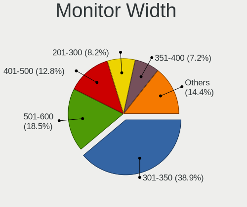
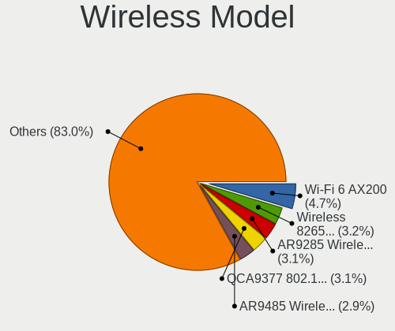
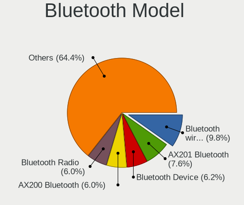

Linux - Tested Hardware & Statistics
------------------------------------

A project to collect tested hardware configurations for Linux.

Anyone can contribute to this report by the [hw-probe](https://github.com/linuxhw/hw-probe) tool:

    sudo -E hw-probe -all -upload

Please contribute! Especially if your hardware is rare.

This is a report for all computer types. See also reports for [desktops](/Desktop/README.md) and [notebooks](/Notebook/README.md).

Distribution-specific reports: [AlmaLinux](/Dist/AlmaLinux), [Alpine](/Dist/Alpine), [ALT_Linux](/Dist/ALT_Linux), [antiX](/Dist/antiX), [Artix](/Dist/Artix), [Chrome_OS](/Dist/Chrome_OS), [Clear_Linux](/Dist/Clear_Linux), [Deepin](/Dist/Deepin), [Devuan](/Dist/Devuan), [EndeavourOS](/Dist/EndeavourOS), [Garuda_Linux](/Dist/Garuda_Linux), [GNOME_OS](/Dist/GNOME_OS), [Kaisen](/Dist/Kaisen), [Mageia](/Dist/Mageia), [Makulu](/Dist/Makulu), [NixOS](/Dist/NixOS), [Nobara](/Dist/Nobara), [Oracle_Linux](/Dist/Oracle_Linux), [Pardus](/Dist/Pardus), [PureOS](/Dist/PureOS), [Q4OS](/Dist/Q4OS), [Reborn_OS](/Dist/Reborn_OS), [Rocky_Linux](/Dist/Rocky_Linux), [Sparky](/Dist/Sparky), [Void_Linux](/Dist/Void_Linux), [Xero](/Dist/Xero).

This report is for real hardware. Report for virtual hardware: [TestDays_VE](https://github.com/linuxhw/TestDays_VE)

Contents
--------

* [ Test Cases ](#test-cases)

* [ System ](#system)
  - [ OS                       ](#os)
  - [ OS Family                ](#os-family)
  - [ Kernel                   ](#kernel)
  - [ Kernel Family            ](#kernel-family)
  - [ Kernel Major Ver.        ](#kernel-major-ver)
  - [ Arch                     ](#arch)
  - [ DE                       ](#de)
  - [ Display Server           ](#display-server)
  - [ Display Manager          ](#display-manager)
  - [ OS Lang                  ](#os-lang)
  - [ Boot Mode                ](#boot-mode)
  - [ Filesystem               ](#filesystem)
  - [ Part. scheme             ](#part-scheme)
  - [ Dual Boot with Linux/BSD ](#dual-boot-with-linuxbsd)
  - [ Dual Boot (Win)          ](#dual-boot-win)

* [ Board ](#board)
  - [ Vendor                   ](#vendor)
  - [ Model                    ](#model)
  - [ Model Family             ](#model-family)
  - [ MFG Year                 ](#mfg-year)
  - [ Form Factor              ](#form-factor)
  - [ Secure Boot              ](#secure-boot)
  - [ Coreboot                 ](#coreboot)
  - [ RAM Size                 ](#ram-size)
  - [ RAM Used                 ](#ram-used)
  - [ Total Drives             ](#total-drives)
  - [ Has CD-ROM               ](#has-cd-rom)
  - [ Has Ethernet             ](#has-ethernet)
  - [ Has WiFi                 ](#has-wifi)
  - [ Has Bluetooth            ](#has-bluetooth)

* [ Location ](#location)
  - [ Country                  ](#country)
  - [ City                     ](#city)

* [ Drives ](#drives)
  - [ Drive Vendor             ](#drive-vendor)
  - [ Drive Model              ](#drive-model)
  - [ HDD Vendor               ](#hdd-vendor)
  - [ SSD Vendor               ](#ssd-vendor)
  - [ Drive Kind               ](#drive-kind)
  - [ Drive Connector          ](#drive-connector)
  - [ Drive Size               ](#drive-size)
  - [ Space Total              ](#space-total)
  - [ Space Used               ](#space-used)
  - [ Malfunc. Drives          ](#malfunc-drives)
  - [ Malfunc. Drive Vendor    ](#malfunc-drive-vendor)
  - [ Malfunc. HDD Vendor      ](#malfunc-hdd-vendor)
  - [ Malfunc. Drive Kind      ](#malfunc-drive-kind)
  - [ Failed Drives            ](#failed-drives)
  - [ Failed Drive Vendor      ](#failed-drive-vendor)
  - [ Drive Status             ](#drive-status)

* [ Storage controller ](#storage-controller)
  - [ Storage Vendor           ](#storage-vendor)
  - [ Storage Model            ](#storage-model)
  - [ Storage Kind             ](#storage-kind)

* [ Processor ](#processor)
  - [ CPU Vendor               ](#cpu-vendor)
  - [ CPU Model                ](#cpu-model)
  - [ CPU Model Family         ](#cpu-model-family)
  - [ CPU Cores                ](#cpu-cores)
  - [ CPU Sockets              ](#cpu-sockets)
  - [ CPU Threads              ](#cpu-threads)
  - [ CPU Op-Modes             ](#cpu-op-modes)
  - [ CPU Microcode            ](#cpu-microcode)
  - [ CPU Microarch            ](#cpu-microarch)

* [ Graphics ](#graphics)
  - [ GPU Vendor               ](#gpu-vendor)
  - [ GPU Model                ](#gpu-model)
  - [ GPU Combo                ](#gpu-combo)
  - [ GPU Driver               ](#gpu-driver)
  - [ GPU Memory               ](#gpu-memory)

* [ Monitor ](#monitor)
  - [ Monitor Vendor           ](#monitor-vendor)
  - [ Monitor Model            ](#monitor-model)
  - [ Monitor Resolution       ](#monitor-resolution)
  - [ Monitor Diagonal         ](#monitor-diagonal)
  - [ Monitor Width            ](#monitor-width)
  - [ Aspect Ratio             ](#aspect-ratio)
  - [ Monitor Area             ](#monitor-area)
  - [ Pixel Density            ](#pixel-density)
  - [ Multiple Monitors        ](#multiple-monitors)

* [ Network ](#network)
  - [ Net Controller Vendor    ](#net-controller-vendor)
  - [ Net Controller Model     ](#net-controller-model)
  - [ Wireless Vendor          ](#wireless-vendor)
  - [ Wireless Model           ](#wireless-model)
  - [ Ethernet Vendor          ](#ethernet-vendor)
  - [ Ethernet Model           ](#ethernet-model)
  - [ Net Controller Kind      ](#net-controller-kind)
  - [ Used Controller          ](#used-controller)
  - [ NICs                     ](#nics)
  - [ IPv6                     ](#ipv6)

* [ Bluetooth ](#bluetooth)
  - [ Bluetooth Vendor         ](#bluetooth-vendor)
  - [ Bluetooth Model          ](#bluetooth-model)

* [ Sound ](#sound)
  - [ Sound Vendor             ](#sound-vendor)
  - [ Sound Model              ](#sound-model)

* [ Memory ](#memory)
  - [ Memory Vendor            ](#memory-vendor)
  - [ Memory Model             ](#memory-model)
  - [ Memory Kind              ](#memory-kind)
  - [ Memory Form Factor       ](#memory-form-factor)
  - [ Memory Size              ](#memory-size)
  - [ Memory Speed             ](#memory-speed)

* [ Printers & scanners ](#printers--scanners)
  - [ Printer Vendor           ](#printer-vendor)
  - [ Printer Model            ](#printer-model)
  - [ Scanner Vendor           ](#scanner-vendor)
  - [ Scanner Model            ](#scanner-model)

* [ Camera ](#camera)
  - [ Camera Vendor            ](#camera-vendor)
  - [ Camera Model             ](#camera-model)

* [ Security ](#security)
  - [ Fingerprint Vendor       ](#fingerprint-vendor)
  - [ Fingerprint Model        ](#fingerprint-model)
  - [ Chipcard Vendor          ](#chipcard-vendor)
  - [ Chipcard Model           ](#chipcard-model)

* [ Unsupported ](#unsupported)
  - [ Unsupported Devices      ](#unsupported-devices)
  - [ Unsupported Device Types ](#unsupported-device-types)

Test Cases
----------

Total: 288445

| Vendor        | Model                       | Form-Factor | Probe                                                      | Date         |
|---------------|-----------------------------|-------------|------------------------------------------------------------|--------------|
| MSI           | H110M PRO-VH                | Desktop     | [9b0b5b79f0](https://linux-hardware.org/?probe=9b0b5b79f0) | Mar 01, 2023 |
| HP            | Pavilion dv6                | Notebook    | [c937edbfcd](https://linux-hardware.org/?probe=c937edbfcd) | Mar 01, 2023 |
| Gigabyte      | H61M-S2PV                   | Desktop     | [319d6a8bc3](https://linux-hardware.org/?probe=319d6a8bc3) | Mar 01, 2023 |
| ASRock        | B650E PG Riptide WiFi       | Desktop     | [a637650ff7](https://linux-hardware.org/?probe=a637650ff7) | Mar 01, 2023 |
| ASUSTek       | T100HAN                     | Notebook    | [a8b1a02128](https://linux-hardware.org/?probe=a8b1a02128) | Mar 01, 2023 |
| Gigabyte      | H61M-S2PV                   | Desktop     | [ce63d81075](https://linux-hardware.org/?probe=ce63d81075) | Mar 01, 2023 |
| Dell          | XPS 15 9520                 | Notebook    | [ecfa5f6c27](https://linux-hardware.org/?probe=ecfa5f6c27) | Mar 01, 2023 |
| Gigabyte      | Z77X-UP4 TH                 | Desktop     | [b80cb49656](https://linux-hardware.org/?probe=b80cb49656) | Mar 01, 2023 |
| HP            | Pavilion 14                 | Notebook    | [ae0e65f5d1](https://linux-hardware.org/?probe=ae0e65f5d1) | Feb 28, 2023 |
| TCL Commun... | 8090                        | Notebook    | [d1f86443c7](https://linux-hardware.org/?probe=d1f86443c7) | Feb 28, 2023 |
| Dell          | XPS 15 9550                 | Notebook    | [0ffe1f9541](https://linux-hardware.org/?probe=0ffe1f9541) | Feb 28, 2023 |
| HP            | Laptop 17-ca1xxx            | Notebook    | [7f93c1a4e3](https://linux-hardware.org/?probe=7f93c1a4e3) | Feb 28, 2023 |
| Dell          | Inspiron N5010              | Notebook    | [480ff87a20](https://linux-hardware.org/?probe=480ff87a20) | Feb 28, 2023 |
| HUAWEI        | CREM-WXX9                   | Notebook    | [22d51a725f](https://linux-hardware.org/?probe=22d51a725f) | Feb 28, 2023 |
| Unknown       | Unknown                     | Phone       | [a9c7699598](https://linux-hardware.org/?probe=a9c7699598) | Feb 28, 2023 |
| Sun Micros... | Ultra 24 50                 | Desktop     | [71b8cbeda5](https://linux-hardware.org/?probe=71b8cbeda5) | Feb 28, 2023 |
| Medion        | Erazer X7851 MD60583        | Notebook    | [9ddd4f88b4](https://linux-hardware.org/?probe=9ddd4f88b4) | Feb 28, 2023 |
| Umbrel        | Home                        | Mini pc     | [f4afc80a6c](https://linux-hardware.org/?probe=f4afc80a6c) | Feb 28, 2023 |
| Gigabyte      | B450 AORUS ELITE V2         | Desktop     | [0e0b3360ba](https://linux-hardware.org/?probe=0e0b3360ba) | Feb 28, 2023 |
| Gigabyte      | GA-880GA-UD3H               | Desktop     | [483db5a7bd](https://linux-hardware.org/?probe=483db5a7bd) | Feb 28, 2023 |
| Supermicro    | H12SSW-NT                   | Server      | [8b83576100](https://linux-hardware.org/?probe=8b83576100) | Feb 28, 2023 |
| Supermicro    | H12SSW-NT                   | Server      | [c33e8fab03](https://linux-hardware.org/?probe=c33e8fab03) | Feb 28, 2023 |
| Supermicro    | H12SSW-NT                   | Server      | [2f3379adb9](https://linux-hardware.org/?probe=2f3379adb9) | Feb 28, 2023 |
| Unknown       | Unknown                     | Desktop     | [1c5f8fef49](https://linux-hardware.org/?probe=1c5f8fef49) | Feb 28, 2023 |
| Acer          | Swift SF314-43              | Notebook    | [4f2c05c854](https://linux-hardware.org/?probe=4f2c05c854) | Feb 28, 2023 |
| ASUSTek       | X55A                        | Notebook    | [1429627725](https://linux-hardware.org/?probe=1429627725) | Feb 28, 2023 |
| ASRock        | 760GM-HDV                   | Desktop     | [c420a55609](https://linux-hardware.org/?probe=c420a55609) | Feb 28, 2023 |
| Dell          | Inspiron 5523               | Notebook    | [09ccf58a6b](https://linux-hardware.org/?probe=09ccf58a6b) | Feb 28, 2023 |
| HP            | EliteBook 755 G5            | Notebook    | [4ce3aba673](https://linux-hardware.org/?probe=4ce3aba673) | Feb 28, 2023 |
| HP            | Laptop 15s-eq3xxx           | Notebook    | [a08a3c36ab](https://linux-hardware.org/?probe=a08a3c36ab) | Feb 28, 2023 |
| Dell          | Latitude 5420               | Notebook    | [0596aff5c4](https://linux-hardware.org/?probe=0596aff5c4) | Feb 28, 2023 |
| Alienware     | 15 R2                       | Notebook    | [f242145858](https://linux-hardware.org/?probe=f242145858) | Feb 28, 2023 |
| ASUSTek       | ROG Zephyrus G14 GA402RK... | Notebook    | [c698fc199a](https://linux-hardware.org/?probe=c698fc199a) | Feb 28, 2023 |
| ASRock        | B550M Steel Legend          | Desktop     | [8fd450db03](https://linux-hardware.org/?probe=8fd450db03) | Feb 28, 2023 |
| ASUSTek       | Zenbook UX5401ZA_UX5401Z... | Notebook    | [5aad25779a](https://linux-hardware.org/?probe=5aad25779a) | Feb 28, 2023 |
| Dell          | Latitude E7270              | Notebook    | [2718026d03](https://linux-hardware.org/?probe=2718026d03) | Feb 28, 2023 |
| Acer          | AOHAPPY2                    | Notebook    | [9bbd271b36](https://linux-hardware.org/?probe=9bbd271b36) | Feb 28, 2023 |
| Lenovo        | Legion 5P 15IMH05 82AW      | Notebook    | [0de52a6150](https://linux-hardware.org/?probe=0de52a6150) | Feb 28, 2023 |
| ASUSTek       | BT6130                      | Desktop     | [db5b346bd5](https://linux-hardware.org/?probe=db5b346bd5) | Feb 28, 2023 |
| ASRock        | B660M-STX                   | Desktop     | [5a32d2e162](https://linux-hardware.org/?probe=5a32d2e162) | Feb 28, 2023 |
| MSI           | 760GMA-P34                  | Desktop     | [9707436005](https://linux-hardware.org/?probe=9707436005) | Feb 28, 2023 |
| Medion        | TJ4125                      | Desktop     | [2024916642](https://linux-hardware.org/?probe=2024916642) | Feb 28, 2023 |
| Gigabyte      | B450M DS3H-CF               | Desktop     | [52522a762d](https://linux-hardware.org/?probe=52522a762d) | Feb 28, 2023 |
| Acer          | Nitro AN515-51              | Notebook    | [984b6e660d](https://linux-hardware.org/?probe=984b6e660d) | Feb 28, 2023 |
| HP            | Pavilion dv7                | Notebook    | [e40593f800](https://linux-hardware.org/?probe=e40593f800) | Feb 28, 2023 |
| Apple         | Mac-F2238BAE iMac11,3       | All in one  | [b4be9a72dd](https://linux-hardware.org/?probe=b4be9a72dd) | Feb 28, 2023 |
| MSI           | MPG Z390M GAMING EDGE AC    | Desktop     | [d0813971b9](https://linux-hardware.org/?probe=d0813971b9) | Feb 28, 2023 |
| ASUSTek       | P8H61-M LE                  | Desktop     | [69713a19ea](https://linux-hardware.org/?probe=69713a19ea) | Feb 28, 2023 |
| ASRock        | B365M-HDV                   | Desktop     | [def987e32c](https://linux-hardware.org/?probe=def987e32c) | Feb 28, 2023 |
| Lenovo        | IdeaPad 3 15ALC6 82KU       | Notebook    | [8ec75c8681](https://linux-hardware.org/?probe=8ec75c8681) | Feb 28, 2023 |
| ASUSTek       | N76VB                       | Notebook    | [0043164762](https://linux-hardware.org/?probe=0043164762) | Feb 28, 2023 |
| CWWK          | CW-J6-6L                    | Desktop     | [46c17d2c14](https://linux-hardware.org/?probe=46c17d2c14) | Feb 28, 2023 |
| TECNO         | MEGABOOK T1                 | Notebook    | [3b70c27ca4](https://linux-hardware.org/?probe=3b70c27ca4) | Feb 28, 2023 |
| ASUSTek       | Zenbook UX535QE_UM535QE     | Notebook    | [456504fe92](https://linux-hardware.org/?probe=456504fe92) | Feb 28, 2023 |
| ASUSTek       | ROG STRIX X370-F GAMING     | Desktop     | [1f4ca7d119](https://linux-hardware.org/?probe=1f4ca7d119) | Feb 28, 2023 |
| Lenovo        | IdeaPad 5 15ARE05 81YQ      | Notebook    | [1165717061](https://linux-hardware.org/?probe=1165717061) | Feb 28, 2023 |
| ASUSTek       | Z170-A                      | Desktop     | [a4d77f98eb](https://linux-hardware.org/?probe=a4d77f98eb) | Feb 28, 2023 |
| ASUSTek       | ROG STRIX X370-F GAMING     | Desktop     | [a634d23a20](https://linux-hardware.org/?probe=a634d23a20) | Feb 28, 2023 |
| MSI           | MAG B365M MORTAR            | Desktop     | [26f53549dd](https://linux-hardware.org/?probe=26f53549dd) | Feb 28, 2023 |
| Timi          | RedmiBook 16                | Notebook    | [2d713931d2](https://linux-hardware.org/?probe=2d713931d2) | Feb 28, 2023 |
| ASUSTek       | PRIME B550M-A               | Desktop     | [48c5c743c9](https://linux-hardware.org/?probe=48c5c743c9) | Feb 28, 2023 |
| Lenovo        | 30D9 SDK0J40705 WIN 3425... | Desktop     | [7f53a53eba](https://linux-hardware.org/?probe=7f53a53eba) | Feb 28, 2023 |
| Acer          | Aspire X3995                | Desktop     | [eccac5b752](https://linux-hardware.org/?probe=eccac5b752) | Feb 28, 2023 |
| Dell          | Latitude 3400               | Notebook    | [2936e7f368](https://linux-hardware.org/?probe=2936e7f368) | Feb 28, 2023 |
| Fujitsu       | D2990-A3 S26361-D2990-A3    | Desktop     | [6f1de5f17c](https://linux-hardware.org/?probe=6f1de5f17c) | Feb 28, 2023 |
| Lenovo        | ThinkPad X1 Yoga 1st 20F... | Convertible | [17605a6808](https://linux-hardware.org/?probe=17605a6808) | Feb 28, 2023 |
| Acer          | Aspire E5-571G              | Notebook    | [fc0bc59c04](https://linux-hardware.org/?probe=fc0bc59c04) | Feb 28, 2023 |
| Acer          | Aspire V3-371               | Notebook    | [bbc0d58ef1](https://linux-hardware.org/?probe=bbc0d58ef1) | Feb 28, 2023 |
| ASUSTek       | P8H61-M LX3 PLUS R2.0       | Desktop     | [2b434f0b1d](https://linux-hardware.org/?probe=2b434f0b1d) | Feb 28, 2023 |
| Lenovo        | IdeaPad 3 15ABA7 82RN       | Notebook    | [d8b58a8ea1](https://linux-hardware.org/?probe=d8b58a8ea1) | Feb 28, 2023 |
| ASUSTek       | ROG STRIX Z590-E GAMING ... | Desktop     | [5fa0193c44](https://linux-hardware.org/?probe=5fa0193c44) | Feb 28, 2023 |
| ASRock        | B660M-ITX/ac                | Desktop     | [c2e600e445](https://linux-hardware.org/?probe=c2e600e445) | Feb 28, 2023 |
| Lenovo        | 36F7 SDK0J40700 WIN 3258... | Desktop     | [48e150f274](https://linux-hardware.org/?probe=48e150f274) | Feb 28, 2023 |
| HP            | 8158 A01                    | Mini pc     | [869bfe7d05](https://linux-hardware.org/?probe=869bfe7d05) | Feb 28, 2023 |
| ASUSTek       | AT4NM10T-I                  | Desktop     | [921aebe62a](https://linux-hardware.org/?probe=921aebe62a) | Feb 28, 2023 |
| ASUSTek       | PRIME B250-PRO              | Desktop     | [cd58d8a863](https://linux-hardware.org/?probe=cd58d8a863) | Feb 28, 2023 |
| ASUSTek       | VivoBook_ASUSLaptop X412... | Notebook    | [87022bd601](https://linux-hardware.org/?probe=87022bd601) | Feb 28, 2023 |
| Lenovo        | IdeaPad 330-15ICH 81FK      | Notebook    | [08f2d1cca5](https://linux-hardware.org/?probe=08f2d1cca5) | Feb 28, 2023 |
| Dell          | 0PM2CW A04                  | Server      | [154f8780de](https://linux-hardware.org/?probe=154f8780de) | Feb 28, 2023 |
| Lenovo        | ThinkPad T460 20FMS0700A    | Notebook    | [89a11e0826](https://linux-hardware.org/?probe=89a11e0826) | Feb 28, 2023 |
| Lenovo        | ThinkPad T430 2349KDG       | Notebook    | [ea95af537c](https://linux-hardware.org/?probe=ea95af537c) | Feb 28, 2023 |
| HP            | ProLiant ML350 G5           | Desktop     | [073427bc3c](https://linux-hardware.org/?probe=073427bc3c) | Feb 28, 2023 |
| HP            | 18E7                        | Desktop     | [a4fb4affcf](https://linux-hardware.org/?probe=a4fb4affcf) | Feb 28, 2023 |
| Dell          | Inspiron N5010              | Notebook    | [a1a44c0054](https://linux-hardware.org/?probe=a1a44c0054) | Feb 28, 2023 |
| Valve         | Jupiter                     | Notebook    | [2143a36dc5](https://linux-hardware.org/?probe=2143a36dc5) | Feb 28, 2023 |
| Apple         | Mac-F2238BAE iMac11,3       | All in one  | [66e63a311d](https://linux-hardware.org/?probe=66e63a311d) | Feb 28, 2023 |
| Lenovo        | ThinkPad T460 20FMS0700A    | Notebook    | [c45e0040f7](https://linux-hardware.org/?probe=c45e0040f7) | Feb 28, 2023 |
| Alienware     | 15 R2                       | Notebook    | [5e29609544](https://linux-hardware.org/?probe=5e29609544) | Feb 28, 2023 |
| HP            | ProLiant ML350 Gen9         | Desktop     | [bbad31d175](https://linux-hardware.org/?probe=bbad31d175) | Feb 28, 2023 |
| HP            | ENVY 17                     | Notebook    | [61d1252ef3](https://linux-hardware.org/?probe=61d1252ef3) | Feb 28, 2023 |
| Acer          | Aspire V3-772               | Notebook    | [5a0c297e10](https://linux-hardware.org/?probe=5a0c297e10) | Feb 28, 2023 |
| Lenovo        | ThinkPad T460 20FMS78014    | Notebook    | [6fb2d54abe](https://linux-hardware.org/?probe=6fb2d54abe) | Feb 28, 2023 |
| HP            | ENVY Laptop 17-ch1xxx       | Notebook    | [b518eb9925](https://linux-hardware.org/?probe=b518eb9925) | Feb 28, 2023 |
| Dell          | Latitude E7450              | Notebook    | [0e5fe9d2a7](https://linux-hardware.org/?probe=0e5fe9d2a7) | Feb 28, 2023 |
| Gigabyte      | AERO 15-X9                  | Notebook    | [18d00993bf](https://linux-hardware.org/?probe=18d00993bf) | Feb 28, 2023 |
| ASUSTek       | T100HAN                     | Notebook    | [4f835a4f35](https://linux-hardware.org/?probe=4f835a4f35) | Feb 28, 2023 |
| Dell          | Latitude 5400               | Notebook    | [00cd14a724](https://linux-hardware.org/?probe=00cd14a724) | Feb 28, 2023 |
| ASRock        | H61M-VS                     | Desktop     | [04d5b9593e](https://linux-hardware.org/?probe=04d5b9593e) | Feb 28, 2023 |
| Unknown       | Unknown                     | Desktop     | [89822406cc](https://linux-hardware.org/?probe=89822406cc) | Feb 28, 2023 |
| Gigabyte      | B85M-D3H                    | Desktop     | [b6128fb3e9](https://linux-hardware.org/?probe=b6128fb3e9) | Feb 28, 2023 |
| Lenovo        | IdeaPad 3 15ITL05 81X8      | Notebook    | [7478549a38](https://linux-hardware.org/?probe=7478549a38) | Feb 28, 2023 |
| HP            | ENVY x360 2-in-1 Laptop ... | Convertible | [9c65dcac2b](https://linux-hardware.org/?probe=9c65dcac2b) | Feb 28, 2023 |
| Dell          | 0KWVT8 A02                  | Desktop     | [4340c1d7c4](https://linux-hardware.org/?probe=4340c1d7c4) | Feb 28, 2023 |
| ASRockRack    | E3C246D4U2-2T               | Desktop     | [1ad2cb5102](https://linux-hardware.org/?probe=1ad2cb5102) | Feb 28, 2023 |
| ASUSTek       | ROG STRIX Z690-A GAMING ... | Desktop     | [216ad20179](https://linux-hardware.org/?probe=216ad20179) | Feb 28, 2023 |
| HP            | Laptop 17-by3xxx            | Notebook    | [5beb40c486](https://linux-hardware.org/?probe=5beb40c486) | Feb 28, 2023 |
| ASRock        | KBL-NUC                     | Desktop     | [cb504c5fa0](https://linux-hardware.org/?probe=cb504c5fa0) | Feb 28, 2023 |
| Lenovo        | ThinkBook 14 G3 ACL 21A2    | Notebook    | [470d9f4591](https://linux-hardware.org/?probe=470d9f4591) | Feb 28, 2023 |
| HP            | Laptop 15s-eq1xxx           | Notebook    | [c070966ad7](https://linux-hardware.org/?probe=c070966ad7) | Feb 28, 2023 |
| ASUSTek       | CROSSHAIR VI HERO           | Desktop     | [3e3368d913](https://linux-hardware.org/?probe=3e3368d913) | Feb 28, 2023 |
| HP            | 87D6 SMVB                   | Desktop     | [423aac2b6f](https://linux-hardware.org/?probe=423aac2b6f) | Feb 28, 2023 |
| Lenovo        | 7052-A9G                    | Desktop     | [677c1ecc11](https://linux-hardware.org/?probe=677c1ecc11) | Feb 28, 2023 |
| Gigabyte      | B550M DS3H AC               | Desktop     | [64b2c8d5b9](https://linux-hardware.org/?probe=64b2c8d5b9) | Feb 28, 2023 |
| Lenovo        | 7052-A9G                    | Desktop     | [4f30a3b58d](https://linux-hardware.org/?probe=4f30a3b58d) | Feb 28, 2023 |
| Lenovo        | ThinkPad X1 Carbon Gen 8... | Notebook    | [76645fa513](https://linux-hardware.org/?probe=76645fa513) | Feb 28, 2023 |
| Apple         | MacBookPro8,1               | Notebook    | [ec1f27de09](https://linux-hardware.org/?probe=ec1f27de09) | Feb 28, 2023 |
| AZW           | Speed S                     | Desktop     | [e44ff0faf0](https://linux-hardware.org/?probe=e44ff0faf0) | Feb 28, 2023 |
| HP            | 83E2                        | Desktop     | [fdbe4ec1cb](https://linux-hardware.org/?probe=fdbe4ec1cb) | Feb 28, 2023 |
| ASUSTek       | ASUS TUF Gaming F15 FX50... | Notebook    | [41439f6b61](https://linux-hardware.org/?probe=41439f6b61) | Feb 28, 2023 |
| ASUSTek       | P8H61-M LX                  | Desktop     | [5721cbc403](https://linux-hardware.org/?probe=5721cbc403) | Feb 28, 2023 |
| Gigabyte      | A320M-S2H-CF                | Desktop     | [19fd766ea6](https://linux-hardware.org/?probe=19fd766ea6) | Feb 28, 2023 |
| HUAWEI        | MRC-WX0                     | Notebook    | [e2776f99bf](https://linux-hardware.org/?probe=e2776f99bf) | Feb 28, 2023 |
| Dell          | 0F6X5P A00                  | Desktop     | [de72247b2d](https://linux-hardware.org/?probe=de72247b2d) | Feb 28, 2023 |
| ASUSTek       | V241DA                      | All in one  | [0779deca8b](https://linux-hardware.org/?probe=0779deca8b) | Feb 28, 2023 |
| Philco        | 10D                         | Notebook    | [dd709d35db](https://linux-hardware.org/?probe=dd709d35db) | Feb 28, 2023 |
| MSI           | A320M PRO-VD PLUS           | Desktop     | [6677ab11b2](https://linux-hardware.org/?probe=6677ab11b2) | Feb 28, 2023 |
| Dell          | G15 5511                    | Notebook    | [1859d13517](https://linux-hardware.org/?probe=1859d13517) | Feb 28, 2023 |
| Dell          | Venue 11 Pro 7130           | Notebook    | [68a816d082](https://linux-hardware.org/?probe=68a816d082) | Feb 28, 2023 |
| HP            | EliteBook 830 G5            | Notebook    | [b82fdfbe47](https://linux-hardware.org/?probe=b82fdfbe47) | Feb 28, 2023 |
| Graviton      | DMB-H610-TMI01              | All in one  | [4c3b90ede8](https://linux-hardware.org/?probe=4c3b90ede8) | Feb 28, 2023 |
| Dell          | Venue 11 Pro 7130           | Notebook    | [bbb8c4e905](https://linux-hardware.org/?probe=bbb8c4e905) | Feb 28, 2023 |
| Dell          | G5 5590                     | Notebook    | [75f2235434](https://linux-hardware.org/?probe=75f2235434) | Feb 28, 2023 |
| Clevo         | NL41MU2                     | Notebook    | [29df87f87f](https://linux-hardware.org/?probe=29df87f87f) | Feb 28, 2023 |
| ASUSTek       | E202SA                      | Notebook    | [bccde0c9a5](https://linux-hardware.org/?probe=bccde0c9a5) | Feb 28, 2023 |
| ASUSTek       | ROG Zephyrus G14 GA401QM... | Notebook    | [7b7df086e0](https://linux-hardware.org/?probe=7b7df086e0) | Feb 28, 2023 |
| ASUSTek       | P8B75-V                     | Desktop     | [17fcfc2758](https://linux-hardware.org/?probe=17fcfc2758) | Feb 28, 2023 |
| Apple         | MacBookAir3,1               | Notebook    | [573644760d](https://linux-hardware.org/?probe=573644760d) | Feb 28, 2023 |
| Samsung       | 370E4K                      | Notebook    | [aba5535c2a](https://linux-hardware.org/?probe=aba5535c2a) | Feb 28, 2023 |
| Dell          | Latitude D630               | Notebook    | [5175558c99](https://linux-hardware.org/?probe=5175558c99) | Feb 28, 2023 |
| TUXEDO        | Aura 15 Gen2                | Notebook    | [26a7db2ed8](https://linux-hardware.org/?probe=26a7db2ed8) | Feb 28, 2023 |
| ASRock        | B660M-ITX/ac                | Desktop     | [1efc15e2cc](https://linux-hardware.org/?probe=1efc15e2cc) | Feb 28, 2023 |
| BESSTAR Te... | UM250 V1.0                  | Desktop     | [2ef76c6dff](https://linux-hardware.org/?probe=2ef76c6dff) | Feb 28, 2023 |
| ASUSTek       | PRIME X570-P                | Desktop     | [dda5eec4b9](https://linux-hardware.org/?probe=dda5eec4b9) | Feb 28, 2023 |
| Acer          | Aspire Z5101                | All in one  | [ec55f791bb](https://linux-hardware.org/?probe=ec55f791bb) | Feb 28, 2023 |
| Aquarius      | AQB560M                     | Desktop     | [ee0c530562](https://linux-hardware.org/?probe=ee0c530562) | Feb 28, 2023 |
| Gigabyte      | Z390 UD                     | Desktop     | [f3dfd93cc9](https://linux-hardware.org/?probe=f3dfd93cc9) | Feb 28, 2023 |
| Apple         | MacBookPro5,5               | Notebook    | [e20478d60e](https://linux-hardware.org/?probe=e20478d60e) | Feb 28, 2023 |
| Gigabyte      | H61MS                       | Desktop     | [166a6bbb4b](https://linux-hardware.org/?probe=166a6bbb4b) | Feb 28, 2023 |
| HP            | ProBook 635 Aero G8 Note... | Notebook    | [93ee76f198](https://linux-hardware.org/?probe=93ee76f198) | Feb 28, 2023 |
| HP            | Laptop 15-gw0xxx            | Notebook    | [e05606240c](https://linux-hardware.org/?probe=e05606240c) | Feb 28, 2023 |
| Dell          | Inspiron N5110              | Notebook    | [e35a1076a1](https://linux-hardware.org/?probe=e35a1076a1) | Feb 28, 2023 |
| Dell          | Latitude E6440              | Notebook    | [80131cd2a4](https://linux-hardware.org/?probe=80131cd2a4) | Feb 28, 2023 |
| Acer          | Aspire A515-57              | Notebook    | [6c511739eb](https://linux-hardware.org/?probe=6c511739eb) | Feb 28, 2023 |
| Biostar       | H81MLV3                     | Desktop     | [ccba1a8217](https://linux-hardware.org/?probe=ccba1a8217) | Feb 28, 2023 |
| AZW           | MINI S                      | Desktop     | [e65b0d1ef6](https://linux-hardware.org/?probe=e65b0d1ef6) | Feb 28, 2023 |
| Lenovo        | 3102 NOK                    | Desktop     | [17a2e663e1](https://linux-hardware.org/?probe=17a2e663e1) | Feb 28, 2023 |
| Lenovo        | ThinkPad T16 Gen 1 21BWS... | Notebook    | [e56350a1c1](https://linux-hardware.org/?probe=e56350a1c1) | Feb 28, 2023 |
| Lenovo        | 3102 NOK                    | Desktop     | [6dabaffa28](https://linux-hardware.org/?probe=6dabaffa28) | Feb 28, 2023 |
| HP            | 255 G2                      | Notebook    | [10397efd1b](https://linux-hardware.org/?probe=10397efd1b) | Feb 28, 2023 |
| Gigabyte      | P31-ES3G                    | Desktop     | [5ab1863f2b](https://linux-hardware.org/?probe=5ab1863f2b) | Feb 28, 2023 |
| Acer          | Aspire A315-59              | Notebook    | [9a897f5d7c](https://linux-hardware.org/?probe=9a897f5d7c) | Feb 28, 2023 |
| Gigabyte      | H61M-DS2                    | Desktop     | [49205269e7](https://linux-hardware.org/?probe=49205269e7) | Feb 28, 2023 |
| Gigabyte      | Q87M-D2H                    | Desktop     | [c2eff23772](https://linux-hardware.org/?probe=c2eff23772) | Feb 28, 2023 |
| ASUSTek       | X550JD                      | Notebook    | [6804351029](https://linux-hardware.org/?probe=6804351029) | Feb 28, 2023 |
| ASUSTek       | K52Je                       | Notebook    | [03857fde28](https://linux-hardware.org/?probe=03857fde28) | Feb 28, 2023 |
| ASUSTek       | PRIME B550M-A               | Desktop     | [a6af4042ea](https://linux-hardware.org/?probe=a6af4042ea) | Feb 28, 2023 |
| Notebook      | NJx0MU                      | Notebook    | [fd4d00d935](https://linux-hardware.org/?probe=fd4d00d935) | Feb 28, 2023 |
| Timi          | TM1701                      | Notebook    | [ab658664bb](https://linux-hardware.org/?probe=ab658664bb) | Feb 28, 2023 |
| Lenovo        | ThinkPad Z13 Gen 1 21D2C... | Notebook    | [b5a4a1809f](https://linux-hardware.org/?probe=b5a4a1809f) | Feb 28, 2023 |
| ASUSTek       | ROG STRIX Z390-F GAMING     | Desktop     | [4018e453c4](https://linux-hardware.org/?probe=4018e453c4) | Feb 28, 2023 |
| Lenovo        | ThinkPad X270 20HMS10600    | Notebook    | [3fa4d926e0](https://linux-hardware.org/?probe=3fa4d926e0) | Feb 28, 2023 |
| ASUSTek       | P8B75-V                     | Desktop     | [cf4c7357eb](https://linux-hardware.org/?probe=cf4c7357eb) | Feb 28, 2023 |
| TECNO         | MEGABOOK T1                 | Notebook    | [3d003c6d17](https://linux-hardware.org/?probe=3d003c6d17) | Feb 28, 2023 |
| Intel         | D945GCPE AAD97209-201       | Desktop     | [672684e416](https://linux-hardware.org/?probe=672684e416) | Feb 28, 2023 |
| ASUSTek       | P8H61-M LX2                 | Desktop     | [b4efb334ea](https://linux-hardware.org/?probe=b4efb334ea) | Feb 28, 2023 |
| ASUSTek       | ROG STRIX Z390-F GAMING     | Desktop     | [48725cdc4d](https://linux-hardware.org/?probe=48725cdc4d) | Feb 28, 2023 |
| MSI           | B450M PRO-VDH MAX           | Desktop     | [07bb534dc9](https://linux-hardware.org/?probe=07bb534dc9) | Feb 28, 2023 |
| ASUSTek       | ROG Strix G712LW_G712LW     | Notebook    | [ed67c567d2](https://linux-hardware.org/?probe=ed67c567d2) | Feb 28, 2023 |
| ASUSTek       | AT4NM10T-I                  | Desktop     | [fa2df8125a](https://linux-hardware.org/?probe=fa2df8125a) | Feb 28, 2023 |
| ASUSTek       | M5A78L-M PLUS/USB3          | Desktop     | [8cadddf432](https://linux-hardware.org/?probe=8cadddf432) | Feb 28, 2023 |
| Standard      | Unknown                     | Notebook    | [63732ac2da](https://linux-hardware.org/?probe=63732ac2da) | Feb 28, 2023 |
| Lenovo        | Yoga 7 15ITL5 82BJ          | Convertible | [7d60e37ac0](https://linux-hardware.org/?probe=7d60e37ac0) | Feb 28, 2023 |
| Foxconn       | 2ABF                        | Desktop     | [d6eb6b4839](https://linux-hardware.org/?probe=d6eb6b4839) | Feb 28, 2023 |
| Graviton      | DMB-H610-TMI01              | All in one  | [98eee7b827](https://linux-hardware.org/?probe=98eee7b827) | Feb 28, 2023 |
| Lenovo        | ThinkPad X1 Yoga 3rd 20L... | Convertible | [72d16085b5](https://linux-hardware.org/?probe=72d16085b5) | Feb 28, 2023 |
| ASUSTek       | ROG STRIX B450-F GAMING ... | Desktop     | [ca7d449be6](https://linux-hardware.org/?probe=ca7d449be6) | Feb 28, 2023 |
| Intel         | D945GCPE AAD97209-201       | Desktop     | [edf2240a74](https://linux-hardware.org/?probe=edf2240a74) | Feb 28, 2023 |
| Lenovo        | ThinkPad X1 Yoga 3rd 20L... | Convertible | [f03ce01ac3](https://linux-hardware.org/?probe=f03ce01ac3) | Feb 28, 2023 |
| ASRock        | N68C-S UCC                  | Desktop     | [a5469adf59](https://linux-hardware.org/?probe=a5469adf59) | Feb 28, 2023 |
| Gigabyte      | H61M-S2V-B3                 | Desktop     | [aefca0b663](https://linux-hardware.org/?probe=aefca0b663) | Feb 28, 2023 |
| Gigabyte      | H61M-S2V-B3                 | Desktop     | [12ccf2fe8b](https://linux-hardware.org/?probe=12ccf2fe8b) | Feb 28, 2023 |
| ASUSTek       | CM6870                      | Desktop     | [e338b721af](https://linux-hardware.org/?probe=e338b721af) | Feb 28, 2023 |
| ASUSTek       | B150M-C                     | Desktop     | [e675a40455](https://linux-hardware.org/?probe=e675a40455) | Feb 28, 2023 |
| Lenovo        | Yoga710-14ISK 80TY          | Notebook    | [756e003316](https://linux-hardware.org/?probe=756e003316) | Feb 28, 2023 |
| HUAWEI        | BOHB-WAX9                   | Notebook    | [b4bfab8974](https://linux-hardware.org/?probe=b4bfab8974) | Feb 28, 2023 |
| HP            | 158A                        | Desktop     | [64f3590183](https://linux-hardware.org/?probe=64f3590183) | Feb 28, 2023 |
| Sony          | VPCZ21Z9R                   | Notebook    | [4d3f0c27cd](https://linux-hardware.org/?probe=4d3f0c27cd) | Feb 28, 2023 |
| HP            | ZBook 15u G3                | Notebook    | [9c49a1748b](https://linux-hardware.org/?probe=9c49a1748b) | Feb 28, 2023 |
| ASRock        | A320M-HDV                   | Desktop     | [5ba575539c](https://linux-hardware.org/?probe=5ba575539c) | Feb 28, 2023 |
| Dell          | Inspiron 15 3511            | Notebook    | [99462eae5e](https://linux-hardware.org/?probe=99462eae5e) | Feb 28, 2023 |
| ASRock        | B560M-C                     | Desktop     | [a93d64aa2c](https://linux-hardware.org/?probe=a93d64aa2c) | Feb 28, 2023 |
| ASRock        | B560M-C                     | Desktop     | [cbbd0a63d4](https://linux-hardware.org/?probe=cbbd0a63d4) | Feb 28, 2023 |
| Lenovo        | MIIX 520-12IKB 20M3         | Tablet      | [6ff1d34454](https://linux-hardware.org/?probe=6ff1d34454) | Feb 28, 2023 |
| Acer          | Aspire A515-45G             | Notebook    | [5f8c1e2d90](https://linux-hardware.org/?probe=5f8c1e2d90) | Feb 28, 2023 |
| HP            | ProBook 6570b               | Notebook    | [3692011e3f](https://linux-hardware.org/?probe=3692011e3f) | Feb 28, 2023 |
| Sony          | VGN-FW11M                   | Notebook    | [06b355e1de](https://linux-hardware.org/?probe=06b355e1de) | Feb 28, 2023 |
| Lenovo        | ThinkPad X1 Extreme Gen ... | Notebook    | [3ab9ad10d8](https://linux-hardware.org/?probe=3ab9ad10d8) | Feb 28, 2023 |
| Dell          | Inspiron N5110              | Notebook    | [5a6d88e081](https://linux-hardware.org/?probe=5a6d88e081) | Feb 28, 2023 |
| ASRockRack    | X470D4U2-2T                 | Desktop     | [4d3d5e02a1](https://linux-hardware.org/?probe=4d3d5e02a1) | Feb 28, 2023 |
| ASUSTek       | M4A89GTD-PRO/USB3           | Desktop     | [0710c7be6e](https://linux-hardware.org/?probe=0710c7be6e) | Feb 28, 2023 |
| HP            | ENVY x360 Convertible 15... | Convertible | [169294f95f](https://linux-hardware.org/?probe=169294f95f) | Feb 28, 2023 |
| MECHREVO      | Jiaolong Series MRID6       | Notebook    | [1643b96eae](https://linux-hardware.org/?probe=1643b96eae) | Feb 28, 2023 |
| MECHREVO      | Jiaolong Series MRID6       | Notebook    | [b48cc99ce3](https://linux-hardware.org/?probe=b48cc99ce3) | Feb 28, 2023 |
| Foxconn       | G31MX Series                | Desktop     | [79ee8e5da3](https://linux-hardware.org/?probe=79ee8e5da3) | Feb 28, 2023 |
| Lenovo        | ThinkPad X270 20HN001RUS    | Notebook    | [ff84200b75](https://linux-hardware.org/?probe=ff84200b75) | Feb 28, 2023 |
| HP            | Pavilion Laptop 15-cc5xx    | Notebook    | [4a5d167c96](https://linux-hardware.org/?probe=4a5d167c96) | Feb 28, 2023 |
| Dell          | 0HD5W2 A01                  | Desktop     | [f30a31a8ee](https://linux-hardware.org/?probe=f30a31a8ee) | Feb 28, 2023 |
| ASUSTek       | ROG STRIX Z390-E GAMING     | Desktop     | [62a7d7ef5c](https://linux-hardware.org/?probe=62a7d7ef5c) | Feb 28, 2023 |
| MSI           | MS-7210 100                 | Desktop     | [5cb2d5ea2c](https://linux-hardware.org/?probe=5cb2d5ea2c) | Feb 28, 2023 |
| MSI           | MS-7210 100                 | Desktop     | [a541b48e4d](https://linux-hardware.org/?probe=a541b48e4d) | Feb 28, 2023 |
| Lenovo        | Slim 7 ProX 14ARH7 82V2     | Notebook    | [1c61d820ff](https://linux-hardware.org/?probe=1c61d820ff) | Feb 28, 2023 |
| HP            | EliteBook 8540w             | Notebook    | [057c307bf5](https://linux-hardware.org/?probe=057c307bf5) | Feb 28, 2023 |
| Alienware     | x15 R2                      | Notebook    | [f0335542ce](https://linux-hardware.org/?probe=f0335542ce) | Feb 28, 2023 |
| MSI           | B550-A PRO[CEC]             | Desktop     | [2465135444](https://linux-hardware.org/?probe=2465135444) | Feb 28, 2023 |
| HP            | 240 G4 Notebook PC          | Notebook    | [02744836e7](https://linux-hardware.org/?probe=02744836e7) | Feb 28, 2023 |
| MSI           | X470 GAMING PLUS MAX        | Desktop     | [05542207ee](https://linux-hardware.org/?probe=05542207ee) | Feb 28, 2023 |
| Supermicro    | H12SSL-i                    | Server      | [3b0e50edda](https://linux-hardware.org/?probe=3b0e50edda) | Feb 28, 2023 |
| ASRockRack    | X470D4U2-2T                 | Desktop     | [6ccb40f64d](https://linux-hardware.org/?probe=6ccb40f64d) | Feb 28, 2023 |
| Dell          | 0PV3YR A05                  | Server      | [3948048a11](https://linux-hardware.org/?probe=3948048a11) | Feb 28, 2023 |
| ASRock        | FM2A88X Extreme6+           | Desktop     | [1b5fd0df61](https://linux-hardware.org/?probe=1b5fd0df61) | Feb 28, 2023 |
| Lenovo        | SKYBAY SDK0J40697 WIN 33... | Desktop     | [75e0fb99ed](https://linux-hardware.org/?probe=75e0fb99ed) | Feb 28, 2023 |
| ASRock        | Z97 Pro3                    | Desktop     | [506d56faff](https://linux-hardware.org/?probe=506d56faff) | Feb 28, 2023 |
| ASUSTek       | ZenBook Q326FA_Q326FA       | Convertible | [30ac6dbb4a](https://linux-hardware.org/?probe=30ac6dbb4a) | Feb 28, 2023 |
| MSI           | X99A RAIDER                 | Desktop     | [f27314deb8](https://linux-hardware.org/?probe=f27314deb8) | Feb 28, 2023 |
| Lenovo        | IdeaPad S145-15IWL 81S9     | Notebook    | [915fc4d913](https://linux-hardware.org/?probe=915fc4d913) | Feb 28, 2023 |
| Intel Clie... | LAPRC510                    | Notebook    | [925c24b3db](https://linux-hardware.org/?probe=925c24b3db) | Feb 28, 2023 |
| Lenovo        | ThinkPad X1 Carbon 5th 2... | Notebook    | [5c39a363d8](https://linux-hardware.org/?probe=5c39a363d8) | Feb 28, 2023 |
| MSI           | A320M PRO-M2 V2             | Desktop     | [0264556bba](https://linux-hardware.org/?probe=0264556bba) | Feb 28, 2023 |
| Gigabyte      | AX370-Gaming K7             | Desktop     | [d4bcf9b7a2](https://linux-hardware.org/?probe=d4bcf9b7a2) | Feb 28, 2023 |
| HP            | ProBook 430 G1              | Notebook    | [fa75658ee0](https://linux-hardware.org/?probe=fa75658ee0) | Feb 28, 2023 |
| Dell          | Latitude E6420              | Notebook    | [a84f4dbcbb](https://linux-hardware.org/?probe=a84f4dbcbb) | Feb 28, 2023 |
| Dell          | Latitude E7450              | Notebook    | [a36df01da9](https://linux-hardware.org/?probe=a36df01da9) | Feb 28, 2023 |
| HP            | Pavilion dv7                | Notebook    | [1dbb82f9ff](https://linux-hardware.org/?probe=1dbb82f9ff) | Feb 28, 2023 |
| Gigabyte      | Z370 AORUS Gaming 5-CF      | Desktop     | [cb687f4572](https://linux-hardware.org/?probe=cb687f4572) | Feb 28, 2023 |
| AZW           | SEi                         | Notebook    | [6d0814dc9f](https://linux-hardware.org/?probe=6d0814dc9f) | Feb 28, 2023 |
| Lenovo        | ThinkPad X1 Carbon 6th 2... | Notebook    | [886f442040](https://linux-hardware.org/?probe=886f442040) | Feb 28, 2023 |
| Dell          | Precision 5570              | Notebook    | [7e8d7c37cb](https://linux-hardware.org/?probe=7e8d7c37cb) | Feb 28, 2023 |
| ASUSTek       | TUF Gaming FX505DD_FX505... | Notebook    | [021853dafb](https://linux-hardware.org/?probe=021853dafb) | Feb 28, 2023 |
| Google        | Reks                        | Notebook    | [be1a98408d](https://linux-hardware.org/?probe=be1a98408d) | Feb 28, 2023 |
| ASUSTek       | PRIME H370-PLUS             | Desktop     | [43afa90be1](https://linux-hardware.org/?probe=43afa90be1) | Feb 28, 2023 |
| ASUSTek       | Z87-PRO                     | Desktop     | [7997191f44](https://linux-hardware.org/?probe=7997191f44) | Feb 28, 2023 |
| ASRock        | B550 Phantom Gaming-ITX/... | Desktop     | [0195132360](https://linux-hardware.org/?probe=0195132360) | Feb 28, 2023 |
| Dell          | G15 5510                    | Notebook    | [77ff8fd545](https://linux-hardware.org/?probe=77ff8fd545) | Feb 28, 2023 |
| Apple         | Mac-942B5BF58194151B        | All in one  | [371a95fb3d](https://linux-hardware.org/?probe=371a95fb3d) | Feb 28, 2023 |
| ASRock        | H81M-HG4 R4.0               | Desktop     | [47ed7baef0](https://linux-hardware.org/?probe=47ed7baef0) | Feb 28, 2023 |
| ASUSTek       | P5KC                        | Desktop     | [45f781ee3a](https://linux-hardware.org/?probe=45f781ee3a) | Feb 28, 2023 |
| ASUSTek       | Z87-PRO                     | Desktop     | [9a6bc5f3af](https://linux-hardware.org/?probe=9a6bc5f3af) | Feb 28, 2023 |
| HP            | ProBook 450 G8 Notebook ... | Notebook    | [009eefdc1d](https://linux-hardware.org/?probe=009eefdc1d) | Feb 28, 2023 |
| Lenovo        | ThinkPad X1 Yoga 1st 20F... | Convertible | [260ece1650](https://linux-hardware.org/?probe=260ece1650) | Feb 28, 2023 |
| ASRock        | B550 Phantom Gaming-ITX/... | Desktop     | [8cd8d4b833](https://linux-hardware.org/?probe=8cd8d4b833) | Feb 28, 2023 |
| HP            | ProBook 450 G8 Notebook ... | Notebook    | [17a7ee80ac](https://linux-hardware.org/?probe=17a7ee80ac) | Feb 28, 2023 |
| Dell          | G15 5510                    | Notebook    | [2c8f883abe](https://linux-hardware.org/?probe=2c8f883abe) | Feb 28, 2023 |
| Gateway       | Sonic-C                     | Notebook    | [b9f775b14e](https://linux-hardware.org/?probe=b9f775b14e) | Feb 28, 2023 |
| ASUSTek       | VivoBook S14 X411UF         | Notebook    | [88745e1f03](https://linux-hardware.org/?probe=88745e1f03) | Feb 28, 2023 |
| Toshiba       | Satellite S70-A             | Notebook    | [7e849f93ca](https://linux-hardware.org/?probe=7e849f93ca) | Feb 28, 2023 |
| Acer          | TDPS05                      | Desktop     | [c4a636fb79](https://linux-hardware.org/?probe=c4a636fb79) | Feb 28, 2023 |
| Acer          | Aspire 5750G                | Notebook    | [34b5806bcf](https://linux-hardware.org/?probe=34b5806bcf) | Feb 28, 2023 |
| Acer          | TDPS05                      | Desktop     | [114e21597f](https://linux-hardware.org/?probe=114e21597f) | Feb 28, 2023 |
| Foxconn       | 2ABF                        | Desktop     | [ad46fcc88d](https://linux-hardware.org/?probe=ad46fcc88d) | Feb 28, 2023 |
| Lenovo        | ThinkPad S1 Yoga 20C0S23... | Notebook    | [3cd99ed8f4](https://linux-hardware.org/?probe=3cd99ed8f4) | Feb 28, 2023 |
| Dell          | Latitude E7470              | Notebook    | [51deaef7a0](https://linux-hardware.org/?probe=51deaef7a0) | Feb 28, 2023 |
| Intel Clie... | LAPRC510                    | Notebook    | [6d9a8edb0c](https://linux-hardware.org/?probe=6d9a8edb0c) | Feb 28, 2023 |
| Fujitsu       | D3224-P1 S26361-D3224-P1    | Desktop     | [53649a9546](https://linux-hardware.org/?probe=53649a9546) | Feb 28, 2023 |
| Lenovo        | Legion 7 16ACHg6 82N6       | Notebook    | [594ff7091b](https://linux-hardware.org/?probe=594ff7091b) | Feb 27, 2023 |
| Lenovo        | ThinkPad E560 20EV000UUK    | Notebook    | [7060b60651](https://linux-hardware.org/?probe=7060b60651) | Feb 27, 2023 |
| HP            | ProBook 430 G6              | Notebook    | [a184aa7141](https://linux-hardware.org/?probe=a184aa7141) | Feb 27, 2023 |
| ASUSTek       | X550CA                      | Notebook    | [0ce966b8fa](https://linux-hardware.org/?probe=0ce966b8fa) | Feb 27, 2023 |
| ASUSTek       | BT6130                      | Desktop     | [3549cfad14](https://linux-hardware.org/?probe=3549cfad14) | Feb 27, 2023 |
| Gigabyte      | X58A-UD5                    | Desktop     | [4cff35f888](https://linux-hardware.org/?probe=4cff35f888) | Feb 27, 2023 |
| Acer          | Aspire A715-76              | Notebook    | [b9f52dc0f3](https://linux-hardware.org/?probe=b9f52dc0f3) | Feb 27, 2023 |
| Lenovo        | G50-80 80E5                 | Notebook    | [d7bb021829](https://linux-hardware.org/?probe=d7bb021829) | Feb 27, 2023 |
| Packard Be... | EasyNote TJ66               | Notebook    | [bd15540982](https://linux-hardware.org/?probe=bd15540982) | Feb 27, 2023 |
| Microsoft     | Surface Pro 3               | Tablet      | [b3c4d2985e](https://linux-hardware.org/?probe=b3c4d2985e) | Feb 27, 2023 |
| HP            | OMEN by Laptop 16-c0xxx     | Notebook    | [c829e9e0b8](https://linux-hardware.org/?probe=c829e9e0b8) | Feb 27, 2023 |
| HP            | Pavilion dv6                | Notebook    | [a19aa34db7](https://linux-hardware.org/?probe=a19aa34db7) | Feb 27, 2023 |
| Fujitsu       | LIFEBOOK E744               | Notebook    | [e331c5e257](https://linux-hardware.org/?probe=e331c5e257) | Feb 27, 2023 |
| Raspberry ... | Raspberry Pi 4 Model B R... | Soc         | [418b5dd7ff](https://linux-hardware.org/?probe=418b5dd7ff) | Feb 27, 2023 |
| Dell          | XPS 13 9380                 | Notebook    | [e888e1330d](https://linux-hardware.org/?probe=e888e1330d) | Feb 27, 2023 |
| HP            | EliteBook Folio 9470m       | Notebook    | [45403acec9](https://linux-hardware.org/?probe=45403acec9) | Feb 27, 2023 |
| ASUSTek       | K75VJ                       | Notebook    | [7fc0fff829](https://linux-hardware.org/?probe=7fc0fff829) | Feb 27, 2023 |
| Dell          | 0NW6H5 A00                  | Desktop     | [aeb7d7a9f4](https://linux-hardware.org/?probe=aeb7d7a9f4) | Feb 27, 2023 |
| Dell          | XPS 13 9380                 | Notebook    | [18fdb45ec1](https://linux-hardware.org/?probe=18fdb45ec1) | Feb 27, 2023 |
| HUAWEI        | MACHR-WX9                   | Notebook    | [b1ef7c7ea1](https://linux-hardware.org/?probe=b1ef7c7ea1) | Feb 27, 2023 |
| Acer          | Predator G3620              | Desktop     | [72f3382b60](https://linux-hardware.org/?probe=72f3382b60) | Feb 27, 2023 |
| ASUSTek       | ASUS TUF Gaming F15 FX50... | Notebook    | [83a611b1ab](https://linux-hardware.org/?probe=83a611b1ab) | Feb 27, 2023 |
| HP            | 802E                        | Desktop     | [d24bb98294](https://linux-hardware.org/?probe=d24bb98294) | Feb 27, 2023 |
| Lenovo        | ThinkPad X1 Yoga 3rd 20L... | Convertible | [43602775cd](https://linux-hardware.org/?probe=43602775cd) | Feb 27, 2023 |
| ASRock        | X370 Professional Gaming    | Desktop     | [3a670fbd63](https://linux-hardware.org/?probe=3a670fbd63) | Feb 27, 2023 |
| Lenovo        | ThinkPad R400 7439W2F       | Notebook    | [2673ce6bd9](https://linux-hardware.org/?probe=2673ce6bd9) | Feb 27, 2023 |
| Dell          | Latitude 5530               | Notebook    | [f892221e4c](https://linux-hardware.org/?probe=f892221e4c) | Feb 27, 2023 |
| Gigabyte      | H61M-S1                     | Desktop     | [ee8e20d95e](https://linux-hardware.org/?probe=ee8e20d95e) | Feb 27, 2023 |
| Intel         | DG41RQ AAE54511-205         | Desktop     | [0cf17a3787](https://linux-hardware.org/?probe=0cf17a3787) | Feb 27, 2023 |
| Dell          | Inspiron 5537               | Notebook    | [25fa030105](https://linux-hardware.org/?probe=25fa030105) | Feb 27, 2023 |
| ASUSTek       | ROG STRIX B350-F GAMING     | Desktop     | [3cd0e65d1f](https://linux-hardware.org/?probe=3cd0e65d1f) | Feb 27, 2023 |
| ASUSTek       | AM1I-A                      | Desktop     | [b5fe605f8b](https://linux-hardware.org/?probe=b5fe605f8b) | Feb 27, 2023 |
| Dell          | 0NW6H5 A00                  | Desktop     | [83e6da010b](https://linux-hardware.org/?probe=83e6da010b) | Feb 27, 2023 |
| Gigabyte      | Z97M-D3H                    | Desktop     | [d93d9bff7f](https://linux-hardware.org/?probe=d93d9bff7f) | Feb 27, 2023 |
| ASRock        | Z790 PG Lightning           | Desktop     | [86c7144757](https://linux-hardware.org/?probe=86c7144757) | Feb 27, 2023 |
| Dell          | XPS 15 7590                 | Notebook    | [e1777784ac](https://linux-hardware.org/?probe=e1777784ac) | Feb 27, 2023 |
| ASUSTek       | M4N68T-M-V2                 | Desktop     | [051b66987e](https://linux-hardware.org/?probe=051b66987e) | Feb 27, 2023 |
| ASUSTek       | PRIME B360M-A               | Desktop     | [5860f51cd8](https://linux-hardware.org/?probe=5860f51cd8) | Feb 27, 2023 |
| MSI           | B450M MORTAR MAX            | Desktop     | [0335729036](https://linux-hardware.org/?probe=0335729036) | Feb 27, 2023 |
| HP            | 18E4                        | Desktop     | [cab6d807e9](https://linux-hardware.org/?probe=cab6d807e9) | Feb 27, 2023 |
| ASUSTek       | PRIME X370-A                | Desktop     | [6bf890e60c](https://linux-hardware.org/?probe=6bf890e60c) | Feb 27, 2023 |
| PCWare        | IPMH61R2                    | Desktop     | [52a17bf9c1](https://linux-hardware.org/?probe=52a17bf9c1) | Feb 27, 2023 |
| Google        | Buddy                       | Desktop     | [ac3d9aaed0](https://linux-hardware.org/?probe=ac3d9aaed0) | Feb 27, 2023 |
| ASUSTek       | VivoBook_ASUSLaptop M760... | Notebook    | [1f80bce21e](https://linux-hardware.org/?probe=1f80bce21e) | Feb 27, 2023 |
| Apple         | MacBookAir6,1               | Notebook    | [1c1dc86eb1](https://linux-hardware.org/?probe=1c1dc86eb1) | Feb 27, 2023 |
| ASUSTek       | VivoBook_ASUSLaptop M760... | Notebook    | [08e6c7285a](https://linux-hardware.org/?probe=08e6c7285a) | Feb 27, 2023 |
| MSI           | MPG B560I GAMING EDGE WI... | Desktop     | [882168458c](https://linux-hardware.org/?probe=882168458c) | Feb 27, 2023 |
| Acer          | Aspire 8930                 | Notebook    | [837e36aa25](https://linux-hardware.org/?probe=837e36aa25) | Feb 27, 2023 |
| Acer          | TM8573T                     | Notebook    | [3eaaedf476](https://linux-hardware.org/?probe=3eaaedf476) | Feb 27, 2023 |
| HP            | ProBook 4540s               | Notebook    | [a52b9c7637](https://linux-hardware.org/?probe=a52b9c7637) | Feb 27, 2023 |
| Gigabyte      | EX58-UD5                    | Desktop     | [eaec9511de](https://linux-hardware.org/?probe=eaec9511de) | Feb 27, 2023 |
| Dell          | Inspiron 3793               | Notebook    | [d7b51f6048](https://linux-hardware.org/?probe=d7b51f6048) | Feb 27, 2023 |
| ASRock        | G41M-S                      | Desktop     | [8802d04f08](https://linux-hardware.org/?probe=8802d04f08) | Feb 27, 2023 |
| HP            | 3397                        | Desktop     | [8081d24eb1](https://linux-hardware.org/?probe=8081d24eb1) | Feb 27, 2023 |
| Intel         | NUC7i5BNB J31144-313        | Mini pc     | [91405b88cc](https://linux-hardware.org/?probe=91405b88cc) | Feb 27, 2023 |
| Gigabyte      | GA-970A-UD3                 | Desktop     | [e4bb117847](https://linux-hardware.org/?probe=e4bb117847) | Feb 27, 2023 |
| Samsung       | 370E4K                      | Notebook    | [d66bcd2bc8](https://linux-hardware.org/?probe=d66bcd2bc8) | Feb 27, 2023 |
| Valve         | Jupiter                     | Notebook    | [ce7b0e507f](https://linux-hardware.org/?probe=ce7b0e507f) | Feb 27, 2023 |
| HP            | 3047h                       | Desktop     | [db6be92c4f](https://linux-hardware.org/?probe=db6be92c4f) | Feb 27, 2023 |
| Gigabyte      | GA-970A-UD3                 | Desktop     | [732f6c8c00](https://linux-hardware.org/?probe=732f6c8c00) | Feb 27, 2023 |
| HP            | 339A                        | Desktop     | [308d8dfac0](https://linux-hardware.org/?probe=308d8dfac0) | Feb 27, 2023 |
| HP            | Laptop 15t-dy200            | Notebook    | [3ea4171270](https://linux-hardware.org/?probe=3ea4171270) | Feb 27, 2023 |
| Lenovo        | ThinkPad T460s 20FAS55Q1... | Notebook    | [815b6ea9f2](https://linux-hardware.org/?probe=815b6ea9f2) | Feb 27, 2023 |
| Intel         | H61                         | Desktop     | [b61ef1ed65](https://linux-hardware.org/?probe=b61ef1ed65) | Feb 27, 2023 |
| HP            | EliteBook 845 14 inch G9... | Notebook    | [ed251c6cfe](https://linux-hardware.org/?probe=ed251c6cfe) | Feb 27, 2023 |
| Valve         | Jupiter                     | Notebook    | [8bfec9ba8d](https://linux-hardware.org/?probe=8bfec9ba8d) | Feb 27, 2023 |
| Gigabyte      | Z77X-UD5H                   | Desktop     | [2071bc50ce](https://linux-hardware.org/?probe=2071bc50ce) | Feb 27, 2023 |
| IBM           | 00D4062                     | Server      | [16c68a28d8](https://linux-hardware.org/?probe=16c68a28d8) | Feb 27, 2023 |
| Dell          | Latitude 7390               | Notebook    | [a2167ae72b](https://linux-hardware.org/?probe=a2167ae72b) | Feb 27, 2023 |
| Lenovo        | IdeaPad 1 15ALC7 82R4       | Notebook    | [47f7b39f3a](https://linux-hardware.org/?probe=47f7b39f3a) | Feb 27, 2023 |
| Gigabyte      | Z77X-UD5H                   | Desktop     | [472c035387](https://linux-hardware.org/?probe=472c035387) | Feb 27, 2023 |
| ASUSTek       | PRIME Q270M-C               | Desktop     | [3a9683fbb7](https://linux-hardware.org/?probe=3a9683fbb7) | Feb 27, 2023 |
| Intel         | DN2820FYK H24582-203        | Desktop     | [28e2b31136](https://linux-hardware.org/?probe=28e2b31136) | Feb 27, 2023 |
| Lenovo        | IdeaPadFlex 5 14ARE05 81... | Convertible | [b5a08d19e9](https://linux-hardware.org/?probe=b5a08d19e9) | Feb 27, 2023 |
| MSI           | NF750-G55                   | Desktop     | [f279251ffa](https://linux-hardware.org/?probe=f279251ffa) | Feb 27, 2023 |
| Lenovo        | ThinkPad P15 Gen 1 20SUS... | Notebook    | [dd5ce2c6db](https://linux-hardware.org/?probe=dd5ce2c6db) | Feb 27, 2023 |
| ASUSTek       | TUF Gaming B550-PLUS        | Desktop     | [8fc8fee94a](https://linux-hardware.org/?probe=8fc8fee94a) | Feb 27, 2023 |
| Dell          | 0MH651                      | Desktop     | [7921e9f8bc](https://linux-hardware.org/?probe=7921e9f8bc) | Feb 27, 2023 |
| Intel         | DN2820FYK H24582-203        | Desktop     | [ad2f612788](https://linux-hardware.org/?probe=ad2f612788) | Feb 27, 2023 |
| Dell          | Inspiron 1525               | Notebook    | [264f8cb6db](https://linux-hardware.org/?probe=264f8cb6db) | Feb 27, 2023 |
| Apple         | MacBookPro15,1              | Notebook    | [e1ce7bab5a](https://linux-hardware.org/?probe=e1ce7bab5a) | Feb 27, 2023 |
| Dell          | 01TN68 A02                  | Desktop     | [4acd4aa811](https://linux-hardware.org/?probe=4acd4aa811) | Feb 27, 2023 |
| ASUSTek       | P7H55                       | Desktop     | [394ad3d24f](https://linux-hardware.org/?probe=394ad3d24f) | Feb 27, 2023 |
| Dell          | 0D6H9T A00                  | Desktop     | [70bdf485da](https://linux-hardware.org/?probe=70bdf485da) | Feb 27, 2023 |
| Dell          | XPS 13 9300                 | Notebook    | [fc803f9205](https://linux-hardware.org/?probe=fc803f9205) | Feb 27, 2023 |
| HUAWEI        | BOM-WXX9                    | Notebook    | [43a5dbf393](https://linux-hardware.org/?probe=43a5dbf393) | Feb 27, 2023 |
| Dell          | Inspiron 3537               | Notebook    | [78f270b35a](https://linux-hardware.org/?probe=78f270b35a) | Feb 27, 2023 |
| Dell          | Latitude E4310              | Notebook    | [2b2255a5b4](https://linux-hardware.org/?probe=2b2255a5b4) | Feb 27, 2023 |
| ASUSTek       | UX31A                       | Notebook    | [56654a2659](https://linux-hardware.org/?probe=56654a2659) | Feb 27, 2023 |
| ASUSTek       | FX503VD                     | Notebook    | [46954919f7](https://linux-hardware.org/?probe=46954919f7) | Feb 27, 2023 |
| Clevo         | NL41MU2                     | Notebook    | [b91dfc602e](https://linux-hardware.org/?probe=b91dfc602e) | Feb 27, 2023 |
| HP            | Notebook                    | Notebook    | [7e64e6bc1b](https://linux-hardware.org/?probe=7e64e6bc1b) | Feb 27, 2023 |
| Dell          | Latitude 7420               | Notebook    | [d3af27a0ac](https://linux-hardware.org/?probe=d3af27a0ac) | Feb 27, 2023 |
| SmbiosType... | SmbiosType1_SystemProduc... | Notebook    | [ccac327e17](https://linux-hardware.org/?probe=ccac327e17) | Feb 27, 2023 |
| Dell          | XPS 13 9360                 | Notebook    | [08cdbe3442](https://linux-hardware.org/?probe=08cdbe3442) | Feb 27, 2023 |
| Dell          | 08NPPY A00                  | Desktop     | [66b1256bd3](https://linux-hardware.org/?probe=66b1256bd3) | Feb 27, 2023 |
| Casper        | H510 001 G10a               | Desktop     | [95a9cfbf0b](https://linux-hardware.org/?probe=95a9cfbf0b) | Feb 27, 2023 |
| Schenker      | VISION (E22)                | Notebook    | [498444ca02](https://linux-hardware.org/?probe=498444ca02) | Feb 27, 2023 |
| Unknown       | HX90                        | Desktop     | [bc8bed9135](https://linux-hardware.org/?probe=bc8bed9135) | Feb 27, 2023 |
| Lenovo        | ThinkPad E15 Gen 2 20T80... | Notebook    | [1ce9430009](https://linux-hardware.org/?probe=1ce9430009) | Feb 27, 2023 |
| AZW           | SER                         | Mini pc     | [e086890e6a](https://linux-hardware.org/?probe=e086890e6a) | Feb 27, 2023 |
| Acer          | Aspire E5-571               | Notebook    | [5f035002e1](https://linux-hardware.org/?probe=5f035002e1) | Feb 27, 2023 |
| ASUSTek       | X75VC                       | Notebook    | [8d629c0ed3](https://linux-hardware.org/?probe=8d629c0ed3) | Feb 27, 2023 |
| Dell          | 0J584C                      | Desktop     | [5f16a97f99](https://linux-hardware.org/?probe=5f16a97f99) | Feb 27, 2023 |
| HP            | Pavilion x360 Convertibl... | Convertible | [63863d9f0c](https://linux-hardware.org/?probe=63863d9f0c) | Feb 27, 2023 |
| HP            | Notebook                    | Notebook    | [a1180ad479](https://linux-hardware.org/?probe=a1180ad479) | Feb 27, 2023 |
| Acer          | Aspire E1-531               | Notebook    | [a52b94c2d5](https://linux-hardware.org/?probe=a52b94c2d5) | Feb 27, 2023 |
| Timi          | RedmiBook Pro 15S           | Notebook    | [109a8e15c4](https://linux-hardware.org/?probe=109a8e15c4) | Feb 27, 2023 |
| HP            | ENVY Laptop 17-cr0xxx       | Notebook    | [3f0d63ab15](https://linux-hardware.org/?probe=3f0d63ab15) | Feb 27, 2023 |
| Lenovo        | ThinkPad X1 Carbon 7th 2... | Notebook    | [357c1abb1d](https://linux-hardware.org/?probe=357c1abb1d) | Feb 27, 2023 |
| Toshiba       | Satellite P870              | Notebook    | [6d9216b866](https://linux-hardware.org/?probe=6d9216b866) | Feb 27, 2023 |
| Dell          | Inspiron 3537               | Notebook    | [bb1ffc3498](https://linux-hardware.org/?probe=bb1ffc3498) | Feb 27, 2023 |
| Aquarius      | AQH310CM                    | Desktop     | [a2f4d0f77e](https://linux-hardware.org/?probe=a2f4d0f77e) | Feb 27, 2023 |
| MSI           | Z390-A PRO                  | Desktop     | [979b4559fe](https://linux-hardware.org/?probe=979b4559fe) | Feb 27, 2023 |
| ASUSTek       | TUF Gaming Z690-PLUS WIF... | Desktop     | [4630f9a67c](https://linux-hardware.org/?probe=4630f9a67c) | Feb 27, 2023 |
| ASUSTek       | VivoBook_ASUS Laptop X50... | Notebook    | [05d3c9f96c](https://linux-hardware.org/?probe=05d3c9f96c) | Feb 27, 2023 |
| Gigabyte      | B365M D2V                   | Desktop     | [aa39313621](https://linux-hardware.org/?probe=aa39313621) | Feb 27, 2023 |
| Supermicro    | H12SSW-NT                   | Server      | [efc03f8d68](https://linux-hardware.org/?probe=efc03f8d68) | Feb 27, 2023 |
| Lenovo        | G700 20251                  | Notebook    | [8dc4179bbd](https://linux-hardware.org/?probe=8dc4179bbd) | Feb 27, 2023 |
| ASUSTek       | Z10PE-D16 WS                | Desktop     | [dd74cb518b](https://linux-hardware.org/?probe=dd74cb518b) | Feb 27, 2023 |
| Gigabyte      | Z270XP-SLI-CF               | Desktop     | [677e93841e](https://linux-hardware.org/?probe=677e93841e) | Feb 27, 2023 |
| ASUSTek       | PRIME Z490-A                | Desktop     | [068ad292bd](https://linux-hardware.org/?probe=068ad292bd) | Feb 27, 2023 |
| Lenovo        | ThinkPad T480 20L6SEH700    | Notebook    | [4a187e016b](https://linux-hardware.org/?probe=4a187e016b) | Feb 27, 2023 |
| ASUSTek       | PRIME B450M-A               | Desktop     | [373f4f8123](https://linux-hardware.org/?probe=373f4f8123) | Feb 27, 2023 |
| ASUSTek       | VivoBook_ASUS Laptop X50... | Notebook    | [f70d3317a2](https://linux-hardware.org/?probe=f70d3317a2) | Feb 27, 2023 |
| Lenovo        | ThinkPad X260 20F5S1MN00    | Notebook    | [db0d3b74bd](https://linux-hardware.org/?probe=db0d3b74bd) | Feb 27, 2023 |
| ASRock        | Z97 Pro3                    | Desktop     | [626e67df35](https://linux-hardware.org/?probe=626e67df35) | Feb 27, 2023 |
| Cincoze       | DX-1000.01.001              | Desktop     | [64496d4ab7](https://linux-hardware.org/?probe=64496d4ab7) | Feb 27, 2023 |
| UMAX          | VisionBook-N12R             | Notebook    | [2477ae9a0e](https://linux-hardware.org/?probe=2477ae9a0e) | Feb 27, 2023 |
| Dell          | Latitude 5400               | Notebook    | [b788c61c95](https://linux-hardware.org/?probe=b788c61c95) | Feb 27, 2023 |
| HP            | ProBook 4540s               | Notebook    | [45e989b539](https://linux-hardware.org/?probe=45e989b539) | Feb 27, 2023 |
| Gigabyte      | A320M-H-CF                  | Desktop     | [409bb06e5e](https://linux-hardware.org/?probe=409bb06e5e) | Feb 27, 2023 |
| HP            | Pavilion m6                 | Notebook    | [1e9d802ab6](https://linux-hardware.org/?probe=1e9d802ab6) | Feb 27, 2023 |
| ASUSTek       | P8H67                       | Desktop     | [323a03f1c6](https://linux-hardware.org/?probe=323a03f1c6) | Feb 27, 2023 |
| Getac         | V200-X                      | Notebook    | [f3a5da3eae](https://linux-hardware.org/?probe=f3a5da3eae) | Feb 27, 2023 |
| ASUSTek       | FX503VD                     | Notebook    | [60e1742e7e](https://linux-hardware.org/?probe=60e1742e7e) | Feb 27, 2023 |
| Dell          | Latitude 3510               | Notebook    | [de938c4962](https://linux-hardware.org/?probe=de938c4962) | Feb 27, 2023 |
| Gigabyte      | H87-D3H-CF                  | Desktop     | [ea8bb4c0e4](https://linux-hardware.org/?probe=ea8bb4c0e4) | Feb 27, 2023 |
| ASUSTek       | P8B75-V                     | Desktop     | [7a8e478900](https://linux-hardware.org/?probe=7a8e478900) | Feb 27, 2023 |
| ASUSTek       | VivoBook_ASUSLaptop M760... | Notebook    | [003aa3d3e9](https://linux-hardware.org/?probe=003aa3d3e9) | Feb 27, 2023 |
| Gigabyte      | H97-HD3                     | Desktop     | [bb2cac1486](https://linux-hardware.org/?probe=bb2cac1486) | Feb 27, 2023 |
| HP            | Pavilion dv7                | Notebook    | [d5da5f62b8](https://linux-hardware.org/?probe=d5da5f62b8) | Feb 27, 2023 |
| Acer          | TravelMate B113             | Notebook    | [31691f9681](https://linux-hardware.org/?probe=31691f9681) | Feb 27, 2023 |
| Raspberry ... | Raspberry Pi 3 Model B R... | Soc         | [2fe31a709a](https://linux-hardware.org/?probe=2fe31a709a) | Feb 27, 2023 |
| Gigabyte      | B365M H                     | Desktop     | [dbb3e73c89](https://linux-hardware.org/?probe=dbb3e73c89) | Feb 27, 2023 |
| ASUSTek       | E402MA                      | Notebook    | [c49b50f583](https://linux-hardware.org/?probe=c49b50f583) | Feb 27, 2023 |
| Gigabyte      | H110M-S2V-CF                | Desktop     | [509c2a6e57](https://linux-hardware.org/?probe=509c2a6e57) | Feb 27, 2023 |
| ASUSTek       | E402MA                      | Notebook    | [4083a9232f](https://linux-hardware.org/?probe=4083a9232f) | Feb 27, 2023 |
| HP            | Notebook                    | Notebook    | [ee2645efa8](https://linux-hardware.org/?probe=ee2645efa8) | Feb 27, 2023 |
| Apple         | MacBookPro6,2               | Notebook    | [3696f0b49e](https://linux-hardware.org/?probe=3696f0b49e) | Feb 27, 2023 |
| HP            | Pavilion TS 14              | Notebook    | [37296c42c3](https://linux-hardware.org/?probe=37296c42c3) | Feb 27, 2023 |
| Apple         | MacBookAir4,2               | Notebook    | [a9605bf85e](https://linux-hardware.org/?probe=a9605bf85e) | Feb 27, 2023 |
| HP            | Pavilion m6                 | Notebook    | [0d35b0b080](https://linux-hardware.org/?probe=0d35b0b080) | Feb 27, 2023 |
| Dell          | 0K240Y A01                  | Desktop     | [9548586341](https://linux-hardware.org/?probe=9548586341) | Feb 27, 2023 |
| Raspberry ... | Raspberry Pi 4 Model B R... | Soc         | [29f6c3c897](https://linux-hardware.org/?probe=29f6c3c897) | Feb 27, 2023 |
| Dell          | 0K240Y A01                  | Desktop     | [9cdb0f865a](https://linux-hardware.org/?probe=9cdb0f865a) | Feb 27, 2023 |
| AZW           | GTR V01                     | Mini pc     | [c788211e6d](https://linux-hardware.org/?probe=c788211e6d) | Feb 27, 2023 |
| ASUSTek       | VivoBook_ASUSLaptop X512... | Notebook    | [cd19568cfc](https://linux-hardware.org/?probe=cd19568cfc) | Feb 27, 2023 |
| Dell          | 0Y5DDC A00                  | Desktop     | [e3090d9725](https://linux-hardware.org/?probe=e3090d9725) | Feb 27, 2023 |
| HP            | ENVY x360 Convertible 13... | Convertible | [17429e7813](https://linux-hardware.org/?probe=17429e7813) | Feb 27, 2023 |
| Lenovo        | ThinkPad P14s Gen 2a 21A... | Notebook    | [d57bb59dee](https://linux-hardware.org/?probe=d57bb59dee) | Feb 27, 2023 |
| AMI           | Cherry Trail CR             | Desktop     | [24952b3b19](https://linux-hardware.org/?probe=24952b3b19) | Feb 27, 2023 |
| HP            | EliteBook x360 1030 G2      | Convertible | [11aeca0c24](https://linux-hardware.org/?probe=11aeca0c24) | Feb 27, 2023 |
| ASUSTek       | X541NA                      | Notebook    | [8c0dc3ba82](https://linux-hardware.org/?probe=8c0dc3ba82) | Feb 27, 2023 |
| Dell          | 0XHGV1 A00                  | Desktop     | [75249be116](https://linux-hardware.org/?probe=75249be116) | Feb 27, 2023 |
| Gigabyte      | Z690M AORUS ELITE AX DDR... | Desktop     | [686c8d56c4](https://linux-hardware.org/?probe=686c8d56c4) | Feb 27, 2023 |
| Unknown       | Unknown                     | Desktop     | [1a407f82b9](https://linux-hardware.org/?probe=1a407f82b9) | Feb 27, 2023 |
| MSI           | A320M PRO-VH                | Desktop     | [e1266ebf79](https://linux-hardware.org/?probe=e1266ebf79) | Feb 27, 2023 |
| HP            | EliteBook 835 G8 Noteboo... | Notebook    | [aa26becbb1](https://linux-hardware.org/?probe=aa26becbb1) | Feb 27, 2023 |
| Apple         | Mac-F2218FA9                | All in one  | [9ed18088a0](https://linux-hardware.org/?probe=9ed18088a0) | Feb 27, 2023 |
| ASUSTek       | K52F                        | Notebook    | [fa30ea101a](https://linux-hardware.org/?probe=fa30ea101a) | Feb 27, 2023 |
| ASUSTek       | H61M-E                      | Desktop     | [ee5b36d127](https://linux-hardware.org/?probe=ee5b36d127) | Feb 27, 2023 |
| Lenovo        | IdeaPad 330-15ARR 81D2      | Notebook    | [b116afe451](https://linux-hardware.org/?probe=b116afe451) | Feb 27, 2023 |
| ASRock        | A320M-HDV R4.0              | Desktop     | [37d2aab670](https://linux-hardware.org/?probe=37d2aab670) | Feb 27, 2023 |
| Lenovo        | IdeaPad 530S-14ARR 81H1     | Notebook    | [42acb38635](https://linux-hardware.org/?probe=42acb38635) | Feb 27, 2023 |
| Lenovo        | IdeaPad 530S-14ARR 81H1     | Notebook    | [e8c76a33fe](https://linux-hardware.org/?probe=e8c76a33fe) | Feb 27, 2023 |
| Acer          | Aspire E5-575G              | Notebook    | [b2fa34d832](https://linux-hardware.org/?probe=b2fa34d832) | Feb 27, 2023 |
| Dell          | Inspiron 15 3511            | Notebook    | [4c96506f38](https://linux-hardware.org/?probe=4c96506f38) | Feb 27, 2023 |
| Dell          | Latitude 3190               | Notebook    | [279b385865](https://linux-hardware.org/?probe=279b385865) | Feb 27, 2023 |
| Gigabyte      | Z390 UD                     | Desktop     | [be3ac3e778](https://linux-hardware.org/?probe=be3ac3e778) | Feb 27, 2023 |
| Acer          | Aspire F5-573G              | Notebook    | [ce2bc0c00d](https://linux-hardware.org/?probe=ce2bc0c00d) | Feb 27, 2023 |
| Gigabyte      | H87M-D3H                    | Desktop     | [3c50af5218](https://linux-hardware.org/?probe=3c50af5218) | Feb 27, 2023 |
| Toshiba       | IS 1413G                    | Notebook    | [c361aabb21](https://linux-hardware.org/?probe=c361aabb21) | Feb 27, 2023 |
| ASUSTek       | VivoBook_ASUSLaptop X513... | Notebook    | [d7e55bb97e](https://linux-hardware.org/?probe=d7e55bb97e) | Feb 27, 2023 |
| MSI           | MAG Z690 TOMAHAWK WIFI D... | Desktop     | [13edc00539](https://linux-hardware.org/?probe=13edc00539) | Feb 27, 2023 |
| Dell          | Inspiron 14-3467            | Notebook    | [5bf68a313d](https://linux-hardware.org/?probe=5bf68a313d) | Feb 27, 2023 |
| Dell          | 0WMJ54 A01                  | Desktop     | [7f907fadb7](https://linux-hardware.org/?probe=7f907fadb7) | Feb 27, 2023 |
| Toshiba       | IS 1413G                    | Notebook    | [17338cbd01](https://linux-hardware.org/?probe=17338cbd01) | Feb 27, 2023 |
| Dell          | 0WMJ54 A01                  | Desktop     | [766991da5e](https://linux-hardware.org/?probe=766991da5e) | Feb 27, 2023 |
| Acer          | Aspire Z5101                | All in one  | [3dd821cc61](https://linux-hardware.org/?probe=3dd821cc61) | Feb 27, 2023 |
| Dell          | XPS L521X                   | Notebook    | [f9598ce828](https://linux-hardware.org/?probe=f9598ce828) | Feb 27, 2023 |
| Lenovo        | IdeaPadFlex 5 14ITL05 82... | Convertible | [4f3c01941d](https://linux-hardware.org/?probe=4f3c01941d) | Feb 27, 2023 |
| Intel         | NUC11PABi5 K90634-302       | Mini pc     | [dd2f99b3ca](https://linux-hardware.org/?probe=dd2f99b3ca) | Feb 27, 2023 |
| ASUSTek       | VivoBook_ASUSLaptop E210... | Notebook    | [ad20f98122](https://linux-hardware.org/?probe=ad20f98122) | Feb 27, 2023 |
| Samsung       | 350V5C/351V5C/3540VC/344... | Notebook    | [7936e7db49](https://linux-hardware.org/?probe=7936e7db49) | Feb 27, 2023 |
| Dell          | Vostro 1540                 | Notebook    | [8f09ea4351](https://linux-hardware.org/?probe=8f09ea4351) | Feb 27, 2023 |
| ASUSTek       | B150 PRO GAMING/AURA        | Desktop     | [618e3d30fc](https://linux-hardware.org/?probe=618e3d30fc) | Feb 27, 2023 |
| Acer          | Aspire E5-571               | Notebook    | [04c721038a](https://linux-hardware.org/?probe=04c721038a) | Feb 27, 2023 |
| HP            | EliteBook 8460p             | Notebook    | [83cb442ad5](https://linux-hardware.org/?probe=83cb442ad5) | Feb 27, 2023 |
| Lenovo        | IdeaPad 5 Pro 14ACN6 82L... | Notebook    | [a2af33e0e3](https://linux-hardware.org/?probe=a2af33e0e3) | Feb 27, 2023 |
| Gigabyte      | B450M S2H                   | Desktop     | [4f55a08266](https://linux-hardware.org/?probe=4f55a08266) | Feb 27, 2023 |
| Apple         | MacBookAir6,2               | Notebook    | [0fb60ed4e2](https://linux-hardware.org/?probe=0fb60ed4e2) | Feb 27, 2023 |
| Dell          | Latitude E6430              | Notebook    | [b75c4a18b3](https://linux-hardware.org/?probe=b75c4a18b3) | Feb 27, 2023 |
| Dell          | 0427JK A00                  | Desktop     | [ca878d6577](https://linux-hardware.org/?probe=ca878d6577) | Feb 27, 2023 |
| MSI           | MPG X570 GAMING PRO CARB... | Desktop     | [15318beac5](https://linux-hardware.org/?probe=15318beac5) | Feb 27, 2023 |
| Dell          | G3 3590                     | Notebook    | [eb9009fad9](https://linux-hardware.org/?probe=eb9009fad9) | Feb 27, 2023 |
| Acer          | Aspire 3690                 | Notebook    | [c93af7d4eb](https://linux-hardware.org/?probe=c93af7d4eb) | Feb 27, 2023 |
| Acer          | Aspire 3690                 | Notebook    | [b119bda1a6](https://linux-hardware.org/?probe=b119bda1a6) | Feb 27, 2023 |
| Acer          | Aspire 5740                 | Notebook    | [de0d12baa4](https://linux-hardware.org/?probe=de0d12baa4) | Feb 27, 2023 |
| Valve         | Jupiter                     | Notebook    | [52268bbf2b](https://linux-hardware.org/?probe=52268bbf2b) | Feb 27, 2023 |
| AZW           | SER                         | Mini pc     | [f5b64e8716](https://linux-hardware.org/?probe=f5b64e8716) | Feb 27, 2023 |
| MSI           | Z170A-G45 GAMING            | Desktop     | [a5496030e7](https://linux-hardware.org/?probe=a5496030e7) | Feb 27, 2023 |
| ASUSTek       | VivoBook_ASUS Laptop E41... | Notebook    | [091e4e3188](https://linux-hardware.org/?probe=091e4e3188) | Feb 27, 2023 |
| Dell          | 07PR60 A01                  | Desktop     | [c071b7ef1c](https://linux-hardware.org/?probe=c071b7ef1c) | Feb 27, 2023 |
| Gigabyte      | B650 GAMING X AX            | Desktop     | [c2b3e01a45](https://linux-hardware.org/?probe=c2b3e01a45) | Feb 27, 2023 |
| Apple         | MacBookPro15,1              | Notebook    | [caf6dc6f16](https://linux-hardware.org/?probe=caf6dc6f16) | Feb 27, 2023 |
| Lenovo        | 3098 SDK0E50510 WIN         | Desktop     | [f15e5303f6](https://linux-hardware.org/?probe=f15e5303f6) | Feb 27, 2023 |
| Gigabyte      | Z490 VISION D               | Desktop     | [cbea73a793](https://linux-hardware.org/?probe=cbea73a793) | Feb 27, 2023 |
| Dell          | 0NW6H5 A00                  | Desktop     | [b4485b65b3](https://linux-hardware.org/?probe=b4485b65b3) | Feb 27, 2023 |
| MSI           | GS66 Stealth 10UE           | Notebook    | [f193cf790d](https://linux-hardware.org/?probe=f193cf790d) | Feb 27, 2023 |
| Dell          | 0NW6H5 A00                  | Desktop     | [a52e16df32](https://linux-hardware.org/?probe=a52e16df32) | Feb 27, 2023 |
| HP            | Notebook                    | Notebook    | [0d838134b7](https://linux-hardware.org/?probe=0d838134b7) | Feb 27, 2023 |
| Gigabyte      | Z690 AERO D                 | Desktop     | [68b84cc1eb](https://linux-hardware.org/?probe=68b84cc1eb) | Feb 27, 2023 |
| ASUSTek       | M3A78-CM                    | Desktop     | [aa86292f52](https://linux-hardware.org/?probe=aa86292f52) | Feb 27, 2023 |
| Razer         | Blade 15 Base Model (Ear... | Notebook    | [425567e8f3](https://linux-hardware.org/?probe=425567e8f3) | Feb 27, 2023 |
| Apple         | MacBookAir6,1               | Notebook    | [058ecdce01](https://linux-hardware.org/?probe=058ecdce01) | Feb 27, 2023 |
| HP            | ProBook 650 G2              | Notebook    | [a9a8184201](https://linux-hardware.org/?probe=a9a8184201) | Feb 27, 2023 |
| Lenovo        | 36F7 SDK0J40700 WIN 3258... | Desktop     | [580db05e08](https://linux-hardware.org/?probe=580db05e08) | Feb 27, 2023 |
| HP            | ProBook 650 G2              | Notebook    | [07f46e8e62](https://linux-hardware.org/?probe=07f46e8e62) | Feb 27, 2023 |
| MSI           | GS66 Stealth 10UE           | Notebook    | [eba178253a](https://linux-hardware.org/?probe=eba178253a) | Feb 27, 2023 |
| Lenovo        | ThinkPad Edge E540 20C60... | Notebook    | [8de57c03d5](https://linux-hardware.org/?probe=8de57c03d5) | Feb 27, 2023 |
| HP            | ENVY m7 Notebook            | Notebook    | [14374fbcc8](https://linux-hardware.org/?probe=14374fbcc8) | Feb 27, 2023 |
| ASUSTek       | ROG Flow X13 GV301RE_GV3... | Convertible | [7f7bdeae7c](https://linux-hardware.org/?probe=7f7bdeae7c) | Feb 27, 2023 |
| Lenovo        | ThinkPad T480s 20L8S7AS0... | Notebook    | [bd62e34a09](https://linux-hardware.org/?probe=bd62e34a09) | Feb 27, 2023 |
| HCL Infosy... | HCL ME LAPTOP               | Notebook    | [82a40f1881](https://linux-hardware.org/?probe=82a40f1881) | Feb 27, 2023 |
| Dell          | 0Y2MRG A00                  | Desktop     | [6c62bbbf3b](https://linux-hardware.org/?probe=6c62bbbf3b) | Feb 27, 2023 |
| Dell          | Latitude E5440              | Notebook    | [25cf039ffd](https://linux-hardware.org/?probe=25cf039ffd) | Feb 27, 2023 |
| Gigabyte      | B550M AORUS PRO             | Desktop     | [ffdac8fa88](https://linux-hardware.org/?probe=ffdac8fa88) | Feb 27, 2023 |
| ASUSTek       | X751LK                      | Notebook    | [ba7e4e84ff](https://linux-hardware.org/?probe=ba7e4e84ff) | Feb 27, 2023 |
| Gigabyte      | Z490 VISION D               | Desktop     | [3e9f2feeaa](https://linux-hardware.org/?probe=3e9f2feeaa) | Feb 27, 2023 |
| Gigabyte      | AB350-Gaming-CF             | Desktop     | [f8d42c3767](https://linux-hardware.org/?probe=f8d42c3767) | Feb 27, 2023 |
| HP            | Pavilion 17                 | Notebook    | [dfd1ca1091](https://linux-hardware.org/?probe=dfd1ca1091) | Feb 27, 2023 |
| Dell          | 0Y2MRG A00                  | Desktop     | [2479c3c245](https://linux-hardware.org/?probe=2479c3c245) | Feb 27, 2023 |
| ASUSTek       | ROG STRIX X570-I GAMING     | Desktop     | [49f3238d4a](https://linux-hardware.org/?probe=49f3238d4a) | Feb 26, 2023 |
| Dell          | Latitude E5440              | Notebook    | [5546f00169](https://linux-hardware.org/?probe=5546f00169) | Feb 26, 2023 |
| ASUSTek       | TUF Gaming FX705DT_FX705... | Notebook    | [a5f5bdc903](https://linux-hardware.org/?probe=a5f5bdc903) | Feb 26, 2023 |
| MSI           | B150M PRO-VDH               | Desktop     | [e538527e6c](https://linux-hardware.org/?probe=e538527e6c) | Feb 26, 2023 |
| Sony          | VPCSB2L1R                   | Notebook    | [6ed9bd210d](https://linux-hardware.org/?probe=6ed9bd210d) | Feb 26, 2023 |
| Gigabyte      | GA-M56S-S3                  | Desktop     | [e8e3f57eef](https://linux-hardware.org/?probe=e8e3f57eef) | Feb 26, 2023 |
| Gigabyte      | Z170MX-Gaming 5             | Desktop     | [1f0e9197f9](https://linux-hardware.org/?probe=1f0e9197f9) | Feb 26, 2023 |
| HP            | Pavilion g6                 | Notebook    | [41e4ef16e4](https://linux-hardware.org/?probe=41e4ef16e4) | Feb 26, 2023 |
| HP            | EliteBook 8540p             | Notebook    | [9f543932d2](https://linux-hardware.org/?probe=9f543932d2) | Feb 26, 2023 |
| HP            | 81B4 01                     | Desktop     | [bc06df8d32](https://linux-hardware.org/?probe=bc06df8d32) | Feb 26, 2023 |
| Gigabyte      | Z390 UD                     | Desktop     | [b40f9ce0d1](https://linux-hardware.org/?probe=b40f9ce0d1) | Feb 26, 2023 |
| ASUSTek       | ROG STRIX B550-F GAMING     | Desktop     | [3ac3b5424a](https://linux-hardware.org/?probe=3ac3b5424a) | Feb 26, 2023 |
| MSI           | B450M PRO-M2 MAX            | Desktop     | [0c5f9a10dd](https://linux-hardware.org/?probe=0c5f9a10dd) | Feb 26, 2023 |
| ASUSTek       | VivoBook_ASUSLaptop X509... | Notebook    | [54e5bda708](https://linux-hardware.org/?probe=54e5bda708) | Feb 26, 2023 |
| MSI           | PRO Z690-A DDR4             | Desktop     | [3ab842532b](https://linux-hardware.org/?probe=3ab842532b) | Feb 26, 2023 |
| Olimex        | A20-OLinuXino-LIME          | Soc         | [bcb9e7b9e7](https://linux-hardware.org/?probe=bcb9e7b9e7) | Feb 26, 2023 |
| Lenovo        | G50-80 80L0                 | Notebook    | [19727a16be](https://linux-hardware.org/?probe=19727a16be) | Feb 26, 2023 |
| Acer          | Aspire A515-56              | Notebook    | [97e3001416](https://linux-hardware.org/?probe=97e3001416) | Feb 26, 2023 |
| ASUSTek       | PRIME B550M-A               | Desktop     | [a121d0545a](https://linux-hardware.org/?probe=a121d0545a) | Feb 26, 2023 |
| Lenovo        | IdeaPad 5 Pro 16ACH6 82L... | Notebook    | [2abc3ba7d8](https://linux-hardware.org/?probe=2abc3ba7d8) | Feb 26, 2023 |
| MSI           | MAG B550M MORTAR            | Desktop     | [a9e3b8c2d2](https://linux-hardware.org/?probe=a9e3b8c2d2) | Feb 26, 2023 |
| Lenovo        | ThinkPad X395 20NL0006US    | Notebook    | [9030fac261](https://linux-hardware.org/?probe=9030fac261) | Feb 26, 2023 |
| HP            | ENVY m7 Notebook            | Notebook    | [88d1b48b0c](https://linux-hardware.org/?probe=88d1b48b0c) | Feb 26, 2023 |
| Gigabyte      | G41MT-S2                    | Desktop     | [7f72d6bba7](https://linux-hardware.org/?probe=7f72d6bba7) | Feb 26, 2023 |
| Cincoze       | DX-1000.01.001              | Desktop     | [7923f1dc21](https://linux-hardware.org/?probe=7923f1dc21) | Feb 26, 2023 |
| Apple         | MacBookAir7,1               | Notebook    | [2986fb12e2](https://linux-hardware.org/?probe=2986fb12e2) | Feb 26, 2023 |
| Lenovo        | ThinkPad P14s Gen 3 21J5... | Notebook    | [9b044bd920](https://linux-hardware.org/?probe=9b044bd920) | Feb 26, 2023 |
| Acer          | Aspire V3-772G              | Notebook    | [83dce8f92d](https://linux-hardware.org/?probe=83dce8f92d) | Feb 26, 2023 |
| Gateway       | Sonic-C                     | Notebook    | [6def275f9b](https://linux-hardware.org/?probe=6def275f9b) | Feb 26, 2023 |
| Lenovo        | ThinkPad E590 20NB0012RT    | Notebook    | [4c9bfc239a](https://linux-hardware.org/?probe=4c9bfc239a) | Feb 26, 2023 |
| Pegatron      | NARRA5                      | Desktop     | [fbff48e326](https://linux-hardware.org/?probe=fbff48e326) | Feb 26, 2023 |
| Lenovo        | Annapurna CRB NOK           | Desktop     | [77122f785f](https://linux-hardware.org/?probe=77122f785f) | Feb 26, 2023 |
| JINGSHA       | Unknown                     | Desktop     | [c8bd846b63](https://linux-hardware.org/?probe=c8bd846b63) | Feb 26, 2023 |
| Lenovo        | Yoga 510-14AST 80S9         | Convertible | [0ea2a54b39](https://linux-hardware.org/?probe=0ea2a54b39) | Feb 26, 2023 |
| Gigabyte      | X670E AORUS MASTER          | Desktop     | [589b06afc1](https://linux-hardware.org/?probe=589b06afc1) | Feb 26, 2023 |
| Gigabyte      | X99-UD4P-CF                 | Desktop     | [b78a53985a](https://linux-hardware.org/?probe=b78a53985a) | Feb 26, 2023 |
| HP            | Pavilion g6                 | Notebook    | [8d8e5bc41d](https://linux-hardware.org/?probe=8d8e5bc41d) | Feb 26, 2023 |
| HP            | 655                         | Notebook    | [e6b694526e](https://linux-hardware.org/?probe=e6b694526e) | Feb 26, 2023 |
| ASRock        | 970M Pro3                   | Desktop     | [787ddfd44c](https://linux-hardware.org/?probe=787ddfd44c) | Feb 26, 2023 |
| HP            | 255 G3                      | Notebook    | [49dccf5753](https://linux-hardware.org/?probe=49dccf5753) | Feb 26, 2023 |
| Acer          | Predator PT515-51           | Notebook    | [b5da2905fb](https://linux-hardware.org/?probe=b5da2905fb) | Feb 26, 2023 |
| Lenovo        | ThinkPad L13 Yoga Gen 2 ... | Convertible | [1412fd5885](https://linux-hardware.org/?probe=1412fd5885) | Feb 26, 2023 |
| Lenovo        | Annapurna CRB NOK           | Desktop     | [0e521e12aa](https://linux-hardware.org/?probe=0e521e12aa) | Feb 26, 2023 |
| AZW           | SER V01                     | Mini pc     | [73570a1c9a](https://linux-hardware.org/?probe=73570a1c9a) | Feb 26, 2023 |
| ASUSTek       | TUF Gaming X570-PLUS        | Desktop     | [c56cf68cef](https://linux-hardware.org/?probe=c56cf68cef) | Feb 26, 2023 |
| ASUSTek       | VivoBook_ASUS Laptop X50... | Notebook    | [fe8735a027](https://linux-hardware.org/?probe=fe8735a027) | Feb 26, 2023 |
| HP            | Pavilion Laptop 15-cc5xx    | Notebook    | [13f87401ca](https://linux-hardware.org/?probe=13f87401ca) | Feb 26, 2023 |
| AZW           | SER V01                     | Mini pc     | [e82b3753f7](https://linux-hardware.org/?probe=e82b3753f7) | Feb 26, 2023 |
| Gigabyte      | EX58-UD5                    | Desktop     | [85ed1d43c7](https://linux-hardware.org/?probe=85ed1d43c7) | Feb 26, 2023 |
| Lenovo        | IdeaPad 5 Pro 16ACH6 82L... | Notebook    | [1a49a04eb7](https://linux-hardware.org/?probe=1a49a04eb7) | Feb 26, 2023 |
| Dell          | 03KWTV A02                  | Desktop     | [8b6eae9fd5](https://linux-hardware.org/?probe=8b6eae9fd5) | Feb 26, 2023 |
| Lenovo        | G505s 20255                 | Notebook    | [26548764cd](https://linux-hardware.org/?probe=26548764cd) | Feb 26, 2023 |
| HP            | Notebook                    | Notebook    | [ab0dddc914](https://linux-hardware.org/?probe=ab0dddc914) | Feb 26, 2023 |
| Lenovo        | IdeaPad L340-15IRH Gamin... | Notebook    | [6b712e555f](https://linux-hardware.org/?probe=6b712e555f) | Feb 26, 2023 |
| Acer          | Aspire 1410                 | Notebook    | [40b5704a1c](https://linux-hardware.org/?probe=40b5704a1c) | Feb 26, 2023 |
| MSI           | MPG Z390 GAMING EDGE AC     | Desktop     | [a3b8430bad](https://linux-hardware.org/?probe=a3b8430bad) | Feb 26, 2023 |
| Dell          | Vostro 3578                 | Notebook    | [da6968c8ac](https://linux-hardware.org/?probe=da6968c8ac) | Feb 26, 2023 |
| ASUSTek       | ASUS TUF Gaming F15 FX50... | Notebook    | [e763fc25e7](https://linux-hardware.org/?probe=e763fc25e7) | Feb 26, 2023 |
| ASUSTek       | PRIME B350M-A               | Desktop     | [4cd492ee3e](https://linux-hardware.org/?probe=4cd492ee3e) | Feb 26, 2023 |
| ASRock        | B85 Pro4                    | Desktop     | [0b4daba4fb](https://linux-hardware.org/?probe=0b4daba4fb) | Feb 26, 2023 |
| HP            | Pavilion dv7                | Notebook    | [3d8c3db030](https://linux-hardware.org/?probe=3d8c3db030) | Feb 26, 2023 |
| HP            | 430                         | Notebook    | [f90c967f06](https://linux-hardware.org/?probe=f90c967f06) | Feb 26, 2023 |
| Kllisre       | X79 V2.72S                  | Desktop     | [eb7e4b521c](https://linux-hardware.org/?probe=eb7e4b521c) | Feb 26, 2023 |
| Gigabyte      | H510M S2                    | Desktop     | [24ea8468ca](https://linux-hardware.org/?probe=24ea8468ca) | Feb 26, 2023 |
| MSI           | MAG B760 TOMAHAWK WIFI D... | Desktop     | [575a7f4897](https://linux-hardware.org/?probe=575a7f4897) | Feb 26, 2023 |
| MSI           | MAG B760 TOMAHAWK WIFI D... | Desktop     | [466f8533fb](https://linux-hardware.org/?probe=466f8533fb) | Feb 26, 2023 |
| Intel         | NUC11PABi5 K90634-302       | Mini pc     | [3c4718f66e](https://linux-hardware.org/?probe=3c4718f66e) | Feb 26, 2023 |
| ASUSTek       | TUF Gaming B550M-PLUS WI... | Desktop     | [9b2a57b7d2](https://linux-hardware.org/?probe=9b2a57b7d2) | Feb 26, 2023 |
| Dell          | 0RN4PJ A01                  | Server      | [8bd95e51d2](https://linux-hardware.org/?probe=8bd95e51d2) | Feb 26, 2023 |
| Gigabyte      | B360M HD3                   | Desktop     | [d3821bdbab](https://linux-hardware.org/?probe=d3821bdbab) | Feb 26, 2023 |
| Foxconn       | 2ABF                        | Desktop     | [ead0312777](https://linux-hardware.org/?probe=ead0312777) | Feb 26, 2023 |
| HONOR         | BBR-WAX9                    | Notebook    | [3fe348fb3f](https://linux-hardware.org/?probe=3fe348fb3f) | Feb 26, 2023 |
| Lenovo        | MAHOBAY NO DPK              | Desktop     | [310a65baea](https://linux-hardware.org/?probe=310a65baea) | Feb 26, 2023 |
| Acer          | Aspire ES1-711              | Notebook    | [8e397cc54f](https://linux-hardware.org/?probe=8e397cc54f) | Feb 26, 2023 |
| Lenovo        | ThinkPad T430u 3353A11      | Notebook    | [3f35f45bf0](https://linux-hardware.org/?probe=3f35f45bf0) | Feb 26, 2023 |
| Lenovo        | IdeaPad 3 15IML05 81WR      | Notebook    | [b19a229c5c](https://linux-hardware.org/?probe=b19a229c5c) | Feb 26, 2023 |
| ASUSTek       | X751LK                      | Notebook    | [f312f303e0](https://linux-hardware.org/?probe=f312f303e0) | Feb 26, 2023 |
| A-DATA Tec... | XENIAXe15TI7G11GXELX        | Notebook    | [d6e0c6c0ac](https://linux-hardware.org/?probe=d6e0c6c0ac) | Feb 26, 2023 |
| ASUSTek       | VivoBook E14 E402YA_E402... | Notebook    | [169d8ef4a8](https://linux-hardware.org/?probe=169d8ef4a8) | Feb 26, 2023 |
| Acer          | Aspire V3-371               | Notebook    | [0855d319b4](https://linux-hardware.org/?probe=0855d319b4) | Feb 26, 2023 |
| MSI           | MAG Z690 TOMAHAWK WIFI D... | Desktop     | [fe1c90a3aa](https://linux-hardware.org/?probe=fe1c90a3aa) | Feb 26, 2023 |
| HP            | EliteBook x360 1030 G3      | Convertible | [1213e49ca8](https://linux-hardware.org/?probe=1213e49ca8) | Feb 26, 2023 |
| HP            | 250 15.6 inch G9 Noteboo... | Notebook    | [2cea6ee649](https://linux-hardware.org/?probe=2cea6ee649) | Feb 26, 2023 |
| Lenovo        | 3000 N200 0769EAG           | Notebook    | [28056b6929](https://linux-hardware.org/?probe=28056b6929) | Feb 26, 2023 |
| ASRock        | G41C-GS                     | Desktop     | [6a698dda57](https://linux-hardware.org/?probe=6a698dda57) | Feb 26, 2023 |
| Dell          | Latitude 7350               | Notebook    | [a8bbed94ce](https://linux-hardware.org/?probe=a8bbed94ce) | Feb 26, 2023 |
| ASUSTek       | EB1035                      | All in one  | [1ba71d8407](https://linux-hardware.org/?probe=1ba71d8407) | Feb 26, 2023 |
| ASUSTek       | A68HM-K                     | Desktop     | [d6f5b00609](https://linux-hardware.org/?probe=d6f5b00609) | Feb 26, 2023 |
| Valve         | Jupiter                     | Notebook    | [13b7bbbaa7](https://linux-hardware.org/?probe=13b7bbbaa7) | Feb 26, 2023 |
| Lenovo        | G510 20238                  | Notebook    | [2dd6ac17cf](https://linux-hardware.org/?probe=2dd6ac17cf) | Feb 26, 2023 |
| HP            | 1998                        | Desktop     | [90794415e9](https://linux-hardware.org/?probe=90794415e9) | Feb 26, 2023 |
| ASUSTek       | A68HM-K                     | Desktop     | [89cd5d5c44](https://linux-hardware.org/?probe=89cd5d5c44) | Feb 26, 2023 |
| Dell          | Latitude E5450              | Notebook    | [62ce48db27](https://linux-hardware.org/?probe=62ce48db27) | Feb 26, 2023 |
| Apple         | MacBookPro9,2               | Notebook    | [97192c0aef](https://linux-hardware.org/?probe=97192c0aef) | Feb 26, 2023 |
| ASUSTek       | ROG STRIX B450-E GAMING     | Desktop     | [2088ba9df6](https://linux-hardware.org/?probe=2088ba9df6) | Feb 26, 2023 |
| HP            | ProBook 430 G4              | Notebook    | [05a6a84b50](https://linux-hardware.org/?probe=05a6a84b50) | Feb 26, 2023 |
| Lenovo        | ThinkPad T420 4236EJ3       | Notebook    | [d0b043c11b](https://linux-hardware.org/?probe=d0b043c11b) | Feb 26, 2023 |
| HP            | 18E4                        | Desktop     | [5c7c3413c9](https://linux-hardware.org/?probe=5c7c3413c9) | Feb 26, 2023 |
| ASUSTek       | X540NA                      | Notebook    | [8bca0d4eb5](https://linux-hardware.org/?probe=8bca0d4eb5) | Feb 26, 2023 |
| ASUSTek       | PRIME B450M-K               | Desktop     | [575e6a8c55](https://linux-hardware.org/?probe=575e6a8c55) | Feb 26, 2023 |
| MSI           | B450-A PRO MAX              | Desktop     | [f081452f55](https://linux-hardware.org/?probe=f081452f55) | Feb 26, 2023 |
| Acer          | EG43M                       | Desktop     | [d533c457eb](https://linux-hardware.org/?probe=d533c457eb) | Feb 26, 2023 |
| HP            | 8643 SMVB                   | Desktop     | [4f36e23485](https://linux-hardware.org/?probe=4f36e23485) | Feb 26, 2023 |
| Samsung       | N150P                       | Notebook    | [436f0b863b](https://linux-hardware.org/?probe=436f0b863b) | Feb 26, 2023 |
| ASUSTek       | VivoBook_ASUSLaptop X515... | Notebook    | [86fac430ca](https://linux-hardware.org/?probe=86fac430ca) | Feb 26, 2023 |
| Apple         | MacBookPro15,4              | Notebook    | [41330b2783](https://linux-hardware.org/?probe=41330b2783) | Feb 26, 2023 |
| ASUSTek       | M5A78L                      | Desktop     | [693582be4e](https://linux-hardware.org/?probe=693582be4e) | Feb 26, 2023 |
| Samsung       | 370E4K                      | Notebook    | [7b769eb33e](https://linux-hardware.org/?probe=7b769eb33e) | Feb 26, 2023 |
| ASUSTek       | PRIME B250-PLUS             | Desktop     | [49b1cd5754](https://linux-hardware.org/?probe=49b1cd5754) | Feb 26, 2023 |
| ASUSTek       | PRIME B350M-A               | Desktop     | [9471b0f763](https://linux-hardware.org/?probe=9471b0f763) | Feb 26, 2023 |
| Panasonic     | CF-31WEUEEBE                | Notebook    | [40782ba0a7](https://linux-hardware.org/?probe=40782ba0a7) | Feb 26, 2023 |
| Lenovo        | ThinkPad L14 Gen 3 21C5C... | Notebook    | [b80c1e685f](https://linux-hardware.org/?probe=b80c1e685f) | Feb 26, 2023 |
| ASUSTek       | PRIME Q270M-C               | Desktop     | [edf748dbbb](https://linux-hardware.org/?probe=edf748dbbb) | Feb 26, 2023 |
| Acer          | Nitro AN515-52              | Notebook    | [08d12e1049](https://linux-hardware.org/?probe=08d12e1049) | Feb 26, 2023 |
| ASUSTek       | Z97-K                       | Desktop     | [77a5832b3f](https://linux-hardware.org/?probe=77a5832b3f) | Feb 26, 2023 |
| HP            | ProBook 430 G1              | Notebook    | [1354e0b47e](https://linux-hardware.org/?probe=1354e0b47e) | Feb 26, 2023 |
| Dell          | Latitude E5530 non-vPro     | Notebook    | [5634c4795c](https://linux-hardware.org/?probe=5634c4795c) | Feb 26, 2023 |
| Gigabyte      | B560M DS3H V2               | Desktop     | [31f6d9e11d](https://linux-hardware.org/?probe=31f6d9e11d) | Feb 26, 2023 |
| Dell          | XPS 13 7390                 | Notebook    | [2a8830034a](https://linux-hardware.org/?probe=2a8830034a) | Feb 26, 2023 |
| Dell          | 0UP453                      | Desktop     | [e45bff8252](https://linux-hardware.org/?probe=e45bff8252) | Feb 26, 2023 |
| Acer          | AOHAPPY2                    | Notebook    | [830a1212b7](https://linux-hardware.org/?probe=830a1212b7) | Feb 26, 2023 |
| HUAWEI        | CREM-WXX9                   | Notebook    | [c026a25fb2](https://linux-hardware.org/?probe=c026a25fb2) | Feb 26, 2023 |
| HP            | 3397                        | Desktop     | [a1840ee53d](https://linux-hardware.org/?probe=a1840ee53d) | Feb 26, 2023 |
| Dell          | 0WMJ54 A01                  | Desktop     | [f9cae700c7](https://linux-hardware.org/?probe=f9cae700c7) | Feb 26, 2023 |
| Gigabyte      | Q87M-D2H                    | Desktop     | [ee31b8fa71](https://linux-hardware.org/?probe=ee31b8fa71) | Feb 26, 2023 |
| Gigabyte      | GA-MA78LMT-US2H             | Desktop     | [df54545112](https://linux-hardware.org/?probe=df54545112) | Feb 26, 2023 |
| ASUSTek       | M5A97 R2.0                  | Desktop     | [a758475e11](https://linux-hardware.org/?probe=a758475e11) | Feb 26, 2023 |
| Supermicro    | X11SDV-8C-TP8F              | Server      | [ffa58f1702](https://linux-hardware.org/?probe=ffa58f1702) | Feb 26, 2023 |
| HP            | 1632                        | Desktop     | [394b988862](https://linux-hardware.org/?probe=394b988862) | Feb 26, 2023 |
| Valve         | Jupiter                     | Notebook    | [1f41a1d44d](https://linux-hardware.org/?probe=1f41a1d44d) | Feb 26, 2023 |
| HP            | 3032h                       | Desktop     | [007bbeffa0](https://linux-hardware.org/?probe=007bbeffa0) | Feb 26, 2023 |
| AXDIA Inte... | WINDESK9 3G v2              | Notebook    | [49282044d3](https://linux-hardware.org/?probe=49282044d3) | Feb 26, 2023 |
| HP            | ENVY Laptop 13-ah0xxx       | Notebook    | [c3156c3f23](https://linux-hardware.org/?probe=c3156c3f23) | Feb 26, 2023 |
| Dell          | Inspiron 3584               | Notebook    | [47eff629e0](https://linux-hardware.org/?probe=47eff629e0) | Feb 26, 2023 |
| HP            | 250 G6 Notebook PC          | Notebook    | [af6a897a26](https://linux-hardware.org/?probe=af6a897a26) | Feb 26, 2023 |
| HP            | Laptop 15-ef2xxx            | Notebook    | [54c4b4eb4e](https://linux-hardware.org/?probe=54c4b4eb4e) | Feb 26, 2023 |
| Lenovo        | ThinkPad X230 Tablet 343... | Notebook    | [be9468c864](https://linux-hardware.org/?probe=be9468c864) | Feb 26, 2023 |
| Lenovo        | ThinkPad T430 2349GUU       | Notebook    | [95cc420bd5](https://linux-hardware.org/?probe=95cc420bd5) | Feb 26, 2023 |
| Lenovo        | ThinkPad T530 2392AQU       | Notebook    | [da19f23a14](https://linux-hardware.org/?probe=da19f23a14) | Feb 26, 2023 |
| ASUSTek       | VivoBook_ASUSLaptop X509... | Notebook    | [83af08dd1d](https://linux-hardware.org/?probe=83af08dd1d) | Feb 26, 2023 |
| HP            | ENVY 17                     | Notebook    | [dea1551bf3](https://linux-hardware.org/?probe=dea1551bf3) | Feb 26, 2023 |
| ASRock        | A320M-HDV R4.0              | Desktop     | [319e003280](https://linux-hardware.org/?probe=319e003280) | Feb 26, 2023 |
| ASUSTek       | VivoBook_ASUSLaptop X509... | Notebook    | [c5a45c78fc](https://linux-hardware.org/?probe=c5a45c78fc) | Feb 26, 2023 |
| Digibras      | NH4CU03                     | Notebook    | [8bfe7e434d](https://linux-hardware.org/?probe=8bfe7e434d) | Feb 26, 2023 |
| ASUSTek       | ROG CROSSHAIR X670E EXTR... | Desktop     | [659ff1672e](https://linux-hardware.org/?probe=659ff1672e) | Feb 26, 2023 |
| MSI           | MAG Z490 TOMAHAWK           | Desktop     | [f24a3027d0](https://linux-hardware.org/?probe=f24a3027d0) | Feb 26, 2023 |
| HP            | ProBook 470 G1              | Notebook    | [8044704386](https://linux-hardware.org/?probe=8044704386) | Feb 26, 2023 |
| Dell          | 0K6VXP A00                  | Mini pc     | [9357168131](https://linux-hardware.org/?probe=9357168131) | Feb 26, 2023 |
| Timi          | TM1612                      | Notebook    | [eb4a3f330e](https://linux-hardware.org/?probe=eb4a3f330e) | Feb 26, 2023 |
| ASUSTek       | ProArt B550-CREATOR         | Desktop     | [a2a7defd24](https://linux-hardware.org/?probe=a2a7defd24) | Feb 26, 2023 |
| Acer          | Nitro AN515-58              | Notebook    | [1c93095718](https://linux-hardware.org/?probe=1c93095718) | Feb 26, 2023 |
| Gigabyte      | M68M-S2P                    | Desktop     | [15b2fe94ae](https://linux-hardware.org/?probe=15b2fe94ae) | Feb 26, 2023 |
| Medion        | BEAST X25                   | Notebook    | [3263e2862a](https://linux-hardware.org/?probe=3263e2862a) | Feb 26, 2023 |
| HP            | Laptop 15-ef2xxx            | Notebook    | [a9e58a8737](https://linux-hardware.org/?probe=a9e58a8737) | Feb 26, 2023 |
| Apple         | MacBookAir7,1               | Notebook    | [05c92ac080](https://linux-hardware.org/?probe=05c92ac080) | Feb 26, 2023 |
| Valve         | Jupiter                     | Notebook    | [1b7321e88d](https://linux-hardware.org/?probe=1b7321e88d) | Feb 26, 2023 |
| Gigabyte      | MMLP5AP-00                  | Notebook    | [eb5ca5bb8d](https://linux-hardware.org/?probe=eb5ca5bb8d) | Feb 26, 2023 |
| Lenovo        | ThinkPad P15 Gen 1 20SUS... | Notebook    | [d3b6621252](https://linux-hardware.org/?probe=d3b6621252) | Feb 26, 2023 |
| Acer          | Nitro AN515-52              | Notebook    | [f589c3687b](https://linux-hardware.org/?probe=f589c3687b) | Feb 26, 2023 |
| HP            | 250 G7 Notebook PC          | Notebook    | [9e587033a4](https://linux-hardware.org/?probe=9e587033a4) | Feb 26, 2023 |
| Dell          | 0J584C A00                  | Desktop     | [c16b58c7ce](https://linux-hardware.org/?probe=c16b58c7ce) | Feb 26, 2023 |
| HP            | Compaq 6730b (FU594ES#AB... | Notebook    | [810cdb1ad1](https://linux-hardware.org/?probe=810cdb1ad1) | Feb 26, 2023 |
| MSI           | Z77A-G43                    | Desktop     | [2fe5c30b13](https://linux-hardware.org/?probe=2fe5c30b13) | Feb 26, 2023 |
| Dell          | 0J584C A00                  | Desktop     | [9d8016f80e](https://linux-hardware.org/?probe=9d8016f80e) | Feb 26, 2023 |
| HP            | ENVY 17                     | Notebook    | [0f347a1b6c](https://linux-hardware.org/?probe=0f347a1b6c) | Feb 26, 2023 |
| MSI           | Z77A-G43                    | Desktop     | [4b96538701](https://linux-hardware.org/?probe=4b96538701) | Feb 26, 2023 |
| Acer          | Extensa 2519                | Notebook    | [b80f0bc182](https://linux-hardware.org/?probe=b80f0bc182) | Feb 26, 2023 |
| MSI           | Z97-G43 GAMING              | Desktop     | [b13f16cb2f](https://linux-hardware.org/?probe=b13f16cb2f) | Feb 26, 2023 |
| Lenovo        | ThinkPad L430 24663D1       | Notebook    | [b410d220e6](https://linux-hardware.org/?probe=b410d220e6) | Feb 26, 2023 |
| MSI           | A320M-A PRO MAX             | Desktop     | [64cf10c762](https://linux-hardware.org/?probe=64cf10c762) | Feb 26, 2023 |
| ASUSTek       | PRIME Z490-A                | Desktop     | [267da4138c](https://linux-hardware.org/?probe=267da4138c) | Feb 26, 2023 |
| Dell          | 0NKW6Y A01                  | Desktop     | [62e7760c7a](https://linux-hardware.org/?probe=62e7760c7a) | Feb 26, 2023 |
| Acer          | Extensa 2519                | Notebook    | [3ee3fea5eb](https://linux-hardware.org/?probe=3ee3fea5eb) | Feb 26, 2023 |
| Lenovo        | IdeaPadFlex 5 15ITL05 82... | Convertible | [42d050d5ff](https://linux-hardware.org/?probe=42d050d5ff) | Feb 26, 2023 |
| ASUSTek       | M4A87TD/USB3                | Desktop     | [8184285a7d](https://linux-hardware.org/?probe=8184285a7d) | Feb 26, 2023 |
| ASRock        | 880GM-LE                    | Desktop     | [32366172e4](https://linux-hardware.org/?probe=32366172e4) | Feb 26, 2023 |
| ASRock        | AB350 Pro4                  | Desktop     | [887241ec59](https://linux-hardware.org/?probe=887241ec59) | Feb 26, 2023 |
| Toshiba       | Satellite C855-2J5          | Notebook    | [6a55b5a6b3](https://linux-hardware.org/?probe=6a55b5a6b3) | Feb 26, 2023 |
| Lenovo        | ThinkPad X201 3626AL3       | Notebook    | [9c3a1f5cd5](https://linux-hardware.org/?probe=9c3a1f5cd5) | Feb 26, 2023 |
| ASUSTek       | ROG Zephyrus G15 GA503RW... | Notebook    | [848e43f7c3](https://linux-hardware.org/?probe=848e43f7c3) | Feb 26, 2023 |
| Lenovo        | ThinkPad T430 2344BZU       | Notebook    | [245d23aff3](https://linux-hardware.org/?probe=245d23aff3) | Feb 26, 2023 |
| Dell          | 0HR330                      | Desktop     | [9110acd156](https://linux-hardware.org/?probe=9110acd156) | Feb 26, 2023 |
| Dell          | Latitude E7250              | Notebook    | [db6ac786ef](https://linux-hardware.org/?probe=db6ac786ef) | Feb 26, 2023 |
| Packard Be... | EasyNote TE11HC             | Notebook    | [fb3c4afbaa](https://linux-hardware.org/?probe=fb3c4afbaa) | Feb 26, 2023 |
| MSI           | MPG X570 GAMING PLUS        | Desktop     | [724039adf2](https://linux-hardware.org/?probe=724039adf2) | Feb 26, 2023 |
| Apple         | MacBookPro10,1              | Notebook    | [816a4eb27e](https://linux-hardware.org/?probe=816a4eb27e) | Feb 26, 2023 |
| Lenovo        | ThinkPad P14s Gen 3 21J5... | Notebook    | [c8c79f26d8](https://linux-hardware.org/?probe=c8c79f26d8) | Feb 26, 2023 |
| Lenovo        | ThinkPad E490 20N8000XRT    | Notebook    | [b9e64d9f86](https://linux-hardware.org/?probe=b9e64d9f86) | Feb 26, 2023 |
| eMachines     | Rhine V1.42                 | Notebook    | [c0c7b48991](https://linux-hardware.org/?probe=c0c7b48991) | Feb 26, 2023 |
| Unknown       | Intel X79                   | Desktop     | [0f7920afd6](https://linux-hardware.org/?probe=0f7920afd6) | Feb 26, 2023 |
| eMachines     | eME728                      | Notebook    | [2331984fc8](https://linux-hardware.org/?probe=2331984fc8) | Feb 26, 2023 |
| Sony          | VPCZ12V9R                   | Notebook    | [3014067c24](https://linux-hardware.org/?probe=3014067c24) | Feb 26, 2023 |
| Lenovo        | IdeaPad 3 15ADA05 81W1      | Notebook    | [67b8b5ad09](https://linux-hardware.org/?probe=67b8b5ad09) | Feb 26, 2023 |
| MSI           | B450M MORTAR TITANIUM       | Desktop     | [b27fb5e204](https://linux-hardware.org/?probe=b27fb5e204) | Feb 26, 2023 |
| FIC           | PTM33 PCB                   | Desktop     | [b70b076cda](https://linux-hardware.org/?probe=b70b076cda) | Feb 26, 2023 |
| ASUSTek       | TUF Gaming FX705DT_FX705... | Notebook    | [8a3c646d1f](https://linux-hardware.org/?probe=8a3c646d1f) | Feb 26, 2023 |
| Gigabyte      | MZBSWBP-00                  | Desktop     | [525ac20362](https://linux-hardware.org/?probe=525ac20362) | Feb 26, 2023 |
| ASUSTek       | PRIME Z490-A                | Desktop     | [de7aec7f12](https://linux-hardware.org/?probe=de7aec7f12) | Feb 26, 2023 |
| HP            | EliteBook 2530p             | Notebook    | [28bb1541b4](https://linux-hardware.org/?probe=28bb1541b4) | Feb 26, 2023 |
| Raspberry ... | Raspberry Pi Zero W Rev ... | Soc         | [f09bf9b926](https://linux-hardware.org/?probe=f09bf9b926) | Feb 26, 2023 |
| Pegatron      | 2ACB                        | Desktop     | [13355a7d07](https://linux-hardware.org/?probe=13355a7d07) | Feb 26, 2023 |
| HP            | EliteBook 2530p             | Notebook    | [8906540d72](https://linux-hardware.org/?probe=8906540d72) | Feb 26, 2023 |
| Gigabyte      | H370 AORUS GAMING 3-CF      | Desktop     | [59d082bd5f](https://linux-hardware.org/?probe=59d082bd5f) | Feb 26, 2023 |
| Lenovo        | ThinkPad E15 Gen 4 21ED0... | Notebook    | [85bc55a850](https://linux-hardware.org/?probe=85bc55a850) | Feb 26, 2023 |
| Unknown       | Unknown                     | Soc         | [5d9ced37d2](https://linux-hardware.org/?probe=5d9ced37d2) | Feb 26, 2023 |
| Dell          | Latitude E6420              | Notebook    | [b35fdc2f10](https://linux-hardware.org/?probe=b35fdc2f10) | Feb 26, 2023 |
| MSI           | B450M MORTAR TITANIUM       | Desktop     | [a2356a66ba](https://linux-hardware.org/?probe=a2356a66ba) | Feb 26, 2023 |
| ASUSTek       | TUF Gaming B550M-PLUS WI... | Desktop     | [a21ea9613b](https://linux-hardware.org/?probe=a21ea9613b) | Feb 26, 2023 |
| ASUSTek       | VivoBook 15_ASUS Laptop ... | Notebook    | [d610badec8](https://linux-hardware.org/?probe=d610badec8) | Feb 26, 2023 |
| Gigabyte      | B450M DS3H WIFI-CF          | Desktop     | [c872892cfd](https://linux-hardware.org/?probe=c872892cfd) | Feb 26, 2023 |
| ASUSTek       | B85M-E                      | Desktop     | [8fb68b4ad6](https://linux-hardware.org/?probe=8fb68b4ad6) | Feb 26, 2023 |
| Gigabyte      | B550 GAMING X V2            | Desktop     | [9c64d6366e](https://linux-hardware.org/?probe=9c64d6366e) | Feb 26, 2023 |
| Intel         | NUC8i7HVB J68196-502        | Mini pc     | [ce67684fdf](https://linux-hardware.org/?probe=ce67684fdf) | Feb 26, 2023 |
| Apple         | Mac-F22C86C8                | Mini pc     | [a206715ec6](https://linux-hardware.org/?probe=a206715ec6) | Feb 26, 2023 |
| HP            | Pavilion 14                 | Notebook    | [c9b9f213b5](https://linux-hardware.org/?probe=c9b9f213b5) | Feb 26, 2023 |
| MSI           | B350 TOMAHAWK ARCTIC        | Desktop     | [83c075f5c5](https://linux-hardware.org/?probe=83c075f5c5) | Feb 26, 2023 |
| Lenovo        | 102F SDK0J40705 WIN 3425... | Desktop     | [484e0755de](https://linux-hardware.org/?probe=484e0755de) | Feb 26, 2023 |
| ASUSTek       | VivoBook_ASUSLaptop TP40... | Convertible | [97b08529eb](https://linux-hardware.org/?probe=97b08529eb) | Feb 26, 2023 |
| ASUSTek       | PRIME A320M-K               | Desktop     | [8a2a361aff](https://linux-hardware.org/?probe=8a2a361aff) | Feb 26, 2023 |
| Intel         | HuronRiver Platform         | Notebook    | [2168c2bb5c](https://linux-hardware.org/?probe=2168c2bb5c) | Feb 26, 2023 |
| ASUSTek       | M3A78-CM                    | Desktop     | [cf1d88a388](https://linux-hardware.org/?probe=cf1d88a388) | Feb 26, 2023 |
| realme        | RMNBXXXX                    | Notebook    | [6ea10cb77a](https://linux-hardware.org/?probe=6ea10cb77a) | Feb 26, 2023 |
| Gigabyte      | B560M AORUS ELITE           | Desktop     | [066cc238c4](https://linux-hardware.org/?probe=066cc238c4) | Feb 26, 2023 |
| Dell          | G15 5520                    | Notebook    | [d68c28ea8d](https://linux-hardware.org/?probe=d68c28ea8d) | Feb 26, 2023 |
| ASUSTek       | PRIME H670-PLUS D4          | Desktop     | [3887cb1418](https://linux-hardware.org/?probe=3887cb1418) | Feb 26, 2023 |
| Valve         | Jupiter                     | Notebook    | [f7289abeb1](https://linux-hardware.org/?probe=f7289abeb1) | Feb 26, 2023 |
| ASUSTek       | H87-PLUS                    | Desktop     | [f56bb767fd](https://linux-hardware.org/?probe=f56bb767fd) | Feb 26, 2023 |
| ASUSTek       | H87-PLUS                    | Desktop     | [98e70b4028](https://linux-hardware.org/?probe=98e70b4028) | Feb 26, 2023 |
| Lenovo        | G500 20236                  | Notebook    | [93f09b28d6](https://linux-hardware.org/?probe=93f09b28d6) | Feb 26, 2023 |
| Acer          | TravelMate P633-V           | Notebook    | [b4841d9589](https://linux-hardware.org/?probe=b4841d9589) | Feb 26, 2023 |
| Acer          | Nitro AN517-54              | Notebook    | [d3d04b2a1e](https://linux-hardware.org/?probe=d3d04b2a1e) | Feb 26, 2023 |
| Microsoft     | Surface Pro 4               | Tablet      | [676845a8b1](https://linux-hardware.org/?probe=676845a8b1) | Feb 26, 2023 |
| Lenovo        | ThinkPad E14 Gen 2 20T7S... | Notebook    | [054cce6e78](https://linux-hardware.org/?probe=054cce6e78) | Feb 26, 2023 |
| Lenovo        | ThinkPad X13s Gen 1 21BX... | Notebook    | [633fb08804](https://linux-hardware.org/?probe=633fb08804) | Feb 26, 2023 |
| Lenovo        | ThinkPad T61 6464A13        | Notebook    | [e981803528](https://linux-hardware.org/?probe=e981803528) | Feb 26, 2023 |
| Gigabyte      | B450 AORUS PRO-CF           | Desktop     | [7f2823a756](https://linux-hardware.org/?probe=7f2823a756) | Feb 26, 2023 |
| ASUSTek       | PRIME X370-PRO              | Desktop     | [aaa112feae](https://linux-hardware.org/?probe=aaa112feae) | Feb 26, 2023 |
| Dell          | 0KWVT8 A03                  | Desktop     | [fcea958b77](https://linux-hardware.org/?probe=fcea958b77) | Feb 26, 2023 |
| HP            | Notebook                    | Notebook    | [06dba3c8b3](https://linux-hardware.org/?probe=06dba3c8b3) | Feb 26, 2023 |
| Lenovo        | G500 20236                  | Notebook    | [51bd5c9f21](https://linux-hardware.org/?probe=51bd5c9f21) | Feb 26, 2023 |
| Pegatron      | 2AD5                        | Desktop     | [0f487c3a2a](https://linux-hardware.org/?probe=0f487c3a2a) | Feb 26, 2023 |
| HP            | 0AECh D                     | Desktop     | [5baf25e8af](https://linux-hardware.org/?probe=5baf25e8af) | Feb 26, 2023 |
| Gigabyte      | B450 AORUS PRO-CF           | Desktop     | [0b1c4036b1](https://linux-hardware.org/?probe=0b1c4036b1) | Feb 26, 2023 |
| MACHINIST     | X99-RS9 V2.0                | Desktop     | [f991f0e9df](https://linux-hardware.org/?probe=f991f0e9df) | Feb 26, 2023 |
| Lenovo        | B40-45 20394                | Notebook    | [8472ed364a](https://linux-hardware.org/?probe=8472ed364a) | Feb 26, 2023 |
| Lenovo        | 1048 SDK0T08861 WIN 3305... | Desktop     | [e6b48cdec4](https://linux-hardware.org/?probe=e6b48cdec4) | Feb 26, 2023 |
| Lenovo        | ThinkPad T430s 235368U      | Notebook    | [58a8ada163](https://linux-hardware.org/?probe=58a8ada163) | Feb 26, 2023 |
| Raspberry ... | Raspberry Pi 4 Model B R... | Soc         | [b05fb1c01b](https://linux-hardware.org/?probe=b05fb1c01b) | Feb 26, 2023 |
| Dell          | XPS 13 9310 2-in-1          | Convertible | [f562bdbf31](https://linux-hardware.org/?probe=f562bdbf31) | Feb 26, 2023 |
| ASRock        | H110M-HG4                   | Desktop     | [0a5dfbb9e6](https://linux-hardware.org/?probe=0a5dfbb9e6) | Feb 26, 2023 |
| Sony          | VGN-Z21WRN_B                | Notebook    | [c1b765e164](https://linux-hardware.org/?probe=c1b765e164) | Feb 26, 2023 |
| Lenovo        | V570 1066EDG                | Notebook    | [deb326cc4b](https://linux-hardware.org/?probe=deb326cc4b) | Feb 26, 2023 |
| Lenovo        | V570 1066EDG                | Notebook    | [cc220b6122](https://linux-hardware.org/?probe=cc220b6122) | Feb 26, 2023 |
| HP            | EliteBook 745 G3            | Notebook    | [8cee2ac27a](https://linux-hardware.org/?probe=8cee2ac27a) | Feb 26, 2023 |
| Apple         | Mac-8ED6AF5B48C039E1 Mac... | Mini pc     | [c6ca9e8499](https://linux-hardware.org/?probe=c6ca9e8499) | Feb 26, 2023 |
| Sapphire      | PE-AM2RS690V2               | Desktop     | [8aa6cda98e](https://linux-hardware.org/?probe=8aa6cda98e) | Feb 26, 2023 |
| Dell          | Latitude D630               | Notebook    | [cfdc009ff1](https://linux-hardware.org/?probe=cfdc009ff1) | Feb 26, 2023 |
| Lenovo        | ThinkPad L470 20J4003WGE    | Notebook    | [42f6425b2d](https://linux-hardware.org/?probe=42f6425b2d) | Feb 26, 2023 |
| Acer          | RS880M05                    | Desktop     | [329bb68f5f](https://linux-hardware.org/?probe=329bb68f5f) | Feb 26, 2023 |
| Dell          | Inspiron 7506 2n1           | Convertible | [3479df4ab9](https://linux-hardware.org/?probe=3479df4ab9) | Feb 26, 2023 |
| BESSTAR Te... | B550                        | Desktop     | [6a77bfec73](https://linux-hardware.org/?probe=6a77bfec73) | Feb 26, 2023 |
| Lenovo        | IdeaPad 3 15IGL05 82BU      | Notebook    | [75e601b927](https://linux-hardware.org/?probe=75e601b927) | Feb 26, 2023 |
| Dell          | Inspiron 3576               | Notebook    | [5911354b82](https://linux-hardware.org/?probe=5911354b82) | Feb 26, 2023 |
| HP            | Pavilion g6                 | Notebook    | [556c1057a8](https://linux-hardware.org/?probe=556c1057a8) | Feb 26, 2023 |
| Gigabyte      | 970A-DS3P                   | Desktop     | [87647b8c76](https://linux-hardware.org/?probe=87647b8c76) | Feb 26, 2023 |
| Lenovo        | Y50-70 20378                | Notebook    | [005749f4ef](https://linux-hardware.org/?probe=005749f4ef) | Feb 26, 2023 |
| Gigabyte      | X399 DESIGNARE EX-CF        | Desktop     | [342c4594de](https://linux-hardware.org/?probe=342c4594de) | Feb 26, 2023 |
| Dell          | Inspiron 16 5620            | Notebook    | [1b83626bdf](https://linux-hardware.org/?probe=1b83626bdf) | Feb 26, 2023 |
| Valve         | Jupiter                     | Notebook    | [c8006c3bd5](https://linux-hardware.org/?probe=c8006c3bd5) | Feb 26, 2023 |
| Lenovo        | IdeaPad 5 15IAL7 82SF       | Notebook    | [3b2a19c835](https://linux-hardware.org/?probe=3b2a19c835) | Feb 26, 2023 |
| ASUSTek       | P8Z77-M PRO                 | Desktop     | [92f1f7d3b5](https://linux-hardware.org/?probe=92f1f7d3b5) | Feb 26, 2023 |
| Standard      | Unknown                     | Notebook    | [9d002e0593](https://linux-hardware.org/?probe=9d002e0593) | Feb 26, 2023 |
| Direkt-Tek    | DTLAPY133-1                 | Notebook    | [df87b3b645](https://linux-hardware.org/?probe=df87b3b645) | Feb 26, 2023 |
| ASUSTek       | PRIME A320M-K               | Desktop     | [c204192a4b](https://linux-hardware.org/?probe=c204192a4b) | Feb 26, 2023 |
| Dell          | XPS L701X                   | Notebook    | [ad6ca78b72](https://linux-hardware.org/?probe=ad6ca78b72) | Feb 26, 2023 |
| Sony          | SVE1712C1EW                 | Notebook    | [20bd9411d9](https://linux-hardware.org/?probe=20bd9411d9) | Feb 26, 2023 |
| MSI           | A320M PRO-VD PLUS           | Desktop     | [bd6c07d84d](https://linux-hardware.org/?probe=bd6c07d84d) | Feb 26, 2023 |
| Acer          | Aspire E5-771               | Notebook    | [73c974942f](https://linux-hardware.org/?probe=73c974942f) | Feb 26, 2023 |
| Gigabyte      | M68MT-S2P                   | Desktop     | [d205de771a](https://linux-hardware.org/?probe=d205de771a) | Feb 26, 2023 |
| Toshiba       | Satellite C660D             | Notebook    | [d5e4af2957](https://linux-hardware.org/?probe=d5e4af2957) | Feb 26, 2023 |
| ASUSTek       | T100HAN                     | Notebook    | [bde9736ffd](https://linux-hardware.org/?probe=bde9736ffd) | Feb 26, 2023 |
| ASUSTek       | VivoBook_ASUSLaptop X513... | Notebook    | [a66f75c107](https://linux-hardware.org/?probe=a66f75c107) | Feb 26, 2023 |
| ASUSTek       | Zenbook UX535QE_UM535QE     | Notebook    | [7d7953a826](https://linux-hardware.org/?probe=7d7953a826) | Feb 26, 2023 |
| Dell          | 0G3HR7 A00                  | Desktop     | [33723c8b80](https://linux-hardware.org/?probe=33723c8b80) | Feb 25, 2023 |
| HP            | 620                         | Notebook    | [e3bf80caf7](https://linux-hardware.org/?probe=e3bf80caf7) | Feb 25, 2023 |
| ASUSTek       | PRIME B450-PLUS             | Desktop     | [db604c4ff6](https://linux-hardware.org/?probe=db604c4ff6) | Feb 25, 2023 |
| Lenovo        | ThinkPad T460 20FMS35H02    | Notebook    | [a396e54378](https://linux-hardware.org/?probe=a396e54378) | Feb 25, 2023 |
| ASRock        | 960GM-VGS3 FX               | Desktop     | [66ea6164bf](https://linux-hardware.org/?probe=66ea6164bf) | Feb 25, 2023 |
| Gigabyte      | Z68MA-D2H-B3                | Desktop     | [c863d76de9](https://linux-hardware.org/?probe=c863d76de9) | Feb 25, 2023 |
| ASRock        | H61M-DGS R2.0               | Desktop     | [630c0e41b1](https://linux-hardware.org/?probe=630c0e41b1) | Feb 25, 2023 |
| Dell          | 0MY171 A00                  | Desktop     | [795f707b1a](https://linux-hardware.org/?probe=795f707b1a) | Feb 25, 2023 |
| System76      | Serval WS                   | Notebook    | [1b136ec80d](https://linux-hardware.org/?probe=1b136ec80d) | Feb 25, 2023 |
| HP            | Notebook                    | Notebook    | [4a72575c17](https://linux-hardware.org/?probe=4a72575c17) | Feb 25, 2023 |
| Acer          | Nitro AN515-51              | Notebook    | [e5fa16c859](https://linux-hardware.org/?probe=e5fa16c859) | Feb 25, 2023 |
| HP            | 250 15.6 inch G9 Noteboo... | Notebook    | [84750f9d96](https://linux-hardware.org/?probe=84750f9d96) | Feb 25, 2023 |
| Apple         | Mac-F22C86C8                | Mini pc     | [d227d114f4](https://linux-hardware.org/?probe=d227d114f4) | Feb 25, 2023 |
| Unknown       | Unknown                     | Notebook    | [1dfaaf5a59](https://linux-hardware.org/?probe=1dfaaf5a59) | Feb 25, 2023 |
| Lenovo        | Legion 5 82B5               | Notebook    | [8db23a7237](https://linux-hardware.org/?probe=8db23a7237) | Feb 25, 2023 |
| Dell          | 0F428D A00                  | Desktop     | [7d01f8893e](https://linux-hardware.org/?probe=7d01f8893e) | Feb 25, 2023 |
| Dell          | 0YJHYD A00                  | Desktop     | [5029039f0e](https://linux-hardware.org/?probe=5029039f0e) | Feb 25, 2023 |
| ASUSTek       | ZenBook UX462DA             | Convertible | [4f45a3b6bd](https://linux-hardware.org/?probe=4f45a3b6bd) | Feb 25, 2023 |
| ASUSTek       | SABERTOOTH 990FX R2.0       | Desktop     | [42fe607d11](https://linux-hardware.org/?probe=42fe607d11) | Feb 25, 2023 |
| Supermicro    | X10SAE                      | Server      | [fff44d7132](https://linux-hardware.org/?probe=fff44d7132) | Feb 25, 2023 |
| Acer          | Aspire V3-571G              | Notebook    | [b02e34a7f9](https://linux-hardware.org/?probe=b02e34a7f9) | Feb 25, 2023 |
| Google        | Lars                        | Notebook    | [ec4b0e7bbc](https://linux-hardware.org/?probe=ec4b0e7bbc) | Feb 25, 2023 |
| ASRock        | Z97 Pro4                    | Desktop     | [451c626830](https://linux-hardware.org/?probe=451c626830) | Feb 25, 2023 |
| Lenovo        | Yoga Slim 7 14ARE05 82A2    | Notebook    | [bd2c3ecd74](https://linux-hardware.org/?probe=bd2c3ecd74) | Feb 25, 2023 |
| Lenovo        | Yoga 9 14IAP7 82LU          | Convertible | [d6805fb81b](https://linux-hardware.org/?probe=d6805fb81b) | Feb 25, 2023 |
| Acer          | Aspire A515-51G             | Notebook    | [432235c684](https://linux-hardware.org/?probe=432235c684) | Feb 25, 2023 |
| Acer          | Aspire ES1-521              | Notebook    | [e5f0a23afd](https://linux-hardware.org/?probe=e5f0a23afd) | Feb 25, 2023 |
| Gigabyte      | B85N PHOENIX                | Desktop     | [5fe00f35c4](https://linux-hardware.org/?probe=5fe00f35c4) | Feb 25, 2023 |
| HP            | ProBook 445 G7              | Notebook    | [f2671a0f62](https://linux-hardware.org/?probe=f2671a0f62) | Feb 25, 2023 |
| HP            | Unknown                     | Notebook    | [18a8d556cb](https://linux-hardware.org/?probe=18a8d556cb) | Feb 25, 2023 |
| ASRock        | B450M Steel Legend          | Desktop     | [f80e5503fc](https://linux-hardware.org/?probe=f80e5503fc) | Feb 25, 2023 |
| Lenovo        | ThinkPad L412 0585A38       | Notebook    | [da6493ef82](https://linux-hardware.org/?probe=da6493ef82) | Feb 25, 2023 |
| Lenovo        | ThinkPad T480 20L5S03600    | Notebook    | [5c9736ab0c](https://linux-hardware.org/?probe=5c9736ab0c) | Feb 25, 2023 |
| Gigabyte      | H310M D3H                   | Desktop     | [058fac57c2](https://linux-hardware.org/?probe=058fac57c2) | Feb 25, 2023 |
| Dell          | Inspiron N4010              | Notebook    | [612418b6e7](https://linux-hardware.org/?probe=612418b6e7) | Feb 25, 2023 |
| Fujitsu       | D3233-A1 S26361-D3233-A1    | Desktop     | [782598981d](https://linux-hardware.org/?probe=782598981d) | Feb 25, 2023 |
| Fujitsu       | LIFEBOOK AH530              | Notebook    | [fd743448ae](https://linux-hardware.org/?probe=fd743448ae) | Feb 25, 2023 |
| GPU Compan... | GWTC116-2                   | Notebook    | [1475770a2a](https://linux-hardware.org/?probe=1475770a2a) | Feb 25, 2023 |
| Quanta        | XV1                         | All in one  | [fa596130ae](https://linux-hardware.org/?probe=fa596130ae) | Feb 25, 2023 |
| GPU Compan... | GWTN141-10                  | Notebook    | [1550bec17e](https://linux-hardware.org/?probe=1550bec17e) | Feb 25, 2023 |
| ASUSTek       | P7P55D EVO                  | Desktop     | [336a7cad31](https://linux-hardware.org/?probe=336a7cad31) | Feb 25, 2023 |
| Dell          | Latitude 5580               | Notebook    | [cd4a13ce32](https://linux-hardware.org/?probe=cd4a13ce32) | Feb 25, 2023 |
| ASUSTek       | X551CA                      | Notebook    | [c8ead0e580](https://linux-hardware.org/?probe=c8ead0e580) | Feb 25, 2023 |
| Dell          | Vostro 14-5459              | Notebook    | [1f96898a48](https://linux-hardware.org/?probe=1f96898a48) | Feb 25, 2023 |
| Apple         | MacBookPro7,1               | Notebook    | [7505d49d88](https://linux-hardware.org/?probe=7505d49d88) | Feb 25, 2023 |
| ASUSTek       | PRIME B450M-A II            | Desktop     | [420520e3ab](https://linux-hardware.org/?probe=420520e3ab) | Feb 25, 2023 |
| Acer          | Aspire A715-42G             | Notebook    | [c7ef2b6e58](https://linux-hardware.org/?probe=c7ef2b6e58) | Feb 25, 2023 |
| GPU Compan... | GWTN141-10                  | Notebook    | [aa535b0731](https://linux-hardware.org/?probe=aa535b0731) | Feb 25, 2023 |
| eMachines     | EL1850                      | Desktop     | [81741a438a](https://linux-hardware.org/?probe=81741a438a) | Feb 25, 2023 |
| HP            | Unknown                     | Notebook    | [dc26b08a65](https://linux-hardware.org/?probe=dc26b08a65) | Feb 25, 2023 |
| HP            | 250 G3                      | Notebook    | [6a3d2238ba](https://linux-hardware.org/?probe=6a3d2238ba) | Feb 25, 2023 |
| Dell          | G7 7588                     | Notebook    | [82f1398a69](https://linux-hardware.org/?probe=82f1398a69) | Feb 25, 2023 |
| HP            | Pavilion Gaming Laptop 1... | Notebook    | [3aae5788cf](https://linux-hardware.org/?probe=3aae5788cf) | Feb 25, 2023 |
| Dell          | Latitude E6420              | Notebook    | [7ae4fe9340](https://linux-hardware.org/?probe=7ae4fe9340) | Feb 25, 2023 |
| Medion        | Akoya E6412T                | Notebook    | [9859dd29a7](https://linux-hardware.org/?probe=9859dd29a7) | Feb 25, 2023 |
| ASUSTek       | AM1M-A                      | Desktop     | [5f15361f57](https://linux-hardware.org/?probe=5f15361f57) | Feb 25, 2023 |
| Apple         | MacBook5,1                  | Notebook    | [fbb2478f8c](https://linux-hardware.org/?probe=fbb2478f8c) | Feb 25, 2023 |
| Gigabyte      | H77M-D3H                    | Desktop     | [01eb743492](https://linux-hardware.org/?probe=01eb743492) | Feb 25, 2023 |
| Gigabyte      | B250M-D3H-CF                | Desktop     | [de180bd339](https://linux-hardware.org/?probe=de180bd339) | Feb 25, 2023 |
| MSI           | X570-A PRO                  | Desktop     | [922ba2355e](https://linux-hardware.org/?probe=922ba2355e) | Feb 25, 2023 |
| Gigabyte      | Z690 GAMING X DDR4          | Desktop     | [6a75456290](https://linux-hardware.org/?probe=6a75456290) | Feb 25, 2023 |
| Gigabyte      | Z690 GAMING X DDR4          | Desktop     | [73caef7b95](https://linux-hardware.org/?probe=73caef7b95) | Feb 25, 2023 |
| Unknown       | Unknown                     | Desktop     | [b4e0540b00](https://linux-hardware.org/?probe=b4e0540b00) | Feb 25, 2023 |
| Dell          | Latitude 5580               | Notebook    | [79da5a8efd](https://linux-hardware.org/?probe=79da5a8efd) | Feb 25, 2023 |
| Dell          | Inspiron 3542               | Notebook    | [64f304d41e](https://linux-hardware.org/?probe=64f304d41e) | Feb 25, 2023 |
| Lenovo        | V130-15IKB 81HN             | Notebook    | [9ac60693d9](https://linux-hardware.org/?probe=9ac60693d9) | Feb 25, 2023 |
| HP            | G62                         | Notebook    | [871207750c](https://linux-hardware.org/?probe=871207750c) | Feb 25, 2023 |
| ASUSTek       | TUF X470-PLUS GAMING        | Desktop     | [ce9dda227f](https://linux-hardware.org/?probe=ce9dda227f) | Feb 25, 2023 |
| MSI           | B75MA-E33                   | Desktop     | [57a009cdd4](https://linux-hardware.org/?probe=57a009cdd4) | Feb 25, 2023 |
| Alienware     | 15 R3                       | Notebook    | [72543030d5](https://linux-hardware.org/?probe=72543030d5) | Feb 25, 2023 |
| Dell          | 0YF8P5 A00                  | Desktop     | [b387faf4ee](https://linux-hardware.org/?probe=b387faf4ee) | Feb 25, 2023 |
| Lenovo        | Legion 7 16ARHA7 82UH       | Notebook    | [31bd9738ca](https://linux-hardware.org/?probe=31bd9738ca) | Feb 25, 2023 |
| ASUSTek       | X541UV                      | Notebook    | [6765309d07](https://linux-hardware.org/?probe=6765309d07) | Feb 25, 2023 |
| HP            | 3398                        | Desktop     | [5e7ae4c866](https://linux-hardware.org/?probe=5e7ae4c866) | Feb 25, 2023 |
| Acer          | Acadia V1.45                | Notebook    | [faee032e6c](https://linux-hardware.org/?probe=faee032e6c) | Feb 25, 2023 |
| Unknown       | T3 MRD                      | Notebook    | [ae88920ea5](https://linux-hardware.org/?probe=ae88920ea5) | Feb 25, 2023 |
| HP            | ProBook 430 G4              | Notebook    | [0a2c7cca00](https://linux-hardware.org/?probe=0a2c7cca00) | Feb 25, 2023 |
| MSI           | B75MA-E33                   | Desktop     | [fc1a3d88ae](https://linux-hardware.org/?probe=fc1a3d88ae) | Feb 25, 2023 |
| Acer          | Aspire E5-571G              | Notebook    | [07fe4333eb](https://linux-hardware.org/?probe=07fe4333eb) | Feb 25, 2023 |
| Lenovo        | IdeaPad 305-15IBD 80NJ      | Notebook    | [42b9d60137](https://linux-hardware.org/?probe=42b9d60137) | Feb 25, 2023 |
| Lenovo        | ThinkPad T400 6475KF3       | Notebook    | [92f3e0b9dd](https://linux-hardware.org/?probe=92f3e0b9dd) | Feb 25, 2023 |
| MSI           | H81M-P33                    | Desktop     | [1bc1cedec6](https://linux-hardware.org/?probe=1bc1cedec6) | Feb 25, 2023 |
| HP            | Pavilion Gaming Laptop 1... | Notebook    | [562517eab4](https://linux-hardware.org/?probe=562517eab4) | Feb 25, 2023 |
| Lenovo        | ThinkPad X220 4290EC5       | Notebook    | [d72d87e4ae](https://linux-hardware.org/?probe=d72d87e4ae) | Feb 25, 2023 |
| Valve         | Jupiter                     | Notebook    | [c498b6050f](https://linux-hardware.org/?probe=c498b6050f) | Feb 25, 2023 |
| HP            | Laptop 15s-eq2xxx           | Notebook    | [3142c6a90c](https://linux-hardware.org/?probe=3142c6a90c) | Feb 25, 2023 |
| Dell          | Inspiron 3420               | Notebook    | [e13f9bfc8f](https://linux-hardware.org/?probe=e13f9bfc8f) | Feb 25, 2023 |
| HP            | G60                         | Notebook    | [6e4b159708](https://linux-hardware.org/?probe=6e4b159708) | Feb 25, 2023 |
| Acer          | Nitro AN517-55              | Notebook    | [76e7c1c236](https://linux-hardware.org/?probe=76e7c1c236) | Feb 25, 2023 |
| Lenovo        | IdeaPad 3 15ALC6 82MF       | Notebook    | [af95b24466](https://linux-hardware.org/?probe=af95b24466) | Feb 25, 2023 |
| Gigabyte      | GA-78LMT-USB3 R2 sex        | Desktop     | [585e02a6dc](https://linux-hardware.org/?probe=585e02a6dc) | Feb 25, 2023 |
| Gigabyte      | Z170X-Gaming 7              | Desktop     | [0620aa7f6f](https://linux-hardware.org/?probe=0620aa7f6f) | Feb 25, 2023 |
| ASRock        | H67M-GE/HT                  | Desktop     | [3410887193](https://linux-hardware.org/?probe=3410887193) | Feb 25, 2023 |
| HP            | 18E7                        | Desktop     | [7b52dfac52](https://linux-hardware.org/?probe=7b52dfac52) | Feb 25, 2023 |
| Dell          | Inspiron 3521               | Notebook    | [b6321ee5a4](https://linux-hardware.org/?probe=b6321ee5a4) | Feb 25, 2023 |
| Dell          | Latitude E6440              | Notebook    | [a4139e4774](https://linux-hardware.org/?probe=a4139e4774) | Feb 25, 2023 |
| Acer          | Aspire V3-772G              | Notebook    | [f137fa0797](https://linux-hardware.org/?probe=f137fa0797) | Feb 25, 2023 |
| Dell          | Inspiron 3521               | Notebook    | [efc95d4697](https://linux-hardware.org/?probe=efc95d4697) | Feb 25, 2023 |
| Chuwi         | GemiBook Pro                | Notebook    | [9894743527](https://linux-hardware.org/?probe=9894743527) | Feb 25, 2023 |
| Gigabyte      | B550M DS3H                  | Desktop     | [0ac3b49261](https://linux-hardware.org/?probe=0ac3b49261) | Feb 25, 2023 |
| Samsung       | 300E4A/300E5A/300E7A/343... | Notebook    | [eca93ca661](https://linux-hardware.org/?probe=eca93ca661) | Feb 25, 2023 |
| Acer          | TravelMate P633-V           | Notebook    | [fd426b6c71](https://linux-hardware.org/?probe=fd426b6c71) | Feb 25, 2023 |
| Lenovo        | G510 20238                  | Notebook    | [2954f1a3c5](https://linux-hardware.org/?probe=2954f1a3c5) | Feb 25, 2023 |
| MSI           | MAG B550 TOMAHAWK           | Desktop     | [2943aa6cd7](https://linux-hardware.org/?probe=2943aa6cd7) | Feb 25, 2023 |
| Apple         | MacBookPro8,1               | Notebook    | [60ab083fe9](https://linux-hardware.org/?probe=60ab083fe9) | Feb 25, 2023 |
| ASUSTek       | PRIME A520M-A II            | Desktop     | [8e913f4c3e](https://linux-hardware.org/?probe=8e913f4c3e) | Feb 25, 2023 |
| HP            | Pavilion Laptop 15-cs3xx... | Notebook    | [0b9491b3a0](https://linux-hardware.org/?probe=0b9491b3a0) | Feb 25, 2023 |
| Lenovo        | Yoga C930-13IKB 81C4        | Convertible | [72034abe27](https://linux-hardware.org/?probe=72034abe27) | Feb 25, 2023 |
| MSI           | 970 GAMING                  | Desktop     | [37bcb5eb45](https://linux-hardware.org/?probe=37bcb5eb45) | Feb 25, 2023 |
| ASUSTek       | H81M-E                      | Desktop     | [25a3002df1](https://linux-hardware.org/?probe=25a3002df1) | Feb 25, 2023 |
| BESSTAR Te... | B550                        | Desktop     | [d3e84076c7](https://linux-hardware.org/?probe=d3e84076c7) | Feb 25, 2023 |
| HP            | 3047h                       | Desktop     | [8f7d5acf1f](https://linux-hardware.org/?probe=8f7d5acf1f) | Feb 25, 2023 |
| ASUSTek       | T100HAN                     | Notebook    | [fd75fdb59f](https://linux-hardware.org/?probe=fd75fdb59f) | Feb 25, 2023 |
| ASUSTek       | VivoBook_ASUSLaptop M350... | Notebook    | [22cf774ac0](https://linux-hardware.org/?probe=22cf774ac0) | Feb 25, 2023 |
| MSI           | B85M-E45                    | Desktop     | [a7748c0e8b](https://linux-hardware.org/?probe=a7748c0e8b) | Feb 25, 2023 |
| MSI           | Modern 14 B10MW             | Notebook    | [4f9e90413b](https://linux-hardware.org/?probe=4f9e90413b) | Feb 25, 2023 |
| Samsung       | 550XBE/350XBE               | Notebook    | [d9f49e98fd](https://linux-hardware.org/?probe=d9f49e98fd) | Feb 25, 2023 |
| ASUSTek       | VivoBook_ASUSLaptop X515... | Notebook    | [5c3d39f884](https://linux-hardware.org/?probe=5c3d39f884) | Feb 25, 2023 |
| Dell          | Vostro 3501                 | Notebook    | [ed459712f6](https://linux-hardware.org/?probe=ed459712f6) | Feb 25, 2023 |
| Dell          | Latitude 5511               | Notebook    | [4402838fb3](https://linux-hardware.org/?probe=4402838fb3) | Feb 25, 2023 |
| HUAWEI        | WRT-WX9                     | Notebook    | [d49316c5e8](https://linux-hardware.org/?probe=d49316c5e8) | Feb 25, 2023 |
| ASUSTek       | PRIME H610M-R D4            | Desktop     | [3f2e38e322](https://linux-hardware.org/?probe=3f2e38e322) | Feb 25, 2023 |
| ASUSTek       | M5A78L-M PLUS/USB3          | Desktop     | [30afdb56c5](https://linux-hardware.org/?probe=30afdb56c5) | Feb 25, 2023 |
| Dell          | Latitude E5430 non-vPro     | Notebook    | [67e31f8e42](https://linux-hardware.org/?probe=67e31f8e42) | Feb 25, 2023 |
| Dell          | XPS 9315                    | Notebook    | [86fea0e08a](https://linux-hardware.org/?probe=86fea0e08a) | Feb 25, 2023 |
| HP            | Pavilion g7                 | Notebook    | [8f46d24897](https://linux-hardware.org/?probe=8f46d24897) | Feb 25, 2023 |
| Dell          | Latitude E5430 non-vPro     | Notebook    | [2bb4e30118](https://linux-hardware.org/?probe=2bb4e30118) | Feb 25, 2023 |
| Pegatron      | 2AD5                        | Desktop     | [4c68f5ea84](https://linux-hardware.org/?probe=4c68f5ea84) | Feb 25, 2023 |
| Valve         | Jupiter                     | Notebook    | [6e877dffe8](https://linux-hardware.org/?probe=6e877dffe8) | Feb 25, 2023 |
| HP            | Pavilion Gaming Laptop 1... | Notebook    | [b5f840e593](https://linux-hardware.org/?probe=b5f840e593) | Feb 25, 2023 |
| ASRock        | H97 Pro4                    | Desktop     | [f703af2e6b](https://linux-hardware.org/?probe=f703af2e6b) | Feb 25, 2023 |
| Protectli     | VP2420                      | Desktop     | [ea5f851cf3](https://linux-hardware.org/?probe=ea5f851cf3) | Feb 25, 2023 |
| Lenovo        | ThinkPad X1 Carbon Gen 1... | Notebook    | [9755df8e75](https://linux-hardware.org/?probe=9755df8e75) | Feb 25, 2023 |
| Gigabyte      | H77M-D3H                    | Desktop     | [766790f373](https://linux-hardware.org/?probe=766790f373) | Feb 25, 2023 |
| Quanta        | 2AC7 011                    | Desktop     | [3505fadb68](https://linux-hardware.org/?probe=3505fadb68) | Feb 25, 2023 |
| Medion        | TJ4125                      | Desktop     | [bde9228741](https://linux-hardware.org/?probe=bde9228741) | Feb 25, 2023 |
| System76      | Galago Pro                  | Notebook    | [3e4391562b](https://linux-hardware.org/?probe=3e4391562b) | Feb 25, 2023 |
| HP            | Pavilion Laptop 14-ec0xx... | Notebook    | [7b59cbd067](https://linux-hardware.org/?probe=7b59cbd067) | Feb 25, 2023 |
| Sony          | SVE1513B1EW                 | Notebook    | [c99ef001e4](https://linux-hardware.org/?probe=c99ef001e4) | Feb 25, 2023 |
| Gigabyte      | Z77MX-D3H                   | Desktop     | [bfd1042a82](https://linux-hardware.org/?probe=bfd1042a82) | Feb 25, 2023 |
| Lenovo        | IdeaPad 5 15ITL05 82FG      | Notebook    | [5d17500c5d](https://linux-hardware.org/?probe=5d17500c5d) | Feb 25, 2023 |
| Gigabyte      | B85M-D3H                    | Desktop     | [b1a38edcc2](https://linux-hardware.org/?probe=b1a38edcc2) | Feb 25, 2023 |
| ASUSTek       | M5A78L-M PLUS/USB3          | Desktop     | [bfa5623f15](https://linux-hardware.org/?probe=bfa5623f15) | Feb 25, 2023 |
| Notebook      | NJx0MU                      | Notebook    | [ec82e38ab0](https://linux-hardware.org/?probe=ec82e38ab0) | Feb 25, 2023 |
| Packard Be... | EasyNote TS11HR             | Notebook    | [0a63352761](https://linux-hardware.org/?probe=0a63352761) | Feb 25, 2023 |
| Lenovo        | SHARKBAY SDK0E50510 WIN     | Desktop     | [32453b16fb](https://linux-hardware.org/?probe=32453b16fb) | Feb 25, 2023 |
| Acer          | Aspire E1-572G              | Notebook    | [438df492a0](https://linux-hardware.org/?probe=438df492a0) | Feb 25, 2023 |
| Alienware     | 17 R4                       | Notebook    | [bfeccbf9f3](https://linux-hardware.org/?probe=bfeccbf9f3) | Feb 25, 2023 |
| Gigabyte      | G31M-S2L                    | Desktop     | [563101d2b2](https://linux-hardware.org/?probe=563101d2b2) | Feb 25, 2023 |
| ASUSTek       | X556URK                     | Notebook    | [fc80e01794](https://linux-hardware.org/?probe=fc80e01794) | Feb 25, 2023 |
| Medion        | MAG Z390M MORTAR            | Desktop     | [e2445cf24c](https://linux-hardware.org/?probe=e2445cf24c) | Feb 25, 2023 |
| Google        | Voxel                       | Notebook    | [ce917fe8ec](https://linux-hardware.org/?probe=ce917fe8ec) | Feb 25, 2023 |
| HP            | ProBook 450 15.6 inch G9... | Notebook    | [f1db9ad466](https://linux-hardware.org/?probe=f1db9ad466) | Feb 25, 2023 |
| HP            | EliteBook 820 G3            | Notebook    | [75a0fcca48](https://linux-hardware.org/?probe=75a0fcca48) | Feb 25, 2023 |
| HP            | Spectre x360 Convertible... | Convertible | [87df24d8c2](https://linux-hardware.org/?probe=87df24d8c2) | Feb 25, 2023 |
| HUAWEI        | NBLK-WAX9X                  | Notebook    | [2978ec71b8](https://linux-hardware.org/?probe=2978ec71b8) | Feb 25, 2023 |
| BESSTAR Te... | X400                        | Notebook    | [e1c05e0782](https://linux-hardware.org/?probe=e1c05e0782) | Feb 25, 2023 |
| Gigabyte      | B75M-HD3                    | Desktop     | [29b1432f2c](https://linux-hardware.org/?probe=29b1432f2c) | Feb 25, 2023 |
| Google        | Voxel                       | Notebook    | [93ea143f69](https://linux-hardware.org/?probe=93ea143f69) | Feb 25, 2023 |
| Dell          | Inspiron 5537               | Notebook    | [0496ce1146](https://linux-hardware.org/?probe=0496ce1146) | Feb 25, 2023 |
| ASUSTek       | ROG STRIX X570-E GAMING     | Desktop     | [fad109dc98](https://linux-hardware.org/?probe=fad109dc98) | Feb 25, 2023 |
| Acer          | Aspire X3990                | Desktop     | [c83e31d66b](https://linux-hardware.org/?probe=c83e31d66b) | Feb 25, 2023 |
| Dell          | Inspiron 5537               | Notebook    | [cb4b91f80c](https://linux-hardware.org/?probe=cb4b91f80c) | Feb 25, 2023 |
| Lenovo        | ThinkPad P50s 20FKS0A300    | Notebook    | [2b9ed74f9d](https://linux-hardware.org/?probe=2b9ed74f9d) | Feb 25, 2023 |
| Acer          | Aspire X3990                | Desktop     | [4be9f68049](https://linux-hardware.org/?probe=4be9f68049) | Feb 25, 2023 |
| HP            | Pavilion Aero Laptop 13-... | Notebook    | [af87e6ea4c](https://linux-hardware.org/?probe=af87e6ea4c) | Feb 25, 2023 |
| Acer          | Aspire Z1-601               | All in one  | [dd0dffa557](https://linux-hardware.org/?probe=dd0dffa557) | Feb 25, 2023 |
| Dell          | Inspiron 5759               | Notebook    | [be0b15660e](https://linux-hardware.org/?probe=be0b15660e) | Feb 25, 2023 |
| Unknown       | Unknown                     | Notebook    | [99c7da7e97](https://linux-hardware.org/?probe=99c7da7e97) | Feb 25, 2023 |
| ASUSTek       | GL702ZC                     | Notebook    | [a40afcb1d9](https://linux-hardware.org/?probe=a40afcb1d9) | Feb 25, 2023 |
| Acer          | Aspire A315-54              | Notebook    | [ff08a846b0](https://linux-hardware.org/?probe=ff08a846b0) | Feb 25, 2023 |
| HP            | EliteBook 840 14 inch G9... | Notebook    | [9c0775a106](https://linux-hardware.org/?probe=9c0775a106) | Feb 25, 2023 |
| Toshiba       | Satellite L300              | Notebook    | [c1b163bee0](https://linux-hardware.org/?probe=c1b163bee0) | Feb 25, 2023 |
| ASRock        | AM1H-ITX                    | Desktop     | [2029821da8](https://linux-hardware.org/?probe=2029821da8) | Feb 25, 2023 |
| Hampoo        | I2W6_AP135 Reserved         | Notebook    | [c5cdb97c5b](https://linux-hardware.org/?probe=c5cdb97c5b) | Feb 25, 2023 |
| Toshiba       | Satellite L300              | Notebook    | [76e5b62eec](https://linux-hardware.org/?probe=76e5b62eec) | Feb 25, 2023 |
| HP            | ProBook 645 G1              | Notebook    | [329c0a65eb](https://linux-hardware.org/?probe=329c0a65eb) | Feb 25, 2023 |
| Lenovo        | 30D2 SDK0J40697 WIN 3305... | Desktop     | [7864921f8d](https://linux-hardware.org/?probe=7864921f8d) | Feb 25, 2023 |
| HUAWEI        | MACH-WX9                    | Notebook    | [52924074db](https://linux-hardware.org/?probe=52924074db) | Feb 25, 2023 |
| ASUSTek       | PRIME B560M-A               | Desktop     | [7357439273](https://linux-hardware.org/?probe=7357439273) | Feb 25, 2023 |
| ASUSTek       | X550LN                      | Notebook    | [6ebe283b1c](https://linux-hardware.org/?probe=6ebe283b1c) | Feb 25, 2023 |
| Lenovo        | Legion Y530-15ICH 81FV      | Notebook    | [0b239fec52](https://linux-hardware.org/?probe=0b239fec52) | Feb 25, 2023 |
| Supermicro    | X10SAE                      | Server      | [b968ea6172](https://linux-hardware.org/?probe=b968ea6172) | Feb 25, 2023 |
| ASUSTek       | TUF Gaming B450M-PRO II     | Desktop     | [99b1ae3224](https://linux-hardware.org/?probe=99b1ae3224) | Feb 25, 2023 |
| HP            | Laptop 15-dy2xxx            | Notebook    | [7f88a11698](https://linux-hardware.org/?probe=7f88a11698) | Feb 25, 2023 |
| Dell          | 051FJ8 A02                  | Desktop     | [05f5f23fbb](https://linux-hardware.org/?probe=05f5f23fbb) | Feb 25, 2023 |
| Lenovo        | ThinkPad Z13 Gen 1 21D2C... | Notebook    | [e07445a583](https://linux-hardware.org/?probe=e07445a583) | Feb 25, 2023 |
| HP            | 2AA2                        | Desktop     | [b9411eadb7](https://linux-hardware.org/?probe=b9411eadb7) | Feb 25, 2023 |
| HP            | ENVY 17                     | Notebook    | [7baf81c4e8](https://linux-hardware.org/?probe=7baf81c4e8) | Feb 25, 2023 |
| Toshiba       | Satellite C850              | Notebook    | [99d4efbb52](https://linux-hardware.org/?probe=99d4efbb52) | Feb 25, 2023 |
| MSI           | 970A GAMING PRO CARBON      | Desktop     | [0649eea8a9](https://linux-hardware.org/?probe=0649eea8a9) | Feb 25, 2023 |
| Gigabyte      | G41MT-S2                    | Desktop     | [d81c35b55b](https://linux-hardware.org/?probe=d81c35b55b) | Feb 25, 2023 |
| HP            | ENVY 17                     | Notebook    | [08db7a8be2](https://linux-hardware.org/?probe=08db7a8be2) | Feb 25, 2023 |
| HP            | ENVY 17                     | Notebook    | [0ad15a7e01](https://linux-hardware.org/?probe=0ad15a7e01) | Feb 25, 2023 |
| Dell          | XPS 13 9310 2-in-1          | Convertible | [fc376b9272](https://linux-hardware.org/?probe=fc376b9272) | Feb 25, 2023 |
| ASUSTek       | GL553VD                     | Notebook    | [302b65ed41](https://linux-hardware.org/?probe=302b65ed41) | Feb 25, 2023 |
| ASUSTek       | PRIME X299-A                | Desktop     | [5ef01d46d4](https://linux-hardware.org/?probe=5ef01d46d4) | Feb 25, 2023 |
| MSI           | B550-A PRO[CEC]             | Desktop     | [9c1dad9bdc](https://linux-hardware.org/?probe=9c1dad9bdc) | Feb 25, 2023 |
| Unknown       | Unknown                     | Notebook    | [2c5d6ab621](https://linux-hardware.org/?probe=2c5d6ab621) | Feb 25, 2023 |
| Samsung       | 950QED                      | Convertible | [e4fca42192](https://linux-hardware.org/?probe=e4fca42192) | Feb 25, 2023 |
| MSI           | PRO Z790-P WIFI DDR4        | Desktop     | [59b7e1da6d](https://linux-hardware.org/?probe=59b7e1da6d) | Feb 25, 2023 |
| Apple         | Mac-27ADBB7B4CEE8E61 iMa... | All in one  | [899c2066a1](https://linux-hardware.org/?probe=899c2066a1) | Feb 25, 2023 |

...

System
------

OS
--

Installed operating systems

| Name              | Computers | Percent |
|-------------------|-----------|---------|
| Ubuntu 20.04      | 24736     | 12.09%  |
| Ubuntu 18.04      | 13032     | 6.37%   |
| Ubuntu 22.04      | 7191      | 3.52%   |
| Debian 11         | 5573      | 2.72%   |
| OpenMandriva 4.2  | 4606      | 2.25%   |
| ROSA R10          | 4389      | 2.15%   |
| OpenMandriva 4.3  | 4290      | 2.1%    |
| ROSA R11          | 4116      | 2.01%   |
| ROSA R8           | 3637      | 1.78%   |
| ROSA R6           | 3496      | 1.71%   |
| ROSA R7           | 3301      | 1.61%   |
| Arch              | 2983      | 1.46%   |
| Linux Mint 20.3   | 2877      | 1.41%   |
| KDE neon 20.04    | 2856      | 1.4%    |
| ROSA R8.1         | 2852      | 1.39%   |
| Arch Rolling      | 2833      | 1.38%   |
| BlackPanther 18.1 | 2742      | 1.34%   |
| Zorin 16          | 2664      | 1.3%    |
| Manjaro           | 2588      | 1.27%   |
| ROSA R9           | 2548      | 1.25%   |
| Linux Mint 20.2   | 2379      | 1.16%   |
| ROSA R11.1        | 2262      | 1.11%   |
| Linux Mint 20.1   | 2234      | 1.09%   |
| Ubuntu 20.10      | 2218      | 1.08%   |
| Pop!_OS 22.04     | 2172      | 1.06%   |
| Linux Mint 19.3   | 2170      | 1.06%   |
| Pop!_OS 20.04     | 2121      | 1.04%   |
| Ubuntu 21.10      | 2085      | 1.02%   |
| Fedora 36         | 2076      | 1.01%   |
| Ubuntu 19.10      | 2056      | 1.01%   |
| Linux Mint 20     | 1989      | 0.97%   |
| ROSA 12.2         | 1984      | 0.97%   |
| Xubuntu 20.04     | 1932      | 0.94%   |
| Ubuntu 19.04      | 1903      | 0.93%   |
| Pop!_OS 21.04     | 1800      | 0.88%   |
| Ubuntu 21.04      | 1769      | 0.86%   |
| Debian 10         | 1746      | 0.85%   |
| Pop!_OS 20.10     | 1650      | 0.81%   |
| Fedora 35         | 1646      | 0.8%    |
| Zorin 15          | 1605      | 0.78%   |

OS Family
---------

OS without a version

| Name          | Computers | Percent |
|---------------|-----------|---------|
| Ubuntu        | 55229     | 28.99%  |
| ROSA          | 25528     | 13.4%   |
| Linux Mint    | 15091     | 7.92%   |
| OpenMandriva  | 11575     | 6.08%   |
| Fedora        | 9878      | 5.18%   |
| Debian        | 8625      | 4.53%   |
| Pop!_OS       | 8432      | 4.43%   |
| Manjaro       | 6228      | 3.27%   |
| Arch          | 5680      | 2.98%   |
| Zorin         | 4451      | 2.34%   |
| Xubuntu       | 3840      | 2.02%   |
| KDE neon      | 3581      | 1.88%   |
| Kubuntu       | 3400      | 1.78%   |
| Endless       | 3380      | 1.77%   |
| BlackPanther  | 2956      | 1.55%   |
| openSUSE      | 1746      | 0.92%   |
| ArcoLinux     | 1544      | 0.81%   |
| Elementary    | 1415      | 0.74%   |
| Gentoo        | 1336      | 0.7%    |
| Ubuntu MATE   | 1275      | 0.67%   |
| Kali          | 1257      | 0.66%   |
| Lubuntu       | 1133      | 0.59%   |
| Ubuntu Unity  | 1096      | 0.58%   |
| Clear Linux   | 823       | 0.43%   |
| EndeavourOS   | 794       | 0.42%   |
| LMDE          | 686       | 0.36%   |
| SteamOS       | 685       | 0.36%   |
| CentOS        | 678       | 0.36%   |
| Ubuntu Budgie | 573       | 0.3%    |
| ALT Linux     | 487       | 0.26%   |
| MX            | 482       | 0.25%   |
| Parrot        | 394       | 0.21%   |
| Garuda Linux  | 386       | 0.2%    |
| Nobara        | 323       | 0.17%   |
| Peppermint    | 286       | 0.15%   |
| RHEL          | 250       | 0.13%   |
| Raspbian      | 232       | 0.12%   |
| LinuxFX       | 219       | 0.11%   |
| Red OS        | 216       | 0.11%   |
| RED           | 193       | 0.1%    |

Kernel
------

Version of the Linux kernel

| Version                            | Computers | Percent |
|------------------------------------|-----------|---------|
| 5.10.14-desktop-1omv4002           | 4433      | 1.97%   |
| 5.16.7-desktop-1omv4003            | 4100      | 1.82%   |
| 5.4.0-42-generic                   | 3809      | 1.69%   |
| 4.18.16-desktop-1bP                | 2085      | 0.93%   |
| 4.9.60-nrj-desktop-1rosa-x86_64    | 2053      | 0.91%   |
| 5.15.0-56-generic                  | 1917      | 0.85%   |
| 3.14.44-nrj-desktop-2rosa-x86_64   | 1868      | 0.83%   |
| 4.9.20-nrj-desktop-1rosa-x86_64    | 1839      | 0.82%   |
| 4.15.0-desktop-45.1rosa-x86_64     | 1800      | 0.8%    |
| 5.10.74-generic-2rosa2021.1-x86_64 | 1736      | 0.77%   |
| 5.4.0-58-generic                   | 1728      | 0.77%   |
| 4.1.25-nrj-desktop-1rosa-x86_64    | 1602      | 0.71%   |
| 5.4.0-48-generic                   | 1531      | 0.68%   |
| 5.4.0-52-generic                   | 1520      | 0.68%   |
| 5.15.0-52-generic                  | 1438      | 0.64%   |
| 6.1.1-desktop-1omv2290             | 1412      | 0.63%   |
| 5.15.0-58-generic                  | 1401      | 0.62%   |
| 4.1.15-nrj-desktop-1rosa-x86_64    | 1381      | 0.61%   |
| 5.4.0-26-generic                   | 1328      | 0.59%   |
| 5.15.0-46-generic                  | 1199      | 0.53%   |
| 5.3.0-28-generic                   | 1135      | 0.51%   |
| 5.4.0-29-generic                   | 1125      | 0.5%    |
| 5.4.0-40-generic                   | 1101      | 0.49%   |
| 5.3.0-40-generic                   | 1090      | 0.49%   |
| 5.11.0-27-generic                  | 1064      | 0.47%   |
| 5.15.0-48-generic                  | 1061      | 0.47%   |
| 5.10.0-8-amd64                     | 1006      | 0.45%   |
| 5.3.0-46-generic                   | 998       | 0.44%   |
| 4.1.34-nrj-desktop-2rosa-x86_64    | 972       | 0.43%   |
| 5.4.0-54-generic                   | 946       | 0.42%   |
| 5.8.0-43-generic                   | 934       | 0.42%   |
| 5.4.0-91-generic                   | 931       | 0.41%   |
| 5.11.0-37-generic                  | 926       | 0.41%   |
| 5.11.0-38-generic                  | 925       | 0.41%   |
| 5.4.0-37-generic                   | 922       | 0.41%   |
| 5.4.0-65-generic                   | 914       | 0.41%   |
| 5.4.0-47-generic                   | 881       | 0.39%   |
| 5.13.0-39-generic                  | 876       | 0.39%   |
| 5.0.0-37-generic                   | 875       | 0.39%   |
| 5.15.0-41-generic                  | 854       | 0.38%   |

Kernel Family
-------------

Linux kernel without a distro release

| Version | Computers | Percent |
|---------|-----------|---------|
| 5.4.0   | 32623     | 15.38%  |
| 4.15.0  | 14311     | 6.75%   |
| 5.15.0  | 13648     | 6.43%   |
| 5.8.0   | 10633     | 5.01%   |
| 5.11.0  | 10243     | 4.83%   |
| 5.13.0  | 8889      | 4.19%   |
| 5.3.0   | 7856      | 3.7%    |
| 5.10.0  | 6290      | 2.97%   |
| 5.0.0   | 5253      | 2.48%   |
| 5.10.14 | 4485      | 2.11%   |
| 5.16.7  | 4167      | 1.96%   |
| 4.18.0  | 3946      | 1.86%   |
| 3.14.44 | 2697      | 1.27%   |
| 4.9.60  | 2595      | 1.22%   |
| 4.9.20  | 2580      | 1.22%   |
| 5.19.0  | 2481      | 1.17%   |
| 4.1.25  | 2174      | 1.02%   |
| 4.18.16 | 2141      | 1.01%   |
| 4.19.0  | 1947      | 0.92%   |
| 4.1.15  | 1836      | 0.87%   |
| 5.10.74 | 1797      | 0.85%   |
| 6.1.1   | 1669      | 0.79%   |
| 4.1.34  | 1350      | 0.64%   |
| 4.1.38  | 1110      | 0.52%   |
| 4.9.9   | 1003      | 0.47%   |
| 4.9.124 | 994       | 0.47%   |
| 5.6.14  | 885       | 0.42%   |
| 5.17.5  | 844       | 0.4%    |
| 5.14.0  | 764       | 0.36%   |
| 6.0.12  | 693       | 0.33%   |
| 4.9.155 | 687       | 0.32%   |
| 4.9.76  | 648       | 0.31%   |
| 4.1.16  | 633       | 0.3%    |
| 4.9.41  | 627       | 0.3%    |
| 6.0.0   | 620       | 0.29%   |
| 4.4.0   | 605       | 0.29%   |
| 5.4.32  | 600       | 0.28%   |
| 5.18.0  | 548       | 0.26%   |
| 5.4.83  | 519       | 0.24%   |
| 5.9.16  | 497       | 0.23%   |

Kernel Major Ver.
-----------------

Linux kernel major version

| Version | Computers | Percent |
|---------|-----------|---------|
| 5.4     | 36011     | 17.44%  |
| 5.15    | 19211     | 9.3%    |
| 5.10    | 16480     | 7.98%   |
| 4.15    | 14384     | 6.97%   |
| 5.8     | 12920     | 6.26%   |
| 5.11    | 12158     | 5.89%   |
| 5.13    | 10530     | 5.1%    |
| 4.9     | 9244      | 4.48%   |
| 5.3     | 8864      | 4.29%   |
| 4.1     | 7577      | 3.67%   |
| 5.16    | 7018      | 3.4%    |
| 4.18    | 6190      | 3%      |
| 5.0     | 5571      | 2.7%    |
| 5.19    | 4589      | 2.22%   |
| 6.0     | 3910      | 1.89%   |
| 6.1     | 3622      | 1.75%   |
| 3.14    | 3554      | 1.72%   |
| 5.18    | 2857      | 1.38%   |
| 5.17    | 2857      | 1.38%   |
| 5.6     | 2658      | 1.29%   |
| 4.19    | 2550      | 1.23%   |
| 5.14    | 2499      | 1.21%   |
| 5.9     | 2351      | 1.14%   |
| 5.12    | 1890      | 0.92%   |
| 5.7     | 1637      | 0.79%   |
| 5.5     | 984       | 0.48%   |
| 4.4     | 838       | 0.41%   |
| 3.10    | 559       | 0.27%   |
| 4.13    | 406       | 0.2%    |
| 5.2     | 399       | 0.19%   |
| 5.1     | 389       | 0.19%   |
| 4.14    | 224       | 0.11%   |
| 4.12    | 188       | 0.09%   |
| 4.16    | 173       | 0.08%   |
| 4.10    | 157       | 0.08%   |
| 4.8     | 138       | 0.07%   |
| 4.20    | 127       | 0.06%   |
| 4.17    | 94        | 0.05%   |
| 6.2     | 85        | 0.04%   |
| 4.7     | 66        | 0.03%   |

Arch
----

OS architecture (x86_64, i586, etc.)

| Name        | Computers | Percent |
|-------------|-----------|---------|
| x86_64      | 172935    | 93.66%  |
| i686        | 10010     | 5.42%   |
| aarch64     | 1204      | 0.65%   |
| armv7l      | 349       | 0.19%   |
| armv8l      | 40        | 0.02%   |
| armv6l      | 31        | 0.02%   |
| riscv64     | 13        | 0.01%   |
| ppc64       | 10        | 0.01%   |
| ppc         | 9         | 0.005%  |
| Unknown     | 7         | 0.004%  |
| i586        | 6         | 0.003%  |
| ppc64le     | 4         | 0.002%  |
| e2k         | 4         | 0.002%  |
| mips64      | 3         | 0.002%  |
| mips        | 2         | 0.001%  |
| loongarch64 | 2         | 0.001%  |
| armv5tel    | 2         | 0.001%  |
| unknow      | 1         | 0.001%  |
| sparc64     | 1         | 0.001%  |
| sh4a        | 1         | 0.001%  |
| s390x       | 1         | 0.001%  |

DE
--

Desktop Environment

| Name              | Computers | Percent |
|-------------------|-----------|---------|
| GNOME             | 72974     | 37.74%  |
| KDE5              | 34405     | 17.79%  |
| Unknown           | 22909     | 11.85%  |
| KDE4              | 18297     | 9.46%   |
| XFCE              | 11979     | 6.19%   |
| X-Cinnamon        | 10897     | 5.64%   |
| MATE              | 4855      | 2.51%   |
| KDE               | 4483      | 2.32%   |
| Cinnamon          | 2433      | 1.26%   |
| LXQt              | 2096      | 1.08%   |
| Pantheon          | 1329      | 0.69%   |
| Unity             | 1121      | 0.58%   |
| LXDE              | 1023      | 0.53%   |
| Budgie            | 880       | 0.46%   |
| i3                | 870       | 0.45%   |
| GNOME Flashback   | 481       | 0.25%   |
| Deepin            | 466       | 0.24%   |
| GNOME Classic     | 212       | 0.11%   |
| awesome           | 198       | 0.1%    |
| Openbox           | 182       | 0.09%   |
| sway              | 168       | 0.09%   |
| GNUstep           | 126       | 0.07%   |
| bspwm             | 118       | 0.06%   |
| qtile             | 96        | 0.05%   |
| dwm               | 93        | 0.05%   |
| lightdm-xsession  | 89        | 0.05%   |
| xmonad            | 72        | 0.04%   |
| trinity           | 65        | 0.03%   |
| Enlightenment     | 60        | 0.03%   |
| icewm             | 46        | 0.02%   |
| LeftWM            | 38        | 0.02%   |
| Hyprland          | 35        | 0.02%   |
| i3-with-shmlog    | 23        | 0.01%   |
| UKUI              | 16        | 0.01%   |
| fluxbox           | 16        | 0.01%   |
| herbstluftwm      | 15        | 0.01%   |
| fly               | 14        | 0.01%   |
| Cutefish          | 10        | 0.01%   |
| chadwm            | 10        | 0.01%   |
| Yaru:ubuntu:GNOME | 9         | 0.005%  |

Display Server
--------------

X11 or Wayland

| Name        | Computers | Percent |
|-------------|-----------|---------|
| X11         | 149640    | 79.17%  |
| Wayland     | 23524     | 12.45%  |
| Unknown     | 12469     | 6.6%    |
| Tty         | 3340      | 1.77%   |
| Web         | 24        | 0.01%   |
| Unspecified | 6         | 0.003%  |

Display Manager
---------------

SDDM, LightDM, etc.

| Name    | Computers | Percent |
|---------|-----------|---------|
| Unknown | 86579     | 45.04%  |
| SDDM    | 31575     | 16.42%  |
| GDM     | 20343     | 10.58%  |
| KDM     | 18432     | 9.59%   |
| GDM3    | 14521     | 7.55%   |
| LightDM | 13857     | 7.21%   |
| TDM     | 6012      | 3.13%   |
| XDM     | 336       | 0.17%   |
| SLiM    | 188       | 0.1%    |
| LXDM    | 136       | 0.07%   |
| MDM     | 88        | 0.05%   |
| Ly      | 86        | 0.04%   |
| GREETD  | 34        | 0.02%   |
| NODM    | 27        | 0.01%   |
| FLY-DM  | 10        | 0.01%   |
| SLIMSKI | 4         | 0.002%  |
| WDM     | 3         | 0.002%  |
| LDM     | 3         | 0.002%  |
| EMPTTY  | 3         | 0.002%  |
| XINIT   | 1         | 0.001%  |
| LYNDE   | 1         | 0.001%  |
| CDM     | 1         | 0.001%  |

OS Lang
-------

Language

| Lang    | Computers | Percent |
|---------|-----------|---------|
| en_US   | 61654     | 32.62%  |
| Unknown | 42150     | 22.3%   |
| de_DE   | 11823     | 6.26%   |
| ru_RU   | 11299     | 5.98%   |
| pt_BR   | 7803      | 4.13%   |
| en_GB   | 7592      | 4.02%   |
| fr_FR   | 6511      | 3.45%   |
| it_IT   | 4312      | 2.28%   |
| es_ES   | 3450      | 1.83%   |
| en_CA   | 2877      | 1.52%   |
| C       | 2739      | 1.45%   |
| pl_PL   | 2629      | 1.39%   |
| en_IN   | 2467      | 1.31%   |
| en_AU   | 2183      | 1.16%   |
| nl_NL   | 1138      | 0.6%    |
| es_MX   | 1106      | 0.59%   |
| cs_CZ   | 1013      | 0.54%   |
| es_AR   | 914       | 0.48%   |
| hu_HU   | 874       | 0.46%   |
| pt_PT   | 675       | 0.36%   |
| de_AT   | 658       | 0.35%   |
| zh_CN   | 647       | 0.34%   |
| en_ZA   | 646       | 0.34%   |
| tr_TR   | 582       | 0.31%   |
| sv_SE   | 518       | 0.27%   |
| ru_UA   | 505       | 0.27%   |
| ja_JP   | 482       | 0.26%   |
| de_CH   | 472       | 0.25%   |
| es_CO   | 422       | 0.22%   |
| es_CL   | 420       | 0.22%   |
| fi_FI   | 410       | 0.22%   |
| en_NZ   | 408       | 0.22%   |
| fr_CA   | 364       | 0.19%   |
| en_IE   | 358       | 0.19%   |
| el_GR   | 328       | 0.17%   |
| ro_RO   | 326       | 0.17%   |
| fr_BE   | 314       | 0.17%   |
| nl_BE   | 274       | 0.14%   |
| da_DK   | 261       | 0.14%   |
| uk_UA   | 243       | 0.13%   |

Boot Mode
---------

EFI or BIOS

| Mode | Computers | Percent |
|------|-----------|---------|
| BIOS | 104264    | 55.38%  |
| EFI  | 83995     | 44.62%  |

Filesystem
----------

Type of filesystem

| Type                | Computers | Percent |
|---------------------|-----------|---------|
| Ext4                | 133400    | 70.4%   |
| Unknown             | 21418     | 11.3%   |
| Overlay             | 16429     | 8.67%   |
| Btrfs               | 13154     | 6.94%   |
| Xfs                 | 2357      | 1.24%   |
| Zfs                 | 1207      | 0.64%   |
| Ext2                | 480       | 0.25%   |
| Ext3                | 382       | 0.2%    |
| F2fs                | 231       | 0.12%   |
| Tmpfs               | 193       | 0.1%    |
| Aufs                | 72        | 0.04%   |
| Reiserfs            | 45        | 0.02%   |
| Jfs                 | 31        | 0.02%   |
| XXXXXXX             | 20        | 0.01%   |
| Rootfs              | 19        | 0.01%   |
| XXXXX               | 6         | 0.003%  |
| SAMSUNG             | 6         | 0.003%  |
| XXX4                | 4         | 0.002%  |
| Fuse.fuse-overlayfs | 4         | 0.002%  |
| XXXX                | 3         | 0.002%  |
| ExX4                | 3         | 0.002%  |
| XXXfs               | 2         | 0.001%  |
| XXX                 | 2         | 0.001%  |
| Ubifs               | 2         | 0.001%  |
| Xtrfs               | 1         | 0.001%  |
| Ufs                 | 1         | 0.001%  |
| SquXshfs            | 1         | 0.001%  |
| SquasXfs            | 1         | 0.001%  |
| OveXlay             | 1         | 0.001%  |
| Ntfs                | 1         | 0.001%  |
| Nfs                 | 1         | 0.001%  |
| Lvm                 | 1         | 0.001%  |
| Fuse.sshfs          | 1         | 0.001%  |
| Fuse.snapfuse       | 1         | 0.001%  |
| Exfat               | 1         | 0.001%  |
| Bcachefs            | 1         | 0.001%  |
| 2G                  | 1         | 0.001%  |
| 20G                 | 1         | 0.001%  |
| 12G                 | 1         | 0.001%  |

Part. scheme
------------

Scheme of partitioning

| Type    | Computers | Percent |
|---------|-----------|---------|
| Unknown | 94167     | 49.59%  |
| GPT     | 60528     | 31.88%  |
| MBR     | 35193     | 18.53%  |

Dual Boot with Linux/BSD
------------------------

Hosting more than one Linux/BSD

| Dual boot | Computers | Percent |
|-----------|-----------|---------|
| No        | 160443    | 85.31%  |
| Yes       | 27618     | 14.69%  |

Dual Boot (Win)
---------------

Hosting Linux and Windows

| Dual boot | Computers | Percent |
|-----------|-----------|---------|
| No        | 133631    | 71%     |
| Yes       | 54587     | 29%     |

Board
-----

Vendor
------

Motherboard manufacturer

| Name                    | Computers | Percent |
|-------------------------|-----------|---------|
| ASUSTek Computer        | 32760     | 17.82%  |
| Lenovo                  | 23667     | 12.87%  |
| Hewlett-Packard         | 23514     | 12.79%  |
| Dell                    | 21615     | 11.76%  |
| Gigabyte Technology     | 13532     | 7.36%   |
| Acer                    | 11345     | 6.17%   |
| MSI                     | 10362     | 5.64%   |
| ASRock                  | 7049      | 3.83%   |
| Apple                   | 4004      | 2.18%   |
| Intel                   | 3225      | 1.75%   |
| Toshiba                 | 3059      | 1.66%   |
| Samsung Electronics     | 2762      | 1.5%    |
| Unknown                 | 1715      | 0.93%   |
| Sony                    | 1632      | 0.89%   |
| Fujitsu                 | 1303      | 0.71%   |
| Raspberry Pi Foundation | 1046      | 0.57%   |
| HUAWEI                  | 915       | 0.5%    |
| Medion                  | 854       | 0.46%   |
| Pegatron                | 851       | 0.46%   |
| Packard Bell            | 810       | 0.44%   |
| ECS                     | 774       | 0.42%   |
| Foxconn                 | 766       | 0.42%   |
| Biostar                 | 734       | 0.4%    |
| Positivo                | 690       | 0.38%   |
| Google                  | 663       | 0.36%   |
| Supermicro              | 640       | 0.35%   |
| Notebook                | 627       | 0.34%   |
| Valve                   | 560       | 0.3%    |
| Fujitsu Siemens         | 556       | 0.3%    |
| Microsoft               | 514       | 0.28%   |
| Alienware               | 462       | 0.25%   |
| eMachines               | 422       | 0.23%   |
| System76                | 352       | 0.19%   |
| Timi                    | 346       | 0.19%   |
| AMI                     | 308       | 0.17%   |
| TUXEDO                  | 290       | 0.16%   |
| LG Electronics          | 288       | 0.16%   |
| Gateway                 | 287       | 0.16%   |
| Clevo                   | 278       | 0.15%   |
| Chuwi                   | 229       | 0.12%   |

Model
-----

Motherboard model

| Name                      | Computers | Percent |
|---------------------------|-----------|---------|
| Unknown                   | 2368      | 1.29%   |
| ASUS All Series           | 1896      | 1.03%   |
| HP Notebook               | 689       | 0.37%   |
| Valve Jupiter             | 560       | 0.3%    |
| HP Pavilion g6            | 499       | 0.27%   |
| HP Pavilion dv6           | 468       | 0.25%   |
| RPi Raspberry Pi          | 352       | 0.19%   |
| Dell OptiPlex 7010        | 352       | 0.19%   |
| Apple MacBook5,2          | 333       | 0.18%   |
| MSI MS-7C37               | 320       | 0.17%   |
| ASUS TUF Gaming X570-PLUS | 311       | 0.17%   |
| Gigabyte B450M DS3H       | 305       | 0.17%   |
| HP Pavilion dv7           | 296       | 0.16%   |
| HP Pavilion 15            | 294       | 0.16%   |
| MSI MS-7C02               | 282       | 0.15%   |
| HP Pavilion Notebook      | 269       | 0.15%   |
| MSI MS-7817               | 268       | 0.15%   |
| ASUS PRIME A320M-K        | 268       | 0.15%   |
| Gigabyte 970A-DS3P        | 252       | 0.14%   |
| Dell OptiPlex 9020        | 234       | 0.13%   |
| Dell Latitude E6420       | 234       | 0.13%   |
| Dell OptiPlex 780         | 220       | 0.12%   |
| ASUS M5A78L-M/USB3        | 220       | 0.12%   |
| MSI MS-7B86               | 218       | 0.12%   |
| HP 15                     | 214       | 0.12%   |
| Dell OptiPlex 790         | 211       | 0.11%   |
| MSI MS-7693               | 207       | 0.11%   |
| Dell Latitude E6430       | 207       | 0.11%   |
| MSI MS-7721               | 204       | 0.11%   |
| ASUS M5A97 R2.0           | 203       | 0.11%   |
| Dell Latitude E6410       | 202       | 0.11%   |
| Acer Nitro AN515-54       | 199       | 0.11%   |
| Apple MacBookAir7,2       | 196       | 0.11%   |
| Apple MacBookPro9,2       | 191       | 0.1%    |
| HP Laptop 15-bw0xx        | 187       | 0.1%    |
| Dell XPS 15 7590          | 187       | 0.1%    |
| MSI MS-7A38               | 185       | 0.1%    |
| ASUS PRIME B450M-A        | 185       | 0.1%    |
| ASRock B450M Pro4         | 184       | 0.1%    |
| Dell Inspiron 15-3567     | 182       | 0.1%    |

Model Family
------------

Motherboard model prefix

| Name                  | Computers | Percent |
|-----------------------|-----------|---------|
| Lenovo ThinkPad       | 9882      | 5.37%   |
| Acer Aspire           | 7619      | 4.14%   |
| Dell Inspiron         | 5966      | 3.24%   |
| Dell Latitude         | 5272      | 2.87%   |
| Lenovo IdeaPad        | 4759      | 2.59%   |
| HP Pavilion           | 4548      | 2.47%   |
| Dell OptiPlex         | 3138      | 1.71%   |
| ASUS PRIME            | 2955      | 1.61%   |
| HP EliteBook          | 2745      | 1.49%   |
| HP Compaq             | 2589      | 1.41%   |
| Toshiba Satellite     | 2588      | 1.41%   |
| ASUS ROG              | 2457      | 1.34%   |
| Unknown               | 2368      | 1.29%   |
| Dell XPS              | 2341      | 1.27%   |
| HP ProBook            | 2287      | 1.24%   |
| HP Laptop             | 2132      | 1.16%   |
| ASUS VivoBook         | 2097      | 1.14%   |
| ASUS All              | 1896      | 1.03%   |
| Dell Precision        | 1850      | 1.01%   |
| ASUS TUF              | 1545      | 0.84%   |
| Lenovo ThinkCentre    | 1399      | 0.76%   |
| Dell Vostro           | 1293      | 0.7%    |
| HP ENVY               | 1092      | 0.59%   |
| RPi Raspberry         | 1044      | 0.57%   |
| Lenovo Yoga           | 902       | 0.49%   |
| Acer Nitro            | 830       | 0.45%   |
| Lenovo Legion         | 729       | 0.4%    |
| HP Notebook           | 692       | 0.38%   |
| ASUS M5A78L-M         | 681       | 0.37%   |
| Acer Swift            | 613       | 0.33%   |
| ASUS ZenBook          | 599       | 0.33%   |
| Fujitsu LIFEBOOK      | 578       | 0.31%   |
| Packard Bell EasyNote | 567       | 0.31%   |
| Valve Jupiter         | 560       | 0.3%    |
| Gigabyte X570         | 559       | 0.3%    |
| Gigabyte B450M        | 519       | 0.28%   |
| HP ZBook              | 517       | 0.28%   |
| Microsoft Surface     | 514       | 0.28%   |
| HP EliteDesk          | 514       | 0.28%   |
| ASUS P8H61-M          | 491       | 0.27%   |

MFG Year
--------

Motherboard manufacture year

| Year    | Computers | Percent |
|---------|-----------|---------|
| 2012    | 16479     | 8.96%   |
| 2018    | 16215     | 8.82%   |
| 2019    | 15497     | 8.43%   |
| 2011    | 14969     | 8.14%   |
| 2020    | 13840     | 7.53%   |
| 2013    | 13397     | 7.29%   |
| 2017    | 11691     | 6.36%   |
| 2010    | 10994     | 5.98%   |
| 2014    | 10347     | 5.63%   |
| 2021    | 9298      | 5.06%   |
| 2015    | 9297      | 5.06%   |
| 2009    | 9055      | 4.93%   |
| 2016    | 9035      | 4.91%   |
| 2008    | 8397      | 4.57%   |
| 2007    | 5942      | 3.23%   |
| 2022    | 3481      | 1.89%   |
| 2006    | 2783      | 1.51%   |
| Unknown | 1511      | 0.82%   |
| 2005    | 1044      | 0.57%   |
| 2004    | 311       | 0.17%   |
| 2003    | 161       | 0.09%   |
| 2002    | 40        | 0.02%   |
| 2023    | 39        | 0.02%   |
| 2001    | 19        | 0.01%   |
| 2000    | 10        | 0.01%   |
| 1999    | 3         | 0.002%  |

Form Factor
-----------

Physical design of the computer

| Name           | Computers | Percent |
|----------------|-----------|---------|
| Notebook       | 98623     | 53.64%  |
| Desktop        | 72633     | 39.51%  |
| Convertible    | 3765      | 2.05%   |
| Mini pc        | 2260      | 1.23%   |
| All in one     | 2204      | 1.2%    |
| Server         | 1469      | 0.8%    |
| System on chip | 1391      | 0.76%   |
| Tablet         | 1372      | 0.75%   |
| Phone          | 121       | 0.07%   |
| Stick pc       | 13        | 0.01%   |
| Firewall       | 4         | 0.002%  |

Secure Boot
-----------

Enabled or disabled

| State    | Computers | Percent |
|----------|-----------|---------|
| Disabled | 172703    | 93.32%  |
| Enabled  | 12361     | 6.68%   |

Coreboot
--------

Have coreboot on board

| Used | Computers | Percent |
|------|-----------|---------|
| No   | 182868    | 99.46%  |
| Yes  | 991       | 0.54%   |

RAM Size
--------

Total RAM memory

| Size in GB      | Computers | Percent |
|-----------------|-----------|---------|
| 3.01-4.0        | 41089     | 21.86%  |
| 4.01-8.0        | 41071     | 21.85%  |
| 8.01-16.0       | 33019     | 17.57%  |
| 16.01-24.0      | 32659     | 17.38%  |
| 32.01-64.0      | 14445     | 7.68%   |
| 1.01-2.0        | 11033     | 5.87%   |
| 2.01-3.0        | 5115      | 2.72%   |
| 64.01-256.0     | 4195      | 2.23%   |
| 24.01-32.0      | 2506      | 1.33%   |
| 0.51-1.0        | 1930      | 1.03%   |
| Unknown         | 434       | 0.23%   |
| More than 256.0 | 278       | 0.15%   |
| 0.01-0.5        | 190       | 0.1%    |
| 0               | 1         | 0.001%  |

RAM Used
--------

Used RAM memory

| Used GB         | Computers | Percent |
|-----------------|-----------|---------|
| 1.01-2.0        | 75554     | 36.67%  |
| 2.01-3.0        | 45286     | 21.98%  |
| 0.51-1.0        | 26201     | 12.72%  |
| 4.01-8.0        | 23947     | 11.62%  |
| 3.01-4.0        | 22010     | 10.68%  |
| 8.01-16.0       | 6634      | 3.22%   |
| 0.01-0.5        | 4001      | 1.94%   |
| 16.01-24.0      | 991       | 0.48%   |
| Unknown         | 632       | 0.31%   |
| 24.01-32.0      | 354       | 0.17%   |
| 32.01-64.0      | 294       | 0.14%   |
| 64.01-256.0     | 103       | 0.05%   |
| More than 256.0 | 11        | 0.01%   |
| 0               | 7         | 0.003%  |

Total Drives
------------

Number of drives on board

| Drives  | Computers | Percent |
|---------|-----------|---------|
| 1       | 115471    | 60.57%  |
| 2       | 46632     | 24.46%  |
| 3       | 14304     | 7.5%    |
| 4       | 6382      | 3.35%   |
| 5       | 2952      | 1.55%   |
| 0       | 1877      | 0.98%   |
| 6       | 1343      | 0.7%    |
| 7       | 672       | 0.35%   |
| 8       | 320       | 0.17%   |
| 9       | 184       | 0.1%    |
| Unknown | 118       | 0.06%   |
| 10      | 96        | 0.05%   |
| 11      | 79        | 0.04%   |
| 12      | 38        | 0.02%   |
| 13      | 36        | 0.02%   |
| 14      | 22        | 0.01%   |
| 18      | 11        | 0.01%   |
| 16      | 11        | 0.01%   |
| 17      | 10        | 0.01%   |
| 15      | 10        | 0.01%   |
| 20      | 8         | 0.004%  |
| 21      | 6         | 0.003%  |
| 36      | 5         | 0.003%  |
| 28      | 5         | 0.003%  |
| 19      | 5         | 0.003%  |
| 27      | 4         | 0.002%  |
| 24      | 4         | 0.002%  |
| 26      | 3         | 0.002%  |
| 25      | 3         | 0.002%  |
| 23      | 3         | 0.002%  |
| 97      | 2         | 0.001%  |
| 93      | 2         | 0.001%  |
| 32      | 2         | 0.001%  |
| 22      | 2         | 0.001%  |
| 209     | 1         | 0.001%  |
| 87      | 1         | 0.001%  |
| 71      | 1         | 0.001%  |
| 68      | 1         | 0.001%  |
| 51      | 1         | 0.001%  |
| 46      | 1         | 0.001%  |

Has CD-ROM
----------

Has CD-ROM on board

| Presented | Computers | Percent |
|-----------|-----------|---------|
| No        | 104846    | 56.37%  |
| Yes       | 81138     | 43.63%  |

Has Ethernet
------------

Has Ethernet on board

| Presented | Computers | Percent |
|-----------|-----------|---------|
| Yes       | 161947    | 87.87%  |
| No        | 22359     | 12.13%  |

Has WiFi
--------

Has WiFi module

| Presented | Computers | Percent |
|-----------|-----------|---------|
| Yes       | 134093    | 72.36%  |
| No        | 51210     | 27.64%  |

Has Bluetooth
-------------

Has Bluetooth module

| Presented | Computers | Percent |
|-----------|-----------|---------|
| Yes       | 100378    | 53.84%  |
| No        | 86054     | 46.16%  |

Location
--------

Country
-------

Geographic location (country)

| Country      | Computers | Percent |
|--------------|-----------|---------|
| USA          | 29134     | 15.64%  |
| Russia       | 23660     | 12.7%   |
| Germany      | 17054     | 9.16%   |
| Brazil       | 11460     | 6.15%   |
| France       | 8157      | 4.38%   |
| Unknown      | 8148      | 4.37%   |
| UK           | 6564      | 3.52%   |
| Italy        | 6550      | 3.52%   |
| Canada       | 4938      | 2.65%   |
| Spain        | 4705      | 2.53%   |
| Poland       | 4293      | 2.3%    |
| India        | 3881      | 2.08%   |
| Hungary      | 3501      | 1.88%   |
| Netherlands  | 3495      | 1.88%   |
| Ukraine      | 3114      | 1.67%   |
| Australia    | 2835      | 1.52%   |
| Mexico       | 2035      | 1.09%   |
| Switzerland  | 1857      | 1%      |
| Czechia      | 1810      | 0.97%   |
| Sweden       | 1774      | 0.95%   |
| Austria      | 1633      | 0.88%   |
| Argentina    | 1602      | 0.86%   |
| Belgium      | 1599      | 0.86%   |
| Romania      | 1589      | 0.85%   |
| Turkey       | 1492      | 0.8%    |
| Portugal     | 1350      | 0.72%   |
| Finland      | 1249      | 0.67%   |
| China        | 1168      | 0.63%   |
| Greece       | 1146      | 0.62%   |
| Indonesia    | 1082      | 0.58%   |
| Japan        | 1032      | 0.55%   |
| South Africa | 944       | 0.51%   |
| Belarus      | 901       | 0.48%   |
| Norway       | 889       | 0.48%   |
| Bulgaria     | 855       | 0.46%   |
| Colombia     | 848       | 0.46%   |
| Denmark      | 808       | 0.43%   |
| Chile        | 788       | 0.42%   |
| Slovakia     | 666       | 0.36%   |
| Serbia       | 653       | 0.35%   |

City
----

Geographic location (city)

| City              | Computers | Percent |
|-------------------|-----------|---------|
| Unknown           | 8191      | 4.12%   |
| Moscow            | 4731      | 2.38%   |
| St Petersburg     | 2016      | 1.01%   |
| Berlin            | 1543      | 0.78%   |
| Sao Paulo         | 1497      | 0.75%   |
| Budapest          | 1359      | 0.68%   |
| Paris             | 1277      | 0.64%   |
| Voronezh          | 1091      | 0.55%   |
| Warsaw            | 972       | 0.49%   |
| Vienna            | 951       | 0.48%   |
| Milan             | 906       | 0.46%   |
| Sydney            | 795       | 0.4%    |
| Munich            | 794       | 0.4%    |
| Rome              | 780       | 0.39%   |
| Madrid            | 772       | 0.39%   |
| Pecherskoye       | 765       | 0.38%   |
| Novosibirsk       | 764       | 0.38%   |
| Kyiv              | 740       | 0.37%   |
| Bangor            | 720       | 0.36%   |
| Hamburg           | 719       | 0.36%   |
| Prague            | 712       | 0.36%   |
| Rio de Janeiro    | 689       | 0.35%   |
| Krasnodar         | 657       | 0.33%   |
| Amsterdam         | 657       | 0.33%   |
| Yekaterinburg     | 650       | 0.33%   |
| Athens            | 618       | 0.31%   |
| Melbourne         | 602       | 0.3%    |
| Istanbul          | 574       | 0.29%   |
| Helsinki          | 570       | 0.29%   |
| Frankfurt am Main | 569       | 0.29%   |
| Barcelona         | 529       | 0.27%   |
| Zurich            | 527       | 0.27%   |
| Bucharest         | 516       | 0.26%   |
| Toronto           | 504       | 0.25%   |
| London            | 498       | 0.25%   |
| Montreal          | 497       | 0.25%   |
| Bengaluru         | 494       | 0.25%   |
| Nizhniy Novgorod  | 491       | 0.25%   |
| Samara            | 471       | 0.24%   |
| Sofia             | 450       | 0.23%   |

Drives
------

Drive Vendor
------------

Hard drive vendors

| Vendor                    | Computers | Drives | Percent |
|---------------------------|-----------|--------|---------|
| WDC                       | 44533     | 69594  | 16.79%  |
| Seagate                   | 43775     | 68219  | 16.5%   |
| Samsung Electronics       | 37706     | 57872  | 14.21%  |
| Toshiba                   | 18742     | 25282  | 7.06%   |
| Kingston                  | 14250     | 19070  | 5.37%   |
| SanDisk                   | 12142     | 16077  | 4.58%   |
| Hitachi                   | 10560     | 14207  | 3.98%   |
| Unknown                   | 10546     | 14352  | 3.98%   |
| Crucial                   | 8263      | 11490  | 3.11%   |
| Intel                     | 6130      | 8687   | 2.31%   |
| SK hynix                  | 5428      | 6788   | 2.05%   |
| HGST                      | 5336      | 7704   | 2.01%   |
| A-DATA Technology         | 3788      | 4971   | 1.43%   |
| Micron Technology         | 3021      | 3794   | 1.14%   |
| China                     | 2174      | 2809   | 0.82%   |
| Phison                    | 1928      | 2644   | 0.73%   |
| Apple                     | 1743      | 2240   | 0.66%   |
| SPCC                      | 1527      | 2020   | 0.58%   |
| Fujitsu                   | 1524      | 1791   | 0.57%   |
| Maxtor                    | 1487      | 1961   | 0.56%   |
| OCZ                       | 1363      | 1786   | 0.51%   |
| PNY                       | 1321      | 1725   | 0.5%    |
| KIOXIA                    | 1286      | 1632   | 0.48%   |
| Transcend                 | 1106      | 1408   | 0.42%   |
| Silicon Motion            | 1075      | 1422   | 0.41%   |
| Intenso                   | 1020      | 1354   | 0.38%   |
| LITEON                    | 989       | 1183   | 0.37%   |
| Patriot                   | 987       | 1299   | 0.37%   |
| Corsair                   | 924       | 1228   | 0.35%   |
| GOODRAM                   | 761       | 1048   | 0.29%   |
| JMicron Technology        | 724       | 863    | 0.27%   |
| Micron/Crucial Technology | 721       | 944    | 0.27%   |
| Unknown                   | 686       | 769    | 0.26%   |
| Plextor                   | 634       | 897    | 0.24%   |
| Apacer                    | 627       | 813    | 0.24%   |
| Phison Electronics        | 594       | 735    | 0.22%   |
| LITEONIT                  | 574       | 717    | 0.22%   |
| Hewlett-Packard           | 570       | 877    | 0.21%   |
| KingSpec                  | 528       | 681    | 0.2%    |
| Team                      | 520       | 677    | 0.2%    |

Drive Model
-----------

Hard drive models

| Model                                               | Computers | Percent |
|-----------------------------------------------------|-----------|---------|
| Kingston SA400S37240G 240GB SSD                     | 2884      | 0.98%   |
| Seagate ST1000LM035-1RK172 1TB                      | 2280      | 0.78%   |
| Seagate ST500DM002-1BD142 500GB                     | 2267      | 0.77%   |
| Seagate ST1000LM024 HN-M101MBB 1TB                  | 2029      | 0.69%   |
| Samsung SSD 860 EVO 500GB                           | 1989      | 0.68%   |
| Samsung SSD 850 EVO 250GB                           | 1833      | 0.63%   |
| Kingston SA400S37120G 120GB SSD                     | 1802      | 0.61%   |
| Unknown MMC Card  32GB                              | 1772      | 0.6%    |
| Toshiba MQ01ABD100 1TB                              | 1723      | 0.59%   |
| Seagate ST1000DM010-2EP102 1TB                      | 1578      | 0.54%   |
| Toshiba MQ01ABF050 500GB                            | 1522      | 0.52%   |
| Samsung SSD 850 EVO 500GB                           | 1464      | 0.5%    |
| Seagate ST500LT012-1DG142 500GB                     | 1442      | 0.49%   |
| Kingston SV300S37A120G 120GB SSD                    | 1412      | 0.48%   |
| Unknown MMC Card  64GB                              | 1390      | 0.47%   |
| Kingston SA400S37480G 480GB SSD                     | 1389      | 0.47%   |
| Toshiba DT01ACA100 1TB                              | 1359      | 0.46%   |
| Samsung NVMe SSD Drive 512GB                        | 1249      | 0.43%   |
| HGST HTS721010A9E630 1TB                            | 1208      | 0.41%   |
| Toshiba MQ04ABF100 1TB                              | 1190      | 0.41%   |
| Samsung SSD 860 EVO 1TB                             | 1186      | 0.4%    |
| Seagate ST9500325AS 500GB                           | 1177      | 0.4%    |
| WDC WD10EZEX-08WN4A0 1TB                            | 1163      | 0.4%    |
| Samsung NVMe SSD Drive 500GB                        | 1156      | 0.39%   |
| Samsung SSD 860 EVO 250GB                           | 1149      | 0.39%   |
| Seagate ST2000DM008-2FR102 2TB                      | 1137      | 0.39%   |
| Crucial CT500MX500SSD1 500GB                        | 1113      | 0.38%   |
| Seagate ST3500418AS 500GB                           | 1099      | 0.37%   |
| Seagate ST1000DM003-1CH162 1TB                      | 1045      | 0.36%   |
| Crucial CT240BX500SSD1 240GB                        | 1025      | 0.35%   |
| Samsung SM963 2.5" NVMe PCIe SSD 256GB              | 998       | 0.34%   |
| Samsung NVMe SSD Drive 1TB                          | 991       | 0.34%   |
| Samsung NVMe SSD Controller SM981/PM981/PM983 250GB | 926       | 0.32%   |
| Crucial CT1000MX500SSD1 1TB                         | 921       | 0.31%   |
| Toshiba DT01ACA050 500GB                            | 906       | 0.31%   |
| Unknown SD/MMC/MS PRO 16GB                          | 897       | 0.31%   |
| Seagate ST1000DM003-1ER162 1TB                      | 885       | 0.3%    |
| SanDisk NVMe SSD Drive 512GB                        | 867       | 0.3%    |
| WDC WDS240G2G0A-00JH30 240GB SSD                    | 836       | 0.29%   |
| Seagate Expansion 1TB                               | 828       | 0.28%   |

HDD Vendor
----------

Hard disk drive vendors

| Vendor              | Computers | Drives | Percent |
|---------------------|-----------|--------|---------|
| Seagate             | 43099     | 66839  | 34.53%  |
| WDC                 | 37584     | 58700  | 30.11%  |
| Toshiba             | 15142     | 20382  | 12.13%  |
| Hitachi             | 10558     | 14204  | 8.46%   |
| Samsung Electronics | 6449      | 9113   | 5.17%   |
| HGST                | 5328      | 7550   | 4.27%   |
| Fujitsu             | 1507      | 1761   | 1.21%   |
| Maxtor              | 1433      | 1877   | 1.15%   |
| Unknown             | 987       | 1382   | 0.79%   |
| Apple               | 534       | 622    | 0.43%   |
| JMicron Technology  | 464       | 552    | 0.37%   |
| SABRENT             | 300       | 357    | 0.24%   |
| ASMT                | 165       | 288    | 0.13%   |
| Hewlett-Packard     | 157       | 311    | 0.13%   |
| Intenso             | 121       | 167    | 0.1%    |
| USB3.0              | 89        | 108    | 0.07%   |
| IBM/Hitachi         | 85        | 98     | 0.07%   |
| ASMedia             | 72        | 93     | 0.06%   |
| ExcelStor           | 57        | 69     | 0.05%   |
| HGST HTS            | 51        | 62     | 0.04%   |
| WD MediaMax         | 46        | 65     | 0.04%   |
| USB                 | 35        | 41     | 0.03%   |
| LaCie               | 34        | 56     | 0.03%   |
| HPE                 | 33        | 62     | 0.03%   |
| KESU                | 23        | 32     | 0.02%   |
| ASMT109x            | 23        | 33     | 0.02%   |
| PHD 3.0             | 22        | 23     | 0.02%   |
| Quantum             | 20        | 21     | 0.02%   |
| MARVELL             | 20        | 27     | 0.02%   |
| Magnetic Data       | 16        | 18     | 0.01%   |
| Pioneer             | 15        | 25     | 0.01%   |
| IBM                 | 15        | 21     | 0.01%   |
| Unknown             | 15        | 19     | 0.01%   |
| Maxone              | 14        | 17     | 0.01%   |
| SAGE                | 13        | 18     | 0.01%   |
| External            | 13        | 13     | 0.01%   |
| Apricorn            | 13        | 16     | 0.01%   |
| StoreJet            | 12        | 13     | 0.01%   |
| Dell                | 10        | 16     | 0.01%   |
| USB 3.0             | 9         | 18     | 0.01%   |

SSD Vendor
----------

Solid state drive vendors

| Vendor              | Computers | Drives | Percent |
|---------------------|-----------|--------|---------|
| Samsung Electronics | 18354     | 26879  | 22.2%   |
| Kingston            | 12005     | 16042  | 14.52%  |
| SanDisk             | 7800      | 10376  | 9.44%   |
| Crucial             | 7574      | 10569  | 9.16%   |
| WDC                 | 4880      | 6436   | 5.9%    |
| A-DATA Technology   | 3097      | 4063   | 3.75%   |
| Intel               | 2414      | 3327   | 2.92%   |
| China               | 2146      | 2776   | 2.6%    |
| Micron Technology   | 1479      | 1913   | 1.79%   |
| SPCC                | 1379      | 1832   | 1.67%   |
| Toshiba             | 1354      | 1812   | 1.64%   |
| OCZ                 | 1348      | 1745   | 1.63%   |
| SK hynix            | 1324      | 1670   | 1.6%    |
| PNY                 | 1229      | 1611   | 1.49%   |
| Transcend           | 1026      | 1296   | 1.24%   |
| Patriot             | 937       | 1241   | 1.13%   |
| LITEON              | 896       | 1081   | 1.08%   |
| Apple               | 883       | 1018   | 1.07%   |
| Intenso             | 761       | 986    | 0.92%   |
| GOODRAM             | 736       | 1014   | 0.89%   |
| Corsair             | 644       | 845    | 0.78%   |
| Plextor             | 586       | 825    | 0.71%   |
| LITEONIT            | 574       | 717    | 0.69%   |
| Apacer              | 563       | 738    | 0.68%   |
| KingSpec            | 511       | 661    | 0.62%   |
| Team                | 467       | 602    | 0.56%   |
| Netac               | 381       | 520    | 0.46%   |
| Gigabyte Technology | 303       | 416    | 0.37%   |
| Hewlett-Packard     | 295       | 398    | 0.36%   |
| Lexar               | 286       | 334    | 0.35%   |
| KingDian            | 278       | 375    | 0.34%   |
| Seagate             | 274       | 384    | 0.33%   |
| ASMT                | 235       | 271    | 0.28%   |
| Unknown             | 233       | 265    | 0.28%   |
| Smartbuy            | 231       | 297    | 0.28%   |
| Unknown             | 188       | 223    | 0.23%   |
| Mushkin             | 185       | 275    | 0.22%   |
| AMD                 | 182       | 243    | 0.22%   |
| TO Exter            | 172       | 215    | 0.21%   |
| FORESEE             | 142       | 164    | 0.17%   |

Drive Kind
----------

HDD or SSD

| Kind    | Computers | Drives | Percent |
|---------|-----------|--------|---------|
| HDD     | 105574    | 185493 | 44.63%  |
| SSD     | 72582     | 111899 | 30.69%  |
| NVMe    | 45218     | 65563  | 19.12%  |
| MMC     | 9267      | 12429  | 3.92%   |
| Unknown | 3896      | 5614   | 1.65%   |

Drive Connector
---------------

SATA, SAS, NVMe, etc.

| Type | Computers | Drives | Percent |
|------|-----------|--------|---------|
| SATA | 146480    | 287831 | 69.52%  |
| NVMe | 45113     | 65293  | 21.41%  |
| SAS  | 9833      | 15445  | 4.67%   |
| MMC  | 9267      | 12429  | 4.4%    |

Drive Size
----------

Size of hard drive

| Size in TB      | Computers | Drives | Percent |
|-----------------|-----------|--------|---------|
| 0.01-0.5        | 113253    | 182217 | 61.18%  |
| 0.51-1.0        | 50393     | 76156  | 27.22%  |
| 1.01-2.0        | 12063     | 19829  | 6.52%   |
| 3.01-4.0        | 3448      | 6644   | 1.86%   |
| 2.01-3.0        | 2758      | 4934   | 1.49%   |
| 4.01-10.0       | 2752      | 6194   | 1.49%   |
| 10.01-20.0      | 428       | 1365   | 0.23%   |
| More than 100.0 | 15        | 30     | 0.01%   |
| 0               | 9         | 9      | 0.005%  |
| 20.01-50.0      | 6         | 10     | 0.003%  |
| 50.01-100.0     | 1         | 4      | 0.001%  |

Space Total
-----------

Amount of disk space available on the file system

| Size in GB     | Computers | Percent |
|----------------|-----------|---------|
| 101-250        | 50952     | 25.72%  |
| 251-500        | 42853     | 21.63%  |
| 501-1000       | 27840     | 14.05%  |
| 1-20           | 16948     | 8.55%   |
| 51-100         | 14450     | 7.29%   |
| 1001-2000      | 13946     | 7.04%   |
| 21-50          | 9612      | 4.85%   |
| Unknown        | 8357      | 4.22%   |
| More than 3000 | 8088      | 4.08%   |
| 2001-3000      | 5085      | 2.57%   |
| 0              | 1         | 0.001%  |

Space Used
----------

Amount of used disk space

| Used GB        | Computers | Percent |
|----------------|-----------|---------|
| 1-20           | 86369     | 42.27%  |
| 21-50          | 31994     | 15.66%  |
| 101-250        | 22869     | 11.19%  |
| 51-100         | 20803     | 10.18%  |
| 251-500        | 13867     | 6.79%   |
| 501-1000       | 9830      | 4.81%   |
| Unknown        | 8357      | 4.09%   |
| 1001-2000      | 5394      | 2.64%   |
| More than 3000 | 2888      | 1.41%   |
| 2001-3000      | 1920      | 0.94%   |
| 0              | 42        | 0.02%   |

Malfunc. Drives
---------------

Drive models with a malfunction

| Model                               | Computers | Drives | Percent |
|-------------------------------------|-----------|--------|---------|
| Seagate ST500DM002-1BD142 500GB     | 481       | 607    | 1.75%   |
| Seagate ST9500325AS 500GB           | 431       | 548    | 1.56%   |
| Seagate ST1000LM024 HN-M101MBB 1TB  | 308       | 376    | 1.12%   |
| Seagate ST500LT012-9WS142 500GB     | 303       | 384    | 1.1%    |
| Seagate ST3500418AS 500GB           | 292       | 383    | 1.06%   |
| HGST HTS545050A7E680 500GB          | 243       | 317    | 0.88%   |
| Seagate ST500LT012-1DG142 500GB     | 236       | 278    | 0.86%   |
| Seagate ST9320325AS 320GB           | 225       | 282    | 0.82%   |
| Seagate ST9250315AS 250GB           | 176       | 215    | 0.64%   |
| Seagate ST1000LM035-1RK172 1TB      | 168       | 181    | 0.61%   |
| Toshiba MQ01ABD100 1TB              | 166       | 199    | 0.6%    |
| Kingston SV300S37A120G 120GB SSD    | 166       | 187    | 0.6%    |
| Seagate ST31000528AS 1TB            | 159       | 200    | 0.58%   |
| WDC WD5000AAKX-001CA0 500GB         | 155       | 197    | 0.56%   |
| HGST HTS541010A9E680 1TB            | 153       | 188    | 0.56%   |
| Seagate ST3250410AS 250GB           | 145       | 185    | 0.53%   |
| HGST HTS721010A9E630 1TB            | 137       | 162    | 0.5%    |
| Seagate ST3250310AS 250GB           | 134       | 192    | 0.49%   |
| HGST HTS545050A7E380 500GB          | 134       | 185    | 0.49%   |
| Toshiba MQ01ABF050 500GB            | 128       | 162    | 0.46%   |
| Hitachi HTS543232A7A384 320GB       | 127       | 153    | 0.46%   |
| Seagate ST31000524AS 1TB            | 123       | 155    | 0.45%   |
| Seagate ST1000DM003-1CH162 1TB      | 119       | 159    | 0.43%   |
| HGST HTS725050A7E630 500GB          | 119       | 149    | 0.43%   |
| Seagate ST1000DM003-9YN162 1TB      | 117       | 133    | 0.42%   |
| SanDisk SSD U100 256GB              | 115       | 115    | 0.42%   |
| Seagate ST9500420AS 500GB           | 114       | 142    | 0.41%   |
| Seagate ST320LT020-9YG142 320GB     | 114       | 160    | 0.41%   |
| Toshiba MQ01ABD050 500GB            | 109       | 128    | 0.4%    |
| Seagate ST3320613AS 320GB           | 109       | 140    | 0.4%    |
| Hitachi HTS547575A9E384 752GB       | 109       | 139    | 0.4%    |
| Hitachi HTS545050A7E380 500GB       | 104       | 127    | 0.38%   |
| WDC WD10EARS-00Y5B1 1TB             | 103       | 150    | 0.37%   |
| Hitachi HTS545050B9A300 500GB       | 103       | 131    | 0.37%   |
| Seagate ST500LM012 HN-M500MBB 500GB | 98        | 117    | 0.36%   |
| WDC WD5000AADS-00S9B0 500GB         | 97        | 113    | 0.35%   |
| Seagate ST3160815AS 160GB           | 97        | 113    | 0.35%   |
| Hitachi HTS547550A9E384 500GB       | 96        | 128    | 0.35%   |
| Seagate ST3250318AS 250GB           | 94        | 119    | 0.34%   |
| Hitachi HDS721050CLA362 500GB       | 93        | 118    | 0.34%   |

Malfunc. Drive Vendor
---------------------

Vendors of faulty drives

| Vendor              | Computers | Drives | Percent |
|---------------------|-----------|--------|---------|
| Seagate             | 8020      | 10665  | 30.25%  |
| WDC                 | 5935      | 7937   | 22.39%  |
| Hitachi             | 2878      | 3659   | 10.86%  |
| Samsung Electronics | 2086      | 2726   | 7.87%   |
| Toshiba             | 2038      | 2509   | 7.69%   |
| HGST                | 978       | 1242   | 3.69%   |
| Kingston            | 610       | 726    | 2.3%    |
| SanDisk             | 501       | 561    | 1.89%   |
| Maxtor              | 476       | 583    | 1.8%    |
| Intel               | 384       | 494    | 1.45%   |
| Crucial             | 322       | 399    | 1.21%   |
| Fujitsu             | 267       | 312    | 1.01%   |
| A-DATA Technology   | 254       | 308    | 0.96%   |
| SK hynix            | 243       | 291    | 0.92%   |
| OCZ                 | 150       | 195    | 0.57%   |
| Micron Technology   | 144       | 180    | 0.54%   |
| SPCC                | 101       | 122    | 0.38%   |
| Corsair             | 90        | 124    | 0.34%   |
| China               | 80        | 93     | 0.3%    |
| LITEON              | 58        | 65     | 0.22%   |
| Apple               | 57        | 61     | 0.22%   |
| LITEONIT            | 46        | 59     | 0.17%   |
| KingSpec            | 41        | 52     | 0.15%   |
| Hewlett-Packard     | 40        | 44     | 0.15%   |
| IBM/Hitachi         | 39        | 44     | 0.15%   |
| Kingmax             | 37        | 64     | 0.14%   |
| Plextor             | 34        | 50     | 0.13%   |
| Transcend           | 27        | 37     | 0.1%    |
| ASMT                | 27        | 40     | 0.1%    |
| Unknown             | 26        | 30     | 0.1%    |
| Intenso             | 23        | 30     | 0.09%   |
| Apacer              | 22        | 30     | 0.08%   |
| Patriot             | 20        | 23     | 0.08%   |
| Unknown             | 18        | 23     | 0.07%   |
| AMD                 | 17        | 22     | 0.06%   |
| Netac               | 16        | 18     | 0.06%   |
| Mushkin             | 16        | 16     | 0.06%   |
| PNY                 | 14        | 21     | 0.05%   |
| XPG                 | 12        | 13     | 0.05%   |
| GOODRAM             | 12        | 12     | 0.05%   |

Malfunc. HDD Vendor
-------------------

Vendors of faulty HDD drives

| Vendor              | Computers | Drives | Percent |
|---------------------|-----------|--------|---------|
| Seagate             | 8019      | 10662  | 36.1%   |
| WDC                 | 5775      | 7741   | 26%     |
| Hitachi             | 2878      | 3659   | 12.96%  |
| Toshiba             | 1977      | 2435   | 8.9%    |
| Samsung Electronics | 1623      | 2153   | 7.31%   |
| HGST                | 978       | 1242   | 4.4%    |
| Maxtor              | 476       | 583    | 2.14%   |
| Fujitsu             | 267       | 312    | 1.2%    |
| IBM/Hitachi         | 39        | 44     | 0.18%   |
| Apple               | 38        | 42     | 0.17%   |
| Hewlett-Packard     | 24        | 28     | 0.11%   |
| ASMT                | 20        | 33     | 0.09%   |
| ExcelStor           | 12        | 14     | 0.05%   |
| WD MediaMax         | 11        | 16     | 0.05%   |
| IBM                 | 11        | 13     | 0.05%   |
| Unknown             | 10        | 15     | 0.05%   |
| ASMedia             | 8         | 9      | 0.04%   |
| HGST HTS            | 7         | 9      | 0.03%   |
| USB3.0              | 5         | 6      | 0.02%   |
| JMicron Technology  | 5         | 5      | 0.02%   |
| MARSHAL             | 4         | 5      | 0.02%   |
| Unknown             | 4         | 5      | 0.02%   |
| Quantum             | 3         | 3      | 0.01%   |
| HPE                 | 3         | 3      | 0.01%   |
| MDT                 | 2         | 2      | 0.01%   |
| Magnetic Data       | 2         | 2      | 0.01%   |
| USB                 | 1         | 1      | 0.005%  |
| TPH00100500GB       | 1         | 1      | 0.005%  |
| SABRENT             | 1         | 1      | 0.005%  |
| RSH-339             | 1         | 1      | 0.005%  |
| MaxDigital          | 1         | 1      | 0.005%  |
| LaCie               | 1         | 1      | 0.005%  |
| Intenso             | 1         | 1      | 0.005%  |
| ICY BOX             | 1         | 1      | 0.005%  |
| IB                  | 1         | 1      | 0.005%  |
| FEASSO              | 1         | 2      | 0.005%  |
| DAS                 | 1         | 3      | 0.005%  |
| China               | 1         | 1      | 0.005%  |
| Apricorn            | 1         | 1      | 0.005%  |

Malfunc. Drive Kind
-------------------

Kinds of faulty drives

| Kind    | Computers | Drives | Percent |
|---------|-----------|--------|---------|
| HDD     | 20518     | 29057  | 82.8%   |
| SSD     | 3800      | 4679   | 15.34%  |
| NVMe    | 458       | 574    | 1.85%   |
| Unknown | 3         | 3      | 0.01%   |

Failed Drives
-------------

Failed drive models

| Model                              | Computers | Drives | Percent |
|------------------------------------|-----------|--------|---------|
| Seagate ST3500418AS 500GB          | 20        | 23     | 2.71%   |
| Seagate ST31000528AS 1TB           | 15        | 17     | 2.04%   |
| Samsung Electronics HD502HJ 500GB  | 11        | 13     | 1.49%   |
| Samsung Electronics HM321HI 320GB  | 9         | 11     | 1.22%   |
| Hitachi HDS721010DLE630 1TB        | 9         | 16     | 1.22%   |
| Seagate ST9500325AS 500GB          | 8         | 10     | 1.09%   |
| Seagate ST31000524AS 1TB           | 8         | 10     | 1.09%   |
| HGST HTS545050A7E680 500GB         | 8         | 8      | 1.09%   |
| Seagate ST9320325AS 320GB          | 7         | 8      | 0.95%   |
| Seagate ST500LT012-1DG142 500GB    | 7         | 7      | 0.95%   |
| Seagate ST500DM002-1BD142 500GB    | 7         | 8      | 0.95%   |
| Seagate ST1000LM024 HN-M101MBB 1TB | 7         | 7      | 0.95%   |
| Samsung Electronics SSD 980 1TB    | 7         | 7      | 0.95%   |
| Hitachi HTS545050A7E380 500GB      | 7         | 8      | 0.95%   |
| HGST HTS721010A9E630 1TB           | 7         | 8      | 0.95%   |
| WDC WD3200BEVT-22ZCT0 320GB        | 6         | 7      | 0.81%   |
| WDC WD1600BEVT-22ZCT0 160GB        | 6         | 7      | 0.81%   |
| Seagate ST3500412AS 500GB          | 6         | 8      | 0.81%   |
| Seagate ST3250318AS 250GB          | 6         | 10     | 0.81%   |
| Samsung Electronics HD502IJ 500GB  | 6         | 6      | 0.81%   |
| Samsung Electronics HD103SJ 1TB    | 6         | 7      | 0.81%   |
| HGST HTS545050A7E380 500GB         | 6         | 6      | 0.81%   |
| Toshiba MQ01ABD100 1TB             | 5         | 5      | 0.68%   |
| Toshiba MQ01ABD050 500GB           | 5         | 5      | 0.68%   |
| Toshiba MK6465GSX 640GB            | 5         | 7      | 0.68%   |
| Seagate ST3500410AS 500GB          | 5         | 7      | 0.68%   |
| Samsung Electronics SSD 980 500GB  | 5         | 6      | 0.68%   |
| Samsung Electronics HD322GJ 320GB  | 5         | 6      | 0.68%   |
| Samsung Electronics HD252HJ 250GB  | 5         | 9      | 0.68%   |
| Hitachi HTS547550A9E384 500GB      | 5         | 6      | 0.68%   |
| Apple HDD HTS541010A9E662 1TB      | 5         | 5      | 0.68%   |
| WDC WD5000BEVT-22A0RT0 500GB       | 4         | 10     | 0.54%   |
| Toshiba MK5065GSX 500GB            | 4         | 4      | 0.54%   |
| Toshiba MK3265GSX 320GB            | 4         | 4      | 0.54%   |
| Seagate ST9250315AS 250GB          | 4         | 4      | 0.54%   |
| Seagate ST31500341AS 1TB           | 4         | 6      | 0.54%   |
| Seagate ST31000333AS 1TB           | 4         | 4      | 0.54%   |
| Samsung Electronics SP0411N 40GB   | 4         | 5      | 0.54%   |
| Samsung Electronics HM160HI 160GB  | 4         | 4      | 0.54%   |
| Hitachi HTS547575A9E384 752GB      | 4         | 5      | 0.54%   |

Failed Drive Vendor
-------------------

Failed drive vendors

| Vendor              | Computers | Drives | Percent |
|---------------------|-----------|--------|---------|
| Seagate             | 189       | 230    | 25.75%  |
| WDC                 | 181       | 214    | 24.66%  |
| Samsung Electronics | 132       | 153    | 17.98%  |
| Toshiba             | 77        | 86     | 10.49%  |
| Hitachi             | 60        | 71     | 8.17%   |
| HGST                | 33        | 36     | 4.5%    |
| Maxtor              | 12        | 12     | 1.63%   |
| Apple               | 7         | 8      | 0.95%   |
| Intel               | 6         | 6      | 0.82%   |
| Crucial             | 5         | 5      | 0.68%   |
| Kingston            | 4         | 4      | 0.54%   |
| Hewlett-Packard     | 4         | 8      | 0.54%   |
| Fujitsu             | 2         | 2      | 0.27%   |
| Zheino              | 1         | 1      | 0.14%   |
| Unknown             | 1         | 1      | 0.14%   |
| Transcend           | 1         | 1      | 0.14%   |
| TPH00800640GB       | 1         | 1      | 0.14%   |
| SPCC                | 1         | 1      | 0.14%   |
| SK hynix            | 1         | 1      | 0.14%   |
| SanDisk             | 1         | 1      | 0.14%   |
| Phison              | 1         | 1      | 0.14%   |
| Patriot             | 1         | 2      | 0.14%   |
| OCZ-AGIL            | 1         | 1      | 0.14%   |
| OCZ                 | 1         | 1      | 0.14%   |
| Mushkin             | 1         | 1      | 0.14%   |
| Micron Technology   | 1         | 1      | 0.14%   |
| LITEON              | 1         | 2      | 0.14%   |
| KingDian            | 1         | 3      | 0.14%   |
| JMicron Technology  | 1         | 1      | 0.14%   |
| Intenso             | 1         | 1      | 0.14%   |
| IBM-ESXS            | 1         | 2      | 0.14%   |
| GOODRAM             | 1         | 1      | 0.14%   |
| External            | 1         | 1      | 0.14%   |
| Corsair             | 1         | 1      | 0.14%   |
| A-DATA Technology   | 1         | 1      | 0.14%   |

Drive Status
------------

Number of failed and malfunc. drives

| Status   | Computers | Drives | Percent |
|----------|-----------|--------|---------|
| Detected | 100915    | 202802 | 49.91%  |
| Works    | 76378     | 143013 | 37.77%  |
| Malfunc  | 24164     | 34313  | 11.95%  |
| Failed   | 727       | 862    | 0.36%   |
| Limited  | 8         | 8      | 0.004%  |

Storage controller
------------------

Storage Vendor
--------------

Storage controller vendors

| Vendor                           | Computers | Percent |
|----------------------------------|-----------|---------|
| Intel                            | 123536    | 55.26%  |
| AMD                              | 36178     | 16.18%  |
| Samsung Electronics              | 16411     | 7.34%   |
| SanDisk                          | 7107      | 3.18%   |
| Nvidia                           | 4763      | 2.13%   |
| SK hynix                         | 3959      | 1.77%   |
| ASMedia Technology               | 3405      | 1.52%   |
| JMicron Technology               | 3243      | 1.45%   |
| Phison Electronics               | 3115      | 1.39%   |
| Marvell Technology Group         | 2877      | 1.29%   |
| Kingston Technology Company      | 2673      | 1.2%    |
| Toshiba America Info Systems     | 2416      | 1.08%   |
| Micron Technology                | 1592      | 0.71%   |
| Silicon Motion                   | 1497      | 0.67%   |
| Micron/Crucial Technology        | 1397      | 0.62%   |
| KIOXIA                           | 1389      | 0.62%   |
| ADATA Technology                 | 1216      | 0.54%   |
| VIA Technologies                 | 958       | 0.43%   |
| LSI Logic / Symbios Logic        | 651       | 0.29%   |
| Realtek Semiconductor            | 593       | 0.27%   |
| Silicon Integrated Systems [SiS] | 568       | 0.25%   |
| Broadcom / LSI                   | 521       | 0.23%   |
| Union Memory (Shenzhen)          | 408       | 0.18%   |
| Silicon Image                    | 341       | 0.15%   |
| Solid State Storage Technology   | 333       | 0.15%   |
| Apple                            | 333       | 0.15%   |
| Lite-On Technology               | 303       | 0.14%   |
| Seagate Technology               | 216       | 0.1%    |
| Hewlett-Packard                  | 206       | 0.09%   |
| Adaptec                          | 202       | 0.09%   |
| Lenovo                           | 154       | 0.07%   |
| Shenzhen Longsys Electronics     | 117       | 0.05%   |
| Integrated Technology Express    | 117       | 0.05%   |
| MAXIO Technology (Hangzhou)      | 100       | 0.04%   |
| O2 Micro                         | 75        | 0.03%   |
| Yangtze Memory Technologies      | 65        | 0.03%   |
| INNOGRIT                         | 62        | 0.03%   |
| Biwin Storage Technology         | 47        | 0.02%   |
| ULi Electronics                  | 43        | 0.02%   |
| OCZ Technology Group             | 42        | 0.02%   |

Storage Model
-------------

Storage controller models

| Model                                                                                   | Computers | Percent |
|-----------------------------------------------------------------------------------------|-----------|---------|
| AMD FCH SATA Controller [AHCI mode]                                                     | 22667     | 8.5%    |
| Intel 7 Series Chipset Family 6-port SATA Controller [AHCI mode]                        | 8847      | 3.32%   |
| Intel Sunrise Point-LP SATA Controller [AHCI mode]                                      | 8805      | 3.3%    |
| Samsung NVMe SSD Controller SM981/PM981/PM983                                           | 8804      | 3.3%    |
| Intel 8 Series/C220 Series Chipset Family 6-port SATA Controller 1 [AHCI mode]          | 7868      | 2.95%   |
| Intel 6 Series/C200 Series Chipset Family 6 port Mobile SATA AHCI Controller            | 6328      | 2.37%   |
| Intel 82801 Mobile SATA Controller [RAID mode]                                          | 6160      | 2.31%   |
| AMD SB7x0/SB8x0/SB9x0 SATA Controller [AHCI mode]                                       | 5284      | 1.98%   |
| Intel NM10/ICH7 Family SATA Controller [IDE mode]                                       | 5230      | 1.96%   |
| AMD SB7x0/SB8x0/SB9x0 IDE Controller                                                    | 5159      | 1.94%   |
| Intel 82801G (ICH7 Family) IDE Controller                                               | 4696      | 1.76%   |
| AMD 400 Series Chipset SATA Controller                                                  | 4524      | 1.7%    |
| Intel 6 Series/C200 Series Chipset Family 6 port Desktop SATA AHCI Controller           | 4192      | 1.57%   |
| Intel 8 Series SATA Controller 1 [AHCI mode]                                            | 4068      | 1.53%   |
| Intel Q170/Q150/B150/H170/H110/Z170/CM236 Chipset SATA Controller [AHCI Mode]           | 4048      | 1.52%   |
| Intel 82801IBM/IEM (ICH9M/ICH9M-E) 4 port SATA Controller [AHCI mode]                   | 3977      | 1.49%   |
| AMD SB7x0/SB8x0/SB9x0 SATA Controller [IDE mode]                                        | 3493      | 1.31%   |
| Intel 7 Series/C210 Series Chipset Family 6-port SATA Controller [AHCI mode]            | 3241      | 1.22%   |
| ASMedia ASM1062 Serial ATA Controller                                                   | 3172      | 1.19%   |
| Intel 200 Series PCH SATA controller [AHCI mode]                                        | 2955      | 1.11%   |
| Intel 5 Series/3400 Series Chipset 4 port SATA AHCI Controller                          | 2936      | 1.1%    |
| Intel Wildcat Point-LP SATA Controller [AHCI Mode]                                      | 2932      | 1.1%    |
| Samsung NVMe SSD Controller 980                                                         | 2870      | 1.08%   |
| Intel Volume Management Device NVMe RAID Controller                                     | 2712      | 1.02%   |
| Intel Cannon Lake Mobile PCH SATA AHCI Controller                                       | 2612      | 0.98%   |
| Intel SATA Controller [RAID mode]                                                       | 2597      | 0.97%   |
| Intel 82801HM/HEM (ICH8M/ICH8M-E) IDE Controller                                        | 2594      | 0.97%   |
| Intel 5 Series/3400 Series Chipset 6 port SATA AHCI Controller                          | 2358      | 0.88%   |
| Intel 6 Series/C200 Series Chipset Family Desktop SATA Controller (IDE mode, ports 4-5) | 2259      | 0.85%   |
| Intel 6 Series/C200 Series Chipset Family Desktop SATA Controller (IDE mode, ports 0-3) | 2254      | 0.85%   |
| Samsung NVMe SSD Controller SM961/PM961/SM963                                           | 2185      | 0.82%   |
| Intel 82801HM/HEM (ICH8M/ICH8M-E) SATA Controller [AHCI mode]                           | 2180      | 0.82%   |
| Intel Cannon Lake PCH SATA AHCI Controller                                              | 2167      | 0.81%   |
| Intel Celeron/Pentium Silver Processor SATA Controller                                  | 2159      | 0.81%   |
| AMD 500 Series Chipset SATA Controller                                                  | 2028      | 0.76%   |
| Intel Atom Processor E3800 Series SATA AHCI Controller                                  | 1961      | 0.74%   |
| Intel Comet Lake SATA AHCI Controller                                                   | 1923      | 0.72%   |
| Intel HM170/QM170 Chipset SATA Controller [AHCI Mode]                                   | 1819      | 0.68%   |
| Samsung NVMe SSD Controller PM9A1/PM9A3/980PRO                                          | 1754      | 0.66%   |
| Nvidia MCP61 SATA Controller                                                            | 1752      | 0.66%   |

Storage Kind
------------

Kind of storage controller (IDE, SATA, NVMe, SAS, ...)

| Kind | Computers | Percent |
|------|-----------|---------|
| SATA | 132427    | 58.02%  |
| NVMe | 45611     | 19.98%  |
| IDE  | 35277     | 15.46%  |
| RAID | 13774     | 6.04%   |
| SAS  | 739       | 0.32%   |
| SCSI | 401       | 0.18%   |

Processor
---------

CPU Vendor
----------

Processor vendors

| Vendor                   | Computers | Percent |
|--------------------------|-----------|---------|
| Intel                    | 137968    | 75.04%  |
| AMD                      | 44163     | 24.02%  |
| ARM                      | 1491      | 0.81%   |
| CentaurHauls             | 61        | 0.03%   |
| QUALCOMM                 | 60        | 0.03%   |
| Unknown                  | 53        | 0.03%   |
| Phytium                  | 18        | 0.01%   |
| sifive,u74-mc            | 7         | 0.004%  |
| HiSilicon                | 6         | 0.003%  |
| CHRP IBM,8233-E8B        | 5         | 0.003%  |
| Marvell Semiconductor    | 4         | 0.002%  |
| sifive,bullet0           | 3         | 0.002%  |
| PowerNV C1P9S01 REV 1.01 | 2         | 0.001%  |
| PowerBook5,6             | 2         | 0.001%  |
| MIPS                     | 2         | 0.001%  |
| CHRP IBM,9131-52A        | 2         | 0.001%  |
| thead,c906               | 1         | 0.001%  |
| PowerNV FP5466G2         | 1         | 0.001%  |
| PowerNV C829UAG3         | 1         | 0.001%  |
| PowerMac8,1              | 1         | 0.001%  |
| PowerMac7,2              | 1         | 0.001%  |
| PowerMac3,6              | 1         | 0.001%  |
| PowerMac11,2             | 1         | 0.001%  |
| PowerMac10,2             | 1         | 0.001%  |
| PowerBook6,7             | 1         | 0.001%  |
| PowerBook5,5             | 1         | 0.001%  |
| PowerBook5,4             | 1         | 0.001%  |
| PowerBook3,4             | 1         | 0.001%  |
| MBE8C-PC                 | 1         | 0.001%  |
| Loongson                 | 1         | 0.001%  |
| IBM/S390                 | 1         | 0.001%  |
| GenuineTMx86             | 1         | 0.001%  |
| FSP-1                    | 1         | 0.001%  |
| Elbrus-MCST              | 1         | 0.001%  |
| E8C/EATX                 | 1         | 0.001%  |
| E8C-SWTX                 | 1         | 0.001%  |
| AppliedMicro             | 1         | 0.001%  |

CPU Model
---------

Processor models

| Model                                         | Computers | Percent |
|-----------------------------------------------|-----------|---------|
| Intel Core i5-8250U CPU @ 1.60GHz             | 1849      | 1%      |
| Intel Core i7-8550U CPU @ 1.80GHz             | 1584      | 0.86%   |
| Intel Core i5-7200U CPU @ 2.50GHz             | 1580      | 0.86%   |
| Intel 11th Gen Core i7-1165G7 @ 2.80GHz       | 1496      | 0.81%   |
| Intel Core i7-8565U CPU @ 1.80GHz             | 1290      | 0.7%    |
| AMD Ryzen 5 3600 6-Core Processor             | 1281      | 0.69%   |
| Intel 11th Gen Core i5-1135G7 @ 2.40GHz       | 1256      | 0.68%   |
| Intel Core i5-8265U CPU @ 1.60GHz             | 1248      | 0.68%   |
| Intel Core i7-9750H CPU @ 2.60GHz             | 1113      | 0.6%    |
| Intel Core i5-3210M CPU @ 2.50GHz             | 1102      | 0.6%    |
| Intel Core i7-8750H CPU @ 2.20GHz             | 1091      | 0.59%   |
| ARM Processor                                 | 1075      | 0.58%   |
| AMD Ryzen 5 3500U with Radeon Vega Mobile Gfx | 1067      | 0.58%   |
| Intel Core i5-6200U CPU @ 2.30GHz             | 1041      | 0.56%   |
| Intel Core i7-10510U CPU @ 1.80GHz            | 1018      | 0.55%   |
| Intel Core i7-7700HQ CPU @ 2.80GHz            | 996       | 0.54%   |
| Intel Core i5-2520M CPU @ 2.50GHz             | 979       | 0.53%   |
| AMD Ryzen 7 3700X 8-Core Processor            | 975       | 0.53%   |
| Intel Core i5-10210U CPU @ 1.60GHz            | 961       | 0.52%   |
| Intel Core 2 Duo CPU E8400 @ 3.00GHz          | 930       | 0.5%    |
| Intel Core i7-7500U CPU @ 2.70GHz             | 913       | 0.49%   |
| Intel Atom x5-Z8350 CPU @ 1.44GHz             | 908       | 0.49%   |
| Intel Core i5-5200U CPU @ 2.20GHz             | 890       | 0.48%   |
| Intel Core i5-3470 CPU @ 3.20GHz              | 886       | 0.48%   |
| Intel Core i5-3320M CPU @ 2.60GHz             | 851       | 0.46%   |
| Intel Core i5-2400 CPU @ 3.10GHz              | 821       | 0.44%   |
| Intel Core i7-3770 CPU @ 3.40GHz              | 779       | 0.42%   |
| Intel Core i5-4210U CPU @ 1.70GHz             | 743       | 0.4%    |
| Intel Core i5-3230M CPU @ 2.60GHz             | 740       | 0.4%    |
| Intel Celeron CPU N2840 @ 2.16GHz             | 730       | 0.4%    |
| AMD Ryzen 5 2600 Six-Core Processor           | 711       | 0.39%   |
| Intel Core i5-6300U CPU @ 2.40GHz             | 709       | 0.38%   |
| AMD FX-8350 Eight-Core Processor              | 705       | 0.38%   |
| Intel Core i7-6700HQ CPU @ 2.60GHz            | 699       | 0.38%   |
| Intel Core i5-2410M CPU @ 2.30GHz             | 686       | 0.37%   |
| Intel Core i7-10750H CPU @ 2.60GHz            | 676       | 0.37%   |
| AMD FX-6300 Six-Core Processor                | 674       | 0.37%   |
| Intel Core i5-2450M CPU @ 2.50GHz             | 665       | 0.36%   |
| Intel Core i3-6006U CPU @ 2.00GHz             | 646       | 0.35%   |
| Intel Core i3-2120 CPU @ 3.30GHz              | 646       | 0.35%   |

CPU Model Family
----------------

Processor model prefix

| Model                   | Computers | Percent |
|-------------------------|-----------|---------|
| Intel Core i5           | 37945     | 20.59%  |
| Intel Core i7           | 30835     | 16.73%  |
| Intel Core i3           | 15296     | 8.3%    |
| Intel Celeron           | 9693      | 5.26%   |
| Intel Core 2 Duo        | 9446      | 5.12%   |
| Other                   | 9227      | 5.01%   |
| AMD Ryzen 5             | 9045      | 4.91%   |
| AMD Ryzen 7             | 6618      | 3.59%   |
| Intel Pentium           | 5919      | 3.21%   |
| Intel Xeon              | 4482      | 2.43%   |
| Intel Atom              | 4172      | 2.26%   |
| AMD FX                  | 3351      | 1.82%   |
| Intel Pentium Dual-Core | 2912      | 1.58%   |
| AMD Ryzen 9             | 2124      | 1.15%   |
| Intel Core 2 Quad       | 1991      | 1.08%   |
| AMD Ryzen 3             | 1893      | 1.03%   |
| AMD A6                  | 1691      | 0.92%   |
| AMD A8                  | 1657      | 0.9%    |
| Intel Core 2            | 1472      | 0.8%    |
| AMD Athlon 64 X2        | 1464      | 0.79%   |
| Intel Pentium Dual      | 1383      | 0.75%   |
| AMD A10                 | 1381      | 0.75%   |
| AMD A4                  | 1372      | 0.74%   |
| AMD Athlon II X2        | 1273      | 0.69%   |
| AMD Phenom II X4        | 1159      | 0.63%   |
| Intel Core i9           | 1024      | 0.56%   |
| Intel Pentium 4         | 988       | 0.54%   |
| AMD E                   | 852       | 0.46%   |
| Intel Genuine           | 798       | 0.43%   |
| AMD E1                  | 717       | 0.39%   |
| AMD Athlon              | 652       | 0.35%   |
| Intel Pentium Silver    | 637       | 0.35%   |
| AMD Ryzen 7 PRO         | 619       | 0.34%   |
| AMD Athlon II X4        | 593       | 0.32%   |
| AMD E2                  | 531       | 0.29%   |
| Intel Pentium D         | 456       | 0.25%   |
| AMD Phenom II X6        | 439       | 0.24%   |
| AMD Ryzen Threadripper  | 415       | 0.23%   |
| AMD Sempron             | 376       | 0.2%    |
| AMD Ryzen 5 PRO         | 369       | 0.2%    |

CPU Cores
---------

Number of processor cores

| Number  | Computers | Percent |
|---------|-----------|---------|
| 2       | 80925     | 43.76%  |
| 4       | 62814     | 33.97%  |
| 6       | 15320     | 8.29%   |
| 8       | 10685     | 5.78%   |
| 1       | 6389      | 3.46%   |
| 12      | 2203      | 1.19%   |
| Unknown | 2041      | 1.1%    |
| 3       | 1527      | 0.83%   |
| 16      | 1117      | 0.6%    |
| 10      | 661       | 0.36%   |
| 14      | 464       | 0.25%   |
| 24      | 211       | 0.11%   |
| 32      | 155       | 0.08%   |
| 20      | 146       | 0.08%   |
| 28      | 42        | 0.02%   |
| 18      | 37        | 0.02%   |
| 64      | 36        | 0.02%   |
| 40      | 36        | 0.02%   |
| 48      | 22        | 0.01%   |
| 5       | 17        | 0.01%   |
| 36      | 13        | 0.01%   |
| 44      | 8         | 0.004%  |
| 128     | 7         | 0.004%  |
| 96      | 7         | 0.004%  |
| 56      | 6         | 0.003%  |
| 22      | 5         | 0.003%  |
| 80      | 3         | 0.002%  |
| 192     | 2         | 0.001%  |
| 52      | 2         | 0.001%  |
| 26      | 2         | 0.001%  |
| 120     | 1         | 0.001%  |
| 104     | 1         | 0.001%  |
| 72      | 1         | 0.001%  |
| 68      | 1         | 0.001%  |
| 15      | 1         | 0.001%  |
| 7       | 1         | 0.001%  |

CPU Sockets
-----------

Number of sockets

| Number  | Computers | Percent |
|---------|-----------|---------|
| 1       | 181760    | 98.8%   |
| 2       | 1819      | 0.99%   |
| Unknown | 304       | 0.17%   |
| 4       | 59        | 0.03%   |
| 3       | 26        | 0.01%   |
| 8       | 3         | 0.002%  |
| 6       | 1         | 0.001%  |
| 0       | 1         | 0.001%  |

CPU Threads
-----------

Threads per core (Hyper-Threading)

| Number  | Computers | Percent |
|---------|-----------|---------|
| 2       | 111935    | 60.56%  |
| 1       | 70808     | 38.31%  |
| Unknown | 2041      | 1.1%    |
| 4       | 36        | 0.02%   |
| 8       | 18        | 0.01%   |
| 12      | 2         | 0.001%  |
| 6       | 2         | 0.001%  |
| 112     | 1         | 0.001%  |
| 16      | 1         | 0.001%  |

CPU Op-Modes
------------

CPU Operation Modes (32-bit, 64-bit)

| Op mode        | Computers | Percent |
|----------------|-----------|---------|
| 32-bit, 64-bit | 177246    | 95.99%  |
| Unknown        | 4713      | 2.55%   |
| 32-bit         | 2367      | 1.28%   |
| 64-bit         | 323       | 0.17%   |

CPU Microcode
-------------

Microcode number

| Number     | Computers | Percent |
|------------|-----------|---------|
| Unknown    | 37170     | 19.54%  |
| 0x206a7    | 12359     | 6.5%    |
| 0x306a9    | 11599     | 6.1%    |
| 0x1067a    | 8476      | 4.45%   |
| 0x306c3    | 8291      | 4.36%   |
| 0x906ea    | 4613      | 2.42%   |
| 0x806ea    | 3983      | 2.09%   |
| 0x40651    | 3771      | 1.98%   |
| 0x806ec    | 3697      | 1.94%   |
| 0x20655    | 3532      | 1.86%   |
| 0x506e3    | 3526      | 1.85%   |
| 0x806e9    | 3433      | 1.8%    |
| 0x406e3    | 3270      | 1.72%   |
| 0x806c1    | 3132      | 1.65%   |
| 0x906e9    | 3090      | 1.62%   |
| 0x6fd      | 3060      | 1.61%   |
| 0x306d4    | 2971      | 1.56%   |
| 0x010000c8 | 2377      | 1.25%   |
| 0x10676    | 2194      | 1.15%   |
| 0x30678    | 2145      | 1.13%   |
| 0x08701021 | 2117      | 1.11%   |
| 0x08108109 | 1818      | 0.96%   |
| 0x406c4    | 1784      | 0.94%   |
| 0x06001119 | 1741      | 0.92%   |
| 0x06000852 | 1563      | 0.82%   |
| 0x0800820d | 1523      | 0.8%    |
| 0x6fb      | 1522      | 0.8%    |
| 0x20652    | 1473      | 0.77%   |
| 0x0a50000c | 1329      | 0.7%    |
| 0x706e5    | 1273      | 0.67%   |
| 0xa0652    | 1199      | 0.63%   |
| 0x706a1    | 1161      | 0.61%   |
| 0x08108102 | 1142      | 0.6%    |
| 0x106ca    | 1123      | 0.59%   |
| 0x08600106 | 1122      | 0.59%   |
| 0x106e5    | 1089      | 0.57%   |
| 0x506c9    | 1082      | 0.57%   |
| 0x906ed    | 1057      | 0.56%   |
| 0x806eb    | 1050      | 0.55%   |
| 0x08701013 | 1048      | 0.55%   |

CPU Microarch
-------------

Microarchitecture

| Name             | Computers | Percent |
|------------------|-----------|---------|
| KabyLake         | 26369     | 14.31%  |
| Haswell          | 15316     | 8.31%   |
| SandyBridge      | 14868     | 8.07%   |
| IvyBridge        | 14002     | 7.6%    |
| Penryn           | 12092     | 6.56%   |
| Skylake          | 8876      | 4.82%   |
| Core             | 7519      | 4.08%   |
| Zen 2            | 7060      | 3.83%   |
| Westmere         | 6340      | 3.44%   |
| Silvermont       | 5950      | 3.23%   |
| Zen+             | 5803      | 3.15%   |
| K10              | 5414      | 2.94%   |
| Unknown          | 5305      | 2.88%   |
| Piledriver       | 4731      | 2.57%   |
| TigerLake        | 3951      | 2.14%   |
| Broadwell        | 3923      | 2.13%   |
| Zen 3            | 3840      | 2.08%   |
| Zen              | 3530      | 1.92%   |
| CometLake        | 3330      | 1.81%   |
| K8 Hammer        | 2711      | 1.47%   |
| IceLake          | 2336      | 1.27%   |
| Goldmont plus    | 2327      | 1.26%   |
| Excavator        | 2233      | 1.21%   |
| Bonnell          | 2226      | 1.21%   |
| Nehalem          | 1970      | 1.07%   |
| NetBurst         | 1776      | 0.96%   |
| Bobcat           | 1656      | 0.9%    |
| Goldmont         | 1370      | 0.74%   |
| Puma             | 1269      | 0.69%   |
| Alderlake Hybrid | 1097      | 0.6%    |
| P6               | 1046      | 0.57%   |
| K10 Llano        | 934       | 0.51%   |
| Jaguar           | 901       | 0.49%   |
| Steamroller      | 858       | 0.47%   |
| Bulldozer        | 699       | 0.38%   |
| K8 & K10 hybrid  | 364       | 0.2%    |
| Tremont          | 273       | 0.15%   |
| K6               | 62        | 0.03%   |
| Sapphire Rapids  | 3         | 0.002%  |
| Geode            | 2         | 0.001%  |

Graphics
--------

GPU Vendor
----------

Vendors of graphics cards

| Vendor                                       | Computers | Percent |
|----------------------------------------------|-----------|---------|
| Intel                                        | 101956    | 47.51%  |
| Nvidia                                       | 61127     | 28.49%  |
| AMD                                          | 49239     | 22.95%  |
| Matrox Electronics Systems                   | 878       | 0.41%   |
| ASPEED Technology                            | 597       | 0.28%   |
| Silicon Integrated Systems [SiS]             | 354       | 0.16%   |
| VIA Technologies                             | 246       | 0.11%   |
| ATI Technologies                             | 71        | 0.03%   |
| XGI Technology (eXtreme Graphics Innovation) | 32        | 0.01%   |
| S3 Graphics                                  | 24        | 0.01%   |
| Zhaoxin                                      | 13        | 0.01%   |
| Silicon Motion                               | 12        | 0.01%   |
| Huawei Technologies                          | 9         | 0.004%  |
| Neomagic                                     | 5         | 0.002%  |
| Loongson Technology                          | 4         | 0.002%  |
| Phytium Technology                           | 3         | 0.001%  |
| Trident Microsystems                         | 2         | 0.001%  |
| Conexant Systems                             | 2         | 0.001%  |
| Red Hat                                      | 1         | 0.0005% |
| NVidia / SGS Thomson (Joint Venture)         | 1         | 0.0005% |
| Moore Threads Technology                     | 1         | 0.0005% |
| Dome Imaging Systems                         | 1         | 0.0005% |
| Cirrus Logic                                 | 1         | 0.0005% |
| Alliance Semiconductor                       | 1         | 0.0005% |

GPU Model
---------

Graphics card models

| Model                                                                                    | Computers | Percent |
|------------------------------------------------------------------------------------------|-----------|---------|
| Intel 2nd Generation Core Processor Family Integrated Graphics Controller                | 10740     | 4.82%   |
| Intel 3rd Gen Core processor Graphics Controller                                         | 7847      | 3.52%   |
| Intel Haswell-ULT Integrated Graphics Controller                                         | 4433      | 1.99%   |
| Intel UHD Graphics 620                                                                   | 4395      | 1.97%   |
| Intel HD Graphics 620                                                                    | 3731      | 1.68%   |
| Intel Core Processor Integrated Graphics Controller                                      | 3686      | 1.66%   |
| Intel TigerLake-LP GT2 [Iris Xe Graphics]                                                | 3525      | 1.58%   |
| AMD Picasso/Raven 2 [Radeon Vega Series / Radeon Vega Mobile Series]                     | 3502      | 1.57%   |
| Intel Skylake GT2 [HD Graphics 520]                                                      | 3493      | 1.57%   |
| Intel CoffeeLake-H GT2 [UHD Graphics 630]                                                | 3448      | 1.55%   |
| Intel Xeon E3-1200 v3/4th Gen Core Processor Integrated Graphics Controller              | 3352      | 1.51%   |
| Intel Mobile 4 Series Chipset Integrated Graphics Controller                             | 3250      | 1.46%   |
| Intel WhiskeyLake-U GT2 [UHD Graphics 620]                                               | 3163      | 1.42%   |
| Intel Atom/Celeron/Pentium Processor x5-E8000/J3xxx/N3xxx Integrated Graphics Controller | 3149      | 1.41%   |
| AMD Ellesmere [Radeon RX 470/480/570/570X/580/580X/590]                                  | 3140      | 1.41%   |
| Intel HD Graphics 5500                                                                   | 2845      | 1.28%   |
| AMD Renoir                                                                               | 2791      | 1.25%   |
| Intel Atom Processor Z36xxx/Z37xxx Series Graphics & Display                             | 2771      | 1.24%   |
| Intel 4th Gen Core Processor Integrated Graphics Controller                              | 2689      | 1.21%   |
| Intel HD Graphics 530                                                                    | 2382      | 1.07%   |
| Intel CometLake-U GT2 [UHD Graphics]                                                     | 2382      | 1.07%   |
| Intel HD Graphics 630                                                                    | 2347      | 1.05%   |
| Intel Xeon E3-1200 v2/3rd Gen Core processor Graphics Controller                         | 2000      | 0.9%    |
| Intel GeminiLake [UHD Graphics 600]                                                      | 1838      | 0.83%   |
| AMD Cezanne [Radeon Vega Series / Radeon Vega Mobile Series]                             | 1801      | 0.81%   |
| Intel 4 Series Chipset Integrated Graphics Controller                                    | 1764      | 0.79%   |
| Nvidia GK208B [GeForce GT 710]                                                           | 1727      | 0.78%   |
| Intel Mobile GM965/GL960 Integrated Graphics Controller (secondary)                      | 1672      | 0.75%   |
| Intel Mobile GM965/GL960 Integrated Graphics Controller (primary)                        | 1672      | 0.75%   |
| Intel CoffeeLake-S GT2 [UHD Graphics 630]                                                | 1660      | 0.75%   |
| Nvidia GP107 [GeForce GTX 1050 Ti]                                                       | 1642      | 0.74%   |
| AMD Raven Ridge [Radeon Vega Series / Radeon Vega Mobile Series]                         | 1552      | 0.7%    |
| Intel CometLake-H GT2 [UHD Graphics]                                                     | 1381      | 0.62%   |
| Nvidia GT218 [GeForce 210]                                                               | 1364      | 0.61%   |
| AMD Stoney [Radeon R2/R3/R4/R5 Graphics]                                                 | 1307      | 0.59%   |
| Intel Mobile 945GM/GMS/GME, 943/940GML Express Integrated Graphics Controller            | 1282      | 0.58%   |
| Nvidia GF117M [GeForce 610M/710M/810M/820M / GT 620M/625M/630M/720M]                     | 1277      | 0.57%   |
| Nvidia TU117M [GeForce GTX 1650 Mobile / Max-Q]                                          | 1205      | 0.54%   |
| Nvidia GP107M [GeForce GTX 1050 Mobile]                                                  | 1196      | 0.54%   |
| Intel Atom Processor D4xx/D5xx/N4xx/N5xx Integrated Graphics Controller                  | 1095      | 0.49%   |

GPU Combo
---------

Combinations of graphics cards

| Name                              | Computers | Percent |
|-----------------------------------|-----------|---------|
| 1 x Intel                         | 73439     | 39.58%  |
| 1 x AMD                           | 38487     | 20.74%  |
| 1 x Nvidia                        | 36575     | 19.71%  |
| Intel + Nvidia                    | 21515     | 11.6%   |
| Intel + AMD                       | 4990      | 2.69%   |
| 2 x AMD                           | 3462      | 1.87%   |
| AMD + Nvidia                      | 2307      | 1.24%   |
| Other                             | 1770      | 0.95%   |
| 1 x Matrox                        | 756       | 0.41%   |
| 2 x Nvidia                        | 477       | 0.26%   |
| 1 x ASPEED                        | 427       | 0.23%   |
| 1 x SiS                           | 353       | 0.19%   |
| 1 x VIA                           | 244       | 0.13%   |
| 2 x Intel                         | 172       | 0.09%   |
| Nvidia + ASPEED                   | 127       | 0.07%   |
| Nvidia + Matrox                   | 82        | 0.04%   |
| Intel + 2 x Nvidia                | 41        | 0.02%   |
| AMD + Matrox                      | 37        | 0.02%   |
| AMD + ASPEED                      | 34        | 0.02%   |
| 1 x XGI                           | 24        | 0.01%   |
| 1 x S3 Graphics                   | 21        | 0.01%   |
| Intel + AMD + 1 x Nvidia          | 20        | 0.01%   |
| 3 x AMD                           | 17        | 0.01%   |
| Intel + 2 x AMD                   | 13        | 0.01%   |
| 3 x Nvidia                        | 12        | 0.01%   |
| 1 x Zhaoxin                       | 12        | 0.01%   |
| 2 x AMD + 1 x Nvidia              | 10        | 0.01%   |
| 1 x Silicon Motion                | 9         | 0.005%  |
| AMD + 2 x Nvidia                  | 9         | 0.005%  |
| 1 x Huawei Technologies           | 8         | 0.004%  |
| 2 x Nvidia + 1 x ASPEED           | 7         | 0.004%  |
| 1 x Neomagic                      | 5         | 0.003%  |
| 2 x Nvidia + 1 x Matrox           | 4         | 0.002%  |
| Nvidia + XGI                      | 4         | 0.002%  |
| AMD + XGI                         | 4         | 0.002%  |
| 4 x Nvidia                        | 3         | 0.002%  |
| 1 x Phytium Technology            | 3         | 0.002%  |
| 1 x Intel + 3 x Nvidia            | 3         | 0.002%  |
| 2 x AMD + 1 x Nvidia + 1 x ASPEED | 2         | 0.001%  |
| 1 x Trident Microsystems          | 2         | 0.001%  |

GPU Driver
----------

Free vs proprietary

| Driver      | Computers | Percent |
|-------------|-----------|---------|
| Free        | 147920    | 78.76%  |
| Proprietary | 30428     | 16.2%   |
| Unknown     | 9466      | 5.04%   |

GPU Memory
----------

Total video memory

| Size in GB     | Computers | Percent |
|----------------|-----------|---------|
| Unknown        | 96447     | 50.58%  |
| 1.01-2.0       | 28001     | 14.69%  |
| 0.01-0.5       | 25555     | 13.4%   |
| 0.51-1.0       | 16180     | 8.49%   |
| 3.01-4.0       | 11719     | 6.15%   |
| 7.01-8.0       | 6233      | 3.27%   |
| 5.01-6.0       | 3491      | 1.83%   |
| 8.01-16.0      | 1590      | 0.83%   |
| 2.01-3.0       | 1213      | 0.64%   |
| 16.01-24.0     | 174       | 0.09%   |
| 4.01-5.0       | 52        | 0.03%   |
| 32.01-64.0     | 9         | 0.005%  |
| 24.01-32.0     | 8         | 0.004%  |
| 0              | 2         | 0.001%  |
| More than 64.0 | 1         | 0.001%  |

Monitor
-------

Monitor Vendor
--------------

Monitor vendors

| Vendor                  | Computers | Percent |
|-------------------------|-----------|---------|
| Samsung Electronics     | 27039     | 13.8%   |
| AU Optronics            | 22684     | 11.58%  |
| LG Display              | 17222     | 8.79%   |
| Chimei Innolux          | 14218     | 7.26%   |
| BOE                     | 13968     | 7.13%   |
| Goldstar                | 11431     | 5.83%   |
| Dell                    | 10704     | 5.46%   |
| Acer                    | 7304      | 3.73%   |
| Hewlett-Packard         | 6394      | 3.26%   |
| BenQ                    | 4949      | 2.53%   |
| AOC                     | 4653      | 2.37%   |
| Philips                 | 4525      | 2.31%   |
| Ancor Communications    | 4300      | 2.19%   |
| Chi Mei Optoelectronics | 3634      | 1.85%   |
| Apple                   | 3542      | 1.81%   |
| Lenovo                  | 3482      | 1.78%   |
| Sharp                   | 3049      | 1.56%   |
| ViewSonic               | 2388      | 1.22%   |
| Iiyama                  | 1748      | 0.89%   |
| PANDA                   | 1528      | 0.78%   |
| Sony                    | 1490      | 0.76%   |
| LG Philips              | 1330      | 0.68%   |
| ASUSTek Computer        | 1320      | 0.67%   |
| InfoVision              | 1251      | 0.64%   |
| Unknown                 | 1190      | 0.61%   |
| LG Electronics          | 1114      | 0.57%   |
| HannStar                | 1031      | 0.53%   |
| NEC Computers           | 939       | 0.48%   |
| Eizo                    | 726       | 0.37%   |
| CPT                     | 643       | 0.33%   |
| Fujitsu Siemens         | 639       | 0.33%   |
| Panasonic               | 619       | 0.32%   |
| Toshiba                 | 594       | 0.3%    |
| Vizio                   | 544       | 0.28%   |
| MSI                     | 449       | 0.23%   |
| CSO                     | 419       | 0.21%   |
| Sceptre Tech            | 415       | 0.21%   |
| Medion                  | 366       | 0.19%   |
| Vestel Elektronik       | 289       | 0.15%   |
| Valve                   | 255       | 0.13%   |

Monitor Model
-------------

Monitor models

| Model                                                                    | Computers | Percent |
|--------------------------------------------------------------------------|-----------|---------|
| AU Optronics LCD Monitor AUO38ED 1920x1080 344x193mm 15.5-inch           | 949       | 0.47%   |
| LG Display LCD Monitor LGD02DC 1366x768 344x194mm 15.5-inch              | 909       | 0.45%   |
| Samsung Electronics LCD Monitor SEC5441 1366x768 293x165mm 13.2-inch     | 846       | 0.42%   |
| AU Optronics LCD Monitor AUO22EC 1366x768 344x193mm 15.5-inch            | 791       | 0.39%   |
| Chimei Innolux LCD Monitor CMN14D4 1920x1080 309x173mm 13.9-inch         | 785       | 0.39%   |
| AU Optronics LCD Monitor AUO21ED 1920x1080 344x193mm 15.5-inch           | 784       | 0.39%   |
| Chimei Innolux LCD Monitor CMN15DB 1366x768 344x193mm 15.5-inch          | 750       | 0.37%   |
| Chimei Innolux LCD Monitor CMN15F5 1920x1080 344x193mm 15.5-inch         | 606       | 0.3%    |
| Chi Mei Optoelectronics LCD Monitor CMO15A7 1366x768 344x193mm 15.5-inch | 600       | 0.3%    |
| AU Optronics LCD Monitor AUO26EC 1366x768 344x193mm 15.5-inch            | 578       | 0.29%   |
| AU Optronics LCD Monitor AUO61ED 1920x1080 344x193mm 15.5-inch           | 550       | 0.27%   |
| Goldstar ULTRAWIDE GSM59F1 2560x1080 798x334mm 34.1-inch                 | 549       | 0.27%   |
| Goldstar FULL HD GSM5B55 1920x1080 480x270mm 21.7-inch                   | 531       | 0.26%   |
| LG Display LCD Monitor LGD033A 1366x768 344x194mm 15.5-inch              | 473       | 0.23%   |
| AU Optronics LCD Monitor AUO71EC 1366x768 344x193mm 15.5-inch            | 429       | 0.21%   |
| AU Optronics LCD Monitor AUO403D 1920x1080 309x173mm 13.9-inch           | 406       | 0.2%    |
| BOE LCD Monitor BOE06A5 1366x768 344x194mm 15.5-inch                     | 405       | 0.2%    |
| Samsung Electronics C24F390 SAM0D2C 1920x1080 521x293mm 23.5-inch        | 382       | 0.19%   |
| Goldstar IPS FULLHD GSM5AB8 1920x1080 480x270mm 21.7-inch                | 367       | 0.18%   |
| AU Optronics LCD Monitor AUO45EC 1366x768 344x193mm 15.5-inch            | 365       | 0.18%   |
| Chimei Innolux LCD Monitor CMN15D5 1920x1080 344x193mm 15.5-inch         | 342       | 0.17%   |
| Chimei Innolux LCD Monitor CMN15E6 1366x768 344x193mm 15.5-inch          | 335       | 0.17%   |
| Samsung Electronics C27F390 SAM0D32 1920x1080 598x336mm 27.0-inch        | 328       | 0.16%   |
| Dell U2412M DELA07A 1920x1200 518x324mm 24.1-inch                        | 325       | 0.16%   |
| BOE LCD Monitor BOE06A4 1366x768 344x194mm 15.5-inch                     | 322       | 0.16%   |
| Chimei Innolux LCD Monitor CMN15E7 1920x1080 344x193mm 15.5-inch         | 317       | 0.16%   |
| AU Optronics LCD Monitor AUO20EC 1366x768 344x193mm 15.5-inch            | 315       | 0.16%   |
| AU Optronics LCD Monitor AUO21EC 1366x768 344x193mm 15.5-inch            | 312       | 0.15%   |
| Chimei Innolux LCD Monitor CMN15DC 1366x768 344x193mm 15.5-inch          | 304       | 0.15%   |
| LG Display LCD Monitor LGD046F 1920x1080 344x194mm 15.5-inch             | 294       | 0.15%   |
| Chi Mei Optoelectronics LCD Monitor CMO1592 1366x768 344x193mm 15.5-inch | 293       | 0.14%   |
| AU Optronics LCD Monitor AUO10EC 1366x768 344x193mm 15.5-inch            | 293       | 0.14%   |
| BOE LCD Monitor BOE0687 1920x1080 344x193mm 15.5-inch                    | 291       | 0.14%   |
| Chimei Innolux LCD Monitor CMN15CA 1366x768 344x193mm 15.5-inch          | 290       | 0.14%   |
| Samsung Electronics S24F350 SAM0D20 1920x1080 521x293mm 23.5-inch        | 289       | 0.14%   |
| Vestel Elektronik 42 FHD_LCD-TV VES3700 1920x540                         | 288       | 0.14%   |
| Chimei Innolux LCD Monitor CMN15E8 1920x1080 344x193mm 15.5-inch         | 288       | 0.14%   |
| PANDA LCD Monitor NCP004D 1920x1080 344x194mm 15.5-inch                  | 287       | 0.14%   |
| HannStar LCD Monitor HSD03E9 1024x600 220x129mm 10.0-inch                | 286       | 0.14%   |
| AU Optronics LCD Monitor AUO106C 1366x768 277x156mm 12.5-inch            | 284       | 0.14%   |

Monitor Resolution
------------------

Monitor screen resolution

| Resolution         | Computers | Percent |
|--------------------|-----------|---------|
| 1920x1080 (FHD)    | 75660     | 40.03%  |
| 1366x768 (WXGA)    | 39774     | 21.04%  |
| 3840x2160 (4K)     | 9677      | 5.12%   |
| 1280x1024 (SXGA)   | 8991      | 4.76%   |
| 1600x900 (HD+)     | 8750      | 4.63%   |
| 2560x1440 (QHD)    | 6749      | 3.57%   |
| 1680x1050 (WSXGA+) | 5693      | 3.01%   |
| 1280x800 (WXGA)    | 5679      | 3%      |
| 1440x900 (WXGA+)   | 5347      | 2.83%   |
| 1920x1200 (WUXGA)  | 4061      | 2.15%   |
| Unknown            | 2113      | 1.12%   |
| 1360x768           | 1800      | 0.95%   |
| 2560x1080          | 1605      | 0.85%   |
| 3440x1440          | 1424      | 0.75%   |
| 1024x600           | 1247      | 0.66%   |
| 1024x768 (XGA)     | 1058      | 0.56%   |
| 2560x1600          | 977       | 0.52%   |
| 3840x1080          | 907       | 0.48%   |
| 1920x540           | 645       | 0.34%   |
| 1600x1200          | 573       | 0.3%    |
| 800x1280           | 559       | 0.3%    |
| 2880x1800          | 527       | 0.28%   |
| 3840x2400          | 409       | 0.22%   |
| 2160x1440          | 398       | 0.21%   |
| 1280x720 (HD)      | 331       | 0.18%   |
| 3200x1800 (QHD+)   | 311       | 0.16%   |
| 2736x1824          | 230       | 0.12%   |
| 2288x1287          | 194       | 0.1%    |
| 1400x1050          | 156       | 0.08%   |
| 2256x1504          | 154       | 0.08%   |
| 3840x1600          | 137       | 0.07%   |
| 3000x2000          | 136       | 0.07%   |
| 1920x1280          | 113       | 0.06%   |
| 3840x1200          | 109       | 0.06%   |
| 2048x1152          | 106       | 0.06%   |
| 4480x1440          | 104       | 0.06%   |
| 1680x945           | 94        | 0.05%   |
| 5760x1080          | 91        | 0.05%   |
| 1280x960           | 89        | 0.05%   |
| 3200x1080          | 87        | 0.05%   |

Monitor Diagonal
----------------

Diagonal size in inches

| Inches  | Computers | Percent |
|---------|-----------|---------|
| 15      | 51028     | 26.09%  |
| 13      | 16300     | 8.33%   |
| 14      | 13411     | 6.86%   |
| 17      | 12581     | 6.43%   |
| 24      | 12569     | 6.43%   |
| 23      | 12400     | 6.34%   |
| 27      | 12029     | 6.15%   |
| 21      | 11356     | 5.81%   |
| Unknown | 9418      | 4.81%   |
| 19      | 7458      | 3.81%   |
| 18      | 4640      | 2.37%   |
| 20      | 3613      | 1.85%   |
| 22      | 3586      | 1.83%   |
| 31      | 3455      | 1.77%   |
| 12      | 3165      | 1.62%   |
| 11      | 2547      | 1.3%    |
| 34      | 2494      | 1.27%   |
| 10      | 1522      | 0.78%   |
| 84      | 1261      | 0.64%   |
| 72      | 1084      | 0.55%   |
| 16      | 1040      | 0.53%   |
| 32      | 1000      | 0.51%   |
| 40      | 972       | 0.5%    |
| 54      | 824       | 0.42%   |
| 25      | 713       | 0.36%   |
| 26      | 561       | 0.29%   |
| 48      | 337       | 0.17%   |
| 52      | 330       | 0.17%   |
| 28      | 304       | 0.16%   |
| 46      | 276       | 0.14%   |
| 37      | 254       | 0.13%   |
| 7       | 236       | 0.12%   |
| 29      | 227       | 0.12%   |
| 42      | 222       | 0.11%   |
| 49      | 220       | 0.11%   |
| 65      | 216       | 0.11%   |
| 33      | 174       | 0.09%   |
| 39      | 159       | 0.08%   |
| 47      | 156       | 0.08%   |
| 43      | 149       | 0.08%   |

Monitor Width
-------------

Physical width

| Width in mm    | Computers | Percent |
|----------------|-----------|---------|
| 301-350        | 75483     | 39.22%  |
| 501-600        | 34533     | 17.94%  |
| 401-500        | 25850     | 13.43%  |
| 201-300        | 15611     | 8.11%   |
| 351-400        | 14644     | 7.61%   |
| Unknown        | 9418      | 4.89%   |
| 601-700        | 5379      | 2.79%   |
| 701-800        | 3745      | 1.95%   |
| 1001-1500      | 2769      | 1.44%   |
| 1501-2000      | 2523      | 1.31%   |
| 801-900        | 1544      | 0.8%    |
| 901-1000       | 481       | 0.25%   |
| 1-100          | 230       | 0.12%   |
| 101-200        | 140       | 0.07%   |
| More than 2000 | 129       | 0.07%   |

Aspect Ratio
------------

Proportional relationship between the width and the height

| Ratio   | Computers | Percent |
|---------|-----------|---------|
| 16/9    | 131469    | 73.46%  |
| 16/10   | 22509     | 12.58%  |
| 5/4     | 8349      | 4.66%   |
| Unknown | 7651      | 4.27%   |
| 21/9    | 2926      | 1.63%   |
| 4/3     | 2561      | 1.43%   |
| 3/2     | 1844      | 1.03%   |
| 32/9    | 413       | 0.23%   |
| 0.62    | 373       | 0.21%   |
| 6/5     | 314       | 0.18%   |
| 0.67    | 223       | 0.12%   |
| 1.00    | 136       | 0.08%   |
| 1.96    | 59        | 0.03%   |
| 0.56    | 25        | 0.01%   |
| 0.45    | 22        | 0.01%   |
| 3.40    | 19        | 0.01%   |
| 3.20    | 18        | 0.01%   |
| 3.73    | 13        | 0.01%   |
| 2.65    | 12        | 0.01%   |
| 2.00    | 7         | 0.004%  |
| 0.80    | 5         | 0.003%  |
| 0.89    | 4         | 0.002%  |
| 0.58    | 4         | 0.002%  |
| 11/10   | 3         | 0.002%  |
| 2.01    | 2         | 0.001%  |
| 1.03    | 2         | 0.001%  |
| 0.75    | 2         | 0.001%  |
| 3.88    | 1         | 0.001%  |
| 3.76    | 1         | 0.001%  |
| 3.33    | 1         | 0.001%  |
| 2.50    | 1         | 0.001%  |
| 2.21    | 1         | 0.001%  |
| 2.12    | 1         | 0.001%  |
| 0.65    | 1         | 0.001%  |
| 0.63    | 1         | 0.001%  |
| 0.57    | 1         | 0.001%  |
| 0.31    | 1         | 0.001%  |
| 0.25    | 1         | 0.001%  |
| 0.00    | 1         | 0.001%  |

Monitor Area
------------

Area in inch

| Area in inch | Computers | Percent |
|----------------|-----------|---------|
| 101-110        | 50596     | 26.09%  |
| 201-250        | 32091     | 16.54%  |
| 81-90          | 23074     | 11.9%   |
| 151-200        | 14575     | 7.51%   |
| 301-350        | 12437     | 6.41%   |
| Unknown        | 9419      | 4.86%   |
| 141-150        | 7869      | 4.06%   |
| 351-500        | 7443      | 3.84%   |
| 121-130        | 7012      | 3.62%   |
| 71-80          | 6659      | 3.43%   |
| 251-300        | 4914      | 2.53%   |
| More than 1000 | 4679      | 2.41%   |
| 61-70          | 2793      | 1.44%   |
| 501-1000       | 2763      | 1.42%   |
| 51-60          | 2593      | 1.34%   |
| 131-140        | 1542      | 0.8%    |
| 41-50          | 1504      | 0.78%   |
| 111-120        | 1068      | 0.55%   |
| 91-100         | 566       | 0.29%   |
| 1-40           | 365       | 0.19%   |

Pixel Density
-------------

Pixels per inch

| Density       | Computers | Percent |
|---------------|-----------|---------|
| 51-100        | 66147     | 35.04%  |
| 101-120       | 53836     | 28.52%  |
| 121-160       | 42597     | 22.57%  |
| Unknown       | 9419      | 4.99%   |
| 161-240       | 8753      | 4.64%   |
| 1-50          | 4610      | 2.44%   |
| More than 240 | 3402      | 1.8%    |

Multiple Monitors
-----------------

Total monitors connected

| Total | Computers | Percent |
|-------|-----------|---------|
| 1     | 151868    | 80.65%  |
| 2     | 24645     | 13.09%  |
| 0     | 8996      | 4.78%   |
| 3     | 2562      | 1.36%   |
| 4     | 216       | 0.11%   |
| 5     | 14        | 0.01%   |
| 6     | 8         | 0.004%  |
| 7     | 1         | 0.001%  |

Network
-------

Net Controller Vendor
---------------------

Controller vendors

| Vendor                            | Computers | Percent |
|-----------------------------------|-----------|---------|
| Realtek Semiconductor             | 101242    | 36.5%   |
| Intel                             | 77533     | 27.95%  |
| Qualcomm Atheros                  | 36309     | 13.09%  |
| Broadcom                          | 16779     | 6.05%   |
| Broadcom Limited                  | 4141      | 1.49%   |
| Marvell Technology Group          | 4035      | 1.45%   |
| Nvidia                            | 3935      | 1.42%   |
| Ralink Technology                 | 3818      | 1.38%   |
| Ralink                            | 3340      | 1.2%    |
| TP-Link                           | 2644      | 0.95%   |
| MediaTek                          | 2077      | 0.75%   |
| Huawei Technologies               | 1349      | 0.49%   |
| Samsung Electronics               | 1307      | 0.47%   |
| Qualcomm Atheros Communications   | 1117      | 0.4%    |
| ASIX Electronics                  | 1113      | 0.4%    |
| D-Link                            | 778       | 0.28%   |
| Xiaomi                            | 746       | 0.27%   |
| NetGear                           | 743       | 0.27%   |
| D-Link System                     | 705       | 0.25%   |
| VIA Technologies                  | 687       | 0.25%   |
| ASUSTek Computer                  | 683       | 0.25%   |
| Dell                              | 676       | 0.24%   |
| JMicron Technology                | 661       | 0.24%   |
| Microsoft                         | 611       | 0.22%   |
| Sierra Wireless                   | 570       | 0.21%   |
| Ericsson Business Mobile Networks | 539       | 0.19%   |
| DisplayLink                       | 520       | 0.19%   |
| Lenovo                            | 518       | 0.19%   |
| Silicon Integrated Systems [SiS]  | 451       | 0.16%   |
| Aquantia                          | 429       | 0.15%   |
| Hewlett-Packard                   | 418       | 0.15%   |
| Qualcomm                          | 386       | 0.14%   |
| Edimax Technology                 | 350       | 0.13%   |
| Linksys                           | 283       | 0.1%    |
| Belkin Components                 | 267       | 0.1%    |
| Attansic Technology               | 262       | 0.09%   |
| Motorola PCS                      | 252       | 0.09%   |
| ZTE WCDMA Technologies MSM        | 232       | 0.08%   |
| Microchip Technology              | 219       | 0.08%   |
| Google                            | 184       | 0.07%   |

Net Controller Model
--------------------

Controller models

| Model                                                                   | Computers | Percent |
|-------------------------------------------------------------------------|-----------|---------|
| Realtek RTL8111/8168/8411 PCI Express Gigabit Ethernet Controller       | 69157     | 21.47%  |
| Realtek RTL810xE PCI Express Fast Ethernet controller                   | 13981     | 4.34%   |
| Intel Wi-Fi 6 AX200                                                     | 6689      | 2.08%   |
| Intel 82579LM Gigabit Network Connection (Lewisville)                   | 6237      | 1.94%   |
| Qualcomm Atheros AR9285 Wireless Network Adapter (PCI-Express)          | 5184      | 1.61%   |
| Qualcomm Atheros AR9485 Wireless Network Adapter                        | 4802      | 1.49%   |
| Qualcomm Atheros QCA9377 802.11ac Wireless Network Adapter              | 4793      | 1.49%   |
| Intel Wireless 8265 / 8275                                              | 4427      | 1.37%   |
| Qualcomm Atheros QCA9565 / AR9565 Wireless Network Adapter              | 4426      | 1.37%   |
| Intel I211 Gigabit Network Connection                                   | 3770      | 1.17%   |
| Realtek RTL8153 Gigabit Ethernet Adapter                                | 3684      | 1.14%   |
| Intel Wireless 7265                                                     | 3426      | 1.06%   |
| Intel Wireless 7260                                                     | 3370      | 1.05%   |
| Realtek RTL8821CE 802.11ac PCIe Wireless Network Adapter                | 3291      | 1.02%   |
| Intel Wi-Fi 6 AX201                                                     | 2997      | 0.93%   |
| Realtek RTL8822CE 802.11ac PCIe Wireless Network Adapter                | 2747      | 0.85%   |
| Qualcomm Atheros QCA6174 802.11ac Wireless Network Adapter              | 2695      | 0.84%   |
| Broadcom BCM4313 802.11bgn Wireless Network Adapter                     | 2666      | 0.83%   |
| Intel Wireless 8260                                                     | 2541      | 0.79%   |
| Intel Ethernet Connection (2) I219-V                                    | 2535      | 0.79%   |
| Realtek RTL8125 2.5GbE Controller                                       | 2534      | 0.79%   |
| Intel Centrino Advanced-N 6205 [Taylor Peak]                            | 2473      | 0.77%   |
| Intel Cannon Lake PCH CNVi WiFi                                         | 2413      | 0.75%   |
| Intel Wireless 3165                                                     | 2309      | 0.72%   |
| Realtek RTL8723BE PCIe Wireless Network Adapter                         | 2277      | 0.71%   |
| Intel Ethernet Connection I217-LM                                       | 2198      | 0.68%   |
| Intel Cannon Point-LP CNVi [Wireless-AC]                                | 2057      | 0.64%   |
| Intel Comet Lake PCH-LP CNVi WiFi                                       | 2039      | 0.63%   |
| Intel Dual Band Wireless-AC 3168NGW [Stone Peak]                        | 1973      | 0.61%   |
| Qualcomm Atheros AR8151 v2.0 Gigabit Ethernet                           | 1959      | 0.61%   |
| Realtek RTL-8100/8101L/8139 PCI Fast Ethernet Adapter                   | 1903      | 0.59%   |
| Broadcom BCM43142 802.11b/g/n                                           | 1761      | 0.55%   |
| Intel 82579V Gigabit Network Connection                                 | 1667      | 0.52%   |
| Intel Wireless-AC 9260                                                  | 1580      | 0.49%   |
| Ralink MT7601U Wireless Adapter                                         | 1579      | 0.49%   |
| Qualcomm Atheros AR242x / AR542x Wireless Network Adapter (PCI-Express) | 1541      | 0.48%   |
| Nvidia MCP61 Ethernet                                                   | 1535      | 0.48%   |
| Intel Comet Lake PCH CNVi WiFi                                          | 1535      | 0.48%   |
| Intel PRO/Wireless 3945ABG [Golan] Network Connection                   | 1491      | 0.46%   |
| Realtek RTL8188EUS 802.11n Wireless Network Adapter                     | 1462      | 0.45%   |

Wireless Vendor
---------------

Wireless vendors

| Vendor                                | Computers | Percent |
|---------------------------------------|-----------|---------|
| Intel                                 | 57023     | 40.29%  |
| Qualcomm Atheros                      | 28426     | 20.08%  |
| Realtek Semiconductor                 | 23419     | 16.55%  |
| Broadcom                              | 11099     | 7.84%   |
| Ralink Technology                     | 3818      | 2.7%    |
| Ralink                                | 3338      | 2.36%   |
| Broadcom Limited                      | 2435      | 1.72%   |
| TP-Link                               | 2384      | 1.68%   |
| MediaTek                              | 1512      | 1.07%   |
| Qualcomm Atheros Communications       | 1117      | 0.79%   |
| D-Link                                | 724       | 0.51%   |
| NetGear                               | 721       | 0.51%   |
| ASUSTek Computer                      | 646       | 0.46%   |
| Sierra Wireless                       | 570       | 0.4%    |
| Microsoft                             | 532       | 0.38%   |
| D-Link System                         | 437       | 0.31%   |
| Dell                                  | 393       | 0.28%   |
| Marvell Technology Group              | 375       | 0.26%   |
| Edimax Technology                     | 350       | 0.25%   |
| Linksys                               | 259       | 0.18%   |
| Belkin Components                     | 259       | 0.18%   |
| Qualcomm                              | 174       | 0.12%   |
| IMC Networks                          | 160       | 0.11%   |
| Fibocom                               | 144       | 0.1%    |
| AVM                                   | 124       | 0.09%   |
| Ericsson Business Mobile Networks     | 115       | 0.08%   |
| Hewlett-Packard                       | 96        | 0.07%   |
| Sitecom Europe                        | 79        | 0.06%   |
| 802.11g Adapter [Linksys WUSB54GC v3] | 68        | 0.05%   |
| Gemtek                                | 62        | 0.04%   |
| ZyDAS                                 | 61        | 0.04%   |
| ZyXEL Communications                  | 59        | 0.04%   |
| Mercucys                              | 52        | 0.04%   |
| Micro Star International              | 49        | 0.03%   |
| BUFFALO                               | 44        | 0.03%   |
| Wilocity                              | 33        | 0.02%   |
| TRENDnet                              | 27        | 0.02%   |
| Tenda                                 | 24        | 0.02%   |
| Accton Technology                     | 24        | 0.02%   |
| Xiaomi                                | 23        | 0.02%   |

Wireless Model
--------------

Wireless models

| Model                                                                   | Computers | Percent |
|-------------------------------------------------------------------------|-----------|---------|
| Intel Wi-Fi 6 AX200                                                     | 6689      | 4.69%   |
| Qualcomm Atheros AR9285 Wireless Network Adapter (PCI-Express)          | 5184      | 3.63%   |
| Qualcomm Atheros AR9485 Wireless Network Adapter                        | 4802      | 3.37%   |
| Qualcomm Atheros QCA9377 802.11ac Wireless Network Adapter              | 4793      | 3.36%   |
| Intel Wireless 8265 / 8275                                              | 4427      | 3.1%    |
| Qualcomm Atheros QCA9565 / AR9565 Wireless Network Adapter              | 4426      | 3.1%    |
| Intel Wireless 7265                                                     | 3426      | 2.4%    |
| Intel Wireless 7260                                                     | 3370      | 2.36%   |
| Realtek RTL8821CE 802.11ac PCIe Wireless Network Adapter                | 3291      | 2.31%   |
| Intel Wi-Fi 6 AX201                                                     | 2997      | 2.1%    |
| Realtek RTL8822CE 802.11ac PCIe Wireless Network Adapter                | 2747      | 1.93%   |
| Qualcomm Atheros QCA6174 802.11ac Wireless Network Adapter              | 2695      | 1.89%   |
| Broadcom BCM4313 802.11bgn Wireless Network Adapter                     | 2666      | 1.87%   |
| Intel Wireless 8260                                                     | 2541      | 1.78%   |
| Intel Centrino Advanced-N 6205 [Taylor Peak]                            | 2473      | 1.73%   |
| Intel Cannon Lake PCH CNVi WiFi                                         | 2413      | 1.69%   |
| Intel Wireless 3165                                                     | 2309      | 1.62%   |
| Realtek RTL8723BE PCIe Wireless Network Adapter                         | 2277      | 1.6%    |
| Intel Cannon Point-LP CNVi [Wireless-AC]                                | 2057      | 1.44%   |
| Intel Comet Lake PCH-LP CNVi WiFi                                       | 2039      | 1.43%   |
| Intel Dual Band Wireless-AC 3168NGW [Stone Peak]                        | 1973      | 1.38%   |
| Broadcom BCM43142 802.11b/g/n                                           | 1761      | 1.23%   |
| Intel Wireless-AC 9260                                                  | 1580      | 1.11%   |
| Ralink MT7601U Wireless Adapter                                         | 1579      | 1.11%   |
| Qualcomm Atheros AR242x / AR542x Wireless Network Adapter (PCI-Express) | 1541      | 1.08%   |
| Intel Comet Lake PCH CNVi WiFi                                          | 1535      | 1.08%   |
| Intel PRO/Wireless 3945ABG [Golan] Network Connection                   | 1491      | 1.05%   |
| Realtek RTL8188EUS 802.11n Wireless Network Adapter                     | 1462      | 1.03%   |
| Realtek RTL8188CE 802.11b/g/n WiFi Adapter                              | 1418      | 0.99%   |
| Realtek RTL8822BE 802.11a/b/g/n/ac WiFi adapter                         | 1415      | 0.99%   |
| Intel Wireless 3160                                                     | 1332      | 0.93%   |
| Qualcomm Atheros AR9462 Wireless Network Adapter                        | 1286      | 0.9%    |
| Intel Dual Band Wireless-AC 3165 Plus Bluetooth                         | 1083      | 0.76%   |
| Intel Wi-Fi 6 AX210/AX211/AX411 160MHz                                  | 1068      | 0.75%   |
| Intel WiFi Link 5100                                                    | 1062      | 0.74%   |
| Intel Centrino Ultimate-N 6300                                          | 1012      | 0.71%   |
| Realtek RTL8188EE Wireless Network Adapter                              | 994       | 0.7%    |
| Ralink RT3290 Wireless 802.11n 1T/1R PCIe                               | 993       | 0.7%    |
| Qualcomm Atheros AR9287 Wireless Network Adapter (PCI-Express)          | 991       | 0.69%   |
| Intel Ice Lake-LP PCH CNVi WiFi                                         | 941       | 0.66%   |

Ethernet Vendor
---------------

Ethernet vendors

| Vendor                            | Computers | Percent |
|-----------------------------------|-----------|---------|
| Realtek Semiconductor             | 91842     | 53.28%  |
| Intel                             | 40233     | 23.34%  |
| Qualcomm Atheros                  | 11658     | 6.76%   |
| Broadcom                          | 7693      | 4.46%   |
| Nvidia                            | 3925      | 2.28%   |
| Marvell Technology Group          | 3663      | 2.12%   |
| Broadcom Limited                  | 1779      | 1.03%   |
| Samsung Electronics               | 1278      | 0.74%   |
| ASIX Electronics                  | 1113      | 0.65%   |
| Xiaomi                            | 722       | 0.42%   |
| VIA Technologies                  | 667       | 0.39%   |
| JMicron Technology                | 661       | 0.38%   |
| Huawei Technologies               | 649       | 0.38%   |
| MediaTek                          | 546       | 0.32%   |
| DisplayLink                       | 520       | 0.3%    |
| Lenovo                            | 506       | 0.29%   |
| Silicon Integrated Systems [SiS]  | 439       | 0.25%   |
| Aquantia                          | 429       | 0.25%   |
| D-Link System                     | 269       | 0.16%   |
| TP-Link                           | 265       | 0.15%   |
| Attansic Technology               | 262       | 0.15%   |
| ZTE WCDMA Technologies MSM        | 206       | 0.12%   |
| Qualcomm                          | 202       | 0.12%   |
| Google                            | 176       | 0.1%    |
| Motorola PCS                      | 174       | 0.1%    |
| Apple                             | 169       | 0.1%    |
| Microchip Technology              | 150       | 0.09%   |
| OPPO                              | 148       | 0.09%   |
| ICS Advent                        | 141       | 0.08%   |
| 3Com                              | 127       | 0.07%   |
| Sundance Technology Inc / IC Plus | 109       | 0.06%   |
| Mellanox Technologies             | 109       | 0.06%   |
| Hewlett-Packard                   | 106       | 0.06%   |
| OnePlus Technology (Shenzhen)     | 90        | 0.05%   |
| HTC (High Tech Computer)          | 87        | 0.05%   |
| IBM                               | 73        | 0.04%   |
| Microsoft                         | 72        | 0.04%   |
| T & A Mobile Phones               | 58        | 0.03%   |
| LG Electronics                    | 58        | 0.03%   |
| HMD Global                        | 57        | 0.03%   |

Ethernet Model
--------------

Ethernet models

| Model                                                             | Computers | Percent |
|-------------------------------------------------------------------|-----------|---------|
| Realtek RTL8111/8168/8411 PCI Express Gigabit Ethernet Controller | 69157     | 39.29%  |
| Realtek RTL810xE PCI Express Fast Ethernet controller             | 13981     | 7.94%   |
| Intel 82579LM Gigabit Network Connection (Lewisville)             | 6237      | 3.54%   |
| Intel I211 Gigabit Network Connection                             | 3770      | 2.14%   |
| Realtek RTL8153 Gigabit Ethernet Adapter                          | 3684      | 2.09%   |
| Intel Ethernet Connection (2) I219-V                              | 2535      | 1.44%   |
| Realtek RTL8125 2.5GbE Controller                                 | 2533      | 1.44%   |
| Intel Ethernet Connection I217-LM                                 | 2198      | 1.25%   |
| Qualcomm Atheros AR8151 v2.0 Gigabit Ethernet                     | 1959      | 1.11%   |
| Realtek RTL-8100/8101L/8139 PCI Fast Ethernet Adapter             | 1903      | 1.08%   |
| Intel 82579V Gigabit Network Connection                           | 1667      | 0.95%   |
| Nvidia MCP61 Ethernet                                             | 1535      | 0.87%   |
| Intel Ethernet Connection (7) I219-V                              | 1295      | 0.74%   |
| Intel Ethernet Controller I225-V                                  | 1259      | 0.72%   |
| Intel 82577LM Gigabit Network Connection                          | 1172      | 0.67%   |
| Qualcomm Atheros AR8161 Gigabit Ethernet                          | 1090      | 0.62%   |
| Intel Ethernet Connection (4) I219-LM                             | 1073      | 0.61%   |
| Intel Ethernet Connection (2) I219-LM                             | 1036      | 0.59%   |
| Qualcomm Atheros AR8131 Gigabit Ethernet                          | 1015      | 0.58%   |
| Intel Ethernet Connection I219-LM                                 | 1013      | 0.58%   |
| Intel Ethernet Connection I218-LM                                 | 1007      | 0.57%   |
| Intel Ethernet Connection I217-V                                  | 973       | 0.55%   |
| Broadcom NetLink BCM57785 Gigabit Ethernet PCIe                   | 926       | 0.53%   |
| Samsung Galaxy series, misc. (tethering mode)                     | 906       | 0.51%   |
| Intel 82567LM-3 Gigabit Network Connection                        | 883       | 0.5%    |
| Qualcomm Atheros AR8121/AR8113/AR8114 Gigabit or Fast Ethernet    | 874       | 0.5%    |
| Qualcomm Atheros Killer E220x Gigabit Ethernet Controller         | 873       | 0.5%    |
| Nvidia MCP79 Ethernet                                             | 863       | 0.49%   |
| Qualcomm Atheros AR8152 v2.0 Fast Ethernet                        | 849       | 0.48%   |
| Intel 82574L Gigabit Network Connection                           | 838       | 0.48%   |
| ASIX AX88179 Gigabit Ethernet                                     | 831       | 0.47%   |
| Intel I210 Gigabit Network Connection                             | 829       | 0.47%   |
| Intel 82567LM Gigabit Network Connection                          | 828       | 0.47%   |
| Intel Ethernet Connection (4) I219-V                              | 823       | 0.47%   |
| Intel Ethernet Connection (3) I218-LM                             | 818       | 0.46%   |
| Intel Ethernet Connection (2) I218-V                              | 797       | 0.45%   |
| Qualcomm Atheros QCA8171 Gigabit Ethernet                         | 781       | 0.44%   |
| Marvell Group 88E8040 PCI-E Fast Ethernet Controller              | 754       | 0.43%   |
| Intel Ethernet Connection (6) I219-V                              | 754       | 0.43%   |
| Broadcom NetXtreme BCM57765 Gigabit Ethernet PCIe                 | 732       | 0.42%   |

Net Controller Kind
-------------------

Ethernet, WiFi or modem

| Kind     | Computers | Percent |
|----------|-----------|---------|
| Ethernet | 161692    | 54.05%  |
| WiFi     | 133961    | 44.78%  |
| Modem    | 3043      | 1.02%   |
| Unknown  | 452       | 0.15%   |

Used Controller
---------------

Currently used network controller

| Kind     | Computers | Percent |
|----------|-----------|---------|
| WiFi     | 103642    | 54.62%  |
| Ethernet | 86046     | 45.34%  |
| Unknown  | 59        | 0.03%   |
| Modem    | 17        | 0.01%   |

NICs
----

Total network controllers on board

| Total | Computers | Percent |
|-------|-----------|---------|
| 2     | 100141    | 54.21%  |
| 1     | 75855     | 41.06%  |
| 0     | 4149      | 2.25%   |
| 3     | 3342      | 1.81%   |
| 4     | 786       | 0.43%   |
| 6     | 169       | 0.09%   |
| 5     | 169       | 0.09%   |
| 8     | 53        | 0.03%   |
| 7     | 26        | 0.01%   |
| 10    | 18        | 0.01%   |
| 12    | 9         | 0.005%  |
| 9     | 6         | 0.003%  |
| 20    | 3         | 0.002%  |
| 18    | 3         | 0.002%  |
| 13    | 3         | 0.002%  |
| 14    | 2         | 0.001%  |
| 132   | 1         | 0.001%  |
| 66    | 1         | 0.001%  |
| 42    | 1         | 0.001%  |
| 33    | 1         | 0.001%  |
| 32    | 1         | 0.001%  |
| 22    | 1         | 0.001%  |
| 21    | 1         | 0.001%  |
| 17    | 1         | 0.001%  |
| 16    | 1         | 0.001%  |
| 11    | 1         | 0.001%  |

IPv6
----

IPv6 vs IPv4

| Used    | Computers | Percent |
|---------|-----------|---------|
| No      | 152809    | 81.13%  |
| Yes     | 27478     | 14.59%  |
| Unknown | 8071      | 4.28%   |

Bluetooth
---------

Bluetooth Vendor
----------------

Controller vendors

| Vendor                          | Computers | Percent |
|---------------------------------|-----------|---------|
| Intel                           | 43874     | 43.19%  |
| Realtek Semiconductor           | 9528      | 9.38%   |
| Qualcomm Atheros Communications | 9414      | 9.27%   |
| Cambridge Silicon Radio         | 6402      | 6.3%    |
| Broadcom                        | 6088      | 5.99%   |
| IMC Networks                    | 4874      | 4.8%    |
| Lite-On Technology              | 4108      | 4.04%   |
| Apple                           | 3756      | 3.7%    |
| Foxconn / Hon Hai               | 3060      | 3.01%   |
| ASUSTek Computer                | 2000      | 1.97%   |
| Dell                            | 1594      | 1.57%   |
| Hewlett-Packard                 | 1278      | 1.26%   |
| Ralink                          | 993       | 0.98%   |
| Toshiba                         | 944       | 0.93%   |
| Realtek                         | 549       | 0.54%   |
| Foxconn International           | 439       | 0.43%   |
| Marvell Semiconductor           | 344       | 0.34%   |
| MediaTek                        | 333       | 0.33%   |
| Alps Electric                   | 322       | 0.32%   |
| Ralink Technology               | 232       | 0.23%   |
| Integrated System Solution      | 183       | 0.18%   |
| TP-Link                         | 138       | 0.14%   |
| Belkin Components               | 104       | 0.1%    |
| Dynex                           | 95        | 0.09%   |
| Askey Computer                  | 95        | 0.09%   |
| Edimax Technology               | 87        | 0.09%   |
| Chicony Electronics             | 85        | 0.08%   |
| Micro Star International        | 82        | 0.08%   |
| Taiyo Yuden                     | 68        | 0.07%   |
| Qcom                            | 59        | 0.06%   |
| HTC (High Tech Computer)        | 53        | 0.05%   |
| Unknown                         | 51        | 0.05%   |
| USI                             | 49        | 0.05%   |
| Logitech                        | 41        | 0.04%   |
| Conwise Technology              | 37        | 0.04%   |
| Opticis                         | 35        | 0.03%   |
| Fujitsu                         | 22        | 0.02%   |
| SINO WEALTH                     | 18        | 0.02%   |
| Roper                           | 14        | 0.01%   |
| Primax Electronics              | 14        | 0.01%   |

Bluetooth Model
---------------

Controller models

| Model                                               | Computers | Percent |
|-----------------------------------------------------|-----------|---------|
| Intel Bluetooth wireless interface                  | 16944     | 16.66%  |
| Intel AX201 Bluetooth                               | 6796      | 6.68%   |
| Cambridge Silicon Radio Bluetooth Dongle (HCI mode) | 6401      | 6.3%    |
| Intel AX200 Bluetooth                               | 6359      | 6.25%   |
| Intel Bluetooth 9460/9560 Jefferson Peak (JfP)      | 6289      | 6.19%   |
| Realtek Bluetooth Radio                             | 5584      | 5.49%   |
| Qualcomm Atheros  Bluetooth Device                  | 4109      | 4.04%   |
| Realtek  Bluetooth 4.2 Adapter                      | 2569      | 2.53%   |
| IMC Networks Bluetooth Radio                        | 1983      | 1.95%   |
| Intel Wireless-AC 3168 Bluetooth                    | 1908      | 1.88%   |
| Intel Centrino Bluetooth Wireless Transceiver       | 1613      | 1.59%   |
| Qualcomm Atheros AR3011 Bluetooth                   | 1604      | 1.58%   |
| Intel Wireless-AC 9260 Bluetooth Adapter            | 1472      | 1.45%   |
| Qualcomm Atheros AR3012 Bluetooth 4.0               | 1445      | 1.42%   |
| Lite-On Qualcomm Atheros QCA9377 Bluetooth          | 1431      | 1.41%   |
| IMC Networks Bluetooth Device                       | 1241      | 1.22%   |
| Apple Bluetooth Host Controller                     | 1227      | 1.21%   |
| Apple Bluetooth USB Host Controller                 | 1184      | 1.16%   |
| Foxconn / Hon Hai Bluetooth Device                  | 1102      | 1.08%   |
| Lite-On Bluetooth Device                            | 1076      | 1.06%   |
| Intel AX210 Bluetooth                               | 1012      | 1%      |
| Ralink RT3290 Bluetooth                             | 993       | 0.98%   |
| Qualcomm Atheros QCA61x4 Bluetooth 4.0              | 949       | 0.93%   |
| Apple Built-in Bluetooth 2.0+EDR HCI                | 841       | 0.83%   |
| Intel Centrino Advanced-N 6230 Bluetooth adapter    | 822       | 0.81%   |
| Lite-On Atheros AR3012 Bluetooth                    | 787       | 0.77%   |
| Broadcom BCM20702A0 Bluetooth 4.0                   | 765       | 0.75%   |
| Broadcom BCM2045B (BDC-2.1)                         | 764       | 0.75%   |
| Intel Bluetooth Device                              | 726       | 0.71%   |
| HP Broadcom 2070 Bluetooth Combo                    | 647       | 0.64%   |
| Qualcomm Atheros AR9462 Bluetooth                   | 605       | 0.6%    |
| Broadcom BCM20702 Bluetooth 4.0 [ThinkPad]          | 570       | 0.56%   |
| HP Bluetooth 2.0 Interface [Broadcom BCM2045]       | 566       | 0.56%   |
| IMC Networks Wireless_Device                        | 548       | 0.54%   |
| ASUS Broadcom BCM20702A0 Bluetooth                  | 544       | 0.54%   |
| Dell DW375 Bluetooth Module                         | 528       | 0.52%   |
| Realtek RTL8723B Bluetooth                          | 517       | 0.51%   |
| IMC Networks Atheros AR3012 Bluetooth 4.0 Adapter   | 486       | 0.48%   |
| Realtek 802.11ac WLAN Adapter                       | 443       | 0.44%   |
| Foxconn International BCM43142A0 Bluetooth module   | 437       | 0.43%   |

Sound
-----

Sound Vendor
------------

Sound card vendors

| Vendor                           | Computers | Percent |
|----------------------------------|-----------|---------|
| Intel                            | 130594    | 52.52%  |
| AMD                              | 51815     | 20.84%  |
| Nvidia                           | 42961     | 17.28%  |
| C-Media Electronics              | 4007      | 1.61%   |
| Creative Labs                    | 1805      | 0.73%   |
| Logitech                         | 1697      | 0.68%   |
| Texas Instruments                | 833       | 0.34%   |
| JMTek                            | 751       | 0.3%    |
| Realtek Semiconductor            | 711       | 0.29%   |
| VIA Technologies                 | 693       | 0.28%   |
| GN Netcom                        | 662       | 0.27%   |
| Creative Technology              | 603       | 0.24%   |
| Kingston Technology              | 590       | 0.24%   |
| Generalplus Technology           | 561       | 0.23%   |
| Silicon Integrated Systems [SiS] | 558       | 0.22%   |
| Plantronics                      | 510       | 0.21%   |
| Lenovo                           | 501       | 0.2%    |
| Focusrite-Novation               | 456       | 0.18%   |
| Razer USA                        | 435       | 0.17%   |
| Corsair                          | 424       | 0.17%   |
| SteelSeries ApS                  | 416       | 0.17%   |
| ASUSTek Computer                 | 402       | 0.16%   |
| Blue Microphones                 | 264       | 0.11%   |
| Apple                            | 210       | 0.08%   |
| Hewlett-Packard                  | 194       | 0.08%   |
| Tenx Technology                  | 193       | 0.08%   |
| Sony                             | 175       | 0.07%   |
| Samson Technologies              | 175       | 0.07%   |
| DSEA A/S                         | 171       | 0.07%   |
| BEHRINGER International          | 167       | 0.07%   |
| Dell                             | 163       | 0.07%   |
| M-Audio                          | 149       | 0.06%   |
| GYROCOM C&C                      | 148       | 0.06%   |
| Yamaha                           | 137       | 0.06%   |
| Microsoft                        | 128       | 0.05%   |
| Micro Star International         | 127       | 0.05%   |
| RODE Microphones                 | 122       | 0.05%   |
| XMOS                             | 116       | 0.05%   |
| SAVITECH                         | 106       | 0.04%   |
| Sennheiser Communications        | 89        | 0.04%   |

Sound Model
-----------

Sound card models

| Model                                                                      | Computers | Percent |
|----------------------------------------------------------------------------|-----------|---------|
| Intel 7 Series/C216 Chipset Family High Definition Audio Controller        | 13970     | 4.76%   |
| Intel 6 Series/C200 Series Chipset Family High Definition Audio Controller | 13387     | 4.56%   |
| Intel Sunrise Point-LP HD Audio                                            | 12767     | 4.35%   |
| AMD Family 17h/19h HD Audio Controller                                     | 11652     | 3.97%   |
| AMD SBx00 Azalia (Intel HDA)                                               | 9143      | 3.12%   |
| Intel 8 Series/C220 Series Chipset High Definition Audio Controller        | 8640      | 2.94%   |
| Intel NM10/ICH7 Family High Definition Audio Controller                    | 8088      | 2.76%   |
| Intel 5 Series/3400 Series Chipset High Definition Audio                   | 6785      | 2.31%   |
| AMD FCH Azalia Controller                                                  | 6634      | 2.26%   |
| Intel 82801I (ICH9 Family) HD Audio Controller                             | 6377      | 2.17%   |
| Intel Xeon E3-1200 v3/4th Gen Core Processor HD Audio Controller           | 6304      | 2.15%   |
| Intel Cannon Lake PCH cAVS                                                 | 6131      | 2.09%   |
| AMD Starship/Matisse HD Audio Controller                                   | 5605      | 1.91%   |
| AMD Renoir Radeon High Definition Audio Controller                         | 5271      | 1.8%    |
| AMD Raven/Raven2/Fenghuang HDMI/DP Audio Controller                        | 4831      | 1.65%   |
| Intel 100 Series/C230 Series Chipset Family HD Audio Controller            | 4808      | 1.64%   |
| Intel 8 Series HD Audio Controller                                         | 4505      | 1.54%   |
| Intel Haswell-ULT HD Audio Controller                                      | 4478      | 1.53%   |
| Intel Tiger Lake-LP Smart Sound Technology Audio Controller                | 3945      | 1.34%   |
| AMD Family 17h (Models 00h-0fh) HD Audio Controller                        | 3801      | 1.3%    |
| Intel Broadwell-U Audio Controller                                         | 3598      | 1.23%   |
| Intel Cannon Point-LP High Definition Audio Controller                     | 3555      | 1.21%   |
| Intel Wildcat Point-LP High Definition Audio Controller                    | 3501      | 1.19%   |
| Nvidia GP107GL High Definition Audio Controller                            | 3485      | 1.19%   |
| Intel 82801H (ICH8 Family) HD Audio Controller                             | 3434      | 1.17%   |
| Intel 200 Series PCH HD Audio                                              | 3206      | 1.09%   |
| Nvidia GF108 High Definition Audio Controller                              | 3186      | 1.09%   |
| AMD Ellesmere HDMI Audio [Radeon RX 470/480 / 570/580/590]                 | 3183      | 1.08%   |
| Nvidia GK208 HDMI/DP Audio Controller                                      | 3023      | 1.03%   |
| AMD Kabini HDMI/DP Audio                                                   | 2873      | 0.98%   |
| Nvidia High Definition Audio Controller                                    | 2784      | 0.95%   |
| Intel Comet Lake PCH-LP cAVS                                               | 2676      | 0.91%   |
| AMD Oland/Hainan/Cape Verde/Pitcairn HDMI Audio [Radeon HD 7000 Series]    | 2474      | 0.84%   |
| Intel Celeron/Pentium Silver Processor High Definition Audio               | 2317      | 0.79%   |
| Intel Atom Processor Z36xxx/Z37xxx Series High Definition Audio Controller | 2281      | 0.78%   |
| Intel 82801JI (ICH10 Family) HD Audio Controller                           | 2256      | 0.77%   |
| Nvidia GP106 High Definition Audio Controller                              | 2148      | 0.73%   |
| AMD Family 15h (Models 60h-6fh) Audio Controller                           | 2139      | 0.73%   |
| Intel Comet Lake PCH cAVS                                                  | 2098      | 0.72%   |
| Nvidia TU107 GeForce GTX 1650 High Definition Audio Controller             | 2067      | 0.7%    |

Memory
------

Memory Vendor
-------------

Memory module vendors

| Vendor              | Computers | Percent |
|---------------------|-----------|---------|
| Samsung Electronics | 24274     | 19.84%  |
| SK hynix            | 19679     | 16.09%  |
| Unknown             | 18500     | 15.12%  |
| Kingston            | 15001     | 12.26%  |
| Micron Technology   | 9843      | 8.05%   |
| Crucial             | 6599      | 5.39%   |
| Corsair             | 5624      | 4.6%    |
| G.Skill             | 3404      | 2.78%   |
| A-DATA Technology   | 2355      | 1.93%   |
| Elpida              | 2273      | 1.86%   |
| Ramaxel Technology  | 2096      | 1.71%   |
| Nanya Technology    | 1846      | 1.51%   |
| Patriot             | 947       | 0.77%   |
| Unknown (ABCD)      | 828       | 0.68%   |
| Team                | 749       | 0.61%   |
| Smart               | 674       | 0.55%   |
| Unknown             | 616       | 0.5%    |
| Transcend           | 556       | 0.45%   |
| Goodram             | 480       | 0.39%   |
| AMD                 | 479       | 0.39%   |
| ASint Technology    | 313       | 0.26%   |
| Apacer              | 309       | 0.25%   |
| Goldkey             | 270       | 0.22%   |
| Silicon Power       | 233       | 0.19%   |
| Kingmax             | 228       | 0.19%   |
| Qimonda             | 193       | 0.16%   |
| Teikon              | 181       | 0.15%   |
| 48spaces            | 180       | 0.15%   |
| PNY                 | 154       | 0.13%   |
| Unifosa             | 148       | 0.12%   |
| GeIL                | 147       | 0.12%   |
| Avant               | 143       | 0.12%   |
| SHARETRONIC         | 123       | 0.1%    |
| Qumo                | 108       | 0.09%   |
| Smart Brazil        | 105       | 0.09%   |
| Kllisre             | 104       | 0.09%   |
| Foxline             | 101       | 0.08%   |
| CSX                 | 97        | 0.08%   |
| Toshiba             | 94        | 0.08%   |
| Hewlett-Packard     | 86        | 0.07%   |

Memory Model
------------

Memory module models

| Model                                                            | Computers | Percent |
|------------------------------------------------------------------|-----------|---------|
| Samsung RAM M471A5244CB0-CTD 4GB SODIMM DDR4 3266MT/s            | 920       | 0.69%   |
| Samsung RAM M471B5273DH0-CH9 4GB SODIMM DDR3 1334MT/s            | 902       | 0.68%   |
| SK hynix RAM HMA81GS6AFR8N-UH 8GB SODIMM DDR4 2667MT/s           | 885       | 0.66%   |
| SK hynix RAM HMT451S6BFR8A-PB 4GB SODIMM DDR3 1600MT/s           | 853       | 0.64%   |
| Samsung RAM M471B5173DB0-YK0 4GB SODIMM DDR3 1600MT/s            | 812       | 0.61%   |
| SK hynix RAM HMT351S6CFR8C-PB 4GB SODIMM DDR3 1600MT/s           | 764       | 0.57%   |
| Samsung RAM M471B5173QH0-YK0 4GB SODIMM DDR3 1600MT/s            | 753       | 0.56%   |
| Samsung RAM M471A1G44AB0-CWE 8GB SODIMM DDR4 3200MT/s            | 742       | 0.56%   |
| Unknown RAM Module 2048MB DIMM DDR2 800MT/s                      | 637       | 0.48%   |
| Samsung RAM M471A5244CB0-CRC 4GB SODIMM DDR4 2667MT/s            | 624       | 0.47%   |
| Samsung RAM M471B5273CH0-CH9 4GB SODIMM DDR3 1334MT/s            | 618       | 0.46%   |
| Unknown                                                          | 616       | 0.46%   |
| Samsung RAM M471B5173EB0-YK0 4GB SODIMM DDR3 1600MT/s            | 615       | 0.46%   |
| Unknown RAM Module 2048MB DIMM SDRAM                             | 614       | 0.46%   |
| Unknown (ABCD) RAM 123456789012345678 2GB SODIMM LPDDR4 2400MT/s | 593       | 0.44%   |
| Unknown RAM Module 4096MB DIMM 1333MT/s                          | 574       | 0.43%   |
| Unknown RAM Module 2048MB DIMM 800MT/s                           | 568       | 0.43%   |
| Samsung RAM M471A1K43DB1-CWE 8GB SODIMM DDR4 3200MT/s            | 532       | 0.4%    |
| Unknown RAM Module 2048MB DIMM 1333MT/s                          | 517       | 0.39%   |
| SK hynix RAM HMT41GS6BFR8A-PB 8GB SODIMM DDR3 1600MT/s           | 517       | 0.39%   |
| Samsung RAM M471A1K43CB1-CRC 8GB SODIMM DDR4 2667MT/s            | 508       | 0.38%   |
| Unknown RAM Module 1024MB DIMM SDRAM                             | 494       | 0.37%   |
| Samsung RAM M471A1K43CB1-CTD 8GB SODIMM DDR4 2667MT/s            | 493       | 0.37%   |
| Samsung RAM M471B5773CHS-CH9 2GB SODIMM DDR3 4199MT/s            | 459       | 0.34%   |
| SK hynix RAM HMT451S6AFR8A-PB 4GB SODIMM DDR3 1600MT/s           | 458       | 0.34%   |
| Samsung RAM M471B5773DH0-CH9 2GB SODIMM DDR3 1600MT/s            | 450       | 0.34%   |
| Samsung RAM M471B5273DH0-CK0 4GB SODIMM DDR3 1600MT/s            | 444       | 0.33%   |
| Samsung RAM M471B1G73DB0-YK0 8192MB SODIMM DDR3 1600MT/s         | 439       | 0.33%   |
| Samsung RAM M471A1K43DB1-CTD 8GB SODIMM DDR4 2667MT/s            | 439       | 0.33%   |
| Corsair RAM CMK16GX4M2B3200C16 8GB DIMM DDR4 3600MT/s            | 422       | 0.32%   |
| Micron RAM 4ATF51264HZ-2G6E1 4GB SODIMM DDR4 2667MT/s            | 415       | 0.31%   |
| Samsung RAM M471B1G73QH0-YK0 8GB SODIMM DDR3 1867MT/s            | 394       | 0.3%    |
| SK hynix RAM HMA81GS6JJR8N-VK 8GB SODIMM DDR4 2667MT/s           | 392       | 0.29%   |
| SK hynix RAM HMA851S6AFR6N-UH 4GB SODIMM DDR4 2667MT/s           | 389       | 0.29%   |
| SK hynix RAM HMA81GS6CJR8N-VK 8GB SODIMM DDR4 2667MT/s           | 389       | 0.29%   |
| Unknown RAM Module 1024MB DIMM DDR2 800MT/s                      | 380       | 0.28%   |
| SK hynix RAM HMA81GS6DJR8N-XN 8GB SODIMM DDR4 3200MT/s           | 379       | 0.28%   |
| Unknown RAM Module 2048MB SODIMM DDR2 667MT/s                    | 375       | 0.28%   |
| Samsung RAM M471A1K43BB1-CRC 8GB SODIMM DDR4 2667MT/s            | 340       | 0.25%   |
| SK hynix RAM HMT351S6EFR8A-PB 4GB SODIMM DDR3 1600MT/s           | 337       | 0.25%   |

Memory Kind
-----------

Memory module kinds

| Kind         | Computers | Percent |
|--------------|-----------|---------|
| DDR3         | 40388     | 38.04%  |
| DDR4         | 39489     | 37.2%   |
| DDR2         | 8362      | 7.88%   |
| Unknown      | 5541      | 5.22%   |
| SDRAM        | 4772      | 4.49%   |
| LPDDR4       | 2977      | 2.8%    |
| LPDDR3       | 2087      | 1.97%   |
| DDR          | 1380      | 1.3%    |
| DDR5         | 515       | 0.49%   |
| DRAM         | 360       | 0.34%   |
| LPDDR5       | 280       | 0.26%   |
| EEPROM       | 6         | 0.01%   |
| RAM          | 5         | 0.005%  |
| DDR2 FB-DIMM | 2         | 0.002%  |
| SRAM         | 1         | 0.001%  |

Memory Form Factor
------------------

Physical design of the memory module

| Name            | Computers | Percent |
|-----------------|-----------|---------|
| SODIMM          | 57076     | 54.38%  |
| DIMM            | 41899     | 39.92%  |
| Row Of Chips    | 5105      | 4.86%   |
| Chip            | 429       | 0.41%   |
| Unknown         | 257       | 0.24%   |
| FB-DIMM         | 110       | 0.1%    |
| RIMM            | 74        | 0.07%   |
| Proprietary Car | 1         | 0.001%  |

Memory Size
-----------

Memory module size

| Size    | Computers | Percent |
|---------|-----------|---------|
| 4096    | 35847     | 30.56%  |
| 8192    | 35220     | 30.02%  |
| 2048    | 21835     | 18.61%  |
| 16384   | 12055     | 10.28%  |
| 1024    | 7995      | 6.82%   |
| 32768   | 2540      | 2.17%   |
| 512     | 1386      | 1.18%   |
| 256     | 267       | 0.23%   |
| 65536   | 70        | 0.06%   |
| 1536    | 19        | 0.02%   |
| 128     | 18        | 0.02%   |
| Unknown | 18        | 0.02%   |
| 64      | 7         | 0.01%   |
| 32      | 7         | 0.01%   |
| 16      | 7         | 0.01%   |
| 1       | 6         | 0.01%   |
| 3072    | 5         | 0.004%  |
| 129408  | 3         | 0.003%  |
| 6144    | 2         | 0.002%  |
| 258496  | 1         | 0.001%  |
| 131072  | 1         | 0.001%  |
| 32767   | 1         | 0.001%  |
| 384     | 1         | 0.001%  |
| 232     | 1         | 0.001%  |
| 13      | 1         | 0.001%  |
| 8       | 1         | 0.001%  |

Memory Speed
------------

Memory module speed

| Speed   | Computers | Percent |
|---------|-----------|---------|
| 1600    | 25196     | 21.78%  |
| 2667    | 13543     | 11.71%  |
| 3200    | 11417     | 9.87%   |
| 1333    | 10290     | 8.9%    |
| 2400    | 7515      | 6.5%    |
| 2133    | 5048      | 4.36%   |
| 1334    | 4842      | 4.19%   |
| 800     | 4759      | 4.11%   |
| 667     | 4544      | 3.93%   |
| Unknown | 4394      | 3.8%    |
| 3600    | 2232      | 1.93%   |
| 1867    | 2005      | 1.73%   |
| 1067    | 1675      | 1.45%   |
| 1066    | 1282      | 1.11%   |
| 3266    | 1184      | 1.02%   |
| 4267    | 1109      | 0.96%   |
| 4199    | 990       | 0.86%   |
| 533     | 926       | 0.8%    |
| 1866    | 878       | 0.76%   |
| 400     | 807       | 0.7%    |
| 3400    | 763       | 0.66%   |
| 3000    | 745       | 0.64%   |
| 2048    | 664       | 0.57%   |
| 2666    | 651       | 0.56%   |
| 2933    | 639       | 0.55%   |
| 3466    | 601       | 0.52%   |
| 3733    | 509       | 0.44%   |
| 4800    | 482       | 0.42%   |
| 333     | 468       | 0.4%    |
| 1800    | 409       | 0.35%   |
| 975     | 386       | 0.33%   |
| 3800    | 319       | 0.28%   |
| 2800    | 317       | 0.27%   |
| 8400    | 298       | 0.26%   |
| 3866    | 292       | 0.25%   |
| 6400    | 287       | 0.25%   |
| 4266    | 245       | 0.21%   |
| 1639    | 182       | 0.16%   |
| 266     | 171       | 0.15%   |
| 3666    | 145       | 0.13%   |

Printers & scanners
-------------------

Printer Vendor
--------------

Printer device vendors

| Vendor                          | Computers | Percent |
|---------------------------------|-----------|---------|
| Hewlett-Packard                 | 2123      | 34.63%  |
| Canon                           | 1085      | 17.7%   |
| Brother Industries              | 896       | 14.62%  |
| Samsung Electronics             | 746       | 12.17%  |
| Seiko Epson                     | 548       | 8.94%   |
| Xerox                           | 93        | 1.52%   |
| Prolific Technology             | 83        | 1.35%   |
| Kyocera                         | 63        | 1.03%   |
| Lexmark International           | 55        | 0.9%    |
| QinHeng Electronics             | 54        | 0.88%   |
| Pantum                          | 54        | 0.88%   |
| Dymo-CoStar                     | 54        | 0.88%   |
| Panasonic (Matsushita)          | 48        | 0.78%   |
| Ricoh                           | 45        | 0.73%   |
| Zebra                           | 22        | 0.36%   |
| STMicroelectronics              | 20        | 0.33%   |
| Oki Data                        | 18        | 0.29%   |
| Dell                            | 15        | 0.24%   |
| Fuji Xerox                      | 11        | 0.18%   |
| Apple                           | 9         | 0.15%   |
| Konica Minolta                  | 7         | 0.11%   |
| TSC Auto ID Technology          | 6         | 0.1%    |
| MIIIW                           | 6         | 0.1%    |
| Star Micronics                  | 4         | 0.07%   |
| NXP Semiconductors              | 4         | 0.07%   |
| Datamax-O'Neil                  | 4         | 0.07%   |
| Citizen                         | 4         | 0.07%   |
| Xiaomi                          | 3         | 0.05%   |
| WinChipHead                     | 3         | 0.05%   |
| Sharp                           | 3         | 0.05%   |
| Magic Control Technology        | 3         | 0.05%   |
| ICS Advent                      | 3         | 0.05%   |
| cab Produkttechnik GmbH & Co KG | 3         | 0.05%   |
| BIXOLON                         | 3         | 0.05%   |
| BESTEASY                        | 3         | 0.05%   |
| ATEN International              | 3         | 0.05%   |
| Zhuhai Poskey Technology        | 2         | 0.03%   |
| Toshiba TEC                     | 2         | 0.03%   |
| Seiko Instruments               | 2         | 0.03%   |
| GODEX INTERNATIONAL             | 2         | 0.03%   |

Printer Model
-------------

Printer device models

| Model                                 | Computers | Percent |
|---------------------------------------|-----------|---------|
| HP LaserJet 1020                      | 120       | 1.93%   |
| HP LaserJet 1018                      | 86        | 1.38%   |
| Prolific PL2305 Parallel Port         | 83        | 1.34%   |
| Samsung M2020 Series                  | 72        | 1.16%   |
| HP DeskJet 2620 All-in-One Printer    | 70        | 1.13%   |
| HP LaserJet P1102                     | 65        | 1.05%   |
| Samsung SCX-4200 series               | 63        | 1.01%   |
| Canon PIXMA MG2500 Series             | 62        | 1%      |
| Brother Printer                       | 62        | 1%      |
| Samsung M2070 Series                  | 61        | 0.98%   |
| HP DeskJet 2130 series                | 60        | 0.97%   |
| Seiko Epson Printer                   | 59        | 0.95%   |
| Samsung SCX-3400 Series               | 54        | 0.87%   |
| QinHeng CH340S                        | 54        | 0.87%   |
| Canon LBP2900                         | 52        | 0.84%   |
| HP LaserJet P1005                     | 51        | 0.82%   |
| HP ENVY 4520 series                   | 50        | 0.81%   |
| Brother HL-2030 Laser Printer         | 44        | 0.71%   |
| HP LaserJet 1010                      | 42        | 0.68%   |
| HP DeskJet 3630 series                | 40        | 0.64%   |
| HP Deskjet 2050 J510                  | 40        | 0.64%   |
| Canon PIXMA MX920 Series              | 39        | 0.63%   |
| Samsung ML-1640 Series Laser Printer  | 38        | 0.61%   |
| HP DeskJet 2700 series                | 37        | 0.6%    |
| Brother HL-1110 series                | 37        | 0.6%    |
| Samsung SCX-3200 Series               | 36        | 0.58%   |
| HP Deskjet 2540 series                | 34        | 0.55%   |
| Canon PIXMA MG3600 Series             | 34        | 0.55%   |
| Canon iP7200 series                   | 34        | 0.55%   |
| Samsung ML-216x Series Laser Printer  | 32        | 0.52%   |
| Panasonic (Matsushita) KX-MB1500RU    | 32        | 0.52%   |
| HP Deskjet 1050 J410                  | 32        | 0.52%   |
| Canon MF4410                          | 32        | 0.52%   |
| Seiko Epson ET-2710 Series            | 31        | 0.5%    |
| HP LaserJet Professional P1102w       | 30        | 0.48%   |
| HP LaserJet 1200                      | 30        | 0.48%   |
| Canon CanoScan LiDE 300               | 30        | 0.48%   |
| Canon MF3010                          | 29        | 0.47%   |
| HP LaserJet Professional P 1102w      | 28        | 0.45%   |
| Seiko Epson USB2.0 Printer (Hi-speed) | 27        | 0.43%   |

Scanner Vendor
--------------

Scanner device vendors

| Vendor                                         | Computers | Percent |
|------------------------------------------------|-----------|---------|
| Canon                                          | 717       | 51.29%  |
| Seiko Epson                                    | 304       | 21.75%  |
| Hewlett-Packard                                | 192       | 13.73%  |
| Mustek Systems                                 | 82        | 5.87%   |
| Ultima Electronics                             | 27        | 1.93%   |
| Acer Peripherals (now BenQ)                    | 24        | 1.72%   |
| AGFA-Gevaert NV                                | 15        | 1.07%   |
| KYE Systems (Mouse Systems)                    | 8         | 0.57%   |
| Plustek                                        | 7         | 0.5%    |
| Microtek International                         | 4         | 0.29%   |
| Fujitsu                                        | 4         | 0.29%   |
| Visioneer                                      | 2         | 0.14%   |
| UMAX                                           | 2         | 0.14%   |
| Siemens Information and Communication Products | 2         | 0.14%   |
| Canon Electronics                              | 2         | 0.14%   |
| Avision                                        | 2         | 0.14%   |
| Syscan                                         | 1         | 0.07%   |
| Papillon Systems                               | 1         | 0.07%   |
| Nikon                                          | 1         | 0.07%   |
| Minolta                                        | 1         | 0.07%   |

Scanner Model
-------------

Scanner device models

| Model                                                                                 | Computers | Percent |
|---------------------------------------------------------------------------------------|-----------|---------|
| Canon CanoScan LiDE 110                                                               | 113       | 8.06%   |
| Canon CanoScan LIDE 25                                                                | 86        | 6.13%   |
| Canon CanoScan LiDE 210                                                               | 76        | 5.42%   |
| Canon CanoScan N670U/N676U/LiDE 20                                                    | 75        | 5.35%   |
| Canon CanoScan LiDE 220                                                               | 62        | 4.42%   |
| Canon CanoScan LiDE 120                                                               | 54        | 3.85%   |
| Canon CanoScan LiDE 100                                                               | 39        | 2.78%   |
| HP ScanJet 2400c                                                                      | 37        | 2.64%   |
| Canon CanoScan N1240U/LiDE 30                                                         | 36        | 2.57%   |
| Seiko Epson GT-F500/GT-F550 [Perfection 2480/2580 PHOTO]                              | 27        | 1.93%   |
| Seiko Epson GT-F730 [GT-S630/Perfection V33/V330 Photo]                               | 26        | 1.85%   |
| Canon CanoScan LiDE 60                                                                | 25        | 1.78%   |
| Ultima Artec Ultima 2000 (GT6801 based)/Lifetec LT9385/ScanMagic 1200 UB Plus Scanner | 24        | 1.71%   |
| Seiko Epson GT-X820 [Perfection V600 Photo]                                           | 23        | 1.64%   |
| Seiko Epson GT-X770 [Perfection V500]                                                 | 23        | 1.64%   |
| Mustek Systems BearPaw 1200 CU Plus                                                   | 23        | 1.64%   |
| Canon CanoScan LiDE 200                                                               | 21        | 1.5%    |
| Seiko Epson GT-F520/GT-F570 [Perfection 3590 PHOTO]                                   | 20        | 1.43%   |
| Canon CanoScan LiDE 50/LiDE 35/LiDE 40                                                | 20        | 1.43%   |
| Seiko Epson GT-F650 [GT-S600/Perfection V10/V100]                                     | 19        | 1.36%   |
| Seiko Epson GT-8400UF [Perfection 1670/1670 PHOTO]                                    | 15        | 1.07%   |
| Mustek Systems SNAPSCAN e22                                                           | 14        | 1%      |
| Seiko Epson GT-9300UF [Perfection 2400 PHOTO]                                         | 13        | 0.93%   |
| Seiko Epson GT-7400U [Perfection 1270]                                                | 13        | 0.93%   |
| Canon CanoScan LiDE 700F                                                              | 13        | 0.93%   |
| Canon CanoScan N650U/N656U                                                            | 12        | 0.86%   |
| Canon CanoScan LiDE 90                                                                | 11        | 0.78%   |
| Seiko Epson Scanner                                                                   | 10        | 0.71%   |
| Seiko Epson GT-X750 [Perfection 4490 Photo]                                           | 10        | 0.71%   |
| Seiko Epson GT-F720 [GT-S620/Perfection V30/V300 Photo]                               | 10        | 0.71%   |
| Seiko Epson GT-F670 [Perfection V200 Photo]                                           | 9         | 0.64%   |
| Mustek Systems ScanExpress 1200 UB                                                    | 9         | 0.64%   |
| Canon CanoScan 4400F                                                                  | 9         | 0.64%   |
| Seiko Epson GT-7300U [Perfection 1260/1260 PHOTO]                                     | 8         | 0.57%   |
| Mustek Systems BearPaw 2400 CU Plus                                                   | 8         | 0.57%   |
| HP ScanJet 5590                                                                       | 8         | 0.57%   |
| HP ScanJet 3800c                                                                      | 8         | 0.57%   |
| HP Scanjet 300                                                                        | 8         | 0.57%   |
| HP Scanjet 200                                                                        | 8         | 0.57%   |
| Canon CanoScan LiDE 70                                                                | 8         | 0.57%   |

Camera
------

Camera Vendor
-------------

Camera device vendors

| Vendor                                 | Computers | Percent |
|----------------------------------------|-----------|---------|
| Chicony Electronics                    | 23217     | 21.73%  |
| IMC Networks                           | 9502      | 8.9%    |
| Microdia                               | 8864      | 8.3%    |
| Realtek Semiconductor                  | 8004      | 7.49%   |
| Acer                                   | 7538      | 7.06%   |
| Logitech                               | 6365      | 5.96%   |
| Sunplus Innovation Technology          | 5477      | 5.13%   |
| Quanta                                 | 4489      | 4.2%    |
| Suyin                                  | 4003      | 3.75%   |
| Cheng Uei Precision Industry (Foxlink) | 3804      | 3.56%   |
| Apple                                  | 3022      | 2.83%   |
| Syntek                                 | 2464      | 2.31%   |
| Silicon Motion                         | 2018      | 1.89%   |
| Lite-On Technology                     | 2012      | 1.88%   |
| Alcor Micro                            | 1619      | 1.52%   |
| Z-Star Microelectronics                | 1457      | 1.36%   |
| Microsoft                              | 1188      | 1.11%   |
| Samsung Electronics                    | 1038      | 0.97%   |
| Ricoh                                  | 1021      | 0.96%   |
| Luxvisions Innotech Limited            | 860       | 0.81%   |
| Lenovo                                 | 607       | 0.57%   |
| ALi                                    | 463       | 0.43%   |
| Importek                               | 410       | 0.38%   |
| Generalplus Technology                 | 370       | 0.35%   |
| Primax Electronics                     | 364       | 0.34%   |
| KYE Systems (Mouse Systems)            | 334       | 0.31%   |
| GEMBIRD                                | 322       | 0.3%    |
| Sonix Technology                       | 289       | 0.27%   |
| Cubeternet                             | 285       | 0.27%   |
| Creative Technology                    | 275       | 0.26%   |
| DigiTech                               | 256       | 0.24%   |
| ARC International                      | 214       | 0.2%    |
| Aveo Technology                        | 213       | 0.2%    |
| OmniVision Technologies                | 211       | 0.2%    |
| Bison Electronics                      | 207       | 0.19%   |
| Pixart Imaging                         | 192       | 0.18%   |
| Arkmicro Technologies                  | 190       | 0.18%   |
| Unknown                                | 186       | 0.17%   |
| MacroSilicon                           | 154       | 0.14%   |
| DLEQNA19IFK6G2                         | 153       | 0.14%   |

Camera Model
------------

Camera device models

| Model                               | Computers | Percent |
|-------------------------------------|-----------|---------|
| Chicony Integrated Camera           | 3871      | 3.6%    |
| Microdia Integrated_Webcam_HD       | 3220      | 2.99%   |
| Realtek Integrated_Webcam_HD        | 2515      | 2.34%   |
| Chicony HD WebCam                   | 2346      | 2.18%   |
| IMC Networks Integrated Camera      | 2164      | 2.01%   |
| IMC Networks USB2.0 HD UVC WebCam   | 2082      | 1.94%   |
| Acer Integrated Camera              | 1821      | 1.69%   |
| Logitech Webcam C270                | 1536      | 1.43%   |
| IMC Networks USB2.0 VGA UVC WebCam  | 1520      | 1.41%   |
| Sunplus Integrated_Webcam_HD        | 1480      | 1.38%   |
| Syntek Integrated Camera            | 1129      | 1.05%   |
| Samsung Galaxy A5 (MTP)             | 1017      | 0.95%   |
| Acer Lenovo EasyCamera              | 948       | 0.88%   |
| Logitech HD Pro Webcam C920         | 938       | 0.87%   |
| Apple iPhone 5/5C/5S/6/SE           | 918       | 0.85%   |
| Sunplus HD WebCam                   | 819       | 0.76%   |
| Apple Built-in iSight               | 801       | 0.74%   |
| Quanta HD User Facing               | 789       | 0.73%   |
| Chicony USB 2.0 Camera              | 785       | 0.73%   |
| Microdia Integrated Webcam          | 779       | 0.72%   |
| Chicony Lenovo EasyCamera           | 769       | 0.71%   |
| Chicony HP HD Camera                | 754       | 0.7%    |
| Chicony USB2.0 HD UVC WebCam        | 750       | 0.7%    |
| Chicony HP TrueVision HD            | 747       | 0.69%   |
| Realtek USB Camera                  | 691       | 0.64%   |
| Lite-On Integrated Camera           | 689       | 0.64%   |
| Chicony USB2.0 VGA UVC WebCam       | 689       | 0.64%   |
| Acer BisonCam, NB Pro               | 686       | 0.64%   |
| Acer Lenovo Integrated Webcam       | 632       | 0.59%   |
| Chicony EasyCamera                  | 631       | 0.59%   |
| Chicony HD User Facing              | 626       | 0.58%   |
| Apple FaceTime HD Camera (Built-in) | 621       | 0.58%   |
| Chicony TOSHIBA Web Camera - HD     | 593       | 0.55%   |
| Chicony USB2.0 Camera               | 584       | 0.54%   |
| Chicony HP Truevision HD camera     | 584       | 0.54%   |
| Acer HD Webcam                      | 583       | 0.54%   |
| Chicony VGA Webcam                  | 581       | 0.54%   |
| Quanta HP TrueVision HD Camera      | 550       | 0.51%   |
| Quanta VGA WebCam                   | 529       | 0.49%   |
| Syntek Lenovo EasyCamera            | 523       | 0.49%   |

Security
--------

Fingerprint Vendor
------------------

Fingerprint sensor vendors

| Vendor                             | Computers | Percent |
|------------------------------------|-----------|---------|
| Validity Sensors                   | 6229      | 34.63%  |
| Synaptics                          | 4672      | 25.97%  |
| Shenzhen Goodix Technology         | 2385      | 13.26%  |
| AuthenTec                          | 1322      | 7.35%   |
| Upek                               | 1071      | 5.95%   |
| Elan Microelectronics              | 999       | 5.55%   |
| LighTuning Technology              | 771       | 4.29%   |
| STMicroelectronics                 | 338       | 1.88%   |
| Samsung Electronics                | 68        | 0.38%   |
| Focal-systems.Corp                 | 54        | 0.3%    |
| Realtek USB2.0 Finger Print Bridge | 21        | 0.12%   |
| DigitalPersona                     | 17        | 0.09%   |
| Microsoft                          | 12        | 0.07%   |
| HOLTEK                             | 12        | 0.07%   |
| Dell                               | 6         | 0.03%   |
| Futronic Technology                | 4         | 0.02%   |
| Next Biometrics                    | 3         | 0.02%   |
| Suprema                            | 2         | 0.01%   |
| Gingytech                          | 2         | 0.01%   |
| GDMicroelectronics                 | 1         | 0.01%   |

Fingerprint Model
-----------------

Fingerprint sensor models

| Model                                                                      | Computers | Percent |
|----------------------------------------------------------------------------|-----------|---------|
| Synaptics Prometheus MIS Touch Fingerprint Reader                          | 1447      | 8.04%   |
| Validity Sensors VFS495 Fingerprint Reader                                 | 1322      | 7.35%   |
| Unknown                                                                    | 1296      | 7.2%    |
| Shenzhen Goodix  Fingerprint Device                                        | 1219      | 6.78%   |
| Upek Biometric Touchchip/Touchstrip Fingerprint Sensor                     | 992       | 5.51%   |
| Shenzhen Goodix Fingerprint Reader                                         | 758       | 4.21%   |
| Validity Sensors VFS 5011 fingerprint sensor                               | 702       | 3.9%    |
| Validity Sensors VFS5011 Fingerprint Reader                                | 678       | 3.77%   |
| Synaptics Metallica MIS Touch Fingerprint Reader                           | 614       | 3.41%   |
| Elan ELAN:Fingerprint                                                      | 603       | 3.35%   |
| Validity Sensors Synaptics WBDI                                            | 451       | 2.51%   |
| Validity Sensors Fingerprint scanner                                       | 445       | 2.47%   |
| Validity Sensors VFS491                                                    | 433       | 2.41%   |
| Validity Sensors VFS471 Fingerprint Reader                                 | 426       | 2.37%   |
| AuthenTec AES2810                                                          | 414       | 2.3%    |
| Shenzhen Goodix FingerPrint                                                | 408       | 2.27%   |
| Synaptics  WBDI                                                            | 403       | 2.24%   |
| LighTuning EgisTec Touch Fingerprint Sensor                                | 390       | 2.17%   |
| Elan ELAN:ARM-M4                                                           | 347       | 1.93%   |
| AuthenTec AES2501 Fingerprint Sensor                                       | 346       | 1.92%   |
| STMicroelectronics Fingerprint Reader                                      | 336       | 1.87%   |
| Validity Sensors VFS451 Fingerprint Reader                                 | 312       | 1.73%   |
| Synaptics  VFS7552 Touch Fingerprint Sensor with PurePrint                 | 290       | 1.61%   |
| Validity Sensors VFS7500 Touch Fingerprint Sensor                          | 289       | 1.61%   |
| Validity Sensors Synaptics VFS7552 Touch Fingerprint Sensor with PurePrint | 275       | 1.53%   |
| Synaptics Metallica MOH Touch Fingerprint Reader                           | 265       | 1.47%   |
| Validity Sensors Swipe Fingerprint Sensor                                  | 257       | 1.43%   |
| Synaptics  FS7604 Touch Fingerprint Sensor with PurePrint                  | 247       | 1.37%   |
| AuthenTec AES1600                                                          | 223       | 1.24%   |
| LighTuning ES603 Swipe Fingerprint Sensor                                  | 219       | 1.22%   |
| AuthenTec Fingerprint Sensor                                               | 182       | 1.01%   |
| Validity Sensors VFS301 Fingerprint Reader                                 | 159       | 0.88%   |
| Validity Sensors VFS101 Fingerprint Reader                                 | 135       | 0.75%   |
| LighTuning Fingerprint Reader                                              | 131       | 0.73%   |
| Validity Sensors VFS7552 Touch Fingerprint Sensor                          | 114       | 0.63%   |
| Validity Sensors VFS Fingerprint sensor                                    | 101       | 0.56%   |
| Validity Sensors Synaptics VFS7552 Touch Fingerprint Sensor                | 93        | 0.52%   |
| AuthenTec AES1660 Fingerprint Sensor                                       | 84        | 0.47%   |
| Synaptics WBDI Device                                                      | 82        | 0.46%   |
| Upek TCS5B Fingerprint sensor                                              | 77        | 0.43%   |

Chipcard Vendor
---------------

Chipcard module vendors

| Vendor                            | Computers | Percent |
|-----------------------------------|-----------|---------|
| Broadcom                          | 3337      | 44.48%  |
| Alcor Micro                       | 1945      | 25.93%  |
| O2 Micro                          | 583       | 7.77%   |
| Upek                              | 441       | 5.88%   |
| Lenovo                            | 411       | 5.48%   |
| Gemalto (was Gemplus)             | 120       | 1.6%    |
| SCM Microsystems                  | 101       | 1.35%   |
| Advanced Card Systems             | 81        | 1.08%   |
| OmniKey                           | 70        | 0.93%   |
| Realtek Semiconductor             | 50        | 0.67%   |
| Yubico.com                        | 46        | 0.61%   |
| Aladdin Knowledge Systems         | 44        | 0.59%   |
| Clay Logic                        | 29        | 0.39%   |
| Reiner SCT Kartensysteme          | 28        | 0.37%   |
| VASCO Data Security International | 23        | 0.31%   |
| Chicony Electronics               | 23        | 0.31%   |
| Cherry                            | 22        | 0.29%   |
| Aktiv                             | 20        | 0.27%   |
| Hewlett-Packard                   | 17        | 0.23%   |
| BIT4ID                            | 17        | 0.23%   |
| Fujitsu Siemens Computers         | 13        | 0.17%   |
| Giesecke & Devrient               | 12        | 0.16%   |
| Athena Smartcard Solutions        | 10        | 0.13%   |
| Aladdin R.D.                      | 10        | 0.13%   |
| Watchdata                         | 7         | 0.09%   |
| In Focus Systems                  | 5         | 0.07%   |
| C3PO                              | 5         | 0.07%   |
| Purism, SPC                       | 4         | 0.05%   |
| Kobil Systems                     | 4         | 0.05%   |
| NXP Semiconductors                | 3         | 0.04%   |
| Microchip Technology              | 3         | 0.04%   |
| Feitian Technologies              | 3         | 0.04%   |
| Castles Technology                | 2         | 0.03%   |
| Avtor                             | 2         | 0.03%   |
| ST-Ericsson                       | 1         | 0.01%   |
| SpringCard                        | 1         | 0.01%   |
| Precise Biometrics                | 1         | 0.01%   |
| Mako Technologies                 | 1         | 0.01%   |
| MagTek                            | 1         | 0.01%   |
| Jing-Mold Enterprise              | 1         | 0.01%   |

Chipcard Model
--------------

Chipcard module models

| Model                                                                        | Computers | Percent |
|------------------------------------------------------------------------------|-----------|---------|
| Alcor Micro AU9540 Smartcard Reader                                          | 1901      | 25.32%  |
| Broadcom BCM5880 Secure Applications Processor                               | 1306      | 17.4%   |
| Broadcom 5880                                                                | 742       | 9.88%   |
| Broadcom BCM5880 Secure Applications Processor with fingerprint swipe sensor | 645       | 8.59%   |
| Broadcom 58200                                                               | 615       | 8.19%   |
| O2 Micro OZ776 CCID Smartcard Reader                                         | 495       | 6.59%   |
| Upek TouchChip Fingerprint Coprocessor (WBF advanced mode)                   | 441       | 5.87%   |
| Lenovo Integrated Smart Card Reader                                          | 407       | 5.42%   |
| O2 Micro Oz776 SmartCard Reader                                              | 88        | 1.17%   |
| Gemalto (was Gemplus) GemPC Twin SmartCard Reader                            | 70        | 0.93%   |
| Realtek Semiconductor Smart Card Reader Interface                            | 50        | 0.67%   |
| SCM Microsystems SCR331-LC1 / SCR3310 SmartCard Reader                       | 46        | 0.61%   |
| Aladdin Knowledge Systems Token JC                                           | 44        | 0.59%   |
| Advanced Card Systems ACR38 SmartCard Reader                                 | 44        | 0.59%   |
| Alcor Micro Watchdata W 1981                                                 | 42        | 0.56%   |
| Gemalto (was Gemplus) Compact Smart Card Reader Writer                       | 37        | 0.49%   |
| Yubico.com Yubikey 4 U2F+CCID                                                | 32        | 0.43%   |
| Broadcom BCM5880 Secure Applications Processor with fingerprint touch sensor | 32        | 0.43%   |
| OmniKey CardMan 3021 / 3121                                                  | 23        | 0.31%   |
| Chicony Electronics HP Skylab USB Smartcard Keyboard                         | 23        | 0.31%   |
| Clay Logic Nitrokey Pro                                                      | 20        | 0.27%   |
| Aktiv Rutoken lite                                                           | 19        | 0.25%   |
| SCM Microsystems SCR3340 - ExpressCard54 Smart Card Reader                   | 18        | 0.24%   |
| OmniKey CardMan 1021                                                         | 18        | 0.24%   |
| Hewlett-Packard SC Keyboard - Apollo (Liteon)                                | 17        | 0.23%   |
| Advanced Card Systems ACR122U                                                | 16        | 0.21%   |
| Reiner SCT Kartensysteme cyberJack RFID basis contactless smartcard reader   | 15        | 0.2%    |
| BIT4ID miniLector EVO                                                        | 15        | 0.2%    |
| VASCO Data Security International Digipass 905 SmartCard Reader              | 14        | 0.19%   |
| Cherry SmartCard Reader Keyboard KC 1000 SC                                  | 13        | 0.17%   |
| Yubico.com Yubikey NEO(-N) OTP+CCID                                          | 11        | 0.15%   |
| OmniKey CardMan 4321                                                         | 11        | 0.15%   |
| Gemalto (was Gemplus) GemPC Key SmartCard Reader                             | 11        | 0.15%   |
| Athena Smartcard Solutions ASEDrive CCID                                     | 10        | 0.13%   |
| SCM Microsystems SCR35xx Smart Card Reader                                   | 9         | 0.12%   |
| Aladdin R.D. JaCarta                                                         | 9         | 0.12%   |
| Advanced Card Systems ACR39U                                                 | 9         | 0.12%   |
| VASCO Data Security International DIGIPASS 870                               | 8         | 0.11%   |
| SCM Microsystems SCR331 SmartCard Reader                                     | 8         | 0.11%   |
| OmniKey 3x21 Smart Card Reader                                               | 8         | 0.11%   |

Unsupported
-----------

Unsupported Devices
-------------------

Total unsupported devices on board

| Total | Computers | Percent |
|-------|-----------|---------|
| 0     | 134274    | 71.03%  |
| 1     | 43840     | 23.19%  |
| 2     | 8720      | 4.61%   |
| 3     | 1439      | 0.76%   |
| 4     | 444       | 0.23%   |
| 5     | 167       | 0.09%   |
| 6     | 73        | 0.04%   |
| 7     | 42        | 0.02%   |
| 8     | 19        | 0.01%   |
| 9     | 8         | 0.004%  |
| 10    | 2         | 0.001%  |

Unsupported Device Types
------------------------

Types of unsupported devices

| Type                     | Computers | Percent |
|--------------------------|-----------|---------|
| Fingerprint reader       | 17771     | 27.21%  |
| Graphics card            | 16334     | 25.01%  |
| Net/wireless             | 8057      | 12.34%  |
| Chipcard                 | 6593      | 10.1%   |
| Multimedia controller    | 3680      | 5.64%   |
| Communication controller | 2922      | 4.47%   |
| Bluetooth                | 1923      | 2.94%   |
| Camera                   | 1639      | 2.51%   |
| Unassigned class         | 1362      | 2.09%   |
| Storage                  | 1039      | 1.59%   |
| Sound                    | 1026      | 1.57%   |
| Net/ethernet             | 647       | 0.99%   |
| Card reader              | 623       | 0.95%   |
| Modem                    | 385       | 0.59%   |
| Network                  | 370       | 0.57%   |
| Flash memory             | 246       | 0.38%   |
| Storage/raid             | 166       | 0.25%   |
| Dvb card                 | 139       | 0.21%   |
| Storage/ide              | 111       | 0.17%   |
| Firewire controller      | 104       | 0.16%   |
| Storage/nvme             | 39        | 0.06%   |
| Storage/ata              | 39        | 0.06%   |
| Tv card                  | 38        | 0.06%   |
| Wireless                 | 18        | 0.03%   |
| Video                    | 16        | 0.02%   |
| Unclassified device      | 14        | 0.02%   |

