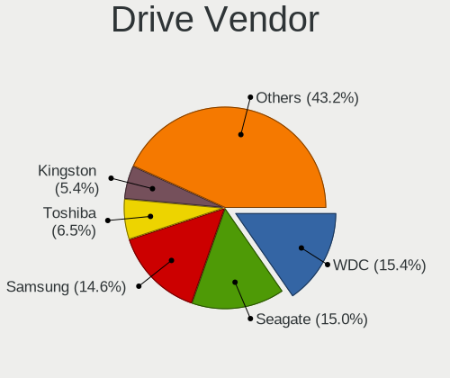
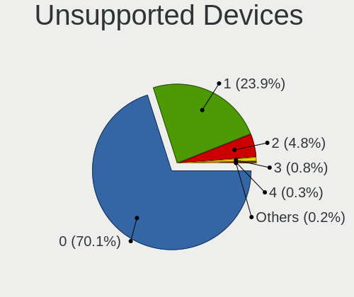

Linux - Tested Hardware & Statistics
------------------------------------

A project to collect tested hardware configurations for Linux.

Anyone can contribute to this report by the [hw-probe](https://github.com/linuxhw/hw-probe) tool:

    sudo -E hw-probe -all -upload

Please contribute! Especially if your hardware is rare.

This is a report for all computer types. See also reports for [desktops](/Desktop/README.md) and [notebooks](/Notebook/README.md).

Distribution-specific reports: [AlmaLinux](/Dist/AlmaLinux), [Alpine](/Dist/Alpine), [ALT_Linux](/Dist/ALT_Linux), [antiX](/Dist/antiX), [Artix](/Dist/Artix), [Chrome_OS](/Dist/Chrome_OS), [Clear_Linux](/Dist/Clear_Linux), [Deepin](/Dist/Deepin), [Devuan](/Dist/Devuan), [EndeavourOS](/Dist/EndeavourOS), [Garuda_Linux](/Dist/Garuda_Linux), [GNOME_OS](/Dist/GNOME_OS), [Kaisen](/Dist/Kaisen), [Mageia](/Dist/Mageia), [Makulu](/Dist/Makulu), [NixOS](/Dist/NixOS), [Nobara](/Dist/Nobara), [Oracle_Linux](/Dist/Oracle_Linux), [Pardus](/Dist/Pardus), [PureOS](/Dist/PureOS), [Q4OS](/Dist/Q4OS), [Reborn_OS](/Dist/Reborn_OS), [Rocky_Linux](/Dist/Rocky_Linux), [Sparky](/Dist/Sparky), [Void_Linux](/Dist/Void_Linux), [Xero](/Dist/Xero).

This report is for real hardware. Report for virtual hardware: [TestDays_VE](https://github.com/linuxhw/TestDays_VE)

Contents
--------

* [ Test Cases ](#test-cases)

* [ System ](#system)
  - [ OS                       ](#os)
  - [ OS Family                ](#os-family)
  - [ Kernel                   ](#kernel)
  - [ Kernel Family            ](#kernel-family)
  - [ Kernel Major Ver.        ](#kernel-major-ver)
  - [ Arch                     ](#arch)
  - [ DE                       ](#de)
  - [ Display Server           ](#display-server)
  - [ Display Manager          ](#display-manager)
  - [ OS Lang                  ](#os-lang)
  - [ Boot Mode                ](#boot-mode)
  - [ Filesystem               ](#filesystem)
  - [ Part. scheme             ](#part-scheme)
  - [ Dual Boot with Linux/BSD ](#dual-boot-with-linuxbsd)
  - [ Dual Boot (Win)          ](#dual-boot-win)

* [ Board ](#board)
  - [ Vendor                   ](#vendor)
  - [ Model                    ](#model)
  - [ Model Family             ](#model-family)
  - [ MFG Year                 ](#mfg-year)
  - [ Form Factor              ](#form-factor)
  - [ Secure Boot              ](#secure-boot)
  - [ Coreboot                 ](#coreboot)
  - [ RAM Size                 ](#ram-size)
  - [ RAM Used                 ](#ram-used)
  - [ Total Drives             ](#total-drives)
  - [ Has CD-ROM               ](#has-cd-rom)
  - [ Has Ethernet             ](#has-ethernet)
  - [ Has WiFi                 ](#has-wifi)
  - [ Has Bluetooth            ](#has-bluetooth)

* [ Location ](#location)
  - [ Country                  ](#country)
  - [ City                     ](#city)

* [ Drives ](#drives)
  - [ Drive Vendor             ](#drive-vendor)
  - [ Drive Model              ](#drive-model)
  - [ HDD Vendor               ](#hdd-vendor)
  - [ SSD Vendor               ](#ssd-vendor)
  - [ Drive Kind               ](#drive-kind)
  - [ Drive Connector          ](#drive-connector)
  - [ Drive Size               ](#drive-size)
  - [ Space Total              ](#space-total)
  - [ Space Used               ](#space-used)
  - [ Malfunc. Drives          ](#malfunc-drives)
  - [ Malfunc. Drive Vendor    ](#malfunc-drive-vendor)
  - [ Malfunc. HDD Vendor      ](#malfunc-hdd-vendor)
  - [ Malfunc. Drive Kind      ](#malfunc-drive-kind)
  - [ Failed Drives            ](#failed-drives)
  - [ Failed Drive Vendor      ](#failed-drive-vendor)
  - [ Drive Status             ](#drive-status)

* [ Storage controller ](#storage-controller)
  - [ Storage Vendor           ](#storage-vendor)
  - [ Storage Model            ](#storage-model)
  - [ Storage Kind             ](#storage-kind)

* [ Processor ](#processor)
  - [ CPU Vendor               ](#cpu-vendor)
  - [ CPU Model                ](#cpu-model)
  - [ CPU Model Family         ](#cpu-model-family)
  - [ CPU Cores                ](#cpu-cores)
  - [ CPU Sockets              ](#cpu-sockets)
  - [ CPU Threads              ](#cpu-threads)
  - [ CPU Op-Modes             ](#cpu-op-modes)
  - [ CPU Microcode            ](#cpu-microcode)
  - [ CPU Microarch            ](#cpu-microarch)

* [ Graphics ](#graphics)
  - [ GPU Vendor               ](#gpu-vendor)
  - [ GPU Model                ](#gpu-model)
  - [ GPU Combo                ](#gpu-combo)
  - [ GPU Driver               ](#gpu-driver)
  - [ GPU Memory               ](#gpu-memory)

* [ Monitor ](#monitor)
  - [ Monitor Vendor           ](#monitor-vendor)
  - [ Monitor Model            ](#monitor-model)
  - [ Monitor Resolution       ](#monitor-resolution)
  - [ Monitor Diagonal         ](#monitor-diagonal)
  - [ Monitor Width            ](#monitor-width)
  - [ Aspect Ratio             ](#aspect-ratio)
  - [ Monitor Area             ](#monitor-area)
  - [ Pixel Density            ](#pixel-density)
  - [ Multiple Monitors        ](#multiple-monitors)

* [ Network ](#network)
  - [ Net Controller Vendor    ](#net-controller-vendor)
  - [ Net Controller Model     ](#net-controller-model)
  - [ Wireless Vendor          ](#wireless-vendor)
  - [ Wireless Model           ](#wireless-model)
  - [ Ethernet Vendor          ](#ethernet-vendor)
  - [ Ethernet Model           ](#ethernet-model)
  - [ Net Controller Kind      ](#net-controller-kind)
  - [ Used Controller          ](#used-controller)
  - [ NICs                     ](#nics)
  - [ IPv6                     ](#ipv6)

* [ Bluetooth ](#bluetooth)
  - [ Bluetooth Vendor         ](#bluetooth-vendor)
  - [ Bluetooth Model          ](#bluetooth-model)

* [ Sound ](#sound)
  - [ Sound Vendor             ](#sound-vendor)
  - [ Sound Model              ](#sound-model)

* [ Memory ](#memory)
  - [ Memory Vendor            ](#memory-vendor)
  - [ Memory Model             ](#memory-model)
  - [ Memory Kind              ](#memory-kind)
  - [ Memory Form Factor       ](#memory-form-factor)
  - [ Memory Size              ](#memory-size)
  - [ Memory Speed             ](#memory-speed)

* [ Printers & scanners ](#printers--scanners)
  - [ Printer Vendor           ](#printer-vendor)
  - [ Printer Model            ](#printer-model)
  - [ Scanner Vendor           ](#scanner-vendor)
  - [ Scanner Model            ](#scanner-model)

* [ Camera ](#camera)
  - [ Camera Vendor            ](#camera-vendor)
  - [ Camera Model             ](#camera-model)

* [ Security ](#security)
  - [ Fingerprint Vendor       ](#fingerprint-vendor)
  - [ Fingerprint Model        ](#fingerprint-model)
  - [ Chipcard Vendor          ](#chipcard-vendor)
  - [ Chipcard Model           ](#chipcard-model)

* [ Unsupported ](#unsupported)
  - [ Unsupported Devices      ](#unsupported-devices)
  - [ Unsupported Device Types ](#unsupported-device-types)

Test Cases
----------

Total: 325875

| Vendor        | Model                       | Form-Factor | Probe                                                      | Date         |
|---------------|-----------------------------|-------------|------------------------------------------------------------|--------------|
| AZW           | SER V1.0                    | Mini pc     | [e374cc3341](https://linux-hardware.org/?probe=e374cc3341) | Aug 12, 2023 |
| Dell          | G15 5510                    | Notebook    | [3cfac2d234](https://linux-hardware.org/?probe=3cfac2d234) | Aug 12, 2023 |
| ASUSTek       | ASUS TUF Gaming A17 FA70... | Notebook    | [1d5206dc94](https://linux-hardware.org/?probe=1d5206dc94) | Aug 12, 2023 |
| ASUSTek       | GL552VW                     | Notebook    | [6986ca63da](https://linux-hardware.org/?probe=6986ca63da) | Aug 12, 2023 |
| HP            | OMEN by Laptop 15-dc1xxx    | Notebook    | [fb024a9374](https://linux-hardware.org/?probe=fb024a9374) | Aug 12, 2023 |
| ASRock        | H61M-DGS R2.0               | Desktop     | [6af1365446](https://linux-hardware.org/?probe=6af1365446) | Aug 12, 2023 |
| MSI           | MAG B550M MORTAR WIFI       | Desktop     | [b6b99bf7bd](https://linux-hardware.org/?probe=b6b99bf7bd) | Aug 12, 2023 |
| HP            | OMEN by Laptop 15-dc1xxx    | Notebook    | [398f85e94a](https://linux-hardware.org/?probe=398f85e94a) | Aug 12, 2023 |
| Acer          | Aspire E1-532               | Notebook    | [84cbdf027b](https://linux-hardware.org/?probe=84cbdf027b) | Aug 12, 2023 |
| ASUSTek       | ASUS TUF Gaming A15 FA50... | Notebook    | [49662a8ac9](https://linux-hardware.org/?probe=49662a8ac9) | Aug 12, 2023 |
| Samsung       | 300E5M/300E5L               | Notebook    | [9aa2cd7b81](https://linux-hardware.org/?probe=9aa2cd7b81) | Aug 12, 2023 |
| Valve         | Jupiter                     | Notebook    | [c34cb54bc8](https://linux-hardware.org/?probe=c34cb54bc8) | Aug 12, 2023 |
| ASUSTek       | ASUS TUF Gaming A15 FA50... | Notebook    | [c946b79f5a](https://linux-hardware.org/?probe=c946b79f5a) | Aug 12, 2023 |
| Dell          | Inspiron 1720               | Notebook    | [1cb123d894](https://linux-hardware.org/?probe=1cb123d894) | Aug 12, 2023 |
| ASRock        | H61M-DGS R2.0               | Desktop     | [70e9fe8cdb](https://linux-hardware.org/?probe=70e9fe8cdb) | Aug 12, 2023 |
| MSI           | X470 GAMING PLUS MAX        | Desktop     | [3ea3856297](https://linux-hardware.org/?probe=3ea3856297) | Aug 12, 2023 |
| Acer          | Swift SF314-512             | Notebook    | [7158f3e437](https://linux-hardware.org/?probe=7158f3e437) | Aug 12, 2023 |
| Dell          | Vostro 15-3568              | Notebook    | [b422d7c8cc](https://linux-hardware.org/?probe=b422d7c8cc) | Aug 12, 2023 |
| ASRock        | B85M Pro4                   | Desktop     | [108dae1eae](https://linux-hardware.org/?probe=108dae1eae) | Aug 12, 2023 |
| Toshiba       | Satellite C50D-A-13G        | Notebook    | [e1a3542078](https://linux-hardware.org/?probe=e1a3542078) | Aug 12, 2023 |
| Gigabyte      | H61M-S1                     | Desktop     | [b92a6f8a9e](https://linux-hardware.org/?probe=b92a6f8a9e) | Aug 12, 2023 |
| Sony          | SVE1712W1EB                 | Notebook    | [e65db8d147](https://linux-hardware.org/?probe=e65db8d147) | Aug 12, 2023 |
| Lenovo        | ThinkPad T460p 20FXS1C30... | Notebook    | [08542d994e](https://linux-hardware.org/?probe=08542d994e) | Aug 12, 2023 |
| Lenovo        | IdeaPadFlex 5 14ALC05 82... | Convertible | [4963974f47](https://linux-hardware.org/?probe=4963974f47) | Aug 12, 2023 |
| Gigabyte      | G1.Sniper M3-CF             | Desktop     | [f4d0fd6811](https://linux-hardware.org/?probe=f4d0fd6811) | Aug 12, 2023 |
| MSI           | P67A-GD65                   | Desktop     | [1024e95ca9](https://linux-hardware.org/?probe=1024e95ca9) | Aug 12, 2023 |
| Dell          | Vostro 3500                 | Notebook    | [2ec62f31c9](https://linux-hardware.org/?probe=2ec62f31c9) | Aug 12, 2023 |
| ASUSTek       | Z170-P                      | Desktop     | [a32f4633c2](https://linux-hardware.org/?probe=a32f4633c2) | Aug 12, 2023 |
| Gigabyte      | Z77X-D3H                    | Desktop     | [f57a3e9f6a](https://linux-hardware.org/?probe=f57a3e9f6a) | Aug 12, 2023 |
| ASUSTek       | CM1630                      | Desktop     | [dfd52e2852](https://linux-hardware.org/?probe=dfd52e2852) | Aug 12, 2023 |
| Gigabyte      | G1.Sniper M3-CF             | Desktop     | [a5681e12d3](https://linux-hardware.org/?probe=a5681e12d3) | Aug 12, 2023 |
| Alienware     | 15                          | Notebook    | [d6c9c4f931](https://linux-hardware.org/?probe=d6c9c4f931) | Aug 12, 2023 |
| ASUSTek       | Rampage IV GENE             | Desktop     | [2a494a04b5](https://linux-hardware.org/?probe=2a494a04b5) | Aug 12, 2023 |
| ASUSTek       | K55VD                       | Notebook    | [05024005e4](https://linux-hardware.org/?probe=05024005e4) | Aug 12, 2023 |
| Acer          | Aspire E1-571G              | Notebook    | [ca51aaad9f](https://linux-hardware.org/?probe=ca51aaad9f) | Aug 12, 2023 |
| Lenovo        | ThinkPad E15 20RD0011UK     | Notebook    | [411b9f412c](https://linux-hardware.org/?probe=411b9f412c) | Aug 12, 2023 |
| HP            | 8643 SMVB                   | Desktop     | [2832e701f2](https://linux-hardware.org/?probe=2832e701f2) | Aug 12, 2023 |
| Fujitsu       | FMVA0800C                   | Notebook    | [1dae7b170b](https://linux-hardware.org/?probe=1dae7b170b) | Aug 12, 2023 |
| Notebook      | NJx0MU                      | Notebook    | [6f230d02c1](https://linux-hardware.org/?probe=6f230d02c1) | Aug 12, 2023 |
| HP            | 09CCh                       | Desktop     | [15bfdf7213](https://linux-hardware.org/?probe=15bfdf7213) | Aug 12, 2023 |
| Dell          | Inspiron 13 5310            | Notebook    | [d42fa686e5](https://linux-hardware.org/?probe=d42fa686e5) | Aug 12, 2023 |
| Dell          | Inspiron 13 5310            | Notebook    | [45509c2727](https://linux-hardware.org/?probe=45509c2727) | Aug 12, 2023 |
| Dell          | XPS 15 9560                 | Notebook    | [756901f27f](https://linux-hardware.org/?probe=756901f27f) | Aug 12, 2023 |
| Lenovo        | ThinkPad L13 Gen 3 21BAS... | Notebook    | [67f821bd4d](https://linux-hardware.org/?probe=67f821bd4d) | Aug 12, 2023 |
| Lenovo        | IdeaPad Duet 3 11IAN8 82... | Tablet      | [b61e23d1ec](https://linux-hardware.org/?probe=b61e23d1ec) | Aug 12, 2023 |
| MSI           | X470 GAMING PRO CARBON      | Desktop     | [b4b9fa2d17](https://linux-hardware.org/?probe=b4b9fa2d17) | Aug 12, 2023 |
| ASUSTek       | ASUS TUF Gaming A17 FA70... | Notebook    | [bcda0258e5](https://linux-hardware.org/?probe=bcda0258e5) | Aug 12, 2023 |
| Gigabyte      | H61M-S1                     | Desktop     | [031ed1d4e7](https://linux-hardware.org/?probe=031ed1d4e7) | Aug 12, 2023 |
| Fujitsu       | D2990-A1 S26361-D2990-A1    | Desktop     | [ae7ae594f1](https://linux-hardware.org/?probe=ae7ae594f1) | Aug 12, 2023 |
| Dell          | Latitude E6430              | Notebook    | [8037585070](https://linux-hardware.org/?probe=8037585070) | Aug 12, 2023 |
| Lenovo        | Yoga Pro 9 14IRP8 83BU      | Notebook    | [f46a14b981](https://linux-hardware.org/?probe=f46a14b981) | Aug 12, 2023 |
| HP            | ProBook x360 11 G5 EE       | Convertible | [9651bc99b0](https://linux-hardware.org/?probe=9651bc99b0) | Aug 12, 2023 |
| Apple         | Mac-F2218EA9                | All in one  | [63861067de](https://linux-hardware.org/?probe=63861067de) | Aug 12, 2023 |
| ASUSTek       | M5A78L-M LE                 | Desktop     | [a68db843ea](https://linux-hardware.org/?probe=a68db843ea) | Aug 12, 2023 |
| HP            | ZBook 17 G3                 | Notebook    | [475b07d2dc](https://linux-hardware.org/?probe=475b07d2dc) | Aug 12, 2023 |
| Valve         | Jupiter                     | Notebook    | [61e105aa9d](https://linux-hardware.org/?probe=61e105aa9d) | Aug 12, 2023 |
| Acer          | Aspire 5733Z                | Notebook    | [977c66cbc0](https://linux-hardware.org/?probe=977c66cbc0) | Aug 12, 2023 |
| Gigabyte      | B550 GAMING X V2            | Desktop     | [1f4aa5bf97](https://linux-hardware.org/?probe=1f4aa5bf97) | Aug 12, 2023 |
| Valve         | Jupiter                     | Notebook    | [dbb797aa33](https://linux-hardware.org/?probe=dbb797aa33) | Aug 12, 2023 |
| Panasonic     | CF-19ADNAXDA                | Notebook    | [d96cf2b13c](https://linux-hardware.org/?probe=d96cf2b13c) | Aug 12, 2023 |
| Panasonic     | CF-SX1WEVHR                 | Notebook    | [8abafe1b65](https://linux-hardware.org/?probe=8abafe1b65) | Aug 12, 2023 |
| Unknown       | Unknown                     | Notebook    | [2e76349d2c](https://linux-hardware.org/?probe=2e76349d2c) | Aug 12, 2023 |
| Dell          | G7 7790                     | Notebook    | [b5062f0928](https://linux-hardware.org/?probe=b5062f0928) | Aug 12, 2023 |
| Lenovo        | ThinkPad P53 20QN0011IV     | Notebook    | [d25ab08211](https://linux-hardware.org/?probe=d25ab08211) | Aug 12, 2023 |
| Lenovo        | IdeaPadFlex 5 14ALC05 82... | Convertible | [2939f44178](https://linux-hardware.org/?probe=2939f44178) | Aug 12, 2023 |
| ASUSTek       | ROG STRIX X570-E GAMING     | Desktop     | [4fe5238f21](https://linux-hardware.org/?probe=4fe5238f21) | Aug 12, 2023 |
| MSI           | MPG X570 GAMING PLUS        | Desktop     | [2c92ed92eb](https://linux-hardware.org/?probe=2c92ed92eb) | Aug 12, 2023 |
| ASRock        | B450M-HDV R4.0              | Desktop     | [6855901c02](https://linux-hardware.org/?probe=6855901c02) | Aug 12, 2023 |
| Lenovo        | ThinkBook 14 G3 ACL 21A2    | Notebook    | [5892469c5b](https://linux-hardware.org/?probe=5892469c5b) | Aug 12, 2023 |
| Timi          | RedmiBook Pro 15S           | Notebook    | [20559d710a](https://linux-hardware.org/?probe=20559d710a) | Aug 12, 2023 |
| Apple         | Mac-FC02E91DDD3FA6A4 iMa... | All in one  | [ccf80c6f9a](https://linux-hardware.org/?probe=ccf80c6f9a) | Aug 12, 2023 |
| Gigabyte      | Z390 AORUS PRO WIFI-CF      | Desktop     | [7298d533c9](https://linux-hardware.org/?probe=7298d533c9) | Aug 12, 2023 |
| Gigabyte      | Z390 AORUS PRO WIFI-CF      | Desktop     | [13e0e622f3](https://linux-hardware.org/?probe=13e0e622f3) | Aug 12, 2023 |
| Apple         | Mac-FC02E91DDD3FA6A4 iMa... | All in one  | [b5604d9633](https://linux-hardware.org/?probe=b5604d9633) | Aug 12, 2023 |
| Lenovo        | Yoga 7 14ITL5 82BH          | Convertible | [4fe6eb4d59](https://linux-hardware.org/?probe=4fe6eb4d59) | Aug 12, 2023 |
| HP            | Compaq nx9420 (RH457EA#A... | Notebook    | [1b7c441369](https://linux-hardware.org/?probe=1b7c441369) | Aug 12, 2023 |
| Gigabyte      | H61M-DS2                    | Desktop     | [3181a592ac](https://linux-hardware.org/?probe=3181a592ac) | Aug 12, 2023 |
| Lenovo        | Legion 5 15ACH6 82JW        | Notebook    | [79cc445925](https://linux-hardware.org/?probe=79cc445925) | Aug 12, 2023 |
| ASUSTek       | TP410UA                     | Convertible | [b2acf53271](https://linux-hardware.org/?probe=b2acf53271) | Aug 12, 2023 |
| HP            | 1495                        | Desktop     | [837afb7bfa](https://linux-hardware.org/?probe=837afb7bfa) | Aug 12, 2023 |
| Apple         | Mac-F2268DAE                | All in one  | [cec4c72ebb](https://linux-hardware.org/?probe=cec4c72ebb) | Aug 12, 2023 |
| Lenovo        | Legion 5 15ACH6 82JW        | Notebook    | [b9d1b6d44a](https://linux-hardware.org/?probe=b9d1b6d44a) | Aug 12, 2023 |
| CWWK          | CW-J6-6L                    | Desktop     | [8321dcc5ea](https://linux-hardware.org/?probe=8321dcc5ea) | Aug 12, 2023 |
| HP            | 1589                        | Desktop     | [1a38154020](https://linux-hardware.org/?probe=1a38154020) | Aug 12, 2023 |
| Dell          | 0FDT3J A01                  | Server      | [fce762afa4](https://linux-hardware.org/?probe=fce762afa4) | Aug 12, 2023 |
| ASUSTek       | TP410UA                     | Convertible | [cb455d1334](https://linux-hardware.org/?probe=cb455d1334) | Aug 12, 2023 |
| Apple         | MacBookPro6,2               | Notebook    | [7c62a05800](https://linux-hardware.org/?probe=7c62a05800) | Aug 12, 2023 |
| ASUSTek       | CM1630                      | Desktop     | [d8f56bcdaf](https://linux-hardware.org/?probe=d8f56bcdaf) | Aug 12, 2023 |
| HP            | ENVY x360 Convertible 13... | Convertible | [618857a4ae](https://linux-hardware.org/?probe=618857a4ae) | Aug 12, 2023 |
| Gigabyte      | X570 AORUS ELITE            | Desktop     | [0c0df32662](https://linux-hardware.org/?probe=0c0df32662) | Aug 12, 2023 |
| ASUSTek       | PRIME B660M-K D4            | Desktop     | [dad31fab00](https://linux-hardware.org/?probe=dad31fab00) | Aug 12, 2023 |
| Unknown       | Unknown                     | Soc         | [a28cd220cd](https://linux-hardware.org/?probe=a28cd220cd) | Aug 12, 2023 |
| Unknown       | Unknown                     | Soc         | [f62d9a8a9a](https://linux-hardware.org/?probe=f62d9a8a9a) | Aug 12, 2023 |
| HP            | 0A04h                       | Desktop     | [61b0d9bc15](https://linux-hardware.org/?probe=61b0d9bc15) | Aug 12, 2023 |
| Intel         | B85 V5.56                   | Desktop     | [7fb2d45505](https://linux-hardware.org/?probe=7fb2d45505) | Aug 12, 2023 |
| HP            | EliteBook 820 G3            | Notebook    | [544810db31](https://linux-hardware.org/?probe=544810db31) | Aug 12, 2023 |
| Dell          | 05YDCW A01                  | Desktop     | [3f3195be63](https://linux-hardware.org/?probe=3f3195be63) | Aug 12, 2023 |
| Fujitsu       | JIQ87Y                      | Desktop     | [b11d99014e](https://linux-hardware.org/?probe=b11d99014e) | Aug 12, 2023 |
| Valve         | Jupiter                     | Notebook    | [3f6cd697d5](https://linux-hardware.org/?probe=3f6cd697d5) | Aug 12, 2023 |
| Dell          | 05YDCW A01                  | Desktop     | [80c27f0ac1](https://linux-hardware.org/?probe=80c27f0ac1) | Aug 12, 2023 |
| HP            | EliteBook 840 G7 Noteboo... | Notebook    | [5ba59f878a](https://linux-hardware.org/?probe=5ba59f878a) | Aug 12, 2023 |
| Supermicro    | H12SSL-i                    | Server      | [0b7f8d13d9](https://linux-hardware.org/?probe=0b7f8d13d9) | Aug 12, 2023 |
| ASUSTek       | ProArt X670E-CREATOR WIF... | Desktop     | [4f6d84a4dd](https://linux-hardware.org/?probe=4f6d84a4dd) | Aug 12, 2023 |
| ASRockRack    | B650D4U-2L2T/BCM            | Server      | [8a896a42c0](https://linux-hardware.org/?probe=8a896a42c0) | Aug 12, 2023 |
| Dell          | 0PV3YR A05                  | Server      | [ed029dd5e3](https://linux-hardware.org/?probe=ed029dd5e3) | Aug 12, 2023 |
| ASUSTek       | PRIME Z590-P WIFI           | Desktop     | [073d2bb6a7](https://linux-hardware.org/?probe=073d2bb6a7) | Aug 12, 2023 |
| Apple         | Mac-F2268DAE                | All in one  | [97c78c17bd](https://linux-hardware.org/?probe=97c78c17bd) | Aug 12, 2023 |
| Gigabyte      | F2A88XN-WIFI                | Desktop     | [8ba1a47cc3](https://linux-hardware.org/?probe=8ba1a47cc3) | Aug 12, 2023 |
| ASUSTek       | H81M-PLUS                   | Desktop     | [af419fe003](https://linux-hardware.org/?probe=af419fe003) | Aug 12, 2023 |
| Gigabyte      | F2A88XN-WIFI                | Desktop     | [adb95a05c5](https://linux-hardware.org/?probe=adb95a05c5) | Aug 12, 2023 |
| ASUSTek       | H81M-PLUS                   | Desktop     | [16cd37e4fe](https://linux-hardware.org/?probe=16cd37e4fe) | Aug 12, 2023 |
| ASUSTek       | ROG STRIX B550-F GAMING ... | Desktop     | [580fda2e6b](https://linux-hardware.org/?probe=580fda2e6b) | Aug 12, 2023 |
| Multilaser    | PC024                       | Notebook    | [3311e26ac5](https://linux-hardware.org/?probe=3311e26ac5) | Aug 12, 2023 |
| Dell          | 0Y2MRG A00                  | Desktop     | [04ce264a3e](https://linux-hardware.org/?probe=04ce264a3e) | Aug 12, 2023 |
| Lenovo        | V310-14ISK 80SX             | Notebook    | [edd47d65b6](https://linux-hardware.org/?probe=edd47d65b6) | Aug 12, 2023 |
| MSI           | X99A RAIDER                 | Desktop     | [90816726b0](https://linux-hardware.org/?probe=90816726b0) | Aug 12, 2023 |
| Lenovo        | ThinkPad T14 Gen 1 20S00... | Notebook    | [53196a01fa](https://linux-hardware.org/?probe=53196a01fa) | Aug 12, 2023 |
| MSI           | A55M-E33                    | Desktop     | [7d538db764](https://linux-hardware.org/?probe=7d538db764) | Aug 12, 2023 |
| HP            | ProLiant ML350 G5           | Desktop     | [e9e8c3e5a7](https://linux-hardware.org/?probe=e9e8c3e5a7) | Aug 12, 2023 |
| Mini PC       | Rev JSL5 DDR4               | Mini pc     | [ec7b05c868](https://linux-hardware.org/?probe=ec7b05c868) | Aug 12, 2023 |
| Acer          | TravelMate B113             | Notebook    | [5d3d27c8bb](https://linux-hardware.org/?probe=5d3d27c8bb) | Aug 12, 2023 |
| Dell          | Inspiron 5558               | Notebook    | [5bb31ccda3](https://linux-hardware.org/?probe=5bb31ccda3) | Aug 12, 2023 |
| Dell          | G3 3579                     | Notebook    | [09ba53e3c1](https://linux-hardware.org/?probe=09ba53e3c1) | Aug 12, 2023 |
| HP            | Pavilion Laptop 14-dv1xx... | Notebook    | [72899a615b](https://linux-hardware.org/?probe=72899a615b) | Aug 12, 2023 |
| MSI           | A55M-E33                    | Desktop     | [9e64865fbc](https://linux-hardware.org/?probe=9e64865fbc) | Aug 12, 2023 |
| Lenovo        | ThinkPad X1 Carbon 6th 2... | Notebook    | [53c81d6d36](https://linux-hardware.org/?probe=53c81d6d36) | Aug 12, 2023 |
| Acer          | One Z1402                   | Notebook    | [9fd6a2d41b](https://linux-hardware.org/?probe=9fd6a2d41b) | Aug 12, 2023 |
| Dell          | 03KWTV A02                  | Desktop     | [4d26902a65](https://linux-hardware.org/?probe=4d26902a65) | Aug 12, 2023 |
| Intel         | DG31PR AAE58249-301         | Desktop     | [28bc891b6d](https://linux-hardware.org/?probe=28bc891b6d) | Aug 12, 2023 |
| Toshiba       | Satellite C55-A             | Notebook    | [d1bf5ba3c3](https://linux-hardware.org/?probe=d1bf5ba3c3) | Aug 12, 2023 |
| Intel         | NUC11PABi7 M68262-501       | Mini pc     | [422a91a4eb](https://linux-hardware.org/?probe=422a91a4eb) | Aug 12, 2023 |
| Mini PC       | Rev JSL5 DDR4               | Mini pc     | [783651bb7d](https://linux-hardware.org/?probe=783651bb7d) | Aug 12, 2023 |
| ASUSTek       | T200TA                      | Notebook    | [affc999457](https://linux-hardware.org/?probe=affc999457) | Aug 12, 2023 |
| ASUSTek       | J1800I-C/BR                 | Desktop     | [5226916c20](https://linux-hardware.org/?probe=5226916c20) | Aug 12, 2023 |
| A-DATA Tec... | XENIA 15                    | Notebook    | [73f0314b31](https://linux-hardware.org/?probe=73f0314b31) | Aug 12, 2023 |
| HP            | Pavilion g7                 | Notebook    | [325b804863](https://linux-hardware.org/?probe=325b804863) | Aug 12, 2023 |
| MSI           | MAG B550M MORTAR WIFI       | Desktop     | [da8cf53467](https://linux-hardware.org/?probe=da8cf53467) | Aug 12, 2023 |
| MSI           | MEG X570 UNIFY              | Desktop     | [179381f376](https://linux-hardware.org/?probe=179381f376) | Aug 12, 2023 |
| ASUSTek       | J1800I-C/BR                 | Desktop     | [f59a93f116](https://linux-hardware.org/?probe=f59a93f116) | Aug 12, 2023 |
| A-DATA Tec... | XENIA 15                    | Notebook    | [d1a19f992d](https://linux-hardware.org/?probe=d1a19f992d) | Aug 12, 2023 |
| HP            | Pavilion dv7                | Notebook    | [7e4a63e58c](https://linux-hardware.org/?probe=7e4a63e58c) | Aug 12, 2023 |
| MSI           | PRO Z790-P WIFI             | Desktop     | [5b9aef438f](https://linux-hardware.org/?probe=5b9aef438f) | Aug 12, 2023 |
| MSI           | PRO Z790-P WIFI             | Desktop     | [1f3f8a869b](https://linux-hardware.org/?probe=1f3f8a869b) | Aug 12, 2023 |
| Dell          | Latitude E7270              | Notebook    | [63fd1b0d6b](https://linux-hardware.org/?probe=63fd1b0d6b) | Aug 12, 2023 |
| Dell          | 0HD5W2 A01                  | Desktop     | [be4514c366](https://linux-hardware.org/?probe=be4514c366) | Aug 12, 2023 |
| ASUSTek       | ZenBook UX425EA_UX425EA     | Notebook    | [0d45e9e048](https://linux-hardware.org/?probe=0d45e9e048) | Aug 12, 2023 |
| ASUSTek       | T200TA                      | Notebook    | [24d6504b2c](https://linux-hardware.org/?probe=24d6504b2c) | Aug 12, 2023 |
| Biostar       | A770 A2+                    | Desktop     | [d35bac0620](https://linux-hardware.org/?probe=d35bac0620) | Aug 12, 2023 |
| HP            | Pavilion dv7                | Notebook    | [fc48a936d7](https://linux-hardware.org/?probe=fc48a936d7) | Aug 12, 2023 |
| Acer          | Aspire A317-53              | Notebook    | [17dacd99a6](https://linux-hardware.org/?probe=17dacd99a6) | Aug 12, 2023 |
| Intel         | DG31PR AAE58249-301         | Desktop     | [3050db3fbf](https://linux-hardware.org/?probe=3050db3fbf) | Aug 12, 2023 |
| Gigabyte      | Z170-HD3P-CF                | Desktop     | [7ef87af541](https://linux-hardware.org/?probe=7ef87af541) | Aug 12, 2023 |
| ASRock        | 970A-G                      | Desktop     | [5a2b77eaee](https://linux-hardware.org/?probe=5a2b77eaee) | Aug 12, 2023 |
| Apple         | MacBookAir7,2               | Notebook    | [b80181bc47](https://linux-hardware.org/?probe=b80181bc47) | Aug 12, 2023 |
| Biostar       | A770 A2+                    | Desktop     | [fb7d0009fd](https://linux-hardware.org/?probe=fb7d0009fd) | Aug 12, 2023 |
| ASUSTek       | M5A97 R2.0                  | Desktop     | [96995d7026](https://linux-hardware.org/?probe=96995d7026) | Aug 12, 2023 |
| Alienware     | 0N43JM A01                  | Desktop     | [74cc9030a1](https://linux-hardware.org/?probe=74cc9030a1) | Aug 12, 2023 |
| Fujitsu       | LIFEBOOK AH530              | Notebook    | [b99e595bfc](https://linux-hardware.org/?probe=b99e595bfc) | Aug 12, 2023 |
| HP            | ENVY Notebook               | Notebook    | [24c2810def](https://linux-hardware.org/?probe=24c2810def) | Aug 12, 2023 |
| ZOTAC         | ZBOXNANO-ID67/ID68/ID69     | Mini pc     | [169c6d3b85](https://linux-hardware.org/?probe=169c6d3b85) | Aug 12, 2023 |
| HP            | Laptop 15-dy2xxx            | Notebook    | [bc66f59ac5](https://linux-hardware.org/?probe=bc66f59ac5) | Aug 12, 2023 |
| Lenovo        | ThinkPad W500 4063JR4       | Notebook    | [f8c24a1b02](https://linux-hardware.org/?probe=f8c24a1b02) | Aug 11, 2023 |
| Fujitsu       | LIFEBOOK AH530              | Notebook    | [1fa34106f1](https://linux-hardware.org/?probe=1fa34106f1) | Aug 11, 2023 |
| AZW           | SER V1.0                    | Mini pc     | [8193c225e5](https://linux-hardware.org/?probe=8193c225e5) | Aug 11, 2023 |
| Dell          | 0XKD8M A00                  | All in one  | [6cbd6d691c](https://linux-hardware.org/?probe=6cbd6d691c) | Aug 11, 2023 |
| ASUSTek       | PRIME A520M-E               | Desktop     | [92f4e14369](https://linux-hardware.org/?probe=92f4e14369) | Aug 11, 2023 |
| Lenovo        | PIQY0                       | Notebook    | [0149927d91](https://linux-hardware.org/?probe=0149927d91) | Aug 11, 2023 |
| Microsoft     | Surface Pro 4               | Tablet      | [2b46218f49](https://linux-hardware.org/?probe=2b46218f49) | Aug 11, 2023 |
| Microsoft     | Surface Pro 4               | Tablet      | [77714a2920](https://linux-hardware.org/?probe=77714a2920) | Aug 11, 2023 |
| ASUSTek       | K55A                        | Notebook    | [bf260cea2c](https://linux-hardware.org/?probe=bf260cea2c) | Aug 11, 2023 |
| ASUSTek       | P5G41T-M LX2/BR             | Desktop     | [f8fa12cc07](https://linux-hardware.org/?probe=f8fa12cc07) | Aug 11, 2023 |
| ASUSTek       | PRIME B550M-K               | Desktop     | [60de8d6d38](https://linux-hardware.org/?probe=60de8d6d38) | Aug 11, 2023 |
| Dell          | G3 3590                     | Notebook    | [084d659110](https://linux-hardware.org/?probe=084d659110) | Aug 11, 2023 |
| Jumper        | EZpad                       | Notebook    | [5fa2e934c3](https://linux-hardware.org/?probe=5fa2e934c3) | Aug 11, 2023 |
| MSI           | Boston                      | Desktop     | [62ad275a7d](https://linux-hardware.org/?probe=62ad275a7d) | Aug 11, 2023 |
| Valve         | Jupiter                     | Notebook    | [069bfd618c](https://linux-hardware.org/?probe=069bfd618c) | Aug 11, 2023 |
| LNV           | L40-70                      | Notebook    | [66fe107447](https://linux-hardware.org/?probe=66fe107447) | Aug 11, 2023 |
| Apple         | Mac-F2268DAE                | All in one  | [b4a67f9e6d](https://linux-hardware.org/?probe=b4a67f9e6d) | Aug 11, 2023 |
| Lenovo        | Yoga 7 16ARP8 83BS          | Convertible | [5712d7b72d](https://linux-hardware.org/?probe=5712d7b72d) | Aug 11, 2023 |
| HP            | Laptop 14-dq1xxx            | Notebook    | [6f5a32d65f](https://linux-hardware.org/?probe=6f5a32d65f) | Aug 11, 2023 |
| ASUSTek       | TUF Gaming X570-PLUS        | Desktop     | [d387c8fec5](https://linux-hardware.org/?probe=d387c8fec5) | Aug 11, 2023 |
| ASUSTek       | VivoBook_ASUSLaptop M150... | Notebook    | [3a7d1d1f9b](https://linux-hardware.org/?probe=3a7d1d1f9b) | Aug 11, 2023 |
| ASUSTek       | ROG STRIX Z590-I GAMING ... | Desktop     | [8903899ce9](https://linux-hardware.org/?probe=8903899ce9) | Aug 11, 2023 |
| HP            | Victus by Laptop 16-e0xx... | Notebook    | [377a0e25aa](https://linux-hardware.org/?probe=377a0e25aa) | Aug 11, 2023 |
| Intel         | B85 V5.56                   | Desktop     | [f278787ab5](https://linux-hardware.org/?probe=f278787ab5) | Aug 11, 2023 |
| HP            | EliteBook 840 14 inch G1... | Notebook    | [73b7fc1fc9](https://linux-hardware.org/?probe=73b7fc1fc9) | Aug 11, 2023 |
| Acer          | Aspire F5-573G              | Notebook    | [019f3a6d1f](https://linux-hardware.org/?probe=019f3a6d1f) | Aug 11, 2023 |
| Lenovo        | IdeaPad 5 15IAL7 82SF       | Notebook    | [c2d9d3160b](https://linux-hardware.org/?probe=c2d9d3160b) | Aug 11, 2023 |
| MSI           | Boston                      | Desktop     | [a34a89c083](https://linux-hardware.org/?probe=a34a89c083) | Aug 11, 2023 |
| ASUSTek       | PRIME B550-PLUS             | Desktop     | [76078461ae](https://linux-hardware.org/?probe=76078461ae) | Aug 11, 2023 |
| Intel         | B75                         | Desktop     | [17641de345](https://linux-hardware.org/?probe=17641de345) | Aug 11, 2023 |
| MSI           | Sword 17 A11UD              | Notebook    | [8ad81394c8](https://linux-hardware.org/?probe=8ad81394c8) | Aug 11, 2023 |
| Gigabyte      | M720-US3                    | Desktop     | [222bc02e4f](https://linux-hardware.org/?probe=222bc02e4f) | Aug 11, 2023 |
| HP            | Notebook                    | Notebook    | [de8a0230c4](https://linux-hardware.org/?probe=de8a0230c4) | Aug 11, 2023 |
| Dell          | Inspiron 5559               | Notebook    | [f3e1bb3812](https://linux-hardware.org/?probe=f3e1bb3812) | Aug 11, 2023 |
| HP            | Laptop 14s-dq2xxx           | Notebook    | [7574e6b53a](https://linux-hardware.org/?probe=7574e6b53a) | Aug 11, 2023 |
| Acer          | Extensa 215-55              | Notebook    | [aea9ada5e8](https://linux-hardware.org/?probe=aea9ada5e8) | Aug 11, 2023 |
| MSI           | X470 GAMING PRO CARBON      | Desktop     | [181db8cf87](https://linux-hardware.org/?probe=181db8cf87) | Aug 11, 2023 |
| Lenovo        | V130-15IKB 81HN             | Notebook    | [88a9c5764d](https://linux-hardware.org/?probe=88a9c5764d) | Aug 11, 2023 |
| ASUSTek       | ROG STRIX X570-E GAMING     | Desktop     | [483fc71762](https://linux-hardware.org/?probe=483fc71762) | Aug 11, 2023 |
| Edelweiss     | TF307-MB-S-D                | Soc         | [e0fa5039b4](https://linux-hardware.org/?probe=e0fa5039b4) | Aug 11, 2023 |
| Acer          | Nitro AN517-54              | Notebook    | [4daff2c43f](https://linux-hardware.org/?probe=4daff2c43f) | Aug 11, 2023 |
| Lenovo        | IdeaPad 320-15AST 80XV      | Notebook    | [359d84713c](https://linux-hardware.org/?probe=359d84713c) | Aug 11, 2023 |
| Unknown       | Unknown                     | Notebook    | [c90f282238](https://linux-hardware.org/?probe=c90f282238) | Aug 11, 2023 |
| Dell          | Latitude E6430              | Notebook    | [79f523548b](https://linux-hardware.org/?probe=79f523548b) | Aug 11, 2023 |
| Lenovo        | IdeaPad Slim 1-11AST-05 ... | Notebook    | [30c7051967](https://linux-hardware.org/?probe=30c7051967) | Aug 11, 2023 |
| Unknown       | Unknown                     | Notebook    | [b68d99fd89](https://linux-hardware.org/?probe=b68d99fd89) | Aug 11, 2023 |
| Lenovo        | SHARKBAY SDK0E50510 WIN     | Desktop     | [ab2473ff49](https://linux-hardware.org/?probe=ab2473ff49) | Aug 11, 2023 |
| Dell          | Latitude E6330              | Notebook    | [b3081e041e](https://linux-hardware.org/?probe=b3081e041e) | Aug 11, 2023 |
| Dell          | Latitude E6430              | Notebook    | [fd3c9b15f8](https://linux-hardware.org/?probe=fd3c9b15f8) | Aug 11, 2023 |
| Apple         | MacBookPro14,2              | Notebook    | [8b0d028b37](https://linux-hardware.org/?probe=8b0d028b37) | Aug 11, 2023 |
| Unknown       | SEI Robotics SEI510         | Soc         | [3ab135e657](https://linux-hardware.org/?probe=3ab135e657) | Aug 11, 2023 |
| Sony          | SVE1712W1EB                 | Notebook    | [6f323e0954](https://linux-hardware.org/?probe=6f323e0954) | Aug 11, 2023 |
| MSI           | Summit E14Evo A12M          | Notebook    | [b83d821361](https://linux-hardware.org/?probe=b83d821361) | Aug 11, 2023 |
| MSI           | MAG B650M MORTAR WIFI       | Desktop     | [d4b93affe2](https://linux-hardware.org/?probe=d4b93affe2) | Aug 11, 2023 |
| MSI           | MAG B650M MORTAR WIFI       | Desktop     | [7a8e32eb89](https://linux-hardware.org/?probe=7a8e32eb89) | Aug 11, 2023 |
| Gigabyte      | X570 I AORUS PRO WIFI       | Desktop     | [2a218f5ead](https://linux-hardware.org/?probe=2a218f5ead) | Aug 11, 2023 |
| Acer          | TMP255-M                    | Notebook    | [0b1adaea4e](https://linux-hardware.org/?probe=0b1adaea4e) | Aug 11, 2023 |
| Unknown       | Unknown                     | Notebook    | [8d7674c3b3](https://linux-hardware.org/?probe=8d7674c3b3) | Aug 11, 2023 |
| Unknown       | Unknown                     | Desktop     | [62ef56dbab](https://linux-hardware.org/?probe=62ef56dbab) | Aug 11, 2023 |
| Lenovo        | ThinkPad L520 5017BW5       | Notebook    | [1a9bbdc058](https://linux-hardware.org/?probe=1a9bbdc058) | Aug 11, 2023 |
| Biostar       | B660GTQ                     | Desktop     | [520d57cadc](https://linux-hardware.org/?probe=520d57cadc) | Aug 11, 2023 |
| HP            | EliteBook 840 G1            | Notebook    | [95d93fda2c](https://linux-hardware.org/?probe=95d93fda2c) | Aug 11, 2023 |
| Gigabyte      | B560M DS3H V2               | Desktop     | [2805e140b5](https://linux-hardware.org/?probe=2805e140b5) | Aug 11, 2023 |
| Positivo      | C4128B-1                    | Convertible | [ef67e885dc](https://linux-hardware.org/?probe=ef67e885dc) | Aug 11, 2023 |
| Lenovo        | Yoga 7 14ARB7 82QF          | Convertible | [1c2e98b598](https://linux-hardware.org/?probe=1c2e98b598) | Aug 11, 2023 |
| Dell          | Precision M4600             | Notebook    | [f97367efac](https://linux-hardware.org/?probe=f97367efac) | Aug 11, 2023 |
| Intel         | NUC7i5BNB J31144-303        | Mini pc     | [144f77980e](https://linux-hardware.org/?probe=144f77980e) | Aug 11, 2023 |
| Lenovo        | IdeaPad 310-15IAP 80TT      | Notebook    | [361e073b5c](https://linux-hardware.org/?probe=361e073b5c) | Aug 11, 2023 |
| Lenovo        | ThinkPad E490 20N8CTO1WW    | Notebook    | [c336f9aa8c](https://linux-hardware.org/?probe=c336f9aa8c) | Aug 11, 2023 |
| Gigabyte      | B450 AORUS M                | Desktop     | [f4a323eb82](https://linux-hardware.org/?probe=f4a323eb82) | Aug 11, 2023 |
| Dell          | 0KV3RP A00                  | Desktop     | [47c45a45e5](https://linux-hardware.org/?probe=47c45a45e5) | Aug 11, 2023 |
| Dell          | G15 5520                    | Notebook    | [3bec284af8](https://linux-hardware.org/?probe=3bec284af8) | Aug 11, 2023 |
| Gigabyte      | B365 HD3                    | Desktop     | [e2ebf1941c](https://linux-hardware.org/?probe=e2ebf1941c) | Aug 11, 2023 |
| Lenovo        | IdeaPad 320-15IKB 81G3      | Notebook    | [83879b8247](https://linux-hardware.org/?probe=83879b8247) | Aug 11, 2023 |
| ASRock        | B450M Pro4                  | Desktop     | [65d55091fa](https://linux-hardware.org/?probe=65d55091fa) | Aug 11, 2023 |
| HP            | Pavilion dv5                | Notebook    | [41c7682f98](https://linux-hardware.org/?probe=41c7682f98) | Aug 11, 2023 |
| Samsung       | 355V4C/355V4X/355V5C/355... | Notebook    | [6f722400c2](https://linux-hardware.org/?probe=6f722400c2) | Aug 11, 2023 |
| Sony          | SVE1513I4E                  | Notebook    | [6b8cb6d520](https://linux-hardware.org/?probe=6b8cb6d520) | Aug 11, 2023 |
| HP            | 3032h                       | Desktop     | [1727f042cd](https://linux-hardware.org/?probe=1727f042cd) | Aug 11, 2023 |
| Lenovo        | IdeaPad Slim 1-11AST-05 ... | Notebook    | [abaa0512b0](https://linux-hardware.org/?probe=abaa0512b0) | Aug 11, 2023 |
| HP            | Laptop 14s-dq2xxx           | Notebook    | [c352abad93](https://linux-hardware.org/?probe=c352abad93) | Aug 11, 2023 |
| HP            | Pavilion dv5                | Notebook    | [a8f62e42dc](https://linux-hardware.org/?probe=a8f62e42dc) | Aug 11, 2023 |
| Gigabyte      | Z790 GAMING X AX            | Desktop     | [a6d2358585](https://linux-hardware.org/?probe=a6d2358585) | Aug 11, 2023 |
| HP            | ENVY Notebook               | Notebook    | [6327abde35](https://linux-hardware.org/?probe=6327abde35) | Aug 11, 2023 |
| HP            | EliteBook 2560p             | Notebook    | [0b5cf409d8](https://linux-hardware.org/?probe=0b5cf409d8) | Aug 11, 2023 |
| Gigabyte      | A520M DS3H AC               | Desktop     | [c53eeb4caf](https://linux-hardware.org/?probe=c53eeb4caf) | Aug 11, 2023 |
| Apple         | Mac-F2238BAE iMac11,3       | All in one  | [b50bdc5845](https://linux-hardware.org/?probe=b50bdc5845) | Aug 11, 2023 |
| Notebook      | NJx0MU                      | Notebook    | [ea4ae0e0f3](https://linux-hardware.org/?probe=ea4ae0e0f3) | Aug 11, 2023 |
| Apple         | Mac-F2238BAE iMac11,3       | All in one  | [8a3df803a6](https://linux-hardware.org/?probe=8a3df803a6) | Aug 11, 2023 |
| ASUSTek       | VivoBook_ASUSLaptop M140... | Notebook    | [a4a009cd79](https://linux-hardware.org/?probe=a4a009cd79) | Aug 11, 2023 |
| Unknown       | Unknown                     | Desktop     | [4b174f07d2](https://linux-hardware.org/?probe=4b174f07d2) | Aug 11, 2023 |
| Intel         | D915GEV AAC63667-501        | Desktop     | [4d65f6d8fa](https://linux-hardware.org/?probe=4d65f6d8fa) | Aug 11, 2023 |
| Toshiba       | Satellite T110              | Notebook    | [ecb4e047b3](https://linux-hardware.org/?probe=ecb4e047b3) | Aug 11, 2023 |
| HP            | 339A                        | Desktop     | [2ecbd957da](https://linux-hardware.org/?probe=2ecbd957da) | Aug 11, 2023 |
| Acer          | Aspire E5-721               | Notebook    | [f4abfc94d4](https://linux-hardware.org/?probe=f4abfc94d4) | Aug 11, 2023 |
| Gigabyte      | B250-HD3P-CF                | Desktop     | [b347883be2](https://linux-hardware.org/?probe=b347883be2) | Aug 11, 2023 |
| HUAWEI        | BOD-WXX9                    | Notebook    | [b21e9793a5](https://linux-hardware.org/?probe=b21e9793a5) | Aug 11, 2023 |
| HP            | Pavilion 15                 | Notebook    | [0f7859844f](https://linux-hardware.org/?probe=0f7859844f) | Aug 11, 2023 |
| HP            | ProLiant DL360 Gen9         | Server      | [262bb059eb](https://linux-hardware.org/?probe=262bb059eb) | Aug 11, 2023 |
| Unknown       | Unknown                     | Desktop     | [e32bb1bbb2](https://linux-hardware.org/?probe=e32bb1bbb2) | Aug 11, 2023 |
| Acer          | Extensa 215-55              | Notebook    | [036866525c](https://linux-hardware.org/?probe=036866525c) | Aug 11, 2023 |
| HP            | Pavilion Laptop 14-ec0xx... | Notebook    | [fadee3e38d](https://linux-hardware.org/?probe=fadee3e38d) | Aug 11, 2023 |
| Gigabyte      | B85M-D2V                    | Desktop     | [d8d7d7bad7](https://linux-hardware.org/?probe=d8d7d7bad7) | Aug 11, 2023 |
| ASUSTek       | Zenbook UM3402YAR_UM3402... | Notebook    | [83a0a8a2aa](https://linux-hardware.org/?probe=83a0a8a2aa) | Aug 11, 2023 |
| ASRock        | B550M-ITX/ac                | Desktop     | [e6624cc619](https://linux-hardware.org/?probe=e6624cc619) | Aug 11, 2023 |
| ASUSTek       | PRIME B550-PLUS             | Desktop     | [7f2903e1a4](https://linux-hardware.org/?probe=7f2903e1a4) | Aug 11, 2023 |
| Toshiba       | Satellite T110              | Notebook    | [8180105119](https://linux-hardware.org/?probe=8180105119) | Aug 11, 2023 |
| Acer          | Extensa 2511G               | Notebook    | [536699834a](https://linux-hardware.org/?probe=536699834a) | Aug 11, 2023 |
| Gigabyte      | P67A-UD3P-B3                | Desktop     | [a1c6469145](https://linux-hardware.org/?probe=a1c6469145) | Aug 11, 2023 |
| Medion        | P651x series                | Notebook    | [46505da47d](https://linux-hardware.org/?probe=46505da47d) | Aug 11, 2023 |
| Acer          | Nitro AN715-51              | Notebook    | [ea972c8686](https://linux-hardware.org/?probe=ea972c8686) | Aug 11, 2023 |
| Unknown       | Unknown                     | Desktop     | [cf0d6729b4](https://linux-hardware.org/?probe=cf0d6729b4) | Aug 11, 2023 |
| Unknown       | Unknown                     | Notebook    | [a064a2d5fd](https://linux-hardware.org/?probe=a064a2d5fd) | Aug 11, 2023 |
| HP            | 250 G3                      | Notebook    | [6ba303bc6b](https://linux-hardware.org/?probe=6ba303bc6b) | Aug 11, 2023 |
| Dell          | 0CRWCR A01                  | All in one  | [74283f31aa](https://linux-hardware.org/?probe=74283f31aa) | Aug 11, 2023 |
| HP            | Laptop 17-cp1xxx            | Notebook    | [ac523f4e3b](https://linux-hardware.org/?probe=ac523f4e3b) | Aug 11, 2023 |
| HP            | 1495                        | Desktop     | [9e8b73f16e](https://linux-hardware.org/?probe=9e8b73f16e) | Aug 11, 2023 |
| ASUSTek       | PRIME X670-P WIFI           | Desktop     | [7d31344218](https://linux-hardware.org/?probe=7d31344218) | Aug 11, 2023 |
| Dell          | 0HY9JP A01                  | Desktop     | [48d92d85c7](https://linux-hardware.org/?probe=48d92d85c7) | Aug 11, 2023 |
| Fujitsu Si... | AMILO Xa 1526               | Notebook    | [0a1e2a7f23](https://linux-hardware.org/?probe=0a1e2a7f23) | Aug 11, 2023 |
| ASRock        | J4125B-ITX                  | Desktop     | [fa9ebd523f](https://linux-hardware.org/?probe=fa9ebd523f) | Aug 11, 2023 |
| Fujitsu Si... | AMILO Xa 1526               | Notebook    | [742b085257](https://linux-hardware.org/?probe=742b085257) | Aug 11, 2023 |
| Valve         | Jupiter                     | Notebook    | [dad1808c0d](https://linux-hardware.org/?probe=dad1808c0d) | Aug 11, 2023 |
| Acer          | Aspire ES1-111M             | Notebook    | [3c7140c389](https://linux-hardware.org/?probe=3c7140c389) | Aug 11, 2023 |
| HP            | EliteBook 8470p             | Notebook    | [320138e7f5](https://linux-hardware.org/?probe=320138e7f5) | Aug 11, 2023 |
| Intel Clie... | LAPQC71A                    | Notebook    | [c87bff1d43](https://linux-hardware.org/?probe=c87bff1d43) | Aug 11, 2023 |
| MSI           | MPG X570 GAMING PRO CARB... | Desktop     | [f711709f3f](https://linux-hardware.org/?probe=f711709f3f) | Aug 11, 2023 |
| Acer          | Aspire G7713                | Desktop     | [cb79bdce06](https://linux-hardware.org/?probe=cb79bdce06) | Aug 11, 2023 |
| HP            | Pavilion Notebook           | Notebook    | [7fd3205fde](https://linux-hardware.org/?probe=7fd3205fde) | Aug 11, 2023 |
| Fujitsu       | LIFEBOOK S762               | Notebook    | [1ced8ae4d0](https://linux-hardware.org/?probe=1ced8ae4d0) | Aug 11, 2023 |
| Acer          | Nitro AN515-52              | Notebook    | [c9b1265a23](https://linux-hardware.org/?probe=c9b1265a23) | Aug 11, 2023 |
| Fujitsu       | LIFEBOOK S762               | Notebook    | [cb0b5cbd5d](https://linux-hardware.org/?probe=cb0b5cbd5d) | Aug 11, 2023 |
| Gigabyte      | Z77-D3H                     | Desktop     | [e71fc09944](https://linux-hardware.org/?probe=e71fc09944) | Aug 11, 2023 |
| MSI           | G33M                        | Desktop     | [65de454e8b](https://linux-hardware.org/?probe=65de454e8b) | Aug 11, 2023 |
| Lenovo        | IdeaPad L340-15API 81LW     | Notebook    | [7d63566e0a](https://linux-hardware.org/?probe=7d63566e0a) | Aug 11, 2023 |
| Microsoft     | Surface Go 3                | Tablet      | [75d63c7495](https://linux-hardware.org/?probe=75d63c7495) | Aug 11, 2023 |
| MSI           | Creator Z16 A11UET          | Notebook    | [7883e9a69d](https://linux-hardware.org/?probe=7883e9a69d) | Aug 11, 2023 |
| HP            | ProBook 4540s               | Notebook    | [4d9da5367a](https://linux-hardware.org/?probe=4d9da5367a) | Aug 11, 2023 |
| Unknown       | Unknown                     | Desktop     | [a9f30f8dd0](https://linux-hardware.org/?probe=a9f30f8dd0) | Aug 11, 2023 |
| HP            | ZBook Studio G7 Mobile W... | Notebook    | [836fcda626](https://linux-hardware.org/?probe=836fcda626) | Aug 11, 2023 |
| HP            | ZBook Studio G7 Mobile W... | Notebook    | [3e208faa6e](https://linux-hardware.org/?probe=3e208faa6e) | Aug 11, 2023 |
| ASUSTek       | PRIME H510M-K               | Desktop     | [3c239efc46](https://linux-hardware.org/?probe=3c239efc46) | Aug 11, 2023 |
| HP            | 158A                        | Desktop     | [96e7fa3b8f](https://linux-hardware.org/?probe=96e7fa3b8f) | Aug 11, 2023 |
| AZW           | Green G4 10                 | Desktop     | [a574280172](https://linux-hardware.org/?probe=a574280172) | Aug 11, 2023 |
| HP            | Pavilion dv6                | Notebook    | [1689b3fd44](https://linux-hardware.org/?probe=1689b3fd44) | Aug 11, 2023 |
| Acer          | Aspire V5-471G              | Notebook    | [1955354749](https://linux-hardware.org/?probe=1955354749) | Aug 11, 2023 |
| HP            | ProBook 450 15.6 inch G9... | Notebook    | [8c449cd820](https://linux-hardware.org/?probe=8c449cd820) | Aug 11, 2023 |
| Huanan        | X99-QD4 V1.0                | Desktop     | [17e503622d](https://linux-hardware.org/?probe=17e503622d) | Aug 11, 2023 |
| ASUSTek       | ZenBook UX535LI_UX535LI     | Notebook    | [29065a56ee](https://linux-hardware.org/?probe=29065a56ee) | Aug 11, 2023 |
| AZW           | SER V01                     | Mini pc     | [542d8da36c](https://linux-hardware.org/?probe=542d8da36c) | Aug 11, 2023 |
| HP            | 8619                        | Desktop     | [00c3a60e4c](https://linux-hardware.org/?probe=00c3a60e4c) | Aug 11, 2023 |
| ASUSTek       | VivoBook_ASUSLaptop X409... | Notebook    | [22fc28c382](https://linux-hardware.org/?probe=22fc28c382) | Aug 11, 2023 |
| ASUSTek       | ROG Strix G513QY            | Notebook    | [eacd0cc54d](https://linux-hardware.org/?probe=eacd0cc54d) | Aug 11, 2023 |
| MSI           | H410M-A PRO                 | Desktop     | [de3739c2a5](https://linux-hardware.org/?probe=de3739c2a5) | Aug 11, 2023 |
| Lenovo        | IdeaCentre B320             | Desktop     | [175fb6f041](https://linux-hardware.org/?probe=175fb6f041) | Aug 11, 2023 |
| Microsoft     | Surface Pro 7               | Tablet      | [93a61b62a5](https://linux-hardware.org/?probe=93a61b62a5) | Aug 11, 2023 |
| HP            | x360 310 G2 PC              | Convertible | [a60b6f6ca2](https://linux-hardware.org/?probe=a60b6f6ca2) | Aug 11, 2023 |
| Supermicro    | H12SSL-i                    | Server      | [b7245ccb6f](https://linux-hardware.org/?probe=b7245ccb6f) | Aug 11, 2023 |
| Lenovo        | ThinkPad P1 Gen 4i 20Y30... | Notebook    | [79889c3f89](https://linux-hardware.org/?probe=79889c3f89) | Aug 11, 2023 |
| Google        | Epaulette                   | Notebook    | [1923498758](https://linux-hardware.org/?probe=1923498758) | Aug 11, 2023 |
| ASUSTek       | ROG Strix G513QY_G513QY     | Notebook    | [46ae462027](https://linux-hardware.org/?probe=46ae462027) | Aug 11, 2023 |
| Dell          | XPS 15 9560                 | Notebook    | [471e3c5077](https://linux-hardware.org/?probe=471e3c5077) | Aug 11, 2023 |
| ASRockRack    | B650D4U-2L2T/BCM            | Server      | [cff9e815b3](https://linux-hardware.org/?probe=cff9e815b3) | Aug 11, 2023 |
| Dell          | 0PV3YR A05                  | Server      | [053608e18a](https://linux-hardware.org/?probe=053608e18a) | Aug 11, 2023 |
| Acer          | Aspire A515-51              | Notebook    | [4856b9b32f](https://linux-hardware.org/?probe=4856b9b32f) | Aug 11, 2023 |
| ASRock        | B650M-HDV/M.2               | Desktop     | [ffd395aee0](https://linux-hardware.org/?probe=ffd395aee0) | Aug 11, 2023 |
| Leader        | SC404PRO                    | Notebook    | [6f24ee5e0c](https://linux-hardware.org/?probe=6f24ee5e0c) | Aug 11, 2023 |
| MSI           | MS-7380                     | Desktop     | [584074ca03](https://linux-hardware.org/?probe=584074ca03) | Aug 11, 2023 |
| ASUSTek       | ROG CROSSHAIR X670E GENE    | Desktop     | [f016fa3756](https://linux-hardware.org/?probe=f016fa3756) | Aug 11, 2023 |
| HP            | EliteBook 8540w             | Notebook    | [2df5a4bd58](https://linux-hardware.org/?probe=2df5a4bd58) | Aug 11, 2023 |
| HP            | EliteBook 8540w             | Notebook    | [1bf7b69b0f](https://linux-hardware.org/?probe=1bf7b69b0f) | Aug 11, 2023 |
| Lenovo        | ThinkPad T480s 20L70028U... | Notebook    | [8b2a34a407](https://linux-hardware.org/?probe=8b2a34a407) | Aug 11, 2023 |
| Lenovo        | B50-70 20384                | Notebook    | [607103b8f5](https://linux-hardware.org/?probe=607103b8f5) | Aug 11, 2023 |
| Gigabyte      | Z170N-WIFI-CF               | Desktop     | [2ee88f0ec0](https://linux-hardware.org/?probe=2ee88f0ec0) | Aug 11, 2023 |
| Dell          | 06X1TJ A00                  | Desktop     | [91ecb8253e](https://linux-hardware.org/?probe=91ecb8253e) | Aug 11, 2023 |
| MSI           | X99A RAIDER                 | Desktop     | [ee1a7cb0aa](https://linux-hardware.org/?probe=ee1a7cb0aa) | Aug 11, 2023 |
| Lenovo        | G40-45 80E1                 | Notebook    | [49a3480efb](https://linux-hardware.org/?probe=49a3480efb) | Aug 11, 2023 |
| ASUSTek       | ROG Zephyrus G14 GA401QM... | Notebook    | [e22f71b79d](https://linux-hardware.org/?probe=e22f71b79d) | Aug 11, 2023 |
| Alienware     | Area-51 R2                  | Desktop     | [07a6f57292](https://linux-hardware.org/?probe=07a6f57292) | Aug 11, 2023 |
| Gigabyte      | B650 AORUS PRO AX           | Desktop     | [5cbfb27db2](https://linux-hardware.org/?probe=5cbfb27db2) | Aug 11, 2023 |
| TYAN Compu... | S8030GM2NE                  | Server      | [bc9cacebe8](https://linux-hardware.org/?probe=bc9cacebe8) | Aug 11, 2023 |
| Lenovo        | IdeaPad S340-15IIL 81VW     | Notebook    | [48a0f64b34](https://linux-hardware.org/?probe=48a0f64b34) | Aug 11, 2023 |
| Gigabyte      | B650 AORUS PRO AX           | Desktop     | [72b375ad38](https://linux-hardware.org/?probe=72b375ad38) | Aug 11, 2023 |
| Lenovo        | ThinkPad T520 42405FG       | Notebook    | [fad80ecff3](https://linux-hardware.org/?probe=fad80ecff3) | Aug 11, 2023 |
| HP            | Pavilion Laptop 14-dv1xx... | Notebook    | [c083cb5f2f](https://linux-hardware.org/?probe=c083cb5f2f) | Aug 11, 2023 |
| Dell          | Inspiron 3180               | Notebook    | [40c31ab8e5](https://linux-hardware.org/?probe=40c31ab8e5) | Aug 11, 2023 |
| Intel         | NUC8v5PNB K59997-403        | Mini pc     | [24a49fba6d](https://linux-hardware.org/?probe=24a49fba6d) | Aug 11, 2023 |
| Lenovo        | ThinkPad X1 Carbon 2nd 2... | Notebook    | [97e0c46487](https://linux-hardware.org/?probe=97e0c46487) | Aug 11, 2023 |
| Fujitsu Si... | AMILO Li 2727               | Notebook    | [1dc2c421f8](https://linux-hardware.org/?probe=1dc2c421f8) | Aug 11, 2023 |
| ASUSTek       | ROG STRIX B350-F GAMING     | Desktop     | [cc7efa7eba](https://linux-hardware.org/?probe=cc7efa7eba) | Aug 11, 2023 |
| Dell          | Inspiron 3531               | Notebook    | [0384e8a950](https://linux-hardware.org/?probe=0384e8a950) | Aug 11, 2023 |
| Avell High... | A40 LIV                     | Notebook    | [9bc62c7eec](https://linux-hardware.org/?probe=9bc62c7eec) | Aug 11, 2023 |
| Notebook      | NJx0MU                      | Notebook    | [2db90ee24e](https://linux-hardware.org/?probe=2db90ee24e) | Aug 11, 2023 |
| Lenovo        | 3740 NOK                    | Desktop     | [9964e9a820](https://linux-hardware.org/?probe=9964e9a820) | Aug 11, 2023 |
| Acer          | Nitro AN515-52              | Notebook    | [30748e95eb](https://linux-hardware.org/?probe=30748e95eb) | Aug 11, 2023 |
| Dell          | Precision 5530              | Notebook    | [f74dac5dcf](https://linux-hardware.org/?probe=f74dac5dcf) | Aug 11, 2023 |
| ASUSTek       | P8Z68-V LE                  | Desktop     | [a88d7e81e5](https://linux-hardware.org/?probe=a88d7e81e5) | Aug 11, 2023 |
| Biostar       | A10N-8800E                  | Desktop     | [5ccf8e7d00](https://linux-hardware.org/?probe=5ccf8e7d00) | Aug 11, 2023 |
| HP            | 83E8                        | Desktop     | [a782638343](https://linux-hardware.org/?probe=a782638343) | Aug 11, 2023 |
| Huanan        | X99-F8 V2.0                 | Desktop     | [f028b8f65d](https://linux-hardware.org/?probe=f028b8f65d) | Aug 11, 2023 |
| Lenovo        | IdeaPad 3 14ITL05 81X7      | Notebook    | [f062831bd7](https://linux-hardware.org/?probe=f062831bd7) | Aug 11, 2023 |
| Lenovo        | IdeaPad 330-15IKB 81DE      | Notebook    | [a708832571](https://linux-hardware.org/?probe=a708832571) | Aug 11, 2023 |
| HP            | 84DE                        | All in one  | [bdd2e74d54](https://linux-hardware.org/?probe=bdd2e74d54) | Aug 11, 2023 |
| ASRock        | Z97 Killer                  | Desktop     | [f055a15ccb](https://linux-hardware.org/?probe=f055a15ccb) | Aug 11, 2023 |
| Google        | Bobba360                    | Notebook    | [128700115a](https://linux-hardware.org/?probe=128700115a) | Aug 10, 2023 |
| Lenovo        | IdeaPad S145-15IWL 81S9     | Notebook    | [7fe6adce5e](https://linux-hardware.org/?probe=7fe6adce5e) | Aug 10, 2023 |
| Lenovo        | Yoga 720-15IKB 80X7         | Convertible | [b691f28c43](https://linux-hardware.org/?probe=b691f28c43) | Aug 10, 2023 |
| Dell          | Latitude 5400               | Notebook    | [1ec248c607](https://linux-hardware.org/?probe=1ec248c607) | Aug 10, 2023 |
| Acer          | Aspire E5-571G              | Notebook    | [6c55de5ac8](https://linux-hardware.org/?probe=6c55de5ac8) | Aug 10, 2023 |
| Acer          | Aspire V5-471P              | Notebook    | [cbd4a63b2e](https://linux-hardware.org/?probe=cbd4a63b2e) | Aug 10, 2023 |
| MSI           | H310M PRO-VD                | Desktop     | [f542bb8447](https://linux-hardware.org/?probe=f542bb8447) | Aug 10, 2023 |
| Unknown       | SEI Robotics SEI510         | Soc         | [09000d6461](https://linux-hardware.org/?probe=09000d6461) | Aug 10, 2023 |
| Dell          | Latitude 3540               | Notebook    | [496e3ab340](https://linux-hardware.org/?probe=496e3ab340) | Aug 10, 2023 |
| HP            | Pavilion Notebook           | Notebook    | [980f6773f8](https://linux-hardware.org/?probe=980f6773f8) | Aug 10, 2023 |
| Acer          | Nitro AN515-52              | Notebook    | [df9e6a8d98](https://linux-hardware.org/?probe=df9e6a8d98) | Aug 10, 2023 |
| Gigabyte      | GA-78LMT-USB3               | Desktop     | [6a1d87f2aa](https://linux-hardware.org/?probe=6a1d87f2aa) | Aug 10, 2023 |
| ASUSTek       | P8P67 PRO                   | Desktop     | [c0d6900ba3](https://linux-hardware.org/?probe=c0d6900ba3) | Aug 10, 2023 |
| ASUSTek       | PRIME B550M-A               | Desktop     | [7da6954bc5](https://linux-hardware.org/?probe=7da6954bc5) | Aug 10, 2023 |
| Acer          | Aspire E1-731               | Notebook    | [b75a766ee9](https://linux-hardware.org/?probe=b75a766ee9) | Aug 10, 2023 |
| HP            | Pavilion Laptop 14-bf0xx    | Notebook    | [ba03034ac5](https://linux-hardware.org/?probe=ba03034ac5) | Aug 10, 2023 |
| ASUSTek       | PRIME B450-PLUS             | Desktop     | [44fe085499](https://linux-hardware.org/?probe=44fe085499) | Aug 10, 2023 |
| Lenovo        | ThinkPad T430s 2356LPG      | Notebook    | [97dfe9511b](https://linux-hardware.org/?probe=97dfe9511b) | Aug 10, 2023 |
| Lenovo        | ThinkPad P53s 20N6S00B00    | Notebook    | [c76e31ff8e](https://linux-hardware.org/?probe=c76e31ff8e) | Aug 10, 2023 |
| Lenovo        | ThinkPad Edge 03193VG       | Notebook    | [abb370836a](https://linux-hardware.org/?probe=abb370836a) | Aug 10, 2023 |
| Lenovo        | G40-45 80E1                 | Notebook    | [d6f18c79f6](https://linux-hardware.org/?probe=d6f18c79f6) | Aug 10, 2023 |
| Dell          | Inspiron 5570               | Notebook    | [3771669b84](https://linux-hardware.org/?probe=3771669b84) | Aug 10, 2023 |
| TYAN Compu... | S8030GM2NE                  | Server      | [99458c04da](https://linux-hardware.org/?probe=99458c04da) | Aug 10, 2023 |
| Fujitsu Si... | G31T-M2 V3.02               | Desktop     | [1c32da7aed](https://linux-hardware.org/?probe=1c32da7aed) | Aug 10, 2023 |
| HP            | Laptop 15s-eq2xxx           | Notebook    | [e45562b838](https://linux-hardware.org/?probe=e45562b838) | Aug 10, 2023 |
| Unknown       | SEI Robotics SEI510         | Soc         | [c05973af65](https://linux-hardware.org/?probe=c05973af65) | Aug 10, 2023 |
| Lenovo        | Yoga 3 Pro-1370 80HE        | Notebook    | [eee160a070](https://linux-hardware.org/?probe=eee160a070) | Aug 10, 2023 |
| HP            | ProLiant ML115 G5           | Desktop     | [305ccefd04](https://linux-hardware.org/?probe=305ccefd04) | Aug 10, 2023 |
| Dell          | XPS 15 9575                 | Convertible | [48f1354795](https://linux-hardware.org/?probe=48f1354795) | Aug 10, 2023 |
| ASUSTek       | 1005PE                      | Notebook    | [088a155ec9](https://linux-hardware.org/?probe=088a155ec9) | Aug 10, 2023 |
| Lenovo        | ThinkStation S30 056848U    | Desktop     | [e6bc23d815](https://linux-hardware.org/?probe=e6bc23d815) | Aug 10, 2023 |
| Dell          | Latitude 5300               | Notebook    | [661051063f](https://linux-hardware.org/?probe=661051063f) | Aug 10, 2023 |
| Gigabyte      | B450M DS3H-CF               | Desktop     | [ee14fdafcf](https://linux-hardware.org/?probe=ee14fdafcf) | Aug 10, 2023 |
| Acer          | Aspire ES1-431              | Notebook    | [171fd219cc](https://linux-hardware.org/?probe=171fd219cc) | Aug 10, 2023 |
| HUAWEI        | KLVD-WXX9                   | Notebook    | [19cadaab1b](https://linux-hardware.org/?probe=19cadaab1b) | Aug 10, 2023 |
| HP            | 18E7                        | Desktop     | [ff27f888f0](https://linux-hardware.org/?probe=ff27f888f0) | Aug 10, 2023 |
| Lenovo        | ThinkPad E14 20RA0076US     | Notebook    | [ab98272b50](https://linux-hardware.org/?probe=ab98272b50) | Aug 10, 2023 |
| ASRock        | H310CM-HG4                  | Desktop     | [773b111412](https://linux-hardware.org/?probe=773b111412) | Aug 10, 2023 |
| ASUSTek       | X751LD                      | Notebook    | [e98d8d116d](https://linux-hardware.org/?probe=e98d8d116d) | Aug 10, 2023 |
| Gateway       | MD7309U                     | Notebook    | [18dbacfdab](https://linux-hardware.org/?probe=18dbacfdab) | Aug 10, 2023 |
| ASRock        | H310CM-HG4                  | Desktop     | [70c4f2863b](https://linux-hardware.org/?probe=70c4f2863b) | Aug 10, 2023 |
| Lenovo        | V310-15ISK 80SY             | Notebook    | [88fcbf292a](https://linux-hardware.org/?probe=88fcbf292a) | Aug 10, 2023 |
| HP            | OMEN by Laptop 15-dc1xxx    | Notebook    | [9627b6d632](https://linux-hardware.org/?probe=9627b6d632) | Aug 10, 2023 |
| Lenovo        | ThinkPad X220 4291SEN       | Notebook    | [b62026890a](https://linux-hardware.org/?probe=b62026890a) | Aug 10, 2023 |
| Google        | Kip                         | Notebook    | [553df8dcdc](https://linux-hardware.org/?probe=553df8dcdc) | Aug 10, 2023 |
| HP            | 250 G3                      | Notebook    | [512fd5d81f](https://linux-hardware.org/?probe=512fd5d81f) | Aug 10, 2023 |
| ASUSTek       | VivoBook_ASUSLaptop M350... | Notebook    | [ffa9b97bf7](https://linux-hardware.org/?probe=ffa9b97bf7) | Aug 10, 2023 |
| HP            | OMEN by Laptop 15-dc1xxx    | Notebook    | [099d1ac0de](https://linux-hardware.org/?probe=099d1ac0de) | Aug 10, 2023 |
| Gigabyte      | H410M S2 V2                 | Desktop     | [d4c5a12d06](https://linux-hardware.org/?probe=d4c5a12d06) | Aug 10, 2023 |
| NEC Comput... | 312C                        | Desktop     | [770ffcfcf5](https://linux-hardware.org/?probe=770ffcfcf5) | Aug 10, 2023 |
| HP            | 2215                        | Desktop     | [40ace58487](https://linux-hardware.org/?probe=40ace58487) | Aug 10, 2023 |
| ASUSTek       | P8Z68-V                     | Desktop     | [cff11cda6f](https://linux-hardware.org/?probe=cff11cda6f) | Aug 10, 2023 |
| BANGHO        | MAX L5                      | Notebook    | [4661b7a0f7](https://linux-hardware.org/?probe=4661b7a0f7) | Aug 10, 2023 |
| Avell High... | A70 HYB                     | Notebook    | [9b03ae1cd3](https://linux-hardware.org/?probe=9b03ae1cd3) | Aug 10, 2023 |
| AZW           | GTR V01                     | Mini pc     | [8b0b0e8cc4](https://linux-hardware.org/?probe=8b0b0e8cc4) | Aug 10, 2023 |
| HP            | Folio 13                    | Notebook    | [67121fc711](https://linux-hardware.org/?probe=67121fc711) | Aug 10, 2023 |
| MSI           | B450M PRO-M2 MAX            | Desktop     | [07e0bad7da](https://linux-hardware.org/?probe=07e0bad7da) | Aug 10, 2023 |
| Avell         | A70 ION                     | Notebook    | [6ab02a34e4](https://linux-hardware.org/?probe=6ab02a34e4) | Aug 10, 2023 |
| ASUSTek       | ROG STRIX Z690-E GAMING ... | Desktop     | [025afcb20d](https://linux-hardware.org/?probe=025afcb20d) | Aug 10, 2023 |
| Fujitsu       | FMVA42CW                    | Notebook    | [ffb5c4343b](https://linux-hardware.org/?probe=ffb5c4343b) | Aug 10, 2023 |
| Dell          | 0YF8P5 A00                  | Desktop     | [93f35a6d26](https://linux-hardware.org/?probe=93f35a6d26) | Aug 10, 2023 |
| Acer          | Aspire ES1-431              | Notebook    | [6802a19338](https://linux-hardware.org/?probe=6802a19338) | Aug 10, 2023 |
| SLIMBOOK      | PROX-AMD5                   | Notebook    | [f20a32551b](https://linux-hardware.org/?probe=f20a32551b) | Aug 10, 2023 |
| ASUSTek       | ROG STRIX B650-A GAMING ... | Desktop     | [6bf6a38fba](https://linux-hardware.org/?probe=6bf6a38fba) | Aug 10, 2023 |
| ASUSTek       | PRIME A320M-K               | Desktop     | [67414922e3](https://linux-hardware.org/?probe=67414922e3) | Aug 10, 2023 |
| Aquarius P... | MBM                         | Soc         | [09d0d96e92](https://linux-hardware.org/?probe=09d0d96e92) | Aug 10, 2023 |
| ASUSTek       | VivoBook_ASUSLaptop X515... | Notebook    | [24629e2553](https://linux-hardware.org/?probe=24629e2553) | Aug 10, 2023 |
| Gigabyte      | H61M-D2H-USB3               | Desktop     | [0028486d9d](https://linux-hardware.org/?probe=0028486d9d) | Aug 10, 2023 |
| HP            | Pavilion Laptop 14-dv2xx... | Notebook    | [479f066821](https://linux-hardware.org/?probe=479f066821) | Aug 10, 2023 |
| Dell          | Latitude E6400              | Notebook    | [f28a234c30](https://linux-hardware.org/?probe=f28a234c30) | Aug 10, 2023 |
| Gigabyte      | Z690 AORUS MASTER           | Desktop     | [be6c815f39](https://linux-hardware.org/?probe=be6c815f39) | Aug 10, 2023 |
| Lenovo        | ThinkPad X1 Yoga 20FRS02... | Convertible | [ba520853af](https://linux-hardware.org/?probe=ba520853af) | Aug 10, 2023 |
| Lenovo        | ThinkPad X1 Yoga 20FRS02... | Convertible | [534fd57945](https://linux-hardware.org/?probe=534fd57945) | Aug 10, 2023 |
| HP            | 350 G2                      | Notebook    | [dde52cb361](https://linux-hardware.org/?probe=dde52cb361) | Aug 10, 2023 |
| Intel         | DG41RQ AAE54511-203         | Desktop     | [646d098c58](https://linux-hardware.org/?probe=646d098c58) | Aug 10, 2023 |
| Lenovo        | SDK0E50510 WIN              | Desktop     | [485a8bf15d](https://linux-hardware.org/?probe=485a8bf15d) | Aug 10, 2023 |
| ASRock        | H61M-DGS R2.0               | Desktop     | [4f05b77547](https://linux-hardware.org/?probe=4f05b77547) | Aug 10, 2023 |
| HP            | ProBook 430 G2              | Notebook    | [426901227d](https://linux-hardware.org/?probe=426901227d) | Aug 10, 2023 |
| Dell          | 03KWTV A02                  | Desktop     | [d4a16b0b3e](https://linux-hardware.org/?probe=d4a16b0b3e) | Aug 10, 2023 |
| Lenovo        | ThinkBook 16p Gen 2 20YM    | Notebook    | [82dde7d058](https://linux-hardware.org/?probe=82dde7d058) | Aug 10, 2023 |
| Lenovo        | Yoga 7 14ARB7 82QF          | Convertible | [9ce8c0dd74](https://linux-hardware.org/?probe=9ce8c0dd74) | Aug 10, 2023 |
| Gigabyte      | Z390 AORUS PRO WIFI-CF      | Desktop     | [aacbd7403c](https://linux-hardware.org/?probe=aacbd7403c) | Aug 10, 2023 |
| Gigabyte      | B365M H                     | Desktop     | [b23c1e6e73](https://linux-hardware.org/?probe=b23c1e6e73) | Aug 10, 2023 |
| Gigabyte      | Z390 AORUS PRO WIFI-CF      | Desktop     | [a7a57a8a56](https://linux-hardware.org/?probe=a7a57a8a56) | Aug 10, 2023 |
| ASUSTek       | ROG STRIX B550-F GAMING     | Desktop     | [d38ef662d4](https://linux-hardware.org/?probe=d38ef662d4) | Aug 10, 2023 |
| Dell          | 0M5DCD A00                  | Desktop     | [6f8ca5724f](https://linux-hardware.org/?probe=6f8ca5724f) | Aug 10, 2023 |
| HP            | Pavilion 15                 | Notebook    | [3de983a470](https://linux-hardware.org/?probe=3de983a470) | Aug 10, 2023 |
| HP            | 2AF9                        | Desktop     | [b31b796804](https://linux-hardware.org/?probe=b31b796804) | Aug 10, 2023 |
| Clevo         | W251EFQ/W270EFQ             | Notebook    | [cde80ecaf6](https://linux-hardware.org/?probe=cde80ecaf6) | Aug 10, 2023 |
| Lenovo        | ThinkPad E15 Gen 4 21ED0... | Notebook    | [89e3ef8e6c](https://linux-hardware.org/?probe=89e3ef8e6c) | Aug 10, 2023 |
| Lenovo        | ThinkPad T14 Gen 3 21CF0... | Notebook    | [89cb081c1f](https://linux-hardware.org/?probe=89cb081c1f) | Aug 10, 2023 |
| Lenovo        | ThinkPad T410 2522AC1       | Notebook    | [6f422f386f](https://linux-hardware.org/?probe=6f422f386f) | Aug 10, 2023 |
| Avell         | A70 ION                     | Notebook    | [b71c176ce3](https://linux-hardware.org/?probe=b71c176ce3) | Aug 10, 2023 |
| Gigabyte      | H270N-WIFI-CF               | Desktop     | [bd9c532bbc](https://linux-hardware.org/?probe=bd9c532bbc) | Aug 10, 2023 |
| HP            | Laptop 17-cp0xxx            | Notebook    | [c5a255abcb](https://linux-hardware.org/?probe=c5a255abcb) | Aug 10, 2023 |
| Lenovo        | ThinkPad T420 4236W1W       | Notebook    | [0b8fc947af](https://linux-hardware.org/?probe=0b8fc947af) | Aug 10, 2023 |
| ASUSTek       | VivoBook_ASUSLaptop M150... | Notebook    | [80f2f711d8](https://linux-hardware.org/?probe=80f2f711d8) | Aug 10, 2023 |
| Acer          | Swift SF314-512             | Notebook    | [e168ac1e62](https://linux-hardware.org/?probe=e168ac1e62) | Aug 10, 2023 |
| Gigabyte      | X570S AERO G                | Desktop     | [22916d4c12](https://linux-hardware.org/?probe=22916d4c12) | Aug 10, 2023 |
| Raspberry ... | Raspberry Pi 4 Model B R... | Soc         | [3e66a1f712](https://linux-hardware.org/?probe=3e66a1f712) | Aug 10, 2023 |
| ASUSTek       | M4A87TD/USB3                | Desktop     | [c7c0f2ad91](https://linux-hardware.org/?probe=c7c0f2ad91) | Aug 10, 2023 |
| Dell          | 04YP6J A02                  | Desktop     | [5d5ce952b3](https://linux-hardware.org/?probe=5d5ce952b3) | Aug 10, 2023 |
| Gigabyte      | B560M DS3H                  | Desktop     | [96d3419a5f](https://linux-hardware.org/?probe=96d3419a5f) | Aug 10, 2023 |
| Apple         | MacBookAir5,2               | Notebook    | [7f91d6f9d8](https://linux-hardware.org/?probe=7f91d6f9d8) | Aug 10, 2023 |
| ASUSTek       | M4A87TD/USB3                | Desktop     | [6aaa92df1c](https://linux-hardware.org/?probe=6aaa92df1c) | Aug 10, 2023 |
| Fujitsu       | LIFEBOOK A530               | Notebook    | [05e64e3a0a](https://linux-hardware.org/?probe=05e64e3a0a) | Aug 10, 2023 |
| Lenovo        | ThinkPad P51 20HH0015IX     | Notebook    | [77c11473b2](https://linux-hardware.org/?probe=77c11473b2) | Aug 10, 2023 |
| Lenovo        | ThinkPad P1 Gen 4i 20Y4S... | Notebook    | [2f64f3ee9a](https://linux-hardware.org/?probe=2f64f3ee9a) | Aug 10, 2023 |
| HP            | 872E                        | Mini pc     | [0318907909](https://linux-hardware.org/?probe=0318907909) | Aug 10, 2023 |
| Lenovo        | MIIX 310-10ICR 80SG         | Tablet      | [6e7a8f72dd](https://linux-hardware.org/?probe=6e7a8f72dd) | Aug 10, 2023 |
| Lenovo        | ThinkBook 14-IIL 20SL       | Notebook    | [e323e9cd7e](https://linux-hardware.org/?probe=e323e9cd7e) | Aug 10, 2023 |
| Unknown       | Unknown                     | Desktop     | [78f477986b](https://linux-hardware.org/?probe=78f477986b) | Aug 10, 2023 |
| HP            | ZBook Studio 16 inch G9 ... | Notebook    | [e1462f1e3a](https://linux-hardware.org/?probe=e1462f1e3a) | Aug 10, 2023 |
| ASUSTek       | P7P55-M                     | Desktop     | [6f80191c4a](https://linux-hardware.org/?probe=6f80191c4a) | Aug 10, 2023 |
| Gigabyte      | Z390 AORUS ULTRA-CF         | Desktop     | [5264c46571](https://linux-hardware.org/?probe=5264c46571) | Aug 10, 2023 |
| Acer          | Aspire E5-721               | Notebook    | [6743c7ca9d](https://linux-hardware.org/?probe=6743c7ca9d) | Aug 10, 2023 |
| ASUSTek       | ROG Strix G513QY_G513QY     | Notebook    | [083e25221d](https://linux-hardware.org/?probe=083e25221d) | Aug 10, 2023 |
| Dell          | XPS 13 9365                 | Convertible | [a2756bd55e](https://linux-hardware.org/?probe=a2756bd55e) | Aug 10, 2023 |
| HP            | 1495                        | Desktop     | [6c458bf059](https://linux-hardware.org/?probe=6c458bf059) | Aug 10, 2023 |
| Acer          | Aspire TC-885 V:1.1         | Desktop     | [63f0153cfe](https://linux-hardware.org/?probe=63f0153cfe) | Aug 10, 2023 |
| HP            | Laptop 14-dq1xxx            | Notebook    | [68fff65eee](https://linux-hardware.org/?probe=68fff65eee) | Aug 10, 2023 |
| YANYU         | EPIC-C57                    | Desktop     | [6d42c0f9af](https://linux-hardware.org/?probe=6d42c0f9af) | Aug 10, 2023 |
| Dell          | XPS L421X                   | Notebook    | [ba412a439b](https://linux-hardware.org/?probe=ba412a439b) | Aug 10, 2023 |
| MSI           | A320M PRO-VD/S              | Desktop     | [7f7c988470](https://linux-hardware.org/?probe=7f7c988470) | Aug 10, 2023 |
| ASUSTek       | ROG Maximus X HERO          | Desktop     | [d5d888506b](https://linux-hardware.org/?probe=d5d888506b) | Aug 10, 2023 |
| Gigabyte      | Z390 AORUS PRO WIFI-CF      | Desktop     | [307c7bbe9c](https://linux-hardware.org/?probe=307c7bbe9c) | Aug 10, 2023 |
| Toshiba       | Satellite C660              | Notebook    | [26597d8a51](https://linux-hardware.org/?probe=26597d8a51) | Aug 10, 2023 |
| Lenovo        | ThinkBook 16p Gen 2 20YM    | Notebook    | [f4dd9cbbbd](https://linux-hardware.org/?probe=f4dd9cbbbd) | Aug 10, 2023 |
| Lenovo        | ThinkPad T420 4180X06       | Notebook    | [77e54b4b97](https://linux-hardware.org/?probe=77e54b4b97) | Aug 10, 2023 |
| ASRock        | B550 Phantom Gaming-ITX/... | Desktop     | [d490bb32ec](https://linux-hardware.org/?probe=d490bb32ec) | Aug 10, 2023 |
| Dell          | Inspiron 5567               | Notebook    | [fdfeffb5f3](https://linux-hardware.org/?probe=fdfeffb5f3) | Aug 10, 2023 |
| Lenovo        | IdeaPad 320-15AST 80XV      | Notebook    | [0caf17e079](https://linux-hardware.org/?probe=0caf17e079) | Aug 10, 2023 |
| ASUSTek       | TUF Gaming A520M-PLUS II    | Desktop     | [fb99152b24](https://linux-hardware.org/?probe=fb99152b24) | Aug 10, 2023 |
| Gigabyte      | AERO 15-WA                  | Notebook    | [bd9f5d0f39](https://linux-hardware.org/?probe=bd9f5d0f39) | Aug 10, 2023 |
| Acer          | Extensa 5630                | Notebook    | [1cc3eaf69a](https://linux-hardware.org/?probe=1cc3eaf69a) | Aug 10, 2023 |
| Dell          | Inspiron 5567               | Notebook    | [71424c4380](https://linux-hardware.org/?probe=71424c4380) | Aug 10, 2023 |
| HP            | Laptop 14-dq1xxx            | Notebook    | [81a2d0415e](https://linux-hardware.org/?probe=81a2d0415e) | Aug 10, 2023 |
| AMI           | T3 MRD                      | Desktop     | [7a77a54bfd](https://linux-hardware.org/?probe=7a77a54bfd) | Aug 10, 2023 |
| ASUSTek       | PRIME X570-PRO              | Desktop     | [f7fe8fc7f3](https://linux-hardware.org/?probe=f7fe8fc7f3) | Aug 10, 2023 |
| Chuwi         | GemiBook Pro                | Notebook    | [b5685bdafc](https://linux-hardware.org/?probe=b5685bdafc) | Aug 10, 2023 |
| Apple         | MacBookPro5,1               | Notebook    | [23fc9401d3](https://linux-hardware.org/?probe=23fc9401d3) | Aug 10, 2023 |
| Dell          | Inspiron 5415               | Notebook    | [69123aa283](https://linux-hardware.org/?probe=69123aa283) | Aug 10, 2023 |
| Dell          | Inspiron 5415               | Notebook    | [9c28979b9d](https://linux-hardware.org/?probe=9c28979b9d) | Aug 10, 2023 |
| HP            | 829A                        | Mini pc     | [ae08c868cf](https://linux-hardware.org/?probe=ae08c868cf) | Aug 10, 2023 |
| Google        | Kindred                     | Notebook    | [a45439e295](https://linux-hardware.org/?probe=a45439e295) | Aug 10, 2023 |
| HP            | 8433 11                     | Desktop     | [de06cea570](https://linux-hardware.org/?probe=de06cea570) | Aug 10, 2023 |
| Fujitsu Si... | AMILO Xa 1526               | Notebook    | [a3b9be2f56](https://linux-hardware.org/?probe=a3b9be2f56) | Aug 10, 2023 |
| HP            | 8433 11                     | Desktop     | [4275d43a74](https://linux-hardware.org/?probe=4275d43a74) | Aug 10, 2023 |
| ASUSTek       | Q87M-E                      | Desktop     | [0dee84c129](https://linux-hardware.org/?probe=0dee84c129) | Aug 10, 2023 |
| HP            | EliteBook 8570p             | Notebook    | [73c1dd0c14](https://linux-hardware.org/?probe=73c1dd0c14) | Aug 10, 2023 |
| Dell          | 0MGK50 A01                  | Desktop     | [ac0ed4109e](https://linux-hardware.org/?probe=ac0ed4109e) | Aug 10, 2023 |
| Lenovo        | H420                        | Desktop     | [d418e9d1d1](https://linux-hardware.org/?probe=d418e9d1d1) | Aug 10, 2023 |
| Acer          | Nitro AN517-51              | Notebook    | [bd3b7989f0](https://linux-hardware.org/?probe=bd3b7989f0) | Aug 10, 2023 |
| NEC Comput... | PC-GN246W3A5                | Notebook    | [2f37664ebd](https://linux-hardware.org/?probe=2f37664ebd) | Aug 10, 2023 |
| MSI           | MPG X570 GAMING PRO CARB... | Desktop     | [0521e62bf9](https://linux-hardware.org/?probe=0521e62bf9) | Aug 10, 2023 |
| HP            | Pavilion x360 Convertibl... | Convertible | [84d6b99d2c](https://linux-hardware.org/?probe=84d6b99d2c) | Aug 10, 2023 |
| ASRock        | B450M-HDV R4.0              | Desktop     | [ab3503021a](https://linux-hardware.org/?probe=ab3503021a) | Aug 10, 2023 |
| MSI           | MPG X570 GAMING PRO CARB... | Desktop     | [198fcb1fc2](https://linux-hardware.org/?probe=198fcb1fc2) | Aug 10, 2023 |
| HP            | Pavilion Laptop 14-dv1xx... | Notebook    | [385c88301b](https://linux-hardware.org/?probe=385c88301b) | Aug 10, 2023 |
| Dell          | Vostro 3501                 | Notebook    | [d606f83745](https://linux-hardware.org/?probe=d606f83745) | Aug 10, 2023 |
| Gigabyte      | AB350-Gaming 3-CF           | Desktop     | [c2b7b4e760](https://linux-hardware.org/?probe=c2b7b4e760) | Aug 10, 2023 |
| Lenovo        | IdeaPad U430 Touch 20270    | Notebook    | [4446f503d5](https://linux-hardware.org/?probe=4446f503d5) | Aug 10, 2023 |
| ASUSTek       | ROG Maximus XII EXTREME     | Desktop     | [a0350a164c](https://linux-hardware.org/?probe=a0350a164c) | Aug 10, 2023 |
| ASRock        | B550 Phantom Gaming-ITX/... | Desktop     | [fffee60e72](https://linux-hardware.org/?probe=fffee60e72) | Aug 10, 2023 |
| Apple         | MacBookPro9,2               | Notebook    | [e703bb179f](https://linux-hardware.org/?probe=e703bb179f) | Aug 10, 2023 |
| PC Special... | NH5xAx                      | Notebook    | [891b5ec398](https://linux-hardware.org/?probe=891b5ec398) | Aug 10, 2023 |
| ASUSTek       | GRYPHON Z87                 | Desktop     | [0638b1c2dd](https://linux-hardware.org/?probe=0638b1c2dd) | Aug 10, 2023 |
| ASUSTek       | GRYPHON Z87                 | Desktop     | [ff98e5f807](https://linux-hardware.org/?probe=ff98e5f807) | Aug 10, 2023 |
| Valve         | Jupiter                     | Notebook    | [d88c707cfc](https://linux-hardware.org/?probe=d88c707cfc) | Aug 10, 2023 |
| Lenovo        | ThinkPad T420 4180X06       | Notebook    | [ba950eb9e1](https://linux-hardware.org/?probe=ba950eb9e1) | Aug 10, 2023 |
| Google        | Snappy                      | Notebook    | [73ecdd5048](https://linux-hardware.org/?probe=73ecdd5048) | Aug 10, 2023 |
| Dell          | Latitude 7400 2-in-1        | Convertible | [13edff3291](https://linux-hardware.org/?probe=13edff3291) | Aug 10, 2023 |
| ASUSTek       | VivoBook_ASUSLaptop X170... | Notebook    | [75b55100a9](https://linux-hardware.org/?probe=75b55100a9) | Aug 10, 2023 |
| Dell          | Precision 5540              | Notebook    | [e68fee1e24](https://linux-hardware.org/?probe=e68fee1e24) | Aug 10, 2023 |
| ASUSTek       | ROG Zephyrus Duo 16 GX65... | Notebook    | [45c782fc7e](https://linux-hardware.org/?probe=45c782fc7e) | Aug 10, 2023 |
| Dell          | OptiPlex 755                | Desktop     | [279ed1e2d5](https://linux-hardware.org/?probe=279ed1e2d5) | Aug 10, 2023 |
| Acer          | Aspire E5-575G              | Notebook    | [60cfdb5283](https://linux-hardware.org/?probe=60cfdb5283) | Aug 10, 2023 |
| ASUSTek       | P5KPL-AM-CKD-VISUM-SI       | Desktop     | [7acbd56a40](https://linux-hardware.org/?probe=7acbd56a40) | Aug 10, 2023 |
| Gateway       | NV57H                       | Notebook    | [826aaf5dd8](https://linux-hardware.org/?probe=826aaf5dd8) | Aug 10, 2023 |
| MSI           | A68HM-E33                   | Desktop     | [be692e44b5](https://linux-hardware.org/?probe=be692e44b5) | Aug 10, 2023 |
| ASUSTek       | PRIME X670-P WIFI           | Desktop     | [19d251df2c](https://linux-hardware.org/?probe=19d251df2c) | Aug 10, 2023 |
| Lenovo        | ThinkPad E15 20RD0086UE     | Notebook    | [cb8ad3e0fc](https://linux-hardware.org/?probe=cb8ad3e0fc) | Aug 10, 2023 |
| HP            | EliteBook 8740w             | Notebook    | [69a5fc6981](https://linux-hardware.org/?probe=69a5fc6981) | Aug 10, 2023 |
| HPE           | ProLiant DL380 Gen10        | Server      | [1db6058b8f](https://linux-hardware.org/?probe=1db6058b8f) | Aug 10, 2023 |
| Lenovo        | ThinkPad T410 25372E6       | Notebook    | [69c4723b51](https://linux-hardware.org/?probe=69c4723b51) | Aug 10, 2023 |
| Dell          | 0VXN67 A01                  | Desktop     | [4fbd39d860](https://linux-hardware.org/?probe=4fbd39d860) | Aug 10, 2023 |
| Lenovo        | ThinkPad T480 20L6S29D00    | Notebook    | [a728658683](https://linux-hardware.org/?probe=a728658683) | Aug 10, 2023 |
| Dell          | Precision 5530              | Notebook    | [3b10bebb7d](https://linux-hardware.org/?probe=3b10bebb7d) | Aug 10, 2023 |
| Positivo      | Presley 3                   | Notebook    | [16ddbd1a75](https://linux-hardware.org/?probe=16ddbd1a75) | Aug 10, 2023 |
| HP            | Laptop 15s-eq2xxx           | Notebook    | [c87b299407](https://linux-hardware.org/?probe=c87b299407) | Aug 10, 2023 |
| ASRock        | B365 Pro4                   | Desktop     | [45da50b5c8](https://linux-hardware.org/?probe=45da50b5c8) | Aug 10, 2023 |
| MACHINIST     | E5 MR9A PRO MAX V1.1        | Desktop     | [0c4903c4d2](https://linux-hardware.org/?probe=0c4903c4d2) | Aug 10, 2023 |
| Intel         | DZ68BC AAG30742-401         | Desktop     | [9bf37df045](https://linux-hardware.org/?probe=9bf37df045) | Aug 10, 2023 |
| ASRock        | B365 Pro4                   | Desktop     | [03cb2690f7](https://linux-hardware.org/?probe=03cb2690f7) | Aug 10, 2023 |
| Acer          | Aspire V3-571G              | Notebook    | [6c4354fa1c](https://linux-hardware.org/?probe=6c4354fa1c) | Aug 10, 2023 |
| Acer          | Aspire A514-53              | Notebook    | [26e60daa62](https://linux-hardware.org/?probe=26e60daa62) | Aug 10, 2023 |
| Lenovo        | IdeaPad 530S-14ARR 81H1     | Notebook    | [cec1060cd6](https://linux-hardware.org/?probe=cec1060cd6) | Aug 10, 2023 |
| ASUSTek       | ROG Strix G713PI_G713PI     | Notebook    | [92fda27219](https://linux-hardware.org/?probe=92fda27219) | Aug 10, 2023 |
| Lenovo        | IdeaPadFlex 5 14ABR8 82X... | Convertible | [ae87c6938f](https://linux-hardware.org/?probe=ae87c6938f) | Aug 10, 2023 |
| Dell          | 0HY9JP A00                  | Desktop     | [f28a198267](https://linux-hardware.org/?probe=f28a198267) | Aug 10, 2023 |
| ASUSTek       | ROG Strix G713PI_G713PI     | Notebook    | [3bd085d1a5](https://linux-hardware.org/?probe=3bd085d1a5) | Aug 10, 2023 |
| Dell          | Latitude E6540              | Notebook    | [758d587fbb](https://linux-hardware.org/?probe=758d587fbb) | Aug 10, 2023 |
| MSI           | H97 GAMING 3                | Desktop     | [584a47e4ae](https://linux-hardware.org/?probe=584a47e4ae) | Aug 10, 2023 |
| HP            | Folio 13                    | Notebook    | [889aae1772](https://linux-hardware.org/?probe=889aae1772) | Aug 10, 2023 |
| ASUSTek       | ROG STRIX B660-F GAMING ... | Desktop     | [c5491b8e9f](https://linux-hardware.org/?probe=c5491b8e9f) | Aug 10, 2023 |
| Dell          | 0JP3NX A01                  | Desktop     | [a9c4812d66](https://linux-hardware.org/?probe=a9c4812d66) | Aug 09, 2023 |
| ASUSTek       | PRIME Z270-A                | Desktop     | [a6eabbbfef](https://linux-hardware.org/?probe=a6eabbbfef) | Aug 09, 2023 |
| Siragon       | MN-50                       | Notebook    | [8eafa43cb5](https://linux-hardware.org/?probe=8eafa43cb5) | Aug 09, 2023 |
| Gigabyte      | G31M-ES2L                   | Desktop     | [1e856f651d](https://linux-hardware.org/?probe=1e856f651d) | Aug 09, 2023 |
| HP            | 14                          | Notebook    | [8692626574](https://linux-hardware.org/?probe=8692626574) | Aug 09, 2023 |
| Gigabyte      | B450 AORUS M                | Desktop     | [739bc450b8](https://linux-hardware.org/?probe=739bc450b8) | Aug 09, 2023 |
| ASUSTek       | H87-PRO                     | Desktop     | [817c5f9f93](https://linux-hardware.org/?probe=817c5f9f93) | Aug 09, 2023 |
| Gigabyte      | B560M AORUS ELITE           | Desktop     | [e315608a65](https://linux-hardware.org/?probe=e315608a65) | Aug 09, 2023 |
| HP            | Pavilion 17                 | Notebook    | [65733120b0](https://linux-hardware.org/?probe=65733120b0) | Aug 09, 2023 |
| Acer          | Nitro AN517-55              | Notebook    | [b77ff095f8](https://linux-hardware.org/?probe=b77ff095f8) | Aug 09, 2023 |
| MSI           | 970 GAMING                  | Desktop     | [a499728742](https://linux-hardware.org/?probe=a499728742) | Aug 09, 2023 |
| Gigabyte      | 970A-UD3P                   | Desktop     | [b1a8fc0704](https://linux-hardware.org/?probe=b1a8fc0704) | Aug 09, 2023 |
| HP            | ENVY Notebook               | Notebook    | [9e8624aa8d](https://linux-hardware.org/?probe=9e8624aa8d) | Aug 09, 2023 |
| HP            | EliteBook 840 G6            | Notebook    | [767792bf33](https://linux-hardware.org/?probe=767792bf33) | Aug 09, 2023 |
| ASUSTek       | ZenBook UX534FTC_UX534FT    | Notebook    | [26b98e8740](https://linux-hardware.org/?probe=26b98e8740) | Aug 09, 2023 |
| Intel         | DZ77SL-50K AAG55115-300     | Desktop     | [0ca6c48c2f](https://linux-hardware.org/?probe=0ca6c48c2f) | Aug 09, 2023 |
| ASRock        | Z68 Pro3                    | Desktop     | [f949a6e2a5](https://linux-hardware.org/?probe=f949a6e2a5) | Aug 09, 2023 |
| HP            | Laptop 14s-dq2xxx           | Notebook    | [bb40aa6fd9](https://linux-hardware.org/?probe=bb40aa6fd9) | Aug 09, 2023 |
| HP            | 859C                        | Desktop     | [24dd090f2c](https://linux-hardware.org/?probe=24dd090f2c) | Aug 09, 2023 |
| ASRock        | Z77 Extreme4                | Desktop     | [aadaab77db](https://linux-hardware.org/?probe=aadaab77db) | Aug 09, 2023 |
| Gigabyte      | 970A-UD3P                   | Desktop     | [920797388b](https://linux-hardware.org/?probe=920797388b) | Aug 09, 2023 |
| Lenovo        | Legion 5 Pro 16ACH6H 82J... | Notebook    | [0f34656484](https://linux-hardware.org/?probe=0f34656484) | Aug 09, 2023 |
| ASUSTek       | Pro WS 565-ACE              | Desktop     | [3d9112e038](https://linux-hardware.org/?probe=3d9112e038) | Aug 09, 2023 |
| HP            | ProBook 650 G2              | Notebook    | [8fbbf1483d](https://linux-hardware.org/?probe=8fbbf1483d) | Aug 09, 2023 |
| HP            | Victus by Gaming Laptop ... | Notebook    | [8b57037d50](https://linux-hardware.org/?probe=8b57037d50) | Aug 09, 2023 |
| Hardkernel    | ODROID-N2Plus               | Soc         | [e76c695348](https://linux-hardware.org/?probe=e76c695348) | Aug 09, 2023 |
| ASUSTek       | VivoBook_ASUSLaptop X321... | Notebook    | [204b2fa0a0](https://linux-hardware.org/?probe=204b2fa0a0) | Aug 09, 2023 |
| Lenovo        | IdeaPad 5 14ABA7 82SE       | Notebook    | [6415840d5b](https://linux-hardware.org/?probe=6415840d5b) | Aug 09, 2023 |
| HP            | 0AA4h                       | Desktop     | [e4da6a6aaf](https://linux-hardware.org/?probe=e4da6a6aaf) | Aug 09, 2023 |
| Unknown       | Unknown                     | Desktop     | [09037ac346](https://linux-hardware.org/?probe=09037ac346) | Aug 09, 2023 |
| Lenovo        | V145-15AST 81MT             | Notebook    | [304b175b3c](https://linux-hardware.org/?probe=304b175b3c) | Aug 09, 2023 |
| Dell          | Latitude E6420              | Notebook    | [1aaa4997d4](https://linux-hardware.org/?probe=1aaa4997d4) | Aug 09, 2023 |
| HP            | ProBook 4330s               | Notebook    | [5c854bed9f](https://linux-hardware.org/?probe=5c854bed9f) | Aug 09, 2023 |
| Acer          | Aspire A515-57              | Notebook    | [b95e28ab5d](https://linux-hardware.org/?probe=b95e28ab5d) | Aug 09, 2023 |
| Dell          | 06FW8M A06                  | Server      | [aa643edf66](https://linux-hardware.org/?probe=aa643edf66) | Aug 09, 2023 |
| HP            | EliteBook x360 1040 G6      | Convertible | [18ace46778](https://linux-hardware.org/?probe=18ace46778) | Aug 09, 2023 |
| HP            | ProBook 450 G6              | Notebook    | [c205f19d5e](https://linux-hardware.org/?probe=c205f19d5e) | Aug 09, 2023 |
| HP            | ProBook 4330s               | Notebook    | [d23ce497d2](https://linux-hardware.org/?probe=d23ce497d2) | Aug 09, 2023 |
| MSI           | X370 GAMING M7 ACK          | Desktop     | [00bb870b78](https://linux-hardware.org/?probe=00bb870b78) | Aug 09, 2023 |
| HP            | Notebook                    | Notebook    | [59e006f729](https://linux-hardware.org/?probe=59e006f729) | Aug 09, 2023 |
| HUAWEI        | BOM-WXX9                    | Notebook    | [d255d00dc8](https://linux-hardware.org/?probe=d255d00dc8) | Aug 09, 2023 |
| HP            | 0AA4h                       | Desktop     | [4081f7bbda](https://linux-hardware.org/?probe=4081f7bbda) | Aug 09, 2023 |
| HUAWEI        | NBLK-WAX9X                  | Notebook    | [51fa860c87](https://linux-hardware.org/?probe=51fa860c87) | Aug 09, 2023 |
| Lenovo        | G460 20041                  | Notebook    | [709445c691](https://linux-hardware.org/?probe=709445c691) | Aug 09, 2023 |
| HP            | 8433 11                     | Desktop     | [eac08c7b54](https://linux-hardware.org/?probe=eac08c7b54) | Aug 09, 2023 |
| Valve         | Jupiter                     | Notebook    | [eee501d93c](https://linux-hardware.org/?probe=eee501d93c) | Aug 09, 2023 |
| Lenovo        | ThinkPad T430 2347AT2       | Notebook    | [a874870955](https://linux-hardware.org/?probe=a874870955) | Aug 09, 2023 |
| Microsoft     | Surface Laptop Go           | Tablet      | [f6040edeb0](https://linux-hardware.org/?probe=f6040edeb0) | Aug 09, 2023 |
| Dell          | 0PXXHP A03                  | Server      | [6fc4589ff0](https://linux-hardware.org/?probe=6fc4589ff0) | Aug 09, 2023 |
| Apple         | MacBookPro15,4              | Notebook    | [f63c9ffab9](https://linux-hardware.org/?probe=f63c9ffab9) | Aug 09, 2023 |
| Toshiba       | Satellite C70D-B            | Notebook    | [ac775a3228](https://linux-hardware.org/?probe=ac775a3228) | Aug 09, 2023 |
| Wortmann      | TERRA_MOBILE_1749           | Notebook    | [3986ff4298](https://linux-hardware.org/?probe=3986ff4298) | Aug 09, 2023 |
| AMI           | Aptio CRB                   | Mini pc     | [4d79d769d2](https://linux-hardware.org/?probe=4d79d769d2) | Aug 09, 2023 |
| Acer          | Aspire A317-53              | Notebook    | [5a2d81b438](https://linux-hardware.org/?probe=5a2d81b438) | Aug 09, 2023 |
| Dell          | Inspiron 15 3520            | Notebook    | [7723e84488](https://linux-hardware.org/?probe=7723e84488) | Aug 09, 2023 |
| Gigabyte      | AB350-Gaming-CF             | Desktop     | [466419add0](https://linux-hardware.org/?probe=466419add0) | Aug 09, 2023 |
| ASRock        | X670E Pro RS                | Desktop     | [baa9e459cc](https://linux-hardware.org/?probe=baa9e459cc) | Aug 09, 2023 |
| HP            | EliteBook 830 G8 Noteboo... | Notebook    | [2f7f77225a](https://linux-hardware.org/?probe=2f7f77225a) | Aug 09, 2023 |
| Supermicro    | X10DRU-i+                   | Server      | [6ea2dae05b](https://linux-hardware.org/?probe=6ea2dae05b) | Aug 09, 2023 |
| Supermicro    | X10DRU-i+                   | Server      | [1c9d71f553](https://linux-hardware.org/?probe=1c9d71f553) | Aug 09, 2023 |
| Supermicro    | X10DRU-i+                   | Server      | [47da29a7a0](https://linux-hardware.org/?probe=47da29a7a0) | Aug 09, 2023 |
| Supermicro    | X10DRU-i+                   | Server      | [d464f66e20](https://linux-hardware.org/?probe=d464f66e20) | Aug 09, 2023 |
| Supermicro    | X10DRU-i+                   | Server      | [9f725868e8](https://linux-hardware.org/?probe=9f725868e8) | Aug 09, 2023 |
| Supermicro    | X10DRU-i+                   | Server      | [dd82024730](https://linux-hardware.org/?probe=dd82024730) | Aug 09, 2023 |
| Supermicro    | X10DRU-i+                   | Server      | [11d70c86e3](https://linux-hardware.org/?probe=11d70c86e3) | Aug 09, 2023 |
| Supermicro    | X10DRU-i+                   | Server      | [1b3e4092b5](https://linux-hardware.org/?probe=1b3e4092b5) | Aug 09, 2023 |
| Supermicro    | X10DRU-i+                   | Server      | [92f521b3e8](https://linux-hardware.org/?probe=92f521b3e8) | Aug 09, 2023 |
| Supermicro    | X10DRU-i+                   | Server      | [e6cc7a97b6](https://linux-hardware.org/?probe=e6cc7a97b6) | Aug 09, 2023 |
| Dell          | 0WR7PY A03                  | Desktop     | [b97d54f6d8](https://linux-hardware.org/?probe=b97d54f6d8) | Aug 09, 2023 |
| Gigabyte      | X570 AORUS ELITE            | Desktop     | [13b739e83a](https://linux-hardware.org/?probe=13b739e83a) | Aug 09, 2023 |
| HP            | EliteBook 840 G2            | Notebook    | [90291816a0](https://linux-hardware.org/?probe=90291816a0) | Aug 09, 2023 |
| Supermicro    | X9SRE/X9SRE-3F/X9SRi/X9S... | Server      | [52ff19e47c](https://linux-hardware.org/?probe=52ff19e47c) | Aug 09, 2023 |
| Microsoft     | Surface Laptop Go           | Tablet      | [3b02fcaeb7](https://linux-hardware.org/?probe=3b02fcaeb7) | Aug 09, 2023 |
| ASUSTek       | ROG STRIX B450-F GAMING     | Desktop     | [2be2a9d5f4](https://linux-hardware.org/?probe=2be2a9d5f4) | Aug 09, 2023 |
| Dell          | 0272WF A00                  | Server      | [39abbc5ab8](https://linux-hardware.org/?probe=39abbc5ab8) | Aug 09, 2023 |
| Valve         | Jupiter                     | Notebook    | [613dc3eb7d](https://linux-hardware.org/?probe=613dc3eb7d) | Aug 09, 2023 |
| ASUSTek       | ASUS TUF Gaming F17 FX70... | Notebook    | [bf81bbf7b4](https://linux-hardware.org/?probe=bf81bbf7b4) | Aug 09, 2023 |
| Apple         | MacBookPro12,1              | Notebook    | [12e0dbd72c](https://linux-hardware.org/?probe=12e0dbd72c) | Aug 09, 2023 |
| Lenovo        | SDK0E50510 WIN 262508147... | Desktop     | [badd1c22ff](https://linux-hardware.org/?probe=badd1c22ff) | Aug 09, 2023 |
| MSI           | Z590-A PRO                  | Desktop     | [4448c9f2e1](https://linux-hardware.org/?probe=4448c9f2e1) | Aug 09, 2023 |
| Gigabyte      | B150M-D3H DDR3-CF           | Desktop     | [5df6fee2f9](https://linux-hardware.org/?probe=5df6fee2f9) | Aug 09, 2023 |
| HP            | OMEN by Laptop              | Notebook    | [fdbe025351](https://linux-hardware.org/?probe=fdbe025351) | Aug 09, 2023 |
| Lenovo        | IdeaPadFlex 5 16ALC7 82R... | Convertible | [11cf6b0c98](https://linux-hardware.org/?probe=11cf6b0c98) | Aug 09, 2023 |
| ASUSTek       | ZenBook UX534FTC_UX534FT    | Notebook    | [68eb21c824](https://linux-hardware.org/?probe=68eb21c824) | Aug 09, 2023 |
| MSI           | Z590-A PRO                  | Desktop     | [6e1d11025a](https://linux-hardware.org/?probe=6e1d11025a) | Aug 09, 2023 |
| ASUSTek       | ROG Zephyrus G14 GA401QC... | Notebook    | [afa02e4c02](https://linux-hardware.org/?probe=afa02e4c02) | Aug 09, 2023 |
| Lenovo        | SDK0E50510 WIN 262508147... | Desktop     | [f74262edcd](https://linux-hardware.org/?probe=f74262edcd) | Aug 09, 2023 |
| ASUSTek       | TUF Gaming X570-PLUS        | Desktop     | [4a7cc2835f](https://linux-hardware.org/?probe=4a7cc2835f) | Aug 09, 2023 |
| Acer          | Aspire A317-53              | Notebook    | [de8d362cb8](https://linux-hardware.org/?probe=de8d362cb8) | Aug 09, 2023 |
| MSI           | Z97-G45 GAMING              | Desktop     | [65d491c109](https://linux-hardware.org/?probe=65d491c109) | Aug 09, 2023 |
| ASUSTek       | ROG Strix G713IH_G713IH     | Notebook    | [352fd5fea3](https://linux-hardware.org/?probe=352fd5fea3) | Aug 09, 2023 |
| Samsung       | N150P/N210P/N220P           | Notebook    | [459b9f31b9](https://linux-hardware.org/?probe=459b9f31b9) | Aug 09, 2023 |
| HP            | 350 G2                      | Notebook    | [3b79bb8a69](https://linux-hardware.org/?probe=3b79bb8a69) | Aug 09, 2023 |
| HP            | 8433 11                     | Desktop     | [93432b3df2](https://linux-hardware.org/?probe=93432b3df2) | Aug 09, 2023 |
| ASUSTek       | K75VJ                       | Notebook    | [7d1e95601c](https://linux-hardware.org/?probe=7d1e95601c) | Aug 09, 2023 |
| ASRock        | H77M-ITX                    | Desktop     | [01dc3bfc4b](https://linux-hardware.org/?probe=01dc3bfc4b) | Aug 09, 2023 |
| Intel         | DQ77KB AAG40294-401         | Desktop     | [3a761b76d6](https://linux-hardware.org/?probe=3a761b76d6) | Aug 09, 2023 |
| GPD           | P2 MAX                      | Notebook    | [064bc78973](https://linux-hardware.org/?probe=064bc78973) | Aug 09, 2023 |
| Unknown       | AB07H                       | Desktop     | [d0b6bc1fce](https://linux-hardware.org/?probe=d0b6bc1fce) | Aug 09, 2023 |
| Dell          | 0WMJ54 A01                  | Desktop     | [6e9ca3c833](https://linux-hardware.org/?probe=6e9ca3c833) | Aug 09, 2023 |
| ASUSTek       | X540LJ                      | Notebook    | [e28870563c](https://linux-hardware.org/?probe=e28870563c) | Aug 09, 2023 |
| Huanan        | X99-TF-Q GAMING V1.2        | Desktop     | [da612198cc](https://linux-hardware.org/?probe=da612198cc) | Aug 09, 2023 |
| ASUSTek       | ROG CROSSHAIR VIII DARK ... | Desktop     | [0cf2ab49c0](https://linux-hardware.org/?probe=0cf2ab49c0) | Aug 09, 2023 |
| Lenovo        | ThinkPad E15 Gen 2 20TD0... | Notebook    | [194ec12831](https://linux-hardware.org/?probe=194ec12831) | Aug 09, 2023 |
| Google        | Bobba360                    | Notebook    | [fa4a78b024](https://linux-hardware.org/?probe=fa4a78b024) | Aug 09, 2023 |
| HP            | ProBook 4310s               | Notebook    | [ac0c1be078](https://linux-hardware.org/?probe=ac0c1be078) | Aug 09, 2023 |
| LORD ELECT... | LORD G4x 775 ICH7 8712 A... | Desktop     | [3e63b3dec0](https://linux-hardware.org/?probe=3e63b3dec0) | Aug 09, 2023 |
| ASUSTek       | B85M-G                      | Desktop     | [9fcf84ff7c](https://linux-hardware.org/?probe=9fcf84ff7c) | Aug 09, 2023 |
| Lenovo        | IdeaPadFlex 5 16ALC7 82R... | Convertible | [1e3f49e3a0](https://linux-hardware.org/?probe=1e3f49e3a0) | Aug 09, 2023 |
| Lenovo        | IdeaPadFlex 5 16ALC7 82R... | Convertible | [2f32ca43ee](https://linux-hardware.org/?probe=2f32ca43ee) | Aug 09, 2023 |
| MSI           | PRO B660M-A WIFI DDR4       | Desktop     | [f50b51555f](https://linux-hardware.org/?probe=f50b51555f) | Aug 09, 2023 |
| Fujitsu       | UH-X                        | Notebook    | [e26b430aef](https://linux-hardware.org/?probe=e26b430aef) | Aug 09, 2023 |
| Lenovo        | ThinkPad X1 Yoga Gen 6 2... | Convertible | [bb7891de93](https://linux-hardware.org/?probe=bb7891de93) | Aug 09, 2023 |
| Dell          | Latitude E6520              | Notebook    | [cb79d1e17c](https://linux-hardware.org/?probe=cb79d1e17c) | Aug 09, 2023 |
| Dell          | Latitude E6520              | Notebook    | [4516b9b475](https://linux-hardware.org/?probe=4516b9b475) | Aug 09, 2023 |
| Medion        | Akoya THE TOUCH 10          | Notebook    | [d45603bb4e](https://linux-hardware.org/?probe=d45603bb4e) | Aug 09, 2023 |
| ASUSTek       | M5A97 LE R2.0               | Desktop     | [8d27e3953f](https://linux-hardware.org/?probe=8d27e3953f) | Aug 09, 2023 |
| Toshiba       | Satellite L745D             | Notebook    | [9576dab2b0](https://linux-hardware.org/?probe=9576dab2b0) | Aug 09, 2023 |
| HP            | ProBook 4740s               | Notebook    | [1c56daf13e](https://linux-hardware.org/?probe=1c56daf13e) | Aug 09, 2023 |
| System76      | Darter Pro                  | Notebook    | [5162d61c01](https://linux-hardware.org/?probe=5162d61c01) | Aug 09, 2023 |
| HP            | 894D                        | Desktop     | [e1c397df93](https://linux-hardware.org/?probe=e1c397df93) | Aug 09, 2023 |
| Positivo      | Presley 3                   | Notebook    | [9edde2ea30](https://linux-hardware.org/?probe=9edde2ea30) | Aug 09, 2023 |
| ASUSTek       | VivoBook_ASUSLaptop M350... | Notebook    | [70765ac17b](https://linux-hardware.org/?probe=70765ac17b) | Aug 09, 2023 |
| NZXT          | N7 Z590                     | Desktop     | [3831033bdc](https://linux-hardware.org/?probe=3831033bdc) | Aug 09, 2023 |
| Gigabyte      | X570 AORUS PRO              | Desktop     | [a43111576a](https://linux-hardware.org/?probe=a43111576a) | Aug 09, 2023 |
| Unknown       | HX90                        | Desktop     | [7a14bb927e](https://linux-hardware.org/?probe=7a14bb927e) | Aug 09, 2023 |
| Lenovo        | Legion 5 15ACH6 82JW        | Notebook    | [5bd12768fa](https://linux-hardware.org/?probe=5bd12768fa) | Aug 09, 2023 |
| HP            | Pavilion 15                 | Notebook    | [8636764a35](https://linux-hardware.org/?probe=8636764a35) | Aug 09, 2023 |
| MSI           | Z97-G43                     | Desktop     | [b6edd8931f](https://linux-hardware.org/?probe=b6edd8931f) | Aug 09, 2023 |
| Toshiba       | Satellite C70D-B            | Notebook    | [e3f3b2fcfb](https://linux-hardware.org/?probe=e3f3b2fcfb) | Aug 09, 2023 |
| HP            | ENVY x360 2-in-1 Laptop ... | Convertible | [37b2f22e1f](https://linux-hardware.org/?probe=37b2f22e1f) | Aug 09, 2023 |
| HP            | 3032h                       | Desktop     | [03a8cc31ea](https://linux-hardware.org/?probe=03a8cc31ea) | Aug 09, 2023 |
| Gigabyte      | H61M-DS2                    | Desktop     | [939205ed85](https://linux-hardware.org/?probe=939205ed85) | Aug 09, 2023 |
| HP            | Compaq 15                   | Notebook    | [387a3b8af2](https://linux-hardware.org/?probe=387a3b8af2) | Aug 09, 2023 |
| ASUSTek       | F3L                         | Notebook    | [b97c082eff](https://linux-hardware.org/?probe=b97c082eff) | Aug 09, 2023 |
| MSI           | B350 GAMING PLUS            | Desktop     | [4d7fbea818](https://linux-hardware.org/?probe=4d7fbea818) | Aug 09, 2023 |
| HP            | EliteBook 845 G9            | Notebook    | [1ff8d81e4e](https://linux-hardware.org/?probe=1ff8d81e4e) | Aug 09, 2023 |
| MSI           | Cyborg 15 A12VF             | Notebook    | [b041192310](https://linux-hardware.org/?probe=b041192310) | Aug 09, 2023 |
| ASUSTek       | X510URR                     | Notebook    | [abf7479cb8](https://linux-hardware.org/?probe=abf7479cb8) | Aug 09, 2023 |
| Supermicro    | X10SRi-FB                   | Server      | [253c6295e0](https://linux-hardware.org/?probe=253c6295e0) | Aug 09, 2023 |
| Dell          | Latitude E4300              | Notebook    | [9ae3d19a62](https://linux-hardware.org/?probe=9ae3d19a62) | Aug 09, 2023 |
| Gigabyte      | Z370M D3H-CF                | Desktop     | [9326dd9736](https://linux-hardware.org/?probe=9326dd9736) | Aug 09, 2023 |
| Lenovo        | ThinkPad X220 4290W35       | Notebook    | [64db00247d](https://linux-hardware.org/?probe=64db00247d) | Aug 09, 2023 |
| MSI           | A78M-E45                    | Desktop     | [d39f224497](https://linux-hardware.org/?probe=d39f224497) | Aug 09, 2023 |
| Dell          | 0CRWCR A01                  | All in one  | [8f3bc0a06a](https://linux-hardware.org/?probe=8f3bc0a06a) | Aug 09, 2023 |
| Acer          | Aspire V3-112P              | Notebook    | [e6305472c5](https://linux-hardware.org/?probe=e6305472c5) | Aug 09, 2023 |
| HP            | EliteBook 830 G8 Noteboo... | Notebook    | [5e79da69ed](https://linux-hardware.org/?probe=5e79da69ed) | Aug 09, 2023 |
| Dell          | Latitude 5520               | Notebook    | [478f0a6a07](https://linux-hardware.org/?probe=478f0a6a07) | Aug 09, 2023 |
| ASUSTek       | PRIME X470-PRO              | Desktop     | [afef0bb361](https://linux-hardware.org/?probe=afef0bb361) | Aug 09, 2023 |
| HP            | EliteBook 830 G8 Noteboo... | Notebook    | [c761edfea1](https://linux-hardware.org/?probe=c761edfea1) | Aug 09, 2023 |
| Dell          | Precision 7740              | Notebook    | [954d8472e5](https://linux-hardware.org/?probe=954d8472e5) | Aug 09, 2023 |
| SZMZ          | X99M-G2                     | Desktop     | [e22cd6fdac](https://linux-hardware.org/?probe=e22cd6fdac) | Aug 09, 2023 |
| Dell          | 040DDP A00                  | Desktop     | [13d99d66da](https://linux-hardware.org/?probe=13d99d66da) | Aug 09, 2023 |
| Apple         | MacBookPro12,1              | Notebook    | [4a1def29d3](https://linux-hardware.org/?probe=4a1def29d3) | Aug 09, 2023 |
| Lenovo        | ThinkPad S1 Yoga 20C0A0C... | Notebook    | [6de592988e](https://linux-hardware.org/?probe=6de592988e) | Aug 09, 2023 |
| SZMZ          | X99M-G2                     | Desktop     | [2242417727](https://linux-hardware.org/?probe=2242417727) | Aug 09, 2023 |
| Supermicro    | X8ST3                       | Desktop     | [13099babf6](https://linux-hardware.org/?probe=13099babf6) | Aug 09, 2023 |
| Supermicro    | X10SRi-FB                   | Server      | [5911a0289e](https://linux-hardware.org/?probe=5911a0289e) | Aug 09, 2023 |
| Dell          | XPS 15 9520                 | Notebook    | [0620b6b11a](https://linux-hardware.org/?probe=0620b6b11a) | Aug 09, 2023 |
| HP            | 2000                        | Notebook    | [fa62a90143](https://linux-hardware.org/?probe=fa62a90143) | Aug 09, 2023 |
| Lenovo        | ThinkPad X240 20AL00C6UK    | Notebook    | [d33c586eab](https://linux-hardware.org/?probe=d33c586eab) | Aug 09, 2023 |
| Lenovo        | V15 G2 ITL 82KB             | Notebook    | [dfcebaef82](https://linux-hardware.org/?probe=dfcebaef82) | Aug 09, 2023 |
| Shuttle       | XS35V3                      | Desktop     | [ced8776e4d](https://linux-hardware.org/?probe=ced8776e4d) | Aug 09, 2023 |
| ASUSTek       | ROG Strix G713IH_G713IH     | Notebook    | [76bbb6695d](https://linux-hardware.org/?probe=76bbb6695d) | Aug 09, 2023 |
| ASRock        | AB350 Pro4                  | Desktop     | [1aa926149a](https://linux-hardware.org/?probe=1aa926149a) | Aug 09, 2023 |
| Dell          | 06CJMN A00                  | Desktop     | [cead9bd601](https://linux-hardware.org/?probe=cead9bd601) | Aug 09, 2023 |
| ASUSTek       | TUF Gaming A520M-PLUS II    | Desktop     | [5aeb5ebcbf](https://linux-hardware.org/?probe=5aeb5ebcbf) | Aug 09, 2023 |
| Unknown       | Unknown                     | Notebook    | [5f186cbc4d](https://linux-hardware.org/?probe=5f186cbc4d) | Aug 09, 2023 |
| ASUSTek       | M5A97 PLUS                  | Desktop     | [0c755e3349](https://linux-hardware.org/?probe=0c755e3349) | Aug 09, 2023 |
| HP            | Presario CQ56               | Notebook    | [cf373b9083](https://linux-hardware.org/?probe=cf373b9083) | Aug 09, 2023 |
| MSI           | 970 GAMING                  | Desktop     | [4751920c96](https://linux-hardware.org/?probe=4751920c96) | Aug 09, 2023 |
| Dell          | 08HPGT A01                  | Desktop     | [273e794a99](https://linux-hardware.org/?probe=273e794a99) | Aug 09, 2023 |
| HP            | EliteBook 8470p             | Notebook    | [16acf13ed8](https://linux-hardware.org/?probe=16acf13ed8) | Aug 09, 2023 |
| Dell          | Latitude 3350               | Notebook    | [77100b2ef6](https://linux-hardware.org/?probe=77100b2ef6) | Aug 09, 2023 |
| Lenovo        | 30C1                        | Desktop     | [dda7ed4e8b](https://linux-hardware.org/?probe=dda7ed4e8b) | Aug 09, 2023 |
| Apple         | Mac-F2218EC8                | All in one  | [98f60f5453](https://linux-hardware.org/?probe=98f60f5453) | Aug 09, 2023 |
| HP            | 255 G5                      | Notebook    | [d4adfe0ead](https://linux-hardware.org/?probe=d4adfe0ead) | Aug 09, 2023 |
| Dell          | 0RN474                      | Desktop     | [61153fe575](https://linux-hardware.org/?probe=61153fe575) | Aug 09, 2023 |
| LORD ELECT... | LORD G4x 775 ICH7 8712 A... | Desktop     | [a036ddad16](https://linux-hardware.org/?probe=a036ddad16) | Aug 09, 2023 |
| ASUSTek       | P8H67-M LX                  | Desktop     | [62d3166469](https://linux-hardware.org/?probe=62d3166469) | Aug 09, 2023 |
| Dell          | 073Y7Y A00                  | Desktop     | [cbf4153713](https://linux-hardware.org/?probe=cbf4153713) | Aug 09, 2023 |
| HP            | EliteBook 2540p             | Notebook    | [2a02492c01](https://linux-hardware.org/?probe=2a02492c01) | Aug 09, 2023 |
| ASUSTek       | ROG Zephyrus G15 GA503RM... | Notebook    | [5a4c9f0e5a](https://linux-hardware.org/?probe=5a4c9f0e5a) | Aug 09, 2023 |
| Dell          | Precision 3551              | Notebook    | [a9b776ade0](https://linux-hardware.org/?probe=a9b776ade0) | Aug 09, 2023 |
| MSI           | B360M PRO-VDH               | Desktop     | [e3cf4cec26](https://linux-hardware.org/?probe=e3cf4cec26) | Aug 09, 2023 |
| Gigabyte      | F2A88X-D3H                  | Desktop     | [7b0c19a9a2](https://linux-hardware.org/?probe=7b0c19a9a2) | Aug 09, 2023 |
| Acer          | Aspire A317-33              | Notebook    | [6dd8126a05](https://linux-hardware.org/?probe=6dd8126a05) | Aug 09, 2023 |
| HP            | Notebook                    | Notebook    | [bac7155006](https://linux-hardware.org/?probe=bac7155006) | Aug 09, 2023 |
| HP            | EliteBook 2540p             | Notebook    | [509b979b88](https://linux-hardware.org/?probe=509b979b88) | Aug 09, 2023 |
| Dell          | Inspiron M5010              | Notebook    | [be4ad618b4](https://linux-hardware.org/?probe=be4ad618b4) | Aug 09, 2023 |
| Lenovo        | Legion Pro 5 16IRX8 82WK    | Notebook    | [d97ae334a3](https://linux-hardware.org/?probe=d97ae334a3) | Aug 09, 2023 |
| ASUSTek       | TUF Gaming X570-PLUS_BR     | Desktop     | [0b1144add1](https://linux-hardware.org/?probe=0b1144add1) | Aug 09, 2023 |
| HP            | Laptop 15-bw0xx             | Notebook    | [f23d951287](https://linux-hardware.org/?probe=f23d951287) | Aug 09, 2023 |
| Gigabyte      | H410M H V3                  | Desktop     | [c4ac4952a4](https://linux-hardware.org/?probe=c4ac4952a4) | Aug 09, 2023 |
| Lenovo        | ThinkPad X1 Carbon 2nd 2... | Notebook    | [f28e4b71d6](https://linux-hardware.org/?probe=f28e4b71d6) | Aug 09, 2023 |
| HP            | Laptop 15-bw0xx             | Notebook    | [ff36238822](https://linux-hardware.org/?probe=ff36238822) | Aug 09, 2023 |
| Pegatron      | BOWIE                       | Desktop     | [6047747c8f](https://linux-hardware.org/?probe=6047747c8f) | Aug 09, 2023 |
| Dell          | Inspiron 15-7568            | Notebook    | [745ebb5475](https://linux-hardware.org/?probe=745ebb5475) | Aug 09, 2023 |
| Gigabyte      | F2A88X-D3H                  | Desktop     | [f0d580edb4](https://linux-hardware.org/?probe=f0d580edb4) | Aug 09, 2023 |
| Apple         | MacBookAir4,1               | Notebook    | [05b5124d92](https://linux-hardware.org/?probe=05b5124d92) | Aug 09, 2023 |
| HP            | ProBook 650 G2              | Notebook    | [78859b39fb](https://linux-hardware.org/?probe=78859b39fb) | Aug 09, 2023 |
| Gigabyte      | X399 AORUS PRO-CF           | Desktop     | [3ecd6d3f74](https://linux-hardware.org/?probe=3ecd6d3f74) | Aug 09, 2023 |
| Dell          | 02YYK5 A00                  | Desktop     | [14382141e9](https://linux-hardware.org/?probe=14382141e9) | Aug 09, 2023 |
| Pegatron      | BOWIE                       | Desktop     | [8a11b56d79](https://linux-hardware.org/?probe=8a11b56d79) | Aug 09, 2023 |
| Lenovo        | IdeaPad 530S-14ARR 81H1     | Notebook    | [33beb40ea6](https://linux-hardware.org/?probe=33beb40ea6) | Aug 09, 2023 |
| HP            | EliteBook 8560w             | Notebook    | [ea34946fbd](https://linux-hardware.org/?probe=ea34946fbd) | Aug 09, 2023 |
| HP            | EliteBook 850 G3            | Notebook    | [04a319c904](https://linux-hardware.org/?probe=04a319c904) | Aug 09, 2023 |
| Foxconn       | 2A8Ch                       | Desktop     | [a936584caa](https://linux-hardware.org/?probe=a936584caa) | Aug 09, 2023 |
| Exo           | Smart Serie LT              | Notebook    | [08d7c1d923](https://linux-hardware.org/?probe=08d7c1d923) | Aug 09, 2023 |
| Toshiba       | Satellite C55-C             | Notebook    | [199924c140](https://linux-hardware.org/?probe=199924c140) | Aug 09, 2023 |
| ASRock        | H81M-HG4 R4.0               | Notebook    | [26c322239f](https://linux-hardware.org/?probe=26c322239f) | Aug 09, 2023 |
| Sony          | VJF151                      | Notebook    | [b2768a0abf](https://linux-hardware.org/?probe=b2768a0abf) | Aug 09, 2023 |
| HP            | 240 G5 Notebook PC          | Notebook    | [c801f4bbd0](https://linux-hardware.org/?probe=c801f4bbd0) | Aug 09, 2023 |
| HP            | ENVY Laptop 17-ch0xxx       | Notebook    | [01fe285324](https://linux-hardware.org/?probe=01fe285324) | Aug 09, 2023 |
| Biostar       | X370GT3                     | Desktop     | [6c4e484a34](https://linux-hardware.org/?probe=6c4e484a34) | Aug 09, 2023 |
| Dell          | Latitude 5400               | Notebook    | [773e9320a8](https://linux-hardware.org/?probe=773e9320a8) | Aug 09, 2023 |
| ASUSTek       | ROG Strix G614JV_G614JV     | Notebook    | [a8fc44190a](https://linux-hardware.org/?probe=a8fc44190a) | Aug 09, 2023 |
| Gateway       | SX2865                      | Desktop     | [f3655d0539](https://linux-hardware.org/?probe=f3655d0539) | Aug 09, 2023 |
| Apple         | Mac-77EB7D7DAF985301 iMa... | All in one  | [b280ab65dd](https://linux-hardware.org/?probe=b280ab65dd) | Aug 09, 2023 |
| Toshiba       | Satellite C55-C             | Notebook    | [324b952d6b](https://linux-hardware.org/?probe=324b952d6b) | Aug 09, 2023 |
| ASUSTek       | M3A78-CM                    | Desktop     | [a5e0e043cb](https://linux-hardware.org/?probe=a5e0e043cb) | Aug 09, 2023 |
| ASUSTek       | ROG Strix G614JV_G614JV     | Notebook    | [766e35e920](https://linux-hardware.org/?probe=766e35e920) | Aug 09, 2023 |
| Gigabyte      | H410M H V3                  | Desktop     | [62a5817462](https://linux-hardware.org/?probe=62a5817462) | Aug 09, 2023 |
| ASRock        | Z77 Extreme4                | Desktop     | [dace48c9ec](https://linux-hardware.org/?probe=dace48c9ec) | Aug 09, 2023 |
| ASRock        | Z77 Extreme4                | Desktop     | [e4c0e430b2](https://linux-hardware.org/?probe=e4c0e430b2) | Aug 09, 2023 |
| Lenovo        | ThinkPad T460 20FMA00F00    | Notebook    | [4bd13ae71d](https://linux-hardware.org/?probe=4bd13ae71d) | Aug 09, 2023 |
| HP            | Laptop 14-dk1xxx            | Notebook    | [7c59be984f](https://linux-hardware.org/?probe=7c59be984f) | Aug 09, 2023 |
| HP            | EliteBook x360 1040 G6      | Convertible | [4b7e9a8b93](https://linux-hardware.org/?probe=4b7e9a8b93) | Aug 09, 2023 |
| Gigabyte      | B85M-DS3H                   | Desktop     | [950bc73be5](https://linux-hardware.org/?probe=950bc73be5) | Aug 09, 2023 |
| Apple         | MacBookPro15,2              | Notebook    | [68e26bb5d3](https://linux-hardware.org/?probe=68e26bb5d3) | Aug 09, 2023 |
| Dell          | Latitude 7320               | Notebook    | [6db1867722](https://linux-hardware.org/?probe=6db1867722) | Aug 09, 2023 |
| ASUSTek       | X541UVK                     | Notebook    | [77ec1f7364](https://linux-hardware.org/?probe=77ec1f7364) | Aug 09, 2023 |
| Itautec       | ST 4273 ST-4273 Custom 0... | Desktop     | [2e2f861c7c](https://linux-hardware.org/?probe=2e2f861c7c) | Aug 09, 2023 |
| ASUSTek       | X510URR                     | Notebook    | [f3ee04187f](https://linux-hardware.org/?probe=f3ee04187f) | Aug 09, 2023 |
| Dell          | Inspiron 5584               | Notebook    | [33e964d1d6](https://linux-hardware.org/?probe=33e964d1d6) | Aug 09, 2023 |
| Alienware     | 14                          | Notebook    | [192b13997d](https://linux-hardware.org/?probe=192b13997d) | Aug 09, 2023 |
| ASUSTek       | PRIME B450-PLUS             | Desktop     | [691838cd8c](https://linux-hardware.org/?probe=691838cd8c) | Aug 09, 2023 |
| Lenovo        | IdeaPad 3 15ALC6 82KU       | Notebook    | [03a4763a96](https://linux-hardware.org/?probe=03a4763a96) | Aug 08, 2023 |
| HP            | Victus by 15.6 inch Gami... | Notebook    | [67f88ab571](https://linux-hardware.org/?probe=67f88ab571) | Aug 08, 2023 |
| HP            | Laptop 15s-eq3xxx           | Notebook    | [284cfb0f6d](https://linux-hardware.org/?probe=284cfb0f6d) | Aug 08, 2023 |
| Acer          | Swift SF114-32              | Notebook    | [3474fa639e](https://linux-hardware.org/?probe=3474fa639e) | Aug 08, 2023 |
| Chuwi         | GemiBook Pro                | Notebook    | [3702186068](https://linux-hardware.org/?probe=3702186068) | Aug 08, 2023 |
| Dell          | 08NPPY A00                  | Desktop     | [bdc11616d7](https://linux-hardware.org/?probe=bdc11616d7) | Aug 08, 2023 |
| ASUSTek       | ROG Flow X16 GV601VI_GV6... | Convertible | [99ffb28c11](https://linux-hardware.org/?probe=99ffb28c11) | Aug 08, 2023 |
| Lenovo        | IdeaPad 5 15ALC05 82LN      | Notebook    | [eec04bec1d](https://linux-hardware.org/?probe=eec04bec1d) | Aug 08, 2023 |
| HONOR         | BOHK-WAX9X                  | Notebook    | [8a6ead436f](https://linux-hardware.org/?probe=8a6ead436f) | Aug 08, 2023 |
| Lenovo        | ThinkPad T440 20B7S4NV07    | Notebook    | [af7992a11e](https://linux-hardware.org/?probe=af7992a11e) | Aug 08, 2023 |
| ASRock        | A320M-HDV R4.0              | Desktop     | [eb99d95702](https://linux-hardware.org/?probe=eb99d95702) | Aug 08, 2023 |
| Dell          | 0DT021 A00                  | Server      | [f472313f3a](https://linux-hardware.org/?probe=f472313f3a) | Aug 08, 2023 |
| Fujitsu       | FMVA42CW                    | Notebook    | [83d5950b7a](https://linux-hardware.org/?probe=83d5950b7a) | Aug 08, 2023 |
| Toshiba       | Satellite L775D             | Notebook    | [6cb0b52e77](https://linux-hardware.org/?probe=6cb0b52e77) | Aug 08, 2023 |
| ASUSTek       | ET2011A 0405                | All in one  | [a236196a29](https://linux-hardware.org/?probe=a236196a29) | Aug 08, 2023 |
| Lenovo        | ThinkPad X1 Titanium Gen... | Convertible | [057ef3751d](https://linux-hardware.org/?probe=057ef3751d) | Aug 08, 2023 |
| ARDOR GAMI... | V15x_V17xPNKPNJPNH          | Notebook    | [77f61b77f5](https://linux-hardware.org/?probe=77f61b77f5) | Aug 08, 2023 |
| Unknown       | Unknown                     | Soc         | [42d4093f63](https://linux-hardware.org/?probe=42d4093f63) | Aug 08, 2023 |
| ASUSTek       | ASUS TUF Gaming A15 FA50... | Notebook    | [81411c1db8](https://linux-hardware.org/?probe=81411c1db8) | Aug 08, 2023 |
| HP            | OMEN by Laptop              | Notebook    | [b15a5e767a](https://linux-hardware.org/?probe=b15a5e767a) | Aug 08, 2023 |
| Acer          | Aspire 5732Z                | Notebook    | [5a0ee0b4c0](https://linux-hardware.org/?probe=5a0ee0b4c0) | Aug 08, 2023 |
| Acer          | Aspire E5-721               | Notebook    | [82a8a2346a](https://linux-hardware.org/?probe=82a8a2346a) | Aug 08, 2023 |
| ASUSTek       | N56VJ                       | Notebook    | [d552e1a450](https://linux-hardware.org/?probe=d552e1a450) | Aug 08, 2023 |
| Acidanther... | Mac-AA95B1DDAB278B95 iMa... | All in one  | [9c789edd52](https://linux-hardware.org/?probe=9c789edd52) | Aug 08, 2023 |
| ASUSTek       | ROG STRIX B550-F GAMING     | Desktop     | [6abad99081](https://linux-hardware.org/?probe=6abad99081) | Aug 08, 2023 |
| BANGHO        | MAX L5                      | Notebook    | [b21781af81](https://linux-hardware.org/?probe=b21781af81) | Aug 08, 2023 |
| MSI           | MAG B760 TOMAHAWK WIFI      | Desktop     | [64fbeeca5e](https://linux-hardware.org/?probe=64fbeeca5e) | Aug 08, 2023 |
| Lenovo        | ThinkPad E595 20NFCTO1WW    | Notebook    | [4f4c3a2b96](https://linux-hardware.org/?probe=4f4c3a2b96) | Aug 08, 2023 |
| ASUSTek       | VivoBook_ASUSLaptop X170... | Notebook    | [f48f680274](https://linux-hardware.org/?probe=f48f680274) | Aug 08, 2023 |
| Dell          | Latitude E5470              | Notebook    | [f64529e38b](https://linux-hardware.org/?probe=f64529e38b) | Aug 08, 2023 |
| Acer          | Aspire A515-54G             | Notebook    | [cc5ec06f60](https://linux-hardware.org/?probe=cc5ec06f60) | Aug 08, 2023 |
| Gigabyte      | B550M DS3H                  | Desktop     | [7889f62638](https://linux-hardware.org/?probe=7889f62638) | Aug 08, 2023 |
| ASUSTek       | ASUS TUF Gaming F15 FX50... | Notebook    | [c9c978701a](https://linux-hardware.org/?probe=c9c978701a) | Aug 08, 2023 |
| ASUSTek       | M5A97 LE R2.0               | Desktop     | [2e30c62b25](https://linux-hardware.org/?probe=2e30c62b25) | Aug 08, 2023 |
| Dell          | Inspiron 15 3515            | Notebook    | [7ce5fc846b](https://linux-hardware.org/?probe=7ce5fc846b) | Aug 08, 2023 |
| Acer          | Aspire 8930                 | Notebook    | [1a39769fb2](https://linux-hardware.org/?probe=1a39769fb2) | Aug 08, 2023 |
| Acer          | Aspire A515-54G             | Notebook    | [14e4cbffd4](https://linux-hardware.org/?probe=14e4cbffd4) | Aug 08, 2023 |
| MSI           | MPG B550I GAMING EDGE WI... | Desktop     | [ee7bcf8fe1](https://linux-hardware.org/?probe=ee7bcf8fe1) | Aug 08, 2023 |
| Lenovo        | ThinkPad X1 Carbon 4th 2... | Notebook    | [72655a5d65](https://linux-hardware.org/?probe=72655a5d65) | Aug 08, 2023 |
| Dell          | XPS L521X                   | Notebook    | [5aec7ef034](https://linux-hardware.org/?probe=5aec7ef034) | Aug 08, 2023 |
| ASUSTek       | P5LD2-SE                    | Desktop     | [04d19635d5](https://linux-hardware.org/?probe=04d19635d5) | Aug 08, 2023 |
| ASUSTek       | P5LD2-SE                    | Desktop     | [671a686166](https://linux-hardware.org/?probe=671a686166) | Aug 08, 2023 |
| HP            | 255 G5                      | Notebook    | [b38a912e23](https://linux-hardware.org/?probe=b38a912e23) | Aug 08, 2023 |
| HP            | ZBook 15 G2                 | Notebook    | [cb340460b6](https://linux-hardware.org/?probe=cb340460b6) | Aug 08, 2023 |
| Lenovo        | ThinkPad X230 2324BV7       | Notebook    | [e1f092d38b](https://linux-hardware.org/?probe=e1f092d38b) | Aug 08, 2023 |
| Intel         | X79M-S                      | Desktop     | [8250cad3d6](https://linux-hardware.org/?probe=8250cad3d6) | Aug 08, 2023 |
| Dell          | Inspiron 15 3511            | Notebook    | [13cec81a99](https://linux-hardware.org/?probe=13cec81a99) | Aug 08, 2023 |
| ASUSTek       | PRIME H510M-R               | Desktop     | [38ab435feb](https://linux-hardware.org/?probe=38ab435feb) | Aug 08, 2023 |
| HP            | EliteBook 820 G1            | Notebook    | [62889fd683](https://linux-hardware.org/?probe=62889fd683) | Aug 08, 2023 |
| Samsung       | 340XAA/350XAA/550XAA        | Notebook    | [d6b7da58e7](https://linux-hardware.org/?probe=d6b7da58e7) | Aug 08, 2023 |
| Dell          | 0NK5PH A01                  | Desktop     | [eb06b6713d](https://linux-hardware.org/?probe=eb06b6713d) | Aug 08, 2023 |
| MSI           | 970A-G43 PLUS               | Desktop     | [133d4b58c9](https://linux-hardware.org/?probe=133d4b58c9) | Aug 08, 2023 |
| Dell          | Inspiron 5482               | Convertible | [7e2aa092cf](https://linux-hardware.org/?probe=7e2aa092cf) | Aug 08, 2023 |
| MSI           | MPG B550 GAMING PLUS        | Desktop     | [d073a53c85](https://linux-hardware.org/?probe=d073a53c85) | Aug 08, 2023 |
| MSI           | B450 GAMING PLUS MAX        | Desktop     | [d9c999ffa3](https://linux-hardware.org/?probe=d9c999ffa3) | Aug 08, 2023 |
| Dell          | Latitude 7310               | Notebook    | [19646f8e46](https://linux-hardware.org/?probe=19646f8e46) | Aug 08, 2023 |
| ASUSTek       | X501U                       | Notebook    | [1cd218236c](https://linux-hardware.org/?probe=1cd218236c) | Aug 08, 2023 |
| ARDOR GAMI... | V15x_V17xPNKPNJPNH          | Notebook    | [fa4f74161f](https://linux-hardware.org/?probe=fa4f74161f) | Aug 08, 2023 |
| Lenovo        | ThinkPad X220 4290C37       | Notebook    | [125ac0cbd3](https://linux-hardware.org/?probe=125ac0cbd3) | Aug 08, 2023 |
| ASUSTek       | Zenbook Pro Duo UX582ZW_... | Notebook    | [afa081b440](https://linux-hardware.org/?probe=afa081b440) | Aug 08, 2023 |
| HP            | ENVY Laptop 16-h1xxx        | Notebook    | [101c521941](https://linux-hardware.org/?probe=101c521941) | Aug 08, 2023 |
| ASUSTek       | M5A78L-M/USB3               | Desktop     | [88c76f027a](https://linux-hardware.org/?probe=88c76f027a) | Aug 08, 2023 |
| Dell          | Inspiron 7537               | Notebook    | [61093a9af1](https://linux-hardware.org/?probe=61093a9af1) | Aug 08, 2023 |
| Lenovo        | ThinkPad X1 Yoga Gen 6 2... | Convertible | [c86462ba1b](https://linux-hardware.org/?probe=c86462ba1b) | Aug 08, 2023 |
| Lenovo        | ThinkPad P50 20EQS0T800     | Notebook    | [8316628b28](https://linux-hardware.org/?probe=8316628b28) | Aug 08, 2023 |
| Lenovo        | ThinkPad T14 Gen 1 20S0C... | Notebook    | [2e4e848552](https://linux-hardware.org/?probe=2e4e848552) | Aug 08, 2023 |
| Acer          | Aspire A515-51G             | Notebook    | [1105c8c2ea](https://linux-hardware.org/?probe=1105c8c2ea) | Aug 08, 2023 |
| Dell          | Latitude D630               | Notebook    | [a57bb7cde1](https://linux-hardware.org/?probe=a57bb7cde1) | Aug 08, 2023 |
| ASUSTek       | VivoBook_ASUSLaptop X515... | Notebook    | [dd127ca2df](https://linux-hardware.org/?probe=dd127ca2df) | Aug 08, 2023 |
| ASUSTek       | X455LA                      | Notebook    | [8b60fb0411](https://linux-hardware.org/?probe=8b60fb0411) | Aug 08, 2023 |
| Supermicro    | X10DRU-i+                   | Server      | [42b79d59b6](https://linux-hardware.org/?probe=42b79d59b6) | Aug 08, 2023 |
| Supermicro    | X10DRU-i+                   | Server      | [0503a83389](https://linux-hardware.org/?probe=0503a83389) | Aug 08, 2023 |
| Supermicro    | X10DRU-i+                   | Server      | [29e048b78b](https://linux-hardware.org/?probe=29e048b78b) | Aug 08, 2023 |
| Supermicro    | X10DRU-i+                   | Server      | [9183ba34b1](https://linux-hardware.org/?probe=9183ba34b1) | Aug 08, 2023 |
| Lenovo        | ThinkPad P50 20EQS0T800     | Notebook    | [05d33f11b5](https://linux-hardware.org/?probe=05d33f11b5) | Aug 08, 2023 |
| Supermicro    | X10DRU-i+                   | Server      | [f07e24722e](https://linux-hardware.org/?probe=f07e24722e) | Aug 08, 2023 |
| Apple         | MacBookPro8,1               | Notebook    | [6165a2d50e](https://linux-hardware.org/?probe=6165a2d50e) | Aug 08, 2023 |
| HUAWEI        | BOHB-WAX9                   | Notebook    | [42303ab8af](https://linux-hardware.org/?probe=42303ab8af) | Aug 08, 2023 |
| Supermicro    | X10DRU-i+                   | Server      | [f26c990dc3](https://linux-hardware.org/?probe=f26c990dc3) | Aug 08, 2023 |
| ASRock        | H61M-HVGS                   | Desktop     | [f78ce03ad4](https://linux-hardware.org/?probe=f78ce03ad4) | Aug 08, 2023 |
| Notebook      | W65_W67RZ1                  | Notebook    | [ab4b3c8f47](https://linux-hardware.org/?probe=ab4b3c8f47) | Aug 08, 2023 |
| ASUSTek       | G750JW                      | Notebook    | [fe527d6231](https://linux-hardware.org/?probe=fe527d6231) | Aug 08, 2023 |
| Dell          | 0P301D A00                  | Desktop     | [e5091194fb](https://linux-hardware.org/?probe=e5091194fb) | Aug 08, 2023 |
| Acer          | Ferrari One 200             | Notebook    | [be688aa584](https://linux-hardware.org/?probe=be688aa584) | Aug 08, 2023 |
| Dell          | 0X2MKR A00                  | All in one  | [84c3eefc94](https://linux-hardware.org/?probe=84c3eefc94) | Aug 08, 2023 |
| Lenovo        | IdeaPad 330-15IKB 81DE      | Notebook    | [de86921bce](https://linux-hardware.org/?probe=de86921bce) | Aug 08, 2023 |
| MSI           | MAG B550 TOMAHAWK           | Desktop     | [b76b1bf00a](https://linux-hardware.org/?probe=b76b1bf00a) | Aug 08, 2023 |
| Supermicro    | X10DRU-i+                   | Server      | [f190fa8e05](https://linux-hardware.org/?probe=f190fa8e05) | Aug 08, 2023 |
| Supermicro    | X10DRU-i+                   | Server      | [183e9d899a](https://linux-hardware.org/?probe=183e9d899a) | Aug 08, 2023 |
| Supermicro    | X10DRU-i+                   | Server      | [33d78efc8a](https://linux-hardware.org/?probe=33d78efc8a) | Aug 08, 2023 |
| Supermicro    | X10DRU-i+                   | Server      | [7053bcfeac](https://linux-hardware.org/?probe=7053bcfeac) | Aug 08, 2023 |
| Lenovo        | ThinkPad L13 Gen 3 21BAS... | Notebook    | [187ac2792a](https://linux-hardware.org/?probe=187ac2792a) | Aug 08, 2023 |
| MSI           | MAG B550 TOMAHAWK           | Desktop     | [63665fca24](https://linux-hardware.org/?probe=63665fca24) | Aug 08, 2023 |
| Gigabyte      | Z370P D3-CF                 | Desktop     | [ed5ccc8efb](https://linux-hardware.org/?probe=ed5ccc8efb) | Aug 08, 2023 |
| Fujitsu       | D2990-A1 S26361-D2990-A1    | Desktop     | [c48e0220d8](https://linux-hardware.org/?probe=c48e0220d8) | Aug 08, 2023 |
| Intel         | D33217GKE G76540-203        | Desktop     | [fa0fbda262](https://linux-hardware.org/?probe=fa0fbda262) | Aug 08, 2023 |
| HP            | EliteBook 840 G3            | Notebook    | [bf56c08196](https://linux-hardware.org/?probe=bf56c08196) | Aug 08, 2023 |
| ASRock        | H81M-HG4 R4.0               | Notebook    | [788c24d04a](https://linux-hardware.org/?probe=788c24d04a) | Aug 08, 2023 |
| ASRock        | H61M-HVGS                   | Desktop     | [60d9dcfa89](https://linux-hardware.org/?probe=60d9dcfa89) | Aug 08, 2023 |
| HP            | ZBook 14 G2                 | Notebook    | [c52b1e963f](https://linux-hardware.org/?probe=c52b1e963f) | Aug 08, 2023 |
| Lenovo        | IdeaPad 330-15IKB 81FE      | Notebook    | [965f96493c](https://linux-hardware.org/?probe=965f96493c) | Aug 08, 2023 |
| MSI           | B450 GAMING PLUS            | Desktop     | [c8553cabce](https://linux-hardware.org/?probe=c8553cabce) | Aug 08, 2023 |
| HP            | ProBook 445 G8 Notebook ... | Notebook    | [f69459e15a](https://linux-hardware.org/?probe=f69459e15a) | Aug 08, 2023 |
| Dell          | Latitude 7440               | Notebook    | [0cfa45fbd8](https://linux-hardware.org/?probe=0cfa45fbd8) | Aug 08, 2023 |
| AMI           | Cherry Trail CR             | Mini pc     | [ccb4eadbca](https://linux-hardware.org/?probe=ccb4eadbca) | Aug 08, 2023 |
| Gigabyte      | H61M-S1                     | Desktop     | [c160e44518](https://linux-hardware.org/?probe=c160e44518) | Aug 08, 2023 |
| Dell          | 0GWHMW A03                  | Desktop     | [ce5dea2bc6](https://linux-hardware.org/?probe=ce5dea2bc6) | Aug 08, 2023 |
| Dell          | 0GWHMW A03                  | Desktop     | [1ba2de9148](https://linux-hardware.org/?probe=1ba2de9148) | Aug 08, 2023 |
| MSI           | H61M-P31                    | Desktop     | [3fa41aaf62](https://linux-hardware.org/?probe=3fa41aaf62) | Aug 08, 2023 |
| Lenovo        | ThinkPad X1 Carbon Gen 8... | Notebook    | [5aa44fc15a](https://linux-hardware.org/?probe=5aa44fc15a) | Aug 08, 2023 |
| Intel         | D33217GKE G76540-203        | Desktop     | [f75916b7c7](https://linux-hardware.org/?probe=f75916b7c7) | Aug 08, 2023 |
| Dell          | Precision M4700             | Notebook    | [95ac580b0d](https://linux-hardware.org/?probe=95ac580b0d) | Aug 08, 2023 |
| ASUSTek       | P5Q                         | Desktop     | [f485bf4b6e](https://linux-hardware.org/?probe=f485bf4b6e) | Aug 08, 2023 |
| Dell          | 08HPGT A01                  | Desktop     | [616f6ba289](https://linux-hardware.org/?probe=616f6ba289) | Aug 08, 2023 |
| Dell          | Inspiron 7306 2n1           | Convertible | [d2e707746f](https://linux-hardware.org/?probe=d2e707746f) | Aug 08, 2023 |
| Lenovo        | ThinkPad T14 Gen 2a 20XL... | Notebook    | [4148b505d6](https://linux-hardware.org/?probe=4148b505d6) | Aug 08, 2023 |
| Dell          | Latitude 7440               | Notebook    | [e476a3e532](https://linux-hardware.org/?probe=e476a3e532) | Aug 08, 2023 |
| Dell          | Latitude E7450              | Notebook    | [a426887b24](https://linux-hardware.org/?probe=a426887b24) | Aug 08, 2023 |
| Lenovo        | IdeaPad 5 15IIL05 81YK      | Notebook    | [3cd08fb125](https://linux-hardware.org/?probe=3cd08fb125) | Aug 08, 2023 |
| Lenovo        | ThinkPad T480s 20L70028U... | Notebook    | [324819c88d](https://linux-hardware.org/?probe=324819c88d) | Aug 08, 2023 |
| HP            | ENVY Notebook               | Notebook    | [9c6d8ac7f9](https://linux-hardware.org/?probe=9c6d8ac7f9) | Aug 08, 2023 |
| Gigabyte      | H510M S2H                   | Desktop     | [72eb04ca17](https://linux-hardware.org/?probe=72eb04ca17) | Aug 08, 2023 |
| HP            | ZBook 14 G2                 | Notebook    | [211978450c](https://linux-hardware.org/?probe=211978450c) | Aug 08, 2023 |
| HP            | EliteBook 840 G3            | Notebook    | [132603d7e2](https://linux-hardware.org/?probe=132603d7e2) | Aug 08, 2023 |
| Dell          | Latitude 7310               | Notebook    | [baab866835](https://linux-hardware.org/?probe=baab866835) | Aug 08, 2023 |
| HP            | ZBook 14 G2                 | Notebook    | [23dd3e572c](https://linux-hardware.org/?probe=23dd3e572c) | Aug 08, 2023 |
| HONOR         | HYM-WXX                     | Notebook    | [6f5e2be121](https://linux-hardware.org/?probe=6f5e2be121) | Aug 08, 2023 |
| Apple         | MacBookPro10,1              | Notebook    | [00b169d241](https://linux-hardware.org/?probe=00b169d241) | Aug 08, 2023 |
| Dell          | Latitude 5511               | Notebook    | [e9ea435e85](https://linux-hardware.org/?probe=e9ea435e85) | Aug 08, 2023 |
| Acer          | Aspire 4820TG               | Notebook    | [49a63e5cc4](https://linux-hardware.org/?probe=49a63e5cc4) | Aug 08, 2023 |
| MSI           | H97M-G43                    | Desktop     | [f8905cffe2](https://linux-hardware.org/?probe=f8905cffe2) | Aug 08, 2023 |
| Supermicro    | X11DDW-L                    | Server      | [d6fe66b73c](https://linux-hardware.org/?probe=d6fe66b73c) | Aug 08, 2023 |
| Supermicro    | X9DRW                       | Server      | [007ab23cd1](https://linux-hardware.org/?probe=007ab23cd1) | Aug 08, 2023 |
| Lenovo        | ThinkPad L13 Gen 3 21BAS... | Notebook    | [b00519fee7](https://linux-hardware.org/?probe=b00519fee7) | Aug 08, 2023 |
| Lenovo        | Bantry CRB SDK0E50510 WI... | Desktop     | [6ffda81a5e](https://linux-hardware.org/?probe=6ffda81a5e) | Aug 08, 2023 |
| Lenovo        | IdeaPad 330-15IKB 81DC      | Notebook    | [f6b63d9967](https://linux-hardware.org/?probe=f6b63d9967) | Aug 08, 2023 |
| Lenovo        | ThinkPad T470 20HES0FW00    | Notebook    | [914ff5745c](https://linux-hardware.org/?probe=914ff5745c) | Aug 08, 2023 |
| Gigabyte      | B360HD3                     | Desktop     | [4dc4fb1691](https://linux-hardware.org/?probe=4dc4fb1691) | Aug 08, 2023 |
| Lenovo        | IdeaPad Gaming 3 15IMH05... | Notebook    | [ec7a911951](https://linux-hardware.org/?probe=ec7a911951) | Aug 08, 2023 |
| ASUSTek       | 1001P                       | Notebook    | [b4326c3c45](https://linux-hardware.org/?probe=b4326c3c45) | Aug 08, 2023 |
| HP            | ProLiant DL360 Gen9         | Server      | [d292db651b](https://linux-hardware.org/?probe=d292db651b) | Aug 08, 2023 |
| Lenovo        | IdeaPad Gaming 3 15IHU6 ... | Notebook    | [c06b23398a](https://linux-hardware.org/?probe=c06b23398a) | Aug 08, 2023 |
| MSI           | Z170A GAMING M9 ACK         | Desktop     | [8839aa58c4](https://linux-hardware.org/?probe=8839aa58c4) | Aug 08, 2023 |
| Lenovo        | ThinkBook 15 G2 ITL 20VE    | Notebook    | [c90663d505](https://linux-hardware.org/?probe=c90663d505) | Aug 08, 2023 |
| Dell          | Inspiron 5759               | Notebook    | [d79ab70370](https://linux-hardware.org/?probe=d79ab70370) | Aug 08, 2023 |
| Acer          | Extensa 215-51K             | Notebook    | [27a26187b9](https://linux-hardware.org/?probe=27a26187b9) | Aug 08, 2023 |
| ASUSTek       | UX31LA                      | Notebook    | [0695e3bb09](https://linux-hardware.org/?probe=0695e3bb09) | Aug 08, 2023 |
| Lenovo        | IdeaPad Slim 5 16IRL8 82... | Notebook    | [179beade50](https://linux-hardware.org/?probe=179beade50) | Aug 08, 2023 |
| HP            | Unknown                     | Notebook    | [567a10ceb2](https://linux-hardware.org/?probe=567a10ceb2) | Aug 08, 2023 |
| Apple         | MacBookPro11,3              | Notebook    | [c415fd317b](https://linux-hardware.org/?probe=c415fd317b) | Aug 08, 2023 |
| Lenovo        | 3136 SDK0J40700 WIN 3258... | Mini pc     | [1a0f72e2d0](https://linux-hardware.org/?probe=1a0f72e2d0) | Aug 08, 2023 |
| HP            | 3397                        | Desktop     | [d7edc80c00](https://linux-hardware.org/?probe=d7edc80c00) | Aug 08, 2023 |
| ASUSTek       | UL30A                       | Notebook    | [11f3b9cfad](https://linux-hardware.org/?probe=11f3b9cfad) | Aug 08, 2023 |
| Lenovo        | Y720-15IKB 80VR             | Notebook    | [7a088aea04](https://linux-hardware.org/?probe=7a088aea04) | Aug 08, 2023 |
| Valve         | Jupiter                     | Notebook    | [ff196a6c3d](https://linux-hardware.org/?probe=ff196a6c3d) | Aug 08, 2023 |
| HP            | ProBook 650 G1              | Notebook    | [b176d8959a](https://linux-hardware.org/?probe=b176d8959a) | Aug 08, 2023 |
| HP            | EliteBook 845 G7 Noteboo... | Notebook    | [6738a625d8](https://linux-hardware.org/?probe=6738a625d8) | Aug 08, 2023 |
| Dell          | Latitude 5540               | Notebook    | [08c875f58b](https://linux-hardware.org/?probe=08c875f58b) | Aug 08, 2023 |
| HP            | EliteBook 840 G6            | Notebook    | [60a28c22c7](https://linux-hardware.org/?probe=60a28c22c7) | Aug 08, 2023 |
| HUAWEI        | KLVL-WXXW                   | Notebook    | [1a3b5297dd](https://linux-hardware.org/?probe=1a3b5297dd) | Aug 08, 2023 |
| HUAWEI        | KLVL-WXXW                   | Notebook    | [18208500ee](https://linux-hardware.org/?probe=18208500ee) | Aug 08, 2023 |
| HP            | 2129                        | Desktop     | [f005bdb494](https://linux-hardware.org/?probe=f005bdb494) | Aug 08, 2023 |
| MSI           | Creator Z16 A11UET          | Notebook    | [ea05388cf5](https://linux-hardware.org/?probe=ea05388cf5) | Aug 08, 2023 |
| Samsung       | 300E5EV/300E4EV/270E5EV/... | Notebook    | [f42acae590](https://linux-hardware.org/?probe=f42acae590) | Aug 08, 2023 |
| Gigabyte      | Z97M-DS3H                   | Desktop     | [f2547c0339](https://linux-hardware.org/?probe=f2547c0339) | Aug 08, 2023 |
| ASUSTek       | VivoBook_ASUS Laptop X50... | Notebook    | [58446ba97c](https://linux-hardware.org/?probe=58446ba97c) | Aug 08, 2023 |
| Google        | Dragonair                   | Notebook    | [45d7954a65](https://linux-hardware.org/?probe=45d7954a65) | Aug 08, 2023 |
| HP            | EliteBook 840 G6            | Notebook    | [9f044dbe9e](https://linux-hardware.org/?probe=9f044dbe9e) | Aug 08, 2023 |
| HP            | EliteBook 845 G7 Noteboo... | Notebook    | [66488bdd81](https://linux-hardware.org/?probe=66488bdd81) | Aug 08, 2023 |
| HP            | Presario CQ58               | Notebook    | [07f5cdfaa8](https://linux-hardware.org/?probe=07f5cdfaa8) | Aug 08, 2023 |
| ASRock        | B550M-ITX/ac                | Desktop     | [c86495f999](https://linux-hardware.org/?probe=c86495f999) | Aug 08, 2023 |
| Dell          | Inspiron 5402               | Notebook    | [9004ee7aa2](https://linux-hardware.org/?probe=9004ee7aa2) | Aug 08, 2023 |
| Acer          | Aspire E5-573G              | Notebook    | [305061b67e](https://linux-hardware.org/?probe=305061b67e) | Aug 08, 2023 |
| MSI           | MAG B550M MORTAR            | Desktop     | [6c50235cbc](https://linux-hardware.org/?probe=6c50235cbc) | Aug 08, 2023 |
| HP            | 8456                        | Desktop     | [fa8ea86591](https://linux-hardware.org/?probe=fa8ea86591) | Aug 08, 2023 |
| Dell          | Vostro 5581                 | Notebook    | [b4495daa07](https://linux-hardware.org/?probe=b4495daa07) | Aug 08, 2023 |
| Google        | Dragonair                   | Notebook    | [d78af70cf3](https://linux-hardware.org/?probe=d78af70cf3) | Aug 08, 2023 |
| Dell          | Inspiron 5485 2n1           | Convertible | [f4c69a94e9](https://linux-hardware.org/?probe=f4c69a94e9) | Aug 08, 2023 |
| MSI           | B350 GAMING PLUS            | Desktop     | [951597859a](https://linux-hardware.org/?probe=951597859a) | Aug 08, 2023 |
| Gigabyte      | B560M H                     | Desktop     | [663f9e62db](https://linux-hardware.org/?probe=663f9e62db) | Aug 08, 2023 |
| GPU Compan... | GWNR71517                   | Notebook    | [3fea8d650e](https://linux-hardware.org/?probe=3fea8d650e) | Aug 08, 2023 |
| Dell          | Inspiron 5485 2n1           | Convertible | [e5efd1b16c](https://linux-hardware.org/?probe=e5efd1b16c) | Aug 08, 2023 |
| ASUSTek       | N550LF                      | Notebook    | [57f7da9570](https://linux-hardware.org/?probe=57f7da9570) | Aug 08, 2023 |
| Acer          | Aspire 4752                 | Notebook    | [1c68b4d24a](https://linux-hardware.org/?probe=1c68b4d24a) | Aug 08, 2023 |
| Samsung       | R528/R728                   | Notebook    | [cc6458fab9](https://linux-hardware.org/?probe=cc6458fab9) | Aug 08, 2023 |
| MSI           | MAG B550 TOMAHAWK           | Desktop     | [121b892fa8](https://linux-hardware.org/?probe=121b892fa8) | Aug 08, 2023 |
| ASUSTek       | PRIME X670-P WIFI           | Desktop     | [2335e10b59](https://linux-hardware.org/?probe=2335e10b59) | Aug 08, 2023 |
| HP            | Laptop 15-bs0xx             | Notebook    | [2a7e23b825](https://linux-hardware.org/?probe=2a7e23b825) | Aug 08, 2023 |
| HP            | Laptop 17-cn1xxx            | Notebook    | [711a5fc7ce](https://linux-hardware.org/?probe=711a5fc7ce) | Aug 08, 2023 |
| Apple         | MacBookPro10,1              | Notebook    | [5e0c7f7bfc](https://linux-hardware.org/?probe=5e0c7f7bfc) | Aug 08, 2023 |
| ASUSTek       | VivoBook_ASUSLaptop X515... | Notebook    | [5babb790d3](https://linux-hardware.org/?probe=5babb790d3) | Aug 08, 2023 |
| ASUSTek       | STRIX H270F GAMING          | Desktop     | [ab74b5c684](https://linux-hardware.org/?probe=ab74b5c684) | Aug 08, 2023 |
| Apple         | MacBookPro8,1               | Notebook    | [e8524b0045](https://linux-hardware.org/?probe=e8524b0045) | Aug 08, 2023 |
| MSI           | Z270 PC MATE                | Desktop     | [aa107173a1](https://linux-hardware.org/?probe=aa107173a1) | Aug 08, 2023 |

...

System
------

OS
--

Installed operating systems

| Name               | Computers | Percent |
|--------------------|-----------|---------|
| Ubuntu 20.04       | 25257     | 10.96%  |
| Ubuntu 18.04       | 13119     | 5.7%    |
| Ubuntu 22.04       | 10562     | 4.59%   |
| Debian 11          | 6585      | 2.86%   |
| OpenMandriva 4.2   | 4655      | 2.02%   |
| OpenMandriva 4.3   | 4529      | 1.97%   |
| ROSA R10           | 4390      | 1.91%   |
| ROSA R11           | 4119      | 1.79%   |
| Arch Rolling       | 3793      | 1.65%   |
| ROSA R8            | 3637      | 1.58%   |
| ROSA R6            | 3496      | 1.52%   |
| Zorin 16           | 3313      | 1.44%   |
| ROSA R7            | 3301      | 1.43%   |
| Pop!_OS 22.04      | 3127      | 1.36%   |
| Linux Mint 20.3    | 3102      | 1.35%   |
| Arch               | 2982      | 1.29%   |
| Manjaro            | 2928      | 1.27%   |
| KDE neon 20.04     | 2863      | 1.24%   |
| BlackPanther 18.1  | 2853      | 1.24%   |
| ROSA R8.1          | 2852      | 1.24%   |
| Linux Mint 21.1    | 2563      | 1.11%   |
| ROSA R9            | 2549      | 1.11%   |
| Linux Mint 20.2    | 2412      | 1.05%   |
| ROSA R11.1         | 2307      | 1%      |
| Linux Mint 20.1    | 2255      | 0.98%   |
| Ubuntu 20.10       | 2224      | 0.97%   |
| Linux Mint 19.3    | 2189      | 0.95%   |
| Fedora 36          | 2132      | 0.93%   |
| Pop!_OS 20.04      | 2126      | 0.92%   |
| Ubuntu 21.10       | 2090      | 0.91%   |
| Ubuntu 19.10       | 2056      | 0.89%   |
| Linux Mint 20      | 2013      | 0.87%   |
| ROSA 12.2          | 2003      | 0.87%   |
| Fedora 37          | 2000      | 0.87%   |
| Xubuntu 20.04      | 1981      | 0.86%   |
| OpenMandriva 23.01 | 1954      | 0.85%   |
| Ubuntu 19.04       | 1903      | 0.83%   |
| ArcoLinux Rolling  | 1857      | 0.81%   |
| OpenMandriva 23.03 | 1813      | 0.79%   |
| Pop!_OS 21.04      | 1803      | 0.78%   |

OS Family
---------

OS without a version

| Name          | Computers | Percent |
|---------------|-----------|---------|
| Ubuntu        | 60336     | 28.21%  |
| ROSA          | 26254     | 12.27%  |
| Linux Mint    | 17295     | 8.09%   |
| OpenMandriva  | 13845     | 6.47%   |
| Fedora        | 11960     | 5.59%   |
| Debian        | 10501     | 4.91%   |
| Pop!_OS       | 9376      | 4.38%   |
| Manjaro       | 6830      | 3.19%   |
| Arch          | 6615      | 3.09%   |
| Zorin         | 5131      | 2.4%    |
| Xubuntu       | 4120      | 1.93%   |
| KDE neon      | 3943      | 1.84%   |
| Kubuntu       | 3937      | 1.84%   |
| Endless       | 3450      | 1.61%   |
| BlackPanther  | 3080      | 1.44%   |
| openSUSE      | 2182      | 1.02%   |
| ArcoLinux     | 2024      | 0.95%   |
| Elementary    | 1585      | 0.74%   |
| Kali          | 1581      | 0.74%   |
| Gentoo        | 1511      | 0.71%   |
| Ubuntu MATE   | 1389      | 0.65%   |
| Lubuntu       | 1289      | 0.6%    |
| Ubuntu Unity  | 1147      | 0.54%   |
| EndeavourOS   | 1032      | 0.48%   |
| SteamOS       | 1019      | 0.48%   |
| Clear Linux   | 848       | 0.4%    |
| LMDE          | 805       | 0.38%   |
| CentOS        | 716       | 0.33%   |
| Ubuntu Budgie | 636       | 0.3%    |
| MX            | 613       | 0.29%   |
| ALT Linux     | 570       | 0.27%   |
| Nobara        | 561       | 0.26%   |
| Parrot        | 496       | 0.23%   |
| Garuda Linux  | 474       | 0.22%   |
| Peppermint    | 297       | 0.14%   |
| Red OS        | 292       | 0.14%   |
| Raspbian      | 276       | 0.13%   |
| RHEL          | 273       | 0.13%   |
| LinuxFX       | 227       | 0.11%   |
| Deepin        | 208       | 0.1%    |

Kernel
------

Version of the Linux kernel

| Version                            | Computers | Percent |
|------------------------------------|-----------|---------|
| 5.10.14-desktop-1omv4002           | 4485      | 1.77%   |
| 5.16.7-desktop-1omv4003            | 4257      | 1.68%   |
| 5.4.0-42-generic                   | 3815      | 1.5%    |
| 5.15.0-56-generic                  | 2144      | 0.85%   |
| 4.18.16-desktop-1bP                | 2138      | 0.84%   |
| 4.9.60-nrj-desktop-1rosa-x86_64    | 2054      | 0.81%   |
| 3.14.44-nrj-desktop-2rosa-x86_64   | 1868      | 0.74%   |
| 4.9.20-nrj-desktop-1rosa-x86_64    | 1840      | 0.73%   |
| 4.15.0-desktop-45.1rosa-x86_64     | 1803      | 0.71%   |
| 6.1.1-desktop-1omv2290             | 1789      | 0.71%   |
| 5.10.74-generic-2rosa2021.1-x86_64 | 1770      | 0.7%    |
| 6.2.6-desktop-1omv2390             | 1751      | 0.69%   |
| 5.4.0-58-generic                   | 1735      | 0.68%   |
| 4.1.25-nrj-desktop-1rosa-x86_64    | 1602      | 0.63%   |
| 5.4.0-48-generic                   | 1531      | 0.6%    |
| 5.4.0-52-generic                   | 1520      | 0.6%    |
| 5.15.0-58-generic                  | 1492      | 0.59%   |
| 5.15.0-52-generic                  | 1460      | 0.58%   |
| 4.1.15-nrj-desktop-1rosa-x86_64    | 1381      | 0.54%   |
| 5.4.0-26-generic                   | 1337      | 0.53%   |
| 5.15.0-46-generic                  | 1218      | 0.48%   |
| 5.3.0-28-generic                   | 1136      | 0.45%   |
| 5.4.0-29-generic                   | 1125      | 0.44%   |
| 5.4.0-40-generic                   | 1101      | 0.43%   |
| 5.3.0-40-generic                   | 1090      | 0.43%   |
| 5.11.0-27-generic                  | 1071      | 0.42%   |
| 5.15.0-48-generic                  | 1068      | 0.42%   |
| 5.10.0-8-amd64                     | 1009      | 0.4%    |
| 5.3.0-46-generic                   | 998       | 0.39%   |
| 4.1.34-nrj-desktop-2rosa-x86_64    | 972       | 0.38%   |
| 5.19.0-35-generic                  | 949       | 0.37%   |
| 5.4.0-54-generic                   | 947       | 0.37%   |
| 5.4.0-91-generic                   | 942       | 0.37%   |
| 5.8.0-43-generic                   | 938       | 0.37%   |
| 5.11.0-38-generic                  | 928       | 0.37%   |
| 5.11.0-37-generic                  | 927       | 0.37%   |
| 5.4.0-37-generic                   | 923       | 0.36%   |
| 5.4.0-65-generic                   | 914       | 0.36%   |
| 5.4.0-47-generic                   | 884       | 0.35%   |
| 5.15.0-43-generic                  | 880       | 0.35%   |

Kernel Family
-------------

Linux kernel without a distro release

| Version | Computers | Percent |
|---------|-----------|---------|
| 5.4.0   | 33154     | 13.85%  |
| 5.15.0  | 17514     | 7.32%   |
| 4.15.0  | 14393     | 6.01%   |
| 5.8.0   | 10662     | 4.45%   |
| 5.11.0  | 10296     | 4.3%    |
| 5.13.0  | 9219      | 3.85%   |
| 5.3.0   | 7858      | 3.28%   |
| 5.10.0  | 7289      | 3.04%   |
| 5.19.0  | 6867      | 2.87%   |
| 5.0.0   | 5258      | 2.2%    |
| 5.10.14 | 4537      | 1.89%   |
| 5.16.7  | 4324      | 1.81%   |
| 4.18.0  | 3971      | 1.66%   |
| 3.14.44 | 2697      | 1.13%   |
| 6.2.6   | 2689      | 1.12%   |
| 4.9.60  | 2596      | 1.08%   |
| 4.9.20  | 2583      | 1.08%   |
| 4.18.16 | 2194      | 0.92%   |
| 4.1.25  | 2174      | 0.91%   |
| 6.1.1   | 2051      | 0.86%   |
| 4.19.0  | 1979      | 0.83%   |
| 4.1.15  | 1836      | 0.77%   |
| 5.10.74 | 1834      | 0.77%   |
| 6.2.0   | 1661      | 0.69%   |
| 6.1.0   | 1645      | 0.69%   |
| 4.1.34  | 1350      | 0.56%   |
| 4.1.38  | 1110      | 0.46%   |
| 4.9.9   | 1003      | 0.42%   |
| 4.9.124 | 995       | 0.42%   |
| 5.6.14  | 961       | 0.4%    |
| 5.14.0  | 869       | 0.36%   |
| 5.17.5  | 857       | 0.36%   |
| 6.0.12  | 777       | 0.32%   |
| 6.0.0   | 765       | 0.32%   |
| 4.9.155 | 689       | 0.29%   |
| 4.9.76  | 648       | 0.27%   |
| 4.1.16  | 633       | 0.26%   |
| 4.9.41  | 627       | 0.26%   |
| 4.4.0   | 615       | 0.26%   |
| 5.4.32  | 611       | 0.26%   |

Kernel Major Ver.
-----------------

Linux kernel major version

| Version | Computers | Percent |
|---------|-----------|---------|
| 5.4     | 36586     | 15.7%   |
| 5.15    | 23728     | 10.18%  |
| 5.10    | 17717     | 7.6%    |
| 4.15    | 14466     | 6.21%   |
| 5.8     | 12949     | 5.56%   |
| 5.11    | 12229     | 5.25%   |
| 5.13    | 10866     | 4.66%   |
| 4.9     | 9278      | 3.98%   |
| 5.19    | 9011      | 3.87%   |
| 5.3     | 8872      | 3.81%   |
| 4.1     | 7577      | 3.25%   |
| 6.1     | 7366      | 3.16%   |
| 5.16    | 7281      | 3.12%   |
| 6.2     | 6773      | 2.91%   |
| 4.18    | 6268      | 2.69%   |
| 5.0     | 5577      | 2.39%   |
| 6.0     | 4248      | 1.82%   |
| 3.14    | 3554      | 1.52%   |
| 5.17    | 2913      | 1.25%   |
| 5.18    | 2908      | 1.25%   |
| 5.6     | 2735      | 1.17%   |
| 5.14    | 2729      | 1.17%   |
| 4.19    | 2590      | 1.11%   |
| 6.3     | 2429      | 1.04%   |
| 5.9     | 2354      | 1.01%   |
| 5.12    | 1893      | 0.81%   |
| 5.7     | 1639      | 0.7%    |
| 6.4     | 1171      | 0.5%    |
| 5.5     | 985       | 0.42%   |
| 4.4     | 855       | 0.37%   |
| 3.10    | 598       | 0.26%   |
| 4.13    | 406       | 0.17%   |
| 5.2     | 400       | 0.17%   |
| 5.1     | 390       | 0.17%   |
| 4.14    | 229       | 0.1%    |
| 4.12    | 188       | 0.08%   |
| 4.16    | 173       | 0.07%   |
| 4.10    | 159       | 0.07%   |
| 4.8     | 139       | 0.06%   |
| 4.20    | 127       | 0.05%   |

Arch
----

OS architecture (x86_64, i586, etc.)

| Name        | Computers | Percent |
|-------------|-----------|---------|
| x86_64      | 194542    | 94.13%  |
| i686        | 10192     | 4.93%   |
| aarch64     | 1385      | 0.67%   |
| armv7l      | 403       | 0.19%   |
| armv8l      | 40        | 0.02%   |
| armv6l      | 38        | 0.02%   |
| riscv64     | 19        | 0.01%   |
| ppc64       | 10        | 0.005%  |
| ppc         | 9         | 0.004%  |
| Unknown     | 7         | 0.003%  |
| i586        | 6         | 0.003%  |
| ppc64le     | 5         | 0.002%  |
| e2k         | 5         | 0.002%  |
| mips64      | 3         | 0.001%  |
| loongarch64 | 3         | 0.001%  |
| mips        | 2         | 0.001%  |
| armv5tel    | 2         | 0.001%  |
| unknow      | 1         | 0.0005% |
| sparc64     | 1         | 0.0005% |
| sh4a        | 1         | 0.0005% |
| s390x       | 1         | 0.0005% |

DE
--

Desktop Environment

| Name             | Computers | Percent |
|------------------|-----------|---------|
| GNOME            | 82738     | 38.18%  |
| KDE5             | 40554     | 18.71%  |
| Unknown          | 24105     | 11.12%  |
| KDE4             | 18331     | 8.46%   |
| XFCE             | 13752     | 6.35%   |
| X-Cinnamon       | 12830     | 5.92%   |
| MATE             | 5532      | 2.55%   |
| KDE              | 4537      | 2.09%   |
| Cinnamon         | 2615      | 1.21%   |
| LXQt             | 2512      | 1.16%   |
| Pantheon         | 1505      | 0.69%   |
| Unity            | 1171      | 0.54%   |
| LXDE             | 1125      | 0.52%   |
| i3               | 1010      | 0.47%   |
| Budgie           | 990       | 0.46%   |
| GNOME Flashback  | 525       | 0.24%   |
| Deepin           | 504       | 0.23%   |
| GNOME Classic    | 248       | 0.11%   |
| sway             | 223       | 0.1%    |
| awesome          | 219       | 0.1%    |
| Openbox          | 209       | 0.1%    |
| GNUstep          | 168       | 0.08%   |
| bspwm            | 144       | 0.07%   |
| Hyprland         | 139       | 0.06%   |
| lightdm-xsession | 111       | 0.05%   |
| DWM              | 110       | 0.05%   |
| qtile            | 107       | 0.05%   |
| xmonad           | 77        | 0.04%   |
| Trinity          | 76        | 0.04%   |
| enlightenment    | 71        | 0.03%   |
| icewm            | 64        | 0.03%   |
| LeftWM           | 44        | 0.02%   |
| i3-with-shmlog   | 27        | 0.01%   |
| BunsenLabs       | 23        | 0.01%   |
| fluxbox          | 21        | 0.01%   |
| chadwm           | 19        | 0.01%   |
| herbstluftwm     | 18        | 0.01%   |
| UKUI             | 17        | 0.01%   |
| fly              | 16        | 0.01%   |
| Cutefish         | 12        | 0.01%   |

Display Server
--------------

X11 or Wayland

| Name        | Computers | Percent |
|-------------|-----------|---------|
| X11         | 163976    | 77.3%   |
| Wayland     | 30844     | 14.54%  |
| Unknown     | 13141     | 6.19%   |
| Tty         | 4139      | 1.95%   |
| Web         | 28        | 0.01%   |
| Unspecified | 10        | 0.005%  |
| Xcb         | 1         | 0.0005% |

Display Manager
---------------

SDDM, LightDM, etc.

| Name    | Computers | Percent |
|---------|-----------|---------|
| Unknown | 94249     | 43.71%  |
| SDDM    | 36595     | 16.97%  |
| GDM     | 22474     | 10.42%  |
| GDM3    | 19451     | 9.02%   |
| KDM     | 18465     | 8.56%   |
| LightDM | 17321     | 8.03%   |
| TDM     | 6020      | 2.79%   |
| XDM     | 364       | 0.17%   |
| SLiM    | 218       | 0.1%    |
| LXDM    | 166       | 0.08%   |
| Ly      | 99        | 0.05%   |
| MDM     | 88        | 0.04%   |
| GREETD  | 50        | 0.02%   |
| NODM    | 34        | 0.02%   |
| FLY-DM  | 14        | 0.01%   |
| SLIMSKI | 9         | 0.004%  |
| LY-DM   | 8         | 0.004%  |
| EMPTTY  | 6         | 0.003%  |
| WDM     | 4         | 0.002%  |
| LDM     | 3         | 0.001%  |
| SU      | 2         | 0.001%  |
| XINIT   | 1         | 0.0005% |
| LYNDE   | 1         | 0.0005% |
| CDM     | 1         | 0.0005% |

OS Lang
-------

Language

| Lang    | Computers | Percent |
|---------|-----------|---------|
| en_US   | 71632     | 33.82%  |
| Unknown | 42582     | 20.1%   |
| de_DE   | 13593     | 6.42%   |
| ru_RU   | 12986     | 6.13%   |
| en_GB   | 8852      | 4.18%   |
| pt_BR   | 8687      | 4.1%    |
| fr_FR   | 7526      | 3.55%   |
| it_IT   | 4865      | 2.3%    |
| es_ES   | 3959      | 1.87%   |
| en_CA   | 3287      | 1.55%   |
| C       | 3264      | 1.54%   |
| pl_PL   | 2975      | 1.4%    |
| en_IN   | 2798      | 1.32%   |
| en_AU   | 2487      | 1.17%   |
| es_MX   | 1350      | 0.64%   |
| nl_NL   | 1282      | 0.61%   |
| cs_CZ   | 1146      | 0.54%   |
| es_AR   | 1058      | 0.5%    |
| hu_HU   | 982       | 0.46%   |
| zh_CN   | 794       | 0.37%   |
| pt_PT   | 761       | 0.36%   |
| de_AT   | 759       | 0.36%   |
| en_ZA   | 727       | 0.34%   |
| tr_TR   | 687       | 0.32%   |
| sv_SE   | 608       | 0.29%   |
| de_CH   | 546       | 0.26%   |
| ja_JP   | 544       | 0.26%   |
| ru_UA   | 521       | 0.25%   |
| es_CL   | 490       | 0.23%   |
| es_CO   | 479       | 0.23%   |
| fi_FI   | 471       | 0.22%   |
| en_NZ   | 464       | 0.22%   |
| en_IE   | 420       | 0.2%    |
| fr_CA   | 414       | 0.2%    |
| el_GR   | 359       | 0.17%   |
| fr_BE   | 357       | 0.17%   |
| ro_RO   | 351       | 0.17%   |
| nl_BE   | 307       | 0.14%   |
| da_DK   | 294       | 0.14%   |
| en_PH   | 277       | 0.13%   |

Boot Mode
---------

EFI or BIOS

| Mode | Computers | Percent |
|------|-----------|---------|
| BIOS | 114478    | 54.24%  |
| EFI  | 96566     | 45.76%  |

Filesystem
----------

Type of filesystem

| Type                | Computers | Percent |
|---------------------|-----------|---------|
| Ext4                | 147901    | 69.41%  |
| Unknown             | 21440     | 10.06%  |
| Overlay             | 18252     | 8.57%   |
| Btrfs               | 17284     | 8.11%   |
| Xfs                 | 2753      | 1.29%   |
| Tmpfs               | 2605      | 1.22%   |
| Zfs                 | 1401      | 0.66%   |
| Ext2                | 499       | 0.23%   |
| Ext3                | 402       | 0.19%   |
| F2fs                | 284       | 0.13%   |
| Aufs                | 76        | 0.04%   |
| Reiserfs            | 48        | 0.02%   |
| Jfs                 | 37        | 0.02%   |
| Rootfs              | 26        | 0.01%   |
| XXXXXXX             | 24        | 0.01%   |
| XXXXX               | 6         | 0.003%  |
| XXX4                | 6         | 0.003%  |
| SAMSUNG             | 6         | 0.003%  |
| XXXX                | 4         | 0.002%  |
| Fuse.fuse-overlayfs | 4         | 0.002%  |
| ExX4                | 3         | 0.001%  |
| XXXfs               | 2         | 0.001%  |
| XXX                 | 2         | 0.001%  |
| Ubifs               | 2         | 0.001%  |
| Xtrfs               | 1         | 0.0005% |
| Ufs                 | 1         | 0.0005% |
| SquXshfs            | 1         | 0.0005% |
| SquasXfs            | 1         | 0.0005% |
| OveXlay             | 1         | 0.0005% |
| Ntfs                | 1         | 0.0005% |
| Nfs                 | 1         | 0.0005% |
| Lvm                 | 1         | 0.0005% |
| Fuse.sshfs          | 1         | 0.0005% |
| Fuse.snapfuse       | 1         | 0.0005% |
| Exfat               | 1         | 0.0005% |
| Bcachefs            | 1         | 0.0005% |
| 2G                  | 1         | 0.0005% |
| 20G                 | 1         | 0.0005% |
| 12G                 | 1         | 0.0005% |

Part. scheme
------------

Scheme of partitioning

| Type    | Computers | Percent |
|---------|-----------|---------|
| Unknown | 100810    | 47.32%  |
| GPT     | 74253     | 34.85%  |
| MBR     | 37973     | 17.82%  |

Dual Boot with Linux/BSD
------------------------

Hosting more than one Linux/BSD

| Dual boot | Computers | Percent |
|-----------|-----------|---------|
| No        | 179631    | 85.18%  |
| Yes       | 31241     | 14.82%  |

Dual Boot (Win)
---------------

Hosting Linux and Windows

| Dual boot | Computers | Percent |
|-----------|-----------|---------|
| No        | 149881    | 71.07%  |
| Yes       | 61004     | 28.93%  |

Board
-----

Vendor
------

Motherboard manufacturer

| Name                    | Computers | Percent |
|-------------------------|-----------|---------|
| ASUSTek Computer        | 36157     | 17.56%  |
| Lenovo                  | 26837     | 13.04%  |
| Hewlett-Packard         | 26391     | 12.82%  |
| Dell                    | 24107     | 11.71%  |
| Gigabyte Technology     | 14899     | 7.24%   |
| Acer                    | 12467     | 6.06%   |
| MSI                     | 11696     | 5.68%   |
| ASRock                  | 7714      | 3.75%   |
| Apple                   | 4696      | 2.28%   |
| Intel                   | 3618      | 1.76%   |
| Toshiba                 | 3315      | 1.61%   |
| Samsung Electronics     | 2980      | 1.45%   |
| Unknown                 | 2020      | 0.98%   |
| Sony                    | 1756      | 0.85%   |
| Fujitsu                 | 1511      | 0.73%   |
| Raspberry Pi Foundation | 1152      | 0.56%   |
| HUAWEI                  | 1128      | 0.55%   |
| Medion                  | 945       | 0.46%   |
| Pegatron                | 911       | 0.44%   |
| Packard Bell            | 855       | 0.42%   |
| Valve                   | 842       | 0.41%   |
| Foxconn                 | 827       | 0.4%    |
| Google                  | 817       | 0.4%    |
| ECS                     | 815       | 0.4%    |
| Biostar                 | 809       | 0.39%   |
| Supermicro              | 773       | 0.38%   |
| Positivo                | 756       | 0.37%   |
| Notebook                | 706       | 0.34%   |
| Microsoft               | 635       | 0.31%   |
| Fujitsu Siemens         | 602       | 0.29%   |
| Alienware               | 516       | 0.25%   |
| eMachines               | 453       | 0.22%   |
| Timi                    | 406       | 0.2%    |
| System76                | 388       | 0.19%   |
| TUXEDO                  | 360       | 0.17%   |
| AMI                     | 345       | 0.17%   |
| Gateway                 | 314       | 0.15%   |
| LG Electronics          | 312       | 0.15%   |
| Clevo                   | 310       | 0.15%   |
| AZW                     | 303       | 0.15%   |

Model
-----

Motherboard model

| Name                      | Computers | Percent |
|---------------------------|-----------|---------|
| Unknown                   | 2730      | 1.33%   |
| ASUS All Series           | 2040      | 0.99%   |
| Valve Jupiter             | 842       | 0.41%   |
| HP Notebook               | 752       | 0.37%   |
| HP Pavilion g6            | 528       | 0.26%   |
| HP Pavilion dv6           | 507       | 0.25%   |
| Dell OptiPlex 7010        | 403       | 0.2%    |
| Apple MacBook5,2          | 382       | 0.19%   |
| RPi Raspberry Pi          | 366       | 0.18%   |
| ASUS TUF Gaming X570-PLUS | 365       | 0.18%   |
| MSI MS-7C37               | 357       | 0.17%   |
| Gigabyte B450M DS3H       | 325       | 0.16%   |
| HP Pavilion 15            | 322       | 0.16%   |
| HP Pavilion dv7           | 320       | 0.16%   |
| MSI MS-7C02               | 318       | 0.15%   |
| ASUS PRIME A320M-K        | 302       | 0.15%   |
| HP Pavilion Notebook      | 297       | 0.14%   |
| MSI MS-7817               | 291       | 0.14%   |
| Dell OptiPlex 9020        | 284       | 0.14%   |
| Gigabyte 970A-DS3P        | 266       | 0.13%   |
| Dell Latitude E6420       | 254       | 0.12%   |
| MSI MS-7B86               | 250       | 0.12%   |
| Apple MacBookPro9,2       | 239       | 0.12%   |
| Dell OptiPlex 780         | 236       | 0.11%   |
| HP 15                     | 230       | 0.11%   |
| Dell OptiPlex 790         | 230       | 0.11%   |
| ASUS M5A78L-M/USB3        | 230       | 0.11%   |
| Apple MacBookAir7,2       | 228       | 0.11%   |
| MSI MS-7721               | 224       | 0.11%   |
| Dell Latitude E6430       | 224       | 0.11%   |
| MSI MS-7693               | 219       | 0.11%   |
| Dell Latitude E6410       | 218       | 0.11%   |
| ASUS M5A97 R2.0           | 217       | 0.11%   |
| Apple MacBookPro8,1       | 213       | 0.1%    |
| Acer Nitro AN515-54       | 210       | 0.1%    |
| MSI MS-7A38               | 208       | 0.1%    |
| Dell OptiPlex 3020        | 208       | 0.1%    |
| ASRock B450M Pro4         | 202       | 0.1%    |
| Dell XPS 15 7590          | 200       | 0.1%    |
| ASUS PRIME B450M-A        | 199       | 0.1%    |

Model Family
------------

Motherboard model prefix

| Name                  | Computers | Percent |
|-----------------------|-----------|---------|
| Lenovo ThinkPad       | 11285     | 5.48%   |
| Acer Aspire           | 8321      | 4.04%   |
| Dell Inspiron         | 6501      | 3.16%   |
| Dell Latitude         | 5950      | 2.89%   |
| Lenovo IdeaPad        | 5367      | 2.61%   |
| HP Pavilion           | 5023      | 2.44%   |
| Dell OptiPlex         | 3530      | 1.71%   |
| ASUS PRIME            | 3459      | 1.68%   |
| HP EliteBook          | 3111      | 1.51%   |
| ASUS ROG              | 2989      | 1.45%   |
| HP Compaq             | 2823      | 1.37%   |
| Toshiba Satellite     | 2781      | 1.35%   |
| Unknown               | 2730      | 1.33%   |
| Dell XPS              | 2602      | 1.26%   |
| HP ProBook            | 2510      | 1.22%   |
| ASUS VivoBook         | 2457      | 1.19%   |
| HP Laptop             | 2455      | 1.19%   |
| Dell Precision        | 2122      | 1.03%   |
| ASUS All              | 2040      | 0.99%   |
| ASUS TUF              | 1810      | 0.88%   |
| Lenovo ThinkCentre    | 1620      | 0.79%   |
| Dell Vostro           | 1437      | 0.7%    |
| HP ENVY               | 1248      | 0.61%   |
| RPi Raspberry         | 1150      | 0.56%   |
| Lenovo Yoga           | 1063      | 0.52%   |
| Acer Nitro            | 949       | 0.46%   |
| Lenovo Legion         | 878       | 0.43%   |
| Valve Jupiter         | 842       | 0.41%   |
| HP Notebook           | 755       | 0.37%   |
| ASUS M5A78L-M         | 727       | 0.35%   |
| ASUS ZenBook          | 711       | 0.35%   |
| Acer Swift            | 691       | 0.34%   |
| Fujitsu LIFEBOOK      | 659       | 0.32%   |
| Microsoft Surface     | 635       | 0.31%   |
| HP EliteDesk          | 626       | 0.3%    |
| Gigabyte X570         | 617       | 0.3%    |
| Packard Bell EasyNote | 598       | 0.29%   |
| HP ZBook              | 595       | 0.29%   |
| Gigabyte B450M        | 572       | 0.28%   |
| Lenovo ThinkBook      | 551       | 0.27%   |

MFG Year
--------

Motherboard manufacture year

| Year    | Computers | Percent |
|---------|-----------|---------|
| 2018    | 17981     | 8.73%   |
| 2012    | 17879     | 8.68%   |
| 2019    | 17128     | 8.32%   |
| 2011    | 16164     | 7.85%   |
| 2020    | 15963     | 7.75%   |
| 2013    | 14636     | 7.11%   |
| 2017    | 12829     | 6.23%   |
| 2010    | 11840     | 5.75%   |
| 2021    | 11736     | 5.7%    |
| 2014    | 11479     | 5.58%   |
| 2015    | 10284     | 5%      |
| 2016    | 9957      | 4.84%   |
| 2009    | 9716      | 4.72%   |
| 2008    | 8922      | 4.33%   |
| 2007    | 6229      | 3.03%   |
| 2022    | 6127      | 2.98%   |
| 2006    | 2916      | 1.42%   |
| Unknown | 1749      | 0.85%   |
| 2005    | 1070      | 0.52%   |
| 2023    | 711       | 0.35%   |
| 2004    | 319       | 0.15%   |
| 2003    | 168       | 0.08%   |
| 2002    | 43        | 0.02%   |
| 2001    | 19        | 0.01%   |
| 2000    | 10        | 0.005%  |
| 1999    | 3         | 0.001%  |

Form Factor
-----------

Physical design of the computer

| Name           | Computers | Percent |
|----------------|-----------|---------|
| Notebook       | 110540    | 53.69%  |
| Desktop        | 80571     | 39.14%  |
| Convertible    | 4388      | 2.13%   |
| Mini pc        | 2687      | 1.31%   |
| All in one     | 2557      | 1.24%   |
| Server         | 1756      | 0.85%   |
| Tablet         | 1622      | 0.79%   |
| System on chip | 1601      | 0.78%   |
| Phone          | 131       | 0.06%   |
| Stick pc       | 16        | 0.01%   |
| Other          | 5         | 0.002%  |
| Firewall       | 4         | 0.002%  |

Secure Boot
-----------

Enabled or disabled

| State    | Computers | Percent |
|----------|-----------|---------|
| Disabled | 193246    | 93.21%  |
| Enabled  | 14086     | 6.79%   |

Coreboot
--------

Have coreboot on board

| Used | Computers | Percent |
|------|-----------|---------|
| No   | 204702    | 99.43%  |
| Yes  | 1182      | 0.57%   |

RAM Size
--------

Total RAM memory

| Size in GB      | Computers | Percent |
|-----------------|-----------|---------|
| 4.01-8.0        | 46358     | 22.01%  |
| 3.01-4.0        | 44213     | 20.99%  |
| 16.01-24.0      | 37342     | 17.73%  |
| 8.01-16.0       | 37096     | 17.61%  |
| 32.01-64.0      | 17340     | 8.23%   |
| 1.01-2.0        | 11575     | 5.49%   |
| 2.01-3.0        | 5373      | 2.55%   |
| 64.01-256.0     | 5214      | 2.47%   |
| 24.01-32.0      | 3113      | 1.48%   |
| 0.51-1.0        | 2037      | 0.97%   |
| Unknown         | 435       | 0.21%   |
| More than 256.0 | 362       | 0.17%   |
| 0.01-0.5        | 210       | 0.1%    |
| 0               | 1         | 0.0005% |

RAM Used
--------

Used RAM memory

| Used GB         | Computers | Percent |
|-----------------|-----------|---------|
| 1.01-2.0        | 82373     | 35.58%  |
| 2.01-3.0        | 51904     | 22.42%  |
| 4.01-8.0        | 28754     | 12.42%  |
| 0.51-1.0        | 27380     | 11.83%  |
| 3.01-4.0        | 25919     | 11.2%   |
| 8.01-16.0       | 8051      | 3.48%   |
| 0.01-0.5        | 4333      | 1.87%   |
| 16.01-24.0      | 1214      | 0.52%   |
| Unknown         | 638       | 0.28%   |
| 24.01-32.0      | 444       | 0.19%   |
| 32.01-64.0      | 361       | 0.16%   |
| 64.01-256.0     | 127       | 0.05%   |
| More than 256.0 | 15        | 0.01%   |
| 0               | 10        | 0.004%  |

Total Drives
------------

Number of drives on board

| Drives  | Computers | Percent |
|---------|-----------|---------|
| 1       | 128979    | 60.32%  |
| 2       | 52443     | 24.53%  |
| 3       | 16158     | 7.56%   |
| 4       | 7267      | 3.4%    |
| 5       | 3408      | 1.59%   |
| 0       | 2046      | 0.96%   |
| 6       | 1563      | 0.73%   |
| 7       | 769       | 0.36%   |
| 8       | 378       | 0.18%   |
| 9       | 213       | 0.1%    |
| 10      | 120       | 0.06%   |
| Unknown | 118       | 0.06%   |
| 11      | 92        | 0.04%   |
| 13      | 48        | 0.02%   |
| 12      | 47        | 0.02%   |
| 14      | 27        | 0.01%   |
| 17      | 13        | 0.01%   |
| 16      | 12        | 0.01%   |
| 18      | 11        | 0.01%   |
| 15      | 10        | 0.005%  |
| 19      | 9         | 0.004%  |
| 20      | 8         | 0.004%  |
| 27      | 7         | 0.003%  |
| 21      | 7         | 0.003%  |
| 28      | 6         | 0.003%  |
| 25      | 6         | 0.003%  |
| 36      | 5         | 0.002%  |
| 26      | 5         | 0.002%  |
| 24      | 5         | 0.002%  |
| 23      | 3         | 0.001%  |
| 22      | 3         | 0.001%  |
| 97      | 2         | 0.001%  |
| 93      | 2         | 0.001%  |
| 32      | 2         | 0.001%  |
| 29      | 2         | 0.001%  |
| 209     | 1         | 0.0005% |
| 87      | 1         | 0.0005% |
| 79      | 1         | 0.0005% |
| 71      | 1         | 0.0005% |
| 68      | 1         | 0.0005% |

Has CD-ROM
----------

Has CD-ROM on board

| Presented | Computers | Percent |
|-----------|-----------|---------|
| No        | 120594    | 57.9%   |
| Yes       | 87701     | 42.1%   |

Has Ethernet
------------

Has Ethernet on board

| Presented | Computers | Percent |
|-----------|-----------|---------|
| Yes       | 180083    | 87.23%  |
| No        | 26359     | 12.77%  |

Has WiFi
--------

Has WiFi module

| Presented | Computers | Percent |
|-----------|-----------|---------|
| Yes       | 151493    | 73%     |
| No        | 56037     | 27%     |

Has Bluetooth
-------------

Has Bluetooth module

| Presented | Computers | Percent |
|-----------|-----------|---------|
| Yes       | 114817    | 54.98%  |
| No        | 94008     | 45.02%  |

Location
--------

Country
-------

Geographic location (country)

| Country      | Computers | Percent |
|--------------|-----------|---------|
| USA          | 33186     | 15.92%  |
| Russia       | 25574     | 12.27%  |
| Germany      | 19446     | 9.33%   |
| Brazil       | 12692     | 6.09%   |
| France       | 9340      | 4.48%   |
| Unknown      | 8148      | 3.91%   |
| UK           | 7471      | 3.58%   |
| Italy        | 7329      | 3.52%   |
| Canada       | 5605      | 2.69%   |
| Spain        | 5313      | 2.55%   |
| Poland       | 4862      | 2.33%   |
| India        | 4376      | 2.1%    |
| Netherlands  | 3973      | 1.91%   |
| Hungary      | 3779      | 1.81%   |
| Australia    | 3232      | 1.55%   |
| Ukraine      | 3196      | 1.53%   |
| Mexico       | 2349      | 1.13%   |
| Switzerland  | 2146      | 1.03%   |
| Sweden       | 2063      | 0.99%   |
| Czechia      | 2037      | 0.98%   |
| Austria      | 1843      | 0.88%   |
| Argentina    | 1822      | 0.87%   |
| Belgium      | 1780      | 0.85%   |
| Romania      | 1739      | 0.83%   |
| Turkey       | 1735      | 0.83%   |
| Portugal     | 1521      | 0.73%   |
| Finland      | 1436      | 0.69%   |
| China        | 1364      | 0.65%   |
| Greece       | 1260      | 0.6%    |
| Indonesia    | 1226      | 0.59%   |
| Japan        | 1208      | 0.58%   |
| South Africa | 1067      | 0.51%   |
| Norway       | 1010      | 0.48%   |
| Colombia     | 973       | 0.47%   |
| Belarus      | 973       | 0.47%   |
| Bulgaria     | 960       | 0.46%   |
| Denmark      | 924       | 0.44%   |
| Chile        | 913       | 0.44%   |
| Slovakia     | 752       | 0.36%   |
| Serbia       | 731       | 0.35%   |

City
----

Geographic location (city)

| City              | Computers | Percent |
|-------------------|-----------|---------|
| Unknown           | 8195      | 3.67%   |
| Moscow            | 5300      | 2.37%   |
| St Petersburg     | 2211      | 0.99%   |
| Berlin            | 1763      | 0.79%   |
| Sao Paulo         | 1626      | 0.73%   |
| Budapest          | 1483      | 0.66%   |
| Paris             | 1448      | 0.65%   |
| Voronezh          | 1223      | 0.55%   |
| Warsaw            | 1114      | 0.5%    |
| Vienna            | 1080      | 0.48%   |
| Milan             | 1028      | 0.46%   |
| Sydney            | 910       | 0.41%   |
| Munich            | 894       | 0.4%    |
| Madrid            | 889       | 0.4%    |
| Rome              | 866       | 0.39%   |
| Novosibirsk       | 816       | 0.37%   |
| Hamburg           | 816       | 0.37%   |
| Bangor            | 804       | 0.36%   |
| Prague            | 800       | 0.36%   |
| Rio de Janeiro    | 785       | 0.35%   |
| Pecherskoye       | 765       | 0.34%   |
| Kyiv              | 765       | 0.34%   |
| Amsterdam         | 755       | 0.34%   |
| Melbourne         | 719       | 0.32%   |
| Krasnodar         | 709       | 0.32%   |
| Yekaterinburg     | 690       | 0.31%   |
| Athens            | 673       | 0.3%    |
| Istanbul          | 661       | 0.3%    |
| Helsinki          | 660       | 0.3%    |
| Frankfurt am Main | 660       | 0.3%    |
| Zurich            | 619       | 0.28%   |
| Barcelona         | 600       | 0.27%   |
| Toronto           | 579       | 0.26%   |
| Montreal          | 562       | 0.25%   |
| Bucharest         | 562       | 0.25%   |
| Bengaluru         | 555       | 0.25%   |
| London            | 554       | 0.25%   |
| Nizhniy Novgorod  | 523       | 0.23%   |
| Samara            | 512       | 0.23%   |
| Mexico City       | 501       | 0.22%   |

Drives
------

Drive Vendor
------------

Hard drive vendors

| Vendor                      | Computers | Drives | Percent |
|-----------------------------|-----------|--------|---------|
| WDC                         | 48528     | 76808  | 16.23%  |
| Seagate                     | 47548     | 74872  | 15.9%   |
| Samsung Electronics         | 42990     | 66908  | 14.38%  |
| Toshiba                     | 20472     | 27852  | 6.85%   |
| Kingston                    | 16083     | 21725  | 5.38%   |
| Sandisk                     | 14220     | 19042  | 4.76%   |
| Unknown                     | 11966     | 16291  | 4%      |
| Hitachi                     | 11324     | 15366  | 3.79%   |
| Crucial                     | 9568      | 13450  | 3.2%    |
| Intel                       | 6971      | 9967   | 2.33%   |
| SK hynix                    | 6386      | 8013   | 2.14%   |
| HGST                        | 5815      | 8402   | 1.94%   |
| A-DATA Technology           | 4256      | 5669   | 1.42%   |
| Micron Technology           | 3761      | 4788   | 1.26%   |
| China                       | 2651      | 3468   | 0.89%   |
| Phison                      | 2067      | 2823   | 0.69%   |
| Apple                       | 2062      | 2705   | 0.69%   |
| SPCC                        | 1772      | 2371   | 0.59%   |
| Fujitsu                     | 1657      | 1978   | 0.55%   |
| KIOXIA                      | 1649      | 2104   | 0.55%   |
| Maxtor                      | 1558      | 2066   | 0.52%   |
| PNY                         | 1549      | 2052   | 0.52%   |
| OCZ                         | 1443      | 1904   | 0.48%   |
| Silicon Motion              | 1323      | 1761   | 0.44%   |
| Transcend                   | 1245      | 1588   | 0.42%   |
| Intenso                     | 1209      | 1636   | 0.4%    |
| Patriot                     | 1126      | 1501   | 0.38%   |
| LITEON                      | 1080      | 1313   | 0.36%   |
| Phison Electronics          | 1054      | 1369   | 0.35%   |
| Micron/Crucial Technology   | 1048      | 1402   | 0.35%   |
| Corsair                     | 987       | 1323   | 0.33%   |
| Unknown                     | 981       | 1114   | 0.33%   |
| JMicron Technology          | 863       | 1036   | 0.29%   |
| GOODRAM                     | 859       | 1214   | 0.29%   |
| Apacer                      | 736       | 947    | 0.25%   |
| Kingston Technology Company | 705       | 837    | 0.24%   |
| Plextor                     | 671       | 952    | 0.22%   |
| Hewlett-Packard             | 657       | 1088   | 0.22%   |
| LITEONIT                    | 627       | 795    | 0.21%   |
| Team                        | 623       | 813    | 0.21%   |

Drive Model
-----------

Hard drive models

| Model                                               | Computers | Percent |
|-----------------------------------------------------|-----------|---------|
| Kingston SA400S37240G 240GB SSD                     | 3270      | 0.99%   |
| Seagate ST1000LM035-1RK172 1TB                      | 2488      | 0.75%   |
| Seagate ST500DM002-1BD142 500GB                     | 2446      | 0.74%   |
| Samsung SSD 860 EVO 500GB                           | 2200      | 0.67%   |
| Seagate ST1000LM024 HN-M101MBB 1TB                  | 2166      | 0.66%   |
| Samsung SSD 850 EVO 250GB                           | 2024      | 0.61%   |
| Unknown MMC Card  32GB                              | 1970      | 0.6%    |
| Kingston SA400S37120G 120GB SSD                     | 1968      | 0.6%    |
| Toshiba MQ01ABD100 1TB                              | 1877      | 0.57%   |
| Seagate ST1000DM010-2EP102 1TB                      | 1779      | 0.54%   |
| Samsung NVMe SSD Controller SM981/PM981/PM983 500GB | 1730      | 0.52%   |
| Kingston SA400S37480G 480GB SSD                     | 1650      | 0.5%    |
| Toshiba MQ01ABF050 500GB                            | 1632      | 0.49%   |
| Samsung SSD 850 EVO 500GB                           | 1619      | 0.49%   |
| Unknown MMC Card  64GB                              | 1605      | 0.49%   |
| Seagate ST500LT012-1DG142 500GB                     | 1548      | 0.47%   |
| Kingston SV300S37A120G 120GB SSD                    | 1506      | 0.46%   |
| Toshiba DT01ACA100 1TB                              | 1493      | 0.45%   |
| Toshiba MQ04ABF100 1TB                              | 1317      | 0.4%    |
| Samsung SSD 860 EVO 1TB                             | 1309      | 0.4%    |
| Seagate ST2000DM008-2FR102 2TB                      | 1307      | 0.4%    |
| HGST HTS721010A9E630 1TB                            | 1304      | 0.39%   |
| Crucial CT500MX500SSD1 500GB                        | 1291      | 0.39%   |
| WDC WD10EZEX-08WN4A0 1TB                            | 1273      | 0.39%   |
| Samsung NVMe SSD Drive 512GB                        | 1250      | 0.38%   |
| Seagate ST9500325AS 500GB                           | 1245      | 0.38%   |
| Samsung SSD 860 EVO 250GB                           | 1230      | 0.37%   |
| Seagate ST3500418AS 500GB                           | 1179      | 0.36%   |
| Crucial CT240BX500SSD1 240GB                        | 1174      | 0.36%   |
| Samsung NVMe SSD Drive 500GB                        | 1157      | 0.35%   |
| Seagate ST1000DM003-1CH162 1TB                      | 1137      | 0.34%   |
| Crucial CT1000MX500SSD1 1TB                         | 1095      | 0.33%   |
| Unknown SD/MMC/MS PRO 128GB                         | 1009      | 0.31%   |
| Samsung NVMe SSD Drive 1TB                          | 1004      | 0.3%    |
| Samsung NVMe SSD Drive 256GB                        | 999       | 0.3%    |
| Seagate ST1000DM003-1ER162 1TB                      | 984       | 0.3%    |
| Unknown                                             | 981       | 0.3%    |
| Toshiba DT01ACA050 500GB                            | 979       | 0.3%    |
| Unknown MMC Card  128GB                             | 945       | 0.29%   |
| WDC WDS240G2G0A-00JH30 240GB SSD                    | 941       | 0.28%   |

HDD Vendor
----------

Hard disk drive vendors

| Vendor              | Computers | Drives | Percent |
|---------------------|-----------|--------|---------|
| Seagate             | 46759     | 73271  | 34.57%  |
| WDC                 | 40653     | 64386  | 30.06%  |
| Toshiba             | 16464     | 22358  | 12.17%  |
| Hitachi             | 11321     | 15362  | 8.37%   |
| Samsung Electronics | 6807      | 9714   | 5.03%   |
| HGST                | 5805      | 8245   | 4.29%   |
| Fujitsu             | 1639      | 1947   | 1.21%   |
| Maxtor              | 1500      | 1972   | 1.11%   |
| Unknown             | 1103      | 1535   | 0.82%   |
| Apple               | 619       | 731    | 0.46%   |
| JMicron Technology  | 557       | 681    | 0.41%   |
| ASMT                | 363       | 534    | 0.27%   |
| Hewlett-Packard     | 177       | 381    | 0.13%   |
| External            | 143       | 177    | 0.11%   |
| Intenso             | 140       | 195    | 0.1%    |
| USB3.0              | 104       | 125    | 0.08%   |
| ASMedia             | 96        | 124    | 0.07%   |
| IBM/Hitachi         | 86        | 101    | 0.06%   |
| ExcelStor           | 60        | 72     | 0.04%   |
| HGST HTS            | 55        | 67     | 0.04%   |
| SSK                 | 53        | 58     | 0.04%   |
| WD MediaMax         | 50        | 77     | 0.04%   |
| LaCie               | 48        | 73     | 0.04%   |
| Inateck             | 33        | 41     | 0.02%   |
| HPE                 | 33        | 65     | 0.02%   |
| USB                 | 31        | 38     | 0.02%   |
| PHD 3.0             | 29        | 30     | 0.02%   |
| SABRENT             | 24        | 35     | 0.02%   |
| Quantum             | 24        | 26     | 0.02%   |
| KESU                | 23        | 33     | 0.02%   |
| ASMT109x            | 21        | 31     | 0.02%   |
| Unknown             | 21        | 27     | 0.02%   |
| MARVELL             | 20        | 27     | 0.01%   |
| StoreJet            | 17        | 18     | 0.01%   |
| Maxone              | 16        | 19     | 0.01%   |
| Magnetic Data       | 16        | 18     | 0.01%   |
| IBM                 | 16        | 22     | 0.01%   |
| Pioneer             | 15        | 25     | 0.01%   |
| Apricorn            | 13        | 16     | 0.01%   |
| Initio              | 12        | 12     | 0.01%   |

SSD Vendor
----------

Solid state drive vendors

| Vendor              | Computers | Drives | Percent |
|---------------------|-----------|--------|---------|
| Samsung Electronics | 20556     | 30568  | 22%     |
| Kingston            | 13386     | 18043  | 14.33%  |
| Crucial             | 8702      | 12276  | 9.32%   |
| SanDisk             | 8636      | 11594  | 9.24%   |
| WDC                 | 5512      | 7384   | 5.9%    |
| A-DATA Technology   | 3439      | 4581   | 3.68%   |
| Intel               | 2672      | 3738   | 2.86%   |
| China               | 2621      | 3428   | 2.81%   |
| Micron Technology   | 1681      | 2199   | 1.8%    |
| SPCC                | 1592      | 2139   | 1.7%    |
| Toshiba             | 1509      | 2035   | 1.62%   |
| SK hynix            | 1488      | 1877   | 1.59%   |
| PNY                 | 1437      | 1910   | 1.54%   |
| OCZ                 | 1428      | 1863   | 1.53%   |
| Transcend           | 1147      | 1453   | 1.23%   |
| Patriot             | 1060      | 1423   | 1.13%   |
| Apple               | 1046      | 1221   | 1.12%   |
| LITEON              | 979       | 1201   | 1.05%   |
| Intenso             | 905       | 1202   | 0.97%   |
| GOODRAM             | 828       | 1170   | 0.89%   |
| Corsair             | 673       | 892    | 0.72%   |
| Apacer              | 658       | 852    | 0.7%    |
| LITEONIT            | 627       | 795    | 0.67%   |
| Plextor             | 621       | 877    | 0.66%   |
| KingSpec            | 595       | 768    | 0.64%   |
| Team                | 558       | 722    | 0.6%    |
| Netac               | 480       | 676    | 0.51%   |
| Gigabyte Technology | 366       | 515    | 0.39%   |
| Hewlett-Packard     | 345       | 477    | 0.37%   |
| Lexar               | 340       | 401    | 0.36%   |
| Unknown             | 316       | 356    | 0.34%   |
| Seagate             | 310       | 438    | 0.33%   |
| KingDian            | 293       | 400    | 0.31%   |
| Smartbuy            | 248       | 322    | 0.27%   |
| AMD                 | 211       | 275    | 0.23%   |
| Mushkin             | 210       | 312    | 0.22%   |
| Unknown             | 190       | 227    | 0.2%    |
| TO Exter            | 187       | 238    | 0.2%    |
| FORESEE             | 161       | 190    | 0.17%   |
| Verbatim            | 154       | 210    | 0.16%   |

Drive Kind
----------

HDD or SSD

| Kind    | Computers | Drives | Percent |
|---------|-----------|--------|---------|
| HDD     | 114200    | 203196 | 42.91%  |
| SSD     | 81796     | 127937 | 30.74%  |
| NVMe    | 55132     | 81209  | 20.72%  |
| MMC     | 10667     | 14302  | 4.01%   |
| Unknown | 4336      | 6306   | 1.63%   |

Drive Connector
---------------

SATA, SAS, NVMe, etc.

| Type | Computers | Drives | Percent |
|------|-----------|--------|---------|
| SATA | 160732    | 320076 | 67.65%  |
| NVMe | 54874     | 80588  | 23.1%   |
| SAS  | 11321     | 17984  | 4.76%   |
| MMC  | 10667     | 14302  | 4.49%   |

Drive Size
----------

Size of hard drive

| Size in TB      | Computers | Drives | Percent |
|-----------------|-----------|--------|---------|
| 0.01-0.5        | 123220    | 199562 | 60.37%  |
| 0.51-1.0        | 56492     | 86629  | 27.68%  |
| 1.01-2.0        | 13739     | 22811  | 6.73%   |
| 3.01-4.0        | 4058      | 7959   | 1.99%   |
| 4.01-10.0       | 3107      | 7107   | 1.52%   |
| 2.01-3.0        | 2927      | 5350   | 1.43%   |
| 10.01-20.0      | 536       | 1672   | 0.26%   |
| More than 100.0 | 16        | 18     | 0.01%   |
| 0               | 10        | 10     | 0.005%  |
| 20.01-50.0      | 7         | 11     | 0.003%  |
| 50.01-100.0     | 1         | 4      | 0.0005% |

Space Total
-----------

Amount of disk space available on the file system

| Size in GB     | Computers | Percent |
|----------------|-----------|---------|
| 101-250        | 56679     | 25.47%  |
| 251-500        | 48094     | 21.61%  |
| 501-1000       | 31651     | 14.22%  |
| 1-20           | 18730     | 8.42%   |
| 1001-2000      | 16179     | 7.27%   |
| 51-100         | 15823     | 7.11%   |
| 21-50          | 10443     | 4.69%   |
| More than 3000 | 9711      | 4.36%   |
| Unknown        | 9354      | 4.2%    |
| 2001-3000      | 5897      | 2.65%   |
| 0              | 2         | 0.001%  |

Space Used
----------

Amount of used disk space

| Used GB        | Computers | Percent |
|----------------|-----------|---------|
| 1-20           | 94830     | 41.29%  |
| 21-50          | 36583     | 15.93%  |
| 101-250        | 26049     | 11.34%  |
| 51-100         | 23726     | 10.33%  |
| 251-500        | 15908     | 6.93%   |
| 501-1000       | 11261     | 4.9%    |
| Unknown        | 9354      | 4.07%   |
| 1001-2000      | 6263      | 2.73%   |
| More than 3000 | 3400      | 1.48%   |
| 2001-3000      | 2222      | 0.97%   |
| 0              | 50        | 0.02%   |

Malfunc. Drives
---------------

Drive models with a malfunction

| Model                               | Computers | Drives | Percent |
|-------------------------------------|-----------|--------|---------|
| Seagate ST500DM002-1BD142 500GB     | 526       | 675    | 1.73%   |
| Seagate ST9500325AS 500GB           | 467       | 590    | 1.54%   |
| Seagate ST1000LM024 HN-M101MBB 1TB  | 344       | 424    | 1.13%   |
| Seagate ST500LT012-9WS142 500GB     | 323       | 407    | 1.06%   |
| Seagate ST3500418AS 500GB           | 312       | 414    | 1.03%   |
| HGST HTS545050A7E680 500GB          | 258       | 341    | 0.85%   |
| Seagate ST500LT012-1DG142 500GB     | 255       | 303    | 0.84%   |
| Seagate ST9320325AS 320GB           | 238       | 297    | 0.78%   |
| Toshiba MQ01ABD100 1TB              | 200       | 238    | 0.66%   |
| Seagate ST1000LM035-1RK172 1TB      | 193       | 212    | 0.64%   |
| Kingston SV300S37A120G 120GB SSD    | 185       | 209    | 0.61%   |
| Seagate ST9250315AS 250GB           | 182       | 222    | 0.6%    |
| HGST HTS541010A9E680 1TB            | 173       | 213    | 0.57%   |
| Seagate ST31000528AS 1TB            | 170       | 214    | 0.56%   |
| WDC WD5000AAKX-001CA0 500GB         | 164       | 207    | 0.54%   |
| HGST HTS721010A9E630 1TB            | 153       | 182    | 0.5%    |
| Seagate ST3250410AS 250GB           | 152       | 194    | 0.5%    |
| Toshiba MQ01ABF050 500GB            | 150       | 191    | 0.49%   |
| HGST HTS545050A7E380 500GB          | 148       | 203    | 0.49%   |
| Seagate ST3250310AS 250GB           | 145       | 209    | 0.48%   |
| Hitachi HTS543232A7A384 320GB       | 135       | 162    | 0.44%   |
| HGST HTS725050A7E630 500GB          | 134       | 168    | 0.44%   |
| Seagate ST1000DM003-1CH162 1TB      | 131       | 179    | 0.43%   |
| Seagate ST31000524AS 1TB            | 130       | 162    | 0.43%   |
| SanDisk SSD U100 256GB              | 127       | 127    | 0.42%   |
| Seagate ST1000DM003-9YN162 1TB      | 124       | 143    | 0.41%   |
| Toshiba MQ01ABD050 500GB            | 119       | 139    | 0.39%   |
| Seagate ST9500420AS 500GB           | 119       | 147    | 0.39%   |
| Seagate ST320LT020-9YG142 320GB     | 118       | 167    | 0.39%   |
| Hitachi HTS547575A9E384 752GB       | 118       | 149    | 0.39%   |
| Hitachi HTS545050A7E380 500GB       | 114       | 137    | 0.38%   |
| Seagate ST500LM012 HN-M500MBB 500GB | 112       | 132    | 0.37%   |
| WDC WD10EARS-00Y5B1 1TB             | 111       | 160    | 0.37%   |
| Seagate ST3320613AS 320GB           | 111       | 146    | 0.37%   |
| Hitachi HTS545050B9A300 500GB       | 111       | 144    | 0.37%   |
| Seagate ST3500413AS 500GB           | 103       | 119    | 0.34%   |
| Hitachi HDS721010CLA332 1TB         | 103       | 126    | 0.34%   |
| Toshiba DT01ACA100 1TB              | 102       | 135    | 0.34%   |
| Hitachi HTS547550A9E384 500GB       | 102       | 137    | 0.34%   |
| WDC WD5000AADS-00S9B0 500GB         | 101       | 118    | 0.33%   |

Malfunc. Drive Vendor
---------------------

Vendors of faulty drives

| Vendor              | Computers | Drives | Percent |
|---------------------|-----------|--------|---------|
| Seagate             | 8680      | 11585  | 29.72%  |
| WDC                 | 6499      | 8748   | 22.25%  |
| Hitachi             | 3081      | 3913   | 10.55%  |
| Samsung Electronics | 2292      | 3039   | 7.85%   |
| Toshiba             | 2283      | 2806   | 7.82%   |
| HGST                | 1080      | 1376   | 3.7%    |
| Kingston            | 691       | 822    | 2.37%   |
| SanDisk             | 566       | 635    | 1.94%   |
| Maxtor              | 502       | 618    | 1.72%   |
| Intel               | 449       | 594    | 1.54%   |
| Crucial             | 376       | 479    | 1.29%   |
| SK hynix            | 305       | 367    | 1.04%   |
| Fujitsu             | 295       | 345    | 1.01%   |
| A-DATA Technology   | 280       | 349    | 0.96%   |
| Micron Technology   | 168       | 217    | 0.58%   |
| OCZ                 | 162       | 209    | 0.55%   |
| China               | 122       | 141    | 0.42%   |
| SPCC                | 110       | 131    | 0.38%   |
| Corsair             | 93        | 131    | 0.32%   |
| LITEON              | 71        | 79     | 0.24%   |
| Apple               | 65        | 72     | 0.22%   |
| KingSpec            | 54        | 68     | 0.18%   |
| LITEONIT            | 50        | 63     | 0.17%   |
| Hewlett-Packard     | 49        | 54     | 0.17%   |
| IBM/Hitachi         | 40        | 47     | 0.14%   |
| Plextor             | 37        | 53     | 0.13%   |
| Kingmax             | 37        | 64     | 0.13%   |
| Intenso             | 37        | 45     | 0.13%   |
| Transcend           | 33        | 47     | 0.11%   |
| ASMT                | 33        | 48     | 0.11%   |
| Unknown             | 33        | 37     | 0.11%   |
| Netac               | 32        | 34     | 0.11%   |
| Apacer              | 25        | 33     | 0.09%   |
| Patriot             | 24        | 27     | 0.08%   |
| AMD                 | 21        | 26     | 0.07%   |
| Unknown             | 18        | 23     | 0.06%   |
| PNY                 | 18        | 30     | 0.06%   |
| Mushkin             | 18        | 18     | 0.06%   |
| SSSTC               | 16        | 18     | 0.05%   |
| ExcelStor           | 15        | 17     | 0.05%   |

Malfunc. HDD Vendor
-------------------

Vendors of faulty HDD drives

| Vendor              | Computers | Drives | Percent |
|---------------------|-----------|--------|---------|
| Seagate             | 8678      | 11581  | 35.98%  |
| WDC                 | 6291      | 8490   | 26.08%  |
| Hitachi             | 3081      | 3913   | 12.77%  |
| Toshiba             | 2212      | 2720   | 9.17%   |
| Samsung Electronics | 1718      | 2291   | 7.12%   |
| HGST                | 1080      | 1376   | 4.48%   |
| Maxtor              | 502       | 618    | 2.08%   |
| Fujitsu             | 295       | 345    | 1.22%   |
| Apple               | 44        | 49     | 0.18%   |
| IBM/Hitachi         | 40        | 47     | 0.17%   |
| Hewlett-Packard     | 29        | 34     | 0.12%   |
| ASMT                | 23        | 32     | 0.1%    |
| ExcelStor           | 15        | 17     | 0.06%   |
| WD MediaMax         | 13        | 18     | 0.05%   |
| IBM                 | 12        | 14     | 0.05%   |
| ASMedia             | 11        | 14     | 0.05%   |
| Unknown             | 10        | 15     | 0.04%   |
| JMicron Technology  | 8         | 9      | 0.03%   |
| HGST HTS            | 7         | 9      | 0.03%   |
| MARSHAL             | 6         | 7      | 0.02%   |
| USB3.0              | 5         | 6      | 0.02%   |
| Quantum             | 5         | 5      | 0.02%   |
| Initio              | 4         | 5      | 0.02%   |
| HPE                 | 4         | 5      | 0.02%   |
| Unknown             | 4         | 5      | 0.02%   |
| MDT                 | 3         | 3      | 0.01%   |
| Magnetic Data       | 2         | 2      | 0.01%   |
| LaCie               | 2         | 2      | 0.01%   |
| Intenso             | 2         | 2      | 0.01%   |
| TPH00100500GB       | 1         | 1      | 0.004%  |
| RSH-339             | 1         | 1      | 0.004%  |
| RSH-319             | 1         | 1      | 0.004%  |
| MaxDigital          | 1         | 1      | 0.004%  |
| Inateck             | 1         | 1      | 0.004%  |
| ICY BOX             | 1         | 1      | 0.004%  |
| IB                  | 1         | 1      | 0.004%  |
| FEASSO              | 1         | 2      | 0.004%  |
| External            | 1         | 1      | 0.004%  |
| DAS                 | 1         | 3      | 0.004%  |
| CSD                 | 1         | 2      | 0.004%  |

Malfunc. Drive Kind
-------------------

Kinds of faulty drives

| Kind    | Computers | Drives | Percent |
|---------|-----------|--------|---------|
| HDD     | 22265     | 31651  | 81.54%  |
| SSD     | 4439      | 5557   | 16.26%  |
| NVMe    | 596       | 755    | 2.18%   |
| Unknown | 5         | 5      | 0.02%   |

Failed Drives
-------------

Failed drive models

| Model                              | Computers | Drives | Percent |
|------------------------------------|-----------|--------|---------|
| Seagate ST3500418AS 500GB          | 20        | 24     | 2.53%   |
| Seagate ST31000528AS 1TB           | 18        | 22     | 2.28%   |
| Samsung Electronics HD502HJ 500GB  | 12        | 14     | 1.52%   |
| Hitachi HDS721010DLE630 1TB        | 10        | 17     | 1.27%   |
| Seagate ST500DM002-1BD142 500GB    | 9         | 10     | 1.14%   |
| Samsung Electronics HM321HI 320GB  | 9         | 11     | 1.14%   |
| Seagate ST9500325AS 500GB          | 8         | 10     | 1.01%   |
| Seagate ST31000524AS 1TB           | 8         | 10     | 1.01%   |
| Seagate ST1000LM024 HN-M101MBB 1TB | 8         | 8      | 1.01%   |
| Samsung Electronics SSD 980 1TB    | 8         | 8      | 1.01%   |
| HGST HTS545050A7E680 500GB         | 8         | 8      | 1.01%   |
| Seagate ST9320325AS 320GB          | 7         | 8      | 0.89%   |
| Seagate ST500LT012-1DG142 500GB    | 7         | 7      | 0.89%   |
| Samsung Electronics HD103SJ 1TB    | 7         | 9      | 0.89%   |
| Hitachi HTS545050A7E380 500GB      | 7         | 8      | 0.89%   |
| HGST HTS721010A9E630 1TB           | 7         | 8      | 0.89%   |
| Apple HDD HTS541010A9E662 1TB      | 7         | 7      | 0.89%   |
| WDC WD3200BEVT-22ZCT0 320GB        | 6         | 7      | 0.76%   |
| WDC WD1600BEVT-22ZCT0 160GB        | 6         | 7      | 0.76%   |
| Seagate ST3500412AS 500GB          | 6         | 8      | 0.76%   |
| Seagate ST3250318AS 250GB          | 6         | 10     | 0.76%   |
| Samsung Electronics SSD 980 500GB  | 6         | 7      | 0.76%   |
| Samsung Electronics HD502IJ 500GB  | 6         | 6      | 0.76%   |
| Samsung Electronics HD252HJ 250GB  | 6         | 10     | 0.76%   |
| Hitachi HTS547550A9E384 500GB      | 6         | 7      | 0.76%   |
| HGST HTS545050A7E380 500GB         | 6         | 6      | 0.76%   |
| Toshiba MQ01ABD100 1TB             | 5         | 5      | 0.63%   |
| Toshiba MQ01ABD050 500GB           | 5         | 5      | 0.63%   |
| Toshiba MK6465GSX 640GB            | 5         | 7      | 0.63%   |
| Toshiba MK3265GSX 320GB            | 5         | 5      | 0.63%   |
| Toshiba DT01ACA100 1TB             | 5         | 6      | 0.63%   |
| Seagate ST3500410AS 500GB          | 5         | 7      | 0.63%   |
| Samsung Electronics HD322GJ 320GB  | 5         | 6      | 0.63%   |
| WDC WD5000BEVT-22A0RT0 500GB       | 4         | 10     | 0.51%   |
| Toshiba MK5065GSX 500GB            | 4         | 4      | 0.51%   |
| Toshiba DT01ACA050 500GB           | 4         | 4      | 0.51%   |
| Seagate ST9250315AS 250GB          | 4         | 4      | 0.51%   |
| Seagate ST31500341AS 1TB           | 4         | 6      | 0.51%   |
| Seagate ST31000333AS 1TB           | 4         | 4      | 0.51%   |
| Samsung Electronics SP0411N 40GB   | 4         | 5      | 0.51%   |

Failed Drive Vendor
-------------------

Failed drive vendors

| Vendor              | Computers | Drives | Percent |
|---------------------|-----------|--------|---------|
| Seagate             | 199       | 243    | 25.29%  |
| WDC                 | 190       | 225    | 24.14%  |
| Samsung Electronics | 147       | 172    | 18.68%  |
| Toshiba             | 85        | 97     | 10.8%   |
| Hitachi             | 63        | 74     | 8.01%   |
| HGST                | 34        | 37     | 4.32%   |
| Maxtor              | 12        | 12     | 1.52%   |
| Apple               | 9         | 10     | 1.14%   |
| Intel               | 7         | 7      | 0.89%   |
| Crucial             | 6         | 6      | 0.76%   |
| Kingston            | 4         | 4      | 0.51%   |
| Hewlett-Packard     | 4         | 8      | 0.51%   |
| SK hynix            | 2         | 2      | 0.25%   |
| Fujitsu             | 2         | 2      | 0.25%   |
| Zheino              | 1         | 1      | 0.13%   |
| Unknown             | 1         | 1      | 0.13%   |
| Transcend           | 1         | 1      | 0.13%   |
| TPH00800640GB       | 1         | 1      | 0.13%   |
| SPCC                | 1         | 1      | 0.13%   |
| SanDisk             | 1         | 1      | 0.13%   |
| Phison              | 1         | 1      | 0.13%   |
| Patriot             | 1         | 2      | 0.13%   |
| OCZ-AGIL            | 1         | 1      | 0.13%   |
| OCZ                 | 1         | 1      | 0.13%   |
| Mushkin             | 1         | 1      | 0.13%   |
| Micron Technology   | 1         | 1      | 0.13%   |
| LITEON              | 1         | 2      | 0.13%   |
| KingDian            | 1         | 4      | 0.13%   |
| JMicron Technology  | 1         | 1      | 0.13%   |
| Intenso             | 1         | 1      | 0.13%   |
| Inland              | 1         | 1      | 0.13%   |
| IBM-ESXS            | 1         | 2      | 0.13%   |
| GOODRAM             | 1         | 1      | 0.13%   |
| External            | 1         | 1      | 0.13%   |
| Corsair             | 1         | 1      | 0.13%   |
| Acer                | 1         | 1      | 0.13%   |
| A-DATA Technology   | 1         | 1      | 0.13%   |

Drive Status
------------

Number of failed and malfunc. drives

| Status   | Computers | Drives | Percent |
|----------|-----------|--------|---------|
| Detected | 112085    | 227697 | 49.37%  |
| Works    | 87581     | 166345 | 38.58%  |
| Malfunc  | 26571     | 37968  | 11.7%   |
| Failed   | 780       | 928    | 0.34%   |
| Limited  | 9         | 9      | 0.004%  |
| Fixed    | 3         | 3      | 0.001%  |

Storage controller
------------------

Storage Vendor
--------------

Storage controller vendors

| Vendor                           | Computers | Percent |
|----------------------------------|-----------|---------|
| Intel                            | 136855    | 54.05%  |
| AMD                              | 40537     | 16.01%  |
| Samsung Electronics              | 19684     | 7.77%   |
| SanDisk                          | 8743      | 3.45%   |
| Nvidia                           | 5047      | 1.99%   |
| SK hynix                         | 4739      | 1.87%   |
| ASMedia Technology               | 3888      | 1.54%   |
| Phison Electronics               | 3777      | 1.49%   |
| Kingston Technology Company      | 3501      | 1.38%   |
| JMicron Technology               | 3454      | 1.36%   |
| Marvell Technology Group         | 3100      | 1.22%   |
| Toshiba America Info Systems     | 2700      | 1.07%   |
| Micron Technology                | 2138      | 0.84%   |
| Micron/Crucial Technology        | 1900      | 0.75%   |
| Silicon Motion                   | 1819      | 0.72%   |
| KIOXIA                           | 1739      | 0.69%   |
| ADATA Technology                 | 1487      | 0.59%   |
| VIA Technologies                 | 1008      | 0.4%    |
| LSI Logic / Symbios Logic        | 754       | 0.3%    |
| Realtek Semiconductor            | 738       | 0.29%   |
| Broadcom / LSI                   | 615       | 0.24%   |
| Silicon Integrated Systems [SiS] | 586       | 0.23%   |
| Union Memory (Shenzhen)          | 484       | 0.19%   |
| Solid State Storage Technology   | 432       | 0.17%   |
| Apple                            | 401       | 0.16%   |
| Silicon Image                    | 364       | 0.14%   |
| Lite-On Technology               | 323       | 0.13%   |
| Seagate Technology               | 269       | 0.11%   |
| MAXIO Technology (Hangzhou)      | 247       | 0.1%    |
| Hewlett-Packard                  | 240       | 0.09%   |
| Adaptec                          | 238       | 0.09%   |
| Lenovo                           | 174       | 0.07%   |
| Shenzhen Longsys Electronics     | 172       | 0.07%   |
| O2 Micro                         | 124       | 0.05%   |
| Integrated Technology Express    | 121       | 0.05%   |
| Yangtze Memory Technologies      | 107       | 0.04%   |
| INNOGRIT                         | 105       | 0.04%   |
| Biwin Storage Technology         | 68        | 0.03%   |
| Netac Technology                 | 54        | 0.02%   |
| ULi Electronics                  | 43        | 0.02%   |

Storage Model
-------------

Storage controller models

| Model                                                                                   | Computers | Percent |
|-----------------------------------------------------------------------------------------|-----------|---------|
| AMD FCH SATA Controller [AHCI mode]                                                     | 25758     | 8.59%   |
| Samsung NVMe SSD Controller SM981/PM981/PM983                                           | 10033     | 3.34%   |
| Intel Sunrise Point-LP SATA Controller [AHCI mode]                                      | 9766      | 3.26%   |
| Intel 7 Series Chipset Family 6-port SATA Controller [AHCI mode]                        | 9615      | 3.21%   |
| Intel 8 Series/C220 Series Chipset Family 6-port SATA Controller 1 [AHCI mode]          | 8740      | 2.91%   |
| Intel 6 Series/C200 Series Chipset Family 6 port Mobile SATA AHCI Controller            | 6859      | 2.29%   |
| Intel 82801 Mobile SATA Controller [RAID mode]                                          | 6757      | 2.25%   |
| AMD SB7x0/SB8x0/SB9x0 SATA Controller [AHCI mode]                                       | 5630      | 1.88%   |
| Intel NM10/ICH7 Family SATA Controller [IDE mode]                                       | 5479      | 1.83%   |
| AMD SB7x0/SB8x0/SB9x0 IDE Controller                                                    | 5462      | 1.82%   |
| AMD 400 Series Chipset SATA Controller                                                  | 5052      | 1.68%   |
| Intel 82801G (ICH7 Family) IDE Controller                                               | 4919      | 1.64%   |
| Intel 6 Series/C200 Series Chipset Family 6 port Desktop SATA AHCI Controller           | 4587      | 1.53%   |
| Intel Q170/Q150/B150/H170/H110/Z170/CM236 Chipset SATA Controller [AHCI Mode]           | 4547      | 1.52%   |
| Intel 8 Series SATA Controller 1 [AHCI mode]                                            | 4445      | 1.48%   |
| Intel 82801IBM/IEM (ICH9M/ICH9M-E) 4 port SATA Controller [AHCI mode]                   | 4279      | 1.43%   |
| AMD SB7x0/SB8x0/SB9x0 SATA Controller [IDE mode]                                        | 3703      | 1.23%   |
| Samsung NVMe SSD Controller 980                                                         | 3689      | 1.23%   |
| ASMedia ASM1062 Serial ATA Controller                                                   | 3589      | 1.2%    |
| Intel 7 Series/C210 Series Chipset Family 6-port SATA Controller [AHCI mode]            | 3580      | 1.19%   |
| Intel Volume Management Device NVMe RAID Controller                                     | 3537      | 1.18%   |
| Intel 200 Series PCH SATA controller [AHCI mode]                                        | 3326      | 1.11%   |
| Intel Wildcat Point-LP SATA Controller [AHCI Mode]                                      | 3239      | 1.08%   |
| Intel 5 Series/3400 Series Chipset 4 port SATA AHCI Controller                          | 3170      | 1.06%   |
| Intel SATA Controller [RAID mode]                                                       | 2893      | 0.96%   |
| Intel Cannon Lake Mobile PCH SATA AHCI Controller                                       | 2869      | 0.96%   |
| Intel 82801HM/HEM (ICH8M/ICH8M-E) IDE Controller                                        | 2780      | 0.93%   |
| AMD 500 Series Chipset SATA Controller                                                  | 2600      | 0.87%   |
| Intel 5 Series/3400 Series Chipset 6 port SATA AHCI Controller                          | 2591      | 0.86%   |
| Samsung NVMe SSD Controller PM9A1/PM9A3/980PRO                                          | 2553      | 0.85%   |
| Intel Celeron/Pentium Silver Processor SATA Controller                                  | 2517      | 0.84%   |
| Intel Cannon Lake PCH SATA AHCI Controller                                              | 2457      | 0.82%   |
| Samsung NVMe SSD Controller SM961/PM961/SM963                                           | 2436      | 0.81%   |
| Intel 6 Series/C200 Series Chipset Family Desktop SATA Controller (IDE mode, ports 4-5) | 2404      | 0.8%    |
| Intel 6 Series/C200 Series Chipset Family Desktop SATA Controller (IDE mode, ports 0-3) | 2397      | 0.8%    |
| Intel 82801HM/HEM (ICH8M/ICH8M-E) SATA Controller [AHCI mode]                           | 2344      | 0.78%   |
| Intel Comet Lake SATA AHCI Controller                                                   | 2241      | 0.75%   |
| Intel Atom Processor E3800 Series SATA AHCI Controller                                  | 2121      | 0.71%   |
| SanDisk WD Blue SN550 NVMe SSD                                                          | 2022      | 0.67%   |
| SanDisk WD Black SN750 / PC SN730 NVMe SSD                                              | 1999      | 0.67%   |

Storage Kind
------------

Kind of storage controller (IDE, SATA, NVMe, SAS, ...)

| Kind | Computers | Percent |
|------|-----------|---------|
| SATA | 147614    | 57.32%  |
| NVMe | 55378     | 21.5%   |
| IDE  | 37277     | 14.47%  |
| RAID | 15913     | 6.18%   |
| SAS  | 905       | 0.35%   |
| SCSI | 447       | 0.17%   |

Processor
---------

CPU Vendor
----------

Processor vendors

| Vendor                   | Computers | Percent |
|--------------------------|-----------|---------|
| Intel                    | 153717    | 74.66%  |
| AMD                      | 50185     | 24.37%  |
| ARM                      | 1714      | 0.83%   |
| QUALCOMM                 | 67        | 0.03%   |
| CentaurHauls             | 64        | 0.03%   |
| Unknown                  | 63        | 0.03%   |
| Phytium                  | 21        | 0.01%   |
| sifive,u74-mc            | 10        | 0.005%  |
| HiSilicon                | 6         | 0.003%  |
| Marvell Semiconductor    | 5         | 0.002%  |
| CHRP IBM,8233-E8B        | 5         | 0.002%  |
| thead,c906               | 3         | 0.001%  |
| sifive,bullet0           | 3         | 0.001%  |
| PowerNV C1P9S01 REV 1.01 | 3         | 0.001%  |
| PowerBook5,6             | 2         | 0.001%  |
| MIPS                     | 2         | 0.001%  |
| Loongson                 | 2         | 0.001%  |
| CHRP IBM,9131-52A        | 2         | 0.001%  |
| PowerNV FP5466G2         | 1         | 0.0005% |
| PowerNV C829UAG3         | 1         | 0.0005% |
| PowerMac8,1              | 1         | 0.0005% |
| PowerMac7,2              | 1         | 0.0005% |
| PowerMac3,6              | 1         | 0.0005% |
| PowerMac11,2             | 1         | 0.0005% |
| PowerMac10,2             | 1         | 0.0005% |
| PowerBook6,7             | 1         | 0.0005% |
| PowerBook5,5             | 1         | 0.0005% |
| PowerBook5,4             | 1         | 0.0005% |
| PowerBook3,4             | 1         | 0.0005% |
| MBE8C-PC                 | 1         | 0.0005% |
| IBM/S390                 | 1         | 0.0005% |
| GenuineTMx86             | 1         | 0.0005% |
| FSP-1                    | 1         | 0.0005% |
| Elbrus-MCST              | 1         | 0.0005% |
| E8C/EATX                 | 1         | 0.0005% |
| E8C-SWTX                 | 1         | 0.0005% |
| E8C-mITX                 | 1         | 0.0005% |
| AppliedMicro             | 1         | 0.0005% |

CPU Model
---------

Processor models

| Model                                         | Computers | Percent |
|-----------------------------------------------|-----------|---------|
| Intel Core i5-8250U CPU @ 1.60GHz             | 2018      | 0.98%   |
| Intel Core i5-7200U CPU @ 2.50GHz             | 1734      | 0.84%   |
| Intel Core i7-8550U CPU @ 1.80GHz             | 1714      | 0.83%   |
| Intel 11th Gen Core i7-1165G7 @ 2.80GHz       | 1712      | 0.83%   |
| Intel 11th Gen Core i5-1135G7 @ 2.40GHz       | 1594      | 0.77%   |
| AMD Ryzen 5 3600 6-Core Processor             | 1431      | 0.69%   |
| Intel Core i7-8565U CPU @ 1.80GHz             | 1386      | 0.67%   |
| Intel Core i5-8265U CPU @ 1.60GHz             | 1361      | 0.66%   |
| Intel Core i7-9750H CPU @ 2.60GHz             | 1222      | 0.59%   |
| ARM Processor                                 | 1221      | 0.59%   |
| Intel Core i5-3210M CPU @ 2.50GHz             | 1213      | 0.59%   |
| Intel Core i7-8750H CPU @ 2.20GHz             | 1185      | 0.57%   |
| AMD Ryzen 5 3500U with Radeon Vega Mobile Gfx | 1181      | 0.57%   |
| Intel Core i5-6200U CPU @ 2.30GHz             | 1159      | 0.56%   |
| Intel Core i7-10510U CPU @ 1.80GHz            | 1124      | 0.54%   |
| Intel Core i5-10210U CPU @ 1.60GHz            | 1110      | 0.54%   |
| AMD Ryzen 7 3700X 8-Core Processor            | 1080      | 0.52%   |
| Intel Core i7-7700HQ CPU @ 2.80GHz            | 1079      | 0.52%   |
| Intel Core i5-2520M CPU @ 2.50GHz             | 1064      | 0.51%   |
| Intel Atom x5-Z8350 CPU @ 1.44GHz             | 996       | 0.48%   |
| Intel Core i7-7500U CPU @ 2.70GHz             | 983       | 0.48%   |
| Intel Core i5-3470 CPU @ 3.20GHz              | 981       | 0.47%   |
| Intel Core i5-5200U CPU @ 2.20GHz             | 974       | 0.47%   |
| Intel Core 2 Duo CPU E8400 @ 3.00GHz          | 974       | 0.47%   |
| Intel Core i5-3320M CPU @ 2.60GHz             | 936       | 0.45%   |
| Intel Core i5-2400 CPU @ 3.10GHz              | 894       | 0.43%   |
| Intel Core i7-3770 CPU @ 3.40GHz              | 879       | 0.43%   |
| Intel Core i5-6300U CPU @ 2.40GHz             | 849       | 0.41%   |
| AMD Custom APU 0405                           | 842       | 0.41%   |
| Intel Core i5-3230M CPU @ 2.60GHz             | 808       | 0.39%   |
| Intel Core i5-4210U CPU @ 1.70GHz             | 798       | 0.39%   |
| AMD Ryzen 5 2600 Six-Core Processor           | 793       | 0.38%   |
| Intel Core i7-10750H CPU @ 2.60GHz            | 785       | 0.38%   |
| Intel Celeron CPU N2840 @ 2.16GHz             | 780       | 0.38%   |
| Intel Core i7-6700HQ CPU @ 2.60GHz            | 775       | 0.37%   |
| AMD FX-8350 Eight-Core Processor              | 750       | 0.36%   |
| AMD Ryzen 5 5500U with Radeon Graphics        | 738       | 0.36%   |
| Intel Core i5-2410M CPU @ 2.30GHz             | 730       | 0.35%   |
| AMD FX-6300 Six-Core Processor                | 723       | 0.35%   |
| Intel Core i7-4790 CPU @ 3.60GHz              | 714       | 0.35%   |

CPU Model Family
----------------

Processor model prefix

| Model                   | Computers | Percent |
|-------------------------|-----------|---------|
| Intel Core i5           | 42188     | 20.44%  |
| Intel Core i7           | 34190     | 16.56%  |
| Intel Core i3           | 16805     | 8.14%   |
| Other                   | 12409     | 6.01%   |
| Intel Celeron           | 10785     | 5.22%   |
| AMD Ryzen 5             | 10663     | 5.17%   |
| Intel Core 2 Duo        | 10130     | 4.91%   |
| AMD Ryzen 7             | 8082      | 3.91%   |
| Intel Pentium           | 6356      | 3.08%   |
| Intel Xeon              | 5124      | 2.48%   |
| Intel Atom              | 4456      | 2.16%   |
| AMD FX                  | 3576      | 1.73%   |
| Intel Pentium Dual-Core | 3085      | 1.49%   |
| AMD Ryzen 9             | 2730      | 1.32%   |
| AMD Ryzen 3             | 2159      | 1.05%   |
| Intel Core 2 Quad       | 2129      | 1.03%   |
| AMD A6                  | 1821      | 0.88%   |
| AMD A8                  | 1771      | 0.86%   |
| Intel Core 2            | 1540      | 0.75%   |
| AMD Athlon 64 X2        | 1510      | 0.73%   |
| AMD A10                 | 1497      | 0.73%   |
| AMD A4                  | 1467      | 0.71%   |
| Intel Pentium Dual      | 1450      | 0.7%    |
| AMD Athlon II X2        | 1335      | 0.65%   |
| AMD Phenom II X4        | 1230      | 0.6%    |
| Intel Core i9           | 1138      | 0.55%   |
| Intel Pentium 4         | 1012      | 0.49%   |
| AMD E                   | 916       | 0.44%   |
| Intel Genuine           | 842       | 0.41%   |
| AMD E1                  | 755       | 0.37%   |
| AMD Athlon              | 735       | 0.36%   |
| Intel Pentium Silver    | 731       | 0.35%   |
| AMD Ryzen 7 PRO         | 725       | 0.35%   |
| AMD Athlon II X4        | 619       | 0.3%    |
| AMD E2                  | 573       | 0.28%   |
| AMD Phenom II X6        | 474       | 0.23%   |
| Intel Pentium D         | 470       | 0.23%   |
| AMD Ryzen Threadripper  | 467       | 0.23%   |
| AMD Ryzen 5 PRO         | 467       | 0.23%   |
| AMD Sempron             | 396       | 0.19%   |

CPU Cores
---------

Number of processor cores

| Number  | Computers | Percent |
|---------|-----------|---------|
| 2       | 88174     | 42.58%  |
| 4       | 70344     | 33.97%  |
| 6       | 17879     | 8.63%   |
| 8       | 12981     | 6.27%   |
| 1       | 6718      | 3.24%   |
| 12      | 2916      | 1.41%   |
| Unknown | 2094      | 1.01%   |
| 3       | 1627      | 0.79%   |
| 16      | 1468      | 0.71%   |
| 10      | 1067      | 0.52%   |
| 14      | 794       | 0.38%   |
| 24      | 324       | 0.16%   |
| 32      | 178       | 0.09%   |
| 20      | 165       | 0.08%   |
| 28      | 62        | 0.03%   |
| 18      | 46        | 0.02%   |
| 64      | 43        | 0.02%   |
| 40      | 40        | 0.02%   |
| 48      | 26        | 0.01%   |
| 36      | 22        | 0.01%   |
| 5       | 22        | 0.01%   |
| 44      | 11        | 0.01%   |
| 128     | 10        | 0.005%  |
| 96      | 9         | 0.004%  |
| 56      | 7         | 0.003%  |
| 22      | 7         | 0.003%  |
| 80      | 4         | 0.002%  |
| 192     | 3         | 0.001%  |
| 52      | 3         | 0.001%  |
| 104     | 2         | 0.001%  |
| 26      | 2         | 0.001%  |
| 7       | 2         | 0.001%  |
| 384     | 1         | 0.0005% |
| 120     | 1         | 0.0005% |
| 72      | 1         | 0.0005% |
| 68      | 1         | 0.0005% |
| 15      | 1         | 0.0005% |

CPU Sockets
-----------

Number of sockets

| Number  | Computers | Percent |
|---------|-----------|---------|
| 1       | 203432    | 98.75%  |
| 2       | 2104      | 1.02%   |
| Unknown | 357       | 0.17%   |
| 4       | 68        | 0.03%   |
| 3       | 32        | 0.02%   |
| 8       | 4         | 0.002%  |
| 0       | 3         | 0.001%  |
| 16      | 1         | 0.0005% |
| 6       | 1         | 0.0005% |

CPU Threads
-----------

Threads per core (Hyper-Threading)

| Number  | Computers | Percent |
|---------|-----------|---------|
| 2       | 127625    | 61.67%  |
| 1       | 77156     | 37.28%  |
| Unknown | 2094      | 1.01%   |
| 4       | 49        | 0.02%   |
| 8       | 26        | 0.01%   |
| 12      | 4         | 0.002%  |
| 16      | 2         | 0.001%  |
| 6       | 2         | 0.001%  |
| 112     | 1         | 0.0005% |

CPU Op-Modes
------------

CPU Operation Modes (32-bit, 64-bit)

| Op mode        | Computers | Percent |
|----------------|-----------|---------|
| 32-bit, 64-bit | 199080    | 96.32%  |
| Unknown        | 4823      | 2.33%   |
| 32-bit         | 2432      | 1.18%   |
| 64-bit         | 353       | 0.17%   |

CPU Microcode
-------------

Microcode number

| Number     | Computers | Percent |
|------------|-----------|---------|
| Unknown    | 48898     | 22.84%  |
| 0x206a7    | 12934     | 6.04%   |
| 0x306a9    | 12179     | 5.69%   |
| 0x1067a    | 8893      | 4.15%   |
| 0x306c3    | 8802      | 4.11%   |
| 0x906ea    | 4864      | 2.27%   |
| 0x806ea    | 4222      | 1.97%   |
| 0x806ec    | 3987      | 1.86%   |
| 0x40651    | 3973      | 1.86%   |
| 0x506e3    | 3779      | 1.76%   |
| 0x20655    | 3701      | 1.73%   |
| 0x806e9    | 3630      | 1.7%    |
| 0x806c1    | 3551      | 1.66%   |
| 0x406e3    | 3512      | 1.64%   |
| 0x906e9    | 3272      | 1.53%   |
| 0x6fd      | 3162      | 1.48%   |
| 0x306d4    | 3140      | 1.47%   |
| 0x010000c8 | 2480      | 1.16%   |
| 0x08701021 | 2326      | 1.09%   |
| 0x10676    | 2276      | 1.06%   |
| 0x30678    | 2241      | 1.05%   |
| 0x08108109 | 2119      | 0.99%   |
| 0x406c4    | 1894      | 0.88%   |
| 0x06001119 | 1818      | 0.85%   |
| 0x0a50000c | 1705      | 0.8%    |
| 0x0800820d | 1657      | 0.77%   |
| 0x06000852 | 1634      | 0.76%   |
| 0x6fb      | 1578      | 0.74%   |
| 0x20652    | 1549      | 0.72%   |
| 0x706e5    | 1378      | 0.64%   |
| 0x08600106 | 1317      | 0.62%   |
| 0xa0652    | 1297      | 0.61%   |
| 0x706a1    | 1227      | 0.57%   |
| 0x08108102 | 1222      | 0.57%   |
| 0x106ca    | 1170      | 0.55%   |
| 0x506c9    | 1165      | 0.54%   |
| 0x106e5    | 1149      | 0.54%   |
| 0x906ed    | 1132      | 0.53%   |
| 0x08701013 | 1100      | 0.51%   |
| 0x806eb    | 1099      | 0.51%   |

CPU Microarch
-------------

Microarchitecture

| Name             | Computers | Percent |
|------------------|-----------|---------|
| KabyLake         | 29360     | 14.22%  |
| Haswell          | 16988     | 8.23%   |
| SandyBridge      | 16078     | 7.79%   |
| IvyBridge        | 15358     | 7.44%   |
| Penryn           | 12967     | 6.28%   |
| Skylake          | 10044     | 4.86%   |
| Zen 2            | 7932      | 3.84%   |
| Core             | 7921      | 3.84%   |
| Unknown          | 7468      | 3.62%   |
| Westmere         | 6905      | 3.34%   |
| Zen+             | 6482      | 3.14%   |
| Silvermont       | 6457      | 3.13%   |
| K10              | 5704      | 2.76%   |
| Zen 3            | 5295      | 2.56%   |
| Piledriver       | 5060      | 2.45%   |
| TigerLake        | 4875      | 2.36%   |
| Broadwell        | 4413      | 2.14%   |
| CometLake        | 3913      | 1.9%    |
| Zen              | 3855      | 1.87%   |
| K8 Hammer        | 2811      | 1.36%   |
| Icelake          | 2797      | 1.35%   |
| Goldmont plus    | 2744      | 1.33%   |
| Excavator        | 2471      | 1.2%    |
| Bonnell          | 2323      | 1.13%   |
| Nehalem          | 2136      | 1.03%   |
| Alderlake Hybrid | 2050      | 0.99%   |
| NetBurst         | 1819      | 0.88%   |
| Bobcat           | 1780      | 0.86%   |
| Goldmont         | 1529      | 0.74%   |
| Puma             | 1363      | 0.66%   |
| P6               | 1086      | 0.53%   |
| K10 Llano        | 982       | 0.48%   |
| Jaguar           | 964       | 0.47%   |
| Steamroller      | 941       | 0.46%   |
| Bulldozer        | 738       | 0.36%   |
| Tremont          | 403       | 0.2%    |
| K8 & K10 hybrid  | 388       | 0.19%   |
| K6               | 64        | 0.03%   |
| Gracemont        | 16        | 0.01%   |
| Sapphire Rapids  | 4         | 0.002%  |

Graphics
--------

GPU Vendor
----------

Vendors of graphics cards

| Vendor                                       | Computers | Percent |
|----------------------------------------------|-----------|---------|
| Intel                                        | 114258    | 47.51%  |
| Nvidia                                       | 67944     | 28.25%  |
| AMD                                          | 55686     | 23.16%  |
| Matrox Electronics Systems                   | 1025      | 0.43%   |
| ASPEED Technology                            | 738       | 0.31%   |
| Silicon Integrated Systems [SiS]             | 365       | 0.15%   |
| VIA Technologies                             | 257       | 0.11%   |
| ATI Technologies                             | 77        | 0.03%   |
| XGI Technology (eXtreme Graphics Innovation) | 34        | 0.01%   |
| S3 Graphics                                  | 25        | 0.01%   |
| Zhaoxin                                      | 15        | 0.01%   |
| Silicon Motion                               | 13        | 0.01%   |
| Huawei Technologies                          | 10        | 0.004%  |
| Neomagic                                     | 5         | 0.002%  |
| Loongson Technology                          | 5         | 0.002%  |
| Phytium Technology                           | 3         | 0.001%  |
| Trident Microsystems                         | 2         | 0.001%  |
| NVidia / SGS Thomson (Joint Venture)         | 2         | 0.001%  |
| Conexant Systems                             | 2         | 0.001%  |
| Red Hat                                      | 1         | 0.0004% |
| Nanjing Ruixinview Technology                | 1         | 0.0004% |
| Moore Threads Technology                     | 1         | 0.0004% |
| Dome Imaging Systems                         | 1         | 0.0004% |
| Cirrus Logic                                 | 1         | 0.0004% |
| Alliance Semiconductor                       | 1         | 0.0004% |
| 3DLabs                                       | 1         | 0.0004% |

GPU Model
---------

Graphics card models

| Model                                                                                    | Computers | Percent |
|------------------------------------------------------------------------------------------|-----------|---------|
| Intel 2nd Generation Core Processor Family Integrated Graphics Controller                | 11625     | 4.66%   |
| Intel 3rd Gen Core processor Graphics Controller                                         | 8549      | 3.43%   |
| Intel UHD Graphics 620                                                                   | 4874      | 1.95%   |
| Intel Haswell-ULT Integrated Graphics Controller                                         | 4858      | 1.95%   |
| Intel TigerLake-LP GT2 [Iris Xe Graphics]                                                | 4303      | 1.73%   |
| Intel HD Graphics 620                                                                    | 4148      | 1.66%   |
| Intel Core Processor Integrated Graphics Controller                                      | 4004      | 1.61%   |
| AMD Picasso/Raven 2 [Radeon Vega Series / Radeon Vega Mobile Series]                     | 3974      | 1.59%   |
| Intel Skylake GT2 [HD Graphics 520]                                                      | 3949      | 1.58%   |
| Intel CoffeeLake-H GT2 [UHD Graphics 630]                                                | 3772      | 1.51%   |
| Intel Xeon E3-1200 v3/4th Gen Core Processor Integrated Graphics Controller              | 3747      | 1.5%    |
| AMD Ellesmere [Radeon RX 470/480/570/570X/580/580X/590]                                  | 3506      | 1.41%   |
| Intel Mobile 4 Series Chipset Integrated Graphics Controller                             | 3494      | 1.4%    |
| Intel WhiskeyLake-U GT2 [UHD Graphics 620]                                               | 3463      | 1.39%   |
| Intel Atom/Celeron/Pentium Processor x5-E8000/J3xxx/N3xxx Integrated Graphics Controller | 3420      | 1.37%   |
| AMD Renoir                                                                               | 3154      | 1.26%   |
| Intel HD Graphics 5500                                                                   | 3135      | 1.26%   |
| Intel Atom Processor Z36xxx/Z37xxx Series Graphics & Display                             | 3004      | 1.2%    |
| Intel 4th Gen Core Processor Integrated Graphics Controller                              | 2941      | 1.18%   |
| Intel HD Graphics 530                                                                    | 2747      | 1.1%    |
| Intel CometLake-U GT2 [UHD Graphics]                                                     | 2733      | 1.1%    |
| Intel HD Graphics 630                                                                    | 2617      | 1.05%   |
| AMD Cezanne [Radeon Vega Series / Radeon Vega Mobile Series]                             | 2429      | 0.97%   |
| Intel Xeon E3-1200 v2/3rd Gen Core processor Graphics Controller                         | 2225      | 0.89%   |
| Intel GeminiLake [UHD Graphics 600]                                                      | 2189      | 0.88%   |
| Intel 4 Series Chipset Integrated Graphics Controller                                    | 1912      | 0.77%   |
| Nvidia GK208B [GeForce GT 710]                                                           | 1882      | 0.75%   |
| Intel CoffeeLake-S GT2 [UHD Graphics 630]                                                | 1873      | 0.75%   |
| Nvidia GP107 [GeForce GTX 1050 Ti]                                                       | 1808      | 0.72%   |
| Intel Mobile GM965/GL960 Integrated Graphics Controller (secondary)                      | 1783      | 0.71%   |
| Intel Mobile GM965/GL960 Integrated Graphics Controller (primary)                        | 1783      | 0.71%   |
| AMD Raven Ridge [Radeon Vega Series / Radeon Vega Mobile Series]                         | 1698      | 0.68%   |
| Intel CometLake-H GT2 [UHD Graphics]                                                     | 1608      | 0.64%   |
| AMD Lucienne                                                                             | 1454      | 0.58%   |
| AMD Stoney [Radeon R2/R3/R4/R5 Graphics]                                                 | 1450      | 0.58%   |
| Nvidia GT218 [GeForce 210]                                                               | 1446      | 0.58%   |
| Nvidia TU117M [GeForce GTX 1650 Mobile / Max-Q]                                          | 1387      | 0.56%   |
| Nvidia GF117M [GeForce 610M/710M/810M/820M / GT 620M/625M/630M/720M]                     | 1375      | 0.55%   |
| Intel Mobile 945GM/GMS/GME, 943/940GML Express Integrated Graphics Controller            | 1329      | 0.53%   |
| Nvidia GP107M [GeForce GTX 1050 Mobile]                                                  | 1301      | 0.52%   |

GPU Combo
---------

Combinations of graphics cards

| Name                     | Computers | Percent |
|--------------------------|-----------|---------|
| 1 x Intel                | 82321     | 39.61%  |
| 1 x AMD                  | 43491     | 20.92%  |
| 1 x Nvidia               | 40088     | 19.29%  |
| Intel + Nvidia           | 24107     | 11.6%   |
| Intel + AMD              | 5438      | 2.62%   |
| 2 x AMD                  | 3820      | 1.84%   |
| AMD + Nvidia             | 2950      | 1.42%   |
| Other                    | 2053      | 0.99%   |
| 1 x Matrox               | 882       | 0.42%   |
| 1 x ASPEED               | 536       | 0.26%   |
| 2 x Nvidia               | 526       | 0.25%   |
| 2 x Intel                | 372       | 0.18%   |
| 1 x SiS                  | 364       | 0.18%   |
| 1 x VIA                  | 255       | 0.12%   |
| Nvidia + ASPEED          | 145       | 0.07%   |
| Nvidia + Matrox          | 99        | 0.05%   |
| AMD + ASPEED             | 44        | 0.02%   |
| Intel + 2 x Nvidia       | 43        | 0.02%   |
| AMD + Matrox             | 42        | 0.02%   |
| 1 x XGI                  | 25        | 0.01%   |
| Intel + AMD + 1 x Nvidia | 25        | 0.01%   |
| 1 x S3 Graphics          | 22        | 0.01%   |
| 3 x AMD                  | 19        | 0.01%   |
| Intel + 2 x AMD          | 17        | 0.01%   |
| 1 x Zhaoxin              | 14        | 0.01%   |
| 3 x Nvidia               | 12        | 0.01%   |
| 2 x AMD + 1 x Nvidia     | 12        | 0.01%   |
| AMD + 2 x Nvidia         | 11        | 0.01%   |
| 1 x Silicon Motion       | 10        | 0.005%  |
| 2 x Nvidia + 1 x ASPEED  | 9         | 0.004%  |
| 1 x Huawei Technologies  | 9         | 0.004%  |
| Nvidia + XGI             | 5         | 0.002%  |
| 1 x Neomagic             | 5         | 0.002%  |
| 2 x Nvidia + 1 x Matrox  | 4         | 0.002%  |
| 1 x Intel + 3 x Nvidia   | 4         | 0.002%  |
| AMD + XGI                | 4         | 0.002%  |
| 4 x Nvidia               | 3         | 0.001%  |
| 1 x Phytium Technology   | 3         | 0.001%  |
| 1 x Loongson Technology  | 3         | 0.001%  |
| Intel + ASPEED           | 3         | 0.001%  |

GPU Driver
----------

Free vs proprietary

| Driver      | Computers | Percent |
|-------------|-----------|---------|
| Free        | 165638    | 78.75%  |
| Proprietary | 34088     | 16.21%  |
| Unknown     | 10598     | 5.04%   |

GPU Memory
----------

Total video memory

| Size in GB     | Computers | Percent |
|----------------|-----------|---------|
| Unknown        | 111085    | 52%     |
| 1.01-2.0       | 29810     | 13.95%  |
| 0.01-0.5       | 27723     | 12.98%  |
| 0.51-1.0       | 17335     | 8.11%   |
| 3.01-4.0       | 12852     | 6.02%   |
| 7.01-8.0       | 7157      | 3.35%   |
| 5.01-6.0       | 3920      | 1.83%   |
| 8.01-16.0      | 2062      | 0.97%   |
| 2.01-3.0       | 1324      | 0.62%   |
| 16.01-24.0     | 283       | 0.13%   |
| 4.01-5.0       | 64        | 0.03%   |
| 32.01-64.0     | 10        | 0.005%  |
| 24.01-32.0     | 10        | 0.005%  |
| 0              | 3         | 0.001%  |
| More than 64.0 | 1         | 0.0005% |
| 6.01-7.0       | 1         | 0.0005% |

Monitor
-------

Monitor Vendor
--------------

Monitor vendors

| Vendor                  | Computers | Percent |
|-------------------------|-----------|---------|
| Samsung Electronics     | 29722     | 13.59%  |
| AU Optronics            | 24703     | 11.3%   |
| LG Display              | 18968     | 8.68%   |
| BOE                     | 16248     | 7.43%   |
| Chimei Innolux          | 16234     | 7.42%   |
| Goldstar                | 12408     | 5.67%   |
| Dell                    | 11988     | 5.48%   |
| Acer                    | 8100      | 3.7%    |
| Hewlett-Packard         | 7186      | 3.29%   |
| BenQ                    | 5428      | 2.48%   |
| AOC                     | 5270      | 2.41%   |
| Philips                 | 5008      | 2.29%   |
| Ancor Communications    | 4676      | 2.14%   |
| Apple                   | 4147      | 1.9%    |
| Lenovo                  | 3908      | 1.79%   |
| Chi Mei Optoelectronics | 3874      | 1.77%   |
| Sharp                   | 3443      | 1.57%   |
| ViewSonic               | 2629      | 1.2%    |
| Iiyama                  | 1992      | 0.91%   |
| PANDA                   | 1792      | 0.82%   |
| Sony                    | 1666      | 0.76%   |
| ASUSTek Computer        | 1613      | 0.74%   |
| InfoVision              | 1438      | 0.66%   |
| LG Philips              | 1414      | 0.65%   |
| Unknown                 | 1285      | 0.59%   |
| LG Electronics          | 1196      | 0.55%   |
| HannStar                | 1097      | 0.5%    |
| NEC Computers           | 1012      | 0.46%   |
| Eizo                    | 815       | 0.37%   |
| Fujitsu Siemens         | 719       | 0.33%   |
| Panasonic               | 689       | 0.32%   |
| CPT                     | 682       | 0.31%   |
| Toshiba                 | 659       | 0.3%    |
| Vizio                   | 608       | 0.28%   |
| MSI                     | 582       | 0.27%   |
| CSO                     | 570       | 0.26%   |
| Valve                   | 550       | 0.25%   |
| Sceptre Tech            | 489       | 0.22%   |
| Medion                  | 391       | 0.18%   |
| Vestel Elektronik       | 324       | 0.15%   |

Monitor Model
-------------

Monitor models

| Model                                                                    | Computers | Percent |
|--------------------------------------------------------------------------|-----------|---------|
| AU Optronics LCD Monitor AUO38ED 1920x1080 344x193mm 15.5-inch           | 1011      | 0.45%   |
| LG Display LCD Monitor LGD02DC 1366x768 344x194mm 15.5-inch              | 961       | 0.43%   |
| Samsung Electronics LCD Monitor SEC5441 1366x768 344x194mm 15.5-inch     | 907       | 0.4%    |
| Chimei Innolux LCD Monitor CMN14D4 1920x1080 309x173mm 13.9-inch         | 898       | 0.4%    |
| AU Optronics LCD Monitor AUO21ED 1920x1080 344x194mm 15.5-inch           | 846       | 0.37%   |
| AU Optronics LCD Monitor AUO22EC 1366x768 344x193mm 15.5-inch            | 833       | 0.37%   |
| Chimei Innolux LCD Monitor CMN15DB 1366x768 344x193mm 15.5-inch          | 814       | 0.36%   |
| Chimei Innolux LCD Monitor CMN15F5 1920x1080 344x193mm 15.5-inch         | 709       | 0.31%   |
| Chi Mei Optoelectronics LCD Monitor CMO15A7 1366x768 344x193mm 15.5-inch | 632       | 0.28%   |
| AU Optronics LCD Monitor AUO26EC 1366x768 344x193mm 15.5-inch            | 621       | 0.27%   |
| Goldstar FULL HD GSM5B55 1920x1080 480x270mm 21.7-inch                   | 619       | 0.27%   |
| Goldstar ULTRAWIDE GSM59F1 2560x1080 673x284mm 28.8-inch                 | 608       | 0.27%   |
| LG Display LCD Monitor LGD033A 1366x768 344x194mm 15.5-inch              | 515       | 0.23%   |
| Valve ANX7530 U VLV3001 800x1280 100x150mm 7.1-inch                      | 512       | 0.23%   |
| AU Optronics LCD Monitor AUO403D 1920x1080 309x174mm 14.0-inch           | 463       | 0.2%    |
| AU Optronics LCD Monitor AUO71EC 1366x768 344x193mm 15.5-inch            | 455       | 0.2%    |
| BOE LCD Monitor BOE06A5 1366x768 344x194mm 15.5-inch                     | 436       | 0.19%   |
| Samsung Electronics C24F390 SAM0D2C 1920x1080 521x293mm 23.5-inch        | 435       | 0.19%   |
| Goldstar LG IPS FULLHD GSM5AB8 1920x1080 480x270mm 21.7-inch             | 410       | 0.18%   |
| Chimei Innolux LCD Monitor CMN15E7 1920x1080 344x193mm 15.5-inch         | 401       | 0.18%   |
| AU Optronics LCD Monitor AUO45EC 1366x768 344x193mm 15.5-inch            | 388       | 0.17%   |
| Samsung Electronics C27F390 SAM0D32 1920x1080 598x336mm 27.0-inch        | 380       | 0.17%   |
| Chimei Innolux LCD Monitor CMN15E6 1366x768 344x193mm 15.5-inch          | 379       | 0.17%   |
| Chimei Innolux LCD Monitor CMN15D5 1920x1080 344x193mm 15.5-inch         | 359       | 0.16%   |
| Dell U2412M DELA07A 1920x1200 518x324mm 24.1-inch                        | 358       | 0.16%   |
| PANDA LCD Monitor NCP004D 1920x1080 344x194mm 15.5-inch                  | 357       | 0.16%   |
| BOE LCD Monitor BOE06A4 1366x768 344x194mm 15.5-inch                     | 345       | 0.15%   |
| AU Optronics LCD Monitor AUO20EC 1366x768 344x193mm 15.5-inch            | 337       | 0.15%   |
| AU Optronics LCD Monitor AUO21EC 1366x768 344x193mm 15.5-inch            | 334       | 0.15%   |
| AU Optronics LCD Monitor AUO106C 1366x768 277x156mm 12.5-inch            | 329       | 0.15%   |
| Samsung Electronics S24F350 SAM0D20 1920x1080 521x293mm 23.5-inch        | 324       | 0.14%   |
| Vestel Elektronik 42 FHD_LCD-TV VES3700 1920x540                         | 322       | 0.14%   |
| Chimei Innolux LCD Monitor CMN15DC 1366x768 344x193mm 15.5-inch          | 322       | 0.14%   |
| AU Optronics LCD Monitor AUO10EC 1366x768 344x193mm 15.5-inch            | 322       | 0.14%   |
| Chimei Innolux LCD Monitor CMN15E8 1920x1080 344x193mm 15.5-inch         | 321       | 0.14%   |
| Chimei Innolux LCD Monitor CMN15CA 1366x768 344x193mm 15.5-inch          | 321       | 0.14%   |
| LG Display LCD Monitor LGD046F 1920x1080 344x194mm 15.5-inch             | 320       | 0.14%   |
| Chi Mei Optoelectronics LCD Monitor CMO1592 1366x768 344x193mm 15.5-inch | 316       | 0.14%   |
| BOE LCD Monitor BOE0687 1920x1080 344x193mm 15.5-inch                    | 309       | 0.14%   |
| Chimei Innolux LCD Monitor CMN14D5 1920x1080 309x173mm 13.9-inch         | 302       | 0.13%   |

Monitor Resolution
------------------

Monitor screen resolution

| Resolution         | Computers | Percent |
|--------------------|-----------|---------|
| 1920x1080 (FHD)    | 85044     | 40.34%  |
| 1366x768 (WXGA)    | 43317     | 20.55%  |
| 3840x2160 (4K)     | 11211     | 5.32%   |
| 1600x900 (HD+)     | 9529      | 4.52%   |
| 1280x1024 (SXGA)   | 9475      | 4.49%   |
| 2560x1440 (QHD)    | 8130      | 3.86%   |
| 1680x1050 (WSXGA+) | 6177      | 2.93%   |
| 1280x800 (WXGA)    | 6133      | 2.91%   |
| 1440x900 (WXGA+)   | 5756      | 2.73%   |
| 1920x1200 (WUXGA)  | 4620      | 2.19%   |
| Unknown            | 2322      | 1.1%    |
| 1360x768           | 1936      | 0.92%   |
| 2560x1080          | 1843      | 0.87%   |
| 3440x1440          | 1768      | 0.84%   |
| 2560x1600          | 1323      | 0.63%   |
| 1024x600           | 1290      | 0.61%   |
| 1024x768 (XGA)     | 1122      | 0.53%   |
| 3840x1080          | 995       | 0.47%   |
| 2880x1800          | 741       | 0.35%   |
| 1920x540           | 721       | 0.34%   |
| 800x1280           | 671       | 0.32%   |
| 1600x1200          | 613       | 0.29%   |
| 3840x2400          | 507       | 0.24%   |
| 2160x1440          | 475       | 0.23%   |
| 1280x720 (HD)      | 361       | 0.17%   |
| 3200x1800 (QHD+)   | 334       | 0.16%   |
| 2736x1824          | 293       | 0.14%   |
| 2288x1287          | 236       | 0.11%   |
| 2256x1504          | 188       | 0.09%   |
| 3840x1600          | 170       | 0.08%   |
| 1400x1050          | 164       | 0.08%   |
| 3000x2000          | 153       | 0.07%   |
| 1920x1280          | 150       | 0.07%   |
| 3840x1200          | 126       | 0.06%   |
| 2048x1152          | 118       | 0.06%   |
| 4480x1440          | 113       | 0.05%   |
| 1680x945           | 101       | 0.05%   |
| 1280x960           | 99        | 0.05%   |
| 3072x1920          | 97        | 0.05%   |
| 5760x1080          | 96        | 0.05%   |

Monitor Diagonal
----------------

Diagonal size in inches

| Inches  | Computers | Percent |
|---------|-----------|---------|
| 15      | 56147     | 25.71%  |
| 13      | 18365     | 8.41%   |
| 14      | 15295     | 7%      |
| 24      | 14307     | 6.55%   |
| 23      | 13718     | 6.28%   |
| 17      | 13705     | 6.28%   |
| 27      | 13671     | 6.26%   |
| 21      | 12753     | 5.84%   |
| Unknown | 9899      | 4.53%   |
| 19      | 7992      | 3.66%   |
| 18      | 5011      | 2.29%   |
| 31      | 4073      | 1.87%   |
| 20      | 3950      | 1.81%   |
| 22      | 3859      | 1.77%   |
| 12      | 3585      | 1.64%   |
| 34      | 2962      | 1.36%   |
| 11      | 2857      | 1.31%   |
| 10      | 1606      | 0.74%   |
| 16      | 1463      | 0.67%   |
| 84      | 1455      | 0.67%   |
| 72      | 1216      | 0.56%   |
| 32      | 1133      | 0.52%   |
| 40      | 1084      | 0.5%    |
| 54      | 879       | 0.4%    |
| 25      | 777       | 0.36%   |
| 26      | 691       | 0.32%   |
| 7       | 531       | 0.24%   |
| 28      | 392       | 0.18%   |
| 52      | 390       | 0.18%   |
| 48      | 380       | 0.17%   |
| 46      | 328       | 0.15%   |
| 37      | 288       | 0.13%   |
| 65      | 285       | 0.13%   |
| 29      | 273       | 0.13%   |
| 42      | 266       | 0.12%   |
| 49      | 230       | 0.11%   |
| 33      | 204       | 0.09%   |
| 47      | 186       | 0.09%   |
| 39      | 182       | 0.08%   |
| 3       | 177       | 0.08%   |

Monitor Width
-------------

Physical width

| Width in mm    | Computers | Percent |
|----------------|-----------|---------|
| 301-350        | 83800     | 39.01%  |
| 501-600        | 38986     | 18.15%  |
| 401-500        | 28471     | 13.25%  |
| 201-300        | 17560     | 8.17%   |
| 351-400        | 16043     | 7.47%   |
| Unknown        | 9899      | 4.61%   |
| 601-700        | 6231      | 2.9%    |
| 701-800        | 4466      | 2.08%   |
| 1001-1500      | 3135      | 1.46%   |
| 1501-2000      | 2886      | 1.34%   |
| 801-900        | 1786      | 0.83%   |
| 1-100          | 674       | 0.31%   |
| 901-1000       | 546       | 0.25%   |
| More than 2000 | 169       | 0.08%   |
| 101-200        | 158       | 0.07%   |

Aspect Ratio
------------

Proportional relationship between the width and the height

| Ratio   | Computers | Percent |
|---------|-----------|---------|
| 16/9    | 146716    | 73.56%  |
| 16/10   | 25216     | 12.64%  |
| 5/4     | 8802      | 4.41%   |
| Unknown | 8320      | 4.17%   |
| 21/9    | 3511      | 1.76%   |
| 4/3     | 2752      | 1.38%   |
| 3/2     | 2196      | 1.1%    |
| 0.67    | 512       | 0.26%   |
| 6/5     | 500       | 0.25%   |
| 32/9    | 458       | 0.23%   |
| 1.00    | 176       | 0.09%   |
| 1.96    | 70        | 0.04%   |
| 0.62    | 34        | 0.02%   |
| 3.40    | 28        | 0.01%   |
| 0.56    | 28        | 0.01%   |
| 0.45    | 27        | 0.01%   |
| 3.20    | 22        | 0.01%   |
| 3.73    | 16        | 0.01%   |
| 2.00    | 14        | 0.01%   |
| 2.65    | 13        | 0.01%   |
| 2.12    | 6         | 0.003%  |
| 0.89    | 6         | 0.003%  |
| 0.58    | 6         | 0.003%  |
| 0.80    | 5         | 0.003%  |
| 11/10   | 4         | 0.002%  |
| 0.63    | 3         | 0.002%  |
| 3.33    | 2         | 0.001%  |
| 2.01    | 2         | 0.001%  |
| 1.03    | 2         | 0.001%  |
| 0.75    | 2         | 0.001%  |
| 0.25    | 2         | 0.001%  |
| 3.88    | 1         | 0.001%  |
| 3.76    | 1         | 0.001%  |
| 2.50    | 1         | 0.001%  |
| 2.21    | 1         | 0.001%  |
| 0.65    | 1         | 0.001%  |
| 0.57    | 1         | 0.001%  |
| 0.31    | 1         | 0.001%  |
| 0.00    | 1         | 0.001%  |

Monitor Area
------------

Area in inch

| Area in inch | Computers | Percent |
|----------------|-----------|---------|
| 101-110        | 55598     | 25.69%  |
| 201-250        | 35943     | 16.61%  |
| 81-90          | 26255     | 12.13%  |
| 151-200        | 15763     | 7.28%   |
| 301-350        | 14185     | 6.55%   |
| Unknown        | 9900      | 4.57%   |
| 351-500        | 8825      | 4.08%   |
| 141-150        | 8382      | 3.87%   |
| 121-130        | 7783      | 3.6%    |
| 71-80          | 7443      | 3.44%   |
| 251-300        | 5430      | 2.51%   |
| More than 1000 | 5332      | 2.46%   |
| 501-1000       | 3190      | 1.47%   |
| 61-70          | 3136      | 1.45%   |
| 51-60          | 2922      | 1.35%   |
| 131-140        | 1715      | 0.79%   |
| 111-120        | 1584      | 0.73%   |
| 41-50          | 1578      | 0.73%   |
| 1-40           | 827       | 0.38%   |
| 91-100         | 635       | 0.29%   |

Pixel Density
-------------

Pixels per inch

| Density       | Computers | Percent |
|---------------|-----------|---------|
| 51-100        | 73044     | 34.69%  |
| 101-120       | 59388     | 28.2%   |
| 121-160       | 48364     | 22.97%  |
| 161-240       | 10604     | 5.04%   |
| Unknown       | 9900      | 4.7%    |
| 1-50          | 5102      | 2.42%   |
| More than 240 | 4174      | 1.98%   |

Multiple Monitors
-----------------

Total monitors connected

| Total | Computers | Percent |
|-------|-----------|---------|
| 1     | 169252    | 80.17%  |
| 2     | 28261     | 13.39%  |
| 0     | 10293     | 4.88%   |
| 3     | 3017      | 1.43%   |
| 4     | 264       | 0.13%   |
| 5     | 19        | 0.01%   |
| 6     | 8         | 0.004%  |
| 7     | 1         | 0.0005% |

Network
-------

Net Controller Vendor
---------------------

Controller vendors

| Vendor                            | Computers | Percent |
|-----------------------------------|-----------|---------|
| Realtek Semiconductor             | 113252    | 36.47%  |
| Intel                             | 88331     | 28.45%  |
| Qualcomm Atheros                  | 39073     | 12.58%  |
| Broadcom                          | 18521     | 5.96%   |
| Broadcom Limited                  | 4510      | 1.45%   |
| Marvell Technology Group          | 4320      | 1.39%   |
| Ralink Technology                 | 4170      | 1.34%   |
| Nvidia                            | 4159      | 1.34%   |
| Ralink                            | 3564      | 1.15%   |
| MediaTek                          | 3156      | 1.02%   |
| TP-Link                           | 3064      | 0.99%   |
| Samsung Electronics               | 1509      | 0.49%   |
| ASIX Electronics                  | 1433      | 0.46%   |
| Huawei Technologies               | 1423      | 0.46%   |
| Qualcomm Atheros Communications   | 1208      | 0.39%   |
| Xiaomi                            | 883       | 0.28%   |
| D-Link                            | 845       | 0.27%   |
| NetGear                           | 844       | 0.27%   |
| Dell                              | 766       | 0.25%   |
| ASUSTek Computer                  | 754       | 0.24%   |
| D-Link System                     | 748       | 0.24%   |
| JMicron Technology                | 715       | 0.23%   |
| VIA Technologies                  | 708       | 0.23%   |
| Microsoft                         | 703       | 0.23%   |
| Sierra Wireless                   | 673       | 0.22%   |
| Lenovo                            | 607       | 0.2%    |
| DisplayLink                       | 607       | 0.2%    |
| Ericsson Business Mobile Networks | 591       | 0.19%   |
| Aquantia                          | 528       | 0.17%   |
| Qualcomm                          | 508       | 0.16%   |
| Silicon Integrated Systems [SiS]  | 469       | 0.15%   |
| Hewlett-Packard                   | 458       | 0.15%   |
| Edimax Technology                 | 390       | 0.13%   |
| Linksys                           | 319       | 0.1%    |
| Belkin Components                 | 292       | 0.09%   |
| Motorola PCS                      | 283       | 0.09%   |
| Attansic Technology               | 271       | 0.09%   |
| ZTE WCDMA Technologies MSM        | 254       | 0.08%   |
| Microchip Technology              | 252       | 0.08%   |
| Google                            | 229       | 0.07%   |

Net Controller Model
--------------------

Controller models

| Model                                                                   | Computers | Percent |
|-------------------------------------------------------------------------|-----------|---------|
| Realtek RTL8111/8168/8411 PCI Express Gigabit Ethernet Controller       | 76709     | 21.23%  |
| Realtek RTL810xE PCI Express Fast Ethernet controller                   | 14983     | 4.15%   |
| Intel Wi-Fi 6 AX200                                                     | 7587      | 2.1%    |
| Intel 82579LM Gigabit Network Connection (Lewisville)                   | 6900      | 1.91%   |
| Qualcomm Atheros AR9285 Wireless Network Adapter (PCI-Express)          | 5468      | 1.51%   |
| Qualcomm Atheros QCA9377 802.11ac Wireless Network Adapter              | 5250      | 1.45%   |
| Qualcomm Atheros AR9485 Wireless Network Adapter                        | 5147      | 1.42%   |
| Intel Wireless 8265 / 8275                                              | 5045      | 1.4%    |
| Qualcomm Atheros QCA9565 / AR9565 Wireless Network Adapter              | 4760      | 1.32%   |
| Realtek RTL8153 Gigabit Ethernet Adapter                                | 4439      | 1.23%   |
| Intel I211 Gigabit Network Connection                                   | 4185      | 1.16%   |
| Intel Wireless 7265                                                     | 3892      | 1.08%   |
| Realtek RTL8821CE 802.11ac PCIe Wireless Network Adapter                | 3855      | 1.07%   |
| Intel Wireless 7260                                                     | 3716      | 1.03%   |
| Intel Wi-Fi 6 AX201                                                     | 3682      | 1.02%   |
| Realtek RTL8822CE 802.11ac PCIe Wireless Network Adapter                | 3504      | 0.97%   |
| Realtek RTL8125 2.5GbE Controller                                       | 3408      | 0.94%   |
| Qualcomm Atheros QCA6174 802.11ac Wireless Network Adapter              | 2965      | 0.82%   |
| Intel Wireless 8260                                                     | 2919      | 0.81%   |
| Broadcom BCM4313 802.11bgn Wireless Network Adapter                     | 2829      | 0.78%   |
| Intel Ethernet Connection (2) I219-V                                    | 2796      | 0.77%   |
| Intel Centrino Advanced-N 6205 [Taylor Peak]                            | 2724      | 0.75%   |
| Intel Cannon Lake PCH CNVi WiFi                                         | 2649      | 0.73%   |
| Intel Wireless 3165                                                     | 2570      | 0.71%   |
| Intel Ethernet Connection I217-LM                                       | 2552      | 0.71%   |
| Realtek RTL8723BE PCIe Wireless Network Adapter                         | 2424      | 0.67%   |
| Intel Comet Lake PCH-LP CNVi WiFi                                       | 2341      | 0.65%   |
| Intel Cannon Point-LP CNVi [Wireless-AC]                                | 2243      | 0.62%   |
| Intel Dual Band Wireless-AC 3168NGW [Stone Peak]                        | 2216      | 0.61%   |
| Qualcomm Atheros AR8151 v2.0 Gigabit Ethernet                           | 2116      | 0.59%   |
| Realtek RTL-8100/8101L/8139 PCI Fast Ethernet Adapter                   | 1966      | 0.54%   |
| Broadcom BCM43142 802.11b/g/n                                           | 1919      | 0.53%   |
| Intel 82579V Gigabit Network Connection                                 | 1813      | 0.5%    |
| Intel Comet Lake PCH CNVi WiFi                                          | 1800      | 0.5%    |
| Intel Wireless-AC 9260                                                  | 1759      | 0.49%   |
| Ralink MT7601U Wireless Adapter                                         | 1739      | 0.48%   |
| Intel Ethernet Controller I225-V                                        | 1731      | 0.48%   |
| Qualcomm Atheros AR242x / AR542x Wireless Network Adapter (PCI-Express) | 1611      | 0.45%   |
| Realtek RTL8188EUS 802.11n Wireless Network Adapter                     | 1604      | 0.44%   |
| Nvidia MCP61 Ethernet                                                   | 1593      | 0.44%   |

Wireless Vendor
---------------

Wireless vendors

| Vendor                                | Computers | Percent |
|---------------------------------------|-----------|---------|
| Intel                                 | 65224     | 40.75%  |
| Qualcomm Atheros                      | 30627     | 19.13%  |
| Realtek Semiconductor                 | 26892     | 16.8%   |
| Broadcom                              | 12287     | 7.68%   |
| Ralink Technology                     | 4170      | 2.6%    |
| Ralink                                | 3562      | 2.23%   |
| MediaTek                              | 2829      | 1.77%   |
| TP-Link                               | 2765      | 1.73%   |
| Broadcom Limited                      | 2673      | 1.67%   |
| Qualcomm Atheros Communications       | 1208      | 0.75%   |
| NetGear                               | 818       | 0.51%   |
| D-Link                                | 786       | 0.49%   |
| ASUSTek Computer                      | 713       | 0.45%   |
| Sierra Wireless                       | 673       | 0.42%   |
| Microsoft                             | 612       | 0.38%   |
| D-Link System                         | 465       | 0.29%   |
| Dell                                  | 449       | 0.28%   |
| Marvell Technology Group              | 440       | 0.27%   |
| Edimax Technology                     | 390       | 0.24%   |
| Linksys                               | 291       | 0.18%   |
| Belkin Components                     | 283       | 0.18%   |
| Qualcomm                              | 251       | 0.16%   |
| IMC Networks                          | 165       | 0.1%    |
| Fibocom                               | 164       | 0.1%    |
| AVM                                   | 141       | 0.09%   |
| Ericsson Business Mobile Networks     | 128       | 0.08%   |
| Hewlett-Packard                       | 103       | 0.06%   |
| Sitecom Europe                        | 81        | 0.05%   |
| 802.11g Adapter [Linksys WUSB54GC v3] | 77        | 0.05%   |
| ZyDAS                                 | 68        | 0.04%   |
| Gemtek                                | 66        | 0.04%   |
| ZyXEL Communications                  | 64        | 0.04%   |
| Mercucys                              | 59        | 0.04%   |
| Micro Star International              | 54        | 0.03%   |
| BUFFALO                               | 48        | 0.03%   |
| Wilocity                              | 37        | 0.02%   |
| TRENDnet                              | 31        | 0.02%   |
| Wacom                                 | 30        | 0.02%   |
| Xiaomi                                | 25        | 0.02%   |
| Accton Technology                     | 25        | 0.02%   |

Wireless Model
--------------

Wireless models

| Model                                                                   | Computers | Percent |
|-------------------------------------------------------------------------|-----------|---------|
| Intel Wi-Fi 6 AX200                                                     | 7587      | 4.7%    |
| Qualcomm Atheros AR9285 Wireless Network Adapter (PCI-Express)          | 5468      | 3.39%   |
| Qualcomm Atheros QCA9377 802.11ac Wireless Network Adapter              | 5250      | 3.25%   |
| Qualcomm Atheros AR9485 Wireless Network Adapter                        | 5147      | 3.19%   |
| Intel Wireless 8265 / 8275                                              | 5045      | 3.13%   |
| Qualcomm Atheros QCA9565 / AR9565 Wireless Network Adapter              | 4760      | 2.95%   |
| Intel Wireless 7265                                                     | 3892      | 2.41%   |
| Realtek RTL8821CE 802.11ac PCIe Wireless Network Adapter                | 3855      | 2.39%   |
| Intel Wireless 7260                                                     | 3716      | 2.3%    |
| Intel Wi-Fi 6 AX201                                                     | 3682      | 2.28%   |
| Realtek RTL8822CE 802.11ac PCIe Wireless Network Adapter                | 3504      | 2.17%   |
| Qualcomm Atheros QCA6174 802.11ac Wireless Network Adapter              | 2965      | 1.84%   |
| Intel Wireless 8260                                                     | 2919      | 1.81%   |
| Broadcom BCM4313 802.11bgn Wireless Network Adapter                     | 2829      | 1.75%   |
| Intel Centrino Advanced-N 6205 [Taylor Peak]                            | 2724      | 1.69%   |
| Intel Cannon Lake PCH CNVi WiFi                                         | 2649      | 1.64%   |
| Intel Wireless 3165                                                     | 2570      | 1.59%   |
| Realtek RTL8723BE PCIe Wireless Network Adapter                         | 2424      | 1.5%    |
| Intel Comet Lake PCH-LP CNVi WiFi                                       | 2341      | 1.45%   |
| Intel Cannon Point-LP CNVi [Wireless-AC]                                | 2243      | 1.39%   |
| Intel Dual Band Wireless-AC 3168NGW [Stone Peak]                        | 2216      | 1.37%   |
| Broadcom BCM43142 802.11b/g/n                                           | 1919      | 1.19%   |
| Intel Comet Lake PCH CNVi WiFi                                          | 1800      | 1.12%   |
| Intel Wireless-AC 9260                                                  | 1759      | 1.09%   |
| Ralink MT7601U Wireless Adapter                                         | 1739      | 1.08%   |
| Qualcomm Atheros AR242x / AR542x Wireless Network Adapter (PCI-Express) | 1611      | 1%      |
| Realtek RTL8188EUS 802.11n Wireless Network Adapter                     | 1604      | 0.99%   |
| Intel PRO/Wireless 3945ABG [Golan] Network Connection                   | 1566      | 0.97%   |
| Realtek RTL8822BE 802.11a/b/g/n/ac WiFi adapter                         | 1532      | 0.95%   |
| Realtek RTL8188CE 802.11b/g/n WiFi Adapter                              | 1525      | 0.94%   |
| Intel Wi-Fi 6 AX210/AX211/AX411 160MHz                                  | 1490      | 0.92%   |
| Intel Alder Lake-P PCH CNVi WiFi                                        | 1478      | 0.92%   |
| Intel Wireless 3160                                                     | 1448      | 0.9%    |
| Qualcomm Atheros AR9462 Wireless Network Adapter                        | 1420      | 0.88%   |
| MediaTek MT7921 802.11ax PCI Express Wireless Network Adapter           | 1383      | 0.86%   |
| Intel Dual Band Wireless-AC 3165 Plus Bluetooth                         | 1199      | 0.74%   |
| Intel WiFi Link 5100                                                    | 1136      | 0.7%    |
| Realtek 802.11ac NIC                                                    | 1128      | 0.7%    |
| Intel Centrino Ultimate-N 6300                                          | 1110      | 0.69%   |
| Realtek RTL88x2bu [AC1200 Techkey]                                      | 1094      | 0.68%   |

Ethernet Vendor
---------------

Ethernet vendors

| Vendor                            | Computers | Percent |
|-----------------------------------|-----------|---------|
| Realtek Semiconductor             | 102189    | 53.38%  |
| Intel                             | 45653     | 23.85%  |
| Qualcomm Atheros                  | 12490     | 6.52%   |
| Broadcom                          | 8520      | 4.45%   |
| Nvidia                            | 4149      | 2.17%   |
| Marvell Technology Group          | 3883      | 2.03%   |
| Broadcom Limited                  | 1914      | 1%      |
| ASIX Electronics                  | 1433      | 0.75%   |
| Samsung Electronics               | 1074      | 0.56%   |
| Xiaomi                            | 857       | 0.45%   |
| JMicron Technology                | 715       | 0.37%   |
| Huawei Technologies               | 702       | 0.37%   |
| VIA Technologies                  | 687       | 0.36%   |
| DisplayLink                       | 607       | 0.32%   |
| Lenovo                            | 594       | 0.31%   |
| Aquantia                          | 528       | 0.28%   |
| Silicon Integrated Systems [SiS]  | 456       | 0.24%   |
| MediaTek                          | 307       | 0.16%   |
| TP-Link                           | 305       | 0.16%   |
| D-Link System                     | 284       | 0.15%   |
| Attansic Technology               | 271       | 0.14%   |
| Qualcomm                          | 246       | 0.13%   |
| ZTE WCDMA Technologies MSM        | 227       | 0.12%   |
| OPPO Electronics                  | 223       | 0.12%   |
| Google                            | 219       | 0.11%   |
| Motorola PCS                      | 197       | 0.1%    |
| Apple                             | 193       | 0.1%    |
| Microchip Technology              | 178       | 0.09%   |
| Mellanox Technologies             | 163       | 0.09%   |
| ICS Advent                        | 159       | 0.08%   |
| 3Com                              | 136       | 0.07%   |
| Hewlett-Packard                   | 123       | 0.06%   |
| Sundance Technology Inc / IC Plus | 111       | 0.06%   |
| OnePlus Technology (Shenzhen)     | 93        | 0.05%   |
| HTC (High Tech Computer)          | 89        | 0.05%   |
| IBM                               | 83        | 0.04%   |
| Microsoft                         | 82        | 0.04%   |
| T & A Mobile Phones               | 73        | 0.04%   |
| American Megatrends               | 68        | 0.04%   |
| D-Link                            | 61        | 0.03%   |

Ethernet Model
--------------

Ethernet models

| Model                                                             | Computers | Percent |
|-------------------------------------------------------------------|-----------|---------|
| Realtek RTL8111/8168/8411 PCI Express Gigabit Ethernet Controller | 76709     | 39.22%  |
| Realtek RTL810xE PCI Express Fast Ethernet controller             | 14983     | 7.66%   |
| Intel 82579LM Gigabit Network Connection (Lewisville)             | 6900      | 3.53%   |
| Realtek RTL8153 Gigabit Ethernet Adapter                          | 4439      | 2.27%   |
| Intel I211 Gigabit Network Connection                             | 4185      | 2.14%   |
| Realtek RTL8125 2.5GbE Controller                                 | 3408      | 1.74%   |
| Intel Ethernet Connection (2) I219-V                              | 2796      | 1.43%   |
| Intel Ethernet Connection I217-LM                                 | 2552      | 1.3%    |
| Qualcomm Atheros AR8151 v2.0 Gigabit Ethernet                     | 2116      | 1.08%   |
| Realtek RTL-8100/8101L/8139 PCI Fast Ethernet Adapter             | 1966      | 1.01%   |
| Intel 82579V Gigabit Network Connection                           | 1813      | 0.93%   |
| Intel Ethernet Controller I225-V                                  | 1731      | 0.89%   |
| Nvidia MCP61 Ethernet                                             | 1593      | 0.81%   |
| Intel Ethernet Connection (7) I219-V                              | 1436      | 0.73%   |
| Intel Ethernet Connection (4) I219-LM                             | 1329      | 0.68%   |
| Intel 82577LM Gigabit Network Connection                          | 1280      | 0.65%   |
| Intel Ethernet Connection I219-LM                                 | 1204      | 0.62%   |
| Intel Ethernet Connection (2) I219-LM                             | 1200      | 0.61%   |
| Qualcomm Atheros AR8161 Gigabit Ethernet                          | 1167      | 0.6%    |
| ASIX AX88179 Gigabit Ethernet                                     | 1127      | 0.58%   |
| Intel Ethernet Connection I218-LM                                 | 1106      | 0.57%   |
| Intel Ethernet Connection I217-V                                  | 1087      | 0.56%   |
| Qualcomm Atheros AR8131 Gigabit Ethernet                          | 1085      | 0.55%   |
| Samsung Galaxy series, misc. (tethering mode)                     | 1051      | 0.54%   |
| Broadcom NetLink BCM57785 Gigabit Ethernet PCIe                   | 987       | 0.5%    |
| Qualcomm Atheros Killer E220x Gigabit Ethernet Controller         | 978       | 0.5%    |
| Nvidia MCP79 Ethernet                                             | 975       | 0.5%    |
| Intel I210 Gigabit Network Connection                             | 954       | 0.49%   |
| Intel 82567LM-3 Gigabit Network Connection                        | 946       | 0.48%   |
| Intel Ethernet Connection (3) I218-LM                             | 921       | 0.47%   |
| Intel 82574L Gigabit Network Connection                           | 920       | 0.47%   |
| Intel Ethernet Connection (4) I219-V                              | 912       | 0.47%   |
| Qualcomm Atheros AR8121/AR8113/AR8114 Gigabit or Fast Ethernet    | 910       | 0.47%   |
| Qualcomm Atheros AR8152 v2.0 Fast Ethernet                        | 907       | 0.46%   |
| Intel 82567LM Gigabit Network Connection                          | 894       | 0.46%   |
| Broadcom NetXtreme BCM57765 Gigabit Ethernet PCIe                 | 880       | 0.45%   |
| Intel Ethernet Connection (2) I218-V                              | 870       | 0.44%   |
| Qualcomm Atheros QCA8171 Gigabit Ethernet                         | 842       | 0.43%   |
| Intel Ethernet Connection (6) I219-V                              | 836       | 0.43%   |
| Intel Ethernet Connection (7) I219-LM                             | 809       | 0.41%   |

Net Controller Kind
-------------------

Ethernet, WiFi or modem

| Kind     | Computers | Percent |
|----------|-----------|---------|
| Ethernet | 179784    | 53.61%  |
| WiFi     | 151330    | 45.13%  |
| Modem    | 3718      | 1.11%   |
| Unknown  | 517       | 0.15%   |

Used Controller
---------------

Currently used network controller

| Kind     | Computers | Percent |
|----------|-----------|---------|
| WiFi     | 116740    | 54.89%  |
| Ethernet | 95811     | 45.05%  |
| Unknown  | 61        | 0.03%   |
| Modem    | 56        | 0.03%   |

NICs
----

Total network controllers on board

| Total | Computers | Percent |
|-------|-----------|---------|
| 2     | 111637    | 53.95%  |
| 1     | 85197     | 41.17%  |
| 0     | 4700      | 2.27%   |
| 3     | 3871      | 1.87%   |
| 4     | 952       | 0.46%   |
| 5     | 205       | 0.1%    |
| 6     | 203       | 0.1%    |
| 8     | 66        | 0.03%   |
| 7     | 36        | 0.02%   |
| 10    | 21        | 0.01%   |
| 12    | 10        | 0.005%  |
| 9     | 10        | 0.005%  |
| 13    | 4         | 0.002%  |
| 20    | 3         | 0.001%  |
| 18    | 3         | 0.001%  |
| 132   | 2         | 0.001%  |
| 17    | 2         | 0.001%  |
| 16    | 2         | 0.001%  |
| 14    | 2         | 0.001%  |
| 11    | 2         | 0.001%  |
| 66    | 1         | 0.0005% |
| 42    | 1         | 0.0005% |
| 33    | 1         | 0.0005% |
| 32    | 1         | 0.0005% |
| 22    | 1         | 0.0005% |
| 21    | 1         | 0.0005% |

IPv6
----

IPv6 vs IPv4

| Used    | Computers | Percent |
|---------|-----------|---------|
| No      | 168489    | 79.78%  |
| Yes     | 34621     | 16.39%  |
| Unknown | 8071      | 3.82%   |

Bluetooth
---------

Bluetooth Vendor
----------------

Controller vendors

| Vendor                          | Computers | Percent |
|---------------------------------|-----------|---------|
| Intel                           | 50909     | 43.79%  |
| Realtek Semiconductor           | 11159     | 9.6%    |
| Qualcomm Atheros Communications | 10214     | 8.78%   |
| Cambridge Silicon Radio         | 7131      | 6.13%   |
| Broadcom                        | 6557      | 5.64%   |
| IMC Networks                    | 5818      | 5%      |
| Lite-On Technology              | 4533      | 3.9%    |
| Apple                           | 4382      | 3.77%   |
| Foxconn / Hon Hai               | 3647      | 3.14%   |
| ASUSTek Computer                | 2205      | 1.9%    |
| Dell                            | 1700      | 1.46%   |
| Hewlett-Packard                 | 1401      | 1.2%    |
| Ralink                          | 1055      | 0.91%   |
| Toshiba                         | 1036      | 0.89%   |
| Realtek                         | 653       | 0.56%   |
| MediaTek                        | 629       | 0.54%   |
| Foxconn International           | 462       | 0.4%    |
| Marvell Semiconductor           | 400       | 0.34%   |
| Alps Electric                   | 344       | 0.3%    |
| Ralink Technology               | 246       | 0.21%   |
| TP-Link                         | 240       | 0.21%   |
| Integrated System Solution      | 194       | 0.17%   |
| Belkin Components               | 117       | 0.1%    |
| Dynex                           | 112       | 0.1%    |
| Askey Computer                  | 107       | 0.09%   |
| Edimax Technology               | 98        | 0.08%   |
| Chicony Electronics             | 93        | 0.08%   |
| Micro Star International        | 92        | 0.08%   |
| USI                             | 81        | 0.07%   |
| Taiyo Yuden                     | 77        | 0.07%   |
| Qcom                            | 63        | 0.05%   |
| HTC (High Tech Computer)        | 57        | 0.05%   |
| Opticis                         | 55        | 0.05%   |
| Smart Modular Technologies      | 47        | 0.04%   |
| Logitech                        | 44        | 0.04%   |
| Conwise Technology              | 37        | 0.03%   |
| Fujitsu                         | 34        | 0.03%   |
| ISSC                            | 29        | 0.02%   |
| Unknown                         | 23        | 0.02%   |
| SINO WEALTH                     | 22        | 0.02%   |

Bluetooth Model
---------------

Controller models

| Model                                               | Computers | Percent |
|-----------------------------------------------------|-----------|---------|
| Intel Bluetooth wireless interface                  | 19075     | 16.39%  |
| Intel AX201 Bluetooth                               | 8305      | 7.13%   |
| Intel AX200 Bluetooth                               | 7228      | 6.21%   |
| Intel Bluetooth 9460/9560 Jefferson Peak (JfP)      | 7167      | 6.16%   |
| Cambridge Silicon Radio Bluetooth Dongle (HCI mode) | 7130      | 6.13%   |
| Realtek Bluetooth Radio                             | 6770      | 5.82%   |
| Qualcomm Atheros  Bluetooth Device                  | 4532      | 3.89%   |
| Realtek  Bluetooth 4.2 Adapter                      | 2840      | 2.44%   |
| IMC Networks Bluetooth Radio                        | 2489      | 2.14%   |
| Intel Wireless-AC 3168 Bluetooth                    | 2143      | 1.84%   |
| Intel Centrino Bluetooth Wireless Transceiver       | 1750      | 1.5%    |
| Qualcomm Atheros AR3011 Bluetooth                   | 1703      | 1.46%   |
| Intel Wireless-AC 9260 Bluetooth Adapter            | 1641      | 1.41%   |
| Lite-On Qualcomm Atheros QCA9377 Bluetooth          | 1551      | 1.33%   |
| Qualcomm Atheros AR3012 Bluetooth 4.0               | 1547      | 1.33%   |
| Apple Bluetooth Host Controller                     | 1447      | 1.24%   |
| Intel AX210 Bluetooth                               | 1403      | 1.21%   |
| Apple Bluetooth USB Host Controller                 | 1396      | 1.2%    |
| Intel Bluetooth Device                              | 1393      | 1.2%    |
| IMC Networks Bluetooth Device                       | 1354      | 1.16%   |
| Foxconn / Hon Hai Bluetooth Device                  | 1220      | 1.05%   |
| Lite-On Bluetooth Device                            | 1153      | 0.99%   |
| Ralink RT3290 Bluetooth                             | 1055      | 0.91%   |
| Qualcomm Atheros QCA61x4 Bluetooth 4.0              | 1042      | 0.9%    |
| Apple Built-in Bluetooth 2.0+EDR HCI                | 990       | 0.85%   |
| Intel Centrino Advanced-N 6230 Bluetooth adapter    | 884       | 0.76%   |
| Lite-On Atheros AR3012 Bluetooth                    | 856       | 0.74%   |
| Broadcom BCM2045B (BDC-2.1)                         | 846       | 0.73%   |
| Broadcom BCM20702A0 Bluetooth 4.0                   | 827       | 0.71%   |
| IMC Networks Wireless_Device                        | 798       | 0.69%   |
| HP Broadcom 2070 Bluetooth Combo                    | 725       | 0.62%   |
| Qualcomm Atheros AR9462 Bluetooth                   | 639       | 0.55%   |
| Broadcom BCM20702 Bluetooth 4.0 [ThinkPad]          | 621       | 0.53%   |
| HP Bluetooth 2.0 Interface [Broadcom BCM2045]       | 604       | 0.52%   |
| ASUS Broadcom BCM20702A0 Bluetooth                  | 585       | 0.5%    |
| MediaTek Wireless_Device                            | 574       | 0.49%   |
| Dell DW375 Bluetooth Module                         | 567       | 0.49%   |
| Realtek RTL8723B Bluetooth                          | 547       | 0.47%   |
| Realtek 802.11ac WLAN Adapter                       | 531       | 0.46%   |
| IMC Networks Atheros AR3012 Bluetooth 4.0 Adapter   | 522       | 0.45%   |

Sound
-----

Sound Vendor
------------

Sound card vendors

| Vendor                           | Computers | Percent |
|----------------------------------|-----------|---------|
| Intel                            | 145591    | 52.06%  |
| AMD                              | 58784     | 21.02%  |
| Nvidia                           | 48200     | 17.24%  |
| C-Media Electronics              | 4543      | 1.62%   |
| Logitech                         | 1972      | 0.71%   |
| Creative Labs                    | 1947      | 0.7%    |
| Texas Instruments                | 965       | 0.35%   |
| JMTek                            | 878       | 0.31%   |
| Realtek Semiconductor            | 834       | 0.3%    |
| GN Netcom                        | 794       | 0.28%   |
| VIA Technologies                 | 741       | 0.26%   |
| Generalplus Technology           | 700       | 0.25%   |
| Kingston Technology              | 693       | 0.25%   |
| Creative Technology              | 682       | 0.24%   |
| Lenovo                           | 607       | 0.22%   |
| Silicon Integrated Systems [SiS] | 576       | 0.21%   |
| Plantronics                      | 574       | 0.21%   |
| ASUSTek Computer                 | 572       | 0.2%    |
| Razer USA                        | 531       | 0.19%   |
| SteelSeries ApS                  | 486       | 0.17%   |
| Corsair                          | 482       | 0.17%   |
| Focusrite-Novation               | 457       | 0.16%   |
| Blue Microphones                 | 287       | 0.1%    |
| Hewlett-Packard                  | 269       | 0.1%    |
| Apple                            | 263       | 0.09%   |
| Micro Star International         | 224       | 0.08%   |
| Sony                             | 218       | 0.08%   |
| Tenx Technology                  | 213       | 0.08%   |
| Samson Technologies              | 199       | 0.07%   |
| BEHRINGER International          | 197       | 0.07%   |
| Dell                             | 193       | 0.07%   |
| Sennheiser Communications        | 177       | 0.06%   |
| M-Audio                          | 164       | 0.06%   |
| Yamaha                           | 160       | 0.06%   |
| GYROCOM C&C                      | 160       | 0.06%   |
| Microsoft                        | 144       | 0.05%   |
| RODE Microphones                 | 141       | 0.05%   |
| XMOS                             | 137       | 0.05%   |
| DSEA A/S                         | 122       | 0.04%   |
| SAVITECH                         | 118       | 0.04%   |

Sound Model
-----------

Sound card models

| Model                                                                      | Computers | Percent |
|----------------------------------------------------------------------------|-----------|---------|
| Intel 7 Series/C216 Chipset Family High Definition Audio Controller        | 15235     | 4.61%   |
| Intel 6 Series/C200 Series Chipset Family High Definition Audio Controller | 14500     | 4.39%   |
| AMD Family 17h/19h HD Audio Controller                                     | 14481     | 4.38%   |
| Intel Sunrise Point-LP HD Audio                                            | 14288     | 4.32%   |
| AMD SBx00 Azalia (Intel HDA)                                               | 9696      | 2.93%   |
| Intel 8 Series/C220 Series Chipset High Definition Audio Controller        | 9636      | 2.91%   |
| Intel NM10/ICH7 Family High Definition Audio Controller                    | 8461      | 2.56%   |
| Intel 5 Series/3400 Series Chipset High Definition Audio                   | 7357      | 2.23%   |
| AMD FCH Azalia Controller                                                  | 7114      | 2.15%   |
| Intel Xeon E3-1200 v3/4th Gen Core Processor HD Audio Controller           | 6991      | 2.11%   |
| Intel 82801I (ICH9 Family) HD Audio Controller                             | 6815      | 2.06%   |
| AMD Renoir Radeon High Definition Audio Controller                         | 6794      | 2.06%   |
| Intel Cannon Lake PCH cAVS                                                 | 6780      | 2.05%   |
| AMD Starship/Matisse HD Audio Controller                                   | 6548      | 1.98%   |
| AMD Raven/Raven2/Fenghuang HDMI/DP Audio Controller                        | 5406      | 1.64%   |
| Intel 100 Series/C230 Series Chipset Family HD Audio Controller            | 5377      | 1.63%   |
| Intel 8 Series HD Audio Controller                                         | 4941      | 1.49%   |
| Intel Haswell-ULT HD Audio Controller                                      | 4914      | 1.49%   |
| Intel Tiger Lake-LP Smart Sound Technology Audio Controller                | 4868      | 1.47%   |
| AMD Family 17h (Models 00h-0fh) HD Audio Controller                        | 4135      | 1.25%   |
| Intel Broadwell-U Audio Controller                                         | 3998      | 1.21%   |
| Intel Cannon Point-LP High Definition Audio Controller                     | 3915      | 1.18%   |
| Intel Wildcat Point-LP High Definition Audio Controller                    | 3886      | 1.18%   |
| Nvidia GP107GL High Definition Audio Controller                            | 3832      | 1.16%   |
| Intel 82801H (ICH8 Family) HD Audio Controller                             | 3673      | 1.11%   |
| Intel 200 Series PCH HD Audio                                              | 3609      | 1.09%   |
| AMD Ellesmere HDMI Audio [Radeon RX 470/480 / 570/580/590]                 | 3591      | 1.09%   |
| Nvidia GF108 High Definition Audio Controller                              | 3431      | 1.04%   |
| Nvidia GK208 HDMI/DP Audio Controller                                      | 3334      | 1.01%   |
| AMD Kabini HDMI/DP Audio                                                   | 3110      | 0.94%   |
| Intel Comet Lake PCH-LP cAVS                                               | 3051      | 0.92%   |
| Nvidia High Definition Audio Controller                                    | 2961      | 0.9%    |
| Intel Celeron/Pentium Silver Processor High Definition Audio               | 2731      | 0.83%   |
| AMD Oland/Hainan/Cape Verde/Pitcairn HDMI Audio [Radeon HD 7000 Series]    | 2680      | 0.81%   |
| Intel Atom Processor Z36xxx/Z37xxx Series High Definition Audio Controller | 2470      | 0.75%   |
| Nvidia TU107 GeForce GTX 1650 High Definition Audio Controller             | 2450      | 0.74%   |
| Intel Comet Lake PCH cAVS                                                  | 2450      | 0.74%   |
| Intel 82801JI (ICH10 Family) HD Audio Controller                           | 2417      | 0.73%   |
| Nvidia GP106 High Definition Audio Controller                              | 2408      | 0.73%   |
| AMD Family 15h (Models 60h-6fh) Audio Controller                           | 2364      | 0.72%   |

Memory
------

Memory Vendor
-------------

Memory module vendors

| Vendor              | Computers | Percent |
|---------------------|-----------|---------|
| Samsung Electronics | 27793     | 20.07%  |
| SK hynix            | 22372     | 16.15%  |
| Unknown             | 19713     | 14.23%  |
| Kingston            | 16820     | 12.14%  |
| Micron Technology   | 11638     | 8.4%    |
| Crucial             | 7626      | 5.51%   |
| Corsair             | 6456      | 4.66%   |
| G.Skill             | 4004      | 2.89%   |
| A-DATA Technology   | 2711      | 1.96%   |
| Elpida              | 2489      | 1.8%    |
| Ramaxel Technology  | 2364      | 1.71%   |
| Nanya Technology    | 2008      | 1.45%   |
| Patriot             | 1067      | 0.77%   |
| Unknown (ABCD)      | 1035      | 0.75%   |
| Team                | 901       | 0.65%   |
| Smart               | 761       | 0.55%   |
| Unknown             | 725       | 0.52%   |
| Transcend           | 617       | 0.45%   |
| GOODRAM             | 550       | 0.4%    |
| AMD                 | 550       | 0.4%    |
| Apacer              | 357       | 0.26%   |
| ASint Technology    | 326       | 0.24%   |
| Goldkey             | 277       | 0.2%    |
| Silicon Power       | 254       | 0.18%   |
| Kingmax             | 244       | 0.18%   |
| Qimonda             | 207       | 0.15%   |
| Teikon              | 201       | 0.15%   |
| 48spaces            | 187       | 0.14%   |
| PNY                 | 178       | 0.13%   |
| Avant               | 175       | 0.13%   |
| Unifosa             | 164       | 0.12%   |
| GeIL                | 156       | 0.11%   |
| SHARETRONIC         | 126       | 0.09%   |
| Smart Brazil        | 118       | 0.09%   |
| Foxline             | 116       | 0.08%   |
| Qumo                | 115       | 0.08%   |
| Kllisre             | 114       | 0.08%   |
| Toshiba             | 107       | 0.08%   |
| CSX                 | 106       | 0.08%   |
| Hewlett-Packard     | 104       | 0.08%   |

Memory Model
------------

Memory module models

| Model                                                            | Computers | Percent |
|------------------------------------------------------------------|-----------|---------|
| Samsung RAM M471A5244CB0-CTD 4GB SODIMM DDR4 3266MT/s            | 1011      | 0.67%   |
| SK hynix RAM HMA81GS6AFR8N-UH 8GB SODIMM DDR4 2667MT/s           | 997       | 0.66%   |
| Samsung RAM M471B5273DH0-CH9 4GB SODIMM DDR3 1334MT/s            | 970       | 0.64%   |
| SK hynix RAM HMT451S6BFR8A-PB 4GB SODIMM DDR3 1600MT/s           | 960       | 0.64%   |
| Samsung RAM M471B5173DB0-YK0 4GB SODIMM DDR3 1600MT/s            | 891       | 0.59%   |
| Samsung RAM M471A1G44AB0-CWE 8GB SODIMM DDR4 3200MT/s            | 864       | 0.57%   |
| SK hynix RAM HMT351S6CFR8C-PB 4GB SODIMM DDR3 1600MT/s           | 836       | 0.55%   |
| Samsung RAM M471B5173QH0-YK0 4096MB SODIMM DDR3 1600MT/s         | 832       | 0.55%   |
| Unknown (ABCD) RAM 123456789012345678 2GB SODIMM LPDDR4 2400MT/s | 743       | 0.49%   |
| Unknown                                                          | 725       | 0.48%   |
| Samsung RAM M471B5173EB0-YK0 4GB SODIMM DDR3 1600MT/s            | 687       | 0.46%   |
| Samsung RAM M471A5244CB0-CRC 4GB SODIMM DDR4 2667MT/s            | 684       | 0.45%   |
| Samsung RAM M471B5273CH0-CH9 4GB SODIMM DDR3 1334MT/s            | 670       | 0.44%   |
| Unknown RAM Module 2048MB DIMM DDR2 800MT/s                      | 641       | 0.42%   |
| Unknown RAM Module 2048MB DIMM SDRAM                             | 616       | 0.41%   |
| Samsung RAM M471A1K43DB1-CWE 8192MB SODIMM DDR4 3200MT/s         | 605       | 0.4%    |
| SK hynix RAM HMT41GS6BFR8A-PB 8GB SODIMM DDR3 1600MT/s           | 582       | 0.39%   |
| Unknown RAM Module 4096MB DIMM 1333MT/s                          | 578       | 0.38%   |
| Unknown RAM Module 2048MB DIMM 800MT/s                           | 574       | 0.38%   |
| Samsung RAM M471A1K43CB1-CRC 8GB SODIMM DDR4 2667MT/s            | 571       | 0.38%   |
| Samsung RAM M471A1K43CB1-CTD 8GB SODIMM DDR4 2667MT/s            | 565       | 0.37%   |
| Unknown RAM Module 2048MB DIMM 1333MT/s                          | 521       | 0.35%   |
| SK hynix RAM HMT451S6AFR8A-PB 4GB SODIMM DDR3 1600MT/s           | 495       | 0.33%   |
| Unknown RAM Module 1024MB DIMM SDRAM                             | 494       | 0.33%   |
| Samsung RAM M471B5773CHS-CH9 2048MB SODIMM DDR3 4199MT/s         | 491       | 0.33%   |
| Samsung RAM M471A1K43DB1-CTD 8GB SODIMM DDR4 2667MT/s            | 491       | 0.33%   |
| Samsung RAM M471B1G73DB0-YK0 8GB SODIMM DDR3 1600MT/s            | 489       | 0.32%   |
| Corsair RAM CMK16GX4M2B3200C16 8GB DIMM DDR4 3600MT/s            | 489       | 0.32%   |
| SK hynix RAM HMA81GS6DJR8N-XN 8GB SODIMM DDR4 3200MT/s           | 482       | 0.32%   |
| Samsung RAM M471B5273DH0-CK0 4GB SODIMM DDR3 1600MT/s            | 478       | 0.32%   |
| SK hynix RAM HMAA1GS6CJR6N-XN 8GB SODIMM DDR4 3200MT/s           | 470       | 0.31%   |
| Samsung RAM M471B5773DH0-CH9 2GB SODIMM 1600MT/s                 | 469       | 0.31%   |
| Micron RAM 4ATF51264HZ-2G6E1 4GB SODIMM DDR4 2667MT/s            | 462       | 0.31%   |
| Samsung RAM M471B1G73QH0-YK0 8GB SODIMM DDR3 1867MT/s            | 444       | 0.29%   |
| Samsung RAM M471A5244CB0-CWE 4GB SODIMM DDR4 3200MT/s            | 439       | 0.29%   |
| SK hynix RAM HMA81GS6JJR8N-VK 8GB SODIMM DDR4 2667MT/s           | 432       | 0.29%   |
| SK hynix RAM HMA81GS6CJR8N-VK 8GB SODIMM DDR4 2667MT/s           | 431       | 0.29%   |
| SK hynix RAM HMA851S6AFR6N-UH 4096MB SODIMM DDR4 2667MT/s        | 424       | 0.28%   |
| Samsung RAM M471A1K43EB1-CWE 8GB SODIMM DDR4 3200MT/s            | 412       | 0.27%   |
| Samsung RAM M471A1K43BB1-CRC 8GB SODIMM DDR4 2667MT/s            | 397       | 0.26%   |

Memory Kind
-----------

Memory module kinds

| Kind            | Computers | Percent |
|-----------------|-----------|---------|
| DDR4            | 46282     | 38.54%  |
| DDR3            | 44241     | 36.84%  |
| DDR2            | 8970      | 7.47%   |
| Unknown         | 5866      | 4.89%   |
| SDRAM           | 5169      | 4.3%    |
| LPDDR4          | 3648      | 3.04%   |
| LPDDR3          | 2354      | 1.96%   |
| DDR             | 1438      | 1.2%    |
| DDR5            | 1135      | 0.95%   |
| LPDDR5          | 577       | 0.48%   |
| DRAM            | 378       | 0.31%   |
| EEPROM          | 7         | 0.01%   |
| RAM             | 5         | 0.004%  |
| DDR2 FB-DIMM    | 4         | 0.003%  |
| Logical non-vol | 3         | 0.002%  |
| SRAM            | 1         | 0.001%  |

Memory Form Factor
------------------

Physical design of the memory module

| Name            | Computers | Percent |
|-----------------|-----------|---------|
| SODIMM          | 64839     | 54.57%  |
| DIMM            | 46660     | 39.27%  |
| Row Of Chips    | 6247      | 5.26%   |
| Chip            | 491       | 0.41%   |
| Unknown         | 351       | 0.3%    |
| FB-DIMM         | 120       | 0.1%    |
| RIMM            | 96        | 0.08%   |
| Proprietary Car | 3         | 0.003%  |
| DIP             | 1         | 0.001%  |

Memory Size
-----------

Memory module size

| Size    | Computers | Percent |
|---------|-----------|---------|
| 8192    | 42251     | 31.76%  |
| 4096    | 38627     | 29.03%  |
| 2048    | 23505     | 17.67%  |
| 16384   | 14979     | 11.26%  |
| 1024    | 8391      | 6.31%   |
| 32768   | 3371      | 2.53%   |
| 512     | 1446      | 1.09%   |
| 256     | 272       | 0.2%    |
| 65536   | 93        | 0.07%   |
| 1536    | 21        | 0.02%   |
| 128     | 18        | 0.01%   |
| Unknown | 18        | 0.01%   |
| 64      | 8         | 0.01%   |
| 32      | 7         | 0.01%   |
| 16      | 7         | 0.01%   |
| 1       | 7         | 0.01%   |
| 12288   | 5         | 0.004%  |
| 3072    | 5         | 0.004%  |
| 129408  | 4         | 0.003%  |
| 131072  | 3         | 0.002%  |
| 49152   | 3         | 0.002%  |
| 6144    | 3         | 0.002%  |
| 32767   | 2         | 0.002%  |
| 258496  | 1         | 0.001%  |
| 8072    | 1         | 0.001%  |
| 384     | 1         | 0.001%  |
| 232     | 1         | 0.001%  |
| 13      | 1         | 0.001%  |
| 8       | 1         | 0.001%  |

Memory Speed
------------

Memory module speed

| Speed   | Computers | Percent |
|---------|-----------|---------|
| 1600    | 27509     | 21.03%  |
| 2667    | 15457     | 11.81%  |
| 3200    | 14491     | 11.08%  |
| 1333    | 11124     | 8.5%    |
| 2400    | 8542      | 6.53%   |
| 2133    | 5604      | 4.28%   |
| 1334    | 5233      | 4%      |
| 800     | 5078      | 3.88%   |
| 667     | 4852      | 3.71%   |
| Unknown | 4640      | 3.55%   |
| 3600    | 2751      | 2.1%    |
| 1867    | 2262      | 1.73%   |
| 1067    | 1833      | 1.4%    |
| 1066    | 1398      | 1.07%   |
| 4267    | 1361      | 1.04%   |
| 3266    | 1277      | 0.98%   |
| 4199    | 1062      | 0.81%   |
| 1866    | 1005      | 0.77%   |
| 533     | 976       | 0.75%   |
| 4800    | 880       | 0.67%   |
| 400     | 834       | 0.64%   |
| 3000    | 814       | 0.62%   |
| 3400    | 768       | 0.59%   |
| 1800    | 750       | 0.57%   |
| 2048    | 730       | 0.56%   |
| 2933    | 726       | 0.55%   |
| 2666    | 723       | 0.55%   |
| 3733    | 629       | 0.48%   |
| 6400    | 623       | 0.48%   |
| 333     | 483       | 0.37%   |
| 975     | 423       | 0.32%   |
| 3800    | 395       | 0.3%    |
| 2800    | 357       | 0.27%   |
| 3533    | 354       | 0.27%   |
| 3466    | 342       | 0.26%   |
| 3866    | 335       | 0.26%   |
| 8400    | 333       | 0.25%   |
| 4266    | 299       | 0.23%   |
| 1639    | 198       | 0.15%   |
| 3666    | 191       | 0.15%   |

Printers & scanners
-------------------

Printer Vendor
--------------

Printer device vendors

| Vendor                          | Computers | Percent |
|---------------------------------|-----------|---------|
| Hewlett-Packard                 | 2304      | 34.42%  |
| Canon                           | 1169      | 17.46%  |
| Brother Industries              | 993       | 14.83%  |
| Samsung Electronics             | 802       | 11.98%  |
| Seiko Epson                     | 606       | 9.05%   |
| Xerox                           | 104       | 1.55%   |
| Prolific Technology             | 87        | 1.3%    |
| Lexmark International           | 68        | 1.02%   |
| Kyocera                         | 68        | 1.02%   |
| Dymo-CoStar                     | 66        | 0.99%   |
| QinHeng Electronics             | 59        | 0.88%   |
| Pantum                          | 58        | 0.87%   |
| Ricoh                           | 49        | 0.73%   |
| Panasonic (Matsushita)          | 48        | 0.72%   |
| Zebra                           | 26        | 0.39%   |
| STMicroelectronics              | 26        | 0.39%   |
| Oki Data                        | 19        | 0.28%   |
| Dell                            | 18        | 0.27%   |
| Fuji Xerox                      | 13        | 0.19%   |
| Apple                           | 10        | 0.15%   |
| Konica Minolta                  | 8         | 0.12%   |
| TSC Auto ID Technology          | 6         | 0.09%   |
| MiiiW                           | 6         | 0.09%   |
| Star Micronics                  | 5         | 0.07%   |
| Citizen                         | 5         | 0.07%   |
| Xiaomi                          | 4         | 0.06%   |
| NXP Semiconductors              | 4         | 0.06%   |
| Datamax-O'Neil                  | 4         | 0.06%   |
| Custom Engineering SPA          | 4         | 0.06%   |
| WinChipHead                     | 3         | 0.04%   |
| Sharp                           | 3         | 0.04%   |
| Magic Control Technology        | 3         | 0.04%   |
| ICS Advent                      | 3         | 0.04%   |
| cab Produkttechnik GmbH & Co KG | 3         | 0.04%   |
| BIXOLON                         | 3         | 0.04%   |
| BESTEASY                        | 3         | 0.04%   |
| ATEN International              | 3         | 0.04%   |
| Zhuhai Poskey Technology        | 2         | 0.03%   |
| Toshiba TEC                     | 2         | 0.03%   |
| Seiko Instruments               | 2         | 0.03%   |

Printer Model
-------------

Printer device models

| Model                                | Computers | Percent |
|--------------------------------------|-----------|---------|
| HP LaserJet 1020                     | 125       | 1.84%   |
| HP LaserJet 1018                     | 92        | 1.36%   |
| Prolific PL2305 Parallel Port        | 87        | 1.28%   |
| Samsung M2020 Series                 | 80        | 1.18%   |
| HP DeskJet 2620 All-in-One Printer   | 76        | 1.12%   |
| HP LaserJet P1102                    | 69        | 1.02%   |
| Samsung M2070 Series                 | 67        | 0.99%   |
| HP DeskJet 2130 series               | 67        | 0.99%   |
| Brother Printer                      | 66        | 0.97%   |
| Canon PIXMA MG2500 Series            | 65        | 0.96%   |
| Samsung SCX-4200 series              | 64        | 0.94%   |
| Seiko Epson Printer                  | 60        | 0.88%   |
| QinHeng CH340S                       | 59        | 0.87%   |
| Samsung SCX-3400 Series              | 58        | 0.85%   |
| HP LaserJet P1005                    | 55        | 0.81%   |
| Canon LBP2900                        | 54        | 0.8%    |
| HP ENVY 4520 series                  | 52        | 0.77%   |
| HP DeskJet 2700 series               | 46        | 0.68%   |
| Brother HL-2030 Laser Printer        | 46        | 0.68%   |
| HP DeskJet 3630 series               | 44        | 0.65%   |
| HP LaserJet 1010                     | 43        | 0.63%   |
| HP Deskjet 2050 J510                 | 43        | 0.63%   |
| Samsung ML-1640 Series Laser Printer | 42        | 0.62%   |
| Samsung SCX-3200 Series              | 40        | 0.59%   |
| Canon PIXMA MX920 Series             | 40        | 0.59%   |
| Canon PIXMA MG3600 Series            | 38        | 0.56%   |
| Brother HL-1110 series               | 38        | 0.56%   |
| Samsung ML-216x Series Laser Printer | 36        | 0.53%   |
| HP Deskjet 2540 series               | 35        | 0.52%   |
| HP LaserJet 1200                     | 34        | 0.5%    |
| HP Deskjet 1050 J410                 | 34        | 0.5%    |
| Canon MF4410                         | 34        | 0.5%    |
| Canon iP7200 series                  | 34        | 0.5%    |
| Canon CanoScan LiDE 300              | 34        | 0.5%    |
| Seiko Epson ET-2710 Series           | 33        | 0.49%   |
| HP LaserJet Professional P1102w      | 33        | 0.49%   |
| Panasonic (Matsushita) KX-MB1500RU   | 32        | 0.47%   |
| Canon MF3010                         | 32        | 0.47%   |
| Canon LiDE 400                       | 32        | 0.47%   |
| HP ENVY 5000 series                  | 31        | 0.46%   |

Scanner Vendor
--------------

Scanner device vendors

| Vendor                                         | Computers | Percent |
|------------------------------------------------|-----------|---------|
| Canon                                          | 770       | 51.47%  |
| Seiko Epson                                    | 328       | 21.93%  |
| Hewlett-Packard                                | 199       | 13.3%   |
| Mustek Systems                                 | 88        | 5.88%   |
| Ultima Electronics                             | 28        | 1.87%   |
| Acer Peripherals (now BenQ)                    | 25        | 1.67%   |
| AGFA-Gevaert NV                                | 17        | 1.14%   |
| KYE Systems (Mouse Systems)                    | 10        | 0.67%   |
| Plustek                                        | 8         | 0.53%   |
| Microtek International                         | 4         | 0.27%   |
| Fujitsu                                        | 4         | 0.27%   |
| Visioneer                                      | 2         | 0.13%   |
| UMAX                                           | 2         | 0.13%   |
| Siemens Information and Communication Products | 2         | 0.13%   |
| Canon Electronics                              | 2         | 0.13%   |
| Avision                                        | 2         | 0.13%   |
| Syscan                                         | 1         | 0.07%   |
| Salix Technology                               | 1         | 0.07%   |
| Papillon Systems                               | 1         | 0.07%   |
| Nikon                                          | 1         | 0.07%   |
| Minolta                                        | 1         | 0.07%   |

Scanner Model
-------------

Scanner device models

| Model                                                                                 | Computers | Percent |
|---------------------------------------------------------------------------------------|-----------|---------|
| Canon CanoScan LiDE 110                                                               | 118       | 7.86%   |
| Canon CanoScan LIDE 25                                                                | 89        | 5.93%   |
| Canon CanoScan LiDE 210                                                               | 83        | 5.53%   |
| Canon CanoScan N670U/N676U/LiDE 20                                                    | 81        | 5.4%    |
| Canon CanoScan LiDE 220                                                               | 68        | 4.53%   |
| Canon CanoScan LiDE 120                                                               | 57        | 3.8%    |
| Canon CanoScan LiDE 100                                                               | 46        | 3.06%   |
| HP ScanJet 2400c                                                                      | 38        | 2.53%   |
| Canon CanoScan N1240U/LiDE 30                                                         | 38        | 2.53%   |
| Seiko Epson GT-F500/GT-F550 [Perfection 2480/2580 PHOTO]                              | 29        | 1.93%   |
| Seiko Epson GT-F730 [GT-S630/Perfection V33/V330 Photo]                               | 27        | 1.8%    |
| Canon CanoScan LiDE 60                                                                | 27        | 1.8%    |
| Ultima Artec Ultima 2000 (GT6801 based)/Lifetec LT9385/ScanMagic 1200 UB Plus Scanner | 25        | 1.67%   |
| Seiko Epson GT-X770 [Perfection V500]                                                 | 24        | 1.6%    |
| Canon CanoScan LiDE 200                                                               | 24        | 1.6%    |
| Seiko Epson GT-X820 [Perfection V600 Photo]                                           | 23        | 1.53%   |
| Mustek Systems BearPaw 1200 CU Plus                                                   | 23        | 1.53%   |
| Seiko Epson GT-F520/GT-F570 [Perfection 3590 PHOTO]                                   | 21        | 1.4%    |
| Seiko Epson GT-F650 [GT-S600/Perfection V10/V100]                                     | 20        | 1.33%   |
| Canon CanoScan LiDE 50/LiDE 35/LiDE 40                                                | 20        | 1.33%   |
| Seiko Epson GT-8400UF [Perfection 1670/1670 PHOTO]                                    | 15        | 1%      |
| Mustek Systems SNAPSCAN e22                                                           | 15        | 1%      |
| Seiko Epson GT-9300UF [Perfection 2400 PHOTO]                                         | 13        | 0.87%   |
| Seiko Epson GT-7400U [Perfection 1270]                                                | 13        | 0.87%   |
| Canon CanoScan LiDE 90                                                                | 13        | 0.87%   |
| Canon CanoScan LiDE 700F                                                              | 13        | 0.87%   |
| Canon CanoScan N650U/N656U                                                            | 12        | 0.8%    |
| Canon CanoScan 4400F                                                                  | 12        | 0.8%    |
| Seiko Epson Scanner                                                                   | 11        | 0.73%   |
| Seiko Epson GT-F720 [GT-S620/Perfection V30/V300 Photo]                               | 11        | 0.73%   |
| Mustek Systems ScanExpress 1200 UB                                                    | 11        | 0.73%   |
| Seiko Epson GT-X750 [Perfection 4490 Photo]                                           | 10        | 0.67%   |
| Seiko Epson GT-F670 [Perfection V200 Photo]                                           | 9         | 0.6%    |
| Mustek Systems BearPaw 2400 CU Plus                                                   | 9         | 0.6%    |
| HP ScanJet 3800c                                                                      | 9         | 0.6%    |
| Canon CanoScan 9000F Mark II                                                          | 9         | 0.6%    |
| Seiko Epson GT-8300UF [Perfection 1660 PHOTO]                                         | 8         | 0.53%   |
| Seiko Epson GT-7300U [Perfection 1260/1260 PHOTO]                                     | 8         | 0.53%   |
| Seiko Epson GT-7200U [Perfection 1250/1250 PHOTO]                                     | 8         | 0.53%   |
| HP ScanJet 5590                                                                       | 8         | 0.53%   |

Camera
------

Camera Vendor
-------------

Camera device vendors

| Vendor                                 | Computers | Percent |
|----------------------------------------|-----------|---------|
| Chicony Electronics                    | 25788     | 21.51%  |
| IMC Networks                           | 10723     | 8.94%   |
| Microdia                               | 9957      | 8.3%    |
| Realtek Semiconductor                  | 8850      | 7.38%   |
| Logitech                               | 7121      | 5.94%   |
| Sunplus Innovation Technology          | 6168      | 5.14%   |
| Bison Electronics                      | 5599      | 4.67%   |
| Quanta                                 | 5275      | 4.4%    |
| Suyin                                  | 4277      | 3.57%   |
| Cheng Uei Precision Industry (Foxlink) | 4219      | 3.52%   |
| Apple                                  | 3527      | 2.94%   |
| Acer                                   | 3146      | 2.62%   |
| Syntek                                 | 2804      | 2.34%   |
| Lite-On Technology                     | 2228      | 1.86%   |
| Silicon Motion                         | 2171      | 1.81%   |
| Alcor Micro                            | 1756      | 1.46%   |
| Z-Star Microelectronics                | 1523      | 1.27%   |
| Luxvisions Innotech Limited            | 1353      | 1.13%   |
| Microsoft                              | 1321      | 1.1%    |
| Samsung Electronics                    | 1164      | 0.97%   |
| Ricoh                                  | 1091      | 0.91%   |
| Lenovo                                 | 672       | 0.56%   |
| ALi                                    | 499       | 0.42%   |
| Sonix Technology                       | 465       | 0.39%   |
| Importek                               | 455       | 0.38%   |
| Generalplus Technology                 | 431       | 0.36%   |
| Primax Electronics                     | 395       | 0.33%   |
| GEMBIRD                                | 353       | 0.29%   |
| KYE Systems (Mouse Systems)            | 349       | 0.29%   |
| Cubeternet                             | 300       | 0.25%   |
| Creative Technology                    | 297       | 0.25%   |
| DigiTech                               | 270       | 0.23%   |
| ARC International                      | 246       | 0.21%   |
| SunplusIT                              | 235       | 0.2%    |
| OmniVision Technologies                | 233       | 0.19%   |
| Aveo Technology                        | 218       | 0.18%   |
| Pixart Imaging                         | 198       | 0.17%   |
| Arkmicro Technologies                  | 195       | 0.16%   |
| MacroSilicon                           | 183       | 0.15%   |
| Jieli Technology                       | 172       | 0.14%   |

Camera Model
------------

Camera device models

| Model                                   | Computers | Percent |
|-----------------------------------------|-----------|---------|
| Chicony Integrated Camera               | 4455      | 3.69%   |
| Microdia Integrated_Webcam_HD           | 3647      | 3.02%   |
| Realtek Integrated_Webcam_HD            | 2764      | 2.29%   |
| IMC Networks Integrated Camera          | 2501      | 2.07%   |
| IMC Networks USB2.0 HD UVC WebCam       | 2477      | 2.05%   |
| Chicony HD WebCam                       | 2451      | 2.03%   |
| Logitech Webcam C270                    | 1690      | 1.4%    |
| Sunplus Integrated_Webcam_HD            | 1667      | 1.38%   |
| IMC Networks USB2.0 VGA UVC WebCam      | 1630      | 1.35%   |
| Syntek Integrated Camera                | 1370      | 1.13%   |
| Samsung Galaxy series, misc. (MTP mode) | 1140      | 0.94%   |
| Acer Integrated Camera                  | 1132      | 0.94%   |
| Bison Integrated Camera                 | 1089      | 0.9%    |
| Logitech HD Pro Webcam C920             | 1053      | 0.87%   |
| Apple iPhone 5/5C/5S/6/SE/7/8/X         | 1046      | 0.87%   |
| Sunplus HD WebCam                       | 983       | 0.81%   |
| Apple Built-in iSight                   | 928       | 0.77%   |
| Quanta HD User Facing                   | 927       | 0.77%   |
| Realtek USB Camera                      | 920       | 0.76%   |
| Chicony HP HD Camera                    | 894       | 0.74%   |
| Microdia Integrated Webcam              | 851       | 0.7%    |
| Chicony USB 2.0 Camera                  | 834       | 0.69%   |
| Chicony HP TrueVision HD                | 822       | 0.68%   |
| Chicony Lenovo EasyCamera               | 813       | 0.67%   |
| Chicony USB2.0 HD UVC WebCam            | 811       | 0.67%   |
| Lite-On Integrated Camera               | 774       | 0.64%   |
| Apple FaceTime HD Camera (Built-in)     | 747       | 0.62%   |
| Chicony USB2.0 VGA UVC WebCam           | 743       | 0.61%   |
| Chicony HD User Facing                  | 730       | 0.6%    |
| Alcor Micro USB 2.0 Camera              | 692       | 0.57%   |
| Chicony HP TrueVision HD Camera         | 685       | 0.57%   |
| Chicony EasyCamera                      | 682       | 0.56%   |
| Chicony USB2.0 Camera                   | 679       | 0.56%   |
| Quanta HP TrueVision HD Camera          | 657       | 0.54%   |
| Chicony TOSHIBA Web Camera - HD         | 649       | 0.54%   |
| Bison Lenovo EasyCamera                 | 647       | 0.54%   |
| Chicony VGA WebCam                      | 625       | 0.52%   |
| Microdia USB 2.0 Camera                 | 591       | 0.49%   |
| Bison BisonCam, NB Pro                  | 588       | 0.49%   |
| Apple FaceTime HD Camera                | 585       | 0.48%   |

Security
--------

Fingerprint Vendor
------------------

Fingerprint sensor vendors

| Vendor                             | Computers | Percent |
|------------------------------------|-----------|---------|
| Validity Sensors                   | 6937      | 34.1%   |
| Synaptics                          | 5350      | 26.3%   |
| Shenzhen Goodix Technology         | 2786      | 13.69%  |
| AuthenTec                          | 1429      | 7.02%   |
| Upek                               | 1170      | 5.75%   |
| Elan Microelectronics              | 1168      | 5.74%   |
| LighTuning Technology              | 841       | 4.13%   |
| STMicroelectronics                 | 359       | 1.76%   |
| Samsung Electronics                | 82        | 0.4%    |
| Focal-systems.Corp                 | 78        | 0.38%   |
| Realtek USB2.0 Finger Print Bridge | 71        | 0.35%   |
| DigitalPersona                     | 21        | 0.1%    |
| HOLTEK                             | 18        | 0.09%   |
| Microsoft                          | 13        | 0.06%   |
| Dell                               | 8         | 0.04%   |
| Futronic Technology                | 4         | 0.02%   |
| Next Biometrics                    | 3         | 0.01%   |
| Gingytech                          | 3         | 0.01%   |
| Suprema                            | 2         | 0.01%   |
| GDMicroelectronics                 | 2         | 0.01%   |

Fingerprint Model
-----------------

Fingerprint sensor models

| Model                                                                      | Computers | Percent |
|----------------------------------------------------------------------------|-----------|---------|
| Synaptics Prometheus MIS Touch Fingerprint Reader                          | 1630      | 8.01%   |
| Shenzhen Goodix  FingerPrint Device                                        | 1486      | 7.3%    |
| Validity Sensors VFS495 Fingerprint Reader                                 | 1471      | 7.23%   |
| Upek Biometric Touchchip/Touchstrip Fingerprint Sensor                     | 1079      | 5.3%    |
| Shenzhen Goodix Fingerprint Reader                                         | 851       | 4.18%   |
| Validity Sensors VFS 5011 fingerprint sensor                               | 781       | 3.84%   |
| Validity Sensors VFS5011 Fingerprint Reader                                | 728       | 3.58%   |
| Synaptics Metallica MIS Touch Fingerprint Reader                           | 714       | 3.51%   |
| Elan ELAN:Fingerprint                                                      | 666       | 3.27%   |
| Validity Sensors Synaptics WBDI                                            | 546       | 2.68%   |
| Validity Sensors Fingerprint scanner                                       | 479       | 2.35%   |
| Validity Sensors VFS491                                                    | 475       | 2.33%   |
| Validity Sensors VFS471 Fingerprint Reader                                 | 464       | 2.28%   |
| Elan ELAN:ARM-M4                                                           | 450       | 2.21%   |
| Shenzhen Goodix FingerPrint                                                | 449       | 2.21%   |
| AuthenTec AES2810                                                          | 444       | 2.18%   |
| Synaptics  WBDI                                                            | 438       | 2.15%   |
| Synaptics UWP WBDI                                                         | 428       | 2.1%    |
| LighTuning EgisTec Touch Fingerprint Sensor                                | 418       | 2.05%   |
| Synaptics WBDI                                                             | 377       | 1.85%   |
| AuthenTec AES2501 Fingerprint Sensor                                       | 370       | 1.82%   |
| STMicroelectronics Fingerprint Reader                                      | 357       | 1.75%   |
| Validity Sensors VFS451 Fingerprint Reader                                 | 342       | 1.68%   |
| Validity Sensors VFS7500 Touch Fingerprint Sensor                          | 341       | 1.68%   |
| Synaptics Fingerprint reader [HP G6]                                       | 327       | 1.61%   |
| Validity Sensors Synaptics VFS7552 Touch Fingerprint Sensor with PurePrint | 321       | 1.58%   |
| Synaptics Metallica MOH Touch Fingerprint Reader                           | 287       | 1.41%   |
| Validity Sensors Swipe Fingerprint Sensor                                  | 283       | 1.39%   |
| Synaptics  FS7604 Touch Fingerprint Sensor with PurePrint                  | 275       | 1.35%   |
| LighTuning ES603 Swipe Fingerprint Sensor                                  | 241       | 1.18%   |
| AuthenTec AES1600                                                          | 234       | 1.15%   |
| Synaptics FS7604 Touch Fingerprint Sensor with PurePrint                   | 221       | 1.09%   |
| AuthenTec Fingerprint Sensor                                               | 200       | 0.98%   |
| Synaptics WBDI Fingerprint Reader USB 086                                  | 199       | 0.98%   |
| Validity Sensors VFS301 Fingerprint Reader                                 | 174       | 0.86%   |
| Validity Sensors VFS101 Fingerprint Reader                                 | 145       | 0.71%   |
| Synaptics UWP WBDI Device                                                  | 140       | 0.69%   |
| LighTuning Fingerprint Reader                                              | 138       | 0.68%   |
| Validity Sensors VFS7552 Touch Fingerprint Sensor                          | 122       | 0.6%    |
| Validity Sensors VFS Fingerprint sensor                                    | 115       | 0.57%   |

Chipcard Vendor
---------------

Chipcard module vendors

| Vendor                            | Computers | Percent |
|-----------------------------------|-----------|---------|
| Broadcom                          | 3781      | 44.77%  |
| Alcor Micro                       | 2224      | 26.34%  |
| O2 Micro                          | 638       | 7.55%   |
| Upek                              | 491       | 5.81%   |
| Lenovo                            | 443       | 5.25%   |
| Gemalto (was Gemplus)             | 132       | 1.56%   |
| SCM Microsystems                  | 109       | 1.29%   |
| Advanced Card Systems             | 86        | 1.02%   |
| OmniKey                           | 77        | 0.91%   |
| Realtek Semiconductor             | 58        | 0.69%   |
| Yubico.com                        | 56        | 0.66%   |
| Aladdin Knowledge Systems         | 46        | 0.54%   |
| Clay Logic                        | 32        | 0.38%   |
| Reiner SCT Kartensysteme          | 31        | 0.37%   |
| Cherry                            | 26        | 0.31%   |
| VASCO Data Security International | 24        | 0.28%   |
| Chicony Electronics               | 24        | 0.28%   |
| BIT4ID                            | 21        | 0.25%   |
| Aktiv                             | 21        | 0.25%   |
| Hewlett-Packard                   | 19        | 0.22%   |
| Giesecke & Devrient               | 14        | 0.17%   |
| Fujitsu Siemens Computers         | 14        | 0.17%   |
| Aladdin R.D.                      | 12        | 0.14%   |
| Athena Smartcard Solutions        | 10        | 0.12%   |
| Watchdata                         | 7         | 0.08%   |
| C3PO                              | 6         | 0.07%   |
| Purism, SPC                       | 5         | 0.06%   |
| In Focus Systems                  | 5         | 0.06%   |
| NXP Semiconductors                | 4         | 0.05%   |
| Kobil Systems                     | 4         | 0.05%   |
| Castles Technology                | 4         | 0.05%   |
| Microchip Technology              | 3         | 0.04%   |
| Feitian Technologies              | 3         | 0.04%   |
| Jing-Mold Enterprise              | 2         | 0.02%   |
| Avtor                             | 2         | 0.02%   |
| ST-Ericsson                       | 1         | 0.01%   |
| SpringCard                        | 1         | 0.01%   |
| Precise Biometrics                | 1         | 0.01%   |
| Mako Technologies                 | 1         | 0.01%   |
| MagTek                            | 1         | 0.01%   |

Chipcard Model
--------------

Chipcard module models

| Model                                                                        | Computers | Percent |
|------------------------------------------------------------------------------|-----------|---------|
| Alcor Micro AU9540 Smartcard Reader                                          | 2175      | 25.74%  |
| Broadcom BCM5880 Secure Applications Processor                               | 1418      | 16.78%  |
| Broadcom 5880                                                                | 866       | 10.25%  |
| Broadcom 58200                                                               | 755       | 8.93%   |
| Broadcom BCM5880 Secure Applications Processor with fingerprint swipe sensor | 712       | 8.43%   |
| O2 Micro OZ776 CCID Smartcard Reader                                         | 547       | 6.47%   |
| Upek TouchChip Fingerprint Coprocessor (WBF advanced mode)                   | 491       | 5.81%   |
| Lenovo Integrated Smart Card Reader                                          | 439       | 5.19%   |
| O2 Micro Oz776 SmartCard Reader                                              | 91        | 1.08%   |
| Gemalto (was Gemplus) GemPC Twin SmartCard Reader                            | 78        | 0.92%   |
| Realtek Semiconductor Smart Card Reader Interface                            | 58        | 0.69%   |
| SCM Microsystems SCR331-LC1 / SCR3310 SmartCard Reader                       | 49        | 0.58%   |
| Alcor Micro Watchdata W 1981                                                 | 46        | 0.54%   |
| Aladdin Knowledge Systems Token JC                                           | 46        | 0.54%   |
| Advanced Card Systems ACR38 SmartCard Reader                                 | 45        | 0.53%   |
| Gemalto (was Gemplus) Compact Smart Card Reader Writer                       | 41        | 0.49%   |
| Yubico.com Yubikey 4/5 U2F+CCID                                              | 39        | 0.46%   |
| Broadcom BCM5880 Secure Applications Processor with fingerprint touch sensor | 34        | 0.4%    |
| OmniKey CardMan 3021 / 3121                                                  | 25        | 0.3%    |
| Chicony Electronics HP Skylab USB Smartcard Keyboard                         | 24        | 0.28%   |
| Clay Logic Nitrokey Pro                                                      | 23        | 0.27%   |
| SCM Microsystems SCR3340 - ExpressCard54 Smart Card Reader                   | 20        | 0.24%   |
| OmniKey CardMan 1021                                                         | 20        | 0.24%   |
| Aktiv Rutoken lite                                                           | 20        | 0.24%   |
| Hewlett-Packard SC Keyboard - Apollo (Liteon)                                | 19        | 0.22%   |
| Reiner SCT Kartensysteme cyberJack RFID basis contactless smartcard reader   | 18        | 0.21%   |
| BIT4ID miniLector EVO                                                        | 18        | 0.21%   |
| Advanced Card Systems ACR122U                                                | 18        | 0.21%   |
| Cherry SmartCard Reader Keyboard KC 1000 SC                                  | 17        | 0.2%    |
| VASCO Data Security International Digipass 905 SmartCard Reader              | 14        | 0.17%   |
| Yubico.com Yubikey NEO(-N) OTP+CCID                                          | 12        | 0.14%   |
| OmniKey CardMan 4321                                                         | 11        | 0.13%   |
| Gemalto (was Gemplus) GemPC Key SmartCard Reader                             | 11        | 0.13%   |
| Aladdin R.D. JaCarta                                                         | 11        | 0.13%   |
| Athena Smartcard Solutions ASEDrive CCID                                     | 10        | 0.12%   |
| Advanced Card Systems ACR39U                                                 | 10        | 0.12%   |
| VASCO Data Security International DIGIPASS 870                               | 9         | 0.11%   |
| SCM Microsystems SCR35xx Smart Card Reader                                   | 9         | 0.11%   |
| SCM Microsystems SCR331 SmartCard Reader                                     | 9         | 0.11%   |
| Fujitsu Siemens Computers SmartCard Reader 2A                                | 9         | 0.11%   |

Unsupported
-----------

Unsupported Devices
-------------------

Total unsupported devices on board

| Total | Computers | Percent |
|-------|-----------|---------|
| 0     | 149516    | 70.56%  |
| 1     | 49856     | 23.53%  |
| 2     | 9953      | 4.7%    |
| 3     | 1669      | 0.79%   |
| 4     | 529       | 0.25%   |
| 5     | 194       | 0.09%   |
| 6     | 86        | 0.04%   |
| 7     | 48        | 0.02%   |
| 8     | 27        | 0.01%   |
| 9     | 8         | 0.004%  |
| 10    | 5         | 0.002%  |

Unsupported Device Types
------------------------

Types of unsupported devices

| Type                     | Computers | Percent |
|--------------------------|-----------|---------|
| Fingerprint reader       | 20098     | 26.98%  |
| Graphics card            | 18789     | 25.23%  |
| Net/wireless             | 9144      | 12.28%  |
| Chipcard                 | 7388      | 9.92%   |
| Multimedia controller    | 4349      | 5.84%   |
| Communication controller | 3319      | 4.46%   |
| Bluetooth                | 2142      | 2.88%   |
| Camera                   | 2010      | 2.7%    |
| Unassigned class         | 1608      | 2.16%   |
| Sound                    | 1187      | 1.59%   |
| Storage                  | 1132      | 1.52%   |
| Net/ethernet             | 733       | 0.98%   |
| Card reader              | 689       | 0.93%   |
| Network                  | 434       | 0.58%   |
| Modem                    | 412       | 0.55%   |
| Flash memory             | 262       | 0.35%   |
| Storage/raid             | 191       | 0.26%   |
| Dvb card                 | 157       | 0.21%   |
| Storage/ide              | 129       | 0.17%   |
| Firewire controller      | 117       | 0.16%   |
| Storage/ata              | 51        | 0.07%   |
| Storage/nvme             | 47        | 0.06%   |
| Tv card                  | 41        | 0.06%   |
| Wireless                 | 22        | 0.03%   |
| Video                    | 17        | 0.02%   |
| Unclassified device      | 16        | 0.02%   |

