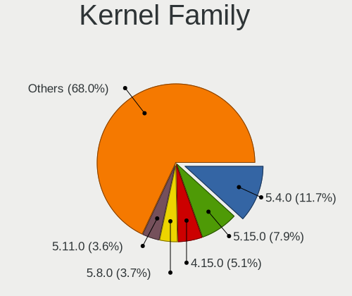
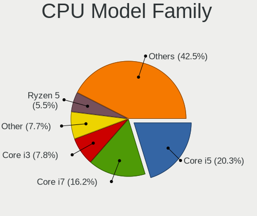
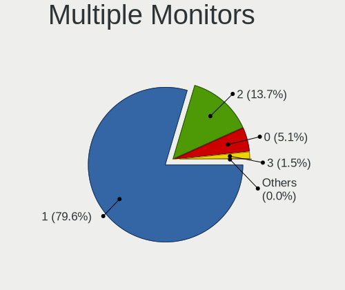
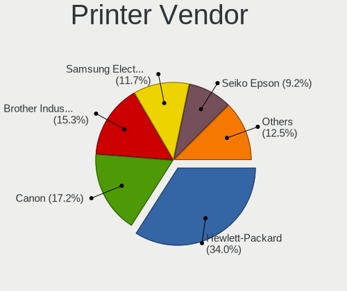

Linux - Tested Hardware & Statistics
------------------------------------

A project to collect tested hardware configurations for Linux.

Anyone can contribute to this report by the [hw-probe](https://github.com/linuxhw/hw-probe) tool:

    sudo -E hw-probe -all -upload

Please contribute! Especially if your hardware is rare.

This is a report for all computer types. See also reports for [desktops](/Desktop/README.md) and [notebooks](/Notebook/README.md).

Distribution-specific reports: [AlmaLinux](/Dist/AlmaLinux), [Alpine](/Dist/Alpine), [ALT_Linux](/Dist/ALT_Linux), [antiX](/Dist/antiX), [Artix](/Dist/Artix), [Chrome_OS](/Dist/Chrome_OS), [Clear_Linux](/Dist/Clear_Linux), [Deepin](/Dist/Deepin), [Devuan](/Dist/Devuan), [EndeavourOS](/Dist/EndeavourOS), [Garuda_Linux](/Dist/Garuda_Linux), [GNOME_OS](/Dist/GNOME_OS), [Kaisen](/Dist/Kaisen), [Mageia](/Dist/Mageia), [Makulu](/Dist/Makulu), [NixOS](/Dist/NixOS), [Nobara](/Dist/Nobara), [Oracle_Linux](/Dist/Oracle_Linux), [Pardus](/Dist/Pardus), [PureOS](/Dist/PureOS), [Q4OS](/Dist/Q4OS), [Reborn_OS](/Dist/Reborn_OS), [Rocky_Linux](/Dist/Rocky_Linux), [Sparky](/Dist/Sparky), [Void_Linux](/Dist/Void_Linux), [Xero](/Dist/Xero).

This report is for real hardware. Report for virtual hardware: [TestCoverage_VE](https://github.com/linuxhw/TestCoverage_VE)

Contents
--------

* [ Test Cases ](#test-cases)

* [ System ](#system)
  - [ OS                       ](#os)
  - [ OS Family                ](#os-family)
  - [ Kernel                   ](#kernel)
  - [ Kernel Family            ](#kernel-family)
  - [ Kernel Major Ver.        ](#kernel-major-ver)
  - [ Arch                     ](#arch)
  - [ DE                       ](#de)
  - [ Display Server           ](#display-server)
  - [ Display Manager          ](#display-manager)
  - [ OS Lang                  ](#os-lang)
  - [ Boot Mode                ](#boot-mode)
  - [ Filesystem               ](#filesystem)
  - [ Part. scheme             ](#part-scheme)
  - [ Dual Boot with Linux/BSD ](#dual-boot-with-linuxbsd)
  - [ Dual Boot (Win)          ](#dual-boot-win)

* [ Board ](#board)
  - [ Vendor                   ](#vendor)
  - [ Model                    ](#model)
  - [ Model Family             ](#model-family)
  - [ MFG Year                 ](#mfg-year)
  - [ Form Factor              ](#form-factor)
  - [ Secure Boot              ](#secure-boot)
  - [ Coreboot                 ](#coreboot)
  - [ RAM Size                 ](#ram-size)
  - [ RAM Used                 ](#ram-used)
  - [ Total Drives             ](#total-drives)
  - [ Has CD-ROM               ](#has-cd-rom)
  - [ Has Ethernet             ](#has-ethernet)
  - [ Has WiFi                 ](#has-wifi)
  - [ Has Bluetooth            ](#has-bluetooth)

* [ Location ](#location)
  - [ Country                  ](#country)
  - [ City                     ](#city)

* [ Drives ](#drives)
  - [ Drive Vendor             ](#drive-vendor)
  - [ Drive Model              ](#drive-model)
  - [ HDD Vendor               ](#hdd-vendor)
  - [ SSD Vendor               ](#ssd-vendor)
  - [ Drive Kind               ](#drive-kind)
  - [ Drive Connector          ](#drive-connector)
  - [ Drive Size               ](#drive-size)
  - [ Space Total              ](#space-total)
  - [ Space Used               ](#space-used)
  - [ Malfunc. Drives          ](#malfunc-drives)
  - [ Malfunc. Drive Vendor    ](#malfunc-drive-vendor)
  - [ Malfunc. HDD Vendor      ](#malfunc-hdd-vendor)
  - [ Malfunc. Drive Kind      ](#malfunc-drive-kind)
  - [ Failed Drives            ](#failed-drives)
  - [ Failed Drive Vendor      ](#failed-drive-vendor)
  - [ Drive Status             ](#drive-status)

* [ Storage controller ](#storage-controller)
  - [ Storage Vendor           ](#storage-vendor)
  - [ Storage Model            ](#storage-model)
  - [ Storage Kind             ](#storage-kind)

* [ Processor ](#processor)
  - [ CPU Vendor               ](#cpu-vendor)
  - [ CPU Model                ](#cpu-model)
  - [ CPU Model Family         ](#cpu-model-family)
  - [ CPU Cores                ](#cpu-cores)
  - [ CPU Sockets              ](#cpu-sockets)
  - [ CPU Threads              ](#cpu-threads)
  - [ CPU Op-Modes             ](#cpu-op-modes)
  - [ CPU Microcode            ](#cpu-microcode)
  - [ CPU Microarch            ](#cpu-microarch)

* [ Graphics ](#graphics)
  - [ GPU Vendor               ](#gpu-vendor)
  - [ GPU Model                ](#gpu-model)
  - [ GPU Combo                ](#gpu-combo)
  - [ GPU Driver               ](#gpu-driver)
  - [ GPU Memory               ](#gpu-memory)

* [ Monitor ](#monitor)
  - [ Monitor Vendor           ](#monitor-vendor)
  - [ Monitor Model            ](#monitor-model)
  - [ Monitor Resolution       ](#monitor-resolution)
  - [ Monitor Diagonal         ](#monitor-diagonal)
  - [ Monitor Width            ](#monitor-width)
  - [ Aspect Ratio             ](#aspect-ratio)
  - [ Monitor Area             ](#monitor-area)
  - [ Pixel Density            ](#pixel-density)
  - [ Multiple Monitors        ](#multiple-monitors)

* [ Network ](#network)
  - [ Net Controller Vendor    ](#net-controller-vendor)
  - [ Net Controller Model     ](#net-controller-model)
  - [ Wireless Vendor          ](#wireless-vendor)
  - [ Wireless Model           ](#wireless-model)
  - [ Ethernet Vendor          ](#ethernet-vendor)
  - [ Ethernet Model           ](#ethernet-model)
  - [ Net Controller Kind      ](#net-controller-kind)
  - [ Used Controller          ](#used-controller)
  - [ NICs                     ](#nics)
  - [ IPv6                     ](#ipv6)

* [ Bluetooth ](#bluetooth)
  - [ Bluetooth Vendor         ](#bluetooth-vendor)
  - [ Bluetooth Model          ](#bluetooth-model)

* [ Sound ](#sound)
  - [ Sound Vendor             ](#sound-vendor)
  - [ Sound Model              ](#sound-model)

* [ Memory ](#memory)
  - [ Memory Vendor            ](#memory-vendor)
  - [ Memory Model             ](#memory-model)
  - [ Memory Kind              ](#memory-kind)
  - [ Memory Form Factor       ](#memory-form-factor)
  - [ Memory Size              ](#memory-size)
  - [ Memory Speed             ](#memory-speed)

* [ Printers & scanners ](#printers--scanners)
  - [ Printer Vendor           ](#printer-vendor)
  - [ Printer Model            ](#printer-model)
  - [ Scanner Vendor           ](#scanner-vendor)
  - [ Scanner Model            ](#scanner-model)

* [ Camera ](#camera)
  - [ Camera Vendor            ](#camera-vendor)
  - [ Camera Model             ](#camera-model)

* [ Security ](#security)
  - [ Fingerprint Vendor       ](#fingerprint-vendor)
  - [ Fingerprint Model        ](#fingerprint-model)
  - [ Chipcard Vendor          ](#chipcard-vendor)
  - [ Chipcard Model           ](#chipcard-model)

* [ Unsupported ](#unsupported)
  - [ Unsupported Devices      ](#unsupported-devices)
  - [ Unsupported Device Types ](#unsupported-device-types)

Test Cases
----------

Total: 249874

| Vendor        | Model                       | Form-Factor | Probe                                                      | Date         |
|---------------|-----------------------------|-------------|------------------------------------------------------------|--------------|
| ASUSTek       | ROG STRIX X570-E GAMING ... | Desktop     | [72655619f3](https://linux-hardware.org/?probe=72655619f3) | Sep 13, 2022 |
| Acer          | Aspire 5742G                | Notebook    | [051893f147](https://linux-hardware.org/?probe=051893f147) | Sep 13, 2022 |
| IPASON        | MaxBook P1X                 | Notebook    | [18d0740712](https://linux-hardware.org/?probe=18d0740712) | Sep 13, 2022 |
| ASUSTek       | VivoBook_ASUS Laptop E21... | Notebook    | [2ac6776181](https://linux-hardware.org/?probe=2ac6776181) | Sep 13, 2022 |
| ASUSTek       | VivoBook_ASUSLaptop X515... | Notebook    | [fa652e45e1](https://linux-hardware.org/?probe=fa652e45e1) | Sep 13, 2022 |
| HUAWEI        | HVY-WXX9                    | Notebook    | [d574f5da9b](https://linux-hardware.org/?probe=d574f5da9b) | Sep 13, 2022 |
| Acer          | Aspire XC-830               | Desktop     | [962c59a3ba](https://linux-hardware.org/?probe=962c59a3ba) | Sep 13, 2022 |
| HP            | EliteBook 840 G5            | Notebook    | [6b6e4efdfc](https://linux-hardware.org/?probe=6b6e4efdfc) | Sep 13, 2022 |
| ASUSTek       | Maximus IV Extreme-Z        | Desktop     | [1c7a238f26](https://linux-hardware.org/?probe=1c7a238f26) | Sep 13, 2022 |
| Dell          | Precision 5550              | Notebook    | [82eebd67fd](https://linux-hardware.org/?probe=82eebd67fd) | Sep 13, 2022 |
| Acer          | Aspire 5742                 | Notebook    | [9c37d390a7](https://linux-hardware.org/?probe=9c37d390a7) | Sep 13, 2022 |
| Acer          | Aspire X3990                | Desktop     | [64cddc5f85](https://linux-hardware.org/?probe=64cddc5f85) | Sep 13, 2022 |
| Valve         | Jupiter                     | Notebook    | [0925a55100](https://linux-hardware.org/?probe=0925a55100) | Sep 13, 2022 |
| ASRock        | B450M Pro4                  | Desktop     | [9ad0fabe3d](https://linux-hardware.org/?probe=9ad0fabe3d) | Sep 13, 2022 |
| Biostar       | G41D3C                      | Desktop     | [6d15a54350](https://linux-hardware.org/?probe=6d15a54350) | Sep 13, 2022 |
| Biostar       | G41D3C                      | Desktop     | [09d42cd406](https://linux-hardware.org/?probe=09d42cd406) | Sep 13, 2022 |
| Gigabyte      | A320M-H-CF                  | Desktop     | [591cf6246a](https://linux-hardware.org/?probe=591cf6246a) | Sep 13, 2022 |
| Lenovo        | Yoga 510-14ISK 80S7         | Convertible | [c5ebccdc5d](https://linux-hardware.org/?probe=c5ebccdc5d) | Sep 13, 2022 |
| ASUSTek       | X550VXK                     | Notebook    | [df5d5b4f0d](https://linux-hardware.org/?probe=df5d5b4f0d) | Sep 13, 2022 |
| ASUSTek       | PRIME B350M-A               | Desktop     | [47b0975057](https://linux-hardware.org/?probe=47b0975057) | Sep 13, 2022 |
| Samsung       | 305V4A/305V5A               | Notebook    | [ba2ad7bf06](https://linux-hardware.org/?probe=ba2ad7bf06) | Sep 13, 2022 |
| HP            | 3648h                       | Desktop     | [8ed24fd9d4](https://linux-hardware.org/?probe=8ed24fd9d4) | Sep 13, 2022 |
| HP            | Notebook                    | Notebook    | [963af7e07b](https://linux-hardware.org/?probe=963af7e07b) | Sep 13, 2022 |
| Gigabyte      | X570 AORUS PRO              | Desktop     | [7858c98403](https://linux-hardware.org/?probe=7858c98403) | Sep 13, 2022 |
| MSI           | MPG Z390 GAMING PLUS        | Desktop     | [9a3cc70094](https://linux-hardware.org/?probe=9a3cc70094) | Sep 13, 2022 |
| Lenovo        | IdeaPad 3 15ADA6 82KR       | Notebook    | [676dbc76db](https://linux-hardware.org/?probe=676dbc76db) | Sep 13, 2022 |
| ASUSTek       | ASUS EXPERTBOOK P5440FA_... | Notebook    | [d441c68f40](https://linux-hardware.org/?probe=d441c68f40) | Sep 13, 2022 |
| Google        | Terra                       | Notebook    | [a7150f06c7](https://linux-hardware.org/?probe=a7150f06c7) | Sep 13, 2022 |
| Dell          | Precision M4800             | Notebook    | [fae4dbff63](https://linux-hardware.org/?probe=fae4dbff63) | Sep 13, 2022 |
| ASUSTek       | M5A99X EVO                  | Desktop     | [a27df20eda](https://linux-hardware.org/?probe=a27df20eda) | Sep 13, 2022 |
| HUAWEI        | HVY-WXX9                    | Notebook    | [d1b95841a4](https://linux-hardware.org/?probe=d1b95841a4) | Sep 13, 2022 |
| Sony          | SVE1712L1EW                 | Notebook    | [18400c7a0d](https://linux-hardware.org/?probe=18400c7a0d) | Sep 13, 2022 |
| ASUSTek       | M5A99X EVO                  | Desktop     | [ae9712f9b3](https://linux-hardware.org/?probe=ae9712f9b3) | Sep 13, 2022 |
| Dell          | 0DR845                      | Desktop     | [158b3832bc](https://linux-hardware.org/?probe=158b3832bc) | Sep 13, 2022 |
| Dell          | Inspiron 5567               | Notebook    | [1ca8786a47](https://linux-hardware.org/?probe=1ca8786a47) | Sep 13, 2022 |
| Dell          | Precision 5540              | Notebook    | [229337f709](https://linux-hardware.org/?probe=229337f709) | Sep 13, 2022 |
| HP            | Laptop 15-dy1xxx            | Notebook    | [bb0112b6ba](https://linux-hardware.org/?probe=bb0112b6ba) | Sep 13, 2022 |
| HP            | ENVY x360 Convertible 13... | Convertible | [4b5a146dc9](https://linux-hardware.org/?probe=4b5a146dc9) | Sep 13, 2022 |
| Lenovo        | IdeaPad S340-14API 81NB     | Notebook    | [423008d102](https://linux-hardware.org/?probe=423008d102) | Sep 13, 2022 |
| ASUSTek       | Z170 PRO GAMING             | Desktop     | [d3f957e34a](https://linux-hardware.org/?probe=d3f957e34a) | Sep 13, 2022 |
| HP            | 3647h                       | Desktop     | [e94712a856](https://linux-hardware.org/?probe=e94712a856) | Sep 13, 2022 |
| ASUSTek       | PRIME H310M-E R2.0          | Desktop     | [377d466877](https://linux-hardware.org/?probe=377d466877) | Sep 13, 2022 |
| Dell          | Inspiron N5050              | Notebook    | [c0f9d7bf4a](https://linux-hardware.org/?probe=c0f9d7bf4a) | Sep 13, 2022 |
| Dell          | Inspiron 5567               | Notebook    | [22e62266a2](https://linux-hardware.org/?probe=22e62266a2) | Sep 13, 2022 |
| Samsung       | 950XED                      | Notebook    | [f8a15210f0](https://linux-hardware.org/?probe=f8a15210f0) | Sep 13, 2022 |
| ASUSTek       | ASUS TUF Gaming F15 FX50... | Notebook    | [7326474aae](https://linux-hardware.org/?probe=7326474aae) | Sep 13, 2022 |
| ASUSTek       | ROG Flow Z13 GZ301ZE_GZ3... | Tablet      | [968826d76c](https://linux-hardware.org/?probe=968826d76c) | Sep 13, 2022 |
| Sony          | SVE15127CAW                 | Notebook    | [3f21f2c6af](https://linux-hardware.org/?probe=3f21f2c6af) | Sep 13, 2022 |
| Lenovo        | Legion 5 15ACH6 82JW        | Notebook    | [c9df1f2514](https://linux-hardware.org/?probe=c9df1f2514) | Sep 13, 2022 |
| MSI           | 870-G45                     | Desktop     | [0245395372](https://linux-hardware.org/?probe=0245395372) | Sep 13, 2022 |
| ASUSTek       | P7P55 LX                    | Desktop     | [cc28ed218f](https://linux-hardware.org/?probe=cc28ed218f) | Sep 13, 2022 |
| Lenovo        | ThinkPad P53 MFG_IN_GO     | Notebook    | [aa0553a310](https://linux-hardware.org/?probe=aa0553a310) | Sep 13, 2022 |
| Lenovo        | Legion 5 15ACH6 82JW        | Notebook    | [b62bd233c2](https://linux-hardware.org/?probe=b62bd233c2) | Sep 13, 2022 |
| ONDA          | M3 miniPC VER               | Desktop     | [81ebde1d65](https://linux-hardware.org/?probe=81ebde1d65) | Sep 13, 2022 |
| HP            | 3031h                       | Desktop     | [9312c20d49](https://linux-hardware.org/?probe=9312c20d49) | Sep 13, 2022 |
| MSI           | Prestige 14Evo A11M         | Notebook    | [5a69611620](https://linux-hardware.org/?probe=5a69611620) | Sep 13, 2022 |
| ASUSTek       | K30BD                       | Desktop     | [d6daf0e1f8](https://linux-hardware.org/?probe=d6daf0e1f8) | Sep 13, 2022 |
| Lenovo        | SHARKBAY 0C48431 WIN        | Desktop     | [4598920e84](https://linux-hardware.org/?probe=4598920e84) | Sep 13, 2022 |
| Lenovo        | ThinkPad T460 20FMA0APAR    | Notebook    | [89339e48f1](https://linux-hardware.org/?probe=89339e48f1) | Sep 13, 2022 |
| ASUSTek       | X99-DELUXE II               | Desktop     | [8c9013ec12](https://linux-hardware.org/?probe=8c9013ec12) | Sep 13, 2022 |
| Gigabyte      | Z77-D3H                     | Desktop     | [b1b929517d](https://linux-hardware.org/?probe=b1b929517d) | Sep 13, 2022 |
| HP            | 1000                        | Notebook    | [65024f3d7a](https://linux-hardware.org/?probe=65024f3d7a) | Sep 13, 2022 |
| ASUSTek       | B85M-G                      | Desktop     | [74a9860a2e](https://linux-hardware.org/?probe=74a9860a2e) | Sep 13, 2022 |
| Dell          | Latitude 5480               | Notebook    | [59bcf57d5b](https://linux-hardware.org/?probe=59bcf57d5b) | Sep 13, 2022 |
| HP            | 876C SMVB                   | Desktop     | [61df16cfc9](https://linux-hardware.org/?probe=61df16cfc9) | Sep 13, 2022 |
| Gigabyte      | Z690 UD AX DDR4             | Desktop     | [70aa78efc6](https://linux-hardware.org/?probe=70aa78efc6) | Sep 13, 2022 |
| Lenovo        | ThinkPad T460 20FMA0APAR    | Notebook    | [d39dcbc8ed](https://linux-hardware.org/?probe=d39dcbc8ed) | Sep 13, 2022 |
| Intel         | NUC8BEB J72693-309          | Mini pc     | [7ec64e9e08](https://linux-hardware.org/?probe=7ec64e9e08) | Sep 13, 2022 |
| MSI           | Prestige 14Evo A11M         | Notebook    | [4c5dc2ec7d](https://linux-hardware.org/?probe=4c5dc2ec7d) | Sep 13, 2022 |
| Apple         | MacBookPro5,3               | Notebook    | [3e00c86066](https://linux-hardware.org/?probe=3e00c86066) | Sep 13, 2022 |
| Lenovo        | ThinkPad X1 Carbon 2nd 2... | Notebook    | [1cf1136fb8](https://linux-hardware.org/?probe=1cf1136fb8) | Sep 13, 2022 |
| Dell          | Latitude 7420               | Notebook    | [84f0ebcfea](https://linux-hardware.org/?probe=84f0ebcfea) | Sep 13, 2022 |
| HP            | EliteBook 840 G6            | Notebook    | [3c13816886](https://linux-hardware.org/?probe=3c13816886) | Sep 13, 2022 |
| ASUSTek       | Z97-A                       | Desktop     | [9de0254ab0](https://linux-hardware.org/?probe=9de0254ab0) | Sep 13, 2022 |
| Apple         | Mac-F226BEC8 PVT            | All in one  | [c54a63e1a3](https://linux-hardware.org/?probe=c54a63e1a3) | Sep 13, 2022 |
| Medion        | MS-7707                     | Desktop     | [68428aab84](https://linux-hardware.org/?probe=68428aab84) | Sep 13, 2022 |
| Gigabyte      | Z590 UD AC                  | Desktop     | [8774a8312b](https://linux-hardware.org/?probe=8774a8312b) | Sep 13, 2022 |
| Aquarius      | NS585                       | Notebook    | [f76497447f](https://linux-hardware.org/?probe=f76497447f) | Sep 13, 2022 |
| Lenovo        | ThinkPad E15 Gen 2 20TD0... | Notebook    | [aa9d57c27e](https://linux-hardware.org/?probe=aa9d57c27e) | Sep 13, 2022 |
| HP            | 876C SMVB                   | Desktop     | [15ec81ce9d](https://linux-hardware.org/?probe=15ec81ce9d) | Sep 13, 2022 |
| Lenovo        | ThinkBook 14 G2 ITL 20VD    | Notebook    | [c07c5b31f6](https://linux-hardware.org/?probe=c07c5b31f6) | Sep 13, 2022 |
| Positivo      | POS-PQ45AU                  | Desktop     | [0879f8d9ce](https://linux-hardware.org/?probe=0879f8d9ce) | Sep 13, 2022 |
| HUAWEI        | HVY-WXX9                    | Notebook    | [999cbe4e8f](https://linux-hardware.org/?probe=999cbe4e8f) | Sep 13, 2022 |
| Aquarius      | NS585                       | Notebook    | [0adf35b80f](https://linux-hardware.org/?probe=0adf35b80f) | Sep 13, 2022 |
| Aquarius      | NS585                       | Notebook    | [042a81998b](https://linux-hardware.org/?probe=042a81998b) | Sep 13, 2022 |
| Aquarius      | NS585                       | Notebook    | [e5078cd5f4](https://linux-hardware.org/?probe=e5078cd5f4) | Sep 13, 2022 |
| ASUSTek       | PRIME B450-PLUS             | Desktop     | [9b2a84cd02](https://linux-hardware.org/?probe=9b2a84cd02) | Sep 13, 2022 |
| ASUSTek       | PRIME B450-PLUS             | Desktop     | [1285ab4d66](https://linux-hardware.org/?probe=1285ab4d66) | Sep 13, 2022 |
| HP            | 1497                        | Desktop     | [7d44fed5d5](https://linux-hardware.org/?probe=7d44fed5d5) | Sep 13, 2022 |
| ASUSTek       | TUF Gaming B660M-PLUS WI... | Desktop     | [2adaf06b86](https://linux-hardware.org/?probe=2adaf06b86) | Sep 13, 2022 |
| HP            | Elite x2 1013 G3            | Tablet      | [25b64af3e9](https://linux-hardware.org/?probe=25b64af3e9) | Sep 13, 2022 |
| HP            | Laptop 15-db0xxx            | Notebook    | [5240fca99f](https://linux-hardware.org/?probe=5240fca99f) | Sep 13, 2022 |
| Toshiba       | Satellite C855D             | Notebook    | [bae94a45be](https://linux-hardware.org/?probe=bae94a45be) | Sep 13, 2022 |
| ASUSTek       | X555LJ                      | Notebook    | [5d27ea49aa](https://linux-hardware.org/?probe=5d27ea49aa) | Sep 13, 2022 |
| HP            | 1497                        | Desktop     | [3afd83b18b](https://linux-hardware.org/?probe=3afd83b18b) | Sep 13, 2022 |
| MSI           | Prestige 14 A11SCX          | Notebook    | [0c0264943f](https://linux-hardware.org/?probe=0c0264943f) | Sep 13, 2022 |
| Acer          | TravelMate 5744Z            | Notebook    | [f9846e0165](https://linux-hardware.org/?probe=f9846e0165) | Sep 13, 2022 |
| ASRock        | Z170 Gaming K6+             | Desktop     | [39027cdb44](https://linux-hardware.org/?probe=39027cdb44) | Sep 13, 2022 |
| HP            | 3048h                       | Desktop     | [e25d0d8a10](https://linux-hardware.org/?probe=e25d0d8a10) | Sep 13, 2022 |
| Biostar       | NF560-A2G                   | Desktop     | [96c296c2f3](https://linux-hardware.org/?probe=96c296c2f3) | Sep 13, 2022 |
| Dell          | Latitude 3120               | Convertible | [a8315e1147](https://linux-hardware.org/?probe=a8315e1147) | Sep 13, 2022 |
| Apple         | MacBookPro5,3               | Notebook    | [9211f5de76](https://linux-hardware.org/?probe=9211f5de76) | Sep 13, 2022 |
| Dell          | XPS 15 9510                 | Notebook    | [44be9b9134](https://linux-hardware.org/?probe=44be9b9134) | Sep 13, 2022 |
| ASUSTek       | H61M-C                      | Desktop     | [bb07dfab63](https://linux-hardware.org/?probe=bb07dfab63) | Sep 13, 2022 |
| Dell          | Vostro 15 5510              | Notebook    | [e63dd14c21](https://linux-hardware.org/?probe=e63dd14c21) | Sep 13, 2022 |
| ASUSTek       | ROG STRIX B660-A GAMING ... | Desktop     | [34c1beb103](https://linux-hardware.org/?probe=34c1beb103) | Sep 13, 2022 |
| Sun Micros... | ASSY,MOTHERBOARD,X4170 5... | Server      | [ea845ec5ea](https://linux-hardware.org/?probe=ea845ec5ea) | Sep 13, 2022 |
| Dell          | Vostro 15 5510              | Notebook    | [16942cfd78](https://linux-hardware.org/?probe=16942cfd78) | Sep 13, 2022 |
| ASRock        | N68-S3 UCC                  | Desktop     | [e59aa2e1d5](https://linux-hardware.org/?probe=e59aa2e1d5) | Sep 13, 2022 |
| Aquarius      | NS585                       | Notebook    | [adb7dadad9](https://linux-hardware.org/?probe=adb7dadad9) | Sep 13, 2022 |
| ASRock        | N68-S3 UCC                  | Desktop     | [930da2e105](https://linux-hardware.org/?probe=930da2e105) | Sep 13, 2022 |
| Lenovo        | ThinkPad T14 Gen 1 20S1S... | Notebook    | [d4fb6aa0ae](https://linux-hardware.org/?probe=d4fb6aa0ae) | Sep 13, 2022 |
| Apple         | MacBookAir7,2               | Notebook    | [03ba2808d7](https://linux-hardware.org/?probe=03ba2808d7) | Sep 13, 2022 |
| Lenovo        | B40-70 80F30005BR           | Notebook    | [b899f1b7da](https://linux-hardware.org/?probe=b899f1b7da) | Sep 13, 2022 |
| ASRock        | H470M-HDV                   | Desktop     | [41977548bc](https://linux-hardware.org/?probe=41977548bc) | Sep 13, 2022 |
| ASUSTek       | ZenBook UX425EA_UX425EA     | Notebook    | [b6b3f2dce1](https://linux-hardware.org/?probe=b6b3f2dce1) | Sep 13, 2022 |
| Lenovo        | G50-70 20351                | Notebook    | [4105fc929e](https://linux-hardware.org/?probe=4105fc929e) | Sep 13, 2022 |
| Lenovo        | B40-70 80F30005BR           | Notebook    | [99be4451df](https://linux-hardware.org/?probe=99be4451df) | Sep 13, 2022 |
| Acer          | Aspire A315-42              | Notebook    | [6121dfd67d](https://linux-hardware.org/?probe=6121dfd67d) | Sep 13, 2022 |
| ASUSTek       | X200LA                      | Notebook    | [e0947fe5c7](https://linux-hardware.org/?probe=e0947fe5c7) | Sep 13, 2022 |
| HP            | ENVY 15                     | Notebook    | [fdb07294df](https://linux-hardware.org/?probe=fdb07294df) | Sep 13, 2022 |
| Lenovo        | ThinkBook 13x ITG 20WJ      | Notebook    | [2e6e759434](https://linux-hardware.org/?probe=2e6e759434) | Sep 13, 2022 |
| HP            | EliteBook 850 G6            | Notebook    | [b284db5ac4](https://linux-hardware.org/?probe=b284db5ac4) | Sep 13, 2022 |
| Gigabyte      | B85M-D3H                    | Desktop     | [19eb66af9e](https://linux-hardware.org/?probe=19eb66af9e) | Sep 13, 2022 |
| HP            | Pavilion Laptop 14-dv0xx... | Notebook    | [3e5c80e004](https://linux-hardware.org/?probe=3e5c80e004) | Sep 13, 2022 |
| AMI           | Aptio CRB                   | Mini pc     | [20b4c0a5b2](https://linux-hardware.org/?probe=20b4c0a5b2) | Sep 13, 2022 |
| Gigabyte      | Z77M-D3H                    | Desktop     | [5f8b8dc32d](https://linux-hardware.org/?probe=5f8b8dc32d) | Sep 13, 2022 |
| ASUSTek       | PRIME B450-PLUS             | Desktop     | [3c37d36ba8](https://linux-hardware.org/?probe=3c37d36ba8) | Sep 13, 2022 |
| MSI           | H110M PRO-VD PLUS           | Desktop     | [e61fe6932b](https://linux-hardware.org/?probe=e61fe6932b) | Sep 13, 2022 |
| ASUSTek       | PRIME B450-PLUS             | Desktop     | [6ddf2bafef](https://linux-hardware.org/?probe=6ddf2bafef) | Sep 13, 2022 |
| HUAWEI        | MACH-WX9                    | Notebook    | [f90bed17e2](https://linux-hardware.org/?probe=f90bed17e2) | Sep 13, 2022 |
| Acer          | Aspire ES1-311              | Notebook    | [ee2f9a766c](https://linux-hardware.org/?probe=ee2f9a766c) | Sep 13, 2022 |
| ASUSTek       | Z170-P                      | Desktop     | [bec58f880f](https://linux-hardware.org/?probe=bec58f880f) | Sep 13, 2022 |
| MECHREVO      | Code01 Ver2.0               | Notebook    | [2de3999743](https://linux-hardware.org/?probe=2de3999743) | Sep 13, 2022 |
| Schenker      | VISION 15 (SVS15E21)        | Notebook    | [dee9d6b81f](https://linux-hardware.org/?probe=dee9d6b81f) | Sep 13, 2022 |
| Dell          | Precision 5560              | Notebook    | [78809c82c2](https://linux-hardware.org/?probe=78809c82c2) | Sep 13, 2022 |
| ASUSTek       | H81M-K                      | Desktop     | [19ddc4ed5d](https://linux-hardware.org/?probe=19ddc4ed5d) | Sep 13, 2022 |
| MACHINIST     | X99-RS9 V3.0                | Desktop     | [64795f6f69](https://linux-hardware.org/?probe=64795f6f69) | Sep 13, 2022 |
| HP            | ProBook 440 G8 Notebook ... | Notebook    | [4aa1954c0c](https://linux-hardware.org/?probe=4aa1954c0c) | Sep 13, 2022 |
| Chuwi         | HeroBook Pro                | Notebook    | [aa99b0558b](https://linux-hardware.org/?probe=aa99b0558b) | Sep 13, 2022 |
| MSI           | Z77A-G43                    | Desktop     | [c9f7f86b9e](https://linux-hardware.org/?probe=c9f7f86b9e) | Sep 13, 2022 |
| Dell          | Inspiron 3451               | Notebook    | [f06aa45765](https://linux-hardware.org/?probe=f06aa45765) | Sep 13, 2022 |
| Lenovo        | Flex 2-14 20404             | Notebook    | [a27c60fbde](https://linux-hardware.org/?probe=a27c60fbde) | Sep 13, 2022 |
| Dell          | Inspiron 7306 2n1           | Convertible | [4e73a1af5e](https://linux-hardware.org/?probe=4e73a1af5e) | Sep 13, 2022 |
| HUAWEI        | HBB-WX9                     | Notebook    | [30b6cc18c5](https://linux-hardware.org/?probe=30b6cc18c5) | Sep 13, 2022 |
| ASUSTek       | Z170-P                      | Desktop     | [182bb36928](https://linux-hardware.org/?probe=182bb36928) | Sep 13, 2022 |
| ASUSTek       | VivoBook_ASUSLaptop X412... | Notebook    | [0e6413e94b](https://linux-hardware.org/?probe=0e6413e94b) | Sep 13, 2022 |
| ASUSTek       | ROG Zephyrus G15 GA503RS... | Notebook    | [81b9b18da4](https://linux-hardware.org/?probe=81b9b18da4) | Sep 13, 2022 |
| MSI           | Z77A-G43                    | Desktop     | [4d559dfa50](https://linux-hardware.org/?probe=4d559dfa50) | Sep 13, 2022 |
| ASRock        | Z77 Pro4-M                  | Desktop     | [38928465ac](https://linux-hardware.org/?probe=38928465ac) | Sep 13, 2022 |
| ASUSTek       | X550CC                      | Notebook    | [cb36241a3b](https://linux-hardware.org/?probe=cb36241a3b) | Sep 13, 2022 |
| Gigabyte      | H110M-D3H R2-CF             | Desktop     | [87971a36df](https://linux-hardware.org/?probe=87971a36df) | Sep 13, 2022 |
| Lenovo        | ThinkPad X1 Carbon Gen 1... | Notebook    | [224ecd9fa7](https://linux-hardware.org/?probe=224ecd9fa7) | Sep 13, 2022 |
| Lenovo        | SHARKBAY NOK                | Desktop     | [bfd4a6b00a](https://linux-hardware.org/?probe=bfd4a6b00a) | Sep 13, 2022 |
| MSI           | PRESTIGE X570 CREATION      | Desktop     | [5e67e25052](https://linux-hardware.org/?probe=5e67e25052) | Sep 13, 2022 |
| Dell          | Latitude 5521               | Notebook    | [cb134441f2](https://linux-hardware.org/?probe=cb134441f2) | Sep 13, 2022 |
| Acer          | Aspire 5349                 | Notebook    | [39f83f7692](https://linux-hardware.org/?probe=39f83f7692) | Sep 13, 2022 |
| ASUSTek       | X541UJ                      | Notebook    | [9745e99a08](https://linux-hardware.org/?probe=9745e99a08) | Sep 13, 2022 |
| ASUSTek       | ROG STRIX B550-I GAMING     | Desktop     | [cacc85ca2e](https://linux-hardware.org/?probe=cacc85ca2e) | Sep 13, 2022 |
| ASUSTek       | ROG STRIX B550-I GAMING     | Desktop     | [0c6d5b57dd](https://linux-hardware.org/?probe=0c6d5b57dd) | Sep 13, 2022 |
| Timi          | Mi Laptop Air 12.5          | Notebook    | [d666daaeb2](https://linux-hardware.org/?probe=d666daaeb2) | Sep 13, 2022 |
| ASRock        | H97M Anniversary            | Desktop     | [1b5e2c2e0a](https://linux-hardware.org/?probe=1b5e2c2e0a) | Sep 13, 2022 |
| Apple         | Mac-942B5BF58194151B        | All in one  | [93a5a7089c](https://linux-hardware.org/?probe=93a5a7089c) | Sep 13, 2022 |
| ASRock        | N68-GS4 FX                  | Desktop     | [85daab087c](https://linux-hardware.org/?probe=85daab087c) | Sep 13, 2022 |
| HP            | ENVY x360 Convertible 15... | Convertible | [1b8d9a04ae](https://linux-hardware.org/?probe=1b8d9a04ae) | Sep 13, 2022 |
| ASUSTek       | ROG Zephyrus G15 GA503RM... | Notebook    | [82b9d1247e](https://linux-hardware.org/?probe=82b9d1247e) | Sep 13, 2022 |
| ASRock        | A320M-HDV R4.0              | Desktop     | [dc2c5a0bfb](https://linux-hardware.org/?probe=dc2c5a0bfb) | Sep 13, 2022 |
| Lenovo        | ThinkPad E15 Gen 2 20TDS... | Notebook    | [2b12cc11f2](https://linux-hardware.org/?probe=2b12cc11f2) | Sep 13, 2022 |
| Dell          | Inspiron 13-7378            | Notebook    | [689047aef1](https://linux-hardware.org/?probe=689047aef1) | Sep 13, 2022 |
| HP            | 3647h                       | Desktop     | [c40ded9736](https://linux-hardware.org/?probe=c40ded9736) | Sep 13, 2022 |
| ASUSTek       | VivoBook_ASUSLaptop X515... | Notebook    | [16cf967fc8](https://linux-hardware.org/?probe=16cf967fc8) | Sep 13, 2022 |
| Dell          | 04YP6J A00                  | Desktop     | [ef4ae2baac](https://linux-hardware.org/?probe=ef4ae2baac) | Sep 13, 2022 |
| Apple         | MacBookPro15,2              | Notebook    | [5160feeaf2](https://linux-hardware.org/?probe=5160feeaf2) | Sep 13, 2022 |
| Samsung       | 800G5M/800G5W               | Notebook    | [ad3cd5381f](https://linux-hardware.org/?probe=ad3cd5381f) | Sep 13, 2022 |
| Dell          | 0PV3YR A05                  | Server      | [47ff6a8255](https://linux-hardware.org/?probe=47ff6a8255) | Sep 13, 2022 |
| Microsoft     | Surface Pro 4               | Tablet      | [8aac6d779b](https://linux-hardware.org/?probe=8aac6d779b) | Sep 13, 2022 |
| HP            | EliteBook 745 G6            | Notebook    | [61da5fee97](https://linux-hardware.org/?probe=61da5fee97) | Sep 13, 2022 |
| Apple         | MacBookPro15,2              | Notebook    | [876e87c7b6](https://linux-hardware.org/?probe=876e87c7b6) | Sep 13, 2022 |
| HP            | 3031h                       | Desktop     | [1bbfd867b0](https://linux-hardware.org/?probe=1bbfd867b0) | Sep 13, 2022 |
| Lenovo        | IdeaPad 1 14ADA05 82GW      | Notebook    | [e558fd5212](https://linux-hardware.org/?probe=e558fd5212) | Sep 13, 2022 |
| ASRock        | FM2A88X Extreme6+           | Desktop     | [a6e7414518](https://linux-hardware.org/?probe=a6e7414518) | Sep 13, 2022 |
| Positivo      | POS-EINM10CB POSITIVO       | Desktop     | [7c876e560b](https://linux-hardware.org/?probe=7c876e560b) | Sep 13, 2022 |
| Acer          | Aspire 5050                 | Notebook    | [1961d1c468](https://linux-hardware.org/?probe=1961d1c468) | Sep 13, 2022 |
| HP            | ProBook 4540s               | Notebook    | [c1bf52b653](https://linux-hardware.org/?probe=c1bf52b653) | Sep 13, 2022 |
| ASUSTek       | ROG STRIX X570-E GAMING     | Desktop     | [c0e411a96d](https://linux-hardware.org/?probe=c0e411a96d) | Sep 13, 2022 |
| MSI           | X99A RAIDER                 | Desktop     | [f3fe87a412](https://linux-hardware.org/?probe=f3fe87a412) | Sep 13, 2022 |
| ASUSTek       | VivoBook_ASUSLaptop X513... | Notebook    | [b502b7938d](https://linux-hardware.org/?probe=b502b7938d) | Sep 13, 2022 |
| Dell          | 0DR845                      | Desktop     | [f65bf44380](https://linux-hardware.org/?probe=f65bf44380) | Sep 13, 2022 |
| Gigabyte      | B450M H                     | Desktop     | [5ae6fea41e](https://linux-hardware.org/?probe=5ae6fea41e) | Sep 13, 2022 |
| Notebook      | NJx0MU                      | Notebook    | [a72ef6cb0b](https://linux-hardware.org/?probe=a72ef6cb0b) | Sep 13, 2022 |
| ASRock        | H97M Anniversary            | Desktop     | [649c5fb453](https://linux-hardware.org/?probe=649c5fb453) | Sep 13, 2022 |
| ASRock        | B75M R2.0                   | Desktop     | [d1e62450d4](https://linux-hardware.org/?probe=d1e62450d4) | Sep 13, 2022 |
| ASUSTek       | P8P67 DELUXE                | Desktop     | [89fb49d843](https://linux-hardware.org/?probe=89fb49d843) | Sep 13, 2022 |
| ASUSTek       | P8P67 DELUXE                | Desktop     | [a385e1220b](https://linux-hardware.org/?probe=a385e1220b) | Sep 13, 2022 |
| Dell          | Venue 11 Pro 7140           | Notebook    | [d6fed8866c](https://linux-hardware.org/?probe=d6fed8866c) | Sep 13, 2022 |
| HP            | ProBook 4540s               | Notebook    | [320e270f44](https://linux-hardware.org/?probe=320e270f44) | Sep 13, 2022 |
| IP3 Tech      | GB3B                        | Mini pc     | [2548dada71](https://linux-hardware.org/?probe=2548dada71) | Sep 13, 2022 |
| ASRock        | FM2A55M-HD+ R2.0            | Desktop     | [1faad914c6](https://linux-hardware.org/?probe=1faad914c6) | Sep 13, 2022 |
| HP            | ENVY 15                     | Notebook    | [e3a2a0d5d7](https://linux-hardware.org/?probe=e3a2a0d5d7) | Sep 13, 2022 |
| ASUSTek       | M5A78L-M PLUS/USB3          | Desktop     | [ac722c6dcc](https://linux-hardware.org/?probe=ac722c6dcc) | Sep 13, 2022 |
| ASUSTek       | P7P55D                      | Desktop     | [4a7057f627](https://linux-hardware.org/?probe=4a7057f627) | Sep 13, 2022 |
| Medion        | E4251 MD61227               | Notebook    | [8b3475f65b](https://linux-hardware.org/?probe=8b3475f65b) | Sep 13, 2022 |
| MSI           | Z97 MPOWER                  | Desktop     | [a98aedda05](https://linux-hardware.org/?probe=a98aedda05) | Sep 13, 2022 |
| Raspberry ... | Raspberry Pi 4 Model B R... | Soc         | [fcbe85674b](https://linux-hardware.org/?probe=fcbe85674b) | Sep 13, 2022 |
| HUAWEI        | KLVL-WXXW                   | Notebook    | [de37b9cf96](https://linux-hardware.org/?probe=de37b9cf96) | Sep 13, 2022 |
| Unknown       | X99H                        | Desktop     | [9fb8886110](https://linux-hardware.org/?probe=9fb8886110) | Sep 13, 2022 |
| Dell          | XPS 17 9700                 | Notebook    | [24eaecfdd8](https://linux-hardware.org/?probe=24eaecfdd8) | Sep 13, 2022 |
| Dell          | 0M017G A00                  | Desktop     | [e040958337](https://linux-hardware.org/?probe=e040958337) | Sep 13, 2022 |
| Toshiba       | Satellite A500              | Notebook    | [0d96df6375](https://linux-hardware.org/?probe=0d96df6375) | Sep 13, 2022 |
| Acer          | Nitro AN515-54              | Notebook    | [552b310540](https://linux-hardware.org/?probe=552b310540) | Sep 13, 2022 |
| ASUSTek       | P5Q SE2                     | Desktop     | [1552e587a8](https://linux-hardware.org/?probe=1552e587a8) | Sep 13, 2022 |
| Acer          | Aspire 7741                 | Notebook    | [a1375d3bb4](https://linux-hardware.org/?probe=a1375d3bb4) | Sep 13, 2022 |
| Dell          | 060K5C A00                  | Desktop     | [a64a44387b](https://linux-hardware.org/?probe=a64a44387b) | Sep 13, 2022 |
| ASUSTek       | PRIME X370-PRO              | Desktop     | [93567a4d15](https://linux-hardware.org/?probe=93567a4d15) | Sep 13, 2022 |
| Biostar       | G41D3C                      | Desktop     | [c45809d681](https://linux-hardware.org/?probe=c45809d681) | Sep 13, 2022 |
| Dell          | 0P01GV A03                  | Desktop     | [f23afc903c](https://linux-hardware.org/?probe=f23afc903c) | Sep 13, 2022 |
| HP            | EliteBook 840 G5            | Notebook    | [2709daf415](https://linux-hardware.org/?probe=2709daf415) | Sep 13, 2022 |
| HP            | EliteBook Folio 9470m       | Notebook    | [c03777782c](https://linux-hardware.org/?probe=c03777782c) | Sep 13, 2022 |
| Dell          | Latitude 7420               | Notebook    | [211c7ab44c](https://linux-hardware.org/?probe=211c7ab44c) | Sep 12, 2022 |
| Lenovo        | ThinkPad T540p 20BF002CM... | Notebook    | [3343da6005](https://linux-hardware.org/?probe=3343da6005) | Sep 12, 2022 |
| Compal        | NCL60/61                    | Notebook    | [f1f5499af8](https://linux-hardware.org/?probe=f1f5499af8) | Sep 12, 2022 |
| ASUSTek       | ROG STRIX B550-E GAMING     | Desktop     | [7fb82d496f](https://linux-hardware.org/?probe=7fb82d496f) | Sep 12, 2022 |
| Alienware     | M14xR1                      | Notebook    | [a4064c0342](https://linux-hardware.org/?probe=a4064c0342) | Sep 12, 2022 |
| ASUSTek       | PRIME B550M-A               | Desktop     | [fd2497acae](https://linux-hardware.org/?probe=fd2497acae) | Sep 12, 2022 |
| HP            | Laptop 15-dy1xxx            | Notebook    | [e7b2ee5d70](https://linux-hardware.org/?probe=e7b2ee5d70) | Sep 12, 2022 |
| ASUSTek       | ROG Zephyrus M16 GU603ZW... | Notebook    | [472668e67b](https://linux-hardware.org/?probe=472668e67b) | Sep 12, 2022 |
| Dell          | Inspiron 3542               | Notebook    | [2c5a122ce9](https://linux-hardware.org/?probe=2c5a122ce9) | Sep 12, 2022 |
| AZW           | SER V01                     | Mini pc     | [77b14b11df](https://linux-hardware.org/?probe=77b14b11df) | Sep 12, 2022 |
| Apple         | Mac-F221BEC8                | Desktop     | [b5f851bd15](https://linux-hardware.org/?probe=b5f851bd15) | Sep 12, 2022 |
| ASUSTek       | PRIME H310-PLUS             | Desktop     | [0937dcb89c](https://linux-hardware.org/?probe=0937dcb89c) | Sep 12, 2022 |
| Lanix         | AL V9                       | Notebook    | [e03f9aecc3](https://linux-hardware.org/?probe=e03f9aecc3) | Sep 12, 2022 |
| Toshiba       | Satellite L50D-B            | Notebook    | [2d09796251](https://linux-hardware.org/?probe=2d09796251) | Sep 12, 2022 |
| HUAWEI        | KLVL-WXX9                   | Notebook    | [7bc7cbca76](https://linux-hardware.org/?probe=7bc7cbca76) | Sep 12, 2022 |
| Alienware     | M14xR1                      | Notebook    | [b8a40ec999](https://linux-hardware.org/?probe=b8a40ec999) | Sep 12, 2022 |
| Gigabyte      | AX370-Gaming K3             | Desktop     | [e3720a691a](https://linux-hardware.org/?probe=e3720a691a) | Sep 12, 2022 |
| HP            | Laptop 17-cp0xxx            | Notebook    | [78068a1338](https://linux-hardware.org/?probe=78068a1338) | Sep 12, 2022 |
| Dell          | Latitude 5495               | Notebook    | [23586ab4ef](https://linux-hardware.org/?probe=23586ab4ef) | Sep 12, 2022 |
| ASRock        | X99 Taichi                  | Desktop     | [2eb979e980](https://linux-hardware.org/?probe=2eb979e980) | Sep 12, 2022 |
| Lenovo        | ThinkPad P1 20MD0014RT      | Notebook    | [4935debbce](https://linux-hardware.org/?probe=4935debbce) | Sep 12, 2022 |
| Lenovo        | ThinkPad 13 2nd Gen 20J1... | Notebook    | [7acd0e62aa](https://linux-hardware.org/?probe=7acd0e62aa) | Sep 12, 2022 |
| Lenovo        | ThinkPad E595 20NF001PTX    | Notebook    | [a901769629](https://linux-hardware.org/?probe=a901769629) | Sep 12, 2022 |
| ASUSTek       | PRIME Z270-A                | Desktop     | [b404f51fbe](https://linux-hardware.org/?probe=b404f51fbe) | Sep 12, 2022 |
| Dell          | Inspiron 15-3567            | Notebook    | [f062dd3ff8](https://linux-hardware.org/?probe=f062dd3ff8) | Sep 12, 2022 |
| MSI           | MAG B550 TOMAHAWK           | Desktop     | [b251a95678](https://linux-hardware.org/?probe=b251a95678) | Sep 12, 2022 |
| Fujitsu       | D3162-A1 S26361-D3162-A1    | Desktop     | [00bca0eeff](https://linux-hardware.org/?probe=00bca0eeff) | Sep 12, 2022 |
| Dell          | Vostro 3491                 | Notebook    | [24d4349627](https://linux-hardware.org/?probe=24d4349627) | Sep 12, 2022 |
| Dell          | Inspiron 5458               | Notebook    | [bd26475724](https://linux-hardware.org/?probe=bd26475724) | Sep 12, 2022 |
| Google        | Terra                       | Notebook    | [6b591d8c39](https://linux-hardware.org/?probe=6b591d8c39) | Sep 12, 2022 |
| Acer          | Spin SP313-51N              | Convertible | [e956067fa0](https://linux-hardware.org/?probe=e956067fa0) | Sep 12, 2022 |
| Dell          | Inspiron 15 7000 Gaming     | Notebook    | [ca9a099cf6](https://linux-hardware.org/?probe=ca9a099cf6) | Sep 12, 2022 |
| MSI           | MAG B550 TOMAHAWK           | Desktop     | [b3c2018879](https://linux-hardware.org/?probe=b3c2018879) | Sep 12, 2022 |
| Dell          | Vostro 7620                 | Notebook    | [dc7d444958](https://linux-hardware.org/?probe=dc7d444958) | Sep 12, 2022 |
| ASUSTek       | P5LD2-VM DH                 | Desktop     | [a16bc87810](https://linux-hardware.org/?probe=a16bc87810) | Sep 12, 2022 |
| Gigabyte      | H510M S2H                   | Desktop     | [f004b06a17](https://linux-hardware.org/?probe=f004b06a17) | Sep 12, 2022 |
| Acer          | Aspire 6930G                | Notebook    | [cb054f2964](https://linux-hardware.org/?probe=cb054f2964) | Sep 12, 2022 |
| Gigabyte      | Z97M-DS3H                   | Desktop     | [edbc81cc67](https://linux-hardware.org/?probe=edbc81cc67) | Sep 12, 2022 |
| Unknown       | Unknown                     | Other       | [abccb6d05a](https://linux-hardware.org/?probe=abccb6d05a) | Sep 12, 2022 |
| Google        | Terra                       | Notebook    | [b3993f460f](https://linux-hardware.org/?probe=b3993f460f) | Sep 12, 2022 |
| Lenovo        | Yoga Slim 7 Pro 14IAP7 8... | Notebook    | [b7eb07ec8d](https://linux-hardware.org/?probe=b7eb07ec8d) | Sep 12, 2022 |
| Dell          | Studio 1555                 | Notebook    | [0d0f3de3b4](https://linux-hardware.org/?probe=0d0f3de3b4) | Sep 12, 2022 |
| ASUSTek       | PHOENIX                     | Desktop     | [853cff5648](https://linux-hardware.org/?probe=853cff5648) | Sep 12, 2022 |
| Unknown       | Unknown                     | Other       | [1e94b50834](https://linux-hardware.org/?probe=1e94b50834) | Sep 12, 2022 |
| Shanghai Z... | ZXE CRB                     | Notebook    | [9f244f4236](https://linux-hardware.org/?probe=9f244f4236) | Sep 12, 2022 |
| ASUSTek       | 1005HA                      | Notebook    | [93ee340172](https://linux-hardware.org/?probe=93ee340172) | Sep 12, 2022 |
| Samsung       | RV415/RV515                 | Notebook    | [bc83707f72](https://linux-hardware.org/?probe=bc83707f72) | Sep 12, 2022 |
| Dell          | Latitude E6540              | Notebook    | [e23aacd364](https://linux-hardware.org/?probe=e23aacd364) | Sep 12, 2022 |
| Aquarius      | win10 HOME rs10             | Notebook    | [988e1b3035](https://linux-hardware.org/?probe=988e1b3035) | Sep 12, 2022 |
| Dell          | Inspiron 3542               | Notebook    | [ef3098c81a](https://linux-hardware.org/?probe=ef3098c81a) | Sep 12, 2022 |
| Toshiba       | Satellite C655              | Notebook    | [16a4aa3cd8](https://linux-hardware.org/?probe=16a4aa3cd8) | Sep 12, 2022 |
| MSI           | Z97M-G43                    | Desktop     | [706804a4e2](https://linux-hardware.org/?probe=706804a4e2) | Sep 12, 2022 |
| Lenovo        | IdeaPad 100-14IBY 80MH      | Notebook    | [0d14398a88](https://linux-hardware.org/?probe=0d14398a88) | Sep 12, 2022 |
| HP            | Pavilion dm1                | Notebook    | [eec30e7c48](https://linux-hardware.org/?probe=eec30e7c48) | Sep 12, 2022 |
| AZW           | SEi                         | Notebook    | [3a4d2086b0](https://linux-hardware.org/?probe=3a4d2086b0) | Sep 12, 2022 |
| Apple         | MacBook5,1                  | Notebook    | [8bdaf4361b](https://linux-hardware.org/?probe=8bdaf4361b) | Sep 12, 2022 |
| DFI           | HD631-Q87CRM                | Desktop     | [b7ed9b1d64](https://linux-hardware.org/?probe=b7ed9b1d64) | Sep 12, 2022 |
| Intel         | NUC11PABi5 K90634-305       | Mini pc     | [4673830cd8](https://linux-hardware.org/?probe=4673830cd8) | Sep 12, 2022 |
| Toshiba       | Satellite U845W             | Notebook    | [030a371841](https://linux-hardware.org/?probe=030a371841) | Sep 12, 2022 |
| Lenovo        | Legion R7000 2020 82B6      | Notebook    | [1d95c5b6ef](https://linux-hardware.org/?probe=1d95c5b6ef) | Sep 12, 2022 |
| Dell          | XPS 9315                    | Notebook    | [77ecec9e58](https://linux-hardware.org/?probe=77ecec9e58) | Sep 12, 2022 |
| HP            | 470 G7 Notebook PC          | Notebook    | [f1c4e72e54](https://linux-hardware.org/?probe=f1c4e72e54) | Sep 12, 2022 |
| HP            | EliteBook 2530p             | Notebook    | [4bae06f3d0](https://linux-hardware.org/?probe=4bae06f3d0) | Sep 12, 2022 |
| Dell          | XPS 9315                    | Notebook    | [cfaae58ffa](https://linux-hardware.org/?probe=cfaae58ffa) | Sep 12, 2022 |
| HP            | 8464                        | Desktop     | [fcc16a5a56](https://linux-hardware.org/?probe=fcc16a5a56) | Sep 12, 2022 |
| HP            | Compaq Presario CQ40        | Notebook    | [3162a68bf5](https://linux-hardware.org/?probe=3162a68bf5) | Sep 12, 2022 |
| Lenovo        | B570e 521524G               | Notebook    | [c08fe13d14](https://linux-hardware.org/?probe=c08fe13d14) | Sep 12, 2022 |
| ASUSTek       | TUF Gaming X570-PLUS        | Desktop     | [864a5abac7](https://linux-hardware.org/?probe=864a5abac7) | Sep 12, 2022 |
| Toshiba       | PORTEGE Z30-B               | Notebook    | [6b1829aad1](https://linux-hardware.org/?probe=6b1829aad1) | Sep 12, 2022 |
| ASUSTek       | CROSSHAIR V FORMULA-Z       | Desktop     | [717942ca91](https://linux-hardware.org/?probe=717942ca91) | Sep 12, 2022 |
| HP            | Laptop 15-bw0xx             | Notebook    | [644ad9d55f](https://linux-hardware.org/?probe=644ad9d55f) | Sep 12, 2022 |
| Lenovo        | ThinkPad P53 MFG_IN_GO     | Notebook    | [0c3d0800eb](https://linux-hardware.org/?probe=0c3d0800eb) | Sep 12, 2022 |
| ASRock        | X570 Phantom Gaming 4       | Desktop     | [4fbc7a765f](https://linux-hardware.org/?probe=4fbc7a765f) | Sep 12, 2022 |
| Lenovo        | ThinkPad T440 20B7A1P700    | Notebook    | [5be9f89a6f](https://linux-hardware.org/?probe=5be9f89a6f) | Sep 12, 2022 |
| PCWare        | IPMH61R3                    | Desktop     | [2312ab0f92](https://linux-hardware.org/?probe=2312ab0f92) | Sep 12, 2022 |
| Samsung       | 600B4B/600B5B               | Notebook    | [25c2b764a6](https://linux-hardware.org/?probe=25c2b764a6) | Sep 12, 2022 |
| Samsung       | R530/R730/R540              | Notebook    | [9149fde5c5](https://linux-hardware.org/?probe=9149fde5c5) | Sep 12, 2022 |
| Lenovo        | ThinkPad T430 2347AT2       | Notebook    | [703c55185d](https://linux-hardware.org/?probe=703c55185d) | Sep 12, 2022 |
| System76      | Darter Pro                  | Notebook    | [d93179bdb4](https://linux-hardware.org/?probe=d93179bdb4) | Sep 12, 2022 |
| Gigabyte      | H410M S2H                   | Desktop     | [31ca5d0add](https://linux-hardware.org/?probe=31ca5d0add) | Sep 12, 2022 |
| Gigabyte      | H410M S2H                   | Desktop     | [d76d427a61](https://linux-hardware.org/?probe=d76d427a61) | Sep 12, 2022 |
| Gigabyte      | H410M S2H                   | Desktop     | [c996d652d3](https://linux-hardware.org/?probe=c996d652d3) | Sep 12, 2022 |
| HP            | Compaq Presario CQ40        | Notebook    | [d764e72d74](https://linux-hardware.org/?probe=d764e72d74) | Sep 12, 2022 |
| Gigabyte      | H410M S2H                   | Desktop     | [d08cb8e35b](https://linux-hardware.org/?probe=d08cb8e35b) | Sep 12, 2022 |
| Toshiba       | PORTEGE Z30-B               | Notebook    | [9ef29f2258](https://linux-hardware.org/?probe=9ef29f2258) | Sep 12, 2022 |
| Gigabyte      | H410M S2H                   | Desktop     | [0c2d66313e](https://linux-hardware.org/?probe=0c2d66313e) | Sep 12, 2022 |
| Gigabyte      | H410M S2H                   | Desktop     | [5461cdbf3b](https://linux-hardware.org/?probe=5461cdbf3b) | Sep 12, 2022 |
| Gigabyte      | H410M S2H                   | Desktop     | [c055d82971](https://linux-hardware.org/?probe=c055d82971) | Sep 12, 2022 |
| Gigabyte      | H410M S2H                   | Desktop     | [8c0d419ac8](https://linux-hardware.org/?probe=8c0d419ac8) | Sep 12, 2022 |
| Huanan        | X99 F8D V2.2                | Desktop     | [ea2b1239e5](https://linux-hardware.org/?probe=ea2b1239e5) | Sep 12, 2022 |
| ASUSTek       | X455LD                      | Notebook    | [c31dc64978](https://linux-hardware.org/?probe=c31dc64978) | Sep 12, 2022 |
| Dell          | 0H8052                      | Desktop     | [1ade497706](https://linux-hardware.org/?probe=1ade497706) | Sep 12, 2022 |
| Intel         | H61                         | Desktop     | [d805e24841](https://linux-hardware.org/?probe=d805e24841) | Sep 12, 2022 |
| Google        | Reks                        | Notebook    | [28f0932e1a](https://linux-hardware.org/?probe=28f0932e1a) | Sep 12, 2022 |
| ASUSTek       | PRIME B450M-A               | Desktop     | [2af6edb7a0](https://linux-hardware.org/?probe=2af6edb7a0) | Sep 12, 2022 |
| Dell          | XPS 15 9530                 | Notebook    | [fbb3c09289](https://linux-hardware.org/?probe=fbb3c09289) | Sep 12, 2022 |
| Lenovo        | ThinkBook 15 G2 ITL 20VE    | Notebook    | [4a54854cd7](https://linux-hardware.org/?probe=4a54854cd7) | Sep 12, 2022 |
| ASUSTek       | G20CB                       | Desktop     | [a52ff97f3b](https://linux-hardware.org/?probe=a52ff97f3b) | Sep 12, 2022 |
| Dell          | XPS 15 9530                 | Notebook    | [fccf3eb345](https://linux-hardware.org/?probe=fccf3eb345) | Sep 12, 2022 |
| Gigabyte      | EX58-UD3R                   | Desktop     | [e482e214bd](https://linux-hardware.org/?probe=e482e214bd) | Sep 12, 2022 |
| MSI           | Z170A KRAIT GAMING 3X       | Desktop     | [bfcf5bab5f](https://linux-hardware.org/?probe=bfcf5bab5f) | Sep 12, 2022 |
| ASUSTek       | F5N                         | Notebook    | [343f77754d](https://linux-hardware.org/?probe=343f77754d) | Sep 12, 2022 |
| Lenovo        | ThinkPad T14 Gen 3 21CF0... | Notebook    | [5bbf96fe23](https://linux-hardware.org/?probe=5bbf96fe23) | Sep 12, 2022 |
| ASUSTek       | UX32VD                      | Notebook    | [6a6e7e4207](https://linux-hardware.org/?probe=6a6e7e4207) | Sep 12, 2022 |
| Acer          | Aspire E5-575G              | Notebook    | [d5a0bdc1a9](https://linux-hardware.org/?probe=d5a0bdc1a9) | Sep 12, 2022 |
| Shuttle       | XH310V2                     | Desktop     | [c99efae947](https://linux-hardware.org/?probe=c99efae947) | Sep 12, 2022 |
| Acer          | Spin SP313-51N              | Convertible | [1f32b65385](https://linux-hardware.org/?probe=1f32b65385) | Sep 12, 2022 |
| Entroware     | Orion                       | Notebook    | [d96888edf9](https://linux-hardware.org/?probe=d96888edf9) | Sep 12, 2022 |
| Gigabyte      | AERO 15-X9                  | Notebook    | [d6d8f577e0](https://linux-hardware.org/?probe=d6d8f577e0) | Sep 12, 2022 |
| ASUSTek       | G20CB                       | Desktop     | [2d737743f4](https://linux-hardware.org/?probe=2d737743f4) | Sep 12, 2022 |
| Apple         | Mac-942B5BF58194151B        | All in one  | [3f56f510f8](https://linux-hardware.org/?probe=3f56f510f8) | Sep 12, 2022 |
| HP            | ENVY 15                     | Notebook    | [97caacee16](https://linux-hardware.org/?probe=97caacee16) | Sep 12, 2022 |
| HP            | Laptop 17-cp0xxx            | Notebook    | [4005fc56a4](https://linux-hardware.org/?probe=4005fc56a4) | Sep 12, 2022 |
| ASRock        | B450 Gaming K4              | Desktop     | [2391f4673a](https://linux-hardware.org/?probe=2391f4673a) | Sep 12, 2022 |
| Apple         | Mac-942B5BF58194151B        | All in one  | [940507a1ec](https://linux-hardware.org/?probe=940507a1ec) | Sep 12, 2022 |
| Gigabyte      | A320M-S2H V2-CF             | Desktop     | [7ce5d8e865](https://linux-hardware.org/?probe=7ce5d8e865) | Sep 12, 2022 |
| Entroware     | Orion                       | Notebook    | [c06e53ad80](https://linux-hardware.org/?probe=c06e53ad80) | Sep 12, 2022 |
| ASRock        | B450 Gaming K4              | Desktop     | [89963f6bf1](https://linux-hardware.org/?probe=89963f6bf1) | Sep 12, 2022 |
| ASRock        | B450 Pro4                   | Desktop     | [d750223c3f](https://linux-hardware.org/?probe=d750223c3f) | Sep 12, 2022 |
| Chuwi         | HeroBook Air                | Notebook    | [f944581a0f](https://linux-hardware.org/?probe=f944581a0f) | Sep 12, 2022 |
| ASUSTek       | TUF B450M-PLUS GAMING       | Desktop     | [743af62b4c](https://linux-hardware.org/?probe=743af62b4c) | Sep 12, 2022 |
| Lenovo        | ThinkPad X240 20AL00ETGE    | Notebook    | [95a3df06c9](https://linux-hardware.org/?probe=95a3df06c9) | Sep 12, 2022 |
| Dell          | Inspiron 3537               | Notebook    | [afd2b6555e](https://linux-hardware.org/?probe=afd2b6555e) | Sep 12, 2022 |
| Lenovo        | ThinkPad X1 Carbon 6th 2... | Notebook    | [efc31007ac](https://linux-hardware.org/?probe=efc31007ac) | Sep 12, 2022 |
| Unknown       | Unknown                     | Notebook    | [b686d4f2b7](https://linux-hardware.org/?probe=b686d4f2b7) | Sep 12, 2022 |
| ASUSTek       | PRIME B550-PLUS             | Desktop     | [321432c752](https://linux-hardware.org/?probe=321432c752) | Sep 12, 2022 |
| MSI           | MAG Z390M MORTAR            | Desktop     | [175f37281b](https://linux-hardware.org/?probe=175f37281b) | Sep 12, 2022 |
| Unknown       | Unknown                     | Notebook    | [5b6bbb71d1](https://linux-hardware.org/?probe=5b6bbb71d1) | Sep 12, 2022 |
| Gigabyte      | H61MS                       | Desktop     | [9b10176111](https://linux-hardware.org/?probe=9b10176111) | Sep 12, 2022 |
| MSI           | GP73 Leopard 8RE            | Notebook    | [21744558cb](https://linux-hardware.org/?probe=21744558cb) | Sep 12, 2022 |
| MSI           | X58 Pro                     | Desktop     | [60406c82e8](https://linux-hardware.org/?probe=60406c82e8) | Sep 12, 2022 |
| Dell          | Inspiron 5548               | Notebook    | [341b48f953](https://linux-hardware.org/?probe=341b48f953) | Sep 12, 2022 |
| HP            | ENVY Laptop 13-ba1xxx       | Notebook    | [326ab7b00a](https://linux-hardware.org/?probe=326ab7b00a) | Sep 12, 2022 |
| Dell          | Vostro 5620                 | Notebook    | [6c88032385](https://linux-hardware.org/?probe=6c88032385) | Sep 12, 2022 |
| HP            | 3047h                       | Desktop     | [097b5b2f29](https://linux-hardware.org/?probe=097b5b2f29) | Sep 12, 2022 |
| Dell          | Latitude 7290               | Notebook    | [b05f177ae5](https://linux-hardware.org/?probe=b05f177ae5) | Sep 12, 2022 |
| Gigabyte      | H81M-D2V                    | Desktop     | [6da1838df1](https://linux-hardware.org/?probe=6da1838df1) | Sep 12, 2022 |
| ASUSTek       | PRIME B360-PLUS             | Desktop     | [c5b53f9f74](https://linux-hardware.org/?probe=c5b53f9f74) | Sep 12, 2022 |
| Gigabyte      | AORUS 15G XC                | Notebook    | [4b0e97e947](https://linux-hardware.org/?probe=4b0e97e947) | Sep 12, 2022 |
| ASUSTek       | ROG STRIX Z690-F GAMING ... | Desktop     | [d2ed0e3000](https://linux-hardware.org/?probe=d2ed0e3000) | Sep 12, 2022 |
| Raspberry ... | Raspberry Pi 4 Model B R... | Soc         | [823924f975](https://linux-hardware.org/?probe=823924f975) | Sep 12, 2022 |
| Lenovo        | IdeaPad 5 15ARE05 81YQ      | Notebook    | [e1d128b56a](https://linux-hardware.org/?probe=e1d128b56a) | Sep 12, 2022 |
| Neousys Te... | NVS-7000 Rev. A2            | Server      | [d52e0ed118](https://linux-hardware.org/?probe=d52e0ed118) | Sep 12, 2022 |
| Gigabyte      | MQLP3AP-00                  | Desktop     | [b7dd480183](https://linux-hardware.org/?probe=b7dd480183) | Sep 12, 2022 |
| Dell          | 0DJ7HC A00                  | Server      | [f1f5f678c8](https://linux-hardware.org/?probe=f1f5f678c8) | Sep 12, 2022 |
| HP            | Pavilion g6                 | Notebook    | [92770cf76e](https://linux-hardware.org/?probe=92770cf76e) | Sep 12, 2022 |
| HP            | ProBook 4540s               | Notebook    | [1f46e342f0](https://linux-hardware.org/?probe=1f46e342f0) | Sep 12, 2022 |
| HP            | 158B                        | Desktop     | [ba2366e9ad](https://linux-hardware.org/?probe=ba2366e9ad) | Sep 12, 2022 |
| Gigabyte      | F2A55M-S1                   | Desktop     | [a5ce933202](https://linux-hardware.org/?probe=a5ce933202) | Sep 12, 2022 |
| Dell          | Inspiron 13-7378            | Notebook    | [4e7d1fc8a7](https://linux-hardware.org/?probe=4e7d1fc8a7) | Sep 12, 2022 |
| ASUSTek       | M3A78-CM                    | Desktop     | [225bd59ba7](https://linux-hardware.org/?probe=225bd59ba7) | Sep 12, 2022 |
| Gigabyte      | X570 UD                     | Desktop     | [7e840fc9d0](https://linux-hardware.org/?probe=7e840fc9d0) | Sep 12, 2022 |
| ASUSTek       | ROG STRIX Z590-E GAMING ... | Notebook    | [1889334e1f](https://linux-hardware.org/?probe=1889334e1f) | Sep 12, 2022 |
| Unknown       | Unknown                     | Desktop     | [637418c4f3](https://linux-hardware.org/?probe=637418c4f3) | Sep 12, 2022 |
| MSI           | Modern 15 A11M              | Notebook    | [bfc50a32ba](https://linux-hardware.org/?probe=bfc50a32ba) | Sep 12, 2022 |
| Gigabyte      | A320M-S2H V2-CF             | Desktop     | [ec5f57ab65](https://linux-hardware.org/?probe=ec5f57ab65) | Sep 12, 2022 |
| MSI           | AM1I                        | Desktop     | [3278b971fd](https://linux-hardware.org/?probe=3278b971fd) | Sep 12, 2022 |
| ASUSTek       | P5KPL-CM                    | Desktop     | [ebd7ab6202](https://linux-hardware.org/?probe=ebd7ab6202) | Sep 12, 2022 |
| Gigabyte      | GA-78LMT-USB3               | Desktop     | [b389a760a8](https://linux-hardware.org/?probe=b389a760a8) | Sep 12, 2022 |
| Raspberry ... | Raspberry Pi 4 Model B R... | Soc         | [a86e9d966b](https://linux-hardware.org/?probe=a86e9d966b) | Sep 12, 2022 |
| MSI           | GS60 2PE                    | Notebook    | [0164cbee91](https://linux-hardware.org/?probe=0164cbee91) | Sep 12, 2022 |
| Huanan        | X99 F8D V2.2                | Desktop     | [a463708cda](https://linux-hardware.org/?probe=a463708cda) | Sep 12, 2022 |
| Sony          | SVE1712L1EW                 | Notebook    | [6a797dc1cf](https://linux-hardware.org/?probe=6a797dc1cf) | Sep 12, 2022 |
| Apple         | Mac-63001698E7A34814 iMa... | All in one  | [1a999b09ae](https://linux-hardware.org/?probe=1a999b09ae) | Sep 12, 2022 |
| Dell          | XPS 17 9710                 | Notebook    | [4b728bc447](https://linux-hardware.org/?probe=4b728bc447) | Sep 12, 2022 |
| ASUSTek       | K56CB                       | Notebook    | [8718c2bb09](https://linux-hardware.org/?probe=8718c2bb09) | Sep 12, 2022 |
| Dell          | Precision 5560              | Notebook    | [3120c2b781](https://linux-hardware.org/?probe=3120c2b781) | Sep 12, 2022 |
| ASUSTek       | ROG Zephyrus G14 GA402RK... | Notebook    | [fcf2ccb1d2](https://linux-hardware.org/?probe=fcf2ccb1d2) | Sep 12, 2022 |
| ASUSTek       | Pro WS 565-ACE              | Desktop     | [e8da6da2b0](https://linux-hardware.org/?probe=e8da6da2b0) | Sep 12, 2022 |
| ASUSTek       | ROG Strix G713QR_G713QR     | Notebook    | [d05595b19e](https://linux-hardware.org/?probe=d05595b19e) | Sep 12, 2022 |
| Biostar       | A780L3B                     | Desktop     | [bc83f32ddf](https://linux-hardware.org/?probe=bc83f32ddf) | Sep 12, 2022 |
| HP            | ProBook 440 G1              | Notebook    | [58b48039ce](https://linux-hardware.org/?probe=58b48039ce) | Sep 12, 2022 |
| Avell High... | B.ON                        | Notebook    | [f30bca74ab](https://linux-hardware.org/?probe=f30bca74ab) | Sep 12, 2022 |
| ASUSTek       | PRIME X370-PRO              | Desktop     | [2228f0dc13](https://linux-hardware.org/?probe=2228f0dc13) | Sep 12, 2022 |
| Apple         | MacBookPro10,2              | Notebook    | [49a84739a7](https://linux-hardware.org/?probe=49a84739a7) | Sep 12, 2022 |
| ASUSTek       | TUF Gaming Z590-PLUS WIF... | Desktop     | [1930cd2551](https://linux-hardware.org/?probe=1930cd2551) | Sep 12, 2022 |
| ASUSTek       | X453SA                      | Notebook    | [1446eda5e9](https://linux-hardware.org/?probe=1446eda5e9) | Sep 12, 2022 |
| Valve         | Jupiter                     | Notebook    | [b2b312e843](https://linux-hardware.org/?probe=b2b312e843) | Sep 12, 2022 |
| ASUSTek       | Z97-A                       | Desktop     | [b23a59ba48](https://linux-hardware.org/?probe=b23a59ba48) | Sep 12, 2022 |
| Razer         | Blade 14 - RZ09-0370        | Notebook    | [47b15d6b6c](https://linux-hardware.org/?probe=47b15d6b6c) | Sep 12, 2022 |
| ASUSTek       | VivoBook_ASUS Laptop E40... | Notebook    | [2fdf233a71](https://linux-hardware.org/?probe=2fdf233a71) | Sep 12, 2022 |
| ASUSTek       | X550LC                      | Notebook    | [124bce938e](https://linux-hardware.org/?probe=124bce938e) | Sep 12, 2022 |
| ASUSTek       | TUF Gaming Z590-PLUS WIF... | Desktop     | [9062abaf37](https://linux-hardware.org/?probe=9062abaf37) | Sep 12, 2022 |
| ECS           | Nettle3                     | Desktop     | [23f7f8708c](https://linux-hardware.org/?probe=23f7f8708c) | Sep 12, 2022 |
| Inventec      | C CLASS A01                 | Desktop     | [613f741235](https://linux-hardware.org/?probe=613f741235) | Sep 12, 2022 |
| Gigabyte      | X470 AORUS ULTRA GAMING-... | Desktop     | [8b44500d70](https://linux-hardware.org/?probe=8b44500d70) | Sep 12, 2022 |
| MSI           | B450M BAZOOKA MAX WIFI      | Desktop     | [1eb939b09f](https://linux-hardware.org/?probe=1eb939b09f) | Sep 12, 2022 |
| ASRock        | B450M-HDV R4.0              | Desktop     | [73684f0e47](https://linux-hardware.org/?probe=73684f0e47) | Sep 12, 2022 |
| HP            | 1494                        | Desktop     | [0faa06cff4](https://linux-hardware.org/?probe=0faa06cff4) | Sep 12, 2022 |
| Biostar       | A780L3B                     | Desktop     | [61057dc040](https://linux-hardware.org/?probe=61057dc040) | Sep 12, 2022 |
| HP            | OMEN by Gaming Laptop 16... | Notebook    | [60d15f4f46](https://linux-hardware.org/?probe=60d15f4f46) | Sep 12, 2022 |
| IceWhale T... | ZimaBoard 832 ZMB           | Desktop     | [335a8a059b](https://linux-hardware.org/?probe=335a8a059b) | Sep 12, 2022 |
| ASUSTek       | VivoBook_ASUSLaptop X712... | Notebook    | [64b8914cb2](https://linux-hardware.org/?probe=64b8914cb2) | Sep 12, 2022 |
| ASUSTek       | Z97-A                       | Desktop     | [294aa98426](https://linux-hardware.org/?probe=294aa98426) | Sep 12, 2022 |
| Gigabyte      | H77M-D3H                    | Desktop     | [3767b84078](https://linux-hardware.org/?probe=3767b84078) | Sep 12, 2022 |
| Dell          | Latitude 3190               | Notebook    | [3c0abb17a9](https://linux-hardware.org/?probe=3c0abb17a9) | Sep 12, 2022 |
| BESSTAR Te... | UM700                       | Desktop     | [6847632df3](https://linux-hardware.org/?probe=6847632df3) | Sep 12, 2022 |
| Chuwi         | UBook                       | Tablet      | [89a54f0af1](https://linux-hardware.org/?probe=89a54f0af1) | Sep 12, 2022 |
| Acer          | Aspire A515-55              | Notebook    | [5a114e6867](https://linux-hardware.org/?probe=5a114e6867) | Sep 12, 2022 |
| Dell          | 01XK1W A00                  | Desktop     | [09d0fcce0e](https://linux-hardware.org/?probe=09d0fcce0e) | Sep 12, 2022 |
| Apple         | MacBook5,1                  | Notebook    | [be66df4eb9](https://linux-hardware.org/?probe=be66df4eb9) | Sep 12, 2022 |
| ASUSTek       | PRIME H510M-K               | Desktop     | [19b674cc6d](https://linux-hardware.org/?probe=19b674cc6d) | Sep 12, 2022 |
| ASUSTek       | VivoBook_ASUSLaptop X512... | Notebook    | [edb2842417](https://linux-hardware.org/?probe=edb2842417) | Sep 12, 2022 |
| Lenovo        | Yoga 7 15ITL5 82BJ          | Convertible | [55ee4f593c](https://linux-hardware.org/?probe=55ee4f593c) | Sep 12, 2022 |
| Samsung       | 930MBE                      | Convertible | [d7014d174e](https://linux-hardware.org/?probe=d7014d174e) | Sep 12, 2022 |
| Apple         | MacBookAir7,2               | Notebook    | [d562164e67](https://linux-hardware.org/?probe=d562164e67) | Sep 12, 2022 |
| HP            | 8464                        | Desktop     | [50cb2002e6](https://linux-hardware.org/?probe=50cb2002e6) | Sep 12, 2022 |
| Dell          | XPS 13 9350                 | Notebook    | [e137564f6b](https://linux-hardware.org/?probe=e137564f6b) | Sep 12, 2022 |
| ASUSTek       | ROG Zephyrus G15 GA503RM... | Notebook    | [3d1d8301c3](https://linux-hardware.org/?probe=3d1d8301c3) | Sep 12, 2022 |
| AXDIA Inte... | MYBOOK 14 PRO               | Notebook    | [3a6e62d846](https://linux-hardware.org/?probe=3a6e62d846) | Sep 12, 2022 |
| Hardkernel    | Odroid XU4                  | Soc         | [cebc8dae8f](https://linux-hardware.org/?probe=cebc8dae8f) | Sep 11, 2022 |
| Lenovo        | ThinkPad X1 Carbon Gen 9... | Notebook    | [410b905321](https://linux-hardware.org/?probe=410b905321) | Sep 11, 2022 |
| MSI           | MEG X399 CREATION           | Desktop     | [74d1309766](https://linux-hardware.org/?probe=74d1309766) | Sep 11, 2022 |
| ASUSTek       | PRIME A320M-K               | Desktop     | [7b7a1cfeb9](https://linux-hardware.org/?probe=7b7a1cfeb9) | Sep 11, 2022 |
| HP            | ENVY x360 2-in-1 Laptop ... | Convertible | [6d70631176](https://linux-hardware.org/?probe=6d70631176) | Sep 11, 2022 |
| Sony          | SVE1512J6EW                 | Notebook    | [69e2400606](https://linux-hardware.org/?probe=69e2400606) | Sep 11, 2022 |
| ASUSTek       | ROG Zephyrus G15 GA503RS... | Notebook    | [f9add8f93d](https://linux-hardware.org/?probe=f9add8f93d) | Sep 11, 2022 |
| Acer          | E415SM                      | Desktop     | [bc9ef15cab](https://linux-hardware.org/?probe=bc9ef15cab) | Sep 11, 2022 |
| HP            | 0AA8h                       | Desktop     | [fc09b092c1](https://linux-hardware.org/?probe=fc09b092c1) | Sep 11, 2022 |
| HP            | EliteBook 840 G5            | Notebook    | [4083f9d2c9](https://linux-hardware.org/?probe=4083f9d2c9) | Sep 11, 2022 |
| Intel         | D945GCNL AAD97184-106       | Desktop     | [a2bdc2d18c](https://linux-hardware.org/?probe=a2bdc2d18c) | Sep 11, 2022 |
| Dell          | Inspiron N5050              | Notebook    | [131f5046db](https://linux-hardware.org/?probe=131f5046db) | Sep 11, 2022 |
| ASUSTek       | Maximus VII GENE            | Desktop     | [3ae7faf18d](https://linux-hardware.org/?probe=3ae7faf18d) | Sep 11, 2022 |
| HP            | EliteBook 8470p             | Notebook    | [52f6655891](https://linux-hardware.org/?probe=52f6655891) | Sep 11, 2022 |
| ASUSTek       | Maximus VII GENE            | Desktop     | [4f27034766](https://linux-hardware.org/?probe=4f27034766) | Sep 11, 2022 |
| Apple         | Mac-F221BEC8                | Desktop     | [f42abdfa94](https://linux-hardware.org/?probe=f42abdfa94) | Sep 11, 2022 |
| Gigabyte      | AB350-Gaming-CF             | Desktop     | [ed5273b278](https://linux-hardware.org/?probe=ed5273b278) | Sep 11, 2022 |
| Acer          | E415SM                      | Desktop     | [4f8a53c667](https://linux-hardware.org/?probe=4f8a53c667) | Sep 11, 2022 |
| Dell          | 0KV62T A02                  | Desktop     | [129a142c44](https://linux-hardware.org/?probe=129a142c44) | Sep 11, 2022 |
| Apple         | Mac-F221BEC8                | Desktop     | [b719798d79](https://linux-hardware.org/?probe=b719798d79) | Sep 11, 2022 |
| ASUSTek       | Zenbook UX535QE_UM535QE     | Notebook    | [c18f89b2bb](https://linux-hardware.org/?probe=c18f89b2bb) | Sep 11, 2022 |
| Dell          | 0KV62T A02                  | Desktop     | [f509669af7](https://linux-hardware.org/?probe=f509669af7) | Sep 11, 2022 |
| Lenovo        | ThinkPad T470p 20J7S0CF0... | Notebook    | [e916989486](https://linux-hardware.org/?probe=e916989486) | Sep 11, 2022 |
| Lenovo        | ThinkPad W540 20BG0016US    | Notebook    | [9f0543edc4](https://linux-hardware.org/?probe=9f0543edc4) | Sep 11, 2022 |
| ECS           | G31T-M9                     | Desktop     | [547762d8bf](https://linux-hardware.org/?probe=547762d8bf) | Sep 11, 2022 |
| ASUSTek       | X553MA                      | Notebook    | [32c5b56788](https://linux-hardware.org/?probe=32c5b56788) | Sep 11, 2022 |
| Apple         | MacBookPro8,2               | Notebook    | [a30032ef92](https://linux-hardware.org/?probe=a30032ef92) | Sep 11, 2022 |
| Dell          | 0VD92X A00                  | Desktop     | [2b699a677b](https://linux-hardware.org/?probe=2b699a677b) | Sep 11, 2022 |
| Lenovo        | 36EB SDK0J40700 WIN 3258... | Desktop     | [e007728e0a](https://linux-hardware.org/?probe=e007728e0a) | Sep 11, 2022 |
| Lenovo        | IdeaPad 100S-14IBR 80R9     | Notebook    | [c6df51fa3b](https://linux-hardware.org/?probe=c6df51fa3b) | Sep 11, 2022 |
| HP            | 81BB                        | All in one  | [177a565b86](https://linux-hardware.org/?probe=177a565b86) | Sep 11, 2022 |
| Lenovo        | IdeaPad S145-15AST 81N3     | Notebook    | [017c9c9f8f](https://linux-hardware.org/?probe=017c9c9f8f) | Sep 11, 2022 |
| Lenovo        | Yoga 700-11ISK 80QE         | Notebook    | [e0bb471561](https://linux-hardware.org/?probe=e0bb471561) | Sep 11, 2022 |
| Lenovo        | ThinkPad T440 20B7S1C600    | Notebook    | [88d8697b4f](https://linux-hardware.org/?probe=88d8697b4f) | Sep 11, 2022 |
| Apple         | MacBookPro8,2               | Notebook    | [0645f03606](https://linux-hardware.org/?probe=0645f03606) | Sep 11, 2022 |
| HP            | 304Bh                       | Desktop     | [0a7bcbdd9e](https://linux-hardware.org/?probe=0a7bcbdd9e) | Sep 11, 2022 |
| ASUSTek       | TUF Gaming B450M-PRO S      | Desktop     | [94c783f944](https://linux-hardware.org/?probe=94c783f944) | Sep 11, 2022 |
| Dell          | 0PU052                      | Desktop     | [7c3d2fb849](https://linux-hardware.org/?probe=7c3d2fb849) | Sep 11, 2022 |
| ASUSTek       | N56VJ                       | Notebook    | [a67b781113](https://linux-hardware.org/?probe=a67b781113) | Sep 11, 2022 |
| Dell          | Vostro 3400                 | Notebook    | [06c0b65315](https://linux-hardware.org/?probe=06c0b65315) | Sep 11, 2022 |
| Intel         | NUC5CPYB H61145-413         | Mini pc     | [5987ef39e4](https://linux-hardware.org/?probe=5987ef39e4) | Sep 11, 2022 |
| Dell          | Vostro 3400                 | Notebook    | [59d8ed6557](https://linux-hardware.org/?probe=59d8ed6557) | Sep 11, 2022 |
| ASUSTek       | Zenbook UX535QE_UM535QE     | Notebook    | [cd49377ddf](https://linux-hardware.org/?probe=cd49377ddf) | Sep 11, 2022 |
| Dell          | 09KPNV A00                  | Desktop     | [7063a1b842](https://linux-hardware.org/?probe=7063a1b842) | Sep 11, 2022 |
| ASUSTek       | PRIME Z390-P                | Desktop     | [80a20ec3fe](https://linux-hardware.org/?probe=80a20ec3fe) | Sep 11, 2022 |
| HP            | Pavilion x360 Convertibl... | Convertible | [491242ea90](https://linux-hardware.org/?probe=491242ea90) | Sep 11, 2022 |
| HP            | Laptop 15-dy2xxx            | Notebook    | [5523f4050c](https://linux-hardware.org/?probe=5523f4050c) | Sep 11, 2022 |
| Dell          | 0HD5W2 A01                  | Desktop     | [1bb8ad599d](https://linux-hardware.org/?probe=1bb8ad599d) | Sep 11, 2022 |
| Intel         | X79G V2.x                   | Desktop     | [3cb7aa6549](https://linux-hardware.org/?probe=3cb7aa6549) | Sep 11, 2022 |
| Dell          | 0CP116 A01                  | All in one  | [66914d8bed](https://linux-hardware.org/?probe=66914d8bed) | Sep 11, 2022 |
| Foxconn       | 2ADA                        | Desktop     | [1b43b0d291](https://linux-hardware.org/?probe=1b43b0d291) | Sep 11, 2022 |
| HP            | ProBook 645 G3              | Notebook    | [0bd9070bee](https://linux-hardware.org/?probe=0bd9070bee) | Sep 11, 2022 |
| Dell          | 09KPNV A00                  | Desktop     | [8d243eeb2a](https://linux-hardware.org/?probe=8d243eeb2a) | Sep 11, 2022 |
| ASUSTek       | P8P67 LE                    | Desktop     | [07428c96e1](https://linux-hardware.org/?probe=07428c96e1) | Sep 11, 2022 |
| HP            | Stream Notebook PC 14       | Notebook    | [4618d27b09](https://linux-hardware.org/?probe=4618d27b09) | Sep 11, 2022 |
| Valve         | Jupiter                     | Notebook    | [694e9a60ad](https://linux-hardware.org/?probe=694e9a60ad) | Sep 11, 2022 |
| Lenovo        | ThinkPad X1 Carbon Gen 8... | Notebook    | [276e6547f9](https://linux-hardware.org/?probe=276e6547f9) | Sep 11, 2022 |
| ASUSTek       | ROG STRIX B550-F GAMING     | Desktop     | [9a2030683a](https://linux-hardware.org/?probe=9a2030683a) | Sep 11, 2022 |
| Pegatron      | Narra6                      | Desktop     | [a0793488f1](https://linux-hardware.org/?probe=a0793488f1) | Sep 11, 2022 |
| Gigabyte      | 970A-DS3P                   | Desktop     | [581cd5c8f3](https://linux-hardware.org/?probe=581cd5c8f3) | Sep 11, 2022 |
| MECHREVO      | Code01 Ver2.0               | Notebook    | [c55fd8d477](https://linux-hardware.org/?probe=c55fd8d477) | Sep 11, 2022 |
| ASRock        | H110M-DGS R3.0              | Desktop     | [451dab91c7](https://linux-hardware.org/?probe=451dab91c7) | Sep 11, 2022 |
| Valve         | Jupiter                     | Notebook    | [438ec3fe41](https://linux-hardware.org/?probe=438ec3fe41) | Sep 11, 2022 |
| ASUSTek       | N56VJ                       | Notebook    | [c384cac71a](https://linux-hardware.org/?probe=c384cac71a) | Sep 11, 2022 |
| Dell          | Latitude 3190               | Notebook    | [14d836c020](https://linux-hardware.org/?probe=14d836c020) | Sep 11, 2022 |
| ASUSTek       | PRIME H310M-E R2.0          | Desktop     | [b76fc41706](https://linux-hardware.org/?probe=b76fc41706) | Sep 11, 2022 |
| HP            | Pavilion Laptop 15-ck0xx    | Notebook    | [390223e073](https://linux-hardware.org/?probe=390223e073) | Sep 11, 2022 |
| Chuwi         | CoreBook X                  | Notebook    | [4f29128588](https://linux-hardware.org/?probe=4f29128588) | Sep 11, 2022 |
| Gigabyte      | H61M-DS2                    | Desktop     | [105dae5731](https://linux-hardware.org/?probe=105dae5731) | Sep 11, 2022 |
| MSI           | Alpha 15 B5EEK              | Notebook    | [c59ebfd9e8](https://linux-hardware.org/?probe=c59ebfd9e8) | Sep 11, 2022 |
| Dell          | Latitude E7240              | Notebook    | [72a8c650c5](https://linux-hardware.org/?probe=72a8c650c5) | Sep 11, 2022 |
| HP            | G42                         | Notebook    | [092b9e2c38](https://linux-hardware.org/?probe=092b9e2c38) | Sep 11, 2022 |
| Lenovo        | SDK0J40700 WIN              | Desktop     | [b8f3a58a03](https://linux-hardware.org/?probe=b8f3a58a03) | Sep 11, 2022 |
| Gigabyte      | AORUS 17 KE4                | Notebook    | [d22756fbc1](https://linux-hardware.org/?probe=d22756fbc1) | Sep 11, 2022 |
| Lenovo        | IdeaPad 110-15ISK 80UD      | Notebook    | [6f309073f2](https://linux-hardware.org/?probe=6f309073f2) | Sep 11, 2022 |
| HP            | Laptop 15-da0xxx            | Notebook    | [00b90695a8](https://linux-hardware.org/?probe=00b90695a8) | Sep 11, 2022 |
| Lenovo        | Legion 5 15ACH6H 82JU       | Notebook    | [46c51b7097](https://linux-hardware.org/?probe=46c51b7097) | Sep 11, 2022 |
| Microsoft     | Surface Pro 3               | Tablet      | [5d0092ffc1](https://linux-hardware.org/?probe=5d0092ffc1) | Sep 11, 2022 |
| Colorful T... | H510M-D M.2 V20 V20         | Desktop     | [9b25859acf](https://linux-hardware.org/?probe=9b25859acf) | Sep 11, 2022 |
| HP            | Pavilion g6                 | Notebook    | [15a646b1af](https://linux-hardware.org/?probe=15a646b1af) | Sep 11, 2022 |
| Inventec      | C CLASS A01                 | Desktop     | [21ae14e7a0](https://linux-hardware.org/?probe=21ae14e7a0) | Sep 11, 2022 |
| Valve         | Jupiter                     | Notebook    | [17ddfcd578](https://linux-hardware.org/?probe=17ddfcd578) | Sep 11, 2022 |
| Lenovo        | IdeaPadFlex 5 14ITL05 82... | Convertible | [3f9a1f3db0](https://linux-hardware.org/?probe=3f9a1f3db0) | Sep 11, 2022 |
| Lenovo        | ThinkPad L15 Gen 2 20X30... | Notebook    | [c1c2e05a86](https://linux-hardware.org/?probe=c1c2e05a86) | Sep 11, 2022 |
| Hampoo        | Cherry Trail CR Hampoo_r... | Notebook    | [8d76919c1a](https://linux-hardware.org/?probe=8d76919c1a) | Sep 11, 2022 |
| Inventec      | C CLASS A01                 | Desktop     | [3ddd0d7aa0](https://linux-hardware.org/?probe=3ddd0d7aa0) | Sep 11, 2022 |
| Apple         | Mac-F65AE981FFA204ED Mac... | Mini pc     | [a683b361e4](https://linux-hardware.org/?probe=a683b361e4) | Sep 11, 2022 |
| Dell          | Latitude 7424 Rugged Ext... | Notebook    | [0e5e98a9e2](https://linux-hardware.org/?probe=0e5e98a9e2) | Sep 11, 2022 |
| Biostar       | G41D3C                      | Desktop     | [992bfc3434](https://linux-hardware.org/?probe=992bfc3434) | Sep 11, 2022 |
| Biostar       | G41D3C                      | Desktop     | [d7c3e18f9a](https://linux-hardware.org/?probe=d7c3e18f9a) | Sep 11, 2022 |
| HP            | ENVY m6                     | Notebook    | [b9de3b6e35](https://linux-hardware.org/?probe=b9de3b6e35) | Sep 11, 2022 |
| Gigabyte      | Z490 UD                     | Desktop     | [d7cbff0646](https://linux-hardware.org/?probe=d7cbff0646) | Sep 11, 2022 |
| Gigabyte      | G1.Sniper Z97               | Desktop     | [445e54016b](https://linux-hardware.org/?probe=445e54016b) | Sep 11, 2022 |
| ASUSTek       | UX31E                       | Notebook    | [910cdee832](https://linux-hardware.org/?probe=910cdee832) | Sep 11, 2022 |
| Lenovo        | ThinkPad X220 4291WSH       | Notebook    | [7064ea27f5](https://linux-hardware.org/?probe=7064ea27f5) | Sep 11, 2022 |
| HP            | 255 G8 Notebook PC          | Notebook    | [d2c057ed6e](https://linux-hardware.org/?probe=d2c057ed6e) | Sep 11, 2022 |
| Lenovo        | ThinkPad R61 8933W4F        | Notebook    | [c55fef18c3](https://linux-hardware.org/?probe=c55fef18c3) | Sep 11, 2022 |
| Lenovo        | Legion Y540-17IRH 81UJ      | Notebook    | [404a01ee53](https://linux-hardware.org/?probe=404a01ee53) | Sep 11, 2022 |
| Acer          | Aspire 6530                 | Notebook    | [89af5e8adb](https://linux-hardware.org/?probe=89af5e8adb) | Sep 11, 2022 |
| HP            | Pavilion g6                 | Notebook    | [abeefb9863](https://linux-hardware.org/?probe=abeefb9863) | Sep 11, 2022 |
| Pine Micro... | Pine64 PinePhone (1.2)      | Phone       | [bc6ffac174](https://linux-hardware.org/?probe=bc6ffac174) | Sep 11, 2022 |
| Acer          | Aspire 6530                 | Notebook    | [1798b7751a](https://linux-hardware.org/?probe=1798b7751a) | Sep 11, 2022 |
| MSI           | B560M PRO                   | Desktop     | [6c43058545](https://linux-hardware.org/?probe=6c43058545) | Sep 11, 2022 |
| Lenovo        | SHARKBAY NOK                | Desktop     | [f10e559655](https://linux-hardware.org/?probe=f10e559655) | Sep 11, 2022 |
| Pegatron      | Benicia                     | Desktop     | [1f8dceb256](https://linux-hardware.org/?probe=1f8dceb256) | Sep 11, 2022 |
| HP            | Notebook                    | Notebook    | [2984aef090](https://linux-hardware.org/?probe=2984aef090) | Sep 11, 2022 |
| HP            | Laptop 15-da0xxx            | Notebook    | [5cccc7ac33](https://linux-hardware.org/?probe=5cccc7ac33) | Sep 11, 2022 |
| HP            | 82B4                        | Desktop     | [855d078f26](https://linux-hardware.org/?probe=855d078f26) | Sep 11, 2022 |
| Dell          | Inspiron 7506 2n1           | Convertible | [b11be5ec0f](https://linux-hardware.org/?probe=b11be5ec0f) | Sep 11, 2022 |
| HP            | 82B4                        | Desktop     | [e39fbcb897](https://linux-hardware.org/?probe=e39fbcb897) | Sep 11, 2022 |
| Timi          | RedmiBook Pro 15S           | Notebook    | [20b9167fee](https://linux-hardware.org/?probe=20b9167fee) | Sep 11, 2022 |
| Lenovo        | ZHAOYANG E47                | Notebook    | [7f1fab5ff0](https://linux-hardware.org/?probe=7f1fab5ff0) | Sep 11, 2022 |
| Lenovo        | IdeaPad 3 15ITL05 81X8      | Notebook    | [4ff88a6670](https://linux-hardware.org/?probe=4ff88a6670) | Sep 11, 2022 |
| Lenovo        | IdeaPad 5 15ARE05 81YQ      | Notebook    | [805f6366dc](https://linux-hardware.org/?probe=805f6366dc) | Sep 11, 2022 |
| Gigabyte      | GB-BRR7H-4800               | Desktop     | [c7eb1fd4ca](https://linux-hardware.org/?probe=c7eb1fd4ca) | Sep 11, 2022 |
| Dell          | Inspiron 7506 2n1           | Convertible | [0a89389238](https://linux-hardware.org/?probe=0a89389238) | Sep 11, 2022 |
| Lenovo        | IdeaPad Y510                | Notebook    | [460d140033](https://linux-hardware.org/?probe=460d140033) | Sep 11, 2022 |
| HP            | Presario CQ56               | Notebook    | [ccc7d97678](https://linux-hardware.org/?probe=ccc7d97678) | Sep 11, 2022 |
| Gigabyte      | Z77-DS3H                    | Desktop     | [7532844cd7](https://linux-hardware.org/?probe=7532844cd7) | Sep 11, 2022 |
| Fujitsu Si... | P5LD2-FM-DH-VP              | Desktop     | [ad6a16f658](https://linux-hardware.org/?probe=ad6a16f658) | Sep 11, 2022 |
| Dell          | 0F9NPY A02                  | Server      | [7c80f5ace7](https://linux-hardware.org/?probe=7c80f5ace7) | Sep 11, 2022 |
| ASUSTek       | TUF Gaming FX504GM_FX80G... | Notebook    | [0d1c08d02b](https://linux-hardware.org/?probe=0d1c08d02b) | Sep 11, 2022 |
| Dell          | Latitude 7400               | Notebook    | [ac1b75dc80](https://linux-hardware.org/?probe=ac1b75dc80) | Sep 11, 2022 |
| Acer          | Aspire V3-771               | Notebook    | [044ee57b31](https://linux-hardware.org/?probe=044ee57b31) | Sep 11, 2022 |
| Dell          | 0GY6Y8 A03                  | Desktop     | [675c43f981](https://linux-hardware.org/?probe=675c43f981) | Sep 11, 2022 |
| Gigabyte      | G41MT-ES2L                  | Desktop     | [74ee0e38a3](https://linux-hardware.org/?probe=74ee0e38a3) | Sep 11, 2022 |
| Gigabyte      | A320M-S2H V2-CF             | Desktop     | [4df5d0194d](https://linux-hardware.org/?probe=4df5d0194d) | Sep 11, 2022 |
| Lenovo        | Yoga 720-15IKB              | Convertible | [078c865d26](https://linux-hardware.org/?probe=078c865d26) | Sep 11, 2022 |
| Intel         | D2500HN AAG81480-500        | Desktop     | [e78623b2a0](https://linux-hardware.org/?probe=e78623b2a0) | Sep 11, 2022 |
| Gigabyte      | P64V7                       | Notebook    | [b9d2c998be](https://linux-hardware.org/?probe=b9d2c998be) | Sep 11, 2022 |
| HP            | EliteBook 830 G6            | Notebook    | [697d152bcc](https://linux-hardware.org/?probe=697d152bcc) | Sep 11, 2022 |
| Lenovo        | ThinkPad T430 23444ZG       | Notebook    | [d83eee9752](https://linux-hardware.org/?probe=d83eee9752) | Sep 11, 2022 |
| Apple         | MacBookPro13,1              | Notebook    | [4b7f579852](https://linux-hardware.org/?probe=4b7f579852) | Sep 11, 2022 |
| Gigabyte      | Z77X-UP7                    | Desktop     | [3bdc70035e](https://linux-hardware.org/?probe=3bdc70035e) | Sep 11, 2022 |
| Gigabyte      | X570S AERO G                | Desktop     | [37681cbc64](https://linux-hardware.org/?probe=37681cbc64) | Sep 11, 2022 |
| UMAX          | VisionBook N14G Plus        | Notebook    | [6d05deca49](https://linux-hardware.org/?probe=6d05deca49) | Sep 11, 2022 |
| HP            | Pavilion Gaming Laptop 1... | Notebook    | [1ecadc5740](https://linux-hardware.org/?probe=1ecadc5740) | Sep 11, 2022 |
| Gigabyte      | Z77X-UP7                    | Desktop     | [1634db2e78](https://linux-hardware.org/?probe=1634db2e78) | Sep 11, 2022 |
| ASUSTek       | TUF Gaming B550-PLUS        | Desktop     | [ee06685499](https://linux-hardware.org/?probe=ee06685499) | Sep 11, 2022 |
| MSI           | Modern 14 C12M              | Notebook    | [e523452a96](https://linux-hardware.org/?probe=e523452a96) | Sep 11, 2022 |
| HP            | 255 G8 Notebook PC          | Notebook    | [cca78f4488](https://linux-hardware.org/?probe=cca78f4488) | Sep 11, 2022 |
| Lenovo        | 3708 SDK0J40700 WIN 3258... | Desktop     | [4db3f9151e](https://linux-hardware.org/?probe=4db3f9151e) | Sep 11, 2022 |
| ASRock        | 880GM-LE                    | Desktop     | [87e17aae81](https://linux-hardware.org/?probe=87e17aae81) | Sep 11, 2022 |
| Raspberry ... | Raspberry Pi 4 Model B R... | Soc         | [77efb9691b](https://linux-hardware.org/?probe=77efb9691b) | Sep 11, 2022 |
| Lenovo        | Slim 7 ProX 14ARH7 82V2     | Notebook    | [d85e0f5222](https://linux-hardware.org/?probe=d85e0f5222) | Sep 11, 2022 |
| Dell          | XPS 15 9500                 | Notebook    | [a400135c2f](https://linux-hardware.org/?probe=a400135c2f) | Sep 11, 2022 |
| ASRock        | A320M-HDV R4.0              | Desktop     | [afbb849b02](https://linux-hardware.org/?probe=afbb849b02) | Sep 11, 2022 |
| Raspberry ... | Raspberry Pi Zero W Rev ... | Soc         | [0c536307da](https://linux-hardware.org/?probe=0c536307da) | Sep 11, 2022 |
| ASRock        | A320M-HDV R4.0              | Desktop     | [5e98f641f1](https://linux-hardware.org/?probe=5e98f641f1) | Sep 11, 2022 |
| HP            | 245 G6                      | Notebook    | [9abb7c255d](https://linux-hardware.org/?probe=9abb7c255d) | Sep 11, 2022 |
| Samsung       | 305E4A/305E5A/305E7A        | Notebook    | [f8be9f1680](https://linux-hardware.org/?probe=f8be9f1680) | Sep 11, 2022 |
| Intel         | NUC7JYB J67967-404          | Mini pc     | [c3ceb9c38b](https://linux-hardware.org/?probe=c3ceb9c38b) | Sep 11, 2022 |
| HP            | EliteBook 8470p             | Notebook    | [a27d14af07](https://linux-hardware.org/?probe=a27d14af07) | Sep 11, 2022 |
| MSI           | B450M PRO-VDH MAX           | Desktop     | [2944280488](https://linux-hardware.org/?probe=2944280488) | Sep 11, 2022 |
| MSI           | Modern 15 A11M              | Notebook    | [931f4d2ca7](https://linux-hardware.org/?probe=931f4d2ca7) | Sep 11, 2022 |
| HP            | Pavilion dv6000 (RP986EA... | Notebook    | [f20de20683](https://linux-hardware.org/?probe=f20de20683) | Sep 11, 2022 |
| ASUSTek       | M5A78L-M PLUS/USB3          | Desktop     | [aa4d90c7e7](https://linux-hardware.org/?probe=aa4d90c7e7) | Sep 11, 2022 |
| Acer          | Aspire ES1-411              | Notebook    | [064b2bd5f2](https://linux-hardware.org/?probe=064b2bd5f2) | Sep 11, 2022 |
| Dell          | 0PV3YR A05                  | Server      | [7aad54fefa](https://linux-hardware.org/?probe=7aad54fefa) | Sep 11, 2022 |
| ASUSTek       | ROG CROSSHAIR VIII HERO     | Desktop     | [0701918099](https://linux-hardware.org/?probe=0701918099) | Sep 11, 2022 |
| Acer          | Nitro AN515-58              | Notebook    | [49fe1c56a3](https://linux-hardware.org/?probe=49fe1c56a3) | Sep 11, 2022 |
| Foxconn       | 2AA9                        | Desktop     | [b671b09c1a](https://linux-hardware.org/?probe=b671b09c1a) | Sep 11, 2022 |
| System76      | Thelio thelio-r2            | Desktop     | [2f6745bad5](https://linux-hardware.org/?probe=2f6745bad5) | Sep 11, 2022 |
| MSI           | A68HM-E33 V2                | Desktop     | [0225ec89d7](https://linux-hardware.org/?probe=0225ec89d7) | Sep 11, 2022 |
| MSI           | X99A RAIDER                 | Desktop     | [73bc6cd9e3](https://linux-hardware.org/?probe=73bc6cd9e3) | Sep 11, 2022 |
| Acer          | Aspire A315-42G             | Notebook    | [34964d8e2d](https://linux-hardware.org/?probe=34964d8e2d) | Sep 11, 2022 |
| ASRock        | FM2A88X Extreme6+           | Desktop     | [d85067b0f0](https://linux-hardware.org/?probe=d85067b0f0) | Sep 11, 2022 |
| HP            | EliteBook 830 G7 Noteboo... | Notebook    | [2933ca56f3](https://linux-hardware.org/?probe=2933ca56f3) | Sep 11, 2022 |
| Lenovo        | ThinkPad X1 Carbon Gen 8... | Notebook    | [a7a06f548f](https://linux-hardware.org/?probe=a7a06f548f) | Sep 11, 2022 |
| MSI           | 970A-G46                    | Desktop     | [5f7482fe88](https://linux-hardware.org/?probe=5f7482fe88) | Sep 11, 2022 |
| Dell          | 09M8Y8 A01                  | Desktop     | [c719d7f544](https://linux-hardware.org/?probe=c719d7f544) | Sep 11, 2022 |
| ASUSTek       | ROG CROSSHAIR VIII DARK ... | Desktop     | [6168b7089f](https://linux-hardware.org/?probe=6168b7089f) | Sep 11, 2022 |
| Dell          | Inspiron 15 7000 Gaming     | Notebook    | [4c6d525103](https://linux-hardware.org/?probe=4c6d525103) | Sep 11, 2022 |
| HP            | Laptop 15s-eq1xxx           | Notebook    | [f8de7730b6](https://linux-hardware.org/?probe=f8de7730b6) | Sep 11, 2022 |
| Acer          | Aspire E5-576G              | Notebook    | [ee2635dbc8](https://linux-hardware.org/?probe=ee2635dbc8) | Sep 11, 2022 |
| Acer          | Aspire A315-42              | Notebook    | [820c1e2ac6](https://linux-hardware.org/?probe=820c1e2ac6) | Sep 11, 2022 |
| Acer          | Swift SF314-52              | Notebook    | [51857d9758](https://linux-hardware.org/?probe=51857d9758) | Sep 11, 2022 |
| HP            | EliteBook 840 G5            | Notebook    | [0f40490437](https://linux-hardware.org/?probe=0f40490437) | Sep 11, 2022 |
| Dell          | Precision 3510              | Notebook    | [4337a8e018](https://linux-hardware.org/?probe=4337a8e018) | Sep 11, 2022 |
| Gigabyte      | F2A88XM-D3HP                | Desktop     | [3d269171e7](https://linux-hardware.org/?probe=3d269171e7) | Sep 11, 2022 |
| Apple         | Mac-F65AE981FFA204ED Mac... | Mini pc     | [9cbf9fdc4a](https://linux-hardware.org/?probe=9cbf9fdc4a) | Sep 11, 2022 |
| HP            | Laptop 17-bs0xx             | Notebook    | [512a6bd927](https://linux-hardware.org/?probe=512a6bd927) | Sep 11, 2022 |
| Raspberry ... | Raspberry Pi                | Soc         | [81653ec6fc](https://linux-hardware.org/?probe=81653ec6fc) | Sep 11, 2022 |
| Pegatron      | JESSE                       | Desktop     | [62cb5a8b2a](https://linux-hardware.org/?probe=62cb5a8b2a) | Sep 11, 2022 |
| Intel         | NUC11PABi7 K90104-305       | Mini pc     | [ad69daf392](https://linux-hardware.org/?probe=ad69daf392) | Sep 11, 2022 |
| Dell          | Latitude E6500              | Notebook    | [b80cc8553b](https://linux-hardware.org/?probe=b80cc8553b) | Sep 11, 2022 |
| Dell          | 0F0XJ6 A11                  | Server      | [a02c8258ba](https://linux-hardware.org/?probe=a02c8258ba) | Sep 11, 2022 |
| ASUSTek       | K46CA                       | Notebook    | [9e730cbd6a](https://linux-hardware.org/?probe=9e730cbd6a) | Sep 11, 2022 |
| Raspberry ... | Raspberry Pi 4 Model B R... | Soc         | [7986ddc1d9](https://linux-hardware.org/?probe=7986ddc1d9) | Sep 11, 2022 |
| ECS           | Iris8                       | Desktop     | [dcfb9e172d](https://linux-hardware.org/?probe=dcfb9e172d) | Sep 11, 2022 |
| MSI           | B350M BAZOOKA               | Desktop     | [ff7d2e74a5](https://linux-hardware.org/?probe=ff7d2e74a5) | Sep 11, 2022 |
| HP            | Pavilion 15                 | Notebook    | [1e6331a36b](https://linux-hardware.org/?probe=1e6331a36b) | Sep 11, 2022 |
| UMAX          | VisionBook N15G Plus        | Notebook    | [d17fb4f8f9](https://linux-hardware.org/?probe=d17fb4f8f9) | Sep 11, 2022 |
| ASUSTek       | S551LB                      | Notebook    | [85974f31bb](https://linux-hardware.org/?probe=85974f31bb) | Sep 11, 2022 |
| ASUSTek       | TUF Gaming B550-PLUS        | Desktop     | [ce4fc6576c](https://linux-hardware.org/?probe=ce4fc6576c) | Sep 11, 2022 |
| Lenovo        | ThinkPad L460 20FVS1BC0S    | Notebook    | [e668edf31d](https://linux-hardware.org/?probe=e668edf31d) | Sep 11, 2022 |
| Packard Be... | EasyNote LE69KB             | Notebook    | [a008db4da9](https://linux-hardware.org/?probe=a008db4da9) | Sep 11, 2022 |
| ASUSTek       | TUF Gaming B550M-PLUS       | Desktop     | [d79d03b7ef](https://linux-hardware.org/?probe=d79d03b7ef) | Sep 11, 2022 |
| MSI           | 0A48                        | Desktop     | [2619140b48](https://linux-hardware.org/?probe=2619140b48) | Sep 10, 2022 |
| ASUSTek       | PHOENIX                     | Desktop     | [c8bccb82ad](https://linux-hardware.org/?probe=c8bccb82ad) | Sep 10, 2022 |
| HP            | ProLiant MicroServer        | Desktop     | [a36990dcf7](https://linux-hardware.org/?probe=a36990dcf7) | Sep 10, 2022 |
| HUAWEI        | KPL-W0X                     | Notebook    | [eff4400b7d](https://linux-hardware.org/?probe=eff4400b7d) | Sep 10, 2022 |
| ASRock        | B75M R2.0                   | Desktop     | [a2c7fda288](https://linux-hardware.org/?probe=a2c7fda288) | Sep 10, 2022 |
| ASUSTek       | P5N7A-VM                    | Desktop     | [ac23f75aa7](https://linux-hardware.org/?probe=ac23f75aa7) | Sep 10, 2022 |
| Apple         | Mac-F226BEC8 PVT            | All in one  | [e2d13711aa](https://linux-hardware.org/?probe=e2d13711aa) | Sep 10, 2022 |
| MSI           | MPG Z490 GAMING PLUS        | Desktop     | [a3b824ba41](https://linux-hardware.org/?probe=a3b824ba41) | Sep 10, 2022 |
| HP            | 84DE                        | All in one  | [cdb6233482](https://linux-hardware.org/?probe=cdb6233482) | Sep 10, 2022 |
| MSI           | Z77A-G43                    | Desktop     | [f347256293](https://linux-hardware.org/?probe=f347256293) | Sep 10, 2022 |
| HP            | 0A54h                       | Desktop     | [2c88c7fd30](https://linux-hardware.org/?probe=2c88c7fd30) | Sep 10, 2022 |
| Samsung       | 750XED                      | Notebook    | [ea68f0910d](https://linux-hardware.org/?probe=ea68f0910d) | Sep 10, 2022 |
| ASUSTek       | P5L-VM 1394                 | Desktop     | [a7931f2026](https://linux-hardware.org/?probe=a7931f2026) | Sep 10, 2022 |
| Lenovo        | IdeaPad S12 20021,2959      | Notebook    | [d26f8478cf](https://linux-hardware.org/?probe=d26f8478cf) | Sep 10, 2022 |
| Raspberry ... | Raspberry Pi 4 Model B R... | Soc         | [d355d76b47](https://linux-hardware.org/?probe=d355d76b47) | Sep 10, 2022 |
| ASUSTek       | Z170-A                      | Desktop     | [66c2198f48](https://linux-hardware.org/?probe=66c2198f48) | Sep 10, 2022 |
| ASUSTek       | PN41                        | Mini pc     | [be7516b088](https://linux-hardware.org/?probe=be7516b088) | Sep 10, 2022 |
| Dell          | 09M8Y8 A02                  | Desktop     | [216f2bf110](https://linux-hardware.org/?probe=216f2bf110) | Sep 10, 2022 |
| MSI           | Alpha 15 B5EEK              | Notebook    | [cf9447ce8c](https://linux-hardware.org/?probe=cf9447ce8c) | Sep 10, 2022 |
| Lenovo        | ThinkPad T430 2350A26       | Notebook    | [7374ee44fa](https://linux-hardware.org/?probe=7374ee44fa) | Sep 10, 2022 |
| MSI           | MAG B550 TORPEDO            | Desktop     | [841be89be6](https://linux-hardware.org/?probe=841be89be6) | Sep 10, 2022 |
| Samsung       | 750XED                      | Notebook    | [475088329e](https://linux-hardware.org/?probe=475088329e) | Sep 10, 2022 |
| Unknown       | ARM5                        | Mini pc     | [dc7ec5fb1c](https://linux-hardware.org/?probe=dc7ec5fb1c) | Sep 10, 2022 |
| MSI           | MAG B550 TORPEDO            | Desktop     | [626cf13c17](https://linux-hardware.org/?probe=626cf13c17) | Sep 10, 2022 |
| MSI           | Modern 15 A11M              | Notebook    | [4f1849370d](https://linux-hardware.org/?probe=4f1849370d) | Sep 10, 2022 |
| Lenovo        | ThinkBook 15 G2 ITL 20VE    | Notebook    | [099ffbf0bc](https://linux-hardware.org/?probe=099ffbf0bc) | Sep 10, 2022 |
| ASRock        | G41M-VS3                    | Desktop     | [ea9ac42e6d](https://linux-hardware.org/?probe=ea9ac42e6d) | Sep 10, 2022 |
| Toshiba       | IS 1413G                    | Notebook    | [fab48b6c15](https://linux-hardware.org/?probe=fab48b6c15) | Sep 10, 2022 |
| Lenovo        | ThinkPad W510 4391W3V       | Notebook    | [cae551826b](https://linux-hardware.org/?probe=cae551826b) | Sep 10, 2022 |
| ASUSTek       | PRIME H610M-E D4            | Desktop     | [b8f2004ea5](https://linux-hardware.org/?probe=b8f2004ea5) | Sep 10, 2022 |
| ASUSTek       | H87-PLUS                    | Desktop     | [76dd595c93](https://linux-hardware.org/?probe=76dd595c93) | Sep 10, 2022 |
| Acer          | Aspire ES1-411              | Notebook    | [6bbebcbcb1](https://linux-hardware.org/?probe=6bbebcbcb1) | Sep 10, 2022 |
| GPU Compan... | GWTN141-10                  | Notebook    | [8380b841fd](https://linux-hardware.org/?probe=8380b841fd) | Sep 10, 2022 |
| HP            | ENVY x360 Convertible 15... | Convertible | [8f0e669975](https://linux-hardware.org/?probe=8f0e669975) | Sep 10, 2022 |
| Dell          | Inspiron 3793               | Notebook    | [66f5acc518](https://linux-hardware.org/?probe=66f5acc518) | Sep 10, 2022 |
| Dell          | 01TKCC A01                  | Desktop     | [6d032338c0](https://linux-hardware.org/?probe=6d032338c0) | Sep 10, 2022 |
| Dell          | 01XK1W A00                  | Desktop     | [41b9796681](https://linux-hardware.org/?probe=41b9796681) | Sep 10, 2022 |
| HP            | ProBook 6570b               | Notebook    | [998630e822](https://linux-hardware.org/?probe=998630e822) | Sep 10, 2022 |
| Framework     | Laptop                      | Notebook    | [b0b7801b11](https://linux-hardware.org/?probe=b0b7801b11) | Sep 10, 2022 |
| ASUSTek       | X441NA                      | Notebook    | [40f5cb1550](https://linux-hardware.org/?probe=40f5cb1550) | Sep 10, 2022 |
| Apple         | Mac-031B6874CF7F642A iMa... | All in one  | [e6bf2b7f3f](https://linux-hardware.org/?probe=e6bf2b7f3f) | Sep 10, 2022 |
| ASRock        | A320M-HDV R4.0              | Desktop     | [cbb786796b](https://linux-hardware.org/?probe=cbb786796b) | Sep 10, 2022 |
| Chuwi         | UBook XPro                  | Notebook    | [b695b65d86](https://linux-hardware.org/?probe=b695b65d86) | Sep 10, 2022 |
| Dell          | 03NVJ6 A01                  | Desktop     | [3f51b6da48](https://linux-hardware.org/?probe=3f51b6da48) | Sep 10, 2022 |
| Lenovo        | ThinkPad X230 23252QG       | Notebook    | [4146ff55f9](https://linux-hardware.org/?probe=4146ff55f9) | Sep 10, 2022 |
| Apple         | MacBookPro12,1              | Notebook    | [4bb5badf61](https://linux-hardware.org/?probe=4bb5badf61) | Sep 10, 2022 |
| MSI           | GF75 Thin 10SC              | Notebook    | [be99178497](https://linux-hardware.org/?probe=be99178497) | Sep 10, 2022 |
| HUAWEI        | MACHD-WXX9                  | Notebook    | [ba1f911067](https://linux-hardware.org/?probe=ba1f911067) | Sep 10, 2022 |
| ASUSTek       | VivoBook_ASUSLaptop X509... | Notebook    | [3c214d75b2](https://linux-hardware.org/?probe=3c214d75b2) | Sep 10, 2022 |
| Lenovo        | ThinkPad X1 Carbon 2nd 2... | Notebook    | [f19e04efc1](https://linux-hardware.org/?probe=f19e04efc1) | Sep 10, 2022 |
| HP            | 1998                        | Desktop     | [37cd896e72](https://linux-hardware.org/?probe=37cd896e72) | Sep 10, 2022 |
| Dell          | Latitude E7240              | Notebook    | [2976e9106e](https://linux-hardware.org/?probe=2976e9106e) | Sep 10, 2022 |
| Lenovo        | ThinkPad L380 20M6S48000    | Notebook    | [74102b95cb](https://linux-hardware.org/?probe=74102b95cb) | Sep 10, 2022 |
| Unknown       | Unknown                     | Notebook    | [6fb2f6034c](https://linux-hardware.org/?probe=6fb2f6034c) | Sep 10, 2022 |
| ASUSTek       | K53E                        | Notebook    | [d39f35f5d9](https://linux-hardware.org/?probe=d39f35f5d9) | Sep 10, 2022 |
| ASUSTek       | ROG STRIX Z690-I GAMING ... | Desktop     | [d13cf99728](https://linux-hardware.org/?probe=d13cf99728) | Sep 10, 2022 |
| HP            | 1998                        | Desktop     | [3da9c3ef8e](https://linux-hardware.org/?probe=3da9c3ef8e) | Sep 10, 2022 |
| ASRock        | J3160DC-ITX                 | Desktop     | [e854b82ab9](https://linux-hardware.org/?probe=e854b82ab9) | Sep 10, 2022 |
| Gigabyte      | A320M-H-CF                  | Desktop     | [9fe50985ad](https://linux-hardware.org/?probe=9fe50985ad) | Sep 10, 2022 |
| MSI           | Z77A-G43                    | Desktop     | [d0e5863756](https://linux-hardware.org/?probe=d0e5863756) | Sep 10, 2022 |
| ASUSTek       | ROG STRIX B450-F GAMING     | Desktop     | [1e43753d7a](https://linux-hardware.org/?probe=1e43753d7a) | Sep 10, 2022 |
| MSI           | 2AE0                        | Desktop     | [a2b046dd4e](https://linux-hardware.org/?probe=a2b046dd4e) | Sep 10, 2022 |
| Intel         | NUC8BEB J72688-305          | Mini pc     | [9768e1fbf4](https://linux-hardware.org/?probe=9768e1fbf4) | Sep 10, 2022 |
| Samsung       | 930MBE                      | Convertible | [7162a31d87](https://linux-hardware.org/?probe=7162a31d87) | Sep 10, 2022 |
| Acer          | Nitro AN517-55              | Notebook    | [5cd8a55e0f](https://linux-hardware.org/?probe=5cd8a55e0f) | Sep 10, 2022 |
| MSI           | 2AE0                        | Desktop     | [df247fd9d0](https://linux-hardware.org/?probe=df247fd9d0) | Sep 10, 2022 |
| HP            | EliteBook 840 G1            | Notebook    | [e72b842ab6](https://linux-hardware.org/?probe=e72b842ab6) | Sep 10, 2022 |
| Lenovo        | ThinkPad X1 Carbon 7th 2... | Notebook    | [5a7c8dfacf](https://linux-hardware.org/?probe=5a7c8dfacf) | Sep 10, 2022 |
| ASUSTek       | X705UQ                      | Notebook    | [8afcde5edb](https://linux-hardware.org/?probe=8afcde5edb) | Sep 10, 2022 |
| AMI           | Aptio CRB                   | Mini pc     | [eb81d635df](https://linux-hardware.org/?probe=eb81d635df) | Sep 10, 2022 |
| Raspberry ... | Raspberry Pi 3 Model B R... | Soc         | [71717109c3](https://linux-hardware.org/?probe=71717109c3) | Sep 10, 2022 |
| System76      | Oryx Pro                    | Notebook    | [d84de42ab6](https://linux-hardware.org/?probe=d84de42ab6) | Sep 10, 2022 |
| Apple         | Mac-F2218FA9                | All in one  | [4a791df589](https://linux-hardware.org/?probe=4a791df589) | Sep 10, 2022 |
| Lenovo        | ThinkPad X1 Carbon Gen 1... | Notebook    | [ab939db2c0](https://linux-hardware.org/?probe=ab939db2c0) | Sep 10, 2022 |
| ASUSTek       | ZenBook UX533FD_UX533FD     | Notebook    | [f9604390e8](https://linux-hardware.org/?probe=f9604390e8) | Sep 10, 2022 |
| MSI           | A320M GAMING PRO            | Desktop     | [6ce0fb28ee](https://linux-hardware.org/?probe=6ce0fb28ee) | Sep 10, 2022 |
| ASUSTek       | E402BA                      | Notebook    | [e672656164](https://linux-hardware.org/?probe=e672656164) | Sep 10, 2022 |
| ASUSTek       | ROG Zephyrus G15 GA503RM... | Notebook    | [8df1767beb](https://linux-hardware.org/?probe=8df1767beb) | Sep 10, 2022 |
| Lenovo        | ThinkServer TS440           | Desktop     | [cf028f9b8c](https://linux-hardware.org/?probe=cf028f9b8c) | Sep 10, 2022 |
| ASUSTek       | UX310UQK                    | Notebook    | [dc650f1d77](https://linux-hardware.org/?probe=dc650f1d77) | Sep 10, 2022 |
| Dell          | Inspiron 15 7000 Gaming     | Notebook    | [c027a7cf99](https://linux-hardware.org/?probe=c027a7cf99) | Sep 10, 2022 |
| Gigabyte      | GB-BRR7H-4800               | Desktop     | [5fb806b2c8](https://linux-hardware.org/?probe=5fb806b2c8) | Sep 10, 2022 |
| ASRock        | G41M-S3                     | Desktop     | [2cdcaebd43](https://linux-hardware.org/?probe=2cdcaebd43) | Sep 10, 2022 |
| Lenovo        | Unknown                     | Notebook    | [b5842ca017](https://linux-hardware.org/?probe=b5842ca017) | Sep 10, 2022 |
| MSI           | A320M GAMING PRO            | Desktop     | [5cce5f5ade](https://linux-hardware.org/?probe=5cce5f5ade) | Sep 10, 2022 |
| ECS           | H61H2-M6                    | Desktop     | [99f3146843](https://linux-hardware.org/?probe=99f3146843) | Sep 10, 2022 |
| PCWare        | IPMH61R1                    | Desktop     | [d79e449b58](https://linux-hardware.org/?probe=d79e449b58) | Sep 10, 2022 |
| Toshiba       | Satellite C55-A-1JL         | Notebook    | [906f27f221](https://linux-hardware.org/?probe=906f27f221) | Sep 10, 2022 |
| HP            | 1632                        | Desktop     | [f14389b9dd](https://linux-hardware.org/?probe=f14389b9dd) | Sep 10, 2022 |
| ASUSTek       | M5A78L/USB3                 | Desktop     | [49158d0782](https://linux-hardware.org/?probe=49158d0782) | Sep 10, 2022 |
| Dell          | Venue 11 Pro 7140           | Notebook    | [a4ea248b39](https://linux-hardware.org/?probe=a4ea248b39) | Sep 10, 2022 |
| ASUSTek       | P8B75-M LX                  | Desktop     | [0533bc0e86](https://linux-hardware.org/?probe=0533bc0e86) | Sep 10, 2022 |
| HP            | 1632                        | Desktop     | [8309a8acf0](https://linux-hardware.org/?probe=8309a8acf0) | Sep 10, 2022 |
| SLIMBOOK      | PROX-AMD5                   | Notebook    | [f64398226e](https://linux-hardware.org/?probe=f64398226e) | Sep 10, 2022 |
| HP            | Pavilion dv6700             | Notebook    | [4e96c157b7](https://linux-hardware.org/?probe=4e96c157b7) | Sep 10, 2022 |
| HP            | 3396                        | Desktop     | [964f32cccf](https://linux-hardware.org/?probe=964f32cccf) | Sep 10, 2022 |
| Dell          | 03NVJ6 A00                  | Desktop     | [ef8c1a9dee](https://linux-hardware.org/?probe=ef8c1a9dee) | Sep 10, 2022 |
| HP            | Presario CQ56               | Notebook    | [9ab1ac3d7d](https://linux-hardware.org/?probe=9ab1ac3d7d) | Sep 10, 2022 |
| Samsung       | R530/R730/R540              | Notebook    | [72aea277e6](https://linux-hardware.org/?probe=72aea277e6) | Sep 10, 2022 |
| Apple         | Mac-F226BEC8 PVT            | All in one  | [7208ed4b83](https://linux-hardware.org/?probe=7208ed4b83) | Sep 10, 2022 |
| Valve         | Jupiter                     | Notebook    | [1dc4620833](https://linux-hardware.org/?probe=1dc4620833) | Sep 10, 2022 |
| Lenovo        | Legion S7 15ACH6 82K8       | Notebook    | [d477c1084d](https://linux-hardware.org/?probe=d477c1084d) | Sep 10, 2022 |
| HP            | Laptop 15s-eq2xxx           | Notebook    | [c0adc468b3](https://linux-hardware.org/?probe=c0adc468b3) | Sep 10, 2022 |
| ASUSTek       | PRIME Z270-P                | Desktop     | [4a00a1ca0b](https://linux-hardware.org/?probe=4a00a1ca0b) | Sep 10, 2022 |
| ASRock        | G41M-VS3                    | Desktop     | [021bcda428](https://linux-hardware.org/?probe=021bcda428) | Sep 10, 2022 |
| HP            | 3031h                       | Desktop     | [ea434d67b5](https://linux-hardware.org/?probe=ea434d67b5) | Sep 10, 2022 |
| HP            | Unknown                     | Notebook    | [5cf262a728](https://linux-hardware.org/?probe=5cf262a728) | Sep 10, 2022 |
| HP            | 3031h                       | Desktop     | [feddf42c9f](https://linux-hardware.org/?probe=feddf42c9f) | Sep 10, 2022 |
| ASUSTek       | ZenBook UX325EA_UX325EA     | Notebook    | [f145a7915c](https://linux-hardware.org/?probe=f145a7915c) | Sep 10, 2022 |
| ASUSTek       | N61Vn                       | Notebook    | [788cf883c5](https://linux-hardware.org/?probe=788cf883c5) | Sep 10, 2022 |
| MSI           | B550-A PRO                  | Desktop     | [f1bdda02e5](https://linux-hardware.org/?probe=f1bdda02e5) | Sep 10, 2022 |
| Lenovo        | ThinkPad T460 20FMS271BR    | Notebook    | [f2f2786b99](https://linux-hardware.org/?probe=f2f2786b99) | Sep 10, 2022 |
| Dell          | Inspiron 16 5625            | Notebook    | [5ae1f0d923](https://linux-hardware.org/?probe=5ae1f0d923) | Sep 10, 2022 |
| Lenovo        | 314F SDK0J40697 WIN 3305... | Desktop     | [0caf1e7324](https://linux-hardware.org/?probe=0caf1e7324) | Sep 10, 2022 |
| Dell          | Inspiron 7506 2n1           | Convertible | [7d11e9f228](https://linux-hardware.org/?probe=7d11e9f228) | Sep 10, 2022 |
| Lenovo        | ThinkPad L420 7829H86       | Notebook    | [406535e915](https://linux-hardware.org/?probe=406535e915) | Sep 10, 2022 |
| ASRock        | J3455B-ITX                  | Desktop     | [41d44c11cc](https://linux-hardware.org/?probe=41d44c11cc) | Sep 10, 2022 |
| ASUSTek       | H81M-E                      | Desktop     | [1a9835fb13](https://linux-hardware.org/?probe=1a9835fb13) | Sep 10, 2022 |
| Acer          | Aspire E3-112               | Notebook    | [bfa4cc7ddc](https://linux-hardware.org/?probe=bfa4cc7ddc) | Sep 10, 2022 |
| Lenovo        | IdeaPad S340-14IIL 81VV     | Notebook    | [6c1c4c8712](https://linux-hardware.org/?probe=6c1c4c8712) | Sep 10, 2022 |
| Packard Be... | EasyNote MH36               | Notebook    | [32025f0e69](https://linux-hardware.org/?probe=32025f0e69) | Sep 10, 2022 |
| ASUSTek       | ROG STRIX B450-F GAMING     | Desktop     | [5aa9031e93](https://linux-hardware.org/?probe=5aa9031e93) | Sep 10, 2022 |
| HP            | OMEN Notebook PC 15         | Notebook    | [3ba69d2a5b](https://linux-hardware.org/?probe=3ba69d2a5b) | Sep 10, 2022 |
| Google        | Treeya                      | Notebook    | [d7a00caa63](https://linux-hardware.org/?probe=d7a00caa63) | Sep 10, 2022 |
| Acer          | Nitro AN517-55              | Notebook    | [16fa00177a](https://linux-hardware.org/?probe=16fa00177a) | Sep 10, 2022 |
| ASUSTek       | Maximus VII GENE            | Desktop     | [2097faef20](https://linux-hardware.org/?probe=2097faef20) | Sep 10, 2022 |
| Dell          | Inspiron 3543               | Notebook    | [bb1af3736f](https://linux-hardware.org/?probe=bb1af3736f) | Sep 10, 2022 |
| Dell          | 0P4T42 A01                  | All in one  | [21db941a5b](https://linux-hardware.org/?probe=21db941a5b) | Sep 10, 2022 |
| ASUSTek       | ROG STRIX B450-F GAMING     | Desktop     | [81fcfbb095](https://linux-hardware.org/?probe=81fcfbb095) | Sep 10, 2022 |
| HP            | Pavilion g6                 | Notebook    | [0774a3c97d](https://linux-hardware.org/?probe=0774a3c97d) | Sep 10, 2022 |
| Dell          | Inspiron 3543               | Notebook    | [40ad505314](https://linux-hardware.org/?probe=40ad505314) | Sep 10, 2022 |
| ASUSTek       | SABERTOOTH X58              | Desktop     | [ce9d09e18a](https://linux-hardware.org/?probe=ce9d09e18a) | Sep 10, 2022 |
| HP            | 3647h                       | Desktop     | [a6a28c7e12](https://linux-hardware.org/?probe=a6a28c7e12) | Sep 10, 2022 |
| MSI           | B450M MORTAR                | Desktop     | [2e0d41f272](https://linux-hardware.org/?probe=2e0d41f272) | Sep 10, 2022 |
| ASUSTek       | PRIME H270-PRO              | Desktop     | [4ad8216bf8](https://linux-hardware.org/?probe=4ad8216bf8) | Sep 10, 2022 |
| ASUSTek       | PRIME H270-PRO              | Desktop     | [bfaebac5d4](https://linux-hardware.org/?probe=bfaebac5d4) | Sep 10, 2022 |
| ASUSTek       | B150 PRO GAMING             | Desktop     | [5e145ec2d1](https://linux-hardware.org/?probe=5e145ec2d1) | Sep 10, 2022 |
| HP            | Pavilion 15                 | Notebook    | [f4a4a6a12a](https://linux-hardware.org/?probe=f4a4a6a12a) | Sep 10, 2022 |
| Dell          | G15 5511                    | Notebook    | [b971c27fae](https://linux-hardware.org/?probe=b971c27fae) | Sep 10, 2022 |
| Gigabyte      | GA-MA780G-UD3H              | Desktop     | [2cb423c8e7](https://linux-hardware.org/?probe=2cb423c8e7) | Sep 10, 2022 |
| ASUSTek       | VivoBook_ASUSLaptop X421... | Notebook    | [c8ffb4c23b](https://linux-hardware.org/?probe=c8ffb4c23b) | Sep 10, 2022 |
| ASUSTek       | VivoBook_ASUSLaptop X513... | Notebook    | [894e7133b8](https://linux-hardware.org/?probe=894e7133b8) | Sep 10, 2022 |
| ASRock        | H370 Pro4                   | Desktop     | [f6b34cb2b6](https://linux-hardware.org/?probe=f6b34cb2b6) | Sep 10, 2022 |
| MSI           | B450M MORTAR                | Desktop     | [06ee689632](https://linux-hardware.org/?probe=06ee689632) | Sep 10, 2022 |
| ASUSTek       | ROG CROSSHAIR VIII HERO     | Desktop     | [5cfe072b9c](https://linux-hardware.org/?probe=5cfe072b9c) | Sep 10, 2022 |
| Rockchip      | RK3318 BOX                  | Soc         | [bf1aba4ebe](https://linux-hardware.org/?probe=bf1aba4ebe) | Sep 10, 2022 |
| Alienware     | M14xR1                      | Notebook    | [ea2adf914b](https://linux-hardware.org/?probe=ea2adf914b) | Sep 10, 2022 |
| MSI           | MPG Z390M GAMING EDGE AC    | Desktop     | [20ead11e02](https://linux-hardware.org/?probe=20ead11e02) | Sep 10, 2022 |
| HP            | Spectre x360 Convertible... | Convertible | [1e8c2730c9](https://linux-hardware.org/?probe=1e8c2730c9) | Sep 10, 2022 |
| Biostar       | A780L3B                     | Desktop     | [6463bcc136](https://linux-hardware.org/?probe=6463bcc136) | Sep 10, 2022 |
| Microsoft     | Surface Laptop Go           | Tablet      | [39c0297cb1](https://linux-hardware.org/?probe=39c0297cb1) | Sep 10, 2022 |
| ASUSTek       | ZenBook UX534FTC_UX534FT    | Notebook    | [8fb4287325](https://linux-hardware.org/?probe=8fb4287325) | Sep 10, 2022 |
| Dell          | Latitude 5520               | Notebook    | [909fc06073](https://linux-hardware.org/?probe=909fc06073) | Sep 10, 2022 |
| IBM           | 00D4062                     | Server      | [529b5c19b5](https://linux-hardware.org/?probe=529b5c19b5) | Sep 10, 2022 |
| Gigabyte      | Z68AP-D3                    | Desktop     | [1ac8cbcc47](https://linux-hardware.org/?probe=1ac8cbcc47) | Sep 10, 2022 |
| Dell          | 0FJ030                      | Desktop     | [bf789b5c5f](https://linux-hardware.org/?probe=bf789b5c5f) | Sep 10, 2022 |
| ASUSTek       | ROG STRIX X570-E GAMING     | Desktop     | [706514d122](https://linux-hardware.org/?probe=706514d122) | Sep 10, 2022 |
| Dell          | 0PV3YR A05                  | Server      | [b8a5448c05](https://linux-hardware.org/?probe=b8a5448c05) | Sep 10, 2022 |
| PCWare        | IPMH61R1                    | Desktop     | [1d6ec4fb3b](https://linux-hardware.org/?probe=1d6ec4fb3b) | Sep 10, 2022 |
| ASUSTek       | ROG STRIX X570-E GAMING ... | Desktop     | [03979fc286](https://linux-hardware.org/?probe=03979fc286) | Sep 10, 2022 |
| Gigabyte      | Z77X-D3H                    | Desktop     | [a81bea8a93](https://linux-hardware.org/?probe=a81bea8a93) | Sep 10, 2022 |
| Dell          | Venue 11 Pro 7140           | Notebook    | [08aadcd875](https://linux-hardware.org/?probe=08aadcd875) | Sep 10, 2022 |
| Dell          | 0T10XW A02                  | Desktop     | [33faaf5341](https://linux-hardware.org/?probe=33faaf5341) | Sep 10, 2022 |
| Dell          | 0VNM11 A00                  | Desktop     | [9ae0ae5ac4](https://linux-hardware.org/?probe=9ae0ae5ac4) | Sep 10, 2022 |
| ASUSTek       | Maximus VII GENE            | Desktop     | [4799406c7d](https://linux-hardware.org/?probe=4799406c7d) | Sep 10, 2022 |
| Apple         | Mac-35C5E08120C7EEAF Mac... | Mini pc     | [80626826a3](https://linux-hardware.org/?probe=80626826a3) | Sep 10, 2022 |
| Dell          | G7 7790                     | Notebook    | [abeaeaad10](https://linux-hardware.org/?probe=abeaeaad10) | Sep 10, 2022 |
| MSI           | X99A RAIDER                 | Desktop     | [3ce68aa737](https://linux-hardware.org/?probe=3ce68aa737) | Sep 10, 2022 |
| Lenovo        | G50-45 80E3                 | Notebook    | [2f4b4e4203](https://linux-hardware.org/?probe=2f4b4e4203) | Sep 10, 2022 |
| ASRock        | FM2A88X Extreme6+           | Desktop     | [20ee71a4d6](https://linux-hardware.org/?probe=20ee71a4d6) | Sep 10, 2022 |
| HP            | Dev One Notebook PC         | Notebook    | [bb72f0c2f4](https://linux-hardware.org/?probe=bb72f0c2f4) | Sep 10, 2022 |
| ASUSTek       | P2540UA                     | Notebook    | [14f57350fb](https://linux-hardware.org/?probe=14f57350fb) | Sep 10, 2022 |
| Biostar       | A780L3B                     | Desktop     | [f65db263d7](https://linux-hardware.org/?probe=f65db263d7) | Sep 10, 2022 |
| Acer          | Nitro AN515-44              | Notebook    | [9f5bc258b6](https://linux-hardware.org/?probe=9f5bc258b6) | Sep 10, 2022 |
| Valve         | Jupiter                     | Notebook    | [2c95ed7c92](https://linux-hardware.org/?probe=2c95ed7c92) | Sep 10, 2022 |
| Dell          | Inspiron 5515               | Notebook    | [e0a7bbacb9](https://linux-hardware.org/?probe=e0a7bbacb9) | Sep 10, 2022 |
| Notebook      | NJx0MU                      | Notebook    | [8c6f7ca8a0](https://linux-hardware.org/?probe=8c6f7ca8a0) | Sep 10, 2022 |
| Dell          | Precision 3550              | Notebook    | [e29e0944e6](https://linux-hardware.org/?probe=e29e0944e6) | Sep 10, 2022 |
| Toshiba       | Satellite A200              | Notebook    | [ce084887f1](https://linux-hardware.org/?probe=ce084887f1) | Sep 10, 2022 |
| LG Electro... | U560-G.BG31P1               | Notebook    | [741c3eddbe](https://linux-hardware.org/?probe=741c3eddbe) | Sep 10, 2022 |
| Lenovo        | ThinkCentre A70 7099A5G     | Desktop     | [102cf248e9](https://linux-hardware.org/?probe=102cf248e9) | Sep 10, 2022 |
| Acer          | Aspire A314-22G             | Notebook    | [b6f9c0a0e7](https://linux-hardware.org/?probe=b6f9c0a0e7) | Sep 10, 2022 |
| ECS           | Iris8                       | Desktop     | [29bc0560b4](https://linux-hardware.org/?probe=29bc0560b4) | Sep 10, 2022 |
| Dell          | Vostro 3550                 | Notebook    | [2e9e331465](https://linux-hardware.org/?probe=2e9e331465) | Sep 10, 2022 |
| MSI           | MPG Z490 GAMING EDGE WIF... | Desktop     | [29da7835e4](https://linux-hardware.org/?probe=29da7835e4) | Sep 10, 2022 |
| Acer          | Aspire V3-472P              | Notebook    | [632117c524](https://linux-hardware.org/?probe=632117c524) | Sep 10, 2022 |
| Gigabyte      | Z77X-D3H                    | Desktop     | [aea58c6ced](https://linux-hardware.org/?probe=aea58c6ced) | Sep 10, 2022 |
| Gigabyte      | B450M DS3H-CF               | Desktop     | [6248f4732d](https://linux-hardware.org/?probe=6248f4732d) | Sep 10, 2022 |
| HP            | ZBook 15 G5                 | Notebook    | [fe1d0da2fc](https://linux-hardware.org/?probe=fe1d0da2fc) | Sep 10, 2022 |
| ASUSTek       | H81M-P PLUS                 | Desktop     | [1ede09cb8a](https://linux-hardware.org/?probe=1ede09cb8a) | Sep 10, 2022 |
| Lenovo        | ThinkPad L14 Gen 1 20U6S... | Notebook    | [823dbe2390](https://linux-hardware.org/?probe=823dbe2390) | Sep 10, 2022 |
| HP            | ENVY x360 2-in-1 Laptop ... | Convertible | [86db9257d8](https://linux-hardware.org/?probe=86db9257d8) | Sep 10, 2022 |
| AZW           | Z83-V                       | Notebook    | [70e8dba2ef](https://linux-hardware.org/?probe=70e8dba2ef) | Sep 10, 2022 |
| Lenovo        | ThinkPad S1 Yoga 12 20DK... | Notebook    | [576eec419f](https://linux-hardware.org/?probe=576eec419f) | Sep 10, 2022 |
| HP            | ENVY x360 Convertible 13... | Convertible | [6bb6224efd](https://linux-hardware.org/?probe=6bb6224efd) | Sep 10, 2022 |
| Dell          | 0J3C2F A00                  | Desktop     | [40c43aff10](https://linux-hardware.org/?probe=40c43aff10) | Sep 10, 2022 |
| ASUSTek       | ROG STRIX B550-F GAMING     | Desktop     | [5997c6998f](https://linux-hardware.org/?probe=5997c6998f) | Sep 10, 2022 |
| AZW           | Z83-V                       | Notebook    | [622725ab19](https://linux-hardware.org/?probe=622725ab19) | Sep 10, 2022 |
| AZW           | GK mini                     | Mini pc     | [b2d573f8e2](https://linux-hardware.org/?probe=b2d573f8e2) | Sep 10, 2022 |
| Intel         | Unknown                     | Desktop     | [74059aa424](https://linux-hardware.org/?probe=74059aa424) | Sep 10, 2022 |
| Acer          | Aspire 7745G                | Notebook    | [a41158c2cc](https://linux-hardware.org/?probe=a41158c2cc) | Sep 10, 2022 |
| Toshiba       | Satellite C55-C             | Notebook    | [c9b78bb640](https://linux-hardware.org/?probe=c9b78bb640) | Sep 10, 2022 |
| ASUSTek       | VivoBook_ASUSLaptop X509... | Notebook    | [7d63a02b7a](https://linux-hardware.org/?probe=7d63a02b7a) | Sep 09, 2022 |
| AZW           | GK mini                     | Mini pc     | [58c74cb934](https://linux-hardware.org/?probe=58c74cb934) | Sep 09, 2022 |
| Supermicro    | X9DRD-7LN4F                 | Server      | [6a4fa8ebe7](https://linux-hardware.org/?probe=6a4fa8ebe7) | Sep 09, 2022 |
| ASUSTek       | X401A1                      | Notebook    | [8da7efe143](https://linux-hardware.org/?probe=8da7efe143) | Sep 09, 2022 |
| ASRock        | B450M Pro4                  | Desktop     | [9ce6958b9c](https://linux-hardware.org/?probe=9ce6958b9c) | Sep 09, 2022 |
| HUAWEI        | DRC-WXX                     | Tablet      | [57af13ca0e](https://linux-hardware.org/?probe=57af13ca0e) | Sep 09, 2022 |
| Dell          | 00V62H A01                  | Desktop     | [b0d7a2a7af](https://linux-hardware.org/?probe=b0d7a2a7af) | Sep 09, 2022 |
| HP            | ProLiant MicroServer        | Desktop     | [6d58a3f327](https://linux-hardware.org/?probe=6d58a3f327) | Sep 09, 2022 |
| HP            | ProLiant MicroServer        | Desktop     | [08e7851933](https://linux-hardware.org/?probe=08e7851933) | Sep 09, 2022 |
| Lenovo        | IdeaPad 5 15ALC05 82LN      | Notebook    | [4911a898bd](https://linux-hardware.org/?probe=4911a898bd) | Sep 09, 2022 |
| Gigabyte      | AERO 15-SA                  | Notebook    | [5ec761c633](https://linux-hardware.org/?probe=5ec761c633) | Sep 09, 2022 |
| Supermicro    | X9DRD-7LN4F                 | Server      | [965f8fe14d](https://linux-hardware.org/?probe=965f8fe14d) | Sep 09, 2022 |
| Samsung       | SX60P                       | Notebook    | [1e0ea8e787](https://linux-hardware.org/?probe=1e0ea8e787) | Sep 09, 2022 |
| ASUSTek       | X200CA                      | Notebook    | [70c2613095](https://linux-hardware.org/?probe=70c2613095) | Sep 09, 2022 |
| Acer          | AO532h                      | Notebook    | [3ea8a4ba38](https://linux-hardware.org/?probe=3ea8a4ba38) | Sep 09, 2022 |
| Dell          | Latitude E6430              | Notebook    | [323203ec1c](https://linux-hardware.org/?probe=323203ec1c) | Sep 09, 2022 |
| Apple         | Mac-F221BEC8                | Desktop     | [c0353e7c9e](https://linux-hardware.org/?probe=c0353e7c9e) | Sep 09, 2022 |
| HP            | 0AA8h                       | Desktop     | [4e9a1e883c](https://linux-hardware.org/?probe=4e9a1e883c) | Sep 09, 2022 |
| Toshiba       | Satellite C70D-A            | Notebook    | [41e71a8271](https://linux-hardware.org/?probe=41e71a8271) | Sep 09, 2022 |
| Dell          | 0R092H                      | Desktop     | [a22af2bad5](https://linux-hardware.org/?probe=a22af2bad5) | Sep 09, 2022 |
| Lenovo        | ThinkPad S1 Yoga 20CDCTO... | Notebook    | [0a7b65b735](https://linux-hardware.org/?probe=0a7b65b735) | Sep 09, 2022 |
| SolidRun      | LX2160A Clearfog CX         | Soc         | [63a5e327fb](https://linux-hardware.org/?probe=63a5e327fb) | Sep 09, 2022 |
| Gigabyte      | X570 AORUS PRO              | Desktop     | [8d1d861b1c](https://linux-hardware.org/?probe=8d1d861b1c) | Sep 09, 2022 |
| Sony          | SVE14A2V1EW                 | Notebook    | [5123cfd3cd](https://linux-hardware.org/?probe=5123cfd3cd) | Sep 09, 2022 |
| Unknown       | Unknown                     | Desktop     | [a0c1db14a0](https://linux-hardware.org/?probe=a0c1db14a0) | Sep 09, 2022 |
| Toshiba       | Satellite L40               | Notebook    | [ef6556670c](https://linux-hardware.org/?probe=ef6556670c) | Sep 09, 2022 |
| ASRock        | H510M-HVS                   | Desktop     | [0874eaca4c](https://linux-hardware.org/?probe=0874eaca4c) | Sep 09, 2022 |
| Acer          | Aspire E1-572               | Notebook    | [1cfbfd9b91](https://linux-hardware.org/?probe=1cfbfd9b91) | Sep 09, 2022 |
| HP            | Elite x2 1013 G3            | Tablet      | [a7b40883c3](https://linux-hardware.org/?probe=a7b40883c3) | Sep 09, 2022 |
| Dell          | 0P01GV A03                  | Desktop     | [d71609c89e](https://linux-hardware.org/?probe=d71609c89e) | Sep 09, 2022 |
| Valve         | Jupiter                     | Notebook    | [17eea2b641](https://linux-hardware.org/?probe=17eea2b641) | Sep 09, 2022 |
| Apple         | Mac-F42C88C8 Proto1         | Desktop     | [7c5a6e51dc](https://linux-hardware.org/?probe=7c5a6e51dc) | Sep 09, 2022 |
| Toshiba       | Satellite P200              | Notebook    | [c49fec0796](https://linux-hardware.org/?probe=c49fec0796) | Sep 09, 2022 |
| Dell          | Inspiron 3543               | Notebook    | [7fc528e246](https://linux-hardware.org/?probe=7fc528e246) | Sep 09, 2022 |
| HP            | ProBook 640 G1              | Notebook    | [e6c0d3de61](https://linux-hardware.org/?probe=e6c0d3de61) | Sep 09, 2022 |
| Tactus        | GeoBook 110                 | Notebook    | [d13211f478](https://linux-hardware.org/?probe=d13211f478) | Sep 09, 2022 |
| Valve         | Jupiter                     | Notebook    | [49694d92f6](https://linux-hardware.org/?probe=49694d92f6) | Sep 09, 2022 |
| IBT.ca (IB... | MI836                       | Desktop     | [6155d5bd47](https://linux-hardware.org/?probe=6155d5bd47) | Sep 09, 2022 |
| Lenovo        | G50-70 20351                | Notebook    | [633c0eae94](https://linux-hardware.org/?probe=633c0eae94) | Sep 09, 2022 |
| Gigabyte      | H110M-S2V-CF                | Desktop     | [944fa39fb6](https://linux-hardware.org/?probe=944fa39fb6) | Sep 09, 2022 |
| HP            | ENVY x360 Convertible 15... | Convertible | [c65050e714](https://linux-hardware.org/?probe=c65050e714) | Sep 09, 2022 |
| ASUSTek       | PRIME B550M-A               | Desktop     | [98fd9b974e](https://linux-hardware.org/?probe=98fd9b974e) | Sep 09, 2022 |
| ASUSTek       | X55A                        | Notebook    | [3164e4194b](https://linux-hardware.org/?probe=3164e4194b) | Sep 09, 2022 |
| Apple         | Mac-4BC72D62AD45599E Mac... | Mini pc     | [1d9611ecf1](https://linux-hardware.org/?probe=1d9611ecf1) | Sep 09, 2022 |
| Dell          | Inspiron 1720               | Notebook    | [27de3ede0c](https://linux-hardware.org/?probe=27de3ede0c) | Sep 09, 2022 |
| ASUSTek       | P9D-M Series                | Server      | [209be79723](https://linux-hardware.org/?probe=209be79723) | Sep 09, 2022 |
| Apple         | MacBookPro9,2               | Notebook    | [228136508c](https://linux-hardware.org/?probe=228136508c) | Sep 09, 2022 |
| HP            | ENVY x360 Convertible 15... | Convertible | [aa1cd85ea9](https://linux-hardware.org/?probe=aa1cd85ea9) | Sep 09, 2022 |
| ASUSTek       | M5A78L-M/USB3               | Desktop     | [951a99cc8f](https://linux-hardware.org/?probe=951a99cc8f) | Sep 09, 2022 |
| ASUSTek       | PRIME H310M-E R2.0          | Desktop     | [8f8a2cc0cb](https://linux-hardware.org/?probe=8f8a2cc0cb) | Sep 09, 2022 |
| Intel         | X79G V2.x                   | Desktop     | [8efdbea978](https://linux-hardware.org/?probe=8efdbea978) | Sep 09, 2022 |
| ASUSTek       | TUF Gaming B460M-PLUS       | Desktop     | [cd84312899](https://linux-hardware.org/?probe=cd84312899) | Sep 09, 2022 |
| Gigabyte      | H110M-S2V-CF                | Desktop     | [c716a6bba5](https://linux-hardware.org/?probe=c716a6bba5) | Sep 09, 2022 |
| Lenovo        | ThinkPad T430 2347AT2       | Notebook    | [50f39d7738](https://linux-hardware.org/?probe=50f39d7738) | Sep 09, 2022 |
| Star Labs     | Lite                        | Notebook    | [c08b209f09](https://linux-hardware.org/?probe=c08b209f09) | Sep 09, 2022 |
| ASUSTek       | TUF Gaming B550M-PLUS WI... | Desktop     | [d9e9ec9afa](https://linux-hardware.org/?probe=d9e9ec9afa) | Sep 09, 2022 |
| Medion        | B250H4-EM                   | Desktop     | [857e841fb7](https://linux-hardware.org/?probe=857e841fb7) | Sep 09, 2022 |
| ASRock        | H470M-HVS                   | Desktop     | [17e4855f90](https://linux-hardware.org/?probe=17e4855f90) | Sep 09, 2022 |
| Lenovo        | ThinkPad T540p 20BFA05FU... | Notebook    | [e953e3c331](https://linux-hardware.org/?probe=e953e3c331) | Sep 09, 2022 |
| Gigabyte      | B550M AORUS PRO-P           | Desktop     | [b699c5f701](https://linux-hardware.org/?probe=b699c5f701) | Sep 09, 2022 |
| Dell          | 0C7195                      | Desktop     | [728b74ef0c](https://linux-hardware.org/?probe=728b74ef0c) | Sep 09, 2022 |
| Lenovo        | Legion 5 15ACH6H 82JU       | Notebook    | [5811e17863](https://linux-hardware.org/?probe=5811e17863) | Sep 09, 2022 |
| ASUSTek       | 1225C                       | Notebook    | [91f049c977](https://linux-hardware.org/?probe=91f049c977) | Sep 09, 2022 |
| ASUSTek       | K53U                        | Notebook    | [cea2c047b6](https://linux-hardware.org/?probe=cea2c047b6) | Sep 09, 2022 |
| Gateway       | NE56R                       | Notebook    | [c928861fb0](https://linux-hardware.org/?probe=c928861fb0) | Sep 09, 2022 |
| Acer          | Aspire A315-22              | Notebook    | [82058771f7](https://linux-hardware.org/?probe=82058771f7) | Sep 09, 2022 |
| Apple         | Mac-35C5E08120C7EEAF Mac... | Mini pc     | [d2ad94ce21](https://linux-hardware.org/?probe=d2ad94ce21) | Sep 09, 2022 |
| Avalue        | EBM-TGLS E9697AAO006R       | Desktop     | [9113e830cd](https://linux-hardware.org/?probe=9113e830cd) | Sep 09, 2022 |
| ASUSTek       | ASUS TUF Gaming A15 FA50... | Notebook    | [1f2be56ed4](https://linux-hardware.org/?probe=1f2be56ed4) | Sep 09, 2022 |
| ASUSTek       | ASUS TUF Gaming A15 FA50... | Notebook    | [31717bdcb1](https://linux-hardware.org/?probe=31717bdcb1) | Sep 09, 2022 |
| Dell          | 04075X A00                  | All in one  | [e2ff438b3c](https://linux-hardware.org/?probe=e2ff438b3c) | Sep 09, 2022 |
| Dell          | Latitude 5531               | Notebook    | [66eac260ef](https://linux-hardware.org/?probe=66eac260ef) | Sep 09, 2022 |
| Medion        | Akoya E1318T                | Notebook    | [749a12fd63](https://linux-hardware.org/?probe=749a12fd63) | Sep 09, 2022 |
| Valve         | Jupiter                     | Notebook    | [48df4850fe](https://linux-hardware.org/?probe=48df4850fe) | Sep 09, 2022 |
| Avell High... | A70 MOB                     | Notebook    | [1cc84e9a0d](https://linux-hardware.org/?probe=1cc84e9a0d) | Sep 09, 2022 |
| Apple         | Mac-031B6874CF7F642A iMa... | All in one  | [678759289b](https://linux-hardware.org/?probe=678759289b) | Sep 09, 2022 |
| Biostar       | NF560-A2G                   | Desktop     | [68ffa42095](https://linux-hardware.org/?probe=68ffa42095) | Sep 09, 2022 |
| ASUSTek       | ZenBook UX333FN_UX333FN     | Notebook    | [498a2244e4](https://linux-hardware.org/?probe=498a2244e4) | Sep 09, 2022 |
| Apple         | MacBookPro11,2              | Notebook    | [47708e7772](https://linux-hardware.org/?probe=47708e7772) | Sep 09, 2022 |
| Dell          | 08NPPY A00                  | Desktop     | [55cf772a79](https://linux-hardware.org/?probe=55cf772a79) | Sep 09, 2022 |
| Apple         | MacBookPro11,4              | Notebook    | [c5d5b88740](https://linux-hardware.org/?probe=c5d5b88740) | Sep 09, 2022 |
| HP            | ENVY x360 Convertible 15... | Convertible | [d9c6274ead](https://linux-hardware.org/?probe=d9c6274ead) | Sep 09, 2022 |
| ASUSTek       | ASUS TUF Dash F15 FX517Z... | Notebook    | [f5c538e2c7](https://linux-hardware.org/?probe=f5c538e2c7) | Sep 09, 2022 |
| ASUSTek       | VivoBook 15_ASUS Laptop ... | Notebook    | [d946b5e886](https://linux-hardware.org/?probe=d946b5e886) | Sep 09, 2022 |
| ASUSTek       | PRIME A320M-K               | Desktop     | [cb47ce6e71](https://linux-hardware.org/?probe=cb47ce6e71) | Sep 09, 2022 |
| AXDIA Inte... | WINPAD V10                  | Notebook    | [b3e5abaf4b](https://linux-hardware.org/?probe=b3e5abaf4b) | Sep 09, 2022 |
| Lenovo        | 361A SDK0K17763 WIN         | Desktop     | [6d476dcc8c](https://linux-hardware.org/?probe=6d476dcc8c) | Sep 09, 2022 |
| Dell          | Precision 5560              | Notebook    | [f70da50728](https://linux-hardware.org/?probe=f70da50728) | Sep 09, 2022 |
| Acer          | TravelMate P449-G3-MG       | Notebook    | [25d82e82b7](https://linux-hardware.org/?probe=25d82e82b7) | Sep 09, 2022 |
| Acer          | Aspire V3-571G              | Notebook    | [33c08b8aef](https://linux-hardware.org/?probe=33c08b8aef) | Sep 09, 2022 |
| Dell          | Latitude 7430               | Notebook    | [b1cdbef6b2](https://linux-hardware.org/?probe=b1cdbef6b2) | Sep 09, 2022 |
| ASUSTek       | M4N72-E                     | Desktop     | [83be030771](https://linux-hardware.org/?probe=83be030771) | Sep 09, 2022 |
| ASUSTek       | ZenBook UX325JA_UX325JA     | Notebook    | [2f23958df0](https://linux-hardware.org/?probe=2f23958df0) | Sep 09, 2022 |
| MSI           | Z77A-G45                    | Desktop     | [e26581d20e](https://linux-hardware.org/?probe=e26581d20e) | Sep 09, 2022 |
| Acer          | Aspire C22-820              | All in one  | [7b21589632](https://linux-hardware.org/?probe=7b21589632) | Sep 09, 2022 |
| ASUSTek       | ASUS TUF Gaming A15 FA50... | Notebook    | [f752846656](https://linux-hardware.org/?probe=f752846656) | Sep 09, 2022 |
| Dell          | Latitude 7490               | Notebook    | [189b1d9ab2](https://linux-hardware.org/?probe=189b1d9ab2) | Sep 09, 2022 |
| Fujitsu       | LIFEBOOK S760               | Notebook    | [d805aa67b2](https://linux-hardware.org/?probe=d805aa67b2) | Sep 09, 2022 |
| Valve         | Jupiter                     | Notebook    | [c63b3ff391](https://linux-hardware.org/?probe=c63b3ff391) | Sep 09, 2022 |
| ASUSTek       | ASUS TUF Gaming A15 FA50... | Notebook    | [4d3543d03f](https://linux-hardware.org/?probe=4d3543d03f) | Sep 09, 2022 |
| Dell          | Latitude E6230              | Notebook    | [30d4c452fe](https://linux-hardware.org/?probe=30d4c452fe) | Sep 09, 2022 |
| ASRock        | H310CM-HDV                  | Desktop     | [4f0ec780ee](https://linux-hardware.org/?probe=4f0ec780ee) | Sep 09, 2022 |
| Lenovo        | Legion Y7000P-1060 81LF     | Notebook    | [b018911117](https://linux-hardware.org/?probe=b018911117) | Sep 09, 2022 |
| Dell          | Vostro 3500                 | Notebook    | [3397f75941](https://linux-hardware.org/?probe=3397f75941) | Sep 09, 2022 |
| ASUSTek       | ROG STRIX B550-I GAMING     | Desktop     | [b3aa7bd9ca](https://linux-hardware.org/?probe=b3aa7bd9ca) | Sep 09, 2022 |
| Acer          | Aspire 5820                 | Notebook    | [1820ffa037](https://linux-hardware.org/?probe=1820ffa037) | Sep 09, 2022 |
| HP            | ProBook 450 G6              | Notebook    | [be18103b06](https://linux-hardware.org/?probe=be18103b06) | Sep 09, 2022 |
| Acer          | Aspire A515-54              | Notebook    | [745c098d8a](https://linux-hardware.org/?probe=745c098d8a) | Sep 09, 2022 |
| Dell          | System XPS L702X            | Notebook    | [fa770ba044](https://linux-hardware.org/?probe=fa770ba044) | Sep 09, 2022 |
| Dell          | Precision 7560              | Notebook    | [3e2d1a120c](https://linux-hardware.org/?probe=3e2d1a120c) | Sep 09, 2022 |
| Lenovo        | ThinkPad P14s Gen 2a 21A... | Notebook    | [603514ef84](https://linux-hardware.org/?probe=603514ef84) | Sep 09, 2022 |
| Dell          | Latitude E4300              | Notebook    | [634c1467f8](https://linux-hardware.org/?probe=634c1467f8) | Sep 09, 2022 |
| Gigabyte      | A320M-S2H-CF                | Desktop     | [e4d2c1c120](https://linux-hardware.org/?probe=e4d2c1c120) | Sep 09, 2022 |
| Dell          | Latitude 3120               | Convertible | [6b2b6b7aa9](https://linux-hardware.org/?probe=6b2b6b7aa9) | Sep 09, 2022 |
| Lenovo        | IdeaPadFlex 5 14ITL05 82... | Convertible | [e77359618c](https://linux-hardware.org/?probe=e77359618c) | Sep 09, 2022 |
| ASUSTek       | V161GAR                     | All in one  | [668d4ac33b](https://linux-hardware.org/?probe=668d4ac33b) | Sep 09, 2022 |
| Dell          | Precision 3551              | Notebook    | [78f7c77b35](https://linux-hardware.org/?probe=78f7c77b35) | Sep 09, 2022 |
| Dell          | XPS 15 9570                 | Notebook    | [a54dae9e4b](https://linux-hardware.org/?probe=a54dae9e4b) | Sep 09, 2022 |
| Valve         | Jupiter                     | Notebook    | [cb5ede9c6f](https://linux-hardware.org/?probe=cb5ede9c6f) | Sep 09, 2022 |
| Lenovo        | ThinkBook 15p 20V3          | Notebook    | [e42f779622](https://linux-hardware.org/?probe=e42f779622) | Sep 09, 2022 |
| Lenovo        | 314F SDK0J40697 WIN 3305... | Desktop     | [06d3f051d1](https://linux-hardware.org/?probe=06d3f051d1) | Sep 09, 2022 |
| Lenovo        | IdeaPad L340-15API 81LW     | Notebook    | [713797403a](https://linux-hardware.org/?probe=713797403a) | Sep 09, 2022 |
| Lenovo        | ThinkPad X1 Carbon Gen 9... | Notebook    | [cada1ee58d](https://linux-hardware.org/?probe=cada1ee58d) | Sep 09, 2022 |
| Gigabyte      | A320M-S2H-CF                | Desktop     | [d28677add3](https://linux-hardware.org/?probe=d28677add3) | Sep 09, 2022 |
| Gigabyte      | P67A-D3-B3                  | Desktop     | [eba0d1ad0c](https://linux-hardware.org/?probe=eba0d1ad0c) | Sep 09, 2022 |
| Gigabyte      | GA-990FXA-UD5               | Desktop     | [b77aa249c8](https://linux-hardware.org/?probe=b77aa249c8) | Sep 09, 2022 |
| Supermicro    | X9DRi-LN4+/X9DR3-LN4+       | Server      | [cf5955c3e1](https://linux-hardware.org/?probe=cf5955c3e1) | Sep 09, 2022 |
| Gigabyte      | GA-990FXA-UD5               | Desktop     | [dc69b9dde6](https://linux-hardware.org/?probe=dc69b9dde6) | Sep 09, 2022 |
| ASUSTek       | ROG CROSSHAIR VIII HERO     | Desktop     | [36b349b529](https://linux-hardware.org/?probe=36b349b529) | Sep 09, 2022 |
| Acer          | Aspire 5820                 | Notebook    | [3f0d8d8ff5](https://linux-hardware.org/?probe=3f0d8d8ff5) | Sep 09, 2022 |
| MSI           | B450I GAMING PLUS AC        | Desktop     | [acbb191061](https://linux-hardware.org/?probe=acbb191061) | Sep 09, 2022 |
| ASUSTek       | TUF B365M-PLUS GAMING       | Desktop     | [c61b5df29b](https://linux-hardware.org/?probe=c61b5df29b) | Sep 09, 2022 |
| Acer          | Aspire 5715Z                | Notebook    | [614ae0addd](https://linux-hardware.org/?probe=614ae0addd) | Sep 09, 2022 |
| Lenovo        | ThinkPad T470 20HES3370A    | Notebook    | [5beda28487](https://linux-hardware.org/?probe=5beda28487) | Sep 09, 2022 |
| Gigabyte      | M61PME-S2                   | Desktop     | [2557dd83ce](https://linux-hardware.org/?probe=2557dd83ce) | Sep 09, 2022 |
| Apple         | MacBookPro9,2               | Notebook    | [9f2534b22e](https://linux-hardware.org/?probe=9f2534b22e) | Sep 09, 2022 |
| Acer          | Aspire A315-58              | Notebook    | [5af4c5d3e1](https://linux-hardware.org/?probe=5af4c5d3e1) | Sep 09, 2022 |
| HP            | ProBook 445 G7              | Notebook    | [0bff612c28](https://linux-hardware.org/?probe=0bff612c28) | Sep 09, 2022 |
| Unknown       | Unknown                     | Desktop     | [87f754ac29](https://linux-hardware.org/?probe=87f754ac29) | Sep 09, 2022 |
| ASRock        | H77M                        | Desktop     | [354323cb34](https://linux-hardware.org/?probe=354323cb34) | Sep 09, 2022 |
| Dell          | Inspiron N5110              | Notebook    | [6743b005a2](https://linux-hardware.org/?probe=6743b005a2) | Sep 09, 2022 |
| ZOTAC         | ZBOX-EN72080V/EN72070V/E... | Mini pc     | [8e84bc9dac](https://linux-hardware.org/?probe=8e84bc9dac) | Sep 09, 2022 |
| Gateway       | NE56R                       | Notebook    | [3167a59b9b](https://linux-hardware.org/?probe=3167a59b9b) | Sep 09, 2022 |
| Lenovo        | Yoga C640-13IML 81UE        | Convertible | [b50a1bc29b](https://linux-hardware.org/?probe=b50a1bc29b) | Sep 09, 2022 |
| ASUSTek       | ROG STRIX X570-E GAMING ... | Desktop     | [c6dac06569](https://linux-hardware.org/?probe=c6dac06569) | Sep 09, 2022 |
| MSI           | Z77A-G41                    | Desktop     | [6a3af732d0](https://linux-hardware.org/?probe=6a3af732d0) | Sep 09, 2022 |
| Notebook      | W230SS                      | Notebook    | [9ea483f3dd](https://linux-hardware.org/?probe=9ea483f3dd) | Sep 09, 2022 |
| ASUSTek       | VivoBook_ASUSLaptop X515... | Notebook    | [cc0a825c8e](https://linux-hardware.org/?probe=cc0a825c8e) | Sep 09, 2022 |
| Gigabyte      | H77N-WIFI                   | Desktop     | [3c454664b0](https://linux-hardware.org/?probe=3c454664b0) | Sep 09, 2022 |
| ASUSTek       | GL703VM                     | Notebook    | [8d4de04116](https://linux-hardware.org/?probe=8d4de04116) | Sep 09, 2022 |
| MSI           | B450 TOMAHAWK MAX           | Desktop     | [43311add57](https://linux-hardware.org/?probe=43311add57) | Sep 09, 2022 |
| MSI           | B450 TOMAHAWK MAX           | Desktop     | [c13cd2c2ac](https://linux-hardware.org/?probe=c13cd2c2ac) | Sep 09, 2022 |
| MSI           | MS-7817                     | Desktop     | [99a24afc9e](https://linux-hardware.org/?probe=99a24afc9e) | Sep 09, 2022 |
| Dell          | Latitude E6330              | Notebook    | [9f2183ce75](https://linux-hardware.org/?probe=9f2183ce75) | Sep 09, 2022 |
| Lenovo        | ThinkPad X1 Carbon Gen 8... | Notebook    | [7492f8d01a](https://linux-hardware.org/?probe=7492f8d01a) | Sep 09, 2022 |
| ASUSTek       | ROG STRIX X570-E GAMING     | Desktop     | [921b9580f4](https://linux-hardware.org/?probe=921b9580f4) | Sep 09, 2022 |
| ASUSTek       | X555LAB                     | Notebook    | [7d108d27ee](https://linux-hardware.org/?probe=7d108d27ee) | Sep 09, 2022 |
| Biostar       | A780L3G                     | Desktop     | [e53730ab48](https://linux-hardware.org/?probe=e53730ab48) | Sep 09, 2022 |
| ASUSTek       | ZenBook UX331FA_UX331FA     | Notebook    | [a877bbf17d](https://linux-hardware.org/?probe=a877bbf17d) | Sep 09, 2022 |
| Acer          | Aspire 5738                 | Notebook    | [5c21c2acc6](https://linux-hardware.org/?probe=5c21c2acc6) | Sep 09, 2022 |
| Dell          | Inspiron 5566               | Notebook    | [7d9ebaa4f8](https://linux-hardware.org/?probe=7d9ebaa4f8) | Sep 09, 2022 |
| ASUSTek       | VivoBook_ASUSLaptop X412... | Notebook    | [628d805267](https://linux-hardware.org/?probe=628d805267) | Sep 09, 2022 |
| System76      | Galago Pro                  | Notebook    | [8d52d900f2](https://linux-hardware.org/?probe=8d52d900f2) | Sep 09, 2022 |
| ASUSTek       | TUF Gaming B550M-PLUS WI... | Desktop     | [1cdd7cda15](https://linux-hardware.org/?probe=1cdd7cda15) | Sep 09, 2022 |
| Dell          | Latitude 3320               | Notebook    | [1ab9888966](https://linux-hardware.org/?probe=1ab9888966) | Sep 09, 2022 |
| HP            | 1494                        | Desktop     | [5f0a73b28f](https://linux-hardware.org/?probe=5f0a73b28f) | Sep 09, 2022 |
| Gigabyte      | GA-MA770T-UD3P              | Desktop     | [1be1b9b040](https://linux-hardware.org/?probe=1be1b9b040) | Sep 09, 2022 |
| ASUSTek       | Z87-K                       | Desktop     | [8051a7c1dc](https://linux-hardware.org/?probe=8051a7c1dc) | Sep 09, 2022 |
| Raspberry ... | Raspberry Pi 3 Model B R... | Soc         | [c008fc6206](https://linux-hardware.org/?probe=c008fc6206) | Sep 09, 2022 |
| Valve         | Jupiter                     | Notebook    | [9fce9d23c8](https://linux-hardware.org/?probe=9fce9d23c8) | Sep 09, 2022 |
| Dell          | Vostro 3500                 | Notebook    | [92ae6811fa](https://linux-hardware.org/?probe=92ae6811fa) | Sep 09, 2022 |
| Positivo      | H14BT58                     | Notebook    | [669a466b1c](https://linux-hardware.org/?probe=669a466b1c) | Sep 09, 2022 |
| Lenovo        | IdeaPad 110S-11IBR          | Notebook    | [b1c1a2e4e0](https://linux-hardware.org/?probe=b1c1a2e4e0) | Sep 09, 2022 |
| MSI           | Modern 14 B5M               | Notebook    | [b11b5bcba5](https://linux-hardware.org/?probe=b11b5bcba5) | Sep 09, 2022 |
| HP            | Compaq 8510w                | Notebook    | [a720eb1f63](https://linux-hardware.org/?probe=a720eb1f63) | Sep 09, 2022 |
| Dell          | Inspiron 14 5410            | Notebook    | [315af016c7](https://linux-hardware.org/?probe=315af016c7) | Sep 09, 2022 |
| Dell          | Latitude E6420              | Notebook    | [3ea84baba3](https://linux-hardware.org/?probe=3ea84baba3) | Sep 09, 2022 |
| Dell          | Latitude E6420              | Notebook    | [78fd24b713](https://linux-hardware.org/?probe=78fd24b713) | Sep 09, 2022 |
| Lenovo        | G710 20252                  | Notebook    | [8afd29a71f](https://linux-hardware.org/?probe=8afd29a71f) | Sep 09, 2022 |
| ASRock        | B450M Pro4                  | Desktop     | [90b89510ba](https://linux-hardware.org/?probe=90b89510ba) | Sep 09, 2022 |
| HP            | ZBook Studio x360 G5        | Convertible | [5fe757d559](https://linux-hardware.org/?probe=5fe757d559) | Sep 09, 2022 |
| ASUSTek       | GL702VSK                    | Notebook    | [5001a76a0e](https://linux-hardware.org/?probe=5001a76a0e) | Sep 09, 2022 |
| Dell          | 0M5DCD A00                  | Desktop     | [1a5c8e32b7](https://linux-hardware.org/?probe=1a5c8e32b7) | Sep 09, 2022 |
| Supermicro    | SKAGIT09                    | Desktop     | [d3f42d0c24](https://linux-hardware.org/?probe=d3f42d0c24) | Sep 08, 2022 |
| Medion        | MS-7707                     | Desktop     | [b8489db42b](https://linux-hardware.org/?probe=b8489db42b) | Sep 08, 2022 |
| Intel         | X99                         | Desktop     | [9ebaa38244](https://linux-hardware.org/?probe=9ebaa38244) | Sep 08, 2022 |
| ASRock        | B550M Pro4                  | Desktop     | [e43ef549eb](https://linux-hardware.org/?probe=e43ef549eb) | Sep 08, 2022 |
| LattePanda    | 3 Delta CDJQ-BS-7-S70JR1... | Desktop     | [dbfdcae895](https://linux-hardware.org/?probe=dbfdcae895) | Sep 08, 2022 |
| LattePanda    | 3 Delta CDJQ-BS-7-S70JR1... | Desktop     | [4167167e38](https://linux-hardware.org/?probe=4167167e38) | Sep 08, 2022 |
| ASRock        | B550M Pro4                  | Desktop     | [ac6cb859ad](https://linux-hardware.org/?probe=ac6cb859ad) | Sep 08, 2022 |
| Notebook      | PD5x_7xPNP_PNN_PNT          | Notebook    | [b4e36a92c7](https://linux-hardware.org/?probe=b4e36a92c7) | Sep 08, 2022 |
| Lenovo        | IdeaPad S400 20195          | Notebook    | [6bd3292f42](https://linux-hardware.org/?probe=6bd3292f42) | Sep 08, 2022 |
| Lenovo        | IdeaPadFlex 5 14ITL05 82... | Convertible | [0796b79ff6](https://linux-hardware.org/?probe=0796b79ff6) | Sep 08, 2022 |
| ASUSTek       | TUF Gaming B550-PLUS        | Desktop     | [174c263499](https://linux-hardware.org/?probe=174c263499) | Sep 08, 2022 |
| Dell          | Vostro 3500                 | Notebook    | [d37b0f4483](https://linux-hardware.org/?probe=d37b0f4483) | Sep 08, 2022 |
| Gigabyte      | Z97-HD3                     | Desktop     | [aeb2bae778](https://linux-hardware.org/?probe=aeb2bae778) | Sep 08, 2022 |
| Dell          | Precision 5570              | Notebook    | [e12db7f794](https://linux-hardware.org/?probe=e12db7f794) | Sep 08, 2022 |
| ASRock        | Q1900M                      | Desktop     | [aadbe54f8d](https://linux-hardware.org/?probe=aadbe54f8d) | Sep 08, 2022 |
| HP            | ProBook 4540s               | Notebook    | [9769570360](https://linux-hardware.org/?probe=9769570360) | Sep 08, 2022 |
| Valve         | Jupiter                     | Notebook    | [7d45c49609](https://linux-hardware.org/?probe=7d45c49609) | Sep 08, 2022 |
| HP            | ProBook 4540s               | Notebook    | [b99a74ee67](https://linux-hardware.org/?probe=b99a74ee67) | Sep 08, 2022 |
| HP            | Laptop 15-bw0xx             | Notebook    | [2154b21ff3](https://linux-hardware.org/?probe=2154b21ff3) | Sep 08, 2022 |
| Medion        | S4216                       | Notebook    | [1f1e6b24bf](https://linux-hardware.org/?probe=1f1e6b24bf) | Sep 08, 2022 |
| HP            | ProLiant DL585 G7           | Server      | [1dbd0517e3](https://linux-hardware.org/?probe=1dbd0517e3) | Sep 08, 2022 |
| Dell          | 0TTDMJ A00                  | Desktop     | [66aa958693](https://linux-hardware.org/?probe=66aa958693) | Sep 08, 2022 |
| Dell          | 00V62H A01                  | Desktop     | [ae1a9f37a7](https://linux-hardware.org/?probe=ae1a9f37a7) | Sep 08, 2022 |
| Dell          | Latitude 7350               | Notebook    | [4a30d9431e](https://linux-hardware.org/?probe=4a30d9431e) | Sep 08, 2022 |
| HP            | ProLiant DL585 G7           | Server      | [1f46338236](https://linux-hardware.org/?probe=1f46338236) | Sep 08, 2022 |
| ASUSTek       | PRIME B550-PLUS             | Desktop     | [718876491c](https://linux-hardware.org/?probe=718876491c) | Sep 08, 2022 |
| Fujitsu Si... | D2811-A1 S26361-D2811-A1    | Desktop     | [2c39df8b9f](https://linux-hardware.org/?probe=2c39df8b9f) | Sep 08, 2022 |
| Acer          | Aspire 5742G                | Notebook    | [64789ba939](https://linux-hardware.org/?probe=64789ba939) | Sep 08, 2022 |
| Dell          | Inspiron 5457               | Notebook    | [e44e9d3a85](https://linux-hardware.org/?probe=e44e9d3a85) | Sep 08, 2022 |
| HP            | Pavilion Laptop 15-cs0xx... | Notebook    | [10829f6091](https://linux-hardware.org/?probe=10829f6091) | Sep 08, 2022 |
| MSI           | MPG X570 GAMING EDGE WIF... | Desktop     | [69216092ab](https://linux-hardware.org/?probe=69216092ab) | Sep 08, 2022 |
| HP            | Pavilion 17                 | Notebook    | [3268c62c26](https://linux-hardware.org/?probe=3268c62c26) | Sep 08, 2022 |
| Intel         | DH77DF AAG40293-300         | Desktop     | [217971d572](https://linux-hardware.org/?probe=217971d572) | Sep 08, 2022 |
| ASRock        | B560 Steel Legend           | Desktop     | [1e26c1ce80](https://linux-hardware.org/?probe=1e26c1ce80) | Sep 08, 2022 |
| ASRock        | X370 Professional Gaming    | Desktop     | [a4bbe3346b](https://linux-hardware.org/?probe=a4bbe3346b) | Sep 08, 2022 |
| Lenovo        | ThinkPad T440p 20AWS1QQ0... | Notebook    | [242fae3988](https://linux-hardware.org/?probe=242fae3988) | Sep 08, 2022 |
| Acer          | Aspire TC-895 V:1.0         | Desktop     | [246c6ed8a6](https://linux-hardware.org/?probe=246c6ed8a6) | Sep 08, 2022 |
| Gigabyte      | Z97M-DS3H                   | Desktop     | [90973f12a8](https://linux-hardware.org/?probe=90973f12a8) | Sep 08, 2022 |
| ASRock        | N3700-ITX                   | Desktop     | [5af515a1f9](https://linux-hardware.org/?probe=5af515a1f9) | Sep 08, 2022 |
| Dell          | Vostro 3550                 | Notebook    | [f04353bb0e](https://linux-hardware.org/?probe=f04353bb0e) | Sep 08, 2022 |
| ASUSTek       | K46CB                       | Notebook    | [9449630b6a](https://linux-hardware.org/?probe=9449630b6a) | Sep 08, 2022 |
| ASRock        | X370 Professional Gaming    | Desktop     | [129011f0c7](https://linux-hardware.org/?probe=129011f0c7) | Sep 08, 2022 |
| LG Electro... | 17Z990-R.AAS8U1             | Notebook    | [2df5aeabed](https://linux-hardware.org/?probe=2df5aeabed) | Sep 08, 2022 |
| HP            | OMEN Laptop 15-en1xxx       | Notebook    | [02df23c9c4](https://linux-hardware.org/?probe=02df23c9c4) | Sep 08, 2022 |
| Lenovo        | IdeaPadFlex 5 14ALC05 82... | Convertible | [4bc1167bc9](https://linux-hardware.org/?probe=4bc1167bc9) | Sep 08, 2022 |
| Samsung       | 300E5M/300E5L               | Notebook    | [1d73ebcfb8](https://linux-hardware.org/?probe=1d73ebcfb8) | Sep 08, 2022 |
| Dell          | 02YRK5 A02                  | Desktop     | [daf3e0182b](https://linux-hardware.org/?probe=daf3e0182b) | Sep 08, 2022 |
| Acer          | Aspire ES1-411              | Notebook    | [d3df9a2592](https://linux-hardware.org/?probe=d3df9a2592) | Sep 08, 2022 |
| Packard Be... | IMEDIA S2883                | Desktop     | [c4fe9ee6f0](https://linux-hardware.org/?probe=c4fe9ee6f0) | Sep 08, 2022 |
| HP            | EliteBook 860 16 inch G9... | Notebook    | [080ffe37b9](https://linux-hardware.org/?probe=080ffe37b9) | Sep 08, 2022 |
| HP            | ENVY x360 Convertible 15... | Convertible | [3dc379cf8d](https://linux-hardware.org/?probe=3dc379cf8d) | Sep 08, 2022 |
| Gigabyte      | Z97-HD3                     | Desktop     | [d5040ffbda](https://linux-hardware.org/?probe=d5040ffbda) | Sep 08, 2022 |
| Digibras      | US41II1                     | Notebook    | [890a4894cf](https://linux-hardware.org/?probe=890a4894cf) | Sep 08, 2022 |
| Lenovo        | G510 20238                  | Notebook    | [c99cb578f4](https://linux-hardware.org/?probe=c99cb578f4) | Sep 08, 2022 |
| Lenovo        | ThinkBook 15 G3 ACL 21A4    | Notebook    | [8242cc3cab](https://linux-hardware.org/?probe=8242cc3cab) | Sep 08, 2022 |
| ASRock        | X570 Phantom Gaming 4       | Desktop     | [248f47cae7](https://linux-hardware.org/?probe=248f47cae7) | Sep 08, 2022 |
| AZW           | SEi                         | Notebook    | [d3531738fa](https://linux-hardware.org/?probe=d3531738fa) | Sep 08, 2022 |
| HP            | EliteBook 840 G8 Noteboo... | Notebook    | [c8f2e1da45](https://linux-hardware.org/?probe=c8f2e1da45) | Sep 08, 2022 |
| HP            | 18E4                        | Desktop     | [1e8addf905](https://linux-hardware.org/?probe=1e8addf905) | Sep 08, 2022 |
| Acer          | Aspire TC-895 V:1.0         | Desktop     | [04b2bf9115](https://linux-hardware.org/?probe=04b2bf9115) | Sep 08, 2022 |
| Dell          | XPS 15 7590                 | Notebook    | [57cbaefc6e](https://linux-hardware.org/?probe=57cbaefc6e) | Sep 08, 2022 |
| ASUSTek       | ROG Strix G533QS_G533QS     | Notebook    | [c2f25bcea8](https://linux-hardware.org/?probe=c2f25bcea8) | Sep 08, 2022 |
| Lenovo        | ThinkPad T460 20FN003LGE    | Notebook    | [6108c677a2](https://linux-hardware.org/?probe=6108c677a2) | Sep 08, 2022 |
| Lenovo        | ThinkPad X1 Carbon 6th 2... | Notebook    | [4562797ebc](https://linux-hardware.org/?probe=4562797ebc) | Sep 08, 2022 |
| Acer          | Aspire 5736Z                | Notebook    | [820b817bff](https://linux-hardware.org/?probe=820b817bff) | Sep 08, 2022 |
| Raspberry ... | Raspberry Pi                | Soc         | [168b774a5b](https://linux-hardware.org/?probe=168b774a5b) | Sep 08, 2022 |
| Samsung       | 300E5M/300E5L               | Notebook    | [de1ddd77dd](https://linux-hardware.org/?probe=de1ddd77dd) | Sep 08, 2022 |
| Toshiba       | Satellite C55-A-1JL         | Notebook    | [d229fa96f3](https://linux-hardware.org/?probe=d229fa96f3) | Sep 08, 2022 |
| ASUSTek       | TUF Gaming B450M-PRO S      | Desktop     | [97374173e6](https://linux-hardware.org/?probe=97374173e6) | Sep 08, 2022 |
| Dell          | XPS M1330                   | Notebook    | [57614a255b](https://linux-hardware.org/?probe=57614a255b) | Sep 08, 2022 |
| Gigabyte      | H310M S2P                   | Desktop     | [aaab0c5335](https://linux-hardware.org/?probe=aaab0c5335) | Sep 08, 2022 |
| Dell          | Inspiron 7506 2n1           | Convertible | [d6ffa39624](https://linux-hardware.org/?probe=d6ffa39624) | Sep 08, 2022 |
| ASRock        | Q1900-ITX                   | Desktop     | [738bae7e52](https://linux-hardware.org/?probe=738bae7e52) | Sep 08, 2022 |
| ASUSTek       | VivoBook_ASUSLaptop E410... | Notebook    | [30488e19df](https://linux-hardware.org/?probe=30488e19df) | Sep 08, 2022 |
| Lenovo        | Legion R7000 2020 82B6      | Notebook    | [87580733cb](https://linux-hardware.org/?probe=87580733cb) | Sep 08, 2022 |
| ASUSTek       | H110M-A                     | Desktop     | [dad38946f6](https://linux-hardware.org/?probe=dad38946f6) | Sep 08, 2022 |
| Lenovo        | 361A SDK0K17763 WIN         | Desktop     | [aa113eb71b](https://linux-hardware.org/?probe=aa113eb71b) | Sep 08, 2022 |
| Raspberry ... | Raspberry Pi 2 Model B R... | Soc         | [705fa3e0a1](https://linux-hardware.org/?probe=705fa3e0a1) | Sep 08, 2022 |
| Dell          | Precision M6500             | Notebook    | [0600261684](https://linux-hardware.org/?probe=0600261684) | Sep 08, 2022 |
| ASUSTek       | PRIME B450M-K II            | Desktop     | [c7a272ed96](https://linux-hardware.org/?probe=c7a272ed96) | Sep 08, 2022 |
| Lenovo        | B570e HuronRiver Platfor... | Notebook    | [c803fe67f3](https://linux-hardware.org/?probe=c803fe67f3) | Sep 08, 2022 |
| HP            | ProBook x360 435 G8 Note... | Convertible | [981690dafa](https://linux-hardware.org/?probe=981690dafa) | Sep 08, 2022 |
| ASRock        | Z390 Phantom Gaming 4S      | Desktop     | [146e7ebf49](https://linux-hardware.org/?probe=146e7ebf49) | Sep 08, 2022 |
| HP            | ZBook 15                    | Notebook    | [89a1ed226b](https://linux-hardware.org/?probe=89a1ed226b) | Sep 08, 2022 |
| Lenovo        | IdeaPad S130-11IGM 81J1     | Notebook    | [7c3cdfba24](https://linux-hardware.org/?probe=7c3cdfba24) | Sep 08, 2022 |
| Raspberry ... | Raspberry Pi 2 Model B R... | Soc         | [baadb6a5ab](https://linux-hardware.org/?probe=baadb6a5ab) | Sep 08, 2022 |
| Gigabyte      | H110M-S2H DDR3-CF           | Desktop     | [4942b09228](https://linux-hardware.org/?probe=4942b09228) | Sep 08, 2022 |
| ASUSTek       | P8H61-MX R2.0               | Desktop     | [17675b7bc8](https://linux-hardware.org/?probe=17675b7bc8) | Sep 08, 2022 |
| Lenovo        | ThinkPad T460 20FN003LGE    | Notebook    | [0f8da1f0c8](https://linux-hardware.org/?probe=0f8da1f0c8) | Sep 08, 2022 |
| Acer          | Aspire 5920G                | Notebook    | [7dd567a644](https://linux-hardware.org/?probe=7dd567a644) | Sep 08, 2022 |
| Lenovo        | IdeaPad 320-15IKB 80XL      | Notebook    | [65ef8d235d](https://linux-hardware.org/?probe=65ef8d235d) | Sep 08, 2022 |
| Intel         | NUC8BEB J72688-307          | Mini pc     | [45de65fd27](https://linux-hardware.org/?probe=45de65fd27) | Sep 08, 2022 |
| Lenovo        | 31BF No DPK                 | All in one  | [3635a68361](https://linux-hardware.org/?probe=3635a68361) | Sep 08, 2022 |
| SKIKK         | Standard                    | Notebook    | [3d7a0b8762](https://linux-hardware.org/?probe=3d7a0b8762) | Sep 08, 2022 |
| Google        | Reks                        | Notebook    | [a171b11595](https://linux-hardware.org/?probe=a171b11595) | Sep 08, 2022 |
| Timi          | TM1703                      | Notebook    | [5c30ece6ff](https://linux-hardware.org/?probe=5c30ece6ff) | Sep 08, 2022 |
| HP            | Laptop 15-ef1xxx            | Notebook    | [c01403937e](https://linux-hardware.org/?probe=c01403937e) | Sep 08, 2022 |
| ASUSTek       | N750JV                      | Notebook    | [7bbdd18024](https://linux-hardware.org/?probe=7bbdd18024) | Sep 08, 2022 |
| Gigabyte      | B550 AORUS PRO AC           | Desktop     | [0f0a18c852](https://linux-hardware.org/?probe=0f0a18c852) | Sep 08, 2022 |
| MSI           | H61M-P31                    | Desktop     | [56a8b0b2a7](https://linux-hardware.org/?probe=56a8b0b2a7) | Sep 08, 2022 |
| MSI           | B550M-A PRO                 | Desktop     | [b2cd3df6bc](https://linux-hardware.org/?probe=b2cd3df6bc) | Sep 08, 2022 |
| Notebook      | N350DW                      | Notebook    | [673f2961a0](https://linux-hardware.org/?probe=673f2961a0) | Sep 08, 2022 |
| Acer          | Aspire 7530G                | Notebook    | [c60f3942b7](https://linux-hardware.org/?probe=c60f3942b7) | Sep 08, 2022 |
| Lenovo        | Legion R7000 2020 82B6      | Notebook    | [32ab96441e](https://linux-hardware.org/?probe=32ab96441e) | Sep 08, 2022 |
| Gigabyte      | B550 AORUS PRO AC           | Desktop     | [e06271e233](https://linux-hardware.org/?probe=e06271e233) | Sep 08, 2022 |
| Dell          | Inspiron 5537               | Notebook    | [871de5472c](https://linux-hardware.org/?probe=871de5472c) | Sep 08, 2022 |
| Intel         | NUC7JYB J67967-404          | Mini pc     | [31a50780b4](https://linux-hardware.org/?probe=31a50780b4) | Sep 08, 2022 |
| HP            | Pavilion dv4000 (PX306UA... | Notebook    | [7f7d86b36e](https://linux-hardware.org/?probe=7f7d86b36e) | Sep 08, 2022 |
| ASUSTek       | UX430UAR                    | Notebook    | [478d0564a6](https://linux-hardware.org/?probe=478d0564a6) | Sep 08, 2022 |
| Dell          | Latitude E5450              | Notebook    | [305ef21301](https://linux-hardware.org/?probe=305ef21301) | Sep 08, 2022 |
| Dell          | Inspiron 5537               | Notebook    | [fad1689295](https://linux-hardware.org/?probe=fad1689295) | Sep 08, 2022 |
| MSI           | H61M-P23                    | Desktop     | [457a0bd32f](https://linux-hardware.org/?probe=457a0bd32f) | Sep 08, 2022 |
| ASUSTek       | TUF B350M-PLUS GAMING       | Desktop     | [051ea3b002](https://linux-hardware.org/?probe=051ea3b002) | Sep 08, 2022 |
| Gigabyte      | AORUS 15G XC                | Notebook    | [ea131dfe2c](https://linux-hardware.org/?probe=ea131dfe2c) | Sep 08, 2022 |
| Gigabyte      | M61PME-S2                   | Desktop     | [1c48e52b18](https://linux-hardware.org/?probe=1c48e52b18) | Sep 08, 2022 |
| Dell          | Latitude 5420               | Notebook    | [511ef8a105](https://linux-hardware.org/?probe=511ef8a105) | Sep 08, 2022 |
| HP            | Pavilion Laptop 15-cw0xx... | Notebook    | [e11963681c](https://linux-hardware.org/?probe=e11963681c) | Sep 08, 2022 |
| Dell          | Latitude 5420               | Notebook    | [48db2c3954](https://linux-hardware.org/?probe=48db2c3954) | Sep 08, 2022 |
| Google        | Rabbid                      | Notebook    | [636b8205ae](https://linux-hardware.org/?probe=636b8205ae) | Sep 08, 2022 |
| ASUSTek       | M2N-E                       | Desktop     | [2737c0fd67](https://linux-hardware.org/?probe=2737c0fd67) | Sep 08, 2022 |
| Dell          | XPS 15 9510                 | Notebook    | [db80996c7a](https://linux-hardware.org/?probe=db80996c7a) | Sep 08, 2022 |
| Pegatron      | Benicia                     | Desktop     | [95339a1bdd](https://linux-hardware.org/?probe=95339a1bdd) | Sep 08, 2022 |
| Dell          | Inspiron 3521               | Notebook    | [684eb65731](https://linux-hardware.org/?probe=684eb65731) | Sep 08, 2022 |
| Dell          | Latitude 3190 2-in-1        | Convertible | [ee7071f4e7](https://linux-hardware.org/?probe=ee7071f4e7) | Sep 08, 2022 |
| Dell          | Latitude E6540              | Notebook    | [5700f37281](https://linux-hardware.org/?probe=5700f37281) | Sep 08, 2022 |
| HP            | ProBook 440 G7              | Notebook    | [082bf17ff0](https://linux-hardware.org/?probe=082bf17ff0) | Sep 08, 2022 |
| Nvidia        | Tegra                       | Soc         | [bf3fee013b](https://linux-hardware.org/?probe=bf3fee013b) | Sep 08, 2022 |
| HP            | ProBook 450 G0              | Notebook    | [07dfc865cf](https://linux-hardware.org/?probe=07dfc865cf) | Sep 08, 2022 |
| HP            | Laptop 17-bs0xx             | Notebook    | [ebf0bfea05](https://linux-hardware.org/?probe=ebf0bfea05) | Sep 08, 2022 |
| Lenovo        | ThinkBook 14-IIL 20SL       | Notebook    | [6812b52b92](https://linux-hardware.org/?probe=6812b52b92) | Sep 08, 2022 |
| ASUSTek       | Z97-A                       | Desktop     | [46be1ea134](https://linux-hardware.org/?probe=46be1ea134) | Sep 08, 2022 |
| ASUSTek       | X553MA                      | Notebook    | [32edc5cfad](https://linux-hardware.org/?probe=32edc5cfad) | Sep 08, 2022 |
| Dell          | Latitude E5420              | Notebook    | [b80d26540d](https://linux-hardware.org/?probe=b80d26540d) | Sep 08, 2022 |
| ASUSTek       | H170M-PLUS                  | Desktop     | [df80ca89ee](https://linux-hardware.org/?probe=df80ca89ee) | Sep 08, 2022 |
| Aquarius      | win10 HOME rs10             | Notebook    | [6d31915653](https://linux-hardware.org/?probe=6d31915653) | Sep 08, 2022 |
| Microsoft     | Surface Laptop Go           | Tablet      | [9690933a68](https://linux-hardware.org/?probe=9690933a68) | Sep 08, 2022 |
| ASUSTek       | K53U                        | Notebook    | [d13ff70895](https://linux-hardware.org/?probe=d13ff70895) | Sep 08, 2022 |
| Lenovo        | IdeaPad 320-15IKB 80XL      | Notebook    | [74be767838](https://linux-hardware.org/?probe=74be767838) | Sep 08, 2022 |
| Lenovo        | ThinkBook 14-IML 20RV       | Notebook    | [e3976254ee](https://linux-hardware.org/?probe=e3976254ee) | Sep 08, 2022 |
| ASUSTek       | P8Z68-V GEN3                | Desktop     | [677554ca4b](https://linux-hardware.org/?probe=677554ca4b) | Sep 08, 2022 |
| ASUSTek       | X99-E WS                    | Desktop     | [c76dceef8e](https://linux-hardware.org/?probe=c76dceef8e) | Sep 08, 2022 |
| Dell          | Latitude E7470              | Notebook    | [4a2f647549](https://linux-hardware.org/?probe=4a2f647549) | Sep 08, 2022 |
| ASUSTek       | M5A78L-M LX3                | Desktop     | [82ea2a555b](https://linux-hardware.org/?probe=82ea2a555b) | Sep 08, 2022 |
| Google        | Rabbid                      | Notebook    | [f33074ee09](https://linux-hardware.org/?probe=f33074ee09) | Sep 08, 2022 |
| Gigabyte      | A520M DS3H                  | Desktop     | [036c262ad4](https://linux-hardware.org/?probe=036c262ad4) | Sep 08, 2022 |
| Microsoft     | Surface Pro 8               | Tablet      | [e450ddeea6](https://linux-hardware.org/?probe=e450ddeea6) | Sep 08, 2022 |
| MSI           | MPG X570 GAMING EDGE WIF... | Desktop     | [f714986404](https://linux-hardware.org/?probe=f714986404) | Sep 08, 2022 |
| ASUSTek       | VivoBook_ASUS Laptop E21... | Notebook    | [5002f53142](https://linux-hardware.org/?probe=5002f53142) | Sep 08, 2022 |
| Dell          | 0MN1TX A02                  | Desktop     | [c9d50b8db9](https://linux-hardware.org/?probe=c9d50b8db9) | Sep 08, 2022 |
| Dell          | Inspiron 3541               | Notebook    | [2cc868e8f0](https://linux-hardware.org/?probe=2cc868e8f0) | Sep 08, 2022 |
| ASUSTek       | X441NA                      | Notebook    | [05b7b3b122](https://linux-hardware.org/?probe=05b7b3b122) | Sep 08, 2022 |
| HP            | 255 G7 Notebook PC          | Notebook    | [f826db042c](https://linux-hardware.org/?probe=f826db042c) | Sep 08, 2022 |
| Gigabyte      | B550M AORUS PRO-P           | Desktop     | [70f5e3d77c](https://linux-hardware.org/?probe=70f5e3d77c) | Sep 08, 2022 |
| Gigabyte      | M68MT-S2                    | Desktop     | [86af6e4676](https://linux-hardware.org/?probe=86af6e4676) | Sep 08, 2022 |
| HP            | 2175                        | Desktop     | [97d08b25c7](https://linux-hardware.org/?probe=97d08b25c7) | Sep 08, 2022 |
| Bananapi      | BPI-M5                      | Soc         | [44adec89d8](https://linux-hardware.org/?probe=44adec89d8) | Sep 08, 2022 |
| Acer          | Aspire R3-471T              | Notebook    | [05edd6d4ae](https://linux-hardware.org/?probe=05edd6d4ae) | Sep 08, 2022 |
| MSI           | Z97 PC Mate                 | Desktop     | [bcf93bb718](https://linux-hardware.org/?probe=bcf93bb718) | Sep 08, 2022 |
| Raspberry ... | Raspberry Pi 3 Model B R... | Soc         | [06db70e407](https://linux-hardware.org/?probe=06db70e407) | Sep 08, 2022 |
| Acer          | Predator G3-571             | Notebook    | [553cf2f33f](https://linux-hardware.org/?probe=553cf2f33f) | Sep 08, 2022 |
| ASRock        | J5040-ITX                   | Desktop     | [e36022370b](https://linux-hardware.org/?probe=e36022370b) | Sep 08, 2022 |
| HP            | ENVY Laptop 17-cr0xxx       | Notebook    | [0bcf279fb8](https://linux-hardware.org/?probe=0bcf279fb8) | Sep 08, 2022 |
| Lenovo        | MIIX 320-10ICR 80XF         | Tablet      | [bb2d82813c](https://linux-hardware.org/?probe=bb2d82813c) | Sep 08, 2022 |
| Lenovo        | MIIX 320-10ICR 80XF         | Tablet      | [e757b79169](https://linux-hardware.org/?probe=e757b79169) | Sep 08, 2022 |
| HP            | Compaq Presario CQ60        | Notebook    | [f6981692e0](https://linux-hardware.org/?probe=f6981692e0) | Sep 08, 2022 |
| Lenovo        | ThinkPad E480 20KQ000EBR    | Notebook    | [09e8283762](https://linux-hardware.org/?probe=09e8283762) | Sep 08, 2022 |
| ASUSTek       | UX331UA                     | Notebook    | [e1e0acfdf3](https://linux-hardware.org/?probe=e1e0acfdf3) | Sep 08, 2022 |
| Dell          | Precision 5770              | Notebook    | [41e44b27f4](https://linux-hardware.org/?probe=41e44b27f4) | Sep 08, 2022 |
| Dell          | G5 5505                     | Notebook    | [e26e58afac](https://linux-hardware.org/?probe=e26e58afac) | Sep 08, 2022 |
| ASUSTek       | ROG Zephyrus S17 GX703HS... | Notebook    | [041c6dac05](https://linux-hardware.org/?probe=041c6dac05) | Sep 08, 2022 |
| Pegatron      | 2A9Eh                       | Desktop     | [2c7b59f70b](https://linux-hardware.org/?probe=2c7b59f70b) | Sep 08, 2022 |
| Valve         | Jupiter                     | Notebook    | [3c4865fc8c](https://linux-hardware.org/?probe=3c4865fc8c) | Sep 08, 2022 |
| Microsoft     | Surface with Windows RT     | Tablet      | [bd5253bd3c](https://linux-hardware.org/?probe=bd5253bd3c) | Sep 08, 2022 |
| Dell          | Vostro 3700                 | Notebook    | [40e150eb3b](https://linux-hardware.org/?probe=40e150eb3b) | Sep 08, 2022 |
| Lenovo        | ThinkPad Edge E540 20C60... | Notebook    | [7cf6479781](https://linux-hardware.org/?probe=7cf6479781) | Sep 08, 2022 |
| Lenovo        | IdeaPad S540-15IWL GTX 8... | Notebook    | [6ee5358914](https://linux-hardware.org/?probe=6ee5358914) | Sep 08, 2022 |
| HP            | Laptop 15s-eq1xxx           | Notebook    | [efc8c6b2e7](https://linux-hardware.org/?probe=efc8c6b2e7) | Sep 08, 2022 |
| HP            | 8460                        | Desktop     | [d74207aa28](https://linux-hardware.org/?probe=d74207aa28) | Sep 08, 2022 |
| LG Electro... | 17Z90P-G.AA86D              | Notebook    | [1f304e9792](https://linux-hardware.org/?probe=1f304e9792) | Sep 07, 2022 |
| Acer          | Aspire 5738                 | Notebook    | [141712c674](https://linux-hardware.org/?probe=141712c674) | Sep 07, 2022 |
| Biostar       | H310MHP                     | Desktop     | [6063bede72](https://linux-hardware.org/?probe=6063bede72) | Sep 07, 2022 |
| Google        | Akemi                       | Notebook    | [459c9226ed](https://linux-hardware.org/?probe=459c9226ed) | Sep 07, 2022 |
| System76      | Lemur                       | Notebook    | [5993c130bc](https://linux-hardware.org/?probe=5993c130bc) | Sep 07, 2022 |
| Dell          | Inspiron 7415 2-in-1        | Convertible | [408b0d3fd7](https://linux-hardware.org/?probe=408b0d3fd7) | Sep 07, 2022 |
| HP            | Stream Laptop 14-cb0XX      | Notebook    | [c2a7407550](https://linux-hardware.org/?probe=c2a7407550) | Sep 07, 2022 |
| HP            | 3397                        | Desktop     | [0ebeef29bf](https://linux-hardware.org/?probe=0ebeef29bf) | Sep 07, 2022 |
| MSI           | GS65 Stealth 9SF            | Notebook    | [b7c0e9f507](https://linux-hardware.org/?probe=b7c0e9f507) | Sep 07, 2022 |
| MSI           | GS65 Stealth 9SF            | Notebook    | [d86e74ff07](https://linux-hardware.org/?probe=d86e74ff07) | Sep 07, 2022 |
| CyberPower... | FANG Pro                    | Notebook    | [4bb2815c31](https://linux-hardware.org/?probe=4bb2815c31) | Sep 07, 2022 |
| MSI           | B350M PRO-VDH               | Desktop     | [e5067297e8](https://linux-hardware.org/?probe=e5067297e8) | Sep 07, 2022 |
| HP            | 15 Notebook PC              | Notebook    | [c67ce341c3](https://linux-hardware.org/?probe=c67ce341c3) | Sep 07, 2022 |
| Dell          | 0F5C5X A00                  | Desktop     | [85a944b571](https://linux-hardware.org/?probe=85a944b571) | Sep 07, 2022 |
| HP            | ZBook Fury 15.6 inch G8 ... | Notebook    | [1d387a1216](https://linux-hardware.org/?probe=1d387a1216) | Sep 07, 2022 |
| HP            | 15 Notebook PC              | Notebook    | [bf046aa33d](https://linux-hardware.org/?probe=bf046aa33d) | Sep 07, 2022 |
| Dell          | 02YRK5 A02                  | Desktop     | [2395ab5aed](https://linux-hardware.org/?probe=2395ab5aed) | Sep 07, 2022 |
| ASUSTek       | N750JV                      | Notebook    | [8f80278357](https://linux-hardware.org/?probe=8f80278357) | Sep 07, 2022 |
| ASUSTek       | M4A89GTD-PRO/USB3           | Desktop     | [a355222b61](https://linux-hardware.org/?probe=a355222b61) | Sep 07, 2022 |
| HP            | 245 G6                      | Notebook    | [054d226709](https://linux-hardware.org/?probe=054d226709) | Sep 07, 2022 |
| ASUSTek       | H97-PRO                     | Desktop     | [fb4bfcf055](https://linux-hardware.org/?probe=fb4bfcf055) | Sep 07, 2022 |
| Dell          | Latitude E4300              | Notebook    | [5d3a9edf5d](https://linux-hardware.org/?probe=5d3a9edf5d) | Sep 07, 2022 |
| HP            | Pavilion dv6700             | Notebook    | [6f32b647ec](https://linux-hardware.org/?probe=6f32b647ec) | Sep 07, 2022 |
| Intel         | D33217CK G76541-301         | Desktop     | [1f1e6e67ab](https://linux-hardware.org/?probe=1f1e6e67ab) | Sep 07, 2022 |
| ASRock        | B450M/ac                    | Desktop     | [efb78c5d25](https://linux-hardware.org/?probe=efb78c5d25) | Sep 07, 2022 |
| Lenovo        | B5400 20278                 | Notebook    | [1c9d752f91](https://linux-hardware.org/?probe=1c9d752f91) | Sep 07, 2022 |
| MSI           | MPG B550 GAMING PLUS        | Desktop     | [a45b18c4bb](https://linux-hardware.org/?probe=a45b18c4bb) | Sep 07, 2022 |
| Notebook      | PD5x_7xPNP_PNN_PNT          | Notebook    | [ac71ea732f](https://linux-hardware.org/?probe=ac71ea732f) | Sep 07, 2022 |
| Acer          | Aspire 5920G                | Notebook    | [713102f9c1](https://linux-hardware.org/?probe=713102f9c1) | Sep 07, 2022 |
| HP            | 255 G8 Notebook PC          | Notebook    | [fd2f08b8dd](https://linux-hardware.org/?probe=fd2f08b8dd) | Sep 07, 2022 |
| Lenovo        | ThinkPad E480 20KQ000EBR    | Notebook    | [e73c83b5c7](https://linux-hardware.org/?probe=e73c83b5c7) | Sep 07, 2022 |
| HP            | Pavilion dv7                | Notebook    | [4a39ae67d5](https://linux-hardware.org/?probe=4a39ae67d5) | Sep 07, 2022 |
| Medion        | H110H4-EM                   | Desktop     | [1b22e5560d](https://linux-hardware.org/?probe=1b22e5560d) | Sep 07, 2022 |
| HP            | Victus by Gaming Laptop ... | Notebook    | [1a8681a1f5](https://linux-hardware.org/?probe=1a8681a1f5) | Sep 07, 2022 |
| Biostar       | G41D3C                      | Desktop     | [2825db69bf](https://linux-hardware.org/?probe=2825db69bf) | Sep 07, 2022 |
| HP            | Pavilion Laptop 15-eh2xx... | Notebook    | [4d677cc03a](https://linux-hardware.org/?probe=4d677cc03a) | Sep 07, 2022 |
| Dell          | Vostro 7620                 | Notebook    | [9f745ee182](https://linux-hardware.org/?probe=9f745ee182) | Sep 07, 2022 |
| Lenovo        | ThinkPad E14 Gen 3 20Y70... | Notebook    | [a5fdc97073](https://linux-hardware.org/?probe=a5fdc97073) | Sep 07, 2022 |
| Lenovo        | ThinkPad T14 Gen 1 20S00... | Notebook    | [ea53dc8c02](https://linux-hardware.org/?probe=ea53dc8c02) | Sep 07, 2022 |
| ASUSTek       | ROG Zephyrus M16 GU603HR... | Notebook    | [63524aa492](https://linux-hardware.org/?probe=63524aa492) | Sep 07, 2022 |
| Dell          | XPS 13 9305                 | Notebook    | [bc21b4b2a8](https://linux-hardware.org/?probe=bc21b4b2a8) | Sep 07, 2022 |
| Lenovo        | G580                        | Notebook    | [922ede2a50](https://linux-hardware.org/?probe=922ede2a50) | Sep 07, 2022 |
| MSI           | P67A-C45                    | Desktop     | [4221289e11](https://linux-hardware.org/?probe=4221289e11) | Sep 07, 2022 |
| Dell          | XPS 13 7390                 | Notebook    | [f91eeba2bd](https://linux-hardware.org/?probe=f91eeba2bd) | Sep 07, 2022 |
| ASRock        | EP2C602                     | Desktop     | [56a6980ddc](https://linux-hardware.org/?probe=56a6980ddc) | Sep 07, 2022 |
| HP            | Spectre x360 2-in-1 Lapt... | Convertible | [2f4e7d54e0](https://linux-hardware.org/?probe=2f4e7d54e0) | Sep 07, 2022 |
| ASUSTek       | X541UJ                      | Notebook    | [471a57d688](https://linux-hardware.org/?probe=471a57d688) | Sep 07, 2022 |
| ASUSTek       | ROG Zephyrus G15 GA503RM... | Notebook    | [dce2728dad](https://linux-hardware.org/?probe=dce2728dad) | Sep 07, 2022 |
| Lenovo        | B570e 521524G               | Notebook    | [1926ba3c2f](https://linux-hardware.org/?probe=1926ba3c2f) | Sep 07, 2022 |
| HP            | EliteBook 8440p             | Notebook    | [5cf26fac4d](https://linux-hardware.org/?probe=5cf26fac4d) | Sep 07, 2022 |
| Valve         | Jupiter                     | Notebook    | [1669287cbb](https://linux-hardware.org/?probe=1669287cbb) | Sep 07, 2022 |
| ASUSTek       | PRIME A320M-K               | Desktop     | [c750440eb3](https://linux-hardware.org/?probe=c750440eb3) | Sep 07, 2022 |
| ASUSTek       | X541UJ                      | Notebook    | [84b26ca406](https://linux-hardware.org/?probe=84b26ca406) | Sep 07, 2022 |
| Gigabyte      | H81M-S2PV                   | Desktop     | [e1b3cac9d8](https://linux-hardware.org/?probe=e1b3cac9d8) | Sep 07, 2022 |
| ASRock        | Z170 Extreme4               | Desktop     | [70e3d85420](https://linux-hardware.org/?probe=70e3d85420) | Sep 07, 2022 |
| Notebook      | NV4XMB,ME,MZ                | Notebook    | [0efc3cb183](https://linux-hardware.org/?probe=0efc3cb183) | Sep 07, 2022 |
| ASUSTek       | PRIME B460M-A               | Desktop     | [c89a7d5488](https://linux-hardware.org/?probe=c89a7d5488) | Sep 07, 2022 |
| ASRock        | X300M-STX                   | Desktop     | [52f4b6e022](https://linux-hardware.org/?probe=52f4b6e022) | Sep 07, 2022 |
| HP            | Spectre x360 2-in-1 Lapt... | Convertible | [6d6c3a5320](https://linux-hardware.org/?probe=6d6c3a5320) | Sep 07, 2022 |
| HP            | 1497                        | Desktop     | [3cf8f5d97a](https://linux-hardware.org/?probe=3cf8f5d97a) | Sep 07, 2022 |
| MSI           | IONA                        | Desktop     | [11d081dfc3](https://linux-hardware.org/?probe=11d081dfc3) | Sep 07, 2022 |
| SLIMBOOK      | PROX-AMD5                   | Notebook    | [492849d42d](https://linux-hardware.org/?probe=492849d42d) | Sep 07, 2022 |
| Raspberry ... | Raspberry Pi 3 Model B R... | Soc         | [c75460abba](https://linux-hardware.org/?probe=c75460abba) | Sep 07, 2022 |
| Positivo      | POS-PQ45AU                  | Desktop     | [2770dcd81a](https://linux-hardware.org/?probe=2770dcd81a) | Sep 07, 2022 |
| Dell          | Inspiron 5406 2n1           | Convertible | [b0412cee20](https://linux-hardware.org/?probe=b0412cee20) | Sep 07, 2022 |
| Lenovo        | IdeaPad 3 15IIL05 81WE      | Notebook    | [22171cc2a6](https://linux-hardware.org/?probe=22171cc2a6) | Sep 07, 2022 |
| Unknown       | Unknown                     | Desktop     | [52aa19ef2a](https://linux-hardware.org/?probe=52aa19ef2a) | Sep 07, 2022 |
| Dell          | 0JCTF8 A00                  | Desktop     | [7a0145000a](https://linux-hardware.org/?probe=7a0145000a) | Sep 07, 2022 |
| Unknown       | Unknown                     | Desktop     | [d5044204f0](https://linux-hardware.org/?probe=d5044204f0) | Sep 07, 2022 |
| Valve         | Jupiter                     | Notebook    | [47baad2eed](https://linux-hardware.org/?probe=47baad2eed) | Sep 07, 2022 |
| Lenovo        | MAHOBAY                     | Desktop     | [2619e261d1](https://linux-hardware.org/?probe=2619e261d1) | Sep 07, 2022 |
| Dell          | Inspiron 3593               | Notebook    | [fd6ab0c9e5](https://linux-hardware.org/?probe=fd6ab0c9e5) | Sep 07, 2022 |
| MSI           | B250M PRO-VDH               | Desktop     | [6c5483e3f5](https://linux-hardware.org/?probe=6c5483e3f5) | Sep 07, 2022 |
| HP            | Laptop 17-ca0xxx            | Notebook    | [c65eb0b5c8](https://linux-hardware.org/?probe=c65eb0b5c8) | Sep 07, 2022 |
| Dell          | Precision M4800             | Notebook    | [280ca4dce2](https://linux-hardware.org/?probe=280ca4dce2) | Sep 07, 2022 |
| Lenovo        | IdeaPad 3 15ITL05 81X8      | Notebook    | [3932661b8e](https://linux-hardware.org/?probe=3932661b8e) | Sep 07, 2022 |
| Unknown       | GSUO H61V10C                | Desktop     | [4eeb38bb0a](https://linux-hardware.org/?probe=4eeb38bb0a) | Sep 07, 2022 |
| Lenovo        | ThinkPad T16 Gen 1 21BVC... | Notebook    | [044bee5e0c](https://linux-hardware.org/?probe=044bee5e0c) | Sep 07, 2022 |
| HP            | Laptop 15-dw0xxx            | Notebook    | [90908282f2](https://linux-hardware.org/?probe=90908282f2) | Sep 07, 2022 |
| Gigabyte      | B450M DS3H-CF               | Desktop     | [557860ffbd](https://linux-hardware.org/?probe=557860ffbd) | Sep 07, 2022 |
| Apple         | MacBookPro11,5              | Notebook    | [305905e674](https://linux-hardware.org/?probe=305905e674) | Sep 07, 2022 |
| Intel         | Unknown                     | Desktop     | [2758407d23](https://linux-hardware.org/?probe=2758407d23) | Sep 07, 2022 |
| Apple         | MacBook4,1                  | Notebook    | [dcc65ebdf1](https://linux-hardware.org/?probe=dcc65ebdf1) | Sep 07, 2022 |
| MSI           | Z77IA-E53                   | Desktop     | [b906901dd1](https://linux-hardware.org/?probe=b906901dd1) | Sep 07, 2022 |
| MSI           | Z77IA-E53                   | Desktop     | [3f33f46a9f](https://linux-hardware.org/?probe=3f33f46a9f) | Sep 07, 2022 |
| Dell          | Precision 5530              | Notebook    | [d588e96ddc](https://linux-hardware.org/?probe=d588e96ddc) | Sep 07, 2022 |
| Dell          | XPS 13 9310 2-in-1          | Convertible | [b5270dfd32](https://linux-hardware.org/?probe=b5270dfd32) | Sep 07, 2022 |
| HP            | EliteBook 840 G5            | Notebook    | [a870f2cf25](https://linux-hardware.org/?probe=a870f2cf25) | Sep 07, 2022 |
| Dell          | Inspiron 5584               | Notebook    | [3691775658](https://linux-hardware.org/?probe=3691775658) | Sep 07, 2022 |
| Gigabyte      | GA-M56S-S3                  | Desktop     | [b090ccb8fe](https://linux-hardware.org/?probe=b090ccb8fe) | Sep 07, 2022 |
| Lenovo        | IdeaPad L340-15IRH Gamin... | Notebook    | [14f91e3a08](https://linux-hardware.org/?probe=14f91e3a08) | Sep 07, 2022 |
| HP            | EliteBook 840 G5            | Notebook    | [bd15d55792](https://linux-hardware.org/?probe=bd15d55792) | Sep 07, 2022 |
| Samsung       | RC420/RC520/RC720           | Notebook    | [a6b07acfe5](https://linux-hardware.org/?probe=a6b07acfe5) | Sep 07, 2022 |
| ASUSTek       | VivoBook 15_ASUS Laptop ... | Notebook    | [c22457dc35](https://linux-hardware.org/?probe=c22457dc35) | Sep 07, 2022 |
| ASUSTek       | ROG CROSSHAIR VII HERO      | Desktop     | [068c169aa0](https://linux-hardware.org/?probe=068c169aa0) | Sep 07, 2022 |
| Rockchip      | Unknown                     | Soc         | [37447111b3](https://linux-hardware.org/?probe=37447111b3) | Sep 07, 2022 |
| Dell          | Studio 1747                 | Notebook    | [42ae5d9dbe](https://linux-hardware.org/?probe=42ae5d9dbe) | Sep 07, 2022 |
| HP            | Pavilion Gaming Laptop 1... | Notebook    | [e88363a341](https://linux-hardware.org/?probe=e88363a341) | Sep 07, 2022 |
| Dell          | Latitude E6420              | Notebook    | [8885f409d8](https://linux-hardware.org/?probe=8885f409d8) | Sep 07, 2022 |
| Toshiba       | Satellite C660              | Notebook    | [e7ad5166eb](https://linux-hardware.org/?probe=e7ad5166eb) | Sep 07, 2022 |
| ASRock        | N68-S3 UCC                  | Desktop     | [31fdd16d2f](https://linux-hardware.org/?probe=31fdd16d2f) | Sep 07, 2022 |
| Dell          | XPS 17 9720                 | Notebook    | [b85068c001](https://linux-hardware.org/?probe=b85068c001) | Sep 07, 2022 |
| HUAWEI        | KLVL-WXXW                   | Notebook    | [a90b385c8e](https://linux-hardware.org/?probe=a90b385c8e) | Sep 07, 2022 |
| HP            | ENVY x360 Convertible 13... | Convertible | [80a2ececa9](https://linux-hardware.org/?probe=80a2ececa9) | Sep 07, 2022 |
| HP            | Pavilion Notebook           | Notebook    | [062f15a645](https://linux-hardware.org/?probe=062f15a645) | Sep 07, 2022 |
| TUXEDO        | InfinityBook S 15/17 Gen... | Notebook    | [e1a78657ba](https://linux-hardware.org/?probe=e1a78657ba) | Sep 07, 2022 |
| ASUSTek       | P5G41T-M LE                 | Desktop     | [6949fd04b7](https://linux-hardware.org/?probe=6949fd04b7) | Sep 07, 2022 |
| Pegatron      | Narra6                      | Desktop     | [b2a70f42a0](https://linux-hardware.org/?probe=b2a70f42a0) | Sep 07, 2022 |
| ASUSTek       | P8H77-V LE                  | Desktop     | [ae533c2bdf](https://linux-hardware.org/?probe=ae533c2bdf) | Sep 07, 2022 |
| ASUSTek       | PRIME B360-PLUS             | Desktop     | [d35810173c](https://linux-hardware.org/?probe=d35810173c) | Sep 07, 2022 |
| Lenovo        | ThinkPad T480 20L5A00PCD    | Notebook    | [d0ddfb5815](https://linux-hardware.org/?probe=d0ddfb5815) | Sep 07, 2022 |
| Lenovo        | G500 20236                  | Notebook    | [fc210ff2c2](https://linux-hardware.org/?probe=fc210ff2c2) | Sep 07, 2022 |
| ASUSTek       | P8Z68-V LX                  | Desktop     | [d5f8ee494a](https://linux-hardware.org/?probe=d5f8ee494a) | Sep 07, 2022 |
| HP            | EliteBook 840 G6            | Notebook    | [132a8e025a](https://linux-hardware.org/?probe=132a8e025a) | Sep 07, 2022 |
| Microsoft     | Surface Laptop Go           | Tablet      | [42b1a82f1d](https://linux-hardware.org/?probe=42b1a82f1d) | Sep 07, 2022 |
| HP            | ENVY x360 Convertible 15... | Convertible | [d4e798ff22](https://linux-hardware.org/?probe=d4e798ff22) | Sep 07, 2022 |
| ASUSTek       | X99-E WS                    | Desktop     | [fcf815d38f](https://linux-hardware.org/?probe=fcf815d38f) | Sep 07, 2022 |
| Dell          | Precision M4800             | Notebook    | [9d494c5486](https://linux-hardware.org/?probe=9d494c5486) | Sep 07, 2022 |
| HUAWEI        | KLVL-WXXW                   | Notebook    | [7a3494a230](https://linux-hardware.org/?probe=7a3494a230) | Sep 07, 2022 |
| MSI           | H110M PRO-VD                | Desktop     | [754b9daf74](https://linux-hardware.org/?probe=754b9daf74) | Sep 07, 2022 |
| Lenovo        | ThinkBook 15-IIL 20SM       | Notebook    | [72ba31c33a](https://linux-hardware.org/?probe=72ba31c33a) | Sep 07, 2022 |
| ASUSTek       | PRIME H370-PLUS             | Desktop     | [14a3a316d5](https://linux-hardware.org/?probe=14a3a316d5) | Sep 07, 2022 |
| HP            | Pavilion Gaming Laptop 1... | Notebook    | [af2641c077](https://linux-hardware.org/?probe=af2641c077) | Sep 07, 2022 |
| Dell          | Latitude E6230              | Notebook    | [41c1130440](https://linux-hardware.org/?probe=41c1130440) | Sep 07, 2022 |
| ASUSTek       | VivoBook 15_ASUS Laptop ... | Notebook    | [2959121934](https://linux-hardware.org/?probe=2959121934) | Sep 07, 2022 |
| Dell          | Latitude E6230              | Notebook    | [5e0436a64a](https://linux-hardware.org/?probe=5e0436a64a) | Sep 07, 2022 |
| Lenovo        | IdeaPad 5 Pro 16ACH6 82L... | Notebook    | [308047a7cb](https://linux-hardware.org/?probe=308047a7cb) | Sep 07, 2022 |
| ASUSTek       | ProArt StudioBook H7600H... | Notebook    | [2817268e91](https://linux-hardware.org/?probe=2817268e91) | Sep 07, 2022 |
| HP            | ProBook 430 G6              | Notebook    | [99de13d37c](https://linux-hardware.org/?probe=99de13d37c) | Sep 07, 2022 |
| Lenovo        | ThinkPad Edge E531 6885D... | Notebook    | [673c26165e](https://linux-hardware.org/?probe=673c26165e) | Sep 07, 2022 |
| Samsung       | 3570R/370R/470R/450R/510... | Notebook    | [cf398ae303](https://linux-hardware.org/?probe=cf398ae303) | Sep 07, 2022 |
| Microsoft     | Surface Book 2              | Tablet      | [aca221c7cf](https://linux-hardware.org/?probe=aca221c7cf) | Sep 07, 2022 |
| ASUSTek       | GL703VM                     | Notebook    | [ceb2bea906](https://linux-hardware.org/?probe=ceb2bea906) | Sep 07, 2022 |
| HP            | Pavilion dv6                | Notebook    | [5877abaab3](https://linux-hardware.org/?probe=5877abaab3) | Sep 07, 2022 |
| Acer          | Aspire A315-22              | Notebook    | [49d54ac5c5](https://linux-hardware.org/?probe=49d54ac5c5) | Sep 07, 2022 |
| ASUSTek       | P8H77-V                     | Desktop     | [c92f578a36](https://linux-hardware.org/?probe=c92f578a36) | Sep 07, 2022 |
| HUAWEI        | KLVL-WXXW                   | Notebook    | [60ebd510a4](https://linux-hardware.org/?probe=60ebd510a4) | Sep 07, 2022 |
| ASUSTek       | PRIME Z590-A                | Desktop     | [c8a237d75e](https://linux-hardware.org/?probe=c8a237d75e) | Sep 07, 2022 |
| Lenovo        | Legion 5 15ARH05 82B5       | Notebook    | [c98348c9a3](https://linux-hardware.org/?probe=c98348c9a3) | Sep 07, 2022 |
| ASUSTek       | Zenbook UM5302TA_UM5302T... | Notebook    | [65d158746d](https://linux-hardware.org/?probe=65d158746d) | Sep 07, 2022 |
| Valve         | Jupiter                     | Notebook    | [eb15307366](https://linux-hardware.org/?probe=eb15307366) | Sep 07, 2022 |
| Lenovo        | ThinkPad E570 20H50047US    | Notebook    | [70b198055e](https://linux-hardware.org/?probe=70b198055e) | Sep 07, 2022 |
| Gigabyte      | H55M-S2                     | Desktop     | [4aaaeb3cc4](https://linux-hardware.org/?probe=4aaaeb3cc4) | Sep 07, 2022 |
| HP            | ProBook 430 G1              | Notebook    | [cca59cbb3c](https://linux-hardware.org/?probe=cca59cbb3c) | Sep 07, 2022 |
| HP            | Compaq 620                  | Notebook    | [3aefe9f980](https://linux-hardware.org/?probe=3aefe9f980) | Sep 07, 2022 |
| Lenovo        | SHARKBAY 0B98401 WIN        | Desktop     | [4380eefb15](https://linux-hardware.org/?probe=4380eefb15) | Sep 07, 2022 |
| Dell          | Inspiron 15-3567            | Notebook    | [acb723634e](https://linux-hardware.org/?probe=acb723634e) | Sep 07, 2022 |
| HP            | ProBook 6560b               | Notebook    | [5654698cb9](https://linux-hardware.org/?probe=5654698cb9) | Sep 07, 2022 |
| Gigabyte      | P43T-ES3G                   | Desktop     | [9b62da0565](https://linux-hardware.org/?probe=9b62da0565) | Sep 07, 2022 |
| Lenovo        | Slim 7 ProX 14ARH7 82V2     | Notebook    | [ec22409311](https://linux-hardware.org/?probe=ec22409311) | Sep 07, 2022 |
| ONDA          | M3 miniPC VER               | Desktop     | [40f73e6e82](https://linux-hardware.org/?probe=40f73e6e82) | Sep 07, 2022 |
| HP            | 255 G7 Notebook PC          | Notebook    | [818e44087d](https://linux-hardware.org/?probe=818e44087d) | Sep 07, 2022 |
| Apple         | Mac-F22C86C8                | Mini pc     | [19a21d721c](https://linux-hardware.org/?probe=19a21d721c) | Sep 07, 2022 |
| Positivo      | Mobile                      | Notebook    | [1378222b07](https://linux-hardware.org/?probe=1378222b07) | Sep 07, 2022 |
| ASRock        | J3355B-ITX                  | Desktop     | [1cf7076b74](https://linux-hardware.org/?probe=1cf7076b74) | Sep 07, 2022 |
| Toshiba       | Satellite L635              | Notebook    | [6d0bbfb576](https://linux-hardware.org/?probe=6d0bbfb576) | Sep 07, 2022 |
| Samsung       | 300E4A/300E5A/300E7A        | Notebook    | [35ead5350d](https://linux-hardware.org/?probe=35ead5350d) | Sep 07, 2022 |
| Intel         | SKYBAY                      | Desktop     | [b667cf66e8](https://linux-hardware.org/?probe=b667cf66e8) | Sep 07, 2022 |
| MSI           | MAG B550 TOMAHAWK           | Desktop     | [803410686e](https://linux-hardware.org/?probe=803410686e) | Sep 07, 2022 |
| Lenovo        | ThinkPad T400 2767E53       | Notebook    | [104331cf4c](https://linux-hardware.org/?probe=104331cf4c) | Sep 07, 2022 |
| ASUSTek       | P6X58D PREMIUM              | Desktop     | [483a414289](https://linux-hardware.org/?probe=483a414289) | Sep 07, 2022 |
| Valve         | Jupiter                     | Notebook    | [8cd669599d](https://linux-hardware.org/?probe=8cd669599d) | Sep 07, 2022 |
| ASUSTek       | X99-E WS/USB                | Desktop     | [56357e3cc7](https://linux-hardware.org/?probe=56357e3cc7) | Sep 07, 2022 |
| ASUSTek       | H81M-PLUS                   | Desktop     | [ca8d36ee7e](https://linux-hardware.org/?probe=ca8d36ee7e) | Sep 07, 2022 |
| Valve         | Jupiter                     | Notebook    | [090d406ac3](https://linux-hardware.org/?probe=090d406ac3) | Sep 07, 2022 |
| ASUSTek       | X99-E WS/USB                | Desktop     | [3432790e95](https://linux-hardware.org/?probe=3432790e95) | Sep 07, 2022 |
| ASUSTek       | ROG STRIX B550-F GAMING     | Desktop     | [4ebd2a22bf](https://linux-hardware.org/?probe=4ebd2a22bf) | Sep 07, 2022 |
| ASUSTek       | P8B75-V                     | Desktop     | [6848ab681b](https://linux-hardware.org/?probe=6848ab681b) | Sep 07, 2022 |
| Gigabyte      | Z390 AORUS PRO WIFI-CF      | Desktop     | [f547e07cca](https://linux-hardware.org/?probe=f547e07cca) | Sep 07, 2022 |
| Acer          | Aspire S3                   | Notebook    | [cb62300974](https://linux-hardware.org/?probe=cb62300974) | Sep 07, 2022 |
| Gigabyte      | VM900M                      | Desktop     | [c6eefaabf9](https://linux-hardware.org/?probe=c6eefaabf9) | Sep 07, 2022 |
| Lenovo        | ThinkPad T410 2516CTO       | Notebook    | [d3d092e789](https://linux-hardware.org/?probe=d3d092e789) | Sep 07, 2022 |
| HP            | Pavilion Gaming Laptop 1... | Notebook    | [c905c86c47](https://linux-hardware.org/?probe=c905c86c47) | Sep 07, 2022 |
| Positivo      | Smash                       | Notebook    | [0051f458c6](https://linux-hardware.org/?probe=0051f458c6) | Sep 07, 2022 |
| Lenovo        | ThinkPad T410 2516CTO       | Notebook    | [424adc035f](https://linux-hardware.org/?probe=424adc035f) | Sep 07, 2022 |
| Dell          | 0DR845                      | Desktop     | [f945fc3f5e](https://linux-hardware.org/?probe=f945fc3f5e) | Sep 07, 2022 |
| Gigabyte      | B450M DS3H-CF               | Desktop     | [0efcfb2037](https://linux-hardware.org/?probe=0efcfb2037) | Sep 07, 2022 |
| Lenovo        | 36D9 SDK0J40700 WIN 3258... | Desktop     | [a816f4f60b](https://linux-hardware.org/?probe=a816f4f60b) | Sep 07, 2022 |
| MSI           | MPG X570 GAMING PLUS        | Desktop     | [611d7b9001](https://linux-hardware.org/?probe=611d7b9001) | Sep 07, 2022 |
| Alienware     | x15 R2                      | Notebook    | [28e491fc3f](https://linux-hardware.org/?probe=28e491fc3f) | Sep 07, 2022 |
| Lenovo        | ThinkPad X1 Carbon Gen 9... | Notebook    | [2d00daa9f6](https://linux-hardware.org/?probe=2d00daa9f6) | Sep 07, 2022 |
| MSI           | A78M-E35                    | Desktop     | [d3b27051d5](https://linux-hardware.org/?probe=d3b27051d5) | Sep 07, 2022 |
| Dell          | 0M863N A01                  | Desktop     | [a353883ee2](https://linux-hardware.org/?probe=a353883ee2) | Sep 07, 2022 |
| Lenovo        | ThinkPad T470s 20HGA039U... | Notebook    | [43c002ad40](https://linux-hardware.org/?probe=43c002ad40) | Sep 07, 2022 |
| Alienware     | x15 R2                      | Notebook    | [8acf26b5a3](https://linux-hardware.org/?probe=8acf26b5a3) | Sep 06, 2022 |
| Lenovo        | ThinkPad L14 Gen 1 20U6S... | Notebook    | [c0e98bf9e5](https://linux-hardware.org/?probe=c0e98bf9e5) | Sep 06, 2022 |
| LG Electro... | A530-T.BE76P1               | Notebook    | [46161b573f](https://linux-hardware.org/?probe=46161b573f) | Sep 06, 2022 |
| MSI           | Modern 14 B11MOL            | Notebook    | [1ce0bfd512](https://linux-hardware.org/?probe=1ce0bfd512) | Sep 06, 2022 |
| Lenovo        | IdeaPad 110-15ISK 80UD      | Notebook    | [32715c6eb9](https://linux-hardware.org/?probe=32715c6eb9) | Sep 06, 2022 |
| Intel         | NUC9i9QNB K49243-403        | Mini pc     | [8749b43db1](https://linux-hardware.org/?probe=8749b43db1) | Sep 06, 2022 |
| HP            | ENVY x360 Convertible 15... | Convertible | [e7d57afa70](https://linux-hardware.org/?probe=e7d57afa70) | Sep 06, 2022 |
| ASUSTek       | ROG STRIX X470-F GAMING     | Desktop     | [038f57c2d8](https://linux-hardware.org/?probe=038f57c2d8) | Sep 06, 2022 |
| Raspberry ... | Raspberry Pi                | Soc         | [9d1652f80e](https://linux-hardware.org/?probe=9d1652f80e) | Sep 06, 2022 |
| Lenovo        | IdeaPad 110-15ISK 80UD      | Notebook    | [cbc35f08cb](https://linux-hardware.org/?probe=cbc35f08cb) | Sep 06, 2022 |
| Gigabyte      | H310M S2H                   | Desktop     | [9a5564db94](https://linux-hardware.org/?probe=9a5564db94) | Sep 06, 2022 |
| Lenovo        | ThinkPad Edge E531 68856... | Notebook    | [498682ac13](https://linux-hardware.org/?probe=498682ac13) | Sep 06, 2022 |
| MSI           | A320M PRO-M2 V2             | Desktop     | [c211642362](https://linux-hardware.org/?probe=c211642362) | Sep 06, 2022 |
| ASUSTek       | P8B75-V                     | Desktop     | [cb3f77526b](https://linux-hardware.org/?probe=cb3f77526b) | Sep 06, 2022 |
| Toshiba       | Satellite NB10t-A-101       | Notebook    | [b824e1e3d5](https://linux-hardware.org/?probe=b824e1e3d5) | Sep 06, 2022 |
| Dell          | 0GY6Y8 A02                  | Desktop     | [10ac4ee2cb](https://linux-hardware.org/?probe=10ac4ee2cb) | Sep 06, 2022 |
| Toshiba       | Satellite Pro L630          | Notebook    | [9f20969845](https://linux-hardware.org/?probe=9f20969845) | Sep 06, 2022 |
| Gigabyte      | Z390 UD                     | Desktop     | [01ab1f5015](https://linux-hardware.org/?probe=01ab1f5015) | Sep 06, 2022 |
| Lenovo        | IdeaPadFlex 5 14ARE05 81... | Convertible | [240ace226f](https://linux-hardware.org/?probe=240ace226f) | Sep 06, 2022 |
| Gigabyte      | G41MT-S2                    | Desktop     | [1441e1783d](https://linux-hardware.org/?probe=1441e1783d) | Sep 06, 2022 |
| ASUSTek       | P8H61-M LE/USB3             | Desktop     | [8a66fbdadd](https://linux-hardware.org/?probe=8a66fbdadd) | Sep 06, 2022 |
| MSI           | Z170A GAMING PRO            | Desktop     | [e690f6c747](https://linux-hardware.org/?probe=e690f6c747) | Sep 06, 2022 |
| ASUSTek       | ROG Strix G533QS_G533QS     | Notebook    | [4adadf9e6a](https://linux-hardware.org/?probe=4adadf9e6a) | Sep 06, 2022 |
| HP            | ProBook 430 G3              | Notebook    | [f1b171fc10](https://linux-hardware.org/?probe=f1b171fc10) | Sep 06, 2022 |
| Lenovo        | V15 G2 ALC 82KD             | Notebook    | [7479eb6186](https://linux-hardware.org/?probe=7479eb6186) | Sep 06, 2022 |
| MSI           | B350 PC MATE                | Desktop     | [1f4f30c013](https://linux-hardware.org/?probe=1f4f30c013) | Sep 06, 2022 |
| Sony          | VPCSB3X9E                   | Notebook    | [03bd901e4f](https://linux-hardware.org/?probe=03bd901e4f) | Sep 06, 2022 |
| HP            | ZBook 15u G6                | Notebook    | [af658eb920](https://linux-hardware.org/?probe=af658eb920) | Sep 06, 2022 |
| Acer          | TravelMate B118-M           | Notebook    | [614d44ff70](https://linux-hardware.org/?probe=614d44ff70) | Sep 06, 2022 |
| Samsung       | RV420/RV520/RV720/E3530/... | Notebook    | [bbc86fb274](https://linux-hardware.org/?probe=bbc86fb274) | Sep 06, 2022 |
| Fujitsu       | D3222-A1 S26361-D3222-A1    | Desktop     | [dd20f0351c](https://linux-hardware.org/?probe=dd20f0351c) | Sep 06, 2022 |
| IP3 Techno... | ACN30                       | Notebook    | [af9694cea8](https://linux-hardware.org/?probe=af9694cea8) | Sep 06, 2022 |
| Gigabyte      | B660 GAMING X AX DDR4       | Desktop     | [3d12a72937](https://linux-hardware.org/?probe=3d12a72937) | Sep 06, 2022 |
| HP            | Laptop 15-dy1xxx            | Notebook    | [b5aa9dbddc](https://linux-hardware.org/?probe=b5aa9dbddc) | Sep 06, 2022 |
| ECS           | GeForce 8000 series         | Desktop     | [7a60cea111](https://linux-hardware.org/?probe=7a60cea111) | Sep 06, 2022 |
| Fujitsu       | D3222-A1 S26361-D3222-A1    | Desktop     | [3aca46f88b](https://linux-hardware.org/?probe=3aca46f88b) | Sep 06, 2022 |
| Acer          | 1.0                         | Desktop     | [b81c44ff15](https://linux-hardware.org/?probe=b81c44ff15) | Sep 06, 2022 |
| ASUSTek       | K53U                        | Notebook    | [14ba87da73](https://linux-hardware.org/?probe=14ba87da73) | Sep 06, 2022 |
| MSI           | Z97 PC Mate                 | Desktop     | [512c793b51](https://linux-hardware.org/?probe=512c793b51) | Sep 06, 2022 |
| Lenovo        | ThinkPad T420 4236PNP       | Notebook    | [7c3dc0af20](https://linux-hardware.org/?probe=7c3dc0af20) | Sep 06, 2022 |
| ASRock        | B550M-HDV                   | Desktop     | [c786c365d5](https://linux-hardware.org/?probe=c786c365d5) | Sep 06, 2022 |
| Fujitsu       | LIFEBOOK U9311X             | Convertible | [934e3e7ff1](https://linux-hardware.org/?probe=934e3e7ff1) | Sep 06, 2022 |
| MSI           | 760GM-P21                   | Desktop     | [c3eb52f6ab](https://linux-hardware.org/?probe=c3eb52f6ab) | Sep 06, 2022 |
| ASUSTek       | P6X58D PREMIUM              | Desktop     | [b68de7e7d1](https://linux-hardware.org/?probe=b68de7e7d1) | Sep 06, 2022 |
| Toshiba       | Satellite C75D-B            | Notebook    | [78e0cb1ca2](https://linux-hardware.org/?probe=78e0cb1ca2) | Sep 06, 2022 |
| ASRock        | N68-S3 UCC                  | Desktop     | [24647846ee](https://linux-hardware.org/?probe=24647846ee) | Sep 06, 2022 |
| MSI           | MS-7387                     | Desktop     | [1f49477abf](https://linux-hardware.org/?probe=1f49477abf) | Sep 06, 2022 |
| Lenovo        | ThinkPad 13 2nd Gen 20J1... | Notebook    | [e3d0a2c84c](https://linux-hardware.org/?probe=e3d0a2c84c) | Sep 06, 2022 |
| Lenovo        | ThinkPad 11e 3rd Gen 20G... | Notebook    | [a3cd19321c](https://linux-hardware.org/?probe=a3cd19321c) | Sep 06, 2022 |
| MSI           | Z97-G43                     | Desktop     | [eeea153bb2](https://linux-hardware.org/?probe=eeea153bb2) | Sep 06, 2022 |
| Toshiba       | Satellite P200              | Notebook    | [583489891f](https://linux-hardware.org/?probe=583489891f) | Sep 06, 2022 |
| Lenovo        | Legion 5 15ARH05 82B5       | Notebook    | [2850ddb81f](https://linux-hardware.org/?probe=2850ddb81f) | Sep 06, 2022 |
| Dell          | Inspiron N5010              | Notebook    | [b12a6d2146](https://linux-hardware.org/?probe=b12a6d2146) | Sep 06, 2022 |
| Dell          | 0GM819                      | Desktop     | [7778e245a9](https://linux-hardware.org/?probe=7778e245a9) | Sep 06, 2022 |
| Gigabyte      | GA-M56S-S3                  | Desktop     | [9012dd4a5d](https://linux-hardware.org/?probe=9012dd4a5d) | Sep 06, 2022 |
| Gigabyte      | H110M-DS2-CF                | Desktop     | [ecc2f4c975](https://linux-hardware.org/?probe=ecc2f4c975) | Sep 06, 2022 |
| Foxconn       | H61MXL/H61MXL-K             | Desktop     | [92af2339e3](https://linux-hardware.org/?probe=92af2339e3) | Sep 06, 2022 |
| ASUSTek       | PRIME A320M-C R2.0          | Desktop     | [7649a53341](https://linux-hardware.org/?probe=7649a53341) | Sep 06, 2022 |
| HP            | 8265                        | Desktop     | [2b74e032bd](https://linux-hardware.org/?probe=2b74e032bd) | Sep 06, 2022 |
| HP            | 15                          | Notebook    | [c02361a2ff](https://linux-hardware.org/?probe=c02361a2ff) | Sep 06, 2022 |
| System76      | Oryx Pro                    | Notebook    | [66f701b53f](https://linux-hardware.org/?probe=66f701b53f) | Sep 06, 2022 |
| Dell          | Latitude 3340               | Notebook    | [ec720c63b1](https://linux-hardware.org/?probe=ec720c63b1) | Sep 06, 2022 |
| Aquarius      | NS585                       | Notebook    | [74e50c07d8](https://linux-hardware.org/?probe=74e50c07d8) | Sep 06, 2022 |
| ASUSTek       | VivoBook_ASUSLaptop M340... | Notebook    | [aa4d4912e2](https://linux-hardware.org/?probe=aa4d4912e2) | Sep 06, 2022 |
| ASUSTek       | P9D-M Series                | Server      | [04faeec9ab](https://linux-hardware.org/?probe=04faeec9ab) | Sep 06, 2022 |
| ASRock        | Q1900M                      | Desktop     | [05cf506f57](https://linux-hardware.org/?probe=05cf506f57) | Sep 06, 2022 |
| Acer          | Aspire 5745                 | Notebook    | [39bc7728ac](https://linux-hardware.org/?probe=39bc7728ac) | Sep 06, 2022 |
| Dell          | Latitude 9520               | Notebook    | [04188fb6c2](https://linux-hardware.org/?probe=04188fb6c2) | Sep 06, 2022 |
| Dell          | Latitude E4300              | Notebook    | [4589ef4489](https://linux-hardware.org/?probe=4589ef4489) | Sep 06, 2022 |
| Samsung       | 755XDA                      | Notebook    | [58091d8a85](https://linux-hardware.org/?probe=58091d8a85) | Sep 06, 2022 |
| MSI           | MAG B460M MORTAR            | Desktop     | [258d99cc9e](https://linux-hardware.org/?probe=258d99cc9e) | Sep 06, 2022 |
| Dell          | Latitude E6520              | Notebook    | [8d45b1f987](https://linux-hardware.org/?probe=8d45b1f987) | Sep 06, 2022 |
| ASUSTek       | X550CC                      | Notebook    | [ef103b9abb](https://linux-hardware.org/?probe=ef103b9abb) | Sep 06, 2022 |
| ASUSTek       | STRIKER II EXTREME          | Desktop     | [42e666abe1](https://linux-hardware.org/?probe=42e666abe1) | Sep 06, 2022 |
| ASUSTek       | A88X-GAMER                  | Desktop     | [15fe45edd7](https://linux-hardware.org/?probe=15fe45edd7) | Sep 06, 2022 |
| Toshiba       | Satellite A660              | Notebook    | [8a76871325](https://linux-hardware.org/?probe=8a76871325) | Sep 06, 2022 |
| Lenovo        | ThinkPad L13 Yoga Gen 2 ... | Convertible | [5ed6ed5f28](https://linux-hardware.org/?probe=5ed6ed5f28) | Sep 06, 2022 |
| ASUSTek       | Z97-AR                      | Desktop     | [01dbdc3b29](https://linux-hardware.org/?probe=01dbdc3b29) | Sep 06, 2022 |
| Lenovo        | V145-15AST 81MT             | Notebook    | [90d59bf651](https://linux-hardware.org/?probe=90d59bf651) | Sep 06, 2022 |
| ASRock        | H110M-DVS R2.0              | Desktop     | [a47d0d40bf](https://linux-hardware.org/?probe=a47d0d40bf) | Sep 06, 2022 |
| HP            | Pavilion Laptop 15-cs3xx... | Notebook    | [ff127ee255](https://linux-hardware.org/?probe=ff127ee255) | Sep 06, 2022 |
| HP            | EliteBook 850 G6            | Notebook    | [7c202a088d](https://linux-hardware.org/?probe=7c202a088d) | Sep 06, 2022 |
| Acer          | Aspire A315-34              | Notebook    | [893afb133c](https://linux-hardware.org/?probe=893afb133c) | Sep 06, 2022 |
| ASUSTek       | P751JF                      | Notebook    | [6f3898fe12](https://linux-hardware.org/?probe=6f3898fe12) | Sep 06, 2022 |
| ECS           | G31T-M9                     | Desktop     | [5005d8382e](https://linux-hardware.org/?probe=5005d8382e) | Sep 06, 2022 |
| Lenovo        | ThinkPad T15 Gen 2i 20W4... | Notebook    | [cc40453955](https://linux-hardware.org/?probe=cc40453955) | Sep 06, 2022 |
| ASUSTek       | P8H61-M LX3 R2.0            | Desktop     | [f7b09fb3e3](https://linux-hardware.org/?probe=f7b09fb3e3) | Sep 06, 2022 |
| Dell          | Inspiron N5010              | Notebook    | [48a1236943](https://linux-hardware.org/?probe=48a1236943) | Sep 06, 2022 |
| Lenovo        | IdeaPad 3 15ITL05 81X8      | Notebook    | [826deb0c55](https://linux-hardware.org/?probe=826deb0c55) | Sep 06, 2022 |
| Lenovo        | ThinkPad X1 Carbon 7th 2... | Notebook    | [bffe658238](https://linux-hardware.org/?probe=bffe658238) | Sep 06, 2022 |
| Lenovo        | IdeaPad 5 Pro 16ACH6 82L... | Notebook    | [f0ce37ab5a](https://linux-hardware.org/?probe=f0ce37ab5a) | Sep 06, 2022 |
| Gigabyte      | Z77-D3H                     | Desktop     | [47d065ed5c](https://linux-hardware.org/?probe=47d065ed5c) | Sep 06, 2022 |
| Timi          | TM1703                      | Notebook    | [fb7386017f](https://linux-hardware.org/?probe=fb7386017f) | Sep 06, 2022 |
| Lenovo        | 3111 NOK                    | Mini pc     | [778f8bb16e](https://linux-hardware.org/?probe=778f8bb16e) | Sep 06, 2022 |
| HP            | ENVY 17                     | Notebook    | [63411dc061](https://linux-hardware.org/?probe=63411dc061) | Sep 06, 2022 |
| ASUSTek       | ASUS TUF Gaming F15 FX50... | Notebook    | [11b9de78b5](https://linux-hardware.org/?probe=11b9de78b5) | Sep 06, 2022 |
| Lenovo        | 14w 81MQ00AVCL              | Notebook    | [c1a16c7963](https://linux-hardware.org/?probe=c1a16c7963) | Sep 06, 2022 |
| Lenovo        | ThinkPad P51s 20HB000URT    | Notebook    | [8214e1ba30](https://linux-hardware.org/?probe=8214e1ba30) | Sep 06, 2022 |
| HP            | ZBook Power 15.6 inch G9... | Notebook    | [f4a0990d22](https://linux-hardware.org/?probe=f4a0990d22) | Sep 06, 2022 |
| Lenovo        | 14w 81MQ00AVCL              | Notebook    | [2ae4968612](https://linux-hardware.org/?probe=2ae4968612) | Sep 06, 2022 |
| Gigabyte      | H110M-S2H DDR3-CF           | Desktop     | [ad861a3bb2](https://linux-hardware.org/?probe=ad861a3bb2) | Sep 06, 2022 |
| Acer          | Extensa 5230                | Notebook    | [a5546cc97c](https://linux-hardware.org/?probe=a5546cc97c) | Sep 06, 2022 |
| Lenovo        | ThinkPad T480 20L50004GE    | Notebook    | [fefa3f4935](https://linux-hardware.org/?probe=fefa3f4935) | Sep 06, 2022 |
| Samsung       | 755XDA                      | Notebook    | [a2013be10e](https://linux-hardware.org/?probe=a2013be10e) | Sep 06, 2022 |
| Dell          | Latitude 7200 2-in-1        | Tablet      | [2dd1504cf8](https://linux-hardware.org/?probe=2dd1504cf8) | Sep 06, 2022 |
| Acer          | Aspire X3950                | Desktop     | [22d1319220](https://linux-hardware.org/?probe=22d1319220) | Sep 06, 2022 |
| ASUSTek       | G20AJ                       | Desktop     | [7e1557713a](https://linux-hardware.org/?probe=7e1557713a) | Sep 06, 2022 |
| Lenovo        | Legion 5 15ARH05H 82B1      | Notebook    | [4615004e85](https://linux-hardware.org/?probe=4615004e85) | Sep 06, 2022 |
| MSI           | MAG B460 TOMAHAWK           | Desktop     | [29eaefa02d](https://linux-hardware.org/?probe=29eaefa02d) | Sep 06, 2022 |
| Lenovo        | ThinkPad Edge E530c 3366... | Notebook    | [d20b550fd6](https://linux-hardware.org/?probe=d20b550fd6) | Sep 06, 2022 |
| HP            | 3047h                       | Desktop     | [006da2a93b](https://linux-hardware.org/?probe=006da2a93b) | Sep 06, 2022 |
| HP            | Pavilion Laptop 15-eg0xx... | Notebook    | [76c716061a](https://linux-hardware.org/?probe=76c716061a) | Sep 06, 2022 |
| HP            | 843B                        | Desktop     | [55206c17b9](https://linux-hardware.org/?probe=55206c17b9) | Sep 06, 2022 |
| Lenovo        | Yoga 2 11 20332             | Notebook    | [9b6635c1db](https://linux-hardware.org/?probe=9b6635c1db) | Sep 06, 2022 |
| HP            | EliteBook 840 G1            | Notebook    | [1796a51c0c](https://linux-hardware.org/?probe=1796a51c0c) | Sep 06, 2022 |
| ASUSTek       | ROG CROSSHAIR VIII EXTRE... | Desktop     | [6e0984d7ff](https://linux-hardware.org/?probe=6e0984d7ff) | Sep 06, 2022 |
| ASUSTek       | P8H77-V LE                  | Desktop     | [8a1c5532d6](https://linux-hardware.org/?probe=8a1c5532d6) | Sep 06, 2022 |
| ASUSTek       | P8H77-V LE                  | Desktop     | [cc631912bf](https://linux-hardware.org/?probe=cc631912bf) | Sep 06, 2022 |
| MSI           | B450 TOMAHAWK MAX II        | Desktop     | [cc1fde17e8](https://linux-hardware.org/?probe=cc1fde17e8) | Sep 06, 2022 |
| Dell          | 084J0R A00                  | Desktop     | [56bb0593a1](https://linux-hardware.org/?probe=56bb0593a1) | Sep 06, 2022 |
| ASRock        | H61M-DGS                    | Desktop     | [51b15f6d34](https://linux-hardware.org/?probe=51b15f6d34) | Sep 06, 2022 |
| ASUSTek       | ASUS EXPERTBOOK L1500CDA... | Notebook    | [58e55d314a](https://linux-hardware.org/?probe=58e55d314a) | Sep 06, 2022 |
| Dell          | 0NV0M7 A02                  | Desktop     | [23024b776e](https://linux-hardware.org/?probe=23024b776e) | Sep 06, 2022 |
| Lenovo        | ThinkPad T480s 20L8SC160... | Notebook    | [b860019cf4](https://linux-hardware.org/?probe=b860019cf4) | Sep 06, 2022 |
| Lenovo        | Yoga C640-13IML 81UE        | Convertible | [58062d2ad3](https://linux-hardware.org/?probe=58062d2ad3) | Sep 06, 2022 |
| Lenovo        | B71-80 80RJ                 | Notebook    | [c16dc3a768](https://linux-hardware.org/?probe=c16dc3a768) | Sep 06, 2022 |
| ASUSTek       | X550CC                      | Notebook    | [264006f609](https://linux-hardware.org/?probe=264006f609) | Sep 06, 2022 |
| ASUSTek       | PRIME H310M-R R2.0          | Desktop     | [dacafc4729](https://linux-hardware.org/?probe=dacafc4729) | Sep 06, 2022 |
| Dell          | Inspiron 3543               | Notebook    | [60a94af2ef](https://linux-hardware.org/?probe=60a94af2ef) | Sep 06, 2022 |
| Lenovo        | ThinkPad L440 20ASS11T00    | Notebook    | [526d97c730](https://linux-hardware.org/?probe=526d97c730) | Sep 06, 2022 |
| ASUSTek       | ET2040I                     | Desktop     | [44ab433428](https://linux-hardware.org/?probe=44ab433428) | Sep 06, 2022 |
| ASUSTek       | P9X79 PRO                   | Desktop     | [7e53f87cc4](https://linux-hardware.org/?probe=7e53f87cc4) | Sep 06, 2022 |
| Dell          | XPS 15 9500                 | Notebook    | [0d66bc1b42](https://linux-hardware.org/?probe=0d66bc1b42) | Sep 06, 2022 |
| Samsung       | 350V5C/351V5C/3540VC/344... | Notebook    | [c0933e083b](https://linux-hardware.org/?probe=c0933e083b) | Sep 06, 2022 |
| ASUSTek       | VivoBook_ASUSLaptop X515... | Notebook    | [b8200b36d4](https://linux-hardware.org/?probe=b8200b36d4) | Sep 06, 2022 |
| Dell          | 08NPPY A00                  | Desktop     | [bddf00d17f](https://linux-hardware.org/?probe=bddf00d17f) | Sep 06, 2022 |
| ASUSTek       | PRIME B550M-A               | Desktop     | [5733156bf5](https://linux-hardware.org/?probe=5733156bf5) | Sep 06, 2022 |
| Gigabyte      | 970A-DS3P                   | Desktop     | [537708f71a](https://linux-hardware.org/?probe=537708f71a) | Sep 06, 2022 |
| Toshiba       | Satellite L875D             | Notebook    | [3967661ea3](https://linux-hardware.org/?probe=3967661ea3) | Sep 06, 2022 |
| ASUSTek       | TUF Gaming X570-PLUS        | Desktop     | [a677e67805](https://linux-hardware.org/?probe=a677e67805) | Sep 06, 2022 |
| Acer          | Aspire A515-44G             | Notebook    | [a4f8e52425](https://linux-hardware.org/?probe=a4f8e52425) | Sep 06, 2022 |
| ASUSTek       | TUF Gaming B450M-PRO II     | Desktop     | [b1bdd1703e](https://linux-hardware.org/?probe=b1bdd1703e) | Sep 06, 2022 |
| HP            | ProBook 640 G4              | Notebook    | [b76e5a62e8](https://linux-hardware.org/?probe=b76e5a62e8) | Sep 06, 2022 |
| HP            | Pavilion g6                 | Notebook    | [fe038c57a9](https://linux-hardware.org/?probe=fe038c57a9) | Sep 06, 2022 |
| Gigabyte      | A320M-S2H-CF                | Desktop     | [bcdb385277](https://linux-hardware.org/?probe=bcdb385277) | Sep 06, 2022 |
| Aquarius      | NS685U R11                  | Notebook    | [e4b0733994](https://linux-hardware.org/?probe=e4b0733994) | Sep 06, 2022 |
| Unknown       | Unknown                     | Desktop     | [b88c3e55b5](https://linux-hardware.org/?probe=b88c3e55b5) | Sep 06, 2022 |
| Apple         | Mac-031AEE4D24BFF0B1 Mac... | Mini pc     | [b506daf143](https://linux-hardware.org/?probe=b506daf143) | Sep 06, 2022 |
| Dell          | 0PV3YR A05                  | Server      | [1020dfb637](https://linux-hardware.org/?probe=1020dfb637) | Sep 06, 2022 |
| Lenovo        | G400s VILG1                 | Notebook    | [44c27d1083](https://linux-hardware.org/?probe=44c27d1083) | Sep 06, 2022 |
| Lenovo        | G400s VILG1                 | Notebook    | [ec3283d49b](https://linux-hardware.org/?probe=ec3283d49b) | Sep 06, 2022 |
| Unknown       | Unknown                     | Desktop     | [cc2c8ef4c8](https://linux-hardware.org/?probe=cc2c8ef4c8) | Sep 06, 2022 |
| HP            | 255 G8 Notebook PC          | Notebook    | [5c53e30fe6](https://linux-hardware.org/?probe=5c53e30fe6) | Sep 06, 2022 |
| ASUSTek       | PRIME Z690M-HZ              | Desktop     | [2c5b0be3af](https://linux-hardware.org/?probe=2c5b0be3af) | Sep 06, 2022 |
| MSI           | MPG X570 GAMING EDGE WIF... | Desktop     | [300de6a57f](https://linux-hardware.org/?probe=300de6a57f) | Sep 06, 2022 |
| ASUSTek       | K55VD                       | Notebook    | [c1ca471555](https://linux-hardware.org/?probe=c1ca471555) | Sep 06, 2022 |
| HUAWEI        | BOHK-WAX9X                  | Notebook    | [983d14d741](https://linux-hardware.org/?probe=983d14d741) | Sep 06, 2022 |
| Dell          | 048DY8 A01                  | Desktop     | [5e49734852](https://linux-hardware.org/?probe=5e49734852) | Sep 06, 2022 |
| MSI           | X99A RAIDER                 | Desktop     | [ad0d0e6994](https://linux-hardware.org/?probe=ad0d0e6994) | Sep 06, 2022 |
| ASRock        | FM2A88X Extreme6+           | Desktop     | [dad765ca9e](https://linux-hardware.org/?probe=dad765ca9e) | Sep 06, 2022 |
| Apple         | MacBookPro10,1              | Notebook    | [e9e7867de9](https://linux-hardware.org/?probe=e9e7867de9) | Sep 06, 2022 |
| ASUSTek       | M5A78L-M/USB3               | Desktop     | [f61f170b4c](https://linux-hardware.org/?probe=f61f170b4c) | Sep 06, 2022 |
| Apple         | MacBookPro10,1              | Notebook    | [bbd84689a3](https://linux-hardware.org/?probe=bbd84689a3) | Sep 06, 2022 |
| HP            | 2B3E                        | All in one  | [4ccdce6df9](https://linux-hardware.org/?probe=4ccdce6df9) | Sep 06, 2022 |
| Raspberry ... | Raspberry Pi                | Soc         | [1fd4585410](https://linux-hardware.org/?probe=1fd4585410) | Sep 06, 2022 |
| Acer          | Nitro AN517-55              | Notebook    | [a9da4ec109](https://linux-hardware.org/?probe=a9da4ec109) | Sep 06, 2022 |
| ASUSTek       | PRIME B550M-A               | Desktop     | [d88badf739](https://linux-hardware.org/?probe=d88badf739) | Sep 06, 2022 |
| MSI           | MS-98H3                     | Desktop     | [41ad960dd6](https://linux-hardware.org/?probe=41ad960dd6) | Sep 06, 2022 |
| Notebook      | NJx0MU                      | Notebook    | [4ac227c8fe](https://linux-hardware.org/?probe=4ac227c8fe) | Sep 06, 2022 |
| ASUSTek       | VivoBook_ASUSLaptop X512... | Notebook    | [5d61bcd114](https://linux-hardware.org/?probe=5d61bcd114) | Sep 06, 2022 |
| HP            | Stream Laptop 14-cb0XX      | Notebook    | [6f848cd309](https://linux-hardware.org/?probe=6f848cd309) | Sep 06, 2022 |
| Dell          | Inspiron 16 5620            | Notebook    | [5a1fe06c62](https://linux-hardware.org/?probe=5a1fe06c62) | Sep 06, 2022 |
| Valve         | Jupiter                     | Notebook    | [3f0eb4cd71](https://linux-hardware.org/?probe=3f0eb4cd71) | Sep 06, 2022 |
| Dell          | XPS 9320                    | Notebook    | [54c8e046a1](https://linux-hardware.org/?probe=54c8e046a1) | Sep 06, 2022 |
| Dell          | Latitude 5530               | Notebook    | [4a2fb0c4c2](https://linux-hardware.org/?probe=4a2fb0c4c2) | Sep 06, 2022 |
| Lenovo        | Y520-15IKBN 80WK            | Notebook    | [3ce6c0f44c](https://linux-hardware.org/?probe=3ce6c0f44c) | Sep 06, 2022 |
| Dell          | Latitude 5530               | Notebook    | [a0896a063c](https://linux-hardware.org/?probe=a0896a063c) | Sep 06, 2022 |
| Lenovo        | IdeaPad 330-15AST 81D6      | Notebook    | [edd9555b23](https://linux-hardware.org/?probe=edd9555b23) | Sep 06, 2022 |
| Apple         | MacBook4,1                  | Notebook    | [500d050ad6](https://linux-hardware.org/?probe=500d050ad6) | Sep 06, 2022 |
| ASUSTek       | PRIME B560-PLUS             | Desktop     | [989e0d5d57](https://linux-hardware.org/?probe=989e0d5d57) | Sep 06, 2022 |
| Dell          | Vostro 14-5480              | Notebook    | [fb3ae25db8](https://linux-hardware.org/?probe=fb3ae25db8) | Sep 06, 2022 |
| ASUSTek       | X555LAB                     | Notebook    | [b10937286d](https://linux-hardware.org/?probe=b10937286d) | Sep 06, 2022 |
| Gigabyte      | B560M DS3H V2               | Desktop     | [0612f13b64](https://linux-hardware.org/?probe=0612f13b64) | Sep 06, 2022 |
| ASUSTek       | PRIME B350-PLUS             | Desktop     | [b86276ae55](https://linux-hardware.org/?probe=b86276ae55) | Sep 06, 2022 |
| ASUSTek       | PRIME B560-PLUS             | Desktop     | [f51b1f139e](https://linux-hardware.org/?probe=f51b1f139e) | Sep 06, 2022 |
| ASUSTek       | ROG STRIX Z690-I GAMING ... | Desktop     | [92ff48d462](https://linux-hardware.org/?probe=92ff48d462) | Sep 06, 2022 |
| Lenovo        | IdeaPad 5 14ABA7 82SE       | Notebook    | [bcd73bee62](https://linux-hardware.org/?probe=bcd73bee62) | Sep 06, 2022 |
| Acer          | Aspire A515-44G             | Notebook    | [0daca2662d](https://linux-hardware.org/?probe=0daca2662d) | Sep 06, 2022 |
| Lenovo        | Legion 5 15ARH05 82B5       | Notebook    | [c1cc348ec8](https://linux-hardware.org/?probe=c1cc348ec8) | Sep 06, 2022 |
| ASUSTek       | TUF Gaming B550-PLUS        | Desktop     | [86cf81e123](https://linux-hardware.org/?probe=86cf81e123) | Sep 06, 2022 |
| HP            | 2AF7                        | Desktop     | [9b7ccd5aa0](https://linux-hardware.org/?probe=9b7ccd5aa0) | Sep 06, 2022 |
| ASUSTek       | ROG STRIX X470-F GAMING     | Desktop     | [ab4f06e457](https://linux-hardware.org/?probe=ab4f06e457) | Sep 05, 2022 |
| Acer          | Aspire 5920G                | Notebook    | [af0e5553e9](https://linux-hardware.org/?probe=af0e5553e9) | Sep 05, 2022 |
| MSI           | MEG X570 ACE                | Desktop     | [5f7f592f25](https://linux-hardware.org/?probe=5f7f592f25) | Sep 05, 2022 |
| Dell          | Precision M4700             | Notebook    | [1762d6d7b8](https://linux-hardware.org/?probe=1762d6d7b8) | Sep 05, 2022 |
| Dell          | Latitude E6400              | Notebook    | [1de889aa64](https://linux-hardware.org/?probe=1de889aa64) | Sep 05, 2022 |
| Lenovo        | IdeaPad 700-15ISK 80RU      | Notebook    | [5263a99ed8](https://linux-hardware.org/?probe=5263a99ed8) | Sep 05, 2022 |
| Lenovo        | ThinkPad X230 23252UU       | Notebook    | [0853f0ca45](https://linux-hardware.org/?probe=0853f0ca45) | Sep 05, 2022 |
| Dell          | Latitude E6530              | Notebook    | [9e0c4566c5](https://linux-hardware.org/?probe=9e0c4566c5) | Sep 05, 2022 |
| HP            | 18E4                        | Desktop     | [2c113164fd](https://linux-hardware.org/?probe=2c113164fd) | Sep 05, 2022 |
| ASUSTek       | TUF Gaming X570-PRO         | Desktop     | [acb5c353ed](https://linux-hardware.org/?probe=acb5c353ed) | Sep 05, 2022 |
| HP            | Pavilion g6                 | Notebook    | [770b1a8154](https://linux-hardware.org/?probe=770b1a8154) | Sep 05, 2022 |
| Gigabyte      | 990XA-UD3                   | Desktop     | [307df0d230](https://linux-hardware.org/?probe=307df0d230) | Sep 05, 2022 |
| Pegatron      | NARRA5                      | Desktop     | [b5e07ae97b](https://linux-hardware.org/?probe=b5e07ae97b) | Sep 05, 2022 |
| Dell          | Latitude E6540              | Notebook    | [cdc8e8c4b1](https://linux-hardware.org/?probe=cdc8e8c4b1) | Sep 05, 2022 |
| MSI           | Katana GF66 11UE            | Notebook    | [36b2cba297](https://linux-hardware.org/?probe=36b2cba297) | Sep 05, 2022 |
| HP            | ZBook Firefly 15.6 inch ... | Notebook    | [40d6a47565](https://linux-hardware.org/?probe=40d6a47565) | Sep 05, 2022 |
| ASUSTek       | H81M-PLUS                   | Desktop     | [826b486f77](https://linux-hardware.org/?probe=826b486f77) | Sep 05, 2022 |
| HP            | 0B4Ch D                     | Desktop     | [87c4023810](https://linux-hardware.org/?probe=87c4023810) | Sep 05, 2022 |
| Acer          | Swift SF314-43              | Notebook    | [57235f1260](https://linux-hardware.org/?probe=57235f1260) | Sep 05, 2022 |
| Intel         | H61                         | Desktop     | [b2d888f266](https://linux-hardware.org/?probe=b2d888f266) | Sep 05, 2022 |
| ASUSTek       | VivoBook_ASUSLaptop X512... | Notebook    | [b327372b50](https://linux-hardware.org/?probe=b327372b50) | Sep 05, 2022 |
| Acer          | Swift SF314-43              | Notebook    | [7d505ec2d3](https://linux-hardware.org/?probe=7d505ec2d3) | Sep 05, 2022 |
| MSI           | B85M-E43 DASH               | Desktop     | [f52a53f4a7](https://linux-hardware.org/?probe=f52a53f4a7) | Sep 05, 2022 |
| Unknown       | SKYBAY                      | Desktop     | [6098d39f63](https://linux-hardware.org/?probe=6098d39f63) | Sep 05, 2022 |
| Lenovo        | ThinkPad X1 Carbon Gen 9... | Notebook    | [d55d359a3e](https://linux-hardware.org/?probe=d55d359a3e) | Sep 05, 2022 |
| MSI           | Prestige 15 A10SC           | Notebook    | [adbe97d2f1](https://linux-hardware.org/?probe=adbe97d2f1) | Sep 05, 2022 |
| MSI           | Z87-G41 PC Mate             | Desktop     | [775e007fc8](https://linux-hardware.org/?probe=775e007fc8) | Sep 05, 2022 |
| Samsung       | RV420/RV520/RV720/E3530/... | Notebook    | [70081c6ec8](https://linux-hardware.org/?probe=70081c6ec8) | Sep 05, 2022 |
| Lenovo        | Yoga 6 13ALC6 82ND          | Convertible | [f7d314adb7](https://linux-hardware.org/?probe=f7d314adb7) | Sep 05, 2022 |
| ASUSTek       | KGPE-D16                    | Desktop     | [75e6c71399](https://linux-hardware.org/?probe=75e6c71399) | Sep 05, 2022 |
| Positivo B... | VJFE52F11X-B0611H           | Notebook    | [93d596fc4f](https://linux-hardware.org/?probe=93d596fc4f) | Sep 05, 2022 |
| Gigabyte      | B450M DS3H V2               | Desktop     | [2049a5586c](https://linux-hardware.org/?probe=2049a5586c) | Sep 05, 2022 |
| Gigabyte      | H510M S2H V2                | Desktop     | [16567e6e92](https://linux-hardware.org/?probe=16567e6e92) | Sep 05, 2022 |
| Lenovo        | ThinkPad X1 Carbon 6th 2... | Notebook    | [dd3b771e55](https://linux-hardware.org/?probe=dd3b771e55) | Sep 05, 2022 |
| Lenovo        | B50-10 80QR                 | Notebook    | [983c62f244](https://linux-hardware.org/?probe=983c62f244) | Sep 05, 2022 |
| Gigabyte      | Z690 UD DDR4                | Desktop     | [322fd169c2](https://linux-hardware.org/?probe=322fd169c2) | Sep 05, 2022 |
| HP            | ProBook 440 G8 Notebook ... | Notebook    | [3c578ac6c8](https://linux-hardware.org/?probe=3c578ac6c8) | Sep 05, 2022 |
| Gigabyte      | 990FXA-UD3                  | Desktop     | [a132b449e4](https://linux-hardware.org/?probe=a132b449e4) | Sep 05, 2022 |
| HUAWEI        | KLVL-WXXW                   | Notebook    | [6c104bd56f](https://linux-hardware.org/?probe=6c104bd56f) | Sep 05, 2022 |
| Gigabyte      | G41M-ES2L                   | Desktop     | [4071a8ff9b](https://linux-hardware.org/?probe=4071a8ff9b) | Sep 05, 2022 |
| ASRock        | Q1900M                      | Desktop     | [6b53538e90](https://linux-hardware.org/?probe=6b53538e90) | Sep 05, 2022 |
| ASUSTek       | PRIME X370-PRO              | Desktop     | [312e33b434](https://linux-hardware.org/?probe=312e33b434) | Sep 05, 2022 |
| Dell          | 0MWYPT A01                  | Desktop     | [57b81c35c1](https://linux-hardware.org/?probe=57b81c35c1) | Sep 05, 2022 |
| Gateway       | NS30                        | Notebook    | [2ade42aacf](https://linux-hardware.org/?probe=2ade42aacf) | Sep 05, 2022 |
| ASUSTek       | Zenbook UX535QE_UM535QE     | Notebook    | [6bd37547d3](https://linux-hardware.org/?probe=6bd37547d3) | Sep 05, 2022 |
| HP            | 8265                        | Desktop     | [f7f460fb43](https://linux-hardware.org/?probe=f7f460fb43) | Sep 05, 2022 |
| ASUSTek       | VivoBook_ASUSLaptop X421... | Notebook    | [b1edd48233](https://linux-hardware.org/?probe=b1edd48233) | Sep 05, 2022 |
| ASRock        | N68-GS4 FX                  | Desktop     | [883f8c2b0c](https://linux-hardware.org/?probe=883f8c2b0c) | Sep 05, 2022 |
| Lenovo        | ThinkPad X201 Tablet 298... | Notebook    | [cfaa6480e5](https://linux-hardware.org/?probe=cfaa6480e5) | Sep 05, 2022 |
| MSI           | MPG B550 GAMING EDGE WIF... | Desktop     | [e83fa739c9](https://linux-hardware.org/?probe=e83fa739c9) | Sep 05, 2022 |
| ASUSTek       | STRIKER II EXTREME          | Desktop     | [502995e6f3](https://linux-hardware.org/?probe=502995e6f3) | Sep 05, 2022 |
| HP            | EliteBook 8460p             | Notebook    | [12abaecf7e](https://linux-hardware.org/?probe=12abaecf7e) | Sep 05, 2022 |
| Lenovo        | G580 20150                  | Notebook    | [e0bb6ae251](https://linux-hardware.org/?probe=e0bb6ae251) | Sep 05, 2022 |
| Lenovo        | IdeaPad 110S-11IBR          | Notebook    | [4b6000493a](https://linux-hardware.org/?probe=4b6000493a) | Sep 05, 2022 |
| ASUSTek       | Zenbook UX535QE_UM535QE     | Notebook    | [5df6bc21c7](https://linux-hardware.org/?probe=5df6bc21c7) | Sep 05, 2022 |
| MSI           | B550-A PRO                  | Desktop     | [950b2a8eb5](https://linux-hardware.org/?probe=950b2a8eb5) | Sep 05, 2022 |
| ASUSTek       | ZenBook UX325EA_UX325EA     | Notebook    | [3969240177](https://linux-hardware.org/?probe=3969240177) | Sep 05, 2022 |
| Dell          | Latitude E6220              | Notebook    | [af87786838](https://linux-hardware.org/?probe=af87786838) | Sep 05, 2022 |
| ASUSTek       | P9X79 DELUXE                | Desktop     | [2aa7ada396](https://linux-hardware.org/?probe=2aa7ada396) | Sep 05, 2022 |
| Lenovo        | ThinkPad T530 2429W4Y       | Notebook    | [572b46f025](https://linux-hardware.org/?probe=572b46f025) | Sep 05, 2022 |
| Dell          | 088DT1 A01                  | Desktop     | [c17c4d475f](https://linux-hardware.org/?probe=c17c4d475f) | Sep 05, 2022 |
| HP            | Pavilion g7                 | Notebook    | [5ed29a7629](https://linux-hardware.org/?probe=5ed29a7629) | Sep 05, 2022 |
| ASUSTek       | ROG STRIX X570-E GAMING     | Desktop     | [127c2f5f75](https://linux-hardware.org/?probe=127c2f5f75) | Sep 05, 2022 |
| ASUSTek       | P5GZ-MX                     | Desktop     | [883739db23](https://linux-hardware.org/?probe=883739db23) | Sep 05, 2022 |
| Gigabyte      | G31M-ES2L                   | Desktop     | [49bd6dbb99](https://linux-hardware.org/?probe=49bd6dbb99) | Sep 05, 2022 |
| Medion        | H61H2-LM3 V1.0              | Desktop     | [96b497db35](https://linux-hardware.org/?probe=96b497db35) | Sep 05, 2022 |
| Multilaser    | PC112                       | Convertible | [b4a0a8d399](https://linux-hardware.org/?probe=b4a0a8d399) | Sep 05, 2022 |
| Gigabyte      | EP45-DS3L                   | Desktop     | [cb17ac9b4e](https://linux-hardware.org/?probe=cb17ac9b4e) | Sep 05, 2022 |
| Lenovo        | ThinkPad T470 20HD005GUS    | Notebook    | [af984a6d00](https://linux-hardware.org/?probe=af984a6d00) | Sep 05, 2022 |
| HP            | ProBook 650 G8 Notebook ... | Notebook    | [4c68e17f1a](https://linux-hardware.org/?probe=4c68e17f1a) | Sep 05, 2022 |
| ASUSTek       | K53BY                       | Notebook    | [efbc2be1a7](https://linux-hardware.org/?probe=efbc2be1a7) | Sep 05, 2022 |
| Dell          | 0N36HY A06                  | Server      | [ad80e5c56d](https://linux-hardware.org/?probe=ad80e5c56d) | Sep 05, 2022 |
| MSI           | MAG B460 TOMAHAWK           | Desktop     | [4ca1a490f8](https://linux-hardware.org/?probe=4ca1a490f8) | Sep 05, 2022 |
| Toshiba       | Satellite C50-B             | Notebook    | [00e103f0a0](https://linux-hardware.org/?probe=00e103f0a0) | Sep 05, 2022 |
| HP            | ProBook 450 G1              | Notebook    | [d9a3103936](https://linux-hardware.org/?probe=d9a3103936) | Sep 05, 2022 |
| Dell          | Latitude D410               | Notebook    | [6782e0a28f](https://linux-hardware.org/?probe=6782e0a28f) | Sep 05, 2022 |
| ASUSTek       | ROG STRIX B365-G GAMING     | Desktop     | [c0ad8b81fa](https://linux-hardware.org/?probe=c0ad8b81fa) | Sep 05, 2022 |
| Gigabyte      | Z390 GAMING X-CF            | Desktop     | [26e63d2357](https://linux-hardware.org/?probe=26e63d2357) | Sep 05, 2022 |
| Dell          | 06JWJY A00                  | Desktop     | [a5f1112e93](https://linux-hardware.org/?probe=a5f1112e93) | Sep 05, 2022 |
| Dell          | Latitude 5531               | Notebook    | [dff44a5e24](https://linux-hardware.org/?probe=dff44a5e24) | Sep 05, 2022 |
| ASUSTek       | VivoBook_ASUSLaptop X580... | Notebook    | [ef9be6aaac](https://linux-hardware.org/?probe=ef9be6aaac) | Sep 05, 2022 |
| HP            | ProBook 440 G8 Notebook ... | Notebook    | [e6117fb016](https://linux-hardware.org/?probe=e6117fb016) | Sep 05, 2022 |
| Dell          | Vostro 15 5510              | Notebook    | [beb1aeb4ad](https://linux-hardware.org/?probe=beb1aeb4ad) | Sep 05, 2022 |
| HP            | ProBook 440 G8 Notebook ... | Notebook    | [e8887916fa](https://linux-hardware.org/?probe=e8887916fa) | Sep 05, 2022 |
| Panasonic     | CF-D1DVA06F3                | Notebook    | [e3cc43135a](https://linux-hardware.org/?probe=e3cc43135a) | Sep 05, 2022 |
| HP            | ZHAN 66 Pro A 14 G3         | Notebook    | [c34e343671](https://linux-hardware.org/?probe=c34e343671) | Sep 05, 2022 |
| HP            | 805D                        | Desktop     | [fdf50a9e36](https://linux-hardware.org/?probe=fdf50a9e36) | Sep 05, 2022 |
| Lenovo        | SHARKBAY 0B98401 PRO        | Desktop     | [cbb8ba307c](https://linux-hardware.org/?probe=cbb8ba307c) | Sep 05, 2022 |
| Dell          | 0GN6JF A01                  | Desktop     | [390fbaaca7](https://linux-hardware.org/?probe=390fbaaca7) | Sep 05, 2022 |
| ECS           | GeForce 8000 series         | Desktop     | [0e44b5b729](https://linux-hardware.org/?probe=0e44b5b729) | Sep 05, 2022 |
| Dell          | XPS 13 9310 2-in-1          | Convertible | [962cc1e746](https://linux-hardware.org/?probe=962cc1e746) | Sep 05, 2022 |
| Biostar       | H77MU3                      | Desktop     | [20ba4d44ed](https://linux-hardware.org/?probe=20ba4d44ed) | Sep 05, 2022 |
| Dell          | Inspiron 16 5625            | Notebook    | [d38282759b](https://linux-hardware.org/?probe=d38282759b) | Sep 05, 2022 |
| ASUSTek       | M4A78T-E                    | Desktop     | [6c0537c32c](https://linux-hardware.org/?probe=6c0537c32c) | Sep 05, 2022 |
| Alienware     | m15 R7                      | Notebook    | [c9d5bcb40f](https://linux-hardware.org/?probe=c9d5bcb40f) | Sep 05, 2022 |
| HP            | OMEN by Laptop 15-ce0xx     | Notebook    | [865455aae7](https://linux-hardware.org/?probe=865455aae7) | Sep 05, 2022 |
| MSI           | B350M PRO-VDH               | Desktop     | [ac68238341](https://linux-hardware.org/?probe=ac68238341) | Sep 05, 2022 |
| Dell          | Latitude E6520              | Notebook    | [e37ba07a92](https://linux-hardware.org/?probe=e37ba07a92) | Sep 05, 2022 |
| Acer          | Aspire A517-52G             | Notebook    | [c1709e40b7](https://linux-hardware.org/?probe=c1709e40b7) | Sep 05, 2022 |
| Toshiba       | Satellite C55-A-157         | Notebook    | [483a0f4f49](https://linux-hardware.org/?probe=483a0f4f49) | Sep 05, 2022 |
| Fujitsu       | LIFEBOOK AH531              | Notebook    | [a783dcd3ca](https://linux-hardware.org/?probe=a783dcd3ca) | Sep 05, 2022 |
| Gigabyte      | PH67A-D3-B3                 | Desktop     | [8373c5268a](https://linux-hardware.org/?probe=8373c5268a) | Sep 05, 2022 |
| Lenovo        | IdeaPad 330-15IKB 81DE      | Notebook    | [cb809c935a](https://linux-hardware.org/?probe=cb809c935a) | Sep 05, 2022 |
| HP            | 250 G8 Notebook PC          | Notebook    | [312e65fd07](https://linux-hardware.org/?probe=312e65fd07) | Sep 05, 2022 |
| Gigabyte      | Z370M DS3H-CF               | Desktop     | [e590a83122](https://linux-hardware.org/?probe=e590a83122) | Sep 05, 2022 |
| Dell          | 0HY9JP A02                  | Desktop     | [7cbf141461](https://linux-hardware.org/?probe=7cbf141461) | Sep 05, 2022 |
| Samsung       | 270E5G/270E5U               | Notebook    | [0300dd1a2d](https://linux-hardware.org/?probe=0300dd1a2d) | Sep 05, 2022 |
| Notebook      | NJ5x_NJ7xLU                 | Notebook    | [1cadc455a1](https://linux-hardware.org/?probe=1cadc455a1) | Sep 05, 2022 |
| Lenovo        | MIIX 510-12IKB 80XE         | Tablet      | [29b2041a5b](https://linux-hardware.org/?probe=29b2041a5b) | Sep 05, 2022 |
| Dell          | 06FW8P A00                  | Desktop     | [6023e5aa76](https://linux-hardware.org/?probe=6023e5aa76) | Sep 05, 2022 |
| HP            | Laptop 15s-eq2xxx           | Notebook    | [92b56566ae](https://linux-hardware.org/?probe=92b56566ae) | Sep 05, 2022 |
| ASUSTek       | ROG STRIX B365-G GAMING     | Desktop     | [9128ddb611](https://linux-hardware.org/?probe=9128ddb611) | Sep 05, 2022 |
| Lenovo        | IdeaPad 3 15ARE05 81W4      | Notebook    | [999dde8580](https://linux-hardware.org/?probe=999dde8580) | Sep 05, 2022 |
| Dell          | Latitude 3190 2-in-1        | Convertible | [15c616f2ca](https://linux-hardware.org/?probe=15c616f2ca) | Sep 05, 2022 |
| Intel         | B75                         | Desktop     | [eca0b46101](https://linux-hardware.org/?probe=eca0b46101) | Sep 05, 2022 |
| Lenovo        | ThinkPad T480 20L50004MZ    | Notebook    | [7702adff5d](https://linux-hardware.org/?probe=7702adff5d) | Sep 05, 2022 |
| Dell          | Vostro 7620                 | Notebook    | [a75fed8b3f](https://linux-hardware.org/?probe=a75fed8b3f) | Sep 05, 2022 |
| Gigabyte      | P67A-D3-B3                  | Desktop     | [8c34a6ec8c](https://linux-hardware.org/?probe=8c34a6ec8c) | Sep 05, 2022 |
| Unknown       | Top Chassis Overlay         | Soc         | [e80edd633c](https://linux-hardware.org/?probe=e80edd633c) | Sep 05, 2022 |
| Dell          | Latitude 7490               | Notebook    | [4a59725d2d](https://linux-hardware.org/?probe=4a59725d2d) | Sep 05, 2022 |
| Dell          | Vostro 7620                 | Notebook    | [cd613ebcd2](https://linux-hardware.org/?probe=cd613ebcd2) | Sep 05, 2022 |
| Gigabyte      | X79-UD3                     | Desktop     | [a3ebfb427d](https://linux-hardware.org/?probe=a3ebfb427d) | Sep 05, 2022 |
| HP            | Laptop 15s-eq2xxx           | Notebook    | [11eddd9f6d](https://linux-hardware.org/?probe=11eddd9f6d) | Sep 05, 2022 |
| TrekStor      | Notebook Slim S130          | Notebook    | [abd3c1ccf8](https://linux-hardware.org/?probe=abd3c1ccf8) | Sep 05, 2022 |
| Acer          | Spin SP313-51N              | Convertible | [dcd1c3d869](https://linux-hardware.org/?probe=dcd1c3d869) | Sep 05, 2022 |
| Gigabyte      | Z690 UD DDR4                | Desktop     | [8ff56070e0](https://linux-hardware.org/?probe=8ff56070e0) | Sep 05, 2022 |
| Clevo         | P65_P67SE                   | Notebook    | [9a38027b73](https://linux-hardware.org/?probe=9a38027b73) | Sep 05, 2022 |
| Lenovo        | Yoga Slim 7 14ARE05 82A2    | Notebook    | [11bdade1e5](https://linux-hardware.org/?probe=11bdade1e5) | Sep 05, 2022 |
| HP            | 8076                        | Desktop     | [e6fa33cc02](https://linux-hardware.org/?probe=e6fa33cc02) | Sep 05, 2022 |
| HP            | OMEN by Laptop 17-cb1xxx    | Notebook    | [f0a6826f9d](https://linux-hardware.org/?probe=f0a6826f9d) | Sep 05, 2022 |
| HUAWEI        | BOD-WXX9                    | Notebook    | [8391d18411](https://linux-hardware.org/?probe=8391d18411) | Sep 05, 2022 |
| Lenovo        | 367D 31900003 STD           | Desktop     | [c145bac65a](https://linux-hardware.org/?probe=c145bac65a) | Sep 05, 2022 |
| HUAWEI        | KLVL-WXXW                   | Notebook    | [093ecc4108](https://linux-hardware.org/?probe=093ecc4108) | Sep 05, 2022 |
| Apple         | MacBook5,1                  | Notebook    | [88c4e0664a](https://linux-hardware.org/?probe=88c4e0664a) | Sep 05, 2022 |
| Lenovo        | ThinkPad T14s Gen 2a 20X... | Notebook    | [7eba2962c6](https://linux-hardware.org/?probe=7eba2962c6) | Sep 05, 2022 |
| ASUSTek       | VivoBook_ASUSLaptop X515... | Notebook    | [3aa5926982](https://linux-hardware.org/?probe=3aa5926982) | Sep 05, 2022 |
| Acer          | Aspire S5-371               | Notebook    | [ed31a97b57](https://linux-hardware.org/?probe=ed31a97b57) | Sep 05, 2022 |
| Lenovo        | ThinkPad T14s Gen 2a 20X... | Notebook    | [92d04feeca](https://linux-hardware.org/?probe=92d04feeca) | Sep 05, 2022 |
| HP            | ProBook 4730s               | Notebook    | [5d0a59d50b](https://linux-hardware.org/?probe=5d0a59d50b) | Sep 05, 2022 |
| Lenovo        | Legion 5 15ARH05 82B5       | Notebook    | [cb787086fa](https://linux-hardware.org/?probe=cb787086fa) | Sep 05, 2022 |
| HUAWEI        | BOD-WXX9                    | Notebook    | [aee6f1bdbb](https://linux-hardware.org/?probe=aee6f1bdbb) | Sep 05, 2022 |
| Unknown       | Unknown                     | Soc         | [6e8246d8bc](https://linux-hardware.org/?probe=6e8246d8bc) | Sep 05, 2022 |
| ASUSTek       | PRIME X299-A                | Desktop     | [b580e2e636](https://linux-hardware.org/?probe=b580e2e636) | Sep 05, 2022 |
| IP3 Techno... | ACN30                       | Notebook    | [03f14a115d](https://linux-hardware.org/?probe=03f14a115d) | Sep 05, 2022 |
| Dell          | Inspiron N4050              | Notebook    | [343b6df180](https://linux-hardware.org/?probe=343b6df180) | Sep 05, 2022 |
| MSI           | GP60 2OD                    | Notebook    | [edfcc5eb89](https://linux-hardware.org/?probe=edfcc5eb89) | Sep 05, 2022 |
| Acer          | Swift SF113-31              | Notebook    | [3c29601232](https://linux-hardware.org/?probe=3c29601232) | Sep 05, 2022 |
| ASRock        | B450 Gaming-ITX/ac          | Desktop     | [f16d383b65](https://linux-hardware.org/?probe=f16d383b65) | Sep 05, 2022 |
| Unknown       | Unknown                     | Desktop     | [40c1fd4544](https://linux-hardware.org/?probe=40c1fd4544) | Sep 05, 2022 |
| ASUSTek       | VivoBook 15_ASUS Laptop ... | Notebook    | [0356a8d7a1](https://linux-hardware.org/?probe=0356a8d7a1) | Sep 05, 2022 |
| Toshiba       | Satellite Pro L450          | Notebook    | [8cc36d7338](https://linux-hardware.org/?probe=8cc36d7338) | Sep 05, 2022 |
| Acer          | Aspire V5-123               | Notebook    | [5b142e0a38](https://linux-hardware.org/?probe=5b142e0a38) | Sep 05, 2022 |
| ASUSTek       | PRIME X570-P                | Desktop     | [6810a0954f](https://linux-hardware.org/?probe=6810a0954f) | Sep 05, 2022 |
| HP            | 255 G7 Notebook PC          | Notebook    | [99be9d8928](https://linux-hardware.org/?probe=99be9d8928) | Sep 05, 2022 |
| HP            | G62                         | Notebook    | [a3f84f3bf8](https://linux-hardware.org/?probe=a3f84f3bf8) | Sep 05, 2022 |
| Dell          | Precision 3571              | Notebook    | [d9939fbfd4](https://linux-hardware.org/?probe=d9939fbfd4) | Sep 05, 2022 |
| Lenovo        | ThinkPad P15 Gen 2i 20YQ... | Notebook    | [459e11c8ba](https://linux-hardware.org/?probe=459e11c8ba) | Sep 05, 2022 |
| Gigabyte      | Z690 AERO G DDR4            | Desktop     | [ccd383a106](https://linux-hardware.org/?probe=ccd383a106) | Sep 05, 2022 |
| Dell          | Latitude E6430              | Notebook    | [b8b0464d70](https://linux-hardware.org/?probe=b8b0464d70) | Sep 05, 2022 |
| Valve         | Jupiter                     | Notebook    | [04c7e44198](https://linux-hardware.org/?probe=04c7e44198) | Sep 05, 2022 |
| ASRock        | B450 Pro4                   | Desktop     | [4d5b865aed](https://linux-hardware.org/?probe=4d5b865aed) | Sep 05, 2022 |
| Acer          | Swift SF314-42              | Notebook    | [12fbd247f5](https://linux-hardware.org/?probe=12fbd247f5) | Sep 05, 2022 |
| Lenovo        | ThinkPad T470 20HES3370A    | Notebook    | [3a466cef0a](https://linux-hardware.org/?probe=3a466cef0a) | Sep 05, 2022 |
| Lenovo        | ThinkPad T470 W10DG 20JM... | Notebook    | [7dced340c5](https://linux-hardware.org/?probe=7dced340c5) | Sep 05, 2022 |
| Unknown       | Unknown                     | Desktop     | [e2115bf207](https://linux-hardware.org/?probe=e2115bf207) | Sep 05, 2022 |
| Lenovo        | ThinkPad T470 W10DG 20JM... | Notebook    | [d496e01f0e](https://linux-hardware.org/?probe=d496e01f0e) | Sep 05, 2022 |
| MSI           | MAG B550 TOMAHAWK           | Desktop     | [7c87d1ad42](https://linux-hardware.org/?probe=7c87d1ad42) | Sep 05, 2022 |
| Apple         | Mac-031AEE4D24BFF0B1 Mac... | Mini pc     | [565c10e82f](https://linux-hardware.org/?probe=565c10e82f) | Sep 05, 2022 |
| ASUSTek       | TUF Gaming X570-PLUS        | Desktop     | [2176e4d70f](https://linux-hardware.org/?probe=2176e4d70f) | Sep 05, 2022 |
| Dell          | Precision 7760              | Notebook    | [e920197599](https://linux-hardware.org/?probe=e920197599) | Sep 05, 2022 |
| HP            | Pavilion x360 Convertibl... | Convertible | [3438959476](https://linux-hardware.org/?probe=3438959476) | Sep 05, 2022 |
| ZOTAC         | ZBOX-EN72080V/EN72070V/E... | Mini pc     | [fc14fdd03a](https://linux-hardware.org/?probe=fc14fdd03a) | Sep 05, 2022 |
| ASUSTek       | CROSSHAIR V FORMULA-Z       | Desktop     | [fb0488a00a](https://linux-hardware.org/?probe=fb0488a00a) | Sep 05, 2022 |
| HP            | Stream Laptop 14-cb0XX      | Notebook    | [e5584e9501](https://linux-hardware.org/?probe=e5584e9501) | Sep 05, 2022 |
| Unknown       | Unknown                     | Notebook    | [efb1e9883d](https://linux-hardware.org/?probe=efb1e9883d) | Sep 05, 2022 |
| Valve         | Jupiter                     | Notebook    | [584ea1ade0](https://linux-hardware.org/?probe=584ea1ade0) | Sep 05, 2022 |
| Acer          | Nitro AN515-54              | Notebook    | [5b76bade7e](https://linux-hardware.org/?probe=5b76bade7e) | Sep 05, 2022 |
| Unknown       | Unknown                     | Notebook    | [20178af23f](https://linux-hardware.org/?probe=20178af23f) | Sep 05, 2022 |
| Lenovo        | ThinkPad X1 Carbon 34601... | Notebook    | [00e7f83f25](https://linux-hardware.org/?probe=00e7f83f25) | Sep 05, 2022 |
| Lenovo        | Legion 5 Pro 16ITH6H 82J... | Notebook    | [85798fb011](https://linux-hardware.org/?probe=85798fb011) | Sep 05, 2022 |
| Dell          | 0PV3YR A05                  | Server      | [f44a7ef51c](https://linux-hardware.org/?probe=f44a7ef51c) | Sep 05, 2022 |
| Gigabyte      | X570 AORUS PRO WIFI         | Desktop     | [e12af15c84](https://linux-hardware.org/?probe=e12af15c84) | Sep 05, 2022 |
| HP            | Pavilion dv6500             | Notebook    | [c37bace401](https://linux-hardware.org/?probe=c37bace401) | Sep 05, 2022 |
| ASUSTek       | ROG STRIX H370-F GAMING     | Desktop     | [a61798e4d3](https://linux-hardware.org/?probe=a61798e4d3) | Sep 05, 2022 |
| ASUSTek       | ROG STRIX H370-F GAMING     | Desktop     | [0ba66b6e07](https://linux-hardware.org/?probe=0ba66b6e07) | Sep 05, 2022 |
| Samsung       | 730QED                      | Convertible | [9af6e3d69d](https://linux-hardware.org/?probe=9af6e3d69d) | Sep 05, 2022 |
| Apple         | Mac-F2268CC8                | All in one  | [e34797b0c2](https://linux-hardware.org/?probe=e34797b0c2) | Sep 05, 2022 |
| Samsung       | 550P5C/550P7C               | Notebook    | [9d9451305b](https://linux-hardware.org/?probe=9d9451305b) | Sep 05, 2022 |
| ASUSTek       | ROG STRIX H370-F GAMING     | Desktop     | [169df470a6](https://linux-hardware.org/?probe=169df470a6) | Sep 05, 2022 |
| MSI           | Pulse GL66 11UGK            | Notebook    | [db7f9099f2](https://linux-hardware.org/?probe=db7f9099f2) | Sep 05, 2022 |
| MSI           | X99A RAIDER                 | Desktop     | [a84dbefc98](https://linux-hardware.org/?probe=a84dbefc98) | Sep 05, 2022 |
| ASRock        | FM2A88X Extreme6+           | Desktop     | [0df0bba932](https://linux-hardware.org/?probe=0df0bba932) | Sep 05, 2022 |
| ASUSTek       | X45C                        | Notebook    | [7267b251b6](https://linux-hardware.org/?probe=7267b251b6) | Sep 05, 2022 |
| Lenovo        | G580 20150                  | Notebook    | [8dba025148](https://linux-hardware.org/?probe=8dba025148) | Sep 05, 2022 |
| Notebook      | NJx0MU                      | Notebook    | [928ba60e7e](https://linux-hardware.org/?probe=928ba60e7e) | Sep 05, 2022 |
| Apple         | MacBookAir7,2               | Notebook    | [2efecd6c36](https://linux-hardware.org/?probe=2efecd6c36) | Sep 05, 2022 |
| HP            | 255 G7 Notebook PC          | Notebook    | [dd775ffe8f](https://linux-hardware.org/?probe=dd775ffe8f) | Sep 05, 2022 |
| Acer          | Swift SF113-31              | Notebook    | [f3753d28fb](https://linux-hardware.org/?probe=f3753d28fb) | Sep 05, 2022 |
| Dell          | Latitude 3190               | Notebook    | [25c70ea2f3](https://linux-hardware.org/?probe=25c70ea2f3) | Sep 05, 2022 |
| Gigabyte      | 990XA-UD3                   | Desktop     | [43f7cbff06](https://linux-hardware.org/?probe=43f7cbff06) | Sep 05, 2022 |
| Google        | Coral                       | Notebook    | [af898f9be4](https://linux-hardware.org/?probe=af898f9be4) | Sep 05, 2022 |
| Positivo B... | VJFE52F11X-B0611H           | Notebook    | [0e3fd8d374](https://linux-hardware.org/?probe=0e3fd8d374) | Sep 05, 2022 |
| Lenovo        | ThinkBook 15-IIL 20SM       | Notebook    | [4641fe397a](https://linux-hardware.org/?probe=4641fe397a) | Sep 05, 2022 |
| ASUSTek       | P5KPL-AM-CKD-VISUM-SI       | Desktop     | [1f5b368c96](https://linux-hardware.org/?probe=1f5b368c96) | Sep 05, 2022 |
| ASUSTek       | ROG STRIX B550-F GAMING     | Desktop     | [fc5e3d8261](https://linux-hardware.org/?probe=fc5e3d8261) | Sep 05, 2022 |
| ASUSTek       | H81M-PLUS                   | Desktop     | [2d99107aa6](https://linux-hardware.org/?probe=2d99107aa6) | Sep 05, 2022 |
| Gigabyte      | GA-M56S-S3                  | Desktop     | [8b8ba6c7f9](https://linux-hardware.org/?probe=8b8ba6c7f9) | Sep 05, 2022 |
| Gigabyte      | AB350-Gaming-CF             | Desktop     | [1d90e3b685](https://linux-hardware.org/?probe=1d90e3b685) | Sep 05, 2022 |
| Acer          | Aspire 5750G                | Notebook    | [d0ec4eb9cc](https://linux-hardware.org/?probe=d0ec4eb9cc) | Sep 05, 2022 |
| Toshiba       | Satellite C50-B             | Notebook    | [a7708366c2](https://linux-hardware.org/?probe=a7708366c2) | Sep 05, 2022 |
| ASUSTek       | ROG Strix G713QM_G713QM     | Notebook    | [27d4905678](https://linux-hardware.org/?probe=27d4905678) | Sep 04, 2022 |
| ASUSTek       | TUF B450M-PLUS GAMING       | Desktop     | [43267285d4](https://linux-hardware.org/?probe=43267285d4) | Sep 04, 2022 |
| ASUSTek       | Zenbook UX535QE_UM535QE     | Notebook    | [f85aa66b33](https://linux-hardware.org/?probe=f85aa66b33) | Sep 04, 2022 |
| Fanless Mi... | Rev JSL1                    | Mini pc     | [0bbd51f049](https://linux-hardware.org/?probe=0bbd51f049) | Sep 04, 2022 |
| ASUSTek       | PRIME H270M-PLUS            | Desktop     | [668995f3ff](https://linux-hardware.org/?probe=668995f3ff) | Sep 04, 2022 |
| Acer          | Aspire A515-45              | Notebook    | [89baeb107f](https://linux-hardware.org/?probe=89baeb107f) | Sep 04, 2022 |
| Acer          | Aspire 5750G                | Notebook    | [e7061e11ff](https://linux-hardware.org/?probe=e7061e11ff) | Sep 04, 2022 |
| Dell          | Latitude 5511               | Notebook    | [3193c29c67](https://linux-hardware.org/?probe=3193c29c67) | Sep 04, 2022 |
| HP            | 805A                        | Desktop     | [78b10fb63d](https://linux-hardware.org/?probe=78b10fb63d) | Sep 04, 2022 |
| Google        | Akemi                       | Notebook    | [5f47a081e3](https://linux-hardware.org/?probe=5f47a081e3) | Sep 04, 2022 |
| Acer          | Aspire V5-552               | Notebook    | [031439a681](https://linux-hardware.org/?probe=031439a681) | Sep 04, 2022 |
| Toshiba       | Satellite L50-B             | Notebook    | [1aedf1fdc1](https://linux-hardware.org/?probe=1aedf1fdc1) | Sep 04, 2022 |
| Gigabyte      | G31M-S2C                    | Desktop     | [91001df765](https://linux-hardware.org/?probe=91001df765) | Sep 04, 2022 |
| Dell          | Inspiron 15 3525            | Notebook    | [0ec2aca595](https://linux-hardware.org/?probe=0ec2aca595) | Sep 04, 2022 |
| Fanless Mi... | Rev JSL1                    | Mini pc     | [5561c4d69e](https://linux-hardware.org/?probe=5561c4d69e) | Sep 04, 2022 |
| Lenovo        | ThinkPad T14 Gen 3 21AH0... | Notebook    | [88392a79f5](https://linux-hardware.org/?probe=88392a79f5) | Sep 04, 2022 |
| PCWare        | IPMH61R3                    | Desktop     | [1cbe0ee116](https://linux-hardware.org/?probe=1cbe0ee116) | Sep 04, 2022 |
| Lenovo        | G40-80 80JE                 | Notebook    | [c876beae17](https://linux-hardware.org/?probe=c876beae17) | Sep 04, 2022 |
| HP            | ENVY x360 Convertible 13... | Convertible | [8c4261ac4f](https://linux-hardware.org/?probe=8c4261ac4f) | Sep 04, 2022 |
| Gigabyte      | G31M-S2C                    | Desktop     | [9281a357e0](https://linux-hardware.org/?probe=9281a357e0) | Sep 04, 2022 |
| Valve         | Jupiter                     | Notebook    | [bf34e42b02](https://linux-hardware.org/?probe=bf34e42b02) | Sep 04, 2022 |
| Samsung       | X420/X520                   | Notebook    | [a8ca7bb005](https://linux-hardware.org/?probe=a8ca7bb005) | Sep 04, 2022 |
| ASUSTek       | VivoBook_ASUSLaptop TP40... | Convertible | [739d82814f](https://linux-hardware.org/?probe=739d82814f) | Sep 04, 2022 |
| Lenovo        | G560 20042                  | Notebook    | [c661e65b46](https://linux-hardware.org/?probe=c661e65b46) | Sep 04, 2022 |
| Lenovo        | IdeaPad 1 15ALC7 82R4       | Notebook    | [ce623f1d8d](https://linux-hardware.org/?probe=ce623f1d8d) | Sep 04, 2022 |
| Mediacom      | GTZS                        | Notebook    | [d62a43f91e](https://linux-hardware.org/?probe=d62a43f91e) | Sep 04, 2022 |
| Lenovo        | ThinkPad T500 2241WH7       | Notebook    | [1e14648d27](https://linux-hardware.org/?probe=1e14648d27) | Sep 04, 2022 |
| Chuwi         | Hi10 Go                     | Notebook    | [f0d55e8aea](https://linux-hardware.org/?probe=f0d55e8aea) | Sep 04, 2022 |
| Gigabyte      | G31M-S2C                    | Desktop     | [ac5ecfc107](https://linux-hardware.org/?probe=ac5ecfc107) | Sep 04, 2022 |
| Gigabyte      | X570 AORUS ULTRA            | Desktop     | [518aa50eb0](https://linux-hardware.org/?probe=518aa50eb0) | Sep 04, 2022 |
| Lenovo        | G560 20042                  | Notebook    | [ad86775475](https://linux-hardware.org/?probe=ad86775475) | Sep 04, 2022 |
| Lenovo        | IdeaPad 320-15IKB 81BG      | Notebook    | [d802875fec](https://linux-hardware.org/?probe=d802875fec) | Sep 04, 2022 |
| ASUSTek       | UX51VZA                     | Notebook    | [46aa1dbafa](https://linux-hardware.org/?probe=46aa1dbafa) | Sep 04, 2022 |
| Dell          | Latitude 3150               | Notebook    | [6bc88c696c](https://linux-hardware.org/?probe=6bc88c696c) | Sep 04, 2022 |
| Gigabyte      | B450M DS3H-CF               | Desktop     | [008133bf59](https://linux-hardware.org/?probe=008133bf59) | Sep 04, 2022 |
| MSI           | B450 GAMING PLUS MAX        | Desktop     | [9cd2bcff37](https://linux-hardware.org/?probe=9cd2bcff37) | Sep 04, 2022 |
| Gigabyte      | B560M AORUS ELITE           | Desktop     | [078680a25d](https://linux-hardware.org/?probe=078680a25d) | Sep 04, 2022 |
| ASUSTek       | SABERTOOTH Z77              | Desktop     | [b36d7be7c1](https://linux-hardware.org/?probe=b36d7be7c1) | Sep 04, 2022 |
| HP            | EliteBook x360 1030 G3      | Convertible | [f6e3690dd8](https://linux-hardware.org/?probe=f6e3690dd8) | Sep 04, 2022 |
| Lenovo        | ThinkPad X201 3680IJ9       | Notebook    | [a4fcabd03d](https://linux-hardware.org/?probe=a4fcabd03d) | Sep 04, 2022 |
| HP            | 304Bh                       | Desktop     | [d395dd6c91](https://linux-hardware.org/?probe=d395dd6c91) | Sep 04, 2022 |
| Dell          | 0N36HY A06                  | Server      | [e50147dafa](https://linux-hardware.org/?probe=e50147dafa) | Sep 04, 2022 |
| Lenovo        | IdeaPad 3 14ADA05 81W0      | Notebook    | [cc43cdda9a](https://linux-hardware.org/?probe=cc43cdda9a) | Sep 04, 2022 |
| ASUSTek       | Q170M-C                     | Desktop     | [6710f3ecd0](https://linux-hardware.org/?probe=6710f3ecd0) | Sep 04, 2022 |
| Unknown       | ARM5                        | Mini pc     | [bad04c5d0d](https://linux-hardware.org/?probe=bad04c5d0d) | Sep 04, 2022 |
| HP            | ENVY x360 Convertible 15... | Convertible | [dcfbebc2dd](https://linux-hardware.org/?probe=dcfbebc2dd) | Sep 04, 2022 |
| MSI           | MPG X570 GAMING PLUS        | Desktop     | [59922cd3bc](https://linux-hardware.org/?probe=59922cd3bc) | Sep 04, 2022 |
| Dell          | XPS L322X                   | Notebook    | [bd4b0713a8](https://linux-hardware.org/?probe=bd4b0713a8) | Sep 04, 2022 |
| HP            | EliteBook 8440p             | Notebook    | [3474424d64](https://linux-hardware.org/?probe=3474424d64) | Sep 04, 2022 |
| Valve         | Jupiter                     | Notebook    | [f9942c8a6b](https://linux-hardware.org/?probe=f9942c8a6b) | Sep 04, 2022 |
| HP            | Pavilion 15                 | Notebook    | [194bb33f3d](https://linux-hardware.org/?probe=194bb33f3d) | Sep 04, 2022 |
| Lenovo        | IdeaPad 320-15IKB 80XL      | Notebook    | [90f0d2a48d](https://linux-hardware.org/?probe=90f0d2a48d) | Sep 04, 2022 |
| Gigabyte      | H97N-WIFI                   | Desktop     | [fb64be85f1](https://linux-hardware.org/?probe=fb64be85f1) | Sep 04, 2022 |
| ASUSTek       | Zenbook UX5400EA_UX5400E... | Notebook    | [6ce8accfb1](https://linux-hardware.org/?probe=6ce8accfb1) | Sep 04, 2022 |
| HP            | 650                         | Notebook    | [526b86a559](https://linux-hardware.org/?probe=526b86a559) | Sep 04, 2022 |
| Apple         | MacBookPro8,1               | Notebook    | [113f737135](https://linux-hardware.org/?probe=113f737135) | Sep 04, 2022 |
| Dell          | Inspiron 15-3573            | Notebook    | [47b54fb058](https://linux-hardware.org/?probe=47b54fb058) | Sep 04, 2022 |
| Gigabyte      | MSQ87TN-00                  | Desktop     | [af31e1b75a](https://linux-hardware.org/?probe=af31e1b75a) | Sep 04, 2022 |
| Lenovo        | 30D2 SDK0J40697 WIN 3305... | Desktop     | [b4a71c0eff](https://linux-hardware.org/?probe=b4a71c0eff) | Sep 04, 2022 |
| Lenovo        | IdeaPad S540-14IML 81NF     | Notebook    | [57f8a4e96b](https://linux-hardware.org/?probe=57f8a4e96b) | Sep 04, 2022 |
| Dell          | Latitude E5430 non-vPro     | Notebook    | [96d17dc188](https://linux-hardware.org/?probe=96d17dc188) | Sep 04, 2022 |
| Lenovo        | 3178 NOK                    | Desktop     | [9752c3bf3a](https://linux-hardware.org/?probe=9752c3bf3a) | Sep 04, 2022 |
| Fujitsu       | D3061-A1 S26361-D3061-A1    | Desktop     | [889306ad51](https://linux-hardware.org/?probe=889306ad51) | Sep 04, 2022 |
| ASUSTek       | Z97-PRO                     | Desktop     | [b9f3857d65](https://linux-hardware.org/?probe=b9f3857d65) | Sep 04, 2022 |
| Dell          | Latitude E6330              | Notebook    | [e4dcf51a84](https://linux-hardware.org/?probe=e4dcf51a84) | Sep 04, 2022 |
| Gigabyte      | B360 AORUS GAMING 3 WIFI... | Desktop     | [4a27f8b033](https://linux-hardware.org/?probe=4a27f8b033) | Sep 04, 2022 |
| Dell          | 09KPNV A01                  | Desktop     | [b5cc00787f](https://linux-hardware.org/?probe=b5cc00787f) | Sep 04, 2022 |
| Lenovo        | IdeaPad Z510 20287          | Notebook    | [f0bcadac2f](https://linux-hardware.org/?probe=f0bcadac2f) | Sep 04, 2022 |
| Apple         | MacBookPro5,1               | Notebook    | [beec88b95c](https://linux-hardware.org/?probe=beec88b95c) | Sep 04, 2022 |
| AMI           | Cherry Trail CR             | Desktop     | [63136bf463](https://linux-hardware.org/?probe=63136bf463) | Sep 04, 2022 |
| System76      | Oryx Pro                    | Notebook    | [78adcc218f](https://linux-hardware.org/?probe=78adcc218f) | Sep 04, 2022 |
| HP            | Pavilion dv6500             | Notebook    | [eec792ef79](https://linux-hardware.org/?probe=eec792ef79) | Sep 04, 2022 |
| Acer          | Swift SF314-41              | Notebook    | [aa90cb0d30](https://linux-hardware.org/?probe=aa90cb0d30) | Sep 04, 2022 |
| ASRock        | Q1900M                      | Desktop     | [55a86f60b9](https://linux-hardware.org/?probe=55a86f60b9) | Sep 04, 2022 |
| Lenovo        | ThinkPad X230 2320HPU       | Notebook    | [a8ba64ec12](https://linux-hardware.org/?probe=a8ba64ec12) | Sep 04, 2022 |
| HP            | Laptop 15-dw0xxx            | Notebook    | [1bd6f2ba6f](https://linux-hardware.org/?probe=1bd6f2ba6f) | Sep 04, 2022 |
| System76      | Oryx Pro                    | Notebook    | [0113a2a928](https://linux-hardware.org/?probe=0113a2a928) | Sep 04, 2022 |
| Lenovo        | E31-80 80MX                 | Notebook    | [0eecb590e6](https://linux-hardware.org/?probe=0eecb590e6) | Sep 04, 2022 |
| HP            | Pavilion dv9700             | Notebook    | [9543920c45](https://linux-hardware.org/?probe=9543920c45) | Sep 04, 2022 |
| Google        | Banon                       | Notebook    | [a54fd2e29b](https://linux-hardware.org/?probe=a54fd2e29b) | Sep 04, 2022 |
| HP            | Laptop 15-bw0xx             | Notebook    | [68406339d5](https://linux-hardware.org/?probe=68406339d5) | Sep 04, 2022 |
| HP            | 8054                        | Desktop     | [878115f808](https://linux-hardware.org/?probe=878115f808) | Sep 04, 2022 |
| Google        | Auron_Paine                 | Notebook    | [19a461dd93](https://linux-hardware.org/?probe=19a461dd93) | Sep 04, 2022 |
| HP            | Pavilion dv9700             | Notebook    | [b6d4d6bca2](https://linux-hardware.org/?probe=b6d4d6bca2) | Sep 04, 2022 |
| HUAWEI        | KLVD-WXX9                   | Notebook    | [cc383de755](https://linux-hardware.org/?probe=cc383de755) | Sep 04, 2022 |
| Apple         | MacBookPro8,3               | Notebook    | [934feeca3d](https://linux-hardware.org/?probe=934feeca3d) | Sep 04, 2022 |
| Lenovo        | IdeaPad 330S-15IKB 81F5     | Notebook    | [61e1164988](https://linux-hardware.org/?probe=61e1164988) | Sep 04, 2022 |
| Lenovo        | IdeaPad 330-15AST 81D6      | Notebook    | [b6fb5f7cf3](https://linux-hardware.org/?probe=b6fb5f7cf3) | Sep 04, 2022 |
| ASUSTek       | P5G41T-M LX2/GB             | Desktop     | [792cbc3418](https://linux-hardware.org/?probe=792cbc3418) | Sep 04, 2022 |
| Gigabyte      | B450 AORUS PRO-CF           | Desktop     | [04b62ac6e3](https://linux-hardware.org/?probe=04b62ac6e3) | Sep 04, 2022 |
| ASUSTek       | P5P43TD                     | Desktop     | [cca9e79d90](https://linux-hardware.org/?probe=cca9e79d90) | Sep 04, 2022 |
| Gigabyte      | B450 AORUS PRO-CF           | Desktop     | [a60315c259](https://linux-hardware.org/?probe=a60315c259) | Sep 04, 2022 |
| ASUSTek       | X302LA                      | Notebook    | [bc5ccb7df4](https://linux-hardware.org/?probe=bc5ccb7df4) | Sep 04, 2022 |
| HUAWEI        | NBLB-WAX9N                  | Notebook    | [0e4f12b377](https://linux-hardware.org/?probe=0e4f12b377) | Sep 04, 2022 |
| Raspberry ... | Raspberry Pi                | Soc         | [812a24102d](https://linux-hardware.org/?probe=812a24102d) | Sep 04, 2022 |
| ASUSTek       | VivoBook_ASUS Laptop E21... | Notebook    | [3fd0d4c291](https://linux-hardware.org/?probe=3fd0d4c291) | Sep 04, 2022 |
| ASUSTek       | TUF Gaming B550-PLUS        | Desktop     | [2cf13f4045](https://linux-hardware.org/?probe=2cf13f4045) | Sep 04, 2022 |
| Lenovo        | IdeaPad 330-15IKB 81DE      | Notebook    | [68b6da5fe1](https://linux-hardware.org/?probe=68b6da5fe1) | Sep 04, 2022 |
| ASUSTek       | Z87-A                       | Desktop     | [d57a581b09](https://linux-hardware.org/?probe=d57a581b09) | Sep 04, 2022 |
| ASUSTek       | ROG CROSSHAIR VIII HERO     | Desktop     | [9842cac1de](https://linux-hardware.org/?probe=9842cac1de) | Sep 04, 2022 |
| Lenovo        | ThinkPad E560 20EV000RGE    | Notebook    | [5b69ce9986](https://linux-hardware.org/?probe=5b69ce9986) | Sep 04, 2022 |
| Fujitsu       | D3061-A1 S26361-D3061-A1    | Desktop     | [319c882b9f](https://linux-hardware.org/?probe=319c882b9f) | Sep 04, 2022 |
| JGINYUE       | X99 TITANIUM D4             | Desktop     | [12ac2b2e8b](https://linux-hardware.org/?probe=12ac2b2e8b) | Sep 04, 2022 |
| Unknown       | Unknown                     | Soc         | [427d087842](https://linux-hardware.org/?probe=427d087842) | Sep 04, 2022 |
| Lenovo        | SKYBAY SDK0J40709 WIN 32... | Desktop     | [ed16086671](https://linux-hardware.org/?probe=ed16086671) | Sep 04, 2022 |
| HP            | ProBook 455 G5              | Notebook    | [c8e73af546](https://linux-hardware.org/?probe=c8e73af546) | Sep 04, 2022 |
| Acer          | AS VN7-571G                 | Notebook    | [1c14fbaf96](https://linux-hardware.org/?probe=1c14fbaf96) | Sep 04, 2022 |
| ASUSTek       | VivoBook_ASUSLaptop X415... | Notebook    | [35e98b0a2a](https://linux-hardware.org/?probe=35e98b0a2a) | Sep 04, 2022 |
| Lenovo        | G710 20252                  | Notebook    | [f43077f02f](https://linux-hardware.org/?probe=f43077f02f) | Sep 04, 2022 |
| Gigabyte      | GA-970A-UD3                 | Desktop     | [670953f8b3](https://linux-hardware.org/?probe=670953f8b3) | Sep 04, 2022 |
| ASUSTek       | VivoBook_ASUSLaptop X415... | Notebook    | [985872733c](https://linux-hardware.org/?probe=985872733c) | Sep 04, 2022 |
| ASUSTek       | X540LA                      | Notebook    | [3ba0635033](https://linux-hardware.org/?probe=3ba0635033) | Sep 04, 2022 |
| HP            | Pavilion dv6500             | Notebook    | [0751d35153](https://linux-hardware.org/?probe=0751d35153) | Sep 04, 2022 |
| Panasonic     | CFSV9-1                     | Notebook    | [c21f59dee9](https://linux-hardware.org/?probe=c21f59dee9) | Sep 04, 2022 |
| Lenovo        | ThinkPad E15 Gen 3 20YGC... | Notebook    | [e61768b292](https://linux-hardware.org/?probe=e61768b292) | Sep 04, 2022 |
| HUAWEI        | BOHK-WAX9X                  | Notebook    | [c2cd1091cd](https://linux-hardware.org/?probe=c2cd1091cd) | Sep 04, 2022 |
| ASUSTek       | ROG Strix G713QM_G713QM     | Notebook    | [874553b1fd](https://linux-hardware.org/?probe=874553b1fd) | Sep 04, 2022 |
| Gigabyte      | B450 AORUS M                | Desktop     | [3ac55201b6](https://linux-hardware.org/?probe=3ac55201b6) | Sep 04, 2022 |
| HP            | Pavilion 15                 | Notebook    | [ed8a48954e](https://linux-hardware.org/?probe=ed8a48954e) | Sep 04, 2022 |
| Lenovo        | ThinkPad T470s W10DG 20J... | Notebook    | [0a309ba168](https://linux-hardware.org/?probe=0a309ba168) | Sep 04, 2022 |
| Gigabyte      | AB350M-HD3-CF se1           | Desktop     | [0859dbdb1c](https://linux-hardware.org/?probe=0859dbdb1c) | Sep 04, 2022 |
| Packard Be... | EasyNote LJ65               | Notebook    | [cd0ee92e1c](https://linux-hardware.org/?probe=cd0ee92e1c) | Sep 04, 2022 |
| ASUSTek       | ASUS EXPERTBOOK P2451FA_... | Notebook    | [ea93dfd855](https://linux-hardware.org/?probe=ea93dfd855) | Sep 04, 2022 |
| Gigabyte      | B550 AORUS PRO V2           | Desktop     | [106bdf4d1b](https://linux-hardware.org/?probe=106bdf4d1b) | Sep 04, 2022 |
| Dell          | XPS 15 9500                 | Notebook    | [ea5f9662d7](https://linux-hardware.org/?probe=ea5f9662d7) | Sep 04, 2022 |
| Valve         | Jupiter                     | Notebook    | [93771f5a6b](https://linux-hardware.org/?probe=93771f5a6b) | Sep 04, 2022 |
| Apple         | MacBookPro8,2               | Notebook    | [b37d844ab3](https://linux-hardware.org/?probe=b37d844ab3) | Sep 04, 2022 |
| Dell          | Latitude E7250              | Notebook    | [2af321a880](https://linux-hardware.org/?probe=2af321a880) | Sep 04, 2022 |
| ASUSTek       | KCMA-D8                     | Desktop     | [df5fdfccf0](https://linux-hardware.org/?probe=df5fdfccf0) | Sep 04, 2022 |
| Lenovo        | ThinkPad T470s W10DG 20J... | Notebook    | [0a4fea005a](https://linux-hardware.org/?probe=0a4fea005a) | Sep 04, 2022 |
| MSI           | H510M-A PRO                 | Desktop     | [7bb2d68f03](https://linux-hardware.org/?probe=7bb2d68f03) | Sep 04, 2022 |
| Valve         | Jupiter                     | Notebook    | [08728d3dc1](https://linux-hardware.org/?probe=08728d3dc1) | Sep 04, 2022 |
| Dell          | Latitude 5420               | Notebook    | [b236b791c1](https://linux-hardware.org/?probe=b236b791c1) | Sep 04, 2022 |
| HP            | Spectre x360 Convertible    | Convertible | [277b610b74](https://linux-hardware.org/?probe=277b610b74) | Sep 04, 2022 |
| HP            | 650                         | Notebook    | [6f184e96df](https://linux-hardware.org/?probe=6f184e96df) | Sep 04, 2022 |
| Timi          | TM1709                      | Notebook    | [2fb5436031](https://linux-hardware.org/?probe=2fb5436031) | Sep 04, 2022 |
| ASUSTek       | PRIME X570-P                | Desktop     | [57e1ced53d](https://linux-hardware.org/?probe=57e1ced53d) | Sep 04, 2022 |
| ASUSTek       | PRIME X570-P                | Desktop     | [b704a0ae67](https://linux-hardware.org/?probe=b704a0ae67) | Sep 04, 2022 |
| Lenovo        | ThinkPad T440p 20AWS17N0... | Notebook    | [0a729ebdd9](https://linux-hardware.org/?probe=0a729ebdd9) | Sep 04, 2022 |
| HP            | EliteBook 840 G8 Noteboo... | Notebook    | [ecaa040ba1](https://linux-hardware.org/?probe=ecaa040ba1) | Sep 04, 2022 |
| ASUSTek       | PRIME X570-P                | Desktop     | [5065144435](https://linux-hardware.org/?probe=5065144435) | Sep 04, 2022 |
| Lenovo        | 3000 N200 0769BAG           | Notebook    | [33fcb3e2b3](https://linux-hardware.org/?probe=33fcb3e2b3) | Sep 04, 2022 |
| TUXEDO        | Book XP14 Gen12             | Notebook    | [cfb0fb9451](https://linux-hardware.org/?probe=cfb0fb9451) | Sep 04, 2022 |
| ASUSTek       | PRIME H610M-E D4            | Desktop     | [a8d726946f](https://linux-hardware.org/?probe=a8d726946f) | Sep 04, 2022 |
| Raspberry ... | Raspberry Pi 3 Model B R... | Soc         | [fe5c97cc44](https://linux-hardware.org/?probe=fe5c97cc44) | Sep 04, 2022 |
| Acer          | TravelMate P253             | Notebook    | [828da93c00](https://linux-hardware.org/?probe=828da93c00) | Sep 04, 2022 |
| ASUSTek       | ZenBook UX325EA_UX325EA     | Notebook    | [c4db289b99](https://linux-hardware.org/?probe=c4db289b99) | Sep 04, 2022 |
| MSI           | MS-168B                     | Notebook    | [a0a6645eef](https://linux-hardware.org/?probe=a0a6645eef) | Sep 04, 2022 |
| Gigabyte      | TRX40 DESIGNARE             | Desktop     | [a2962588fa](https://linux-hardware.org/?probe=a2962588fa) | Sep 04, 2022 |
| ASUSTek       | UN45                        | Desktop     | [87eca02296](https://linux-hardware.org/?probe=87eca02296) | Sep 04, 2022 |
| ASUSTek       | PRIME H610M-E D4            | Desktop     | [ed02565650](https://linux-hardware.org/?probe=ed02565650) | Sep 04, 2022 |
| ASUSTek       | ROG STRIX Z370-E GAMING     | Desktop     | [bf4936f3bc](https://linux-hardware.org/?probe=bf4936f3bc) | Sep 04, 2022 |
| HP            | Presario CQ61               | Notebook    | [5ef0184c8e](https://linux-hardware.org/?probe=5ef0184c8e) | Sep 04, 2022 |
| Hardkernel    | ODROID-U3 board based on... | Soc         | [04b62e9eb2](https://linux-hardware.org/?probe=04b62e9eb2) | Sep 04, 2022 |
| Jumper        | EZbook                      | Notebook    | [d67fae436c](https://linux-hardware.org/?probe=d67fae436c) | Sep 04, 2022 |
| Dell          | Inspiron 3576               | Notebook    | [8f5998a9e4](https://linux-hardware.org/?probe=8f5998a9e4) | Sep 04, 2022 |
| HP            | Pavilion x360 Convertibl... | Convertible | [1c24950db2](https://linux-hardware.org/?probe=1c24950db2) | Sep 04, 2022 |
| ASUSTek       | ROG STRIX X570-I GAMING     | Desktop     | [8b964572d7](https://linux-hardware.org/?probe=8b964572d7) | Sep 04, 2022 |
| MACHINIST     | B75 PRO V1.0                | Desktop     | [5280e4d0ad](https://linux-hardware.org/?probe=5280e4d0ad) | Sep 04, 2022 |
| HP            | 3397                        | Desktop     | [c66c292876](https://linux-hardware.org/?probe=c66c292876) | Sep 04, 2022 |
| ASUSTek       | ASUSPRO P3540FA_P3540FA     | Notebook    | [f8f2a6263a](https://linux-hardware.org/?probe=f8f2a6263a) | Sep 04, 2022 |
| Dell          | 0D24M8 A01                  | Desktop     | [a746f6faa6](https://linux-hardware.org/?probe=a746f6faa6) | Sep 04, 2022 |
| ASRock        | H370M-ITX/ac                | Desktop     | [1a577be107](https://linux-hardware.org/?probe=1a577be107) | Sep 04, 2022 |
| Alienware     | 0NWN7M A00                  | Desktop     | [e254b049c3](https://linux-hardware.org/?probe=e254b049c3) | Sep 04, 2022 |
| ASUSTek       | H81M-E                      | Desktop     | [ebceb9b949](https://linux-hardware.org/?probe=ebceb9b949) | Sep 04, 2022 |
| eMachines     | EL1352G                     | Desktop     | [2547a277f7](https://linux-hardware.org/?probe=2547a277f7) | Sep 04, 2022 |
| Notebook      | N141CU                      | Notebook    | [9a03ce91af](https://linux-hardware.org/?probe=9a03ce91af) | Sep 04, 2022 |
| Gigabyte      | H110M-S2H DDR3-CF           | Desktop     | [d7bb9415b1](https://linux-hardware.org/?probe=d7bb9415b1) | Sep 04, 2022 |
| ASUSTek       | H81M-E                      | Desktop     | [d7c48b7007](https://linux-hardware.org/?probe=d7c48b7007) | Sep 04, 2022 |
| Gigabyte      | Z87X-UD4H-CF                | Desktop     | [8ffe312747](https://linux-hardware.org/?probe=8ffe312747) | Sep 04, 2022 |
| Raspberry ... | Raspberry Pi Zero W Rev ... | Soc         | [4f45b8e600](https://linux-hardware.org/?probe=4f45b8e600) | Sep 04, 2022 |
| Lenovo        | IdeaPad 730S-13IWL 81JB     | Notebook    | [6503b9f3ba](https://linux-hardware.org/?probe=6503b9f3ba) | Sep 04, 2022 |
| BESSTAR Te... | B550                        | Desktop     | [f4a5cc4ace](https://linux-hardware.org/?probe=f4a5cc4ace) | Sep 04, 2022 |
| Lenovo        | G40-80 80JE                 | Notebook    | [e6fa43e12e](https://linux-hardware.org/?probe=e6fa43e12e) | Sep 04, 2022 |
| Lenovo        | ThinkPad T14s Gen 1 20UH... | Notebook    | [a0b2975bf7](https://linux-hardware.org/?probe=a0b2975bf7) | Sep 04, 2022 |
| Foxconn       | 2AB1                        | Desktop     | [3b7dae5f40](https://linux-hardware.org/?probe=3b7dae5f40) | Sep 04, 2022 |
| win elemen... | MoreFine S500+              | Notebook    | [d02a951b89](https://linux-hardware.org/?probe=d02a951b89) | Sep 04, 2022 |
| Lenovo        | IdeaPad 3 15ALC6 82MF       | Notebook    | [920bfdae34](https://linux-hardware.org/?probe=920bfdae34) | Sep 04, 2022 |
| HP            | ENVY x360 2-in-1 Laptop ... | Convertible | [438d359ee9](https://linux-hardware.org/?probe=438d359ee9) | Sep 04, 2022 |
| Apple         | Mac-BE088AF8C5EB4FA2 iMa... | All in one  | [e8412699c3](https://linux-hardware.org/?probe=e8412699c3) | Sep 04, 2022 |
| Apple         | MacBook4,1                  | Notebook    | [01b8531ddf](https://linux-hardware.org/?probe=01b8531ddf) | Sep 04, 2022 |
| Lenovo        | IdeaPad 110-15ISK 80UD      | Notebook    | [c9d51bfae8](https://linux-hardware.org/?probe=c9d51bfae8) | Sep 04, 2022 |
| Apple         | MacBookPro11,3              | Notebook    | [c40b757ca3](https://linux-hardware.org/?probe=c40b757ca3) | Sep 04, 2022 |
| Acer          | Aspire X1420G               | Desktop     | [e48b081560](https://linux-hardware.org/?probe=e48b081560) | Sep 04, 2022 |
| Apple         | MacBook4,1                  | Notebook    | [9e4c1bc292](https://linux-hardware.org/?probe=9e4c1bc292) | Sep 04, 2022 |
| AZW           | SER                         | Mini pc     | [2c0baab61c](https://linux-hardware.org/?probe=2c0baab61c) | Sep 04, 2022 |
| HP            | 2ADC                        | Desktop     | [d9e5d2b511](https://linux-hardware.org/?probe=d9e5d2b511) | Sep 04, 2022 |
| Google        | Kip                         | Notebook    | [e92d971d5e](https://linux-hardware.org/?probe=e92d971d5e) | Sep 04, 2022 |
| Dell          | Latitude 7200 2-in-1        | Notebook    | [67de9b81be](https://linux-hardware.org/?probe=67de9b81be) | Sep 04, 2022 |
| Lenovo        | ThinkPad X230 232438J       | Notebook    | [dca0e2fa77](https://linux-hardware.org/?probe=dca0e2fa77) | Sep 04, 2022 |
| MSI           | GP72 7RDX                   | Notebook    | [5d4efc6589](https://linux-hardware.org/?probe=5d4efc6589) | Sep 04, 2022 |
| ASRock        | B550M/ac                    | Desktop     | [b8ccaa27ef](https://linux-hardware.org/?probe=b8ccaa27ef) | Sep 04, 2022 |
| Lenovo        | ThinkPad E450 20DCA087CD    | Notebook    | [26928f83da](https://linux-hardware.org/?probe=26928f83da) | Sep 04, 2022 |
| ASRock        | G41M-S3                     | Desktop     | [6e2ab62e20](https://linux-hardware.org/?probe=6e2ab62e20) | Sep 04, 2022 |
| HP            | 8767 A                      | Desktop     | [33800541e3](https://linux-hardware.org/?probe=33800541e3) | Sep 04, 2022 |
| Intel         | DQ67SW AAG12527-306         | Desktop     | [9ab6c11be2](https://linux-hardware.org/?probe=9ab6c11be2) | Sep 04, 2022 |
| ASUSTek       | H81M-A                      | Desktop     | [a37e952875](https://linux-hardware.org/?probe=a37e952875) | Sep 04, 2022 |
| Gigabyte      | M68MT-S2                    | Desktop     | [b3b173a476](https://linux-hardware.org/?probe=b3b173a476) | Sep 04, 2022 |
| Lenovo        | IdeaPad 1 14ADA05 82GW      | Notebook    | [66724351c4](https://linux-hardware.org/?probe=66724351c4) | Sep 04, 2022 |
| Timi          | TM1701                      | Notebook    | [e766bf8915](https://linux-hardware.org/?probe=e766bf8915) | Sep 04, 2022 |
| Lenovo        | ThinkPad E14 Gen 2 20TAC... | Notebook    | [6bfcf13e01](https://linux-hardware.org/?probe=6bfcf13e01) | Sep 04, 2022 |
| ASUSTek       | VivoBook_ASUSLaptop X515... | Notebook    | [d7c3304983](https://linux-hardware.org/?probe=d7c3304983) | Sep 04, 2022 |
| Samsung       | 950QDB                      | Convertible | [ec7cdfdff7](https://linux-hardware.org/?probe=ec7cdfdff7) | Sep 04, 2022 |
| Gigabyte      | B560 AORUS PRO AX           | Desktop     | [fbd2e39516](https://linux-hardware.org/?probe=fbd2e39516) | Sep 04, 2022 |
| Acer          | Aspire R3-471T              | Notebook    | [eeedafee37](https://linux-hardware.org/?probe=eeedafee37) | Sep 04, 2022 |
| ASUSTek       | Maximus VIII RANGER         | Desktop     | [b298d162b1](https://linux-hardware.org/?probe=b298d162b1) | Sep 04, 2022 |
| Lenovo        | IdeaPad Slim 1-14AST-05 ... | Notebook    | [8d611bed12](https://linux-hardware.org/?probe=8d611bed12) | Sep 04, 2022 |
| ASUSTek       | PRIME A320M-K               | Desktop     | [878661705c](https://linux-hardware.org/?probe=878661705c) | Sep 04, 2022 |
| Toshiba       | dynabook T653/46JR          | Notebook    | [adfeeb4193](https://linux-hardware.org/?probe=adfeeb4193) | Sep 04, 2022 |
| HUAWEI        | KLVL-WXXW                   | Notebook    | [e47c8e6967](https://linux-hardware.org/?probe=e47c8e6967) | Sep 04, 2022 |
| HUAWEI        | KLVL-WXXW                   | Notebook    | [3f805d59b5](https://linux-hardware.org/?probe=3f805d59b5) | Sep 04, 2022 |
| Dell          | 0T1D10 A01                  | Desktop     | [3064d08dc1](https://linux-hardware.org/?probe=3064d08dc1) | Sep 03, 2022 |
| ASUSTek       | PRIME H470-PLUS             | Desktop     | [e80ac4d271](https://linux-hardware.org/?probe=e80ac4d271) | Sep 03, 2022 |
| Acer          | Aspire V3-571G              | Notebook    | [3f17eeffec](https://linux-hardware.org/?probe=3f17eeffec) | Sep 03, 2022 |
| Gigabyte      | X470 AORUS ULTRA GAMING-... | Desktop     | [312013ef36](https://linux-hardware.org/?probe=312013ef36) | Sep 03, 2022 |
| Dell          | Latitude 7300               | Notebook    | [30994e1857](https://linux-hardware.org/?probe=30994e1857) | Sep 03, 2022 |
| Apple         | MacBookPro5,5               | Notebook    | [5f36c97ec4](https://linux-hardware.org/?probe=5f36c97ec4) | Sep 03, 2022 |
| ASRock        | 760GM-HDV                   | Desktop     | [ebf696b876](https://linux-hardware.org/?probe=ebf696b876) | Sep 03, 2022 |
| Dell          | Inspiron 5558               | Notebook    | [5b344b7d80](https://linux-hardware.org/?probe=5b344b7d80) | Sep 03, 2022 |
| Toshiba       | Satellite Pro C660          | Notebook    | [4e2e6fe4ea](https://linux-hardware.org/?probe=4e2e6fe4ea) | Sep 03, 2022 |
| Timi          | TM1701                      | Notebook    | [f23c551375](https://linux-hardware.org/?probe=f23c551375) | Sep 03, 2022 |
| MSI           | B450-A PRO MAX              | Desktop     | [2be7ac6aad](https://linux-hardware.org/?probe=2be7ac6aad) | Sep 03, 2022 |
| Gigabyte      | F2A68HM-DS2                 | Desktop     | [b5c65ceb22](https://linux-hardware.org/?probe=b5c65ceb22) | Sep 03, 2022 |
| Lenovo        | ThinkPad X200T 7449G6G      | Notebook    | [2667cd1609](https://linux-hardware.org/?probe=2667cd1609) | Sep 03, 2022 |
| Apple         | MacBookPro5,5               | Notebook    | [70de682c06](https://linux-hardware.org/?probe=70de682c06) | Sep 03, 2022 |
| Lenovo        | ThinkPad T460s 20FAS30D0... | Notebook    | [b75636bf8b](https://linux-hardware.org/?probe=b75636bf8b) | Sep 03, 2022 |
| HP            | EliteBook 8460p             | Notebook    | [8aac8566b3](https://linux-hardware.org/?probe=8aac8566b3) | Sep 03, 2022 |
| MSI           | H510M-A PRO                 | Desktop     | [eb29524a90](https://linux-hardware.org/?probe=eb29524a90) | Sep 03, 2022 |
| HP            | ENVY 14                     | Notebook    | [2691452f22](https://linux-hardware.org/?probe=2691452f22) | Sep 03, 2022 |
| Dell          | 0KWVT8 A03                  | Desktop     | [bd0c518002](https://linux-hardware.org/?probe=bd0c518002) | Sep 03, 2022 |
| ASUSTek       | PRIME B550M-A               | Desktop     | [81eb6e9f4e](https://linux-hardware.org/?probe=81eb6e9f4e) | Sep 03, 2022 |
| Lenovo        | ThinkBook 14s Yoga ITL 2... | Convertible | [36ab40ec82](https://linux-hardware.org/?probe=36ab40ec82) | Sep 03, 2022 |
| Gigabyte      | B560 HD3                    | Desktop     | [35c081a440](https://linux-hardware.org/?probe=35c081a440) | Sep 03, 2022 |
| ASUSTek       | PRIME X470-PRO              | Desktop     | [87a6f9162a](https://linux-hardware.org/?probe=87a6f9162a) | Sep 03, 2022 |
| ASRock        | X399 Taichi                 | Desktop     | [4080f853b6](https://linux-hardware.org/?probe=4080f853b6) | Sep 03, 2022 |
| ASUSTek       | M4A785TD-V EVO              | Desktop     | [ba1027940d](https://linux-hardware.org/?probe=ba1027940d) | Sep 03, 2022 |
| ASUSTek       | Pro WS 565-ACE              | Desktop     | [3a599be2f2](https://linux-hardware.org/?probe=3a599be2f2) | Sep 03, 2022 |
| ASUSTek       | P8Z77-M                     | Desktop     | [fc29a8d6f0](https://linux-hardware.org/?probe=fc29a8d6f0) | Sep 03, 2022 |
| Dell          | Inspiron 13-7378            | Notebook    | [0ab8b4e169](https://linux-hardware.org/?probe=0ab8b4e169) | Sep 03, 2022 |
| Dell          | 0CRH6C A01                  | Desktop     | [d4a37f016b](https://linux-hardware.org/?probe=d4a37f016b) | Sep 03, 2022 |
| ASUSTek       | K61IC                       | Notebook    | [d85b0c9b4f](https://linux-hardware.org/?probe=d85b0c9b4f) | Sep 03, 2022 |
| Acer          | Swift SF314-41              | Notebook    | [1394aca8b2](https://linux-hardware.org/?probe=1394aca8b2) | Sep 03, 2022 |
| Gigabyte      | GA-880GA-UD3H               | Desktop     | [14af0852b9](https://linux-hardware.org/?probe=14af0852b9) | Sep 03, 2022 |
| HP            | 821D                        | Desktop     | [459bdd177e](https://linux-hardware.org/?probe=459bdd177e) | Sep 03, 2022 |
| Dell          | XPS 15 9520                 | Notebook    | [9736522a27](https://linux-hardware.org/?probe=9736522a27) | Sep 03, 2022 |
| MSI           | MS-N051                     | Notebook    | [a7ae139021](https://linux-hardware.org/?probe=a7ae139021) | Sep 03, 2022 |
| Gigabyte      | F2A78M-D3H                  | Desktop     | [5b0da32c82](https://linux-hardware.org/?probe=5b0da32c82) | Sep 03, 2022 |
| Dell          | XPS 15 9520                 | Notebook    | [39e1d43301](https://linux-hardware.org/?probe=39e1d43301) | Sep 03, 2022 |
| Gigabyte      | GA-970A-UD3                 | Desktop     | [f4c465d47c](https://linux-hardware.org/?probe=f4c465d47c) | Sep 03, 2022 |
| ASUSTek       | P8H61 PRO                   | Desktop     | [082520f2d8](https://linux-hardware.org/?probe=082520f2d8) | Sep 03, 2022 |
| Gigabyte      | H410M H V3                  | Desktop     | [a5f7ef09b8](https://linux-hardware.org/?probe=a5f7ef09b8) | Sep 03, 2022 |
| Gigabyte      | GA-880GA-UD3H               | Desktop     | [6c80288d39](https://linux-hardware.org/?probe=6c80288d39) | Sep 03, 2022 |
| Lenovo        | IdeaPad S145-15API 81V7     | Notebook    | [db5a53a31c](https://linux-hardware.org/?probe=db5a53a31c) | Sep 03, 2022 |
| Dell          | Inspiron N5110              | Notebook    | [5201cd643e](https://linux-hardware.org/?probe=5201cd643e) | Sep 03, 2022 |
| Gigabyte      | M57SLI-S4                   | Desktop     | [0384b171c7](https://linux-hardware.org/?probe=0384b171c7) | Sep 03, 2022 |
| ASRock        | X399 Phantom Gaming 6       | Desktop     | [ea22a308c9](https://linux-hardware.org/?probe=ea22a308c9) | Sep 03, 2022 |
| MSI           | B450M BAZOOKA V2            | Desktop     | [6cb8a5dda5](https://linux-hardware.org/?probe=6cb8a5dda5) | Sep 03, 2022 |
| MSI           | FX610                       | Notebook    | [a822818a58](https://linux-hardware.org/?probe=a822818a58) | Sep 03, 2022 |
| Dell          | 0HMF7C A01                  | Desktop     | [292123f83b](https://linux-hardware.org/?probe=292123f83b) | Sep 03, 2022 |
| ASUSTek       | X551MA                      | Notebook    | [84339ff991](https://linux-hardware.org/?probe=84339ff991) | Sep 03, 2022 |
| ASRock        | X399 Phantom Gaming 6       | Desktop     | [bd2f18b5a5](https://linux-hardware.org/?probe=bd2f18b5a5) | Sep 03, 2022 |
| MSI           | MPG B550 GAMING PLUS        | Desktop     | [6de688d21a](https://linux-hardware.org/?probe=6de688d21a) | Sep 03, 2022 |
| Timi          | TM1701                      | Notebook    | [740d59830a](https://linux-hardware.org/?probe=740d59830a) | Sep 03, 2022 |
| Lenovo        | ThinkPad X1 Extreme 2nd ... | Notebook    | [e30f86bc30](https://linux-hardware.org/?probe=e30f86bc30) | Sep 03, 2022 |
| ASUSTek       | H61M-A/USB3                 | Desktop     | [7801ef775b](https://linux-hardware.org/?probe=7801ef775b) | Sep 03, 2022 |
| TUXEDO        | Pulse 15 Gen1               | Notebook    | [dc3fd2d992](https://linux-hardware.org/?probe=dc3fd2d992) | Sep 03, 2022 |
| ECS           | H61H-G11/7.0                | Desktop     | [790b93cbee](https://linux-hardware.org/?probe=790b93cbee) | Sep 03, 2022 |
| MSI           | B450 GAMING PLUS MAX        | Desktop     | [159c1dcd33](https://linux-hardware.org/?probe=159c1dcd33) | Sep 03, 2022 |
| BESSTAR Te... | GB1B                        | Mini pc     | [16c497325e](https://linux-hardware.org/?probe=16c497325e) | Sep 03, 2022 |
| ASUSTek       | U24E                        | Notebook    | [2b872b7fa8](https://linux-hardware.org/?probe=2b872b7fa8) | Sep 03, 2022 |
| BESSTAR Te... | TH50                        | Desktop     | [8ae8ae6929](https://linux-hardware.org/?probe=8ae8ae6929) | Sep 03, 2022 |
| ASUSTek       | P5KC                        | Desktop     | [602e22310b](https://linux-hardware.org/?probe=602e22310b) | Sep 03, 2022 |
| MSI           | B450-A PRO MAX              | Desktop     | [0c89daf254](https://linux-hardware.org/?probe=0c89daf254) | Sep 03, 2022 |
| MSI           | X570-A PRO                  | Desktop     | [e20b509508](https://linux-hardware.org/?probe=e20b509508) | Sep 03, 2022 |
| Apple         | MacBookAir7,2               | Notebook    | [079d33f9b2](https://linux-hardware.org/?probe=079d33f9b2) | Sep 03, 2022 |
| Dell          | Latitude 7350               | Notebook    | [f52406cbf2](https://linux-hardware.org/?probe=f52406cbf2) | Sep 03, 2022 |
| HP            | EliteBook 8470p             | Notebook    | [109d233976](https://linux-hardware.org/?probe=109d233976) | Sep 03, 2022 |
| Acer          | Swift SF314-52              | Notebook    | [dfcde87ea3](https://linux-hardware.org/?probe=dfcde87ea3) | Sep 03, 2022 |
| Lenovo        | 3140 NOK                    | Desktop     | [15c11bff97](https://linux-hardware.org/?probe=15c11bff97) | Sep 03, 2022 |
| Samsung       | 300E5M/300E5L               | Notebook    | [3d542c8484](https://linux-hardware.org/?probe=3d542c8484) | Sep 03, 2022 |
| Acer          | Aspire E5-553               | Notebook    | [de2cfb43d7](https://linux-hardware.org/?probe=de2cfb43d7) | Sep 03, 2022 |
| Samsung       | 550P5C/550P7C               | Notebook    | [6aac0a8c6c](https://linux-hardware.org/?probe=6aac0a8c6c) | Sep 03, 2022 |
| Dell          | Vostro 1320                 | Notebook    | [e66853cc37](https://linux-hardware.org/?probe=e66853cc37) | Sep 03, 2022 |
| Toshiba       | Satellite C70D-A            | Notebook    | [32fa823faa](https://linux-hardware.org/?probe=32fa823faa) | Sep 03, 2022 |
| Dell          | XPS 15 9570                 | Notebook    | [b313706909](https://linux-hardware.org/?probe=b313706909) | Sep 03, 2022 |
| Sony          | VGN-FZ31Z                   | Notebook    | [b99831e9f4](https://linux-hardware.org/?probe=b99831e9f4) | Sep 03, 2022 |
| ASUSTek       | M5A97                       | Desktop     | [de7dc826b0](https://linux-hardware.org/?probe=de7dc826b0) | Sep 03, 2022 |
| ASUSTek       | P7P55D                      | Desktop     | [ad2b0a0a89](https://linux-hardware.org/?probe=ad2b0a0a89) | Sep 03, 2022 |
| Intel         | DX58SO AAE29331-702         | Desktop     | [24c48ddc3e](https://linux-hardware.org/?probe=24c48ddc3e) | Sep 03, 2022 |
| HP            | Pavilion Gaming Laptop 1... | Notebook    | [8eec266b41](https://linux-hardware.org/?probe=8eec266b41) | Sep 03, 2022 |
| ASUSTek       | ROG STRIX Z390-F GAMING     | Desktop     | [b9f43af7d0](https://linux-hardware.org/?probe=b9f43af7d0) | Sep 03, 2022 |
| Lenovo        | ThinkPad Edge E540 20C60... | Notebook    | [758f8d2184](https://linux-hardware.org/?probe=758f8d2184) | Sep 03, 2022 |
| HP            | Compaq 8510w                | Notebook    | [a49dcb1261](https://linux-hardware.org/?probe=a49dcb1261) | Sep 03, 2022 |
| Lenovo        | ThinkPad T430 2347G2U       | Notebook    | [8d7c5df586](https://linux-hardware.org/?probe=8d7c5df586) | Sep 03, 2022 |
| HUAWEI        | KPL-W0X                     | Notebook    | [cfb4e75518](https://linux-hardware.org/?probe=cfb4e75518) | Sep 03, 2022 |
| Lenovo        | IdeaPad 5 14ARE05 81YM      | Notebook    | [05221c6c18](https://linux-hardware.org/?probe=05221c6c18) | Sep 03, 2022 |
| ASUSTek       | UX310UQK                    | Notebook    | [ed392e6b79](https://linux-hardware.org/?probe=ed392e6b79) | Sep 03, 2022 |
| ASRock        | H310CM-HDV                  | Desktop     | [df5d5f2e7f](https://linux-hardware.org/?probe=df5d5f2e7f) | Sep 03, 2022 |
| HUAWEI        | VLT-WX0                     | Notebook    | [f9881e0b9b](https://linux-hardware.org/?probe=f9881e0b9b) | Sep 03, 2022 |
| HP            | ENVY x360 Convertible 15... | Convertible | [8208ccf8f6](https://linux-hardware.org/?probe=8208ccf8f6) | Sep 03, 2022 |
| ASRock        | Z370M-ITX/ac                | Desktop     | [0151fa47ef](https://linux-hardware.org/?probe=0151fa47ef) | Sep 03, 2022 |
| Gigabyte      | Z97X-UD5H-BK                | Desktop     | [97a21d48e0](https://linux-hardware.org/?probe=97a21d48e0) | Sep 03, 2022 |
| Intel         | H61                         | Desktop     | [af78b53f51](https://linux-hardware.org/?probe=af78b53f51) | Sep 03, 2022 |
| Valve         | Jupiter                     | Notebook    | [a8038907ed](https://linux-hardware.org/?probe=a8038907ed) | Sep 03, 2022 |
| Lenovo        | Yoga C640-13IML 81UE        | Convertible | [45dceb981a](https://linux-hardware.org/?probe=45dceb981a) | Sep 03, 2022 |
| Dell          | Latitude 3510               | Notebook    | [9477575b26](https://linux-hardware.org/?probe=9477575b26) | Sep 03, 2022 |
| Apple         | MacBookPro9,2               | Notebook    | [c78ad07fa6](https://linux-hardware.org/?probe=c78ad07fa6) | Sep 03, 2022 |
| ASUSTek       | TUF Gaming B460M-PLUS       | Desktop     | [5dcc9cd8c8](https://linux-hardware.org/?probe=5dcc9cd8c8) | Sep 03, 2022 |
| HP            | ProBook 455 G5              | Notebook    | [bb8be69e14](https://linux-hardware.org/?probe=bb8be69e14) | Sep 03, 2022 |
| ASUSTek       | ROG STRIX Z390-F GAMING     | Desktop     | [9cab157472](https://linux-hardware.org/?probe=9cab157472) | Sep 03, 2022 |
| ASUSTek       | K50IJ                       | Notebook    | [8fd7454abf](https://linux-hardware.org/?probe=8fd7454abf) | Sep 03, 2022 |
| ASUSTek       | P8B75-V                     | Desktop     | [2ae6d7c950](https://linux-hardware.org/?probe=2ae6d7c950) | Sep 03, 2022 |
| PC Special... | 14 Fusion IV                | Notebook    | [dd9ed93b55](https://linux-hardware.org/?probe=dd9ed93b55) | Sep 03, 2022 |
| HP            | Laptop 15-da0xxx            | Notebook    | [5c11f5477e](https://linux-hardware.org/?probe=5c11f5477e) | Sep 03, 2022 |
| Schenker      | XMG NEO (CZN/E21)           | Notebook    | [0b6cccf796](https://linux-hardware.org/?probe=0b6cccf796) | Sep 03, 2022 |
| ASUSTek       | Z170-K                      | Desktop     | [d47c5fe35c](https://linux-hardware.org/?probe=d47c5fe35c) | Sep 03, 2022 |
| Acer          | TravelMate P653-M           | Notebook    | [c0fcc47188](https://linux-hardware.org/?probe=c0fcc47188) | Sep 03, 2022 |
| MSI           | B450 TOMAHAWK MAX           | Desktop     | [9b8eef74b8](https://linux-hardware.org/?probe=9b8eef74b8) | Sep 03, 2022 |
| TUXEDO        | Book_XA1510                 | Notebook    | [e379f966da](https://linux-hardware.org/?probe=e379f966da) | Sep 03, 2022 |
| Apple         | MacBook5,1                  | Notebook    | [0f5aab705f](https://linux-hardware.org/?probe=0f5aab705f) | Sep 03, 2022 |
| ASRock        | Z97 Pro3                    | Desktop     | [7ec410bfe6](https://linux-hardware.org/?probe=7ec410bfe6) | Sep 03, 2022 |
| BESSTAR Te... | X400                        | Notebook    | [8eb69c0ad6](https://linux-hardware.org/?probe=8eb69c0ad6) | Sep 03, 2022 |
| Gigabyte      | H77-D3H                     | Desktop     | [2d14cae483](https://linux-hardware.org/?probe=2d14cae483) | Sep 03, 2022 |
| ASRock        | A320M-HDV                   | Desktop     | [5a9342d8e9](https://linux-hardware.org/?probe=5a9342d8e9) | Sep 03, 2022 |
| MACHINIST     | B75 PRO V1.0                | Desktop     | [0f6c8f7249](https://linux-hardware.org/?probe=0f6c8f7249) | Sep 03, 2022 |
| ASUSTek       | GL503VM                     | Notebook    | [43cbef1764](https://linux-hardware.org/?probe=43cbef1764) | Sep 03, 2022 |
| Gigabyte      | H77-D3H                     | Desktop     | [b0b601dba0](https://linux-hardware.org/?probe=b0b601dba0) | Sep 03, 2022 |
| HP            | 620                         | Notebook    | [096486e01d](https://linux-hardware.org/?probe=096486e01d) | Sep 03, 2022 |
| ASUSTek       | ROG STRIX X470-F GAMING     | Desktop     | [08cfa37b81](https://linux-hardware.org/?probe=08cfa37b81) | Sep 03, 2022 |
| Acer          | Aspire 5930                 | Notebook    | [db2b212059](https://linux-hardware.org/?probe=db2b212059) | Sep 03, 2022 |
| HP            | Compaq 6910p                | Notebook    | [0165c7d3c6](https://linux-hardware.org/?probe=0165c7d3c6) | Sep 03, 2022 |
| Gigabyte      | B450 I AORUS PRO WIFI-CF    | Desktop     | [7b914b0347](https://linux-hardware.org/?probe=7b914b0347) | Sep 03, 2022 |
| Gigabyte      | B450 AORUS PRO-CF           | Desktop     | [982df83fdf](https://linux-hardware.org/?probe=982df83fdf) | Sep 03, 2022 |
| ASRock        | G31M-S                      | Desktop     | [1adc4fd6b0](https://linux-hardware.org/?probe=1adc4fd6b0) | Sep 03, 2022 |
| ASUSTek       | PRIME A320M-K               | Desktop     | [7cfd7da775](https://linux-hardware.org/?probe=7cfd7da775) | Sep 03, 2022 |
| Dell          | 02YYK5 A00                  | Desktop     | [742579c33d](https://linux-hardware.org/?probe=742579c33d) | Sep 03, 2022 |
| MSI           | MPG B550 GAMING PLUS        | Desktop     | [32d39c8b65](https://linux-hardware.org/?probe=32d39c8b65) | Sep 03, 2022 |
| ASUSTek       | K30BD                       | Desktop     | [6042bda5d7](https://linux-hardware.org/?probe=6042bda5d7) | Sep 03, 2022 |
| ASUSTek       | A55BM-E                     | Desktop     | [69de391136](https://linux-hardware.org/?probe=69de391136) | Sep 03, 2022 |
| Gigabyte      | X470 AORUS ULTRA GAMING-... | Desktop     | [709825bde3](https://linux-hardware.org/?probe=709825bde3) | Sep 03, 2022 |
| ASUSTek       | PRIME H270-PRO              | Desktop     | [5c0b32f572](https://linux-hardware.org/?probe=5c0b32f572) | Sep 03, 2022 |
| Acer          | Aspire V5-561G              | Notebook    | [eddf0455cb](https://linux-hardware.org/?probe=eddf0455cb) | Sep 03, 2022 |
| Lenovo        | IdeaPad 120S-14IAP 81A5     | Notebook    | [059bb72ff2](https://linux-hardware.org/?probe=059bb72ff2) | Sep 03, 2022 |
| Acer          | Aspire V5-561G              | Notebook    | [83c69a491a](https://linux-hardware.org/?probe=83c69a491a) | Sep 03, 2022 |
| Acer          | Aspire 5750G                | Notebook    | [a881cc280a](https://linux-hardware.org/?probe=a881cc280a) | Sep 03, 2022 |
| MSI           | GP72MVR 7RFX                | Notebook    | [f370d7bbc3](https://linux-hardware.org/?probe=f370d7bbc3) | Sep 03, 2022 |
| Gigabyte      | B450M DS3H-CF               | Desktop     | [5f37e7a618](https://linux-hardware.org/?probe=5f37e7a618) | Sep 03, 2022 |
| Google        | Reks                        | Notebook    | [d88eecb32d](https://linux-hardware.org/?probe=d88eecb32d) | Sep 03, 2022 |
| Dell          | XPS 15 9570                 | Notebook    | [b73e153667](https://linux-hardware.org/?probe=b73e153667) | Sep 03, 2022 |
| Timi          | RedmiBook Pro 15S           | Notebook    | [74c07405db](https://linux-hardware.org/?probe=74c07405db) | Sep 03, 2022 |
| HP            | Stream Notebook PC 13       | Notebook    | [d6c9e33a55](https://linux-hardware.org/?probe=d6c9e33a55) | Sep 03, 2022 |
| MSI           | H170 GAMING M3              | Desktop     | [b0d669cf4b](https://linux-hardware.org/?probe=b0d669cf4b) | Sep 03, 2022 |
| Lenovo        | IdeaPad 5 15ARE05 81YQ      | Notebook    | [5472c45d04](https://linux-hardware.org/?probe=5472c45d04) | Sep 03, 2022 |
| Gigabyte      | H81M-S1                     | Desktop     | [03a13ca37c](https://linux-hardware.org/?probe=03a13ca37c) | Sep 03, 2022 |
| Gigabyte      | B85-HD3                     | Desktop     | [3fdc9bf72e](https://linux-hardware.org/?probe=3fdc9bf72e) | Sep 03, 2022 |
| ASUSTek       | PRIME H310M-K               | Desktop     | [2fb52eb1a8](https://linux-hardware.org/?probe=2fb52eb1a8) | Sep 03, 2022 |
| Clientron     | C800                        | Mini pc     | [f06eee5c49](https://linux-hardware.org/?probe=f06eee5c49) | Sep 03, 2022 |
| Lenovo        | 30D2 SDK0J40705 WIN 3425... | Desktop     | [c13f075f83](https://linux-hardware.org/?probe=c13f075f83) | Sep 03, 2022 |
| Clientron     | C800                        | Mini pc     | [18fcb4170b](https://linux-hardware.org/?probe=18fcb4170b) | Sep 03, 2022 |
| MSI           | Modern 14 B11MOL            | Notebook    | [92d3e81be7](https://linux-hardware.org/?probe=92d3e81be7) | Sep 03, 2022 |
| ASRock        | 4CoreDual-SATA2             | Desktop     | [c64d84d331](https://linux-hardware.org/?probe=c64d84d331) | Sep 03, 2022 |
| Toshiba       | Satellite L645              | Notebook    | [642a6f7602](https://linux-hardware.org/?probe=642a6f7602) | Sep 03, 2022 |
| Dell          | XPS 15 9510                 | Notebook    | [3e057c7bbb](https://linux-hardware.org/?probe=3e057c7bbb) | Sep 03, 2022 |
| ASUSTek       | ROG Zephyrus G15 GA503QS... | Notebook    | [cec0b91aa9](https://linux-hardware.org/?probe=cec0b91aa9) | Sep 03, 2022 |
| Dell          | XPS 13 9350                 | Notebook    | [eb732461f4](https://linux-hardware.org/?probe=eb732461f4) | Sep 03, 2022 |
| Gigabyte      | Z590I VISION D              | Desktop     | [22131a6ec5](https://linux-hardware.org/?probe=22131a6ec5) | Sep 03, 2022 |
| Dell          | Precision M6800             | Notebook    | [67d98f2139](https://linux-hardware.org/?probe=67d98f2139) | Sep 03, 2022 |
| Dell          | XPS 13 9350                 | Notebook    | [72ae2ba843](https://linux-hardware.org/?probe=72ae2ba843) | Sep 03, 2022 |
| ASRock        | X470 Taichi                 | Desktop     | [0a6ff089f1](https://linux-hardware.org/?probe=0a6ff089f1) | Sep 03, 2022 |
| Lenovo        | H420                        | Desktop     | [becb9210d9](https://linux-hardware.org/?probe=becb9210d9) | Sep 03, 2022 |
| Toshiba       | Satellite C850-C5K          | Notebook    | [51dbca1f4d](https://linux-hardware.org/?probe=51dbca1f4d) | Sep 03, 2022 |
| MSI           | X470 GAMING PRO MAX         | Desktop     | [7f10b8002b](https://linux-hardware.org/?probe=7f10b8002b) | Sep 03, 2022 |
| TUXEDO        | N8xEJEK                     | Notebook    | [e1042ef0ff](https://linux-hardware.org/?probe=e1042ef0ff) | Sep 03, 2022 |
| HP            | Notebook                    | Notebook    | [a3b180cbb5](https://linux-hardware.org/?probe=a3b180cbb5) | Sep 03, 2022 |
| Gigabyte      | B360 AORUS GAMING 3 WIFI... | Desktop     | [65562b09e0](https://linux-hardware.org/?probe=65562b09e0) | Sep 03, 2022 |
| HP            | Compaq nx7300 (RU373ES#A... | Notebook    | [e32e503c04](https://linux-hardware.org/?probe=e32e503c04) | Sep 03, 2022 |
| Dell          | Inspiron 7720               | Notebook    | [0749c352d0](https://linux-hardware.org/?probe=0749c352d0) | Sep 03, 2022 |
| Fujitsu       | D3162-A1 S26361-D3162-A1    | Desktop     | [a591a1fecf](https://linux-hardware.org/?probe=a591a1fecf) | Sep 03, 2022 |
| Itautec       | Infoway                     | Notebook    | [d207af3252](https://linux-hardware.org/?probe=d207af3252) | Sep 03, 2022 |
| ASUSTek       | VivoBook 15_ASUS Laptop ... | Notebook    | [6b62abaaaf](https://linux-hardware.org/?probe=6b62abaaaf) | Sep 03, 2022 |
| Chuwi         | LarkBook                    | Notebook    | [351478ee65](https://linux-hardware.org/?probe=351478ee65) | Sep 03, 2022 |
| Itautec       | Infoway                     | Notebook    | [737122a0d1](https://linux-hardware.org/?probe=737122a0d1) | Sep 03, 2022 |
| ASUSTek       | ROG Flow Z13 GZ301ZE_GZ3... | Tablet      | [349fc1d85c](https://linux-hardware.org/?probe=349fc1d85c) | Sep 03, 2022 |
| ASRock        | FM2A88X-ITX+                | Desktop     | [9c22b70a4f](https://linux-hardware.org/?probe=9c22b70a4f) | Sep 03, 2022 |
| HP            | Laptop 15s-eq0xxx           | Notebook    | [85e96b2d25](https://linux-hardware.org/?probe=85e96b2d25) | Sep 03, 2022 |
| Acer          | Extensa 5635ZG              | Notebook    | [f79a7aaa6f](https://linux-hardware.org/?probe=f79a7aaa6f) | Sep 03, 2022 |
| ASUSTek       | VivoBook_ASUSLaptop X415... | Notebook    | [6a91fe77a0](https://linux-hardware.org/?probe=6a91fe77a0) | Sep 03, 2022 |
| ASUSTek       | VivoBook 15_ASUS Laptop ... | Notebook    | [ec466abbf7](https://linux-hardware.org/?probe=ec466abbf7) | Sep 03, 2022 |
| MSI           | H81M-E34                    | Desktop     | [0fa7f79fdc](https://linux-hardware.org/?probe=0fa7f79fdc) | Sep 03, 2022 |
| Dell          | Inspiron 5570               | Notebook    | [6ab0a9ea7e](https://linux-hardware.org/?probe=6ab0a9ea7e) | Sep 03, 2022 |
| Lenovo        | Yoga C640-13IML 81UE        | Convertible | [5d6b0d60df](https://linux-hardware.org/?probe=5d6b0d60df) | Sep 03, 2022 |
| HP            | EliteBook x360 1030 G2      | Convertible | [d9d6af9350](https://linux-hardware.org/?probe=d9d6af9350) | Sep 03, 2022 |
| TUXEDO        | InfinityBook S 15/17 Gen... | Notebook    | [1ce3a883a0](https://linux-hardware.org/?probe=1ce3a883a0) | Sep 03, 2022 |
| Gigabyte      | X570 I AORUS PRO WIFI       | Desktop     | [8ad79e614e](https://linux-hardware.org/?probe=8ad79e614e) | Sep 03, 2022 |
| Lenovo        | IdeaPad Y700-17ISK 80Q0     | Notebook    | [fdc3c39ae8](https://linux-hardware.org/?probe=fdc3c39ae8) | Sep 03, 2022 |
| Acer          | Nitro AN515-54              | Notebook    | [5b5cc6b013](https://linux-hardware.org/?probe=5b5cc6b013) | Sep 03, 2022 |
| Lenovo        | ThinkPad E14 20RA001JIX     | Notebook    | [30eb9dcb39](https://linux-hardware.org/?probe=30eb9dcb39) | Sep 03, 2022 |
| MSI           | B550-A PRO                  | Desktop     | [65bfdaa6ea](https://linux-hardware.org/?probe=65bfdaa6ea) | Sep 03, 2022 |
| Intel         | X79M-S                      | Desktop     | [a435283f55](https://linux-hardware.org/?probe=a435283f55) | Sep 03, 2022 |
| Gigabyte      | X570 I AORUS PRO WIFI       | Desktop     | [0d25d0b504](https://linux-hardware.org/?probe=0d25d0b504) | Sep 03, 2022 |
| Gigabyte      | B560M DS3H V2               | Desktop     | [4d9025cf5c](https://linux-hardware.org/?probe=4d9025cf5c) | Sep 03, 2022 |
| ASUSTek       | X550CL                      | Notebook    | [6e45ea1408](https://linux-hardware.org/?probe=6e45ea1408) | Sep 03, 2022 |
| BESSTAR Te... | UM350                       | Desktop     | [02423b61e0](https://linux-hardware.org/?probe=02423b61e0) | Sep 03, 2022 |
| HP            | EliteBook 2570p             | Notebook    | [506f9da93b](https://linux-hardware.org/?probe=506f9da93b) | Sep 03, 2022 |
| Acer          | Aspire E5-573G              | Notebook    | [cfb1abc54b](https://linux-hardware.org/?probe=cfb1abc54b) | Sep 03, 2022 |
| HP            | 15                          | Notebook    | [48493c0282](https://linux-hardware.org/?probe=48493c0282) | Sep 03, 2022 |
| ASUSTek       | ROG Flow Z13 GZ301ZE_GZ3... | Tablet      | [f0d85f4991](https://linux-hardware.org/?probe=f0d85f4991) | Sep 03, 2022 |
| ASUSTek       | X580VN                      | Notebook    | [fe8f1a7e6f](https://linux-hardware.org/?probe=fe8f1a7e6f) | Sep 03, 2022 |
| ASUSTek       | PRIME A320M-K               | Desktop     | [acfa42b951](https://linux-hardware.org/?probe=acfa42b951) | Sep 03, 2022 |
| HP            | ProBook 6460b               | Notebook    | [6dead72b3a](https://linux-hardware.org/?probe=6dead72b3a) | Sep 03, 2022 |
| Dell          | 0F6X5P A00                  | Desktop     | [71ff7749aa](https://linux-hardware.org/?probe=71ff7749aa) | Sep 03, 2022 |
| Acer          | Extensa 2520                | Notebook    | [842de450ec](https://linux-hardware.org/?probe=842de450ec) | Sep 03, 2022 |
| ASUSTek       | X510UNR                     | Notebook    | [ca761f1ee7](https://linux-hardware.org/?probe=ca761f1ee7) | Sep 03, 2022 |
| Lenovo        | IdeaPad Gaming 3 15IMH05... | Notebook    | [c073d9fb9f](https://linux-hardware.org/?probe=c073d9fb9f) | Sep 03, 2022 |
| HP            | 2AF3                        | Desktop     | [58eae39fe2](https://linux-hardware.org/?probe=58eae39fe2) | Sep 03, 2022 |
| Valve         | Jupiter                     | Notebook    | [f35ef3a2e1](https://linux-hardware.org/?probe=f35ef3a2e1) | Sep 03, 2022 |
| Lenovo        | IdeaPad 5 Pro 16ARH7 82S... | Notebook    | [6d1fcccbb8](https://linux-hardware.org/?probe=6d1fcccbb8) | Sep 03, 2022 |
| Lenovo        | IdeaPad Flex-15IWL 81SR     | Convertible | [6723781de1](https://linux-hardware.org/?probe=6723781de1) | Sep 03, 2022 |
| ASRock        | X399 Taichi                 | Desktop     | [d54fe6c0ea](https://linux-hardware.org/?probe=d54fe6c0ea) | Sep 03, 2022 |
| HP            | 87D6 SMVB                   | Desktop     | [e597d54472](https://linux-hardware.org/?probe=e597d54472) | Sep 03, 2022 |
| Aquarius      | NS585                       | Notebook    | [b11a34556d](https://linux-hardware.org/?probe=b11a34556d) | Sep 03, 2022 |
| Dell          | Latitude E6420              | Notebook    | [98a628a92a](https://linux-hardware.org/?probe=98a628a92a) | Sep 03, 2022 |
| Dell          | Latitude E6330              | Notebook    | [626c1e28b1](https://linux-hardware.org/?probe=626c1e28b1) | Sep 03, 2022 |
| Dell          | Latitude E6420              | Notebook    | [e9c43bd2ab](https://linux-hardware.org/?probe=e9c43bd2ab) | Sep 03, 2022 |
| Dell          | Latitude E6330              | Notebook    | [6c7adba5b6](https://linux-hardware.org/?probe=6c7adba5b6) | Sep 03, 2022 |
| Dell          | Vostro 3480                 | Notebook    | [65c846d249](https://linux-hardware.org/?probe=65c846d249) | Sep 03, 2022 |
| Pegatron      | 2A73h                       | Desktop     | [42b260ec6b](https://linux-hardware.org/?probe=42b260ec6b) | Sep 03, 2022 |
| Gigabyte      | X570S AORUS PRO AX          | Desktop     | [f42f75038e](https://linux-hardware.org/?probe=f42f75038e) | Sep 03, 2022 |
| Acer          | Nitro AN515-42              | Notebook    | [74cdbd53f7](https://linux-hardware.org/?probe=74cdbd53f7) | Sep 03, 2022 |
| OEM           | G41 775 ICH7 8712           | Desktop     | [4c9041cf15](https://linux-hardware.org/?probe=4c9041cf15) | Sep 03, 2022 |
| ASUSTek       | TUF Gaming FX505DT_FX505... | Notebook    | [2199481d0a](https://linux-hardware.org/?probe=2199481d0a) | Sep 03, 2022 |
| ASUSTek       | P5K-E                       | Desktop     | [632cd1e47d](https://linux-hardware.org/?probe=632cd1e47d) | Sep 03, 2022 |
| BESSTAR Te... | UM700                       | Desktop     | [f1198508de](https://linux-hardware.org/?probe=f1198508de) | Sep 03, 2022 |
| ASUSTek       | P8Z77-V PRO/THUNDERBOLT     | Desktop     | [793f82cda7](https://linux-hardware.org/?probe=793f82cda7) | Sep 03, 2022 |
| Dell          | XPS 13 7390 2-in-1          | Convertible | [4489539bae](https://linux-hardware.org/?probe=4489539bae) | Sep 03, 2022 |
| Alienware     | 14                          | Notebook    | [f30f3ddf3d](https://linux-hardware.org/?probe=f30f3ddf3d) | Sep 03, 2022 |
| Lenovo        | ThinkPad L390 20NSS11E00    | Notebook    | [d5dbbd658f](https://linux-hardware.org/?probe=d5dbbd658f) | Sep 03, 2022 |
| Dell          | 0FGCC7 A01                  | Server      | [4689cac5c7](https://linux-hardware.org/?probe=4689cac5c7) | Sep 03, 2022 |
| Lenovo        | ThinkPad X220 4286CTO       | Notebook    | [6f2658db8b](https://linux-hardware.org/?probe=6f2658db8b) | Sep 03, 2022 |
| Apple         | Mac-031B6874CF7F642A iMa... | All in one  | [57a4b23951](https://linux-hardware.org/?probe=57a4b23951) | Sep 03, 2022 |
| Acer          | Aspire A315-31              | Notebook    | [6237e48607](https://linux-hardware.org/?probe=6237e48607) | Sep 03, 2022 |
| Dell          | G15 5510                    | Notebook    | [fbcdd4d274](https://linux-hardware.org/?probe=fbcdd4d274) | Sep 03, 2022 |
| ASUSTek       | PRIME H310M-E R2.0          | Desktop     | [a138be9eb6](https://linux-hardware.org/?probe=a138be9eb6) | Sep 03, 2022 |
| Valve         | Jupiter                     | Notebook    | [e12248df34](https://linux-hardware.org/?probe=e12248df34) | Sep 03, 2022 |
| Dell          | Latitude E7450              | Notebook    | [de66677d3d](https://linux-hardware.org/?probe=de66677d3d) | Sep 03, 2022 |
| Foxconn       | 2ADA                        | Desktop     | [f1ca159a19](https://linux-hardware.org/?probe=f1ca159a19) | Sep 03, 2022 |
| Dell          | Inspiron 5566               | Notebook    | [3c2359f16d](https://linux-hardware.org/?probe=3c2359f16d) | Sep 03, 2022 |
| ASUSTek       | N501VW                      | Notebook    | [e7e5ddf474](https://linux-hardware.org/?probe=e7e5ddf474) | Sep 03, 2022 |
| HP            | 1497                        | Desktop     | [a8566c45a9](https://linux-hardware.org/?probe=a8566c45a9) | Sep 03, 2022 |
| Dell          | Inspiron 5558               | Notebook    | [2d4eeaf028](https://linux-hardware.org/?probe=2d4eeaf028) | Sep 03, 2022 |
| Acer          | Aspire E1-531               | Notebook    | [601c1eea92](https://linux-hardware.org/?probe=601c1eea92) | Sep 03, 2022 |
| ASUSTek       | PRIME Z270-A                | Desktop     | [e742b2e06c](https://linux-hardware.org/?probe=e742b2e06c) | Sep 03, 2022 |
| Gigabyte      | B560M DS3H V2               | Desktop     | [c430bf0275](https://linux-hardware.org/?probe=c430bf0275) | Sep 03, 2022 |
| MSI           | Z170A GAMING M5             | Desktop     | [8f502f30ee](https://linux-hardware.org/?probe=8f502f30ee) | Sep 03, 2022 |
| MSI           | MEG Z390 ACE                | Desktop     | [1f702cfc06](https://linux-hardware.org/?probe=1f702cfc06) | Sep 03, 2022 |
| Raspberry ... | Raspberry Pi                | Soc         | [6596b0d415](https://linux-hardware.org/?probe=6596b0d415) | Sep 03, 2022 |
| HP            | OMEN by Laptop 16z-c000     | Notebook    | [edc4a4ce85](https://linux-hardware.org/?probe=edc4a4ce85) | Sep 03, 2022 |
| ASUSTek       | Pro WS WRX80E-SAGE SE WI... | Desktop     | [39cb364d6f](https://linux-hardware.org/?probe=39cb364d6f) | Sep 03, 2022 |
| Daten Tecn... | DT02-M4                     | Notebook    | [b697980a15](https://linux-hardware.org/?probe=b697980a15) | Sep 03, 2022 |
| Acer          | Aspire F5-573G              | Notebook    | [98812c04d7](https://linux-hardware.org/?probe=98812c04d7) | Sep 03, 2022 |
| ASUSTek       | X553MA                      | Notebook    | [9567e25730](https://linux-hardware.org/?probe=9567e25730) | Sep 03, 2022 |
| Acer          | Aspire F5-573G              | Notebook    | [6fe42dd16d](https://linux-hardware.org/?probe=6fe42dd16d) | Sep 03, 2022 |
| Acer          | Aspire A315-23G             | Notebook    | [9a2200f8f8](https://linux-hardware.org/?probe=9a2200f8f8) | Sep 03, 2022 |
| MSI           | GF65 Thin 10SER             | Notebook    | [9438d3a4fe](https://linux-hardware.org/?probe=9438d3a4fe) | Sep 03, 2022 |
| HP            | Compaq Presario CQ60        | Notebook    | [c2251f33ef](https://linux-hardware.org/?probe=c2251f33ef) | Sep 03, 2022 |
| MSI           | GF65 Thin 10SER             | Notebook    | [5344528fa4](https://linux-hardware.org/?probe=5344528fa4) | Sep 03, 2022 |
| Dell          | Latitude E6540              | Notebook    | [76dd708578](https://linux-hardware.org/?probe=76dd708578) | Sep 03, 2022 |
| Lenovo        | G780 20138                  | Notebook    | [4a452f0874](https://linux-hardware.org/?probe=4a452f0874) | Sep 03, 2022 |
| Lenovo        | ThinkPad P52 20MAS07F04     | Notebook    | [fe662b0bd6](https://linux-hardware.org/?probe=fe662b0bd6) | Sep 03, 2022 |
| Lenovo        | ThinkPad X1 Carbon 4th 2... | Notebook    | [ae224152de](https://linux-hardware.org/?probe=ae224152de) | Sep 03, 2022 |
| Dell          | Latitude E6540              | Notebook    | [223af58b88](https://linux-hardware.org/?probe=223af58b88) | Sep 03, 2022 |
| HP            | EliteBook 8470p             | Notebook    | [33ae7d4c4b](https://linux-hardware.org/?probe=33ae7d4c4b) | Sep 03, 2022 |
| Lenovo        | ThinkBook 15 G2 ITL 20VE    | Notebook    | [4c07e27fb2](https://linux-hardware.org/?probe=4c07e27fb2) | Sep 03, 2022 |
| Valve         | Jupiter                     | Notebook    | [b5c7b2be02](https://linux-hardware.org/?probe=b5c7b2be02) | Sep 03, 2022 |
| Dell          | Inspiron 14 5410 2-in-1     | Convertible | [b49d726ab0](https://linux-hardware.org/?probe=b49d726ab0) | Sep 03, 2022 |
| Lenovo        | ThinkPad E14 20RBS25S00     | Notebook    | [a4290c0678](https://linux-hardware.org/?probe=a4290c0678) | Sep 03, 2022 |
| Dell          | Inspiron 14 5410 2-in-1     | Convertible | [ee80be714e](https://linux-hardware.org/?probe=ee80be714e) | Sep 03, 2022 |
| Gigabyte      | 970A-DS3P                   | Desktop     | [47a080e25c](https://linux-hardware.org/?probe=47a080e25c) | Sep 03, 2022 |
| HP            | 18E4                        | Desktop     | [c58c0043cb](https://linux-hardware.org/?probe=c58c0043cb) | Sep 03, 2022 |
| Dell          | Latitude E5570              | Notebook    | [20350411cf](https://linux-hardware.org/?probe=20350411cf) | Sep 03, 2022 |
| Dell          | 0F5C5X A00                  | Desktop     | [7ace6808a8](https://linux-hardware.org/?probe=7ace6808a8) | Sep 02, 2022 |
| Lenovo        | Legion 5 15IAH7H 82RB       | Notebook    | [1822ab5853](https://linux-hardware.org/?probe=1822ab5853) | Sep 02, 2022 |
| Dell          | 07PR60 A01                  | Desktop     | [d37a4374eb](https://linux-hardware.org/?probe=d37a4374eb) | Sep 02, 2022 |
| HP            | 620                         | Notebook    | [34002dc814](https://linux-hardware.org/?probe=34002dc814) | Sep 02, 2022 |
| Lenovo        | V15 G2 ALC 82KD             | Notebook    | [6109fc3fa8](https://linux-hardware.org/?probe=6109fc3fa8) | Sep 02, 2022 |
| Lenovo        | ThinkPad E15 Gen 3 20YG0... | Notebook    | [6669ffa68e](https://linux-hardware.org/?probe=6669ffa68e) | Sep 02, 2022 |
| Apple         | MacBookPro16,1              | Notebook    | [8add31fdfe](https://linux-hardware.org/?probe=8add31fdfe) | Sep 02, 2022 |
| ASUSTek       | P5P43TD PRO                 | Desktop     | [f79c38f9ff](https://linux-hardware.org/?probe=f79c38f9ff) | Sep 02, 2022 |
| Lenovo        | Legion 5 15IAH7H 82RB       | Notebook    | [2c5c9d2233](https://linux-hardware.org/?probe=2c5c9d2233) | Sep 02, 2022 |
| Dell          | 09HYMD A00                  | Server      | [73e1e827d4](https://linux-hardware.org/?probe=73e1e827d4) | Sep 02, 2022 |
| Acer          | Swift SF315-41              | Notebook    | [634777751a](https://linux-hardware.org/?probe=634777751a) | Sep 02, 2022 |
| Lenovo        | V15 G2 ALC 82KD             | Notebook    | [9f98c80601](https://linux-hardware.org/?probe=9f98c80601) | Sep 02, 2022 |
| Lenovo        | IdeaPadFlex 5 15ITL05 82... | Convertible | [22a1cba716](https://linux-hardware.org/?probe=22a1cba716) | Sep 02, 2022 |
| Lenovo        | IdeaPad 510-15ISK 80SR      | Notebook    | [006c26eaa0](https://linux-hardware.org/?probe=006c26eaa0) | Sep 02, 2022 |
| Acer          | Swift SF315-41              | Notebook    | [dd250df1ef](https://linux-hardware.org/?probe=dd250df1ef) | Sep 02, 2022 |
| Dell          | Latitude E6220              | Notebook    | [e249853663](https://linux-hardware.org/?probe=e249853663) | Sep 02, 2022 |
| ASUSTek       | X756UAM                     | Notebook    | [23f0391963](https://linux-hardware.org/?probe=23f0391963) | Sep 02, 2022 |
| HUAWEI        | KPL-W0X                     | Notebook    | [2e3f16bc80](https://linux-hardware.org/?probe=2e3f16bc80) | Sep 02, 2022 |
| Dell          | 0N4YC8 A00                  | Desktop     | [8cd8165ff0](https://linux-hardware.org/?probe=8cd8165ff0) | Sep 02, 2022 |
| ASUSTek       | P6X58D-E                    | Desktop     | [cf774b3e03](https://linux-hardware.org/?probe=cf774b3e03) | Sep 02, 2022 |
| Acer          | AOA150                      | Notebook    | [9b48d7a0b0](https://linux-hardware.org/?probe=9b48d7a0b0) | Sep 02, 2022 |
| Acer          | AOA150                      | Notebook    | [3146707963](https://linux-hardware.org/?probe=3146707963) | Sep 02, 2022 |
| ASRockRack    | X470D4U2/1N1                | Desktop     | [0be6c5963d](https://linux-hardware.org/?probe=0be6c5963d) | Sep 02, 2022 |
| Lenovo        | ThinkPad E15 Gen 2 20TD0... | Notebook    | [aa9a637495](https://linux-hardware.org/?probe=aa9a637495) | Sep 02, 2022 |
| Unknown       | Intel X79                   | Desktop     | [9e666e1530](https://linux-hardware.org/?probe=9e666e1530) | Sep 02, 2022 |
| MECHREVO      | Code01 Ver2.0               | Notebook    | [a20f64b93b](https://linux-hardware.org/?probe=a20f64b93b) | Sep 02, 2022 |
| Lenovo        | V14-ADA 82C6                | Notebook    | [5e98ea70fb](https://linux-hardware.org/?probe=5e98ea70fb) | Sep 02, 2022 |
| ASUSTek       | P8B WS                      | Desktop     | [bd82f7708c](https://linux-hardware.org/?probe=bd82f7708c) | Sep 02, 2022 |
| ECS           | H61H2-M2                    | Desktop     | [11dd923e56](https://linux-hardware.org/?probe=11dd923e56) | Sep 02, 2022 |
| Lenovo        | ThinkPad E15 Gen 2 20T80... | Notebook    | [8320ded55c](https://linux-hardware.org/?probe=8320ded55c) | Sep 02, 2022 |
| ASUSTek       | UX31E                       | Notebook    | [21183dcf00](https://linux-hardware.org/?probe=21183dcf00) | Sep 02, 2022 |
| Lenovo        | ThinkBook 14 G2 ARE 20VF    | Notebook    | [4aa935356c](https://linux-hardware.org/?probe=4aa935356c) | Sep 02, 2022 |
| HUAWEI        | KLVD-WXX9                   | Notebook    | [ede97805ec](https://linux-hardware.org/?probe=ede97805ec) | Sep 02, 2022 |
| ASRock        | J3455-ITX                   | Desktop     | [262c6222d1](https://linux-hardware.org/?probe=262c6222d1) | Sep 02, 2022 |
| ASUSTek       | H110M-A/M.2                 | Desktop     | [6ae0da8d36](https://linux-hardware.org/?probe=6ae0da8d36) | Sep 02, 2022 |
| Apple         | MacBookPro8,2               | Notebook    | [c74752a0d2](https://linux-hardware.org/?probe=c74752a0d2) | Sep 02, 2022 |
| Intel         | DP55WB AAE64798-206         | Desktop     | [548332086b](https://linux-hardware.org/?probe=548332086b) | Sep 02, 2022 |
| HP            | 3397                        | Desktop     | [5cd2349a9c](https://linux-hardware.org/?probe=5cd2349a9c) | Sep 02, 2022 |
| HP            | Pavilion 14                 | Notebook    | [7a2b6c5f4b](https://linux-hardware.org/?probe=7a2b6c5f4b) | Sep 02, 2022 |
| MSI           | H97 GAMING 3                | Desktop     | [a5fb8d7651](https://linux-hardware.org/?probe=a5fb8d7651) | Sep 02, 2022 |
| HP            | ProLiant MicroServer        | Desktop     | [b7aa18986d](https://linux-hardware.org/?probe=b7aa18986d) | Sep 02, 2022 |
| HP            | Laptop 15s-eq0xxx           | Notebook    | [da3adfc2ce](https://linux-hardware.org/?probe=da3adfc2ce) | Sep 02, 2022 |
| HP            | ProLiant MicroServer        | Desktop     | [7ab65a419a](https://linux-hardware.org/?probe=7ab65a419a) | Sep 02, 2022 |
| Lenovo        | IdeaPad 5 Pro 16ARH7 82S... | Notebook    | [088dad5cba](https://linux-hardware.org/?probe=088dad5cba) | Sep 02, 2022 |
| MSI           | B450 GAMING PLUS            | Desktop     | [3561723d92](https://linux-hardware.org/?probe=3561723d92) | Sep 02, 2022 |
| Intel Clie... | LAPQC71A                    | Notebook    | [9bc39724f8](https://linux-hardware.org/?probe=9bc39724f8) | Sep 02, 2022 |
| Unknown       | Unknown                     | Notebook    | [44c4961820](https://linux-hardware.org/?probe=44c4961820) | Sep 02, 2022 |
| ECS           | G31T-M9                     | Desktop     | [c3212ee5a3](https://linux-hardware.org/?probe=c3212ee5a3) | Sep 02, 2022 |
| ECS           | G31T-M9                     | Desktop     | [673b33ac0c](https://linux-hardware.org/?probe=673b33ac0c) | Sep 02, 2022 |
| ECS           | G31T-M9                     | Desktop     | [18a2d69632](https://linux-hardware.org/?probe=18a2d69632) | Sep 02, 2022 |
| ECS           | G31T-M9                     | Desktop     | [965107cf86](https://linux-hardware.org/?probe=965107cf86) | Sep 02, 2022 |
| ECS           | G31T-M9                     | Desktop     | [d8f5734dd8](https://linux-hardware.org/?probe=d8f5734dd8) | Sep 02, 2022 |
| ECS           | G31T-M9                     | Desktop     | [b2f37a3080](https://linux-hardware.org/?probe=b2f37a3080) | Sep 02, 2022 |
| ECS           | G31T-M9                     | Desktop     | [91857942dd](https://linux-hardware.org/?probe=91857942dd) | Sep 02, 2022 |
| ECS           | G31T-M9                     | Desktop     | [940fb9c208](https://linux-hardware.org/?probe=940fb9c208) | Sep 02, 2022 |
| ECS           | G31T-M9                     | Desktop     | [10315fa577](https://linux-hardware.org/?probe=10315fa577) | Sep 02, 2022 |
| ASRock        | H61M-DGS                    | Desktop     | [8b36704183](https://linux-hardware.org/?probe=8b36704183) | Sep 02, 2022 |
| ECS           | G31T-M9                     | Desktop     | [aedc37e8e4](https://linux-hardware.org/?probe=aedc37e8e4) | Sep 02, 2022 |
| ASUSTek       | PRIME B450M-A II            | Desktop     | [63e2adf3a9](https://linux-hardware.org/?probe=63e2adf3a9) | Sep 02, 2022 |
| Gigabyte      | H61M-S1                     | Desktop     | [b54a09966b](https://linux-hardware.org/?probe=b54a09966b) | Sep 02, 2022 |
| ASRock        | Q1900-ITX                   | Desktop     | [3f3708d874](https://linux-hardware.org/?probe=3f3708d874) | Sep 02, 2022 |
| Acer          | Aspire V3-772               | Notebook    | [bc1bcb3b13](https://linux-hardware.org/?probe=bc1bcb3b13) | Sep 02, 2022 |
| ASUSTek       | VivoBook_ASUSLaptop X515... | Notebook    | [f3dcbfead7](https://linux-hardware.org/?probe=f3dcbfead7) | Sep 02, 2022 |
| AMI           | T3 MRD                      | Desktop     | [d0a254e1b7](https://linux-hardware.org/?probe=d0a254e1b7) | Sep 02, 2022 |
| ASUSTek       | STRIKER II EXTREME          | Desktop     | [97b982b909](https://linux-hardware.org/?probe=97b982b909) | Sep 02, 2022 |
| Lenovo        | ThinkPad T480 20L6S80G00    | Notebook    | [bd599c876c](https://linux-hardware.org/?probe=bd599c876c) | Sep 02, 2022 |
| Lenovo        | SHARKBAY 0B98401 WIN        | Desktop     | [5d85db2c66](https://linux-hardware.org/?probe=5d85db2c66) | Sep 02, 2022 |
| Gigabyte      | B550M DS3H                  | Desktop     | [acdd27f635](https://linux-hardware.org/?probe=acdd27f635) | Sep 02, 2022 |
| ASRock        | A520M-HVS                   | Desktop     | [69253a16ad](https://linux-hardware.org/?probe=69253a16ad) | Sep 02, 2022 |
| Lenovo        | SHARKBAY SDK0E50510 WIN     | Desktop     | [d664029076](https://linux-hardware.org/?probe=d664029076) | Sep 02, 2022 |
| Lenovo        | ThinkPad P14s Gen 2a 21A... | Notebook    | [7c04c344cb](https://linux-hardware.org/?probe=7c04c344cb) | Sep 02, 2022 |
| Gigabyte      | X570 AORUS MASTER           | Desktop     | [7829cfc920](https://linux-hardware.org/?probe=7829cfc920) | Sep 02, 2022 |
| Valve         | Jupiter                     | Notebook    | [ad3ce497e7](https://linux-hardware.org/?probe=ad3ce497e7) | Sep 02, 2022 |
| Gigabyte      | F2A68HM-HD2                 | Desktop     | [d798ebf303](https://linux-hardware.org/?probe=d798ebf303) | Sep 02, 2022 |
| Dell          | Inspiron 5577               | Notebook    | [b06eacf424](https://linux-hardware.org/?probe=b06eacf424) | Sep 02, 2022 |
| Samsung       | 300E4C/300E5C/300E7C        | Notebook    | [a74d79fc0b](https://linux-hardware.org/?probe=a74d79fc0b) | Sep 02, 2022 |
| UMAX          | VisionBook 14Wr Plus        | Notebook    | [6a2cb26049](https://linux-hardware.org/?probe=6a2cb26049) | Sep 02, 2022 |
| Lenovo        | ThinkPad T410 2518F5U       | Notebook    | [9b61c2fbcc](https://linux-hardware.org/?probe=9b61c2fbcc) | Sep 02, 2022 |
| Lenovo        | ThinkPad P14s Gen 2a 21A... | Notebook    | [cd935b0146](https://linux-hardware.org/?probe=cd935b0146) | Sep 02, 2022 |
| ASRock        | A320M-DVS R4.0              | Desktop     | [599f5e06cb](https://linux-hardware.org/?probe=599f5e06cb) | Sep 02, 2022 |
| MSI           | Delta 15 A5EFK              | Notebook    | [b7de6bff83](https://linux-hardware.org/?probe=b7de6bff83) | Sep 02, 2022 |
| ASUSTek       | ROG Strix G512LV_G512LV     | Notebook    | [b91c67af87](https://linux-hardware.org/?probe=b91c67af87) | Sep 02, 2022 |
| Lenovo        | Legion Y530-15ICH 81FV      | Notebook    | [d8505e212b](https://linux-hardware.org/?probe=d8505e212b) | Sep 02, 2022 |
| Dell          | Inspiron 5559               | Notebook    | [7da5af06fb](https://linux-hardware.org/?probe=7da5af06fb) | Sep 02, 2022 |
| MSI           | X99A GAMING 7               | Desktop     | [347f4d8534](https://linux-hardware.org/?probe=347f4d8534) | Sep 02, 2022 |
| Gigabyte      | H310N x.x                   | Desktop     | [c6c8617f48](https://linux-hardware.org/?probe=c6c8617f48) | Sep 02, 2022 |
| Dell          | XPS 15 9520                 | Notebook    | [f1cfdb5e32](https://linux-hardware.org/?probe=f1cfdb5e32) | Sep 02, 2022 |
| ASUSTek       | ASUS TUF Gaming A17 FA70... | Notebook    | [be1fece9bd](https://linux-hardware.org/?probe=be1fece9bd) | Sep 02, 2022 |
| ASUSTek       | ASUS TUF Gaming A17 FA70... | Notebook    | [8e1f677318](https://linux-hardware.org/?probe=8e1f677318) | Sep 02, 2022 |
| Lenovo        | ThinkPad T470 20HES3370A    | Notebook    | [ae1d14117b](https://linux-hardware.org/?probe=ae1d14117b) | Sep 02, 2022 |
| ASUSTek       | N552VX                      | Notebook    | [a54e425409](https://linux-hardware.org/?probe=a54e425409) | Sep 02, 2022 |
| Getac         | B300-X                      | Notebook    | [927b99c2e0](https://linux-hardware.org/?probe=927b99c2e0) | Sep 02, 2022 |
| ASUSTek       | ROG Maximus XI FORMULA      | Desktop     | [b765d1e662](https://linux-hardware.org/?probe=b765d1e662) | Sep 02, 2022 |
| MSI           | 970 GAMING                  | Desktop     | [296c04b276](https://linux-hardware.org/?probe=296c04b276) | Sep 02, 2022 |
| Lenovo        | G50-45 80E3                 | Notebook    | [a8e1884f32](https://linux-hardware.org/?probe=a8e1884f32) | Sep 02, 2022 |
| ASUSTek       | PRIME H310M-R R2.0          | Desktop     | [3870423379](https://linux-hardware.org/?probe=3870423379) | Sep 02, 2022 |
| Gigabyte      | B550 AORUS ELITE V2         | Desktop     | [ac52785f7e](https://linux-hardware.org/?probe=ac52785f7e) | Sep 02, 2022 |
| TUXEDO        | Pulse 15 Gen2               | Notebook    | [9b42566191](https://linux-hardware.org/?probe=9b42566191) | Sep 02, 2022 |
| Gigabyte      | B550 AORUS ELITE V2         | Desktop     | [0b0b4a0d6b](https://linux-hardware.org/?probe=0b0b4a0d6b) | Sep 02, 2022 |
| Pine Micro... | Pine64+                     | Soc         | [dc7e6f17d4](https://linux-hardware.org/?probe=dc7e6f17d4) | Sep 02, 2022 |
| ASUSTek       | VivoBook_ASUSLaptop X515... | Notebook    | [87fac1a064](https://linux-hardware.org/?probe=87fac1a064) | Sep 02, 2022 |
| Apple         | Mac-63001698E7A34814 iMa... | All in one  | [2dbc615641](https://linux-hardware.org/?probe=2dbc615641) | Sep 02, 2022 |
| Lenovo        | ThinkBook 13s G4 ARB 21A... | Notebook    | [1f0f793a37](https://linux-hardware.org/?probe=1f0f793a37) | Sep 02, 2022 |
| Dell          | Inspiron 3531               | Notebook    | [929b1f8bf4](https://linux-hardware.org/?probe=929b1f8bf4) | Sep 02, 2022 |
| Dell          | 0HHV7N A00                  | Desktop     | [f4142b2ff8](https://linux-hardware.org/?probe=f4142b2ff8) | Sep 02, 2022 |
| ASUSTek       | VivoBook 15_ASUS Laptop ... | Notebook    | [93980a32fc](https://linux-hardware.org/?probe=93980a32fc) | Sep 02, 2022 |
| Acer          | Aspire A315-34              | Notebook    | [35cbd90c30](https://linux-hardware.org/?probe=35cbd90c30) | Sep 02, 2022 |
| Lenovo        | IdeaPad 320-15IKB 81BG      | Notebook    | [4fdb057f33](https://linux-hardware.org/?probe=4fdb057f33) | Sep 02, 2022 |
| Lenovo        | Legion Y530-15ICH 81FV      | Notebook    | [8e366d7e21](https://linux-hardware.org/?probe=8e366d7e21) | Sep 02, 2022 |
| Gigabyte      | F2A88XN-WIFI                | Desktop     | [6ae1e9ad80](https://linux-hardware.org/?probe=6ae1e9ad80) | Sep 02, 2022 |
| HP            | 87D6 SMVB                   | Desktop     | [8efd1ba4e0](https://linux-hardware.org/?probe=8efd1ba4e0) | Sep 02, 2022 |
| HP            | 8054                        | Desktop     | [1586ce33d1](https://linux-hardware.org/?probe=1586ce33d1) | Sep 02, 2022 |
| Lenovo        | SDK0J40705 WIN 342504154... | Desktop     | [4feb69184d](https://linux-hardware.org/?probe=4feb69184d) | Sep 02, 2022 |
| Lenovo        | IdeaPad 130-15IKB 81H7      | Notebook    | [319d526423](https://linux-hardware.org/?probe=319d526423) | Sep 02, 2022 |
| Lenovo        | SDK0J40705 WIN 342504154... | Desktop     | [bfee1a862f](https://linux-hardware.org/?probe=bfee1a862f) | Sep 02, 2022 |
| Dell          | Precision 5530              | Notebook    | [0151d15e28](https://linux-hardware.org/?probe=0151d15e28) | Sep 02, 2022 |
| Gigabyte      | GA-970A-D3                  | Desktop     | [5ee4e3aec0](https://linux-hardware.org/?probe=5ee4e3aec0) | Sep 02, 2022 |
| ASUSTek       | STRIKER II EXTREME          | Desktop     | [5485918ea2](https://linux-hardware.org/?probe=5485918ea2) | Sep 02, 2022 |
| Gigabyte      | B450M DS3H-CF               | Desktop     | [0789b27bdb](https://linux-hardware.org/?probe=0789b27bdb) | Sep 02, 2022 |
| Digma         | CITI E400                   | Tablet      | [a401f0251d](https://linux-hardware.org/?probe=a401f0251d) | Sep 02, 2022 |
| Acer          | Spin SP313-51N              | Convertible | [33784347f5](https://linux-hardware.org/?probe=33784347f5) | Sep 02, 2022 |
| Apple         | MacBookPro5,1               | Notebook    | [e9c17c2743](https://linux-hardware.org/?probe=e9c17c2743) | Sep 02, 2022 |
| ASUSTek       | X201EP                      | Notebook    | [1bfbfd28f4](https://linux-hardware.org/?probe=1bfbfd28f4) | Sep 02, 2022 |
| ASUSTek       | UX51VZA                     | Notebook    | [e93c1732ec](https://linux-hardware.org/?probe=e93c1732ec) | Sep 02, 2022 |
| Gigabyte      | B85M-HD3                    | Desktop     | [4f4717cb85](https://linux-hardware.org/?probe=4f4717cb85) | Sep 02, 2022 |
| MSI           | Creator Z17 A12UHST         | Notebook    | [3071865e76](https://linux-hardware.org/?probe=3071865e76) | Sep 02, 2022 |
| ASUSTek       | P8H77-V LE                  | Desktop     | [f77ecfe3bc](https://linux-hardware.org/?probe=f77ecfe3bc) | Sep 02, 2022 |
| Lenovo        | IdeaPad 5 15ARE05 81YQ      | Notebook    | [b6e6d0a261](https://linux-hardware.org/?probe=b6e6d0a261) | Sep 02, 2022 |
| Valve         | Jupiter                     | Notebook    | [c0094f39c5](https://linux-hardware.org/?probe=c0094f39c5) | Sep 02, 2022 |
| Gigabyte      | B550 GAMING X V2            | Desktop     | [756431d18d](https://linux-hardware.org/?probe=756431d18d) | Sep 02, 2022 |
| Toshiba       | Satellite C660              | Notebook    | [448c7a24e2](https://linux-hardware.org/?probe=448c7a24e2) | Sep 02, 2022 |
| Lenovo        | IdeaPad 5 14ITL05 82FE      | Notebook    | [60b4add0a0](https://linux-hardware.org/?probe=60b4add0a0) | Sep 02, 2022 |
| Samsung       | 670Z5E                      | Notebook    | [0e65ce891e](https://linux-hardware.org/?probe=0e65ce891e) | Sep 02, 2022 |
| HP            | EliteBook 855 G8 Noteboo... | Notebook    | [c8bf09dd8d](https://linux-hardware.org/?probe=c8bf09dd8d) | Sep 02, 2022 |
| Gigabyte      | H77-DS3H                    | Desktop     | [11f9e9fa68](https://linux-hardware.org/?probe=11f9e9fa68) | Sep 02, 2022 |
| HP            | 8767 A                      | Desktop     | [62e70ef3e8](https://linux-hardware.org/?probe=62e70ef3e8) | Sep 02, 2022 |
| Lenovo        | 1036 SDK0K17763 WIN 1801... | Desktop     | [3772ec2911](https://linux-hardware.org/?probe=3772ec2911) | Sep 02, 2022 |
| Samsung       | 670Z5E                      | Notebook    | [595f13e0b9](https://linux-hardware.org/?probe=595f13e0b9) | Sep 02, 2022 |
| Dell          | Latitude 3120               | Notebook    | [8716f564d8](https://linux-hardware.org/?probe=8716f564d8) | Sep 02, 2022 |
| ASUSTek       | PRIME A320M-K               | Desktop     | [fc57a1eb8c](https://linux-hardware.org/?probe=fc57a1eb8c) | Sep 02, 2022 |
| Acer          | Aspire 5942                 | Notebook    | [c2c893f2c2](https://linux-hardware.org/?probe=c2c893f2c2) | Sep 02, 2022 |
| Acer          | Aspire 5942                 | Notebook    | [4dbb8891ef](https://linux-hardware.org/?probe=4dbb8891ef) | Sep 02, 2022 |
| Acer          | Aspire 5742                 | Notebook    | [fadbc676b4](https://linux-hardware.org/?probe=fadbc676b4) | Sep 02, 2022 |
| ASUSTek       | BM6630_BM6330_BP6230        | Desktop     | [d510db88c4](https://linux-hardware.org/?probe=d510db88c4) | Sep 02, 2022 |
| Gigabyte      | Z590 AORUS ELITE AX         | Desktop     | [e03d937610](https://linux-hardware.org/?probe=e03d937610) | Sep 02, 2022 |
| Dell          | Latitude 3120               | Convertible | [44a711d7ce](https://linux-hardware.org/?probe=44a711d7ce) | Sep 02, 2022 |
| Intel         | DH61WW AAG23116-204         | Desktop     | [3310a4c592](https://linux-hardware.org/?probe=3310a4c592) | Sep 02, 2022 |
| Toshiba       | Satellite C55D-B            | Notebook    | [4f9267de27](https://linux-hardware.org/?probe=4f9267de27) | Sep 02, 2022 |
| MSI           | MPG B550 GAMING EDGE WIF... | Desktop     | [4c7f501c2b](https://linux-hardware.org/?probe=4c7f501c2b) | Sep 02, 2022 |
| HP            | Compaq 620                  | Notebook    | [d0ed6d2c92](https://linux-hardware.org/?probe=d0ed6d2c92) | Sep 02, 2022 |
| Lenovo        | ThinkPad T14 Gen 1 20S1S... | Notebook    | [e5ae0e72ca](https://linux-hardware.org/?probe=e5ae0e72ca) | Sep 02, 2022 |
| Dell          | Latitude 3120               | Convertible | [cb976a52d2](https://linux-hardware.org/?probe=cb976a52d2) | Sep 02, 2022 |
| Acer          | Aspire M3910                | Desktop     | [17c1079582](https://linux-hardware.org/?probe=17c1079582) | Sep 02, 2022 |
| HP            | Victus by Laptop 16-d0xx... | Notebook    | [5730a9015f](https://linux-hardware.org/?probe=5730a9015f) | Sep 02, 2022 |
| ASUSTek       | X75VC                       | Notebook    | [3cd89c5ac3](https://linux-hardware.org/?probe=3cd89c5ac3) | Sep 02, 2022 |
| Dell          | Inspiron 5558               | Notebook    | [203baa4d7f](https://linux-hardware.org/?probe=203baa4d7f) | Sep 02, 2022 |
| Dell          | Inspiron 15-3552            | Notebook    | [3c52ba169a](https://linux-hardware.org/?probe=3c52ba169a) | Sep 02, 2022 |
| HP            | Compaq 620                  | Notebook    | [4591d61632](https://linux-hardware.org/?probe=4591d61632) | Sep 02, 2022 |
| HP            | 8053                        | Desktop     | [2e48f3f13e](https://linux-hardware.org/?probe=2e48f3f13e) | Sep 02, 2022 |
| Dell          | 0RY007                      | Desktop     | [29ee3bdaac](https://linux-hardware.org/?probe=29ee3bdaac) | Sep 02, 2022 |
| Aquarius      | NS585                       | Notebook    | [86de3c4954](https://linux-hardware.org/?probe=86de3c4954) | Sep 02, 2022 |
| Gigabyte      | GA-870A-UD3                 | Desktop     | [27840cf8d2](https://linux-hardware.org/?probe=27840cf8d2) | Sep 02, 2022 |
| MECHREVO      | Code01 Ver2.0               | Notebook    | [6456a1b04f](https://linux-hardware.org/?probe=6456a1b04f) | Sep 02, 2022 |
| Raspberry ... | Raspberry Pi 4 Model B R... | Soc         | [47dbe77b54](https://linux-hardware.org/?probe=47dbe77b54) | Sep 02, 2022 |
| Gigabyte      | B450 AORUS ELITE            | Desktop     | [601e3ef635](https://linux-hardware.org/?probe=601e3ef635) | Sep 02, 2022 |
| Samsung       | 550XBE/350XBE               | Notebook    | [0104e26464](https://linux-hardware.org/?probe=0104e26464) | Sep 02, 2022 |
| ASRock        | N68-GS4 FX                  | Desktop     | [f222b860da](https://linux-hardware.org/?probe=f222b860da) | Sep 02, 2022 |
| Lenovo        | ThinkPad P53 MWS 15.6 (Q... | Notebook    | [dad5b2c8b8](https://linux-hardware.org/?probe=dad5b2c8b8) | Sep 02, 2022 |
| ASUSTek       | VivoBook_ASUSLaptop X421... | Notebook    | [dea9852124](https://linux-hardware.org/?probe=dea9852124) | Sep 02, 2022 |
| Dell          | Latitude E6400              | Notebook    | [c781ec4733](https://linux-hardware.org/?probe=c781ec4733) | Sep 02, 2022 |
| HP            | Pavilion Gaming Laptop 1... | Notebook    | [cbab6ab08c](https://linux-hardware.org/?probe=cbab6ab08c) | Sep 02, 2022 |
| Chuwi         | HeroBook Air                | Notebook    | [1ac18273da](https://linux-hardware.org/?probe=1ac18273da) | Sep 02, 2022 |
| ASUSTek       | H87-PLUS                    | Desktop     | [04ccc2e007](https://linux-hardware.org/?probe=04ccc2e007) | Sep 02, 2022 |
| Acer          | Aspire 4349                 | Notebook    | [1918459ea4](https://linux-hardware.org/?probe=1918459ea4) | Sep 02, 2022 |
| Apple         | Mac-031B6874CF7F642A iMa... | All in one  | [9f5dc24fa0](https://linux-hardware.org/?probe=9f5dc24fa0) | Sep 02, 2022 |
| HP            | Pavilion Notebook           | Notebook    | [afb266b7e6](https://linux-hardware.org/?probe=afb266b7e6) | Sep 02, 2022 |
| Dell          | 0CYTN6 A00                  | All in one  | [a1c34fc0d7](https://linux-hardware.org/?probe=a1c34fc0d7) | Sep 02, 2022 |
| MSI           | MAG B550M BAZOOKA           | Desktop     | [a1b5555512](https://linux-hardware.org/?probe=a1b5555512) | Sep 02, 2022 |
| Lenovo        | ThinkBook 14 G2 ITL 20VD    | Notebook    | [a15c233224](https://linux-hardware.org/?probe=a15c233224) | Sep 02, 2022 |
| Gigabyte      | B450 AORUS ELITE            | Desktop     | [75420c9fb4](https://linux-hardware.org/?probe=75420c9fb4) | Sep 02, 2022 |
| ASUSTek       | X553MA                      | Notebook    | [18756268eb](https://linux-hardware.org/?probe=18756268eb) | Sep 02, 2022 |
| MSI           | H81M-E33                    | Desktop     | [ec88b5b492](https://linux-hardware.org/?probe=ec88b5b492) | Sep 02, 2022 |
| Dell          | Inspiron 1545               | Notebook    | [6cd44f1137](https://linux-hardware.org/?probe=6cd44f1137) | Sep 02, 2022 |
| MSI           | MAG B550 TOMAHAWK           | Desktop     | [cfdc88587a](https://linux-hardware.org/?probe=cfdc88587a) | Sep 02, 2022 |
| Valve         | Jupiter                     | Notebook    | [b3b1ffd7ff](https://linux-hardware.org/?probe=b3b1ffd7ff) | Sep 02, 2022 |
| ASUSTek       | PRIME B550M-A               | Desktop     | [b0750b0e0a](https://linux-hardware.org/?probe=b0750b0e0a) | Sep 02, 2022 |
| Gigabyte      | H110M-S2H DDR3-CF           | Desktop     | [9525064f53](https://linux-hardware.org/?probe=9525064f53) | Sep 02, 2022 |
| ASUSTek       | T100TA                      | Notebook    | [fb4d9c8521](https://linux-hardware.org/?probe=fb4d9c8521) | Sep 02, 2022 |
| Dell          | 0PV3YR A05                  | Server      | [f42a136e4f](https://linux-hardware.org/?probe=f42a136e4f) | Sep 02, 2022 |
| Intel         | NUC6i7KYB H90766-406        | Mini pc     | [0e3f950f3f](https://linux-hardware.org/?probe=0e3f950f3f) | Sep 02, 2022 |
| Lenovo        | G50-45 80E3                 | Notebook    | [8e05735fc7](https://linux-hardware.org/?probe=8e05735fc7) | Sep 02, 2022 |
| Dell          | Latitude E6220              | Notebook    | [99c8b865ad](https://linux-hardware.org/?probe=99c8b865ad) | Sep 02, 2022 |
| Gigabyte      | GA-MA780G-UD3H              | Desktop     | [0a1de8a406](https://linux-hardware.org/?probe=0a1de8a406) | Sep 02, 2022 |
| Gigabyte      | GA-970A-UD3                 | Desktop     | [e9f6cafc6c](https://linux-hardware.org/?probe=e9f6cafc6c) | Sep 02, 2022 |
| ASUSTek       | ROG CROSSHAIR VIII HERO     | Desktop     | [ac65980e25](https://linux-hardware.org/?probe=ac65980e25) | Sep 02, 2022 |
| ASUSTek       | PRIME B250M-PLUS            | Desktop     | [888ed47bbe](https://linux-hardware.org/?probe=888ed47bbe) | Sep 02, 2022 |
| ASRock        | FM2A88X Extreme6+           | Desktop     | [446e2d292a](https://linux-hardware.org/?probe=446e2d292a) | Sep 02, 2022 |
| MSI           | X99A RAIDER                 | Desktop     | [6fa62e0277](https://linux-hardware.org/?probe=6fa62e0277) | Sep 02, 2022 |
| Gigabyte      | GA-970A-UD3                 | Desktop     | [277340da8a](https://linux-hardware.org/?probe=277340da8a) | Sep 02, 2022 |
| Dell          | Latitude E6520              | Notebook    | [8f097a1a3f](https://linux-hardware.org/?probe=8f097a1a3f) | Sep 02, 2022 |
| Dell          | XPS 13 9350                 | Notebook    | [dc37712dfc](https://linux-hardware.org/?probe=dc37712dfc) | Sep 02, 2022 |
| Dell          | Inspiron 7506 2n1           | Convertible | [b6527b120a](https://linux-hardware.org/?probe=b6527b120a) | Sep 02, 2022 |
| HP            | ENVY x360 2-in-1 Laptop ... | Convertible | [2615743a16](https://linux-hardware.org/?probe=2615743a16) | Sep 02, 2022 |
| Acer          | Aspire TC-605               | Desktop     | [fa13174432](https://linux-hardware.org/?probe=fa13174432) | Sep 02, 2022 |
| ASUSTek       | VivoBook_ASUSLaptop X350... | Notebook    | [2a3eb4b772](https://linux-hardware.org/?probe=2a3eb4b772) | Sep 02, 2022 |
| HP            | 250 G7 Notebook PC          | Notebook    | [45ff2a4622](https://linux-hardware.org/?probe=45ff2a4622) | Sep 02, 2022 |
| Lenovo        | ThinkPad T410 2518F5U       | Notebook    | [95e8dcce67](https://linux-hardware.org/?probe=95e8dcce67) | Sep 02, 2022 |
| Lenovo        | IdeaPad 1 14IGL05 81VU      | Notebook    | [e8b9bc90f3](https://linux-hardware.org/?probe=e8b9bc90f3) | Sep 02, 2022 |
| Notebook      | NJx0MU                      | Notebook    | [fd02bdd474](https://linux-hardware.org/?probe=fd02bdd474) | Sep 02, 2022 |
| Dell          | Inspiron 7506 2n1           | Convertible | [64a84d1b4e](https://linux-hardware.org/?probe=64a84d1b4e) | Sep 02, 2022 |
| ASUSTek       | Z97-PRO                     | Desktop     | [60865c8ded](https://linux-hardware.org/?probe=60865c8ded) | Sep 02, 2022 |
| Lenovo        | IdeaPad 320-15IKB 81BG      | Notebook    | [659506d72f](https://linux-hardware.org/?probe=659506d72f) | Sep 02, 2022 |
| Gigabyte      | Z590 UD AC                  | Desktop     | [6c7b47158f](https://linux-hardware.org/?probe=6c7b47158f) | Sep 02, 2022 |
| SolidRun      | LX2160A Clearfog CX         | Soc         | [4443adf249](https://linux-hardware.org/?probe=4443adf249) | Sep 02, 2022 |
| HP            | Compaq Presario CQ60        | Notebook    | [a2c489f43b](https://linux-hardware.org/?probe=a2c489f43b) | Sep 02, 2022 |
| Acer          | Aspire A315-31              | Notebook    | [21d3a4bd56](https://linux-hardware.org/?probe=21d3a4bd56) | Sep 02, 2022 |
| Lenovo        | ThinkPad P53 MWS 15.6 (Q... | Notebook    | [6946f868d5](https://linux-hardware.org/?probe=6946f868d5) | Sep 02, 2022 |
| Dell          | 0TP412                      | Desktop     | [73ec9dcd98](https://linux-hardware.org/?probe=73ec9dcd98) | Sep 02, 2022 |
| Lenovo        | IdeaPadFlex 5 15ITL05 82... | Convertible | [739cbda612](https://linux-hardware.org/?probe=739cbda612) | Sep 02, 2022 |
| BESSTAR Te... | X400                        | Notebook    | [2a6969af70](https://linux-hardware.org/?probe=2a6969af70) | Sep 02, 2022 |
| Valve         | Jupiter                     | Notebook    | [3fdc8df5b2](https://linux-hardware.org/?probe=3fdc8df5b2) | Sep 02, 2022 |
| HP            | Laptop 17-by4xxx            | Notebook    | [b9502cc4a9](https://linux-hardware.org/?probe=b9502cc4a9) | Sep 02, 2022 |
| Samsung       | 270E5G/270E5U               | Notebook    | [7ef3570396](https://linux-hardware.org/?probe=7ef3570396) | Sep 02, 2022 |
| Dell          | Inspiron 5490               | Notebook    | [3ef6519b6d](https://linux-hardware.org/?probe=3ef6519b6d) | Sep 01, 2022 |
| Dell          | XPS 13 9305                 | Notebook    | [1746053c5b](https://linux-hardware.org/?probe=1746053c5b) | Sep 01, 2022 |
| Google        | Enguarde                    | Notebook    | [50369de0be](https://linux-hardware.org/?probe=50369de0be) | Sep 01, 2022 |
| Supermicro    | X9SCL/X9SCMA                | Desktop     | [fa0d296a6d](https://linux-hardware.org/?probe=fa0d296a6d) | Sep 01, 2022 |
| MSI           | X570-A PRO                  | Desktop     | [4a7d6a9276](https://linux-hardware.org/?probe=4a7d6a9276) | Sep 01, 2022 |
| Dell          | Latitude E6330              | Notebook    | [179123f301](https://linux-hardware.org/?probe=179123f301) | Sep 01, 2022 |
| Gigabyte      | 945GCM-S2L                  | Desktop     | [99613365f5](https://linux-hardware.org/?probe=99613365f5) | Sep 01, 2022 |
| ASUSTek       | X455LJ                      | Notebook    | [b635e1c2ba](https://linux-hardware.org/?probe=b635e1c2ba) | Sep 01, 2022 |
| Dell          | XPS 13 7390 2-in-1          | Convertible | [269a75d1cd](https://linux-hardware.org/?probe=269a75d1cd) | Sep 01, 2022 |
| Dell          | G15 5510                    | Notebook    | [78f2f5c95a](https://linux-hardware.org/?probe=78f2f5c95a) | Sep 01, 2022 |
| Dell          | XPS 13 7390 2-in-1          | Convertible | [d6d616d620](https://linux-hardware.org/?probe=d6d616d620) | Sep 01, 2022 |
| Dell          | XPS 13 7390 2-in-1          | Convertible | [4da7c712b4](https://linux-hardware.org/?probe=4da7c712b4) | Sep 01, 2022 |
| ASRockRack    | X470D4U2/1N1                | Desktop     | [2b524b9c24](https://linux-hardware.org/?probe=2b524b9c24) | Sep 01, 2022 |
| MSI           | Katana GF66 12UC            | Notebook    | [270a50ac4c](https://linux-hardware.org/?probe=270a50ac4c) | Sep 01, 2022 |
| Google        | Enguarde                    | Notebook    | [b59a9615cd](https://linux-hardware.org/?probe=b59a9615cd) | Sep 01, 2022 |
| ASUSTek       | ZenBook UX425IA_UM425IA     | Notebook    | [f25f0f5499](https://linux-hardware.org/?probe=f25f0f5499) | Sep 01, 2022 |
| Dell          | 0J584C A00                  | Desktop     | [de442f1c61](https://linux-hardware.org/?probe=de442f1c61) | Sep 01, 2022 |
| HP            | Laptop 15-ef1xxx            | Notebook    | [d27c20dcf9](https://linux-hardware.org/?probe=d27c20dcf9) | Sep 01, 2022 |
| Dell          | Inspiron 5559               | Notebook    | [c7b43caa52](https://linux-hardware.org/?probe=c7b43caa52) | Sep 01, 2022 |
| Google        | Enguarde                    | Notebook    | [7acc7436b0](https://linux-hardware.org/?probe=7acc7436b0) | Sep 01, 2022 |
| Lenovo        | ThinkPad X1 Extreme Gen ... | Notebook    | [d34c9cb705](https://linux-hardware.org/?probe=d34c9cb705) | Sep 01, 2022 |
| Lenovo        | ThinkPad X13 Yoga Gen 2 ... | Convertible | [969ebd4d3a](https://linux-hardware.org/?probe=969ebd4d3a) | Sep 01, 2022 |
| ASUSTek       | TUF Gaming Z490-PLUS        | Desktop     | [3a8803f198](https://linux-hardware.org/?probe=3a8803f198) | Sep 01, 2022 |
| Google        | Enguarde                    | Notebook    | [671a062f6e](https://linux-hardware.org/?probe=671a062f6e) | Sep 01, 2022 |
| HP            | OMEN Laptop 15-en0xxx       | Notebook    | [e4a4630b4e](https://linux-hardware.org/?probe=e4a4630b4e) | Sep 01, 2022 |
| Lenovo        | ThinkPad E15 Gen 2 20T80... | Notebook    | [21392e76a8](https://linux-hardware.org/?probe=21392e76a8) | Sep 01, 2022 |
| Google        | Enguarde                    | Notebook    | [baabafd42b](https://linux-hardware.org/?probe=baabafd42b) | Sep 01, 2022 |
| Google        | Enguarde                    | Notebook    | [4c1595c83e](https://linux-hardware.org/?probe=4c1595c83e) | Sep 01, 2022 |
| Google        | Enguarde                    | Notebook    | [bb6b28b279](https://linux-hardware.org/?probe=bb6b28b279) | Sep 01, 2022 |
| Google        | Terra                       | Notebook    | [b7940ab738](https://linux-hardware.org/?probe=b7940ab738) | Sep 01, 2022 |
| ASRock        | 990FX Extreme3              | Desktop     | [1e75cefa31](https://linux-hardware.org/?probe=1e75cefa31) | Sep 01, 2022 |
| Google        | Enguarde                    | Notebook    | [0cbe57b975](https://linux-hardware.org/?probe=0cbe57b975) | Sep 01, 2022 |
| Google        | Enguarde                    | Notebook    | [9f20842cc5](https://linux-hardware.org/?probe=9f20842cc5) | Sep 01, 2022 |
| Schenker      | XMG FUSION 15 (XFU15M22)    | Notebook    | [3a8cfc8781](https://linux-hardware.org/?probe=3a8cfc8781) | Sep 01, 2022 |
| Dell          | 02YRK5 A02                  | Desktop     | [bc316a8d3f](https://linux-hardware.org/?probe=bc316a8d3f) | Sep 01, 2022 |
| Lenovo        | ThinkPad T14 Gen 2i 20W1... | Notebook    | [12abd434b5](https://linux-hardware.org/?probe=12abd434b5) | Sep 01, 2022 |
| Gigabyte      | B450M DS3H WIFI-CF          | Desktop     | [fb12fe29dd](https://linux-hardware.org/?probe=fb12fe29dd) | Sep 01, 2022 |
| Apple         | MacBookAir7,2               | Notebook    | [73b50385f0](https://linux-hardware.org/?probe=73b50385f0) | Sep 01, 2022 |
| ASRock        | N68-S                       | Desktop     | [df5d34428a](https://linux-hardware.org/?probe=df5d34428a) | Sep 01, 2022 |
| HP            | Laptop 15-db1xxx            | Notebook    | [51b19bb74b](https://linux-hardware.org/?probe=51b19bb74b) | Sep 01, 2022 |
| ASUSTek       | PRIME A320M-K               | Desktop     | [bdae2c60cd](https://linux-hardware.org/?probe=bdae2c60cd) | Sep 01, 2022 |
| Packard Be... | DOT S                       | Notebook    | [b5b03f1cf7](https://linux-hardware.org/?probe=b5b03f1cf7) | Sep 01, 2022 |
| Gigabyte      | 970A-DS3P                   | Desktop     | [5ba20eb04b](https://linux-hardware.org/?probe=5ba20eb04b) | Sep 01, 2022 |
| Acer          | Aspire TC-605               | Desktop     | [5ff2a41fcd](https://linux-hardware.org/?probe=5ff2a41fcd) | Sep 01, 2022 |
| Lenovo        | ThinkPad E15 Gen 2 20T80... | Notebook    | [e16313490d](https://linux-hardware.org/?probe=e16313490d) | Sep 01, 2022 |
| ASRock        | A320M-DVS R4.0              | Desktop     | [143e6e1816](https://linux-hardware.org/?probe=143e6e1816) | Sep 01, 2022 |
| Acer          | Aspire 5742G                | Notebook    | [1ed15181cb](https://linux-hardware.org/?probe=1ed15181cb) | Sep 01, 2022 |
| ASUSTek       | M5A78L-M LX3                | Desktop     | [5ba264dfb2](https://linux-hardware.org/?probe=5ba264dfb2) | Sep 01, 2022 |
| Dell          | 0R6PCT A01                  | Desktop     | [02af50752e](https://linux-hardware.org/?probe=02af50752e) | Sep 01, 2022 |
| Lenovo        | IdeaPad 5 Pro 16ARH7 82S... | Notebook    | [46e67b2b16](https://linux-hardware.org/?probe=46e67b2b16) | Sep 01, 2022 |
| ASUSTek       | M5A78L-M LX3                | Desktop     | [169c9af937](https://linux-hardware.org/?probe=169c9af937) | Sep 01, 2022 |
| Google        | Enguarde                    | Notebook    | [06969489cc](https://linux-hardware.org/?probe=06969489cc) | Sep 01, 2022 |
| Google        | Enguarde                    | Notebook    | [2b4231258e](https://linux-hardware.org/?probe=2b4231258e) | Sep 01, 2022 |
| HP            | Pavilion 14                 | Notebook    | [b35151af0c](https://linux-hardware.org/?probe=b35151af0c) | Sep 01, 2022 |
| Google        | Enguarde                    | Notebook    | [1a0596c60d](https://linux-hardware.org/?probe=1a0596c60d) | Sep 01, 2022 |
| Google        | Enguarde                    | Notebook    | [4dfdb5e364](https://linux-hardware.org/?probe=4dfdb5e364) | Sep 01, 2022 |
| Lenovo        | SHARKBAY 31900058 STD       | Desktop     | [f113f959b7](https://linux-hardware.org/?probe=f113f959b7) | Sep 01, 2022 |
| Dell          | 042P49 A00                  | Desktop     | [31efc1e75f](https://linux-hardware.org/?probe=31efc1e75f) | Sep 01, 2022 |
| Google        | Enguarde                    | Notebook    | [c6db81251c](https://linux-hardware.org/?probe=c6db81251c) | Sep 01, 2022 |
| Lenovo        | B570e HuronRiver Platfor... | Notebook    | [23e052db95](https://linux-hardware.org/?probe=23e052db95) | Sep 01, 2022 |
| Lenovo        | G50-80 80E5                 | Notebook    | [ec5bb450ff](https://linux-hardware.org/?probe=ec5bb450ff) | Sep 01, 2022 |
| Acer          | Aspire TC-605               | Desktop     | [fdc6b95d8b](https://linux-hardware.org/?probe=fdc6b95d8b) | Sep 01, 2022 |
| ASUSTek       | P8Z77-V LE PLUS             | Desktop     | [0f7d76d65c](https://linux-hardware.org/?probe=0f7d76d65c) | Sep 01, 2022 |
| Dell          | Inspiron 7591 2n1           | Convertible | [b963be56f5](https://linux-hardware.org/?probe=b963be56f5) | Sep 01, 2022 |
| Lenovo        | Y520-15IKBN 80WK            | Notebook    | [7b6028e52d](https://linux-hardware.org/?probe=7b6028e52d) | Sep 01, 2022 |
| Google        | Enguarde                    | Notebook    | [05f112ddb7](https://linux-hardware.org/?probe=05f112ddb7) | Sep 01, 2022 |
| ASUSTek       | ROG STRIX X470-F GAMING     | Desktop     | [a2878122de](https://linux-hardware.org/?probe=a2878122de) | Sep 01, 2022 |
| MSI           | MS-B9201                    | Desktop     | [7bbae05d63](https://linux-hardware.org/?probe=7bbae05d63) | Sep 01, 2022 |
| Dell          | 042P49 A02                  | Desktop     | [3b1c07d561](https://linux-hardware.org/?probe=3b1c07d561) | Sep 01, 2022 |
| Dell          | G3 3590                     | Notebook    | [cbe6c26276](https://linux-hardware.org/?probe=cbe6c26276) | Sep 01, 2022 |
| Gigabyte      | P55A-UD3                    | Desktop     | [297cab0eb2](https://linux-hardware.org/?probe=297cab0eb2) | Sep 01, 2022 |
| Gigabyte      | Z590 GAMING X               | Desktop     | [b84d0acafb](https://linux-hardware.org/?probe=b84d0acafb) | Sep 01, 2022 |
| ASUSTek       | M2N32-SLI DELUXE            | Desktop     | [d1bb81241c](https://linux-hardware.org/?probe=d1bb81241c) | Sep 01, 2022 |
| Dell          | Vostro 15 5510              | Notebook    | [1c58d69316](https://linux-hardware.org/?probe=1c58d69316) | Sep 01, 2022 |
| Gigabyte      | Z370 HD3-OP-CF              | Desktop     | [55f8dbfb24](https://linux-hardware.org/?probe=55f8dbfb24) | Sep 01, 2022 |
| Dell          | 0MWYPT A02                  | Desktop     | [e2f98387b0](https://linux-hardware.org/?probe=e2f98387b0) | Sep 01, 2022 |
| MSI           | MS-B9201                    | Desktop     | [0d04798699](https://linux-hardware.org/?probe=0d04798699) | Sep 01, 2022 |
| Dell          | Vostro 15 5510              | Notebook    | [e14cc69370](https://linux-hardware.org/?probe=e14cc69370) | Sep 01, 2022 |
| ASUSTek       | TUF Gaming FX505DY_FX505... | Notebook    | [9cabeefea8](https://linux-hardware.org/?probe=9cabeefea8) | Sep 01, 2022 |
| Acer          | Aspire 5715Z                | Notebook    | [82086ce1c6](https://linux-hardware.org/?probe=82086ce1c6) | Sep 01, 2022 |
| Lenovo        | ThinkPad T430 2342A19       | Notebook    | [1fee695aec](https://linux-hardware.org/?probe=1fee695aec) | Sep 01, 2022 |
| Lenovo        | ThinkPad T460 20FMS08U00    | Notebook    | [d7457fd32a](https://linux-hardware.org/?probe=d7457fd32a) | Sep 01, 2022 |
| ASUSTek       | N552VW                      | Notebook    | [99d4a9be86](https://linux-hardware.org/?probe=99d4a9be86) | Sep 01, 2022 |
| Lenovo        | IdeaPad S410p 20296         | Notebook    | [dac943f23a](https://linux-hardware.org/?probe=dac943f23a) | Sep 01, 2022 |
| ASUSTek       | ROG STRIX X470-F GAMING     | Desktop     | [836d60c547](https://linux-hardware.org/?probe=836d60c547) | Sep 01, 2022 |
| Gigabyte      | Z370 HD3-OP-CF              | Desktop     | [ead5d021a7](https://linux-hardware.org/?probe=ead5d021a7) | Sep 01, 2022 |
| ASUSTek       | ROG Flow Z13 GZ301ZE_GZ3... | Tablet      | [365aaba099](https://linux-hardware.org/?probe=365aaba099) | Sep 01, 2022 |
| Dell          | Latitude 5521               | Notebook    | [dcf7869cf6](https://linux-hardware.org/?probe=dcf7869cf6) | Sep 01, 2022 |
| Lenovo        | 3168 NOK                    | Desktop     | [58c82b01e2](https://linux-hardware.org/?probe=58c82b01e2) | Sep 01, 2022 |
| Dell          | 07PXPY A04                  | Server      | [f0b9cd86ef](https://linux-hardware.org/?probe=f0b9cd86ef) | Sep 01, 2022 |
| Gigabyte      | Z97-HD3                     | Desktop     | [32e71c2905](https://linux-hardware.org/?probe=32e71c2905) | Sep 01, 2022 |
| Lenovo        | ThinkPad X1 Carbon 2nd 2... | Notebook    | [f7189849b4](https://linux-hardware.org/?probe=f7189849b4) | Sep 01, 2022 |
| Lenovo        | ThinkBook 14 G2 ITL 20VD    | Notebook    | [02ec70b604](https://linux-hardware.org/?probe=02ec70b604) | Sep 01, 2022 |
| HP            | Compaq 620                  | Notebook    | [6c8cd94a98](https://linux-hardware.org/?probe=6c8cd94a98) | Sep 01, 2022 |
| Dell          | Inspiron 15-3567            | Notebook    | [5b1f25ca62](https://linux-hardware.org/?probe=5b1f25ca62) | Sep 01, 2022 |
| Positivo      | C14CR01                     | Notebook    | [ff4d1d45b7](https://linux-hardware.org/?probe=ff4d1d45b7) | Sep 01, 2022 |
| HP            | Pavilion dv6                | Notebook    | [25e9e892e7](https://linux-hardware.org/?probe=25e9e892e7) | Sep 01, 2022 |
| Gigabyte      | P55-US3L                    | Desktop     | [93e1829d36](https://linux-hardware.org/?probe=93e1829d36) | Sep 01, 2022 |
| Lenovo        | ThinkPad T400 6474W7T       | Notebook    | [f9a9b12b37](https://linux-hardware.org/?probe=f9a9b12b37) | Sep 01, 2022 |
| Intel         | D34010WYB H14771-304        | Desktop     | [47d9609ba8](https://linux-hardware.org/?probe=47d9609ba8) | Sep 01, 2022 |
| HP            | Laptop 15-db0xxx            | Notebook    | [de848d928c](https://linux-hardware.org/?probe=de848d928c) | Sep 01, 2022 |
| Lenovo        | ThinkPad P15 Gen 1 20STC... | Notebook    | [0a5a3fa67e](https://linux-hardware.org/?probe=0a5a3fa67e) | Sep 01, 2022 |
| Acer          | Aspire V5-431               | Notebook    | [5ac694007d](https://linux-hardware.org/?probe=5ac694007d) | Sep 01, 2022 |
| Positivo      | C14CR01                     | Notebook    | [d1fc217886](https://linux-hardware.org/?probe=d1fc217886) | Sep 01, 2022 |
| Intel         | D34010WYB H14771-304        | Desktop     | [fd34481bf8](https://linux-hardware.org/?probe=fd34481bf8) | Sep 01, 2022 |
| Panasonic     | CF-191HACHFG                | Notebook    | [c1f0177dcb](https://linux-hardware.org/?probe=c1f0177dcb) | Sep 01, 2022 |
| Lenovo        | IdeaPad Slim 1-14AST-05 ... | Notebook    | [c83430605e](https://linux-hardware.org/?probe=c83430605e) | Sep 01, 2022 |
| HP            | Pavilion m6                 | Notebook    | [83b6eb0119](https://linux-hardware.org/?probe=83b6eb0119) | Sep 01, 2022 |
| Casper        | NIRVANA NOTEBOOK            | Notebook    | [7a5978071e](https://linux-hardware.org/?probe=7a5978071e) | Sep 01, 2022 |
| Avell High... | C62 MOB                     | Notebook    | [ab93c1f314](https://linux-hardware.org/?probe=ab93c1f314) | Sep 01, 2022 |
| HP            | ZBook 17 G2                 | Notebook    | [e2fc506c38](https://linux-hardware.org/?probe=e2fc506c38) | Sep 01, 2022 |
| ASUSTek       | Zenbook UX3402ZA_UX3402Z... | Convertible | [68170e253f](https://linux-hardware.org/?probe=68170e253f) | Sep 01, 2022 |
| Gigabyte      | H81M-WW                     | Desktop     | [2a56f256a3](https://linux-hardware.org/?probe=2a56f256a3) | Sep 01, 2022 |
| Lenovo        | IdeaPad 1 14ADA05 82GW      | Notebook    | [8a7e7ce8ea](https://linux-hardware.org/?probe=8a7e7ce8ea) | Sep 01, 2022 |
| Valve         | Jupiter                     | Notebook    | [6e9790c5e7](https://linux-hardware.org/?probe=6e9790c5e7) | Sep 01, 2022 |
| Notebook      | NL40_50CU                   | Notebook    | [af0da080ec](https://linux-hardware.org/?probe=af0da080ec) | Sep 01, 2022 |
| Dell          | Latitude 3340               | Notebook    | [d64525742a](https://linux-hardware.org/?probe=d64525742a) | Sep 01, 2022 |
| Dell          | Latitude 3340               | Notebook    | [b9d472b965](https://linux-hardware.org/?probe=b9d472b965) | Sep 01, 2022 |
| Lenovo        | IdeaPad 3 15ITL6 82H8       | Notebook    | [5ad5d3809b](https://linux-hardware.org/?probe=5ad5d3809b) | Sep 01, 2022 |
| Lenovo        | ThinkCentre M58e 7408BA5    | Desktop     | [4384314f98](https://linux-hardware.org/?probe=4384314f98) | Sep 01, 2022 |
| MSI           | H81M-P33                    | Desktop     | [8d15799ff9](https://linux-hardware.org/?probe=8d15799ff9) | Sep 01, 2022 |
| ASUSTek       | ZenBook UX431DA_UM431DA     | Notebook    | [cc30fbdce2](https://linux-hardware.org/?probe=cc30fbdce2) | Sep 01, 2022 |
| Dell          | Precision 5530              | Notebook    | [298ce27830](https://linux-hardware.org/?probe=298ce27830) | Sep 01, 2022 |
| LG Electro... | 14Z990-V.AP72B              | Notebook    | [8c67c188a1](https://linux-hardware.org/?probe=8c67c188a1) | Sep 01, 2022 |
| HP            | ProBook 4540s               | Notebook    | [b5e6fa5a71](https://linux-hardware.org/?probe=b5e6fa5a71) | Sep 01, 2022 |
| Dell          | XPS 9320                    | Notebook    | [525a1bd6b6](https://linux-hardware.org/?probe=525a1bd6b6) | Sep 01, 2022 |
| HP            | EliteBook 830 G8 Noteboo... | Notebook    | [814c094769](https://linux-hardware.org/?probe=814c094769) | Sep 01, 2022 |
| ASUSTek       | PRIME A320M-K               | Desktop     | [6552f796e2](https://linux-hardware.org/?probe=6552f796e2) | Sep 01, 2022 |
| HP            | ProLiant DL165 G7           | Server      | [3955b91269](https://linux-hardware.org/?probe=3955b91269) | Sep 01, 2022 |
| Gigabyte      | X150M-PRO ECC-CF            | Desktop     | [6db003ed3a](https://linux-hardware.org/?probe=6db003ed3a) | Sep 01, 2022 |
| HP            | EliteBook x360 830 G6       | Convertible | [751aeabd5d](https://linux-hardware.org/?probe=751aeabd5d) | Sep 01, 2022 |
| MECHREVO      | Code01 Ver2.0               | Notebook    | [f88772c4dc](https://linux-hardware.org/?probe=f88772c4dc) | Sep 01, 2022 |
| ASUSTek       | PRIME H310M-R R2.0          | Desktop     | [b226dd8bc2](https://linux-hardware.org/?probe=b226dd8bc2) | Sep 01, 2022 |
| ASUSTek       | VivoBook_ASUS Laptop X50... | Notebook    | [9da6412308](https://linux-hardware.org/?probe=9da6412308) | Sep 01, 2022 |
| Lenovo        | ThinkPad T440p 20AWS1200... | Notebook    | [55073b08dc](https://linux-hardware.org/?probe=55073b08dc) | Sep 01, 2022 |
| HP            | 1589                        | Desktop     | [fce9004571](https://linux-hardware.org/?probe=fce9004571) | Sep 01, 2022 |
| HP            | ProLiant DL165 G7           | Server      | [3148482797](https://linux-hardware.org/?probe=3148482797) | Sep 01, 2022 |
| Dell          | Latitude 3190               | Notebook    | [d30269b33c](https://linux-hardware.org/?probe=d30269b33c) | Sep 01, 2022 |
| MECHREVO      | Code01 Ver2.0               | Notebook    | [0cb5fbde81](https://linux-hardware.org/?probe=0cb5fbde81) | Sep 01, 2022 |
| Valve         | Jupiter                     | Notebook    | [c89533e9a2](https://linux-hardware.org/?probe=c89533e9a2) | Sep 01, 2022 |
| Lenovo        | ThinkPad T400 6474W7T       | Notebook    | [b52974ac00](https://linux-hardware.org/?probe=b52974ac00) | Sep 01, 2022 |
| ASRock        | N68-VS3 FX                  | Desktop     | [b4c043c208](https://linux-hardware.org/?probe=b4c043c208) | Sep 01, 2022 |
| ASUSTek       | V-M3N8200                   | Desktop     | [f593540c1c](https://linux-hardware.org/?probe=f593540c1c) | Sep 01, 2022 |
| Dell          | 0WPG9H A00                  | All in one  | [67aeed6eb1](https://linux-hardware.org/?probe=67aeed6eb1) | Sep 01, 2022 |
| Gigabyte      | GA-E6010N                   | Desktop     | [8daf2205a5](https://linux-hardware.org/?probe=8daf2205a5) | Sep 01, 2022 |
| ASUSTek       | PRIME B350M-K               | Desktop     | [ae0450c52a](https://linux-hardware.org/?probe=ae0450c52a) | Sep 01, 2022 |
| Dell          | 0WPG9H A00                  | All in one  | [b1b4bd6ce0](https://linux-hardware.org/?probe=b1b4bd6ce0) | Sep 01, 2022 |
| Notebook      | W65_67SB                    | Notebook    | [38393a5559](https://linux-hardware.org/?probe=38393a5559) | Sep 01, 2022 |
| HP            | Laptop 15-da0xxx            | Notebook    | [2c79168e77](https://linux-hardware.org/?probe=2c79168e77) | Sep 01, 2022 |
| ASUSTek       | K50IJ                       | Notebook    | [10dd5d1e15](https://linux-hardware.org/?probe=10dd5d1e15) | Sep 01, 2022 |
| Purism        | Librem 14                   | Notebook    | [54d6cbb49d](https://linux-hardware.org/?probe=54d6cbb49d) | Sep 01, 2022 |
| Gigabyte      | X150M-PRO ECC-CF            | Desktop     | [2f21cd30ff](https://linux-hardware.org/?probe=2f21cd30ff) | Sep 01, 2022 |
| ASUSTek       | ZenBook UX425QA_UM425QA     | Notebook    | [c48154f5f4](https://linux-hardware.org/?probe=c48154f5f4) | Sep 01, 2022 |
| Lenovo        | G50-45 80E3                 | Notebook    | [3080895149](https://linux-hardware.org/?probe=3080895149) | Sep 01, 2022 |
| Foxconn       | 2ABF                        | Desktop     | [c9a801a4d2](https://linux-hardware.org/?probe=c9a801a4d2) | Sep 01, 2022 |
| Apple         | Mac-FFE5EF870D7BA81A iMa... | All in one  | [52f8474c3a](https://linux-hardware.org/?probe=52f8474c3a) | Sep 01, 2022 |
| ASUSTek       | PRIME B550M-A               | Desktop     | [8fc60cb459](https://linux-hardware.org/?probe=8fc60cb459) | Sep 01, 2022 |
| Dell          | Latitude 3190 2-in-1        | Convertible | [7140822520](https://linux-hardware.org/?probe=7140822520) | Sep 01, 2022 |
| Lenovo        | IdeaPadFlex 3 11ADA05 82... | Convertible | [b99f4a264b](https://linux-hardware.org/?probe=b99f4a264b) | Sep 01, 2022 |
| Medion        | E6227                       | Notebook    | [e6ca2257e7](https://linux-hardware.org/?probe=e6ca2257e7) | Sep 01, 2022 |
| ASUSTek       | V-M3N8200                   | Desktop     | [f3cc0c0bd5](https://linux-hardware.org/?probe=f3cc0c0bd5) | Sep 01, 2022 |
| HP            | Laptop 15-da0xxx            | Notebook    | [40482ce9a3](https://linux-hardware.org/?probe=40482ce9a3) | Sep 01, 2022 |
| Dell          | Inspiron 13 5310            | Notebook    | [b6b7c6dc62](https://linux-hardware.org/?probe=b6b7c6dc62) | Sep 01, 2022 |
| ASUSTek       | PRIME H310M-R R2.0          | Desktop     | [c1ba9218de](https://linux-hardware.org/?probe=c1ba9218de) | Sep 01, 2022 |
| Dell          | Inspiron 15-3552            | Notebook    | [2eb780855d](https://linux-hardware.org/?probe=2eb780855d) | Sep 01, 2022 |
| Dell          | Inspiron 13 5310            | Notebook    | [6b3c188071](https://linux-hardware.org/?probe=6b3c188071) | Sep 01, 2022 |
| Dell          | Inspiron 13 5310            | Notebook    | [b0d6660da8](https://linux-hardware.org/?probe=b0d6660da8) | Sep 01, 2022 |
| ASUSTek       | ROG STRIX Z590-A GAMING ... | Desktop     | [e311938d4a](https://linux-hardware.org/?probe=e311938d4a) | Sep 01, 2022 |
| Dell          | Latitude 5591               | Notebook    | [b860997149](https://linux-hardware.org/?probe=b860997149) | Sep 01, 2022 |
| Gigabyte      | GA-MA785G-UD3H              | Desktop     | [2cf98644bc](https://linux-hardware.org/?probe=2cf98644bc) | Sep 01, 2022 |
| HP            | ProBook 6460b               | Notebook    | [a0e3db2eed](https://linux-hardware.org/?probe=a0e3db2eed) | Sep 01, 2022 |
| Samsung       | 950XEE                      | Notebook    | [454b67dd88](https://linux-hardware.org/?probe=454b67dd88) | Sep 01, 2022 |
| Lenovo        | Z50-70 20354                | Notebook    | [8ac8531142](https://linux-hardware.org/?probe=8ac8531142) | Sep 01, 2022 |
| Lenovo        | IdeaPad 3 14ARE05 81W3      | Notebook    | [b8c22aafab](https://linux-hardware.org/?probe=b8c22aafab) | Sep 01, 2022 |
| MSI           | H110M GAMING                | Desktop     | [2699df47df](https://linux-hardware.org/?probe=2699df47df) | Sep 01, 2022 |
| Toshiba       | Satellite C850              | Notebook    | [6cf6d8fca8](https://linux-hardware.org/?probe=6cf6d8fca8) | Sep 01, 2022 |
| Dell          | Inspiron 15-3552            | Notebook    | [a5e4d22ccd](https://linux-hardware.org/?probe=a5e4d22ccd) | Sep 01, 2022 |
| ASRock        | B450M Pro4-F                | Desktop     | [d48b9efca4](https://linux-hardware.org/?probe=d48b9efca4) | Sep 01, 2022 |
| Apple         | MacBookAir9,1               | Notebook    | [51c4002c97](https://linux-hardware.org/?probe=51c4002c97) | Sep 01, 2022 |
| Medion        | H110H4-EM                   | Desktop     | [9f80ee3a09](https://linux-hardware.org/?probe=9f80ee3a09) | Sep 01, 2022 |
| ASUSTek       | VivoBook_ASUSLaptop X515... | Notebook    | [6566bc7d09](https://linux-hardware.org/?probe=6566bc7d09) | Sep 01, 2022 |
| Lenovo        | Legion S7 15ACH6 82K8       | Notebook    | [d96b24b7f3](https://linux-hardware.org/?probe=d96b24b7f3) | Sep 01, 2022 |
| Daten Tecn... | DT02-M4                     | Notebook    | [6e337cb132](https://linux-hardware.org/?probe=6e337cb132) | Sep 01, 2022 |
| Alienware     | m15 R4                      | Notebook    | [267e4bb2dd](https://linux-hardware.org/?probe=267e4bb2dd) | Sep 01, 2022 |
| HP            | 3398                        | Desktop     | [8b5bad68cb](https://linux-hardware.org/?probe=8b5bad68cb) | Sep 01, 2022 |
| Daten Tecn... | DT02-M4                     | Notebook    | [cdac9cafaf](https://linux-hardware.org/?probe=cdac9cafaf) | Sep 01, 2022 |
| Dell          | Inspiron 3542               | Notebook    | [945ec7d987](https://linux-hardware.org/?probe=945ec7d987) | Sep 01, 2022 |
| Dell          | 0PV3YR A05                  | Server      | [ad36524b16](https://linux-hardware.org/?probe=ad36524b16) | Sep 01, 2022 |
| Lenovo        | Legion S7 15ACH6 82K8       | Notebook    | [67eb62450a](https://linux-hardware.org/?probe=67eb62450a) | Sep 01, 2022 |
| Gigabyte      | 990FXA-UD5                  | Desktop     | [e5364d8761](https://linux-hardware.org/?probe=e5364d8761) | Sep 01, 2022 |
| ASUSTek       | TUF Gaming FX505DT_FX505... | Notebook    | [c9841acd77](https://linux-hardware.org/?probe=c9841acd77) | Sep 01, 2022 |
| Apple         | Mac-77F17D7DA9285301 iMa... | All in one  | [43835631c2](https://linux-hardware.org/?probe=43835631c2) | Sep 01, 2022 |
| Acer          | Aspire E5-571               | Notebook    | [7759e41b1d](https://linux-hardware.org/?probe=7759e41b1d) | Sep 01, 2022 |
| ASUSTek       | TUF Gaming X570-PRO         | Desktop     | [6eae76b5d0](https://linux-hardware.org/?probe=6eae76b5d0) | Sep 01, 2022 |
| ECS           | H61H2-M2                    | Desktop     | [9735a8ef90](https://linux-hardware.org/?probe=9735a8ef90) | Sep 01, 2022 |
| ASUSTek       | X550CC                      | Notebook    | [21f3eb8b1d](https://linux-hardware.org/?probe=21f3eb8b1d) | Sep 01, 2022 |
| ASRock        | FM2A88X Extreme6+           | Desktop     | [689c3aa34d](https://linux-hardware.org/?probe=689c3aa34d) | Sep 01, 2022 |
| Lenovo        | SHARKBAY NO DPK             | Desktop     | [f872d36cd5](https://linux-hardware.org/?probe=f872d36cd5) | Sep 01, 2022 |
| MSI           | X99A RAIDER                 | Desktop     | [5cf1e75ad4](https://linux-hardware.org/?probe=5cf1e75ad4) | Sep 01, 2022 |
| Dell          | Latitude 5490               | Notebook    | [a3f76e546f](https://linux-hardware.org/?probe=a3f76e546f) | Sep 01, 2022 |
| Gigabyte      | 970A-DS3P                   | Desktop     | [1bc16dc2be](https://linux-hardware.org/?probe=1bc16dc2be) | Sep 01, 2022 |
| HP            | EliteBook 840 G7 Noteboo... | Notebook    | [b50b1adb0f](https://linux-hardware.org/?probe=b50b1adb0f) | Sep 01, 2022 |
| Microsoft     | Surface Laptop Go           | Tablet      | [18822e9fbe](https://linux-hardware.org/?probe=18822e9fbe) | Sep 01, 2022 |
| ASRock        | A320M-DVS R4.0              | Desktop     | [c3ca58ba40](https://linux-hardware.org/?probe=c3ca58ba40) | Sep 01, 2022 |
| Lenovo        | 36D5 SDK0J40700 WIN 3258... | Desktop     | [87dfd12899](https://linux-hardware.org/?probe=87dfd12899) | Sep 01, 2022 |
| ASUSTek       | X550ZE                      | Notebook    | [187a6feadf](https://linux-hardware.org/?probe=187a6feadf) | Sep 01, 2022 |
| ASRock        | FM2A55M-HD+                 | Desktop     | [2f96c73efb](https://linux-hardware.org/?probe=2f96c73efb) | Sep 01, 2022 |
| Apple         | MacBookPro5,1               | Notebook    | [4c90105342](https://linux-hardware.org/?probe=4c90105342) | Sep 01, 2022 |
| HP            | OMEN by Laptop 15-ce0xx     | Notebook    | [85d4f11486](https://linux-hardware.org/?probe=85d4f11486) | Sep 01, 2022 |
| Unknown       | HX90                        | Desktop     | [71295a28ed](https://linux-hardware.org/?probe=71295a28ed) | Sep 01, 2022 |
| ASRock        | X99 Taichi                  | Desktop     | [4cd4bf6c89](https://linux-hardware.org/?probe=4cd4bf6c89) | Sep 01, 2022 |
| HP            | EliteBook 840 G2            | Notebook    | [4da3485e34](https://linux-hardware.org/?probe=4da3485e34) | Sep 01, 2022 |
| Gigabyte      | B450 AORUS PRO WIFI-CF      | Desktop     | [8e1734f31a](https://linux-hardware.org/?probe=8e1734f31a) | Sep 01, 2022 |
| Dell          | Inspiron 1545               | Notebook    | [611306b3c0](https://linux-hardware.org/?probe=611306b3c0) | Sep 01, 2022 |
| ASRock        | N68-GS4 FX R2.0             | Desktop     | [ea730c9b2d](https://linux-hardware.org/?probe=ea730c9b2d) | Sep 01, 2022 |
| Dell          | 09M8Y8 A01                  | Desktop     | [54b61cd4be](https://linux-hardware.org/?probe=54b61cd4be) | Sep 01, 2022 |
| ASRock        | B450M/ac                    | Desktop     | [393a08345e](https://linux-hardware.org/?probe=393a08345e) | Sep 01, 2022 |
| HP            | ENVY Laptop 13-ba1xxx       | Notebook    | [5a4e2225a8](https://linux-hardware.org/?probe=5a4e2225a8) | Sep 01, 2022 |
| Lenovo        | ThinkPad X220 4291WSH       | Notebook    | [c86e73aed6](https://linux-hardware.org/?probe=c86e73aed6) | Sep 01, 2022 |
| Lenovo        | IdeaPad 330-15AST 81D6      | Notebook    | [972c4cb608](https://linux-hardware.org/?probe=972c4cb608) | Sep 01, 2022 |
| ASUSTek       | VivoBook 15_ASUS Laptop ... | Notebook    | [57d535de2e](https://linux-hardware.org/?probe=57d535de2e) | Sep 01, 2022 |
| Valve         | Jupiter                     | Notebook    | [c348c06118](https://linux-hardware.org/?probe=c348c06118) | Sep 01, 2022 |
| Lenovo        | Legion Y530-15ICH 81FV      | Notebook    | [c9fcbe9935](https://linux-hardware.org/?probe=c9fcbe9935) | Sep 01, 2022 |
| HP            | G42                         | Notebook    | [a79b07fcd0](https://linux-hardware.org/?probe=a79b07fcd0) | Sep 01, 2022 |
| Lenovo        | IdeaPad S145-15API 81V7     | Notebook    | [838e09c9cf](https://linux-hardware.org/?probe=838e09c9cf) | Sep 01, 2022 |
| Lenovo        | Z50-70 20354                | Notebook    | [6e245e4c63](https://linux-hardware.org/?probe=6e245e4c63) | Sep 01, 2022 |
| Lenovo        | Legion Y530-15ICH 81FV      | Notebook    | [52efef286f](https://linux-hardware.org/?probe=52efef286f) | Sep 01, 2022 |
| HUAWEI        | HKD-WXX                     | Notebook    | [7ff88a93c2](https://linux-hardware.org/?probe=7ff88a93c2) | Sep 01, 2022 |
| Acer          | Aspire 5810T                | Notebook    | [6f807b1a84](https://linux-hardware.org/?probe=6f807b1a84) | Sep 01, 2022 |
| Dell          | Latitude 5285               | Tablet      | [4e75bec854](https://linux-hardware.org/?probe=4e75bec854) | Sep 01, 2022 |
| HP            | ENVY Laptop 15-ep0xxx       | Notebook    | [93ff04a07b](https://linux-hardware.org/?probe=93ff04a07b) | Sep 01, 2022 |
| ASUSTek       | UX550VD                     | Notebook    | [a43d53b3b7](https://linux-hardware.org/?probe=a43d53b3b7) | Sep 01, 2022 |
| HP            | 871A                        | Mini pc     | [d6261d6fb1](https://linux-hardware.org/?probe=d6261d6fb1) | Sep 01, 2022 |
| Acer          | Aspire X3400                | Desktop     | [705a3242ae](https://linux-hardware.org/?probe=705a3242ae) | Sep 01, 2022 |
| ASUSTek       | TUF Gaming B450-PLUS II     | Desktop     | [efc46d8d23](https://linux-hardware.org/?probe=efc46d8d23) | Sep 01, 2022 |
| HP            | Laptop 14s-fq1xxx           | Notebook    | [1a173c5ea0](https://linux-hardware.org/?probe=1a173c5ea0) | Sep 01, 2022 |
| MSI           | B450M-A PRO MAX             | Desktop     | [6462d2370f](https://linux-hardware.org/?probe=6462d2370f) | Aug 31, 2022 |
| Valve         | Jupiter                     | Notebook    | [60db4bfa03](https://linux-hardware.org/?probe=60db4bfa03) | Aug 31, 2022 |
| HP            | EliteBook 840 G8 Noteboo... | Notebook    | [7277e72eb4](https://linux-hardware.org/?probe=7277e72eb4) | Aug 31, 2022 |
| Lenovo        | IdeaPad 320-15IAP 80XR      | Notebook    | [6aba706c0c](https://linux-hardware.org/?probe=6aba706c0c) | Aug 31, 2022 |
| Valve         | Jupiter                     | Notebook    | [5a2483051c](https://linux-hardware.org/?probe=5a2483051c) | Aug 31, 2022 |
| ASUSTek       | ROG STRIX B550-F GAMING     | Desktop     | [3ea6fa4079](https://linux-hardware.org/?probe=3ea6fa4079) | Aug 31, 2022 |
| Dell          | Latitude 7390               | Notebook    | [571b195a12](https://linux-hardware.org/?probe=571b195a12) | Aug 31, 2022 |
| ASUSTek       | PRIME H510T2/CSM            | Desktop     | [12033c4a8b](https://linux-hardware.org/?probe=12033c4a8b) | Aug 31, 2022 |
| Dell          | Latitude 7390               | Notebook    | [3c3f6114f6](https://linux-hardware.org/?probe=3c3f6114f6) | Aug 31, 2022 |
| Lenovo        | ThinkPad L13 Yoga Gen 2 ... | Convertible | [8e8a47df1b](https://linux-hardware.org/?probe=8e8a47df1b) | Aug 31, 2022 |
| HP            | Laptop 15-db0xxx            | Notebook    | [42879ce5cf](https://linux-hardware.org/?probe=42879ce5cf) | Aug 31, 2022 |
| Raspberry ... | Raspberry Pi 400 Rev 1.0    | Soc         | [4d1339ef49](https://linux-hardware.org/?probe=4d1339ef49) | Aug 31, 2022 |
| HP            | Laptop 15-db0xxx            | Notebook    | [3c7e97b769](https://linux-hardware.org/?probe=3c7e97b769) | Aug 31, 2022 |
| Toshiba       | PORTEGE M800                | Notebook    | [547ef88897](https://linux-hardware.org/?probe=547ef88897) | Aug 31, 2022 |
| ASUSTek       | ASUS TUF Gaming F15 FX50... | Notebook    | [0ca693e2dd](https://linux-hardware.org/?probe=0ca693e2dd) | Aug 31, 2022 |
| Lenovo        | G710 20252                  | Notebook    | [37b1f6e81c](https://linux-hardware.org/?probe=37b1f6e81c) | Aug 31, 2022 |
| HP            | 1906                        | Desktop     | [a23cef9946](https://linux-hardware.org/?probe=a23cef9946) | Aug 31, 2022 |
| Acer          | Aspire V3-571G              | Notebook    | [8f4a2b603a](https://linux-hardware.org/?probe=8f4a2b603a) | Aug 31, 2022 |
| MSI           | MAG X570S TORPEDO MAX       | Desktop     | [d98546fd95](https://linux-hardware.org/?probe=d98546fd95) | Aug 31, 2022 |
| ASUSTek       | P5K/EPU                     | Desktop     | [196d56922a](https://linux-hardware.org/?probe=196d56922a) | Aug 31, 2022 |
| Toshiba       | PORTEGE M800                | Notebook    | [355cc5a1ec](https://linux-hardware.org/?probe=355cc5a1ec) | Aug 31, 2022 |
| MSI           | MAG B550M MORTAR WIFI       | Desktop     | [f4d5b9fc69](https://linux-hardware.org/?probe=f4d5b9fc69) | Aug 31, 2022 |
| Dell          | Inspiron 15-3552            | Notebook    | [5a342673f5](https://linux-hardware.org/?probe=5a342673f5) | Aug 31, 2022 |
| MSI           | MPG B550I GAMING EDGE WI... | Desktop     | [aacd965d80](https://linux-hardware.org/?probe=aacd965d80) | Aug 31, 2022 |
| Samsung       | 340XAA/350XAA/550XAA        | Notebook    | [c1d60c7b0b](https://linux-hardware.org/?probe=c1d60c7b0b) | Aug 31, 2022 |
| ASUSTek       | P8H61-MX                    | Desktop     | [52e7588080](https://linux-hardware.org/?probe=52e7588080) | Aug 31, 2022 |
| Samsung       | 340XAA/350XAA/550XAA        | Notebook    | [dafd789095](https://linux-hardware.org/?probe=dafd789095) | Aug 31, 2022 |
| Microsoft     | Surface Pro                 | Tablet      | [b6cc2513ff](https://linux-hardware.org/?probe=b6cc2513ff) | Aug 31, 2022 |
| Microsoft     | Surface Pro                 | Tablet      | [e8b26fc530](https://linux-hardware.org/?probe=e8b26fc530) | Aug 31, 2022 |
| Google        | Enguarde                    | Notebook    | [4a240c438e](https://linux-hardware.org/?probe=4a240c438e) | Aug 31, 2022 |
| HP            | Pavilion g6                 | Notebook    | [cc725d880c](https://linux-hardware.org/?probe=cc725d880c) | Aug 31, 2022 |
| MECHREVO      | Code01 Ver2.0               | Notebook    | [c63c5e6700](https://linux-hardware.org/?probe=c63c5e6700) | Aug 31, 2022 |
| MSI           | H97M-G43                    | Desktop     | [978d5b45be](https://linux-hardware.org/?probe=978d5b45be) | Aug 31, 2022 |
| HP            | 81B4                        | Desktop     | [b81985e04e](https://linux-hardware.org/?probe=b81985e04e) | Aug 31, 2022 |
| HP            | EliteBook x360 1030 G2      | Convertible | [e1b27f8003](https://linux-hardware.org/?probe=e1b27f8003) | Aug 31, 2022 |
| MECHREVO      | Code01 Ver2.0               | Notebook    | [bbe5fe0eac](https://linux-hardware.org/?probe=bbe5fe0eac) | Aug 31, 2022 |
| Lenovo        | ThinkPad T580 20L9CTO1WW    | Notebook    | [d6e9455a63](https://linux-hardware.org/?probe=d6e9455a63) | Aug 31, 2022 |
| Apple         | MacBookPro9,2               | Notebook    | [3662302886](https://linux-hardware.org/?probe=3662302886) | Aug 31, 2022 |
| Valve         | Jupiter                     | Notebook    | [0b928ad313](https://linux-hardware.org/?probe=0b928ad313) | Aug 31, 2022 |
| HP            | Notebook                    | Notebook    | [573d359faf](https://linux-hardware.org/?probe=573d359faf) | Aug 31, 2022 |
| Acidanther... | Mac-F60DEB81FF30ACF6 Mac... | Desktop     | [1dd7a06125](https://linux-hardware.org/?probe=1dd7a06125) | Aug 31, 2022 |
| Raspberry ... | Raspberry Pi                | Soc         | [dea44e447f](https://linux-hardware.org/?probe=dea44e447f) | Aug 31, 2022 |
| Toshiba       | Satellite Pro L500          | Notebook    | [7f523718cf](https://linux-hardware.org/?probe=7f523718cf) | Aug 31, 2022 |
| Raspberry ... | Raspberry Pi                | Soc         | [a4fc4ad9e3](https://linux-hardware.org/?probe=a4fc4ad9e3) | Aug 31, 2022 |
| Dell          | Inspiron 15-3552            | Notebook    | [60317668ae](https://linux-hardware.org/?probe=60317668ae) | Aug 31, 2022 |
| Pegatron      | 2AB6                        | Desktop     | [c4ca3989e0](https://linux-hardware.org/?probe=c4ca3989e0) | Aug 31, 2022 |
| MSI           | MPG B550I GAMING EDGE WI... | Desktop     | [c5547cac7c](https://linux-hardware.org/?probe=c5547cac7c) | Aug 31, 2022 |
| Dell          | Latitude 7280               | Notebook    | [e71e9350b4](https://linux-hardware.org/?probe=e71e9350b4) | Aug 31, 2022 |
| ASUSTek       | K46CM                       | Notebook    | [742d7047ea](https://linux-hardware.org/?probe=742d7047ea) | Aug 31, 2022 |
| HP            | 18E5                        | Desktop     | [e7c5ab6cc4](https://linux-hardware.org/?probe=e7c5ab6cc4) | Aug 31, 2022 |
| ASUSTek       | Zenbook UX535QE_UM535QE     | Notebook    | [0c62d097f0](https://linux-hardware.org/?probe=0c62d097f0) | Aug 31, 2022 |
| Dell          | 0CRH6C A02                  | Desktop     | [edb6d4d6c2](https://linux-hardware.org/?probe=edb6d4d6c2) | Aug 31, 2022 |
| HP            | EliteBook 840 G8 Noteboo... | Notebook    | [4808984401](https://linux-hardware.org/?probe=4808984401) | Aug 31, 2022 |
| Intel         | X99                         | Desktop     | [8f4cdd5290](https://linux-hardware.org/?probe=8f4cdd5290) | Aug 31, 2022 |
| Dell          | 0R092H                      | Desktop     | [1a3a337c23](https://linux-hardware.org/?probe=1a3a337c23) | Aug 31, 2022 |
| Dell          | Latitude 7275               | Tablet      | [fce77a6b4b](https://linux-hardware.org/?probe=fce77a6b4b) | Aug 31, 2022 |
| Intel         | powered classmate PC        | Notebook    | [ed36baccf9](https://linux-hardware.org/?probe=ed36baccf9) | Aug 31, 2022 |
| Dell          | Latitude 7275               | Tablet      | [896ceefe29](https://linux-hardware.org/?probe=896ceefe29) | Aug 31, 2022 |
| ASUSTek       | Zenbook UX535QE_UM535QE     | Notebook    | [7931f65300](https://linux-hardware.org/?probe=7931f65300) | Aug 31, 2022 |
| Acer          | Aspire X3400                | Desktop     | [cb5288e92d](https://linux-hardware.org/?probe=cb5288e92d) | Aug 31, 2022 |
| HP            | Elite x2 1012 G1            | Notebook    | [10455cfe0d](https://linux-hardware.org/?probe=10455cfe0d) | Aug 31, 2022 |
| Acer          | Aspire X3400                | Desktop     | [5e9e5dd1ce](https://linux-hardware.org/?probe=5e9e5dd1ce) | Aug 31, 2022 |
| HP            | 15 Notebook PC              | Notebook    | [1109650747](https://linux-hardware.org/?probe=1109650747) | Aug 31, 2022 |
| Gigabyte      | P85-D3                      | Desktop     | [71ce0b707c](https://linux-hardware.org/?probe=71ce0b707c) | Aug 31, 2022 |
| ASUSTek       | Z170-K                      | Desktop     | [544582fd23](https://linux-hardware.org/?probe=544582fd23) | Aug 31, 2022 |
| Gigabyte      | H55M-UD2H                   | Desktop     | [1a72b89675](https://linux-hardware.org/?probe=1a72b89675) | Aug 31, 2022 |
| Lenovo        | ThinkPad L14 Gen 1 20U5S... | Notebook    | [eb79e6b28e](https://linux-hardware.org/?probe=eb79e6b28e) | Aug 31, 2022 |
| MSI           | MAG X570S TOMAHAWK MAX W... | Desktop     | [82cda7dfe9](https://linux-hardware.org/?probe=82cda7dfe9) | Aug 31, 2022 |
| ASUSTek       | PRIME H510M-K               | Desktop     | [6fa51d2c4e](https://linux-hardware.org/?probe=6fa51d2c4e) | Aug 31, 2022 |
| Dell          | Inspiron 7720               | Notebook    | [97883c54a3](https://linux-hardware.org/?probe=97883c54a3) | Aug 31, 2022 |
| Gigabyte      | B450 AORUS PRO-CF           | Desktop     | [37695eb7e5](https://linux-hardware.org/?probe=37695eb7e5) | Aug 31, 2022 |
| Unknown       | 1.0                         | Desktop     | [8f5cffd54f](https://linux-hardware.org/?probe=8f5cffd54f) | Aug 31, 2022 |
| Lenovo        | IdeaPad Slim 1-14AST-05 ... | Notebook    | [ad6c7ea5ab](https://linux-hardware.org/?probe=ad6c7ea5ab) | Aug 31, 2022 |
| Lenovo        | ThinkPad L13 Yoga Gen 2 ... | Convertible | [d0fd41cd07](https://linux-hardware.org/?probe=d0fd41cd07) | Aug 31, 2022 |
| OEM           | Intel H81                   | Desktop     | [4b45e6dc61](https://linux-hardware.org/?probe=4b45e6dc61) | Aug 31, 2022 |
| Apple         | Mac-77EB7D7DAF985301 iMa... | All in one  | [3d2275b1f9](https://linux-hardware.org/?probe=3d2275b1f9) | Aug 31, 2022 |
| Apple         | Mac-81E3E92DD6088272 iMa... | All in one  | [38306e56ae](https://linux-hardware.org/?probe=38306e56ae) | Aug 31, 2022 |
| Apple         | Mac-81E3E92DD6088272 iMa... | All in one  | [28fbbd943e](https://linux-hardware.org/?probe=28fbbd943e) | Aug 31, 2022 |
| JGINYUE       | B85I PLUS V2.1              | Desktop     | [d171691ef3](https://linux-hardware.org/?probe=d171691ef3) | Aug 31, 2022 |
| AZW           | SER                         | Mini pc     | [4ac98abc0e](https://linux-hardware.org/?probe=4ac98abc0e) | Aug 31, 2022 |
| MSI           | Z390-A PRO                  | Desktop     | [368eff381c](https://linux-hardware.org/?probe=368eff381c) | Aug 31, 2022 |
| ASRock        | B450 Gaming-ITX/ac          | Desktop     | [194290f42c](https://linux-hardware.org/?probe=194290f42c) | Aug 31, 2022 |
| MSI           | H410M PRO                   | Desktop     | [e1184c4522](https://linux-hardware.org/?probe=e1184c4522) | Aug 31, 2022 |
| HP            | Pavilion 15                 | Notebook    | [19c7cae23c](https://linux-hardware.org/?probe=19c7cae23c) | Aug 31, 2022 |
| Dell          | Latitude E6330              | Notebook    | [b5766d41fa](https://linux-hardware.org/?probe=b5766d41fa) | Aug 31, 2022 |
| ASUSTek       | Benicia                     | Desktop     | [13454a57f9](https://linux-hardware.org/?probe=13454a57f9) | Aug 31, 2022 |
| HP            | Pavilion x360 Convertibl... | Convertible | [1f4a6a9ec3](https://linux-hardware.org/?probe=1f4a6a9ec3) | Aug 31, 2022 |
| Dell          | Inspiron 13-7378            | Notebook    | [42666a5460](https://linux-hardware.org/?probe=42666a5460) | Aug 31, 2022 |
| Gigabyte      | B75M-D3H                    | Desktop     | [0146e0f5c8](https://linux-hardware.org/?probe=0146e0f5c8) | Aug 31, 2022 |
| Unknown       | Unknown                     | Notebook    | [cba954794c](https://linux-hardware.org/?probe=cba954794c) | Aug 31, 2022 |
| Gigabyte      | H110M-S2-CF                 | Desktop     | [6f3bb6200f](https://linux-hardware.org/?probe=6f3bb6200f) | Aug 31, 2022 |
| Toshiba       | Satellite C850D-118         | Notebook    | [1950f0aeac](https://linux-hardware.org/?probe=1950f0aeac) | Aug 31, 2022 |
| Notebook      | N24_25JU                    | Notebook    | [50f570f3d9](https://linux-hardware.org/?probe=50f570f3d9) | Aug 31, 2022 |
| MSI           | B550-A PRO                  | Desktop     | [75a1c786f0](https://linux-hardware.org/?probe=75a1c786f0) | Aug 31, 2022 |
| Toshiba       | TECRA S5                    | Notebook    | [121c8e110b](https://linux-hardware.org/?probe=121c8e110b) | Aug 31, 2022 |
| ASUSTek       | X541UJ                      | Notebook    | [0cd33aa36a](https://linux-hardware.org/?probe=0cd33aa36a) | Aug 31, 2022 |
| ASRock        | Z77 Pro4-M                  | Desktop     | [d7c9a106e7](https://linux-hardware.org/?probe=d7c9a106e7) | Aug 31, 2022 |
| HP            | Notebook                    | Notebook    | [ee135c3930](https://linux-hardware.org/?probe=ee135c3930) | Aug 31, 2022 |
| Toshiba       | TECRA S5                    | Notebook    | [6ec2bd9539](https://linux-hardware.org/?probe=6ec2bd9539) | Aug 31, 2022 |
| Dell          | Precision 3551              | Notebook    | [c9ffa625ad](https://linux-hardware.org/?probe=c9ffa625ad) | Aug 31, 2022 |
| Dell          | Latitude 7430               | Notebook    | [8876fb0448](https://linux-hardware.org/?probe=8876fb0448) | Aug 31, 2022 |
| Eluktronic... | MAG-15 2070                 | Notebook    | [d7fb373622](https://linux-hardware.org/?probe=d7fb373622) | Aug 31, 2022 |
| HUAWEI        | HVY-WXX9                    | Notebook    | [193310218d](https://linux-hardware.org/?probe=193310218d) | Aug 31, 2022 |
| Dell          | XPS 13 9310 2-in-1          | Convertible | [39faa4acc5](https://linux-hardware.org/?probe=39faa4acc5) | Aug 31, 2022 |
| MSI           | MPG B550I GAMING EDGE WI... | Desktop     | [e5c7462ead](https://linux-hardware.org/?probe=e5c7462ead) | Aug 31, 2022 |
| HP            | 83E0                        | Desktop     | [af9b15b8e7](https://linux-hardware.org/?probe=af9b15b8e7) | Aug 31, 2022 |
| Gigabyte      | X570S AORUS ELITE AX        | Desktop     | [36eb80672f](https://linux-hardware.org/?probe=36eb80672f) | Aug 31, 2022 |
| Notebook      | NLx0MU                      | Notebook    | [90c9b01136](https://linux-hardware.org/?probe=90c9b01136) | Aug 31, 2022 |
| ASRock        | B550M-ITX/ac                | Desktop     | [7850c07cdc](https://linux-hardware.org/?probe=7850c07cdc) | Aug 31, 2022 |
| Notebook      | NLx0MU                      | Notebook    | [77d4b4ff99](https://linux-hardware.org/?probe=77d4b4ff99) | Aug 31, 2022 |
| Dell          | Inspiron 15-3552            | Notebook    | [8e2cd928f3](https://linux-hardware.org/?probe=8e2cd928f3) | Aug 31, 2022 |
| Dell          | Inspiron 15-3567            | Notebook    | [710d1e9a9b](https://linux-hardware.org/?probe=710d1e9a9b) | Aug 31, 2022 |
| ASUSTek       | ROG STRIX X299-E GAMING     | Desktop     | [fc3200b967](https://linux-hardware.org/?probe=fc3200b967) | Aug 31, 2022 |
| ASUSTek       | ROG STRIX X570-E GAMING     | Desktop     | [1f8274de5a](https://linux-hardware.org/?probe=1f8274de5a) | Aug 31, 2022 |
| ASUSTek       | ROG STRIX X570-E GAMING     | Desktop     | [567bf4b44a](https://linux-hardware.org/?probe=567bf4b44a) | Aug 31, 2022 |
| Samsung       | RV410/RV510/S3510/E3510     | Notebook    | [d36b7bb077](https://linux-hardware.org/?probe=d36b7bb077) | Aug 31, 2022 |
| Packard Be... | WMCP78M                     | Desktop     | [93ead8d396](https://linux-hardware.org/?probe=93ead8d396) | Aug 31, 2022 |
| IBM           | 00AM527                     | Server      | [f562c32fa7](https://linux-hardware.org/?probe=f562c32fa7) | Aug 31, 2022 |
| Gigabyte      | M68MT-S2                    | Desktop     | [29b9669488](https://linux-hardware.org/?probe=29b9669488) | Aug 31, 2022 |
| ASUSTek       | M2A-VM HDMI                 | Desktop     | [9d9462f5a9](https://linux-hardware.org/?probe=9d9462f5a9) | Aug 31, 2022 |
| Valve         | Jupiter                     | Notebook    | [dbc549504c](https://linux-hardware.org/?probe=dbc549504c) | Aug 31, 2022 |
| IBM           | 00AM527                     | Server      | [847f75ac19](https://linux-hardware.org/?probe=847f75ac19) | Aug 31, 2022 |
| HUAWEI        | CREF-XX                     | Notebook    | [4ea2674cd8](https://linux-hardware.org/?probe=4ea2674cd8) | Aug 31, 2022 |
| ASRock        | B550M-ITX/ac                | Desktop     | [685e484cbd](https://linux-hardware.org/?probe=685e484cbd) | Aug 31, 2022 |
| MSI           | H510M-A PRO                 | Desktop     | [120400698e](https://linux-hardware.org/?probe=120400698e) | Aug 31, 2022 |
| Toshiba       | Satellite C850              | Notebook    | [d9505cea0a](https://linux-hardware.org/?probe=d9505cea0a) | Aug 31, 2022 |
| Vorke         | V1 Plus                     | Desktop     | [0f36a3adcb](https://linux-hardware.org/?probe=0f36a3adcb) | Aug 31, 2022 |
| Lenovo        | ThinkPad P43s 20RJS0D100    | Notebook    | [afbf0f6021](https://linux-hardware.org/?probe=afbf0f6021) | Aug 31, 2022 |
| ASUSTek       | GL10DH                      | Desktop     | [c197df704f](https://linux-hardware.org/?probe=c197df704f) | Aug 31, 2022 |
| Samsung       | 305E4A/305E5A/305E7A        | Notebook    | [6eeadaf886](https://linux-hardware.org/?probe=6eeadaf886) | Aug 31, 2022 |
| Lenovo        | ThinkPad X1 Yoga 2nd 20J... | Convertible | [b2456009ae](https://linux-hardware.org/?probe=b2456009ae) | Aug 31, 2022 |
| ASUSTek       | K401UQK                     | Notebook    | [4f026584d7](https://linux-hardware.org/?probe=4f026584d7) | Aug 31, 2022 |
| ASUSTek       | Z97-A                       | Desktop     | [1e70cd86f6](https://linux-hardware.org/?probe=1e70cd86f6) | Aug 31, 2022 |
| ASUSTek       | VivoBook_ASUS Laptop E51... | Notebook    | [b895a2ae7c](https://linux-hardware.org/?probe=b895a2ae7c) | Aug 31, 2022 |
| Gigabyte      | H110M-H-CF                  | Desktop     | [86fc2bf58f](https://linux-hardware.org/?probe=86fc2bf58f) | Aug 31, 2022 |
| Samsung       | 305E4A/305E5A/305E7A        | Notebook    | [56e8f54a3e](https://linux-hardware.org/?probe=56e8f54a3e) | Aug 31, 2022 |
| HP            | Pavilion Gaming Laptop      | Notebook    | [8382b4123e](https://linux-hardware.org/?probe=8382b4123e) | Aug 31, 2022 |
| HP            | 250 G8 Notebook PC          | Notebook    | [c0a39342c3](https://linux-hardware.org/?probe=c0a39342c3) | Aug 31, 2022 |
| The Wareho... | E2037                       | Notebook    | [e9599d1061](https://linux-hardware.org/?probe=e9599d1061) | Aug 31, 2022 |
| HP            | 18E7                        | Desktop     | [9344f12eea](https://linux-hardware.org/?probe=9344f12eea) | Aug 31, 2022 |
| Dell          | 0PV3YR A05                  | Server      | [e9386667fa](https://linux-hardware.org/?probe=e9386667fa) | Aug 31, 2022 |
| Notebook      | NJx0MU                      | Notebook    | [169efa4465](https://linux-hardware.org/?probe=169efa4465) | Aug 31, 2022 |
| Notebook      | NH5xAx                      | Notebook    | [e8487cd15f](https://linux-hardware.org/?probe=e8487cd15f) | Aug 31, 2022 |
| Dell          | Latitude E5570              | Notebook    | [91513d0ee3](https://linux-hardware.org/?probe=91513d0ee3) | Aug 31, 2022 |
| Acer          | Aspire R3-471T              | Notebook    | [01b021f810](https://linux-hardware.org/?probe=01b021f810) | Aug 31, 2022 |
| SZMZ          | X99M-G2                     | Desktop     | [eff1231310](https://linux-hardware.org/?probe=eff1231310) | Aug 31, 2022 |
| ASUSTek       | PN41                        | Mini pc     | [3728476d21](https://linux-hardware.org/?probe=3728476d21) | Aug 31, 2022 |
| Acer          | Aspire E1-571               | Notebook    | [4db54180a8](https://linux-hardware.org/?probe=4db54180a8) | Aug 31, 2022 |
| Lenovo        | IdeaPad 320-15IKB 81BT      | Notebook    | [ef34b3c3aa](https://linux-hardware.org/?probe=ef34b3c3aa) | Aug 31, 2022 |
| HP            | Presario F500 (GM639LA#A... | Notebook    | [7323caa631](https://linux-hardware.org/?probe=7323caa631) | Aug 31, 2022 |
| Dell          | Vostro 3550                 | Notebook    | [c26bf23cdd](https://linux-hardware.org/?probe=c26bf23cdd) | Aug 31, 2022 |
| HP            | Laptop 15-dy1xxx            | Notebook    | [836644c18b](https://linux-hardware.org/?probe=836644c18b) | Aug 31, 2022 |
| Samsung       | 670Z5E                      | Notebook    | [c72797ddaa](https://linux-hardware.org/?probe=c72797ddaa) | Aug 31, 2022 |
| HP            | EliteBook 820 G3            | Notebook    | [a0bc059a35](https://linux-hardware.org/?probe=a0bc059a35) | Aug 31, 2022 |
| HP            | EliteBook 820 G3            | Notebook    | [0c275e0aaa](https://linux-hardware.org/?probe=0c275e0aaa) | Aug 31, 2022 |
| ASRock        | FM2A88X Extreme6+           | Desktop     | [df96c4acaf](https://linux-hardware.org/?probe=df96c4acaf) | Aug 31, 2022 |
| 16512-2316... | MPG X570 GAMING EDGE WIF... | Desktop     | [d523a89d9b](https://linux-hardware.org/?probe=d523a89d9b) | Aug 31, 2022 |
| Samsung       | 930QDB                      | Convertible | [90bcd97cbb](https://linux-hardware.org/?probe=90bcd97cbb) | Aug 31, 2022 |
| HP            | Notebook                    | Notebook    | [2ca7fbbfa9](https://linux-hardware.org/?probe=2ca7fbbfa9) | Aug 31, 2022 |
| MSI           | X99A RAIDER                 | Desktop     | [56a6f41ffa](https://linux-hardware.org/?probe=56a6f41ffa) | Aug 31, 2022 |
| HP            | 8433 11                     | Desktop     | [00868f25c6](https://linux-hardware.org/?probe=00868f25c6) | Aug 31, 2022 |
| Samsung       | 930QDB                      | Convertible | [fec5bf86f1](https://linux-hardware.org/?probe=fec5bf86f1) | Aug 31, 2022 |
| Lenovo        | IdeaPad 5 15IIL05 81YK      | Notebook    | [6d04d534fa](https://linux-hardware.org/?probe=6d04d534fa) | Aug 31, 2022 |
| HP            | EliteBook x360 1030 G2      | Convertible | [05e4fbf471](https://linux-hardware.org/?probe=05e4fbf471) | Aug 31, 2022 |
| Lenovo        | ThinkPad T400 2767E53       | Notebook    | [454c7382bd](https://linux-hardware.org/?probe=454c7382bd) | Aug 31, 2022 |
| Notebook      | NJx0MU                      | Notebook    | [81d8e17fed](https://linux-hardware.org/?probe=81d8e17fed) | Aug 31, 2022 |
| Lenovo        | IdeaPad S145-15API 81V7     | Notebook    | [988032b933](https://linux-hardware.org/?probe=988032b933) | Aug 31, 2022 |
| Dell          | 0GXM1W A00                  | Desktop     | [b358b1d32b](https://linux-hardware.org/?probe=b358b1d32b) | Aug 31, 2022 |
| Dell          | Inspiron 3543               | Notebook    | [a557da948a](https://linux-hardware.org/?probe=a557da948a) | Aug 31, 2022 |
| Dell          | 0KV3RP A00                  | Desktop     | [731a14ee10](https://linux-hardware.org/?probe=731a14ee10) | Aug 31, 2022 |
| ASUSTek       | M3A78-CM                    | Desktop     | [d146908413](https://linux-hardware.org/?probe=d146908413) | Aug 31, 2022 |
| ASUSTek       | PRIME X299-DELUXE           | Desktop     | [a76390d5fc](https://linux-hardware.org/?probe=a76390d5fc) | Aug 31, 2022 |
| Dell          | 0T7D40 A01                  | Desktop     | [0968e0629e](https://linux-hardware.org/?probe=0968e0629e) | Aug 31, 2022 |
| Toshiba       | Satellite C850              | Notebook    | [5d7cb36794](https://linux-hardware.org/?probe=5d7cb36794) | Aug 31, 2022 |
| Lenovo        | ThinkPad X1 Carbon Gen 8... | Notebook    | [646afc5f72](https://linux-hardware.org/?probe=646afc5f72) | Aug 31, 2022 |
| HP            | EliteBook 840 G5            | Notebook    | [e4b0cb981a](https://linux-hardware.org/?probe=e4b0cb981a) | Aug 31, 2022 |
| Dell          | Inspiron 5502               | Notebook    | [1bb776feab](https://linux-hardware.org/?probe=1bb776feab) | Aug 31, 2022 |
| Dell          | Inspiron 3493               | Notebook    | [dc23941a16](https://linux-hardware.org/?probe=dc23941a16) | Aug 31, 2022 |
| ASRock        | B450M-HDV R4.0              | Desktop     | [9c9e1d1ff1](https://linux-hardware.org/?probe=9c9e1d1ff1) | Aug 31, 2022 |
| HP            | 18E9                        | Desktop     | [2dff78f303](https://linux-hardware.org/?probe=2dff78f303) | Aug 31, 2022 |
| Acer          | Aspire E5-521               | Notebook    | [9ce49fc3a3](https://linux-hardware.org/?probe=9ce49fc3a3) | Aug 31, 2022 |
| Acer          | Aspire E5-521               | Notebook    | [b9d306c31b](https://linux-hardware.org/?probe=b9d306c31b) | Aug 31, 2022 |
| Lenovo        | IdeaPad 330-15AST 81D6      | Notebook    | [f3877acbd2](https://linux-hardware.org/?probe=f3877acbd2) | Aug 31, 2022 |
| MSI           | B450 GAMING PRO CARBON A... | Desktop     | [2c72dfccbb](https://linux-hardware.org/?probe=2c72dfccbb) | Aug 30, 2022 |
| ASUSTek       | Z170 PRO GAMING             | Desktop     | [555e7c0745](https://linux-hardware.org/?probe=555e7c0745) | Aug 30, 2022 |
| ASUSTek       | ROG Zephyrus G14 GA402RK... | Notebook    | [c2d66050b5](https://linux-hardware.org/?probe=c2d66050b5) | Aug 30, 2022 |
| Dell          | 040DDP A00                  | Desktop     | [09ffe165d3](https://linux-hardware.org/?probe=09ffe165d3) | Aug 30, 2022 |
| ASRock        | N68-VS3 UCC                 | Desktop     | [688dcf88c9](https://linux-hardware.org/?probe=688dcf88c9) | Aug 30, 2022 |
| Positivo      | W942SW_SW1                  | Notebook    | [bec76a1474](https://linux-hardware.org/?probe=bec76a1474) | Aug 30, 2022 |
| Lenovo        | ThinkPad L540 20AUA06000    | Notebook    | [e2fd79b86e](https://linux-hardware.org/?probe=e2fd79b86e) | Aug 30, 2022 |
| ASUSTek       | VivoBook_ASUSLaptop X512... | Notebook    | [3d7c0ee13d](https://linux-hardware.org/?probe=3d7c0ee13d) | Aug 30, 2022 |
| HP            | Compaq 8510w                | Notebook    | [f7e1515654](https://linux-hardware.org/?probe=f7e1515654) | Aug 30, 2022 |
| ASRock        | N68-VS3 UCC                 | Desktop     | [4ccef99860](https://linux-hardware.org/?probe=4ccef99860) | Aug 30, 2022 |
| Google        | Enguarde                    | Notebook    | [7aa44db561](https://linux-hardware.org/?probe=7aa44db561) | Aug 30, 2022 |
| HP            | 2B38                        | Desktop     | [9170225d70](https://linux-hardware.org/?probe=9170225d70) | Aug 30, 2022 |
| Apple         | MacBookPro8,1               | Notebook    | [f65d685d05](https://linux-hardware.org/?probe=f65d685d05) | Aug 30, 2022 |
| ASUSTek       | G75VX                       | Notebook    | [e249508d61](https://linux-hardware.org/?probe=e249508d61) | Aug 30, 2022 |
| Lenovo        | Yoga 9 14IAP7 82LU          | Convertible | [dcdfb21686](https://linux-hardware.org/?probe=dcdfb21686) | Aug 30, 2022 |
| HP            | Pavilion x360 Convertibl... | Convertible | [26d60edae6](https://linux-hardware.org/?probe=26d60edae6) | Aug 30, 2022 |
| Lenovo        | V15-IIL 82C5                | Notebook    | [2a9e478284](https://linux-hardware.org/?probe=2a9e478284) | Aug 30, 2022 |
| ASUSTek       | VivoBook 15_ASUS Laptop ... | Notebook    | [9da97f5dea](https://linux-hardware.org/?probe=9da97f5dea) | Aug 30, 2022 |
| JGINYUE       | B85M VH PLUS V1.0           | Desktop     | [8712171422](https://linux-hardware.org/?probe=8712171422) | Aug 30, 2022 |
| HP            | Compaq 6830s (FR883LA#AB... | Notebook    | [bceac5a658](https://linux-hardware.org/?probe=bceac5a658) | Aug 30, 2022 |
| Lenovo        | ThinkPad Edge E530 62724... | Notebook    | [87cad1c0b0](https://linux-hardware.org/?probe=87cad1c0b0) | Aug 30, 2022 |
| Dell          | 0WG864                      | Desktop     | [234e8953bc](https://linux-hardware.org/?probe=234e8953bc) | Aug 30, 2022 |
| ASUSTek       | E202SA                      | Notebook    | [393cb25da2](https://linux-hardware.org/?probe=393cb25da2) | Aug 30, 2022 |
| Lenovo        | ThinkPad Helix 2nd 20CHS... | Tablet      | [d2d55164f0](https://linux-hardware.org/?probe=d2d55164f0) | Aug 30, 2022 |
| Gigabyte      | F2A88XM-HD3                 | Desktop     | [44e355eb93](https://linux-hardware.org/?probe=44e355eb93) | Aug 30, 2022 |
| Acer          | TMP453-MG                   | Notebook    | [63efab9aef](https://linux-hardware.org/?probe=63efab9aef) | Aug 30, 2022 |
| HP            | Compaq nc6400 (RU626ET#A... | Notebook    | [e94cb8e943](https://linux-hardware.org/?probe=e94cb8e943) | Aug 30, 2022 |
| Apple         | Mac-F22C86C8                | Mini pc     | [76046f5112](https://linux-hardware.org/?probe=76046f5112) | Aug 30, 2022 |
| Apple         | Mac-F22C86C8                | Mini pc     | [95c8025613](https://linux-hardware.org/?probe=95c8025613) | Aug 30, 2022 |
| HP            | 805A                        | Desktop     | [477936d851](https://linux-hardware.org/?probe=477936d851) | Aug 30, 2022 |
| Foxconn       | 2AAF                        | Desktop     | [a23b1b0822](https://linux-hardware.org/?probe=a23b1b0822) | Aug 30, 2022 |
| ASUSTek       | TUF Gaming X570-PLUS        | Desktop     | [858b04d480](https://linux-hardware.org/?probe=858b04d480) | Aug 30, 2022 |
| MSI           | Z97 GAMING 7                | Desktop     | [c9ebe69583](https://linux-hardware.org/?probe=c9ebe69583) | Aug 30, 2022 |
| Gigabyte      | B550 AORUS ELITE AX V2      | Desktop     | [98e0a08e65](https://linux-hardware.org/?probe=98e0a08e65) | Aug 30, 2022 |
| Gigabyte      | H61M-D2H-USB3               | Desktop     | [eb74fdbbbc](https://linux-hardware.org/?probe=eb74fdbbbc) | Aug 30, 2022 |
| Dell          | 0R092H                      | Desktop     | [85871600b3](https://linux-hardware.org/?probe=85871600b3) | Aug 30, 2022 |
| Lenovo        | ThinkPad L13 Yoga Gen 2 ... | Convertible | [354c669532](https://linux-hardware.org/?probe=354c669532) | Aug 30, 2022 |
| Dell          | Inspiron N5110              | Notebook    | [9fe8c04ec6](https://linux-hardware.org/?probe=9fe8c04ec6) | Aug 30, 2022 |
| Lenovo        | ThinkPad L15 Gen 1 20U70... | Notebook    | [71cd60f1b9](https://linux-hardware.org/?probe=71cd60f1b9) | Aug 30, 2022 |
| HP            | Laptop 15s-eq2xxx           | Notebook    | [d927e47d1f](https://linux-hardware.org/?probe=d927e47d1f) | Aug 30, 2022 |
| HP            | ProBook 450 G6              | Notebook    | [7763040d56](https://linux-hardware.org/?probe=7763040d56) | Aug 30, 2022 |
| Lenovo        | ThinkBook 14s Yoga ITL 2... | Convertible | [cee29232ee](https://linux-hardware.org/?probe=cee29232ee) | Aug 30, 2022 |
| ASRock        | N68C-S UCC                  | Desktop     | [f3389e42f8](https://linux-hardware.org/?probe=f3389e42f8) | Aug 30, 2022 |
| Gigabyte      | VM900M                      | Desktop     | [f446d835da](https://linux-hardware.org/?probe=f446d835da) | Aug 30, 2022 |
| HP            | ZBook 17                    | Notebook    | [98e643f5af](https://linux-hardware.org/?probe=98e643f5af) | Aug 30, 2022 |
| Dell          | 0R230R A00                  | Desktop     | [0ea749e83c](https://linux-hardware.org/?probe=0ea749e83c) | Aug 30, 2022 |
| ASRock        | B550M-HDV                   | Desktop     | [61f310f2a2](https://linux-hardware.org/?probe=61f310f2a2) | Aug 30, 2022 |
| Dell          | Vostro 15 5510              | Notebook    | [c89b1e69f4](https://linux-hardware.org/?probe=c89b1e69f4) | Aug 30, 2022 |
| Avell High... | B.ON                        | Notebook    | [dbc18dad43](https://linux-hardware.org/?probe=dbc18dad43) | Aug 30, 2022 |
| HP            | Pavilion Gaming Laptop 1... | Notebook    | [20da9d42a4](https://linux-hardware.org/?probe=20da9d42a4) | Aug 30, 2022 |
| iRU           | J231                        | All in one  | [7a81465010](https://linux-hardware.org/?probe=7a81465010) | Aug 30, 2022 |
| Medion        | P7649 MD60817               | Notebook    | [3a703e2be0](https://linux-hardware.org/?probe=3a703e2be0) | Aug 30, 2022 |
| Lenovo        | IdeaPad S340-14API 81NB     | Notebook    | [aa35aacc70](https://linux-hardware.org/?probe=aa35aacc70) | Aug 30, 2022 |
| Valve         | Jupiter                     | Notebook    | [1b38f48059](https://linux-hardware.org/?probe=1b38f48059) | Aug 30, 2022 |
| ASUSTek       | ET2410                      | All in one  | [3cd48cf0ed](https://linux-hardware.org/?probe=3cd48cf0ed) | Aug 30, 2022 |
| HP            | ProBook 6470b               | Notebook    | [2cbe458c94](https://linux-hardware.org/?probe=2cbe458c94) | Aug 30, 2022 |
| Lenovo        | ThinkPad L512 259756M       | Notebook    | [3990fcfeed](https://linux-hardware.org/?probe=3990fcfeed) | Aug 30, 2022 |
| MSI           | MPG B550I GAMING EDGE WI... | Desktop     | [e770273b10](https://linux-hardware.org/?probe=e770273b10) | Aug 30, 2022 |
| Dell          | XPS 15 9570                 | Notebook    | [6c35aeda10](https://linux-hardware.org/?probe=6c35aeda10) | Aug 30, 2022 |
| Dell          | Inspiron 15-3567            | Notebook    | [39ae8218f6](https://linux-hardware.org/?probe=39ae8218f6) | Aug 30, 2022 |
| Lenovo        | ThinkPad T490s 20NYS4HL0... | Notebook    | [273e5229a4](https://linux-hardware.org/?probe=273e5229a4) | Aug 30, 2022 |
| Google        | Reks                        | Notebook    | [71f6228c3d](https://linux-hardware.org/?probe=71f6228c3d) | Aug 30, 2022 |
| AMI           | Intel                       | Convertible | [0e6916718e](https://linux-hardware.org/?probe=0e6916718e) | Aug 30, 2022 |
| Lenovo        | Y520-15IKBN 80WK            | Notebook    | [8036c3df64](https://linux-hardware.org/?probe=8036c3df64) | Aug 30, 2022 |
| Gigabyte      | M68MT-S2                    | Desktop     | [16b07a7497](https://linux-hardware.org/?probe=16b07a7497) | Aug 30, 2022 |
| ASRock        | N68-S UCC                   | Desktop     | [1d38f1f08e](https://linux-hardware.org/?probe=1d38f1f08e) | Aug 30, 2022 |
| Lenovo        | ThinkPad T470 W10DG 20JM... | Notebook    | [9b23c4b82c](https://linux-hardware.org/?probe=9b23c4b82c) | Aug 30, 2022 |
| HP            | Pavilion Laptop 15-eh1xx... | Notebook    | [748558225a](https://linux-hardware.org/?probe=748558225a) | Aug 30, 2022 |
| Google        | Reks                        | Notebook    | [48174b01b3](https://linux-hardware.org/?probe=48174b01b3) | Aug 30, 2022 |
| HP            | Pavilion Gaming Laptop 1... | Notebook    | [11efd3dbe0](https://linux-hardware.org/?probe=11efd3dbe0) | Aug 30, 2022 |
| Lenovo        | IdeaPad 3 15ITL6 82H8       | Notebook    | [30457b898c](https://linux-hardware.org/?probe=30457b898c) | Aug 30, 2022 |
| HP            | ENVY x360 Convertible 15... | Convertible | [8286ea1021](https://linux-hardware.org/?probe=8286ea1021) | Aug 30, 2022 |
| MSI           | X79A-GD45                   | Desktop     | [bb940d6220](https://linux-hardware.org/?probe=bb940d6220) | Aug 30, 2022 |
| ASUSTek       | ROG STRIX B550-I GAMING     | Desktop     | [2fd4ef02b3](https://linux-hardware.org/?probe=2fd4ef02b3) | Aug 30, 2022 |
| Gigabyte      | B550M S2H                   | Desktop     | [73a8574652](https://linux-hardware.org/?probe=73a8574652) | Aug 30, 2022 |
| Lenovo        | ThinkPad Edge E535 3260E... | Notebook    | [05141be4a5](https://linux-hardware.org/?probe=05141be4a5) | Aug 30, 2022 |
| sunxi         | Allwinner sun7i (A20) Fa... | Soc         | [632a8a0ad8](https://linux-hardware.org/?probe=632a8a0ad8) | Aug 30, 2022 |
| ASRock        | Q1900-ITX                   | Desktop     | [c5a0ce2143](https://linux-hardware.org/?probe=c5a0ce2143) | Aug 30, 2022 |
| ASUSTek       | P5G41-M LX                  | Desktop     | [ecf64e8d47](https://linux-hardware.org/?probe=ecf64e8d47) | Aug 30, 2022 |
| Gigabyte      | B550M DS3H                  | Desktop     | [2e6d572c33](https://linux-hardware.org/?probe=2e6d572c33) | Aug 30, 2022 |
| HP            | ENVY Laptop 13-ad1xx        | Notebook    | [7399a32997](https://linux-hardware.org/?probe=7399a32997) | Aug 30, 2022 |
| ASUSTek       | X550CC                      | Notebook    | [f9a9be3a35](https://linux-hardware.org/?probe=f9a9be3a35) | Aug 30, 2022 |
| Acer          | Predator G3-710             | Desktop     | [b14bf667d5](https://linux-hardware.org/?probe=b14bf667d5) | Aug 30, 2022 |
| Supermicro    | X11SSL-F                    | Server      | [2de30f0154](https://linux-hardware.org/?probe=2de30f0154) | Aug 30, 2022 |
| ASUSTek       | P5G41-M LX                  | Desktop     | [b7e2198026](https://linux-hardware.org/?probe=b7e2198026) | Aug 30, 2022 |
| ASUSTek       | F3F                         | Notebook    | [57c5732aaa](https://linux-hardware.org/?probe=57c5732aaa) | Aug 30, 2022 |
| Gigabyte      | BOLD E3032                  | Desktop     | [115b09b849](https://linux-hardware.org/?probe=115b09b849) | Aug 30, 2022 |
| Supermicro    | X11SSL-F                    | Server      | [252e3549cd](https://linux-hardware.org/?probe=252e3549cd) | Aug 30, 2022 |
| Supermicro    | X11SSL-F                    | Server      | [b10d7755ee](https://linux-hardware.org/?probe=b10d7755ee) | Aug 30, 2022 |
| Supermicro    | X11SSL-F                    | Server      | [3f8bec5c1b](https://linux-hardware.org/?probe=3f8bec5c1b) | Aug 30, 2022 |
| HP            | Laptop 17-cp0xxx            | Notebook    | [62c06b8d9c](https://linux-hardware.org/?probe=62c06b8d9c) | Aug 30, 2022 |
| Raspberry ... | Raspberry Pi Compute Mod... | Soc         | [475f3981cd](https://linux-hardware.org/?probe=475f3981cd) | Aug 30, 2022 |
| Toshiba       | Satellite C850D-118         | Notebook    | [07000e4194](https://linux-hardware.org/?probe=07000e4194) | Aug 30, 2022 |
| HP            | EliteBook 840 G2            | Notebook    | [5ba91d8167](https://linux-hardware.org/?probe=5ba91d8167) | Aug 30, 2022 |
| HP            | EliteBook 840 G1            | Notebook    | [23d73aa95c](https://linux-hardware.org/?probe=23d73aa95c) | Aug 30, 2022 |
| Google        | Terra                       | Notebook    | [25f50ae6d9](https://linux-hardware.org/?probe=25f50ae6d9) | Aug 30, 2022 |
| Lenovo        | MAHOBAY                     | Desktop     | [53af4f5de7](https://linux-hardware.org/?probe=53af4f5de7) | Aug 30, 2022 |
| ASUSTek       | PRIME H310M-R R2.0          | Desktop     | [9d3e935355](https://linux-hardware.org/?probe=9d3e935355) | Aug 30, 2022 |
| Google        | Reks                        | Notebook    | [e768a1940e](https://linux-hardware.org/?probe=e768a1940e) | Aug 30, 2022 |
| ASUSTek       | ZenBook UX334FAC_UX333FA... | Notebook    | [ae84021e13](https://linux-hardware.org/?probe=ae84021e13) | Aug 30, 2022 |
| HP            | Notebook                    | Notebook    | [b0b97c0ea3](https://linux-hardware.org/?probe=b0b97c0ea3) | Aug 30, 2022 |
| Dell          | G3 3579                     | Notebook    | [fd78a1cf65](https://linux-hardware.org/?probe=fd78a1cf65) | Aug 30, 2022 |
| Supermicro    | X11SSM-F                    | Server      | [f715802815](https://linux-hardware.org/?probe=f715802815) | Aug 30, 2022 |
| Supermicro    | X11SSM-F                    | Server      | [a43842b263](https://linux-hardware.org/?probe=a43842b263) | Aug 30, 2022 |
| ASUSTek       | PRIME H310M-R R2.0          | Desktop     | [28f3abde34](https://linux-hardware.org/?probe=28f3abde34) | Aug 30, 2022 |

...

System
------

OS
--

Installed operating systems

| Name                         | Computers | Percent |
|------------------------------|-----------|---------|
| Ubuntu 20.04                 | 23954     | 13.51%  |
| Ubuntu 18.04                 | 12844     | 7.24%   |
| OpenMandriva 4.2             | 4524      | 2.55%   |
| ROSA R10                     | 4389      | 2.48%   |
| Debian 11                    | 4215      | 2.38%   |
| ROSA R11                     | 4107      | 2.32%   |
| ROSA R8                      | 3637      | 2.05%   |
| ROSA R6                      | 3496      | 1.97%   |
| OpenMandriva 4.3             | 3305      | 1.86%   |
| ROSA R7                      | 3301      | 1.86%   |
| Ubuntu 22.04                 | 2968      | 1.67%   |
| Arch                         | 2923      | 1.65%   |
| ROSA R8.1                    | 2852      | 1.61%   |
| KDE neon 20.04               | 2738      | 1.54%   |
| BlackPanther 18.1            | 2684      | 1.51%   |
| ROSA R9                      | 2548      | 1.44%   |
| Linux Mint 20.3              | 2420      | 1.36%   |
| Linux Mint 20.2              | 2315      | 1.31%   |
| Manjaro                      | 2229      | 1.26%   |
| Linux Mint 20.1              | 2213      | 1.25%   |
| Ubuntu 20.10                 | 2212      | 1.25%   |
| ROSA R11.1                   | 2186      | 1.23%   |
| Linux Mint 19.3              | 2136      | 1.2%    |
| Pop!_OS 20.04                | 2114      | 1.19%   |
| Ubuntu 21.10                 | 2070      | 1.17%   |
| Ubuntu 19.10                 | 2055      | 1.16%   |
| Linux Mint 20                | 1953      | 1.1%    |
| Arch Rolling                 | 1931      | 1.09%   |
| Zorin 16                     | 1911      | 1.08%   |
| Ubuntu 19.04                 | 1902      | 1.07%   |
| Xubuntu 20.04                | 1822      | 1.03%   |
| Pop!_OS 21.04                | 1796      | 1.01%   |
| Ubuntu 21.04                 | 1763      | 0.99%   |
| Debian 10                    | 1713      | 0.97%   |
| Pop!_OS 20.10                | 1649      | 0.93%   |
| ROSA 12.2                    | 1644      | 0.93%   |
| Fedora 35                    | 1614      | 0.91%   |
| Fedora 34                    | 1580      | 0.89%   |
| Zorin 15                     | 1568      | 0.88%   |
| Fedora 33                    | 1559      | 0.88%   |
| Fedora 36                    | 1382      | 0.78%   |
| Fedora 32                    | 1370      | 0.77%   |
| Kubuntu 20.04                | 1336      | 0.75%   |
| ArcoLinux Rolling            | 1151      | 0.65%   |
| Pop!_OS 21.10                | 1105      | 0.62%   |
| Pop!_OS 22.04                | 1041      | 0.59%   |
| Xubuntu 18.04                | 1003      | 0.57%   |
| Fedora 31                    | 910       | 0.51%   |
| Linux Mint 19.1              | 903       | 0.51%   |
| openSUSE Tumbleweed-XXXXXXXX | 894       | 0.5%    |
| Ubuntu 18.10                 | 856       | 0.48%   |
| Linux Mint 19.2              | 762       | 0.43%   |
| Ubuntu 16.04                 | 691       | 0.39%   |
| Debian Testing               | 606       | 0.34%   |
| Ubuntu MATE 20.04            | 591       | 0.33%   |
| OpenMandriva 4.50            | 573       | 0.32%   |
| ROSA R5                      | 571       | 0.32%   |
| Gentoo 2.7                   | 555       | 0.31%   |
| Elementary 6.1               | 529       | 0.3%    |
| Ubuntu Unity 16.04           | 528       | 0.3%    |

OS Family
---------

OS without a version

| Name          | Computers | Percent |
|---------------|-----------|---------|
| Ubuntu        | 49371     | 29.85%  |
| ROSA          | 24622     | 14.89%  |
| Linux Mint    | 12799     | 7.74%   |
| OpenMandriva  | 8670      | 5.24%   |
| Fedora        | 7995      | 4.83%   |
| Pop!_OS       | 7347      | 4.44%   |
| Debian        | 7014      | 4.24%   |
| Manjaro       | 5502      | 3.33%   |
| Arch          | 4769      | 2.88%   |
| Zorin         | 3662      | 2.21%   |
| Xubuntu       | 3467      | 2.1%    |
| Endless       | 3243      | 1.96%   |
| KDE neon      | 3100      | 1.87%   |
| BlackPanther  | 2897      | 1.75%   |
| Kubuntu       | 2721      | 1.65%   |
| openSUSE      | 1428      | 0.86%   |
| ArcoLinux     | 1292      | 0.78%   |
| Elementary    | 1195      | 0.72%   |
| Gentoo        | 1118      | 0.68%   |
| Ubuntu MATE   | 1107      | 0.67%   |
| Ubuntu Unity  | 1011      | 0.61%   |
| Kali          | 967       | 0.58%   |
| Lubuntu       | 949       | 0.57%   |
| Clear Linux   | 766       | 0.46%   |
| CentOS        | 620       | 0.37%   |
| EndeavourOS   | 571       | 0.35%   |
| LMDE          | 549       | 0.33%   |
| Ubuntu Budgie | 504       | 0.3%    |
| ALT Linux     | 382       | 0.23%   |
| MX            | 355       | 0.21%   |
| Parrot        | 320       | 0.19%   |
| Garuda Linux  | 290       | 0.18%   |
| Peppermint    | 272       | 0.16%   |
| SteamOS       | 238       | 0.14%   |
| RHEL          | 223       | 0.13%   |
| LinuxFX       | 207       | 0.13%   |
| RED           | 191       | 0.12%   |
| Raspbian      | 189       | 0.11%   |
| Deepin        | 178       | 0.11%   |
| Solus         | 160       | 0.1%    |
| Artix         | 145       | 0.09%   |
| Reborn OS     | 133       | 0.08%   |
| Ubuntu Studio | 120       | 0.07%   |
| Void Linux    | 118       | 0.07%   |
| Slackware     | 117       | 0.07%   |
| Linux Lite    | 101       | 0.06%   |
| Devuan        | 101       | 0.06%   |
| Red OS        | 99        | 0.06%   |
| UbuntuDDE     | 86        | 0.05%   |
| Alpine        | 86        | 0.05%   |
| Mageia        | 84        | 0.05%   |
| NixOS         | 81        | 0.05%   |
| Feren OS      | 81        | 0.05%   |
| Android       | 79        | 0.05%   |
| Xero          | 77        | 0.05%   |
| Manjaro-ARM   | 77        | 0.05%   |
| RELS          | 76        | 0.05%   |
| Rocky Linux   | 62        | 0.04%   |
| Chrome OS     | 58        | 0.04%   |
| antiX         | 53        | 0.03%   |

Kernel
------

Version of the Linux kernel

| Version                            | Computers | Percent |
|------------------------------------|-----------|---------|
| 5.10.14-desktop-1omv4002           | 4357      | 2.24%   |
| 5.4.0-42-generic                   | 3801      | 1.95%   |
| 5.16.7-desktop-1omv4003            | 3194      | 1.64%   |
| 4.18.16-desktop-1bP                | 2055      | 1.06%   |
| 4.9.60-nrj-desktop-1rosa-x86_64    | 2053      | 1.05%   |
| 3.14.44-nrj-desktop-2rosa-x86_64   | 1868      | 0.96%   |
| 4.9.20-nrj-desktop-1rosa-x86_64    | 1839      | 0.94%   |
| 4.15.0-desktop-45.1rosa-x86_64     | 1794      | 0.92%   |
| 5.4.0-58-generic                   | 1726      | 0.89%   |
| 4.1.25-nrj-desktop-1rosa-x86_64    | 1602      | 0.82%   |
| 5.10.74-generic-2rosa2021.1-x86_64 | 1545      | 0.79%   |
| 5.4.0-48-generic                   | 1530      | 0.79%   |
| 5.4.0-52-generic                   | 1517      | 0.78%   |
| 4.1.15-nrj-desktop-1rosa-x86_64    | 1381      | 0.71%   |
| 5.4.0-26-generic                   | 1320      | 0.68%   |
| 5.3.0-28-generic                   | 1134      | 0.58%   |
| 5.4.0-29-generic                   | 1125      | 0.58%   |
| 5.4.0-40-generic                   | 1101      | 0.57%   |
| 5.3.0-40-generic                   | 1090      | 0.56%   |
| 5.15.0-46-generic                  | 1051      | 0.54%   |
| 5.11.0-27-generic                  | 1049      | 0.54%   |
| 5.10.0-8-amd64                     | 1003      | 0.51%   |
| 5.3.0-46-generic                   | 998       | 0.51%   |
| 4.1.34-nrj-desktop-2rosa-x86_64    | 972       | 0.5%    |
| 5.4.0-54-generic                   | 944       | 0.48%   |
| 5.8.0-43-generic                   | 928       | 0.48%   |
| 5.11.0-37-generic                  | 925       | 0.47%   |
| 5.4.0-37-generic                   | 922       | 0.47%   |
| 5.11.0-38-generic                  | 920       | 0.47%   |
| 5.4.0-65-generic                   | 910       | 0.47%   |
| 5.4.0-91-generic                   | 904       | 0.46%   |
| 5.4.0-47-generic                   | 880       | 0.45%   |
| 5.0.0-37-generic                   | 875       | 0.45%   |
| 5.13.0-39-generic                  | 868       | 0.45%   |
| 5.11.0-7620-generic                | 844       | 0.43%   |
| 3.14.44-nrj-desktop-2rosa-i586     | 833       | 0.43%   |
| 5.13.0-30-generic                  | 811       | 0.42%   |
| 5.11.0-40-generic                  | 811       | 0.42%   |
| 4.9.124-nrj-desktop-1rosa-x86_64   | 802       | 0.41%   |
| 5.8.0-14-generic                   | 786       | 0.4%    |
| 5.13.0-28-generic                  | 767       | 0.39%   |
| 5.8.0-50-generic                   | 757       | 0.39%   |
| 5.8.0-7630-generic                 | 751       | 0.39%   |
| 5.4.0-33-generic                   | 747       | 0.38%   |
| 5.6.14-desktop-2bP                 | 746       | 0.38%   |
| 5.11.0-43-generic                  | 727       | 0.37%   |
| 4.18.0-15-generic                  | 711       | 0.37%   |
| 5.15.0-41-generic                  | 710       | 0.36%   |
| 5.8.0-44-generic                   | 707       | 0.36%   |
| 5.4.0-74-generic                   | 702       | 0.36%   |
| 4.9.9-nrj-desktop-1rosa-x86_64     | 697       | 0.36%   |
| 5.3.0-42-generic                   | 695       | 0.36%   |
| 5.4.0-72-generic                   | 690       | 0.35%   |
| 5.4.0-66-generic                   | 678       | 0.35%   |
| 5.8.0-48-generic                   | 671       | 0.34%   |
| 5.0.0-32-generic                   | 671       | 0.34%   |
| 5.4.0-7634-generic                 | 670       | 0.34%   |
| 5.4.0-56-generic                   | 667       | 0.34%   |
| 5.11.0-41-generic                  | 656       | 0.34%   |
| 5.4.0-31-generic                   | 649       | 0.33%   |

Kernel Family
-------------

Linux kernel without a distro release

| Version | Computers | Percent |
|---------|-----------|---------|
| 5.4.0   | 31644     | 17.22%  |
| 4.15.0  | 14091     | 7.67%   |
| 5.8.0   | 10582     | 5.76%   |
| 5.11.0  | 10072     | 5.48%   |
| 5.13.0  | 8347      | 4.54%   |
| 5.3.0   | 7853      | 4.27%   |
| 5.0.0   | 5245      | 2.85%   |
| 5.15.0  | 5109      | 2.78%   |
| 5.10.0  | 4921      | 2.68%   |
| 5.10.14 | 4409      | 2.4%    |
| 4.18.0  | 3901      | 2.12%   |
| 5.16.7  | 3260      | 1.77%   |
| 3.14.44 | 2697      | 1.47%   |
| 4.9.60  | 2595      | 1.41%   |
| 4.9.20  | 2579      | 1.4%    |
| 4.1.25  | 2174      | 1.18%   |
| 4.18.16 | 2111      | 1.15%   |
| 4.19.0  | 1908      | 1.04%   |
| 4.1.15  | 1836      | 1%      |
| 5.10.74 | 1599      | 0.87%   |
| 4.1.34  | 1350      | 0.73%   |
| 4.1.38  | 1110      | 0.6%    |
| 4.9.9   | 1003      | 0.55%   |
| 4.9.124 | 994       | 0.54%   |
| 5.6.14  | 848       | 0.46%   |
| 5.17.5  | 772       | 0.42%   |
| 4.9.155 | 674       | 0.37%   |
| 4.9.76  | 648       | 0.35%   |
| 4.1.16  | 633       | 0.34%   |
| 4.9.41  | 627       | 0.34%   |
| 4.4.0   | 586       | 0.32%   |
| 5.14.0  | 580       | 0.32%   |
| 5.4.32  | 577       | 0.31%   |
| 5.4.83  | 496       | 0.27%   |
| 5.9.16  | 495       | 0.27%   |
| 5.16.0  | 433       | 0.24%   |
| 5.16.11 | 432       | 0.24%   |
| 5.12.4  | 430       | 0.23%   |
| 5.6.0   | 391       | 0.21%   |
| 4.1.19  | 390       | 0.21%   |
| 3.10.0  | 390       | 0.21%   |
| 3.14.53 | 387       | 0.21%   |
| 5.18.0  | 372       | 0.2%    |
| 5.7.0   | 371       | 0.2%    |
| 4.1.22  | 368       | 0.2%    |
| 5.11.12 | 362       | 0.2%    |
| 4.13.0  | 361       | 0.2%    |
| 5.9.0   | 357       | 0.19%   |
| 4.9.95  | 343       | 0.19%   |
| 5.18.12 | 342       | 0.19%   |
| 4.1.33  | 340       | 0.19%   |
| 5.15.5  | 339       | 0.18%   |
| 5.3.18  | 335       | 0.18%   |
| 5.17.1  | 333       | 0.18%   |
| 5.15.15 | 314       | 0.17%   |
| 5.13.19 | 311       | 0.17%   |
| 4.1.13  | 309       | 0.17%   |
| 5.18.10 | 299       | 0.16%   |
| 4.9.0   | 299       | 0.16%   |
| 5.19.0  | 290       | 0.16%   |

Kernel Major Ver.
-----------------

Linux kernel major version

| Version | Computers | Percent |
|---------|-----------|---------|
| 5.4     | 34959     | 19.55%  |
| 5.10    | 14518     | 8.12%   |
| 4.15    | 14161     | 7.92%   |
| 5.8     | 12869     | 7.2%    |
| 5.11    | 11966     | 6.69%   |
| 5.13    | 9978      | 5.58%   |
| 4.9     | 9217      | 5.15%   |
| 5.15    | 9096      | 5.09%   |
| 5.3     | 8851      | 4.95%   |
| 4.1     | 7573      | 4.23%   |
| 4.18    | 6115      | 3.42%   |
| 5.16    | 5976      | 3.34%   |
| 5.0     | 5561      | 3.11%   |
| 3.14    | 3554      | 1.99%   |
| 5.17    | 2633      | 1.47%   |
| 5.6     | 2619      | 1.46%   |
| 5.18    | 2508      | 1.4%    |
| 4.19    | 2495      | 1.4%    |
| 5.9     | 2347      | 1.31%   |
| 5.14    | 2252      | 1.26%   |
| 5.12    | 1886      | 1.05%   |
| 5.7     | 1634      | 0.91%   |
| 5.5     | 981       | 0.55%   |
| 5.19    | 879       | 0.49%   |
| 4.4     | 813       | 0.45%   |
| 3.10    | 516       | 0.29%   |
| 4.13    | 404       | 0.23%   |
| 5.2     | 399       | 0.22%   |
| 5.1     | 389       | 0.22%   |
| 4.14    | 221       | 0.12%   |
| 4.12    | 186       | 0.1%    |
| 4.16    | 171       | 0.1%    |
| 4.10    | 156       | 0.09%   |
| 4.8     | 136       | 0.08%   |
| 4.20    | 127       | 0.07%   |
| 4.17    | 93        | 0.05%   |
| 4.7     | 66        | 0.04%   |
| 2.6     | 63        | 0.04%   |
| 3.18    | 58        | 0.03%   |
| 4.6     | 54        | 0.03%   |
| 4.0     | 49        | 0.03%   |
| 3.16    | 36        | 0.02%   |
| 4.11    | 35        | 0.02%   |
| 4.3     | 32        | 0.02%   |
| 4.2     | 31        | 0.02%   |
| 4.5     | 28        | 0.02%   |
| 3.13    | 21        | 0.01%   |
| 5       | 16        | 0.01%   |
| Unknown | 16        | 0.01%   |
| 3.0     | 15        | 0.01%   |
| 3.17    | 12        | 0.01%   |
| 6.0     | 11        | 0.01%   |
| 3.4     | 11        | 0.01%   |
| 3.19    | 10        | 0.01%   |
| 3.2     | 5         | 0.003%  |
| 3.8     | 3         | 0.002%  |
| 3.15    | 3         | 0.002%  |
| 3.12    | 2         | 0.001%  |
| 5.4.104 | 1         | 0.001%  |
| 5.17.1  | 1         | 0.001%  |

Arch
----

OS architecture (x86_64, i586, etc.)

| Name     | Computers | Percent |
|----------|-----------|---------|
| x86_64   | 149463    | 93.01%  |
| i686     | 9777      | 6.08%   |
| aarch64  | 1054      | 0.66%   |
| armv7l   | 292       | 0.18%   |
| armv8l   | 38        | 0.02%   |
| armv6l   | 22        | 0.01%   |
| riscv64  | 8         | 0.005%  |
| ppc      | 7         | 0.004%  |
| ppc64    | 6         | 0.004%  |
| Unknown  | 6         | 0.004%  |
| i586     | 4         | 0.002%  |
| ppc64le  | 3         | 0.002%  |
| e2k      | 3         | 0.002%  |
| mips64   | 2         | 0.001%  |
| armv5tel | 2         | 0.001%  |
| unknow   | 1         | 0.001%  |
| sh4a     | 1         | 0.001%  |
| s390x    | 1         | 0.001%  |
| mips     | 1         | 0.001%  |

DE
--

Desktop Environment

| Name                     | Computers | Percent |
|--------------------------|-----------|---------|
| GNOME                    | 62231     | 36.99%  |
| KDE5                     | 27519     | 16.36%  |
| Unknown                  | 21750     | 12.93%  |
| KDE4                     | 18240     | 10.84%  |
| XFCE                     | 10225     | 6.08%   |
| X-Cinnamon               | 8886      | 5.28%   |
| KDE                      | 4437      | 2.64%   |
| MATE                     | 4103      | 2.44%   |
| Cinnamon                 | 2238      | 1.33%   |
| LXQt                     | 1743      | 1.04%   |
| Pantheon                 | 1107      | 0.66%   |
| Unity                    | 1035      | 0.62%   |
| LXDE                     | 900       | 0.53%   |
| Budgie                   | 790       | 0.47%   |
| i3                       | 721       | 0.43%   |
| Deepin                   | 429       | 0.26%   |
| GNOME Flashback          | 419       | 0.25%   |
| GNOME Classic            | 177       | 0.11%   |
| awesome                  | 161       | 0.1%    |
| openbox                  | 145       | 0.09%   |
| GNUstep                  | 125       | 0.07%   |
| Sway                     | 109       | 0.06%   |
| bspwm                    | 100       | 0.06%   |
| DWM                      | 78        | 0.05%   |
| qtile                    | 77        | 0.05%   |
| lightdm-xsession         | 68        | 0.04%   |
| xmonad                   | 61        | 0.04%   |
| trinity                  | 49        | 0.03%   |
| enlightenment            | 49        | 0.03%   |
| icewm                    | 37        | 0.02%   |
| LeftWM                   | 25        | 0.01%   |
| i3-with-shmlog           | 18        | 0.01%   |
| herbstluftwm             | 12        | 0.01%   |
| fly                      | 12        | 0.01%   |
| fluxbox                  | 11        | 0.01%   |
| Cutefish                 | 10        | 0.01%   |
| UKUI                     | 9         | 0.01%   |
| Yaru:ubuntu:GNOME        | 8         | 0.005%  |
| xubuntu                  | 7         | 0.004%  |
| fvwm                     | 6         | 0.004%  |
| default                  | 6         | 0.004%  |
| XSession                 | 5         | 0.003%  |
| Lubuntu                  | 5         | 0.003%  |
| jwm                      | 5         | 0.003%  |
| spectrwm                 | 4         | 0.002%  |
| Phosh:GNOME              | 4         | 0.002%  |
| dusk                     | 4         | 0.002%  |
| river                    | 3         | 0.002%  |
| Core                     | 3         | 0.002%  |
| /usr/bin/openbox-session | 3         | 0.002%  |
| xinitrc                  | 2         | 0.001%  |
| wmaker-common            | 2         | 0.001%  |
| WindowMaker              | 2         | 0.001%  |
| ubuntustudio             | 2         | 0.001%  |
| qtile-default            | 2         | 0.001%  |
| Peppermint               | 2         | 0.001%  |
| pearl:GNOME              | 2         | 0.001%  |
| none+i3                  | 2         | 0.001%  |
| Lumina                   | 2         | 0.001%  |
| hyprland                 | 2         | 0.001%  |

Display Server
--------------

X11 or Wayland

| Name        | Computers | Percent |
|-------------|-----------|---------|
| X11         | 133273    | 81.28%  |
| Wayland     | 16185     | 9.87%   |
| Unknown     | 11878     | 7.24%   |
| Tty         | 2610      | 1.59%   |
| Web         | 17        | 0.01%   |
| Unspecified | 4         | 0.002%  |

Display Manager
---------------

SDDM, LightDM, etc.

| Name    | Computers | Percent |
|---------|-----------|---------|
| Unknown | 78958     | 47.31%  |
| SDDM    | 26147     | 15.67%  |
| KDM     | 18376     | 11.01%  |
| GDM     | 17680     | 10.59%  |
| LightDM | 10137     | 6.07%   |
| GDM3    | 8817      | 5.28%   |
| TDM     | 6001      | 3.6%    |
| XDM     | 304       | 0.18%   |
| SLiM    | 159       | 0.1%    |
| LXDM    | 99        | 0.06%   |
| MDM     | 86        | 0.05%   |
| Ly      | 67        | 0.04%   |
| NODM    | 25        | 0.01%   |
| GREETD  | 18        | 0.01%   |
| FLY-DM  | 6         | 0.004%  |
| SLIMSKI | 3         | 0.002%  |
| WDM     | 2         | 0.001%  |
| LDM     | 2         | 0.001%  |
| XINIT   | 1         | 0.001%  |
| EMPTTY  | 1         | 0.001%  |

OS Lang
-------

Language

| Lang    | Computers | Percent |
|---------|-----------|---------|
| en_US   | 50677     | 30.82%  |
| Unknown | 41684     | 25.35%  |
| de_DE   | 10054     | 6.12%   |
| ru_RU   | 9352      | 5.69%   |
| pt_BR   | 6968      | 4.24%   |
| en_GB   | 6390      | 3.89%   |
| fr_FR   | 5367      | 3.26%   |
| it_IT   | 3316      | 2.02%   |
| es_ES   | 2915      | 1.77%   |
| en_CA   | 2443      | 1.49%   |
| C       | 2319      | 1.41%   |
| pl_PL   | 2215      | 1.35%   |
| en_IN   | 2181      | 1.33%   |
| en_AU   | 1882      | 1.14%   |
| nl_NL   | 981       | 0.6%    |
| es_MX   | 913       | 0.56%   |
| cs_CZ   | 862       | 0.52%   |
| es_AR   | 808       | 0.49%   |
| hu_HU   | 763       | 0.46%   |
| pt_PT   | 597       | 0.36%   |
| en_ZA   | 573       | 0.35%   |
| de_AT   | 538       | 0.33%   |
| zh_CN   | 519       | 0.32%   |
| tr_TR   | 491       | 0.3%    |
| ru_UA   | 482       | 0.29%   |
| sv_SE   | 455       | 0.28%   |
| ja_JP   | 432       | 0.26%   |
| de_CH   | 399       | 0.24%   |
| es_CL   | 364       | 0.22%   |
| es_CO   | 359       | 0.22%   |
| fi_FI   | 355       | 0.22%   |
| en_NZ   | 331       | 0.2%    |
| fr_CA   | 312       | 0.19%   |
| en_IE   | 304       | 0.18%   |
| ro_RO   | 294       | 0.18%   |
| el_GR   | 294       | 0.18%   |
| fr_BE   | 260       | 0.16%   |
| nl_BE   | 237       | 0.14%   |
| da_DK   | 228       | 0.14%   |
| uk_UA   | 225       | 0.14%   |
| sk_SK   | 217       | 0.13%   |
| en_IL   | 215       | 0.13%   |
| en_PH   | 195       | 0.12%   |
| nb_NO   | 181       | 0.11%   |
| bg_BG   | 157       | 0.1%    |
| es_PE   | 156       | 0.09%   |
| ko_KR   | 154       | 0.09%   |
| ca_ES   | 154       | 0.09%   |
| zh_TW   | 151       | 0.09%   |
| POSIX   | 145       | 0.09%   |
| es_VE   | 142       | 0.09%   |
| en_SG   | 137       | 0.08%   |
| fr_CH   | 128       | 0.08%   |
| en_DK   | 122       | 0.07%   |
| hr_HR   | 112       | 0.07%   |
| es_EC   | 102       | 0.06%   |
| es_UY   | 99        | 0.06%   |
| C.UTF8  | 91        | 0.06%   |
| en_HK   | 89        | 0.05%   |
| sl_SI   | 73        | 0.04%   |

Boot Mode
---------

EFI or BIOS

| Mode | Computers | Percent |
|------|-----------|---------|
| BIOS | 92688     | 56.66%  |
| EFI  | 70895     | 43.34%  |

Filesystem
----------

Type of filesystem

| Type                | Computers | Percent |
|---------------------|-----------|---------|
| Ext4                | 116019    | 70.42%  |
| Unknown             | 21405     | 12.99%  |
| Overlay             | 13479     | 8.18%   |
| Btrfs               | 9557      | 5.8%    |
| Xfs                 | 1977      | 1.2%    |
| Zfs                 | 953       | 0.58%   |
| Ext2                | 454       | 0.28%   |
| Ext3                | 358       | 0.22%   |
| F2fs                | 196       | 0.12%   |
| Tmpfs               | 161       | 0.1%    |
| Aufs                | 67        | 0.04%   |
| Reiserfs            | 36        | 0.02%   |
| Jfs                 | 28        | 0.02%   |
| Rootfs              | 15        | 0.01%   |
| XXXXXXX             | 12        | 0.01%   |
| SAMSUNG             | 6         | 0.004%  |
| XXXXX               | 5         | 0.003%  |
| Fuse.fuse-overlayfs | 4         | 0.002%  |
| ExX4                | 3         | 0.002%  |
| XXXX                | 2         | 0.001%  |
| XXX4                | 2         | 0.001%  |
| XXX                 | 2         | 0.001%  |
| Ubifs               | 2         | 0.001%  |
| XXXfs               | 1         | 0.001%  |
| Xtrfs               | 1         | 0.001%  |
| Ufs                 | 1         | 0.001%  |
| SquXshfs            | 1         | 0.001%  |
| SquasXfs            | 1         | 0.001%  |
| OveXlay             | 1         | 0.001%  |
| Ntfs                | 1         | 0.001%  |
| Nfs                 | 1         | 0.001%  |
| Lvm                 | 1         | 0.001%  |
| Fuse.sshfs          | 1         | 0.001%  |
| Exfat               | 1         | 0.001%  |
| Bcachefs            | 1         | 0.001%  |
| 2G                  | 1         | 0.001%  |
| 20G                 | 1         | 0.001%  |
| 12G                 | 1         | 0.001%  |

Part. scheme
------------

Scheme of partitioning

| Type    | Computers | Percent |
|---------|-----------|---------|
| Unknown | 87184     | 52.99%  |
| GPT     | 45776     | 27.82%  |
| MBR     | 31571     | 19.19%  |

Dual Boot with Linux/BSD
------------------------

Hosting more than one Linux/BSD

| Dual boot | Computers | Percent |
|-----------|-----------|---------|
| No        | 140166    | 85.75%  |
| Yes       | 23293     | 14.25%  |

Dual Boot (Win)
---------------

Hosting Linux and Windows

| Dual boot | Computers | Percent |
|-----------|-----------|---------|
| No        | 116559    | 71.2%   |
| Yes       | 47145     | 28.8%   |

Board
-----

Vendor
------

Motherboard manufacturer

| Name                    | Computers | Percent |
|-------------------------|-----------|---------|
| ASUSTek Computer        | 28835     | 18.03%  |
| Hewlett-Packard         | 20394     | 12.75%  |
| Lenovo                  | 20208     | 12.64%  |
| Dell                    | 18755     | 11.73%  |
| Gigabyte Technology     | 12024     | 7.52%   |
| Acer                    | 10041     | 6.28%   |
| MSI                     | 8924      | 5.58%   |
| ASRock                  | 6324      | 3.95%   |
| Apple                   | 3398      | 2.12%   |
| Intel                   | 2858      | 1.79%   |
| Toshiba                 | 2782      | 1.74%   |
| Samsung Electronics     | 2535      | 1.59%   |
| Sony                    | 1490      | 0.93%   |
| Unknown                 | 1441      | 0.9%    |
| Fujitsu                 | 1126      | 0.7%    |
| Raspberry Pi Foundation | 936       | 0.59%   |
| Pegatron                | 766       | 0.48%   |
| Medion                  | 760       | 0.48%   |
| Packard Bell            | 755       | 0.47%   |
| ECS                     | 731       | 0.46%   |
| Foxconn                 | 702       | 0.44%   |
| HUAWEI                  | 673       | 0.42%   |
| Biostar                 | 667       | 0.42%   |
| Positivo                | 635       | 0.4%    |
| Supermicro              | 567       | 0.35%   |
| Notebook                | 559       | 0.35%   |
| Fujitsu Siemens         | 530       | 0.33%   |
| Google                  | 505       | 0.32%   |
| Microsoft               | 416       | 0.26%   |
| eMachines               | 400       | 0.25%   |
| Alienware               | 383       | 0.24%   |
| System76                | 298       | 0.19%   |
| AMI                     | 281       | 0.18%   |
| Timi                    | 267       | 0.17%   |
| Gateway                 | 255       | 0.16%   |
| LG Electronics          | 253       | 0.16%   |
| TUXEDO                  | 242       | 0.15%   |
| Clevo                   | 242       | 0.15%   |
| Valve                   | 178       | 0.11%   |
| Chuwi                   | 178       | 0.11%   |
| Razer                   | 146       | 0.09%   |
| Panasonic               | 143       | 0.09%   |
| IBM                     | 140       | 0.09%   |
| Huanan                  | 140       | 0.09%   |
| Shuttle                 | 136       | 0.09%   |
| ZOTAC                   | 132       | 0.08%   |
| BESSTAR Tech            | 103       | 0.06%   |
| Quanta                  | 101       | 0.06%   |
| Semp Toshiba            | 100       | 0.06%   |
| PCWare                  | 98        | 0.06%   |
| Itautec                 | 98        | 0.06%   |
| AZW                     | 98        | 0.06%   |
| OEM                     | 97        | 0.06%   |
| Nvidia                  | 97        | 0.06%   |
| Teclast                 | 85        | 0.05%   |
| PC Specialist           | 80        | 0.05%   |
| Framework               | 77        | 0.05%   |
| Aquarius                | 74        | 0.05%   |
| Schenker                | 70        | 0.04%   |
| NEC Computers           | 70        | 0.04%   |

Model
-----

Motherboard model

| Name                               | Computers | Percent |
|------------------------------------|-----------|---------|
| Unknown                            | 2031      | 1.27%   |
| ASUS All Series                    | 1699      | 1.06%   |
| HP Notebook                        | 612       | 0.38%   |
| HP Pavilion g6                     | 462       | 0.29%   |
| HP Pavilion dv6                    | 434       | 0.27%   |
| RPi Raspberry Pi                   | 336       | 0.21%   |
| Apple MacBook5,2                   | 328       | 0.21%   |
| Dell OptiPlex 7010                 | 301       | 0.19%   |
| MSI MS-7C37                        | 268       | 0.17%   |
| HP Pavilion dv7                    | 268       | 0.17%   |
| Gigabyte B450M DS3H                | 267       | 0.17%   |
| HP Pavilion 15                     | 266       | 0.17%   |
| MSI MS-7C02                        | 253       | 0.16%   |
| ASUS TUF Gaming X570-PLUS          | 253       | 0.16%   |
| MSI MS-7817                        | 240       | 0.15%   |
| HP Pavilion Notebook               | 239       | 0.15%   |
| Gigabyte 970A-DS3P                 | 231       | 0.14%   |
| ASUS PRIME A320M-K                 | 229       | 0.14%   |
| Dell Latitude E6420                | 211       | 0.13%   |
| Dell OptiPlex 9020                 | 207       | 0.13%   |
| ASUS M5A78L-M/USB3                 | 204       | 0.13%   |
| Dell OptiPlex 780                  | 195       | 0.12%   |
| HP 15                              | 190       | 0.12%   |
| MSI MS-7693                        | 189       | 0.12%   |
| Dell Latitude E6430                | 188       | 0.12%   |
| Dell Latitude E6410                | 188       | 0.12%   |
| MSI MS-7721                        | 187       | 0.12%   |
| Acer Nitro AN515-54                | 187       | 0.12%   |
| MSI MS-7B86                        | 185       | 0.12%   |
| Dell OptiPlex 790                  | 183       | 0.11%   |
| ASUS M5A97 R2.0                    | 181       | 0.11%   |
| Valve Jupiter                      | 178       | 0.11%   |
| HP Laptop 15-bw0xx                 | 173       | 0.11%   |
| Dell XPS 15 7590                   | 169       | 0.11%   |
| MSI MS-7A38                        | 166       | 0.1%    |
| Apple MacBookAir7,2                | 165       | 0.1%    |
| Dell Inspiron 15-3567              | 164       | 0.1%    |
| Dell Latitude E6400                | 159       | 0.1%    |
| ASUS PRIME B450M-A                 | 159       | 0.1%    |
| Apple MacBookPro9,2                | 159       | 0.1%    |
| Dell XPS 15 9570                   | 158       | 0.1%    |
| HP Pavilion g7                     | 157       | 0.1%    |
| ASRock B450M Pro4                  | 156       | 0.1%    |
| RPi Raspberry Pi 4 Model B Rev 1.4 | 153       | 0.1%    |
| Dell Inspiron N5110                | 152       | 0.1%    |
| Dell OptiPlex 755                  | 150       | 0.09%   |
| ASUS ROG STRIX B450-F GAMING       | 150       | 0.09%   |
| Dell OptiPlex 3020                 | 149       | 0.09%   |
| Gigabyte G31M-ES2L                 | 147       | 0.09%   |
| MSI MS-7B79                        | 146       | 0.09%   |
| Dell Inspiron 1545                 | 146       | 0.09%   |
| Dell Inspiron 5570                 | 141       | 0.09%   |
| Apple MacBookPro8,1                | 139       | 0.09%   |
| HP EliteBook 8460p                 | 138       | 0.09%   |
| HP Laptop 15-bs0xx                 | 136       | 0.09%   |
| HP Compaq Elite 8300 SFF           | 135       | 0.08%   |
| Lenovo G50-45 80E3                 | 134       | 0.08%   |
| ASRock N68C-S UCC                  | 134       | 0.08%   |
| Gigabyte A320M-S2H                 | 132       | 0.08%   |
| HP EliteBook 8470p                 | 129       | 0.08%   |

Model Family
------------

Motherboard model prefix

| Name                  | Computers | Percent |
|-----------------------|-----------|---------|
| Lenovo ThinkPad       | 8387      | 5.24%   |
| Acer Aspire           | 6768      | 4.23%   |
| Dell Inspiron         | 5311      | 3.32%   |
| Dell Latitude         | 4520      | 2.83%   |
| Lenovo IdeaPad        | 4057      | 2.54%   |
| HP Pavilion           | 4014      | 2.51%   |
| Dell OptiPlex         | 2709      | 1.69%   |
| ASUS PRIME            | 2438      | 1.52%   |
| Toshiba Satellite     | 2368      | 1.48%   |
| HP EliteBook          | 2333      | 1.46%   |
| HP Compaq             | 2320      | 1.45%   |
| Unknown               | 2031      | 1.27%   |
| HP ProBook            | 2028      | 1.27%   |
| Dell XPS              | 2017      | 1.26%   |
| ASUS ROG              | 1927      | 1.2%    |
| HP Laptop             | 1822      | 1.14%   |
| ASUS VivoBook         | 1732      | 1.08%   |
| ASUS All              | 1699      | 1.06%   |
| Dell Precision        | 1554      | 0.97%   |
| ASUS TUF              | 1249      | 0.78%   |
| Lenovo ThinkCentre    | 1189      | 0.74%   |
| Dell Vostro           | 1139      | 0.71%   |
| RPi Raspberry         | 934       | 0.58%   |
| HP ENVY               | 918       | 0.57%   |
| Lenovo Yoga           | 740       | 0.46%   |
| Acer Nitro            | 716       | 0.45%   |
| ASUS M5A78L-M         | 630       | 0.39%   |
| HP Notebook           | 615       | 0.38%   |
| Lenovo Legion         | 567       | 0.35%   |
| Packard Bell EasyNote | 531       | 0.33%   |
| Acer Swift            | 524       | 0.33%   |
| Fujitsu LIFEBOOK      | 503       | 0.31%   |
| Gigabyte X570         | 496       | 0.31%   |
| ASUS P8H61-M          | 452       | 0.28%   |
| ASUS ZenBook          | 449       | 0.28%   |
| Gigabyte B450M        | 439       | 0.27%   |
| ASUS M5A97            | 431       | 0.27%   |
| HP ZBook              | 427       | 0.27%   |
| HP EliteDesk          | 420       | 0.26%   |
| Microsoft Surface     | 416       | 0.26%   |
| HP 250                | 406       | 0.25%   |
| Acer TravelMate       | 400       | 0.25%   |
| Gigabyte B450         | 389       | 0.24%   |
| Acer Extensa          | 387       | 0.24%   |
| Apple MacBook5        | 378       | 0.24%   |
| ASUS P8Z77-V          | 350       | 0.22%   |
| Lenovo ThinkBook      | 349       | 0.22%   |
| Fujitsu ESPRIMO       | 345       | 0.22%   |
| Dell PowerEdge        | 344       | 0.22%   |
| HP ProDesk            | 340       | 0.21%   |
| HP OMEN               | 318       | 0.2%    |
| Lenovo IdeaCentre     | 293       | 0.18%   |
| ASUS SABERTOOTH       | 289       | 0.18%   |
| ASRock B450M          | 286       | 0.18%   |
| ASUS P5KPL-AM         | 280       | 0.18%   |
| HP ProLiant           | 276       | 0.17%   |
| ASUS ASUS             | 269       | 0.17%   |
| MSI MS-7C37           | 268       | 0.17%   |
| HP Spectre            | 264       | 0.17%   |
| ASUS P5G41T-M         | 260       | 0.16%   |

MFG Year
--------

Motherboard manufacture year

| Year    | Computers | Percent |
|---------|-----------|---------|
| 2012    | 14758     | 9.23%   |
| 2018    | 14425     | 9.02%   |
| 2011    | 13575     | 8.49%   |
| 2019    | 13521     | 8.45%   |
| 2013    | 11978     | 7.49%   |
| 2020    | 11445     | 7.16%   |
| 2017    | 10254     | 6.41%   |
| 2010    | 10162     | 6.35%   |
| 2014    | 9232      | 5.77%   |
| 2009    | 8307      | 5.19%   |
| 2015    | 8156      | 5.1%    |
| 2016    | 7955      | 4.97%   |
| 2008    | 7762      | 4.85%   |
| 2021    | 6348      | 3.97%   |
| 2007    | 5623      | 3.52%   |
| 2006    | 2611      | 1.63%   |
| Unknown | 1288      | 0.81%   |
| 2022    | 1012      | 0.63%   |
| 2005    | 992       | 0.62%   |
| 2004    | 299       | 0.19%   |
| 2003    | 157       | 0.1%    |
| 2002    | 38        | 0.02%   |
| 2001    | 18        | 0.01%   |
| 2000    | 9         | 0.01%   |
| 1999    | 3         | 0.002%  |

Form Factor
-----------

Physical design of the computer

| Name           | Computers | Percent |
|----------------|-----------|---------|
| Notebook       | 85468     | 53.44%  |
| Desktop        | 64012     | 40.03%  |
| Convertible    | 3047      | 1.91%   |
| All in one     | 1875      | 1.17%   |
| Mini pc        | 1807      | 1.13%   |
| Server         | 1249      | 0.78%   |
| System on chip | 1207      | 0.75%   |
| Tablet         | 1138      | 0.71%   |
| Phone          | 108       | 0.07%   |
| Stick pc       | 12        | 0.01%   |
| Firewall       | 3         | 0.002%  |
| Other          | 2         | 0.001%  |

Secure Boot
-----------

Enabled or disabled

| State    | Computers | Percent |
|----------|-----------|---------|
| Disabled | 150414    | 93.48%  |
| Enabled  | 10484     | 6.52%   |

Coreboot
--------

Have coreboot on board

| Used | Computers | Percent |
|------|-----------|---------|
| No   | 159158    | 99.52%  |
| Yes  | 771       | 0.48%   |

RAM Size
--------

Total RAM memory

| Size in GB      | Computers | Percent |
|-----------------|-----------|---------|
| 3.01-4.0        | 37334     | 22.83%  |
| 4.01-8.0        | 35371     | 21.63%  |
| 8.01-16.0       | 28536     | 17.45%  |
| 16.01-24.0      | 27565     | 16.86%  |
| 32.01-64.0      | 11593     | 7.09%   |
| 1.01-2.0        | 10363     | 6.34%   |
| 2.01-3.0        | 4859      | 2.97%   |
| 64.01-256.0     | 3294      | 2.01%   |
| 24.01-32.0      | 1970      | 1.2%    |
| 0.51-1.0        | 1831      | 1.12%   |
| Unknown         | 424       | 0.26%   |
| More than 256.0 | 208       | 0.13%   |
| 0.01-0.5        | 162       | 0.1%    |

RAM Used
--------

Used RAM memory

| Used GB         | Computers | Percent |
|-----------------|-----------|---------|
| 1.01-2.0        | 67421     | 37.68%  |
| 2.01-3.0        | 38251     | 21.38%  |
| 0.51-1.0        | 24771     | 13.84%  |
| 4.01-8.0        | 19375     | 10.83%  |
| 3.01-4.0        | 18123     | 10.13%  |
| 8.01-16.0       | 5301      | 2.96%   |
| 0.01-0.5        | 3697      | 2.07%   |
| 16.01-24.0      | 796       | 0.44%   |
| Unknown         | 614       | 0.34%   |
| 24.01-32.0      | 287       | 0.16%   |
| 32.01-64.0      | 211       | 0.12%   |
| 64.01-256.0     | 72        | 0.04%   |
| More than 256.0 | 9         | 0.01%   |
| 0               | 5         | 0.003%  |

Total Drives
------------

Number of drives on board

| Drives  | Computers | Percent |
|---------|-----------|---------|
| 1       | 100783    | 60.8%   |
| 2       | 40431     | 24.39%  |
| 3       | 12389     | 7.47%   |
| 4       | 5449      | 3.29%   |
| 5       | 2502      | 1.51%   |
| 0       | 1688      | 1.02%   |
| 6       | 1125      | 0.68%   |
| 7       | 558       | 0.34%   |
| 8       | 267       | 0.16%   |
| 9       | 157       | 0.09%   |
| Unknown | 118       | 0.07%   |
| 10      | 75        | 0.05%   |
| 11      | 63        | 0.04%   |
| 13      | 30        | 0.02%   |
| 12      | 29        | 0.02%   |
| 14      | 20        | 0.01%   |
| 16      | 10        | 0.01%   |
| 17      | 8         | 0.005%  |
| 15      | 8         | 0.005%  |
| 18      | 7         | 0.004%  |
| 20      | 5         | 0.003%  |
| 36      | 4         | 0.002%  |
| 24      | 4         | 0.002%  |
| 19      | 3         | 0.002%  |
| 97      | 2         | 0.001%  |
| 93      | 2         | 0.001%  |
| 28      | 2         | 0.001%  |
| 27      | 2         | 0.001%  |
| 25      | 2         | 0.001%  |
| 23      | 2         | 0.001%  |
| 22      | 2         | 0.001%  |
| 21      | 2         | 0.001%  |
| 209     | 1         | 0.001%  |
| 87      | 1         | 0.001%  |
| 71      | 1         | 0.001%  |
| 68      | 1         | 0.001%  |
| 46      | 1         | 0.001%  |
| 45      | 1         | 0.001%  |
| 37      | 1         | 0.001%  |
| 35      | 1         | 0.001%  |
| 32      | 1         | 0.001%  |
| 30      | 1         | 0.001%  |
| 26      | 1         | 0.001%  |

Has CD-ROM
----------

Has CD-ROM on board

| Presented | Computers | Percent |
|-----------|-----------|---------|
| No        | 88391     | 54.62%  |
| Yes       | 73432     | 45.38%  |

Has Ethernet
------------

Has Ethernet on board

| Presented | Computers | Percent |
|-----------|-----------|---------|
| Yes       | 142084    | 88.64%  |
| No        | 18213     | 11.36%  |

Has WiFi
--------

Has WiFi module

| Presented | Computers | Percent |
|-----------|-----------|---------|
| Yes       | 115627    | 71.75%  |
| No        | 45526     | 28.25%  |

Has Bluetooth
-------------

Has Bluetooth module

| Presented | Computers | Percent |
|-----------|-----------|---------|
| Yes       | 84876     | 52.36%  |
| No        | 77230     | 47.64%  |

Location
--------

Country
-------

Geographic location (country)

| Country      | Computers | Percent |
|--------------|-----------|---------|
| USA          | 24767     | 15.28%  |
| Russia       | 21444     | 13.23%  |
| Germany      | 14589     | 9%      |
| Brazil       | 10303     | 6.36%   |
| Unknown      | 8072      | 4.98%   |
| France       | 6784      | 4.18%   |
| UK           | 5678      | 3.5%    |
| Italy        | 5088      | 3.14%   |
| Canada       | 4222      | 2.6%    |
| Spain        | 3998      | 2.47%   |
| Poland       | 3648      | 2.25%   |
| India        | 3417      | 2.11%   |
| Hungary      | 3259      | 2.01%   |
| Ukraine      | 3012      | 1.86%   |
| Netherlands  | 2973      | 1.83%   |
| Australia    | 2437      | 1.5%    |
| Mexico       | 1728      | 1.07%   |
| Switzerland  | 1611      | 0.99%   |
| Czechia      | 1559      | 0.96%   |
| Sweden       | 1541      | 0.95%   |
| Argentina    | 1414      | 0.87%   |
| Romania      | 1396      | 0.86%   |
| Austria      | 1392      | 0.86%   |
| Belgium      | 1366      | 0.84%   |
| Turkey       | 1254      | 0.77%   |
| Portugal     | 1173      | 0.72%   |
| Finland      | 1055      | 0.65%   |
| Greece       | 993       | 0.61%   |
| China        | 968       | 0.6%    |
| Indonesia    | 899       | 0.55%   |
| Japan        | 876       | 0.54%   |
| South Africa | 843       | 0.52%   |
| Belarus      | 822       | 0.51%   |
| Norway       | 782       | 0.48%   |
| Colombia     | 744       | 0.46%   |
| Bulgaria     | 744       | 0.46%   |
| Denmark      | 686       | 0.42%   |
| Chile        | 676       | 0.42%   |
| Slovakia     | 580       | 0.36%   |
| Serbia       | 562       | 0.35%   |
| New Zealand  | 544       | 0.34%   |
| Israel       | 519       | 0.32%   |
| Iran         | 491       | 0.3%    |
| Ireland      | 441       | 0.27%   |
| Taiwan       | 406       | 0.25%   |
| Philippines  | 404       | 0.25%   |
| Kazakhstan   | 396       | 0.24%   |
| Croatia      | 382       | 0.24%   |
| Egypt        | 354       | 0.22%   |
| South Korea  | 334       | 0.21%   |
| Vietnam      | 329       | 0.2%    |
| Thailand     | 328       | 0.2%    |
| Malaysia     | 308       | 0.19%   |
| Peru         | 288       | 0.18%   |
| Singapore    | 276       | 0.17%   |
| Lithuania    | 276       | 0.17%   |
| Hong Kong    | 273       | 0.17%   |
| Slovenia     | 270       | 0.17%   |
| Pakistan     | 250       | 0.15%   |
| Estonia      | 241       | 0.15%   |

City
----

Geographic location (city)

| City              | Computers | Percent |
|-------------------|-----------|---------|
| Unknown           | 8092      | 4.69%   |
| Moscow            | 4199      | 2.44%   |
| St Petersburg     | 1787      | 1.04%   |
| Sao Paulo         | 1356      | 0.79%   |
| Berlin            | 1326      | 0.77%   |
| Budapest          | 1255      | 0.73%   |
| Paris             | 1084      | 0.63%   |
| Voronezh          | 962       | 0.56%   |
| Warsaw            | 833       | 0.48%   |
| Vienna            | 819       | 0.48%   |
| Pecherskoye       | 765       | 0.44%   |
| Kyiv              | 716       | 0.42%   |
| Sydney            | 698       | 0.4%    |
| Novosibirsk       | 687       | 0.4%    |
| Munich            | 681       | 0.39%   |
| Milan             | 666       | 0.39%   |
| Bangor            | 664       | 0.39%   |
| Madrid            | 638       | 0.37%   |
| Rome              | 635       | 0.37%   |
| Rio de Janeiro    | 610       | 0.35%   |
| Hamburg           | 610       | 0.35%   |
| Prague            | 605       | 0.35%   |
| Yekaterinburg     | 593       | 0.34%   |
| Krasnodar         | 583       | 0.34%   |
| Amsterdam         | 548       | 0.32%   |
| Athens            | 542       | 0.31%   |
| Melbourne         | 492       | 0.29%   |
| Istanbul          | 487       | 0.28%   |
| Frankfurt am Main | 478       | 0.28%   |
| Helsinki          | 474       | 0.27%   |
| Zurich            | 466       | 0.27%   |
| Bucharest         | 463       | 0.27%   |
| Barcelona         | 457       | 0.27%   |
| Nizhniy Novgorod  | 443       | 0.26%   |
| Toronto           | 440       | 0.26%   |
| Samara            | 439       | 0.25%   |
| Montreal          | 436       | 0.25%   |
| Bengaluru         | 416       | 0.24%   |
| Sofia             | 395       | 0.23%   |
| Rostov-on-Don     | 386       | 0.22%   |
| Minsk             | 386       | 0.22%   |
| Perm              | 380       | 0.22%   |
| London            | 372       | 0.22%   |
| Mexico City       | 370       | 0.21%   |
| Chelyabinsk       | 368       | 0.21%   |
| Brisbane          | 363       | 0.21%   |
| Buenos Aires      | 350       | 0.2%    |
| Braslia         | 341       | 0.2%    |
| Chicago           | 338       | 0.2%    |
| Cologne           | 333       | 0.19%   |
| New York          | 332       | 0.19%   |
| Belgrade          | 331       | 0.19%   |
| Stuttgart         | 310       | 0.18%   |
| Dover-Foxcroft    | 306       | 0.18%   |
| Dallas            | 300       | 0.17%   |
| Los Angeles       | 298       | 0.17%   |
| Bogot           | 298       | 0.17%   |
| Curitiba          | 294       | 0.17%   |
| Belo Horizonte    | 294       | 0.17%   |
| Krakow            | 293       | 0.17%   |

Drives
------

Drive Vendor
------------

Hard drive vendors

| Vendor                    | Computers | Drives | Percent |
|---------------------------|-----------|--------|---------|
| WDC                       | 39816     | 61837  | 17.39%  |
| Seagate                   | 39406     | 60824  | 17.21%  |
| Samsung Electronics       | 32001     | 48734  | 13.98%  |
| Toshiba                   | 16778     | 22446  | 7.33%   |
| Kingston                  | 12184     | 16246  | 5.32%   |
| SanDisk                   | 10064     | 13180  | 4.4%    |
| Hitachi                   | 9701      | 12947  | 4.24%   |
| Unknown                   | 8918      | 12141  | 3.89%   |
| Crucial                   | 6874      | 9525   | 3%      |
| Intel                     | 5220      | 7354   | 2.28%   |
| HGST                      | 4800      | 6878   | 2.1%    |
| SK hynix                  | 4433      | 5509   | 1.94%   |
| A-DATA Technology         | 3246      | 4264   | 1.42%   |
| Micron Technology         | 2285      | 2889   | 1%      |
| Phison                    | 1766      | 2427   | 0.77%   |
| China                     | 1710      | 2203   | 0.75%   |
| Fujitsu                   | 1441      | 1681   | 0.63%   |
| Apple                     | 1431      | 1831   | 0.62%   |
| Maxtor                    | 1389      | 1829   | 0.61%   |
| SPCC                      | 1284      | 1683   | 0.56%   |
| OCZ                       | 1266      | 1653   | 0.55%   |
| PNY                       | 1088      | 1398   | 0.48%   |
| Transcend                 | 973       | 1241   | 0.42%   |
| KIOXIA                    | 905       | 1168   | 0.4%    |
| LITEON                    | 864       | 1036   | 0.38%   |
| Corsair                   | 834       | 1092   | 0.36%   |
| Patriot                   | 824       | 1086   | 0.36%   |
| Silicon Motion            | 815       | 1082   | 0.36%   |
| Intenso                   | 811       | 1083   | 0.35%   |
| GOODRAM                   | 652       | 879    | 0.28%   |
| Plextor                   | 593       | 841    | 0.26%   |
| JMicron Technology        | 578       | 683    | 0.25%   |
| LITEONIT                  | 510       | 631    | 0.22%   |
| Apacer                    | 510       | 655    | 0.22%   |
| Micron/Crucial Technology | 498       | 657    | 0.22%   |
| Hewlett-Packard           | 485       | 738    | 0.21%   |
| KingSpec                  | 457       | 589    | 0.2%    |
| Unknown                   | 423       | 468    | 0.18%   |
| Team                      | 409       | 538    | 0.18%   |
| XPG                       | 400       | 537    | 0.17%   |
| Gigabyte Technology       | 379       | 520    | 0.17%   |
| ASMT                      | 362       | 504    | 0.16%   |
| HUAWEI                    | 336       | 400    | 0.15%   |
| Netac                     | 296       | 400    | 0.13%   |
| SABRENT                   | 280       | 327    | 0.12%   |
| KingDian                  | 269       | 349    | 0.12%   |
| Realtek Semiconductor     | 254       | 324    | 0.11%   |
| Lexar                     | 248       | 286    | 0.11%   |
| Smartbuy                  | 219       | 277    | 0.1%    |
| Mushkin                   | 191       | 277    | 0.08%   |
| AMD                       | 173       | 239    | 0.08%   |
| Lenovo                    | 171       | 219    | 0.07%   |
| Lite-On                   | 156       | 193    | 0.07%   |
| KingFast                  | 154       | 205    | 0.07%   |
| ADATA Technology          | 154       | 186    | 0.07%   |
| TO Exter                  | 141       | 177    | 0.06%   |
| FORESEE                   | 131       | 155    | 0.06%   |
| SSSTC                     | 115       | 119    | 0.05%   |
| Dogfish                   | 109       | 142    | 0.05%   |
| UMIS                      | 103       | 133    | 0.04%   |

Drive Model
-----------

Hard drive models

| Model                               | Computers | Percent |
|-------------------------------------|-----------|---------|
| Kingston SA400S37240G 240GB SSD     | 2400      | 0.95%   |
| Seagate ST1000LM035-1RK172 1TB      | 2047      | 0.81%   |
| Seagate ST500DM002-1BD142 500GB     | 2045      | 0.81%   |
| Seagate ST1000LM024 HN-M101MBB 1TB  | 1860      | 0.74%   |
| Samsung SSD 860 EVO 500GB           | 1705      | 0.67%   |
| Samsung SSD 850 EVO 250GB           | 1642      | 0.65%   |
| Kingston SA400S37120G 120GB SSD     | 1635      | 0.65%   |
| Toshiba MQ01ABD100 1TB              | 1559      | 0.62%   |
| Unknown MMC Card  32GB              | 1527      | 0.6%    |
| Toshiba MQ01ABF050 500GB            | 1373      | 0.54%   |
| Seagate ST1000DM010-2EP102 1TB      | 1367      | 0.54%   |
| Seagate ST500LT012-1DG142 500GB     | 1323      | 0.52%   |
| Kingston SV300S37A120G 120GB SSD    | 1289      | 0.51%   |
| Samsung SSD 850 EVO 500GB           | 1270      | 0.5%    |
| Samsung NVMe SSD Drive 512GB        | 1242      | 0.49%   |
| Toshiba DT01ACA100 1TB              | 1216      | 0.48%   |
| Unknown MMC Card  64GB              | 1155      | 0.46%   |
| Samsung NVMe SSD Drive 500GB        | 1149      | 0.45%   |
| Kingston SA400S37480G 480GB SSD     | 1108      | 0.44%   |
| Seagate ST9500325AS 500GB           | 1087      | 0.43%   |
| HGST HTS721010A9E630 1TB            | 1082      | 0.43%   |
| Toshiba MQ04ABF100 1TB              | 1045      | 0.41%   |
| Samsung SSD 860 EVO 1TB             | 1035      | 0.41%   |
| Samsung SSD 860 EVO 250GB           | 1017      | 0.4%    |
| Seagate ST3500418AS 500GB           | 1014      | 0.4%    |
| WDC WD10EZEX-08WN4A0 1TB            | 1007      | 0.4%    |
| Samsung NVMe SSD Drive 256GB        | 991       | 0.39%   |
| Samsung NVMe SSD Drive 1TB          | 980       | 0.39%   |
| Seagate ST1000DM003-1CH162 1TB      | 948       | 0.38%   |
| Seagate ST2000DM008-2FR102 2TB      | 941       | 0.37%   |
| Crucial CT500MX500SSD1 500GB        | 918       | 0.36%   |
| Toshiba KBG30ZMS128G 128GB NVMe SSD | 860       | 0.34%   |
| Crucial CT240BX500SSD1 240GB        | 853       | 0.34%   |
| SanDisk NVMe SSD Drive 512GB        | 840       | 0.33%   |
| Toshiba DT01ACA050 500GB            | 822       | 0.33%   |
| Intel NVMe SSD Drive 512GB          | 809       | 0.32%   |
| Seagate ST1000DM003-1ER162 1TB      | 795       | 0.31%   |
| Unknown SD/MMC/MS PRO 128GB         | 751       | 0.3%    |
| HGST HTS545050A7E680 500GB          | 738       | 0.29%   |
| Crucial CT1000MX500SSD1 1TB         | 733       | 0.29%   |
| WDC WD10SPZX-21Z10T0 1TB            | 730       | 0.29%   |
| WDC WDS240G2G0A-00JH30 240GB SSD    | 728       | 0.29%   |
| Seagate Expansion+ 4TB              | 727       | 0.29%   |
| Seagate ST500LM012 HN-M500MBB 500GB | 704       | 0.28%   |
| Toshiba HDWD110 1TB                 | 670       | 0.27%   |
| HGST HTS541010A9E680 1TB            | 648       | 0.26%   |
| Seagate ST31000528AS 1TB            | 635       | 0.25%   |
| Unknown MMC Card  128GB             | 628       | 0.25%   |
| Samsung SSD 840 EVO 250GB           | 590       | 0.23%   |
| SK hynix NVMe SSD Drive 512GB       | 587       | 0.23%   |
| Samsung SSD 970 EVO Plus 1TB        | 587       | 0.23%   |
| Seagate ST2000DM001-1ER164 2TB      | 571       | 0.23%   |
| SanDisk SSD PLUS 240GB              | 570       | 0.23%   |
| SanDisk NVMe SSD Drive 256GB        | 563       | 0.22%   |
| Seagate ST31000524AS 1TB            | 561       | 0.22%   |
| WDC WD10JPVX-22JC3T0 1TB            | 558       | 0.22%   |
| Samsung SSD 970 EVO Plus 500GB      | 556       | 0.22%   |
| Seagate ST2000DM001-1CH164 2TB      | 552       | 0.22%   |
| WDC WD10EZEX-00BN5A0 1TB            | 544       | 0.22%   |
| Seagate ST500LT012-9WS142 500GB     | 544       | 0.22%   |

HDD Vendor
----------

Hard disk drive vendors

| Vendor              | Computers | Drives | Percent |
|---------------------|-----------|--------|---------|
| Seagate             | 38835     | 59641  | 34.51%  |
| WDC                 | 33960     | 52624  | 30.18%  |
| Toshiba             | 13649     | 18196  | 12.13%  |
| Hitachi             | 9699      | 12944  | 8.62%   |
| Samsung Electronics | 5990      | 8413   | 5.32%   |
| HGST                | 4794      | 6732   | 4.26%   |
| Fujitsu             | 1425      | 1655   | 1.27%   |
| Maxtor              | 1339      | 1756   | 1.19%   |
| Unknown             | 831       | 1172   | 0.74%   |
| Apple               | 442       | 517    | 0.39%   |
| JMicron Technology  | 380       | 449    | 0.34%   |
| Hewlett-Packard     | 133       | 247    | 0.12%   |
| ASMT                | 130       | 226    | 0.12%   |
| Intenso             | 97        | 136    | 0.09%   |
| IBM/Hitachi         | 81        | 93     | 0.07%   |
| USB3.0              | 70        | 83     | 0.06%   |
| ExcelStor           | 54        | 66     | 0.05%   |
| WD MediaMax         | 41        | 58     | 0.04%   |
| ASMedia             | 41        | 54     | 0.04%   |
| USB                 | 29        | 34     | 0.03%   |
| LaCie               | 29        | 50     | 0.03%   |
| HGST HTS            | 28        | 32     | 0.02%   |
| HPE                 | 24        | 37     | 0.02%   |
| KESU                | 21        | 28     | 0.02%   |
| ASMT109x            | 21        | 31     | 0.02%   |
| Quantum             | 19        | 20     | 0.02%   |
| PHD 3.0             | 19        | 20     | 0.02%   |
| MARVELL             | 17        | 24     | 0.02%   |
| SABRENT             | 16        | 23     | 0.01%   |
| IBM                 | 15        | 21     | 0.01%   |
| Magnetic Data       | 14        | 16     | 0.01%   |
| Maxone              | 13        | 15     | 0.01%   |
| Apricorn            | 13        | 16     | 0.01%   |
| SATAFIRM            | 11        | 12     | 0.01%   |
| SAGE                | 10        | 11     | 0.01%   |
| Dell                | 10        | 16     | 0.01%   |
| USB 3.0             | 9         | 17     | 0.01%   |
| StoreJet            | 9         | 10     | 0.01%   |
| External            | 9         | 9      | 0.01%   |
| MARSHAL             | 8         | 10     | 0.01%   |
| RSH-319             | 7         | 8      | 0.01%   |
| LIO-ORG             | 7         | 31     | 0.01%   |
| Unknown             | 7         | 9      | 0.01%   |
| Synology            | 6         | 14     | 0.01%   |
| MaxDigital          | 6         | 10     | 0.01%   |
| Lenovo              | 6         | 15     | 0.01%   |
| IET                 | 6         | 10     | 0.01%   |
| DAS                 | 6         | 25     | 0.01%   |
| SILICONMOTION       | 5         | 6      | 0.004%  |
| RSH-339             | 5         | 5      | 0.004%  |
| Fantom              | 5         | 8      | 0.004%  |
| DELLBOSS            | 5         | 5      | 0.004%  |
| China               | 5         | 5      | 0.004%  |
| Pear 2TB            | 4         | 4      | 0.004%  |
| MDT                 | 4         | 4      | 0.004%  |
| Maxtor 6            | 4         | 5      | 0.004%  |
| ICY BOX             | 4         | 5      | 0.004%  |
| IBM-ESXS            | 4         | 8      | 0.004%  |
| Generic-            | 4         | 4      | 0.004%  |
| CLOVER              | 4         | 4      | 0.004%  |

SSD Vendor
----------

Solid state drive vendors

| Vendor              | Computers | Drives | Percent |
|---------------------|-----------|--------|---------|
| Samsung Electronics | 15913     | 23079  | 22.42%  |
| Kingston            | 10417     | 13832  | 14.68%  |
| SanDisk             | 6826      | 9015   | 9.62%   |
| Crucial             | 6358      | 8828   | 8.96%   |
| WDC                 | 4180      | 5476   | 5.89%   |
| A-DATA Technology   | 2687      | 3525   | 3.79%   |
| Intel               | 2162      | 2962   | 3.05%   |
| China               | 1688      | 2179   | 2.38%   |
| Micron Technology   | 1298      | 1674   | 1.83%   |
| OCZ                 | 1251      | 1612   | 1.76%   |
| Toshiba             | 1192      | 1589   | 1.68%   |
| SPCC                | 1171      | 1535   | 1.65%   |
| SK hynix            | 1168      | 1461   | 1.65%   |
| PNY                 | 1016      | 1307   | 1.43%   |
| Transcend           | 910       | 1157   | 1.28%   |
| Patriot             | 785       | 1039   | 1.11%   |
| LITEON              | 785       | 949    | 1.11%   |
| Apple               | 730       | 845    | 1.03%   |
| GOODRAM             | 631       | 851    | 0.89%   |
| Intenso             | 610       | 797    | 0.86%   |
| Corsair             | 595       | 768    | 0.84%   |
| Plextor             | 548       | 774    | 0.77%   |
| LITEONIT            | 510       | 631    | 0.72%   |
| Apacer              | 463       | 604    | 0.65%   |
| KingSpec            | 441       | 570    | 0.62%   |
| Team                | 371       | 481    | 0.52%   |
| Netac               | 264       | 363    | 0.37%   |
| KingDian            | 260       | 340    | 0.37%   |
| Gigabyte Technology | 250       | 345    | 0.35%   |
| Seagate             | 248       | 343    | 0.35%   |
| Hewlett-Packard     | 246       | 334    | 0.35%   |
| Lexar               | 222       | 257    | 0.31%   |
| ASMT                | 213       | 253    | 0.3%    |
| Smartbuy            | 212       | 268    | 0.3%    |
| Unknown             | 169       | 197    | 0.24%   |
| Mushkin             | 168       | 250    | 0.24%   |
| Unknown             | 156       | 176    | 0.22%   |
| AMD                 | 148       | 197    | 0.21%   |
| TO Exter            | 141       | 177    | 0.2%    |
| FORESEE             | 119       | 139    | 0.17%   |
| Dogfish             | 109       | 142    | 0.15%   |
| Kingmax             | 98        | 159    | 0.14%   |
| Verbatim            | 92        | 118    | 0.13%   |
| Leven               | 85        | 101    | 0.12%   |
| BHT                 | 79        | 96     | 0.11%   |
| KingFast            | 76        | 90     | 0.11%   |
| Teclast             | 69        | 78     | 0.1%    |
| Drevo               | 68        | 86     | 0.1%    |
| KIOXIA-EXCERIA      | 66        | 86     | 0.09%   |
| TCSUNBOW            | 62        | 87     | 0.09%   |
| BIWIN               | 61        | 69     | 0.09%   |
| OWC                 | 59        | 81     | 0.08%   |
| LDLC                | 59        | 78     | 0.08%   |
| Emtec               | 59        | 69     | 0.08%   |
| Vaseky              | 57        | 76     | 0.08%   |
| Zheino              | 50        | 65     | 0.07%   |
| Maxtor              | 50        | 73     | 0.07%   |
| Pioneer             | 41        | 57     | 0.06%   |
| OCZ-VERTEX3         | 41        | 54     | 0.06%   |
| Phison              | 40        | 56     | 0.06%   |

Drive Kind
----------

HDD or SSD

| Kind    | Computers | Drives | Percent |
|---------|-----------|--------|---------|
| HDD     | 95451     | 165855 | 46.71%  |
| SSD     | 62531     | 95525  | 30.6%   |
| NVMe    | 35386     | 51080  | 17.32%  |
| MMC     | 7687      | 10360  | 3.76%   |
| Unknown | 3311      | 4810   | 1.62%   |

Drive Connector
---------------

SATA, SAS, NVMe, etc.

| Type | Computers | Drives | Percent |
|------|-----------|--------|---------|
| SATA | 130623    | 253711 | 71.89%  |
| NVMe | 35152     | 50597  | 19.35%  |
| SAS  | 8239      | 12962  | 4.53%   |
| MMC  | 7687      | 10360  | 4.23%   |

Drive Size
----------

Size of hard drive

| Size in TB      | Computers | Drives | Percent |
|-----------------|-----------|--------|---------|
| 0.01-0.5        | 101334    | 161973 | 61.67%  |
| 0.51-1.0        | 44195     | 66011  | 26.9%   |
| 1.01-2.0        | 10373     | 16942  | 6.31%   |
| 3.01-4.0        | 3594      | 6498   | 2.19%   |
| 2.01-3.0        | 2331      | 4147   | 1.42%   |
| 4.01-10.0       | 2172      | 4801   | 1.32%   |
| 10.01-20.0      | 300       | 987    | 0.18%   |
| 0               | 7         | 7      | 0.004%  |
| 20.01-50.0      | 5         | 9      | 0.003%  |
| More than 100.0 | 1         | 1      | 0.001%  |
| 50.01-100.0     | 1         | 4      | 0.001%  |

Space Total
-----------

Amount of disk space available on the file system

| Size in GB     | Computers | Percent |
|----------------|-----------|---------|
| 101-250        | 44705     | 25.96%  |
| 251-500        | 37368     | 21.7%   |
| 501-1000       | 23999     | 13.94%  |
| 1-20           | 14311     | 8.31%   |
| 51-100         | 12963     | 7.53%   |
| 1001-2000      | 11781     | 6.84%   |
| 21-50          | 8721      | 5.07%   |
| Unknown        | 7325      | 4.25%   |
| More than 3000 | 6690      | 3.89%   |
| 2001-3000      | 4315      | 2.51%   |
| 0              | 1         | 0.001%  |

Space Used
----------

Amount of used disk space

| Used GB        | Computers | Percent |
|----------------|-----------|---------|
| 1-20           | 76546     | 43.13%  |
| 21-50          | 27540     | 15.52%  |
| 101-250        | 19458     | 10.96%  |
| 51-100         | 17800     | 10.03%  |
| 251-500        | 11776     | 6.64%   |
| 501-1000       | 8327      | 4.69%   |
| Unknown        | 7325      | 4.13%   |
| 1001-2000      | 4628      | 2.61%   |
| More than 3000 | 2414      | 1.36%   |
| 2001-3000      | 1618      | 0.91%   |
| 0              | 33        | 0.02%   |

Malfunc. Drives
---------------

Drive models with a malfunction

| Model                               | Computers | Drives | Percent |
|-------------------------------------|-----------|--------|---------|
| Seagate ST500DM002-1BD142 500GB     | 426       | 540    | 1.73%   |
| Seagate ST9500325AS 500GB           | 392       | 506    | 1.59%   |
| Seagate ST1000LM024 HN-M101MBB 1TB  | 277       | 336    | 1.13%   |
| Seagate ST500LT012-9WS142 500GB     | 274       | 351    | 1.11%   |
| Seagate ST3500418AS 500GB           | 270       | 359    | 1.1%    |
| HGST HTS545050A7E680 500GB          | 212       | 282    | 0.86%   |
| Seagate ST9320325AS 320GB           | 211       | 264    | 0.86%   |
| Seagate ST500LT012-1DG142 500GB     | 208       | 247    | 0.85%   |
| Seagate ST9250315AS 250GB           | 171       | 209    | 0.69%   |
| Toshiba MQ01ABD100 1TB              | 150       | 179    | 0.61%   |
| WDC WD5000AAKX-001CA0 500GB         | 147       | 186    | 0.6%    |
| Seagate ST31000528AS 1TB            | 145       | 184    | 0.59%   |
| Kingston SV300S37A120G 120GB SSD    | 145       | 165    | 0.59%   |
| Seagate ST1000LM035-1RK172 1TB      | 140       | 150    | 0.57%   |
| Seagate ST3250410AS 250GB           | 138       | 176    | 0.56%   |
| HGST HTS541010A9E680 1TB            | 134       | 165    | 0.54%   |
| Seagate ST3250310AS 250GB           | 127       | 180    | 0.52%   |
| HGST HTS545050A7E380 500GB          | 125       | 175    | 0.51%   |
| Hitachi HTS543232A7A384 320GB       | 120       | 145    | 0.49%   |
| HGST HTS721010A9E630 1TB            | 120       | 140    | 0.49%   |
| Toshiba MQ01ABF050 500GB            | 110       | 139    | 0.45%   |
| Seagate ST31000524AS 1TB            | 110       | 142    | 0.45%   |
| Seagate ST1000DM003-1CH162 1TB      | 110       | 149    | 0.45%   |
| HGST HTS725050A7E630 500GB          | 108       | 131    | 0.44%   |
| Seagate ST320LT020-9YG142 320GB     | 107       | 152    | 0.43%   |
| Seagate ST9500420AS 500GB           | 105       | 132    | 0.43%   |
| Seagate ST1000DM003-9YN162 1TB      | 103       | 118    | 0.42%   |
| Toshiba MQ01ABD050 500GB            | 101       | 120    | 0.41%   |
| SanDisk SSD U100 256GB              | 100       | 100    | 0.41%   |
| Hitachi HTS547575A9E384 752GB       | 100       | 126    | 0.41%   |
| Seagate ST3320613AS 320GB           | 98        | 128    | 0.4%    |
| WDC WD10EARS-00Y5B1 1TB             | 96        | 137    | 0.39%   |
| Seagate ST3160815AS 160GB           | 95        | 111    | 0.39%   |
| Hitachi HTS545050A7E380 500GB       | 95        | 116    | 0.39%   |
| Hitachi HTS545050B9A300 500GB       | 94        | 121    | 0.38%   |
| WDC WD5000AADS-00S9B0 500GB         | 92        | 108    | 0.37%   |
| Hitachi HDS721050CLA362 500GB       | 90        | 114    | 0.37%   |
| Hitachi HTS547550A9E384 500GB       | 89        | 116    | 0.36%   |
| Hitachi HTS545025B9A300 250GB       | 89        | 115    | 0.36%   |
| Seagate ST31500341AS 1TB            | 87        | 119    | 0.35%   |
| Hitachi HDS721010CLA332 1TB         | 87        | 109    | 0.35%   |
| Seagate ST500LM012 HN-M500MBB 500GB | 85        | 103    | 0.35%   |
| Seagate ST3250318AS 250GB           | 85        | 110    | 0.35%   |
| Samsung Electronics HM160HI 160GB   | 80        | 101    | 0.33%   |
| Seagate ST3500413AS 500GB           | 79        | 89     | 0.32%   |
| Samsung Electronics HD080HJ 80GB    | 79        | 96     | 0.32%   |
| Hitachi HDP725050GLA360 500GB       | 75        | 99     | 0.3%    |
| Seagate ST380011A 80GB              | 73        | 83     | 0.3%    |
| Toshiba DT01ACA100 1TB              | 72        | 94     | 0.29%   |
| Toshiba DT01ACA050 500GB            | 72        | 91     | 0.29%   |
| Hitachi HTS545032B9A300 320GB       | 72        | 86     | 0.29%   |
| Seagate ST3160811AS 160GB           | 71        | 98     | 0.29%   |
| WDC WD3200AAJS-00L7A0 320GB         | 70        | 79     | 0.28%   |
| Seagate ST500LM021-1KJ152 500GB     | 70        | 78     | 0.28%   |
| Samsung Electronics HD160JJ 160GB   | 69        | 99     | 0.28%   |
| Seagate ST3320620AS 320GB           | 68        | 88     | 0.28%   |
| Hitachi HTS542512K9SA00 120GB       | 68        | 81     | 0.28%   |
| Samsung Electronics HD161HJ 160GB   | 67        | 80     | 0.27%   |
| Hitachi HTS541612J9SA00 120GB       | 67        | 81     | 0.27%   |
| Seagate ST3500320AS 500GB           | 66        | 84     | 0.27%   |

Malfunc. Drive Vendor
---------------------

Vendors of faulty drives

| Vendor              | Computers | Drives | Percent |
|---------------------|-----------|--------|---------|
| Seagate             | 7260      | 9662   | 30.65%  |
| WDC                 | 5325      | 7126   | 22.48%  |
| Hitachi             | 2647      | 3371   | 11.17%  |
| Samsung Electronics | 1877      | 2438   | 7.92%   |
| Toshiba             | 1809      | 2239   | 7.64%   |
| HGST                | 871       | 1102   | 3.68%   |
| Kingston            | 521       | 616    | 2.2%    |
| Maxtor              | 437       | 536    | 1.84%   |
| SanDisk             | 431       | 481    | 1.82%   |
| Intel               | 320       | 399    | 1.35%   |
| Crucial             | 277       | 339    | 1.17%   |
| Fujitsu             | 258       | 299    | 1.09%   |
| A-DATA Technology   | 214       | 264    | 0.9%    |
| SK hynix            | 190       | 226    | 0.8%    |
| OCZ                 | 139       | 183    | 0.59%   |
| Micron Technology   | 125       | 150    | 0.53%   |
| SPCC                | 92        | 113    | 0.39%   |
| Corsair             | 83        | 107    | 0.35%   |
| China               | 55        | 67     | 0.23%   |
| LITEON              | 47        | 54     | 0.2%    |
| Apple               | 43        | 47     | 0.18%   |
| LITEONIT            | 41        | 50     | 0.17%   |
| IBM/Hitachi         | 38        | 43     | 0.16%   |
| Kingmax             | 37        | 61     | 0.16%   |
| KingSpec            | 34        | 43     | 0.14%   |
| Hewlett-Packard     | 32        | 36     | 0.14%   |
| Plextor             | 31        | 46     | 0.13%   |
| Transcend           | 25        | 33     | 0.11%   |
| ASMT                | 22        | 31     | 0.09%   |
| Unknown             | 18        | 23     | 0.08%   |
| Apacer              | 17        | 25     | 0.07%   |
| Intenso             | 16        | 23     | 0.07%   |
| Patriot             | 15        | 18     | 0.06%   |
| Mushkin             | 15        | 15     | 0.06%   |
| AMD                 | 13        | 17     | 0.05%   |
| ExcelStor           | 12        | 14     | 0.05%   |
| KingDian            | 11        | 16     | 0.05%   |
| IBM                 | 11        | 13     | 0.05%   |
| GOODRAM             | 11        | 11     | 0.05%   |
| Unknown             | 11        | 14     | 0.05%   |
| WD MediaMax         | 10        | 15     | 0.04%   |
| PNY                 | 10        | 13     | 0.04%   |
| Drevo               | 10        | 14     | 0.04%   |
| XPG                 | 8         | 8      | 0.03%   |
| SSSTC               | 8         | 9      | 0.03%   |
| OCZ-VERTEX3         | 8         | 14     | 0.03%   |
| ASMedia             | 8         | 9      | 0.03%   |
| Team                | 7         | 10     | 0.03%   |
| Netac               | 7         | 9      | 0.03%   |
| Smartbuy            | 6         | 6      | 0.03%   |
| LDLC                | 6         | 8      | 0.03%   |
| Lenovo              | 5         | 5      | 0.02%   |
| JMicron Technology  | 5         | 5      | 0.02%   |
| HGST HTS            | 5         | 7      | 0.02%   |
| Phison              | 4         | 5      | 0.02%   |
| MARSHAL             | 4         | 5      | 0.02%   |
| KingFast            | 4         | 4      | 0.02%   |
| Colorful            | 4         | 5      | 0.02%   |
| Zheino              | 3         | 4      | 0.01%   |
| Silicon Motion      | 3         | 4      | 0.01%   |

Malfunc. HDD Vendor
-------------------

Vendors of faulty HDD drives

| Vendor              | Computers | Drives | Percent |
|---------------------|-----------|--------|---------|
| Seagate             | 7259      | 9659   | 36.02%  |
| WDC                 | 5216      | 6989   | 25.88%  |
| Hitachi             | 2647      | 3371   | 13.14%  |
| Toshiba             | 1760      | 2180   | 8.73%   |
| Samsung Electronics | 1523      | 2012   | 7.56%   |
| HGST                | 871       | 1102   | 4.32%   |
| Maxtor              | 437       | 536    | 2.17%   |
| Fujitsu             | 258       | 299    | 1.28%   |
| IBM/Hitachi         | 38        | 43     | 0.19%   |
| Apple               | 30        | 34     | 0.15%   |
| Hewlett-Packard     | 18        | 22     | 0.09%   |
| ExcelStor           | 12        | 14     | 0.06%   |
| IBM                 | 11        | 13     | 0.05%   |
| ASMT                | 11        | 16     | 0.05%   |
| WD MediaMax         | 10        | 15     | 0.05%   |
| Unknown             | 10        | 15     | 0.05%   |
| HGST HTS            | 5         | 7      | 0.02%   |
| ASMedia             | 5         | 5      | 0.02%   |
| MARSHAL             | 4         | 5      | 0.02%   |
| Quantum             | 3         | 3      | 0.01%   |
| JMicron Technology  | 3         | 3      | 0.01%   |
| HPE                 | 3         | 3      | 0.01%   |
| Unknown             | 3         | 4      | 0.01%   |
| USB3.0              | 2         | 2      | 0.01%   |
| MDT                 | 2         | 2      | 0.01%   |
| TPH00100500GB       | 1         | 1      | 0.005%  |
| SATAFIRM            | 1         | 1      | 0.005%  |
| RSH-339             | 1         | 1      | 0.005%  |
| MaxDigital          | 1         | 1      | 0.005%  |
| Magnetic Data       | 1         | 1      | 0.005%  |
| ICY BOX             | 1         | 1      | 0.005%  |
| IB                  | 1         | 1      | 0.005%  |
| FEASSO              | 1         | 2      | 0.005%  |
| DAS                 | 1         | 3      | 0.005%  |
| China               | 1         | 1      | 0.005%  |
| Apricorn            | 1         | 1      | 0.005%  |

Malfunc. Drive Kind
-------------------

Kinds of faulty drives

| Kind    | Computers | Drives | Percent |
|---------|-----------|--------|---------|
| HDD     | 18616     | 26368  | 84.13%  |
| SSD     | 3176      | 3886   | 14.35%  |
| NVMe    | 333       | 405    | 1.5%    |
| Unknown | 2         | 2      | 0.01%   |

Failed Drives
-------------

Failed drive models

| Model                               | Computers | Drives | Percent |
|-------------------------------------|-----------|--------|---------|
| Seagate ST3500418AS 500GB           | 18        | 21     | 2.7%    |
| Seagate ST31000528AS 1TB            | 14        | 16     | 2.1%    |
| Samsung Electronics HD502HJ 500GB   | 10        | 12     | 1.5%    |
| Samsung Electronics HM321HI 320GB   | 9         | 11     | 1.35%   |
| Hitachi HDS721010DLE630 1TB         | 9         | 16     | 1.35%   |
| Seagate ST9500325AS 500GB           | 8         | 9      | 1.2%    |
| Seagate ST31000524AS 1TB            | 8         | 10     | 1.2%    |
| HGST HTS545050A7E680 500GB          | 8         | 8      | 1.2%    |
| Seagate ST9320325AS 320GB           | 7         | 8      | 1.05%   |
| Seagate ST500LT012-1DG142 500GB     | 7         | 7      | 1.05%   |
| Seagate ST1000LM024 HN-M101MBB 1TB  | 7         | 7      | 1.05%   |
| WDC WD3200BEVT-22ZCT0 320GB         | 6         | 7      | 0.9%    |
| WDC WD1600BEVT-22ZCT0 160GB         | 6         | 7      | 0.9%    |
| Seagate ST3500412AS 500GB           | 6         | 8      | 0.9%    |
| Samsung Electronics HD502IJ 500GB   | 6         | 6      | 0.9%    |
| Samsung Electronics HD103SJ 1TB     | 6         | 7      | 0.9%    |
| HGST HTS721010A9E630 1TB            | 6         | 7      | 0.9%    |
| Toshiba MK6465GSX 640GB             | 5         | 7      | 0.75%   |
| Seagate ST500DM002-1BD142 500GB     | 5         | 5      | 0.75%   |
| Seagate ST3250318AS 250GB           | 5         | 9      | 0.75%   |
| Samsung Electronics HD322GJ 320GB   | 5         | 6      | 0.75%   |
| Samsung Electronics HD252HJ 250GB   | 5         | 9      | 0.75%   |
| Hitachi HTS547550A9E384 500GB       | 5         | 6      | 0.75%   |
| Hitachi HTS545050A7E380 500GB       | 5         | 5      | 0.75%   |
| HGST HTS545050A7E380 500GB          | 5         | 5      | 0.75%   |
| Apple HDD HTS541010A9E662 1TB       | 5         | 5      | 0.75%   |
| Toshiba MQ01ABD100 1TB              | 4         | 4      | 0.6%    |
| Toshiba MQ01ABD050 500GB            | 4         | 4      | 0.6%    |
| Toshiba MK5065GSX 500GB             | 4         | 4      | 0.6%    |
| Toshiba MK3265GSX 320GB             | 4         | 4      | 0.6%    |
| Seagate ST9250315AS 250GB           | 4         | 4      | 0.6%    |
| Seagate ST3500410AS 500GB           | 4         | 5      | 0.6%    |
| Seagate ST31000333AS 1TB            | 4         | 4      | 0.6%    |
| Samsung Electronics SP0411N 40GB    | 4         | 5      | 0.6%    |
| Samsung Electronics HM160HI 160GB   | 4         | 4      | 0.6%    |
| Hitachi HTS547575A9E384 752GB       | 4         | 5      | 0.6%    |
| Hitachi HDS721010CLA332 1TB         | 4         | 4      | 0.6%    |
| HGST HTS541010A9E680 1TB            | 4         | 4      | 0.6%    |
| WDC WD7500BPVT-22HXZT1 752GB        | 3         | 3      | 0.45%   |
| WDC WD5000BEVT-22ZAT0 500GB         | 3         | 3      | 0.45%   |
| WDC WD5000BEVT-22A0RT0 500GB        | 3         | 7      | 0.45%   |
| WDC WD5000AAKS-00V1A0 500GB         | 3         | 4      | 0.45%   |
| WDC WD3200BPVT-22JJ5T0 320GB        | 3         | 3      | 0.45%   |
| WDC WD3200AAJS-00L7A0 320GB         | 3         | 4      | 0.45%   |
| WDC WD2500BEVT-22A23T0 250GB        | 3         | 4      | 0.45%   |
| WDC WD1600BEVS-22RST0 160GB         | 3         | 4      | 0.45%   |
| WDC WD15EARS-00MVWB0 1TB            | 3         | 6      | 0.45%   |
| WDC WD10SPZX-21Z10T0 1TB            | 3         | 3      | 0.45%   |
| Toshiba MK6475GSX 640GB             | 3         | 3      | 0.45%   |
| Toshiba MK5065GSXN 500GB            | 3         | 3      | 0.45%   |
| Toshiba MK3259GSXP 320GB            | 3         | 3      | 0.45%   |
| Toshiba MK1059GSM 1TB               | 3         | 4      | 0.45%   |
| Toshiba DT01ACA200 2TB              | 3         | 3      | 0.45%   |
| Seagate ST500LM012 HN-M500MBB 500GB | 3         | 3      | 0.45%   |
| Seagate ST500DM002-1BC142 500GB     | 3         | 3      | 0.45%   |
| Seagate ST3750528AS 752GB           | 3         | 3      | 0.45%   |
| Seagate ST3320613AS 320GB           | 3         | 4      | 0.45%   |
| Seagate ST32000542AS 2TB            | 3         | 5      | 0.45%   |
| Seagate ST31500341AS 1TB            | 3         | 4      | 0.45%   |
| Samsung Electronics SSD 980 500GB   | 3         | 4      | 0.45%   |

Failed Drive Vendor
-------------------

Failed drive vendors

| Vendor              | Computers | Drives | Percent |
|---------------------|-----------|--------|---------|
| Seagate             | 174       | 209    | 26.13%  |
| WDC                 | 170       | 196    | 25.53%  |
| Samsung Electronics | 113       | 134    | 16.97%  |
| Toshiba             | 72        | 79     | 10.81%  |
| Hitachi             | 55        | 65     | 8.26%   |
| HGST                | 27        | 29     | 4.05%   |
| Maxtor              | 12        | 12     | 1.8%    |
| Apple               | 7         | 8      | 1.05%   |
| Kingston            | 4         | 4      | 0.6%    |
| Intel               | 4         | 4      | 0.6%    |
| Crucial             | 4         | 4      | 0.6%    |
| Hewlett-Packard     | 2         | 2      | 0.3%    |
| Fujitsu             | 2         | 2      | 0.3%    |
| Zheino              | 1         | 1      | 0.15%   |
| Unknown             | 1         | 1      | 0.15%   |
| Transcend           | 1         | 1      | 0.15%   |
| TPH00800640GB       | 1         | 1      | 0.15%   |
| SK hynix            | 1         | 1      | 0.15%   |
| SanDisk             | 1         | 1      | 0.15%   |
| Phison              | 1         | 1      | 0.15%   |
| Patriot             | 1         | 2      | 0.15%   |
| OCZ-AGIL            | 1         | 1      | 0.15%   |
| OCZ                 | 1         | 1      | 0.15%   |
| Mushkin             | 1         | 1      | 0.15%   |
| Micron Technology   | 1         | 1      | 0.15%   |
| LITEON              | 1         | 2      | 0.15%   |
| KingDian            | 1         | 1      | 0.15%   |
| JMicron Technology  | 1         | 1      | 0.15%   |
| Intenso             | 1         | 1      | 0.15%   |
| GOODRAM             | 1         | 1      | 0.15%   |
| External            | 1         | 1      | 0.15%   |
| Corsair             | 1         | 1      | 0.15%   |
| A-DATA Technology   | 1         | 1      | 0.15%   |

Drive Status
------------

Number of failed and malfunc. drives

| Status   | Computers | Drives | Percent |
|----------|-----------|--------|---------|
| Detected | 88773     | 176856 | 50.59%  |
| Works    | 64431     | 119338 | 36.72%  |
| Malfunc  | 21593     | 30661  | 12.31%  |
| Failed   | 660       | 770    | 0.38%   |
| Limited  | 5         | 5      | 0.003%  |

Storage controller
------------------

Storage Vendor
--------------

Storage controller vendors

| Vendor                           | Computers | Percent |
|----------------------------------|-----------|---------|
| Intel                            | 108863    | 56.64%  |
| AMD                              | 31404     | 16.34%  |
| Samsung Electronics              | 13107     | 6.82%   |
| SanDisk                          | 5491      | 2.86%   |
| Nvidia                           | 4456      | 2.32%   |
| SK hynix                         | 3143      | 1.64%   |
| JMicron Technology               | 3019      | 1.57%   |
| ASMedia Technology               | 2938      | 1.53%   |
| Marvell Technology Group         | 2624      | 1.37%   |
| Phison Electronics               | 2388      | 1.24%   |
| Toshiba America Info Systems     | 2076      | 1.08%   |
| Kingston Technology Company      | 1895      | 0.99%   |
| Silicon Motion                   | 1161      | 0.6%    |
| Micron Technology                | 1027      | 0.53%   |
| KIOXIA                           | 1006      | 0.52%   |
| Micron/Crucial Technology        | 1005      | 0.52%   |
| ADATA Technology                 | 957       | 0.5%    |
| VIA Technologies                 | 908       | 0.47%   |
| LSI Logic / Symbios Logic        | 562       | 0.29%   |
| Silicon Integrated Systems [SiS] | 542       | 0.28%   |
| Realtek Semiconductor            | 476       | 0.25%   |
| Broadcom / LSI                   | 435       | 0.23%   |
| Union Memory (Shenzhen)          | 322       | 0.17%   |
| Silicon Image                    | 311       | 0.16%   |
| Apple                            | 272       | 0.14%   |
| Lite-On Technology               | 266       | 0.14%   |
| Solid State Storage Technology   | 234       | 0.12%   |
| Adaptec                          | 177       | 0.09%   |
| Seagate Technology               | 172       | 0.09%   |
| Hewlett-Packard                  | 170       | 0.09%   |
| Lenovo                           | 137       | 0.07%   |
| Integrated Technology Express    | 109       | 0.06%   |
| Shenzhen Longsys Electronics     | 74        | 0.04%   |
| Yangtze Memory Technologies      | 47        | 0.02%   |
| ULi Electronics                  | 40        | 0.02%   |
| MAXIO Technology (Hangzhou)      | 40        | 0.02%   |
| Unknown                          | 38        | 0.02%   |
| OCZ Technology Group             | 38        | 0.02%   |
| Promise Technology               | 30        | 0.02%   |
| HighPoint Technologies           | 27        | 0.01%   |
| Biwin Storage Technology         | 27        | 0.01%   |
| 3ware                            | 25        | 0.01%   |
| Lite-On IT Corp. / Plextor       | 20        | 0.01%   |
| Areca Technology                 | 18        | 0.01%   |
| O2 Micro                         | 15        | 0.01%   |
| Broadcom                         | 14        | 0.01%   |
| Dell                             | 12        | 0.01%   |
| Huawei Technologies              | 7         | 0.004%  |
| Tekram Technology                | 5         | 0.003%  |
| Unknown                          | 5         | 0.003%  |
| Zhaoxin                          | 4         | 0.002%  |
| Western Digital                  | 4         | 0.002%  |
| Beijing Starblaze Technology     | 4         | 0.002%  |
| ATTO Technology                  | 4         | 0.002%  |
| Advanced System Products         | 4         | 0.002%  |
| MCST                             | 3         | 0.002%  |
| Initio                           | 3         | 0.002%  |
| Chelsio Communications           | 3         | 0.002%  |
| ATI Technologies                 | 3         | 0.002%  |
| Artop Electronic                 | 3         | 0.002%  |

Storage Model
-------------

Storage controller models

| Model                                                                                   | Computers | Percent |
|-----------------------------------------------------------------------------------------|-----------|---------|
| AMD FCH SATA Controller [AHCI mode]                                                     | 19602     | 8.49%   |
| Intel 7 Series Chipset Family 6-port SATA Controller [AHCI mode]                        | 7969      | 3.45%   |
| Intel Sunrise Point-LP SATA Controller [AHCI mode]                                      | 7808      | 3.38%   |
| Samsung NVMe SSD Controller SM981/PM981/PM983                                           | 7425      | 3.21%   |
| Intel 8 Series/C220 Series Chipset Family 6-port SATA Controller 1 [AHCI mode]          | 6939      | 3%      |
| Intel 6 Series/C200 Series Chipset Family 6 port Mobile SATA AHCI Controller            | 5754      | 2.49%   |
| Intel 82801 Mobile SATA Controller [RAID mode]                                          | 5426      | 2.35%   |
| Intel NM10/ICH7 Family SATA Controller [IDE mode]                                       | 4958      | 2.15%   |
| AMD SB7x0/SB8x0/SB9x0 SATA Controller [AHCI mode]                                       | 4846      | 2.1%    |
| AMD SB7x0/SB8x0/SB9x0 IDE Controller                                                    | 4764      | 2.06%   |
| Intel 82801G (ICH7 Family) IDE Controller                                               | 4456      | 1.93%   |
| AMD 400 Series Chipset SATA Controller                                                  | 3882      | 1.68%   |
| Intel 6 Series/C200 Series Chipset Family 6 port Desktop SATA AHCI Controller           | 3733      | 1.62%   |
| Intel 82801IBM/IEM (ICH9M/ICH9M-E) 4 port SATA Controller [AHCI mode]                   | 3668      | 1.59%   |
| Intel 8 Series SATA Controller 1 [AHCI mode]                                            | 3589      | 1.55%   |
| Intel Q170/Q150/B150/H170/H110/Z170/CM236 Chipset SATA Controller [AHCI Mode]           | 3546      | 1.54%   |
| AMD SB7x0/SB8x0/SB9x0 SATA Controller [IDE mode]                                        | 3236      | 1.4%    |
| Intel 7 Series/C210 Series Chipset Family 6-port SATA Controller [AHCI mode]            | 2874      | 1.24%   |
| ASMedia ASM1062 Serial ATA Controller                                                   | 2752      | 1.19%   |
| Intel 5 Series/3400 Series Chipset 4 port SATA AHCI Controller                          | 2679      | 1.16%   |
| Intel Wildcat Point-LP SATA Controller [AHCI Mode]                                      | 2587      | 1.12%   |
| Intel 200 Series PCH SATA controller [AHCI mode]                                        | 2496      | 1.08%   |
| Intel 82801HM/HEM (ICH8M/ICH8M-E) IDE Controller                                        | 2408      | 1.04%   |
| Intel Cannon Lake Mobile PCH SATA AHCI Controller                                       | 2305      | 1%      |
| Intel SATA Controller [RAID mode]                                                       | 2288      | 0.99%   |
| Intel 5 Series/3400 Series Chipset 6 port SATA AHCI Controller                          | 2126      | 0.92%   |
| Intel 6 Series/C200 Series Chipset Family Desktop SATA Controller (IDE mode, ports 4-5) | 2074      | 0.9%    |
| Intel 6 Series/C200 Series Chipset Family Desktop SATA Controller (IDE mode, ports 0-3) | 2071      | 0.9%    |
| Samsung NVMe SSD Controller 980                                                         | 2012      | 0.87%   |
| Intel 82801HM/HEM (ICH8M/ICH8M-E) SATA Controller [AHCI mode]                           | 2004      | 0.87%   |
| Samsung NVMe SSD Controller SM961/PM961/SM963                                           | 1892      | 0.82%   |
| Intel Cannon Lake PCH SATA AHCI Controller                                              | 1864      | 0.81%   |
| Intel Atom Processor E3800 Series SATA AHCI Controller                                  | 1757      | 0.76%   |
| Intel Volume Management Device NVMe RAID Controller                                     | 1752      | 0.76%   |
| Intel Celeron/Pentium Silver Processor SATA Controller                                  | 1709      | 0.74%   |
| Nvidia MCP61 SATA Controller                                                            | 1662      | 0.72%   |
| Intel HM170/QM170 Chipset SATA Controller [AHCI Mode]                                   | 1620      | 0.7%    |
| Intel Comet Lake SATA AHCI Controller                                                   | 1584      | 0.69%   |
| JMicron JMB363 SATA/IDE Controller                                                      | 1561      | 0.68%   |
| AMD 500 Series Chipset SATA Controller                                                  | 1483      | 0.64%   |
| Nvidia MCP61 IDE                                                                        | 1426      | 0.62%   |
| SanDisk WD Black SN750 / PC SN730 NVMe SSD                                              | 1419      | 0.61%   |
| Intel SSD 660P Series                                                                   | 1368      | 0.59%   |
| Intel Cannon Point-LP SATA Controller [AHCI Mode]                                       | 1343      | 0.58%   |
| SanDisk WD Blue SN550 NVMe SSD                                                          | 1326      | 0.57%   |
| Intel NM10/ICH7 Family SATA Controller [AHCI mode]                                      | 1324      | 0.57%   |
| Intel Atom/Celeron/Pentium Processor x5-E8000/J3xxx/N3xxx Series SATA Controller        | 1272      | 0.55%   |
| Intel 82801JI (ICH10 Family) 4 port SATA IDE Controller #1                              | 1182      | 0.51%   |
| Phison E12 NVMe Controller                                                              | 1179      | 0.51%   |
| Intel 5 Series/3400 Series Chipset 4 port SATA IDE Controller                           | 1168      | 0.51%   |
| Intel 82801I (ICH9 Family) 2 port SATA Controller [IDE mode]                            | 1130      | 0.49%   |
| Intel Celeron N3350/Pentium N4200/Atom E3900 Series SATA AHCI Controller                | 1125      | 0.49%   |
| Intel 9 Series Chipset Family SATA Controller [AHCI Mode]                               | 1123      | 0.49%   |
| Intel 82801JI (ICH10 Family) 2 port SATA IDE Controller #2                              | 1117      | 0.48%   |
| Intel 5 Series/3400 Series Chipset 2 port SATA IDE Controller                           | 1115      | 0.48%   |
| Samsung NVMe SSD Controller PM9A1/PM9A3/980PRO                                          | 1055      | 0.46%   |
| AMD 300 Series Chipset SATA Controller                                                  | 1025      | 0.44%   |
| AMD FCH SATA Controller D                                                               | 1017      | 0.44%   |
| Micron Non-Volatile memory controller                                                   | 1007      | 0.44%   |
| AMD FCH IDE Controller                                                                  | 960       | 0.42%   |

Storage Kind
------------

Kind of storage controller (IDE, SATA, NVMe, SAS, ...)

| Kind | Computers | Percent |
|------|-----------|---------|
| SATA | 115863    | 58.91%  |
| NVMe | 35646     | 18.12%  |
| IDE  | 32797     | 16.68%  |
| RAID | 11401     | 5.8%    |
| SAS  | 616       | 0.31%   |
| SCSI | 360       | 0.18%   |

Processor
---------

CPU Vendor
----------

Processor vendors

| Vendor                   | Computers | Percent |
|--------------------------|-----------|---------|
| Intel                    | 120792    | 75.53%  |
| AMD                      | 37656     | 23.54%  |
| ARM                      | 1309      | 0.82%   |
| QUALCOMM                 | 51        | 0.03%   |
| CentaurHauls             | 47        | 0.03%   |
| Unknown                  | 37        | 0.02%   |
| Phytium                  | 7         | 0.004%  |
| HiSilicon                | 4         | 0.003%  |
| sifive,u74-mc            | 3         | 0.002%  |
| sifive,bullet0           | 3         | 0.002%  |
| Marvell Semiconductor    | 3         | 0.002%  |
| PowerNV C1P9S01 REV 1.01 | 2         | 0.001%  |
| CHRP IBM,9131-52A        | 2         | 0.001%  |
| PowerNV FP5466G2         | 1         | 0.001%  |
| PowerMac8,1              | 1         | 0.001%  |
| PowerMac7,2              | 1         | 0.001%  |
| PowerMac3,6              | 1         | 0.001%  |
| PowerMac11,2             | 1         | 0.001%  |
| PowerMac10,2             | 1         | 0.001%  |
| PowerBook6,7             | 1         | 0.001%  |
| PowerBook5,6             | 1         | 0.001%  |
| PowerBook5,5             | 1         | 0.001%  |
| PowerBook5,4             | 1         | 0.001%  |
| PowerBook3,4             | 1         | 0.001%  |
| MIPS                     | 1         | 0.001%  |
| MBE8C-PC                 | 1         | 0.001%  |
| IBM/S390                 | 1         | 0.001%  |
| GenuineTMx86             | 1         | 0.001%  |
| E8C/EATX                 | 1         | 0.001%  |
| E8C-SWTX                 | 1         | 0.001%  |
| CHRP IBM,8233-E8B        | 1         | 0.001%  |
| AppliedMicro             | 1         | 0.001%  |

CPU Model
---------

Processor models

| Model                                         | Computers | Percent |
|-----------------------------------------------|-----------|---------|
| Intel Core i5-8250U CPU @ 1.60GHz             | 1656      | 1.03%   |
| Intel Core i7-8550U CPU @ 1.80GHz             | 1409      | 0.88%   |
| Intel Core i5-7200U CPU @ 2.50GHz             | 1403      | 0.87%   |
| Intel 11th Gen Core i7-1165G7 @ 2.80GHz       | 1185      | 0.74%   |
| Intel Core i7-8565U CPU @ 1.80GHz             | 1145      | 0.71%   |
| Intel Core i5-8265U CPU @ 1.60GHz             | 1112      | 0.69%   |
| AMD Ryzen 5 3600 6-Core Processor             | 1101      | 0.69%   |
| Intel Core i5-3210M CPU @ 2.50GHz             | 986       | 0.61%   |
| Intel Core i7-9750H CPU @ 2.60GHz             | 985       | 0.61%   |
| Intel Core i7-8750H CPU @ 2.20GHz             | 978       | 0.61%   |
| ARM Processor                                 | 958       | 0.6%    |
| AMD Ryzen 5 3500U with Radeon Vega Mobile Gfx | 925       | 0.58%   |
| Intel Core i5-6200U CPU @ 2.30GHz             | 912       | 0.57%   |
| Intel 11th Gen Core i5-1135G7 @ 2.40GHz       | 895       | 0.56%   |
| Intel Core i7-10510U CPU @ 1.80GHz            | 893       | 0.56%   |
| Intel Core i7-7700HQ CPU @ 2.80GHz            | 889       | 0.55%   |
| Intel Core i5-2520M CPU @ 2.50GHz             | 880       | 0.55%   |
| Intel Core 2 Duo CPU E8400 @ 3.00GHz          | 865       | 0.54%   |
| AMD Ryzen 7 3700X 8-Core Processor            | 840       | 0.52%   |
| Intel Core i7-7500U CPU @ 2.70GHz             | 828       | 0.52%   |
| Intel Atom x5-Z8350 CPU @ 1.44GHz             | 810       | 0.5%    |
| Intel Core i5-10210U CPU @ 1.60GHz            | 794       | 0.49%   |
| Intel Core i5-5200U CPU @ 2.20GHz             | 787       | 0.49%   |
| Intel Core i5-3470 CPU @ 3.20GHz              | 787       | 0.49%   |
| Intel Core i5-3320M CPU @ 2.60GHz             | 750       | 0.47%   |
| Intel Core i5-2400 CPU @ 3.10GHz              | 729       | 0.45%   |
| Intel Core i7-3770 CPU @ 3.40GHz              | 677       | 0.42%   |
| Intel Core i5-3230M CPU @ 2.60GHz             | 674       | 0.42%   |
| Intel Core i5-4210U CPU @ 1.70GHz             | 662       | 0.41%   |
| Intel Celeron CPU N2840 @ 2.16GHz             | 655       | 0.41%   |
| AMD FX-8350 Eight-Core Processor              | 635       | 0.4%    |
| Intel Core i5-2410M CPU @ 2.30GHz             | 628       | 0.39%   |
| AMD Ryzen 5 2600 Six-Core Processor           | 621       | 0.39%   |
| AMD FX-6300 Six-Core Processor                | 619       | 0.39%   |
| Intel Core i7-6700HQ CPU @ 2.60GHz            | 614       | 0.38%   |
| Intel Core i5-2450M CPU @ 2.50GHz             | 614       | 0.38%   |
| Intel Core i3-2120 CPU @ 3.30GHz              | 594       | 0.37%   |
| Intel Core i3-6006U CPU @ 2.00GHz             | 591       | 0.37%   |
| Intel Core i5-6300U CPU @ 2.40GHz             | 575       | 0.36%   |
| Intel Core i5-4200U CPU @ 1.60GHz             | 570       | 0.36%   |
| Intel Celeron CPU N3060 @ 1.60GHz             | 556       | 0.35%   |
| Intel Core i7-10750H CPU @ 2.60GHz            | 555       | 0.35%   |
| AMD Ryzen 9 3900X 12-Core Processor           | 551       | 0.34%   |
| AMD Ryzen 7 2700X Eight-Core Processor        | 544       | 0.34%   |
| Intel Core i7-4790 CPU @ 3.60GHz              | 543       | 0.34%   |
| Intel Core i7-2600 CPU @ 3.40GHz              | 529       | 0.33%   |
| Intel Core i3-3110M CPU @ 2.40GHz             | 525       | 0.33%   |
| Intel Celeron CPU N3350 @ 1.10GHz             | 523       | 0.33%   |
| Intel Core 2 Quad CPU Q6600 @ 2.40GHz         | 522       | 0.33%   |
| Intel Core i7-6500U CPU @ 2.50GHz             | 511       | 0.32%   |
| Intel Core 2 Duo CPU E7500 @ 2.93GHz          | 508       | 0.32%   |
| AMD Ryzen 5 1600 Six-Core Processor           | 507       | 0.32%   |
| Intel Core i5-1035G1 CPU @ 1.00GHz            | 505       | 0.31%   |
| Intel Core i3-5005U CPU @ 2.00GHz             | 503       | 0.31%   |
| Intel Core i3-2350M CPU @ 2.30GHz             | 491       | 0.31%   |
| Intel Core i5-2430M CPU @ 2.40GHz             | 487       | 0.3%    |
| Intel Core i5 CPU M 520 @ 2.40GHz             | 485       | 0.3%    |
| Intel Core i3 CPU M 370 @ 2.40GHz             | 482       | 0.3%    |
| Intel Celeron N4000 CPU @ 1.10GHz             | 481       | 0.3%    |
| AMD Ryzen 7 4800H with Radeon Graphics        | 480       | 0.3%    |

CPU Model Family
----------------

Processor model prefix

| Model                   | Computers | Percent |
|-------------------------|-----------|---------|
| Intel Core i5           | 33218     | 20.72%  |
| Intel Core i7           | 27134     | 16.92%  |
| Intel Core i3           | 13661     | 8.52%   |
| Intel Core 2 Duo        | 8718      | 5.44%   |
| Intel Celeron           | 8383      | 5.23%   |
| AMD Ryzen 5             | 7317      | 4.56%   |
| Other                   | 6033      | 3.76%   |
| Intel Pentium           | 5399      | 3.37%   |
| AMD Ryzen 7             | 5209      | 3.25%   |
| Intel Xeon              | 3862      | 2.41%   |
| Intel Atom              | 3840      | 2.4%    |
| AMD FX                  | 3053      | 1.9%    |
| Intel Pentium Dual-Core | 2715      | 1.69%   |
| Intel Core 2 Quad       | 1829      | 1.14%   |
| AMD Ryzen 3             | 1622      | 1.01%   |
| AMD Ryzen 9             | 1598      | 1%      |
| AMD A6                  | 1529      | 0.95%   |
| AMD A8                  | 1497      | 0.93%   |
| AMD Athlon 64 X2        | 1403      | 0.88%   |
| Intel Core 2            | 1390      | 0.87%   |
| Intel Pentium Dual      | 1302      | 0.81%   |
| AMD A10                 | 1257      | 0.78%   |
| AMD A4                  | 1254      | 0.78%   |
| AMD Athlon II X2        | 1190      | 0.74%   |
| AMD Phenom II X4        | 1079      | 0.67%   |
| Intel Pentium 4         | 957       | 0.6%    |
| Intel Core i9           | 869       | 0.54%   |
| AMD E                   | 786       | 0.49%   |
| Intel Genuine           | 749       | 0.47%   |
| AMD E1                  | 630       | 0.39%   |
| AMD Athlon              | 580       | 0.36%   |
| AMD Athlon II X4        | 548       | 0.34%   |
| Intel Pentium Silver    | 506       | 0.32%   |
| AMD Ryzen 7 PRO         | 490       | 0.31%   |
| AMD E2                  | 484       | 0.3%    |
| Intel Pentium D         | 432       | 0.27%   |
| AMD Phenom II X6        | 391       | 0.24%   |
| AMD Sempron             | 354       | 0.22%   |
| AMD Ryzen Threadripper  | 351       | 0.22%   |
| AMD Phenom              | 334       | 0.21%   |
| AMD Turion 64 X2 Mobile | 320       | 0.2%    |
| Intel Celeron M         | 308       | 0.19%   |
| AMD Athlon 64           | 301       | 0.19%   |
| AMD Athlon II X3        | 286       | 0.18%   |
| Intel Pentium M         | 284       | 0.18%   |
| AMD Ryzen 5 PRO         | 274       | 0.17%   |
| Intel Celeron Dual-Core | 243       | 0.15%   |
| ARM BCM                 | 235       | 0.15%   |
| Intel Pentium Gold      | 225       | 0.14%   |
| AMD Athlon X4           | 222       | 0.14%   |
| AMD Athlon II           | 215       | 0.13%   |
| AMD Phenom II X2        | 184       | 0.11%   |
| AMD Athlon X2           | 172       | 0.11%   |
| Intel Core m3           | 171       | 0.11%   |
| AMD Phenom II           | 171       | 0.11%   |
| AMD C-60                | 171       | 0.11%   |
| AMD A12                 | 158       | 0.1%    |
| AMD C-50                | 106       | 0.07%   |
| Intel Core Duo          | 105       | 0.07%   |
| Intel Xeon Silver       | 94        | 0.06%   |

CPU Cores
---------

Number of processor cores

| Number  | Computers | Percent |
|---------|-----------|---------|
| 2       | 72777     | 45.23%  |
| 4       | 54316     | 33.76%  |
| 6       | 12542     | 7.79%   |
| 8       | 8372      | 5.2%    |
| 1       | 5980      | 3.72%   |
| Unknown | 1992      | 1.24%   |
| 12      | 1563      | 0.97%   |
| 3       | 1395      | 0.87%   |
| 16      | 811       | 0.5%    |
| 10      | 369       | 0.23%   |
| 14      | 182       | 0.11%   |
| 24      | 155       | 0.1%    |
| 32      | 133       | 0.08%   |
| 20      | 123       | 0.08%   |
| 28      | 32        | 0.02%   |
| 64      | 30        | 0.02%   |
| 40      | 30        | 0.02%   |
| 18      | 28        | 0.02%   |
| 48      | 17        | 0.01%   |
| 5       | 14        | 0.01%   |
| 96      | 7         | 0.004%  |
| 36      | 7         | 0.004%  |
| 128     | 6         | 0.004%  |
| 44      | 6         | 0.004%  |
| 56      | 4         | 0.002%  |
| 22      | 4         | 0.002%  |
| 80      | 3         | 0.002%  |
| 192     | 2         | 0.001%  |
| 52      | 2         | 0.001%  |
| 120     | 1         | 0.001%  |
| 72      | 1         | 0.001%  |
| 68      | 1         | 0.001%  |
| 26      | 1         | 0.001%  |
| 15      | 1         | 0.001%  |
| 7       | 1         | 0.001%  |

CPU Sockets
-----------

Number of sockets

| Number  | Computers | Percent |
|---------|-----------|---------|
| 1       | 158131    | 98.81%  |
| 2       | 1578      | 0.99%   |
| Unknown | 255       | 0.16%   |
| 4       | 54        | 0.03%   |
| 3       | 17        | 0.01%   |
| 8       | 2         | 0.001%  |
| 6       | 1         | 0.001%  |
| 0       | 1         | 0.001%  |

CPU Threads
-----------

Threads per core (Hyper-Threading)

| Number  | Computers | Percent |
|---------|-----------|---------|
| 2       | 95249     | 59.21%  |
| 1       | 63585     | 39.53%  |
| Unknown | 1992      | 1.24%   |
| 8       | 12        | 0.01%   |
| 4       | 12        | 0.01%   |
| 112     | 1         | 0.001%  |
| 16      | 1         | 0.001%  |
| 6       | 1         | 0.001%  |

CPU Op-Modes
------------

CPU Operation Modes (32-bit, 64-bit)

| Op mode        | Computers | Percent |
|----------------|-----------|---------|
| 32-bit, 64-bit | 153521    | 95.53%  |
| Unknown        | 4611      | 2.87%   |
| 32-bit         | 2280      | 1.42%   |
| 64-bit         | 293       | 0.18%   |

CPU Microcode
-------------

Microcode number

| Number     | Computers | Percent |
|------------|-----------|---------|
| Unknown    | 29698     | 17.98%  |
| 0x206a7    | 11384     | 6.89%   |
| 0x306a9    | 10538     | 6.38%   |
| 0x1067a    | 7915      | 4.79%   |
| 0x306c3    | 7487      | 4.53%   |
| 0x906ea    | 4108      | 2.49%   |
| 0x806ea    | 3532      | 2.14%   |
| 0x40651    | 3369      | 2.04%   |
| 0x20655    | 3263      | 1.98%   |
| 0x806ec    | 3218      | 1.95%   |
| 0x506e3    | 3096      | 1.87%   |
| 0x806e9    | 3061      | 1.85%   |
| 0x406e3    | 2912      | 1.76%   |
| 0x6fd      | 2887      | 1.75%   |
| 0x906e9    | 2770      | 1.68%   |
| 0x306d4    | 2671      | 1.62%   |
| 0x806c1    | 2342      | 1.42%   |
| 0x010000c8 | 2254      | 1.36%   |
| 0x10676    | 2050      | 1.24%   |
| 0x30678    | 1948      | 1.18%   |
| 0x08701021 | 1785      | 1.08%   |
| 0x06001119 | 1637      | 0.99%   |
| 0x406c4    | 1604      | 0.97%   |
| 0x08108109 | 1513      | 0.92%   |
| 0x06000852 | 1462      | 0.89%   |
| 0x6fb      | 1419      | 0.86%   |
| 0x20652    | 1361      | 0.82%   |
| 0x0800820d | 1351      | 0.82%   |
| 0x706e5    | 1085      | 0.66%   |
| 0x08108102 | 1061      | 0.64%   |
| 0x106ca    | 1056      | 0.64%   |
| 0x706a1    | 1033      | 0.63%   |
| 0x106e5    | 1003      | 0.61%   |
| 0xa0652    | 979       | 0.59%   |
| 0x08701013 | 979       | 0.59%   |
| 0x6f6      | 951       | 0.58%   |
| 0x506c9    | 940       | 0.57%   |
| 0x806eb    | 936       | 0.57%   |
| 0x906ed    | 918       | 0.56%   |
| 0x08600106 | 897       | 0.54%   |
| 0x0a50000c | 871       | 0.53%   |
| 0x05000119 | 850       | 0.51%   |
| 0x406c3    | 846       | 0.51%   |
| 0x06006705 | 745       | 0.45%   |
| 0x0810100b | 736       | 0.45%   |
| 0x07030105 | 732       | 0.44%   |
| 0x03000027 | 710       | 0.43%   |
| 0x106c2    | 612       | 0.37%   |
| 0x06003106 | 570       | 0.35%   |
| 0x706a8    | 556       | 0.34%   |
| 0x0700010f | 555       | 0.34%   |
| 0x08001138 | 543       | 0.33%   |
| 0x206d7    | 517       | 0.31%   |
| 0xa0653    | 509       | 0.31%   |
| 0x010000db | 505       | 0.31%   |
| 0x08600104 | 502       | 0.3%    |
| 0x106a5    | 501       | 0.3%    |
| 0x306f2    | 492       | 0.3%    |
| 0xa0655    | 484       | 0.29%   |
| 0x206c2    | 477       | 0.29%   |

CPU Microarch
-------------

Microarchitecture

| Name             | Computers | Percent |
|------------------|-----------|---------|
| KabyLake         | 23036     | 14.37%  |
| Haswell          | 13478     | 8.41%   |
| SandyBridge      | 13450     | 8.39%   |
| IvyBridge        | 12502     | 7.8%    |
| Penryn           | 11188     | 6.98%   |
| Skylake          | 7647      | 4.77%   |
| Core             | 7032      | 4.39%   |
| Zen 2            | 6005      | 3.75%   |
| Westmere         | 5756      | 3.59%   |
| Silvermont       | 5296      | 3.3%    |
| K10              | 5032      | 3.14%   |
| Zen+             | 5020      | 3.13%   |
| Piledriver       | 4321      | 2.7%    |
| Broadwell        | 3430      | 2.14%   |
| Unknown          | 3371      | 2.1%    |
| Zen              | 3136      | 1.96%   |
| TigerLake        | 2887      | 1.8%    |
| CometLake        | 2684      | 1.67%   |
| K8 Hammer        | 2586      | 1.61%   |
| Zen 3            | 2466      | 1.54%   |
| Bonnell          | 2101      | 1.31%   |
| Excavator        | 1974      | 1.23%   |
| Goldmont plus    | 1828      | 1.14%   |
| IceLake          | 1825      | 1.14%   |
| Nehalem          | 1793      | 1.12%   |
| NetBurst         | 1709      | 1.07%   |
| Bobcat           | 1511      | 0.94%   |
| Goldmont         | 1178      | 0.73%   |
| Puma             | 1131      | 0.71%   |
| P6               | 993       | 0.62%   |
| K10 Llano        | 861       | 0.54%   |
| Jaguar           | 806       | 0.5%    |
| Steamroller      | 766       | 0.48%   |
| Bulldozer        | 647       | 0.4%    |
| K8 & K10 hybrid  | 336       | 0.21%   |
| Alderlake Hybrid | 319       | 0.2%    |
| Tremont          | 138       | 0.09%   |
| K6               | 62        | 0.04%   |
| Sapphire Rapids  | 2         | 0.001%  |
| CannonLake       | 2         | 0.001%  |
| Geode            | 1         | 0.001%  |

Graphics
--------

GPU Vendor
----------

Vendors of graphics cards

| Vendor                                       | Computers | Percent |
|----------------------------------------------|-----------|---------|
| Intel                                        | 88503     | 47.48%  |
| Nvidia                                       | 53566     | 28.73%  |
| AMD                                          | 42379     | 22.73%  |
| Matrox Electronics Systems                   | 742       | 0.4%    |
| ASPEED Technology                            | 495       | 0.27%   |
| Silicon Integrated Systems [SiS]             | 340       | 0.18%   |
| VIA Technologies                             | 237       | 0.13%   |
| ATI Technologies                             | 66        | 0.04%   |
| XGI Technology (eXtreme Graphics Innovation) | 30        | 0.02%   |
| S3 Graphics                                  | 24        | 0.01%   |
| Silicon Motion                               | 11        | 0.01%   |
| Huawei Technologies                          | 8         | 0.004%  |
| Neomagic                                     | 5         | 0.003%  |
| Zhaoxin                                      | 4         | 0.002%  |
| Trident Microsystems                         | 2         | 0.001%  |
| Loongson Technology                          | 2         | 0.001%  |
| Phytium Technology                           | 1         | 0.001%  |
| NVidia / SGS Thomson (Joint Venture)         | 1         | 0.001%  |
| Dome Imaging Systems                         | 1         | 0.001%  |
| Conexant Systems                             | 1         | 0.001%  |
| Alliance Semiconductor                       | 1         | 0.001%  |

GPU Model
---------

Graphics card models

| Model                                                                                    | Computers | Percent |
|------------------------------------------------------------------------------------------|-----------|---------|
| Intel 2nd Generation Core Processor Family Integrated Graphics Controller                | 9679      | 5%      |
| Intel 3rd Gen Core processor Graphics Controller                                         | 7073      | 3.65%   |
| Intel Haswell-ULT Integrated Graphics Controller                                         | 3892      | 2.01%   |
| Intel UHD Graphics 620                                                                   | 3869      | 2%      |
| Intel Core Processor Integrated Graphics Controller                                      | 3337      | 1.72%   |
| Intel HD Graphics 620                                                                    | 3123      | 1.61%   |
| Intel CoffeeLake-H GT2 [UHD Graphics 630]                                                | 3061      | 1.58%   |
| Intel Skylake GT2 [HD Graphics 520]                                                      | 3043      | 1.57%   |
| Intel Mobile 4 Series Chipset Integrated Graphics Controller                             | 2991      | 1.54%   |
| AMD Picasso/Raven 2 [Radeon Vega Series / Radeon Vega Mobile Series]                     | 2965      | 1.53%   |
| Intel Xeon E3-1200 v3/4th Gen Core Processor Integrated Graphics Controller              | 2945      | 1.52%   |
| Intel WhiskeyLake-U GT2 [UHD Graphics 620]                                               | 2810      | 1.45%   |
| Intel Atom/Celeron/Pentium Processor x5-E8000/J3xxx/N3xxx Integrated Graphics Controller | 2795      | 1.44%   |
| AMD Ellesmere [Radeon RX 470/480/570/570X/580/580X/590]                                  | 2778      | 1.43%   |
| Intel TigerLake-LP GT2 [Iris Xe Graphics]                                                | 2614      | 1.35%   |
| Intel HD Graphics 5500                                                                   | 2509      | 1.3%    |
| Intel Atom Processor Z36xxx/Z37xxx Series Graphics & Display                             | 2473      | 1.28%   |
| Intel 4th Gen Core Processor Integrated Graphics Controller                              | 2359      | 1.22%   |
| AMD Renoir                                                                               | 2340      | 1.21%   |
| Intel HD Graphics 630                                                                    | 2071      | 1.07%   |
| Intel HD Graphics 530                                                                    | 2027      | 1.05%   |
| Intel CometLake-U GT2 [UHD Graphics]                                                     | 1991      | 1.03%   |
| Intel Xeon E3-1200 v2/3rd Gen Core processor Graphics Controller                         | 1738      | 0.9%    |
| Intel 4 Series Chipset Integrated Graphics Controller                                    | 1617      | 0.83%   |
| Intel Mobile GM965/GL960 Integrated Graphics Controller (secondary)                      | 1565      | 0.81%   |
| Intel Mobile GM965/GL960 Integrated Graphics Controller (primary)                        | 1565      | 0.81%   |
| Nvidia GK208B [GeForce GT 710]                                                           | 1505      | 0.78%   |
| Intel CoffeeLake-S GT2 [UHD Graphics 630]                                                | 1455      | 0.75%   |
| Intel GeminiLake [UHD Graphics 600]                                                      | 1422      | 0.73%   |
| Nvidia GP107 [GeForce GTX 1050 Ti]                                                       | 1418      | 0.73%   |
| AMD Raven Ridge [Radeon Vega Series / Radeon Vega Mobile Series]                         | 1375      | 0.71%   |
| Nvidia GT218 [GeForce 210]                                                               | 1264      | 0.65%   |
| Intel Mobile 945GM/GMS/GME, 943/940GML Express Integrated Graphics Controller            | 1221      | 0.63%   |
| Nvidia GF117M [GeForce 610M/710M/810M/820M / GT 620M/625M/630M/720M]                     | 1165      | 0.6%    |
| AMD Stoney [Radeon R2/R3/R4/R5 Graphics]                                                 | 1158      | 0.6%    |
| AMD Cezanne                                                                              | 1151      | 0.59%   |
| Intel CometLake-H GT2 [UHD Graphics]                                                     | 1129      | 0.58%   |
| Nvidia GP107M [GeForce GTX 1050 Mobile]                                                  | 1070      | 0.55%   |
| Intel Atom Processor D4xx/D5xx/N4xx/N5xx Integrated Graphics Controller                  | 1029      | 0.53%   |
| Nvidia TU117M [GeForce GTX 1650 Mobile / Max-Q]                                          | 1027      | 0.53%   |
| Nvidia GP106 [GeForce GTX 1060 6GB]                                                      | 946       | 0.49%   |
| AMD Topaz XT [Radeon R7 M260/M265 / M340/M360 / M440/M445 / 530/535 / 620/625 Mobile]    | 935       | 0.48%   |
| Intel HD Graphics 500                                                                    | 907       | 0.47%   |
| Intel 82G33/G31 Express Integrated Graphics Controller                                   | 883       | 0.46%   |
| AMD Cedar [Radeon HD 5000/6000/7350/8350 Series]                                         | 865       | 0.45%   |
| AMD Sun XT [Radeon HD 8670A/8670M/8690M / R5 M330 / M430 / Radeon 520 Mobile]            | 857       | 0.44%   |
| AMD Navi 10 [Radeon RX 5600 OEM/5600 XT / 5700/5700 XT]                                  | 841       | 0.43%   |
| AMD Seymour [Radeon HD 6400M/7400M Series]                                               | 823       | 0.42%   |
| Intel Mobile 945GM/GMS, 943/940GML Express Integrated Graphics Controller                | 791       | 0.41%   |
| Nvidia GP108M [GeForce MX150]                                                            | 770       | 0.4%    |
| Intel Iris Plus Graphics G1 (Ice Lake)                                                   | 765       | 0.39%   |
| Nvidia GP107M [GeForce GTX 1050 Ti Mobile]                                               | 758       | 0.39%   |
| Nvidia GP108 [GeForce GT 1030]                                                           | 741       | 0.38%   |
| AMD Mullins [Radeon R4/R5 Graphics]                                                      | 708       | 0.37%   |
| Nvidia GM107 [GeForce GTX 750 Ti]                                                        | 707       | 0.36%   |
| Intel 4th Generation Core Processor Family Integrated Graphics Controller                | 707       | 0.36%   |
| AMD Wani [Radeon R5/R6/R7 Graphics]                                                      | 697       | 0.36%   |
| AMD Lucienne                                                                             | 691       | 0.36%   |
| Nvidia GP104 [GeForce GTX 1070]                                                          | 645       | 0.33%   |
| Nvidia GF119 [GeForce GT 610]                                                            | 633       | 0.33%   |

GPU Combo
---------

Combinations of graphics cards

| Name                                     | Computers | Percent |
|------------------------------------------|-----------|---------|
| 1 x Intel                                | 63752     | 39.52%  |
| 1 x AMD                                  | 33075     | 20.5%   |
| 1 x Nvidia                               | 32584     | 20.2%   |
| Intel + Nvidia                           | 18612     | 11.54%  |
| Intel + AMD                              | 4492      | 2.78%   |
| 2 x AMD                                  | 3070      | 1.9%    |
| AMD + Nvidia                             | 1735      | 1.08%   |
| Other                                    | 1517      | 0.94%   |
| 1 x Matrox                               | 639       | 0.4%    |
| 2 x Nvidia                               | 415       | 0.26%   |
| 1 x ASPEED                               | 358       | 0.22%   |
| 1 x SiS                                  | 339       | 0.21%   |
| 1 x VIA                                  | 235       | 0.15%   |
| Nvidia + ASPEED                          | 103       | 0.06%   |
| Nvidia + Matrox                          | 67        | 0.04%   |
| 2 x Intel                                | 37        | 0.02%   |
| AMD + Matrox                             | 33        | 0.02%   |
| Intel + 2 x Nvidia                       | 32        | 0.02%   |
| AMD + ASPEED                             | 28        | 0.02%   |
| 1 x XGI                                  | 24        | 0.01%   |
| 1 x S3 Graphics                          | 21        | 0.01%   |
| Intel + AMD + 1 x Nvidia                 | 19        | 0.01%   |
| 3 x AMD                                  | 14        | 0.01%   |
| Intel + 2 x AMD                          | 12        | 0.01%   |
| 3 x Nvidia                               | 11        | 0.01%   |
| 2 x AMD + 1 x Nvidia                     | 10        | 0.01%   |
| 1 x Silicon Motion                       | 8         | 0.005%  |
| AMD + 2 x Nvidia                         | 8         | 0.005%  |
| 1 x Huawei Technologies                  | 7         | 0.004%  |
| 2 x Nvidia + 1 x ASPEED                  | 5         | 0.003%  |
| 1 x Neomagic                             | 5         | 0.003%  |
| 2 x Nvidia + 1 x Matrox                  | 4         | 0.002%  |
| 1 x Zhaoxin                              | 3         | 0.002%  |
| Nvidia + XGI                             | 3         | 0.002%  |
| 1 x Intel + 3 x Nvidia                   | 3         | 0.002%  |
| AMD + XGI                                | 3         | 0.002%  |
| 4 x Nvidia                               | 2         | 0.001%  |
| 2 x AMD + 1 x Nvidia + 1 x ASPEED        | 2         | 0.001%  |
| 1 x Trident Microsystems                 | 2         | 0.001%  |
| 1 x Intel + 4 x Nvidia                   | 2         | 0.001%  |
| 1 x Intel + 3 x AMD                      | 2         | 0.001%  |
| Intel + Silicon Motion                   | 2         | 0.001%  |
| 6 x Nvidia                               | 1         | 0.001%  |
| 5 x Nvidia                               | 1         | 0.001%  |
| 5 x AMD                                  | 1         | 0.001%  |
| 3 x AMD + 1 x Nvidia                     | 1         | 0.001%  |
| 2 x Loongson Technology                  | 1         | 0.001%  |
| 2 x AMD + 3 x Nvidia                     | 1         | 0.001%  |
| 2 x AMD + 2 x Nvidia + 1 x Matrox        | 1         | 0.001%  |
| 2 x AMD + 1 x Conexant Systems           | 1         | 0.001%  |
| 2 x AMD + 1 x ASPEED                     | 1         | 0.001%  |
| 2 x AMD + 1 x Alliance Semiconductor     | 1         | 0.001%  |
| 1 x Phytium Technology                   | 1         | 0.001%  |
| 1 x NVidia / SGS Thomson (Joint Venture) | 1         | 0.001%  |
| Nvidia + Zhaoxin                         | 1         | 0.001%  |
| Nvidia + VIA                             | 1         | 0.001%  |
| Nvidia + Silicon Motion                  | 1         | 0.001%  |
| Nvidia + Huawei Technologies             | 1         | 0.001%  |
| Nvidia + Dome Imaging Systems            | 1         | 0.001%  |
| 1 x Loongson Technology                  | 1         | 0.001%  |

GPU Driver
----------

Free vs proprietary

| Driver      | Computers | Percent |
|-------------|-----------|---------|
| Free        | 128446    | 78.62%  |
| Proprietary | 26607     | 16.28%  |
| Unknown     | 8331      | 5.1%    |

GPU Memory
----------

Total video memory

| Size in GB | Computers | Percent |
|------------|-----------|---------|
| Unknown    | 80600     | 48.63%  |
| 1.01-2.0   | 25869     | 15.61%  |
| 0.01-0.5   | 23270     | 14.04%  |
| 0.51-1.0   | 14759     | 8.91%   |
| 3.01-4.0   | 10510     | 6.34%   |
| 7.01-8.0   | 5276      | 3.18%   |
| 5.01-6.0   | 3036      | 1.83%   |
| 8.01-16.0  | 1172      | 0.71%   |
| 2.01-3.0   | 1074      | 0.65%   |
| 16.01-24.0 | 113       | 0.07%   |
| 4.01-5.0   | 43        | 0.03%   |
| 32.01-64.0 | 8         | 0.005%  |
| 24.01-32.0 | 6         | 0.004%  |
| 0          | 2         | 0.001%  |

Monitor
-------

Monitor Vendor
--------------

Monitor vendors

| Vendor                  | Computers | Percent |
|-------------------------|-----------|---------|
| Samsung Electronics     | 24009     | 14.15%  |
| AU Optronics            | 19687     | 11.6%   |
| LG Display              | 15220     | 8.97%   |
| Chimei Innolux          | 12079     | 7.12%   |
| BOE                     | 11474     | 6.76%   |
| Goldstar                | 9999      | 5.89%   |
| Dell                    | 9239      | 5.45%   |
| Acer                    | 6390      | 3.77%   |
| Hewlett-Packard         | 5483      | 3.23%   |
| BenQ                    | 4403      | 2.59%   |
| AOC                     | 4024      | 2.37%   |
| Philips                 | 3980      | 2.35%   |
| Ancor Communications    | 3794      | 2.24%   |
| Chi Mei Optoelectronics | 3353      | 1.98%   |
| Lenovo                  | 3030      | 1.79%   |
| Apple                   | 3028      | 1.78%   |
| Sharp                   | 2604      | 1.53%   |
| ViewSonic               | 2104      | 1.24%   |
| Iiyama                  | 1505      | 0.89%   |
| Sony                    | 1321      | 0.78%   |
| PANDA                   | 1238      | 0.73%   |
| LG Philips              | 1232      | 0.73%   |
| Unknown                 | 1105      | 0.65%   |
| InfoVision              | 1038      | 0.61%   |
| LG Electronics          | 1025      | 0.6%    |
| ASUSTek Computer        | 999       | 0.59%   |
| HannStar                | 950       | 0.56%   |
| NEC Computers           | 861       | 0.51%   |
| Eizo                    | 604       | 0.36%   |
| CPT                     | 594       | 0.35%   |
| Fujitsu Siemens         | 571       | 0.34%   |
| Panasonic               | 537       | 0.32%   |
| Toshiba                 | 523       | 0.31%   |
| Vizio                   | 467       | 0.28%   |
| Sceptre Tech            | 351       | 0.21%   |
| Medion                  | 321       | 0.19%   |
| MSI                     | 320       | 0.19%   |
| CSO                     | 270       | 0.16%   |
| Vestel Elektronik       | 246       | 0.14%   |
| InnoLux Display         | 235       | 0.14%   |
| Hitachi                 | 215       | 0.13%   |
| ___                     | 188       | 0.11%   |
| LGD                     | 185       | 0.11%   |
| RTK                     | 184       | 0.11%   |
| Insignia                | 173       | 0.1%    |
| Packard Bell            | 171       | 0.1%    |
| Plain Tree Systems      | 170       | 0.1%    |
| Belinea                 | 169       | 0.1%    |
| ANX                     | 168       | 0.1%    |
| MStar                   | 167       | 0.1%    |
| Quanta Display          | 164       | 0.1%    |
| Idek Iiyama             | 151       | 0.09%   |
| Seiko/Epson             | 137       | 0.08%   |
| Gigabyte Technology     | 135       | 0.08%   |
| Gateway                 | 135       | 0.08%   |
| Unknown                 | 128       | 0.08%   |
| HKC                     | 125       | 0.07%   |
| Lenovo Group Limited    | 117       | 0.07%   |
| AUS                     | 113       | 0.07%   |
| MiTAC                   | 111       | 0.07%   |

Monitor Model
-------------

Monitor models

| Model                                                                     | Computers | Percent |
|---------------------------------------------------------------------------|-----------|---------|
| AU Optronics LCD Monitor AUO38ED 1920x1080 344x193mm 15.5-inch            | 872       | 0.5%    |
| LG Display LCD Monitor LGD02DC 1366x768 344x194mm 15.5-inch               | 838       | 0.48%   |
| Samsung Electronics LCD Monitor SEC5441 1366x768 344x194mm 15.5-inch      | 775       | 0.44%   |
| AU Optronics LCD Monitor AUO22EC 1366x768 344x193mm 15.5-inch             | 744       | 0.42%   |
| AU Optronics LCD Monitor AUO21ED 1920x1080 344x193mm 15.5-inch            | 690       | 0.39%   |
| Chimei Innolux LCD Monitor CMN15DB 1366x768 344x193mm 15.5-inch           | 686       | 0.39%   |
| Chimei Innolux LCD Monitor CMN14D4 1920x1080 309x173mm 13.9-inch          | 664       | 0.38%   |
| Chi Mei Optoelectronics LCD Monitor CMO15A7 1366x768 344x193mm 15.5-inch  | 566       | 0.32%   |
| AU Optronics LCD Monitor AUO26EC 1366x768 344x193mm 15.5-inch             | 527       | 0.3%    |
| Goldstar ULTRAWIDE GSM59F1 2560x1080 798x334mm 34.1-inch                  | 493       | 0.28%   |
| AU Optronics LCD Monitor AUO61ED 1920x1080 344x194mm 15.5-inch            | 489       | 0.28%   |
| Chimei Innolux LCD Monitor CMN15F5 1920x1080 344x193mm 15.5-inch          | 488       | 0.28%   |
| Goldstar FULL HD GSM5B55 1920x1080 480x270mm 21.7-inch                    | 445       | 0.25%   |
| LG Display LCD Monitor LGD033A 1366x768 344x194mm 15.5-inch               | 437       | 0.25%   |
| AU Optronics LCD Monitor AUO71EC 1366x768 344x193mm 15.5-inch             | 387       | 0.22%   |
| BOE LCD Monitor BOE06A5 1366x768 344x194mm 15.5-inch                      | 369       | 0.21%   |
| AU Optronics LCD Monitor AUO403D 1920x1080 309x173mm 13.9-inch            | 334       | 0.19%   |
| AU Optronics LCD Monitor AUO45EC 1366x768 344x193mm 15.5-inch             | 329       | 0.19%   |
| Goldstar IPS FULLHD GSM5AB8 1920x1080 480x270mm 21.7-inch                 | 319       | 0.18%   |
| Samsung Electronics C24F390 SAM0D2C 1920x1080 521x293mm 23.5-inch         | 315       | 0.18%   |
| Chimei Innolux LCD Monitor CMN15D5 1920x1080 344x193mm 15.5-inch          | 310       | 0.18%   |
| BOE LCD Monitor BOE06A4 1366x768 344x194mm 15.5-inch                      | 297       | 0.17%   |
| Chimei Innolux LCD Monitor CMN15E6 1366x768 344x193mm 15.5-inch           | 288       | 0.16%   |
| AU Optronics LCD Monitor AUO21EC 1366x768 344x193mm 15.5-inch             | 285       | 0.16%   |
| AU Optronics LCD Monitor AUO20EC 1366x768 344x193mm 15.5-inch             | 284       | 0.16%   |
| Dell U2412M DELA07A 1920x1200 518x324mm 24.1-inch                         | 281       | 0.16%   |
| Samsung Electronics C27F390 SAM0D32 1920x1080 600x340mm 27.2-inch         | 275       | 0.16%   |
| HannStar LCD Monitor HSD03E9 1024x600 220x129mm 10.0-inch                 | 272       | 0.16%   |
| Chi Mei Optoelectronics LCD Monitor CMO1592 1366x768 344x193mm 15.5-inch  | 270       | 0.15%   |
| AU Optronics LCD Monitor AUO10EC 1366x768 344x193mm 15.5-inch             | 269       | 0.15%   |
| Chimei Innolux LCD Monitor CMN15DC 1366x768 344x193mm 15.5-inch           | 267       | 0.15%   |
| Samsung Electronics LCD Monitor SEC3245 1366x768 344x194mm 15.5-inch      | 266       | 0.15%   |
| BOE LCD Monitor BOE0687 1920x1080 344x193mm 15.5-inch                     | 265       | 0.15%   |
| Chimei Innolux LCD Monitor CMN15CA 1366x768 344x193mm 15.5-inch           | 260       | 0.15%   |
| LG Display LCD Monitor LGD046F 1920x1080 344x194mm 15.5-inch              | 257       | 0.15%   |
| Chimei Innolux LCD Monitor CMN15E8 1920x1080 344x193mm 15.5-inch          | 255       | 0.15%   |
| AU Optronics LCD Monitor AUO106C 1366x768 277x156mm 12.5-inch             | 253       | 0.14%   |
| AU Optronics LCD Monitor AUO70EC 1366x768 344x193mm 15.5-inch             | 252       | 0.14%   |
| Vestel Elektronik 58UHD_LCD_TV VES3700 3840x2160 1872x1053mm 84.6-inch    | 246       | 0.14%   |
| Samsung Electronics LCD Monitor SEC544B 1600x900 310x174mm 14.0-inch      | 244       | 0.14%   |
| Apple LCD Monitor APP9C5F 1280x800 286x179mm 13.3-inch                    | 244       | 0.14%   |
| BOE LCD Monitor BOE0672 1366x768 344x194mm 15.5-inch                      | 239       | 0.14%   |
| LG Display LCD Monitor LGD0456 1366x768 344x194mm 15.5-inch               | 238       | 0.14%   |
| Apple Color LCD APP9C5B 1280x800 286x179mm 13.3-inch                      | 234       | 0.13%   |
| Samsung Electronics S24F350 SAM0D20 1920x1080 521x293mm 23.5-inch         | 229       | 0.13%   |
| Chimei Innolux LCD Monitor CMN15E7 1920x1080 344x193mm 15.5-inch          | 229       | 0.13%   |
| LG Display LCD Monitor LGD039F 1366x768 345x194mm 15.6-inch               | 228       | 0.13%   |
| AU Optronics LCD Monitor AUO23EC 1366x768 344x193mm 15.5-inch             | 228       | 0.13%   |
| AU Optronics LCD Monitor AUO139E 1600x900 382x214mm 17.2-inch             | 225       | 0.13%   |
| PANDA LCD Monitor NCP004D 1920x1080 344x194mm 15.5-inch                   | 223       | 0.13%   |
| Lenovo LCD Monitor LEN40B0 1366x768 345x194mm 15.6-inch                   | 218       | 0.12%   |
| LG Display LCD Monitor LGD05E5 1920x1080 344x194mm 15.5-inch              | 216       | 0.12%   |
| Chi Mei Optoelectronics LCD Monitor CMO1720 1920x1080 382x215mm 17.3-inch | 216       | 0.12%   |
| Chi Mei Optoelectronics LCD Monitor CMO15A3 1366x768 344x194mm 15.5-inch  | 216       | 0.12%   |
| Chimei Innolux LCD Monitor CMN1735 1920x1080 382x215mm 17.3-inch          | 214       | 0.12%   |
| Chimei Innolux LCD Monitor CMN14D5 1920x1080 309x173mm 13.9-inch          | 212       | 0.12%   |
| BOE LCD Monitor BOE0812 1920x1080 344x194mm 15.5-inch                     | 212       | 0.12%   |
| AU Optronics LCD Monitor AUO313C 1366x768 309x173mm 13.9-inch             | 211       | 0.12%   |
| AU Optronics LCD Monitor AUO183C 1366x768 309x173mm 13.9-inch             | 210       | 0.12%   |
| LG Display LCD Monitor LGD038E 1366x768 344x194mm 15.5-inch               | 209       | 0.12%   |

Monitor Resolution
------------------

Monitor screen resolution

| Resolution         | Computers | Percent |
|--------------------|-----------|---------|
| 1920x1080 (FHD)    | 64520     | 39.34%  |
| 1366x768 (WXGA)    | 35698     | 21.76%  |
| 1280x1024 (SXGA)   | 8326      | 5.08%   |
| 3840x2160 (4K)     | 8006      | 4.88%   |
| 1600x900 (HD+)     | 7846      | 4.78%   |
| 2560x1440 (QHD)    | 5402      | 3.29%   |
| 1280x800 (WXGA)    | 5257      | 3.2%    |
| 1680x1050 (WSXGA+) | 5153      | 3.14%   |
| 1440x900 (WXGA+)   | 4835      | 2.95%   |
| 1920x1200 (WUXGA)  | 3363      | 2.05%   |
| Unknown            | 1943      | 1.18%   |
| 1360x768           | 1621      | 0.99%   |
| 2560x1080          | 1363      | 0.83%   |
| 1024x600           | 1192      | 0.73%   |
| 3440x1440          | 1096      | 0.67%   |
| 1024x768 (XGA)     | 988       | 0.6%    |
| 3840x1080          | 783       | 0.48%   |
| 2560x1600          | 643       | 0.39%   |
| 1920x540           | 561       | 0.34%   |
| 1600x1200          | 516       | 0.31%   |
| 2880x1800          | 349       | 0.21%   |
| 2160x1440          | 308       | 0.19%   |
| 3840x2400          | 307       | 0.19%   |
| 1280x720 (HD)      | 303       | 0.18%   |
| 3200x1800 (QHD+)   | 277       | 0.17%   |
| 2736x1824          | 191       | 0.12%   |
| 800x1280           | 177       | 0.11%   |
| 2288x1287          | 151       | 0.09%   |
| 1400x1050          | 141       | 0.09%   |
| 2256x1504          | 114       | 0.07%   |
| 3000x2000          | 110       | 0.07%   |
| 3840x1600          | 107       | 0.07%   |
| 2048x1152          | 98        | 0.06%   |
| 3840x1200          | 97        | 0.06%   |
| 4480x1440          | 95        | 0.06%   |
| 1920x1280          | 88        | 0.05%   |
| 1680x945           | 88        | 0.05%   |
| 1280x960           | 83        | 0.05%   |
| 3200x1080          | 80        | 0.05%   |
| 5760x1080          | 76        | 0.05%   |
| 1280x768           | 71        | 0.04%   |
| 1152x864           | 69        | 0.04%   |
| 5760x2160          | 67        | 0.04%   |
| 3600x1080          | 61        | 0.04%   |
| 5120x1440          | 56        | 0.03%   |
| 7680x2160          | 54        | 0.03%   |
| 3072x1920          | 48        | 0.03%   |
| 3456x2160          | 47        | 0.03%   |
| 3286x1080          | 38        | 0.02%   |
| 3200x2000          | 34        | 0.02%   |
| 2880x1920          | 34        | 0.02%   |
| 2048x1536          | 33        | 0.02%   |
| 3520x1080          | 32        | 0.02%   |
| 3360x1080          | 31        | 0.02%   |
| 4480x1080          | 25        | 0.02%   |
| 2240x1400          | 25        | 0.02%   |
| 1800x1200          | 25        | 0.02%   |
| 1024x576           | 23        | 0.01%   |
| 6400x2160          | 22        | 0.01%   |
| 3360x1050          | 22        | 0.01%   |

Monitor Diagonal
----------------

Diagonal size in inches

| Inches  | Computers | Percent |
|---------|-----------|---------|
| 15      | 44740     | 26.42%  |
| 13      | 13930     | 8.23%   |
| 14      | 11352     | 6.7%    |
| 17      | 11172     | 6.6%    |
| 23      | 10700     | 6.32%   |
| 24      | 10663     | 6.3%    |
| 27      | 10123     | 5.98%   |
| 21      | 10015     | 5.91%   |
| Unknown | 8483      | 5.01%   |
| 19      | 6843      | 4.04%   |
| 18      | 4191      | 2.48%   |
| 20      | 3251      | 1.92%   |
| 22      | 3219      | 1.9%    |
| 31      | 2769      | 1.64%   |
| 12      | 2756      | 1.63%   |
| 11      | 2175      | 1.28%   |
| 34      | 2011      | 1.19%   |
| 10      | 1416      | 0.84%   |
| 84      | 1055      | 0.62%   |
| 72      | 957       | 0.57%   |
| 32      | 841       | 0.5%    |
| 54      | 725       | 0.43%   |
| 16      | 688       | 0.41%   |
| 40      | 612       | 0.36%   |
| 25      | 605       | 0.36%   |
| 26      | 455       | 0.27%   |
| 52      | 297       | 0.18%   |
| 48      | 271       | 0.16%   |
| 46      | 269       | 0.16%   |
| 28      | 241       | 0.14%   |
| 37      | 212       | 0.13%   |
| 65      | 183       | 0.11%   |
| 49      | 183       | 0.11%   |
| 42      | 181       | 0.11%   |
| 29      | 179       | 0.11%   |
| 33      | 146       | 0.09%   |
| 39      | 141       | 0.08%   |
| 47      | 124       | 0.07%   |
| 43      | 122       | 0.07%   |
| 8       | 109       | 0.06%   |
| 35      | 94        | 0.06%   |
| 55      | 89        | 0.05%   |
| 142     | 84        | 0.05%   |
| 74      | 82        | 0.05%   |
| 36      | 64        | 0.04%   |
| 60      | 56        | 0.03%   |
| 41      | 54        | 0.03%   |
| 50      | 49        | 0.03%   |
| 38      | 40        | 0.02%   |
| 30      | 39        | 0.02%   |
| 57      | 36        | 0.02%   |
| 69      | 34        | 0.02%   |
| 64      | 34        | 0.02%   |
| 44      | 26        | 0.02%   |
| 75      | 24        | 0.01%   |
| 66      | 22        | 0.01%   |
| 7       | 19        | 0.01%   |
| 9       | 14        | 0.01%   |
| 59      | 13        | 0.01%   |
| 63      | 8         | 0.005%  |

Monitor Width
-------------

Physical width

| Width in mm    | Computers | Percent |
|----------------|-----------|---------|
| 301-350        | 65582     | 39.34%  |
| 501-600        | 29443     | 17.66%  |
| 401-500        | 23094     | 13.85%  |
| 201-300        | 13476     | 8.08%   |
| 351-400        | 13021     | 7.81%   |
| Unknown        | 8483      | 5.09%   |
| 601-700        | 4361      | 2.62%   |
| 701-800        | 3034      | 1.82%   |
| 1001-1500      | 2344      | 1.41%   |
| 1501-2000      | 2156      | 1.29%   |
| 801-900        | 1061      | 0.64%   |
| 901-1000       | 415       | 0.25%   |
| 101-200        | 131       | 0.08%   |
| More than 2000 | 95        | 0.06%   |
| 1-100          | 14        | 0.01%   |

Aspect Ratio
------------

Proportional relationship between the width and the height

| Ratio   | Computers | Percent |
|---------|-----------|---------|
| 16/9    | 113713    | 73.18%  |
| 16/10   | 19569     | 12.59%  |
| 5/4     | 7720      | 4.97%   |
| Unknown | 7088      | 4.56%   |
| 4/3     | 2352      | 1.51%   |
| 21/9    | 2349      | 1.51%   |
| 3/2     | 1542      | 0.99%   |
| 32/9    | 323       | 0.21%   |
| 6/5     | 284       | 0.18%   |
| 0.62    | 186       | 0.12%   |
| 1.00    | 95        | 0.06%   |
| 1.96    | 54        | 0.03%   |
| 0.45    | 22        | 0.01%   |
| 3.40    | 17        | 0.01%   |
| 3.20    | 16        | 0.01%   |
| 3.73    | 9         | 0.01%   |
| 2.65    | 8         | 0.01%   |
| 0.67    | 7         | 0.005%  |
| 2.00    | 5         | 0.003%  |
| 11/10   | 4         | 0.003%  |
| 0.80    | 4         | 0.003%  |
| 0.56    | 4         | 0.003%  |
| 0.58    | 3         | 0.002%  |
| 2.01    | 2         | 0.001%  |
| 1.98    | 2         | 0.001%  |
| 1.03    | 2         | 0.001%  |
| 0.75    | 2         | 0.001%  |
| 3.88    | 1         | 0.001%  |
| 3.76    | 1         | 0.001%  |
| 2.50    | 1         | 0.001%  |
| 2.21    | 1         | 0.001%  |
| 0.89    | 1         | 0.001%  |
| 0.65    | 1         | 0.001%  |
| 0.57    | 1         | 0.001%  |
| 0.00    | 1         | 0.001%  |

Monitor Area
------------

Area in inch

| Area in inch | Computers | Percent |
|----------------|-----------|---------|
| 101-110        | 44299     | 26.38%  |
| 201-250        | 27891     | 16.61%  |
| 81-90          | 19611     | 11.68%  |
| 151-200        | 13237     | 7.88%   |
| 301-350        | 10449     | 6.22%   |
| Unknown        | 8484      | 5.05%   |
| 141-150        | 7173      | 4.27%   |
| 121-130        | 6055      | 3.61%   |
| 351-500        | 6014      | 3.58%   |
| 71-80          | 5688      | 3.39%   |
| 251-300        | 4137      | 2.46%   |
| More than 1000 | 3947      | 2.35%   |
| 61-70          | 2451      | 1.46%   |
| 51-60          | 2209      | 1.32%   |
| 501-1000       | 2113      | 1.26%   |
| 41-50          | 1407      | 0.84%   |
| 131-140        | 1392      | 0.83%   |
| 111-120        | 761       | 0.45%   |
| 91-100         | 485       | 0.29%   |
| 1-40           | 141       | 0.08%   |

Pixel Density
-------------

Pixels per inch

| Density       | Computers | Percent |
|---------------|-----------|---------|
| 51-100        | 58101     | 35.53%  |
| 101-120       | 47812     | 29.24%  |
| 121-160       | 35636     | 21.79%  |
| Unknown       | 8484      | 5.19%   |
| 161-240       | 6719      | 4.11%   |
| 1-50          | 3988      | 2.44%   |
| More than 240 | 2797      | 1.71%   |

Multiple Monitors
-----------------

Total monitors connected

| Total | Computers | Percent |
|-------|-----------|---------|
| 1     | 132819    | 81.15%  |
| 2     | 20944     | 12.8%   |
| 0     | 7590      | 4.64%   |
| 3     | 2125      | 1.3%    |
| 4     | 177       | 0.11%   |
| 5     | 11        | 0.01%   |
| 6     | 5         | 0.003%  |
| 7     | 1         | 0.001%  |

Network
-------

Net Controller Vendor
---------------------

Controller vendors

| Vendor                            | Computers | Percent |
|-----------------------------------|-----------|---------|
| Realtek Semiconductor             | 88000     | 36.43%  |
| Intel                             | 65925     | 27.29%  |
| Qualcomm Atheros                  | 32907     | 13.62%  |
| Broadcom                          | 14961     | 6.19%   |
| Marvell Technology Group          | 3728      | 1.54%   |
| Broadcom Limited                  | 3702      | 1.53%   |
| Nvidia                            | 3688      | 1.53%   |
| Ralink Technology                 | 3417      | 1.41%   |
| Ralink                            | 3065      | 1.27%   |
| TP-Link                           | 2165      | 0.9%    |
| Huawei Technologies               | 1251      | 0.52%   |
| MediaTek                          | 1237      | 0.51%   |
| Samsung Electronics               | 1091      | 0.45%   |
| Qualcomm Atheros Communications   | 1023      | 0.42%   |
| ASIX Electronics                  | 803       | 0.33%   |
| D-Link                            | 705       | 0.29%   |
| VIA Technologies                  | 662       | 0.27%   |
| D-Link System                     | 660       | 0.27%   |
| NetGear                           | 644       | 0.27%   |
| Xiaomi                            | 640       | 0.26%   |
| ASUSTek Computer                  | 612       | 0.25%   |
| JMicron Technology                | 609       | 0.25%   |
| Dell                              | 585       | 0.24%   |
| Microsoft                         | 530       | 0.22%   |
| Ericsson Business Mobile Networks | 482       | 0.2%    |
| Sierra Wireless                   | 474       | 0.2%    |
| Silicon Integrated Systems [SiS]  | 435       | 0.18%   |
| Lenovo                            | 430       | 0.18%   |
| DisplayLink                       | 415       | 0.17%   |
| Hewlett-Packard                   | 362       | 0.15%   |
| Aquantia                          | 361       | 0.15%   |
| Edimax Technology                 | 309       | 0.13%   |
| Qualcomm                          | 273       | 0.11%   |
| Linksys                           | 266       | 0.11%   |
| Attansic Technology               | 253       | 0.1%    |
| Belkin Components                 | 239       | 0.1%    |
| Motorola PCS                      | 224       | 0.09%   |
| ZTE WCDMA Technologies MSM        | 217       | 0.09%   |
| Microchip Technology              | 181       | 0.07%   |
| IMC Networks                      | 145       | 0.06%   |
| Google                            | 143       | 0.06%   |
| Apple                             | 141       | 0.06%   |
| 3Com                              | 123       | 0.05%   |
| Mellanox Technologies             | 120       | 0.05%   |
| FIBOCOM                           | 119       | 0.05%   |
| ICS Advent                        | 118       | 0.05%   |
| Gemtek                            | 108       | 0.04%   |
| AVM                               | 108       | 0.04%   |
| Sundance Technology Inc / IC Plus | 106       | 0.04%   |
| Arduino SA                        | 106       | 0.04%   |
| OPPO Electronics                  | 99        | 0.04%   |
| OnePlus Technology (Shenzhen)     | 94        | 0.04%   |
| HTC (High Tech Computer)          | 83        | 0.03%   |
| Sitecom Europe                    | 72        | 0.03%   |
| T & A Mobile Phones               | 71        | 0.03%   |
| Realtek                           | 68        | 0.03%   |
| AMD                               | 68        | 0.03%   |
| U-Blox                            | 66        | 0.03%   |
| LG Electronics                    | 63        | 0.03%   |
| ZyXEL Communications              | 62        | 0.03%   |

Net Controller Model
--------------------

Controller models

| Model                                                                   | Computers | Percent |
|-------------------------------------------------------------------------|-----------|---------|
| Realtek RTL8111/8168/8411 PCI Express Gigabit Ethernet Controller       | 60791     | 21.71%  |
| Realtek RTL810xE PCI Express Fast Ethernet controller                   | 12766     | 4.56%   |
| Intel Wi-Fi 6 AX200                                                     | 5644      | 2.02%   |
| Intel 82579LM Gigabit Network Connection (Lewisville)                   | 5504      | 1.97%   |
| Qualcomm Atheros AR9285 Wireless Network Adapter (PCI-Express)          | 4796      | 1.71%   |
| Qualcomm Atheros AR9485 Wireless Network Adapter                        | 4387      | 1.57%   |
| Qualcomm Atheros QCA9377 802.11ac Wireless Network Adapter              | 4257      | 1.52%   |
| Qualcomm Atheros QCA9565 / AR9565 Wireless Network Adapter              | 3946      | 1.41%   |
| Intel Wireless 8265 / 8275                                              | 3742      | 1.34%   |
| Intel I211 Gigabit Network Connection                                   | 3301      | 1.18%   |
| Intel Wireless 7260                                                     | 2956      | 1.06%   |
| Intel Wireless 7265                                                     | 2915      | 1.04%   |
| Realtek RTL8153 Gigabit Ethernet Adapter                                | 2890      | 1.03%   |
| Realtek RTL8821CE 802.11ac PCIe Wireless Network Adapter                | 2681      | 0.96%   |
| Broadcom BCM4313 802.11bgn Wireless Network Adapter                     | 2462      | 0.88%   |
| Qualcomm Atheros QCA6174 802.11ac Wireless Network Adapter              | 2343      | 0.84%   |
| Intel Centrino Advanced-N 6205 [Taylor Peak]                            | 2235      | 0.8%    |
| Intel Wi-Fi 6 AX201                                                     | 2198      | 0.78%   |
| Intel Ethernet Connection (2) I219-V                                    | 2192      | 0.78%   |
| Intel Wireless 8260                                                     | 2158      | 0.77%   |
| Intel Cannon Lake PCH CNVi WiFi                                         | 2101      | 0.75%   |
| Realtek RTL8723BE PCIe Wireless Network Adapter                         | 2065      | 0.74%   |
| Intel Wireless 3165                                                     | 2004      | 0.72%   |
| Intel Ethernet Connection I217-LM                                       | 1889      | 0.67%   |
| Realtek RTL8822CE 802.11ac PCIe Wireless Network Adapter                | 1852      | 0.66%   |
| Intel Cannon Point-LP CNVi [Wireless-AC]                                | 1825      | 0.65%   |
| Qualcomm Atheros AR8151 v2.0 Gigabit Ethernet                           | 1814      | 0.65%   |
| Realtek RTL-8100/8101L/8139 PCI Fast Ethernet Adapter                   | 1813      | 0.65%   |
| Realtek RTL8125 2.5GbE Controller                                       | 1783      | 0.64%   |
| Intel Dual Band Wireless-AC 3168NGW [Stone Peak]                        | 1694      | 0.6%    |
| Intel Comet Lake PCH-LP CNVi WiFi                                       | 1690      | 0.6%    |
| Broadcom BCM43142 802.11b/g/n                                           | 1582      | 0.56%   |
| Intel 82579V Gigabit Network Connection                                 | 1510      | 0.54%   |
| Qualcomm Atheros AR242x / AR542x Wireless Network Adapter (PCI-Express) | 1469      | 0.52%   |
| Nvidia MCP61 Ethernet                                                   | 1455      | 0.52%   |
| Ralink MT7601U Wireless Adapter                                         | 1407      | 0.5%    |
| Intel PRO/Wireless 3945ABG [Golan] Network Connection                   | 1403      | 0.5%    |
| Intel Wireless-AC 9260                                                  | 1367      | 0.49%   |
| Realtek RTL8188EUS 802.11n Wireless Network Adapter                     | 1295      | 0.46%   |
| Realtek RTL8188CE 802.11b/g/n WiFi Adapter                              | 1283      | 0.46%   |
| Intel Comet Lake PCH CNVi WiFi                                          | 1268      | 0.45%   |
| Realtek RTL8822BE 802.11a/b/g/n/ac WiFi adapter                         | 1239      | 0.44%   |
| Intel Wireless 3160                                                     | 1177      | 0.42%   |
| Qualcomm Atheros AR9462 Wireless Network Adapter                        | 1140      | 0.41%   |
| Intel Ethernet Connection (7) I219-V                                    | 1121      | 0.4%    |
| Intel 82577LM Gigabit Network Connection                                | 1069      | 0.38%   |
| Qualcomm Atheros AR8161 Gigabit Ethernet                                | 1001      | 0.36%   |
| Intel Dual Band Wireless-AC 3165 Plus Bluetooth                         | 971       | 0.35%   |
| Intel WiFi Link 5100                                                    | 966       | 0.34%   |
| Qualcomm Atheros AR8131 Gigabit Ethernet                                | 935       | 0.33%   |
| Ralink RT3290 Wireless 802.11n 1T/1R PCIe                               | 916       | 0.33%   |
| Qualcomm Atheros AR9287 Wireless Network Adapter (PCI-Express)          | 905       | 0.32%   |
| Intel Centrino Ultimate-N 6300                                          | 903       | 0.32%   |
| Realtek RTL8188EE Wireless Network Adapter                              | 890       | 0.32%   |
| Intel Ethernet Connection I218-LM                                       | 876       | 0.31%   |
| Intel Ethernet Connection (2) I219-LM                                   | 861       | 0.31%   |
| Qualcomm Atheros AR9271 802.11n                                         | 857       | 0.31%   |
| Intel Ethernet Connection I217-V                                        | 857       | 0.31%   |
| Broadcom NetLink BCM57785 Gigabit Ethernet PCIe                         | 850       | 0.3%    |
| Intel Ethernet Connection I219-LM                                       | 839       | 0.3%    |

Wireless Vendor
---------------

Wireless vendors

| Vendor                                | Computers | Percent |
|---------------------------------------|-----------|---------|
| Intel                                 | 48159     | 39.54%  |
| Qualcomm Atheros                      | 25664     | 21.07%  |
| Realtek Semiconductor                 | 19592     | 16.09%  |
| Broadcom                              | 9942      | 8.16%   |
| Ralink Technology                     | 3417      | 2.81%   |
| Ralink                                | 3063      | 2.51%   |
| Broadcom Limited                      | 2153      | 1.77%   |
| TP-Link                               | 1954      | 1.6%    |
| Qualcomm Atheros Communications       | 1023      | 0.84%   |
| MediaTek                              | 979       | 0.8%    |
| D-Link                                | 656       | 0.54%   |
| NetGear                               | 624       | 0.51%   |
| ASUSTek Computer                      | 576       | 0.47%   |
| Microsoft                             | 462       | 0.38%   |
| D-Link System                         | 407       | 0.33%   |
| Sierra Wireless                       | 357       | 0.29%   |
| Dell                                  | 329       | 0.27%   |
| Marvell Technology Group              | 322       | 0.26%   |
| Edimax Technology                     | 309       | 0.25%   |
| Linksys                               | 246       | 0.2%    |
| Belkin Components                     | 232       | 0.19%   |
| IMC Networks                          | 145       | 0.12%   |
| AVM                                   | 108       | 0.09%   |
| Qualcomm                              | 100       | 0.08%   |
| FIBOCOM                               | 97        | 0.08%   |
| Hewlett-Packard                       | 79        | 0.06%   |
| Sitecom Europe                        | 71        | 0.06%   |
| Realtek                               | 68        | 0.06%   |
| Gemtek                                | 58        | 0.05%   |
| ZyDAS                                 | 57        | 0.05%   |
| ZyXEL Communications                  | 56        | 0.05%   |
| Micro Star International              | 47        | 0.04%   |
| 802.11g Adapter [Linksys WUSB54GC v3] | 44        | 0.04%   |
| BUFFALO                               | 43        | 0.04%   |
| Wilocity                              | 31        | 0.03%   |
| TRENDnet                              | 25        | 0.02%   |
| Xiaomi                                | 22        | 0.02%   |
| Accton Technology                     | 21        | 0.02%   |
| Wacom                                 | 20        | 0.02%   |
| Texas Instruments                     | 20        | 0.02%   |
| Mercucys                              | 17        | 0.01%   |
| Samsung Electronics                   | 15        | 0.01%   |
| Fujitsu Siemens Computers             | 15        | 0.01%   |
| Guillemot                             | 13        | 0.01%   |
| AboCom Systems                        | 13        | 0.01%   |
| Sagem                                 | 12        | 0.01%   |
| PLANEX                                | 12        | 0.01%   |
| Philips (or NXP)                      | 9         | 0.01%   |
| Qcom                                  | 7         | 0.01%   |
| Encore Electronics                    | 7         | 0.01%   |
| Senao                                 | 6         | 0.005%  |
| Quectel Wireless Solutions            | 6         | 0.005%  |
| Elecom                                | 6         | 0.005%  |
| Apple                                 | 6         | 0.005%  |
| VIA Technologies                      | 5         | 0.004%  |
| Panasonic (Matsushita)                | 5         | 0.004%  |
| Chu Yuen Enterprise                   | 5         | 0.004%  |
| Hawking Technologies                  | 4         | 0.003%  |
| Belkin                                | 4         | 0.003%  |
| 3Com                                  | 4         | 0.003%  |

Wireless Model
--------------

Wireless models

| Model                                                                   | Computers | Percent |
|-------------------------------------------------------------------------|-----------|---------|
| Intel Wi-Fi 6 AX200                                                     | 5644      | 4.6%    |
| Qualcomm Atheros AR9285 Wireless Network Adapter (PCI-Express)          | 4796      | 3.91%   |
| Qualcomm Atheros AR9485 Wireless Network Adapter                        | 4387      | 3.58%   |
| Qualcomm Atheros QCA9377 802.11ac Wireless Network Adapter              | 4257      | 3.47%   |
| Qualcomm Atheros QCA9565 / AR9565 Wireless Network Adapter              | 3946      | 3.22%   |
| Intel Wireless 8265 / 8275                                              | 3742      | 3.05%   |
| Intel Wireless 7260                                                     | 2956      | 2.41%   |
| Intel Wireless 7265                                                     | 2915      | 2.38%   |
| Realtek RTL8821CE 802.11ac PCIe Wireless Network Adapter                | 2681      | 2.18%   |
| Broadcom BCM4313 802.11bgn Wireless Network Adapter                     | 2462      | 2.01%   |
| Qualcomm Atheros QCA6174 802.11ac Wireless Network Adapter              | 2343      | 1.91%   |
| Intel Centrino Advanced-N 6205 [Taylor Peak]                            | 2235      | 1.82%   |
| Intel Wi-Fi 6 AX201                                                     | 2198      | 1.79%   |
| Intel Wireless 8260                                                     | 2158      | 1.76%   |
| Intel Cannon Lake PCH CNVi WiFi                                         | 2101      | 1.71%   |
| Realtek RTL8723BE PCIe Wireless Network Adapter                         | 2065      | 1.68%   |
| Intel Wireless 3165                                                     | 2004      | 1.63%   |
| Realtek RTL8822CE 802.11ac PCIe Wireless Network Adapter                | 1852      | 1.51%   |
| Intel Cannon Point-LP CNVi [Wireless-AC]                                | 1825      | 1.49%   |
| Intel Dual Band Wireless-AC 3168NGW [Stone Peak]                        | 1694      | 1.38%   |
| Intel Comet Lake PCH-LP CNVi WiFi                                       | 1690      | 1.38%   |
| Broadcom BCM43142 802.11b/g/n                                           | 1582      | 1.29%   |
| Qualcomm Atheros AR242x / AR542x Wireless Network Adapter (PCI-Express) | 1469      | 1.2%    |
| Ralink MT7601U Wireless Adapter                                         | 1407      | 1.15%   |
| Intel PRO/Wireless 3945ABG [Golan] Network Connection                   | 1403      | 1.14%   |
| Intel Wireless-AC 9260                                                  | 1367      | 1.11%   |
| Realtek RTL8188EUS 802.11n Wireless Network Adapter                     | 1295      | 1.06%   |
| Realtek RTL8188CE 802.11b/g/n WiFi Adapter                              | 1283      | 1.05%   |
| Intel Comet Lake PCH CNVi WiFi                                          | 1268      | 1.03%   |
| Realtek RTL8822BE 802.11a/b/g/n/ac WiFi adapter                         | 1239      | 1.01%   |
| Intel Wireless 3160                                                     | 1177      | 0.96%   |
| Qualcomm Atheros AR9462 Wireless Network Adapter                        | 1140      | 0.93%   |
| Intel Dual Band Wireless-AC 3165 Plus Bluetooth                         | 971       | 0.79%   |
| Intel WiFi Link 5100                                                    | 966       | 0.79%   |
| Ralink RT3290 Wireless 802.11n 1T/1R PCIe                               | 916       | 0.75%   |
| Qualcomm Atheros AR9287 Wireless Network Adapter (PCI-Express)          | 905       | 0.74%   |
| Intel Centrino Ultimate-N 6300                                          | 902       | 0.74%   |
| Realtek RTL8188EE Wireless Network Adapter                              | 890       | 0.73%   |
| Qualcomm Atheros AR9271 802.11n                                         | 857       | 0.7%    |
| Intel Centrino Advanced-N 6200                                          | 819       | 0.67%   |
| Qualcomm Atheros AR928X Wireless Network Adapter (PCI-Express)          | 811       | 0.66%   |
| Intel Ice Lake-LP PCH CNVi WiFi                                         | 802       | 0.65%   |
| Broadcom BCM4322 802.11a/b/g/n Wireless LAN Controller                  | 799       | 0.65%   |
| Intel Centrino Wireless-N 2230                                          | 785       | 0.64%   |
| Realtek RTL8723DE Wireless Network Adapter                              | 782       | 0.64%   |
| Realtek RTL88x2bu [AC1200 Techkey]                                      | 760       | 0.62%   |
| Intel Centrino Advanced-N 6235                                          | 747       | 0.61%   |
| Intel PRO/Wireless 4965 AG or AGN [Kedron] Network Connection           | 716       | 0.58%   |
| Realtek 802.11ac NIC                                                    | 707       | 0.58%   |
| Broadcom BCM4312 802.11b/g LP-PHY                                       | 692       | 0.56%   |
| Intel Wi-Fi 6 AX210/AX211/AX411 160MHz                                  | 666       | 0.54%   |
| Ralink RT5370 Wireless Adapter                                          | 634       | 0.52%   |
| Ralink RT3090 Wireless 802.11n 1T/1R PCIe                               | 588       | 0.48%   |
| Realtek RTL8821AE 802.11ac PCIe Wireless Network Adapter                | 587       | 0.48%   |
| Broadcom BCM4360 802.11ac Wireless Network Adapter                      | 586       | 0.48%   |
| Broadcom BCM43228 802.11a/b/g/n                                         | 574       | 0.47%   |
| Ralink RT2870/RT3070 Wireless Adapter                                   | 567       | 0.46%   |
| MediaTek MT7921 802.11ax PCI Express Wireless Network Adapter           | 563       | 0.46%   |
| Intel Centrino Wireless-N 1000 [Condor Peak]                            | 541       | 0.44%   |
| Broadcom Limited BCM4312 802.11b/g LP-PHY                               | 536       | 0.44%   |

Ethernet Vendor
---------------

Ethernet vendors

| Vendor                                 | Computers | Percent |
|----------------------------------------|-----------|---------|
| Realtek Semiconductor                  | 80489     | 53.31%  |
| Intel                                  | 34526     | 22.87%  |
| Qualcomm Atheros                       | 10712     | 7.09%   |
| Broadcom                               | 6767      | 4.48%   |
| Nvidia                                 | 3682      | 2.44%   |
| Marvell Technology Group               | 3408      | 2.26%   |
| Broadcom Limited                       | 1618      | 1.07%   |
| Samsung Electronics                    | 1065      | 0.71%   |
| ASIX Electronics                       | 803       | 0.53%   |
| VIA Technologies                       | 643       | 0.43%   |
| Xiaomi                                 | 617       | 0.41%   |
| JMicron Technology                     | 609       | 0.4%    |
| Huawei Technologies                    | 579       | 0.38%   |
| Silicon Integrated Systems [SiS]       | 424       | 0.28%   |
| Lenovo                                 | 421       | 0.28%   |
| DisplayLink                            | 415       | 0.27%   |
| Aquantia                               | 361       | 0.24%   |
| D-Link System                          | 254       | 0.17%   |
| Attansic Technology                    | 253       | 0.17%   |
| MediaTek                               | 243       | 0.16%   |
| TP-Link                                | 214       | 0.14%   |
| ZTE WCDMA Technologies MSM             | 193       | 0.13%   |
| Qualcomm                               | 164       | 0.11%   |
| Motorola PCS                           | 154       | 0.1%    |
| Google                                 | 137       | 0.09%   |
| Apple                                  | 133       | 0.09%   |
| Microchip Technology                   | 122       | 0.08%   |
| 3Com                                   | 119       | 0.08%   |
| ICS Advent                             | 118       | 0.08%   |
| Sierra Wireless                        | 117       | 0.08%   |
| Sundance Technology Inc / IC Plus      | 106       | 0.07%   |
| OPPO Electronics                       | 97        | 0.06%   |
| Hewlett-Packard                        | 87        | 0.06%   |
| Mellanox Technologies                  | 86        | 0.06%   |
| OnePlus Technology (Shenzhen)          | 67        | 0.04%   |
| HTC (High Tech Computer)               | 67        | 0.04%   |
| Microsoft                              | 63        | 0.04%   |
| IBM                                    | 56        | 0.04%   |
| T & A Mobile Phones                    | 54        | 0.04%   |
| LG Electronics                         | 53        | 0.04%   |
| HMD Global                             | 53        | 0.04%   |
| Gemtek                                 | 50        | 0.03%   |
| D-Link                                 | 50        | 0.03%   |
| Sony Ericsson Mobile Communications AB | 44        | 0.03%   |
| Standard Microsystems                  | 39        | 0.03%   |
| Spreadtrum Communications              | 39        | 0.03%   |
| American Megatrends                    | 37        | 0.02%   |
| ASUSTek Computer                       | 36        | 0.02%   |
| ADMtek                                 | 34        | 0.02%   |
| Davicom Semiconductor                  | 28        | 0.02%   |
| Cypress Semiconductor                  | 26        | 0.02%   |
| Emulex                                 | 22        | 0.01%   |
| QLogic                                 | 21        | 0.01%   |
| NetGear                                | 21        | 0.01%   |
| Accton Technology                      | 21        | 0.01%   |
| Linksys                                | 20        | 0.01%   |
| GCT Semiconductor                      | 20        | 0.01%   |
| Fibocom                                | 20        | 0.01%   |
| NTmore                                 | 19        | 0.01%   |
| Vimtron Electronics                    | 18        | 0.01%   |

Ethernet Model
--------------

Ethernet models

| Model                                                             | Computers | Percent |
|-------------------------------------------------------------------|-----------|---------|
| Realtek RTL8111/8168/8411 PCI Express Gigabit Ethernet Controller | 60791     | 39.47%  |
| Realtek RTL810xE PCI Express Fast Ethernet controller             | 12766     | 8.29%   |
| Intel 82579LM Gigabit Network Connection (Lewisville)             | 5504      | 3.57%   |
| Intel I211 Gigabit Network Connection                             | 3301      | 2.14%   |
| Realtek RTL8153 Gigabit Ethernet Adapter                          | 2890      | 1.88%   |
| Intel Ethernet Connection (2) I219-V                              | 2192      | 1.42%   |
| Intel Ethernet Connection I217-LM                                 | 1889      | 1.23%   |
| Qualcomm Atheros AR8151 v2.0 Gigabit Ethernet                     | 1814      | 1.18%   |
| Realtek RTL-8100/8101L/8139 PCI Fast Ethernet Adapter             | 1813      | 1.18%   |
| Realtek RTL8125 2.5GbE Controller                                 | 1782      | 1.16%   |
| Intel 82579V Gigabit Network Connection                           | 1510      | 0.98%   |
| Nvidia MCP61 Ethernet                                             | 1455      | 0.94%   |
| Intel Ethernet Connection (7) I219-V                              | 1121      | 0.73%   |
| Intel 82577LM Gigabit Network Connection                          | 1069      | 0.69%   |
| Qualcomm Atheros AR8161 Gigabit Ethernet                          | 1001      | 0.65%   |
| Qualcomm Atheros AR8131 Gigabit Ethernet                          | 935       | 0.61%   |
| Intel Ethernet Connection I218-LM                                 | 876       | 0.57%   |
| Intel Ethernet Connection (2) I219-LM                             | 861       | 0.56%   |
| Intel Ethernet Connection I217-V                                  | 857       | 0.56%   |
| Broadcom NetLink BCM57785 Gigabit Ethernet PCIe                   | 850       | 0.55%   |
| Intel Ethernet Connection I219-LM                                 | 839       | 0.54%   |
| Intel Ethernet Connection (4) I219-LM                             | 834       | 0.54%   |
| Qualcomm Atheros AR8121/AR8113/AR8114 Gigabit or Fast Ethernet    | 817       | 0.53%   |
| Intel 82567LM-3 Gigabit Network Connection                        | 811       | 0.53%   |
| Qualcomm Atheros AR8152 v2.0 Fast Ethernet                        | 800       | 0.52%   |
| Intel Ethernet Controller I225-V                                  | 790       | 0.51%   |
| Qualcomm Atheros Killer E220x Gigabit Ethernet Controller         | 786       | 0.51%   |
| Nvidia MCP79 Ethernet                                             | 783       | 0.51%   |
| Intel 82567LM Gigabit Network Connection                          | 767       | 0.5%    |
| Samsung Galaxy series, misc. (tethering mode)                     | 747       | 0.48%   |
| Intel 82574L Gigabit Network Connection                           | 743       | 0.48%   |
| Intel Ethernet Connection (4) I219-V                              | 718       | 0.47%   |
| Intel Ethernet Connection (2) I218-V                              | 712       | 0.46%   |
| Marvell Group 88E8040 PCI-E Fast Ethernet Controller              | 709       | 0.46%   |
| Intel Ethernet Connection (3) I218-LM                             | 709       | 0.46%   |
| Qualcomm Atheros QCA8171 Gigabit Ethernet                         | 705       | 0.46%   |
| Intel I210 Gigabit Network Connection                             | 705       | 0.46%   |
| Intel Ethernet Connection (6) I219-V                              | 668       | 0.43%   |
| Qualcomm Atheros AR8132 Fast Ethernet                             | 657       | 0.43%   |
| Broadcom NetLink BCM57780 Gigabit Ethernet PCIe                   | 650       | 0.42%   |
| Intel Ethernet Connection (7) I219-LM                             | 603       | 0.39%   |
| Broadcom NetXtreme BCM57765 Gigabit Ethernet PCIe                 | 598       | 0.39%   |
| ASIX AX88179 Gigabit Ethernet                                     | 558       | 0.36%   |
| Qualcomm Atheros QCA8172 Fast Ethernet                            | 511       | 0.33%   |
| Qualcomm Atheros Killer E2500 Gigabit Ethernet Controller         | 507       | 0.33%   |
| Marvell Group 88E8056 PCI-E Gigabit Ethernet Controller           | 502       | 0.33%   |
| Qualcomm Atheros AR8162 Fast Ethernet                             | 501       | 0.33%   |
| Qualcomm Atheros Killer E2400 Gigabit Ethernet Controller         | 490       | 0.32%   |
| JMicron JMC250 PCI Express Gigabit Ethernet Controller            | 487       | 0.32%   |
| Broadcom NetXtreme BCM5764M Gigabit Ethernet PCIe                 | 482       | 0.31%   |
| Xiaomi Mi/Redmi series (RNDIS)                                    | 474       | 0.31%   |
| Qualcomm Atheros Attansic L1 Gigabit Ethernet                     | 460       | 0.3%    |
| Realtek RTL8169 PCI Gigabit Ethernet Controller                   | 452       | 0.29%   |
| Broadcom NetXtreme BCM5761 Gigabit Ethernet PCIe                  | 421       | 0.27%   |
| Intel 82566DM-2 Gigabit Network Connection                        | 415       | 0.27%   |
| Intel Ethernet Connection (10) I219-V                             | 409       | 0.27%   |
| Marvell Group 88E8055 PCI-E Gigabit Ethernet Controller           | 389       | 0.25%   |
| Realtek RTL8152 Fast Ethernet Adapter                             | 387       | 0.25%   |
| Intel Ethernet Connection I219-V                                  | 381       | 0.25%   |
| Broadcom NetXtreme BCM57766 Gigabit Ethernet PCIe                 | 362       | 0.24%   |

Net Controller Kind
-------------------

Ethernet, WiFi or modem

| Kind     | Computers | Percent |
|----------|-----------|---------|
| Ethernet | 141873    | 54.42%  |
| WiFi     | 115548    | 44.32%  |
| Modem    | 2861      | 1.1%    |
| Unknown  | 402       | 0.15%   |

Used Controller
---------------

Currently used network controller

| Kind     | Computers | Percent |
|----------|-----------|---------|
| WiFi     | 89744     | 54.41%  |
| Ethernet | 75097     | 45.53%  |
| Unknown  | 65        | 0.04%   |
| Modem    | 24        | 0.01%   |

NICs
----

Total network controllers on board

| Total | Computers | Percent |
|-------|-----------|---------|
| 2     | 87706     | 54.6%   |
| 1     | 65545     | 40.8%   |
| 0     | 3563      | 2.22%   |
| 3     | 2786      | 1.73%   |
| 4     | 660       | 0.41%   |
| 6     | 142       | 0.09%   |
| 5     | 136       | 0.08%   |
| 8     | 46        | 0.03%   |
| 7     | 17        | 0.01%   |
| 10    | 15        | 0.01%   |
| 12    | 7         | 0.004%  |
| 9     | 5         | 0.003%  |
| 18    | 3         | 0.002%  |
| 13    | 3         | 0.002%  |
| 14    | 2         | 0.001%  |
| 132   | 1         | 0.001%  |
| 66    | 1         | 0.001%  |
| 33    | 1         | 0.001%  |
| 32    | 1         | 0.001%  |
| 22    | 1         | 0.001%  |
| 21    | 1         | 0.001%  |
| 20    | 1         | 0.001%  |
| 17    | 1         | 0.001%  |
| 16    | 1         | 0.001%  |
| 11    | 1         | 0.001%  |

IPv6
----

IPv6 vs IPv4

| Used    | Computers | Percent |
|---------|-----------|---------|
| No      | 135349    | 82.65%  |
| Yes     | 20335     | 12.42%  |
| Unknown | 8071      | 4.93%   |

Bluetooth
---------

Bluetooth Vendor
----------------

Controller vendors

| Vendor                          | Computers | Percent |
|---------------------------------|-----------|---------|
| Intel                           | 36291     | 42.27%  |
| Qualcomm Atheros Communications | 8423      | 9.81%   |
| Realtek Semiconductor           | 7846      | 9.14%   |
| Cambridge Silicon Radio         | 5580      | 6.5%    |
| Broadcom                        | 5486      | 6.39%   |
| IMC Networks                    | 3821      | 4.45%   |
| Lite-On Technology              | 3605      | 4.2%    |
| Apple                           | 3210      | 3.74%   |
| Foxconn / Hon Hai               | 2525      | 2.94%   |
| ASUSTek Computer                | 1721      | 2%      |
| Dell                            | 1451      | 1.69%   |
| Hewlett-Packard                 | 1162      | 1.35%   |
| Ralink                          | 916       | 1.07%   |
| Toshiba                         | 864       | 1.01%   |
| Realtek                         | 425       | 0.5%    |
| Foxconn International           | 406       | 0.47%   |
| Marvell Semiconductor           | 294       | 0.34%   |
| Alps Electric                   | 293       | 0.34%   |
| Ralink Technology               | 223       | 0.26%   |
| Integrated System Solution      | 165       | 0.19%   |
| MediaTek                        | 148       | 0.17%   |
| Belkin Components               | 91        | 0.11%   |
| Askey Computer                  | 86        | 0.1%    |
| Dynex                           | 84        | 0.1%    |
| Chicony Electronics             | 82        | 0.1%    |
| Micro Star International        | 75        | 0.09%   |
| Edimax Technology               | 65        | 0.08%   |
| Taiyo Yuden                     | 61        | 0.07%   |
| Qcom                            | 56        | 0.07%   |
| Unknown                         | 48        | 0.06%   |
| HTC (High Tech Computer)        | 48        | 0.06%   |
| TP-Link                         | 46        | 0.05%   |
| Logitech                        | 36        | 0.04%   |
| Conwise Technology              | 34        | 0.04%   |
| USI                             | 23        | 0.03%   |
| Fujitsu                         | 19        | 0.02%   |
| Opticis                         | 15        | 0.02%   |
| Roper                           | 14        | 0.02%   |
| Primax Electronics              | 14        | 0.02%   |
| D-Link System                   | 12        | 0.01%   |
| Syntek                          | 9         | 0.01%   |
| SINO WEALTH                     | 9         | 0.01%   |
| Kensington                      | 8         | 0.01%   |
| Sitecom Europe                  | 7         | 0.01%   |
| Creative Technology             | 7         | 0.01%   |
| Unknown                         | 7         | 0.01%   |
| Mobile Action Technology        | 5         | 0.01%   |
| D-Link                          | 5         | 0.01%   |
| Motorola PCS                    | 4         | 0.005%  |
| Fujitsu Siemens Computers       | 4         | 0.005%  |
| TRENDnet                        | 3         | 0.003%  |
| Samsung Electronics             | 3         | 0.003%  |
| i.Tech Dynamic Limited          | 2         | 0.002%  |
| Cypress Semiconductor           | 2         | 0.002%  |
| Corsair                         | 2         | 0.002%  |
| AboCom Systems                  | 2         | 0.002%  |
| Zeevo                           | 1         | 0.001%  |
| Qualcomm Atheros                | 1         | 0.001%  |
| National Semiconductor          | 1         | 0.001%  |
| Microsoft                       | 1         | 0.001%  |

Bluetooth Model
---------------

Controller models

| Model                                                                               | Computers | Percent |
|-------------------------------------------------------------------------------------|-----------|---------|
| Intel Bluetooth wireless interface                                                  | 14565     | 16.95%  |
| Cambridge Silicon Radio Bluetooth Dongle (HCI mode)                                 | 5579      | 6.49%   |
| Intel AX200 Bluetooth                                                               | 5367      | 6.25%   |
| Intel Bluetooth 9460/9560 Jefferson Peak (JfP)                                      | 5309      | 6.18%   |
| Intel AX201 Bluetooth                                                               | 5165      | 6.01%   |
| Realtek Bluetooth Radio                                                             | 4675      | 5.44%   |
| Qualcomm Atheros  Bluetooth Device                                                  | 4173      | 4.86%   |
| Realtek  Bluetooth 4.2 Adapter                                                      | 2266      | 2.64%   |
| Intel Wireless-AC 3168 Bluetooth                                                    | 1635      | 1.9%    |
| Qualcomm Atheros AR3011 Bluetooth                                                   | 1475      | 1.72%   |
| Intel Centrino Bluetooth Wireless Transceiver                                       | 1438      | 1.67%   |
| IMC Networks Bluetooth Radio                                                        | 1377      | 1.6%    |
| Qualcomm Atheros AR3012 Bluetooth 4.0                                               | 1317      | 1.53%   |
| Lite-On Qualcomm Atheros QCA9377 Bluetooth                                          | 1280      | 1.49%   |
| Intel Wireless-AC 9260 Bluetooth Adapter                                            | 1266      | 1.47%   |
| IMC Networks Bluetooth Device                                                       | 1110      | 1.29%   |
| Apple Bluetooth Host Controller                                                     | 1026      | 1.19%   |
| Apple Bluetooth USB Host Controller                                                 | 977       | 1.14%   |
| Foxconn / Hon Hai Bluetooth Device                                                  | 968       | 1.13%   |
| Lite-On Bluetooth Device                                                            | 956       | 1.11%   |
| Ralink RT3290 Bluetooth                                                             | 916       | 1.07%   |
| Qualcomm Atheros QCA61x4 Bluetooth 4.0                                              | 803       | 0.93%   |
| Intel Centrino Advanced-N 6230 Bluetooth adapter                                    | 753       | 0.88%   |
| Apple Built-in Bluetooth 2.0+EDR HCI                                                | 746       | 0.87%   |
| Lite-On Atheros AR3012 Bluetooth                                                    | 705       | 0.82%   |
| Broadcom BCM2045B (BDC-2.1)                                                         | 697       | 0.81%   |
| Broadcom BCM20702A0 Bluetooth 4.0                                                   | 682       | 0.79%   |
| Intel AX210 Bluetooth                                                               | 632       | 0.74%   |
| HP Broadcom 2070 Bluetooth Combo                                                    | 583       | 0.68%   |
| HP Bluetooth 2.0 Interface [Broadcom BCM2045]                                       | 519       | 0.6%    |
| Broadcom BCM20702 Bluetooth 4.0 [ThinkPad]                                          | 493       | 0.57%   |
| ASUS Broadcom BCM20702A0 Bluetooth                                                  | 481       | 0.56%   |
| Realtek RTL8723B Bluetooth                                                          | 477       | 0.56%   |
| Dell DW375 Bluetooth Module                                                         | 475       | 0.55%   |
| IMC Networks Atheros AR3012 Bluetooth 4.0 Adapter                                   | 452       | 0.53%   |
| Foxconn International BCM43142A0 Bluetooth module                                   | 404       | 0.47%   |
| Broadcom BCM2070 Bluetooth 2.1 + EDR                                                | 404       | 0.47%   |
| Broadcom BCM2045 Bluetooth                                                          | 383       | 0.45%   |
| Apple Bluetooth HCI                                                                 | 360       | 0.42%   |
| Realtek 802.11ac WLAN Adapter                                                       | 339       | 0.39%   |
| Broadcom BCM2070 Bluetooth Device                                                   | 325       | 0.38%   |
| IMC Networks Wireless_Device                                                        | 324       | 0.38%   |
| Dell BCM20702A0 Bluetooth Module                                                    | 304       | 0.35%   |
| Realtek RTL8822BE Bluetooth 4.2 Adapter                                             | 302       | 0.35%   |
| Broadcom HP Portable SoftSailing                                                    | 301       | 0.35%   |
| Qualcomm Atheros Bluetooth USB Host Controller                                      | 300       | 0.35%   |
| Broadcom BCM43142A0 Bluetooth 4.0                                                   | 288       | 0.34%   |
| Foxconn / Hon Hai Foxconn T77H114 BCM2070 [Single-Chip Bluetooth 2.1 + EDR Adapter] | 258       | 0.3%    |
| Foxconn / Hon Hai Bluetooth USB Host Controller                                     | 239       | 0.28%   |
| Foxconn / Hon Hai BCM20702A0                                                        | 230       | 0.27%   |
| Qualcomm Atheros Bluetooth                                                          | 212       | 0.25%   |
| Broadcom BCM43142 Bluetooth 4.0                                                     | 212       | 0.25%   |
| Broadcom BCM2045B (BDC-2.1) [Bluetooth Controller]                                  | 212       | 0.25%   |
| Marvell Bluetooth and Wireless LAN Composite                                        | 208       | 0.24%   |
| Intel Bluetooth Device                                                              | 206       | 0.24%   |
| Toshiba Integrated Bluetooth HCI                                                    | 196       | 0.23%   |
| Toshiba Bluetooth Device                                                            | 192       | 0.22%   |
| Lite-On Broadcom BCM43142A0 Bluetooth Device                                        | 183       | 0.21%   |
| Foxconn / Hon Hai Wireless_Device                                                   | 183       | 0.21%   |
| Foxconn / Hon Hai Broadcom Bluetooth 2.1 Device                                     | 180       | 0.21%   |

Sound
-----

Sound Vendor
------------

Sound card vendors

| Vendor                                          | Computers | Percent |
|-------------------------------------------------|-----------|---------|
| Intel                                           | 114156    | 53.04%  |
| AMD                                             | 44333     | 20.6%   |
| Nvidia                                          | 37265     | 17.31%  |
| C-Media Electronics                             | 3450      | 1.6%    |
| Creative Labs                                   | 1632      | 0.76%   |
| Logitech                                        | 1412      | 0.66%   |
| Texas Instruments                               | 714       | 0.33%   |
| VIA Technologies                                | 660       | 0.31%   |
| JMTek                                           | 632       | 0.29%   |
| Realtek Semiconductor                           | 578       | 0.27%   |
| GN Netcom                                       | 535       | 0.25%   |
| Silicon Integrated Systems [SiS]                | 533       | 0.25%   |
| Creative Technology                             | 519       | 0.24%   |
| Generalplus Technology                          | 453       | 0.21%   |
| Kingston Technology                             | 451       | 0.21%   |
| Plantronics                                     | 439       | 0.2%    |
| Lenovo                                          | 404       | 0.19%   |
| Focusrite-Novation                              | 367       | 0.17%   |
| Corsair                                         | 353       | 0.16%   |
| SteelSeries ApS                                 | 346       | 0.16%   |
| Razer USA                                       | 336       | 0.16%   |
| ASUSTek Computer                                | 257       | 0.12%   |
| Blue Microphones                                | 226       | 0.11%   |
| Sennheiser Communications                       | 212       | 0.1%    |
| Tenx Technology                                 | 161       | 0.07%   |
| Apple                                           | 157       | 0.07%   |
| BEHRINGER International                         | 141       | 0.07%   |
| Samson Technologies                             | 140       | 0.07%   |
| Dell                                            | 137       | 0.06%   |
| Hewlett-Packard                                 | 135       | 0.06%   |
| Sony                                            | 133       | 0.06%   |
| GYROCOM C&C                                     | 133       | 0.06%   |
| M-Audio                                         | 130       | 0.06%   |
| Yamaha                                          | 121       | 0.06%   |
| Microsoft                                       | 114       | 0.05%   |
| XMOS                                            | 98        | 0.05%   |
| RODE Microphones                                | 97        | 0.05%   |
| Ensoniq                                         | 75        | 0.03%   |
| SAVITECH                                        | 71        | 0.03%   |
| Cambridge Silicon Radio                         | 70        | 0.03%   |
| Micro Star International                        | 69        | 0.03%   |
| Thesycon Systemsoftware & Consulting            | 66        | 0.03%   |
| Giga-Byte Technology                            | 66        | 0.03%   |
| Licensed by Sony Computer Entertainment America | 62        | 0.03%   |
| Conexant Systems                                | 61        | 0.03%   |
| Astro Gaming                                    | 60        | 0.03%   |
| Unknown                                         | 59        | 0.03%   |
| Audio-Technica                                  | 56        | 0.03%   |
| PreSonus Audio Electronics                      | 53        | 0.02%   |
| FiiO Electronics Technology                     | 53        | 0.02%   |
| Turtle Beach                                    | 51        | 0.02%   |
| AKAI Professional M.I.                          | 48        | 0.02%   |
| Native Instruments                              | 47        | 0.02%   |
| Valve Software                                  | 46        | 0.02%   |
| ATI Technologies                                | 46        | 0.02%   |
| Asahi Kasei Microsystems                        | 43        | 0.02%   |
| ULi Electronics                                 | 41        | 0.02%   |
| No brand                                        | 41        | 0.02%   |
| Bose                                            | 40        | 0.02%   |
| Samsung Electronics                             | 39        | 0.02%   |

Sound Model
-----------

Sound card models

| Model                                                                                             | Computers | Percent |
|---------------------------------------------------------------------------------------------------|-----------|---------|
| Intel 7 Series/C216 Chipset Family High Definition Audio Controller                               | 12521     | 4.94%   |
| Intel 6 Series/C200 Series Chipset Family High Definition Audio Controller                        | 12104     | 4.78%   |
| Intel Sunrise Point-LP HD Audio                                                                   | 11169     | 4.41%   |
| AMD Family 17h/19h HD Audio Controller                                                            | 8965      | 3.54%   |
| AMD SBx00 Azalia (Intel HDA)                                                                      | 8430      | 3.33%   |
| Intel NM10/ICH7 Family High Definition Audio Controller                                           | 7661      | 3.02%   |
| Intel 8 Series/C220 Series Chipset High Definition Audio Controller                               | 7601      | 3%      |
| Intel 5 Series/3400 Series Chipset High Definition Audio                                          | 6170      | 2.43%   |
| AMD FCH Azalia Controller                                                                         | 6027      | 2.38%   |
| Intel 82801I (ICH9 Family) HD Audio Controller                                                    | 5882      | 2.32%   |
| Intel Xeon E3-1200 v3/4th Gen Core Processor HD Audio Controller                                  | 5534      | 2.18%   |
| Intel Cannon Lake PCH cAVS                                                                        | 5369      | 2.12%   |
| AMD Starship/Matisse HD Audio Controller                                                          | 4548      | 1.79%   |
| Intel 100 Series/C230 Series Chipset Family HD Audio Controller                                   | 4214      | 1.66%   |
| AMD Raven/Raven2/Fenghuang HDMI/DP Audio Controller                                               | 4156      | 1.64%   |
| Intel 8 Series HD Audio Controller                                                                | 3953      | 1.56%   |
| Intel Haswell-ULT HD Audio Controller                                                             | 3929      | 1.55%   |
| AMD Renoir Radeon High Definition Audio Controller                                                | 3723      | 1.47%   |
| AMD Family 17h (Models 00h-0fh) HD Audio Controller                                               | 3387      | 1.34%   |
| Intel 82801H (ICH8 Family) HD Audio Controller                                                    | 3194      | 1.26%   |
| Intel Broadwell-U Audio Controller                                                                | 3163      | 1.25%   |
| Intel Cannon Point-LP High Definition Audio Controller                                            | 3134      | 1.24%   |
| Intel Wildcat Point-LP High Definition Audio Controller                                           | 3088      | 1.22%   |
| Nvidia GP107GL High Definition Audio Controller                                                   | 3026      | 1.19%   |
| Intel Tiger Lake-LP Smart Sound Technology Audio Controller                                       | 2884      | 1.14%   |
| Nvidia GF108 High Definition Audio Controller                                                     | 2858      | 1.13%   |
| AMD Ellesmere HDMI Audio [Radeon RX 470/480 / 570/580/590]                                        | 2803      | 1.11%   |
| Intel 200 Series PCH HD Audio                                                                     | 2711      | 1.07%   |
| Nvidia GK208 HDMI/DP Audio Controller                                                             | 2633      | 1.04%   |
| Nvidia High Definition Audio Controller                                                           | 2563      | 1.01%   |
| AMD Kabini HDMI/DP Audio                                                                          | 2554      | 1.01%   |
| AMD Oland/Hainan/Cape Verde/Pitcairn HDMI Audio [Radeon HD 7000 Series]                           | 2268      | 0.89%   |
| Intel Comet Lake PCH-LP cAVS                                                                      | 2252      | 0.89%   |
| Intel 82801JI (ICH10 Family) HD Audio Controller                                                  | 2060      | 0.81%   |
| Intel Atom Processor Z36xxx/Z37xxx Series High Definition Audio Controller                        | 2044      | 0.81%   |
| AMD Family 15h (Models 60h-6fh) Audio Controller                                                  | 1899      | 0.75%   |
| Nvidia GP106 High Definition Audio Controller                                                     | 1897      | 0.75%   |
| Intel Celeron/Pentium Silver Processor High Definition Audio                                      | 1819      | 0.72%   |
| Intel Comet Lake PCH cAVS                                                                         | 1718      | 0.68%   |
| Nvidia TU107 GeForce GTX 1650 High Definition Audio Controller                                    | 1713      | 0.68%   |
| Nvidia GK107 HDMI Audio Controller                                                                | 1671      | 0.66%   |
| Intel Atom/Celeron/Pentium Processor x5-E8000/J3xxx/N3xxx Series High Definition Audio Controller | 1634      | 0.64%   |
| Nvidia GP104 High Definition Audio Controller                                                     | 1621      | 0.64%   |
| Nvidia MCP61 High Definition Audio                                                                | 1610      | 0.64%   |
| AMD Cedar HDMI Audio [Radeon HD 5400/6300/7300 Series]                                            | 1591      | 0.63%   |
| Nvidia GM107 High Definition Audio Controller [GeForce 940MX]                                     | 1538      | 0.61%   |
| Nvidia TU106 High Definition Audio Controller                                                     | 1471      | 0.58%   |
| Nvidia TU116 High Definition Audio Controller                                                     | 1427      | 0.56%   |
| Intel CM238 HD Audio Controller                                                                   | 1412      | 0.56%   |
| AMD Trinity HDMI Audio Controller                                                                 | 1401      | 0.55%   |
| Nvidia GF119 HDMI Audio Controller                                                                | 1395      | 0.55%   |
| AMD Baffin HDMI/DP Audio [Radeon RX 550 640SP / RX 560/560X]                                      | 1288      | 0.51%   |
| AMD RV710/730 HDMI Audio [Radeon HD 4000 series]                                                  | 1276      | 0.5%    |
| Intel Ice Lake-LP Smart Sound Technology Audio Controller                                         | 1275      | 0.5%    |
| AMD Wrestler HDMI Audio                                                                           | 1189      | 0.47%   |
| Intel 9 Series Chipset Family HD Audio Controller                                                 | 1160      | 0.46%   |
| AMD Navi 10 HDMI Audio                                                                            | 1158      | 0.46%   |
| AMD Caicos HDMI Audio [Radeon HD 6450 / 7450/8450/8490 OEM / R5 230/235/235X OEM]                 | 1156      | 0.46%   |
| AMD High Definition Audio Controller                                                              | 1154      | 0.46%   |
| Intel Celeron N3350/Pentium N4200/Atom E3900 Series Audio Cluster                                 | 1149      | 0.45%   |

Memory
------

Memory Vendor
-------------

Memory module vendors

| Vendor                | Computers | Percent |
|-----------------------|-----------|---------|
| Samsung Electronics   | 20459     | 19.52%  |
| Unknown               | 17014     | 16.24%  |
| SK hynix              | 16723     | 15.96%  |
| Kingston              | 13010     | 12.41%  |
| Micron Technology     | 8097      | 7.73%   |
| Crucial               | 5571      | 5.32%   |
| Corsair               | 4746      | 4.53%   |
| G.Skill               | 2872      | 2.74%   |
| Elpida                | 2045      | 1.95%   |
| A-DATA Technology     | 1990      | 1.9%    |
| Ramaxel Technology    | 1823      | 1.74%   |
| Nanya Technology      | 1658      | 1.58%   |
| Patriot               | 819       | 0.78%   |
| Unknown (ABCD)        | 604       | 0.58%   |
| Team                  | 588       | 0.56%   |
| Smart                 | 579       | 0.55%   |
| Transcend             | 480       | 0.46%   |
| Goodram               | 409       | 0.39%   |
| AMD                   | 382       | 0.36%   |
| Unknown               | 321       | 0.31%   |
| ASint Technology      | 293       | 0.28%   |
| Apacer                | 253       | 0.24%   |
| Goldkey               | 244       | 0.23%   |
| Silicon Power         | 213       | 0.2%    |
| Kingmax               | 213       | 0.2%    |
| Qimonda               | 177       | 0.17%   |
| 48spaces              | 171       | 0.16%   |
| Teikon                | 165       | 0.16%   |
| GeIL                  | 133       | 0.13%   |
| Unifosa               | 131       | 0.13%   |
| PNY                   | 123       | 0.12%   |
| Avant                 | 118       | 0.11%   |
| SHARETRONIC           | 112       | 0.11%   |
| Qumo                  | 100       | 0.1%    |
| Smart Brazil          | 89        | 0.08%   |
| Kllisre               | 89        | 0.08%   |
| Toshiba               | 81        | 0.08%   |
| CSX                   | 80        | 0.08%   |
| Foxline               | 68        | 0.06%   |
| Hewlett-Packard       | 65        | 0.06%   |
| Neo Forza             | 63        | 0.06%   |
| High Bridge           | 56        | 0.05%   |
| Multilaser            | 40        | 0.04%   |
| KETECH                | 40        | 0.04%   |
| Atermiter             | 39        | 0.04%   |
| Timetec               | 38        | 0.04%   |
| OCZ                   | 35        | 0.03%   |
| TakeMS                | 29        | 0.03%   |
| Sesame                | 29        | 0.03%   |
| Ramos Technology      | 29        | 0.03%   |
| Kingmax Semiconductor | 29        | 0.03%   |
| Hikvision             | 28        | 0.03%   |
| Infineon              | 25        | 0.02%   |
| Exceleram             | 25        | 0.02%   |
| Super Talent          | 24        | 0.02%   |
| Golden Empire         | 23        | 0.02%   |
| Axiom                 | 23        | 0.02%   |
| KLEVV                 | 22        | 0.02%   |
| Kreton                | 20        | 0.02%   |
| TwinMOS               | 19        | 0.02%   |

Memory Model
------------

Memory module models

| Model                                                            | Computers | Percent |
|------------------------------------------------------------------|-----------|---------|
| Samsung RAM M471B5273DH0-CH9 4GB SODIMM DDR3 1334MT/s            | 819       | 0.71%   |
| Samsung RAM M471A5244CB0-CTD 4GB SODIMM DDR4 3266MT/s            | 800       | 0.7%    |
| SK hynix RAM HMA81GS6AFR8N-UH 8192MB SODIMM DDR4 2667MT/s        | 751       | 0.65%   |
| SK hynix RAM HMT451S6BFR8A-PB 4GB SODIMM DDR3 1600MT/s           | 742       | 0.65%   |
| Samsung RAM M471B5173DB0-YK0 4096MB SODIMM DDR3 1600MT/s         | 705       | 0.61%   |
| SK hynix RAM HMT351S6CFR8C-PB 4GB SODIMM DDR3 1600MT/s           | 682       | 0.59%   |
| Samsung RAM M471B5173QH0-YK0 4GB SODIMM DDR3 1600MT/s            | 643       | 0.56%   |
| Unknown RAM Module 2048MB DIMM DDR2 800MT/s                      | 631       | 0.55%   |
| Unknown RAM Module 2048MB DIMM SDRAM                             | 609       | 0.53%   |
| Samsung RAM M471A1G44AB0-CWE 8GB SODIMM DDR4 3200MT/s            | 594       | 0.52%   |
| Unknown RAM Module 4096MB DIMM 1333MT/s                          | 567       | 0.49%   |
| Unknown RAM Module 2048MB DIMM 800MT/s                           | 566       | 0.49%   |
| Samsung RAM M471A5244CB0-CRC 4GB SODIMM DDR4 2667MT/s            | 554       | 0.48%   |
| Samsung RAM M471B5273CH0-CH9 4GB SODIMM DDR3 1334MT/s            | 550       | 0.48%   |
| Samsung RAM M471B5173EB0-YK0 4GB SODIMM DDR3 1600MT/s            | 527       | 0.46%   |
| Unknown RAM Module 2048MB DIMM 1333MT/s                          | 513       | 0.45%   |
| Unknown RAM Module 1024MB DIMM SDRAM                             | 489       | 0.43%   |
| Samsung RAM M471A1K43CB1-CRC 8GB SODIMM DDR4 2667MT/s            | 438       | 0.38%   |
| Unknown (ABCD) RAM 123456789012345678 2GB SODIMM LPDDR4 2400MT/s | 434       | 0.38%   |
| Samsung RAM M471A1K43DB1-CWE 8GB SODIMM DDR4 3200MT/s            | 423       | 0.37%   |
| Samsung RAM M471B5773DH0-CH9 2GB SODIMM DDR3 1600MT/s            | 416       | 0.36%   |
| Samsung RAM M471B5773CHS-CH9 2GB SODIMM DDR3 4199MT/s            | 415       | 0.36%   |
| Samsung RAM M471A1K43CB1-CTD 8GB SODIMM DDR4 2667MT/s            | 414       | 0.36%   |
| Samsung RAM M471B5273DH0-CK0 4GB SODIMM DDR3 1600MT/s            | 406       | 0.35%   |
| Samsung RAM M471A1K43DB1-CTD 8GB SODIMM DDR4 2667MT/s            | 375       | 0.33%   |
| Unknown RAM Module 1024MB DIMM DDR2 800MT/s                      | 373       | 0.33%   |
| Unknown RAM Module 2048MB SODIMM DDR2 667MT/s                    | 366       | 0.32%   |
| Micron RAM 4ATF51264HZ-2G6E1 4096MB SODIMM DDR4 2667MT/s         | 366       | 0.32%   |
| Samsung RAM M471B1G73DB0-YK0 8192MB SODIMM DDR3 1600MT/s         | 365       | 0.32%   |
| SK hynix RAM HMT41GS6BFR8A-PB 8GB SODIMM DDR3 1600MT/s           | 362       | 0.32%   |
| Samsung RAM M471B1G73QH0-YK0 8192MB SODIMM DDR3 1600MT/s         | 342       | 0.3%    |
| Corsair RAM CMK16GX4M2B3200C16 8GB DIMM DDR4 3600MT/s            | 342       | 0.3%    |
| SK hynix RAM HMA851S6AFR6N-UH 4GB SODIMM DDR4 2667MT/s           | 338       | 0.29%   |
| SK hynix RAM HMA81GS6CJR8N-VK 8GB SODIMM DDR4 2667MT/s           | 335       | 0.29%   |
| SK hynix RAM HMT451S6AFR8A-PB 4096MB SODIMM DDR3 1600MT/s        | 321       | 0.28%   |
| Unknown                                                          | 321       | 0.28%   |
| SK hynix RAM HMT351S6EFR8A-PB 4GB SODIMM DDR3 1600MT/s           | 304       | 0.26%   |
| Unknown RAM Module 2048MB SODIMM DDR2                            | 303       | 0.26%   |
| Unknown RAM Module 1024MB DIMM 800MT/s                           | 295       | 0.26%   |
| Unknown RAM Module 4096MB DIMM DDR3 1333MT/s                     | 293       | 0.26%   |
| Unknown RAM Module 1024MB DIMM DDR2 667MT/s                      | 293       | 0.26%   |
| SK hynix RAM HMA81GS6DJR8N-XN 8GB SODIMM DDR4 3200MT/s           | 292       | 0.25%   |
| SK hynix RAM HMA81GS6JJR8N-VK 8GB SODIMM DDR4 2667MT/s           | 285       | 0.25%   |
| Samsung RAM M471A1K43BB1-CRC 8GB SODIMM DDR4 2667MT/s            | 281       | 0.24%   |
| Unknown RAM Module 2048MB DIMM DDR2 667MT/s                      | 276       | 0.24%   |
| Kingston RAM KHX1600C9D3/4GX 4096MB DIMM DDR3 2400MT/s           | 276       | 0.24%   |
| SK hynix RAM HMA851S6CJR6N-VK 4GB SODIMM DDR4 2667MT/s           | 266       | 0.23%   |
| Elpida RAM EBJ41UF8BCS0-DJ-F 4096MB SODIMM DDR3 1334MT/s         | 260       | 0.23%   |
| SK hynix RAM Module 1GB SODIMM DDR2 800MT/s                      | 256       | 0.22%   |
| Kingston RAM KHX1600C10D3/8G 4096MB DIMM DDR3 1600MT/s           | 256       | 0.22%   |
| Samsung RAM M471B1G73EB0-YK0 8GB SODIMM DDR3 1600MT/s            | 253       | 0.22%   |
| Corsair RAM CMK16GX4M2B3000C15 8GB DIMM DDR4 3200MT/s            | 252       | 0.22%   |
| Samsung RAM M471B5673FH0-CH9 2GB SODIMM DDR3 1334MT/s            | 249       | 0.22%   |
| Unknown RAM Module 1024MB SODIMM DDR2                            | 246       | 0.21%   |
| Samsung RAM M471A1G44AB0-CWE 8GB Row Of Chips DDR4 3200MT/s      | 245       | 0.21%   |
| Unknown RAM Module 4096MB SODIMM DDR3                            | 236       | 0.21%   |
| Unknown RAM Module 1024MB SODIMM DDR2 667MT/s                    | 233       | 0.2%    |
| Samsung RAM M471A2K43CB1-CTD 16GB SODIMM DDR4 8400MT/s           | 233       | 0.2%    |
| Samsung RAM M471A5244CB0-CWE 4GB SODIMM DDR4 3200MT/s            | 231       | 0.2%    |
| Micron RAM 4ATF1G64HZ-3G2E1 8GB SODIMM DDR4 3200MT/s             | 231       | 0.2%    |

Memory Kind
-----------

Memory module kinds

| Kind         | Computers | Percent |
|--------------|-----------|---------|
| DDR3         | 35877     | 39.4%   |
| DDR4         | 32098     | 35.25%  |
| DDR2         | 7763      | 8.53%   |
| Unknown      | 5242      | 5.76%   |
| SDRAM        | 4301      | 4.72%   |
| LPDDR4       | 2225      | 2.44%   |
| LPDDR3       | 1761      | 1.93%   |
| DDR          | 1290      | 1.42%   |
| DRAM         | 342       | 0.38%   |
| DDR5         | 98        | 0.11%   |
| LPDDR5       | 47        | 0.05%   |
| EEPROM       | 6         | 0.01%   |
| RAM          | 4         | 0.004%  |
| DDR2 FB-DIMM | 2         | 0.002%  |
| SRAM         | 1         | 0.001%  |

Memory Form Factor
------------------

Physical design of the memory module

| Name            | Computers | Percent |
|-----------------|-----------|---------|
| SODIMM          | 48698     | 54.17%  |
| DIMM            | 36657     | 40.77%  |
| Row Of Chips    | 3842      | 4.27%   |
| Chip            | 364       | 0.4%    |
| Unknown         | 185       | 0.21%   |
| FB-DIMM         | 95        | 0.11%   |
| RIMM            | 63        | 0.07%   |
| Proprietary Car | 1         | 0.001%  |

Memory Size
-----------

Memory module size

| Size    | Computers | Percent |
|---------|-----------|---------|
| 4096    | 32250     | 31.99%  |
| 8192    | 28347     | 28.12%  |
| 2048    | 19848     | 19.69%  |
| 16384   | 9301      | 9.23%   |
| 1024    | 7522      | 7.46%   |
| 32768   | 1813      | 1.8%    |
| 512     | 1336      | 1.33%   |
| 256     | 257       | 0.25%   |
| 65536   | 50        | 0.05%   |
| 128     | 18        | 0.02%   |
| Unknown | 17        | 0.02%   |
| 1536    | 15        | 0.01%   |
| 64      | 7         | 0.01%   |
| 32      | 7         | 0.01%   |
| 16      | 6         | 0.01%   |
| 1       | 6         | 0.01%   |
| 129408  | 3         | 0.003%  |
| 3072    | 3         | 0.003%  |
| 6144    | 2         | 0.002%  |
| 258496  | 1         | 0.001%  |
| 131072  | 1         | 0.001%  |
| 32767   | 1         | 0.001%  |
| 232     | 1         | 0.001%  |
| 13      | 1         | 0.001%  |

Memory Speed
------------

Memory module speed

| Speed   | Computers | Percent |
|---------|-----------|---------|
| 1600    | 22089     | 22.25%  |
| 2667    | 11536     | 11.62%  |
| 1333    | 9417      | 9.49%   |
| 3200    | 8790      | 8.86%   |
| 2400    | 6368      | 6.42%   |
| 800     | 4433      | 4.47%   |
| 1334    | 4420      | 4.45%   |
| 2133    | 4342      | 4.37%   |
| 667     | 4215      | 4.25%   |
| Unknown | 4151      | 4.18%   |
| 3600    | 1894      | 1.91%   |
| 1867    | 1706      | 1.72%   |
| 1067    | 1522      | 1.53%   |
| 1066    | 1154      | 1.16%   |
| 3266    | 866       | 0.87%   |
| 533     | 858       | 0.86%   |
| 4199    | 853       | 0.86%   |
| 4267    | 842       | 0.85%   |
| 400     | 764       | 0.77%   |
| 1866    | 746       | 0.75%   |
| 3466    | 691       | 0.7%    |
| 3000    | 639       | 0.64%   |
| 2933    | 618       | 0.62%   |
| 2048    | 591       | 0.6%    |
| 2666    | 579       | 0.58%   |
| 333     | 443       | 0.45%   |
| 1800    | 364       | 0.37%   |
| 975     | 347       | 0.35%   |
| 3733    | 325       | 0.33%   |
| 3400    | 323       | 0.33%   |
| 8400    | 263       | 0.26%   |
| 2800    | 241       | 0.24%   |
| 4800    | 175       | 0.18%   |
| 1639    | 166       | 0.17%   |
| 266     | 165       | 0.17%   |
| 4266    | 160       | 0.16%   |
| 3800    | 134       | 0.14%   |
| 2000    | 127       | 0.13%   |
| 1400    | 95        | 0.1%    |
| 49926   | 92        | 0.09%   |
| 3066    | 84        | 0.08%   |
| 3334    | 81        | 0.08%   |
| 2733    | 81        | 0.08%   |
| 3333    | 78        | 0.08%   |
| 3100    | 76        | 0.08%   |
| 2866    | 71        | 0.07%   |
| 2134    | 71        | 0.07%   |
| 2200    | 65        | 0.07%   |
| 3151    | 64        | 0.06%   |
| 6400    | 62        | 0.06%   |
| 3866    | 62        | 0.06%   |
| 3500    | 60        | 0.06%   |
| 66      | 60        | 0.06%   |
| 2465    | 50        | 0.05%   |
| 200     | 50        | 0.05%   |
| 4000    | 39        | 0.04%   |
| 3007    | 37        | 0.04%   |
| 3666    | 33        | 0.03%   |
| 2187    | 31        | 0.03%   |
| 3067    | 29        | 0.03%   |

Printers & scanners
-------------------

Printer Vendor
--------------

Printer device vendors

| Vendor                             | Computers | Percent |
|------------------------------------|-----------|---------|
| Hewlett-Packard                    | 1933      | 35.06%  |
| Canon                              | 968       | 17.56%  |
| Brother Industries                 | 782       | 14.18%  |
| Samsung Electronics                | 693       | 12.57%  |
| Seiko Epson                        | 489       | 8.87%   |
| Xerox                              | 87        | 1.58%   |
| Prolific Technology                | 79        | 1.43%   |
| Kyocera                            | 55        | 1%      |
| QinHeng Electronics                | 48        | 0.87%   |
| Lexmark International              | 47        | 0.85%   |
| Panasonic (Matsushita)             | 46        | 0.83%   |
| Dymo-CoStar                        | 44        | 0.8%    |
| Pantum                             | 43        | 0.78%   |
| Ricoh                              | 40        | 0.73%   |
| Zebra                              | 18        | 0.33%   |
| STMicroelectronics                 | 17        | 0.31%   |
| Oki Data                           | 17        | 0.31%   |
| Dell                               | 15        | 0.27%   |
| Fuji Xerox                         | 11        | 0.2%    |
| Konica Minolta                     | 7         | 0.13%   |
| Apple                              | 7         | 0.13%   |
| TSC Auto ID Technology             | 6         | 0.11%   |
| Xiaomi                             | 3         | 0.05%   |
| WinChipHead                        | 3         | 0.05%   |
| Star Micronics                     | 3         | 0.05%   |
| Sharp                              | 3         | 0.05%   |
| NXP Semiconductors                 | 3         | 0.05%   |
| MIIIW                              | 3         | 0.05%   |
| Magic Control Technology           | 3         | 0.05%   |
| Datamax-O'Neil                     | 3         | 0.05%   |
| Citizen                            | 3         | 0.05%   |
| cab Produkttechnik GmbH & Co KG    | 3         | 0.05%   |
| ATEN International                 | 3         | 0.05%   |
| Zhuhai Poskey Technology           | 2         | 0.04%   |
| Toshiba TEC                        | 2         | 0.04%   |
| Seiko Instruments                  | 2         | 0.04%   |
| SAT                                | 2         | 0.04%   |
| ICS Advent                         | 2         | 0.04%   |
| GODEX INTERNATIONAL                | 2         | 0.04%   |
| Custom Engineering SPA             | 2         | 0.04%   |
| BIXOLON                            | 2         | 0.04%   |
| Yurex                              | 1         | 0.02%   |
| Sato                               | 1         | 0.02%   |
| Samsung Info. Systems America      | 1         | 0.02%   |
| Sagem                              | 1         | 0.02%   |
| Omnidirectional Control Technology | 1         | 0.02%   |
| Minolta                            | 1         | 0.02%   |
| KODAK                              | 1         | 0.02%   |
| Graphtec America                   | 1         | 0.02%   |
| Boca Systems                       | 1         | 0.02%   |
| BeiJing LanXum Computer Technology | 1         | 0.02%   |
| ARGOX                              | 1         | 0.02%   |
| Agere Systems (Lucent)             | 1         | 0.02%   |
| Unknown                            | 1         | 0.02%   |

Printer Model
-------------

Printer device models

| Model                                 | Computers | Percent |
|---------------------------------------|-----------|---------|
| HP LaserJet 1020                      | 117       | 2.1%    |
| HP LaserJet 1018                      | 81        | 1.45%   |
| Prolific PL2305 Parallel Port         | 79        | 1.41%   |
| Samsung M2020 Series                  | 64        | 1.15%   |
| HP DeskJet 2620 All-in-One Printer    | 64        | 1.15%   |
| HP LaserJet P1102                     | 62        | 1.11%   |
| Samsung SCX-4200 series               | 61        | 1.09%   |
| Seiko Epson Printer                   | 57        | 1.02%   |
| Brother Printer                       | 57        | 1.02%   |
| Canon PIXMA MG2500 Series             | 55        | 0.98%   |
| Samsung M2070 Series                  | 54        | 0.97%   |
| HP DeskJet 2130 series                | 54        | 0.97%   |
| Samsung SCX-3400 Series               | 51        | 0.91%   |
| QinHeng CH340S                        | 48        | 0.86%   |
| HP ENVY 4520 series                   | 48        | 0.86%   |
| Canon LBP2900                         | 48        | 0.86%   |
| HP LaserJet P1005                     | 44        | 0.79%   |
| Brother HL-2030 Laser Printer         | 42        | 0.75%   |
| HP LaserJet 1010                      | 40        | 0.72%   |
| HP DeskJet 3630 series                | 38        | 0.68%   |
| Samsung SCX-3200 Series               | 35        | 0.63%   |
| Samsung ML-1640 Series Laser Printer  | 35        | 0.63%   |
| HP Deskjet 2050 J510                  | 35        | 0.63%   |
| HP Deskjet 2540 series                | 34        | 0.61%   |
| Brother HL-1110 series                | 34        | 0.61%   |
| Canon PIXMA MX920 Series              | 32        | 0.57%   |
| Canon iP7200 series                   | 32        | 0.57%   |
| Panasonic (Matsushita) KX-MB1500RU    | 31        | 0.56%   |
| HP Deskjet 1050 J410                  | 31        | 0.56%   |
| Canon PIXMA MG3600 Series             | 31        | 0.56%   |
| Samsung ML-216x Series Laser Printer  | 30        | 0.54%   |
| Canon MF4410                          | 29        | 0.52%   |
| HP LaserJet Professional P1102w       | 28        | 0.5%    |
| HP LaserJet 1200                      | 28        | 0.5%    |
| Seiko Epson USB2.0 Printer (Hi-speed) | 27        | 0.48%   |
| HP LaserJet Professional P 1102w      | 27        | 0.48%   |
| HP DeskJet 2700 series                | 27        | 0.48%   |
| HP LaserJet 1022                      | 26        | 0.47%   |
| Canon MF3010                          | 26        | 0.47%   |
| Seiko Epson L210 Series               | 25        | 0.45%   |
| Canon CanoScan LiDE 300               | 25        | 0.45%   |
| Seiko Epson ET-2710 Series            | 24        | 0.43%   |
| Samsung ML-2010P Mono Laser Printer   | 24        | 0.43%   |
| HP LaserJet 1320                      | 24        | 0.43%   |
| HP ENVY 5000 series                   | 22        | 0.39%   |
| HP DeskJet F4200 series               | 22        | 0.39%   |
| HP DeskJet 3700 series                | 22        | 0.39%   |
| HP Deskjet 3050 J610 series           | 22        | 0.39%   |
| Canon MF4010 series                   | 22        | 0.39%   |
| Seiko Epson L120 Series               | 21        | 0.38%   |
| Canon LiDE 400                        | 21        | 0.38%   |
| Canon LBP6000                         | 21        | 0.38%   |
| Seiko Epson L220 Series               | 20        | 0.36%   |
| Samsung ML-1660 Series                | 20        | 0.36%   |
| HP OfficeJet 3830 series              | 20        | 0.36%   |
| HP LaserJet P1006                     | 20        | 0.36%   |
| HP LaserJet 3050                      | 20        | 0.36%   |
| Brother HL-2130 series                | 20        | 0.36%   |
| HP Officejet 4500 G510g-m             | 19        | 0.34%   |
| HP Deskjet 3520 series                | 19        | 0.34%   |

Scanner Vendor
--------------

Scanner device vendors

| Vendor                                         | Computers | Percent |
|------------------------------------------------|-----------|---------|
| Canon                                          | 656       | 50.81%  |
| Seiko Epson                                    | 277       | 21.46%  |
| Hewlett-Packard                                | 180       | 13.94%  |
| Mustek Systems                                 | 79        | 6.12%   |
| Ultima Electronics                             | 27        | 2.09%   |
| Acer Peripherals (now BenQ)                    | 22        | 1.7%    |
| AGFA-Gevaert NV                                | 14        | 1.08%   |
| KYE Systems (Mouse Systems)                    | 8         | 0.62%   |
| Plustek                                        | 7         | 0.54%   |
| Microtek International                         | 4         | 0.31%   |
| Fujitsu                                        | 4         | 0.31%   |
| Visioneer                                      | 2         | 0.15%   |
| UMAX                                           | 2         | 0.15%   |
| Canon Electronics                              | 2         | 0.15%   |
| Avision                                        | 2         | 0.15%   |
| Syscan                                         | 1         | 0.08%   |
| Siemens Information and Communication Products | 1         | 0.08%   |
| Papillon Systems                               | 1         | 0.08%   |
| Nikon                                          | 1         | 0.08%   |
| Minolta                                        | 1         | 0.08%   |

Scanner Model
-------------

Scanner device models

| Model                                                                                 | Computers | Percent |
|---------------------------------------------------------------------------------------|-----------|---------|
| Canon CanoScan LiDE 110                                                               | 103       | 7.95%   |
| Canon CanoScan LIDE 25                                                                | 83        | 6.41%   |
| Canon CanoScan N670U/N676U/LiDE 20                                                    | 72        | 5.56%   |
| Canon CanoScan LiDE 210                                                               | 68        | 5.25%   |
| Canon CanoScan LiDE 220                                                               | 57        | 4.4%    |
| Canon CanoScan LiDE 120                                                               | 45        | 3.47%   |
| HP ScanJet 2400c                                                                      | 36        | 2.78%   |
| Canon CanoScan N1240U/LiDE 30                                                         | 35        | 2.7%    |
| Canon CanoScan LiDE 100                                                               | 35        | 2.7%    |
| Seiko Epson GT-F730 [GT-S630/Perfection V33/V330 Photo]                               | 26        | 2.01%   |
| Seiko Epson GT-F500/GT-F550 [Perfection 2480/2580 PHOTO]                              | 25        | 1.93%   |
| Ultima Artec Ultima 2000 (GT6801 based)/Lifetec LT9385/ScanMagic 1200 UB Plus Scanner | 24        | 1.85%   |
| Mustek Systems BearPaw 1200 CU Plus                                                   | 23        | 1.78%   |
| Canon CanoScan LiDE 60                                                                | 22        | 1.7%    |
| Seiko Epson GT-X770 [Perfection V500]                                                 | 21        | 1.62%   |
| Seiko Epson GT-F520/GT-F570 [Perfection 3590 PHOTO]                                   | 19        | 1.47%   |
| Seiko Epson GT-X820 [Perfection V600 Photo]                                           | 18        | 1.39%   |
| Canon CanoScan LiDE 50/LiDE 35/LiDE 40                                                | 18        | 1.39%   |
| Seiko Epson GT-F650 [GT-S600/Perfection V10/V100]                                     | 17        | 1.31%   |
| Seiko Epson GT-8400UF [Perfection 1670/1670 PHOTO]                                    | 14        | 1.08%   |
| Mustek Systems SNAPSCAN e22                                                           | 14        | 1.08%   |
| Canon CanoScan LiDE 200                                                               | 14        | 1.08%   |
| Seiko Epson GT-7400U [Perfection 1270]                                                | 13        | 1%      |
| Canon CanoScan LiDE 700F                                                              | 13        | 1%      |
| Seiko Epson GT-9300UF [Perfection 2400 PHOTO]                                         | 12        | 0.93%   |
| Canon CanoScan LiDE 90                                                                | 11        | 0.85%   |
| Seiko Epson Scanner                                                                   | 10        | 0.77%   |
| Seiko Epson GT-X750 [Perfection 4490 Photo]                                           | 10        | 0.77%   |
| Seiko Epson GT-F720 [GT-S620/Perfection V30/V300 Photo]                               | 10        | 0.77%   |
| Canon CanoScan N650U/N656U                                                            | 10        | 0.77%   |
| Seiko Epson GT-F670 [Perfection V200 Photo]                                           | 9         | 0.69%   |
| Canon CanoScan 4400F                                                                  | 9         | 0.69%   |
| Mustek Systems BearPaw 2400 CU Plus                                                   | 8         | 0.62%   |
| HP ScanJet 5590                                                                       | 8         | 0.62%   |
| HP ScanJet 3800c                                                                      | 8         | 0.62%   |
| HP Scanjet 200                                                                        | 8         | 0.62%   |
| Canon CanoScan LiDE 600F                                                              | 8         | 0.62%   |
| Seiko Epson GT-7200U [Perfection 1250/1250 PHOTO]                                     | 7         | 0.54%   |
| Mustek Systems ScanExpress 1200 UB                                                    | 7         | 0.54%   |
| HP ScanJet 3970c                                                                      | 7         | 0.54%   |
| HP Scanjet 300                                                                        | 7         | 0.54%   |
| HP PSC 1200                                                                           | 7         | 0.54%   |
| Canon CanoScan LiDE 70                                                                | 7         | 0.54%   |
| Canon CanoScan 9000F Mark II                                                          | 7         | 0.54%   |
| Canon CanoScan                                                                        | 7         | 0.54%   |
| Seiko Epson Perfection 660                                                            | 6         | 0.46%   |
| Seiko Epson GT-7300U [Perfection 1260/1260 PHOTO]                                     | 6         | 0.46%   |
| Mustek Systems BearPaw 2448 TA Plus                                                   | 6         | 0.46%   |
| Mustek Systems BearPaw 2448 CU Pro                                                    | 6         | 0.46%   |
| HP ScanJet 82x0C                                                                      | 6         | 0.46%   |
| HP ScanJet 2200c                                                                      | 6         | 0.46%   |
| Canon CanoScan LiDE 500F                                                              | 6         | 0.46%   |
| Canon CanoScan 8800F                                                                  | 6         | 0.46%   |
| Canon CanoScan 4200F                                                                  | 6         | 0.46%   |
| AGFA-Gevaert NV SnapScan 1212U (?)                                                    | 6         | 0.46%   |
| Acer Peripherals (now BenQ) S2W 3300U/4300U                                           | 6         | 0.46%   |
| Seiko Epson GT-X800 [Perfection 4990 PHOTO]                                           | 5         | 0.39%   |
| Seiko Epson GT-8300UF [Perfection 1660 PHOTO]                                         | 5         | 0.39%   |
| Seiko Epson GT-7700U [Perfection 1240U]                                               | 5         | 0.39%   |
| HP ScanJet G4050                                                                      | 5         | 0.39%   |

Camera
------

Camera Vendor
-------------

Camera device vendors

| Vendor                                 | Computers | Percent |
|----------------------------------------|-----------|---------|
| Chicony Electronics                    | 20334     | 22.01%  |
| IMC Networks                           | 8077      | 8.74%   |
| Microdia                               | 7568      | 8.19%   |
| Realtek Semiconductor                  | 7020      | 7.6%    |
| Acer                                   | 6580      | 7.12%   |
| Logitech                               | 5533      | 5.99%   |
| Sunplus Innovation Technology          | 4767      | 5.16%   |
| Quanta                                 | 3674      | 3.98%   |
| Suyin                                  | 3624      | 3.92%   |
| Cheng Uei Precision Industry (Foxlink) | 3307      | 3.58%   |
| Apple                                  | 2521      | 2.73%   |
| Syntek                                 | 2116      | 2.29%   |
| Silicon Motion                         | 1869      | 2.02%   |
| Lite-On Technology                     | 1754      | 1.9%    |
| Alcor Micro                            | 1462      | 1.58%   |
| Z-Star Microelectronics                | 1367      | 1.48%   |
| Microsoft                              | 1033      | 1.12%   |
| Ricoh                                  | 945       | 1.02%   |
| Samsung Electronics                    | 900       | 0.97%   |
| Lenovo                                 | 538       | 0.58%   |
| Luxvisions Innotech Limited            | 440       | 0.48%   |
| ALi                                    | 432       | 0.47%   |
| Importek                               | 375       | 0.41%   |
| Primax Electronics                     | 317       | 0.34%   |
| KYE Systems (Mouse Systems)            | 303       | 0.33%   |
| Generalplus Technology                 | 301       | 0.33%   |
| GEMBIRD                                | 294       | 0.32%   |
| Cubeternet                             | 261       | 0.28%   |
| Creative Technology                    | 252       | 0.27%   |
| DigiTech                               | 243       | 0.26%   |
| Aveo Technology                        | 198       | 0.21%   |
| OmniVision Technologies                | 196       | 0.21%   |
| Pixart Imaging                         | 187       | 0.2%    |
| Arkmicro Technologies                  | 181       | 0.2%    |
| ARC International                      | 178       | 0.19%   |
| Unknown                                | 163       | 0.18%   |
| Sonix Technology                       | 159       | 0.17%   |
| Genesys Logic                          | 141       | 0.15%   |
| MacroSilicon                           | 131       | 0.14%   |
| Jieli Technology                       | 123       | 0.13%   |
| LG Electronics                         | 120       | 0.13%   |
| Sunplus Technology                     | 118       | 0.13%   |
| Hewlett-Packard                        | 108       | 0.12%   |
| Intel                                  | 107       | 0.12%   |
| DJKANA1BIF26PJ                         | 94        | 0.1%    |
| SunplusIT                              | 85        | 0.09%   |
| Huawei Technologies                    | 78        | 0.08%   |
| Trust                                  | 72        | 0.08%   |
| Razer USA                              | 70        | 0.08%   |
| webcam                                 | 64        | 0.07%   |
| DJJHFA2BIFY9H4                         | 64        | 0.07%   |
| icSpring                               | 61        | 0.07%   |
| Guillemot                              | 57        | 0.06%   |
| Philips (or NXP)                       | 45        | 0.05%   |
| AVerMedia Technologies                 | 44        | 0.05%   |
| Vimicro                                | 43        | 0.05%   |
| Valve Software                         | 41        | 0.04%   |
| Google                                 | 40        | 0.04%   |
| Foxconn / Hon Hai                      | 38        | 0.04%   |
| 8SSC20F27114V1SR0BM1PSA                | 38        | 0.04%   |

Camera Model
------------

Camera device models

| Model                                                   | Computers | Percent |
|---------------------------------------------------------|-----------|---------|
| Chicony Integrated Camera                               | 3193      | 3.43%   |
| Microdia Integrated_Webcam_HD                           | 2800      | 3.01%   |
| Realtek Integrated_Webcam_HD                            | 2139      | 2.3%    |
| Chicony HD WebCam                                       | 2003      | 2.15%   |
| IMC Networks Integrated Camera                          | 1825      | 1.96%   |
| IMC Networks USB2.0 HD UVC WebCam                       | 1646      | 1.77%   |
| Acer Integrated Camera                                  | 1495      | 1.61%   |
| Sunplus Integrated_Webcam_HD                            | 1430      | 1.54%   |
| IMC Networks USB2.0 VGA UVC WebCam                      | 1377      | 1.48%   |
| Logitech Webcam C270                                    | 1353      | 1.45%   |
| Acer Lenovo EasyCamera                                  | 960       | 1.03%   |
| Syntek Integrated Camera                                | 903       | 0.97%   |
| Samsung Galaxy A5 (MTP)                                 | 880       | 0.95%   |
| Logitech HD Pro Webcam C920                             | 812       | 0.87%   |
| Sunplus HD WebCam                                       | 809       | 0.87%   |
| Chicony USB2.0 HD UVC WebCam                            | 795       | 0.85%   |
| Chicony USB 2.0 Camera                                  | 784       | 0.84%   |
| Apple iPhone 5/5C/5S/6/SE                               | 771       | 0.83%   |
| Chicony Lenovo EasyCamera                               | 724       | 0.78%   |
| Apple Built-in iSight                                   | 687       | 0.74%   |
| Microdia Integrated Webcam                              | 666       | 0.72%   |
| Chicony HP Truevision HD                                | 661       | 0.71%   |
| Quanta HD User Facing                                   | 652       | 0.7%    |
| Acer BisonCam, NB Pro                                   | 635       | 0.68%   |
| Chicony HP HD Camera                                    | 630       | 0.68%   |
| Chicony USB2.0 VGA UVC WebCam                           | 620       | 0.67%   |
| Realtek USB Camera                                      | 611       | 0.66%   |
| Lite-On Integrated Camera                               | 605       | 0.65%   |
| Microdia Laptop_Integrated_Webcam_HD                    | 601       | 0.65%   |
| Chicony EasyCamera                                      | 560       | 0.6%    |
| Chicony TOSHIBA Web Camera - HD                         | 542       | 0.58%   |
| Chicony HD User Facing                                  | 514       | 0.55%   |
| Chicony VGA WebCam                                      | 509       | 0.55%   |
| Alcor Micro USB 2.0 Camera                              | 495       | 0.53%   |
| Chicony USB2.0 Camera                                   | 492       | 0.53%   |
| Acer EasyCamera                                         | 486       | 0.52%   |
| Acer HD Webcam                                          | 478       | 0.51%   |
| Apple FaceTime HD Camera (Built-in)                     | 477       | 0.51%   |
| Syntek Lenovo EasyCamera                                | 474       | 0.51%   |
| Quanta VGA WebCam                                       | 474       | 0.51%   |
| Chicony HP Truevision HD camera                         | 471       | 0.51%   |
| Quanta HP TrueVision HD Camera                          | 468       | 0.5%    |
| Chicony HP Webcam                                       | 450       | 0.48%   |
| Realtek Integrated Webcam                               | 449       | 0.48%   |
| Chicony Integrated Camera (1280x720@30)                 | 434       | 0.47%   |
| Acer Lenovo Integrated Webcam                           | 429       | 0.46%   |
| Quanta HD WebCam                                        | 428       | 0.46%   |
| IMC Networks UVC VGA Webcam                             | 422       | 0.45%   |
| Suyin HP Truevision HD                                  | 418       | 0.45%   |
| Suyin Acer/HP Integrated Webcam [CN0314]                | 416       | 0.45%   |
| Chicony HP Wide Vision HD Camera                        | 409       | 0.44%   |
| Lite-On HP HD Camera                                    | 405       | 0.44%   |
| Acer SunplusIT Integrated Camera                        | 405       | 0.44%   |
| Apple FaceTime HD Camera                                | 403       | 0.43%   |
| Cheng Uei Precision Industry (Foxlink) HP TrueVision HD | 402       | 0.43%   |
| Z-Star Venus USB2.0 Camera                              | 398       | 0.43%   |
| Cheng Uei Precision Industry (Foxlink) HP Webcam        | 395       | 0.42%   |
| Realtek Lenovo EasyCamera                               | 390       | 0.42%   |
| Cheng Uei Precision Industry (Foxlink) Webcam           | 381       | 0.41%   |
| Microdia Sonix USB 2.0 Camera                           | 364       | 0.39%   |

Security
--------

Fingerprint Vendor
------------------

Fingerprint sensor vendors

| Vendor                             | Computers | Percent |
|------------------------------------|-----------|---------|
| Validity Sensors                   | 5484      | 35.49%  |
| Synaptics                          | 3919      | 25.36%  |
| Shenzhen Goodix Technology         | 1915      | 12.39%  |
| AuthenTec                          | 1214      | 7.86%   |
| Upek                               | 962       | 6.23%   |
| Elan Microelectronics              | 818       | 5.29%   |
| LighTuning Technology              | 687       | 4.45%   |
| STMicroelectronics                 | 316       | 2.04%   |
| Samsung Electronics                | 61        | 0.39%   |
| Focal-systems.Corp                 | 34        | 0.22%   |
| DigitalPersona                     | 14        | 0.09%   |
| HOLTEK                             | 10        | 0.06%   |
| Microsoft                          | 6         | 0.04%   |
| Dell                               | 6         | 0.04%   |
| Futronic Technology                | 3         | 0.02%   |
| Suprema                            | 2         | 0.01%   |
| Realtek USB2.0 Finger Print Bridge | 1         | 0.01%   |
| Gingytech                          | 1         | 0.01%   |

Fingerprint Model
-----------------

Fingerprint sensor models

| Model                                                                      | Computers | Percent |
|----------------------------------------------------------------------------|-----------|---------|
| Synaptics Prometheus MIS Touch Fingerprint Reader                          | 1232      | 7.97%   |
| Validity Sensors VFS495 Fingerprint Reader                                 | 1161      | 7.51%   |
| Unknown                                                                    | 998       | 6.46%   |
| Shenzhen Goodix  Fingerprint Device                                        | 919       | 5.95%   |
| Upek Biometric Touchchip/Touchstrip Fingerprint Sensor                     | 892       | 5.77%   |
| Shenzhen Goodix Fingerprint Reader                                         | 641       | 4.15%   |
| Validity Sensors VFS5011 Fingerprint Reader                                | 614       | 3.97%   |
| Validity Sensors VFS 5011 fingerprint sensor                               | 607       | 3.93%   |
| Elan ELAN:Fingerprint                                                      | 534       | 3.46%   |
| Synaptics Metallica MIS Touch Fingerprint Reader                           | 513       | 3.32%   |
| Validity Sensors Fingerprint scanner                                       | 410       | 2.65%   |
| Validity Sensors VFS491                                                    | 384       | 2.48%   |
| AuthenTec AES2810                                                          | 379       | 2.45%   |
| Validity Sensors VFS471 Fingerprint Reader                                 | 377       | 2.44%   |
| Validity Sensors Synaptics WBDI                                            | 362       | 2.34%   |
| Synaptics  WBDI                                                            | 361       | 2.34%   |
| LighTuning EgisTec Touch Fingerprint Sensor                                | 358       | 2.32%   |
| Shenzhen Goodix FingerPrint                                                | 355       | 2.3%    |
| AuthenTec AES2501 Fingerprint Sensor                                       | 321       | 2.08%   |
| STMicroelectronics Fingerprint Reader                                      | 314       | 2.03%   |
| Validity Sensors VFS451 Fingerprint Reader                                 | 282       | 1.82%   |
| Synaptics  VFS7552 Touch Fingerprint Sensor with PurePrint                 | 261       | 1.69%   |
| Validity Sensors VFS7500 Touch Fingerprint Sensor                          | 249       | 1.61%   |
| Elan ELAN:ARM-M4                                                           | 239       | 1.55%   |
| Validity Sensors Synaptics VFS7552 Touch Fingerprint Sensor with PurePrint | 235       | 1.52%   |
| Synaptics Metallica MOH Touch Fingerprint Reader                           | 235       | 1.52%   |
| Validity Sensors Swipe Fingerprint Sensor                                  | 224       | 1.45%   |
| Synaptics  FS7604 Touch Fingerprint Sensor with PurePrint                  | 215       | 1.39%   |
| AuthenTec AES1600                                                          | 202       | 1.31%   |
| LighTuning ES603 Swipe Fingerprint Sensor                                  | 199       | 1.29%   |
| AuthenTec Fingerprint Sensor                                               | 163       | 1.05%   |
| Validity Sensors VFS301 Fingerprint Reader                                 | 148       | 0.96%   |
| Validity Sensors VFS101 Fingerprint Reader                                 | 131       | 0.85%   |
| LighTuning Fingerprint Reader                                              | 118       | 0.76%   |
| Validity Sensors VFS7552 Touch Fingerprint Sensor                          | 103       | 0.67%   |
| Validity Sensors VFS Fingerprint sensor                                    | 86        | 0.56%   |
| AuthenTec AES1660 Fingerprint Sensor                                       | 81        | 0.52%   |
| Synaptics WBDI Device                                                      | 77        | 0.5%    |
| Validity Sensors Synaptics VFS7552 Touch Fingerprint Sensor                | 76        | 0.49%   |
| Upek TCS5B Fingerprint sensor                                              | 68        | 0.44%   |
| AuthenTec AES2550 Fingerprint Sensor                                       | 64        | 0.41%   |
| Elan fingerprint sensor [FeinTech FPS00200]                                | 44        | 0.28%   |
| Validity Sensors VFS300 Fingerprint Reader                                 | 35        | 0.23%   |
| Focal-systems.Corp FT9201Fingerprint.                                      | 34        | 0.22%   |
| Samsung Fingerprint Sensor Device - 730B                                   | 33        | 0.21%   |
| Synaptics  WBDI Fingerprint Reader - USB 052                               | 28        | 0.18%   |
| Samsung Fingerprint Device                                                 | 28        | 0.18%   |
| DigitalPersona Fingerprint Reader                                          | 13        | 0.08%   |
| LighTuning Fingerprint Sensor                                              | 12        | 0.08%   |
| HOLTEK FocalTech Fingerprint Device                                        | 10        | 0.06%   |
| Microsoft Fingerprint Reader                                               | 6         | 0.04%   |
| Dell MS819 Wired Mouse With Fingerprint Reader                             | 6         | 0.04%   |
| Suprema SUP-SFR400(A) BioMini Fingerprint Reader                           | 2         | 0.01%   |
| STMicroelectronics TouchChip Fingerprint Reader                          | 2         | 0.01%   |
| Futronic FS81 Fingerprint Scanner Module                                   | 2         | 0.01%   |
| AuthenTec AES3500 TruePrint Sensor                                         | 2         | 0.01%   |
| Upek TouchStrip Fingerprint Sensor                                         | 1         | 0.01%   |
| Upek TCS1C EIM/STM32 Fingerprint sensor                                    | 1         | 0.01%   |
| Realtek USB2.0 Finger Print Bridge FocalTech Fingerprint Device            | 1         | 0.01%   |
| Gingytech Fingerprint sensor                                               | 1         | 0.01%   |

Chipcard Vendor
---------------

Chipcard module vendors

| Vendor                                  | Computers | Percent |
|-----------------------------------------|-----------|---------|
| Broadcom                                | 2861      | 44.63%  |
| Alcor Micro                             | 1606      | 25.05%  |
| O2 Micro                                | 530       | 8.27%   |
| Upek                                    | 384       | 5.99%   |
| Lenovo                                  | 363       | 5.66%   |
| Gemalto (was Gemplus)                   | 105       | 1.64%   |
| SCM Microsystems                        | 83        | 1.29%   |
| Advanced Card Systems                   | 64        | 1%      |
| OmniKey                                 | 63        | 0.98%   |
| Realtek Semiconductor                   | 40        | 0.62%   |
| Yubico.com                              | 39        | 0.61%   |
| Aladdin Knowledge Systems               | 39        | 0.61%   |
| Clay Logic                              | 24        | 0.37%   |
| Reiner SCT Kartensysteme                | 22        | 0.34%   |
| Cherry                                  | 21        | 0.33%   |
| VASCO Data Security International       | 20        | 0.31%   |
| Hewlett-Packard                         | 17        | 0.27%   |
| Chicony Electronics                     | 16        | 0.25%   |
| Bit4id                                  | 15        | 0.23%   |
| Aktiv                                   | 15        | 0.23%   |
| Giesecke & Devrient                     | 12        | 0.19%   |
| Fujitsu Siemens Computers               | 11        | 0.17%   |
| Athena Smartcard Solutions              | 10        | 0.16%   |
| Aladdin R.D.                            | 9         | 0.14%   |
| Watchdata                               | 5         | 0.08%   |
| In Focus Systems                        | 5         | 0.08%   |
| Kobil Systems                           | 4         | 0.06%   |
| Purism, SPC                             | 3         | 0.05%   |
| Microchip Technology                    | 3         | 0.05%   |
| C3PO                                    | 3         | 0.05%   |
| NXP Semiconductors                      | 2         | 0.03%   |
| Feitian Technologies                    | 2         | 0.03%   |
| Castles Technology                      | 2         | 0.03%   |
| Avtor                                   | 2         | 0.03%   |
| ST-Ericsson                             | 1         | 0.02%   |
| SpringCard                              | 1         | 0.02%   |
| Precise Biometrics                      | 1         | 0.02%   |
| Mako Technologies                       | 1         | 0.02%   |
| MagTek                                  | 1         | 0.02%   |
| Jing-Mold Enterprise                    | 1         | 0.02%   |
| Integrated Technology Express           | 1         | 0.02%   |
| HID Global                              | 1         | 0.02%   |
| Future Technology Devices International | 1         | 0.02%   |
| BLUTRONICS                              | 1         | 0.02%   |
| BIFIT                                   | 1         | 0.02%   |

Chipcard Model
--------------

Chipcard module models

| Model                                                                        | Computers | Percent |
|------------------------------------------------------------------------------|-----------|---------|
| Alcor Micro AU9540 Smartcard Reader                                          | 1567      | 24.43%  |
| Broadcom BCM5880 Secure Applications Processor                               | 1172      | 18.27%  |
| Broadcom 5880                                                                | 614       | 9.57%   |
| Broadcom BCM5880 Secure Applications Processor with fingerprint swipe sensor | 574       | 8.95%   |
| Broadcom 58200                                                               | 475       | 7.41%   |
| O2 Micro OZ776 CCID Smartcard Reader                                         | 450       | 7.02%   |
| Upek TouchChip Fingerprint Coprocessor (WBF advanced mode)                   | 384       | 5.99%   |
| Lenovo Integrated Smart Card Reader                                          | 362       | 5.64%   |
| O2 Micro Oz776 SmartCard Reader                                              | 80        | 1.25%   |
| Gemalto (was Gemplus) GemPC Twin SmartCard Reader                            | 58        | 0.9%    |
| Realtek Semiconductor Smart Card Reader Interface                            | 40        | 0.62%   |
| Aladdin Knowledge Systems Token JC                                           | 39        | 0.61%   |
| Advanced Card Systems ACR38 SmartCard Reader                                 | 39        | 0.61%   |
| Alcor Micro Watchdata W 1981                                                 | 37        | 0.58%   |
| Gemalto (was Gemplus) Compact Smart Card Reader Writer                       | 35        | 0.55%   |
| SCM Microsystems SCR331-LC1 / SCR3310 SmartCard Reader                       | 32        | 0.5%    |
| Broadcom BCM5880 Secure Applications Processor with fingerprint touch sensor | 28        | 0.44%   |
| Yubico.com Yubikey 4/5 U2F+CCID                                              | 27        | 0.42%   |
| OmniKey CardMan 3021 / 3121                                                  | 22        | 0.34%   |
| SCM Microsystems SCR3340 - ExpressCard54 Smart Card Reader                   | 17        | 0.27%   |
| Hewlett-Packard SC Keyboard - Apollo (Liteon)                                | 17        | 0.27%   |
| OmniKey CardMan 1021                                                         | 16        | 0.25%   |
| Clay Logic Nitrokey Pro                                                      | 16        | 0.25%   |
| Chicony Electronics HP Skylab USB Smartcard Keyboard                         | 16        | 0.25%   |
| Bit4id miniLector EVO                                                        | 14        | 0.22%   |
| Aktiv Rutoken lite                                                           | 14        | 0.22%   |
| VASCO Data Security International Digipass 905 SmartCard Reader              | 12        | 0.19%   |
| Cherry SmartCard Reader Keyboard KC 1000 SC                                  | 12        | 0.19%   |
| Advanced Card Systems ACR122U                                                | 12        | 0.19%   |
| Yubico.com Yubikey NEO(-N) OTP+CCID                                          | 10        | 0.16%   |
| OmniKey CardMan 4321                                                         | 10        | 0.16%   |
| Gemalto (was Gemplus) GemPC Key SmartCard Reader                             | 10        | 0.16%   |
| Athena Smartcard Solutions ASEDrive CCID                                     | 10        | 0.16%   |
| SCM Microsystems SCR35xx Smart Card Reader                                   | 9         | 0.14%   |
| Reiner SCT Kartensysteme cyberJack RFID basis contactless smartcard reader   | 9         | 0.14%   |
| Aladdin R.D. JaCarta                                                         | 9         | 0.14%   |
| VASCO Data Security International DIGIPASS 870                               | 8         | 0.12%   |
| SCM Microsystems SCR331 SmartCard Reader                                     | 7         | 0.11%   |
| Reiner SCT Kartensysteme cyberJack one                                       | 7         | 0.11%   |
| OmniKey 3x21 Smart Card Reader                                               | 7         | 0.11%   |
| Fujitsu Siemens Computers SmartCard Reader 2A                                | 7         | 0.11%   |
| Giesecke & Devrient StarSign CUT S                                           | 6         | 0.09%   |
| Giesecke & Devrient StarSign CUT                                             | 6         | 0.09%   |
| Watchdata USB Key                                                            | 5         | 0.08%   |
| SCM Microsystems SCR335 SmartCard Reader                                     | 5         | 0.08%   |
| In Focus Systems EMV Smartcard Reader                                        | 5         | 0.08%   |
| Advanced Card Systems ACR39U                                                 | 5         | 0.08%   |
| SCM Microsystems SCR3500 A Contact Reader                                    | 4         | 0.06%   |
| Reiner SCT Kartensysteme tanJack USB                                         | 4         | 0.06%   |
| Clay Logic Nitrokey Start                                                    | 4         | 0.06%   |
| Cherry SmartTerminal XX1X                                                    | 4         | 0.06%   |
| Advanced Card Systems ACR1281 1S Dual Reader                                 | 4         | 0.06%   |
| Purism, SPC Librem Key                                                       | 3         | 0.05%   |
| OmniKey CardMan Smart@Link                                                   | 3         | 0.05%   |
| OmniKey CardMan 3121 (HID Technologies)                                      | 3         | 0.05%   |
| Microchip Technology SMSC USX101x Reader                                     | 3         | 0.05%   |
| Advanced Card Systems Token USB 64K                                          | 3         | 0.05%   |
| Yubico.com Yubikey 4/5 CCID                                                  | 2         | 0.03%   |
| Reiner SCT Kartensysteme cyberJack e-com/pinpad                              | 2         | 0.03%   |
| OmniKey Smart Card Reader USB                                                | 2         | 0.03%   |

Unsupported
-----------

Unsupported Devices
-------------------

Total unsupported devices on board

| Total | Computers | Percent |
|-------|-----------|---------|
| 0     | 117934    | 71.78%  |
| 1     | 37398     | 22.76%  |
| 2     | 7168      | 4.36%   |
| 3     | 1187      | 0.72%   |
| 4     | 368       | 0.22%   |
| 5     | 131       | 0.08%   |
| 6     | 60        | 0.04%   |
| 7     | 33        | 0.02%   |
| 8     | 16        | 0.01%   |
| 9     | 6         | 0.004%  |
| 10    | 2         | 0.001%  |

Unsupported Device Types
------------------------

Types of unsupported devices

| Type                     | Computers | Percent |
|--------------------------|-----------|---------|
| Fingerprint reader       | 15272     | 27.79%  |
| Graphics card            | 13144     | 23.92%  |
| Net/wireless             | 6914      | 12.58%  |
| Chipcard                 | 5676      | 10.33%  |
| Multimedia controller    | 3037      | 5.53%   |
| Communication controller | 2525      | 4.6%    |
| Bluetooth                | 1679      | 3.06%   |
| Camera                   | 1249      | 2.27%   |
| Unassigned class         | 1161      | 2.11%   |
| Storage                  | 947       | 1.72%   |
| Sound                    | 835       | 1.52%   |
| Card reader              | 541       | 0.98%   |
| Net/ethernet             | 532       | 0.97%   |
| Modem                    | 341       | 0.62%   |
| Network                  | 293       | 0.53%   |
| Flash memory             | 237       | 0.43%   |
| Storage/raid             | 124       | 0.23%   |
| Dvb card                 | 117       | 0.21%   |
| Storage/ide              | 97        | 0.18%   |
| Firewire controller      | 93        | 0.17%   |
| Storage/ata              | 33        | 0.06%   |
| Tv card                  | 32        | 0.06%   |
| Storage/nvme             | 29        | 0.05%   |
| Video                    | 16        | 0.03%   |
| Wireless                 | 12        | 0.02%   |
| Unclassified device      | 12        | 0.02%   |

