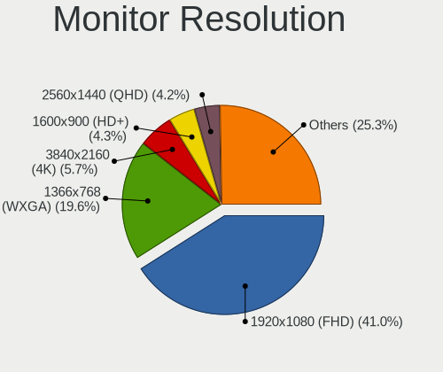

Linux - Tested Hardware & Statistics
------------------------------------

A project to collect tested hardware configurations for Linux.

Anyone can contribute to this report by the [hw-probe](https://github.com/linuxhw/hw-probe) tool:

    sudo -E hw-probe -all -upload

Please contribute! Especially if your hardware is rare.

This is a report for all computer types. See also reports for [desktops](/Desktop/README.md) and [notebooks](/Notebook/README.md).

Distribution-specific reports: [AlmaLinux](/Dist/AlmaLinux), [Alpine](/Dist/Alpine), [ALT_Linux](/Dist/ALT_Linux), [antiX](/Dist/antiX), [Artix](/Dist/Artix), [Chrome_OS](/Dist/Chrome_OS), [Clear_Linux](/Dist/Clear_Linux), [Deepin](/Dist/Deepin), [Devuan](/Dist/Devuan), [EndeavourOS](/Dist/EndeavourOS), [Garuda_Linux](/Dist/Garuda_Linux), [GNOME_OS](/Dist/GNOME_OS), [Kaisen](/Dist/Kaisen), [Mageia](/Dist/Mageia), [Makulu](/Dist/Makulu), [NixOS](/Dist/NixOS), [Nobara](/Dist/Nobara), [Oracle_Linux](/Dist/Oracle_Linux), [Pardus](/Dist/Pardus), [PureOS](/Dist/PureOS), [Q4OS](/Dist/Q4OS), [Reborn_OS](/Dist/Reborn_OS), [Rocky_Linux](/Dist/Rocky_Linux), [Sparky](/Dist/Sparky), [Void_Linux](/Dist/Void_Linux), [Xero](/Dist/Xero).

This report is for real hardware. Report for virtual hardware: [TestDays_VE](https://github.com/linuxhw/TestDays_VE)

Contents
--------

* [ Test Cases ](#test-cases)

* [ System ](#system)
  - [ OS                       ](#os)
  - [ OS Family                ](#os-family)
  - [ Kernel                   ](#kernel)
  - [ Kernel Family            ](#kernel-family)
  - [ Kernel Major Ver.        ](#kernel-major-ver)
  - [ Arch                     ](#arch)
  - [ DE                       ](#de)
  - [ Display Server           ](#display-server)
  - [ Display Manager          ](#display-manager)
  - [ OS Lang                  ](#os-lang)
  - [ Boot Mode                ](#boot-mode)
  - [ Filesystem               ](#filesystem)
  - [ Part. scheme             ](#part-scheme)
  - [ Dual Boot with Linux/BSD ](#dual-boot-with-linuxbsd)
  - [ Dual Boot (Win)          ](#dual-boot-win)

* [ Board ](#board)
  - [ Vendor                   ](#vendor)
  - [ Model                    ](#model)
  - [ Model Family             ](#model-family)
  - [ MFG Year                 ](#mfg-year)
  - [ Form Factor              ](#form-factor)
  - [ Secure Boot              ](#secure-boot)
  - [ Coreboot                 ](#coreboot)
  - [ RAM Size                 ](#ram-size)
  - [ RAM Used                 ](#ram-used)
  - [ Total Drives             ](#total-drives)
  - [ Has CD-ROM               ](#has-cd-rom)
  - [ Has Ethernet             ](#has-ethernet)
  - [ Has WiFi                 ](#has-wifi)
  - [ Has Bluetooth            ](#has-bluetooth)

* [ Location ](#location)
  - [ Country                  ](#country)
  - [ City                     ](#city)

* [ Drives ](#drives)
  - [ Drive Vendor             ](#drive-vendor)
  - [ Drive Model              ](#drive-model)
  - [ HDD Vendor               ](#hdd-vendor)
  - [ SSD Vendor               ](#ssd-vendor)
  - [ Drive Kind               ](#drive-kind)
  - [ Drive Connector          ](#drive-connector)
  - [ Drive Size               ](#drive-size)
  - [ Space Total              ](#space-total)
  - [ Space Used               ](#space-used)
  - [ Malfunc. Drives          ](#malfunc-drives)
  - [ Malfunc. Drive Vendor    ](#malfunc-drive-vendor)
  - [ Malfunc. HDD Vendor      ](#malfunc-hdd-vendor)
  - [ Malfunc. Drive Kind      ](#malfunc-drive-kind)
  - [ Failed Drives            ](#failed-drives)
  - [ Failed Drive Vendor      ](#failed-drive-vendor)
  - [ Drive Status             ](#drive-status)

* [ Storage controller ](#storage-controller)
  - [ Storage Vendor           ](#storage-vendor)
  - [ Storage Model            ](#storage-model)
  - [ Storage Kind             ](#storage-kind)

* [ Processor ](#processor)
  - [ CPU Vendor               ](#cpu-vendor)
  - [ CPU Model                ](#cpu-model)
  - [ CPU Model Family         ](#cpu-model-family)
  - [ CPU Cores                ](#cpu-cores)
  - [ CPU Sockets              ](#cpu-sockets)
  - [ CPU Threads              ](#cpu-threads)
  - [ CPU Op-Modes             ](#cpu-op-modes)
  - [ CPU Microcode            ](#cpu-microcode)
  - [ CPU Microarch            ](#cpu-microarch)

* [ Graphics ](#graphics)
  - [ GPU Vendor               ](#gpu-vendor)
  - [ GPU Model                ](#gpu-model)
  - [ GPU Combo                ](#gpu-combo)
  - [ GPU Driver               ](#gpu-driver)
  - [ GPU Memory               ](#gpu-memory)

* [ Monitor ](#monitor)
  - [ Monitor Vendor           ](#monitor-vendor)
  - [ Monitor Model            ](#monitor-model)
  - [ Monitor Resolution       ](#monitor-resolution)
  - [ Monitor Diagonal         ](#monitor-diagonal)
  - [ Monitor Width            ](#monitor-width)
  - [ Aspect Ratio             ](#aspect-ratio)
  - [ Monitor Area             ](#monitor-area)
  - [ Pixel Density            ](#pixel-density)
  - [ Multiple Monitors        ](#multiple-monitors)

* [ Network ](#network)
  - [ Net Controller Vendor    ](#net-controller-vendor)
  - [ Net Controller Model     ](#net-controller-model)
  - [ Wireless Vendor          ](#wireless-vendor)
  - [ Wireless Model           ](#wireless-model)
  - [ Ethernet Vendor          ](#ethernet-vendor)
  - [ Ethernet Model           ](#ethernet-model)
  - [ Net Controller Kind      ](#net-controller-kind)
  - [ Used Controller          ](#used-controller)
  - [ NICs                     ](#nics)
  - [ IPv6                     ](#ipv6)

* [ Bluetooth ](#bluetooth)
  - [ Bluetooth Vendor         ](#bluetooth-vendor)
  - [ Bluetooth Model          ](#bluetooth-model)

* [ Sound ](#sound)
  - [ Sound Vendor             ](#sound-vendor)
  - [ Sound Model              ](#sound-model)

* [ Memory ](#memory)
  - [ Memory Vendor            ](#memory-vendor)
  - [ Memory Model             ](#memory-model)
  - [ Memory Kind              ](#memory-kind)
  - [ Memory Form Factor       ](#memory-form-factor)
  - [ Memory Size              ](#memory-size)
  - [ Memory Speed             ](#memory-speed)

* [ Printers & scanners ](#printers--scanners)
  - [ Printer Vendor           ](#printer-vendor)
  - [ Printer Model            ](#printer-model)
  - [ Scanner Vendor           ](#scanner-vendor)
  - [ Scanner Model            ](#scanner-model)

* [ Camera ](#camera)
  - [ Camera Vendor            ](#camera-vendor)
  - [ Camera Model             ](#camera-model)

* [ Security ](#security)
  - [ Fingerprint Vendor       ](#fingerprint-vendor)
  - [ Fingerprint Model        ](#fingerprint-model)
  - [ Chipcard Vendor          ](#chipcard-vendor)
  - [ Chipcard Model           ](#chipcard-model)

* [ Unsupported ](#unsupported)
  - [ Unsupported Devices      ](#unsupported-devices)
  - [ Unsupported Device Types ](#unsupported-device-types)

Test Cases
----------

Total: 303447

| Vendor        | Model                       | Form-Factor | Probe                                                      | Date         |
|---------------|-----------------------------|-------------|------------------------------------------------------------|--------------|
| VENTURER      | WT9L10C44GD1E               | Tablet      | [16d09653ec](https://linux-hardware.org/?probe=16d09653ec) | May 01, 2023 |
| ASUSTek       | X550CC                      | Notebook    | [cc784397f9](https://linux-hardware.org/?probe=cc784397f9) | May 01, 2023 |
| Dell          | 0Y5DDC A00                  | Desktop     | [9a9a57dd2b](https://linux-hardware.org/?probe=9a9a57dd2b) | May 01, 2023 |
| ASUSTek       | PRIME H610M-E D4            | Desktop     | [56db7fc27f](https://linux-hardware.org/?probe=56db7fc27f) | May 01, 2023 |
| Valve         | Jupiter                     | Notebook    | [09f9cbd392](https://linux-hardware.org/?probe=09f9cbd392) | May 01, 2023 |
| Lenovo        | 4068AGJ                     | Notebook    | [6a2c3207b5](https://linux-hardware.org/?probe=6a2c3207b5) | May 01, 2023 |
| Dell          | Latitude 3190               | Notebook    | [59c654b2ec](https://linux-hardware.org/?probe=59c654b2ec) | May 01, 2023 |
| HP            | ENVY x360 Convertible 15... | Convertible | [dc16d81ba0](https://linux-hardware.org/?probe=dc16d81ba0) | May 01, 2023 |
| ASUSTek       | PN41                        | Mini pc     | [99d3eca719](https://linux-hardware.org/?probe=99d3eca719) | May 01, 2023 |
| ASRock        | 970 Pro3 R2.0               | Desktop     | [577b5e8f51](https://linux-hardware.org/?probe=577b5e8f51) | May 01, 2023 |
| ASUSTek       | SABERTOOTH 990FX R2.0       | Desktop     | [41e9bb9584](https://linux-hardware.org/?probe=41e9bb9584) | May 01, 2023 |
| ASUSTek       | PRIME B550M-A               | Desktop     | [9146d12231](https://linux-hardware.org/?probe=9146d12231) | May 01, 2023 |
| MSI           | Z77A-G43                    | Desktop     | [02c2bfee54](https://linux-hardware.org/?probe=02c2bfee54) | May 01, 2023 |
| ASUSTek       | PRIME Z690M-PLUS D4         | Desktop     | [27fdafaf01](https://linux-hardware.org/?probe=27fdafaf01) | May 01, 2023 |
| Fujitsu       | D3223-A1 S26361-D3223-A1    | Desktop     | [9b6f7cea89](https://linux-hardware.org/?probe=9b6f7cea89) | May 01, 2023 |
| Gigabyte      | F2A88XM-D3H                 | Desktop     | [b37927b9d4](https://linux-hardware.org/?probe=b37927b9d4) | May 01, 2023 |
| Shuttle       | FS35V4                      | Desktop     | [137fda9bc6](https://linux-hardware.org/?probe=137fda9bc6) | May 01, 2023 |
| ASUSTek       | UX430UNR                    | Notebook    | [4d01364a94](https://linux-hardware.org/?probe=4d01364a94) | May 01, 2023 |
| Acer          | Aspire V5-471P              | Notebook    | [d44b4f12a5](https://linux-hardware.org/?probe=d44b4f12a5) | May 01, 2023 |
| Valve         | Jupiter                     | Notebook    | [07ef050535](https://linux-hardware.org/?probe=07ef050535) | May 01, 2023 |
| Lenovo        | Yoga 6 13ALC7 82UD          | Convertible | [80671ff25c](https://linux-hardware.org/?probe=80671ff25c) | May 01, 2023 |
| Acer          | Aspire A515-51G             | Notebook    | [388b693b6d](https://linux-hardware.org/?probe=388b693b6d) | May 01, 2023 |
| ASRock        | B450M Pro4                  | Desktop     | [24363c23cf](https://linux-hardware.org/?probe=24363c23cf) | May 01, 2023 |
| Medion        | E16402                      | Notebook    | [cff2f785ad](https://linux-hardware.org/?probe=cff2f785ad) | May 01, 2023 |
| Fanless Mi... | Rev JSL1                    | Mini pc     | [e812a255a4](https://linux-hardware.org/?probe=e812a255a4) | May 01, 2023 |
| Gigabyte      | Z77MX-D3H                   | Desktop     | [fa4e32fe2c](https://linux-hardware.org/?probe=fa4e32fe2c) | May 01, 2023 |
| Alienware     | m17 R5 AMD                  | Notebook    | [4e665db2b1](https://linux-hardware.org/?probe=4e665db2b1) | May 01, 2023 |
| Dell          | Latitude 3420               | Notebook    | [327be624ce](https://linux-hardware.org/?probe=327be624ce) | May 01, 2023 |
| ASUSTek       | ROG Zephyrus Duo 16 GX65... | Notebook    | [b54238dc33](https://linux-hardware.org/?probe=b54238dc33) | May 01, 2023 |
| ASUSTek       | VivoBook_ASUSLaptop X340... | Notebook    | [e8ce8c11c0](https://linux-hardware.org/?probe=e8ce8c11c0) | May 01, 2023 |
| Toshiba       | Satellite L755              | Notebook    | [3bafb50baa](https://linux-hardware.org/?probe=3bafb50baa) | May 01, 2023 |
| ASUSTek       | ASUS TUF Gaming F15 FX50... | Notebook    | [d1b974c33a](https://linux-hardware.org/?probe=d1b974c33a) | May 01, 2023 |
| Dell          | 09KPNV A01                  | Desktop     | [45dad4b8e9](https://linux-hardware.org/?probe=45dad4b8e9) | May 01, 2023 |
| Gigabyte      | A320M-S2H V2-CF             | Desktop     | [cf6a478eb1](https://linux-hardware.org/?probe=cf6a478eb1) | May 01, 2023 |
| Valve         | Jupiter                     | Notebook    | [9d8a549c47](https://linux-hardware.org/?probe=9d8a549c47) | May 01, 2023 |
| Acer          | Aspire A715-51G             | Notebook    | [842333a8da](https://linux-hardware.org/?probe=842333a8da) | May 01, 2023 |
| Dell          | Latitude 3420               | Notebook    | [1ce0c58a17](https://linux-hardware.org/?probe=1ce0c58a17) | May 01, 2023 |
| Dell          | Latitude E6400              | Notebook    | [33b7764234](https://linux-hardware.org/?probe=33b7764234) | May 01, 2023 |
| ASRock        | B660M-HDV                   | Desktop     | [a137e6ab62](https://linux-hardware.org/?probe=a137e6ab62) | May 01, 2023 |
| Lenovo        | B490 20205                  | Notebook    | [c786307607](https://linux-hardware.org/?probe=c786307607) | May 01, 2023 |
| ASUSTek       | A55M-E                      | Desktop     | [ee1054dc5c](https://linux-hardware.org/?probe=ee1054dc5c) | May 01, 2023 |
| ASUSTek       | PRIME J4005I-C              | Desktop     | [611ed4a200](https://linux-hardware.org/?probe=611ed4a200) | May 01, 2023 |
| Gigabyte      | X58A-UD3R                   | Desktop     | [36f4134c6b](https://linux-hardware.org/?probe=36f4134c6b) | May 01, 2023 |
| Timi          | TM1612                      | Notebook    | [3c06f7495e](https://linux-hardware.org/?probe=3c06f7495e) | May 01, 2023 |
| HP            | Laptop 15z-fc000            | Notebook    | [7b57cc42a0](https://linux-hardware.org/?probe=7b57cc42a0) | May 01, 2023 |
| Supermicro    | H12SSL-i                    | Server      | [028a3c3b0b](https://linux-hardware.org/?probe=028a3c3b0b) | May 01, 2023 |
| ASRockRack    | X470D4U2-2T                 | Desktop     | [34e7df2c84](https://linux-hardware.org/?probe=34e7df2c84) | May 01, 2023 |
| ASRockRack    | ROMED8-2T                   | Server      | [457abef5d3](https://linux-hardware.org/?probe=457abef5d3) | May 01, 2023 |
| Dell          | 0PV3YR A05                  | Server      | [f5f4abd1f3](https://linux-hardware.org/?probe=f5f4abd1f3) | May 01, 2023 |
| HP            | 822A                        | Desktop     | [b373ff6def](https://linux-hardware.org/?probe=b373ff6def) | May 01, 2023 |
| Lenovo        | ThinkPad P52s 20LCS1H100    | Notebook    | [34b877bcb5](https://linux-hardware.org/?probe=34b877bcb5) | May 01, 2023 |
| HP            | ENVY x360 Convertible 13... | Convertible | [5cfdd30fa7](https://linux-hardware.org/?probe=5cfdd30fa7) | May 01, 2023 |
| HP            | Compaq 15                   | Notebook    | [0c65bb3d3c](https://linux-hardware.org/?probe=0c65bb3d3c) | May 01, 2023 |
| Lenovo        | ThinkPad T480 20L6A0LJCL    | Notebook    | [f67154866c](https://linux-hardware.org/?probe=f67154866c) | May 01, 2023 |
| HP            | 2B38                        | Desktop     | [bf99202e8b](https://linux-hardware.org/?probe=bf99202e8b) | May 01, 2023 |
| HP            | ElitePad 1000 G2            | Notebook    | [8ae27e00f6](https://linux-hardware.org/?probe=8ae27e00f6) | May 01, 2023 |
| HP            | ZBook Studio 15.6 inch G... | Notebook    | [1846ea93e7](https://linux-hardware.org/?probe=1846ea93e7) | May 01, 2023 |
| Acer          | Nitro AN517-54              | Notebook    | [593a6b247f](https://linux-hardware.org/?probe=593a6b247f) | May 01, 2023 |
| MSI           | X99A RAIDER                 | Desktop     | [f2c73a1fbb](https://linux-hardware.org/?probe=f2c73a1fbb) | May 01, 2023 |
| ASRock        | FM2A88X Extreme6+           | Desktop     | [be8b69e1b4](https://linux-hardware.org/?probe=be8b69e1b4) | May 01, 2023 |
| ASRock        | B650 LiveMixer              | Desktop     | [aecb4b61b4](https://linux-hardware.org/?probe=aecb4b61b4) | May 01, 2023 |
| MSI           | A520M-A PRO                 | Desktop     | [aa8e8397f6](https://linux-hardware.org/?probe=aa8e8397f6) | May 01, 2023 |
| Dell          | 0NC2VH A01                  | Desktop     | [7fb1708706](https://linux-hardware.org/?probe=7fb1708706) | May 01, 2023 |
| Lenovo        | ThinkPad X260 20F5002NAU    | Notebook    | [7fcb72c132](https://linux-hardware.org/?probe=7fcb72c132) | May 01, 2023 |
| Acer          | Aspire A715-51G             | Notebook    | [4f72daaab8](https://linux-hardware.org/?probe=4f72daaab8) | May 01, 2023 |
| Notebook      | NJx0MU                      | Notebook    | [66a3f8bc3a](https://linux-hardware.org/?probe=66a3f8bc3a) | May 01, 2023 |
| ASUSTek       | TUF Gaming X570-PLUS        | Desktop     | [2a2bf698ed](https://linux-hardware.org/?probe=2a2bf698ed) | May 01, 2023 |
| HP            | Laptop 14-dk1xxx            | Notebook    | [2a49a2ad57](https://linux-hardware.org/?probe=2a49a2ad57) | May 01, 2023 |
| ASUSTek       | TUF Gaming B550M-PLUS WI... | Desktop     | [62d194e85e](https://linux-hardware.org/?probe=62d194e85e) | May 01, 2023 |
| HP            | EliteBook 8470p             | Notebook    | [f75b4a9457](https://linux-hardware.org/?probe=f75b4a9457) | May 01, 2023 |
| ASUSTek       | ROG STRIX X399-E GAMING     | Desktop     | [a3c89effff](https://linux-hardware.org/?probe=a3c89effff) | May 01, 2023 |
| Unknown       | Unknown                     | Notebook    | [8978b9aa5f](https://linux-hardware.org/?probe=8978b9aa5f) | May 01, 2023 |
| ASUSTek       | PRIME Z690-P WIFI           | Desktop     | [4f0b170b70](https://linux-hardware.org/?probe=4f0b170b70) | May 01, 2023 |
| ASUSTek       | PRIME B450-PLUS             | Desktop     | [56db3a6b44](https://linux-hardware.org/?probe=56db3a6b44) | May 01, 2023 |
| Dell          | 06D7TR A00                  | Desktop     | [6fe7179a50](https://linux-hardware.org/?probe=6fe7179a50) | May 01, 2023 |
| HP            | EliteBook 840 G3            | Notebook    | [c490c44357](https://linux-hardware.org/?probe=c490c44357) | May 01, 2023 |
| Lenovo        | B490 20205                  | Notebook    | [bc1fdb2575](https://linux-hardware.org/?probe=bc1fdb2575) | May 01, 2023 |
| HUAWEI        | CREM-WXX9                   | Notebook    | [ba99960d5f](https://linux-hardware.org/?probe=ba99960d5f) | May 01, 2023 |
| ASUSTek       | X455LJ                      | Notebook    | [4e252eab9f](https://linux-hardware.org/?probe=4e252eab9f) | May 01, 2023 |
| Lenovo        | IdeaPad 310-15ISK 80UH      | Notebook    | [a7d6d782b2](https://linux-hardware.org/?probe=a7d6d782b2) | May 01, 2023 |
| Valve         | Jupiter                     | Notebook    | [0494e0759f](https://linux-hardware.org/?probe=0494e0759f) | May 01, 2023 |
| Lenovo        | ThinkBook 15 G2 ITL 20VE    | Notebook    | [8f8a912636](https://linux-hardware.org/?probe=8f8a912636) | May 01, 2023 |
| Gigabyte      | AB350-Gaming-CF             | Desktop     | [c03693e806](https://linux-hardware.org/?probe=c03693e806) | May 01, 2023 |
| HP            | 2B38                        | Desktop     | [6942eb2544](https://linux-hardware.org/?probe=6942eb2544) | May 01, 2023 |
| Lenovo        | ThinkPad T420 4236W8L       | Notebook    | [96a8ba3062](https://linux-hardware.org/?probe=96a8ba3062) | May 01, 2023 |
| MSI           | MPG X570 GAMING EDGE WIF... | Desktop     | [2fcc250a35](https://linux-hardware.org/?probe=2fcc250a35) | May 01, 2023 |
| Lenovo        | ThinkPad T420 4236W8L       | Notebook    | [856577ad04](https://linux-hardware.org/?probe=856577ad04) | May 01, 2023 |
| ASUSTek       | PRIME B550M-A AC            | Desktop     | [f10c443a56](https://linux-hardware.org/?probe=f10c443a56) | May 01, 2023 |
| PCWare        | IPMH410E                    | Desktop     | [9be4314a33](https://linux-hardware.org/?probe=9be4314a33) | May 01, 2023 |
| HP            | ProBook 640 G2              | Notebook    | [55ac658b79](https://linux-hardware.org/?probe=55ac658b79) | May 01, 2023 |
| Lenovo        | Slim 9 14IAP7 82T1          | Notebook    | [fe1b421c9d](https://linux-hardware.org/?probe=fe1b421c9d) | May 01, 2023 |
| Fanless Mi... | Rev GMLR1                   | Mini pc     | [1f1cb63edc](https://linux-hardware.org/?probe=1f1cb63edc) | May 01, 2023 |
| Lenovo        | Legion S7 15IMH5 82BC       | Notebook    | [a57d01b946](https://linux-hardware.org/?probe=a57d01b946) | May 01, 2023 |
| ASRock        | Z170 Gaming K4              | Desktop     | [a38bf561f7](https://linux-hardware.org/?probe=a38bf561f7) | May 01, 2023 |
| ASRock        | Z170 Gaming K4              | Desktop     | [b5ce5ff271](https://linux-hardware.org/?probe=b5ce5ff271) | May 01, 2023 |
| Lenovo        | Legion 5 15ARH05 82B5       | Notebook    | [6c1969f77e](https://linux-hardware.org/?probe=6c1969f77e) | May 01, 2023 |
| HP            | Unknown                     | Notebook    | [475eb33956](https://linux-hardware.org/?probe=475eb33956) | May 01, 2023 |
| HP            | Pavilion x360 Convertibl... | Convertible | [1b2adc0ae5](https://linux-hardware.org/?probe=1b2adc0ae5) | May 01, 2023 |
| Intel         | CHERRYVIEW D1 PLATFORM      | Notebook    | [6c58138c35](https://linux-hardware.org/?probe=6c58138c35) | May 01, 2023 |
| Microsoft     | Surface Pro 7               | Tablet      | [7c8d87170f](https://linux-hardware.org/?probe=7c8d87170f) | Apr 30, 2023 |
| HP            | Spectre x360 Convertible... | Convertible | [45a7e28db1](https://linux-hardware.org/?probe=45a7e28db1) | Apr 30, 2023 |
| Dell          | 06D7TR A00                  | Desktop     | [e7905065dd](https://linux-hardware.org/?probe=e7905065dd) | Apr 30, 2023 |
| HUAWEI        | CREM-WXX9                   | Notebook    | [d3ef8c638e](https://linux-hardware.org/?probe=d3ef8c638e) | Apr 30, 2023 |
| Acer          | Aspire V5-561P              | Notebook    | [8818106a28](https://linux-hardware.org/?probe=8818106a28) | Apr 30, 2023 |
| Dell          | 07PR60 A00                  | Desktop     | [e6f49bbe8a](https://linux-hardware.org/?probe=e6f49bbe8a) | Apr 30, 2023 |
| ASUSTek       | ProArt X670E-CREATOR WIF... | Desktop     | [d85b7a2592](https://linux-hardware.org/?probe=d85b7a2592) | Apr 30, 2023 |
| Notebook      | NJx0MU                      | Notebook    | [193fb3ba91](https://linux-hardware.org/?probe=193fb3ba91) | Apr 30, 2023 |
| ASUSTek       | Zenbook UM5302TA_UM5302T... | Notebook    | [4bec088d90](https://linux-hardware.org/?probe=4bec088d90) | Apr 30, 2023 |
| Acer          | Aspire V5-561P              | Notebook    | [fe60e0412d](https://linux-hardware.org/?probe=fe60e0412d) | Apr 30, 2023 |
| Lenovo        | 3111 SDK0J40697 WIN 3305... | Desktop     | [705ff684a9](https://linux-hardware.org/?probe=705ff684a9) | Apr 30, 2023 |
| ASUSTek       | H81-PLUS                    | Desktop     | [3b45144d62](https://linux-hardware.org/?probe=3b45144d62) | Apr 30, 2023 |
| Lenovo        | IdeaPad S340-15IWLTouch ... | Notebook    | [6857a16a6c](https://linux-hardware.org/?probe=6857a16a6c) | Apr 30, 2023 |
| Dell          | 02YYK5 A01                  | Desktop     | [1a00a1321e](https://linux-hardware.org/?probe=1a00a1321e) | Apr 30, 2023 |
| HP            | ProBook 640 G8 Notebook ... | Notebook    | [f84a692777](https://linux-hardware.org/?probe=f84a692777) | Apr 30, 2023 |
| ASRock        | A520M-ITX/ac                | Desktop     | [5a9f58bcc0](https://linux-hardware.org/?probe=5a9f58bcc0) | Apr 30, 2023 |
| Gigabyte      | EP45-UD3P                   | Desktop     | [8d99ef5cc7](https://linux-hardware.org/?probe=8d99ef5cc7) | Apr 30, 2023 |
| ASUSTek       | H81I-PLUS                   | Desktop     | [01578538eb](https://linux-hardware.org/?probe=01578538eb) | Apr 30, 2023 |
| MSI           | IONA                        | Desktop     | [966ec83038](https://linux-hardware.org/?probe=966ec83038) | Apr 30, 2023 |
| Dell          | XPS 15 9500                 | Notebook    | [93fef964a7](https://linux-hardware.org/?probe=93fef964a7) | Apr 30, 2023 |
| Unknown       | Unknown                     | Notebook    | [070854df6b](https://linux-hardware.org/?probe=070854df6b) | Apr 30, 2023 |
| MSI           | B450M PRO-M2                | Desktop     | [b650f0a26e](https://linux-hardware.org/?probe=b650f0a26e) | Apr 30, 2023 |
| Apple         | MacBookAir7,2               | Notebook    | [1a343a4622](https://linux-hardware.org/?probe=1a343a4622) | Apr 30, 2023 |
| Apple         | MacBookPro6,2               | Notebook    | [0cb8947c84](https://linux-hardware.org/?probe=0cb8947c84) | Apr 30, 2023 |
| Lenovo        | IdeaPad 320-15AST 80XV      | Notebook    | [0784fc9b1c](https://linux-hardware.org/?probe=0784fc9b1c) | Apr 30, 2023 |
| Toshiba       | EQUIUM P200                 | Notebook    | [812a164a8a](https://linux-hardware.org/?probe=812a164a8a) | Apr 30, 2023 |
| HP            | Notebook                    | Notebook    | [fd6aa4aeb6](https://linux-hardware.org/?probe=fd6aa4aeb6) | Apr 30, 2023 |
| Dell          | Latitude 5580               | Notebook    | [556abc1561](https://linux-hardware.org/?probe=556abc1561) | Apr 30, 2023 |
| Notebook      | W250EGQ / W270EGQ           | Notebook    | [e523dbbf78](https://linux-hardware.org/?probe=e523dbbf78) | Apr 30, 2023 |
| HUAWEI        | RLEF-XX                     | Notebook    | [b7ca4beb49](https://linux-hardware.org/?probe=b7ca4beb49) | Apr 30, 2023 |
| Acer          | Aspire E1-571               | Notebook    | [e03d5ff056](https://linux-hardware.org/?probe=e03d5ff056) | Apr 30, 2023 |
| ASRock        | Z77 Extreme3                | Desktop     | [1298b74530](https://linux-hardware.org/?probe=1298b74530) | Apr 30, 2023 |
| DIEBOLD       | NM70-I                      | Desktop     | [c01a40d58c](https://linux-hardware.org/?probe=c01a40d58c) | Apr 30, 2023 |
| ASRock        | FM2A68M-HD+                 | Desktop     | [467bb5ded2](https://linux-hardware.org/?probe=467bb5ded2) | Apr 30, 2023 |
| Pegatron      | NARRA5                      | Desktop     | [4c8bb5eff0](https://linux-hardware.org/?probe=4c8bb5eff0) | Apr 30, 2023 |
| Sony          | SVF1521C6EW                 | Notebook    | [57e1c14061](https://linux-hardware.org/?probe=57e1c14061) | Apr 30, 2023 |
| VIOS          | LTH17                       | Notebook    | [4d1a86ee61](https://linux-hardware.org/?probe=4d1a86ee61) | Apr 30, 2023 |
| Dell          | Latitude E5420              | Notebook    | [df8c9e7f40](https://linux-hardware.org/?probe=df8c9e7f40) | Apr 30, 2023 |
| ASUSTek       | ROG STRIX Z370-F GAMING     | Desktop     | [0aa17c06c5](https://linux-hardware.org/?probe=0aa17c06c5) | Apr 30, 2023 |
| Lenovo        | IdeaPad 3 15ALC6 82MF       | Notebook    | [bd460bdc62](https://linux-hardware.org/?probe=bd460bdc62) | Apr 30, 2023 |
| Dell          | Inspiron 5567               | Notebook    | [910f08075b](https://linux-hardware.org/?probe=910f08075b) | Apr 30, 2023 |
| Lenovo        | IdeaPadFlex 5 14ITL05 82... | Convertible | [c68576fce8](https://linux-hardware.org/?probe=c68576fce8) | Apr 30, 2023 |
| Valve         | Jupiter                     | Notebook    | [3bee1a3271](https://linux-hardware.org/?probe=3bee1a3271) | Apr 30, 2023 |
| Shuttle       | DL20N                       | Desktop     | [3f97bcaa08](https://linux-hardware.org/?probe=3f97bcaa08) | Apr 30, 2023 |
| Lenovo        | IdeaPad 100-15IBD 80QQ      | Notebook    | [e1d1572c51](https://linux-hardware.org/?probe=e1d1572c51) | Apr 30, 2023 |
| MSI           | PRO Z690-A WIFI             | Desktop     | [bfa4eb5eda](https://linux-hardware.org/?probe=bfa4eb5eda) | Apr 30, 2023 |
| HP            | ProLiant ML310e Gen8 v2     | Desktop     | [501d26e477](https://linux-hardware.org/?probe=501d26e477) | Apr 30, 2023 |
| Apple         | Mac-F42C88C8 Proto1         | Desktop     | [ab7b403321](https://linux-hardware.org/?probe=ab7b403321) | Apr 30, 2023 |
| eMachines     | E725                        | Notebook    | [282c0c9f11](https://linux-hardware.org/?probe=282c0c9f11) | Apr 30, 2023 |
| ASUSTek       | VivoBook_ASUSLaptop E510... | Notebook    | [2dd85470a0](https://linux-hardware.org/?probe=2dd85470a0) | Apr 30, 2023 |
| Lenovo        | IdeaPad 3 15ALC6 82MF       | Notebook    | [edfcd7daa6](https://linux-hardware.org/?probe=edfcd7daa6) | Apr 30, 2023 |
| ASRock        | B550M Steel Legend          | Desktop     | [68d85dd28f](https://linux-hardware.org/?probe=68d85dd28f) | Apr 30, 2023 |
| ASRock        | B550M Steel Legend          | Desktop     | [5166f820a6](https://linux-hardware.org/?probe=5166f820a6) | Apr 30, 2023 |
| ASRock        | 960GM-GS3 FX                | Desktop     | [392492c032](https://linux-hardware.org/?probe=392492c032) | Apr 30, 2023 |
| ASUSTek       | TUF Gaming B550M-PLUS WI... | Desktop     | [e2acacabb3](https://linux-hardware.org/?probe=e2acacabb3) | Apr 30, 2023 |
| HP            | Laptop 15s-eq3xxx           | Notebook    | [3c321c476a](https://linux-hardware.org/?probe=3c321c476a) | Apr 30, 2023 |
| HP            | ProBook 655 G3              | Notebook    | [07e2cc77f8](https://linux-hardware.org/?probe=07e2cc77f8) | Apr 30, 2023 |
| Gigabyte      | F2A88XM-D3H                 | Desktop     | [a188684584](https://linux-hardware.org/?probe=a188684584) | Apr 30, 2023 |
| HP            | ProBook 655 G3              | Notebook    | [638e747fb1](https://linux-hardware.org/?probe=638e747fb1) | Apr 30, 2023 |
| Lenovo        | MIIX 320-10ICR 80XF         | Tablet      | [6987a21849](https://linux-hardware.org/?probe=6987a21849) | Apr 30, 2023 |
| HP            | Compaq Mini CQ10-500        | Notebook    | [9a1134210f](https://linux-hardware.org/?probe=9a1134210f) | Apr 30, 2023 |
| Lenovo        | 370A SDK0J40700 WIN 3258... | Desktop     | [9a1d443928](https://linux-hardware.org/?probe=9a1d443928) | Apr 30, 2023 |
| Lenovo        | IdeaPad 3 15ADA05 81W1      | Notebook    | [eb559d913e](https://linux-hardware.org/?probe=eb559d913e) | Apr 30, 2023 |
| Intel         | NUC12WSBi7 M46422-303       | Mini pc     | [1e10eaa9ae](https://linux-hardware.org/?probe=1e10eaa9ae) | Apr 30, 2023 |
| Lenovo        | IdeaPad 320-15AST 80XV      | Notebook    | [9c07454907](https://linux-hardware.org/?probe=9c07454907) | Apr 30, 2023 |
| ASUSTek       | X751MA                      | Notebook    | [00fbe71b59](https://linux-hardware.org/?probe=00fbe71b59) | Apr 30, 2023 |
| Lenovo        | Z50-75 80EC                 | Notebook    | [af5d37f4f7](https://linux-hardware.org/?probe=af5d37f4f7) | Apr 30, 2023 |
| ASRock        | 760GM-HD                    | Desktop     | [db79e93331](https://linux-hardware.org/?probe=db79e93331) | Apr 30, 2023 |
| ATOPNUC       | MA90                        | Mini pc     | [cd65d9e917](https://linux-hardware.org/?probe=cd65d9e917) | Apr 30, 2023 |
| Gigabyte      | Z77M-D3H                    | Desktop     | [a3d2b3dcd3](https://linux-hardware.org/?probe=a3d2b3dcd3) | Apr 30, 2023 |
| HP            | Notebook                    | Notebook    | [4cece109d5](https://linux-hardware.org/?probe=4cece109d5) | Apr 30, 2023 |
| HP            | Pavilion Gaming Laptop 1... | Notebook    | [43a167afad](https://linux-hardware.org/?probe=43a167afad) | Apr 30, 2023 |
| Fujitsu       | D2828-A2 S26361-D2828-A2    | Desktop     | [8bf9a1841e](https://linux-hardware.org/?probe=8bf9a1841e) | Apr 30, 2023 |
| Foxconn       | G41S/G41S-K                 | Desktop     | [946a95c594](https://linux-hardware.org/?probe=946a95c594) | Apr 30, 2023 |
| Apple         | Mac-00BE6ED71E35EB86 iMa... | All in one  | [c8c9c1e591](https://linux-hardware.org/?probe=c8c9c1e591) | Apr 30, 2023 |
| Samsung       | 950XED                      | Notebook    | [41f620de17](https://linux-hardware.org/?probe=41f620de17) | Apr 30, 2023 |
| Foxconn       | G41S/G41S-K                 | Desktop     | [58cebf39d1](https://linux-hardware.org/?probe=58cebf39d1) | Apr 30, 2023 |
| MSI           | MS-B120                     | Mini pc     | [8019bfa6d4](https://linux-hardware.org/?probe=8019bfa6d4) | Apr 30, 2023 |
| HP            | EliteBook 840 G1            | Notebook    | [c8b979d035](https://linux-hardware.org/?probe=c8b979d035) | Apr 30, 2023 |
| ASUSTek       | VivoBook_ASUSLaptop X580... | Notebook    | [05251702aa](https://linux-hardware.org/?probe=05251702aa) | Apr 30, 2023 |
| ASUSTek       | X501A1                      | Notebook    | [66b02cc148](https://linux-hardware.org/?probe=66b02cc148) | Apr 30, 2023 |
| Dell          | Latitude XT2                | Notebook    | [3cfd979c60](https://linux-hardware.org/?probe=3cfd979c60) | Apr 30, 2023 |
| MSI           | MS-B120                     | Mini pc     | [4f10159e93](https://linux-hardware.org/?probe=4f10159e93) | Apr 30, 2023 |
| MSI           | MEG Z390 GODLIKE            | Desktop     | [9109b0a7ed](https://linux-hardware.org/?probe=9109b0a7ed) | Apr 30, 2023 |
| ASUSTek       | TUF Gaming B550-PLUS        | Desktop     | [0bf0b828d4](https://linux-hardware.org/?probe=0bf0b828d4) | Apr 30, 2023 |
| HP            | Pavilion Gaming Laptop 1... | Notebook    | [0ae3fb5506](https://linux-hardware.org/?probe=0ae3fb5506) | Apr 30, 2023 |
| ASRock        | B650M PG Riptide            | Desktop     | [236258bd78](https://linux-hardware.org/?probe=236258bd78) | Apr 30, 2023 |
| Medion        | H81H3-EM2                   | Desktop     | [c85a3da4ab](https://linux-hardware.org/?probe=c85a3da4ab) | Apr 30, 2023 |
| Fujitsu       | D2828-A2 S26361-D2828-A2    | Desktop     | [7afb6268da](https://linux-hardware.org/?probe=7afb6268da) | Apr 30, 2023 |
| Dell          | 042P49 A01                  | Desktop     | [6190be123c](https://linux-hardware.org/?probe=6190be123c) | Apr 30, 2023 |
| Acer          | Aspire A315-33              | Notebook    | [fdba59c054](https://linux-hardware.org/?probe=fdba59c054) | Apr 30, 2023 |
| Lenovo        | ThinkPad T470s W10DG 20J... | Notebook    | [3695c070f9](https://linux-hardware.org/?probe=3695c070f9) | Apr 30, 2023 |
| Positivo      | Q464C                       | Notebook    | [8e41593bd3](https://linux-hardware.org/?probe=8e41593bd3) | Apr 30, 2023 |
| Notebook      | NJx0MU                      | Notebook    | [5fd8f6db6e](https://linux-hardware.org/?probe=5fd8f6db6e) | Apr 30, 2023 |
| Acer          | AO725                       | Notebook    | [03e5f661fb](https://linux-hardware.org/?probe=03e5f661fb) | Apr 30, 2023 |
| ASRock        | N68-GS4 FX                  | Desktop     | [354f8689e7](https://linux-hardware.org/?probe=354f8689e7) | Apr 30, 2023 |
| Medion        | P6630                       | Notebook    | [93abad41dd](https://linux-hardware.org/?probe=93abad41dd) | Apr 30, 2023 |
| ZOTAC         | ZBOX-CI527/CI547            | Mini pc     | [86e1a89b72](https://linux-hardware.org/?probe=86e1a89b72) | Apr 30, 2023 |
| Lenovo        | V15 G2 IJL 82QY             | Notebook    | [1714bffa0e](https://linux-hardware.org/?probe=1714bffa0e) | Apr 30, 2023 |
| Lenovo        | ThinkPad X230 2325V1K       | Notebook    | [d630569df9](https://linux-hardware.org/?probe=d630569df9) | Apr 30, 2023 |
| ASUSTek       | TUF Gaming B460M-PLUS       | Desktop     | [8cb7a3612c](https://linux-hardware.org/?probe=8cb7a3612c) | Apr 30, 2023 |
| ASUSTek       | VivoBook_ASUSLaptop X509... | Notebook    | [558cde0a43](https://linux-hardware.org/?probe=558cde0a43) | Apr 30, 2023 |
| Colorful T... | CVN B550M GAMING FROZEN ... | Desktop     | [233ea7cdd8](https://linux-hardware.org/?probe=233ea7cdd8) | Apr 30, 2023 |
| Gigabyte      | 970A-DS3P                   | Desktop     | [c1fe7a5f87](https://linux-hardware.org/?probe=c1fe7a5f87) | Apr 30, 2023 |
| Intel         | DH67CL AAG10212-210         | Desktop     | [7d6b0027b3](https://linux-hardware.org/?probe=7d6b0027b3) | Apr 30, 2023 |
| HP            | 255 G8 Notebook PC          | Notebook    | [7262375294](https://linux-hardware.org/?probe=7262375294) | Apr 30, 2023 |
| HP            | Pavilion x360 Convertibl... | Convertible | [f1faff33de](https://linux-hardware.org/?probe=f1faff33de) | Apr 30, 2023 |
| Colorful T... | CVN B550M GAMING FROZEN ... | Desktop     | [177fe2fc00](https://linux-hardware.org/?probe=177fe2fc00) | Apr 30, 2023 |
| MSI           | X570-A PRO                  | Desktop     | [4d31b88bbf](https://linux-hardware.org/?probe=4d31b88bbf) | Apr 30, 2023 |
| ASUSTek       | P7Q57-M DO                  | Desktop     | [897fc61b8c](https://linux-hardware.org/?probe=897fc61b8c) | Apr 30, 2023 |
| Dell          | Inspiron 7548               | Notebook    | [15fe439a9a](https://linux-hardware.org/?probe=15fe439a9a) | Apr 30, 2023 |
| MSI           | X570-A PRO                  | Desktop     | [47a253784a](https://linux-hardware.org/?probe=47a253784a) | Apr 30, 2023 |
| Samsung       | 730QED                      | Convertible | [f29e3300d2](https://linux-hardware.org/?probe=f29e3300d2) | Apr 30, 2023 |
| ASUSTek       | P7Q57-M DO                  | Desktop     | [4f502dcb59](https://linux-hardware.org/?probe=4f502dcb59) | Apr 30, 2023 |
| ASUSTek       | X751SA                      | Notebook    | [5192130c0e](https://linux-hardware.org/?probe=5192130c0e) | Apr 30, 2023 |
| Lenovo        | ThinkPad L15 Gen 1 20U8S... | Notebook    | [32b3bf20de](https://linux-hardware.org/?probe=32b3bf20de) | Apr 30, 2023 |
| Apple         | MacBook5,1                  | Notebook    | [7077a00b02](https://linux-hardware.org/?probe=7077a00b02) | Apr 30, 2023 |
| Fujitsu       | D3161-A1 S26361-D3161-A1    | Desktop     | [ac7894081f](https://linux-hardware.org/?probe=ac7894081f) | Apr 30, 2023 |
| Dell          | 0YF8P5 A00                  | Desktop     | [4f5262d2c9](https://linux-hardware.org/?probe=4f5262d2c9) | Apr 30, 2023 |
| ASUSTek       | X555QG                      | Notebook    | [5263b174b2](https://linux-hardware.org/?probe=5263b174b2) | Apr 30, 2023 |
| Thomson       | NEO14A-4WH128               | Notebook    | [be47cb81e5](https://linux-hardware.org/?probe=be47cb81e5) | Apr 30, 2023 |
| Acer          | Peppy                       | Notebook    | [dcac703c46](https://linux-hardware.org/?probe=dcac703c46) | Apr 30, 2023 |
| Gigabyte      | TRX40 AORUS XTREME          | Desktop     | [a88277b7f9](https://linux-hardware.org/?probe=a88277b7f9) | Apr 30, 2023 |
| MSI           | 760GM-P23                   | Desktop     | [4ac55a6bbe](https://linux-hardware.org/?probe=4ac55a6bbe) | Apr 30, 2023 |
| ASUSTek       | ROG Strix G513QY_G513QY     | Notebook    | [408aa18a63](https://linux-hardware.org/?probe=408aa18a63) | Apr 30, 2023 |
| ASUSTek       | P5K                         | Desktop     | [ea70f7298c](https://linux-hardware.org/?probe=ea70f7298c) | Apr 30, 2023 |
| Medion        | D3F3-EM                     | Desktop     | [6b9e38ad6c](https://linux-hardware.org/?probe=6b9e38ad6c) | Apr 30, 2023 |
| Gigabyte      | GA-78LMT-USB3 SEx           | Desktop     | [ccb46c2a2b](https://linux-hardware.org/?probe=ccb46c2a2b) | Apr 30, 2023 |
| HP            | Pavilion Gaming Laptop 1... | Notebook    | [446a548122](https://linux-hardware.org/?probe=446a548122) | Apr 30, 2023 |
| Lenovo        | ThinkPad T490s 20NX002SG... | Notebook    | [874f19f26e](https://linux-hardware.org/?probe=874f19f26e) | Apr 30, 2023 |
| HEDYCOMPUT... | IH81MF-Q3                   | Desktop     | [3444236ed4](https://linux-hardware.org/?probe=3444236ed4) | Apr 30, 2023 |
| MSI           | A68HM GRENADE               | Desktop     | [938aa1cb46](https://linux-hardware.org/?probe=938aa1cb46) | Apr 30, 2023 |
| HP            | Compaq 6720s                | Notebook    | [cc5f5ee72c](https://linux-hardware.org/?probe=cc5f5ee72c) | Apr 30, 2023 |
| Gigabyte      | H77-DS3H                    | Desktop     | [6750e5f83d](https://linux-hardware.org/?probe=6750e5f83d) | Apr 30, 2023 |
| eMachines     | E725                        | Notebook    | [25da91560d](https://linux-hardware.org/?probe=25da91560d) | Apr 30, 2023 |
| Acer          | E661GXM                     | Desktop     | [d5433b46bd](https://linux-hardware.org/?probe=d5433b46bd) | Apr 30, 2023 |
| ASUSTek       | ROG STRIX X670E-E GAMING... | Desktop     | [0d5e9310d3](https://linux-hardware.org/?probe=0d5e9310d3) | Apr 30, 2023 |
| Acer          | Peppy                       | Notebook    | [4caf11594a](https://linux-hardware.org/?probe=4caf11594a) | Apr 30, 2023 |
| Gigabyte      | P75-D3                      | Desktop     | [4f6987c722](https://linux-hardware.org/?probe=4f6987c722) | Apr 30, 2023 |
| Lenovo        | IdeaPad L340-17API 81LY     | Notebook    | [44c60dcec2](https://linux-hardware.org/?probe=44c60dcec2) | Apr 30, 2023 |
| Acer          | Aspire X3950                | Desktop     | [406366d5c1](https://linux-hardware.org/?probe=406366d5c1) | Apr 30, 2023 |
| Dell          | Latitude 5521               | Notebook    | [1629b4efc4](https://linux-hardware.org/?probe=1629b4efc4) | Apr 30, 2023 |
| Lenovo        | IdeaPad 330S-15IKB 81F5     | Notebook    | [36ccc3c930](https://linux-hardware.org/?probe=36ccc3c930) | Apr 30, 2023 |
| HP            | Pavilion Gaming Laptop 1... | Notebook    | [9876205c45](https://linux-hardware.org/?probe=9876205c45) | Apr 30, 2023 |
| MSI           | B450 GAMING PLUS            | Desktop     | [8aa973e0f5](https://linux-hardware.org/?probe=8aa973e0f5) | Apr 30, 2023 |
| ASRock        | H110M-DGS R3.0              | Desktop     | [88e7444fa5](https://linux-hardware.org/?probe=88e7444fa5) | Apr 30, 2023 |
| Dell          | Vostro 3558                 | Notebook    | [5d77d7d922](https://linux-hardware.org/?probe=5d77d7d922) | Apr 30, 2023 |
| ASUSTek       | PRIME A320M-K               | Desktop     | [4587583e6a](https://linux-hardware.org/?probe=4587583e6a) | Apr 30, 2023 |
| HP            | EliteBook Folio 1040 G3     | Notebook    | [b3ac75c53e](https://linux-hardware.org/?probe=b3ac75c53e) | Apr 30, 2023 |
| Medion        | E6214                       | Notebook    | [7bb9f39d76](https://linux-hardware.org/?probe=7bb9f39d76) | Apr 30, 2023 |
| ASRock        | H110M-DGS R3.0              | Desktop     | [763e7fa1b6](https://linux-hardware.org/?probe=763e7fa1b6) | Apr 30, 2023 |
| Medion        | E6214                       | Notebook    | [39747632e6](https://linux-hardware.org/?probe=39747632e6) | Apr 30, 2023 |
| Lenovo        | ThinkPad T420 4236W8L       | Notebook    | [25c6042b4e](https://linux-hardware.org/?probe=25c6042b4e) | Apr 30, 2023 |
| ASUSTek       | B85M-G R2.0                 | Desktop     | [243a170e5a](https://linux-hardware.org/?probe=243a170e5a) | Apr 30, 2023 |
| Gigabyte      | Q87M-D2H                    | Desktop     | [16279b3c8b](https://linux-hardware.org/?probe=16279b3c8b) | Apr 30, 2023 |
| ASUSTek       | VivoBook_ASUSLaptop X580... | Notebook    | [94118ab632](https://linux-hardware.org/?probe=94118ab632) | Apr 30, 2023 |
| Lenovo        | ThinkPad T420 4236W8L       | Notebook    | [230f3dd04b](https://linux-hardware.org/?probe=230f3dd04b) | Apr 30, 2023 |
| HP            | Pavilion Laptop 14-ec0xx... | Notebook    | [d4cfc1e964](https://linux-hardware.org/?probe=d4cfc1e964) | Apr 30, 2023 |
| Fujitsu       | LIFEBOOK E734               | Notebook    | [f99ecceaeb](https://linux-hardware.org/?probe=f99ecceaeb) | Apr 30, 2023 |
| Fujitsu       | LIFEBOOK E734               | Notebook    | [31fa8aa587](https://linux-hardware.org/?probe=31fa8aa587) | Apr 30, 2023 |
| T-bao         | MINI PC V1.0                | Desktop     | [8e77950434](https://linux-hardware.org/?probe=8e77950434) | Apr 30, 2023 |
| Positivo      | POS-EIQ87CY POSITIVO        | Desktop     | [2e2b57b3ae](https://linux-hardware.org/?probe=2e2b57b3ae) | Apr 30, 2023 |
| HP            | Laptop 15s-eq2xxx           | Notebook    | [7a86bdd993](https://linux-hardware.org/?probe=7a86bdd993) | Apr 30, 2023 |
| Dell          | XPS 13 9350                 | Notebook    | [95b5e79487](https://linux-hardware.org/?probe=95b5e79487) | Apr 30, 2023 |
| HP            | Laptop 15s-eq2xxx           | Notebook    | [6206b317f2](https://linux-hardware.org/?probe=6206b317f2) | Apr 30, 2023 |
| Dell          | Latitude E5520              | Notebook    | [43e2d970b5](https://linux-hardware.org/?probe=43e2d970b5) | Apr 30, 2023 |
| Lenovo        | Legion 5 15ARH05H 82B1      | Notebook    | [9df1b688c0](https://linux-hardware.org/?probe=9df1b688c0) | Apr 30, 2023 |
| AMI           | INTEL                       | Convertible | [3a67944d4f](https://linux-hardware.org/?probe=3a67944d4f) | Apr 30, 2023 |
| ASUSTek       | TUF Gaming B550M-PLUS       | Desktop     | [a2b832afa2](https://linux-hardware.org/?probe=a2b832afa2) | Apr 30, 2023 |
| ASUSTek       | ROG Zephyrus Duo 16 GX65... | Notebook    | [cc20d89b69](https://linux-hardware.org/?probe=cc20d89b69) | Apr 30, 2023 |
| Acer          | Aspire E5-551G              | Notebook    | [bba2f8d1ad](https://linux-hardware.org/?probe=bba2f8d1ad) | Apr 30, 2023 |
| Packard Be... | EasyNote ENTF71BM           | Notebook    | [99a89a2055](https://linux-hardware.org/?probe=99a89a2055) | Apr 30, 2023 |
| MSI           | PRO Z690-A DDR4             | Desktop     | [9419686ec7](https://linux-hardware.org/?probe=9419686ec7) | Apr 30, 2023 |
| MSI           | B360M MORTAR                | Desktop     | [352a47b8a0](https://linux-hardware.org/?probe=352a47b8a0) | Apr 30, 2023 |
| Gigabyte      | AB350-Gaming 3-CF           | Desktop     | [01311e320c](https://linux-hardware.org/?probe=01311e320c) | Apr 30, 2023 |
| HP            | Pavilion Laptop 15-eh1xx... | Notebook    | [fcd7a6a42b](https://linux-hardware.org/?probe=fcd7a6a42b) | Apr 30, 2023 |
| HP            | ProBook 650 G4              | Notebook    | [fd991056e0](https://linux-hardware.org/?probe=fd991056e0) | Apr 30, 2023 |
| Raspberry ... | Raspberry Pi Zero W Rev ... | Soc         | [ff639a78ec](https://linux-hardware.org/?probe=ff639a78ec) | Apr 30, 2023 |
| ASRock        | B450M Steel Legend          | Desktop     | [fed083feba](https://linux-hardware.org/?probe=fed083feba) | Apr 30, 2023 |
| Dell          | Inspiron 15 3525            | Notebook    | [41c212fa2c](https://linux-hardware.org/?probe=41c212fa2c) | Apr 30, 2023 |
| Dell          | Vostro 5468                 | Notebook    | [93eb16d30d](https://linux-hardware.org/?probe=93eb16d30d) | Apr 30, 2023 |
| ASUSTek       | VivoBook 15_ASUS Laptop ... | Notebook    | [4470195d38](https://linux-hardware.org/?probe=4470195d38) | Apr 30, 2023 |
| Dell          | Inspiron N5110              | Notebook    | [9f932190c4](https://linux-hardware.org/?probe=9f932190c4) | Apr 30, 2023 |
| Intel         | S5520HC E26045-454          | Server      | [f1db72cddb](https://linux-hardware.org/?probe=f1db72cddb) | Apr 30, 2023 |
| Acer          | TravelMate B311-31          | Notebook    | [de172b8988](https://linux-hardware.org/?probe=de172b8988) | Apr 30, 2023 |
| ASUSTek       | TUF Gaming B550M-PLUS       | Desktop     | [c83cb7e3ec](https://linux-hardware.org/?probe=c83cb7e3ec) | Apr 30, 2023 |
| Dell          | Inspiron MXC061             | Notebook    | [2d1ab773dd](https://linux-hardware.org/?probe=2d1ab773dd) | Apr 30, 2023 |
| Lenovo        | ThinkPad L480 20LTS1NK27    | Notebook    | [dff6f75899](https://linux-hardware.org/?probe=dff6f75899) | Apr 30, 2023 |
| MSI           | PRO Z690-A DDR4             | Desktop     | [1f61fda034](https://linux-hardware.org/?probe=1f61fda034) | Apr 30, 2023 |
| Supermicro    | H12SSL-i                    | Server      | [31789f9473](https://linux-hardware.org/?probe=31789f9473) | Apr 30, 2023 |
| ASRockRack    | X470D4U2-2T                 | Desktop     | [f46e9f6ba7](https://linux-hardware.org/?probe=f46e9f6ba7) | Apr 30, 2023 |
| Dell          | 0PV3YR A05                  | Server      | [7804689b38](https://linux-hardware.org/?probe=7804689b38) | Apr 30, 2023 |
| HP            | Pavilion Laptop 15-cc5xx    | Notebook    | [28b11100ac](https://linux-hardware.org/?probe=28b11100ac) | Apr 30, 2023 |
| ASRock        | FM2A88X Extreme6+           | Desktop     | [c33288abe2](https://linux-hardware.org/?probe=c33288abe2) | Apr 30, 2023 |
| Microsoft     | Surface Pro                 | Tablet      | [8b89ffd983](https://linux-hardware.org/?probe=8b89ffd983) | Apr 30, 2023 |
| ASUSTek       | K53E                        | Notebook    | [dcb4502d05](https://linux-hardware.org/?probe=dcb4502d05) | Apr 30, 2023 |
| MSI           | X99A RAIDER                 | Desktop     | [606b173cab](https://linux-hardware.org/?probe=606b173cab) | Apr 30, 2023 |
| ASUSTek       | ROG STRIX B450-F GAMING ... | Desktop     | [f0a784354c](https://linux-hardware.org/?probe=f0a784354c) | Apr 30, 2023 |
| HP            | Laptop 17-by3xxx            | Notebook    | [552dac328b](https://linux-hardware.org/?probe=552dac328b) | Apr 30, 2023 |
| Toshiba       | Satellite Pro R50-C         | Notebook    | [56f112d60c](https://linux-hardware.org/?probe=56f112d60c) | Apr 30, 2023 |
| ATOPNUC       | MA90                        | Mini pc     | [005ec25893](https://linux-hardware.org/?probe=005ec25893) | Apr 30, 2023 |
| Valve         | Jupiter                     | Notebook    | [5645561cbb](https://linux-hardware.org/?probe=5645561cbb) | Apr 30, 2023 |
| HP            | ProLiant ML10 v2            | Desktop     | [3582be2f06](https://linux-hardware.org/?probe=3582be2f06) | Apr 30, 2023 |
| Gateway       | P-7805u                     | Notebook    | [0958f250f2](https://linux-hardware.org/?probe=0958f250f2) | Apr 30, 2023 |
| ASUSTek       | ROG STRIX B450-F GAMING ... | Desktop     | [332a777929](https://linux-hardware.org/?probe=332a777929) | Apr 30, 2023 |
| HP            | EliteBook 840 G3            | Notebook    | [c262e81ab9](https://linux-hardware.org/?probe=c262e81ab9) | Apr 30, 2023 |
| Gigabyte      | X670 AORUS ELITE AX         | Desktop     | [54f8ed91cf](https://linux-hardware.org/?probe=54f8ed91cf) | Apr 30, 2023 |
| Acer          | Extensa 5620                | Notebook    | [415396fa78](https://linux-hardware.org/?probe=415396fa78) | Apr 30, 2023 |
| HP            | Pavilion Aero Laptop 13-... | Notebook    | [df9cc0160a](https://linux-hardware.org/?probe=df9cc0160a) | Apr 30, 2023 |
| HP            | 828A                        | Desktop     | [f1590b355f](https://linux-hardware.org/?probe=f1590b355f) | Apr 30, 2023 |
| Intel         | H61                         | Desktop     | [167616bc61](https://linux-hardware.org/?probe=167616bc61) | Apr 30, 2023 |
| HP            | 255 G6 Notebook PC          | Notebook    | [d99135522b](https://linux-hardware.org/?probe=d99135522b) | Apr 30, 2023 |
| Maibenben     | MaiBook X series            | Notebook    | [5f97e34b20](https://linux-hardware.org/?probe=5f97e34b20) | Apr 30, 2023 |
| Lenovo        | IdeaPad 330-15IKB 81DE      | Notebook    | [875ae124a1](https://linux-hardware.org/?probe=875ae124a1) | Apr 30, 2023 |
| MSI           | P67A-C43                    | Desktop     | [68f0d09abd](https://linux-hardware.org/?probe=68f0d09abd) | Apr 30, 2023 |
| ASUSTek       | ROG Zephyrus G14 GA401II... | Notebook    | [70e92668aa](https://linux-hardware.org/?probe=70e92668aa) | Apr 30, 2023 |
| Intel         | S5520HC E26045-454          | Server      | [a5fbe31c54](https://linux-hardware.org/?probe=a5fbe31c54) | Apr 30, 2023 |
| MSI           | MPG X570 GAMING PLUS        | Desktop     | [2dffd7bed6](https://linux-hardware.org/?probe=2dffd7bed6) | Apr 30, 2023 |
| Gigabyte      | H610M H DDR4                | Desktop     | [1c67ba3f8a](https://linux-hardware.org/?probe=1c67ba3f8a) | Apr 30, 2023 |
| Lenovo        | IdeaPad 330-15IKB 81DE      | Notebook    | [1ba3883d83](https://linux-hardware.org/?probe=1ba3883d83) | Apr 30, 2023 |
| Intel         | H81                         | Desktop     | [c70b10516b](https://linux-hardware.org/?probe=c70b10516b) | Apr 30, 2023 |
| Acer          | Nitro AN515-45              | Notebook    | [9b28e69254](https://linux-hardware.org/?probe=9b28e69254) | Apr 30, 2023 |
| Dell          | G15 5511                    | Notebook    | [7d5f166e7a](https://linux-hardware.org/?probe=7d5f166e7a) | Apr 30, 2023 |
| HP            | 18E4                        | Desktop     | [da858ea464](https://linux-hardware.org/?probe=da858ea464) | Apr 30, 2023 |
| Dell          | 0GXM1W A02                  | Desktop     | [7dcb847a6c](https://linux-hardware.org/?probe=7dcb847a6c) | Apr 30, 2023 |
| Dell          | XPS 13 7390                 | Notebook    | [c5000ec967](https://linux-hardware.org/?probe=c5000ec967) | Apr 30, 2023 |
| Valve         | Jupiter                     | Notebook    | [23d976b25f](https://linux-hardware.org/?probe=23d976b25f) | Apr 30, 2023 |
| MSI           | MPG B650I EDGE WIFI         | Desktop     | [eda4874295](https://linux-hardware.org/?probe=eda4874295) | Apr 30, 2023 |
| HP            | ENVY x360 2-in-1 Laptop ... | Convertible | [e59a8bf7d1](https://linux-hardware.org/?probe=e59a8bf7d1) | Apr 30, 2023 |
| HP            | 1998                        | Desktop     | [4ba5ef1211](https://linux-hardware.org/?probe=4ba5ef1211) | Apr 30, 2023 |
| Acer          | Aspire M5-481T              | Notebook    | [d215d36b64](https://linux-hardware.org/?probe=d215d36b64) | Apr 30, 2023 |
| Dell          | 0T10XW A02                  | Desktop     | [2cd32d1efe](https://linux-hardware.org/?probe=2cd32d1efe) | Apr 30, 2023 |
| Apple         | Mac-F226BEC8 PVT            | All in one  | [7521d3d742](https://linux-hardware.org/?probe=7521d3d742) | Apr 30, 2023 |
| Apple         | Mac-F226BEC8 PVT            | All in one  | [e3371ae2dc](https://linux-hardware.org/?probe=e3371ae2dc) | Apr 30, 2023 |
| Dell          | Latitude E6430              | Notebook    | [4c20239367](https://linux-hardware.org/?probe=4c20239367) | Apr 30, 2023 |
| HP            | Pavilion Gaming Laptop 1... | Notebook    | [cc7ea9df99](https://linux-hardware.org/?probe=cc7ea9df99) | Apr 30, 2023 |
| Lenovo        | ThinkPad T14 Gen 1 20S0S... | Notebook    | [2bc3c5303f](https://linux-hardware.org/?probe=2bc3c5303f) | Apr 30, 2023 |
| HP            | ProBook 640 G8 Notebook ... | Notebook    | [9d5cd21a8f](https://linux-hardware.org/?probe=9d5cd21a8f) | Apr 30, 2023 |
| HP            | Pavilion dv7                | Notebook    | [68b51fde68](https://linux-hardware.org/?probe=68b51fde68) | Apr 30, 2023 |
| MSI           | H310M PRO-VD                | Desktop     | [c2e2e1d130](https://linux-hardware.org/?probe=c2e2e1d130) | Apr 30, 2023 |
| HP            | ProBook 640 G8 Notebook ... | Notebook    | [9bb7a9b712](https://linux-hardware.org/?probe=9bb7a9b712) | Apr 30, 2023 |
| AMI           | INTEL                       | Convertible | [9b8a3c6371](https://linux-hardware.org/?probe=9b8a3c6371) | Apr 29, 2023 |
| ASRock        | H61M-HVS                    | Desktop     | [77f87da085](https://linux-hardware.org/?probe=77f87da085) | Apr 29, 2023 |
| ASRock        | X670E Steel Legend          | Desktop     | [04a7cea7cb](https://linux-hardware.org/?probe=04a7cea7cb) | Apr 29, 2023 |
| Lenovo        | ThinkPad E580 20KS001JUK    | Notebook    | [da5f050510](https://linux-hardware.org/?probe=da5f050510) | Apr 29, 2023 |
| Lenovo        | ThinkPad E580 20KS001JUK    | Notebook    | [1e65b46a12](https://linux-hardware.org/?probe=1e65b46a12) | Apr 29, 2023 |
| Acer          | Aspire Z5600                | All in one  | [8a9edf5a44](https://linux-hardware.org/?probe=8a9edf5a44) | Apr 29, 2023 |
| ASUSTek       | ROG STRIX X670E-E GAMING... | Desktop     | [f87233a295](https://linux-hardware.org/?probe=f87233a295) | Apr 29, 2023 |
| Gigabyte      | B85M-D3H                    | Desktop     | [2fe28d7f43](https://linux-hardware.org/?probe=2fe28d7f43) | Apr 29, 2023 |
| Lenovo        | IdeaPadFlex 5 14ITL05 82... | Convertible | [2113c6457a](https://linux-hardware.org/?probe=2113c6457a) | Apr 29, 2023 |
| Lenovo        | V130-15IGM 81HL             | Notebook    | [ff24454021](https://linux-hardware.org/?probe=ff24454021) | Apr 29, 2023 |
| ASRock        | 970 Extreme4                | Desktop     | [96fd3e62de](https://linux-hardware.org/?probe=96fd3e62de) | Apr 29, 2023 |
| Positivo      | S14CT01                     | Notebook    | [b11ef938e1](https://linux-hardware.org/?probe=b11ef938e1) | Apr 29, 2023 |
| Dell          | Vostro 15 3515              | Notebook    | [8f07407e1a](https://linux-hardware.org/?probe=8f07407e1a) | Apr 29, 2023 |
| HP            | EliteBook 840 G1            | Notebook    | [6f4c134615](https://linux-hardware.org/?probe=6f4c134615) | Apr 29, 2023 |
| ASUSTek       | ASUS TUF Dash F15 FX517Z... | Notebook    | [f2ad30321e](https://linux-hardware.org/?probe=f2ad30321e) | Apr 29, 2023 |
| Framework     | Laptop                      | Notebook    | [84b3b9547b](https://linux-hardware.org/?probe=84b3b9547b) | Apr 29, 2023 |
| Dell          | XPS 13 7390                 | Notebook    | [b976cc9656](https://linux-hardware.org/?probe=b976cc9656) | Apr 29, 2023 |
| HP            | Pavilion Laptop 15-eh1xx... | Notebook    | [c36b7b72de](https://linux-hardware.org/?probe=c36b7b72de) | Apr 29, 2023 |
| ASRock        | B550M Phantom Gaming 4      | Desktop     | [db7e2a1d87](https://linux-hardware.org/?probe=db7e2a1d87) | Apr 29, 2023 |
| Medion        | TJ4125                      | Desktop     | [ad46974b2a](https://linux-hardware.org/?probe=ad46974b2a) | Apr 29, 2023 |
| Dell          | 0773VG A02                  | Desktop     | [a684ad4938](https://linux-hardware.org/?probe=a684ad4938) | Apr 29, 2023 |
| Lenovo        | ThinkPad T14 Gen 2i 20W1... | Notebook    | [0a9a85f5f0](https://linux-hardware.org/?probe=0a9a85f5f0) | Apr 29, 2023 |
| HP            | Pavilion g6                 | Notebook    | [6d3e51b808](https://linux-hardware.org/?probe=6d3e51b808) | Apr 29, 2023 |
| Lenovo        | ThinkPad T14 Gen 2i 20W1... | Notebook    | [83b10185e8](https://linux-hardware.org/?probe=83b10185e8) | Apr 29, 2023 |
| HP            | ProBook 450 G7              | Notebook    | [a1c1008bf1](https://linux-hardware.org/?probe=a1c1008bf1) | Apr 29, 2023 |
| ASUSTek       | ROG CROSSHAIR X670E HERO    | Desktop     | [4ac7cbf111](https://linux-hardware.org/?probe=4ac7cbf111) | Apr 29, 2023 |
| Apple         | Mac-81E3E92DD6088272 iMa... | All in one  | [6976f884e6](https://linux-hardware.org/?probe=6976f884e6) | Apr 29, 2023 |
| MSI           | GF63 Thin 9SC               | Notebook    | [f6a250b3e2](https://linux-hardware.org/?probe=f6a250b3e2) | Apr 29, 2023 |
| ASUSTek       | X751MA                      | Notebook    | [c952010dbb](https://linux-hardware.org/?probe=c952010dbb) | Apr 29, 2023 |
| Dell          | 00V62H A00                  | Desktop     | [86cb104ceb](https://linux-hardware.org/?probe=86cb104ceb) | Apr 29, 2023 |
| ASUSTek       | ROG STRIX B550-F GAMING     | Desktop     | [493bc0b894](https://linux-hardware.org/?probe=493bc0b894) | Apr 29, 2023 |
| Apple         | MacBookPro11,3              | Notebook    | [3feeeb3341](https://linux-hardware.org/?probe=3feeeb3341) | Apr 29, 2023 |
| Apple         | MacBookPro11,3              | Notebook    | [8e0692ebe3](https://linux-hardware.org/?probe=8e0692ebe3) | Apr 29, 2023 |
| ASUSTek       | VivoBook_ASUSLaptop X712... | Notebook    | [272103e5a7](https://linux-hardware.org/?probe=272103e5a7) | Apr 29, 2023 |
| ASUSTek       | PRIME H410M-E               | Desktop     | [44a08af32f](https://linux-hardware.org/?probe=44a08af32f) | Apr 29, 2023 |
| ASUSTek       | GL702VMK                    | Notebook    | [a3c0cb6515](https://linux-hardware.org/?probe=a3c0cb6515) | Apr 29, 2023 |
| Lenovo        | G585 20137                  | Notebook    | [f0b4e5c5fd](https://linux-hardware.org/?probe=f0b4e5c5fd) | Apr 29, 2023 |
| Lenovo        | IdeaCentre AIO 3 24IMB05... | Notebook    | [94a285f1f1](https://linux-hardware.org/?probe=94a285f1f1) | Apr 29, 2023 |
| Alienware     | x15 R1                      | Notebook    | [6e2d296667](https://linux-hardware.org/?probe=6e2d296667) | Apr 29, 2023 |
| Alienware     | x15 R1                      | Notebook    | [007beb8981](https://linux-hardware.org/?probe=007beb8981) | Apr 29, 2023 |
| Gigabyte      | GA-A55M-S2HP                | Desktop     | [4a478780d6](https://linux-hardware.org/?probe=4a478780d6) | Apr 29, 2023 |
| Alienware     | x15 R1                      | Notebook    | [79c6a76fb3](https://linux-hardware.org/?probe=79c6a76fb3) | Apr 29, 2023 |
| ASRock        | B450M Pro4                  | Desktop     | [7c8260664a](https://linux-hardware.org/?probe=7c8260664a) | Apr 29, 2023 |
| Lenovo        | G50-30 80G0                 | Notebook    | [c8d8595af5](https://linux-hardware.org/?probe=c8d8595af5) | Apr 29, 2023 |
| Dell          | XPS 13 9380                 | Notebook    | [c6591b0852](https://linux-hardware.org/?probe=c6591b0852) | Apr 29, 2023 |
| Sony          | VPCF11M1E                   | Notebook    | [16772fe220](https://linux-hardware.org/?probe=16772fe220) | Apr 29, 2023 |
| Gigabyte      | B450 AORUS M                | Desktop     | [ccc2fbf8a9](https://linux-hardware.org/?probe=ccc2fbf8a9) | Apr 29, 2023 |
| Acer          | Aspire E5-575G              | Notebook    | [6a102a2c37](https://linux-hardware.org/?probe=6a102a2c37) | Apr 29, 2023 |
| ASUSTek       | G56JR                       | Notebook    | [b7eb868ec4](https://linux-hardware.org/?probe=b7eb868ec4) | Apr 29, 2023 |
| HONOR         | HYM-WXX                     | Notebook    | [6923c4c1ce](https://linux-hardware.org/?probe=6923c4c1ce) | Apr 29, 2023 |
| Valve         | Jupiter                     | Notebook    | [183d16708b](https://linux-hardware.org/?probe=183d16708b) | Apr 29, 2023 |
| Samsung       | 300E4C/300E5C/300E7C        | Notebook    | [e6257e3e50](https://linux-hardware.org/?probe=e6257e3e50) | Apr 29, 2023 |
| Gigabyte      | B660 GAMING X DDR4          | Desktop     | [c203c197b7](https://linux-hardware.org/?probe=c203c197b7) | Apr 29, 2023 |
| ASUSTek       | H81M-C/BR                   | Desktop     | [32942be783](https://linux-hardware.org/?probe=32942be783) | Apr 29, 2023 |
| ASUSTek       | PRIME X470-PRO              | Desktop     | [244cfe88a4](https://linux-hardware.org/?probe=244cfe88a4) | Apr 29, 2023 |
| Lenovo        | Unknown                     | Notebook    | [33a55a2347](https://linux-hardware.org/?probe=33a55a2347) | Apr 29, 2023 |
| Clevo         | E512xQ/E4129                | Notebook    | [7499c233c9](https://linux-hardware.org/?probe=7499c233c9) | Apr 29, 2023 |
| Dell          | Inspiron N5110              | Notebook    | [04da6f1db9](https://linux-hardware.org/?probe=04da6f1db9) | Apr 29, 2023 |
| Gigabyte      | GA-78LMT-USB3               | Desktop     | [f543ce6c65](https://linux-hardware.org/?probe=f543ce6c65) | Apr 29, 2023 |
| MSI           | P65 Creator 9SF             | Notebook    | [4e682b2c20](https://linux-hardware.org/?probe=4e682b2c20) | Apr 29, 2023 |
| Acidanther... | Mac-CFF7D910A743CAAF iMa... | All in one  | [88d774df0d](https://linux-hardware.org/?probe=88d774df0d) | Apr 29, 2023 |
| ASUSTek       | VivoBook_ASUSLaptop X415... | Notebook    | [dca12f3f6a](https://linux-hardware.org/?probe=dca12f3f6a) | Apr 29, 2023 |
| MSI           | Modern 14 A10M              | Notebook    | [22ad1f6bfb](https://linux-hardware.org/?probe=22ad1f6bfb) | Apr 29, 2023 |
| Hampoo        | I1D6_C109S_Hi10Pro          | Tablet      | [91011c02d6](https://linux-hardware.org/?probe=91011c02d6) | Apr 29, 2023 |
| Toshiba       | Satellite C650D             | Notebook    | [472dedd62a](https://linux-hardware.org/?probe=472dedd62a) | Apr 29, 2023 |
| ASUSTek       | ROG STRIX Z590-F GAMING ... | Desktop     | [a158a30802](https://linux-hardware.org/?probe=a158a30802) | Apr 29, 2023 |
| Dell          | 0WR7PY A01                  | Desktop     | [e585f66f17](https://linux-hardware.org/?probe=e585f66f17) | Apr 29, 2023 |
| Acer          | Aspire E5-553               | Notebook    | [ff448e32c3](https://linux-hardware.org/?probe=ff448e32c3) | Apr 29, 2023 |
| ASUSTek       | ROG STRIX B560-I GAMING ... | Desktop     | [fa805f77f7](https://linux-hardware.org/?probe=fa805f77f7) | Apr 29, 2023 |
| Hampoo        | I1D6_C109S_Hi10Pro          | Tablet      | [c374148e49](https://linux-hardware.org/?probe=c374148e49) | Apr 29, 2023 |
| Acer          | Aspire E5-722               | Notebook    | [d02052aeab](https://linux-hardware.org/?probe=d02052aeab) | Apr 29, 2023 |
| Lenovo        | YB1-X91F                    | Tablet      | [3316360d7a](https://linux-hardware.org/?probe=3316360d7a) | Apr 29, 2023 |
| Dell          | Inspiron 15 3520            | Notebook    | [f767bfff00](https://linux-hardware.org/?probe=f767bfff00) | Apr 29, 2023 |
| Gigabyte      | GA-MA790FXT-UD5P            | Desktop     | [910d4a6ad8](https://linux-hardware.org/?probe=910d4a6ad8) | Apr 29, 2023 |
| Intel         | CHERRYVIEW D1 PLATFORM      | Notebook    | [edf1d60e46](https://linux-hardware.org/?probe=edf1d60e46) | Apr 29, 2023 |
| ASUSTek       | M5A78L-M PLUS/USB3          | Desktop     | [ef3f4d1ac1](https://linux-hardware.org/?probe=ef3f4d1ac1) | Apr 29, 2023 |
| ASUSTek       | SABERTOOTH 990FX            | Desktop     | [4801547d54](https://linux-hardware.org/?probe=4801547d54) | Apr 29, 2023 |
| HP            | Laptop 15-dw1xxx            | Notebook    | [3056c07eb6](https://linux-hardware.org/?probe=3056c07eb6) | Apr 29, 2023 |
| Acer          | TravelMate 5730             | Notebook    | [e74d115d0d](https://linux-hardware.org/?probe=e74d115d0d) | Apr 29, 2023 |
| ASRock        | N68C-S UCC                  | Desktop     | [13628f3559](https://linux-hardware.org/?probe=13628f3559) | Apr 29, 2023 |
| ASRock        | Z370 Gaming K6              | Desktop     | [a5ff738639](https://linux-hardware.org/?probe=a5ff738639) | Apr 29, 2023 |
| Lenovo        | IdeaPad 320-15IKB 80YH      | Notebook    | [af0c1ea83c](https://linux-hardware.org/?probe=af0c1ea83c) | Apr 29, 2023 |
| Lenovo        | IdeaPad 320-15IKB 80YH      | Notebook    | [7c8c5a4668](https://linux-hardware.org/?probe=7c8c5a4668) | Apr 29, 2023 |
| Lenovo        | Legion 5 17ACH6H 82JY       | Notebook    | [32f6248b20](https://linux-hardware.org/?probe=32f6248b20) | Apr 29, 2023 |
| Unknown       | Unknown                     | Desktop     | [4b0542737c](https://linux-hardware.org/?probe=4b0542737c) | Apr 29, 2023 |
| Lenovo        | V130-15IGM 81HL             | Notebook    | [9081fc703d](https://linux-hardware.org/?probe=9081fc703d) | Apr 29, 2023 |
| ASRock        | 890FX Deluxe4               | Desktop     | [327a1a2b37](https://linux-hardware.org/?probe=327a1a2b37) | Apr 29, 2023 |
| Dell          | XPS 13 9310                 | Notebook    | [2f3308a2ee](https://linux-hardware.org/?probe=2f3308a2ee) | Apr 29, 2023 |
| ASUSTek       | X99-A                       | Desktop     | [6505e46b86](https://linux-hardware.org/?probe=6505e46b86) | Apr 29, 2023 |
| Lenovo        | Legion 5 17ACH6H 82JY       | Notebook    | [9f604fc816](https://linux-hardware.org/?probe=9f604fc816) | Apr 29, 2023 |
| Medion        | X681X                       | Notebook    | [f65ca1e461](https://linux-hardware.org/?probe=f65ca1e461) | Apr 29, 2023 |
| Apple         | Mac-F60DEB81FF30ACF6 Mac... | Desktop     | [80ea529a18](https://linux-hardware.org/?probe=80ea529a18) | Apr 29, 2023 |
| HP            | 3647h                       | Desktop     | [a2776d5c24](https://linux-hardware.org/?probe=a2776d5c24) | Apr 29, 2023 |
| Biostar       | H110MHV3                    | Desktop     | [95b25ba480](https://linux-hardware.org/?probe=95b25ba480) | Apr 29, 2023 |
| Dell          | Vostro 3558                 | Notebook    | [e1e3261c15](https://linux-hardware.org/?probe=e1e3261c15) | Apr 29, 2023 |
| Hampoo        | I1D6_C109S_Hi10Pro          | Tablet      | [e70ee6019c](https://linux-hardware.org/?probe=e70ee6019c) | Apr 29, 2023 |
| ASUSTek       | TUF Gaming FX505DD_FX505... | Notebook    | [6f6a016997](https://linux-hardware.org/?probe=6f6a016997) | Apr 29, 2023 |
| Apple         | Mac-942B5BF58194151B        | All in one  | [e4718d8b12](https://linux-hardware.org/?probe=e4718d8b12) | Apr 29, 2023 |
| Lenovo        | ThinkPad T530 24294A1       | Notebook    | [8695d820e4](https://linux-hardware.org/?probe=8695d820e4) | Apr 29, 2023 |
| COPELION I... | QX-250 Series               | Notebook    | [409821566f](https://linux-hardware.org/?probe=409821566f) | Apr 29, 2023 |
| MSI           | B85M-E45                    | Desktop     | [db824980e5](https://linux-hardware.org/?probe=db824980e5) | Apr 29, 2023 |
| Acer          | Aspire 8950G                | Notebook    | [348a7d728c](https://linux-hardware.org/?probe=348a7d728c) | Apr 29, 2023 |
| MSI           | B85M-E45                    | Desktop     | [42703e0a76](https://linux-hardware.org/?probe=42703e0a76) | Apr 29, 2023 |
| Apple         | Mac-8ED6AF5B48C039E1 Mac... | Mini pc     | [bf82bebb69](https://linux-hardware.org/?probe=bf82bebb69) | Apr 29, 2023 |
| HUAWEI        | BOM-WXX9                    | Notebook    | [b09f495645](https://linux-hardware.org/?probe=b09f495645) | Apr 29, 2023 |
| Biostar       | A780L3C                     | Desktop     | [056ea662e6](https://linux-hardware.org/?probe=056ea662e6) | Apr 29, 2023 |
| Lenovo        | ThinkPad T550 20CKA00ECD    | Notebook    | [2545d9dd31](https://linux-hardware.org/?probe=2545d9dd31) | Apr 29, 2023 |
| HUAWEI        | BOM-WXX9                    | Notebook    | [a69dab4a99](https://linux-hardware.org/?probe=a69dab4a99) | Apr 29, 2023 |
| Intel         | S5500BC E25124-453          | Server      | [94527a8584](https://linux-hardware.org/?probe=94527a8584) | Apr 29, 2023 |
| Intel         | DB75EN AAG39650-303         | Desktop     | [713c422641](https://linux-hardware.org/?probe=713c422641) | Apr 29, 2023 |
| MSI           | Modern 14 B11MOU            | Notebook    | [6b3fcf3fcc](https://linux-hardware.org/?probe=6b3fcf3fcc) | Apr 29, 2023 |
| HP            | Pavilion dm4                | Notebook    | [3473d4b312](https://linux-hardware.org/?probe=3473d4b312) | Apr 29, 2023 |
| ASRock        | B450 Pro4 R2.0              | Desktop     | [1d00cc1f78](https://linux-hardware.org/?probe=1d00cc1f78) | Apr 29, 2023 |
| HUAWEI        | CREM-WXX9                   | Notebook    | [c17b468722](https://linux-hardware.org/?probe=c17b468722) | Apr 29, 2023 |
| Dell          | Inspiron 7773               | Notebook    | [19741ac2ea](https://linux-hardware.org/?probe=19741ac2ea) | Apr 29, 2023 |
| Gigabyte      | B550 AORUS PRO V2           | Desktop     | [62f2094d3c](https://linux-hardware.org/?probe=62f2094d3c) | Apr 29, 2023 |
| Gigabyte      | B365M D3H-CF                | Desktop     | [8c4352985e](https://linux-hardware.org/?probe=8c4352985e) | Apr 29, 2023 |
| Notebook      | W250EGQ / W270EGQ           | Notebook    | [f25ef6f165](https://linux-hardware.org/?probe=f25ef6f165) | Apr 29, 2023 |
| Hardkernel    | ODROID-H3                   | Desktop     | [139d61e128](https://linux-hardware.org/?probe=139d61e128) | Apr 29, 2023 |
| Fujitsu       | FMVNU6G1C                   | Notebook    | [969957b527](https://linux-hardware.org/?probe=969957b527) | Apr 29, 2023 |
| Lenovo        | B50-30 80ES                 | Notebook    | [d84727b8e4](https://linux-hardware.org/?probe=d84727b8e4) | Apr 29, 2023 |
| ASUSTek       | ASUS TUF Gaming A15 FA50... | Notebook    | [7c378d88a2](https://linux-hardware.org/?probe=7c378d88a2) | Apr 29, 2023 |
| Acer          | Aspire A514-54G             | Notebook    | [adbd990ca2](https://linux-hardware.org/?probe=adbd990ca2) | Apr 29, 2023 |
| MSI           | MPG X570 GAMING PLUS        | Desktop     | [ee996917df](https://linux-hardware.org/?probe=ee996917df) | Apr 29, 2023 |
| ASUSTek       | Z97-P                       | Desktop     | [8ea78b28f1](https://linux-hardware.org/?probe=8ea78b28f1) | Apr 29, 2023 |
| Chuwi         | HeroBook Air                | Notebook    | [123f6df9f8](https://linux-hardware.org/?probe=123f6df9f8) | Apr 29, 2023 |
| Toshiba       | Satellite C850-D8K          | Notebook    | [a27eb72e94](https://linux-hardware.org/?probe=a27eb72e94) | Apr 29, 2023 |
| Acer          | Aspire A515-51G             | Notebook    | [bd4c84da60](https://linux-hardware.org/?probe=bd4c84da60) | Apr 29, 2023 |
| Raspberry ... | Raspberry Pi                | Soc         | [998427cdcf](https://linux-hardware.org/?probe=998427cdcf) | Apr 29, 2023 |
| KEIAN         | KBM101K                     | Tablet      | [20982ffeb1](https://linux-hardware.org/?probe=20982ffeb1) | Apr 29, 2023 |
| Insyde        | M890BAP                     | Notebook    | [151efb0278](https://linux-hardware.org/?probe=151efb0278) | Apr 29, 2023 |
| Apple         | Mac-F2208EC8                | Mini pc     | [6bad65ad2d](https://linux-hardware.org/?probe=6bad65ad2d) | Apr 29, 2023 |
| ASUSTek       | H110M-D                     | Desktop     | [81cff8a578](https://linux-hardware.org/?probe=81cff8a578) | Apr 29, 2023 |
| Insyde        | CherryTrail                 | Notebook    | [a9f658c8af](https://linux-hardware.org/?probe=a9f658c8af) | Apr 29, 2023 |
| Dell          | Inspiron 7706 2n1           | Convertible | [06734c942e](https://linux-hardware.org/?probe=06734c942e) | Apr 29, 2023 |
| Dell          | Inspiron N5110              | Notebook    | [85df1ec917](https://linux-hardware.org/?probe=85df1ec917) | Apr 29, 2023 |
| ASUSTek       | ASUS TUF Gaming A15 FA50... | Notebook    | [f502c40867](https://linux-hardware.org/?probe=f502c40867) | Apr 29, 2023 |
| Gigabyte      | Z790 UD                     | Desktop     | [536a24a0e3](https://linux-hardware.org/?probe=536a24a0e3) | Apr 29, 2023 |
| Toshiba       | PORTEGE R830                | Notebook    | [11dc4b3a3e](https://linux-hardware.org/?probe=11dc4b3a3e) | Apr 29, 2023 |
| ASRock        | N68C-S UCC                  | Desktop     | [f7f4643b8f](https://linux-hardware.org/?probe=f7f4643b8f) | Apr 29, 2023 |
| Gigabyte      | AB350M-DS3H V2-CF           | Desktop     | [292f489feb](https://linux-hardware.org/?probe=292f489feb) | Apr 29, 2023 |
| Gigabyte      | H310M H x.x                 | Desktop     | [6b44ad5061](https://linux-hardware.org/?probe=6b44ad5061) | Apr 29, 2023 |
| Apple         | MacBookPro13,3              | Notebook    | [0f22698060](https://linux-hardware.org/?probe=0f22698060) | Apr 29, 2023 |
| HP            | 3397                        | Desktop     | [8b84766d3d](https://linux-hardware.org/?probe=8b84766d3d) | Apr 29, 2023 |
| Lenovo        | ThinkPad X270 W10DG 20K5... | Notebook    | [59fcc52279](https://linux-hardware.org/?probe=59fcc52279) | Apr 29, 2023 |
| Gigabyte      | H310M H x.x                 | Desktop     | [ce73a703b6](https://linux-hardware.org/?probe=ce73a703b6) | Apr 29, 2023 |
| YANYU         | EPIC-N56_I522E Ver          | Desktop     | [4798ab5c06](https://linux-hardware.org/?probe=4798ab5c06) | Apr 29, 2023 |
| Lenovo        | ThinkPad X1 Extreme Gen ... | Notebook    | [cd266d7680](https://linux-hardware.org/?probe=cd266d7680) | Apr 29, 2023 |
| Lenovo        | ThinkPad E14 Gen 2 20TBS... | Notebook    | [21d008c7d8](https://linux-hardware.org/?probe=21d008c7d8) | Apr 29, 2023 |
| ASUSTek       | P5B-Deluxe                  | Desktop     | [d0d3458299](https://linux-hardware.org/?probe=d0d3458299) | Apr 29, 2023 |
| Lenovo        | ThinkPad E14 Gen 2 20TBS... | Notebook    | [49557b8214](https://linux-hardware.org/?probe=49557b8214) | Apr 29, 2023 |
| Notebook      | W250EGQ / W270EGQ           | Notebook    | [e4ab273aac](https://linux-hardware.org/?probe=e4ab273aac) | Apr 29, 2023 |
| Acer          | Aspire 5349                 | Notebook    | [aa8c0bb2b9](https://linux-hardware.org/?probe=aa8c0bb2b9) | Apr 29, 2023 |
| Dell          | 0T7D40 A01                  | Desktop     | [7ce0658b0f](https://linux-hardware.org/?probe=7ce0658b0f) | Apr 29, 2023 |
| HP            | 250 G7 Notebook PC          | Notebook    | [e5fe9aa407](https://linux-hardware.org/?probe=e5fe9aa407) | Apr 29, 2023 |
| ASUSTek       | PRIME B450M-K               | Desktop     | [3592ce514a](https://linux-hardware.org/?probe=3592ce514a) | Apr 29, 2023 |
| Lenovo        | ThinkPad T16 Gen 1 21CH0... | Notebook    | [7598c18042](https://linux-hardware.org/?probe=7598c18042) | Apr 29, 2023 |
| HP            | Stream Laptop 11-y0XX       | Notebook    | [4f777df0e8](https://linux-hardware.org/?probe=4f777df0e8) | Apr 29, 2023 |
| MSI           | MS-9661 SA                  | Server      | [1888fa6df7](https://linux-hardware.org/?probe=1888fa6df7) | Apr 29, 2023 |
| Acer          | Aspire V5-552G              | Notebook    | [07c58a5169](https://linux-hardware.org/?probe=07c58a5169) | Apr 29, 2023 |
| ASUSTek       | TUF B450M-PRO GAMING        | Desktop     | [081551c776](https://linux-hardware.org/?probe=081551c776) | Apr 29, 2023 |
| Valve         | Jupiter                     | Notebook    | [cf4ff7fcb1](https://linux-hardware.org/?probe=cf4ff7fcb1) | Apr 29, 2023 |
| TUXEDO        | InfinityBook Pro 14 Gen6    | Notebook    | [58bb30861d](https://linux-hardware.org/?probe=58bb30861d) | Apr 29, 2023 |
| HUAWEI        | BOHK-WAX9X                  | Notebook    | [4490476bd2](https://linux-hardware.org/?probe=4490476bd2) | Apr 29, 2023 |
| Gigabyte      | G41MT-S2                    | Desktop     | [ba5c65f4e3](https://linux-hardware.org/?probe=ba5c65f4e3) | Apr 29, 2023 |
| Apple         | Mac-BE088AF8C5EB4FA2 iMa... | All in one  | [ee288626f4](https://linux-hardware.org/?probe=ee288626f4) | Apr 29, 2023 |
| Acer          | Nitro AN515-58              | Notebook    | [2c335c5bfb](https://linux-hardware.org/?probe=2c335c5bfb) | Apr 29, 2023 |
| Lenovo        | IdeaPad 3 14ITL05 81X7      | Notebook    | [0ea5e1926e](https://linux-hardware.org/?probe=0ea5e1926e) | Apr 29, 2023 |
| HP            | 8054                        | Desktop     | [81a57b4a2f](https://linux-hardware.org/?probe=81a57b4a2f) | Apr 29, 2023 |
| ASRock        | Z370 Extreme4               | Desktop     | [0f126ade53](https://linux-hardware.org/?probe=0f126ade53) | Apr 29, 2023 |
| Apple         | MacBookAir7,2               | Notebook    | [c1e0f0fa03](https://linux-hardware.org/?probe=c1e0f0fa03) | Apr 29, 2023 |
| Intel         | NUC6i7KYB H90766-405        | Mini pc     | [19bb30e27a](https://linux-hardware.org/?probe=19bb30e27a) | Apr 29, 2023 |
| Lenovo        | XXXX 3000 H210              | Desktop     | [96644846f5](https://linux-hardware.org/?probe=96644846f5) | Apr 29, 2023 |
| HP            | Pavilion Notebook           | Notebook    | [168b3cf595](https://linux-hardware.org/?probe=168b3cf595) | Apr 29, 2023 |
| Gigabyte      | X399 DESIGNARE EX-CF        | Desktop     | [e47ae2080c](https://linux-hardware.org/?probe=e47ae2080c) | Apr 29, 2023 |
| Dell          | Inspiron 7706 2n1           | Convertible | [9a9fdf0dd3](https://linux-hardware.org/?probe=9a9fdf0dd3) | Apr 29, 2023 |
| ASUSTek       | P8H61-M LE/BR               | Desktop     | [425f1a3e08](https://linux-hardware.org/?probe=425f1a3e08) | Apr 29, 2023 |
| Apple         | MacBookPro9,2               | Notebook    | [1e75efbfab](https://linux-hardware.org/?probe=1e75efbfab) | Apr 29, 2023 |
| Samsung       | DT1234567890 SEC_SW_REVI... | Desktop     | [dca43563dd](https://linux-hardware.org/?probe=dca43563dd) | Apr 29, 2023 |
| HUAWEI        | BOHK-WAX9X                  | Notebook    | [9b560392f5](https://linux-hardware.org/?probe=9b560392f5) | Apr 29, 2023 |
| MSI           | B450M MORTAR MAX            | Desktop     | [3586d79ce4](https://linux-hardware.org/?probe=3586d79ce4) | Apr 29, 2023 |
| GMKtec        | NucBox7                     | Mini pc     | [7398ad2411](https://linux-hardware.org/?probe=7398ad2411) | Apr 29, 2023 |
| Dell          | 08NPPY A00                  | Desktop     | [25bc3aa225](https://linux-hardware.org/?probe=25bc3aa225) | Apr 29, 2023 |
| Google        | Banon                       | Notebook    | [c21a57806c](https://linux-hardware.org/?probe=c21a57806c) | Apr 29, 2023 |
| Lenovo        | G50-70 20351                | Notebook    | [5792e8cfa2](https://linux-hardware.org/?probe=5792e8cfa2) | Apr 29, 2023 |
| Sony          | VPCF215FX                   | Notebook    | [49c7606269](https://linux-hardware.org/?probe=49c7606269) | Apr 29, 2023 |
| Dell          | Latitude 7390               | Notebook    | [c24cc9ab68](https://linux-hardware.org/?probe=c24cc9ab68) | Apr 29, 2023 |
| Dell          | Latitude E5470              | Notebook    | [c6c943679f](https://linux-hardware.org/?probe=c6c943679f) | Apr 29, 2023 |
| Insyde        | CherryTrail                 | Notebook    | [73e11e9235](https://linux-hardware.org/?probe=73e11e9235) | Apr 29, 2023 |
| Dell          | 0HY9JP A02                  | Desktop     | [2ec196dd79](https://linux-hardware.org/?probe=2ec196dd79) | Apr 29, 2023 |
| Lenovo        | Legion 5 17IMH05H 81Y8      | Notebook    | [d435f7df68](https://linux-hardware.org/?probe=d435f7df68) | Apr 29, 2023 |
| Gigabyte      | H410M H                     | Desktop     | [3ea3271f4a](https://linux-hardware.org/?probe=3ea3271f4a) | Apr 29, 2023 |
| Apple         | MacBook6,1                  | Notebook    | [58b09d7887](https://linux-hardware.org/?probe=58b09d7887) | Apr 29, 2023 |
| MSI           | MAG Z790 TOMAHAWK WIFI D... | Desktop     | [c880b8dcdd](https://linux-hardware.org/?probe=c880b8dcdd) | Apr 29, 2023 |
| Samsung       | 930X2K/931X2K               | Notebook    | [bc4f78f7e7](https://linux-hardware.org/?probe=bc4f78f7e7) | Apr 29, 2023 |
| Apple         | MacBook6,1                  | Notebook    | [7d91fe30f7](https://linux-hardware.org/?probe=7d91fe30f7) | Apr 29, 2023 |
| Microsoft     | Surface Laptop Go           | Tablet      | [3c891a7698](https://linux-hardware.org/?probe=3c891a7698) | Apr 29, 2023 |
| Microsoft     | Surface Laptop Go           | Tablet      | [4cc7c839fb](https://linux-hardware.org/?probe=4cc7c839fb) | Apr 29, 2023 |
| Lenovo        | IdeaPad 530S-14ARR 81H1     | Notebook    | [e70d66b3ba](https://linux-hardware.org/?probe=e70d66b3ba) | Apr 29, 2023 |
| Toshiba       | Satellite L45-B             | Notebook    | [8f1db96b6f](https://linux-hardware.org/?probe=8f1db96b6f) | Apr 29, 2023 |
| Lenovo        | IdeaPad 1 14IGL7 82V6       | Notebook    | [2aa69de3ca](https://linux-hardware.org/?probe=2aa69de3ca) | Apr 29, 2023 |
| HP            | 845A                        | Desktop     | [d0aa2a4a7a](https://linux-hardware.org/?probe=d0aa2a4a7a) | Apr 29, 2023 |
| Positivo      | S14CT01                     | Notebook    | [58988f4876](https://linux-hardware.org/?probe=58988f4876) | Apr 29, 2023 |
| HP            | 845A                        | Desktop     | [f8bc4601ef](https://linux-hardware.org/?probe=f8bc4601ef) | Apr 29, 2023 |
| Dell          | 0T0MHW A02                  | Desktop     | [4f08178f96](https://linux-hardware.org/?probe=4f08178f96) | Apr 29, 2023 |
| HP            | 1998                        | Desktop     | [6f816ac95a](https://linux-hardware.org/?probe=6f816ac95a) | Apr 29, 2023 |
| ASUSTek       | X756UVK                     | Notebook    | [72ba8fbf57](https://linux-hardware.org/?probe=72ba8fbf57) | Apr 29, 2023 |
| Acer          | Swift SF114-32              | Notebook    | [f4eea7ce60](https://linux-hardware.org/?probe=f4eea7ce60) | Apr 29, 2023 |
| Microsoft     | Surface Pro                 | Tablet      | [740c70097e](https://linux-hardware.org/?probe=740c70097e) | Apr 29, 2023 |
| Lenovo        | Legion 5 Pro 16IAH7H 82R... | Notebook    | [4a8b2ebf8a](https://linux-hardware.org/?probe=4a8b2ebf8a) | Apr 29, 2023 |
| HP            | Pavilion dv8000 (ET839UA... | Notebook    | [59b9a9ceb3](https://linux-hardware.org/?probe=59b9a9ceb3) | Apr 29, 2023 |
| Dell          | 0Y2MRG A00                  | Desktop     | [5f765d4d9c](https://linux-hardware.org/?probe=5f765d4d9c) | Apr 29, 2023 |
| Dell          | 0Y2MRG A00                  | Desktop     | [62a4a8b0b5](https://linux-hardware.org/?probe=62a4a8b0b5) | Apr 29, 2023 |
| Foxconn       | 2AB7                        | Desktop     | [01e7b05d2a](https://linux-hardware.org/?probe=01e7b05d2a) | Apr 29, 2023 |
| ECS           | H81H3-M4                    | Desktop     | [67da6cebd3](https://linux-hardware.org/?probe=67da6cebd3) | Apr 29, 2023 |
| Medion        | X6816                       | Notebook    | [2c1807dad7](https://linux-hardware.org/?probe=2c1807dad7) | Apr 29, 2023 |
| Lenovo        | ThinkPad X13 Gen 3 21CM0... | Notebook    | [eeb1550b82](https://linux-hardware.org/?probe=eeb1550b82) | Apr 29, 2023 |
| Lenovo        | ThinkPad P50 20EQS5C701     | Notebook    | [e84690f2d5](https://linux-hardware.org/?probe=e84690f2d5) | Apr 29, 2023 |
| Dell          | Latitude 3301               | Notebook    | [3a0aad0e75](https://linux-hardware.org/?probe=3a0aad0e75) | Apr 29, 2023 |
| Dell          | 0P4T42 A01                  | All in one  | [323e28fded](https://linux-hardware.org/?probe=323e28fded) | Apr 29, 2023 |
| Dell          | Inspiron 15-3567            | Notebook    | [33e30c562d](https://linux-hardware.org/?probe=33e30c562d) | Apr 29, 2023 |
| Lenovo        | ThinkPad E14 Gen 2 20T60... | Notebook    | [e908fdb73d](https://linux-hardware.org/?probe=e908fdb73d) | Apr 29, 2023 |
| Lenovo        | ThinkPad X280 20KESBC402    | Notebook    | [0d5b86146e](https://linux-hardware.org/?probe=0d5b86146e) | Apr 29, 2023 |
| ASUSTek       | H170I-PRO                   | Desktop     | [b166ca425b](https://linux-hardware.org/?probe=b166ca425b) | Apr 29, 2023 |
| Gigabyte      | X570 I AORUS PRO WIFI       | Desktop     | [4b47a4606b](https://linux-hardware.org/?probe=4b47a4606b) | Apr 29, 2023 |
| Apple         | Mac-F2218EA9                | All in one  | [87d4b56fee](https://linux-hardware.org/?probe=87d4b56fee) | Apr 29, 2023 |
| Sony          | VPCZ13M9E                   | Notebook    | [caf336efc3](https://linux-hardware.org/?probe=caf336efc3) | Apr 28, 2023 |
| MSI           | B450 TOMAHAWK               | Desktop     | [1404923301](https://linux-hardware.org/?probe=1404923301) | Apr 28, 2023 |
| Timi          | Redmi Book Pro 15 2022      | Notebook    | [a8adc86550](https://linux-hardware.org/?probe=a8adc86550) | Apr 28, 2023 |
| Toshiba       | Satellite C850-D8K          | Notebook    | [f2f50094ba](https://linux-hardware.org/?probe=f2f50094ba) | Apr 28, 2023 |
| Lenovo        | ThinkPad T16 Gen 1 21BWS... | Notebook    | [09d6d7e570](https://linux-hardware.org/?probe=09d6d7e570) | Apr 28, 2023 |
| Sony          | VPCSB2A7R                   | Notebook    | [f089770d02](https://linux-hardware.org/?probe=f089770d02) | Apr 28, 2023 |
| Dell          | Precision M6600             | Notebook    | [39d9af4736](https://linux-hardware.org/?probe=39d9af4736) | Apr 28, 2023 |
| HP            | Compaq Presario CQ70        | Notebook    | [b4055572ee](https://linux-hardware.org/?probe=b4055572ee) | Apr 28, 2023 |
| Lenovo        | IdeaPadFlex 5 15IIL05 81... | Convertible | [e1f824b7e1](https://linux-hardware.org/?probe=e1f824b7e1) | Apr 28, 2023 |
| Sony          | VPCSB2A7R                   | Notebook    | [89f52ca147](https://linux-hardware.org/?probe=89f52ca147) | Apr 28, 2023 |
| ASUSTek       | X555QG                      | Notebook    | [b33f41d3c3](https://linux-hardware.org/?probe=b33f41d3c3) | Apr 28, 2023 |
| Dell          | Inspiron 3180               | Notebook    | [bc3400a372](https://linux-hardware.org/?probe=bc3400a372) | Apr 28, 2023 |
| Toshiba       | Satellite C55t-C            | Notebook    | [8e2bc6ab21](https://linux-hardware.org/?probe=8e2bc6ab21) | Apr 28, 2023 |
| ASUSTek       | ROG Maximus Z690 HERO       | Desktop     | [855bed0070](https://linux-hardware.org/?probe=855bed0070) | Apr 28, 2023 |
| Gigabyte      | H410M H V2                  | Desktop     | [8a23a0fef0](https://linux-hardware.org/?probe=8a23a0fef0) | Apr 28, 2023 |
| Lenovo        | IdeaPad 3 15ALC6 82KU       | Notebook    | [61151daf36](https://linux-hardware.org/?probe=61151daf36) | Apr 28, 2023 |
| Dell          | Inspiron 15-3567            | Notebook    | [5dcd15cacf](https://linux-hardware.org/?probe=5dcd15cacf) | Apr 28, 2023 |
| Lenovo        | ThinkPad X1 Carbon Gen 9... | Notebook    | [a984eefe43](https://linux-hardware.org/?probe=a984eefe43) | Apr 28, 2023 |
| Aquarius      | NS585                       | Notebook    | [b23696ca41](https://linux-hardware.org/?probe=b23696ca41) | Apr 28, 2023 |
| Lenovo        | ThinkPad P1 Gen 5 21DCCT... | Notebook    | [34420e9478](https://linux-hardware.org/?probe=34420e9478) | Apr 28, 2023 |
| HP            | Pavilion dv7                | Notebook    | [e3f05fe37f](https://linux-hardware.org/?probe=e3f05fe37f) | Apr 28, 2023 |
| Gigabyte      | GA-78LMT-S2                 | Desktop     | [16b28befee](https://linux-hardware.org/?probe=16b28befee) | Apr 28, 2023 |
| HP            | Laptop 14-dk1xxx            | Notebook    | [61e94aaf2a](https://linux-hardware.org/?probe=61e94aaf2a) | Apr 28, 2023 |
| Lenovo        | ThinkBook 14-IIL 20SL       | Notebook    | [d9010fa8d0](https://linux-hardware.org/?probe=d9010fa8d0) | Apr 28, 2023 |
| Dell          | 0773VG A02                  | Desktop     | [bd3dba564e](https://linux-hardware.org/?probe=bd3dba564e) | Apr 28, 2023 |
| HP            | Pavilion dv7                | Notebook    | [da542ba626](https://linux-hardware.org/?probe=da542ba626) | Apr 28, 2023 |
| Medion        | TJ4125                      | Desktop     | [8f319cff50](https://linux-hardware.org/?probe=8f319cff50) | Apr 28, 2023 |
| ECS           | A740GM-M                    | Desktop     | [9e69523c9f](https://linux-hardware.org/?probe=9e69523c9f) | Apr 28, 2023 |
| ASRock        | B450M Pro4                  | Desktop     | [831cd8fa39](https://linux-hardware.org/?probe=831cd8fa39) | Apr 28, 2023 |
| Apple         | Mac-F221BEC8                | Desktop     | [033718212c](https://linux-hardware.org/?probe=033718212c) | Apr 28, 2023 |
| Gigabyte      | X570 AORUS ELITE WIFI       | Desktop     | [e65094a8f6](https://linux-hardware.org/?probe=e65094a8f6) | Apr 28, 2023 |
| HP            | G62                         | Notebook    | [e5ae199298](https://linux-hardware.org/?probe=e5ae199298) | Apr 28, 2023 |
| MSI           | GE62VR 6RF                  | Notebook    | [97acececd3](https://linux-hardware.org/?probe=97acececd3) | Apr 28, 2023 |
| Acer          | Aspire E5-575G              | Notebook    | [004e0007e4](https://linux-hardware.org/?probe=004e0007e4) | Apr 28, 2023 |
| Dell          | 0773VG A02                  | Desktop     | [cab1aa59e0](https://linux-hardware.org/?probe=cab1aa59e0) | Apr 28, 2023 |
| HP            | Pavilion Laptop 14-dv0xx... | Notebook    | [d364cb5ac7](https://linux-hardware.org/?probe=d364cb5ac7) | Apr 28, 2023 |
| MSI           | B550M PRO-VDH WIFI          | Desktop     | [e0367e684f](https://linux-hardware.org/?probe=e0367e684f) | Apr 28, 2023 |
| HP            | 8265                        | Desktop     | [5cdb9f6a93](https://linux-hardware.org/?probe=5cdb9f6a93) | Apr 28, 2023 |
| ASUSTek       | ASUS TUF Gaming A15 FA50... | Notebook    | [3059eade71](https://linux-hardware.org/?probe=3059eade71) | Apr 28, 2023 |
| HP            | 8715                        | Mini pc     | [8d210cce39](https://linux-hardware.org/?probe=8d210cce39) | Apr 28, 2023 |
| HUAWEI        | BOHK-WAX9X                  | Notebook    | [4de963cbc6](https://linux-hardware.org/?probe=4de963cbc6) | Apr 28, 2023 |
| MSI           | B550M PRO-VDH WIFI          | Desktop     | [fed0a1a719](https://linux-hardware.org/?probe=fed0a1a719) | Apr 28, 2023 |
| ASRock        | Z77 Extreme3                | Desktop     | [b0c7bac447](https://linux-hardware.org/?probe=b0c7bac447) | Apr 28, 2023 |
| ASRock        | Z790 Steel Legend WiFi      | Desktop     | [36175223a5](https://linux-hardware.org/?probe=36175223a5) | Apr 28, 2023 |
| Lenovo        | ThinkPad Edge 25453BG       | Notebook    | [2b5c6e2ded](https://linux-hardware.org/?probe=2b5c6e2ded) | Apr 28, 2023 |
| ASRock        | A320M-DVS R4.0              | Desktop     | [7e7da68aa3](https://linux-hardware.org/?probe=7e7da68aa3) | Apr 28, 2023 |
| HP            | ENVY Notebook               | Notebook    | [89e8149d6e](https://linux-hardware.org/?probe=89e8149d6e) | Apr 28, 2023 |
| ASRock        | B550M-ITX/ac                | Desktop     | [0295ab04a7](https://linux-hardware.org/?probe=0295ab04a7) | Apr 28, 2023 |
| Lenovo        | ThinkPad T420 4238AB4       | Notebook    | [3f6a89023c](https://linux-hardware.org/?probe=3f6a89023c) | Apr 28, 2023 |
| Lenovo        | ThinkPad L560 20F2S13L00    | Notebook    | [7695cef903](https://linux-hardware.org/?probe=7695cef903) | Apr 28, 2023 |
| Lenovo        | ThinkPad P53 20QN0011IV     | Notebook    | [d8af950fd8](https://linux-hardware.org/?probe=d8af950fd8) | Apr 28, 2023 |
| HP            | 339A                        | Desktop     | [4f9a0b2661](https://linux-hardware.org/?probe=4f9a0b2661) | Apr 28, 2023 |
| Samsung       | 950XCJ/951XCJ/950XCR        | Notebook    | [2dc65d8f07](https://linux-hardware.org/?probe=2dc65d8f07) | Apr 28, 2023 |
| Monster       | TULPAR T5 V21.7             | Notebook    | [1e942ee672](https://linux-hardware.org/?probe=1e942ee672) | Apr 28, 2023 |
| HP            | EliteBook 8540p             | Notebook    | [d4bb8a135d](https://linux-hardware.org/?probe=d4bb8a135d) | Apr 28, 2023 |
| Acer          | Aspire VX5-591G             | Notebook    | [2461a8058f](https://linux-hardware.org/?probe=2461a8058f) | Apr 28, 2023 |
| Gigabyte      | B85M-D3H                    | Desktop     | [c0c226bf8c](https://linux-hardware.org/?probe=c0c226bf8c) | Apr 28, 2023 |
| Gigabyte      | Q87M-D2H                    | Desktop     | [6503ed5a4c](https://linux-hardware.org/?probe=6503ed5a4c) | Apr 28, 2023 |
| Dell          | Latitude E5450              | Notebook    | [85fb3ec2fd](https://linux-hardware.org/?probe=85fb3ec2fd) | Apr 28, 2023 |
| Acer          | Aspire ES1-731              | Notebook    | [140e5eb8fc](https://linux-hardware.org/?probe=140e5eb8fc) | Apr 28, 2023 |
| ASUSTek       | X542URR                     | Notebook    | [910cdd940c](https://linux-hardware.org/?probe=910cdd940c) | Apr 28, 2023 |
| Lenovo        | IdeaPad 5 Pro 14ACN6 82L... | Notebook    | [e665e9d318](https://linux-hardware.org/?probe=e665e9d318) | Apr 28, 2023 |
| ASUSTek       | VivoBook_ASUS Laptop E41... | Notebook    | [216a4b9b67](https://linux-hardware.org/?probe=216a4b9b67) | Apr 28, 2023 |
| Samsung       | R528/R728                   | Notebook    | [1e0b02f4c5](https://linux-hardware.org/?probe=1e0b02f4c5) | Apr 28, 2023 |
| GPU Compan... | GWNR71517                   | Notebook    | [5fe84b74b0](https://linux-hardware.org/?probe=5fe84b74b0) | Apr 28, 2023 |
| Fujitsu       | D3500-A1 S26361-D3500-A1    | Desktop     | [77150d1166](https://linux-hardware.org/?probe=77150d1166) | Apr 28, 2023 |
| Lenovo        | 36DB No DPK                 | All in one  | [01458c55a9](https://linux-hardware.org/?probe=01458c55a9) | Apr 28, 2023 |
| Gigabyte      | A520M S2H                   | Desktop     | [fa82c3b6ba](https://linux-hardware.org/?probe=fa82c3b6ba) | Apr 28, 2023 |
| ASUSTek       | VivoBook_ASUS Laptop E41... | Notebook    | [6736f3d911](https://linux-hardware.org/?probe=6736f3d911) | Apr 28, 2023 |
| Notebook      | W35xSTQ_370ST               | Notebook    | [a68f02482d](https://linux-hardware.org/?probe=a68f02482d) | Apr 28, 2023 |
| ASUSTek       | Z550SA                      | Notebook    | [7c6c0c9599](https://linux-hardware.org/?probe=7c6c0c9599) | Apr 28, 2023 |
| Samsung       | 300E4A/300E5A/300E7A        | Notebook    | [1e7a947d41](https://linux-hardware.org/?probe=1e7a947d41) | Apr 28, 2023 |
| Acer          | Aspire E5-571               | Notebook    | [1d36dafa86](https://linux-hardware.org/?probe=1d36dafa86) | Apr 28, 2023 |
| ASUSTek       | Z87-PLUS                    | Desktop     | [7477be45f8](https://linux-hardware.org/?probe=7477be45f8) | Apr 28, 2023 |
| Lenovo        | 36DB No DPK                 | All in one  | [df53e54c69](https://linux-hardware.org/?probe=df53e54c69) | Apr 28, 2023 |
| Dell          | Vostro 3500                 | Notebook    | [7719e2a6c9](https://linux-hardware.org/?probe=7719e2a6c9) | Apr 28, 2023 |
| ASUSTek       | PRIME X370-PRO              | Desktop     | [ddb48a2def](https://linux-hardware.org/?probe=ddb48a2def) | Apr 28, 2023 |
| Lenovo        | Yoga Slim 7 Pro 14ARH7 8... | Notebook    | [39644ab1d4](https://linux-hardware.org/?probe=39644ab1d4) | Apr 28, 2023 |
| ASUSTek       | S550CM                      | Notebook    | [068365f788](https://linux-hardware.org/?probe=068365f788) | Apr 28, 2023 |
| HP            | Laptop 14-em0xxx            | Notebook    | [8d06549ae0](https://linux-hardware.org/?probe=8d06549ae0) | Apr 28, 2023 |
| Biostar       | A10N-9630E                  | Desktop     | [e9df412284](https://linux-hardware.org/?probe=e9df412284) | Apr 28, 2023 |
| Lenovo        | 1048 SDK0Q40104 WIN 3915... | Desktop     | [43942fab0f](https://linux-hardware.org/?probe=43942fab0f) | Apr 28, 2023 |
| Acer          | Swift SF314-57G             | Notebook    | [6fd79b811f](https://linux-hardware.org/?probe=6fd79b811f) | Apr 28, 2023 |
| ASUSTek       | ROG CROSSHAIR X670E GENE    | Desktop     | [c416a3f44a](https://linux-hardware.org/?probe=c416a3f44a) | Apr 28, 2023 |
| Dell          | Precision 3551              | Notebook    | [99ff11c325](https://linux-hardware.org/?probe=99ff11c325) | Apr 28, 2023 |
| Lenovo        | ThinkPad T470p 20J60018M... | Notebook    | [a8deb2307c](https://linux-hardware.org/?probe=a8deb2307c) | Apr 28, 2023 |
| MSI           | MAG B650 TOMAHAWK WIFI      | Desktop     | [99745be007](https://linux-hardware.org/?probe=99745be007) | Apr 28, 2023 |
| Dell          | Precision 3551              | Notebook    | [93a38e7384](https://linux-hardware.org/?probe=93a38e7384) | Apr 28, 2023 |
| Intel         | S5500BC E25124-453          | Server      | [567a76c24f](https://linux-hardware.org/?probe=567a76c24f) | Apr 28, 2023 |
| HP            | Pavilion dv6                | Notebook    | [8bb5802125](https://linux-hardware.org/?probe=8bb5802125) | Apr 28, 2023 |
| Medion        | MS-7708                     | Desktop     | [af2020cd9c](https://linux-hardware.org/?probe=af2020cd9c) | Apr 28, 2023 |
| ASUSTek       | TUF Gaming B460-PLUS        | Desktop     | [b2616ea409](https://linux-hardware.org/?probe=b2616ea409) | Apr 28, 2023 |
| ASUSTek       | PRIME X670-P WIFI           | Desktop     | [d97d6d6dff](https://linux-hardware.org/?probe=d97d6d6dff) | Apr 28, 2023 |
| Rockchip      | Unknown                     | Soc         | [5236b9452c](https://linux-hardware.org/?probe=5236b9452c) | Apr 28, 2023 |
| Medion        | MS-7708                     | Desktop     | [424c4ca2db](https://linux-hardware.org/?probe=424c4ca2db) | Apr 28, 2023 |
| Lenovo        | IdeaPad 5 Pro 16ARH7 82S... | Notebook    | [9a36e5ebaf](https://linux-hardware.org/?probe=9a36e5ebaf) | Apr 28, 2023 |
| HP            | Laptop 15-ef2xxx            | Notebook    | [f922f80a69](https://linux-hardware.org/?probe=f922f80a69) | Apr 28, 2023 |
| ASRock        | A320M-HD                    | Desktop     | [43b57e5088](https://linux-hardware.org/?probe=43b57e5088) | Apr 28, 2023 |
| Dell          | 0VHWTR A01                  | Desktop     | [1a73639c02](https://linux-hardware.org/?probe=1a73639c02) | Apr 28, 2023 |
| ASUSTek       | PRIME A520M-E               | Desktop     | [048fda2c60](https://linux-hardware.org/?probe=048fda2c60) | Apr 28, 2023 |
| HP            | Laptop 14-dk1xxx            | Notebook    | [6f318b0790](https://linux-hardware.org/?probe=6f318b0790) | Apr 28, 2023 |
| Gigabyte      | AX370-Gaming 5              | Desktop     | [a418b302b9](https://linux-hardware.org/?probe=a418b302b9) | Apr 28, 2023 |
| Pegatron      | Benicia                     | Desktop     | [930452646c](https://linux-hardware.org/?probe=930452646c) | Apr 28, 2023 |
| ASUSTek       | PRIME X670-P WIFI           | Desktop     | [a6eba14ab4](https://linux-hardware.org/?probe=a6eba14ab4) | Apr 28, 2023 |
| ASUSTek       | N550JX                      | Notebook    | [790f73f0bd](https://linux-hardware.org/?probe=790f73f0bd) | Apr 28, 2023 |
| HP            | Laptop 15-bs2xx             | Notebook    | [ad768363bc](https://linux-hardware.org/?probe=ad768363bc) | Apr 28, 2023 |
| Lenovo        | ThinkPad X260 20F5S56G00    | Notebook    | [8da21e9a17](https://linux-hardware.org/?probe=8da21e9a17) | Apr 28, 2023 |
| Lenovo        | IdeaPad 320-15AST 80XV      | Notebook    | [e80ea5c4ae](https://linux-hardware.org/?probe=e80ea5c4ae) | Apr 28, 2023 |
| Lenovo        | Yoga 6 13ALC6 82ND          | Convertible | [a931ac9451](https://linux-hardware.org/?probe=a931ac9451) | Apr 28, 2023 |
| Lenovo        | ThinkPad T450 20BUS0B000    | Notebook    | [a2cbf65767](https://linux-hardware.org/?probe=a2cbf65767) | Apr 28, 2023 |
| Lenovo        | IdeaPad 330-15IKB 81DE      | Notebook    | [8c4ba894b4](https://linux-hardware.org/?probe=8c4ba894b4) | Apr 28, 2023 |
| Pegatron      | A15                         | Notebook    | [e9de945dce](https://linux-hardware.org/?probe=e9de945dce) | Apr 28, 2023 |
| Lenovo        | G50-70 20351                | Notebook    | [a808e47839](https://linux-hardware.org/?probe=a808e47839) | Apr 28, 2023 |
| Gigabyte      | B550 AORUS MASTER           | Desktop     | [93cf85eecd](https://linux-hardware.org/?probe=93cf85eecd) | Apr 28, 2023 |
| Lenovo        | G50-70 20351                | Notebook    | [67ae1efc54](https://linux-hardware.org/?probe=67ae1efc54) | Apr 28, 2023 |
| ASUSTek       | TUF Gaming X570-PLUS        | Desktop     | [278ed4fdd2](https://linux-hardware.org/?probe=278ed4fdd2) | Apr 28, 2023 |
| Dell          | XPS 13 9350                 | Notebook    | [9d6905e35d](https://linux-hardware.org/?probe=9d6905e35d) | Apr 28, 2023 |
| Dell          | 0WMJ54 A01                  | Desktop     | [01c8d89ab9](https://linux-hardware.org/?probe=01c8d89ab9) | Apr 28, 2023 |
| HP            | 158B                        | Desktop     | [ee0297b0ba](https://linux-hardware.org/?probe=ee0297b0ba) | Apr 28, 2023 |
| Intel         | H61 V124                    | Desktop     | [1fa0b34b3c](https://linux-hardware.org/?probe=1fa0b34b3c) | Apr 28, 2023 |
| MSI           | MPG X570S CARBON MAX WIF... | Desktop     | [d472fb0a32](https://linux-hardware.org/?probe=d472fb0a32) | Apr 28, 2023 |
| Valve         | Jupiter                     | Notebook    | [583e105bbf](https://linux-hardware.org/?probe=583e105bbf) | Apr 28, 2023 |
| Colorful T... | CVN Z590 GAMING PRO V20     | Desktop     | [209ec5e477](https://linux-hardware.org/?probe=209ec5e477) | Apr 28, 2023 |
| Lenovo        | ThinkBook 14 G4 ABA 21DK    | Notebook    | [1ccae7d268](https://linux-hardware.org/?probe=1ccae7d268) | Apr 28, 2023 |
| ASUSTek       | Zenbook UM5302TA_UM5302T... | Notebook    | [5cb9fe1ae9](https://linux-hardware.org/?probe=5cb9fe1ae9) | Apr 28, 2023 |
| Lenovo        | Legion Y7000 81FW           | Notebook    | [b1e6130b77](https://linux-hardware.org/?probe=b1e6130b77) | Apr 28, 2023 |
| Acer          | Swift SF314-512             | Notebook    | [2ba1bab0fe](https://linux-hardware.org/?probe=2ba1bab0fe) | Apr 28, 2023 |
| ASUSTek       | Zenbook UM5302TA_UM5302T... | Notebook    | [3669ef1de9](https://linux-hardware.org/?probe=3669ef1de9) | Apr 28, 2023 |
| AZW           | MINI S 10                   | Desktop     | [12ba32f977](https://linux-hardware.org/?probe=12ba32f977) | Apr 28, 2023 |
| Foxconn       | H67MP-S/-V/H67MP            | Desktop     | [c8fe6ab042](https://linux-hardware.org/?probe=c8fe6ab042) | Apr 28, 2023 |
| Lenovo        | ThinkPad L480 20LTS1NK27    | Notebook    | [6569669912](https://linux-hardware.org/?probe=6569669912) | Apr 28, 2023 |
| Dell          | 0DNMV1 A01                  | Desktop     | [ab17992052](https://linux-hardware.org/?probe=ab17992052) | Apr 28, 2023 |
| Dell          | 0DNMV1 A01                  | Desktop     | [04bfccce7b](https://linux-hardware.org/?probe=04bfccce7b) | Apr 28, 2023 |
| ASRock        | B450 Steel Legend           | Desktop     | [9130280424](https://linux-hardware.org/?probe=9130280424) | Apr 28, 2023 |
| MSI           | B450-A PRO                  | Desktop     | [9f88a0a110](https://linux-hardware.org/?probe=9f88a0a110) | Apr 28, 2023 |
| Dell          | 0GY6Y8 A02                  | Desktop     | [f80f9b0671](https://linux-hardware.org/?probe=f80f9b0671) | Apr 28, 2023 |
| Dell          | Vostro 3500                 | Notebook    | [450682b3fc](https://linux-hardware.org/?probe=450682b3fc) | Apr 28, 2023 |
| HP            | Pavilion dv7                | Notebook    | [346cbe0e48](https://linux-hardware.org/?probe=346cbe0e48) | Apr 28, 2023 |
| Dell          | 0KFKMF A00                  | All in one  | [cbae954ecc](https://linux-hardware.org/?probe=cbae954ecc) | Apr 28, 2023 |
| HP            | Pavilion dv7                | Notebook    | [afafdbce36](https://linux-hardware.org/?probe=afafdbce36) | Apr 28, 2023 |
| MSI           | Katana GF66 12UGS           | Notebook    | [3607ee704e](https://linux-hardware.org/?probe=3607ee704e) | Apr 28, 2023 |
| ASUSTek       | UX31E                       | Notebook    | [e2c8068a7d](https://linux-hardware.org/?probe=e2c8068a7d) | Apr 28, 2023 |
| Dell          | Inspiron 3558               | Notebook    | [1ef93daf0b](https://linux-hardware.org/?probe=1ef93daf0b) | Apr 28, 2023 |
| Apple         | Mac-F226BEC8 PVT            | All in one  | [261c116001](https://linux-hardware.org/?probe=261c116001) | Apr 28, 2023 |
| Unknown       | HX90                        | Desktop     | [8454daed68](https://linux-hardware.org/?probe=8454daed68) | Apr 28, 2023 |
| Lenovo        | ThinkPad T14 Gen 3 21AH0... | Notebook    | [e0ef7894af](https://linux-hardware.org/?probe=e0ef7894af) | Apr 28, 2023 |
| Dell          | 0VHWTR A01                  | Desktop     | [6f56840307](https://linux-hardware.org/?probe=6f56840307) | Apr 28, 2023 |
| Dell          | Latitude 5430               | Notebook    | [644e44f95a](https://linux-hardware.org/?probe=644e44f95a) | Apr 28, 2023 |
| Lenovo        | ThinkPad P14s Gen 2a 21A... | Notebook    | [b5a953a984](https://linux-hardware.org/?probe=b5a953a984) | Apr 28, 2023 |
| Lenovo        | NOK                         | Desktop     | [cf3db26781](https://linux-hardware.org/?probe=cf3db26781) | Apr 28, 2023 |
| sunxi         | FriendlyArm NanoPi M1       | Soc         | [dcfa7042da](https://linux-hardware.org/?probe=dcfa7042da) | Apr 28, 2023 |
| ASUSTek       | P9D-M Series                | Server      | [44b55b4721](https://linux-hardware.org/?probe=44b55b4721) | Apr 28, 2023 |
| Supermicro    | X12SPL-F                    | Server      | [8382988ca9](https://linux-hardware.org/?probe=8382988ca9) | Apr 28, 2023 |
| Lenovo        | IdeaPad Y470                | Notebook    | [58c809428e](https://linux-hardware.org/?probe=58c809428e) | Apr 28, 2023 |
| HP            | 0B54h D                     | Desktop     | [49c56c77af](https://linux-hardware.org/?probe=49c56c77af) | Apr 28, 2023 |
| Lenovo        | V15 G2 ITL Ua 82KB          | Notebook    | [65f390b956](https://linux-hardware.org/?probe=65f390b956) | Apr 28, 2023 |
| Lenovo        | Dory CRB                    | Desktop     | [f8aee85cd4](https://linux-hardware.org/?probe=f8aee85cd4) | Apr 28, 2023 |
| Apple         | Mac-27ADBB7B4CEE8E61 iMa... | All in one  | [00d8186404](https://linux-hardware.org/?probe=00d8186404) | Apr 28, 2023 |
| Gigabyte      | H110M-S2-CF                 | Desktop     | [eb327f9dc8](https://linux-hardware.org/?probe=eb327f9dc8) | Apr 28, 2023 |
| HP            | 802F                        | Desktop     | [b314d41043](https://linux-hardware.org/?probe=b314d41043) | Apr 28, 2023 |
| Apple         | Mac-77EB7D7DAF985301 iMa... | All in one  | [c53a69bd72](https://linux-hardware.org/?probe=c53a69bd72) | Apr 28, 2023 |
| ASUSTek       | K53BR                       | Notebook    | [27a8681404](https://linux-hardware.org/?probe=27a8681404) | Apr 28, 2023 |
| Lenovo        | ThinkPad Yoga 370 20JJS1... | Convertible | [7f30bca791](https://linux-hardware.org/?probe=7f30bca791) | Apr 28, 2023 |
| HP            | ZBook Fury 15 G7 Mobile ... | Notebook    | [a31fa8f985](https://linux-hardware.org/?probe=a31fa8f985) | Apr 28, 2023 |
| Acer          | Aspire 5935                 | Notebook    | [9dfeeff104](https://linux-hardware.org/?probe=9dfeeff104) | Apr 28, 2023 |
| Apple         | Mac-27ADBB7B4CEE8E61 iMa... | All in one  | [50e1b8e197](https://linux-hardware.org/?probe=50e1b8e197) | Apr 28, 2023 |
| Dell          | Latitude 7210 2-in-1        | Tablet      | [2de1d6f6f5](https://linux-hardware.org/?probe=2de1d6f6f5) | Apr 28, 2023 |
| ASUSTek       | ROG Strix G513RC_G513RC     | Notebook    | [eeef579322](https://linux-hardware.org/?probe=eeef579322) | Apr 28, 2023 |
| Acer          | Swift SF314-59              | Notebook    | [a84de33c38](https://linux-hardware.org/?probe=a84de33c38) | Apr 28, 2023 |
| Unknown       | G41                         | Desktop     | [2a6a185bec](https://linux-hardware.org/?probe=2a6a185bec) | Apr 28, 2023 |
| MSI           | H310M PRO-M2 PLUS           | Desktop     | [815dd8e866](https://linux-hardware.org/?probe=815dd8e866) | Apr 28, 2023 |
| ASUSTek       | GL702VMK                    | Notebook    | [5df53b9f76](https://linux-hardware.org/?probe=5df53b9f76) | Apr 28, 2023 |
| HP            | ProBook 455 15.6 inch G9... | Notebook    | [1cfc210ce1](https://linux-hardware.org/?probe=1cfc210ce1) | Apr 28, 2023 |
| Apple         | MacBookPro5,2               | Notebook    | [c188ae4d7d](https://linux-hardware.org/?probe=c188ae4d7d) | Apr 28, 2023 |
| Acer          | Aspire 5110                 | Notebook    | [b43b059257](https://linux-hardware.org/?probe=b43b059257) | Apr 28, 2023 |
| ASUSTek       | PRIME H310M-R R2.0          | Desktop     | [41d545e4d7](https://linux-hardware.org/?probe=41d545e4d7) | Apr 28, 2023 |
| Intel         | DZ68DB AAG27985-101         | Desktop     | [b3323dcc11](https://linux-hardware.org/?probe=b3323dcc11) | Apr 28, 2023 |
| Dell          | Latitude D630               | Notebook    | [0fecf73eea](https://linux-hardware.org/?probe=0fecf73eea) | Apr 28, 2023 |
| ASUSTek       | ROG STRIX Z370-I GAMING     | Desktop     | [e8886a7521](https://linux-hardware.org/?probe=e8886a7521) | Apr 28, 2023 |
| ASUSTek       | X51RL                       | Notebook    | [0d18de9922](https://linux-hardware.org/?probe=0d18de9922) | Apr 28, 2023 |
| Lenovo        | V15 G3 ABA 82TV             | Notebook    | [39e4de597f](https://linux-hardware.org/?probe=39e4de597f) | Apr 28, 2023 |
| Unknown       | iKoolCore R1 iKoolCore R... | Desktop     | [429d6f994a](https://linux-hardware.org/?probe=429d6f994a) | Apr 28, 2023 |
| HP            | Laptop 15-dy2xxx            | Notebook    | [210ceedb6d](https://linux-hardware.org/?probe=210ceedb6d) | Apr 28, 2023 |
| Intel         | DH67CL AAG10212-210         | Desktop     | [cb87589d9f](https://linux-hardware.org/?probe=cb87589d9f) | Apr 28, 2023 |
| Lenovo        | ThinkPad P16s Gen 1 21CK... | Notebook    | [990335263d](https://linux-hardware.org/?probe=990335263d) | Apr 28, 2023 |
| ASUSTek       | P8H67-M PRO                 | Desktop     | [589810ee4b](https://linux-hardware.org/?probe=589810ee4b) | Apr 28, 2023 |
| HP            | ProLiant ML350e Gen8 v2     | Desktop     | [968f941e2d](https://linux-hardware.org/?probe=968f941e2d) | Apr 28, 2023 |
| ASUSTek       | B150-PRO D3                 | Desktop     | [35fa6f9a33](https://linux-hardware.org/?probe=35fa6f9a33) | Apr 28, 2023 |
| ASRock        | X470 Master SLI             | Desktop     | [cded55a936](https://linux-hardware.org/?probe=cded55a936) | Apr 28, 2023 |
| Dell          | XPS 15 9520                 | Notebook    | [96194bc912](https://linux-hardware.org/?probe=96194bc912) | Apr 28, 2023 |
| Acer          | Nitro AN515-54              | Notebook    | [000022b2dd](https://linux-hardware.org/?probe=000022b2dd) | Apr 28, 2023 |
| Apple         | MacBookPro6,2               | Notebook    | [3e154e4ccc](https://linux-hardware.org/?probe=3e154e4ccc) | Apr 28, 2023 |
| Gigabyte      | H110M-S2-CF                 | Desktop     | [ca9179cae4](https://linux-hardware.org/?probe=ca9179cae4) | Apr 28, 2023 |
| HP            | 158A                        | Desktop     | [fb7aef7883](https://linux-hardware.org/?probe=fb7aef7883) | Apr 28, 2023 |
| Dell          | Latitude E7450              | Notebook    | [6afa2ff009](https://linux-hardware.org/?probe=6afa2ff009) | Apr 28, 2023 |
| Apple         | MacBookPro6,2               | Notebook    | [2628c3040f](https://linux-hardware.org/?probe=2628c3040f) | Apr 28, 2023 |
| MSI           | PRO X670-P WIFI             | Desktop     | [266688994a](https://linux-hardware.org/?probe=266688994a) | Apr 28, 2023 |
| Dell          | 040DDP A01                  | Desktop     | [9d7528d062](https://linux-hardware.org/?probe=9d7528d062) | Apr 28, 2023 |
| Dell          | Latitude D630               | Notebook    | [a3c3e09675](https://linux-hardware.org/?probe=a3c3e09675) | Apr 28, 2023 |
| Gigabyte      | Z490 AORUS ULTRA            | Desktop     | [96371860f5](https://linux-hardware.org/?probe=96371860f5) | Apr 28, 2023 |
| Lenovo        | SHARKBAY NO DPK             | Desktop     | [9a22f330c4](https://linux-hardware.org/?probe=9a22f330c4) | Apr 28, 2023 |
| HP            | Pavilion Laptop 15-cw1xx... | Notebook    | [7aa3832621](https://linux-hardware.org/?probe=7aa3832621) | Apr 28, 2023 |
| Lenovo        | IdeaPad 330-14AST 81D5      | Notebook    | [c1616fcd6c](https://linux-hardware.org/?probe=c1616fcd6c) | Apr 28, 2023 |
| Dell          | Inspiron 5558               | Notebook    | [ada78ae33d](https://linux-hardware.org/?probe=ada78ae33d) | Apr 28, 2023 |
| Toshiba       | TECRA Z40-C                 | Notebook    | [a72fdebd89](https://linux-hardware.org/?probe=a72fdebd89) | Apr 28, 2023 |
| MSI           | PRO X670-P WIFI             | Desktop     | [af0663fd52](https://linux-hardware.org/?probe=af0663fd52) | Apr 28, 2023 |
| Lenovo        | ThinkPad X1 Carbon Gen 9... | Notebook    | [ed7c1abb38](https://linux-hardware.org/?probe=ed7c1abb38) | Apr 28, 2023 |
| ASRock        | B550 Pro4                   | Desktop     | [5d0819f25c](https://linux-hardware.org/?probe=5d0819f25c) | Apr 28, 2023 |
| ASUSTek       | ROG CROSSHAIR VIII HERO     | Desktop     | [f1679a62d0](https://linux-hardware.org/?probe=f1679a62d0) | Apr 28, 2023 |
| Acer          | Aspire V3-772               | Notebook    | [a1584c31ec](https://linux-hardware.org/?probe=a1584c31ec) | Apr 28, 2023 |
| Lenovo        | NO DPK                      | Desktop     | [d3442220b0](https://linux-hardware.org/?probe=d3442220b0) | Apr 28, 2023 |
| Apple         | Mac-F42C88C8 Proto1         | Desktop     | [7a3cce252f](https://linux-hardware.org/?probe=7a3cce252f) | Apr 28, 2023 |
| Acer          | Aspire V3-772               | Notebook    | [5f191f449f](https://linux-hardware.org/?probe=5f191f449f) | Apr 28, 2023 |
| Apple         | Mac-F42C88C8 Proto1         | Desktop     | [60bf74f8f9](https://linux-hardware.org/?probe=60bf74f8f9) | Apr 28, 2023 |
| MSI           | GE62VR 6RF                  | Notebook    | [2a9fcae8c3](https://linux-hardware.org/?probe=2a9fcae8c3) | Apr 28, 2023 |
| F-Plus Mob... | FLAPTOP r                   | Notebook    | [539369db0e](https://linux-hardware.org/?probe=539369db0e) | Apr 28, 2023 |
| Intel         | H61                         | Desktop     | [b8f0acdf61](https://linux-hardware.org/?probe=b8f0acdf61) | Apr 28, 2023 |
| Dell          | Inspiron 5558               | Notebook    | [9c2dd52f1e](https://linux-hardware.org/?probe=9c2dd52f1e) | Apr 28, 2023 |
| HP            | ENVY x360 2-in-1 Laptop ... | Convertible | [8a3c1cbc1c](https://linux-hardware.org/?probe=8a3c1cbc1c) | Apr 28, 2023 |
| MSI           | MAG B550M MORTAR WIFI       | Desktop     | [26c158df39](https://linux-hardware.org/?probe=26c158df39) | Apr 28, 2023 |
| Lenovo        | ThinkPad L13 Yoga 20R6S1... | Convertible | [c01483e50f](https://linux-hardware.org/?probe=c01483e50f) | Apr 28, 2023 |
| ASUSTek       | ROG STRIX B550-F GAMING     | Desktop     | [92be2563a8](https://linux-hardware.org/?probe=92be2563a8) | Apr 28, 2023 |
| Multilaser    | UB820                       | All in one  | [3796d857b1](https://linux-hardware.org/?probe=3796d857b1) | Apr 28, 2023 |
| MSI           | MAG B650 TOMAHAWK WIFI      | Desktop     | [2427e67de4](https://linux-hardware.org/?probe=2427e67de4) | Apr 28, 2023 |
| Microsoft     | Surface Pro                 | Tablet      | [896574c24a](https://linux-hardware.org/?probe=896574c24a) | Apr 28, 2023 |
| Unknown       | Unknown                     | Soc         | [e5ff381254](https://linux-hardware.org/?probe=e5ff381254) | Apr 28, 2023 |
| Toshiba       | TECRA Z40-C                 | Notebook    | [31bdde77c9](https://linux-hardware.org/?probe=31bdde77c9) | Apr 28, 2023 |
| Toshiba       | TECRA Z40-C                 | Notebook    | [eb550390c1](https://linux-hardware.org/?probe=eb550390c1) | Apr 28, 2023 |
| Dell          | XPS 15 9570                 | Notebook    | [3479673283](https://linux-hardware.org/?probe=3479673283) | Apr 28, 2023 |
| Apple         | Mac-F221BEC8                | Desktop     | [3342a295e8](https://linux-hardware.org/?probe=3342a295e8) | Apr 28, 2023 |
| Dell          | Latitude 3301               | Notebook    | [855564b077](https://linux-hardware.org/?probe=855564b077) | Apr 28, 2023 |
| ASUSTek       | T100TA                      | Notebook    | [7c34e35183](https://linux-hardware.org/?probe=7c34e35183) | Apr 28, 2023 |
| HP            | 21D0                        | Desktop     | [a26451e82c](https://linux-hardware.org/?probe=a26451e82c) | Apr 28, 2023 |
| ASUSTek       | T100TA                      | Notebook    | [266477f792](https://linux-hardware.org/?probe=266477f792) | Apr 28, 2023 |
| ASUSTek       | TUF Gaming Z690-PLUS WIF... | Desktop     | [d138bfdf52](https://linux-hardware.org/?probe=d138bfdf52) | Apr 28, 2023 |
| Sony          | VPCEG23EL                   | Notebook    | [c28e3338ce](https://linux-hardware.org/?probe=c28e3338ce) | Apr 28, 2023 |
| MSI           | Z270 GAMING PRO CARBON      | Desktop     | [852dac1035](https://linux-hardware.org/?probe=852dac1035) | Apr 28, 2023 |
| BESSTAR Te... | HM80                        | Desktop     | [476c573547](https://linux-hardware.org/?probe=476c573547) | Apr 28, 2023 |
| ASRock        | A75M-HVS                    | Desktop     | [528362dfca](https://linux-hardware.org/?probe=528362dfca) | Apr 28, 2023 |
| Acer          | Aspire V5-572P              | Notebook    | [4fa79fb180](https://linux-hardware.org/?probe=4fa79fb180) | Apr 28, 2023 |
| Microsoft     | Surface Go                  | Tablet      | [38c117ee87](https://linux-hardware.org/?probe=38c117ee87) | Apr 28, 2023 |
| HP            | Presario CQ43               | Notebook    | [c14c79b3cf](https://linux-hardware.org/?probe=c14c79b3cf) | Apr 28, 2023 |
| ASRock        | H170A-X1                    | Desktop     | [a89448e417](https://linux-hardware.org/?probe=a89448e417) | Apr 28, 2023 |
| Lenovo        | ThinkPad T430 2349HNU       | Notebook    | [f1290d4846](https://linux-hardware.org/?probe=f1290d4846) | Apr 28, 2023 |
| HP            | 83E9                        | Desktop     | [ac8ad5d3d5](https://linux-hardware.org/?probe=ac8ad5d3d5) | Apr 28, 2023 |
| MSI           | Stealth 15M B12UE           | Notebook    | [ca70475f8a](https://linux-hardware.org/?probe=ca70475f8a) | Apr 28, 2023 |
| ASUSTek       | ASUS TUF Gaming A15 FA50... | Notebook    | [7ba933a829](https://linux-hardware.org/?probe=7ba933a829) | Apr 28, 2023 |
| Dell          | 051FJ8 A00                  | Desktop     | [f2b702b631](https://linux-hardware.org/?probe=f2b702b631) | Apr 28, 2023 |
| Acer          | ConceptD CN315-71P          | Notebook    | [3cc902ff5c](https://linux-hardware.org/?probe=3cc902ff5c) | Apr 28, 2023 |
| Acer          | Aspire V5-572P              | Notebook    | [fdc85a159b](https://linux-hardware.org/?probe=fdc85a159b) | Apr 28, 2023 |
| Lenovo        | ThinkPad P50 20EN0013US     | Notebook    | [95d59e1bc3](https://linux-hardware.org/?probe=95d59e1bc3) | Apr 28, 2023 |
| HP            | EliteBook 2570p             | Notebook    | [dd76e10243](https://linux-hardware.org/?probe=dd76e10243) | Apr 28, 2023 |
| Lenovo        | Dory CRB                    | Desktop     | [f4d7a6ed92](https://linux-hardware.org/?probe=f4d7a6ed92) | Apr 28, 2023 |
| Dell          | 0XCR8D A01                  | Desktop     | [2e228e1b38](https://linux-hardware.org/?probe=2e228e1b38) | Apr 28, 2023 |
| Unknown       | RS780-SB700                 | Desktop     | [94f2408a63](https://linux-hardware.org/?probe=94f2408a63) | Apr 28, 2023 |
| Dell          | Latitude D830               | Notebook    | [2ab0772efb](https://linux-hardware.org/?probe=2ab0772efb) | Apr 28, 2023 |
| Unknown       | RS780-SB700                 | Desktop     | [76c36882d9](https://linux-hardware.org/?probe=76c36882d9) | Apr 28, 2023 |
| Apple         | MacBookPro6,2               | Notebook    | [ceaa38e624](https://linux-hardware.org/?probe=ceaa38e624) | Apr 28, 2023 |
| ASUSTek       | TUF Gaming Z690-PLUS WIF... | Desktop     | [2beb48be05](https://linux-hardware.org/?probe=2beb48be05) | Apr 27, 2023 |
| Lenovo        | Yoga 710-14IKB 80V4         | Convertible | [dbcb0ed35f](https://linux-hardware.org/?probe=dbcb0ed35f) | Apr 27, 2023 |
| HP            | 8062                        | Desktop     | [61c4685659](https://linux-hardware.org/?probe=61c4685659) | Apr 27, 2023 |
| Dell          | Latitude E5470              | Notebook    | [caac023f65](https://linux-hardware.org/?probe=caac023f65) | Apr 27, 2023 |
| ASUSTek       | K54C                        | Notebook    | [7223b97463](https://linux-hardware.org/?probe=7223b97463) | Apr 27, 2023 |
| Dell          | XPS 13 9350                 | Notebook    | [aea99797db](https://linux-hardware.org/?probe=aea99797db) | Apr 27, 2023 |
| HP            | Unknown                     | Notebook    | [bba45b8ff0](https://linux-hardware.org/?probe=bba45b8ff0) | Apr 27, 2023 |
| ASUSTek       | ROG Zephyrus G15 GA503QE... | Notebook    | [9a7a15dae3](https://linux-hardware.org/?probe=9a7a15dae3) | Apr 27, 2023 |
| HP            | ENVY 15                     | Notebook    | [d870c486c7](https://linux-hardware.org/?probe=d870c486c7) | Apr 27, 2023 |
| Valve         | Jupiter                     | Notebook    | [0958caf898](https://linux-hardware.org/?probe=0958caf898) | Apr 27, 2023 |
| Gigabyte      | B365M DS3H                  | Desktop     | [7feb43607e](https://linux-hardware.org/?probe=7feb43607e) | Apr 27, 2023 |
| Valve         | Jupiter                     | Notebook    | [37534616d7](https://linux-hardware.org/?probe=37534616d7) | Apr 27, 2023 |
| GPU Compan... | GWTN141-4                   | Notebook    | [633f19ff2d](https://linux-hardware.org/?probe=633f19ff2d) | Apr 27, 2023 |
| HUAWEI        | BOD-WXX9                    | Notebook    | [0f8543fc85](https://linux-hardware.org/?probe=0f8543fc85) | Apr 27, 2023 |
| Valve         | Jupiter                     | Notebook    | [f65ece2859](https://linux-hardware.org/?probe=f65ece2859) | Apr 27, 2023 |
| Dell          | 0XNNCJ A03                  | Server      | [ad555bfde2](https://linux-hardware.org/?probe=ad555bfde2) | Apr 27, 2023 |
| ASUSTek       | P5Q                         | Desktop     | [6daa7002c8](https://linux-hardware.org/?probe=6daa7002c8) | Apr 27, 2023 |
| Sony          | SVF15212CXW                 | Notebook    | [5d5367dc0e](https://linux-hardware.org/?probe=5d5367dc0e) | Apr 27, 2023 |
| Lenovo        | ThinkPad L13 Yoga Gen 2 ... | Convertible | [bab222234a](https://linux-hardware.org/?probe=bab222234a) | Apr 27, 2023 |
| ASUSTek       | ASUS TUF Gaming A15 FA50... | Notebook    | [f1d5d361d5](https://linux-hardware.org/?probe=f1d5d361d5) | Apr 27, 2023 |
| ASUSTek       | X751MA                      | Notebook    | [eb9967626a](https://linux-hardware.org/?probe=eb9967626a) | Apr 27, 2023 |
| HP            | 1589                        | Desktop     | [632f486421](https://linux-hardware.org/?probe=632f486421) | Apr 27, 2023 |
| HUAWEI        | BOHB-WAX9                   | Notebook    | [858404838d](https://linux-hardware.org/?probe=858404838d) | Apr 27, 2023 |
| ASUSTek       | ZenBook UX425IA_UM425IA     | Notebook    | [404ec697ac](https://linux-hardware.org/?probe=404ec697ac) | Apr 27, 2023 |
| HUAWEI        | BOHB-WAX9                   | Notebook    | [0bf066e179](https://linux-hardware.org/?probe=0bf066e179) | Apr 27, 2023 |
| ASRock        | Z170 Extreme4               | Desktop     | [b2c012c1e2](https://linux-hardware.org/?probe=b2c012c1e2) | Apr 27, 2023 |
| Dell          | 0WMJ54 A01                  | Desktop     | [3d73e4cd7e](https://linux-hardware.org/?probe=3d73e4cd7e) | Apr 27, 2023 |
| Acer          | Swift SF314-43              | Notebook    | [9ca9aedf16](https://linux-hardware.org/?probe=9ca9aedf16) | Apr 27, 2023 |
| Lenovo        | IdeaPad S145-15IWL 81S9     | Notebook    | [6926565982](https://linux-hardware.org/?probe=6926565982) | Apr 27, 2023 |
| Lenovo        | Legion 7-16-ITHg6 82K6      | Notebook    | [2baf2cbc85](https://linux-hardware.org/?probe=2baf2cbc85) | Apr 27, 2023 |
| Lenovo        | ThinkPad X230 2325O32       | Notebook    | [b38ef1a717](https://linux-hardware.org/?probe=b38ef1a717) | Apr 27, 2023 |
| ASUSTek       | Zephyrus M GU502GW_GU502... | Notebook    | [94d9250bc1](https://linux-hardware.org/?probe=94d9250bc1) | Apr 27, 2023 |
| Dell          | Inspiron 5482               | Convertible | [530ed5285a](https://linux-hardware.org/?probe=530ed5285a) | Apr 27, 2023 |
| HP            | 8265                        | Desktop     | [71a48b0229](https://linux-hardware.org/?probe=71a48b0229) | Apr 27, 2023 |
| ASUSTek       | PRIME A320M-K               | Desktop     | [155ce08a00](https://linux-hardware.org/?probe=155ce08a00) | Apr 27, 2023 |
| HP            | Pavilion Gaming Laptop 1... | Notebook    | [b21dd8d75a](https://linux-hardware.org/?probe=b21dd8d75a) | Apr 27, 2023 |
| ASUSTek       | ASUS BR1100CKA BR1100CKA... | Notebook    | [c5db27dd0c](https://linux-hardware.org/?probe=c5db27dd0c) | Apr 27, 2023 |
| Unknown       | Unknown                     | Desktop     | [5f5809c40f](https://linux-hardware.org/?probe=5f5809c40f) | Apr 27, 2023 |
| Google        | Chell                       | Notebook    | [1d1b263f21](https://linux-hardware.org/?probe=1d1b263f21) | Apr 27, 2023 |
| Lenovo        | ThinkPad P53 20QN0011IV     | Notebook    | [854cf327d8](https://linux-hardware.org/?probe=854cf327d8) | Apr 27, 2023 |
| Lenovo        | ThinkPad T470 W10DG 20JN... | Notebook    | [57261fe5ec](https://linux-hardware.org/?probe=57261fe5ec) | Apr 27, 2023 |
| HUAWEI        | HVY-WXX9                    | Notebook    | [dd5391c20d](https://linux-hardware.org/?probe=dd5391c20d) | Apr 27, 2023 |
| HP            | OMEN by Laptop 16-b1xxx     | Notebook    | [beca0f768b](https://linux-hardware.org/?probe=beca0f768b) | Apr 27, 2023 |
| HP            | Laptop 17-ak0xx             | Notebook    | [6eed1fda15](https://linux-hardware.org/?probe=6eed1fda15) | Apr 27, 2023 |
| ASRock        | N68-VS3 UCC                 | Desktop     | [e30ee0a621](https://linux-hardware.org/?probe=e30ee0a621) | Apr 27, 2023 |
| Shenzhen M... | F6BFC                       | Desktop     | [e2f7b853b1](https://linux-hardware.org/?probe=e2f7b853b1) | Apr 27, 2023 |
| Dell          | Inspiron 16 5630            | Notebook    | [7bfe5bb892](https://linux-hardware.org/?probe=7bfe5bb892) | Apr 27, 2023 |
| Dell          | 0XCR8D A01                  | Desktop     | [395e698d44](https://linux-hardware.org/?probe=395e698d44) | Apr 27, 2023 |
| ASUSTek       | ASUS TUF Gaming A15 FA50... | Notebook    | [2474e8e580](https://linux-hardware.org/?probe=2474e8e580) | Apr 27, 2023 |
| Gigabyte      | X570 AORUS ELITE WIFI       | Desktop     | [169e095fab](https://linux-hardware.org/?probe=169e095fab) | Apr 27, 2023 |
| HP            | 82F2 A01                    | Desktop     | [ea8f7364db](https://linux-hardware.org/?probe=ea8f7364db) | Apr 27, 2023 |
| MSI           | 970 GAMING                  | Desktop     | [44c5943019](https://linux-hardware.org/?probe=44c5943019) | Apr 27, 2023 |
| HP            | ProBook 4330s               | Notebook    | [955f91641b](https://linux-hardware.org/?probe=955f91641b) | Apr 27, 2023 |
| ASUSTek       | ASUS TUF Gaming A15 FA50... | Notebook    | [dfd3d8a5c5](https://linux-hardware.org/?probe=dfd3d8a5c5) | Apr 27, 2023 |
| HP            | 255 G8 Notebook PC          | Notebook    | [adb8f367ea](https://linux-hardware.org/?probe=adb8f367ea) | Apr 27, 2023 |
| Lenovo        | ThinkPad R61 8943DJG        | Notebook    | [afc3fc578e](https://linux-hardware.org/?probe=afc3fc578e) | Apr 27, 2023 |
| ASRock        | H510M-HDV/M.2               | Desktop     | [c11c9964fa](https://linux-hardware.org/?probe=c11c9964fa) | Apr 27, 2023 |
| MSI           | GP65 Leopard 10SDK          | Notebook    | [fc66ccccde](https://linux-hardware.org/?probe=fc66ccccde) | Apr 27, 2023 |
| HP            | ZBook Studio G3             | Notebook    | [f648c14c51](https://linux-hardware.org/?probe=f648c14c51) | Apr 27, 2023 |
| Intel         | DH87RL AAG74240-403         | Desktop     | [54b1c509f2](https://linux-hardware.org/?probe=54b1c509f2) | Apr 27, 2023 |
| Dell          | Latitude E7270              | Notebook    | [5bacf4eea3](https://linux-hardware.org/?probe=5bacf4eea3) | Apr 27, 2023 |
| Dell          | Inspiron 5567               | Notebook    | [012329ee1f](https://linux-hardware.org/?probe=012329ee1f) | Apr 27, 2023 |
| Dell          | Latitude D531               | Notebook    | [a6f2e7170f](https://linux-hardware.org/?probe=a6f2e7170f) | Apr 27, 2023 |
| MSI           | PE60 6QE                    | Notebook    | [1a5ae975ee](https://linux-hardware.org/?probe=1a5ae975ee) | Apr 27, 2023 |
| Apple         | Mac-F60DEB81FF30ACF6 Mac... | Desktop     | [49033dd76c](https://linux-hardware.org/?probe=49033dd76c) | Apr 27, 2023 |
| MSI           | X99A GAMING 9 ACK           | Desktop     | [3d79f67248](https://linux-hardware.org/?probe=3d79f67248) | Apr 27, 2023 |
| Microsoft     | Surface Go 2                | Tablet      | [da50afdd1c](https://linux-hardware.org/?probe=da50afdd1c) | Apr 27, 2023 |
| Dell          | Inspiron N5110              | Notebook    | [2a40d09c1a](https://linux-hardware.org/?probe=2a40d09c1a) | Apr 27, 2023 |
| Lenovo        | B590 20208                  | Notebook    | [912acd510d](https://linux-hardware.org/?probe=912acd510d) | Apr 27, 2023 |
| HP            | 15 Notebook PC              | Notebook    | [a63003783d](https://linux-hardware.org/?probe=a63003783d) | Apr 27, 2023 |
| ASRock        | A330GC                      | Desktop     | [d1a2e8dd13](https://linux-hardware.org/?probe=d1a2e8dd13) | Apr 27, 2023 |
| HP            | Pavilion Laptop 15-cs0xx... | Notebook    | [4cd1484039](https://linux-hardware.org/?probe=4cd1484039) | Apr 27, 2023 |
| HP            | ZBook Studio G3             | Notebook    | [26146530c7](https://linux-hardware.org/?probe=26146530c7) | Apr 27, 2023 |
| Toshiba       | IS 1413G                    | Notebook    | [f96c9382bd](https://linux-hardware.org/?probe=f96c9382bd) | Apr 27, 2023 |
| Lenovo        | ThinkPad T470 W10DG 20JN... | Notebook    | [fe959d51ab](https://linux-hardware.org/?probe=fe959d51ab) | Apr 27, 2023 |
| HP            | Pavilion Laptop 15-cs0xx... | Notebook    | [0796e35c73](https://linux-hardware.org/?probe=0796e35c73) | Apr 27, 2023 |
| Unknown       | Unknown                     | Desktop     | [e9f8ff6596](https://linux-hardware.org/?probe=e9f8ff6596) | Apr 27, 2023 |
| HP            | Laptop 15-bw0xx             | Notebook    | [387eecc18e](https://linux-hardware.org/?probe=387eecc18e) | Apr 27, 2023 |
| MECHREVO      | X3 Series GK7CP6R           | Notebook    | [c764a98c9d](https://linux-hardware.org/?probe=c764a98c9d) | Apr 27, 2023 |
| HP            | EliteBook 2560p             | Notebook    | [ce35b62e32](https://linux-hardware.org/?probe=ce35b62e32) | Apr 27, 2023 |
| GPU Compan... | GWTN156-5                   | Notebook    | [60d207eb63](https://linux-hardware.org/?probe=60d207eb63) | Apr 27, 2023 |
| Gigabyte      | G5 GD                       | Notebook    | [d09d6fb712](https://linux-hardware.org/?probe=d09d6fb712) | Apr 27, 2023 |
| Lenovo        | IdeaPad 5 Pro 14ACN6 82L... | Notebook    | [25d0c90e31](https://linux-hardware.org/?probe=25d0c90e31) | Apr 27, 2023 |
| HP            | Compaq 6910p                | Notebook    | [049253c0c8](https://linux-hardware.org/?probe=049253c0c8) | Apr 27, 2023 |
| Dell          | 0XKD8M A00                  | All in one  | [1629350aa9](https://linux-hardware.org/?probe=1629350aa9) | Apr 27, 2023 |
| Dell          | XPS 15 9500                 | Notebook    | [a7cc631b80](https://linux-hardware.org/?probe=a7cc631b80) | Apr 27, 2023 |
| Lenovo        | Legion 5 17ARH05H 82GN      | Notebook    | [e207848340](https://linux-hardware.org/?probe=e207848340) | Apr 27, 2023 |
| Lenovo        | ThinkPad E14 Gen 4 21ECS... | Notebook    | [442a827555](https://linux-hardware.org/?probe=442a827555) | Apr 27, 2023 |
| Lenovo        | Legion Y540-15IRH-PG0 81... | Notebook    | [0e403fcd17](https://linux-hardware.org/?probe=0e403fcd17) | Apr 27, 2023 |
| Valve         | Jupiter                     | Notebook    | [72f64e795a](https://linux-hardware.org/?probe=72f64e795a) | Apr 27, 2023 |
| HP            | 17E2                        | Mini pc     | [02ee837763](https://linux-hardware.org/?probe=02ee837763) | Apr 27, 2023 |
| Gigabyte      | GA-880GMA-UD2H              | Desktop     | [7f2f7e75b7](https://linux-hardware.org/?probe=7f2f7e75b7) | Apr 27, 2023 |
| ASUSTek       | S551LN                      | Notebook    | [710070cf4a](https://linux-hardware.org/?probe=710070cf4a) | Apr 27, 2023 |
| Lenovo        | IdeaPad 5 14ALC05 82LM      | Notebook    | [e1b7846c92](https://linux-hardware.org/?probe=e1b7846c92) | Apr 27, 2023 |
| Lenovo        | ThinkPad P50 20EN0013US     | Notebook    | [09f98983fd](https://linux-hardware.org/?probe=09f98983fd) | Apr 27, 2023 |
| ASUSTek       | ASUS TUF Gaming A15 FA50... | Notebook    | [b6bd42eb71](https://linux-hardware.org/?probe=b6bd42eb71) | Apr 27, 2023 |
| TUXEDO        | Unknown                     | Notebook    | [5108a05d49](https://linux-hardware.org/?probe=5108a05d49) | Apr 27, 2023 |
| Dell          | 0200DY A02                  | Desktop     | [2499c633a5](https://linux-hardware.org/?probe=2499c633a5) | Apr 27, 2023 |
| ASUSTek       | K52JB                       | Notebook    | [e9237f0d53](https://linux-hardware.org/?probe=e9237f0d53) | Apr 27, 2023 |
| Dell          | 0HHV7N A00                  | Desktop     | [33517b7bfe](https://linux-hardware.org/?probe=33517b7bfe) | Apr 27, 2023 |
| Timi          | Redmi Book Pro 14 2022      | Notebook    | [dcc8c22535](https://linux-hardware.org/?probe=dcc8c22535) | Apr 27, 2023 |
| Dell          | Latitude D520               | Notebook    | [a643e2e424](https://linux-hardware.org/?probe=a643e2e424) | Apr 27, 2023 |
| MSI           | Modern 14 C7M               | Notebook    | [5946c9a0d2](https://linux-hardware.org/?probe=5946c9a0d2) | Apr 27, 2023 |
| MSI           | X570-A PRO                  | Desktop     | [15b900cf50](https://linux-hardware.org/?probe=15b900cf50) | Apr 27, 2023 |
| Acer          | Aspire E1-572G              | Notebook    | [6c35501215](https://linux-hardware.org/?probe=6c35501215) | Apr 27, 2023 |
| Dell          | Latitude E4300              | Notebook    | [c61dbb5c53](https://linux-hardware.org/?probe=c61dbb5c53) | Apr 27, 2023 |
| Acer          | Nitro AN515-57              | Notebook    | [f549cb502c](https://linux-hardware.org/?probe=f549cb502c) | Apr 27, 2023 |
| ASUSTek       | CROSSBLADE RANGER           | Desktop     | [641d7d0398](https://linux-hardware.org/?probe=641d7d0398) | Apr 27, 2023 |
| Dell          | XPS 13 7390                 | Notebook    | [318ea8ad1e](https://linux-hardware.org/?probe=318ea8ad1e) | Apr 27, 2023 |
| ASUSTek       | X55VD                       | Notebook    | [16ef8c0549](https://linux-hardware.org/?probe=16ef8c0549) | Apr 27, 2023 |
| ASUSTek       | Z97M-PLUS/BR                | Desktop     | [3255acf414](https://linux-hardware.org/?probe=3255acf414) | Apr 27, 2023 |
| MSI           | X570-A PRO                  | Desktop     | [d5b1ec921a](https://linux-hardware.org/?probe=d5b1ec921a) | Apr 27, 2023 |
| Gigabyte      | Z97-HD3                     | Desktop     | [ec41184680](https://linux-hardware.org/?probe=ec41184680) | Apr 27, 2023 |
| Acer          | Aspire 5742G                | Notebook    | [a1391b4372](https://linux-hardware.org/?probe=a1391b4372) | Apr 27, 2023 |
| HP            | Pavilion g6                 | Notebook    | [716373f59a](https://linux-hardware.org/?probe=716373f59a) | Apr 27, 2023 |
| MSI           | H81M-P33                    | Desktop     | [2099cafe74](https://linux-hardware.org/?probe=2099cafe74) | Apr 27, 2023 |
| Acer          | Nitro AN515-57              | Notebook    | [d2ed10f8b1](https://linux-hardware.org/?probe=d2ed10f8b1) | Apr 27, 2023 |
| ASUSTek       | P5GC-VM/SI                  | Desktop     | [abf277ec59](https://linux-hardware.org/?probe=abf277ec59) | Apr 27, 2023 |
| Lenovo        | ThinkCentre M71e 3129B8G    | Desktop     | [2b6c3d498a](https://linux-hardware.org/?probe=2b6c3d498a) | Apr 27, 2023 |
| eMachines     | E725                        | Notebook    | [668de483ca](https://linux-hardware.org/?probe=668de483ca) | Apr 27, 2023 |
| HP            | EliteBook 6930p             | Notebook    | [014215365a](https://linux-hardware.org/?probe=014215365a) | Apr 27, 2023 |
| HP            | Laptop 15-bs1xx             | Notebook    | [e68f2bc46e](https://linux-hardware.org/?probe=e68f2bc46e) | Apr 27, 2023 |
| ASUSTek       | ROG Zephyrus G15 GA503QE... | Notebook    | [754fc44526](https://linux-hardware.org/?probe=754fc44526) | Apr 27, 2023 |
| MSI           | PRO B760M-A WIFI DDR4       | Desktop     | [de581801e8](https://linux-hardware.org/?probe=de581801e8) | Apr 27, 2023 |
| ASRock        | H510M-HDV R2.0              | Desktop     | [91930613cb](https://linux-hardware.org/?probe=91930613cb) | Apr 27, 2023 |
| Lenovo        | ThinkPad T420 4177QKU       | Notebook    | [cbabefb1fa](https://linux-hardware.org/?probe=cbabefb1fa) | Apr 27, 2023 |
| Dell          | Latitude E6440              | Notebook    | [d55c77598b](https://linux-hardware.org/?probe=d55c77598b) | Apr 27, 2023 |
| Dell          | Inspiron N5010              | Notebook    | [78b4f0cd2f](https://linux-hardware.org/?probe=78b4f0cd2f) | Apr 27, 2023 |
| Dell          | Inspiron 1545               | Notebook    | [a23cf53cec](https://linux-hardware.org/?probe=a23cf53cec) | Apr 27, 2023 |
| Gigabyte      | Z97P-D3                     | Desktop     | [40b51d3cae](https://linux-hardware.org/?probe=40b51d3cae) | Apr 27, 2023 |
| ASUSTek       | TUF Gaming B550M-PLUS       | Desktop     | [c80b811f3e](https://linux-hardware.org/?probe=c80b811f3e) | Apr 27, 2023 |
| Dell          | Vostro 15 3515              | Notebook    | [f58ab8b9c4](https://linux-hardware.org/?probe=f58ab8b9c4) | Apr 27, 2023 |
| ASUSTek       | ROG Flow X13 GV301QH_GV3... | Notebook    | [4fb9a937f3](https://linux-hardware.org/?probe=4fb9a937f3) | Apr 27, 2023 |
| Lenovo        | ThinkPad P15 Gen 1 20ST0... | Notebook    | [a6845d78e4](https://linux-hardware.org/?probe=a6845d78e4) | Apr 27, 2023 |
| Unknown       | Unknown                     | Desktop     | [59d18b7284](https://linux-hardware.org/?probe=59d18b7284) | Apr 27, 2023 |
| ASUSTek       | ROG Strix G513QY_G513QY     | Notebook    | [640a71aea3](https://linux-hardware.org/?probe=640a71aea3) | Apr 27, 2023 |
| Lenovo        | ThinkPad E14 Gen 2 20TA0... | Notebook    | [69d1f17b35](https://linux-hardware.org/?probe=69d1f17b35) | Apr 27, 2023 |
| HP            | 18E7                        | Desktop     | [c6a760cb50](https://linux-hardware.org/?probe=c6a760cb50) | Apr 27, 2023 |
| Unknown       | Unknown                     | Desktop     | [c4941a5c16](https://linux-hardware.org/?probe=c4941a5c16) | Apr 27, 2023 |
| Gigabyte      | F2A88XM-D3H                 | Desktop     | [97a3b73c44](https://linux-hardware.org/?probe=97a3b73c44) | Apr 27, 2023 |
| ASRock        | A320M-HDV R3.0              | Desktop     | [d395c6168d](https://linux-hardware.org/?probe=d395c6168d) | Apr 27, 2023 |
| ASUSTek       | ASUS TUF Gaming A15 FA50... | Notebook    | [6704ecd3d3](https://linux-hardware.org/?probe=6704ecd3d3) | Apr 27, 2023 |
| ASUSTek       | ASUS TUF Gaming A15 FA50... | Notebook    | [4e8b00c534](https://linux-hardware.org/?probe=4e8b00c534) | Apr 27, 2023 |
| ARDOR GAMI... | PD5x_7xPNP_PNR_PNN_PNT      | Notebook    | [e61f528ba5](https://linux-hardware.org/?probe=e61f528ba5) | Apr 27, 2023 |
| MSI           | A78M-E35 V2                 | Desktop     | [5eb0f9d104](https://linux-hardware.org/?probe=5eb0f9d104) | Apr 27, 2023 |
| Lenovo        | ThinkPad T16 Gen 1 21CH0... | Notebook    | [f0a2365878](https://linux-hardware.org/?probe=f0a2365878) | Apr 27, 2023 |
| AMD           | Volcano                     | Server      | [b7e67f8130](https://linux-hardware.org/?probe=b7e67f8130) | Apr 27, 2023 |
| HP            | EliteBook 2560p             | Notebook    | [23b5cbfb33](https://linux-hardware.org/?probe=23b5cbfb33) | Apr 27, 2023 |
| Unknown       | Unknown                     | Desktop     | [8599268159](https://linux-hardware.org/?probe=8599268159) | Apr 27, 2023 |
| Lenovo        | Yoga 6 13ALC6 82ND          | Convertible | [ae51577ddc](https://linux-hardware.org/?probe=ae51577ddc) | Apr 27, 2023 |
| ASUSTek       | Zenbook UX535QE_UM535QE     | Notebook    | [2093399e21](https://linux-hardware.org/?probe=2093399e21) | Apr 27, 2023 |
| Dell          | XPS 15 9520                 | Notebook    | [07572e6599](https://linux-hardware.org/?probe=07572e6599) | Apr 27, 2023 |
| ASUSTek       | ROG Zephyrus G14 GA402RK... | Notebook    | [f810923e5f](https://linux-hardware.org/?probe=f810923e5f) | Apr 27, 2023 |
| Lenovo        | IdeaPad 3 15ITL6 82H8       | Notebook    | [5c5fece872](https://linux-hardware.org/?probe=5c5fece872) | Apr 27, 2023 |
| Apple         | Mac-F2218EA9                | All in one  | [00fe705be0](https://linux-hardware.org/?probe=00fe705be0) | Apr 27, 2023 |
| Acer          | Aspire C24-963              | All in one  | [7b4eeebdbc](https://linux-hardware.org/?probe=7b4eeebdbc) | Apr 27, 2023 |
| ASUSTek       | H110M-A                     | Desktop     | [1fa553ab02](https://linux-hardware.org/?probe=1fa553ab02) | Apr 27, 2023 |
| ASRock        | B365M-ITX/ac                | Desktop     | [e4c8218911](https://linux-hardware.org/?probe=e4c8218911) | Apr 27, 2023 |
| NEC Comput... | PC-LE150C2                  | Notebook    | [a8e48f9686](https://linux-hardware.org/?probe=a8e48f9686) | Apr 27, 2023 |
| Dell          | Latitude 7420               | Notebook    | [7ceeb888fd](https://linux-hardware.org/?probe=7ceeb888fd) | Apr 27, 2023 |
| ASUSTek       | PRIME Z490-A                | Desktop     | [9088ae517a](https://linux-hardware.org/?probe=9088ae517a) | Apr 27, 2023 |
| Lenovo        | IdeaPad 5 14ALC05 82LM      | Notebook    | [f428173506](https://linux-hardware.org/?probe=f428173506) | Apr 27, 2023 |
| ASUSTek       | TUF Gaming X570-PLUS        | Desktop     | [3e8fe7fed4](https://linux-hardware.org/?probe=3e8fe7fed4) | Apr 27, 2023 |
| SGIN          | M15                         | Notebook    | [ac5d947f22](https://linux-hardware.org/?probe=ac5d947f22) | Apr 27, 2023 |
| Dell          | Latitude E5410              | Notebook    | [1efb62110c](https://linux-hardware.org/?probe=1efb62110c) | Apr 27, 2023 |
| ASUSTek       | ROG Zephyrus G14 GA401IV    | Notebook    | [2063d4a9fc](https://linux-hardware.org/?probe=2063d4a9fc) | Apr 27, 2023 |
| Acer          | Aspire 5720G                | Notebook    | [f566395f99](https://linux-hardware.org/?probe=f566395f99) | Apr 27, 2023 |
| Lenovo        | V14 G2 ITL 82NM             | Notebook    | [6a56164bfd](https://linux-hardware.org/?probe=6a56164bfd) | Apr 27, 2023 |
| Supermicro    | H12SSL-i                    | Server      | [be2089d630](https://linux-hardware.org/?probe=be2089d630) | Apr 27, 2023 |
| ASRockRack    | X470D4U2-2T                 | Desktop     | [9fdfb825c7](https://linux-hardware.org/?probe=9fdfb825c7) | Apr 27, 2023 |
| Dell          | 0PV3YR A05                  | Server      | [475e46f565](https://linux-hardware.org/?probe=475e46f565) | Apr 27, 2023 |
| Lenovo        | IdeaPad 110S-11IBR 80WG     | Notebook    | [73141c5006](https://linux-hardware.org/?probe=73141c5006) | Apr 27, 2023 |
| Lenovo        | ThinkPad X270 20HN001HUS    | Notebook    | [3f6586f0d1](https://linux-hardware.org/?probe=3f6586f0d1) | Apr 27, 2023 |
| Lenovo        | ThinkPad T480s 20L8S45W0... | Notebook    | [0e8490c41f](https://linux-hardware.org/?probe=0e8490c41f) | Apr 27, 2023 |
| ASUSTek       | CM6330_CM6630_CM6730_CM6... | Desktop     | [f3b21405ff](https://linux-hardware.org/?probe=f3b21405ff) | Apr 27, 2023 |
| ASUSTek       | M4A785D-M PRO               | Desktop     | [ac2a21023c](https://linux-hardware.org/?probe=ac2a21023c) | Apr 27, 2023 |
| Acer          | Spin SP313-51N              | Convertible | [0b7c7f7681](https://linux-hardware.org/?probe=0b7c7f7681) | Apr 27, 2023 |

...

System
------

OS
--

Installed operating systems

| Name               | Computers | Percent |
|--------------------|-----------|---------|
| Ubuntu 20.04       | 24947     | 11.59%  |
| Ubuntu 18.04       | 13069     | 6.07%   |
| Ubuntu 22.04       | 8642      | 4.02%   |
| Debian 11          | 6117      | 2.84%   |
| OpenMandriva 4.2   | 4634      | 2.15%   |
| OpenMandriva 4.3   | 4430      | 2.06%   |
| ROSA R10           | 4389      | 2.04%   |
| ROSA R11           | 4116      | 1.91%   |
| ROSA R8            | 3637      | 1.69%   |
| ROSA R6            | 3496      | 1.62%   |
| ROSA R7            | 3301      | 1.53%   |
| Arch Rolling       | 3164      | 1.47%   |
| Arch               | 2983      | 1.39%   |
| Linux Mint 20.3    | 2980      | 1.39%   |
| Zorin 16           | 2934      | 1.36%   |
| KDE neon 20.04     | 2857      | 1.33%   |
| ROSA R8.1          | 2852      | 1.33%   |
| BlackPanther 18.1  | 2785      | 1.29%   |
| Manjaro            | 2722      | 1.27%   |
| Pop!_OS 22.04      | 2563      | 1.19%   |
| ROSA R9            | 2548      | 1.18%   |
| Linux Mint 20.2    | 2391      | 1.11%   |
| ROSA R11.1         | 2284      | 1.06%   |
| Linux Mint 20.1    | 2246      | 1.04%   |
| Ubuntu 20.10       | 2220      | 1.03%   |
| Linux Mint 19.3    | 2176      | 1.01%   |
| Pop!_OS 20.04      | 2123      | 0.99%   |
| Fedora 36          | 2107      | 0.98%   |
| Ubuntu 21.10       | 2088      | 0.97%   |
| Ubuntu 19.10       | 2056      | 0.96%   |
| ROSA 12.2          | 1998      | 0.93%   |
| Linux Mint 20      | 1997      | 0.93%   |
| Xubuntu 20.04      | 1948      | 0.91%   |
| Fedora 37          | 1904      | 0.88%   |
| Ubuntu 19.04       | 1903      | 0.88%   |
| OpenMandriva 23.01 | 1902      | 0.88%   |
| Pop!_OS 21.04      | 1801      | 0.84%   |
| Ubuntu 21.04       | 1770      | 0.82%   |
| Debian 10          | 1765      | 0.82%   |
| Fedora 35          | 1654      | 0.77%   |

OS Family
---------

OS without a version

| Name          | Computers | Percent |
|---------------|-----------|---------|
| Ubuntu        | 57286     | 28.65%  |
| ROSA          | 25860     | 12.93%  |
| Linux Mint    | 15959     | 7.98%   |
| OpenMandriva  | 12907     | 6.46%   |
| Fedora        | 10589     | 5.3%    |
| Debian        | 9337      | 4.67%   |
| Pop!_OS       | 8814      | 4.41%   |
| Manjaro       | 6458      | 3.23%   |
| Arch          | 6002      | 3%      |
| Zorin         | 4733      | 2.37%   |
| Xubuntu       | 3946      | 1.97%   |
| KDE neon      | 3740      | 1.87%   |
| Kubuntu       | 3614      | 1.81%   |
| Endless       | 3412      | 1.71%   |
| BlackPanther  | 3000      | 1.5%    |
| openSUSE      | 1879      | 0.94%   |
| ArcoLinux     | 1660      | 0.83%   |
| Elementary    | 1481      | 0.74%   |
| Gentoo        | 1416      | 0.71%   |
| Kali          | 1393      | 0.7%    |
| Ubuntu MATE   | 1322      | 0.66%   |
| Lubuntu       | 1191      | 0.6%    |
| Ubuntu Unity  | 1113      | 0.56%   |
| EndeavourOS   | 884       | 0.44%   |
| Clear Linux   | 837       | 0.42%   |
| SteamOS       | 820       | 0.41%   |
| LMDE          | 739       | 0.37%   |
| CentOS        | 693       | 0.35%   |
| Ubuntu Budgie | 601       | 0.3%    |
| MX            | 527       | 0.26%   |
| ALT Linux     | 521       | 0.26%   |
| Parrot        | 423       | 0.21%   |
| Nobara        | 415       | 0.21%   |
| Garuda Linux  | 415       | 0.21%   |
| Peppermint    | 288       | 0.14%   |
| RHEL          | 262       | 0.13%   |
| Red OS        | 258       | 0.13%   |
| Raspbian      | 251       | 0.13%   |
| LinuxFX       | 223       | 0.11%   |
| Deepin        | 195       | 0.1%    |

Kernel
------

Version of the Linux kernel

| Version                            | Computers | Percent |
|------------------------------------|-----------|---------|
| 5.10.14-desktop-1omv4002           | 4463      | 1.89%   |
| 5.16.7-desktop-1omv4003            | 4198      | 1.77%   |
| 5.4.0-42-generic                   | 3810      | 1.61%   |
| 4.18.16-desktop-1bP                | 2107      | 0.89%   |
| 4.9.60-nrj-desktop-1rosa-x86_64    | 2053      | 0.87%   |
| 5.15.0-56-generic                  | 2028      | 0.86%   |
| 3.14.44-nrj-desktop-2rosa-x86_64   | 1868      | 0.79%   |
| 4.9.20-nrj-desktop-1rosa-x86_64    | 1839      | 0.78%   |
| 4.15.0-desktop-45.1rosa-x86_64     | 1801      | 0.76%   |
| 5.10.74-generic-2rosa2021.1-x86_64 | 1758      | 0.74%   |
| 6.1.1-desktop-1omv2290             | 1737      | 0.73%   |
| 5.4.0-58-generic                   | 1731      | 0.73%   |
| 4.1.25-nrj-desktop-1rosa-x86_64    | 1602      | 0.68%   |
| 5.4.0-48-generic                   | 1531      | 0.65%   |
| 5.4.0-52-generic                   | 1520      | 0.64%   |
| 5.15.0-58-generic                  | 1455      | 0.62%   |
| 5.15.0-52-generic                  | 1447      | 0.61%   |
| 4.1.15-nrj-desktop-1rosa-x86_64    | 1381      | 0.58%   |
| 5.4.0-26-generic                   | 1330      | 0.56%   |
| 5.15.0-46-generic                  | 1213      | 0.51%   |
| 5.3.0-28-generic                   | 1136      | 0.48%   |
| 5.4.0-29-generic                   | 1125      | 0.48%   |
| 5.4.0-40-generic                   | 1101      | 0.47%   |
| 5.3.0-40-generic                   | 1090      | 0.46%   |
| 6.2.6-desktop-1omv2390             | 1074      | 0.45%   |
| 5.11.0-27-generic                  | 1065      | 0.45%   |
| 5.15.0-48-generic                  | 1064      | 0.45%   |
| 5.10.0-8-amd64                     | 1006      | 0.43%   |
| 5.3.0-46-generic                   | 998       | 0.42%   |
| 4.1.34-nrj-desktop-2rosa-x86_64    | 972       | 0.41%   |
| 5.4.0-54-generic                   | 946       | 0.4%    |
| 5.19.0-35-generic                  | 940       | 0.4%    |
| 5.8.0-43-generic                   | 936       | 0.4%    |
| 5.4.0-91-generic                   | 933       | 0.39%   |
| 5.11.0-38-generic                  | 927       | 0.39%   |
| 5.11.0-37-generic                  | 926       | 0.39%   |
| 5.4.0-37-generic                   | 922       | 0.39%   |
| 5.4.0-65-generic                   | 914       | 0.39%   |
| 5.4.0-47-generic                   | 882       | 0.37%   |
| 5.13.0-39-generic                  | 878       | 0.37%   |

Kernel Family
-------------

Linux kernel without a distro release

| Version | Computers | Percent |
|---------|-----------|---------|
| 5.4.0   | 32839     | 14.7%   |
| 5.15.0  | 15245     | 6.83%   |
| 4.15.0  | 14345     | 6.42%   |
| 5.8.0   | 10646     | 4.77%   |
| 5.11.0  | 10267     | 4.6%    |
| 5.13.0  | 9027      | 4.04%   |
| 5.3.0   | 7857      | 3.52%   |
| 5.10.0  | 6804      | 3.05%   |
| 5.0.0   | 5256      | 2.35%   |
| 5.19.0  | 4612      | 2.07%   |
| 5.10.14 | 4515      | 2.02%   |
| 5.16.7  | 4265      | 1.91%   |
| 4.18.0  | 3956      | 1.77%   |
| 3.14.44 | 2697      | 1.21%   |
| 4.9.60  | 2595      | 1.16%   |
| 4.9.20  | 2580      | 1.16%   |
| 4.1.25  | 2174      | 0.97%   |
| 4.18.16 | 2163      | 0.97%   |
| 6.1.1   | 1996      | 0.89%   |
| 4.19.0  | 1958      | 0.88%   |
| 4.1.15  | 1836      | 0.82%   |
| 5.10.74 | 1822      | 0.82%   |
| 6.2.6   | 1451      | 0.65%   |
| 4.1.34  | 1350      | 0.6%    |
| 4.1.38  | 1110      | 0.5%    |
| 4.9.9   | 1003      | 0.45%   |
| 4.9.124 | 995       | 0.45%   |
| 5.6.14  | 911       | 0.41%   |
| 5.17.5  | 849       | 0.38%   |
| 5.14.0  | 812       | 0.36%   |
| 6.0.12  | 759       | 0.34%   |
| 6.0.0   | 709       | 0.32%   |
| 4.9.155 | 688       | 0.31%   |
| 4.9.76  | 648       | 0.29%   |
| 4.1.16  | 633       | 0.28%   |
| 6.1.0   | 631       | 0.28%   |
| 4.9.41  | 627       | 0.28%   |
| 4.4.0   | 608       | 0.27%   |
| 5.4.32  | 607       | 0.27%   |
| 5.18.0  | 556       | 0.25%   |

Kernel Major Ver.
-----------------

Linux kernel major version

| Version | Computers | Percent |
|---------|-----------|---------|
| 5.4     | 36248     | 16.67%  |
| 5.15    | 21198     | 9.75%   |
| 5.10    | 17114     | 7.87%   |
| 4.15    | 14418     | 6.63%   |
| 5.8     | 12933     | 5.95%   |
| 5.11    | 12193     | 5.61%   |
| 5.13    | 10671     | 4.91%   |
| 4.9     | 9259      | 4.26%   |
| 5.3     | 8868      | 4.08%   |
| 4.1     | 7577      | 3.49%   |
| 5.16    | 7169      | 3.3%    |
| 5.19    | 6744      | 3.1%    |
| 4.18    | 6222      | 2.86%   |
| 5.0     | 5574      | 2.56%   |
| 6.1     | 5292      | 2.43%   |
| 6.0     | 4137      | 1.9%    |
| 3.14    | 3554      | 1.63%   |
| 6.2     | 3399      | 1.56%   |
| 5.17    | 2887      | 1.33%   |
| 5.18    | 2881      | 1.33%   |
| 5.6     | 2685      | 1.24%   |
| 5.14    | 2583      | 1.19%   |
| 4.19    | 2565      | 1.18%   |
| 5.9     | 2352      | 1.08%   |
| 5.12    | 1891      | 0.87%   |
| 5.7     | 1638      | 0.75%   |
| 5.5     | 985       | 0.45%   |
| 4.4     | 844       | 0.39%   |
| 3.10    | 579       | 0.27%   |
| 4.13    | 406       | 0.19%   |
| 5.2     | 400       | 0.18%   |
| 5.1     | 389       | 0.18%   |
| 4.14    | 224       | 0.1%    |
| 4.12    | 188       | 0.09%   |
| 4.16    | 173       | 0.08%   |
| 4.10    | 158       | 0.07%   |
| 4.8     | 138       | 0.06%   |
| 4.20    | 127       | 0.06%   |
| 4.17    | 94        | 0.04%   |
| 2.6     | 67        | 0.03%   |

Arch
----

OS architecture (x86_64, i586, etc.)

| Name        | Computers | Percent |
|-------------|-----------|---------|
| x86_64      | 181717    | 93.87%  |
| i686        | 10084     | 5.21%   |
| aarch64     | 1268      | 0.66%   |
| armv7l      | 371       | 0.19%   |
| armv8l      | 40        | 0.02%   |
| armv6l      | 35        | 0.02%   |
| riscv64     | 15        | 0.01%   |
| ppc64       | 10        | 0.01%   |
| ppc         | 9         | 0.005%  |
| Unknown     | 7         | 0.004%  |
| i586        | 6         | 0.003%  |
| ppc64le     | 4         | 0.002%  |
| e2k         | 4         | 0.002%  |
| mips64      | 3         | 0.002%  |
| mips        | 2         | 0.001%  |
| loongarch64 | 2         | 0.001%  |
| armv5tel    | 2         | 0.001%  |
| unknow      | 1         | 0.001%  |
| sparc64     | 1         | 0.001%  |
| sh4a        | 1         | 0.001%  |
| s390x       | 1         | 0.001%  |

DE
--

Desktop Environment

| Name              | Computers | Percent |
|-------------------|-----------|---------|
| GNOME             | 76811     | 37.87%  |
| KDE5              | 37129     | 18.3%   |
| Unknown           | 23374     | 11.52%  |
| KDE4              | 18308     | 9.03%   |
| XFCE              | 12618     | 6.22%   |
| X-Cinnamon        | 11647     | 5.74%   |
| MATE              | 5128      | 2.53%   |
| KDE               | 4509      | 2.22%   |
| Cinnamon          | 2511      | 1.24%   |
| LXQt              | 2297      | 1.13%   |
| Pantheon          | 1398      | 0.69%   |
| Unity             | 1138      | 0.56%   |
| LXDE              | 1067      | 0.53%   |
| Budgie            | 929       | 0.46%   |
| i3                | 911       | 0.45%   |
| GNOME Flashback   | 502       | 0.25%   |
| Deepin            | 473       | 0.23%   |
| GNOME Classic     | 221       | 0.11%   |
| awesome           | 207       | 0.1%    |
| Openbox           | 193       | 0.1%    |
| sway              | 188       | 0.09%   |
| GNUstep           | 167       | 0.08%   |
| bspwm             | 130       | 0.06%   |
| qtile             | 101       | 0.05%   |
| DWM               | 100       | 0.05%   |
| lightdm-xsession  | 94        | 0.05%   |
| Hyprland          | 77        | 0.04%   |
| xmonad            | 76        | 0.04%   |
| Trinity           | 71        | 0.04%   |
| Enlightenment     | 65        | 0.03%   |
| ICEWM             | 56        | 0.03%   |
| LeftWM            | 39        | 0.02%   |
| i3-with-shmlog    | 24        | 0.01%   |
| fluxbox           | 18        | 0.01%   |
| UKUI              | 16        | 0.01%   |
| herbstluftwm      | 16        | 0.01%   |
| fly               | 15        | 0.01%   |
| chadwm            | 15        | 0.01%   |
| BunsenLabs        | 15        | 0.01%   |
| Yaru:ubuntu:GNOME | 10        | 0.005%  |

Display Server
--------------

X11 or Wayland

| Name        | Computers | Percent |
|-------------|-----------|---------|
| X11         | 155666    | 78.46%  |
| Wayland     | 26256     | 13.23%  |
| Unknown     | 12702     | 6.4%    |
| Tty         | 3730      | 1.88%   |
| Web         | 27        | 0.01%   |
| Unspecified | 9         | 0.005%  |

Display Manager
---------------

SDDM, LightDM, etc.

| Name    | Computers | Percent |
|---------|-----------|---------|
| Unknown | 89418     | 44.33%  |
| SDDM    | 33867     | 16.79%  |
| GDM     | 21327     | 10.57%  |
| KDM     | 18443     | 9.14%   |
| GDM3    | 16459     | 8.16%   |
| LightDM | 15210     | 7.54%   |
| TDM     | 6017      | 2.98%   |
| XDM     | 355       | 0.18%   |
| SLiM    | 205       | 0.1%    |
| LXDM    | 147       | 0.07%   |
| Ly      | 89        | 0.04%   |
| MDM     | 88        | 0.04%   |
| GREETD  | 42        | 0.02%   |
| NODM    | 33        | 0.02%   |
| FLY-DM  | 11        | 0.01%   |
| SLIMSKI | 6         | 0.003%  |
| EMPTTY  | 4         | 0.002%  |
| WDM     | 3         | 0.001%  |
| LDM     | 3         | 0.001%  |
| SU      | 2         | 0.001%  |
| XINIT   | 1         | 0.0005% |
| LYNDE   | 1         | 0.0005% |
| CDM     | 1         | 0.0005% |

OS Lang
-------

Language

| Lang    | Computers | Percent |
|---------|-----------|---------|
| en_US   | 65676     | 33.12%  |
| Unknown | 42335     | 21.35%  |
| de_DE   | 12641     | 6.38%   |
| ru_RU   | 12042     | 6.07%   |
| pt_BR   | 8122      | 4.1%    |
| en_GB   | 8094      | 4.08%   |
| fr_FR   | 6946      | 3.5%    |
| it_IT   | 4562      | 2.3%    |
| es_ES   | 3640      | 1.84%   |
| en_CA   | 3032      | 1.53%   |
| C       | 2921      | 1.47%   |
| pl_PL   | 2781      | 1.4%    |
| en_IN   | 2599      | 1.31%   |
| en_AU   | 2311      | 1.17%   |
| nl_NL   | 1207      | 0.61%   |
| es_MX   | 1191      | 0.6%    |
| cs_CZ   | 1071      | 0.54%   |
| es_AR   | 961       | 0.48%   |
| hu_HU   | 916       | 0.46%   |
| pt_PT   | 707       | 0.36%   |
| de_AT   | 704       | 0.36%   |
| zh_CN   | 690       | 0.35%   |
| en_ZA   | 676       | 0.34%   |
| tr_TR   | 626       | 0.32%   |
| sv_SE   | 549       | 0.28%   |
| de_CH   | 512       | 0.26%   |
| ru_UA   | 509       | 0.26%   |
| ja_JP   | 506       | 0.26%   |
| es_CL   | 449       | 0.23%   |
| es_CO   | 443       | 0.22%   |
| fi_FI   | 433       | 0.22%   |
| en_NZ   | 429       | 0.22%   |
| en_IE   | 383       | 0.19%   |
| fr_CA   | 379       | 0.19%   |
| el_GR   | 342       | 0.17%   |
| ro_RO   | 334       | 0.17%   |
| fr_BE   | 332       | 0.17%   |
| nl_BE   | 286       | 0.14%   |
| da_DK   | 270       | 0.14%   |
| sk_SK   | 256       | 0.13%   |

Boot Mode
---------

EFI or BIOS

| Mode | Computers | Percent |
|------|-----------|---------|
| BIOS | 108359    | 54.86%  |
| EFI  | 89160     | 45.14%  |

Filesystem
----------

Type of filesystem

| Type                | Computers | Percent |
|---------------------|-----------|---------|
| Ext4                | 139844    | 70.3%   |
| Unknown             | 21427     | 10.77%  |
| Overlay             | 17341     | 8.72%   |
| Btrfs               | 14643     | 7.36%   |
| Xfs                 | 2501      | 1.26%   |
| Zfs                 | 1312      | 0.66%   |
| Tmpfs               | 489       | 0.25%   |
| Ext2                | 488       | 0.25%   |
| Ext3                | 391       | 0.2%    |
| F2fs                | 254       | 0.13%   |
| Aufs                | 75        | 0.04%   |
| Reiserfs            | 45        | 0.02%   |
| Jfs                 | 33        | 0.02%   |
| Rootfs              | 25        | 0.01%   |
| XXXXXXX             | 22        | 0.01%   |
| XXXXX               | 6         | 0.003%  |
| SAMSUNG             | 6         | 0.003%  |
| XXX4                | 4         | 0.002%  |
| Fuse.fuse-overlayfs | 4         | 0.002%  |
| XXXX                | 3         | 0.002%  |
| ExX4                | 3         | 0.002%  |
| XXXfs               | 2         | 0.001%  |
| XXX                 | 2         | 0.001%  |
| Ubifs               | 2         | 0.001%  |
| Xtrfs               | 1         | 0.001%  |
| Ufs                 | 1         | 0.001%  |
| SquXshfs            | 1         | 0.001%  |
| SquasXfs            | 1         | 0.001%  |
| OveXlay             | 1         | 0.001%  |
| Ntfs                | 1         | 0.001%  |
| Nfs                 | 1         | 0.001%  |
| Lvm                 | 1         | 0.001%  |
| Fuse.sshfs          | 1         | 0.001%  |
| Fuse.snapfuse       | 1         | 0.001%  |
| Exfat               | 1         | 0.001%  |
| Bcachefs            | 1         | 0.001%  |
| 2G                  | 1         | 0.001%  |
| 20G                 | 1         | 0.001%  |
| 12G                 | 1         | 0.001%  |

Part. scheme
------------

Scheme of partitioning

| Type    | Computers | Percent |
|---------|-----------|---------|
| Unknown | 96580     | 48.46%  |
| GPT     | 66319     | 33.28%  |
| MBR     | 36396     | 18.26%  |

Dual Boot with Linux/BSD
------------------------

Hosting more than one Linux/BSD

| Dual boot | Computers | Percent |
|-----------|-----------|---------|
| No        | 168118    | 85.19%  |
| Yes       | 29220     | 14.81%  |

Dual Boot (Win)
---------------

Hosting Linux and Windows

| Dual boot | Computers | Percent |
|-----------|-----------|---------|
| No        | 140158    | 70.99%  |
| Yes       | 57266     | 29.01%  |

Board
-----

Vendor
------

Motherboard manufacturer

| Name                    | Computers | Percent |
|-------------------------|-----------|---------|
| ASUSTek Computer        | 34164     | 17.72%  |
| Lenovo                  | 24950     | 12.94%  |
| Hewlett-Packard         | 24694     | 12.81%  |
| Dell                    | 22570     | 11.71%  |
| Gigabyte Technology     | 14091     | 7.31%   |
| Acer                    | 11797     | 6.12%   |
| MSI                     | 10883     | 5.64%   |
| ASRock                  | 7320      | 3.8%    |
| Apple                   | 4292      | 2.23%   |
| Intel                   | 3403      | 1.77%   |
| Toshiba                 | 3171      | 1.64%   |
| Samsung Electronics     | 2851      | 1.48%   |
| Unknown                 | 1807      | 0.94%   |
| Sony                    | 1686      | 0.87%   |
| Fujitsu                 | 1395      | 0.72%   |
| Raspberry Pi Foundation | 1094      | 0.57%   |
| HUAWEI                  | 1011      | 0.52%   |
| Medion                  | 897       | 0.47%   |
| Pegatron                | 878       | 0.46%   |
| Packard Bell            | 827       | 0.43%   |
| Foxconn                 | 798       | 0.41%   |
| ECS                     | 794       | 0.41%   |
| Biostar                 | 766       | 0.4%    |
| Google                  | 723       | 0.38%   |
| Positivo                | 715       | 0.37%   |
| Supermicro              | 678       | 0.35%   |
| Valve                   | 675       | 0.35%   |
| Notebook                | 664       | 0.34%   |
| Fujitsu Siemens         | 580       | 0.3%    |
| Microsoft               | 564       | 0.29%   |
| Alienware               | 479       | 0.25%   |
| eMachines               | 437       | 0.23%   |
| Timi                    | 372       | 0.19%   |
| System76                | 364       | 0.19%   |
| AMI                     | 326       | 0.17%   |
| TUXEDO                  | 322       | 0.17%   |
| LG Electronics          | 300       | 0.16%   |
| Gateway                 | 297       | 0.15%   |
| Clevo                   | 295       | 0.15%   |
| Chuwi                   | 251       | 0.13%   |

Model
-----

Motherboard model

| Name                      | Computers | Percent |
|---------------------------|-----------|---------|
| Unknown                   | 2479      | 1.29%   |
| ASUS All Series           | 1959      | 1.02%   |
| HP Notebook               | 716       | 0.37%   |
| Valve Jupiter             | 675       | 0.35%   |
| HP Pavilion g6            | 510       | 0.26%   |
| HP Pavilion dv6           | 483       | 0.25%   |
| Apple MacBook5,2          | 381       | 0.2%    |
| Dell OptiPlex 7010        | 375       | 0.19%   |
| RPi Raspberry Pi          | 360       | 0.19%   |
| MSI MS-7C37               | 335       | 0.17%   |
| ASUS TUF Gaming X570-PLUS | 331       | 0.17%   |
| Gigabyte B450M DS3H       | 312       | 0.16%   |
| HP Pavilion dv7           | 311       | 0.16%   |
| HP Pavilion 15            | 308       | 0.16%   |
| MSI MS-7C02               | 299       | 0.16%   |
| ASUS PRIME A320M-K        | 289       | 0.15%   |
| HP Pavilion Notebook      | 280       | 0.15%   |
| MSI MS-7817               | 275       | 0.14%   |
| Gigabyte 970A-DS3P        | 256       | 0.13%   |
| Dell OptiPlex 9020        | 249       | 0.13%   |
| Dell Latitude E6420       | 242       | 0.13%   |
| MSI MS-7B86               | 233       | 0.12%   |
| Dell OptiPlex 780         | 229       | 0.12%   |
| ASUS M5A78L-M/USB3        | 221       | 0.11%   |
| HP 15                     | 218       | 0.11%   |
| Dell Latitude E6430       | 218       | 0.11%   |
| Dell OptiPlex 790         | 217       | 0.11%   |
| MSI MS-7721               | 213       | 0.11%   |
| MSI MS-7693               | 213       | 0.11%   |
| Apple MacBookPro9,2       | 211       | 0.11%   |
| ASUS M5A97 R2.0           | 209       | 0.11%   |
| Apple MacBookAir7,2       | 208       | 0.11%   |
| Dell Latitude E6410       | 204       | 0.11%   |
| Acer Nitro AN515-54       | 204       | 0.11%   |
| ASRock B450M Pro4         | 192       | 0.1%    |
| Dell XPS 15 7590          | 191       | 0.1%    |
| Dell OptiPlex 3020        | 191       | 0.1%    |
| ASUS PRIME B450M-A        | 191       | 0.1%    |
| MSI MS-7A38               | 190       | 0.1%    |
| Dell Inspiron 15-3567     | 190       | 0.1%    |

Model Family
------------

Motherboard model prefix

| Name                  | Computers | Percent |
|-----------------------|-----------|---------|
| Lenovo ThinkPad       | 10455     | 5.42%   |
| Acer Aspire           | 7905      | 4.1%    |
| Dell Inspiron         | 6161      | 3.2%    |
| Dell Latitude         | 5527      | 2.87%   |
| Lenovo IdeaPad        | 4997      | 2.59%   |
| HP Pavilion           | 4742      | 2.46%   |
| Dell OptiPlex         | 3294      | 1.71%   |
| ASUS PRIME            | 3191      | 1.66%   |
| HP EliteBook          | 2869      | 1.49%   |
| HP Compaq             | 2689      | 1.39%   |
| Toshiba Satellite     | 2673      | 1.39%   |
| ASUS ROG              | 2646      | 1.37%   |
| Unknown               | 2479      | 1.29%   |
| Dell XPS              | 2447      | 1.27%   |
| HP ProBook            | 2385      | 1.24%   |
| HP Laptop             | 2257      | 1.17%   |
| ASUS VivoBook         | 2222      | 1.15%   |
| ASUS All              | 1959      | 1.02%   |
| Dell Precision        | 1956      | 1.01%   |
| ASUS TUF              | 1658      | 0.86%   |
| Lenovo ThinkCentre    | 1478      | 0.77%   |
| Dell Vostro           | 1352      | 0.7%    |
| HP ENVY               | 1155      | 0.6%    |
| RPi Raspberry         | 1092      | 0.57%   |
| Lenovo Yoga           | 961       | 0.5%    |
| Acer Nitro            | 867       | 0.45%   |
| Lenovo Legion         | 785       | 0.41%   |
| HP Notebook           | 719       | 0.37%   |
| ASUS M5A78L-M         | 699       | 0.36%   |
| Valve Jupiter         | 675       | 0.35%   |
| Acer Swift            | 649       | 0.34%   |
| ASUS ZenBook          | 642       | 0.33%   |
| Fujitsu LIFEBOOK      | 613       | 0.32%   |
| Gigabyte X570         | 584       | 0.3%    |
| Packard Bell EasyNote | 575       | 0.3%    |
| HP EliteDesk          | 569       | 0.3%    |
| Microsoft Surface     | 564       | 0.29%   |
| HP ZBook              | 554       | 0.29%   |
| Gigabyte B450M        | 538       | 0.28%   |
| ASUS P8H61-M          | 505       | 0.26%   |

MFG Year
--------

Motherboard manufacture year

| Year    | Computers | Percent |
|---------|-----------|---------|
| 2012    | 17052     | 8.84%   |
| 2018    | 16935     | 8.78%   |
| 2019    | 16181     | 8.39%   |
| 2011    | 15447     | 8.01%   |
| 2020    | 14760     | 7.66%   |
| 2013    | 13907     | 7.21%   |
| 2017    | 12125     | 6.29%   |
| 2010    | 11333     | 5.88%   |
| 2014    | 10747     | 5.57%   |
| 2021    | 10275     | 5.33%   |
| 2015    | 9802      | 5.08%   |
| 2016    | 9380      | 4.87%   |
| 2009    | 9350      | 4.85%   |
| 2008    | 8628      | 4.48%   |
| 2007    | 6064      | 3.15%   |
| 2022    | 4548      | 2.36%   |
| 2006    | 2867      | 1.49%   |
| Unknown | 1606      | 0.83%   |
| 2005    | 1055      | 0.55%   |
| 2004    | 315       | 0.16%   |
| 2023    | 182       | 0.09%   |
| 2003    | 164       | 0.09%   |
| 2002    | 41        | 0.02%   |
| 2001    | 19        | 0.01%   |
| 2000    | 10        | 0.01%   |
| 1999    | 3         | 0.002%  |

Form Factor
-----------

Physical design of the computer

| Name           | Computers | Percent |
|----------------|-----------|---------|
| Notebook       | 103436    | 53.65%  |
| Desktop        | 75924     | 39.38%  |
| Convertible    | 4001      | 2.08%   |
| Mini pc        | 2432      | 1.26%   |
| All in one     | 2356      | 1.22%   |
| Server         | 1564      | 0.81%   |
| System on chip | 1474      | 0.76%   |
| Tablet         | 1469      | 0.76%   |
| Phone          | 123       | 0.06%   |
| Stick pc       | 13        | 0.01%   |
| Firewall       | 4         | 0.002%  |

Secure Boot
-----------

Enabled or disabled

| State    | Computers | Percent |
|----------|-----------|---------|
| Disabled | 181056    | 93.28%  |
| Enabled  | 13038     | 6.72%   |

Coreboot
--------

Have coreboot on board

| Used | Computers | Percent |
|------|-----------|---------|
| No   | 191729    | 99.44%  |
| Yes  | 1072      | 0.56%   |

RAM Size
--------

Total RAM memory

| Size in GB      | Computers | Percent |
|-----------------|-----------|---------|
| 4.01-8.0        | 43165     | 21.89%  |
| 3.01-4.0        | 42398     | 21.5%   |
| 8.01-16.0       | 34667     | 17.58%  |
| 16.01-24.0      | 34552     | 17.52%  |
| 32.01-64.0      | 15590     | 7.91%   |
| 1.01-2.0        | 11290     | 5.73%   |
| 2.01-3.0        | 5229      | 2.65%   |
| 64.01-256.0     | 4596      | 2.33%   |
| 24.01-32.0      | 2761      | 1.4%    |
| 0.51-1.0        | 1976      | 1%      |
| Unknown         | 434       | 0.22%   |
| More than 256.0 | 314       | 0.16%   |
| 0.01-0.5        | 201       | 0.1%    |
| 0               | 1         | 0.001%  |

RAM Used
--------

Used RAM memory

| Used GB         | Computers | Percent |
|-----------------|-----------|---------|
| 1.01-2.0        | 78509     | 36.28%  |
| 2.01-3.0        | 48015     | 22.19%  |
| 0.51-1.0        | 26678     | 12.33%  |
| 4.01-8.0        | 25772     | 11.91%  |
| 3.01-4.0        | 23517     | 10.87%  |
| 8.01-16.0       | 7188      | 3.32%   |
| 0.01-0.5        | 4144      | 1.92%   |
| 16.01-24.0      | 1074      | 0.5%    |
| Unknown         | 633       | 0.29%   |
| 24.01-32.0      | 393       | 0.18%   |
| 32.01-64.0      | 323       | 0.15%   |
| 64.01-256.0     | 114       | 0.05%   |
| More than 256.0 | 14        | 0.01%   |
| 0               | 9         | 0.004%  |

Total Drives
------------

Number of drives on board

| Drives  | Computers | Percent |
|---------|-----------|---------|
| 1       | 120918    | 60.45%  |
| 2       | 49023     | 24.51%  |
| 3       | 15067     | 7.53%   |
| 4       | 6738      | 3.37%   |
| 5       | 3128      | 1.56%   |
| 0       | 1943      | 0.97%   |
| 6       | 1423      | 0.71%   |
| 7       | 713       | 0.36%   |
| 8       | 346       | 0.17%   |
| 9       | 199       | 0.1%    |
| Unknown | 118       | 0.06%   |
| 10      | 104       | 0.05%   |
| 11      | 83        | 0.04%   |
| 13      | 44        | 0.02%   |
| 12      | 41        | 0.02%   |
| 14      | 25        | 0.01%   |
| 17      | 12        | 0.01%   |
| 16      | 12        | 0.01%   |
| 18      | 11        | 0.01%   |
| 15      | 10        | 0.005%  |
| 20      | 8         | 0.004%  |
| 28      | 6         | 0.003%  |
| 21      | 6         | 0.003%  |
| 19      | 6         | 0.003%  |
| 36      | 5         | 0.002%  |
| 27      | 5         | 0.002%  |
| 25      | 5         | 0.002%  |
| 24      | 5         | 0.002%  |
| 26      | 4         | 0.002%  |
| 23      | 3         | 0.001%  |
| 22      | 3         | 0.001%  |
| 97      | 2         | 0.001%  |
| 93      | 2         | 0.001%  |
| 32      | 2         | 0.001%  |
| 209     | 1         | 0.0005% |
| 87      | 1         | 0.0005% |
| 71      | 1         | 0.0005% |
| 68      | 1         | 0.0005% |
| 51      | 1         | 0.0005% |
| 46      | 1         | 0.0005% |

Has CD-ROM
----------

Has CD-ROM on board

| Presented | Computers | Percent |
|-----------|-----------|---------|
| No        | 111233    | 57.03%  |
| Yes       | 83814     | 42.97%  |

Has Ethernet
------------

Has Ethernet on board

| Presented | Computers | Percent |
|-----------|-----------|---------|
| Yes       | 169271    | 87.58%  |
| No        | 24014     | 12.42%  |

Has WiFi
--------

Has WiFi module

| Presented | Computers | Percent |
|-----------|-----------|---------|
| Yes       | 141281    | 72.7%   |
| No        | 53041     | 27.3%   |

Has Bluetooth
-------------

Has Bluetooth module

| Presented | Computers | Percent |
|-----------|-----------|---------|
| Yes       | 106212    | 54.32%  |
| No        | 89308     | 45.68%  |

Location
--------

Country
-------

Geographic location (country)

| Country      | Computers | Percent |
|--------------|-----------|---------|
| USA          | 30751     | 15.75%  |
| Russia       | 24471     | 12.53%  |
| Germany      | 18124     | 9.28%   |
| Brazil       | 11893     | 6.09%   |
| France       | 8668      | 4.44%   |
| Unknown      | 8148      | 4.17%   |
| UK           | 6934      | 3.55%   |
| Italy        | 6896      | 3.53%   |
| Canada       | 5175      | 2.65%   |
| Spain        | 4959      | 2.54%   |
| Poland       | 4554      | 2.33%   |
| India        | 4068      | 2.08%   |
| Netherlands  | 3700      | 1.89%   |
| Hungary      | 3609      | 1.85%   |
| Ukraine      | 3154      | 1.62%   |
| Australia    | 2999      | 1.54%   |
| Mexico       | 2137      | 1.09%   |
| Switzerland  | 2017      | 1.03%   |
| Czechia      | 1896      | 0.97%   |
| Sweden       | 1869      | 0.96%   |
| Austria      | 1728      | 0.88%   |
| Belgium      | 1678      | 0.86%   |
| Argentina    | 1671      | 0.86%   |
| Romania      | 1635      | 0.84%   |
| Turkey       | 1587      | 0.81%   |
| Portugal     | 1410      | 0.72%   |
| Finland      | 1341      | 0.69%   |
| China        | 1230      | 0.63%   |
| Greece       | 1188      | 0.61%   |
| Indonesia    | 1133      | 0.58%   |
| Japan        | 1111      | 0.57%   |
| South Africa | 993       | 0.51%   |
| Belarus      | 935       | 0.48%   |
| Norway       | 934       | 0.48%   |
| Bulgaria     | 907       | 0.46%   |
| Colombia     | 896       | 0.46%   |
| Denmark      | 855       | 0.44%   |
| Chile        | 835       | 0.43%   |
| Slovakia     | 703       | 0.36%   |
| Serbia       | 675       | 0.35%   |

City
----

Geographic location (city)

| City              | Computers | Percent |
|-------------------|-----------|---------|
| Unknown           | 8192      | 3.92%   |
| Moscow            | 4944      | 2.37%   |
| St Petersburg     | 2103      | 1.01%   |
| Berlin            | 1636      | 0.78%   |
| Sao Paulo         | 1542      | 0.74%   |
| Budapest          | 1400      | 0.67%   |
| Paris             | 1354      | 0.65%   |
| Voronezh          | 1127      | 0.54%   |
| Warsaw            | 1036      | 0.5%    |
| Vienna            | 1009      | 0.48%   |
| Milan             | 960       | 0.46%   |
| Sydney            | 843       | 0.4%    |
| Munich            | 840       | 0.4%    |
| Madrid            | 825       | 0.4%    |
| Rome              | 820       | 0.39%   |
| Novosibirsk       | 787       | 0.38%   |
| Bangor            | 773       | 0.37%   |
| Pecherskoye       | 765       | 0.37%   |
| Hamburg           | 754       | 0.36%   |
| Kyiv              | 749       | 0.36%   |
| Prague            | 747       | 0.36%   |
| Rio de Janeiro    | 717       | 0.34%   |
| Amsterdam         | 693       | 0.33%   |
| Krasnodar         | 685       | 0.33%   |
| Yekaterinburg     | 673       | 0.32%   |
| Melbourne         | 645       | 0.31%   |
| Athens            | 638       | 0.31%   |
| Frankfurt am Main | 622       | 0.3%    |
| Helsinki          | 617       | 0.3%    |
| Zurich            | 611       | 0.29%   |
| Istanbul          | 610       | 0.29%   |
| Barcelona         | 561       | 0.27%   |
| London            | 557       | 0.27%   |
| Bucharest         | 529       | 0.25%   |
| Bengaluru         | 522       | 0.25%   |
| Toronto           | 518       | 0.25%   |
| Montreal          | 517       | 0.25%   |
| Nizhniy Novgorod  | 508       | 0.24%   |
| Samara            | 494       | 0.24%   |
| Sofia             | 469       | 0.22%   |

Drives
------

Drive Vendor
------------

Hard drive vendors

| Vendor                    | Computers | Drives | Percent |
|---------------------------|-----------|--------|---------|
| WDC                       | 46224     | 72550  | 16.57%  |
| Seagate                   | 45382     | 71014  | 16.27%  |
| Samsung Electronics       | 39872     | 61526  | 14.29%  |
| Toshiba                   | 19467     | 26343  | 6.98%   |
| Kingston                  | 14978     | 20139  | 5.37%   |
| SanDisk                   | 12963     | 17271  | 4.65%   |
| Unknown                   | 11135     | 15160  | 3.99%   |
| Hitachi                   | 10893     | 14707  | 3.9%    |
| Crucial                   | 8813      | 12306  | 3.16%   |
| Intel                     | 6436      | 9153   | 2.31%   |
| SK hynix                  | 5795      | 7246   | 2.08%   |
| HGST                      | 5538      | 7988   | 1.98%   |
| A-DATA Technology         | 3975      | 5265   | 1.42%   |
| Micron Technology         | 3288      | 4185   | 1.18%   |
| China                     | 2374      | 3084   | 0.85%   |
| Phison                    | 2002      | 2733   | 0.72%   |
| Apple                     | 1851      | 2394   | 0.66%   |
| SPCC                      | 1629      | 2161   | 0.58%   |
| Fujitsu                   | 1589      | 1866   | 0.57%   |
| Maxtor                    | 1521      | 2008   | 0.55%   |
| KIOXIA                    | 1431      | 1820   | 0.51%   |
| PNY                       | 1415      | 1864   | 0.51%   |
| OCZ                       | 1390      | 1830   | 0.5%    |
| Transcend                 | 1168      | 1483   | 0.42%   |
| Silicon Motion            | 1167      | 1557   | 0.42%   |
| Intenso                   | 1104      | 1475   | 0.4%    |
| Patriot                   | 1040      | 1375   | 0.37%   |
| LITEON                    | 1024      | 1228   | 0.37%   |
| Corsair                   | 958       | 1284   | 0.34%   |
| Micron/Crucial Technology | 832       | 1105   | 0.3%    |
| GOODRAM                   | 805       | 1121   | 0.29%   |
| Unknown                   | 795       | 895    | 0.28%   |
| JMicron Technology        | 784       | 942    | 0.28%   |
| Phison Electronics        | 774       | 982    | 0.28%   |
| Apacer                    | 677       | 873    | 0.24%   |
| Plextor                   | 646       | 918    | 0.23%   |
| Hewlett-Packard           | 605       | 986    | 0.22%   |
| LITEONIT                  | 590       | 745    | 0.21%   |
| KingSpec                  | 565       | 726    | 0.2%    |
| Team                      | 556       | 725    | 0.2%    |

Drive Model
-----------

Hard drive models

| Model                                             | Computers | Percent |
|---------------------------------------------------|-----------|---------|
| Kingston SA400S37240G 240GB SSD                   | 3043      | 0.99%   |
| Seagate ST1000LM035-1RK172 970GB                  | 2364      | 0.77%   |
| Seagate ST500DM002-1BD142 500GB                   | 2353      | 0.76%   |
| Seagate ST1000LM024 HN-M101MBB 1TB                | 2090      | 0.68%   |
| Samsung SSD 860 EVO 500GB                         | 2077      | 0.67%   |
| Samsung SSD 850 EVO 250GB                         | 1920      | 0.62%   |
| Kingston SA400S37120G 120GB SSD                   | 1869      | 0.61%   |
| Unknown MMC Card  32GB                            | 1851      | 0.6%    |
| Toshiba MQ01ABD100 1TB                            | 1784      | 0.58%   |
| Seagate ST1000DM010-2EP102 1TB                    | 1658      | 0.54%   |
| Toshiba MQ01ABF050 500GB                          | 1568      | 0.51%   |
| Samsung SSD 850 EVO 500GB                         | 1531      | 0.5%    |
| Seagate ST500LT012-1DG142 500GB                   | 1500      | 0.49%   |
| Kingston SA400S37480G 480GB SSD                   | 1491      | 0.48%   |
| Unknown MMC Card  64GB                            | 1469      | 0.48%   |
| Kingston SV300S37A120G 120GB SSD                  | 1449      | 0.47%   |
| Toshiba DT01ACA100 1TB                            | 1412      | 0.46%   |
| HGST HTS721010A9E630 1TB                          | 1252      | 0.41%   |
| Samsung NVMe SSD Drive 512GB                      | 1250      | 0.41%   |
| Toshiba MQ04ABF100 1TB                            | 1243      | 0.4%    |
| Samsung SSD 860 EVO 1TB                           | 1237      | 0.4%    |
| Seagate ST9500325AS 500GB                         | 1217      | 0.39%   |
| WDC WD10EZEX-08WN4A0 1TB                          | 1214      | 0.39%   |
| Seagate ST2000DM008-2FR102 2TB                    | 1209      | 0.39%   |
| Samsung NVMe SSD Controller SM981/PM981/PM983 1TB | 1209      | 0.39%   |
| Crucial CT500MX500SSD1 500GB                      | 1197      | 0.39%   |
| Samsung SSD 860 EVO 250GB                         | 1190      | 0.39%   |
| Samsung NVMe SSD Drive 500GB                      | 1157      | 0.38%   |
| Seagate ST3500418AS 500GB                         | 1136      | 0.37%   |
| Crucial CT240BX500SSD1 240GB                      | 1084      | 0.35%   |
| Seagate ST1000DM003-1CH162 1TB                    | 1079      | 0.35%   |
| Samsung NVMe SSD Drive 1TB                        | 1004      | 0.33%   |
| Samsung NVMe SSD Drive 256GB                      | 999       | 0.32%   |
| Crucial CT1000MX500SSD1 1TB                       | 993       | 0.32%   |
| Unknown SD/MMC/MS PRO 249GB                       | 946       | 0.31%   |
| Toshiba DT01ACA050 500GB                          | 937       | 0.3%    |
| Seagate ST1000DM003-1ER162 1TB                    | 920       | 0.3%    |
| SanDisk NVMe SSD Drive 512GB                      | 885       | 0.29%   |
| WDC WDS240G2G0A-00JH30 240GB SSD                  | 879       | 0.28%   |
| Seagate Expansion 4TB                             | 867       | 0.28%   |

HDD Vendor
----------

Hard disk drive vendors

| Vendor              | Computers | Drives | Percent |
|---------------------|-----------|--------|---------|
| Seagate             | 44661     | 69542  | 34.65%  |
| WDC                 | 38849     | 60994  | 30.14%  |
| Toshiba             | 15703     | 21207  | 12.18%  |
| Hitachi             | 10891     | 14704  | 8.45%   |
| Samsung Electronics | 6593      | 9352   | 5.11%   |
| HGST                | 5528      | 7831   | 4.29%   |
| Fujitsu             | 1571      | 1835   | 1.22%   |
| Maxtor              | 1465      | 1918   | 1.14%   |
| Unknown             | 1036      | 1447   | 0.8%    |
| Apple               | 564       | 658    | 0.44%   |
| JMicron Technology  | 501       | 617    | 0.39%   |
| Hewlett-Packard     | 166       | 351    | 0.13%   |
| ASMT                | 152       | 272    | 0.12%   |
| Intenso             | 129       | 180    | 0.1%    |
| USB3.0              | 96        | 115    | 0.07%   |
| ASMedia             | 93        | 120    | 0.07%   |
| IBM/Hitachi         | 85        | 99     | 0.07%   |
| ExcelStor           | 58        | 70     | 0.04%   |
| HGST HTS            | 53        | 65     | 0.04%   |
| WD MediaMax         | 47        | 67     | 0.04%   |
| HPE                 | 38        | 69     | 0.03%   |
| LaCie               | 36        | 59     | 0.03%   |
| Inateck             | 29        | 37     | 0.02%   |
| USB                 | 27        | 33     | 0.02%   |
| PHD 3.0             | 25        | 26     | 0.02%   |
| KESU                | 23        | 33     | 0.02%   |
| ASMT109x            | 23        | 33     | 0.02%   |
| Quantum             | 22        | 24     | 0.02%   |
| SABRENT             | 21        | 30     | 0.02%   |
| MARVELL             | 20        | 27     | 0.02%   |
| Magnetic Data       | 16        | 18     | 0.01%   |
| SAGE                | 15        | 20     | 0.01%   |
| Pioneer             | 15        | 25     | 0.01%   |
| IBM                 | 15        | 21     | 0.01%   |
| Unknown             | 15        | 19     | 0.01%   |
| Maxone              | 14        | 17     | 0.01%   |
| External            | 14        | 14     | 0.01%   |
| StoreJet            | 13        | 14     | 0.01%   |
| Apricorn            | 13        | 16     | 0.01%   |
| RSH-319             | 10        | 11     | 0.01%   |

SSD Vendor
----------

Solid state drive vendors

| Vendor              | Computers | Drives | Percent |
|---------------------|-----------|--------|---------|
| Samsung Electronics | 19244     | 28350  | 22.06%  |
| Kingston            | 12547     | 16831  | 14.38%  |
| SanDisk             | 8157      | 10904  | 9.35%   |
| Crucial             | 8052      | 11278  | 9.23%   |
| WDC                 | 5142      | 6804   | 5.89%   |
| A-DATA Technology   | 3239      | 4282   | 3.71%   |
| Intel               | 2512      | 3483   | 2.88%   |
| China               | 2346      | 3050   | 2.69%   |
| Micron Technology   | 1558      | 2031   | 1.79%   |
| SPCC                | 1466      | 1952   | 1.68%   |
| Toshiba             | 1423      | 1909   | 1.63%   |
| SK hynix            | 1395      | 1761   | 1.6%    |
| OCZ                 | 1375      | 1789   | 1.58%   |
| PNY                 | 1312      | 1737   | 1.5%    |
| Transcend           | 1082      | 1363   | 1.24%   |
| Patriot             | 986       | 1312   | 1.13%   |
| Apple               | 937       | 1086   | 1.07%   |
| LITEON              | 927       | 1121   | 1.06%   |
| Intenso             | 825       | 1078   | 0.95%   |
| GOODRAM             | 778       | 1081   | 0.89%   |
| Corsair             | 661       | 875    | 0.76%   |
| Apacer              | 608       | 791    | 0.7%    |
| Plextor             | 597       | 845    | 0.68%   |
| LITEONIT            | 590       | 745    | 0.68%   |
| KingSpec            | 547       | 705    | 0.63%   |
| Team                | 496       | 642    | 0.57%   |
| Netac               | 417       | 571    | 0.48%   |
| Gigabyte Technology | 327       | 453    | 0.37%   |
| Hewlett-Packard     | 310       | 419    | 0.36%   |
| Lexar               | 305       | 360    | 0.35%   |
| Seagate             | 291       | 409    | 0.33%   |
| KingDian            | 285       | 386    | 0.33%   |
| ASMT                | 278       | 333    | 0.32%   |
| Unknown             | 263       | 299    | 0.3%    |
| Smartbuy            | 240       | 310    | 0.28%   |
| Mushkin             | 196       | 289    | 0.22%   |
| Unknown             | 190       | 226    | 0.22%   |
| AMD                 | 189       | 251    | 0.22%   |
| TO Exter            | 180       | 226    | 0.21%   |
| FORESEE             | 149       | 174    | 0.17%   |

Drive Kind
----------

HDD or SSD

| Kind    | Computers | Drives | Percent |
|---------|-----------|--------|---------|
| HDD     | 109041    | 192454 | 43.87%  |
| SSD     | 76393     | 118601 | 30.73%  |
| NVMe    | 49214     | 71877  | 19.8%   |
| MMC     | 9849      | 13210  | 3.96%   |
| Unknown | 4071      | 5906   | 1.64%   |

Drive Connector
---------------

SATA, SAS, NVMe, etc.

| Type | Computers | Drives | Percent |
|------|-----------|--------|---------|
| SATA | 152359    | 301078 | 68.75%  |
| NVMe | 48984     | 71329  | 22.1%   |
| SAS  | 10416     | 16431  | 4.7%    |
| MMC  | 9849      | 13210  | 4.44%   |

Drive Size
----------

Size of hard drive

| Size in TB      | Computers | Drives | Percent |
|-----------------|-----------|--------|---------|
| 0.01-0.5        | 117180    | 189125 | 60.65%  |
| 0.51-1.0        | 52561     | 79596  | 27.2%   |
| 1.01-2.0        | 12824     | 21171  | 6.64%   |
| 3.01-4.0        | 4412      | 8038   | 2.28%   |
| 2.01-3.0        | 2787      | 5052   | 1.44%   |
| 4.01-10.0       | 2746      | 6262   | 1.42%   |
| 10.01-20.0      | 678       | 1787   | 0.35%   |
| 0               | 9         | 9      | 0.005%  |
| 20.01-50.0      | 6         | 10     | 0.003%  |
| More than 100.0 | 1         | 1      | 0.001%  |
| 50.01-100.0     | 1         | 4      | 0.001%  |

Space Total
-----------

Amount of disk space available on the file system

| Size in GB     | Computers | Percent |
|----------------|-----------|---------|
| 101-250        | 53283     | 25.61%  |
| 251-500        | 44988     | 21.62%  |
| 501-1000       | 29330     | 14.1%   |
| 1-20           | 17801     | 8.56%   |
| 51-100         | 15037     | 7.23%   |
| 1001-2000      | 14822     | 7.12%   |
| 21-50          | 9978      | 4.8%    |
| Unknown        | 8784      | 4.22%   |
| More than 3000 | 8642      | 4.15%   |
| 2001-3000      | 5391      | 2.59%   |
| 0              | 1         | 0.0005% |

Space Used
----------

Amount of used disk space

| Used GB        | Computers | Percent |
|----------------|-----------|---------|
| 1-20           | 89986     | 41.93%  |
| 21-50          | 33803     | 15.75%  |
| 101-250        | 24085     | 11.22%  |
| 51-100         | 21991     | 10.25%  |
| 251-500        | 14669     | 6.84%   |
| 501-1000       | 10431     | 4.86%   |
| Unknown        | 8784      | 4.09%   |
| 1001-2000      | 5714      | 2.66%   |
| More than 3000 | 3061      | 1.43%   |
| 2001-3000      | 2028      | 0.95%   |
| 0              | 46        | 0.02%   |

Malfunc. Drives
---------------

Drive models with a malfunction

| Model                               | Computers | Drives | Percent |
|-------------------------------------|-----------|--------|---------|
| Seagate ST500DM002-1BD142 500GB     | 506       | 644    | 1.76%   |
| Seagate ST9500325AS 500GB           | 451       | 571    | 1.57%   |
| Seagate ST1000LM024 HN-M101MBB 1TB  | 328       | 402    | 1.14%   |
| Seagate ST500LT012-9WS142 500GB     | 311       | 394    | 1.08%   |
| Seagate ST3500418AS 500GB           | 303       | 399    | 1.05%   |
| HGST HTS545050A7E680 500GB          | 254       | 334    | 0.88%   |
| Seagate ST500LT012-1DG142 500GB     | 248       | 295    | 0.86%   |
| Seagate ST9320325AS 320GB           | 233       | 290    | 0.81%   |
| Toshiba MQ01ABD100 1TB              | 184       | 218    | 0.64%   |
| Seagate ST9250315AS 250GB           | 180       | 220    | 0.62%   |
| Seagate ST1000LM035-1RK172 970GB    | 176       | 191    | 0.61%   |
| Kingston SV300S37A120G 120GB SSD    | 175       | 199    | 0.61%   |
| Seagate ST31000528AS 1TB            | 167       | 210    | 0.58%   |
| HGST HTS541010A9E680 1TB            | 159       | 196    | 0.55%   |
| WDC WD5000AAKX-001CA0 500GB         | 156       | 199    | 0.54%   |
| Seagate ST3250410AS 250GB           | 147       | 188    | 0.51%   |
| HGST HTS721010A9E630 1TB            | 146       | 173    | 0.51%   |
| HGST HTS545050A7E380 500GB          | 140       | 193    | 0.49%   |
| Seagate ST3250310AS 250GB           | 139       | 199    | 0.48%   |
| Toshiba MQ01ABF050 500GB            | 136       | 174    | 0.47%   |
| Hitachi HTS543232A7A384 320GB       | 130       | 157    | 0.45%   |
| Seagate ST31000524AS 1TB            | 126       | 158    | 0.44%   |
| Seagate ST1000DM003-1CH162 1TB      | 126       | 169    | 0.44%   |
| HGST HTS725050A7E630 500GB          | 126       | 158    | 0.44%   |
| Seagate ST1000DM003-9YN162 1TB      | 121       | 138    | 0.42%   |
| SanDisk SSD U100 256GB              | 121       | 121    | 0.42%   |
| Seagate ST9500420AS 500GB           | 116       | 144    | 0.4%    |
| Toshiba MQ01ABD050 500GB            | 114       | 134    | 0.4%    |
| Seagate ST320LT020-9YG142 320GB     | 114       | 161    | 0.4%    |
| Hitachi HTS547575A9E384 752GB       | 113       | 143    | 0.39%   |
| Seagate ST3320613AS 320GB           | 110       | 143    | 0.38%   |
| Hitachi HTS545050A7E380 500GB       | 108       | 131    | 0.37%   |
| WDC WD10EARS-00Y5B1 1TB             | 106       | 153    | 0.37%   |
| Seagate ST500LM012 HN-M500MBB 500GB | 106       | 126    | 0.37%   |
| Hitachi HTS545050B9A300 500GB       | 106       | 135    | 0.37%   |
| WDC WD5000AADS-00S9B0 500GB         | 100       | 116    | 0.35%   |
| Hitachi HDS721010CLA332 1TB         | 99        | 121    | 0.34%   |
| Seagate ST3160815AS 160GB           | 97        | 113    | 0.34%   |
| Seagate ST3250318AS 250GB           | 96        | 125    | 0.33%   |
| Seagate ST31500341AS 1TB            | 96        | 129    | 0.33%   |

Malfunc. Drive Vendor
---------------------

Vendors of faulty drives

| Vendor              | Computers | Drives | Percent |
|---------------------|-----------|--------|---------|
| Seagate             | 8354      | 11134  | 30.13%  |
| WDC                 | 6169      | 8259   | 22.25%  |
| Hitachi             | 2973      | 3779   | 10.72%  |
| Samsung Electronics | 2164      | 2835   | 7.81%   |
| Toshiba             | 2145      | 2639   | 7.74%   |
| HGST                | 1022      | 1303   | 3.69%   |
| Kingston            | 640       | 764    | 2.31%   |
| SanDisk             | 531       | 596    | 1.92%   |
| Maxtor              | 492       | 600    | 1.77%   |
| Intel               | 413       | 536    | 1.49%   |
| Crucial             | 346       | 433    | 1.25%   |
| Fujitsu             | 280       | 329    | 1.01%   |
| SK hynix            | 274       | 328    | 0.99%   |
| A-DATA Technology   | 264       | 322    | 0.95%   |
| Micron Technology   | 156       | 199    | 0.56%   |
| OCZ                 | 154       | 200    | 0.56%   |
| SPCC                | 102       | 123    | 0.37%   |
| China               | 98        | 113    | 0.35%   |
| Corsair             | 92        | 128    | 0.33%   |
| Apple               | 62        | 66     | 0.22%   |
| LITEON              | 60        | 67     | 0.22%   |
| KingSpec            | 50        | 64     | 0.18%   |
| LITEONIT            | 46        | 59     | 0.17%   |
| Hewlett-Packard     | 45        | 49     | 0.16%   |
| IBM/Hitachi         | 39        | 45     | 0.14%   |
| Kingmax             | 37        | 64     | 0.13%   |
| Plextor             | 36        | 52     | 0.13%   |
| Transcend           | 30        | 41     | 0.11%   |
| ASMT                | 30        | 44     | 0.11%   |
| Intenso             | 29        | 36     | 0.1%    |
| Unknown             | 27        | 31     | 0.1%    |
| Netac               | 25        | 27     | 0.09%   |
| Apacer              | 24        | 32     | 0.09%   |
| Patriot             | 21        | 24     | 0.08%   |
| Unknown             | 18        | 23     | 0.06%   |
| AMD                 | 18        | 23     | 0.06%   |
| Mushkin             | 17        | 17     | 0.06%   |
| PNY                 | 15        | 26     | 0.05%   |
| XPG                 | 13        | 15     | 0.05%   |
| ExcelStor           | 13        | 15     | 0.05%   |

Malfunc. HDD Vendor
-------------------

Vendors of faulty HDD drives

| Vendor              | Computers | Drives | Percent |
|---------------------|-----------|--------|---------|
| Seagate             | 8352      | 11130  | 36.17%  |
| WDC                 | 5995      | 8044   | 25.96%  |
| Hitachi             | 2973      | 3779   | 12.88%  |
| Toshiba             | 2079      | 2560   | 9%      |
| Samsung Electronics | 1664      | 2209   | 7.21%   |
| HGST                | 1022      | 1303   | 4.43%   |
| Maxtor              | 492       | 600    | 2.13%   |
| Fujitsu             | 280       | 329    | 1.21%   |
| Apple               | 41        | 45     | 0.18%   |
| IBM/Hitachi         | 39        | 45     | 0.17%   |
| Hewlett-Packard     | 26        | 30     | 0.11%   |
| ASMT                | 15        | 24     | 0.06%   |
| ExcelStor           | 13        | 15     | 0.06%   |
| WD MediaMax         | 11        | 16     | 0.05%   |
| IBM                 | 11        | 13     | 0.05%   |
| ASMedia             | 11        | 13     | 0.05%   |
| Unknown             | 10        | 15     | 0.04%   |
| JMicron Technology  | 7         | 8      | 0.03%   |
| HGST HTS            | 7         | 9      | 0.03%   |
| USB3.0              | 5         | 6      | 0.02%   |
| Quantum             | 4         | 4      | 0.02%   |
| MARSHAL             | 4         | 5      | 0.02%   |
| HPE                 | 4         | 5      | 0.02%   |
| Unknown             | 4         | 5      | 0.02%   |
| MDT                 | 2         | 2      | 0.01%   |
| Magnetic Data       | 2         | 2      | 0.01%   |
| LaCie               | 2         | 2      | 0.01%   |
| Intenso             | 2         | 2      | 0.01%   |
| TPH00100500GB       | 1         | 1      | 0.004%  |
| RSH-339             | 1         | 1      | 0.004%  |
| RSH-319             | 1         | 1      | 0.004%  |
| MaxDigital          | 1         | 1      | 0.004%  |
| Inateck             | 1         | 1      | 0.004%  |
| ICY BOX             | 1         | 1      | 0.004%  |
| IB                  | 1         | 1      | 0.004%  |
| FEASSO              | 1         | 2      | 0.004%  |
| DAS                 | 1         | 3      | 0.004%  |
| CSD                 | 1         | 2      | 0.004%  |
| China               | 1         | 1      | 0.004%  |
| Apricorn            | 1         | 1      | 0.004%  |

Malfunc. Drive Kind
-------------------

Kinds of faulty drives

| Kind    | Computers | Drives | Percent |
|---------|-----------|--------|---------|
| HDD     | 21318     | 30236  | 82.28%  |
| SSD     | 4069      | 5041   | 15.7%   |
| NVMe    | 518       | 649    | 2%      |
| Unknown | 4         | 4      | 0.02%   |

Failed Drives
-------------

Failed drive models

| Model                              | Computers | Drives | Percent |
|------------------------------------|-----------|--------|---------|
| Seagate ST3500418AS 500GB          | 20        | 23     | 2.62%   |
| Seagate ST31000528AS 1TB           | 16        | 19     | 2.1%    |
| Samsung Electronics HD502HJ 500GB  | 11        | 13     | 1.44%   |
| Seagate ST500DM002-1BD142 500GB    | 9         | 10     | 1.18%   |
| Samsung Electronics HM321HI 320GB  | 9         | 11     | 1.18%   |
| Hitachi HDS721010DLE630 1TB        | 9         | 16     | 1.18%   |
| Seagate ST9500325AS 500GB          | 8         | 10     | 1.05%   |
| Seagate ST31000524AS 1TB           | 8         | 10     | 1.05%   |
| HGST HTS545050A7E680 500GB         | 8         | 8      | 1.05%   |
| Seagate ST9320325AS 320GB          | 7         | 8      | 0.92%   |
| Seagate ST500LT012-1DG142 500GB    | 7         | 7      | 0.92%   |
| Seagate ST1000LM024 HN-M101MBB 1TB | 7         | 7      | 0.92%   |
| Samsung Electronics SSD 980 1TB    | 7         | 7      | 0.92%   |
| Hitachi HTS545050A7E380 500GB      | 7         | 8      | 0.92%   |
| HGST HTS721010A9E630 1TB           | 7         | 8      | 0.92%   |
| WDC WD3200BEVT-22ZCT0 320GB        | 6         | 7      | 0.79%   |
| WDC WD1600BEVT-22ZCT0 160GB        | 6         | 7      | 0.79%   |
| Seagate ST3500412AS 500GB          | 6         | 8      | 0.79%   |
| Seagate ST3250318AS 250GB          | 6         | 10     | 0.79%   |
| Samsung Electronics HD502IJ 500GB  | 6         | 6      | 0.79%   |
| Samsung Electronics HD252HJ 250GB  | 6         | 10     | 0.79%   |
| Samsung Electronics HD103SJ 1TB    | 6         | 7      | 0.79%   |
| HGST HTS545050A7E380 500GB         | 6         | 6      | 0.79%   |
| Apple HDD HTS541010A9E662 1TB      | 6         | 6      | 0.79%   |
| Toshiba MQ01ABD100 1TB             | 5         | 5      | 0.66%   |
| Toshiba MQ01ABD050 500GB           | 5         | 5      | 0.66%   |
| Toshiba MK6465GSX 640GB            | 5         | 7      | 0.66%   |
| Seagate ST3500410AS 500GB          | 5         | 7      | 0.66%   |
| Samsung Electronics SSD 980 500GB  | 5         | 6      | 0.66%   |
| Samsung Electronics HD322GJ 320GB  | 5         | 6      | 0.66%   |
| Hitachi HTS547550A9E384 500GB      | 5         | 6      | 0.66%   |
| WDC WD5000BEVT-22A0RT0 500GB       | 4         | 10     | 0.52%   |
| Toshiba MK5065GSX 500GB            | 4         | 4      | 0.52%   |
| Toshiba MK3265GSX 320GB            | 4         | 4      | 0.52%   |
| Toshiba DT01ACA100 1TB             | 4         | 5      | 0.52%   |
| Seagate ST9250315AS 250GB          | 4         | 4      | 0.52%   |
| Seagate ST31500341AS 1TB           | 4         | 6      | 0.52%   |
| Seagate ST31000333AS 1TB           | 4         | 4      | 0.52%   |
| Samsung Electronics SP0411N 40GB   | 4         | 5      | 0.52%   |
| Samsung Electronics HM160HI 160GB  | 4         | 4      | 0.52%   |

Failed Drive Vendor
-------------------

Failed drive vendors

| Vendor              | Computers | Drives | Percent |
|---------------------|-----------|--------|---------|
| Seagate             | 195       | 237    | 25.69%  |
| WDC                 | 185       | 219    | 24.37%  |
| Samsung Electronics | 139       | 161    | 18.31%  |
| Toshiba             | 79        | 88     | 10.41%  |
| Hitachi             | 61        | 72     | 8.04%   |
| HGST                | 34        | 37     | 4.48%   |
| Maxtor              | 12        | 12     | 1.58%   |
| Apple               | 8         | 9      | 1.05%   |
| Intel               | 6         | 6      | 0.79%   |
| Crucial             | 6         | 6      | 0.79%   |
| Kingston            | 4         | 4      | 0.53%   |
| Hewlett-Packard     | 4         | 8      | 0.53%   |
| Fujitsu             | 2         | 2      | 0.26%   |
| Zheino              | 1         | 1      | 0.13%   |
| Unknown             | 1         | 1      | 0.13%   |
| Transcend           | 1         | 1      | 0.13%   |
| TPH00800640GB       | 1         | 1      | 0.13%   |
| SPCC                | 1         | 1      | 0.13%   |
| SK hynix            | 1         | 1      | 0.13%   |
| SanDisk             | 1         | 1      | 0.13%   |
| Phison              | 1         | 1      | 0.13%   |
| Patriot             | 1         | 2      | 0.13%   |
| OCZ-AGIL            | 1         | 1      | 0.13%   |
| OCZ                 | 1         | 1      | 0.13%   |
| Mushkin             | 1         | 1      | 0.13%   |
| Micron Technology   | 1         | 1      | 0.13%   |
| LITEON              | 1         | 2      | 0.13%   |
| KingDian            | 1         | 4      | 0.13%   |
| JMicron Technology  | 1         | 1      | 0.13%   |
| Intenso             | 1         | 1      | 0.13%   |
| Inland              | 1         | 1      | 0.13%   |
| IBM-ESXS            | 1         | 2      | 0.13%   |
| GOODRAM             | 1         | 1      | 0.13%   |
| External            | 1         | 1      | 0.13%   |
| Corsair             | 1         | 1      | 0.13%   |
| Acer                | 1         | 1      | 0.13%   |
| A-DATA Technology   | 1         | 1      | 0.13%   |

Drive Status
------------

Number of failed and malfunc. drives

| Status   | Computers | Drives | Percent |
|----------|-----------|--------|---------|
| Detected | 105183    | 212367 | 49.52%  |
| Works    | 81194     | 152852 | 38.23%  |
| Malfunc  | 25249     | 35930  | 11.89%  |
| Failed   | 752       | 891    | 0.35%   |
| Limited  | 8         | 8      | 0.004%  |

Storage controller
------------------

Storage Vendor
--------------

Storage controller vendors

| Vendor                           | Computers | Percent |
|----------------------------------|-----------|---------|
| Intel                            | 128933    | 54.75%  |
| AMD                              | 37990     | 16.13%  |
| Samsung Electronics              | 17757     | 7.54%   |
| SanDisk                          | 7774      | 3.3%    |
| Nvidia                           | 4908      | 2.08%   |
| SK hynix                         | 4249      | 1.8%    |
| ASMedia Technology               | 3604      | 1.53%   |
| Phison Electronics               | 3403      | 1.44%   |
| JMicron Technology               | 3334      | 1.42%   |
| Kingston Technology Company      | 2991      | 1.27%   |
| Marvell Technology Group         | 2977      | 1.26%   |
| Toshiba America Info Systems     | 2530      | 1.07%   |
| Micron Technology                | 1785      | 0.76%   |
| Silicon Motion                   | 1632      | 0.69%   |
| Micron/Crucial Technology        | 1580      | 0.67%   |
| KIOXIA                           | 1528      | 0.65%   |
| ADATA Technology                 | 1312      | 0.56%   |
| VIA Technologies                 | 974       | 0.41%   |
| LSI Logic / Symbios Logic        | 685       | 0.29%   |
| Realtek Semiconductor            | 652       | 0.28%   |
| Silicon Integrated Systems [SiS] | 574       | 0.24%   |
| Broadcom / LSI                   | 553       | 0.23%   |
| Union Memory (Shenzhen)          | 440       | 0.19%   |
| Solid State Storage Technology   | 371       | 0.16%   |
| Apple                            | 354       | 0.15%   |
| Silicon Image                    | 349       | 0.15%   |
| Lite-On Technology               | 312       | 0.13%   |
| Seagate Technology               | 233       | 0.1%    |
| Hewlett-Packard                  | 223       | 0.09%   |
| Adaptec                          | 210       | 0.09%   |
| Lenovo                           | 159       | 0.07%   |
| MAXIO Technology (Hangzhou)      | 149       | 0.06%   |
| Shenzhen Longsys Electronics     | 138       | 0.06%   |
| Integrated Technology Express    | 118       | 0.05%   |
| O2 Micro                         | 92        | 0.04%   |
| Yangtze Memory Technologies      | 79        | 0.03%   |
| INNOGRIT                         | 78        | 0.03%   |
| Biwin Storage Technology         | 53        | 0.02%   |
| ULi Electronics                  | 43        | 0.02%   |
| OCZ Technology Group             | 43        | 0.02%   |

Storage Model
-------------

Storage controller models

| Model                                                                                   | Computers | Percent |
|-----------------------------------------------------------------------------------------|-----------|---------|
| AMD FCH SATA Controller [AHCI mode]                                                     | 24016     | 8.57%   |
| Samsung NVMe SSD Controller SM981/PM981/PM983                                           | 9300      | 3.32%   |
| Intel Sunrise Point-LP SATA Controller [AHCI mode]                                      | 9177      | 3.28%   |
| Intel 7 Series Chipset Family 6-port SATA Controller [AHCI mode]                        | 9153      | 3.27%   |
| Intel 8 Series/C220 Series Chipset Family 6-port SATA Controller 1 [AHCI mode]          | 8219      | 2.93%   |
| Intel 6 Series/C200 Series Chipset Family 6 port Mobile SATA AHCI Controller            | 6553      | 2.34%   |
| Intel 82801 Mobile SATA Controller [RAID mode]                                          | 6404      | 2.29%   |
| AMD SB7x0/SB8x0/SB9x0 SATA Controller [AHCI mode]                                       | 5436      | 1.94%   |
| Intel NM10/ICH7 Family SATA Controller [IDE mode]                                       | 5345      | 1.91%   |
| AMD SB7x0/SB8x0/SB9x0 IDE Controller                                                    | 5272      | 1.88%   |
| Intel 82801G (ICH7 Family) IDE Controller                                               | 4807      | 1.72%   |
| AMD 400 Series Chipset SATA Controller                                                  | 4734      | 1.69%   |
| Intel 6 Series/C200 Series Chipset Family 6 port Desktop SATA AHCI Controller           | 4354      | 1.55%   |
| Intel Q170/Q150/B150/H170/H110/Z170/CM236 Chipset SATA Controller [AHCI Mode]           | 4254      | 1.52%   |
| Intel 8 Series SATA Controller 1 [AHCI mode]                                            | 4207      | 1.5%    |
| Intel 82801IBM/IEM (ICH9M/ICH9M-E) 4 port SATA Controller [AHCI mode]                   | 4103      | 1.46%   |
| AMD SB7x0/SB8x0/SB9x0 SATA Controller [IDE mode]                                        | 3569      | 1.27%   |
| Intel 7 Series/C210 Series Chipset Family 6-port SATA Controller [AHCI mode]            | 3383      | 1.21%   |
| ASMedia ASM1062 Serial ATA Controller                                                   | 3339      | 1.19%   |
| Samsung NVMe SSD Controller 980                                                         | 3239      | 1.16%   |
| Intel 200 Series PCH SATA controller [AHCI mode]                                        | 3111      | 1.11%   |
| Intel Wildcat Point-LP SATA Controller [AHCI Mode]                                      | 3060      | 1.09%   |
| Intel 5 Series/3400 Series Chipset 4 port SATA AHCI Controller                          | 3038      | 1.08%   |
| Intel Volume Management Device NVMe RAID Controller                                     | 3024      | 1.08%   |
| Intel SATA Controller [RAID mode]                                                       | 2716      | 0.97%   |
| Intel Cannon Lake Mobile PCH SATA AHCI Controller                                       | 2713      | 0.97%   |
| Intel 82801HM/HEM (ICH8M/ICH8M-E) IDE Controller                                        | 2683      | 0.96%   |
| Intel 5 Series/3400 Series Chipset 6 port SATA AHCI Controller                          | 2443      | 0.87%   |
| Intel 6 Series/C200 Series Chipset Family Desktop SATA Controller (IDE mode, ports 4-5) | 2321      | 0.83%   |
| Intel 6 Series/C200 Series Chipset Family Desktop SATA Controller (IDE mode, ports 0-3) | 2314      | 0.83%   |
| Intel Celeron/Pentium Silver Processor SATA Controller                                  | 2297      | 0.82%   |
| Samsung NVMe SSD Controller SM961/PM961/SM963                                           | 2294      | 0.82%   |
| Intel Cannon Lake PCH SATA AHCI Controller                                              | 2285      | 0.82%   |
| AMD 500 Series Chipset SATA Controller                                                  | 2278      | 0.81%   |
| Intel 82801HM/HEM (ICH8M/ICH8M-E) SATA Controller [AHCI mode]                           | 2257      | 0.81%   |
| Samsung NVMe SSD Controller PM9A1/PM9A3/980PRO                                          | 2083      | 0.74%   |
| Intel Comet Lake SATA AHCI Controller                                                   | 2059      | 0.74%   |
| Intel Atom Processor E3800 Series SATA AHCI Controller                                  | 2039      | 0.73%   |
| Intel HM170/QM170 Chipset SATA Controller [AHCI Mode]                                   | 1888      | 0.67%   |
| SanDisk WD Black SN750 / PC SN730 NVMe SSD                                              | 1840      | 0.66%   |

Storage Kind
------------

Kind of storage controller (IDE, SATA, NVMe, SAS, ...)

| Kind | Computers | Percent |
|------|-----------|---------|
| SATA | 138543    | 57.7%   |
| NVMe | 49484     | 20.61%  |
| IDE  | 36149     | 15.06%  |
| RAID | 14707     | 6.13%   |
| SAS  | 796       | 0.33%   |
| SCSI | 413       | 0.17%   |

Processor
---------

CPU Vendor
----------

Processor vendors

| Vendor                   | Computers | Percent |
|--------------------------|-----------|---------|
| Intel                    | 144371    | 74.88%  |
| AMD                      | 46609     | 24.17%  |
| ARM                      | 1575      | 0.82%   |
| CentaurHauls             | 62        | 0.03%   |
| QUALCOMM                 | 61        | 0.03%   |
| Unknown                  | 58        | 0.03%   |
| Phytium                  | 19        | 0.01%   |
| sifive,u74-mc            | 8         | 0.004%  |
| HiSilicon                | 6         | 0.003%  |
| CHRP IBM,8233-E8B        | 5         | 0.003%  |
| Marvell Semiconductor    | 4         | 0.002%  |
| sifive,bullet0           | 3         | 0.002%  |
| thead,c906               | 2         | 0.001%  |
| PowerNV C1P9S01 REV 1.01 | 2         | 0.001%  |
| PowerBook5,6             | 2         | 0.001%  |
| MIPS                     | 2         | 0.001%  |
| CHRP IBM,9131-52A        | 2         | 0.001%  |
| PowerNV FP5466G2         | 1         | 0.001%  |
| PowerNV C829UAG3         | 1         | 0.001%  |
| PowerMac8,1              | 1         | 0.001%  |
| PowerMac7,2              | 1         | 0.001%  |
| PowerMac3,6              | 1         | 0.001%  |
| PowerMac11,2             | 1         | 0.001%  |
| PowerMac10,2             | 1         | 0.001%  |
| PowerBook6,7             | 1         | 0.001%  |
| PowerBook5,5             | 1         | 0.001%  |
| PowerBook5,4             | 1         | 0.001%  |
| PowerBook3,4             | 1         | 0.001%  |
| MBE8C-PC                 | 1         | 0.001%  |
| Loongson                 | 1         | 0.001%  |
| IBM/S390                 | 1         | 0.001%  |
| GenuineTMx86             | 1         | 0.001%  |
| FSP-1                    | 1         | 0.001%  |
| Elbrus-MCST              | 1         | 0.001%  |
| E8C/EATX                 | 1         | 0.001%  |
| E8C-SWTX                 | 1         | 0.001%  |
| AppliedMicro             | 1         | 0.001%  |

CPU Model
---------

Processor models

| Model                                         | Computers | Percent |
|-----------------------------------------------|-----------|---------|
| Intel Core i5-8250U CPU @ 1.60GHz             | 1910      | 0.99%   |
| Intel Core i5-7200U CPU @ 2.50GHz             | 1643      | 0.85%   |
| Intel Core i7-8550U CPU @ 1.80GHz             | 1637      | 0.85%   |
| Intel 11th Gen Core i7-1165G7 @ 2.80GHz       | 1597      | 0.83%   |
| Intel 11th Gen Core i5-1135G7 @ 2.40GHz       | 1378      | 0.71%   |
| AMD Ryzen 5 3600 6-Core Processor             | 1353      | 0.7%    |
| Intel Core i7-8565U CPU @ 1.80GHz             | 1327      | 0.69%   |
| Intel Core i5-8265U CPU @ 1.60GHz             | 1293      | 0.67%   |
| Intel Core i7-9750H CPU @ 2.60GHz             | 1158      | 0.6%    |
| Intel Core i5-3210M CPU @ 2.50GHz             | 1147      | 0.59%   |
| ARM Processor                                 | 1129      | 0.58%   |
| Intel Core i7-8750H CPU @ 2.20GHz             | 1127      | 0.58%   |
| AMD Ryzen 5 3500U with Radeon Vega Mobile Gfx | 1115      | 0.58%   |
| Intel Core i5-6200U CPU @ 2.30GHz             | 1089      | 0.56%   |
| Intel Core i7-10510U CPU @ 1.80GHz            | 1071      | 0.55%   |
| Intel Core i5-10210U CPU @ 1.60GHz            | 1032      | 0.53%   |
| AMD Ryzen 7 3700X 8-Core Processor            | 1021      | 0.53%   |
| Intel Core i7-7700HQ CPU @ 2.80GHz            | 1019      | 0.53%   |
| Intel Core i5-2520M CPU @ 2.50GHz             | 1017      | 0.53%   |
| Intel Atom x5-Z8350 CPU @ 1.44GHz             | 946       | 0.49%   |
| Intel Core 2 Duo CPU E8400 @ 3.00GHz          | 945       | 0.49%   |
| Intel Core i7-7500U CPU @ 2.70GHz             | 939       | 0.49%   |
| Intel Core i5-5200U CPU @ 2.20GHz             | 927       | 0.48%   |
| Intel Core i5-3470 CPU @ 3.20GHz              | 925       | 0.48%   |
| Intel Core i5-3320M CPU @ 2.60GHz             | 885       | 0.46%   |
| Intel Core i5-2400 CPU @ 3.10GHz              | 858       | 0.44%   |
| Intel Core i7-3770 CPU @ 3.40GHz              | 826       | 0.43%   |
| Intel Core i5-3230M CPU @ 2.60GHz             | 770       | 0.4%    |
| Intel Core i5-4210U CPU @ 1.70GHz             | 762       | 0.39%   |
| Intel Celeron CPU N2840 @ 2.16GHz             | 753       | 0.39%   |
| Intel Core i5-6300U CPU @ 2.40GHz             | 751       | 0.39%   |
| AMD Ryzen 5 2600 Six-Core Processor           | 745       | 0.38%   |
| Intel Core i7-6700HQ CPU @ 2.60GHz            | 732       | 0.38%   |
| Intel Core i7-10750H CPU @ 2.60GHz            | 727       | 0.38%   |
| AMD FX-8350 Eight-Core Processor              | 718       | 0.37%   |
| Intel Core i5-2410M CPU @ 2.30GHz             | 704       | 0.36%   |
| AMD FX-6300 Six-Core Processor                | 688       | 0.36%   |
| Intel Core i5-2450M CPU @ 2.50GHz             | 685       | 0.35%   |
| AMD Custom APU 0405                           | 675       | 0.35%   |
| Intel Celeron CPU N3060 @ 1.60GHz             | 669       | 0.35%   |

CPU Model Family
----------------

Processor model prefix

| Model                   | Computers | Percent |
|-------------------------|-----------|---------|
| Intel Core i5           | 39644     | 20.51%  |
| Intel Core i7           | 32212     | 16.66%  |
| Intel Core i3           | 15887     | 8.22%   |
| Other                   | 10454     | 5.41%   |
| Intel Celeron           | 10157     | 5.25%   |
| Intel Core 2 Duo        | 9759      | 5.05%   |
| AMD Ryzen 5             | 9757      | 5.05%   |
| AMD Ryzen 7             | 7177      | 3.71%   |
| Intel Pentium           | 6121      | 3.17%   |
| Intel Xeon              | 4733      | 2.45%   |
| Intel Atom              | 4295      | 2.22%   |
| AMD FX                  | 3438      | 1.78%   |
| Intel Pentium Dual-Core | 2985      | 1.54%   |
| AMD Ryzen 9             | 2350      | 1.22%   |
| Intel Core 2 Quad       | 2046      | 1.06%   |
| AMD Ryzen 3             | 1995      | 1.03%   |
| AMD A6                  | 1734      | 0.9%    |
| AMD A8                  | 1715      | 0.89%   |
| Intel Core 2            | 1500      | 0.78%   |
| AMD Athlon 64 X2        | 1491      | 0.77%   |
| AMD A10                 | 1436      | 0.74%   |
| Intel Pentium Dual      | 1419      | 0.73%   |
| AMD A4                  | 1407      | 0.73%   |
| AMD Athlon II X2        | 1296      | 0.67%   |
| AMD Phenom II X4        | 1182      | 0.61%   |
| Intel Core i9           | 1062      | 0.55%   |
| Intel Pentium 4         | 1002      | 0.52%   |
| AMD E                   | 878       | 0.45%   |
| Intel Genuine           | 815       | 0.42%   |
| AMD E1                  | 728       | 0.38%   |
| Intel Pentium Silver    | 680       | 0.35%   |
| AMD Athlon              | 677       | 0.35%   |
| AMD Ryzen 7 PRO         | 665       | 0.34%   |
| AMD Athlon II X4        | 607       | 0.31%   |
| AMD E2                  | 553       | 0.29%   |
| Intel Pentium D         | 465       | 0.24%   |
| AMD Phenom II X6        | 456       | 0.24%   |
| AMD Ryzen Threadripper  | 438       | 0.23%   |
| AMD Ryzen 5 PRO         | 401       | 0.21%   |
| AMD Sempron             | 385       | 0.2%    |

CPU Cores
---------

Number of processor cores

| Number  | Computers | Percent |
|---------|-----------|---------|
| 2       | 83907     | 43.27%  |
| 4       | 65908     | 33.99%  |
| 6       | 16407     | 8.46%   |
| 8       | 11575     | 5.97%   |
| 1       | 6534      | 3.37%   |
| 12      | 2481      | 1.28%   |
| Unknown | 2057      | 1.06%   |
| 3       | 1564      | 0.81%   |
| 16      | 1254      | 0.65%   |
| 10      | 804       | 0.41%   |
| 14      | 584       | 0.3%    |
| 24      | 244       | 0.13%   |
| 32      | 163       | 0.08%   |
| 20      | 158       | 0.08%   |
| 28      | 43        | 0.02%   |
| 64      | 40        | 0.02%   |
| 18      | 39        | 0.02%   |
| 40      | 38        | 0.02%   |
| 48      | 24        | 0.01%   |
| 5       | 19        | 0.01%   |
| 36      | 16        | 0.01%   |
| 44      | 9         | 0.005%  |
| 96      | 8         | 0.004%  |
| 128     | 7         | 0.004%  |
| 56      | 6         | 0.003%  |
| 22      | 5         | 0.003%  |
| 80      | 4         | 0.002%  |
| 192     | 3         | 0.002%  |
| 52      | 2         | 0.001%  |
| 26      | 2         | 0.001%  |
| 120     | 1         | 0.001%  |
| 104     | 1         | 0.001%  |
| 72      | 1         | 0.001%  |
| 68      | 1         | 0.001%  |
| 15      | 1         | 0.001%  |
| 7       | 1         | 0.001%  |

CPU Sockets
-----------

Number of sockets

| Number  | Computers | Percent |
|---------|-----------|---------|
| 1       | 190588    | 98.79%  |
| 2       | 1914      | 0.99%   |
| Unknown | 320       | 0.17%   |
| 4       | 61        | 0.03%   |
| 3       | 27        | 0.01%   |
| 8       | 3         | 0.002%  |
| 0       | 2         | 0.001%  |
| 16      | 1         | 0.001%  |
| 6       | 1         | 0.001%  |

CPU Threads
-----------

Threads per core (Hyper-Threading)

| Number  | Computers | Percent |
|---------|-----------|---------|
| 2       | 118206    | 60.99%  |
| 1       | 73492     | 37.92%  |
| Unknown | 2057      | 1.06%   |
| 4       | 42        | 0.02%   |
| 8       | 20        | 0.01%   |
| 12      | 4         | 0.002%  |
| 16      | 2         | 0.001%  |
| 6       | 2         | 0.001%  |
| 112     | 1         | 0.001%  |

CPU Op-Modes
------------

CPU Operation Modes (32-bit, 64-bit)

| Op mode        | Computers | Percent |
|----------------|-----------|---------|
| 32-bit, 64-bit | 186109    | 96.13%  |
| Unknown        | 4755      | 2.46%   |
| 32-bit         | 2400      | 1.24%   |
| 64-bit         | 332       | 0.17%   |

CPU Microcode
-------------

Microcode number

| Number     | Computers | Percent |
|------------|-----------|---------|
| Unknown    | 41578     | 20.79%  |
| 0x206a7    | 12619     | 6.31%   |
| 0x306a9    | 11869     | 5.93%   |
| 0x1067a    | 8694      | 4.35%   |
| 0x306c3    | 8508      | 4.25%   |
| 0x906ea    | 4725      | 2.36%   |
| 0x806ea    | 4107      | 2.05%   |
| 0x40651    | 3857      | 1.93%   |
| 0x806ec    | 3842      | 1.92%   |
| 0x506e3    | 3638      | 1.82%   |
| 0x20655    | 3606      | 1.8%    |
| 0x806e9    | 3510      | 1.75%   |
| 0x406e3    | 3366      | 1.68%   |
| 0x806c1    | 3335      | 1.67%   |
| 0x906e9    | 3180      | 1.59%   |
| 0x6fd      | 3109      | 1.55%   |
| 0x306d4    | 3045      | 1.52%   |
| 0x010000c8 | 2420      | 1.21%   |
| 0x10676    | 2224      | 1.11%   |
| 0x08701021 | 2217      | 1.11%   |
| 0x30678    | 2193      | 1.1%    |
| 0x08108109 | 1919      | 0.96%   |
| 0x406c4    | 1840      | 0.92%   |
| 0x06001119 | 1782      | 0.89%   |
| 0x06000852 | 1585      | 0.79%   |
| 0x0800820d | 1581      | 0.79%   |
| 0x6fb      | 1550      | 0.77%   |
| 0x20652    | 1506      | 0.75%   |
| 0x0a50000c | 1502      | 0.75%   |
| 0x706e5    | 1316      | 0.66%   |
| 0xa0652    | 1254      | 0.63%   |
| 0x08600106 | 1209      | 0.6%    |
| 0x706a1    | 1190      | 0.59%   |
| 0x08108102 | 1173      | 0.59%   |
| 0x106ca    | 1146      | 0.57%   |
| 0x106e5    | 1117      | 0.56%   |
| 0x506c9    | 1115      | 0.56%   |
| 0x906ed    | 1091      | 0.55%   |
| 0x806eb    | 1074      | 0.54%   |
| 0x08701013 | 1074      | 0.54%   |

CPU Microarch
-------------

Microarchitecture

| Name             | Computers | Percent |
|------------------|-----------|---------|
| KabyLake         | 27573     | 14.26%  |
| Haswell          | 15978     | 8.26%   |
| SandyBridge      | 15370     | 7.95%   |
| IvyBridge        | 14556     | 7.53%   |
| Penryn           | 12481     | 6.46%   |
| Skylake          | 9335      | 4.83%   |
| Core             | 7695      | 3.98%   |
| Zen 2            | 7439      | 3.85%   |
| Westmere         | 6565      | 3.4%    |
| Silvermont       | 6186      | 3.2%    |
| Unknown          | 6106      | 3.16%   |
| Zen+             | 6063      | 3.14%   |
| K10              | 5535      | 2.86%   |
| Piledriver       | 4863      | 2.52%   |
| Zen 3            | 4442      | 2.3%    |
| TigerLake        | 4334      | 2.24%   |
| Broadwell        | 4117      | 2.13%   |
| Zen              | 3671      | 1.9%    |
| CometLake        | 3580      | 1.85%   |
| K8 Hammer        | 2759      | 1.43%   |
| Icelake          | 2504      | 1.3%    |
| Goldmont plus    | 2485      | 1.29%   |
| Excavator        | 2325      | 1.2%    |
| Bonnell          | 2270      | 1.17%   |
| Nehalem          | 2036      | 1.05%   |
| NetBurst         | 1802      | 0.93%   |
| Bobcat           | 1711      | 0.89%   |
| Alderlake Hybrid | 1458      | 0.75%   |
| Goldmont         | 1434      | 0.74%   |
| Puma             | 1304      | 0.67%   |
| P6               | 1067      | 0.55%   |
| K10 Llano        | 951       | 0.49%   |
| Jaguar           | 925       | 0.48%   |
| Steamroller      | 906       | 0.47%   |
| Bulldozer        | 716       | 0.37%   |
| K8 & K10 hybrid  | 373       | 0.19%   |
| Tremont          | 341       | 0.18%   |
| K6               | 63        | 0.03%   |
| Sapphire Rapids  | 3         | 0.002%  |
| Geode            | 2         | 0.001%  |

Graphics
--------

GPU Vendor
----------

Vendors of graphics cards

| Vendor                                       | Computers | Percent |
|----------------------------------------------|-----------|---------|
| Intel                                        | 106915    | 47.5%   |
| Nvidia                                       | 63960     | 28.42%  |
| AMD                                          | 51851     | 23.04%  |
| Matrox Electronics Systems                   | 923       | 0.41%   |
| ASPEED Technology                            | 644       | 0.29%   |
| Silicon Integrated Systems [SiS]             | 356       | 0.16%   |
| VIA Technologies                             | 250       | 0.11%   |
| ATI Technologies                             | 73        | 0.03%   |
| XGI Technology (eXtreme Graphics Innovation) | 33        | 0.01%   |
| S3 Graphics                                  | 24        | 0.01%   |
| Zhaoxin                                      | 14        | 0.01%   |
| Silicon Motion                               | 12        | 0.01%   |
| Huawei Technologies                          | 9         | 0.004%  |
| Neomagic                                     | 5         | 0.002%  |
| Loongson Technology                          | 4         | 0.002%  |
| Phytium Technology                           | 3         | 0.001%  |
| Trident Microsystems                         | 2         | 0.001%  |
| Conexant Systems                             | 2         | 0.001%  |
| Red Hat                                      | 1         | 0.0004% |
| NVidia / SGS Thomson (Joint Venture)         | 1         | 0.0004% |
| Nanjing Ruixinview Technology                | 1         | 0.0004% |
| Moore Threads Technology                     | 1         | 0.0004% |
| Dome Imaging Systems                         | 1         | 0.0004% |
| Cirrus Logic                                 | 1         | 0.0004% |
| Alliance Semiconductor                       | 1         | 0.0004% |
| 3DLabs                                       | 1         | 0.0004% |

GPU Model
---------

Graphics card models

| Model                                                                                    | Computers | Percent |
|------------------------------------------------------------------------------------------|-----------|---------|
| Intel 2nd Generation Core Processor Family Integrated Graphics Controller                | 11106     | 4.76%   |
| Intel 3rd Gen Core processor Graphics Controller                                         | 8131      | 3.48%   |
| Intel Haswell-ULT Integrated Graphics Controller                                         | 4587      | 1.96%   |
| Intel UHD Graphics 620                                                                   | 4584      | 1.96%   |
| Intel HD Graphics 620                                                                    | 3891      | 1.67%   |
| Intel TigerLake-LP GT2 [Iris Xe Graphics]                                                | 3844      | 1.65%   |
| Intel Core Processor Integrated Graphics Controller                                      | 3819      | 1.64%   |
| AMD Picasso/Raven 2 [Radeon Vega Series / Radeon Vega Mobile Series]                     | 3677      | 1.57%   |
| Intel Skylake GT2 [HD Graphics 520]                                                      | 3656      | 1.57%   |
| Intel CoffeeLake-H GT2 [UHD Graphics 630]                                                | 3572      | 1.53%   |
| Intel Xeon E3-1200 v3/4th Gen Core Processor Integrated Graphics Controller              | 3516      | 1.51%   |
| Intel Mobile 4 Series Chipset Integrated Graphics Controller                             | 3355      | 1.44%   |
| AMD Ellesmere [Radeon RX 470/480/570/570X/580/580X/590]                                  | 3295      | 1.41%   |
| Intel Atom/Celeron/Pentium Processor x5-E8000/J3xxx/N3xxx Integrated Graphics Controller | 3279      | 1.4%    |
| Intel WhiskeyLake-U GT2 [UHD Graphics 620]                                               | 3273      | 1.4%    |
| Intel HD Graphics 5500                                                                   | 2970      | 1.27%   |
| AMD Renoir                                                                               | 2955      | 1.27%   |
| Intel Atom Processor Z36xxx/Z37xxx Series Graphics & Display                             | 2875      | 1.23%   |
| Intel 4th Gen Core Processor Integrated Graphics Controller                              | 2787      | 1.19%   |
| Intel CometLake-U GT2 [UHD Graphics]                                                     | 2550      | 1.09%   |
| Intel HD Graphics 530                                                                    | 2543      | 1.09%   |
| Intel HD Graphics 630                                                                    | 2438      | 1.04%   |
| Intel Xeon E3-1200 v2/3rd Gen Core processor Graphics Controller                         | 2094      | 0.9%    |
| AMD Cezanne [Radeon Vega Series / Radeon Vega Mobile Series]                             | 2065      | 0.88%   |
| Intel GeminiLake [UHD Graphics 600]                                                      | 1968      | 0.84%   |
| Intel 4 Series Chipset Integrated Graphics Controller                                    | 1827      | 0.78%   |
| Nvidia GK208B [GeForce GT 710]                                                           | 1802      | 0.77%   |
| Intel CoffeeLake-S GT2 [UHD Graphics 630]                                                | 1749      | 0.75%   |
| Intel Mobile GM965/GL960 Integrated Graphics Controller (secondary)                      | 1726      | 0.74%   |
| Intel Mobile GM965/GL960 Integrated Graphics Controller (primary)                        | 1726      | 0.74%   |
| Nvidia GP107 [GeForce GTX 1050 Ti]                                                       | 1710      | 0.73%   |
| AMD Raven Ridge [Radeon Vega Series / Radeon Vega Mobile Series]                         | 1606      | 0.69%   |
| Intel CometLake-H GT2 [UHD Graphics]                                                     | 1488      | 0.64%   |
| Nvidia GT218 [GeForce 210]                                                               | 1400      | 0.6%    |
| AMD Stoney [Radeon R2/R3/R4/R5 Graphics]                                                 | 1358      | 0.58%   |
| Nvidia GF117M [GeForce 610M/710M/810M/820M / GT 620M/625M/630M/720M]                     | 1315      | 0.56%   |
| Intel Mobile 945GM/GMS/GME, 943/940GML Express Integrated Graphics Controller            | 1306      | 0.56%   |
| Nvidia TU117M [GeForce GTX 1650 Mobile / Max-Q]                                          | 1281      | 0.55%   |
| AMD Lucienne                                                                             | 1235      | 0.53%   |
| Nvidia GP107M [GeForce GTX 1050 Mobile]                                                  | 1234      | 0.53%   |

GPU Combo
---------

Combinations of graphics cards

| Name                              | Computers | Percent |
|-----------------------------------|-----------|---------|
| 1 x Intel                         | 77002     | 39.57%  |
| 1 x AMD                           | 40536     | 20.83%  |
| 1 x Nvidia                        | 38102     | 19.58%  |
| Intel + Nvidia                    | 22562     | 11.59%  |
| Intel + AMD                       | 5182      | 2.66%   |
| 2 x AMD                           | 3591      | 1.85%   |
| AMD + Nvidia                      | 2554      | 1.31%   |
| Other                             | 1872      | 0.96%   |
| 1 x Matrox                        | 792       | 0.41%   |
| 2 x Nvidia                        | 498       | 0.26%   |
| 1 x ASPEED                        | 466       | 0.24%   |
| 1 x SiS                           | 355       | 0.18%   |
| 2 x Intel                         | 264       | 0.14%   |
| 1 x VIA                           | 248       | 0.13%   |
| Nvidia + ASPEED                   | 132       | 0.07%   |
| Nvidia + Matrox                   | 89        | 0.05%   |
| Intel + 2 x Nvidia                | 42        | 0.02%   |
| AMD + Matrox                      | 41        | 0.02%   |
| AMD + ASPEED                      | 36        | 0.02%   |
| 1 x XGI                           | 24        | 0.01%   |
| Intel + AMD + 1 x Nvidia          | 22        | 0.01%   |
| 1 x S3 Graphics                   | 21        | 0.01%   |
| 3 x AMD                           | 19        | 0.01%   |
| Intel + 2 x AMD                   | 14        | 0.01%   |
| 1 x Zhaoxin                       | 13        | 0.01%   |
| 3 x Nvidia                        | 12        | 0.01%   |
| 2 x AMD + 1 x Nvidia              | 10        | 0.01%   |
| 1 x Silicon Motion                | 9         | 0.005%  |
| AMD + 2 x Nvidia                  | 9         | 0.005%  |
| 1 x Huawei Technologies           | 8         | 0.004%  |
| 2 x Nvidia + 1 x ASPEED           | 7         | 0.004%  |
| Nvidia + XGI                      | 5         | 0.003%  |
| 1 x Neomagic                      | 5         | 0.003%  |
| 2 x Nvidia + 1 x Matrox           | 4         | 0.002%  |
| AMD + XGI                         | 4         | 0.002%  |
| 4 x Nvidia                        | 3         | 0.002%  |
| 1 x Phytium Technology            | 3         | 0.002%  |
| 1 x Intel + 3 x Nvidia            | 3         | 0.002%  |
| Intel + ASPEED                    | 3         | 0.002%  |
| 2 x AMD + 1 x Nvidia + 1 x ASPEED | 2         | 0.001%  |

GPU Driver
----------

Free vs proprietary

| Driver      | Computers | Percent |
|-------------|-----------|---------|
| Free        | 155211    | 78.8%   |
| Proprietary | 31873     | 16.18%  |
| Unknown     | 9884      | 5.02%   |

GPU Memory
----------

Total video memory

| Size in GB     | Computers | Percent |
|----------------|-----------|---------|
| Unknown        | 102201    | 51.1%   |
| 1.01-2.0       | 28782     | 14.39%  |
| 0.01-0.5       | 26486     | 13.24%  |
| 0.51-1.0       | 16709     | 8.35%   |
| 3.01-4.0       | 12202     | 6.1%    |
| 7.01-8.0       | 6615      | 3.31%   |
| 5.01-6.0       | 3682      | 1.84%   |
| 8.01-16.0      | 1780      | 0.89%   |
| 2.01-3.0       | 1258      | 0.63%   |
| 16.01-24.0     | 217       | 0.11%   |
| 4.01-5.0       | 58        | 0.03%   |
| 32.01-64.0     | 9         | 0.004%  |
| 24.01-32.0     | 8         | 0.004%  |
| 0              | 2         | 0.001%  |
| More than 64.0 | 1         | 0.0005% |

Monitor
-------

Monitor Vendor
--------------

Monitor vendors

| Vendor                  | Computers | Percent |
|-------------------------|-----------|---------|
| Samsung Electronics     | 28044     | 13.73%  |
| AU Optronics            | 23156     | 11.34%  |
| LG Display              | 17919     | 8.78%   |
| Chimei Innolux          | 15032     | 7.36%   |
| BOE                     | 14820     | 7.26%   |
| Goldstar                | 11572     | 5.67%   |
| Dell                    | 11124     | 5.45%   |
| Acer                    | 7627      | 3.74%   |
| Hewlett-Packard         | 6711      | 3.29%   |
| BenQ                    | 5139      | 2.52%   |
| AOC                     | 4892      | 2.4%    |
| Philips                 | 4730      | 2.32%   |
| Ancor Communications    | 4410      | 2.16%   |
| Apple                   | 3787      | 1.85%   |
| Chi Mei Optoelectronics | 3740      | 1.83%   |
| Lenovo                  | 3655      | 1.79%   |
| Sharp                   | 3217      | 1.58%   |
| ViewSonic               | 2492      | 1.22%   |
| Iiyama                  | 1838      | 0.9%    |
| PANDA                   | 1642      | 0.8%    |
| Sony                    | 1569      | 0.77%   |
| ASUSTek Computer        | 1426      | 0.7%    |
| LG Philips              | 1369      | 0.67%   |
| InfoVision              | 1330      | 0.65%   |
| Unknown                 | 1233      | 0.6%    |
| LG Electronics          | 1162      | 0.57%   |
| HannStar                | 1059      | 0.52%   |
| NEC Computers           | 975       | 0.48%   |
| Eizo                    | 764       | 0.37%   |
| Fujitsu Siemens         | 678       | 0.33%   |
| CPT                     | 663       | 0.32%   |
| Panasonic               | 642       | 0.31%   |
| Toshiba                 | 623       | 0.31%   |
| Vizio                   | 572       | 0.28%   |
| MSI                     | 495       | 0.24%   |
| CSO                     | 475       | 0.23%   |
| Sceptre Tech            | 440       | 0.22%   |
| Medion                  | 380       | 0.19%   |
| Valve                   | 378       | 0.19%   |
| Vestel Elektronik       | 299       | 0.15%   |

Monitor Model
-------------

Monitor models

| Model                                                                    | Computers | Percent |
|--------------------------------------------------------------------------|-----------|---------|
| AU Optronics LCD Monitor AUO38ED 1920x1080 344x193mm 15.5-inch           | 978       | 0.46%   |
| LG Display LCD Monitor LGD02DC 1366x768 344x194mm 15.5-inch              | 926       | 0.44%   |
| Samsung Electronics LCD Monitor SEC5441 1366x768 344x194mm 15.5-inch     | 870       | 0.41%   |
| Chimei Innolux LCD Monitor CMN14D4 1920x1080 309x173mm 13.9-inch         | 823       | 0.39%   |
| AU Optronics LCD Monitor AUO21ED 1920x1080 344x193mm 15.5-inch           | 814       | 0.39%   |
| AU Optronics LCD Monitor AUO22EC 1366x768 344x193mm 15.5-inch            | 809       | 0.38%   |
| Chimei Innolux LCD Monitor CMN15DB 1366x768 344x193mm 15.5-inch          | 780       | 0.37%   |
| Chimei Innolux LCD Monitor CMN15F5 1920x1080 344x193mm 15.5-inch         | 653       | 0.31%   |
| Chi Mei Optoelectronics LCD Monitor CMO15A7 1366x768 344x193mm 15.5-inch | 615       | 0.29%   |
| AU Optronics LCD Monitor AUO26EC 1366x768 344x193mm 15.5-inch            | 594       | 0.28%   |
| Goldstar ULTRAWIDE GSM59F1 2560x1080 673x284mm 28.8-inch                 | 565       | 0.27%   |
| Goldstar FULL HD GSM5B55 1920x1080 480x270mm 21.7-inch                   | 555       | 0.26%   |
| LG Display LCD Monitor LGD033A 1366x768 344x194mm 15.5-inch              | 494       | 0.23%   |
| AU Optronics LCD Monitor AUO71EC 1366x768 344x193mm 15.5-inch            | 440       | 0.21%   |
| AU Optronics LCD Monitor AUO403D 1920x1080 309x174mm 14.0-inch           | 434       | 0.21%   |
| BOE LCD Monitor BOE06A5 1366x768 344x194mm 15.5-inch                     | 421       | 0.2%    |
| Samsung Electronics C24F390 SAM0D2C 1920x1080 521x293mm 23.5-inch        | 398       | 0.19%   |
| Goldstar IPS FULLHD GSM5AB8 1920x1080 480x270mm 21.7-inch                | 384       | 0.18%   |
| AU Optronics LCD Monitor AUO45EC 1366x768 344x193mm 15.5-inch            | 374       | 0.18%   |
| Chimei Innolux LCD Monitor CMN15D5 1920x1080 344x193mm 15.5-inch         | 351       | 0.17%   |
| Chimei Innolux LCD Monitor CMN15E6 1366x768 344x193mm 15.5-inch          | 350       | 0.17%   |
| Chimei Innolux LCD Monitor CMN15E7 1920x1080 344x193mm 15.5-inch         | 347       | 0.16%   |
| Valve ANX7530 U VLV3001 800x1280 100x150mm 7.1-inch                      | 344       | 0.16%   |
| Samsung Electronics C27F390 SAM0D32 1920x1080 598x336mm 27.0-inch        | 343       | 0.16%   |
| Dell U2412M DELA07A 1920x1200 518x324mm 24.1-inch                        | 337       | 0.16%   |
| BOE LCD Monitor BOE06A4 1366x768 344x194mm 15.5-inch                     | 331       | 0.16%   |
| AU Optronics LCD Monitor AUO20EC 1366x768 344x193mm 15.5-inch            | 329       | 0.16%   |
| AU Optronics LCD Monitor AUO21EC 1366x768 344x193mm 15.5-inch            | 322       | 0.15%   |
| PANDA LCD Monitor NCP004D 1920x1080 344x194mm 15.5-inch                  | 320       | 0.15%   |
| Chimei Innolux LCD Monitor CMN15DC 1366x768 344x193mm 15.5-inch          | 312       | 0.15%   |
| AU Optronics LCD Monitor AUO10EC 1366x768 344x193mm 15.5-inch            | 306       | 0.14%   |
| LG Display LCD Monitor LGD046F 1920x1080 345x194mm 15.6-inch             | 303       | 0.14%   |
| Chi Mei Optoelectronics LCD Monitor CMO1592 1366x768 344x193mm 15.5-inch | 303       | 0.14%   |
| Chimei Innolux LCD Monitor CMN15CA 1366x768 344x193mm 15.5-inch          | 302       | 0.14%   |
| Samsung Electronics S24F350 SAM0D20 1920x1080 521x293mm 23.5-inch        | 300       | 0.14%   |
| BOE LCD Monitor BOE0687 1920x1080 344x193mm 15.5-inch                    | 300       | 0.14%   |
| Chimei Innolux LCD Monitor CMN15E8 1920x1080 344x193mm 15.5-inch         | 299       | 0.14%   |
| Vestel Elektronik 55UHD_LCD_TV VES3700 3840x2160 1872x1053mm 84.6-inch   | 298       | 0.14%   |
| AU Optronics LCD Monitor AUO106C 1366x768 277x156mm 12.5-inch            | 298       | 0.14%   |
| Apple LCD Monitor APP9C5F 1280x800 286x179mm 13.3-inch                   | 294       | 0.14%   |

Monitor Resolution
------------------

Monitor screen resolution

| Resolution         | Computers | Percent |
|--------------------|-----------|---------|
| 1920x1080 (FHD)    | 79156     | 40.18%  |
| 1366x768 (WXGA)    | 41164     | 20.9%   |
| 3840x2160 (4K)     | 10095     | 5.12%   |
| 1280x1024 (SXGA)   | 9194      | 4.67%   |
| 1600x900 (HD+)     | 9059      | 4.6%    |
| 2560x1440 (QHD)    | 7155      | 3.63%   |
| 1680x1050 (WSXGA+) | 5917      | 3%      |
| 1280x800 (WXGA)    | 5901      | 3%      |
| 1440x900 (WXGA+)   | 5486      | 2.78%   |
| 1920x1200 (WUXGA)  | 4198      | 2.13%   |
| Unknown            | 2244      | 1.14%   |
| 1360x768           | 1857      | 0.94%   |
| 2560x1080          | 1680      | 0.85%   |
| 3440x1440          | 1560      | 0.79%   |
| 1024x600           | 1263      | 0.64%   |
| 2560x1600          | 1086      | 0.55%   |
| 1024x768 (XGA)     | 1082      | 0.55%   |
| 3840x1080          | 945       | 0.48%   |
| 1920x540           | 677       | 0.34%   |
| 2880x1800          | 605       | 0.31%   |
| 1600x1200          | 587       | 0.3%    |
| 800x1280           | 507       | 0.26%   |
| 3840x2400          | 457       | 0.23%   |
| 2160x1440          | 434       | 0.22%   |
| 1280x720 (HD)      | 339       | 0.17%   |
| 3200x1800 (QHD+)   | 318       | 0.16%   |
| 2736x1824          | 255       | 0.13%   |
| 2288x1287          | 212       | 0.11%   |
| 2256x1504          | 168       | 0.09%   |
| 1400x1050          | 160       | 0.08%   |
| 3840x1600          | 144       | 0.07%   |
| 3000x2000          | 141       | 0.07%   |
| 1920x1280          | 129       | 0.07%   |
| 3840x1200          | 122       | 0.06%   |
| 2048x1152          | 114       | 0.06%   |
| 4480x1440          | 109       | 0.06%   |
| 1680x945           | 97        | 0.05%   |
| 1280x960           | 96        | 0.05%   |
| 5760x1080          | 92        | 0.05%   |
| 3200x1080          | 90        | 0.05%   |

Monitor Diagonal
----------------

Diagonal size in inches

| Inches  | Computers | Percent |
|---------|-----------|---------|
| 15      | 52776     | 25.89%  |
| 13      | 17125     | 8.4%    |
| 14      | 14166     | 6.95%   |
| 24      | 13082     | 6.42%   |
| 17      | 13024     | 6.39%   |
| 23      | 12950     | 6.35%   |
| 27      | 12436     | 6.1%    |
| 21      | 11860     | 5.82%   |
| Unknown | 9724      | 4.77%   |
| 19      | 7645      | 3.75%   |
| 18      | 4781      | 2.35%   |
| 20      | 3753      | 1.84%   |
| 22      | 3696      | 1.81%   |
| 31      | 3650      | 1.79%   |
| 12      | 3332      | 1.63%   |
| 11      | 2673      | 1.31%   |
| 34      | 2654      | 1.3%    |
| 10      | 1559      | 0.76%   |
| 84      | 1336      | 0.66%   |
| 16      | 1203      | 0.59%   |
| 72      | 1144      | 0.56%   |
| 32      | 1063      | 0.52%   |
| 40      | 1027      | 0.5%    |
| 54      | 820       | 0.4%    |
| 25      | 741       | 0.36%   |
| 26      | 596       | 0.29%   |
| 7       | 359       | 0.18%   |
| 52      | 356       | 0.17%   |
| 48      | 354       | 0.17%   |
| 28      | 324       | 0.16%   |
| 46      | 283       | 0.14%   |
| 37      | 262       | 0.13%   |
| 65      | 259       | 0.13%   |
| 42      | 241       | 0.12%   |
| 29      | 238       | 0.12%   |
| 49      | 213       | 0.1%    |
| 33      | 185       | 0.09%   |
| 47      | 164       | 0.08%   |
| 39      | 162       | 0.08%   |
| 36      | 158       | 0.08%   |

Monitor Width
-------------

Physical width

| Width in mm    | Computers | Percent |
|----------------|-----------|---------|
| 301-350        | 78484     | 39.12%  |
| 501-600        | 36013     | 17.95%  |
| 401-500        | 26811     | 13.36%  |
| 201-300        | 16429     | 8.19%   |
| 351-400        | 15187     | 7.57%   |
| Unknown        | 9724      | 4.85%   |
| 601-700        | 5612      | 2.8%    |
| 701-800        | 4040      | 2.01%   |
| 1001-1500      | 2875      | 1.43%   |
| 1501-2000      | 2675      | 1.33%   |
| 801-900        | 1640      | 0.82%   |
| 901-1000       | 498       | 0.25%   |
| 1-100          | 351       | 0.17%   |
| More than 2000 | 146       | 0.07%   |
| 101-200        | 145       | 0.07%   |

Aspect Ratio
------------

Proportional relationship between the width and the height

| Ratio   | Computers | Percent |
|---------|-----------|---------|
| 16/9    | 136983    | 73.44%  |
| 16/10   | 23530     | 12.61%  |
| 5/4     | 8541      | 4.58%   |
| Unknown | 8071      | 4.33%   |
| 21/9    | 3129      | 1.68%   |
| 4/3     | 2634      | 1.41%   |
| 3/2     | 1988      | 1.07%   |
| 32/9    | 414       | 0.22%   |
| 0.67    | 344       | 0.18%   |
| 6/5     | 318       | 0.17%   |
| 0.62    | 198       | 0.11%   |
| 1.00    | 151       | 0.08%   |
| 1.96    | 64        | 0.03%   |
| 0.56    | 26        | 0.01%   |
| 3.40    | 24        | 0.01%   |
| 0.45    | 22        | 0.01%   |
| 3.20    | 20        | 0.01%   |
| 3.73    | 14        | 0.01%   |
| 2.65    | 13        | 0.01%   |
| 2.00    | 7         | 0.004%  |
| 0.89    | 5         | 0.003%  |
| 0.80    | 5         | 0.003%  |
| 2.12    | 4         | 0.002%  |
| 11/10   | 4         | 0.002%  |
| 0.58    | 4         | 0.002%  |
| 3.33    | 2         | 0.001%  |
| 2.01    | 2         | 0.001%  |
| 1.03    | 2         | 0.001%  |
| 0.75    | 2         | 0.001%  |
| 0.63    | 2         | 0.001%  |
| 3.88    | 1         | 0.001%  |
| 3.76    | 1         | 0.001%  |
| 2.50    | 1         | 0.001%  |
| 2.21    | 1         | 0.001%  |
| 0.65    | 1         | 0.001%  |
| 0.57    | 1         | 0.001%  |
| 0.31    | 1         | 0.001%  |
| 0.25    | 1         | 0.001%  |
| 0.00    | 1         | 0.001%  |

Monitor Area
------------

Area in inch

| Area in inch | Computers | Percent |
|----------------|-----------|---------|
| 101-110        | 52367     | 25.91%  |
| 201-250        | 33516     | 16.58%  |
| 81-90          | 24305     | 12.03%  |
| 151-200        | 15070     | 7.46%   |
| 301-350        | 12867     | 6.37%   |
| Unknown        | 9725      | 4.81%   |
| 141-150        | 8071      | 3.99%   |
| 351-500        | 7919      | 3.92%   |
| 121-130        | 7326      | 3.62%   |
| 71-80          | 7018      | 3.47%   |
| 251-300        | 5001      | 2.47%   |
| More than 1000 | 4939      | 2.44%   |
| 61-70          | 2930      | 1.45%   |
| 501-1000       | 2923      | 1.45%   |
| 51-60          | 2732      | 1.35%   |
| 131-140        | 1587      | 0.79%   |
| 41-50          | 1533      | 0.76%   |
| 111-120        | 1195      | 0.59%   |
| 91-100         | 588       | 0.29%   |
| 1-40           | 491       | 0.24%   |

Pixel Density
-------------

Pixels per inch

| Density       | Computers | Percent |
|---------------|-----------|---------|
| 51-100        | 68805     | 34.98%  |
| 101-120       | 55897     | 28.42%  |
| 121-160       | 44581     | 22.66%  |
| Unknown       | 9725      | 4.94%   |
| 161-240       | 9311      | 4.73%   |
| 1-50          | 4756      | 2.42%   |
| More than 240 | 3628      | 1.84%   |

Multiple Monitors
-----------------

Total monitors connected

| Total | Computers | Percent |
|-------|-----------|---------|
| 1     | 159044    | 80.5%   |
| 2     | 26014     | 13.17%  |
| 0     | 9563      | 4.84%   |
| 3     | 2704      | 1.37%   |
| 4     | 221       | 0.11%   |
| 5     | 14        | 0.01%   |
| 6     | 8         | 0.004%  |
| 7     | 1         | 0.001%  |

Network
-------

Net Controller Vendor
---------------------

Controller vendors

| Vendor                            | Computers | Percent |
|-----------------------------------|-----------|---------|
| Realtek Semiconductor             | 106108    | 36.48%  |
| Intel                             | 81934     | 28.17%  |
| Qualcomm Atheros                  | 37412     | 12.86%  |
| Broadcom                          | 17493     | 6.01%   |
| Broadcom Limited                  | 4302      | 1.48%   |
| Marvell Technology Group          | 4152      | 1.43%   |
| Nvidia                            | 4054      | 1.39%   |
| Ralink Technology                 | 3971      | 1.37%   |
| Ralink                            | 3440      | 1.18%   |
| TP-Link                           | 2813      | 0.97%   |
| MediaTek                          | 2464      | 0.85%   |
| Samsung Electronics               | 1385      | 0.48%   |
| Huawei Technologies               | 1377      | 0.47%   |
| ASIX Electronics                  | 1234      | 0.42%   |
| Qualcomm Atheros Communications   | 1163      | 0.4%    |
| D-Link                            | 811       | 0.28%   |
| Xiaomi                            | 800       | 0.28%   |
| NetGear                           | 790       | 0.27%   |
| D-Link System                     | 728       | 0.25%   |
| Dell                              | 717       | 0.25%   |
| ASUSTek Computer                  | 710       | 0.24%   |
| VIA Technologies                  | 695       | 0.24%   |
| JMicron Technology                | 685       | 0.24%   |
| Microsoft                         | 640       | 0.22%   |
| Sierra Wireless                   | 610       | 0.21%   |
| Lenovo                            | 557       | 0.19%   |
| Ericsson Business Mobile Networks | 557       | 0.19%   |
| DisplayLink                       | 545       | 0.19%   |
| Aquantia                          | 466       | 0.16%   |
| Silicon Integrated Systems [SiS]  | 457       | 0.16%   |
| Qualcomm                          | 435       | 0.15%   |
| Hewlett-Packard                   | 435       | 0.15%   |
| Edimax Technology                 | 363       | 0.12%   |
| Linksys                           | 298       | 0.1%    |
| Belkin Components                 | 281       | 0.1%    |
| Motorola PCS                      | 267       | 0.09%   |
| Attansic Technology               | 266       | 0.09%   |
| ZTE WCDMA Technologies MSM        | 240       | 0.08%   |
| Microchip Technology              | 232       | 0.08%   |
| Google                            | 203       | 0.07%   |

Net Controller Model
--------------------

Controller models

| Model                                                                   | Computers | Percent |
|-------------------------------------------------------------------------|-----------|---------|
| Realtek RTL8111/8168/8411 PCI Express Gigabit Ethernet Controller       | 72231     | 21.37%  |
| Realtek RTL810xE PCI Express Fast Ethernet controller                   | 14385     | 4.26%   |
| Intel Wi-Fi 6 AX200                                                     | 7076      | 2.09%   |
| Intel 82579LM Gigabit Network Connection (Lewisville)                   | 6523      | 1.93%   |
| Qualcomm Atheros AR9285 Wireless Network Adapter (PCI-Express)          | 5306      | 1.57%   |
| Qualcomm Atheros QCA9377 802.11ac Wireless Network Adapter              | 4949      | 1.46%   |
| Qualcomm Atheros AR9485 Wireless Network Adapter                        | 4945      | 1.46%   |
| Intel Wireless 8265 / 8275                                              | 4668      | 1.38%   |
| Qualcomm Atheros QCA9565 / AR9565 Wireless Network Adapter              | 4567      | 1.35%   |
| Realtek RTL8153 Gigabit Ethernet Adapter                                | 3991      | 1.18%   |
| Intel I211 Gigabit Network Connection                                   | 3932      | 1.16%   |
| Intel Wireless 7265                                                     | 3639      | 1.08%   |
| Intel Wireless 7260                                                     | 3505      | 1.04%   |
| Realtek RTL8821CE 802.11ac PCIe Wireless Network Adapter                | 3503      | 1.04%   |
| Intel Wi-Fi 6 AX201                                                     | 3307      | 0.98%   |
| Realtek RTL8822CE 802.11ac PCIe Wireless Network Adapter                | 3075      | 0.91%   |
| Realtek RTL8125 2.5GbE Controller                                       | 2898      | 0.86%   |
| Qualcomm Atheros QCA6174 802.11ac Wireless Network Adapter              | 2801      | 0.83%   |
| Broadcom BCM4313 802.11bgn Wireless Network Adapter                     | 2734      | 0.81%   |
| Intel Wireless 8260                                                     | 2681      | 0.79%   |
| Intel Ethernet Connection (2) I219-V                                    | 2650      | 0.78%   |
| Intel Centrino Advanced-N 6205 [Taylor Peak]                            | 2570      | 0.76%   |
| Intel Cannon Lake PCH CNVi WiFi                                         | 2506      | 0.74%   |
| Intel Wireless 3165                                                     | 2420      | 0.72%   |
| Intel Ethernet Connection I217-LM                                       | 2342      | 0.69%   |
| Realtek RTL8723BE PCIe Wireless Network Adapter                         | 2341      | 0.69%   |
| Intel Comet Lake PCH-LP CNVi WiFi                                       | 2177      | 0.64%   |
| Intel Cannon Point-LP CNVi [Wireless-AC]                                | 2126      | 0.63%   |
| Intel Dual Band Wireless-AC 3168NGW [Stone Peak]                        | 2082      | 0.62%   |
| Qualcomm Atheros AR8151 v2.0 Gigabit Ethernet                           | 2016      | 0.6%    |
| Realtek RTL-8100/8101L/8139 PCI Fast Ethernet Adapter                   | 1926      | 0.57%   |
| Broadcom BCM43142 802.11b/g/n                                           | 1816      | 0.54%   |
| Intel 82579V Gigabit Network Connection                                 | 1729      | 0.51%   |
| Intel Comet Lake PCH CNVi WiFi                                          | 1650      | 0.49%   |
| Ralink MT7601U Wireless Adapter                                         | 1647      | 0.49%   |
| Intel Wireless-AC 9260                                                  | 1638      | 0.48%   |
| Qualcomm Atheros AR242x / AR542x Wireless Network Adapter (PCI-Express) | 1575      | 0.47%   |
| Nvidia MCP61 Ethernet                                                   | 1559      | 0.46%   |
| Intel PRO/Wireless 3945ABG [Golan] Network Connection                   | 1533      | 0.45%   |
| Realtek RTL8188EUS 802.11n Wireless Network Adapter                     | 1521      | 0.45%   |

Wireless Vendor
---------------

Wireless vendors

| Vendor                                | Computers | Percent |
|---------------------------------------|-----------|---------|
| Intel                                 | 60356     | 40.52%  |
| Qualcomm Atheros                      | 29302     | 19.67%  |
| Realtek Semiconductor                 | 24832     | 16.67%  |
| Broadcom                              | 11584     | 7.78%   |
| Ralink Technology                     | 3971      | 2.67%   |
| Ralink                                | 3438      | 2.31%   |
| TP-Link                               | 2535      | 1.7%    |
| Broadcom Limited                      | 2526      | 1.7%    |
| MediaTek                              | 2156      | 1.45%   |
| Qualcomm Atheros Communications       | 1163      | 0.78%   |
| NetGear                               | 766       | 0.51%   |
| D-Link                                | 753       | 0.51%   |
| ASUSTek Computer                      | 671       | 0.45%   |
| Microsoft                             | 557       | 0.37%   |
| Sierra Wireless                       | 470       | 0.32%   |
| D-Link System                         | 451       | 0.3%    |
| Dell                                  | 420       | 0.28%   |
| Marvell Technology Group              | 394       | 0.26%   |
| Edimax Technology                     | 363       | 0.24%   |
| Belkin Components                     | 273       | 0.18%   |
| Linksys                               | 271       | 0.18%   |
| Qualcomm                              | 209       | 0.14%   |
| IMC Networks                          | 163       | 0.11%   |
| Fibocom                               | 155       | 0.1%    |
| AVM                                   | 133       | 0.09%   |
| Hewlett-Packard                       | 100       | 0.07%   |
| Sitecom Europe                        | 80        | 0.05%   |
| 802.11g Adapter [Linksys WUSB54GC v3] | 71        | 0.05%   |
| ZyDAS                                 | 65        | 0.04%   |
| Gemtek                                | 63        | 0.04%   |
| ZyXEL Communications                  | 59        | 0.04%   |
| Mercucys                              | 55        | 0.04%   |
| Micro Star International              | 50        | 0.03%   |
| BUFFALO                               | 45        | 0.03%   |
| Wilocity                              | 34        | 0.02%   |
| Tenda                                 | 28        | 0.02%   |
| Wacom                                 | 27        | 0.02%   |
| TRENDnet                              | 27        | 0.02%   |
| Accton Technology                     | 24        | 0.02%   |
| Xiaomi                                | 23        | 0.02%   |

Wireless Model
--------------

Wireless models

| Model                                                                   | Computers | Percent |
|-------------------------------------------------------------------------|-----------|---------|
| Intel Wi-Fi 6 AX200                                                     | 7076      | 4.71%   |
| Qualcomm Atheros AR9285 Wireless Network Adapter (PCI-Express)          | 5306      | 3.53%   |
| Qualcomm Atheros QCA9377 802.11ac Wireless Network Adapter              | 4949      | 3.3%    |
| Qualcomm Atheros AR9485 Wireless Network Adapter                        | 4945      | 3.29%   |
| Intel Wireless 8265 / 8275                                              | 4668      | 3.11%   |
| Qualcomm Atheros QCA9565 / AR9565 Wireless Network Adapter              | 4567      | 3.04%   |
| Intel Wireless 7265                                                     | 3639      | 2.42%   |
| Intel Wireless 7260                                                     | 3505      | 2.33%   |
| Realtek RTL8821CE 802.11ac PCIe Wireless Network Adapter                | 3503      | 2.33%   |
| Intel Wi-Fi 6 AX201                                                     | 3307      | 2.2%    |
| Realtek RTL8822CE 802.11ac PCIe Wireless Network Adapter                | 3075      | 2.05%   |
| Qualcomm Atheros QCA6174 802.11ac Wireless Network Adapter              | 2801      | 1.87%   |
| Broadcom BCM4313 802.11bgn Wireless Network Adapter                     | 2734      | 1.82%   |
| Intel Wireless 8260                                                     | 2681      | 1.79%   |
| Intel Centrino Advanced-N 6205 [Taylor Peak]                            | 2570      | 1.71%   |
| Intel Cannon Lake PCH CNVi WiFi                                         | 2506      | 1.67%   |
| Intel Wireless 3165                                                     | 2420      | 1.61%   |
| Realtek RTL8723BE PCIe Wireless Network Adapter                         | 2341      | 1.56%   |
| Intel Comet Lake PCH-LP CNVi WiFi                                       | 2177      | 1.45%   |
| Intel Cannon Point-LP CNVi [Wireless-AC]                                | 2126      | 1.42%   |
| Intel Dual Band Wireless-AC 3168NGW [Stone Peak]                        | 2082      | 1.39%   |
| Broadcom BCM43142 802.11b/g/n                                           | 1816      | 1.21%   |
| Intel Comet Lake PCH CNVi WiFi                                          | 1650      | 1.1%    |
| Ralink MT7601U Wireless Adapter                                         | 1647      | 1.1%    |
| Intel Wireless-AC 9260                                                  | 1638      | 1.09%   |
| Qualcomm Atheros AR242x / AR542x Wireless Network Adapter (PCI-Express) | 1575      | 1.05%   |
| Intel PRO/Wireless 3945ABG [Golan] Network Connection                   | 1533      | 1.02%   |
| Realtek RTL8188EUS 802.11n Wireless Network Adapter                     | 1521      | 1.01%   |
| Realtek RTL8822BE 802.11a/b/g/n/ac WiFi adapter                         | 1457      | 0.97%   |
| Realtek RTL8188CE 802.11b/g/n WiFi Adapter                              | 1455      | 0.97%   |
| Intel Wireless 3160                                                     | 1385      | 0.92%   |
| Qualcomm Atheros AR9462 Wireless Network Adapter                        | 1330      | 0.89%   |
| Intel Wi-Fi 6 AX210/AX211/AX411 160MHz                                  | 1214      | 0.81%   |
| Intel Dual Band Wireless-AC 3165 Plus Bluetooth                         | 1131      | 0.75%   |
| MediaTek MT7921 802.11ax PCI Express Wireless Network Adapter           | 1128      | 0.75%   |
| Intel Alder Lake-P PCH CNVi WiFi                                        | 1115      | 0.74%   |
| Intel WiFi Link 5100                                                    | 1088      | 0.72%   |
| Intel Centrino Ultimate-N 6300                                          | 1055      | 0.7%    |
| Realtek RTL8188EE Wireless Network Adapter                              | 1031      | 0.69%   |
| Qualcomm Atheros AR9287 Wireless Network Adapter (PCI-Express)          | 1030      | 0.69%   |

Ethernet Vendor
---------------

Ethernet vendors

| Vendor                            | Computers | Percent |
|-----------------------------------|-----------|---------|
| Realtek Semiconductor             | 96044     | 53.41%  |
| Intel                             | 42376     | 23.56%  |
| Qualcomm Atheros                  | 11998     | 6.67%   |
| Broadcom                          | 8030      | 4.47%   |
| Nvidia                            | 4044      | 2.25%   |
| Marvell Technology Group          | 3761      | 2.09%   |
| Broadcom Limited                  | 1851      | 1.03%   |
| ASIX Electronics                  | 1234      | 0.69%   |
| Samsung Electronics               | 983       | 0.55%   |
| Xiaomi                            | 776       | 0.43%   |
| JMicron Technology                | 685       | 0.38%   |
| VIA Technologies                  | 675       | 0.38%   |
| Huawei Technologies               | 669       | 0.37%   |
| DisplayLink                       | 545       | 0.3%    |
| Lenovo                            | 544       | 0.3%    |
| Aquantia                          | 466       | 0.26%   |
| Silicon Integrated Systems [SiS]  | 445       | 0.25%   |
| MediaTek                          | 289       | 0.16%   |
| TP-Link                           | 284       | 0.16%   |
| D-Link System                     | 278       | 0.15%   |
| Attansic Technology               | 266       | 0.15%   |
| Qualcomm                          | 215       | 0.12%   |
| ZTE WCDMA Technologies MSM        | 214       | 0.12%   |
| Google                            | 194       | 0.11%   |
| Motorola PCS                      | 186       | 0.1%    |
| Apple                             | 174       | 0.1%    |
| OPPO Electronics                  | 167       | 0.09%   |
| Microchip Technology              | 163       | 0.09%   |
| ICS Advent                        | 148       | 0.08%   |
| Sierra Wireless                   | 140       | 0.08%   |
| Mellanox Technologies             | 132       | 0.07%   |
| 3Com                              | 129       | 0.07%   |
| Hewlett-Packard                   | 113       | 0.06%   |
| Sundance Technology Inc / IC Plus | 110       | 0.06%   |
| OnePlus Technology (Shenzhen)     | 93        | 0.05%   |
| HTC (High Tech Computer)          | 88        | 0.05%   |
| Microsoft                         | 76        | 0.04%   |
| IBM                               | 74        | 0.04%   |
| LG Electronics                    | 59        | 0.03%   |
| D-Link                            | 59        | 0.03%   |

Ethernet Model
--------------

Ethernet models

| Model                                                             | Computers | Percent |
|-------------------------------------------------------------------|-----------|---------|
| Realtek RTL8111/8168/8411 PCI Express Gigabit Ethernet Controller | 72231     | 39.33%  |
| Realtek RTL810xE PCI Express Fast Ethernet controller             | 14385     | 7.83%   |
| Intel 82579LM Gigabit Network Connection (Lewisville)             | 6523      | 3.55%   |
| Realtek RTL8153 Gigabit Ethernet Adapter                          | 3991      | 2.17%   |
| Intel I211 Gigabit Network Connection                             | 3932      | 2.14%   |
| Realtek RTL8125 2.5GbE Controller                                 | 2898      | 1.58%   |
| Intel Ethernet Connection (2) I219-V                              | 2650      | 1.44%   |
| Intel Ethernet Connection I217-LM                                 | 2342      | 1.28%   |
| Qualcomm Atheros AR8151 v2.0 Gigabit Ethernet                     | 2016      | 1.1%    |
| Realtek RTL-8100/8101L/8139 PCI Fast Ethernet Adapter             | 1926      | 1.05%   |
| Intel 82579V Gigabit Network Connection                           | 1729      | 0.94%   |
| Nvidia MCP61 Ethernet                                             | 1559      | 0.85%   |
| Intel Ethernet Controller I225-V                                  | 1454      | 0.79%   |
| Intel Ethernet Connection (7) I219-V                              | 1350      | 0.74%   |
| Intel 82577LM Gigabit Network Connection                          | 1210      | 0.66%   |
| Intel Ethernet Connection (4) I219-LM                             | 1172      | 0.64%   |
| Qualcomm Atheros AR8161 Gigabit Ethernet                          | 1121      | 0.61%   |
| Intel Ethernet Connection (2) I219-LM                             | 1107      | 0.6%    |
| Intel Ethernet Connection I219-LM                                 | 1075      | 0.59%   |
| Intel Ethernet Connection I218-LM                                 | 1043      | 0.57%   |
| Qualcomm Atheros AR8131 Gigabit Ethernet                          | 1040      | 0.57%   |
| Intel Ethernet Connection I217-V                                  | 1027      | 0.56%   |
| Samsung Galaxy series, misc. (tethering mode)                     | 961       | 0.52%   |
| Broadcom NetLink BCM57785 Gigabit Ethernet PCIe                   | 950       | 0.52%   |
| ASIX AX88179 Gigabit Ethernet                                     | 943       | 0.51%   |
| Nvidia MCP79 Ethernet                                             | 936       | 0.51%   |
| Intel 82567LM-3 Gigabit Network Connection                        | 910       | 0.5%    |
| Qualcomm Atheros Killer E220x Gigabit Ethernet Controller         | 908       | 0.49%   |
| Qualcomm Atheros AR8121/AR8113/AR8114 Gigabit or Fast Ethernet    | 889       | 0.48%   |
| Intel I210 Gigabit Network Connection                             | 878       | 0.48%   |
| Qualcomm Atheros AR8152 v2.0 Fast Ethernet                        | 875       | 0.48%   |
| Intel 82574L Gigabit Network Connection                           | 873       | 0.48%   |
| Intel Ethernet Connection (3) I218-LM                             | 861       | 0.47%   |
| Intel 82567LM Gigabit Network Connection                          | 857       | 0.47%   |
| Intel Ethernet Connection (4) I219-V                              | 852       | 0.46%   |
| Intel Ethernet Connection (2) I218-V                              | 824       | 0.45%   |
| Qualcomm Atheros QCA8171 Gigabit Ethernet                         | 807       | 0.44%   |
| Broadcom NetXtreme BCM57765 Gigabit Ethernet PCIe                 | 789       | 0.43%   |
| Intel Ethernet Connection (6) I219-V                              | 782       | 0.43%   |
| Marvell Group 88E8040 PCI-E Fast Ethernet Controller              | 769       | 0.42%   |

Net Controller Kind
-------------------

Ethernet, WiFi or modem

| Kind     | Computers | Percent |
|----------|-----------|---------|
| Ethernet | 169002    | 53.78%  |
| WiFi     | 141140    | 44.91%  |
| Modem    | 3642      | 1.16%   |
| Unknown  | 474       | 0.15%   |

Used Controller
---------------

Currently used network controller

| Kind     | Computers | Percent |
|----------|-----------|---------|
| WiFi     | 109052    | 54.78%  |
| Ethernet | 89897     | 45.16%  |
| Unknown  | 60        | 0.03%   |
| Modem    | 55        | 0.03%   |

NICs
----

Total network controllers on board

| Total | Computers | Percent |
|-------|-----------|---------|
| 2     | 104793    | 54.09%  |
| 1     | 79670     | 41.12%  |
| 0     | 4377      | 2.26%   |
| 3     | 3557      | 1.84%   |
| 4     | 840       | 0.43%   |
| 6     | 184       | 0.09%   |
| 5     | 184       | 0.09%   |
| 8     | 56        | 0.03%   |
| 7     | 28        | 0.01%   |
| 10    | 19        | 0.01%   |
| 12    | 9         | 0.005%  |
| 9     | 6         | 0.003%  |
| 20    | 3         | 0.002%  |
| 18    | 3         | 0.002%  |
| 13    | 3         | 0.002%  |
| 17    | 2         | 0.001%  |
| 16    | 2         | 0.001%  |
| 14    | 2         | 0.001%  |
| 11    | 2         | 0.001%  |
| 132   | 1         | 0.001%  |
| 66    | 1         | 0.001%  |
| 42    | 1         | 0.001%  |
| 33    | 1         | 0.001%  |
| 32    | 1         | 0.001%  |
| 22    | 1         | 0.001%  |
| 21    | 1         | 0.001%  |

IPv6
----

IPv6 vs IPv4

| Used    | Computers | Percent |
|---------|-----------|---------|
| No      | 159271    | 80.59%  |
| Yes     | 30284     | 15.32%  |
| Unknown | 8071      | 4.08%   |

Bluetooth
---------

Bluetooth Vendor
----------------

Controller vendors

| Vendor                          | Computers | Percent |
|---------------------------------|-----------|---------|
| Intel                           | 46733     | 43.47%  |
| Realtek Semiconductor           | 10167     | 9.46%   |
| Qualcomm Atheros Communications | 9712      | 9.03%   |
| Cambridge Silicon Radio         | 6742      | 6.27%   |
| Broadcom                        | 6293      | 5.85%   |
| IMC Networks                    | 5240      | 4.87%   |
| Lite-On Technology              | 4282      | 3.98%   |
| Apple                           | 4020      | 3.74%   |
| Foxconn / Hon Hai               | 3268      | 3.04%   |
| ASUSTek Computer                | 2087      | 1.94%   |
| Dell                            | 1638      | 1.52%   |
| Hewlett-Packard                 | 1332      | 1.24%   |
| Ralink                          | 1014      | 0.94%   |
| Toshiba                         | 992       | 0.92%   |
| Realtek                         | 599       | 0.56%   |
| Foxconn International           | 451       | 0.42%   |
| MediaTek                        | 437       | 0.41%   |
| Marvell Semiconductor           | 359       | 0.33%   |
| Alps Electric                   | 331       | 0.31%   |
| Ralink Technology               | 239       | 0.22%   |
| Integrated System Solution      | 185       | 0.17%   |
| TP-Link                         | 183       | 0.17%   |
| Belkin Components               | 111       | 0.1%    |
| Dynex                           | 101       | 0.09%   |
| Askey Computer                  | 101       | 0.09%   |
| Edimax Technology               | 93        | 0.09%   |
| Chicony Electronics             | 90        | 0.08%   |
| Micro Star International        | 85        | 0.08%   |
| Taiyo Yuden                     | 72        | 0.07%   |
| USI                             | 63        | 0.06%   |
| Qcom                            | 62        | 0.06%   |
| HTC (High Tech Computer)        | 53        | 0.05%   |
| Opticis                         | 47        | 0.04%   |
| Smart Modular Technologies      | 43        | 0.04%   |
| Logitech                        | 42        | 0.04%   |
| Conwise Technology              | 37        | 0.03%   |
| Fujitsu                         | 26        | 0.02%   |
| SINO WEALTH                     | 20        | 0.02%   |
| Primax Electronics              | 16        | 0.01%   |
| Roper                           | 15        | 0.01%   |

Bluetooth Model
---------------

Controller models

| Model                                               | Computers | Percent |
|-----------------------------------------------------|-----------|---------|
| Intel Bluetooth wireless interface                  | 17818     | 16.55%  |
| Intel AX201 Bluetooth                               | 7459      | 6.93%   |
| Cambridge Silicon Radio Bluetooth Dongle (HCI mode) | 6741      | 6.26%   |
| Intel AX200 Bluetooth                               | 6733      | 6.26%   |
| Intel Bluetooth 9460/9560 Jefferson Peak (JfP)      | 6630      | 6.16%   |
| Realtek Bluetooth Radio                             | 6030      | 5.6%    |
| Qualcomm Atheros  Bluetooth Device                  | 5242      | 4.87%   |
| Realtek  Bluetooth 4.2 Adapter                      | 2670      | 2.48%   |
| IMC Networks Bluetooth Radio                        | 2187      | 2.03%   |
| Intel Wireless-AC 3168 Bluetooth                    | 2012      | 1.87%   |
| Intel Centrino Bluetooth Wireless Transceiver       | 1669      | 1.55%   |
| Qualcomm Atheros AR3011 Bluetooth                   | 1644      | 1.53%   |
| Apple Bluetooth Host Controller                     | 1535      | 1.43%   |
| Intel Wireless-AC 9260 Bluetooth Adapter            | 1525      | 1.42%   |
| Qualcomm Atheros AR3012 Bluetooth 4.0               | 1484      | 1.38%   |
| Lite-On Qualcomm Atheros QCA9377 Bluetooth          | 1473      | 1.37%   |
| IMC Networks Bluetooth Device                       | 1282      | 1.19%   |
| Intel AX210 Bluetooth                               | 1150      | 1.07%   |
| Foxconn / Hon Hai Bluetooth Device                  | 1150      | 1.07%   |
| Lite-On Bluetooth Device                            | 1108      | 1.03%   |
| Apple Bluetooth USB Host Controller                 | 1037      | 0.96%   |
| Ralink RT3290 Bluetooth                             | 1014      | 0.94%   |
| Intel Bluetooth Device                              | 959       | 0.89%   |
| Apple Built-in Bluetooth 2.0+EDR HCI                | 922       | 0.86%   |
| Intel Centrino Advanced-N 6230 Bluetooth adapter    | 850       | 0.79%   |
| Lite-On Atheros AR3012 Bluetooth                    | 820       | 0.76%   |
| Broadcom BCM2045B (BDC-2.1)                         | 803       | 0.75%   |
| Broadcom BCM20702A0 Bluetooth 4.0                   | 794       | 0.74%   |
| HP Broadcom 2070 Bluetooth Combo                    | 680       | 0.63%   |
| IMC Networks Wireless_Device                        | 638       | 0.59%   |
| Qualcomm Atheros AR9462 Bluetooth                   | 617       | 0.57%   |
| Broadcom BCM20702 Bluetooth 4.0 [ThinkPad]          | 592       | 0.55%   |
| HP Bluetooth 2.0 Interface [Broadcom BCM2045]       | 585       | 0.54%   |
| ASUS Broadcom BCM20702A0 Bluetooth                  | 561       | 0.52%   |
| Dell DW375 Bluetooth Module                         | 542       | 0.5%    |
| Realtek RTL8723B Bluetooth                          | 531       | 0.49%   |
| Foxconn / Hon Hai Wireless_Device                   | 507       | 0.47%   |
| IMC Networks Atheros AR3012 Bluetooth 4.0 Adapter   | 501       | 0.47%   |
| Realtek 802.11ac WLAN Adapter                       | 486       | 0.45%   |
| Foxconn International BCM43142A0 Bluetooth module   | 449       | 0.42%   |

Sound
-----

Sound Vendor
------------

Sound card vendors

| Vendor                           | Computers | Percent |
|----------------------------------|-----------|---------|
| Intel                            | 136691    | 52.32%  |
| AMD                              | 54642     | 20.92%  |
| Nvidia                           | 45139     | 17.28%  |
| C-Media Electronics              | 4216      | 1.61%   |
| Creative Labs                    | 1874      | 0.72%   |
| Logitech                         | 1793      | 0.69%   |
| Texas Instruments                | 888       | 0.34%   |
| JMTek                            | 811       | 0.31%   |
| Realtek Semiconductor            | 764       | 0.29%   |
| VIA Technologies                 | 713       | 0.27%   |
| GN Netcom                        | 713       | 0.27%   |
| Creative Technology              | 636       | 0.24%   |
| Kingston Technology              | 623       | 0.24%   |
| Generalplus Technology           | 620       | 0.24%   |
| Silicon Integrated Systems [SiS] | 564       | 0.22%   |
| Lenovo                           | 543       | 0.21%   |
| Plantronics                      | 536       | 0.21%   |
| Focusrite-Novation               | 489       | 0.19%   |
| ASUSTek Computer                 | 474       | 0.18%   |
| Razer USA                        | 468       | 0.18%   |
| Corsair                          | 448       | 0.17%   |
| SteelSeries ApS                  | 439       | 0.17%   |
| Blue Microphones                 | 270       | 0.1%    |
| Apple                            | 227       | 0.09%   |
| Hewlett-Packard                  | 221       | 0.08%   |
| Tenx Technology                  | 201       | 0.08%   |
| Sony                             | 195       | 0.07%   |
| Samson Technologies              | 188       | 0.07%   |
| Dell                             | 177       | 0.07%   |
| BEHRINGER International          | 175       | 0.07%   |
| Sennheiser Communications        | 170       | 0.07%   |
| Micro Star International         | 169       | 0.06%   |
| M-Audio                          | 157       | 0.06%   |
| GYROCOM C&C                      | 154       | 0.06%   |
| Yamaha                           | 145       | 0.06%   |
| Microsoft                        | 133       | 0.05%   |
| RODE Microphones                 | 129       | 0.05%   |
| XMOS                             | 127       | 0.05%   |
| SAVITECH                         | 107       | 0.04%   |
| DSEA A/S                         | 105       | 0.04%   |

Sound Model
-----------

Sound card models

| Model                                                                      | Computers | Percent |
|----------------------------------------------------------------------------|-----------|---------|
| Intel 7 Series/C216 Chipset Family High Definition Audio Controller        | 14494     | 4.7%    |
| Intel 6 Series/C200 Series Chipset Family High Definition Audio Controller | 13848     | 4.49%   |
| Intel Sunrise Point-LP HD Audio                                            | 13347     | 4.33%   |
| AMD Family 17h/19h HD Audio Controller                                     | 12751     | 4.13%   |
| AMD SBx00 Azalia (Intel HDA)                                               | 9376      | 3.04%   |
| Intel 8 Series/C220 Series Chipset High Definition Audio Controller        | 9040      | 2.93%   |
| Intel NM10/ICH7 Family High Definition Audio Controller                    | 8268      | 2.68%   |
| Intel 5 Series/3400 Series Chipset High Definition Audio                   | 7017      | 2.27%   |
| AMD FCH Azalia Controller                                                  | 6836      | 2.22%   |
| Intel Xeon E3-1200 v3/4th Gen Core Processor HD Audio Controller           | 6570      | 2.13%   |
| Intel 82801I (ICH9 Family) HD Audio Controller                             | 6563      | 2.13%   |
| Intel Cannon Lake PCH cAVS                                                 | 6383      | 2.07%   |
| AMD Starship/Matisse HD Audio Controller                                   | 6003      | 1.95%   |
| AMD Renoir Radeon High Definition Audio Controller                         | 5925      | 1.92%   |
| Intel 100 Series/C230 Series Chipset Family HD Audio Controller            | 5052      | 1.64%   |
| AMD Raven/Raven2/Fenghuang HDMI/DP Audio Controller                        | 5046      | 1.64%   |
| Intel 8 Series HD Audio Controller                                         | 4663      | 1.51%   |
| Intel Haswell-ULT HD Audio Controller                                      | 4637      | 1.5%    |
| Intel Tiger Lake-LP Smart Sound Technology Audio Controller                | 4327      | 1.4%    |
| AMD Family 17h (Models 00h-0fh) HD Audio Controller                        | 3951      | 1.28%   |
| Intel Broadwell-U Audio Controller                                         | 3761      | 1.22%   |
| Intel Cannon Point-LP High Definition Audio Controller                     | 3692      | 1.2%    |
| Intel Wildcat Point-LP High Definition Audio Controller                    | 3660      | 1.19%   |
| Nvidia GP107GL High Definition Audio Controller                            | 3628      | 1.18%   |
| Intel 82801H (ICH8 Family) HD Audio Controller                             | 3537      | 1.15%   |
| Intel 200 Series PCH HD Audio                                              | 3377      | 1.09%   |
| AMD Ellesmere HDMI Audio [Radeon RX 470/480 / 570/580/590]                 | 3355      | 1.09%   |
| Nvidia GF108 High Definition Audio Controller                              | 3285      | 1.07%   |
| Nvidia GK208 HDMI/DP Audio Controller                                      | 3160      | 1.02%   |
| AMD Kabini HDMI/DP Audio                                                   | 2964      | 0.96%   |
| Nvidia High Definition Audio Controller                                    | 2858      | 0.93%   |
| Intel Comet Lake PCH-LP cAVS                                               | 2853      | 0.92%   |
| AMD Oland/Hainan/Cape Verde/Pitcairn HDMI Audio [Radeon HD 7000 Series]    | 2553      | 0.83%   |
| Intel Celeron/Pentium Silver Processor High Definition Audio               | 2475      | 0.8%    |
| Intel Atom Processor Z36xxx/Z37xxx Series High Definition Audio Controller | 2366      | 0.77%   |
| Intel 82801JI (ICH10 Family) HD Audio Controller                           | 2316      | 0.75%   |
| Nvidia GP106 High Definition Audio Controller                              | 2257      | 0.73%   |
| Intel Comet Lake PCH cAVS                                                  | 2252      | 0.73%   |
| Nvidia TU107 GeForce GTX 1650 High Definition Audio Controller             | 2239      | 0.73%   |
| AMD Family 15h (Models 60h-6fh) Audio Controller                           | 2226      | 0.72%   |

Memory
------

Memory Vendor
-------------

Memory module vendors

| Vendor              | Computers | Percent |
|---------------------|-----------|---------|
| Samsung Electronics | 25771     | 19.94%  |
| SK hynix            | 20847     | 16.13%  |
| Unknown             | 19069     | 14.75%  |
| Kingston            | 15760     | 12.19%  |
| Micron Technology   | 10638     | 8.23%   |
| Crucial             | 7041      | 5.45%   |
| Corsair             | 5976      | 4.62%   |
| G.Skill             | 3663      | 2.83%   |
| A-DATA Technology   | 2507      | 1.94%   |
| Elpida              | 2366      | 1.83%   |
| Ramaxel Technology  | 2225      | 1.72%   |
| Nanya Technology    | 1926      | 1.49%   |
| Patriot             | 998       | 0.77%   |
| Unknown (ABCD)      | 910       | 0.7%    |
| Team                | 813       | 0.63%   |
| Smart               | 707       | 0.55%   |
| Unknown             | 595       | 0.46%   |
| Transcend           | 585       | 0.45%   |
| GOODRAM             | 518       | 0.4%    |
| AMD                 | 513       | 0.4%    |
| Apacer              | 333       | 0.26%   |
| ASint Technology    | 317       | 0.25%   |
| Goldkey             | 273       | 0.21%   |
| Silicon Power       | 244       | 0.19%   |
| Kingmax             | 233       | 0.18%   |
| Qimonda             | 204       | 0.16%   |
| Teikon              | 191       | 0.15%   |
| 48spaces            | 183       | 0.14%   |
| PNY                 | 166       | 0.13%   |
| Unifosa             | 158       | 0.12%   |
| Avant               | 155       | 0.12%   |
| GeIL                | 152       | 0.12%   |
| SHARETRONIC         | 125       | 0.1%    |
| Qumo                | 112       | 0.09%   |
| Smart Brazil        | 110       | 0.09%   |
| Foxline             | 108       | 0.08%   |
| Kllisre             | 107       | 0.08%   |
| CSX                 | 102       | 0.08%   |
| Toshiba             | 100       | 0.08%   |
| Hewlett-Packard     | 94        | 0.07%   |

Memory Model
------------

Memory module models

| Model                                                            | Computers | Percent |
|------------------------------------------------------------------|-----------|---------|
| Samsung RAM M471A5244CB0-CTD 4GB SODIMM DDR4 3266MT/s            | 962       | 0.68%   |
| SK hynix RAM HMA81GS6AFR8N-UH 8GB SODIMM DDR4 2667MT/s           | 938       | 0.66%   |
| Samsung RAM M471B5273DH0-CH9 4GB SODIMM DDR3 1334MT/s            | 928       | 0.66%   |
| SK hynix RAM HMT451S6BFR8A-PB 4GB SODIMM DDR3 1600MT/s           | 893       | 0.63%   |
| Samsung RAM M471B5173DB0-YK0 4GB SODIMM DDR3 1600MT/s            | 842       | 0.6%    |
| SK hynix RAM HMT351S6CFR8C-PB 4GB SODIMM DDR3 1600MT/s           | 796       | 0.56%   |
| Samsung RAM M471B5173QH0-YK0 4GB SODIMM DDR3 1600MT/s            | 787       | 0.56%   |
| Samsung RAM M471A1G44AB0-CWE 8GB SODIMM DDR4 3200MT/s            | 777       | 0.55%   |
| Samsung RAM M471A5244CB0-CRC 4GB SODIMM DDR4 2667MT/s            | 649       | 0.46%   |
| Unknown (ABCD) RAM 123456789012345678 3GB SODIMM LPDDR4 2400MT/s | 647       | 0.46%   |
| Samsung RAM M471B5173EB0-YK0 4GB SODIMM DDR3 1600MT/s            | 647       | 0.46%   |
| Samsung RAM M471B5273CH0-CH9 4GB SODIMM DDR3 1334MT/s            | 642       | 0.46%   |
| Unknown RAM Module 2048MB DIMM DDR2 800MT/s                      | 641       | 0.45%   |
| Unknown RAM Module 2048MB DIMM SDRAM                             | 616       | 0.44%   |
| Unknown                                                          | 595       | 0.42%   |
| Unknown RAM Module 4096MB DIMM 1333MT/s                          | 575       | 0.41%   |
| Unknown RAM Module 2048MB DIMM 800MT/s                           | 568       | 0.4%    |
| Samsung RAM M471A1K43DB1-CWE 8GB SODIMM DDR4 3200MT/s            | 562       | 0.4%    |
| SK hynix RAM HMT41GS6BFR8A-PB 8GB SODIMM DDR3 1600MT/s           | 551       | 0.39%   |
| Samsung RAM M471A1K43CB1-CRC 8GB SODIMM DDR4 2667MT/s            | 543       | 0.38%   |
| Samsung RAM M471A1K43CB1-CTD 8GB SODIMM DDR4 2667MT/s            | 523       | 0.37%   |
| Unknown RAM Module 2048MB DIMM 1333MT/s                          | 519       | 0.37%   |
| Unknown RAM Module 1024MB DIMM SDRAM                             | 494       | 0.35%   |
| SK hynix RAM HMT451S6AFR8A-PB 4GB SODIMM DDR3 1600MT/s           | 478       | 0.34%   |
| Samsung RAM M471B5773CHS-CH9 2GB SODIMM DDR3 4199MT/s            | 474       | 0.34%   |
| Samsung RAM M471B1G73DB0-YK0 8GB SODIMM DDR3 1600MT/s            | 462       | 0.33%   |
| Samsung RAM M471A1K43DB1-CTD 8GB SODIMM DDR4 2667MT/s            | 462       | 0.33%   |
| Samsung RAM M471B5273DH0-CK0 4GB SODIMM DDR3 1600MT/s            | 456       | 0.32%   |
| Samsung RAM M471B5773DH0-CH9 2GB SODIMM DDR3 1600MT/s            | 454       | 0.32%   |
| Corsair RAM CMK16GX4M2B3200C16 8GB DIMM DDR4 3600MT/s            | 444       | 0.31%   |
| Micron RAM 4ATF51264HZ-2G6E1 4GB SODIMM DDR4 2667MT/s            | 432       | 0.31%   |
| SK hynix RAM HMA81GS6DJR8N-XN 8GB SODIMM DDR4 3200MT/s           | 430       | 0.3%    |
| Samsung RAM M471B1G73QH0-YK0 8GB SODIMM DDR3 1867MT/s            | 418       | 0.3%    |
| SK hynix RAM HMA81GS6JJR8N-VK 8GB SODIMM DDR4 2667MT/s           | 412       | 0.29%   |
| SK hynix RAM HMA81GS6CJR8N-VK 8GB SODIMM DDR4 2667MT/s           | 408       | 0.29%   |
| SK hynix RAM HMAA1GS6CJR6N-XN 8GB SODIMM DDR4 3200MT/s           | 406       | 0.29%   |
| SK hynix RAM HMA851S6AFR6N-UH 4GB SODIMM DDR4 2667MT/s           | 404       | 0.29%   |
| Unknown RAM Module 1024MB DIMM DDR2 800MT/s                      | 380       | 0.27%   |
| Unknown RAM Module 2048MB SODIMM DDR2 667MT/s                    | 378       | 0.27%   |
| Samsung RAM M471A5244CB0-CWE 4GB SODIMM DDR4 3200MT/s            | 375       | 0.27%   |

Memory Kind
-----------

Memory module kinds

| Kind         | Computers | Percent |
|--------------|-----------|---------|
| DDR4         | 42406     | 37.82%  |
| DDR3         | 42091     | 37.54%  |
| DDR2         | 8667      | 7.73%   |
| Unknown      | 5688      | 5.07%   |
| SDRAM        | 4921      | 4.39%   |
| LPDDR4       | 3262      | 2.91%   |
| LPDDR3       | 2190      | 1.95%   |
| DDR          | 1414      | 1.26%   |
| DDR5         | 714       | 0.64%   |
| LPDDR5       | 383       | 0.34%   |
| DRAM         | 366       | 0.33%   |
| EEPROM       | 6         | 0.01%   |
| RAM          | 5         | 0.004%  |
| DDR2 FB-DIMM | 2         | 0.002%  |
| SRAM         | 1         | 0.001%  |

Memory Form Factor
------------------

Physical design of the memory module

| Name            | Computers | Percent |
|-----------------|-----------|---------|
| SODIMM          | 60389     | 54.46%  |
| DIMM            | 43955     | 39.64%  |
| Row Of Chips    | 5587      | 5.04%   |
| Chip            | 452       | 0.41%   |
| Unknown         | 304       | 0.27%   |
| FB-DIMM         | 113       | 0.1%    |
| RIMM            | 87        | 0.08%   |
| Proprietary Car | 3         | 0.003%  |
| DIP             | 1         | 0.001%  |

Memory Size
-----------

Memory module size

| Size    | Computers | Percent |
|---------|-----------|---------|
| 8192    | 37728     | 30.46%  |
| 4096    | 37478     | 30.26%  |
| 2048    | 22589     | 18.24%  |
| 16384   | 13087     | 10.57%  |
| 1024    | 8189      | 6.61%   |
| 32768   | 2906      | 2.35%   |
| 512     | 1413      | 1.14%   |
| 256     | 269       | 0.22%   |
| 65536   | 80        | 0.06%   |
| 1536    | 19        | 0.02%   |
| 128     | 18        | 0.01%   |
| Unknown | 18        | 0.01%   |
| 64      | 8         | 0.01%   |
| 32      | 7         | 0.01%   |
| 16      | 7         | 0.01%   |
| 1       | 6         | 0.005%  |
| 3072    | 5         | 0.004%  |
| 129408  | 3         | 0.002%  |
| 131072  | 2         | 0.002%  |
| 32767   | 2         | 0.002%  |
| 6144    | 2         | 0.002%  |
| 258496  | 1         | 0.001%  |
| 384     | 1         | 0.001%  |
| 232     | 1         | 0.001%  |
| 13      | 1         | 0.001%  |
| 8       | 1         | 0.001%  |

Memory Speed
------------

Memory module speed

| Speed   | Computers | Percent |
|---------|-----------|---------|
| 1600    | 26338     | 21.56%  |
| 2667    | 14336     | 11.73%  |
| 3200    | 12798     | 10.48%  |
| 1333    | 10653     | 8.72%   |
| 2400    | 7981      | 6.53%   |
| 2133    | 5270      | 4.31%   |
| 1334    | 5000      | 4.09%   |
| 800     | 4927      | 4.03%   |
| 667     | 4679      | 3.83%   |
| Unknown | 4499      | 3.68%   |
| 3600    | 2510      | 2.05%   |
| 1867    | 2124      | 1.74%   |
| 1067    | 1741      | 1.43%   |
| 1066    | 1335      | 1.09%   |
| 4267    | 1221      | 1%      |
| 3266    | 1192      | 0.98%   |
| 4199    | 1021      | 0.84%   |
| 533     | 953       | 0.78%   |
| 1866    | 923       | 0.76%   |
| 400     | 821       | 0.67%   |
| 3000    | 759       | 0.62%   |
| 3400    | 728       | 0.6%    |
| 2048    | 689       | 0.56%   |
| 2933    | 670       | 0.55%   |
| 2666    | 670       | 0.55%   |
| 3466    | 642       | 0.53%   |
| 4800    | 614       | 0.5%    |
| 3733    | 560       | 0.46%   |
| 333     | 479       | 0.39%   |
| 1800    | 434       | 0.36%   |
| 6400    | 407       | 0.33%   |
| 975     | 397       | 0.32%   |
| 3800    | 351       | 0.29%   |
| 2800    | 333       | 0.27%   |
| 8400    | 314       | 0.26%   |
| 3866    | 307       | 0.25%   |
| 4266    | 265       | 0.22%   |
| 1639    | 190       | 0.16%   |
| 266     | 172       | 0.14%   |
| 3666    | 163       | 0.13%   |

Printers & scanners
-------------------

Printer Vendor
--------------

Printer device vendors

| Vendor                          | Computers | Percent |
|---------------------------------|-----------|---------|
| Hewlett-Packard                 | 2195      | 34.37%  |
| Canon                           | 1128      | 17.66%  |
| Brother Industries              | 942       | 14.75%  |
| Samsung Electronics             | 771       | 12.07%  |
| Seiko Epson                     | 578       | 9.05%   |
| Xerox                           | 100       | 1.57%   |
| Prolific Technology             | 84        | 1.32%   |
| Kyocera                         | 64        | 1%      |
| Lexmark International           | 62        | 0.97%   |
| Dymo-CoStar                     | 60        | 0.94%   |
| QinHeng Electronics             | 56        | 0.88%   |
| Pantum                          | 55        | 0.86%   |
| Panasonic (Matsushita)          | 48        | 0.75%   |
| Ricoh                           | 47        | 0.74%   |
| Zebra                           | 24        | 0.38%   |
| STMicroelectronics              | 23        | 0.36%   |
| Oki Data                        | 19        | 0.3%    |
| Dell                            | 17        | 0.27%   |
| Fuji Xerox                      | 12        | 0.19%   |
| Apple                           | 10        | 0.16%   |
| Konica Minolta                  | 8         | 0.13%   |
| TSC Auto ID Technology          | 6         | 0.09%   |
| MIIIW                           | 6         | 0.09%   |
| Citizen                         | 5         | 0.08%   |
| Xiaomi                          | 4         | 0.06%   |
| Star Micronics                  | 4         | 0.06%   |
| NXP Semiconductors              | 4         | 0.06%   |
| Datamax-O'Neil                  | 4         | 0.06%   |
| WinChipHead                     | 3         | 0.05%   |
| Sharp                           | 3         | 0.05%   |
| Magic Control Technology        | 3         | 0.05%   |
| ICS Advent                      | 3         | 0.05%   |
| cab Produkttechnik GmbH & Co KG | 3         | 0.05%   |
| BIXOLON                         | 3         | 0.05%   |
| BESTEASY                        | 3         | 0.05%   |
| ATEN International              | 3         | 0.05%   |
| Zhuhai Poskey Technology        | 2         | 0.03%   |
| Toshiba TEC                     | 2         | 0.03%   |
| Seiko Instruments               | 2         | 0.03%   |
| GODEX INTERNATIONAL             | 2         | 0.03%   |

Printer Model
-------------

Printer device models

| Model                                | Computers | Percent |
|--------------------------------------|-----------|---------|
| HP LaserJet 1020                     | 120       | 1.85%   |
| HP LaserJet 1018                     | 89        | 1.38%   |
| Prolific PL2305 Parallel Port        | 84        | 1.3%    |
| Samsung M2020 Series                 | 76        | 1.17%   |
| HP DeskJet 2620 All-in-One Printer   | 74        | 1.14%   |
| HP LaserJet P1102                    | 66        | 1.02%   |
| Brother Printer                      | 65        | 1%      |
| Samsung SCX-4200 series              | 64        | 0.99%   |
| Canon PIXMA MG2500 Series            | 64        | 0.99%   |
| HP DeskJet 2130 series               | 63        | 0.97%   |
| Samsung M2070 Series                 | 62        | 0.96%   |
| Seiko Epson Printer                  | 60        | 0.93%   |
| Samsung SCX-3400 Series              | 57        | 0.88%   |
| QinHeng CH340S                       | 56        | 0.87%   |
| HP LaserJet P1005                    | 52        | 0.8%    |
| Canon LBP2900                        | 52        | 0.8%    |
| HP ENVY 4520 series                  | 51        | 0.79%   |
| Brother HL-2030 Laser Printer        | 45        | 0.7%    |
| HP LaserJet 1010                     | 42        | 0.65%   |
| HP DeskJet 3630 series               | 42        | 0.65%   |
| HP DeskJet 2700 series               | 42        | 0.65%   |
| HP Deskjet 2050 J510                 | 41        | 0.63%   |
| Samsung ML-1640 Series Laser Printer | 39        | 0.6%    |
| Canon PIXMA MX920 Series             | 39        | 0.6%    |
| Brother HL-1110 series               | 38        | 0.59%   |
| Samsung SCX-3200 Series              | 36        | 0.56%   |
| Canon PIXMA MG3600 Series            | 35        | 0.54%   |
| HP Deskjet 2540 series               | 34        | 0.53%   |
| Canon iP7200 series                  | 34        | 0.53%   |
| HP Deskjet 1050 J410                 | 33        | 0.51%   |
| Canon MF4410                         | 33        | 0.51%   |
| Canon LiDE 300                       | 33        | 0.51%   |
| Seiko Epson L3150 Series             | 32        | 0.49%   |
| Samsung ML-216x Series Laser Printer | 32        | 0.49%   |
| Panasonic (Matsushita) KX-MB1500RU   | 32        | 0.49%   |
| HP LaserJet Professional P1102w      | 31        | 0.48%   |
| HP LaserJet 1200                     | 31        | 0.48%   |
| HP LaserJet Professional P 1102w     | 29        | 0.45%   |
| HP ENVY 5000 series                  | 29        | 0.45%   |
| Canon MF3010                         | 29        | 0.45%   |

Scanner Vendor
--------------

Scanner device vendors

| Vendor                                         | Computers | Percent |
|------------------------------------------------|-----------|---------|
| Canon                                          | 733       | 51.26%  |
| Seiko Epson                                    | 314       | 21.96%  |
| Hewlett-Packard                                | 194       | 13.57%  |
| Mustek Systems                                 | 82        | 5.73%   |
| Ultima Electronics                             | 27        | 1.89%   |
| Acer Peripherals (now BenQ)                    | 25        | 1.75%   |
| AGFA-Gevaert NV                                | 16        | 1.12%   |
| KYE Systems (Mouse Systems)                    | 9         | 0.63%   |
| Plustek                                        | 7         | 0.49%   |
| Microtek International                         | 4         | 0.28%   |
| Fujitsu                                        | 4         | 0.28%   |
| Visioneer                                      | 2         | 0.14%   |
| UMAX                                           | 2         | 0.14%   |
| Siemens Information and Communication Products | 2         | 0.14%   |
| Canon Electronics                              | 2         | 0.14%   |
| Avision                                        | 2         | 0.14%   |
| Syscan                                         | 1         | 0.07%   |
| Salix Technology                               | 1         | 0.07%   |
| Papillon Systems                               | 1         | 0.07%   |
| Nikon                                          | 1         | 0.07%   |
| Minolta                                        | 1         | 0.07%   |

Scanner Model
-------------

Scanner device models

| Model                                                                                 | Computers | Percent |
|---------------------------------------------------------------------------------------|-----------|---------|
| Canon CanoScan LiDE 110                                                               | 115       | 8.02%   |
| Canon CanoScan LIDE 25                                                                | 86        | 6%      |
| Canon CanoScan LiDE 210                                                               | 79        | 5.51%   |
| Canon CanoScan N670U/N676U/LiDE 20                                                    | 77        | 5.37%   |
| Canon CanoScan LiDE 220                                                               | 64        | 4.46%   |
| Canon CanoScan LiDE 120                                                               | 54        | 3.77%   |
| Canon CanoScan LiDE 100                                                               | 43        | 3%      |
| HP ScanJet 2400c                                                                      | 37        | 2.58%   |
| Canon CanoScan N1240U/LiDE 30                                                         | 36        | 2.51%   |
| Seiko Epson GT-F500/GT-F550 [Perfection 2480/2580 PHOTO]                              | 28        | 1.95%   |
| Seiko Epson GT-F730 [GT-S630/Perfection V33/V330 Photo]                               | 26        | 1.81%   |
| Canon CanoScan LiDE 60                                                                | 25        | 1.74%   |
| Ultima Artec Ultima 2000 (GT6801 based)/Lifetec LT9385/ScanMagic 1200 UB Plus Scanner | 24        | 1.67%   |
| Seiko Epson GT-X770 [Perfection V500]                                                 | 24        | 1.67%   |
| Seiko Epson GT-X820 [Perfection V600 Photo]                                           | 23        | 1.6%    |
| Mustek Systems BearPaw 1200 CU Plus                                                   | 23        | 1.6%    |
| Canon CanoScan LiDE 200                                                               | 21        | 1.46%   |
| Seiko Epson GT-F650 [GT-S600/Perfection V10/V100]                                     | 20        | 1.39%   |
| Seiko Epson GT-F520/GT-F570 [Perfection 3590 PHOTO]                                   | 20        | 1.39%   |
| Canon CanoScan LiDE 50/LiDE 35/LiDE 40                                                | 20        | 1.39%   |
| Seiko Epson GT-8400UF [Perfection 1670/1670 PHOTO]                                    | 15        | 1.05%   |
| Mustek Systems SNAPSCAN e22                                                           | 14        | 0.98%   |
| Seiko Epson GT-9300UF [Perfection 2400 PHOTO]                                         | 13        | 0.91%   |
| Seiko Epson GT-7400U [Perfection 1270]                                                | 13        | 0.91%   |
| Canon CanoScan LiDE 700F                                                              | 13        | 0.91%   |
| Canon CanoScan N650U/N656U                                                            | 12        | 0.84%   |
| Canon CanoScan LiDE 90                                                                | 12        | 0.84%   |
| Seiko Epson Scanner                                                                   | 10        | 0.7%    |
| Seiko Epson GT-X750 [Perfection 4490 Photo]                                           | 10        | 0.7%    |
| Seiko Epson GT-F720 [GT-S620/Perfection V30/V300 Photo]                               | 10        | 0.7%    |
| Seiko Epson GT-F670 [Perfection V200 Photo]                                           | 9         | 0.63%   |
| Mustek Systems ScanExpress 1200 UB                                                    | 9         | 0.63%   |
| HP ScanJet 3800c                                                                      | 9         | 0.63%   |
| Canon CanoScan 9000F Mark II                                                          | 9         | 0.63%   |
| Canon CanoScan 4400F                                                                  | 9         | 0.63%   |
| Seiko Epson GT-7300U [Perfection 1260/1260 PHOTO]                                     | 8         | 0.56%   |
| Mustek Systems BearPaw 2400 CU Plus                                                   | 8         | 0.56%   |
| HP ScanJet 5590                                                                       | 8         | 0.56%   |
| HP ScanJet 3970c                                                                      | 8         | 0.56%   |
| HP Scanjet 300                                                                        | 8         | 0.56%   |

Camera
------

Camera Vendor
-------------

Camera device vendors

| Vendor                                 | Computers | Percent |
|----------------------------------------|-----------|---------|
| Chicony Electronics                    | 24277     | 21.65%  |
| IMC Networks                           | 9999      | 8.92%   |
| Microdia                               | 9274      | 8.27%   |
| Realtek Semiconductor                  | 8356      | 7.45%   |
| Logitech                               | 6694      | 5.97%   |
| Sunplus Innovation Technology          | 5761      | 5.14%   |
| Quanta                                 | 4797      | 4.28%   |
| Acer                                   | 4492      | 4.01%   |
| Suyin                                  | 4124      | 3.68%   |
| Cheng Uei Precision Industry (Foxlink) | 3958      | 3.53%   |
| Bison Electronics                      | 3695      | 3.3%    |
| Apple                                  | 3202      | 2.86%   |
| Syntek                                 | 2626      | 2.34%   |
| Lite-On Technology                     | 2094      | 1.87%   |
| Silicon Motion                         | 2081      | 1.86%   |
| Alcor Micro                            | 1678      | 1.5%    |
| Z-Star Microelectronics                | 1484      | 1.32%   |
| Microsoft                              | 1245      | 1.11%   |
| Luxvisions Innotech Limited            | 1116      | 1%      |
| Samsung Electronics                    | 1090      | 0.97%   |
| Ricoh                                  | 1053      | 0.94%   |
| Lenovo                                 | 638       | 0.57%   |
| ALi                                    | 480       | 0.43%   |
| Importek                               | 422       | 0.38%   |
| Generalplus Technology                 | 396       | 0.35%   |
| Primax Electronics                     | 377       | 0.34%   |
| Sonix Technology                       | 348       | 0.31%   |
| KYE Systems (Mouse Systems)            | 344       | 0.31%   |
| GEMBIRD                                | 340       | 0.3%    |
| Cubeternet                             | 296       | 0.26%   |
| Creative Technology                    | 285       | 0.25%   |
| DigiTech                               | 261       | 0.23%   |
| ARC International                      | 226       | 0.2%    |
| OmniVision Technologies                | 220       | 0.2%    |
| Aveo Technology                        | 215       | 0.19%   |
| Pixart Imaging                         | 193       | 0.17%   |
| Arkmicro Technologies                  | 192       | 0.17%   |
| SunplusIT                              | 186       | 0.17%   |
| MacroSilicon                           | 162       | 0.14%   |
| Genesys Logic                          | 155       | 0.14%   |

Camera Model
------------

Camera device models

| Model                                   | Computers | Percent |
|-----------------------------------------|-----------|---------|
| Chicony Integrated Camera               | 4109      | 3.64%   |
| Microdia Integrated_Webcam_HD           | 3403      | 3.01%   |
| Realtek Integrated_Webcam_HD            | 2570      | 2.28%   |
| Chicony HD WebCam                       | 2456      | 2.18%   |
| IMC Networks Integrated Camera          | 2299      | 2.04%   |
| IMC Networks USB2.0 HD UVC WebCam       | 2233      | 1.98%   |
| Logitech Webcam C270                    | 1606      | 1.42%   |
| IMC Networks USB2.0 VGA UVC WebCam      | 1566      | 1.39%   |
| Sunplus Integrated_Webcam_HD            | 1557      | 1.38%   |
| Syntek Integrated Camera                | 1244      | 1.1%    |
| Acer Integrated Camera                  | 1070      | 0.95%   |
| Samsung Galaxy series, misc. (MTP mode) | 1068      | 0.95%   |
| Logitech HD Pro Webcam C920             | 982       | 0.87%   |
| Apple iPhone 5/5C/5S/6/SE/7/8/X         | 957       | 0.85%   |
| Bison Integrated Camera                 | 891       | 0.79%   |
| Sunplus HD WebCam                       | 869       | 0.77%   |
| Apple Built-in iSight                   | 846       | 0.75%   |
| Quanta HD User Facing                   | 832       | 0.74%   |
| Chicony USB 2.0 Camera                  | 807       | 0.71%   |
| Microdia Integrated Webcam              | 805       | 0.71%   |
| Chicony HP HD Camera                    | 805       | 0.71%   |
| Chicony Lenovo EasyCamera               | 793       | 0.7%    |
| Chicony USB2.0 HD UVC WebCam            | 777       | 0.69%   |
| Chicony HP Truevision HD                | 775       | 0.69%   |
| Realtek USB Camera                      | 726       | 0.64%   |
| Lite-On Integrated Camera               | 716       | 0.63%   |
| Chicony USB2.0 VGA UVC WebCam           | 708       | 0.63%   |
| Acer Lenovo EasyCamera                  | 685       | 0.61%   |
| Apple FaceTime HD Camera (Built-in)     | 671       | 0.59%   |
| Chicony HD User Facing                  | 666       | 0.59%   |
| Chicony EasyCamera                      | 651       | 0.58%   |
| Chicony USB2.0 Camera                   | 629       | 0.56%   |
| Chicony TOSHIBA Web Camera - HD         | 618       | 0.55%   |
| Chicony HP TrueVision HD Camera         | 618       | 0.55%   |
| Quanta HP TrueVision HD Camera          | 599       | 0.53%   |
| Chicony VGA Webcam                      | 594       | 0.53%   |
| Acer BisonCam, NB Pro                   | 573       | 0.51%   |
| Syntek Lenovo EasyCamera                | 544       | 0.48%   |
| Quanta VGA WebCam                       | 541       | 0.48%   |
| Chicony HP Wide Vision HD Camera        | 531       | 0.47%   |

Security
--------

Fingerprint Vendor
------------------

Fingerprint sensor vendors

| Vendor                             | Computers | Percent |
|------------------------------------|-----------|---------|
| Validity Sensors                   | 6493      | 34.3%   |
| Synaptics                          | 4936      | 26.07%  |
| Shenzhen Goodix Technology         | 2561      | 13.53%  |
| AuthenTec                          | 1371      | 7.24%   |
| Upek                               | 1115      | 5.89%   |
| Elan Microelectronics              | 1065      | 5.63%   |
| LighTuning Technology              | 802       | 4.24%   |
| STMicroelectronics                 | 347       | 1.83%   |
| Samsung Electronics                | 74        | 0.39%   |
| Focal-systems.Corp                 | 65        | 0.34%   |
| Realtek USB2.0 Finger Print Bridge | 35        | 0.18%   |
| DigitalPersona                     | 18        | 0.1%    |
| HOLTEK                             | 16        | 0.08%   |
| Microsoft                          | 13        | 0.07%   |
| Dell                               | 7         | 0.04%   |
| Futronic Technology                | 4         | 0.02%   |
| Next Biometrics                    | 3         | 0.02%   |
| Gingytech                          | 3         | 0.02%   |
| Suprema                            | 2         | 0.01%   |
| GDMicroelectronics                 | 1         | 0.01%   |

Fingerprint Model
-----------------

Fingerprint sensor models

| Model                                                                      | Computers | Percent |
|----------------------------------------------------------------------------|-----------|---------|
| Synaptics Prometheus MIS Touch Fingerprint Reader                          | 1527      | 8.07%   |
| Validity Sensors VFS495 Fingerprint Reader                                 | 1373      | 7.25%   |
| Shenzhen Goodix  FingerPrint Device                                        | 1338      | 7.07%   |
| Upek Biometric Touchchip/Touchstrip Fingerprint Sensor                     | 1033      | 5.46%   |
| Shenzhen Goodix Fingerprint Reader                                         | 793       | 4.19%   |
| Validity Sensors VFS 5011 fingerprint sensor                               | 725       | 3.83%   |
| Validity Sensors VFS5011 Fingerprint Reader                                | 698       | 3.69%   |
| Synaptics Metallica MIS Touch Fingerprint Reader                           | 652       | 3.44%   |
| Elan ELAN:Fingerprint                                                      | 630       | 3.33%   |
| Validity Sensors Synaptics WBDI                                            | 485       | 2.56%   |
| Validity Sensors Fingerprint scanner                                       | 457       | 2.41%   |
| Validity Sensors VFS491                                                    | 452       | 2.39%   |
| Validity Sensors VFS471 Fingerprint Reader                                 | 446       | 2.36%   |
| Shenzhen Goodix FingerPrint                                                | 430       | 2.27%   |
| AuthenTec AES2810                                                          | 428       | 2.26%   |
| Synaptics  WBDI                                                            | 416       | 2.2%    |
| Synaptics UWP WBDI                                                         | 407       | 2.15%   |
| LighTuning EgisTec Touch Fingerprint Sensor                                | 404       | 2.13%   |
| Elan ELAN:ARM-M4                                                           | 385       | 2.03%   |
| AuthenTec AES2501 Fingerprint Sensor                                       | 358       | 1.89%   |
| Synaptics WBDI                                                             | 354       | 1.87%   |
| STMicroelectronics Fingerprint Reader                                      | 345       | 1.82%   |
| Validity Sensors VFS451 Fingerprint Reader                                 | 323       | 1.71%   |
| Validity Sensors VFS7500 Touch Fingerprint Sensor                          | 309       | 1.63%   |
| Synaptics  VFS7552 Touch Fingerprint Sensor with PurePrint                 | 303       | 1.6%    |
| Validity Sensors Synaptics VFS7552 Touch Fingerprint Sensor with PurePrint | 292       | 1.54%   |
| Synaptics Metallica MOH Touch Fingerprint Reader                           | 272       | 1.44%   |
| Validity Sensors Swipe Fingerprint Sensor                                  | 265       | 1.4%    |
| Synaptics  FS7604 Touch Fingerprint Sensor with PurePrint                  | 261       | 1.38%   |
| LighTuning ES603 Swipe Fingerprint Sensor                                  | 227       | 1.2%    |
| AuthenTec AES1600                                                          | 227       | 1.2%    |
| AuthenTec Fingerprint Sensor                                               | 189       | 1%      |
| Synaptics WBDI Fingerprint Reader USB 086                                  | 188       | 0.99%   |
| Synaptics FS7604 Touch Fingerprint Sensor with PurePrint                   | 182       | 0.96%   |
| Validity Sensors VFS301 Fingerprint Reader                                 | 167       | 0.88%   |
| Validity Sensors VFS101 Fingerprint Reader                                 | 139       | 0.73%   |
| LighTuning Fingerprint Reader                                              | 134       | 0.71%   |
| Validity Sensors VFS7552 Touch Fingerprint Sensor                          | 116       | 0.61%   |
| Validity Sensors VFS Fingerprint sensor                                    | 108       | 0.57%   |
| Synaptics UWP WBDI Device                                                  | 108       | 0.57%   |

Chipcard Vendor
---------------

Chipcard module vendors

| Vendor                            | Computers | Percent |
|-----------------------------------|-----------|---------|
| Broadcom                          | 3503      | 44.37%  |
| Alcor Micro                       | 2069      | 26.21%  |
| O2 Micro                          | 613       | 7.76%   |
| Upek                              | 460       | 5.83%   |
| Lenovo                            | 425       | 5.38%   |
| Gemalto (was Gemplus)             | 126       | 1.6%    |
| SCM Microsystems                  | 102       | 1.29%   |
| Advanced Card Systems             | 84        | 1.06%   |
| OmniKey                           | 75        | 0.95%   |
| Realtek Semiconductor             | 55        | 0.7%    |
| Yubico.com                        | 50        | 0.63%   |
| Aladdin Knowledge Systems         | 46        | 0.58%   |
| Reiner SCT Kartensysteme          | 30        | 0.38%   |
| Clay Logic                        | 30        | 0.38%   |
| Cherry                            | 24        | 0.3%    |
| VASCO Data Security International | 23        | 0.29%   |
| Chicony Electronics               | 23        | 0.29%   |
| Bit4id                            | 20        | 0.25%   |
| Aktiv                             | 20        | 0.25%   |
| Hewlett-Packard                   | 17        | 0.22%   |
| Fujitsu Siemens Computers         | 14        | 0.18%   |
| Giesecke & Devrient               | 13        | 0.16%   |
| Aladdin R.D.                      | 11        | 0.14%   |
| Athena Smartcard Solutions        | 10        | 0.13%   |
| Watchdata                         | 7         | 0.09%   |
| Purism, SPC                       | 5         | 0.06%   |
| In Focus Systems                  | 5         | 0.06%   |
| C3PO                              | 5         | 0.06%   |
| NXP Semiconductors                | 4         | 0.05%   |
| Kobil Systems                     | 4         | 0.05%   |
| Microchip Technology              | 3         | 0.04%   |
| Feitian Technologies              | 3         | 0.04%   |
| Castles Technology                | 3         | 0.04%   |
| Avtor                             | 2         | 0.03%   |
| ST-Ericsson                       | 1         | 0.01%   |
| SpringCard                        | 1         | 0.01%   |
| Precise Biometrics                | 1         | 0.01%   |
| Mako Technologies                 | 1         | 0.01%   |
| MagTek                            | 1         | 0.01%   |
| Jing-Mold Enterprise              | 1         | 0.01%   |

Chipcard Model
--------------

Chipcard module models

| Model                                                                        | Computers | Percent |
|------------------------------------------------------------------------------|-----------|---------|
| Alcor Micro AU9540 Smartcard Reader                                          | 2020      | 25.57%  |
| Broadcom BCM5880 Secure Applications Processor                               | 1349      | 17.07%  |
| Broadcom 5880                                                                | 784       | 9.92%   |
| Broadcom BCM5880 Secure Applications Processor with fingerprint swipe sensor | 675       | 8.54%   |
| Broadcom 58200                                                               | 666       | 8.43%   |
| O2 Micro OZ776 CCID Smartcard Reader                                         | 525       | 6.64%   |
| Upek TouchChip Fingerprint Coprocessor (WBF advanced mode)                   | 460       | 5.82%   |
| Lenovo Integrated Smart Card Reader                                          | 421       | 5.33%   |
| O2 Micro Oz776 SmartCard Reader                                              | 88        | 1.11%   |
| Gemalto (was Gemplus) GemPC Twin SmartCard Reader                            | 75        | 0.95%   |
| Realtek Semiconductor Smart Card Reader Interface                            | 55        | 0.7%    |
| SCM Microsystems SCR331-LC1 / SCR3310 SmartCard Reader                       | 46        | 0.58%   |
| Alcor Micro Watchdata W 1981                                                 | 46        | 0.58%   |
| Aladdin Knowledge Systems Token JC                                           | 46        | 0.58%   |
| Advanced Card Systems ACR38 SmartCard Reader                                 | 45        | 0.57%   |
| Gemalto (was Gemplus) Compact Smart Card Reader Writer                       | 38        | 0.48%   |
| Yubico.com Yubikey 4 U2F+CCID                                                | 34        | 0.43%   |
| Broadcom BCM5880 Secure Applications Processor with fingerprint touch sensor | 33        | 0.42%   |
| OmniKey CardMan 3021 / 3121                                                  | 24        | 0.3%    |
| Chicony Electronics HP Skylab USB Smartcard Keyboard                         | 23        | 0.29%   |
| Clay Logic Nitrokey Pro                                                      | 21        | 0.27%   |
| OmniKey CardMan 1021                                                         | 20        | 0.25%   |
| Aktiv Rutoken lite                                                           | 19        | 0.24%   |
| SCM Microsystems SCR3340 - ExpressCard54 Smart Card Reader                   | 18        | 0.23%   |
| Reiner SCT Kartensysteme cyberJack RFID basis contactless smartcard reader   | 17        | 0.22%   |
| Hewlett-Packard SC Keyboard - Apollo (Liteon)                                | 17        | 0.22%   |
| Bit4id miniLector EVO                                                        | 17        | 0.22%   |
| Advanced Card Systems ACR122U                                                | 16        | 0.2%    |
| Cherry SmartCard Reader Keyboard KC 1000 SC                                  | 15        | 0.19%   |
| VASCO Data Security International Digipass 905 SmartCard Reader              | 14        | 0.18%   |
| Yubico.com Yubikey NEO(-N) OTP+CCID                                          | 11        | 0.14%   |
| OmniKey CardMan 4321                                                         | 11        | 0.14%   |
| Gemalto (was Gemplus) GemPC Key SmartCard Reader                             | 11        | 0.14%   |
| Athena Smartcard Solutions ASEDrive CCID                                     | 10        | 0.13%   |
| Aladdin R.D. JaCarta                                                         | 10        | 0.13%   |
| Advanced Card Systems ACR39U                                                 | 10        | 0.13%   |
| SCM Microsystems SCR35xx Smart Card Reader                                   | 9         | 0.11%   |
| Fujitsu Siemens Computers SmartCard Reader 2A                                | 9         | 0.11%   |
| VASCO Data Security International DIGIPASS 870                               | 8         | 0.1%    |
| SCM Microsystems SCR331 SmartCard Reader                                     | 8         | 0.1%    |

Unsupported
-----------

Unsupported Devices
-------------------

Total unsupported devices on board

| Total | Computers | Percent |
|-------|-----------|---------|
| 0     | 140118    | 70.65%  |
| 1     | 46576     | 23.49%  |
| 2     | 9276      | 4.68%   |
| 3     | 1544      | 0.78%   |
| 4     | 471       | 0.24%   |
| 5     | 178       | 0.09%   |
| 6     | 77        | 0.04%   |
| 7     | 45        | 0.02%   |
| 8     | 23        | 0.01%   |
| 9     | 8         | 0.004%  |
| 10    | 3         | 0.002%  |

Unsupported Device Types
------------------------

Types of unsupported devices

| Type                     | Computers | Percent |
|--------------------------|-----------|---------|
| Fingerprint reader       | 18700     | 26.93%  |
| Graphics card            | 17822     | 25.67%  |
| Net/wireless             | 8485      | 12.22%  |
| Chipcard                 | 6924      | 9.97%   |
| Multimedia controller    | 3920      | 5.65%   |
| Communication controller | 3068      | 4.42%   |
| Bluetooth                | 2001      | 2.88%   |
| Camera                   | 1792      | 2.58%   |
| Unassigned class         | 1454      | 2.09%   |
| Sound                    | 1090      | 1.57%   |
| Storage                  | 1072      | 1.54%   |
| Net/ethernet             | 680       | 0.98%   |
| Card reader              | 649       | 0.93%   |
| Modem                    | 398       | 0.57%   |
| Network                  | 392       | 0.56%   |
| Flash memory             | 254       | 0.37%   |
| Storage/raid             | 177       | 0.25%   |
| Dvb card                 | 144       | 0.21%   |
| Storage/ide              | 119       | 0.17%   |
| Firewire controller      | 108       | 0.16%   |
| Storage/ata              | 47        | 0.07%   |
| Storage/nvme             | 43        | 0.06%   |
| Tv card                  | 39        | 0.06%   |
| Wireless                 | 20        | 0.03%   |
| Video                    | 16        | 0.02%   |
| Unclassified device      | 16        | 0.02%   |

