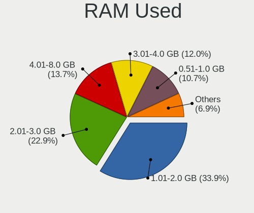
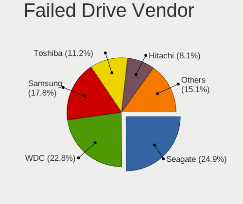
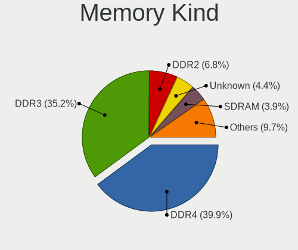

Linux - Tested Hardware & Statistics
------------------------------------

A project to collect tested hardware configurations for Linux.

Anyone can contribute to this report by the [hw-probe](https://github.com/linuxhw/hw-probe) tool:

    sudo -E hw-probe -all -upload

Please contribute! Especially if your hardware is rare.

This is a report for all computer types. See also reports for [desktops](/Desktop/README.md) and [notebooks](/Notebook/README.md).

Full-feature report is available here: https://linux-hardware.org/?view=trends

Distribution-specific reports: [Alpine](/Dist/Alpine), [ALT_Linux](/Dist/ALT_Linux), [antiX](/Dist/antiX), [Artix](/Dist/Artix), [Chrome_OS](/Dist/Chrome_OS), [Clear_Linux](/Dist/Clear_Linux), [Deepin](/Dist/Deepin), [Devuan](/Dist/Devuan), [EndeavourOS](/Dist/EndeavourOS), [Garuda_Linux](/Dist/Garuda_Linux), [GNOME_OS](/Dist/GNOME_OS), [Mageia](/Dist/Mageia), [Makulu](/Dist/Makulu), [NixOS](/Dist/NixOS), [Oracle_Linux](/Dist/Oracle_Linux), [Pardus](/Dist/Pardus), [PureOS](/Dist/PureOS), [Q4OS](/Dist/Q4OS), [Reborn_OS](/Dist/Reborn_OS), [Rocky_Linux](/Dist/Rocky_Linux), [Sparky](/Dist/Sparky), [Void_Linux](/Dist/Void_Linux), [Xero](/Dist/Xero).

Contents
--------

* [ Test Cases ](#test-cases)

* [ System ](#system)
  - [ OS                       ](#os)
  - [ OS Family                ](#os-family)
  - [ Kernel                   ](#kernel)
  - [ Kernel Family            ](#kernel-family)
  - [ Kernel Major Ver.        ](#kernel-major-ver)
  - [ Arch                     ](#arch)
  - [ DE                       ](#de)
  - [ Display Server           ](#display-server)
  - [ Display Manager          ](#display-manager)
  - [ OS Lang                  ](#os-lang)
  - [ Boot Mode                ](#boot-mode)
  - [ Filesystem               ](#filesystem)
  - [ Part. scheme             ](#part-scheme)
  - [ Dual Boot with Linux/BSD ](#dual-boot-with-linuxbsd)
  - [ Dual Boot (Win)          ](#dual-boot-win)

* [ Board ](#board)
  - [ Vendor                   ](#vendor)
  - [ Model                    ](#model)
  - [ Model Family             ](#model-family)
  - [ MFG Year                 ](#mfg-year)
  - [ Form Factor              ](#form-factor)
  - [ Secure Boot              ](#secure-boot)
  - [ Coreboot                 ](#coreboot)
  - [ RAM Size                 ](#ram-size)
  - [ RAM Used                 ](#ram-used)
  - [ Total Drives             ](#total-drives)
  - [ Has CD-ROM               ](#has-cd-rom)
  - [ Has Ethernet             ](#has-ethernet)
  - [ Has WiFi                 ](#has-wifi)
  - [ Has Bluetooth            ](#has-bluetooth)

* [ Location ](#location)
  - [ Country                  ](#country)
  - [ City                     ](#city)

* [ Drives ](#drives)
  - [ Drive Vendor             ](#drive-vendor)
  - [ Drive Model              ](#drive-model)
  - [ HDD Vendor               ](#hdd-vendor)
  - [ SSD Vendor               ](#ssd-vendor)
  - [ Drive Kind               ](#drive-kind)
  - [ Drive Connector          ](#drive-connector)
  - [ Drive Size               ](#drive-size)
  - [ Space Total              ](#space-total)
  - [ Space Used               ](#space-used)
  - [ Malfunc. Drives          ](#malfunc-drives)
  - [ Malfunc. Drive Vendor    ](#malfunc-drive-vendor)
  - [ Malfunc. HDD Vendor      ](#malfunc-hdd-vendor)
  - [ Malfunc. Drive Kind      ](#malfunc-drive-kind)
  - [ Failed Drives            ](#failed-drives)
  - [ Failed Drive Vendor      ](#failed-drive-vendor)
  - [ Drive Status             ](#drive-status)

* [ Storage controller ](#storage-controller)
  - [ Storage Vendor           ](#storage-vendor)
  - [ Storage Model            ](#storage-model)
  - [ Storage Kind             ](#storage-kind)

* [ Processor ](#processor)
  - [ CPU Vendor               ](#cpu-vendor)
  - [ CPU Model                ](#cpu-model)
  - [ CPU Model Family         ](#cpu-model-family)
  - [ CPU Cores                ](#cpu-cores)
  - [ CPU Sockets              ](#cpu-sockets)
  - [ CPU Threads              ](#cpu-threads)
  - [ CPU Op-Modes             ](#cpu-op-modes)
  - [ CPU Microcode            ](#cpu-microcode)
  - [ CPU Microarch            ](#cpu-microarch)

* [ Graphics ](#graphics)
  - [ GPU Vendor               ](#gpu-vendor)
  - [ GPU Model                ](#gpu-model)
  - [ GPU Combo                ](#gpu-combo)
  - [ GPU Driver               ](#gpu-driver)
  - [ GPU Memory               ](#gpu-memory)

* [ Monitor ](#monitor)
  - [ Monitor Vendor           ](#monitor-vendor)
  - [ Monitor Model            ](#monitor-model)
  - [ Monitor Resolution       ](#monitor-resolution)
  - [ Monitor Diagonal         ](#monitor-diagonal)
  - [ Monitor Width            ](#monitor-width)
  - [ Aspect Ratio             ](#aspect-ratio)
  - [ Monitor Area             ](#monitor-area)
  - [ Pixel Density            ](#pixel-density)
  - [ Multiple Monitors        ](#multiple-monitors)

* [ Network ](#network)
  - [ Net Controller Vendor    ](#net-controller-vendor)
  - [ Net Controller Model     ](#net-controller-model)
  - [ Wireless Vendor          ](#wireless-vendor)
  - [ Wireless Model           ](#wireless-model)
  - [ Ethernet Vendor          ](#ethernet-vendor)
  - [ Ethernet Model           ](#ethernet-model)
  - [ Net Controller Kind      ](#net-controller-kind)
  - [ Used Controller          ](#used-controller)
  - [ NICs                     ](#nics)
  - [ IPv6                     ](#ipv6)

* [ Bluetooth ](#bluetooth)
  - [ Bluetooth Vendor         ](#bluetooth-vendor)
  - [ Bluetooth Model          ](#bluetooth-model)

* [ Sound ](#sound)
  - [ Sound Vendor             ](#sound-vendor)
  - [ Sound Model              ](#sound-model)

* [ Memory ](#memory)
  - [ Memory Vendor            ](#memory-vendor)
  - [ Memory Model             ](#memory-model)
  - [ Memory Kind              ](#memory-kind)
  - [ Memory Form Factor       ](#memory-form-factor)
  - [ Memory Size              ](#memory-size)
  - [ Memory Speed             ](#memory-speed)

* [ Printers & scanners ](#printers--scanners)
  - [ Printer Vendor           ](#printer-vendor)
  - [ Printer Model            ](#printer-model)
  - [ Scanner Vendor           ](#scanner-vendor)
  - [ Scanner Model            ](#scanner-model)

* [ Camera ](#camera)
  - [ Camera Vendor            ](#camera-vendor)
  - [ Camera Model             ](#camera-model)

* [ Security ](#security)
  - [ Fingerprint Vendor       ](#fingerprint-vendor)
  - [ Fingerprint Model        ](#fingerprint-model)
  - [ Chipcard Vendor          ](#chipcard-vendor)
  - [ Chipcard Model           ](#chipcard-model)

* [ Unsupported ](#unsupported)
  - [ Unsupported Devices      ](#unsupported-devices)
  - [ Unsupported Device Types ](#unsupported-device-types)

Test Cases
----------

Total: 247648

| Vendor        | Model                       | Form-Factor | Probe                                                      | Date         |
|---------------|-----------------------------|-------------|------------------------------------------------------------|--------------|
| Apple         | MacBookPro7,1               | Notebook    | [4def2a51dc](https://linux-hardware.org/?probe=4def2a51dc) | Apr 17, 2022 |
| Lenovo        | Unknown                     | Notebook    | [6e1760aed0](https://linux-hardware.org/?probe=6e1760aed0) | Apr 17, 2022 |
| ASUSTek       | VivoBook_ASUSLaptop X513... | Notebook    | [1825f45bfa](https://linux-hardware.org/?probe=1825f45bfa) | Apr 17, 2022 |
| HP            | ENVY x360 Convertible 15... | Convertible | [f4151908bf](https://linux-hardware.org/?probe=f4151908bf) | Apr 17, 2022 |
| Gigabyte      | GA-MA69VM-S2                | Desktop     | [5aa8ec8c7e](https://linux-hardware.org/?probe=5aa8ec8c7e) | Apr 17, 2022 |
| Fanless Mi... | Rev GMLR1                   | Mini pc     | [1d954567bf](https://linux-hardware.org/?probe=1d954567bf) | Apr 17, 2022 |
| HP            | Laptop 15s-fq3xxx           | Notebook    | [1fef674c68](https://linux-hardware.org/?probe=1fef674c68) | Apr 17, 2022 |
| HP            | Pavilion g6                 | Notebook    | [0c4c081e71](https://linux-hardware.org/?probe=0c4c081e71) | Apr 17, 2022 |
| MSI           | H510M PRO                   | Desktop     | [a9ce7c295a](https://linux-hardware.org/?probe=a9ce7c295a) | Apr 17, 2022 |
| Apple         | Mac-F22C86C8                | Mini pc     | [9eac0ebbce](https://linux-hardware.org/?probe=9eac0ebbce) | Apr 17, 2022 |
| BANGHO        | Suma 1025                   | Tablet      | [a16c051b3c](https://linux-hardware.org/?probe=a16c051b3c) | Apr 17, 2022 |
| ASUSTek       | PRIME B550M-A               | Desktop     | [72a48fb5d6](https://linux-hardware.org/?probe=72a48fb5d6) | Apr 17, 2022 |
| HP            | Laptop 15s-fq3xxx           | Notebook    | [7ab3733165](https://linux-hardware.org/?probe=7ab3733165) | Apr 17, 2022 |
| Lenovo        | Yoga 720-15IKB              | Convertible | [42b7bd7f75](https://linux-hardware.org/?probe=42b7bd7f75) | Apr 16, 2022 |
| ASRock        | N68-GS4 FX R2.0             | Desktop     | [8f8f3b74e6](https://linux-hardware.org/?probe=8f8f3b74e6) | Apr 16, 2022 |
| Dell          | Inspiron 5555               | Notebook    | [9123d206b0](https://linux-hardware.org/?probe=9123d206b0) | Apr 16, 2022 |
| HP            | ENVY TS 17                  | Notebook    | [83c35e58d5](https://linux-hardware.org/?probe=83c35e58d5) | Apr 16, 2022 |
| Dell          | 0HY9JP A00                  | Desktop     | [a767ef8b4e](https://linux-hardware.org/?probe=a767ef8b4e) | Apr 16, 2022 |
| Lenovo        | ThinkPad L412 0585AV3       | Notebook    | [382836d952](https://linux-hardware.org/?probe=382836d952) | Apr 16, 2022 |
| Dell          | Precision M6800             | Notebook    | [46a37b9e8e](https://linux-hardware.org/?probe=46a37b9e8e) | Apr 16, 2022 |
| ASUSTek       | H110M-A/M.2                 | Desktop     | [1cfc273a11](https://linux-hardware.org/?probe=1cfc273a11) | Apr 16, 2022 |
| HP            | 1497                        | Desktop     | [6d2caeac34](https://linux-hardware.org/?probe=6d2caeac34) | Apr 16, 2022 |
| Lenovo        | G40-80 80JE                 | Notebook    | [28c58e21e0](https://linux-hardware.org/?probe=28c58e21e0) | Apr 16, 2022 |
| Framework     | Laptop                      | Notebook    | [25577a2915](https://linux-hardware.org/?probe=25577a2915) | Apr 16, 2022 |
| Dell          | 0HY9JP A00                  | Desktop     | [5ce6ef2934](https://linux-hardware.org/?probe=5ce6ef2934) | Apr 16, 2022 |
| MSI           | MS-7438 100                 | Desktop     | [bac261ba9a](https://linux-hardware.org/?probe=bac261ba9a) | Apr 16, 2022 |
| ASUSTek       | K53Z                        | Notebook    | [2d870acfa1](https://linux-hardware.org/?probe=2d870acfa1) | Apr 16, 2022 |
| Positivo      | H14BU08                     | Notebook    | [43d44df3d2](https://linux-hardware.org/?probe=43d44df3d2) | Apr 16, 2022 |
| Lenovo        | ThinkPad T440 20B7S1EV00    | Notebook    | [b035e7ae3e](https://linux-hardware.org/?probe=b035e7ae3e) | Apr 16, 2022 |
| Toshiba       | Satellite Pro S500          | Notebook    | [61158a707c](https://linux-hardware.org/?probe=61158a707c) | Apr 16, 2022 |
| Dell          | Latitude 5590               | Notebook    | [ade3f33fb9](https://linux-hardware.org/?probe=ade3f33fb9) | Apr 16, 2022 |
| Acer          | Aspire 5720Z                | Notebook    | [e8155eac20](https://linux-hardware.org/?probe=e8155eac20) | Apr 16, 2022 |
| Lenovo        | ThinkPad X1 Carbon Gen 9... | Notebook    | [1f7292b20a](https://linux-hardware.org/?probe=1f7292b20a) | Apr 16, 2022 |
| Lenovo        | ThinkBook 14p Gen 2 20YN    | Notebook    | [800aefa57e](https://linux-hardware.org/?probe=800aefa57e) | Apr 16, 2022 |
| Acer          | Aspire 5750                 | Notebook    | [4ce545cc86](https://linux-hardware.org/?probe=4ce545cc86) | Apr 16, 2022 |
| MSI           | 970 GAMING                  | Desktop     | [1ed579d3d1](https://linux-hardware.org/?probe=1ed579d3d1) | Apr 16, 2022 |
| HP            | Laptop 17-cp0xxx            | Notebook    | [e9fccc0549](https://linux-hardware.org/?probe=e9fccc0549) | Apr 16, 2022 |
| MSI           | 970 GAMING                  | Desktop     | [dae8a4db62](https://linux-hardware.org/?probe=dae8a4db62) | Apr 16, 2022 |
| Lenovo        | ThinkPad E520 11433BU       | Notebook    | [eb10b5f739](https://linux-hardware.org/?probe=eb10b5f739) | Apr 16, 2022 |
| Dell          | Latitude 3550               | Notebook    | [03ed6ab7b4](https://linux-hardware.org/?probe=03ed6ab7b4) | Apr 16, 2022 |
| ASUSTek       | M5A78L-M/USB3               | Desktop     | [f20c2c3665](https://linux-hardware.org/?probe=f20c2c3665) | Apr 16, 2022 |
| Dell          | 0HY9JP A00                  | Desktop     | [fed643b7ec](https://linux-hardware.org/?probe=fed643b7ec) | Apr 16, 2022 |
| AZW           | U59                         | Desktop     | [fc7e5f0c5c](https://linux-hardware.org/?probe=fc7e5f0c5c) | Apr 16, 2022 |
| Gigabyte      | F2A68HM-DS2                 | Desktop     | [a016ec1bce](https://linux-hardware.org/?probe=a016ec1bce) | Apr 16, 2022 |
| Lenovo        | IdeaPad 5 Pro 16ACH6 82L... | Notebook    | [a37c8a7b48](https://linux-hardware.org/?probe=a37c8a7b48) | Apr 16, 2022 |
| MSI           | A320M PRO-M2 V2             | Desktop     | [7a3fa3e4a4](https://linux-hardware.org/?probe=7a3fa3e4a4) | Apr 16, 2022 |
| AZW           | U59                         | Desktop     | [377d280037](https://linux-hardware.org/?probe=377d280037) | Apr 16, 2022 |
| HP            | Laptop 15-bw0xx             | Notebook    | [4c505489d5](https://linux-hardware.org/?probe=4c505489d5) | Apr 16, 2022 |
| Alienware     | Area-51m R2                 | Notebook    | [e6a7b0ef42](https://linux-hardware.org/?probe=e6a7b0ef42) | Apr 16, 2022 |
| Dell          | 02YYK5 A01                  | Desktop     | [f2e4d7052d](https://linux-hardware.org/?probe=f2e4d7052d) | Apr 16, 2022 |
| Dell          | Latitude 7480               | Notebook    | [7c543b7a6e](https://linux-hardware.org/?probe=7c543b7a6e) | Apr 16, 2022 |
| GMKTEC        | NucBox4                     | Mini pc     | [d29e9757d0](https://linux-hardware.org/?probe=d29e9757d0) | Apr 16, 2022 |
| Apple         | Mac-F221BEC8                | Desktop     | [32bdb05198](https://linux-hardware.org/?probe=32bdb05198) | Apr 16, 2022 |
| Dell          | Latitude E6430              | Notebook    | [c9a365bfe3](https://linux-hardware.org/?probe=c9a365bfe3) | Apr 16, 2022 |
| ASUSTek       | P8B75-M                     | Desktop     | [861c47b139](https://linux-hardware.org/?probe=861c47b139) | Apr 16, 2022 |
| ASUSTek       | H61M-K                      | Desktop     | [c2a4357527](https://linux-hardware.org/?probe=c2a4357527) | Apr 16, 2022 |
| Lenovo        | IdeaPad 5 Pro 16ACH6 82L... | Notebook    | [0d918922ac](https://linux-hardware.org/?probe=0d918922ac) | Apr 16, 2022 |
| HP            | 250 G7 Notebook PC          | Notebook    | [d9565f3e67](https://linux-hardware.org/?probe=d9565f3e67) | Apr 16, 2022 |
| MSI           | 970 GAMING                  | Desktop     | [10ad704b03](https://linux-hardware.org/?probe=10ad704b03) | Apr 16, 2022 |
| Lenovo        | IdeaPad Z565 20066          | Notebook    | [258c94f58b](https://linux-hardware.org/?probe=258c94f58b) | Apr 16, 2022 |
| ASUSTek       | P6T DELUXE                  | Desktop     | [1ceaddfc92](https://linux-hardware.org/?probe=1ceaddfc92) | Apr 16, 2022 |
| Acer          | IPISB-AG                    | All in one  | [e263b7e641](https://linux-hardware.org/?probe=e263b7e641) | Apr 16, 2022 |
| Toshiba       | Satellite L775-151          | Notebook    | [957020b872](https://linux-hardware.org/?probe=957020b872) | Apr 16, 2022 |
| Toshiba       | Satellite L775-151          | Notebook    | [706f14a3e6](https://linux-hardware.org/?probe=706f14a3e6) | Apr 16, 2022 |
| ASUSTek       | D540MA-C                    | Desktop     | [f8639b84f5](https://linux-hardware.org/?probe=f8639b84f5) | Apr 16, 2022 |
| DNS           | W510LU                      | Notebook    | [b3f74317f2](https://linux-hardware.org/?probe=b3f74317f2) | Apr 16, 2022 |
| Gigabyte      | GA-990FX-GAMING             | Desktop     | [dc1e145cf3](https://linux-hardware.org/?probe=dc1e145cf3) | Apr 16, 2022 |
| Packard Be... | EasyNote TK85               | Notebook    | [c20035dfb3](https://linux-hardware.org/?probe=c20035dfb3) | Apr 16, 2022 |
| Dell          | Precision M6800             | Notebook    | [a632e8de16](https://linux-hardware.org/?probe=a632e8de16) | Apr 16, 2022 |
| MSI           | Modern 14 B4MW              | Notebook    | [5d8e6ca082](https://linux-hardware.org/?probe=5d8e6ca082) | Apr 16, 2022 |
| Lenovo        | ThinkPad X230 2325YGM       | Notebook    | [3606442649](https://linux-hardware.org/?probe=3606442649) | Apr 16, 2022 |
| HP            | Pavilion Gaming Laptop 1... | Notebook    | [c5e6eae8d7](https://linux-hardware.org/?probe=c5e6eae8d7) | Apr 16, 2022 |
| Apple         | MacBookPro8,1               | Notebook    | [a8c0eeb473](https://linux-hardware.org/?probe=a8c0eeb473) | Apr 16, 2022 |
| Gigabyte      | H61M-S1                     | Desktop     | [dfd89c6a60](https://linux-hardware.org/?probe=dfd89c6a60) | Apr 16, 2022 |
| Dell          | Inspiron 5458               | Notebook    | [5f7dafa5b9](https://linux-hardware.org/?probe=5f7dafa5b9) | Apr 16, 2022 |
| Teclast       | F6 Plus                     | Notebook    | [a9407bd227](https://linux-hardware.org/?probe=a9407bd227) | Apr 16, 2022 |
| MSI           | GF63 8RD                    | Notebook    | [287e344d0e](https://linux-hardware.org/?probe=287e344d0e) | Apr 16, 2022 |
| Teclast       | F6 Plus                     | Notebook    | [7403ce7189](https://linux-hardware.org/?probe=7403ce7189) | Apr 16, 2022 |
| MSI           | GS65 Stealth 9SE            | Notebook    | [d789592552](https://linux-hardware.org/?probe=d789592552) | Apr 16, 2022 |
| ASUSTek       | G752VY                      | Notebook    | [a497ac3b95](https://linux-hardware.org/?probe=a497ac3b95) | Apr 16, 2022 |
| ASUSTek       | H61M-K                      | Desktop     | [690867d18c](https://linux-hardware.org/?probe=690867d18c) | Apr 16, 2022 |
| ASRock        | H110M-DVS R2.0              | Desktop     | [aa88339957](https://linux-hardware.org/?probe=aa88339957) | Apr 16, 2022 |
| ASUSTek       | A68HM-PLUS                  | Desktop     | [0bfefd6499](https://linux-hardware.org/?probe=0bfefd6499) | Apr 16, 2022 |
| ASUSTek       | 970 PRO GAMING/AURA         | Desktop     | [7efbdedc5f](https://linux-hardware.org/?probe=7efbdedc5f) | Apr 16, 2022 |
| ASUSTek       | VivoBook_ASUSLaptop X421... | Notebook    | [a0ad75fa4b](https://linux-hardware.org/?probe=a0ad75fa4b) | Apr 16, 2022 |
| MSI           | B560M-A PRO                 | Desktop     | [c394557d17](https://linux-hardware.org/?probe=c394557d17) | Apr 16, 2022 |
| Dell          | 08WKV3 A00                  | Desktop     | [f3afe20dae](https://linux-hardware.org/?probe=f3afe20dae) | Apr 16, 2022 |
| Lenovo        | ThinkPad T490 20N3S19L00    | Notebook    | [5812cc4868](https://linux-hardware.org/?probe=5812cc4868) | Apr 16, 2022 |
| ASUSTek       | TP201SA                     | Notebook    | [2898b67bff](https://linux-hardware.org/?probe=2898b67bff) | Apr 16, 2022 |
| HP            | 250 G7 Notebook PC          | Notebook    | [2b3ac63766](https://linux-hardware.org/?probe=2b3ac63766) | Apr 16, 2022 |
| TUXEDO        | Pulse 15 Gen1               | Notebook    | [46dd37cb4b](https://linux-hardware.org/?probe=46dd37cb4b) | Apr 16, 2022 |
| Dell          | Latitude E6320              | Notebook    | [84523d9bd9](https://linux-hardware.org/?probe=84523d9bd9) | Apr 16, 2022 |
| TUXEDO        | Pulse 15 Gen1               | Notebook    | [50b0cb93c7](https://linux-hardware.org/?probe=50b0cb93c7) | Apr 16, 2022 |
| ASUSTek       | ROG STRIX B560-A GAMING ... | Desktop     | [9a5d59c375](https://linux-hardware.org/?probe=9a5d59c375) | Apr 16, 2022 |
| Medion        | H110H4-EM                   | Desktop     | [b1fcc5abcf](https://linux-hardware.org/?probe=b1fcc5abcf) | Apr 16, 2022 |
| ASUSTek       | PRIME A320M-K               | Desktop     | [b5094d96cc](https://linux-hardware.org/?probe=b5094d96cc) | Apr 16, 2022 |
| Toshiba       | Satellite L10W-B-101        | Notebook    | [65edd32378](https://linux-hardware.org/?probe=65edd32378) | Apr 16, 2022 |
| HP            | ZBook 17 G2                 | Notebook    | [d7b7a81cbb](https://linux-hardware.org/?probe=d7b7a81cbb) | Apr 16, 2022 |
| ASUSTek       | X510UAR                     | Notebook    | [b39b237ff0](https://linux-hardware.org/?probe=b39b237ff0) | Apr 16, 2022 |
| Dell          | Venue 11 Pro 5130           | Notebook    | [333287a94f](https://linux-hardware.org/?probe=333287a94f) | Apr 16, 2022 |
| ASRock        | B560M Pro4                  | Desktop     | [2fe297dc4b](https://linux-hardware.org/?probe=2fe297dc4b) | Apr 16, 2022 |
| ASRock        | B550M Phantom Gaming 4      | Desktop     | [3e3e2fd22f](https://linux-hardware.org/?probe=3e3e2fd22f) | Apr 16, 2022 |
| ASUSTek       | P7H55                       | Desktop     | [d619f35fb8](https://linux-hardware.org/?probe=d619f35fb8) | Apr 16, 2022 |
| Dell          | Inspiron 5406 2n1           | Convertible | [24a1739a88](https://linux-hardware.org/?probe=24a1739a88) | Apr 16, 2022 |
| Valve         | Jupiter                     | Notebook    | [ed07e93435](https://linux-hardware.org/?probe=ed07e93435) | Apr 16, 2022 |
| Lenovo        | ThinkPad L440 20ASA02800    | Notebook    | [697a90ffa2](https://linux-hardware.org/?probe=697a90ffa2) | Apr 16, 2022 |
| Acer          | Nitro AN517-41              | Notebook    | [e955d40057](https://linux-hardware.org/?probe=e955d40057) | Apr 16, 2022 |
| Samsung       | NB30P                       | Notebook    | [a64bf01edf](https://linux-hardware.org/?probe=a64bf01edf) | Apr 16, 2022 |
| Dell          | XPS 13 9350                 | Notebook    | [d0e37d8bc1](https://linux-hardware.org/?probe=d0e37d8bc1) | Apr 16, 2022 |
| ASUSTek       | Maximus VI HERO             | Desktop     | [923a82e975](https://linux-hardware.org/?probe=923a82e975) | Apr 16, 2022 |
| Lenovo        | IdeaPad 5 15ARE05 81YQ      | Notebook    | [7e7136d915](https://linux-hardware.org/?probe=7e7136d915) | Apr 16, 2022 |
| Dell          | Inspiron 13-5378            | Notebook    | [3998a17f75](https://linux-hardware.org/?probe=3998a17f75) | Apr 16, 2022 |
| Dell          | 0Y5DDC A00                  | Desktop     | [c9510b64e8](https://linux-hardware.org/?probe=c9510b64e8) | Apr 16, 2022 |
| Acer          | IPISB-AG                    | All in one  | [88265ec5b6](https://linux-hardware.org/?probe=88265ec5b6) | Apr 16, 2022 |
| MSI           | H110M PRO-VD                | Desktop     | [2fc240d0aa](https://linux-hardware.org/?probe=2fc240d0aa) | Apr 16, 2022 |
| ASUSTek       | A88XM-A                     | Desktop     | [427335d90c](https://linux-hardware.org/?probe=427335d90c) | Apr 16, 2022 |
| ASUSTek       | K53SD                       | Notebook    | [559213734d](https://linux-hardware.org/?probe=559213734d) | Apr 16, 2022 |
| Dell          | XPS 15 9560                 | Notebook    | [9529ed78e9](https://linux-hardware.org/?probe=9529ed78e9) | Apr 16, 2022 |
| Dell          | XPS 15 9560                 | Notebook    | [1ef9e4e85d](https://linux-hardware.org/?probe=1ef9e4e85d) | Apr 16, 2022 |
| Gigabyte      | Z390 GAMING X-CF            | Desktop     | [65b68d5bb9](https://linux-hardware.org/?probe=65b68d5bb9) | Apr 16, 2022 |
| HP            | EliteBook 820 G2            | Notebook    | [65c9ced61d](https://linux-hardware.org/?probe=65c9ced61d) | Apr 16, 2022 |
| Dell          | XPS 15 9560                 | Notebook    | [abee14fa00](https://linux-hardware.org/?probe=abee14fa00) | Apr 16, 2022 |
| Fujitsu       | LIFEBOOK P771               | Notebook    | [f9d5ba9c1c](https://linux-hardware.org/?probe=f9d5ba9c1c) | Apr 16, 2022 |
| ASUSTek       | P52F                        | Notebook    | [0cb00534d0](https://linux-hardware.org/?probe=0cb00534d0) | Apr 16, 2022 |
| Fujitsu       | LIFEBOOK P771               | Notebook    | [a6580631d1](https://linux-hardware.org/?probe=a6580631d1) | Apr 16, 2022 |
| MSI           | B450M PRO-VDH MAX           | Desktop     | [e28ee0bd42](https://linux-hardware.org/?probe=e28ee0bd42) | Apr 16, 2022 |
| Lenovo        | G780 20138                  | Notebook    | [c20f1de565](https://linux-hardware.org/?probe=c20f1de565) | Apr 16, 2022 |
| Dell          | 06D7TR A01                  | Desktop     | [9a21a6c0f4](https://linux-hardware.org/?probe=9a21a6c0f4) | Apr 16, 2022 |
| ASUSTek       | P5VD2-MX                    | Desktop     | [57fec52891](https://linux-hardware.org/?probe=57fec52891) | Apr 16, 2022 |
| HP            | Pavilion Laptop 14-dv0xx... | Notebook    | [579d91eebd](https://linux-hardware.org/?probe=579d91eebd) | Apr 16, 2022 |
| MSI           | MPG B550I GAMING EDGE WI... | Desktop     | [7afe8794c5](https://linux-hardware.org/?probe=7afe8794c5) | Apr 16, 2022 |
| HP            | EliteBook x360 1030 G2      | Convertible | [69fdb71a72](https://linux-hardware.org/?probe=69fdb71a72) | Apr 16, 2022 |
| ASUSTek       | X541UAK                     | Notebook    | [811e032c61](https://linux-hardware.org/?probe=811e032c61) | Apr 16, 2022 |
| Lenovo        | IdeaPad 3 15ITL6 82H8       | Notebook    | [e3658d7c35](https://linux-hardware.org/?probe=e3658d7c35) | Apr 16, 2022 |
| Lenovo        | IdeaPadFlex 5 14ALC05 82... | Convertible | [a8582f6cb4](https://linux-hardware.org/?probe=a8582f6cb4) | Apr 16, 2022 |
| Fujitsu       | D2828-A2 S26361-D2828-A2    | Desktop     | [1959eab901](https://linux-hardware.org/?probe=1959eab901) | Apr 16, 2022 |
| Toshiba       | IS 1413G                    | Notebook    | [e9e45e7f91](https://linux-hardware.org/?probe=e9e45e7f91) | Apr 16, 2022 |
| ASRock        | P67 Pro3                    | Desktop     | [2f98f9cdee](https://linux-hardware.org/?probe=2f98f9cdee) | Apr 16, 2022 |
| Gigabyte      | M61PME-S2P                  | Desktop     | [cb64383c99](https://linux-hardware.org/?probe=cb64383c99) | Apr 16, 2022 |
| HP            | EliteBook 840 G1            | Notebook    | [d9c6549322](https://linux-hardware.org/?probe=d9c6549322) | Apr 16, 2022 |
| MSI           | B450M PRO-M2 MAX            | Desktop     | [4702e93a67](https://linux-hardware.org/?probe=4702e93a67) | Apr 16, 2022 |
| Lenovo        | IdeaPad 320-15ABR 80XS      | Notebook    | [fccfb454e4](https://linux-hardware.org/?probe=fccfb454e4) | Apr 16, 2022 |
| ASUSTek       | VivoBook_ASUSLaptop TP41... | Convertible | [3afe0a60fc](https://linux-hardware.org/?probe=3afe0a60fc) | Apr 16, 2022 |
| HP            | EliteBook Folio 1040 G2     | Notebook    | [53eb30d6a6](https://linux-hardware.org/?probe=53eb30d6a6) | Apr 16, 2022 |
| Toshiba       | IS 1413G                    | Notebook    | [e51d0544a1](https://linux-hardware.org/?probe=e51d0544a1) | Apr 16, 2022 |
| HP            | Pavilion g6                 | Notebook    | [a7f800ed49](https://linux-hardware.org/?probe=a7f800ed49) | Apr 16, 2022 |
| HP            | 1494                        | Desktop     | [6ad3ca1745](https://linux-hardware.org/?probe=6ad3ca1745) | Apr 16, 2022 |
| ASUSTek       | G20AJ                       | Desktop     | [f83ee2cc17](https://linux-hardware.org/?probe=f83ee2cc17) | Apr 16, 2022 |
| Dell          | Studio XPS 1645             | Notebook    | [6e722019b4](https://linux-hardware.org/?probe=6e722019b4) | Apr 16, 2022 |
| MSI           | Z270-A PRO                  | Desktop     | [55c72a253b](https://linux-hardware.org/?probe=55c72a253b) | Apr 16, 2022 |
| ASUSTek       | G20AJ                       | Desktop     | [eef3c69fcd](https://linux-hardware.org/?probe=eef3c69fcd) | Apr 16, 2022 |
| Apple         | MacBookPro9,2               | Notebook    | [144971e364](https://linux-hardware.org/?probe=144971e364) | Apr 16, 2022 |
| Acer          | Aspire E5-471G              | Notebook    | [a7179e1ba3](https://linux-hardware.org/?probe=a7179e1ba3) | Apr 16, 2022 |
| HP            | Pavilion dv7                | Notebook    | [60eee202a1](https://linux-hardware.org/?probe=60eee202a1) | Apr 16, 2022 |
| ASUSTek       | Z97-P                       | Desktop     | [bf54ec19d0](https://linux-hardware.org/?probe=bf54ec19d0) | Apr 16, 2022 |
| HP            | 845A                        | Desktop     | [cc8c320581](https://linux-hardware.org/?probe=cc8c320581) | Apr 16, 2022 |
| Dell          | 0DN075                      | Desktop     | [05bd1b50f1](https://linux-hardware.org/?probe=05bd1b50f1) | Apr 16, 2022 |
| Fujitsu       | LIFEBOOK E746               | Notebook    | [ae8fe4a156](https://linux-hardware.org/?probe=ae8fe4a156) | Apr 16, 2022 |
| Apple         | Mac-63001698E7A34814 iMa... | All in one  | [2ed6fa2459](https://linux-hardware.org/?probe=2ed6fa2459) | Apr 16, 2022 |
| HP            | Compaq 6730s                | Notebook    | [4902d2bf25](https://linux-hardware.org/?probe=4902d2bf25) | Apr 16, 2022 |
| Timi          | RedmiBook Pro 15S           | Notebook    | [e29970db9c](https://linux-hardware.org/?probe=e29970db9c) | Apr 16, 2022 |
| Fujitsu       | D2828-A2 S26361-D2828-A2    | Desktop     | [0a7ccf21d6](https://linux-hardware.org/?probe=0a7ccf21d6) | Apr 16, 2022 |
| Acer          | ConceptD CC314-72           | Convertible | [07f3c16543](https://linux-hardware.org/?probe=07f3c16543) | Apr 16, 2022 |
| HP            | Pavilion m7                 | Notebook    | [ed02e5b37c](https://linux-hardware.org/?probe=ed02e5b37c) | Apr 16, 2022 |
| Gigabyte      | Z170-D3H-CF                 | Desktop     | [6a9e2b3174](https://linux-hardware.org/?probe=6a9e2b3174) | Apr 16, 2022 |
| Gigabyte      | H110M-H-CF                  | Desktop     | [66ef9c9e5f](https://linux-hardware.org/?probe=66ef9c9e5f) | Apr 16, 2022 |
| Acer          | TravelMate P643-M           | Notebook    | [eaec316f95](https://linux-hardware.org/?probe=eaec316f95) | Apr 16, 2022 |
| HP            | Laptop 15s-eq2xxx           | Notebook    | [5bd22623b0](https://linux-hardware.org/?probe=5bd22623b0) | Apr 16, 2022 |
| Acer          | Aspire C24-865              | All in one  | [961f1373a2](https://linux-hardware.org/?probe=961f1373a2) | Apr 16, 2022 |
| Dell          | Inspiron 15 7000 Gaming     | Notebook    | [ca0b0f6a8a](https://linux-hardware.org/?probe=ca0b0f6a8a) | Apr 16, 2022 |
| Lenovo        | Legion Y7000P 2019 81Q5     | Notebook    | [7e346154a5](https://linux-hardware.org/?probe=7e346154a5) | Apr 16, 2022 |
| ASUSTek       | STRIX Z270G GAMING          | Desktop     | [76a5225b83](https://linux-hardware.org/?probe=76a5225b83) | Apr 16, 2022 |
| Lenovo        | IdeaPad 330-15IKB 81DC      | Notebook    | [9f099000d4](https://linux-hardware.org/?probe=9f099000d4) | Apr 16, 2022 |
| Lenovo        | ThinkPad P50s 20FL000MUS    | Notebook    | [99fbb4446c](https://linux-hardware.org/?probe=99fbb4446c) | Apr 16, 2022 |
| Dell          | XPS 15 9560                 | Notebook    | [c540449ce7](https://linux-hardware.org/?probe=c540449ce7) | Apr 16, 2022 |
| Supermicro    | H8QG6                       | Desktop     | [060f1e3d34](https://linux-hardware.org/?probe=060f1e3d34) | Apr 16, 2022 |
| Gigabyte      | GA-MA785G-UD3H              | Desktop     | [7c4882a4ef](https://linux-hardware.org/?probe=7c4882a4ef) | Apr 16, 2022 |
| Acer          | Aspire R3-131T              | Notebook    | [776575ecdb](https://linux-hardware.org/?probe=776575ecdb) | Apr 16, 2022 |
| Dell          | 0VYXHD A00                  | Desktop     | [4280de633d](https://linux-hardware.org/?probe=4280de633d) | Apr 16, 2022 |
| Google        | Phaser360                   | Notebook    | [ab97623a21](https://linux-hardware.org/?probe=ab97623a21) | Apr 16, 2022 |
| Apple         | MacBookPro8,1               | Notebook    | [f74cae630d](https://linux-hardware.org/?probe=f74cae630d) | Apr 16, 2022 |
| TUXEDO        | P95_HR                      | Notebook    | [a3996b5033](https://linux-hardware.org/?probe=a3996b5033) | Apr 16, 2022 |
| Gigabyte      | GA-870A-UD3                 | Desktop     | [2bc3cb42bb](https://linux-hardware.org/?probe=2bc3cb42bb) | Apr 16, 2022 |
| Dell          | 0PV3YR A05                  | Server      | [7e44758885](https://linux-hardware.org/?probe=7e44758885) | Apr 16, 2022 |
| ASUSTek       | A8R32-MVP Deluxe            | Desktop     | [a186aa76d5](https://linux-hardware.org/?probe=a186aa76d5) | Apr 16, 2022 |
| Acer          | Swift SF315-52              | Notebook    | [90c143abed](https://linux-hardware.org/?probe=90c143abed) | Apr 16, 2022 |
| ASUSTek       | P8H67-M LX                  | Desktop     | [65116c3b59](https://linux-hardware.org/?probe=65116c3b59) | Apr 16, 2022 |
| Gigabyte      | X99-UD4-CF                  | Desktop     | [0ce9091731](https://linux-hardware.org/?probe=0ce9091731) | Apr 16, 2022 |
| ASUSTek       | PRIME Z690-P WIFI D4        | Desktop     | [0d1f53febb](https://linux-hardware.org/?probe=0d1f53febb) | Apr 16, 2022 |
| ASUSTek       | PRIME Z690-P WIFI D4        | Desktop     | [b0a5b307c9](https://linux-hardware.org/?probe=b0a5b307c9) | Apr 16, 2022 |
| Dell          | Inspiron 15 7000 Gaming     | Notebook    | [b07e7e9974](https://linux-hardware.org/?probe=b07e7e9974) | Apr 16, 2022 |
| Positivo B... | VJC141F11X-B0111L           | Notebook    | [5ea499eca7](https://linux-hardware.org/?probe=5ea499eca7) | Apr 16, 2022 |
| Lenovo        | ThinkPad T440p 20AWS03H0... | Notebook    | [64fb4146d0](https://linux-hardware.org/?probe=64fb4146d0) | Apr 16, 2022 |
| Lenovo        | IdeaPad 3 15IML05 81WR      | Notebook    | [81dced5e0a](https://linux-hardware.org/?probe=81dced5e0a) | Apr 16, 2022 |
| Unknown       | Unknown                     | Soc         | [478b3488e7](https://linux-hardware.org/?probe=478b3488e7) | Apr 16, 2022 |
| ASRock        | FM2A88X Extreme6+           | Desktop     | [3d894ef45c](https://linux-hardware.org/?probe=3d894ef45c) | Apr 16, 2022 |
| Gigabyte      | G1.Sniper A88X-CF           | Desktop     | [5971999c12](https://linux-hardware.org/?probe=5971999c12) | Apr 16, 2022 |
| Dell          | 0VHXCD A03                  | Desktop     | [290987223e](https://linux-hardware.org/?probe=290987223e) | Apr 16, 2022 |
| Dell          | XPS 15 9520                 | Notebook    | [4cf57abb44](https://linux-hardware.org/?probe=4cf57abb44) | Apr 16, 2022 |
| Acer          | Aspire ES1-512              | Notebook    | [0f19c624fb](https://linux-hardware.org/?probe=0f19c624fb) | Apr 16, 2022 |
| Acer          | Aspire ES1-512              | Notebook    | [6467d63e0d](https://linux-hardware.org/?probe=6467d63e0d) | Apr 16, 2022 |
| ASUSTek       | M5A97 R2.0                  | Desktop     | [6f358d55e7](https://linux-hardware.org/?probe=6f358d55e7) | Apr 16, 2022 |
| Lenovo        | Legion 5 15ARH05H 82B1      | Notebook    | [c6f1d1b99b](https://linux-hardware.org/?probe=c6f1d1b99b) | Apr 16, 2022 |
| Thirdwave     | DX-T7                       | Notebook    | [b03707283b](https://linux-hardware.org/?probe=b03707283b) | Apr 16, 2022 |
| Lenovo        | ThinkPad L14 Gen 2 20X10... | Notebook    | [6f75f679f9](https://linux-hardware.org/?probe=6f75f679f9) | Apr 16, 2022 |
| HP            | 14                          | Notebook    | [2a8a40d96b](https://linux-hardware.org/?probe=2a8a40d96b) | Apr 16, 2022 |
| ASUSTek       | PRIME H410M-R               | Desktop     | [c8146beb84](https://linux-hardware.org/?probe=c8146beb84) | Apr 16, 2022 |
| HP            | Pavilion dv5                | Notebook    | [22aa828b2f](https://linux-hardware.org/?probe=22aa828b2f) | Apr 16, 2022 |
| HP            | Pavilion Gaming Laptop 1... | Notebook    | [6454c55f08](https://linux-hardware.org/?probe=6454c55f08) | Apr 16, 2022 |
| Gigabyte      | B550 AORUS MASTER           | Desktop     | [9ba73648b1](https://linux-hardware.org/?probe=9ba73648b1) | Apr 16, 2022 |
| ASUSTek       | X550LN                      | Notebook    | [2a0b2ae677](https://linux-hardware.org/?probe=2a0b2ae677) | Apr 16, 2022 |
| Gigabyte      | G41MT-D3                    | Desktop     | [1785652200](https://linux-hardware.org/?probe=1785652200) | Apr 16, 2022 |
| Gigabyte      | B450M DS3H V2               | Desktop     | [b097841482](https://linux-hardware.org/?probe=b097841482) | Apr 16, 2022 |
| MSI           | MPG X570 GAMING EDGE WIF... | Desktop     | [0ad6471ecf](https://linux-hardware.org/?probe=0ad6471ecf) | Apr 16, 2022 |
| Acer          | Aspire E1-572               | Notebook    | [27d5f97167](https://linux-hardware.org/?probe=27d5f97167) | Apr 16, 2022 |
| A-DATA Tec... | XENIA 14                    | Notebook    | [839159351b](https://linux-hardware.org/?probe=839159351b) | Apr 16, 2022 |
| Raspberry ... | Raspberry Pi 3 Model B P... | Soc         | [2a3f36f9c0](https://linux-hardware.org/?probe=2a3f36f9c0) | Apr 16, 2022 |
| HP            | Pavilion dv6                | Notebook    | [639a7422d8](https://linux-hardware.org/?probe=639a7422d8) | Apr 16, 2022 |
| A-DATA Tec... | XENIA 14                    | Notebook    | [29a530e6bb](https://linux-hardware.org/?probe=29a530e6bb) | Apr 16, 2022 |
| Gigabyte      | G5 GD                       | Notebook    | [2b2833576e](https://linux-hardware.org/?probe=2b2833576e) | Apr 16, 2022 |
| Dell          | Inspiron 7300 2n1           | Convertible | [17b7ab1ae3](https://linux-hardware.org/?probe=17b7ab1ae3) | Apr 16, 2022 |
| Gigabyte      | X99P-SLI-CF                 | Desktop     | [19055b80bc](https://linux-hardware.org/?probe=19055b80bc) | Apr 16, 2022 |
| Toshiba       | BLB                         | Notebook    | [903779c2b2](https://linux-hardware.org/?probe=903779c2b2) | Apr 16, 2022 |
| Framework     | Laptop                      | Notebook    | [84da421304](https://linux-hardware.org/?probe=84da421304) | Apr 16, 2022 |
| Toshiba       | BLB                         | Notebook    | [1dffc347dd](https://linux-hardware.org/?probe=1dffc347dd) | Apr 16, 2022 |
| Lenovo        | 3132 SDK0K17763 WIN 1801... | Desktop     | [a6e43346ba](https://linux-hardware.org/?probe=a6e43346ba) | Apr 16, 2022 |
| Fujitsu Si... | D2750-A2 S26361-D2750-A2    | Desktop     | [44b99daa8e](https://linux-hardware.org/?probe=44b99daa8e) | Apr 16, 2022 |
| HP            | Pavilion 17                 | Notebook    | [acb0c7fd0e](https://linux-hardware.org/?probe=acb0c7fd0e) | Apr 16, 2022 |
| AWOW          | AK34Pro                     | Mini pc     | [676c8502ff](https://linux-hardware.org/?probe=676c8502ff) | Apr 15, 2022 |
| HP            | Pavilion ZV6100 (EE984EA... | Notebook    | [425620585b](https://linux-hardware.org/?probe=425620585b) | Apr 15, 2022 |
| ASUSTek       | ROG STRIX X470-F GAMING     | Desktop     | [0169381aeb](https://linux-hardware.org/?probe=0169381aeb) | Apr 15, 2022 |
| Lenovo        | ThinkPad T440p 20AWS1Y90... | Notebook    | [a572c901ca](https://linux-hardware.org/?probe=a572c901ca) | Apr 15, 2022 |
| Lenovo        | 30D0 SDK0J40705 WIN 3425... | Desktop     | [474bb81b18](https://linux-hardware.org/?probe=474bb81b18) | Apr 15, 2022 |
| Dell          | Inspiron 5570               | Notebook    | [066d125002](https://linux-hardware.org/?probe=066d125002) | Apr 15, 2022 |
| ASUSTek       | K50IJ                       | Notebook    | [ad5a24dbb3](https://linux-hardware.org/?probe=ad5a24dbb3) | Apr 15, 2022 |
| MSI           | 2AE0                        | Desktop     | [b1059198e0](https://linux-hardware.org/?probe=b1059198e0) | Apr 15, 2022 |
| Dell          | Latitude 7410               | Notebook    | [da82f8bba8](https://linux-hardware.org/?probe=da82f8bba8) | Apr 15, 2022 |
| ZOTAC         | NM10                        | Desktop     | [b2983fdd9d](https://linux-hardware.org/?probe=b2983fdd9d) | Apr 15, 2022 |
| HP            | Laptop 14-dq4xxx            | Notebook    | [a892a2412c](https://linux-hardware.org/?probe=a892a2412c) | Apr 15, 2022 |
| Gigabyte      | F2A68HM-H                   | Desktop     | [68eec83e55](https://linux-hardware.org/?probe=68eec83e55) | Apr 15, 2022 |
| HP            | Pavilion Laptop 15-eg0xx... | Notebook    | [53cc2d28a7](https://linux-hardware.org/?probe=53cc2d28a7) | Apr 15, 2022 |
| Lenovo        | 30D0 SDK0J40705 WIN 3425... | Desktop     | [f6a1a50a75](https://linux-hardware.org/?probe=f6a1a50a75) | Apr 15, 2022 |
| HP            | Pavilion dv6500             | Notebook    | [064748981e](https://linux-hardware.org/?probe=064748981e) | Apr 15, 2022 |
| Gigabyte      | EP31-DS3L                   | Desktop     | [13324a7aea](https://linux-hardware.org/?probe=13324a7aea) | Apr 15, 2022 |
| Dell          | XPS 13 9310                 | Notebook    | [2c395ea438](https://linux-hardware.org/?probe=2c395ea438) | Apr 15, 2022 |
| HP            | Pavilion dv6500             | Notebook    | [48350ccc67](https://linux-hardware.org/?probe=48350ccc67) | Apr 15, 2022 |
| LG Electro... | 15Z95P-G.AA78B              | Notebook    | [f5ef9987a4](https://linux-hardware.org/?probe=f5ef9987a4) | Apr 15, 2022 |
| ASUSTek       | U47A                        | Notebook    | [9634258fee](https://linux-hardware.org/?probe=9634258fee) | Apr 15, 2022 |
| MSI           | Creator 15 A10SFS           | Notebook    | [42b2140343](https://linux-hardware.org/?probe=42b2140343) | Apr 15, 2022 |
| Gigabyte      | B450M DS3H-CF               | Desktop     | [c8161370ea](https://linux-hardware.org/?probe=c8161370ea) | Apr 15, 2022 |
| Lenovo        | ThinkBook 14 G2 ARE 20VF    | Notebook    | [6d63a9c8bc](https://linux-hardware.org/?probe=6d63a9c8bc) | Apr 15, 2022 |
| Toshiba       | Satellite L300              | Notebook    | [242592fee5](https://linux-hardware.org/?probe=242592fee5) | Apr 15, 2022 |
| Dell          | Inspiron 5406 2n1           | Convertible | [a2947cf99b](https://linux-hardware.org/?probe=a2947cf99b) | Apr 15, 2022 |
| Sony          | SVF1521L1RB                 | Notebook    | [ab464ae6a9](https://linux-hardware.org/?probe=ab464ae6a9) | Apr 15, 2022 |
| Google        | Squawks                     | Notebook    | [a6dc68bba1](https://linux-hardware.org/?probe=a6dc68bba1) | Apr 15, 2022 |
| ASUSTek       | M5A99FX PRO R2.0            | Desktop     | [d7f72a830c](https://linux-hardware.org/?probe=d7f72a830c) | Apr 15, 2022 |
| Raspberry ... | BCM2835                     | Soc         | [9ee10a70be](https://linux-hardware.org/?probe=9ee10a70be) | Apr 15, 2022 |
| HP            | Pavilion 17                 | Notebook    | [014f42ecee](https://linux-hardware.org/?probe=014f42ecee) | Apr 15, 2022 |
| Lenovo        | IdeaPad 3 15ALC6 82KU       | Notebook    | [4645168704](https://linux-hardware.org/?probe=4645168704) | Apr 15, 2022 |
| Google        | Enguarde                    | Notebook    | [6e1d5488f8](https://linux-hardware.org/?probe=6e1d5488f8) | Apr 15, 2022 |
| Gigabyte      | H61M-D2H-USB3               | Desktop     | [016243a675](https://linux-hardware.org/?probe=016243a675) | Apr 15, 2022 |
| Dell          | Inspiron 5406 2n1           | Convertible | [a6c14df869](https://linux-hardware.org/?probe=a6c14df869) | Apr 15, 2022 |
| Schenker      | VISION 15 (SVS15E21)        | Notebook    | [48e04dd798](https://linux-hardware.org/?probe=48e04dd798) | Apr 15, 2022 |
| ASUSTek       | M5A78L/USB3                 | Desktop     | [48deb234f0](https://linux-hardware.org/?probe=48deb234f0) | Apr 15, 2022 |
| Lenovo        | SHARKBAY 0B98401 WIN        | Desktop     | [90486ad164](https://linux-hardware.org/?probe=90486ad164) | Apr 15, 2022 |
| Unknown       | HX90                        | Desktop     | [a9b1d5a579](https://linux-hardware.org/?probe=a9b1d5a579) | Apr 15, 2022 |
| Positivo      | C464C                       | Convertible | [c4bf224f57](https://linux-hardware.org/?probe=c4bf224f57) | Apr 15, 2022 |
| ASUSTek       | M5A78L/USB3                 | Desktop     | [bb302cfbbd](https://linux-hardware.org/?probe=bb302cfbbd) | Apr 15, 2022 |
| HP            | Pavilion Laptop 15-eg0xx... | Notebook    | [b1e71b5b4c](https://linux-hardware.org/?probe=b1e71b5b4c) | Apr 15, 2022 |
| ASUSTek       | B150-PRO                    | Desktop     | [1ebe5f0e99](https://linux-hardware.org/?probe=1ebe5f0e99) | Apr 15, 2022 |
| Lenovo        | ThinkPad T14s Gen 2i 20W... | Notebook    | [539ce7e59a](https://linux-hardware.org/?probe=539ce7e59a) | Apr 15, 2022 |
| MSI           | CX700                       | Notebook    | [b7715b0ff7](https://linux-hardware.org/?probe=b7715b0ff7) | Apr 15, 2022 |
| HP            | Pavilion x2 Detachable      | Tablet      | [fdcebf57ee](https://linux-hardware.org/?probe=fdcebf57ee) | Apr 15, 2022 |
| Acer          | Nitro AN515-57              | Notebook    | [b824b88050](https://linux-hardware.org/?probe=b824b88050) | Apr 15, 2022 |
| Alienware     | x17 R1                      | Notebook    | [86a2d88704](https://linux-hardware.org/?probe=86a2d88704) | Apr 15, 2022 |
| Gigabyte      | GA-78LMT-USB3 SEx           | Desktop     | [623024de22](https://linux-hardware.org/?probe=623024de22) | Apr 15, 2022 |
| HP            | ProBook 455 G8 Notebook ... | Notebook    | [5bff5642ba](https://linux-hardware.org/?probe=5bff5642ba) | Apr 15, 2022 |
| Lenovo        | MAHOBAY NO DPK              | Desktop     | [c3d8900f58](https://linux-hardware.org/?probe=c3d8900f58) | Apr 15, 2022 |
| HP            | Pavilion Laptop 15-eg0xx... | Notebook    | [e9a5e187ad](https://linux-hardware.org/?probe=e9a5e187ad) | Apr 15, 2022 |
| Acer          | Aspire 5750G                | Notebook    | [73d1368d93](https://linux-hardware.org/?probe=73d1368d93) | Apr 15, 2022 |
| Gigabyte      | EP31-DS3L                   | Desktop     | [a0a68f0980](https://linux-hardware.org/?probe=a0a68f0980) | Apr 15, 2022 |
| MSI           | 990FXA-GD80                 | Desktop     | [391705d3c1](https://linux-hardware.org/?probe=391705d3c1) | Apr 15, 2022 |
| Gigabyte      | GA-MA785GM-US2H             | Desktop     | [3e7ec0a1bb](https://linux-hardware.org/?probe=3e7ec0a1bb) | Apr 15, 2022 |
| ASUSTek       | PRIME B450-PLUS             | Desktop     | [bf274bc0f4](https://linux-hardware.org/?probe=bf274bc0f4) | Apr 15, 2022 |
| Timi          | A34                         | Notebook    | [ff24fc7e19](https://linux-hardware.org/?probe=ff24fc7e19) | Apr 15, 2022 |
| Toshiba       | Satellite L50D-B            | Notebook    | [912c61bb9b](https://linux-hardware.org/?probe=912c61bb9b) | Apr 15, 2022 |
| Google        | Enguarde                    | Notebook    | [7c4a4092d5](https://linux-hardware.org/?probe=7c4a4092d5) | Apr 15, 2022 |
| Compaq        | Presario CQ-29              | Notebook    | [4c37a60084](https://linux-hardware.org/?probe=4c37a60084) | Apr 15, 2022 |
| Lenovo        | Yoga 910-13IKB 80VF         | Convertible | [b95a9bcbf0](https://linux-hardware.org/?probe=b95a9bcbf0) | Apr 15, 2022 |
| Gigabyte      | 970A-DS3P                   | Desktop     | [a01b211bb4](https://linux-hardware.org/?probe=a01b211bb4) | Apr 15, 2022 |
| Gigabyte      | B550I AORUS PRO AX          | Desktop     | [9d2aeecf05](https://linux-hardware.org/?probe=9d2aeecf05) | Apr 15, 2022 |
| Dell          | Inspiron N5110              | Notebook    | [5ae4706be7](https://linux-hardware.org/?probe=5ae4706be7) | Apr 15, 2022 |
| Google        | Enguarde                    | Notebook    | [26c2f26771](https://linux-hardware.org/?probe=26c2f26771) | Apr 15, 2022 |
| ASUSTek       | M2NPV-MX                    | Desktop     | [8192abd2c4](https://linux-hardware.org/?probe=8192abd2c4) | Apr 15, 2022 |
| Gigabyte      | H61M-S2PV                   | Desktop     | [83edb7e224](https://linux-hardware.org/?probe=83edb7e224) | Apr 15, 2022 |
| Lenovo        | Gardenia CRB SDK0J40700 ... | All in one  | [521cf503e2](https://linux-hardware.org/?probe=521cf503e2) | Apr 15, 2022 |
| Gigabyte      | H61M-S2PV                   | Desktop     | [f149542bb7](https://linux-hardware.org/?probe=f149542bb7) | Apr 15, 2022 |
| Samsung       | 930QDB                      | Convertible | [e04b517cae](https://linux-hardware.org/?probe=e04b517cae) | Apr 15, 2022 |
| Dell          | Precision 5760              | Notebook    | [ba2ce021d0](https://linux-hardware.org/?probe=ba2ce021d0) | Apr 15, 2022 |
| Gigabyte      | Z68P-DS3                    | Desktop     | [b9913d6c6b](https://linux-hardware.org/?probe=b9913d6c6b) | Apr 15, 2022 |
| HP            | 17E2                        | Mini pc     | [a7bb99026f](https://linux-hardware.org/?probe=a7bb99026f) | Apr 15, 2022 |
| Sony          | VPCF115FM                   | Notebook    | [b174df5915](https://linux-hardware.org/?probe=b174df5915) | Apr 15, 2022 |
| ASRock        | ConRoe1333-D667             | Desktop     | [d2bba273a0](https://linux-hardware.org/?probe=d2bba273a0) | Apr 15, 2022 |
| Timi          | TM1701                      | Notebook    | [1eb7df8700](https://linux-hardware.org/?probe=1eb7df8700) | Apr 15, 2022 |
| ASUSTek       | TUF B450-PRO GAMING         | Desktop     | [c58a4b9726](https://linux-hardware.org/?probe=c58a4b9726) | Apr 15, 2022 |
| Dell          | Latitude E6540              | Notebook    | [94fbc5408f](https://linux-hardware.org/?probe=94fbc5408f) | Apr 15, 2022 |
| ASUSTek       | PRIME B450M-A II            | Desktop     | [bdc8f9b39e](https://linux-hardware.org/?probe=bdc8f9b39e) | Apr 15, 2022 |
| Lenovo        | IdeaPad 330-15IKB 81DE      | Notebook    | [cc6e57929e](https://linux-hardware.org/?probe=cc6e57929e) | Apr 15, 2022 |
| Apple         | MacBookPro11,5              | Notebook    | [5cd59453b1](https://linux-hardware.org/?probe=5cd59453b1) | Apr 15, 2022 |
| Toshiba       | Satellite U840              | Notebook    | [9468123a43](https://linux-hardware.org/?probe=9468123a43) | Apr 15, 2022 |
| Toshiba       | TECRA X40-E                 | Notebook    | [0ec808bca1](https://linux-hardware.org/?probe=0ec808bca1) | Apr 15, 2022 |
| Gigabyte      | G41MT-D3V                   | Desktop     | [b1944bf89e](https://linux-hardware.org/?probe=b1944bf89e) | Apr 15, 2022 |
| ASRock        | ConRoe1333-D667             | Desktop     | [24ba95b6ea](https://linux-hardware.org/?probe=24ba95b6ea) | Apr 15, 2022 |
| Lenovo        | IdeaPad Gaming 3 15ARH05... | Notebook    | [8350598ef6](https://linux-hardware.org/?probe=8350598ef6) | Apr 15, 2022 |
| Acer          | Aspire 5735                 | Notebook    | [e43434e15c](https://linux-hardware.org/?probe=e43434e15c) | Apr 15, 2022 |
| ASRock        | H170M Pro4                  | Desktop     | [0dd1b326c0](https://linux-hardware.org/?probe=0dd1b326c0) | Apr 15, 2022 |
| HP            | 2129                        | Desktop     | [be64efcffd](https://linux-hardware.org/?probe=be64efcffd) | Apr 15, 2022 |
| ASRock        | H110M-DGS R3.0              | Desktop     | [aa36281de8](https://linux-hardware.org/?probe=aa36281de8) | Apr 15, 2022 |
| ASUSTek       | GRYPHON Z87                 | Desktop     | [557390f9cf](https://linux-hardware.org/?probe=557390f9cf) | Apr 15, 2022 |
| Gigabyte      | H370M DS3H-CF               | Desktop     | [c3eadb27ad](https://linux-hardware.org/?probe=c3eadb27ad) | Apr 15, 2022 |
| Lenovo        | SDK0J40700 WIN              | Desktop     | [142a0092f1](https://linux-hardware.org/?probe=142a0092f1) | Apr 15, 2022 |
| HUAWEI        | BOD-WXX9                    | Notebook    | [e2e025dd4f](https://linux-hardware.org/?probe=e2e025dd4f) | Apr 15, 2022 |
| Apple         | Mac-35C5E08120C7EEAF Mac... | Mini pc     | [254c1b1f97](https://linux-hardware.org/?probe=254c1b1f97) | Apr 15, 2022 |
| Dell          | 0HN7XN A01                  | Desktop     | [5a9ba12201](https://linux-hardware.org/?probe=5a9ba12201) | Apr 15, 2022 |
| HP            | 21B4 A01                    | Desktop     | [ddd3a601b3](https://linux-hardware.org/?probe=ddd3a601b3) | Apr 15, 2022 |
| Samsung       | 700T                        | Notebook    | [ff97fa9856](https://linux-hardware.org/?probe=ff97fa9856) | Apr 15, 2022 |
| Lenovo        | ThinkPad X201 Tablet 311... | Notebook    | [e3ab162648](https://linux-hardware.org/?probe=e3ab162648) | Apr 15, 2022 |
| Lenovo        | IdeaPad 5 15ARE05 81YQ      | Notebook    | [4f70dcf9b8](https://linux-hardware.org/?probe=4f70dcf9b8) | Apr 15, 2022 |
| Lenovo        | ThinkPad E14 Gen 2 20TB0... | Notebook    | [3b30ef3d55](https://linux-hardware.org/?probe=3b30ef3d55) | Apr 15, 2022 |
| HP            | ProBook 450 G8 Notebook ... | Notebook    | [1974bfe63a](https://linux-hardware.org/?probe=1974bfe63a) | Apr 15, 2022 |
| Google        | Enguarde                    | Notebook    | [f0ec477b78](https://linux-hardware.org/?probe=f0ec477b78) | Apr 15, 2022 |
| Lenovo        | IdeaPad 320-15AST 80XV      | Notebook    | [61cad5dcd7](https://linux-hardware.org/?probe=61cad5dcd7) | Apr 15, 2022 |
| ASUSTek       | X556UB                      | Notebook    | [7174b543f1](https://linux-hardware.org/?probe=7174b543f1) | Apr 15, 2022 |
| ASUSTek       | ROG STRIX B550-I GAMING     | Desktop     | [69b4016133](https://linux-hardware.org/?probe=69b4016133) | Apr 15, 2022 |
| ASUSTek       | 1001PX                      | Notebook    | [520db05629](https://linux-hardware.org/?probe=520db05629) | Apr 15, 2022 |
| Insignia      | NS-P89W6100 V1.0            | Notebook    | [dabc8a93a8](https://linux-hardware.org/?probe=dabc8a93a8) | Apr 15, 2022 |
| Gigabyte      | G41MT-D3V                   | Desktop     | [19b11d696f](https://linux-hardware.org/?probe=19b11d696f) | Apr 15, 2022 |
| HP            | 255 G7 Notebook PC          | Notebook    | [c9a7153c14](https://linux-hardware.org/?probe=c9a7153c14) | Apr 15, 2022 |
| HP            | Pavilion Gaming Laptop 1... | Notebook    | [7ea86333a0](https://linux-hardware.org/?probe=7ea86333a0) | Apr 15, 2022 |
| Acer          | Nitro AN515-42              | Notebook    | [f203fe95e5](https://linux-hardware.org/?probe=f203fe95e5) | Apr 15, 2022 |
| Apple         | MacBookPro10,1              | Notebook    | [0d7edf2aa9](https://linux-hardware.org/?probe=0d7edf2aa9) | Apr 15, 2022 |
| BLAUPUNKT     | Discovery 1011WI            | Notebook    | [6474fd0605](https://linux-hardware.org/?probe=6474fd0605) | Apr 15, 2022 |
| Acer          | Aspire E5-774G              | Notebook    | [d6b3b8f04d](https://linux-hardware.org/?probe=d6b3b8f04d) | Apr 15, 2022 |
| MSI           | MAG B550M MORTAR WIFI       | Desktop     | [eae3d7f803](https://linux-hardware.org/?probe=eae3d7f803) | Apr 15, 2022 |
| BESSTAR Te... | TL50                        | Desktop     | [28dba12634](https://linux-hardware.org/?probe=28dba12634) | Apr 15, 2022 |
| MSI           | G31TM-P35                   | Desktop     | [f5aba83efe](https://linux-hardware.org/?probe=f5aba83efe) | Apr 15, 2022 |
| ASRock        | 960GM-GS3 FX                | Desktop     | [4cf37abd8d](https://linux-hardware.org/?probe=4cf37abd8d) | Apr 15, 2022 |
| ASUSTek       | P8Z77-V LX                  | Desktop     | [997b338c67](https://linux-hardware.org/?probe=997b338c67) | Apr 15, 2022 |
| MSI           | H310M PRO-VDH PLUS          | Desktop     | [0d897cd79c](https://linux-hardware.org/?probe=0d897cd79c) | Apr 15, 2022 |
| Toshiba       | Satellite E45t-A            | Notebook    | [3698a21b91](https://linux-hardware.org/?probe=3698a21b91) | Apr 15, 2022 |
| ASUSTek       | Z97-K                       | Desktop     | [4852dde595](https://linux-hardware.org/?probe=4852dde595) | Apr 15, 2022 |
| Dell          | 0M5DCD A00                  | Desktop     | [8da74b67c8](https://linux-hardware.org/?probe=8da74b67c8) | Apr 15, 2022 |
| Dell          | 0C522T A00                  | Desktop     | [593941cc0a](https://linux-hardware.org/?probe=593941cc0a) | Apr 15, 2022 |
| Lenovo        | ThinkPad T495 20NK000MGE    | Notebook    | [558688bdc2](https://linux-hardware.org/?probe=558688bdc2) | Apr 15, 2022 |
| Dell          | 0P01GV A03                  | Desktop     | [7d156875bb](https://linux-hardware.org/?probe=7d156875bb) | Apr 15, 2022 |
| MSI           | MAG B460M MORTAR            | Desktop     | [eeccee9c29](https://linux-hardware.org/?probe=eeccee9c29) | Apr 15, 2022 |
| Medion        | MS-7728                     | Desktop     | [443a5ff3dd](https://linux-hardware.org/?probe=443a5ff3dd) | Apr 15, 2022 |
| HP            | 2B2C                        | Desktop     | [f88798fff2](https://linux-hardware.org/?probe=f88798fff2) | Apr 15, 2022 |
| Lenovo        | ThinkCentre M58p 6234CZ6    | Desktop     | [0a8d0e5302](https://linux-hardware.org/?probe=0a8d0e5302) | Apr 15, 2022 |
| ASRock        | G41M-VGS3                   | Desktop     | [62f424c896](https://linux-hardware.org/?probe=62f424c896) | Apr 15, 2022 |
| HP            | EliteBook 840 G5            | Notebook    | [7499dbd303](https://linux-hardware.org/?probe=7499dbd303) | Apr 15, 2022 |
| Dell          | Inspiron 1012               | Notebook    | [4659a757bf](https://linux-hardware.org/?probe=4659a757bf) | Apr 15, 2022 |
| Dell          | Inspiron 1012               | Notebook    | [ebfcf670fc](https://linux-hardware.org/?probe=ebfcf670fc) | Apr 15, 2022 |
| ASUSTek       | ROG Zephyrus G14 GA401QM... | Notebook    | [c1273dfd07](https://linux-hardware.org/?probe=c1273dfd07) | Apr 15, 2022 |
| Packard Be... | EasyNote TN36               | Notebook    | [23936e29bb](https://linux-hardware.org/?probe=23936e29bb) | Apr 15, 2022 |
| Packard Be... | EasyNote TN36               | Notebook    | [ae514187f2](https://linux-hardware.org/?probe=ae514187f2) | Apr 15, 2022 |
| ASUSTek       | PRIME X470-PRO              | Desktop     | [8f490a29f3](https://linux-hardware.org/?probe=8f490a29f3) | Apr 15, 2022 |
| Toshiba       | NB520                       | Notebook    | [105666a973](https://linux-hardware.org/?probe=105666a973) | Apr 15, 2022 |
| Dell          | 0TWFTR A01                  | All in one  | [77c3745dab](https://linux-hardware.org/?probe=77c3745dab) | Apr 15, 2022 |
| Notebook      | NH55RGQ                     | Notebook    | [a5b036d6a3](https://linux-hardware.org/?probe=a5b036d6a3) | Apr 15, 2022 |
| Sony          | VPCY21S1E                   | Notebook    | [48e798a45c](https://linux-hardware.org/?probe=48e798a45c) | Apr 15, 2022 |
| MSI           | MPG B550 GAMING EDGE WIF... | Desktop     | [4a93a73c74](https://linux-hardware.org/?probe=4a93a73c74) | Apr 15, 2022 |
| Unknown       | Unknown                     | Desktop     | [c9c0498d72](https://linux-hardware.org/?probe=c9c0498d72) | Apr 15, 2022 |
| ASUSTek       | ROG STRIX X470-F GAMING     | Desktop     | [d14605acc1](https://linux-hardware.org/?probe=d14605acc1) | Apr 15, 2022 |
| Unknown       | Unknown                     | Desktop     | [0735862439](https://linux-hardware.org/?probe=0735862439) | Apr 15, 2022 |
| ASUSTek       | VivoBook_ASUSLaptop M350... | Notebook    | [25fe737be8](https://linux-hardware.org/?probe=25fe737be8) | Apr 15, 2022 |
| HP            | ProBook 430 G1              | Notebook    | [c42de00504](https://linux-hardware.org/?probe=c42de00504) | Apr 15, 2022 |
| Lenovo        | ThinkPad E570 20H5CTO1WW    | Notebook    | [c43bc1fcba](https://linux-hardware.org/?probe=c43bc1fcba) | Apr 15, 2022 |
| Foxconn       | 2ABF                        | Desktop     | [8994d0ea9f](https://linux-hardware.org/?probe=8994d0ea9f) | Apr 15, 2022 |
| Gigabyte      | H77N-WIFI                   | Desktop     | [bafa818dea](https://linux-hardware.org/?probe=bafa818dea) | Apr 15, 2022 |
| Gigabyte      | EP45-UD3P                   | Desktop     | [973d2cc2f1](https://linux-hardware.org/?probe=973d2cc2f1) | Apr 15, 2022 |
| Lenovo        | G40-45 80E1                 | Notebook    | [840ffde0c4](https://linux-hardware.org/?probe=840ffde0c4) | Apr 15, 2022 |
| Dell          | Inspiron 5567               | Notebook    | [a9e2d5e0ef](https://linux-hardware.org/?probe=a9e2d5e0ef) | Apr 15, 2022 |
| Acer          | Swift SF314-43              | Notebook    | [ac4a3ad35c](https://linux-hardware.org/?probe=ac4a3ad35c) | Apr 15, 2022 |
| HP            | ProBook 430 G7              | Notebook    | [a084a48023](https://linux-hardware.org/?probe=a084a48023) | Apr 15, 2022 |
| Dell          | XPS 15 9550                 | Notebook    | [8b4c83d150](https://linux-hardware.org/?probe=8b4c83d150) | Apr 15, 2022 |
| Acer          | TMP455-M                    | Notebook    | [451dbf0a20](https://linux-hardware.org/?probe=451dbf0a20) | Apr 15, 2022 |
| Lenovo        | ThinkPad T400 6474AH2       | Notebook    | [f5e7108c33](https://linux-hardware.org/?probe=f5e7108c33) | Apr 15, 2022 |
| HP            | EliteBook 820 G3            | Notebook    | [a587867d2e](https://linux-hardware.org/?probe=a587867d2e) | Apr 15, 2022 |
| MSI           | X470 GAMING PLUS            | Desktop     | [72af1b2afe](https://linux-hardware.org/?probe=72af1b2afe) | Apr 15, 2022 |
| HUAWEI        | NBLB-WAX9N                  | Notebook    | [a89ca51e1b](https://linux-hardware.org/?probe=a89ca51e1b) | Apr 15, 2022 |
| MSI           | Z87-GD65 GAMING             | Desktop     | [8c57fd797b](https://linux-hardware.org/?probe=8c57fd797b) | Apr 15, 2022 |
| Dell          | Latitude 7210 2-in-1        | Tablet      | [568ce07bd0](https://linux-hardware.org/?probe=568ce07bd0) | Apr 15, 2022 |
| Lenovo        | ThinkPad E14 Gen 3 20YDS... | Notebook    | [b228a9bf01](https://linux-hardware.org/?probe=b228a9bf01) | Apr 15, 2022 |
| HP            | Compaq 6730s                | Notebook    | [755dcc7629](https://linux-hardware.org/?probe=755dcc7629) | Apr 15, 2022 |
| Medion        | H110H4-EM                   | Desktop     | [d4c3d27956](https://linux-hardware.org/?probe=d4c3d27956) | Apr 15, 2022 |
| Dell          | 06X1TJ A00                  | Desktop     | [d92d515d6b](https://linux-hardware.org/?probe=d92d515d6b) | Apr 15, 2022 |
| Dell          | 06X1TJ A00                  | Desktop     | [32b40d296d](https://linux-hardware.org/?probe=32b40d296d) | Apr 15, 2022 |
| Notebook      | NH5x_NH7x_HHx_HJx_HKx       | Notebook    | [c14702d147](https://linux-hardware.org/?probe=c14702d147) | Apr 15, 2022 |
| Lenovo        | Yoga Slim 7 14ARE05 82A2    | Notebook    | [078a3464bf](https://linux-hardware.org/?probe=078a3464bf) | Apr 15, 2022 |
| KREZ          | TY1103B                     | Tablet      | [cea21e2ae8](https://linux-hardware.org/?probe=cea21e2ae8) | Apr 15, 2022 |
| Lenovo        | ThinkPad X1 Carbon 5th 2... | Notebook    | [086a94d83c](https://linux-hardware.org/?probe=086a94d83c) | Apr 15, 2022 |
| Toshiba       | Satellite P755              | Notebook    | [fc39ac9f46](https://linux-hardware.org/?probe=fc39ac9f46) | Apr 15, 2022 |
| Lenovo        | IdeaPad Z510 20287          | Notebook    | [dc9ac2e9b6](https://linux-hardware.org/?probe=dc9ac2e9b6) | Apr 15, 2022 |
| Apple         | Mac-4B682C642B45593E iMa... | All in one  | [96eae556f2](https://linux-hardware.org/?probe=96eae556f2) | Apr 15, 2022 |
| Acer          | TravelMate P643-M           | Notebook    | [92c833cf0b](https://linux-hardware.org/?probe=92c833cf0b) | Apr 15, 2022 |
| Valve         | Jupiter                     | Notebook    | [48aacdeee8](https://linux-hardware.org/?probe=48aacdeee8) | Apr 15, 2022 |
| HP            | ProBook 440 G5              | Notebook    | [f9202afa63](https://linux-hardware.org/?probe=f9202afa63) | Apr 15, 2022 |
| Lenovo        | IdeaPad Flex-14API 81SS     | Notebook    | [e9969def2d](https://linux-hardware.org/?probe=e9969def2d) | Apr 15, 2022 |
| HP            | ProBook 440 G5              | Notebook    | [c5048041ee](https://linux-hardware.org/?probe=c5048041ee) | Apr 15, 2022 |
| Lenovo        | ThinkPad P14s Gen 2a 21A... | Notebook    | [cffdde259f](https://linux-hardware.org/?probe=cffdde259f) | Apr 15, 2022 |
| ASRock        | H110M-DGS                   | Desktop     | [33d09ef3fd](https://linux-hardware.org/?probe=33d09ef3fd) | Apr 15, 2022 |
| ASUSTek       | ROG CROSSHAIR VIII HERO     | Desktop     | [96faf32841](https://linux-hardware.org/?probe=96faf32841) | Apr 15, 2022 |
| Gigabyte      | GA-A55M-S2V                 | Desktop     | [36d5c02824](https://linux-hardware.org/?probe=36d5c02824) | Apr 15, 2022 |
| HP            | Laptop 15s-fq3xxx           | Notebook    | [1488e2a91f](https://linux-hardware.org/?probe=1488e2a91f) | Apr 15, 2022 |
| ASUSTek       | U33Jc                       | Notebook    | [8be18ca4d1](https://linux-hardware.org/?probe=8be18ca4d1) | Apr 15, 2022 |
| Lenovo        | ThinkPad X280 20KE001MMX    | Notebook    | [fb0da9def7](https://linux-hardware.org/?probe=fb0da9def7) | Apr 15, 2022 |
| Dell          | Inspiron 3542               | Notebook    | [78da1f043b](https://linux-hardware.org/?probe=78da1f043b) | Apr 15, 2022 |
| ASUSTek       | TUF B450M-PLUS GAMING       | Desktop     | [0b5246a205](https://linux-hardware.org/?probe=0b5246a205) | Apr 15, 2022 |
| MSI           | B85I GAMING                 | Desktop     | [be865001b9](https://linux-hardware.org/?probe=be865001b9) | Apr 15, 2022 |
| Gigabyte      | B550I AORUS PRO AX          | Desktop     | [14f5389e9e](https://linux-hardware.org/?probe=14f5389e9e) | Apr 15, 2022 |
| Lenovo        | IdeaPad 3 14ALC6 82KT       | Notebook    | [1877553731](https://linux-hardware.org/?probe=1877553731) | Apr 15, 2022 |
| ASUSTek       | ZenBook Pro Duo UX581GV_... | Notebook    | [4a4bcf5608](https://linux-hardware.org/?probe=4a4bcf5608) | Apr 15, 2022 |
| HP            | Laptop 14-dq2xxx            | Notebook    | [2477951c04](https://linux-hardware.org/?probe=2477951c04) | Apr 15, 2022 |
| Dell          | Latitude E6430              | Notebook    | [fc7e6fce7b](https://linux-hardware.org/?probe=fc7e6fce7b) | Apr 15, 2022 |
| Intel         | W7650                       | Notebook    | [9144ca0d30](https://linux-hardware.org/?probe=9144ca0d30) | Apr 15, 2022 |
| Gigabyte      | B450 AORUS ELITE            | Desktop     | [90559719b1](https://linux-hardware.org/?probe=90559719b1) | Apr 15, 2022 |
| Dell          | Studio 1537                 | Notebook    | [56c84908d2](https://linux-hardware.org/?probe=56c84908d2) | Apr 15, 2022 |
| ASUSTek       | P8Z68 DELUXE                | Desktop     | [7cc9a1bbb7](https://linux-hardware.org/?probe=7cc9a1bbb7) | Apr 15, 2022 |
| Gigabyte      | B85-HD3                     | Desktop     | [89fb08092b](https://linux-hardware.org/?probe=89fb08092b) | Apr 15, 2022 |
| Biostar       | G31M+                       | Desktop     | [bbc349a405](https://linux-hardware.org/?probe=bbc349a405) | Apr 15, 2022 |
| Dell          | Precision 5560              | Notebook    | [54914c0033](https://linux-hardware.org/?probe=54914c0033) | Apr 15, 2022 |
| ASUSTek       | A55M-E                      | Desktop     | [76a80df275](https://linux-hardware.org/?probe=76a80df275) | Apr 15, 2022 |
| ASUSTek       | ROG CROSSHAIR VIII HERO     | Desktop     | [edca3eae97](https://linux-hardware.org/?probe=edca3eae97) | Apr 15, 2022 |
| ASUSTek       | A55M-E                      | Desktop     | [74b8687993](https://linux-hardware.org/?probe=74b8687993) | Apr 15, 2022 |
| ASUSTek       | P5QL/EPU                    | Desktop     | [d7c378ac40](https://linux-hardware.org/?probe=d7c378ac40) | Apr 15, 2022 |
| Dell          | Latitude E7250              | Notebook    | [532fb04297](https://linux-hardware.org/?probe=532fb04297) | Apr 15, 2022 |
| HP            | Compaq Mini CQ10-100        | Notebook    | [89c92e2cf7](https://linux-hardware.org/?probe=89c92e2cf7) | Apr 15, 2022 |
| Intel         | DQ67EP AAG12529-307         | Desktop     | [8e345bbb6a](https://linux-hardware.org/?probe=8e345bbb6a) | Apr 15, 2022 |
| Dell          | Inspiron 7559               | Notebook    | [5302420f94](https://linux-hardware.org/?probe=5302420f94) | Apr 15, 2022 |
| Toshiba       | Satellite P50t-A            | Notebook    | [f2eef93c50](https://linux-hardware.org/?probe=f2eef93c50) | Apr 15, 2022 |
| MSI           | 790FX-GD70                  | Desktop     | [0a8776ac60](https://linux-hardware.org/?probe=0a8776ac60) | Apr 15, 2022 |
| Supermicro    | X11SSL-F                    | Server      | [f9b54f42f5](https://linux-hardware.org/?probe=f9b54f42f5) | Apr 15, 2022 |
| HP            | Compaq Presario C700        | Notebook    | [4f723964d5](https://linux-hardware.org/?probe=4f723964d5) | Apr 15, 2022 |
| Dell          | 00V62H A00                  | Desktop     | [499a00bcf8](https://linux-hardware.org/?probe=499a00bcf8) | Apr 15, 2022 |
| Dell          | Precision M4700             | Notebook    | [850dba476c](https://linux-hardware.org/?probe=850dba476c) | Apr 15, 2022 |
| Apple         | Mac-8ED6AF5B48C039E1 Mac... | Mini pc     | [c00611352d](https://linux-hardware.org/?probe=c00611352d) | Apr 15, 2022 |
| Acer          | Aspire A515-51              | Notebook    | [dcae73146f](https://linux-hardware.org/?probe=dcae73146f) | Apr 15, 2022 |
| ASUSTek       | PRIME B450M-A               | Desktop     | [2aac95b872](https://linux-hardware.org/?probe=2aac95b872) | Apr 15, 2022 |
| HP            | ProBook 4430s               | Notebook    | [79e30d321b](https://linux-hardware.org/?probe=79e30d321b) | Apr 15, 2022 |
| Dell          | Latitude E7450              | Notebook    | [9af0006104](https://linux-hardware.org/?probe=9af0006104) | Apr 15, 2022 |
| HP            | Pavilion dv7                | Notebook    | [077e8282a3](https://linux-hardware.org/?probe=077e8282a3) | Apr 15, 2022 |
| Dell          | Latitude 5420               | Notebook    | [7b97392ed4](https://linux-hardware.org/?probe=7b97392ed4) | Apr 15, 2022 |
| Lenovo        | ThinkPad X1 Carbon 6th 2... | Notebook    | [7e8c906437](https://linux-hardware.org/?probe=7e8c906437) | Apr 15, 2022 |
| Lenovo        | IdeaPad S145-15API 81V7     | Notebook    | [0646755403](https://linux-hardware.org/?probe=0646755403) | Apr 15, 2022 |
| Acer          | TMP455-M                    | Notebook    | [b7b9924190](https://linux-hardware.org/?probe=b7b9924190) | Apr 15, 2022 |
| Gigabyte      | Z490 AORUS ELITE AC         | Desktop     | [78a785e4a9](https://linux-hardware.org/?probe=78a785e4a9) | Apr 15, 2022 |
| Dell          | Latitude 5420               | Notebook    | [7ef3e515d9](https://linux-hardware.org/?probe=7ef3e515d9) | Apr 15, 2022 |
| Notebook      | NJ50_70CU                   | Notebook    | [1ec86958b8](https://linux-hardware.org/?probe=1ec86958b8) | Apr 15, 2022 |
| Dell          | Inspiron 3481               | Notebook    | [69d336ac59](https://linux-hardware.org/?probe=69d336ac59) | Apr 15, 2022 |
| Unknown       | Unknown                     | Soc         | [8ff8aa816f](https://linux-hardware.org/?probe=8ff8aa816f) | Apr 15, 2022 |
| Dell          | Latitude E6530              | Notebook    | [d6f985e2ca](https://linux-hardware.org/?probe=d6f985e2ca) | Apr 15, 2022 |
| Dell          | Latitude E6540              | Notebook    | [939dbc38d3](https://linux-hardware.org/?probe=939dbc38d3) | Apr 15, 2022 |
| Dell          | Latitude XT3                | Notebook    | [ce6c2e43a0](https://linux-hardware.org/?probe=ce6c2e43a0) | Apr 15, 2022 |
| Toshiba       | Satellite L505              | Notebook    | [92da438638](https://linux-hardware.org/?probe=92da438638) | Apr 15, 2022 |
| ASUSTek       | A68HM-PLUS                  | Desktop     | [f52ef2faf2](https://linux-hardware.org/?probe=f52ef2faf2) | Apr 15, 2022 |
| Apple         | Mac-942B59F58194171B iMa... | All in one  | [c0b4f81509](https://linux-hardware.org/?probe=c0b4f81509) | Apr 15, 2022 |
| Lenovo        | ThinkPad E15 Gen 2 20T80... | Notebook    | [77cf6f482e](https://linux-hardware.org/?probe=77cf6f482e) | Apr 15, 2022 |
| ASUSTek       | GX501VIK                    | Notebook    | [076208c6fd](https://linux-hardware.org/?probe=076208c6fd) | Apr 15, 2022 |
| Unknown       | Unknown                     | Desktop     | [3e2989ae49](https://linux-hardware.org/?probe=3e2989ae49) | Apr 15, 2022 |
| MSI           | MAG X570S TOMAHAWK MAX W... | Desktop     | [cf9feaf8ec](https://linux-hardware.org/?probe=cf9feaf8ec) | Apr 15, 2022 |
| ASRock        | N68-GS4 FX R2.0             | Desktop     | [172be13d6d](https://linux-hardware.org/?probe=172be13d6d) | Apr 15, 2022 |
| ASUSTek       | Q302LA                      | Notebook    | [9bcb945cba](https://linux-hardware.org/?probe=9bcb945cba) | Apr 15, 2022 |
| Dell          | Latitude 3410               | Notebook    | [78396d572c](https://linux-hardware.org/?probe=78396d572c) | Apr 15, 2022 |
| HP            | ENVY x360 Convertible 15... | Convertible | [893e6a634e](https://linux-hardware.org/?probe=893e6a634e) | Apr 15, 2022 |
| HP            | ENVY x360 Convertible 15... | Convertible | [b6a3177491](https://linux-hardware.org/?probe=b6a3177491) | Apr 15, 2022 |
| ASUSTek       | P7P55D LE                   | Desktop     | [381477f3e6](https://linux-hardware.org/?probe=381477f3e6) | Apr 15, 2022 |
| Unknown       | Unknown                     | Other       | [a786d1f74e](https://linux-hardware.org/?probe=a786d1f74e) | Apr 15, 2022 |
| ASUSTek       | GX501VIK                    | Notebook    | [15c4c7877b](https://linux-hardware.org/?probe=15c4c7877b) | Apr 15, 2022 |
| Sony          | VPCEE23FX                   | Notebook    | [4c7634a096](https://linux-hardware.org/?probe=4c7634a096) | Apr 15, 2022 |
| Dell          | 0200DY A00                  | Desktop     | [1b0ad4ce13](https://linux-hardware.org/?probe=1b0ad4ce13) | Apr 14, 2022 |
| HP            | EliteBook 2570p             | Notebook    | [6717b9e689](https://linux-hardware.org/?probe=6717b9e689) | Apr 14, 2022 |
| Dell          | Latitude E5470              | Notebook    | [9391400fc7](https://linux-hardware.org/?probe=9391400fc7) | Apr 14, 2022 |
| AMI           | Intel                       | Notebook    | [bfee32835f](https://linux-hardware.org/?probe=bfee32835f) | Apr 14, 2022 |
| Unknown       | Unknown                     | Desktop     | [6476542bc7](https://linux-hardware.org/?probe=6476542bc7) | Apr 14, 2022 |
| AMI           | Intel                       | Notebook    | [b7c76035df](https://linux-hardware.org/?probe=b7c76035df) | Apr 14, 2022 |
| Lenovo        | ThinkPad T15g Gen 1 20UR... | Notebook    | [c60feffffb](https://linux-hardware.org/?probe=c60feffffb) | Apr 14, 2022 |
| Sony          | VGN-NS38E_S                 | Notebook    | [1b8177c97a](https://linux-hardware.org/?probe=1b8177c97a) | Apr 14, 2022 |
| Gigabyte      | Z77X-D3H                    | Desktop     | [da67065e13](https://linux-hardware.org/?probe=da67065e13) | Apr 14, 2022 |
| GALAX         | A320M G10g                  | Desktop     | [958fc1bf94](https://linux-hardware.org/?probe=958fc1bf94) | Apr 14, 2022 |
| ASUSTek       | ROG Zephyrus G15 GA502IU... | Notebook    | [1a35138280](https://linux-hardware.org/?probe=1a35138280) | Apr 14, 2022 |
| Huanan        | X99-AD3 V4.0                | Desktop     | [186bccefad](https://linux-hardware.org/?probe=186bccefad) | Apr 14, 2022 |
| HP            | Compaq 8710w                | Notebook    | [cd5964d073](https://linux-hardware.org/?probe=cd5964d073) | Apr 14, 2022 |
| Dell          | XPS 13 9300                 | Notebook    | [0f845854f8](https://linux-hardware.org/?probe=0f845854f8) | Apr 14, 2022 |
| Framework     | Laptop                      | Notebook    | [4997cab79b](https://linux-hardware.org/?probe=4997cab79b) | Apr 14, 2022 |
| Samsung       | RV411/RV511/E3511/S3511/... | Notebook    | [eec6d07447](https://linux-hardware.org/?probe=eec6d07447) | Apr 14, 2022 |
| Samsung       | RV411/RV511/E3511/S3511/... | Notebook    | [5b4d5a6e7a](https://linux-hardware.org/?probe=5b4d5a6e7a) | Apr 14, 2022 |
| Dell          | XPS 13 9333                 | Notebook    | [0d1712dd76](https://linux-hardware.org/?probe=0d1712dd76) | Apr 14, 2022 |
| Lenovo        | IdeaPad 530S-14IKB 81EU     | Notebook    | [7436528d4f](https://linux-hardware.org/?probe=7436528d4f) | Apr 14, 2022 |
| Lenovo        | ThinkPad T440 20B7S1970B    | Notebook    | [055812a1f1](https://linux-hardware.org/?probe=055812a1f1) | Apr 14, 2022 |
| Timi          | Mi NoteBook 14              | Notebook    | [88abcd9e70](https://linux-hardware.org/?probe=88abcd9e70) | Apr 14, 2022 |
| MSI           | Z390-A PRO                  | Desktop     | [1e26bb146f](https://linux-hardware.org/?probe=1e26bb146f) | Apr 14, 2022 |
| Itautec       | ST 4262 ST-4262 Padrao 0... | Desktop     | [1dd8e2f31b](https://linux-hardware.org/?probe=1dd8e2f31b) | Apr 14, 2022 |
| Getac         | S410                        | Notebook    | [a0ec8cd50e](https://linux-hardware.org/?probe=a0ec8cd50e) | Apr 14, 2022 |
| Lenovo        | IdeaPad 530S-14ARR 81H1     | Notebook    | [13bfd82a49](https://linux-hardware.org/?probe=13bfd82a49) | Apr 14, 2022 |
| Lenovo        | ThinkPad Edge E430 3254C... | Notebook    | [2e77dc52bc](https://linux-hardware.org/?probe=2e77dc52bc) | Apr 14, 2022 |
| Dell          | XPS L322X                   | Notebook    | [eee5065a27](https://linux-hardware.org/?probe=eee5065a27) | Apr 14, 2022 |
| Dell          | 0NW6H5 A00                  | Desktop     | [dd5d897f4c](https://linux-hardware.org/?probe=dd5d897f4c) | Apr 14, 2022 |
| MSI           | H81M-P33                    | Desktop     | [af0e50e873](https://linux-hardware.org/?probe=af0e50e873) | Apr 14, 2022 |
| ASUSTek       | Z97-K                       | Desktop     | [53cba6b4f8](https://linux-hardware.org/?probe=53cba6b4f8) | Apr 14, 2022 |
| ASUSTek       | P5G41T-M LX                 | Desktop     | [3a0df7b88f](https://linux-hardware.org/?probe=3a0df7b88f) | Apr 14, 2022 |
| Acer          | Aspire TC-895 V:1.0         | Desktop     | [22a1a17a81](https://linux-hardware.org/?probe=22a1a17a81) | Apr 14, 2022 |
| Valve         | Jupiter                     | Notebook    | [6a042646dd](https://linux-hardware.org/?probe=6a042646dd) | Apr 14, 2022 |
| Google        | Enguarde                    | Notebook    | [d8235b139b](https://linux-hardware.org/?probe=d8235b139b) | Apr 14, 2022 |
| Framework     | Laptop                      | Notebook    | [e4c994f47a](https://linux-hardware.org/?probe=e4c994f47a) | Apr 14, 2022 |
| Google        | Enguarde                    | Notebook    | [3f5020068f](https://linux-hardware.org/?probe=3f5020068f) | Apr 14, 2022 |
| Acer          | TravelMate P256-MG          | Notebook    | [55b07b48b3](https://linux-hardware.org/?probe=55b07b48b3) | Apr 14, 2022 |
| HP            | Laptop 14-cf0xxx            | Notebook    | [3fcf4f7e02](https://linux-hardware.org/?probe=3fcf4f7e02) | Apr 14, 2022 |
| ASUSTek       | M5A97 R2.0                  | Desktop     | [37e172faec](https://linux-hardware.org/?probe=37e172faec) | Apr 14, 2022 |
| MSI           | GF63 Thin 10SC              | Notebook    | [e5e0f208d9](https://linux-hardware.org/?probe=e5e0f208d9) | Apr 14, 2022 |
| MSI           | GF63 Thin 10SC              | Notebook    | [b5beb1add9](https://linux-hardware.org/?probe=b5beb1add9) | Apr 14, 2022 |
| Lenovo        | Legion 5 Pro 16ACH6H 82J... | Notebook    | [832620cf67](https://linux-hardware.org/?probe=832620cf67) | Apr 14, 2022 |
| HP            | ENVY 13                     | Notebook    | [4b0b543bdf](https://linux-hardware.org/?probe=4b0b543bdf) | Apr 14, 2022 |
| Dell          | 0WMJ54 A01                  | Desktop     | [d113301081](https://linux-hardware.org/?probe=d113301081) | Apr 14, 2022 |
| Dell          | 0WPG9H A01                  | All in one  | [f5abf0c2d1](https://linux-hardware.org/?probe=f5abf0c2d1) | Apr 14, 2022 |
| Framework     | Laptop                      | Notebook    | [a5950266d1](https://linux-hardware.org/?probe=a5950266d1) | Apr 14, 2022 |
| HP            | Laptop 15-db0xxx            | Notebook    | [ffe2d9db36](https://linux-hardware.org/?probe=ffe2d9db36) | Apr 14, 2022 |
| Lenovo        | Legion 5 15IMH05H 81Y6      | Notebook    | [68d7627d20](https://linux-hardware.org/?probe=68d7627d20) | Apr 14, 2022 |
| Fujitsu       | D3513-A1 S26361-D3513-A1    | Desktop     | [72b9c04a51](https://linux-hardware.org/?probe=72b9c04a51) | Apr 14, 2022 |
| Google        | Enguarde                    | Notebook    | [c54f344fdb](https://linux-hardware.org/?probe=c54f344fdb) | Apr 14, 2022 |
| Sony          | VPCF115FM                   | Notebook    | [03f96804b2](https://linux-hardware.org/?probe=03f96804b2) | Apr 14, 2022 |
| Dell          | Latitude E6540              | Notebook    | [2ee68b5f38](https://linux-hardware.org/?probe=2ee68b5f38) | Apr 14, 2022 |
| ASUSTek       | M4A78 PRO                   | Desktop     | [9ed3f59682](https://linux-hardware.org/?probe=9ed3f59682) | Apr 14, 2022 |
| HP            | Pavilion Notebook           | Notebook    | [8ea3af9aca](https://linux-hardware.org/?probe=8ea3af9aca) | Apr 14, 2022 |
| ASRock        | B550M Pro4                  | Desktop     | [0bd7facf9b](https://linux-hardware.org/?probe=0bd7facf9b) | Apr 14, 2022 |
| BESSTAR Te... | UM250 V1.0                  | Desktop     | [c8afb3fce8](https://linux-hardware.org/?probe=c8afb3fce8) | Apr 14, 2022 |
| Gigabyte      | H61MS                       | Desktop     | [84e8094305](https://linux-hardware.org/?probe=84e8094305) | Apr 14, 2022 |
| Apple         | Mac-031B6874CF7F642A iMa... | All in one  | [a10ea959f8](https://linux-hardware.org/?probe=a10ea959f8) | Apr 14, 2022 |
| ASUSTek       | Z97-K/USB                   | Desktop     | [16aaadda77](https://linux-hardware.org/?probe=16aaadda77) | Apr 14, 2022 |
| HP            | ENVY 6                      | Notebook    | [deb09d7d7c](https://linux-hardware.org/?probe=deb09d7d7c) | Apr 14, 2022 |
| Lenovo        | ThinkPad T470p 20J7S0000... | Notebook    | [50325a2b5c](https://linux-hardware.org/?probe=50325a2b5c) | Apr 14, 2022 |
| ASUSTek       | TUF Gaming X570-PLUS        | Desktop     | [247cd43da9](https://linux-hardware.org/?probe=247cd43da9) | Apr 14, 2022 |
| Lenovo        | E31-80 80MX                 | Notebook    | [ea96e85c49](https://linux-hardware.org/?probe=ea96e85c49) | Apr 14, 2022 |
| Dell          | Inspiron 3505               | Notebook    | [719a1712f2](https://linux-hardware.org/?probe=719a1712f2) | Apr 14, 2022 |
| HP            | 21EF                        | Desktop     | [f619d0dfc0](https://linux-hardware.org/?probe=f619d0dfc0) | Apr 14, 2022 |
| Dell          | Inspiron 3505               | Notebook    | [5781ceb5ca](https://linux-hardware.org/?probe=5781ceb5ca) | Apr 14, 2022 |
| Clevo         | W240EU/W250EUQ/W270EUQ      | Notebook    | [799b4d2e08](https://linux-hardware.org/?probe=799b4d2e08) | Apr 14, 2022 |
| Dell          | Inspiron MP061              | Notebook    | [2e9f19b2e7](https://linux-hardware.org/?probe=2e9f19b2e7) | Apr 14, 2022 |
| Raspberry ... | Raspberry Pi 4 Model B R... | Soc         | [93d20b6e00](https://linux-hardware.org/?probe=93d20b6e00) | Apr 14, 2022 |
| HP            | Pavilion Notebook           | Notebook    | [e2a600db96](https://linux-hardware.org/?probe=e2a600db96) | Apr 14, 2022 |
| Dell          | 0YR541 A01                  | Desktop     | [f206c3667e](https://linux-hardware.org/?probe=f206c3667e) | Apr 14, 2022 |
| ASRock        | X570 Steel Legend           | Desktop     | [17622a538e](https://linux-hardware.org/?probe=17622a538e) | Apr 14, 2022 |
| HP            | ENVY 6                      | Notebook    | [6cde3d35d8](https://linux-hardware.org/?probe=6cde3d35d8) | Apr 14, 2022 |
| Dell          | Inspiron 15-3567            | Notebook    | [73be944f6c](https://linux-hardware.org/?probe=73be944f6c) | Apr 14, 2022 |
| HP            | 0A54h                       | Desktop     | [11c5e77be7](https://linux-hardware.org/?probe=11c5e77be7) | Apr 14, 2022 |
| Lenovo        | V130-14IKB 81HQ             | Notebook    | [19299bc16d](https://linux-hardware.org/?probe=19299bc16d) | Apr 14, 2022 |
| Lenovo        | ThinkPad T14 Gen 1 20S00... | Notebook    | [cc1fade012](https://linux-hardware.org/?probe=cc1fade012) | Apr 14, 2022 |
| NZXT          | N7 B550                     | Desktop     | [71e92a4807](https://linux-hardware.org/?probe=71e92a4807) | Apr 14, 2022 |
| Dell          | Inspiron 7375               | Notebook    | [aa96823ff7](https://linux-hardware.org/?probe=aa96823ff7) | Apr 14, 2022 |
| MSI           | A68HM-E33 V2                | Desktop     | [9f77473319](https://linux-hardware.org/?probe=9f77473319) | Apr 14, 2022 |
| Lenovo        | ThinkPad W541 20EGS0UB03    | Notebook    | [f566cb7f4c](https://linux-hardware.org/?probe=f566cb7f4c) | Apr 14, 2022 |
| ASUSTek       | N61Jv                       | Notebook    | [959c5f2238](https://linux-hardware.org/?probe=959c5f2238) | Apr 14, 2022 |
| HP            | Presario CQ57               | Notebook    | [110b597e47](https://linux-hardware.org/?probe=110b597e47) | Apr 14, 2022 |
| Lenovo        | IdeaPad 5 Pro 16IHU6 82L... | Notebook    | [4838334e73](https://linux-hardware.org/?probe=4838334e73) | Apr 14, 2022 |
| Lenovo        | ThinkPad X1 Carbon 7th 2... | Notebook    | [c49c891a78](https://linux-hardware.org/?probe=c49c891a78) | Apr 14, 2022 |
| Google        | Enguarde                    | Notebook    | [089fb5aac7](https://linux-hardware.org/?probe=089fb5aac7) | Apr 14, 2022 |
| Wortmann      | 1220663_1470189             | Notebook    | [59eed1073a](https://linux-hardware.org/?probe=59eed1073a) | Apr 14, 2022 |
| Dell          | Inspiron N4010              | Notebook    | [d29ff8a54e](https://linux-hardware.org/?probe=d29ff8a54e) | Apr 14, 2022 |
| Fujitsu Si... | ESPRIMO Mobile V6535        | Notebook    | [5a93c8e68c](https://linux-hardware.org/?probe=5a93c8e68c) | Apr 14, 2022 |
| Raspberry ... | Raspberry Pi 4 Model B R... | Soc         | [45ad38e728](https://linux-hardware.org/?probe=45ad38e728) | Apr 14, 2022 |
| Unknown       | Unknown                     | Desktop     | [9709ffeb9a](https://linux-hardware.org/?probe=9709ffeb9a) | Apr 14, 2022 |
| ASUSTek       | Rampage V EDITION 10        | Desktop     | [4021615a20](https://linux-hardware.org/?probe=4021615a20) | Apr 14, 2022 |
| Lenovo        | Legion 5 15IMH05 82AU       | Notebook    | [4b3cedca6f](https://linux-hardware.org/?probe=4b3cedca6f) | Apr 14, 2022 |
| Framework     | Laptop                      | Notebook    | [8734154fb6](https://linux-hardware.org/?probe=8734154fb6) | Apr 14, 2022 |
| Lenovo        | ThinkPad T480 20L6S93F00    | Notebook    | [b8c57e6b8a](https://linux-hardware.org/?probe=b8c57e6b8a) | Apr 14, 2022 |
| Fujitsu       | D3531-A1 S26361-D3531-A1    | Desktop     | [46dd533a5e](https://linux-hardware.org/?probe=46dd533a5e) | Apr 14, 2022 |
| ASRock        | B450 Gaming-ITX/ac          | Desktop     | [6bc3ced902](https://linux-hardware.org/?probe=6bc3ced902) | Apr 14, 2022 |
| Lenovo        | ThinkPad T450 20BV000AUS    | Notebook    | [85267dc4f7](https://linux-hardware.org/?probe=85267dc4f7) | Apr 14, 2022 |
| ASUSTek       | PRIME B450-PLUS             | Desktop     | [53137ae702](https://linux-hardware.org/?probe=53137ae702) | Apr 14, 2022 |
| ASUSTek       | TUF Gaming X570-PLUS        | Desktop     | [b30795783f](https://linux-hardware.org/?probe=b30795783f) | Apr 14, 2022 |
| Lenovo        | ThinkPad X1 Extreme 2nd ... | Notebook    | [8b693a6221](https://linux-hardware.org/?probe=8b693a6221) | Apr 14, 2022 |
| Lenovo        | ThinkPad X220 4291QT1       | Notebook    | [9e6fc630f4](https://linux-hardware.org/?probe=9e6fc630f4) | Apr 14, 2022 |
| Google        | Enguarde                    | Notebook    | [f0cbf88366](https://linux-hardware.org/?probe=f0cbf88366) | Apr 14, 2022 |
| Framework     | Laptop                      | Notebook    | [6846ee88e0](https://linux-hardware.org/?probe=6846ee88e0) | Apr 14, 2022 |
| BESSTAR Te... | UM250 V1.0                  | Desktop     | [bd378877e0](https://linux-hardware.org/?probe=bd378877e0) | Apr 14, 2022 |
| Framework     | Laptop                      | Notebook    | [d4a02dfec9](https://linux-hardware.org/?probe=d4a02dfec9) | Apr 14, 2022 |
| Apple         | Mac-F42386C8 PVT            | All in one  | [819cf0afbc](https://linux-hardware.org/?probe=819cf0afbc) | Apr 14, 2022 |
| Dell          | Inspiron 15-3567            | Notebook    | [4639b09a3e](https://linux-hardware.org/?probe=4639b09a3e) | Apr 14, 2022 |
| Fujitsu       | LIFEBOOK E743               | Notebook    | [43ee1b9237](https://linux-hardware.org/?probe=43ee1b9237) | Apr 14, 2022 |
| Apple         | Mac-F42386C8 PVT            | All in one  | [893e3f4940](https://linux-hardware.org/?probe=893e3f4940) | Apr 14, 2022 |
| Dell          | Latitude 3550               | Notebook    | [6947850074](https://linux-hardware.org/?probe=6947850074) | Apr 14, 2022 |
| Gigabyte      | B550 AORUS ELITE            | Desktop     | [85b4ecf9d3](https://linux-hardware.org/?probe=85b4ecf9d3) | Apr 14, 2022 |
| Lenovo        | IdeaPad L340-15IRH Gamin... | Notebook    | [b40d10cb81](https://linux-hardware.org/?probe=b40d10cb81) | Apr 14, 2022 |
| Gigabyte      | B550 AORUS ELITE            | Desktop     | [abe538f1ed](https://linux-hardware.org/?probe=abe538f1ed) | Apr 14, 2022 |
| HP            | Compaq Presario CQ50        | Notebook    | [bfa1733e6a](https://linux-hardware.org/?probe=bfa1733e6a) | Apr 14, 2022 |
| Alienware     | 17                          | Notebook    | [b9b420077c](https://linux-hardware.org/?probe=b9b420077c) | Apr 14, 2022 |
| MSI           | Z370-A PRO                  | Desktop     | [d23bd1d06f](https://linux-hardware.org/?probe=d23bd1d06f) | Apr 14, 2022 |
| ASUSTek       | VivoBook_ASUSLaptop X321... | Notebook    | [62c216e798](https://linux-hardware.org/?probe=62c216e798) | Apr 14, 2022 |
| HP            | 8298                        | Desktop     | [a9796ddd8d](https://linux-hardware.org/?probe=a9796ddd8d) | Apr 14, 2022 |
| HP            | ENVY x360 Convertible 13... | Convertible | [5bdba5a921](https://linux-hardware.org/?probe=5bdba5a921) | Apr 14, 2022 |
| Intel         | NUC10i3FNB M38070-307       | Mini pc     | [740e265aa0](https://linux-hardware.org/?probe=740e265aa0) | Apr 14, 2022 |
| BESSTAR Te... | HM80                        | Desktop     | [80b368187a](https://linux-hardware.org/?probe=80b368187a) | Apr 14, 2022 |
| MSI           | Z390-A PRO                  | Desktop     | [a642b9ec3a](https://linux-hardware.org/?probe=a642b9ec3a) | Apr 14, 2022 |
| Sony          | VGN-FZ11M                   | Notebook    | [23731be3a1](https://linux-hardware.org/?probe=23731be3a1) | Apr 14, 2022 |
| Pegatron      | 2AD5                        | Desktop     | [e172be90b8](https://linux-hardware.org/?probe=e172be90b8) | Apr 14, 2022 |
| HP            | ProBook 650 G5              | Notebook    | [db89b961c4](https://linux-hardware.org/?probe=db89b961c4) | Apr 14, 2022 |
| MSI           | B250M MORTAR                | Desktop     | [8bf9715804](https://linux-hardware.org/?probe=8bf9715804) | Apr 14, 2022 |
| Google        | Enguarde                    | Notebook    | [411f63de57](https://linux-hardware.org/?probe=411f63de57) | Apr 14, 2022 |
| Acer          | Aspire 5739G                | Notebook    | [46b7178535](https://linux-hardware.org/?probe=46b7178535) | Apr 14, 2022 |
| Acer          | Aspire A514-54              | Notebook    | [8c6aae59db](https://linux-hardware.org/?probe=8c6aae59db) | Apr 14, 2022 |
| HP            | Laptop 15s-fq1xxx           | Notebook    | [48794f7ff0](https://linux-hardware.org/?probe=48794f7ff0) | Apr 14, 2022 |
| Acer          | Swift SF314-57G             | Notebook    | [b9b31b0528](https://linux-hardware.org/?probe=b9b31b0528) | Apr 14, 2022 |
| SLIMBOOK      | PRO                         | Notebook    | [97f545c3d4](https://linux-hardware.org/?probe=97f545c3d4) | Apr 14, 2022 |
| ASUSTek       | ROG Strix G713QC_G713QC     | Notebook    | [c54b458c01](https://linux-hardware.org/?probe=c54b458c01) | Apr 14, 2022 |
| ASUSTek       | M5A78L-M LX/BR              | Desktop     | [83dda83cdf](https://linux-hardware.org/?probe=83dda83cdf) | Apr 14, 2022 |
| Valve         | Jupiter                     | Notebook    | [d4c9dba2a1](https://linux-hardware.org/?probe=d4c9dba2a1) | Apr 14, 2022 |
| Google        | Enguarde                    | Notebook    | [3fd74b2f86](https://linux-hardware.org/?probe=3fd74b2f86) | Apr 14, 2022 |
| ASUSTek       | M5A78L-M LX/BR              | Desktop     | [92eaa72b3c](https://linux-hardware.org/?probe=92eaa72b3c) | Apr 14, 2022 |
| TUXEDO        | PA70ES                      | Notebook    | [aa3ae14c59](https://linux-hardware.org/?probe=aa3ae14c59) | Apr 14, 2022 |
| Lenovo        | SHARKBAY 0B98401 PRO        | Desktop     | [0e7314b7c9](https://linux-hardware.org/?probe=0e7314b7c9) | Apr 14, 2022 |
| Google        | Enguarde                    | Notebook    | [b06b81bc8f](https://linux-hardware.org/?probe=b06b81bc8f) | Apr 14, 2022 |
| HP            | 3048h                       | Desktop     | [2d19799047](https://linux-hardware.org/?probe=2d19799047) | Apr 14, 2022 |
| Lenovo        | 3098 NOK                    | Desktop     | [c5a4b14cc3](https://linux-hardware.org/?probe=c5a4b14cc3) | Apr 14, 2022 |
| Lenovo        | Legion 5 15IMH05H 81Y6      | Notebook    | [c9e8c79a2e](https://linux-hardware.org/?probe=c9e8c79a2e) | Apr 14, 2022 |
| Lenovo        | IdeaPad 330-15ICH 81FK      | Notebook    | [afe37cb756](https://linux-hardware.org/?probe=afe37cb756) | Apr 14, 2022 |
| Acer          | Swift SF314-42              | Notebook    | [85d345a867](https://linux-hardware.org/?probe=85d345a867) | Apr 14, 2022 |
| Lenovo        | Yoga C740-14IML 81TC        | Convertible | [2b32ed7311](https://linux-hardware.org/?probe=2b32ed7311) | Apr 14, 2022 |
| ASUSTek       | F2A85-V                     | Desktop     | [6200a8f946](https://linux-hardware.org/?probe=6200a8f946) | Apr 14, 2022 |
| MSI           | B450 TOMAHAWK MAX           | Desktop     | [843c3d4758](https://linux-hardware.org/?probe=843c3d4758) | Apr 14, 2022 |
| Dell          | Vostro 2520                 | Notebook    | [fd8d5ab56a](https://linux-hardware.org/?probe=fd8d5ab56a) | Apr 14, 2022 |
| Gigabyte      | 945PL-S3                    | Desktop     | [a7da4b6ee0](https://linux-hardware.org/?probe=a7da4b6ee0) | Apr 14, 2022 |
| HP            | Laptop 14s-dk0xxx           | Notebook    | [ef76ce862d](https://linux-hardware.org/?probe=ef76ce862d) | Apr 14, 2022 |
| HP            | G42                         | Notebook    | [e717533860](https://linux-hardware.org/?probe=e717533860) | Apr 14, 2022 |
| HP            | EliteBook 840 G4            | Notebook    | [ee523553f4](https://linux-hardware.org/?probe=ee523553f4) | Apr 14, 2022 |
| ASRock        | X570 Phantom Gaming 4       | Desktop     | [c372810f3f](https://linux-hardware.org/?probe=c372810f3f) | Apr 14, 2022 |
| Lenovo        | 3098 NOK                    | Desktop     | [45b5664eb1](https://linux-hardware.org/?probe=45b5664eb1) | Apr 14, 2022 |
| Gigabyte      | 945PL-S3                    | Desktop     | [a0ab75ee00](https://linux-hardware.org/?probe=a0ab75ee00) | Apr 14, 2022 |
| ASUSTek       | PRIME X570-P                | Desktop     | [57a3a5a999](https://linux-hardware.org/?probe=57a3a5a999) | Apr 14, 2022 |
| Fujitsu       | D3434-S2 S26361-D3434-S2    | Desktop     | [7ff488cc8d](https://linux-hardware.org/?probe=7ff488cc8d) | Apr 14, 2022 |
| HP            | OMEN Laptop 15-en0xxx       | Notebook    | [7025b1689c](https://linux-hardware.org/?probe=7025b1689c) | Apr 14, 2022 |
| Lenovo        | XiaoXin Chao7000-14IKBR ... | Notebook    | [2394088db1](https://linux-hardware.org/?probe=2394088db1) | Apr 14, 2022 |
| Intel         | NUC10i3FNB M38070-307       | Mini pc     | [19982b9d17](https://linux-hardware.org/?probe=19982b9d17) | Apr 14, 2022 |
| Toshiba       | Satellite L655              | Notebook    | [3a04e2b5f2](https://linux-hardware.org/?probe=3a04e2b5f2) | Apr 14, 2022 |
| ASRock        | B550M Pro4                  | Desktop     | [e1b00199f8](https://linux-hardware.org/?probe=e1b00199f8) | Apr 14, 2022 |
| Sony          | SVE1712S1EB                 | Notebook    | [546692479d](https://linux-hardware.org/?probe=546692479d) | Apr 14, 2022 |
| Lenovo        | ThinkPad Edge E540 20C60... | Notebook    | [45b8eba74c](https://linux-hardware.org/?probe=45b8eba74c) | Apr 14, 2022 |
| Gigabyte      | B460 HD3                    | Desktop     | [c3c9ea3a20](https://linux-hardware.org/?probe=c3c9ea3a20) | Apr 14, 2022 |
| ASUSTek       | P8P67 LE                    | Desktop     | [84abfd3112](https://linux-hardware.org/?probe=84abfd3112) | Apr 14, 2022 |
| ASUSTek       | PRIME X470-PRO              | Desktop     | [346c9b6c59](https://linux-hardware.org/?probe=346c9b6c59) | Apr 14, 2022 |
| Lenovo        | Legion 5 15ACH6H 82JU       | Notebook    | [154eb4b040](https://linux-hardware.org/?probe=154eb4b040) | Apr 14, 2022 |
| Lenovo        | G500 20236                  | Notebook    | [2decdc1731](https://linux-hardware.org/?probe=2decdc1731) | Apr 14, 2022 |
| Gateway       | NV59C                       | Notebook    | [cce0d00cc1](https://linux-hardware.org/?probe=cce0d00cc1) | Apr 14, 2022 |
| ASRock        | TRX40 Taichi                | Desktop     | [4a90b659fc](https://linux-hardware.org/?probe=4a90b659fc) | Apr 14, 2022 |
| Lenovo        | IdeaPad 510-15IKB 80SV      | Notebook    | [3e5c6ada15](https://linux-hardware.org/?probe=3e5c6ada15) | Apr 14, 2022 |
| MSI           | A68HM-P33                   | Desktop     | [8c395556de](https://linux-hardware.org/?probe=8c395556de) | Apr 14, 2022 |
| Biostar       | H61MHV2                     | Desktop     | [e05349d6a0](https://linux-hardware.org/?probe=e05349d6a0) | Apr 14, 2022 |
| Apple         | MacBookPro11,3              | Notebook    | [b2fdf48a7f](https://linux-hardware.org/?probe=b2fdf48a7f) | Apr 14, 2022 |
| Lenovo        | ThinkPad P52 20MAS17228     | Notebook    | [dac73320e9](https://linux-hardware.org/?probe=dac73320e9) | Apr 14, 2022 |
| ASUSTek       | PRIME X570-P                | Desktop     | [f9b71f206c](https://linux-hardware.org/?probe=f9b71f206c) | Apr 14, 2022 |
| HP            | ProBook 440 G5              | Notebook    | [efa4160e79](https://linux-hardware.org/?probe=efa4160e79) | Apr 14, 2022 |
| Raspberry ... | Raspberry Pi 400 Rev 1.0    | Soc         | [0e115f2126](https://linux-hardware.org/?probe=0e115f2126) | Apr 14, 2022 |
| HP            | ProBook 440 G5              | Notebook    | [d2c072abdf](https://linux-hardware.org/?probe=d2c072abdf) | Apr 14, 2022 |
| Framework     | Laptop                      | Notebook    | [2550bb5cd7](https://linux-hardware.org/?probe=2550bb5cd7) | Apr 14, 2022 |
| Lenovo        | ThinkPad X1 Extreme Gen ... | Notebook    | [960f707d0f](https://linux-hardware.org/?probe=960f707d0f) | Apr 14, 2022 |
| TUXEDO        | InfinityBook Pro 14 Gen6    | Notebook    | [4d46d1ce45](https://linux-hardware.org/?probe=4d46d1ce45) | Apr 14, 2022 |
| ASUSTek       | ASUS TUF Dash F15 FX516P... | Notebook    | [554040d7b4](https://linux-hardware.org/?probe=554040d7b4) | Apr 14, 2022 |
| Gigabyte      | Z270P-D3-CF                 | Desktop     | [155e5c0ef5](https://linux-hardware.org/?probe=155e5c0ef5) | Apr 14, 2022 |
| Gigabyte      | Z390 UD                     | Desktop     | [5f4832051e](https://linux-hardware.org/?probe=5f4832051e) | Apr 14, 2022 |
| HP            | 250 G6 Notebook PC          | Notebook    | [3cde2f0fd5](https://linux-hardware.org/?probe=3cde2f0fd5) | Apr 14, 2022 |
| Notebook      | P7xxTM1                     | Notebook    | [b502ccf767](https://linux-hardware.org/?probe=b502ccf767) | Apr 14, 2022 |
| Acer          | TravelMate P215-53          | Notebook    | [124fdb3b64](https://linux-hardware.org/?probe=124fdb3b64) | Apr 14, 2022 |
| Dell          | Latitude E5530 non-vPro     | Notebook    | [2f865445ce](https://linux-hardware.org/?probe=2f865445ce) | Apr 14, 2022 |
| Apple         | MacBookPro14,1              | Notebook    | [7bdc6ca6ed](https://linux-hardware.org/?probe=7bdc6ca6ed) | Apr 14, 2022 |
| ASRock        | X570 Steel Legend           | Desktop     | [bbd732b5ca](https://linux-hardware.org/?probe=bbd732b5ca) | Apr 14, 2022 |
| Dell          | Latitude E5530 non-vPro     | Notebook    | [d32ffb065a](https://linux-hardware.org/?probe=d32ffb065a) | Apr 14, 2022 |
| Lenovo        | ThinkPad Yoga 370 20JH00... | Convertible | [51ba8cd105](https://linux-hardware.org/?probe=51ba8cd105) | Apr 14, 2022 |
| MSI           | MEG X570 GODLIKE            | Desktop     | [184356c1d7](https://linux-hardware.org/?probe=184356c1d7) | Apr 14, 2022 |
| Lenovo        | ThinkPad X230 2306CTO       | Notebook    | [7a0b2570f3](https://linux-hardware.org/?probe=7a0b2570f3) | Apr 14, 2022 |
| ASUSTek       | ROG STRIX X570-E GAMING     | Desktop     | [f28318e17b](https://linux-hardware.org/?probe=f28318e17b) | Apr 14, 2022 |
| Intel         | NUC5i5RYB H40999-507        | Mini pc     | [469cf437ca](https://linux-hardware.org/?probe=469cf437ca) | Apr 14, 2022 |
| Microsoft     | Surface Laptop 3            | Tablet      | [742326c230](https://linux-hardware.org/?probe=742326c230) | Apr 14, 2022 |
| Chuwi         | MiniBook                    | Notebook    | [3a2e128ecd](https://linux-hardware.org/?probe=3a2e128ecd) | Apr 14, 2022 |
| Framework     | Laptop                      | Notebook    | [b8850e9dc8](https://linux-hardware.org/?probe=b8850e9dc8) | Apr 14, 2022 |
| Gigabyte      | B450M S2H                   | Desktop     | [a98b8b4304](https://linux-hardware.org/?probe=a98b8b4304) | Apr 14, 2022 |
| Intel         | SKYBAY                      | Desktop     | [0d3978670a](https://linux-hardware.org/?probe=0d3978670a) | Apr 14, 2022 |
| Gigabyte      | B450M S2H                   | Desktop     | [3829d7dfca](https://linux-hardware.org/?probe=3829d7dfca) | Apr 14, 2022 |
| Intel         | SKYBAY                      | Desktop     | [13122b16be](https://linux-hardware.org/?probe=13122b16be) | Apr 14, 2022 |
| ASUSTek       | UX310UQK                    | Notebook    | [5064c36f02](https://linux-hardware.org/?probe=5064c36f02) | Apr 14, 2022 |
| Lenovo        | IdeaPad 320-14ISK 80XG      | Notebook    | [5f85d41ef2](https://linux-hardware.org/?probe=5f85d41ef2) | Apr 14, 2022 |
| ASRock        | B250 Pro4                   | Desktop     | [cb77fb75b5](https://linux-hardware.org/?probe=cb77fb75b5) | Apr 14, 2022 |
| TUXEDO        | InfinityBook Pro 14 Gen6    | Notebook    | [f3d294f808](https://linux-hardware.org/?probe=f3d294f808) | Apr 14, 2022 |
| HP            | ProBook 440 G5              | Notebook    | [86164212e5](https://linux-hardware.org/?probe=86164212e5) | Apr 14, 2022 |
| Intel         | S5520UR E22554-752          | Server      | [476430304c](https://linux-hardware.org/?probe=476430304c) | Apr 14, 2022 |
| HP            | ProBook 440 G5              | Notebook    | [37ebd7e15e](https://linux-hardware.org/?probe=37ebd7e15e) | Apr 14, 2022 |
| Dell          | 04PT3G A00                  | Desktop     | [a10754ebca](https://linux-hardware.org/?probe=a10754ebca) | Apr 14, 2022 |
| Dell          | Latitude 5480               | Notebook    | [41b0487e91](https://linux-hardware.org/?probe=41b0487e91) | Apr 14, 2022 |
| Gigabyte      | B85M-D3H                    | Desktop     | [a0c2314e31](https://linux-hardware.org/?probe=a0c2314e31) | Apr 14, 2022 |
| MSI           | FM2-A75IA-E53               | Desktop     | [25ffe3d211](https://linux-hardware.org/?probe=25ffe3d211) | Apr 14, 2022 |
| Dell          | Inspiron 5548               | Notebook    | [77a3c1a7ce](https://linux-hardware.org/?probe=77a3c1a7ce) | Apr 14, 2022 |
| Lenovo        | Legion 7 15IMH05 81YT       | Notebook    | [25c2200e11](https://linux-hardware.org/?probe=25c2200e11) | Apr 14, 2022 |
| Samsung       | 350V5C/351V5C/3540VC/344... | Notebook    | [14eacf8520](https://linux-hardware.org/?probe=14eacf8520) | Apr 14, 2022 |
| Dell          | XPS 13 9360                 | Notebook    | [021cd80ac4](https://linux-hardware.org/?probe=021cd80ac4) | Apr 14, 2022 |
| MSI           | Z97 PC Mate                 | Desktop     | [930c18b320](https://linux-hardware.org/?probe=930c18b320) | Apr 14, 2022 |
| HP            | Pavilion Laptop 15-cs3xx... | Notebook    | [3e09de906e](https://linux-hardware.org/?probe=3e09de906e) | Apr 14, 2022 |
| Lenovo        | ThinkPad X1 Carbon 4th 2... | Notebook    | [7204116754](https://linux-hardware.org/?probe=7204116754) | Apr 14, 2022 |
| Dell          | Precision 5540              | Notebook    | [cc5b5069ae](https://linux-hardware.org/?probe=cc5b5069ae) | Apr 14, 2022 |
| Lenovo        | ThinkPad P14s Gen 1 20Y1... | Notebook    | [9dd2675f34](https://linux-hardware.org/?probe=9dd2675f34) | Apr 14, 2022 |
| ASUSTek       | B85M-G                      | Desktop     | [c6dd82e724](https://linux-hardware.org/?probe=c6dd82e724) | Apr 14, 2022 |
| Lenovo        | Legion R7000 2020 82B6      | Notebook    | [260c012f44](https://linux-hardware.org/?probe=260c012f44) | Apr 14, 2022 |
| ASRock        | AB350 Pro4                  | Desktop     | [137e25f240](https://linux-hardware.org/?probe=137e25f240) | Apr 14, 2022 |
| HP            | 158B                        | Desktop     | [01b455c74a](https://linux-hardware.org/?probe=01b455c74a) | Apr 14, 2022 |
| Lenovo        | ThinkPad T420 41786UU       | Notebook    | [2211278055](https://linux-hardware.org/?probe=2211278055) | Apr 14, 2022 |
| Dell          | 0H7TGR A00                  | Desktop     | [70bdc97d85](https://linux-hardware.org/?probe=70bdc97d85) | Apr 14, 2022 |
| Raspberry ... | Raspberry Pi 4 Model B R... | Soc         | [d809b304eb](https://linux-hardware.org/?probe=d809b304eb) | Apr 14, 2022 |
| HP            | EliteBook 840 G8 Noteboo... | Notebook    | [b6834625e2](https://linux-hardware.org/?probe=b6834625e2) | Apr 14, 2022 |
| Gigabyte      | EP45-DS3L                   | Desktop     | [4727ba6ee4](https://linux-hardware.org/?probe=4727ba6ee4) | Apr 14, 2022 |
| Dell          | Inspiron 15 7000 Gaming     | Notebook    | [a7f25c6027](https://linux-hardware.org/?probe=a7f25c6027) | Apr 14, 2022 |
| ASUSTek       | K52Dr                       | Notebook    | [29124147fe](https://linux-hardware.org/?probe=29124147fe) | Apr 14, 2022 |
| Dell          | Latitude E7250              | Notebook    | [a1e63550ab](https://linux-hardware.org/?probe=a1e63550ab) | Apr 14, 2022 |
| Dell          | Precision 7550              | Notebook    | [4619da9502](https://linux-hardware.org/?probe=4619da9502) | Apr 14, 2022 |
| Dell          | 0773VG A00                  | Desktop     | [3f0d544715](https://linux-hardware.org/?probe=3f0d544715) | Apr 14, 2022 |
| Foxconn       | 2AB1                        | Desktop     | [0276364302](https://linux-hardware.org/?probe=0276364302) | Apr 14, 2022 |
| MSI           | X79A-GD45 Plus              | Desktop     | [fd93542a14](https://linux-hardware.org/?probe=fd93542a14) | Apr 14, 2022 |
| MSI           | MEG X570 GODLIKE            | Desktop     | [b7df514e20](https://linux-hardware.org/?probe=b7df514e20) | Apr 14, 2022 |
| Acer          | Aspire A717-71G             | Notebook    | [7bf2eeb5cc](https://linux-hardware.org/?probe=7bf2eeb5cc) | Apr 14, 2022 |
| Foxconn       | 2AB1                        | Desktop     | [a816c79e4e](https://linux-hardware.org/?probe=a816c79e4e) | Apr 14, 2022 |
| Toshiba       | IS 1413G                    | Notebook    | [f8f13d5514](https://linux-hardware.org/?probe=f8f13d5514) | Apr 14, 2022 |
| Dell          | 01J90F A09                  | Server      | [a42e535407](https://linux-hardware.org/?probe=a42e535407) | Apr 14, 2022 |
| Dell          | 0D24M8 A01                  | Desktop     | [fe4bb32aa1](https://linux-hardware.org/?probe=fe4bb32aa1) | Apr 14, 2022 |
| Gigabyte      | J1900M-D2P                  | Desktop     | [794fbc68d8](https://linux-hardware.org/?probe=794fbc68d8) | Apr 14, 2022 |
| Dell          | 014GRG A00                  | Desktop     | [1783efe96b](https://linux-hardware.org/?probe=1783efe96b) | Apr 14, 2022 |
| Dell          | G5 5505                     | Notebook    | [7c8b949b95](https://linux-hardware.org/?probe=7c8b949b95) | Apr 14, 2022 |
| Lenovo        | ThinkPad E14 Gen 3 20Y7C... | Notebook    | [4434290159](https://linux-hardware.org/?probe=4434290159) | Apr 14, 2022 |
| Acer          | Swift SF114-34              | Notebook    | [ca66ed7272](https://linux-hardware.org/?probe=ca66ed7272) | Apr 14, 2022 |
| HP            | ProLiant ML330 G6           | Desktop     | [a62736690a](https://linux-hardware.org/?probe=a62736690a) | Apr 14, 2022 |
| Dell          | XPS 13 9370                 | Notebook    | [0175e41474](https://linux-hardware.org/?probe=0175e41474) | Apr 14, 2022 |
| Lenovo        | IdeaPad S145-15IWL 81S9     | Notebook    | [3752ecab33](https://linux-hardware.org/?probe=3752ecab33) | Apr 14, 2022 |
| Clevo         | W54xEU                      | Notebook    | [7b1c6d8b2e](https://linux-hardware.org/?probe=7b1c6d8b2e) | Apr 14, 2022 |
| Gigabyte      | GA-MA780G-UD3H              | Desktop     | [43aa5ccd47](https://linux-hardware.org/?probe=43aa5ccd47) | Apr 14, 2022 |
| Clevo         | W54xEU                      | Notebook    | [0a8ddf1dff](https://linux-hardware.org/?probe=0a8ddf1dff) | Apr 14, 2022 |
| Dell          | XPS 15 9510                 | Notebook    | [ff5563e261](https://linux-hardware.org/?probe=ff5563e261) | Apr 14, 2022 |
| Dell          | Latitude E6230              | Notebook    | [19e2fe3c97](https://linux-hardware.org/?probe=19e2fe3c97) | Apr 14, 2022 |
| Dell          | XPS 15 9500                 | Notebook    | [d873b2d218](https://linux-hardware.org/?probe=d873b2d218) | Apr 14, 2022 |
| ASUSTek       | PRO H410M-C                 | Desktop     | [6d4e35a28f](https://linux-hardware.org/?probe=6d4e35a28f) | Apr 14, 2022 |
| Sun Micros... | Sun Ultra 40 M2 Workstat... | Server      | [7cc89d3cba](https://linux-hardware.org/?probe=7cc89d3cba) | Apr 14, 2022 |
| Sun Micros... | Sun Ultra 40 M2 Workstat... | Server      | [5cd6adf199](https://linux-hardware.org/?probe=5cd6adf199) | Apr 14, 2022 |
| Gigabyte      | B550 GAMING X V2            | Desktop     | [5f49d4d7d8](https://linux-hardware.org/?probe=5f49d4d7d8) | Apr 14, 2022 |
| Lenovo        | IdeaPad S145-15IWL 81S9     | Notebook    | [a8061e68ff](https://linux-hardware.org/?probe=a8061e68ff) | Apr 14, 2022 |
| ASUSTek       | PRIME B360M-C               | Desktop     | [417d3ab696](https://linux-hardware.org/?probe=417d3ab696) | Apr 14, 2022 |
| Dell          | Latitude E7250              | Notebook    | [2d0ac286da](https://linux-hardware.org/?probe=2d0ac286da) | Apr 14, 2022 |
| ASUSTek       | P8H67-M                     | Desktop     | [ca7dd7880b](https://linux-hardware.org/?probe=ca7dd7880b) | Apr 14, 2022 |
| Lenovo        | ThinkPad P51 20HH000AUS     | Notebook    | [b7365a4abd](https://linux-hardware.org/?probe=b7365a4abd) | Apr 14, 2022 |
| MSI           | B450 TOMAHAWK MAX           | Desktop     | [5ec598483e](https://linux-hardware.org/?probe=5ec598483e) | Apr 14, 2022 |
| ASUSTek       | Crosshair V Formula         | Desktop     | [3b66db6997](https://linux-hardware.org/?probe=3b66db6997) | Apr 14, 2022 |
| Lenovo        | ThinkPad T420 4180DV2       | Notebook    | [9e8785fcdd](https://linux-hardware.org/?probe=9e8785fcdd) | Apr 14, 2022 |
| Gateway       | NE570                       | Notebook    | [3635e5c663](https://linux-hardware.org/?probe=3635e5c663) | Apr 14, 2022 |
| Unknown       | Unknown                     | Desktop     | [d7811dbd43](https://linux-hardware.org/?probe=d7811dbd43) | Apr 14, 2022 |
| Dell          | Latitude 5590               | Notebook    | [c306b97fcd](https://linux-hardware.org/?probe=c306b97fcd) | Apr 14, 2022 |
| MSI           | B550-A PRO                  | Desktop     | [d0933b6a76](https://linux-hardware.org/?probe=d0933b6a76) | Apr 14, 2022 |
| ASUSTek       | PRIME B450M-A               | Desktop     | [d4295c9a47](https://linux-hardware.org/?probe=d4295c9a47) | Apr 14, 2022 |
| HP            | ENVY Notebook               | Notebook    | [2b982a201c](https://linux-hardware.org/?probe=2b982a201c) | Apr 14, 2022 |
| Lenovo        | ThinkPad X220 4291IU6       | Notebook    | [a4c2a2bff9](https://linux-hardware.org/?probe=a4c2a2bff9) | Apr 14, 2022 |
| ASUSTek       | Maximus IX HERO             | Desktop     | [624c5a033e](https://linux-hardware.org/?probe=624c5a033e) | Apr 14, 2022 |
| Lenovo        | ThinkPad T550 20CKCTO1WW    | Notebook    | [81d6a811d5](https://linux-hardware.org/?probe=81d6a811d5) | Apr 14, 2022 |
| Lenovo        | ThinkPad T490 20N2CTO1WW    | Notebook    | [6e22aff30c](https://linux-hardware.org/?probe=6e22aff30c) | Apr 14, 2022 |
| ASRock        | AB350M                      | Desktop     | [f79bfabcf5](https://linux-hardware.org/?probe=f79bfabcf5) | Apr 14, 2022 |
| ASUSTek       | H61M-K                      | Desktop     | [b8da99fd26](https://linux-hardware.org/?probe=b8da99fd26) | Apr 14, 2022 |
| Lenovo        | ThinkPad T495s 20QKS01E0... | Notebook    | [4035ec75ce](https://linux-hardware.org/?probe=4035ec75ce) | Apr 14, 2022 |
| Lenovo        | ThinkPad T430 2350BC6       | Notebook    | [c2ffb2a421](https://linux-hardware.org/?probe=c2ffb2a421) | Apr 14, 2022 |
| Dell          | Latitude 3520               | Notebook    | [8003f0258a](https://linux-hardware.org/?probe=8003f0258a) | Apr 14, 2022 |
| MSI           | 970A-G43 PLUS               | Desktop     | [9200891771](https://linux-hardware.org/?probe=9200891771) | Apr 14, 2022 |
| Lenovo        | ThinkPad W541 20EFCTO1WW    | Notebook    | [84815ec94e](https://linux-hardware.org/?probe=84815ec94e) | Apr 14, 2022 |
| Gigabyte      | H97-D3H-CF                  | Desktop     | [e9ad69846b](https://linux-hardware.org/?probe=e9ad69846b) | Apr 14, 2022 |
| Biostar       | H61MLV2                     | Desktop     | [43a89f5d91](https://linux-hardware.org/?probe=43a89f5d91) | Apr 14, 2022 |
| Dell          | 0D28YY A02                  | Desktop     | [c1ff26008f](https://linux-hardware.org/?probe=c1ff26008f) | Apr 14, 2022 |
| Dell          | 0GN6JF A01                  | Desktop     | [c215aa8e06](https://linux-hardware.org/?probe=c215aa8e06) | Apr 14, 2022 |
| HP            | Laptop 14-cm0xxx            | Notebook    | [d6463e4014](https://linux-hardware.org/?probe=d6463e4014) | Apr 14, 2022 |
| ASUSTek       | X756UVK                     | Notebook    | [d699cf4219](https://linux-hardware.org/?probe=d699cf4219) | Apr 14, 2022 |
| Gigabyte      | B550 AORUS PRO V2           | Desktop     | [2a5f0afcc8](https://linux-hardware.org/?probe=2a5f0afcc8) | Apr 14, 2022 |
| Dell          | 0Y2MRG A00                  | Desktop     | [47f495eda5](https://linux-hardware.org/?probe=47f495eda5) | Apr 14, 2022 |
| Gigabyte      | A320M-S2H-CF                | Desktop     | [a5c9b7fc78](https://linux-hardware.org/?probe=a5c9b7fc78) | Apr 14, 2022 |
| Lenovo        | ThinkPad X13 Gen 1 20UGS... | Notebook    | [80572def69](https://linux-hardware.org/?probe=80572def69) | Apr 14, 2022 |
| Dell          | Inspiron 3180               | Notebook    | [9d280b4678](https://linux-hardware.org/?probe=9d280b4678) | Apr 14, 2022 |
| Dell          | XPS 13 9305                 | Notebook    | [48c7781b77](https://linux-hardware.org/?probe=48c7781b77) | Apr 14, 2022 |
| Lenovo        | ThinkPad P53 20QNS01C00     | Notebook    | [b320a8cca8](https://linux-hardware.org/?probe=b320a8cca8) | Apr 14, 2022 |
| Dell          | Inspiron One 2320           | All in one  | [dfdb90274e](https://linux-hardware.org/?probe=dfdb90274e) | Apr 14, 2022 |
| ASUSTek       | X79-DELUXE                  | Desktop     | [77d75fd5b2](https://linux-hardware.org/?probe=77d75fd5b2) | Apr 14, 2022 |
| Dell          | XPS 13 9300                 | Notebook    | [e579135b1d](https://linux-hardware.org/?probe=e579135b1d) | Apr 14, 2022 |
| Lenovo        | ThinkPad T490s 20NX003UM... | Notebook    | [60dca75a93](https://linux-hardware.org/?probe=60dca75a93) | Apr 14, 2022 |
| Dell          | Inspiron 5415               | Notebook    | [89de41a490](https://linux-hardware.org/?probe=89de41a490) | Apr 14, 2022 |
| ASUSTek       | ASUS TUF Gaming F15 FX50... | Notebook    | [0517baf6ee](https://linux-hardware.org/?probe=0517baf6ee) | Apr 14, 2022 |
| ASUSTek       | ROG Strix G533ZM_G533ZM     | Notebook    | [4a159b7cd8](https://linux-hardware.org/?probe=4a159b7cd8) | Apr 14, 2022 |
| Dell          | Latitude E6520              | Notebook    | [b10c0f8457](https://linux-hardware.org/?probe=b10c0f8457) | Apr 14, 2022 |
| Lenovo        | ThinkPad T410 2537E82       | Notebook    | [84026a1dd3](https://linux-hardware.org/?probe=84026a1dd3) | Apr 14, 2022 |
| MSI           | Z370-A PRO                  | Desktop     | [4296dc030e](https://linux-hardware.org/?probe=4296dc030e) | Apr 14, 2022 |
| Samsung       | R425D/R525D                 | Notebook    | [bd5a2f5943](https://linux-hardware.org/?probe=bd5a2f5943) | Apr 14, 2022 |
| Dell          | XPS 15 7590                 | Notebook    | [9715d61366](https://linux-hardware.org/?probe=9715d61366) | Apr 14, 2022 |
| MSI           | X370 KRAIT GAMING           | Desktop     | [26be53ebd1](https://linux-hardware.org/?probe=26be53ebd1) | Apr 14, 2022 |
| Lenovo        | 30C9 SDK0J40697 WIN 3305... | Desktop     | [d00bde2a05](https://linux-hardware.org/?probe=d00bde2a05) | Apr 14, 2022 |
| Lenovo        | ThinkPad X220 429136G       | Notebook    | [92555ffe91](https://linux-hardware.org/?probe=92555ffe91) | Apr 14, 2022 |
| HP            | ProBook 450 G4              | Notebook    | [2cb837e17f](https://linux-hardware.org/?probe=2cb837e17f) | Apr 14, 2022 |
| Lenovo        | ThinkPad X220 Tablet 429... | Notebook    | [c68c62f98c](https://linux-hardware.org/?probe=c68c62f98c) | Apr 14, 2022 |
| Gigabyte      | B450 AORUS ELITE            | Desktop     | [dff6de5032](https://linux-hardware.org/?probe=dff6de5032) | Apr 14, 2022 |
| ASUSTek       | B85M-G                      | Desktop     | [e525a26ca8](https://linux-hardware.org/?probe=e525a26ca8) | Apr 14, 2022 |
| ASUSTek       | ROG STRIX X570-I GAMING     | Desktop     | [7e080e5205](https://linux-hardware.org/?probe=7e080e5205) | Apr 14, 2022 |
| Dell          | Precision 5540              | Notebook    | [6bd831ee00](https://linux-hardware.org/?probe=6bd831ee00) | Apr 14, 2022 |
| ASUSTek       | ASUS TUF Gaming A17 FA70... | Notebook    | [a4da99355b](https://linux-hardware.org/?probe=a4da99355b) | Apr 14, 2022 |
| Lenovo        | IdeaPad 320-15ABR 80XS      | Notebook    | [b80dc08588](https://linux-hardware.org/?probe=b80dc08588) | Apr 14, 2022 |
| Framework     | Laptop                      | Notebook    | [16d27bad7a](https://linux-hardware.org/?probe=16d27bad7a) | Apr 14, 2022 |
| System76      | Serval WS                   | Notebook    | [f02bcd64a2](https://linux-hardware.org/?probe=f02bcd64a2) | Apr 14, 2022 |
| MSI           | MAG B550M MORTAR WIFI       | Desktop     | [191880e24b](https://linux-hardware.org/?probe=191880e24b) | Apr 14, 2022 |
| MSI           | MEG B550 UNIFY              | Desktop     | [8ebb61ef39](https://linux-hardware.org/?probe=8ebb61ef39) | Apr 14, 2022 |
| ASUSTek       | PRIME A320M-F               | Desktop     | [1e81b06f04](https://linux-hardware.org/?probe=1e81b06f04) | Apr 14, 2022 |
| Lenovo        | ThinkPad W510 4391DK3       | Notebook    | [d73ef83ae7](https://linux-hardware.org/?probe=d73ef83ae7) | Apr 14, 2022 |
| Framework     | Laptop                      | Notebook    | [b9a5212f6c](https://linux-hardware.org/?probe=b9a5212f6c) | Apr 14, 2022 |
| Lenovo        | 30D0 SDK0J40697 WIN 3305... | Desktop     | [91a7810a37](https://linux-hardware.org/?probe=91a7810a37) | Apr 14, 2022 |
| Dell          | XPS 13 9300                 | Notebook    | [a21bd26d1e](https://linux-hardware.org/?probe=a21bd26d1e) | Apr 14, 2022 |
| ASUSTek       | M4A78T-E                    | Desktop     | [3cbf78454e](https://linux-hardware.org/?probe=3cbf78454e) | Apr 14, 2022 |
| Gigabyte      | B75M-D3P                    | Desktop     | [cfb6502298](https://linux-hardware.org/?probe=cfb6502298) | Apr 14, 2022 |
| Lenovo        | IdeaPad S540-13ARE 82DL     | Notebook    | [17363a1a13](https://linux-hardware.org/?probe=17363a1a13) | Apr 14, 2022 |
| MSI           | H110M ECO                   | Desktop     | [398ba68d9f](https://linux-hardware.org/?probe=398ba68d9f) | Apr 14, 2022 |
| Lenovo        | ThinkPad P53 20QNS00Y00     | Notebook    | [5ef7e630fa](https://linux-hardware.org/?probe=5ef7e630fa) | Apr 14, 2022 |
| Apple         | MacBookPro10,1              | Notebook    | [471a8b1d51](https://linux-hardware.org/?probe=471a8b1d51) | Apr 14, 2022 |
| Gigabyte      | B450 AORUS ELITE            | Desktop     | [6a2c5f12fd](https://linux-hardware.org/?probe=6a2c5f12fd) | Apr 13, 2022 |
| MSI           | MAG X570 TOMAHAWK WIFI      | Desktop     | [dba38dc289](https://linux-hardware.org/?probe=dba38dc289) | Apr 13, 2022 |
| Gigabyte      | Z590 VISION D               | Desktop     | [4bde7cc5cd](https://linux-hardware.org/?probe=4bde7cc5cd) | Apr 13, 2022 |
| Lenovo        | ThinkPad X1 Carbon 4th 2... | Notebook    | [848f50a317](https://linux-hardware.org/?probe=848f50a317) | Apr 13, 2022 |
| Gigabyte      | Z690 AORUS MASTER           | Desktop     | [0f449aecbc](https://linux-hardware.org/?probe=0f449aecbc) | Apr 13, 2022 |
| HUAWEI        | KLVL-WXXW                   | Notebook    | [8888d86504](https://linux-hardware.org/?probe=8888d86504) | Apr 13, 2022 |
| Dell          | System XPS L702X            | Notebook    | [9ed530100f](https://linux-hardware.org/?probe=9ed530100f) | Apr 13, 2022 |
| Lenovo        | ThinkPad T490 20N2000LUK    | Notebook    | [a394ce9693](https://linux-hardware.org/?probe=a394ce9693) | Apr 13, 2022 |
| Gigabyte      | B450 AORUS PRO WIFI-CF      | Desktop     | [656e8c50dd](https://linux-hardware.org/?probe=656e8c50dd) | Apr 13, 2022 |
| Microsoft     | Surface Laptop Go           | Tablet      | [8ea05feeaf](https://linux-hardware.org/?probe=8ea05feeaf) | Apr 13, 2022 |
| Lenovo        | ThinkPad P70 20ERCTO1WW     | Notebook    | [d8a70fe32c](https://linux-hardware.org/?probe=d8a70fe32c) | Apr 13, 2022 |
| Lenovo        | IdeaPad 710S Plus Touch-... | Notebook    | [f4578ea652](https://linux-hardware.org/?probe=f4578ea652) | Apr 13, 2022 |
| ASUSTek       | PRIME B550M-A               | Desktop     | [44dd6e1190](https://linux-hardware.org/?probe=44dd6e1190) | Apr 13, 2022 |
| HP            | EliteBook 8540p             | Notebook    | [f6c79e1461](https://linux-hardware.org/?probe=f6c79e1461) | Apr 13, 2022 |
| Acer          | Aspire A514-54G             | Notebook    | [af418a6f28](https://linux-hardware.org/?probe=af418a6f28) | Apr 13, 2022 |
| MSI           | MPG X570 GAMING EDGE WIF... | Desktop     | [cf0c239670](https://linux-hardware.org/?probe=cf0c239670) | Apr 13, 2022 |
| Lenovo        | ThinkPad L15 Gen 1 20U8S... | Notebook    | [003d57b6a3](https://linux-hardware.org/?probe=003d57b6a3) | Apr 13, 2022 |
| ASUSTek       | ROG STRIX B450-F GAMING     | Desktop     | [1a7a8bf92e](https://linux-hardware.org/?probe=1a7a8bf92e) | Apr 13, 2022 |
| HP            | ZBook Firefly 15 G7 Mobi... | Notebook    | [0e9e99acae](https://linux-hardware.org/?probe=0e9e99acae) | Apr 13, 2022 |
| System76      | Oryx Pro                    | Notebook    | [8521355f49](https://linux-hardware.org/?probe=8521355f49) | Apr 13, 2022 |
| Fujitsu       | D3227-A1 S26361-D3227-A1    | Desktop     | [e60647876c](https://linux-hardware.org/?probe=e60647876c) | Apr 13, 2022 |
| MSI           | B150M PRO-VD D3             | Desktop     | [84bd94d672](https://linux-hardware.org/?probe=84bd94d672) | Apr 13, 2022 |
| Monster       | ABRA A5 V15.8               | Notebook    | [28f1e82585](https://linux-hardware.org/?probe=28f1e82585) | Apr 13, 2022 |
| ASUSTek       | P8H77-M                     | Desktop     | [a5a366f7e7](https://linux-hardware.org/?probe=a5a366f7e7) | Apr 13, 2022 |
| HP            | 18E5                        | Desktop     | [3b4f9e8525](https://linux-hardware.org/?probe=3b4f9e8525) | Apr 13, 2022 |
| Lenovo        | ThinkPad X1 Carbon 7th 2... | Notebook    | [52d05bca1d](https://linux-hardware.org/?probe=52d05bca1d) | Apr 13, 2022 |
| ASRock        | A320M-ITX                   | Desktop     | [eaf6bbd74e](https://linux-hardware.org/?probe=eaf6bbd74e) | Apr 13, 2022 |
| Lenovo        | ThinkPad Edge E430 3254C... | Notebook    | [155a0f970f](https://linux-hardware.org/?probe=155a0f970f) | Apr 13, 2022 |
| Gigabyte      | B550 AORUS ELITE V2         | Desktop     | [76bb4d06e3](https://linux-hardware.org/?probe=76bb4d06e3) | Apr 13, 2022 |
| ASUSTek       | ROG STRIX B550-F GAMING     | Desktop     | [8a5920ae1a](https://linux-hardware.org/?probe=8a5920ae1a) | Apr 13, 2022 |
| Lenovo        | ThinkPad X1 Extreme 2nd ... | Notebook    | [744144c472](https://linux-hardware.org/?probe=744144c472) | Apr 13, 2022 |
| Purism        | Librem 15 v4                | Notebook    | [061aeeecf7](https://linux-hardware.org/?probe=061aeeecf7) | Apr 13, 2022 |
| MSI           | H81M-E33                    | Desktop     | [460099f77f](https://linux-hardware.org/?probe=460099f77f) | Apr 13, 2022 |
| Acer          | Aspire VX5-591G             | Notebook    | [8d091affca](https://linux-hardware.org/?probe=8d091affca) | Apr 13, 2022 |
| Acer          | Aspire F5-573G              | Notebook    | [26ac9971a3](https://linux-hardware.org/?probe=26ac9971a3) | Apr 13, 2022 |
| Dell          | G7 7700                     | Notebook    | [44407e056c](https://linux-hardware.org/?probe=44407e056c) | Apr 13, 2022 |
| Dell          | Inspiron 7375               | Notebook    | [14bf6ad207](https://linux-hardware.org/?probe=14bf6ad207) | Apr 13, 2022 |
| Dell          | Inspiron 7560               | Notebook    | [1bb75ffe05](https://linux-hardware.org/?probe=1bb75ffe05) | Apr 13, 2022 |
| Dell          | Latitude D630               | Notebook    | [dbee98e342](https://linux-hardware.org/?probe=dbee98e342) | Apr 13, 2022 |
| ASUSTek       | PRIME H570M-PLUS            | Desktop     | [5e6ce90c93](https://linux-hardware.org/?probe=5e6ce90c93) | Apr 13, 2022 |
| MSI           | B450-A PRO MAX              | Desktop     | [cfd276f151](https://linux-hardware.org/?probe=cfd276f151) | Apr 13, 2022 |
| Dell          | XPS 13 9300                 | Notebook    | [1771fcfd14](https://linux-hardware.org/?probe=1771fcfd14) | Apr 13, 2022 |
| HP            | EliteBook 8570w             | Notebook    | [6faed9730c](https://linux-hardware.org/?probe=6faed9730c) | Apr 13, 2022 |
| Lenovo        | ThinkPad P53s 20N6CTO1WW    | Notebook    | [3b06e810bc](https://linux-hardware.org/?probe=3b06e810bc) | Apr 13, 2022 |
| Apple         | Mac-35C5E08120C7EEAF Mac... | Mini pc     | [c8b5583e88](https://linux-hardware.org/?probe=c8b5583e88) | Apr 13, 2022 |
| Dell          | 0K240Y A01                  | Desktop     | [76d4fbf0a6](https://linux-hardware.org/?probe=76d4fbf0a6) | Apr 13, 2022 |
| Lenovo        | ThinkPad X220 4291QT1       | Notebook    | [58ef1f3594](https://linux-hardware.org/?probe=58ef1f3594) | Apr 13, 2022 |
| Google        | Enguarde                    | Notebook    | [7accbcbfdb](https://linux-hardware.org/?probe=7accbcbfdb) | Apr 13, 2022 |
| Gigabyte      | Z97X-Gaming 3               | Desktop     | [5d45d7b3f7](https://linux-hardware.org/?probe=5d45d7b3f7) | Apr 13, 2022 |
| MSI           | MEG X570 UNIFY              | Desktop     | [bacc580e7a](https://linux-hardware.org/?probe=bacc580e7a) | Apr 13, 2022 |
| Lenovo        | ThinkPad X1 Extreme 2nd ... | Notebook    | [479b8d48fc](https://linux-hardware.org/?probe=479b8d48fc) | Apr 13, 2022 |
| Dell          | System Inspiron N7110       | Notebook    | [aa67c47f23](https://linux-hardware.org/?probe=aa67c47f23) | Apr 13, 2022 |
| ASUSTek       | PRIME Z590M-PLUS            | Desktop     | [a0b6dfe7e4](https://linux-hardware.org/?probe=a0b6dfe7e4) | Apr 13, 2022 |
| HP            | EliteBook 840 G1            | Notebook    | [5620bf468d](https://linux-hardware.org/?probe=5620bf468d) | Apr 13, 2022 |
| MSI           | MPG X570 GAMING PLUS        | Desktop     | [0c0f293e16](https://linux-hardware.org/?probe=0c0f293e16) | Apr 13, 2022 |
| ASRock        | X570M Pro4                  | Desktop     | [b7373e1f8f](https://linux-hardware.org/?probe=b7373e1f8f) | Apr 13, 2022 |
| Gigabyte      | Z97X-UD3H-CF                | Desktop     | [a676bf83eb](https://linux-hardware.org/?probe=a676bf83eb) | Apr 13, 2022 |
| Dell          | 0773VG A00                  | Desktop     | [e0ebd58f3d](https://linux-hardware.org/?probe=e0ebd58f3d) | Apr 13, 2022 |
| Dell          | Latitude E6500              | Notebook    | [d88c77328a](https://linux-hardware.org/?probe=d88c77328a) | Apr 13, 2022 |
| Dell          | Inspiron 3521               | Notebook    | [b7043f3712](https://linux-hardware.org/?probe=b7043f3712) | Apr 13, 2022 |
| Intel         | NUC7i3BNB J22859-312        | Mini pc     | [387a4d15e4](https://linux-hardware.org/?probe=387a4d15e4) | Apr 13, 2022 |
| ASUSTek       | Z97-A                       | Desktop     | [df33a057b6](https://linux-hardware.org/?probe=df33a057b6) | Apr 13, 2022 |
| Gigabyte      | X570 AORUS PRO              | Desktop     | [acd0ebed7c](https://linux-hardware.org/?probe=acd0ebed7c) | Apr 13, 2022 |
| HP            | Presario C500 (RY512EA#A... | Notebook    | [558d84adac](https://linux-hardware.org/?probe=558d84adac) | Apr 13, 2022 |
| ASUSTek       | PRIME H310M-A R2.0          | Desktop     | [4c86ab8c47](https://linux-hardware.org/?probe=4c86ab8c47) | Apr 13, 2022 |
| ASUSTek       | ROG STRIX B450-F GAMING     | Desktop     | [9af096ef7f](https://linux-hardware.org/?probe=9af096ef7f) | Apr 13, 2022 |
| Apple         | MacBookPro10,2              | Notebook    | [cf7c54ff19](https://linux-hardware.org/?probe=cf7c54ff19) | Apr 13, 2022 |
| ASUSTek       | ASUS EXPERTBOOK B1500CEA... | Notebook    | [7e6cb72711](https://linux-hardware.org/?probe=7e6cb72711) | Apr 13, 2022 |
| ASUSTek       | PRIME B450M-GAMING/BR       | Desktop     | [645c74ef90](https://linux-hardware.org/?probe=645c74ef90) | Apr 13, 2022 |
| HP            | Pavilion m6                 | Notebook    | [2886b9d0c1](https://linux-hardware.org/?probe=2886b9d0c1) | Apr 13, 2022 |
| Dell          | XPS 13 9370                 | Notebook    | [20ed59527a](https://linux-hardware.org/?probe=20ed59527a) | Apr 13, 2022 |
| HP            | ProLiant DL380 G7           | Server      | [8f3e545e28](https://linux-hardware.org/?probe=8f3e545e28) | Apr 13, 2022 |
| Intel         | D945GCL AAD82064-200        | Desktop     | [c6d6c5a3df](https://linux-hardware.org/?probe=c6d6c5a3df) | Apr 13, 2022 |
| Lenovo        | ThinkPad E590 20NB0029GE    | Notebook    | [1f9cb1427a](https://linux-hardware.org/?probe=1f9cb1427a) | Apr 13, 2022 |
| MSI           | Z270 SLI PLUS               | Desktop     | [fa00f6ccd6](https://linux-hardware.org/?probe=fa00f6ccd6) | Apr 13, 2022 |
| Gigabyte      | Z77-HD4                     | Desktop     | [f6323a1611](https://linux-hardware.org/?probe=f6323a1611) | Apr 13, 2022 |
| Gigabyte      | X570 I AORUS PRO WIFI       | Desktop     | [8e46ef2a00](https://linux-hardware.org/?probe=8e46ef2a00) | Apr 13, 2022 |
| ASUSTek       | PRIME B450-PLUS             | Desktop     | [e3cc5e949a](https://linux-hardware.org/?probe=e3cc5e949a) | Apr 13, 2022 |
| Dell          | 0RY007                      | Desktop     | [f4384d4c1e](https://linux-hardware.org/?probe=f4384d4c1e) | Apr 13, 2022 |
| Acer          | Aspire 5755G                | Notebook    | [e13fc569ce](https://linux-hardware.org/?probe=e13fc569ce) | Apr 13, 2022 |
| Dell          | XPS 15 9500                 | Notebook    | [b64e82a4a6](https://linux-hardware.org/?probe=b64e82a4a6) | Apr 13, 2022 |
| MSI           | Modern 15 A5M               | Notebook    | [7e03ed9f70](https://linux-hardware.org/?probe=7e03ed9f70) | Apr 13, 2022 |
| Lenovo        | ThinkPad T440p 20AN006GU... | Notebook    | [8c26cf3ce0](https://linux-hardware.org/?probe=8c26cf3ce0) | Apr 13, 2022 |
| Dell          | 0YC03K A04                  | Desktop     | [4fd6bd10ff](https://linux-hardware.org/?probe=4fd6bd10ff) | Apr 13, 2022 |
| ASUSTek       | Z97-A                       | Desktop     | [94783711b3](https://linux-hardware.org/?probe=94783711b3) | Apr 13, 2022 |
| Dell          | Inspiron 7570               | Notebook    | [8d68856bad](https://linux-hardware.org/?probe=8d68856bad) | Apr 13, 2022 |
| Lenovo        | IdeaPad L340-15IRH Gamin... | Notebook    | [b5375b9ffb](https://linux-hardware.org/?probe=b5375b9ffb) | Apr 13, 2022 |
| ASUSTek       | M5A97 R2.0                  | Desktop     | [0dddcf5626](https://linux-hardware.org/?probe=0dddcf5626) | Apr 13, 2022 |
| Dell          | 084YMW A05                  | Server      | [f08f5999ac](https://linux-hardware.org/?probe=f08f5999ac) | Apr 13, 2022 |
| HP            | 250 G5 Notebook PC          | Notebook    | [92b78eaf1b](https://linux-hardware.org/?probe=92b78eaf1b) | Apr 13, 2022 |
| MSI           | X470 GAMING PLUS            | Desktop     | [5100c45b65](https://linux-hardware.org/?probe=5100c45b65) | Apr 13, 2022 |
| sunxi         | FriendlyARM NanoPi NEO A... | Soc         | [d9ee5022a4](https://linux-hardware.org/?probe=d9ee5022a4) | Apr 13, 2022 |
| MSI           | GF63 Thin 9SCX              | Notebook    | [db7617dfb0](https://linux-hardware.org/?probe=db7617dfb0) | Apr 13, 2022 |
| ASRock        | H97 Pro4                    | Desktop     | [0ad016db29](https://linux-hardware.org/?probe=0ad016db29) | Apr 13, 2022 |
| ASUSTek       | TUF B450M-PLUS GAMING       | Desktop     | [c28c553d03](https://linux-hardware.org/?probe=c28c553d03) | Apr 13, 2022 |
| HP            | EliteBook 840 G2            | Notebook    | [ec9869d115](https://linux-hardware.org/?probe=ec9869d115) | Apr 13, 2022 |
| ASUSTek       | H81M-E                      | Desktop     | [b26d147ae3](https://linux-hardware.org/?probe=b26d147ae3) | Apr 13, 2022 |
| Apple         | MacBookPro11,3              | Notebook    | [ca14d0eb57](https://linux-hardware.org/?probe=ca14d0eb57) | Apr 13, 2022 |
| Gigabyte      | P55M-UD2                    | Desktop     | [f1e49447b0](https://linux-hardware.org/?probe=f1e49447b0) | Apr 13, 2022 |
| Dell          | Precision 7540              | Notebook    | [2aff9a81ff](https://linux-hardware.org/?probe=2aff9a81ff) | Apr 13, 2022 |
| Gigabyte      | B85M-D3H-A                  | Desktop     | [46dc99c237](https://linux-hardware.org/?probe=46dc99c237) | Apr 13, 2022 |
| Toshiba       | Satellite C855D             | Notebook    | [aada4d4d5e](https://linux-hardware.org/?probe=aada4d4d5e) | Apr 13, 2022 |
| Acer          | Aspire A715-74G             | Notebook    | [9f5a2049e3](https://linux-hardware.org/?probe=9f5a2049e3) | Apr 13, 2022 |
| Acer          | Swift SF314-42              | Notebook    | [fe3ebf82b0](https://linux-hardware.org/?probe=fe3ebf82b0) | Apr 13, 2022 |
| HP            | EliteBook 840 G5            | Notebook    | [3cc44dcc8f](https://linux-hardware.org/?probe=3cc44dcc8f) | Apr 13, 2022 |
| HP            | 83E0                        | Desktop     | [6d3109eba8](https://linux-hardware.org/?probe=6d3109eba8) | Apr 13, 2022 |
| ASUSTek       | PRIME X570-P                | Desktop     | [50d2e86de8](https://linux-hardware.org/?probe=50d2e86de8) | Apr 13, 2022 |
| HARDKERNEL    | ODROID-H2                   | Desktop     | [63ab4fa5ac](https://linux-hardware.org/?probe=63ab4fa5ac) | Apr 13, 2022 |
| MSI           | B450M MORTAR TITANIUM       | Desktop     | [6b11750e41](https://linux-hardware.org/?probe=6b11750e41) | Apr 13, 2022 |
| Dell          | XPS 13 9380                 | Notebook    | [0897999e8d](https://linux-hardware.org/?probe=0897999e8d) | Apr 13, 2022 |
| Lenovo        | ThinkPad P14s Gen 2a 21A... | Notebook    | [d42f43dc69](https://linux-hardware.org/?probe=d42f43dc69) | Apr 13, 2022 |
| ASUSTek       | X99-A                       | Desktop     | [2ac66bb174](https://linux-hardware.org/?probe=2ac66bb174) | Apr 13, 2022 |
| ECS           | H81H3-I                     | Desktop     | [1bf6cc284c](https://linux-hardware.org/?probe=1bf6cc284c) | Apr 13, 2022 |
| Acer          | Swift SF114-32              | Notebook    | [e970f67c93](https://linux-hardware.org/?probe=e970f67c93) | Apr 13, 2022 |
| Lenovo        | IdeaPad 5 15ARE05 81YQ      | Notebook    | [01e2f073c1](https://linux-hardware.org/?probe=01e2f073c1) | Apr 13, 2022 |
| MSI           | MAG B550M MORTAR            | Desktop     | [7a9f6e1de7](https://linux-hardware.org/?probe=7a9f6e1de7) | Apr 13, 2022 |
| Lenovo        | ThinkPad T530 24296HG       | Notebook    | [74191e7ffb](https://linux-hardware.org/?probe=74191e7ffb) | Apr 13, 2022 |
| ASRock        | B450 Gaming-ITX/ac          | Desktop     | [1211bed149](https://linux-hardware.org/?probe=1211bed149) | Apr 13, 2022 |
| Foxconn       | 2AB7                        | Desktop     | [1f974543fc](https://linux-hardware.org/?probe=1f974543fc) | Apr 13, 2022 |
| Dell          | 0GY6Y8 A02                  | Desktop     | [5f2f221d6c](https://linux-hardware.org/?probe=5f2f221d6c) | Apr 13, 2022 |
| ASUSTek       | N56VV                       | Notebook    | [8ae8e89c42](https://linux-hardware.org/?probe=8ae8e89c42) | Apr 13, 2022 |
| TUXEDO        | InfinityBook S 15 Gen6      | Notebook    | [d198614ac8](https://linux-hardware.org/?probe=d198614ac8) | Apr 13, 2022 |
| TUXEDO        | Pulse 14 Gen1               | Notebook    | [68e6736cd2](https://linux-hardware.org/?probe=68e6736cd2) | Apr 13, 2022 |
| ASUSTek       | PRIME Z370-P                | Desktop     | [3b91a78742](https://linux-hardware.org/?probe=3b91a78742) | Apr 13, 2022 |
| HP            | ProBook 450 G4              | Notebook    | [fb5bcd7c77](https://linux-hardware.org/?probe=fb5bcd7c77) | Apr 13, 2022 |
| Dell          | Precision 5760              | Notebook    | [546a52d1a9](https://linux-hardware.org/?probe=546a52d1a9) | Apr 13, 2022 |
| Lenovo        | ThinkPad T480s 20L7001PI... | Notebook    | [53c7e12994](https://linux-hardware.org/?probe=53c7e12994) | Apr 13, 2022 |
| MSI           | GX70 3BE                    | Notebook    | [995842e632](https://linux-hardware.org/?probe=995842e632) | Apr 13, 2022 |
| Gigabyte      | B150M-D3H-CF                | Desktop     | [e3a8701de2](https://linux-hardware.org/?probe=e3a8701de2) | Apr 13, 2022 |
| Acer          | Aspire 4740                 | Notebook    | [d401412daa](https://linux-hardware.org/?probe=d401412daa) | Apr 13, 2022 |
| ASUSTek       | PRIME B550-PLUS             | Desktop     | [bad4b60ec4](https://linux-hardware.org/?probe=bad4b60ec4) | Apr 13, 2022 |
| Dell          | XPS 15 9500                 | Notebook    | [986cb2363c](https://linux-hardware.org/?probe=986cb2363c) | Apr 13, 2022 |
| ASRock        | TRX40 Taichi                | Desktop     | [7ce5e071a2](https://linux-hardware.org/?probe=7ce5e071a2) | Apr 13, 2022 |
| PC Special... | PCx0Dx                      | Notebook    | [6b0f05bf07](https://linux-hardware.org/?probe=6b0f05bf07) | Apr 13, 2022 |
| ASUSTek       | ROG STRIX Z370-G GAMING     | Desktop     | [0056c8d32e](https://linux-hardware.org/?probe=0056c8d32e) | Apr 13, 2022 |
| Dell          | Inspiron 5577               | Notebook    | [d82fa1bfc9](https://linux-hardware.org/?probe=d82fa1bfc9) | Apr 13, 2022 |
| ASUSTek       | ASUS TUF Gaming A15 FA50... | Notebook    | [f365986dfc](https://linux-hardware.org/?probe=f365986dfc) | Apr 13, 2022 |
| Dell          | XPS 13 9360                 | Notebook    | [20f315a2e7](https://linux-hardware.org/?probe=20f315a2e7) | Apr 13, 2022 |
| ASUSTek       | PRIME X370-A                | Desktop     | [cb3eb74403](https://linux-hardware.org/?probe=cb3eb74403) | Apr 13, 2022 |
| Dell          | 0C2XKD A00                  | Desktop     | [4ece5fe0b7](https://linux-hardware.org/?probe=4ece5fe0b7) | Apr 13, 2022 |
| Toshiba       | Satellite U840              | Notebook    | [c6fe138c8f](https://linux-hardware.org/?probe=c6fe138c8f) | Apr 13, 2022 |
| Sony          | SVE1713A1EW                 | Notebook    | [fda4c51d3c](https://linux-hardware.org/?probe=fda4c51d3c) | Apr 13, 2022 |
| Lenovo        | Legion 5P 15ARH05H 82GU     | Notebook    | [a31cc5eb3b](https://linux-hardware.org/?probe=a31cc5eb3b) | Apr 13, 2022 |
| MSI           | H110M ECO                   | Desktop     | [90c061e58f](https://linux-hardware.org/?probe=90c061e58f) | Apr 13, 2022 |
| ASUSTek       | ROG STRIX Z390-E GAMING     | Desktop     | [392f621ca6](https://linux-hardware.org/?probe=392f621ca6) | Apr 13, 2022 |
| Gigabyte      | X570 GAMING X               | Desktop     | [b089bb9293](https://linux-hardware.org/?probe=b089bb9293) | Apr 13, 2022 |
| ASUSTek       | PRIME A520M-K               | Desktop     | [58dab53fb1](https://linux-hardware.org/?probe=58dab53fb1) | Apr 13, 2022 |
| HP            | Pavilion Notebook           | Notebook    | [2d62a54d55](https://linux-hardware.org/?probe=2d62a54d55) | Apr 13, 2022 |
| Gigabyte      | Z170MX-Gaming 5             | Desktop     | [d1b267f496](https://linux-hardware.org/?probe=d1b267f496) | Apr 13, 2022 |
| Unknown       | Unknown                     | Soc         | [43769378a7](https://linux-hardware.org/?probe=43769378a7) | Apr 13, 2022 |
| Acer          | Extensa 5620                | Notebook    | [b19ed102e0](https://linux-hardware.org/?probe=b19ed102e0) | Apr 13, 2022 |
| Dell          | Precision 5760              | Notebook    | [11cd26ed64](https://linux-hardware.org/?probe=11cd26ed64) | Apr 13, 2022 |
| HP            | ZBook Power 15.6 inch G8... | Notebook    | [7f83d03bf3](https://linux-hardware.org/?probe=7f83d03bf3) | Apr 13, 2022 |
| Gigabyte      | B450 AORUS M                | Desktop     | [c1beed0e9b](https://linux-hardware.org/?probe=c1beed0e9b) | Apr 13, 2022 |
| IP3 Tech      | GB3B                        | Mini pc     | [f0f5bfea81](https://linux-hardware.org/?probe=f0f5bfea81) | Apr 13, 2022 |
| Lenovo        | IdeaPadFlex 5 14ARE05 81... | Convertible | [315cbe72dd](https://linux-hardware.org/?probe=315cbe72dd) | Apr 13, 2022 |
| ASUSTek       | ROG Flow X13 GV301QE_GV3... | Notebook    | [502a8c9d32](https://linux-hardware.org/?probe=502a8c9d32) | Apr 13, 2022 |
| ASUSTek       | PN50                        | Mini pc     | [2d44f4a10b](https://linux-hardware.org/?probe=2d44f4a10b) | Apr 13, 2022 |
| Dell          | XPS 13 7390                 | Notebook    | [dcca838772](https://linux-hardware.org/?probe=dcca838772) | Apr 13, 2022 |
| ASRockRack    | ROMED8-2T                   | Desktop     | [600b198520](https://linux-hardware.org/?probe=600b198520) | Apr 13, 2022 |
| Intel         | NUC5CPYB H61145-408         | Mini pc     | [6113e480b5](https://linux-hardware.org/?probe=6113e480b5) | Apr 13, 2022 |
| MSI           | B450M MORTAR MAX            | Desktop     | [2ae073e712](https://linux-hardware.org/?probe=2ae073e712) | Apr 13, 2022 |
| Toshiba       | Satellite P70-B             | Notebook    | [6c01bb2cc3](https://linux-hardware.org/?probe=6c01bb2cc3) | Apr 13, 2022 |
| Lenovo        | ThinkPad T470s 20HGS00P0... | Notebook    | [2c9878c68b](https://linux-hardware.org/?probe=2c9878c68b) | Apr 13, 2022 |
| Gigabyte      | B450 AORUS M                | Desktop     | [e5a9e99dbc](https://linux-hardware.org/?probe=e5a9e99dbc) | Apr 13, 2022 |
| HP            | ZBook Power 15.6 inch G8... | Notebook    | [bbcb05781f](https://linux-hardware.org/?probe=bbcb05781f) | Apr 13, 2022 |
| Dell          | 0D6H9T A03                  | Desktop     | [964485a193](https://linux-hardware.org/?probe=964485a193) | Apr 13, 2022 |
| Apple         | MacBookPro11,1              | Notebook    | [3f181a161f](https://linux-hardware.org/?probe=3f181a161f) | Apr 13, 2022 |
| Gigabyte      | GA-A55M-S2HP                | Desktop     | [68c70673ef](https://linux-hardware.org/?probe=68c70673ef) | Apr 13, 2022 |
| System76      | Thelio Major thelio-majo... | Desktop     | [5924b8c844](https://linux-hardware.org/?probe=5924b8c844) | Apr 13, 2022 |
| ASUSTek       | TUF B450-PLUS GAMING        | Desktop     | [533b8a9f83](https://linux-hardware.org/?probe=533b8a9f83) | Apr 13, 2022 |
| Toshiba       | TECRA X40-D                 | Notebook    | [d18cfd17bb](https://linux-hardware.org/?probe=d18cfd17bb) | Apr 13, 2022 |
| Lenovo        | IdeaPad 5 Pro 14ACN6 82L... | Notebook    | [bc22c713a7](https://linux-hardware.org/?probe=bc22c713a7) | Apr 13, 2022 |
| HP            | Pavilion dv6500             | Notebook    | [31d34f3d2d](https://linux-hardware.org/?probe=31d34f3d2d) | Apr 13, 2022 |
| Unknown       | Unknown                     | Notebook    | [63f76ffc2b](https://linux-hardware.org/?probe=63f76ffc2b) | Apr 13, 2022 |
| Lenovo        | NOK                         | Desktop     | [f99d93fc1e](https://linux-hardware.org/?probe=f99d93fc1e) | Apr 13, 2022 |
| LG Electro... | 16Z90P-K.AA78A1             | Notebook    | [f7d44e9cd6](https://linux-hardware.org/?probe=f7d44e9cd6) | Apr 13, 2022 |
| HP            | OMEN Laptop 15-en0xxx       | Notebook    | [de2cf28654](https://linux-hardware.org/?probe=de2cf28654) | Apr 13, 2022 |
| Foxconn       | Cinema Series FAB           | Desktop     | [1e32228753](https://linux-hardware.org/?probe=1e32228753) | Apr 13, 2022 |
| Acer          | Aspire R3-131T              | Notebook    | [44a4c66cfe](https://linux-hardware.org/?probe=44a4c66cfe) | Apr 13, 2022 |
| ASRock        | B550 Extreme4               | Desktop     | [f74831788b](https://linux-hardware.org/?probe=f74831788b) | Apr 13, 2022 |
| Dell          | G5 5587                     | Notebook    | [b3c44a59f0](https://linux-hardware.org/?probe=b3c44a59f0) | Apr 13, 2022 |
| Supermicro    | X9DRi-LN4+/X9DR3-LN4+       | Server      | [bceb7ff5a3](https://linux-hardware.org/?probe=bceb7ff5a3) | Apr 13, 2022 |
| Lenovo        | ThinkPad P1 Gen 4i 20Y30... | Notebook    | [6dc0087ab4](https://linux-hardware.org/?probe=6dc0087ab4) | Apr 13, 2022 |
| Lenovo        | IdeaPad 5 15ALC05 82LN      | Notebook    | [b076cac85d](https://linux-hardware.org/?probe=b076cac85d) | Apr 13, 2022 |
| HP            | ZBook 17 G3                 | Notebook    | [24b2dc344a](https://linux-hardware.org/?probe=24b2dc344a) | Apr 13, 2022 |
| Lenovo        | ThinkPad X1 Extreme Gen ... | Notebook    | [332355ddfa](https://linux-hardware.org/?probe=332355ddfa) | Apr 13, 2022 |
| System76      | Pangolin                    | Notebook    | [3976805ed7](https://linux-hardware.org/?probe=3976805ed7) | Apr 13, 2022 |
| ASUSTek       | ROG CROSSHAIR VIII HERO     | Desktop     | [3fade276ac](https://linux-hardware.org/?probe=3fade276ac) | Apr 13, 2022 |
| ASUSTek       | ASUS TUF Gaming A17 FA70... | Notebook    | [080a434f1e](https://linux-hardware.org/?probe=080a434f1e) | Apr 13, 2022 |
| HPE           | ProLiant MicroServer Gen... | Server      | [3c0b8415b8](https://linux-hardware.org/?probe=3c0b8415b8) | Apr 13, 2022 |
| Lenovo        | ThinkPad T14s Gen 2a 20X... | Notebook    | [b2fc1649d1](https://linux-hardware.org/?probe=b2fc1649d1) | Apr 13, 2022 |
| ASUSTek       | ASUS TUF Gaming A15 FA50... | Notebook    | [53ba287837](https://linux-hardware.org/?probe=53ba287837) | Apr 13, 2022 |
| ASUSTek       | Z87-PLUS                    | Desktop     | [22fe7aea72](https://linux-hardware.org/?probe=22fe7aea72) | Apr 13, 2022 |
| Dell          | Inspiron 5590               | Notebook    | [1605fca16d](https://linux-hardware.org/?probe=1605fca16d) | Apr 13, 2022 |
| Lenovo        | ThinkPad P14s Gen 1 20Y1... | Notebook    | [cfa1e38deb](https://linux-hardware.org/?probe=cfa1e38deb) | Apr 13, 2022 |
| Dell          | 0WVYMC A00                  | Desktop     | [e2f9d3638d](https://linux-hardware.org/?probe=e2f9d3638d) | Apr 13, 2022 |
| Lenovo        | ThinkPad X230 Tablet 343... | Notebook    | [8a64db97de](https://linux-hardware.org/?probe=8a64db97de) | Apr 13, 2022 |
| Lenovo        | ThinkPad T420 N1004Z1       | Notebook    | [b92e24104f](https://linux-hardware.org/?probe=b92e24104f) | Apr 13, 2022 |
| Megaware      | MW-G31T-M7                  | Desktop     | [3ac4860cb3](https://linux-hardware.org/?probe=3ac4860cb3) | Apr 13, 2022 |
| Dell          | XPS 13 9370                 | Notebook    | [3e26cc6c66](https://linux-hardware.org/?probe=3e26cc6c66) | Apr 13, 2022 |
| Dynabook      | TECRA X40-F                 | Notebook    | [6d6f37f70e](https://linux-hardware.org/?probe=6d6f37f70e) | Apr 13, 2022 |
| ASRock        | X570 Taichi                 | Desktop     | [e048f91515](https://linux-hardware.org/?probe=e048f91515) | Apr 13, 2022 |
| Samsung       | 270E5J/2570EJ               | Notebook    | [4aeb8de6f6](https://linux-hardware.org/?probe=4aeb8de6f6) | Apr 13, 2022 |
| Lenovo        | ThinkPad T480s 20L7CTO1W... | Notebook    | [dd7183fda2](https://linux-hardware.org/?probe=dd7183fda2) | Apr 13, 2022 |
| Lenovo        | BS145-15IIL 82HB            | Notebook    | [e595769424](https://linux-hardware.org/?probe=e595769424) | Apr 13, 2022 |
| Dell          | Latitude 5591               | Notebook    | [3f3f097a1a](https://linux-hardware.org/?probe=3f3f097a1a) | Apr 13, 2022 |
| Intel         | D54250WYK H13922-303        | Desktop     | [8619f35452](https://linux-hardware.org/?probe=8619f35452) | Apr 13, 2022 |
| MSI           | MPG X570 GAMING PLUS        | Desktop     | [6ac57575d9](https://linux-hardware.org/?probe=6ac57575d9) | Apr 13, 2022 |
| Gigabyte      | 990FXA-UD5                  | Desktop     | [79b33f857d](https://linux-hardware.org/?probe=79b33f857d) | Apr 13, 2022 |
| Lenovo        | ThinkPad X260 20F5S4BY00    | Notebook    | [729b19eda3](https://linux-hardware.org/?probe=729b19eda3) | Apr 13, 2022 |
| Dell          | Precision 5530              | Notebook    | [3c4cc67cc4](https://linux-hardware.org/?probe=3c4cc67cc4) | Apr 13, 2022 |
| Lenovo        | ThinkPad X1 Extreme 20MF... | Notebook    | [f2588a9d63](https://linux-hardware.org/?probe=f2588a9d63) | Apr 13, 2022 |
| ASUSTek       | ROG STRIX B550-I GAMING     | Desktop     | [13ad3d5cb4](https://linux-hardware.org/?probe=13ad3d5cb4) | Apr 13, 2022 |
| HP            | OMEN by Laptop              | Notebook    | [3775d7e528](https://linux-hardware.org/?probe=3775d7e528) | Apr 13, 2022 |
| ASRock        | H81 Pro BTC R2.0            | Desktop     | [0c294047d9](https://linux-hardware.org/?probe=0c294047d9) | Apr 13, 2022 |
| Unknown       | Unknown                     | Notebook    | [3a9245cdab](https://linux-hardware.org/?probe=3a9245cdab) | Apr 13, 2022 |
| Lenovo        | ThinkPad T14 Gen 1 20UD0... | Notebook    | [90505ddcfa](https://linux-hardware.org/?probe=90505ddcfa) | Apr 13, 2022 |
| System76      | Thelio Mira thelio-mira-... | Desktop     | [70b154b039](https://linux-hardware.org/?probe=70b154b039) | Apr 13, 2022 |
| Lenovo        | ThinkPad T460s 20F90044M... | Notebook    | [47498ed4aa](https://linux-hardware.org/?probe=47498ed4aa) | Apr 13, 2022 |
| Dell          | 03V3TG A00                  | Desktop     | [a91e96515c](https://linux-hardware.org/?probe=a91e96515c) | Apr 13, 2022 |
| MSI           | MPG X570 GAMING PLUS        | Desktop     | [e05e4dc47b](https://linux-hardware.org/?probe=e05e4dc47b) | Apr 13, 2022 |
| Dell          | 0X2MKR A00                  | All in one  | [0123ade8f7](https://linux-hardware.org/?probe=0123ade8f7) | Apr 13, 2022 |
| ASUSTek       | PRIME X370-PRO              | Desktop     | [f2a040ef2b](https://linux-hardware.org/?probe=f2a040ef2b) | Apr 13, 2022 |
| Lenovo        | ThinkPad 13 2nd Gen 20J1... | Notebook    | [7f3347b13e](https://linux-hardware.org/?probe=7f3347b13e) | Apr 13, 2022 |
| ASUSTek       | STRIX Z270G GAMING          | Desktop     | [e04e7a6bc9](https://linux-hardware.org/?probe=e04e7a6bc9) | Apr 13, 2022 |
| MSI           | MPG B550 GAMING PLUS        | Desktop     | [fe40f7c199](https://linux-hardware.org/?probe=fe40f7c199) | Apr 13, 2022 |
| Acer          | Aspire 7750G                | Notebook    | [64ff7776eb](https://linux-hardware.org/?probe=64ff7776eb) | Apr 13, 2022 |
| Lenovo        | ThinkPad 13 2nd Gen 20J1... | Notebook    | [dbe88a4373](https://linux-hardware.org/?probe=dbe88a4373) | Apr 13, 2022 |
| Toshiba       | Satellite U845W             | Notebook    | [c8b77c70a6](https://linux-hardware.org/?probe=c8b77c70a6) | Apr 13, 2022 |
| MSI           | MAG X570 TOMAHAWK WIFI      | Desktop     | [11ca71a8e4](https://linux-hardware.org/?probe=11ca71a8e4) | Apr 13, 2022 |
| HP            | 3648h                       | Desktop     | [fef6cf4c12](https://linux-hardware.org/?probe=fef6cf4c12) | Apr 13, 2022 |
| Acer          | Swift SF514-51              | Notebook    | [147a0161aa](https://linux-hardware.org/?probe=147a0161aa) | Apr 13, 2022 |
| Lenovo        | Legion 5 Pro 16ACH6H 82J... | Notebook    | [7fe8e51699](https://linux-hardware.org/?probe=7fe8e51699) | Apr 13, 2022 |
| Megaware      | MW-G31T-M7                  | Desktop     | [ce643cbdcd](https://linux-hardware.org/?probe=ce643cbdcd) | Apr 13, 2022 |
| Dell          | Latitude E6410              | Notebook    | [e5e350a4a8](https://linux-hardware.org/?probe=e5e350a4a8) | Apr 13, 2022 |
| Gigabyte      | X570 AORUS MASTER           | Desktop     | [5923be4543](https://linux-hardware.org/?probe=5923be4543) | Apr 13, 2022 |
| HP            | EliteBook 845 G8 Noteboo... | Notebook    | [eff12a28fd](https://linux-hardware.org/?probe=eff12a28fd) | Apr 13, 2022 |
| Dell          | Latitude 7400               | Notebook    | [2c32d69a57](https://linux-hardware.org/?probe=2c32d69a57) | Apr 13, 2022 |
| Dell          | Latitude 5580               | Notebook    | [3d7b173021](https://linux-hardware.org/?probe=3d7b173021) | Apr 13, 2022 |
| Lenovo        | ThinkPad T490s 20NY000JM... | Notebook    | [e93e7d9ad1](https://linux-hardware.org/?probe=e93e7d9ad1) | Apr 13, 2022 |
| ASUSTek       | ROG CROSSHAIR VIII HERO     | Desktop     | [5aa4b5ec65](https://linux-hardware.org/?probe=5aa4b5ec65) | Apr 13, 2022 |
| Gigabyte      | B450 AORUS M                | Desktop     | [dba21fb2d0](https://linux-hardware.org/?probe=dba21fb2d0) | Apr 13, 2022 |
| ASRock        | H170M Pro4                  | Desktop     | [a8bd162bf1](https://linux-hardware.org/?probe=a8bd162bf1) | Apr 13, 2022 |
| Gigabyte      | X570S I AORUS PRO AX        | Desktop     | [47267431ed](https://linux-hardware.org/?probe=47267431ed) | Apr 13, 2022 |
| Lenovo        | ThinkCentre M90p 5536A76    | Desktop     | [f594adac1d](https://linux-hardware.org/?probe=f594adac1d) | Apr 13, 2022 |
| Unknown       | Xiaobao Nas I               | Soc         | [0acc620cac](https://linux-hardware.org/?probe=0acc620cac) | Apr 13, 2022 |
| Toshiba       | Satellite A300              | Notebook    | [1773d841d4](https://linux-hardware.org/?probe=1773d841d4) | Apr 13, 2022 |
| HP            | Pavilion Notebook           | Notebook    | [95a47dfd7f](https://linux-hardware.org/?probe=95a47dfd7f) | Apr 13, 2022 |
| Lenovo        | ThinkPad T490s 20NXCTO1W... | Notebook    | [2edcc0aefa](https://linux-hardware.org/?probe=2edcc0aefa) | Apr 13, 2022 |
| Dell          | 0XCR8D A00                  | Desktop     | [d0f55067b0](https://linux-hardware.org/?probe=d0f55067b0) | Apr 13, 2022 |
| System76      | Oryx Pro                    | Notebook    | [bfba9dbec0](https://linux-hardware.org/?probe=bfba9dbec0) | Apr 13, 2022 |
| ASUSTek       | ROG Strix G733QS_G733QS     | Notebook    | [95ddaa1dae](https://linux-hardware.org/?probe=95ddaa1dae) | Apr 13, 2022 |
| Lenovo        | ThinkPad T14 Gen 1 20UDC... | Notebook    | [3005f99e03](https://linux-hardware.org/?probe=3005f99e03) | Apr 13, 2022 |
| ASUSTek       | ROG STRIX Z370-H GAMING     | Desktop     | [ace1daa3ff](https://linux-hardware.org/?probe=ace1daa3ff) | Apr 13, 2022 |
| ASUSTek       | ROG STRIX B450-F GAMING     | Desktop     | [92e810b1dd](https://linux-hardware.org/?probe=92e810b1dd) | Apr 13, 2022 |
| Gigabyte      | X570S AORUS PRO AX          | Desktop     | [157197f213](https://linux-hardware.org/?probe=157197f213) | Apr 13, 2022 |
| ASUSTek       | Z87-PLUS                    | Desktop     | [01f7261143](https://linux-hardware.org/?probe=01f7261143) | Apr 13, 2022 |
| ASRock        | B550 Taichi                 | Desktop     | [28c58dfde0](https://linux-hardware.org/?probe=28c58dfde0) | Apr 13, 2022 |
| Gigabyte      | B150M-D3H-CF                | Desktop     | [33cce38b5e](https://linux-hardware.org/?probe=33cce38b5e) | Apr 13, 2022 |
| Dell          | G5 5505                     | Notebook    | [ce1fc33387](https://linux-hardware.org/?probe=ce1fc33387) | Apr 13, 2022 |
| ASUSTek       | ROG STRIX Z370-H GAMING     | Desktop     | [c77d1618d1](https://linux-hardware.org/?probe=c77d1618d1) | Apr 13, 2022 |
| Lenovo        | G405 20239                  | Notebook    | [ab55cb1e13](https://linux-hardware.org/?probe=ab55cb1e13) | Apr 13, 2022 |
| Gigabyte      | Z390 AORUS PRO-CF           | Desktop     | [1a48a9a11d](https://linux-hardware.org/?probe=1a48a9a11d) | Apr 13, 2022 |
| Notebook      | NL40_50CU                   | Notebook    | [2220d70361](https://linux-hardware.org/?probe=2220d70361) | Apr 13, 2022 |
| MSI           | X470 GAMING PRO             | Desktop     | [1ba8ee75be](https://linux-hardware.org/?probe=1ba8ee75be) | Apr 13, 2022 |
| ASUSTek       | PRIME B550-PLUS             | Desktop     | [1f7a434559](https://linux-hardware.org/?probe=1f7a434559) | Apr 13, 2022 |
| Lenovo        | ThinkPad T15g Gen 2i 20Y... | Notebook    | [6dc94a82ab](https://linux-hardware.org/?probe=6dc94a82ab) | Apr 13, 2022 |
| ASUSTek       | H97-PLUS                    | Desktop     | [234fd15d56](https://linux-hardware.org/?probe=234fd15d56) | Apr 13, 2022 |
| Gigabyte      | Z97X-UD5H                   | Desktop     | [a4b25c87fa](https://linux-hardware.org/?probe=a4b25c87fa) | Apr 13, 2022 |
| Dell          | Latitude 5310               | Notebook    | [5b0e8b3b6a](https://linux-hardware.org/?probe=5b0e8b3b6a) | Apr 13, 2022 |
| ASUSTek       | ROG STRIX X570-F GAMING     | Desktop     | [18a9612e64](https://linux-hardware.org/?probe=18a9612e64) | Apr 13, 2022 |
| Gigabyte      | B550I AORUS PRO AX          | Desktop     | [68aa564b9f](https://linux-hardware.org/?probe=68aa564b9f) | Apr 13, 2022 |
| Gigabyte      | B450 AORUS ELITE            | Desktop     | [1ff04268cf](https://linux-hardware.org/?probe=1ff04268cf) | Apr 13, 2022 |
| MSI           | Indio                       | Desktop     | [ca3a24d84d](https://linux-hardware.org/?probe=ca3a24d84d) | Apr 13, 2022 |
| HP            | 829A                        | Mini pc     | [82d14c37b5](https://linux-hardware.org/?probe=82d14c37b5) | Apr 13, 2022 |
| MSI           | Z390-A PRO                  | Desktop     | [bfec30bf8d](https://linux-hardware.org/?probe=bfec30bf8d) | Apr 13, 2022 |
| Lenovo        | Legion Y540-15IRH-PG0 81... | Notebook    | [32371c52a6](https://linux-hardware.org/?probe=32371c52a6) | Apr 13, 2022 |
| Acer          | Nitro N50-610               | Desktop     | [46b46c842f](https://linux-hardware.org/?probe=46b46c842f) | Apr 13, 2022 |
| Lenovo        | IdeaPad 330-15ARR 81D2      | Notebook    | [3f66b1cb5c](https://linux-hardware.org/?probe=3f66b1cb5c) | Apr 13, 2022 |
| Dell          | Precision 7550              | Notebook    | [624c231f19](https://linux-hardware.org/?probe=624c231f19) | Apr 13, 2022 |
| Multilaser    | M11W                        | Notebook    | [4be432c77a](https://linux-hardware.org/?probe=4be432c77a) | Apr 13, 2022 |
| Pegatron      | 2A99h                       | Desktop     | [0d208bc673](https://linux-hardware.org/?probe=0d208bc673) | Apr 13, 2022 |
| Dell          | Precision 5550              | Notebook    | [08ecd3525d](https://linux-hardware.org/?probe=08ecd3525d) | Apr 13, 2022 |
| Acer          | Aspire E5-774G              | Notebook    | [ef43a63289](https://linux-hardware.org/?probe=ef43a63289) | Apr 13, 2022 |
| Dell          | XPS 15 7590                 | Notebook    | [d90283da2d](https://linux-hardware.org/?probe=d90283da2d) | Apr 13, 2022 |
| HP            | Pavilion g6                 | Notebook    | [44035cfa83](https://linux-hardware.org/?probe=44035cfa83) | Apr 13, 2022 |
| MSI           | MEG X570 ACE                | Desktop     | [0af514ea2b](https://linux-hardware.org/?probe=0af514ea2b) | Apr 13, 2022 |
| Dell          | Inspiron 5570               | Notebook    | [ba6f51707b](https://linux-hardware.org/?probe=ba6f51707b) | Apr 13, 2022 |
| Lenovo        | Yoga 6 13ALC6 82ND          | Convertible | [fa4a611c3a](https://linux-hardware.org/?probe=fa4a611c3a) | Apr 13, 2022 |
| MSI           | 970 GAMING                  | Desktop     | [25d8968f19](https://linux-hardware.org/?probe=25d8968f19) | Apr 13, 2022 |
| Lenovo        | ThinkPad T480 20L5CTO1WW    | Notebook    | [5584985b1e](https://linux-hardware.org/?probe=5584985b1e) | Apr 13, 2022 |
| Pegatron      | 2AD5                        | Desktop     | [3a1253ff97](https://linux-hardware.org/?probe=3a1253ff97) | Apr 13, 2022 |
| ASUSTek       | ROG CROSSHAIR VIII DARK ... | Desktop     | [71d793e054](https://linux-hardware.org/?probe=71d793e054) | Apr 13, 2022 |
| Framework     | Laptop                      | Notebook    | [6de996aa1e](https://linux-hardware.org/?probe=6de996aa1e) | Apr 13, 2022 |
| Acer          | Aspire E5-573G              | Notebook    | [0fbee9d8dc](https://linux-hardware.org/?probe=0fbee9d8dc) | Apr 13, 2022 |
| Pegatron      | 2A99h                       | Desktop     | [7a31392de4](https://linux-hardware.org/?probe=7a31392de4) | Apr 13, 2022 |
| Google        | Kip                         | Notebook    | [4641a94428](https://linux-hardware.org/?probe=4641a94428) | Apr 13, 2022 |
| HP            | 18E4                        | Desktop     | [83cf0afd92](https://linux-hardware.org/?probe=83cf0afd92) | Apr 13, 2022 |
| HP            | 18E4                        | Desktop     | [61a163f744](https://linux-hardware.org/?probe=61a163f744) | Apr 13, 2022 |
| ASRock        | H97 Pro4                    | Desktop     | [db6bf8f1b9](https://linux-hardware.org/?probe=db6bf8f1b9) | Apr 13, 2022 |
| Avell High... | B.ON                        | Notebook    | [0e81f76e2b](https://linux-hardware.org/?probe=0e81f76e2b) | Apr 13, 2022 |
| MSI           | Modern 15 A11M              | Notebook    | [c3202f68fc](https://linux-hardware.org/?probe=c3202f68fc) | Apr 13, 2022 |
| Gigabyte      | B450M DS3H-CF               | Desktop     | [81ef10ca5d](https://linux-hardware.org/?probe=81ef10ca5d) | Apr 13, 2022 |
| MSI           | B450M PRO-VDH MAX           | Desktop     | [5792134e78](https://linux-hardware.org/?probe=5792134e78) | Apr 13, 2022 |
| ASUSTek       | PRIME B550-PLUS             | Desktop     | [26a879283d](https://linux-hardware.org/?probe=26a879283d) | Apr 13, 2022 |
| Samsung       | R505                        | Notebook    | [9ff46a8ca6](https://linux-hardware.org/?probe=9ff46a8ca6) | Apr 13, 2022 |
| HP            | Laptop 15-dw3xxx            | Notebook    | [95cff2fbb1](https://linux-hardware.org/?probe=95cff2fbb1) | Apr 13, 2022 |
| Gigabyte      | X99-UD4-CF                  | Desktop     | [180b0efcf3](https://linux-hardware.org/?probe=180b0efcf3) | Apr 13, 2022 |
| ASUSTek       | H81M-A                      | Desktop     | [9d42acb7dc](https://linux-hardware.org/?probe=9d42acb7dc) | Apr 13, 2022 |
| Dell          | Inspiron 3542               | Notebook    | [b41fc0fac0](https://linux-hardware.org/?probe=b41fc0fac0) | Apr 13, 2022 |
| Gateway       | NE570                       | Notebook    | [068d4c39f2](https://linux-hardware.org/?probe=068d4c39f2) | Apr 13, 2022 |
| Acer          | Aspire E5-553G              | Notebook    | [abebd4506d](https://linux-hardware.org/?probe=abebd4506d) | Apr 13, 2022 |
| Lenovo        | IdeaPad 330-15AST 81D6      | Notebook    | [280c9288d4](https://linux-hardware.org/?probe=280c9288d4) | Apr 13, 2022 |
| Acer          | Veriton Z4820G              | All in one  | [567d83946c](https://linux-hardware.org/?probe=567d83946c) | Apr 13, 2022 |
| Apple         | MacBookAir6,1               | Notebook    | [e2d3867bd4](https://linux-hardware.org/?probe=e2d3867bd4) | Apr 13, 2022 |
| ASUSTek       | K50IJ                       | Notebook    | [1a012021cb](https://linux-hardware.org/?probe=1a012021cb) | Apr 13, 2022 |
| HP            | ProBook 4535s               | Notebook    | [1aa29ed37f](https://linux-hardware.org/?probe=1aa29ed37f) | Apr 13, 2022 |
| Raspberry ... | Raspberry Pi                | Soc         | [ac864fd90c](https://linux-hardware.org/?probe=ac864fd90c) | Apr 13, 2022 |
| Acer          | AOA110                      | Notebook    | [cba10fc182](https://linux-hardware.org/?probe=cba10fc182) | Apr 13, 2022 |
| Dell          | Latitude 3420               | Notebook    | [f3278afeb0](https://linux-hardware.org/?probe=f3278afeb0) | Apr 13, 2022 |
| Wolfnfox      | WF-TBAT                     | Notebook    | [7d04cc8361](https://linux-hardware.org/?probe=7d04cc8361) | Apr 13, 2022 |
| Acer          | Nitro AN515-44              | Notebook    | [dd7e61aef2](https://linux-hardware.org/?probe=dd7e61aef2) | Apr 13, 2022 |
| Dell          | Latitude 3420               | Notebook    | [2388ba39b8](https://linux-hardware.org/?probe=2388ba39b8) | Apr 13, 2022 |
| ASUSTek       | P8Z77-V LX                  | Desktop     | [fcc2e4ef69](https://linux-hardware.org/?probe=fcc2e4ef69) | Apr 13, 2022 |
| MSI           | B360M PRO-VDH               | Desktop     | [33af7f8008](https://linux-hardware.org/?probe=33af7f8008) | Apr 13, 2022 |
| ASRock        | X570 Phantom Gaming 4       | Desktop     | [dc6799506a](https://linux-hardware.org/?probe=dc6799506a) | Apr 13, 2022 |
| Gigabyte      | Z77-D3H                     | Desktop     | [2ddb0d0765](https://linux-hardware.org/?probe=2ddb0d0765) | Apr 13, 2022 |
| Lenovo        | Legion Y730-15ICH 81HD      | Notebook    | [9ad8e2f080](https://linux-hardware.org/?probe=9ad8e2f080) | Apr 13, 2022 |
| Lenovo        | ThinkPad X1 Carbon 4th 2... | Notebook    | [c6e4cb5abf](https://linux-hardware.org/?probe=c6e4cb5abf) | Apr 13, 2022 |
| ONDA          | OBOOK 20 PLUS               | Notebook    | [f4f58931b7](https://linux-hardware.org/?probe=f4f58931b7) | Apr 13, 2022 |
| HP            | ENVY x360 Convertible 13... | Convertible | [5029c3c4a2](https://linux-hardware.org/?probe=5029c3c4a2) | Apr 13, 2022 |
| ASUSTek       | H97M-PLUS                   | Desktop     | [f420769b88](https://linux-hardware.org/?probe=f420769b88) | Apr 13, 2022 |
| Foxconn       | 2ABF                        | Desktop     | [6267f2f88d](https://linux-hardware.org/?probe=6267f2f88d) | Apr 13, 2022 |
| Gateway       | DS71                        | Desktop     | [3bd1ad84ce](https://linux-hardware.org/?probe=3bd1ad84ce) | Apr 13, 2022 |
| HP            | EliteBook 840 G4            | Notebook    | [87deb321d4](https://linux-hardware.org/?probe=87deb321d4) | Apr 13, 2022 |
| Fujitsu       | D3162-C1 S26361-D3162-C1    | Desktop     | [5f4fac95df](https://linux-hardware.org/?probe=5f4fac95df) | Apr 13, 2022 |
| Lenovo        | ThinkBook 15 G2 ITL 20VE    | Notebook    | [0c40d42b4a](https://linux-hardware.org/?probe=0c40d42b4a) | Apr 13, 2022 |
| ASRock        | X570 Phantom Gaming 4       | Desktop     | [4a91953dcb](https://linux-hardware.org/?probe=4a91953dcb) | Apr 13, 2022 |
| Dell          | 0GWHMW A03                  | Desktop     | [ff312c5929](https://linux-hardware.org/?probe=ff312c5929) | Apr 13, 2022 |
| Intel         | SKYBAY                      | Desktop     | [82df5d5154](https://linux-hardware.org/?probe=82df5d5154) | Apr 13, 2022 |
| HP            | 250 G6 Notebook PC          | Notebook    | [2b8e6fdd29](https://linux-hardware.org/?probe=2b8e6fdd29) | Apr 13, 2022 |
| Intel         | SKYBAY                      | Desktop     | [c55e8d0780](https://linux-hardware.org/?probe=c55e8d0780) | Apr 13, 2022 |
| Dell          | Latitude E7240              | Notebook    | [1a08843719](https://linux-hardware.org/?probe=1a08843719) | Apr 13, 2022 |
| MSI           | B450M PRO-M2 MAX            | Desktop     | [0fc2a352ab](https://linux-hardware.org/?probe=0fc2a352ab) | Apr 13, 2022 |
| Gigabyte      | H87M-D3H                    | Desktop     | [f638f9b557](https://linux-hardware.org/?probe=f638f9b557) | Apr 13, 2022 |
| Lenovo        | ThinkPad T490 20N2005VMX    | Notebook    | [d9f1aff70a](https://linux-hardware.org/?probe=d9f1aff70a) | Apr 13, 2022 |
| MSI           | PS42 Modern 8RA             | Notebook    | [ed7332a282](https://linux-hardware.org/?probe=ed7332a282) | Apr 13, 2022 |
| Acer          | Nitro AN515-41              | Notebook    | [b938e715f4](https://linux-hardware.org/?probe=b938e715f4) | Apr 13, 2022 |
| Lenovo        | IdeaPadFlex 5 14ALC05 82... | Convertible | [efc9013314](https://linux-hardware.org/?probe=efc9013314) | Apr 13, 2022 |
| Intel         | SKYBAY                      | Desktop     | [46344da31f](https://linux-hardware.org/?probe=46344da31f) | Apr 13, 2022 |
| Intel         | SKYBAY                      | Desktop     | [906a9f0a46](https://linux-hardware.org/?probe=906a9f0a46) | Apr 13, 2022 |
| Unknown       | Z37S                        | Notebook    | [25d5118843](https://linux-hardware.org/?probe=25d5118843) | Apr 13, 2022 |
| ASUSTek       | P9X79                       | Desktop     | [b7a035ea6b](https://linux-hardware.org/?probe=b7a035ea6b) | Apr 13, 2022 |
| Lenovo        | Legion 5 15ARH05 82B5       | Notebook    | [5aafaf0890](https://linux-hardware.org/?probe=5aafaf0890) | Apr 13, 2022 |
| Dell          | 0HY9JP A02                  | Desktop     | [ee1ec3e09d](https://linux-hardware.org/?probe=ee1ec3e09d) | Apr 13, 2022 |
| HP            | EliteBook 840 G1            | Notebook    | [d06a50d75c](https://linux-hardware.org/?probe=d06a50d75c) | Apr 13, 2022 |
| Lenovo        | Legion 5 15ARH05 82B5       | Notebook    | [983dbbf9e8](https://linux-hardware.org/?probe=983dbbf9e8) | Apr 13, 2022 |
| ASUSTek       | AM1M-A                      | Desktop     | [04fe7dc849](https://linux-hardware.org/?probe=04fe7dc849) | Apr 13, 2022 |
| Dell          | Inspiron 5502               | Notebook    | [f39e4ba3dd](https://linux-hardware.org/?probe=f39e4ba3dd) | Apr 13, 2022 |
| ASUSTek       | PRIME Z690M-HZ              | Desktop     | [4bf977cb4d](https://linux-hardware.org/?probe=4bf977cb4d) | Apr 13, 2022 |
| Intel         | SKYBAY                      | Desktop     | [482922befd](https://linux-hardware.org/?probe=482922befd) | Apr 13, 2022 |
| Intel         | SKYBAY                      | Desktop     | [2cb7352d17](https://linux-hardware.org/?probe=2cb7352d17) | Apr 13, 2022 |
| Intel         | SKYBAY                      | Desktop     | [54f3bbf0af](https://linux-hardware.org/?probe=54f3bbf0af) | Apr 13, 2022 |
| Dell          | 0YXT71 A01                  | Desktop     | [682a5bc6cc](https://linux-hardware.org/?probe=682a5bc6cc) | Apr 13, 2022 |
| Intel         | SKYBAY                      | Desktop     | [f7d3604a6b](https://linux-hardware.org/?probe=f7d3604a6b) | Apr 13, 2022 |
| ASRock        | H97M Anniversary            | Desktop     | [4a73af14bf](https://linux-hardware.org/?probe=4a73af14bf) | Apr 13, 2022 |
| Lenovo        | V130-15IKB 81HN             | Notebook    | [4228ebaeeb](https://linux-hardware.org/?probe=4228ebaeeb) | Apr 13, 2022 |
| HP            | ProBook 440 G7              | Notebook    | [7c6efad935](https://linux-hardware.org/?probe=7c6efad935) | Apr 13, 2022 |
| Lenovo        | Legion S7 15IMH5 82BC       | Notebook    | [96fc2ced60](https://linux-hardware.org/?probe=96fc2ced60) | Apr 13, 2022 |
| HP            | ProBook 640 G8 Notebook ... | Notebook    | [0357e04d4f](https://linux-hardware.org/?probe=0357e04d4f) | Apr 13, 2022 |
| Lenovo        | ThinkPad E480 20KN001VRT    | Notebook    | [43b93d84fd](https://linux-hardware.org/?probe=43b93d84fd) | Apr 13, 2022 |
| Intel         | SKYBAY                      | Desktop     | [40083e1990](https://linux-hardware.org/?probe=40083e1990) | Apr 13, 2022 |
| ASUSTek       | X75VCP                      | Notebook    | [21e0b65e1b](https://linux-hardware.org/?probe=21e0b65e1b) | Apr 13, 2022 |
| Intel         | SKYBAY                      | Desktop     | [ecf34aa4f0](https://linux-hardware.org/?probe=ecf34aa4f0) | Apr 13, 2022 |
| Dell          | Latitude 5590               | Notebook    | [1638db9ad7](https://linux-hardware.org/?probe=1638db9ad7) | Apr 13, 2022 |
| Dell          | Latitude E6420              | Notebook    | [7491167b48](https://linux-hardware.org/?probe=7491167b48) | Apr 13, 2022 |
| Acer          | Swift SF314-59              | Notebook    | [a6c665d142](https://linux-hardware.org/?probe=a6c665d142) | Apr 13, 2022 |
| Dell          | 042P49 A02                  | Desktop     | [f7b6132f34](https://linux-hardware.org/?probe=f7b6132f34) | Apr 13, 2022 |
| ASUSTek       | ZenBook UX431DA_UM431DA     | Notebook    | [c2e18d9346](https://linux-hardware.org/?probe=c2e18d9346) | Apr 13, 2022 |
| HP            | Pavilion Laptop 15-cs0xx... | Notebook    | [7eb23b5a43](https://linux-hardware.org/?probe=7eb23b5a43) | Apr 13, 2022 |
| ASUSTek       | ZenBook UX431DA_UM431DA     | Notebook    | [0e2380e59d](https://linux-hardware.org/?probe=0e2380e59d) | Apr 13, 2022 |
| Intel         | SKYBAY                      | Desktop     | [baf8cdeb1a](https://linux-hardware.org/?probe=baf8cdeb1a) | Apr 13, 2022 |
| ASUSTek       | X550VX                      | Notebook    | [be27a452e2](https://linux-hardware.org/?probe=be27a452e2) | Apr 13, 2022 |
| HP            | Laptop 15-db0xxx            | Notebook    | [5adcbc1b64](https://linux-hardware.org/?probe=5adcbc1b64) | Apr 13, 2022 |
| ASUSTek       | X550VX                      | Notebook    | [19bfd91984](https://linux-hardware.org/?probe=19bfd91984) | Apr 13, 2022 |
| ASUSTek       | SABERTOOTH 990FX R2.0       | Desktop     | [13a7544bd3](https://linux-hardware.org/?probe=13a7544bd3) | Apr 13, 2022 |
| ASUSTek       | PRIME A320M-K               | Desktop     | [7d0cde0bcd](https://linux-hardware.org/?probe=7d0cde0bcd) | Apr 13, 2022 |
| Acer          | Nitro AN517-41              | Notebook    | [b10d1a135d](https://linux-hardware.org/?probe=b10d1a135d) | Apr 13, 2022 |
| Dell          | Latitude E6420              | Notebook    | [3a6e6c7a62](https://linux-hardware.org/?probe=3a6e6c7a62) | Apr 13, 2022 |
| Panasonic     | CF-31SBLJGDM                | Notebook    | [60a1068658](https://linux-hardware.org/?probe=60a1068658) | Apr 13, 2022 |
| HP            | ZBook Fury 15 G7 Mobile ... | Notebook    | [8421f0505f](https://linux-hardware.org/?probe=8421f0505f) | Apr 13, 2022 |
| HP            | Pavilion Notebook           | Notebook    | [a1130d8070](https://linux-hardware.org/?probe=a1130d8070) | Apr 13, 2022 |
| Apple         | MacBookPro8,1               | Notebook    | [fad4436356](https://linux-hardware.org/?probe=fad4436356) | Apr 13, 2022 |
| Intel         | X79 V1.3                    | Desktop     | [7f3431a44d](https://linux-hardware.org/?probe=7f3431a44d) | Apr 13, 2022 |
| Gigabyte      | Z170-D3H-CF                 | Desktop     | [33b4ba0b02](https://linux-hardware.org/?probe=33b4ba0b02) | Apr 13, 2022 |
| ASUSTek       | G752VL                      | Notebook    | [910e126de2](https://linux-hardware.org/?probe=910e126de2) | Apr 13, 2022 |
| Dell          | Inspiron N4010              | Notebook    | [9fa510fc02](https://linux-hardware.org/?probe=9fa510fc02) | Apr 13, 2022 |
| Teclast       | tPAD                        | Notebook    | [a9f93e289b](https://linux-hardware.org/?probe=a9f93e289b) | Apr 13, 2022 |
| ASUSTek       | P5G41T-M LX2/GB             | Desktop     | [a37b2c860f](https://linux-hardware.org/?probe=a37b2c860f) | Apr 13, 2022 |
| Samsung       | 750XDA                      | Notebook    | [e2c10772c0](https://linux-hardware.org/?probe=e2c10772c0) | Apr 13, 2022 |
| ASRock        | B550 Phantom Gaming 4       | Desktop     | [9a15614b1e](https://linux-hardware.org/?probe=9a15614b1e) | Apr 13, 2022 |
| ASUSTek       | ROG STRIX B550-I GAMING     | Desktop     | [f75dc153d0](https://linux-hardware.org/?probe=f75dc153d0) | Apr 13, 2022 |
| Dell          | 0PV3YR A05                  | Server      | [d42dc1919c](https://linux-hardware.org/?probe=d42dc1919c) | Apr 13, 2022 |
| System76      | Thelio thelio-r2            | Desktop     | [d2672b76fa](https://linux-hardware.org/?probe=d2672b76fa) | Apr 13, 2022 |
| MSI           | C847IS-P33                  | Desktop     | [1d421862e1](https://linux-hardware.org/?probe=1d421862e1) | Apr 13, 2022 |
| HP            | Compaq Mini CQ10-100        | Notebook    | [1acc227c33](https://linux-hardware.org/?probe=1acc227c33) | Apr 13, 2022 |
| Unknown       | Unknown                     | Desktop     | [4d5c3fc937](https://linux-hardware.org/?probe=4d5c3fc937) | Apr 13, 2022 |
| Unknown       | Unknown                     | Soc         | [58b8028451](https://linux-hardware.org/?probe=58b8028451) | Apr 13, 2022 |
| HP            | Stream Laptop 14-ax0XX      | Notebook    | [4a6bf4ec79](https://linux-hardware.org/?probe=4a6bf4ec79) | Apr 13, 2022 |
| ASRock        | FM2A88X Extreme6+           | Desktop     | [243064550b](https://linux-hardware.org/?probe=243064550b) | Apr 13, 2022 |
| ASUSTek       | ZenBook UX434FL_UX434FL     | Notebook    | [a07d8cec5b](https://linux-hardware.org/?probe=a07d8cec5b) | Apr 13, 2022 |
| HP            | Pavilion Laptop 15-eh0xx... | Notebook    | [28897f0c7b](https://linux-hardware.org/?probe=28897f0c7b) | Apr 13, 2022 |
| Lenovo        | IdeaPad Y550 4186           | Notebook    | [0ba7d3b80a](https://linux-hardware.org/?probe=0ba7d3b80a) | Apr 13, 2022 |
| Dell          | Vostro 3500                 | Notebook    | [080cbf45eb](https://linux-hardware.org/?probe=080cbf45eb) | Apr 13, 2022 |
| Schenker      | XMG NEO (TGL/M21)           | Notebook    | [eeb87dca9a](https://linux-hardware.org/?probe=eeb87dca9a) | Apr 13, 2022 |
| System76      | Thelio Mira thelio-mira-... | Desktop     | [46ce27bfa6](https://linux-hardware.org/?probe=46ce27bfa6) | Apr 13, 2022 |
| Lenovo        | IdeaPad 320-15IKB 80YH      | Notebook    | [85062520f7](https://linux-hardware.org/?probe=85062520f7) | Apr 13, 2022 |
| HP            | 805D                        | Desktop     | [56634964fb](https://linux-hardware.org/?probe=56634964fb) | Apr 13, 2022 |
| Dell          | Vostro 5470                 | Notebook    | [e79417a89e](https://linux-hardware.org/?probe=e79417a89e) | Apr 13, 2022 |
| ASUSTek       | VivoBook_ASUS Laptop E40... | Notebook    | [ce5b3c38ab](https://linux-hardware.org/?probe=ce5b3c38ab) | Apr 13, 2022 |
| ASUSTek       | ROG STRIX B550-I GAMING     | Desktop     | [438f675016](https://linux-hardware.org/?probe=438f675016) | Apr 13, 2022 |
| Apple         | MacBookPro15,1              | Notebook    | [b9187e8521](https://linux-hardware.org/?probe=b9187e8521) | Apr 13, 2022 |
| Dell          | Inspiron 5415               | Notebook    | [5ad4aa0994](https://linux-hardware.org/?probe=5ad4aa0994) | Apr 13, 2022 |
| HP            | Stream Laptop 11-y0XX       | Notebook    | [0b0db918aa](https://linux-hardware.org/?probe=0b0db918aa) | Apr 13, 2022 |
| Sony          | VGN-NW21EF_S                | Notebook    | [4ade997baf](https://linux-hardware.org/?probe=4ade997baf) | Apr 13, 2022 |
| Dell          | 0C1GJ7 A00                  | All in one  | [8dd3b0dfb9](https://linux-hardware.org/?probe=8dd3b0dfb9) | Apr 13, 2022 |
| Dell          | 00NH4P A14                  | Server      | [274931609f](https://linux-hardware.org/?probe=274931609f) | Apr 13, 2022 |
| Gigabyte      | Z68XP-UD3                   | Desktop     | [e517f230fa](https://linux-hardware.org/?probe=e517f230fa) | Apr 13, 2022 |
| HP            | Notebook                    | Notebook    | [e15febc7e4](https://linux-hardware.org/?probe=e15febc7e4) | Apr 13, 2022 |
| ASUSTek       | P8H61-M LX3 PLUS R2.0       | Desktop     | [123febbcd2](https://linux-hardware.org/?probe=123febbcd2) | Apr 13, 2022 |
| Medion        | BTDD-EAIO                   | All in one  | [8de03f374b](https://linux-hardware.org/?probe=8de03f374b) | Apr 13, 2022 |
| HP            | 2215                        | Desktop     | [5acea5fa0a](https://linux-hardware.org/?probe=5acea5fa0a) | Apr 13, 2022 |
| Gigabyte      | Z390 DESIGNARE-CF           | Desktop     | [b00858fa95](https://linux-hardware.org/?probe=b00858fa95) | Apr 13, 2022 |
| ASUSTek       | H87-PLUS                    | Desktop     | [8555858306](https://linux-hardware.org/?probe=8555858306) | Apr 13, 2022 |
| Dell          | 0JP3NX A00                  | Desktop     | [c76114b4b3](https://linux-hardware.org/?probe=c76114b4b3) | Apr 13, 2022 |
| ASUSTek       | M5A78L-M LX3                | Desktop     | [ce4447422d](https://linux-hardware.org/?probe=ce4447422d) | Apr 13, 2022 |
| Dell          | XPS 13 9380                 | Notebook    | [3385b17dd8](https://linux-hardware.org/?probe=3385b17dd8) | Apr 13, 2022 |
| Dell          | Latitude E6420              | Notebook    | [db57e5f43d](https://linux-hardware.org/?probe=db57e5f43d) | Apr 13, 2022 |
| Haier         | S424                        | Notebook    | [c0b23cd835](https://linux-hardware.org/?probe=c0b23cd835) | Apr 13, 2022 |
| Lenovo        | ThinkPad T440p              | Notebook    | [45a1ee6fbf](https://linux-hardware.org/?probe=45a1ee6fbf) | Apr 12, 2022 |
| Acer          | Extensa 5635Z               | Notebook    | [641be7bf1b](https://linux-hardware.org/?probe=641be7bf1b) | Apr 12, 2022 |
| MSI           | 970A-G43 PLUS               | Desktop     | [5a0a8374bd](https://linux-hardware.org/?probe=5a0a8374bd) | Apr 12, 2022 |
| HP            | Pavilion Gaming Laptop 1... | Notebook    | [75f2876f06](https://linux-hardware.org/?probe=75f2876f06) | Apr 12, 2022 |
| ASRock        | B560 Steel Legend           | Desktop     | [2b96c77aae](https://linux-hardware.org/?probe=2b96c77aae) | Apr 12, 2022 |
| MSI           | B250M PRO-VD                | Desktop     | [e5744a1f58](https://linux-hardware.org/?probe=e5744a1f58) | Apr 12, 2022 |
| Dell          | Latitude D830               | Notebook    | [54233652ca](https://linux-hardware.org/?probe=54233652ca) | Apr 12, 2022 |
| Gigabyte      | H97-HD3                     | Desktop     | [9d1d134940](https://linux-hardware.org/?probe=9d1d134940) | Apr 12, 2022 |
| ASUSTek       | VivoBook_ASUS Laptop E21... | Notebook    | [dccdc2c9f5](https://linux-hardware.org/?probe=dccdc2c9f5) | Apr 12, 2022 |
| Dell          | Latitude E6530              | Notebook    | [597013072b](https://linux-hardware.org/?probe=597013072b) | Apr 12, 2022 |
| Dell          | 0Y5DDC A00                  | Desktop     | [2e9b09349a](https://linux-hardware.org/?probe=2e9b09349a) | Apr 12, 2022 |
| ASUSTek       | N56VJ                       | Notebook    | [02581c1388](https://linux-hardware.org/?probe=02581c1388) | Apr 12, 2022 |
| HP            | 255 G6 Notebook PC          | Notebook    | [0d300b2fc3](https://linux-hardware.org/?probe=0d300b2fc3) | Apr 12, 2022 |
| Hardkernel    | ODROID-M1                   | Soc         | [64a66e1b61](https://linux-hardware.org/?probe=64a66e1b61) | Apr 12, 2022 |
| HP            | Presario CQ57               | Notebook    | [ece28d4d57](https://linux-hardware.org/?probe=ece28d4d57) | Apr 12, 2022 |
| ASUSTek       | PRIME B550-PLUS             | Desktop     | [8c88f1c50a](https://linux-hardware.org/?probe=8c88f1c50a) | Apr 12, 2022 |
| Gigabyte      | B550 AORUS ELITE AX V2      | Desktop     | [e2cbc23977](https://linux-hardware.org/?probe=e2cbc23977) | Apr 12, 2022 |
| Gigabyte      | GA-MA74GM-S2                | Desktop     | [5e30e0e56d](https://linux-hardware.org/?probe=5e30e0e56d) | Apr 12, 2022 |
| Medion        | X6816                       | Notebook    | [41350ad402](https://linux-hardware.org/?probe=41350ad402) | Apr 12, 2022 |
| Lenovo        | ThinkPad E15 Gen 3 20YG0... | Notebook    | [8570b5ab84](https://linux-hardware.org/?probe=8570b5ab84) | Apr 12, 2022 |
| Gigabyte      | GA-MA74GM-S2                | Desktop     | [67175f0019](https://linux-hardware.org/?probe=67175f0019) | Apr 12, 2022 |
| Positivo      | Mobile                      | Notebook    | [1bd294322c](https://linux-hardware.org/?probe=1bd294322c) | Apr 12, 2022 |
| Dell          | 0WR7PY A03                  | Desktop     | [221b65ebf0](https://linux-hardware.org/?probe=221b65ebf0) | Apr 12, 2022 |
| ASUSTek       | 1000H                       | Notebook    | [ac82d62350](https://linux-hardware.org/?probe=ac82d62350) | Apr 12, 2022 |
| ASUSTek       | TUF X470-PLUS GAMING        | Desktop     | [3440d2dd8c](https://linux-hardware.org/?probe=3440d2dd8c) | Apr 12, 2022 |
| Foxconn       | 2AB7                        | Desktop     | [7a75548677](https://linux-hardware.org/?probe=7a75548677) | Apr 12, 2022 |
| Gigabyte      | F2A88XM-D3H                 | Desktop     | [c5c12d6818](https://linux-hardware.org/?probe=c5c12d6818) | Apr 12, 2022 |
| HP            | ProBook 650 G1              | Notebook    | [5d153a1030](https://linux-hardware.org/?probe=5d153a1030) | Apr 12, 2022 |
| Gigabyte      | H61M-DS2                    | Desktop     | [af56c63db4](https://linux-hardware.org/?probe=af56c63db4) | Apr 12, 2022 |
| Lenovo        | V130-15IGM 81HL             | Notebook    | [c74caa4194](https://linux-hardware.org/?probe=c74caa4194) | Apr 12, 2022 |
| Lenovo        | SHARKBAY SDK0E50512 STD     | Desktop     | [a0f5099126](https://linux-hardware.org/?probe=a0f5099126) | Apr 12, 2022 |
| ASUSTek       | PRIME B450-PLUS             | Desktop     | [47404cf177](https://linux-hardware.org/?probe=47404cf177) | Apr 12, 2022 |
| Lenovo        | ThinkCentre M71e 5033A3U    | Desktop     | [9b0b83369e](https://linux-hardware.org/?probe=9b0b83369e) | Apr 12, 2022 |
| ASRock        | N68-VS3 UCC                 | Desktop     | [1ca06f94c7](https://linux-hardware.org/?probe=1ca06f94c7) | Apr 12, 2022 |
| Gigabyte      | B560M DS3H V2               | Desktop     | [175d1ee5ad](https://linux-hardware.org/?probe=175d1ee5ad) | Apr 12, 2022 |
| Lenovo        | B50-80 80EW                 | Notebook    | [00f31c88cb](https://linux-hardware.org/?probe=00f31c88cb) | Apr 12, 2022 |
| ASUSTek       | 1000H                       | Notebook    | [60a1fc5c39](https://linux-hardware.org/?probe=60a1fc5c39) | Apr 12, 2022 |
| ASUSTek       | PRIME B350M-A               | Desktop     | [ed40a9ddc1](https://linux-hardware.org/?probe=ed40a9ddc1) | Apr 12, 2022 |
| Dell          | 0M5DCD A00                  | Desktop     | [cabbac0657](https://linux-hardware.org/?probe=cabbac0657) | Apr 12, 2022 |
| Fujitsu       | D3221-A1 S26361-D3221-A1    | Desktop     | [842cfcf606](https://linux-hardware.org/?probe=842cfcf606) | Apr 12, 2022 |
| Unknown       | Unknown                     | Soc         | [032d99b6df](https://linux-hardware.org/?probe=032d99b6df) | Apr 12, 2022 |
| HP            | EliteBook 2540p             | Notebook    | [a06e300bfd](https://linux-hardware.org/?probe=a06e300bfd) | Apr 12, 2022 |
| Sony          | VGN-FZ21M                   | Notebook    | [a075507687](https://linux-hardware.org/?probe=a075507687) | Apr 12, 2022 |
| Lenovo        | IdeaPad 320-15ABR 80XS      | Notebook    | [c1180f07e0](https://linux-hardware.org/?probe=c1180f07e0) | Apr 12, 2022 |
| Dell          | Precision 5520              | Notebook    | [eb5bfc87ed](https://linux-hardware.org/?probe=eb5bfc87ed) | Apr 12, 2022 |
| Dell          | Inspiron 17 7000 Series ... | Notebook    | [c8abf66820](https://linux-hardware.org/?probe=c8abf66820) | Apr 12, 2022 |
| Gigabyte      | X570 AORUS PRO              | Desktop     | [7819bdfd17](https://linux-hardware.org/?probe=7819bdfd17) | Apr 12, 2022 |
| Lenovo        | V14 G2 ITL Ua 82KA          | Notebook    | [b680349236](https://linux-hardware.org/?probe=b680349236) | Apr 12, 2022 |
| Gigabyte      | U2152                       | Notebook    | [f668079691](https://linux-hardware.org/?probe=f668079691) | Apr 12, 2022 |
| ASUSTek       | PRIME Z490-P                | Desktop     | [c4aa65a809](https://linux-hardware.org/?probe=c4aa65a809) | Apr 12, 2022 |
| Apple         | Mac-27ADBB7B4CEE8E61 iMa... | All in one  | [0ac1f4daf9](https://linux-hardware.org/?probe=0ac1f4daf9) | Apr 12, 2022 |
| Gigabyte      | B150M-D3H-CF                | Desktop     | [1aee3c0b22](https://linux-hardware.org/?probe=1aee3c0b22) | Apr 12, 2022 |
| Nvidia        | Tegra                       | Soc         | [1a369ad73a](https://linux-hardware.org/?probe=1a369ad73a) | Apr 12, 2022 |
| Raspberry ... | Raspberry Pi                | Soc         | [b1a3f02bf0](https://linux-hardware.org/?probe=b1a3f02bf0) | Apr 12, 2022 |
| MSI           | Modern 15 A5M               | Notebook    | [bdccad7bf9](https://linux-hardware.org/?probe=bdccad7bf9) | Apr 12, 2022 |
| ASRock        | P67 Pro3                    | Desktop     | [a96f6cbac7](https://linux-hardware.org/?probe=a96f6cbac7) | Apr 12, 2022 |
| Intel         | DP43TF AAE34878-401         | Desktop     | [69a9b1705c](https://linux-hardware.org/?probe=69a9b1705c) | Apr 12, 2022 |
| Apple         | Mac-27ADBB7B4CEE8E61 iMa... | All in one  | [5e48e9d93d](https://linux-hardware.org/?probe=5e48e9d93d) | Apr 12, 2022 |
| Dell          | Vostro 14-5459              | Notebook    | [89d65f0a36](https://linux-hardware.org/?probe=89d65f0a36) | Apr 12, 2022 |
| Acer          | Aspire E5-575G              | Notebook    | [07bdcd6978](https://linux-hardware.org/?probe=07bdcd6978) | Apr 12, 2022 |
| Fujitsu       | LIFEBOOK A512               | Notebook    | [a477479700](https://linux-hardware.org/?probe=a477479700) | Apr 12, 2022 |
| ASUSTek       | PRIME B350M-A               | Desktop     | [9a137f0540](https://linux-hardware.org/?probe=9a137f0540) | Apr 12, 2022 |
| ASUSTek       | VivoBook_ASUSLaptop M350... | Notebook    | [f81f2fc629](https://linux-hardware.org/?probe=f81f2fc629) | Apr 12, 2022 |
| MSI           | B450M PRO-VDH MAX           | Desktop     | [3656e85663](https://linux-hardware.org/?probe=3656e85663) | Apr 12, 2022 |
| Microsoft     | Surface Pro                 | Tablet      | [aa5e10cc7a](https://linux-hardware.org/?probe=aa5e10cc7a) | Apr 12, 2022 |
| Acer          | Aspire A114-32              | Notebook    | [3c048f588e](https://linux-hardware.org/?probe=3c048f588e) | Apr 12, 2022 |
| Lenovo        | MAHOBAY 31900005 STD        | Desktop     | [d82d73ba0a](https://linux-hardware.org/?probe=d82d73ba0a) | Apr 12, 2022 |
| Gigabyte      | G31M-ES2L                   | Desktop     | [1eacb6915d](https://linux-hardware.org/?probe=1eacb6915d) | Apr 12, 2022 |
| Lenovo        | Legion Y540-15IRH 81SX      | Notebook    | [c3d7c67155](https://linux-hardware.org/?probe=c3d7c67155) | Apr 12, 2022 |
| HP            | 250 G6 Notebook PC          | Notebook    | [deda69fa6d](https://linux-hardware.org/?probe=deda69fa6d) | Apr 12, 2022 |
| ASUSTek       | P5K Premium                 | Desktop     | [93ea12ef83](https://linux-hardware.org/?probe=93ea12ef83) | Apr 12, 2022 |
| Sony          | VGN-CS31S_W                 | Notebook    | [148f5f1564](https://linux-hardware.org/?probe=148f5f1564) | Apr 12, 2022 |
| ASUSTek       | H110M-R                     | Desktop     | [eaf3d1ac6f](https://linux-hardware.org/?probe=eaf3d1ac6f) | Apr 12, 2022 |
| Gigabyte      | B85M-D3H                    | Desktop     | [0622e51d45](https://linux-hardware.org/?probe=0622e51d45) | Apr 12, 2022 |
| Gigabyte      | H110M-S2-CF                 | Desktop     | [2ed1b1bd6f](https://linux-hardware.org/?probe=2ed1b1bd6f) | Apr 12, 2022 |
| AMI           | Aptio CRB                   | Mini pc     | [64b8dd4120](https://linux-hardware.org/?probe=64b8dd4120) | Apr 12, 2022 |
| 3Logic Gro... | DMB-H310-TMI01              | All in one  | [84e70046d5](https://linux-hardware.org/?probe=84e70046d5) | Apr 12, 2022 |
| ASUSTek       | VivoBook_ASUSLaptop TP42... | Convertible | [32f07398c4](https://linux-hardware.org/?probe=32f07398c4) | Apr 12, 2022 |
| ASUSTek       | P5G41T-M LX                 | Desktop     | [e7369dc30f](https://linux-hardware.org/?probe=e7369dc30f) | Apr 12, 2022 |
| Lenovo        | IdeaPad 320-15IKB 80YE      | Notebook    | [b888c78ed6](https://linux-hardware.org/?probe=b888c78ed6) | Apr 12, 2022 |
| Gigabyte      | X570 I AORUS PRO WIFI       | Desktop     | [52828f419f](https://linux-hardware.org/?probe=52828f419f) | Apr 12, 2022 |
| Gigabyte      | 970A-DS3P                   | Desktop     | [8101ed4e60](https://linux-hardware.org/?probe=8101ed4e60) | Apr 12, 2022 |
| 3Logic Gro... | DMB-H310-TMI01              | All in one  | [92f6d24bde](https://linux-hardware.org/?probe=92f6d24bde) | Apr 12, 2022 |
| Lenovo        | IdeaPad L340-15IRH Gamin... | Notebook    | [24545103f4](https://linux-hardware.org/?probe=24545103f4) | Apr 12, 2022 |
| Fujitsu       | LIFEBOOK E751               | Notebook    | [54de39efb5](https://linux-hardware.org/?probe=54de39efb5) | Apr 12, 2022 |
| Gigabyte      | 970A-DS3P                   | Desktop     | [bf61a75cfd](https://linux-hardware.org/?probe=bf61a75cfd) | Apr 12, 2022 |
| MSI           | X570-A PRO                  | Desktop     | [5d33b64d12](https://linux-hardware.org/?probe=5d33b64d12) | Apr 12, 2022 |
| Lenovo        | IdeaPad 3 15ALC6 82KU       | Notebook    | [6565c955db](https://linux-hardware.org/?probe=6565c955db) | Apr 12, 2022 |
| ASUSTek       | PRIME H510M-A               | Desktop     | [3cd8b545ab](https://linux-hardware.org/?probe=3cd8b545ab) | Apr 12, 2022 |
| Pegatron      | 2A86E01                     | Desktop     | [605526fdad](https://linux-hardware.org/?probe=605526fdad) | Apr 12, 2022 |
| Lenovo        | IdeaPad 320-15IKB 80YE      | Notebook    | [45dad76f04](https://linux-hardware.org/?probe=45dad76f04) | Apr 12, 2022 |
| ASUSTek       | SABERTOOTH 990FX R3.0       | Desktop     | [4f5a780267](https://linux-hardware.org/?probe=4f5a780267) | Apr 12, 2022 |
| 3Logic Gro... | DMB-H310-TMI01              | All in one  | [8e924a50c1](https://linux-hardware.org/?probe=8e924a50c1) | Apr 12, 2022 |
| MSI           | A68HM-E33 V2                | Desktop     | [0fecbe6cdc](https://linux-hardware.org/?probe=0fecbe6cdc) | Apr 12, 2022 |
| 3Logic Gro... | DMB-H310-TMI01              | All in one  | [99d19658b8](https://linux-hardware.org/?probe=99d19658b8) | Apr 12, 2022 |
| Dell          | Vostro 5515                 | Notebook    | [710d07a9bd](https://linux-hardware.org/?probe=710d07a9bd) | Apr 12, 2022 |
| 3Logic Gro... | DMB-H310-TMI01              | All in one  | [b6bcbc6a65](https://linux-hardware.org/?probe=b6bcbc6a65) | Apr 12, 2022 |
| Dell          | Vostro 5515                 | Notebook    | [677234b8b8](https://linux-hardware.org/?probe=677234b8b8) | Apr 12, 2022 |
| Dell          | Latitude 3420               | Notebook    | [ecdf7b8de0](https://linux-hardware.org/?probe=ecdf7b8de0) | Apr 12, 2022 |
| Dell          | Latitude E6430              | Notebook    | [88e38083ac](https://linux-hardware.org/?probe=88e38083ac) | Apr 12, 2022 |
| Lenovo        | M5400 20281                 | Notebook    | [dd1a23fe3f](https://linux-hardware.org/?probe=dd1a23fe3f) | Apr 12, 2022 |
| Dell          | Latitude 3420               | Notebook    | [4361233072](https://linux-hardware.org/?probe=4361233072) | Apr 12, 2022 |
| ASUSTek       | VivoBook_ASUSLaptop M350... | Notebook    | [29c02b0294](https://linux-hardware.org/?probe=29c02b0294) | Apr 12, 2022 |
| ASUSTek       | M51BC                       | Desktop     | [4c52c99ee9](https://linux-hardware.org/?probe=4c52c99ee9) | Apr 12, 2022 |
| Lenovo        | ThinkPad Z61m 94528QG       | Notebook    | [0da32925f1](https://linux-hardware.org/?probe=0da32925f1) | Apr 12, 2022 |
| Packard Be... | EasyNote TK85               | Notebook    | [c0eb727f3c](https://linux-hardware.org/?probe=c0eb727f3c) | Apr 12, 2022 |
| TongFang      | GM5TG8W                     | Notebook    | [a37f30bc86](https://linux-hardware.org/?probe=a37f30bc86) | Apr 12, 2022 |
| ASUSTek       | VivoBook_ASUSLaptop M350... | Notebook    | [e41a749271](https://linux-hardware.org/?probe=e41a749271) | Apr 12, 2022 |
| MSI           | H510M PRO                   | Desktop     | [19dffc4e17](https://linux-hardware.org/?probe=19dffc4e17) | Apr 12, 2022 |
| Lenovo        | IdeaPad 700-15ISK 80RU      | Notebook    | [7c4eb57bca](https://linux-hardware.org/?probe=7c4eb57bca) | Apr 12, 2022 |
| Intel         | DN2820FYK H24582-201        | Desktop     | [401c412e61](https://linux-hardware.org/?probe=401c412e61) | Apr 12, 2022 |
| ICL           | RAYbook Si1512              | Notebook    | [19f3a71bf4](https://linux-hardware.org/?probe=19f3a71bf4) | Apr 12, 2022 |
| HP            | 250 G7 Notebook PC          | Notebook    | [0860ee5a64](https://linux-hardware.org/?probe=0860ee5a64) | Apr 12, 2022 |
| Dell          | Vostro 5490                 | Notebook    | [0e748100fa](https://linux-hardware.org/?probe=0e748100fa) | Apr 12, 2022 |
| Intel         | SKYBAY                      | Desktop     | [97d94278ea](https://linux-hardware.org/?probe=97d94278ea) | Apr 12, 2022 |
| ICL           | RAYbook Si1512              | Notebook    | [4f1aa9470b](https://linux-hardware.org/?probe=4f1aa9470b) | Apr 12, 2022 |
| ASUSTek       | P8H61 PRO                   | Desktop     | [82d8b5968f](https://linux-hardware.org/?probe=82d8b5968f) | Apr 12, 2022 |
| MSI           | H510M PRO                   | Desktop     | [c4cd29bb7f](https://linux-hardware.org/?probe=c4cd29bb7f) | Apr 12, 2022 |
| ICL           | RAYbook Si1512              | Notebook    | [7537241f1d](https://linux-hardware.org/?probe=7537241f1d) | Apr 12, 2022 |
| Gigabyte      | GA-MA74GM-S2                | Desktop     | [a6d685f9c7](https://linux-hardware.org/?probe=a6d685f9c7) | Apr 12, 2022 |
| ICL           | RAYbook Si1512              | Notebook    | [d6792fe869](https://linux-hardware.org/?probe=d6792fe869) | Apr 12, 2022 |
| ICL           | RAYbook Si1512              | Notebook    | [e3236de077](https://linux-hardware.org/?probe=e3236de077) | Apr 12, 2022 |
| Intel         | SKYBAY                      | Desktop     | [5ebaca158a](https://linux-hardware.org/?probe=5ebaca158a) | Apr 12, 2022 |
| Gigabyte      | GA-MA74GM-S2                | Desktop     | [c11ab04912](https://linux-hardware.org/?probe=c11ab04912) | Apr 12, 2022 |
| Lenovo        | IdeaPad 3 15ITL6 82H8       | Notebook    | [27cda229cc](https://linux-hardware.org/?probe=27cda229cc) | Apr 12, 2022 |
| Gigabyte      | B75M-D2V                    | Desktop     | [07de6c8eb6](https://linux-hardware.org/?probe=07de6c8eb6) | Apr 12, 2022 |
| ASUSTek       | ROG Zephyrus G15 GA503QS... | Notebook    | [1e2fd3e919](https://linux-hardware.org/?probe=1e2fd3e919) | Apr 12, 2022 |
| Lenovo        | ThinkPad X131e 33672T5      | Notebook    | [64e00f7a40](https://linux-hardware.org/?probe=64e00f7a40) | Apr 12, 2022 |
| HP            | Pavilion Gaming Laptop 1... | Notebook    | [c7a9564044](https://linux-hardware.org/?probe=c7a9564044) | Apr 12, 2022 |
| Intel         | SKYBAY                      | Desktop     | [7e40f60767](https://linux-hardware.org/?probe=7e40f60767) | Apr 12, 2022 |
| Intel         | SKYBAY                      | Desktop     | [ce83b095fe](https://linux-hardware.org/?probe=ce83b095fe) | Apr 12, 2022 |
| Toshiba       | Satellite L50-C             | Notebook    | [2366b7b28d](https://linux-hardware.org/?probe=2366b7b28d) | Apr 12, 2022 |
| Lenovo        | ThinkPad T430 2349T2A       | Notebook    | [344710cc3a](https://linux-hardware.org/?probe=344710cc3a) | Apr 12, 2022 |
| ASUSTek       | X580VD                      | Notebook    | [4c5ccfbe60](https://linux-hardware.org/?probe=4c5ccfbe60) | Apr 12, 2022 |
| ASRock        | H81 Pro BTC R2.0            | Desktop     | [50c38c2cc6](https://linux-hardware.org/?probe=50c38c2cc6) | Apr 12, 2022 |
| Lenovo        | 3145 No DPK                 | All in one  | [3e7d8951a2](https://linux-hardware.org/?probe=3e7d8951a2) | Apr 12, 2022 |
| MSI           | X99A SLI PLUS               | Desktop     | [eae6b5ed56](https://linux-hardware.org/?probe=eae6b5ed56) | Apr 12, 2022 |
| Gigabyte      | H110M-S2H-CF                | Desktop     | [105088d6de](https://linux-hardware.org/?probe=105088d6de) | Apr 12, 2022 |
| Gigabyte      | H110M-S2H-CF                | Desktop     | [126b987221](https://linux-hardware.org/?probe=126b987221) | Apr 12, 2022 |
| Lenovo        | ThinkPad E570 20H500BWRT    | Notebook    | [4a77c37654](https://linux-hardware.org/?probe=4a77c37654) | Apr 12, 2022 |
| Intel         | SKYBAY                      | Desktop     | [5d59afae00](https://linux-hardware.org/?probe=5d59afae00) | Apr 12, 2022 |
| Sony          | VGN-FZ21M                   | Notebook    | [e8c7c66ae9](https://linux-hardware.org/?probe=e8c7c66ae9) | Apr 12, 2022 |
| MSI           | Prestige 15 A11SCX          | Notebook    | [a5bf5ddddf](https://linux-hardware.org/?probe=a5bf5ddddf) | Apr 12, 2022 |
| Intel         | SKYBAY                      | Desktop     | [442de26b34](https://linux-hardware.org/?probe=442de26b34) | Apr 12, 2022 |
| Acer          | Swift SF314-54              | Notebook    | [c40cfcc7fe](https://linux-hardware.org/?probe=c40cfcc7fe) | Apr 12, 2022 |
| Gigabyte      | 970A-DS3P                   | Desktop     | [97bd95a7bb](https://linux-hardware.org/?probe=97bd95a7bb) | Apr 12, 2022 |
| Acer          | Aspire E5-774G              | Notebook    | [6c61158fd5](https://linux-hardware.org/?probe=6c61158fd5) | Apr 12, 2022 |
| Apple         | MacBookAir6,1               | Notebook    | [9b5a7ca73e](https://linux-hardware.org/?probe=9b5a7ca73e) | Apr 12, 2022 |
| HP            | Pavilion Laptop 14-ec0xx... | Notebook    | [3b6e9158a9](https://linux-hardware.org/?probe=3b6e9158a9) | Apr 12, 2022 |
| Lenovo        | IdeaPad L340-15IRH Gamin... | Notebook    | [73bb0eeab0](https://linux-hardware.org/?probe=73bb0eeab0) | Apr 12, 2022 |
| Acer          | Aspire 5742G                | Notebook    | [b3cef97540](https://linux-hardware.org/?probe=b3cef97540) | Apr 12, 2022 |
| Lenovo        | V570c HuronRiver Platfor... | Notebook    | [0858e6ff56](https://linux-hardware.org/?probe=0858e6ff56) | Apr 12, 2022 |
| HP            | 255 G6 Notebook PC          | Notebook    | [4d7659bd74](https://linux-hardware.org/?probe=4d7659bd74) | Apr 12, 2022 |
| Intel         | SKYBAY                      | Desktop     | [9f0b004c95](https://linux-hardware.org/?probe=9f0b004c95) | Apr 12, 2022 |
| Gigabyte      | H61M-D2P-B3                 | Desktop     | [a8e2ef2c76](https://linux-hardware.org/?probe=a8e2ef2c76) | Apr 12, 2022 |
| Intel         | SKYBAY                      | Desktop     | [9d7fc26276](https://linux-hardware.org/?probe=9d7fc26276) | Apr 12, 2022 |
| Intel         | SKYBAY                      | Desktop     | [e07ab03ffb](https://linux-hardware.org/?probe=e07ab03ffb) | Apr 12, 2022 |
| Intel         | SKYBAY                      | Desktop     | [b4b977309d](https://linux-hardware.org/?probe=b4b977309d) | Apr 12, 2022 |
| Gigabyte      | X570 AORUS ELITE WIFI       | Desktop     | [68dd0c90a1](https://linux-hardware.org/?probe=68dd0c90a1) | Apr 12, 2022 |
| Intel         | SKYBAY                      | Desktop     | [bff39744bc](https://linux-hardware.org/?probe=bff39744bc) | Apr 12, 2022 |
| Intel         | SKYBAY                      | Desktop     | [01cd534e80](https://linux-hardware.org/?probe=01cd534e80) | Apr 12, 2022 |
| MSI           | GE66 Raider 11UE            | Notebook    | [45472dad72](https://linux-hardware.org/?probe=45472dad72) | Apr 12, 2022 |
| HP            | ZBook 17 G5                 | Notebook    | [2d62dd7b61](https://linux-hardware.org/?probe=2d62dd7b61) | Apr 12, 2022 |
| HP            | ZBook 17 G5                 | Notebook    | [0eae0dfd04](https://linux-hardware.org/?probe=0eae0dfd04) | Apr 12, 2022 |
| Intel         | SKYBAY                      | Desktop     | [669e6289c0](https://linux-hardware.org/?probe=669e6289c0) | Apr 12, 2022 |
| HP            | ProBook 6570b               | Notebook    | [63d922ecdd](https://linux-hardware.org/?probe=63d922ecdd) | Apr 12, 2022 |
| Lenovo        | IdeaPadFlex 5 14ARE05 81... | Convertible | [eccb5e26fc](https://linux-hardware.org/?probe=eccb5e26fc) | Apr 12, 2022 |
| Intel         | SKYBAY                      | Desktop     | [d49df4c170](https://linux-hardware.org/?probe=d49df4c170) | Apr 12, 2022 |
| Dell          | Precision 5520              | Notebook    | [0c7ae3171f](https://linux-hardware.org/?probe=0c7ae3171f) | Apr 12, 2022 |
| Dell          | Inspiron 3537               | Notebook    | [88655213a1](https://linux-hardware.org/?probe=88655213a1) | Apr 12, 2022 |
| Lenovo        | E41-25 81FS                 | Notebook    | [8d0dfa3de3](https://linux-hardware.org/?probe=8d0dfa3de3) | Apr 12, 2022 |
| Acer          | Aspire Z5801                | All in one  | [b1f38ece1e](https://linux-hardware.org/?probe=b1f38ece1e) | Apr 12, 2022 |
| Intel         | SKYBAY                      | Desktop     | [01aa1a4299](https://linux-hardware.org/?probe=01aa1a4299) | Apr 12, 2022 |
| HP            | ProBook 440 G5              | Notebook    | [65b8e561ab](https://linux-hardware.org/?probe=65b8e561ab) | Apr 12, 2022 |
| Intel         | SKYBAY                      | Desktop     | [a85817bb6d](https://linux-hardware.org/?probe=a85817bb6d) | Apr 12, 2022 |
| Intel         | SKYBAY                      | Desktop     | [25955c9bb1](https://linux-hardware.org/?probe=25955c9bb1) | Apr 12, 2022 |
| HP            | ProBook 440 G5              | Notebook    | [b95e628a8f](https://linux-hardware.org/?probe=b95e628a8f) | Apr 12, 2022 |
| Fujitsu       | LIFEBOOK S760               | Notebook    | [6cb98b4c28](https://linux-hardware.org/?probe=6cb98b4c28) | Apr 12, 2022 |
| Intel         | NUC8BEB J72692-309          | Mini pc     | [34d5943fac](https://linux-hardware.org/?probe=34d5943fac) | Apr 12, 2022 |
| Intel         | SKYBAY                      | Desktop     | [0c81aeca67](https://linux-hardware.org/?probe=0c81aeca67) | Apr 12, 2022 |
| Intel         | SKYBAY                      | Desktop     | [e72fe0a0a9](https://linux-hardware.org/?probe=e72fe0a0a9) | Apr 12, 2022 |
| Intel         | SKYBAY                      | Desktop     | [33b61b457e](https://linux-hardware.org/?probe=33b61b457e) | Apr 12, 2022 |
| Intel         | NUC8BEB J72692-309          | Mini pc     | [19177f4fb2](https://linux-hardware.org/?probe=19177f4fb2) | Apr 12, 2022 |
| Acer          | Aspire 7745G                | Notebook    | [7ea9773813](https://linux-hardware.org/?probe=7ea9773813) | Apr 12, 2022 |
| Intel         | SKYBAY                      | Desktop     | [d6c6259cc0](https://linux-hardware.org/?probe=d6c6259cc0) | Apr 12, 2022 |
| Intel         | SKYBAY                      | Desktop     | [f2444b315d](https://linux-hardware.org/?probe=f2444b315d) | Apr 12, 2022 |
| Intel         | SKYBAY                      | Desktop     | [aa745aba70](https://linux-hardware.org/?probe=aa745aba70) | Apr 12, 2022 |
| HP            | ZBook 17 G5                 | Notebook    | [d05023771a](https://linux-hardware.org/?probe=d05023771a) | Apr 12, 2022 |
| Dell          | 0N867P A01                  | Desktop     | [749dc04756](https://linux-hardware.org/?probe=749dc04756) | Apr 12, 2022 |
| HONOR         | NBD-WXX9                    | Notebook    | [090560f0c5](https://linux-hardware.org/?probe=090560f0c5) | Apr 12, 2022 |
| HP            | ZBook 17 G5                 | Notebook    | [655584ea45](https://linux-hardware.org/?probe=655584ea45) | Apr 12, 2022 |
| HP            | ZBook 17 G5                 | Notebook    | [a6527519c6](https://linux-hardware.org/?probe=a6527519c6) | Apr 12, 2022 |
| Fujitsu       | D3062-A1 S26361-D3062-A1    | Desktop     | [6b70f0a384](https://linux-hardware.org/?probe=6b70f0a384) | Apr 12, 2022 |
| Acer          | TravelMate 5760             | Notebook    | [b6f41e002d](https://linux-hardware.org/?probe=b6f41e002d) | Apr 12, 2022 |
| HP            | ZBook 17 G5                 | Notebook    | [f8931a9e1e](https://linux-hardware.org/?probe=f8931a9e1e) | Apr 12, 2022 |
| HP            | Stream Laptop 11-ak0xxx     | Notebook    | [93ec29bb99](https://linux-hardware.org/?probe=93ec29bb99) | Apr 12, 2022 |
| Intel         | SKYBAY                      | Desktop     | [3b73c79a3c](https://linux-hardware.org/?probe=3b73c79a3c) | Apr 12, 2022 |
| Dell          | 0Y5DDC A00                  | Desktop     | [8c932197a5](https://linux-hardware.org/?probe=8c932197a5) | Apr 12, 2022 |
| ASRock        | P67 Pro3                    | Desktop     | [633d0b6693](https://linux-hardware.org/?probe=633d0b6693) | Apr 12, 2022 |
| Intel         | SKYBAY                      | Desktop     | [d1a4cd1698](https://linux-hardware.org/?probe=d1a4cd1698) | Apr 12, 2022 |
| MSI           | GP76 Leopard 11UG           | Notebook    | [aebd373a66](https://linux-hardware.org/?probe=aebd373a66) | Apr 12, 2022 |
| ASUSTek       | P8H61-M LE                  | Desktop     | [6273f8eefb](https://linux-hardware.org/?probe=6273f8eefb) | Apr 12, 2022 |
| ASUSTek       | P8H61-M LE                  | Desktop     | [284f85e2a2](https://linux-hardware.org/?probe=284f85e2a2) | Apr 12, 2022 |
| Toshiba       | Satellite A505              | Notebook    | [2c0a8e3ad5](https://linux-hardware.org/?probe=2c0a8e3ad5) | Apr 12, 2022 |
| Intel         | SKYBAY                      | Desktop     | [54713393ec](https://linux-hardware.org/?probe=54713393ec) | Apr 12, 2022 |
| Lenovo        | ThinkCentre A55 8982A48     | Desktop     | [8de4cd1654](https://linux-hardware.org/?probe=8de4cd1654) | Apr 12, 2022 |
| ASRock        | B460M-ITX/ac                | Desktop     | [7e6604d785](https://linux-hardware.org/?probe=7e6604d785) | Apr 12, 2022 |
| ASUSTek       | PRIME B550-PLUS             | Desktop     | [be0d616e99](https://linux-hardware.org/?probe=be0d616e99) | Apr 12, 2022 |
| Intel         | SKYBAY                      | Desktop     | [56d2022832](https://linux-hardware.org/?probe=56d2022832) | Apr 12, 2022 |
| MSI           | GL65 9SC                    | Notebook    | [2a533aa287](https://linux-hardware.org/?probe=2a533aa287) | Apr 12, 2022 |
| Intel         | NUC11PABi7 K90104-302       | Mini pc     | [b8c46a667d](https://linux-hardware.org/?probe=b8c46a667d) | Apr 12, 2022 |
| ASUSTek       | M4A88T-M                    | Desktop     | [934e06ad74](https://linux-hardware.org/?probe=934e06ad74) | Apr 12, 2022 |
| ASUSTek       | P5G41T-M LX2/GB             | Desktop     | [6ad3d2d565](https://linux-hardware.org/?probe=6ad3d2d565) | Apr 12, 2022 |
| Foxconn       | 2AB1                        | Desktop     | [e43f2609cc](https://linux-hardware.org/?probe=e43f2609cc) | Apr 12, 2022 |
| Dell          | 0PV3YR A05                  | Server      | [506a9d5a07](https://linux-hardware.org/?probe=506a9d5a07) | Apr 12, 2022 |
| System76      | Darter Pro                  | Notebook    | [669d3cf4e4](https://linux-hardware.org/?probe=669d3cf4e4) | Apr 12, 2022 |
| ASRock        | B560 Pro4                   | Desktop     | [bbaa6e145b](https://linux-hardware.org/?probe=bbaa6e145b) | Apr 12, 2022 |
| ASRock        | FM2A88X Extreme6+           | Desktop     | [c6870d3a66](https://linux-hardware.org/?probe=c6870d3a66) | Apr 12, 2022 |
| Lenovo        | Y70-70 Touch 80DU           | Notebook    | [9ae1f72e77](https://linux-hardware.org/?probe=9ae1f72e77) | Apr 12, 2022 |
| MSI           | GS60 2QE                    | Notebook    | [e4d200b4fe](https://linux-hardware.org/?probe=e4d200b4fe) | Apr 12, 2022 |
| ILLEGEAR      | ROGUE                       | Notebook    | [441caeb4e6](https://linux-hardware.org/?probe=441caeb4e6) | Apr 12, 2022 |
| ASUSTek       | ROG Maximus XIII APEX       | Desktop     | [7a26d3fc81](https://linux-hardware.org/?probe=7a26d3fc81) | Apr 12, 2022 |
| Lenovo        | ThinkCentre M91P 7034A2U    | Desktop     | [a5b9a57a64](https://linux-hardware.org/?probe=a5b9a57a64) | Apr 12, 2022 |
| ASRock        | A320M-DVS R4.0              | Desktop     | [0025682d7d](https://linux-hardware.org/?probe=0025682d7d) | Apr 12, 2022 |
| ASUSTek       | X451CA                      | Notebook    | [865aec543f](https://linux-hardware.org/?probe=865aec543f) | Apr 12, 2022 |
| ASUSTek       | M51BC                       | Desktop     | [162850d6b3](https://linux-hardware.org/?probe=162850d6b3) | Apr 12, 2022 |
| Raspberry ... | Raspberry Pi                | Soc         | [2202a95625](https://linux-hardware.org/?probe=2202a95625) | Apr 12, 2022 |
| Toshiba       | STI 010433                  | Desktop     | [9eb114e523](https://linux-hardware.org/?probe=9eb114e523) | Apr 12, 2022 |
| MSI           | Z170A GAMING M5             | Desktop     | [8f2e10cbf3](https://linux-hardware.org/?probe=8f2e10cbf3) | Apr 12, 2022 |
| Howard Com... | R7X                         | Notebook    | [e0f3701b1b](https://linux-hardware.org/?probe=e0f3701b1b) | Apr 12, 2022 |
| Razer         | Blade                       | Notebook    | [13c7eb09fa](https://linux-hardware.org/?probe=13c7eb09fa) | Apr 12, 2022 |
| ASUSTek       | K30AD_M31AD_M51AD_M32AD     | Desktop     | [ba5d8c783b](https://linux-hardware.org/?probe=ba5d8c783b) | Apr 12, 2022 |
| Lenovo        | ThinkPad Helix 36986CG      | Notebook    | [f0aa04a603](https://linux-hardware.org/?probe=f0aa04a603) | Apr 12, 2022 |
| ASUSTek       | M5A97 EVO R2.0              | Desktop     | [3930b32e77](https://linux-hardware.org/?probe=3930b32e77) | Apr 12, 2022 |
| ASUSTek       | M5A97 EVO R2.0              | Desktop     | [1e302e1cce](https://linux-hardware.org/?probe=1e302e1cce) | Apr 12, 2022 |
| Lenovo        | ThinkPad E14 Gen 2 20T60... | Notebook    | [7007f9e0fc](https://linux-hardware.org/?probe=7007f9e0fc) | Apr 12, 2022 |
| Raspberry ... | Raspberry Pi                | Soc         | [dc635b2efb](https://linux-hardware.org/?probe=dc635b2efb) | Apr 12, 2022 |
| ASUSTek       | M3A78-CM                    | Desktop     | [8bfef0e6a5](https://linux-hardware.org/?probe=8bfef0e6a5) | Apr 12, 2022 |
| ASUSTek       | X550CC                      | Notebook    | [0809202e65](https://linux-hardware.org/?probe=0809202e65) | Apr 12, 2022 |
| Gigabyte      | Z87X-UD4H-CF                | Desktop     | [ceb55f32d7](https://linux-hardware.org/?probe=ceb55f32d7) | Apr 12, 2022 |
| Gigabyte      | B660M DS3H AX DDR4          | Desktop     | [abed3ae34d](https://linux-hardware.org/?probe=abed3ae34d) | Apr 12, 2022 |
| Microsoft     | Surface Laptop Go           | Tablet      | [13df82ae45](https://linux-hardware.org/?probe=13df82ae45) | Apr 12, 2022 |
| Supermicro    | X10SRL-FB                   | Server      | [617c029290](https://linux-hardware.org/?probe=617c029290) | Apr 12, 2022 |
| ASRock        | Z97E-ITX/ac                 | Desktop     | [082a102be9](https://linux-hardware.org/?probe=082a102be9) | Apr 12, 2022 |
| ASRockRack    | X470D4U                     | Desktop     | [69fbad2150](https://linux-hardware.org/?probe=69fbad2150) | Apr 12, 2022 |
| ASRock        | AB350 Gaming-ITX/ac         | Desktop     | [b9f39d99ba](https://linux-hardware.org/?probe=b9f39d99ba) | Apr 12, 2022 |
| Framework     | Laptop                      | Notebook    | [02b837b78a](https://linux-hardware.org/?probe=02b837b78a) | Apr 12, 2022 |
| ASUSTek       | X550CC                      | Notebook    | [a3f3072035](https://linux-hardware.org/?probe=a3f3072035) | Apr 12, 2022 |
| Gigabyte      | X99-UD4-CF                  | Desktop     | [70644a292c](https://linux-hardware.org/?probe=70644a292c) | Apr 12, 2022 |
| Gigabyte      | M61PME-S2P                  | Desktop     | [de22e15378](https://linux-hardware.org/?probe=de22e15378) | Apr 12, 2022 |
| MSI           | GE76 Raider 11UE            | Notebook    | [3072e065a3](https://linux-hardware.org/?probe=3072e065a3) | Apr 12, 2022 |
| Supermicro    | X8DTN                       | Server      | [6668785c6e](https://linux-hardware.org/?probe=6668785c6e) | Apr 12, 2022 |
| Lenovo        | Yoga710-14ISK 80TY          | Notebook    | [839b9579c3](https://linux-hardware.org/?probe=839b9579c3) | Apr 12, 2022 |
| ASUSTek       | P5KPL-AM-CKD-VISUM-SI       | Desktop     | [f4cb39e804](https://linux-hardware.org/?probe=f4cb39e804) | Apr 12, 2022 |
| ASUSTek       | P5KPL-AM-CKD-VISUM-SI       | Desktop     | [80c51dad27](https://linux-hardware.org/?probe=80c51dad27) | Apr 12, 2022 |
| Dell          | Latitude 5480               | Notebook    | [f733f24fdc](https://linux-hardware.org/?probe=f733f24fdc) | Apr 12, 2022 |
| HP            | ENVY x360 Convertible 13... | Convertible | [cee28f4953](https://linux-hardware.org/?probe=cee28f4953) | Apr 12, 2022 |
| Lenovo        | ThinkPad L15 Gen 2 20X4S... | Notebook    | [9bcf0f1e4f](https://linux-hardware.org/?probe=9bcf0f1e4f) | Apr 12, 2022 |
| Gigabyte      | X99-UD4-CF                  | Desktop     | [d08d83ac3a](https://linux-hardware.org/?probe=d08d83ac3a) | Apr 12, 2022 |
| Lenovo        | ThinkPad L15 Gen 2 20X4S... | Notebook    | [52e0e2e934](https://linux-hardware.org/?probe=52e0e2e934) | Apr 12, 2022 |
| ASUSTek       | M11BB                       | Desktop     | [6e0e26d007](https://linux-hardware.org/?probe=6e0e26d007) | Apr 12, 2022 |
| ASUSTek       | S551LN                      | Notebook    | [8795a49142](https://linux-hardware.org/?probe=8795a49142) | Apr 12, 2022 |
| ASUSTek       | S551LN                      | Notebook    | [4999fb1eff](https://linux-hardware.org/?probe=4999fb1eff) | Apr 12, 2022 |
| HP            | Laptop 17-cp0xxx            | Notebook    | [15cf291bf3](https://linux-hardware.org/?probe=15cf291bf3) | Apr 12, 2022 |
| ASUSTek       | PRIME X470-PRO              | Desktop     | [40d527cfe8](https://linux-hardware.org/?probe=40d527cfe8) | Apr 12, 2022 |
| Packard Be... | EasyNote TK85               | Notebook    | [13d6da4ad9](https://linux-hardware.org/?probe=13d6da4ad9) | Apr 12, 2022 |
| Gigabyte      | B450M DS3H-CF               | Desktop     | [d751a52423](https://linux-hardware.org/?probe=d751a52423) | Apr 11, 2022 |
| HP            | Laptop 17-cp0xxx            | Notebook    | [b8ca5707e7](https://linux-hardware.org/?probe=b8ca5707e7) | Apr 11, 2022 |
| Dell          | Latitude 3520               | Notebook    | [ee204b07aa](https://linux-hardware.org/?probe=ee204b07aa) | Apr 11, 2022 |
| HP            | ZBook Power G7 Mobile Wo... | Notebook    | [fba984b898](https://linux-hardware.org/?probe=fba984b898) | Apr 11, 2022 |
| ASUSTek       | M11BB                       | Desktop     | [caf3596edc](https://linux-hardware.org/?probe=caf3596edc) | Apr 11, 2022 |
| Positivo      | H14BU08                     | Notebook    | [11014257c0](https://linux-hardware.org/?probe=11014257c0) | Apr 11, 2022 |
| Intel         | DN2820FYK H24582-201        | Desktop     | [9618216033](https://linux-hardware.org/?probe=9618216033) | Apr 11, 2022 |
| MSI           | G31TM-P21                   | Desktop     | [8879fa758a](https://linux-hardware.org/?probe=8879fa758a) | Apr 11, 2022 |
| eMachines     | E725                        | Notebook    | [cd03638757](https://linux-hardware.org/?probe=cd03638757) | Apr 11, 2022 |
| HUAWEI        | KLVL-WXX9                   | Notebook    | [47cecc43f6](https://linux-hardware.org/?probe=47cecc43f6) | Apr 11, 2022 |
| MSI           | Z170-A PRO                  | Desktop     | [db5ab86328](https://linux-hardware.org/?probe=db5ab86328) | Apr 11, 2022 |
| Dell          | Vostro 3700                 | Notebook    | [32c9c08613](https://linux-hardware.org/?probe=32c9c08613) | Apr 11, 2022 |
| Dell          | 0HD5W2 A00                  | Desktop     | [ee2c10f4b2](https://linux-hardware.org/?probe=ee2c10f4b2) | Apr 11, 2022 |
| Acer          | Aspire 5734Z                | Notebook    | [982dccf136](https://linux-hardware.org/?probe=982dccf136) | Apr 11, 2022 |
| HP            | Pavilion Laptop 15-eh1xx... | Notebook    | [0507e6395b](https://linux-hardware.org/?probe=0507e6395b) | Apr 11, 2022 |
| Lenovo        | Yoga 6 13ALC6 82ND          | Convertible | [7349c76e13](https://linux-hardware.org/?probe=7349c76e13) | Apr 11, 2022 |
| Gigabyte      | A520 AORUS ELITE            | Desktop     | [a0ff638057](https://linux-hardware.org/?probe=a0ff638057) | Apr 11, 2022 |
| ASUSTek       | H81M-CS/BR                  | Desktop     | [e2452fa831](https://linux-hardware.org/?probe=e2452fa831) | Apr 11, 2022 |
| Lenovo        | Yoga 7 14ITL5 82BH          | Convertible | [801d12367e](https://linux-hardware.org/?probe=801d12367e) | Apr 11, 2022 |
| HP            | ProBook 6570b               | Notebook    | [87414e70aa](https://linux-hardware.org/?probe=87414e70aa) | Apr 11, 2022 |
| Lenovo        | Y310                        | Notebook    | [09b47046f3](https://linux-hardware.org/?probe=09b47046f3) | Apr 11, 2022 |
| Acer          | Aspire E5-721               | Notebook    | [abdc523e93](https://linux-hardware.org/?probe=abdc523e93) | Apr 11, 2022 |
| Dell          | Latitude E6430              | Notebook    | [14cec557dd](https://linux-hardware.org/?probe=14cec557dd) | Apr 11, 2022 |
| ASUSTek       | PRIME B450M-A               | Desktop     | [921b858e18](https://linux-hardware.org/?probe=921b858e18) | Apr 11, 2022 |
| TUXEDO        | P65xHP                      | Notebook    | [a29da5ce79](https://linux-hardware.org/?probe=a29da5ce79) | Apr 11, 2022 |
| MSI           | Prestige 15 A11UC           | Notebook    | [20517e7efc](https://linux-hardware.org/?probe=20517e7efc) | Apr 11, 2022 |
| Acer          | Aspire C27-1655             | All in one  | [aff1557d72](https://linux-hardware.org/?probe=aff1557d72) | Apr 11, 2022 |
| Dell          | Inspiron 7786               | Convertible | [cdf7aa0cb8](https://linux-hardware.org/?probe=cdf7aa0cb8) | Apr 11, 2022 |
| Dell          | Latitude E6430              | Notebook    | [fd26a6f906](https://linux-hardware.org/?probe=fd26a6f906) | Apr 11, 2022 |
| ASRock        | EP2C602-4L/D16              | Desktop     | [938b601307](https://linux-hardware.org/?probe=938b601307) | Apr 11, 2022 |
| MSI           | Prestige 15 A11UC           | Notebook    | [3f8b7b11a5](https://linux-hardware.org/?probe=3f8b7b11a5) | Apr 11, 2022 |
| Gigabyte      | AB350M-DS3H-CF              | Desktop     | [3d3f67170e](https://linux-hardware.org/?probe=3d3f67170e) | Apr 11, 2022 |
| Intel         | DN2820FYK H24582-201        | Desktop     | [10d0131978](https://linux-hardware.org/?probe=10d0131978) | Apr 11, 2022 |
| Lenovo        | ThinkPad W541 20EGS24J00    | Notebook    | [6fbd04d8fd](https://linux-hardware.org/?probe=6fbd04d8fd) | Apr 11, 2022 |
| Gigabyte      | Z97X-UD3H-BK-CF             | Desktop     | [8c6cc15607](https://linux-hardware.org/?probe=8c6cc15607) | Apr 11, 2022 |
| Lenovo        | ThinkPad E490 20N8005JMH    | Notebook    | [c3ac98aa71](https://linux-hardware.org/?probe=c3ac98aa71) | Apr 11, 2022 |
| Toshiba       | Satellite E55-A             | Notebook    | [dc9e2fd729](https://linux-hardware.org/?probe=dc9e2fd729) | Apr 11, 2022 |
| Dell          | 0HJ054                      | Desktop     | [77ae3bc631](https://linux-hardware.org/?probe=77ae3bc631) | Apr 11, 2022 |
| Lenovo        | IdeaPad Z570 HuronRiver ... | Notebook    | [3b949d56a9](https://linux-hardware.org/?probe=3b949d56a9) | Apr 11, 2022 |
| ASUSTek       | P5B                         | Desktop     | [c8191103ef](https://linux-hardware.org/?probe=c8191103ef) | Apr 11, 2022 |
| Acer          | Aspire A514-52K             | Notebook    | [085e03c893](https://linux-hardware.org/?probe=085e03c893) | Apr 11, 2022 |
| Notebook      | X170KM-G                    | Notebook    | [4ecba03d19](https://linux-hardware.org/?probe=4ecba03d19) | Apr 11, 2022 |
| Lenovo        | 3178 SDK0J40700 WIN 3258... | Desktop     | [637023ab6d](https://linux-hardware.org/?probe=637023ab6d) | Apr 11, 2022 |
| Lenovo        | ThinkPad P51 20HJS1GU00     | Notebook    | [8f92a8ffda](https://linux-hardware.org/?probe=8f92a8ffda) | Apr 11, 2022 |
| Acer          | Aspire A514-52K             | Notebook    | [0157eea2f6](https://linux-hardware.org/?probe=0157eea2f6) | Apr 11, 2022 |
| Razer         | Blade 15 Base Model (Ear... | Notebook    | [0832404b40](https://linux-hardware.org/?probe=0832404b40) | Apr 11, 2022 |
| HP            | Laptop 15-bw0xx             | Notebook    | [1c15e67e64](https://linux-hardware.org/?probe=1c15e67e64) | Apr 11, 2022 |
| Lenovo        | ThinkPad E570 20H500B5IX    | Notebook    | [28ab9096ba](https://linux-hardware.org/?probe=28ab9096ba) | Apr 11, 2022 |
| Intel         | DP43TF AAE34878-401         | Desktop     | [7ddb79a059](https://linux-hardware.org/?probe=7ddb79a059) | Apr 11, 2022 |
| Lenovo        | ThinkPad L13 Yoga 20R500... | Convertible | [683c394458](https://linux-hardware.org/?probe=683c394458) | Apr 11, 2022 |
| Fujitsu       | LIFEBOOK NH570              | Notebook    | [92f7a3b948](https://linux-hardware.org/?probe=92f7a3b948) | Apr 11, 2022 |
| MSI           | H510M-A PRO                 | Desktop     | [fdb4e581a9](https://linux-hardware.org/?probe=fdb4e581a9) | Apr 11, 2022 |
| Xunlong       | Orange Pi PC                | Soc         | [6280e20fbe](https://linux-hardware.org/?probe=6280e20fbe) | Apr 11, 2022 |
| Dell          | Latitude E5530 non-vPro     | Notebook    | [7a90612309](https://linux-hardware.org/?probe=7a90612309) | Apr 11, 2022 |
| ASUSTek       | TUF Gaming B560-PLUS WIF... | Desktop     | [222189213d](https://linux-hardware.org/?probe=222189213d) | Apr 11, 2022 |
| Intel         | W7650                       | Notebook    | [4bd778e810](https://linux-hardware.org/?probe=4bd778e810) | Apr 11, 2022 |
| ASUSTek       | A88XM-PLUS                  | Desktop     | [54f7cac3d4](https://linux-hardware.org/?probe=54f7cac3d4) | Apr 11, 2022 |
| Lenovo        | ThinkPad L13 Yoga Gen 2 ... | Convertible | [b181b35e18](https://linux-hardware.org/?probe=b181b35e18) | Apr 11, 2022 |
| MSI           | Z390-A PRO                  | Desktop     | [259f72f743](https://linux-hardware.org/?probe=259f72f743) | Apr 11, 2022 |
| HP            | Laptop 15-bw0xx             | Notebook    | [c2de5fcfd5](https://linux-hardware.org/?probe=c2de5fcfd5) | Apr 11, 2022 |
| ASUSTek       | PRIME H270-PRO              | Desktop     | [5cc893af9c](https://linux-hardware.org/?probe=5cc893af9c) | Apr 11, 2022 |
| ASRock        | B450M Pro4-F                | Desktop     | [1dff7e3c31](https://linux-hardware.org/?probe=1dff7e3c31) | Apr 11, 2022 |
| ASUSTek       | PRIME Z270-A                | Desktop     | [c31ef29891](https://linux-hardware.org/?probe=c31ef29891) | Apr 11, 2022 |
| Lenovo        | Legion Y540-17IRH-PG0 81... | Notebook    | [09f8f09862](https://linux-hardware.org/?probe=09f8f09862) | Apr 11, 2022 |
| ASUSTek       | ROG CROSSHAIR VIII DARK ... | Desktop     | [285b194f70](https://linux-hardware.org/?probe=285b194f70) | Apr 11, 2022 |
| Dell          | Latitude E6430              | Notebook    | [17dd873118](https://linux-hardware.org/?probe=17dd873118) | Apr 11, 2022 |
| Raspberry ... | Raspberry Pi 4 Model B R... | Soc         | [215710493d](https://linux-hardware.org/?probe=215710493d) | Apr 11, 2022 |
| ASUSTek       | M5A78L-M LE/USB3            | Desktop     | [816c91bfcd](https://linux-hardware.org/?probe=816c91bfcd) | Apr 11, 2022 |
| MSI           | GS66 Stealth 10UH           | Notebook    | [5589b339ed](https://linux-hardware.org/?probe=5589b339ed) | Apr 11, 2022 |
| Lenovo        | ThinkCentre M55p 8808D8U    | Desktop     | [7536bcd98d](https://linux-hardware.org/?probe=7536bcd98d) | Apr 11, 2022 |
| Intel         | Tiger Hill                  | Desktop     | [1fbea29754](https://linux-hardware.org/?probe=1fbea29754) | Apr 11, 2022 |
| Gigabyte      | Z170X-Gaming 3              | Desktop     | [69eac21427](https://linux-hardware.org/?probe=69eac21427) | Apr 11, 2022 |
| Lenovo        | ThinkCentre M81 5049W16     | Desktop     | [201076a42a](https://linux-hardware.org/?probe=201076a42a) | Apr 11, 2022 |
| ASUSTek       | Z87-K                       | Desktop     | [c80f104836](https://linux-hardware.org/?probe=c80f104836) | Apr 11, 2022 |
| Lenovo        | Legion Y540-17IRH-PG0 81... | Notebook    | [da1cd5bf6e](https://linux-hardware.org/?probe=da1cd5bf6e) | Apr 11, 2022 |
| Medion        | P6612                       | Notebook    | [14a3483a73](https://linux-hardware.org/?probe=14a3483a73) | Apr 11, 2022 |
| MSI           | Z490-A PRO                  | Desktop     | [3e5dde6b49](https://linux-hardware.org/?probe=3e5dde6b49) | Apr 11, 2022 |
| Dell          | Latitude 5420               | Notebook    | [8f23343086](https://linux-hardware.org/?probe=8f23343086) | Apr 11, 2022 |
| HP            | EliteBook 840 G3            | Notebook    | [659999d04a](https://linux-hardware.org/?probe=659999d04a) | Apr 11, 2022 |
| Medion        | P6612                       | Notebook    | [7ac5186e28](https://linux-hardware.org/?probe=7ac5186e28) | Apr 11, 2022 |
| 3Logic Gro... | DMB-H310-TMI01              | All in one  | [71dfb9a346](https://linux-hardware.org/?probe=71dfb9a346) | Apr 11, 2022 |
| 3Logic Gro... | DMB-H310-TMI01              | All in one  | [7cf5bcdb89](https://linux-hardware.org/?probe=7cf5bcdb89) | Apr 11, 2022 |
| MSI           | A320M PRO-M2 V2             | Desktop     | [4f13d38f2e](https://linux-hardware.org/?probe=4f13d38f2e) | Apr 11, 2022 |
| ASRock        | N68-VGS3 FX                 | Desktop     | [292cc244de](https://linux-hardware.org/?probe=292cc244de) | Apr 11, 2022 |
| Gigabyte      | GA-870A-UD3                 | Desktop     | [d43f5778b1](https://linux-hardware.org/?probe=d43f5778b1) | Apr 11, 2022 |
| TUXEDO        | Polaris AMD Gen2 (REN)      | Notebook    | [20e831b4af](https://linux-hardware.org/?probe=20e831b4af) | Apr 11, 2022 |
| Apple         | MacBookPro7,1               | Notebook    | [3f5e320c89](https://linux-hardware.org/?probe=3f5e320c89) | Apr 11, 2022 |
| Intel         | SKYBAY                      | Desktop     | [efbe0a9eca](https://linux-hardware.org/?probe=efbe0a9eca) | Apr 11, 2022 |
| MSI           | A320M PRO-M2 V2             | Desktop     | [0a89a1b47b](https://linux-hardware.org/?probe=0a89a1b47b) | Apr 11, 2022 |
| Intel         | SKYBAY                      | Desktop     | [60fbf7929d](https://linux-hardware.org/?probe=60fbf7929d) | Apr 11, 2022 |
| Gigabyte      | GA-970A-DS3                 | Desktop     | [a52c5e98af](https://linux-hardware.org/?probe=a52c5e98af) | Apr 11, 2022 |
| Dell          | Vostro 15 5510              | Notebook    | [62fcced15f](https://linux-hardware.org/?probe=62fcced15f) | Apr 11, 2022 |
| 3Logic Gro... | DMB-H310-TMI01              | All in one  | [6aaab98810](https://linux-hardware.org/?probe=6aaab98810) | Apr 11, 2022 |
| Intel         | SKYBAY                      | Desktop     | [e9a0bae6e6](https://linux-hardware.org/?probe=e9a0bae6e6) | Apr 11, 2022 |
| HP            | ProBook 455 G7              | Notebook    | [153f53dadd](https://linux-hardware.org/?probe=153f53dadd) | Apr 11, 2022 |
| Dell          | Latitude D400               | Notebook    | [46981d939b](https://linux-hardware.org/?probe=46981d939b) | Apr 11, 2022 |
| Google        | Akali 360                   | Notebook    | [dccccb359b](https://linux-hardware.org/?probe=dccccb359b) | Apr 11, 2022 |
| Apple         | MacBookPro7,1               | Notebook    | [af85d08115](https://linux-hardware.org/?probe=af85d08115) | Apr 11, 2022 |
| PC Engines    | apu4                        | Desktop     | [601866ecaa](https://linux-hardware.org/?probe=601866ecaa) | Apr 11, 2022 |
| Clevo         | P770ZM                      | Notebook    | [0bc9b7a8b9](https://linux-hardware.org/?probe=0bc9b7a8b9) | Apr 11, 2022 |
| Dell          | Vostro 15 5510              | Notebook    | [2a88d30c9b](https://linux-hardware.org/?probe=2a88d30c9b) | Apr 11, 2022 |
| Acer          | Aspire A515-54G             | Notebook    | [52b660d8fb](https://linux-hardware.org/?probe=52b660d8fb) | Apr 11, 2022 |
| ASRock        | G41M-GS                     | Desktop     | [f3e24ea1c9](https://linux-hardware.org/?probe=f3e24ea1c9) | Apr 11, 2022 |
| ASUSTek       | VivoBook_ASUSLaptop X513... | Notebook    | [dcd1291b92](https://linux-hardware.org/?probe=dcd1291b92) | Apr 11, 2022 |
| Intel         | SKYBAY                      | Desktop     | [4fb63d6dfe](https://linux-hardware.org/?probe=4fb63d6dfe) | Apr 11, 2022 |
| 3Logic Gro... | DMB-H310-TMI01              | All in one  | [dde0916ae5](https://linux-hardware.org/?probe=dde0916ae5) | Apr 11, 2022 |
| Intel         | SKYBAY                      | Desktop     | [8ee5753b25](https://linux-hardware.org/?probe=8ee5753b25) | Apr 11, 2022 |
| MSI           | B350 TOMAHAWK               | Desktop     | [b1a322fa38](https://linux-hardware.org/?probe=b1a322fa38) | Apr 11, 2022 |
| Intel         | SKYBAY                      | Desktop     | [6fb5a857e1](https://linux-hardware.org/?probe=6fb5a857e1) | Apr 11, 2022 |
| Packard Be... | EasyNote ENTG71BM           | Notebook    | [44520b705b](https://linux-hardware.org/?probe=44520b705b) | Apr 11, 2022 |
| Acer          | Nitro AN515-44              | Notebook    | [6748a96716](https://linux-hardware.org/?probe=6748a96716) | Apr 11, 2022 |
| Intel         | SKYBAY                      | Desktop     | [613ea0ab6b](https://linux-hardware.org/?probe=613ea0ab6b) | Apr 11, 2022 |
| Intel         | SKYBAY                      | Desktop     | [2aeec4566f](https://linux-hardware.org/?probe=2aeec4566f) | Apr 11, 2022 |
| HP            | ZBook 17 G5                 | Notebook    | [7289268e39](https://linux-hardware.org/?probe=7289268e39) | Apr 11, 2022 |
| Intel         | SKYBAY                      | Desktop     | [5751abaf6c](https://linux-hardware.org/?probe=5751abaf6c) | Apr 11, 2022 |
| Intel         | SKYBAY                      | Desktop     | [31b40a1aa0](https://linux-hardware.org/?probe=31b40a1aa0) | Apr 11, 2022 |
| Intel         | SKYBAY                      | Desktop     | [d3bbe595ba](https://linux-hardware.org/?probe=d3bbe595ba) | Apr 11, 2022 |
| Intel         | SKYBAY                      | Desktop     | [24d5b7f6c6](https://linux-hardware.org/?probe=24d5b7f6c6) | Apr 11, 2022 |
| Dell          | Latitude 3420               | Notebook    | [d436f78355](https://linux-hardware.org/?probe=d436f78355) | Apr 11, 2022 |
| Intel         | SKYBAY                      | Desktop     | [f94dbbfc1f](https://linux-hardware.org/?probe=f94dbbfc1f) | Apr 11, 2022 |
| Intel         | SKYBAY                      | Desktop     | [960168908f](https://linux-hardware.org/?probe=960168908f) | Apr 11, 2022 |
| Intel         | SKYBAY                      | Desktop     | [71610e6e10](https://linux-hardware.org/?probe=71610e6e10) | Apr 11, 2022 |
| Intel         | SKYBAY                      | Desktop     | [d2407bd778](https://linux-hardware.org/?probe=d2407bd778) | Apr 11, 2022 |
| Intel         | SKYBAY                      | Desktop     | [88fc4d57ec](https://linux-hardware.org/?probe=88fc4d57ec) | Apr 11, 2022 |
| Intel         | SKYBAY                      | Desktop     | [a1cbc192aa](https://linux-hardware.org/?probe=a1cbc192aa) | Apr 11, 2022 |
| Intel         | SKYBAY                      | Desktop     | [66d94b1220](https://linux-hardware.org/?probe=66d94b1220) | Apr 11, 2022 |
| Intel         | SKYBAY                      | Desktop     | [e8c2f02ba1](https://linux-hardware.org/?probe=e8c2f02ba1) | Apr 11, 2022 |
| Unknown       | Unknown                     | Desktop     | [7ef15ed6c9](https://linux-hardware.org/?probe=7ef15ed6c9) | Apr 11, 2022 |
| ASUSTek       | ZenBook Pro Duo UX581GV_... | Notebook    | [e9442a91a0](https://linux-hardware.org/?probe=e9442a91a0) | Apr 11, 2022 |
| Intel         | SKYBAY                      | Desktop     | [8bcad9c229](https://linux-hardware.org/?probe=8bcad9c229) | Apr 11, 2022 |
| Intel         | powered classmate PC        | Notebook    | [39f9a3dcac](https://linux-hardware.org/?probe=39f9a3dcac) | Apr 11, 2022 |
| Acer          | TravelMate 5760             | Notebook    | [958de67015](https://linux-hardware.org/?probe=958de67015) | Apr 11, 2022 |
| ASRock        | FM2A55M-HD+                 | Desktop     | [a03ff53e01](https://linux-hardware.org/?probe=a03ff53e01) | Apr 11, 2022 |
| Intel         | SKYBAY                      | Desktop     | [5486388fa0](https://linux-hardware.org/?probe=5486388fa0) | Apr 11, 2022 |
| 3Logic Gro... | DMB-H310-TMI01              | All in one  | [68041f0a96](https://linux-hardware.org/?probe=68041f0a96) | Apr 11, 2022 |
| 3Logic Gro... | DMB-H310-TMI01              | All in one  | [87858c448c](https://linux-hardware.org/?probe=87858c448c) | Apr 11, 2022 |
| 3Logic Gro... | DMB-H310-TMI01              | All in one  | [a7e615a620](https://linux-hardware.org/?probe=a7e615a620) | Apr 11, 2022 |
| 3Logic Gro... | DMB-H310-TMI01              | All in one  | [5b340e2b7f](https://linux-hardware.org/?probe=5b340e2b7f) | Apr 11, 2022 |
| ASUSTek       | PRIME A320M-K               | Desktop     | [237634ce8d](https://linux-hardware.org/?probe=237634ce8d) | Apr 11, 2022 |
| Lenovo        | B590 20206                  | Notebook    | [e027a7672d](https://linux-hardware.org/?probe=e027a7672d) | Apr 11, 2022 |
| Intel         | SKYBAY                      | Desktop     | [83b01e222e](https://linux-hardware.org/?probe=83b01e222e) | Apr 11, 2022 |
| HP            | ZBook 17 G5                 | Notebook    | [5f90eb0f80](https://linux-hardware.org/?probe=5f90eb0f80) | Apr 11, 2022 |
| 3Logic Gro... | DMB-H310-TMI01              | All in one  | [a20cfb8d86](https://linux-hardware.org/?probe=a20cfb8d86) | Apr 11, 2022 |
| Intel         | SKYBAY                      | Desktop     | [c6f290816a](https://linux-hardware.org/?probe=c6f290816a) | Apr 11, 2022 |
| Unknown       | S074VI5R8                   | Desktop     | [60c4fc315b](https://linux-hardware.org/?probe=60c4fc315b) | Apr 11, 2022 |
| Unknown       | S074VI5R8                   | Desktop     | [faad64ac67](https://linux-hardware.org/?probe=faad64ac67) | Apr 11, 2022 |
| 3Logic Gro... | DMB-H310-TMI01              | All in one  | [19d0ee846e](https://linux-hardware.org/?probe=19d0ee846e) | Apr 11, 2022 |
| 3Logic Gro... | DMB-H310-TMI01              | All in one  | [9e2f7749b8](https://linux-hardware.org/?probe=9e2f7749b8) | Apr 11, 2022 |
| ASUSTek       | PRIME B450-PLUS             | Desktop     | [f3fe662dcb](https://linux-hardware.org/?probe=f3fe662dcb) | Apr 11, 2022 |
| ASUSTek       | PRIME B450-PLUS             | Desktop     | [5293db1b11](https://linux-hardware.org/?probe=5293db1b11) | Apr 11, 2022 |
| Intel         | SKYBAY                      | Desktop     | [7d3b364ff0](https://linux-hardware.org/?probe=7d3b364ff0) | Apr 11, 2022 |
| ASUSTek       | PRIME B450-PLUS             | Desktop     | [d8307a4138](https://linux-hardware.org/?probe=d8307a4138) | Apr 11, 2022 |
| Unknown       | S074VI5R8                   | Desktop     | [bffde28b59](https://linux-hardware.org/?probe=bffde28b59) | Apr 11, 2022 |
| ASUSTek       | PRIME B450-PLUS             | Desktop     | [7d31dd74d7](https://linux-hardware.org/?probe=7d31dd74d7) | Apr 11, 2022 |
| HP            | Notebook                    | Notebook    | [de9a13770b](https://linux-hardware.org/?probe=de9a13770b) | Apr 11, 2022 |
| ASUSTek       | PRIME B450-PLUS             | Desktop     | [7d03a291a2](https://linux-hardware.org/?probe=7d03a291a2) | Apr 11, 2022 |
| ASUSTek       | PRIME B450-PLUS             | Desktop     | [91f33b247d](https://linux-hardware.org/?probe=91f33b247d) | Apr 11, 2022 |
| ASUSTek       | PRIME B450-PLUS             | Desktop     | [2628069096](https://linux-hardware.org/?probe=2628069096) | Apr 11, 2022 |
| Intel         | SKYBAY                      | Desktop     | [7c2a257e92](https://linux-hardware.org/?probe=7c2a257e92) | Apr 11, 2022 |
| ASUSTek       | PRIME B450-PLUS             | Desktop     | [868b030342](https://linux-hardware.org/?probe=868b030342) | Apr 11, 2022 |
| Intel         | SKYBAY                      | Desktop     | [4088112a18](https://linux-hardware.org/?probe=4088112a18) | Apr 11, 2022 |
| Unknown       | S074VI5R8                   | Desktop     | [68820282cb](https://linux-hardware.org/?probe=68820282cb) | Apr 11, 2022 |
| Unknown       | Unknown                     | Desktop     | [5a5a1a7ae6](https://linux-hardware.org/?probe=5a5a1a7ae6) | Apr 11, 2022 |
| Intel         | SKYBAY                      | Desktop     | [936252dfca](https://linux-hardware.org/?probe=936252dfca) | Apr 11, 2022 |
| ASUSTek       | PRIME B450-PLUS             | Desktop     | [67ed2ddd29](https://linux-hardware.org/?probe=67ed2ddd29) | Apr 11, 2022 |
| ASUSTek       | PRIME B450-PLUS             | Desktop     | [fde95ea3ed](https://linux-hardware.org/?probe=fde95ea3ed) | Apr 11, 2022 |
| Dell          | Latitude 3420               | Notebook    | [5dbdb89f95](https://linux-hardware.org/?probe=5dbdb89f95) | Apr 11, 2022 |
| ASUSTek       | PRIME B450-PLUS             | Desktop     | [de01821ecf](https://linux-hardware.org/?probe=de01821ecf) | Apr 11, 2022 |
| Intel         | SKYBAY                      | Desktop     | [67f41bf764](https://linux-hardware.org/?probe=67f41bf764) | Apr 11, 2022 |
| Intel         | SKYBAY                      | Desktop     | [77aadf6511](https://linux-hardware.org/?probe=77aadf6511) | Apr 11, 2022 |
| Intel         | SHARKBAY                    | Desktop     | [f676b9a255](https://linux-hardware.org/?probe=f676b9a255) | Apr 11, 2022 |
| Intel         | SKYBAY                      | Desktop     | [cb9ae4e880](https://linux-hardware.org/?probe=cb9ae4e880) | Apr 11, 2022 |
| ASUSTek       | A68HM-K                     | Desktop     | [0199b0b388](https://linux-hardware.org/?probe=0199b0b388) | Apr 11, 2022 |
| Intel         | SKYBAY                      | Desktop     | [d2a24f0327](https://linux-hardware.org/?probe=d2a24f0327) | Apr 11, 2022 |
| Intel         | SKYBAY                      | Desktop     | [498dd8c409](https://linux-hardware.org/?probe=498dd8c409) | Apr 11, 2022 |
| Acer          | Veriton Z4820G              | All in one  | [a473baa2ff](https://linux-hardware.org/?probe=a473baa2ff) | Apr 11, 2022 |
| Acer          | Veriton Z4820G              | All in one  | [12009b21d8](https://linux-hardware.org/?probe=12009b21d8) | Apr 11, 2022 |
| Intel         | SKYBAY                      | Desktop     | [fa2978c8db](https://linux-hardware.org/?probe=fa2978c8db) | Apr 11, 2022 |
| Intel         | SKYBAY                      | Desktop     | [150ce1c4dd](https://linux-hardware.org/?probe=150ce1c4dd) | Apr 11, 2022 |
| Intel         | SKYBAY                      | Desktop     | [76e9ddaa30](https://linux-hardware.org/?probe=76e9ddaa30) | Apr 11, 2022 |
| Unknown       | Unknown                     | Desktop     | [43c08af7bf](https://linux-hardware.org/?probe=43c08af7bf) | Apr 11, 2022 |
| Intel         | SKYBAY                      | Desktop     | [093a6488c3](https://linux-hardware.org/?probe=093a6488c3) | Apr 11, 2022 |
| ASUSTek       | F2A85-V                     | Desktop     | [4457cfd21d](https://linux-hardware.org/?probe=4457cfd21d) | Apr 11, 2022 |
| Lenovo        | ThinkPad X230 23255Z6       | Notebook    | [4a9a1b9415](https://linux-hardware.org/?probe=4a9a1b9415) | Apr 11, 2022 |
| Unknown       | S074VI5R8                   | Desktop     | [730280aef1](https://linux-hardware.org/?probe=730280aef1) | Apr 11, 2022 |
| ASUSTek       | Q302LA                      | Notebook    | [b93cabbcf4](https://linux-hardware.org/?probe=b93cabbcf4) | Apr 11, 2022 |
| Lenovo        | ThinkPad L560 20F1001YGE    | Notebook    | [9a6b2ad9f9](https://linux-hardware.org/?probe=9a6b2ad9f9) | Apr 11, 2022 |
| Lenovo        | 312A SDK0J40697 WIN 3305... | Desktop     | [2a33f087e6](https://linux-hardware.org/?probe=2a33f087e6) | Apr 11, 2022 |
| MSI           | MAG X570S TORPEDO MAX       | Desktop     | [8c2362aa24](https://linux-hardware.org/?probe=8c2362aa24) | Apr 11, 2022 |
| PCWare        | IPMH61R1                    | Desktop     | [4f465b1b2d](https://linux-hardware.org/?probe=4f465b1b2d) | Apr 11, 2022 |
| Lenovo        | 312A SDK0J40697 WIN 3305... | Desktop     | [05b9ec80c6](https://linux-hardware.org/?probe=05b9ec80c6) | Apr 11, 2022 |
| Toshiba       | Satellite C50D-A0386        | Notebook    | [31b131cc55](https://linux-hardware.org/?probe=31b131cc55) | Apr 11, 2022 |
| Lenovo        | ThinkBook 15 G2 ITL 20VE    | Notebook    | [2ce1788c33](https://linux-hardware.org/?probe=2ce1788c33) | Apr 11, 2022 |
| Fujitsu       | LIFEBOOK E746               | Notebook    | [aed07b9e59](https://linux-hardware.org/?probe=aed07b9e59) | Apr 11, 2022 |
| Gigabyte      | H77-DS3H                    | Desktop     | [cb60e697d1](https://linux-hardware.org/?probe=cb60e697d1) | Apr 11, 2022 |
| HP            | Spectre x360 Conv 15-df1... | Convertible | [74cfc23ef9](https://linux-hardware.org/?probe=74cfc23ef9) | Apr 11, 2022 |
| Lenovo        | ThinkPad L560 20F1001YGE    | Notebook    | [574edf3e3b](https://linux-hardware.org/?probe=574edf3e3b) | Apr 11, 2022 |
| ASUSTek       | PRIME X370-PRO              | Desktop     | [1b2b5e921d](https://linux-hardware.org/?probe=1b2b5e921d) | Apr 11, 2022 |
| Dell          | Vostro 15 3515              | Notebook    | [355230b16d](https://linux-hardware.org/?probe=355230b16d) | Apr 11, 2022 |
| ASUSTek       | ROG Zephyrus G14 GA401QC... | Notebook    | [bae30f6939](https://linux-hardware.org/?probe=bae30f6939) | Apr 11, 2022 |
| eMachines     | EL1850                      | Desktop     | [4c641c8e6a](https://linux-hardware.org/?probe=4c641c8e6a) | Apr 11, 2022 |
| Lenovo        | IdeaPad 330S-15IKB 81F5     | Notebook    | [fecdd237a4](https://linux-hardware.org/?probe=fecdd237a4) | Apr 11, 2022 |
| ASUSTek       | B85M-E                      | Desktop     | [95ae38af4e](https://linux-hardware.org/?probe=95ae38af4e) | Apr 11, 2022 |
| Apple         | Mac-DB15BD556843C820 iMa... | All in one  | [5756c7991b](https://linux-hardware.org/?probe=5756c7991b) | Apr 11, 2022 |
| Gigabyte      | 970A-DS3P                   | Desktop     | [eb62b9de81](https://linux-hardware.org/?probe=eb62b9de81) | Apr 11, 2022 |
| Gigabyte      | Z97-HD3                     | Desktop     | [0f28cbb37d](https://linux-hardware.org/?probe=0f28cbb37d) | Apr 11, 2022 |
| MSI           | Boston                      | Desktop     | [4dd70b97f5](https://linux-hardware.org/?probe=4dd70b97f5) | Apr 11, 2022 |
| Acer          | Nitro AN515-45              | Notebook    | [4e0bcf3318](https://linux-hardware.org/?probe=4e0bcf3318) | Apr 11, 2022 |
| MSI           | N3150I ECO                  | Desktop     | [afe5c622e2](https://linux-hardware.org/?probe=afe5c622e2) | Apr 11, 2022 |
| ASRock        | X99X Killer                 | Desktop     | [3be92995ff](https://linux-hardware.org/?probe=3be92995ff) | Apr 11, 2022 |
| Acer          | Aspire E5-571G              | Notebook    | [8afbbeeec0](https://linux-hardware.org/?probe=8afbbeeec0) | Apr 11, 2022 |
| Gigabyte      | Z390 UD                     | Desktop     | [ef0b36db62](https://linux-hardware.org/?probe=ef0b36db62) | Apr 11, 2022 |
| HP            | Laptop 15s-eq2xxx           | Notebook    | [542c9c6703](https://linux-hardware.org/?probe=542c9c6703) | Apr 11, 2022 |
| MSI           | H510M-A PRO                 | Desktop     | [a32957f98c](https://linux-hardware.org/?probe=a32957f98c) | Apr 11, 2022 |
| HP            | ProBook 440 G7              | Notebook    | [f0aa16927c](https://linux-hardware.org/?probe=f0aa16927c) | Apr 11, 2022 |
| 3Logic Gro... | DMB-H310-TMI01              | All in one  | [3f2bf77788](https://linux-hardware.org/?probe=3f2bf77788) | Apr 11, 2022 |
| Raspberry ... | Raspberry Pi 4 Model B R... | Soc         | [5bce6bbead](https://linux-hardware.org/?probe=5bce6bbead) | Apr 11, 2022 |
| ASUSTek       | ROG STRIX Z370-E GAMING     | Desktop     | [cadff96ec0](https://linux-hardware.org/?probe=cadff96ec0) | Apr 11, 2022 |
| HP            | ProBook 455 G7              | Notebook    | [edebd20c8e](https://linux-hardware.org/?probe=edebd20c8e) | Apr 11, 2022 |
| Gigabyte      | B450 AORUS ELITE            | Desktop     | [5738641fc9](https://linux-hardware.org/?probe=5738641fc9) | Apr 11, 2022 |
| Intel         | NUC8BEB J72693-304          | Mini pc     | [760d46f52e](https://linux-hardware.org/?probe=760d46f52e) | Apr 11, 2022 |
| Samsung       | 300V3A/300V4A/300V5A/200... | Notebook    | [e6adfda5ec](https://linux-hardware.org/?probe=e6adfda5ec) | Apr 11, 2022 |
| ASUSTek       | Z97-K                       | Desktop     | [ec0e275d27](https://linux-hardware.org/?probe=ec0e275d27) | Apr 11, 2022 |
| HP            | 87F9 A00                    | All in one  | [a5081405c2](https://linux-hardware.org/?probe=a5081405c2) | Apr 11, 2022 |
| KLLISRE       | X99-B5 V1.1                 | Desktop     | [5c1d47d9c9](https://linux-hardware.org/?probe=5c1d47d9c9) | Apr 11, 2022 |
| Fujitsu       | LIFEBOOK E746               | Notebook    | [9380c2aaf9](https://linux-hardware.org/?probe=9380c2aaf9) | Apr 11, 2022 |
| ASUSTek       | PRIME Z390-A                | Desktop     | [21767e12e4](https://linux-hardware.org/?probe=21767e12e4) | Apr 11, 2022 |
| Dell          | Studio 1537                 | Notebook    | [048fceac96](https://linux-hardware.org/?probe=048fceac96) | Apr 11, 2022 |
| Samsung       | SX10P                       | Notebook    | [818c4884b1](https://linux-hardware.org/?probe=818c4884b1) | Apr 11, 2022 |
| Dell          | Latitude 7420               | Convertible | [b4868ec992](https://linux-hardware.org/?probe=b4868ec992) | Apr 11, 2022 |
| Unknown       | Unknown                     | Desktop     | [c6577346b8](https://linux-hardware.org/?probe=c6577346b8) | Apr 11, 2022 |
| Lenovo        | IdeaPad S145-14IIL 81W6     | Notebook    | [59b9a2cbcb](https://linux-hardware.org/?probe=59b9a2cbcb) | Apr 11, 2022 |
| HP            | ENVY x360 Convertible 13... | Convertible | [b3afe4ff08](https://linux-hardware.org/?probe=b3afe4ff08) | Apr 11, 2022 |
| ASUSTek       | P8B75-M                     | Desktop     | [5d36c5b15f](https://linux-hardware.org/?probe=5d36c5b15f) | Apr 11, 2022 |
| ASUSTek       | H81M-R                      | Desktop     | [34fa61f6bd](https://linux-hardware.org/?probe=34fa61f6bd) | Apr 11, 2022 |
| Lenovo        | ThinkPad E590 20NB005MUS    | Notebook    | [5711914b1c](https://linux-hardware.org/?probe=5711914b1c) | Apr 11, 2022 |
| Gigabyte      | Z170-D3H-CF                 | Desktop     | [8a1cecc21c](https://linux-hardware.org/?probe=8a1cecc21c) | Apr 11, 2022 |
| HP            | Laptop 15s-gr0xxx           | Notebook    | [36e02535fb](https://linux-hardware.org/?probe=36e02535fb) | Apr 11, 2022 |
| ASRock        | A320M-DVS R4.0              | Desktop     | [5de4abca91](https://linux-hardware.org/?probe=5de4abca91) | Apr 11, 2022 |
| Samsung       | 350V5C/351V5C/3540VC/344... | Notebook    | [ff52598916](https://linux-hardware.org/?probe=ff52598916) | Apr 11, 2022 |
| Intel         | W7650                       | Notebook    | [7c970783e1](https://linux-hardware.org/?probe=7c970783e1) | Apr 11, 2022 |
| Alienware     | M17xR4                      | Notebook    | [2cfdbdd572](https://linux-hardware.org/?probe=2cfdbdd572) | Apr 11, 2022 |
| ASUSTek       | Amberine M                  | Desktop     | [e47a1f2886](https://linux-hardware.org/?probe=e47a1f2886) | Apr 11, 2022 |
| ASUSTek       | ROG STRIX X570-E GAMING     | Desktop     | [3ddf8a6825](https://linux-hardware.org/?probe=3ddf8a6825) | Apr 11, 2022 |
| Apple         | Mac-FFE5EF870D7BA81A iMa... | All in one  | [69f81b5d41](https://linux-hardware.org/?probe=69f81b5d41) | Apr 11, 2022 |
| Microsoft     | Surface Pro 4               | Tablet      | [f26ffb9177](https://linux-hardware.org/?probe=f26ffb9177) | Apr 11, 2022 |
| ASUSTek       | H81M-A                      | Desktop     | [89dfde5c28](https://linux-hardware.org/?probe=89dfde5c28) | Apr 11, 2022 |
| ASRock        | B250M Performance           | Desktop     | [3d9af3df5a](https://linux-hardware.org/?probe=3d9af3df5a) | Apr 11, 2022 |
| Lenovo        | ThinkCentre A62 7057A77     | Desktop     | [a751b63d6b](https://linux-hardware.org/?probe=a751b63d6b) | Apr 11, 2022 |
| Lenovo        | ThinkBook 15-IIL 20SM       | Notebook    | [a86b688768](https://linux-hardware.org/?probe=a86b688768) | Apr 11, 2022 |
| Raspberry ... | Raspberry Pi 4 Model B R... | Soc         | [5c31fd2838](https://linux-hardware.org/?probe=5c31fd2838) | Apr 11, 2022 |
| Dell          | Latitude E5400              | Notebook    | [0ac76c891f](https://linux-hardware.org/?probe=0ac76c891f) | Apr 11, 2022 |
| MSI           | 760GM-P34                   | Desktop     | [c346a58754](https://linux-hardware.org/?probe=c346a58754) | Apr 11, 2022 |
| ASUSTek       | PRIME X299-A                | Desktop     | [3cfaa62e07](https://linux-hardware.org/?probe=3cfaa62e07) | Apr 11, 2022 |
| Gigabyte      | G41MT-S2P                   | Desktop     | [67018740b8](https://linux-hardware.org/?probe=67018740b8) | Apr 11, 2022 |
| Positivo      | POS-MI945AA                 | Desktop     | [581272b7c1](https://linux-hardware.org/?probe=581272b7c1) | Apr 11, 2022 |
| Gigabyte      | H97-Gaming 3                | Desktop     | [8ea4ee1c50](https://linux-hardware.org/?probe=8ea4ee1c50) | Apr 11, 2022 |
| ASUSTek       | VivoBook_ASUSLaptop X512... | Notebook    | [5a60603c45](https://linux-hardware.org/?probe=5a60603c45) | Apr 11, 2022 |
| HP            | ZBook 15                    | Notebook    | [c8c2248854](https://linux-hardware.org/?probe=c8c2248854) | Apr 11, 2022 |
| Apple         | MacBookPro14,1              | Notebook    | [1d1ff81694](https://linux-hardware.org/?probe=1d1ff81694) | Apr 11, 2022 |
| Dell          | Inspiron 5415               | Notebook    | [6c85a524a1](https://linux-hardware.org/?probe=6c85a524a1) | Apr 11, 2022 |
| HP            | ProBook 445 G8 Notebook ... | Notebook    | [17f7c92cc6](https://linux-hardware.org/?probe=17f7c92cc6) | Apr 11, 2022 |
| MSI           | H170A PC MATE               | Desktop     | [404f32fc8a](https://linux-hardware.org/?probe=404f32fc8a) | Apr 11, 2022 |
| ASRock        | H81 Pro BTC R2.0            | Desktop     | [9f5778e082](https://linux-hardware.org/?probe=9f5778e082) | Apr 11, 2022 |
| Acer          | Aspire E5-571               | Notebook    | [b6c1c28521](https://linux-hardware.org/?probe=b6c1c28521) | Apr 11, 2022 |
| Dell          | Latitude 3190               | Notebook    | [5369d059e6](https://linux-hardware.org/?probe=5369d059e6) | Apr 11, 2022 |
| Dell          | Inspiron 7405 2n1           | Convertible | [9fa115228c](https://linux-hardware.org/?probe=9fa115228c) | Apr 11, 2022 |
| MSI           | H310M PRO-VDH PLUS          | Desktop     | [1a475ba1e6](https://linux-hardware.org/?probe=1a475ba1e6) | Apr 11, 2022 |
| HP            | Pavilion g6                 | Notebook    | [19ccaef18f](https://linux-hardware.org/?probe=19ccaef18f) | Apr 11, 2022 |
| HP            | Pavilion g6                 | Notebook    | [dabfb4bb05](https://linux-hardware.org/?probe=dabfb4bb05) | Apr 11, 2022 |
| MSI           | B460M PRO-VDH WIFI          | Desktop     | [27cb501628](https://linux-hardware.org/?probe=27cb501628) | Apr 11, 2022 |
| HP            | Pavilion 15                 | Notebook    | [c913cb5a4a](https://linux-hardware.org/?probe=c913cb5a4a) | Apr 11, 2022 |
| Acer          | Nitro N50-610               | Desktop     | [f3581a0d9d](https://linux-hardware.org/?probe=f3581a0d9d) | Apr 11, 2022 |
| MSI           | Modern 15 A4M               | Notebook    | [a5837a7f35](https://linux-hardware.org/?probe=a5837a7f35) | Apr 11, 2022 |
| ASUSTek       | P5K Deluxe                  | Desktop     | [36e8e44760](https://linux-hardware.org/?probe=36e8e44760) | Apr 11, 2022 |
| ASUSTek       | G752VL                      | Notebook    | [ee065014a8](https://linux-hardware.org/?probe=ee065014a8) | Apr 11, 2022 |
| Dell          | 0JP3NX A01                  | Desktop     | [266d7d3a62](https://linux-hardware.org/?probe=266d7d3a62) | Apr 11, 2022 |
| MSI           | H81M-E33                    | Desktop     | [33547f6d85](https://linux-hardware.org/?probe=33547f6d85) | Apr 11, 2022 |
| HP            | 15                          | Notebook    | [5aeb5a94c1](https://linux-hardware.org/?probe=5aeb5a94c1) | Apr 11, 2022 |
| HP            | 85BA 00100                  | All in one  | [9a523d5258](https://linux-hardware.org/?probe=9a523d5258) | Apr 10, 2022 |
| HP            | ProBook 470 G3              | Notebook    | [5c65c7eedd](https://linux-hardware.org/?probe=5c65c7eedd) | Apr 10, 2022 |
| Microsoft     | Surface Laptop Go           | Tablet      | [31aefcd602](https://linux-hardware.org/?probe=31aefcd602) | Apr 10, 2022 |
| Gigabyte      | B450M DS3H-CF               | Desktop     | [91037ebcec](https://linux-hardware.org/?probe=91037ebcec) | Apr 10, 2022 |
| Sony          | SVF1521GSTB                 | Notebook    | [5537b2189d](https://linux-hardware.org/?probe=5537b2189d) | Apr 10, 2022 |
| Toshiba       | Satellite L735D             | Notebook    | [47f0119635](https://linux-hardware.org/?probe=47f0119635) | Apr 10, 2022 |
| ASUSTek       | M5A78L-M PLUS/USB3          | Desktop     | [c3d5951840](https://linux-hardware.org/?probe=c3d5951840) | Apr 10, 2022 |
| Unknown       | Unknown                     | Soc         | [0bfb497ab1](https://linux-hardware.org/?probe=0bfb497ab1) | Apr 10, 2022 |
| Jetway        | 1.0                         | Desktop     | [dbfff94911](https://linux-hardware.org/?probe=dbfff94911) | Apr 10, 2022 |
| Dell          | 0N4YC8 A00                  | Desktop     | [c32c875fc6](https://linux-hardware.org/?probe=c32c875fc6) | Apr 10, 2022 |
| MSI           | Z370-A PRO                  | Desktop     | [94fccb48fd](https://linux-hardware.org/?probe=94fccb48fd) | Apr 10, 2022 |
| ASUSTek       | X541UAK                     | Notebook    | [ffb5635168](https://linux-hardware.org/?probe=ffb5635168) | Apr 10, 2022 |
| Fujitsu       | D2912-A1 S26361-D2912-A1    | Desktop     | [210b897284](https://linux-hardware.org/?probe=210b897284) | Apr 10, 2022 |
| Gigabyte      | B550 AORUS ELITE AX V2      | Desktop     | [486b6a5d64](https://linux-hardware.org/?probe=486b6a5d64) | Apr 10, 2022 |
| Gigabyte      | Z68MA-D2H-B3                | Desktop     | [5c247da651](https://linux-hardware.org/?probe=5c247da651) | Apr 10, 2022 |
| Gigabyte      | B550 AORUS ELITE AX V2      | Desktop     | [ec3689ffdc](https://linux-hardware.org/?probe=ec3689ffdc) | Apr 10, 2022 |
| Lenovo        | 3000 V200 076472G           | Notebook    | [11a06d9b03](https://linux-hardware.org/?probe=11a06d9b03) | Apr 10, 2022 |
| ASUSTek       | TUF Z390-PLUS GAMING        | Desktop     | [f986565b6b](https://linux-hardware.org/?probe=f986565b6b) | Apr 10, 2022 |
| ASUSTek       | ZenBook UX425EA_UX425EA     | Notebook    | [379db407c7](https://linux-hardware.org/?probe=379db407c7) | Apr 10, 2022 |
| ASUSTek       | ROG STRIX B550-A GAMING     | Desktop     | [36b98241e2](https://linux-hardware.org/?probe=36b98241e2) | Apr 10, 2022 |
| Itautec       | ST 4265                     | Desktop     | [b2facb728e](https://linux-hardware.org/?probe=b2facb728e) | Apr 10, 2022 |
| ASUSTek       | ROG Flow X13 GV301QH_GV3... | Notebook    | [fcfc2b41a7](https://linux-hardware.org/?probe=fcfc2b41a7) | Apr 10, 2022 |
| MSI           | X370 GAMING PRO CARBON A... | Desktop     | [e4ea2782f9](https://linux-hardware.org/?probe=e4ea2782f9) | Apr 10, 2022 |
| Gigabyte      | B75-D3V                     | Desktop     | [ea939b5214](https://linux-hardware.org/?probe=ea939b5214) | Apr 10, 2022 |
| Intel         | DH67BL AAG10189-211         | Desktop     | [e664ba6c5a](https://linux-hardware.org/?probe=e664ba6c5a) | Apr 10, 2022 |
| Gigabyte      | Q67M-D2H                    | Desktop     | [c95352a142](https://linux-hardware.org/?probe=c95352a142) | Apr 10, 2022 |
| ASUSTek       | GL702VM                     | Notebook    | [70ff5129b4](https://linux-hardware.org/?probe=70ff5129b4) | Apr 10, 2022 |
| ASRock        | B450 Steel Legend           | Desktop     | [b9b9565fae](https://linux-hardware.org/?probe=b9b9565fae) | Apr 10, 2022 |
| ASUSTek       | PRIME B450M-A               | Desktop     | [335125845e](https://linux-hardware.org/?probe=335125845e) | Apr 10, 2022 |
| MSI           | A320M-A PRO MAX             | Desktop     | [c522f42e92](https://linux-hardware.org/?probe=c522f42e92) | Apr 10, 2022 |
| Gigabyte      | AB350-Gaming-CF             | Desktop     | [76f3ee9c71](https://linux-hardware.org/?probe=76f3ee9c71) | Apr 10, 2022 |
| MSI           | Z170-A PRO                  | Desktop     | [3bd5bb8d08](https://linux-hardware.org/?probe=3bd5bb8d08) | Apr 10, 2022 |
| Lenovo        | IdeaPad Z585                | Notebook    | [5f84c70657](https://linux-hardware.org/?probe=5f84c70657) | Apr 10, 2022 |
| Dell          | 08NPPY A00                  | Desktop     | [5c2b30a7e1](https://linux-hardware.org/?probe=5c2b30a7e1) | Apr 10, 2022 |
| MSI           | B350I PRO AC                | Desktop     | [8065d41c05](https://linux-hardware.org/?probe=8065d41c05) | Apr 10, 2022 |
| Dell          | 03NVJ6 A00                  | Desktop     | [c640615939](https://linux-hardware.org/?probe=c640615939) | Apr 10, 2022 |
| MSI           | Modern 15 A4M               | Notebook    | [085aa2eabf](https://linux-hardware.org/?probe=085aa2eabf) | Apr 10, 2022 |
| Lenovo        | IdeaPad 110-15ISK 80UD      | Notebook    | [e1b3743bc7](https://linux-hardware.org/?probe=e1b3743bc7) | Apr 10, 2022 |
| Lenovo        | Legion Y540-15IRH 81SX      | Notebook    | [7f5ccf9e6d](https://linux-hardware.org/?probe=7f5ccf9e6d) | Apr 10, 2022 |
| TUXEDO        | N15_17RD                    | Notebook    | [f4ad87db26](https://linux-hardware.org/?probe=f4ad87db26) | Apr 10, 2022 |
| Dell          | 0200DY A00                  | Desktop     | [38488f5c3a](https://linux-hardware.org/?probe=38488f5c3a) | Apr 10, 2022 |
| Intel         | X99                         | Desktop     | [ecea2585e1](https://linux-hardware.org/?probe=ecea2585e1) | Apr 10, 2022 |
| ASUSTek       | Z87-WS                      | Desktop     | [7706049c53](https://linux-hardware.org/?probe=7706049c53) | Apr 10, 2022 |
| Lenovo        | 3135 SDK0J40697 WIN 3305... | Mini pc     | [214517d875](https://linux-hardware.org/?probe=214517d875) | Apr 10, 2022 |
| HP            | 0A64h                       | Desktop     | [45c89ff83d](https://linux-hardware.org/?probe=45c89ff83d) | Apr 10, 2022 |
| MSI           | H510M-A PRO                 | Desktop     | [d93ab23121](https://linux-hardware.org/?probe=d93ab23121) | Apr 10, 2022 |
| Dell          | Inspiron 5759               | Notebook    | [315fcfc017](https://linux-hardware.org/?probe=315fcfc017) | Apr 10, 2022 |
| HP            | 21F5 0A                     | Desktop     | [516f2dbc9e](https://linux-hardware.org/?probe=516f2dbc9e) | Apr 10, 2022 |
| Dell          | 0T10XW A02                  | Desktop     | [01e9bf2cee](https://linux-hardware.org/?probe=01e9bf2cee) | Apr 10, 2022 |
| ASUSTek       | PRIME H310M-K R2.0          | Desktop     | [5abfaa2b99](https://linux-hardware.org/?probe=5abfaa2b99) | Apr 10, 2022 |
| HP            | ProBook 470 G1              | Notebook    | [ee1f05022a](https://linux-hardware.org/?probe=ee1f05022a) | Apr 10, 2022 |
| Dell          | 055H3G A01                  | Desktop     | [a41b7fbf00](https://linux-hardware.org/?probe=a41b7fbf00) | Apr 10, 2022 |
| Dell          | Precision M6800             | Notebook    | [571eab63d2](https://linux-hardware.org/?probe=571eab63d2) | Apr 10, 2022 |
| Digma         | CITI 10 C402T CS1044EW      | Tablet      | [86b7cacae8](https://linux-hardware.org/?probe=86b7cacae8) | Apr 10, 2022 |
| ASUSTek       | PRIME A320M-K               | Desktop     | [e55b3bf73c](https://linux-hardware.org/?probe=e55b3bf73c) | Apr 10, 2022 |
| Dell          | Precision M6800             | Notebook    | [236217f64d](https://linux-hardware.org/?probe=236217f64d) | Apr 10, 2022 |
| Pegatron      | IPMH61P1                    | Desktop     | [1adcf74c4f](https://linux-hardware.org/?probe=1adcf74c4f) | Apr 10, 2022 |
| MSI           | B360-A PRO                  | Desktop     | [cb8b648eac](https://linux-hardware.org/?probe=cb8b648eac) | Apr 10, 2022 |
| Dell          | Inspiron 1545               | Notebook    | [a62a7338e9](https://linux-hardware.org/?probe=a62a7338e9) | Apr 10, 2022 |
| HP            | 3048h                       | Desktop     | [c55f6bc20c](https://linux-hardware.org/?probe=c55f6bc20c) | Apr 10, 2022 |
| ASUSTek       | VivoBook_ASUSLaptop E410... | Notebook    | [ab7173f335](https://linux-hardware.org/?probe=ab7173f335) | Apr 10, 2022 |
| Notebook      | NS50_70MU                   | Notebook    | [cf76bb9e39](https://linux-hardware.org/?probe=cf76bb9e39) | Apr 10, 2022 |
| HP            | 1998                        | Desktop     | [28dcd611cc](https://linux-hardware.org/?probe=28dcd611cc) | Apr 10, 2022 |
| ASUSTek       | Pro WS 565-ACE              | Desktop     | [71adeab793](https://linux-hardware.org/?probe=71adeab793) | Apr 10, 2022 |
| Lenovo        | ThinkPad X1 Carbon 4th 2... | Notebook    | [4ca643452e](https://linux-hardware.org/?probe=4ca643452e) | Apr 10, 2022 |
| Lenovo        | ThinkPad X1 Yoga 3rd 20L... | Convertible | [03b442ccf4](https://linux-hardware.org/?probe=03b442ccf4) | Apr 10, 2022 |
| Samsung       | Galaxy Book 12 LTE          | Tablet      | [ed880374c4](https://linux-hardware.org/?probe=ed880374c4) | Apr 10, 2022 |
| Lenovo        | G500 20236                  | Notebook    | [6feb6018af](https://linux-hardware.org/?probe=6feb6018af) | Apr 10, 2022 |
| MSI           | MPG Z390 GAMING EDGE AC     | Desktop     | [071e82f576](https://linux-hardware.org/?probe=071e82f576) | Apr 10, 2022 |
| ASUSTek       | P6T                         | Desktop     | [579a4a7f83](https://linux-hardware.org/?probe=579a4a7f83) | Apr 10, 2022 |
| ASUSTek       | N56DY                       | Notebook    | [8fdcef45a9](https://linux-hardware.org/?probe=8fdcef45a9) | Apr 10, 2022 |
| Apple         | Mac-F42C88C8 Proto1         | Desktop     | [73bbbb42c5](https://linux-hardware.org/?probe=73bbbb42c5) | Apr 10, 2022 |
| HP            | OMEN Laptop 15-en0xxx       | Notebook    | [01f57dd952](https://linux-hardware.org/?probe=01f57dd952) | Apr 10, 2022 |
| Apple         | MacBookPro9,2               | Notebook    | [9ec146cb7c](https://linux-hardware.org/?probe=9ec146cb7c) | Apr 10, 2022 |
| MSI           | B450 GAMING PRO CARBON A... | Desktop     | [d20c0a8797](https://linux-hardware.org/?probe=d20c0a8797) | Apr 10, 2022 |
| Dell          | Inspiron 3793               | Notebook    | [3df5028c64](https://linux-hardware.org/?probe=3df5028c64) | Apr 10, 2022 |
| Acer          | Aspire E5-553               | Notebook    | [ba1054ab28](https://linux-hardware.org/?probe=ba1054ab28) | Apr 10, 2022 |
| Apple         | MacBookPro4,1               | Notebook    | [40dd641006](https://linux-hardware.org/?probe=40dd641006) | Apr 10, 2022 |
| Gigabyte      | H55M-S2HP                   | Desktop     | [f394924315](https://linux-hardware.org/?probe=f394924315) | Apr 10, 2022 |
| HP            | Pavilion Notebook           | Notebook    | [51c96e48de](https://linux-hardware.org/?probe=51c96e48de) | Apr 10, 2022 |
| Lenovo        | ThinkCentre M58p 7484ANU    | Desktop     | [2d7d0de436](https://linux-hardware.org/?probe=2d7d0de436) | Apr 10, 2022 |
| Lenovo        | IdeaPadFlex 5 14ITL05 82... | Convertible | [8cdc4f4558](https://linux-hardware.org/?probe=8cdc4f4558) | Apr 10, 2022 |
| ASUSTek       | P5K Deluxe                  | Desktop     | [50d7c349cd](https://linux-hardware.org/?probe=50d7c349cd) | Apr 10, 2022 |
| Apple         | MacBookPro4,1               | Notebook    | [2e80786e39](https://linux-hardware.org/?probe=2e80786e39) | Apr 10, 2022 |
| Lenovo        | ThinkPad X12 Detachable ... | Tablet      | [84927bf894](https://linux-hardware.org/?probe=84927bf894) | Apr 10, 2022 |
| Dell          | Precision M3800             | Notebook    | [1ef57b39a7](https://linux-hardware.org/?probe=1ef57b39a7) | Apr 10, 2022 |
| HP            | 15                          | Notebook    | [43254accc2](https://linux-hardware.org/?probe=43254accc2) | Apr 10, 2022 |
| Gigabyte      | H55M-S2HP                   | Desktop     | [9edb3bbc43](https://linux-hardware.org/?probe=9edb3bbc43) | Apr 10, 2022 |
| Samsung       | 530U3C/530U4C/532U3C        | Notebook    | [50f8111e57](https://linux-hardware.org/?probe=50f8111e57) | Apr 10, 2022 |
| Dell          | 0GY6Y8 A03                  | Desktop     | [1fb7e31b37](https://linux-hardware.org/?probe=1fb7e31b37) | Apr 10, 2022 |
| Gigabyte      | W480 VISION D               | Desktop     | [69e85ce80c](https://linux-hardware.org/?probe=69e85ce80c) | Apr 10, 2022 |
| ASRock        | H110M-ITX                   | Desktop     | [13dff6f000](https://linux-hardware.org/?probe=13dff6f000) | Apr 10, 2022 |
| ASUSTek       | VivoBook_ASUSLaptop X515... | Notebook    | [34b32b5b14](https://linux-hardware.org/?probe=34b32b5b14) | Apr 10, 2022 |
| ASUSTek       | P8B75-V                     | Desktop     | [218db09adf](https://linux-hardware.org/?probe=218db09adf) | Apr 10, 2022 |
| Medion        | MS-7366                     | Desktop     | [206ab01c63](https://linux-hardware.org/?probe=206ab01c63) | Apr 10, 2022 |
| Acer          | Aspire E5-575G              | Notebook    | [de3e230ca3](https://linux-hardware.org/?probe=de3e230ca3) | Apr 10, 2022 |
| HP            | 246                         | Notebook    | [4ef673dd00](https://linux-hardware.org/?probe=4ef673dd00) | Apr 10, 2022 |
| ASUSTek       | STRIX H270F GAMING          | Desktop     | [22502631b3](https://linux-hardware.org/?probe=22502631b3) | Apr 10, 2022 |
| Raspberry ... | Raspberry Pi 4 Model B R... | Soc         | [c19db93d49](https://linux-hardware.org/?probe=c19db93d49) | Apr 10, 2022 |
| MSI           | MS-7360                     | Desktop     | [34c10f0508](https://linux-hardware.org/?probe=34c10f0508) | Apr 10, 2022 |
| ASUSTek       | ProArt X570-CREATOR WIFI    | Desktop     | [e4fc7cc2cc](https://linux-hardware.org/?probe=e4fc7cc2cc) | Apr 10, 2022 |
| Dell          | Latitude E6230              | Notebook    | [67750bdf0f](https://linux-hardware.org/?probe=67750bdf0f) | Apr 10, 2022 |
| HP            | Pavilion 15                 | Notebook    | [f69f54968e](https://linux-hardware.org/?probe=f69f54968e) | Apr 10, 2022 |
| HONOR         | BMH-WCX9                    | Notebook    | [7bc4dfd917](https://linux-hardware.org/?probe=7bc4dfd917) | Apr 10, 2022 |
| Gigabyte      | G5 KC                       | Notebook    | [fc21d0150f](https://linux-hardware.org/?probe=fc21d0150f) | Apr 10, 2022 |
| Lenovo        | ThinkPad W520 427639U       | Notebook    | [79f1e842a8](https://linux-hardware.org/?probe=79f1e842a8) | Apr 10, 2022 |
| MSI           | A68HM-E33 V2                | Desktop     | [cfa5407b7f](https://linux-hardware.org/?probe=cfa5407b7f) | Apr 10, 2022 |
| ASUSTek       | VivoBook_ASUSLaptop X509... | Notebook    | [f4d9933ef2](https://linux-hardware.org/?probe=f4d9933ef2) | Apr 10, 2022 |
| Dell          | 0KC9NP A00                  | Desktop     | [7b3bb36e84](https://linux-hardware.org/?probe=7b3bb36e84) | Apr 10, 2022 |
| Lenovo        | IdeaPad 5 Pro 14ACN6 82L... | Notebook    | [ce0316a106](https://linux-hardware.org/?probe=ce0316a106) | Apr 10, 2022 |
| ASUSTek       | H110I-PLUS                  | Desktop     | [e367ac99ce](https://linux-hardware.org/?probe=e367ac99ce) | Apr 10, 2022 |
| Lenovo        | IdeaPadFlex 5 14ARE05 81... | Convertible | [76b5ee9d73](https://linux-hardware.org/?probe=76b5ee9d73) | Apr 10, 2022 |
| Gigabyte      | M61PME-S2P                  | Desktop     | [f4b5ca3229](https://linux-hardware.org/?probe=f4b5ca3229) | Apr 10, 2022 |
| Acer          | Aspire E1-571               | Notebook    | [d7170319fc](https://linux-hardware.org/?probe=d7170319fc) | Apr 10, 2022 |
| Dell          | G7 7790                     | Notebook    | [6cdb296d8e](https://linux-hardware.org/?probe=6cdb296d8e) | Apr 10, 2022 |
| Gigabyte      | A320M-S2H V2-CF             | Desktop     | [63aaae3d92](https://linux-hardware.org/?probe=63aaae3d92) | Apr 10, 2022 |
| HP            | Notebook                    | Notebook    | [24faf4835d](https://linux-hardware.org/?probe=24faf4835d) | Apr 10, 2022 |
| Raspberry ... | Raspberry Pi 4 Model B R... | Soc         | [81f5f2dadb](https://linux-hardware.org/?probe=81f5f2dadb) | Apr 10, 2022 |
| ASUSTek       | X540SAA                     | Notebook    | [b670324e44](https://linux-hardware.org/?probe=b670324e44) | Apr 10, 2022 |
| Raspberry ... | Raspberry Pi 3 Model B R... | Soc         | [70e4d389af](https://linux-hardware.org/?probe=70e4d389af) | Apr 10, 2022 |
| Raspberry ... | Raspberry Pi Zero W Rev ... | Soc         | [4caf7ae4fc](https://linux-hardware.org/?probe=4caf7ae4fc) | Apr 10, 2022 |
| Lenovo        | ThinkPad X260 20F5S6QV00    | Notebook    | [315f7326a1](https://linux-hardware.org/?probe=315f7326a1) | Apr 10, 2022 |
| TUXEDO        | Pulse 15 Gen1               | Notebook    | [8a0974e971](https://linux-hardware.org/?probe=8a0974e971) | Apr 10, 2022 |
| Lenovo        | G580 20150                  | Notebook    | [00215e25c0](https://linux-hardware.org/?probe=00215e25c0) | Apr 10, 2022 |
| Gigabyte      | 945GCM-S2L                  | Desktop     | [8737781637](https://linux-hardware.org/?probe=8737781637) | Apr 10, 2022 |
| HP            | OMEN by Laptop              | Notebook    | [f83f7f076a](https://linux-hardware.org/?probe=f83f7f076a) | Apr 10, 2022 |
| ASRock        | A300M-STX                   | Desktop     | [6d3fe856b8](https://linux-hardware.org/?probe=6d3fe856b8) | Apr 10, 2022 |
| Medion        | H81H3-EM2 H81EM2W08.309     | Desktop     | [9d20eaf1f2](https://linux-hardware.org/?probe=9d20eaf1f2) | Apr 10, 2022 |
| Dell          | Vostro 15 3515              | Notebook    | [848a486145](https://linux-hardware.org/?probe=848a486145) | Apr 10, 2022 |
| ASUSTek       | ASUS TUF Gaming A15 FA50... | Notebook    | [2fa2ca8320](https://linux-hardware.org/?probe=2fa2ca8320) | Apr 10, 2022 |
| ASUSTek       | VivoBook 15_ASUS Laptop ... | Notebook    | [b86cec3f38](https://linux-hardware.org/?probe=b86cec3f38) | Apr 10, 2022 |
| Gigabyte      | P55A-UD3                    | Desktop     | [9c6781cf90](https://linux-hardware.org/?probe=9c6781cf90) | Apr 10, 2022 |
| ASUSTek       | PRIME B350-PLUS             | Desktop     | [9971d706c5](https://linux-hardware.org/?probe=9971d706c5) | Apr 10, 2022 |
| ASUSTek       | PRIME A320M-K               | Desktop     | [9cc7cc23d6](https://linux-hardware.org/?probe=9cc7cc23d6) | Apr 10, 2022 |
| ASRock        | B560M Steel Legend          | Desktop     | [90a9483531](https://linux-hardware.org/?probe=90a9483531) | Apr 10, 2022 |
| ASUSTek       | PRIME A320M-K               | Desktop     | [3845180872](https://linux-hardware.org/?probe=3845180872) | Apr 10, 2022 |
| Samsung       | NC210/NC110                 | Notebook    | [a71131cba6](https://linux-hardware.org/?probe=a71131cba6) | Apr 10, 2022 |
| Lenovo        | Legion Y540-17IRH 81UJ      | Notebook    | [d29d125641](https://linux-hardware.org/?probe=d29d125641) | Apr 10, 2022 |
| MSI           | Sword 15 A11UE              | Notebook    | [48724e0f8c](https://linux-hardware.org/?probe=48724e0f8c) | Apr 10, 2022 |
| ASUSTek       | F5RL                        | Notebook    | [c4f44cce57](https://linux-hardware.org/?probe=c4f44cce57) | Apr 10, 2022 |
| MSI           | Z370 PC PRO                 | Desktop     | [2d4574e9fe](https://linux-hardware.org/?probe=2d4574e9fe) | Apr 10, 2022 |
| ASUSTek       | P8H77-V                     | Desktop     | [9014595f74](https://linux-hardware.org/?probe=9014595f74) | Apr 10, 2022 |
| ASUSTek       | TUF Gaming X570-PLUS        | Desktop     | [d03632cea9](https://linux-hardware.org/?probe=d03632cea9) | Apr 10, 2022 |
| HP            | Pavilion 13 x360 PC         | Notebook    | [3abf9847e4](https://linux-hardware.org/?probe=3abf9847e4) | Apr 10, 2022 |
| Gigabyte      | H61M-S2PV                   | Desktop     | [8760e3254a](https://linux-hardware.org/?probe=8760e3254a) | Apr 10, 2022 |
| Raspberry ... | Raspberry Pi                | Soc         | [7f71b84230](https://linux-hardware.org/?probe=7f71b84230) | Apr 10, 2022 |
| ASUSTek       | H87M-PRO                    | Desktop     | [0d2b6aaa56](https://linux-hardware.org/?probe=0d2b6aaa56) | Apr 10, 2022 |
| eMachines     | EL1850G                     | Desktop     | [cfa8d1c8d5](https://linux-hardware.org/?probe=cfa8d1c8d5) | Apr 10, 2022 |
| Raspberry ... | Raspberry Pi                | Soc         | [eec4231e44](https://linux-hardware.org/?probe=eec4231e44) | Apr 10, 2022 |
| TongFang      | GM5TG8W                     | Notebook    | [cf24ba8828](https://linux-hardware.org/?probe=cf24ba8828) | Apr 10, 2022 |
| Howard Com... | R7X                         | Notebook    | [5885bbaa90](https://linux-hardware.org/?probe=5885bbaa90) | Apr 10, 2022 |
| Lenovo        | G505 20240                  | Notebook    | [dd55fda409](https://linux-hardware.org/?probe=dd55fda409) | Apr 10, 2022 |
| Dell          | Precision 7560              | Notebook    | [f8641cc115](https://linux-hardware.org/?probe=f8641cc115) | Apr 10, 2022 |
| Monster       | ABRA A5 V12.1               | Notebook    | [4b45daf3b2](https://linux-hardware.org/?probe=4b45daf3b2) | Apr 10, 2022 |
| Gigabyte      | GA-MA770-UD3                | Desktop     | [18063bba4f](https://linux-hardware.org/?probe=18063bba4f) | Apr 10, 2022 |
| Foxconn       | 2A92                        | Desktop     | [d7dc8e0a2b](https://linux-hardware.org/?probe=d7dc8e0a2b) | Apr 10, 2022 |
| Dell          | 0MN1TX A02                  | Desktop     | [cf2e65caf4](https://linux-hardware.org/?probe=cf2e65caf4) | Apr 10, 2022 |
| Acer          | Aspire A517-52G             | Notebook    | [27d8eebf76](https://linux-hardware.org/?probe=27d8eebf76) | Apr 10, 2022 |
| ASUSTek       | Z87-K                       | Desktop     | [b0ffa911b5](https://linux-hardware.org/?probe=b0ffa911b5) | Apr 10, 2022 |
| Acer          | Aspire 3830T                | Notebook    | [0132818857](https://linux-hardware.org/?probe=0132818857) | Apr 10, 2022 |
| MECHREVO      | Taitan Series GM7TG0M       | Notebook    | [948d29a218](https://linux-hardware.org/?probe=948d29a218) | Apr 10, 2022 |
| ASUSTek       | H61M-PRO                    | Desktop     | [c89c043120](https://linux-hardware.org/?probe=c89c043120) | Apr 10, 2022 |
| MSI           | B450 GAMING PRO CARBON M... | Desktop     | [63df7871b0](https://linux-hardware.org/?probe=63df7871b0) | Apr 10, 2022 |
| ASUSTek       | K50IN                       | Notebook    | [97e92ead43](https://linux-hardware.org/?probe=97e92ead43) | Apr 10, 2022 |
| MSI           | B450 GAMING PRO CARBON M... | Desktop     | [6884809c79](https://linux-hardware.org/?probe=6884809c79) | Apr 10, 2022 |
| HP            | G7000                       | Notebook    | [11280d88c6](https://linux-hardware.org/?probe=11280d88c6) | Apr 10, 2022 |
| Dell          | 0DN075                      | Desktop     | [043e18273e](https://linux-hardware.org/?probe=043e18273e) | Apr 10, 2022 |
| Dell          | 0DN075                      | Desktop     | [759d8d5556](https://linux-hardware.org/?probe=759d8d5556) | Apr 10, 2022 |
| ASRock        | G31M-S                      | Desktop     | [e02bbd85b4](https://linux-hardware.org/?probe=e02bbd85b4) | Apr 10, 2022 |
| ASUSTek       | PRIME H410M-E               | Desktop     | [885cbd9d0c](https://linux-hardware.org/?probe=885cbd9d0c) | Apr 10, 2022 |
| Raspberry ... | Raspberry Pi Zero W Rev ... | Soc         | [45adc93810](https://linux-hardware.org/?probe=45adc93810) | Apr 10, 2022 |
| HP            | Laptop 15-bw0xx             | Notebook    | [5b01fbbd28](https://linux-hardware.org/?probe=5b01fbbd28) | Apr 10, 2022 |
| Raspberry ... | Raspberry Pi                | Soc         | [08ef3b4eb5](https://linux-hardware.org/?probe=08ef3b4eb5) | Apr 10, 2022 |
| Gigabyte      | H81M-S2PV                   | Desktop     | [4c37e32ae6](https://linux-hardware.org/?probe=4c37e32ae6) | Apr 10, 2022 |
| MSI           | MPG B550 GAMING EDGE WIF... | Desktop     | [28114b7924](https://linux-hardware.org/?probe=28114b7924) | Apr 10, 2022 |
| Acer          | Aspire TC-705               | Desktop     | [d3ad458c45](https://linux-hardware.org/?probe=d3ad458c45) | Apr 10, 2022 |
| Dell          | 0JP3NX A01                  | Desktop     | [058f6a25dd](https://linux-hardware.org/?probe=058f6a25dd) | Apr 10, 2022 |
| ASUSTek       | TUF Gaming B560-PLUS WIF... | Desktop     | [14b70a1c77](https://linux-hardware.org/?probe=14b70a1c77) | Apr 10, 2022 |
| Lenovo        | IdeaPad 3 17IIL05 81WF      | Notebook    | [eb69184ad7](https://linux-hardware.org/?probe=eb69184ad7) | Apr 10, 2022 |
| Sony          | VGN-TT31MR_N                | Notebook    | [d8eb5d22da](https://linux-hardware.org/?probe=d8eb5d22da) | Apr 10, 2022 |
| HP            | EliteBook 8570w             | Notebook    | [9d7c1a88d6](https://linux-hardware.org/?probe=9d7c1a88d6) | Apr 10, 2022 |
| ASUSTek       | TUF Gaming B550-PLUS        | Desktop     | [117eded7f8](https://linux-hardware.org/?probe=117eded7f8) | Apr 10, 2022 |
| ASUSTek       | ROG STRIX B350-F GAMING     | Desktop     | [1009093226](https://linux-hardware.org/?probe=1009093226) | Apr 10, 2022 |
| Lenovo        | B50-80 80EW                 | Notebook    | [d180d3831a](https://linux-hardware.org/?probe=d180d3831a) | Apr 10, 2022 |
| Lenovo        | ThinkPad X220 4291AN3       | Notebook    | [848b7902d8](https://linux-hardware.org/?probe=848b7902d8) | Apr 10, 2022 |
| HP            | Laptop 15-da1xxx            | Notebook    | [8d9c212045](https://linux-hardware.org/?probe=8d9c212045) | Apr 10, 2022 |
| Gigabyte      | B450M DS3H-CF               | Desktop     | [6e993bc145](https://linux-hardware.org/?probe=6e993bc145) | Apr 10, 2022 |
| ASUSTek       | X405UQ                      | Notebook    | [4b63447e77](https://linux-hardware.org/?probe=4b63447e77) | Apr 10, 2022 |
| HP            | Laptop 15-da0xxx            | Notebook    | [7187b2e6ee](https://linux-hardware.org/?probe=7187b2e6ee) | Apr 10, 2022 |
| Lenovo        | ThinkPad W530 24474E0       | Notebook    | [d467b8f7ce](https://linux-hardware.org/?probe=d467b8f7ce) | Apr 10, 2022 |
| Lenovo        | Yoga 730-15IWL 81JS         | Convertible | [1a7b7179f7](https://linux-hardware.org/?probe=1a7b7179f7) | Apr 10, 2022 |
| ASUSTek       | P8Z77-V DELUXE              | Desktop     | [e890c4c2f7](https://linux-hardware.org/?probe=e890c4c2f7) | Apr 10, 2022 |
| MSI           | MAG Z690 TOMAHAWK WIFI D... | Desktop     | [1638359c7b](https://linux-hardware.org/?probe=1638359c7b) | Apr 10, 2022 |
| Fujitsu       | D2912-A1 S26361-D2912-A1    | Desktop     | [c344a9c7b9](https://linux-hardware.org/?probe=c344a9c7b9) | Apr 10, 2022 |
| LG Electro... | U460-G.BG51P1               | Notebook    | [33afe2c679](https://linux-hardware.org/?probe=33afe2c679) | Apr 10, 2022 |
| Acer          | Aspire 5742G                | Notebook    | [cff76ec96f](https://linux-hardware.org/?probe=cff76ec96f) | Apr 10, 2022 |
| Intel         | DN2820FYB H24582-205        | Desktop     | [48e5060f20](https://linux-hardware.org/?probe=48e5060f20) | Apr 10, 2022 |
| ASRock        | Z270 Professional Gaming... | Desktop     | [9129317f19](https://linux-hardware.org/?probe=9129317f19) | Apr 10, 2022 |
| Acer          | Aspire 5742G                | Notebook    | [d61b8a12b8](https://linux-hardware.org/?probe=d61b8a12b8) | Apr 10, 2022 |
| Dell          | 0WMJ54 A01                  | Desktop     | [64ac971253](https://linux-hardware.org/?probe=64ac971253) | Apr 10, 2022 |
| Dell          | Latitude 7480               | Notebook    | [b235ce5f92](https://linux-hardware.org/?probe=b235ce5f92) | Apr 10, 2022 |
| ASUSTek       | ROG ZENITH EXTREME          | Desktop     | [1345425e85](https://linux-hardware.org/?probe=1345425e85) | Apr 10, 2022 |
| HP            | EliteBook Folio 9470m       | Notebook    | [c42f3e3b5b](https://linux-hardware.org/?probe=c42f3e3b5b) | Apr 10, 2022 |
| ASUSTek       | M2N8L                       | Desktop     | [dc78c18c3f](https://linux-hardware.org/?probe=dc78c18c3f) | Apr 10, 2022 |
| Dell          | Vostro 3500                 | Notebook    | [5b1a24bf51](https://linux-hardware.org/?probe=5b1a24bf51) | Apr 10, 2022 |
| Intel         | DN2820FYB H24582-205        | Desktop     | [c0fe31c3da](https://linux-hardware.org/?probe=c0fe31c3da) | Apr 10, 2022 |
| Dell          | Vostro 3500                 | Notebook    | [b2adbbe7d0](https://linux-hardware.org/?probe=b2adbbe7d0) | Apr 10, 2022 |
| TongFang      | GM5TG8W                     | Notebook    | [b4004b859e](https://linux-hardware.org/?probe=b4004b859e) | Apr 10, 2022 |
| Lenovo        | Yoga 720-13IKB 81C3         | Convertible | [82db7996ff](https://linux-hardware.org/?probe=82db7996ff) | Apr 09, 2022 |
| Intel         | NUC8BEB J72693-304          | Mini pc     | [ff860c31b8](https://linux-hardware.org/?probe=ff860c31b8) | Apr 09, 2022 |
| ASUSTek       | N56DY                       | Notebook    | [aff377f6ed](https://linux-hardware.org/?probe=aff377f6ed) | Apr 09, 2022 |
| Lenovo        | IdeaPad L340-17API 81LY     | Notebook    | [8cb4405c5f](https://linux-hardware.org/?probe=8cb4405c5f) | Apr 09, 2022 |
| NCR           | Pocono BIOS.5.1             | Desktop     | [ca175e1f0c](https://linux-hardware.org/?probe=ca175e1f0c) | Apr 09, 2022 |
| Apple         | MacBookAir3,1               | Notebook    | [212412e4d5](https://linux-hardware.org/?probe=212412e4d5) | Apr 09, 2022 |
| ASUSTek       | X750JN                      | Notebook    | [703a4e77a3](https://linux-hardware.org/?probe=703a4e77a3) | Apr 09, 2022 |
| HP            | EliteBook 840 G4            | Notebook    | [dd511f4bf0](https://linux-hardware.org/?probe=dd511f4bf0) | Apr 09, 2022 |
| ASUSTek       | ROG Zephyrus G15 GA502IV... | Notebook    | [0def0def83](https://linux-hardware.org/?probe=0def0def83) | Apr 09, 2022 |
| HP            | Notebook                    | Notebook    | [85a43844c8](https://linux-hardware.org/?probe=85a43844c8) | Apr 09, 2022 |
| Lenovo        | B560                        | Notebook    | [276b375e4a](https://linux-hardware.org/?probe=276b375e4a) | Apr 09, 2022 |
| ASUSTek       | UX310UA                     | Notebook    | [732364c253](https://linux-hardware.org/?probe=732364c253) | Apr 09, 2022 |
| HP            | Notebook                    | Notebook    | [4ffd4d11a5](https://linux-hardware.org/?probe=4ffd4d11a5) | Apr 09, 2022 |
| Dell          | Inspiron 5570               | Notebook    | [a75a1551fa](https://linux-hardware.org/?probe=a75a1551fa) | Apr 09, 2022 |
| Unknown       | Amlogic Meson GXL (S905X... | Soc         | [65d6ffe591](https://linux-hardware.org/?probe=65d6ffe591) | Apr 09, 2022 |
| ASUSTek       | PRIME Z390-A                | Desktop     | [9f3f45d840](https://linux-hardware.org/?probe=9f3f45d840) | Apr 09, 2022 |
| eMachines     | G525                        | Notebook    | [6ba45c519c](https://linux-hardware.org/?probe=6ba45c519c) | Apr 09, 2022 |
| Gigabyte      | Z77-DS3H                    | Desktop     | [88fba1bae6](https://linux-hardware.org/?probe=88fba1bae6) | Apr 09, 2022 |
| ASUSTek       | TUF Gaming B560-PLUS WIF... | Desktop     | [0bac47f3e6](https://linux-hardware.org/?probe=0bac47f3e6) | Apr 09, 2022 |
| MSI           | H110M ECO                   | Desktop     | [c01d51d1f5](https://linux-hardware.org/?probe=c01d51d1f5) | Apr 09, 2022 |
| Gigabyte      | X470 AORUS GAMING 7 WIFI... | Desktop     | [645fb7bb30](https://linux-hardware.org/?probe=645fb7bb30) | Apr 09, 2022 |
| Lenovo        | IdeaPad 320-15IAP 80XR      | Notebook    | [ad84faeb49](https://linux-hardware.org/?probe=ad84faeb49) | Apr 09, 2022 |
| Gigabyte      | B450 AORUS PRO WIFI-CF      | Desktop     | [1c57ef464e](https://linux-hardware.org/?probe=1c57ef464e) | Apr 09, 2022 |
| Acer          | TravelMate 4670             | Notebook    | [f5067e581b](https://linux-hardware.org/?probe=f5067e581b) | Apr 09, 2022 |
| Gigabyte      | GA-MA78GM-S2H               | Desktop     | [a56209b0c7](https://linux-hardware.org/?probe=a56209b0c7) | Apr 09, 2022 |
| Intel         | NUC5i3MYBE H47781-203       | Mini pc     | [0f2cd9d89c](https://linux-hardware.org/?probe=0f2cd9d89c) | Apr 09, 2022 |
| Acer          | Aspire TC-705               | Desktop     | [bb62851ef3](https://linux-hardware.org/?probe=bb62851ef3) | Apr 09, 2022 |
| Dell          | 00V62H A01                  | Desktop     | [6d0445b848](https://linux-hardware.org/?probe=6d0445b848) | Apr 09, 2022 |
| ASUSTek       | 1000H                       | Notebook    | [725f548eab](https://linux-hardware.org/?probe=725f548eab) | Apr 09, 2022 |
| MSI           | GS66 Stealth 11UG           | Notebook    | [1fc8942ea4](https://linux-hardware.org/?probe=1fc8942ea4) | Apr 09, 2022 |
| HP            | 18E5                        | Desktop     | [5c24443112](https://linux-hardware.org/?probe=5c24443112) | Apr 09, 2022 |
| Irbis         | NB211                       | Notebook    | [75ad10cc68](https://linux-hardware.org/?probe=75ad10cc68) | Apr 09, 2022 |
| Gigabyte      | B450 AORUS PRO WIFI-CF      | Desktop     | [e641889a70](https://linux-hardware.org/?probe=e641889a70) | Apr 09, 2022 |
| Lenovo        | IdeaPad Gaming 3 15ARH05... | Notebook    | [6099079c27](https://linux-hardware.org/?probe=6099079c27) | Apr 09, 2022 |
| HP            | Pavilion Gaming Laptop 1... | Notebook    | [60e7e30b4c](https://linux-hardware.org/?probe=60e7e30b4c) | Apr 09, 2022 |
| ASUSTek       | Z87-K                       | Desktop     | [5264d55ce2](https://linux-hardware.org/?probe=5264d55ce2) | Apr 09, 2022 |
| Dell          | Latitude E6230              | Notebook    | [db52ca23d3](https://linux-hardware.org/?probe=db52ca23d3) | Apr 09, 2022 |
| Dell          | 0HY9JP A02                  | Desktop     | [84b46b3236](https://linux-hardware.org/?probe=84b46b3236) | Apr 09, 2022 |
| Lenovo        | IdeaPad 5 15ARE05 81YQ      | Notebook    | [4d5998459b](https://linux-hardware.org/?probe=4d5998459b) | Apr 09, 2022 |
| Acer          | Spin SP513-55N              | Convertible | [e6c72ac537](https://linux-hardware.org/?probe=e6c72ac537) | Apr 09, 2022 |
| Lenovo        | ThinkPad 13 2nd Gen 20J1... | Notebook    | [f8c3b429a2](https://linux-hardware.org/?probe=f8c3b429a2) | Apr 09, 2022 |
| Dell          | Latitude 5590               | Notebook    | [6ba3c2dc45](https://linux-hardware.org/?probe=6ba3c2dc45) | Apr 09, 2022 |
| ASUSTek       | PRIME B250M-A               | Desktop     | [43c15ac73b](https://linux-hardware.org/?probe=43c15ac73b) | Apr 09, 2022 |
| ASUSTek       | Z170 PRO GAMING             | Desktop     | [5a09d1fa57](https://linux-hardware.org/?probe=5a09d1fa57) | Apr 09, 2022 |
| MSI           | PRO Z690-A WIFI DDR4        | Desktop     | [2ab0e2bf2d](https://linux-hardware.org/?probe=2ab0e2bf2d) | Apr 09, 2022 |
| Dell          | Latitude 7275               | Notebook    | [fe36710853](https://linux-hardware.org/?probe=fe36710853) | Apr 09, 2022 |
| Dell          | Latitude 5590               | Notebook    | [4e85ea549a](https://linux-hardware.org/?probe=4e85ea549a) | Apr 09, 2022 |
| Lenovo        | ThinkPad T460 20FMS25902    | Notebook    | [8645c57fcc](https://linux-hardware.org/?probe=8645c57fcc) | Apr 09, 2022 |
| ASUSTek       | P5G41T-M LX                 | Desktop     | [db8350499d](https://linux-hardware.org/?probe=db8350499d) | Apr 09, 2022 |
| Apple         | Mac-F4208DC8 PVT            | Desktop     | [3d91f855bc](https://linux-hardware.org/?probe=3d91f855bc) | Apr 09, 2022 |
| ASUSTek       | UX31E                       | Notebook    | [7f4e9c9158](https://linux-hardware.org/?probe=7f4e9c9158) | Apr 09, 2022 |
| HP            | Pavilion TS 11              | Notebook    | [9a817f6695](https://linux-hardware.org/?probe=9a817f6695) | Apr 09, 2022 |
| Alienware     | 0J560M A00                  | Desktop     | [a0b422480a](https://linux-hardware.org/?probe=a0b422480a) | Apr 09, 2022 |
| Dell          | Latitude 7275               | Notebook    | [e6bc45d8d9](https://linux-hardware.org/?probe=e6bc45d8d9) | Apr 09, 2022 |
| Fujitsu       | D3500-A1 S26361-D3500-A1    | Desktop     | [50cfb4d530](https://linux-hardware.org/?probe=50cfb4d530) | Apr 09, 2022 |
| Apple         | Mac-F4208DC8 PVT            | Desktop     | [b48b65867f](https://linux-hardware.org/?probe=b48b65867f) | Apr 09, 2022 |
| HP            | Laptop 17-ca0xxx            | Notebook    | [00d95f7a3a](https://linux-hardware.org/?probe=00d95f7a3a) | Apr 09, 2022 |
| Dell          | XPS 13 9350                 | Notebook    | [f728cf4c2c](https://linux-hardware.org/?probe=f728cf4c2c) | Apr 09, 2022 |
| NZXT          | N7 B550                     | Desktop     | [838fd4244b](https://linux-hardware.org/?probe=838fd4244b) | Apr 09, 2022 |
| Lenovo        | ThinkCentre M70e 0832A26    | Desktop     | [6130d7e1e6](https://linux-hardware.org/?probe=6130d7e1e6) | Apr 09, 2022 |
| Acer          | Aspire E5-532               | Notebook    | [d2135748fe](https://linux-hardware.org/?probe=d2135748fe) | Apr 09, 2022 |
| NZXT          | N7 B550                     | Desktop     | [e3f895a70b](https://linux-hardware.org/?probe=e3f895a70b) | Apr 09, 2022 |
| Google        | Akemi                       | Notebook    | [ef80c1e22e](https://linux-hardware.org/?probe=ef80c1e22e) | Apr 09, 2022 |
| Acer          | Veriton M6660G V:1.0        | Desktop     | [a41ffdc22b](https://linux-hardware.org/?probe=a41ffdc22b) | Apr 09, 2022 |
| Lenovo        | ThinkCentre M70e 0832A26    | Desktop     | [cb4cca0ed4](https://linux-hardware.org/?probe=cb4cca0ed4) | Apr 09, 2022 |
| Gigabyte      | B550 AORUS ELITE AX V2      | Desktop     | [59b9f6ab96](https://linux-hardware.org/?probe=59b9f6ab96) | Apr 09, 2022 |
| Microtech     | CoreBook                    | Notebook    | [97f07fc56c](https://linux-hardware.org/?probe=97f07fc56c) | Apr 09, 2022 |
| HP            | Laptop 14s-fq0xxx           | Notebook    | [18045cb759](https://linux-hardware.org/?probe=18045cb759) | Apr 09, 2022 |
| Sony          | VGN-NR31ZR_S                | Notebook    | [aa9e4ae485](https://linux-hardware.org/?probe=aa9e4ae485) | Apr 09, 2022 |
| Acer          | One 14 Z2-485               | Notebook    | [57f307fa80](https://linux-hardware.org/?probe=57f307fa80) | Apr 09, 2022 |
| HP            | 840 G6                      | Notebook    | [7f8b25d480](https://linux-hardware.org/?probe=7f8b25d480) | Apr 09, 2022 |
| HP            | 81C9                        | Desktop     | [2eff1b8a02](https://linux-hardware.org/?probe=2eff1b8a02) | Apr 09, 2022 |
| LG Electro... | 16T90P-G.AA78G              | Convertible | [ce2baa0955](https://linux-hardware.org/?probe=ce2baa0955) | Apr 09, 2022 |
| ASRock        | Z390 Extreme4               | Desktop     | [1bd70fbd59](https://linux-hardware.org/?probe=1bd70fbd59) | Apr 09, 2022 |
| ASRock        | B450 Gaming-ITX/ac          | Desktop     | [aa9de07827](https://linux-hardware.org/?probe=aa9de07827) | Apr 09, 2022 |
| ASRock        | Z87 Pro4                    | Desktop     | [03ee27c2ea](https://linux-hardware.org/?probe=03ee27c2ea) | Apr 09, 2022 |
| Lenovo        | IdeaPad-510-15IKB 80SV      | Notebook    | [840239190e](https://linux-hardware.org/?probe=840239190e) | Apr 09, 2022 |
| MSI           | Prestige 14Evo A11M         | Notebook    | [831111c8b5](https://linux-hardware.org/?probe=831111c8b5) | Apr 09, 2022 |
| Gigabyte      | G41MT-S2PT                  | Desktop     | [7dde5fefd1](https://linux-hardware.org/?probe=7dde5fefd1) | Apr 09, 2022 |
| Unknown       | TIGD-CI4                    | Desktop     | [266aef8b2e](https://linux-hardware.org/?probe=266aef8b2e) | Apr 09, 2022 |
| Acer          | Aspire E5-774G              | Notebook    | [5d6cbe9aa4](https://linux-hardware.org/?probe=5d6cbe9aa4) | Apr 09, 2022 |
| Unknown       | Unknown                     | Notebook    | [81955f7534](https://linux-hardware.org/?probe=81955f7534) | Apr 09, 2022 |
| Lenovo        | XiaoXin Air 13IML 81WV      | Notebook    | [c5ae7c810d](https://linux-hardware.org/?probe=c5ae7c810d) | Apr 09, 2022 |
| MSI           | X79A-GD45 Plus              | Desktop     | [445e8fa4b8](https://linux-hardware.org/?probe=445e8fa4b8) | Apr 09, 2022 |
| Gigabyte      | Z590 VISION G               | Desktop     | [b160291e93](https://linux-hardware.org/?probe=b160291e93) | Apr 09, 2022 |
| ASUSTek       | X555LJ                      | Notebook    | [e7e9bc2b60](https://linux-hardware.org/?probe=e7e9bc2b60) | Apr 09, 2022 |
| ECS           | H61H2-M13                   | Desktop     | [d19ae9b1d5](https://linux-hardware.org/?probe=d19ae9b1d5) | Apr 09, 2022 |
| Unknown       | Unknown                     | Soc         | [fe909d3555](https://linux-hardware.org/?probe=fe909d3555) | Apr 09, 2022 |
| Gigabyte      | B550 AORUS ELITE AX V2      | Desktop     | [27e9b2e124](https://linux-hardware.org/?probe=27e9b2e124) | Apr 09, 2022 |
| ASUSTek       | X540LJ                      | Notebook    | [2eb11881fa](https://linux-hardware.org/?probe=2eb11881fa) | Apr 09, 2022 |
| Acer          | TravelMate P258-M           | Notebook    | [9f107a3174](https://linux-hardware.org/?probe=9f107a3174) | Apr 09, 2022 |
| MACHINIST     | X99-RS9 V2.0                | Desktop     | [862e7ffc88](https://linux-hardware.org/?probe=862e7ffc88) | Apr 09, 2022 |
| Dell          | Latitude D630               | Notebook    | [6c715d7619](https://linux-hardware.org/?probe=6c715d7619) | Apr 09, 2022 |
| ASUSTek       | TUF Gaming B550M-PLUS       | Desktop     | [b0840dd295](https://linux-hardware.org/?probe=b0840dd295) | Apr 09, 2022 |
| Timi          | A35                         | Notebook    | [d7e8ca818b](https://linux-hardware.org/?probe=d7e8ca818b) | Apr 09, 2022 |
| Lenovo        | B590 20206                  | Notebook    | [01bc8ef97c](https://linux-hardware.org/?probe=01bc8ef97c) | Apr 09, 2022 |
| MACHINIST     | X99-RS9 V2.0                | Desktop     | [e20b365083](https://linux-hardware.org/?probe=e20b365083) | Apr 09, 2022 |
| ASUSTek       | H110M-C                     | Desktop     | [0326b913dd](https://linux-hardware.org/?probe=0326b913dd) | Apr 09, 2022 |
| ASUSTek       | PRIME X370-PRO              | Desktop     | [8984dcc316](https://linux-hardware.org/?probe=8984dcc316) | Apr 09, 2022 |
| HP            | ProBook 470 G2              | Notebook    | [a6aee71c13](https://linux-hardware.org/?probe=a6aee71c13) | Apr 09, 2022 |
| Lenovo        | ThinkBook 14s Yoga ITL 2... | Convertible | [bd37b65123](https://linux-hardware.org/?probe=bd37b65123) | Apr 09, 2022 |
| Lenovo        | ThinkBook 14s Yoga ITL 2... | Convertible | [37392321fc](https://linux-hardware.org/?probe=37392321fc) | Apr 09, 2022 |
| Lenovo        | ThinkPad X1 Yoga 2nd 20J... | Convertible | [17216f9bb3](https://linux-hardware.org/?probe=17216f9bb3) | Apr 09, 2022 |
| Lenovo        | ThinkPad T470 20HES18R2C    | Notebook    | [2b0c006e2b](https://linux-hardware.org/?probe=2b0c006e2b) | Apr 09, 2022 |
| HP            | ProBook 470 G2              | Notebook    | [1d1cdbd95c](https://linux-hardware.org/?probe=1d1cdbd95c) | Apr 09, 2022 |
| Dell          | Vostro 15-3568              | Notebook    | [6f7d1fdcbf](https://linux-hardware.org/?probe=6f7d1fdcbf) | Apr 09, 2022 |
| HP            | Laptop 15s-fq2xxx           | Notebook    | [a0001e2492](https://linux-hardware.org/?probe=a0001e2492) | Apr 09, 2022 |
| Unknown       | Unknown                     | Soc         | [2faa80e7bc](https://linux-hardware.org/?probe=2faa80e7bc) | Apr 09, 2022 |
| ASRock        | P43DE3                      | Desktop     | [21eed63d16](https://linux-hardware.org/?probe=21eed63d16) | Apr 09, 2022 |
| HP            | Pavilion Notebook           | Notebook    | [f76d101440](https://linux-hardware.org/?probe=f76d101440) | Apr 09, 2022 |
| Gigabyte      | H470 HD3                    | Desktop     | [5ce5c54ecd](https://linux-hardware.org/?probe=5ce5c54ecd) | Apr 09, 2022 |
| Acer          | Nitro AN515-56              | Notebook    | [c46bf4b738](https://linux-hardware.org/?probe=c46bf4b738) | Apr 09, 2022 |
| Lenovo        | IdeaPadFlex 5 14ITL05 82... | Convertible | [aa7db96c10](https://linux-hardware.org/?probe=aa7db96c10) | Apr 09, 2022 |
| Intel         | DP35DP AAD81073-206         | Desktop     | [b257e3cf76](https://linux-hardware.org/?probe=b257e3cf76) | Apr 09, 2022 |
| Toshiba       | Satellite L50-A             | Notebook    | [9a4f7c7381](https://linux-hardware.org/?probe=9a4f7c7381) | Apr 09, 2022 |
| Lenovo        | IdeaPadFlex 5 14ITL05 82... | Convertible | [28b5efd5f1](https://linux-hardware.org/?probe=28b5efd5f1) | Apr 09, 2022 |
| Acer          | Aspire E5-571G              | Notebook    | [b478ae5085](https://linux-hardware.org/?probe=b478ae5085) | Apr 09, 2022 |
| MSI           | GE70 0NC/GE70 0ND           | Notebook    | [369aac0795](https://linux-hardware.org/?probe=369aac0795) | Apr 09, 2022 |
| MSI           | MS-7369                     | Desktop     | [0a32c9427a](https://linux-hardware.org/?probe=0a32c9427a) | Apr 09, 2022 |
| ASUSTek       | ROG STRIX B450-F GAMING ... | Desktop     | [272c9f107a](https://linux-hardware.org/?probe=272c9f107a) | Apr 09, 2022 |
| Acer          | Nitro AN515-45              | Notebook    | [ce9698e187](https://linux-hardware.org/?probe=ce9698e187) | Apr 09, 2022 |
| MSI           | Z77A-G45 GAMING             | Desktop     | [622ecbb225](https://linux-hardware.org/?probe=622ecbb225) | Apr 09, 2022 |
| Toshiba       | Satellite L50-A             | Notebook    | [ce1ec01972](https://linux-hardware.org/?probe=ce1ec01972) | Apr 09, 2022 |
| Acer          | Nitro AN515-56              | Notebook    | [3c444ad400](https://linux-hardware.org/?probe=3c444ad400) | Apr 09, 2022 |
| Gigabyte      | Z87P-D3                     | Desktop     | [9ea9a7e8ef](https://linux-hardware.org/?probe=9ea9a7e8ef) | Apr 09, 2022 |
| Samsung       | 870Z5E/880Z5E/680Z5E        | Notebook    | [19450f9d90](https://linux-hardware.org/?probe=19450f9d90) | Apr 09, 2022 |
| ASUSTek       | P8H67-V                     | Desktop     | [a2ae5eb5b9](https://linux-hardware.org/?probe=a2ae5eb5b9) | Apr 09, 2022 |
| Lenovo        | 3098 SDK0E50510 WIN 2625... | Desktop     | [62c84ef4b4](https://linux-hardware.org/?probe=62c84ef4b4) | Apr 09, 2022 |
| Microsoft     | Surface Pro                 | Tablet      | [487adfbcb9](https://linux-hardware.org/?probe=487adfbcb9) | Apr 09, 2022 |
| ASUSTek       | PRIME B550M-K               | Desktop     | [acff685c08](https://linux-hardware.org/?probe=acff685c08) | Apr 09, 2022 |
| Foxconn       | A7DA 3 series               | Desktop     | [2fc0654e61](https://linux-hardware.org/?probe=2fc0654e61) | Apr 09, 2022 |
| Microsoft     | Surface Book                | Tablet      | [bb26ae58f4](https://linux-hardware.org/?probe=bb26ae58f4) | Apr 09, 2022 |
| Acer          | Aspire A315-56              | Notebook    | [a096b22b37](https://linux-hardware.org/?probe=a096b22b37) | Apr 09, 2022 |
| Dell          | Inspiron 5458               | Notebook    | [7b3a49ec3c](https://linux-hardware.org/?probe=7b3a49ec3c) | Apr 09, 2022 |
| Lenovo        | 3098 SDK0E50510 WIN 2625... | Desktop     | [07bde861ad](https://linux-hardware.org/?probe=07bde861ad) | Apr 09, 2022 |
| Lenovo        | IdeaPad U430 Touch 20270    | Notebook    | [dc2a98fe3d](https://linux-hardware.org/?probe=dc2a98fe3d) | Apr 09, 2022 |
| MSI           | B450M PRO-VDH PLUS          | Desktop     | [5b861faffd](https://linux-hardware.org/?probe=5b861faffd) | Apr 09, 2022 |
| Lenovo        | ThinkPad P14s Gen 2i 20V... | Notebook    | [10d0d3a721](https://linux-hardware.org/?probe=10d0d3a721) | Apr 09, 2022 |
| MSI           | B550M PRO-VDH               | Desktop     | [9597b0a2d9](https://linux-hardware.org/?probe=9597b0a2d9) | Apr 09, 2022 |
| ASRock        | Z77 Pro4                    | Desktop     | [38eeb648af](https://linux-hardware.org/?probe=38eeb648af) | Apr 09, 2022 |
| Medion        | MS-7707                     | Desktop     | [fb95ae3a92](https://linux-hardware.org/?probe=fb95ae3a92) | Apr 09, 2022 |
| ASUSTek       | P50IJ                       | Notebook    | [406b6b3862](https://linux-hardware.org/?probe=406b6b3862) | Apr 09, 2022 |
| Gigabyte      | GA-78LMT-S2                 | Desktop     | [cf308c090a](https://linux-hardware.org/?probe=cf308c090a) | Apr 09, 2022 |
| HP            | Pavilion dv7                | Notebook    | [031ac42e46](https://linux-hardware.org/?probe=031ac42e46) | Apr 09, 2022 |
| Raspberry ... | Raspberry Pi                | Soc         | [cd14172a62](https://linux-hardware.org/?probe=cd14172a62) | Apr 09, 2022 |
| ASUSTek       | AM1M-A                      | Desktop     | [1a910e93c5](https://linux-hardware.org/?probe=1a910e93c5) | Apr 09, 2022 |
| Lenovo        | G580 20150                  | Notebook    | [ae6967f1d5](https://linux-hardware.org/?probe=ae6967f1d5) | Apr 09, 2022 |
| ASUSTek       | AM1M-A                      | Desktop     | [2d350f40d2](https://linux-hardware.org/?probe=2d350f40d2) | Apr 09, 2022 |
| Gigabyte      | Z490 UD                     | Desktop     | [31ecc9c776](https://linux-hardware.org/?probe=31ecc9c776) | Apr 09, 2022 |
| Lenovo        | ThinkPad L13 Yoga Gen 2 ... | Convertible | [e349262622](https://linux-hardware.org/?probe=e349262622) | Apr 09, 2022 |
| ASUSTek       | TUF B450M-PRO GAMING        | Desktop     | [457adc950f](https://linux-hardware.org/?probe=457adc950f) | Apr 09, 2022 |
| Fujitsu       | D3430-A1 S26361-D3430-A1    | Desktop     | [73628a9025](https://linux-hardware.org/?probe=73628a9025) | Apr 09, 2022 |
| Medion        | MS-7366                     | Desktop     | [86884e1cf1](https://linux-hardware.org/?probe=86884e1cf1) | Apr 09, 2022 |
| MSI           | 2AE0                        | Desktop     | [57e29c9110](https://linux-hardware.org/?probe=57e29c9110) | Apr 09, 2022 |
| ASUSTek       | PRIME B450-PLUS             | Desktop     | [48c13b2a02](https://linux-hardware.org/?probe=48c13b2a02) | Apr 09, 2022 |
| Lenovo        | ThinkPad S1 Yoga 20CDCTO... | Notebook    | [eebc86ccbe](https://linux-hardware.org/?probe=eebc86ccbe) | Apr 09, 2022 |
| HONOR         | BMH-WCX9                    | Notebook    | [a0b889a753](https://linux-hardware.org/?probe=a0b889a753) | Apr 09, 2022 |
| MSI           | X99A SLI PLUS               | Desktop     | [f0045560de](https://linux-hardware.org/?probe=f0045560de) | Apr 09, 2022 |
| Acer          | Aspire A114-31              | Notebook    | [8779ba2891](https://linux-hardware.org/?probe=8779ba2891) | Apr 09, 2022 |
| Packard Be... | EasyNote TK85               | Notebook    | [1a0e3a2e7d](https://linux-hardware.org/?probe=1a0e3a2e7d) | Apr 09, 2022 |
| Packard Be... | EasyNote TK85               | Notebook    | [a5123ca9d5](https://linux-hardware.org/?probe=a5123ca9d5) | Apr 09, 2022 |
| Gigabyte      | 970A-DS3P                   | Desktop     | [ea4da8fb23](https://linux-hardware.org/?probe=ea4da8fb23) | Apr 09, 2022 |
| HP            | 250 G4 Notebook PC          | Notebook    | [7f35e9e656](https://linux-hardware.org/?probe=7f35e9e656) | Apr 09, 2022 |
| Apple         | MacBook5,1                  | Notebook    | [dc76bbdce6](https://linux-hardware.org/?probe=dc76bbdce6) | Apr 09, 2022 |
| Fujitsu       | LIFEBOOK U745               | Notebook    | [fc3b797ea0](https://linux-hardware.org/?probe=fc3b797ea0) | Apr 09, 2022 |
| eMachines     | eM350                       | Notebook    | [13c805d75b](https://linux-hardware.org/?probe=13c805d75b) | Apr 09, 2022 |
| Fujitsu       | LIFEBOOK U745               | Notebook    | [9dc3653255](https://linux-hardware.org/?probe=9dc3653255) | Apr 09, 2022 |
| Gigabyte      | 970A-DS3P                   | Desktop     | [08f79499bd](https://linux-hardware.org/?probe=08f79499bd) | Apr 09, 2022 |
| ASUSTek       | SABERTOOTH 990FX            | Desktop     | [bb210a31b5](https://linux-hardware.org/?probe=bb210a31b5) | Apr 09, 2022 |
| MSI           | B450M PRO-VDH MAX           | Desktop     | [09946e9edf](https://linux-hardware.org/?probe=09946e9edf) | Apr 09, 2022 |
| ASUSTek       | P7P55-M                     | Desktop     | [dd609f533b](https://linux-hardware.org/?probe=dd609f533b) | Apr 09, 2022 |
| MSI           | X470 GAMING PLUS MAX        | Desktop     | [8d440b5da5](https://linux-hardware.org/?probe=8d440b5da5) | Apr 09, 2022 |
| Gigabyte      | B550M AORUS ELITE           | Desktop     | [648d7a9a57](https://linux-hardware.org/?probe=648d7a9a57) | Apr 09, 2022 |
| ASUSTek       | X750JN                      | Notebook    | [dad9d965c5](https://linux-hardware.org/?probe=dad9d965c5) | Apr 09, 2022 |
| Lenovo        | ThinkPad T490 20N2CTO1WW    | Notebook    | [0dbb9e7eb0](https://linux-hardware.org/?probe=0dbb9e7eb0) | Apr 09, 2022 |
| Supermicro    | H12SSL-i                    | Server      | [7bdae699e5](https://linux-hardware.org/?probe=7bdae699e5) | Apr 09, 2022 |
| DNS           | Unknown                     | Notebook    | [ce4a6e5c43](https://linux-hardware.org/?probe=ce4a6e5c43) | Apr 09, 2022 |
| ASUSTek       | TUF Z390-PLUS GAMING        | Desktop     | [a618981311](https://linux-hardware.org/?probe=a618981311) | Apr 09, 2022 |
| ASUSTek       | P5QPL-AM                    | Desktop     | [1d0d38c7c8](https://linux-hardware.org/?probe=1d0d38c7c8) | Apr 09, 2022 |
| Gigabyte      | GA-MA785GM-US2H             | Desktop     | [387e498dfc](https://linux-hardware.org/?probe=387e498dfc) | Apr 09, 2022 |
| Lenovo        | IdeaPad 5 15ARE05 81YQ      | Notebook    | [02deff79b8](https://linux-hardware.org/?probe=02deff79b8) | Apr 09, 2022 |
| Acer          | Aspire 5740                 | Notebook    | [f5ee5fd187](https://linux-hardware.org/?probe=f5ee5fd187) | Apr 09, 2022 |
| HP            | 250 G7 Notebook PC          | Notebook    | [ef88107fcf](https://linux-hardware.org/?probe=ef88107fcf) | Apr 09, 2022 |
| Lenovo        | ThinkPad T470 20HD000VUS    | Notebook    | [6bcb6b6f6d](https://linux-hardware.org/?probe=6bcb6b6f6d) | Apr 09, 2022 |
| Toshiba       | dynabook B45/A              | Notebook    | [f430a05b2d](https://linux-hardware.org/?probe=f430a05b2d) | Apr 09, 2022 |
| ASUSTek       | X553MA                      | Notebook    | [68e49479b4](https://linux-hardware.org/?probe=68e49479b4) | Apr 09, 2022 |
| Gigabyte      | F2A88XN-WIFI                | Desktop     | [799106d1e6](https://linux-hardware.org/?probe=799106d1e6) | Apr 09, 2022 |
| ASRock        | Z390 Extreme4               | Desktop     | [ed2dd10e6e](https://linux-hardware.org/?probe=ed2dd10e6e) | Apr 09, 2022 |
| Biostar       | B550MH                      | Desktop     | [abd373497b](https://linux-hardware.org/?probe=abd373497b) | Apr 09, 2022 |
| Apple         | MacBookPro11,3              | Notebook    | [18fb9eceac](https://linux-hardware.org/?probe=18fb9eceac) | Apr 09, 2022 |
| Lenovo        | Legion Y7000P 2019 81Q5     | Notebook    | [e8e6eefea7](https://linux-hardware.org/?probe=e8e6eefea7) | Apr 09, 2022 |
| ASUSTek       | ASUS TUF Gaming A17 FA70... | Notebook    | [cce4df6a0c](https://linux-hardware.org/?probe=cce4df6a0c) | Apr 09, 2022 |
| ASRock        | X299 Gaming K6              | Desktop     | [86fc074c1f](https://linux-hardware.org/?probe=86fc074c1f) | Apr 09, 2022 |
| ASRock        | FM2A75 Pro4                 | Desktop     | [e6281eef7f](https://linux-hardware.org/?probe=e6281eef7f) | Apr 09, 2022 |
| ASUSTek       | TUF Gaming X570-PRO         | Desktop     | [14ae36ec3e](https://linux-hardware.org/?probe=14ae36ec3e) | Apr 09, 2022 |
| Dell          | Inspiron 15-3567            | Notebook    | [3ffa339c32](https://linux-hardware.org/?probe=3ffa339c32) | Apr 09, 2022 |
| Gigabyte      | F2A68HM-DS2                 | Desktop     | [e6aa0c6166](https://linux-hardware.org/?probe=e6aa0c6166) | Apr 09, 2022 |
| Dell          | 0YXT71 A01                  | Desktop     | [ff682e31dc](https://linux-hardware.org/?probe=ff682e31dc) | Apr 09, 2022 |
| Raspberry ... | Raspberry Pi                | Soc         | [a54c91912a](https://linux-hardware.org/?probe=a54c91912a) | Apr 09, 2022 |
| HP            | EliteBook 840 G3            | Notebook    | [227c3936b8](https://linux-hardware.org/?probe=227c3936b8) | Apr 09, 2022 |
| Lenovo        | ThinkPad S1 Yoga 12 20DK... | Notebook    | [2240b6c593](https://linux-hardware.org/?probe=2240b6c593) | Apr 09, 2022 |
| Lenovo        | ThinkPad L14 Gen 2 20X10... | Notebook    | [1f799cdbef](https://linux-hardware.org/?probe=1f799cdbef) | Apr 09, 2022 |
| ASUSTek       | P8H61-M LX3 R2.0            | Desktop     | [8a07adc0f8](https://linux-hardware.org/?probe=8a07adc0f8) | Apr 09, 2022 |
| System76      | Gazelle                     | Notebook    | [9edcac1b2c](https://linux-hardware.org/?probe=9edcac1b2c) | Apr 09, 2022 |
| Apple         | MacBookPro14,1              | Notebook    | [470a09fc31](https://linux-hardware.org/?probe=470a09fc31) | Apr 09, 2022 |
| HP            | ZBook 15                    | Notebook    | [ee70932ef2](https://linux-hardware.org/?probe=ee70932ef2) | Apr 09, 2022 |
| Intel         | MAHOBAY                     | Desktop     | [47119856f6](https://linux-hardware.org/?probe=47119856f6) | Apr 09, 2022 |
| Dell          | G7 7700                     | Notebook    | [62180a0287](https://linux-hardware.org/?probe=62180a0287) | Apr 09, 2022 |
| Dell          | Latitude E6510              | Notebook    | [5c9b8036fe](https://linux-hardware.org/?probe=5c9b8036fe) | Apr 09, 2022 |
| Supermicro    | X9SRH-7F/7TF                | Desktop     | [ad534e1bb2](https://linux-hardware.org/?probe=ad534e1bb2) | Apr 09, 2022 |
| Gigabyte      | B360HD3PLM-CF               | Desktop     | [1c3d254151](https://linux-hardware.org/?probe=1c3d254151) | Apr 09, 2022 |
| Acer          | Swift SF314-42              | Notebook    | [10c3b376de](https://linux-hardware.org/?probe=10c3b376de) | Apr 09, 2022 |
| Positivo      | N1250                       | Notebook    | [c64a47d6fc](https://linux-hardware.org/?probe=c64a47d6fc) | Apr 09, 2022 |
| Advent        | Tacto Purple                | Notebook    | [5ad7851c7a](https://linux-hardware.org/?probe=5ad7851c7a) | Apr 09, 2022 |
| Dell          | Latitude E5520              | Notebook    | [3f3548b57e](https://linux-hardware.org/?probe=3f3548b57e) | Apr 09, 2022 |
| HP            | Compaq 15                   | Notebook    | [e3c3ac6478](https://linux-hardware.org/?probe=e3c3ac6478) | Apr 09, 2022 |
| ASUSTek       | P8H61-M LX R2.0             | Desktop     | [525028a40b](https://linux-hardware.org/?probe=525028a40b) | Apr 09, 2022 |
| Lenovo        | IdeaPadFlex 5 14IIL05 81... | Convertible | [f242f094a9](https://linux-hardware.org/?probe=f242f094a9) | Apr 09, 2022 |
| Acer          | Aspire E1-531               | Notebook    | [9dbe75c090](https://linux-hardware.org/?probe=9dbe75c090) | Apr 09, 2022 |
| Dell          | 0HN7XN A01                  | Desktop     | [251b8049e2](https://linux-hardware.org/?probe=251b8049e2) | Apr 09, 2022 |
| Acer          | Aspire A317-32              | Notebook    | [208930d29c](https://linux-hardware.org/?probe=208930d29c) | Apr 09, 2022 |
| Dell          | Latitude E5520              | Notebook    | [dbd85ba35f](https://linux-hardware.org/?probe=dbd85ba35f) | Apr 09, 2022 |
| Dell          | Latitude E6330              | Notebook    | [371edded6f](https://linux-hardware.org/?probe=371edded6f) | Apr 09, 2022 |
| Framework     | Laptop                      | Notebook    | [14cf383f81](https://linux-hardware.org/?probe=14cf383f81) | Apr 09, 2022 |
| HP            | Pavilion dv6                | Notebook    | [9d37acefa0](https://linux-hardware.org/?probe=9d37acefa0) | Apr 09, 2022 |
| HP            | Pavilion x360 Convertibl... | Convertible | [320ae25dbf](https://linux-hardware.org/?probe=320ae25dbf) | Apr 09, 2022 |
| Acer          | Aspire A315-21              | Notebook    | [163d8c26a5](https://linux-hardware.org/?probe=163d8c26a5) | Apr 09, 2022 |
| Dell          | 033FF6 A00                  | Desktop     | [5a96e1cad1](https://linux-hardware.org/?probe=5a96e1cad1) | Apr 09, 2022 |
| HP            | EliteBook 840 G3            | Notebook    | [a78a4e608e](https://linux-hardware.org/?probe=a78a4e608e) | Apr 09, 2022 |
| Lenovo        | 102F SDK0J40705 WIN 3425... | Desktop     | [eb751efc1f](https://linux-hardware.org/?probe=eb751efc1f) | Apr 09, 2022 |
| Gigabyte      | B360HD3PLM-CF               | Desktop     | [d966170231](https://linux-hardware.org/?probe=d966170231) | Apr 09, 2022 |
| Lenovo        | IdeaPad 5 14ALC05 82LM      | Notebook    | [225f8e5c86](https://linux-hardware.org/?probe=225f8e5c86) | Apr 09, 2022 |
| Lenovo        | ThinkBook 15p Gen 2 21B1    | Notebook    | [e76eb71b7f](https://linux-hardware.org/?probe=e76eb71b7f) | Apr 09, 2022 |
| ASUSTek       | ZenBook UX534FTC_UX534FT    | Notebook    | [b40816245c](https://linux-hardware.org/?probe=b40816245c) | Apr 09, 2022 |
| HP            | G42                         | Notebook    | [32fad98d60](https://linux-hardware.org/?probe=32fad98d60) | Apr 09, 2022 |
| Lenovo        | IdeaPadFlex 6-14IKB 81EM    | Convertible | [5e31d89c28](https://linux-hardware.org/?probe=5e31d89c28) | Apr 09, 2022 |
| Acer          | Aspire one 1-431            | Notebook    | [cfba789097](https://linux-hardware.org/?probe=cfba789097) | Apr 09, 2022 |
| Gigabyte      | 970A-DS3P                   | Desktop     | [f45b500a83](https://linux-hardware.org/?probe=f45b500a83) | Apr 09, 2022 |
| HP            | 0A64h                       | Desktop     | [1dda6c8ea9](https://linux-hardware.org/?probe=1dda6c8ea9) | Apr 09, 2022 |
| ASRock        | Z170 Extreme6               | Desktop     | [616ea06acb](https://linux-hardware.org/?probe=616ea06acb) | Apr 09, 2022 |
| Lenovo        | ThinkPad T440p 20AWS3AG0... | Notebook    | [b995f1fe33](https://linux-hardware.org/?probe=b995f1fe33) | Apr 09, 2022 |
| HP            | Presario C500 (RY512EA#A... | Notebook    | [4ef049d490](https://linux-hardware.org/?probe=4ef049d490) | Apr 09, 2022 |
| Lenovo        | ThinkPad T440 20B7A1P700    | Notebook    | [919af587bb](https://linux-hardware.org/?probe=919af587bb) | Apr 09, 2022 |
| Medion        | TJ4125                      | Desktop     | [4541511f38](https://linux-hardware.org/?probe=4541511f38) | Apr 08, 2022 |
| Lenovo        | ThinkPad T440 20B7A1P700    | Notebook    | [3b16991947](https://linux-hardware.org/?probe=3b16991947) | Apr 08, 2022 |
| Lenovo        | ThinkBook 14s Yoga ITL 2... | Convertible | [5dd55bbf65](https://linux-hardware.org/?probe=5dd55bbf65) | Apr 08, 2022 |
| ASUSTek       | 1011PX                      | Notebook    | [3d06c8719d](https://linux-hardware.org/?probe=3d06c8719d) | Apr 08, 2022 |
| Gigabyte      | MZBSWAP-K4                  | Desktop     | [8f7798d84a](https://linux-hardware.org/?probe=8f7798d84a) | Apr 08, 2022 |
| Lenovo        | ThinkBook 14s Yoga ITL 2... | Convertible | [1946a36c0f](https://linux-hardware.org/?probe=1946a36c0f) | Apr 08, 2022 |
| Unknown       | HX90                        | Desktop     | [913b92a244](https://linux-hardware.org/?probe=913b92a244) | Apr 08, 2022 |
| Dell          | XPS 13 9370                 | Notebook    | [2d822ae226](https://linux-hardware.org/?probe=2d822ae226) | Apr 08, 2022 |
| Toshiba       | Satellite L10W-B-101        | Notebook    | [4f36b2c97c](https://linux-hardware.org/?probe=4f36b2c97c) | Apr 08, 2022 |
| Acer          | Aspire C24-320              | All in one  | [54cb792966](https://linux-hardware.org/?probe=54cb792966) | Apr 08, 2022 |
| Sony          | VPCF236FM                   | Notebook    | [ea109b146b](https://linux-hardware.org/?probe=ea109b146b) | Apr 08, 2022 |
| Gigabyte      | X570 AORUS ELITE            | Desktop     | [fe293471a7](https://linux-hardware.org/?probe=fe293471a7) | Apr 08, 2022 |
| Acer          | Extensa 5620                | Notebook    | [ea3ff1851b](https://linux-hardware.org/?probe=ea3ff1851b) | Apr 08, 2022 |
| Sony          | VPCF236FM                   | Notebook    | [aa210dfd36](https://linux-hardware.org/?probe=aa210dfd36) | Apr 08, 2022 |
| Dell          | Vostro 15 3515              | Notebook    | [5fea9b2c3a](https://linux-hardware.org/?probe=5fea9b2c3a) | Apr 08, 2022 |
| ASUSTek       | P8H61-M LE                  | Desktop     | [f2af37f520](https://linux-hardware.org/?probe=f2af37f520) | Apr 08, 2022 |
| ASUSTek       | ZenBook Pro Duo UX581GV_... | Notebook    | [f34e188779](https://linux-hardware.org/?probe=f34e188779) | Apr 08, 2022 |
| Lenovo        | IdeaPad S206 2638           | Notebook    | [6236abf04e](https://linux-hardware.org/?probe=6236abf04e) | Apr 08, 2022 |
| Gigabyte      | B450M DS3H V2               | Desktop     | [32811d6cd7](https://linux-hardware.org/?probe=32811d6cd7) | Apr 08, 2022 |
| MSI           | GS70 6QE                    | Notebook    | [8e387655c0](https://linux-hardware.org/?probe=8e387655c0) | Apr 08, 2022 |
| MSI           | B250M BAZOOKA               | Desktop     | [91392a601e](https://linux-hardware.org/?probe=91392a601e) | Apr 08, 2022 |
| Lenovo        | Yoga Slim 7 Carbon 14ACN... | Notebook    | [5328fde624](https://linux-hardware.org/?probe=5328fde624) | Apr 08, 2022 |
| Dell          | XPS 13 7390                 | Notebook    | [03940a7514](https://linux-hardware.org/?probe=03940a7514) | Apr 08, 2022 |
| MSI           | MPG X570 GAMING PRO CARB... | Desktop     | [d42f8f3535](https://linux-hardware.org/?probe=d42f8f3535) | Apr 08, 2022 |
| HP            | 1495                        | Desktop     | [36ea4763de](https://linux-hardware.org/?probe=36ea4763de) | Apr 08, 2022 |
| CyberPower... | Tracer II                   | Notebook    | [735f98bbb9](https://linux-hardware.org/?probe=735f98bbb9) | Apr 08, 2022 |
| ASRock        | H61M-S                      | Desktop     | [7f0b28837f](https://linux-hardware.org/?probe=7f0b28837f) | Apr 08, 2022 |
| Gateway       | NV57H                       | Notebook    | [a9a0b3fb18](https://linux-hardware.org/?probe=a9a0b3fb18) | Apr 08, 2022 |
| ASUSTek       | P5G41T-M LX2/GB             | Desktop     | [04e63d8b54](https://linux-hardware.org/?probe=04e63d8b54) | Apr 08, 2022 |
| Toshiba       | Satellite C55Dt-B           | Notebook    | [7e54067e6a](https://linux-hardware.org/?probe=7e54067e6a) | Apr 08, 2022 |
| Dell          | G7 7700                     | Notebook    | [86fff99f90](https://linux-hardware.org/?probe=86fff99f90) | Apr 08, 2022 |
| Valve         | Jupiter                     | Notebook    | [852b6fb53a](https://linux-hardware.org/?probe=852b6fb53a) | Apr 08, 2022 |
| HP            | 250 G7 Notebook PC          | Notebook    | [6271f39c13](https://linux-hardware.org/?probe=6271f39c13) | Apr 08, 2022 |
| Acer          | Veriton X6630G              | Desktop     | [69dfc9b91a](https://linux-hardware.org/?probe=69dfc9b91a) | Apr 08, 2022 |
| Sony          | SVE1511W1ESI                | Notebook    | [403773664b](https://linux-hardware.org/?probe=403773664b) | Apr 08, 2022 |
| Toshiba       | Satellite C55Dt-B           | Notebook    | [c40867ec67](https://linux-hardware.org/?probe=c40867ec67) | Apr 08, 2022 |
| Gigabyte      | B450 AORUS M                | Desktop     | [1a4b90c894](https://linux-hardware.org/?probe=1a4b90c894) | Apr 08, 2022 |
| Acer          | Aspire one 1-431            | Notebook    | [b075fcae50](https://linux-hardware.org/?probe=b075fcae50) | Apr 08, 2022 |
| ASRock        | N68C-S UCC                  | Desktop     | [be7a7cb25f](https://linux-hardware.org/?probe=be7a7cb25f) | Apr 08, 2022 |
| Acer          | Aspire R3-131T              | Notebook    | [15f16fd968](https://linux-hardware.org/?probe=15f16fd968) | Apr 08, 2022 |
| ASUSTek       | PRIME B450-PLUS             | Desktop     | [c0d7bcd89b](https://linux-hardware.org/?probe=c0d7bcd89b) | Apr 08, 2022 |
| Dell          | Latitude E7270              | Notebook    | [79cc908dcc](https://linux-hardware.org/?probe=79cc908dcc) | Apr 08, 2022 |
| Lenovo        | IdeaPad Z570 HuronRiver ... | Notebook    | [74c07daf2f](https://linux-hardware.org/?probe=74c07daf2f) | Apr 08, 2022 |
| Acer          | Aspire A315-31              | Notebook    | [afd87f36b2](https://linux-hardware.org/?probe=afd87f36b2) | Apr 08, 2022 |
| Dell          | 072XWF A01                  | Server      | [cc03fc608a](https://linux-hardware.org/?probe=cc03fc608a) | Apr 08, 2022 |
| Lenovo        | IdeaPadFlex 5 14ARE05 81... | Convertible | [ccbdd7504c](https://linux-hardware.org/?probe=ccbdd7504c) | Apr 08, 2022 |
| Dell          | Latitude E5440              | Notebook    | [ef1450a7a6](https://linux-hardware.org/?probe=ef1450a7a6) | Apr 08, 2022 |
| Lenovo        | ThinkBook 15-IIL 20SM       | Notebook    | [d97d3f2838](https://linux-hardware.org/?probe=d97d3f2838) | Apr 08, 2022 |
| Unknown       | Unknown                     | Soc         | [febedc6435](https://linux-hardware.org/?probe=febedc6435) | Apr 08, 2022 |
| Dell          | Inspiron N7010              | Notebook    | [c0ce083329](https://linux-hardware.org/?probe=c0ce083329) | Apr 08, 2022 |
| Acer          | Aspire 1830T                | Notebook    | [b5348b2c70](https://linux-hardware.org/?probe=b5348b2c70) | Apr 08, 2022 |
| Positivo      | S14CT01                     | Notebook    | [a98fcbb9f2](https://linux-hardware.org/?probe=a98fcbb9f2) | Apr 08, 2022 |
| Acer          | Aspire A315-42              | Notebook    | [ac9ab2383f](https://linux-hardware.org/?probe=ac9ab2383f) | Apr 08, 2022 |
| Unknown       | Unknown                     | Soc         | [99029e9661](https://linux-hardware.org/?probe=99029e9661) | Apr 08, 2022 |
| Dell          | Latitude E5440              | Notebook    | [db64d0481a](https://linux-hardware.org/?probe=db64d0481a) | Apr 08, 2022 |
| Fujitsu       | D3219-A1 S26361-D3219-A1    | Desktop     | [53afee4cf6](https://linux-hardware.org/?probe=53afee4cf6) | Apr 08, 2022 |
| Dell          | Latitude E6430              | Notebook    | [dd09c863c8](https://linux-hardware.org/?probe=dd09c863c8) | Apr 08, 2022 |
| EVGA          | 140-SS-E177                 | Desktop     | [4af369b993](https://linux-hardware.org/?probe=4af369b993) | Apr 08, 2022 |
| ASRock        | H61M-DGS                    | Desktop     | [1d08a53545](https://linux-hardware.org/?probe=1d08a53545) | Apr 08, 2022 |
| Lenovo        | Z51-70 80K6                 | Notebook    | [dc1db2125f](https://linux-hardware.org/?probe=dc1db2125f) | Apr 08, 2022 |
| Samsung       | 950QDB                      | Convertible | [41d1bb5ecf](https://linux-hardware.org/?probe=41d1bb5ecf) | Apr 08, 2022 |
| ASUSTek       | GL502VT                     | Notebook    | [bbad575f6a](https://linux-hardware.org/?probe=bbad575f6a) | Apr 08, 2022 |
| Intel         | NUC8BEB J72693-304          | Mini pc     | [f04f8764a1](https://linux-hardware.org/?probe=f04f8764a1) | Apr 08, 2022 |
| MSI           | Z170A XPOWER GAMING TITA... | Desktop     | [ffcbeed952](https://linux-hardware.org/?probe=ffcbeed952) | Apr 08, 2022 |
| HP            | Presario C500 (GF852EA#A... | Notebook    | [b14e9c5694](https://linux-hardware.org/?probe=b14e9c5694) | Apr 08, 2022 |
| Acer          | Aspire A114-31              | Notebook    | [298acab48c](https://linux-hardware.org/?probe=298acab48c) | Apr 08, 2022 |
| Lenovo        | IdeaPad 100-15IBY 80MJ      | Notebook    | [cc20b36aaa](https://linux-hardware.org/?probe=cc20b36aaa) | Apr 08, 2022 |
| ASUSTek       | VivoBook_ASUSLaptop X421... | Notebook    | [ff93a4d2f5](https://linux-hardware.org/?probe=ff93a4d2f5) | Apr 08, 2022 |
| MSI           | X470 GAMING PLUS MAX        | Desktop     | [d973a4378b](https://linux-hardware.org/?probe=d973a4378b) | Apr 08, 2022 |
| MSI           | X370 XPOWER GAMING TITAN... | Desktop     | [2db23c062e](https://linux-hardware.org/?probe=2db23c062e) | Apr 08, 2022 |
| HP            | Laptop 17-ca0xxx            | Notebook    | [9a2939bd71](https://linux-hardware.org/?probe=9a2939bd71) | Apr 08, 2022 |
| Lenovo        | IdeaPadFlex 5 14ARE05 81... | Convertible | [14b7f50736](https://linux-hardware.org/?probe=14b7f50736) | Apr 08, 2022 |
| ASRock        | B450 Pro4                   | Desktop     | [16ac7687a0](https://linux-hardware.org/?probe=16ac7687a0) | Apr 08, 2022 |
| Fujitsu       | D3028-A1 S26361-D3028-A1    | Desktop     | [1a031845b1](https://linux-hardware.org/?probe=1a031845b1) | Apr 08, 2022 |
| Gigabyte      | TRX40 AORUS MASTER          | Desktop     | [cdf784520e](https://linux-hardware.org/?probe=cdf784520e) | Apr 08, 2022 |
| LG Electro... | S430-G.BC33P1               | Notebook    | [95f8d514d6](https://linux-hardware.org/?probe=95f8d514d6) | Apr 08, 2022 |
| Lenovo        | Y720-15IKB 80VR             | Notebook    | [4119278c12](https://linux-hardware.org/?probe=4119278c12) | Apr 08, 2022 |
| ASUSTek       | P8H67-M LE                  | Desktop     | [f21e5ade5d](https://linux-hardware.org/?probe=f21e5ade5d) | Apr 08, 2022 |
| ASUSTek       | PRIME H510M-A               | Desktop     | [7a337eb0a8](https://linux-hardware.org/?probe=7a337eb0a8) | Apr 08, 2022 |
| MSI           | MPG X570 GAMING EDGE WIF... | Desktop     | [7438fcdda2](https://linux-hardware.org/?probe=7438fcdda2) | Apr 08, 2022 |
| Packard Be... | EasyNote LM85               | Notebook    | [56cf496cf2](https://linux-hardware.org/?probe=56cf496cf2) | Apr 08, 2022 |
| Lenovo        | IdeaPad S540-14API 81NH     | Notebook    | [414464db43](https://linux-hardware.org/?probe=414464db43) | Apr 08, 2022 |
| Dell          | 0804P1 A05                  | Server      | [24b220fddb](https://linux-hardware.org/?probe=24b220fddb) | Apr 08, 2022 |
| Lenovo        | Y720-15IKB 80VR             | Notebook    | [95f7ceba3b](https://linux-hardware.org/?probe=95f7ceba3b) | Apr 08, 2022 |
| HP            | Pavilion 13 x360 PC         | Notebook    | [5da93676f7](https://linux-hardware.org/?probe=5da93676f7) | Apr 08, 2022 |
| Apple         | Mac-35C5E08120C7EEAF Mac... | Mini pc     | [76ed100020](https://linux-hardware.org/?probe=76ed100020) | Apr 08, 2022 |
| Supermicro    | X9SRH-7F/7TF                | Server      | [6241aab42a](https://linux-hardware.org/?probe=6241aab42a) | Apr 08, 2022 |
| Dell          | Latitude 5480               | Notebook    | [6891954221](https://linux-hardware.org/?probe=6891954221) | Apr 08, 2022 |
| Supermicro    | X10SDV-TLN4F                | Server      | [bd1e7ab252](https://linux-hardware.org/?probe=bd1e7ab252) | Apr 08, 2022 |
| ASRockRack    | B565D4-V1L                  | Desktop     | [12f3bc72ea](https://linux-hardware.org/?probe=12f3bc72ea) | Apr 08, 2022 |
| Supermicro    | X9SRE/X9SRE-3F/X9SRi/X9S... | Server      | [21e11ad4fe](https://linux-hardware.org/?probe=21e11ad4fe) | Apr 08, 2022 |
| AZW           | U59                         | Desktop     | [d84f7caf26](https://linux-hardware.org/?probe=d84f7caf26) | Apr 08, 2022 |
| ASUSTek       | VivoBook 14_ASUS Laptop ... | Notebook    | [4c367d8a9c](https://linux-hardware.org/?probe=4c367d8a9c) | Apr 08, 2022 |
| MSI           | C847IS-P33                  | Desktop     | [fc21413487](https://linux-hardware.org/?probe=fc21413487) | Apr 08, 2022 |
| HP            | OMEN by Laptop 17-ck1xxx    | Notebook    | [10654de5c8](https://linux-hardware.org/?probe=10654de5c8) | Apr 08, 2022 |
| ASUSTek       | P5Q DELUXE                  | Desktop     | [8ab0db4e45](https://linux-hardware.org/?probe=8ab0db4e45) | Apr 08, 2022 |
| ASUSTek       | ROG STRIX B450-F GAMING     | Desktop     | [fc6b27af99](https://linux-hardware.org/?probe=fc6b27af99) | Apr 08, 2022 |
| Maxtang       | FP30 V1.0                   | Desktop     | [2062d8578e](https://linux-hardware.org/?probe=2062d8578e) | Apr 08, 2022 |
| Lenovo        | IdeaPad 330-15IGM 81D1      | Notebook    | [8cdcd8d130](https://linux-hardware.org/?probe=8cdcd8d130) | Apr 08, 2022 |
| Acer          | Batman A01                  | Desktop     | [a102f85d9d](https://linux-hardware.org/?probe=a102f85d9d) | Apr 08, 2022 |
| Intel         | H81                         | Desktop     | [ffcfab5f12](https://linux-hardware.org/?probe=ffcfab5f12) | Apr 08, 2022 |
| Packard Be... | EasyNote LM85               | Notebook    | [32140f5b90](https://linux-hardware.org/?probe=32140f5b90) | Apr 08, 2022 |
| ASUSTek       | ROG Zephyrus M16 GU603HE... | Notebook    | [bce81d50a8](https://linux-hardware.org/?probe=bce81d50a8) | Apr 08, 2022 |
| Acer          | EG43M                       | Desktop     | [cf64046a46](https://linux-hardware.org/?probe=cf64046a46) | Apr 08, 2022 |
| Dell          | Inspiron 5515               | Notebook    | [de3e7023c4](https://linux-hardware.org/?probe=de3e7023c4) | Apr 08, 2022 |
| Lenovo        | ThinkPad T460 20FMS25902    | Notebook    | [ff290845fe](https://linux-hardware.org/?probe=ff290845fe) | Apr 08, 2022 |
| Lenovo        | ThinkPad T400 6475E13       | Notebook    | [cd49ac8445](https://linux-hardware.org/?probe=cd49ac8445) | Apr 08, 2022 |
| SLIMBOOK      | PROX15-AMD                  | Notebook    | [7825594d87](https://linux-hardware.org/?probe=7825594d87) | Apr 08, 2022 |
| ASUSTek       | B150M-C                     | Desktop     | [008522be3f](https://linux-hardware.org/?probe=008522be3f) | Apr 08, 2022 |
| ASUSTek       | H87M-PRO                    | Desktop     | [86b82467fd](https://linux-hardware.org/?probe=86b82467fd) | Apr 08, 2022 |
| ASUSTek       | B150M-C                     | Desktop     | [5c4348526d](https://linux-hardware.org/?probe=5c4348526d) | Apr 08, 2022 |
| Gigabyte      | B550M DS3H                  | Desktop     | [0291e8b387](https://linux-hardware.org/?probe=0291e8b387) | Apr 08, 2022 |
| Gigabyte      | B75M-D2V                    | Desktop     | [256fd58a92](https://linux-hardware.org/?probe=256fd58a92) | Apr 08, 2022 |
| Lenovo        | Flex 2-15 20405             | Notebook    | [b7d6ae3171](https://linux-hardware.org/?probe=b7d6ae3171) | Apr 08, 2022 |
| Gigabyte      | F2A88XM-D3H                 | Desktop     | [7305c4d766](https://linux-hardware.org/?probe=7305c4d766) | Apr 08, 2022 |
| Gigabyte      | B550M AORUS PRO-P           | Desktop     | [8986d7abf1](https://linux-hardware.org/?probe=8986d7abf1) | Apr 08, 2022 |
| Gigabyte      | B550M S2H                   | Desktop     | [b90571d7db](https://linux-hardware.org/?probe=b90571d7db) | Apr 08, 2022 |
| ASUSTek       | K53SC                       | Notebook    | [8b6bb16303](https://linux-hardware.org/?probe=8b6bb16303) | Apr 08, 2022 |
| HP            | ProBook 650 G1              | Notebook    | [9bd404657b](https://linux-hardware.org/?probe=9bd404657b) | Apr 08, 2022 |
| ASUSTek       | N551JW                      | Notebook    | [3ddfbf37e2](https://linux-hardware.org/?probe=3ddfbf37e2) | Apr 08, 2022 |
| Acer          | WG43M                       | Desktop     | [c7cb6ee141](https://linux-hardware.org/?probe=c7cb6ee141) | Apr 08, 2022 |
| Gigabyte      | B550M AORUS PRO-P           | Desktop     | [f4edf90f35](https://linux-hardware.org/?probe=f4edf90f35) | Apr 08, 2022 |
| Intel         | DH61SA AAG38870-201         | Desktop     | [6f45a55332](https://linux-hardware.org/?probe=6f45a55332) | Apr 08, 2022 |
| Intel         | DH61SA AAG38870-201         | Desktop     | [516d1a3e43](https://linux-hardware.org/?probe=516d1a3e43) | Apr 08, 2022 |
| Lenovo        | ThinkPad T470 W10DG 20JN... | Notebook    | [0b5e11625d](https://linux-hardware.org/?probe=0b5e11625d) | Apr 08, 2022 |
| Acer          | Aspire 7720G                | Notebook    | [8cdee656da](https://linux-hardware.org/?probe=8cdee656da) | Apr 08, 2022 |
| HUAWEI        | CREM-WXX9                   | Notebook    | [b7b2d796d9](https://linux-hardware.org/?probe=b7b2d796d9) | Apr 08, 2022 |
| ASUSTek       | ROG STRIX Z490-I GAMING     | Desktop     | [3cfcaa0d11](https://linux-hardware.org/?probe=3cfcaa0d11) | Apr 08, 2022 |
| Supermicro    | H12SSL-i                    | Server      | [4f88fe663e](https://linux-hardware.org/?probe=4f88fe663e) | Apr 08, 2022 |
| ASUSTek       | P5G41T-M LX3                | Desktop     | [28371c08c2](https://linux-hardware.org/?probe=28371c08c2) | Apr 08, 2022 |
| Getac         | S400                        | Notebook    | [7f8a76a614](https://linux-hardware.org/?probe=7f8a76a614) | Apr 08, 2022 |
| Lenovo        | 314F SDK0T08861 WIN 3305... | Desktop     | [fa2e3ae8ee](https://linux-hardware.org/?probe=fa2e3ae8ee) | Apr 08, 2022 |
| HP            | Pavilion Laptop 15-eg0xx... | Notebook    | [8adf631258](https://linux-hardware.org/?probe=8adf631258) | Apr 08, 2022 |
| ASUSTek       | Maximus V EXTREME           | Desktop     | [3718d92d8a](https://linux-hardware.org/?probe=3718d92d8a) | Apr 08, 2022 |
| Biostar       | TB250-BTC PRO               | Desktop     | [e06b543a59](https://linux-hardware.org/?probe=e06b543a59) | Apr 08, 2022 |
| Toshiba       | Satellite C655D             | Notebook    | [a9090685e6](https://linux-hardware.org/?probe=a9090685e6) | Apr 08, 2022 |
| Lenovo        | ThinkPad T470 W10DG 20JN... | Notebook    | [fed3e90b10](https://linux-hardware.org/?probe=fed3e90b10) | Apr 08, 2022 |
| Dell          | Latitude E7470              | Notebook    | [bf1da3bb88](https://linux-hardware.org/?probe=bf1da3bb88) | Apr 08, 2022 |
| Dell          | Latitude E5440              | Notebook    | [18290ab7b0](https://linux-hardware.org/?probe=18290ab7b0) | Apr 08, 2022 |
| MSI           | FM2-A75MA-E35               | Desktop     | [5d1a0661c9](https://linux-hardware.org/?probe=5d1a0661c9) | Apr 08, 2022 |
| Apple         | MacBookPro12,1              | Notebook    | [7ec2454548](https://linux-hardware.org/?probe=7ec2454548) | Apr 08, 2022 |
| ASUSTek       | Maximus V EXTREME           | Desktop     | [f6d9a139de](https://linux-hardware.org/?probe=f6d9a139de) | Apr 08, 2022 |
| HP            | 82F2 A01                    | Desktop     | [6eb23290be](https://linux-hardware.org/?probe=6eb23290be) | Apr 08, 2022 |
| eMachines     | eM355                       | Notebook    | [76ddd795cc](https://linux-hardware.org/?probe=76ddd795cc) | Apr 08, 2022 |
| Apple         | MacBook7,1                  | Notebook    | [304330a609](https://linux-hardware.org/?probe=304330a609) | Apr 08, 2022 |
| HP            | 3397                        | Desktop     | [d22ff33b0e](https://linux-hardware.org/?probe=d22ff33b0e) | Apr 08, 2022 |
| HP            | Pavilion Laptop 15-cc1xx    | Notebook    | [a8c92b8a4c](https://linux-hardware.org/?probe=a8c92b8a4c) | Apr 08, 2022 |
| Intel         | X79 (INTEL Xeon E5/Corei... | Desktop     | [263621f796](https://linux-hardware.org/?probe=263621f796) | Apr 08, 2022 |
| Fujitsu       | D3062-A1 S26361-D3062-A1    | Desktop     | [a2cb2571ee](https://linux-hardware.org/?probe=a2cb2571ee) | Apr 08, 2022 |
| ASRock        | X399 Taichi                 | Desktop     | [2e37b66578](https://linux-hardware.org/?probe=2e37b66578) | Apr 08, 2022 |
| Raspberry ... | Raspberry Pi 4 Model B R... | Soc         | [b929783867](https://linux-hardware.org/?probe=b929783867) | Apr 08, 2022 |
| ASUSTek       | H97M-PLUS                   | Desktop     | [b90df26c2a](https://linux-hardware.org/?probe=b90df26c2a) | Apr 08, 2022 |
| Lenovo        | ThinkStation S20 4157WC1    | Desktop     | [d64502fb70](https://linux-hardware.org/?probe=d64502fb70) | Apr 08, 2022 |
| ASUSTek       | B85M-G                      | Desktop     | [f812d0803f](https://linux-hardware.org/?probe=f812d0803f) | Apr 08, 2022 |
| HP            | ProBook 650 G1              | Notebook    | [a7d004962f](https://linux-hardware.org/?probe=a7d004962f) | Apr 08, 2022 |
| HP            | Pavilion dv7                | Notebook    | [7dbbd223a6](https://linux-hardware.org/?probe=7dbbd223a6) | Apr 08, 2022 |
| Gigabyte      | X570 AORUS MASTER           | Desktop     | [40c5824930](https://linux-hardware.org/?probe=40c5824930) | Apr 08, 2022 |
| ASRockRack    | ROMED8-2T                   | Server      | [49aedaee61](https://linux-hardware.org/?probe=49aedaee61) | Apr 08, 2022 |
| ASUSTek       | PRIME B450M-A II            | Desktop     | [3d20e0e751](https://linux-hardware.org/?probe=3d20e0e751) | Apr 08, 2022 |
| Acer          | AOD255                      | Notebook    | [f1a5682c95](https://linux-hardware.org/?probe=f1a5682c95) | Apr 08, 2022 |
| ASRock        | X399 Taichi                 | Desktop     | [e7b1a0df67](https://linux-hardware.org/?probe=e7b1a0df67) | Apr 08, 2022 |
| Lenovo        | SHARKBAY SDK0E50510 PRO ... | Desktop     | [10458d0000](https://linux-hardware.org/?probe=10458d0000) | Apr 08, 2022 |
| Acer          | Aspire 1410                 | Notebook    | [41ed1dae3d](https://linux-hardware.org/?probe=41ed1dae3d) | Apr 08, 2022 |
| MSI           | Z390-A PRO                  | Desktop     | [abd15de43e](https://linux-hardware.org/?probe=abd15de43e) | Apr 08, 2022 |
| ASUSTek       | VivoBook_ASUSLaptop X435... | Notebook    | [d49b3ef408](https://linux-hardware.org/?probe=d49b3ef408) | Apr 08, 2022 |
| Lenovo        | Legion 5 15ARH05 82B5       | Notebook    | [7e98fd7db9](https://linux-hardware.org/?probe=7e98fd7db9) | Apr 08, 2022 |
| Gigabyte      | Z77M-D3H-MVP                | Desktop     | [8ee23e0e96](https://linux-hardware.org/?probe=8ee23e0e96) | Apr 08, 2022 |
| ASRock        | Z77 Extreme4                | Desktop     | [3524c0ef61](https://linux-hardware.org/?probe=3524c0ef61) | Apr 08, 2022 |
| ASUSTek       | TUF Gaming B560-PLUS WIF... | Desktop     | [21bef916af](https://linux-hardware.org/?probe=21bef916af) | Apr 08, 2022 |
| Unknown       | Unknown                     | Desktop     | [73abf1d6fd](https://linux-hardware.org/?probe=73abf1d6fd) | Apr 08, 2022 |
| Apple         | MacBookPro9,2               | Notebook    | [8ae799c372](https://linux-hardware.org/?probe=8ae799c372) | Apr 08, 2022 |
| ASUSTek       | PRIME B450M-A II            | Desktop     | [61d0948083](https://linux-hardware.org/?probe=61d0948083) | Apr 08, 2022 |
| ASUSTek       | H170 PRO GAMING             | Desktop     | [88d231a24a](https://linux-hardware.org/?probe=88d231a24a) | Apr 08, 2022 |
| Toshiba       | NB505                       | Notebook    | [55f9f70b0b](https://linux-hardware.org/?probe=55f9f70b0b) | Apr 08, 2022 |
| HP            | Tablet 11-be0xxx            | Tablet      | [e3bcbaf593](https://linux-hardware.org/?probe=e3bcbaf593) | Apr 08, 2022 |
| Toshiba       | Satellite P775              | Notebook    | [3acd0b8861](https://linux-hardware.org/?probe=3acd0b8861) | Apr 08, 2022 |
| Lenovo        | G780 20138                  | Notebook    | [0cabea6484](https://linux-hardware.org/?probe=0cabea6484) | Apr 08, 2022 |
| Gigabyte      | A320M-H-CF                  | Desktop     | [256bfd0a56](https://linux-hardware.org/?probe=256bfd0a56) | Apr 08, 2022 |
| Dell          | 0PV3YR A05                  | Server      | [e26d163f72](https://linux-hardware.org/?probe=e26d163f72) | Apr 08, 2022 |
| Apple         | Mac-8ED6AF5B48C039E1 Mac... | Mini pc     | [d9c54563b1](https://linux-hardware.org/?probe=d9c54563b1) | Apr 08, 2022 |
| Acer          | Aspire E5-553G              | Notebook    | [cdc96ed221](https://linux-hardware.org/?probe=cdc96ed221) | Apr 08, 2022 |
| ASUSTek       | 970 PRO GAMING/AURA         | Desktop     | [f0bec097a1](https://linux-hardware.org/?probe=f0bec097a1) | Apr 08, 2022 |
| Lenovo        | ThinkPad T430 2349AK5       | Notebook    | [57e3c5731e](https://linux-hardware.org/?probe=57e3c5731e) | Apr 08, 2022 |
| Acer          | Nitro AN517-41              | Notebook    | [a9d4f38d23](https://linux-hardware.org/?probe=a9d4f38d23) | Apr 08, 2022 |
| ASUSTek       | ROG STRIX B450-F GAMING     | Desktop     | [ed6ff884fc](https://linux-hardware.org/?probe=ed6ff884fc) | Apr 08, 2022 |
| Lenovo        | IdeaPad 320-15IAP 81A3      | Notebook    | [ca8d7c1137](https://linux-hardware.org/?probe=ca8d7c1137) | Apr 08, 2022 |
| ASUSTek       | PRIME B550M-A               | Desktop     | [916ca76bb0](https://linux-hardware.org/?probe=916ca76bb0) | Apr 08, 2022 |
| Dell          | Latitude E7250              | Notebook    | [ba9c744af5](https://linux-hardware.org/?probe=ba9c744af5) | Apr 08, 2022 |
| HP            | 1998                        | Desktop     | [0ed4dbebcb](https://linux-hardware.org/?probe=0ed4dbebcb) | Apr 08, 2022 |
| ASRock        | N68-S3 FX                   | Desktop     | [ca818bd06d](https://linux-hardware.org/?probe=ca818bd06d) | Apr 08, 2022 |
| ASRock        | FM2A88X Extreme6+           | Desktop     | [6eb6b5ebaf](https://linux-hardware.org/?probe=6eb6b5ebaf) | Apr 08, 2022 |
| Apple         | MacBookAir6,2               | Notebook    | [84c694e881](https://linux-hardware.org/?probe=84c694e881) | Apr 08, 2022 |
| Microsoft     | Surface Pro 4               | Tablet      | [636817086a](https://linux-hardware.org/?probe=636817086a) | Apr 08, 2022 |
| Intel         | Unknown                     | Desktop     | [28f0edef8f](https://linux-hardware.org/?probe=28f0edef8f) | Apr 08, 2022 |
| Samsung       | 340XAA/350XAA/550XAA        | Notebook    | [cd93e2fd82](https://linux-hardware.org/?probe=cd93e2fd82) | Apr 08, 2022 |
| ASUSTek       | M5A97 LE R2.0               | Desktop     | [ab08910014](https://linux-hardware.org/?probe=ab08910014) | Apr 08, 2022 |
| Apple         | MacBookAir6,2               | Notebook    | [f320ca37a5](https://linux-hardware.org/?probe=f320ca37a5) | Apr 08, 2022 |
| Lenovo        | ThinkCentre A62 7057A77     | Desktop     | [fe36e7827a](https://linux-hardware.org/?probe=fe36e7827a) | Apr 08, 2022 |
| Dell          | Latitude E5500              | Notebook    | [485521f38b](https://linux-hardware.org/?probe=485521f38b) | Apr 08, 2022 |
| Apple         | MacBookPro5,5               | Notebook    | [9ddd1338d3](https://linux-hardware.org/?probe=9ddd1338d3) | Apr 08, 2022 |
| ASUSTek       | TUF Gaming X570-PLUS        | Desktop     | [d75f38ec35](https://linux-hardware.org/?probe=d75f38ec35) | Apr 08, 2022 |
| Biostar       | J3060NH                     | Desktop     | [33bc76917c](https://linux-hardware.org/?probe=33bc76917c) | Apr 08, 2022 |
| HP            | ENVY 17                     | Notebook    | [dc478e704e](https://linux-hardware.org/?probe=dc478e704e) | Apr 08, 2022 |
| MSI           | 785GT-E63                   | Desktop     | [7e7ad6f032](https://linux-hardware.org/?probe=7e7ad6f032) | Apr 08, 2022 |
| HP            | ENVY 17                     | Notebook    | [41b4c812c5](https://linux-hardware.org/?probe=41b4c812c5) | Apr 08, 2022 |
| ASRock        | 990FX Extreme3              | Desktop     | [74624f8363](https://linux-hardware.org/?probe=74624f8363) | Apr 08, 2022 |
| HP            | ENVY Sleekbook 6 PC         | Notebook    | [2e5d15f716](https://linux-hardware.org/?probe=2e5d15f716) | Apr 08, 2022 |
| MSI           | A320M-HDV R4.0              | Desktop     | [b06f6f6879](https://linux-hardware.org/?probe=b06f6f6879) | Apr 08, 2022 |
| ASUSTek       | X541SA                      | Notebook    | [1d7a301fe2](https://linux-hardware.org/?probe=1d7a301fe2) | Apr 08, 2022 |
| Unknown       | HX90                        | Desktop     | [ab8a381a52](https://linux-hardware.org/?probe=ab8a381a52) | Apr 08, 2022 |
| HP            | 15 Notebook PC              | Notebook    | [7c20470181](https://linux-hardware.org/?probe=7c20470181) | Apr 08, 2022 |
| Acer          | Aspire A315-54              | Notebook    | [596a2a878c](https://linux-hardware.org/?probe=596a2a878c) | Apr 08, 2022 |
| HP            | Laptop 15s-fq2xxx           | Notebook    | [b073554afc](https://linux-hardware.org/?probe=b073554afc) | Apr 08, 2022 |
| Positivo      | NB50TH                      | Notebook    | [8b6dbaa2a6](https://linux-hardware.org/?probe=8b6dbaa2a6) | Apr 08, 2022 |
| ASUSTek       | ZenBook UX534FTC_UX534FT    | Notebook    | [043d63cc06](https://linux-hardware.org/?probe=043d63cc06) | Apr 08, 2022 |
| Dell          | Latitude 7300               | Notebook    | [239c1feb38](https://linux-hardware.org/?probe=239c1feb38) | Apr 08, 2022 |
| Acer          | Nitro AN517-41              | Notebook    | [7d3cba901a](https://linux-hardware.org/?probe=7d3cba901a) | Apr 08, 2022 |
| ASRock        | X470 Taichi                 | Desktop     | [ba87ebf29f](https://linux-hardware.org/?probe=ba87ebf29f) | Apr 08, 2022 |
| ASUSTek       | N551JB                      | Notebook    | [edbf102771](https://linux-hardware.org/?probe=edbf102771) | Apr 08, 2022 |
| Dell          | Latitude 5420               | Notebook    | [b107483192](https://linux-hardware.org/?probe=b107483192) | Apr 07, 2022 |
| Gigabyte      | Z77-HD4                     | Desktop     | [6162b961f2](https://linux-hardware.org/?probe=6162b961f2) | Apr 07, 2022 |
| HUAWEI        | NBLK-WAX9X                  | Notebook    | [1ffbc3333e](https://linux-hardware.org/?probe=1ffbc3333e) | Apr 07, 2022 |
| Dell          | Inspiron 3793               | Notebook    | [f39ad72be3](https://linux-hardware.org/?probe=f39ad72be3) | Apr 07, 2022 |
| ASUSTek       | P8H61-M LX3 R2.0            | Desktop     | [1c357065cb](https://linux-hardware.org/?probe=1c357065cb) | Apr 07, 2022 |
| Acer          | Spin SP513-55N              | Convertible | [df0eb8ce44](https://linux-hardware.org/?probe=df0eb8ce44) | Apr 07, 2022 |
| MSI           | Z270 TOMAHAWK               | Desktop     | [4063e06462](https://linux-hardware.org/?probe=4063e06462) | Apr 07, 2022 |
| HP            | ProBook 445 G7 Notebook ... | Notebook    | [0d15f8a702](https://linux-hardware.org/?probe=0d15f8a702) | Apr 07, 2022 |
| Lenovo        | ThinkPad E15 Gen 2 20T80... | Notebook    | [556d9d27ef](https://linux-hardware.org/?probe=556d9d27ef) | Apr 07, 2022 |
| Lenovo        | ThinkPad T520 42404CG       | Notebook    | [cf8cc68083](https://linux-hardware.org/?probe=cf8cc68083) | Apr 07, 2022 |
| ASRock        | Z270 Extreme4               | Desktop     | [526a5a16bd](https://linux-hardware.org/?probe=526a5a16bd) | Apr 07, 2022 |
| ASRock        | C226 WS                     | Desktop     | [7c11c1ec43](https://linux-hardware.org/?probe=7c11c1ec43) | Apr 07, 2022 |
| MSI           | MAG B550 TORPEDO            | Desktop     | [ce26da001a](https://linux-hardware.org/?probe=ce26da001a) | Apr 07, 2022 |
| MSI           | B450M MORTAR MAX            | Desktop     | [bde8b0ab3c](https://linux-hardware.org/?probe=bde8b0ab3c) | Apr 07, 2022 |
| Lenovo        | MAHOBAY NO DPK              | Desktop     | [dd2c447b48](https://linux-hardware.org/?probe=dd2c447b48) | Apr 07, 2022 |
| Lenovo        | ThinkPad R61 8933W4F        | Notebook    | [4864fcdfa0](https://linux-hardware.org/?probe=4864fcdfa0) | Apr 07, 2022 |
| Lenovo        | Yoga Slim 7-14ARE05 82A2    | Notebook    | [ae77218dcf](https://linux-hardware.org/?probe=ae77218dcf) | Apr 07, 2022 |
| System76      | Gazelle                     | Notebook    | [e22baecee4](https://linux-hardware.org/?probe=e22baecee4) | Apr 07, 2022 |
| Unknown       | Unknown                     | Desktop     | [a78f13de9e](https://linux-hardware.org/?probe=a78f13de9e) | Apr 07, 2022 |
| ASUSTek       | PRIME Z390-A                | Desktop     | [8ac05d8917](https://linux-hardware.org/?probe=8ac05d8917) | Apr 07, 2022 |
| Lenovo        | 3130 SDK0J40700 WIN 3258... | Mini pc     | [b1de91e35f](https://linux-hardware.org/?probe=b1de91e35f) | Apr 07, 2022 |
| Acer          | Aspire ES1-512              | Notebook    | [92017907c3](https://linux-hardware.org/?probe=92017907c3) | Apr 07, 2022 |
| Gigabyte      | B365M GAMING HD             | Desktop     | [94b6fc5131](https://linux-hardware.org/?probe=94b6fc5131) | Apr 07, 2022 |
| Dell          | 040DDP A01                  | Desktop     | [8e31fed1d4](https://linux-hardware.org/?probe=8e31fed1d4) | Apr 07, 2022 |
| Dell          | 040DDP A01                  | Desktop     | [ff072aa20b](https://linux-hardware.org/?probe=ff072aa20b) | Apr 07, 2022 |
| Dell          | 040DDP A01                  | Desktop     | [9cd507e648](https://linux-hardware.org/?probe=9cd507e648) | Apr 07, 2022 |
| Dell          | 040DDP A01                  | Desktop     | [e5b52520a8](https://linux-hardware.org/?probe=e5b52520a8) | Apr 07, 2022 |
| Biostar       | N68S3B                      | Desktop     | [9410ef1116](https://linux-hardware.org/?probe=9410ef1116) | Apr 07, 2022 |
| ASUSTek       | ROG STRIX Z370-G GAMING     | Desktop     | [c5ea221f34](https://linux-hardware.org/?probe=c5ea221f34) | Apr 07, 2022 |
| ASUSTek       | M5A78L-M PLUS/USB3          | Desktop     | [3c17fb0db4](https://linux-hardware.org/?probe=3c17fb0db4) | Apr 07, 2022 |
| ECS           | Nettle2                     | Desktop     | [65cedbb00d](https://linux-hardware.org/?probe=65cedbb00d) | Apr 07, 2022 |
| Toshiba       | TECRA A10                   | Notebook    | [b062d23fb7](https://linux-hardware.org/?probe=b062d23fb7) | Apr 07, 2022 |
| ASUSTek       | ASUS TUF Gaming F15 FX50... | Notebook    | [bc8934f133](https://linux-hardware.org/?probe=bc8934f133) | Apr 07, 2022 |
| MSI           | Z87-G41 PC Mate             | Desktop     | [f1f94d1273](https://linux-hardware.org/?probe=f1f94d1273) | Apr 07, 2022 |
| HP            | 250 G6 Notebook PC          | Notebook    | [7b41cf9275](https://linux-hardware.org/?probe=7b41cf9275) | Apr 07, 2022 |
| HP            | Pavilion Notebook           | Notebook    | [94a611644c](https://linux-hardware.org/?probe=94a611644c) | Apr 07, 2022 |
| Fujitsu       | D3161-A1 S26361-D3161-A1    | Desktop     | [b43ffa5ce5](https://linux-hardware.org/?probe=b43ffa5ce5) | Apr 07, 2022 |
| HP            | 81C9                        | Desktop     | [80ec21f760](https://linux-hardware.org/?probe=80ec21f760) | Apr 07, 2022 |
| Intel         | NUC8BEB J72692-309          | Mini pc     | [71fa98ac8d](https://linux-hardware.org/?probe=71fa98ac8d) | Apr 07, 2022 |
| Dell          | Latitude E4310              | Notebook    | [e89d84e0dd](https://linux-hardware.org/?probe=e89d84e0dd) | Apr 07, 2022 |
| Dell          | Inspiron 5570               | Notebook    | [801e4fdab1](https://linux-hardware.org/?probe=801e4fdab1) | Apr 07, 2022 |
| Foxconn       | Kangaroo Mobile Desktop     | Notebook    | [8e602bc358](https://linux-hardware.org/?probe=8e602bc358) | Apr 07, 2022 |
| ASRock        | Z87 Extreme6                | Desktop     | [7d74be6897](https://linux-hardware.org/?probe=7d74be6897) | Apr 07, 2022 |
| Foxconn       | Kangaroo Mobile Desktop     | Notebook    | [7309102f77](https://linux-hardware.org/?probe=7309102f77) | Apr 07, 2022 |
| ASRock        | P67 Pro3                    | Desktop     | [c427c69a65](https://linux-hardware.org/?probe=c427c69a65) | Apr 07, 2022 |
| ASUSTek       | P5G41T-M LX                 | Desktop     | [99867ab905](https://linux-hardware.org/?probe=99867ab905) | Apr 07, 2022 |
| Digma         | EVE 10 C301 ES1050EW        | Notebook    | [7db1a321e8](https://linux-hardware.org/?probe=7db1a321e8) | Apr 07, 2022 |
| MSI           | X370 GAMING PLUS            | Desktop     | [1c1830c301](https://linux-hardware.org/?probe=1c1830c301) | Apr 07, 2022 |
| ASUSTek       | VivoBook_ASUSLaptop X515... | Notebook    | [54bc7d6864](https://linux-hardware.org/?probe=54bc7d6864) | Apr 07, 2022 |
| Dell          | Inspiron 3543               | Notebook    | [a03fac6f8d](https://linux-hardware.org/?probe=a03fac6f8d) | Apr 07, 2022 |
| HP            | Laptop 17-by0xxx            | Notebook    | [40d9656aec](https://linux-hardware.org/?probe=40d9656aec) | Apr 07, 2022 |
| ASUSTek       | ASUS TUF Gaming A15 FA50... | Notebook    | [2dce0bfd4f](https://linux-hardware.org/?probe=2dce0bfd4f) | Apr 07, 2022 |
| Dell          | 042P49 A02                  | Desktop     | [527c75b918](https://linux-hardware.org/?probe=527c75b918) | Apr 07, 2022 |
| ASUSTek       | P5G41T-M LX                 | Desktop     | [d51c806d3e](https://linux-hardware.org/?probe=d51c806d3e) | Apr 07, 2022 |
| Dell          | Latitude E6530              | Notebook    | [a99419647f](https://linux-hardware.org/?probe=a99419647f) | Apr 07, 2022 |
| Acer          | Aspire 5560                 | Notebook    | [0e302a5bc7](https://linux-hardware.org/?probe=0e302a5bc7) | Apr 07, 2022 |
| HP            | Victus by Laptop 16-d0xx... | Notebook    | [3c3e8b3ae2](https://linux-hardware.org/?probe=3c3e8b3ae2) | Apr 07, 2022 |
| Dell          | Vostro 3560                 | Notebook    | [f29ab972e7](https://linux-hardware.org/?probe=f29ab972e7) | Apr 07, 2022 |
| Acer          | Swift SF314-43              | Notebook    | [0b8ce7d654](https://linux-hardware.org/?probe=0b8ce7d654) | Apr 07, 2022 |
| Dell          | Inspiron 3543               | Notebook    | [cd57728495](https://linux-hardware.org/?probe=cd57728495) | Apr 07, 2022 |
| Lenovo        | ThinkBook 14 G2 ARE 20VF    | Notebook    | [4a53e94722](https://linux-hardware.org/?probe=4a53e94722) | Apr 07, 2022 |
| Acer          | Aspire A515-44              | Notebook    | [9dfd75a7dd](https://linux-hardware.org/?probe=9dfd75a7dd) | Apr 07, 2022 |
| MSI           | Z370-A PRO                  | Desktop     | [52f833f67d](https://linux-hardware.org/?probe=52f833f67d) | Apr 07, 2022 |
| Lenovo        | 1037 SDK0Q40104 WIN 3305... | Server      | [d0ec506aa1](https://linux-hardware.org/?probe=d0ec506aa1) | Apr 07, 2022 |
| Dell          | Inspiron N5110              | Notebook    | [993ad2218a](https://linux-hardware.org/?probe=993ad2218a) | Apr 07, 2022 |
| Dell          | Latitude 5480               | Notebook    | [98688480ec](https://linux-hardware.org/?probe=98688480ec) | Apr 07, 2022 |
| Gigabyte      | H310M H                     | Desktop     | [e392bf72e9](https://linux-hardware.org/?probe=e392bf72e9) | Apr 07, 2022 |
| Dell          | Inspiron 5370               | Notebook    | [abc7562fb9](https://linux-hardware.org/?probe=abc7562fb9) | Apr 07, 2022 |
| HP            | ProBook 430 G1              | Notebook    | [8bcbe236a7](https://linux-hardware.org/?probe=8bcbe236a7) | Apr 07, 2022 |
| HP            | Pavilion Notebook           | Notebook    | [f8b24828c3](https://linux-hardware.org/?probe=f8b24828c3) | Apr 07, 2022 |
| Dell          | Latitude 5480               | Notebook    | [82b5d0a46e](https://linux-hardware.org/?probe=82b5d0a46e) | Apr 07, 2022 |
| Apple         | MacBookPro10,1              | Notebook    | [b53427c0f4](https://linux-hardware.org/?probe=b53427c0f4) | Apr 07, 2022 |
| HP            | OMEN Laptop 15-en0xxx       | Notebook    | [af324f356f](https://linux-hardware.org/?probe=af324f356f) | Apr 07, 2022 |
| ASUSTek       | M51BC                       | Desktop     | [e205187536](https://linux-hardware.org/?probe=e205187536) | Apr 07, 2022 |
| Lenovo        | IdeaPad 330-15IKB 81DC      | Notebook    | [0579a9b7d8](https://linux-hardware.org/?probe=0579a9b7d8) | Apr 07, 2022 |
| Lenovo        | IdeaPad S145-15IWL 81S9     | Notebook    | [297454c537](https://linux-hardware.org/?probe=297454c537) | Apr 07, 2022 |
| ASUSTek       | 1015B                       | Notebook    | [e271b0d0f3](https://linux-hardware.org/?probe=e271b0d0f3) | Apr 07, 2022 |
| HP            | ZBook 15 G3                 | Notebook    | [27bddd0a9c](https://linux-hardware.org/?probe=27bddd0a9c) | Apr 07, 2022 |
| Intel         | DQ965GF AAD41676-601        | Desktop     | [61fca7acbc](https://linux-hardware.org/?probe=61fca7acbc) | Apr 07, 2022 |
| ASUSTek       | H110M-K                     | Desktop     | [5d846383e8](https://linux-hardware.org/?probe=5d846383e8) | Apr 07, 2022 |
| MSI           | MS-7365                     | Desktop     | [8948dea4de](https://linux-hardware.org/?probe=8948dea4de) | Apr 07, 2022 |
| Dell          | Inspiron 1525               | Notebook    | [9e7f22efa7](https://linux-hardware.org/?probe=9e7f22efa7) | Apr 07, 2022 |
| Maibenben     | DaMai E series              | Notebook    | [3a37c71f1e](https://linux-hardware.org/?probe=3a37c71f1e) | Apr 07, 2022 |
| HP            | Pavilion ZV6100 (EE984EA... | Notebook    | [23ed880c8d](https://linux-hardware.org/?probe=23ed880c8d) | Apr 07, 2022 |
| Lenovo        | Legion 5 15ARH05H 82B1      | Notebook    | [19623aa8b6](https://linux-hardware.org/?probe=19623aa8b6) | Apr 07, 2022 |
| ASUSTek       | P8B75-M                     | Desktop     | [808661699f](https://linux-hardware.org/?probe=808661699f) | Apr 07, 2022 |
| Supermicro    | A2SDi-8C-HLN4F              | Desktop     | [7d87907153](https://linux-hardware.org/?probe=7d87907153) | Apr 07, 2022 |
| Sony          | VGN-FZ21M                   | Notebook    | [74b2235e4d](https://linux-hardware.org/?probe=74b2235e4d) | Apr 07, 2022 |
| Lenovo        | IdeaPad 330-15IKB 81DC      | Notebook    | [836464e693](https://linux-hardware.org/?probe=836464e693) | Apr 07, 2022 |
| Lenovo        | Legion 5 15ARH05H 82B1      | Notebook    | [287aa3ba8e](https://linux-hardware.org/?probe=287aa3ba8e) | Apr 07, 2022 |
| Supermicro    | A2SDi-8C-HLN4F              | Desktop     | [41fc926d28](https://linux-hardware.org/?probe=41fc926d28) | Apr 07, 2022 |
| Intel         | STK2MV64CC H89290-502       | Desktop     | [b2cb31c994](https://linux-hardware.org/?probe=b2cb31c994) | Apr 07, 2022 |
| HP            | ENVY 15                     | Notebook    | [cdd8aea3c3](https://linux-hardware.org/?probe=cdd8aea3c3) | Apr 07, 2022 |
| Supermicro    | A2SDi-8C-HLN4F              | Desktop     | [586edef1b9](https://linux-hardware.org/?probe=586edef1b9) | Apr 07, 2022 |
| Acer          | Aspire A515-56              | Notebook    | [46f9e8b140](https://linux-hardware.org/?probe=46f9e8b140) | Apr 07, 2022 |
| HP            | ZBook 15 G6                 | Notebook    | [d98ca9a688](https://linux-hardware.org/?probe=d98ca9a688) | Apr 07, 2022 |
| Supermicro    | A2SDi-8C-HLN4F              | Desktop     | [bb881ed0ee](https://linux-hardware.org/?probe=bb881ed0ee) | Apr 07, 2022 |
| ECS           | IC55H-A                     | Desktop     | [932ee208e2](https://linux-hardware.org/?probe=932ee208e2) | Apr 07, 2022 |
| HP            | ProBook 440 G4              | Notebook    | [49c1cb4d2b](https://linux-hardware.org/?probe=49c1cb4d2b) | Apr 07, 2022 |
| HP            | 550                         | Notebook    | [5b302acef8](https://linux-hardware.org/?probe=5b302acef8) | Apr 07, 2022 |
| ASUSTek       | VivoBook_ASUSLaptop M350... | Notebook    | [6e12ed717c](https://linux-hardware.org/?probe=6e12ed717c) | Apr 07, 2022 |
| Lenovo        | ThinkPad E485 20KUCTO1WW    | Notebook    | [8dae5ce312](https://linux-hardware.org/?probe=8dae5ce312) | Apr 07, 2022 |
| Acer          | Aspire A515-56              | Notebook    | [db6408f394](https://linux-hardware.org/?probe=db6408f394) | Apr 07, 2022 |
| HP            | Stream Laptop 11-ak0xxx     | Notebook    | [c0a176be72](https://linux-hardware.org/?probe=c0a176be72) | Apr 07, 2022 |
| MSI           | FM2-A75MA-E35               | Desktop     | [b691235c0f](https://linux-hardware.org/?probe=b691235c0f) | Apr 07, 2022 |
| Lenovo        | ThinkPad T61 6458WK6        | Notebook    | [5303af9863](https://linux-hardware.org/?probe=5303af9863) | Apr 07, 2022 |
| Lenovo        | ThinkBook 13s G2 ITL 20V... | Notebook    | [00c3a80eb1](https://linux-hardware.org/?probe=00c3a80eb1) | Apr 07, 2022 |
| ASUSTek       | Z97-K                       | Desktop     | [6451bf5197](https://linux-hardware.org/?probe=6451bf5197) | Apr 07, 2022 |
| HP            | OMEN by Laptop 17-ck1xxx    | Notebook    | [60cd34cb85](https://linux-hardware.org/?probe=60cd34cb85) | Apr 07, 2022 |
| Gigabyte      | 970A-UD3P                   | Desktop     | [5b3b1df897](https://linux-hardware.org/?probe=5b3b1df897) | Apr 07, 2022 |
| HP            | EliteBook 840 G2            | Notebook    | [691c061ef4](https://linux-hardware.org/?probe=691c061ef4) | Apr 07, 2022 |
| ASUSTek       | X556UQ                      | Notebook    | [ee38be8ddd](https://linux-hardware.org/?probe=ee38be8ddd) | Apr 07, 2022 |
| Intel         | NUC8CCHB K44767-503         | Mini pc     | [d686b50ba5](https://linux-hardware.org/?probe=d686b50ba5) | Apr 07, 2022 |
| HP            | EliteBook 840 G8 Noteboo... | Notebook    | [8ab4c1618d](https://linux-hardware.org/?probe=8ab4c1618d) | Apr 07, 2022 |
| Gigabyte      | GA-870A-UD3                 | Desktop     | [c049a4a3a5](https://linux-hardware.org/?probe=c049a4a3a5) | Apr 07, 2022 |
| MSI           | Z77A-GD65                   | Desktop     | [030e3f6ea9](https://linux-hardware.org/?probe=030e3f6ea9) | Apr 07, 2022 |
| Lenovo        | ThinkPad 10 2nd 20E30035... | Tablet      | [76ddd6a6bc](https://linux-hardware.org/?probe=76ddd6a6bc) | Apr 07, 2022 |
| ASUSTek       | B85M-G                      | Desktop     | [c58e24cff5](https://linux-hardware.org/?probe=c58e24cff5) | Apr 07, 2022 |
| HP            | ProBook 4520s               | Notebook    | [938de7402b](https://linux-hardware.org/?probe=938de7402b) | Apr 07, 2022 |
| Gigabyte      | H410M H V3                  | Desktop     | [1a1c86083e](https://linux-hardware.org/?probe=1a1c86083e) | Apr 07, 2022 |
| Gigabyte      | 945PL-S3                    | Desktop     | [ef7f30cc40](https://linux-hardware.org/?probe=ef7f30cc40) | Apr 07, 2022 |
| Toshiba       | Satellite Click 2 L35W-B    | Notebook    | [f992f9305a](https://linux-hardware.org/?probe=f992f9305a) | Apr 07, 2022 |
| Unknown       | X79-P3                      | Desktop     | [40e38e9a8d](https://linux-hardware.org/?probe=40e38e9a8d) | Apr 07, 2022 |
| MSI           | GF75 Thin 8RC               | Notebook    | [e307a9c301](https://linux-hardware.org/?probe=e307a9c301) | Apr 07, 2022 |
| MSI           | H81M-P33                    | Desktop     | [2dc40369ce](https://linux-hardware.org/?probe=2dc40369ce) | Apr 07, 2022 |
| Lenovo        | ThinkPad L13 Yoga Gen 2 ... | Convertible | [7f8be54a68](https://linux-hardware.org/?probe=7f8be54a68) | Apr 07, 2022 |
| ASUSTek       | 1005HA                      | Notebook    | [6af126abbf](https://linux-hardware.org/?probe=6af126abbf) | Apr 07, 2022 |
| Alienware     | 0H869M A00                  | Desktop     | [f6a1c02c3e](https://linux-hardware.org/?probe=f6a1c02c3e) | Apr 07, 2022 |
| HP            | 18E7                        | Desktop     | [35dbcc5737](https://linux-hardware.org/?probe=35dbcc5737) | Apr 07, 2022 |
| Gigabyte      | B550M DS3H                  | Desktop     | [9f9fb57ade](https://linux-hardware.org/?probe=9f9fb57ade) | Apr 07, 2022 |
| Lenovo        | Yoga 920-13IKB 80Y7         | Convertible | [8e920e4b38](https://linux-hardware.org/?probe=8e920e4b38) | Apr 07, 2022 |
| HP            | Pavilion Laptop 15-eg0xx... | Notebook    | [4288bc6569](https://linux-hardware.org/?probe=4288bc6569) | Apr 07, 2022 |
| Lenovo        | ThinkPad T495 20NJ000XIX    | Notebook    | [f00fb05977](https://linux-hardware.org/?probe=f00fb05977) | Apr 07, 2022 |
| Dell          | Latitude 5521               | Notebook    | [ce1e3c5551](https://linux-hardware.org/?probe=ce1e3c5551) | Apr 07, 2022 |
| Dell          | Latitude 5480               | Notebook    | [4e82478bdf](https://linux-hardware.org/?probe=4e82478bdf) | Apr 07, 2022 |
| Dell          | 0X2MKR A00                  | All in one  | [077d1afce4](https://linux-hardware.org/?probe=077d1afce4) | Apr 07, 2022 |
| Samsung       | N150/N210/N220              | Notebook    | [d431ef7f66](https://linux-hardware.org/?probe=d431ef7f66) | Apr 07, 2022 |
| ASUSTek       | TUF Gaming FX505DY_FX505... | Notebook    | [1097c7afa9](https://linux-hardware.org/?probe=1097c7afa9) | Apr 07, 2022 |
| Lenovo        | ThinkPad T470 20HD000VUS    | Notebook    | [8067eb22b2](https://linux-hardware.org/?probe=8067eb22b2) | Apr 07, 2022 |
| Lenovo        | G560 20042                  | Notebook    | [945def6907](https://linux-hardware.org/?probe=945def6907) | Apr 07, 2022 |
| Samsung       | R519/R719                   | Notebook    | [4bc0e89e19](https://linux-hardware.org/?probe=4bc0e89e19) | Apr 07, 2022 |
| Lenovo        | ThinkPad T450s 20BWS0PF0... | Notebook    | [e73d2ba91e](https://linux-hardware.org/?probe=e73d2ba91e) | Apr 07, 2022 |
| MSI           | Katana GF66 11UE            | Notebook    | [36c4b80dbb](https://linux-hardware.org/?probe=36c4b80dbb) | Apr 07, 2022 |
| Gigabyte      | W480 VISION D               | Desktop     | [da6d84cf89](https://linux-hardware.org/?probe=da6d84cf89) | Apr 07, 2022 |
| HP            | 15                          | Notebook    | [8f4d0a0db7](https://linux-hardware.org/?probe=8f4d0a0db7) | Apr 07, 2022 |
| Acer          | TravelMate 5620             | Notebook    | [fe6508476e](https://linux-hardware.org/?probe=fe6508476e) | Apr 07, 2022 |
| Lenovo        | B570 HuronRiver Platform    | Notebook    | [cdb5f43cd7](https://linux-hardware.org/?probe=cdb5f43cd7) | Apr 07, 2022 |
| Lenovo        | ThinkPad L14 Gen 2 20X10... | Notebook    | [45548a6fe5](https://linux-hardware.org/?probe=45548a6fe5) | Apr 07, 2022 |
| Dell          | 0TP406                      | Desktop     | [13fa76c1c5](https://linux-hardware.org/?probe=13fa76c1c5) | Apr 07, 2022 |
| Lenovo        | ThinkPad W540 20BHS07808    | Notebook    | [3c88ca7afd](https://linux-hardware.org/?probe=3c88ca7afd) | Apr 07, 2022 |
| ASUSTek       | PRIME H510M-K               | Desktop     | [3b8c5ecec8](https://linux-hardware.org/?probe=3b8c5ecec8) | Apr 07, 2022 |
| HP            | 250 G6 Notebook PC          | Notebook    | [b30a3c00f9](https://linux-hardware.org/?probe=b30a3c00f9) | Apr 07, 2022 |
| Gigabyte      | X570 AORUS ULTRA            | Desktop     | [1b6a57154d](https://linux-hardware.org/?probe=1b6a57154d) | Apr 07, 2022 |
| Lenovo        | Yoga 730-15IWL 81JS         | Convertible | [9c8eb39bf5](https://linux-hardware.org/?probe=9c8eb39bf5) | Apr 07, 2022 |
| Lenovo        | IdeaPad 300-15ISK 80Q7      | Notebook    | [632f031e00](https://linux-hardware.org/?probe=632f031e00) | Apr 07, 2022 |
| ASRock        | H310CM-ITX/ac               | Desktop     | [60948d1473](https://linux-hardware.org/?probe=60948d1473) | Apr 07, 2022 |
| ASUSTek       | VivoBook 14_ASUS Laptop ... | Notebook    | [345734b3fd](https://linux-hardware.org/?probe=345734b3fd) | Apr 07, 2022 |
| Dell          | 0GDG8Y A00                  | Desktop     | [c610098aac](https://linux-hardware.org/?probe=c610098aac) | Apr 07, 2022 |
| ASUSTek       | TUF Gaming B560-PLUS WIF... | Desktop     | [b9eb04d2d8](https://linux-hardware.org/?probe=b9eb04d2d8) | Apr 07, 2022 |
| ASRock        | H61M-VS                     | Desktop     | [92e741954d](https://linux-hardware.org/?probe=92e741954d) | Apr 07, 2022 |
| Packard Be... | EasyNote TE69KB             | Notebook    | [db01c6669b](https://linux-hardware.org/?probe=db01c6669b) | Apr 07, 2022 |
| ASRock        | A520M Pro4                  | Desktop     | [28320f2e89](https://linux-hardware.org/?probe=28320f2e89) | Apr 07, 2022 |
| Apple         | MacBookPro11,3              | Notebook    | [16fa67b6c1](https://linux-hardware.org/?probe=16fa67b6c1) | Apr 07, 2022 |
| ASUSTek       | N551JB                      | Notebook    | [e1f0b15197](https://linux-hardware.org/?probe=e1f0b15197) | Apr 07, 2022 |
| Dell          | 0VRWRC A00                  | Desktop     | [a9b44e63a1](https://linux-hardware.org/?probe=a9b44e63a1) | Apr 07, 2022 |
| Acer          | Aspire 1830T                | Notebook    | [934c4fd1d6](https://linux-hardware.org/?probe=934c4fd1d6) | Apr 07, 2022 |
| Dell          | Latitude E6530              | Notebook    | [46bbc49e43](https://linux-hardware.org/?probe=46bbc49e43) | Apr 07, 2022 |
| HP            | Pavilion Gaming Laptop 1... | Notebook    | [b8b32cb958](https://linux-hardware.org/?probe=b8b32cb958) | Apr 07, 2022 |
| Apple         | MacBookPro11,3              | Notebook    | [fca3b357c3](https://linux-hardware.org/?probe=fca3b357c3) | Apr 07, 2022 |
| Packard Be... | EasyNote TE69KB             | Notebook    | [57ca0df09e](https://linux-hardware.org/?probe=57ca0df09e) | Apr 07, 2022 |
| HP            | EliteBook x360 1030 G8 N... | Convertible | [ef1693c88f](https://linux-hardware.org/?probe=ef1693c88f) | Apr 07, 2022 |
| HP            | Laptop 14s-dq1xxx           | Notebook    | [72c98b5e79](https://linux-hardware.org/?probe=72c98b5e79) | Apr 07, 2022 |
| ASUSTek       | ROG Zephyrus M16 GU603HE... | Notebook    | [ba0958caab](https://linux-hardware.org/?probe=ba0958caab) | Apr 07, 2022 |
| Acer          | AOD255                      | Notebook    | [20bbc537d6](https://linux-hardware.org/?probe=20bbc537d6) | Apr 07, 2022 |
| Unknown       | Unknown                     | Desktop     | [d9aef69378](https://linux-hardware.org/?probe=d9aef69378) | Apr 07, 2022 |
| ASUSTek       | PRIME H510M-K               | Desktop     | [311f56085c](https://linux-hardware.org/?probe=311f56085c) | Apr 07, 2022 |
| Lenovo        | ThinkPad L440 20ASS34K00    | Notebook    | [357d9151c6](https://linux-hardware.org/?probe=357d9151c6) | Apr 07, 2022 |
| Acer          | Aspire 1830T                | Notebook    | [5517b27bee](https://linux-hardware.org/?probe=5517b27bee) | Apr 07, 2022 |
| ASUSTek       | STRIKER II FORMULA          | Desktop     | [5dfea21930](https://linux-hardware.org/?probe=5dfea21930) | Apr 07, 2022 |
| Acer          | Swift SF314-59              | Notebook    | [bcbdedc21a](https://linux-hardware.org/?probe=bcbdedc21a) | Apr 07, 2022 |
| Dell          | MXG061                      | Notebook    | [3ff1cc3367](https://linux-hardware.org/?probe=3ff1cc3367) | Apr 07, 2022 |
| Toshiba       | QOSMIO F60                  | Notebook    | [225135dedb](https://linux-hardware.org/?probe=225135dedb) | Apr 07, 2022 |
| ASUSTek       | STRIKER II FORMULA          | Desktop     | [040990b3fc](https://linux-hardware.org/?probe=040990b3fc) | Apr 07, 2022 |
| Lenovo        | ThinkPad P1 Gen 3 20TJS4... | Notebook    | [28c774c6de](https://linux-hardware.org/?probe=28c774c6de) | Apr 07, 2022 |
| ASRock        | A520M Pro4                  | Desktop     | [6d1749cb4b](https://linux-hardware.org/?probe=6d1749cb4b) | Apr 07, 2022 |
| ASRock        | A520M Pro4                  | Desktop     | [1eecc7b812](https://linux-hardware.org/?probe=1eecc7b812) | Apr 07, 2022 |
| ASUSTek       | N750JV                      | Notebook    | [9b4200359d](https://linux-hardware.org/?probe=9b4200359d) | Apr 07, 2022 |
| ASUSTek       | ROG STRIX B450-F GAMING ... | Desktop     | [5370b9e906](https://linux-hardware.org/?probe=5370b9e906) | Apr 07, 2022 |
| Lenovo        | IdeaPad 320-15IKB 80XL      | Notebook    | [ca558e6708](https://linux-hardware.org/?probe=ca558e6708) | Apr 07, 2022 |
| Dell          | XPS 13 9310                 | Notebook    | [a497a79602](https://linux-hardware.org/?probe=a497a79602) | Apr 07, 2022 |
| Gigabyte      | B450 AORUS ELITE            | Desktop     | [b925472f54](https://linux-hardware.org/?probe=b925472f54) | Apr 07, 2022 |
| Acer          | Aspire E5-573G              | Notebook    | [a37ca3cd44](https://linux-hardware.org/?probe=a37ca3cd44) | Apr 07, 2022 |
| Dell          | 0VD5HY A04                  | Desktop     | [8672ef6c18](https://linux-hardware.org/?probe=8672ef6c18) | Apr 07, 2022 |
| ASUSTek       | N75SF                       | Notebook    | [e3f8003fb7](https://linux-hardware.org/?probe=e3f8003fb7) | Apr 07, 2022 |
| Acer          | Aspire A315-51              | Notebook    | [f488ae3a24](https://linux-hardware.org/?probe=f488ae3a24) | Apr 07, 2022 |
| Acer          | Aspire E5-573G              | Notebook    | [aa5806bcd5](https://linux-hardware.org/?probe=aa5806bcd5) | Apr 07, 2022 |
| Acer          | Aspire C24-320              | All in one  | [3357a46b73](https://linux-hardware.org/?probe=3357a46b73) | Apr 07, 2022 |
| Intel         | NUC8BEB J72692-309          | Mini pc     | [ff1b8b6941](https://linux-hardware.org/?probe=ff1b8b6941) | Apr 07, 2022 |
| Dell          | XPS 13 9310                 | Notebook    | [f5d617af1b](https://linux-hardware.org/?probe=f5d617af1b) | Apr 07, 2022 |
| Acer          | Aspire 4720Z                | Notebook    | [eb44050489](https://linux-hardware.org/?probe=eb44050489) | Apr 07, 2022 |
| Intel         | NUC8BEB J72692-309          | Mini pc     | [b497764490](https://linux-hardware.org/?probe=b497764490) | Apr 07, 2022 |
| Dell          | Studio 1749                 | Notebook    | [14d44c44fc](https://linux-hardware.org/?probe=14d44c44fc) | Apr 07, 2022 |
| ASUSTek       | Z11PG-D16 Series            | Server      | [1126ae11ae](https://linux-hardware.org/?probe=1126ae11ae) | Apr 07, 2022 |
| Gigabyte      | H61M-D2P-B3                 | Desktop     | [686ef53bc5](https://linux-hardware.org/?probe=686ef53bc5) | Apr 07, 2022 |
| Acer          | Aspire TC-705               | Desktop     | [6f1264f62e](https://linux-hardware.org/?probe=6f1264f62e) | Apr 07, 2022 |
| ASUSTek       | Z10PG-D16 Series            | Desktop     | [9076954881](https://linux-hardware.org/?probe=9076954881) | Apr 07, 2022 |
| Gigabyte      | B450 AORUS ELITE            | Desktop     | [3cb9a7fe16](https://linux-hardware.org/?probe=3cb9a7fe16) | Apr 07, 2022 |
| Lenovo        | V570c HuronRiver Platfor... | Notebook    | [b39c0569bb](https://linux-hardware.org/?probe=b39c0569bb) | Apr 07, 2022 |
| ASUSTek       | GL553VW                     | Notebook    | [779c7e3858](https://linux-hardware.org/?probe=779c7e3858) | Apr 07, 2022 |
| Gigabyte      | B450 AORUS ELITE            | Desktop     | [43a479ebfa](https://linux-hardware.org/?probe=43a479ebfa) | Apr 07, 2022 |
| MSI           | B450 TOMAHAWK MAX           | Desktop     | [9f6e1da5bd](https://linux-hardware.org/?probe=9f6e1da5bd) | Apr 07, 2022 |
| Lenovo        | IdeaPad L340-15IRH Gamin... | Notebook    | [ba5fa5ac1d](https://linux-hardware.org/?probe=ba5fa5ac1d) | Apr 07, 2022 |
| Gigabyte      | AB350M-DS3H-CF              | Desktop     | [91c32e3a92](https://linux-hardware.org/?probe=91c32e3a92) | Apr 07, 2022 |
| Gigabyte      | B450 AORUS M                | Desktop     | [ff329f98b5](https://linux-hardware.org/?probe=ff329f98b5) | Apr 07, 2022 |
| ASUSTek       | P5BV-C/4L                   | Desktop     | [b1eba1811a](https://linux-hardware.org/?probe=b1eba1811a) | Apr 07, 2022 |
| Gigabyte      | H77N-WIFI                   | Desktop     | [e31d973f5e](https://linux-hardware.org/?probe=e31d973f5e) | Apr 07, 2022 |
| Unknown       | Unknown                     | Desktop     | [d1b6ca0f16](https://linux-hardware.org/?probe=d1b6ca0f16) | Apr 07, 2022 |
| ASUSTek       | P5G41C-M                    | Desktop     | [438a8f1001](https://linux-hardware.org/?probe=438a8f1001) | Apr 07, 2022 |
| Dell          | 0WG855                      | Desktop     | [17ad6cf614](https://linux-hardware.org/?probe=17ad6cf614) | Apr 07, 2022 |
| HP            | 625                         | Notebook    | [940d71be52](https://linux-hardware.org/?probe=940d71be52) | Apr 07, 2022 |
| Lenovo        | MAHOBAY                     | All in one  | [787307fc39](https://linux-hardware.org/?probe=787307fc39) | Apr 07, 2022 |
| Lenovo        | ThinkPad E15 Gen 2 20TDS... | Notebook    | [0626d13541](https://linux-hardware.org/?probe=0626d13541) | Apr 07, 2022 |
| ASRock        | P67 Pro3                    | Desktop     | [74599c7684](https://linux-hardware.org/?probe=74599c7684) | Apr 07, 2022 |
| Dell          | Latitude E5440              | Notebook    | [18a9d37c02](https://linux-hardware.org/?probe=18a9d37c02) | Apr 07, 2022 |
| Apple         | Mac-F221BEC8                | Desktop     | [e092f62bc4](https://linux-hardware.org/?probe=e092f62bc4) | Apr 07, 2022 |
| HP            | Laptop 14q-cy0xxx           | Notebook    | [625bad986e](https://linux-hardware.org/?probe=625bad986e) | Apr 07, 2022 |
| Gigabyte      | X570 AORUS ELITE            | Desktop     | [fa9314716d](https://linux-hardware.org/?probe=fa9314716d) | Apr 07, 2022 |
| Unknown       | K8M800-8237                 | Desktop     | [791e4eeaae](https://linux-hardware.org/?probe=791e4eeaae) | Apr 07, 2022 |
| Unknown       | K8M800-8237                 | Desktop     | [3447b4c67a](https://linux-hardware.org/?probe=3447b4c67a) | Apr 07, 2022 |
| RCA           | WT9503W003                  | Notebook    | [e661ebe9b4](https://linux-hardware.org/?probe=e661ebe9b4) | Apr 07, 2022 |
| Toshiba       | Satellite L755              | Notebook    | [be86a2f36e](https://linux-hardware.org/?probe=be86a2f36e) | Apr 07, 2022 |
| Teclast       | tPAD                        | Notebook    | [5eddc816df](https://linux-hardware.org/?probe=5eddc816df) | Apr 07, 2022 |
| Framework     | Laptop                      | Notebook    | [bd5ea938e7](https://linux-hardware.org/?probe=bd5ea938e7) | Apr 07, 2022 |
| Dell          | Inspiron 14 5410 2-in-1     | Notebook    | [613d6e7d3c](https://linux-hardware.org/?probe=613d6e7d3c) | Apr 07, 2022 |
| Dell          | Inspiron 11-3162            | Notebook    | [8c348f2f1a](https://linux-hardware.org/?probe=8c348f2f1a) | Apr 07, 2022 |
| Lenovo        | MAHOBAY NO DPK              | Desktop     | [1592895310](https://linux-hardware.org/?probe=1592895310) | Apr 07, 2022 |
| Dell          | 0PV3YR A05                  | Server      | [9a64c993f5](https://linux-hardware.org/?probe=9a64c993f5) | Apr 07, 2022 |
| Lenovo        | ThinkPad Edge E540 20C60... | Notebook    | [158e261517](https://linux-hardware.org/?probe=158e261517) | Apr 07, 2022 |
| Dell          | Inspiron 5565               | Notebook    | [265b99f9a2](https://linux-hardware.org/?probe=265b99f9a2) | Apr 07, 2022 |
| Lenovo        | IdeaPad 330-15IKB 81FD      | Notebook    | [0f8f2d9229](https://linux-hardware.org/?probe=0f8f2d9229) | Apr 07, 2022 |
| Dell          | 018D1Y A00                  | Desktop     | [0c6fc3cae4](https://linux-hardware.org/?probe=0c6fc3cae4) | Apr 07, 2022 |
| Microsoft     | Surface Laptop Go           | Tablet      | [183521cdae](https://linux-hardware.org/?probe=183521cdae) | Apr 07, 2022 |
| Lenovo        | SHARKBAY 0B98401 PRO        | Desktop     | [a09ecdae05](https://linux-hardware.org/?probe=a09ecdae05) | Apr 07, 2022 |
| HP            | ProBook 445 G7              | Notebook    | [ce5b95cf78](https://linux-hardware.org/?probe=ce5b95cf78) | Apr 07, 2022 |
| ASRock        | FM2A88X Extreme6+           | Desktop     | [ee828b2c8b](https://linux-hardware.org/?probe=ee828b2c8b) | Apr 07, 2022 |
| Unknown       | HX90                        | Desktop     | [a83217f763](https://linux-hardware.org/?probe=a83217f763) | Apr 07, 2022 |
| Lenovo        | ThinkBook 14p Gen 2 20YN    | Notebook    | [1724b1c64e](https://linux-hardware.org/?probe=1724b1c64e) | Apr 07, 2022 |
| Alienware     | m15                         | Notebook    | [0cd462faaa](https://linux-hardware.org/?probe=0cd462faaa) | Apr 07, 2022 |
| Lenovo        | ThinkPad W520 4284EE6       | Notebook    | [444497b8b6](https://linux-hardware.org/?probe=444497b8b6) | Apr 07, 2022 |
| Dell          | Vostro 5402                 | Notebook    | [6cb82accd9](https://linux-hardware.org/?probe=6cb82accd9) | Apr 07, 2022 |
| ASRock        | Z390 Phantom Gaming 4S/a... | Desktop     | [836d139ea0](https://linux-hardware.org/?probe=836d139ea0) | Apr 07, 2022 |
| Unknown       | HX90                        | Desktop     | [fa9981d1bd](https://linux-hardware.org/?probe=fa9981d1bd) | Apr 07, 2022 |
| Lenovo        | ThinkPad S2 5th Gen 20R7... | Notebook    | [4e1cbba139](https://linux-hardware.org/?probe=4e1cbba139) | Apr 07, 2022 |
| Dell          | Inspiron 7506 2n1           | Convertible | [7c72e22d2c](https://linux-hardware.org/?probe=7c72e22d2c) | Apr 07, 2022 |
| ASUSTek       | ROG Strix G731GU_G731GU     | Notebook    | [c4ed41947f](https://linux-hardware.org/?probe=c4ed41947f) | Apr 07, 2022 |
| Lenovo        | ThinkPad X1 Carbon 7th 2... | Notebook    | [f4c5281aa9](https://linux-hardware.org/?probe=f4c5281aa9) | Apr 07, 2022 |
| MSI           | Prestige 14Evo A11M         | Notebook    | [c711343703](https://linux-hardware.org/?probe=c711343703) | Apr 07, 2022 |
| ASUSTek       | GL752VW                     | Notebook    | [0dbc471fee](https://linux-hardware.org/?probe=0dbc471fee) | Apr 07, 2022 |
| ASUSTek       | X542UQR                     | Notebook    | [57c9a10617](https://linux-hardware.org/?probe=57c9a10617) | Apr 07, 2022 |
| Lenovo        | IdeaPad 330-14IGM 81D0      | Notebook    | [d61b85b58c](https://linux-hardware.org/?probe=d61b85b58c) | Apr 07, 2022 |
| ASUSTek       | X542UQR                     | Notebook    | [15c5f13718](https://linux-hardware.org/?probe=15c5f13718) | Apr 07, 2022 |
| Dell          | Studio 1747                 | Notebook    | [e1e79d7825](https://linux-hardware.org/?probe=e1e79d7825) | Apr 07, 2022 |
| Dell          | 0GDG8Y A00                  | Desktop     | [150570ed10](https://linux-hardware.org/?probe=150570ed10) | Apr 07, 2022 |
| Lenovo        | ThinkPad E490 20N9001MBR    | Notebook    | [1b041100a3](https://linux-hardware.org/?probe=1b041100a3) | Apr 07, 2022 |
| ASUSTek       | PRIME Z390-A                | Desktop     | [8ba327aee7](https://linux-hardware.org/?probe=8ba327aee7) | Apr 07, 2022 |
| Apple         | MacBookPro8,1               | Notebook    | [6cd80e7357](https://linux-hardware.org/?probe=6cd80e7357) | Apr 07, 2022 |
| Acer          | Nitro AN517-41              | Notebook    | [4d7ea68368](https://linux-hardware.org/?probe=4d7ea68368) | Apr 07, 2022 |
| ASUSTek       | TUF Gaming X570-PLUS        | Desktop     | [761e954b86](https://linux-hardware.org/?probe=761e954b86) | Apr 07, 2022 |
| ASUSTek       | ROG Zephyrus G14 GA401IH... | Notebook    | [2f09a13f44](https://linux-hardware.org/?probe=2f09a13f44) | Apr 07, 2022 |
| MSI           | GT80S 6QD                   | Notebook    | [f7184626cb](https://linux-hardware.org/?probe=f7184626cb) | Apr 07, 2022 |
| Dell          | 0RY007                      | Desktop     | [5ce0e84669](https://linux-hardware.org/?probe=5ce0e84669) | Apr 07, 2022 |
| Toshiba       | Satellite L735              | Notebook    | [b7873249a4](https://linux-hardware.org/?probe=b7873249a4) | Apr 07, 2022 |
| Positivo      | S14SL01                     | Notebook    | [092f7c7d2b](https://linux-hardware.org/?probe=092f7c7d2b) | Apr 07, 2022 |
| Lenovo        | ThinkPad X1 Yoga 1st 20F... | Convertible | [c5278a4104](https://linux-hardware.org/?probe=c5278a4104) | Apr 07, 2022 |
| Lenovo        | ThinkPad T490 20N2005VMX    | Notebook    | [1c62a4c421](https://linux-hardware.org/?probe=1c62a4c421) | Apr 07, 2022 |
| Clevo         | M1110M                      | Notebook    | [6094ad097f](https://linux-hardware.org/?probe=6094ad097f) | Apr 07, 2022 |
| ASUSTek       | P5Q-E                       | Desktop     | [224591ad3c](https://linux-hardware.org/?probe=224591ad3c) | Apr 07, 2022 |
| ASRock        | 990FX Extreme3              | Desktop     | [d7ca137052](https://linux-hardware.org/?probe=d7ca137052) | Apr 07, 2022 |
| ASUSTek       | P6X58D-E                    | Desktop     | [68be7a767a](https://linux-hardware.org/?probe=68be7a767a) | Apr 07, 2022 |
| MSI           | B450-A PRO                  | Desktop     | [682206ff84](https://linux-hardware.org/?probe=682206ff84) | Apr 07, 2022 |
| ASRock        | X399 Phantom Gaming 6       | Desktop     | [111167cacb](https://linux-hardware.org/?probe=111167cacb) | Apr 07, 2022 |
| Acer          | Nitro AN515-42              | Notebook    | [8cf7fd2319](https://linux-hardware.org/?probe=8cf7fd2319) | Apr 07, 2022 |
| Lenovo        | ThinkPad L15 Gen 1 20U8S... | Notebook    | [dea231bf61](https://linux-hardware.org/?probe=dea231bf61) | Apr 07, 2022 |
| ASUSTek       | P5Q-E                       | Desktop     | [93aa02920a](https://linux-hardware.org/?probe=93aa02920a) | Apr 07, 2022 |
| Acer          | Aspire 7735                 | Notebook    | [e54c0831d6](https://linux-hardware.org/?probe=e54c0831d6) | Apr 07, 2022 |
| Apple         | Mac-F42C88C8 Proto1         | Desktop     | [d1f213c4f0](https://linux-hardware.org/?probe=d1f213c4f0) | Apr 07, 2022 |
| Lenovo        | ThinkPad L15 Gen 1 20U8S... | Notebook    | [b02ac7d8ce](https://linux-hardware.org/?probe=b02ac7d8ce) | Apr 07, 2022 |
| HP            | 2000                        | Notebook    | [e4610bcc0e](https://linux-hardware.org/?probe=e4610bcc0e) | Apr 07, 2022 |
| Fujitsu Si... | D2587-A1 S26361-D2587-A1    | Desktop     | [45c9919e96](https://linux-hardware.org/?probe=45c9919e96) | Apr 07, 2022 |
| Dell          | 0GDG8Y A00                  | Desktop     | [4440e8ed7c](https://linux-hardware.org/?probe=4440e8ed7c) | Apr 07, 2022 |
| ARKA          | BOOK                        | Notebook    | [44809cec7b](https://linux-hardware.org/?probe=44809cec7b) | Apr 06, 2022 |
| Intel         | X99                         | Desktop     | [4b1591958f](https://linux-hardware.org/?probe=4b1591958f) | Apr 06, 2022 |
| Gigabyte      | F2A88XM-D3H                 | Desktop     | [e50ab269b2](https://linux-hardware.org/?probe=e50ab269b2) | Apr 06, 2022 |
| Gigabyte      | B450M DS3H V2               | Desktop     | [c5b2bc51dc](https://linux-hardware.org/?probe=c5b2bc51dc) | Apr 06, 2022 |
| Dell          | Latitude 7480               | Notebook    | [b088dbb113](https://linux-hardware.org/?probe=b088dbb113) | Apr 06, 2022 |
| HP            | Spectre x360 Convertible... | Convertible | [4e2246e56f](https://linux-hardware.org/?probe=4e2246e56f) | Apr 06, 2022 |
| ASRock        | X470 Gaming-ITX/ac          | Desktop     | [269e88405a](https://linux-hardware.org/?probe=269e88405a) | Apr 06, 2022 |
| ASRock        | H310CM-HDV/M.2              | Desktop     | [e5ab1a3e96](https://linux-hardware.org/?probe=e5ab1a3e96) | Apr 06, 2022 |
| Dell          | Latitude 7490               | Notebook    | [167ce24f1b](https://linux-hardware.org/?probe=167ce24f1b) | Apr 06, 2022 |
| ASUSTek       | ROG Maximus XIII HERO       | Desktop     | [f76a15be2a](https://linux-hardware.org/?probe=f76a15be2a) | Apr 06, 2022 |
| Dell          | Latitude 3520               | Notebook    | [1ec7dedd4c](https://linux-hardware.org/?probe=1ec7dedd4c) | Apr 06, 2022 |
| Medion        | WIM2140                     | Notebook    | [881f38fd33](https://linux-hardware.org/?probe=881f38fd33) | Apr 06, 2022 |
| Dell          | Precision 7550              | Notebook    | [89df3f1bfd](https://linux-hardware.org/?probe=89df3f1bfd) | Apr 06, 2022 |
| Acer          | Aspire XC-605               | Desktop     | [201896f70b](https://linux-hardware.org/?probe=201896f70b) | Apr 06, 2022 |
| MSI           | B360-A PRO                  | Desktop     | [9db9a23b5d](https://linux-hardware.org/?probe=9db9a23b5d) | Apr 06, 2022 |
| HP            | Pavilion TS 15              | Notebook    | [944ffb7e3f](https://linux-hardware.org/?probe=944ffb7e3f) | Apr 06, 2022 |
| Microsoft     | Surface Pro                 | Tablet      | [92966a1240](https://linux-hardware.org/?probe=92966a1240) | Apr 06, 2022 |
| ASUSTek       | ROG STRIX B550-I GAMING     | Desktop     | [c1e66c6b66](https://linux-hardware.org/?probe=c1e66c6b66) | Apr 06, 2022 |
| ASUSTek       | M51Vr                       | Notebook    | [8c372dbb91](https://linux-hardware.org/?probe=8c372dbb91) | Apr 06, 2022 |
| Toshiba       | Satellite A350D             | Notebook    | [ea021d7947](https://linux-hardware.org/?probe=ea021d7947) | Apr 06, 2022 |
| Lenovo        | Yoga 6 13ALC6 82ND          | Convertible | [f68ed48f1b](https://linux-hardware.org/?probe=f68ed48f1b) | Apr 06, 2022 |
| Dell          | 0JP3NX A01                  | Desktop     | [159b7c81e0](https://linux-hardware.org/?probe=159b7c81e0) | Apr 06, 2022 |
| MSI           | GL75 Leopard 10SDK          | Notebook    | [e168714dee](https://linux-hardware.org/?probe=e168714dee) | Apr 06, 2022 |
| HP            | Notebook                    | Notebook    | [da11ce05fb](https://linux-hardware.org/?probe=da11ce05fb) | Apr 06, 2022 |
| HP            | Pavilion dv6                | Notebook    | [209dbfbea6](https://linux-hardware.org/?probe=209dbfbea6) | Apr 06, 2022 |
| HP            | OMEN by Laptop 17-cb0xxx    | Notebook    | [5cc1a973d7](https://linux-hardware.org/?probe=5cc1a973d7) | Apr 06, 2022 |
| MSI           | Z87I GAMING AC              | Desktop     | [f9596aa625](https://linux-hardware.org/?probe=f9596aa625) | Apr 06, 2022 |
| ASUSTek       | P8Z77-V LX                  | Desktop     | [94f4873110](https://linux-hardware.org/?probe=94f4873110) | Apr 06, 2022 |
| MSI           | Z370-A PRO                  | Desktop     | [c4f0f0573c](https://linux-hardware.org/?probe=c4f0f0573c) | Apr 06, 2022 |
| ASUSTek       | P9X79                       | Desktop     | [e42a83e13e](https://linux-hardware.org/?probe=e42a83e13e) | Apr 06, 2022 |
| ASUSTek       | X541NC                      | Notebook    | [a7af7e79fd](https://linux-hardware.org/?probe=a7af7e79fd) | Apr 06, 2022 |
| MSI           | MS-N0E1 Ver                 | Notebook    | [95f1378c78](https://linux-hardware.org/?probe=95f1378c78) | Apr 06, 2022 |
| Acer          | Nitro AN515-42              | Notebook    | [322440c462](https://linux-hardware.org/?probe=322440c462) | Apr 06, 2022 |
| Intel         | Shark Bay Client platfor... | Notebook    | [8b1a97afe3](https://linux-hardware.org/?probe=8b1a97afe3) | Apr 06, 2022 |
| ASUSTek       | ROG STRIX B550-I GAMING     | Desktop     | [56244d6def](https://linux-hardware.org/?probe=56244d6def) | Apr 06, 2022 |
| ASUSTek       | VivoBook_ASUSLaptop X515... | Notebook    | [f6c87488b0](https://linux-hardware.org/?probe=f6c87488b0) | Apr 06, 2022 |
| HP            | 0AA8h                       | Desktop     | [0de7915496](https://linux-hardware.org/?probe=0de7915496) | Apr 06, 2022 |
| Dell          | 0WG855                      | Desktop     | [e7d59a199c](https://linux-hardware.org/?probe=e7d59a199c) | Apr 06, 2022 |
| ASUSTek       | M51Vr                       | Notebook    | [c59285fd20](https://linux-hardware.org/?probe=c59285fd20) | Apr 06, 2022 |
| HP            | Pavilion Gaming Laptop 1... | Notebook    | [ec5daa2c06](https://linux-hardware.org/?probe=ec5daa2c06) | Apr 06, 2022 |
| Gigabyte      | G41MT-S2PT                  | Desktop     | [d0a71a4c13](https://linux-hardware.org/?probe=d0a71a4c13) | Apr 06, 2022 |
| ASUSTek       | A88XM-A                     | Desktop     | [0f8ce13fb9](https://linux-hardware.org/?probe=0f8ce13fb9) | Apr 06, 2022 |
| MSI           | X470 GAMING PLUS MAX        | Desktop     | [9f1a76acb8](https://linux-hardware.org/?probe=9f1a76acb8) | Apr 06, 2022 |
| HP            | ENVY x360 Convertible 15... | Convertible | [b55c08dfe9](https://linux-hardware.org/?probe=b55c08dfe9) | Apr 06, 2022 |
| MSI           | G41M-P28                    | Desktop     | [b19249859b](https://linux-hardware.org/?probe=b19249859b) | Apr 06, 2022 |
| Gigabyte      | G41MT-S2PT                  | Desktop     | [17f2b9f011](https://linux-hardware.org/?probe=17f2b9f011) | Apr 06, 2022 |
| Dell          | Latitude 5511               | Notebook    | [2cb0a3e451](https://linux-hardware.org/?probe=2cb0a3e451) | Apr 06, 2022 |
| Dell          | MXG061                      | Notebook    | [9c91bd9487](https://linux-hardware.org/?probe=9c91bd9487) | Apr 06, 2022 |
| MSI           | X470 GAMING PLUS MAX        | Desktop     | [18a4ba3137](https://linux-hardware.org/?probe=18a4ba3137) | Apr 06, 2022 |
| ASUSTek       | K52Jc                       | Notebook    | [645adad8a7](https://linux-hardware.org/?probe=645adad8a7) | Apr 06, 2022 |
| Biostar       | A55ML2                      | Desktop     | [11d2b22b90](https://linux-hardware.org/?probe=11d2b22b90) | Apr 06, 2022 |
| HUAWEI        | CREM-WXX9                   | Notebook    | [6d57ed5e10](https://linux-hardware.org/?probe=6d57ed5e10) | Apr 06, 2022 |
| HP            | EliteBook 820 G1            | Notebook    | [e3d9b54f28](https://linux-hardware.org/?probe=e3d9b54f28) | Apr 06, 2022 |
| BESSTAR Te... | HM90                        | Desktop     | [202fc7c2a2](https://linux-hardware.org/?probe=202fc7c2a2) | Apr 06, 2022 |
| Lenovo        | IdeaPad Z580                | Notebook    | [f26f24743f](https://linux-hardware.org/?probe=f26f24743f) | Apr 06, 2022 |
| HP            | ProBook 4530s               | Notebook    | [1b32584f41](https://linux-hardware.org/?probe=1b32584f41) | Apr 06, 2022 |
| Samsung       | 950QDB                      | Convertible | [5d9a29f314](https://linux-hardware.org/?probe=5d9a29f314) | Apr 06, 2022 |
| Supermicro    | X9DRW                       | Server      | [cbd2d7d7b8](https://linux-hardware.org/?probe=cbd2d7d7b8) | Apr 06, 2022 |
| Lenovo        | ThinkPad E14 20RA000RAD     | Notebook    | [6f4db41ef5](https://linux-hardware.org/?probe=6f4db41ef5) | Apr 06, 2022 |
| Biostar       | H61MHV2                     | Desktop     | [c14aa9ce1a](https://linux-hardware.org/?probe=c14aa9ce1a) | Apr 06, 2022 |
| Lenovo        | ThinkPad T15 Gen 2i 20W4... | Notebook    | [bb750c0f56](https://linux-hardware.org/?probe=bb750c0f56) | Apr 06, 2022 |
| Lenovo        | SHARKBAY 0B98401 PRO        | Desktop     | [55568ec828](https://linux-hardware.org/?probe=55568ec828) | Apr 06, 2022 |
| ASUSTek       | Z97-K                       | Desktop     | [605aa4f068](https://linux-hardware.org/?probe=605aa4f068) | Apr 06, 2022 |
| Dell          | 0VNP2H A01                  | Desktop     | [ce01d1704a](https://linux-hardware.org/?probe=ce01d1704a) | Apr 06, 2022 |
| ASUSTek       | PRIME B450-PLUS             | Desktop     | [679df55359](https://linux-hardware.org/?probe=679df55359) | Apr 06, 2022 |
| Dell          | Latitude E7250              | Notebook    | [a39d4e32a0](https://linux-hardware.org/?probe=a39d4e32a0) | Apr 06, 2022 |
| Acer          | Aspire xxxx                 | Notebook    | [c389f4acb2](https://linux-hardware.org/?probe=c389f4acb2) | Apr 06, 2022 |
| Lenovo        | ThinkPad L13 Yoga 20R500... | Convertible | [79304f2f1b](https://linux-hardware.org/?probe=79304f2f1b) | Apr 06, 2022 |
| Dell          | 0U880P A01                  | Desktop     | [584ec9a64f](https://linux-hardware.org/?probe=584ec9a64f) | Apr 06, 2022 |
| Unknown       | S074VI5R8                   | Desktop     | [3fd567de05](https://linux-hardware.org/?probe=3fd567de05) | Apr 06, 2022 |
| HP            | Laptop 15s-eq2xxx           | Notebook    | [8fe5122cdc](https://linux-hardware.org/?probe=8fe5122cdc) | Apr 06, 2022 |
| ASUSTek       | ROG STRIX B450-F GAMING ... | Desktop     | [091190515b](https://linux-hardware.org/?probe=091190515b) | Apr 06, 2022 |
| Dell          | 0U880P A01                  | Desktop     | [54c8306a14](https://linux-hardware.org/?probe=54c8306a14) | Apr 06, 2022 |
| MSI           | Z390-A PRO                  | Desktop     | [4e232c446f](https://linux-hardware.org/?probe=4e232c446f) | Apr 06, 2022 |
| ASUSTek       | UX31E                       | Notebook    | [7249da837c](https://linux-hardware.org/?probe=7249da837c) | Apr 06, 2022 |
| HP            | ProBook 4530s               | Notebook    | [f4dfc894d9](https://linux-hardware.org/?probe=f4dfc894d9) | Apr 06, 2022 |
| HP            | 1588h                       | Desktop     | [0729a9b12d](https://linux-hardware.org/?probe=0729a9b12d) | Apr 06, 2022 |
| HUAWEI        | CREM-WXX9                   | Notebook    | [2803fbf2ab](https://linux-hardware.org/?probe=2803fbf2ab) | Apr 06, 2022 |
| Dell          | 0TP406                      | Desktop     | [28425b209c](https://linux-hardware.org/?probe=28425b209c) | Apr 06, 2022 |
| Dell          | 0TP406                      | Desktop     | [8805b80b73](https://linux-hardware.org/?probe=8805b80b73) | Apr 06, 2022 |
| HP            | OMEN Laptop 15-en0xxx       | Notebook    | [fc358abe4b](https://linux-hardware.org/?probe=fc358abe4b) | Apr 06, 2022 |
| Dell          | Inspiron 1545               | Notebook    | [af6989215e](https://linux-hardware.org/?probe=af6989215e) | Apr 06, 2022 |
| Lenovo        | ThinkPad P1 Gen 3 20TJS5... | Notebook    | [a668b151a3](https://linux-hardware.org/?probe=a668b151a3) | Apr 06, 2022 |
| Lenovo        | ThinkPad T420 4180WAP       | Notebook    | [1e90438c11](https://linux-hardware.org/?probe=1e90438c11) | Apr 06, 2022 |
| Lenovo        | IdeaPad 3 15IIL05 81WE      | Notebook    | [950a436db3](https://linux-hardware.org/?probe=950a436db3) | Apr 06, 2022 |
| MSI           | MS-7358 Fab D               | Desktop     | [1867be94e3](https://linux-hardware.org/?probe=1867be94e3) | Apr 06, 2022 |
| Gigabyte      | Z77-DS3H                    | Desktop     | [a3d3ff5ac5](https://linux-hardware.org/?probe=a3d3ff5ac5) | Apr 06, 2022 |
| Dell          | Studio 1747                 | Notebook    | [4c452dc4f5](https://linux-hardware.org/?probe=4c452dc4f5) | Apr 06, 2022 |
| HP            | Pavilion g6                 | Notebook    | [24ebf3af72](https://linux-hardware.org/?probe=24ebf3af72) | Apr 06, 2022 |
| ASRock        | H310CM-HDV/M.2              | Desktop     | [58802c5c79](https://linux-hardware.org/?probe=58802c5c79) | Apr 06, 2022 |
| ASUSTek       | VivoBook E14 E402YA_E402... | Notebook    | [9536873aca](https://linux-hardware.org/?probe=9536873aca) | Apr 06, 2022 |
| HP            | ProBook 440 G4              | Notebook    | [91224772eb](https://linux-hardware.org/?probe=91224772eb) | Apr 06, 2022 |
| Unknown       | H510I                       | Desktop     | [ff0188e03f](https://linux-hardware.org/?probe=ff0188e03f) | Apr 06, 2022 |
| Gigabyte      | H410M S2H                   | Desktop     | [eff608a49e](https://linux-hardware.org/?probe=eff608a49e) | Apr 06, 2022 |
| Gigabyte      | H410M S2H                   | Desktop     | [a2cbf77c20](https://linux-hardware.org/?probe=a2cbf77c20) | Apr 06, 2022 |
| Dell          | Latitude 3520               | Notebook    | [4398aa2a03](https://linux-hardware.org/?probe=4398aa2a03) | Apr 06, 2022 |
| Dell          | 0Y2MRG A00                  | Desktop     | [d764d51af9](https://linux-hardware.org/?probe=d764d51af9) | Apr 06, 2022 |
| ECS           | Livermore                   | Desktop     | [afafdb72a7](https://linux-hardware.org/?probe=afafdb72a7) | Apr 06, 2022 |
| ASUSTek       | ROG Zephyrus M16 GU603HE... | Notebook    | [0107774596](https://linux-hardware.org/?probe=0107774596) | Apr 06, 2022 |
| Samsung       | R19/R20/R21                 | Notebook    | [77b19cd7c5](https://linux-hardware.org/?probe=77b19cd7c5) | Apr 06, 2022 |
| Gigabyte      | H410M S2H                   | Desktop     | [281a36cc7d](https://linux-hardware.org/?probe=281a36cc7d) | Apr 06, 2022 |
| Gigabyte      | H410M S2H                   | Desktop     | [b498ef386c](https://linux-hardware.org/?probe=b498ef386c) | Apr 06, 2022 |
| Dell          | Inspiron 16 7610            | Notebook    | [8b2c078f25](https://linux-hardware.org/?probe=8b2c078f25) | Apr 06, 2022 |
| ASUSTek       | X540YA                      | Notebook    | [f25aa95e78](https://linux-hardware.org/?probe=f25aa95e78) | Apr 06, 2022 |
| HP            | 840 G6                      | Notebook    | [76665316f7](https://linux-hardware.org/?probe=76665316f7) | Apr 06, 2022 |
| HP            | Laptop 15-dw3xxx            | Notebook    | [e8d16653c2](https://linux-hardware.org/?probe=e8d16653c2) | Apr 06, 2022 |
| Gigabyte      | B550M AORUS PRO-P           | Desktop     | [fe9a1fff55](https://linux-hardware.org/?probe=fe9a1fff55) | Apr 06, 2022 |
| Medion        | E2292                       | Convertible | [3302d8f658](https://linux-hardware.org/?probe=3302d8f658) | Apr 06, 2022 |
| Gigabyte      | H410M S2H                   | Desktop     | [5f0fbae656](https://linux-hardware.org/?probe=5f0fbae656) | Apr 06, 2022 |
| Gigabyte      | H410M S2H                   | Desktop     | [e543d9b013](https://linux-hardware.org/?probe=e543d9b013) | Apr 06, 2022 |
| Gigabyte      | H410M S2H                   | Desktop     | [0bfc08cf7d](https://linux-hardware.org/?probe=0bfc08cf7d) | Apr 06, 2022 |
| Gigabyte      | F2A88XM-D3H                 | Desktop     | [05e3166f60](https://linux-hardware.org/?probe=05e3166f60) | Apr 06, 2022 |
| Gigabyte      | B550M AORUS PRO-P           | Desktop     | [6e2067ac48](https://linux-hardware.org/?probe=6e2067ac48) | Apr 06, 2022 |
| Lenovo        | ThinkPad T420 4180WAP       | Notebook    | [f72ea7fb49](https://linux-hardware.org/?probe=f72ea7fb49) | Apr 06, 2022 |
| MSI           | H110M PRO-VH PLUS           | Desktop     | [a00c0b503b](https://linux-hardware.org/?probe=a00c0b503b) | Apr 06, 2022 |
| TrekStor      | Notebook Slim S130          | Notebook    | [febbb5b9a2](https://linux-hardware.org/?probe=febbb5b9a2) | Apr 06, 2022 |
| Lenovo        | ThinkBook 14p Gen 2 20YN    | Notebook    | [5a344e20d6](https://linux-hardware.org/?probe=5a344e20d6) | Apr 06, 2022 |
| HP            | 470 G7 Notebook PC          | Notebook    | [34fc91d9ac](https://linux-hardware.org/?probe=34fc91d9ac) | Apr 06, 2022 |
| 3Logic Gro... | DMB-H510-MCA01              | Desktop     | [7e10ceda79](https://linux-hardware.org/?probe=7e10ceda79) | Apr 06, 2022 |
| ASUSTek       | K8N-VM                      | Desktop     | [ec2a4f7170](https://linux-hardware.org/?probe=ec2a4f7170) | Apr 06, 2022 |
| Gigabyte      | H410M S2H                   | Desktop     | [9e22b32d6b](https://linux-hardware.org/?probe=9e22b32d6b) | Apr 06, 2022 |
| Gigabyte      | H410M S2H                   | Desktop     | [d11fa87811](https://linux-hardware.org/?probe=d11fa87811) | Apr 06, 2022 |
| Gigabyte      | B450M DS3H-CF               | Desktop     | [0bc837ffef](https://linux-hardware.org/?probe=0bc837ffef) | Apr 06, 2022 |
| Dell          | 0M5DCD A00                  | Desktop     | [209a69c333](https://linux-hardware.org/?probe=209a69c333) | Apr 06, 2022 |
| ASUSTek       | ROG Zephyrus G15 GA503QR... | Notebook    | [3327822265](https://linux-hardware.org/?probe=3327822265) | Apr 06, 2022 |
| Gigabyte      | H410M S2H                   | Desktop     | [01f4e56f26](https://linux-hardware.org/?probe=01f4e56f26) | Apr 06, 2022 |
| Gigabyte      | H410M S2H                   | Desktop     | [360473d244](https://linux-hardware.org/?probe=360473d244) | Apr 06, 2022 |
| Lenovo        | MIIX 320-10ICR 80XF         | Tablet      | [de86ebaf94](https://linux-hardware.org/?probe=de86ebaf94) | Apr 06, 2022 |
| ASUSTek       | PRIME B450M-GAMING/BR       | Notebook    | [a6c37e7ee4](https://linux-hardware.org/?probe=a6c37e7ee4) | Apr 06, 2022 |
| Gigabyte      | H410M S2H                   | Desktop     | [7154fae7e4](https://linux-hardware.org/?probe=7154fae7e4) | Apr 06, 2022 |
| Gigabyte      | H410M S2H                   | Desktop     | [b5dcbdd4b0](https://linux-hardware.org/?probe=b5dcbdd4b0) | Apr 06, 2022 |
| Gigabyte      | H410M S2H                   | Desktop     | [22e3c6f830](https://linux-hardware.org/?probe=22e3c6f830) | Apr 06, 2022 |
| Lenovo        | IdeaPad 510-15ISK 80SR      | Notebook    | [fe1e7bc4e4](https://linux-hardware.org/?probe=fe1e7bc4e4) | Apr 06, 2022 |
| MSI           | GV62 8RD                    | Notebook    | [2e43728adb](https://linux-hardware.org/?probe=2e43728adb) | Apr 06, 2022 |
| Packard Be... | EasyNote MH45               | Notebook    | [5e33894ebd](https://linux-hardware.org/?probe=5e33894ebd) | Apr 06, 2022 |
| SYWZ          | S200 Series                 | Desktop     | [8c4c52cd9b](https://linux-hardware.org/?probe=8c4c52cd9b) | Apr 06, 2022 |
| ASUSTek       | PRIME H370M-PLUS            | Desktop     | [efae0e63ab](https://linux-hardware.org/?probe=efae0e63ab) | Apr 06, 2022 |
| MSI           | CX61 0OC/CX61 0OD/CX61 0... | Notebook    | [4aaa2a3959](https://linux-hardware.org/?probe=4aaa2a3959) | Apr 06, 2022 |
| Lenovo        | Yoga 720-13IKB 80X6         | Convertible | [fec8eba815](https://linux-hardware.org/?probe=fec8eba815) | Apr 06, 2022 |
| ASUSTek       | P8B75-M                     | Desktop     | [39ab6f56fb](https://linux-hardware.org/?probe=39ab6f56fb) | Apr 06, 2022 |
| ASUSTek       | F5SL                        | Notebook    | [76272ce111](https://linux-hardware.org/?probe=76272ce111) | Apr 06, 2022 |
| Dell          | G5 5590                     | Notebook    | [86d53d1c79](https://linux-hardware.org/?probe=86d53d1c79) | Apr 06, 2022 |
| Unknown       | Unknown                     | Desktop     | [c8049ac14a](https://linux-hardware.org/?probe=c8049ac14a) | Apr 06, 2022 |
| ASUSTek       | Z170M-PLUS                  | Desktop     | [2ab4d273c1](https://linux-hardware.org/?probe=2ab4d273c1) | Apr 06, 2022 |
| ASUSTek       | VivoBook_ASUSLaptop X515... | Notebook    | [c5c24ea4c2](https://linux-hardware.org/?probe=c5c24ea4c2) | Apr 06, 2022 |
| Dell          | G3 3579                     | Notebook    | [9994b24cef](https://linux-hardware.org/?probe=9994b24cef) | Apr 06, 2022 |
| MSI           | MPG B550 GAMING CARBON W... | Desktop     | [203b65a3f5](https://linux-hardware.org/?probe=203b65a3f5) | Apr 06, 2022 |
| Dell          | Latitude 3120               | Convertible | [f24c4b6564](https://linux-hardware.org/?probe=f24c4b6564) | Apr 06, 2022 |
| TrekStor      | Surfbook W2                 | Notebook    | [52eb1e4ce9](https://linux-hardware.org/?probe=52eb1e4ce9) | Apr 06, 2022 |
| ASRock        | 970 Pro3 R2.0               | Desktop     | [59479b59ec](https://linux-hardware.org/?probe=59479b59ec) | Apr 06, 2022 |
| Dell          | Inspiron 1764               | Notebook    | [7280ff078b](https://linux-hardware.org/?probe=7280ff078b) | Apr 06, 2022 |
| HP            | Laptop 14-df0xxx            | Notebook    | [11e5440dde](https://linux-hardware.org/?probe=11e5440dde) | Apr 06, 2022 |
| ASUSTek       | Z87-K                       | Desktop     | [41f654dc20](https://linux-hardware.org/?probe=41f654dc20) | Apr 06, 2022 |
| HP            | Laptop 14-df0xxx            | Notebook    | [509c236d89](https://linux-hardware.org/?probe=509c236d89) | Apr 06, 2022 |
| Gigabyte      | B360M D2V                   | Desktop     | [87f55ffa54](https://linux-hardware.org/?probe=87f55ffa54) | Apr 06, 2022 |
| Gigabyte      | Z370 AORUS Gaming 5-CF      | Desktop     | [257046178c](https://linux-hardware.org/?probe=257046178c) | Apr 06, 2022 |
| HP            | Pavilion dv6                | Notebook    | [b69de03677](https://linux-hardware.org/?probe=b69de03677) | Apr 06, 2022 |
| Dell          | Vostro A860                 | Notebook    | [72c05fd9ee](https://linux-hardware.org/?probe=72c05fd9ee) | Apr 06, 2022 |
| Lenovo        | ThinkPad X1 Carbon Gen 9... | Notebook    | [718b671125](https://linux-hardware.org/?probe=718b671125) | Apr 06, 2022 |
| Dell          | Latitude 3120               | Notebook    | [c0df9a1ac0](https://linux-hardware.org/?probe=c0df9a1ac0) | Apr 06, 2022 |
| ASUSTek       | A68HM-E                     | Desktop     | [af6b7df94c](https://linux-hardware.org/?probe=af6b7df94c) | Apr 06, 2022 |
| HP            | ProBook 6570b               | Notebook    | [cf1305eacc](https://linux-hardware.org/?probe=cf1305eacc) | Apr 06, 2022 |
| HP            | Pavilion dv6                | Notebook    | [9e8312e9c1](https://linux-hardware.org/?probe=9e8312e9c1) | Apr 06, 2022 |
| Positivo      | Mobile                      | Notebook    | [024848f840](https://linux-hardware.org/?probe=024848f840) | Apr 06, 2022 |
| ASUSTek       | X756UQK                     | Notebook    | [136b45b510](https://linux-hardware.org/?probe=136b45b510) | Apr 06, 2022 |
| Gigabyte      | X570S AORUS PRO AX          | Desktop     | [ef16b5252f](https://linux-hardware.org/?probe=ef16b5252f) | Apr 06, 2022 |
| Gigabyte      | H410M H V3                  | Desktop     | [5b5118db5d](https://linux-hardware.org/?probe=5b5118db5d) | Apr 06, 2022 |
| MSI           | GE66 Raider 11UE            | Notebook    | [30cd3d5d00](https://linux-hardware.org/?probe=30cd3d5d00) | Apr 06, 2022 |
| ASUSTek       | ROG Maximus XIII APEX       | Desktop     | [8aad15d96c](https://linux-hardware.org/?probe=8aad15d96c) | Apr 06, 2022 |
| Foxconn       | H61MD/H61MD-V               | Desktop     | [7bb124e322](https://linux-hardware.org/?probe=7bb124e322) | Apr 06, 2022 |
| ASUSTek       | P5GC-MX                     | Desktop     | [ce2aaa12ab](https://linux-hardware.org/?probe=ce2aaa12ab) | Apr 06, 2022 |
| MSI           | GL63 9SD                    | Notebook    | [6b4f4b5c10](https://linux-hardware.org/?probe=6b4f4b5c10) | Apr 06, 2022 |
| Positivo B... | VJFE41F11X-XXXXXX           | Notebook    | [7ba2d85c09](https://linux-hardware.org/?probe=7ba2d85c09) | Apr 06, 2022 |
| Lenovo        | IdeaPad 3 15ALC6 82MF       | Notebook    | [3719a80289](https://linux-hardware.org/?probe=3719a80289) | Apr 06, 2022 |
| TrekStor      | Notebook Slim S130          | Notebook    | [e941163105](https://linux-hardware.org/?probe=e941163105) | Apr 06, 2022 |
| Acer          | Nitro AN515-44              | Notebook    | [8c8679b57b](https://linux-hardware.org/?probe=8c8679b57b) | Apr 06, 2022 |
| HP            | 0A08h                       | Desktop     | [4df5b0832f](https://linux-hardware.org/?probe=4df5b0832f) | Apr 06, 2022 |
| HP            | Pavilion Gaming Laptop 1... | Notebook    | [73a02fadb2](https://linux-hardware.org/?probe=73a02fadb2) | Apr 06, 2022 |
| Toshiba       | Satellite A205              | Notebook    | [a10f998cea](https://linux-hardware.org/?probe=a10f998cea) | Apr 06, 2022 |
| Gigabyte      | H61M-D2P-B3                 | Desktop     | [aad4b24a04](https://linux-hardware.org/?probe=aad4b24a04) | Apr 06, 2022 |
| Timi          | TM1701                      | Notebook    | [e2930f3884](https://linux-hardware.org/?probe=e2930f3884) | Apr 06, 2022 |
| Samsung       | 270E5J/2570EJ               | Notebook    | [0887c85f98](https://linux-hardware.org/?probe=0887c85f98) | Apr 06, 2022 |
| Dell          | XPS 15 9560                 | Notebook    | [83ec935bc4](https://linux-hardware.org/?probe=83ec935bc4) | Apr 06, 2022 |
| Intel         | NUC8i7HVB J68196-502        | Mini pc     | [45a343796d](https://linux-hardware.org/?probe=45a343796d) | Apr 06, 2022 |
| ASUSTek       | P8H61-M LX2 R2.0            | Desktop     | [dff8141976](https://linux-hardware.org/?probe=dff8141976) | Apr 06, 2022 |
| MSI           | MAG B660 TOMAHAWK WIFI D... | Desktop     | [cc10884386](https://linux-hardware.org/?probe=cc10884386) | Apr 06, 2022 |
| Dell          | Inspiron 5458               | Notebook    | [6caf8b778d](https://linux-hardware.org/?probe=6caf8b778d) | Apr 06, 2022 |
| MSI           | GS66 Stealth 10UH           | Notebook    | [bd6f031bc8](https://linux-hardware.org/?probe=bd6f031bc8) | Apr 06, 2022 |
| MSI           | X79A-GD45 Plus              | Desktop     | [557106dcd8](https://linux-hardware.org/?probe=557106dcd8) | Apr 06, 2022 |
| Acer          | Aspire E5-576               | Notebook    | [520cbf0afa](https://linux-hardware.org/?probe=520cbf0afa) | Apr 06, 2022 |
| SLIMBOOK      | PROX15-AMD                  | Notebook    | [5b4aaa3af5](https://linux-hardware.org/?probe=5b4aaa3af5) | Apr 06, 2022 |
| HP            | ENVY x360 Convertible 15... | Convertible | [6fa4fe160c](https://linux-hardware.org/?probe=6fa4fe160c) | Apr 06, 2022 |
| Toshiba       | dynabook R73/BN             | Notebook    | [af1ad57286](https://linux-hardware.org/?probe=af1ad57286) | Apr 06, 2022 |
| Unknown       | P4M800CE-8237               | Desktop     | [4c6b9a3f5e](https://linux-hardware.org/?probe=4c6b9a3f5e) | Apr 06, 2022 |
| ASRock        | X570 Phantom Gaming 4 Wi... | Desktop     | [e20e2247c0](https://linux-hardware.org/?probe=e20e2247c0) | Apr 06, 2022 |
| ASRock        | FM2A78M-ITX+                | Desktop     | [63799d0adb](https://linux-hardware.org/?probe=63799d0adb) | Apr 06, 2022 |
| Alienware     | 04VWF2 A02                  | Desktop     | [1637810ad2](https://linux-hardware.org/?probe=1637810ad2) | Apr 06, 2022 |
| Dell          | Inspiron 5458               | Notebook    | [d430c4bae4](https://linux-hardware.org/?probe=d430c4bae4) | Apr 06, 2022 |
| HP            | 2129                        | Desktop     | [bb9c98d729](https://linux-hardware.org/?probe=bb9c98d729) | Apr 06, 2022 |
| LG Electro... | C400-G.BC22P1               | Notebook    | [652cd5fc07](https://linux-hardware.org/?probe=652cd5fc07) | Apr 06, 2022 |
| Gigabyte      | B450 AORUS M                | Desktop     | [714baddf6f](https://linux-hardware.org/?probe=714baddf6f) | Apr 06, 2022 |
| Lenovo        | ThinkPad X1 Carbon Gen 8... | Notebook    | [27004240de](https://linux-hardware.org/?probe=27004240de) | Apr 06, 2022 |
| HP            | Stream Laptop 11-ak0xxx     | Notebook    | [bc09cc4eee](https://linux-hardware.org/?probe=bc09cc4eee) | Apr 06, 2022 |
| LG Electro... | C400-G.BC22P1               | Notebook    | [1f6514f558](https://linux-hardware.org/?probe=1f6514f558) | Apr 06, 2022 |
| ASUSTek       | ROG STRIX B450-F GAMING     | Desktop     | [53e59cf805](https://linux-hardware.org/?probe=53e59cf805) | Apr 06, 2022 |
| Gigabyte      | GA-78LMT-USB3 SEx           | Desktop     | [802551fe50](https://linux-hardware.org/?probe=802551fe50) | Apr 06, 2022 |
| ASUSTek       | P8B75-M LE                  | Desktop     | [e5cdfad4e6](https://linux-hardware.org/?probe=e5cdfad4e6) | Apr 06, 2022 |
| Dell          | 0N4YC8 A00                  | Desktop     | [97c87cecd7](https://linux-hardware.org/?probe=97c87cecd7) | Apr 06, 2022 |
| Dell          | 0D24M8 A00                  | Desktop     | [4f81a4a54a](https://linux-hardware.org/?probe=4f81a4a54a) | Apr 06, 2022 |
| Lenovo        | ThinkBook 15p Gen 2 21B1    | Notebook    | [dbb3f589ad](https://linux-hardware.org/?probe=dbb3f589ad) | Apr 06, 2022 |
| MSI           | GE75 Raider 9SE             | Notebook    | [658e58fcab](https://linux-hardware.org/?probe=658e58fcab) | Apr 06, 2022 |
| ASRock        | Z97 Pro3                    | Desktop     | [68397184cf](https://linux-hardware.org/?probe=68397184cf) | Apr 06, 2022 |
| MSI           | FM2-A75MA-E35               | Desktop     | [231d07274a](https://linux-hardware.org/?probe=231d07274a) | Apr 06, 2022 |
| ASUSTek       | A8N-VM CSM                  | Desktop     | [eac824e348](https://linux-hardware.org/?probe=eac824e348) | Apr 06, 2022 |
| Acer          | Aspire C24-320              | All in one  | [953c744e33](https://linux-hardware.org/?probe=953c744e33) | Apr 05, 2022 |
| Dell          | XPS 13 9310                 | Notebook    | [64c2c15492](https://linux-hardware.org/?probe=64c2c15492) | Apr 05, 2022 |
| Dell          | XPS 15 9500                 | Notebook    | [4cd501da13](https://linux-hardware.org/?probe=4cd501da13) | Apr 05, 2022 |
| HP            | 18E5                        | Desktop     | [b79c804a6a](https://linux-hardware.org/?probe=b79c804a6a) | Apr 05, 2022 |
| Framework     | Laptop                      | Notebook    | [59a51973bb](https://linux-hardware.org/?probe=59a51973bb) | Apr 05, 2022 |
| Dell          | XPS 13 9310                 | Notebook    | [93dd14057b](https://linux-hardware.org/?probe=93dd14057b) | Apr 05, 2022 |
| Lenovo        | ThinkPad E525 120038U       | Notebook    | [03429f5a08](https://linux-hardware.org/?probe=03429f5a08) | Apr 05, 2022 |
| Lenovo        | ThinkPad E15 Gen 2 20TD0... | Notebook    | [48f70d4c5a](https://linux-hardware.org/?probe=48f70d4c5a) | Apr 05, 2022 |
| Acer          | Aspire E5-774G              | Notebook    | [2e61b0b4d5](https://linux-hardware.org/?probe=2e61b0b4d5) | Apr 05, 2022 |
| Acer          | Nitro AN517-41              | Notebook    | [b7cc683cc7](https://linux-hardware.org/?probe=b7cc683cc7) | Apr 05, 2022 |
| Samsung       | RV411/RV511/E3511/S3511/... | Notebook    | [fd62bf7f91](https://linux-hardware.org/?probe=fd62bf7f91) | Apr 05, 2022 |
| Gigabyte      | B550M DS3H                  | Desktop     | [0cca11beab](https://linux-hardware.org/?probe=0cca11beab) | Apr 05, 2022 |
| MSI           | Z97 PC Mate                 | Desktop     | [0e99e2c6cb](https://linux-hardware.org/?probe=0e99e2c6cb) | Apr 05, 2022 |
| Gigabyte      | H470M DS3H                  | Desktop     | [bbfc43c637](https://linux-hardware.org/?probe=bbfc43c637) | Apr 05, 2022 |
| Unknown       | RS690-SB600                 | Desktop     | [19ae42107e](https://linux-hardware.org/?probe=19ae42107e) | Apr 05, 2022 |
| MSI           | B350M MORTAR ARCTIC         | Desktop     | [cf7f6c5ed4](https://linux-hardware.org/?probe=cf7f6c5ed4) | Apr 05, 2022 |
| Biostar       | H110MHC                     | Desktop     | [09715fbaf2](https://linux-hardware.org/?probe=09715fbaf2) | Apr 05, 2022 |
| MSI           | X58M                        | Desktop     | [d4146d0724](https://linux-hardware.org/?probe=d4146d0724) | Apr 05, 2022 |
| Intel         | DH55TC AAE70932-204         | Desktop     | [336fcaa613](https://linux-hardware.org/?probe=336fcaa613) | Apr 05, 2022 |

...

System
------

OS
--

Installed operating systems

| Name                | Computers | Percent |
|---------------------|-----------|---------|
| Ubuntu 20.04        | 22893     | 14.53%  |
| Ubuntu 18.04        | 12936     | 8.21%   |
| OpenMandriva 4.2    | 4420      | 2.8%    |
| ROSA R10            | 4409      | 2.8%    |
| ROSA R11            | 4114      | 2.61%   |
| ROSA R8             | 3666      | 2.33%   |
| ROSA R6             | 3505      | 2.22%   |
| ROSA R7             | 3320      | 2.11%   |
| Debian 11           | 3125      | 1.98%   |
| ROSA R8.1           | 2858      | 1.81%   |
| BlackPanther 18.1   | 2634      | 1.67%   |
| ROSA R9             | 2544      | 1.61%   |
| Arch                | 2468      | 1.57%   |
| KDE neon 20.04      | 2255      | 1.43%   |
| Linux Mint 20.2     | 2242      | 1.42%   |
| Ubuntu 20.10        | 2219      | 1.41%   |
| Linux Mint 20.1     | 2168      | 1.38%   |
| ROSA R11.1          | 2090      | 1.33%   |
| Pop!_OS 20.04       | 2090      | 1.33%   |
| Linux Mint 19.3     | 2087      | 1.32%   |
| Ubuntu 19.10        | 2075      | 1.32%   |
| Ubuntu 21.10        | 1923      | 1.22%   |
| Linux Mint 20       | 1917      | 1.22%   |
| Manjaro             | 1905      | 1.21%   |
| Ubuntu 19.04        | 1902      | 1.21%   |
| OpenMandriva 4.3    | 1869      | 1.19%   |
| Pop!_OS 21.04       | 1788      | 1.13%   |
| Ubuntu 21.04        | 1761      | 1.12%   |
| Xubuntu 20.04       | 1756      | 1.11%   |
| Debian 10           | 1676      | 1.06%   |
| Arch Rolling        | 1652      | 1.05%   |
| Pop!_OS 20.10       | 1643      | 1.04%   |
| Fedora 34           | 1553      | 0.99%   |
| Fedora 33           | 1553      | 0.99%   |
| Zorin 15            | 1532      | 0.97%   |
| Fedora 32           | 1366      | 0.87%   |
| Fedora 35           | 1363      | 0.86%   |
| Zorin 16            | 1361      | 0.86%   |
| Kubuntu 20.04       | 1295      | 0.82%   |
| Linux Mint 20.3     | 1193      | 0.76%   |
| Ubuntu 16.04        | 1179      | 0.75%   |
| Pop!_OS 21.10       | 999       | 0.63%   |
| Xubuntu 18.04       | 993       | 0.63%   |
| ArcoLinux Rolling   | 985       | 0.62%   |
| Fedora 31           | 908       | 0.58%   |
| Linux Mint 19.1     | 894       | 0.57%   |
| Ubuntu 18.10        | 858       | 0.54%   |
| Linux Mint 19.2     | 757       | 0.48%   |
| ROSA 12.2           | 628       | 0.4%    |
| ROSA R5             | 577       | 0.37%   |
| Ubuntu MATE 20.04   | 551       | 0.35%   |
| Gentoo 2.7          | 546       | 0.35%   |
| OpenMandriva 4.50   | 522       | 0.33%   |
| Debian Testing      | 504       | 0.32%   |
| Gentoo 2.6          | 386       | 0.24%   |
| LMDE 4              | 380       | 0.24%   |
| KDE neon 18.04      | 368       | 0.23%   |
| Lubuntu 20.04       | 363       | 0.23%   |
| Endless 3.7.8       | 357       | 0.23%   |
| EndeavourOS Rolling | 344       | 0.22%   |

OS Family
---------

OS without a version

| Name          | Computers | Percent |
|---------------|-----------|---------|
| Ubuntu        | 46269     | 31.54%  |
| ROSA          | 23618     | 16.1%   |
| Linux Mint    | 11201     | 7.64%   |
| OpenMandriva  | 6809      | 4.64%   |
| Fedora        | 6577      | 4.48%   |
| Pop!_OS       | 6259      | 4.27%   |
| Debian        | 5746      | 3.92%   |
| Manjaro       | 4844      | 3.3%    |
| Arch          | 4052      | 2.76%   |
| Xubuntu       | 3269      | 2.23%   |
| Endless       | 3122      | 2.13%   |
| Zorin         | 3077      | 2.1%    |
| BlackPanther  | 2847      | 1.94%   |
| KDE neon      | 2602      | 1.77%   |
| Kubuntu       | 2385      | 1.63%   |
| openSUSE      | 1201      | 0.82%   |
| ArcoLinux     | 1118      | 0.76%   |
| Ubuntu MATE   | 1000      | 0.68%   |
| Elementary    | 990       | 0.67%   |
| Gentoo        | 987       | 0.67%   |
| Lubuntu       | 814       | 0.55%   |
| Kali          | 779       | 0.53%   |
| Clear Linux   | 690       | 0.47%   |
| CentOS        | 581       | 0.4%    |
| EndeavourOS   | 446       | 0.3%    |
| Ubuntu Budgie | 442       | 0.3%    |
| LMDE          | 431       | 0.29%   |
| MX            | 295       | 0.2%    |
| ALT Linux     | 271       | 0.18%   |
| Peppermint    | 256       | 0.17%   |
| Parrot        | 246       | 0.17%   |
| Garuda Linux  | 224       | 0.15%   |
| RHEL          | 191       | 0.13%   |
| RED           | 189       | 0.13%   |
| LinuxFX       | 177       | 0.12%   |
| Deepin        | 169       | 0.12%   |
| Raspbian      | 151       | 0.1%    |
| Solus         | 147       | 0.1%    |
| Reborn OS     | 125       | 0.09%   |
| Artix         | 122       | 0.08%   |
| Slackware     | 108       | 0.07%   |
| Void Linux    | 98        | 0.07%   |
| Devuan        | 82        | 0.06%   |
| Mageia        | 78        | 0.05%   |
| Android       | 77        | 0.05%   |
| RELS          | 73        | 0.05%   |
| Alpine        | 68        | 0.05%   |
| Manjaro-ARM   | 66        | 0.04%   |
| NixOS         | 64        | 0.04%   |
| Chrome OS     | 58        | 0.04%   |
| Xero          | 55        | 0.04%   |
| antergos      | 47        | 0.03%   |
| Rocky Linux   | 44        | 0.03%   |
| Red OS        | 42        | 0.03%   |
| Sparky        | 39        | 0.03%   |
| Oracle Linux  | 37        | 0.03%   |
| GNOME OS      | 35        | 0.02%   |
| Makulu        | 34        | 0.02%   |
| PureOS        | 33        | 0.02%   |
| Pardus        | 33        | 0.02%   |

Kernel
------

Version of the Linux kernel

| Version                            | Computers | Percent |
|------------------------------------|-----------|---------|
| 5.10.14-desktop-1omv4002           | 4262      | 2.43%   |
| 5.4.0-42-generic                   | 3835      | 2.19%   |
| 4.9.60-nrj-desktop-1rosa-x86_64    | 2074      | 1.18%   |
| 4.18.16-desktop-1bP                | 2026      | 1.16%   |
| 3.14.44-nrj-desktop-2rosa-x86_64   | 1876      | 1.07%   |
| 5.16.7-desktop-1omv4003            | 1848      | 1.05%   |
| 4.9.20-nrj-desktop-1rosa-x86_64    | 1841      | 1.05%   |
| 4.15.0-desktop-45.1rosa-x86_64     | 1801      | 1.03%   |
| 5.4.0-58-generic                   | 1734      | 0.99%   |
| 4.1.25-nrj-desktop-1rosa-x86_64    | 1629      | 0.93%   |
| 5.4.0-52-generic                   | 1547      | 0.88%   |
| 5.4.0-48-generic                   | 1545      | 0.88%   |
| 4.1.15-nrj-desktop-1rosa-x86_64    | 1405      | 0.8%    |
| 5.4.0-26-generic                   | 1311      | 0.75%   |
| 5.3.0-28-generic                   | 1142      | 0.65%   |
| 5.4.0-29-generic                   | 1129      | 0.64%   |
| 5.4.0-40-generic                   | 1120      | 0.64%   |
| 5.3.0-40-generic                   | 1103      | 0.63%   |
| 5.11.0-27-generic                  | 1039      | 0.59%   |
| 5.10.0-8-amd64                     | 1003      | 0.57%   |
| 5.3.0-46-generic                   | 998       | 0.57%   |
| 4.1.34-nrj-desktop-2rosa-x86_64    | 992       | 0.57%   |
| 5.4.0-54-generic                   | 959       | 0.55%   |
| 5.11.0-37-generic                  | 946       | 0.54%   |
| 5.4.0-37-generic                   | 939       | 0.54%   |
| 5.4.0-65-generic                   | 934       | 0.53%   |
| 5.11.0-38-generic                  | 927       | 0.53%   |
| 5.8.0-43-generic                   | 925       | 0.53%   |
| 5.4.0-47-generic                   | 899       | 0.51%   |
| 5.0.0-37-generic                   | 878       | 0.5%    |
| 5.11.0-7620-generic                | 842       | 0.48%   |
| 5.10.74-generic-2rosa2021.1-x86_64 | 833       | 0.48%   |
| 4.9.124-nrj-desktop-1rosa-x86_64   | 833       | 0.48%   |
| 3.14.44-nrj-desktop-2rosa-i586     | 832       | 0.47%   |
| 5.11.0-40-generic                  | 812       | 0.46%   |
| 5.4.0-91-generic                   | 786       | 0.45%   |
| 5.13.0-28-generic                  | 771       | 0.44%   |
| 5.8.0-50-generic                   | 769       | 0.44%   |
| 5.8.0-14-generic                   | 764       | 0.44%   |
| 5.4.0-33-generic                   | 764       | 0.44%   |
| 5.13.0-30-generic                  | 759       | 0.43%   |
| 5.8.0-7630-generic                 | 754       | 0.43%   |
| 5.8.0-44-generic                   | 729       | 0.42%   |
| 5.6.14-desktop-2bP                 | 717       | 0.41%   |
| 5.13.0-39-generic                  | 712       | 0.41%   |
| 4.18.0-15-generic                  | 712       | 0.41%   |
| 5.11.0-43-generic                  | 711       | 0.41%   |
| 5.4.0-66-generic                   | 705       | 0.4%    |
| 4.9.9-nrj-desktop-1rosa-x86_64     | 704       | 0.4%    |
| 5.3.0-42-generic                   | 700       | 0.4%    |
| 5.4.0-72-generic                   | 696       | 0.4%    |
| 5.4.0-74-generic                   | 695       | 0.4%    |
| 5.4.0-56-generic                   | 695       | 0.4%    |
| 5.8.0-48-generic                   | 687       | 0.39%   |
| 5.4.0-7634-generic                 | 674       | 0.38%   |
| 5.0.0-32-generic                   | 674       | 0.38%   |
| 5.8.0-59-generic                   | 659       | 0.38%   |
| 5.11.0-41-generic                  | 659       | 0.38%   |
| 4.1.38-nrj-desktop-2rosa-x86_64    | 653       | 0.37%   |
| 5.4.0-31-generic                   | 647       | 0.37%   |

Kernel Family
-------------

Linux kernel without a distro release

| Version | Computers | Percent |
|---------|-----------|---------|
| 5.4.0   | 29997     | 18.27%  |
| 4.15.0  | 13950     | 8.5%    |
| 5.8.0   | 10553     | 6.43%   |
| 5.11.0  | 9874      | 6.01%   |
| 5.3.0   | 7856      | 4.79%   |
| 5.13.0  | 6153      | 3.75%   |
| 5.0.0   | 5251      | 3.2%    |
| 5.10.14 | 4314      | 2.63%   |
| 4.18.0  | 3854      | 2.35%   |
| 5.10.0  | 3805      | 2.32%   |
| 3.14.44 | 2704      | 1.65%   |
| 4.9.60  | 2618      | 1.59%   |
| 4.9.20  | 2583      | 1.57%   |
| 4.1.25  | 2207      | 1.34%   |
| 4.18.16 | 2081      | 1.27%   |
| 5.16.7  | 1914      | 1.17%   |
| 4.19.0  | 1868      | 1.14%   |
| 4.1.15  | 1866      | 1.14%   |
| 4.1.34  | 1377      | 0.84%   |
| 4.1.38  | 1117      | 0.68%   |
| 4.9.124 | 1032      | 0.63%   |
| 4.9.9   | 1012      | 0.62%   |
| 5.10.74 | 862       | 0.53%   |
| 5.6.14  | 824       | 0.5%    |
| 4.9.155 | 678       | 0.41%   |
| 4.9.76  | 671       | 0.41%   |
| 4.9.41  | 650       | 0.4%    |
| 4.1.16  | 647       | 0.39%   |
| 4.4.0   | 568       | 0.35%   |
| 5.4.32  | 551       | 0.34%   |
| 5.9.16  | 508       | 0.31%   |
| 5.15.0  | 483       | 0.29%   |
| 5.4.83  | 458       | 0.28%   |
| 5.14.0  | 432       | 0.26%   |
| 5.12.4  | 428       | 0.26%   |
| 5.16.11 | 418       | 0.25%   |
| 4.1.19  | 415       | 0.25%   |
| 3.14.53 | 403       | 0.25%   |
| 5.6.0   | 384       | 0.23%   |
| 4.1.22  | 381       | 0.23%   |
| 5.7.0   | 371       | 0.23%   |
| 4.13.0  | 366       | 0.22%   |
| 4.9.95  | 362       | 0.22%   |
| 5.9.0   | 361       | 0.22%   |
| 4.1.33  | 360       | 0.22%   |
| 5.11.12 | 354       | 0.22%   |
| 3.10.0  | 349       | 0.21%   |
| 5.15.5  | 336       | 0.2%    |
| 4.1.13  | 335       | 0.2%    |
| 5.3.18  | 318       | 0.19%   |
| 5.15.15 | 316       | 0.19%   |
| 5.9.11  | 295       | 0.18%   |
| 5.13.19 | 292       | 0.18%   |
| 5.15.12 | 280       | 0.17%   |
| 4.9.0   | 278       | 0.17%   |
| 4.9.111 | 261       | 0.16%   |
| 5.16.0  | 257       | 0.16%   |
| 5.13.13 | 255       | 0.16%   |
| 5.15.8  | 252       | 0.15%   |
| 5.8.18  | 250       | 0.15%   |

Kernel Major Ver.
-----------------

Linux kernel major version

| Version | Computers | Percent |
|---------|-----------|---------|
| 5.4     | 33219     | 20.92%  |
| 4.15    | 14024     | 8.83%   |
| 5.8     | 12853     | 8.09%   |
| 5.10    | 12240     | 7.71%   |
| 5.11    | 11761     | 7.41%   |
| 4.9     | 9185      | 5.78%   |
| 5.3     | 8838      | 5.57%   |
| 5.13    | 7769      | 4.89%   |
| 4.1     | 7587      | 4.78%   |
| 4.18    | 6040      | 3.8%    |
| 5.0     | 5567      | 3.51%   |
| 5.16    | 4001      | 2.52%   |
| 3.14    | 3555      | 2.24%   |
| 5.15    | 3548      | 2.23%   |
| 5.6     | 2591      | 1.63%   |
| 4.19    | 2441      | 1.54%   |
| 5.9     | 2375      | 1.5%    |
| 5.14    | 2016      | 1.27%   |
| 5.12    | 1898      | 1.2%    |
| 5.7     | 1651      | 1.04%   |
| 5.5     | 981       | 0.62%   |
| 4.4     | 803       | 0.51%   |
| 3.10    | 475       | 0.3%    |
| 5.17    | 418       | 0.26%   |
| 4.13    | 416       | 0.26%   |
| 5.2     | 400       | 0.25%   |
| 5.1     | 395       | 0.25%   |
| 4.14    | 226       | 0.14%   |
| 4.12    | 189       | 0.12%   |
| 4.16    | 180       | 0.11%   |
| 4.10    | 155       | 0.1%    |
| 4.8     | 141       | 0.09%   |
| 4.20    | 126       | 0.08%   |
| 4.17    | 100       | 0.06%   |
| 4.7     | 74        | 0.05%   |
| 3.18    | 66        | 0.04%   |
| 2.6     | 62        | 0.04%   |
| 4.6     | 57        | 0.04%   |
| 4.0     | 56        | 0.04%   |
| 4.11    | 41        | 0.03%   |
| 4.3     | 36        | 0.02%   |
| 3.16    | 36        | 0.02%   |
| 4.5     | 35        | 0.02%   |
| 4.2     | 31        | 0.02%   |
| 3.13    | 19        | 0.01%   |
| Unknown | 16        | 0.01%   |
| 5       | 15        | 0.01%   |
| 3.0     | 15        | 0.01%   |
| 3.19    | 13        | 0.01%   |
| 3.17    | 13        | 0.01%   |
| 3.4     | 10        | 0.01%   |
| 3.2     | 5         | 0.003%  |
| 5.18    | 4         | 0.003%  |
| 3.15    | 3         | 0.002%  |
| 3.8     | 2         | 0.001%  |
| 3.12    | 2         | 0.001%  |
| 6.0     | 1         | 0.001%  |
| 5.4.104 | 1         | 0.001%  |
| 5.15.6  | 1         | 0.001%  |
| 5.14.12 | 1         | 0.001%  |

Arch
----

OS architecture (x86_64, i586, etc.)

| Name     | Computers | Percent |
|----------|-----------|---------|
| x86_64   | 132208    | 92.45%  |
| i686     | 9562      | 6.69%   |
| aarch64  | 903       | 0.63%   |
| armv7l   | 248       | 0.17%   |
| armv8l   | 38        | 0.03%   |
| armv6l   | 18        | 0.01%   |
| ppc      | 6         | 0.004%  |
| Unknown  | 6         | 0.004%  |
| ppc64    | 5         | 0.003%  |
| i586     | 3         | 0.002%  |
| e2k      | 3         | 0.002%  |
| ppc64le  | 2         | 0.001%  |
| mips64   | 2         | 0.001%  |
| unknow   | 1         | 0.001%  |
| mips     | 1         | 0.001%  |
| armv5tel | 1         | 0.001%  |

DE
--

Desktop Environment

| Name                     | Computers | Percent |
|--------------------------|-----------|---------|
| GNOME                    | 54257     | 36.26%  |
| KDE5                     | 22484     | 15.03%  |
| Unknown                  | 20655     | 13.8%   |
| KDE4                     | 18168     | 12.14%  |
| XFCE                     | 8947      | 5.98%   |
| X-Cinnamon               | 7556      | 5.05%   |
| KDE                      | 4423      | 2.96%   |
| MATE                     | 3581      | 2.39%   |
| Cinnamon                 | 2049      | 1.37%   |
| LXQt                     | 1460      | 0.98%   |
| Unity                    | 1013      | 0.68%   |
| Pantheon                 | 903       | 0.6%    |
| LXDE                     | 833       | 0.56%   |
| Budgie                   | 698       | 0.47%   |
| i3                       | 622       | 0.42%   |
| Deepin                   | 406       | 0.27%   |
| GNOME Flashback          | 382       | 0.26%   |
| GNOME Classic            | 150       | 0.1%    |
| awesome                  | 137       | 0.09%   |
| GNUstep                  | 124       | 0.08%   |
| Openbox                  | 122       | 0.08%   |
| sway                     | 80        | 0.05%   |
| bspwm                    | 78        | 0.05%   |
| dwm                      | 68        | 0.05%   |
| qtile                    | 60        | 0.04%   |
| xmonad                   | 56        | 0.04%   |
| lightdm-xsession         | 44        | 0.03%   |
| trinity                  | 41        | 0.03%   |
| enlightenment            | 40        | 0.03%   |
| ICEWM                    | 24        | 0.02%   |
| LeftWM                   | 20        | 0.01%   |
| i3-with-shmlog           | 15        | 0.01%   |
| herbstluftwm             | 11        | 0.01%   |
| fluxbox                  | 10        | 0.01%   |
| Yaru:ubuntu:GNOME        | 8         | 0.01%   |
| xubuntu                  | 7         | 0.005%  |
| UKUI                     | 6         | 0.004%  |
| default                  | 6         | 0.004%  |
| Cutefish                 | 6         | 0.004%  |
| XSession                 | 5         | 0.003%  |
| Lubuntu                  | 5         | 0.003%  |
| FVWM                     | 5         | 0.003%  |
| fly                      | 5         | 0.003%  |
| spectrwm                 | 3         | 0.002%  |
| jwm                      | 3         | 0.002%  |
| dusk                     | 3         | 0.002%  |
| Core                     | 3         | 0.002%  |
| /usr/bin/openbox-session | 3         | 0.002%  |
| xinitrc                  | 2         | 0.001%  |
| wmaker-common            | 2         | 0.001%  |
| ubuntustudio             | 2         | 0.001%  |
| river                    | 2         | 0.001%  |
| qtile-default            | 2         | 0.001%  |
| Peppermint               | 2         | 0.001%  |
| pearl:GNOME              | 2         | 0.001%  |
| none+i3                  | 2         | 0.001%  |
| Lumina                   | 2         | 0.001%  |
| GNOME:Phosh              | 2         | 0.001%  |
| GNOME-Flashback          | 2         | 0.001%  |
| fvwm2                    | 2         | 0.001%  |

Display Server
--------------

X11 or Wayland

| Name        | Computers | Percent |
|-------------|-----------|---------|
| X11         | 120569    | 82.87%  |
| Wayland     | 11484     | 7.89%   |
| Unknown     | 11297     | 7.76%   |
| Tty         | 2130      | 1.46%   |
| Web         | 15        | 0.01%   |
| Unspecified | 5         | 0.003%  |

Display Manager
---------------

SDDM, LightDM, etc.

| Name    | Computers | Percent |
|---------|-----------|---------|
| Unknown | 72987     | 49.3%   |
| SDDM    | 22272     | 15.04%  |
| KDM     | 18308     | 12.37%  |
| GDM     | 15345     | 10.36%  |
| LightDM | 7489      | 5.06%   |
| TDM     | 5947      | 4.02%   |
| GDM3    | 5046      | 3.41%   |
| XDM     | 270       | 0.18%   |
| SLiM    | 140       | 0.09%   |
| MDM     | 86        | 0.06%   |
| LXDM    | 86        | 0.06%   |
| Ly      | 46        | 0.03%   |
| NODM    | 23        | 0.02%   |
| GREETD  | 10        | 0.01%   |
| LDM     | 2         | 0.001%  |
| WDM     | 1         | 0.001%  |
| EMPTTY  | 1         | 0.001%  |

OS Lang
-------

Language

| Lang    | Computers | Percent |
|---------|-----------|---------|
| en_US   | 42676     | 29.18%  |
| Unknown | 41342     | 28.26%  |
| de_DE   | 8875      | 6.07%   |
| ru_RU   | 7424      | 5.08%   |
| pt_BR   | 6222      | 4.25%   |
| en_GB   | 5586      | 3.82%   |
| fr_FR   | 4563      | 3.12%   |
| it_IT   | 2888      | 1.97%   |
| es_ES   | 2555      | 1.75%   |
| en_CA   | 2129      | 1.46%   |
| C       | 2013      | 1.38%   |
| pl_PL   | 1969      | 1.35%   |
| en_IN   | 1930      | 1.32%   |
| en_AU   | 1581      | 1.08%   |
| nl_NL   | 865       | 0.59%   |
| es_MX   | 792       | 0.54%   |
| cs_CZ   | 743       | 0.51%   |
| es_AR   | 701       | 0.48%   |
| hu_HU   | 686       | 0.47%   |
| pt_PT   | 527       | 0.36%   |
| en_ZA   | 496       | 0.34%   |
| de_AT   | 478       | 0.33%   |
| ru_UA   | 456       | 0.31%   |
| tr_TR   | 426       | 0.29%   |
| zh_CN   | 422       | 0.29%   |
| sv_SE   | 398       | 0.27%   |
| ja_JP   | 380       | 0.26%   |
| de_CH   | 348       | 0.24%   |
| es_CL   | 309       | 0.21%   |
| fi_FI   | 308       | 0.21%   |
| es_CO   | 307       | 0.21%   |
| fr_CA   | 286       | 0.2%    |
| ro_RO   | 274       | 0.19%   |
| en_NZ   | 274       | 0.19%   |
| el_GR   | 269       | 0.18%   |
| en_IE   | 260       | 0.18%   |
| fr_BE   | 220       | 0.15%   |
| nl_BE   | 218       | 0.15%   |
| uk_UA   | 217       | 0.15%   |
| sk_SK   | 204       | 0.14%   |
| da_DK   | 202       | 0.14%   |
| en_IL   | 187       | 0.13%   |
| nb_NO   | 158       | 0.11%   |
| en_PH   | 153       | 0.1%    |
| bg_BG   | 141       | 0.1%    |
| ko_KR   | 138       | 0.09%   |
| zh_TW   | 137       | 0.09%   |
| ca_ES   | 132       | 0.09%   |
| POSIX   | 129       | 0.09%   |
| es_PE   | 124       | 0.08%   |
| es_VE   | 119       | 0.08%   |
| en_SG   | 119       | 0.08%   |
| fr_CH   | 108       | 0.07%   |
| hr_HR   | 100       | 0.07%   |
| en_DK   | 99        | 0.07%   |
| es_EC   | 89        | 0.06%   |
| es_UY   | 86        | 0.06%   |
| en_HK   | 75        | 0.05%   |
| C.UTF8  | 69        | 0.05%   |
| sl_SI   | 68        | 0.05%   |

Boot Mode
---------

EFI or BIOS

| Mode | Computers | Percent |
|------|-----------|---------|
| BIOS | 84056     | 57.79%  |
| EFI  | 61385     | 42.21%  |

Filesystem
----------

Type of filesystem

| Type                | Computers | Percent |
|---------------------|-----------|---------|
| Ext4                | 102948    | 70.25%  |
| Unknown             | 21201     | 14.47%  |
| Overlay             | 11332     | 7.73%   |
| Btrfs               | 7204      | 4.92%   |
| Xfs                 | 1756      | 1.2%    |
| Zfs                 | 813       | 0.55%   |
| Ext2                | 444       | 0.3%    |
| Ext3                | 344       | 0.23%   |
| F2fs                | 167       | 0.11%   |
| Tmpfs               | 152       | 0.1%    |
| Aufs                | 65        | 0.04%   |
| Reiserfs            | 33        | 0.02%   |
| Jfs                 | 25        | 0.02%   |
| Rootfs              | 14        | 0.01%   |
| SAMSUNG             | 6         | 0.004%  |
| XXXXXXX             | 4         | 0.003%  |
| XXXXX               | 4         | 0.003%  |
| Fuse.fuse-overlayfs | 4         | 0.003%  |
| ExX4                | 3         | 0.002%  |
| XXXX                | 2         | 0.001%  |
| XXX                 | 2         | 0.001%  |
| Ubifs               | 2         | 0.001%  |
| XXXfs               | 1         | 0.001%  |
| XXX4                | 1         | 0.001%  |
| Xtrfs               | 1         | 0.001%  |
| Ufs                 | 1         | 0.001%  |
| SquXshfs            | 1         | 0.001%  |
| SquasXfs            | 1         | 0.001%  |
| OveXlay             | 1         | 0.001%  |
| Ntfs                | 1         | 0.001%  |
| Nfs                 | 1         | 0.001%  |
| Lvm                 | 1         | 0.001%  |
| Fuse.sshfs          | 1         | 0.001%  |
| Exfat               | 1         | 0.001%  |
| 2G                  | 1         | 0.001%  |
| 20G                 | 1         | 0.001%  |
| 12G                 | 1         | 0.001%  |

Part. scheme
------------

Scheme of partitioning

| Type    | Computers | Percent |
|---------|-----------|---------|
| Unknown | 79406     | 54.25%  |
| GPT     | 37801     | 25.82%  |
| MBR     | 29174     | 19.93%  |

Dual Boot with Linux/BSD
------------------------

Hosting more than one Linux/BSD

| Dual boot | Computers | Percent |
|-----------|-----------|---------|
| No        | 125961    | 86.72%  |
| Yes       | 19297     | 13.28%  |

Dual Boot (Win)
---------------

Hosting Linux and Windows

| Dual boot | Computers | Percent |
|-----------|-----------|---------|
| No        | 103999    | 71.42%  |
| Yes       | 41610     | 28.58%  |

Board
-----

Vendor
------

Motherboard manufacturer

| Name                    | Computers | Percent |
|-------------------------|-----------|---------|
| ASUSTek Computer        | 25870     | 18.18%  |
| Hewlett-Packard         | 18103     | 12.72%  |
| Lenovo                  | 17801     | 12.51%  |
| Dell                    | 16561     | 11.64%  |
| Gigabyte Technology     | 10861     | 7.63%   |
| Acer                    | 9127      | 6.42%   |
| MSI                     | 7811      | 5.49%   |
| ASRock                  | 5766      | 4.05%   |
| Apple                   | 2998      | 2.11%   |
| Toshiba                 | 2563      | 1.8%    |
| Intel                   | 2554      | 1.8%    |
| Samsung Electronics     | 2341      | 1.65%   |
| Unknown                 | 1441      | 1.01%   |
| Sony                    | 1385      | 0.97%   |
| Fujitsu                 | 1007      | 0.71%   |
| Pegatron                | 709       | 0.5%    |
| Packard Bell            | 702       | 0.49%   |
| Medion                  | 691       | 0.49%   |
| Raspberry Pi Foundation | 672       | 0.47%   |
| ECS                     | 667       | 0.47%   |
| Foxconn                 | 636       | 0.45%   |
| Biostar                 | 604       | 0.42%   |
| Positivo                | 567       | 0.4%    |
| HUAWEI                  | 519       | 0.36%   |
| Fujitsu Siemens         | 507       | 0.36%   |
| Notebook                | 494       | 0.35%   |
| Supermicro              | 493       | 0.35%   |
| eMachines               | 376       | 0.26%   |
| Google                  | 370       | 0.26%   |
| Microsoft               | 347       | 0.24%   |
| Alienware               | 312       | 0.22%   |
| System76                | 257       | 0.18%   |
| AMI                     | 241       | 0.17%   |
| Gateway                 | 237       | 0.17%   |
| Clevo                   | 225       | 0.16%   |
| LG Electronics          | 224       | 0.16%   |
| Timi                    | 223       | 0.16%   |
| TUXEDO                  | 204       | 0.14%   |
| Chuwi                   | 133       | 0.09%   |
| IBM                     | 131       | 0.09%   |
| ZOTAC                   | 121       | 0.09%   |
| Panasonic               | 119       | 0.08%   |
| Shuttle                 | 118       | 0.08%   |
| Huanan                  | 118       | 0.08%   |
| Razer                   | 115       | 0.08%   |
| Semp Toshiba            | 98        | 0.07%   |
| Quanta                  | 97        | 0.07%   |
| Itautec                 | 95        | 0.07%   |
| Nvidia                  | 93        | 0.07%   |
| PCWare                  | 88        | 0.06%   |
| OEM                     | 84        | 0.06%   |
| Teclast                 | 79        | 0.06%   |
| PC Specialist           | 72        | 0.05%   |
| BESSTAR Tech            | 68        | 0.05%   |
| NEC Computers           | 66        | 0.05%   |
| AZW                     | 62        | 0.04%   |
| ABIT                    | 60        | 0.04%   |
| Digibras                | 58        | 0.04%   |
| TrekStor                | 56        | 0.04%   |
| Schenker                | 56        | 0.04%   |

Model
-----

Motherboard model

| Name                         | Computers | Percent |
|------------------------------|-----------|---------|
| Unknown                      | 1915      | 1.35%   |
| ASUS All Series              | 1552      | 1.09%   |
| HP Notebook                  | 552       | 0.39%   |
| HP Pavilion g6               | 425       | 0.3%    |
| HP Pavilion dv6              | 413       | 0.29%   |
| RPi Raspberry Pi             | 357       | 0.25%   |
| Apple MacBook5,2             | 325       | 0.23%   |
| Dell OptiPlex 7010           | 263       | 0.18%   |
| HP Pavilion dv7              | 252       | 0.18%   |
| HP Pavilion 15               | 241       | 0.17%   |
| Gigabyte B450M DS3H          | 241       | 0.17%   |
| MSI MS-7C37                  | 223       | 0.16%   |
| ASUS TUF GAMING X570-PLUS    | 217       | 0.15%   |
| MSI MS-7C02                  | 214       | 0.15%   |
| Gigabyte 970A-DS3P           | 214       | 0.15%   |
| MSI MS-7817                  | 211       | 0.15%   |
| HP Pavilion Notebook         | 210       | 0.15%   |
| ASUS PRIME A320M-K           | 202       | 0.14%   |
| Dell Latitude E6420          | 191       | 0.13%   |
| ASUS M5A78L-M/USB3           | 188       | 0.13%   |
| Dell OptiPlex 9020           | 184       | 0.13%   |
| Acer Nitro AN515-54          | 178       | 0.13%   |
| Dell Latitude E6410          | 174       | 0.12%   |
| HP 15                        | 173       | 0.12%   |
| MSI MS-7693                  | 172       | 0.12%   |
| Dell OptiPlex 780            | 172       | 0.12%   |
| ASUS M5A97 R2.0              | 170       | 0.12%   |
| Dell Latitude E6430          | 168       | 0.12%   |
| MSI MS-7721                  | 163       | 0.11%   |
| Dell OptiPlex 790            | 163       | 0.11%   |
| HP Laptop 15-bw0xx           | 161       | 0.11%   |
| Dell XPS 15 7590             | 159       | 0.11%   |
| MSI MS-7B86                  | 158       | 0.11%   |
| Dell Inspiron 15-3567        | 147       | 0.1%    |
| Dell Inspiron N5110          | 146       | 0.1%    |
| HP Pavilion g7               | 145       | 0.1%    |
| ASUS PRIME B450M-A           | 144       | 0.1%    |
| Dell Latitude E6400          | 143       | 0.1%    |
| ASRock B450M Pro4            | 143       | 0.1%    |
| Dell XPS 15 9570             | 140       | 0.1%    |
| Gigabyte G31M-ES2L           | 139       | 0.1%    |
| MSI MS-7A38                  | 138       | 0.1%    |
| Apple MacBookAir7,2          | 137       | 0.1%    |
| Dell Inspiron 1545           | 136       | 0.1%    |
| Apple MacBookPro9,2          | 136       | 0.1%    |
| ASUS ROG STRIX B450-F GAMING | 134       | 0.09%   |
| Dell OptiPlex 755            | 133       | 0.09%   |
| Dell Inspiron 5570           | 131       | 0.09%   |
| MSI MS-7B79                  | 130       | 0.09%   |
| ASRock N68C-S UCC            | 128       | 0.09%   |
| HP Laptop 15-bs0xx           | 125       | 0.09%   |
| Dell OptiPlex 3020           | 125       | 0.09%   |
| Gigabyte A320M-S2H           | 124       | 0.09%   |
| Apple MacBookPro8,1          | 124       | 0.09%   |
| Lenovo G50-45 80E3           | 123       | 0.09%   |
| HP EliteBook 8460p           | 123       | 0.09%   |
| HP Laptop 15-db0xxx          | 121       | 0.09%   |
| Dell Latitude D630           | 120       | 0.08%   |
| HP Compaq Elite 8300 SFF     | 119       | 0.08%   |
| ASUS M5A78L-M LX3            | 119       | 0.08%   |

Model Family
------------

Motherboard model prefix

| Name                   | Computers | Percent |
|------------------------|-----------|---------|
| Lenovo ThinkPad        | 7444      | 5.23%   |
| Acer Aspire            | 6189      | 4.35%   |
| Dell Inspiron          | 4857      | 3.41%   |
| Dell Latitude          | 3917      | 2.75%   |
| Lenovo IdeaPad         | 3670      | 2.58%   |
| HP Pavilion            | 3638      | 2.56%   |
| Dell OptiPlex          | 2389      | 1.68%   |
| Toshiba Satellite      | 2196      | 1.54%   |
| HP Compaq              | 2126      | 1.49%   |
| ASUS PRIME             | 2107      | 1.48%   |
| HP EliteBook           | 2069      | 1.45%   |
| Unknown                | 1915      | 1.35%   |
| Dell XPS               | 1844      | 1.3%    |
| HP ProBook             | 1797      | 1.26%   |
| HP Laptop              | 1580      | 1.11%   |
| ASUS All               | 1552      | 1.09%   |
| ASUS ROG               | 1524      | 1.07%   |
| ASUS VivoBook          | 1473      | 1.04%   |
| Dell Precision         | 1332      | 0.94%   |
| Lenovo ThinkCentre     | 1046      | 0.74%   |
| Dell Vostro            | 1030      | 0.72%   |
| ASUS TUF               | 1023      | 0.72%   |
| HP ENVY                | 787       | 0.55%   |
| RPi Raspberry          | 670       | 0.47%   |
| Lenovo Yoga            | 641       | 0.45%   |
| Acer Nitro             | 622       | 0.44%   |
| ASUS M5A78L-M          | 591       | 0.42%   |
| HP Notebook            | 554       | 0.39%   |
| Packard Bell EasyNote  | 493       | 0.35%   |
| Acer Swift             | 459       | 0.32%   |
| Lenovo Legion          | 458       | 0.32%   |
| Fujitsu LIFEBOOK       | 448       | 0.31%   |
| Gigabyte X570          | 422       | 0.3%    |
| ASUS P8H61-M           | 422       | 0.3%    |
| ASUS M5A97             | 401       | 0.28%   |
| Gigabyte B450M         | 384       | 0.27%   |
| ASUS ZenBook           | 372       | 0.26%   |
| Apple MacBook5         | 369       | 0.26%   |
| Acer TravelMate        | 369       | 0.26%   |
| Acer Extensa           | 368       | 0.26%   |
| HP 250                 | 358       | 0.25%   |
| HP ZBook               | 357       | 0.25%   |
| HP EliteDesk           | 349       | 0.25%   |
| Microsoft Surface      | 347       | 0.24%   |
| Gigabyte B450          | 337       | 0.24%   |
| ASUS P8Z77-V           | 336       | 0.24%   |
| Fujitsu ESPRIMO        | 315       | 0.22%   |
| Dell PowerEdge         | 295       | 0.21%   |
| HP ProDesk             | 287       | 0.2%    |
| ASUS P5KPL-AM          | 270       | 0.19%   |
| Lenovo IdeaCentre      | 263       | 0.18%   |
| Lenovo ThinkBook       | 255       | 0.18%   |
| ASUS SABERTOOTH        | 255       | 0.18%   |
| HP OMEN                | 254       | 0.18%   |
| ASRock B450M           | 251       | 0.18%   |
| HP ProLiant            | 247       | 0.17%   |
| ASUS P5G41T-M          | 243       | 0.17%   |
| HP Spectre             | 232       | 0.16%   |
| Gigabyte GA-78LMT-USB3 | 232       | 0.16%   |
| HP 15                  | 229       | 0.16%   |

MFG Year
--------

Motherboard manufacture year

| Year    | Computers | Percent |
|---------|-----------|---------|
| 2012    | 13571     | 9.54%   |
| 2018    | 13021     | 9.15%   |
| 2011    | 12601     | 8.86%   |
| 2019    | 11974     | 8.42%   |
| 2013    | 10575     | 7.43%   |
| 2010    | 9409      | 6.61%   |
| 2020    | 9300      | 6.54%   |
| 2017    | 9217      | 6.48%   |
| 2014    | 8482      | 5.96%   |
| 2009    | 7797      | 5.48%   |
| 2015    | 7260      | 5.1%    |
| 2016    | 7258      | 5.1%    |
| 2008    | 7196      | 5.06%   |
| 2007    | 5348      | 3.76%   |
| 2021    | 4094      | 2.88%   |
| 2006    | 2412      | 1.7%    |
| Unknown | 1211      | 0.85%   |
| 2005    | 961       | 0.68%   |
| 2004    | 292       | 0.21%   |
| 2003    | 151       | 0.11%   |
| 2022    | 75        | 0.05%   |
| 2002    | 38        | 0.03%   |
| 2001    | 15        | 0.01%   |
| 2000    | 9         | 0.01%   |
| 1999    | 1         | 0.001%  |

Form Factor
-----------

Physical design of the computer

| Name           | Computers | Percent |
|----------------|-----------|---------|
| Notebook       | 75886     | 53.34%  |
| Desktop        | 57447     | 40.38%  |
| Convertible    | 2557      | 1.8%    |
| All in one     | 1680      | 1.18%   |
| Mini pc        | 1492      | 1.05%   |
| Server         | 1097      | 0.77%   |
| System on chip | 1025      | 0.72%   |
| Tablet         | 969       | 0.68%   |
| Phone          | 101       | 0.07%   |
| Stick pc       | 9         | 0.01%   |
| Firewall       | 3         | 0.002%  |
| Other          | 2         | 0.001%  |

Secure Boot
-----------

Enabled or disabled

| State    | Computers | Percent |
|----------|-----------|---------|
| Disabled | 133959    | 93.63%  |
| Enabled  | 9115      | 6.37%   |

Coreboot
--------

Have coreboot on board

| Used | Computers | Percent |
|------|-----------|---------|
| No   | 141682    | 99.59%  |
| Yes  | 587       | 0.41%   |

RAM Size
--------

Total RAM memory

| Size in GB      | Computers | Percent |
|-----------------|-----------|---------|
| 3.01-4.0        | 34348     | 23.61%  |
| 4.01-8.0        | 30985     | 21.3%   |
| 8.01-16.0       | 25300     | 17.39%  |
| 16.01-24.0      | 23914     | 16.44%  |
| 1.01-2.0        | 9799      | 6.74%   |
| 32.01-64.0      | 9635      | 6.62%   |
| 2.01-3.0        | 4659      | 3.2%    |
| 64.01-256.0     | 2710      | 1.86%   |
| 0.51-1.0        | 1740      | 1.2%    |
| 24.01-32.0      | 1651      | 1.13%   |
| Unknown         | 423       | 0.29%   |
| More than 256.0 | 173       | 0.12%   |
| 0.01-0.5        | 147       | 0.1%    |

RAM Used
--------

Used RAM memory

| Used GB         | Computers | Percent |
|-----------------|-----------|---------|
| 1.01-2.0        | 61028     | 38.2%   |
| 2.01-3.0        | 33562     | 21.01%  |
| 0.51-1.0        | 23475     | 14.7%   |
| 4.01-8.0        | 16465     | 10.31%  |
| 3.01-4.0        | 15531     | 9.72%   |
| 8.01-16.0       | 4442      | 2.78%   |
| 0.01-0.5        | 3476      | 2.18%   |
| 16.01-24.0      | 664       | 0.42%   |
| Unknown         | 609       | 0.38%   |
| 24.01-32.0      | 244       | 0.15%   |
| 32.01-64.0      | 178       | 0.11%   |
| 64.01-256.0     | 63        | 0.04%   |
| More than 256.0 | 5         | 0.003%  |
| 0               | 4         | 0.003%  |

Total Drives
------------

Number of drives on board

| Drives  | Computers | Percent |
|---------|-----------|---------|
| 1       | 89915     | 61.01%  |
| 2       | 35887     | 24.35%  |
| 3       | 10943     | 7.42%   |
| 4       | 4769      | 3.24%   |
| 5       | 2184      | 1.48%   |
| 0       | 1494      | 1.01%   |
| 6       | 984       | 0.67%   |
| 7       | 474       | 0.32%   |
| 8       | 233       | 0.16%   |
| 9       | 135       | 0.09%   |
| Unknown | 121       | 0.08%   |
| 10      | 62        | 0.04%   |
| 11      | 54        | 0.04%   |
| 13      | 26        | 0.02%   |
| 12      | 24        | 0.02%   |
| 14      | 16        | 0.01%   |
| 16      | 9         | 0.01%   |
| 15      | 7         | 0.005%  |
| 18      | 6         | 0.004%  |
| 17      | 6         | 0.004%  |
| 20      | 5         | 0.003%  |
| 36      | 4         | 0.003%  |
| 24      | 4         | 0.003%  |
| 19      | 3         | 0.002%  |
| 97      | 2         | 0.001%  |
| 93      | 2         | 0.001%  |
| 28      | 2         | 0.001%  |
| 25      | 2         | 0.001%  |
| 23      | 2         | 0.001%  |
| 22      | 2         | 0.001%  |
| 21      | 2         | 0.001%  |
| 209     | 1         | 0.001%  |
| 87      | 1         | 0.001%  |
| 71      | 1         | 0.001%  |
| 68      | 1         | 0.001%  |
| 37      | 1         | 0.001%  |
| 35      | 1         | 0.001%  |
| 32      | 1         | 0.001%  |
| 30      | 1         | 0.001%  |
| 27      | 1         | 0.001%  |

Has CD-ROM
----------

Has CD-ROM on board

| Presented | Computers | Percent |
|-----------|-----------|---------|
| No        | 75929     | 52.72%  |
| Yes       | 68091     | 47.28%  |

Has Ethernet
------------

Has Ethernet on board

| Presented | Computers | Percent |
|-----------|-----------|---------|
| Yes       | 127294    | 89.29%  |
| No        | 15263     | 10.71%  |

Has WiFi
--------

Has WiFi module

| Presented | Computers | Percent |
|-----------|-----------|---------|
| Yes       | 102164    | 71.27%  |
| No        | 41176     | 28.73%  |

Has Bluetooth
-------------

Has Bluetooth module

| Presented | Computers | Percent |
|-----------|-----------|---------|
| Yes       | 73847     | 51.22%  |
| No        | 70317     | 48.78%  |

Location
--------

Country
-------

Geographic location (country)

| Country      | Computers | Percent |
|--------------|-----------|---------|
| USA          | 21376     | 14.81%  |
| Russia       | 19445     | 13.47%  |
| Germany      | 12972     | 8.99%   |
| Brazil       | 9316      | 6.45%   |
| Unknown      | 8070      | 5.59%   |
| France       | 5842      | 4.05%   |
| UK           | 5015      | 3.47%   |
| Italy        | 4463      | 3.09%   |
| Canada       | 3732      | 2.59%   |
| Spain        | 3572      | 2.47%   |
| Poland       | 3224      | 2.23%   |
| Hungary      | 3101      | 2.15%   |
| India        | 3018      | 2.09%   |
| Ukraine      | 2859      | 1.98%   |
| Netherlands  | 2582      | 1.79%   |
| Australia    | 2078      | 1.44%   |
| Mexico       | 1499      | 1.04%   |
| Switzerland  | 1435      | 0.99%   |
| Czechia      | 1366      | 0.95%   |
| Sweden       | 1345      | 0.93%   |
| Romania      | 1286      | 0.89%   |
| Austria      | 1238      | 0.86%   |
| Argentina    | 1231      | 0.85%   |
| Belgium      | 1212      | 0.84%   |
| Turkey       | 1085      | 0.75%   |
| Portugal     | 1031      | 0.71%   |
| Finland      | 926       | 0.64%   |
| Greece       | 890       | 0.62%   |
| China        | 821       | 0.57%   |
| Indonesia    | 776       | 0.54%   |
| Belarus      | 760       | 0.53%   |
| Japan        | 758       | 0.53%   |
| South Africa | 742       | 0.51%   |
| Norway       | 691       | 0.48%   |
| Bulgaria     | 659       | 0.46%   |
| Colombia     | 651       | 0.45%   |
| Denmark      | 608       | 0.42%   |
| Chile        | 578       | 0.4%    |
| Slovakia     | 523       | 0.36%   |
| Serbia       | 503       | 0.35%   |
| New Zealand  | 463       | 0.32%   |
| Israel       | 462       | 0.32%   |
| Iran         | 435       | 0.3%    |
| Ireland      | 386       | 0.27%   |
| Kazakhstan   | 370       | 0.26%   |
| Taiwan       | 357       | 0.25%   |
| Philippines  | 333       | 0.23%   |
| Croatia      | 333       | 0.23%   |
| Egypt        | 306       | 0.21%   |
| South Korea  | 303       | 0.21%   |
| Vietnam      | 293       | 0.2%    |
| Thailand     | 271       | 0.19%   |
| Malaysia     | 263       | 0.18%   |
| Lithuania    | 243       | 0.17%   |
| Slovenia     | 238       | 0.16%   |
| Singapore    | 232       | 0.16%   |
| Peru         | 226       | 0.16%   |
| Hong Kong    | 218       | 0.15%   |
| Latvia       | 217       | 0.15%   |
| Pakistan     | 216       | 0.15%   |

City
----

Geographic location (city)

| City              | Computers | Percent |
|-------------------|-----------|---------|
| Unknown           | 8090      | 5.24%   |
| Moscow            | 3783      | 2.45%   |
| St Petersburg     | 1607      | 1.04%   |
| Berlin            | 1182      | 0.77%   |
| Budapest          | 1130      | 0.73%   |
| Sao Paulo         | 1066      | 0.69%   |
| Paris             | 913       | 0.59%   |
| Pecherskoye       | 766       | 0.5%    |
| Vienna            | 749       | 0.48%   |
| Warsaw            | 740       | 0.48%   |
| Kyiv              | 727       | 0.47%   |
| Voronezh          | 705       | 0.46%   |
| Rome              | 622       | 0.4%    |
| Novosibirsk       | 610       | 0.39%   |
| Munich            | 597       | 0.39%   |
| Yekaterinburg     | 591       | 0.38%   |
| Madrid            | 589       | 0.38%   |
| Milan             | 565       | 0.37%   |
| Hamburg           | 563       | 0.36%   |
| Sydney            | 561       | 0.36%   |
| Rio de Janeiro    | 557       | 0.36%   |
| Bangor            | 524       | 0.34%   |
| Prague            | 505       | 0.33%   |
| Krasnodar         | 492       | 0.32%   |
| Athens            | 486       | 0.31%   |
| Portland          | 472       | 0.31%   |
| Frankfurt am Main | 468       | 0.3%    |
| London            | 440       | 0.28%   |
| Amsterdam         | 433       | 0.28%   |
| Istanbul          | 417       | 0.27%   |
| Nizhniy Novgorod  | 414       | 0.27%   |
| Barcelona         | 406       | 0.26%   |
| Montreal          | 401       | 0.26%   |
| Zurich            | 399       | 0.26%   |
| Rostov-on-Don     | 398       | 0.26%   |
| Toronto           | 389       | 0.25%   |
| Minsk             | 387       | 0.25%   |
| Bucharest         | 385       | 0.25%   |
| Helsinki          | 382       | 0.25%   |
| Bengaluru         | 368       | 0.24%   |
| Melbourne         | 351       | 0.23%   |
| Sofia             | 349       | 0.23%   |
| Mexico City       | 323       | 0.21%   |
| Chicago           | 313       | 0.2%    |
| Stuttgart         | 311       | 0.2%    |
| Brisbane          | 306       | 0.2%    |
| Buenos Aires      | 300       | 0.19%   |
| Belgrade          | 294       | 0.19%   |
| Cologne           | 285       | 0.18%   |
| Belo Horizonte    | 284       | 0.18%   |
| Curitiba          | 283       | 0.18%   |
| Srednyaya Akhtuba | 281       | 0.18%   |
| Chelyabinsk       | 277       | 0.18%   |
| Perm              | 276       | 0.18%   |
| New York          | 266       | 0.17%   |
| Krakow            | 263       | 0.17%   |
| Dublin            | 252       | 0.16%   |
| Los Angeles       | 244       | 0.16%   |
| Krasnoyarsk       | 244       | 0.16%   |
| Tehran            | 243       | 0.16%   |

Drives
------

Drive Vendor
------------

Hard drive vendors

| Vendor                    | Computers | Drives | Percent |
|---------------------------|-----------|--------|---------|
| WDC                       | 36146     | 57504  | 17.81%  |
| Seagate                   | 35997     | 56615  | 17.74%  |
| Samsung Electronics       | 28012     | 43245  | 13.8%   |
| Toshiba                   | 15221     | 20793  | 7.5%    |
| Kingston                  | 10705     | 14470  | 5.28%   |
| Hitachi                   | 9029      | 12339  | 4.45%   |
| SanDisk                   | 8707      | 11552  | 4.29%   |
| Unknown                   | 7815      | 10814  | 3.85%   |
| Crucial                   | 5843      | 8224   | 2.88%   |
| Intel                     | 4633      | 6563   | 2.28%   |
| HGST                      | 4388      | 6478   | 2.16%   |
| SK Hynix                  | 3635      | 4591   | 1.79%   |
| A-DATA Technology         | 2802      | 3733   | 1.38%   |
| Micron Technology         | 1849      | 2369   | 0.91%   |
| China                     | 1430      | 1845   | 0.7%    |
| Phison                    | 1395      | 1977   | 0.69%   |
| Fujitsu                   | 1362      | 1620   | 0.67%   |
| MAXTOR                    | 1312      | 1794   | 0.65%   |
| Apple                     | 1222      | 1550   | 0.6%    |
| OCZ                       | 1163      | 1536   | 0.57%   |
| SPCC                      | 1126      | 1509   | 0.55%   |
| PNY                       | 913       | 1204   | 0.45%   |
| Transcend                 | 873       | 1148   | 0.43%   |
| LITEON                    | 765       | 930    | 0.38%   |
| Corsair                   | 756       | 997    | 0.37%   |
| Patriot                   | 714       | 954    | 0.35%   |
| Intenso                   | 697       | 950    | 0.34%   |
| KIOXIA                    | 669       | 857    | 0.33%   |
| Silicon Motion            | 662       | 903    | 0.33%   |
| GOODRAM                   | 556       | 778    | 0.27%   |
| PLEXTOR                   | 546       | 854    | 0.27%   |
| JMicron                   | 504       | 606    | 0.25%   |
| LITEONIT                  | 470       | 613    | 0.23%   |
| Hewlett-Packard           | 417       | 636    | 0.21%   |
| Apacer                    | 412       | 550    | 0.2%    |
| KingSpec                  | 394       | 544    | 0.19%   |
| Micron/Crucial Technology | 390       | 513    | 0.19%   |
| Team                      | 340       | 440    | 0.17%   |
| HUAWEI                    | 331       | 409    | 0.16%   |
| XPG                       | 326       | 440    | 0.16%   |
| ASMT                      | 308       | 445    | 0.15%   |
| Gigabyte Technology       | 291       | 416    | 0.14%   |
| KingDian                  | 249       | 336    | 0.12%   |
| SABRENT                   | 244       | 285    | 0.12%   |
| Realtek Semiconductor     | 214       | 273    | 0.11%   |
| Netac                     | 206       | 274    | 0.1%    |
| Lexar                     | 204       | 234    | 0.1%    |
| Smartbuy                  | 198       | 247    | 0.1%    |
| Unknown                   | 197       | 220    | 0.1%    |
| Mushkin                   | 174       | 252    | 0.09%   |
| Lenovo                    | 155       | 203    | 0.08%   |
| AMD                       | 144       | 199    | 0.07%   |
| Lite-On                   | 136       | 174    | 0.07%   |
| KingFast                  | 132       | 176    | 0.07%   |
| TO Exter                  | 122       | 155    | 0.06%   |
| FORESEE                   | 111       | 132    | 0.05%   |
| ADATA Technology          | 109       | 136    | 0.05%   |
| Union Memory              | 102       | 129    | 0.05%   |
| Kingmax                   | 95        | 178    | 0.05%   |
| External                  | 90        | 111    | 0.04%   |

Drive Model
-----------

Hard drive models

| Model                                  | Computers | Percent |
|----------------------------------------|-----------|---------|
| Kingston SA400S37240G 240GB SSD        | 2111      | 0.94%   |
| Seagate ST1000LM035-1RK172 1TB         | 1856      | 0.83%   |
| Seagate ST500DM002-1BD142 500GB        | 1850      | 0.83%   |
| Seagate ST1000LM024 HN-M101MBB 1TB     | 1718      | 0.77%   |
| Samsung SSD 860 EVO 500GB              | 1533      | 0.69%   |
| Kingston SA400S37120G 120GB SSD        | 1484      | 0.66%   |
| Samsung SSD 850 EVO 250GB              | 1474      | 0.66%   |
| Toshiba MQ01ABD100 1TB                 | 1404      | 0.63%   |
| Unknown MMC Card  32GB                 | 1399      | 0.63%   |
| Toshiba MQ01ABF050 500GB               | 1277      | 0.57%   |
| Seagate ST500LT012-1DG142 500GB        | 1201      | 0.54%   |
| Seagate ST1000DM010-2EP102 1TB         | 1196      | 0.53%   |
| Kingston SV300S37A120G 120GB SSD       | 1196      | 0.53%   |
| Samsung SSD 850 EVO 500GB              | 1137      | 0.51%   |
| Toshiba DT01ACA100 1TB                 | 1113      | 0.5%    |
| Samsung NVMe SSD Drive 512GB           | 1068      | 0.48%   |
| Unknown MMC Card  64GB                 | 1041      | 0.47%   |
| Seagate ST9500325AS 500GB              | 1027      | 0.46%   |
| Samsung NVMe SSD Drive 500GB           | 1007      | 0.45%   |
| Kingston SA400S37480G 480GB SSD        | 979       | 0.44%   |
| HGST HTS721010A9E630 1TB               | 978       | 0.44%   |
| Seagate ST3500418AS 500GB              | 951       | 0.43%   |
| Toshiba MQ04ABF100 1TB                 | 926       | 0.41%   |
| Samsung SSD 860 EVO 1TB                | 924       | 0.41%   |
| Samsung SSD 860 EVO 250GB              | 914       | 0.41%   |
| WDC WD10EZEX-08WN4A0 1TB               | 894       | 0.4%    |
| Seagate ST1000DM003-1CH162 1TB         | 862       | 0.39%   |
| Samsung PM963 2.5" NVMe PCIe SSD 256GB | 862       | 0.39%   |
| Seagate ST2000DM008-2FR102 2TB         | 790       | 0.35%   |
| Crucial CT500MX500SSD1 500GB           | 784       | 0.35%   |
| Samsung NVMe SSD Drive 1TB             | 755       | 0.34%   |
| Toshiba DT01ACA050 500GB               | 728       | 0.33%   |
| Crucial CT240BX500SSD1 240GB           | 719       | 0.32%   |
| Intel NVMe SSD Drive 512GB             | 717       | 0.32%   |
| Sandisk NVMe SSD Drive 512GB           | 711       | 0.32%   |
| Seagate ST1000DM003-1ER162 1TB         | 703       | 0.31%   |
| WDC WD10SPZX-21Z10T0 1TB               | 677       | 0.3%    |
| HGST HTS545050A7E680 500GB             | 673       | 0.3%    |
| Seagate Expansion 1TB                  | 657       | 0.29%   |
| Unknown SD/MMC/MS PRO 394GB            | 654       | 0.29%   |
| Seagate ST500LM012 HN-M500MBB 500GB    | 650       | 0.29%   |
| WDC WDS240G2G0A-00JH30 240GB SSD       | 645       | 0.29%   |
| HGST HTS541010A9E680 1TB               | 596       | 0.27%   |
| Seagate ST31000528AS 1TB               | 592       | 0.26%   |
| Toshiba HDWD110 1TB                    | 589       | 0.26%   |
| Crucial CT1000MX500SSD1 1TB            | 578       | 0.26%   |
| Unknown MMC Card  128GB                | 552       | 0.25%   |
| Samsung SSD 840 EVO 250GB              | 537       | 0.24%   |
| Seagate ST31000524AS 1TB               | 524       | 0.23%   |
| WDC WD10JPVX-22JC3T0 1TB               | 518       | 0.23%   |
| SanDisk SSD PLUS 240GB                 | 514       | 0.23%   |
| Seagate ST2000DM001-1ER164 2TB         | 505       | 0.23%   |
| WDC WD10EZEX-00BN5A0 1TB               | 502       | 0.22%   |
| Seagate ST500LT012-9WS142 500GB        | 502       | 0.22%   |
| Seagate ST2000DM001-1CH164 2TB         | 502       | 0.22%   |
| HGST HTS725050A7E630 500GB             | 500       | 0.22%   |
| Seagate ST9320325AS 320GB              | 497       | 0.22%   |
| SK Hynix NVMe SSD Drive 512GB          | 496       | 0.22%   |
| Seagate ST2000DM006-2DM164 2TB         | 472       | 0.21%   |
| Samsung SSD 970 EVO Plus 1TB           | 466       | 0.21%   |

HDD Vendor
----------

Hard disk drive vendors

| Vendor              | Computers | Drives | Percent |
|---------------------|-----------|--------|---------|
| Seagate             | 35509     | 55586  | 34.4%   |
| WDC                 | 31129     | 49524  | 30.16%  |
| Toshiba             | 12420     | 16928  | 12.03%  |
| Hitachi             | 9028      | 12337  | 8.75%   |
| Samsung Electronics | 5636      | 8223   | 5.46%   |
| HGST                | 4382      | 6332   | 4.25%   |
| Fujitsu             | 1349      | 1596   | 1.31%   |
| MAXTOR              | 1272      | 1724   | 1.23%   |
| Unknown             | 715       | 1032   | 0.69%   |
| Apple               | 379       | 445    | 0.37%   |
| SABRENT             | 220       | 258    | 0.21%   |
| ASMT                | 220       | 321    | 0.21%   |
| Hewlett-Packard     | 122       | 216    | 0.12%   |
| Intenso             | 84        | 126    | 0.08%   |
| IBM/Hitachi         | 80        | 91     | 0.08%   |
| JMicron             | 62        | 95     | 0.06%   |
| ASMedia             | 60        | 83     | 0.06%   |
| ExcelStor           | 50        | 63     | 0.05%   |
| WD MediaMax         | 37        | 54     | 0.04%   |
| LaCie               | 28        | 48     | 0.03%   |
| USB3.0              | 25        | 34     | 0.02%   |
| USB                 | 25        | 30     | 0.02%   |
| HGST HTS            | 22        | 24     | 0.02%   |
| KESU                | 20        | 27     | 0.02%   |
| ASMT109x            | 20        | 37     | 0.02%   |
| QUANTUM             | 19        | 20     | 0.02%   |
| PHD 3.0             | 16        | 17     | 0.02%   |
| MARVELL             | 16        | 23     | 0.02%   |
| Inateck             | 16        | 21     | 0.02%   |
| IBM                 | 15        | 21     | 0.01%   |
| HPE                 | 14        | 26     | 0.01%   |
| Apricorn            | 12        | 15     | 0.01%   |
| Maxone              | 11        | 13     | 0.01%   |
| Magnetic Data       | 10        | 11     | 0.01%   |
| Dell                | 10        | 16     | 0.01%   |
| USB 3.0             | 9         | 16     | 0.01%   |
| MARSHAL             | 8         | 10     | 0.01%   |
| StoreJet            | 7         | 8      | 0.01%   |
| LIO-ORG             | 7         | 31     | 0.01%   |
| MaxDigital          | 6         | 8      | 0.01%   |
| Lenovo              | 6         | 15     | 0.01%   |
| Synology            | 5         | 13     | 0.005%  |
| SILICONMOTION       | 5         | 8      | 0.005%  |
| IET                 | 5         | 9      | 0.005%  |
| Fantom              | 5         | 6      | 0.005%  |
| China               | 5         | 5      | 0.005%  |
| Unknown             | 5         | 7      | 0.005%  |
| RSH-339             | 4         | 4      | 0.004%  |
| RSH-319             | 4         | 5      | 0.004%  |
| Pear 2TB            | 4         | 4      | 0.004%  |
| MDT                 | 4         | 4      | 0.004%  |
| Maxtor 6            | 4         | 4      | 0.004%  |
| ICY BOX             | 4         | 5      | 0.004%  |
| CLOVER              | 4         | 4      | 0.004%  |
| QNAP                | 3         | 9      | 0.003%  |
| OEM                 | 3         | 4      | 0.003%  |
| HGST HUS            | 3         | 3      | 0.003%  |
| H/W                 | 3         | 3      | 0.003%  |
| Generic-            | 3         | 3      | 0.003%  |
| Ext Hard            | 3         | 4      | 0.003%  |

SSD Vendor
----------

Solid state drive vendors

| Vendor              | Computers | Drives | Percent |
|---------------------|-----------|--------|---------|
| Samsung Electronics | 14188     | 20956  | 22.61%  |
| Kingston            | 9393      | 12638  | 14.97%  |
| SanDisk             | 6111      | 8162   | 9.74%   |
| Crucial             | 5433      | 7673   | 8.66%   |
| WDC                 | 3679      | 4879   | 5.86%   |
| A-DATA Technology   | 2348      | 3146   | 3.74%   |
| Intel               | 1996      | 2793   | 3.18%   |
| China               | 1410      | 1824   | 2.25%   |
| OCZ                 | 1149      | 1503   | 1.83%   |
| Micron Technology   | 1146      | 1487   | 1.83%   |
| Toshiba             | 1069      | 1466   | 1.7%    |
| SPCC                | 1035      | 1390   | 1.65%   |
| SK Hynix            | 1031      | 1312   | 1.64%   |
| PNY                 | 858       | 1132   | 1.37%   |
| Transcend           | 819       | 1075   | 1.31%   |
| LITEON              | 695       | 854    | 1.11%   |
| Patriot             | 680       | 916    | 1.08%   |
| Apple               | 622       | 723    | 0.99%   |
| Corsair             | 554       | 722    | 0.88%   |
| GOODRAM             | 544       | 759    | 0.87%   |
| Intenso             | 530       | 695    | 0.84%   |
| PLEXTOR             | 507       | 777    | 0.81%   |
| LITEONIT            | 470       | 613    | 0.75%   |
| Apacer              | 378       | 514    | 0.6%    |
| KingSpec            | 376       | 523    | 0.6%    |
| Team                | 315       | 399    | 0.5%    |
| JMicron             | 269       | 307    | 0.43%   |
| KingDian            | 240       | 327    | 0.38%   |
| Seagate             | 217       | 301    | 0.35%   |
| Hewlett-Packard     | 214       | 293    | 0.34%   |
| Gigabyte Technology | 202       | 291    | 0.32%   |
| Smartbuy            | 191       | 238    | 0.3%    |
| Netac               | 186       | 251    | 0.3%    |
| Lexar               | 182       | 209    | 0.29%   |
| Unknown             | 162       | 194    | 0.26%   |
| Mushkin             | 153       | 229    | 0.24%   |
| AMD                 | 128       | 170    | 0.2%    |
| TO Exter            | 122       | 155    | 0.19%   |
| FORESEE             | 100       | 119    | 0.16%   |
| Kingmax             | 95        | 178    | 0.15%   |
| DOGFISH             | 84        | 112    | 0.13%   |
| Verbatim            | 81        | 103    | 0.13%   |
| External            | 80        | 101    | 0.13%   |
| Unknown             | 74        | 83     | 0.12%   |
| Leven               | 67        | 79     | 0.11%   |
| KingFast            | 67        | 78     | 0.11%   |
| BHT                 | 67        | 80     | 0.11%   |
| Teclast             | 64        | 67     | 0.1%    |
| DREVO               | 60        | 77     | 0.1%    |
| ASMT                | 60        | 83     | 0.1%    |
| TCSUNBOW            | 57        | 82     | 0.09%   |
| OWC                 | 51        | 73     | 0.08%   |
| Vaseky              | 49        | 67     | 0.08%   |
| BIWIN               | 49        | 57     | 0.08%   |
| LDLC                | 47        | 67     | 0.07%   |
| KIOXIA-EXCERIA      | 47        | 60     | 0.07%   |
| EMTEC               | 45        | 55     | 0.07%   |
| Zheino              | 44        | 60     | 0.07%   |
| MAXTOR              | 40        | 70     | 0.06%   |
| OCZ-VERTEX3         | 38        | 50     | 0.06%   |

Drive Kind
----------

HDD or SSD

| Kind    | Computers | Drives | Percent |
|---------|-----------|--------|---------|
| HDD     | 87614     | 155716 | 48.4%   |
| SSD     | 55328     | 85936  | 30.56%  |
| NVMe    | 28548     | 41224  | 15.77%  |
| MMC     | 6570      | 9042   | 3.63%   |
| Unknown | 2958      | 4391   | 1.63%   |

Drive Connector
---------------

SATA, SAS, NVMe, etc.

| Type | Computers | Drives | Percent |
|------|-----------|--------|---------|
| SATA | 118418    | 234557 | 73.68%  |
| NVMe | 28537     | 41175  | 17.76%  |
| SAS  | 7188      | 11535  | 4.47%   |
| MMC  | 6570      | 9042   | 4.09%   |

Drive Size
----------

Size of hard drive

| Size in TB  | Computers | Drives | Percent |
|-------------|-----------|--------|---------|
| 0.01-0.5    | 92233     | 150941 | 62.26%  |
| 0.51-1.0    | 40066     | 61782  | 27.05%  |
| 1.01-2.0    | 9088      | 15048  | 6.13%   |
| 3.01-4.0    | 2533      | 4969   | 1.71%   |
| 2.01-3.0    | 2155      | 3962   | 1.45%   |
| 4.01-10.0   | 1832      | 4123   | 1.24%   |
| 10.01-20.0  | 222       | 809    | 0.15%   |
| 0           | 6         | 5      | 0.004%  |
| 20.01-50.0  | 5         | 9      | 0.003%  |
| 50.01-100.0 | 1         | 4      | 0.001%  |

Space Total
-----------

Amount of disk space available on the file system

| Size in GB     | Computers | Percent |
|----------------|-----------|---------|
| 101-250        | 39967     | 26.1%   |
| 251-500        | 33379     | 21.8%   |
| 501-1000       | 21174     | 13.83%  |
| 1-20           | 12400     | 8.1%    |
| 51-100         | 11897     | 7.77%   |
| 1001-2000      | 10282     | 6.71%   |
| 21-50          | 8080      | 5.28%   |
| Unknown        | 6520      | 4.26%   |
| More than 3000 | 5678      | 3.71%   |
| 2001-3000      | 3768      | 2.46%   |

Space Used
----------

Amount of used disk space

| Used GB        | Computers | Percent |
|----------------|-----------|---------|
| 1-20           | 68857     | 43.6%   |
| 21-50          | 24476     | 15.5%   |
| 101-250        | 17186     | 10.88%  |
| 51-100         | 15733     | 9.96%   |
| 251-500        | 10276     | 6.51%   |
| 501-1000       | 7323      | 4.64%   |
| Unknown        | 6520      | 4.13%   |
| 1001-2000      | 4055      | 2.57%   |
| More than 3000 | 2066      | 1.31%   |
| 2001-3000      | 1405      | 0.89%   |
| 0              | 25        | 0.02%   |

Malfunc. Drives
---------------

Drive models with a malfunction

| Model                               | Computers | Drives | Percent |
|-------------------------------------|-----------|--------|---------|
| Seagate ST9500325AS 500GB           | 370       | 497    | 1.65%   |
| Seagate ST500DM002-1BD142 500GB     | 370       | 499    | 1.65%   |
| Seagate ST3500418AS 500GB           | 252       | 356    | 1.13%   |
| Seagate ST500LT012-9WS142 500GB     | 247       | 325    | 1.1%    |
| Seagate ST1000LM024 HN-M101MBB 1TB  | 242       | 312    | 1.08%   |
| Seagate ST9320325AS 320GB           | 197       | 260    | 0.88%   |
| Seagate ST500LT012-1DG142 500GB     | 183       | 234    | 0.82%   |
| HGST HTS545050A7E680 500GB          | 183       | 259    | 0.82%   |
| Seagate ST9250315AS 250GB           | 163       | 209    | 0.73%   |
| WDC WD5000AAKX-001CA0 500GB         | 137       | 179    | 0.61%   |
| Seagate ST3250410AS 250GB           | 137       | 179    | 0.61%   |
| Seagate ST31000528AS 1TB            | 135       | 186    | 0.6%    |
| Toshiba MQ01ABD100 1TB              | 132       | 163    | 0.59%   |
| Kingston SV300S37A120G 120GB SSD    | 124       | 145    | 0.55%   |
| Seagate ST1000LM035-1RK172 1TB      | 121       | 131    | 0.54%   |
| Seagate ST3250310AS 250GB           | 119       | 175    | 0.53%   |
| HGST HTS541010A9E680 1TB            | 119       | 154    | 0.53%   |
| Hitachi HTS543232A7A384 320GB       | 118       | 145    | 0.53%   |
| HGST HTS545050A7E380 500GB          | 117       | 179    | 0.52%   |
| HGST HTS721010A9E630 1TB            | 106       | 121    | 0.47%   |
| Seagate ST31000524AS 1TB            | 105       | 136    | 0.47%   |
| Seagate ST320LT020-9YG142 320GB     | 102       | 150    | 0.46%   |
| Seagate ST1000DM003-1CH162 1TB      | 99        | 134    | 0.44%   |
| HGST HTS725050A7E630 500GB          | 99        | 116    | 0.44%   |
| Toshiba MQ01ABF050 500GB            | 98        | 132    | 0.44%   |
| Seagate ST9500420AS 500GB           | 98        | 131    | 0.44%   |
| Seagate ST1000DM003-9YN162 1TB      | 95        | 107    | 0.42%   |
| Seagate ST3320613AS 320GB           | 94        | 127    | 0.42%   |
| Toshiba MQ01ABD050 500GB            | 92        | 111    | 0.41%   |
| Hitachi HTS547575A9E384 752GB       | 91        | 118    | 0.41%   |
| WDC WD10EARS-00Y5B1 1TB             | 89        | 160    | 0.4%    |
| Hitachi HTS545050A7E380 500GB       | 89        | 114    | 0.4%    |
| Hitachi HTS545050B9A300 500GB       | 88        | 126    | 0.39%   |
| Seagate ST3160815AS 160GB           | 87        | 102    | 0.39%   |
| Hitachi HTS547550A9E384 500GB       | 86        | 112    | 0.38%   |
| WDC WD5000AADS-00S9B0 500GB         | 85        | 103    | 0.38%   |
| Hitachi HTS545025B9A300 250GB       | 85        | 110    | 0.38%   |
| Seagate ST31500341AS 1TB            | 82        | 115    | 0.37%   |
| SanDisk SSD U100 256GB              | 81        | 81     | 0.36%   |
| Hitachi HDS721050CLA362 500GB       | 81        | 105    | 0.36%   |
| Seagate ST500LM012 HN-M500MBB 500GB | 80        | 97     | 0.36%   |
| Seagate ST3250318AS 250GB           | 80        | 106    | 0.36%   |
| Hitachi HDS721010CLA332 1TB         | 77        | 102    | 0.34%   |
| Samsung Electronics HM160HI 160GB   | 76        | 98     | 0.34%   |
| Samsung Electronics HD080HJ 80GB    | 75        | 93     | 0.34%   |
| Seagate ST380011A 80GB              | 72        | 82     | 0.32%   |
| Hitachi HDP725050GLA360 500GB       | 72        | 96     | 0.32%   |
| Seagate ST3160811AS 160GB           | 69        | 98     | 0.31%   |
| Toshiba DT01ACA050 500GB            | 67        | 87     | 0.3%    |
| Samsung Electronics HD160JJ 160GB   | 67        | 108    | 0.3%    |
| Hitachi HTS542512K9SA00 120GB       | 67        | 77     | 0.3%    |
| WDC WD3200AAJS-00L7A0 320GB         | 66        | 78     | 0.29%   |
| Seagate ST3320620AS 320GB           | 66        | 90     | 0.29%   |
| Seagate ST3500413AS 500GB           | 65        | 72     | 0.29%   |
| Seagate ST3500320AS 500GB           | 65        | 87     | 0.29%   |
| Samsung Electronics HD161HJ 160GB   | 65        | 82     | 0.29%   |
| Hitachi HTS541612J9SA00 120GB       | 65        | 82     | 0.29%   |
| Seagate ST500LM021-1KJ152 500GB     | 64        | 71     | 0.29%   |
| Seagate ST320LT012-9WS14C 320GB     | 64        | 84     | 0.29%   |
| Hitachi HTS545032B9A300 320GB       | 64        | 78     | 0.29%   |

Malfunc. Drive Vendor
---------------------

Vendors of faulty drives

| Vendor              | Computers | Drives | Percent |
|---------------------|-----------|--------|---------|
| Seagate             | 6679      | 9206   | 31.04%  |
| WDC                 | 4828      | 6779   | 22.43%  |
| Hitachi             | 2458      | 3235   | 11.42%  |
| Samsung Electronics | 1696      | 2311   | 7.88%   |
| Toshiba             | 1653      | 2131   | 7.68%   |
| HGST                | 775       | 1018   | 3.6%    |
| Kingston            | 458       | 558    | 2.13%   |
| MAXTOR              | 418       | 541    | 1.94%   |
| SanDisk             | 372       | 434    | 1.73%   |
| Intel               | 287       | 390    | 1.33%   |
| Fujitsu             | 244       | 287    | 1.13%   |
| Crucial             | 242       | 302    | 1.12%   |
| A-DATA Technology   | 193       | 244    | 0.9%    |
| SK Hynix            | 151       | 189    | 0.7%    |
| OCZ                 | 126       | 182    | 0.59%   |
| Micron Technology   | 105       | 126    | 0.49%   |
| SPCC                | 88        | 108    | 0.41%   |
| Corsair             | 80        | 111    | 0.37%   |
| LITEON              | 44        | 51     | 0.2%    |
| LITEONIT            | 38        | 60     | 0.18%   |
| IBM/Hitachi         | 37        | 42     | 0.17%   |
| Apple               | 37        | 39     | 0.17%   |
| Kingmax             | 36        | 62     | 0.17%   |
| China               | 35        | 44     | 0.16%   |
| PLEXTOR             | 29        | 45     | 0.13%   |
| KingSpec            | 28        | 47     | 0.13%   |
| Hewlett-Packard     | 25        | 29     | 0.12%   |
| Transcend           | 22        | 28     | 0.1%    |
| ASMT                | 20        | 28     | 0.09%   |
| Unknown             | 16        | 21     | 0.07%   |
| Intenso             | 15        | 20     | 0.07%   |
| Mushkin             | 14        | 14     | 0.07%   |
| Patriot             | 12        | 14     | 0.06%   |
| Apacer              | 12        | 19     | 0.06%   |
| KingDian            | 11        | 17     | 0.05%   |
| IBM                 | 11        | 13     | 0.05%   |
| ExcelStor           | 11        | 13     | 0.05%   |
| AMD                 | 10        | 12     | 0.05%   |
| WD MediaMax         | 9         | 14     | 0.04%   |
| Drevo               | 9         | 12     | 0.04%   |
| PNY                 | 8         | 13     | 0.04%   |
| OCZ-VERTEX3         | 7         | 12     | 0.03%   |
| Unknown             | 7         | 8      | 0.03%   |
| Team                | 6         | 7      | 0.03%   |
| SSSTC               | 6         | 7      | 0.03%   |
| asmedia             | 6         | 7      | 0.03%   |
| LDLC                | 5         | 7      | 0.02%   |
| GOODRAM             | 5         | 5      | 0.02%   |
| XPG                 | 4         | 4      | 0.02%   |
| Smartbuy            | 4         | 4      | 0.02%   |
| Phison              | 4         | 5      | 0.02%   |
| Netac               | 4         | 4      | 0.02%   |
| MARSHAL             | 4         | 5      | 0.02%   |
| KingFast            | 4         | 4      | 0.02%   |
| Colorful            | 4         | 5      | 0.02%   |
| Zheino              | 3         | 4      | 0.01%   |
| QUANTUM             | 3         | 3      | 0.01%   |
| Lenovo              | 3         | 3      | 0.01%   |
| JMicron             | 3         | 3      | 0.01%   |
| 2.5"                | 3         | 3      | 0.01%   |

Malfunc. HDD Vendor
-------------------

Vendors of faulty HDD drives

| Vendor              | Computers | Drives | Percent |
|---------------------|-----------|--------|---------|
| Seagate             | 6678      | 9203   | 36.04%  |
| WDC                 | 4748      | 6680   | 25.62%  |
| Hitachi             | 2458      | 3235   | 13.26%  |
| Toshiba             | 1607      | 2072   | 8.67%   |
| Samsung Electronics | 1440      | 2007   | 7.77%   |
| HGST                | 775       | 1018   | 4.18%   |
| MAXTOR              | 418       | 541    | 2.26%   |
| Fujitsu             | 244       | 287    | 1.32%   |
| IBM/Hitachi         | 37        | 42     | 0.2%    |
| Apple               | 27        | 29     | 0.15%   |
| Hewlett-Packard     | 16        | 20     | 0.09%   |
| ASMT                | 12        | 14     | 0.06%   |
| IBM                 | 11        | 13     | 0.06%   |
| ExcelStor           | 11        | 13     | 0.06%   |
| WD MediaMax         | 9         | 14     | 0.05%   |
| Unknown             | 8         | 13     | 0.04%   |
| ASMedia             | 6         | 7      | 0.03%   |
| MARSHAL             | 4         | 5      | 0.02%   |
| QUANTUM             | 3         | 3      | 0.02%   |
| Unknown             | 3         | 4      | 0.02%   |
| MDT                 | 2         | 2      | 0.01%   |
| HPE                 | 2         | 2      | 0.01%   |
| HGST HTS            | 2         | 2      | 0.01%   |
| TPH00100500GB       | 1         | 1      | 0.01%   |
| RSH-339             | 1         | 1      | 0.01%   |
| MaxDigital          | 1         | 1      | 0.01%   |
| JMicron             | 1         | 1      | 0.01%   |
| ICY BOX             | 1         | 1      | 0.01%   |
| IB                  | 1         | 1      | 0.01%   |
| FEASSO              | 1         | 2      | 0.01%   |
| China               | 1         | 1      | 0.01%   |
| Apricorn            | 1         | 1      | 0.01%   |

Malfunc. Drive Kind
-------------------

Kinds of faulty drives

| Kind    | Computers | Drives | Percent |
|---------|-----------|--------|---------|
| HDD     | 17100     | 25236  | 85.22%  |
| SSD     | 2717      | 3463   | 13.54%  |
| NVMe    | 248       | 317    | 1.24%   |
| Unknown | 1         | 1      | 0.005%  |

Failed Drives
-------------

Failed drive models

| Model                               | Computers | Drives | Percent |
|-------------------------------------|-----------|--------|---------|
| Seagate ST3500418AS 500GB           | 18        | 21     | 2.94%   |
| Seagate ST31000528AS 1TB            | 13        | 15     | 2.12%   |
| Samsung Electronics HD502HJ 500GB   | 10        | 12     | 1.63%   |
| Hitachi HDS721010DLE630 1TB         | 9         | 18     | 1.47%   |
| Seagate ST31000524AS 1TB            | 8         | 10     | 1.31%   |
| Samsung Electronics HM321HI 320GB   | 8         | 10     | 1.31%   |
| HGST HTS545050A7E680 500GB          | 8         | 8      | 1.31%   |
| Seagate ST9500325AS 500GB           | 7         | 8      | 1.14%   |
| Seagate ST9320325AS 320GB           | 7         | 8      | 1.14%   |
| Seagate ST500LT012-1DG142 500GB     | 7         | 8      | 1.14%   |
| Seagate ST1000LM024 HN-M101MBB 1TB  | 7         | 7      | 1.14%   |
| WDC WD3200BEVT-22ZCT0 320GB         | 6         | 8      | 0.98%   |
| WDC WD1600BEVT-22ZCT0 160GB         | 6         | 7      | 0.98%   |
| Seagate ST3500412AS 500GB           | 6         | 8      | 0.98%   |
| Toshiba MK6465GSX 640GB             | 5         | 7      | 0.82%   |
| Seagate ST3250318AS 250GB           | 5         | 10     | 0.82%   |
| Samsung Electronics HD502IJ 500GB   | 5         | 5      | 0.82%   |
| Samsung Electronics HD322GJ 320GB   | 5         | 6      | 0.82%   |
| Samsung Electronics HD103SJ 1TB     | 5         | 5      | 0.82%   |
| Hitachi HTS545050A7E380 500GB       | 5         | 5      | 0.82%   |
| Apple HDD HTS541010A9E662 1TB       | 5         | 5      | 0.82%   |
| Toshiba MQ01ABD050 500GB            | 4         | 4      | 0.65%   |
| Toshiba MK5065GSX 500GB             | 4         | 4      | 0.65%   |
| Toshiba MK3265GSX 320GB             | 4         | 4      | 0.65%   |
| Seagate ST9250315AS 250GB           | 4         | 4      | 0.65%   |
| Seagate ST3500410AS 500GB           | 4         | 5      | 0.65%   |
| Seagate ST31000333AS 1TB            | 4         | 4      | 0.65%   |
| Samsung Electronics SP0411N 34GB    | 4         | 6      | 0.65%   |
| Hitachi HTS547575A9E384 752GB       | 4         | 5      | 0.65%   |
| Hitachi HTS547550A9E384 500GB       | 4         | 5      | 0.65%   |
| HGST HTS721010A9E630 1TB            | 4         | 5      | 0.65%   |
| HGST HTS545050A7E380 500GB          | 4         | 4      | 0.65%   |
| HGST HTS541010A9E680 1TB            | 4         | 4      | 0.65%   |
| WDC WD7500BPVT-22HXZT1 752GB        | 3         | 3      | 0.49%   |
| WDC WD5000BEVT-22A0RT0 500GB        | 3         | 4      | 0.49%   |
| WDC WD5000AAKS-00V1A0 500GB         | 3         | 4      | 0.49%   |
| WDC WD3200AAJS-00L7A0 320GB         | 3         | 4      | 0.49%   |
| WDC WD2500BEVT-22A23T0 250GB        | 3         | 4      | 0.49%   |
| WDC WD1600BEVS-22RST0 160GB         | 3         | 4      | 0.49%   |
| WDC WD15EARS-00MVWB0 1TB            | 3         | 7      | 0.49%   |
| WDC WD10SPZX-21Z10T0 1TB            | 3         | 3      | 0.49%   |
| Toshiba MQ01ABD100 1TB              | 3         | 3      | 0.49%   |
| Toshiba MK6475GSX 640GB             | 3         | 3      | 0.49%   |
| Toshiba MK5065GSXN 500GB            | 3         | 3      | 0.49%   |
| Toshiba MK3259GSXP 320GB            | 3         | 3      | 0.49%   |
| Toshiba MK1059GSM 1TB               | 3         | 4      | 0.49%   |
| Toshiba DT01ACA200 2TB              | 3         | 3      | 0.49%   |
| Seagate ST500LM012 HN-M500MBB 500GB | 3         | 3      | 0.49%   |
| Seagate ST500DM002-1BD142 500GB     | 3         | 3      | 0.49%   |
| Seagate ST500DM002-1BC142 500GB     | 3         | 3      | 0.49%   |
| Seagate ST3750528AS 752GB           | 3         | 3      | 0.49%   |
| Seagate ST3320613AS 320GB           | 3         | 4      | 0.49%   |
| Seagate ST32000542AS 2TB            | 3         | 5      | 0.49%   |
| Seagate ST31500341AS 1TB            | 3         | 4      | 0.49%   |
| Samsung Electronics HM160HI 160GB   | 3         | 3      | 0.49%   |
| Samsung Electronics HD252HJ 250GB   | 3         | 12     | 0.49%   |
| Samsung Electronics HD204UI 2TB     | 3         | 3      | 0.49%   |
| MAXTOR 6Y080L0 82GB                 | 3         | 3      | 0.49%   |
| Kingston SV300S37A120G 120GB SSD    | 3         | 3      | 0.49%   |
| Hitachi HDS721050DLE630 500GB       | 3         | 3      | 0.49%   |

Failed Drive Vendor
-------------------

Failed drive vendors

| Vendor              | Computers | Drives | Percent |
|---------------------|-----------|--------|---------|
| Seagate             | 164       | 200    | 26.8%   |
| WDC                 | 156       | 181    | 25.49%  |
| Samsung Electronics | 98        | 123    | 16.01%  |
| Toshiba             | 68        | 75     | 11.11%  |
| Hitachi             | 53        | 65     | 8.66%   |
| HGST                | 24        | 26     | 3.92%   |
| MAXTOR              | 12        | 12     | 1.96%   |
| Apple               | 7         | 8      | 1.14%   |
| Kingston            | 4         | 4      | 0.65%   |
| Crucial             | 4         | 4      | 0.65%   |
| Intel               | 3         | 3      | 0.49%   |
| Hewlett-Packard     | 2         | 2      | 0.33%   |
| Fujitsu             | 2         | 2      | 0.33%   |
| Transcend           | 1         | 1      | 0.16%   |
| TPH00800640GB       | 1         | 1      | 0.16%   |
| SK Hynix            | 1         | 1      | 0.16%   |
| SanDisk             | 1         | 1      | 0.16%   |
| Patriot             | 1         | 2      | 0.16%   |
| OCZ-AGIL            | 1         | 1      | 0.16%   |
| OCZ                 | 1         | 1      | 0.16%   |
| Mushkin             | 1         | 1      | 0.16%   |
| Micron Technology   | 1         | 1      | 0.16%   |
| LITEON              | 1         | 1      | 0.16%   |
| JMicron             | 1         | 1      | 0.16%   |
| Intenso             | 1         | 1      | 0.16%   |
| GOODRAM             | 1         | 1      | 0.16%   |
| Corsair             | 1         | 1      | 0.16%   |
| A-DATA Technology   | 1         | 1      | 0.16%   |

Drive Status
------------

Number of failed and malfunc. drives

| Status   | Computers | Drives | Percent |
|----------|-----------|--------|---------|
| Detected | 79876     | 160732 | 51.25%  |
| Works    | 55755     | 105835 | 35.77%  |
| Malfunc  | 19607     | 29017  | 12.58%  |
| Failed   | 608       | 721    | 0.39%   |
| Limited  | 4         | 4      | 0.003%  |

Storage controller
------------------

Storage Vendor
--------------

Storage controller vendors

| Vendor                           | Computers | Percent |
|----------------------------------|-----------|---------|
| Intel                            | 97682     | 57.67%  |
| AMD                              | 27896     | 16.47%  |
| Samsung Electronics              | 10807     | 6.38%   |
| Sandisk                          | 4429      | 2.61%   |
| Nvidia                           | 4189      | 2.47%   |
| JMicron Technology               | 2831      | 1.67%   |
| ASMedia Technology               | 2594      | 1.53%   |
| SK Hynix                         | 2498      | 1.47%   |
| Marvell Technology Group         | 2420      | 1.43%   |
| Phison Electronics               | 1879      | 1.11%   |
| Toshiba America Info Systems     | 1817      | 1.07%   |
| Kingston Technology Company      | 1413      | 0.83%   |
| Silicon Motion                   | 921       | 0.54%   |
| VIA Technologies                 | 867       | 0.51%   |
| Micron/Crucial Technology        | 794       | 0.47%   |
| ADATA Technology                 | 786       | 0.46%   |
| KIOXIA                           | 774       | 0.46%   |
| Micron Technology                | 731       | 0.43%   |
| Silicon Integrated Systems [SiS] | 526       | 0.31%   |
| LSI Logic / Symbios Logic        | 496       | 0.29%   |
| Realtek Semiconductor            | 387       | 0.23%   |
| Broadcom / LSI                   | 373       | 0.22%   |
| Silicon Image                    | 289       | 0.17%   |
| Union Memory (Shenzhen)          | 254       | 0.15%   |
| Lite-On Technology               | 236       | 0.14%   |
| Apple                            | 232       | 0.14%   |
| Solid State Storage Technology   | 169       | 0.1%    |
| Adaptec                          | 168       | 0.1%    |
| Hewlett-Packard                  | 155       | 0.09%   |
| Seagate Technology               | 133       | 0.08%   |
| Lenovo                           | 123       | 0.07%   |
| Integrated Technology Express    | 103       | 0.06%   |
| Shenzhen Longsys Electronics     | 53        | 0.03%   |
| ULi Electronics                  | 40        | 0.02%   |
| OCZ Technology Group             | 36        | 0.02%   |
| Yangtze Memory Technologies      | 33        | 0.02%   |
| Promise Technology               | 29        | 0.02%   |
| HighPoint Technologies           | 23        | 0.01%   |
| Unknown                          | 21        | 0.01%   |
| 3ware                            | 21        | 0.01%   |
| Lite-On IT Corp. / Plextor       | 18        | 0.01%   |
| Biwin Storage Technology         | 17        | 0.01%   |
| Areca Technology                 | 17        | 0.01%   |
| MAXIO Technology (Hangzhou)      | 13        | 0.01%   |
| Broadcom                         | 13        | 0.01%   |
| Dell                             | 11        | 0.01%   |
| Huawei Technologies              | 7         | 0.004%  |
| Tekram Technology                | 4         | 0.002%  |
| Beijing Starblaze Technology     | 4         | 0.002%  |
| ATTO Technology                  | 4         | 0.002%  |
| Advanced System Products         | 4         | 0.002%  |
| Zhaoxin                          | 3         | 0.002%  |
| Western Digital                  | 3         | 0.002%  |
| O2 Micro                         | 3         | 0.002%  |
| MCST                             | 3         | 0.002%  |
| Initio                           | 3         | 0.002%  |
| ATI Technologies                 | 3         | 0.002%  |
| Artop Electronic                 | 3         | 0.002%  |
| Toshiba                          | 2         | 0.001%  |
| Mylex                            | 2         | 0.001%  |

Storage Model
-------------

Storage controller models

| Model                                                                                   | Computers | Percent |
|-----------------------------------------------------------------------------------------|-----------|---------|
| AMD FCH SATA Controller [AHCI mode]                                                     | 17246     | 8.41%   |
| Intel 7 Series Chipset Family 6-port SATA Controller [AHCI mode]                        | 7246      | 3.53%   |
| Intel Sunrise Point-LP SATA Controller [AHCI mode]                                      | 7001      | 3.42%   |
| Samsung NVMe SSD Controller SM981/PM981/PM983                                           | 6405      | 3.12%   |
| Intel 8 Series/C220 Series Chipset Family 6-port SATA Controller 1 [AHCI mode]          | 6229      | 3.04%   |
| Intel 6 Series/C200 Series Chipset Family 6 port Mobile SATA AHCI Controller            | 5319      | 2.59%   |
| Intel 82801 Mobile SATA Controller [RAID mode]                                          | 4849      | 2.37%   |
| Intel NM10/ICH7 Family SATA Controller [IDE mode]                                       | 4672      | 2.28%   |
| AMD SB7x0/SB8x0/SB9x0 SATA Controller [AHCI mode]                                       | 4511      | 2.2%    |
| AMD SB7x0/SB8x0/SB9x0 IDE Controller                                                    | 4469      | 2.18%   |
| Intel 82801G (ICH7 Family) IDE Controller                                               | 4217      | 2.06%   |
| Intel 82801IBM/IEM (ICH9M/ICH9M-E) 4 port SATA Controller [AHCI mode]                   | 3430      | 1.67%   |
| Intel 6 Series/C200 Series Chipset Family 6 port Desktop SATA AHCI Controller           | 3395      | 1.66%   |
| AMD 400 Series Chipset SATA Controller                                                  | 3376      | 1.65%   |
| Intel 8 Series SATA Controller 1 [AHCI mode]                                            | 3240      | 1.58%   |
| Intel Q170/Q150/B150/H170/H110/Z170/CM236 Chipset SATA Controller [AHCI Mode]           | 3121      | 1.52%   |
| AMD SB7x0/SB8x0/SB9x0 SATA Controller [IDE mode]                                        | 3052      | 1.49%   |
| Intel 7 Series/C210 Series Chipset Family 6-port SATA Controller [AHCI mode]            | 2587      | 1.26%   |
| Intel 5 Series/3400 Series Chipset 4 port SATA AHCI Controller                          | 2490      | 1.21%   |
| ASMedia ASM1062 Serial ATA Controller                                                   | 2431      | 1.19%   |
| Intel Wildcat Point-LP SATA Controller [AHCI Mode]                                      | 2327      | 1.14%   |
| Intel 82801HM/HEM (ICH8M/ICH8M-E) IDE Controller                                        | 2254      | 1.1%    |
| Intel 200 Series PCH SATA controller [AHCI mode]                                        | 2137      | 1.04%   |
| Intel Cannon Lake Mobile PCH SATA AHCI Controller                                       | 2098      | 1.02%   |
| Intel SATA Controller [RAID mode]                                                       | 2021      | 0.99%   |
| Intel 5 Series/3400 Series Chipset 6 port SATA AHCI Controller                          | 1957      | 0.95%   |
| Intel 6 Series/C200 Series Chipset Family Desktop SATA Controller (IDE mode, ports 4-5) | 1921      | 0.94%   |
| Intel 6 Series/C200 Series Chipset Family Desktop SATA Controller (IDE mode, ports 0-3) | 1918      | 0.94%   |
| Intel 82801HM/HEM (ICH8M/ICH8M-E) SATA Controller [AHCI mode]                           | 1868      | 0.91%   |
| Samsung NVMe SSD Controller SM961/PM961/SM963                                           | 1682      | 0.82%   |
| Intel Cannon Lake PCH SATA AHCI Controller                                              | 1642      | 0.8%    |
| Intel Atom Processor E3800 Series SATA AHCI Controller                                  | 1594      | 0.78%   |
| Nvidia MCP61 SATA Controller                                                            | 1576      | 0.77%   |
| Intel HM170/QM170 Chipset SATA Controller [AHCI Mode]                                   | 1474      | 0.72%   |
| JMicron JMB363 SATA/IDE Controller                                                      | 1451      | 0.71%   |
| Samsung NVMe SSD Controller 980                                                         | 1409      | 0.69%   |
| Intel Celeron/Pentium Silver Processor SATA Controller                                  | 1383      | 0.67%   |
| Nvidia MCP61 IDE                                                                        | 1357      | 0.66%   |
| Intel Comet Lake SATA AHCI Controller                                                   | 1327      | 0.65%   |
| Intel NM10/ICH7 Family SATA Controller [AHCI mode]                                      | 1249      | 0.61%   |
| Intel SSD 660P Series                                                                   | 1207      | 0.59%   |
| Sandisk WD Black SN750 / PC SN730 NVMe SSD                                              | 1179      | 0.58%   |
| Intel Atom/Celeron/Pentium Processor x5-E8000/J3xxx/N3xxx Series SATA Controller        | 1179      | 0.58%   |
| Intel Cannon Point-LP SATA Controller [AHCI Mode]                                       | 1169      | 0.57%   |
| Intel Volume Management Device NVMe RAID Controller                                     | 1116      | 0.54%   |
| Intel 82801JI (ICH10 Family) 4 port SATA IDE Controller #1                              | 1104      | 0.54%   |
| Intel 5 Series/3400 Series Chipset 4 port SATA IDE Controller                           | 1090      | 0.53%   |
| Intel 82801I (ICH9 Family) 2 port SATA Controller [IDE mode]                            | 1084      | 0.53%   |
| AMD 500 Series Chipset SATA Controller                                                  | 1075      | 0.52%   |
| Intel 82801JI (ICH10 Family) 2 port SATA IDE Controller #2                              | 1045      | 0.51%   |
| Intel 5 Series/3400 Series Chipset 2 port SATA IDE Controller                           | 1036      | 0.51%   |
| Sandisk WD Blue SN550 NVMe SSD                                                          | 1022      | 0.5%    |
| Intel 9 Series Chipset Family SATA Controller [AHCI Mode]                               | 1007      | 0.49%   |
| Phison E12 NVMe Controller                                                              | 1004      | 0.49%   |
| Intel Celeron N3350/Pentium N4200/Atom E3900 Series SATA AHCI Controller                | 991       | 0.48%   |
| AMD 300 Series Chipset SATA Controller                                                  | 926       | 0.45%   |
| AMD FCH IDE Controller                                                                  | 899       | 0.44%   |
| AMD FCH SATA Controller D                                                               | 894       | 0.44%   |
| Intel 82801GBM/GHM (ICH7-M Family) SATA Controller [IDE mode]                           | 882       | 0.43%   |
| Intel 82801JI (ICH10 Family) SATA AHCI Controller                                       | 866       | 0.42%   |

Storage Kind
------------

Kind of storage controller (IDE, SATA, NVMe, SAS, ...)

| Kind | Computers | Percent |
|------|-----------|---------|
| SATA | 103244    | 59.4%   |
| IDE  | 30846     | 17.75%  |
| NVMe | 28993     | 16.68%  |
| RAID | 9867      | 5.68%   |
| SAS  | 535       | 0.31%   |
| SCSI | 335       | 0.19%   |

Processor
---------

CPU Vendor
----------

Processor vendors

| Vendor                   | Computers | Percent |
|--------------------------|-----------|---------|
| Intel                    | 107926    | 75.86%  |
| AMD                      | 33077     | 23.25%  |
| ARM                      | 1119      | 0.79%   |
| QUALCOMM                 | 49        | 0.03%   |
| CentaurHauls             | 44        | 0.03%   |
| Unknown                  | 35        | 0.02%   |
| Phytium                  | 5         | 0.004%  |
| PowerNV C1P9S01 REV 1.01 | 2         | 0.001%  |
| Marvell Semiconductor    | 2         | 0.001%  |
| CHRP IBM,9131-52A        | 2         | 0.001%  |
| PowerMac8,1              | 1         | 0.001%  |
| PowerMac7,2              | 1         | 0.001%  |
| PowerMac3,6              | 1         | 0.001%  |
| PowerMac10,2             | 1         | 0.001%  |
| PowerBook5,6             | 1         | 0.001%  |
| PowerBook5,5             | 1         | 0.001%  |
| PowerBook5,4             | 1         | 0.001%  |
| PowerBook3,4             | 1         | 0.001%  |
| MIPS                     | 1         | 0.001%  |
| MBE8C-PC                 | 1         | 0.001%  |
| E8C/EATX                 | 1         | 0.001%  |
| E8C-SWTX                 | 1         | 0.001%  |
| CHRP IBM,8233-E8B        | 1         | 0.001%  |

CPU Model
---------

Processor models

| Model                                         | Computers | Percent |
|-----------------------------------------------|-----------|---------|
| Intel Core i5-8250U CPU @ 1.60GHz             | 1507      | 1.06%   |
| Intel Core i7-8550U CPU @ 1.80GHz             | 1266      | 0.89%   |
| Intel Core i5-7200U CPU @ 2.50GHz             | 1248      | 0.87%   |
| Intel Core i7-8565U CPU @ 1.80GHz             | 1069      | 0.75%   |
| Intel Core i5-8265U CPU @ 1.60GHz             | 951       | 0.67%   |
| AMD Ryzen 5 3600 6-Core Processor             | 941       | 0.66%   |
| Intel 11th Gen Core i7-1165G7 @ 2.80GHz       | 913       | 0.64%   |
| Intel Core i7-9750H CPU @ 2.60GHz             | 900       | 0.63%   |
| Intel Core i5-3210M CPU @ 2.50GHz             | 891       | 0.62%   |
| Intel Core i7-8750H CPU @ 2.20GHz             | 883       | 0.62%   |
| ARM Processor                                 | 818       | 0.57%   |
| Intel Core i5-2520M CPU @ 2.50GHz             | 816       | 0.57%   |
| Intel Core i5-6200U CPU @ 2.30GHz             | 813       | 0.57%   |
| AMD Ryzen 5 3500U with Radeon Vega Mobile Gfx | 812       | 0.57%   |
| Intel Core i7-7700HQ CPU @ 2.80GHz            | 805       | 0.56%   |
| Intel Core 2 Duo CPU E8400 @ 3.00GHz          | 803       | 0.56%   |
| Intel Core i7-10510U CPU @ 1.80GHz            | 788       | 0.55%   |
| Intel Core i7-7500U CPU @ 2.70GHz             | 753       | 0.53%   |
| Intel Atom x5-Z8350 CPU @ 1.44GHz             | 742       | 0.52%   |
| AMD Ryzen 7 3700X 8-Core Processor            | 740       | 0.52%   |
| Intel Core i5-3470 CPU @ 3.20GHz              | 703       | 0.49%   |
| Intel Core i5-5200U CPU @ 2.20GHz             | 696       | 0.49%   |
| Intel Core i5-10210U CPU @ 1.60GHz            | 665       | 0.47%   |
| Intel Core i5-3320M CPU @ 2.60GHz             | 662       | 0.46%   |
| Intel Core i5-2400 CPU @ 3.10GHz              | 660       | 0.46%   |
| Intel 11th Gen Core i5-1135G7 @ 2.40GHz       | 627       | 0.44%   |
| Intel Core i5-3230M CPU @ 2.60GHz             | 615       | 0.43%   |
| Intel Core i7-3770 CPU @ 3.40GHz              | 605       | 0.42%   |
| Intel Core i5-4210U CPU @ 1.70GHz             | 598       | 0.42%   |
| AMD FX-8350 Eight-Core Processor              | 580       | 0.41%   |
| Intel Core i5-2410M CPU @ 2.30GHz             | 578       | 0.4%    |
| AMD FX-6300 Six-Core Processor                | 574       | 0.4%    |
| Intel Celeron CPU N2840 @ 2.16GHz             | 569       | 0.4%    |
| Intel Core i5-2450M CPU @ 2.50GHz             | 560       | 0.39%   |
| Intel Core i7-6700HQ CPU @ 2.60GHz            | 555       | 0.39%   |
| AMD Ryzen 5 2600 Six-Core Processor           | 551       | 0.39%   |
| Intel Core i3-2120 CPU @ 3.30GHz              | 543       | 0.38%   |
| Intel Core i3-6006U CPU @ 2.00GHz             | 530       | 0.37%   |
| Intel Core i5-4200U CPU @ 1.60GHz             | 510       | 0.36%   |
| Intel Core i5-6300U CPU @ 2.40GHz             | 507       | 0.36%   |
| Intel Core i7-4790 CPU @ 3.60GHz              | 494       | 0.35%   |
| Intel Core 2 Quad CPU Q6600 @ 2.40GHz         | 489       | 0.34%   |
| AMD Ryzen 7 2700X Eight-Core Processor        | 489       | 0.34%   |
| Intel Core i3-3110M CPU @ 2.40GHz             | 480       | 0.34%   |
| Intel Core i7-2600 CPU @ 3.40GHz              | 476       | 0.33%   |
| AMD Ryzen 9 3900X 12-Core Processor           | 475       | 0.33%   |
| Intel Celeron CPU N3060 @ 1.60GHz             | 473       | 0.33%   |
| Intel Core 2 Duo CPU E7500 @ 2.93GHz          | 472       | 0.33%   |
| Intel Celeron CPU N3350 @ 1.10GHz             | 463       | 0.32%   |
| Intel Core i7-10750H CPU @ 2.60GHz            | 461       | 0.32%   |
| Intel Core i7-6500U CPU @ 2.50GHz             | 459       | 0.32%   |
| Intel Core i3-2350M CPU @ 2.30GHz             | 457       | 0.32%   |
| Intel Core i3-5005U CPU @ 2.00GHz             | 456       | 0.32%   |
| AMD Ryzen 5 1600 Six-Core Processor           | 451       | 0.32%   |
| Intel Core i5-2430M CPU @ 2.40GHz             | 450       | 0.32%   |
| Intel Core i3 CPU M 370 @ 2.40GHz             | 449       | 0.31%   |
| Intel Core i5 CPU M 520 @ 2.40GHz             | 445       | 0.31%   |
| Intel Core i3-2310M CPU @ 2.10GHz             | 442       | 0.31%   |
| Intel Celeron N4000 CPU @ 1.10GHz             | 442       | 0.31%   |
| Intel Core i7-2670QM CPU @ 2.20GHz            | 438       | 0.31%   |

CPU Model Family
----------------

Processor model prefix

| Model                   | Computers | Percent |
|-------------------------|-----------|---------|
| Intel Core i5           | 29549     | 20.72%  |
| Intel Core i7           | 24363     | 17.08%  |
| Intel Core i3           | 12319     | 8.64%   |
| Intel Core 2 Duo        | 8148      | 5.71%   |
| Intel Celeron           | 7397      | 5.19%   |
| AMD Ryzen 5             | 6121      | 4.29%   |
| Intel Pentium           | 4974      | 3.49%   |
| AMD Ryzen 7             | 4254      | 2.98%   |
| Other                   | 4156      | 2.91%   |
| Intel Atom              | 3568      | 2.5%    |
| Intel Xeon              | 3385      | 2.37%   |
| AMD FX                  | 2818      | 1.98%   |
| Intel Pentium Dual-Core | 2543      | 1.78%   |
| Intel Core 2 Quad       | 1700      | 1.19%   |
| AMD Ryzen 3             | 1402      | 0.98%   |
| AMD A6                  | 1399      | 0.98%   |
| AMD A8                  | 1377      | 0.97%   |
| AMD Athlon 64 X2        | 1347      | 0.94%   |
| Intel Core 2            | 1322      | 0.93%   |
| Intel Pentium Dual      | 1227      | 0.86%   |
| AMD Ryzen 9             | 1214      | 0.85%   |
| AMD A4                  | 1156      | 0.81%   |
| AMD A10                 | 1153      | 0.81%   |
| AMD Athlon II X2        | 1129      | 0.79%   |
| AMD Phenom II X4        | 1012      | 0.71%   |
| Intel Pentium 4         | 934       | 0.65%   |
| Intel Core i9           | 759       | 0.53%   |
| AMD E                   | 740       | 0.52%   |
| Intel Genuine           | 713       | 0.5%    |
| AMD E1                  | 584       | 0.41%   |
| AMD Athlon II X4        | 519       | 0.36%   |
| AMD Athlon              | 506       | 0.35%   |
| AMD E2                  | 447       | 0.31%   |
| Intel Pentium D         | 412       | 0.29%   |
| Intel Pentium Silver    | 403       | 0.28%   |
| AMD Ryzen 7 PRO         | 400       | 0.28%   |
| AMD Phenom II X6        | 356       | 0.25%   |
| AMD Sempron             | 336       | 0.24%   |
| AMD Ryzen Threadripper  | 312       | 0.22%   |
| AMD Phenom              | 311       | 0.22%   |
| AMD Turion 64 X2 Mobile | 296       | 0.21%   |
| Intel Celeron M         | 293       | 0.21%   |
| AMD Athlon 64           | 292       | 0.2%    |
| AMD Athlon II X3        | 272       | 0.19%   |
| Intel Pentium M         | 268       | 0.19%   |
| Intel Celeron Dual-Core | 227       | 0.16%   |
| AMD Ryzen 5 PRO         | 219       | 0.15%   |
| AMD Athlon X4           | 205       | 0.14%   |
| AMD Athlon II           | 205       | 0.14%   |
| ARM BCM                 | 194       | 0.14%   |
| Intel Pentium Gold      | 178       | 0.12%   |
| AMD Phenom II X2        | 168       | 0.12%   |
| AMD Athlon X2           | 166       | 0.12%   |
| AMD Phenom II           | 161       | 0.11%   |
| AMD C-60                | 160       | 0.11%   |
| Intel Core m3           | 154       | 0.11%   |
| AMD A12                 | 147       | 0.1%    |
| Intel Core Duo          | 102       | 0.07%   |
| AMD C-50                | 102       | 0.07%   |
| AMD Athlon Dual Core    | 89        | 0.06%   |

CPU Cores
---------

Number of processor cores

| Number  | Computers | Percent |
|---------|-----------|---------|
| 2       | 66341     | 46.34%  |
| 4       | 47959     | 33.5%   |
| 6       | 10530     | 7.35%   |
| 8       | 6743      | 4.71%   |
| 1       | 5667      | 3.96%   |
| Unknown | 1933      | 1.35%   |
| 3       | 1301      | 0.91%   |
| 12      | 1224      | 0.85%   |
| 16      | 645       | 0.45%   |
| 10      | 263       | 0.18%   |
| 24      | 141       | 0.1%    |
| 20      | 107       | 0.07%   |
| 32      | 106       | 0.07%   |
| 14      | 45        | 0.03%   |
| 40      | 28        | 0.02%   |
| 64      | 24        | 0.02%   |
| 28      | 23        | 0.02%   |
| 18      | 21        | 0.01%   |
| 48      | 13        | 0.01%   |
| 5       | 13        | 0.01%   |
| 96      | 7         | 0.005%  |
| 36      | 7         | 0.005%  |
| 128     | 6         | 0.004%  |
| 44      | 6         | 0.004%  |
| 56      | 4         | 0.003%  |
| 22      | 4         | 0.003%  |
| 192     | 2         | 0.001%  |
| 52      | 2         | 0.001%  |
| 120     | 1         | 0.001%  |
| 72      | 1         | 0.001%  |
| 68      | 1         | 0.001%  |
| 26      | 1         | 0.001%  |
| 15      | 1         | 0.001%  |
| 7       | 1         | 0.001%  |

CPU Sockets
-----------

Number of sockets

| Number  | Computers | Percent |
|---------|-----------|---------|
| 1       | 140664    | 98.8%   |
| 2       | 1438      | 1.01%   |
| Unknown | 197       | 0.14%   |
| 4       | 52        | 0.04%   |
| 3       | 16        | 0.01%   |
| 8       | 2         | 0.001%  |
| 6       | 1         | 0.001%  |
| 0       | 1         | 0.001%  |

CPU Threads
-----------

Threads per core (Hyper-Threading)

| Number  | Computers | Percent |
|---------|-----------|---------|
| 2       | 83196     | 58.12%  |
| 1       | 58004     | 40.52%  |
| Unknown | 1933      | 1.35%   |
| 4       | 7         | 0.005%  |
| 8       | 6         | 0.004%  |
| 112     | 1         | 0.001%  |
| 16      | 1         | 0.001%  |

CPU Op-Modes
------------

CPU Operation Modes (32-bit, 64-bit)

| Op mode        | Computers | Percent |
|----------------|-----------|---------|
| 32-bit, 64-bit | 136091    | 95.16%  |
| Unknown        | 4458      | 3.12%   |
| 32-bit         | 2197      | 1.54%   |
| 64-bit         | 274       | 0.19%   |

CPU Microcode
-------------

Microcode number

| Number     | Computers | Percent |
|------------|-----------|---------|
| Unknown    | 24727     | 16.85%  |
| 0x206a7    | 10575     | 7.21%   |
| 0x306a9    | 9646      | 6.57%   |
| 0x1067a    | 7422      | 5.06%   |
| 0x306c3    | 6818      | 4.65%   |
| 0x906ea    | 3673      | 2.5%    |
| 0x806ea    | 3194      | 2.18%   |
| 0x40651    | 3074      | 2.09%   |
| 0x20655    | 3061      | 2.09%   |
| 0x806ec    | 2811      | 1.92%   |
| 0x506e3    | 2764      | 1.88%   |
| 0x806e9    | 2746      | 1.87%   |
| 0x6fd      | 2720      | 1.85%   |
| 0x406e3    | 2625      | 1.79%   |
| 0x906e9    | 2502      | 1.7%    |
| 0x306d4    | 2435      | 1.66%   |
| 0x010000c8 | 2152      | 1.47%   |
| 0x10676    | 1947      | 1.33%   |
| 0x30678    | 1767      | 1.2%    |
| 0x806c1    | 1732      | 1.18%   |
| 0x06001119 | 1539      | 1.05%   |
| 0x08701021 | 1511      | 1.03%   |
| 0x406c4    | 1439      | 0.98%   |
| 0x06000852 | 1357      | 0.92%   |
| 0x6fb      | 1349      | 0.92%   |
| 0x08108109 | 1285      | 0.88%   |
| 0x20652    | 1277      | 0.87%   |
| 0x0800820d | 1184      | 0.81%   |
| 0x106ca    | 1004      | 0.68%   |
| 0x08108102 | 981       | 0.67%   |
| 0x706a1    | 940       | 0.64%   |
| 0x106e5    | 938       | 0.64%   |
| 0x08701013 | 920       | 0.63%   |
| 0x706e5    | 918       | 0.63%   |
| 0x6f6      | 903       | 0.62%   |
| 0x806eb    | 840       | 0.57%   |
| 0x506c9    | 836       | 0.57%   |
| 0x906ed    | 822       | 0.56%   |
| 0x05000119 | 806       | 0.55%   |
| 0xa0652    | 802       | 0.55%   |
| 0x406c3    | 786       | 0.54%   |
| 0x08600106 | 724       | 0.49%   |
| 0x0810100b | 691       | 0.47%   |
| 0x06006705 | 680       | 0.46%   |
| 0x03000027 | 675       | 0.46%   |
| 0x07030105 | 672       | 0.46%   |
| 0x106c2    | 585       | 0.4%    |
| 0x0700010f | 515       | 0.35%   |
| 0x06003106 | 514       | 0.35%   |
| 0x0a50000c | 499       | 0.34%   |
| 0x08001138 | 494       | 0.34%   |
| 0x010000db | 480       | 0.33%   |
| 0x206d7    | 459       | 0.31%   |
| 0x106a5    | 456       | 0.31%   |
| 0x10661    | 443       | 0.3%    |
| 0x08600104 | 442       | 0.3%    |
| 0x206c2    | 438       | 0.3%    |
| 0x6f2      | 426       | 0.29%   |
| 0x306f2    | 425       | 0.29%   |
| 0xa0655    | 410       | 0.28%   |

CPU Microarch
-------------

Microarchitecture

| Name             | Computers | Percent |
|------------------|-----------|---------|
| KabyLake         | 20389     | 14.3%   |
| SandyBridge      | 12360     | 8.67%   |
| Haswell          | 12081     | 8.47%   |
| IvyBridge        | 11319     | 7.94%   |
| Penryn           | 10431     | 7.32%   |
| Skylake          | 6763      | 4.74%   |
| Core             | 6647      | 4.66%   |
| Westmere         | 5328      | 3.74%   |
| Zen 2            | 5156      | 3.62%   |
| Silvermont       | 4770      | 3.35%   |
| K10              | 4735      | 3.32%   |
| Zen+             | 4402      | 3.09%   |
| Piledriver       | 3991      | 2.8%    |
| Broadwell        | 3046      | 2.14%   |
| Zen              | 2844      | 1.99%   |
| K8 Hammer        | 2473      | 1.73%   |
| Unknown          | 2374      | 1.66%   |
| CometLake        | 2174      | 1.52%   |
| TigerLake        | 2066      | 1.45%   |
| Bonnell          | 1983      | 1.39%   |
| Excavator        | 1782      | 1.25%   |
| NetBurst         | 1658      | 1.16%   |
| Nehalem          | 1637      | 1.15%   |
| Zen 3            | 1506      | 1.06%   |
| Goldmont plus    | 1477      | 1.04%   |
| Bobcat           | 1424      | 1%      |
| IceLake          | 1408      | 0.99%   |
| Goldmont         | 1033      | 0.72%   |
| Puma             | 1024      | 0.72%   |
| P6               | 946       | 0.66%   |
| K10 Llano        | 809       | 0.57%   |
| Jaguar           | 746       | 0.52%   |
| Steamroller      | 683       | 0.48%   |
| Bulldozer        | 606       | 0.42%   |
| K8 & K10 hybrid  | 319       | 0.22%   |
| Alderlake Hybrid | 68        | 0.05%   |
| Tremont          | 66        | 0.05%   |
| K6               | 60        | 0.04%   |
| Sapphire Rapids  | 2         | 0.001%  |
| CannonLake       | 2         | 0.001%  |
| Geode            | 1         | 0.001%  |

Graphics
--------

GPU Vendor
----------

Vendors of graphics cards

| Vendor                                       | Computers | Percent |
|----------------------------------------------|-----------|---------|
| Intel                                        | 78510     | 47.36%  |
| Nvidia                                       | 47912     | 28.9%   |
| AMD                                          | 37592     | 22.68%  |
| Matrox Electronics Systems                   | 650       | 0.39%   |
| ASPEED Technology                            | 409       | 0.25%   |
| Silicon Integrated Systems [SiS]             | 329       | 0.2%    |
| VIA Technologies                             | 226       | 0.14%   |
| ATI Technologies                             | 58        | 0.03%   |
| XGI Technology (eXtreme Graphics Innovation) | 29        | 0.02%   |
| S3 Graphics                                  | 23        | 0.01%   |
| Silicon Motion                               | 11        | 0.01%   |
| Huawei Technologies                          | 8         | 0.005%  |
| Zhaoxin                                      | 3         | 0.002%  |
| Neomagic                                     | 3         | 0.002%  |
| Trident Microsystems                         | 2         | 0.001%  |
| Loongson Technology                          | 2         | 0.001%  |
| NVidia / SGS Thomson (Joint Venture)         | 1         | 0.001%  |
| Dome Imaging Systems                         | 1         | 0.001%  |
| Conexant Systems                             | 1         | 0.001%  |
| Alliance Semiconductor                       | 1         | 0.001%  |

GPU Model
---------

Graphics card models

| Model                                                                                    | Computers | Percent |
|------------------------------------------------------------------------------------------|-----------|---------|
| Intel 2nd Generation Core Processor Family Integrated Graphics Controller                | 8893      | 5.16%   |
| Intel 3rd Gen Core processor Graphics Controller                                         | 6422      | 3.72%   |
| Intel Haswell-ULT Integrated Graphics Controller                                         | 3498      | 2.03%   |
| Intel UHD Graphics 620                                                                   | 3472      | 2.01%   |
| Intel Core Processor Integrated Graphics Controller                                      | 3086      | 1.79%   |
| Intel CoffeeLake-H GT2 [UHD Graphics 630]                                                | 2793      | 1.62%   |
| Intel Mobile 4 Series Chipset Integrated Graphics Controller                             | 2777      | 1.61%   |
| Intel HD Graphics 620                                                                    | 2768      | 1.6%    |
| Intel Skylake GT2 [HD Graphics 520]                                                      | 2719      | 1.58%   |
| Intel Xeon E3-1200 v3/4th Gen Core Processor Integrated Graphics Controller              | 2631      | 1.53%   |
| AMD Picasso/Raven 2 [Radeon Vega Series / Radeon Vega Mobile Series]                     | 2566      | 1.49%   |
| Intel Atom/Celeron/Pentium Processor x5-E8000/J3xxx/N3xxx Integrated Graphics Controller | 2519      | 1.46%   |
| Intel WhiskeyLake-U GT2 [UHD Graphics 620]                                               | 2504      | 1.45%   |
| AMD Ellesmere [Radeon RX 470/480/570/570X/580/580X/590]                                  | 2479      | 1.44%   |
| Intel HD Graphics 5500                                                                   | 2252      | 1.31%   |
| Intel Atom Processor Z36xxx/Z37xxx Series Graphics & Display                             | 2224      | 1.29%   |
| Intel 4th Gen Core Processor Integrated Graphics Controller                              | 2125      | 1.23%   |
| AMD Renoir                                                                               | 1985      | 1.15%   |
| Intel TigerLake-LP GT2 [Iris Xe Graphics]                                                | 1899      | 1.1%    |
| Intel HD Graphics 630                                                                    | 1862      | 1.08%   |
| Intel HD Graphics 530                                                                    | 1779      | 1.03%   |
| Intel CometLake-U GT2 [UHD Graphics]                                                     | 1695      | 0.98%   |
| Intel Xeon E3-1200 v2/3rd Gen Core processor Graphics Controller                         | 1567      | 0.91%   |
| Intel 4 Series Chipset Integrated Graphics Controller                                    | 1480      | 0.86%   |
| Intel Mobile GM965/GL960 Integrated Graphics Controller (secondary)                      | 1466      | 0.85%   |
| Intel Mobile GM965/GL960 Integrated Graphics Controller (primary)                        | 1466      | 0.85%   |
| Nvidia GK208B [GeForce GT 710]                                                           | 1368      | 0.79%   |
| AMD Raven Ridge [Radeon Vega Series / Radeon Vega Mobile Series]                         | 1253      | 0.73%   |
| Nvidia GP107 [GeForce GTX 1050 Ti]                                                       | 1236      | 0.72%   |
| Intel CoffeeLake-S GT2 [UHD Graphics 630]                                                | 1221      | 0.71%   |
| Nvidia GT218 [GeForce 210]                                                               | 1181      | 0.68%   |
| Intel Mobile 945GM/GMS/GME, 943/940GML Express Integrated Graphics Controller            | 1175      | 0.68%   |
| Intel GeminiLake [UHD Graphics 600]                                                      | 1140      | 0.66%   |
| Nvidia GF117M [GeForce 610M/710M/810M/820M / GT 620M/625M/630M/720M]                     | 1066      | 0.62%   |
| AMD Stoney [Radeon R2/R3/R4/R5 Graphics]                                                 | 1047      | 0.61%   |
| Nvidia GP107M [GeForce GTX 1050 Mobile]                                                  | 979       | 0.57%   |
| Intel Atom Processor D4xx/D5xx/N4xx/N5xx Integrated Graphics Controller                  | 974       | 0.56%   |
| Nvidia TU117M [GeForce GTX 1650 Mobile / Max-Q]                                          | 927       | 0.54%   |
| Intel CometLake-H GT2 [UHD Graphics]                                                     | 919       | 0.53%   |
| AMD Topaz XT [Radeon R7 M260/M265 / M340/M360 / M440/M445 / 530/535 / 620/625 Mobile]    | 855       | 0.5%    |
| Nvidia GP106 [GeForce GTX 1060 6GB]                                                      | 841       | 0.49%   |
| Intel 82G33/G31 Express Integrated Graphics Controller                                   | 822       | 0.48%   |
| Intel HD Graphics 500                                                                    | 787       | 0.46%   |
| AMD Cedar [Radeon HD 5000/6000/7350/8350 Series]                                         | 787       | 0.46%   |
| AMD Sun XT [Radeon HD 8670A/8670M/8690M / R5 M330 / M430 / Radeon 520 Mobile]            | 779       | 0.45%   |
| AMD Seymour [Radeon HD 6400M/7400M Series]                                               | 771       | 0.45%   |
| Intel Mobile 945GM/GMS, 943/940GML Express Integrated Graphics Controller                | 758       | 0.44%   |
| AMD Navi 10 [Radeon RX 5600 OEM/5600 XT / 5700/5700 XT]                                  | 756       | 0.44%   |
| Nvidia GP107M [GeForce GTX 1050 Ti Mobile]                                               | 695       | 0.4%    |
| Nvidia GP108M [GeForce MX150]                                                            | 693       | 0.4%    |
| AMD Cezanne                                                                              | 673       | 0.39%   |
| AMD Mullins [Radeon R4/R5 Graphics]                                                      | 641       | 0.37%   |
| Nvidia GP108 [GeForce GT 1030]                                                           | 637       | 0.37%   |
| Nvidia GM107 [GeForce GTX 750 Ti]                                                        | 636       | 0.37%   |
| AMD Wani [Radeon R5/R6/R7 Graphics]                                                      | 630       | 0.37%   |
| Intel Iris Plus Graphics G1 (Ice Lake)                                                   | 627       | 0.36%   |
| Intel 4th Generation Core Processor Family Integrated Graphics Controller                | 627       | 0.36%   |
| Nvidia GF119 [GeForce GT 610]                                                            | 586       | 0.34%   |
| Nvidia GP104 [GeForce GTX 1070]                                                          | 571       | 0.33%   |
| AMD Caicos [Radeon HD 6450/7450/8450 / R5 230 OEM]                                       | 552       | 0.32%   |

GPU Combo
---------

Combinations of graphics cards

| Name                                     | Computers | Percent |
|------------------------------------------|-----------|---------|
| 1 x Intel                                | 56444     | 39.34%  |
| 1 x Nvidia                               | 29457     | 20.53%  |
| 1 x AMD                                  | 29288     | 20.41%  |
| Intel + Nvidia                           | 16514     | 11.51%  |
| Intel + AMD                              | 4106      | 2.86%   |
| 2 x AMD                                  | 2812      | 1.96%   |
| AMD + Nvidia                             | 1366      | 0.95%   |
| Other                                    | 1288      | 0.9%    |
| 1 x Matrox                               | 565       | 0.39%   |
| 2 x Nvidia                               | 369       | 0.26%   |
| 1 x SiS                                  | 328       | 0.23%   |
| 1 x ASPEED                               | 288       | 0.2%    |
| 1 x VIA                                  | 224       | 0.16%   |
| Nvidia + ASPEED                          | 94        | 0.07%   |
| Nvidia + Matrox                          | 55        | 0.04%   |
| Intel + 2 x Nvidia                       | 29        | 0.02%   |
| AMD + Matrox                             | 27        | 0.02%   |
| 1 x XGI                                  | 23        | 0.02%   |
| AMD + ASPEED                             | 23        | 0.02%   |
| 1 x S3 Graphics                          | 20        | 0.01%   |
| Intel + AMD + 1 x Nvidia                 | 16        | 0.01%   |
| 3 x AMD                                  | 12        | 0.01%   |
| 3 x Nvidia                               | 11        | 0.01%   |
| 2 x Intel                                | 11        | 0.01%   |
| Intel + 2 x AMD                          | 11        | 0.01%   |
| 2 x AMD + 1 x Nvidia                     | 9         | 0.01%   |
| 1 x Silicon Motion                       | 8         | 0.01%   |
| 1 x Huawei Technologies                  | 7         | 0.005%  |
| AMD + 2 x Nvidia                         | 7         | 0.005%  |
| 2 x Nvidia + 1 x Matrox                  | 4         | 0.003%  |
| 2 x Nvidia + 1 x ASPEED                  | 3         | 0.002%  |
| 1 x Zhaoxin                              | 3         | 0.002%  |
| Nvidia + XGI                             | 3         | 0.002%  |
| 1 x Neomagic                             | 3         | 0.002%  |
| 1 x Intel + 3 x Nvidia                   | 3         | 0.002%  |
| AMD + XGI                                | 3         | 0.002%  |
| 4 x Nvidia                               | 2         | 0.001%  |
| 2 x AMD + 1 x Nvidia + 1 x ASPEED        | 2         | 0.001%  |
| 1 x Trident Microsystems                 | 2         | 0.001%  |
| 1 x Intel + 4 x Nvidia                   | 2         | 0.001%  |
| 1 x Intel + 3 x AMD                      | 2         | 0.001%  |
| Intel + Silicon Motion                   | 2         | 0.001%  |
| 6 x Nvidia                               | 1         | 0.001%  |
| 5 x Nvidia                               | 1         | 0.001%  |
| 5 x AMD                                  | 1         | 0.001%  |
| 3 x AMD + 1 x Nvidia                     | 1         | 0.001%  |
| 2 x Loongson Technology                  | 1         | 0.001%  |
| 2 x AMD + 2 x Nvidia + 1 x Matrox        | 1         | 0.001%  |
| 2 x AMD + 1 x Conexant Systems           | 1         | 0.001%  |
| 2 x AMD + 1 x ASPEED                     | 1         | 0.001%  |
| 2 x AMD + 1 x Alliance Semiconductor     | 1         | 0.001%  |
| 1 x NVidia / SGS Thomson (Joint Venture) | 1         | 0.001%  |
| Nvidia + VIA                             | 1         | 0.001%  |
| Nvidia + Silicon Motion                  | 1         | 0.001%  |
| Nvidia + Huawei Technologies             | 1         | 0.001%  |
| Nvidia + Dome Imaging Systems            | 1         | 0.001%  |
| 1 x Loongson Technology                  | 1         | 0.001%  |
| 1 x Intel + 7 x Nvidia                   | 1         | 0.001%  |
| Intel + 5 x AMD + Nvidia                 | 1         | 0.001%  |
| 1 x Intel + 4 x AMD                      | 1         | 0.001%  |

GPU Driver
----------

Free vs proprietary

| Driver      | Computers | Percent |
|-------------|-----------|---------|
| Free        | 114406    | 78.71%  |
| Proprietary | 23739     | 16.33%  |
| Unknown     | 7203      | 4.96%   |

GPU Memory
----------

Total video memory

| Size in GB | Computers | Percent |
|------------|-----------|---------|
| Unknown    | 69315     | 47%     |
| 1.01-2.0   | 24169     | 16.39%  |
| 0.01-0.5   | 21550     | 14.61%  |
| 0.51-1.0   | 13667     | 9.27%   |
| 3.01-4.0   | 9524      | 6.46%   |
| 7.01-8.0   | 4549      | 3.08%   |
| 5.01-6.0   | 2674      | 1.81%   |
| 2.01-3.0   | 970       | 0.66%   |
| 8.01-16.0  | 913       | 0.62%   |
| 16.01-24.0 | 88        | 0.06%   |
| 4.01-5.0   | 36        | 0.02%   |
| 24.01-32.0 | 5         | 0.003%  |
| 32.01-64.0 | 4         | 0.003%  |
| 0          | 2         | 0.001%  |

Monitor
-------

Monitor Vendor
--------------

Monitor vendors

| Vendor                  | Computers | Percent |
|-------------------------|-----------|---------|
| Samsung Electronics     | 21775     | 14.47%  |
| AU Optronics            | 17536     | 11.65%  |
| LG Display              | 13709     | 9.11%   |
| Chimei Innolux          | 10527     | 6.99%   |
| BOE                     | 9663      | 6.42%   |
| Goldstar                | 8898      | 5.91%   |
| Dell                    | 8132      | 5.4%    |
| Acer                    | 5827      | 3.87%   |
| Hewlett-Packard         | 4842      | 3.22%   |
| BenQ                    | 3948      | 2.62%   |
| AOC                     | 3549      | 2.36%   |
| Philips                 | 3544      | 2.35%   |
| Ancor Communications    | 3423      | 2.27%   |
| Chi Mei Optoelectronics | 3149      | 2.09%   |
| Apple                   | 2693      | 1.79%   |
| Lenovo                  | 2686      | 1.78%   |
| Sharp                   | 2247      | 1.49%   |
| ViewSonic               | 1887      | 1.25%   |
| Iiyama                  | 1303      | 0.87%   |
| Sony                    | 1184      | 0.79%   |
| LG Philips              | 1175      | 0.78%   |
| PANDA                   | 1051      | 0.7%    |
| Unknown                 | 1022      | 0.68%   |
| LG Electronics          | 952       | 0.63%   |
| InfoVision              | 899       | 0.6%    |
| HannStar                | 886       | 0.59%   |
| NEC Computers           | 798       | 0.53%   |
| ASUSTek Computer        | 786       | 0.52%   |
| CPT                     | 547       | 0.36%   |
| Eizo                    | 521       | 0.35%   |
| Fujitsu Siemens         | 520       | 0.35%   |
| Panasonic               | 475       | 0.32%   |
| Toshiba                 | 455       | 0.3%    |
| Vizio                   | 411       | 0.27%   |
| Medion                  | 302       | 0.2%    |
| Sceptre Tech            | 290       | 0.19%   |
| MSI                     | 239       | 0.16%   |
| InnoLux Display         | 219       | 0.15%   |
| Vestel Elektronik       | 217       | 0.14%   |
| Hitachi                 | 190       | 0.13%   |
| CSO                     | 187       | 0.12%   |
| LGD                     | 178       | 0.12%   |
| ___                     | 163       | 0.11%   |
| Belinea                 | 162       | 0.11%   |
| Packard Bell            | 158       | 0.1%    |
| Plain Tree Systems      | 156       | 0.1%    |
| RTK                     | 154       | 0.1%    |
| Quanta Display          | 154       | 0.1%    |
| MStar                   | 153       | 0.1%    |
| Insignia                | 152       | 0.1%    |
| Idek Iiyama             | 136       | 0.09%   |
| Seiko/Epson             | 130       | 0.09%   |
| Gateway                 | 118       | 0.08%   |
| Lenovo Group Limited    | 110       | 0.07%   |
| HKC                     | 107       | 0.07%   |
| IBM                     | 106       | 0.07%   |
| AUS                     | 101       | 0.07%   |
| MiTAC                   | 99        | 0.07%   |
| KTC                     | 92        | 0.06%   |
| HPN                     | 89        | 0.06%   |

Monitor Model
-------------

Monitor models

| Model                                                                     | Computers | Percent |
|---------------------------------------------------------------------------|-----------|---------|
| AU Optronics LCD Monitor AUO38ED 1920x1080 344x193mm 15.5-inch            | 800       | 0.51%   |
| LG Display LCD Monitor LGD02DC 1366x768 344x194mm 15.5-inch               | 780       | 0.5%    |
| Samsung Electronics LCD Monitor SEC5441 1366x768 293x165mm 13.2-inch      | 714       | 0.46%   |
| AU Optronics LCD Monitor AUO22EC 1366x768 344x193mm 15.5-inch             | 689       | 0.44%   |
| Chimei Innolux LCD Monitor CMN15DB 1366x768 344x193mm 15.5-inch           | 618       | 0.4%    |
| AU Optronics LCD Monitor AUO21ED 1920x1080 344x194mm 15.5-inch            | 605       | 0.39%   |
| Chimei Innolux LCD Monitor CMN14D4 1920x1080 309x173mm 13.9-inch          | 577       | 0.37%   |
| Chi Mei Optoelectronics LCD Monitor CMO15A7 1366x768 344x193mm 15.5-inch  | 529       | 0.34%   |
| AU Optronics LCD Monitor AUO26EC 1366x768 344x193mm 15.5-inch             | 479       | 0.31%   |
| Goldstar ULTRAWIDE GSM59F1 2560x1080 798x334mm 34.1-inch                  | 447       | 0.29%   |
| AU Optronics LCD Monitor AUO61ED 1920x1080 344x194mm 15.5-inch            | 441       | 0.28%   |
| LG Display LCD Monitor LGD033A 1366x768 344x194mm 15.5-inch               | 411       | 0.26%   |
| Chimei Innolux LCD Monitor CMN15F5 1920x1080 344x193mm 15.5-inch          | 408       | 0.26%   |
| Goldstar FULL HD GSM5B55 1920x1080 480x270mm 21.7-inch                    | 367       | 0.24%   |
| AU Optronics LCD Monitor AUO71EC 1366x768 344x193mm 15.5-inch             | 355       | 0.23%   |
| BOE LCD Monitor BOE06A5 1366x768 344x194mm 15.5-inch                      | 342       | 0.22%   |
| AU Optronics LCD Monitor AUO45EC 1366x768 344x193mm 15.5-inch             | 303       | 0.19%   |
| AU Optronics LCD Monitor AUO403D 1920x1080 309x174mm 14.0-inch            | 297       | 0.19%   |
| Chimei Innolux LCD Monitor CMN15D5 1920x1080 344x193mm 15.5-inch          | 285       | 0.18%   |
| Goldstar LCD Monitor GSM5AB8 1920x1080 480x270mm 21.7-inch                | 281       | 0.18%   |
| BOE LCD Monitor BOE06A4 1366x768 344x194mm 15.5-inch                      | 272       | 0.17%   |
| AU Optronics LCD Monitor AUO20EC 1366x768 344x193mm 15.5-inch             | 265       | 0.17%   |
| AU Optronics LCD Monitor AUO21EC 1366x768 344x193mm 15.5-inch             | 264       | 0.17%   |
| Samsung Electronics C24F390 SAM0D2C 1920x1080 521x293mm 23.5-inch         | 262       | 0.17%   |
| HannStar HSD101PFW2 HSD03E9 1024x600 222x125mm 10.0-inch                  | 262       | 0.17%   |
| Dell U2412M DELA07A 1920x1200 518x324mm 24.1-inch                         | 256       | 0.16%   |
| Samsung Electronics LCD Monitor SEC3245 1280x800 331x207mm 15.4-inch      | 254       | 0.16%   |
| Chi Mei Optoelectronics LCD Monitor CMO1592 1366x768 344x193mm 15.5-inch  | 253       | 0.16%   |
| Chimei Innolux LCD Monitor CMN15DC 1366x768 344x193mm 15.5-inch           | 250       | 0.16%   |
| AU Optronics LCD Monitor AUO10EC 1366x768 344x193mm 15.5-inch             | 248       | 0.16%   |
| Chimei Innolux LCD Monitor CMN15E6 1366x768 344x193mm 15.5-inch           | 242       | 0.16%   |
| Samsung Electronics C27F390 SAM0D32 1920x1080 598x336mm 27.0-inch         | 238       | 0.15%   |
| Apple LCD Monitor APP9C5F 1280x800 286x179mm 13.3-inch                    | 236       | 0.15%   |
| Chimei Innolux LCD Monitor CMN15CA 1366x768 344x193mm 15.5-inch           | 235       | 0.15%   |
| Chimei Innolux LCD Monitor CMN15E8 1920x1080 340x190mm 15.3-inch          | 233       | 0.15%   |
| Apple Color LCD APP9C5B 1280x800 286x179mm 13.3-inch                      | 232       | 0.15%   |
| BOE LCD Monitor BOE0687 1920x1080 344x193mm 15.5-inch                     | 231       | 0.15%   |
| AU Optronics LCD Monitor AUO70EC 1366x768 344x193mm 15.5-inch             | 228       | 0.15%   |
| AU Optronics LCD Monitor AUO106C 1366x768 277x156mm 12.5-inch             | 228       | 0.15%   |
| BOE LCD Monitor BOE0672 1366x768 344x194mm 15.5-inch                      | 224       | 0.14%   |
| LG Display LCD Monitor LGD046F 1920x1080 340x190mm 15.3-inch              | 223       | 0.14%   |
| Samsung Electronics LCD Monitor SEC544B 1600x900 382x215mm 17.3-inch      | 221       | 0.14%   |
| Vestel Elektronik 32W_LCD_TV VES3700 1920x1080 710x400mm 32.1-inch        | 217       | 0.14%   |
| LG Display LCD Monitor LGD0456 1366x768 344x194mm 15.5-inch               | 213       | 0.14%   |
| LG Display LCD Monitor LGD039F 1366x768 345x194mm 15.6-inch               | 211       | 0.14%   |
| AU Optronics LCD Monitor AUO139E 1600x900 382x214mm 17.2-inch             | 209       | 0.13%   |
| AU Optronics LCD Monitor AUO23EC 1366x768 344x193mm 15.5-inch             | 208       | 0.13%   |
| Lenovo LCD Monitor LEN40B0 1366x768 344x194mm 15.5-inch                   | 206       | 0.13%   |
| Chimei Innolux LCD Monitor CMN1735 1920x1080 382x215mm 17.3-inch          | 203       | 0.13%   |
| LG Display LCD Monitor LGD038E 1366x768 344x194mm 15.5-inch               | 201       | 0.13%   |
| AU Optronics LCD Monitor AUO183C 1366x768 309x173mm 13.9-inch             | 201       | 0.13%   |
| Chi Mei Optoelectronics LCD Monitor CMO1720 1920x1080 382x215mm 17.3-inch | 200       | 0.13%   |
| Chi Mei Optoelectronics LCD Monitor CMO15A3 1366x768 344x193mm 15.5-inch  | 200       | 0.13%   |
| AU Optronics LCD Monitor AUO8174 1280x800 331x207mm 15.4-inch             | 195       | 0.13%   |
| Samsung Electronics LCD Monitor SEC324A 1366x768 344x194mm 15.5-inch      | 193       | 0.12%   |
| Chimei Innolux LCD Monitor CMN15E7 1920x1080 344x193mm 15.5-inch          | 191       | 0.12%   |
| Chimei Innolux LCD Monitor CMN15AB 1366x768 344x194mm 15.5-inch           | 191       | 0.12%   |
| AU Optronics LCD Monitor AUO313C 1366x768 309x173mm 13.9-inch             | 190       | 0.12%   |
| Samsung Electronics S24F350 SAM0D20 1920x1080 521x293mm 23.5-inch         | 185       | 0.12%   |
| Chimei Innolux LCD Monitor CMN15C4 1920x1080 344x193mm 15.5-inch          | 185       | 0.12%   |

Monitor Resolution
------------------

Monitor screen resolution

| Resolution         | Computers | Percent |
|--------------------|-----------|---------|
| 1920x1080 (FHD)    | 56323     | 38.66%  |
| 1366x768 (WXGA)    | 32413     | 22.25%  |
| 1280x1024 (SXGA)   | 7851      | 5.39%   |
| 1600x900 (HD+)     | 7227      | 4.96%   |
| 3840x2160 (4K)     | 6707      | 4.6%    |
| 1280x800 (WXGA)    | 4948      | 3.4%    |
| 1680x1050 (WSXGA+) | 4744      | 3.26%   |
| 2560x1440 (QHD)    | 4550      | 3.12%   |
| 1440x900 (WXGA+)   | 4434      | 3.04%   |
| 1920x1200 (WUXGA)  | 2938      | 2.02%   |
| Unknown            | 1784      | 1.22%   |
| 1360x768           | 1469      | 1.01%   |
| 2560x1080          | 1168      | 0.8%    |
| 1024x600           | 1146      | 0.79%   |
| 1024x768 (XGA)     | 921       | 0.63%   |
| 3440x1440          | 853       | 0.59%   |
| 3840x1080          | 694       | 0.48%   |
| 2560x1600          | 485       | 0.33%   |
| 1920x540           | 485       | 0.33%   |
| 1600x1200          | 467       | 0.32%   |
| 3200x1800 (QHD+)   | 276       | 0.19%   |
| 1280x720 (HD)      | 272       | 0.19%   |
| 2880x1800          | 270       | 0.19%   |
| 2160x1440          | 242       | 0.17%   |
| 3840x2400          | 220       | 0.15%   |
| 2736x1824          | 160       | 0.11%   |
| 1400x1050          | 131       | 0.09%   |
| 2288x1287          | 124       | 0.09%   |
| 3000x2000          | 94        | 0.06%   |
| 2048x1152          | 90        | 0.06%   |
| 2256x1504          | 88        | 0.06%   |
| 3840x1600          | 87        | 0.06%   |
| 3840x1200          | 87        | 0.06%   |
| 4480x1440          | 86        | 0.06%   |
| 1680x945           | 82        | 0.06%   |
| 1280x960           | 77        | 0.05%   |
| 3200x1080          | 69        | 0.05%   |
| 1920x1280          | 68        | 0.05%   |
| 5760x1080          | 67        | 0.05%   |
| 1280x768           | 67        | 0.05%   |
| 1152x864           | 66        | 0.05%   |
| 5760x2160          | 60        | 0.04%   |
| 3600x1080          | 60        | 0.04%   |
| 7680x2160          | 48        | 0.03%   |
| 5120x1440          | 48        | 0.03%   |
| 3072x1920          | 36        | 0.02%   |
| 3286x1080          | 34        | 0.02%   |
| 2048x1536          | 32        | 0.02%   |
| 3456x2160          | 31        | 0.02%   |
| 3360x1080          | 31        | 0.02%   |
| 2880x1920          | 30        | 0.02%   |
| 3520x1080          | 29        | 0.02%   |
| 4480x1080          | 23        | 0.02%   |
| 1024x576           | 22        | 0.02%   |
| 6400x2160          | 21        | 0.01%   |
| 2800x1752          | 21        | 0.01%   |
| 1800x1200          | 21        | 0.01%   |
| 3360x1050          | 20        | 0.01%   |
| 3200x2000          | 20        | 0.01%   |
| 2560x1024          | 20        | 0.01%   |

Monitor Diagonal
----------------

Diagonal size in inches

| Inches  | Computers | Percent |
|---------|-----------|---------|
| 15      | 39955     | 26.61%  |
| 13      | 12209     | 8.13%   |
| 17      | 10215     | 6.8%    |
| 14      | 9791      | 6.52%   |
| 23      | 9472      | 6.31%   |
| 24      | 9240      | 6.15%   |
| 21      | 8979      | 5.98%   |
| 27      | 8647      | 5.76%   |
| Unknown | 7719      | 5.14%   |
| 19      | 6354      | 4.23%   |
| 18      | 3829      | 2.55%   |
| 20      | 2977      | 1.98%   |
| 22      | 2950      | 1.96%   |
| 12      | 2471      | 1.65%   |
| 31      | 2263      | 1.51%   |
| 11      | 1922      | 1.28%   |
| 34      | 1667      | 1.11%   |
| 10      | 1418      | 0.94%   |
| 84      | 896       | 0.6%    |
| 72      | 837       | 0.56%   |
| 32      | 731       | 0.49%   |
| 40      | 638       | 0.42%   |
| 54      | 630       | 0.42%   |
| 25      | 544       | 0.36%   |
| 16      | 511       | 0.34%   |
| 26      | 390       | 0.26%   |
| 52      | 231       | 0.15%   |
| 48      | 227       | 0.15%   |
| 28      | 201       | 0.13%   |
| 37      | 177       | 0.12%   |
| 49      | 171       | 0.11%   |
| 65      | 158       | 0.11%   |
| 42      | 157       | 0.1%    |
| 46      | 146       | 0.1%    |
| 29      | 141       | 0.09%   |
| 33      | 134       | 0.09%   |
| 39      | 124       | 0.08%   |
| 47      | 111       | 0.07%   |
| 43      | 106       | 0.07%   |
| 8       | 102       | 0.07%   |
| 55      | 78        | 0.05%   |
| 74      | 72        | 0.05%   |
| 35      | 68        | 0.05%   |
| 142     | 64        | 0.04%   |
| 41      | 51        | 0.03%   |
| 36      | 47        | 0.03%   |
| 60      | 46        | 0.03%   |
| 50      | 37        | 0.02%   |
| 38      | 35        | 0.02%   |
| 30      | 35        | 0.02%   |
| 57      | 31        | 0.02%   |
| 44      | 24        | 0.02%   |
| 64      | 22        | 0.01%   |
| 66      | 21        | 0.01%   |
| 69      | 17        | 0.01%   |
| 59      | 13        | 0.01%   |
| 75      | 12        | 0.01%   |
| 9       | 12        | 0.01%   |
| 7       | 9         | 0.01%   |
| 63      | 7         | 0.005%  |

Monitor Width
-------------

Physical width

| Width in mm    | Computers | Percent |
|----------------|-----------|---------|
| 301-350        | 58176     | 39.33%  |
| 501-600        | 25623     | 17.32%  |
| 401-500        | 20955     | 14.17%  |
| 201-300        | 12072     | 8.16%   |
| 351-400        | 11875     | 8.03%   |
| Unknown        | 7719      | 5.22%   |
| 601-700        | 3607      | 2.44%   |
| 701-800        | 2555      | 1.73%   |
| 1001-1500      | 1916      | 1.3%    |
| 1501-2000      | 1834      | 1.24%   |
| 801-900        | 1009      | 0.68%   |
| 901-1000       | 365       | 0.25%   |
| 101-200        | 118       | 0.08%   |
| More than 2000 | 74        | 0.05%   |
| 1-100          | 7         | 0.005%  |

Aspect Ratio
------------

Proportional relationship between the width and the height

| Ratio   | Computers | Percent |
|---------|-----------|---------|
| 16/9    | 100513    | 72.72%  |
| 16/10   | 17618     | 12.75%  |
| 5/4     | 7281      | 5.27%   |
| Unknown | 6593      | 4.77%   |
| 4/3     | 2196      | 1.59%   |
| 21/9    | 1930      | 1.4%    |
| 3/2     | 1316      | 0.95%   |
| 32/9    | 273       | 0.2%    |
| 6/5     | 261       | 0.19%   |
| 1.00    | 74        | 0.05%   |
| 1.96    | 49        | 0.04%   |
| 0.62    | 28        | 0.02%   |
| 0.45    | 21        | 0.02%   |
| 3.40    | 14        | 0.01%   |
| 3.20    | 14        | 0.01%   |
| 3.73    | 8         | 0.01%   |
| 2.65    | 4         | 0.003%  |
| 2.00    | 4         | 0.003%  |
| 11/10   | 4         | 0.003%  |
| 0.56    | 4         | 0.003%  |
| 0.80    | 3         | 0.002%  |
| 2.01    | 2         | 0.001%  |
| 0.75    | 2         | 0.001%  |
| 3.88    | 1         | 0.001%  |
| 3.76    | 1         | 0.001%  |
| 2.50    | 1         | 0.001%  |
| 2.21    | 1         | 0.001%  |
| 1.98    | 1         | 0.001%  |
| 1.03    | 1         | 0.001%  |
| 0.89    | 1         | 0.001%  |
| 0.65    | 1         | 0.001%  |
| 0.57    | 1         | 0.001%  |
| 0.00    | 1         | 0.001%  |

Monitor Area
------------

Area in inch

| Area in inch | Computers | Percent |
|----------------|-----------|---------|
| 101-110        | 39539     | 26.53%  |
| 201-250        | 24689     | 16.57%  |
| 81-90          | 17006     | 11.41%  |
| 151-200        | 12252     | 8.22%   |
| 301-350        | 8912      | 5.98%   |
| Unknown        | 7720      | 5.18%   |
| 141-150        | 6650      | 4.46%   |
| 121-130        | 5413      | 3.63%   |
| 71-80          | 4996      | 3.35%   |
| 351-500        | 4984      | 3.34%   |
| 251-300        | 3634      | 2.44%   |
| More than 1000 | 3363      | 2.26%   |
| 61-70          | 2211      | 1.48%   |
| 51-60          | 1950      | 1.31%   |
| 501-1000       | 1842      | 1.24%   |
| 41-50          | 1410      | 0.95%   |
| 131-140        | 1285      | 0.86%   |
| 111-120        | 594       | 0.4%    |
| 91-100         | 441       | 0.3%    |
| 1-40           | 122       | 0.08%   |

Pixel Density
-------------

Pixels per inch

| Density       | Computers | Percent |
|---------------|-----------|---------|
| 51-100        | 52176     | 35.96%  |
| 101-120       | 43115     | 29.71%  |
| 121-160       | 30716     | 21.17%  |
| Unknown       | 7720      | 5.32%   |
| 161-240       | 5639      | 3.89%   |
| 1-50          | 3377      | 2.33%   |
| More than 240 | 2362      | 1.63%   |

Multiple Monitors
-----------------

Total monitors connected

| Total | Computers | Percent |
|-------|-----------|---------|
| 1     | 118807    | 81.7%   |
| 2     | 18198     | 12.51%  |
| 0     | 6444      | 4.43%   |
| 3     | 1820      | 1.25%   |
| 4     | 140       | 0.1%    |
| 5     | 11        | 0.01%   |
| 6     | 4         | 0.003%  |

Network
-------

Net Controller Vendor
---------------------

Controller vendors

| Vendor                                | Computers | Percent |
|---------------------------------------|-----------|---------|
| Realtek Semiconductor                 | 78068     | 36.29%  |
| Intel                                 | 57446     | 26.71%  |
| Qualcomm Atheros                      | 30230     | 14.05%  |
| Broadcom                              | 13671     | 6.36%   |
| Marvell Technology Group              | 3492      | 1.62%   |
| Nvidia                                | 3473      | 1.61%   |
| Broadcom Limited                      | 3393      | 1.58%   |
| Ralink Technology                     | 3118      | 1.45%   |
| Ralink                                | 2837      | 1.32%   |
| TP-Link                               | 1770      | 0.82%   |
| Huawei Technologies                   | 1160      | 0.54%   |
| Qualcomm Atheros Communications       | 942       | 0.44%   |
| Samsung Electronics                   | 930       | 0.43%   |
| MediaTek                              | 814       | 0.38%   |
| D-Link                                | 651       | 0.3%    |
| VIA Technologies                      | 640       | 0.3%    |
| ASIX Electronics                      | 634       | 0.29%   |
| D-Link System                         | 609       | 0.28%   |
| JMicron Technology                    | 573       | 0.27%   |
| NetGear                               | 569       | 0.26%   |
| ASUSTek Computer                      | 559       | 0.26%   |
| Xiaomi                                | 537       | 0.25%   |
| Dell                                  | 517       | 0.24%   |
| Ericsson Business Mobile Networks     | 455       | 0.21%   |
| Microsoft                             | 448       | 0.21%   |
| Silicon Integrated Systems [SiS]      | 419       | 0.19%   |
| Sierra Wireless                       | 407       | 0.19%   |
| Lenovo                                | 367       | 0.17%   |
| DisplayLink                           | 360       | 0.17%   |
| Hewlett-Packard                       | 330       | 0.15%   |
| Aquantia                              | 287       | 0.13%   |
| Edimax Technology                     | 286       | 0.13%   |
| Attansic Technology                   | 247       | 0.11%   |
| Linksys                               | 228       | 0.11%   |
| Belkin Components                     | 220       | 0.1%    |
| Qualcomm                              | 218       | 0.1%    |
| ZTE WCDMA Technologies MSM            | 206       | 0.1%    |
| Motorola PCS                          | 196       | 0.09%   |
| Microchip Technology                  | 144       | 0.07%   |
| IMC Networks                          | 131       | 0.06%   |
| 3Com                                  | 119       | 0.06%   |
| Apple                                 | 116       | 0.05%   |
| Google                                | 113       | 0.05%   |
| Fibocom                               | 105       | 0.05%   |
| Gemtek                                | 102       | 0.05%   |
| Realtek                               | 100       | 0.05%   |
| Arduino SA                            | 99        | 0.05%   |
| Sundance Technology Inc / IC Plus     | 96        | 0.04%   |
| ICS Advent                            | 96        | 0.04%   |
| Mellanox Technologies                 | 94        | 0.04%   |
| AVM                                   | 92        | 0.04%   |
| HTC (High Tech Computer)              | 80        | 0.04%   |
| realme                                | 76        | 0.04%   |
| OnePlus Technology (Shenzhen)         | 74        | 0.03%   |
| AMD                                   | 67        | 0.03%   |
| Sitecom Europe                        | 66        | 0.03%   |
| T & A Mobile Phones                   | 61        | 0.03%   |
| ZyXEL Communications                  | 58        | 0.03%   |
| LG Electronics                        | 57        | 0.03%   |
| 802.11g Adapter [Linksys WUSB54GC v3] | 57        | 0.03%   |

Net Controller Model
--------------------

Controller models

| Model                                                                   | Computers | Percent |
|-------------------------------------------------------------------------|-----------|---------|
| Realtek RTL8111/8168/8411 PCI Express Gigabit Ethernet Controller       | 54398     | 21.84%  |
| Realtek RTL810xE PCI Express Fast Ethernet controller                   | 11714     | 4.7%    |
| Intel 82579LM Gigabit Network Connection (Lewisville)                   | 4942      | 1.98%   |
| Intel Wi-Fi 6 AX200                                                     | 4757      | 1.91%   |
| Qualcomm Atheros AR9285 Wireless Network Adapter (PCI-Express)          | 4537      | 1.82%   |
| Qualcomm Atheros AR9485 Wireless Network Adapter                        | 4034      | 1.62%   |
| Qualcomm Atheros QCA9377 802.11ac Wireless Network Adapter              | 3822      | 1.53%   |
| Qualcomm Atheros QCA9565 / AR9565 Wireless Network Adapter              | 3567      | 1.43%   |
| Intel Wireless 8265 / 8275                                              | 3288      | 1.32%   |
| Intel I211 Gigabit Network Connection                                   | 2903      | 1.17%   |
| Intel Wireless 7260                                                     | 2666      | 1.07%   |
| Intel Wireless 7265                                                     | 2499      | 1%      |
| Realtek RTL8153 Gigabit Ethernet Adapter                                | 2356      | 0.95%   |
| Broadcom BCM4313 802.11bgn Wireless Network Adapter                     | 2294      | 0.92%   |
| Realtek RTL8821CE 802.11ac PCIe Wireless Network Adapter                | 2240      | 0.9%    |
| Qualcomm Atheros QCA6174 802.11ac Wireless Network Adapter              | 2066      | 0.83%   |
| Intel Centrino Advanced-N 6205 [Taylor Peak]                            | 2030      | 0.81%   |
| Intel Ethernet Connection (2) I219-V                                    | 1965      | 0.79%   |
| Intel Wireless 8260                                                     | 1915      | 0.77%   |
| Realtek RTL8723BE PCIe Wireless Network Adapter                         | 1898      | 0.76%   |
| Intel Cannon Lake PCH CNVi WiFi                                         | 1873      | 0.75%   |
| Intel Wireless 3165                                                     | 1769      | 0.71%   |
| Realtek RTL-8100/8101L/8139 PCI Fast Ethernet Adapter                   | 1747      | 0.7%    |
| Qualcomm Atheros AR8151 v2.0 Gigabit Ethernet                           | 1692      | 0.68%   |
| Intel Ethernet Connection I217-LM                                       | 1661      | 0.67%   |
| Intel Cannon Point-LP CNVi [Wireless-AC]                                | 1633      | 0.66%   |
| Intel Wi-Fi 6 AX201                                                     | 1584      | 0.64%   |
| Intel Dual Band Wireless-AC 3168NGW [Stone Peak]                        | 1499      | 0.6%    |
| Intel Comet Lake PCH-LP CNVi WiFi                                       | 1443      | 0.58%   |
| Broadcom BCM43142 802.11b/g/n                                           | 1441      | 0.58%   |
| Qualcomm Atheros AR242x / AR542x Wireless Network Adapter (PCI-Express) | 1405      | 0.56%   |
| Nvidia MCP61 Ethernet                                                   | 1378      | 0.55%   |
| Intel 82579V Gigabit Network Connection                                 | 1375      | 0.55%   |
| Realtek RTL8822CE 802.11ac PCIe Wireless Network Adapter                | 1338      | 0.54%   |
| Intel PRO/Wireless 3945ABG [Golan] Network Connection                   | 1328      | 0.53%   |
| Realtek RTL8125 2.5GbE Controller                                       | 1284      | 0.52%   |
| Ralink MT7601U Wireless Adapter                                         | 1271      | 0.51%   |
| Intel Wireless-AC 9260                                                  | 1217      | 0.49%   |
| Realtek RTL8188CE 802.11b/g/n WiFi Adapter                              | 1173      | 0.47%   |
| Realtek RTL8188EUS 802.11n Wireless Network Adapter                     | 1141      | 0.46%   |
| Realtek RTL8822BE 802.11a/b/g/n/ac WiFi adapter                         | 1106      | 0.44%   |
| Intel Wireless 3160                                                     | 1065      | 0.43%   |
| Intel Comet Lake PCH CNVi WiFi                                          | 1021      | 0.41%   |
| Qualcomm Atheros AR9462 Wireless Network Adapter                        | 1015      | 0.41%   |
| Intel Ethernet Connection (7) I219-V                                    | 995       | 0.4%    |
| Intel 82577LM Gigabit Network Connection                                | 992       | 0.4%    |
| Qualcomm Atheros AR8161 Gigabit Ethernet                                | 934       | 0.37%   |
| Intel WiFi Link 5100                                                    | 914       | 0.37%   |
| Intel Dual Band Wireless-AC 3165 Plus Bluetooth                         | 874       | 0.35%   |
| Qualcomm Atheros AR8131 Gigabit Ethernet                                | 866       | 0.35%   |
| Qualcomm Atheros AR9287 Wireless Network Adapter (PCI-Express)          | 845       | 0.34%   |
| Ralink RT3290 Wireless 802.11n 1T/1R PCIe                               | 840       | 0.34%   |
| Intel Centrino Ultimate-N 6300                                          | 822       | 0.33%   |
| Realtek RTL8188EE Wireless Network Adapter                              | 799       | 0.32%   |
| Qualcomm Atheros AR9271 802.11n                                         | 788       | 0.32%   |
| Broadcom NetLink BCM57785 Gigabit Ethernet PCIe                         | 784       | 0.31%   |
| Intel Ethernet Connection I218-LM                                       | 781       | 0.31%   |
| Intel Ethernet Connection I217-V                                        | 772       | 0.31%   |
| Qualcomm Atheros AR8121/AR8113/AR8114 Gigabit or Fast Ethernet          | 768       | 0.31%   |
| Intel Centrino Advanced-N 6200                                          | 765       | 0.31%   |

Wireless Vendor
---------------

Wireless vendors

| Vendor                                | Computers | Percent |
|---------------------------------------|-----------|---------|
| Intel                                 | 41701     | 38.74%  |
| Qualcomm Atheros                      | 23514     | 21.85%  |
| Realtek Semiconductor                 | 16900     | 15.7%   |
| Broadcom                              | 9066      | 8.42%   |
| Ralink Technology                     | 3118      | 2.9%    |
| Ralink                                | 2836      | 2.63%   |
| Broadcom Limited                      | 1935      | 1.8%    |
| TP-Link                               | 1604      | 1.49%   |
| Qualcomm Atheros Communications       | 942       | 0.88%   |
| D-Link                                | 607       | 0.56%   |
| MEDIATEK                              | 583       | 0.54%   |
| NetGear                               | 552       | 0.51%   |
| ASUSTek Computer                      | 528       | 0.49%   |
| Sierra Wireless                       | 407       | 0.38%   |
| Microsoft                             | 390       | 0.36%   |
| D-Link System                         | 370       | 0.34%   |
| Dell                                  | 287       | 0.27%   |
| Edimax Technology                     | 286       | 0.27%   |
| Marvell Technology Group              | 280       | 0.26%   |
| Belkin Components                     | 214       | 0.2%    |
| Linksys                               | 208       | 0.19%   |
| IMC Networks                          | 131       | 0.12%   |
| Realtek                               | 100       | 0.09%   |
| AVM                                   | 92        | 0.09%   |
| Fibocom                               | 89        | 0.08%   |
| Qualcomm                              | 81        | 0.08%   |
| Hewlett-Packard                       | 73        | 0.07%   |
| Sitecom Europe                        | 65        | 0.06%   |
| 802.11g Adapter [Linksys WUSB54GC v3] | 57        | 0.05%   |
| ZyDAS                                 | 55        | 0.05%   |
| Gemtek                                | 53        | 0.05%   |
| ZyXEL Communications                  | 52        | 0.05%   |
| Micro Star International              | 44        | 0.04%   |
| BUFFALO                               | 41        | 0.04%   |
| Mercucys                              | 34        | 0.03%   |
| Wilocity                              | 26        | 0.02%   |
| TRENDnet                              | 22        | 0.02%   |
| Xiaomi                                | 20        | 0.02%   |
| Wacom                                 | 19        | 0.02%   |
| Texas Instruments                     | 19        | 0.02%   |
| Accton Technology                     | 19        | 0.02%   |
| Tenda                                 | 16        | 0.01%   |
| Samsung Electronics                   | 15        | 0.01%   |
| Fujitsu Siemens Computers             | 15        | 0.01%   |
| Guillemot                             | 12        | 0.01%   |
| Sagem                                 | 11        | 0.01%   |
| PLANEX                                | 11        | 0.01%   |
| AboCom Systems                        | 11        | 0.01%   |
| Philips (or NXP)                      | 8         | 0.01%   |
| Senao                                 | 6         | 0.01%   |
| Qcom                                  | 6         | 0.01%   |
| Elecom                                | 6         | 0.01%   |
| Apple                                 | 6         | 0.01%   |
| VIA Technologies                      | 5         | 0.005%  |
| Panasonic (Matsushita)                | 5         | 0.005%  |
| Encore Electronics                    | 5         | 0.005%  |
| Quectel Wireless Solutions            | 4         | 0.004%  |
| Lenovo                                | 4         | 0.004%  |
| Hawking Technologies                  | 4         | 0.004%  |
| Chu Yuen Enterprise                   | 4         | 0.004%  |

Wireless Model
--------------

Wireless models

| Model                                                                   | Computers | Percent |
|-------------------------------------------------------------------------|-----------|---------|
| Intel Wi-Fi 6 AX200                                                     | 4757      | 4.38%   |
| Qualcomm Atheros AR9285 Wireless Network Adapter (PCI-Express)          | 4537      | 4.18%   |
| Qualcomm Atheros AR9485 Wireless Network Adapter                        | 4034      | 3.72%   |
| Qualcomm Atheros QCA9377 802.11ac Wireless Network Adapter              | 3822      | 3.52%   |
| Qualcomm Atheros QCA9565 / AR9565 Wireless Network Adapter              | 3567      | 3.29%   |
| Intel Wireless 8265 / 8275                                              | 3288      | 3.03%   |
| Intel Wireless 7260                                                     | 2666      | 2.46%   |
| Intel Wireless 7265                                                     | 2499      | 2.3%    |
| Broadcom BCM4313 802.11bgn Wireless Network Adapter                     | 2294      | 2.11%   |
| Realtek RTL8821CE 802.11ac PCIe Wireless Network Adapter                | 2240      | 2.06%   |
| Qualcomm Atheros QCA6174 802.11ac Wireless Network Adapter              | 2066      | 1.9%    |
| Intel Centrino Advanced-N 6205 [Taylor Peak]                            | 2030      | 1.87%   |
| Intel Wireless 8260                                                     | 1915      | 1.77%   |
| Realtek RTL8723BE PCIe Wireless Network Adapter                         | 1898      | 1.75%   |
| Intel Cannon Lake PCH CNVi WiFi                                         | 1873      | 1.73%   |
| Intel Wireless 3165                                                     | 1769      | 1.63%   |
| Intel Cannon Point-LP CNVi [Wireless-AC]                                | 1633      | 1.51%   |
| Intel Wi-Fi 6 AX201                                                     | 1584      | 1.46%   |
| Intel Dual Band Wireless-AC 3168NGW [Stone Peak]                        | 1499      | 1.38%   |
| Intel Comet Lake PCH-LP CNVi WiFi                                       | 1443      | 1.33%   |
| Broadcom BCM43142 802.11b/g/n                                           | 1441      | 1.33%   |
| Qualcomm Atheros AR242x / AR542x Wireless Network Adapter (PCI-Express) | 1405      | 1.3%    |
| Realtek RTL8822CE 802.11ac PCIe Wireless Network Adapter                | 1338      | 1.23%   |
| Intel PRO/Wireless 3945ABG [Golan] Network Connection                   | 1328      | 1.22%   |
| Ralink MT7601U Wireless Adapter                                         | 1271      | 1.17%   |
| Intel Wireless-AC 9260                                                  | 1217      | 1.12%   |
| Realtek RTL8188CE 802.11b/g/n WiFi Adapter                              | 1173      | 1.08%   |
| Realtek RTL8188EUS 802.11n Wireless Network Adapter                     | 1141      | 1.05%   |
| Realtek RTL8822BE 802.11a/b/g/n/ac WiFi adapter                         | 1106      | 1.02%   |
| Intel Wireless 3160                                                     | 1065      | 0.98%   |
| Intel Comet Lake PCH CNVi WiFi                                          | 1021      | 0.94%   |
| Qualcomm Atheros AR9462 Wireless Network Adapter                        | 1015      | 0.94%   |
| Intel WiFi Link 5100                                                    | 914       | 0.84%   |
| Intel Dual Band Wireless-AC 3165 Plus Bluetooth                         | 874       | 0.81%   |
| Qualcomm Atheros AR9287 Wireless Network Adapter (PCI-Express)          | 845       | 0.78%   |
| Ralink RT3290 Wireless 802.11n 1T/1R PCIe                               | 840       | 0.77%   |
| Intel Centrino Ultimate-N 6300                                          | 822       | 0.76%   |
| Realtek RTL8188EE Wireless Network Adapter                              | 799       | 0.74%   |
| Qualcomm Atheros AR9271 802.11n                                         | 788       | 0.73%   |
| Intel Centrino Advanced-N 6200                                          | 765       | 0.71%   |
| Broadcom BCM4322 802.11a/b/g/n Wireless LAN Controller                  | 747       | 0.69%   |
| Qualcomm Atheros AR928X Wireless Network Adapter (PCI-Express)          | 739       | 0.68%   |
| Intel Centrino Wireless-N 2230                                          | 720       | 0.66%   |
| Realtek RTL8723DE Wireless Network Adapter                              | 712       | 0.66%   |
| Intel PRO/Wireless 4965 AG or AGN [Kedron] Network Connection           | 662       | 0.61%   |
| Intel Ice Lake-LP PCH CNVi WiFi                                         | 662       | 0.61%   |
| Intel Centrino Advanced-N 6235                                          | 661       | 0.61%   |
| Broadcom BCM4312 802.11b/g LP-PHY                                       | 651       | 0.6%    |
| Realtek RTL88x2bu [AC1200 Techkey]                                      | 630       | 0.58%   |
| Ralink RT5370 Wireless Adapter                                          | 589       | 0.54%   |
| Realtek 802.11ac NIC                                                    | 558       | 0.51%   |
| Ralink RT3090 Wireless 802.11n 1T/1R PCIe                               | 553       | 0.51%   |
| Realtek RTL8821AE 802.11ac PCIe Wireless Network Adapter                | 533       | 0.49%   |
| Ralink RT2870/RT3070 Wireless Adapter                                   | 531       | 0.49%   |
| Broadcom BCM43228 802.11a/b/g/n                                         | 519       | 0.48%   |
| Broadcom BCM4360 802.11ac Wireless Network Adapter                      | 510       | 0.47%   |
| Broadcom Limited BCM4312 802.11b/g LP-PHY                               | 496       | 0.46%   |
| Intel Centrino Wireless-N 1000 [Condor Peak]                            | 492       | 0.45%   |
| Intel PRO/Wireless 5100 AGN [Shiloh] Network Connection                 | 466       | 0.43%   |
| Realtek RTL8192CU 802.11n WLAN Adapter                                  | 443       | 0.41%   |

Ethernet Vendor
---------------

Ethernet vendors

| Vendor                                 | Computers | Percent |
|----------------------------------------|-----------|---------|
| Realtek Semiconductor                  | 71854     | 53.25%  |
| Intel                                  | 30330     | 22.48%  |
| Qualcomm Atheros                       | 9945      | 7.37%   |
| Broadcom                               | 6157      | 4.56%   |
| Nvidia                                 | 3467      | 2.57%   |
| Marvell Technology Group               | 3214      | 2.38%   |
| Broadcom Limited                       | 1524      | 1.13%   |
| Samsung Electronics                    | 888       | 0.66%   |
| ASIX Electronics                       | 634       | 0.47%   |
| VIA Technologies                       | 621       | 0.46%   |
| JMicron Technology                     | 573       | 0.42%   |
| Xiaomi                                 | 516       | 0.38%   |
| Huawei Technologies                    | 509       | 0.38%   |
| Silicon Integrated Systems [SiS]       | 409       | 0.3%    |
| DisplayLink                            | 360       | 0.27%   |
| Lenovo                                 | 354       | 0.26%   |
| Aquantia                               | 287       | 0.21%   |
| Attansic Technology                    | 247       | 0.18%   |
| D-Link System                          | 240       | 0.18%   |
| MediaTek                               | 221       | 0.16%   |
| ZTE WCDMA Technologies MSM             | 184       | 0.14%   |
| TP-Link                                | 168       | 0.12%   |
| Motorola PCS                           | 133       | 0.1%    |
| Qualcomm                               | 130       | 0.1%    |
| 3Com                                   | 115       | 0.09%   |
| Apple                                  | 108       | 0.08%   |
| Microchip Technology                   | 97        | 0.07%   |
| Sundance Technology Inc / IC Plus      | 96        | 0.07%   |
| ICS Advent                             | 96        | 0.07%   |
| Google                                 | 89        | 0.07%   |
| HTC (High Tech Computer)               | 80        | 0.06%   |
| realme                                 | 76        | 0.06%   |
| Hewlett-Packard                        | 76        | 0.06%   |
| Mellanox Technologies                  | 67        | 0.05%   |
| Microsoft                              | 55        | 0.04%   |
| OnePlus Technology (Shenzhen)          | 53        | 0.04%   |
| IBM                                    | 50        | 0.04%   |
| HMD Global                             | 49        | 0.04%   |
| Gemtek                                 | 49        | 0.04%   |
| T & A Mobile Phones                    | 47        | 0.03%   |
| LG Electronics                         | 47        | 0.03%   |
| D-Link                                 | 44        | 0.03%   |
| Sony Ericsson Mobile Communications AB | 41        | 0.03%   |
| Standard Microsystems                  | 35        | 0.03%   |
| ADMtek                                 | 34        | 0.03%   |
| Spreadtrum Communications              | 33        | 0.02%   |
| American Megatrends                    | 32        | 0.02%   |
| ASUSTek Computer                       | 31        | 0.02%   |
| Davicom Semiconductor                  | 26        | 0.02%   |
| Cypress Semiconductor                  | 22        | 0.02%   |
| Linksys                                | 20        | 0.01%   |
| GCT Semiconductor                      | 20        | 0.01%   |
| QLogic                                 | 19        | 0.01%   |
| NTmore                                 | 19        | 0.01%   |
| Accton Technology                      | 19        | 0.01%   |
| NetGear                                | 18        | 0.01%   |
| Emulex                                 | 18        | 0.01%   |
| Vimtron Electronics                    | 17        | 0.01%   |
| Foxconn / Hon Hai                      | 17        | 0.01%   |
| ULi Electronics                        | 16        | 0.01%   |

Ethernet Model
--------------

Ethernet models

| Model                                                             | Computers | Percent |
|-------------------------------------------------------------------|-----------|---------|
| Realtek RTL8111/8168/8411 PCI Express Gigabit Ethernet Controller | 54398     | 39.54%  |
| Realtek RTL810xE PCI Express Fast Ethernet controller             | 11714     | 8.51%   |
| Intel 82579LM Gigabit Network Connection (Lewisville)             | 4942      | 3.59%   |
| Intel I211 Gigabit Network Connection                             | 2903      | 2.11%   |
| Realtek RTL8153 Gigabit Ethernet Adapter                          | 2356      | 1.71%   |
| Intel Ethernet Connection (2) I219-V                              | 1965      | 1.43%   |
| Realtek RTL-8100/8101L/8139 PCI Fast Ethernet Adapter             | 1747      | 1.27%   |
| Qualcomm Atheros AR8151 v2.0 Gigabit Ethernet                     | 1692      | 1.23%   |
| Intel Ethernet Connection I217-LM                                 | 1661      | 1.21%   |
| Nvidia MCP61 Ethernet                                             | 1378      | 1%      |
| Intel 82579V Gigabit Network Connection                           | 1368      | 0.99%   |
| Realtek RTL8125 2.5GbE Controller                                 | 1281      | 0.93%   |
| Intel Ethernet Connection (7) I219-V                              | 995       | 0.72%   |
| Intel 82577LM Gigabit Network Connection                          | 992       | 0.72%   |
| Qualcomm Atheros AR8161 Gigabit Ethernet                          | 934       | 0.68%   |
| Qualcomm Atheros AR8131 Gigabit Ethernet                          | 866       | 0.63%   |
| Broadcom NetLink BCM57785 Gigabit Ethernet PCIe                   | 784       | 0.57%   |
| Intel Ethernet Connection I218-LM                                 | 781       | 0.57%   |
| Intel Ethernet Connection I217-V                                  | 772       | 0.56%   |
| Qualcomm Atheros AR8121/AR8113/AR8114 Gigabit or Fast Ethernet    | 768       | 0.56%   |
| Intel Ethernet Connection (2) I219-LM                             | 741       | 0.54%   |
| Intel Ethernet Connection I219-LM                                 | 740       | 0.54%   |
| Intel 82567LM-3 Gigabit Network Connection                        | 739       | 0.54%   |
| Qualcomm Atheros AR8152 v2.0 Fast Ethernet                        | 735       | 0.53%   |
| Nvidia MCP79 Ethernet                                             | 728       | 0.53%   |
| Qualcomm Atheros Killer E220x Gigabit Ethernet Controller         | 714       | 0.52%   |
| Intel Ethernet Connection (4) I219-LM                             | 710       | 0.52%   |
| Intel 82567LM Gigabit Network Connection                          | 695       | 0.51%   |
| Marvell Group 88E8040 PCI-E Fast Ethernet Controller              | 675       | 0.49%   |
| Intel 82574L Gigabit Network Connection                           | 655       | 0.48%   |
| Qualcomm Atheros QCA8171 Gigabit Ethernet                         | 648       | 0.47%   |
| Intel Ethernet Connection (2) I218-V                              | 640       | 0.47%   |
| Samsung Galaxy series, misc. (tethering mode)                     | 637       | 0.46%   |
| Intel Ethernet Connection (3) I218-LM                             | 637       | 0.46%   |
| Intel Ethernet Connection (4) I219-V                              | 636       | 0.46%   |
| Qualcomm Atheros AR8132 Fast Ethernet                             | 626       | 0.46%   |
| Intel I210 Gigabit Network Connection                             | 610       | 0.44%   |
| Broadcom NetLink BCM57780 Gigabit Ethernet PCIe                   | 603       | 0.44%   |
| Intel Ethernet Connection (6) I219-V                              | 596       | 0.43%   |
| Intel Ethernet Connection (7) I219-LM                             | 530       | 0.39%   |
| Broadcom NetXtreme BCM57765 Gigabit Ethernet PCIe                 | 524       | 0.38%   |
| Intel Ethernet Controller I225-V                                  | 506       | 0.37%   |
| Qualcomm Atheros QCA8172 Fast Ethernet                            | 470       | 0.34%   |
| Marvell Group 88E8056 PCI-E Gigabit Ethernet Controller           | 468       | 0.34%   |
| Qualcomm Atheros AR8162 Fast Ethernet                             | 464       | 0.34%   |
| JMicron JMC250 PCI Express Gigabit Ethernet Controller            | 460       | 0.33%   |
| Qualcomm Atheros Killer E2500 Gigabit Ethernet Controller         | 456       | 0.33%   |
| Qualcomm Atheros Attansic L1 Gigabit Ethernet                     | 447       | 0.32%   |
| Qualcomm Atheros Killer E2400 Gigabit Ethernet Controller         | 442       | 0.32%   |
| Broadcom NetXtreme BCM5764M Gigabit Ethernet PCIe                 | 436       | 0.32%   |
| Realtek RTL8169 PCI Gigabit Ethernet Controller                   | 428       | 0.31%   |
| ASIX AX88179 Gigabit Ethernet                                     | 418       | 0.3%    |
| Xiaomi Mi/Redmi series (RNDIS)                                    | 407       | 0.3%    |
| Intel 82566DM-2 Gigabit Network Connection                        | 383       | 0.28%   |
| Broadcom NetXtreme BCM5761 Gigabit Ethernet PCIe                  | 381       | 0.28%   |
| Marvell Group 88E8055 PCI-E Gigabit Ethernet Controller           | 377       | 0.27%   |
| Broadcom NetLink BCM5787M Gigabit Ethernet PCI Express            | 347       | 0.25%   |
| Intel Ethernet Connection (10) I219-V                             | 342       | 0.25%   |
| Intel Ethernet Connection I219-V                                  | 338       | 0.25%   |
| VIA VT6102/VT6103 [Rhine-II]                                      | 336       | 0.24%   |

Net Controller Kind
-------------------

Ethernet, WiFi or modem

| Kind     | Computers | Percent |
|----------|-----------|---------|
| Ethernet | 127120    | 54.74%  |
| WiFi     | 102104    | 43.97%  |
| Modem    | 2663      | 1.15%   |
| Unknown  | 342       | 0.15%   |

Used Controller
---------------

Currently used network controller

| Kind     | Computers | Percent |
|----------|-----------|---------|
| Ethernet | 85711     | 50.03%  |
| WiFi     | 85418     | 49.86%  |
| Modem    | 118       | 0.07%   |
| Unknown  | 79        | 0.05%   |

NICs
----

Total network controllers on board

| Total | Computers | Percent |
|-------|-----------|---------|
| 2     | 78589     | 55%     |
| 1     | 57924     | 40.54%  |
| 0     | 3088      | 2.16%   |
| 3     | 2403      | 1.68%   |
| 4     | 566       | 0.4%    |
| 6     | 119       | 0.08%   |
| 5     | 119       | 0.08%   |
| 8     | 39        | 0.03%   |
| 10    | 13        | 0.01%   |
| 7     | 11        | 0.01%   |
| 12    | 7         | 0.005%  |
| 18    | 3         | 0.002%  |
| 13    | 3         | 0.002%  |
| 9     | 3         | 0.002%  |
| 132   | 1         | 0.001%  |
| 66    | 1         | 0.001%  |
| 33    | 1         | 0.001%  |
| 32    | 1         | 0.001%  |
| 22    | 1         | 0.001%  |
| 21    | 1         | 0.001%  |
| 20    | 1         | 0.001%  |
| 17    | 1         | 0.001%  |
| 16    | 1         | 0.001%  |
| 14    | 1         | 0.001%  |
| 11    | 1         | 0.001%  |

IPv6
----

IPv6 vs IPv4

| Used    | Computers | Percent |
|---------|-----------|---------|
| No      | 122293    | 83.98%  |
| Yes     | 15258     | 10.48%  |
| Unknown | 8069      | 5.54%   |

Bluetooth
---------

Bluetooth Vendor
----------------

Controller vendors

| Vendor                          | Computers | Percent |
|---------------------------------|-----------|---------|
| Intel                           | 30835     | 41.29%  |
| Qualcomm Atheros Communications | 7616      | 10.2%   |
| Realtek Semiconductor           | 6686      | 8.95%   |
| Broadcom                        | 5013      | 6.71%   |
| Cambridge Silicon Radio         | 4959      | 6.64%   |
| Lite-On Technology              | 3237      | 4.33%   |
| IMC Networks                    | 3126      | 4.19%   |
| Apple                           | 2850      | 3.82%   |
| Foxconn / Hon Hai               | 2209      | 2.96%   |
| ASUSTek Computer                | 1561      | 2.09%   |
| Dell                            | 1311      | 1.76%   |
| Hewlett-Packard                 | 1078      | 1.44%   |
| Ralink                          | 840       | 1.12%   |
| Toshiba                         | 790       | 1.06%   |
| Foxconn International           | 375       | 0.5%    |
| Realtek                         | 349       | 0.47%   |
| Alps Electric                   | 278       | 0.37%   |
| Marvell Semiconductor           | 254       | 0.34%   |
| Ralink Technology               | 206       | 0.28%   |
| Integrated System Solution      | 151       | 0.2%    |
| MediaTek                        | 90        | 0.12%   |
| Askey Computer                  | 84        | 0.11%   |
| Belkin Components               | 80        | 0.11%   |
| Dynex                           | 76        | 0.1%    |
| Chicony Electronics             | 76        | 0.1%    |
| Micro Star International        | 70        | 0.09%   |
| Taiyo Yuden                     | 60        | 0.08%   |
| Qcom                            | 53        | 0.07%   |
| Unknown                         | 46        | 0.06%   |
| Edimax Technology               | 45        | 0.06%   |
| HTC (High Tech Computer)        | 44        | 0.06%   |
| Logitech                        | 32        | 0.04%   |
| Conwise Technology              | 32        | 0.04%   |
| USI                             | 17        | 0.02%   |
| TP-Link                         | 17        | 0.02%   |
| Fujitsu                         | 15        | 0.02%   |
| Roper                           | 14        | 0.02%   |
| Primax Electronics              | 13        | 0.02%   |
| D-Link System                   | 11        | 0.01%   |
| Syntek                          | 8         | 0.01%   |
| Sitecom Europe                  | 7         | 0.01%   |
| Kensington                      | 7         | 0.01%   |
| Creative Technology             | 7         | 0.01%   |
| Opticis                         | 6         | 0.01%   |
| D-Link                          | 5         | 0.01%   |
| Unknown                         | 5         | 0.01%   |
| SINO WEALTH                     | 4         | 0.01%   |
| Fujitsu Siemens Computers       | 4         | 0.01%   |
| Samsung Electronics             | 3         | 0.004%  |
| Motorola PCS                    | 3         | 0.004%  |
| Mobile Action Technology        | 3         | 0.004%  |
| TRENDnet                        | 2         | 0.003%  |
| i.Tech Dynamic Limited          | 2         | 0.003%  |
| AboCom Systems                  | 2         | 0.003%  |
| Zeevo                           | 1         | 0.001%  |
| Qualcomm Atheros                | 1         | 0.001%  |
| National Semiconductor          | 1         | 0.001%  |
| Microsoft                       | 1         | 0.001%  |
| Cypress Semiconductor           | 1         | 0.001%  |
| Corsair                         | 1         | 0.001%  |

Bluetooth Model
---------------

Controller models

| Model                                                                               | Computers | Percent |
|-------------------------------------------------------------------------------------|-----------|---------|
| Intel Bluetooth wireless interface                                                  | 12840     | 17.18%  |
| Cambridge Silicon Radio Bluetooth Dongle (HCI mode)                                 | 4958      | 6.63%   |
| Intel Bluetooth 9460/9560 Jefferson Peak (JfP)                                      | 4563      | 6.1%    |
| Intel AX200 Bluetooth                                                               | 4525      | 6.05%   |
| Intel Bluetooth Device                                                              | 3969      | 5.31%   |
| Realtek Bluetooth Radio                                                             | 3519      | 4.71%   |
| Qualcomm Atheros  Bluetooth Device                                                  | 3251      | 4.35%   |
| Realtek  Bluetooth 4.2 Adapter                                                      | 2036      | 2.72%   |
| Intel Wireless-AC 3168 Bluetooth                                                    | 1451      | 1.94%   |
| Qualcomm Atheros AR3011 Bluetooth                                                   | 1390      | 1.86%   |
| Intel Centrino Bluetooth Wireless Transceiver                                       | 1306      | 1.75%   |
| Qualcomm Atheros AR3012 Bluetooth 4.0                                               | 1203      | 1.61%   |
| Lite-On Qualcomm Atheros QCA9377 Bluetooth                                          | 1163      | 1.56%   |
| Intel Wireless-AC 9260 Bluetooth Adapter                                            | 1126      | 1.51%   |
| IMC Networks Bluetooth Radio                                                        | 1033      | 1.38%   |
| IMC Networks Bluetooth Device                                                       | 983       | 1.32%   |
| Apple Bluetooth Host Controller                                                     | 883       | 1.18%   |
| Foxconn / Hon Hai Bluetooth Device                                                  | 868       | 1.16%   |
| Lite-On Bluetooth Device                                                            | 859       | 1.15%   |
| Ralink RT3290 Bluetooth                                                             | 840       | 1.12%   |
| Apple Bluetooth USB Host Controller                                                 | 840       | 1.12%   |
| Intel Centrino Advanced-N 6230 Bluetooth adapter                                    | 708       | 0.95%   |
| Apple Built-in Bluetooth 2.0+EDR HCI                                                | 691       | 0.92%   |
| Qualcomm Atheros QCA61x4 Bluetooth 4.0                                              | 682       | 0.91%   |
| Lite-On Atheros AR3012 Bluetooth                                                    | 644       | 0.86%   |
| Broadcom BCM2045B (BDC-2.1)                                                         | 644       | 0.86%   |
| Broadcom BCM20702A0 Bluetooth 4.0                                                   | 612       | 0.82%   |
| HP Broadcom 2070 Bluetooth Combo                                                    | 536       | 0.72%   |
| Qualcomm Atheros AR9462 Bluetooth                                                   | 492       | 0.66%   |
| HP Bluetooth 2.0 Interface [Broadcom BCM2045]                                       | 484       | 0.65%   |
| Qualcomm Atheros Bluetooth USB Host Controller                                      | 475       | 0.64%   |
| Broadcom BCM20702 Bluetooth 4.0 [ThinkPad]                                          | 448       | 0.6%    |
| Dell DW375 Bluetooth Module                                                         | 437       | 0.58%   |
| Realtek RTL8723B Bluetooth                                                          | 436       | 0.58%   |
| ASUS Broadcom BCM20702A0 Bluetooth                                                  | 424       | 0.57%   |
| IMC Networks Atheros AR3012 Bluetooth 4.0 Adapter                                   | 405       | 0.54%   |
| Intel AX210 Bluetooth                                                               | 385       | 0.52%   |
| Foxconn International BCM43142A0 Bluetooth module                                   | 373       | 0.5%    |
| Broadcom BCM2070 Bluetooth 2.1 + EDR                                                | 370       | 0.5%    |
| Broadcom BCM2045 Bluetooth                                                          | 359       | 0.48%   |
| Apple Bluetooth HCI                                                                 | 337       | 0.45%   |
| Broadcom BCM2070 Bluetooth Device                                                   | 312       | 0.42%   |
| Realtek RTL8821A Bluetooth                                                          | 305       | 0.41%   |
| Realtek 802.11ac WLAN Adapter                                                       | 274       | 0.37%   |
| Realtek RTL8822BE Bluetooth 4.2 Adapter                                             | 270       | 0.36%   |
| Dell BCM20702A0 Bluetooth Module                                                    | 265       | 0.35%   |
| Broadcom HP Portable SoftSailing                                                    | 264       | 0.35%   |
| Broadcom BCM43142A0 Bluetooth 4.0                                                   | 262       | 0.35%   |
| Foxconn / Hon Hai Foxconn T77H114 BCM2070 [Single-Chip Bluetooth 2.1 + EDR Adapter] | 236       | 0.32%   |
| Foxconn / Hon Hai Bluetooth USB Host Controller                                     | 217       | 0.29%   |
| Foxconn / Hon Hai BCM20702A0                                                        | 213       | 0.28%   |
| Broadcom BCM2045B (BDC-2.1) [Bluetooth Controller]                                  | 193       | 0.26%   |
| Broadcom BCM43142 Bluetooth 4.0                                                     | 191       | 0.26%   |
| Toshiba Integrated Bluetooth HCI                                                    | 182       | 0.24%   |
| Toshiba Bluetooth Device                                                            | 178       | 0.24%   |
| Marvell Bluetooth and Wireless LAN Composite                                        | 178       | 0.24%   |
| IMC Networks Wireless_Device                                                        | 174       | 0.23%   |
| Foxconn / Hon Hai Broadcom Bluetooth 2.1 Device                                     | 168       | 0.22%   |
| Lite-On Broadcom BCM43142A0 Bluetooth Device                                        | 164       | 0.22%   |
| Dell Wireless 365 Bluetooth                                                         | 159       | 0.21%   |

Sound
-----

Sound Vendor
------------

Sound card vendors

| Vendor                                          | Computers | Percent |
|-------------------------------------------------|-----------|---------|
| Intel                                           | 101872    | 53.43%  |
| AMD                                             | 39055     | 20.48%  |
| Nvidia                                          | 33016     | 17.32%  |
| C-Media Electronics                             | 3001      | 1.57%   |
| Creative Labs                                   | 1499      | 0.79%   |
| Logitech                                        | 1214      | 0.64%   |
| VIA Technologies                                | 638       | 0.33%   |
| Texas Instruments                               | 600       | 0.31%   |
| JMTek                                           | 534       | 0.28%   |
| Silicon Integrated Systems [SiS]                | 517       | 0.27%   |
| Realtek Semiconductor                           | 493       | 0.26%   |
| Creative Technology                             | 460       | 0.24%   |
| GN Netcom                                       | 449       | 0.24%   |
| Plantronics                                     | 390       | 0.2%    |
| Generalplus Technology                          | 369       | 0.19%   |
| Kingston Technology                             | 356       | 0.19%   |
| Lenovo                                          | 341       | 0.18%   |
| Focusrite-Novation                              | 309       | 0.16%   |
| Corsair                                         | 302       | 0.16%   |
| SteelSeries ApS                                 | 266       | 0.14%   |
| Razer USA                                       | 262       | 0.14%   |
| ASUSTek Computer                                | 197       | 0.1%    |
| Blue Microphones                                | 190       | 0.1%    |
| Sennheiser Communications                       | 185       | 0.1%    |
| Tenx Technology                                 | 151       | 0.08%   |
| Apple                                           | 124       | 0.07%   |
| GYROCOM C&C                                     | 121       | 0.06%   |
| Dell                                            | 121       | 0.06%   |
| M-Audio                                         | 120       | 0.06%   |
| Samson Technologies                             | 117       | 0.06%   |
| BEHRINGER International                         | 116       | 0.06%   |
| Yamaha                                          | 108       | 0.06%   |
| Sony                                            | 106       | 0.06%   |
| Hewlett-Packard                                 | 106       | 0.06%   |
| Microsoft                                       | 97        | 0.05%   |
| XMOS                                            | 82        | 0.04%   |
| RODE Microphones                                | 79        | 0.04%   |
| Ensoniq                                         | 71        | 0.04%   |
| SAVITECH                                        | 70        | 0.04%   |
| Licensed by Sony Computer Entertainment America | 60        | 0.03%   |
| Cambridge Silicon Radio                         | 58        | 0.03%   |
| Thesycon Systemsoftware & Consulting            | 56        | 0.03%   |
| Giga-Byte Technology                            | 53        | 0.03%   |
| Unknown                                         | 49        | 0.03%   |
| Turtle Beach                                    | 49        | 0.03%   |
| Astro Gaming                                    | 49        | 0.03%   |
| Conexant Systems                                | 46        | 0.02%   |
| AKAI Professional M.I.                          | 46        | 0.02%   |
| Audio-Technica                                  | 44        | 0.02%   |
| ULi Electronics                                 | 41        | 0.02%   |
| FiiO Electronics Technology                     | 41        | 0.02%   |
| ATI Technologies                                | 41        | 0.02%   |
| Asahi Kasei Microsystems                        | 41        | 0.02%   |
| PreSonus Audio Electronics                      | 40        | 0.02%   |
| Native Instruments                              | 39        | 0.02%   |
| Micro Star International                        | 39        | 0.02%   |
| Valve Software                                  | 37        | 0.02%   |
| No brand                                        | 35        | 0.02%   |
| Bose                                            | 34        | 0.02%   |
| Samsung Electronics                             | 31        | 0.02%   |

Sound Model
-----------

Sound card models

| Model                                                                                             | Computers | Percent |
|---------------------------------------------------------------------------------------------------|-----------|---------|
| Intel 7 Series/C216 Chipset Family High Definition Audio Controller                               | 11372     | 5.07%   |
| Intel 6 Series/C200 Series Chipset Family High Definition Audio Controller                        | 11128     | 4.96%   |
| Intel Sunrise Point-LP HD Audio                                                                   | 9962      | 4.44%   |
| AMD SBx00 Azalia (Intel HDA)                                                                      | 7910      | 3.53%   |
| Intel NM10/ICH7 Family High Definition Audio Controller                                           | 7248      | 3.23%   |
| AMD Family 17h/19h HD Audio Controller                                                            | 7196      | 3.21%   |
| Intel 8 Series/C220 Series Chipset High Definition Audio Controller                               | 6810      | 3.04%   |
| Intel 5 Series/3400 Series Chipset High Definition Audio                                          | 5719      | 2.55%   |
| AMD FCH Azalia Controller                                                                         | 5558      | 2.48%   |
| Intel 82801I (ICH9 Family) HD Audio Controller                                                    | 5510      | 2.46%   |
| Intel Xeon E3-1200 v3/4th Gen Core Processor HD Audio Controller                                  | 4943      | 2.2%    |
| Intel Cannon Lake PCH cAVS                                                                        | 4816      | 2.15%   |
| AMD Starship/Matisse HD Audio Controller                                                          | 3739      | 1.67%   |
| Intel 100 Series/C230 Series Chipset Family HD Audio Controller                                   | 3718      | 1.66%   |
| AMD Raven/Raven2/Fenghuang HDMI/DP Audio Controller                                               | 3652      | 1.63%   |
| Intel 8 Series HD Audio Controller                                                                | 3556      | 1.59%   |
| Intel Haswell-ULT HD Audio Controller                                                             | 3533      | 1.57%   |
| AMD Family 17h (Models 00h-0fh) HD Audio Controller                                               | 3037      | 1.35%   |
| Intel 82801H (ICH8 Family) HD Audio Controller                                                    | 3004      | 1.34%   |
| Intel Broadwell-U Audio Controller                                                                | 2824      | 1.26%   |
| Intel Cannon Point-LP High Definition Audio Controller                                            | 2763      | 1.23%   |
| Intel Wildcat Point-LP High Definition Audio Controller                                           | 2760      | 1.23%   |
| Nvidia GP107GL High Definition Audio Controller                                                   | 2678      | 1.19%   |
| AMD Renoir Radeon High Definition Audio Controller                                                | 2673      | 1.19%   |
| Nvidia GF108 High Definition Audio Controller                                                     | 2636      | 1.18%   |
| AMD Ellesmere HDMI Audio [Radeon RX 470/480 / 570/580/590]                                        | 2501      | 1.11%   |
| Nvidia High Definition Audio Controller                                                           | 2384      | 1.06%   |
| Nvidia GK208 HDMI/DP Audio Controller                                                             | 2374      | 1.06%   |
| AMD Kabini HDMI/DP Audio                                                                          | 2330      | 1.04%   |
| Intel 200 Series PCH HD Audio                                                                     | 2313      | 1.03%   |
| AMD Oland/Hainan/Cape Verde/Pitcairn HDMI Audio [Radeon HD 7000 Series]                           | 2081      | 0.93%   |
| Intel Tiger Lake-LP Smart Sound Technology Audio Controller                                       | 2065      | 0.92%   |
| Intel Comet Lake PCH-LP cAVS                                                                      | 1921      | 0.86%   |
| Intel 82801JI (ICH10 Family) HD Audio Controller                                                  | 1907      | 0.85%   |
| Intel Atom Processor Z36xxx/Z37xxx Series High Definition Audio Controller                        | 1832      | 0.82%   |
| AMD Family 15h (Models 60h-6fh) Audio Controller                                                  | 1717      | 0.77%   |
| Nvidia GP106 High Definition Audio Controller                                                     | 1676      | 0.75%   |
| Nvidia GK107 HDMI Audio Controller                                                                | 1530      | 0.68%   |
| Nvidia MCP61 High Definition Audio                                                                | 1529      | 0.68%   |
| AMD Cedar HDMI Audio [Radeon HD 5400/6300/7300 Series]                                            | 1469      | 0.65%   |
| Intel Celeron/Pentium Silver Processor High Definition Audio                                      | 1468      | 0.65%   |
| Intel Atom/Celeron/Pentium Processor x5-E8000/J3xxx/N3xxx Series High Definition Audio Controller | 1466      | 0.65%   |
| Nvidia TU107 GeForce GTX 1650 High Definition Audio Controller                                    | 1439      | 0.64%   |
| Nvidia GP104 High Definition Audio Controller                                                     | 1434      | 0.64%   |
| Intel Comet Lake PCH cAVS                                                                         | 1388      | 0.62%   |
| Nvidia GM107 High Definition Audio Controller [GeForce 940MX]                                     | 1382      | 0.62%   |
| AMD Trinity HDMI Audio Controller                                                                 | 1296      | 0.58%   |
| Intel CM238 HD Audio Controller                                                                   | 1285      | 0.57%   |
| Nvidia GF119 HDMI Audio Controller                                                                | 1283      | 0.57%   |
| Nvidia TU106 High Definition Audio Controller                                                     | 1262      | 0.56%   |
| Nvidia TU116 High Definition Audio Controller                                                     | 1225      | 0.55%   |
| AMD RV710/730 HDMI Audio [Radeon HD 4000 series]                                                  | 1190      | 0.53%   |
| AMD Baffin HDMI/DP Audio [Radeon RX 550 640SP / RX 560/560X]                                      | 1137      | 0.51%   |
| AMD Wrestler HDMI Audio                                                                           | 1125      | 0.5%    |
| AMD Caicos HDMI Audio [Radeon HD 6450 / 7450/8450/8490 OEM / R5 230/235/235X OEM]                 | 1062      | 0.47%   |
| Intel Ice Lake-LP Smart Sound Technology Audio Controller                                         | 1059      | 0.47%   |
| AMD High Definition Audio Controller                                                              | 1044      | 0.47%   |
| Intel 9 Series Chipset Family HD Audio Controller                                                 | 1043      | 0.46%   |
| AMD Navi 10 HDMI Audio                                                                            | 1016      | 0.45%   |
| Intel Celeron N3350/Pentium N4200/Atom E3900 Series Audio Cluster                                 | 1008      | 0.45%   |

Memory
------

Memory Vendor
-------------

Memory module vendors

| Vendor                | Computers | Percent |
|-----------------------|-----------|---------|
| Samsung Electronics   | 17699     | 19.24%  |
| Unknown               | 15873     | 17.26%  |
| SK Hynix              | 14577     | 15.85%  |
| Kingston              | 11576     | 12.59%  |
| Micron Technology     | 6874      | 7.47%   |
| Crucial               | 4700      | 5.11%   |
| Corsair               | 4163      | 4.53%   |
| G.Skill               | 2443      | 2.66%   |
| Elpida                | 1877      | 2.04%   |
| A-DATA Technology     | 1730      | 1.88%   |
| Ramaxel Technology    | 1644      | 1.79%   |
| Nanya Technology      | 1531      | 1.66%   |
| Patriot               | 696       | 0.76%   |
| Smart                 | 476       | 0.52%   |
| Team                  | 461       | 0.5%    |
| Unknown (ABCD)        | 447       | 0.49%   |
| Transcend             | 435       | 0.47%   |
| GOODRAM               | 348       | 0.38%   |
| AMD                   | 303       | 0.33%   |
| ASint Technology      | 279       | 0.3%    |
| Goldkey               | 225       | 0.24%   |
| Apacer                | 222       | 0.24%   |
| Silicon Power         | 196       | 0.21%   |
| Kingmax               | 187       | 0.2%    |
| 48spaces              | 166       | 0.18%   |
| Qimonda               | 160       | 0.17%   |
| Unknown               | 148       | 0.16%   |
| Teikon                | 140       | 0.15%   |
| Unifosa               | 119       | 0.13%   |
| GeIL                  | 116       | 0.13%   |
| SHARETRONIC           | 105       | 0.11%   |
| Avant                 | 104       | 0.11%   |
| PNY                   | 95        | 0.1%    |
| Qumo                  | 89        | 0.1%    |
| SMART Brazil          | 83        | 0.09%   |
| Toshiba               | 71        | 0.08%   |
| CSX                   | 71        | 0.08%   |
| Kllisre               | 67        | 0.07%   |
| High Bridge           | 52        | 0.06%   |
| Hewlett-Packard       | 51        | 0.06%   |
| Neo Forza             | 49        | 0.05%   |
| Foxline               | 37        | 0.04%   |
| OCZ                   | 33        | 0.04%   |
| Multilaser            | 33        | 0.04%   |
| KETECH                | 33        | 0.04%   |
| Atermiter             | 31        | 0.03%   |
| TakeMS                | 27        | 0.03%   |
| Kingmax Semiconductor | 26        | 0.03%   |
| TIMETEC               | 25        | 0.03%   |
| Hikvision             | 25        | 0.03%   |
| Ramos Technology      | 24        | 0.03%   |
| Infineon              | 24        | 0.03%   |
| Exceleram             | 24        | 0.03%   |
| Sesame                | 23        | 0.03%   |
| Golden Empire         | 22        | 0.02%   |
| AXIOM                 | 19        | 0.02%   |
| TwinMOS               | 18        | 0.02%   |
| Kreton                | 18        | 0.02%   |
| V-Color               | 17        | 0.02%   |
| Super Talent          | 17        | 0.02%   |

Memory Model
------------

Memory module models

| Model                                                               | Computers | Percent |
|---------------------------------------------------------------------|-----------|---------|
| Samsung RAM M471B5273DH0-CH9 4GB SODIMM DDR3 1334MT/s               | 753       | 0.75%   |
| Samsung RAM M471A5244CB0-CTD 4GB SODIMM DDR4 3266MT/s               | 686       | 0.68%   |
| SK Hynix RAM HMA81GS6AFR8N-UH 8GB SODIMM DDR4 2667MT/s              | 653       | 0.65%   |
| Samsung RAM M471B5173DB0-YK0 4GB SODIMM DDR3 1600MT/s               | 631       | 0.63%   |
| Unknown RAM Module 2048MB DIMM DDR2 800MT/s                         | 625       | 0.62%   |
| Unknown RAM Module 2048MB DIMM SDRAM                                | 602       | 0.6%    |
| Samsung RAM M471B5173QH0-YK0 4096MB SODIMM DDR3 1600MT/s            | 567       | 0.56%   |
| Unknown RAM Module 2048MB DIMM 800MT/s                              | 560       | 0.55%   |
| Unknown RAM Module 4096MB DIMM 1333MT/s                             | 553       | 0.55%   |
| SK Hynix RAM HMT451S6BFR8A-PB 4GB SODIMM DDR3 1600MT/s              | 511       | 0.51%   |
| Samsung RAM M471B5273CH0-CH9 4GB SODIMM DDR3 1334MT/s               | 509       | 0.5%    |
| Unknown RAM Module 2048MB DIMM 1333MT/s                             | 506       | 0.5%    |
| Samsung RAM M471A5244CB0-CRC 4GB SODIMM DDR4 2667MT/s               | 500       | 0.5%    |
| Unknown RAM Module 1024MB DIMM SDRAM                                | 486       | 0.48%   |
| Samsung RAM M471A1G44AB0-CWE 8GB SODIMM DDR4 3200MT/s               | 472       | 0.47%   |
| Samsung RAM M471B5173EB0-YK0 4GB SODIMM DDR3 1600MT/s               | 469       | 0.46%   |
| SK Hynix RAM HMT41GS6BFR8A-PB 8GB SODIMM DDR3 1600MT/s              | 396       | 0.39%   |
| Samsung RAM M471B5773CHS-CH9 2GB SODIMM DDR3 4199MT/s               | 390       | 0.39%   |
| Samsung RAM M471A1K43CB1-CRC 8GB SODIMM DDR4 2667MT/s               | 388       | 0.38%   |
| SK Hynix RAM HMT351S6CFR8C-PB 4GB SODIMM DDR3 1600MT/s              | 387       | 0.38%   |
| Samsung RAM M471B5773DH0-CH9 2GB SODIMM DDR3 1600MT/s               | 383       | 0.38%   |
| Samsung RAM M471B5273DH0-CK0 4GB SODIMM DDR3 1600MT/s               | 378       | 0.37%   |
| Unknown RAM Module 1024MB DIMM DDR2 800MT/s                         | 368       | 0.36%   |
| Samsung RAM M471A1K43CB1-CTD 8GB SODIMM DDR4 2667MT/s               | 363       | 0.36%   |
| Unknown RAM Module 2048MB SODIMM DDR2 667MT/s                       | 358       | 0.35%   |
| SK Hynix RAM HMT451S6AFR8A-PB 4GB SODIMM DDR3 1600MT/s              | 356       | 0.35%   |
| Samsung RAM M471A1K43DB1-CWE 8GB SODIMM DDR4 3200MT/s               | 333       | 0.33%   |
| Samsung RAM M471B1G73DB0-YK0 8GB SODIMM DDR3 1600MT/s               | 325       | 0.32%   |
| Unknown (ABCD) RAM 123456789012345678 2048MB SODIMM LPDDR4 2400MT/s | 320       | 0.32%   |
| Samsung RAM M471A1K43DB1-CTD 8GB SODIMM DDR4 2667MT/s               | 317       | 0.31%   |
| Micron RAM 4ATF51264HZ-2G6E1 4GB SODIMM DDR4 2667MT/s               | 310       | 0.31%   |
| Unknown RAM Module 2048MB SODIMM DDR2                               | 303       | 0.3%    |
| Samsung RAM M471B1G73QH0-YK0 8GB SODIMM DDR3 1600MT/s               | 297       | 0.29%   |
| Unknown RAM Module 1024MB DIMM 800MT/s                              | 293       | 0.29%   |
| Corsair RAM CMK16GX4M2B3200C16 8GB DIMM DDR4 3600MT/s               | 293       | 0.29%   |
| Unknown RAM Module 4096MB DIMM DDR3 1333MT/s                        | 291       | 0.29%   |
| Unknown RAM Module 1024MB DIMM DDR2 667MT/s                         | 291       | 0.29%   |
| SK Hynix RAM HMA851S6AFR6N-UH 4GB SODIMM DDR4 2667MT/s              | 283       | 0.28%   |
| Unknown RAM Module 2048MB DIMM DDR2 667MT/s                         | 273       | 0.27%   |
| Kingston RAM KHX1600C9D3/4GX 4096MB DIMM DDR3 2400MT/s              | 262       | 0.26%   |
| SK Hynix RAM HMA81GS6CJR8N-VK 8GB SODIMM DDR4 2667MT/s              | 258       | 0.26%   |
| SK Hynix RAM Module 1GB SODIMM DDR2 800MT/s                         | 256       | 0.25%   |
| Unknown RAM Module 1024MB SODIMM DDR2                               | 245       | 0.24%   |
| SK Hynix RAM HMA81GS6JJR8N-VK 8GB SODIMM DDR4 2667MT/s              | 245       | 0.24%   |
| Samsung RAM M471A1K43BB1-CRC 8GB SODIMM DDR4 2667MT/s               | 245       | 0.24%   |
| Elpida RAM EBJ41UF8BCS0-DJ-F 4GB SODIMM DDR3 1334MT/s               | 242       | 0.24%   |
| Unknown RAM Module 4096MB SODIMM DDR3                               | 231       | 0.23%   |
| Unknown RAM Module 1024MB SODIMM DDR2 667MT/s                       | 230       | 0.23%   |
| SK Hynix RAM HMT351S6CFR8C-PB 4096MB SODIMM DDR3 1600MT/s           | 230       | 0.23%   |
| SK Hynix RAM HMA851S6CJR6N-VK 4GB SODIMM DDR4 2667MT/s              | 229       | 0.23%   |
| Samsung RAM M471B5673FH0-CH9 2GB SODIMM DDR3 1334MT/s               | 229       | 0.23%   |
| Corsair RAM CMK16GX4M2B3000C15 8GB DIMM DDR4 3000MT/s               | 225       | 0.22%   |
| Kingston RAM KHX1600C10D3/8G 8192MB DIMM DDR3 1867MT/s              | 224       | 0.22%   |
| Samsung RAM M471B1G73EB0-YK0 8192MB SODIMM DDR3 1600MT/s            | 222       | 0.22%   |
| SK Hynix RAM HMT351S6EFR8A-PB 4096MB SODIMM DDR3 1600MT/s           | 221       | 0.22%   |
| SK Hynix RAM HMA81GS6DJR8N-XN 8GB SODIMM DDR4 3200MT/s              | 218       | 0.22%   |
| Unknown RAM Module 2048MB DIMM 667MT/s                              | 211       | 0.21%   |
| Samsung RAM M471B5673FH0-CF8 2GB SODIMM DDR3 1067MT/s               | 207       | 0.21%   |
| Samsung RAM M471A2K43CB1-CTD 16GB SODIMM DDR4 2667MT/s              | 206       | 0.2%    |
| Nanya RAM NT2GC64B88B0NS-CG 2048MB SODIMM DDR3 1334MT/s             | 203       | 0.2%    |

Memory Kind
-----------

Memory module kinds

| Kind         | Computers | Percent |
|--------------|-----------|---------|
| DDR3         | 32473     | 40.58%  |
| DDR4         | 26635     | 33.28%  |
| DDR2         | 7296      | 9.12%   |
| Unknown      | 4880      | 6.1%    |
| SDRAM        | 3975      | 4.97%   |
| LPDDR4       | 1696      | 2.12%   |
| LPDDR3       | 1527      | 1.91%   |
| DDR          | 1219      | 1.52%   |
| DRAM         | 315       | 0.39%   |
| EEPROM       | 5         | 0.01%   |
| RAM          | 3         | 0.004%  |
| SRAM         | 1         | 0.001%  |
| DDR2 FB-DIMM | 1         | 0.001%  |

Memory Form Factor
------------------

Physical design of the memory module

| Name            | Computers | Percent |
|-----------------|-----------|---------|
| SODIMM          | 42682     | 54.07%  |
| DIMM            | 32622     | 41.32%  |
| Row Of Chips    | 3054      | 3.87%   |
| Chip            | 319       | 0.4%    |
| Unknown         | 127       | 0.16%   |
| FB-DIMM         | 85        | 0.11%   |
| RIMM            | 55        | 0.07%   |
| Proprietary Car | 1         | 0.001%  |

Memory Size
-----------

Memory module size

| Size    | Computers | Percent |
|---------|-----------|---------|
| 4096    | 28433     | 31.98%  |
| 8192    | 23968     | 26.96%  |
| 2048    | 18626     | 20.95%  |
| 16384   | 7708      | 8.67%   |
| 1024    | 7163      | 8.06%   |
| 32768   | 1351      | 1.52%   |
| 512     | 1290      | 1.45%   |
| 256     | 252       | 0.28%   |
| 65536   | 32        | 0.04%   |
| 128     | 17        | 0.02%   |
| Unknown | 17        | 0.02%   |
| 1536    | 13        | 0.01%   |
| 32      | 7         | 0.01%   |
| 16      | 6         | 0.01%   |
| 64      | 5         | 0.01%   |
| 1       | 5         | 0.01%   |
| 129408  | 3         | 0.003%  |
| 3072    | 2         | 0.002%  |
| 258496  | 1         | 0.001%  |
| 32767   | 1         | 0.001%  |
| 13      | 1         | 0.001%  |

Memory Speed
------------

Memory module speed

| Speed   | Computers | Percent |
|---------|-----------|---------|
| 1600    | 19848     | 22.79%  |
| 2667    | 10169     | 11.68%  |
| 1333    | 8703      | 9.99%   |
| 3200    | 6666      | 7.65%   |
| 2400    | 5528      | 6.35%   |
| 800     | 4169      | 4.79%   |
| 1334    | 4055      | 4.66%   |
| 667     | 3955      | 4.54%   |
| Unknown | 3920      | 4.5%    |
| 2133    | 3779      | 4.34%   |
| 1867    | 1443      | 1.66%   |
| 1067    | 1392      | 1.6%    |
| 3600    | 1361      | 1.56%   |
| 1066    | 1049      | 1.2%    |
| 533     | 807       | 0.93%   |
| 4199    | 796       | 0.91%   |
| 3266    | 727       | 0.83%   |
| 400     | 727       | 0.83%   |
| 4267    | 666       | 0.76%   |
| 1866    | 657       | 0.75%   |
| 2048    | 547       | 0.63%   |
| 2933    | 529       | 0.61%   |
| 3000    | 520       | 0.6%    |
| 2666    | 507       | 0.58%   |
| 3466    | 418       | 0.48%   |
| 333     | 418       | 0.48%   |
| 975     | 319       | 0.37%   |
| 1800    | 312       | 0.36%   |
| 3733    | 252       | 0.29%   |
| 3400    | 217       | 0.25%   |
| 2800    | 177       | 0.2%    |
| 1639    | 159       | 0.18%   |
| 3533    | 157       | 0.18%   |
| 266     | 156       | 0.18%   |
| 4266    | 117       | 0.13%   |
| 3800    | 114       | 0.13%   |
| 2000    | 112       | 0.13%   |
| 49926   | 86        | 0.1%    |
| 1400    | 85        | 0.1%    |
| 2134    | 80        | 0.09%   |
| 3333    | 71        | 0.08%   |
| 3334    | 70        | 0.08%   |
| 2733    | 68        | 0.08%   |
| 3100    | 64        | 0.07%   |
| 3151    | 62        | 0.07%   |
| 66      | 60        | 0.07%   |
| 2200    | 57        | 0.07%   |
| 3866    | 53        | 0.06%   |
| 3500    | 49        | 0.06%   |
| 3066    | 48        | 0.06%   |
| 200     | 48        | 0.06%   |
| 2465    | 45        | 0.05%   |
| 4000    | 37        | 0.04%   |
| 3007    | 33        | 0.04%   |
| 4800    | 28        | 0.03%   |
| 8400    | 26        | 0.03%   |
| 3666    | 26        | 0.03%   |
| 3067    | 25        | 0.03%   |
| 2934    | 24        | 0.03%   |
| 133     | 24        | 0.03%   |

Printers & scanners
-------------------

Printer Vendor
--------------

Printer device vendors

| Vendor                             | Computers | Percent |
|------------------------------------|-----------|---------|
| Hewlett-Packard                    | 1781      | 35.13%  |
| Canon                              | 893       | 17.61%  |
| Brother Industries                 | 700       | 13.81%  |
| Samsung Electronics                | 654       | 12.9%   |
| Seiko Epson                        | 457       | 9.01%   |
| Xerox                              | 78        | 1.54%   |
| Prolific Technology                | 72        | 1.42%   |
| Kyocera                            | 52        | 1.03%   |
| QinHeng Electronics                | 43        | 0.85%   |
| Panasonic (Matsushita)             | 43        | 0.85%   |
| Lexmark International              | 42        | 0.83%   |
| Ricoh                              | 39        | 0.77%   |
| Dymo-CoStar                        | 35        | 0.69%   |
| Pantum                             | 34        | 0.67%   |
| Zebra                              | 17        | 0.34%   |
| Oki Data                           | 17        | 0.34%   |
| STMicroelectronics                 | 15        | 0.3%    |
| Dell                               | 15        | 0.3%    |
| Fuji Xerox                         | 11        | 0.22%   |
| Konica Minolta                     | 7         | 0.14%   |
| TSC Auto ID Technology             | 6         | 0.12%   |
| Apple                              | 6         | 0.12%   |
| WinChipHead                        | 3         | 0.06%   |
| Star Micronics                     | 3         | 0.06%   |
| Sharp                              | 3         | 0.06%   |
| Magic Control Technology           | 3         | 0.06%   |
| Citizen                            | 3         | 0.06%   |
| cab Produkttechnik GmbH & Co KG    | 3         | 0.06%   |
| ATEN International                 | 3         | 0.06%   |
| Zhuhai Poskey Technology           | 2         | 0.04%   |
| Xiaomi                             | 2         | 0.04%   |
| Seiko Instruments                  | 2         | 0.04%   |
| NXP Semiconductors                 | 2         | 0.04%   |
| MIIIW                              | 2         | 0.04%   |
| GODEX INTERNATIONAL                | 2         | 0.04%   |
| Datamax-O'Neil                     | 2         | 0.04%   |
| Custom Engineering SPA             | 2         | 0.04%   |
| Bixolon                            | 2         | 0.04%   |
| Yurex                              | 1         | 0.02%   |
| Toshiba TEC                        | 1         | 0.02%   |
| Sato                               | 1         | 0.02%   |
| Samsung Info. Systems America      | 1         | 0.02%   |
| Sagem                              | 1         | 0.02%   |
| Omnidirectional Control Technology | 1         | 0.02%   |
| Kodak                              | 1         | 0.02%   |
| ICS Advent                         | 1         | 0.02%   |
| Coopaty                            | 1         | 0.02%   |
| Boca Systems                       | 1         | 0.02%   |
| BeiJing LanXum Computer Technology | 1         | 0.02%   |
| ARGOX                              | 1         | 0.02%   |
| Agere Systems (Lucent)             | 1         | 0.02%   |
| Unknown                            | 1         | 0.02%   |

Printer Model
-------------

Printer device models

| Model                                 | Computers | Percent |
|---------------------------------------|-----------|---------|
| HP LaserJet 1020                      | 110       | 2.14%   |
| HP LaserJet 1018                      | 75        | 1.46%   |
| Prolific PL2305 Parallel Port         | 72        | 1.4%    |
| Samsung SCX-4200 series               | 61        | 1.19%   |
| HP DeskJet 2620 All-in-One Printer    | 61        | 1.19%   |
| Samsung M2020 Series                  | 59        | 1.15%   |
| HP LaserJet P1102                     | 58        | 1.13%   |
| Seiko Epson Printer                   | 55        | 1.07%   |
| HP DeskJet 2130 series                | 52        | 1.01%   |
| Brother Printer                       | 52        | 1.01%   |
| Samsung M2070 Series                  | 51        | 0.99%   |
| Canon PIXMA MG2500 Series             | 50        | 0.97%   |
| Samsung SCX-3400 Series               | 49        | 0.95%   |
| HP ENVY 4520 series                   | 45        | 0.88%   |
| Canon LBP2900                         | 45        | 0.88%   |
| QinHeng CH340S                        | 43        | 0.84%   |
| Brother HL-2030 Laser Printer         | 41        | 0.8%    |
| HP LaserJet P1005                     | 40        | 0.78%   |
| Samsung SCX-3200 Series               | 35        | 0.68%   |
| Samsung ML-1640 Series Laser Printer  | 35        | 0.68%   |
| HP LaserJet 1010                      | 35        | 0.68%   |
| HP DeskJet 3630 series                | 33        | 0.64%   |
| HP Deskjet 2540 series                | 32        | 0.62%   |
| HP Deskjet 2050 J510                  | 32        | 0.62%   |
| Brother HL-1110 series                | 32        | 0.62%   |
| Canon iP7200 series                   | 31        | 0.6%    |
| Canon PIXMA MX920 Series              | 30        | 0.58%   |
| HP Deskjet 1050 J410                  | 29        | 0.56%   |
| Samsung ML-216x Series Laser Printer  | 28        | 0.55%   |
| Panasonic (Matsushita) KX-MB1500CX    | 28        | 0.55%   |
| Seiko Epson USB2.0 Printer (Hi-speed) | 27        | 0.53%   |
| HP LaserJet Professional P 1102w      | 27        | 0.53%   |
| Canon MF4410                          | 27        | 0.53%   |
| HP LaserJet 1200                      | 26        | 0.51%   |
| Canon PIXMA MG3600 Series             | 26        | 0.51%   |
| Canon MF3010                          | 26        | 0.51%   |
| Seiko Epson L210 Series               | 24        | 0.47%   |
| HP LaserJet Professional P1102w       | 23        | 0.45%   |
| HP LaserJet 1022                      | 23        | 0.45%   |
| HP ENVY 5000 series                   | 22        | 0.43%   |
| HP DeskJet F4200 series               | 22        | 0.43%   |
| HP Deskjet 3050 J610 series           | 22        | 0.43%   |
| Canon MF4010 series                   | 22        | 0.43%   |
| HP LaserJet 1320                      | 21        | 0.41%   |
| HP DeskJet 2700 series                | 21        | 0.41%   |
| Canon CanoScan LiDE 300               | 21        | 0.41%   |
| Seiko Epson ET-2710 Series            | 20        | 0.39%   |
| HP LaserJet P1006                     | 20        | 0.39%   |
| HP LaserJet 3050                      | 20        | 0.39%   |
| Canon LBP6000                         | 20        | 0.39%   |
| Brother HL-2130 series                | 20        | 0.39%   |
| Seiko Epson L222 Series               | 19        | 0.37%   |
| Samsung ML-2010P Mono Laser Printer   | 19        | 0.37%   |
| Samsung ML-1660 Series                | 19        | 0.37%   |
| HP Officejet 4500 G510g-m             | 19        | 0.37%   |
| Seiko Epson L120 Series               | 18        | 0.35%   |
| Canon PIXMA MP280                     | 18        | 0.35%   |
| Canon LBP3010/LBP3018/LBP3050         | 18        | 0.35%   |
| Seiko Epson L395 Series               | 17        | 0.33%   |
| HP Printing Support                   | 17        | 0.33%   |

Scanner Vendor
--------------

Scanner device vendors

| Vendor                                         | Computers | Percent |
|------------------------------------------------|-----------|---------|
| Canon                                          | 593       | 49.33%  |
| Seiko Epson                                    | 265       | 22.05%  |
| Hewlett-Packard                                | 173       | 14.39%  |
| Mustek Systems                                 | 77        | 6.41%   |
| Ultima Electronics                             | 26        | 2.16%   |
| Acer Peripherals (now BenQ)                    | 21        | 1.75%   |
| AGFA-Gevaert NV                                | 12        | 1%      |
| KYE Systems (Mouse Systems)                    | 8         | 0.67%   |
| Plustek                                        | 7         | 0.58%   |
| Microtek International                         | 4         | 0.33%   |
| Fujitsu                                        | 4         | 0.33%   |
| Visioneer                                      | 2         | 0.17%   |
| UMAX                                           | 2         | 0.17%   |
| Canon Electronics                              | 2         | 0.17%   |
| Avision                                        | 2         | 0.17%   |
| Syscan                                         | 1         | 0.08%   |
| Siemens Information and Communication Products | 1         | 0.08%   |
| Papillon Systems                               | 1         | 0.08%   |
| Minolta                                        | 1         | 0.08%   |

Scanner Model
-------------

Scanner device models

| Model                                                                                 | Computers | Percent |
|---------------------------------------------------------------------------------------|-----------|---------|
| Canon CanoScan LiDE 110                                                               | 98        | 8.13%   |
| Canon CanoScan LIDE 25                                                                | 77        | 6.38%   |
| Canon CanoScan LiDE 210                                                               | 64        | 5.31%   |
| Canon CanoScan N670U/N676U/LiDE 20                                                    | 63        | 5.22%   |
| Canon CanoScan LiDE 220                                                               | 52        | 4.31%   |
| Canon CanoScan LiDE 120                                                               | 41        | 3.4%    |
| HP ScanJet 2400c                                                                      | 34        | 2.82%   |
| Canon CanoScan N1240U/LiDE 30                                                         | 29        | 2.4%    |
| Canon CanoScan LiDE 100                                                               | 29        | 2.4%    |
| Seiko Epson GT-F730 [GT-S630/Perfection V33/V330 Photo]                               | 26        | 2.16%   |
| Seiko Epson GT-F500/GT-F550 [Perfection 2480/2580 PHOTO]                              | 25        | 2.07%   |
| Ultima Artec Ultima 2000 (GT6801 based)/Lifetec LT9385/ScanMagic 1200 UB Plus Scanner | 23        | 1.91%   |
| Mustek Systems BearPaw 1200 CU Plus                                                   | 23        | 1.91%   |
| Seiko Epson GT-X770 [Perfection V500]                                                 | 20        | 1.66%   |
| Canon CanoScan LiDE 60                                                                | 18        | 1.49%   |
| Seiko Epson GT-F650 [GT-S600/Perfection V10/V100]                                     | 17        | 1.41%   |
| Seiko Epson GT-F520/GT-F570 [Perfection 3590 PHOTO]                                   | 17        | 1.41%   |
| Seiko Epson GT-X820 [Perfection V600 Photo]                                           | 16        | 1.33%   |
| Canon CanoScan LiDE 50/LiDE 35/LiDE 40                                                | 16        | 1.33%   |
| Mustek Systems SNAPSCAN e22                                                           | 14        | 1.16%   |
| Seiko Epson GT-8400UF [Perfection 1670/1670 PHOTO]                                    | 13        | 1.08%   |
| Seiko Epson GT-7400U [Perfection 1270]                                                | 13        | 1.08%   |
| Canon CanoScan LiDE 700F                                                              | 13        | 1.08%   |
| Canon CanoScan LiDE 200                                                               | 13        | 1.08%   |
| Seiko Epson GT-9300UF [Perfection 2400 PHOTO]                                         | 11        | 0.91%   |
| Seiko Epson Scanner                                                                   | 10        | 0.83%   |
| Seiko Epson GT-X750 [Perfection 4490 Photo]                                           | 10        | 0.83%   |
| Seiko Epson GT-F720 [GT-S620/Perfection V30/V300 Photo]                               | 9         | 0.75%   |
| Seiko Epson GT-F670 [Perfection V200 Photo]                                           | 9         | 0.75%   |
| Canon CanoScan LiDE 90                                                                | 9         | 0.75%   |
| Canon CanoScan 4400F                                                                  | 9         | 0.75%   |
| Mustek Systems BearPaw 2400 CU Plus                                                   | 8         | 0.66%   |
| HP ScanJet 5590                                                                       | 8         | 0.66%   |
| HP ScanJet 3800c                                                                      | 8         | 0.66%   |
| HP Scanjet 200                                                                        | 8         | 0.66%   |
| Canon CanoScan N650U/N656U                                                            | 8         | 0.66%   |
| Canon CanoScan LiDE 600F                                                              | 8         | 0.66%   |
| Seiko Epson GT-7200U [Perfection 1250/1250 PHOTO]                                     | 7         | 0.58%   |
| Mustek Systems ScanExpress 1200 UB                                                    | 7         | 0.58%   |
| HP ScanJet 3970c                                                                      | 7         | 0.58%   |
| Canon CanoScan LiDE 70                                                                | 7         | 0.58%   |
| Canon CanoScan                                                                        | 7         | 0.58%   |
| Seiko Epson GT-7300U [Perfection 1260/1260 PHOTO]                                     | 6         | 0.5%    |
| Mustek Systems BearPaw 2448 TA Plus                                                   | 6         | 0.5%    |
| Mustek Systems BearPaw 2448 CU Pro                                                    | 6         | 0.5%    |
| HP ScanJet 82x0C                                                                      | 6         | 0.5%    |
| HP Scanjet 300                                                                        | 6         | 0.5%    |
| HP ScanJet 2200c                                                                      | 6         | 0.5%    |
| HP PSC 1200                                                                           | 6         | 0.5%    |
| Canon CanoScan LiDE 500F                                                              | 6         | 0.5%    |
| Canon CanoScan 9000F Mark II                                                          | 6         | 0.5%    |
| Acer Peripherals (now BenQ) S2W 3300U/4300U                                           | 6         | 0.5%    |
| Seiko Epson Perfection 660                                                            | 5         | 0.41%   |
| Seiko Epson GT-X800 [Perfection 4990 PHOTO]                                           | 5         | 0.41%   |
| Seiko Epson GT-8300UF [Perfection 1660 PHOTO]                                         | 5         | 0.41%   |
| HP ScanJet G4050                                                                      | 5         | 0.41%   |
| HP ScanJet 3570c                                                                      | 5         | 0.41%   |
| HP ScanJet 3400cse                                                                    | 5         | 0.41%   |
| HP HP4470C                                                                            | 5         | 0.41%   |
| Canon CanoScan 4200F                                                                  | 5         | 0.41%   |

Camera
------

Camera Vendor
-------------

Camera device vendors

| Vendor                                 | Computers | Percent |
|----------------------------------------|-----------|---------|
| Chicony Electronics                    | 18144     | 22.2%   |
| IMC Networks                           | 7040      | 8.62%   |
| Microdia                               | 6605      | 8.08%   |
| Realtek Semiconductor                  | 6210      | 7.6%    |
| Acer                                   | 5902      | 7.22%   |
| Logitech                               | 4894      | 5.99%   |
| Sunplus Innovation Technology          | 4208      | 5.15%   |
| Suyin                                  | 3348      | 4.1%    |
| Quanta                                 | 3096      | 3.79%   |
| Cheng Uei Precision Industry (Foxlink) | 2912      | 3.56%   |
| Apple                                  | 2209      | 2.7%    |
| Syntek                                 | 1830      | 2.24%   |
| Silicon Motion                         | 1739      | 2.13%   |
| Lite-On Technology                     | 1580      | 1.93%   |
| Alcor Micro                            | 1342      | 1.64%   |
| Z-Star Microelectronics                | 1319      | 1.61%   |
| Microsoft                              | 904       | 1.11%   |
| Ricoh                                  | 868       | 1.06%   |
| Samsung Electronics                    | 811       | 0.99%   |
| Lenovo                                 | 485       | 0.59%   |
| ALi                                    | 392       | 0.48%   |
| Luxvisions Innotech Limited            | 374       | 0.46%   |
| Importek                               | 349       | 0.43%   |
| Primax Electronics                     | 287       | 0.35%   |
| KYE Systems (Mouse Systems)            | 269       | 0.33%   |
| GEMBIRD                                | 269       | 0.33%   |
| Generalplus Technology                 | 262       | 0.32%   |
| Cubeternet                             | 241       | 0.29%   |
| DigiTech                               | 230       | 0.28%   |
| Creative Technology                    | 226       | 0.28%   |
| Aveo Technology                        | 191       | 0.23%   |
| OmniVision Technologies                | 185       | 0.23%   |
| Pixart Imaging                         | 175       | 0.21%   |
| Arkmicro Technologies                  | 174       | 0.21%   |
| ARC International                      | 139       | 0.17%   |
| Genesys Logic                          | 133       | 0.16%   |
| Unknown                                | 126       | 0.15%   |
| LG Electronics                         | 113       | 0.14%   |
| Sunplus Technology                     | 108       | 0.13%   |
| MacroSilicon                           | 108       | 0.13%   |
| Intel                                  | 99        | 0.12%   |
| Jieli Technology                       | 91        | 0.11%   |
| Sonix Technology                       | 90        | 0.11%   |
| Hewlett-Packard                        | 90        | 0.11%   |
| Huawei Technologies                    | 70        | 0.09%   |
| DJKANA1BIELN56                         | 70        | 0.09%   |
| Trust                                  | 65        | 0.08%   |
| Razer USA                              | 55        | 0.07%   |
| webcam                                 | 54        | 0.07%   |
| Guillemot                              | 51        | 0.06%   |
| Philips (or NXP)                       | 42        | 0.05%   |
| SunplusIT                              | 37        | 0.05%   |
| Foxconn / Hon Hai                      | 35        | 0.04%   |
| USB Camera                             | 34        | 0.04%   |
| Google                                 | 34        | 0.04%   |
| Valve Software                         | 32        | 0.04%   |
| AVerMedia Technologies                 | 32        | 0.04%   |
| Novatek Microelectronics               | 31        | 0.04%   |
| Nokia Mobile Phones                    | 31        | 0.04%   |
| Alpha Imaging Technology               | 28        | 0.03%   |

Camera Model
------------

Camera device models

| Model                                                   | Computers | Percent |
|---------------------------------------------------------|-----------|---------|
| Chicony Integrated Camera                               | 2694      | 3.28%   |
| Microdia Integrated_Webcam_HD                           | 2243      | 2.73%   |
| Realtek Integrated_Webcam_HD                            | 1898      | 2.31%   |
| Chicony HD Webcam                                       | 1825      | 2.22%   |
| IMC Networks Integrated Camera                          | 1538      | 1.87%   |
| Acer Integrated Camera                                  | 1389      | 1.69%   |
| IMC Networks USB2.0 HD UVC WebCam                       | 1343      | 1.63%   |
| IMC Networks USB2.0 VGA UVC WebCam                      | 1252      | 1.52%   |
| Logitech Webcam C270                                    | 1202      | 1.46%   |
| Sunplus Integrated_Webcam_HD                            | 1180      | 1.43%   |
| Acer Lenovo EasyCamera                                  | 1063      | 1.29%   |
| Samsung Galaxy A5 (MTP)                                 | 792       | 0.96%   |
| Syntek Integrated Camera                                | 719       | 0.87%   |
| Logitech HD Pro Webcam C920                             | 704       | 0.86%   |
| Realtek USB Camera                                      | 678       | 0.82%   |
| Chicony USB 2.0 Camera                                  | 675       | 0.82%   |
| Sunplus HD WebCam                                       | 668       | 0.81%   |
| Chicony Lenovo EasyCamera                               | 668       | 0.81%   |
| Apple iPhone 5/5C/5S/6/SE                               | 663       | 0.81%   |
| Apple Built-in iSight                                   | 613       | 0.75%   |
| Chicony USB2.0 HD UVC WebCam                            | 596       | 0.72%   |
| Chicony HP Truevision HD                                | 595       | 0.72%   |
| Microdia Integrated Webcam                              | 591       | 0.72%   |
| Acer BisonCam, NB Pro                                   | 563       | 0.68%   |
| Chicony USB2.0 VGA UVC WebCam                           | 556       | 0.68%   |
| Lite-On Integrated Camera                               | 548       | 0.67%   |
| Chicony HP HD Camera                                    | 541       | 0.66%   |
| Quanta HD User Facing                                   | 532       | 0.65%   |
| Chicony EasyCamera                                      | 510       | 0.62%   |
| Chicony TOSHIBA Web Camera - HD                         | 484       | 0.59%   |
| Chicony VGA Webcam                                      | 469       | 0.57%   |
| Acer EasyCamera                                         | 454       | 0.55%   |
| Chicony HD User Facing                                  | 435       | 0.53%   |
| Chicony USB2.0 Camera                                   | 434       | 0.53%   |
| Syntek Lenovo EasyCamera                                | 428       | 0.52%   |
| Quanta VGA WebCam                                       | 428       | 0.52%   |
| Microdia Laptop_Integrated_Webcam_HD                    | 418       | 0.51%   |
| Apple FaceTime HD Camera (Built-in)                     | 414       | 0.5%    |
| Chicony HP Truevision HD camera                         | 407       | 0.49%   |
| Realtek Integrated Webcam                               | 404       | 0.49%   |
| IMC Networks UVC VGA Webcam                             | 403       | 0.49%   |
| Chicony HP Webcam                                       | 403       | 0.49%   |
| Realtek Lenovo EasyCamera                               | 399       | 0.49%   |
| Quanta HP TrueVision HD Camera                          | 399       | 0.49%   |
| Quanta HD Webcam                                        | 394       | 0.48%   |
| Chicony Integrated Camera (1280x720@30)                 | 390       | 0.47%   |
| Suyin Acer/HP Integrated Webcam [CN0314]                | 387       | 0.47%   |
| Z-Star Venus USB2.0 Camera                              | 385       | 0.47%   |
| Suyin HP Truevision HD                                  | 378       | 0.46%   |
| Alcor Micro USB 2.0 Web Camera                          | 372       | 0.45%   |
| Cheng Uei Precision Industry (Foxlink) HP TrueVision HD | 369       | 0.45%   |
| Acer SunplusIT Integrated Camera                        | 369       | 0.45%   |
| Acer HD Webcam                                          | 360       | 0.44%   |
| Cheng Uei Precision Industry (Foxlink) HP Webcam        | 357       | 0.43%   |
| Apple FaceTime HD Camera                                | 348       | 0.42%   |
| Microdia Sonix USB 2.0 Camera                           | 346       | 0.42%   |
| Chicony HP Wide Vision HD Camera                        | 342       | 0.42%   |
| Microdia USB 2.0 Camera                                 | 333       | 0.4%    |
| Quanta HP Webcam                                        | 332       | 0.4%    |
| Chicony HP HD Webcam                                    | 325       | 0.4%    |

Security
--------

Fingerprint Vendor
------------------

Fingerprint sensor vendors

| Vendor                     | Computers | Percent |
|----------------------------|-----------|---------|
| Validity Sensors           | 4947      | 36.24%  |
| Synaptics                  | 3399      | 24.9%   |
| Shenzhen Goodix Technology | 1567      | 11.48%  |
| AuthenTec                  | 1128      | 8.26%   |
| Upek                       | 895       | 6.56%   |
| Elan Microelectronics      | 693       | 5.08%   |
| LighTuning Technology      | 628       | 4.6%    |
| STMicroelectronics         | 288       | 2.11%   |
| Samsung Electronics        | 54        | 0.4%    |
| Focal-systems.Corp         | 23        | 0.17%   |
| DigitalPersona             | 10        | 0.07%   |
| Microsoft                  | 6         | 0.04%   |
| HOLTEK                     | 4         | 0.03%   |
| Futronic Technology        | 3         | 0.02%   |
| Dell                       | 3         | 0.02%   |
| Suprema                    | 2         | 0.01%   |

Fingerprint Model
-----------------

Fingerprint sensor models

| Model                                                                      | Computers | Percent |
|----------------------------------------------------------------------------|-----------|---------|
| Synaptics Prometheus MIS Touch Fingerprint Reader                          | 1070      | 7.84%   |
| Validity Sensors VFS495 Fingerprint Reader                                 | 1033      | 7.57%   |
| Upek Biometric Touchchip/Touchstrip Fingerprint Sensor                     | 830       | 6.08%   |
| Unknown                                                                    | 822       | 6.02%   |
| Shenzhen Goodix  FingerPrint Device                                        | 689       | 5.05%   |
| Validity Sensors VFS5011 Fingerprint Reader                                | 562       | 4.12%   |
| Shenzhen Goodix Fingerprint Reader                                         | 560       | 4.1%    |
| Validity Sensors VFS 5011 fingerprint sensor                               | 548       | 4.01%   |
| Elan ELAN:Fingerprint                                                      | 482       | 3.53%   |
| Synaptics Metallica MIS Touch Fingerprint Reader                           | 454       | 3.33%   |
| Validity Sensors Fingerprint scanner                                       | 378       | 2.77%   |
| AuthenTec AES2810                                                          | 348       | 2.55%   |
| Validity Sensors VFS471 Fingerprint Reader                                 | 345       | 2.53%   |
| Validity Sensors VFS491                                                    | 342       | 2.51%   |
| Synaptics  WBDI                                                            | 329       | 2.41%   |
| LighTuning EgisTec Touch Fingerprint Sensor                                | 328       | 2.4%    |
| Shenzhen Goodix FingerPrint                                                | 318       | 2.33%   |
| Validity Sensors Synaptics WBDI                                            | 313       | 2.29%   |
| AuthenTec AES2501 Fingerprint Sensor                                       | 303       | 2.22%   |
| STMicroelectronics Fingerprint Reader                                      | 286       | 2.1%    |
| Validity Sensors VFS451 Fingerprint Reader                                 | 261       | 1.91%   |
| Synaptics  VFS7552 Touch Fingerprint Sensor with PurePrint                 | 230       | 1.68%   |
| Validity Sensors VFS7500 Touch Fingerprint Sensor                          | 219       | 1.6%    |
| Synaptics Metallica MOH Touch Fingerprint Reader                           | 216       | 1.58%   |
| Validity Sensors Swipe Fingerprint Sensor                                  | 207       | 1.52%   |
| Validity Sensors Synaptics VFS7552 Touch Fingerprint Sensor with PurePrint | 200       | 1.47%   |
| AuthenTec AES1600                                                          | 198       | 1.45%   |
| Synaptics  FS7604 Touch Fingerprint Sensor with PurePrint                  | 184       | 1.35%   |
| LighTuning ES603 Swipe Fingerprint Sensor                                  | 181       | 1.33%   |
| Elan ELAN:ARM-M4                                                           | 173       | 1.27%   |
| AuthenTec Fingerprint Sensor                                               | 141       | 1.03%   |
| Validity Sensors VFS301 Fingerprint Reader                                 | 139       | 1.02%   |
| Validity Sensors VFS101 Fingerprint Reader                                 | 128       | 0.94%   |
| LighTuning Fingerprint Reader                                              | 110       | 0.81%   |
| Validity Sensors VFS7552 Touch Fingerprint Sensor                          | 95        | 0.7%    |
| Validity Sensors VFS Fingerprint sensor                                    | 81        | 0.59%   |
| AuthenTec AES1660 Fingerprint Sensor                                       | 73        | 0.53%   |
| Synaptics WBDI Device                                                      | 72        | 0.53%   |
| Validity Sensors Synaptics VFS7552 Touch Fingerprint Sensor                | 66        | 0.48%   |
| Upek TCS5B Fingerprint sensor                                              | 63        | 0.46%   |
| AuthenTec AES2550 Fingerprint Sensor                                       | 61        | 0.45%   |
| Elan fingerprint sensor [FeinTech FPS00200]                                | 37        | 0.27%   |
| Validity Sensors VFS300 Fingerprint Reader                                 | 30        | 0.22%   |
| Samsung Fingerprint Sensor Device - 730B                                   | 29        | 0.21%   |
| Samsung Fingerprint Device                                                 | 25        | 0.18%   |
| Synaptics  WBDI Fingerprint Reader - USB 052                               | 23        | 0.17%   |
| Focal-systems.Corp FT9201Fingerprint.                                      | 23        | 0.17%   |
| LighTuning Fingerprint Sensor                                              | 9         | 0.07%   |
| DigitalPersona Fingerprint Reader                                          | 9         | 0.07%   |
| Microsoft Fingerprint Reader                                               | 6         | 0.04%   |
| HOLTEK FocalTech Fingerprint Device                                        | 4         | 0.03%   |
| Dell MS819 Wired Mouse With Fingerprint Reader                             | 3         | 0.02%   |
| Suprema SUP-SFR400(A) BioMini Fingerprint Reader                           | 2         | 0.01%   |
| STMicroelectronics TouchChip Fingerprint Reader                          | 2         | 0.01%   |
| Futronic FS81 Fingerprint Scanner Module                                   | 2         | 0.01%   |
| AuthenTec AES3500 TruePrint Sensor                                         | 2         | 0.01%   |
| Upek TouchStrip Fingerprint Sensor                                         | 1         | 0.01%   |
| Upek TCS1C EIM/STM32 Fingerprint sensor                                    | 1         | 0.01%   |
| Futronic Fingerprint Scanner Model FS88                                    | 1         | 0.01%   |
| Elan Elan Security-WBF Fingerprint Sensor                                  | 1         | 0.01%   |

Chipcard Vendor
---------------

Chipcard module vendors

| Vendor                                  | Computers | Percent |
|-----------------------------------------|-----------|---------|
| Broadcom                                | 2509      | 44.4%   |
| Alcor Micro                             | 1400      | 24.77%  |
| O2 Micro                                | 480       | 8.49%   |
| Upek                                    | 349       | 6.18%   |
| Lenovo                                  | 339       | 6%      |
| Gemalto (was Gemplus)                   | 87        | 1.54%   |
| SCM Microsystems                        | 67        | 1.19%   |
| Advanced Card Systems                   | 59        | 1.04%   |
| OmniKey                                 | 55        | 0.97%   |
| Aladdin Knowledge Systems               | 36        | 0.64%   |
| Realtek Semiconductor                   | 34        | 0.6%    |
| Yubico.com                              | 30        | 0.53%   |
| Reiner SCT Kartensysteme                | 20        | 0.35%   |
| Clay Logic                              | 20        | 0.35%   |
| VASCO Data Security International       | 19        | 0.34%   |
| Cherry                                  | 17        | 0.3%    |
| Hewlett-Packard                         | 15        | 0.27%   |
| Chicony Electronics                     | 15        | 0.27%   |
| BIT4ID                                  | 13        | 0.23%   |
| Giesecke & Devrient                     | 12        | 0.21%   |
| Fujitsu Siemens Computers               | 11        | 0.19%   |
| Aktiv                                   | 11        | 0.19%   |
| Athena Smartcard Solutions              | 8         | 0.14%   |
| ARDS                                    | 7         | 0.12%   |
| Watchdata                               | 5         | 0.09%   |
| Kobil Systems                           | 4         | 0.07%   |
| In Focus Systems                        | 4         | 0.07%   |
| Purism, SPC                             | 3         | 0.05%   |
| Microchip Technology                    | 3         | 0.05%   |
| C3PO                                    | 3         | 0.05%   |
| NXP Semiconductors                      | 2         | 0.04%   |
| Feitian Technologies                    | 2         | 0.04%   |
| Castles Technology                      | 2         | 0.04%   |
| Avtor                                   | 2         | 0.04%   |
| ST-Ericsson                             | 1         | 0.02%   |
| SpringCard                              | 1         | 0.02%   |
| Mako Technologies                       | 1         | 0.02%   |
| Jing-Mold Enterprise                    | 1         | 0.02%   |
| Integrated Technology Express           | 1         | 0.02%   |
| HID Global                              | 1         | 0.02%   |
| Future Technology Devices International | 1         | 0.02%   |
| BIFIT                                   | 1         | 0.02%   |

Chipcard Model
--------------

Chipcard module models

| Model                                                                        | Computers | Percent |
|------------------------------------------------------------------------------|-----------|---------|
| Alcor Micro AU9540 Smartcard Reader                                          | 1364      | 24.12%  |
| Broadcom BCM5880 Secure Applications Processor                               | 1052      | 18.61%  |
| Broadcom 5880                                                                | 541       | 9.57%   |
| Broadcom BCM5880 Secure Applications Processor with fingerprint swipe sensor | 516       | 9.13%   |
| O2 Micro OZ776 CCID Smartcard Reader                                         | 407       | 7.2%    |
| Broadcom 58200                                                               | 378       | 6.69%   |
| Upek TouchChip Fingerprint Coprocessor (WBF advanced mode)                   | 349       | 6.17%   |
| Lenovo Integrated Smart Card Reader                                          | 338       | 5.98%   |
| O2 Micro Oz776 SmartCard Reader                                              | 73        | 1.29%   |
| Gemalto (was Gemplus) GemPC Twin SmartCard Reader                            | 49        | 0.87%   |
| Advanced Card Systems ACR38 SmartCard Reader                                 | 37        | 0.65%   |
| Aladdin Knowledge Systems Token JC                                           | 36        | 0.64%   |
| Alcor Micro Watchdata W 1981                                                 | 35        | 0.62%   |
| Realtek Semiconductor Smart Card Reader Interface                            | 34        | 0.6%    |
| Gemalto (was Gemplus) Compact Smart Card Reader Writer                       | 28        | 0.5%    |
| Broadcom BCM5880 Secure Applications Processor with fingerprint touch sensor | 24        | 0.42%   |
| SCM Microsystems SCR331-LC1 / SCR3310 SmartCard Reader                       | 21        | 0.37%   |
| OmniKey CardMan 3021 / 3121                                                  | 20        | 0.35%   |
| Yubico.com Yubikey 4/5 U2F+CCID                                              | 19        | 0.34%   |
| SCM Microsystems SCR3340 - ExpressCard54 Smart Card Reader                   | 17        | 0.3%    |
| Hewlett-Packard SC Keyboard - Apollo (Liteon)                                | 15        | 0.27%   |
| Chicony Electronics HP Skylab USB Smartcard Keyboard                         | 15        | 0.27%   |
| OmniKey CardMan 1021                                                         | 13        | 0.23%   |
| Clay Logic Nitrokey Pro                                                      | 13        | 0.23%   |
| BIT4ID miniLector EVO                                                        | 12        | 0.21%   |
| VASCO Data Security International Digipass 905 SmartCard Reader              | 11        | 0.19%   |
| Advanced Card Systems ACR122U                                                | 11        | 0.19%   |
| Cherry SmartCard Reader Keyboard KC 1000 SC                                  | 10        | 0.18%   |
| Aktiv Rutoken lite                                                           | 10        | 0.18%   |
| Yubico.com Yubikey NEO(-N) OTP+CCID                                          | 9         | 0.16%   |
| OmniKey CardMan 4321                                                         | 9         | 0.16%   |
| VASCO Data Security International DIGIPASS 870                               | 8         | 0.14%   |
| SCM Microsystems SCR35xx Smart Card Reader                                   | 8         | 0.14%   |
| Reiner SCT Kartensysteme cyberJack RFID basis contactless smartcard reader   | 8         | 0.14%   |
| Gemalto (was Gemplus) GemPC Key SmartCard Reader                             | 8         | 0.14%   |
| Athena Smartcard Solutions ASEDrive CCID                                     | 8         | 0.14%   |
| SCM Microsystems SCR331 SmartCard Reader                                     | 7         | 0.12%   |
| Reiner SCT Kartensysteme cyberJack one                                       | 7         | 0.12%   |
| Fujitsu Siemens Computers SmartCard Reader 2A                                | 7         | 0.12%   |
| ARDS JaCarta                                                                 | 7         | 0.12%   |
| Giesecke & Devrient StarSign CUT S                                           | 6         | 0.11%   |
| Giesecke & Devrient StarSign CUT                                             | 6         | 0.11%   |
| Watchdata USB Key                                                            | 5         | 0.09%   |
| SCM Microsystems SCR335 SmartCard Reader                                     | 5         | 0.09%   |
| OmniKey 3x21 Smart Card Reader                                               | 5         | 0.09%   |
| Advanced Card Systems ACR39U                                                 | 5         | 0.09%   |
| In Focus Systems EMV Smartcard Reader                                        | 4         | 0.07%   |
| Clay Logic Nitrokey Start                                                    | 4         | 0.07%   |
| Reiner SCT Kartensysteme tanJack USB                                         | 3         | 0.05%   |
| Purism, SPC Librem Key                                                       | 3         | 0.05%   |
| OmniKey CardMan Smart@Link                                                   | 3         | 0.05%   |
| OmniKey CardMan 3121 (HID Technologies)                                      | 3         | 0.05%   |
| Microchip Technology SMSC USX101x Reader                                     | 3         | 0.05%   |
| Cherry SmartTerminal XX1X                                                    | 3         | 0.05%   |
| Advanced Card Systems Token USB 64K                                          | 3         | 0.05%   |
| Yubico.com Yubikey 4/5 CCID                                                  | 2         | 0.04%   |
| SCM Microsystems SCR3500 A Contact Reader                                    | 2         | 0.04%   |
| Reiner SCT Kartensysteme cyberJack e-com/pinpad                              | 2         | 0.04%   |
| OmniKey Smart Card Reader USB                                                | 2         | 0.04%   |
| NXP Semiconductors PR533                                                     | 2         | 0.04%   |

Unsupported
-----------

Unsupported Devices
-------------------

Total unsupported devices on board

| Total | Computers | Percent |
|-------|-----------|---------|
| 0     | 105494    | 72.17%  |
| 1     | 32885     | 22.5%   |
| 2     | 6246      | 4.27%   |
| 3     | 1028      | 0.7%    |
| 4     | 307       | 0.21%   |
| 5     | 107       | 0.07%   |
| 6     | 50        | 0.03%   |
| 7     | 30        | 0.02%   |
| 8     | 13        | 0.01%   |
| 9     | 5         | 0.003%  |
| 10    | 2         | 0.001%  |

Unsupported Device Types
------------------------

Types of unsupported devices

| Type                     | Computers | Percent |
|--------------------------|-----------|---------|
| Fingerprint reader       | 13508     | 28.11%  |
| Graphics card            | 11404     | 23.73%  |
| Net/wireless             | 6078      | 12.65%  |
| Chipcard                 | 5040      | 10.49%  |
| Multimedia controller    | 2571      | 5.35%   |
| Communication controller | 2213      | 4.61%   |
| Bluetooth                | 1443      | 3%      |
| Camera                   | 1029      | 2.14%   |
| Unassigned class         | 991       | 2.06%   |
| Storage                  | 870       | 1.81%   |
| Sound                    | 694       | 1.44%   |
| Card reader              | 485       | 1.01%   |
| Net/ethernet             | 452       | 0.94%   |
| Modem                    | 313       | 0.65%   |
| Network                  | 239       | 0.5%    |
| Flash memory             | 226       | 0.47%   |
| Dvb card                 | 107       | 0.22%   |
| Storage/raid             | 103       | 0.21%   |
| Storage/ide              | 87        | 0.18%   |
| Firewire controller      | 84        | 0.17%   |
| Tv card                  | 30        | 0.06%   |
| Storage/ata              | 28        | 0.06%   |
| Storage/nvme             | 26        | 0.05%   |
| Video                    | 15        | 0.03%   |
| Unclassified device      | 12        | 0.02%   |
| Wireless                 | 8         | 0.02%   |

