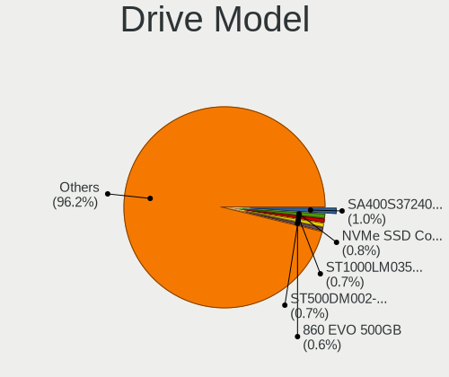
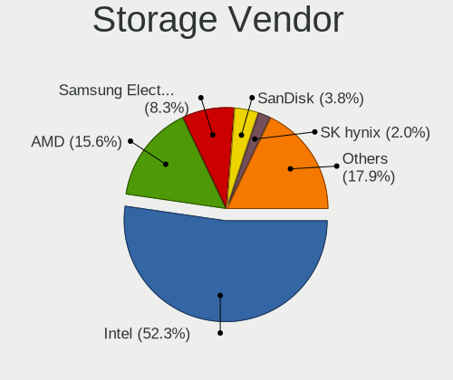
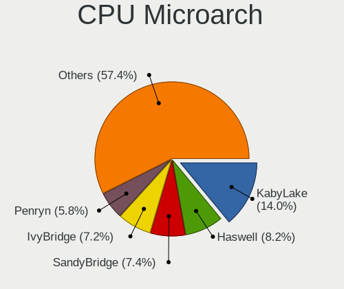
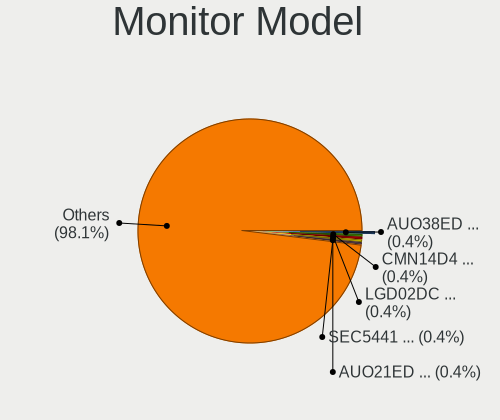
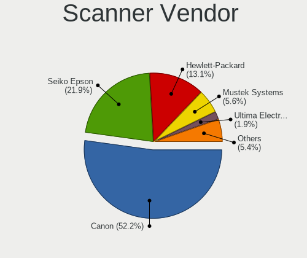

Linux - Tested Hardware & Statistics
------------------------------------

A project to collect tested hardware configurations for Linux.

Anyone can contribute to this report by the [hw-probe](https://github.com/linuxhw/hw-probe) tool:

    sudo -E hw-probe -all -upload

Please contribute! Especially if your hardware is rare.

This is a report for all computer types. See also reports for [desktops](/Desktop/README.md) and [notebooks](/Notebook/README.md).

Distribution-specific reports: [Alpine](/Dist/Alpine), [ALT_Linux](/Dist/ALT_Linux), [antiX](/Dist/antiX), [Artix](/Dist/Artix), [Chrome_OS](/Dist/Chrome_OS), [Clear_Linux](/Dist/Clear_Linux), [Deepin](/Dist/Deepin), [Devuan](/Dist/Devuan), [EndeavourOS](/Dist/EndeavourOS), [Garuda_Linux](/Dist/Garuda_Linux), [GNOME_OS](/Dist/GNOME_OS), [Mageia](/Dist/Mageia), [Makulu](/Dist/Makulu), [NixOS](/Dist/NixOS), [Oracle_Linux](/Dist/Oracle_Linux), [Pardus](/Dist/Pardus), [PureOS](/Dist/PureOS), [Q4OS](/Dist/Q4OS), [Reborn_OS](/Dist/Reborn_OS), [Rocky_Linux](/Dist/Rocky_Linux), [Sparky](/Dist/Sparky), [Void_Linux](/Dist/Void_Linux), [Xero](/Dist/Xero).

This report is for real hardware. Report for virtual hardware: [TestCoverage_VE](https://github.com/linuxhw/TestCoverage_VE)

Contents
--------

* [ Test Cases ](#test-cases)

* [ System ](#system)
  - [ OS                       ](#os)
  - [ OS Family                ](#os-family)
  - [ Kernel                   ](#kernel)
  - [ Kernel Family            ](#kernel-family)
  - [ Kernel Major Ver.        ](#kernel-major-ver)
  - [ Arch                     ](#arch)
  - [ DE                       ](#de)
  - [ Display Server           ](#display-server)
  - [ Display Manager          ](#display-manager)
  - [ OS Lang                  ](#os-lang)
  - [ Boot Mode                ](#boot-mode)
  - [ Filesystem               ](#filesystem)
  - [ Part. scheme             ](#part-scheme)
  - [ Dual Boot with Linux/BSD ](#dual-boot-with-linuxbsd)
  - [ Dual Boot (Win)          ](#dual-boot-win)

* [ Board ](#board)
  - [ Vendor                   ](#vendor)
  - [ Model                    ](#model)
  - [ Model Family             ](#model-family)
  - [ MFG Year                 ](#mfg-year)
  - [ Form Factor              ](#form-factor)
  - [ Secure Boot              ](#secure-boot)
  - [ Coreboot                 ](#coreboot)
  - [ RAM Size                 ](#ram-size)
  - [ RAM Used                 ](#ram-used)
  - [ Total Drives             ](#total-drives)
  - [ Has CD-ROM               ](#has-cd-rom)
  - [ Has Ethernet             ](#has-ethernet)
  - [ Has WiFi                 ](#has-wifi)
  - [ Has Bluetooth            ](#has-bluetooth)

* [ Location ](#location)
  - [ Country                  ](#country)
  - [ City                     ](#city)

* [ Drives ](#drives)
  - [ Drive Vendor             ](#drive-vendor)
  - [ Drive Model              ](#drive-model)
  - [ HDD Vendor               ](#hdd-vendor)
  - [ SSD Vendor               ](#ssd-vendor)
  - [ Drive Kind               ](#drive-kind)
  - [ Drive Connector          ](#drive-connector)
  - [ Drive Size               ](#drive-size)
  - [ Space Total              ](#space-total)
  - [ Space Used               ](#space-used)
  - [ Malfunc. Drives          ](#malfunc-drives)
  - [ Malfunc. Drive Vendor    ](#malfunc-drive-vendor)
  - [ Malfunc. HDD Vendor      ](#malfunc-hdd-vendor)
  - [ Malfunc. Drive Kind      ](#malfunc-drive-kind)
  - [ Failed Drives            ](#failed-drives)
  - [ Failed Drive Vendor      ](#failed-drive-vendor)
  - [ Drive Status             ](#drive-status)

* [ Storage controller ](#storage-controller)
  - [ Storage Vendor           ](#storage-vendor)
  - [ Storage Model            ](#storage-model)
  - [ Storage Kind             ](#storage-kind)

* [ Processor ](#processor)
  - [ CPU Vendor               ](#cpu-vendor)
  - [ CPU Model                ](#cpu-model)
  - [ CPU Model Family         ](#cpu-model-family)
  - [ CPU Cores                ](#cpu-cores)
  - [ CPU Sockets              ](#cpu-sockets)
  - [ CPU Threads              ](#cpu-threads)
  - [ CPU Op-Modes             ](#cpu-op-modes)
  - [ CPU Microcode            ](#cpu-microcode)
  - [ CPU Microarch            ](#cpu-microarch)

* [ Graphics ](#graphics)
  - [ GPU Vendor               ](#gpu-vendor)
  - [ GPU Model                ](#gpu-model)
  - [ GPU Combo                ](#gpu-combo)
  - [ GPU Driver               ](#gpu-driver)
  - [ GPU Memory               ](#gpu-memory)

* [ Monitor ](#monitor)
  - [ Monitor Vendor           ](#monitor-vendor)
  - [ Monitor Model            ](#monitor-model)
  - [ Monitor Resolution       ](#monitor-resolution)
  - [ Monitor Diagonal         ](#monitor-diagonal)
  - [ Monitor Width            ](#monitor-width)
  - [ Aspect Ratio             ](#aspect-ratio)
  - [ Monitor Area             ](#monitor-area)
  - [ Pixel Density            ](#pixel-density)
  - [ Multiple Monitors        ](#multiple-monitors)

* [ Network ](#network)
  - [ Net Controller Vendor    ](#net-controller-vendor)
  - [ Net Controller Model     ](#net-controller-model)
  - [ Wireless Vendor          ](#wireless-vendor)
  - [ Wireless Model           ](#wireless-model)
  - [ Ethernet Vendor          ](#ethernet-vendor)
  - [ Ethernet Model           ](#ethernet-model)
  - [ Net Controller Kind      ](#net-controller-kind)
  - [ Used Controller          ](#used-controller)
  - [ NICs                     ](#nics)
  - [ IPv6                     ](#ipv6)

* [ Bluetooth ](#bluetooth)
  - [ Bluetooth Vendor         ](#bluetooth-vendor)
  - [ Bluetooth Model          ](#bluetooth-model)

* [ Sound ](#sound)
  - [ Sound Vendor             ](#sound-vendor)
  - [ Sound Model              ](#sound-model)

* [ Memory ](#memory)
  - [ Memory Vendor            ](#memory-vendor)
  - [ Memory Model             ](#memory-model)
  - [ Memory Kind              ](#memory-kind)
  - [ Memory Form Factor       ](#memory-form-factor)
  - [ Memory Size              ](#memory-size)
  - [ Memory Speed             ](#memory-speed)

* [ Printers & scanners ](#printers--scanners)
  - [ Printer Vendor           ](#printer-vendor)
  - [ Printer Model            ](#printer-model)
  - [ Scanner Vendor           ](#scanner-vendor)
  - [ Scanner Model            ](#scanner-model)

* [ Camera ](#camera)
  - [ Camera Vendor            ](#camera-vendor)
  - [ Camera Model             ](#camera-model)

* [ Security ](#security)
  - [ Fingerprint Vendor       ](#fingerprint-vendor)
  - [ Fingerprint Model        ](#fingerprint-model)
  - [ Chipcard Vendor          ](#chipcard-vendor)
  - [ Chipcard Model           ](#chipcard-model)

* [ Unsupported ](#unsupported)
  - [ Unsupported Devices      ](#unsupported-devices)
  - [ Unsupported Device Types ](#unsupported-device-types)

Test Cases
----------

Total: 241537

| Vendor        | Model                       | Form-Factor | Probe                                                      | Date         |
|---------------|-----------------------------|-------------|------------------------------------------------------------|--------------|
| Fanless Mi... | PCG02 GLE                   | Stick pc    | [19d2273e6b](https://linux-hardware.org/?probe=19d2273e6b) | Aug 01, 2022 |
| Gigabyte      | H110M-Gaming3-CF            | Desktop     | [99a140d79b](https://linux-hardware.org/?probe=99a140d79b) | Aug 01, 2022 |
| Dell          | Latitude E7450              | Notebook    | [38051fe609](https://linux-hardware.org/?probe=38051fe609) | Aug 01, 2022 |
| ASUSTek       | ROG STRIX B450-F GAMING     | Desktop     | [ba5b0b9620](https://linux-hardware.org/?probe=ba5b0b9620) | Aug 01, 2022 |
| Toshiba       | Satellite L500              | Notebook    | [21d4b0ac95](https://linux-hardware.org/?probe=21d4b0ac95) | Aug 01, 2022 |
| MSI           | MAG B550 TOMAHAWK           | Desktop     | [cc8b9aa8f6](https://linux-hardware.org/?probe=cc8b9aa8f6) | Aug 01, 2022 |
| ASUSTek       | M5A99FX PRO R2.0            | Desktop     | [42cb82f584](https://linux-hardware.org/?probe=42cb82f584) | Aug 01, 2022 |
| Gigabyte      | A320M-S2H V2-CF             | Desktop     | [8e83e6141d](https://linux-hardware.org/?probe=8e83e6141d) | Aug 01, 2022 |
| Alienware     | 04VWF2 A02                  | Desktop     | [a877f0aa97](https://linux-hardware.org/?probe=a877f0aa97) | Aug 01, 2022 |
| ASUSTek       | X540SA                      | Notebook    | [6adb003f2e](https://linux-hardware.org/?probe=6adb003f2e) | Aug 01, 2022 |
| ASUSTek       | ROG Maximus Z690 EXTREME    | Desktop     | [effa59ed64](https://linux-hardware.org/?probe=effa59ed64) | Aug 01, 2022 |
| Dell          | XPS 15 7590                 | Notebook    | [8a4cc1f177](https://linux-hardware.org/?probe=8a4cc1f177) | Aug 01, 2022 |
| ASUSTek       | X540SA                      | Notebook    | [4dbed1e983](https://linux-hardware.org/?probe=4dbed1e983) | Aug 01, 2022 |
| HP            | Stream Laptop 14-ds0xxx     | Notebook    | [a008ad925d](https://linux-hardware.org/?probe=a008ad925d) | Aug 01, 2022 |
| ASRock        | E350M1                      | Desktop     | [87efe56c26](https://linux-hardware.org/?probe=87efe56c26) | Aug 01, 2022 |
| Dell          | Latitude E6500              | Notebook    | [012df8dc46](https://linux-hardware.org/?probe=012df8dc46) | Aug 01, 2022 |
| Lenovo        | B560                        | Notebook    | [010fb7ada1](https://linux-hardware.org/?probe=010fb7ada1) | Aug 01, 2022 |
| Dell          | 0W0CHX A00                  | Desktop     | [7d9b8e0f96](https://linux-hardware.org/?probe=7d9b8e0f96) | Aug 01, 2022 |
| eMachines     | E520 V1.10                  | Notebook    | [89a18a0be1](https://linux-hardware.org/?probe=89a18a0be1) | Aug 01, 2022 |
| Acidanther... | MacBookPro13,1              | Notebook    | [5c8158f059](https://linux-hardware.org/?probe=5c8158f059) | Aug 01, 2022 |
| MSI           | H81M-E34                    | Desktop     | [c0be356e96](https://linux-hardware.org/?probe=c0be356e96) | Aug 01, 2022 |
| VIT           | P2402                       | Notebook    | [fd1ab8ad90](https://linux-hardware.org/?probe=fd1ab8ad90) | Aug 01, 2022 |
| HP            | Pavilion g6                 | Notebook    | [b48c146eff](https://linux-hardware.org/?probe=b48c146eff) | Aug 01, 2022 |
| Lenovo        | ThinkPad X230 23245NJ       | Notebook    | [3c85e43b86](https://linux-hardware.org/?probe=3c85e43b86) | Aug 01, 2022 |
| Gigabyte      | G1.SNIPER B7-CF             | Desktop     | [83e4b444ae](https://linux-hardware.org/?probe=83e4b444ae) | Aug 01, 2022 |
| eMachines     | E520 V1.10                  | Notebook    | [bb16305e18](https://linux-hardware.org/?probe=bb16305e18) | Aug 01, 2022 |
| Gigabyte      | G1.SNIPER B7-CF             | Desktop     | [4e335cb7ce](https://linux-hardware.org/?probe=4e335cb7ce) | Aug 01, 2022 |
| Dell          | 0P096C A01                  | Desktop     | [11bc1115f2](https://linux-hardware.org/?probe=11bc1115f2) | Aug 01, 2022 |
| ASUSTek       | VivoBook_ASUSLaptop M350... | Notebook    | [b2b969b0e3](https://linux-hardware.org/?probe=b2b969b0e3) | Aug 01, 2022 |
| Dell          | XPS 13 9380                 | Notebook    | [d4524b40db](https://linux-hardware.org/?probe=d4524b40db) | Aug 01, 2022 |
| Dell          | Latitude E6500              | Notebook    | [5cbd654078](https://linux-hardware.org/?probe=5cbd654078) | Aug 01, 2022 |
| Dell          | Inspiron 13-7378            | Notebook    | [c08447d945](https://linux-hardware.org/?probe=c08447d945) | Aug 01, 2022 |
| ASUSTek       | PRIME X570-P                | Desktop     | [405a75cb1d](https://linux-hardware.org/?probe=405a75cb1d) | Aug 01, 2022 |
| Acer          | Aspire A315-53              | Notebook    | [0012f5d4c5](https://linux-hardware.org/?probe=0012f5d4c5) | Aug 01, 2022 |
| Shenzhen B... | XN1A                        | Notebook    | [6b1dd20a55](https://linux-hardware.org/?probe=6b1dd20a55) | Aug 01, 2022 |
| Packard Be... | EasyNote TK13BZ             | Notebook    | [530d3ad8db](https://linux-hardware.org/?probe=530d3ad8db) | Aug 01, 2022 |
| Lenovo        | MIIX 310-10ICR 80SG         | Tablet      | [d5cc0b11b3](https://linux-hardware.org/?probe=d5cc0b11b3) | Aug 01, 2022 |
| Dell          | Latitude 5520               | Notebook    | [0406990128](https://linux-hardware.org/?probe=0406990128) | Aug 01, 2022 |
| Lenovo        | IdeaPad 330S-15IKB 81F5     | Notebook    | [e512f0884d](https://linux-hardware.org/?probe=e512f0884d) | Aug 01, 2022 |
| Lenovo        | ThinkPad X1 Carbon 6th 2... | Notebook    | [ef6649eea3](https://linux-hardware.org/?probe=ef6649eea3) | Aug 01, 2022 |
| Intel         | Unknown                     | Notebook    | [9fce3597b9](https://linux-hardware.org/?probe=9fce3597b9) | Aug 01, 2022 |
| HP            | 240 G8 Notebook PC          | Notebook    | [f4533284b4](https://linux-hardware.org/?probe=f4533284b4) | Aug 01, 2022 |
| Samsung       | R530/R730/R540              | Notebook    | [73f8fb9528](https://linux-hardware.org/?probe=73f8fb9528) | Aug 01, 2022 |
| HP            | Spectre                     | Convertible | [65226ddc27](https://linux-hardware.org/?probe=65226ddc27) | Aug 01, 2022 |
| ASUSTek       | K501LB                      | Notebook    | [462af39f9d](https://linux-hardware.org/?probe=462af39f9d) | Aug 01, 2022 |
| ASUSTek       | 1011PX                      | Notebook    | [c95aa572a4](https://linux-hardware.org/?probe=c95aa572a4) | Aug 01, 2022 |
| Intel         | DH61WW AAG23116-204         | Desktop     | [30715e2f04](https://linux-hardware.org/?probe=30715e2f04) | Aug 01, 2022 |
| TrekStor      | Primebook C13               | Convertible | [e45c26fec9](https://linux-hardware.org/?probe=e45c26fec9) | Aug 01, 2022 |
| ASUSTek       | TUF Gaming B550-PLUS        | Desktop     | [30e0a23365](https://linux-hardware.org/?probe=30e0a23365) | Aug 01, 2022 |
| HP            | Spectre                     | Convertible | [4d0f459190](https://linux-hardware.org/?probe=4d0f459190) | Aug 01, 2022 |
| Acer          | Aspire A315-53              | Notebook    | [675bdd8013](https://linux-hardware.org/?probe=675bdd8013) | Aug 01, 2022 |
| Gigabyte      | H87-HD3                     | Desktop     | [daaf600950](https://linux-hardware.org/?probe=daaf600950) | Aug 01, 2022 |
| ASUSTek       | M5A78L-M/USB3               | Desktop     | [8e816dc600](https://linux-hardware.org/?probe=8e816dc600) | Aug 01, 2022 |
| HP            | 1493                        | Desktop     | [2925e7a321](https://linux-hardware.org/?probe=2925e7a321) | Aug 01, 2022 |
| Notebook      | V15x_V17xPNKPNJPNH          | Notebook    | [ae2fa8b811](https://linux-hardware.org/?probe=ae2fa8b811) | Aug 01, 2022 |
| ASUSTek       | ROG Strix G713RM_G713RM     | Notebook    | [41b26f984c](https://linux-hardware.org/?probe=41b26f984c) | Aug 01, 2022 |
| Lenovo        | MIIX 310-10ICR 80SG         | Tablet      | [ac55d79050](https://linux-hardware.org/?probe=ac55d79050) | Aug 01, 2022 |
| Gigabyte      | GA-78LMT-S2P                | Desktop     | [b5fded6824](https://linux-hardware.org/?probe=b5fded6824) | Aug 01, 2022 |
| KOHJINSHA     | SC series                   | Notebook    | [90a25503ee](https://linux-hardware.org/?probe=90a25503ee) | Aug 01, 2022 |
| KOHJINSHA     | SC series                   | Notebook    | [3986e59a55](https://linux-hardware.org/?probe=3986e59a55) | Aug 01, 2022 |
| Lenovo        | ThinkBook 14 G3 ACL 21A2    | Notebook    | [3a496f366f](https://linux-hardware.org/?probe=3a496f366f) | Aug 01, 2022 |
| Lenovo        | ThinkPad E14 Gen 3 20Y70... | Notebook    | [110c94eb72](https://linux-hardware.org/?probe=110c94eb72) | Aug 01, 2022 |
| HP            | 3646h                       | Desktop     | [7988eaa5e3](https://linux-hardware.org/?probe=7988eaa5e3) | Aug 01, 2022 |
| ASUSTek       | ROG Maximus X CODE          | Desktop     | [e4ec9f34aa](https://linux-hardware.org/?probe=e4ec9f34aa) | Aug 01, 2022 |
| Lenovo        | ThinkPad P40 Yoga 20GRS0... | Convertible | [2f7e6d56ef](https://linux-hardware.org/?probe=2f7e6d56ef) | Aug 01, 2022 |
| MSI           | MPG X570 GAMING EDGE WIF... | Desktop     | [64a21844e4](https://linux-hardware.org/?probe=64a21844e4) | Aug 01, 2022 |
| ASRock        | G41M-VS3                    | Desktop     | [db7419f5a9](https://linux-hardware.org/?probe=db7419f5a9) | Aug 01, 2022 |
| Acer          | Aspire 5560                 | Notebook    | [d5b8ae56fd](https://linux-hardware.org/?probe=d5b8ae56fd) | Aug 01, 2022 |
| HP            | Spectre                     | Convertible | [afab893436](https://linux-hardware.org/?probe=afab893436) | Aug 01, 2022 |
| ASRock        | H110M-DVS R2.0              | Desktop     | [c02a953cda](https://linux-hardware.org/?probe=c02a953cda) | Aug 01, 2022 |
| Gigabyte      | B365M DS3H                  | Desktop     | [14f73b6a3a](https://linux-hardware.org/?probe=14f73b6a3a) | Aug 01, 2022 |
| HP            | Spectre                     | Convertible | [60d75d422c](https://linux-hardware.org/?probe=60d75d422c) | Aug 01, 2022 |
| Lenovo        | IdeaPad C340-14IWL 81N4     | Convertible | [1364037a8f](https://linux-hardware.org/?probe=1364037a8f) | Aug 01, 2022 |
| Gigabyte      | H110M-S2V-CF                | Desktop     | [c82958696b](https://linux-hardware.org/?probe=c82958696b) | Aug 01, 2022 |
| MSI           | MEG X570 UNIFY              | Desktop     | [9be9a3e83b](https://linux-hardware.org/?probe=9be9a3e83b) | Aug 01, 2022 |
| Gigabyte      | B550 AORUS PRO AC           | Desktop     | [b59f87dd02](https://linux-hardware.org/?probe=b59f87dd02) | Aug 01, 2022 |
| Apple         | MacBookPro5,5               | Notebook    | [4eeca116f8](https://linux-hardware.org/?probe=4eeca116f8) | Aug 01, 2022 |
| HP            | ZBook Fury 15 G7 Mobile ... | Notebook    | [16a3f81537](https://linux-hardware.org/?probe=16a3f81537) | Aug 01, 2022 |
| MSI           | MAG B550 TOMAHAWK           | Desktop     | [0d7342cca0](https://linux-hardware.org/?probe=0d7342cca0) | Aug 01, 2022 |
| HP            | Laptop 15-dw0xxx            | Notebook    | [6f8d2470bd](https://linux-hardware.org/?probe=6f8d2470bd) | Aug 01, 2022 |
| Dell          | Latitude 7420               | Notebook    | [d498af2db5](https://linux-hardware.org/?probe=d498af2db5) | Aug 01, 2022 |
| Digma         | EVE 15 C407 ES5054EW        | Notebook    | [7b597ebcc8](https://linux-hardware.org/?probe=7b597ebcc8) | Aug 01, 2022 |
| ASRock        | H470M-HVS                   | Desktop     | [5282e92d2c](https://linux-hardware.org/?probe=5282e92d2c) | Aug 01, 2022 |
| ASUSTek       | GL553VE                     | Notebook    | [d67cc48957](https://linux-hardware.org/?probe=d67cc48957) | Aug 01, 2022 |
| HP            | ProBook 6570b               | Notebook    | [b99b5ef83f](https://linux-hardware.org/?probe=b99b5ef83f) | Aug 01, 2022 |
| AZW           | Green G2                    | Desktop     | [d2607d160f](https://linux-hardware.org/?probe=d2607d160f) | Aug 01, 2022 |
| MSI           | X370 KRAIT GAMING           | Desktop     | [fe950a68a3](https://linux-hardware.org/?probe=fe950a68a3) | Aug 01, 2022 |
| HP            | EliteBook 745 G6            | Notebook    | [2546e4a593](https://linux-hardware.org/?probe=2546e4a593) | Aug 01, 2022 |
| Gigabyte      | GA-MA785G-UD3H              | Desktop     | [dcccfd1beb](https://linux-hardware.org/?probe=dcccfd1beb) | Aug 01, 2022 |
| Fujitsu       | D2990-A2 S26361-D2990-A2    | Desktop     | [bbeebdd421](https://linux-hardware.org/?probe=bbeebdd421) | Aug 01, 2022 |
| Dell          | XPS 13 9380                 | Notebook    | [75f131a86a](https://linux-hardware.org/?probe=75f131a86a) | Aug 01, 2022 |
| MSI           | X570-A PRO                  | Desktop     | [f034a02e69](https://linux-hardware.org/?probe=f034a02e69) | Aug 01, 2022 |
| HP            | ProBook 440 G2              | Notebook    | [00dd80ba31](https://linux-hardware.org/?probe=00dd80ba31) | Aug 01, 2022 |
| ASUSTek       | Z170-A                      | Desktop     | [5f41623898](https://linux-hardware.org/?probe=5f41623898) | Aug 01, 2022 |
| ASUSTek       | X555LAB                     | Notebook    | [33a1712f4d](https://linux-hardware.org/?probe=33a1712f4d) | Aug 01, 2022 |
| ASUSTek       | PRIME B550M-A               | Desktop     | [eafb78a31c](https://linux-hardware.org/?probe=eafb78a31c) | Aug 01, 2022 |
| Acer          | Z476                        | Notebook    | [ade85b90c1](https://linux-hardware.org/?probe=ade85b90c1) | Aug 01, 2022 |
| HP            | 339A                        | Desktop     | [251a764917](https://linux-hardware.org/?probe=251a764917) | Aug 01, 2022 |
| Lenovo        | ThinkPad X1 Carbon 5th 2... | Notebook    | [d77ac14ae9](https://linux-hardware.org/?probe=d77ac14ae9) | Aug 01, 2022 |
| Notebook      | NV4XMB,ME,MZ                | Notebook    | [7b369e1cdf](https://linux-hardware.org/?probe=7b369e1cdf) | Aug 01, 2022 |
| MSI           | B450M BAZOOKA MAX WIFI      | Desktop     | [f57732be64](https://linux-hardware.org/?probe=f57732be64) | Aug 01, 2022 |
| HP            | EliteBook 8470p             | Notebook    | [a1d5593420](https://linux-hardware.org/?probe=a1d5593420) | Aug 01, 2022 |
| Toshiba       | TECRA Z40-C                 | Notebook    | [9612659f60](https://linux-hardware.org/?probe=9612659f60) | Aug 01, 2022 |
| Dell          | Latitude E7250              | Notebook    | [2dd83a16c7](https://linux-hardware.org/?probe=2dd83a16c7) | Aug 01, 2022 |
| Gigabyte      | H81M-D2V                    | Desktop     | [64da165357](https://linux-hardware.org/?probe=64da165357) | Aug 01, 2022 |
| Dell          | Latitude E7470              | Notebook    | [0851479f6b](https://linux-hardware.org/?probe=0851479f6b) | Aug 01, 2022 |
| Dell          | Precision M4600             | Notebook    | [8ca47466f0](https://linux-hardware.org/?probe=8ca47466f0) | Aug 01, 2022 |
| Lenovo        | Yoga 9 14ITL5 82BG          | Convertible | [c4e72000cb](https://linux-hardware.org/?probe=c4e72000cb) | Aug 01, 2022 |
| Lenovo        | ThinkPad T420 4180LN1       | Notebook    | [65d5b19d40](https://linux-hardware.org/?probe=65d5b19d40) | Aug 01, 2022 |
| Toshiba       | Satellite-C845              | Notebook    | [6ee9ea90a5](https://linux-hardware.org/?probe=6ee9ea90a5) | Aug 01, 2022 |
| Lenovo        | ThinkPad T420 4180LN1       | Notebook    | [35304c2321](https://linux-hardware.org/?probe=35304c2321) | Aug 01, 2022 |
| Lenovo        | ThinkPad L14 Gen 1 20U6A... | Notebook    | [76d752f0ad](https://linux-hardware.org/?probe=76d752f0ad) | Aug 01, 2022 |
| HP            | Laptop 14-dq4xxx            | Notebook    | [1e57f77386](https://linux-hardware.org/?probe=1e57f77386) | Aug 01, 2022 |
| Dell          | Inspiron 5748               | Notebook    | [9113ee6d54](https://linux-hardware.org/?probe=9113ee6d54) | Aug 01, 2022 |
| QIYIDA        | X99-H9 V2.0                 | Desktop     | [e1fa8ab12b](https://linux-hardware.org/?probe=e1fa8ab12b) | Aug 01, 2022 |
| Dell          | Latitude D620               | Notebook    | [f378606941](https://linux-hardware.org/?probe=f378606941) | Aug 01, 2022 |
| ASUSTek       | ROG Strix G513QY_G513QY     | Notebook    | [370b872aa5](https://linux-hardware.org/?probe=370b872aa5) | Aug 01, 2022 |
| ASUSTek       | F2A55-M LK2                 | Desktop     | [97a5e9c390](https://linux-hardware.org/?probe=97a5e9c390) | Aug 01, 2022 |
| Microsoft     | Surface Laptop Go           | Tablet      | [6b7e94ffa5](https://linux-hardware.org/?probe=6b7e94ffa5) | Aug 01, 2022 |
| Positivo      | Q232A                       | Notebook    | [da99b8ab1e](https://linux-hardware.org/?probe=da99b8ab1e) | Aug 01, 2022 |
| Positivo      | Q232A                       | Notebook    | [7d860e8f5d](https://linux-hardware.org/?probe=7d860e8f5d) | Aug 01, 2022 |
| Dell          | 0PV3YR A05                  | Server      | [2c00e0e66e](https://linux-hardware.org/?probe=2c00e0e66e) | Aug 01, 2022 |
| Gigabyte      | B450 AORUS PRO-CF           | Desktop     | [81c46b891f](https://linux-hardware.org/?probe=81c46b891f) | Aug 01, 2022 |
| Microsoft     | Surface Laptop Go           | Tablet      | [ec13dcb17f](https://linux-hardware.org/?probe=ec13dcb17f) | Aug 01, 2022 |
| ASUSTek       | G73Jh                       | Notebook    | [ec1e513893](https://linux-hardware.org/?probe=ec1e513893) | Aug 01, 2022 |
| GPU Compan... | GWNR71517                   | Notebook    | [72278643e8](https://linux-hardware.org/?probe=72278643e8) | Aug 01, 2022 |
| MSI           | X99A RAIDER                 | Desktop     | [5fe6f7eb57](https://linux-hardware.org/?probe=5fe6f7eb57) | Aug 01, 2022 |
| ASUSTek       | VivoBook_ASUSLaptop X512... | Notebook    | [4e2361dd88](https://linux-hardware.org/?probe=4e2361dd88) | Aug 01, 2022 |
| Gigabyte      | B450M DS3H-CF               | Desktop     | [7c68dbe47e](https://linux-hardware.org/?probe=7c68dbe47e) | Aug 01, 2022 |
| ASRock        | FM2A88X Extreme6+           | Desktop     | [8ea1e0f22c](https://linux-hardware.org/?probe=8ea1e0f22c) | Aug 01, 2022 |
| HP            | ProBook 6570b               | Notebook    | [105d26b09c](https://linux-hardware.org/?probe=105d26b09c) | Aug 01, 2022 |
| Gigabyte      | B450M DS3H-CF               | Desktop     | [6532751d00](https://linux-hardware.org/?probe=6532751d00) | Aug 01, 2022 |
| Dell          | 0GXM1W A01                  | Desktop     | [91d2f28256](https://linux-hardware.org/?probe=91d2f28256) | Aug 01, 2022 |
| ASUSTek       | P7P55D-E PRO                | Desktop     | [d58be7b6d1](https://linux-hardware.org/?probe=d58be7b6d1) | Aug 01, 2022 |
| Unknown       | 1.0                         | All in one  | [8145704100](https://linux-hardware.org/?probe=8145704100) | Aug 01, 2022 |
| MSI           | Z590-A PRO                  | Desktop     | [7051f56dda](https://linux-hardware.org/?probe=7051f56dda) | Aug 01, 2022 |
| Lenovo        | ThinkPad X131e 336799U      | Notebook    | [a06f0caf24](https://linux-hardware.org/?probe=a06f0caf24) | Aug 01, 2022 |
| ASUSTek       | M2A-VM                      | Desktop     | [4b1dabbf52](https://linux-hardware.org/?probe=4b1dabbf52) | Aug 01, 2022 |
| HP            | ProBook 6570b               | Notebook    | [3898ce2b5f](https://linux-hardware.org/?probe=3898ce2b5f) | Aug 01, 2022 |
| PCWare        | IPMH61R1                    | Desktop     | [0843909534](https://linux-hardware.org/?probe=0843909534) | Aug 01, 2022 |
| Lenovo        | ThinkPad E590 20NB0032CD    | Notebook    | [502b0eeb39](https://linux-hardware.org/?probe=502b0eeb39) | Aug 01, 2022 |
| Dell          | 0GXM1W A01                  | Desktop     | [ab895fc1a2](https://linux-hardware.org/?probe=ab895fc1a2) | Aug 01, 2022 |
| Dell          | Latitude 3190               | Notebook    | [1f86e5fa57](https://linux-hardware.org/?probe=1f86e5fa57) | Aug 01, 2022 |
| ASUSTek       | ZenBook UX425QA_UM425QA     | Notebook    | [6e8a2d15be](https://linux-hardware.org/?probe=6e8a2d15be) | Aug 01, 2022 |
| MSI           | Z77A-GD65                   | Desktop     | [fcadad42a5](https://linux-hardware.org/?probe=fcadad42a5) | Aug 01, 2022 |
| HP            | Laptop 14s-dq2xxx           | Notebook    | [7137ca1923](https://linux-hardware.org/?probe=7137ca1923) | Aug 01, 2022 |
| Acer          | Aspire ES1-523              | Notebook    | [d14f053671](https://linux-hardware.org/?probe=d14f053671) | Aug 01, 2022 |
| Unknown       | Unknown                     | Notebook    | [50153bd9ff](https://linux-hardware.org/?probe=50153bd9ff) | Aug 01, 2022 |
| ASUSTek       | Maximus IX FORMULA          | Desktop     | [2212732244](https://linux-hardware.org/?probe=2212732244) | Aug 01, 2022 |
| Raspberry ... | Raspberry Pi 4 Model B R... | Soc         | [b44bebcab6](https://linux-hardware.org/?probe=b44bebcab6) | Aug 01, 2022 |
| Gigabyte      | Z68MA-D2H-B3                | Desktop     | [4956d72048](https://linux-hardware.org/?probe=4956d72048) | Aug 01, 2022 |
| ASUSTek       | VivoBook Flip 14_ASUS Fl... | Convertible | [827883d38c](https://linux-hardware.org/?probe=827883d38c) | Aug 01, 2022 |
| ASUSTek       | TUF Gaming X570-PLUS        | Desktop     | [163affcbb8](https://linux-hardware.org/?probe=163affcbb8) | Aug 01, 2022 |
| Samsung       | R59P/R60P/R61P              | Notebook    | [93794bf0b1](https://linux-hardware.org/?probe=93794bf0b1) | Aug 01, 2022 |
| Apple         | MacBookPro9,2               | Notebook    | [5642929fd2](https://linux-hardware.org/?probe=5642929fd2) | Aug 01, 2022 |
| HP            | Laptop 14s-dq2xxx           | Notebook    | [9a5e39bf87](https://linux-hardware.org/?probe=9a5e39bf87) | Aug 01, 2022 |
| Lenovo        | ThinkPad E555 20DHCTO1WW    | Notebook    | [c376def8c9](https://linux-hardware.org/?probe=c376def8c9) | Aug 01, 2022 |
| HP            | 843F                        | Desktop     | [eeba83fecb](https://linux-hardware.org/?probe=eeba83fecb) | Aug 01, 2022 |
| ASUSTek       | P8H67-M PRO                 | Desktop     | [3a3a7c1a8a](https://linux-hardware.org/?probe=3a3a7c1a8a) | Aug 01, 2022 |
| HONOR         | NBR-WAX9                    | Notebook    | [e9fcbc7798](https://linux-hardware.org/?probe=e9fcbc7798) | Aug 01, 2022 |
| Lenovo        | IdeaPad 3 14ALC6 82KT       | Notebook    | [15382de4bf](https://linux-hardware.org/?probe=15382de4bf) | Aug 01, 2022 |
| Dell          | G15 Special Edition 5521    | Notebook    | [c680e6f144](https://linux-hardware.org/?probe=c680e6f144) | Aug 01, 2022 |
| Acer          | Aspire E1-571               | Notebook    | [7102c56d5b](https://linux-hardware.org/?probe=7102c56d5b) | Aug 01, 2022 |
| Gigabyte      | H310M S2V                   | Desktop     | [329d2071a9](https://linux-hardware.org/?probe=329d2071a9) | Aug 01, 2022 |
| HP            | EliteBook x360 1030 G4      | Convertible | [29295c7c8e](https://linux-hardware.org/?probe=29295c7c8e) | Aug 01, 2022 |
| HP            | EliteBook x360 1030 G4      | Convertible | [a56b47616c](https://linux-hardware.org/?probe=a56b47616c) | Aug 01, 2022 |
| Packard Be... | EasyNote TM85               | Notebook    | [a6df06f9e5](https://linux-hardware.org/?probe=a6df06f9e5) | Jul 31, 2022 |
| Samsung       | RV415/RV515                 | Notebook    | [5bb2e2b3e9](https://linux-hardware.org/?probe=5bb2e2b3e9) | Jul 31, 2022 |
| HP            | ENVY Laptop 13-ad1xx        | Notebook    | [c79c2bd215](https://linux-hardware.org/?probe=c79c2bd215) | Jul 31, 2022 |
| ASUSTek       | ProArt X570-CREATOR WIFI    | Desktop     | [7e6cd7bcb3](https://linux-hardware.org/?probe=7e6cd7bcb3) | Jul 31, 2022 |
| Lenovo        | ThinkPad T460 20FMS02R0G    | Notebook    | [0aa31e3c39](https://linux-hardware.org/?probe=0aa31e3c39) | Jul 31, 2022 |
| Acer          | Aspire E5-576               | Notebook    | [a31ceb9a36](https://linux-hardware.org/?probe=a31ceb9a36) | Jul 31, 2022 |
| Acer          | Veriton M4620G v1.0         | Desktop     | [13304f7d9e](https://linux-hardware.org/?probe=13304f7d9e) | Jul 31, 2022 |
| Acer          | Aspire 5830TG               | Notebook    | [7eb001e6b4](https://linux-hardware.org/?probe=7eb001e6b4) | Jul 31, 2022 |
| ASUSTek       | M2N-MX SE Plus              | Desktop     | [7a0035ad18](https://linux-hardware.org/?probe=7a0035ad18) | Jul 31, 2022 |
| Razer         | Blade                       | Notebook    | [cc3ce45956](https://linux-hardware.org/?probe=cc3ce45956) | Jul 31, 2022 |
| ASRock        | B550M Steel Legend          | Desktop     | [0ac4f27d0f](https://linux-hardware.org/?probe=0ac4f27d0f) | Jul 31, 2022 |
| HP            | Pavilion dv2600             | Notebook    | [87651d6efc](https://linux-hardware.org/?probe=87651d6efc) | Jul 31, 2022 |
| Pine Micro... | Pine64 PinePhonePro (DT)    | Phone       | [7b62ba2ec4](https://linux-hardware.org/?probe=7b62ba2ec4) | Jul 31, 2022 |
| HP            | EliteBook 8470p             | Notebook    | [0cecb854f4](https://linux-hardware.org/?probe=0cecb854f4) | Jul 31, 2022 |
| Raspberry ... | Raspberry Pi                | Soc         | [d058d6504b](https://linux-hardware.org/?probe=d058d6504b) | Jul 31, 2022 |
| Sony          | VPCCW13FB                   | Notebook    | [453d0f75cc](https://linux-hardware.org/?probe=453d0f75cc) | Jul 31, 2022 |
| Apple         | Mac-F221BEC8                | Desktop     | [13cbc87486](https://linux-hardware.org/?probe=13cbc87486) | Jul 31, 2022 |
| Gigabyte      | X570 AORUS MASTER           | Desktop     | [c48b2966d6](https://linux-hardware.org/?probe=c48b2966d6) | Jul 31, 2022 |
| Gigabyte      | Z370M D3H-CF                | Desktop     | [73f940e59b](https://linux-hardware.org/?probe=73f940e59b) | Jul 31, 2022 |
| ASRock        | A780LM-S                    | Desktop     | [83b44b9bd6](https://linux-hardware.org/?probe=83b44b9bd6) | Jul 31, 2022 |
| Dell          | Inspiron 16 7620 2-in-1     | Convertible | [83a5caa66d](https://linux-hardware.org/?probe=83a5caa66d) | Jul 31, 2022 |
| HP            | Laptop 15s-eq0xxx           | Notebook    | [d1ae6a188c](https://linux-hardware.org/?probe=d1ae6a188c) | Jul 31, 2022 |
| ASRock        | A780LM-S                    | Desktop     | [2a1ce55c1b](https://linux-hardware.org/?probe=2a1ce55c1b) | Jul 31, 2022 |
| ASUSTek       | ROG CROSSHAIR VIII HERO     | Desktop     | [2e2f0ef440](https://linux-hardware.org/?probe=2e2f0ef440) | Jul 31, 2022 |
| Acer          | Aspire 7741                 | Notebook    | [4e266f6d7f](https://linux-hardware.org/?probe=4e266f6d7f) | Jul 31, 2022 |
| Lenovo        | IdeaPad 3 15ITL6 82H8       | Notebook    | [7ae6c1826c](https://linux-hardware.org/?probe=7ae6c1826c) | Jul 31, 2022 |
| HP            | Laptop 15s-eq0xxx           | Notebook    | [bce4496b78](https://linux-hardware.org/?probe=bce4496b78) | Jul 31, 2022 |
| Acer          | Aspire X3470                | Desktop     | [88ad041430](https://linux-hardware.org/?probe=88ad041430) | Jul 31, 2022 |
| GPU Compan... | GWTN141-10                  | Notebook    | [d73365fe3e](https://linux-hardware.org/?probe=d73365fe3e) | Jul 31, 2022 |
| Acer          | Aspire 7741                 | Notebook    | [932a460553](https://linux-hardware.org/?probe=932a460553) | Jul 31, 2022 |
| Dell          | Latitude E5450              | Notebook    | [b7618f5c14](https://linux-hardware.org/?probe=b7618f5c14) | Jul 31, 2022 |
| Intel         | X99                         | Desktop     | [db7e6016bd](https://linux-hardware.org/?probe=db7e6016bd) | Jul 31, 2022 |
| Dell          | Inspiron 5590               | Notebook    | [4d91f51698](https://linux-hardware.org/?probe=4d91f51698) | Jul 31, 2022 |
| HP            | OMEN Notebook               | Notebook    | [a31203500e](https://linux-hardware.org/?probe=a31203500e) | Jul 31, 2022 |
| Dell          | Latitude E5450              | Notebook    | [2c6979fb39](https://linux-hardware.org/?probe=2c6979fb39) | Jul 31, 2022 |
| Acer          | TravelMate B118-M           | Notebook    | [490edd75cf](https://linux-hardware.org/?probe=490edd75cf) | Jul 31, 2022 |
| Apple         | MacBookPro11,5              | Notebook    | [24ccaddbf8](https://linux-hardware.org/?probe=24ccaddbf8) | Jul 31, 2022 |
| HP            | ProBook 6570b               | Notebook    | [333a24bdee](https://linux-hardware.org/?probe=333a24bdee) | Jul 31, 2022 |
| HP            | Compaq 2510p                | Notebook    | [b61ccedd14](https://linux-hardware.org/?probe=b61ccedd14) | Jul 31, 2022 |
| Gigabyte      | A520I AC                    | Desktop     | [0bf3f1a8a2](https://linux-hardware.org/?probe=0bf3f1a8a2) | Jul 31, 2022 |
| ASRock        | B450M Pro4                  | Desktop     | [33185c0a98](https://linux-hardware.org/?probe=33185c0a98) | Jul 31, 2022 |
| HP            | EliteBook 745 G6            | Notebook    | [0bcc9863e3](https://linux-hardware.org/?probe=0bcc9863e3) | Jul 31, 2022 |
| Acer          | Aspire VN7-791G             | Notebook    | [3e72040097](https://linux-hardware.org/?probe=3e72040097) | Jul 31, 2022 |
| HP            | Stream Laptop 14-cb1xxx     | Notebook    | [1e48a30f97](https://linux-hardware.org/?probe=1e48a30f97) | Jul 31, 2022 |
| Sony          | VGN-FW51ZF_H                | Notebook    | [f42e9458c7](https://linux-hardware.org/?probe=f42e9458c7) | Jul 31, 2022 |
| Clevo         | W240BU                      | Notebook    | [7f4a0b1995](https://linux-hardware.org/?probe=7f4a0b1995) | Jul 31, 2022 |
| Gigabyte      | H81M-DS2V                   | Desktop     | [0645ed0b9e](https://linux-hardware.org/?probe=0645ed0b9e) | Jul 31, 2022 |
| HP            | Pavilion dv2000 (RQ116PA... | Notebook    | [c6ce2d4317](https://linux-hardware.org/?probe=c6ce2d4317) | Jul 31, 2022 |
| Dell          | 0T656F A01                  | Desktop     | [02ae993867](https://linux-hardware.org/?probe=02ae993867) | Jul 31, 2022 |
| ASUSTek       | VivoBook_ASUSLaptop TP42... | Convertible | [98e8e717df](https://linux-hardware.org/?probe=98e8e717df) | Jul 31, 2022 |
| ASUSTek       | VivoBook_ASUS Laptop X51... | Notebook    | [bdc243bf9f](https://linux-hardware.org/?probe=bdc243bf9f) | Jul 31, 2022 |
| Gigabyte      | Z77-D3H                     | Desktop     | [a954bc2f31](https://linux-hardware.org/?probe=a954bc2f31) | Jul 31, 2022 |
| HP            | Pavilion Notebook           | Notebook    | [f312865dc0](https://linux-hardware.org/?probe=f312865dc0) | Jul 31, 2022 |
| Intel         | X99                         | Desktop     | [c78ab21f9d](https://linux-hardware.org/?probe=c78ab21f9d) | Jul 31, 2022 |
| ASRock        | AB350 Pro4                  | Desktop     | [c300f62638](https://linux-hardware.org/?probe=c300f62638) | Jul 31, 2022 |
| Toshiba       | All In One PC MP            | All in one  | [4d493ab3df](https://linux-hardware.org/?probe=4d493ab3df) | Jul 31, 2022 |
| GPD           | G1619-02                    | Notebook    | [c61c4280c8](https://linux-hardware.org/?probe=c61c4280c8) | Jul 31, 2022 |
| ASRock        | N68-S3 UCC                  | Desktop     | [bcb1d1da28](https://linux-hardware.org/?probe=bcb1d1da28) | Jul 31, 2022 |
| ASUSTek       | VivoBook_ASUS Laptop X51... | Notebook    | [41a0eba80f](https://linux-hardware.org/?probe=41a0eba80f) | Jul 31, 2022 |
| Unknown       | Unknown                     | Soc         | [9ebddaa953](https://linux-hardware.org/?probe=9ebddaa953) | Jul 31, 2022 |
| Gigabyte      | H81M-DS2V                   | Desktop     | [f5e17ecf3d](https://linux-hardware.org/?probe=f5e17ecf3d) | Jul 31, 2022 |
| Gigabyte      | GA-M56S-S3                  | Desktop     | [cb93c45a3a](https://linux-hardware.org/?probe=cb93c45a3a) | Jul 31, 2022 |
| Sony          | VPCEG33FL                   | Notebook    | [6d371d6c32](https://linux-hardware.org/?probe=6d371d6c32) | Jul 31, 2022 |
| Intel         | DH55TC AAE70932-303         | Desktop     | [f275229d83](https://linux-hardware.org/?probe=f275229d83) | Jul 31, 2022 |
| Aquarius      | Pro, Std, Elt Series        | Notebook    | [3f08a29e9a](https://linux-hardware.org/?probe=3f08a29e9a) | Jul 31, 2022 |
| MSI           | Z97 PC Mate                 | Desktop     | [73ebbe2902](https://linux-hardware.org/?probe=73ebbe2902) | Jul 31, 2022 |
| Timi          | Mi Laptop Pro 15 2020       | Notebook    | [d27e88a924](https://linux-hardware.org/?probe=d27e88a924) | Jul 31, 2022 |
| ASUSTek       | P8B75-M LX                  | Desktop     | [653f46c8e3](https://linux-hardware.org/?probe=653f46c8e3) | Jul 31, 2022 |
| ASUSTek       | X550LC                      | Notebook    | [841508c072](https://linux-hardware.org/?probe=841508c072) | Jul 31, 2022 |
| MSI           | Z97 PC Mate                 | Desktop     | [22a32957dc](https://linux-hardware.org/?probe=22a32957dc) | Jul 31, 2022 |
| ASUSTek       | P9X79                       | Desktop     | [4a518ab792](https://linux-hardware.org/?probe=4a518ab792) | Jul 31, 2022 |
| ASUSTek       | E200HA                      | Notebook    | [86ef744d76](https://linux-hardware.org/?probe=86ef744d76) | Jul 31, 2022 |
| Gigabyte      | Z87-HD3                     | Desktop     | [83936d3cf0](https://linux-hardware.org/?probe=83936d3cf0) | Jul 31, 2022 |
| HP            | Pavilion 17                 | Notebook    | [b2c0846cf5](https://linux-hardware.org/?probe=b2c0846cf5) | Jul 31, 2022 |
| Dell          | Latitude 5290 2-in-1        | Notebook    | [838be3a87a](https://linux-hardware.org/?probe=838be3a87a) | Jul 31, 2022 |
| Dell          | Latitude E6520              | Notebook    | [bb8b880e57](https://linux-hardware.org/?probe=bb8b880e57) | Jul 31, 2022 |
| ASUSTek       | P8B75-M LE                  | Desktop     | [2433e8dc49](https://linux-hardware.org/?probe=2433e8dc49) | Jul 31, 2022 |
| ASUSTek       | P8B-E Series                | Server      | [2e3f302546](https://linux-hardware.org/?probe=2e3f302546) | Jul 31, 2022 |
| ASRock        | Z170 Pro4                   | Desktop     | [e8dba6ab7e](https://linux-hardware.org/?probe=e8dba6ab7e) | Jul 31, 2022 |
| Dell          | Inspiron 5558               | Notebook    | [2dee8f9fb1](https://linux-hardware.org/?probe=2dee8f9fb1) | Jul 31, 2022 |
| Gigabyte      | GA-880GM-UD2H               | Desktop     | [f6a106d6df](https://linux-hardware.org/?probe=f6a106d6df) | Jul 31, 2022 |
| HP            | ProBook 450 G7              | Notebook    | [ebbca00473](https://linux-hardware.org/?probe=ebbca00473) | Jul 31, 2022 |
| Lenovo        | IdeaPad 110S-11IBR          | Notebook    | [22ac116859](https://linux-hardware.org/?probe=22ac116859) | Jul 31, 2022 |
| Lenovo        | IdeaPad 110S-11IBR          | Notebook    | [02e0db6837](https://linux-hardware.org/?probe=02e0db6837) | Jul 31, 2022 |
| MSI           | A68HM-P33 V2                | Desktop     | [35aafbb9db](https://linux-hardware.org/?probe=35aafbb9db) | Jul 31, 2022 |
| HP            | Pavilion dv2000 (RQ116PA... | Notebook    | [eca5fa0c39](https://linux-hardware.org/?probe=eca5fa0c39) | Jul 31, 2022 |
| HP            | 250 G7 Notebook PC          | Notebook    | [6204ce9d95](https://linux-hardware.org/?probe=6204ce9d95) | Jul 31, 2022 |
| Lenovo        | ThinkPad T470s 20HF0047U... | Notebook    | [dfe7ba57b8](https://linux-hardware.org/?probe=dfe7ba57b8) | Jul 31, 2022 |
| Lenovo        | G580 20157                  | Notebook    | [a2270894c7](https://linux-hardware.org/?probe=a2270894c7) | Jul 31, 2022 |
| Acer          | Aspire 5730                 | Notebook    | [1541bd94e2](https://linux-hardware.org/?probe=1541bd94e2) | Jul 31, 2022 |
| Dell          | Latitude E6400              | Notebook    | [6962d36f57](https://linux-hardware.org/?probe=6962d36f57) | Jul 31, 2022 |
| Acer          | Aspire V5-591G              | Notebook    | [80396b28bf](https://linux-hardware.org/?probe=80396b28bf) | Jul 31, 2022 |
| Intel         | NUC8BEB J72692-309          | Mini pc     | [7aeef461ea](https://linux-hardware.org/?probe=7aeef461ea) | Jul 31, 2022 |
| Gigabyte      | G33M-S2                     | Desktop     | [219dd022c6](https://linux-hardware.org/?probe=219dd022c6) | Jul 31, 2022 |
| Gigabyte      | H61MS                       | Desktop     | [45fe0a0e86](https://linux-hardware.org/?probe=45fe0a0e86) | Jul 31, 2022 |
| HP            | Stream Notebook PC 13       | Notebook    | [d736692861](https://linux-hardware.org/?probe=d736692861) | Jul 31, 2022 |
| PCWare        | IPMH61R1                    | Desktop     | [7da7204a12](https://linux-hardware.org/?probe=7da7204a12) | Jul 31, 2022 |
| Dell          | Latitude 7480               | Notebook    | [70ee67e43e](https://linux-hardware.org/?probe=70ee67e43e) | Jul 31, 2022 |
| ASRock        | J5040-ITX                   | Desktop     | [4a45cd058d](https://linux-hardware.org/?probe=4a45cd058d) | Jul 31, 2022 |
| ASUSTek       | P8B75-M LE                  | Desktop     | [d24e7e66b7](https://linux-hardware.org/?probe=d24e7e66b7) | Jul 31, 2022 |
| MSI           | Z490-A PRO                  | Desktop     | [054fdc9187](https://linux-hardware.org/?probe=054fdc9187) | Jul 31, 2022 |
| ASUSTek       | P5G41C-M LX                 | Desktop     | [4e30dc6361](https://linux-hardware.org/?probe=4e30dc6361) | Jul 31, 2022 |
| Chuwi         | GemiBook Pro                | Notebook    | [458c2e644f](https://linux-hardware.org/?probe=458c2e644f) | Jul 31, 2022 |
| Gigabyte      | Z590 UD AC                  | Desktop     | [12cf4f1c81](https://linux-hardware.org/?probe=12cf4f1c81) | Jul 31, 2022 |
| Gigabyte      | H77-DS3H                    | Desktop     | [a6889e4564](https://linux-hardware.org/?probe=a6889e4564) | Jul 31, 2022 |
| Lenovo        | ThinkPad E14 Gen 3 20YDS... | Notebook    | [b2385a694b](https://linux-hardware.org/?probe=b2385a694b) | Jul 31, 2022 |
| MSI           | X399 SLI PLUS               | Desktop     | [515c5375c1](https://linux-hardware.org/?probe=515c5375c1) | Jul 31, 2022 |
| Lenovo        | ThinkPad E585 20KV000YUS    | Notebook    | [ddb45bfaff](https://linux-hardware.org/?probe=ddb45bfaff) | Jul 31, 2022 |
| Lenovo        | Yoga C640-13IML LTE 81XL    | Convertible | [ba38f82ab8](https://linux-hardware.org/?probe=ba38f82ab8) | Jul 31, 2022 |
| ASUSTek       | PRIME X370-PRO              | Desktop     | [80007c0939](https://linux-hardware.org/?probe=80007c0939) | Jul 31, 2022 |
| MSI           | B85M-P33                    | Desktop     | [6e9af1d1e4](https://linux-hardware.org/?probe=6e9af1d1e4) | Jul 31, 2022 |
| Lenovo        | V14-IIL 82C4                | Notebook    | [8707ea39a2](https://linux-hardware.org/?probe=8707ea39a2) | Jul 31, 2022 |
| HP            | Pavilion Laptop 15-cd0xx    | Notebook    | [b3dc6e72d5](https://linux-hardware.org/?probe=b3dc6e72d5) | Jul 31, 2022 |
| Dell          | XPS 15 9520                 | Notebook    | [ca95b48036](https://linux-hardware.org/?probe=ca95b48036) | Jul 31, 2022 |
| Intel         | NUC7i5BNB J31144-302        | Mini pc     | [638275ad97](https://linux-hardware.org/?probe=638275ad97) | Jul 31, 2022 |
| Dell          | Precision M6800             | Notebook    | [3584b1693d](https://linux-hardware.org/?probe=3584b1693d) | Jul 31, 2022 |
| Toshiba       | dynabook Satellite B35/R    | Notebook    | [4600fb0c71](https://linux-hardware.org/?probe=4600fb0c71) | Jul 31, 2022 |
| Fujitsu       | LIFEBOOK E754               | Notebook    | [7875967525](https://linux-hardware.org/?probe=7875967525) | Jul 31, 2022 |
| Fujitsu       | LIFEBOOK E754               | Notebook    | [14be18819f](https://linux-hardware.org/?probe=14be18819f) | Jul 31, 2022 |
| ASUSTek       | Zenbook UX5401ZAS_UX5401... | Notebook    | [d3b270c068](https://linux-hardware.org/?probe=d3b270c068) | Jul 31, 2022 |
| Dell          | XPS 15 9520                 | Notebook    | [4a7830a606](https://linux-hardware.org/?probe=4a7830a606) | Jul 31, 2022 |
| MSI           | GL65 Leopard 10SCSR         | Notebook    | [2cbf6d3aae](https://linux-hardware.org/?probe=2cbf6d3aae) | Jul 31, 2022 |
| Dell          | G3 3579                     | Notebook    | [75dd5203c6](https://linux-hardware.org/?probe=75dd5203c6) | Jul 31, 2022 |
| Gigabyte      | B450M DS3H-CF               | Desktop     | [addad8d630](https://linux-hardware.org/?probe=addad8d630) | Jul 31, 2022 |
| Gigabyte      | X570 GAMING X               | Desktop     | [b9feec66d2](https://linux-hardware.org/?probe=b9feec66d2) | Jul 31, 2022 |
| Acer          | Swift SF314-51              | Notebook    | [f9a61fd8ad](https://linux-hardware.org/?probe=f9a61fd8ad) | Jul 31, 2022 |
| Micro Elec... | MG-VCP17I-3080              | Notebook    | [06191acfe0](https://linux-hardware.org/?probe=06191acfe0) | Jul 31, 2022 |
| ASUSTek       | PRIME X570-P                | Desktop     | [e962ba603d](https://linux-hardware.org/?probe=e962ba603d) | Jul 31, 2022 |
| HP            | Laptop 15s-eq2xxx           | Notebook    | [fc1b36d062](https://linux-hardware.org/?probe=fc1b36d062) | Jul 31, 2022 |
| Google        | Celes                       | Notebook    | [6a4bc65f84](https://linux-hardware.org/?probe=6a4bc65f84) | Jul 31, 2022 |
| ASUSTek       | ROG Flow X13 GV301QH_GV3... | Notebook    | [09c15c1ed8](https://linux-hardware.org/?probe=09c15c1ed8) | Jul 31, 2022 |
| HP            | OMEN Notebook               | Notebook    | [74803dd358](https://linux-hardware.org/?probe=74803dd358) | Jul 31, 2022 |
| HP            | Laptop 15s-eq2xxx           | Notebook    | [e6ccfdf23c](https://linux-hardware.org/?probe=e6ccfdf23c) | Jul 31, 2022 |
| HP            | ProBook 645 G1              | Notebook    | [f5035ff86e](https://linux-hardware.org/?probe=f5035ff86e) | Jul 31, 2022 |
| ASUSTek       | TUF Gaming X570-PLUS        | Desktop     | [f22250f00c](https://linux-hardware.org/?probe=f22250f00c) | Jul 31, 2022 |
| Fujitsu       | LIFEBOOK T937               | Convertible | [7b4f4fdf8a](https://linux-hardware.org/?probe=7b4f4fdf8a) | Jul 31, 2022 |
| ASUSTek       | TUF Gaming X570-PLUS        | Desktop     | [a0507fae02](https://linux-hardware.org/?probe=a0507fae02) | Jul 31, 2022 |
| HP            | Notebook                    | Notebook    | [2268ecaee2](https://linux-hardware.org/?probe=2268ecaee2) | Jul 31, 2022 |
| ASUSTek       | PRIME X370-PRO              | Desktop     | [d8bfe4a00b](https://linux-hardware.org/?probe=d8bfe4a00b) | Jul 31, 2022 |
| Dell          | 052RF2 A01                  | Server      | [abe955b96f](https://linux-hardware.org/?probe=abe955b96f) | Jul 31, 2022 |
| Acer          | Aspire 3610                 | Notebook    | [d56c48ade2](https://linux-hardware.org/?probe=d56c48ade2) | Jul 31, 2022 |
| Raspberry ... | Raspberry Pi Zero W Rev ... | Soc         | [097b95fdde](https://linux-hardware.org/?probe=097b95fdde) | Jul 31, 2022 |
| Dell          | 052RF2 A01                  | Server      | [8ffda4cfe7](https://linux-hardware.org/?probe=8ffda4cfe7) | Jul 31, 2022 |
| Gigabyte      | H110M-S2V-CF                | Desktop     | [492fb06d3e](https://linux-hardware.org/?probe=492fb06d3e) | Jul 31, 2022 |
| TUXEDO        | InfinityBook Pro 14 Gen6    | Notebook    | [de9a854095](https://linux-hardware.org/?probe=de9a854095) | Jul 31, 2022 |
| HP            | 82F2                        | Desktop     | [0c2d091c2e](https://linux-hardware.org/?probe=0c2d091c2e) | Jul 31, 2022 |
| MSI           | Prestige 15 A10SC           | Notebook    | [9c161b860f](https://linux-hardware.org/?probe=9c161b860f) | Jul 31, 2022 |
| HP            | Laptop 15-dy2xxx            | Notebook    | [6fe07f99fd](https://linux-hardware.org/?probe=6fe07f99fd) | Jul 31, 2022 |
| ASUSTek       | PRIME X370-PRO              | Desktop     | [0f72d43717](https://linux-hardware.org/?probe=0f72d43717) | Jul 31, 2022 |
| Google        | Cyan                        | Notebook    | [34f759ebd1](https://linux-hardware.org/?probe=34f759ebd1) | Jul 31, 2022 |
| Unknown       | Unknown                     | Notebook    | [aa0c007709](https://linux-hardware.org/?probe=aa0c007709) | Jul 31, 2022 |
| Dell          | 0PV3YR A05                  | Server      | [47310a6478](https://linux-hardware.org/?probe=47310a6478) | Jul 31, 2022 |
| Apple         | MacBookPro9,2               | Notebook    | [e57b854aeb](https://linux-hardware.org/?probe=e57b854aeb) | Jul 31, 2022 |
| Apple         | Mac-27ADBB7B4CEE8E61 iMa... | All in one  | [6699e8b6ea](https://linux-hardware.org/?probe=6699e8b6ea) | Jul 31, 2022 |
| HP            | EliteBook 8470p             | Notebook    | [5e73e33a77](https://linux-hardware.org/?probe=5e73e33a77) | Jul 31, 2022 |
| Dell          | 0H0P0M A00                  | Desktop     | [5c66e9d8bf](https://linux-hardware.org/?probe=5c66e9d8bf) | Jul 31, 2022 |
| MACHINIST     | X79 (INTEL Xeon E5/Corei... | Desktop     | [e83fe522d7](https://linux-hardware.org/?probe=e83fe522d7) | Jul 31, 2022 |
| Lenovo        | ThinkPad X270 W10DG 20K6... | Notebook    | [dd7a9dcb05](https://linux-hardware.org/?probe=dd7a9dcb05) | Jul 31, 2022 |
| Acer          | Aspire X1420G               | Desktop     | [7be7ab2e7e](https://linux-hardware.org/?probe=7be7ab2e7e) | Jul 31, 2022 |
| MSI           | X99A RAIDER                 | Desktop     | [76a30e3042](https://linux-hardware.org/?probe=76a30e3042) | Jul 31, 2022 |
| ASRock        | FM2A88X Extreme6+           | Desktop     | [9dd9d17e79](https://linux-hardware.org/?probe=9dd9d17e79) | Jul 31, 2022 |
| HP            | 2AF7                        | Desktop     | [da51487005](https://linux-hardware.org/?probe=da51487005) | Jul 31, 2022 |
| HP            | ProBook 4310s               | Notebook    | [d15b493637](https://linux-hardware.org/?probe=d15b493637) | Jul 31, 2022 |
| ASUSTek       | ROG Strix G533ZM_G533ZM     | Notebook    | [0f38b878b5](https://linux-hardware.org/?probe=0f38b878b5) | Jul 31, 2022 |
| HP            | Laptop 15-dy3xxx            | Notebook    | [e54cde5e86](https://linux-hardware.org/?probe=e54cde5e86) | Jul 31, 2022 |
| HP            | EliteBook 850 G6            | Notebook    | [1dca756b58](https://linux-hardware.org/?probe=1dca756b58) | Jul 31, 2022 |
| ASRock        | X570 Steel Legend           | Desktop     | [f43e0c2c81](https://linux-hardware.org/?probe=f43e0c2c81) | Jul 31, 2022 |
| ASUSTek       | PRIME X399-A                | Desktop     | [4fba223020](https://linux-hardware.org/?probe=4fba223020) | Jul 31, 2022 |
| HP            | Pavilion TS 14 Sleekbook    | Notebook    | [9264052a8c](https://linux-hardware.org/?probe=9264052a8c) | Jul 31, 2022 |
| Dell          | 0D24M8 A00                  | Desktop     | [6367e245e6](https://linux-hardware.org/?probe=6367e245e6) | Jul 31, 2022 |
| ASUSTek       | ROG STRIX Z390-E GAMING     | Desktop     | [cb7c9442d6](https://linux-hardware.org/?probe=cb7c9442d6) | Jul 31, 2022 |
| HP            | Compaq 6730s                | Notebook    | [5d805b2f5e](https://linux-hardware.org/?probe=5d805b2f5e) | Jul 31, 2022 |
| Unknown       | Unknown                     | Desktop     | [a8e41fdaaa](https://linux-hardware.org/?probe=a8e41fdaaa) | Jul 31, 2022 |
| Dell          | 0KWVT8 A03                  | Desktop     | [cdca6713e9](https://linux-hardware.org/?probe=cdca6713e9) | Jul 31, 2022 |
| HP            | EliteBook 840 G6            | Notebook    | [1a2713a2b0](https://linux-hardware.org/?probe=1a2713a2b0) | Jul 31, 2022 |
| eMachines     | Unknown                     | Notebook    | [8c6dcb08a7](https://linux-hardware.org/?probe=8c6dcb08a7) | Jul 31, 2022 |
| Dell          | Latitude 3320               | Notebook    | [183ae38016](https://linux-hardware.org/?probe=183ae38016) | Jul 31, 2022 |
| Lenovo        | 3106 SDK0J40697 WIN 3305... | Desktop     | [cc1944f4a3](https://linux-hardware.org/?probe=cc1944f4a3) | Jul 31, 2022 |
| Fujitsu       | LIFEBOOK S936               | Notebook    | [90a08a49a3](https://linux-hardware.org/?probe=90a08a49a3) | Jul 31, 2022 |
| ASUSTek       | M3A78-CM                    | Desktop     | [1051593809](https://linux-hardware.org/?probe=1051593809) | Jul 31, 2022 |
| HP            | Pavilion Laptop 15-cd0xx    | Notebook    | [521b86d8af](https://linux-hardware.org/?probe=521b86d8af) | Jul 31, 2022 |
| Lenovo        | ThinkPad X270 W10DG 20K6... | Notebook    | [4b9354d287](https://linux-hardware.org/?probe=4b9354d287) | Jul 31, 2022 |
| Dell          | Inspiron 5558               | Notebook    | [06b58ca667](https://linux-hardware.org/?probe=06b58ca667) | Jul 31, 2022 |
| Dell          | 0KWVT8 A03                  | Desktop     | [1444843fcd](https://linux-hardware.org/?probe=1444843fcd) | Jul 31, 2022 |
| ASUSTek       | PRIME Z490-A                | Desktop     | [a1923838e1](https://linux-hardware.org/?probe=a1923838e1) | Jul 31, 2022 |
| Google        | Celes                       | Notebook    | [fae813e4dc](https://linux-hardware.org/?probe=fae813e4dc) | Jul 31, 2022 |
| Apple         | Mac-7BA5B2DFE22DDD8C Mac... | Mini pc     | [3061a63de7](https://linux-hardware.org/?probe=3061a63de7) | Jul 31, 2022 |
| ASUSTek       | TUF Gaming X570-PLUS        | Desktop     | [22b4bcc010](https://linux-hardware.org/?probe=22b4bcc010) | Jul 31, 2022 |
| HP            | Pavilion g6                 | Notebook    | [5867423d27](https://linux-hardware.org/?probe=5867423d27) | Jul 31, 2022 |
| Lenovo        | IdeaPad Z570 1024AMU        | Notebook    | [3d5ec8319b](https://linux-hardware.org/?probe=3d5ec8319b) | Jul 31, 2022 |
| Fujitsu       | LIFEBOOK S936               | Notebook    | [1af46d1c56](https://linux-hardware.org/?probe=1af46d1c56) | Jul 31, 2022 |
| HP            | 3646h                       | Desktop     | [443cfc9c15](https://linux-hardware.org/?probe=443cfc9c15) | Jul 31, 2022 |
| ASUSTek       | ROG STRIX B550-F GAMING     | Desktop     | [5a31407c67](https://linux-hardware.org/?probe=5a31407c67) | Jul 31, 2022 |
| Gigabyte      | F2A68HM-H                   | Desktop     | [047d3c88ad](https://linux-hardware.org/?probe=047d3c88ad) | Jul 31, 2022 |
| Notebook      | W54_W94_W955TU,-T,-C        | Notebook    | [7b0b52e138](https://linux-hardware.org/?probe=7b0b52e138) | Jul 31, 2022 |
| Acer          | Nitro AN515-43              | Notebook    | [79117d81e0](https://linux-hardware.org/?probe=79117d81e0) | Jul 31, 2022 |
| Lenovo        | ThinkPad X1 Carbon 6th 2... | Notebook    | [ae030e58fb](https://linux-hardware.org/?probe=ae030e58fb) | Jul 31, 2022 |
| Acer          | Aspire A315-53              | Notebook    | [28b8a96420](https://linux-hardware.org/?probe=28b8a96420) | Jul 31, 2022 |
| HP            | 86EE                        | All in one  | [12c8904699](https://linux-hardware.org/?probe=12c8904699) | Jul 31, 2022 |
| ASRock        | H61M-DGS                    | Desktop     | [683cd6273f](https://linux-hardware.org/?probe=683cd6273f) | Jul 30, 2022 |
| Lenovo        | ThinkPad W500 406132U       | Notebook    | [6f403cb15a](https://linux-hardware.org/?probe=6f403cb15a) | Jul 30, 2022 |
| ASUSTek       | PRIME B550M-A               | Desktop     | [0709f2eed9](https://linux-hardware.org/?probe=0709f2eed9) | Jul 30, 2022 |
| ASUSTek       | Z97-A-USB31                 | Desktop     | [25db3983fe](https://linux-hardware.org/?probe=25db3983fe) | Jul 30, 2022 |
| Lenovo        | Yoga 530-14IKB 81EK         | Convertible | [8693dca4f6](https://linux-hardware.org/?probe=8693dca4f6) | Jul 30, 2022 |
| Compaq        | Presario CQ-23              | Notebook    | [76ea82c314](https://linux-hardware.org/?probe=76ea82c314) | Jul 30, 2022 |
| Lenovo        | Legion Y540-17IRH 81Q4      | Notebook    | [5dcf2bfdbd](https://linux-hardware.org/?probe=5dcf2bfdbd) | Jul 30, 2022 |
| Acer          | Aspire C27-962              | All in one  | [f8a944df6f](https://linux-hardware.org/?probe=f8a944df6f) | Jul 30, 2022 |
| ASUSTek       | Zenbook UX5401ZA_UX5401Z... | Notebook    | [b8daa2d973](https://linux-hardware.org/?probe=b8daa2d973) | Jul 30, 2022 |
| Acer          | Unknown                     | Notebook    | [99992e8b67](https://linux-hardware.org/?probe=99992e8b67) | Jul 30, 2022 |
| HP            | 550                         | Notebook    | [efc4b32963](https://linux-hardware.org/?probe=efc4b32963) | Jul 30, 2022 |
| MSI           | MAG B550M MORTAR            | Desktop     | [8614c5b8df](https://linux-hardware.org/?probe=8614c5b8df) | Jul 30, 2022 |
| ASUSTek       | N53SN                       | Notebook    | [efcc58fd20](https://linux-hardware.org/?probe=efcc58fd20) | Jul 30, 2022 |
| ASUSTek       | M5A78L-M/USB3               | Desktop     | [16f64b6f1a](https://linux-hardware.org/?probe=16f64b6f1a) | Jul 30, 2022 |
| ASUSTek       | M4N68T-M-LE-V2              | Desktop     | [7cc8e19d03](https://linux-hardware.org/?probe=7cc8e19d03) | Jul 30, 2022 |
| Samsung       | 355V4C/356V4C/3445VC/354... | Notebook    | [85208906cd](https://linux-hardware.org/?probe=85208906cd) | Jul 30, 2022 |
| ASUSTek       | ASUS TUF Gaming A17 FA70... | Notebook    | [249d407b66](https://linux-hardware.org/?probe=249d407b66) | Jul 30, 2022 |
| Lenovo        | 1051L 60073                 | Tablet      | [4ae44495ba](https://linux-hardware.org/?probe=4ae44495ba) | Jul 30, 2022 |
| HP            | Victus by Laptop 16-e0xx... | Notebook    | [97f6892c6c](https://linux-hardware.org/?probe=97f6892c6c) | Jul 30, 2022 |
| HP            | ProBook 4520s               | Notebook    | [8e03860e5f](https://linux-hardware.org/?probe=8e03860e5f) | Jul 30, 2022 |
| Dell          | CS24-TY                     | Server      | [c307dd98ff](https://linux-hardware.org/?probe=c307dd98ff) | Jul 30, 2022 |
| Apple         | Mac-942B5BF58194151B        | All in one  | [a654f941dd](https://linux-hardware.org/?probe=a654f941dd) | Jul 30, 2022 |
| ASUSTek       | TUF Gaming B550-PLUS        | Desktop     | [10ece2cb6c](https://linux-hardware.org/?probe=10ece2cb6c) | Jul 30, 2022 |
| HP            | EliteBook 8570w             | Notebook    | [1876d4e53d](https://linux-hardware.org/?probe=1876d4e53d) | Jul 30, 2022 |
| Dell          | 0F8098                      | Desktop     | [4e6058685a](https://linux-hardware.org/?probe=4e6058685a) | Jul 30, 2022 |
| HUAWEI        | BOHK-WAX9X                  | Notebook    | [745f6815cb](https://linux-hardware.org/?probe=745f6815cb) | Jul 30, 2022 |
| Acer          | Aspire A315-54K             | Notebook    | [d090bce067](https://linux-hardware.org/?probe=d090bce067) | Jul 30, 2022 |
| Sony          | VPCEH2E1R                   | Notebook    | [24d621e667](https://linux-hardware.org/?probe=24d621e667) | Jul 30, 2022 |
| Intel         | DH61BF AAG81311-101         | Desktop     | [5a3ed0cf62](https://linux-hardware.org/?probe=5a3ed0cf62) | Jul 30, 2022 |
| Fujitsu       | LIFEBOOK U727               | Notebook    | [7aa483a43c](https://linux-hardware.org/?probe=7aa483a43c) | Jul 30, 2022 |
| Dell          | XPS M1330                   | Notebook    | [2abad8da86](https://linux-hardware.org/?probe=2abad8da86) | Jul 30, 2022 |
| HP            | EliteBook 8460p             | Notebook    | [c9ce430b56](https://linux-hardware.org/?probe=c9ce430b56) | Jul 30, 2022 |
| Biostar       | J3060NH                     | Desktop     | [64ac6dadf2](https://linux-hardware.org/?probe=64ac6dadf2) | Jul 30, 2022 |
| Acer          | Swift SF314-43              | Notebook    | [36659d2410](https://linux-hardware.org/?probe=36659d2410) | Jul 30, 2022 |
| ASUSTek       | ROG STRIX X370-F GAMING     | Desktop     | [b0265ffd70](https://linux-hardware.org/?probe=b0265ffd70) | Jul 30, 2022 |
| Toshiba       | Satellite C75D-C            | Notebook    | [f4a9c3bc7f](https://linux-hardware.org/?probe=f4a9c3bc7f) | Jul 30, 2022 |
| Intel         | DH61BF AAG81311-101         | Desktop     | [719bbf817c](https://linux-hardware.org/?probe=719bbf817c) | Jul 30, 2022 |
| Dell          | XPS 13 9380                 | Notebook    | [7463861dcf](https://linux-hardware.org/?probe=7463861dcf) | Jul 30, 2022 |
| Toshiba       | Satellite C75D-C            | Notebook    | [f017593574](https://linux-hardware.org/?probe=f017593574) | Jul 30, 2022 |
| ASUSTek       | ROG STRIX X370-F GAMING     | Desktop     | [af062992d8](https://linux-hardware.org/?probe=af062992d8) | Jul 30, 2022 |
| ASUSTek       | P8H61-M LE/USB3             | Desktop     | [baa47b4cd4](https://linux-hardware.org/?probe=baa47b4cd4) | Jul 30, 2022 |
| MSI           | A68HM-E33 V2                | Desktop     | [86af6982c5](https://linux-hardware.org/?probe=86af6982c5) | Jul 30, 2022 |
| Supermicro    | C7Q67 V1.01                 | Desktop     | [15508d1eff](https://linux-hardware.org/?probe=15508d1eff) | Jul 30, 2022 |
| HP            | Laptop 15-db1xxx            | Notebook    | [dcbb6ec79b](https://linux-hardware.org/?probe=dcbb6ec79b) | Jul 30, 2022 |
| EVGA          | 134-KS-E377                 | Desktop     | [2624cfe274](https://linux-hardware.org/?probe=2624cfe274) | Jul 30, 2022 |
| ASUSTek       | ROG Strix G533ZM_G533ZM     | Notebook    | [8a472804e4](https://linux-hardware.org/?probe=8a472804e4) | Jul 30, 2022 |
| Apple         | Mac-F42C88C8 Proto1         | Desktop     | [cc3deb0a17](https://linux-hardware.org/?probe=cc3deb0a17) | Jul 30, 2022 |
| HP            | Laptop 15-bs1xx             | Notebook    | [8fe6a402e7](https://linux-hardware.org/?probe=8fe6a402e7) | Jul 30, 2022 |
| Dell          | Latitude E6420              | Notebook    | [a6b2ee6088](https://linux-hardware.org/?probe=a6b2ee6088) | Jul 30, 2022 |
| Sony          | VPCEA36FG                   | Notebook    | [6c742b6234](https://linux-hardware.org/?probe=6c742b6234) | Jul 30, 2022 |
| Acer          | FIH57                       | Desktop     | [a6b9d91f36](https://linux-hardware.org/?probe=a6b9d91f36) | Jul 30, 2022 |
| ASUSTek       | Z170-A                      | Desktop     | [4847725026](https://linux-hardware.org/?probe=4847725026) | Jul 30, 2022 |
| HP            | 250 G2                      | Notebook    | [43d1d3ae24](https://linux-hardware.org/?probe=43d1d3ae24) | Jul 30, 2022 |
| Apple         | Mac-F2268CC8                | All in one  | [ec939adba9](https://linux-hardware.org/?probe=ec939adba9) | Jul 30, 2022 |
| Lenovo        | IdeaPad 5 14ALC05 82LM      | Notebook    | [0359549c36](https://linux-hardware.org/?probe=0359549c36) | Jul 30, 2022 |
| ASUSTek       | P5P43TD PRO                 | Desktop     | [7325fb8135](https://linux-hardware.org/?probe=7325fb8135) | Jul 30, 2022 |
| Gigabyte      | A320M-H-CF                  | Desktop     | [5facb7723f](https://linux-hardware.org/?probe=5facb7723f) | Jul 30, 2022 |
| ASUSTek       | TUF Gaming B550M-E WIFI     | Desktop     | [01bcafef3c](https://linux-hardware.org/?probe=01bcafef3c) | Jul 30, 2022 |
| Gigabyte      | B450M DS3H-CF               | Desktop     | [ea83758651](https://linux-hardware.org/?probe=ea83758651) | Jul 30, 2022 |
| Lenovo        | IdeaPad S340-15API 81NC     | Notebook    | [76083d81dc](https://linux-hardware.org/?probe=76083d81dc) | Jul 30, 2022 |
| Dell          | Latitude E6320              | Notebook    | [34270898c6](https://linux-hardware.org/?probe=34270898c6) | Jul 30, 2022 |
| Lenovo        | 364A SDK0J40700 WIN 3258... | Desktop     | [13eff519f6](https://linux-hardware.org/?probe=13eff519f6) | Jul 30, 2022 |
| Gigabyte      | X570 AORUS MASTER           | Desktop     | [3f20f89397](https://linux-hardware.org/?probe=3f20f89397) | Jul 30, 2022 |
| Samsung       | R59P/R60P/R61P              | Notebook    | [b0b9ddad28](https://linux-hardware.org/?probe=b0b9ddad28) | Jul 30, 2022 |
| Lenovo        | IdeaPad S145-15API 81UT     | Notebook    | [34958fdaac](https://linux-hardware.org/?probe=34958fdaac) | Jul 30, 2022 |
| Dell          | 0WMJ54 A01                  | Desktop     | [7682000c35](https://linux-hardware.org/?probe=7682000c35) | Jul 30, 2022 |
| Acer          | Nitro AN515-44              | Notebook    | [1c907403d4](https://linux-hardware.org/?probe=1c907403d4) | Jul 30, 2022 |
| HP            | EliteBook 8470p             | Notebook    | [2171abfd3d](https://linux-hardware.org/?probe=2171abfd3d) | Jul 30, 2022 |
| ASRock        | FM2A75M Pro4+               | Desktop     | [9cb3ed38a5](https://linux-hardware.org/?probe=9cb3ed38a5) | Jul 30, 2022 |
| ASUSTek       | GA15DH                      | Desktop     | [ae5b3f7aa5](https://linux-hardware.org/?probe=ae5b3f7aa5) | Jul 30, 2022 |
| MSI           | MEG Z690 UNIFY              | Desktop     | [571f500e5e](https://linux-hardware.org/?probe=571f500e5e) | Jul 30, 2022 |
| Gigabyte      | AB350-Gaming 3-CF           | Desktop     | [bc1c5d997f](https://linux-hardware.org/?probe=bc1c5d997f) | Jul 30, 2022 |
| Gigabyte      | G33M-S2                     | Desktop     | [0a96778f7c](https://linux-hardware.org/?probe=0a96778f7c) | Jul 30, 2022 |
| Framework     | Laptop                      | Notebook    | [426cf376b2](https://linux-hardware.org/?probe=426cf376b2) | Jul 30, 2022 |
| Apple         | MacBookPro7,1               | Notebook    | [b846739765](https://linux-hardware.org/?probe=b846739765) | Jul 30, 2022 |
| ASUSTek       | K501LX                      | Notebook    | [8ea0c7daa9](https://linux-hardware.org/?probe=8ea0c7daa9) | Jul 30, 2022 |
| ASRock        | Z390 Extreme4               | Desktop     | [670d8c5f1e](https://linux-hardware.org/?probe=670d8c5f1e) | Jul 30, 2022 |
| Dell          | Latitude E7450              | Notebook    | [894a489a03](https://linux-hardware.org/?probe=894a489a03) | Jul 30, 2022 |
| HP            | 21B4 A01                    | Desktop     | [474779f0b9](https://linux-hardware.org/?probe=474779f0b9) | Jul 30, 2022 |
| Dell          | Latitude E7470              | Notebook    | [ca7878faab](https://linux-hardware.org/?probe=ca7878faab) | Jul 30, 2022 |
| HP            | Spectre x360 Convertible... | Convertible | [d31203b4de](https://linux-hardware.org/?probe=d31203b4de) | Jul 30, 2022 |
| Dell          | Vostro 15 3515              | Notebook    | [74b9e88d97](https://linux-hardware.org/?probe=74b9e88d97) | Jul 30, 2022 |
| Dell          | Latitude E7450              | Notebook    | [268b4ca289](https://linux-hardware.org/?probe=268b4ca289) | Jul 30, 2022 |
| Gigabyte      | H81M-HD3                    | Desktop     | [0f83741c2e](https://linux-hardware.org/?probe=0f83741c2e) | Jul 30, 2022 |
| ASUSTek       | VivoBook_ASUSLaptop TP40... | Convertible | [04537652c1](https://linux-hardware.org/?probe=04537652c1) | Jul 30, 2022 |
| MSI           | B550M-A PRO                 | Desktop     | [14bbcb7e47](https://linux-hardware.org/?probe=14bbcb7e47) | Jul 30, 2022 |
| Lenovo        | IdeaPad D330-10IGM 81MD     | Tablet      | [d21006410b](https://linux-hardware.org/?probe=d21006410b) | Jul 30, 2022 |
| Apple         | Mac-FC02E91DDD3FA6A4 iMa... | All in one  | [c08016125d](https://linux-hardware.org/?probe=c08016125d) | Jul 30, 2022 |
| ASUSTek       | B85M-G                      | Desktop     | [ef873d3e58](https://linux-hardware.org/?probe=ef873d3e58) | Jul 30, 2022 |
| Acer          | ConceptD CN315-71P          | Notebook    | [c7ed484a1f](https://linux-hardware.org/?probe=c7ed484a1f) | Jul 30, 2022 |
| ASUSTek       | TUF Gaming X570-PLUS        | Desktop     | [9ea9e6f737](https://linux-hardware.org/?probe=9ea9e6f737) | Jul 30, 2022 |
| Lenovo        | ThinkPad X270 20HMS12K00    | Notebook    | [b3d3ab37ef](https://linux-hardware.org/?probe=b3d3ab37ef) | Jul 30, 2022 |
| Fujitsu       | STYLISTIC Q702              | Notebook    | [2fe4fe7fe5](https://linux-hardware.org/?probe=2fe4fe7fe5) | Jul 30, 2022 |
| Dell          | 0TP412                      | Desktop     | [c6138574f4](https://linux-hardware.org/?probe=c6138574f4) | Jul 30, 2022 |
| HP            | OMEN by Laptop 16-c0xxx     | Notebook    | [8ad22205d4](https://linux-hardware.org/?probe=8ad22205d4) | Jul 30, 2022 |
| ASUSTek       | TUF Gaming X570-PLUS        | Desktop     | [c2e42e1cbb](https://linux-hardware.org/?probe=c2e42e1cbb) | Jul 30, 2022 |
| Dell          | Latitude E5540              | Notebook    | [67063fe669](https://linux-hardware.org/?probe=67063fe669) | Jul 30, 2022 |
| Dell          | Inspiron M5010              | Notebook    | [bd4cf45b33](https://linux-hardware.org/?probe=bd4cf45b33) | Jul 30, 2022 |
| Gigabyte      | A520I AC                    | Desktop     | [f0d27ae2f0](https://linux-hardware.org/?probe=f0d27ae2f0) | Jul 30, 2022 |
| ASRock        | J5040-ITX                   | Desktop     | [714707a291](https://linux-hardware.org/?probe=714707a291) | Jul 30, 2022 |
| ECS           | H61H2-M12                   | Desktop     | [6761a8774d](https://linux-hardware.org/?probe=6761a8774d) | Jul 30, 2022 |
| Sony          | SVE1511Y1ESI                | Notebook    | [7e5ced1b91](https://linux-hardware.org/?probe=7e5ced1b91) | Jul 30, 2022 |
| Gigabyte      | G41M-Combo                  | Desktop     | [3ec038d45b](https://linux-hardware.org/?probe=3ec038d45b) | Jul 30, 2022 |
| Intel         | NUC6i7KYB H90766-406        | Mini pc     | [22775850ff](https://linux-hardware.org/?probe=22775850ff) | Jul 30, 2022 |
| ECS           | GF8100VM-M5                 | Desktop     | [ddefa755d1](https://linux-hardware.org/?probe=ddefa755d1) | Jul 30, 2022 |
| Dell          | 06NWYK A00                  | Desktop     | [1182388bb6](https://linux-hardware.org/?probe=1182388bb6) | Jul 30, 2022 |
| MSI           | MS-7418 100                 | Desktop     | [c17e48cc2b](https://linux-hardware.org/?probe=c17e48cc2b) | Jul 30, 2022 |
| MSI           | MS-7418 100                 | Desktop     | [4644e4eaa8](https://linux-hardware.org/?probe=4644e4eaa8) | Jul 30, 2022 |
| Acer          | RS880M05                    | Desktop     | [0a5ede14e3](https://linux-hardware.org/?probe=0a5ede14e3) | Jul 30, 2022 |
| ASUSTek       | P8B75-M                     | Desktop     | [ddf26da899](https://linux-hardware.org/?probe=ddf26da899) | Jul 30, 2022 |
| Gigabyte      | H55M-UD2H                   | Desktop     | [82b5528a51](https://linux-hardware.org/?probe=82b5528a51) | Jul 30, 2022 |
| ASRock        | Z390 Extreme4               | Desktop     | [8130877fa3](https://linux-hardware.org/?probe=8130877fa3) | Jul 30, 2022 |
| ASUSTek       | ROG STRIX Z690-F GAMING ... | Desktop     | [9ff7c179fc](https://linux-hardware.org/?probe=9ff7c179fc) | Jul 30, 2022 |
| ASRock        | B365M Pro4                  | Desktop     | [ecc6f6025c](https://linux-hardware.org/?probe=ecc6f6025c) | Jul 30, 2022 |
| HP            | ENVY x360 Convertible 13... | Convertible | [d704ff7364](https://linux-hardware.org/?probe=d704ff7364) | Jul 30, 2022 |
| ASUSTek       | ROG CROSSHAIR VIII FORMU... | Desktop     | [aa6ae1c12f](https://linux-hardware.org/?probe=aa6ae1c12f) | Jul 30, 2022 |
| ASUSTek       | P8H61-M LX3                 | Desktop     | [0cdabe4b69](https://linux-hardware.org/?probe=0cdabe4b69) | Jul 30, 2022 |
| ASUSTek       | ROG CROSSHAIR VIII FORMU... | Desktop     | [9fca3b5564](https://linux-hardware.org/?probe=9fca3b5564) | Jul 30, 2022 |
| Gigabyte      | B450M DS3H-CF               | Desktop     | [e3a44e4c5b](https://linux-hardware.org/?probe=e3a44e4c5b) | Jul 30, 2022 |
| Intel Clie... | LAPKC71F                    | Notebook    | [0783ac445f](https://linux-hardware.org/?probe=0783ac445f) | Jul 30, 2022 |
| HP            | Notebook                    | Notebook    | [ac46775f8b](https://linux-hardware.org/?probe=ac46775f8b) | Jul 30, 2022 |
| Acer          | Aspire A715-41G             | Notebook    | [3881e3998f](https://linux-hardware.org/?probe=3881e3998f) | Jul 30, 2022 |
| Acer          | Nitro AN515-55              | Notebook    | [b279b1558f](https://linux-hardware.org/?probe=b279b1558f) | Jul 30, 2022 |
| Gigabyte      | PH67A-D3-B3                 | Desktop     | [0c9e0bd6d5](https://linux-hardware.org/?probe=0c9e0bd6d5) | Jul 30, 2022 |
| Acer          | Aspire A515-57G             | Notebook    | [a44d178033](https://linux-hardware.org/?probe=a44d178033) | Jul 30, 2022 |
| ASUSTek       | TUF Gaming B450-PLUS II     | Desktop     | [edd98c5418](https://linux-hardware.org/?probe=edd98c5418) | Jul 30, 2022 |
| MSI           | B450M MORTAR MAX            | Desktop     | [1316e90024](https://linux-hardware.org/?probe=1316e90024) | Jul 30, 2022 |
| Acer          | Nitro AN515-55              | Notebook    | [3b08b42260](https://linux-hardware.org/?probe=3b08b42260) | Jul 30, 2022 |
| Dell          | Inspiron 5520               | Notebook    | [a4baade53f](https://linux-hardware.org/?probe=a4baade53f) | Jul 30, 2022 |
| Intel         | NUC5i7RYB H73774-104        | Mini pc     | [773e4afb47](https://linux-hardware.org/?probe=773e4afb47) | Jul 30, 2022 |
| Apple         | MacBookAir7,2               | Notebook    | [301ad5e148](https://linux-hardware.org/?probe=301ad5e148) | Jul 30, 2022 |
| HP            | Laptop 15s-eq1xxx           | Notebook    | [ee5c151c3a](https://linux-hardware.org/?probe=ee5c151c3a) | Jul 30, 2022 |
| Lenovo        | IdeaPad Y470 0855           | Notebook    | [395d0c25d7](https://linux-hardware.org/?probe=395d0c25d7) | Jul 30, 2022 |
| ASUSTek       | M4A77TD                     | Desktop     | [f10ef09086](https://linux-hardware.org/?probe=f10ef09086) | Jul 30, 2022 |
| ASUSTek       | K53E                        | Notebook    | [3ca340212e](https://linux-hardware.org/?probe=3ca340212e) | Jul 30, 2022 |
| Intel         | N5095-AIO T1 E1.0G          | All in one  | [20ff37511f](https://linux-hardware.org/?probe=20ff37511f) | Jul 30, 2022 |
| ASUSTek       | STRIX Z270F GAMING          | Desktop     | [3b1f863612](https://linux-hardware.org/?probe=3b1f863612) | Jul 30, 2022 |
| MSI           | MAG B550 TOMAHAWK           | Desktop     | [630db8885b](https://linux-hardware.org/?probe=630db8885b) | Jul 30, 2022 |
| MSI           | X470 GAMING PRO MAX         | Desktop     | [5651db0a63](https://linux-hardware.org/?probe=5651db0a63) | Jul 30, 2022 |
| Acer          | Aspire 5730                 | Notebook    | [8ac8b8a87a](https://linux-hardware.org/?probe=8ac8b8a87a) | Jul 30, 2022 |
| Acer          | Predator G3100              | Desktop     | [f730533a75](https://linux-hardware.org/?probe=f730533a75) | Jul 30, 2022 |
| Lenovo        | ThinkPad T14 Gen 2i 20W0... | Notebook    | [a2f1dbe3f7](https://linux-hardware.org/?probe=a2f1dbe3f7) | Jul 30, 2022 |
| Dell          | 042P49 A02                  | Desktop     | [2b09076619](https://linux-hardware.org/?probe=2b09076619) | Jul 30, 2022 |
| Dell          | Inspiron 7577               | Notebook    | [a2909a87b1](https://linux-hardware.org/?probe=a2909a87b1) | Jul 30, 2022 |
| Dell          | Inspiron 3541               | Notebook    | [ab643dc6b0](https://linux-hardware.org/?probe=ab643dc6b0) | Jul 30, 2022 |
| Apple         | MacBookPro11,5              | Notebook    | [04487d99ff](https://linux-hardware.org/?probe=04487d99ff) | Jul 30, 2022 |
| Dell          | Latitude 3320               | Notebook    | [a849c0d90a](https://linux-hardware.org/?probe=a849c0d90a) | Jul 30, 2022 |
| ASUSTek       | M5A78L-M/USB3               | Desktop     | [f6ecfb2a51](https://linux-hardware.org/?probe=f6ecfb2a51) | Jul 30, 2022 |
| ASRock        | H81M-VG4                    | Desktop     | [1fd9e0ca3a](https://linux-hardware.org/?probe=1fd9e0ca3a) | Jul 30, 2022 |
| Microsoft     | Surface Laptop Go           | Tablet      | [f56b1796ad](https://linux-hardware.org/?probe=f56b1796ad) | Jul 30, 2022 |
| Dell          | Inspiron N4010              | Notebook    | [7589775fb4](https://linux-hardware.org/?probe=7589775fb4) | Jul 30, 2022 |
| MSI           | A320M-A PRO MAX             | Desktop     | [3249abb411](https://linux-hardware.org/?probe=3249abb411) | Jul 30, 2022 |
| Dell          | 0PV3YR A05                  | Server      | [33ffdbbe27](https://linux-hardware.org/?probe=33ffdbbe27) | Jul 30, 2022 |
| ASUSTek       | ROG CROSSHAIR VIII FORMU... | Desktop     | [6d72261de7](https://linux-hardware.org/?probe=6d72261de7) | Jul 30, 2022 |
| ASUSTek       | M5A78L-M/USB3               | Desktop     | [7ceff6f032](https://linux-hardware.org/?probe=7ceff6f032) | Jul 30, 2022 |
| Gateway       | DX4860                      | Desktop     | [279b6793e4](https://linux-hardware.org/?probe=279b6793e4) | Jul 30, 2022 |
| Raspberry ... | Raspberry Pi 3 Model B R... | Soc         | [8b1abf25b1](https://linux-hardware.org/?probe=8b1abf25b1) | Jul 30, 2022 |
| ASUSTek       | VivoBook_ASUSLaptop X512... | Notebook    | [320bc76144](https://linux-hardware.org/?probe=320bc76144) | Jul 30, 2022 |
| Gateway       | DX4860                      | Desktop     | [fec12bcbe9](https://linux-hardware.org/?probe=fec12bcbe9) | Jul 30, 2022 |
| MSI           | A320M-A PRO MAX             | Desktop     | [5a750a1294](https://linux-hardware.org/?probe=5a750a1294) | Jul 30, 2022 |
| HP            | 339A                        | Desktop     | [7f2505acd4](https://linux-hardware.org/?probe=7f2505acd4) | Jul 30, 2022 |
| Lenovo        | Bantry CRB SDK0J40709 WI... | Desktop     | [7d5090c75c](https://linux-hardware.org/?probe=7d5090c75c) | Jul 30, 2022 |
| Google        | Auron_Paine                 | Notebook    | [0ac60b52f1](https://linux-hardware.org/?probe=0ac60b52f1) | Jul 30, 2022 |
| MSI           | X99A RAIDER                 | Desktop     | [ebfa3daff5](https://linux-hardware.org/?probe=ebfa3daff5) | Jul 30, 2022 |
| ByteSpeed     | Atlas 157Q                  | Notebook    | [4765148a7b](https://linux-hardware.org/?probe=4765148a7b) | Jul 30, 2022 |
| ASRock        | FM2A88X Extreme6+           | Desktop     | [9a7de8cc64](https://linux-hardware.org/?probe=9a7de8cc64) | Jul 30, 2022 |
| ASRock        | H81M-VG4                    | Desktop     | [309df31c47](https://linux-hardware.org/?probe=309df31c47) | Jul 30, 2022 |
| Lenovo        | G570 4334                   | Notebook    | [a29c1c816a](https://linux-hardware.org/?probe=a29c1c816a) | Jul 30, 2022 |
| Lenovo        | ThinkPad P53 20QN003TUS     | Notebook    | [bf8e504209](https://linux-hardware.org/?probe=bf8e504209) | Jul 30, 2022 |
| HP            | 2215                        | Desktop     | [6e351e6da3](https://linux-hardware.org/?probe=6e351e6da3) | Jul 30, 2022 |
| Dell          | 051FJ8 A00                  | Desktop     | [f2bdee0d64](https://linux-hardware.org/?probe=f2bdee0d64) | Jul 30, 2022 |
| ASUSTek       | PRIME A320M-A               | Desktop     | [38d33f0f0e](https://linux-hardware.org/?probe=38d33f0f0e) | Jul 30, 2022 |
| Acer          | Peppy                       | Notebook    | [d8f9cbdb86](https://linux-hardware.org/?probe=d8f9cbdb86) | Jul 30, 2022 |
| Lenovo        | IdeaPad Gaming 3 15ACH6 ... | Notebook    | [0dce3ee4a5](https://linux-hardware.org/?probe=0dce3ee4a5) | Jul 30, 2022 |
| ASUSTek       | VivoBook_ASUSLaptop TP40... | Convertible | [a1a557ec82](https://linux-hardware.org/?probe=a1a557ec82) | Jul 30, 2022 |
| Gateway       | SX2855                      | Desktop     | [a896e3b0f7](https://linux-hardware.org/?probe=a896e3b0f7) | Jul 30, 2022 |
| Acer          | Peppy                       | Notebook    | [6f4ce7e1f9](https://linux-hardware.org/?probe=6f4ce7e1f9) | Jul 30, 2022 |
| Lenovo        | IdeaPad Gaming 3 15ACH6 ... | Notebook    | [90fec04191](https://linux-hardware.org/?probe=90fec04191) | Jul 30, 2022 |
| Gigabyte      | 970A-DS3                    | Desktop     | [78f00bd2aa](https://linux-hardware.org/?probe=78f00bd2aa) | Jul 30, 2022 |
| Fujitsu       | LIFEBOOK V1020              | Notebook    | [e33ac2916d](https://linux-hardware.org/?probe=e33ac2916d) | Jul 30, 2022 |
| Apple         | Mac-F2268CC8                | All in one  | [c8401bd031](https://linux-hardware.org/?probe=c8401bd031) | Jul 30, 2022 |
| Toshiba       | dynabook T653/46JR          | Notebook    | [ea8bb6486b](https://linux-hardware.org/?probe=ea8bb6486b) | Jul 30, 2022 |
| Apple         | MacBookPro9,2               | Notebook    | [e6d691a331](https://linux-hardware.org/?probe=e6d691a331) | Jul 30, 2022 |
| Alienware     | 0PGRP5 A01                  | Desktop     | [7c0915ec41](https://linux-hardware.org/?probe=7c0915ec41) | Jul 30, 2022 |
| Razer         | Blade 15 Studio Edition ... | Notebook    | [359f708604](https://linux-hardware.org/?probe=359f708604) | Jul 30, 2022 |
| Dell          | Latitude E6520              | Notebook    | [0a7e1cdcaf](https://linux-hardware.org/?probe=0a7e1cdcaf) | Jul 30, 2022 |
| Valve         | Jupiter                     | Notebook    | [ee3b662083](https://linux-hardware.org/?probe=ee3b662083) | Jul 30, 2022 |
| ASRock        | J5040-ITX                   | Desktop     | [2cc4fd5d75](https://linux-hardware.org/?probe=2cc4fd5d75) | Jul 30, 2022 |
| Dell          | 0VHXCD A01                  | Desktop     | [cbc63a208c](https://linux-hardware.org/?probe=cbc63a208c) | Jul 30, 2022 |
| Dell          | Precision 5550              | Notebook    | [e11d4be493](https://linux-hardware.org/?probe=e11d4be493) | Jul 30, 2022 |
| Toshiba       | NB250                       | Notebook    | [e320782bcf](https://linux-hardware.org/?probe=e320782bcf) | Jul 30, 2022 |
| ASUSTek       | M3A78 PRO                   | Desktop     | [c30fca013c](https://linux-hardware.org/?probe=c30fca013c) | Jul 30, 2022 |
| HP            | OMEN by Laptop 15-dh1xxx    | Notebook    | [b44feede78](https://linux-hardware.org/?probe=b44feede78) | Jul 30, 2022 |
| Lenovo        | ThinkPad E480 20KN001QRT    | Notebook    | [e0e0792a71](https://linux-hardware.org/?probe=e0e0792a71) | Jul 30, 2022 |
| Lenovo        | G570 20079                  | Notebook    | [982a6e3241](https://linux-hardware.org/?probe=982a6e3241) | Jul 30, 2022 |
| Lenovo        | ThinkPad T15 Gen 1 20S60... | Notebook    | [9b362907fc](https://linux-hardware.org/?probe=9b362907fc) | Jul 30, 2022 |
| MSI           | MPG X570S CARBON MAX WIF... | Desktop     | [bace89cd10](https://linux-hardware.org/?probe=bace89cd10) | Jul 30, 2022 |
| Lenovo        | ThinkPad T15 Gen 1 20S60... | Notebook    | [61aed5ab55](https://linux-hardware.org/?probe=61aed5ab55) | Jul 30, 2022 |
| MSI           | GF63 8RD                    | Notebook    | [fdb72c3ec3](https://linux-hardware.org/?probe=fdb72c3ec3) | Jul 29, 2022 |
| Gigabyte      | Z170X-Gaming 3              | Desktop     | [d01440215a](https://linux-hardware.org/?probe=d01440215a) | Jul 29, 2022 |
| AMI           | T3 MRD                      | Notebook    | [7e0a2ced92](https://linux-hardware.org/?probe=7e0a2ced92) | Jul 29, 2022 |
| Apple         | MacBookPro14,1              | Notebook    | [a6cba0b6de](https://linux-hardware.org/?probe=a6cba0b6de) | Jul 29, 2022 |
| MSI           | MAG X570S TOMAHAWK MAX W... | Desktop     | [82d0a7ace6](https://linux-hardware.org/?probe=82d0a7ace6) | Jul 29, 2022 |
| ASUSTek       | PRIME Z590-P                | Desktop     | [a90cc43a4b](https://linux-hardware.org/?probe=a90cc43a4b) | Jul 29, 2022 |
| HP            | 3047h                       | Desktop     | [a9b59b34f9](https://linux-hardware.org/?probe=a9b59b34f9) | Jul 29, 2022 |
| HP            | Pavilion dm4                | Notebook    | [2bde69365c](https://linux-hardware.org/?probe=2bde69365c) | Jul 29, 2022 |
| HP            | ENVY Laptop 17-ce1xxx       | Notebook    | [3f1e6ca5cb](https://linux-hardware.org/?probe=3f1e6ca5cb) | Jul 29, 2022 |
| ASUSTek       | PRIME B550-PLUS             | Desktop     | [692f1e17ec](https://linux-hardware.org/?probe=692f1e17ec) | Jul 29, 2022 |
| Gigabyte      | H61M-DS2V                   | Desktop     | [e5744803f2](https://linux-hardware.org/?probe=e5744803f2) | Jul 29, 2022 |
| HP            | 2ADC                        | Desktop     | [86608333bc](https://linux-hardware.org/?probe=86608333bc) | Jul 29, 2022 |
| Lenovo        | G700 20251                  | Notebook    | [24a9e92897](https://linux-hardware.org/?probe=24a9e92897) | Jul 29, 2022 |
| Acer          | Aspire A317-33              | Notebook    | [ab07e43574](https://linux-hardware.org/?probe=ab07e43574) | Jul 29, 2022 |
| ASUSTek       | K50ID                       | Notebook    | [2c1dddeaea](https://linux-hardware.org/?probe=2c1dddeaea) | Jul 29, 2022 |
| Gigabyte      | X570 AORUS MASTER           | Desktop     | [87e132446d](https://linux-hardware.org/?probe=87e132446d) | Jul 29, 2022 |
| MSI           | MPG B550 GAMING EDGE WIF... | Desktop     | [9258c864d5](https://linux-hardware.org/?probe=9258c864d5) | Jul 29, 2022 |
| PC Special... | NS50MU                      | Notebook    | [b5dd220296](https://linux-hardware.org/?probe=b5dd220296) | Jul 29, 2022 |
| Acer          | Swift SF114-32              | Notebook    | [9e219bd7c2](https://linux-hardware.org/?probe=9e219bd7c2) | Jul 29, 2022 |
| Casper        | NIRVANA NOTEBOOK            | Notebook    | [c291b32941](https://linux-hardware.org/?probe=c291b32941) | Jul 29, 2022 |
| Positivo      | C4128E-S                    | Notebook    | [03150bf5fa](https://linux-hardware.org/?probe=03150bf5fa) | Jul 29, 2022 |
| ASUSTek       | ROG STRIX B450-F GAMING ... | Desktop     | [3b661517b1](https://linux-hardware.org/?probe=3b661517b1) | Jul 29, 2022 |
| Intel         | NUC11TNBv7 M76890-405       | Mini pc     | [9bc1ed9531](https://linux-hardware.org/?probe=9bc1ed9531) | Jul 29, 2022 |
| ASRock        | Z97 Pro4                    | Desktop     | [0db03812df](https://linux-hardware.org/?probe=0db03812df) | Jul 29, 2022 |
| Apple         | MacBookPro11,5              | Notebook    | [1b94bd5797](https://linux-hardware.org/?probe=1b94bd5797) | Jul 29, 2022 |
| MSI           | MPG B550I GAMING EDGE WI... | Desktop     | [efa02942f2](https://linux-hardware.org/?probe=efa02942f2) | Jul 29, 2022 |
| Intel         | TR440BXA A16643-311         | Desktop     | [e6245255f4](https://linux-hardware.org/?probe=e6245255f4) | Jul 29, 2022 |
| Acer          | Aspire A514-54              | Notebook    | [9a18d7476f](https://linux-hardware.org/?probe=9a18d7476f) | Jul 29, 2022 |
| MSI           | MPG B550 GAMING EDGE WIF... | Desktop     | [ebe9fe3b1a](https://linux-hardware.org/?probe=ebe9fe3b1a) | Jul 29, 2022 |
| ASUSTek       | ROG STRIX B450-F GAMING     | Desktop     | [38fae80720](https://linux-hardware.org/?probe=38fae80720) | Jul 29, 2022 |
| Acer          | AO756                       | Notebook    | [8203ac54d7](https://linux-hardware.org/?probe=8203ac54d7) | Jul 29, 2022 |
| Lenovo        | IdeaPad 5 Pro 16ACH6 82L... | Notebook    | [4fa56bac04](https://linux-hardware.org/?probe=4fa56bac04) | Jul 29, 2022 |
| Sony          | VPCEA45FL                   | Notebook    | [8079ec1351](https://linux-hardware.org/?probe=8079ec1351) | Jul 29, 2022 |
| ASUSTek       | T100TAM                     | Notebook    | [fca54dfc19](https://linux-hardware.org/?probe=fca54dfc19) | Jul 29, 2022 |
| ASUSTek       | T100TAM                     | Notebook    | [4321f0776b](https://linux-hardware.org/?probe=4321f0776b) | Jul 29, 2022 |
| Dell          | Inspiron 3793               | Notebook    | [15f2e25089](https://linux-hardware.org/?probe=15f2e25089) | Jul 29, 2022 |
| ASUSTek       | P6T DELUXE V2               | Desktop     | [3c18081f88](https://linux-hardware.org/?probe=3c18081f88) | Jul 29, 2022 |
| ASUSTek       | GL553VE                     | Notebook    | [0bbcd152c5](https://linux-hardware.org/?probe=0bbcd152c5) | Jul 29, 2022 |
| Dell          | Latitude D630               | Notebook    | [37250474ae](https://linux-hardware.org/?probe=37250474ae) | Jul 29, 2022 |
| Dell          | Vostro 3550                 | Notebook    | [d67c93b534](https://linux-hardware.org/?probe=d67c93b534) | Jul 29, 2022 |
| Acer          | Aspire 5520                 | Notebook    | [d49c27a24a](https://linux-hardware.org/?probe=d49c27a24a) | Jul 29, 2022 |
| HP            | 1497                        | Desktop     | [1f72cc333a](https://linux-hardware.org/?probe=1f72cc333a) | Jul 29, 2022 |
| HP            | Pavilion g6                 | Notebook    | [ea628a71ee](https://linux-hardware.org/?probe=ea628a71ee) | Jul 29, 2022 |
| Apple         | Mac-F2238AC8                | All in one  | [dca4c898f8](https://linux-hardware.org/?probe=dca4c898f8) | Jul 29, 2022 |
| Lenovo        | ThinkPad T440s 20ARS4PR0... | Notebook    | [5b91ff037d](https://linux-hardware.org/?probe=5b91ff037d) | Jul 29, 2022 |
| Samsung       | 340XAA/350XAA/550XAA        | Notebook    | [c8609ab506](https://linux-hardware.org/?probe=c8609ab506) | Jul 29, 2022 |
| HP            | 18E7                        | Desktop     | [3d7c1549eb](https://linux-hardware.org/?probe=3d7c1549eb) | Jul 29, 2022 |
| Intel         | N5095-AIO T1 E1.0G          | All in one  | [08a5cff3a6](https://linux-hardware.org/?probe=08a5cff3a6) | Jul 29, 2022 |
| Apple         | Mac-7BA5B2DFE22DDD8C Mac... | Mini pc     | [f2ced448f2](https://linux-hardware.org/?probe=f2ced448f2) | Jul 29, 2022 |
| Acer          | Swift SF314-52              | Notebook    | [e9f0b2fcb7](https://linux-hardware.org/?probe=e9f0b2fcb7) | Jul 29, 2022 |
| Acer          | Aspire E1-531               | Notebook    | [e9161d7c33](https://linux-hardware.org/?probe=e9161d7c33) | Jul 29, 2022 |
| ASRock        | X470 Gaming-ITX/ac          | Desktop     | [1fa7b63218](https://linux-hardware.org/?probe=1fa7b63218) | Jul 29, 2022 |
| ASUSTek       | P8H67                       | Desktop     | [b1b842e547](https://linux-hardware.org/?probe=b1b842e547) | Jul 29, 2022 |
| Clevo         | W150HNM/W170HN              | Notebook    | [31c83153b5](https://linux-hardware.org/?probe=31c83153b5) | Jul 29, 2022 |
| HP            | 255 G8 Notebook PC          | Notebook    | [e271ff9bf8](https://linux-hardware.org/?probe=e271ff9bf8) | Jul 29, 2022 |
| Samsung       | R505                        | Notebook    | [4f92cf3c93](https://linux-hardware.org/?probe=4f92cf3c93) | Jul 29, 2022 |
| Gigabyte      | B550 AORUS ELITE AX         | Desktop     | [eee9c60bec](https://linux-hardware.org/?probe=eee9c60bec) | Jul 29, 2022 |
| Lenovo        | Yoga 530-14ARR 81H9         | Convertible | [a6c7b90642](https://linux-hardware.org/?probe=a6c7b90642) | Jul 29, 2022 |
| HP            | ProBook 6570b               | Notebook    | [231ebd2edc](https://linux-hardware.org/?probe=231ebd2edc) | Jul 29, 2022 |
| ASUSTek       | TUF B360M-PLUS GAMING/BR    | Desktop     | [8c57fbc9e8](https://linux-hardware.org/?probe=8c57fbc9e8) | Jul 29, 2022 |
| ASUSTek       | ROG STRIX B550-F GAMING     | Desktop     | [51893f2237](https://linux-hardware.org/?probe=51893f2237) | Jul 29, 2022 |
| Intel         | H61                         | Desktop     | [7bb7deaca9](https://linux-hardware.org/?probe=7bb7deaca9) | Jul 29, 2022 |
| BESSTAR Te... | DMAF5 V1.0                  | Desktop     | [a6237b3a28](https://linux-hardware.org/?probe=a6237b3a28) | Jul 29, 2022 |
| Lenovo        | SDK0J40700 WIN              | Desktop     | [f50872e350](https://linux-hardware.org/?probe=f50872e350) | Jul 29, 2022 |
| HP            | EliteBook 8570w             | Notebook    | [37c6d6abde](https://linux-hardware.org/?probe=37c6d6abde) | Jul 29, 2022 |
| HP            | 2B28                        | Desktop     | [059ba6d074](https://linux-hardware.org/?probe=059ba6d074) | Jul 29, 2022 |
| ASUSTek       | Zenbook UM3402YA_UM3402Y... | Notebook    | [e5e5cc4bbc](https://linux-hardware.org/?probe=e5e5cc4bbc) | Jul 29, 2022 |
| MSI           | H110M PRO-VD                | Desktop     | [675b1fa2ff](https://linux-hardware.org/?probe=675b1fa2ff) | Jul 29, 2022 |
| PCWare        | IPMH61R2                    | Desktop     | [b3245af28d](https://linux-hardware.org/?probe=b3245af28d) | Jul 29, 2022 |
| Acer          | Aspire 7741                 | Notebook    | [02e9f6a808](https://linux-hardware.org/?probe=02e9f6a808) | Jul 29, 2022 |
| AZW           | Green G2                    | Desktop     | [755b99362f](https://linux-hardware.org/?probe=755b99362f) | Jul 29, 2022 |
| Gigabyte      | G41MT-S2P                   | Desktop     | [ea545ae9ed](https://linux-hardware.org/?probe=ea545ae9ed) | Jul 29, 2022 |
| Lenovo        | Larne CRB 31900058 WIN 2... | All in one  | [6154705788](https://linux-hardware.org/?probe=6154705788) | Jul 29, 2022 |
| HP            | Victus by Gaming Laptop ... | Notebook    | [8d729c2a6b](https://linux-hardware.org/?probe=8d729c2a6b) | Jul 29, 2022 |
| ASUSTek       | P50IJ                       | Notebook    | [b11ce03a3b](https://linux-hardware.org/?probe=b11ce03a3b) | Jul 29, 2022 |
| MSI           | GF75 Thin 9SC               | Notebook    | [a6113f2e35](https://linux-hardware.org/?probe=a6113f2e35) | Jul 29, 2022 |
| Kraftway      | ACCORD                      | Notebook    | [1d694d32ba](https://linux-hardware.org/?probe=1d694d32ba) | Jul 29, 2022 |
| Lenovo        | ThinkPad T480 20L6S9WY00    | Notebook    | [af8fd9ae70](https://linux-hardware.org/?probe=af8fd9ae70) | Jul 29, 2022 |
| Samsung       | 355V4C/356V4C/3445VC/354... | Notebook    | [cd5aa49da7](https://linux-hardware.org/?probe=cd5aa49da7) | Jul 29, 2022 |
| Packard Be... | H57M01                      | Desktop     | [55e1536ab6](https://linux-hardware.org/?probe=55e1536ab6) | Jul 29, 2022 |
| Dell          | Vostro 15-3568              | Notebook    | [a42627d17e](https://linux-hardware.org/?probe=a42627d17e) | Jul 29, 2022 |
| Toshiba       | Satellite L70-B             | Notebook    | [bee2cdca79](https://linux-hardware.org/?probe=bee2cdca79) | Jul 29, 2022 |
| Lenovo        | ThinkPad X270 W10DG 20K5... | Notebook    | [8abcb43cb6](https://linux-hardware.org/?probe=8abcb43cb6) | Jul 29, 2022 |
| Gigabyte      | B450 AORUS ELITE            | Desktop     | [31b2d82a52](https://linux-hardware.org/?probe=31b2d82a52) | Jul 29, 2022 |
| Dell          | Latitude E6410              | Notebook    | [f2220a772e](https://linux-hardware.org/?probe=f2220a772e) | Jul 29, 2022 |
| Gigabyte      | GA-890XA-UD3                | Desktop     | [b05155fd03](https://linux-hardware.org/?probe=b05155fd03) | Jul 29, 2022 |
| HP            | 0AA0h                       | Desktop     | [5d21c69a99](https://linux-hardware.org/?probe=5d21c69a99) | Jul 29, 2022 |
| Gigabyte      | H77-D3H                     | Desktop     | [a1b47c2f81](https://linux-hardware.org/?probe=a1b47c2f81) | Jul 29, 2022 |
| Dell          | Inspiron MM061              | Notebook    | [6049b93435](https://linux-hardware.org/?probe=6049b93435) | Jul 29, 2022 |
| HP            | 18E4                        | Desktop     | [d13265fa57](https://linux-hardware.org/?probe=d13265fa57) | Jul 29, 2022 |
| Schenker      | VISION 15 (SVS15E21)        | Notebook    | [aa446a0409](https://linux-hardware.org/?probe=aa446a0409) | Jul 29, 2022 |
| Positivo      | C4128E-S                    | Notebook    | [a06c799159](https://linux-hardware.org/?probe=a06c799159) | Jul 29, 2022 |
| ASRock        | B85 Pro4                    | Desktop     | [98e02ef2cd](https://linux-hardware.org/?probe=98e02ef2cd) | Jul 29, 2022 |
| Lenovo        | Yoga S740-14IIL 81RM        | Notebook    | [a308d89f1f](https://linux-hardware.org/?probe=a308d89f1f) | Jul 29, 2022 |
| Lenovo        | ThinkPad S5 Yoga 15 20DR... | Notebook    | [147d305ac1](https://linux-hardware.org/?probe=147d305ac1) | Jul 29, 2022 |
| ZOTAC         | ZBOX-ECM73070C/53060C       | Mini pc     | [e4dfdaf9a0](https://linux-hardware.org/?probe=e4dfdaf9a0) | Jul 29, 2022 |
| ASUSTek       | Zenbook UM3402YA_UM3402Y... | Notebook    | [486ef751f0](https://linux-hardware.org/?probe=486ef751f0) | Jul 29, 2022 |
| ASRock        | B550 PG Velocita            | Desktop     | [febba0671f](https://linux-hardware.org/?probe=febba0671f) | Jul 29, 2022 |
| ASUSTek       | PRIME Z590-P                | Desktop     | [fa38197b4d](https://linux-hardware.org/?probe=fa38197b4d) | Jul 29, 2022 |
| Lenovo        | ThinkPad E14 Gen 4 21E30... | Notebook    | [0121efa569](https://linux-hardware.org/?probe=0121efa569) | Jul 29, 2022 |
| ASUSTek       | Z87-PRO                     | Desktop     | [715fac7551](https://linux-hardware.org/?probe=715fac7551) | Jul 29, 2022 |
| Fujitsu       | D3162-A1 S26361-D3162-A1    | Desktop     | [2bc22894c8](https://linux-hardware.org/?probe=2bc22894c8) | Jul 29, 2022 |
| Valve         | Jupiter                     | Notebook    | [225e2c825e](https://linux-hardware.org/?probe=225e2c825e) | Jul 29, 2022 |
| Lenovo        | ThinkPad P53 20QN003TUS     | Notebook    | [cf54e60bf1](https://linux-hardware.org/?probe=cf54e60bf1) | Jul 29, 2022 |
| Lenovo        | IdeaPad L340-17API 81LY     | Notebook    | [398fb75cec](https://linux-hardware.org/?probe=398fb75cec) | Jul 29, 2022 |
| HUAWEI        | BOHK-WAX9X                  | Notebook    | [bc5b132a8d](https://linux-hardware.org/?probe=bc5b132a8d) | Jul 29, 2022 |
| Dell          | 05XTT1 A01                  | Mini pc     | [c4ce2965af](https://linux-hardware.org/?probe=c4ce2965af) | Jul 29, 2022 |
| HP            | 158A                        | Desktop     | [788844c3df](https://linux-hardware.org/?probe=788844c3df) | Jul 29, 2022 |
| Lenovo        | ThinkPad T14 Gen 1 20UES... | Notebook    | [ef7aa9cb2e](https://linux-hardware.org/?probe=ef7aa9cb2e) | Jul 29, 2022 |
| ASRock        | B85 Pro4                    | Desktop     | [ec68a40236](https://linux-hardware.org/?probe=ec68a40236) | Jul 29, 2022 |
| HP            | Pavilion Aero Laptop 13-... | Notebook    | [74626c2a4d](https://linux-hardware.org/?probe=74626c2a4d) | Jul 29, 2022 |
| ASUSTek       | B85M-E/DASH                 | Desktop     | [2ebbaa4052](https://linux-hardware.org/?probe=2ebbaa4052) | Jul 29, 2022 |
| Biostar       | A880G+                      | Desktop     | [5f10c78e54](https://linux-hardware.org/?probe=5f10c78e54) | Jul 29, 2022 |
| Dell          | Latitude 9420               | Notebook    | [1ee70bdfc6](https://linux-hardware.org/?probe=1ee70bdfc6) | Jul 29, 2022 |
| Lenovo        | ThinkPad X230 23253B3       | Notebook    | [fa19ec3adf](https://linux-hardware.org/?probe=fa19ec3adf) | Jul 29, 2022 |
| Gigabyte      | H510M S2H                   | Desktop     | [7c42ac18e4](https://linux-hardware.org/?probe=7c42ac18e4) | Jul 29, 2022 |
| MSI           | FX610                       | Notebook    | [9e545d6a24](https://linux-hardware.org/?probe=9e545d6a24) | Jul 29, 2022 |
| Lenovo        | IdeaPad C340-14API 81N6     | Notebook    | [4158c1696a](https://linux-hardware.org/?probe=4158c1696a) | Jul 29, 2022 |
| Acer          | Aspire A315-51              | Notebook    | [e6f2cdc55e](https://linux-hardware.org/?probe=e6f2cdc55e) | Jul 29, 2022 |
| HP            | 339A                        | Desktop     | [fa0d80162a](https://linux-hardware.org/?probe=fa0d80162a) | Jul 29, 2022 |
| Lenovo        | 1046 SDK0T08861 WIN 3305... | Desktop     | [d3d824f468](https://linux-hardware.org/?probe=d3d824f468) | Jul 29, 2022 |
| Lenovo        | IdeaPad C340-14API 81N6     | Notebook    | [1a5b34b200](https://linux-hardware.org/?probe=1a5b34b200) | Jul 29, 2022 |
| Alienware     | 17 R4                       | Notebook    | [ae2cd7095b](https://linux-hardware.org/?probe=ae2cd7095b) | Jul 29, 2022 |
| Lenovo        | Z50-75 80EC                 | Notebook    | [44f505647d](https://linux-hardware.org/?probe=44f505647d) | Jul 29, 2022 |
| ASUSTek       | PRIME B450M-K               | Desktop     | [25d688e258](https://linux-hardware.org/?probe=25d688e258) | Jul 29, 2022 |
| Intel         | NUC11TNBv7 K87766-405       | Mini pc     | [e82d9ce558](https://linux-hardware.org/?probe=e82d9ce558) | Jul 29, 2022 |
| Dell          | 0W0CHX A00                  | Desktop     | [be7cc4f033](https://linux-hardware.org/?probe=be7cc4f033) | Jul 29, 2022 |
| Intel         | IS80 V117                   | Notebook    | [cf45970313](https://linux-hardware.org/?probe=cf45970313) | Jul 29, 2022 |
| Packard Be... | EasyNote LJ75               | Notebook    | [a883180728](https://linux-hardware.org/?probe=a883180728) | Jul 29, 2022 |
| Lenovo        | 3133 SDK0J40675 WIN 3305... | Desktop     | [4434d4d78a](https://linux-hardware.org/?probe=4434d4d78a) | Jul 29, 2022 |
| Dell          | Latitude 5480               | Notebook    | [2e2d540cb0](https://linux-hardware.org/?probe=2e2d540cb0) | Jul 29, 2022 |
| Fujitsu       | D3313-A1 S26361-D3313-A1    | Desktop     | [902ee3b350](https://linux-hardware.org/?probe=902ee3b350) | Jul 29, 2022 |
| ASUSTek       | PRIME B450M-K               | Desktop     | [93caf82d7a](https://linux-hardware.org/?probe=93caf82d7a) | Jul 29, 2022 |
| HP            | Pavilion Laptop 15-eh1xx... | Notebook    | [53a117cd64](https://linux-hardware.org/?probe=53a117cd64) | Jul 29, 2022 |
| Dell          | XPS 15 9560                 | Notebook    | [40ba0a0b07](https://linux-hardware.org/?probe=40ba0a0b07) | Jul 29, 2022 |
| ZOTAC         | ZBOX-ECM73070C/53060C       | Mini pc     | [87d143ab3d](https://linux-hardware.org/?probe=87d143ab3d) | Jul 29, 2022 |
| Intel         | SHARKBAY                    | Desktop     | [bd5b812271](https://linux-hardware.org/?probe=bd5b812271) | Jul 29, 2022 |
| HP            | Pavilion Laptop 15-eh1xx... | Notebook    | [e943a26cec](https://linux-hardware.org/?probe=e943a26cec) | Jul 29, 2022 |
| Lenovo        | ThinkPad T540p 20BFA06P0... | Notebook    | [824d231d52](https://linux-hardware.org/?probe=824d231d52) | Jul 29, 2022 |
| ASRock        | B250M Pro4                  | Desktop     | [59704c823a](https://linux-hardware.org/?probe=59704c823a) | Jul 29, 2022 |
| HP            | 1825                        | Desktop     | [4a21a02ae4](https://linux-hardware.org/?probe=4a21a02ae4) | Jul 29, 2022 |
| ASRock        | B450M Steel Legend          | Desktop     | [7cb85f4322](https://linux-hardware.org/?probe=7cb85f4322) | Jul 29, 2022 |
| Gigabyte      | GB-BSi7A-6500               | Notebook    | [048b38a923](https://linux-hardware.org/?probe=048b38a923) | Jul 29, 2022 |
| MSI           | Z390-A PRO                  | Desktop     | [32c295bae1](https://linux-hardware.org/?probe=32c295bae1) | Jul 29, 2022 |
| ASUSTek       | ROG STRIX B450-F GAMING     | Desktop     | [e99805635f](https://linux-hardware.org/?probe=e99805635f) | Jul 29, 2022 |
| ASUSTek       | TUF Gaming X570-PLUS        | Desktop     | [8345e7dd74](https://linux-hardware.org/?probe=8345e7dd74) | Jul 29, 2022 |
| Gigabyte      | Z170XP-SLI-CF               | Desktop     | [5a12531bf9](https://linux-hardware.org/?probe=5a12531bf9) | Jul 29, 2022 |
| Lenovo        | ThinkPad T14s Gen 3 21CQ... | Notebook    | [3986399fe4](https://linux-hardware.org/?probe=3986399fe4) | Jul 29, 2022 |
| Dell          | 0PV3YR A05                  | Server      | [06e863c8c6](https://linux-hardware.org/?probe=06e863c8c6) | Jul 29, 2022 |
| ASUSTek       | TUF Gaming X570-PLUS_BR     | Desktop     | [e1d666e84a](https://linux-hardware.org/?probe=e1d666e84a) | Jul 29, 2022 |
| Framework     | Laptop                      | Notebook    | [626e3266c7](https://linux-hardware.org/?probe=626e3266c7) | Jul 29, 2022 |
| Digiboard     | NM70-TI                     | Desktop     | [007a69093c](https://linux-hardware.org/?probe=007a69093c) | Jul 29, 2022 |
| ASUSTek       | P5QL PRO                    | Desktop     | [d105090c63](https://linux-hardware.org/?probe=d105090c63) | Jul 29, 2022 |
| Acer          | Veriton M4610G              | Desktop     | [00ec5bea11](https://linux-hardware.org/?probe=00ec5bea11) | Jul 29, 2022 |
| Dell          | Inspiron 5402               | Notebook    | [90df51f92b](https://linux-hardware.org/?probe=90df51f92b) | Jul 29, 2022 |
| ASUSTek       | SABERTOOTH X58              | Desktop     | [7b9ea25abf](https://linux-hardware.org/?probe=7b9ea25abf) | Jul 29, 2022 |
| Dell          | 0CRWCR A01                  | All in one  | [e1cd0b697d](https://linux-hardware.org/?probe=e1cd0b697d) | Jul 29, 2022 |
| Dell          | Inspiron 5402               | Notebook    | [ecdd9197a8](https://linux-hardware.org/?probe=ecdd9197a8) | Jul 29, 2022 |
| Lenovo        | ThinkPad E565 20EY000CUS    | Notebook    | [f8e7f7acc4](https://linux-hardware.org/?probe=f8e7f7acc4) | Jul 29, 2022 |
| Alienware     | 02XRCM A00                  | Desktop     | [622aa6421e](https://linux-hardware.org/?probe=622aa6421e) | Jul 29, 2022 |
| Alienware     | 02XRCM A00                  | Desktop     | [d8c0404bad](https://linux-hardware.org/?probe=d8c0404bad) | Jul 29, 2022 |
| ASRock        | FM2A88X Extreme6+           | Desktop     | [c0ce536184](https://linux-hardware.org/?probe=c0ce536184) | Jul 29, 2022 |
| HP            | 339A                        | Desktop     | [c19f3d1361](https://linux-hardware.org/?probe=c19f3d1361) | Jul 29, 2022 |
| ASUSTek       | M5A97 R2.0                  | Desktop     | [3aa2ff8224](https://linux-hardware.org/?probe=3aa2ff8224) | Jul 29, 2022 |
| MACHINIST     | X79 V2.82H                  | Desktop     | [29694e2098](https://linux-hardware.org/?probe=29694e2098) | Jul 29, 2022 |
| MSI           | X99A RAIDER                 | Desktop     | [d5034f5f52](https://linux-hardware.org/?probe=d5034f5f52) | Jul 29, 2022 |
| ASUSTek       | P5G41T-M LX2/BR             | Desktop     | [e84f999c94](https://linux-hardware.org/?probe=e84f999c94) | Jul 29, 2022 |
| Intel         | NUC6i5SYB H81131-505        | Mini pc     | [51695dd3ea](https://linux-hardware.org/?probe=51695dd3ea) | Jul 29, 2022 |
| GPU Compan... | GWTN141-10                  | Notebook    | [e392f0348d](https://linux-hardware.org/?probe=e392f0348d) | Jul 29, 2022 |
| Dell          | 0UW457 A03                  | Desktop     | [b09d9907b9](https://linux-hardware.org/?probe=b09d9907b9) | Jul 29, 2022 |
| Dell          | Latitude 5290 2-in-1        | Notebook    | [8d93753bc7](https://linux-hardware.org/?probe=8d93753bc7) | Jul 29, 2022 |
| Dell          | 0KP561                      | Desktop     | [1817f68d31](https://linux-hardware.org/?probe=1817f68d31) | Jul 29, 2022 |
| HP            | Pavilion 15                 | Notebook    | [e6bfde2a29](https://linux-hardware.org/?probe=e6bfde2a29) | Jul 29, 2022 |
| Intel         | NUC6i5SYB H81131-505        | Mini pc     | [2381ee35c0](https://linux-hardware.org/?probe=2381ee35c0) | Jul 29, 2022 |
| ASUSTek       | PRIME B450M-GAMING II       | Desktop     | [0cc1bc9401](https://linux-hardware.org/?probe=0cc1bc9401) | Jul 29, 2022 |
| HP            | Pavilion dv7                | Notebook    | [b22a2df288](https://linux-hardware.org/?probe=b22a2df288) | Jul 29, 2022 |
| Lenovo        | ThinkPad X240 20AMS28505    | Notebook    | [f159c45adf](https://linux-hardware.org/?probe=f159c45adf) | Jul 29, 2022 |
| HP            | Pavilion dv7                | Notebook    | [f7daa0e3e3](https://linux-hardware.org/?probe=f7daa0e3e3) | Jul 29, 2022 |
| Acer          | Aspire A315-21              | Notebook    | [a9dc2d17eb](https://linux-hardware.org/?probe=a9dc2d17eb) | Jul 29, 2022 |
| ASRock        | X570 Steel Legend WiFi a... | Desktop     | [ceb09e103c](https://linux-hardware.org/?probe=ceb09e103c) | Jul 29, 2022 |
| Dell          | Latitude 5290 2-in-1        | Notebook    | [910241c92e](https://linux-hardware.org/?probe=910241c92e) | Jul 29, 2022 |
| Google        | Candy                       | Notebook    | [cba2906cfd](https://linux-hardware.org/?probe=cba2906cfd) | Jul 29, 2022 |
| Dell          | Inspiron 15-3567            | Notebook    | [ceb521429a](https://linux-hardware.org/?probe=ceb521429a) | Jul 29, 2022 |
| Dell          | 0M5DCD A00                  | Desktop     | [4da0ebef78](https://linux-hardware.org/?probe=4da0ebef78) | Jul 29, 2022 |
| ASUSTek       | Z87M-PLUS                   | Desktop     | [1b47c32e5d](https://linux-hardware.org/?probe=1b47c32e5d) | Jul 29, 2022 |
| HP            | ProBook 430 G5              | Notebook    | [f424705bd7](https://linux-hardware.org/?probe=f424705bd7) | Jul 29, 2022 |
| Acer          | Aspire 5750                 | Notebook    | [e3f2dd0271](https://linux-hardware.org/?probe=e3f2dd0271) | Jul 29, 2022 |
| Lenovo        | IdeaPad S145-15IWL 81MV     | Notebook    | [03b39a36f1](https://linux-hardware.org/?probe=03b39a36f1) | Jul 29, 2022 |
| ASUSTek       | M4N78                       | Desktop     | [870702db59](https://linux-hardware.org/?probe=870702db59) | Jul 29, 2022 |
| Lenovo        | ThinkPad P17 Gen 2i 20YU... | Notebook    | [9996781aa7](https://linux-hardware.org/?probe=9996781aa7) | Jul 29, 2022 |
| ASUSTek       | VivoBook_ASUSLaptop X412... | Notebook    | [4bb1d70cf2](https://linux-hardware.org/?probe=4bb1d70cf2) | Jul 29, 2022 |
| ASUSTek       | M5A78L-M/USB3               | Desktop     | [6888dc4f99](https://linux-hardware.org/?probe=6888dc4f99) | Jul 29, 2022 |
| ASUSTek       | ROG Zephyrus G14 GA401IV... | Notebook    | [46bb82fece](https://linux-hardware.org/?probe=46bb82fece) | Jul 29, 2022 |
| HP            | 3647h                       | Desktop     | [321f75b5a1](https://linux-hardware.org/?probe=321f75b5a1) | Jul 29, 2022 |
| HP            | 83E9                        | Desktop     | [4a551e605d](https://linux-hardware.org/?probe=4a551e605d) | Jul 29, 2022 |
| MSI           | B450M MORTAR                | Desktop     | [29a26324b9](https://linux-hardware.org/?probe=29a26324b9) | Jul 29, 2022 |
| GPU Compan... | GWTN141-10                  | Notebook    | [dea75365be](https://linux-hardware.org/?probe=dea75365be) | Jul 29, 2022 |
| Biostar       | B350GTN                     | Desktop     | [75d6302ab0](https://linux-hardware.org/?probe=75d6302ab0) | Jul 29, 2022 |
| Dell          | Precision 7510              | Notebook    | [fb6266c1dc](https://linux-hardware.org/?probe=fb6266c1dc) | Jul 29, 2022 |
| ASUSTek       | P8B75-M LX                  | Desktop     | [af972287a0](https://linux-hardware.org/?probe=af972287a0) | Jul 29, 2022 |
| AZW           | Green G2                    | Desktop     | [c3e6905701](https://linux-hardware.org/?probe=c3e6905701) | Jul 29, 2022 |
| AZW           | Green G2                    | Desktop     | [acf3761817](https://linux-hardware.org/?probe=acf3761817) | Jul 29, 2022 |
| Dell          | Inspiron 7460               | Notebook    | [9f3420ac40](https://linux-hardware.org/?probe=9f3420ac40) | Jul 29, 2022 |
| Packard Be... | H57M01                      | Desktop     | [4789405230](https://linux-hardware.org/?probe=4789405230) | Jul 29, 2022 |
| Dell          | Inspiron 3501               | Notebook    | [be3c46490f](https://linux-hardware.org/?probe=be3c46490f) | Jul 29, 2022 |
| ASRock        | X570 Steel Legend           | Desktop     | [826b96e8d1](https://linux-hardware.org/?probe=826b96e8d1) | Jul 29, 2022 |
| Lenovo        | ThinkPad L480 20LS002CPB    | Notebook    | [35764371d6](https://linux-hardware.org/?probe=35764371d6) | Jul 29, 2022 |
| ASUSTek       | PRIME B450M-K               | Desktop     | [aa77364c9c](https://linux-hardware.org/?probe=aa77364c9c) | Jul 29, 2022 |
| Toshiba       | Satellite U840              | Notebook    | [c3f00f5b90](https://linux-hardware.org/?probe=c3f00f5b90) | Jul 29, 2022 |
| Gigabyte      | A320M-H-CF                  | Desktop     | [4abf7b2771](https://linux-hardware.org/?probe=4abf7b2771) | Jul 29, 2022 |
| Samsung       | 340XAA/350XAA/550XAA        | Notebook    | [fdb481a551](https://linux-hardware.org/?probe=fdb481a551) | Jul 28, 2022 |
| IP3 Tech      | GB3B                        | Mini pc     | [df5276b855](https://linux-hardware.org/?probe=df5276b855) | Jul 28, 2022 |
| Dell          | Vostro 3700                 | Notebook    | [0a4b552d69](https://linux-hardware.org/?probe=0a4b552d69) | Jul 28, 2022 |
| Acer          | Aspire 7520                 | Notebook    | [934f648cb3](https://linux-hardware.org/?probe=934f648cb3) | Jul 28, 2022 |
| HP            | Pavilion 13 x360 PC         | Notebook    | [a5220ea2c0](https://linux-hardware.org/?probe=a5220ea2c0) | Jul 28, 2022 |
| Linx          | LINX1010B                   | Notebook    | [60a5211d09](https://linux-hardware.org/?probe=60a5211d09) | Jul 28, 2022 |
| Lenovo        | G50-45 80E3                 | Notebook    | [61a6277614](https://linux-hardware.org/?probe=61a6277614) | Jul 28, 2022 |
| HUAWEI        | WRT-WX9                     | Notebook    | [ed09406e6c](https://linux-hardware.org/?probe=ed09406e6c) | Jul 28, 2022 |
| Acer          | Aspire A514-54              | Notebook    | [4a6c9ef157](https://linux-hardware.org/?probe=4a6c9ef157) | Jul 28, 2022 |
| ASRock        | H77M-ITX                    | Desktop     | [ca0d4b7108](https://linux-hardware.org/?probe=ca0d4b7108) | Jul 28, 2022 |
| ASUSTek       | TUF Gaming B550-PLUS        | Desktop     | [2953cb274f](https://linux-hardware.org/?probe=2953cb274f) | Jul 28, 2022 |
| ASUSTek       | H81M-PLUS                   | Desktop     | [db534130d2](https://linux-hardware.org/?probe=db534130d2) | Jul 28, 2022 |
| ASUSTek       | X551MA                      | Notebook    | [668a02296d](https://linux-hardware.org/?probe=668a02296d) | Jul 28, 2022 |
| Dell          | Latitude 5590               | Notebook    | [ab7d6b9f02](https://linux-hardware.org/?probe=ab7d6b9f02) | Jul 28, 2022 |
| HP            | EliteBook 820 G3            | Notebook    | [a96c616d62](https://linux-hardware.org/?probe=a96c616d62) | Jul 28, 2022 |
| ASUSTek       | PRIME B250M-A               | Desktop     | [14b9dbb179](https://linux-hardware.org/?probe=14b9dbb179) | Jul 28, 2022 |
| HP            | ProBook 4515s               | Notebook    | [b9759d3b5d](https://linux-hardware.org/?probe=b9759d3b5d) | Jul 28, 2022 |
| AZW           | MINI S                      | Desktop     | [53ba28d9c3](https://linux-hardware.org/?probe=53ba28d9c3) | Jul 28, 2022 |
| Dell          | OptiPlex 780                | Desktop     | [7a029315b9](https://linux-hardware.org/?probe=7a029315b9) | Jul 28, 2022 |
| ASUSTek       | M2N-E                       | Desktop     | [79286bb1fe](https://linux-hardware.org/?probe=79286bb1fe) | Jul 28, 2022 |
| ASUSTek       | Pro B560M-C                 | Desktop     | [c4a4fed104](https://linux-hardware.org/?probe=c4a4fed104) | Jul 28, 2022 |
| Dell          | Inspiron 7348               | Notebook    | [5d6e6f5c03](https://linux-hardware.org/?probe=5d6e6f5c03) | Jul 28, 2022 |
| Lenovo        | IdeaPad S145-15API 81V7     | Notebook    | [adb71c8acc](https://linux-hardware.org/?probe=adb71c8acc) | Jul 28, 2022 |
| AZW           | MINI S                      | Desktop     | [46216b2db1](https://linux-hardware.org/?probe=46216b2db1) | Jul 28, 2022 |
| MSI           | GT72S 6QE                   | Notebook    | [9cb4896eba](https://linux-hardware.org/?probe=9cb4896eba) | Jul 28, 2022 |
| HP            | 21F5                        | Desktop     | [27cf2d6a42](https://linux-hardware.org/?probe=27cf2d6a42) | Jul 28, 2022 |
| ASUSTek       | VivoBook_ASUSLaptop X515... | Notebook    | [21fc33de37](https://linux-hardware.org/?probe=21fc33de37) | Jul 28, 2022 |
| Acer          | Aspire A515-43              | Notebook    | [230cf1bf3d](https://linux-hardware.org/?probe=230cf1bf3d) | Jul 28, 2022 |
| HP            | 8754                        | Mini pc     | [1b0ae59d1f](https://linux-hardware.org/?probe=1b0ae59d1f) | Jul 28, 2022 |
| Gigabyte      | P55M-UD2                    | Desktop     | [1920d703bb](https://linux-hardware.org/?probe=1920d703bb) | Jul 28, 2022 |
| MSI           | Z370 GAMING M5              | Desktop     | [b9ec9e3dd4](https://linux-hardware.org/?probe=b9ec9e3dd4) | Jul 28, 2022 |
| ASUSTek       | X75A                        | Notebook    | [646a5239a8](https://linux-hardware.org/?probe=646a5239a8) | Jul 28, 2022 |
| MSI           | MEG X570 ACE                | Desktop     | [c2741e6f43](https://linux-hardware.org/?probe=c2741e6f43) | Jul 28, 2022 |
| ASRock        | Z97 Anniversary             | Desktop     | [768b11cbe4](https://linux-hardware.org/?probe=768b11cbe4) | Jul 28, 2022 |
| ASUSTek       | Pro B560M-C                 | Desktop     | [61c0b1285b](https://linux-hardware.org/?probe=61c0b1285b) | Jul 28, 2022 |
| MSI           | X470 GAMING PLUS            | Desktop     | [8415a45799](https://linux-hardware.org/?probe=8415a45799) | Jul 28, 2022 |
| HP            | OMEN by Laptop 15-dc0xxx    | Notebook    | [ec8af984d2](https://linux-hardware.org/?probe=ec8af984d2) | Jul 28, 2022 |
| Pegatron      | NARRA3                      | Desktop     | [5fd0fd95f8](https://linux-hardware.org/?probe=5fd0fd95f8) | Jul 28, 2022 |
| MSI           | H110M PRO-D                 | Desktop     | [9d4c1e01db](https://linux-hardware.org/?probe=9d4c1e01db) | Jul 28, 2022 |
| HP            | ZBook 15v G5                | Notebook    | [b08d670a98](https://linux-hardware.org/?probe=b08d670a98) | Jul 28, 2022 |
| HP            | 245 G8 Notebook PC          | Notebook    | [7922ab1018](https://linux-hardware.org/?probe=7922ab1018) | Jul 28, 2022 |
| Gigabyte      | Z77-D3H                     | Desktop     | [2d3706b78b](https://linux-hardware.org/?probe=2d3706b78b) | Jul 28, 2022 |
| Gigabyte      | B550M AORUS PRO             | Desktop     | [7a5337e18d](https://linux-hardware.org/?probe=7a5337e18d) | Jul 28, 2022 |
| ASUSTek       | ROG STRIX B450-F GAMING     | Desktop     | [e3dc0a4c49](https://linux-hardware.org/?probe=e3dc0a4c49) | Jul 28, 2022 |
| MSI           | G31TM-P35                   | Desktop     | [1bc8def241](https://linux-hardware.org/?probe=1bc8def241) | Jul 28, 2022 |
| MSI           | MPG X570S CARBON MAX WIF... | Desktop     | [54d5ee0a3a](https://linux-hardware.org/?probe=54d5ee0a3a) | Jul 28, 2022 |
| Dell          | Inspiron 3542               | Notebook    | [d0ff2340b1](https://linux-hardware.org/?probe=d0ff2340b1) | Jul 28, 2022 |
| Valve         | Jupiter                     | Notebook    | [dffaa71aed](https://linux-hardware.org/?probe=dffaa71aed) | Jul 28, 2022 |
| HP            | 8158 A01                    | Mini pc     | [56631cd6ac](https://linux-hardware.org/?probe=56631cd6ac) | Jul 28, 2022 |
| MSI           | B250M PRO-VD                | Desktop     | [e58c8fca5a](https://linux-hardware.org/?probe=e58c8fca5a) | Jul 28, 2022 |
| ASUSTek       | ProArt X570-CREATOR WIFI    | Desktop     | [297217baa1](https://linux-hardware.org/?probe=297217baa1) | Jul 28, 2022 |
| MSI           | PRO Z690-A DDR4             | Desktop     | [b5b5f049d0](https://linux-hardware.org/?probe=b5b5f049d0) | Jul 28, 2022 |
| HP            | 245 G6                      | Notebook    | [ae4b0ce17e](https://linux-hardware.org/?probe=ae4b0ce17e) | Jul 28, 2022 |
| ASUSTek       | PRIME B250M-K               | Desktop     | [311e74ba31](https://linux-hardware.org/?probe=311e74ba31) | Jul 28, 2022 |
| ASUSTek       | K43E                        | Notebook    | [f6d8225dd6](https://linux-hardware.org/?probe=f6d8225dd6) | Jul 28, 2022 |
| Notebook      | NL4x_NL5xLU                 | Notebook    | [12d6dbed8b](https://linux-hardware.org/?probe=12d6dbed8b) | Jul 28, 2022 |
| Dell          | Inspiron 16 5625            | Notebook    | [7310305d22](https://linux-hardware.org/?probe=7310305d22) | Jul 28, 2022 |
| HP            | 255 G7 Notebook PC          | Notebook    | [bc1a82a647](https://linux-hardware.org/?probe=bc1a82a647) | Jul 28, 2022 |
| Gigabyte      | H77M-D3H                    | Desktop     | [8e2b057fa6](https://linux-hardware.org/?probe=8e2b057fa6) | Jul 28, 2022 |
| Panasonic     | CF-31-5                     | Notebook    | [65cb399ac7](https://linux-hardware.org/?probe=65cb399ac7) | Jul 28, 2022 |
| HP            | Laptop 15-bw0xx             | Notebook    | [1c661d6eea](https://linux-hardware.org/?probe=1c661d6eea) | Jul 28, 2022 |
| Lenovo        | ThinkPad T470s 20HGS36K0... | Notebook    | [caf10d48a0](https://linux-hardware.org/?probe=caf10d48a0) | Jul 28, 2022 |
| HP            | Spectre x360 Convertible... | Convertible | [526233f774](https://linux-hardware.org/?probe=526233f774) | Jul 28, 2022 |
| Lenovo        | IdeaPad 330-15IKB 81DE      | Notebook    | [072d897eda](https://linux-hardware.org/?probe=072d897eda) | Jul 28, 2022 |
| HP            | 8860 A                      | Desktop     | [10dc51c925](https://linux-hardware.org/?probe=10dc51c925) | Jul 28, 2022 |
| Acer          | Aspire 5755G                | Notebook    | [ba944df1b9](https://linux-hardware.org/?probe=ba944df1b9) | Jul 28, 2022 |
| HP            | Pavilion dv7                | Notebook    | [649a117385](https://linux-hardware.org/?probe=649a117385) | Jul 28, 2022 |
| Lenovo        | V14-IIL 82C4                | Notebook    | [9be688b59e](https://linux-hardware.org/?probe=9be688b59e) | Jul 28, 2022 |
| HP            | ProLiant MicroServer        | Desktop     | [8104eee56e](https://linux-hardware.org/?probe=8104eee56e) | Jul 28, 2022 |
| HP            | Pavilion Laptop 15-eh0xx... | Notebook    | [c2bcea4cf1](https://linux-hardware.org/?probe=c2bcea4cf1) | Jul 28, 2022 |
| Gigabyte      | A520M DS3H                  | Desktop     | [900a5b4f7f](https://linux-hardware.org/?probe=900a5b4f7f) | Jul 28, 2022 |
| Dell          | Latitude E6430s             | Notebook    | [356556d83a](https://linux-hardware.org/?probe=356556d83a) | Jul 28, 2022 |
| Gigabyte      | H410M H                     | Desktop     | [eb92148078](https://linux-hardware.org/?probe=eb92148078) | Jul 28, 2022 |
| HP            | Laptop 15-da0xxx            | Notebook    | [76490ed70b](https://linux-hardware.org/?probe=76490ed70b) | Jul 28, 2022 |
| HP            | 8459                        | Desktop     | [a1d6ae45cb](https://linux-hardware.org/?probe=a1d6ae45cb) | Jul 28, 2022 |
| Samsung       | R59P/R60P/R61P              | Notebook    | [d435057109](https://linux-hardware.org/?probe=d435057109) | Jul 28, 2022 |
| MSI           | AM1I                        | Desktop     | [63e6d4040e](https://linux-hardware.org/?probe=63e6d4040e) | Jul 28, 2022 |
| Notebook      | NH5x_NH7xHP                 | Notebook    | [e4e9ceb6ed](https://linux-hardware.org/?probe=e4e9ceb6ed) | Jul 28, 2022 |
| HP            | 250 G5 Notebook PC          | Notebook    | [75477a4d7a](https://linux-hardware.org/?probe=75477a4d7a) | Jul 28, 2022 |
| ASUSTek       | P7P55D                      | Desktop     | [0c9828e226](https://linux-hardware.org/?probe=0c9828e226) | Jul 28, 2022 |
| MSI           | B250M PRO-VDH               | Desktop     | [737604edb6](https://linux-hardware.org/?probe=737604edb6) | Jul 28, 2022 |
| ASUSTek       | K53U                        | Notebook    | [7db28a1538](https://linux-hardware.org/?probe=7db28a1538) | Jul 28, 2022 |
| Intel         | NUC7i5DNB J57626-509        | Mini pc     | [29c75103cc](https://linux-hardware.org/?probe=29c75103cc) | Jul 28, 2022 |
| Intel         | DH61AG AAG23736-505         | Desktop     | [7fd3a18899](https://linux-hardware.org/?probe=7fd3a18899) | Jul 28, 2022 |
| HP            | EliteBook 820 G2            | Notebook    | [0735a357ee](https://linux-hardware.org/?probe=0735a357ee) | Jul 28, 2022 |
| HP            | 255 G8 Notebook PC          | Notebook    | [ceb1b7da41](https://linux-hardware.org/?probe=ceb1b7da41) | Jul 28, 2022 |
| ASRock        | FM2A55M-DGS                 | Desktop     | [d30fc86506](https://linux-hardware.org/?probe=d30fc86506) | Jul 28, 2022 |
| ASUSTek       | N751JK                      | Notebook    | [ca6cba3420](https://linux-hardware.org/?probe=ca6cba3420) | Jul 28, 2022 |
| A14CR         | Unknown                     | Notebook    | [6315deeec1](https://linux-hardware.org/?probe=6315deeec1) | Jul 28, 2022 |
| Dell          | Latitude D630               | Notebook    | [a14838d1ef](https://linux-hardware.org/?probe=a14838d1ef) | Jul 28, 2022 |
| Dell          | 0HY9JP A00                  | Desktop     | [97a5d12c90](https://linux-hardware.org/?probe=97a5d12c90) | Jul 28, 2022 |
| Dell          | Latitude E6400              | Notebook    | [1c067a436c](https://linux-hardware.org/?probe=1c067a436c) | Jul 28, 2022 |
| Lenovo        | IdeaPad 5 Pro 16ARH7 82S... | Notebook    | [0342de9530](https://linux-hardware.org/?probe=0342de9530) | Jul 28, 2022 |
| Dell          | Latitude 5420               | Notebook    | [3e0d6fec55](https://linux-hardware.org/?probe=3e0d6fec55) | Jul 28, 2022 |
| Lenovo        | Yoga 530-14ARR 81H9         | Convertible | [830913d1ab](https://linux-hardware.org/?probe=830913d1ab) | Jul 28, 2022 |
| Lenovo        | Legion 7 16ACHg6 82N6       | Notebook    | [7356bc9abc](https://linux-hardware.org/?probe=7356bc9abc) | Jul 28, 2022 |
| Acer          | Aspire 3100                 | Notebook    | [26c6af2a55](https://linux-hardware.org/?probe=26c6af2a55) | Jul 28, 2022 |
| Pegatron      | IPM41-D3                    | Desktop     | [ce24b0bab7](https://linux-hardware.org/?probe=ce24b0bab7) | Jul 28, 2022 |
| MSI           | B450M PRO-M2 MAX            | Desktop     | [ab8af10726](https://linux-hardware.org/?probe=ab8af10726) | Jul 28, 2022 |
| Dell          | Latitude E5500              | Notebook    | [ba214335da](https://linux-hardware.org/?probe=ba214335da) | Jul 28, 2022 |
| HP            | 250 G2                      | Notebook    | [5650fd3dd6](https://linux-hardware.org/?probe=5650fd3dd6) | Jul 28, 2022 |
| MSI           | B550-A PRO                  | Desktop     | [f597d7cc46](https://linux-hardware.org/?probe=f597d7cc46) | Jul 28, 2022 |
| Lenovo        | SDK0J40700 WIN              | Desktop     | [6d95a05ee7](https://linux-hardware.org/?probe=6d95a05ee7) | Jul 28, 2022 |
| ASUSTek       | Z97-C                       | Desktop     | [e292699b1c](https://linux-hardware.org/?probe=e292699b1c) | Jul 28, 2022 |
| HP            | Compaq 8510p                | Notebook    | [2a005b06da](https://linux-hardware.org/?probe=2a005b06da) | Jul 28, 2022 |
| MSI           | C236A WORKSTATION           | Desktop     | [d38b99326b](https://linux-hardware.org/?probe=d38b99326b) | Jul 28, 2022 |
| ASUSTek       | G10DK                       | Desktop     | [70a71d84a6](https://linux-hardware.org/?probe=70a71d84a6) | Jul 28, 2022 |
| HP            | Laptop 15s-eq2xxx           | Notebook    | [0b664049a0](https://linux-hardware.org/?probe=0b664049a0) | Jul 28, 2022 |
| Gigabyte      | X570 AORUS ELITE            | Desktop     | [db241f583d](https://linux-hardware.org/?probe=db241f583d) | Jul 28, 2022 |
| eMachines     | EL1360G                     | Desktop     | [47cb733920](https://linux-hardware.org/?probe=47cb733920) | Jul 28, 2022 |
| ASUSTek       | VivoBook_ASUSLaptop X705... | Notebook    | [e82d2e1076](https://linux-hardware.org/?probe=e82d2e1076) | Jul 28, 2022 |
| ASRock        | FM2A55M-VG3+                | Desktop     | [5d4a26735e](https://linux-hardware.org/?probe=5d4a26735e) | Jul 28, 2022 |
| ASUSTek       | WS Z390 PRO                 | Desktop     | [256172b01e](https://linux-hardware.org/?probe=256172b01e) | Jul 28, 2022 |
| Positivo      | POS-RIB360EE 11158935       | Desktop     | [1c687dcef7](https://linux-hardware.org/?probe=1c687dcef7) | Jul 28, 2022 |
| ASUSTek       | H97-PRO                     | Desktop     | [ca77f59b41](https://linux-hardware.org/?probe=ca77f59b41) | Jul 28, 2022 |
| MSI           | H110M PRO-VD                | Desktop     | [33961c087b](https://linux-hardware.org/?probe=33961c087b) | Jul 28, 2022 |
| Gigabyte      | AB350-Gaming 3-CF           | Desktop     | [f666b16fde](https://linux-hardware.org/?probe=f666b16fde) | Jul 28, 2022 |
| Toshiba       | Satellite P50-B-118         | Notebook    | [b46f72c280](https://linux-hardware.org/?probe=b46f72c280) | Jul 28, 2022 |
| HP            | 3048h                       | Desktop     | [01d1b1e99a](https://linux-hardware.org/?probe=01d1b1e99a) | Jul 28, 2022 |
| MSI           | H110I PRO                   | Desktop     | [1dcc4b694a](https://linux-hardware.org/?probe=1dcc4b694a) | Jul 28, 2022 |
| Dell          | Latitude E7470              | Notebook    | [9f4d55071c](https://linux-hardware.org/?probe=9f4d55071c) | Jul 28, 2022 |
| ASRock        | Z170 Pro4                   | Desktop     | [73c8bc2ae1](https://linux-hardware.org/?probe=73c8bc2ae1) | Jul 28, 2022 |
| Lenovo        | 3717 SDK0R32862 WIN 3258... | Desktop     | [757ba0f252](https://linux-hardware.org/?probe=757ba0f252) | Jul 28, 2022 |
| ASUSTek       | PRIME A320M-K               | Desktop     | [9a97caa028](https://linux-hardware.org/?probe=9a97caa028) | Jul 28, 2022 |
| HP            | OMEN by Laptop 15-dc0xxx    | Notebook    | [cd00cf1bbe](https://linux-hardware.org/?probe=cd00cf1bbe) | Jul 28, 2022 |
| Dell          | XPS 15 9500                 | Notebook    | [e5d7cc54e7](https://linux-hardware.org/?probe=e5d7cc54e7) | Jul 28, 2022 |
| ASUSTek       | B85M-G                      | Desktop     | [5d5fd15071](https://linux-hardware.org/?probe=5d5fd15071) | Jul 28, 2022 |
| ASUSTek       | VivoBook_ASUSLaptop X509... | Notebook    | [057703210a](https://linux-hardware.org/?probe=057703210a) | Jul 28, 2022 |
| Dell          | Inspiron 13-7359            | Notebook    | [24fa962b0b](https://linux-hardware.org/?probe=24fa962b0b) | Jul 28, 2022 |
| MSI           | B550-A PRO                  | Desktop     | [2ae0b5a47a](https://linux-hardware.org/?probe=2ae0b5a47a) | Jul 28, 2022 |
| Gigabyte      | B85-HD3                     | Desktop     | [ca37936b6f](https://linux-hardware.org/?probe=ca37936b6f) | Jul 28, 2022 |
| Gigabyte      | H67MA-USB3-B3               | Desktop     | [d29d943a24](https://linux-hardware.org/?probe=d29d943a24) | Jul 28, 2022 |
| Microsoft     | Surface Pro 4               | Tablet      | [a555c41bb7](https://linux-hardware.org/?probe=a555c41bb7) | Jul 28, 2022 |
| Lenovo        | ThinkPad X1 Carbon Gen 8... | Notebook    | [50da53281b](https://linux-hardware.org/?probe=50da53281b) | Jul 28, 2022 |
| ASUSTek       | PRIME X470-PRO              | Desktop     | [ce5af45a80](https://linux-hardware.org/?probe=ce5af45a80) | Jul 28, 2022 |
| ASUSTek       | B85M-G                      | Desktop     | [cb1458b51e](https://linux-hardware.org/?probe=cb1458b51e) | Jul 28, 2022 |
| HP            | ProLiant ML330 G6           | Desktop     | [7940deabb7](https://linux-hardware.org/?probe=7940deabb7) | Jul 28, 2022 |
| ASRock        | 970M Pro3                   | Desktop     | [19ecff6fcc](https://linux-hardware.org/?probe=19ecff6fcc) | Jul 28, 2022 |
| ASUSTek       | GRYPHON Z87                 | Desktop     | [73b9d340d2](https://linux-hardware.org/?probe=73b9d340d2) | Jul 28, 2022 |
| HP            | ProLiant ML330 G6           | Desktop     | [711602c0ac](https://linux-hardware.org/?probe=711602c0ac) | Jul 28, 2022 |
| Sony          | VPCEG27FM                   | Notebook    | [b8c840d19a](https://linux-hardware.org/?probe=b8c840d19a) | Jul 28, 2022 |
| MSI           | Z97 GAMING 5                | Desktop     | [a834f9f0ed](https://linux-hardware.org/?probe=a834f9f0ed) | Jul 28, 2022 |
| ASUSTek       | B85M-G                      | Desktop     | [48e8d6fba9](https://linux-hardware.org/?probe=48e8d6fba9) | Jul 28, 2022 |
| Timi          | TM1703                      | Notebook    | [b3c578658f](https://linux-hardware.org/?probe=b3c578658f) | Jul 28, 2022 |
| Lenovo        | ThinkPad T15g Gen 2i 20Y... | Notebook    | [387255a978](https://linux-hardware.org/?probe=387255a978) | Jul 28, 2022 |
| Biostar       | B365MHC                     | Desktop     | [9defcd36e9](https://linux-hardware.org/?probe=9defcd36e9) | Jul 28, 2022 |
| Fujitsu       | LIFEBOOK AH532/G21          | Notebook    | [99fd83f85d](https://linux-hardware.org/?probe=99fd83f85d) | Jul 28, 2022 |
| Gigabyte      | G41M-ES2L                   | Desktop     | [036e802b2a](https://linux-hardware.org/?probe=036e802b2a) | Jul 28, 2022 |
| HP            | ProBook 645 G1              | Notebook    | [5e19387465](https://linux-hardware.org/?probe=5e19387465) | Jul 28, 2022 |
| Lenovo        | ThinkPad P50 20EQS2J900     | Notebook    | [87bc2728b0](https://linux-hardware.org/?probe=87bc2728b0) | Jul 28, 2022 |
| Dell          | Latitude 3350               | Notebook    | [adea850f9f](https://linux-hardware.org/?probe=adea850f9f) | Jul 28, 2022 |
| HP            | ProBook 645 G1              | Notebook    | [8774828c9b](https://linux-hardware.org/?probe=8774828c9b) | Jul 28, 2022 |
| Gigabyte      | GA-970A-UD3                 | Desktop     | [62b86d61af](https://linux-hardware.org/?probe=62b86d61af) | Jul 28, 2022 |
| Gigabyte      | B450M H                     | Desktop     | [1357e3b3d3](https://linux-hardware.org/?probe=1357e3b3d3) | Jul 28, 2022 |
| MSI           | B450 TOMAHAWK MAX           | Desktop     | [df54f79195](https://linux-hardware.org/?probe=df54f79195) | Jul 28, 2022 |
| ASUSTek       | H110M-A/M.2                 | Desktop     | [93ad7b0efb](https://linux-hardware.org/?probe=93ad7b0efb) | Jul 28, 2022 |
| Dell          | Latitude 5590               | Notebook    | [7fa93449bd](https://linux-hardware.org/?probe=7fa93449bd) | Jul 28, 2022 |
| Dell          | Latitude 3350               | Notebook    | [2d5e7ae919](https://linux-hardware.org/?probe=2d5e7ae919) | Jul 28, 2022 |
| Dell          | Latitude E6320              | Notebook    | [a5b77aa0e9](https://linux-hardware.org/?probe=a5b77aa0e9) | Jul 28, 2022 |
| Acer          | Spin SP513-52N              | Convertible | [975a56edb1](https://linux-hardware.org/?probe=975a56edb1) | Jul 28, 2022 |
| HP            | ZBook Fury 15.6 inch G8 ... | Notebook    | [ce7d32f9d0](https://linux-hardware.org/?probe=ce7d32f9d0) | Jul 28, 2022 |
| HP            | Presario CQ56               | Notebook    | [aead18fee1](https://linux-hardware.org/?probe=aead18fee1) | Jul 28, 2022 |
| Fujitsu       | LIFEBOOK AH532/G21          | Notebook    | [e64903db3d](https://linux-hardware.org/?probe=e64903db3d) | Jul 28, 2022 |
| Acer          | Aspire 5742                 | Notebook    | [4e2290847d](https://linux-hardware.org/?probe=4e2290847d) | Jul 28, 2022 |
| ASUSTek       | PN50                        | Mini pc     | [033cb3886a](https://linux-hardware.org/?probe=033cb3886a) | Jul 28, 2022 |
| MSI           | Modern 15 A5M               | Notebook    | [c6643cb779](https://linux-hardware.org/?probe=c6643cb779) | Jul 28, 2022 |
| Fujitsu       | LIFEBOOK AH531              | Notebook    | [894bf232f8](https://linux-hardware.org/?probe=894bf232f8) | Jul 28, 2022 |
| Fujitsu       | LIFEBOOK AH531              | Notebook    | [eb752c319e](https://linux-hardware.org/?probe=eb752c319e) | Jul 28, 2022 |
| MSI           | GF63 Thin 11UD              | Notebook    | [7c25b2c2c7](https://linux-hardware.org/?probe=7c25b2c2c7) | Jul 28, 2022 |
| MSI           | H110M PRO-VH                | Desktop     | [2058561297](https://linux-hardware.org/?probe=2058561297) | Jul 28, 2022 |
| ASUSTek       | ROG Zephyrus M15 GU502LW... | Notebook    | [a05f5dc510](https://linux-hardware.org/?probe=a05f5dc510) | Jul 28, 2022 |
| ASRock        | B450M Steel Legend          | Desktop     | [db492973ec](https://linux-hardware.org/?probe=db492973ec) | Jul 28, 2022 |
| Acer          | Aspire A715-42G             | Notebook    | [8d87e3bb3b](https://linux-hardware.org/?probe=8d87e3bb3b) | Jul 28, 2022 |
| HP            | 2000                        | Notebook    | [531b786836](https://linux-hardware.org/?probe=531b786836) | Jul 28, 2022 |
| Dell          | System Inspiron N7110       | Notebook    | [d2cbf8528a](https://linux-hardware.org/?probe=d2cbf8528a) | Jul 28, 2022 |
| Schenker      | WORK (Early 2021)           | Notebook    | [8666cc396a](https://linux-hardware.org/?probe=8666cc396a) | Jul 28, 2022 |
| Gigabyte      | Z390 AORUS PRO-CF           | Desktop     | [3c665fb25f](https://linux-hardware.org/?probe=3c665fb25f) | Jul 28, 2022 |
| ASUSTek       | ASUS TUF Gaming A15 FA50... | Notebook    | [be9941b639](https://linux-hardware.org/?probe=be9941b639) | Jul 28, 2022 |
| HP            | Pavilion 15                 | Notebook    | [512f5ada4a](https://linux-hardware.org/?probe=512f5ada4a) | Jul 28, 2022 |
| Lenovo        | Yoga 510-14AST 80S9         | Convertible | [afaf75a141](https://linux-hardware.org/?probe=afaf75a141) | Jul 28, 2022 |
| ASUSTek       | P8H67-M LE                  | Desktop     | [08af503a5a](https://linux-hardware.org/?probe=08af503a5a) | Jul 28, 2022 |
| Dell          | Latitude 3190               | Notebook    | [36027c80d2](https://linux-hardware.org/?probe=36027c80d2) | Jul 28, 2022 |
| Dell          | Latitude E6510              | Notebook    | [8a1494370b](https://linux-hardware.org/?probe=8a1494370b) | Jul 28, 2022 |
| HP            | Pavilion 15                 | Notebook    | [b74fec46a0](https://linux-hardware.org/?probe=b74fec46a0) | Jul 28, 2022 |
| ASRock        | A320M-HDV                   | Desktop     | [cc72c3c914](https://linux-hardware.org/?probe=cc72c3c914) | Jul 28, 2022 |
| Lenovo        | IdeaPad U430 Touch 20270    | Notebook    | [d73469794d](https://linux-hardware.org/?probe=d73469794d) | Jul 28, 2022 |
| HP            | ProBook 440 G8 Notebook ... | Notebook    | [b08a0deeff](https://linux-hardware.org/?probe=b08a0deeff) | Jul 28, 2022 |
| Lenovo        | IdeaPad 5 Pro 16ARH7 82S... | Notebook    | [e3c3370769](https://linux-hardware.org/?probe=e3c3370769) | Jul 28, 2022 |
| ASUSTek       | VC65                        | Desktop     | [b43ad009f1](https://linux-hardware.org/?probe=b43ad009f1) | Jul 28, 2022 |
| Apple         | MacBookPro11,3              | Notebook    | [e4d5f5d092](https://linux-hardware.org/?probe=e4d5f5d092) | Jul 28, 2022 |
| HP            | 348 G4                      | Notebook    | [034e49f6dc](https://linux-hardware.org/?probe=034e49f6dc) | Jul 28, 2022 |
| Dell          | XPS 15 9570                 | Notebook    | [3b312ebf00](https://linux-hardware.org/?probe=3b312ebf00) | Jul 28, 2022 |
| Toshiba       | dynabook B350/22A           | Notebook    | [7a5344db19](https://linux-hardware.org/?probe=7a5344db19) | Jul 28, 2022 |
| GPU Compan... | GWTN141-10                  | Notebook    | [acc16b54d2](https://linux-hardware.org/?probe=acc16b54d2) | Jul 28, 2022 |
| Lenovo        | Tiger Hill                  | Desktop     | [66597a565e](https://linux-hardware.org/?probe=66597a565e) | Jul 28, 2022 |
| GPU Compan... | GWTN141-10                  | Notebook    | [38c3ffc86a](https://linux-hardware.org/?probe=38c3ffc86a) | Jul 28, 2022 |
| Gigabyte      | Z97X-UD5H                   | Desktop     | [9b3bb82b80](https://linux-hardware.org/?probe=9b3bb82b80) | Jul 28, 2022 |
| ASUSTek       | PRIME Z370-P                | Desktop     | [6d475b6323](https://linux-hardware.org/?probe=6d475b6323) | Jul 28, 2022 |
| ASRock        | B450M Steel Legend          | Desktop     | [814a5e0ed8](https://linux-hardware.org/?probe=814a5e0ed8) | Jul 28, 2022 |
| ASUSTek       | Z170-A                      | Desktop     | [47f6481e91](https://linux-hardware.org/?probe=47f6481e91) | Jul 28, 2022 |
| HP            | 81C6 MVB 0C                 | Server      | [7f5bd87d2e](https://linux-hardware.org/?probe=7f5bd87d2e) | Jul 28, 2022 |
| Acer          | EM61SM/EM61PM               | Desktop     | [2de6d95c80](https://linux-hardware.org/?probe=2de6d95c80) | Jul 28, 2022 |
| Dell          | Inspiron 7706 2n1           | Convertible | [8338ef5b67](https://linux-hardware.org/?probe=8338ef5b67) | Jul 28, 2022 |
| Foxconn       | ALOE X3                     | Desktop     | [dd3dd847b8](https://linux-hardware.org/?probe=dd3dd847b8) | Jul 28, 2022 |
| Dell          | Inspiron 7706 2n1           | Convertible | [9cc862e267](https://linux-hardware.org/?probe=9cc862e267) | Jul 28, 2022 |
| ASUSTek       | F2A55-M LK2 PLUS            | Desktop     | [a0a4abeb19](https://linux-hardware.org/?probe=a0a4abeb19) | Jul 28, 2022 |
| Dell          | 0PV3YR A05                  | Server      | [13d33e8cbc](https://linux-hardware.org/?probe=13d33e8cbc) | Jul 28, 2022 |
| Dell          | Latitude E7440              | Notebook    | [ff1e9aae86](https://linux-hardware.org/?probe=ff1e9aae86) | Jul 28, 2022 |
| ASUSTek       | ROG G703GI_G7BI             | Notebook    | [88a326be83](https://linux-hardware.org/?probe=88a326be83) | Jul 28, 2022 |
| HP            | ProLiant DL360 G5           | Server      | [bc1ce319a3](https://linux-hardware.org/?probe=bc1ce319a3) | Jul 28, 2022 |
| Lenovo        | ThinkPad X230 2325TXV       | Notebook    | [2c5c6ba837](https://linux-hardware.org/?probe=2c5c6ba837) | Jul 28, 2022 |
| ASUSTek       | VivoBook 15_ASUS Laptop ... | Notebook    | [4947baccf9](https://linux-hardware.org/?probe=4947baccf9) | Jul 28, 2022 |
| HP            | Laptop 17z-ca300            | Notebook    | [e2dd650164](https://linux-hardware.org/?probe=e2dd650164) | Jul 28, 2022 |
| Wortmann      | TERRA_MOBILE_1528P/1748P    | Notebook    | [7bcdc30be3](https://linux-hardware.org/?probe=7bcdc30be3) | Jul 28, 2022 |
| Positivo      | Mobile                      | Notebook    | [a8719171ea](https://linux-hardware.org/?probe=a8719171ea) | Jul 28, 2022 |
| ASUSTek       | ROG STRIX B550-I GAMING     | Desktop     | [c3f34f2c91](https://linux-hardware.org/?probe=c3f34f2c91) | Jul 28, 2022 |
| Lenovo        | IdeaPadFlex 5 14ITL05 82... | Convertible | [85b1941239](https://linux-hardware.org/?probe=85b1941239) | Jul 28, 2022 |
| Dell          | Vostro 3550                 | Notebook    | [db7097f5f3](https://linux-hardware.org/?probe=db7097f5f3) | Jul 28, 2022 |
| Toshiba       | Satellite C655              | Notebook    | [2a2e3da71d](https://linux-hardware.org/?probe=2a2e3da71d) | Jul 28, 2022 |
| ASUSTek       | M5A97 LE R2.0               | Desktop     | [24e94dd87e](https://linux-hardware.org/?probe=24e94dd87e) | Jul 28, 2022 |
| ASRock        | FM2A88X Extreme6+           | Desktop     | [a9c3256946](https://linux-hardware.org/?probe=a9c3256946) | Jul 28, 2022 |
| ASUSTek       | ROG STRIX B450-F GAMING     | Desktop     | [36e0686495](https://linux-hardware.org/?probe=36e0686495) | Jul 28, 2022 |
| Lenovo        | IdeaPadFlex 5 14ITL05 82... | Convertible | [a2aacf1d30](https://linux-hardware.org/?probe=a2aacf1d30) | Jul 28, 2022 |
| Digibras      | NH4CU03                     | Notebook    | [bf8a8c589a](https://linux-hardware.org/?probe=bf8a8c589a) | Jul 28, 2022 |
| Positivo      | Mobile                      | Notebook    | [422b663a21](https://linux-hardware.org/?probe=422b663a21) | Jul 28, 2022 |
| MSI           | X99A RAIDER                 | Desktop     | [db30ba1d0e](https://linux-hardware.org/?probe=db30ba1d0e) | Jul 28, 2022 |
| Acer          | Aspire 5742G                | Notebook    | [e42501aacb](https://linux-hardware.org/?probe=e42501aacb) | Jul 28, 2022 |
| Apple         | MacBookAir7,2               | Notebook    | [b547e23eb1](https://linux-hardware.org/?probe=b547e23eb1) | Jul 28, 2022 |
| ASUSTek       | PRIME B450M-A II            | Desktop     | [d85cd905fd](https://linux-hardware.org/?probe=d85cd905fd) | Jul 28, 2022 |
| Lenovo        | ThinkPad W510 431965U       | Notebook    | [ab6b15eef4](https://linux-hardware.org/?probe=ab6b15eef4) | Jul 28, 2022 |
| ASUSTek       | PRIME A320M-K               | Desktop     | [d00325cd68](https://linux-hardware.org/?probe=d00325cd68) | Jul 28, 2022 |
| Lenovo        | ThinkPad P14s Gen 1 20Y1... | Notebook    | [238fa8aa34](https://linux-hardware.org/?probe=238fa8aa34) | Jul 28, 2022 |
| Lenovo        | 36EB SDK0J40700 WIN 3258... | Desktop     | [0068653ca3](https://linux-hardware.org/?probe=0068653ca3) | Jul 28, 2022 |
| Dell          | Latitude E6540              | Notebook    | [40b854996f](https://linux-hardware.org/?probe=40b854996f) | Jul 28, 2022 |
| Intel         | X99 V1.0                    | Desktop     | [da677f5a3b](https://linux-hardware.org/?probe=da677f5a3b) | Jul 28, 2022 |
| Dell          | 0P301D A00                  | Desktop     | [48d1ed3099](https://linux-hardware.org/?probe=48d1ed3099) | Jul 28, 2022 |
| ASUSTek       | Rampage IV GENE             | Desktop     | [bf64b6cf98](https://linux-hardware.org/?probe=bf64b6cf98) | Jul 28, 2022 |
| Unknown       | Unknown                     | Notebook    | [f14e834c32](https://linux-hardware.org/?probe=f14e834c32) | Jul 28, 2022 |
| HP            | 18E6                        | Desktop     | [60d1a8e6da](https://linux-hardware.org/?probe=60d1a8e6da) | Jul 28, 2022 |
| ASUSTek       | X555YA                      | Notebook    | [ddd00fbeea](https://linux-hardware.org/?probe=ddd00fbeea) | Jul 28, 2022 |
| Dell          | Inspiron 3421               | Notebook    | [67e0e7d1ba](https://linux-hardware.org/?probe=67e0e7d1ba) | Jul 28, 2022 |
| Acer          | Aspire A515-45              | Notebook    | [47dee227ba](https://linux-hardware.org/?probe=47dee227ba) | Jul 28, 2022 |
| Apple         | MacBook4,1                  | Notebook    | [b72463cb79](https://linux-hardware.org/?probe=b72463cb79) | Jul 28, 2022 |
| Lenovo        | IdeaPad 320-15IKB 80YH      | Notebook    | [0439161423](https://linux-hardware.org/?probe=0439161423) | Jul 28, 2022 |
| MSI           | GF63 Thin 11UD              | Notebook    | [97bbabec13](https://linux-hardware.org/?probe=97bbabec13) | Jul 28, 2022 |
| Positivo      | H14BT58                     | Notebook    | [7f271e5d68](https://linux-hardware.org/?probe=7f271e5d68) | Jul 28, 2022 |
| Lenovo        | ThinkPad T420s 417152U      | Notebook    | [c8edf4d8b4](https://linux-hardware.org/?probe=c8edf4d8b4) | Jul 28, 2022 |
| Chuwi         | GemiBook Pro                | Notebook    | [bfed86a5c4](https://linux-hardware.org/?probe=bfed86a5c4) | Jul 28, 2022 |
| Dell          | Inspiron 5735               | Notebook    | [76b13b0dc6](https://linux-hardware.org/?probe=76b13b0dc6) | Jul 28, 2022 |
| Acer          | Aspire 5253                 | Notebook    | [ab25bc90e6](https://linux-hardware.org/?probe=ab25bc90e6) | Jul 28, 2022 |
| ASUSTek       | N53SN                       | Notebook    | [2e35ef4a8a](https://linux-hardware.org/?probe=2e35ef4a8a) | Jul 28, 2022 |
| Dell          | XPS 13 7390 2-in-1          | Convertible | [ba8e73bd09](https://linux-hardware.org/?probe=ba8e73bd09) | Jul 28, 2022 |
| HP            | OMEN by Laptop 15-ce0xx     | Notebook    | [c884d7548c](https://linux-hardware.org/?probe=c884d7548c) | Jul 28, 2022 |
| ASUSTek       | ASUS TUF Gaming A15 FA50... | Notebook    | [56faf89859](https://linux-hardware.org/?probe=56faf89859) | Jul 28, 2022 |
| HP            | 1495                        | Desktop     | [e5f22db975](https://linux-hardware.org/?probe=e5f22db975) | Jul 28, 2022 |
| ASUSTek       | PRIME B450M-A               | Desktop     | [9194a07c08](https://linux-hardware.org/?probe=9194a07c08) | Jul 28, 2022 |
| Lenovo        | MAHOBAY 0B98401 PRO         | Desktop     | [d64175b64b](https://linux-hardware.org/?probe=d64175b64b) | Jul 28, 2022 |
| MSI           | X470 GAMING PLUS            | Desktop     | [88ac64a1bd](https://linux-hardware.org/?probe=88ac64a1bd) | Jul 28, 2022 |
| Samsung       | 355V4C/356V4C/3445VC/354... | Notebook    | [066e5eb95d](https://linux-hardware.org/?probe=066e5eb95d) | Jul 28, 2022 |
| HP            | 806A                        | Desktop     | [6a6df5d868](https://linux-hardware.org/?probe=6a6df5d868) | Jul 28, 2022 |
| Unknown       | HX90                        | Desktop     | [1594710372](https://linux-hardware.org/?probe=1594710372) | Jul 28, 2022 |
| Toshiba       | Satellite C850D-11K         | Notebook    | [544f2db462](https://linux-hardware.org/?probe=544f2db462) | Jul 28, 2022 |
| Sony          | VPCS110FL                   | Notebook    | [8576955f3c](https://linux-hardware.org/?probe=8576955f3c) | Jul 28, 2022 |
| ASUSTek       | X750JN                      | Notebook    | [58fe3e4ae8](https://linux-hardware.org/?probe=58fe3e4ae8) | Jul 28, 2022 |
| ASUSTek       | EB1012G                     | Desktop     | [45c78b3ee4](https://linux-hardware.org/?probe=45c78b3ee4) | Jul 28, 2022 |
| ASUSTek       | P5QL/EPU                    | Desktop     | [797c3b1dc2](https://linux-hardware.org/?probe=797c3b1dc2) | Jul 28, 2022 |
| ASRock        | A88M-ITX/ac                 | Desktop     | [e339941033](https://linux-hardware.org/?probe=e339941033) | Jul 27, 2022 |
| Samsung       | 355V4C/356V4C/3445VC/354... | Notebook    | [1bc8715e4e](https://linux-hardware.org/?probe=1bc8715e4e) | Jul 27, 2022 |
| Lenovo        | IdeaPad Yoga 13 20175       | Notebook    | [d9a5e0b7e6](https://linux-hardware.org/?probe=d9a5e0b7e6) | Jul 27, 2022 |
| HP            | Pavilion g7                 | Notebook    | [02040b1ca1](https://linux-hardware.org/?probe=02040b1ca1) | Jul 27, 2022 |
| Dell          | Latitude E7440              | Notebook    | [deea307e9b](https://linux-hardware.org/?probe=deea307e9b) | Jul 27, 2022 |
| MSI           | Prestige 15 A10SC           | Notebook    | [0fe8633425](https://linux-hardware.org/?probe=0fe8633425) | Jul 27, 2022 |
| Dell          | 0WR7PY A03                  | Desktop     | [0cabe39a74](https://linux-hardware.org/?probe=0cabe39a74) | Jul 27, 2022 |
| Lenovo        | S21e-20 80M4                | Notebook    | [bec71c2353](https://linux-hardware.org/?probe=bec71c2353) | Jul 27, 2022 |
| Dell          | XPS 17 9710                 | Notebook    | [6f5c79f0da](https://linux-hardware.org/?probe=6f5c79f0da) | Jul 27, 2022 |
| Intel         | D54250WYK H13922-303        | Desktop     | [71b03b93a2](https://linux-hardware.org/?probe=71b03b93a2) | Jul 27, 2022 |
| MSI           | GF63 Thin 9SC               | Notebook    | [323db48d16](https://linux-hardware.org/?probe=323db48d16) | Jul 27, 2022 |
| Dell          | Latitude E7440              | Notebook    | [e2d8510882](https://linux-hardware.org/?probe=e2d8510882) | Jul 27, 2022 |
| MSI           | Prestige 15 A10SC           | Notebook    | [36001f3112](https://linux-hardware.org/?probe=36001f3112) | Jul 27, 2022 |
| MSI           | B350 TOMAHAWK               | Desktop     | [1d04421fd5](https://linux-hardware.org/?probe=1d04421fd5) | Jul 27, 2022 |
| ASUSTek       | X455LF                      | Notebook    | [8e83c4492a](https://linux-hardware.org/?probe=8e83c4492a) | Jul 27, 2022 |
| Dell          | Vostro 3500                 | Notebook    | [c8562d4bac](https://linux-hardware.org/?probe=c8562d4bac) | Jul 27, 2022 |
| Supermicro    | X11SSE-F                    | Mini pc     | [8dc6b94cbd](https://linux-hardware.org/?probe=8dc6b94cbd) | Jul 27, 2022 |
| LG Electro... | 17Z90Q-K.ADC9U1             | Notebook    | [64635e88c9](https://linux-hardware.org/?probe=64635e88c9) | Jul 27, 2022 |
| Lenovo        | SHARKBAY SDK0E50510 WIN     | Desktop     | [da54317b9a](https://linux-hardware.org/?probe=da54317b9a) | Jul 27, 2022 |
| ASUSTek       | ROG STRIX B550-F GAMING     | Desktop     | [4a2fff69f5](https://linux-hardware.org/?probe=4a2fff69f5) | Jul 27, 2022 |
| Lenovo        | ThinkPad P50 20EQS4QL11     | Notebook    | [bc3633b5a0](https://linux-hardware.org/?probe=bc3633b5a0) | Jul 27, 2022 |
| Sony          | VGN-TT31MR_N                | Notebook    | [b1a4f2a68c](https://linux-hardware.org/?probe=b1a4f2a68c) | Jul 27, 2022 |
| ASUSTek       | N76VB                       | Notebook    | [15cea344b9](https://linux-hardware.org/?probe=15cea344b9) | Jul 27, 2022 |
| Dell          | Latitude D830               | Notebook    | [59dd23cfcb](https://linux-hardware.org/?probe=59dd23cfcb) | Jul 27, 2022 |
| Alienware     | 17                          | Notebook    | [6a4212d19d](https://linux-hardware.org/?probe=6a4212d19d) | Jul 27, 2022 |
| Microsoft     | Surface Laptop Go           | Tablet      | [b6dea628df](https://linux-hardware.org/?probe=b6dea628df) | Jul 27, 2022 |
| ASUSTek       | Pro B560M-C                 | Desktop     | [d8b47ea062](https://linux-hardware.org/?probe=d8b47ea062) | Jul 27, 2022 |
| Dell          | Latitude E6430              | Notebook    | [f04523ef5a](https://linux-hardware.org/?probe=f04523ef5a) | Jul 27, 2022 |
| MSI           | X370 GAMING PLUS            | Desktop     | [a39ccd24ff](https://linux-hardware.org/?probe=a39ccd24ff) | Jul 27, 2022 |
| ASRock        | X470 Gaming-ITX/ac          | Desktop     | [f8fbf85380](https://linux-hardware.org/?probe=f8fbf85380) | Jul 27, 2022 |
| Dell          | 0M5DCD A00                  | Desktop     | [c2f56b2458](https://linux-hardware.org/?probe=c2f56b2458) | Jul 27, 2022 |
| MSI           | X99S MPOWER                 | Desktop     | [a3c1523b6b](https://linux-hardware.org/?probe=a3c1523b6b) | Jul 27, 2022 |
| Intel         | B75                         | Desktop     | [0620ffff20](https://linux-hardware.org/?probe=0620ffff20) | Jul 27, 2022 |
| Dell          | Inspiron 7791 2n1           | Convertible | [bd8bf191fd](https://linux-hardware.org/?probe=bd8bf191fd) | Jul 27, 2022 |
| Lenovo        | ThinkPad T440 20B7S3UD00    | Notebook    | [a24d38402a](https://linux-hardware.org/?probe=a24d38402a) | Jul 27, 2022 |
| Dell          | 06NWYK A00                  | Desktop     | [4f90c96687](https://linux-hardware.org/?probe=4f90c96687) | Jul 27, 2022 |
| HP            | ZBook 15 G2                 | Notebook    | [34f32c0d0d](https://linux-hardware.org/?probe=34f32c0d0d) | Jul 27, 2022 |
| MSI           | X470 GAMING PLUS            | Desktop     | [722aa0951d](https://linux-hardware.org/?probe=722aa0951d) | Jul 27, 2022 |
| Lenovo        | IdeaPad 110-17ACL 80UM      | Notebook    | [5660ecabaa](https://linux-hardware.org/?probe=5660ecabaa) | Jul 27, 2022 |
| Dell          | Inspiron 7791 2n1           | Convertible | [8b027b07d9](https://linux-hardware.org/?probe=8b027b07d9) | Jul 27, 2022 |
| ASUSTek       | VivoBook_ASUSLaptop X509... | Notebook    | [94a6b79798](https://linux-hardware.org/?probe=94a6b79798) | Jul 27, 2022 |
| HP            | OMEN Laptop 15-en0xxx       | Notebook    | [d449f1aeb9](https://linux-hardware.org/?probe=d449f1aeb9) | Jul 27, 2022 |
| Alienware     | 0CPDXD A00                  | Desktop     | [ef82996d48](https://linux-hardware.org/?probe=ef82996d48) | Jul 27, 2022 |
| Acer          | Aspire X1930                | Desktop     | [6a650f512e](https://linux-hardware.org/?probe=6a650f512e) | Jul 27, 2022 |
| ASRock        | B450M Pro4-F                | Desktop     | [af4d396115](https://linux-hardware.org/?probe=af4d396115) | Jul 27, 2022 |
| ASRock        | X300M-STX                   | Desktop     | [859f2b1a9c](https://linux-hardware.org/?probe=859f2b1a9c) | Jul 27, 2022 |
| Dell          | Inspiron 5502               | Notebook    | [f84c29c4b6](https://linux-hardware.org/?probe=f84c29c4b6) | Jul 27, 2022 |
| Acer          | Aspire A517-52              | Notebook    | [dfd7afda26](https://linux-hardware.org/?probe=dfd7afda26) | Jul 27, 2022 |
| Gigabyte      | H97-Gaming 3                | Desktop     | [90656d8ef4](https://linux-hardware.org/?probe=90656d8ef4) | Jul 27, 2022 |
| PCWare        | IPMH61R1                    | Desktop     | [18610dd9f0](https://linux-hardware.org/?probe=18610dd9f0) | Jul 27, 2022 |
| Samsung       | 550XBE/350XBE               | Notebook    | [b7fabad758](https://linux-hardware.org/?probe=b7fabad758) | Jul 27, 2022 |
| Gigabyte      | GA-78LMT-USB3 SEx           | Desktop     | [32e82dc9ae](https://linux-hardware.org/?probe=32e82dc9ae) | Jul 27, 2022 |
| HP            | Pavilion g7                 | Notebook    | [75fa7f0ce4](https://linux-hardware.org/?probe=75fa7f0ce4) | Jul 27, 2022 |
| Fujitsu       | D3062-A1 S26361-D3062-A1    | Desktop     | [d0ef6d20cf](https://linux-hardware.org/?probe=d0ef6d20cf) | Jul 27, 2022 |
| ASUSTek       | H81M-K                      | Desktop     | [46201e4773](https://linux-hardware.org/?probe=46201e4773) | Jul 27, 2022 |
| Lenovo        | MAHOBAY Win8 STD MM DPK ... | All in one  | [d8cbb25698](https://linux-hardware.org/?probe=d8cbb25698) | Jul 27, 2022 |
| Unknown       | Unknown                     | Notebook    | [4d9a472691](https://linux-hardware.org/?probe=4d9a472691) | Jul 27, 2022 |
| HP            | Pavilion dv5                | Notebook    | [5e73f42d72](https://linux-hardware.org/?probe=5e73f42d72) | Jul 27, 2022 |
| MSI           | 970A-G46                    | Desktop     | [4e5701ab4a](https://linux-hardware.org/?probe=4e5701ab4a) | Jul 27, 2022 |
| Foxconn       | A76ML-K 30                  | Desktop     | [7b118c6a6b](https://linux-hardware.org/?probe=7b118c6a6b) | Jul 27, 2022 |
| ASUSTek       | VivoBook_ASUSLaptop X421... | Notebook    | [4bcdc51e89](https://linux-hardware.org/?probe=4bcdc51e89) | Jul 27, 2022 |
| Lenovo        | IdeaPad 5 14ARE05 81YM      | Notebook    | [c68abe4e1a](https://linux-hardware.org/?probe=c68abe4e1a) | Jul 27, 2022 |
| Gigabyte      | Z97X-UD3H-BK-CF             | Desktop     | [b25ca31168](https://linux-hardware.org/?probe=b25ca31168) | Jul 27, 2022 |
| Supermicro    | X11SSE-F                    | Mini pc     | [9b8c296eb2](https://linux-hardware.org/?probe=9b8c296eb2) | Jul 27, 2022 |
| Dell          | Inspiron 5567               | Notebook    | [059231751f](https://linux-hardware.org/?probe=059231751f) | Jul 27, 2022 |
| ASUSTek       | VivoBook_ASUSLaptop X412... | Notebook    | [e18d9dc7f2](https://linux-hardware.org/?probe=e18d9dc7f2) | Jul 27, 2022 |
| Unknown       | Unknown                     | Notebook    | [ded9f7587a](https://linux-hardware.org/?probe=ded9f7587a) | Jul 27, 2022 |
| ASRock        | J4005M                      | Desktop     | [8a55aa249a](https://linux-hardware.org/?probe=8a55aa249a) | Jul 27, 2022 |
| ASUSTek       | VivoBook 15_ASUS Laptop ... | Notebook    | [8b3fd99e18](https://linux-hardware.org/?probe=8b3fd99e18) | Jul 27, 2022 |
| Acer          | Aspire V3-371               | Notebook    | [0da78400c9](https://linux-hardware.org/?probe=0da78400c9) | Jul 27, 2022 |
| MSI           | B450 TOMAHAWK MAX           | Desktop     | [8b520883ad](https://linux-hardware.org/?probe=8b520883ad) | Jul 27, 2022 |
| Dell          | XPS 13 9300                 | Notebook    | [8f0daaf341](https://linux-hardware.org/?probe=8f0daaf341) | Jul 27, 2022 |
| Lenovo        | V145-15AST 81MT             | Notebook    | [ee800b1d9e](https://linux-hardware.org/?probe=ee800b1d9e) | Jul 27, 2022 |
| Lenovo        | ThinkPad X270 20HMS0GJ00    | Notebook    | [fa45b52c07](https://linux-hardware.org/?probe=fa45b52c07) | Jul 27, 2022 |
| HP            | 1494                        | Desktop     | [6805afe809](https://linux-hardware.org/?probe=6805afe809) | Jul 27, 2022 |
| ASUSTek       | S551LB                      | Notebook    | [8660a06086](https://linux-hardware.org/?probe=8660a06086) | Jul 27, 2022 |
| Dell          | 09KPNV A00                  | Desktop     | [610282a0e6](https://linux-hardware.org/?probe=610282a0e6) | Jul 27, 2022 |
| Microtech     | ebookPro                    | Notebook    | [12215b6984](https://linux-hardware.org/?probe=12215b6984) | Jul 27, 2022 |
| Lenovo        | 1051L 60073                 | Tablet      | [2b505d28f7](https://linux-hardware.org/?probe=2b505d28f7) | Jul 27, 2022 |
| HP            | Laptop 14-dg0xxx            | Notebook    | [fa46d23eda](https://linux-hardware.org/?probe=fa46d23eda) | Jul 27, 2022 |
| ASUSTek       | ASUS TUF Gaming A15 FA50... | Notebook    | [910067609e](https://linux-hardware.org/?probe=910067609e) | Jul 27, 2022 |
| Dell          | Latitude E6330              | Notebook    | [5ee8d985ed](https://linux-hardware.org/?probe=5ee8d985ed) | Jul 27, 2022 |
| Lenovo        | Yoga C740-15IML 81TD        | Convertible | [2816cacd1b](https://linux-hardware.org/?probe=2816cacd1b) | Jul 27, 2022 |
| Gigabyte      | B660M GAMING DDR4           | Desktop     | [661a4a67d4](https://linux-hardware.org/?probe=661a4a67d4) | Jul 27, 2022 |
| Wortmann      | MS-1727                     | Notebook    | [4697b4b4e5](https://linux-hardware.org/?probe=4697b4b4e5) | Jul 27, 2022 |
| Lenovo        | IdeaPad S145-15API 81UT     | Notebook    | [17f64584bb](https://linux-hardware.org/?probe=17f64584bb) | Jul 27, 2022 |
| Dell          | Vostro 5470                 | Notebook    | [82192dcb1d](https://linux-hardware.org/?probe=82192dcb1d) | Jul 27, 2022 |
| Acer          | Aspire 5741G                | Notebook    | [bb63a4917e](https://linux-hardware.org/?probe=bb63a4917e) | Jul 27, 2022 |
| Lenovo        | ThinkPad Edge E530c 3366... | Notebook    | [b3df887fe1](https://linux-hardware.org/?probe=b3df887fe1) | Jul 27, 2022 |
| Dell          | 03CDJK A01                  | All in one  | [a059134b9b](https://linux-hardware.org/?probe=a059134b9b) | Jul 27, 2022 |
| PCWare        | PW-945GCX                   | Desktop     | [128aafe763](https://linux-hardware.org/?probe=128aafe763) | Jul 27, 2022 |
| Lenovo        | 1051L 60073                 | Tablet      | [51bf4e60d3](https://linux-hardware.org/?probe=51bf4e60d3) | Jul 27, 2022 |
| Lenovo        | ThinkPad P51 20HH001RMZ     | Notebook    | [3fee9267ba](https://linux-hardware.org/?probe=3fee9267ba) | Jul 27, 2022 |
| Dell          | 0YF8P5 A00                  | Desktop     | [04ebe8cd88](https://linux-hardware.org/?probe=04ebe8cd88) | Jul 27, 2022 |
| Lenovo        | ThinkPad T480s 20L8S31T0... | Notebook    | [60449c872b](https://linux-hardware.org/?probe=60449c872b) | Jul 27, 2022 |
| Lenovo        | ThinkPad T430 2347G2U       | Notebook    | [1285768038](https://linux-hardware.org/?probe=1285768038) | Jul 27, 2022 |
| HP            | 250 G4 Notebook PC          | Notebook    | [fbe3850683](https://linux-hardware.org/?probe=fbe3850683) | Jul 27, 2022 |
| Lenovo        | IdeaPad 5 Pro 14ACN6 82L... | Notebook    | [f062c9d4c7](https://linux-hardware.org/?probe=f062c9d4c7) | Jul 27, 2022 |
| Lenovo        | ThinkPad T430 2347G2U       | Notebook    | [b25d6bf66c](https://linux-hardware.org/?probe=b25d6bf66c) | Jul 27, 2022 |
| Digma         | EVE 15 P417 ES5063EW        | Notebook    | [a584c678b5](https://linux-hardware.org/?probe=a584c678b5) | Jul 27, 2022 |
| ASRock        | B450M Pro4                  | Desktop     | [5b4bccdf27](https://linux-hardware.org/?probe=5b4bccdf27) | Jul 27, 2022 |
| Apple         | MacBookAir7,2               | Notebook    | [a33f728c24](https://linux-hardware.org/?probe=a33f728c24) | Jul 27, 2022 |
| Sony          | VPCEG33FL                   | Notebook    | [886dfc7777](https://linux-hardware.org/?probe=886dfc7777) | Jul 27, 2022 |
| Intel         | NUC11TNBv7 K87766-405       | Mini pc     | [c086eb22b3](https://linux-hardware.org/?probe=c086eb22b3) | Jul 27, 2022 |
| HP            | Compaq 6720s                | Notebook    | [d8546f791c](https://linux-hardware.org/?probe=d8546f791c) | Jul 27, 2022 |
| Acer          | Aspire 4732Z                | Notebook    | [3d23b4bbdc](https://linux-hardware.org/?probe=3d23b4bbdc) | Jul 27, 2022 |
| MSI           | X370 GAMING PRO CARBON      | Desktop     | [6f083e1754](https://linux-hardware.org/?probe=6f083e1754) | Jul 27, 2022 |
| Lenovo        | 3717 SDK0J40697 WIN 3305... | Desktop     | [701f519b4c](https://linux-hardware.org/?probe=701f519b4c) | Jul 27, 2022 |
| MSI           | PRO Z690-A DDR4             | Desktop     | [2d81f40aad](https://linux-hardware.org/?probe=2d81f40aad) | Jul 27, 2022 |
| Dell          | XPS 15 9570                 | Notebook    | [e7f56631b1](https://linux-hardware.org/?probe=e7f56631b1) | Jul 27, 2022 |
| HP            | 1495                        | Desktop     | [61a8f473e2](https://linux-hardware.org/?probe=61a8f473e2) | Jul 27, 2022 |
| Lenovo        | IdeaPad Gaming 3 15ARH05... | Notebook    | [7d9d58c2da](https://linux-hardware.org/?probe=7d9d58c2da) | Jul 27, 2022 |
| MSI           | B250 PC MATE                | Desktop     | [dda7519d05](https://linux-hardware.org/?probe=dda7519d05) | Jul 27, 2022 |
| ASUSTek       | PRIME X570-P                | Desktop     | [d6bffa5e5e](https://linux-hardware.org/?probe=d6bffa5e5e) | Jul 27, 2022 |
| HP            | EliteBook 8460p             | Notebook    | [7b2de05256](https://linux-hardware.org/?probe=7b2de05256) | Jul 27, 2022 |
| Dell          | 08WKV3 A00                  | Desktop     | [fe23b6e49a](https://linux-hardware.org/?probe=fe23b6e49a) | Jul 27, 2022 |
| Digma         | EVE 15 C407 ES5054EW        | Notebook    | [4fd01756b2](https://linux-hardware.org/?probe=4fd01756b2) | Jul 27, 2022 |
| Dell          | 05DN3X A00                  | Desktop     | [e4c1d0bdeb](https://linux-hardware.org/?probe=e4c1d0bdeb) | Jul 27, 2022 |
| Gigabyte      | B150N Phoenix-WIFI-CF       | Desktop     | [e214df8838](https://linux-hardware.org/?probe=e214df8838) | Jul 27, 2022 |
| ASRock        | H310CM-ITX/ac               | Desktop     | [df9564b6b3](https://linux-hardware.org/?probe=df9564b6b3) | Jul 27, 2022 |
| Dell          | Latitude 7480               | Notebook    | [86fd278e6d](https://linux-hardware.org/?probe=86fd278e6d) | Jul 27, 2022 |
| Intel         | NUC8BEB J72692-310          | Mini pc     | [e00ce5c880](https://linux-hardware.org/?probe=e00ce5c880) | Jul 27, 2022 |
| ASUSTek       | X450CP                      | Notebook    | [dceda2fe9d](https://linux-hardware.org/?probe=dceda2fe9d) | Jul 27, 2022 |
| Acer          | TravelMate P633-M           | Notebook    | [7d346db799](https://linux-hardware.org/?probe=7d346db799) | Jul 27, 2022 |
| ECS           | G31T-M9                     | Desktop     | [5537dcbed3](https://linux-hardware.org/?probe=5537dcbed3) | Jul 27, 2022 |
| Apple         | Mac-F221BEC8                | Desktop     | [98461afcdb](https://linux-hardware.org/?probe=98461afcdb) | Jul 27, 2022 |
| MSI           | MAG B460M BAZOOKA           | Desktop     | [5dae076f42](https://linux-hardware.org/?probe=5dae076f42) | Jul 27, 2022 |
| Apple         | Mac-F221BEC8                | Desktop     | [703ce95e74](https://linux-hardware.org/?probe=703ce95e74) | Jul 27, 2022 |
| Dell          | Latitude E7450              | Notebook    | [4a277d4cee](https://linux-hardware.org/?probe=4a277d4cee) | Jul 27, 2022 |
| ASUSTek       | PN51-S1                     | Mini pc     | [6362df4235](https://linux-hardware.org/?probe=6362df4235) | Jul 27, 2022 |
| Gigabyte      | 970A-UD3P                   | Desktop     | [0d503b2789](https://linux-hardware.org/?probe=0d503b2789) | Jul 27, 2022 |
| HP            | 8054                        | Desktop     | [3b76696319](https://linux-hardware.org/?probe=3b76696319) | Jul 27, 2022 |
| Dell          | Latitude E7250              | Notebook    | [26a8591f1d](https://linux-hardware.org/?probe=26a8591f1d) | Jul 27, 2022 |
| Pegatron      | 2A94h                       | Desktop     | [3a92c9c971](https://linux-hardware.org/?probe=3a92c9c971) | Jul 27, 2022 |
| Lenovo        | SHARKBAY 0B98401 PRO        | Desktop     | [55318bcefe](https://linux-hardware.org/?probe=55318bcefe) | Jul 27, 2022 |
| Dell          | Latitude 5421               | Notebook    | [ec91a9ea85](https://linux-hardware.org/?probe=ec91a9ea85) | Jul 27, 2022 |
| MSI           | MPG X570S EDGE MAX WIFI     | Desktop     | [29780cf747](https://linux-hardware.org/?probe=29780cf747) | Jul 27, 2022 |
| HP            | OMEN by Laptop 15-ce0xx     | Notebook    | [8e76bb6095](https://linux-hardware.org/?probe=8e76bb6095) | Jul 27, 2022 |
| Apple         | Mac-F226BEC8 PVT            | All in one  | [d83f785b08](https://linux-hardware.org/?probe=d83f785b08) | Jul 27, 2022 |
| MSI           | A68HM-P33 V2                | Desktop     | [4231780b0b](https://linux-hardware.org/?probe=4231780b0b) | Jul 27, 2022 |
| Clevo         | M570TU                      | Notebook    | [b1f3c16be7](https://linux-hardware.org/?probe=b1f3c16be7) | Jul 27, 2022 |
| Notebook      | P7xxDM(-G)                  | Notebook    | [5ec2e8ed2b](https://linux-hardware.org/?probe=5ec2e8ed2b) | Jul 27, 2022 |
| ASUSTek       | P552LA                      | Notebook    | [b47b03db47](https://linux-hardware.org/?probe=b47b03db47) | Jul 27, 2022 |
| ASUSTek       | VivoBook_ASUSLaptop E203... | Notebook    | [f005e0566d](https://linux-hardware.org/?probe=f005e0566d) | Jul 27, 2022 |
| ASUSTek       | TUF Gaming B550-PLUS        | Desktop     | [ed58dd6bb4](https://linux-hardware.org/?probe=ed58dd6bb4) | Jul 27, 2022 |
| ASUSTek       | P5KPL-AM                    | Desktop     | [4a59fcf1b0](https://linux-hardware.org/?probe=4a59fcf1b0) | Jul 27, 2022 |
| Lenovo        | ThinkPad T420 4236CTO       | Notebook    | [6797b09b3b](https://linux-hardware.org/?probe=6797b09b3b) | Jul 27, 2022 |
| Acer          | Aspire XC-830               | Desktop     | [3f67091cd9](https://linux-hardware.org/?probe=3f67091cd9) | Jul 27, 2022 |
| Apple         | MacBookPro8,1               | Notebook    | [cf1f919243](https://linux-hardware.org/?probe=cf1f919243) | Jul 27, 2022 |
| Lenovo        | IdeaPad 510-15ISK 80SR      | Notebook    | [44954e91a2](https://linux-hardware.org/?probe=44954e91a2) | Jul 27, 2022 |
| HP            | G62                         | Notebook    | [dd114592c4](https://linux-hardware.org/?probe=dd114592c4) | Jul 27, 2022 |
| Intel         | NUC8BEB J72692-308          | Mini pc     | [e899f43a3f](https://linux-hardware.org/?probe=e899f43a3f) | Jul 27, 2022 |
| MSI           | B250M PRO-VDH               | Desktop     | [eb1ff40d2d](https://linux-hardware.org/?probe=eb1ff40d2d) | Jul 27, 2022 |
| ASUSTek       | PN41                        | Mini pc     | [1aebc1980f](https://linux-hardware.org/?probe=1aebc1980f) | Jul 27, 2022 |
| Lenovo        | ThinkBook 15 G3 ACL 21A4    | Notebook    | [b4a9542143](https://linux-hardware.org/?probe=b4a9542143) | Jul 27, 2022 |
| Lenovo        | IdeaPad 5 Pro 14ACN6 82L... | Notebook    | [e3fff7dcf4](https://linux-hardware.org/?probe=e3fff7dcf4) | Jul 27, 2022 |
| Sony          | VPCEB26FG                   | Notebook    | [49c139799c](https://linux-hardware.org/?probe=49c139799c) | Jul 27, 2022 |
| MSI           | B550M PRO-VDH WIFI          | Desktop     | [7c72a6289c](https://linux-hardware.org/?probe=7c72a6289c) | Jul 27, 2022 |
| HP            | 250 G6 Notebook PC          | Notebook    | [ae677e8869](https://linux-hardware.org/?probe=ae677e8869) | Jul 27, 2022 |
| Gigabyte      | X470 AORUS ULTRA GAMING-... | Desktop     | [b69c800641](https://linux-hardware.org/?probe=b69c800641) | Jul 27, 2022 |
| HP            | ZBook 17 G5                 | Notebook    | [c1ab099582](https://linux-hardware.org/?probe=c1ab099582) | Jul 27, 2022 |
| Lenovo        | B560 43308UG                | Notebook    | [72c6b28a01](https://linux-hardware.org/?probe=72c6b28a01) | Jul 27, 2022 |
| ASUSTek       | VivoBook_ASUSLaptop X515... | Notebook    | [f7d226a34a](https://linux-hardware.org/?probe=f7d226a34a) | Jul 27, 2022 |
| Lenovo        | MIIX 310-10ICR 80SG         | Tablet      | [6eec5d972b](https://linux-hardware.org/?probe=6eec5d972b) | Jul 27, 2022 |
| HP            | Pavilion g6                 | Notebook    | [a57cf84361](https://linux-hardware.org/?probe=a57cf84361) | Jul 27, 2022 |
| Lenovo        | ThinkPad T450 20BV0001US    | Notebook    | [9c0b784d1d](https://linux-hardware.org/?probe=9c0b784d1d) | Jul 27, 2022 |
| Gigabyte      | H310MSTX-HD3-CF             | Desktop     | [13e7ed20e1](https://linux-hardware.org/?probe=13e7ed20e1) | Jul 27, 2022 |
| HP            | ZBook 17 G5                 | Notebook    | [b690b57222](https://linux-hardware.org/?probe=b690b57222) | Jul 27, 2022 |
| ASUSTek       | V161GAR                     | All in one  | [55e2c27aaa](https://linux-hardware.org/?probe=55e2c27aaa) | Jul 27, 2022 |
| HP            | ZBook 17 G5                 | Notebook    | [af6e67c798](https://linux-hardware.org/?probe=af6e67c798) | Jul 27, 2022 |
| Dell          | Vostro 5471                 | Notebook    | [be2f2c9f98](https://linux-hardware.org/?probe=be2f2c9f98) | Jul 27, 2022 |
| ASUSTek       | Z97-P                       | Desktop     | [eeb9068dca](https://linux-hardware.org/?probe=eeb9068dca) | Jul 27, 2022 |
| Acer          | EG43M                       | Desktop     | [962c69e9fd](https://linux-hardware.org/?probe=962c69e9fd) | Jul 27, 2022 |
| Dell          | 0200DY A02                  | Desktop     | [40abd530f4](https://linux-hardware.org/?probe=40abd530f4) | Jul 27, 2022 |
| HP            | Compaq Presario CQ60        | Notebook    | [06fe56588b](https://linux-hardware.org/?probe=06fe56588b) | Jul 27, 2022 |
| Lenovo        | ThinkPad E14 Gen 2 20TA0... | Notebook    | [5ed19c54a9](https://linux-hardware.org/?probe=5ed19c54a9) | Jul 27, 2022 |
| Gigabyte      | Z68P-DS3                    | Desktop     | [a296eed968](https://linux-hardware.org/?probe=a296eed968) | Jul 27, 2022 |
| Gigabyte      | Z68P-DS3                    | Desktop     | [24ad5aed74](https://linux-hardware.org/?probe=24ad5aed74) | Jul 27, 2022 |
| ASUSTek       | H61-PLUS                    | Desktop     | [fd45d5c31b](https://linux-hardware.org/?probe=fd45d5c31b) | Jul 27, 2022 |
| Valve         | Jupiter                     | Notebook    | [35608b206c](https://linux-hardware.org/?probe=35608b206c) | Jul 27, 2022 |
| HP            | Pavilion Gaming Laptop 1... | Notebook    | [f4f4bdfefd](https://linux-hardware.org/?probe=f4f4bdfefd) | Jul 27, 2022 |
| HP            | 86E9 A                      | Desktop     | [6634eaee32](https://linux-hardware.org/?probe=6634eaee32) | Jul 27, 2022 |
| ASUSTek       | TUF Z370-PLUS GAMING        | Desktop     | [71f25aa9f5](https://linux-hardware.org/?probe=71f25aa9f5) | Jul 27, 2022 |
| Lenovo        | ThinkPad W510 431965U       | Notebook    | [8ba9959c19](https://linux-hardware.org/?probe=8ba9959c19) | Jul 27, 2022 |
| GMKtec        | NucBox5                     | Notebook    | [8ac637f15c](https://linux-hardware.org/?probe=8ac637f15c) | Jul 27, 2022 |
| ASUSTek       | PRIME H310M-A R2.0          | Desktop     | [85378ff84a](https://linux-hardware.org/?probe=85378ff84a) | Jul 27, 2022 |
| Gigabyte      | H55M-S2H                    | Desktop     | [a9a6ab85ac](https://linux-hardware.org/?probe=a9a6ab85ac) | Jul 27, 2022 |
| Lenovo        | ThinkBook 14 G3 ACL 21A2    | Notebook    | [2773e9510b](https://linux-hardware.org/?probe=2773e9510b) | Jul 27, 2022 |
| HP            | Laptop 15s-eq2xxx           | Notebook    | [90b6fd9754](https://linux-hardware.org/?probe=90b6fd9754) | Jul 27, 2022 |
| Dell          | 0NW6H5 A00                  | Desktop     | [b76e9e02fa](https://linux-hardware.org/?probe=b76e9e02fa) | Jul 27, 2022 |
| Unknown       | Unknown                     | Desktop     | [89398a36b1](https://linux-hardware.org/?probe=89398a36b1) | Jul 27, 2022 |
| AZW           | Green G2                    | Desktop     | [16a89e4be5](https://linux-hardware.org/?probe=16a89e4be5) | Jul 27, 2022 |
| MSI           | X79A-GD45 Plus              | Desktop     | [5496428dac](https://linux-hardware.org/?probe=5496428dac) | Jul 27, 2022 |
| Gigabyte      | H81M-HD3                    | Desktop     | [0cfb15d654](https://linux-hardware.org/?probe=0cfb15d654) | Jul 27, 2022 |
| ASUSTek       | Z170M-PLUS                  | Desktop     | [8d563bf194](https://linux-hardware.org/?probe=8d563bf194) | Jul 27, 2022 |
| HP            | Laptop 15s-eq2xxx           | Notebook    | [1af666a847](https://linux-hardware.org/?probe=1af666a847) | Jul 27, 2022 |
| MSI           | Z590 PRO WIFI [CEC]         | Desktop     | [0681d0e31f](https://linux-hardware.org/?probe=0681d0e31f) | Jul 27, 2022 |
| GMKtec        | NucBox                      | Desktop     | [fba899ff7d](https://linux-hardware.org/?probe=fba899ff7d) | Jul 27, 2022 |
| Lenovo        | ThinkPad P1 Gen 4i 20Y4S... | Notebook    | [44a5e2107e](https://linux-hardware.org/?probe=44a5e2107e) | Jul 27, 2022 |
| ASUSTek       | X750JN                      | Notebook    | [a4f3fc8ddd](https://linux-hardware.org/?probe=a4f3fc8ddd) | Jul 27, 2022 |
| Dell          | Inspiron 15-3567            | Notebook    | [3e40b1abe6](https://linux-hardware.org/?probe=3e40b1abe6) | Jul 27, 2022 |
| Lenovo        | Legion R9000P2021H 82JQ     | Notebook    | [2ed7d049e7](https://linux-hardware.org/?probe=2ed7d049e7) | Jul 27, 2022 |
| Dell          | 0F896N A02                  | Desktop     | [ede9425ed8](https://linux-hardware.org/?probe=ede9425ed8) | Jul 27, 2022 |
| Lenovo        | Legion R9000P2021H 82JQ     | Notebook    | [4f2ba69c49](https://linux-hardware.org/?probe=4f2ba69c49) | Jul 27, 2022 |
| Supermicro    | X10SRL-FB                   | Server      | [a8dc9cfc07](https://linux-hardware.org/?probe=a8dc9cfc07) | Jul 27, 2022 |
| HP            | Stream Laptop 14-cb1XX      | Notebook    | [f8d4b7a1c8](https://linux-hardware.org/?probe=f8d4b7a1c8) | Jul 27, 2022 |
| Intel         | D54250WYK H13922-303        | Desktop     | [5ff32931fa](https://linux-hardware.org/?probe=5ff32931fa) | Jul 27, 2022 |
| ASRock        | FM2A88X-ITX+                | Desktop     | [24e0844619](https://linux-hardware.org/?probe=24e0844619) | Jul 27, 2022 |
| MSI           | H97M-G43                    | Desktop     | [e220da0122](https://linux-hardware.org/?probe=e220da0122) | Jul 27, 2022 |
| Dell          | 0WMJ54 A01                  | Desktop     | [fc499e7600](https://linux-hardware.org/?probe=fc499e7600) | Jul 27, 2022 |
| Lenovo        | IdeaPad 120S-11IAP 81A4     | Notebook    | [c872c322dc](https://linux-hardware.org/?probe=c872c322dc) | Jul 27, 2022 |
| Phytium       | D2000                       | Server      | [7e0be651b1](https://linux-hardware.org/?probe=7e0be651b1) | Jul 27, 2022 |
| Lenovo        | IdeaPad 3 15ALC6 82MF       | Notebook    | [87f0eb95eb](https://linux-hardware.org/?probe=87f0eb95eb) | Jul 27, 2022 |
| HP            | Laptop 17-cp0xxx            | Notebook    | [761563e485](https://linux-hardware.org/?probe=761563e485) | Jul 27, 2022 |
| Raspberry ... | Raspberry Pi                | Soc         | [a13d9afead](https://linux-hardware.org/?probe=a13d9afead) | Jul 27, 2022 |
| Dell          | Latitude E5440              | Notebook    | [20828d3c96](https://linux-hardware.org/?probe=20828d3c96) | Jul 27, 2022 |
| Valve         | Jupiter                     | Notebook    | [e35fa6e699](https://linux-hardware.org/?probe=e35fa6e699) | Jul 27, 2022 |
| Acer          | Aspire XC-830               | Desktop     | [21032de7c0](https://linux-hardware.org/?probe=21032de7c0) | Jul 27, 2022 |
| Apple         | MacBookPro11,3              | Notebook    | [664f9fe49b](https://linux-hardware.org/?probe=664f9fe49b) | Jul 27, 2022 |
| HP            | Stream Notebook PC 11       | Notebook    | [e3c8a52e5b](https://linux-hardware.org/?probe=e3c8a52e5b) | Jul 27, 2022 |
| Acer          | IPXHW-RL                    | Desktop     | [d99b7cb71e](https://linux-hardware.org/?probe=d99b7cb71e) | Jul 27, 2022 |
| Dell          | G5 5590                     | Notebook    | [ae478a8f82](https://linux-hardware.org/?probe=ae478a8f82) | Jul 27, 2022 |
| Acer          | Aspire VN7-792G             | Notebook    | [4d80f84b58](https://linux-hardware.org/?probe=4d80f84b58) | Jul 27, 2022 |
| Dell          | Latitude E7240              | Notebook    | [6af993caf7](https://linux-hardware.org/?probe=6af993caf7) | Jul 27, 2022 |
| Valve         | Jupiter                     | Notebook    | [f43cbe28e9](https://linux-hardware.org/?probe=f43cbe28e9) | Jul 27, 2022 |
| Dell          | G5 5590                     | Notebook    | [20f75f2334](https://linux-hardware.org/?probe=20f75f2334) | Jul 27, 2022 |
| HP            | ProLiant DL360 Gen9         | Server      | [7901fea9f3](https://linux-hardware.org/?probe=7901fea9f3) | Jul 27, 2022 |
| HP            | Pavilion dv2                | Notebook    | [1d7f92e6ac](https://linux-hardware.org/?probe=1d7f92e6ac) | Jul 27, 2022 |
| ASUSTek       | M5A97 R2.0                  | Desktop     | [19572ca302](https://linux-hardware.org/?probe=19572ca302) | Jul 27, 2022 |
| Gigabyte      | Z170X-Gaming 3              | Desktop     | [a3c2fdccfc](https://linux-hardware.org/?probe=a3c2fdccfc) | Jul 27, 2022 |
| Medion        | MS-7728                     | Desktop     | [662e3948f2](https://linux-hardware.org/?probe=662e3948f2) | Jul 27, 2022 |
| Gigabyte      | B450 AORUS M                | Desktop     | [f9b0fe48d6](https://linux-hardware.org/?probe=f9b0fe48d6) | Jul 27, 2022 |
| Dell          | Inspiron 5402               | Notebook    | [6735eaf093](https://linux-hardware.org/?probe=6735eaf093) | Jul 27, 2022 |
| HUAWEI        | HVY-WXX9                    | Notebook    | [c2fc2235eb](https://linux-hardware.org/?probe=c2fc2235eb) | Jul 27, 2022 |
| ASUSTek       | TUF B450-PRO GAMING         | Desktop     | [cb4bc3fa42](https://linux-hardware.org/?probe=cb4bc3fa42) | Jul 27, 2022 |
| HP            | ProLiant DL360 Gen9         | Server      | [520d9f8703](https://linux-hardware.org/?probe=520d9f8703) | Jul 27, 2022 |
| HUAWEI        | HVY-WXX9                    | Notebook    | [f18835e5a1](https://linux-hardware.org/?probe=f18835e5a1) | Jul 27, 2022 |
| ASUSTek       | TUF B450-PRO GAMING         | Desktop     | [9f5bf108ac](https://linux-hardware.org/?probe=9f5bf108ac) | Jul 27, 2022 |
| MSI           | 2A9C                        | Desktop     | [de5a8c7ecd](https://linux-hardware.org/?probe=de5a8c7ecd) | Jul 27, 2022 |
| HP            | Pavilion g4                 | Notebook    | [c9aa5e235c](https://linux-hardware.org/?probe=c9aa5e235c) | Jul 27, 2022 |
| Dell          | XPS 17 9720                 | Notebook    | [5f7787d9e3](https://linux-hardware.org/?probe=5f7787d9e3) | Jul 27, 2022 |
| HP            | Pavilion dv6                | Notebook    | [577c3ce56c](https://linux-hardware.org/?probe=577c3ce56c) | Jul 27, 2022 |
| Gigabyte      | H410M S2 V3                 | Desktop     | [29d5401a6b](https://linux-hardware.org/?probe=29d5401a6b) | Jul 27, 2022 |
| Dell          | 0G261D A00                  | Desktop     | [f7cb8645af](https://linux-hardware.org/?probe=f7cb8645af) | Jul 27, 2022 |
| MSI           | B550-A PRO                  | Desktop     | [b924a924e0](https://linux-hardware.org/?probe=b924a924e0) | Jul 27, 2022 |
| Gigabyte      | H470M DS3H                  | Desktop     | [5f90ec9763](https://linux-hardware.org/?probe=5f90ec9763) | Jul 27, 2022 |
| ASUSTek       | PRIME A520M-K               | Desktop     | [cea12b9c9c](https://linux-hardware.org/?probe=cea12b9c9c) | Jul 27, 2022 |
| Apple         | MacBookAir7,2               | Notebook    | [5e7b9f2b14](https://linux-hardware.org/?probe=5e7b9f2b14) | Jul 26, 2022 |
| Acer          | Aspire A515-43              | Notebook    | [d378021961](https://linux-hardware.org/?probe=d378021961) | Jul 26, 2022 |
| Intel         | DH67VR AAG27177-201         | Desktop     | [3aeca135cd](https://linux-hardware.org/?probe=3aeca135cd) | Jul 26, 2022 |
| MSI           | 970A-G43                    | Desktop     | [9095b31f2f](https://linux-hardware.org/?probe=9095b31f2f) | Jul 26, 2022 |
| HP            | Stream Laptop 14-cb1XX      | Notebook    | [c5f4ae1ac4](https://linux-hardware.org/?probe=c5f4ae1ac4) | Jul 26, 2022 |
| ASUSTek       | P5KC                        | Desktop     | [7e9c9d2fc4](https://linux-hardware.org/?probe=7e9c9d2fc4) | Jul 26, 2022 |
| ASRock        | B550 Phantom Gaming 4/ac    | Desktop     | [0648778462](https://linux-hardware.org/?probe=0648778462) | Jul 26, 2022 |
| MSI           | AMETHYST-M                  | Desktop     | [d5fb610246](https://linux-hardware.org/?probe=d5fb610246) | Jul 26, 2022 |
| Dell          | 01XK1W A00                  | Desktop     | [68159d9d39](https://linux-hardware.org/?probe=68159d9d39) | Jul 26, 2022 |
| HP            | Notebook                    | Notebook    | [9a4fc65b6a](https://linux-hardware.org/?probe=9a4fc65b6a) | Jul 26, 2022 |
| Dell          | 06NWYK A00                  | Desktop     | [effad14bc0](https://linux-hardware.org/?probe=effad14bc0) | Jul 26, 2022 |
| Avell High... | B.ON                        | Notebook    | [182df5e0c6](https://linux-hardware.org/?probe=182df5e0c6) | Jul 26, 2022 |
| MSI           | H81M-P33                    | Desktop     | [d47bac5d9d](https://linux-hardware.org/?probe=d47bac5d9d) | Jul 26, 2022 |
| ASUSTek       | TUF Gaming B550M-PLUS WI... | Desktop     | [bc6041d3f7](https://linux-hardware.org/?probe=bc6041d3f7) | Jul 26, 2022 |
| ASUSTek       | ROG STRIX X570-I GAMING     | Desktop     | [b41540a078](https://linux-hardware.org/?probe=b41540a078) | Jul 26, 2022 |
| ASUSTek       | PRIME X370-PRO              | Desktop     | [ee8688ecdb](https://linux-hardware.org/?probe=ee8688ecdb) | Jul 26, 2022 |
| HP            | 0AACh                       | Desktop     | [d7df31df8c](https://linux-hardware.org/?probe=d7df31df8c) | Jul 26, 2022 |
| HP            | 0AACh                       | Desktop     | [357aa343ec](https://linux-hardware.org/?probe=357aa343ec) | Jul 26, 2022 |
| Gigabyte      | 970A-DS3P                   | Desktop     | [5263528b46](https://linux-hardware.org/?probe=5263528b46) | Jul 26, 2022 |
| ASUSTek       | PN50                        | Mini pc     | [faf9360275](https://linux-hardware.org/?probe=faf9360275) | Jul 26, 2022 |
| HP            | Pavilion x360 Convertibl... | Convertible | [015e810904](https://linux-hardware.org/?probe=015e810904) | Jul 26, 2022 |
| Toshiba       | Satellite C870D-116         | Notebook    | [d92af8246c](https://linux-hardware.org/?probe=d92af8246c) | Jul 26, 2022 |
| Lenovo        | MIIX 300-10IBY 80NR         | Tablet      | [c301219c25](https://linux-hardware.org/?probe=c301219c25) | Jul 26, 2022 |
| Lenovo        | IdeaPad 1 15ALC7 82R4       | Notebook    | [45a7d95010](https://linux-hardware.org/?probe=45a7d95010) | Jul 26, 2022 |
| ASUSTek       | SABERTOOTH Z77              | Desktop     | [05947b595a](https://linux-hardware.org/?probe=05947b595a) | Jul 26, 2022 |
| ASRock        | B550 Phantom Gaming 4/ac    | Desktop     | [1e2e0882a8](https://linux-hardware.org/?probe=1e2e0882a8) | Jul 26, 2022 |
| MSI           | H310M PRO-VDH PLUS          | Desktop     | [e487b063ea](https://linux-hardware.org/?probe=e487b063ea) | Jul 26, 2022 |
| MSI           | B450M PRO-VDH MAX           | Desktop     | [d63a6f2607](https://linux-hardware.org/?probe=d63a6f2607) | Jul 26, 2022 |
| HP            | 15                          | Notebook    | [9177a1f411](https://linux-hardware.org/?probe=9177a1f411) | Jul 26, 2022 |
| HP            | ProBook 4520s               | Notebook    | [80024f9b67](https://linux-hardware.org/?probe=80024f9b67) | Jul 26, 2022 |
| Gigabyte      | X570 AORUS ULTRA            | Desktop     | [331a99ef9a](https://linux-hardware.org/?probe=331a99ef9a) | Jul 26, 2022 |
| Unknown       | Unknown                     | Desktop     | [fad6d4558f](https://linux-hardware.org/?probe=fad6d4558f) | Jul 26, 2022 |
| Huanan        | X99-F8                      | Desktop     | [3ba1885fb4](https://linux-hardware.org/?probe=3ba1885fb4) | Jul 26, 2022 |
| Gigabyte      | X570 AORUS ULTRA            | Desktop     | [1f3433b9e1](https://linux-hardware.org/?probe=1f3433b9e1) | Jul 26, 2022 |
| MSI           | GF63 Thin 9SC               | Notebook    | [6d42baa166](https://linux-hardware.org/?probe=6d42baa166) | Jul 26, 2022 |
| HP            | EliteBook 840 G1            | Notebook    | [2dc0ffa0d1](https://linux-hardware.org/?probe=2dc0ffa0d1) | Jul 26, 2022 |
| Gigabyte      | EP45-DS3                    | Desktop     | [5b5fe46f75](https://linux-hardware.org/?probe=5b5fe46f75) | Jul 26, 2022 |
| ASUSTek       | ZenBook UX325UA             | Notebook    | [587ea51239](https://linux-hardware.org/?probe=587ea51239) | Jul 26, 2022 |
| Intel         | powered classmate PC        | Notebook    | [5ef3ce99dc](https://linux-hardware.org/?probe=5ef3ce99dc) | Jul 26, 2022 |
| HUAWEI        | BOM-WXX9                    | Notebook    | [d748013457](https://linux-hardware.org/?probe=d748013457) | Jul 26, 2022 |
| Gigabyte      | Z590 AORUS MASTER           | Desktop     | [300ddea4d6](https://linux-hardware.org/?probe=300ddea4d6) | Jul 26, 2022 |
| Gigabyte      | 970A-DS3P                   | Desktop     | [9f2d322e07](https://linux-hardware.org/?probe=9f2d322e07) | Jul 26, 2022 |
| MSI           | MPG Z390 GAMING PRO CARB... | Desktop     | [dc7eff27cf](https://linux-hardware.org/?probe=dc7eff27cf) | Jul 26, 2022 |
| HP            | OMEN by Laptop 15z-en100    | Notebook    | [d796f6c916](https://linux-hardware.org/?probe=d796f6c916) | Jul 26, 2022 |
| ASUSTek       | P8H61-M PRO                 | Desktop     | [ffb7529fba](https://linux-hardware.org/?probe=ffb7529fba) | Jul 26, 2022 |
| HP            | ProBook 645 G1              | Notebook    | [457c35707a](https://linux-hardware.org/?probe=457c35707a) | Jul 26, 2022 |
| Lenovo        | ThinkPad T61 7661A16        | Notebook    | [df4af55b5b](https://linux-hardware.org/?probe=df4af55b5b) | Jul 26, 2022 |
| Unknown       | Unknown                     | Notebook    | [03fa847263](https://linux-hardware.org/?probe=03fa847263) | Jul 26, 2022 |
| Dell          | XPS 15 9570                 | Notebook    | [f3972b3a7d](https://linux-hardware.org/?probe=f3972b3a7d) | Jul 26, 2022 |
| HP            | Spectre x360 Convertible... | Convertible | [50504c3c58](https://linux-hardware.org/?probe=50504c3c58) | Jul 26, 2022 |
| Lenovo        | ThinkPad T61 7661A16        | Notebook    | [892a11d89d](https://linux-hardware.org/?probe=892a11d89d) | Jul 26, 2022 |
| Intel         | powered classmate PC        | Notebook    | [53e2fcbd36](https://linux-hardware.org/?probe=53e2fcbd36) | Jul 26, 2022 |
| Samsung       | N150/N210/N220              | Notebook    | [7307c1d2f7](https://linux-hardware.org/?probe=7307c1d2f7) | Jul 26, 2022 |
| HP            | 3647h                       | Desktop     | [ed98e07a47](https://linux-hardware.org/?probe=ed98e07a47) | Jul 26, 2022 |
| Lenovo        | IdeaPad 330-15IKB 81DE      | Notebook    | [94f1822d11](https://linux-hardware.org/?probe=94f1822d11) | Jul 26, 2022 |
| Gigabyte      | Z370 AORUS Gaming 7         | Desktop     | [6cb2605585](https://linux-hardware.org/?probe=6cb2605585) | Jul 26, 2022 |
| MSI           | B450 TOMAHAWK MAX           | Desktop     | [17954b8ac5](https://linux-hardware.org/?probe=17954b8ac5) | Jul 26, 2022 |
| Gigabyte      | Z370N WIFI-CF               | Desktop     | [eb3c3fceb3](https://linux-hardware.org/?probe=eb3c3fceb3) | Jul 26, 2022 |
| Lenovo        | G50-70 20351                | Notebook    | [4ddfbb6ad8](https://linux-hardware.org/?probe=4ddfbb6ad8) | Jul 26, 2022 |
| Timi          | Mi Laptop Air 12.5          | Notebook    | [52764ae22f](https://linux-hardware.org/?probe=52764ae22f) | Jul 26, 2022 |
| ASUSTek       | M5A78L-M PLUS/USB3          | Desktop     | [611f1d79e3](https://linux-hardware.org/?probe=611f1d79e3) | Jul 26, 2022 |
| Dell          | 0C27VV A03                  | Desktop     | [c1c4edd1e5](https://linux-hardware.org/?probe=c1c4edd1e5) | Jul 26, 2022 |
| ASUSTek       | PRIME H310M-K               | Desktop     | [ba71ad5870](https://linux-hardware.org/?probe=ba71ad5870) | Jul 26, 2022 |
| Lenovo        | ThinkCentre M58 7359DHJ     | Desktop     | [46c2c1db62](https://linux-hardware.org/?probe=46c2c1db62) | Jul 26, 2022 |
| Lenovo        | ThinkPad E550 20DF0040CA    | Notebook    | [f54dc4ee78](https://linux-hardware.org/?probe=f54dc4ee78) | Jul 26, 2022 |
| Gigabyte      | A320M-S2H V2-CF             | Desktop     | [62975df2af](https://linux-hardware.org/?probe=62975df2af) | Jul 26, 2022 |
| Lenovo        | ThinkPad E14 Gen 2 20TAS... | Notebook    | [f9203ffeed](https://linux-hardware.org/?probe=f9203ffeed) | Jul 26, 2022 |
| Acer          | Aspire 3810T                | Notebook    | [92f9c99b5e](https://linux-hardware.org/?probe=92f9c99b5e) | Jul 26, 2022 |
| eMachines     | E725                        | Notebook    | [ca033cf053](https://linux-hardware.org/?probe=ca033cf053) | Jul 26, 2022 |
| ASRock        | G41M-VS3                    | Desktop     | [583b5285ac](https://linux-hardware.org/?probe=583b5285ac) | Jul 26, 2022 |
| Dell          | 042P49 A01                  | Desktop     | [f9003ad850](https://linux-hardware.org/?probe=f9003ad850) | Jul 26, 2022 |
| Pegatron      | Benicia                     | Desktop     | [7b38d2115b](https://linux-hardware.org/?probe=7b38d2115b) | Jul 26, 2022 |
| Timi          | Mi Laptop Pro 15 2020       | Notebook    | [5455e664e0](https://linux-hardware.org/?probe=5455e664e0) | Jul 26, 2022 |
| ASUSTek       | M51BC                       | Desktop     | [4d6af73032](https://linux-hardware.org/?probe=4d6af73032) | Jul 26, 2022 |
| Lenovo        | V15-IIL 82C5                | Notebook    | [9b8834dba0](https://linux-hardware.org/?probe=9b8834dba0) | Jul 26, 2022 |
| ASUSTek       | PRIME A520M-E               | Desktop     | [ef6984a3a9](https://linux-hardware.org/?probe=ef6984a3a9) | Jul 26, 2022 |
| Acer          | Aspire 5742G                | Notebook    | [5f287317e6](https://linux-hardware.org/?probe=5f287317e6) | Jul 26, 2022 |
| HP            | Notebook                    | Notebook    | [f85df4e2d5](https://linux-hardware.org/?probe=f85df4e2d5) | Jul 26, 2022 |
| Gigabyte      | X99-UD3-CF                  | Desktop     | [75dbdd1681](https://linux-hardware.org/?probe=75dbdd1681) | Jul 26, 2022 |
| ASUSTek       | K50IJ                       | Notebook    | [0d908da71a](https://linux-hardware.org/?probe=0d908da71a) | Jul 26, 2022 |
| Notebook      | V15x_V17xPNKPNJPNH          | Notebook    | [8aa5207a61](https://linux-hardware.org/?probe=8aa5207a61) | Jul 26, 2022 |
| ASRock        | H510M-HDV/M.2               | Desktop     | [e7672c215b](https://linux-hardware.org/?probe=e7672c215b) | Jul 26, 2022 |
| ASRock        | H77M-ITX                    | Desktop     | [78a53c9be0](https://linux-hardware.org/?probe=78a53c9be0) | Jul 26, 2022 |
| Lenovo        | ThinkPad SL510 28477MG      | Notebook    | [23c5c0f139](https://linux-hardware.org/?probe=23c5c0f139) | Jul 26, 2022 |
| Acer          | FIH57                       | Desktop     | [f351802c52](https://linux-hardware.org/?probe=f351802c52) | Jul 26, 2022 |
| ASRock        | H77M-ITX                    | Desktop     | [8c749dd7e6](https://linux-hardware.org/?probe=8c749dd7e6) | Jul 26, 2022 |
| Sony          | VPCF11M1E                   | Notebook    | [97a18303ee](https://linux-hardware.org/?probe=97a18303ee) | Jul 26, 2022 |
| MSI           | PRO B660M-A WIFI DDR4       | Desktop     | [a0e19ce405](https://linux-hardware.org/?probe=a0e19ce405) | Jul 26, 2022 |
| Notebook      | V15x_V17xPNKPNJPNH          | Notebook    | [fc5bf3cb22](https://linux-hardware.org/?probe=fc5bf3cb22) | Jul 26, 2022 |
| Lenovo        | ThinkPad P1 Gen 4i 20Y30... | Notebook    | [fda3911bdb](https://linux-hardware.org/?probe=fda3911bdb) | Jul 26, 2022 |
| A-DATA Tec... | XENIAXe15TI7G11GXELX        | Notebook    | [a2c2f04e29](https://linux-hardware.org/?probe=a2c2f04e29) | Jul 26, 2022 |
| Lenovo        | B560 43308UG                | Notebook    | [4f9d97753e](https://linux-hardware.org/?probe=4f9d97753e) | Jul 26, 2022 |
| Gigabyte      | H61M-S1                     | Desktop     | [5e8e9fbd71](https://linux-hardware.org/?probe=5e8e9fbd71) | Jul 26, 2022 |
| Gigabyte      | X99-UD3-CF                  | Desktop     | [7eaa9fa16b](https://linux-hardware.org/?probe=7eaa9fa16b) | Jul 26, 2022 |
| Microsoft     | Surface Pro 4               | Tablet      | [9a3e446c9e](https://linux-hardware.org/?probe=9a3e446c9e) | Jul 26, 2022 |
| Dell          | Latitude 131L               | Notebook    | [ec8717bc3f](https://linux-hardware.org/?probe=ec8717bc3f) | Jul 26, 2022 |
| ASUSTek       | ROG STRIX B550-F GAMING     | Desktop     | [311984b36d](https://linux-hardware.org/?probe=311984b36d) | Jul 26, 2022 |
| HP            | Stream Laptop 14-cb1XX      | Notebook    | [d3799adb65](https://linux-hardware.org/?probe=d3799adb65) | Jul 26, 2022 |
| Notebook      | V15x_V17xPNKPNJPNH          | Notebook    | [c0b3aa1bea](https://linux-hardware.org/?probe=c0b3aa1bea) | Jul 26, 2022 |
| HP            | 8446                        | All in one  | [ad79d02ff6](https://linux-hardware.org/?probe=ad79d02ff6) | Jul 26, 2022 |
| Gigabyte      | X570 AORUS ULTRA            | Desktop     | [af32973765](https://linux-hardware.org/?probe=af32973765) | Jul 26, 2022 |
| HONOR         | BBR-WAX9                    | Notebook    | [afe7a4d56a](https://linux-hardware.org/?probe=afe7a4d56a) | Jul 26, 2022 |
| Dell          | Latitude 3300               | Notebook    | [64cf4b87d9](https://linux-hardware.org/?probe=64cf4b87d9) | Jul 26, 2022 |
| Dell          | Latitude 3410               | Notebook    | [20636bf80f](https://linux-hardware.org/?probe=20636bf80f) | Jul 26, 2022 |
| ASUSTek       | P8B75-M                     | Desktop     | [46e85f96ca](https://linux-hardware.org/?probe=46e85f96ca) | Jul 26, 2022 |
| Dell          | 0KH290                      | Desktop     | [74934828fa](https://linux-hardware.org/?probe=74934828fa) | Jul 26, 2022 |
| Gigabyte      | X570 AORUS ELITE            | Desktop     | [76199852e8](https://linux-hardware.org/?probe=76199852e8) | Jul 26, 2022 |
| HP            | 870C                        | Desktop     | [b88964a379](https://linux-hardware.org/?probe=b88964a379) | Jul 26, 2022 |
| ASUSTek       | X55A                        | Notebook    | [61d57c4e59](https://linux-hardware.org/?probe=61d57c4e59) | Jul 26, 2022 |
| Lenovo        | G570 20079                  | Notebook    | [50bab54f21](https://linux-hardware.org/?probe=50bab54f21) | Jul 26, 2022 |
| Dell          | Latitude E6540              | Notebook    | [d5f66c66fa](https://linux-hardware.org/?probe=d5f66c66fa) | Jul 26, 2022 |
| HP            | Pavilion Gaming Laptop 1... | Notebook    | [3073b497ce](https://linux-hardware.org/?probe=3073b497ce) | Jul 26, 2022 |
| HP            | 212B                        | Desktop     | [2c34a0df29](https://linux-hardware.org/?probe=2c34a0df29) | Jul 26, 2022 |
| ASUSTek       | PRIME B450-PLUS             | Desktop     | [32045fd953](https://linux-hardware.org/?probe=32045fd953) | Jul 26, 2022 |
| Sony          | VGN-Z31XN_B                 | Notebook    | [f27c511d04](https://linux-hardware.org/?probe=f27c511d04) | Jul 26, 2022 |
| Gigabyte      | B85-HD3                     | Desktop     | [9447f1eb98](https://linux-hardware.org/?probe=9447f1eb98) | Jul 26, 2022 |
| Toshiba       | Satellite L750D             | Notebook    | [c8e9ea3fdd](https://linux-hardware.org/?probe=c8e9ea3fdd) | Jul 26, 2022 |
| Acer          | Iconia W700                 | Notebook    | [694887391c](https://linux-hardware.org/?probe=694887391c) | Jul 26, 2022 |
| HP            | Laptop 15-da0xxx            | Notebook    | [6967eac391](https://linux-hardware.org/?probe=6967eac391) | Jul 26, 2022 |
| ASUSTek       | X550LC                      | Notebook    | [e38c3e6cb5](https://linux-hardware.org/?probe=e38c3e6cb5) | Jul 26, 2022 |
| Toshiba       | IS 1413G                    | Notebook    | [adfacec492](https://linux-hardware.org/?probe=adfacec492) | Jul 26, 2022 |
| Samsung       | 935XDB                      | Notebook    | [d6149a337b](https://linux-hardware.org/?probe=d6149a337b) | Jul 26, 2022 |
| Toshiba       | dynabook R734/K             | Notebook    | [a5e7d4c919](https://linux-hardware.org/?probe=a5e7d4c919) | Jul 26, 2022 |
| MSI           | GF63 Thin 11UD              | Notebook    | [ce18b4e9ab](https://linux-hardware.org/?probe=ce18b4e9ab) | Jul 26, 2022 |
| Lenovo        | ThinkPad T14 Gen 2a 20XL... | Notebook    | [c80bf22d79](https://linux-hardware.org/?probe=c80bf22d79) | Jul 26, 2022 |
| Gigabyte      | 990XA-UD3                   | Desktop     | [803bd277e7](https://linux-hardware.org/?probe=803bd277e7) | Jul 26, 2022 |
| ASRock        | J5005-ITX                   | Desktop     | [36313bb369](https://linux-hardware.org/?probe=36313bb369) | Jul 26, 2022 |
| Acer          | Aspire 5739G                | Notebook    | [aef89fc83f](https://linux-hardware.org/?probe=aef89fc83f) | Jul 26, 2022 |
| ASRock        | Z690 PG Riptide             | Desktop     | [87c499b088](https://linux-hardware.org/?probe=87c499b088) | Jul 26, 2022 |
| Lenovo        | ThinkPad P15 Gen 2i 20YQ... | Notebook    | [a1605eaae0](https://linux-hardware.org/?probe=a1605eaae0) | Jul 26, 2022 |
| Dell          | XPS 15 7590                 | Notebook    | [f1c4c81832](https://linux-hardware.org/?probe=f1c4c81832) | Jul 26, 2022 |
| ASUSTek       | VivoBook_ASUSLaptop X760... | Notebook    | [6ae47baf6d](https://linux-hardware.org/?probe=6ae47baf6d) | Jul 26, 2022 |
| Gigabyte      | Z590 GAMING X               | Desktop     | [6701685bb5](https://linux-hardware.org/?probe=6701685bb5) | Jul 26, 2022 |
| Apple         | Mac-F2238AC8                | All in one  | [5eb6c551b0](https://linux-hardware.org/?probe=5eb6c551b0) | Jul 26, 2022 |
| Acer          | Aspire 4720Z                | Notebook    | [0233e1c451](https://linux-hardware.org/?probe=0233e1c451) | Jul 26, 2022 |
| HP            | EliteBook 845 G7 Noteboo... | Notebook    | [b15fb90c18](https://linux-hardware.org/?probe=b15fb90c18) | Jul 26, 2022 |
| ASUSTek       | H110M-A D3                  | Desktop     | [fba82ed085](https://linux-hardware.org/?probe=fba82ed085) | Jul 26, 2022 |
| Dell          | XPS 13 7390 2-in-1          | Convertible | [4a3b630b27](https://linux-hardware.org/?probe=4a3b630b27) | Jul 26, 2022 |
| Dell          | XPS 13 7390 2-in-1          | Convertible | [793c5e80d4](https://linux-hardware.org/?probe=793c5e80d4) | Jul 26, 2022 |
| AZW           | GK mini                     | Desktop     | [56356fc0eb](https://linux-hardware.org/?probe=56356fc0eb) | Jul 26, 2022 |
| Digma         | EVE 15 C407 ES5054EW        | Notebook    | [008b02cc92](https://linux-hardware.org/?probe=008b02cc92) | Jul 26, 2022 |
| Apple         | Mac-F2268CC8                | All in one  | [4a49386ad2](https://linux-hardware.org/?probe=4a49386ad2) | Jul 26, 2022 |
| MSI           | B150M PRO-VD                | Desktop     | [8194e1dc19](https://linux-hardware.org/?probe=8194e1dc19) | Jul 26, 2022 |
| ASRock        | Z170 Pro4                   | Desktop     | [876c60188f](https://linux-hardware.org/?probe=876c60188f) | Jul 26, 2022 |
| HP            | ENVY dv6                    | Notebook    | [7f8e688cc4](https://linux-hardware.org/?probe=7f8e688cc4) | Jul 26, 2022 |
| HP            | Pavilion Laptop 15-eh2xx... | Notebook    | [c9534903a2](https://linux-hardware.org/?probe=c9534903a2) | Jul 26, 2022 |
| ASUSTek       | P5P43TD                     | Desktop     | [638bc6215a](https://linux-hardware.org/?probe=638bc6215a) | Jul 26, 2022 |
| ASRock        | B450M Steel Legend          | Desktop     | [30fd52a2a5](https://linux-hardware.org/?probe=30fd52a2a5) | Jul 26, 2022 |
| Apple         | Mac-F2268DC8                | All in one  | [bd290ac251](https://linux-hardware.org/?probe=bd290ac251) | Jul 26, 2022 |
| Valve         | Jupiter                     | Notebook    | [d4e4413f9b](https://linux-hardware.org/?probe=d4e4413f9b) | Jul 26, 2022 |
| ASUSTek       | H61-PLUS                    | Desktop     | [117f3d3969](https://linux-hardware.org/?probe=117f3d3969) | Jul 26, 2022 |
| Acer          | WMCP78M                     | Desktop     | [fa9866b7e5](https://linux-hardware.org/?probe=fa9866b7e5) | Jul 26, 2022 |
| Gigabyte      | Z590 D                      | Desktop     | [fe718899cb](https://linux-hardware.org/?probe=fe718899cb) | Jul 26, 2022 |
| HP            | ENVY x360 2-in-1 Laptop ... | Convertible | [cfb18dd008](https://linux-hardware.org/?probe=cfb18dd008) | Jul 26, 2022 |
| HP            | ProBook 450 G5              | Notebook    | [3aa6e1da26](https://linux-hardware.org/?probe=3aa6e1da26) | Jul 26, 2022 |
| HP            | Pavilion Power Laptop 15... | Notebook    | [e4de7eb090](https://linux-hardware.org/?probe=e4de7eb090) | Jul 26, 2022 |
| Dell          | Inspiron 1545               | Notebook    | [9ca89e5baa](https://linux-hardware.org/?probe=9ca89e5baa) | Jul 26, 2022 |
| Foxconn       | 2ABF                        | Desktop     | [46876a159f](https://linux-hardware.org/?probe=46876a159f) | Jul 26, 2022 |
| Foxconn       | H61MXL/H61MXL-K             | Desktop     | [708f9572ad](https://linux-hardware.org/?probe=708f9572ad) | Jul 26, 2022 |
| ASUSTek       | TUF Gaming A520M-PLUS WI... | Desktop     | [b61b6b5fa5](https://linux-hardware.org/?probe=b61b6b5fa5) | Jul 26, 2022 |
| HP            | 8767 A                      | Desktop     | [1f2cb554dc](https://linux-hardware.org/?probe=1f2cb554dc) | Jul 26, 2022 |
| Gigabyte      | H110M-S2H DDR3-CF           | Desktop     | [e471e3ed10](https://linux-hardware.org/?probe=e471e3ed10) | Jul 26, 2022 |
| Login Info... | LOG-H310M-G                 | Desktop     | [f02a0ed6dd](https://linux-hardware.org/?probe=f02a0ed6dd) | Jul 26, 2022 |
| HP            | 339A                        | Desktop     | [39d7b3c457](https://linux-hardware.org/?probe=39d7b3c457) | Jul 26, 2022 |
| Dell          | Inspiron 14-3467            | Notebook    | [1c2babaa0a](https://linux-hardware.org/?probe=1c2babaa0a) | Jul 26, 2022 |
| Acer          | Aspire XC-830               | Desktop     | [02572035c8](https://linux-hardware.org/?probe=02572035c8) | Jul 26, 2022 |
| MB            | A320-SF110                  | Desktop     | [936406dfb2](https://linux-hardware.org/?probe=936406dfb2) | Jul 26, 2022 |
| Acer          | Aspire 5050                 | Notebook    | [59d8bb1e10](https://linux-hardware.org/?probe=59d8bb1e10) | Jul 26, 2022 |
| ASUSTek       | AT5NM10T-I                  | Desktop     | [9738c4bebc](https://linux-hardware.org/?probe=9738c4bebc) | Jul 26, 2022 |
| ASRock        | Z270 Gaming K4              | Desktop     | [63612e20b4](https://linux-hardware.org/?probe=63612e20b4) | Jul 26, 2022 |
| Acer          | Aspire 5050                 | Notebook    | [a8bcc56e78](https://linux-hardware.org/?probe=a8bcc56e78) | Jul 26, 2022 |
| ASUSTek       | M5A97 R2.0                  | Desktop     | [5795e098d2](https://linux-hardware.org/?probe=5795e098d2) | Jul 26, 2022 |
| ASUSTek       | ROG STRIX X470-F GAMING     | Desktop     | [0c310749f1](https://linux-hardware.org/?probe=0c310749f1) | Jul 26, 2022 |
| Gigabyte      | B75M-D3H                    | Desktop     | [050aa57cb4](https://linux-hardware.org/?probe=050aa57cb4) | Jul 26, 2022 |
| HP            | ZBook 15 G2                 | Notebook    | [3aa2fda09a](https://linux-hardware.org/?probe=3aa2fda09a) | Jul 26, 2022 |
| Dell          | Inspiron 13 5310            | Notebook    | [3824fcc8a6](https://linux-hardware.org/?probe=3824fcc8a6) | Jul 26, 2022 |
| Microsoft     | Surface Laptop Go           | Tablet      | [1683326024](https://linux-hardware.org/?probe=1683326024) | Jul 26, 2022 |
| Panasonic     | CF-53SJCZYLM                | Notebook    | [188bf4dcb5](https://linux-hardware.org/?probe=188bf4dcb5) | Jul 26, 2022 |
| Lenovo        | ThinkPad P1 Gen 4i 20Y30... | Notebook    | [75c2236b06](https://linux-hardware.org/?probe=75c2236b06) | Jul 26, 2022 |
| ASUSTek       | VivoBook_ASUSLaptop X515... | Notebook    | [2a9595e780](https://linux-hardware.org/?probe=2a9595e780) | Jul 26, 2022 |
| Gigabyte      | Z87-D3HP-CF                 | Desktop     | [88b45b1956](https://linux-hardware.org/?probe=88b45b1956) | Jul 26, 2022 |
| Dell          | XPS 15 9520                 | Notebook    | [007bab123f](https://linux-hardware.org/?probe=007bab123f) | Jul 26, 2022 |
| Acer          | Spin SP314-54N              | Convertible | [8f19252d3b](https://linux-hardware.org/?probe=8f19252d3b) | Jul 26, 2022 |
| Dell          | XPS 15 9520                 | Notebook    | [b45acaf9b7](https://linux-hardware.org/?probe=b45acaf9b7) | Jul 26, 2022 |
| Lenovo        | ThinkPad P1 Gen 4i 20Y30... | Notebook    | [6577d30f3e](https://linux-hardware.org/?probe=6577d30f3e) | Jul 26, 2022 |
| MSI           | Z490-A PRO                  | Desktop     | [fe48f1e5cd](https://linux-hardware.org/?probe=fe48f1e5cd) | Jul 26, 2022 |
| eMachines     | D730                        | Notebook    | [4cba9849a0](https://linux-hardware.org/?probe=4cba9849a0) | Jul 26, 2022 |
| Dell          | Latitude E6520              | Notebook    | [b7436c1d3d](https://linux-hardware.org/?probe=b7436c1d3d) | Jul 26, 2022 |
| MSI           | B450M PRO-VDH MAX           | Desktop     | [941092ee95](https://linux-hardware.org/?probe=941092ee95) | Jul 26, 2022 |
| ASRock        | X399 Taichi                 | Desktop     | [d2eb8a032b](https://linux-hardware.org/?probe=d2eb8a032b) | Jul 26, 2022 |
| ASUSTek       | PRIME B450M-GAMING/BR       | Desktop     | [e33f8c0a93](https://linux-hardware.org/?probe=e33f8c0a93) | Jul 26, 2022 |
| ASUSTek       | PRIME B550M-A               | Desktop     | [8ff77bee59](https://linux-hardware.org/?probe=8ff77bee59) | Jul 26, 2022 |
| Lenovo        | ThinkPad E585 20KV000YUS    | Notebook    | [0c8cde264e](https://linux-hardware.org/?probe=0c8cde264e) | Jul 26, 2022 |
| Lenovo        | Legion 5 15IMH05H 81Y6      | Notebook    | [04ae47501b](https://linux-hardware.org/?probe=04ae47501b) | Jul 26, 2022 |
| Valve         | Jupiter                     | Notebook    | [9c34e91c79](https://linux-hardware.org/?probe=9c34e91c79) | Jul 26, 2022 |
| Dell          | Latitude 3400               | Notebook    | [3412e8deac](https://linux-hardware.org/?probe=3412e8deac) | Jul 26, 2022 |
| Lenovo        | IdeaPad S145-15API 81V7     | Notebook    | [7005989783](https://linux-hardware.org/?probe=7005989783) | Jul 26, 2022 |
| LG Electro... | LE50-5BC6H1                 | Notebook    | [010123b7d5](https://linux-hardware.org/?probe=010123b7d5) | Jul 26, 2022 |
| Dell          | 040DDP A00                  | Desktop     | [5375c9c059](https://linux-hardware.org/?probe=5375c9c059) | Jul 26, 2022 |
| Dell          | 04YP6J A02                  | Desktop     | [8161693c82](https://linux-hardware.org/?probe=8161693c82) | Jul 26, 2022 |
| Medion        | MS-7800                     | Desktop     | [cb2ef643bb](https://linux-hardware.org/?probe=cb2ef643bb) | Jul 26, 2022 |
| GPU Compan... | GWNR71517                   | Notebook    | [44ce7e516b](https://linux-hardware.org/?probe=44ce7e516b) | Jul 26, 2022 |
| Acer          | TravelMate 5744Z            | Notebook    | [aa1416d2e3](https://linux-hardware.org/?probe=aa1416d2e3) | Jul 26, 2022 |
| SLIMBOOK      | PROX14-10                   | Notebook    | [875d1f7812](https://linux-hardware.org/?probe=875d1f7812) | Jul 26, 2022 |
| HP            | Pavilion Gaming Laptop 1... | Notebook    | [e95cafce19](https://linux-hardware.org/?probe=e95cafce19) | Jul 26, 2022 |
| Alienware     | m15 R4                      | Notebook    | [2f80ebdd19](https://linux-hardware.org/?probe=2f80ebdd19) | Jul 26, 2022 |
| MSI           | GS40 6QE Phantom            | Notebook    | [137d7c8701](https://linux-hardware.org/?probe=137d7c8701) | Jul 26, 2022 |
| Dell          | 0X8582                      | Desktop     | [b52bb428f4](https://linux-hardware.org/?probe=b52bb428f4) | Jul 26, 2022 |
| Lenovo        | IdeaPad 330-15IKB 81DC      | Notebook    | [3451f0e8b5](https://linux-hardware.org/?probe=3451f0e8b5) | Jul 26, 2022 |
| ASUSTek       | VivoBook 15_ASUS Laptop ... | Notebook    | [4ee4fc0689](https://linux-hardware.org/?probe=4ee4fc0689) | Jul 26, 2022 |
| ASUSTek       | PRIME B450M-A               | Desktop     | [4812de622f](https://linux-hardware.org/?probe=4812de622f) | Jul 26, 2022 |
| MSI           | GS40 6QE Phantom            | Notebook    | [76bd6feebe](https://linux-hardware.org/?probe=76bd6feebe) | Jul 26, 2022 |
| Lenovo        | G410 20237                  | Notebook    | [c23a040e55](https://linux-hardware.org/?probe=c23a040e55) | Jul 25, 2022 |
| Lenovo        | ThinkPad T430 2349DN4       | Notebook    | [0c145b1409](https://linux-hardware.org/?probe=0c145b1409) | Jul 25, 2022 |
| ASUSTek       | PRIME Z690M-HZ              | Desktop     | [9d3da43bea](https://linux-hardware.org/?probe=9d3da43bea) | Jul 25, 2022 |
| HP            | 255 G7 Notebook PC          | Notebook    | [8173942fbb](https://linux-hardware.org/?probe=8173942fbb) | Jul 25, 2022 |
| Dell          | 0RW199                      | Desktop     | [ffbc03cebd](https://linux-hardware.org/?probe=ffbc03cebd) | Jul 25, 2022 |
| ASUSTek       | P8H61-M LX3 R2.0            | Desktop     | [03991d3f80](https://linux-hardware.org/?probe=03991d3f80) | Jul 25, 2022 |
| Pegatron      | 2AE2                        | Desktop     | [772ded1d83](https://linux-hardware.org/?probe=772ded1d83) | Jul 25, 2022 |
| Valve         | Jupiter                     | Notebook    | [b605f923c6](https://linux-hardware.org/?probe=b605f923c6) | Jul 25, 2022 |
| HP            | Pavilion x360 Convertibl... | Convertible | [85d557665e](https://linux-hardware.org/?probe=85d557665e) | Jul 25, 2022 |
| Dell          | 0V8WGR A01                  | Desktop     | [76ddff41fc](https://linux-hardware.org/?probe=76ddff41fc) | Jul 25, 2022 |
| Acer          | FIH57                       | Desktop     | [df3c42e452](https://linux-hardware.org/?probe=df3c42e452) | Jul 25, 2022 |
| HUAWEI        | HLYL-WXX9                   | Notebook    | [338fa23f66](https://linux-hardware.org/?probe=338fa23f66) | Jul 25, 2022 |
| Daten Tecn... | DT02-M4                     | Notebook    | [8719e60f77](https://linux-hardware.org/?probe=8719e60f77) | Jul 25, 2022 |
| Acer          | Aspire 5251                 | Notebook    | [5b1dba6e1e](https://linux-hardware.org/?probe=5b1dba6e1e) | Jul 25, 2022 |
| ASUSTek       | K30AD_M31AD_M51AD_M32AD     | Desktop     | [a059cf305d](https://linux-hardware.org/?probe=a059cf305d) | Jul 25, 2022 |
| Lenovo        | Dory CRB                    | Desktop     | [1aa1f63a2d](https://linux-hardware.org/?probe=1aa1f63a2d) | Jul 25, 2022 |
| NEC Comput... | U2                          | Notebook    | [22314f4475](https://linux-hardware.org/?probe=22314f4475) | Jul 25, 2022 |
| HP            | 245 G7 Notebook PC          | Notebook    | [07c70033f5](https://linux-hardware.org/?probe=07c70033f5) | Jul 25, 2022 |
| Acer          | Ferrari One 200             | Notebook    | [023ff9a691](https://linux-hardware.org/?probe=023ff9a691) | Jul 25, 2022 |
| ASUSTek       | ET1612I                     | Desktop     | [44ae40113c](https://linux-hardware.org/?probe=44ae40113c) | Jul 25, 2022 |
| ASRock        | AQB560M                     | Desktop     | [2cf4291e7c](https://linux-hardware.org/?probe=2cf4291e7c) | Jul 25, 2022 |
| HP            | 18E9                        | Desktop     | [8514b39779](https://linux-hardware.org/?probe=8514b39779) | Jul 25, 2022 |
| Acer          | Ferrari One 200             | Notebook    | [447f8a06ea](https://linux-hardware.org/?probe=447f8a06ea) | Jul 25, 2022 |
| ASUSTek       | ROG STRIX B550-I GAMING     | Desktop     | [1361193180](https://linux-hardware.org/?probe=1361193180) | Jul 25, 2022 |
| System76      | Oryx Pro                    | Notebook    | [b55d1a9fe5](https://linux-hardware.org/?probe=b55d1a9fe5) | Jul 25, 2022 |
| System76      | Oryx Pro                    | Notebook    | [3b91037c6f](https://linux-hardware.org/?probe=3b91037c6f) | Jul 25, 2022 |
| Dell          | Latitude 3440               | Notebook    | [a47121441e](https://linux-hardware.org/?probe=a47121441e) | Jul 25, 2022 |
| ASUSTek       | TUF Gaming X570-PLUS        | Desktop     | [b2e54629e5](https://linux-hardware.org/?probe=b2e54629e5) | Jul 25, 2022 |
| ASUSTek       | X751LD                      | Notebook    | [0c7a0b98b4](https://linux-hardware.org/?probe=0c7a0b98b4) | Jul 25, 2022 |
| ASRock        | X470 Gaming-ITX/ac          | Desktop     | [8ed3a128e2](https://linux-hardware.org/?probe=8ed3a128e2) | Jul 25, 2022 |
| ASUSTek       | X550ZA                      | Notebook    | [00126a3052](https://linux-hardware.org/?probe=00126a3052) | Jul 25, 2022 |
| Lenovo        | G50-30 80G0                 | Notebook    | [c380d02bbf](https://linux-hardware.org/?probe=c380d02bbf) | Jul 25, 2022 |
| ONE-NETBOO... | ONE XPLAYER                 | Tablet      | [6b300beb70](https://linux-hardware.org/?probe=6b300beb70) | Jul 25, 2022 |
| Apple         | Mac-F4238CC8 PVT            | All in one  | [82b1be3c9f](https://linux-hardware.org/?probe=82b1be3c9f) | Jul 25, 2022 |
| Dell          | Vostro 15-3568              | Notebook    | [da71f235a2](https://linux-hardware.org/?probe=da71f235a2) | Jul 25, 2022 |
| HP            | Pavilion Notebook           | Notebook    | [437ba53b68](https://linux-hardware.org/?probe=437ba53b68) | Jul 25, 2022 |
| ASUSTek       | PRIME Z270-A                | Desktop     | [70ddacf43f](https://linux-hardware.org/?probe=70ddacf43f) | Jul 25, 2022 |
| Dell          | Inspiron 15-3567            | Notebook    | [06fd282e9d](https://linux-hardware.org/?probe=06fd282e9d) | Jul 25, 2022 |
| Dell          | 03NVJ6 A01                  | Desktop     | [3998c390f0](https://linux-hardware.org/?probe=3998c390f0) | Jul 25, 2022 |
| Acer          | Aspire 5749                 | Notebook    | [fa3b08453b](https://linux-hardware.org/?probe=fa3b08453b) | Jul 25, 2022 |
| Intel         | N5095-AIO T1 E1.0G          | All in one  | [ce9121a53b](https://linux-hardware.org/?probe=ce9121a53b) | Jul 25, 2022 |
| Lenovo        | LegionY540-17IRH-PG0 81T... | Notebook    | [22ded313b5](https://linux-hardware.org/?probe=22ded313b5) | Jul 25, 2022 |
| Acer          | EM61SM/EM61PM               | Desktop     | [e470dff38f](https://linux-hardware.org/?probe=e470dff38f) | Jul 25, 2022 |
| Lenovo        | M4400s 20282                | Notebook    | [b47bce191a](https://linux-hardware.org/?probe=b47bce191a) | Jul 25, 2022 |
| ASRock        | 970M Pro3                   | Desktop     | [940bce56b9](https://linux-hardware.org/?probe=940bce56b9) | Jul 25, 2022 |
| ASRock        | M3A785GMH/128M              | Desktop     | [87836918b2](https://linux-hardware.org/?probe=87836918b2) | Jul 25, 2022 |
| Acer          | Nitro AN515-57              | Notebook    | [26be63e8a0](https://linux-hardware.org/?probe=26be63e8a0) | Jul 25, 2022 |
| Gigabyte      | B365M H                     | Desktop     | [527b25a7f3](https://linux-hardware.org/?probe=527b25a7f3) | Jul 25, 2022 |
| Lenovo        | Dory CRB                    | Desktop     | [81e755d9a1](https://linux-hardware.org/?probe=81e755d9a1) | Jul 25, 2022 |
| eMachines     | E725                        | Notebook    | [b975298e85](https://linux-hardware.org/?probe=b975298e85) | Jul 25, 2022 |
| ASUSTek       | ROG Maximus XI HERO         | Desktop     | [c98fed5f84](https://linux-hardware.org/?probe=c98fed5f84) | Jul 25, 2022 |
| Dell          | OptiPlex 7050               | Desktop     | [6295661902](https://linux-hardware.org/?probe=6295661902) | Jul 25, 2022 |
| Gigabyte      | X570 AORUS MASTER           | Desktop     | [3a34e9c018](https://linux-hardware.org/?probe=3a34e9c018) | Jul 25, 2022 |
| Medion        | MS-7797                     | Desktop     | [9ad7252b8a](https://linux-hardware.org/?probe=9ad7252b8a) | Jul 25, 2022 |
| Gigabyte      | AB350M-DS3H V2-CF           | Desktop     | [4a573758de](https://linux-hardware.org/?probe=4a573758de) | Jul 25, 2022 |
| ASRock        | X570 Phantom Gaming 4       | Desktop     | [960fefaee7](https://linux-hardware.org/?probe=960fefaee7) | Jul 25, 2022 |
| ASUSTek       | ROG Maximus Z690 EXTREME    | Desktop     | [dae325b47b](https://linux-hardware.org/?probe=dae325b47b) | Jul 25, 2022 |
| Dell          | Latitude 7320               | Notebook    | [83301910d0](https://linux-hardware.org/?probe=83301910d0) | Jul 25, 2022 |
| MSI           | MPG Z690 EDGE WIFI DDR4     | Desktop     | [60a2d97137](https://linux-hardware.org/?probe=60a2d97137) | Jul 25, 2022 |
| Dell          | 0HD5W2 A01                  | Desktop     | [d2f8761a45](https://linux-hardware.org/?probe=d2f8761a45) | Jul 25, 2022 |
| Notebook      | N150ZU                      | Notebook    | [6956315543](https://linux-hardware.org/?probe=6956315543) | Jul 25, 2022 |
| Unknown       | Beelink GT1                 | Soc         | [2e00352c95](https://linux-hardware.org/?probe=2e00352c95) | Jul 25, 2022 |
| ASUSTek       | VivoBook_ASUSLaptop X421... | Notebook    | [37ebea2647](https://linux-hardware.org/?probe=37ebea2647) | Jul 25, 2022 |
| System76      | Lemur Pro                   | Notebook    | [c6269208fe](https://linux-hardware.org/?probe=c6269208fe) | Jul 25, 2022 |
| ASUSTek       | ROG Strix G533ZM_G533ZM     | Notebook    | [f47a0ecbf5](https://linux-hardware.org/?probe=f47a0ecbf5) | Jul 25, 2022 |
| MSI           | H510M PRO                   | Desktop     | [07c98d99d5](https://linux-hardware.org/?probe=07c98d99d5) | Jul 25, 2022 |
| Lenovo        | ThinkPad P14s Gen 2a 21A... | Notebook    | [52d58f31bb](https://linux-hardware.org/?probe=52d58f31bb) | Jul 25, 2022 |
| HP            | ENVY x360 Convertible 13... | Convertible | [cc16c01563](https://linux-hardware.org/?probe=cc16c01563) | Jul 25, 2022 |
| HP            | ENVY dv6                    | Notebook    | [97d752c934](https://linux-hardware.org/?probe=97d752c934) | Jul 25, 2022 |
| ASUSTek       | P8H67-M LE                  | Desktop     | [a27a0707b8](https://linux-hardware.org/?probe=a27a0707b8) | Jul 25, 2022 |
| HP            | ENVY x360 Convertible 13... | Convertible | [9b841f9332](https://linux-hardware.org/?probe=9b841f9332) | Jul 25, 2022 |
| Lenovo        | IdeaPad 5 Pro 14ACN6 82L... | Notebook    | [413949a727](https://linux-hardware.org/?probe=413949a727) | Jul 25, 2022 |
| HP            | EliteBook 855 G8 Noteboo... | Notebook    | [d93f50bcf7](https://linux-hardware.org/?probe=d93f50bcf7) | Jul 25, 2022 |
| Panasonic     | FZ55-2                      | Notebook    | [a190a7d890](https://linux-hardware.org/?probe=a190a7d890) | Jul 25, 2022 |
| Acer          | Aspire A315-51              | Notebook    | [b9d14045a3](https://linux-hardware.org/?probe=b9d14045a3) | Jul 25, 2022 |
| Dell          | Latitude E6430              | Notebook    | [c6f235793c](https://linux-hardware.org/?probe=c6f235793c) | Jul 25, 2022 |
| Dell          | 0FKD45 A03                  | Server      | [0caba2e4b0](https://linux-hardware.org/?probe=0caba2e4b0) | Jul 25, 2022 |
| ASRock        | H470M Pro4                  | Desktop     | [5a709f059c](https://linux-hardware.org/?probe=5a709f059c) | Jul 25, 2022 |
| Apple         | MacBookAir6,2               | Notebook    | [608ea688bb](https://linux-hardware.org/?probe=608ea688bb) | Jul 25, 2022 |
| Gigabyte      | Z97X-UD3H-BK-CF             | Desktop     | [b63e85ff7e](https://linux-hardware.org/?probe=b63e85ff7e) | Jul 25, 2022 |
| Acer          | Veriton ES2740G V:1.0       | Desktop     | [e14aeaaca3](https://linux-hardware.org/?probe=e14aeaaca3) | Jul 25, 2022 |
| HP            | OMEN by Laptop 16-c0xxx     | Notebook    | [8f46b7dcca](https://linux-hardware.org/?probe=8f46b7dcca) | Jul 25, 2022 |
| HP            | Pavilion Notebook           | Notebook    | [660665c762](https://linux-hardware.org/?probe=660665c762) | Jul 25, 2022 |
| Lenovo        | ThinkCentre M58p 6137B28    | Desktop     | [5473e97fa6](https://linux-hardware.org/?probe=5473e97fa6) | Jul 25, 2022 |
| ASUSTek       | ROG STRIX Z370-F GAMING     | Desktop     | [c7c46e080e](https://linux-hardware.org/?probe=c7c46e080e) | Jul 25, 2022 |
| ASUSTek       | VivoBook 15_ASUS Laptop ... | Notebook    | [414aede111](https://linux-hardware.org/?probe=414aede111) | Jul 25, 2022 |
| Sony          | VPCEE23FX                   | Notebook    | [b4108910d3](https://linux-hardware.org/?probe=b4108910d3) | Jul 25, 2022 |
| MSI           | H510M PRO                   | Desktop     | [e8693a9212](https://linux-hardware.org/?probe=e8693a9212) | Jul 25, 2022 |
| Gigabyte      | AORUS 17 XE4                | Notebook    | [0bddb42774](https://linux-hardware.org/?probe=0bddb42774) | Jul 25, 2022 |
| AZW           | SEi                         | Desktop     | [00755b9883](https://linux-hardware.org/?probe=00755b9883) | Jul 25, 2022 |
| Gigabyte      | GA-78LMT-S2 R2              | Desktop     | [29c648d305](https://linux-hardware.org/?probe=29c648d305) | Jul 25, 2022 |
| HP            | G61                         | Notebook    | [1586fc0cba](https://linux-hardware.org/?probe=1586fc0cba) | Jul 25, 2022 |
| HP            | Notebook                    | Notebook    | [fdc7478b06](https://linux-hardware.org/?probe=fdc7478b06) | Jul 25, 2022 |
| Pegatron      | 2AC3                        | Desktop     | [d5e186e3c1](https://linux-hardware.org/?probe=d5e186e3c1) | Jul 25, 2022 |
| HP            | Laptop 15s-eq0xxx           | Notebook    | [aabcc30a17](https://linux-hardware.org/?probe=aabcc30a17) | Jul 25, 2022 |
| ASRockRack    | B565D4-V1L                  | Desktop     | [1301ad9bd0](https://linux-hardware.org/?probe=1301ad9bd0) | Jul 25, 2022 |
| Pegatron      | 2AC3                        | Desktop     | [5484bebf2e](https://linux-hardware.org/?probe=5484bebf2e) | Jul 25, 2022 |
| HP            | ProBook 450 G2              | Notebook    | [3e2f9e1e86](https://linux-hardware.org/?probe=3e2f9e1e86) | Jul 25, 2022 |
| ICL           | NLx0MU                      | Notebook    | [af0922946a](https://linux-hardware.org/?probe=af0922946a) | Jul 25, 2022 |
| MSI           | Modern 14 B10MW             | Notebook    | [b9cde08864](https://linux-hardware.org/?probe=b9cde08864) | Jul 25, 2022 |
| HP            | ENVY x360 Convertible 15... | Convertible | [1578510bc0](https://linux-hardware.org/?probe=1578510bc0) | Jul 25, 2022 |
| TUXEDO        | Pulse 15 Gen1               | Notebook    | [2a95697c62](https://linux-hardware.org/?probe=2a95697c62) | Jul 25, 2022 |
| HP            | Laptop 17-ca1xxx            | Notebook    | [64dad58b71](https://linux-hardware.org/?probe=64dad58b71) | Jul 25, 2022 |
| ASUSTek       | GL502VMZ                    | Notebook    | [5fbc1992e5](https://linux-hardware.org/?probe=5fbc1992e5) | Jul 25, 2022 |
| ASUSTek       | VivoBook_ASUSLaptop X515... | Notebook    | [bf2cecb453](https://linux-hardware.org/?probe=bf2cecb453) | Jul 25, 2022 |
| Lenovo        | YB1-X91L                    | Convertible | [99c0ca0d0b](https://linux-hardware.org/?probe=99c0ca0d0b) | Jul 25, 2022 |
| Fujitsu Si... | AMILO Pi 3540               | Notebook    | [3a17370c3f](https://linux-hardware.org/?probe=3a17370c3f) | Jul 25, 2022 |
| ASUSTek       | PRIME Z690-P D4             | Desktop     | [8e94373588](https://linux-hardware.org/?probe=8e94373588) | Jul 25, 2022 |
| Lenovo        | YB1-X91L                    | Convertible | [e39f15a1b5](https://linux-hardware.org/?probe=e39f15a1b5) | Jul 25, 2022 |
| Lenovo        | SDK0J40700 WIN              | Desktop     | [96d6480781](https://linux-hardware.org/?probe=96d6480781) | Jul 25, 2022 |
| Dell          | Latitude 3310               | Notebook    | [0fe12d0d48](https://linux-hardware.org/?probe=0fe12d0d48) | Jul 25, 2022 |
| Acer          | Aspire E5-573G              | Notebook    | [7fbe649805](https://linux-hardware.org/?probe=7fbe649805) | Jul 25, 2022 |
| Lenovo        | Yoga 9 14ITL5 82BG          | Convertible | [cb74ccb93f](https://linux-hardware.org/?probe=cb74ccb93f) | Jul 25, 2022 |
| ASUSTek       | A78M-E                      | Desktop     | [50b987b79d](https://linux-hardware.org/?probe=50b987b79d) | Jul 25, 2022 |
| Dell          | 054KM3 A00                  | Desktop     | [f84c50a2ae](https://linux-hardware.org/?probe=f84c50a2ae) | Jul 25, 2022 |
| TUXEDO        | Pulse 15 Gen1               | Notebook    | [56c2008bb6](https://linux-hardware.org/?probe=56c2008bb6) | Jul 25, 2022 |
| AMI           | Cherry Trail CR             | Desktop     | [6463c26211](https://linux-hardware.org/?probe=6463c26211) | Jul 25, 2022 |
| Lenovo        | ThinkBook 15 G3 ACL 21A4    | Notebook    | [d3ac2d72dd](https://linux-hardware.org/?probe=d3ac2d72dd) | Jul 25, 2022 |
| Acer          | Aspire 5741G                | Notebook    | [a4f8482423](https://linux-hardware.org/?probe=a4f8482423) | Jul 25, 2022 |
| Dell          | 054KM3 A00                  | Desktop     | [37fc6a278e](https://linux-hardware.org/?probe=37fc6a278e) | Jul 25, 2022 |
| Dell          | XPS 13 9360                 | Notebook    | [f4026901c2](https://linux-hardware.org/?probe=f4026901c2) | Jul 25, 2022 |
| Dell          | Precision 7560              | Notebook    | [2fdcece648](https://linux-hardware.org/?probe=2fdcece648) | Jul 25, 2022 |
| ASUSTek       | K55VJ                       | Notebook    | [7c0ae7deec](https://linux-hardware.org/?probe=7c0ae7deec) | Jul 25, 2022 |
| Dell          | Precision 7560              | Notebook    | [02fb353f1e](https://linux-hardware.org/?probe=02fb353f1e) | Jul 25, 2022 |
| Unknown       | Amlogic Meson GXL (S905W... | Soc         | [c74cc1e78c](https://linux-hardware.org/?probe=c74cc1e78c) | Jul 25, 2022 |
| Lenovo        | ThinkPad W530 24472SU       | Notebook    | [52f731db42](https://linux-hardware.org/?probe=52f731db42) | Jul 25, 2022 |
| ASUSTek       | ROG CROSSHAIR VIII HERO     | Desktop     | [987aa33ced](https://linux-hardware.org/?probe=987aa33ced) | Jul 25, 2022 |
| ASUSTek       | PRIME Z390-A                | Desktop     | [b8e8d2b6c4](https://linux-hardware.org/?probe=b8e8d2b6c4) | Jul 25, 2022 |
| MSI           | B450 TOMAHAWK MAX           | Desktop     | [bd776e5a09](https://linux-hardware.org/?probe=bd776e5a09) | Jul 25, 2022 |
| Acer          | Aspire A315-42              | Notebook    | [78415dc6be](https://linux-hardware.org/?probe=78415dc6be) | Jul 25, 2022 |
| GMKtec        | NucBox                      | Desktop     | [6860db75ba](https://linux-hardware.org/?probe=6860db75ba) | Jul 25, 2022 |
| HP            | Laptop 15-bs1xx             | Notebook    | [0cb611d761](https://linux-hardware.org/?probe=0cb611d761) | Jul 25, 2022 |
| Toshiba       | Satellite C875D             | Notebook    | [4e2e9dd71a](https://linux-hardware.org/?probe=4e2e9dd71a) | Jul 25, 2022 |
| MSI           | MPG B460I GAMING EDGE WI... | Desktop     | [3baa91e586](https://linux-hardware.org/?probe=3baa91e586) | Jul 25, 2022 |
| Hardkernel    | ODROID-M1                   | Soc         | [ac78b76a30](https://linux-hardware.org/?probe=ac78b76a30) | Jul 25, 2022 |
| Gigabyte      | H61M-D2P-B3                 | Desktop     | [8f0769b485](https://linux-hardware.org/?probe=8f0769b485) | Jul 25, 2022 |
| HP            | 8381 1000                   | All in one  | [6745fd4bac](https://linux-hardware.org/?probe=6745fd4bac) | Jul 25, 2022 |
| Acer          | Predator PH315-52           | Notebook    | [a1346acc8a](https://linux-hardware.org/?probe=a1346acc8a) | Jul 25, 2022 |
| Biostar       | J3060NH                     | Desktop     | [37eb1606ef](https://linux-hardware.org/?probe=37eb1606ef) | Jul 25, 2022 |
| Lenovo        | ThinkPad E550 20DF0040CA    | Notebook    | [276e2a32dc](https://linux-hardware.org/?probe=276e2a32dc) | Jul 25, 2022 |
| ASUSTek       | K53SJ                       | Notebook    | [65ab921933](https://linux-hardware.org/?probe=65ab921933) | Jul 25, 2022 |
| GMKtec        | NucBox5                     | Notebook    | [d51a4aaa8d](https://linux-hardware.org/?probe=d51a4aaa8d) | Jul 25, 2022 |
| Acer          | Aspire E5-551G              | Notebook    | [8c94f9bae3](https://linux-hardware.org/?probe=8c94f9bae3) | Jul 25, 2022 |
| Gigabyte      | H170M-D3H-GSM-CF            | Desktop     | [ace82a6273](https://linux-hardware.org/?probe=ace82a6273) | Jul 25, 2022 |
| Lenovo        | G570 4334                   | Notebook    | [e4c223e83e](https://linux-hardware.org/?probe=e4c223e83e) | Jul 25, 2022 |
| Dell          | Latitude 3190               | Notebook    | [2ec6ff1812](https://linux-hardware.org/?probe=2ec6ff1812) | Jul 25, 2022 |
| Dell          | 0PV3YR A05                  | Server      | [b7caa2c8e5](https://linux-hardware.org/?probe=b7caa2c8e5) | Jul 25, 2022 |
| Dell          | Vostro 1510                 | Notebook    | [e4814062ec](https://linux-hardware.org/?probe=e4814062ec) | Jul 25, 2022 |
| Apple         | MacBookPro12,1              | Notebook    | [4db419918b](https://linux-hardware.org/?probe=4db419918b) | Jul 25, 2022 |
| Acer          | Nitro AN515-42              | Notebook    | [8c5e11fe0e](https://linux-hardware.org/?probe=8c5e11fe0e) | Jul 25, 2022 |
| Gigabyte      | W480 VISION D               | Desktop     | [7f2dde6f76](https://linux-hardware.org/?probe=7f2dde6f76) | Jul 25, 2022 |
| Gigabyte      | X570 AORUS MASTER           | Desktop     | [ede2d6edc6](https://linux-hardware.org/?probe=ede2d6edc6) | Jul 25, 2022 |
| Positivo      | C14CU51                     | Notebook    | [1bc38897f0](https://linux-hardware.org/?probe=1bc38897f0) | Jul 25, 2022 |
| ASRock        | FM2A88X Extreme6+           | Desktop     | [2632256ed7](https://linux-hardware.org/?probe=2632256ed7) | Jul 25, 2022 |
| MSI           | X99A RAIDER                 | Desktop     | [57beac41bc](https://linux-hardware.org/?probe=57beac41bc) | Jul 25, 2022 |
| ASUSTek       | H81M-K                      | Desktop     | [a3eeaecb07](https://linux-hardware.org/?probe=a3eeaecb07) | Jul 25, 2022 |
| Lenovo        | ThinkBook 15 G2 ITL 20VE    | Notebook    | [2db0d89beb](https://linux-hardware.org/?probe=2db0d89beb) | Jul 25, 2022 |
| Chuwi         | GemiBook Pro                | Notebook    | [fbc796621e](https://linux-hardware.org/?probe=fbc796621e) | Jul 25, 2022 |
| Dynabook      | Satellite Pro C50D-B        | Notebook    | [bd7ef0af73](https://linux-hardware.org/?probe=bd7ef0af73) | Jul 25, 2022 |
| HP            | EliteBook 855 G8 Noteboo... | Notebook    | [600f37786e](https://linux-hardware.org/?probe=600f37786e) | Jul 25, 2022 |
| ASRock        | A520M-ITX/ac                | Desktop     | [876c779461](https://linux-hardware.org/?probe=876c779461) | Jul 25, 2022 |
| ASUSTek       | Maximus VIII HERO           | Desktop     | [669bb060e5](https://linux-hardware.org/?probe=669bb060e5) | Jul 25, 2022 |
| ASUSTek       | ROG Zephyrus G14 GA402RJ... | Notebook    | [6302f1ee8b](https://linux-hardware.org/?probe=6302f1ee8b) | Jul 25, 2022 |
| ASUSTek       | Z97-PRO GAMER               | Desktop     | [ae71cae955](https://linux-hardware.org/?probe=ae71cae955) | Jul 25, 2022 |
| Dell          | Latitude E6520              | Notebook    | [0675bbd9d0](https://linux-hardware.org/?probe=0675bbd9d0) | Jul 25, 2022 |
| Pegatron      | 2ACE                        | Desktop     | [bc245b1a4f](https://linux-hardware.org/?probe=bc245b1a4f) | Jul 25, 2022 |
| MSI           | B550M PRO-VDH WIFI          | Desktop     | [24fec424ff](https://linux-hardware.org/?probe=24fec424ff) | Jul 25, 2022 |
| Gigabyte      | X99-UD4-CF                  | Desktop     | [f00c831f5b](https://linux-hardware.org/?probe=f00c831f5b) | Jul 25, 2022 |
| Gigabyte      | X570 AORUS MASTER           | Desktop     | [826e8de82e](https://linux-hardware.org/?probe=826e8de82e) | Jul 25, 2022 |
| ASUSTek       | 900                         | Notebook    | [ae42d40b7a](https://linux-hardware.org/?probe=ae42d40b7a) | Jul 25, 2022 |
| GPU Compan... | GWTC116-2                   | Notebook    | [ac0f2b51c0](https://linux-hardware.org/?probe=ac0f2b51c0) | Jul 25, 2022 |
| Lenovo        | Y520-15IKBN 80WK            | Notebook    | [80334990e7](https://linux-hardware.org/?probe=80334990e7) | Jul 25, 2022 |
| Acer          | Aspire A315-23G             | Notebook    | [df57effbc5](https://linux-hardware.org/?probe=df57effbc5) | Jul 25, 2022 |
| ASUSTek       | M3A78-CM                    | Desktop     | [e1e16aa154](https://linux-hardware.org/?probe=e1e16aa154) | Jul 25, 2022 |
| MSI           | X470 GAMING PLUS MAX        | Desktop     | [fe6b7362b8](https://linux-hardware.org/?probe=fe6b7362b8) | Jul 25, 2022 |
| MSI           | B365M PRO-VH                | Desktop     | [f254ee30b7](https://linux-hardware.org/?probe=f254ee30b7) | Jul 25, 2022 |
| Gigabyte      | X570 I AORUS PRO WIFI       | Desktop     | [b874a0aa8e](https://linux-hardware.org/?probe=b874a0aa8e) | Jul 25, 2022 |
| HP            | Pavilion Laptop 14-ec0xx... | Notebook    | [ae16c8863a](https://linux-hardware.org/?probe=ae16c8863a) | Jul 25, 2022 |
| Gigabyte      | G31M-S2L                    | Desktop     | [2e1715f154](https://linux-hardware.org/?probe=2e1715f154) | Jul 25, 2022 |
| Gigabyte      | X99-UD4-CF                  | Desktop     | [58f727d948](https://linux-hardware.org/?probe=58f727d948) | Jul 25, 2022 |
| Dell          | Inspiron 15-5578            | Notebook    | [7621729bff](https://linux-hardware.org/?probe=7621729bff) | Jul 25, 2022 |
| ASUSTek       | ASUS TUF Gaming F15 FX50... | Notebook    | [375ba933ba](https://linux-hardware.org/?probe=375ba933ba) | Jul 25, 2022 |
| Lenovo        | G50-45 80E3                 | Notebook    | [df38a7a1ff](https://linux-hardware.org/?probe=df38a7a1ff) | Jul 25, 2022 |
| Gigabyte      | B365M DS3H                  | Desktop     | [571655453a](https://linux-hardware.org/?probe=571655453a) | Jul 24, 2022 |
| Biostar       | TB85                        | Desktop     | [17b8f1263b](https://linux-hardware.org/?probe=17b8f1263b) | Jul 24, 2022 |
| AZW           | U59                         | Desktop     | [82e7dfdca5](https://linux-hardware.org/?probe=82e7dfdca5) | Jul 24, 2022 |
| MSI           | GP60 2PE                    | Notebook    | [0fa37c70f5](https://linux-hardware.org/?probe=0fa37c70f5) | Jul 24, 2022 |
| ASUSTek       | VivoBook_ASUSLaptop X515... | Notebook    | [e2a1804b90](https://linux-hardware.org/?probe=e2a1804b90) | Jul 24, 2022 |
| ASUSTek       | VivoBook_ASUSLaptop X435... | Notebook    | [123fc55893](https://linux-hardware.org/?probe=123fc55893) | Jul 24, 2022 |
| Sony          | VPCEG33FL                   | Notebook    | [8767e87e9e](https://linux-hardware.org/?probe=8767e87e9e) | Jul 24, 2022 |
| MSI           | GF63 Thin 9SC               | Notebook    | [1a2403b95a](https://linux-hardware.org/?probe=1a2403b95a) | Jul 24, 2022 |
| ASRock        | B450M-HDV R4.0              | Desktop     | [f2172999c8](https://linux-hardware.org/?probe=f2172999c8) | Jul 24, 2022 |
| Biostar       | TB85                        | Desktop     | [6f1bbe8f3a](https://linux-hardware.org/?probe=6f1bbe8f3a) | Jul 24, 2022 |
| Gigabyte      | AB350-Gaming-CF             | Desktop     | [153acd77c2](https://linux-hardware.org/?probe=153acd77c2) | Jul 24, 2022 |
| HP            | ENVY x360 Convertible 15... | Convertible | [145e9978af](https://linux-hardware.org/?probe=145e9978af) | Jul 24, 2022 |
| ASRock        | AM1H-ITX                    | Desktop     | [a15c82ba0c](https://linux-hardware.org/?probe=a15c82ba0c) | Jul 24, 2022 |
| Dell          | G3 3579                     | Notebook    | [96fab186c3](https://linux-hardware.org/?probe=96fab186c3) | Jul 24, 2022 |
| Intel         | NUC7i5DNB J57626-509        | Mini pc     | [fd3628a591](https://linux-hardware.org/?probe=fd3628a591) | Jul 24, 2022 |
| MSI           | Vector GP76 12UH            | Notebook    | [7ac84940b8](https://linux-hardware.org/?probe=7ac84940b8) | Jul 24, 2022 |
| Alcor         | Intel Education Tablet      | Notebook    | [a04ad41c5a](https://linux-hardware.org/?probe=a04ad41c5a) | Jul 24, 2022 |
| ASUSTek       | T200TAC                     | Notebook    | [a8314ae281](https://linux-hardware.org/?probe=a8314ae281) | Jul 24, 2022 |
| ASUSTek       | A88X-PRO                    | Desktop     | [c8e578f98f](https://linux-hardware.org/?probe=c8e578f98f) | Jul 24, 2022 |
| Alcor         | Intel Education Tablet      | Notebook    | [700f83a555](https://linux-hardware.org/?probe=700f83a555) | Jul 24, 2022 |
| ASUSTek       | ROG STRIX B365-G GAMING     | Desktop     | [7cc616f3c8](https://linux-hardware.org/?probe=7cc616f3c8) | Jul 24, 2022 |
| ONE-NETBOO... | ONE XPLAYER                 | Tablet      | [ce14e41b96](https://linux-hardware.org/?probe=ce14e41b96) | Jul 24, 2022 |
| HP            | Pavilion Laptop 14-bf0xx    | Notebook    | [54c42c649d](https://linux-hardware.org/?probe=54c42c649d) | Jul 24, 2022 |
| Samsung       | 950QDB                      | Convertible | [b606f34f7e](https://linux-hardware.org/?probe=b606f34f7e) | Jul 24, 2022 |
| ASUSTek       | A88X-PRO                    | Desktop     | [48e39039fc](https://linux-hardware.org/?probe=48e39039fc) | Jul 24, 2022 |
| Dell          | Vostro 3500                 | Notebook    | [4e757278be](https://linux-hardware.org/?probe=4e757278be) | Jul 24, 2022 |
| Dell          | Precision 5550              | Notebook    | [c385488cf1](https://linux-hardware.org/?probe=c385488cf1) | Jul 24, 2022 |
| ASUSTek       | X550JX                      | Notebook    | [52fba9d147](https://linux-hardware.org/?probe=52fba9d147) | Jul 24, 2022 |
| HP            | Pavilion Laptop 14-bf0xx    | Notebook    | [1449b21f55](https://linux-hardware.org/?probe=1449b21f55) | Jul 24, 2022 |
| ASRock        | 990FX Extreme3              | Desktop     | [158c8d142b](https://linux-hardware.org/?probe=158c8d142b) | Jul 24, 2022 |
| ASUSTek       | P5KPL-AM                    | Desktop     | [3428dd60cf](https://linux-hardware.org/?probe=3428dd60cf) | Jul 24, 2022 |
| Samsung       | 300E4C/300E5C/300E7C        | Notebook    | [ff4dba6b3e](https://linux-hardware.org/?probe=ff4dba6b3e) | Jul 24, 2022 |
| Dell          | Latitude E6540              | Notebook    | [281f1b4a30](https://linux-hardware.org/?probe=281f1b4a30) | Jul 24, 2022 |
| ASUSTek       | VivoBook_ASUSLaptop X509... | Notebook    | [fb442470d4](https://linux-hardware.org/?probe=fb442470d4) | Jul 24, 2022 |
| Lenovo        | IdeaPad 5 15ALC05 82LN      | Notebook    | [2c515ee09a](https://linux-hardware.org/?probe=2c515ee09a) | Jul 24, 2022 |
| Lenovo        | G50-45 80E3                 | Notebook    | [e6b9106560](https://linux-hardware.org/?probe=e6b9106560) | Jul 24, 2022 |
| Aquarius      | Cmp NS765                   | Notebook    | [9c9200701e](https://linux-hardware.org/?probe=9c9200701e) | Jul 24, 2022 |
| HP            | Pavilion dv6                | Notebook    | [0a3ef4b5dd](https://linux-hardware.org/?probe=0a3ef4b5dd) | Jul 24, 2022 |
| Dell          | G15 5515                    | Notebook    | [2d7ddd400c](https://linux-hardware.org/?probe=2d7ddd400c) | Jul 24, 2022 |
| Lenovo        | IdeaPad 5 15ALC05 82LN      | Notebook    | [e24e72037a](https://linux-hardware.org/?probe=e24e72037a) | Jul 24, 2022 |
| Wistron       | ProLiant ML110 G5           | Desktop     | [fdb0300292](https://linux-hardware.org/?probe=fdb0300292) | Jul 24, 2022 |
| ASUSTek       | TUF Gaming H570-PRO         | Desktop     | [36edefbce1](https://linux-hardware.org/?probe=36edefbce1) | Jul 24, 2022 |
| ASUSTek       | TUF Gaming B550-PLUS        | Desktop     | [de6f28d0f7](https://linux-hardware.org/?probe=de6f28d0f7) | Jul 24, 2022 |
| ASRock        | J5005-ITX                   | Desktop     | [8fdd045c35](https://linux-hardware.org/?probe=8fdd045c35) | Jul 24, 2022 |
| ASUSTek       | PRIME Z390-A                | Desktop     | [9a3ffce1a4](https://linux-hardware.org/?probe=9a3ffce1a4) | Jul 24, 2022 |
| ASUSTek       | ROG Zephyrus G15 GA503QM... | Notebook    | [e902922ed5](https://linux-hardware.org/?probe=e902922ed5) | Jul 24, 2022 |
| ASUSTek       | Maximus VII HERO            | Desktop     | [b44ef13187](https://linux-hardware.org/?probe=b44ef13187) | Jul 24, 2022 |
| HP            | 3646h                       | Desktop     | [65d1da3eba](https://linux-hardware.org/?probe=65d1da3eba) | Jul 24, 2022 |
| Dell          | Vostro 3491                 | Notebook    | [6ce65dccb7](https://linux-hardware.org/?probe=6ce65dccb7) | Jul 24, 2022 |
| Dell          | 0VHWTR A01                  | Desktop     | [9796d6eca3](https://linux-hardware.org/?probe=9796d6eca3) | Jul 24, 2022 |
| Medion        | MS-7800                     | Desktop     | [320071c9a0](https://linux-hardware.org/?probe=320071c9a0) | Jul 24, 2022 |
| Lenovo        | ThinkBook 15 G2 ARE 20VG    | Notebook    | [04737cec4e](https://linux-hardware.org/?probe=04737cec4e) | Jul 24, 2022 |
| ASRock        | H61M-DGS                    | Desktop     | [0dc55c5b73](https://linux-hardware.org/?probe=0dc55c5b73) | Jul 24, 2022 |
| Dell          | Inspiron 3537               | Notebook    | [df25f468ef](https://linux-hardware.org/?probe=df25f468ef) | Jul 24, 2022 |
| Dell          | Inspiron 3537               | Notebook    | [acc1cd1dcf](https://linux-hardware.org/?probe=acc1cd1dcf) | Jul 24, 2022 |
| ASUSTek       | X751MA                      | Notebook    | [4986a5eabc](https://linux-hardware.org/?probe=4986a5eabc) | Jul 24, 2022 |
| ASUSTek       | GL703VM                     | Notebook    | [7502275360](https://linux-hardware.org/?probe=7502275360) | Jul 24, 2022 |
| ASUSTek       | H110M-R                     | Desktop     | [ec3bb5d501](https://linux-hardware.org/?probe=ec3bb5d501) | Jul 24, 2022 |
| MSI           | CX62 6QD                    | Notebook    | [d0c23fefca](https://linux-hardware.org/?probe=d0c23fefca) | Jul 24, 2022 |
| Samsung       | 950QDB                      | Convertible | [a823d9679a](https://linux-hardware.org/?probe=a823d9679a) | Jul 24, 2022 |
| Lenovo        | ThinkPad P50 20EN0008GE     | Notebook    | [93ec0d85ab](https://linux-hardware.org/?probe=93ec0d85ab) | Jul 24, 2022 |
| ASUSTek       | S300CA                      | Notebook    | [08b3fe2c70](https://linux-hardware.org/?probe=08b3fe2c70) | Jul 24, 2022 |
| Packard Be... | EasyNote_MX52-B-122GE       | Notebook    | [4072fa2654](https://linux-hardware.org/?probe=4072fa2654) | Jul 24, 2022 |
| Toshiba       | Portable PC                 | Notebook    | [00cd85e866](https://linux-hardware.org/?probe=00cd85e866) | Jul 24, 2022 |
| HP            | Pavilion Power Laptop 15... | Notebook    | [5007f1aa43](https://linux-hardware.org/?probe=5007f1aa43) | Jul 24, 2022 |
| Dell          | 0DF42J A00                  | Desktop     | [6a75ac249a](https://linux-hardware.org/?probe=6a75ac249a) | Jul 24, 2022 |
| Acer          | Aspire E5-575G              | Notebook    | [d404840b57](https://linux-hardware.org/?probe=d404840b57) | Jul 24, 2022 |
| ASUSTek       | Z170-P                      | Desktop     | [85e3fee140](https://linux-hardware.org/?probe=85e3fee140) | Jul 24, 2022 |
| HUAWEI        | BOM-WXX9                    | Notebook    | [0b50c88cc8](https://linux-hardware.org/?probe=0b50c88cc8) | Jul 24, 2022 |
| ASUSTek       | PRIME Z490-P                | Desktop     | [373007ed4b](https://linux-hardware.org/?probe=373007ed4b) | Jul 24, 2022 |
| ASUSTek       | K53SJ                       | Notebook    | [d8eb4baf45](https://linux-hardware.org/?probe=d8eb4baf45) | Jul 24, 2022 |
| AZW           | Green G2                    | Desktop     | [caf6905841](https://linux-hardware.org/?probe=caf6905841) | Jul 24, 2022 |
| ASUSTek       | GL702VI                     | Notebook    | [7bb350de7e](https://linux-hardware.org/?probe=7bb350de7e) | Jul 24, 2022 |
| Dell          | CS24-TY                     | Server      | [230ad2532f](https://linux-hardware.org/?probe=230ad2532f) | Jul 24, 2022 |
| HP            | EliteBook 2530p             | Notebook    | [894cec649e](https://linux-hardware.org/?probe=894cec649e) | Jul 24, 2022 |
| Dell          | 0KV3RP A00                  | Desktop     | [be029b4d99](https://linux-hardware.org/?probe=be029b4d99) | Jul 24, 2022 |
| MSI           | GF63 Thin 11UD              | Notebook    | [03bb89eced](https://linux-hardware.org/?probe=03bb89eced) | Jul 24, 2022 |
| Gigabyte      | Z390 M-CF                   | Desktop     | [ae2926d93e](https://linux-hardware.org/?probe=ae2926d93e) | Jul 24, 2022 |
| Dell          | Latitude D630               | Notebook    | [a9fc5a41aa](https://linux-hardware.org/?probe=a9fc5a41aa) | Jul 24, 2022 |
| Dell          | XPS 13 9365                 | Convertible | [d06c0db3ce](https://linux-hardware.org/?probe=d06c0db3ce) | Jul 24, 2022 |
| Gigabyte      | Z97M-DS3H                   | Desktop     | [542296a447](https://linux-hardware.org/?probe=542296a447) | Jul 24, 2022 |
| Fujitsu       | D2901-A1 S26361-D2901-A1    | Desktop     | [aa952e11aa](https://linux-hardware.org/?probe=aa952e11aa) | Jul 24, 2022 |
| Intel         | X99                         | Desktop     | [046538e5fc](https://linux-hardware.org/?probe=046538e5fc) | Jul 24, 2022 |
| HP            | Pavilion Gaming Laptop 1... | Notebook    | [ce2ecc0fd8](https://linux-hardware.org/?probe=ce2ecc0fd8) | Jul 24, 2022 |
| Fujitsu       | D3162-A1 S26361-D3162-A1    | Desktop     | [567addf380](https://linux-hardware.org/?probe=567addf380) | Jul 24, 2022 |
| Gigabyte      | GA-78LMT-S2P                | Desktop     | [49edf80315](https://linux-hardware.org/?probe=49edf80315) | Jul 24, 2022 |
| HP            | Unknown                     | Notebook    | [1e1768ebfa](https://linux-hardware.org/?probe=1e1768ebfa) | Jul 24, 2022 |
| MSI           | H61I-E35 V2/W8              | Desktop     | [2fe8a156ac](https://linux-hardware.org/?probe=2fe8a156ac) | Jul 24, 2022 |
| ASUSTek       | ROG Zephyrus G14 GA402RK... | Notebook    | [83e5824a05](https://linux-hardware.org/?probe=83e5824a05) | Jul 24, 2022 |
| ASUSTek       | PRIME B350-PLUS             | Desktop     | [5658129aa4](https://linux-hardware.org/?probe=5658129aa4) | Jul 24, 2022 |
| ASUSTek       | VivoBook_ASUSLaptop X512... | Notebook    | [6740b94551](https://linux-hardware.org/?probe=6740b94551) | Jul 24, 2022 |
| HP            | Laptop 17-cn0xxx            | Notebook    | [55d8e5a779](https://linux-hardware.org/?probe=55d8e5a779) | Jul 24, 2022 |
| Apple         | MacBookAir9,1               | Notebook    | [cf4d815653](https://linux-hardware.org/?probe=cf4d815653) | Jul 24, 2022 |
| Dell          | 0WN7Y6 A02                  | Desktop     | [4059b7a331](https://linux-hardware.org/?probe=4059b7a331) | Jul 24, 2022 |
| Dell          | Inspiron 14 5401            | Notebook    | [eaf315be72](https://linux-hardware.org/?probe=eaf315be72) | Jul 24, 2022 |
| ASRock        | H81M-HDS                    | Desktop     | [b3f2310571](https://linux-hardware.org/?probe=b3f2310571) | Jul 24, 2022 |
| Dell          | Latitude E5420              | Notebook    | [b298e3bffa](https://linux-hardware.org/?probe=b298e3bffa) | Jul 24, 2022 |
| Monster       | ABRA A5 V16.6               | Notebook    | [d26a2b3f0a](https://linux-hardware.org/?probe=d26a2b3f0a) | Jul 24, 2022 |
| Dell          | 03NVJ6 A03                  | Desktop     | [9c0bb64bd9](https://linux-hardware.org/?probe=9c0bb64bd9) | Jul 24, 2022 |
| Toshiba       | Satellite C650D             | Notebook    | [50e201ffd2](https://linux-hardware.org/?probe=50e201ffd2) | Jul 24, 2022 |
| ASRock        | B450 Gaming-ITX/ac          | Desktop     | [221bb14fbd](https://linux-hardware.org/?probe=221bb14fbd) | Jul 24, 2022 |
| ASUSTek       | K53SJ                       | Notebook    | [5d5189c2d1](https://linux-hardware.org/?probe=5d5189c2d1) | Jul 24, 2022 |
| MSI           | MPG Z390 GAMING EDGE AC     | Desktop     | [903908877a](https://linux-hardware.org/?probe=903908877a) | Jul 24, 2022 |
| Lenovo        | Yoga 720-15IKB 80X7         | Convertible | [e0e08f7e9b](https://linux-hardware.org/?probe=e0e08f7e9b) | Jul 24, 2022 |
| Gigabyte      | X470 AORUS ULTRA GAMING-... | Desktop     | [278cc97533](https://linux-hardware.org/?probe=278cc97533) | Jul 24, 2022 |
| Dell          | Latitude E4300              | Notebook    | [47cbd9b7d7](https://linux-hardware.org/?probe=47cbd9b7d7) | Jul 24, 2022 |
| ASUSTek       | Q504UA                      | Notebook    | [373dce5a6f](https://linux-hardware.org/?probe=373dce5a6f) | Jul 24, 2022 |
| HP            | EliteBook 8470p             | Notebook    | [ec23b6375e](https://linux-hardware.org/?probe=ec23b6375e) | Jul 24, 2022 |
| ASUSTek       | TUF Gaming B550-PLUS        | Desktop     | [a1aa08113d](https://linux-hardware.org/?probe=a1aa08113d) | Jul 24, 2022 |
| HP            | Pavilion Aero Laptop 13-... | Notebook    | [e1850b16b9](https://linux-hardware.org/?probe=e1850b16b9) | Jul 24, 2022 |
| Gigabyte      | A320M-S2H-CF                | Desktop     | [ac9e055be0](https://linux-hardware.org/?probe=ac9e055be0) | Jul 24, 2022 |
| HP            | Notebook                    | Notebook    | [d5802ce082](https://linux-hardware.org/?probe=d5802ce082) | Jul 24, 2022 |
| Dell          | Latitude E6520              | Notebook    | [b5d9fa066a](https://linux-hardware.org/?probe=b5d9fa066a) | Jul 24, 2022 |
| HP            | EliteBook 840 G2            | Notebook    | [9bc2cde4bf](https://linux-hardware.org/?probe=9bc2cde4bf) | Jul 24, 2022 |
| Lenovo        | E41-25 81FS                 | Notebook    | [51b984566a](https://linux-hardware.org/?probe=51b984566a) | Jul 24, 2022 |
| Dell          | Latitude E5430 non-vPro     | Notebook    | [f8808faaf0](https://linux-hardware.org/?probe=f8808faaf0) | Jul 24, 2022 |
| ASUSTek       | P8H61-MX                    | Desktop     | [6614f30e6a](https://linux-hardware.org/?probe=6614f30e6a) | Jul 24, 2022 |
| ASUSTek       | PRIME B360M-C               | Desktop     | [6f2adb5629](https://linux-hardware.org/?probe=6f2adb5629) | Jul 24, 2022 |
| Gigabyte      | F2A88XM-D3H                 | Desktop     | [7923ed68b5](https://linux-hardware.org/?probe=7923ed68b5) | Jul 24, 2022 |
| Lenovo        | ThinkPad T470 W10DG 20JM... | Notebook    | [acc848feda](https://linux-hardware.org/?probe=acc848feda) | Jul 24, 2022 |
| Gigabyte      | Z68P-DS3                    | Desktop     | [b03f1fee53](https://linux-hardware.org/?probe=b03f1fee53) | Jul 24, 2022 |
| Dell          | Latitude E5570              | Notebook    | [fa3d675cde](https://linux-hardware.org/?probe=fa3d675cde) | Jul 24, 2022 |
| Lenovo        | ThinkPad T470 W10DG 20JM... | Notebook    | [0084e69574](https://linux-hardware.org/?probe=0084e69574) | Jul 24, 2022 |
| Acer          | Aspire V3-551G              | Notebook    | [970f226406](https://linux-hardware.org/?probe=970f226406) | Jul 24, 2022 |
| Acer          | Aspire F5-573               | Notebook    | [922044b473](https://linux-hardware.org/?probe=922044b473) | Jul 24, 2022 |
| HP            | Notebook                    | Notebook    | [17893fb905](https://linux-hardware.org/?probe=17893fb905) | Jul 24, 2022 |
| HP            | Laptop 15-db1xxx            | Notebook    | [7c0eb9b401](https://linux-hardware.org/?probe=7c0eb9b401) | Jul 24, 2022 |
| Raspberry ... | Raspberry Pi Zero W Rev ... | Soc         | [2b7f8eb0df](https://linux-hardware.org/?probe=2b7f8eb0df) | Jul 24, 2022 |
| Gigabyte      | X570 AORUS MASTER           | Desktop     | [7af6c5cebe](https://linux-hardware.org/?probe=7af6c5cebe) | Jul 24, 2022 |
| Microsoft     | Surface Laptop Go           | Tablet      | [60b06048f3](https://linux-hardware.org/?probe=60b06048f3) | Jul 24, 2022 |
| GALAX         | H310M-A V2                  | Desktop     | [db46aaa3aa](https://linux-hardware.org/?probe=db46aaa3aa) | Jul 24, 2022 |
| MSI           | 2A9C                        | Desktop     | [b0441c833d](https://linux-hardware.org/?probe=b0441c833d) | Jul 24, 2022 |
| Google        | Auron_Paine                 | Notebook    | [d3ec1ad15c](https://linux-hardware.org/?probe=d3ec1ad15c) | Jul 24, 2022 |
| Intel Clie... | LAPKC71F                    | Notebook    | [baf09f6525](https://linux-hardware.org/?probe=baf09f6525) | Jul 24, 2022 |
| Lenovo        | ThinkPad E14 Gen 3 20YDS... | Notebook    | [7ffde486ac](https://linux-hardware.org/?probe=7ffde486ac) | Jul 24, 2022 |
| Dell          | 042P49 A02                  | Desktop     | [85391d674c](https://linux-hardware.org/?probe=85391d674c) | Jul 24, 2022 |
| MSI           | MAG B550M BAZOOKA           | Desktop     | [76f5f39b78](https://linux-hardware.org/?probe=76f5f39b78) | Jul 24, 2022 |
| Dell          | 0PV3YR A05                  | Server      | [3d21a6de4b](https://linux-hardware.org/?probe=3d21a6de4b) | Jul 24, 2022 |
| Lenovo        | IdeaPad 3 15IGL05 82BU      | Notebook    | [252eb862c0](https://linux-hardware.org/?probe=252eb862c0) | Jul 24, 2022 |
| MSI           | GF63 Thin 11UD              | Notebook    | [d41e7515af](https://linux-hardware.org/?probe=d41e7515af) | Jul 24, 2022 |
| Lenovo        | ThinkPad T590 20N5S4R800    | Notebook    | [60dd75eca9](https://linux-hardware.org/?probe=60dd75eca9) | Jul 24, 2022 |
| MSI           | X99A RAIDER                 | Desktop     | [79d402e1ff](https://linux-hardware.org/?probe=79d402e1ff) | Jul 24, 2022 |
| ASRock        | FM2A88X Extreme6+           | Desktop     | [8bb191bc8f](https://linux-hardware.org/?probe=8bb191bc8f) | Jul 24, 2022 |
| Gigabyte      | Z370 AORUS Gaming 5-CF      | Desktop     | [793c3d4e22](https://linux-hardware.org/?probe=793c3d4e22) | Jul 24, 2022 |
| MSI           | GF63 Thin 11UD              | Notebook    | [fdada0c3a6](https://linux-hardware.org/?probe=fdada0c3a6) | Jul 24, 2022 |
| ASRock        | X470 Gaming K4              | Desktop     | [4f26f0dbda](https://linux-hardware.org/?probe=4f26f0dbda) | Jul 24, 2022 |
| ASUSTek       | Z87M-PLUS                   | Desktop     | [0efc94e34d](https://linux-hardware.org/?probe=0efc94e34d) | Jul 24, 2022 |
| ASUSTek       | Zephyrus G GU502DU_GA502... | Notebook    | [6d61fa0728](https://linux-hardware.org/?probe=6d61fa0728) | Jul 24, 2022 |
| Timi          | RedmiBook 14 II             | Notebook    | [cd8d5a1ee6](https://linux-hardware.org/?probe=cd8d5a1ee6) | Jul 24, 2022 |
| Fujitsu       | D3500-A1 S26361-D3500-A1    | Desktop     | [ba1841221c](https://linux-hardware.org/?probe=ba1841221c) | Jul 24, 2022 |
| PCWare        | IPX1800E2                   | Desktop     | [4426727633](https://linux-hardware.org/?probe=4426727633) | Jul 24, 2022 |
| Sony          | VPCEB15FM                   | Notebook    | [340ef685ef](https://linux-hardware.org/?probe=340ef685ef) | Jul 24, 2022 |
| HP            | Pavilion Laptop 15-cs0xx... | Notebook    | [3721b1c82a](https://linux-hardware.org/?probe=3721b1c82a) | Jul 24, 2022 |
| ASUSTek       | X455LJ                      | Notebook    | [49af56cbe0](https://linux-hardware.org/?probe=49af56cbe0) | Jul 24, 2022 |
| ASUSTek       | K50IJ                       | Notebook    | [60af40882b](https://linux-hardware.org/?probe=60af40882b) | Jul 24, 2022 |
| ASUSTek       | VivoBook_ASUSLaptop X515... | Notebook    | [f84af529bb](https://linux-hardware.org/?probe=f84af529bb) | Jul 24, 2022 |
| Microsoft     | Surface Book 3              | Tablet      | [7fb6130238](https://linux-hardware.org/?probe=7fb6130238) | Jul 24, 2022 |
| ASRock        | AB350 Pro4                  | Desktop     | [7bb0cce634](https://linux-hardware.org/?probe=7bb0cce634) | Jul 24, 2022 |
| Lenovo        | ThinkPad X280 20KES2SN00    | Notebook    | [202423ba73](https://linux-hardware.org/?probe=202423ba73) | Jul 24, 2022 |
| ONDA          | H110-MINI V3.00 Ver:3.00    | Desktop     | [62b2a7897b](https://linux-hardware.org/?probe=62b2a7897b) | Jul 24, 2022 |
| Gateway       | DX4840                      | Desktop     | [0df8a716b1](https://linux-hardware.org/?probe=0df8a716b1) | Jul 24, 2022 |
| HP            | Pavilion Aero Laptop 13-... | Notebook    | [a58ae4eb60](https://linux-hardware.org/?probe=a58ae4eb60) | Jul 24, 2022 |
| Pine Micro... | Pine64 RK3566 Quartz64-A    | Soc         | [8e2855140c](https://linux-hardware.org/?probe=8e2855140c) | Jul 24, 2022 |
| Unknown       | Unknown                     | Notebook    | [d1cdc426eb](https://linux-hardware.org/?probe=d1cdc426eb) | Jul 24, 2022 |
| Unknown       | Unknown                     | Notebook    | [e2718112a7](https://linux-hardware.org/?probe=e2718112a7) | Jul 24, 2022 |
| HP            | 255 G7 Notebook PC          | Notebook    | [8dba689d5c](https://linux-hardware.org/?probe=8dba689d5c) | Jul 24, 2022 |
| Lenovo        | IdeaPad 330-15IKB 81FE      | Notebook    | [c1515e724a](https://linux-hardware.org/?probe=c1515e724a) | Jul 24, 2022 |
| MSI           | Z590 PRO WIFI [CEC]         | Desktop     | [be0c619a3b](https://linux-hardware.org/?probe=be0c619a3b) | Jul 24, 2022 |
| HUAWEI        | BOM-WXX9                    | Notebook    | [10c3aa036f](https://linux-hardware.org/?probe=10c3aa036f) | Jul 23, 2022 |
| HP            | 8433 11                     | Desktop     | [a66fb85e77](https://linux-hardware.org/?probe=a66fb85e77) | Jul 23, 2022 |
| HUAWEI        | BOM-WXX9                    | Notebook    | [2c2ddc37dd](https://linux-hardware.org/?probe=2c2ddc37dd) | Jul 23, 2022 |
| Toshiba       | IS-1253                     | Notebook    | [d7bfcb65bf](https://linux-hardware.org/?probe=d7bfcb65bf) | Jul 23, 2022 |
| Lenovo        | B590 20208                  | Notebook    | [35decc70d1](https://linux-hardware.org/?probe=35decc70d1) | Jul 23, 2022 |
| Biostar       | G31-M7 TE                   | Desktop     | [df98c1834c](https://linux-hardware.org/?probe=df98c1834c) | Jul 23, 2022 |
| Lenovo        | Yoga 730-15IKB 81CU         | Convertible | [c260cca889](https://linux-hardware.org/?probe=c260cca889) | Jul 23, 2022 |
| ASUSTek       | CROSSHAIR II FORMULA        | Desktop     | [aa2242c51f](https://linux-hardware.org/?probe=aa2242c51f) | Jul 23, 2022 |
| Gigabyte      | MJPLNAB-00                  | Desktop     | [d414e51a0c](https://linux-hardware.org/?probe=d414e51a0c) | Jul 23, 2022 |
| ASUSTek       | P5E3 PRO                    | Desktop     | [357b10a053](https://linux-hardware.org/?probe=357b10a053) | Jul 23, 2022 |
| MSI           | X470 GAMING PLUS            | Desktop     | [ea3f7e3b48](https://linux-hardware.org/?probe=ea3f7e3b48) | Jul 23, 2022 |
| Gigabyte      | MJPLNAB-00                  | Desktop     | [9dcb499f3e](https://linux-hardware.org/?probe=9dcb499f3e) | Jul 23, 2022 |
| Acer          | Nitro AN515-55              | Notebook    | [b121274e4f](https://linux-hardware.org/?probe=b121274e4f) | Jul 23, 2022 |
| MSI           | 970 GAMING                  | Desktop     | [bf2a870952](https://linux-hardware.org/?probe=bf2a870952) | Jul 23, 2022 |
| Microsoft     | Surface with Windows RT     | Tablet      | [7e7f71a3c0](https://linux-hardware.org/?probe=7e7f71a3c0) | Jul 23, 2022 |
| HP            | Laptop 14-df0xxx            | Notebook    | [b17f379bd1](https://linux-hardware.org/?probe=b17f379bd1) | Jul 23, 2022 |
| Valve         | Jupiter                     | Notebook    | [3e7b7cb8cd](https://linux-hardware.org/?probe=3e7b7cb8cd) | Jul 23, 2022 |
| XDO.AI        | Pantera Pico PC             | Desktop     | [e29f39ad9e](https://linux-hardware.org/?probe=e29f39ad9e) | Jul 23, 2022 |
| ASUSTek       | ROG STRIX B550-F GAMING     | Desktop     | [e512b2f9f2](https://linux-hardware.org/?probe=e512b2f9f2) | Jul 23, 2022 |
| Dell          | Inspiron 7300 2n1           | Convertible | [37f63145ef](https://linux-hardware.org/?probe=37f63145ef) | Jul 23, 2022 |
| Dell          | Latitude E6430              | Notebook    | [8bc3b0f962](https://linux-hardware.org/?probe=8bc3b0f962) | Jul 23, 2022 |
| Apple         | MacBookPro9,2               | Notebook    | [99ee81b243](https://linux-hardware.org/?probe=99ee81b243) | Jul 23, 2022 |
| Intel         | DH61WW AAG23116-203         | Desktop     | [cfd6e87e09](https://linux-hardware.org/?probe=cfd6e87e09) | Jul 23, 2022 |
| Minix         | NEO Z83-4 V1.1              | Desktop     | [e8c6448552](https://linux-hardware.org/?probe=e8c6448552) | Jul 23, 2022 |
| Dell          | 0GM819                      | Desktop     | [8c617c1c3f](https://linux-hardware.org/?probe=8c617c1c3f) | Jul 23, 2022 |
| Gigabyte      | Z97M-DS3H                   | Desktop     | [570348c3f5](https://linux-hardware.org/?probe=570348c3f5) | Jul 23, 2022 |
| HP            | Laptop 14-cf3xxx            | Notebook    | [63722e3660](https://linux-hardware.org/?probe=63722e3660) | Jul 23, 2022 |
| HP            | EliteBook 2560p             | Notebook    | [6493da2069](https://linux-hardware.org/?probe=6493da2069) | Jul 23, 2022 |
| Intel         | NUC5i5RYB H40999-503        | Mini pc     | [f2f3a8788e](https://linux-hardware.org/?probe=f2f3a8788e) | Jul 23, 2022 |
| MSI           | G31TM-P21                   | Desktop     | [abc0948b06](https://linux-hardware.org/?probe=abc0948b06) | Jul 23, 2022 |
| Alienware     | m17                         | Notebook    | [e14db26b9b](https://linux-hardware.org/?probe=e14db26b9b) | Jul 23, 2022 |
| MSI           | MPG X570 GAMING PLUS        | Desktop     | [021e469888](https://linux-hardware.org/?probe=021e469888) | Jul 23, 2022 |
| Dell          | 0GX297                      | Desktop     | [7da5324110](https://linux-hardware.org/?probe=7da5324110) | Jul 23, 2022 |
| Google        | Wolf                        | Notebook    | [f2397aadef](https://linux-hardware.org/?probe=f2397aadef) | Jul 23, 2022 |
| Google        | Wolf                        | Notebook    | [ffa74c4dc0](https://linux-hardware.org/?probe=ffa74c4dc0) | Jul 23, 2022 |
| Gigabyte      | GA-78LMT-USB3               | Desktop     | [d0a69fba02](https://linux-hardware.org/?probe=d0a69fba02) | Jul 23, 2022 |
| MSI           | MPG X570 GAMING PLUS        | Desktop     | [ea90d78c53](https://linux-hardware.org/?probe=ea90d78c53) | Jul 23, 2022 |
| HP            | EliteBook 845 G8 Noteboo... | Notebook    | [45e79d015c](https://linux-hardware.org/?probe=45e79d015c) | Jul 23, 2022 |
| Valve         | Jupiter                     | Notebook    | [ca07489d53](https://linux-hardware.org/?probe=ca07489d53) | Jul 23, 2022 |
| HP            | Pavilion g6                 | Notebook    | [73061b2ed5](https://linux-hardware.org/?probe=73061b2ed5) | Jul 23, 2022 |
| ASUSTek       | SABERTOOTH Z77              | Desktop     | [a09d9de883](https://linux-hardware.org/?probe=a09d9de883) | Jul 23, 2022 |
| NEC Comput... | PC-VJ24LLZCB                | Notebook    | [9b0955cfe2](https://linux-hardware.org/?probe=9b0955cfe2) | Jul 23, 2022 |
| Acer          | Aspire E5-573G              | Notebook    | [2e10f53e9d](https://linux-hardware.org/?probe=2e10f53e9d) | Jul 23, 2022 |
| Gigabyte      | G31M-ES2L                   | Desktop     | [2ce8318d14](https://linux-hardware.org/?probe=2ce8318d14) | Jul 23, 2022 |
| Dell          | 08WKV3 A00                  | Desktop     | [894cbd512c](https://linux-hardware.org/?probe=894cbd512c) | Jul 23, 2022 |
| Raspberry ... | Raspberry Pi 4 Model B R... | Soc         | [cb5c6c9e06](https://linux-hardware.org/?probe=cb5c6c9e06) | Jul 23, 2022 |
| HP            | 339A                        | Desktop     | [313af629be](https://linux-hardware.org/?probe=313af629be) | Jul 23, 2022 |
| ASUSTek       | P8P67 PRO                   | Desktop     | [99558bf48f](https://linux-hardware.org/?probe=99558bf48f) | Jul 23, 2022 |
| HUAWEI        | CREM-WXX9                   | Notebook    | [5e4ca4abd6](https://linux-hardware.org/?probe=5e4ca4abd6) | Jul 23, 2022 |
| Lenovo        | IdeaPad S145-15AST 81N3     | Notebook    | [c4c41ad0b5](https://linux-hardware.org/?probe=c4c41ad0b5) | Jul 23, 2022 |
| ASUSTek       | P8P67 PRO                   | Desktop     | [cc41561533](https://linux-hardware.org/?probe=cc41561533) | Jul 23, 2022 |
| HP            | Laptop 14q-bu1xx            | Notebook    | [7fa58abd22](https://linux-hardware.org/?probe=7fa58abd22) | Jul 23, 2022 |
| ASUSTek       | PRIME A320M-K               | Desktop     | [e334207c19](https://linux-hardware.org/?probe=e334207c19) | Jul 23, 2022 |
| ASUSTek       | ROG STRIX B365-G GAMING     | Desktop     | [89fadaa563](https://linux-hardware.org/?probe=89fadaa563) | Jul 23, 2022 |
| Fujitsu       | D3233-A1 S26361-D3233-A1    | Desktop     | [dc8bafd932](https://linux-hardware.org/?probe=dc8bafd932) | Jul 23, 2022 |
| Intel         | NUC7i5DNB J57626-509        | Mini pc     | [f11acfdac7](https://linux-hardware.org/?probe=f11acfdac7) | Jul 23, 2022 |
| HP            | Stream Notebook             | Notebook    | [8422abef44](https://linux-hardware.org/?probe=8422abef44) | Jul 23, 2022 |
| Valve         | Jupiter                     | Notebook    | [1860c6d71f](https://linux-hardware.org/?probe=1860c6d71f) | Jul 23, 2022 |
| HP            | ProBook 450 G3              | Notebook    | [288db20204](https://linux-hardware.org/?probe=288db20204) | Jul 23, 2022 |
| MSI           | B250M PRO-VD                | Desktop     | [386ad212fa](https://linux-hardware.org/?probe=386ad212fa) | Jul 23, 2022 |
| Valve         | Jupiter                     | Notebook    | [2d0db23de3](https://linux-hardware.org/?probe=2d0db23de3) | Jul 23, 2022 |
| HP            | Victus by Laptop 16-d0xx... | Notebook    | [acdc35979c](https://linux-hardware.org/?probe=acdc35979c) | Jul 23, 2022 |
| Timi          | Redmi Book Pro 15 2022      | Notebook    | [147556bf0a](https://linux-hardware.org/?probe=147556bf0a) | Jul 23, 2022 |
| Dell          | 01XK1W A00                  | Desktop     | [5c8a6b6f90](https://linux-hardware.org/?probe=5c8a6b6f90) | Jul 23, 2022 |
| HP            | EliteBook 840 G4            | Notebook    | [d8d889ef85](https://linux-hardware.org/?probe=d8d889ef85) | Jul 23, 2022 |
| Lenovo        | H330                        | Desktop     | [036609efc3](https://linux-hardware.org/?probe=036609efc3) | Jul 23, 2022 |
| Acer          | Nitro AN515-57              | Notebook    | [0bacf44374](https://linux-hardware.org/?probe=0bacf44374) | Jul 23, 2022 |
| Lenovo        | IdeaPad 5 Pro 16IHU6 82L... | Notebook    | [b16e17a798](https://linux-hardware.org/?probe=b16e17a798) | Jul 23, 2022 |
| ASUSTek       | M5A78L LE                   | Desktop     | [4ade852983](https://linux-hardware.org/?probe=4ade852983) | Jul 23, 2022 |
| MSI           | PRO B660M-A WIFI            | Desktop     | [e8da564bb8](https://linux-hardware.org/?probe=e8da564bb8) | Jul 23, 2022 |
| ASUSTek       | SABERTOOTH Z77              | Desktop     | [90878188d1](https://linux-hardware.org/?probe=90878188d1) | Jul 23, 2022 |
| Apple         | MacBook4,1                  | Notebook    | [012b0c7fa9](https://linux-hardware.org/?probe=012b0c7fa9) | Jul 23, 2022 |
| Foxconn       | G41MX/G41MX-K 2.0 1.0       | Desktop     | [d13d96da02](https://linux-hardware.org/?probe=d13d96da02) | Jul 23, 2022 |
| Gigabyte      | Z390 UD                     | Desktop     | [1ee2492f24](https://linux-hardware.org/?probe=1ee2492f24) | Jul 23, 2022 |
| ASUSTek       | P5QPL-AM                    | Desktop     | [79113b8782](https://linux-hardware.org/?probe=79113b8782) | Jul 23, 2022 |
| Gigabyte      | X570 AORUS ULTRA            | Desktop     | [2d2a17094e](https://linux-hardware.org/?probe=2d2a17094e) | Jul 23, 2022 |
| Lenovo        | IdeaPad 130-15IKB 81H7      | Notebook    | [492b4e1236](https://linux-hardware.org/?probe=492b4e1236) | Jul 23, 2022 |
| HP            | EliteBook 8470p             | Notebook    | [886e4c6e35](https://linux-hardware.org/?probe=886e4c6e35) | Jul 23, 2022 |
| Gigabyte      | H61MS                       | Desktop     | [0f5ed14a04](https://linux-hardware.org/?probe=0f5ed14a04) | Jul 23, 2022 |
| Dell          | Inspiron 1545               | Notebook    | [893377b9f7](https://linux-hardware.org/?probe=893377b9f7) | Jul 23, 2022 |
| ASUSTek       | X540LJ                      | Notebook    | [264bb2f2a1](https://linux-hardware.org/?probe=264bb2f2a1) | Jul 23, 2022 |
| AZW           | SEi                         | Desktop     | [e2d04ac048](https://linux-hardware.org/?probe=e2d04ac048) | Jul 23, 2022 |
| ASUSTek       | M5A78L-M/USB3               | Desktop     | [4b3a55fc55](https://linux-hardware.org/?probe=4b3a55fc55) | Jul 23, 2022 |
| HP            | ENVY x360 Convertible 13... | Convertible | [007eeacf86](https://linux-hardware.org/?probe=007eeacf86) | Jul 23, 2022 |
| Unknown       | Unknown                     | Notebook    | [0c4182ee0a](https://linux-hardware.org/?probe=0c4182ee0a) | Jul 23, 2022 |
| ECS           | G41T-M7                     | Desktop     | [a531a754a8](https://linux-hardware.org/?probe=a531a754a8) | Jul 23, 2022 |
| ASUSTek       | X540LJ                      | Notebook    | [fc5c252e6e](https://linux-hardware.org/?probe=fc5c252e6e) | Jul 23, 2022 |
| Acer          | Aspire 5730                 | Notebook    | [b4877f21ad](https://linux-hardware.org/?probe=b4877f21ad) | Jul 23, 2022 |
| Dell          | Latitude D630               | Notebook    | [7476af3363](https://linux-hardware.org/?probe=7476af3363) | Jul 23, 2022 |
| ASUSTek       | Z97-A                       | Desktop     | [3fe5c6dded](https://linux-hardware.org/?probe=3fe5c6dded) | Jul 23, 2022 |
| ASUSTek       | PRIME B550-PLUS             | Desktop     | [4277e38f9c](https://linux-hardware.org/?probe=4277e38f9c) | Jul 23, 2022 |
| Lenovo        | IdeaPad S400 VIUS3          | Notebook    | [2f8b49e4f8](https://linux-hardware.org/?probe=2f8b49e4f8) | Jul 23, 2022 |
| Apple         | Mac-F2268CC8                | All in one  | [c59a4196e3](https://linux-hardware.org/?probe=c59a4196e3) | Jul 23, 2022 |
| Timi          | TM1701                      | Notebook    | [387e7a36d8](https://linux-hardware.org/?probe=387e7a36d8) | Jul 23, 2022 |
| ASUSTek       | Z8NA-D6                     | Desktop     | [654303c665](https://linux-hardware.org/?probe=654303c665) | Jul 23, 2022 |
| ASUSTek       | Z87M-PLUS                   | Desktop     | [c30806c628](https://linux-hardware.org/?probe=c30806c628) | Jul 23, 2022 |
| Lenovo        | ThinkPad T480s 20L8S02D0... | Notebook    | [ce6a0d666e](https://linux-hardware.org/?probe=ce6a0d666e) | Jul 23, 2022 |
| Gigabyte      | X399 AORUS Gaming 7         | Desktop     | [cfef9e071e](https://linux-hardware.org/?probe=cfef9e071e) | Jul 23, 2022 |
| BESSTAR Te... | HM90                        | Desktop     | [cb4da5b649](https://linux-hardware.org/?probe=cb4da5b649) | Jul 23, 2022 |
| Dell          | XPS 13 9370                 | Notebook    | [21e10aa056](https://linux-hardware.org/?probe=21e10aa056) | Jul 23, 2022 |
| ASUSTek       | Z87M-PLUS                   | Desktop     | [b805fa0cd8](https://linux-hardware.org/?probe=b805fa0cd8) | Jul 23, 2022 |
| ASRock        | A320M-HDV R4.0              | Desktop     | [06dd902359](https://linux-hardware.org/?probe=06dd902359) | Jul 23, 2022 |
| HP            | Pavilion Laptop 15-cs0xx... | Notebook    | [1c50bea602](https://linux-hardware.org/?probe=1c50bea602) | Jul 23, 2022 |
| Dell          | Inspiron 5537               | Notebook    | [04dc3112b3](https://linux-hardware.org/?probe=04dc3112b3) | Jul 23, 2022 |
| MSI           | MAG X570S TOMAHAWK MAX W... | Desktop     | [2ae14bcbc1](https://linux-hardware.org/?probe=2ae14bcbc1) | Jul 23, 2022 |
| ASRock        | A300M-STX                   | Desktop     | [bad4adf823](https://linux-hardware.org/?probe=bad4adf823) | Jul 23, 2022 |
| ASUSTek       | M4A88TD-V EVO/USB3          | Desktop     | [50fb96b70d](https://linux-hardware.org/?probe=50fb96b70d) | Jul 23, 2022 |
| Valve         | Jupiter                     | Notebook    | [4aece18875](https://linux-hardware.org/?probe=4aece18875) | Jul 23, 2022 |
| ASUSTek       | M5A99FX PRO R2.0            | Desktop     | [7d3501365a](https://linux-hardware.org/?probe=7d3501365a) | Jul 23, 2022 |
| HP            | ENVY x360 Convertible 13... | Convertible | [8ce974e537](https://linux-hardware.org/?probe=8ce974e537) | Jul 23, 2022 |
| HP            | Compaq CQ58                 | Notebook    | [73199f32a4](https://linux-hardware.org/?probe=73199f32a4) | Jul 23, 2022 |
| Gigabyte      | Z97X-SLI-CF                 | Desktop     | [177a181771](https://linux-hardware.org/?probe=177a181771) | Jul 23, 2022 |
| MSI           | 970 GAMING                  | Desktop     | [2814270f24](https://linux-hardware.org/?probe=2814270f24) | Jul 23, 2022 |
| Lenovo        | IdeaPad 3 15IML05 81WB      | Notebook    | [3181f43aef](https://linux-hardware.org/?probe=3181f43aef) | Jul 23, 2022 |
| Intel         | X79 (INTEL Xeon E5/Corei... | Desktop     | [94a1c47910](https://linux-hardware.org/?probe=94a1c47910) | Jul 23, 2022 |
| ASUSTek       | X555LD                      | Notebook    | [bc783f5d64](https://linux-hardware.org/?probe=bc783f5d64) | Jul 23, 2022 |
| Wortmann      | CR700                       | Notebook    | [3aa2d086b9](https://linux-hardware.org/?probe=3aa2d086b9) | Jul 23, 2022 |
| Wortmann      | CR700                       | Notebook    | [27d04b5577](https://linux-hardware.org/?probe=27d04b5577) | Jul 23, 2022 |
| Huanan        | X99-BD4 V1.1, NALEX         | Desktop     | [321c8cd47c](https://linux-hardware.org/?probe=321c8cd47c) | Jul 23, 2022 |
| Microsoft     | Surface with Windows RT     | Tablet      | [761dd08497](https://linux-hardware.org/?probe=761dd08497) | Jul 23, 2022 |
| ASUSTek       | TUF Gaming Z590-PLUS WIF... | Desktop     | [6e6e65c711](https://linux-hardware.org/?probe=6e6e65c711) | Jul 23, 2022 |
| MSI           | MEG X570 ACE                | Desktop     | [f13fde648e](https://linux-hardware.org/?probe=f13fde648e) | Jul 23, 2022 |
| Apple         | MacBookAir7,1               | Notebook    | [51d002e1b7](https://linux-hardware.org/?probe=51d002e1b7) | Jul 23, 2022 |
| Apple         | MacBookAir7,1               | Notebook    | [41d0e95039](https://linux-hardware.org/?probe=41d0e95039) | Jul 23, 2022 |
| Dell          | Inspiron 13-7378            | Notebook    | [757d6a8cd5](https://linux-hardware.org/?probe=757d6a8cd5) | Jul 23, 2022 |
| Sony          | VPCSB1C5E                   | Notebook    | [184e5b179e](https://linux-hardware.org/?probe=184e5b179e) | Jul 23, 2022 |
| Supermicro    | C7Q67 V1.01                 | Desktop     | [722f3df811](https://linux-hardware.org/?probe=722f3df811) | Jul 23, 2022 |
| Biostar       | J1800NH3                    | Desktop     | [68dcd9c23c](https://linux-hardware.org/?probe=68dcd9c23c) | Jul 23, 2022 |
| ASUSTek       | ROG STRIX Z370-H GAMING     | Desktop     | [9c0899916c](https://linux-hardware.org/?probe=9c0899916c) | Jul 23, 2022 |
| ASUSTek       | SABERTOOTH X79              | Desktop     | [88c35211e1](https://linux-hardware.org/?probe=88c35211e1) | Jul 23, 2022 |
| Dell          | 0PV3YR A05                  | Server      | [7002f5be12](https://linux-hardware.org/?probe=7002f5be12) | Jul 23, 2022 |
| MSI           | B450M PRO-VDH MAX           | Desktop     | [9002ca2e54](https://linux-hardware.org/?probe=9002ca2e54) | Jul 23, 2022 |
| Toshiba       | NB205                       | Notebook    | [343c825bc3](https://linux-hardware.org/?probe=343c825bc3) | Jul 23, 2022 |
| Toshiba       | NB205                       | Notebook    | [2dd373f150](https://linux-hardware.org/?probe=2dd373f150) | Jul 23, 2022 |
| Dell          | 0WR7PY A03                  | Desktop     | [6f50420e69](https://linux-hardware.org/?probe=6f50420e69) | Jul 23, 2022 |
| Lenovo        | 3702 SDK0J40700 WIN 3258... | All in one  | [95af4e4f8e](https://linux-hardware.org/?probe=95af4e4f8e) | Jul 23, 2022 |
| Lenovo        | G50-30 80G0                 | Notebook    | [597fb27e56](https://linux-hardware.org/?probe=597fb27e56) | Jul 23, 2022 |
| Raspberry ... | Raspberry Pi                | Soc         | [e935ae37ec](https://linux-hardware.org/?probe=e935ae37ec) | Jul 23, 2022 |
| Gigabyte      | 970A-UD3P                   | Desktop     | [72a44c6eea](https://linux-hardware.org/?probe=72a44c6eea) | Jul 23, 2022 |
| MSI           | X99A RAIDER                 | Desktop     | [7a33ccf211](https://linux-hardware.org/?probe=7a33ccf211) | Jul 23, 2022 |
| ASRock        | FM2A88X Extreme6+           | Desktop     | [9c1f5f7a4e](https://linux-hardware.org/?probe=9c1f5f7a4e) | Jul 23, 2022 |
| HP            | EliteBook Folio 1040 G1     | Notebook    | [4c0cb4fd92](https://linux-hardware.org/?probe=4c0cb4fd92) | Jul 23, 2022 |
| Apple         | MacBookPro12,1              | Notebook    | [752155f862](https://linux-hardware.org/?probe=752155f862) | Jul 23, 2022 |
| ASUSTek       | ROG Strix G513QY_G513QY     | Notebook    | [e06aafac8c](https://linux-hardware.org/?probe=e06aafac8c) | Jul 23, 2022 |
| Raspberry ... | Raspberry Pi                | Soc         | [7c33656745](https://linux-hardware.org/?probe=7c33656745) | Jul 23, 2022 |
| Lenovo        | ThinkPad T480s 20L8S02D0... | Notebook    | [6a1cb48f15](https://linux-hardware.org/?probe=6a1cb48f15) | Jul 23, 2022 |
| Apple         | MacBookPro8,2               | Notebook    | [e31685e3ae](https://linux-hardware.org/?probe=e31685e3ae) | Jul 23, 2022 |
| Gigabyte      | X399 AORUS XTREME-CF        | Desktop     | [88530d3d60](https://linux-hardware.org/?probe=88530d3d60) | Jul 23, 2022 |
| HP            | EliteBook 8540w             | Notebook    | [3a29c1db1d](https://linux-hardware.org/?probe=3a29c1db1d) | Jul 23, 2022 |
| Dell          | Inspiron 13-7378            | Notebook    | [3fed26243d](https://linux-hardware.org/?probe=3fed26243d) | Jul 23, 2022 |
| Unknown       | Unknown                     | Notebook    | [7a29580deb](https://linux-hardware.org/?probe=7a29580deb) | Jul 23, 2022 |
| ASUSTek       | PRIME B550M-K               | Desktop     | [df5bd62f9a](https://linux-hardware.org/?probe=df5bd62f9a) | Jul 23, 2022 |
| Gigabyte      | X399 AORUS XTREME-CF        | Desktop     | [24bc799d14](https://linux-hardware.org/?probe=24bc799d14) | Jul 23, 2022 |
| Pegatron      | NARRA5                      | Desktop     | [368503425d](https://linux-hardware.org/?probe=368503425d) | Jul 23, 2022 |
| ASUSTek       | VivoBook E14 E402YA_L402... | Notebook    | [47420083a3](https://linux-hardware.org/?probe=47420083a3) | Jul 23, 2022 |
| Pegatron      | 2ACD                        | Desktop     | [c8ce65cd26](https://linux-hardware.org/?probe=c8ce65cd26) | Jul 23, 2022 |
| Dell          | 0J8H4R A01                  | Desktop     | [3d7d06475c](https://linux-hardware.org/?probe=3d7d06475c) | Jul 23, 2022 |
| ASRock        | Z270 Professional Gaming... | Desktop     | [c84ebb5a1a](https://linux-hardware.org/?probe=c84ebb5a1a) | Jul 23, 2022 |
| Dell          | 0FDY5C A00                  | Desktop     | [f5d81fb635](https://linux-hardware.org/?probe=f5d81fb635) | Jul 23, 2022 |
| Dell          | 0FDY5C A00                  | Desktop     | [83cf5f7085](https://linux-hardware.org/?probe=83cf5f7085) | Jul 23, 2022 |
| Apple         | MacBookAir6,1               | Notebook    | [ede7f6cdae](https://linux-hardware.org/?probe=ede7f6cdae) | Jul 23, 2022 |
| HP            | 8715                        | Mini pc     | [75c873bb8e](https://linux-hardware.org/?probe=75c873bb8e) | Jul 23, 2022 |
| Lenovo        | IdeaPad 330-15IKB 81FD      | Notebook    | [6b6a156202](https://linux-hardware.org/?probe=6b6a156202) | Jul 23, 2022 |
| HP            | ProBook 440 G8 Notebook ... | Notebook    | [1077085bf6](https://linux-hardware.org/?probe=1077085bf6) | Jul 23, 2022 |
| ASUSTek       | PRIME B450M-A               | Desktop     | [b0e3bc86bc](https://linux-hardware.org/?probe=b0e3bc86bc) | Jul 23, 2022 |
| ASUSTek       | ROG STRIX X570-E GAMING ... | Desktop     | [6889befce9](https://linux-hardware.org/?probe=6889befce9) | Jul 23, 2022 |
| HUAWEI        | BOD-WXX9                    | Notebook    | [8bf5cae166](https://linux-hardware.org/?probe=8bf5cae166) | Jul 23, 2022 |
| Acer          | Aspire 5735                 | Notebook    | [f9c86e76f8](https://linux-hardware.org/?probe=f9c86e76f8) | Jul 23, 2022 |
| ASUSTek       | P7H55-M/USB3                | Desktop     | [7e7606e64d](https://linux-hardware.org/?probe=7e7606e64d) | Jul 23, 2022 |
| Apple         | MacBookPro9,2               | Notebook    | [2ba1ac3ec9](https://linux-hardware.org/?probe=2ba1ac3ec9) | Jul 23, 2022 |
| Acer          | Nitro AN515-57              | Notebook    | [4d3cf557ba](https://linux-hardware.org/?probe=4d3cf557ba) | Jul 23, 2022 |
| ASUSTek       | PRIME B450M-A               | Desktop     | [8288af270f](https://linux-hardware.org/?probe=8288af270f) | Jul 23, 2022 |
| HP            | ZBook 15 G6                 | Notebook    | [6163ad2ce6](https://linux-hardware.org/?probe=6163ad2ce6) | Jul 22, 2022 |
| Lenovo        | MIIX 2 8 20326              | Tablet      | [4e4d2ed404](https://linux-hardware.org/?probe=4e4d2ed404) | Jul 22, 2022 |
| Gigabyte      | P35-DS3L                    | Desktop     | [4ae76fafc9](https://linux-hardware.org/?probe=4ae76fafc9) | Jul 22, 2022 |
| ASUSTek       | GL702VI                     | Notebook    | [ca8b9fbf8f](https://linux-hardware.org/?probe=ca8b9fbf8f) | Jul 22, 2022 |
| Notebook      | NLx0MU                      | Notebook    | [7cb795f428](https://linux-hardware.org/?probe=7cb795f428) | Jul 22, 2022 |
| Lenovo        | Z40-70 80E6                 | Notebook    | [e77b84e593](https://linux-hardware.org/?probe=e77b84e593) | Jul 22, 2022 |
| ASUSTek       | P8P67 PRO                   | Desktop     | [54e6e291bd](https://linux-hardware.org/?probe=54e6e291bd) | Jul 22, 2022 |
| ASUSTek       | Maximus Formula             | Desktop     | [2e71fca3d5](https://linux-hardware.org/?probe=2e71fca3d5) | Jul 22, 2022 |
| ASUSTek       | P4B-M                       | Desktop     | [a193b562fa](https://linux-hardware.org/?probe=a193b562fa) | Jul 22, 2022 |
| ASUSTek       | PRIME B550M-A               | Desktop     | [bfbbb40d56](https://linux-hardware.org/?probe=bfbbb40d56) | Jul 22, 2022 |
| Lenovo        | G710 20252                  | Notebook    | [87b375d9cf](https://linux-hardware.org/?probe=87b375d9cf) | Jul 22, 2022 |
| Biostar       | J1800NH3                    | Desktop     | [18aed7d90f](https://linux-hardware.org/?probe=18aed7d90f) | Jul 22, 2022 |
| HP            | 2B2B                        | Desktop     | [14cefcf857](https://linux-hardware.org/?probe=14cefcf857) | Jul 22, 2022 |
| MouseCompu... | L140MU                      | Notebook    | [5206d679a2](https://linux-hardware.org/?probe=5206d679a2) | Jul 22, 2022 |
| Dell          | 0P01GV A03                  | Desktop     | [60b77cc6b5](https://linux-hardware.org/?probe=60b77cc6b5) | Jul 22, 2022 |
| MSI           | PRO Z690-A                  | Desktop     | [9264d3b652](https://linux-hardware.org/?probe=9264d3b652) | Jul 22, 2022 |
| ASUSTek       | P8H61-M LX3 PLUS            | Desktop     | [3c5c67efc0](https://linux-hardware.org/?probe=3c5c67efc0) | Jul 22, 2022 |
| ASUSTek       | UX31E                       | Notebook    | [1ae28afad9](https://linux-hardware.org/?probe=1ae28afad9) | Jul 22, 2022 |
| ASRock        | A320M-DVS R4.0              | Desktop     | [55d3f800e3](https://linux-hardware.org/?probe=55d3f800e3) | Jul 22, 2022 |
| System76      | Serval WS                   | Notebook    | [18259132ff](https://linux-hardware.org/?probe=18259132ff) | Jul 22, 2022 |
| Shuttle       | NC01U V1.0                  | Desktop     | [827d6c81ae](https://linux-hardware.org/?probe=827d6c81ae) | Jul 22, 2022 |
| Pegatron      | Eureka3                     | Desktop     | [5494e5b3f2](https://linux-hardware.org/?probe=5494e5b3f2) | Jul 22, 2022 |
| HP            | 08B4h                       | Desktop     | [8ff662507a](https://linux-hardware.org/?probe=8ff662507a) | Jul 22, 2022 |
| MSI           | GS66 Stealth 10SGS          | Notebook    | [8d7172fe7e](https://linux-hardware.org/?probe=8d7172fe7e) | Jul 22, 2022 |
| Lenovo        | G50-30 80G0                 | Notebook    | [8b1930ddbd](https://linux-hardware.org/?probe=8b1930ddbd) | Jul 22, 2022 |
| Lenovo        | MIIX 310-10ICR 80SG         | Tablet      | [1512e3bf4d](https://linux-hardware.org/?probe=1512e3bf4d) | Jul 22, 2022 |
| ASUSTek       | PRIME H570M-PLUS            | Desktop     | [b3dbd37276](https://linux-hardware.org/?probe=b3dbd37276) | Jul 22, 2022 |
| MSI           | MAG B550 TOMAHAWK           | Desktop     | [0b6a41a9b8](https://linux-hardware.org/?probe=0b6a41a9b8) | Jul 22, 2022 |
| AZW           | GT-R                        | Notebook    | [eb7604ea1c](https://linux-hardware.org/?probe=eb7604ea1c) | Jul 22, 2022 |
| Gigabyte      | Z690I A ULTRA PLUS D4       | Desktop     | [453b2cce27](https://linux-hardware.org/?probe=453b2cce27) | Jul 22, 2022 |
| TYAN Compu... | S7025                       | Server      | [844d96fcd7](https://linux-hardware.org/?probe=844d96fcd7) | Jul 22, 2022 |
| MSI           | Raider GE76 12UGS           | Notebook    | [65c50de21a](https://linux-hardware.org/?probe=65c50de21a) | Jul 22, 2022 |
| Microsoft     | Surface Laptop Go           | Tablet      | [db6770b5f7](https://linux-hardware.org/?probe=db6770b5f7) | Jul 22, 2022 |
| HP            | ProBook 4540s               | Notebook    | [d70dbfeecb](https://linux-hardware.org/?probe=d70dbfeecb) | Jul 22, 2022 |
| MSI           | Raider GE76 12UGS           | Notebook    | [6dba304ba4](https://linux-hardware.org/?probe=6dba304ba4) | Jul 22, 2022 |
| Apple         | MacBookAir7,2               | Notebook    | [a86b33bdc2](https://linux-hardware.org/?probe=a86b33bdc2) | Jul 22, 2022 |
| Lenovo        | Legion 5 Pro 16ACH6H 82J... | Notebook    | [e71169659f](https://linux-hardware.org/?probe=e71169659f) | Jul 22, 2022 |
| Apple         | MacBookPro5,1               | Notebook    | [4bae560f04](https://linux-hardware.org/?probe=4bae560f04) | Jul 22, 2022 |
| Apple         | Mac-42FD25EABCABB274 iMa... | All in one  | [c8e4c217c0](https://linux-hardware.org/?probe=c8e4c217c0) | Jul 22, 2022 |
| MSI           | B450 GAMING PLUS MAX        | Desktop     | [edcecb5e13](https://linux-hardware.org/?probe=edcecb5e13) | Jul 22, 2022 |
| Dell          | XPS 15 9500                 | Notebook    | [51963194e9](https://linux-hardware.org/?probe=51963194e9) | Jul 22, 2022 |
| Lenovo        | 81FV                        | Notebook    | [aa9e5c9f73](https://linux-hardware.org/?probe=aa9e5c9f73) | Jul 22, 2022 |
| Lenovo        | IdeaPad 330-15ARR 81D2      | Notebook    | [f9e9de55c0](https://linux-hardware.org/?probe=f9e9de55c0) | Jul 22, 2022 |
| Timi          | Redmi Book Pro 15 2022      | Notebook    | [3428364c49](https://linux-hardware.org/?probe=3428364c49) | Jul 22, 2022 |
| Dell          | Latitude E5450              | Notebook    | [b3e3c79dae](https://linux-hardware.org/?probe=b3e3c79dae) | Jul 22, 2022 |
| MP            | MS-7848                     | Desktop     | [f7696965e0](https://linux-hardware.org/?probe=f7696965e0) | Jul 22, 2022 |
| ASUSTek       | PRIME B550-PLUS             | Desktop     | [6bcdafc2d6](https://linux-hardware.org/?probe=6bcdafc2d6) | Jul 22, 2022 |
| Lenovo        | ThinkPad T480 20L6A0XKUK    | Notebook    | [fe5dae3d4a](https://linux-hardware.org/?probe=fe5dae3d4a) | Jul 22, 2022 |
| Intel         | Z77                         | Desktop     | [c858c41f36](https://linux-hardware.org/?probe=c858c41f36) | Jul 22, 2022 |
| Intel         | Z77                         | Desktop     | [d1f38293b3](https://linux-hardware.org/?probe=d1f38293b3) | Jul 22, 2022 |
| ASUSTek       | 1215N                       | Notebook    | [5ef0576222](https://linux-hardware.org/?probe=5ef0576222) | Jul 22, 2022 |
| HP            | Laptop 14-dq0xxx            | Notebook    | [c1674c5929](https://linux-hardware.org/?probe=c1674c5929) | Jul 22, 2022 |
| HP            | ENVY x360 2-in-1 Laptop ... | Convertible | [f2eb36554b](https://linux-hardware.org/?probe=f2eb36554b) | Jul 22, 2022 |
| Dell          | Inspiron N5010              | Notebook    | [826672a49e](https://linux-hardware.org/?probe=826672a49e) | Jul 22, 2022 |
| MSI           | Z77A-GD65                   | Desktop     | [f0cf5d1f55](https://linux-hardware.org/?probe=f0cf5d1f55) | Jul 22, 2022 |
| ASUSTek       | Rampage IV GENE             | Desktop     | [f8ce34248a](https://linux-hardware.org/?probe=f8ce34248a) | Jul 22, 2022 |
| Dell          | Vostro 5470                 | Notebook    | [95c9916b84](https://linux-hardware.org/?probe=95c9916b84) | Jul 22, 2022 |
| ASUSTek       | K52Dr                       | Notebook    | [efd71c663d](https://linux-hardware.org/?probe=efd71c663d) | Jul 22, 2022 |
| Gigabyte      | GA-78LMT-USB3 R2            | Desktop     | [a57ab4e2dc](https://linux-hardware.org/?probe=a57ab4e2dc) | Jul 22, 2022 |
| Valve         | Jupiter                     | Notebook    | [44dca72cbb](https://linux-hardware.org/?probe=44dca72cbb) | Jul 22, 2022 |
| ASUSTek       | X556UQK                     | Notebook    | [3e6c333747](https://linux-hardware.org/?probe=3e6c333747) | Jul 22, 2022 |
| Samsung       | 930MBE                      | Convertible | [b84a912d4c](https://linux-hardware.org/?probe=b84a912d4c) | Jul 22, 2022 |
| ASUSTek       | ROG Zephyrus M16 GU603HE... | Notebook    | [dd0034072b](https://linux-hardware.org/?probe=dd0034072b) | Jul 22, 2022 |
| ASUSTek       | K53SJ                       | Notebook    | [59f427d2dd](https://linux-hardware.org/?probe=59f427d2dd) | Jul 22, 2022 |
| ASUSTek       | BU201LA                     | Notebook    | [0b78bea31f](https://linux-hardware.org/?probe=0b78bea31f) | Jul 22, 2022 |
| Gigabyte      | GA-78LMT-S2P                | Desktop     | [f90d74f5b5](https://linux-hardware.org/?probe=f90d74f5b5) | Jul 22, 2022 |
| Dell          | Latitude E7440              | Notebook    | [d5ca3d7f7e](https://linux-hardware.org/?probe=d5ca3d7f7e) | Jul 22, 2022 |
| Gigabyte      | X570 I AORUS PRO WIFI       | Desktop     | [f383b92a53](https://linux-hardware.org/?probe=f383b92a53) | Jul 22, 2022 |
| Fujitsu       | D3643-H1 S26361-D3643-H1    | Desktop     | [cda18f8739](https://linux-hardware.org/?probe=cda18f8739) | Jul 22, 2022 |
| ASUSTek       | P4B-M                       | Desktop     | [5128fcd55d](https://linux-hardware.org/?probe=5128fcd55d) | Jul 22, 2022 |
| BESSTAR Te... | HM90                        | Desktop     | [380230bbf6](https://linux-hardware.org/?probe=380230bbf6) | Jul 22, 2022 |
| ASUSTek       | X450LCP                     | Notebook    | [0617861116](https://linux-hardware.org/?probe=0617861116) | Jul 22, 2022 |
| Toshiba       | EQUIUM A110                 | Notebook    | [4b6ace9122](https://linux-hardware.org/?probe=4b6ace9122) | Jul 22, 2022 |
| Lenovo        | IdeaPad S145-14IIL 81W6     | Notebook    | [4e47525879](https://linux-hardware.org/?probe=4e47525879) | Jul 22, 2022 |
| ECS           | G31T-M9                     | Desktop     | [f7489c3b16](https://linux-hardware.org/?probe=f7489c3b16) | Jul 22, 2022 |
| MSI           | H110M PRO-VD                | Desktop     | [ffd65c627e](https://linux-hardware.org/?probe=ffd65c627e) | Jul 22, 2022 |
| Acer          | Nitro AN515-55              | Notebook    | [85f2ffe45a](https://linux-hardware.org/?probe=85f2ffe45a) | Jul 22, 2022 |
| ASRock        | H81M-HDS                    | Desktop     | [5a42337e2b](https://linux-hardware.org/?probe=5a42337e2b) | Jul 22, 2022 |
| ASUSTek       | M4A77TD                     | Desktop     | [80a1ec4ca0](https://linux-hardware.org/?probe=80a1ec4ca0) | Jul 22, 2022 |
| HP            | 0A68h                       | Desktop     | [cc4b39e6d0](https://linux-hardware.org/?probe=cc4b39e6d0) | Jul 22, 2022 |
| MSI           | A78M-E45 V2                 | Desktop     | [c5007c5729](https://linux-hardware.org/?probe=c5007c5729) | Jul 22, 2022 |
| HP            | Pavilion 15                 | Notebook    | [11af79efe0](https://linux-hardware.org/?probe=11af79efe0) | Jul 22, 2022 |
| ASUSTek       | ROG STRIX X570-E GAMING ... | Desktop     | [2986a26253](https://linux-hardware.org/?probe=2986a26253) | Jul 22, 2022 |
| HP            | Laptop 14-dk1xxx            | Notebook    | [4eb7e0d085](https://linux-hardware.org/?probe=4eb7e0d085) | Jul 22, 2022 |
| Intel         | STK1A32SC H95551-301        | Desktop     | [ea91c7805d](https://linux-hardware.org/?probe=ea91c7805d) | Jul 22, 2022 |
| Dell          | XPS 15 9550                 | Notebook    | [b4691ae23b](https://linux-hardware.org/?probe=b4691ae23b) | Jul 22, 2022 |
| ECS           | H110M4-C2H                  | Desktop     | [17dee7ab46](https://linux-hardware.org/?probe=17dee7ab46) | Jul 22, 2022 |
| Acer          | Predator PH315-54           | Notebook    | [e06076002a](https://linux-hardware.org/?probe=e06076002a) | Jul 22, 2022 |
| HP            | Laptop 14-dk1xxx            | Notebook    | [c4637b4ecd](https://linux-hardware.org/?probe=c4637b4ecd) | Jul 22, 2022 |
| Lenovo        | IdeaPad L340-15API 81LW     | Notebook    | [2ea5a4f753](https://linux-hardware.org/?probe=2ea5a4f753) | Jul 22, 2022 |
| Lenovo        | Yoga 720-15IKB              | Convertible | [b9e70cb819](https://linux-hardware.org/?probe=b9e70cb819) | Jul 22, 2022 |
| X79-1356      | Unknown                     | Desktop     | [2db70d0471](https://linux-hardware.org/?probe=2db70d0471) | Jul 22, 2022 |
| Dell          | 01XK1W A00                  | Desktop     | [91ce7c78ee](https://linux-hardware.org/?probe=91ce7c78ee) | Jul 22, 2022 |
| ASUSTek       | N56VZ                       | Notebook    | [3813cc04d1](https://linux-hardware.org/?probe=3813cc04d1) | Jul 22, 2022 |
| Gigabyte      | H170-Gaming 3               | Desktop     | [237d2d1e66](https://linux-hardware.org/?probe=237d2d1e66) | Jul 22, 2022 |
| Lenovo        | ThinkPad W541 20EGS1TB00    | Notebook    | [899b18b07f](https://linux-hardware.org/?probe=899b18b07f) | Jul 22, 2022 |
| Lenovo        | B50-30 80ES                 | Notebook    | [086b4a93eb](https://linux-hardware.org/?probe=086b4a93eb) | Jul 22, 2022 |
| Gigabyte      | X470 AORUS GAMING 7 WIFI... | Desktop     | [540a660447](https://linux-hardware.org/?probe=540a660447) | Jul 22, 2022 |
| MACHINIST     | B75 PRO V1.0                | Desktop     | [fddf3dc875](https://linux-hardware.org/?probe=fddf3dc875) | Jul 22, 2022 |
| ASRock        | H81M-HDS                    | Desktop     | [ba68702925](https://linux-hardware.org/?probe=ba68702925) | Jul 22, 2022 |
| Dell          | Latitude 5420               | Notebook    | [eecbd6aeec](https://linux-hardware.org/?probe=eecbd6aeec) | Jul 22, 2022 |
| ASUSTek       | P8Z77-V                     | Desktop     | [9643e881e0](https://linux-hardware.org/?probe=9643e881e0) | Jul 22, 2022 |
| ASUSTek       | K93SM                       | Notebook    | [add292129b](https://linux-hardware.org/?probe=add292129b) | Jul 22, 2022 |
| ASUSTek       | P7H55-M LX                  | Desktop     | [3e14a0baf3](https://linux-hardware.org/?probe=3e14a0baf3) | Jul 22, 2022 |
| HP            | 1495                        | Desktop     | [1706c61a6c](https://linux-hardware.org/?probe=1706c61a6c) | Jul 22, 2022 |
| Packard Be... | EasyNote TE11BZ             | Notebook    | [e1099c5342](https://linux-hardware.org/?probe=e1099c5342) | Jul 22, 2022 |
| Shuttle       | FH67H                       | Desktop     | [fe77bc1ab0](https://linux-hardware.org/?probe=fe77bc1ab0) | Jul 22, 2022 |
| Dell          | G7 7500                     | Notebook    | [f5e6475121](https://linux-hardware.org/?probe=f5e6475121) | Jul 22, 2022 |
| Dell          | Inspiron 1525               | Notebook    | [f1af5f5e45](https://linux-hardware.org/?probe=f1af5f5e45) | Jul 22, 2022 |
| ASUSTek       | K50IJ                       | Notebook    | [3b0f675b34](https://linux-hardware.org/?probe=3b0f675b34) | Jul 22, 2022 |
| HP            | EliteBook x360 1040 G8 N... | Convertible | [d4a0fd9637](https://linux-hardware.org/?probe=d4a0fd9637) | Jul 22, 2022 |
| Alienware     | M11xR3                      | Notebook    | [e479dcdefb](https://linux-hardware.org/?probe=e479dcdefb) | Jul 22, 2022 |
| Microsoft     | Surface Laptop 3            | Tablet      | [7a5b89e10c](https://linux-hardware.org/?probe=7a5b89e10c) | Jul 22, 2022 |
| Acer          | Veriton S2665G              | Desktop     | [9bb3d975ef](https://linux-hardware.org/?probe=9bb3d975ef) | Jul 22, 2022 |
| ASUSTek       | F5N                         | Notebook    | [5dc4f489d9](https://linux-hardware.org/?probe=5dc4f489d9) | Jul 22, 2022 |
| Dell          | Inspiron 1525               | Notebook    | [6c43e1dfd6](https://linux-hardware.org/?probe=6c43e1dfd6) | Jul 22, 2022 |
| Acer          | Aspire A515-51G             | Notebook    | [4856a5fefb](https://linux-hardware.org/?probe=4856a5fefb) | Jul 22, 2022 |
| Supermicro    | X11DPi-N                    | Server      | [38ae00936b](https://linux-hardware.org/?probe=38ae00936b) | Jul 22, 2022 |
| Lenovo        | ThinkBook 14p Gen 2 20YN    | Notebook    | [b41ce610a4](https://linux-hardware.org/?probe=b41ce610a4) | Jul 22, 2022 |
| Lenovo        | ThinkPad 13 2nd Gen 20J2... | Notebook    | [f611683c8a](https://linux-hardware.org/?probe=f611683c8a) | Jul 22, 2022 |
| MSI           | Z77A-GD65                   | Desktop     | [edfa6cb848](https://linux-hardware.org/?probe=edfa6cb848) | Jul 22, 2022 |
| ASUSTek       | VivoBook_ASUSLaptop X509... | Notebook    | [edfabf845b](https://linux-hardware.org/?probe=edfabf845b) | Jul 22, 2022 |
| Dell          | Latitude E6420              | Notebook    | [07a671ae31](https://linux-hardware.org/?probe=07a671ae31) | Jul 22, 2022 |
| Lenovo        | ThinkPad T490 20RYS01J00    | Notebook    | [415229917b](https://linux-hardware.org/?probe=415229917b) | Jul 22, 2022 |
| Lenovo        | ThinkPad T61 6458W4B        | Notebook    | [3d51bdb900](https://linux-hardware.org/?probe=3d51bdb900) | Jul 22, 2022 |
| Dell          | Precision 3561              | Notebook    | [ca88539127](https://linux-hardware.org/?probe=ca88539127) | Jul 22, 2022 |
| Biostar       | A10N-8800E                  | Desktop     | [3f61195f75](https://linux-hardware.org/?probe=3f61195f75) | Jul 22, 2022 |
| Gigabyte      | X570S UD                    | Desktop     | [72ae03a2ab](https://linux-hardware.org/?probe=72ae03a2ab) | Jul 22, 2022 |
| Apple         | Mac-35C5E08120C7EEAF Mac... | Mini pc     | [0e16e20d09](https://linux-hardware.org/?probe=0e16e20d09) | Jul 22, 2022 |
| MSI           | 2AE0                        | Desktop     | [5c0034d313](https://linux-hardware.org/?probe=5c0034d313) | Jul 22, 2022 |
| Unknown       | Unknown                     | Notebook    | [96af389676](https://linux-hardware.org/?probe=96af389676) | Jul 22, 2022 |
| Toshiba       | Satellite Pro L500          | Notebook    | [5dd6e66215](https://linux-hardware.org/?probe=5dd6e66215) | Jul 22, 2022 |
| MSI           | 2AE0                        | Desktop     | [df441346da](https://linux-hardware.org/?probe=df441346da) | Jul 22, 2022 |
| Lenovo        | IdeaPad 120S-11IAP 81A4     | Notebook    | [85475685f1](https://linux-hardware.org/?probe=85475685f1) | Jul 22, 2022 |
| ASUSTek       | X750JN                      | Notebook    | [4b0039d0ae](https://linux-hardware.org/?probe=4b0039d0ae) | Jul 22, 2022 |
| Lenovo        | ThinkPad T450 20BUS04A0B    | Notebook    | [afc6d3d00a](https://linux-hardware.org/?probe=afc6d3d00a) | Jul 22, 2022 |
| Lenovo        | ThinkPad T480s 20L8S02D0... | Notebook    | [55f1eaa96c](https://linux-hardware.org/?probe=55f1eaa96c) | Jul 22, 2022 |
| Acer          | Aspire 5738                 | Notebook    | [8b9c2d3dc0](https://linux-hardware.org/?probe=8b9c2d3dc0) | Jul 22, 2022 |
| Gigabyte      | GA-870A-UD3                 | Desktop     | [4f3b1e063a](https://linux-hardware.org/?probe=4f3b1e063a) | Jul 22, 2022 |
| HP            | Laptop 15s-eq2xxx           | Notebook    | [5670dc3033](https://linux-hardware.org/?probe=5670dc3033) | Jul 22, 2022 |
| Lenovo        | MAHOBAY NOK                 | Desktop     | [8fc99169c3](https://linux-hardware.org/?probe=8fc99169c3) | Jul 22, 2022 |
| Lenovo        | ThinkPad Helix 36986EU      | Notebook    | [294d96aff6](https://linux-hardware.org/?probe=294d96aff6) | Jul 22, 2022 |
| Lenovo        | V15-IWL 81YE                | Notebook    | [3bfcedd5c8](https://linux-hardware.org/?probe=3bfcedd5c8) | Jul 22, 2022 |
| Lenovo        | V15-IWL 81YE                | Notebook    | [c49282206c](https://linux-hardware.org/?probe=c49282206c) | Jul 22, 2022 |
| Lenovo        | V15-IWL 81YE                | Notebook    | [d598c4587d](https://linux-hardware.org/?probe=d598c4587d) | Jul 22, 2022 |
| Dell          | Inspiron 3505               | Notebook    | [5bec1168d0](https://linux-hardware.org/?probe=5bec1168d0) | Jul 22, 2022 |
| DEPO Compu... | DPH310T                     | Desktop     | [7cc031e93b](https://linux-hardware.org/?probe=7cc031e93b) | Jul 22, 2022 |
| DEPO Compu... | DPH310T                     | Desktop     | [946610c122](https://linux-hardware.org/?probe=946610c122) | Jul 22, 2022 |
| Lenovo        | V15-IWL 81YE                | Notebook    | [5b1e962751](https://linux-hardware.org/?probe=5b1e962751) | Jul 22, 2022 |
| Lenovo        | V15-IWL 81YE                | Notebook    | [4e120b3b63](https://linux-hardware.org/?probe=4e120b3b63) | Jul 22, 2022 |
| DEPO Compu... | DPH310T                     | Desktop     | [fbff39be7e](https://linux-hardware.org/?probe=fbff39be7e) | Jul 22, 2022 |
| Lenovo        | V15-IWL 81YE                | Notebook    | [2d5bedf224](https://linux-hardware.org/?probe=2d5bedf224) | Jul 22, 2022 |
| Lenovo        | V15-IWL 81YE                | Notebook    | [297ce5144e](https://linux-hardware.org/?probe=297ce5144e) | Jul 22, 2022 |
| Dell          | Vostro 1400                 | Notebook    | [3c76ef94e8](https://linux-hardware.org/?probe=3c76ef94e8) | Jul 22, 2022 |
| Lenovo        | V15-IWL 81YE                | Notebook    | [84b7cd1115](https://linux-hardware.org/?probe=84b7cd1115) | Jul 22, 2022 |
| Lenovo        | V15-IWL 81YE                | Notebook    | [a92b6c5d73](https://linux-hardware.org/?probe=a92b6c5d73) | Jul 22, 2022 |
| Lenovo        | V15-IWL 81YE                | Notebook    | [51ebd271c8](https://linux-hardware.org/?probe=51ebd271c8) | Jul 22, 2022 |
| DEPO Compu... | DPH310T                     | Desktop     | [0076bf5efc](https://linux-hardware.org/?probe=0076bf5efc) | Jul 22, 2022 |
| Lenovo        | V15-IWL 81YE                | Notebook    | [44ad7f7d47](https://linux-hardware.org/?probe=44ad7f7d47) | Jul 22, 2022 |
| Lenovo        | V15-IWL 81YE                | Notebook    | [49068a26b5](https://linux-hardware.org/?probe=49068a26b5) | Jul 22, 2022 |
| Lenovo        | V15-IWL 81YE                | Notebook    | [62ce596bf3](https://linux-hardware.org/?probe=62ce596bf3) | Jul 22, 2022 |
| Lenovo        | V15-IWL 81YE                | Notebook    | [812db8ad6f](https://linux-hardware.org/?probe=812db8ad6f) | Jul 22, 2022 |
| Lenovo        | V15-IWL 81YE                | Notebook    | [d4c2b5ffad](https://linux-hardware.org/?probe=d4c2b5ffad) | Jul 22, 2022 |
| Lenovo        | V15-IWL 81YE                | Notebook    | [4c0179b60e](https://linux-hardware.org/?probe=4c0179b60e) | Jul 22, 2022 |
| Lenovo        | IdeaPad L340-15API 81LW     | Notebook    | [8601888983](https://linux-hardware.org/?probe=8601888983) | Jul 22, 2022 |
| Lenovo        | V15-IWL 81YE                | Notebook    | [1d505390d6](https://linux-hardware.org/?probe=1d505390d6) | Jul 22, 2022 |
| Samsung       | 760XDA                      | Notebook    | [c3e04193b8](https://linux-hardware.org/?probe=c3e04193b8) | Jul 22, 2022 |
| Lenovo        | ThinkPad T480s 20L8S02D0... | Notebook    | [090cc78b83](https://linux-hardware.org/?probe=090cc78b83) | Jul 22, 2022 |
| Sony          | SVF15318SNB                 | Notebook    | [176c871bf8](https://linux-hardware.org/?probe=176c871bf8) | Jul 22, 2022 |
| Lenovo        | ThinkPad T430 2349DN4       | Notebook    | [fa8f2adca9](https://linux-hardware.org/?probe=fa8f2adca9) | Jul 22, 2022 |
| Unknown       | Unknown                     | Notebook    | [fdd0edb248](https://linux-hardware.org/?probe=fdd0edb248) | Jul 22, 2022 |
| HP            | OMEN by Gaming Laptop 16... | Notebook    | [1a0ea0050f](https://linux-hardware.org/?probe=1a0ea0050f) | Jul 22, 2022 |
| ASUSTek       | TUF Gaming X570-PRO         | Desktop     | [e311d24fa1](https://linux-hardware.org/?probe=e311d24fa1) | Jul 22, 2022 |
| ASUSTek       | 970 PRO GAMING/AURA         | Desktop     | [b73fab8218](https://linux-hardware.org/?probe=b73fab8218) | Jul 22, 2022 |
| ASUSTek       | ROG CROSSHAIR VIII DARK ... | Desktop     | [6e4f170da9](https://linux-hardware.org/?probe=6e4f170da9) | Jul 22, 2022 |
| Unknown       | Unknown                     | Notebook    | [a93e6b77ec](https://linux-hardware.org/?probe=a93e6b77ec) | Jul 22, 2022 |
| GPU Compan... | GWTC116-2                   | Notebook    | [4763ba77ba](https://linux-hardware.org/?probe=4763ba77ba) | Jul 22, 2022 |
| Dell          | 0PV3YR A05                  | Server      | [bf7916cfe0](https://linux-hardware.org/?probe=bf7916cfe0) | Jul 22, 2022 |
| Lenovo        | IdeaPad U330p 20267         | Notebook    | [1775f75940](https://linux-hardware.org/?probe=1775f75940) | Jul 22, 2022 |
| Lenovo        | NOK                         | Desktop     | [a47a727578](https://linux-hardware.org/?probe=a47a727578) | Jul 22, 2022 |
| Lenovo        | ThinkPad T500 2055A38       | Notebook    | [3b2f2c3bea](https://linux-hardware.org/?probe=3b2f2c3bea) | Jul 22, 2022 |
| MSI           | PRO Z690-A WIFI             | Desktop     | [00f490c5d0](https://linux-hardware.org/?probe=00f490c5d0) | Jul 22, 2022 |
| Positivo      | J14AL11                     | Notebook    | [7510e905d8](https://linux-hardware.org/?probe=7510e905d8) | Jul 22, 2022 |
| ASUSTek       | P7H55-M                     | Desktop     | [d7ba204d31](https://linux-hardware.org/?probe=d7ba204d31) | Jul 22, 2022 |
| MSI           | X99A RAIDER                 | Desktop     | [347ff14d90](https://linux-hardware.org/?probe=347ff14d90) | Jul 22, 2022 |
| ASUSTek       | X750JN                      | Notebook    | [6bf181ed49](https://linux-hardware.org/?probe=6bf181ed49) | Jul 22, 2022 |
| ASRock        | FM2A88X Extreme6+           | Desktop     | [d758abd21c](https://linux-hardware.org/?probe=d758abd21c) | Jul 22, 2022 |
| Acer          | Aspire A315-54              | Notebook    | [9e0bbc26f4](https://linux-hardware.org/?probe=9e0bbc26f4) | Jul 22, 2022 |
| HP            | EliteBook 840 G2            | Notebook    | [d2ea245586](https://linux-hardware.org/?probe=d2ea245586) | Jul 22, 2022 |
| Gigabyte      | M68M-S2P                    | Desktop     | [7d4ba4168a](https://linux-hardware.org/?probe=7d4ba4168a) | Jul 22, 2022 |
| MSI           | MAG B550M MORTAR            | Desktop     | [51c2b5bc3b](https://linux-hardware.org/?probe=51c2b5bc3b) | Jul 22, 2022 |
| ASUSTek       | ROG STRIX B450-F GAMING     | Desktop     | [8f131b55b9](https://linux-hardware.org/?probe=8f131b55b9) | Jul 22, 2022 |
| Lenovo        | ThinkCentre M58p 7220A72    | Desktop     | [d57e35934f](https://linux-hardware.org/?probe=d57e35934f) | Jul 22, 2022 |
| Dell          | Inspiron MM061              | Notebook    | [8e0cd55a28](https://linux-hardware.org/?probe=8e0cd55a28) | Jul 22, 2022 |
| MACHINIST     | X79 V2.82H                  | Desktop     | [da4a098248](https://linux-hardware.org/?probe=da4a098248) | Jul 22, 2022 |
| MACHINIST     | X79 V2.82H                  | Desktop     | [0e06f3fdf5](https://linux-hardware.org/?probe=0e06f3fdf5) | Jul 22, 2022 |
| ASRock        | B550 Phantom Gaming 4/ac    | Desktop     | [b4454d2aa5](https://linux-hardware.org/?probe=b4454d2aa5) | Jul 22, 2022 |
| HP            | 0AECh D                     | Desktop     | [ca7abdaae0](https://linux-hardware.org/?probe=ca7abdaae0) | Jul 22, 2022 |
| Dell          | Inspiron N5030              | Notebook    | [3ae520c245](https://linux-hardware.org/?probe=3ae520c245) | Jul 22, 2022 |
| HP            | ProBook 4540s               | Notebook    | [a2d1e2fd68](https://linux-hardware.org/?probe=a2d1e2fd68) | Jul 22, 2022 |
| ASUSTek       | P8B75-M LE                  | Desktop     | [f5c169fed7](https://linux-hardware.org/?probe=f5c169fed7) | Jul 22, 2022 |
| ASUSTek       | M2N68                       | Desktop     | [e8b27563a2](https://linux-hardware.org/?probe=e8b27563a2) | Jul 22, 2022 |
| Dell          | Latitude E5450              | Notebook    | [aed8e36388](https://linux-hardware.org/?probe=aed8e36388) | Jul 22, 2022 |
| Acer          | ConceptD CN315-71P          | Notebook    | [2723b19c18](https://linux-hardware.org/?probe=2723b19c18) | Jul 22, 2022 |
| ASUSTek       | Strix 15 GL503GE            | Notebook    | [e543e58f00](https://linux-hardware.org/?probe=e543e58f00) | Jul 22, 2022 |
| Gigabyte      | B75M-D3H                    | Desktop     | [80dcd8a0f7](https://linux-hardware.org/?probe=80dcd8a0f7) | Jul 22, 2022 |
| Acer          | Aspire V3-572               | Notebook    | [5938905628](https://linux-hardware.org/?probe=5938905628) | Jul 22, 2022 |
| HP            | ENVY x360 Convertible 13... | Convertible | [946035188a](https://linux-hardware.org/?probe=946035188a) | Jul 22, 2022 |
| Lenovo        | IdeaPad S145-15IWL 81S9     | Notebook    | [b8ce5a0377](https://linux-hardware.org/?probe=b8ce5a0377) | Jul 22, 2022 |
| Acer          | Predator PT516-51s          | Notebook    | [8337c958e2](https://linux-hardware.org/?probe=8337c958e2) | Jul 22, 2022 |
| Lenovo        | IdeaPad 3 17ALC6 82KV       | Notebook    | [82252d7530](https://linux-hardware.org/?probe=82252d7530) | Jul 22, 2022 |
| ASUSTek       | ROG CROSSHAIR VIII HERO     | Desktop     | [b6fc243a07](https://linux-hardware.org/?probe=b6fc243a07) | Jul 22, 2022 |
| Lenovo        | ThinkPad E14 Gen 4 21ECS... | Notebook    | [da25f9d9b4](https://linux-hardware.org/?probe=da25f9d9b4) | Jul 22, 2022 |
| MSI           | Z170A KRAIT GAMING 3X       | Desktop     | [1fef57c873](https://linux-hardware.org/?probe=1fef57c873) | Jul 22, 2022 |
| Samsung       | 270E5K/270E5Q/271E5K/257... | Notebook    | [2c8cd53533](https://linux-hardware.org/?probe=2c8cd53533) | Jul 22, 2022 |
| ASUSTek       | PRIME Z390-A                | Desktop     | [83d47fc3dc](https://linux-hardware.org/?probe=83d47fc3dc) | Jul 22, 2022 |
| Fujitsu       | D3128-A1 S26361-D3128-A1    | Desktop     | [85ae8afd7d](https://linux-hardware.org/?probe=85ae8afd7d) | Jul 21, 2022 |
| Samsung       | 550XBE/350XBE               | Notebook    | [b23cfb57cf](https://linux-hardware.org/?probe=b23cfb57cf) | Jul 21, 2022 |
| ASUSTek       | Maximus IX HERO             | Desktop     | [73a12fbe59](https://linux-hardware.org/?probe=73a12fbe59) | Jul 21, 2022 |
| HP            | 82F1                        | Desktop     | [739b8477fd](https://linux-hardware.org/?probe=739b8477fd) | Jul 21, 2022 |
| MSI           | X58 Pro-E                   | Desktop     | [a448d7e654](https://linux-hardware.org/?probe=a448d7e654) | Jul 21, 2022 |
| Acer          | Aspire A315-21              | Notebook    | [1754eeae39](https://linux-hardware.org/?probe=1754eeae39) | Jul 21, 2022 |
| MSI           | B450 TOMAHAWK MAX II        | Desktop     | [dfe6047aa7](https://linux-hardware.org/?probe=dfe6047aa7) | Jul 21, 2022 |
| HP            | 240 G4                      | Notebook    | [449fb8b8f8](https://linux-hardware.org/?probe=449fb8b8f8) | Jul 21, 2022 |
| Gigabyte      | H370 AORUS GAMING 3 WIFI... | Desktop     | [b08505b90e](https://linux-hardware.org/?probe=b08505b90e) | Jul 21, 2022 |
| ASUSTek       | ROG CROSSHAIR VIII HERO     | Desktop     | [41dbccf7d9](https://linux-hardware.org/?probe=41dbccf7d9) | Jul 21, 2022 |
| Dell          | 0WMJ54 A01                  | Desktop     | [dace7a0b12](https://linux-hardware.org/?probe=dace7a0b12) | Jul 21, 2022 |
| MSI           | X58 Pro-E                   | Desktop     | [af97aaa970](https://linux-hardware.org/?probe=af97aaa970) | Jul 21, 2022 |
| ASUSTek       | 1005HA                      | Notebook    | [5fca7b8752](https://linux-hardware.org/?probe=5fca7b8752) | Jul 21, 2022 |
| HP            | Spectre Folio Convertibl... | Convertible | [5851c79747](https://linux-hardware.org/?probe=5851c79747) | Jul 21, 2022 |
| ASUSTek       | PRIME B450-PLUS             | Desktop     | [afb076562c](https://linux-hardware.org/?probe=afb076562c) | Jul 21, 2022 |
| Apple         | Mac-F2208EC8                | Mini pc     | [c3b0b45b0b](https://linux-hardware.org/?probe=c3b0b45b0b) | Jul 21, 2022 |
| IceWhale T... | ZimaBoard 832 ZMB           | Desktop     | [7cd95094de](https://linux-hardware.org/?probe=7cd95094de) | Jul 21, 2022 |
| IceWhale T... | ZimaBoard 832 ZMB           | Desktop     | [4655fe2442](https://linux-hardware.org/?probe=4655fe2442) | Jul 21, 2022 |
| Shuttle       | NC01U V1.0                  | Desktop     | [1177e7dbe0](https://linux-hardware.org/?probe=1177e7dbe0) | Jul 21, 2022 |
| Gigabyte      | Z87-HD3                     | Desktop     | [e6bf6ea62f](https://linux-hardware.org/?probe=e6bf6ea62f) | Jul 21, 2022 |
| Lenovo        | ThinkPad L13 Yoga Gen 2 ... | Convertible | [0ef18844c3](https://linux-hardware.org/?probe=0ef18844c3) | Jul 21, 2022 |
| Dell          | 073Y7Y A00                  | Desktop     | [3bed97b23e](https://linux-hardware.org/?probe=3bed97b23e) | Jul 21, 2022 |
| Biostar       | B450MH                      | Desktop     | [f69c4e3a03](https://linux-hardware.org/?probe=f69c4e3a03) | Jul 21, 2022 |
| Dell          | XPS 15 9510                 | Notebook    | [6b6e8fd2da](https://linux-hardware.org/?probe=6b6e8fd2da) | Jul 21, 2022 |
| Dell          | 0GY6Y8 A03                  | Desktop     | [88d49ee4d4](https://linux-hardware.org/?probe=88d49ee4d4) | Jul 21, 2022 |
| Dell          | Latitude 3190 2-in-1        | Convertible | [dce15b4c00](https://linux-hardware.org/?probe=dce15b4c00) | Jul 21, 2022 |
| HP            | G62                         | Notebook    | [418c1c572e](https://linux-hardware.org/?probe=418c1c572e) | Jul 21, 2022 |
| Lenovo        | ThinkPad P52 20M9CTO1WW     | Notebook    | [02dd3c2357](https://linux-hardware.org/?probe=02dd3c2357) | Jul 21, 2022 |
| ASUSTek       | ROG STRIX B550-I GAMING     | Desktop     | [2e97c3de0b](https://linux-hardware.org/?probe=2e97c3de0b) | Jul 21, 2022 |
| HUAWEI        | NBLK-WAX9X                  | Notebook    | [83a8a7c32d](https://linux-hardware.org/?probe=83a8a7c32d) | Jul 21, 2022 |
| HP            | ProBook x360 435 G8 Note... | Convertible | [b008042a10](https://linux-hardware.org/?probe=b008042a10) | Jul 21, 2022 |
| Gigabyte      | Z690 GAMING X DDR4          | Desktop     | [b3f65d7c35](https://linux-hardware.org/?probe=b3f65d7c35) | Jul 21, 2022 |
| HP            | ProBook 450 G3              | Notebook    | [c35f07bb03](https://linux-hardware.org/?probe=c35f07bb03) | Jul 21, 2022 |
| Lenovo        | IdeaPad Yoga 13 20175       | Notebook    | [b7d05f361c](https://linux-hardware.org/?probe=b7d05f361c) | Jul 21, 2022 |
| ASUSTek       | ROG STRIX B550-I GAMING     | Desktop     | [d567131bf9](https://linux-hardware.org/?probe=d567131bf9) | Jul 21, 2022 |
| Lenovo        | IdeaPad 320-15ISK 80XH      | Notebook    | [33f5176a6c](https://linux-hardware.org/?probe=33f5176a6c) | Jul 21, 2022 |
| ASUSTek       | N53SV                       | Notebook    | [635f096b70](https://linux-hardware.org/?probe=635f096b70) | Jul 21, 2022 |
| Dell          | XPS 15 9520                 | Notebook    | [51ddccaf88](https://linux-hardware.org/?probe=51ddccaf88) | Jul 21, 2022 |
| Gigabyte      | B75M-HD3                    | Desktop     | [321d2817a3](https://linux-hardware.org/?probe=321d2817a3) | Jul 21, 2022 |
| Lenovo        | 30D2 SDK0J40697 WIN 3305... | Desktop     | [d2379587b9](https://linux-hardware.org/?probe=d2379587b9) | Jul 21, 2022 |
| HP            | Compaq 420                  | Notebook    | [913795a620](https://linux-hardware.org/?probe=913795a620) | Jul 21, 2022 |
| Lenovo        | IdeaPad 3 17ALC6 82KV       | Notebook    | [078e9ebcfa](https://linux-hardware.org/?probe=078e9ebcfa) | Jul 21, 2022 |
| ASUSTek       | P9X79                       | Desktop     | [5ff04691ce](https://linux-hardware.org/?probe=5ff04691ce) | Jul 21, 2022 |
| Dell          | 0GY6Y8 A03                  | Desktop     | [636819dfaf](https://linux-hardware.org/?probe=636819dfaf) | Jul 21, 2022 |
| ASUSTek       | P9X79                       | Desktop     | [1bcee43b6e](https://linux-hardware.org/?probe=1bcee43b6e) | Jul 21, 2022 |
| Lenovo        | IdeaPad L340-15API 81LW     | Notebook    | [d481776a74](https://linux-hardware.org/?probe=d481776a74) | Jul 21, 2022 |
| Dell          | Latitude E4200              | Notebook    | [6cc0415a8a](https://linux-hardware.org/?probe=6cc0415a8a) | Jul 21, 2022 |
| HP            | Pavilion dv7                | Notebook    | [8975495225](https://linux-hardware.org/?probe=8975495225) | Jul 21, 2022 |
| ASUSTek       | X550CL                      | Notebook    | [abd0b78e41](https://linux-hardware.org/?probe=abd0b78e41) | Jul 21, 2022 |
| Gigabyte      | H110M-S2H-CF                | Desktop     | [f70ea66873](https://linux-hardware.org/?probe=f70ea66873) | Jul 21, 2022 |
| HP            | ProBook 450 G3              | Notebook    | [a1cab26fa9](https://linux-hardware.org/?probe=a1cab26fa9) | Jul 21, 2022 |
| Gigabyte      | H61M-S2PH                   | Desktop     | [88ba417ebb](https://linux-hardware.org/?probe=88ba417ebb) | Jul 21, 2022 |
| ASUSTek       | X541UVK                     | Notebook    | [fb1513d31e](https://linux-hardware.org/?probe=fb1513d31e) | Jul 21, 2022 |
| Dell          | Latitude 3410               | Notebook    | [8dd3e52620](https://linux-hardware.org/?probe=8dd3e52620) | Jul 21, 2022 |
| HP            | 8704                        | Desktop     | [eaa4bc0059](https://linux-hardware.org/?probe=eaa4bc0059) | Jul 21, 2022 |
| Unknown       | QNAP TS-221                 | Desktop     | [fb3741faab](https://linux-hardware.org/?probe=fb3741faab) | Jul 21, 2022 |
| Samsung       | 935XDB                      | Notebook    | [e01b518899](https://linux-hardware.org/?probe=e01b518899) | Jul 21, 2022 |
| Biostar       | B450MH                      | Desktop     | [79084ef4c9](https://linux-hardware.org/?probe=79084ef4c9) | Jul 21, 2022 |
| Dell          | XPS 13 9360                 | Notebook    | [f870753f2f](https://linux-hardware.org/?probe=f870753f2f) | Jul 21, 2022 |
| ASUSTek       | H110M-A/M.2                 | Desktop     | [97f5b09dd2](https://linux-hardware.org/?probe=97f5b09dd2) | Jul 21, 2022 |
| Gigabyte      | Z97-D3H-CF                  | Desktop     | [07be23439c](https://linux-hardware.org/?probe=07be23439c) | Jul 21, 2022 |
| Lenovo        | ThinkPad P52 20MAS1R100     | Notebook    | [7a01b8819c](https://linux-hardware.org/?probe=7a01b8819c) | Jul 21, 2022 |
| Apple         | MacBook4,1                  | Notebook    | [c444890ad0](https://linux-hardware.org/?probe=c444890ad0) | Jul 21, 2022 |
| Toshiba       | Satellite U920T             | Notebook    | [6915cd343b](https://linux-hardware.org/?probe=6915cd343b) | Jul 21, 2022 |
| Apple         | Mac-942B5BF58194151B        | All in one  | [56ce195301](https://linux-hardware.org/?probe=56ce195301) | Jul 21, 2022 |
| Lenovo        | ThinkPad T480s 20L7001PA... | Notebook    | [de71ab8780](https://linux-hardware.org/?probe=de71ab8780) | Jul 21, 2022 |
| Intel         | NUC11PABi5 K90634-305       | Mini pc     | [84f435a6d0](https://linux-hardware.org/?probe=84f435a6d0) | Jul 21, 2022 |
| Gigabyte      | 970A-DS3P                   | Desktop     | [210b75c48e](https://linux-hardware.org/?probe=210b75c48e) | Jul 21, 2022 |
| MSI           | H110M PRO-VD                | Desktop     | [ffcc0670ba](https://linux-hardware.org/?probe=ffcc0670ba) | Jul 21, 2022 |
| Gigabyte      | G41MT-S2PT                  | Desktop     | [b291af1e34](https://linux-hardware.org/?probe=b291af1e34) | Jul 21, 2022 |
| Unknown       | Unknown                     | Desktop     | [752319bda0](https://linux-hardware.org/?probe=752319bda0) | Jul 21, 2022 |
| Google        | Peppy                       | Notebook    | [3bfdae8e5e](https://linux-hardware.org/?probe=3bfdae8e5e) | Jul 21, 2022 |
| Dell          | 0GM819                      | Desktop     | [373772e538](https://linux-hardware.org/?probe=373772e538) | Jul 21, 2022 |
| Apple         | Mac-7BA5B2D9E42DDD94 iMa... | Desktop     | [e80a3e71e2](https://linux-hardware.org/?probe=e80a3e71e2) | Jul 21, 2022 |
| Dell          | Precision 7560              | Notebook    | [c76f72f8c7](https://linux-hardware.org/?probe=c76f72f8c7) | Jul 21, 2022 |
| Unknown       | Unknown                     | Desktop     | [98e2d17193](https://linux-hardware.org/?probe=98e2d17193) | Jul 21, 2022 |
| HP            | Notebook                    | Notebook    | [e859de5718](https://linux-hardware.org/?probe=e859de5718) | Jul 21, 2022 |
| Lenovo        | IdeaPad S340-15IML 81NA     | Notebook    | [bff95aa218](https://linux-hardware.org/?probe=bff95aa218) | Jul 21, 2022 |
| Dell          | 054KM3 A00                  | Desktop     | [228194fb04](https://linux-hardware.org/?probe=228194fb04) | Jul 21, 2022 |
| Dell          | Latitude 3310               | Notebook    | [bc6103f96b](https://linux-hardware.org/?probe=bc6103f96b) | Jul 21, 2022 |
| ASUSTek       | X541NA                      | Notebook    | [51aefa0464](https://linux-hardware.org/?probe=51aefa0464) | Jul 21, 2022 |
| ASUSTek       | ROG STRIX Z370-E GAMING     | Desktop     | [9689ac8020](https://linux-hardware.org/?probe=9689ac8020) | Jul 21, 2022 |
| Acer          | Aspire One 753              | Notebook    | [eff74923d7](https://linux-hardware.org/?probe=eff74923d7) | Jul 21, 2022 |
| Dell          | Latitude E5450              | Notebook    | [c0e1145ccf](https://linux-hardware.org/?probe=c0e1145ccf) | Jul 21, 2022 |
| Lenovo        | ThinkBook 16p Gen 2 20YM    | Notebook    | [447161e791](https://linux-hardware.org/?probe=447161e791) | Jul 21, 2022 |
| Dell          | Inspiron 5482               | Convertible | [7829efc6d5](https://linux-hardware.org/?probe=7829efc6d5) | Jul 21, 2022 |
| Lenovo        | ThinkPad E15 Gen 2 20TDS... | Notebook    | [b0a8b9eb01](https://linux-hardware.org/?probe=b0a8b9eb01) | Jul 21, 2022 |
| Dell          | Inspiron 5482               | Convertible | [42aa3b25c8](https://linux-hardware.org/?probe=42aa3b25c8) | Jul 21, 2022 |
| HP            | 1998                        | Desktop     | [82c8302941](https://linux-hardware.org/?probe=82c8302941) | Jul 21, 2022 |
| Shuttle       | NC01U V1.0                  | Desktop     | [fecfaf6008](https://linux-hardware.org/?probe=fecfaf6008) | Jul 21, 2022 |
| Gigabyte      | M68MT-S2                    | Desktop     | [e505d3e2da](https://linux-hardware.org/?probe=e505d3e2da) | Jul 21, 2022 |
| Dell          | Latitude E6540              | Notebook    | [4688c6f312](https://linux-hardware.org/?probe=4688c6f312) | Jul 21, 2022 |
| Raspberry ... | Raspberry Pi 400 Rev 1.0    | Soc         | [511fd3447b](https://linux-hardware.org/?probe=511fd3447b) | Jul 21, 2022 |
| Dell          | 054KM3 A00                  | Desktop     | [406a93be76](https://linux-hardware.org/?probe=406a93be76) | Jul 21, 2022 |
| Dell          | Latitude 5420               | Notebook    | [51cf24b119](https://linux-hardware.org/?probe=51cf24b119) | Jul 21, 2022 |
| Dell          | Latitude 5480               | Notebook    | [151c4b8c85](https://linux-hardware.org/?probe=151c4b8c85) | Jul 21, 2022 |
| Lenovo        | ThinkPad L15 Gen 2 20X30... | Notebook    | [5a6d4e8ba4](https://linux-hardware.org/?probe=5a6d4e8ba4) | Jul 21, 2022 |
| Dell          | 04GJJT A00                  | Desktop     | [ab730a80b3](https://linux-hardware.org/?probe=ab730a80b3) | Jul 21, 2022 |
| Alienware     | 0N43JM A01                  | Desktop     | [c10c50a813](https://linux-hardware.org/?probe=c10c50a813) | Jul 21, 2022 |
| Dell          | Latitude E6510              | Notebook    | [83c4ec7108](https://linux-hardware.org/?probe=83c4ec7108) | Jul 21, 2022 |
| Dell          | Latitude 3310               | Notebook    | [abe159e82a](https://linux-hardware.org/?probe=abe159e82a) | Jul 21, 2022 |
| HP            | Laptop 17-cp0xxx            | Notebook    | [30229a5c84](https://linux-hardware.org/?probe=30229a5c84) | Jul 21, 2022 |
| MSI           | B150M BAZOOKA               | Desktop     | [41053f8c0e](https://linux-hardware.org/?probe=41053f8c0e) | Jul 21, 2022 |
| Acer          | Acadia V1.45                | Notebook    | [f3e470d7cf](https://linux-hardware.org/?probe=f3e470d7cf) | Jul 21, 2022 |
| Lenovo        | 312A SDK0J40697 WIN 3305... | Desktop     | [892229b650](https://linux-hardware.org/?probe=892229b650) | Jul 21, 2022 |
| HP            | ZBook 15 G5                 | Notebook    | [771428353e](https://linux-hardware.org/?probe=771428353e) | Jul 21, 2022 |
| Apple         | MacBook4,1                  | Notebook    | [9122678102](https://linux-hardware.org/?probe=9122678102) | Jul 21, 2022 |
| Dell          | Latitude 3310               | Notebook    | [d90f147df3](https://linux-hardware.org/?probe=d90f147df3) | Jul 21, 2022 |
| Lenovo        | ThinkPad E580 20KSS0GK01    | Notebook    | [b2d902cbc6](https://linux-hardware.org/?probe=b2d902cbc6) | Jul 21, 2022 |
| MSI           | G31TM-P21                   | Desktop     | [34b4e0a6ea](https://linux-hardware.org/?probe=34b4e0a6ea) | Jul 21, 2022 |
| Gigabyte      | M68MT-S2                    | Desktop     | [de41a6c75f](https://linux-hardware.org/?probe=de41a6c75f) | Jul 21, 2022 |
| ASUSTek       | M5A97 R2.0                  | Desktop     | [0401a46931](https://linux-hardware.org/?probe=0401a46931) | Jul 21, 2022 |
| Dell          | Vostro 15 3515              | Notebook    | [722f543885](https://linux-hardware.org/?probe=722f543885) | Jul 21, 2022 |
| Lenovo        | ThinkPad T490 20N2000FIX    | Notebook    | [a68ebe9c0c](https://linux-hardware.org/?probe=a68ebe9c0c) | Jul 21, 2022 |
| MSI           | Z97 GAMING 5                | Desktop     | [89e0889e94](https://linux-hardware.org/?probe=89e0889e94) | Jul 21, 2022 |
| Intel         | DH67BL AAG10189-209         | Desktop     | [8b924d9018](https://linux-hardware.org/?probe=8b924d9018) | Jul 21, 2022 |
| Dell          | Latitude 7490               | Notebook    | [9b66106776](https://linux-hardware.org/?probe=9b66106776) | Jul 21, 2022 |
| Dell          | 0KJCC5 A00                  | Desktop     | [4eec45d964](https://linux-hardware.org/?probe=4eec45d964) | Jul 21, 2022 |
| HP            | 0B4Ch D                     | Desktop     | [15e71f4f03](https://linux-hardware.org/?probe=15e71f4f03) | Jul 21, 2022 |
| Lenovo        | ThinkPad T580 20LAS27000    | Notebook    | [a78a8e806f](https://linux-hardware.org/?probe=a78a8e806f) | Jul 21, 2022 |
| Intel         | STK1AW32SC H91596-307       | Desktop     | [78225ba5b9](https://linux-hardware.org/?probe=78225ba5b9) | Jul 21, 2022 |
| Dell          | Latitude 3310               | Notebook    | [324b95a49a](https://linux-hardware.org/?probe=324b95a49a) | Jul 21, 2022 |
| Samsung       | 350V5C/351V5C/3540VC/344... | Notebook    | [81020ca308](https://linux-hardware.org/?probe=81020ca308) | Jul 21, 2022 |
| HP            | ProBook 640 G8 Notebook ... | Notebook    | [75f71928fe](https://linux-hardware.org/?probe=75f71928fe) | Jul 21, 2022 |
| Gigabyte      | 970A-DS3P                   | Desktop     | [379da1a196](https://linux-hardware.org/?probe=379da1a196) | Jul 21, 2022 |
| METAPHYUNI    | MetamechBook                | Notebook    | [169a9a0636](https://linux-hardware.org/?probe=169a9a0636) | Jul 21, 2022 |
| Notebook      | NV4XMB,ME,MZ                | Notebook    | [f965008c98](https://linux-hardware.org/?probe=f965008c98) | Jul 21, 2022 |
| HP            | ZBook 15 G3                 | Notebook    | [758ce4f6b4](https://linux-hardware.org/?probe=758ce4f6b4) | Jul 21, 2022 |
| ASRock        | Z77 Extreme4                | Desktop     | [492529f973](https://linux-hardware.org/?probe=492529f973) | Jul 21, 2022 |
| Dell          | 0HD5W2 A01                  | Desktop     | [e2eca7122c](https://linux-hardware.org/?probe=e2eca7122c) | Jul 21, 2022 |
| Sony          | SVE1513R1EB                 | Notebook    | [61c51541dd](https://linux-hardware.org/?probe=61c51541dd) | Jul 21, 2022 |
| Lenovo        | B40-70 80F3                 | Notebook    | [6f5d960fdc](https://linux-hardware.org/?probe=6f5d960fdc) | Jul 21, 2022 |
| Lenovo        | B40-70 80F3                 | Notebook    | [2543aa4d88](https://linux-hardware.org/?probe=2543aa4d88) | Jul 21, 2022 |
| Unknown       | W1415A                      | Notebook    | [3a2f4f9848](https://linux-hardware.org/?probe=3a2f4f9848) | Jul 21, 2022 |
| ASUSTek       | ASUSPRO P1440FAC_P1440FA    | Notebook    | [914c4b3782](https://linux-hardware.org/?probe=914c4b3782) | Jul 21, 2022 |
| Gigabyte      | 970A-DS3P                   | Desktop     | [4a2e56ae7b](https://linux-hardware.org/?probe=4a2e56ae7b) | Jul 21, 2022 |
| Dell          | 0PV3YR A05                  | Server      | [1dcc22ccf4](https://linux-hardware.org/?probe=1dcc22ccf4) | Jul 21, 2022 |
| ASRock        | X570 Extreme4 WiFi ax       | Notebook    | [bc52038c74](https://linux-hardware.org/?probe=bc52038c74) | Jul 21, 2022 |
| ASUSTek       | A88X-PRO                    | Desktop     | [be81f08ed2](https://linux-hardware.org/?probe=be81f08ed2) | Jul 21, 2022 |
| HP            | Laptop 15-dy2xxx            | Notebook    | [a05a04fae5](https://linux-hardware.org/?probe=a05a04fae5) | Jul 21, 2022 |
| ASRock        | FM2A88X Extreme6+           | Desktop     | [b54cb1f930](https://linux-hardware.org/?probe=b54cb1f930) | Jul 21, 2022 |
| Lenovo        | ThinkPad T14s Gen 2i 20W... | Notebook    | [8bf06ee1c1](https://linux-hardware.org/?probe=8bf06ee1c1) | Jul 21, 2022 |
| MSI           | X99A RAIDER                 | Desktop     | [a671047cb4](https://linux-hardware.org/?probe=a671047cb4) | Jul 21, 2022 |
| MSI           | MPG X570 GAMING EDGE WIF... | Desktop     | [b7be17456b](https://linux-hardware.org/?probe=b7be17456b) | Jul 21, 2022 |
| HP            | 8054                        | Desktop     | [466d7f5591](https://linux-hardware.org/?probe=466d7f5591) | Jul 21, 2022 |
| AZW           | Green G2                    | Desktop     | [3041918dfa](https://linux-hardware.org/?probe=3041918dfa) | Jul 21, 2022 |
| HP            | 18E9                        | Desktop     | [f15b2671b0](https://linux-hardware.org/?probe=f15b2671b0) | Jul 21, 2022 |
| ASUSTek       | X75VC                       | Notebook    | [b15ee89a5a](https://linux-hardware.org/?probe=b15ee89a5a) | Jul 21, 2022 |
| Dell          | Latitude 5430               | Notebook    | [f02c4072c1](https://linux-hardware.org/?probe=f02c4072c1) | Jul 21, 2022 |
| Samsung       | 750XED                      | Notebook    | [546562ffbb](https://linux-hardware.org/?probe=546562ffbb) | Jul 21, 2022 |
| PCWare        | IPMH81G1                    | Desktop     | [cb66716a63](https://linux-hardware.org/?probe=cb66716a63) | Jul 21, 2022 |
| HP            | Laptop 17-by0xxx            | Notebook    | [afa7d8ba6c](https://linux-hardware.org/?probe=afa7d8ba6c) | Jul 21, 2022 |
| ASUSTek       | P8H61-M LX3 R2.0            | Desktop     | [2af5596c9e](https://linux-hardware.org/?probe=2af5596c9e) | Jul 21, 2022 |
| Lenovo        | 1.0                         | Desktop     | [e520e716cf](https://linux-hardware.org/?probe=e520e716cf) | Jul 21, 2022 |
| Gigabyte      | X570 AORUS PRO WIFI         | Desktop     | [f9996d6494](https://linux-hardware.org/?probe=f9996d6494) | Jul 21, 2022 |
| ASUSTek       | ROG STRIX B450-F GAMING     | Desktop     | [20d32236ad](https://linux-hardware.org/?probe=20d32236ad) | Jul 21, 2022 |
| Lenovo        | ThinkPad X13 Gen 2a 20XH... | Notebook    | [8505a7d575](https://linux-hardware.org/?probe=8505a7d575) | Jul 21, 2022 |
| Lenovo        | ThinkPad T470 20HES0MV00    | Notebook    | [15d59d77ec](https://linux-hardware.org/?probe=15d59d77ec) | Jul 21, 2022 |
| ASUSTek       | M5A78L-M PLUS/USB3          | Desktop     | [6de28040de](https://linux-hardware.org/?probe=6de28040de) | Jul 21, 2022 |
| ASUSTek       | TUF Gaming X570-PLUS        | Desktop     | [5a52692425](https://linux-hardware.org/?probe=5a52692425) | Jul 21, 2022 |
| HP            | 158B                        | Desktop     | [017875f5a5](https://linux-hardware.org/?probe=017875f5a5) | Jul 21, 2022 |
| Lenovo        | ThinkPad T60 1953D9U        | Notebook    | [1c31cb6b44](https://linux-hardware.org/?probe=1c31cb6b44) | Jul 21, 2022 |
| Toshiba       | BLB                         | Notebook    | [997a7c93d7](https://linux-hardware.org/?probe=997a7c93d7) | Jul 21, 2022 |
| Panasonic     | CF-53JAWZYDE                | Notebook    | [c1c835cb11](https://linux-hardware.org/?probe=c1c835cb11) | Jul 21, 2022 |
| Raspberry ... | Raspberry Pi 4 Model B R... | Soc         | [d117317400](https://linux-hardware.org/?probe=d117317400) | Jul 21, 2022 |
| Schenker      | XMG CORE 17(M20, GTX 165... | Notebook    | [c63392708b](https://linux-hardware.org/?probe=c63392708b) | Jul 21, 2022 |
| Dell          | 09KPNV A00                  | Desktop     | [711546ab63](https://linux-hardware.org/?probe=711546ab63) | Jul 21, 2022 |
| Lenovo        | ThinkPad E570 20H5006TFR    | Notebook    | [1a1220dc79](https://linux-hardware.org/?probe=1a1220dc79) | Jul 21, 2022 |
| Lenovo        | IdeaPadFlex 5 14ALC7 82R... | Convertible | [46fa52e67a](https://linux-hardware.org/?probe=46fa52e67a) | Jul 21, 2022 |
| Dell          | Latitude E7250              | Notebook    | [5fdb8cad05](https://linux-hardware.org/?probe=5fdb8cad05) | Jul 21, 2022 |
| Acer          | Aspire R3-131T              | Notebook    | [c3722806fe](https://linux-hardware.org/?probe=c3722806fe) | Jul 21, 2022 |
| Pegatron      | Benicia                     | Desktop     | [f197aeb457](https://linux-hardware.org/?probe=f197aeb457) | Jul 21, 2022 |
| Dell          | Vostro 5470                 | Notebook    | [e73fa302e0](https://linux-hardware.org/?probe=e73fa302e0) | Jul 21, 2022 |
| HP            | ZBook Firefly 14 G7 Mobi... | Notebook    | [ed3f7b7f50](https://linux-hardware.org/?probe=ed3f7b7f50) | Jul 21, 2022 |
| Dell          | Vostro 5470                 | Notebook    | [c6dcb4ffa6](https://linux-hardware.org/?probe=c6dcb4ffa6) | Jul 21, 2022 |
| MSI           | MAG B550 TOMAHAWK           | Desktop     | [06b84340f2](https://linux-hardware.org/?probe=06b84340f2) | Jul 21, 2022 |
| MSI           | MAG B550 TOMAHAWK           | Desktop     | [85782181c7](https://linux-hardware.org/?probe=85782181c7) | Jul 21, 2022 |
| Valve         | Jupiter                     | Notebook    | [0cd166bdb1](https://linux-hardware.org/?probe=0cd166bdb1) | Jul 21, 2022 |
| ASUSTek       | PRIME B450-PLUS             | Desktop     | [7d6b6d93d3](https://linux-hardware.org/?probe=7d6b6d93d3) | Jul 21, 2022 |
| ASUSTek       | X541UVK                     | Notebook    | [a34ee52169](https://linux-hardware.org/?probe=a34ee52169) | Jul 21, 2022 |
| Gigabyte      | X99-UD4-CF                  | Desktop     | [9c98b2fcd6](https://linux-hardware.org/?probe=9c98b2fcd6) | Jul 21, 2022 |
| ASUSTek       | ROG STRIX B450-F GAMING     | Desktop     | [f524dac3fa](https://linux-hardware.org/?probe=f524dac3fa) | Jul 20, 2022 |
| HP            | 2AF7                        | Desktop     | [3791eccf74](https://linux-hardware.org/?probe=3791eccf74) | Jul 20, 2022 |
| HP            | 2AF7                        | Desktop     | [43cc1f3d0a](https://linux-hardware.org/?probe=43cc1f3d0a) | Jul 20, 2022 |
| Lenovo        | Yoga Slim 7 14ARE05 82A2    | Notebook    | [dca2e009f0](https://linux-hardware.org/?probe=dca2e009f0) | Jul 20, 2022 |
| Supermicro    | X9DRD-7LN4F                 | Server      | [f4be3f5af7](https://linux-hardware.org/?probe=f4be3f5af7) | Jul 20, 2022 |
| ASUSTek       | TUF Gaming B550-PRO         | Desktop     | [d7e2758b93](https://linux-hardware.org/?probe=d7e2758b93) | Jul 20, 2022 |
| Dell          | Inspiron N5110              | Notebook    | [30a3da64bf](https://linux-hardware.org/?probe=30a3da64bf) | Jul 20, 2022 |
| Acer          | Aspire V5-572P              | Notebook    | [b86d775234](https://linux-hardware.org/?probe=b86d775234) | Jul 20, 2022 |
| Dell          | Latitude E5450              | Notebook    | [c8243bf1a8](https://linux-hardware.org/?probe=c8243bf1a8) | Jul 20, 2022 |
| ASRock        | H81M-HG4 R4.0               | Desktop     | [4628e310fd](https://linux-hardware.org/?probe=4628e310fd) | Jul 20, 2022 |
| Lenovo        | G50-80 80E5                 | Notebook    | [08eac34b26](https://linux-hardware.org/?probe=08eac34b26) | Jul 20, 2022 |
| Dell          | 0X8582                      | Desktop     | [ab2bf3496e](https://linux-hardware.org/?probe=ab2bf3496e) | Jul 20, 2022 |
| ARCELIK       | 1S7-GNB1586B1I5             | Notebook    | [e9a81688b3](https://linux-hardware.org/?probe=e9a81688b3) | Jul 20, 2022 |
| HP            | Spectre Folio Convertibl... | Convertible | [96897aa5e4](https://linux-hardware.org/?probe=96897aa5e4) | Jul 20, 2022 |
| ASUSTek       | H110M-R                     | Desktop     | [34942a8abc](https://linux-hardware.org/?probe=34942a8abc) | Jul 20, 2022 |
| MSI           | Z270-A PRO                  | Desktop     | [d76061a5b9](https://linux-hardware.org/?probe=d76061a5b9) | Jul 20, 2022 |
| AZW           | Green G2                    | Desktop     | [d4144bc083](https://linux-hardware.org/?probe=d4144bc083) | Jul 20, 2022 |
| ASUSTek       | Z87M-PLUS                   | Desktop     | [da502f8dfd](https://linux-hardware.org/?probe=da502f8dfd) | Jul 20, 2022 |
| Intel         | DH67BL AAG10189-209         | Desktop     | [d9ce312767](https://linux-hardware.org/?probe=d9ce312767) | Jul 20, 2022 |
| ASUSTek       | TUF Gaming B550-PLUS WIF... | Desktop     | [7ff3bd3639](https://linux-hardware.org/?probe=7ff3bd3639) | Jul 20, 2022 |
| Dell          | 054KM3 A00                  | Desktop     | [9f4d40e584](https://linux-hardware.org/?probe=9f4d40e584) | Jul 20, 2022 |
| ASUSTek       | VivoBook_ASUSLaptop X512... | Notebook    | [9863a7ed67](https://linux-hardware.org/?probe=9863a7ed67) | Jul 20, 2022 |
| Lenovo        | ThinkPad E470 20H1006HRT    | Notebook    | [ff4adb2f7d](https://linux-hardware.org/?probe=ff4adb2f7d) | Jul 20, 2022 |
| Unknown       | Unknown                     | Notebook    | [12ef7e83a2](https://linux-hardware.org/?probe=12ef7e83a2) | Jul 20, 2022 |
| Apple         | MacBookAir7,2               | Notebook    | [b0cdba7434](https://linux-hardware.org/?probe=b0cdba7434) | Jul 20, 2022 |
| Unknown       | Unknown                     | Notebook    | [ff3afb51a1](https://linux-hardware.org/?probe=ff3afb51a1) | Jul 20, 2022 |
| Lenovo        | IdeaPad Z510 20287          | Notebook    | [e632ef83da](https://linux-hardware.org/?probe=e632ef83da) | Jul 20, 2022 |
| Gigabyte      | X99-UD4-CF                  | Desktop     | [f42ed5053a](https://linux-hardware.org/?probe=f42ed5053a) | Jul 20, 2022 |
| Lenovo        | ThinkPad E14 20RA000KFE     | Notebook    | [7193e153ff](https://linux-hardware.org/?probe=7193e153ff) | Jul 20, 2022 |
| Alienware     | 17 R5                       | Notebook    | [29b538f1c0](https://linux-hardware.org/?probe=29b538f1c0) | Jul 20, 2022 |
| Dell          | 054KM3 A00                  | Desktop     | [aa049999f0](https://linux-hardware.org/?probe=aa049999f0) | Jul 20, 2022 |
| ASUSTek       | M4A89GTD-PRO/USB3           | Desktop     | [8ad4c64b76](https://linux-hardware.org/?probe=8ad4c64b76) | Jul 20, 2022 |
| ASRock        | B550 Extreme4               | Desktop     | [226924706f](https://linux-hardware.org/?probe=226924706f) | Jul 20, 2022 |
| MSI           | MPG X570S EDGE MAX WIFI     | Desktop     | [f7678fb134](https://linux-hardware.org/?probe=f7678fb134) | Jul 20, 2022 |
| HP            | 3397                        | Desktop     | [017afa048c](https://linux-hardware.org/?probe=017afa048c) | Jul 20, 2022 |
| ECS           | H61H2-M2                    | Desktop     | [c1d1e739cf](https://linux-hardware.org/?probe=c1d1e739cf) | Jul 20, 2022 |
| Intel         | DH67BL AAG10189-209         | Desktop     | [7bb5f0bd56](https://linux-hardware.org/?probe=7bb5f0bd56) | Jul 20, 2022 |
| MSI           | U-100 Ver.001               | Notebook    | [b5b7407958](https://linux-hardware.org/?probe=b5b7407958) | Jul 20, 2022 |
| ASUSTek       | ASUS TUF Gaming F17 FX70... | Notebook    | [891e670c98](https://linux-hardware.org/?probe=891e670c98) | Jul 20, 2022 |
| ASUSTek       | Z97-A                       | Desktop     | [c7ad7491bc](https://linux-hardware.org/?probe=c7ad7491bc) | Jul 20, 2022 |
| Acer          | Veriton M290                | Desktop     | [647393aa0c](https://linux-hardware.org/?probe=647393aa0c) | Jul 20, 2022 |
| MSI           | U-100 Ver.001               | Notebook    | [819488216f](https://linux-hardware.org/?probe=819488216f) | Jul 20, 2022 |
| Teclast       | F15 Plus                    | Notebook    | [d77f56c032](https://linux-hardware.org/?probe=d77f56c032) | Jul 20, 2022 |
| ASUSTek       | ROG CROSSHAIR VIII DARK ... | Desktop     | [6e4fbc6688](https://linux-hardware.org/?probe=6e4fbc6688) | Jul 20, 2022 |
| MSI           | MS-7236                     | Desktop     | [e824199021](https://linux-hardware.org/?probe=e824199021) | Jul 20, 2022 |
| HP            | ProBook 440 G1              | Notebook    | [a0ebe8cf5a](https://linux-hardware.org/?probe=a0ebe8cf5a) | Jul 20, 2022 |
| Unknown       | T3 MRD                      | Desktop     | [afbe55b100](https://linux-hardware.org/?probe=afbe55b100) | Jul 20, 2022 |
| Acer          | Aspire K50-20               | Notebook    | [1f4543c39e](https://linux-hardware.org/?probe=1f4543c39e) | Jul 20, 2022 |
| HP            | ProBook 450 G8 Notebook ... | Notebook    | [c1204438f8](https://linux-hardware.org/?probe=c1204438f8) | Jul 20, 2022 |
| Dell          | Latitude E5430 non-vPro     | Notebook    | [cb0d99b389](https://linux-hardware.org/?probe=cb0d99b389) | Jul 20, 2022 |
| Dell          | Latitude 3420               | Notebook    | [07c70a9430](https://linux-hardware.org/?probe=07c70a9430) | Jul 20, 2022 |
| Acer          | Aspire K50-20               | Notebook    | [3f0e68ecf5](https://linux-hardware.org/?probe=3f0e68ecf5) | Jul 20, 2022 |
| AZW           | SEi                         | Notebook    | [55109c037b](https://linux-hardware.org/?probe=55109c037b) | Jul 20, 2022 |
| ASUSTek       | PRIME X470-PRO              | Desktop     | [c763e49e7e](https://linux-hardware.org/?probe=c763e49e7e) | Jul 20, 2022 |
| Lenovo        | IdeaPadFlex 5 14ALC05 82... | Convertible | [02c47a57e5](https://linux-hardware.org/?probe=02c47a57e5) | Jul 20, 2022 |
| PCChips       | A15G                        | Desktop     | [4cdd689308](https://linux-hardware.org/?probe=4cdd689308) | Jul 20, 2022 |
| ASUSTek       | ROG STRIX X570-E GAMING     | Desktop     | [a04d18d87a](https://linux-hardware.org/?probe=a04d18d87a) | Jul 20, 2022 |
| Dell          | Latitude 3190 2-in-1        | Convertible | [762e21d62f](https://linux-hardware.org/?probe=762e21d62f) | Jul 20, 2022 |
| Acer          | TravelMate 8371             | Notebook    | [4af529e1c4](https://linux-hardware.org/?probe=4af529e1c4) | Jul 20, 2022 |
| HP            | EliteBook 840 G5            | Notebook    | [03afe0a303](https://linux-hardware.org/?probe=03afe0a303) | Jul 20, 2022 |
| Lenovo        | ThinkPad T15p Gen 2i 21A... | Notebook    | [cf2da4e2da](https://linux-hardware.org/?probe=cf2da4e2da) | Jul 20, 2022 |
| ASUSTek       | ASUS TUF Gaming F17 FX70... | Notebook    | [8c6669501d](https://linux-hardware.org/?probe=8c6669501d) | Jul 20, 2022 |
| Foxconn       | ETON                        | Desktop     | [1686897e74](https://linux-hardware.org/?probe=1686897e74) | Jul 20, 2022 |
| Lenovo        | V130-15IKB 81HN             | Notebook    | [fe2f5a993c](https://linux-hardware.org/?probe=fe2f5a993c) | Jul 20, 2022 |
| ASUSTek       | TUF Gaming B550M-PLUS WI... | Desktop     | [7e6502be7c](https://linux-hardware.org/?probe=7e6502be7c) | Jul 20, 2022 |
| ASUSTek       | A88X-PRO                    | Desktop     | [a9fb1104e7](https://linux-hardware.org/?probe=a9fb1104e7) | Jul 20, 2022 |
| ASRock        | X470 Gaming-ITX/ac          | Desktop     | [5131d8c734](https://linux-hardware.org/?probe=5131d8c734) | Jul 20, 2022 |
| MSI           | PRO B660M-A DDR4            | Desktop     | [ba0058e96e](https://linux-hardware.org/?probe=ba0058e96e) | Jul 20, 2022 |
| Dell          | Latitude 9420               | Convertible | [c12c412f89](https://linux-hardware.org/?probe=c12c412f89) | Jul 20, 2022 |
| HP            | G62                         | Notebook    | [3c4aab40ae](https://linux-hardware.org/?probe=3c4aab40ae) | Jul 20, 2022 |
| GPU Compan... | GWNR51416                   | Notebook    | [ea200c839f](https://linux-hardware.org/?probe=ea200c839f) | Jul 20, 2022 |
| Lenovo        | IdeaPad L340-15API 81LW     | Notebook    | [ef738973d3](https://linux-hardware.org/?probe=ef738973d3) | Jul 20, 2022 |
| Dell          | Latitude 3310               | Notebook    | [086f88be40](https://linux-hardware.org/?probe=086f88be40) | Jul 20, 2022 |
| ASRock        | B450 Pro4                   | Desktop     | [7037061aed](https://linux-hardware.org/?probe=7037061aed) | Jul 20, 2022 |
| Dell          | Inspiron 5520               | Notebook    | [ef41a8c220](https://linux-hardware.org/?probe=ef41a8c220) | Jul 20, 2022 |
| ASUSTek       | VivoBook_ASUSLaptop X513... | Notebook    | [75b4088788](https://linux-hardware.org/?probe=75b4088788) | Jul 20, 2022 |
| Lenovo        | ThinkPad L480 20LSCTO1WW    | Notebook    | [51dd660f49](https://linux-hardware.org/?probe=51dd660f49) | Jul 20, 2022 |
| Biostar       | J3060NH                     | Desktop     | [ba16aba804](https://linux-hardware.org/?probe=ba16aba804) | Jul 20, 2022 |
| HP            | EliteBook 850 G5            | Notebook    | [0ffa75c50b](https://linux-hardware.org/?probe=0ffa75c50b) | Jul 20, 2022 |
| Dell          | Inspiron 5579               | Notebook    | [52e88ad171](https://linux-hardware.org/?probe=52e88ad171) | Jul 20, 2022 |
| ASUSTek       | H81M-D                      | Desktop     | [fdc23ee163](https://linux-hardware.org/?probe=fdc23ee163) | Jul 20, 2022 |
| ASUSTek       | TUF Gaming X570-PLUS        | Desktop     | [e2cd5c8d4b](https://linux-hardware.org/?probe=e2cd5c8d4b) | Jul 20, 2022 |
| ASUSTek       | Pro WS 565-ACE              | Desktop     | [b35dabeb45](https://linux-hardware.org/?probe=b35dabeb45) | Jul 20, 2022 |
| Lenovo        | Legion Y7000P 2019 81Q5     | Notebook    | [d101f95ac2](https://linux-hardware.org/?probe=d101f95ac2) | Jul 20, 2022 |
| Dell          | Latitude 7390               | Notebook    | [805bb4b206](https://linux-hardware.org/?probe=805bb4b206) | Jul 20, 2022 |
| ASUSTek       | H97-PLUS                    | Desktop     | [e19704214a](https://linux-hardware.org/?probe=e19704214a) | Jul 20, 2022 |
| ASUSTek       | TUF Gaming Z690-PLUS        | Desktop     | [468283ab86](https://linux-hardware.org/?probe=468283ab86) | Jul 20, 2022 |
| Dell          | XPS 15 9500                 | Notebook    | [6886cd26f5](https://linux-hardware.org/?probe=6886cd26f5) | Jul 20, 2022 |
| Acer          | Aspire TC-120               | Desktop     | [2625b243eb](https://linux-hardware.org/?probe=2625b243eb) | Jul 20, 2022 |
| Acer          | Aspire TC-120               | Desktop     | [25728e964b](https://linux-hardware.org/?probe=25728e964b) | Jul 20, 2022 |
| ASUSTek       | X401A1                      | Notebook    | [ef7a69dc7d](https://linux-hardware.org/?probe=ef7a69dc7d) | Jul 20, 2022 |
| HP            | EliteBook 855 G8 Noteboo... | Notebook    | [c000bcc566](https://linux-hardware.org/?probe=c000bcc566) | Jul 20, 2022 |
| Gigabyte      | Z590M                       | Desktop     | [b173d6beaa](https://linux-hardware.org/?probe=b173d6beaa) | Jul 20, 2022 |
| Dell          | Latitude E5440              | Notebook    | [3b30865387](https://linux-hardware.org/?probe=3b30865387) | Jul 20, 2022 |
| Lenovo        | ThinkPad L13 Yoga Gen 2a... | Convertible | [6dfbd97685](https://linux-hardware.org/?probe=6dfbd97685) | Jul 20, 2022 |
| Foxconn       | 2AAF                        | Desktop     | [b97dc9fd47](https://linux-hardware.org/?probe=b97dc9fd47) | Jul 20, 2022 |
| Thecus        | N2810 0001                  | Desktop     | [dd4d9fb1d5](https://linux-hardware.org/?probe=dd4d9fb1d5) | Jul 20, 2022 |
| Dell          | 04Y8V0 A02                  | Desktop     | [f843e569ed](https://linux-hardware.org/?probe=f843e569ed) | Jul 20, 2022 |
| Dell          | Latitude 3310               | Notebook    | [0cb2abc6bc](https://linux-hardware.org/?probe=0cb2abc6bc) | Jul 20, 2022 |
| Dell          | Latitude 3500               | Notebook    | [9f3c591e61](https://linux-hardware.org/?probe=9f3c591e61) | Jul 20, 2022 |
| ASUSTek       | Pro WS 565-ACE              | Desktop     | [9558ff01e9](https://linux-hardware.org/?probe=9558ff01e9) | Jul 20, 2022 |
| Lenovo        | Win8 STD MM DPK IPG         | All in one  | [5889a04334](https://linux-hardware.org/?probe=5889a04334) | Jul 20, 2022 |
| ASUSTek       | P8Z68-V LX                  | Desktop     | [0de7d2f427](https://linux-hardware.org/?probe=0de7d2f427) | Jul 20, 2022 |
| ASUSTek       | VivoBook_ASUSLaptop X513... | Notebook    | [3c2afd2b5e](https://linux-hardware.org/?probe=3c2afd2b5e) | Jul 20, 2022 |
| Apple         | MacBookPro9,2               | Notebook    | [add1e46d7e](https://linux-hardware.org/?probe=add1e46d7e) | Jul 20, 2022 |
| Dell          | XPS 15 9510                 | Notebook    | [cf3548c6b4](https://linux-hardware.org/?probe=cf3548c6b4) | Jul 20, 2022 |
| Gigabyte      | MP32-AR1-00 01010101        | Server      | [e93d3eae0d](https://linux-hardware.org/?probe=e93d3eae0d) | Jul 20, 2022 |
| Gigabyte      | 970A-DS3P                   | Desktop     | [17befc2dd5](https://linux-hardware.org/?probe=17befc2dd5) | Jul 20, 2022 |
| Dell          | Latitude 3310               | Notebook    | [dbd9b101c2](https://linux-hardware.org/?probe=dbd9b101c2) | Jul 20, 2022 |
| Acer          | Acadia V1.45                | Notebook    | [73f544e6cb](https://linux-hardware.org/?probe=73f544e6cb) | Jul 20, 2022 |
| HUAWEI        | KLVL-WXXW                   | Notebook    | [42a2639fcf](https://linux-hardware.org/?probe=42a2639fcf) | Jul 20, 2022 |
| Lenovo        | V145-15AST 81MT             | Notebook    | [1fe9c66d6d](https://linux-hardware.org/?probe=1fe9c66d6d) | Jul 20, 2022 |
| Gigabyte      | B360M AORUS Gaming 3-CF     | Desktop     | [e0ffe80869](https://linux-hardware.org/?probe=e0ffe80869) | Jul 20, 2022 |
| Acer          | EQ45M                       | Desktop     | [53a74d39e4](https://linux-hardware.org/?probe=53a74d39e4) | Jul 20, 2022 |
| Dell          | 07T4MC A11                  | Desktop     | [61d394116d](https://linux-hardware.org/?probe=61d394116d) | Jul 20, 2022 |
| Gigabyte      | Z77N-WIFI                   | Desktop     | [a29cfe60ae](https://linux-hardware.org/?probe=a29cfe60ae) | Jul 20, 2022 |
| Dell          | Latitude 5285               | Notebook    | [2b46125d79](https://linux-hardware.org/?probe=2b46125d79) | Jul 20, 2022 |
| ASUSTek       | 1011PX                      | Notebook    | [fd9099b538](https://linux-hardware.org/?probe=fd9099b538) | Jul 20, 2022 |
| Lenovo        | ThinkPad X1 Carbon Gen 1... | Notebook    | [3c346ed8da](https://linux-hardware.org/?probe=3c346ed8da) | Jul 20, 2022 |
| Gigabyte      | Z97M-DS3H                   | Desktop     | [63d34f24b6](https://linux-hardware.org/?probe=63d34f24b6) | Jul 20, 2022 |
| Foxconn       | 2AB1                        | Desktop     | [c269d962ea](https://linux-hardware.org/?probe=c269d962ea) | Jul 20, 2022 |
| ASUSTek       | A88X-PRO                    | Desktop     | [400c3cee0d](https://linux-hardware.org/?probe=400c3cee0d) | Jul 20, 2022 |
| Gigabyte      | B550M AORUS ELITE           | Desktop     | [053851058e](https://linux-hardware.org/?probe=053851058e) | Jul 20, 2022 |
| HONOR         | NBR-WAX9                    | Notebook    | [5b3340311a](https://linux-hardware.org/?probe=5b3340311a) | Jul 20, 2022 |
| Lenovo        | 3136 SDK0K17763 WIN 1801... | Mini pc     | [fd1c3f77f0](https://linux-hardware.org/?probe=fd1c3f77f0) | Jul 20, 2022 |
| Lenovo        | IdeaPadFlex 5 14ALC05 82... | Convertible | [d2f9952337](https://linux-hardware.org/?probe=d2f9952337) | Jul 20, 2022 |
| Intel         | Unknown                     | Desktop     | [19327f830a](https://linux-hardware.org/?probe=19327f830a) | Jul 20, 2022 |
| Dell          | Inspiron MM061              | Notebook    | [2360c35ac1](https://linux-hardware.org/?probe=2360c35ac1) | Jul 20, 2022 |
| Dell          | 0PV3YR A05                  | Server      | [03ce6d28fd](https://linux-hardware.org/?probe=03ce6d28fd) | Jul 20, 2022 |
| Dell          | Inspiron MM061              | Notebook    | [5cb9487776](https://linux-hardware.org/?probe=5cb9487776) | Jul 20, 2022 |
| Dell          | Inspiron 3541               | Notebook    | [cb0f9c95d2](https://linux-hardware.org/?probe=cb0f9c95d2) | Jul 20, 2022 |
| Avell High... | A40 LIV                     | Notebook    | [7a685eedd0](https://linux-hardware.org/?probe=7a685eedd0) | Jul 20, 2022 |
| Gigabyte      | B365M DS3H                  | Desktop     | [27bf18a32e](https://linux-hardware.org/?probe=27bf18a32e) | Jul 20, 2022 |
| GHIA          | Notebook                    | Notebook    | [2193ab1cd3](https://linux-hardware.org/?probe=2193ab1cd3) | Jul 20, 2022 |
| Gigabyte      | B450M DS3H-CF               | Desktop     | [8a0136fd65](https://linux-hardware.org/?probe=8a0136fd65) | Jul 20, 2022 |
| ASUSTek       | CM6330_CM6630_CM6730_CM6... | Desktop     | [d88edfec1f](https://linux-hardware.org/?probe=d88edfec1f) | Jul 20, 2022 |
| Acer          | Aspire V3-551G              | Notebook    | [f5675c45dc](https://linux-hardware.org/?probe=f5675c45dc) | Jul 20, 2022 |
| ASRock        | FM2A88X Extreme6+           | Desktop     | [8cae76caea](https://linux-hardware.org/?probe=8cae76caea) | Jul 20, 2022 |
| MSI           | X99A RAIDER                 | Desktop     | [05a5bc0fa8](https://linux-hardware.org/?probe=05a5bc0fa8) | Jul 20, 2022 |
| Lenovo        | SHARKBAY SDK0E50510 WIN     | Desktop     | [52ca04ad6b](https://linux-hardware.org/?probe=52ca04ad6b) | Jul 20, 2022 |
| ASRock        | B450M-HDV                   | Desktop     | [e45f2cd5d8](https://linux-hardware.org/?probe=e45f2cd5d8) | Jul 20, 2022 |
| Positivo      | POS-PIQ77CL                 | Desktop     | [ce9a0fdbbc](https://linux-hardware.org/?probe=ce9a0fdbbc) | Jul 20, 2022 |
| HP            | Pavilion Aero Laptop 13-... | Notebook    | [4cde663cf9](https://linux-hardware.org/?probe=4cde663cf9) | Jul 20, 2022 |
| Raspberry ... | Raspberry Pi                | Soc         | [34bfbe89d9](https://linux-hardware.org/?probe=34bfbe89d9) | Jul 20, 2022 |
| MSI           | H510I PRO WIFI              | Desktop     | [cb9ba02bb3](https://linux-hardware.org/?probe=cb9ba02bb3) | Jul 20, 2022 |
| AMI           | Intel                       | Notebook    | [2cc77b0777](https://linux-hardware.org/?probe=2cc77b0777) | Jul 20, 2022 |
| ASRock        | H81 Pro BTC R2.0            | Desktop     | [bece300d92](https://linux-hardware.org/?probe=bece300d92) | Jul 20, 2022 |
| HP            | Dev One Notebook PC         | Notebook    | [e386bc211b](https://linux-hardware.org/?probe=e386bc211b) | Jul 20, 2022 |
| Lenovo        | IdeaPad 120S-14IAP 81A5     | Notebook    | [5859932a73](https://linux-hardware.org/?probe=5859932a73) | Jul 20, 2022 |
| Lenovo        | V570 HuronRiver Platform    | Notebook    | [7e317412e0](https://linux-hardware.org/?probe=7e317412e0) | Jul 20, 2022 |
| Machinist/... | X99Z GAMING Beta            | Desktop     | [4f26d9126f](https://linux-hardware.org/?probe=4f26d9126f) | Jul 20, 2022 |
| HP            | EliteBook 845 G8 Noteboo... | Notebook    | [2a10c24690](https://linux-hardware.org/?probe=2a10c24690) | Jul 20, 2022 |
| Dell          | Vostro 15 3510              | Notebook    | [8327d57f7b](https://linux-hardware.org/?probe=8327d57f7b) | Jul 20, 2022 |
| Gigabyte      | H410M H V3                  | Desktop     | [37521f84c8](https://linux-hardware.org/?probe=37521f84c8) | Jul 20, 2022 |
| HP            | Laptop 15-dy2xxx            | Notebook    | [67c590c532](https://linux-hardware.org/?probe=67c590c532) | Jul 20, 2022 |
| Gigabyte      | AERO 15 XD                  | Notebook    | [771779a0fb](https://linux-hardware.org/?probe=771779a0fb) | Jul 20, 2022 |
| Lenovo        | ThinkPad X240 20AMS0PB11    | Notebook    | [a6e3ee128e](https://linux-hardware.org/?probe=a6e3ee128e) | Jul 20, 2022 |
| Gigabyte      | H61M-S2PV                   | Desktop     | [44b9b405c2](https://linux-hardware.org/?probe=44b9b405c2) | Jul 20, 2022 |
| Lenovo        | IdeaPad 3 15IIL05 81WE      | Notebook    | [90cf247d2d](https://linux-hardware.org/?probe=90cf247d2d) | Jul 20, 2022 |
| Lenovo        | SHARKBAY 0B98401 WIN        | Desktop     | [0ce9af7993](https://linux-hardware.org/?probe=0ce9af7993) | Jul 20, 2022 |
| Dell          | Precision M4400             | Notebook    | [cf3bbe255a](https://linux-hardware.org/?probe=cf3bbe255a) | Jul 20, 2022 |
| Lenovo        | IdeaPad 3 15IIL05 81WE      | Notebook    | [7615eb5b46](https://linux-hardware.org/?probe=7615eb5b46) | Jul 20, 2022 |
| ASUSTek       | EX-A320M-GAMING             | Desktop     | [a6f87d56db](https://linux-hardware.org/?probe=a6f87d56db) | Jul 20, 2022 |
| Lenovo        | Legion 5 15IMH05 82AU       | Notebook    | [3dddb3aac3](https://linux-hardware.org/?probe=3dddb3aac3) | Jul 20, 2022 |
| Gigabyte      | P35-DS3L                    | Desktop     | [cabd591648](https://linux-hardware.org/?probe=cabd591648) | Jul 20, 2022 |
| ASUSTek       | M5A99X EVO R2.0             | Desktop     | [fccca73460](https://linux-hardware.org/?probe=fccca73460) | Jul 20, 2022 |
| AZW           | Green G2                    | Desktop     | [c12dbe72f1](https://linux-hardware.org/?probe=c12dbe72f1) | Jul 20, 2022 |
| Notebook      | W350STQ/W370ST              | Notebook    | [613b1f9d19](https://linux-hardware.org/?probe=613b1f9d19) | Jul 20, 2022 |
| GPU Compan... | GWNR51416                   | Notebook    | [effe49f996](https://linux-hardware.org/?probe=effe49f996) | Jul 20, 2022 |
| HP            | EliteBook 8570p             | Notebook    | [f4f889fb4e](https://linux-hardware.org/?probe=f4f889fb4e) | Jul 20, 2022 |
| GPU Compan... | GWNR51416                   | Notebook    | [8d18b6813f](https://linux-hardware.org/?probe=8d18b6813f) | Jul 20, 2022 |
| HP            | Pavilion Laptop 14-ce0xx... | Notebook    | [29847a6864](https://linux-hardware.org/?probe=29847a6864) | Jul 20, 2022 |
| ASRock        | A75M-HVS                    | Desktop     | [c88ac89032](https://linux-hardware.org/?probe=c88ac89032) | Jul 20, 2022 |
| ASUSTek       | 1215P                       | Notebook    | [3bb44d06d1](https://linux-hardware.org/?probe=3bb44d06d1) | Jul 20, 2022 |
| Lenovo        | IdeaPad S145-15IWL 81MV     | Notebook    | [1c9f2b1e0e](https://linux-hardware.org/?probe=1c9f2b1e0e) | Jul 20, 2022 |
| Lenovo        | ThinkBook 15 G3 ACL 21A4    | Notebook    | [1c39715e4d](https://linux-hardware.org/?probe=1c39715e4d) | Jul 20, 2022 |
| MSI           | MPG X570 GAMING PLUS        | Desktop     | [434edfc4cc](https://linux-hardware.org/?probe=434edfc4cc) | Jul 20, 2022 |
| Gigabyte      | B450 AORUS M                | Desktop     | [fdaa3bac93](https://linux-hardware.org/?probe=fdaa3bac93) | Jul 20, 2022 |
| Dell          | 0KXN37 A00                  | Desktop     | [cac47c0a17](https://linux-hardware.org/?probe=cac47c0a17) | Jul 20, 2022 |
| Gigabyte      | GA-78LMT-USB3 SEx           | Desktop     | [d5ebe1a737](https://linux-hardware.org/?probe=d5ebe1a737) | Jul 20, 2022 |
| Lenovo        | ThinkBook 15 G3 ACL 21A4    | Notebook    | [a85dfe6cdd](https://linux-hardware.org/?probe=a85dfe6cdd) | Jul 20, 2022 |
| Dell          | Precision 7760              | Notebook    | [742cb747ef](https://linux-hardware.org/?probe=742cb747ef) | Jul 20, 2022 |
| HP            | 1998                        | Desktop     | [08e093657d](https://linux-hardware.org/?probe=08e093657d) | Jul 20, 2022 |
| ASUSTek       | P8H61/USB3 R2.0             | Desktop     | [1076f6d59a](https://linux-hardware.org/?probe=1076f6d59a) | Jul 19, 2022 |
| HP            | ZBook Power G7 Mobile Wo... | Notebook    | [9a5f11c4b9](https://linux-hardware.org/?probe=9a5f11c4b9) | Jul 19, 2022 |
| Acer          | Aspire ES1-531              | Notebook    | [45be1164f5](https://linux-hardware.org/?probe=45be1164f5) | Jul 19, 2022 |
| Dell          | Inspiron 16 7620 2-in-1     | Convertible | [c47d31f0ae](https://linux-hardware.org/?probe=c47d31f0ae) | Jul 19, 2022 |
| ASUSTek       | VivoBook 15_ASUS Laptop ... | Notebook    | [69bd4cdcd9](https://linux-hardware.org/?probe=69bd4cdcd9) | Jul 19, 2022 |
| HP            | 3397                        | Desktop     | [81b550875a](https://linux-hardware.org/?probe=81b550875a) | Jul 19, 2022 |
| Dell          | 00V62H A01                  | Desktop     | [ae809bb317](https://linux-hardware.org/?probe=ae809bb317) | Jul 19, 2022 |
| Dell          | Inspiron 5447               | Notebook    | [a0b16f7a10](https://linux-hardware.org/?probe=a0b16f7a10) | Jul 19, 2022 |
| Lenovo        | ThinkPad E585 20KVCTO1WW    | Notebook    | [0602b2d850](https://linux-hardware.org/?probe=0602b2d850) | Jul 19, 2022 |
| ASUSTek       | X555LN                      | Notebook    | [f74458bf19](https://linux-hardware.org/?probe=f74458bf19) | Jul 19, 2022 |
| Gigabyte      | B550M AORUS PRO-P           | Desktop     | [55fdb6713c](https://linux-hardware.org/?probe=55fdb6713c) | Jul 19, 2022 |
| Dell          | Inspiron 5447               | Notebook    | [e5b80a7f5e](https://linux-hardware.org/?probe=e5b80a7f5e) | Jul 19, 2022 |
| Lenovo        | G550 2958                   | Notebook    | [caeec900b9](https://linux-hardware.org/?probe=caeec900b9) | Jul 19, 2022 |
| HP            | ProBook 640 G5              | Notebook    | [36a725c595](https://linux-hardware.org/?probe=36a725c595) | Jul 19, 2022 |
| ASUSTek       | Burbank                     | Desktop     | [4932b73e70](https://linux-hardware.org/?probe=4932b73e70) | Jul 19, 2022 |
| Dell          | Inspiron 5558               | Notebook    | [c20f045904](https://linux-hardware.org/?probe=c20f045904) | Jul 19, 2022 |
| Lenovo        | IdeaPad S540-14API 81NH     | Notebook    | [810b379dac](https://linux-hardware.org/?probe=810b379dac) | Jul 19, 2022 |
| Dell          | Latitude 5511               | Notebook    | [40b8fd03dd](https://linux-hardware.org/?probe=40b8fd03dd) | Jul 19, 2022 |
| ASUSTek       | STRIX Z270G GAMING          | Desktop     | [795808bf39](https://linux-hardware.org/?probe=795808bf39) | Jul 19, 2022 |
| Intel         | Unknown                     | Desktop     | [8c87f55927](https://linux-hardware.org/?probe=8c87f55927) | Jul 19, 2022 |
| Acer          | Aspire A515-45              | Notebook    | [4189e96860](https://linux-hardware.org/?probe=4189e96860) | Jul 19, 2022 |
| ASUSTek       | ROG STRIX B550-I GAMING     | Desktop     | [1a28383fee](https://linux-hardware.org/?probe=1a28383fee) | Jul 19, 2022 |
| Acer          | Veriton M2110G              | Desktop     | [060e101a26](https://linux-hardware.org/?probe=060e101a26) | Jul 19, 2022 |
| HP            | Pavilion 17                 | Notebook    | [95a312c2f8](https://linux-hardware.org/?probe=95a312c2f8) | Jul 19, 2022 |
| ASUSTek       | X555LN                      | Notebook    | [720cc9c1ce](https://linux-hardware.org/?probe=720cc9c1ce) | Jul 19, 2022 |
| Unknown       | Unknown                     | Desktop     | [b85c907afc](https://linux-hardware.org/?probe=b85c907afc) | Jul 19, 2022 |
| Toshiba       | Satellite L655              | Notebook    | [e332607406](https://linux-hardware.org/?probe=e332607406) | Jul 19, 2022 |
| Dell          | Latitude 5511               | Notebook    | [79c390eeb7](https://linux-hardware.org/?probe=79c390eeb7) | Jul 19, 2022 |
| ASRock        | X470 Gaming-ITX/ac          | Desktop     | [ac9d95f840](https://linux-hardware.org/?probe=ac9d95f840) | Jul 19, 2022 |
| MSI           | MPG X570S EDGE MAX WIFI     | Desktop     | [fdc7518bfd](https://linux-hardware.org/?probe=fdc7518bfd) | Jul 19, 2022 |
| HP            | Laptop 15-dy2xxx            | Notebook    | [2d31c995c8](https://linux-hardware.org/?probe=2d31c995c8) | Jul 19, 2022 |
| HP            | 255 G8 Notebook PC          | Notebook    | [59e9017400](https://linux-hardware.org/?probe=59e9017400) | Jul 19, 2022 |
| Panasonic     | FZ55-2                      | Notebook    | [f82054fd4f](https://linux-hardware.org/?probe=f82054fd4f) | Jul 19, 2022 |
| Huanan        | X99-TF V2.0                 | Desktop     | [4217957e12](https://linux-hardware.org/?probe=4217957e12) | Jul 19, 2022 |
| ASRock        | X570 Taichi                 | Desktop     | [56d5853243](https://linux-hardware.org/?probe=56d5853243) | Jul 19, 2022 |
| Gigabyte      | B150M-D3H-CF                | Desktop     | [65fb347b62](https://linux-hardware.org/?probe=65fb347b62) | Jul 19, 2022 |
| Panasonic     | FZ55-2                      | Notebook    | [4b3a1972f4](https://linux-hardware.org/?probe=4b3a1972f4) | Jul 19, 2022 |
| MSI           | MAG B550 TOMAHAWK           | Desktop     | [63489ff6e5](https://linux-hardware.org/?probe=63489ff6e5) | Jul 19, 2022 |
| Acer          | Aspire 5742G                | Notebook    | [832c41d36c](https://linux-hardware.org/?probe=832c41d36c) | Jul 19, 2022 |
| HP            | Spectre x360 Convertible... | Convertible | [02dc1da7dc](https://linux-hardware.org/?probe=02dc1da7dc) | Jul 19, 2022 |
| Gigabyte      | EP45-UD3P                   | Desktop     | [888e64f06a](https://linux-hardware.org/?probe=888e64f06a) | Jul 19, 2022 |
| HP            | Laptop 14-ck0xxx            | Notebook    | [78c2b82b87](https://linux-hardware.org/?probe=78c2b82b87) | Jul 19, 2022 |
| Apple         | MacBookAir7,2               | Notebook    | [5ac0670954](https://linux-hardware.org/?probe=5ac0670954) | Jul 19, 2022 |
| Dell          | Latitude E5530 non-vPro     | Notebook    | [27a607d6ba](https://linux-hardware.org/?probe=27a607d6ba) | Jul 19, 2022 |
| Lenovo        | ThinkPad E14 Gen 3 20YES... | Notebook    | [48e2fa9544](https://linux-hardware.org/?probe=48e2fa9544) | Jul 19, 2022 |
| Intel         | DH67BL AAG10189-209         | Desktop     | [ff8bfdfce1](https://linux-hardware.org/?probe=ff8bfdfce1) | Jul 19, 2022 |
| HP            | Laptop 15-db0xxx            | Notebook    | [500de0ae26](https://linux-hardware.org/?probe=500de0ae26) | Jul 19, 2022 |
| Medion        | MS-7797                     | Desktop     | [68faff0dba](https://linux-hardware.org/?probe=68faff0dba) | Jul 19, 2022 |
| Raspberry ... | Raspberry Pi 4 Model B R... | Soc         | [d12b4ae25d](https://linux-hardware.org/?probe=d12b4ae25d) | Jul 19, 2022 |
| Sony          | VPCEH37FJ                   | Notebook    | [1cc39f5c15](https://linux-hardware.org/?probe=1cc39f5c15) | Jul 19, 2022 |
| Lenovo        | G550 2958                   | Notebook    | [ee73634801](https://linux-hardware.org/?probe=ee73634801) | Jul 19, 2022 |
| MSI           | Z590-A PRO                  | Desktop     | [9500cfd7e1](https://linux-hardware.org/?probe=9500cfd7e1) | Jul 19, 2022 |
| Dell          | Latitude 3450               | Notebook    | [970985b513](https://linux-hardware.org/?probe=970985b513) | Jul 19, 2022 |
| HP            | 15 Notebook PC              | Notebook    | [0ce333723c](https://linux-hardware.org/?probe=0ce333723c) | Jul 19, 2022 |
| Dell          | 0X8582                      | Desktop     | [5b8458f200](https://linux-hardware.org/?probe=5b8458f200) | Jul 19, 2022 |
| ASUSTek       | PRIME H510M-A               | Desktop     | [6e29d1e7e1](https://linux-hardware.org/?probe=6e29d1e7e1) | Jul 19, 2022 |
| Lenovo        | ThinkPad T14 Gen 1 20S1S... | Notebook    | [94d45277af](https://linux-hardware.org/?probe=94d45277af) | Jul 19, 2022 |
| Acer          | TravelMate P643-M           | Notebook    | [0357bf32d7](https://linux-hardware.org/?probe=0357bf32d7) | Jul 19, 2022 |
| Lenovo        | 370A SDK0J40700 WIN 3258... | Desktop     | [2c81e24a1a](https://linux-hardware.org/?probe=2c81e24a1a) | Jul 19, 2022 |
| HP            | ProBook 440 G3              | Notebook    | [04b2ed9273](https://linux-hardware.org/?probe=04b2ed9273) | Jul 19, 2022 |
| Lenovo        | 370A SDK0J40700 WIN 3258... | Desktop     | [290d973b31](https://linux-hardware.org/?probe=290d973b31) | Jul 19, 2022 |
| Apple         | Mac-F65AE981FFA204ED Mac... | Mini pc     | [033c284273](https://linux-hardware.org/?probe=033c284273) | Jul 19, 2022 |
| Fujitsu Si... | AMILO Pi 3540               | Notebook    | [47c0c1f4eb](https://linux-hardware.org/?probe=47c0c1f4eb) | Jul 19, 2022 |
| MSI           | A320M BAZOOKA               | Desktop     | [d1a4b7b468](https://linux-hardware.org/?probe=d1a4b7b468) | Jul 19, 2022 |
| ASUSTek       | TUF Gaming FX504GE_FX80G... | Notebook    | [4e1321f550](https://linux-hardware.org/?probe=4e1321f550) | Jul 19, 2022 |
| HUAWEI        | HVY-WXX9                    | Notebook    | [b3073d8188](https://linux-hardware.org/?probe=b3073d8188) | Jul 19, 2022 |
| Avell High... | B.ON                        | Notebook    | [6bd67d621f](https://linux-hardware.org/?probe=6bd67d621f) | Jul 19, 2022 |
| NCR           | Pocono BIOS.6.0             | Desktop     | [3026f24fe3](https://linux-hardware.org/?probe=3026f24fe3) | Jul 19, 2022 |
| MSI           | H110M PRO-VD                | Desktop     | [ecf613ee2c](https://linux-hardware.org/?probe=ecf613ee2c) | Jul 19, 2022 |
| ASUSTek       | H81M-E                      | Desktop     | [4696230d64](https://linux-hardware.org/?probe=4696230d64) | Jul 19, 2022 |
| ASRock        | H470M-HVS                   | Desktop     | [2ccd5ab488](https://linux-hardware.org/?probe=2ccd5ab488) | Jul 19, 2022 |
| Lenovo        | IdeaPad L340-15API 81LW     | Notebook    | [154c254eac](https://linux-hardware.org/?probe=154c254eac) | Jul 19, 2022 |
| ASUSTek       | M4A89GTD-PRO/USB3           | Desktop     | [44035117ae](https://linux-hardware.org/?probe=44035117ae) | Jul 19, 2022 |
| MSI           | B75MA-P45                   | Desktop     | [89af63cf6f](https://linux-hardware.org/?probe=89af63cf6f) | Jul 19, 2022 |
| HP            | ENVY x360 Convertible 13... | Convertible | [f5aba6ba0f](https://linux-hardware.org/?probe=f5aba6ba0f) | Jul 19, 2022 |
| Lenovo        | ThinkPad T470s W10DG 20J... | Notebook    | [5528f26010](https://linux-hardware.org/?probe=5528f26010) | Jul 19, 2022 |
| MSI           | H110M PRO-VD                | Desktop     | [069d79d670](https://linux-hardware.org/?probe=069d79d670) | Jul 19, 2022 |
| Dell          | 0DR845                      | Desktop     | [cf4bcf9de8](https://linux-hardware.org/?probe=cf4bcf9de8) | Jul 19, 2022 |
| eMachines     | EL1870                      | Desktop     | [58e76fb684](https://linux-hardware.org/?probe=58e76fb684) | Jul 19, 2022 |
| ASUSTek       | Z170M-PLUS                  | Desktop     | [85df5dd7a2](https://linux-hardware.org/?probe=85df5dd7a2) | Jul 19, 2022 |
| Supermicro    | C7Q67 V1.01                 | Desktop     | [9f8446c364](https://linux-hardware.org/?probe=9f8446c364) | Jul 19, 2022 |
| ASUSTek       | M4A89GTD-PRO/USB3           | Desktop     | [4f256f41a7](https://linux-hardware.org/?probe=4f256f41a7) | Jul 19, 2022 |
| Gigabyte      | G5 GD                       | Notebook    | [60921a7ff6](https://linux-hardware.org/?probe=60921a7ff6) | Jul 19, 2022 |
| Acer          | Aspire E5-573               | Notebook    | [d5f490187d](https://linux-hardware.org/?probe=d5f490187d) | Jul 19, 2022 |
| Dell          | XPS 13 9370                 | Notebook    | [3222136926](https://linux-hardware.org/?probe=3222136926) | Jul 19, 2022 |
| HUAWEI        | HLYL-WXX9                   | Notebook    | [3831dd717e](https://linux-hardware.org/?probe=3831dd717e) | Jul 19, 2022 |
| Fujitsu Si... | AMILO Pi 3540               | Notebook    | [4efd4113d7](https://linux-hardware.org/?probe=4efd4113d7) | Jul 19, 2022 |
| ECS           | A990FXM-A                   | Desktop     | [6351c9023d](https://linux-hardware.org/?probe=6351c9023d) | Jul 19, 2022 |
| Lenovo        | ThinkPad E495 20NE000BGE    | Notebook    | [bad36e8ab5](https://linux-hardware.org/?probe=bad36e8ab5) | Jul 19, 2022 |
| Dell          | 02YYK5 A01                  | Desktop     | [94b2dc99fa](https://linux-hardware.org/?probe=94b2dc99fa) | Jul 19, 2022 |
| MSI           | B450-A PRO MAX              | Desktop     | [2e74bdb9aa](https://linux-hardware.org/?probe=2e74bdb9aa) | Jul 19, 2022 |
| Lenovo        | B580 4377A5G                | Notebook    | [09d503e36e](https://linux-hardware.org/?probe=09d503e36e) | Jul 19, 2022 |
| Lenovo        | IdeaPad S145-15IGM 81MX     | Notebook    | [6dbaa4c42a](https://linux-hardware.org/?probe=6dbaa4c42a) | Jul 19, 2022 |
| Digma         | EVE 14 C411                 | Notebook    | [73153be7cd](https://linux-hardware.org/?probe=73153be7cd) | Jul 19, 2022 |
| ASUSTek       | PRIME B550-PLUS             | Desktop     | [b8d9c889eb](https://linux-hardware.org/?probe=b8d9c889eb) | Jul 19, 2022 |
| ASUSTek       | FX503VM                     | Notebook    | [47c70e3628](https://linux-hardware.org/?probe=47c70e3628) | Jul 19, 2022 |
| HP            | 8054                        | Desktop     | [82f60d8c3b](https://linux-hardware.org/?probe=82f60d8c3b) | Jul 19, 2022 |
| ASUSTek       | ROG STRIX B550-F GAMING     | Desktop     | [190936df71](https://linux-hardware.org/?probe=190936df71) | Jul 19, 2022 |
| Lenovo        | B560                        | Notebook    | [c21d90f29d](https://linux-hardware.org/?probe=c21d90f29d) | Jul 19, 2022 |
| Gigabyte      | G5 GD                       | Notebook    | [c24f8b4ba6](https://linux-hardware.org/?probe=c24f8b4ba6) | Jul 19, 2022 |
| Dell          | G3 3590                     | Notebook    | [920eed9524](https://linux-hardware.org/?probe=920eed9524) | Jul 19, 2022 |
| Dell          | Inspiron 1545               | Notebook    | [b0e3b75c3b](https://linux-hardware.org/?probe=b0e3b75c3b) | Jul 19, 2022 |
| HP            | 250 G6 Notebook PC          | Notebook    | [83d1355e61](https://linux-hardware.org/?probe=83d1355e61) | Jul 19, 2022 |
| Foxconn       | 2ABF                        | Desktop     | [765d75028c](https://linux-hardware.org/?probe=765d75028c) | Jul 19, 2022 |
| Acer          | Aspire 5730                 | Notebook    | [27c09757d3](https://linux-hardware.org/?probe=27c09757d3) | Jul 19, 2022 |
| ASUSTek       | H110M-K                     | Desktop     | [9e9ca5b39a](https://linux-hardware.org/?probe=9e9ca5b39a) | Jul 19, 2022 |
| MACHINIST     | X79 V2.82H                  | Desktop     | [67faad589b](https://linux-hardware.org/?probe=67faad589b) | Jul 19, 2022 |
| Acer          | Nitro AN515-43              | Notebook    | [4e33f5e902](https://linux-hardware.org/?probe=4e33f5e902) | Jul 19, 2022 |
| Acer          | Aspire 7560                 | Notebook    | [a0f1f7abee](https://linux-hardware.org/?probe=a0f1f7abee) | Jul 19, 2022 |
| HP            | G62                         | Notebook    | [bc85466c3f](https://linux-hardware.org/?probe=bc85466c3f) | Jul 19, 2022 |
| ASUSTek       | X556UQK                     | Notebook    | [2ddc53797a](https://linux-hardware.org/?probe=2ddc53797a) | Jul 19, 2022 |
| ASUSTek       | K52Dr                       | Notebook    | [31471e3583](https://linux-hardware.org/?probe=31471e3583) | Jul 19, 2022 |
| Lenovo        | ThinkBook 14 G3 ACL 21A2    | Notebook    | [944ba71eef](https://linux-hardware.org/?probe=944ba71eef) | Jul 19, 2022 |
| Lenovo        | ThinkPad P53 20QN0011IV     | Notebook    | [56e3efd7bc](https://linux-hardware.org/?probe=56e3efd7bc) | Jul 19, 2022 |
| Razer         | Blade 17 (Mid 2021) - RZ... | Notebook    | [0b73c72c74](https://linux-hardware.org/?probe=0b73c72c74) | Jul 19, 2022 |
| ASUSTek       | PRIME Z370-P II             | Desktop     | [7006cb0938](https://linux-hardware.org/?probe=7006cb0938) | Jul 19, 2022 |
| Apple         | MacBookPro14,1              | Notebook    | [786f399d7a](https://linux-hardware.org/?probe=786f399d7a) | Jul 19, 2022 |
| ASUSTek       | K50IJ                       | Notebook    | [cda673cd62](https://linux-hardware.org/?probe=cda673cd62) | Jul 19, 2022 |
| HP            | Notebook                    | Notebook    | [79c0f60f74](https://linux-hardware.org/?probe=79c0f60f74) | Jul 19, 2022 |
| ASUSTek       | K50IJ                       | Notebook    | [c1d4ce2667](https://linux-hardware.org/?probe=c1d4ce2667) | Jul 19, 2022 |
| Apple         | MacBookPro14,1              | Notebook    | [19d55ade50](https://linux-hardware.org/?probe=19d55ade50) | Jul 19, 2022 |
| Google        | Butterfly                   | Notebook    | [ed6aa75ba5](https://linux-hardware.org/?probe=ed6aa75ba5) | Jul 19, 2022 |
| MSI           | X570-A PRO                  | Desktop     | [c9683ea265](https://linux-hardware.org/?probe=c9683ea265) | Jul 19, 2022 |
| Huanan        | X79 VAA1                    | Desktop     | [9069c6e2ad](https://linux-hardware.org/?probe=9069c6e2ad) | Jul 19, 2022 |
| Lenovo        | 312D NOK                    | Mini pc     | [4f1a1bfb2d](https://linux-hardware.org/?probe=4f1a1bfb2d) | Jul 19, 2022 |
| ASRock        | H510M-HDV R2.0              | Desktop     | [96716b3d26](https://linux-hardware.org/?probe=96716b3d26) | Jul 19, 2022 |
| MSI           | Stealth GS77 12UGS          | Notebook    | [8d6d581aac](https://linux-hardware.org/?probe=8d6d581aac) | Jul 19, 2022 |
| SLIMBOOK      | PROX-AMD5                   | Notebook    | [ac6aba12f5](https://linux-hardware.org/?probe=ac6aba12f5) | Jul 19, 2022 |
| Gigabyte      | B450M H                     | Desktop     | [1fccd3aedc](https://linux-hardware.org/?probe=1fccd3aedc) | Jul 19, 2022 |
| SLIMBOOK      | PROX-AMD5                   | Notebook    | [7f4f42a3f7](https://linux-hardware.org/?probe=7f4f42a3f7) | Jul 19, 2022 |
| ASUSTek       | VivoBook_ASUSLaptop X515... | Notebook    | [1b97d31fb6](https://linux-hardware.org/?probe=1b97d31fb6) | Jul 19, 2022 |
| Gigabyte      | GA-880GM-UD2H               | Desktop     | [a5082efd70](https://linux-hardware.org/?probe=a5082efd70) | Jul 19, 2022 |
| Olidata       | Unknown                     | Desktop     | [ac7a530d9d](https://linux-hardware.org/?probe=ac7a530d9d) | Jul 19, 2022 |
| Samsung       | DeskTop System              | Desktop     | [d0d33ec330](https://linux-hardware.org/?probe=d0d33ec330) | Jul 19, 2022 |
| HP            | Laptop 15-bs1xx             | Notebook    | [5ebcc56903](https://linux-hardware.org/?probe=5ebcc56903) | Jul 19, 2022 |
| Samsung       | DeskTop System              | Desktop     | [3af9bcc9cb](https://linux-hardware.org/?probe=3af9bcc9cb) | Jul 19, 2022 |
| Lenovo        | IdeaPadFlex 5-1570 81CA     | Convertible | [5d7f42f3f9](https://linux-hardware.org/?probe=5d7f42f3f9) | Jul 19, 2022 |
| MSI           | Z77A-G43                    | Desktop     | [56afef1d13](https://linux-hardware.org/?probe=56afef1d13) | Jul 19, 2022 |
| GPU Compan... | GWTC116-2                   | Notebook    | [e67924ef34](https://linux-hardware.org/?probe=e67924ef34) | Jul 19, 2022 |
| ASUSTek       | H110M-R                     | Desktop     | [8d52662820](https://linux-hardware.org/?probe=8d52662820) | Jul 19, 2022 |
| Gigabyte      | X570 AORUS MASTER           | Desktop     | [fd46c32d92](https://linux-hardware.org/?probe=fd46c32d92) | Jul 19, 2022 |
| MSI           | MEG X570 UNIFY              | Desktop     | [52e5311b5a](https://linux-hardware.org/?probe=52e5311b5a) | Jul 19, 2022 |
| ASUSTek       | M5A99X EVO R2.0             | Desktop     | [0a7a7ae459](https://linux-hardware.org/?probe=0a7a7ae459) | Jul 19, 2022 |
| GPU Compan... | GWTC116-2                   | Notebook    | [33266494dc](https://linux-hardware.org/?probe=33266494dc) | Jul 19, 2022 |
| Gigabyte      | P31-DS3L                    | Desktop     | [3b8118fb89](https://linux-hardware.org/?probe=3b8118fb89) | Jul 19, 2022 |
| MSI           | MEG X570 UNIFY              | Desktop     | [d3d26541f1](https://linux-hardware.org/?probe=d3d26541f1) | Jul 19, 2022 |
| HP            | EliteBook 8570w             | Notebook    | [6b8bf59f68](https://linux-hardware.org/?probe=6b8bf59f68) | Jul 19, 2022 |
| Microsoft     | Surface Pro 4               | Tablet      | [76b994344e](https://linux-hardware.org/?probe=76b994344e) | Jul 19, 2022 |
| HP            | EliteBook 2530p             | Notebook    | [8dd11387c6](https://linux-hardware.org/?probe=8dd11387c6) | Jul 19, 2022 |
| HP            | ENVY x360 2-in-1 Laptop ... | Convertible | [0cee82005e](https://linux-hardware.org/?probe=0cee82005e) | Jul 19, 2022 |
| Dell          | Latitude 7420               | Convertible | [80cbb243f5](https://linux-hardware.org/?probe=80cbb243f5) | Jul 19, 2022 |
| Gateway       | NV53A                       | Notebook    | [2674f3160f](https://linux-hardware.org/?probe=2674f3160f) | Jul 19, 2022 |
| Lenovo        | 81VS                        | Notebook    | [03a3d3c58b](https://linux-hardware.org/?probe=03a3d3c58b) | Jul 19, 2022 |
| Apple         | MacBookPro8,1               | Notebook    | [d5b50db42e](https://linux-hardware.org/?probe=d5b50db42e) | Jul 19, 2022 |
| Acer          | Aspire A515-51G             | Notebook    | [4414dd4c1b](https://linux-hardware.org/?probe=4414dd4c1b) | Jul 19, 2022 |
| Gigabyte      | Z97M-DS3H                   | Desktop     | [ae8bbea84b](https://linux-hardware.org/?probe=ae8bbea84b) | Jul 19, 2022 |
| Sony          | VPCYB20AL                   | Notebook    | [17169107a8](https://linux-hardware.org/?probe=17169107a8) | Jul 19, 2022 |
| ASUSTek       | CM6330_CM6630_CM6730_CM6... | Desktop     | [f32b12f921](https://linux-hardware.org/?probe=f32b12f921) | Jul 19, 2022 |
| HP            | EliteBook 8560p             | Notebook    | [584fe927af](https://linux-hardware.org/?probe=584fe927af) | Jul 19, 2022 |
| Gateway       | NV53A                       | Notebook    | [5db57ce463](https://linux-hardware.org/?probe=5db57ce463) | Jul 19, 2022 |
| Gigabyte      | B365M H                     | Desktop     | [879d413452](https://linux-hardware.org/?probe=879d413452) | Jul 19, 2022 |
| Samsung       | 270E5G/270E5U               | Notebook    | [c26ed846e9](https://linux-hardware.org/?probe=c26ed846e9) | Jul 19, 2022 |
| Dell          | 08WKV3 A00                  | Desktop     | [05fb8c3ed5](https://linux-hardware.org/?probe=05fb8c3ed5) | Jul 19, 2022 |
| Lenovo        | ThinkBook 15 G2 ITL 20VE    | Notebook    | [7b128b9e7a](https://linux-hardware.org/?probe=7b128b9e7a) | Jul 19, 2022 |
| Acer          | Aspire E3-112               | Notebook    | [475d626fd5](https://linux-hardware.org/?probe=475d626fd5) | Jul 19, 2022 |
| MSI           | G31M3-L V2                  | Desktop     | [cd6d617e34](https://linux-hardware.org/?probe=cd6d617e34) | Jul 19, 2022 |
| Biostar       | N61PC-M2S                   | Desktop     | [fcf3368031](https://linux-hardware.org/?probe=fcf3368031) | Jul 18, 2022 |
| Dell          | Inspiron 5566               | Notebook    | [f653a494f3](https://linux-hardware.org/?probe=f653a494f3) | Jul 18, 2022 |
| Lenovo        | IdeaPad U430 Touch 20270    | Notebook    | [2c43b01e55](https://linux-hardware.org/?probe=2c43b01e55) | Jul 18, 2022 |
| ASRock        | H61M                        | Desktop     | [6a10cdfa42](https://linux-hardware.org/?probe=6a10cdfa42) | Jul 18, 2022 |
| Samsung       | 270E5G/270E5U               | Notebook    | [d1f2245fb4](https://linux-hardware.org/?probe=d1f2245fb4) | Jul 18, 2022 |
| Dell          | 0CRH6C A02                  | Desktop     | [e324e6a67b](https://linux-hardware.org/?probe=e324e6a67b) | Jul 18, 2022 |
| Dell          | Latitude E6230              | Notebook    | [a66cad27e9](https://linux-hardware.org/?probe=a66cad27e9) | Jul 18, 2022 |
| MSI           | G31M3-L V2                  | Desktop     | [aaa3013f66](https://linux-hardware.org/?probe=aaa3013f66) | Jul 18, 2022 |
| Dell          | Latitude E7470              | Notebook    | [709a460528](https://linux-hardware.org/?probe=709a460528) | Jul 18, 2022 |
| ASUSTek       | ASUS TUF Gaming F15 FX50... | Notebook    | [a6b8e7dd03](https://linux-hardware.org/?probe=a6b8e7dd03) | Jul 18, 2022 |
| Intel         | H55                         | Desktop     | [b58f7300e1](https://linux-hardware.org/?probe=b58f7300e1) | Jul 18, 2022 |
| ASUSTek       | M11BB                       | Desktop     | [582292657c](https://linux-hardware.org/?probe=582292657c) | Jul 18, 2022 |
| HP            | ENVY x360 Convertible 13... | Convertible | [0b20cb5b2f](https://linux-hardware.org/?probe=0b20cb5b2f) | Jul 18, 2022 |
| ASUSTek       | X555QA                      | Notebook    | [a34b1c5684](https://linux-hardware.org/?probe=a34b1c5684) | Jul 18, 2022 |
| Dell          | Precision 3561              | Notebook    | [7dfa6ede1e](https://linux-hardware.org/?probe=7dfa6ede1e) | Jul 18, 2022 |
| Gigabyte      | AX370-Gaming K3             | Desktop     | [753e334d99](https://linux-hardware.org/?probe=753e334d99) | Jul 18, 2022 |
| HP            | EliteBook 850 G5            | Notebook    | [753ec36553](https://linux-hardware.org/?probe=753ec36553) | Jul 18, 2022 |
| Dell          | 0D28YY A00                  | Desktop     | [129009177c](https://linux-hardware.org/?probe=129009177c) | Jul 18, 2022 |
| HP            | ProBook 450 G7              | Notebook    | [e011908e80](https://linux-hardware.org/?probe=e011908e80) | Jul 18, 2022 |
| ASUSTek       | P8H77-V LE                  | Desktop     | [6fce019adb](https://linux-hardware.org/?probe=6fce019adb) | Jul 18, 2022 |
| Dell          | 0D28YY A00                  | Desktop     | [3a633633a2](https://linux-hardware.org/?probe=3a633633a2) | Jul 18, 2022 |
| Acer          | Aspire A315-32              | Notebook    | [ec022ec507](https://linux-hardware.org/?probe=ec022ec507) | Jul 18, 2022 |
| Lenovo        | B590 20206                  | Notebook    | [bdd7a06914](https://linux-hardware.org/?probe=bdd7a06914) | Jul 18, 2022 |
| Raspberry ... | Raspberry Pi                | Soc         | [9f9d73ddfb](https://linux-hardware.org/?probe=9f9d73ddfb) | Jul 18, 2022 |
| ASUSTek       | T100HAN                     | Notebook    | [1f0ac1399c](https://linux-hardware.org/?probe=1f0ac1399c) | Jul 18, 2022 |
| ASUSTek       | ZenBook UX534FTC_UX534FT    | Notebook    | [359405a48a](https://linux-hardware.org/?probe=359405a48a) | Jul 18, 2022 |
| HP            | EliteBook 855 G8 Noteboo... | Notebook    | [7af8f86704](https://linux-hardware.org/?probe=7af8f86704) | Jul 18, 2022 |
| ASUSTek       | PRIME A320M-K               | Desktop     | [48d9b9f502](https://linux-hardware.org/?probe=48d9b9f502) | Jul 18, 2022 |
| HP            | ProBook 450 G3              | Notebook    | [96c65556bb](https://linux-hardware.org/?probe=96c65556bb) | Jul 18, 2022 |
| Acer          | Aspire 5750G                | Notebook    | [08beab61a7](https://linux-hardware.org/?probe=08beab61a7) | Jul 18, 2022 |
| Dell          | Latitude D430               | Notebook    | [7ae462d6f7](https://linux-hardware.org/?probe=7ae462d6f7) | Jul 18, 2022 |
| Acer          | Aspire A515-45              | Notebook    | [323aa03c61](https://linux-hardware.org/?probe=323aa03c61) | Jul 18, 2022 |
| Toshiba       | Satellite C55-B             | Notebook    | [70c17c522d](https://linux-hardware.org/?probe=70c17c522d) | Jul 18, 2022 |
| ASUSTek       | P5K-E                       | Desktop     | [68023f05e9](https://linux-hardware.org/?probe=68023f05e9) | Jul 18, 2022 |
| MSI           | B450M MORTAR TITANIUM       | Desktop     | [6aac7a75e7](https://linux-hardware.org/?probe=6aac7a75e7) | Jul 18, 2022 |
| Gigabyte      | H61M-S2PH                   | Desktop     | [554f6e65ed](https://linux-hardware.org/?probe=554f6e65ed) | Jul 18, 2022 |
| ASUSTek       | TUF B450-PLUS GAMING        | Desktop     | [e8156cb24f](https://linux-hardware.org/?probe=e8156cb24f) | Jul 18, 2022 |
| Gateway       | NV53A                       | Notebook    | [88fd4b2778](https://linux-hardware.org/?probe=88fd4b2778) | Jul 18, 2022 |
| Lenovo        | ThinkPad T440 20B7S1QQ1P    | Notebook    | [b8220c7bb8](https://linux-hardware.org/?probe=b8220c7bb8) | Jul 18, 2022 |
| Microsoft     | Surface Laptop Go           | Tablet      | [10be1cd329](https://linux-hardware.org/?probe=10be1cd329) | Jul 18, 2022 |
| Gigabyte      | Z390 GAMING X-CF            | Desktop     | [0e3950303c](https://linux-hardware.org/?probe=0e3950303c) | Jul 18, 2022 |
| MSI           | MS-B090                     | All in one  | [b5df4140d1](https://linux-hardware.org/?probe=b5df4140d1) | Jul 18, 2022 |
| Dell          | Vostro 15 3510              | Notebook    | [bcb8dbf459](https://linux-hardware.org/?probe=bcb8dbf459) | Jul 18, 2022 |
| Gigabyte      | Z590 GAMING X               | Desktop     | [4a97996102](https://linux-hardware.org/?probe=4a97996102) | Jul 18, 2022 |
| HUAWEI        | HVY-WXX9                    | Notebook    | [82966b0f63](https://linux-hardware.org/?probe=82966b0f63) | Jul 18, 2022 |
| Acer          | Aspire XC-895 V:1.0         | Desktop     | [febfc57e99](https://linux-hardware.org/?probe=febfc57e99) | Jul 18, 2022 |
| HP            | EliteBook 850 G1            | Notebook    | [383ec7a7fd](https://linux-hardware.org/?probe=383ec7a7fd) | Jul 18, 2022 |
| Lenovo        | ThinkPad E14 Gen 3 20YDS... | Notebook    | [9d756ec471](https://linux-hardware.org/?probe=9d756ec471) | Jul 18, 2022 |
| Apple         | MacBookPro12,1              | Notebook    | [4a5f294565](https://linux-hardware.org/?probe=4a5f294565) | Jul 18, 2022 |
| ASUSTek       | PRIME H410M-E               | Desktop     | [db7cb6f32b](https://linux-hardware.org/?probe=db7cb6f32b) | Jul 18, 2022 |
| Dell          | Latitude E6420              | Notebook    | [77501652df](https://linux-hardware.org/?probe=77501652df) | Jul 18, 2022 |
| HP            | Compaq 6910p                | Notebook    | [e6a5ffa902](https://linux-hardware.org/?probe=e6a5ffa902) | Jul 18, 2022 |
| Packard Be... | EasyNote TJ71               | Notebook    | [9a533d59ac](https://linux-hardware.org/?probe=9a533d59ac) | Jul 18, 2022 |
| Dell          | XPS 15 7590                 | Notebook    | [528f562110](https://linux-hardware.org/?probe=528f562110) | Jul 18, 2022 |
| HP            | ENVY x360 Convertible 15... | Convertible | [d8852d71bf](https://linux-hardware.org/?probe=d8852d71bf) | Jul 18, 2022 |
| AMI           | Aptio CRB                   | Mini pc     | [353168b909](https://linux-hardware.org/?probe=353168b909) | Jul 18, 2022 |
| Compaq        | 07A8h                       | Desktop     | [329d1b25c3](https://linux-hardware.org/?probe=329d1b25c3) | Jul 18, 2022 |
| Apple         | MacBookPro14,2              | Notebook    | [4f1ce227b5](https://linux-hardware.org/?probe=4f1ce227b5) | Jul 18, 2022 |
| ASUSTek       | H81M-C                      | Desktop     | [a647799d18](https://linux-hardware.org/?probe=a647799d18) | Jul 18, 2022 |
| Dell          | 0WMJ54 A01                  | Desktop     | [03115361be](https://linux-hardware.org/?probe=03115361be) | Jul 18, 2022 |
| HUAWEI        | KLVL-WXXW                   | Notebook    | [337e6e0efa](https://linux-hardware.org/?probe=337e6e0efa) | Jul 18, 2022 |
| Sony          | VPCEA1C5E                   | Notebook    | [4592d973d6](https://linux-hardware.org/?probe=4592d973d6) | Jul 18, 2022 |
| ASUSTek       | M5A78L-M LX V2              | Desktop     | [4dd271969d](https://linux-hardware.org/?probe=4dd271969d) | Jul 18, 2022 |
| AZW           | SER V01                     | Mini pc     | [0bf81855b6](https://linux-hardware.org/?probe=0bf81855b6) | Jul 18, 2022 |
| HP            | ProBook 450 G5              | Notebook    | [47c85dbefd](https://linux-hardware.org/?probe=47c85dbefd) | Jul 18, 2022 |
| ASUSTek       | ROG Zephyrus G14 GA402RK... | Notebook    | [23f16d1cac](https://linux-hardware.org/?probe=23f16d1cac) | Jul 18, 2022 |
| Dell          | Inspiron 3583               | Notebook    | [6f281be47b](https://linux-hardware.org/?probe=6f281be47b) | Jul 18, 2022 |
| Razer         | Blade 15 Advanced Model ... | Notebook    | [8f3842495f](https://linux-hardware.org/?probe=8f3842495f) | Jul 18, 2022 |
| Gigabyte      | B450 AORUS M                | Desktop     | [aca8d98967](https://linux-hardware.org/?probe=aca8d98967) | Jul 18, 2022 |
| Ugoos         | AM6 Plus                    | Soc         | [ec9eb5536d](https://linux-hardware.org/?probe=ec9eb5536d) | Jul 18, 2022 |
| MSI           | H110M PRO-VD                | Desktop     | [b9799fcb96](https://linux-hardware.org/?probe=b9799fcb96) | Jul 18, 2022 |
| Acer          | Swift SF314-42              | Notebook    | [b4d21f89ed](https://linux-hardware.org/?probe=b4d21f89ed) | Jul 18, 2022 |
| MSI           | MS-98K3                     | Desktop     | [6cf34c40d4](https://linux-hardware.org/?probe=6cf34c40d4) | Jul 18, 2022 |
| HUAWEI        | MateBook D                  | Notebook    | [5d7a616dd1](https://linux-hardware.org/?probe=5d7a616dd1) | Jul 18, 2022 |
| ASUSTek       | M4A88T-M                    | Desktop     | [57ed9f00c7](https://linux-hardware.org/?probe=57ed9f00c7) | Jul 18, 2022 |
| ASRock        | Z170 Extreme4               | Desktop     | [4f4b63a026](https://linux-hardware.org/?probe=4f4b63a026) | Jul 18, 2022 |
| Acer          | Predator PO3-620            | Desktop     | [f3e22c0e6d](https://linux-hardware.org/?probe=f3e22c0e6d) | Jul 18, 2022 |
| ASUSTek       | PRIME A320M-K               | Desktop     | [982c8b834d](https://linux-hardware.org/?probe=982c8b834d) | Jul 18, 2022 |
| ASUSTek       | P8B75-M LE                  | Desktop     | [34f50b057e](https://linux-hardware.org/?probe=34f50b057e) | Jul 18, 2022 |
| ASUSTek       | TUF Gaming X570-PRO         | Desktop     | [f2cda5634e](https://linux-hardware.org/?probe=f2cda5634e) | Jul 18, 2022 |
| Gigabyte      | B550M AORUS PRO-P           | Desktop     | [f75e0f6ba1](https://linux-hardware.org/?probe=f75e0f6ba1) | Jul 18, 2022 |
| Acer          | Aspire ES1-411              | Notebook    | [5d551a94bd](https://linux-hardware.org/?probe=5d551a94bd) | Jul 18, 2022 |
| Toshiba       | Satellite Pro A50-C         | Notebook    | [a94461714d](https://linux-hardware.org/?probe=a94461714d) | Jul 18, 2022 |
| Apple         | MacBookPro5,1               | Notebook    | [8a81341ecd](https://linux-hardware.org/?probe=8a81341ecd) | Jul 18, 2022 |
| ASUSTek       | PRIME A320M-K               | Desktop     | [09a3fc75e9](https://linux-hardware.org/?probe=09a3fc75e9) | Jul 18, 2022 |
| ASUSTek       | CROSSHAIR V FORMULA-Z       | Desktop     | [0539efedb2](https://linux-hardware.org/?probe=0539efedb2) | Jul 18, 2022 |
| HP            | 82C0                        | Mini pc     | [c35b1db9a1](https://linux-hardware.org/?probe=c35b1db9a1) | Jul 18, 2022 |
| MSI           | MS-14Y1                     | Notebook    | [782beac866](https://linux-hardware.org/?probe=782beac866) | Jul 18, 2022 |
| Lenovo        | ThinkPad T460p 20FXS0550... | Notebook    | [1a394fdf59](https://linux-hardware.org/?probe=1a394fdf59) | Jul 18, 2022 |
| Dell          | Vostro 3559                 | Notebook    | [3770ab3d4c](https://linux-hardware.org/?probe=3770ab3d4c) | Jul 18, 2022 |
| Packard Be... | EasyNote LV11HC             | Notebook    | [c0693d5f9a](https://linux-hardware.org/?probe=c0693d5f9a) | Jul 18, 2022 |
| Notebook      | V15x_V17xPNKPNJPNH          | Notebook    | [92136ca850](https://linux-hardware.org/?probe=92136ca850) | Jul 18, 2022 |
| ASUSTek       | M4A88T-M                    | Desktop     | [f99189e2d0](https://linux-hardware.org/?probe=f99189e2d0) | Jul 18, 2022 |
| HP            | 245 G2                      | Notebook    | [03a8791b0c](https://linux-hardware.org/?probe=03a8791b0c) | Jul 18, 2022 |
| Acer          | TravelMate 8572T            | Notebook    | [54e7b50fc7](https://linux-hardware.org/?probe=54e7b50fc7) | Jul 18, 2022 |
| ASUSTek       | SABERTOOTH Z87              | Desktop     | [64d5fa573d](https://linux-hardware.org/?probe=64d5fa573d) | Jul 18, 2022 |
| ASUSTek       | P5K SE/EPU                  | Desktop     | [b2b12a6837](https://linux-hardware.org/?probe=b2b12a6837) | Jul 18, 2022 |
| BESSTAR Te... | CB9                         | Mini pc     | [faa42224f0](https://linux-hardware.org/?probe=faa42224f0) | Jul 18, 2022 |
| PCPartner     | MILANO-P Rev.00             | Desktop     | [1b6d72c5ac](https://linux-hardware.org/?probe=1b6d72c5ac) | Jul 18, 2022 |
| MSI           | Pulse GL66 11UEK            | Notebook    | [7480fb3345](https://linux-hardware.org/?probe=7480fb3345) | Jul 18, 2022 |
| Acer          | Revo RN86                   | Desktop     | [f68b3df3f5](https://linux-hardware.org/?probe=f68b3df3f5) | Jul 18, 2022 |
| ASUSTek       | GL752VW                     | Notebook    | [b13a184720](https://linux-hardware.org/?probe=b13a184720) | Jul 18, 2022 |
| HP            | ENVY 15                     | Notebook    | [9c0990eedf](https://linux-hardware.org/?probe=9c0990eedf) | Jul 18, 2022 |
| ASUSTek       | ROG Zephyrus G14 GA402RK... | Notebook    | [d83a4d5121](https://linux-hardware.org/?probe=d83a4d5121) | Jul 18, 2022 |
| Notebook      | V15x_V17xPNKPNJPNH          | Notebook    | [56fbc3bbaa](https://linux-hardware.org/?probe=56fbc3bbaa) | Jul 18, 2022 |
| HP            | Pavilion g7                 | Notebook    | [5129e33508](https://linux-hardware.org/?probe=5129e33508) | Jul 18, 2022 |
| ASUSTek       | Leonite2                    | Desktop     | [9097aa6d1c](https://linux-hardware.org/?probe=9097aa6d1c) | Jul 18, 2022 |
| Lenovo        | YB1-X91L                    | Convertible | [c6888145e7](https://linux-hardware.org/?probe=c6888145e7) | Jul 18, 2022 |
| Intel         | NUC11TNBi3 M11908-403       | Mini pc     | [97de1889a5](https://linux-hardware.org/?probe=97de1889a5) | Jul 18, 2022 |
| ASUSTek       | A88X-PRO                    | Desktop     | [b9547dc177](https://linux-hardware.org/?probe=b9547dc177) | Jul 18, 2022 |
| ASUSTek       | A88X-PRO                    | Desktop     | [3692a80f4b](https://linux-hardware.org/?probe=3692a80f4b) | Jul 18, 2022 |
| MSI           | B450 GAMING PRO CARBON A... | Desktop     | [03d7fde009](https://linux-hardware.org/?probe=03d7fde009) | Jul 18, 2022 |
| Lenovo        | ThinkPad T60 200749G        | Notebook    | [d5918ccb22](https://linux-hardware.org/?probe=d5918ccb22) | Jul 18, 2022 |
| Dell          | Latitude D430               | Notebook    | [22c020a070](https://linux-hardware.org/?probe=22c020a070) | Jul 18, 2022 |
| Gigabyte      | A320M-H-CF                  | Desktop     | [5bdae5b8f7](https://linux-hardware.org/?probe=5bdae5b8f7) | Jul 18, 2022 |
| MSI           | Z97-G43 GAMING              | Desktop     | [f7f43ba6ed](https://linux-hardware.org/?probe=f7f43ba6ed) | Jul 18, 2022 |
| Lenovo        | G700                        | Notebook    | [8a01327fb1](https://linux-hardware.org/?probe=8a01327fb1) | Jul 18, 2022 |
| HP            | ProBook 450 G7              | Notebook    | [5d41d810e8](https://linux-hardware.org/?probe=5d41d810e8) | Jul 18, 2022 |
| HP            | EliteBook 845 G8 Noteboo... | Notebook    | [54152fdf16](https://linux-hardware.org/?probe=54152fdf16) | Jul 18, 2022 |
| HP            | Notebook                    | Notebook    | [d917f9c8a4](https://linux-hardware.org/?probe=d917f9c8a4) | Jul 18, 2022 |
| Lenovo        | ThinkPad E15 Gen 3 20YJC... | Notebook    | [ce2df1e866](https://linux-hardware.org/?probe=ce2df1e866) | Jul 18, 2022 |
| Lenovo        | MAHOBAY                     | Desktop     | [c1c146a0f9](https://linux-hardware.org/?probe=c1c146a0f9) | Jul 18, 2022 |
| ASUSTek       | P5K                         | Desktop     | [f3c730853e](https://linux-hardware.org/?probe=f3c730853e) | Jul 18, 2022 |
| HP            | EliteBook 840 G3            | Notebook    | [e34f81fcfa](https://linux-hardware.org/?probe=e34f81fcfa) | Jul 18, 2022 |
| Acer          | TMP453-MG                   | Notebook    | [797f0ea7fe](https://linux-hardware.org/?probe=797f0ea7fe) | Jul 18, 2022 |
| Intel         | X79M-S                      | Desktop     | [225309497e](https://linux-hardware.org/?probe=225309497e) | Jul 18, 2022 |
| HP            | 82C0                        | Mini pc     | [dccbcdefd9](https://linux-hardware.org/?probe=dccbcdefd9) | Jul 18, 2022 |
| HP            | Laptop 14-bw0xx             | Notebook    | [df814add04](https://linux-hardware.org/?probe=df814add04) | Jul 18, 2022 |
| ASUSTek       | P5K                         | Desktop     | [581ed01922](https://linux-hardware.org/?probe=581ed01922) | Jul 18, 2022 |
| Dell          | Vostro 3500                 | Notebook    | [a0599c411c](https://linux-hardware.org/?probe=a0599c411c) | Jul 18, 2022 |
| HP            | ProBook 645 G1              | Notebook    | [4fae290326](https://linux-hardware.org/?probe=4fae290326) | Jul 18, 2022 |
| HP            | ProBook 645 G1              | Notebook    | [98df31ec81](https://linux-hardware.org/?probe=98df31ec81) | Jul 18, 2022 |
| ASUSTek       | VivoBook_ASUSLaptop X421... | Notebook    | [ac616e6f37](https://linux-hardware.org/?probe=ac616e6f37) | Jul 18, 2022 |
| ASUSTek       | VivoBook_ASUSLaptop X421... | Notebook    | [ca9e042e30](https://linux-hardware.org/?probe=ca9e042e30) | Jul 18, 2022 |
| Dell          | Inspiron 3421               | Notebook    | [d4c15eb5fd](https://linux-hardware.org/?probe=d4c15eb5fd) | Jul 18, 2022 |
| ASRock        | FM2A58M-VG3+ R2.0           | Desktop     | [04affeedf7](https://linux-hardware.org/?probe=04affeedf7) | Jul 18, 2022 |
| Intel         | X79M-S                      | Desktop     | [d788e4c74d](https://linux-hardware.org/?probe=d788e4c74d) | Jul 18, 2022 |
| Dell          | MXG061                      | Notebook    | [9301162b93](https://linux-hardware.org/?probe=9301162b93) | Jul 18, 2022 |
| Lenovo        | Aptio CRB SDK0F82993 WIN    | Mini pc     | [ba6f405592](https://linux-hardware.org/?probe=ba6f405592) | Jul 18, 2022 |
| HP            | ZHAN 99 Mobile Workstati... | Notebook    | [cafc6119f3](https://linux-hardware.org/?probe=cafc6119f3) | Jul 18, 2022 |
| Lenovo        | IdeaPad Gaming 3 15IMH05... | Notebook    | [5510f2d904](https://linux-hardware.org/?probe=5510f2d904) | Jul 18, 2022 |
| HP            | Laptop 15-dy2xxx            | Notebook    | [2c55e11e85](https://linux-hardware.org/?probe=2c55e11e85) | Jul 18, 2022 |
| Acer          | Aspire V3-551G              | Notebook    | [2baa51bbc9](https://linux-hardware.org/?probe=2baa51bbc9) | Jul 18, 2022 |
| Google        | Kohaku                      | Notebook    | [2f21de3ff6](https://linux-hardware.org/?probe=2f21de3ff6) | Jul 18, 2022 |
| ASUSTek       | PRIME B550M-A               | Desktop     | [f37266608c](https://linux-hardware.org/?probe=f37266608c) | Jul 18, 2022 |
| ASUSTek       | SABERTOOTH Z77              | Desktop     | [d6c5a9efaf](https://linux-hardware.org/?probe=d6c5a9efaf) | Jul 18, 2022 |
| ASUSTek       | ROG STRIX Z370-F GAMING     | Desktop     | [04d5d8d9b9](https://linux-hardware.org/?probe=04d5d8d9b9) | Jul 18, 2022 |
| HP            | Laptop 15-dy2xxx            | Notebook    | [5f048b2be1](https://linux-hardware.org/?probe=5f048b2be1) | Jul 18, 2022 |
| Pegatron      | 2ACD                        | Desktop     | [2864879f93](https://linux-hardware.org/?probe=2864879f93) | Jul 18, 2022 |
| ASUSTek       | SABERTOOTH Z77              | Desktop     | [24c82034e6](https://linux-hardware.org/?probe=24c82034e6) | Jul 18, 2022 |
| HP            | 15 Notebook PC              | Notebook    | [cdadaf1ff1](https://linux-hardware.org/?probe=cdadaf1ff1) | Jul 18, 2022 |
| ASUSTek       | VivoBook_ASUSLaptop E410... | Notebook    | [68a78a8ed1](https://linux-hardware.org/?probe=68a78a8ed1) | Jul 18, 2022 |
| Dell          | Latitude 3190               | Notebook    | [4fa9fe26c1](https://linux-hardware.org/?probe=4fa9fe26c1) | Jul 18, 2022 |
| Valve         | Jupiter                     | Notebook    | [2c1ad04467](https://linux-hardware.org/?probe=2c1ad04467) | Jul 18, 2022 |
| ASUSTek       | ZenBook UX391FA_UX391FA     | Notebook    | [aa5bdf4dd0](https://linux-hardware.org/?probe=aa5bdf4dd0) | Jul 18, 2022 |
| Lenovo        | Legion S7 15ACH6 82K8       | Notebook    | [b903541b55](https://linux-hardware.org/?probe=b903541b55) | Jul 18, 2022 |
| ASUSTek       | P9X79 LE                    | Desktop     | [7927e32f9b](https://linux-hardware.org/?probe=7927e32f9b) | Jul 18, 2022 |
| HP            | ProBook 6570b               | Notebook    | [db3db082b6](https://linux-hardware.org/?probe=db3db082b6) | Jul 18, 2022 |
| HP            | ProBook 650 G1              | Notebook    | [e540c6e30d](https://linux-hardware.org/?probe=e540c6e30d) | Jul 18, 2022 |
| ASUSTek       | WS X299 SAGE                | Desktop     | [acb31e0818](https://linux-hardware.org/?probe=acb31e0818) | Jul 18, 2022 |
| Lenovo        | ThinkPad SL510 28479XU      | Notebook    | [092a752a62](https://linux-hardware.org/?probe=092a752a62) | Jul 18, 2022 |
| Lenovo        | ThinkPad SL510 28479XU      | Notebook    | [5eea2f8d37](https://linux-hardware.org/?probe=5eea2f8d37) | Jul 18, 2022 |
| ASUSTek       | P8Z77-V                     | Desktop     | [bb9f40d075](https://linux-hardware.org/?probe=bb9f40d075) | Jul 18, 2022 |
| Intel         | X99                         | Desktop     | [211d5f94be](https://linux-hardware.org/?probe=211d5f94be) | Jul 18, 2022 |
| ASRock        | G31M-GS                     | Desktop     | [67b94e9781](https://linux-hardware.org/?probe=67b94e9781) | Jul 18, 2022 |
| Acer          | Aspire A315-23G             | Notebook    | [268d2145ff](https://linux-hardware.org/?probe=268d2145ff) | Jul 17, 2022 |
| MSI           | GS75 Stealth 9SF            | Notebook    | [24e8aca8d1](https://linux-hardware.org/?probe=24e8aca8d1) | Jul 17, 2022 |
| Apple         | MacBookPro9,1               | Notebook    | [ced057bb18](https://linux-hardware.org/?probe=ced057bb18) | Jul 17, 2022 |
| ASUSTek       | PRIME X570-P                | Desktop     | [8c48826e45](https://linux-hardware.org/?probe=8c48826e45) | Jul 17, 2022 |
| ASUSTek       | TUF Gaming X570-PLUS        | Desktop     | [dac8603f3d](https://linux-hardware.org/?probe=dac8603f3d) | Jul 17, 2022 |
| Fujitsu       | LIFEBOOK AH512              | Notebook    | [de59ca3757](https://linux-hardware.org/?probe=de59ca3757) | Jul 17, 2022 |
| Gigabyte      | AB350-Gaming-CF             | Desktop     | [8f2f1582e8](https://linux-hardware.org/?probe=8f2f1582e8) | Jul 17, 2022 |
| Dell          | Vostro 3500                 | Notebook    | [27a7c25204](https://linux-hardware.org/?probe=27a7c25204) | Jul 17, 2022 |
| Lenovo        | Yoga Slim 7 15ITL05 82AC    | Notebook    | [f9f25bbbfe](https://linux-hardware.org/?probe=f9f25bbbfe) | Jul 17, 2022 |
| Apple         | MacBookPro14,1              | Notebook    | [f69082ab85](https://linux-hardware.org/?probe=f69082ab85) | Jul 17, 2022 |
| Apple         | Mac-F2268DAE                | All in one  | [69bd504820](https://linux-hardware.org/?probe=69bd504820) | Jul 17, 2022 |
| Gigabyte      | H310M H x.x                 | Desktop     | [b864280c98](https://linux-hardware.org/?probe=b864280c98) | Jul 17, 2022 |
| Sony          | SVF1521F6EW                 | Notebook    | [3f359d9763](https://linux-hardware.org/?probe=3f359d9763) | Jul 17, 2022 |
| System76      | Lemur Pro                   | Notebook    | [a4adde6cf9](https://linux-hardware.org/?probe=a4adde6cf9) | Jul 17, 2022 |
| ASUSTek       | VivoBook_ASUSLaptop X512... | Notebook    | [75990d47d7](https://linux-hardware.org/?probe=75990d47d7) | Jul 17, 2022 |
| Acer          | NC-A315-41G-R88F            | Notebook    | [8ffe1077fd](https://linux-hardware.org/?probe=8ffe1077fd) | Jul 17, 2022 |
| Lenovo        | ThinkPad Edge 0328A11       | Notebook    | [4305889043](https://linux-hardware.org/?probe=4305889043) | Jul 17, 2022 |
| HP            | ENVY x360 2-in-1 Laptop ... | Convertible | [219d908f50](https://linux-hardware.org/?probe=219d908f50) | Jul 17, 2022 |
| ASUSTek       | ASUS TUF Dash F15 FX516P... | Notebook    | [ce5ca74472](https://linux-hardware.org/?probe=ce5ca74472) | Jul 17, 2022 |
| Gigabyte      | 970A-D3                     | Desktop     | [f2ae77cc0c](https://linux-hardware.org/?probe=f2ae77cc0c) | Jul 17, 2022 |
| Dell          | Latitude E7440              | Notebook    | [6d5e0a77bd](https://linux-hardware.org/?probe=6d5e0a77bd) | Jul 17, 2022 |
| HP            | ENVY x360 2-in-1 Laptop ... | Convertible | [e423ccf90d](https://linux-hardware.org/?probe=e423ccf90d) | Jul 17, 2022 |
| ASUSTek       | ROG Flow X13 GV301RA_GV3... | Convertible | [e52633f694](https://linux-hardware.org/?probe=e52633f694) | Jul 17, 2022 |
| Gigabyte      | F2A88XM-DS2                 | Desktop     | [fcbd85f698](https://linux-hardware.org/?probe=fcbd85f698) | Jul 17, 2022 |
| ASUSTek       | M4A78                       | Desktop     | [d04747e05b](https://linux-hardware.org/?probe=d04747e05b) | Jul 17, 2022 |
| Acer          | Aspire SW3-016              | Notebook    | [c48cdf5576](https://linux-hardware.org/?probe=c48cdf5576) | Jul 17, 2022 |
| Lenovo        | ThinkPad Edge E430 32543... | Notebook    | [75cfb6ffa8](https://linux-hardware.org/?probe=75cfb6ffa8) | Jul 17, 2022 |
| Dell          | 0Y5DDC A00                  | Desktop     | [a251d3536a](https://linux-hardware.org/?probe=a251d3536a) | Jul 17, 2022 |
| Intel         | DQ67SW AAG12527-310         | Desktop     | [9a4907d88c](https://linux-hardware.org/?probe=9a4907d88c) | Jul 17, 2022 |
| Apple         | Mac-F226BEC8 PVT            | All in one  | [8d0399bc8d](https://linux-hardware.org/?probe=8d0399bc8d) | Jul 17, 2022 |
| ASUSTek       | X555LAB                     | Notebook    | [8ae373a79c](https://linux-hardware.org/?probe=8ae373a79c) | Jul 17, 2022 |
| Lenovo        | 30D2 SDK0J40697 WIN 3305... | Desktop     | [bafb527de8](https://linux-hardware.org/?probe=bafb527de8) | Jul 17, 2022 |
| ASUSTek       | TUF Gaming Z690-PLUS D4     | Desktop     | [dc94f6ef14](https://linux-hardware.org/?probe=dc94f6ef14) | Jul 17, 2022 |
| Teclast       | F15 Plus                    | Notebook    | [6201934176](https://linux-hardware.org/?probe=6201934176) | Jul 17, 2022 |
| Dell          | System Vostro 3450          | Notebook    | [8c0f346c80](https://linux-hardware.org/?probe=8c0f346c80) | Jul 17, 2022 |
| Dell          | Inspiron 3520               | Notebook    | [c24346deb5](https://linux-hardware.org/?probe=c24346deb5) | Jul 17, 2022 |
| ASRock        | X300M-STX                   | Desktop     | [150da602c4](https://linux-hardware.org/?probe=150da602c4) | Jul 17, 2022 |
| Dell          | 054KM3 A00                  | Desktop     | [2c14be3e6c](https://linux-hardware.org/?probe=2c14be3e6c) | Jul 17, 2022 |
| Acer          | Swift SF314-43              | Notebook    | [61b8fb7c41](https://linux-hardware.org/?probe=61b8fb7c41) | Jul 17, 2022 |
| ASRock        | X300M-STX                   | Desktop     | [a46f6b3901](https://linux-hardware.org/?probe=a46f6b3901) | Jul 17, 2022 |
| Intel         | DG31PR AAD97573-301         | Desktop     | [0ac01b7529](https://linux-hardware.org/?probe=0ac01b7529) | Jul 17, 2022 |
| ASUSTek       | PRIME B550-PLUS             | Desktop     | [ec0b4cc4e3](https://linux-hardware.org/?probe=ec0b4cc4e3) | Jul 17, 2022 |
| HP            | Unknown                     | Notebook    | [01622a24ef](https://linux-hardware.org/?probe=01622a24ef) | Jul 17, 2022 |
| MSI           | MEG B550 UNIFY              | Desktop     | [d6ecbbbfda](https://linux-hardware.org/?probe=d6ecbbbfda) | Jul 17, 2022 |
| MSI           | MAG B550 TOMAHAWK           | Desktop     | [f8dddd8015](https://linux-hardware.org/?probe=f8dddd8015) | Jul 17, 2022 |
| Fujitsu       | LIFEBOOK A512               | Notebook    | [10d55703f6](https://linux-hardware.org/?probe=10d55703f6) | Jul 17, 2022 |
| Huanan        | X99-TF                      | Desktop     | [55b43de5a6](https://linux-hardware.org/?probe=55b43de5a6) | Jul 17, 2022 |
| ASUSTek       | ZenBook UX391FA_UX391FA     | Notebook    | [42d7df651d](https://linux-hardware.org/?probe=42d7df651d) | Jul 17, 2022 |
| Intel Clie... | LAPKC71F                    | Notebook    | [f2bfdb1f13](https://linux-hardware.org/?probe=f2bfdb1f13) | Jul 17, 2022 |
| ASUSTek       | ZenBook UX391FA_UX391FA     | Notebook    | [9fd4b3dd50](https://linux-hardware.org/?probe=9fd4b3dd50) | Jul 17, 2022 |
| Gigabyte      | G33M-S2                     | Desktop     | [c6c4a561e1](https://linux-hardware.org/?probe=c6c4a561e1) | Jul 17, 2022 |
| Dell          | 0PM2CW A04                  | Server      | [8162a1a915](https://linux-hardware.org/?probe=8162a1a915) | Jul 17, 2022 |
| Dell          | Inspiron 3520               | Notebook    | [47f0c9c6a0](https://linux-hardware.org/?probe=47f0c9c6a0) | Jul 17, 2022 |
| Dell          | Latitude 7490               | Notebook    | [bed5644964](https://linux-hardware.org/?probe=bed5644964) | Jul 17, 2022 |
| ASUSTek       | Maximus Formula             | Desktop     | [3c600cafa6](https://linux-hardware.org/?probe=3c600cafa6) | Jul 17, 2022 |
| Dell          | Inspiron 15 3511            | Notebook    | [257823caa8](https://linux-hardware.org/?probe=257823caa8) | Jul 17, 2022 |
| Acer          | Aspire 5715Z                | Notebook    | [ee2710b5c5](https://linux-hardware.org/?probe=ee2710b5c5) | Jul 17, 2022 |
| ASUSTek       | PRIME B450M-GAMING/BR       | Desktop     | [39fd39c3b0](https://linux-hardware.org/?probe=39fd39c3b0) | Jul 17, 2022 |
| ASUSTek       | M5A97 EVO R2.0              | Desktop     | [e1313016ee](https://linux-hardware.org/?probe=e1313016ee) | Jul 17, 2022 |
| ASUSTek       | X450CC                      | Notebook    | [34e900f5f3](https://linux-hardware.org/?probe=34e900f5f3) | Jul 17, 2022 |
| Lenovo        | IdeaPad S340-15IWL 81N8     | Notebook    | [3cc4a578df](https://linux-hardware.org/?probe=3cc4a578df) | Jul 17, 2022 |
| Gigabyte      | Z97X-Gaming 3               | Desktop     | [ec770759cd](https://linux-hardware.org/?probe=ec770759cd) | Jul 17, 2022 |
| Pegatron      | D15K                        | Notebook    | [7f8fa03161](https://linux-hardware.org/?probe=7f8fa03161) | Jul 17, 2022 |
| Gigabyte      | F2A85XM-D3H                 | Desktop     | [38ebe8f368](https://linux-hardware.org/?probe=38ebe8f368) | Jul 17, 2022 |
| ASUSTek       | ROG CROSSHAIR VII HERO      | Desktop     | [05c33c9ff5](https://linux-hardware.org/?probe=05c33c9ff5) | Jul 17, 2022 |
| Lenovo        | MIIX 320-10ICR 80XF         | Tablet      | [08446807d6](https://linux-hardware.org/?probe=08446807d6) | Jul 17, 2022 |
| Gigabyte      | F2A85XM-D3H                 | Desktop     | [129bcce64f](https://linux-hardware.org/?probe=129bcce64f) | Jul 17, 2022 |
| HP            | ENVY x360 Convertible 15... | Convertible | [e02de9c624](https://linux-hardware.org/?probe=e02de9c624) | Jul 17, 2022 |
| ASUSTek       | EX-A320M-GAMING             | Desktop     | [68884b1723](https://linux-hardware.org/?probe=68884b1723) | Jul 17, 2022 |

...

System
------

OS
--

Installed operating systems

| Name                         | Computers | Percent |
|------------------------------|-----------|---------|
| Ubuntu 20.04                 | 23870     | 13.92%  |
| Ubuntu 18.04                 | 12995     | 7.58%   |
| OpenMandriva 4.2             | 4500      | 2.62%   |
| ROSA R10                     | 4389      | 2.56%   |
| ROSA R11                     | 4105      | 2.39%   |
| Debian 11                    | 3873      | 2.26%   |
| ROSA R8                      | 3637      | 2.12%   |
| ROSA R6                      | 3496      | 2.04%   |
| ROSA R7                      | 3301      | 1.92%   |
| OpenMandriva 4.3             | 2893      | 1.69%   |
| ROSA R8.1                    | 2852      | 1.66%   |
| Arch                         | 2776      | 1.62%   |
| BlackPanther 18.1            | 2670      | 1.56%   |
| KDE neon 20.04               | 2618      | 1.53%   |
| ROSA R9                      | 2548      | 1.49%   |
| Linux Mint 20.2              | 2298      | 1.34%   |
| Linux Mint 20.3              | 2235      | 1.3%    |
| Ubuntu 20.10                 | 2217      | 1.29%   |
| Linux Mint 20.1              | 2204      | 1.29%   |
| ROSA R11.1                   | 2164      | 1.26%   |
| Manjaro                      | 2163      | 1.26%   |
| Linux Mint 19.3              | 2124      | 1.24%   |
| Pop!_OS 20.04                | 2111      | 1.23%   |
| Ubuntu 21.10                 | 2071      | 1.21%   |
| Ubuntu 19.10                 | 2067      | 1.21%   |
| Ubuntu 22.04                 | 2023      | 1.18%   |
| Linux Mint 20                | 1940      | 1.13%   |
| Ubuntu 19.04                 | 1903      | 1.11%   |
| Arch Rolling                 | 1835      | 1.07%   |
| Pop!_OS 21.04                | 1796      | 1.05%   |
| Xubuntu 20.04                | 1780      | 1.04%   |
| Ubuntu 21.04                 | 1769      | 1.03%   |
| Zorin 16                     | 1754      | 1.02%   |
| Debian 10                    | 1703      | 0.99%   |
| Pop!_OS 20.10                | 1648      | 0.96%   |
| Fedora 35                    | 1598      | 0.93%   |
| Fedora 34                    | 1577      | 0.92%   |
| Fedora 33                    | 1558      | 0.91%   |
| Zorin 15                     | 1557      | 0.91%   |
| ROSA 12.2                    | 1417      | 0.83%   |
| Fedora 32                    | 1370      | 0.8%    |
| Kubuntu 20.04                | 1323      | 0.77%   |
| Ubuntu 16.04                 | 1199      | 0.7%    |
| ArcoLinux Rolling            | 1110      | 0.65%   |
| Pop!_OS 21.10                | 1102      | 0.64%   |
| Xubuntu 18.04                | 1000      | 0.58%   |
| Fedora 36                    | 956       | 0.56%   |
| Fedora 31                    | 908       | 0.53%   |
| Linux Mint 19.1              | 900       | 0.52%   |
| Ubuntu 18.10                 | 857       | 0.5%    |
| openSUSE Tumbleweed-XXXXXXXX | 851       | 0.5%    |
| Linux Mint 19.2              | 762       | 0.44%   |
| Pop!_OS 22.04                | 743       | 0.43%   |
| Ubuntu MATE 20.04            | 582       | 0.34%   |
| Debian Testing               | 573       | 0.33%   |
| ROSA R5                      | 571       | 0.33%   |
| Gentoo 2.7                   | 555       | 0.32%   |
| OpenMandriva 4.50            | 542       | 0.32%   |
| Elementary 6.1               | 462       | 0.27%   |
| Gentoo 2.6                   | 411       | 0.24%   |

OS Family
---------

OS without a version

| Name          | Computers | Percent |
|---------------|-----------|---------|
| Ubuntu        | 49104     | 30.7%   |
| ROSA          | 24393     | 15.25%  |
| Linux Mint    | 12329     | 7.71%   |
| OpenMandriva  | 8100      | 5.06%   |
| Fedora        | 7571      | 4.73%   |
| Pop!_OS       | 7057      | 4.41%   |
| Debian        | 6608      | 4.13%   |
| Manjaro       | 5354      | 3.35%   |
| Arch          | 4535      | 2.84%   |
| Zorin         | 3494      | 2.18%   |
| Xubuntu       | 3378      | 2.11%   |
| Endless       | 3207      | 2.01%   |
| KDE neon      | 2964      | 1.85%   |
| BlackPanther  | 2884      | 1.8%    |
| Kubuntu       | 2607      | 1.63%   |
| openSUSE      | 1373      | 0.86%   |
| ArcoLinux     | 1247      | 0.78%   |
| Elementary    | 1124      | 0.7%    |
| Gentoo        | 1076      | 0.67%   |
| Ubuntu MATE   | 1073      | 0.67%   |
| Lubuntu       | 921       | 0.58%   |
| Kali          | 905       | 0.57%   |
| Clear Linux   | 751       | 0.47%   |
| CentOS        | 610       | 0.38%   |
| EndeavourOS   | 528       | 0.33%   |
| LMDE          | 519       | 0.32%   |
| Ubuntu Budgie | 490       | 0.31%   |
| ALT Linux     | 368       | 0.23%   |
| MX            | 336       | 0.21%   |
| Parrot        | 307       | 0.19%   |
| Peppermint    | 267       | 0.17%   |
| Garuda Linux  | 267       | 0.17%   |
| RHEL          | 220       | 0.14%   |
| LinuxFX       | 201       | 0.13%   |
| RED           | 191       | 0.12%   |
| Raspbian      | 178       | 0.11%   |
| Deepin        | 177       | 0.11%   |
| Solus         | 158       | 0.1%    |
| Artix         | 140       | 0.09%   |
| Reborn OS     | 129       | 0.08%   |
| SteamOS       | 121       | 0.08%   |
| Void Linux    | 113       | 0.07%   |
| Slackware     | 113       | 0.07%   |
| Ubuntu Studio | 112       | 0.07%   |
| Devuan        | 100       | 0.06%   |
| Linux Lite    | 93        | 0.06%   |
| Red OS        | 91        | 0.06%   |
| UbuntuDDE     | 86        | 0.05%   |
| Mageia        | 83        | 0.05%   |
| Alpine        | 83        | 0.05%   |
| Feren OS      | 80        | 0.05%   |
| Android       | 79        | 0.05%   |
| RELS          | 76        | 0.05%   |
| NixOS         | 74        | 0.05%   |
| Manjaro-ARM   | 73        | 0.05%   |
| Xero          | 70        | 0.04%   |
| Chrome OS     | 58        | 0.04%   |
| Rocky Linux   | 56        | 0.04%   |
| antiX         | 52        | 0.03%   |
| antergos      | 48        | 0.03%   |

Kernel
------

Version of the Linux kernel

| Version                            | Computers | Percent |
|------------------------------------|-----------|---------|
| 5.10.14-desktop-1omv4002           | 4334      | 2.3%    |
| 5.4.0-42-generic                   | 3799      | 2.02%   |
| 5.16.7-desktop-1omv4003            | 2801      | 1.49%   |
| 4.9.60-nrj-desktop-1rosa-x86_64    | 2053      | 1.09%   |
| 4.18.16-desktop-1bP                | 2046      | 1.09%   |
| 3.14.44-nrj-desktop-2rosa-x86_64   | 1868      | 0.99%   |
| 4.9.20-nrj-desktop-1rosa-x86_64    | 1839      | 0.98%   |
| 4.15.0-desktop-45.1rosa-x86_64     | 1792      | 0.95%   |
| 5.4.0-58-generic                   | 1722      | 0.91%   |
| 4.1.25-nrj-desktop-1rosa-x86_64    | 1602      | 0.85%   |
| 5.4.0-48-generic                   | 1530      | 0.81%   |
| 5.4.0-52-generic                   | 1517      | 0.81%   |
| 5.10.74-generic-2rosa2021.1-x86_64 | 1414      | 0.75%   |
| 4.1.15-nrj-desktop-1rosa-x86_64    | 1381      | 0.73%   |
| 5.4.0-26-generic                   | 1315      | 0.7%    |
| 5.3.0-28-generic                   | 1134      | 0.6%    |
| 5.4.0-29-generic                   | 1125      | 0.6%    |
| 5.4.0-40-generic                   | 1102      | 0.59%   |
| 5.3.0-40-generic                   | 1090      | 0.58%   |
| 5.11.0-27-generic                  | 1046      | 0.56%   |
| 5.10.0-8-amd64                     | 1003      | 0.53%   |
| 5.3.0-46-generic                   | 997       | 0.53%   |
| 4.1.34-nrj-desktop-2rosa-x86_64    | 972       | 0.52%   |
| 5.4.0-54-generic                   | 944       | 0.5%    |
| 5.8.0-43-generic                   | 925       | 0.49%   |
| 5.11.0-37-generic                  | 924       | 0.49%   |
| 5.4.0-37-generic                   | 922       | 0.49%   |
| 5.11.0-38-generic                  | 917       | 0.49%   |
| 5.4.0-65-generic                   | 909       | 0.48%   |
| 5.4.0-91-generic                   | 891       | 0.47%   |
| 5.4.0-47-generic                   | 879       | 0.47%   |
| 5.0.0-37-generic                   | 875       | 0.46%   |
| 5.13.0-39-generic                  | 861       | 0.46%   |
| 5.11.0-7620-generic                | 844       | 0.45%   |
| 3.14.44-nrj-desktop-2rosa-i586     | 833       | 0.44%   |
| 5.11.0-40-generic                  | 810       | 0.43%   |
| 4.9.124-nrj-desktop-1rosa-x86_64   | 802       | 0.43%   |
| 5.13.0-30-generic                  | 797       | 0.42%   |
| 5.8.0-14-generic                   | 780       | 0.41%   |
| 5.13.0-28-generic                  | 765       | 0.41%   |
| 5.8.0-50-generic                   | 754       | 0.4%    |
| 5.8.0-7630-generic                 | 751       | 0.4%    |
| 5.4.0-33-generic                   | 747       | 0.4%    |
| 5.6.14-desktop-2bP                 | 741       | 0.39%   |
| 5.11.0-43-generic                  | 717       | 0.38%   |
| 4.18.0-15-generic                  | 711       | 0.38%   |
| 5.8.0-44-generic                   | 707       | 0.38%   |
| 5.4.0-74-generic                   | 702       | 0.37%   |
| 4.9.9-nrj-desktop-1rosa-x86_64     | 697       | 0.37%   |
| 5.3.0-42-generic                   | 695       | 0.37%   |
| 5.4.0-72-generic                   | 687       | 0.36%   |
| 5.4.0-66-generic                   | 678       | 0.36%   |
| 5.8.0-48-generic                   | 671       | 0.36%   |
| 5.4.0-7634-generic                 | 670       | 0.36%   |
| 5.0.0-32-generic                   | 670       | 0.36%   |
| 5.4.0-56-generic                   | 667       | 0.35%   |
| 5.11.0-41-generic                  | 655       | 0.35%   |
| 5.4.0-31-generic                   | 649       | 0.34%   |
| 4.1.38-nrj-desktop-2rosa-x86_64    | 647       | 0.34%   |
| 5.8.0-59-generic                   | 642       | 0.34%   |

Kernel Family
-------------

Linux kernel without a distro release

| Version | Computers | Percent |
|---------|-----------|---------|
| 5.4.0   | 31333     | 17.63%  |
| 4.15.0  | 14053     | 7.91%   |
| 5.8.0   | 10563     | 5.94%   |
| 5.11.0  | 10018     | 5.64%   |
| 5.13.0  | 8172      | 4.6%    |
| 5.3.0   | 7849      | 4.42%   |
| 5.0.0   | 5244      | 2.95%   |
| 5.10.0  | 4570      | 2.57%   |
| 5.10.14 | 4386      | 2.47%   |
| 4.18.0  | 3896      | 2.19%   |
| 5.15.0  | 3050      | 1.72%   |
| 5.16.7  | 2867      | 1.61%   |
| 3.14.44 | 2697      | 1.52%   |
| 4.9.60  | 2595      | 1.46%   |
| 4.9.20  | 2579      | 1.45%   |
| 4.1.25  | 2174      | 1.22%   |
| 4.18.16 | 2102      | 1.18%   |
| 4.19.0  | 1896      | 1.07%   |
| 4.1.15  | 1836      | 1.03%   |
| 5.10.74 | 1459      | 0.82%   |
| 4.1.34  | 1350      | 0.76%   |
| 4.1.38  | 1110      | 0.62%   |
| 4.9.9   | 1003      | 0.56%   |
| 4.9.124 | 994       | 0.56%   |
| 5.6.14  | 843       | 0.47%   |
| 5.17.5  | 724       | 0.41%   |
| 4.9.155 | 673       | 0.38%   |
| 4.9.76  | 648       | 0.36%   |
| 4.1.16  | 633       | 0.36%   |
| 4.9.41  | 627       | 0.35%   |
| 4.4.0   | 584       | 0.33%   |
| 5.4.32  | 569       | 0.32%   |
| 5.14.0  | 544       | 0.31%   |
| 5.9.16  | 495       | 0.28%   |
| 5.4.83  | 490       | 0.28%   |
| 5.16.11 | 431       | 0.24%   |
| 5.12.4  | 430       | 0.24%   |
| 5.16.0  | 421       | 0.24%   |
| 5.6.0   | 391       | 0.22%   |
| 4.1.19  | 390       | 0.22%   |
| 3.14.53 | 387       | 0.22%   |
| 3.10.0  | 382       | 0.21%   |
| 5.7.0   | 371       | 0.21%   |
| 4.1.22  | 368       | 0.21%   |
| 4.13.0  | 361       | 0.2%    |
| 5.11.12 | 360       | 0.2%    |
| 5.9.0   | 357       | 0.2%    |
| 4.9.95  | 343       | 0.19%   |
| 4.1.33  | 340       | 0.19%   |
| 5.15.5  | 339       | 0.19%   |
| 5.3.18  | 330       | 0.19%   |
| 5.17.1  | 326       | 0.18%   |
| 5.15.15 | 315       | 0.18%   |
| 4.1.13  | 309       | 0.17%   |
| 5.13.19 | 308       | 0.17%   |
| 4.9.0   | 298       | 0.17%   |
| 5.9.11  | 288       | 0.16%   |
| 5.15.12 | 279       | 0.16%   |
| 5.15.32 | 271       | 0.15%   |
| 5.13.13 | 256       | 0.14%   |

Kernel Major Ver.
-----------------

Linux kernel major version

| Version | Computers | Percent |
|---------|-----------|---------|
| 5.4     | 34629     | 20.03%  |
| 4.15    | 14123     | 8.17%   |
| 5.10    | 13922     | 8.05%   |
| 5.8     | 12850     | 7.43%   |
| 5.11    | 11910     | 6.89%   |
| 5.13    | 9798      | 5.67%   |
| 4.9     | 9214      | 5.33%   |
| 5.3     | 8842      | 5.11%   |
| 4.1     | 7573      | 4.38%   |
| 5.15    | 6795      | 3.93%   |
| 4.18    | 6101      | 3.53%   |
| 5.0     | 5560      | 3.22%   |
| 5.16    | 5537      | 3.2%    |
| 3.14    | 3554      | 2.06%   |
| 5.6     | 2613      | 1.51%   |
| 5.17    | 2530      | 1.46%   |
| 4.19    | 2479      | 1.43%   |
| 5.9     | 2346      | 1.36%   |
| 5.14    | 2202      | 1.27%   |
| 5.12    | 1886      | 1.09%   |
| 5.18    | 1646      | 0.95%   |
| 5.7     | 1633      | 0.94%   |
| 5.5     | 977       | 0.57%   |
| 4.4     | 810       | 0.47%   |
| 3.10    | 508       | 0.29%   |
| 4.13    | 404       | 0.23%   |
| 5.2     | 399       | 0.23%   |
| 5.1     | 389       | 0.22%   |
| 4.14    | 216       | 0.12%   |
| 4.12    | 186       | 0.11%   |
| 4.16    | 171       | 0.1%    |
| 4.10    | 156       | 0.09%   |
| 4.8     | 136       | 0.08%   |
| 4.20    | 127       | 0.07%   |
| 4.17    | 93        | 0.05%   |
| 4.7     | 66        | 0.04%   |
| 2.6     | 63        | 0.04%   |
| 3.18    | 56        | 0.03%   |
| 4.6     | 54        | 0.03%   |
| 4.0     | 49        | 0.03%   |
| 3.16    | 36        | 0.02%   |
| 4.11    | 35        | 0.02%   |
| 4.3     | 32        | 0.02%   |
| 4.2     | 31        | 0.02%   |
| 4.5     | 28        | 0.02%   |
| 5.19    | 26        | 0.02%   |
| 3.13    | 21        | 0.01%   |
| 5       | 16        | 0.01%   |
| Unknown | 16        | 0.01%   |
| 3.0     | 15        | 0.01%   |
| 3.17    | 12        | 0.01%   |
| 3.4     | 10        | 0.01%   |
| 3.19    | 10        | 0.01%   |
| 3.2     | 5         | 0.003%  |
| 3.8     | 3         | 0.002%  |
| 3.15    | 3         | 0.002%  |
| 3.12    | 2         | 0.001%  |
| 6.0     | 1         | 0.001%  |
| 5.4.104 | 1         | 0.001%  |
| 5.15.6  | 1         | 0.001%  |

Arch
----

OS architecture (x86_64, i586, etc.)

| Name     | Computers | Percent |
|----------|-----------|---------|
| x86_64   | 144491    | 92.86%  |
| i686     | 9734      | 6.26%   |
| aarch64  | 1003      | 0.64%   |
| armv7l   | 281       | 0.18%   |
| armv8l   | 38        | 0.02%   |
| armv6l   | 18        | 0.01%   |
| riscv64  | 7         | 0.004%  |
| ppc      | 7         | 0.004%  |
| Unknown  | 6         | 0.004%  |
| ppc64    | 5         | 0.003%  |
| i586     | 4         | 0.003%  |
| e2k      | 3         | 0.002%  |
| ppc64le  | 2         | 0.001%  |
| mips64   | 2         | 0.001%  |
| armv5tel | 2         | 0.001%  |
| unknow   | 1         | 0.001%  |
| mips     | 1         | 0.001%  |

DE
--

Desktop Environment

| Name                     | Computers | Percent |
|--------------------------|-----------|---------|
| GNOME                    | 59956     | 36.81%  |
| KDE5                     | 26023     | 15.98%  |
| Unknown                  | 21439     | 13.16%  |
| KDE4                     | 18223     | 11.19%  |
| XFCE                     | 9844      | 6.04%   |
| X-Cinnamon               | 8494      | 5.22%   |
| KDE                      | 4432      | 2.72%   |
| MATE                     | 3962      | 2.43%   |
| Cinnamon                 | 2187      | 1.34%   |
| LXQt                     | 1664      | 1.02%   |
| Unity                    | 1065      | 0.65%   |
| Pantheon                 | 1035      | 0.64%   |
| LXDE                     | 883       | 0.54%   |
| Budgie                   | 767       | 0.47%   |
| i3                       | 689       | 0.42%   |
| Deepin                   | 422       | 0.26%   |
| GNOME Flashback          | 403       | 0.25%   |
| GNOME Classic            | 170       | 0.1%    |
| Awesome                  | 154       | 0.09%   |
| openbox                  | 141       | 0.09%   |
| GNUstep                  | 125       | 0.08%   |
| sway                     | 102       | 0.06%   |
| bspwm                    | 95        | 0.06%   |
| DWM                      | 75        | 0.05%   |
| qtile                    | 70        | 0.04%   |
| xmonad                   | 60        | 0.04%   |
| lightdm-xsession         | 60        | 0.04%   |
| Trinity                  | 48        | 0.03%   |
| Enlightenment            | 44        | 0.03%   |
| ICEWM                    | 36        | 0.02%   |
| LeftWM                   | 23        | 0.01%   |
| i3-with-shmlog           | 17        | 0.01%   |
| fly                      | 12        | 0.01%   |
| Herbstluftwm             | 11        | 0.01%   |
| fluxbox                  | 11        | 0.01%   |
| UKUI                     | 9         | 0.01%   |
| Yaru:ubuntu:GNOME        | 8         | 0.005%  |
| xubuntu                  | 7         | 0.004%  |
| Cutefish                 | 7         | 0.004%  |
| fvwm                     | 6         | 0.004%  |
| default                  | 6         | 0.004%  |
| XSession                 | 5         | 0.003%  |
| Lubuntu                  | 5         | 0.003%  |
| jwm                      | 5         | 0.003%  |
| spectrwm                 | 4         | 0.002%  |
| Phosh:GNOME              | 4         | 0.002%  |
| river                    | 3         | 0.002%  |
| dusk                     | 3         | 0.002%  |
| Core                     | 3         | 0.002%  |
| /usr/bin/openbox-session | 3         | 0.002%  |
| xinitrc                  | 2         | 0.001%  |
| wmaker-common            | 2         | 0.001%  |
| WindowMaker              | 2         | 0.001%  |
| ubuntustudio             | 2         | 0.001%  |
| qtile-default            | 2         | 0.001%  |
| Peppermint               | 2         | 0.001%  |
| pearl:GNOME              | 2         | 0.001%  |
| none+i3                  | 2         | 0.001%  |
| Lumina                   | 2         | 0.001%  |
| hyprland                 | 2         | 0.001%  |

Display Server
--------------

X11 or Wayland

| Name        | Computers | Percent |
|-------------|-----------|---------|
| X11         | 129677    | 81.75%  |
| Wayland     | 14760     | 9.3%    |
| Unknown     | 11722     | 7.39%   |
| Tty         | 2451      | 1.55%   |
| Web         | 17        | 0.01%   |
| Unspecified | 4         | 0.003%  |

Display Manager
---------------

SDDM, LightDM, etc.

| Name    | Computers | Percent |
|---------|-----------|---------|
| Unknown | 77249     | 47.85%  |
| SDDM    | 25017     | 15.49%  |
| KDM     | 18359     | 11.37%  |
| GDM     | 17078     | 10.58%  |
| LightDM | 9288      | 5.75%   |
| GDM3    | 7669      | 4.75%   |
| TDM     | 6049      | 3.75%   |
| XDM     | 290       | 0.18%   |
| SLiM    | 157       | 0.1%    |
| LXDM    | 94        | 0.06%   |
| MDM     | 86        | 0.05%   |
| Ly      | 61        | 0.04%   |
| NODM    | 25        | 0.02%   |
| GREETD  | 17        | 0.01%   |
| FLY-DM  | 6         | 0.004%  |
| SLIMSKI | 3         | 0.002%  |
| WDM     | 2         | 0.001%  |
| LDM     | 2         | 0.001%  |
| EMPTTY  | 1         | 0.001%  |

OS Lang
-------

Language

| Lang    | Computers | Percent |
|---------|-----------|---------|
| en_US   | 48250     | 30.31%  |
| Unknown | 41589     | 26.13%  |
| de_DE   | 9734      | 6.11%   |
| ru_RU   | 8914      | 5.6%    |
| pt_BR   | 6753      | 4.24%   |
| en_GB   | 6171      | 3.88%   |
| fr_FR   | 5147      | 3.23%   |
| it_IT   | 3114      | 1.96%   |
| es_ES   | 2815      | 1.77%   |
| en_CA   | 2369      | 1.49%   |
| C       | 2224      | 1.4%    |
| pl_PL   | 2159      | 1.36%   |
| en_IN   | 2106      | 1.32%   |
| en_AU   | 1806      | 1.13%   |
| nl_NL   | 941       | 0.59%   |
| es_MX   | 889       | 0.56%   |
| cs_CZ   | 837       | 0.53%   |
| es_AR   | 776       | 0.49%   |
| hu_HU   | 741       | 0.47%   |
| pt_PT   | 578       | 0.36%   |
| en_ZA   | 560       | 0.35%   |
| de_AT   | 522       | 0.33%   |
| zh_CN   | 489       | 0.31%   |
| ru_UA   | 477       | 0.3%    |
| tr_TR   | 475       | 0.3%    |
| sv_SE   | 441       | 0.28%   |
| ja_JP   | 422       | 0.27%   |
| de_CH   | 385       | 0.24%   |
| es_CL   | 349       | 0.22%   |
| es_CO   | 343       | 0.22%   |
| fi_FI   | 341       | 0.21%   |
| en_NZ   | 309       | 0.19%   |
| fr_CA   | 305       | 0.19%   |
| en_IE   | 291       | 0.18%   |
| el_GR   | 287       | 0.18%   |
| ro_RO   | 283       | 0.18%   |
| fr_BE   | 247       | 0.16%   |
| nl_BE   | 234       | 0.15%   |
| uk_UA   | 223       | 0.14%   |
| da_DK   | 223       | 0.14%   |
| sk_SK   | 210       | 0.13%   |
| en_IL   | 209       | 0.13%   |
| en_PH   | 182       | 0.11%   |
| nb_NO   | 174       | 0.11%   |
| ko_KR   | 151       | 0.09%   |
| bg_BG   | 151       | 0.09%   |
| zh_TW   | 150       | 0.09%   |
| es_PE   | 150       | 0.09%   |
| ca_ES   | 145       | 0.09%   |
| POSIX   | 142       | 0.09%   |
| es_VE   | 135       | 0.08%   |
| en_SG   | 127       | 0.08%   |
| fr_CH   | 121       | 0.08%   |
| en_DK   | 117       | 0.07%   |
| hr_HR   | 112       | 0.07%   |
| es_EC   | 99        | 0.06%   |
| es_UY   | 93        | 0.06%   |
| en_HK   | 82        | 0.05%   |
| C.UTF8  | 82        | 0.05%   |
| sl_SI   | 71        | 0.04%   |

Boot Mode
---------

EFI or BIOS

| Mode | Computers | Percent |
|------|-----------|---------|
| BIOS | 90255     | 57%     |
| EFI  | 68076     | 43%     |

Filesystem
----------

Type of filesystem

| Type                | Computers | Percent |
|---------------------|-----------|---------|
| Ext4                | 112333    | 70.41%  |
| Unknown             | 21404     | 13.42%  |
| Overlay             | 12842     | 8.05%   |
| Btrfs               | 8792      | 5.51%   |
| Xfs                 | 1916      | 1.2%    |
| Zfs                 | 919       | 0.58%   |
| Ext2                | 450       | 0.28%   |
| Ext3                | 348       | 0.22%   |
| F2fs                | 187       | 0.12%   |
| Tmpfs               | 155       | 0.1%    |
| Aufs                | 68        | 0.04%   |
| Reiserfs            | 36        | 0.02%   |
| Jfs                 | 27        | 0.02%   |
| Rootfs              | 14        | 0.01%   |
| XXXXXXX             | 7         | 0.004%  |
| SAMSUNG             | 6         | 0.004%  |
| XXXXX               | 4         | 0.003%  |
| Fuse.fuse-overlayfs | 4         | 0.003%  |
| ExX4                | 3         | 0.002%  |
| XXXX                | 2         | 0.001%  |
| XXX4                | 2         | 0.001%  |
| XXX                 | 2         | 0.001%  |
| Ubifs               | 2         | 0.001%  |
| XXXfs               | 1         | 0.001%  |
| Xtrfs               | 1         | 0.001%  |
| Ufs                 | 1         | 0.001%  |
| SquXshfs            | 1         | 0.001%  |
| SquasXfs            | 1         | 0.001%  |
| OveXlay             | 1         | 0.001%  |
| Ntfs                | 1         | 0.001%  |
| Nfs                 | 1         | 0.001%  |
| Lvm                 | 1         | 0.001%  |
| Fuse.sshfs          | 1         | 0.001%  |
| Exfat               | 1         | 0.001%  |
| Bcachefs            | 1         | 0.001%  |
| 2G                  | 1         | 0.001%  |
| 20G                 | 1         | 0.001%  |
| 12G                 | 1         | 0.001%  |

Part. scheme
------------

Scheme of partitioning

| Type    | Computers | Percent |
|---------|-----------|---------|
| Unknown | 84974     | 53.34%  |
| GPT     | 43363     | 27.22%  |
| MBR     | 30971     | 19.44%  |

Dual Boot with Linux/BSD
------------------------

Hosting more than one Linux/BSD

| Dual boot | Computers | Percent |
|-----------|-----------|---------|
| No        | 135843    | 85.85%  |
| Yes       | 22388     | 14.15%  |

Dual Boot (Win)
---------------

Hosting Linux and Windows

| Dual boot | Computers | Percent |
|-----------|-----------|---------|
| No        | 112913    | 71.23%  |
| Yes       | 45601     | 28.77%  |

Board
-----

Vendor
------

Motherboard manufacturer

| Name                    | Computers | Percent |
|-------------------------|-----------|---------|
| ASUSTek Computer        | 27978     | 18.07%  |
| Hewlett-Packard         | 19743     | 12.75%  |
| Lenovo                  | 19510     | 12.6%   |
| Dell                    | 18132     | 11.71%  |
| Gigabyte Technology     | 11702     | 7.56%   |
| Acer                    | 9805      | 6.33%   |
| MSI                     | 8623      | 5.57%   |
| ASRock                  | 6139      | 3.96%   |
| Apple                   | 3267      | 2.11%   |
| Intel                   | 2794      | 1.8%    |
| Toshiba                 | 2718      | 1.76%   |
| Samsung Electronics     | 2486      | 1.61%   |
| Sony                    | 1468      | 0.95%   |
| Unknown                 | 1390      | 0.9%    |
| Fujitsu                 | 1100      | 0.71%   |
| Raspberry Pi Foundation | 896       | 0.58%   |
| Pegatron                | 753       | 0.49%   |
| Medion                  | 746       | 0.48%   |
| Packard Bell            | 739       | 0.48%   |
| ECS                     | 710       | 0.46%   |
| Foxconn                 | 674       | 0.44%   |
| Biostar                 | 648       | 0.42%   |
| HUAWEI                  | 620       | 0.4%    |
| Positivo                | 613       | 0.4%    |
| Supermicro              | 547       | 0.35%   |
| Notebook                | 536       | 0.35%   |
| Fujitsu Siemens         | 524       | 0.34%   |
| Google                  | 453       | 0.29%   |
| Microsoft               | 396       | 0.26%   |
| eMachines               | 392       | 0.25%   |
| Alienware               | 365       | 0.24%   |
| System76                | 285       | 0.18%   |
| AMI                     | 272       | 0.18%   |
| Timi                    | 252       | 0.16%   |
| Gateway                 | 249       | 0.16%   |
| LG Electronics          | 247       | 0.16%   |
| Clevo                   | 242       | 0.16%   |
| TUXEDO                  | 233       | 0.15%   |
| Chuwi                   | 167       | 0.11%   |
| Razer                   | 142       | 0.09%   |
| IBM                     | 138       | 0.09%   |
| Huanan                  | 136       | 0.09%   |
| Panasonic               | 134       | 0.09%   |
| Shuttle                 | 131       | 0.08%   |
| ZOTAC                   | 129       | 0.08%   |
| Quanta                  | 100       | 0.06%   |
| Semp Toshiba            | 99        | 0.06%   |
| Nvidia                  | 96        | 0.06%   |
| Itautec                 | 96        | 0.06%   |
| PCWare                  | 95        | 0.06%   |
| BESSTAR Tech            | 92        | 0.06%   |
| OEM                     | 90        | 0.06%   |
| Valve                   | 85        | 0.05%   |
| Teclast                 | 85        | 0.05%   |
| AZW                     | 84        | 0.05%   |
| PC Specialist           | 78        | 0.05%   |
| Framework               | 70        | 0.05%   |
| NEC Computers           | 69        | 0.04%   |
| Aquarius                | 69        | 0.04%   |
| Schenker                | 68        | 0.04%   |

Model
-----

Motherboard model

| Name                               | Computers | Percent |
|------------------------------------|-----------|---------|
| Unknown                            | 1965      | 1.27%   |
| ASUS All Series                    | 1657      | 1.07%   |
| HP Notebook                        | 597       | 0.39%   |
| HP Pavilion g6                     | 451       | 0.29%   |
| HP Pavilion dv6                    | 428       | 0.28%   |
| Apple MacBook5,2                   | 327       | 0.21%   |
| RPi Raspberry Pi                   | 322       | 0.21%   |
| Dell OptiPlex 7010                 | 290       | 0.19%   |
| HP Pavilion dv7                    | 266       | 0.17%   |
| Gigabyte B450M DS3H                | 258       | 0.17%   |
| HP Pavilion 15                     | 257       | 0.17%   |
| MSI MS-7C37                        | 253       | 0.16%   |
| MSI MS-7C02                        | 241       | 0.16%   |
| ASUS TUF Gaming X570-PLUS          | 241       | 0.16%   |
| MSI MS-7817                        | 233       | 0.15%   |
| HP Pavilion Notebook               | 231       | 0.15%   |
| Gigabyte 970A-DS3P                 | 226       | 0.15%   |
| ASUS PRIME A320M-K                 | 222       | 0.14%   |
| Dell Latitude E6420                | 204       | 0.13%   |
| Dell OptiPlex 9020                 | 202       | 0.13%   |
| ASUS M5A78L-M/USB3                 | 199       | 0.13%   |
| Dell OptiPlex 780                  | 187       | 0.12%   |
| Dell Latitude E6410                | 187       | 0.12%   |
| HP 15                              | 184       | 0.12%   |
| MSI MS-7693                        | 183       | 0.12%   |
| Acer Nitro AN515-54                | 183       | 0.12%   |
| MSI MS-7721                        | 181       | 0.12%   |
| Dell Latitude E6430                | 179       | 0.12%   |
| ASUS M5A97 R2.0                    | 179       | 0.12%   |
| Dell OptiPlex 790                  | 178       | 0.11%   |
| MSI MS-7B86                        | 177       | 0.11%   |
| HP Laptop 15-bw0xx                 | 170       | 0.11%   |
| Dell XPS 15 7590                   | 167       | 0.11%   |
| MSI MS-7A38                        | 162       | 0.1%    |
| Dell Inspiron 15-3567              | 158       | 0.1%    |
| Apple MacBookAir7,2                | 156       | 0.1%    |
| Dell XPS 15 9570                   | 154       | 0.1%    |
| HP Pavilion g7                     | 153       | 0.1%    |
| ASUS PRIME B450M-A                 | 153       | 0.1%    |
| Dell Latitude E6400                | 152       | 0.1%    |
| RPi Raspberry Pi 4 Model B Rev 1.4 | 150       | 0.1%    |
| Dell Inspiron N5110                | 149       | 0.1%    |
| ASRock B450M Pro4                  | 149       | 0.1%    |
| ASUS ROG STRIX B450-F GAMING       | 147       | 0.09%   |
| Apple MacBookPro9,2                | 147       | 0.09%   |
| Gigabyte G31M-ES2L                 | 145       | 0.09%   |
| Dell OptiPlex 3020                 | 145       | 0.09%   |
| MSI MS-7B79                        | 144       | 0.09%   |
| Dell OptiPlex 755                  | 144       | 0.09%   |
| Dell Inspiron 1545                 | 144       | 0.09%   |
| Dell Inspiron 5570                 | 137       | 0.09%   |
| Apple MacBookPro8,1                | 135       | 0.09%   |
| HP EliteBook 8460p                 | 134       | 0.09%   |
| HP Laptop 15-bs0xx                 | 133       | 0.09%   |
| ASRock N68C-S UCC                  | 132       | 0.09%   |
| Lenovo G50-45 80E3                 | 131       | 0.08%   |
| HP Compaq Elite 8300 SFF           | 131       | 0.08%   |
| Gigabyte A320M-S2H                 | 130       | 0.08%   |
| HP EliteBook 8470p                 | 129       | 0.08%   |
| Dell Latitude D630                 | 126       | 0.08%   |

Model Family
------------

Motherboard model prefix

| Name                  | Computers | Percent |
|-----------------------|-----------|---------|
| Lenovo ThinkPad       | 8122      | 5.25%   |
| Acer Aspire           | 6624      | 4.28%   |
| Dell Inspiron         | 5181      | 3.35%   |
| Dell Latitude         | 4342      | 2.8%    |
| HP Pavilion           | 3915      | 2.53%   |
| Lenovo IdeaPad        | 3897      | 2.52%   |
| Dell OptiPlex         | 2618      | 1.69%   |
| ASUS PRIME            | 2344      | 1.51%   |
| Toshiba Satellite     | 2318      | 1.5%    |
| HP Compaq             | 2263      | 1.46%   |
| HP EliteBook          | 2262      | 1.46%   |
| HP ProBook            | 1968      | 1.27%   |
| Unknown               | 1965      | 1.27%   |
| Dell XPS              | 1936      | 1.25%   |
| ASUS ROG              | 1813      | 1.17%   |
| HP Laptop             | 1752      | 1.13%   |
| ASUS All              | 1657      | 1.07%   |
| ASUS VivoBook         | 1645      | 1.06%   |
| Dell Precision        | 1492      | 0.96%   |
| ASUS TUF              | 1188      | 0.77%   |
| Lenovo ThinkCentre    | 1146      | 0.74%   |
| Dell Vostro           | 1106      | 0.71%   |
| RPi Raspberry         | 894       | 0.58%   |
| HP ENVY               | 869       | 0.56%   |
| Lenovo Yoga           | 712       | 0.46%   |
| Acer Nitro            | 686       | 0.44%   |
| ASUS M5A78L-M         | 619       | 0.4%    |
| HP Notebook           | 600       | 0.39%   |
| Lenovo Legion         | 532       | 0.34%   |
| Packard Bell EasyNote | 521       | 0.34%   |
| Acer Swift            | 508       | 0.33%   |
| Fujitsu LIFEBOOK      | 490       | 0.32%   |
| Gigabyte X570         | 480       | 0.31%   |
| ASUS P8H61-M          | 444       | 0.29%   |
| ASUS M5A97            | 426       | 0.28%   |
| Gigabyte B450M        | 422       | 0.27%   |
| ASUS ZenBook          | 418       | 0.27%   |
| HP ZBook              | 408       | 0.26%   |
| HP 250                | 400       | 0.26%   |
| Microsoft Surface     | 396       | 0.26%   |
| HP EliteDesk          | 395       | 0.26%   |
| Acer TravelMate       | 391       | 0.25%   |
| Acer Extensa          | 383       | 0.25%   |
| Apple MacBook5        | 374       | 0.24%   |
| Gigabyte B450         | 370       | 0.24%   |
| ASUS P8Z77-V          | 347       | 0.22%   |
| Fujitsu ESPRIMO       | 338       | 0.22%   |
| Dell PowerEdge        | 329       | 0.21%   |
| HP ProDesk            | 319       | 0.21%   |
| Lenovo ThinkBook      | 318       | 0.21%   |
| HP OMEN               | 302       | 0.2%    |
| Lenovo IdeaCentre     | 282       | 0.18%   |
| ASUS SABERTOOTH       | 282       | 0.18%   |
| ASUS P5KPL-AM         | 279       | 0.18%   |
| ASRock B450M          | 274       | 0.18%   |
| HP ProLiant           | 267       | 0.17%   |
| HP Spectre            | 257       | 0.17%   |
| ASUS P5G41T-M         | 256       | 0.17%   |
| MSI MS-7C37           | 253       | 0.16%   |
| ASUS ASUS             | 249       | 0.16%   |

MFG Year
--------

Motherboard manufacture year

| Year    | Computers | Percent |
|---------|-----------|---------|
| 2012    | 14417     | 9.31%   |
| 2018    | 13982     | 9.03%   |
| 2011    | 13362     | 8.63%   |
| 2019    | 13056     | 8.43%   |
| 2013    | 11535     | 7.45%   |
| 2020    | 10827     | 6.99%   |
| 2017    | 9980      | 6.45%   |
| 2010    | 9889      | 6.39%   |
| 2014    | 9032      | 5.83%   |
| 2009    | 8177      | 5.28%   |
| 2015    | 7887      | 5.09%   |
| 2016    | 7796      | 5.03%   |
| 2008    | 7637      | 4.93%   |
| 2021    | 5736      | 3.7%    |
| 2007    | 5560      | 3.59%   |
| 2006    | 2545      | 1.64%   |
| Unknown | 1332      | 0.86%   |
| 2005    | 985       | 0.64%   |
| 2022    | 589       | 0.38%   |
| 2004    | 297       | 0.19%   |
| 2003    | 157       | 0.1%    |
| 2002    | 38        | 0.02%   |
| 2001    | 18        | 0.01%   |
| 2000    | 9         | 0.01%   |
| 1999    | 3         | 0.002%  |

Form Factor
-----------

Physical design of the computer

| Name           | Computers | Percent |
|----------------|-----------|---------|
| Notebook       | 82683     | 53.4%   |
| Desktop        | 62175     | 40.15%  |
| Convertible    | 2901      | 1.87%   |
| All in one     | 1808      | 1.17%   |
| Mini pc        | 1722      | 1.11%   |
| Server         | 1202      | 0.78%   |
| System on chip | 1147      | 0.74%   |
| Tablet         | 1087      | 0.7%    |
| Phone          | 104       | 0.07%   |
| Stick pc       | 12        | 0.01%   |
| Firewall       | 3         | 0.002%  |
| Other          | 2         | 0.001%  |

Secure Boot
-----------

Enabled or disabled

| State    | Computers | Percent |
|----------|-----------|---------|
| Disabled | 145677    | 93.53%  |
| Enabled  | 10085     | 6.47%   |

Coreboot
--------

Have coreboot on board

| Used | Computers | Percent |
|------|-----------|---------|
| No   | 154142    | 99.54%  |
| Yes  | 705       | 0.46%   |

RAM Size
--------

Total RAM memory

| Size in GB      | Computers | Percent |
|-----------------|-----------|---------|
| 3.01-4.0        | 36500     | 23.05%  |
| 4.01-8.0        | 34163     | 21.58%  |
| 8.01-16.0       | 27531     | 17.39%  |
| 16.01-24.0      | 26498     | 16.74%  |
| 32.01-64.0      | 11051     | 6.98%   |
| 1.01-2.0        | 10186     | 6.43%   |
| 2.01-3.0        | 4809      | 3.04%   |
| 64.01-256.0     | 3129      | 1.98%   |
| 24.01-32.0      | 1874      | 1.18%   |
| 0.51-1.0        | 1807      | 1.14%   |
| Unknown         | 423       | 0.27%   |
| More than 256.0 | 197       | 0.12%   |
| 0.01-0.5        | 156       | 0.1%    |

RAM Used
--------

Used RAM memory

| Used GB         | Computers | Percent |
|-----------------|-----------|---------|
| 1.01-2.0        | 65593     | 37.87%  |
| 2.01-3.0        | 36832     | 21.27%  |
| 0.51-1.0        | 24408     | 14.09%  |
| 4.01-8.0        | 18488     | 10.67%  |
| 3.01-4.0        | 17295     | 9.99%   |
| 8.01-16.0       | 5023      | 2.9%    |
| 0.01-0.5        | 3626      | 2.09%   |
| 16.01-24.0      | 754       | 0.44%   |
| Unknown         | 612       | 0.35%   |
| 24.01-32.0      | 277       | 0.16%   |
| 32.01-64.0      | 206       | 0.12%   |
| 64.01-256.0     | 68        | 0.04%   |
| More than 256.0 | 9         | 0.01%   |
| 0               | 5         | 0.003%  |

Total Drives
------------

Number of drives on board

| Drives  | Computers | Percent |
|---------|-----------|---------|
| 1       | 97676     | 60.87%  |
| 2       | 39076     | 24.35%  |
| 3       | 11981     | 7.47%   |
| 4       | 5251      | 3.27%   |
| 5       | 2417      | 1.51%   |
| 0       | 1646      | 1.03%   |
| 6       | 1079      | 0.67%   |
| 7       | 542       | 0.34%   |
| 8       | 263       | 0.16%   |
| 9       | 148       | 0.09%   |
| Unknown | 118       | 0.07%   |
| 10      | 72        | 0.04%   |
| 11      | 60        | 0.04%   |
| 13      | 29        | 0.02%   |
| 12      | 26        | 0.02%   |
| 14      | 17        | 0.01%   |
| 16      | 10        | 0.01%   |
| 15      | 8         | 0.005%  |
| 18      | 7         | 0.004%  |
| 17      | 7         | 0.004%  |
| 20      | 5         | 0.003%  |
| 36      | 4         | 0.002%  |
| 24      | 4         | 0.002%  |
| 19      | 3         | 0.002%  |
| 97      | 2         | 0.001%  |
| 93      | 2         | 0.001%  |
| 28      | 2         | 0.001%  |
| 27      | 2         | 0.001%  |
| 25      | 2         | 0.001%  |
| 23      | 2         | 0.001%  |
| 22      | 2         | 0.001%  |
| 21      | 2         | 0.001%  |
| 209     | 1         | 0.001%  |
| 87      | 1         | 0.001%  |
| 71      | 1         | 0.001%  |
| 68      | 1         | 0.001%  |
| 45      | 1         | 0.001%  |
| 37      | 1         | 0.001%  |
| 35      | 1         | 0.001%  |
| 32      | 1         | 0.001%  |
| 30      | 1         | 0.001%  |
| 26      | 1         | 0.001%  |

Has CD-ROM
----------

Has CD-ROM on board

| Presented | Computers | Percent |
|-----------|-----------|---------|
| No        | 84575     | 53.98%  |
| Yes       | 72098     | 46.02%  |

Has Ethernet
------------

Has Ethernet on board

| Presented | Computers | Percent |
|-----------|-----------|---------|
| Yes       | 137906    | 88.86%  |
| No        | 17284     | 11.14%  |

Has WiFi
--------

Has WiFi module

| Presented | Computers | Percent |
|-----------|-----------|---------|
| Yes       | 111719    | 71.6%   |
| No        | 44315     | 28.4%   |

Has Bluetooth
-------------

Has Bluetooth module

| Presented | Computers | Percent |
|-----------|-----------|---------|
| Yes       | 81626     | 52.01%  |
| No        | 75316     | 47.99%  |

Location
--------

Country
-------

Geographic location (country)

| Country      | Computers | Percent |
|--------------|-----------|---------|
| USA          | 23752     | 15.13%  |
| Russia       | 20953     | 13.35%  |
| Germany      | 14156     | 9.02%   |
| Brazil       | 10032     | 6.39%   |
| Unknown      | 8072      | 5.14%   |
| France       | 6534      | 4.16%   |
| UK           | 5488      | 3.5%    |
| Italy        | 4795      | 3.05%   |
| Canada       | 4088      | 2.6%    |
| Spain        | 3878      | 2.47%   |
| Poland       | 3545      | 2.26%   |
| India        | 3298      | 2.1%    |
| Hungary      | 3213      | 2.05%   |
| Ukraine      | 2989      | 1.9%    |
| Netherlands  | 2846      | 1.81%   |
| Australia    | 2344      | 1.49%   |
| Mexico       | 1668      | 1.06%   |
| Switzerland  | 1561      | 0.99%   |
| Czechia      | 1507      | 0.96%   |
| Sweden       | 1494      | 0.95%   |
| Argentina    | 1357      | 0.86%   |
| Romania      | 1348      | 0.86%   |
| Austria      | 1339      | 0.85%   |
| Belgium      | 1322      | 0.84%   |
| Turkey       | 1206      | 0.77%   |
| Portugal     | 1133      | 0.72%   |
| Finland      | 1009      | 0.64%   |
| Greece       | 961       | 0.61%   |
| China        | 930       | 0.59%   |
| Indonesia    | 862       | 0.55%   |
| Japan        | 846       | 0.54%   |
| South Africa | 819       | 0.52%   |
| Belarus      | 808       | 0.51%   |
| Norway       | 750       | 0.48%   |
| Colombia     | 718       | 0.46%   |
| Bulgaria     | 718       | 0.46%   |
| Denmark      | 664       | 0.42%   |
| Chile        | 649       | 0.41%   |
| Slovakia     | 556       | 0.35%   |
| Serbia       | 544       | 0.35%   |
| New Zealand  | 513       | 0.33%   |
| Israel       | 503       | 0.32%   |
| Iran         | 468       | 0.3%    |
| Ireland      | 425       | 0.27%   |
| Taiwan       | 398       | 0.25%   |
| Kazakhstan   | 392       | 0.25%   |
| Philippines  | 377       | 0.24%   |
| Croatia      | 373       | 0.24%   |
| Egypt        | 341       | 0.22%   |
| South Korea  | 329       | 0.21%   |
| Thailand     | 312       | 0.2%    |
| Vietnam      | 309       | 0.2%    |
| Malaysia     | 296       | 0.19%   |
| Peru         | 277       | 0.18%   |
| Lithuania    | 263       | 0.17%   |
| Slovenia     | 260       | 0.17%   |
| Singapore    | 259       | 0.16%   |
| Hong Kong    | 256       | 0.16%   |
| Pakistan     | 238       | 0.15%   |
| Latvia       | 236       | 0.15%   |

City
----

Geographic location (city)

| City              | Computers | Percent |
|-------------------|-----------|---------|
| Unknown           | 8090      | 4.85%   |
| Moscow            | 4069      | 2.44%   |
| St Petersburg     | 1753      | 1.05%   |
| Sao Paulo         | 1333      | 0.8%    |
| Berlin            | 1281      | 0.77%   |
| Budapest          | 1234      | 0.74%   |
| Paris             | 1043      | 0.63%   |
| Voronezh          | 914       | 0.55%   |
| Warsaw            | 817       | 0.49%   |
| Vienna            | 791       | 0.47%   |
| Pecherskoye       | 765       | 0.46%   |
| Kyiv              | 714       | 0.43%   |
| Novosibirsk       | 676       | 0.41%   |
| Sydney            | 670       | 0.4%    |
| Munich            | 660       | 0.4%    |
| Milan             | 618       | 0.37%   |
| Madrid            | 608       | 0.36%   |
| Rome              | 607       | 0.36%   |
| Hamburg           | 593       | 0.36%   |
| Rio de Janeiro    | 590       | 0.35%   |
| Prague            | 585       | 0.35%   |
| Yekaterinburg     | 579       | 0.35%   |
| Krasnodar         | 563       | 0.34%   |
| Bangor            | 562       | 0.34%   |
| Amsterdam         | 526       | 0.32%   |
| Athens            | 525       | 0.31%   |
| Melbourne         | 474       | 0.28%   |
| Istanbul          | 468       | 0.28%   |
| Frankfurt am Main | 461       | 0.28%   |
| Zurich            | 454       | 0.27%   |
| Bucharest         | 448       | 0.27%   |
| Helsinki          | 446       | 0.27%   |
| Barcelona         | 443       | 0.27%   |
| Nizhniy Novgorod  | 432       | 0.26%   |
| Toronto           | 431       | 0.26%   |
| Samara            | 429       | 0.26%   |
| Montreal          | 420       | 0.25%   |
| Bengaluru         | 398       | 0.24%   |
| Minsk             | 381       | 0.23%   |
| Sofia             | 378       | 0.23%   |
| Rostov-on-Don     | 375       | 0.22%   |
| Perm              | 371       | 0.22%   |
| London            | 361       | 0.22%   |
| Chelyabinsk       | 357       | 0.21%   |
| Mexico City       | 356       | 0.21%   |
| Brisbane          | 347       | 0.21%   |
| Buenos Aires      | 340       | 0.2%    |
| Braslia         | 334       | 0.2%    |
| Chicago           | 328       | 0.2%    |
| Cologne           | 326       | 0.2%    |
| New York          | 321       | 0.19%   |
| Belgrade          | 317       | 0.19%   |
| Dover-Foxcroft    | 306       | 0.18%   |
| Stuttgart         | 296       | 0.18%   |
| Curitiba          | 290       | 0.17%   |
| Bogot           | 288       | 0.17%   |
| Los Angeles       | 285       | 0.17%   |
| Belo Horizonte    | 285       | 0.17%   |
| Krakow            | 283       | 0.17%   |
| Dallas            | 282       | 0.17%   |

Drives
------

Drive Vendor
------------

Hard drive vendors

| Vendor                    | Computers | Drives | Percent |
|---------------------------|-----------|--------|---------|
| WDC                       | 38789     | 60165  | 17.51%  |
| Seagate                   | 38512     | 59258  | 17.39%  |
| Samsung Electronics       | 30846     | 46725  | 13.93%  |
| Toshiba                   | 16373     | 21824  | 7.39%   |
| Kingston                  | 11730     | 15631  | 5.3%    |
| SanDisk                   | 9665      | 12635  | 4.36%   |
| Hitachi                   | 9514      | 12674  | 4.3%    |
| Unknown                   | 8548      | 11621  | 3.86%   |
| Crucial                   | 6591      | 9096   | 2.98%   |
| Intel                     | 5054      | 7094   | 2.28%   |
| HGST                      | 4691      | 6715   | 2.12%   |
| SK hynix                  | 4207      | 5214   | 1.9%    |
| A-DATA Technology         | 3135      | 4113   | 1.42%   |
| Micron Technology         | 2141      | 2705   | 0.97%   |
| Phison                    | 1646      | 2279   | 0.74%   |
| China                     | 1629      | 2078   | 0.74%   |
| Fujitsu                   | 1423      | 1660   | 0.64%   |
| Maxtor                    | 1367      | 1799   | 0.62%   |
| Apple                     | 1365      | 1729   | 0.62%   |
| OCZ                       | 1243      | 1618   | 0.56%   |
| SPCC                      | 1235      | 1614   | 0.56%   |
| PNY                       | 1034      | 1328   | 0.47%   |
| Transcend                 | 940       | 1199   | 0.42%   |
| KIOXIA                    | 835       | 1063   | 0.38%   |
| LITEON                    | 827       | 993    | 0.37%   |
| Corsair                   | 812       | 1063   | 0.37%   |
| Patriot                   | 790       | 1043   | 0.36%   |
| Intenso                   | 777       | 1035   | 0.35%   |
| Silicon Motion            | 761       | 1013   | 0.34%   |
| GOODRAM                   | 626       | 839    | 0.28%   |
| Plextor                   | 581       | 826    | 0.26%   |
| JMicron Technology        | 553       | 655    | 0.25%   |
| LITEONIT                  | 497       | 615    | 0.22%   |
| Apacer                    | 487       | 622    | 0.22%   |
| Hewlett-Packard           | 467       | 710    | 0.21%   |
| Micron/Crucial Technology | 463       | 610    | 0.21%   |
| KingSpec                  | 436       | 563    | 0.2%    |
| Team                      | 393       | 507    | 0.18%   |
| XPG                       | 383       | 510    | 0.17%   |
| Gigabyte Technology       | 361       | 498    | 0.16%   |
| ASMT                      | 352       | 492    | 0.16%   |
| HUAWEI                    | 336       | 400    | 0.15%   |
| Unknown                   | 335       | 370    | 0.15%   |
| SABRENT                   | 272       | 319    | 0.12%   |
| Netac                     | 270       | 366    | 0.12%   |
| KingDian                  | 261       | 340    | 0.12%   |
| Realtek Semiconductor     | 244       | 310    | 0.11%   |
| Lexar                     | 239       | 274    | 0.11%   |
| Smartbuy                  | 216       | 270    | 0.1%    |
| Mushkin                   | 188       | 270    | 0.08%   |
| Lenovo                    | 168       | 216    | 0.08%   |
| AMD                       | 162       | 225    | 0.07%   |
| Lite-On                   | 153       | 189    | 0.07%   |
| KingFast                  | 144       | 193    | 0.07%   |
| TO Exter                  | 138       | 173    | 0.06%   |
| ADATA Technology          | 133       | 161    | 0.06%   |
| FORESEE                   | 126       | 150    | 0.06%   |
| Dogfish                   | 107       | 136    | 0.05%   |
| SSSTC                     | 104       | 108    | 0.05%   |
| External                  | 99        | 121    | 0.04%   |

Drive Model
-----------

Hard drive models

| Model                               | Computers | Percent |
|-------------------------------------|-----------|---------|
| Kingston SA400S37240G 240GB SSD     | 2321      | 0.95%   |
| Seagate ST1000LM035-1RK172 1TB      | 1991      | 0.82%   |
| Seagate ST500DM002-1BD142 500GB     | 1988      | 0.81%   |
| Seagate ST1000LM024 HN-M101MBB 1TB  | 1826      | 0.75%   |
| Samsung SSD 860 EVO 500GB           | 1655      | 0.68%   |
| Samsung SSD 850 EVO 250GB           | 1603      | 0.66%   |
| Kingston SA400S37120G 120GB SSD     | 1587      | 0.65%   |
| Toshiba MQ01ABD100 1TB              | 1520      | 0.62%   |
| Unknown MMC Card  32GB              | 1492      | 0.61%   |
| Toshiba MQ01ABF050 500GB            | 1351      | 0.55%   |
| Seagate ST1000DM010-2EP102 1TB      | 1323      | 0.54%   |
| Seagate ST500LT012-1DG142 500GB     | 1291      | 0.53%   |
| Kingston SV300S37A120G 120GB SSD    | 1261      | 0.52%   |
| Samsung SSD 850 EVO 500GB           | 1226      | 0.5%    |
| Toshiba DT01ACA100 1TB              | 1191      | 0.49%   |
| Samsung NVMe SSD Drive 512GB        | 1188      | 0.49%   |
| Unknown MMC Card  64GB              | 1118      | 0.46%   |
| Samsung NVMe SSD Drive 500GB        | 1108      | 0.45%   |
| Seagate ST9500325AS 500GB           | 1070      | 0.44%   |
| Kingston SA400S37480G 480GB SSD     | 1066      | 0.44%   |
| HGST HTS721010A9E630 1TB            | 1064      | 0.44%   |
| Toshiba MQ04ABF100 1TB              | 1015      | 0.42%   |
| Seagate ST3500418AS 500GB           | 997       | 0.41%   |
| Samsung SSD 860 EVO 1TB             | 997       | 0.41%   |
| Samsung SSD 860 EVO 250GB           | 996       | 0.41%   |
| WDC WD10EZEX-08WN4A0 1TB            | 977       | 0.4%    |
| Samsung NVMe SSD Drive 256GB        | 951       | 0.39%   |
| Seagate ST1000DM003-1CH162 1TB      | 924       | 0.38%   |
| Samsung NVMe SSD Drive 1TB          | 922       | 0.38%   |
| Seagate ST2000DM008-2FR102 2TB      | 904       | 0.37%   |
| Crucial CT500MX500SSD1 500GB        | 887       | 0.36%   |
| Crucial CT240BX500SSD1 240GB        | 811       | 0.33%   |
| SanDisk NVMe SSD Drive 512GB        | 803       | 0.33%   |
| Toshiba DT01ACA050 500GB            | 793       | 0.32%   |
| Intel NVMe SSD Drive 512GB          | 785       | 0.32%   |
| Seagate ST1000DM003-1ER162 1TB      | 771       | 0.32%   |
| HGST HTS545050A7E680 500GB          | 725       | 0.3%    |
| Unknown SD/MMC/MS PRO 64GB          | 722       | 0.3%    |
| WDC WD10SPZX-21Z10T0 1TB            | 719       | 0.29%   |
| WDC WDS240G2G0A-00JH30 240GB SSD    | 710       | 0.29%   |
| Seagate Expansion 1TB               | 708       | 0.29%   |
| Seagate ST500LM012 HN-M500MBB 500GB | 689       | 0.28%   |
| Crucial CT1000MX500SSD1 1TB         | 686       | 0.28%   |
| Toshiba HDWD110 1TB                 | 645       | 0.26%   |
| HGST HTS541010A9E680 1TB            | 636       | 0.26%   |
| Seagate ST31000528AS 1TB            | 624       | 0.26%   |
| Unknown MMC Card  128GB             | 597       | 0.24%   |
| SK hynix NVMe SSD Drive 512GB       | 569       | 0.23%   |
| Samsung SSD 840 EVO 250GB           | 569       | 0.23%   |
| Samsung SSD 970 EVO Plus 1TB        | 555       | 0.23%   |
| Seagate ST31000524AS 1TB            | 552       | 0.23%   |
| SanDisk SSD PLUS 240GB              | 552       | 0.23%   |
| WDC WD10JPVX-22JC3T0 1TB            | 551       | 0.23%   |
| Seagate ST2000DM001-1ER164 2TB      | 550       | 0.23%   |
| Seagate ST2000DM001-1CH164 2TB      | 539       | 0.22%   |
| WDC WD10EZEX-00BN5A0 1TB            | 535       | 0.22%   |
| Seagate ST500LT012-9WS142 500GB     | 534       | 0.22%   |
| SanDisk NVMe SSD Drive 256GB        | 529       | 0.22%   |
| Samsung SSD 970 EVO Plus 500GB      | 527       | 0.22%   |
| Seagate ST9320325AS 320GB           | 523       | 0.21%   |

HDD Vendor
----------

Hard disk drive vendors

| Vendor              | Computers | Drives | Percent |
|---------------------|-----------|--------|---------|
| Seagate             | 37964     | 58133  | 34.53%  |
| WDC                 | 33164     | 51330  | 30.16%  |
| Toshiba             | 13331     | 17711  | 12.13%  |
| Hitachi             | 9512      | 12671  | 8.65%   |
| Samsung Electronics | 5898      | 8270   | 5.36%   |
| HGST                | 4685      | 6569   | 4.26%   |
| Fujitsu             | 1407      | 1634   | 1.28%   |
| Maxtor              | 1320      | 1730   | 1.2%    |
| Unknown             | 795       | 1126   | 0.72%   |
| Apple               | 423       | 491    | 0.38%   |
| SABRENT             | 248       | 292    | 0.23%   |
| ASMT                | 213       | 296    | 0.19%   |
| Hewlett-Packard     | 130       | 240    | 0.12%   |
| Intenso             | 96        | 134    | 0.09%   |
| IBM/Hitachi         | 81        | 93     | 0.07%   |
| ExcelStor           | 50        | 62     | 0.05%   |
| ASMedia             | 49        | 67     | 0.04%   |
| WD MediaMax         | 40        | 56     | 0.04%   |
| LaCie               | 29        | 50     | 0.03%   |
| USB                 | 27        | 32     | 0.02%   |
| HGST HTS            | 27        | 29     | 0.02%   |
| USB3.0              | 26        | 36     | 0.02%   |
| HPE                 | 22        | 35     | 0.02%   |
| KESU                | 21        | 28     | 0.02%   |
| ASMT109x            | 21        | 31     | 0.02%   |
| Quantum             | 19        | 20     | 0.02%   |
| PHD 3.0             | 18        | 19     | 0.02%   |
| JMicron Technology  | 18        | 36     | 0.02%   |
| MARVELL             | 17        | 24     | 0.02%   |
| IBM                 | 15        | 21     | 0.01%   |
| Maxone              | 13        | 15     | 0.01%   |
| Magnetic Data       | 13        | 14     | 0.01%   |
| Apricorn            | 13        | 16     | 0.01%   |
| SATAFIRM            | 11        | 12     | 0.01%   |
| Dell                | 10        | 16     | 0.01%   |
| USB 3.0             | 9         | 17     | 0.01%   |
| External            | 9         | 9      | 0.01%   |
| StoreJet            | 8         | 9      | 0.01%   |
| MARSHAL             | 8         | 10     | 0.01%   |
| SAGE                | 7         | 8      | 0.01%   |
| LIO-ORG             | 7         | 31     | 0.01%   |
| MaxDigital          | 6         | 10     | 0.01%   |
| Lenovo              | 6         | 15     | 0.01%   |
| IET                 | 6         | 10     | 0.01%   |
| DAS                 | 6         | 22     | 0.01%   |
| Unknown             | 6         | 8      | 0.01%   |
| Synology            | 5         | 13     | 0.005%  |
| SILICONMOTION       | 5         | 6      | 0.005%  |
| RSH-319             | 5         | 6      | 0.005%  |
| Fantom              | 5         | 8      | 0.005%  |
| DELLBOSS            | 5         | 5      | 0.005%  |
| China               | 5         | 5      | 0.005%  |
| RSH-339             | 4         | 4      | 0.004%  |
| Pear 2TB            | 4         | 4      | 0.004%  |
| MDT                 | 4         | 4      | 0.004%  |
| Maxtor 6            | 4         | 5      | 0.004%  |
| ICY BOX             | 4         | 5      | 0.004%  |
| CLOVER              | 4         | 4      | 0.004%  |
| TrueNAS             | 3         | 5      | 0.003%  |
| QNAP                | 3         | 9      | 0.003%  |

SSD Vendor
----------

Solid state drive vendors

| Vendor              | Computers | Drives | Percent |
|---------------------|-----------|--------|---------|
| Samsung Electronics | 15420     | 22314  | 22.48%  |
| Kingston            | 10117     | 13422  | 14.75%  |
| SanDisk             | 6635      | 8739   | 9.67%   |
| Crucial             | 6105      | 8441   | 8.9%    |
| WDC                 | 4041      | 5280   | 5.89%   |
| A-DATA Technology   | 2606      | 3418   | 3.8%    |
| Intel               | 2124      | 2898   | 3.1%    |
| China               | 1608      | 2055   | 2.34%   |
| Micron Technology   | 1254      | 1611   | 1.83%   |
| OCZ                 | 1228      | 1579   | 1.79%   |
| Toshiba             | 1166      | 1549   | 1.7%    |
| SPCC                | 1129      | 1475   | 1.65%   |
| SK hynix            | 1127      | 1403   | 1.64%   |
| PNY                 | 965       | 1240   | 1.41%   |
| Transcend           | 881       | 1119   | 1.28%   |
| Patriot             | 753       | 999    | 1.1%    |
| LITEON              | 750       | 908    | 1.09%   |
| Apple               | 700       | 803    | 1.02%   |
| Goodram             | 607       | 813    | 0.88%   |
| Corsair             | 584       | 752    | 0.85%   |
| Intenso             | 581       | 759    | 0.85%   |
| Plextor             | 538       | 761    | 0.78%   |
| LITEONIT            | 497       | 615    | 0.72%   |
| Apacer              | 443       | 575    | 0.65%   |
| KingSpec            | 420       | 544    | 0.61%   |
| Team                | 359       | 456    | 0.52%   |
| KingDian            | 252       | 331    | 0.37%   |
| Netac               | 241       | 333    | 0.35%   |
| Hewlett-Packard     | 241       | 326    | 0.35%   |
| Gigabyte Technology | 241       | 332    | 0.35%   |
| Seagate             | 237       | 325    | 0.35%   |
| Lexar               | 214       | 246    | 0.31%   |
| Smartbuy            | 209       | 261    | 0.3%    |
| Unknown             | 167       | 195    | 0.24%   |
| Mushkin             | 165       | 244    | 0.24%   |
| AMD                 | 140       | 187    | 0.2%    |
| TO Exter            | 138       | 173    | 0.2%    |
| Unknown             | 130       | 144    | 0.19%   |
| ASMT                | 120       | 172    | 0.17%   |
| FORESEE             | 114       | 134    | 0.17%   |
| Dogfish             | 107       | 136    | 0.16%   |
| Kingmax             | 97        | 157    | 0.14%   |
| Verbatim            | 89        | 113    | 0.13%   |
| Leven               | 81        | 97     | 0.12%   |
| BHT                 | 76        | 93     | 0.11%   |
| KingFast            | 71        | 84     | 0.1%    |
| Teclast             | 68        | 76     | 0.1%    |
| Drevo               | 66        | 84     | 0.1%    |
| KIOXIA-EXCERIA      | 62        | 80     | 0.09%   |
| BIWIN               | 59        | 67     | 0.09%   |
| TCSUNBOW            | 58        | 81     | 0.08%   |
| OWC                 | 58        | 80     | 0.08%   |
| LDLC                | 57        | 76     | 0.08%   |
| Vaseky              | 56        | 75     | 0.08%   |
| EMTEC               | 53        | 61     | 0.08%   |
| JMicron Technology  | 49        | 63     | 0.07%   |
| Zheino              | 48        | 63     | 0.07%   |
| Maxtor              | 47        | 69     | 0.07%   |
| OCZ-VERTEX3         | 40        | 52     | 0.06%   |
| Pioneer             | 39        | 55     | 0.06%   |

Drive Kind
----------

HDD or SSD

| Kind    | Computers | Drives | Percent |
|---------|-----------|--------|---------|
| HDD     | 93340     | 161713 | 47.21%  |
| SSD     | 60455     | 92143  | 30.58%  |
| NVMe    | 33422     | 47962  | 16.91%  |
| MMC     | 7304      | 9837   | 3.69%   |
| Unknown | 3180      | 4637   | 1.61%   |

Drive Connector
---------------

SATA, SAS, NVMe, etc.

| Type | Computers | Drives | Percent |
|------|-----------|--------|---------|
| SATA | 127264    | 246522 | 72.46%  |
| NVMe | 33130     | 47442  | 18.86%  |
| SAS  | 7926      | 12491  | 4.51%   |
| MMC  | 7304      | 9837   | 4.16%   |

Drive Size
----------

Size of hard drive

| Size in TB  | Computers | Drives | Percent |
|-------------|-----------|--------|---------|
| 0.01-0.5    | 98583     | 157184 | 61.75%  |
| 0.51-1.0    | 43723     | 65650  | 27.39%  |
| 1.01-2.0    | 9923      | 16178  | 6.22%   |
| 3.01-4.0    | 3263      | 6104   | 2.04%   |
| 2.01-3.0    | 2259      | 4001   | 1.41%   |
| 4.01-10.0   | 1606      | 3788   | 1.01%   |
| 10.01-20.0  | 281       | 931    | 0.18%   |
| 0           | 7         | 7      | 0.004%  |
| 20.01-50.0  | 5         | 9      | 0.003%  |
| 50.01-100.0 | 1         | 4      | 0.001%  |

Space Total
-----------

Amount of disk space available on the file system

| Size in GB     | Computers | Percent |
|----------------|-----------|---------|
| 101-250        | 43337     | 26%     |
| 251-500        | 36165     | 21.7%   |
| 501-1000       | 23173     | 13.9%   |
| 1-20           | 13753     | 8.25%   |
| 51-100         | 12648     | 7.59%   |
| 1001-2000      | 11375     | 6.82%   |
| 21-50          | 8564      | 5.14%   |
| Unknown        | 7092      | 4.25%   |
| More than 3000 | 6430      | 3.86%   |
| 2001-3000      | 4145      | 2.49%   |

Space Used
----------

Amount of used disk space

| Used GB        | Computers | Percent |
|----------------|-----------|---------|
| 1-20           | 74381     | 43.31%  |
| 21-50          | 26616     | 15.5%   |
| 101-250        | 18770     | 10.93%  |
| 51-100         | 17155     | 9.99%   |
| 251-500        | 11322     | 6.59%   |
| 501-1000       | 8023      | 4.67%   |
| Unknown        | 7092      | 4.13%   |
| 1001-2000      | 4467      | 2.6%    |
| More than 3000 | 2317      | 1.35%   |
| 2001-3000      | 1561      | 0.91%   |
| 0              | 26        | 0.02%   |

Malfunc. Drives
---------------

Drive models with a malfunction

| Model                               | Computers | Drives | Percent |
|-------------------------------------|-----------|--------|---------|
| Seagate ST500DM002-1BD142 500GB     | 412       | 520    | 1.72%   |
| Seagate ST9500325AS 500GB           | 389       | 501    | 1.62%   |
| Seagate ST1000LM024 HN-M101MBB 1TB  | 272       | 330    | 1.13%   |
| Seagate ST500LT012-9WS142 500GB     | 267       | 342    | 1.11%   |
| Seagate ST3500418AS 500GB           | 264       | 351    | 1.1%    |
| Seagate ST9320325AS 320GB           | 211       | 264    | 0.88%   |
| HGST HTS545050A7E680 500GB          | 204       | 273    | 0.85%   |
| Seagate ST500LT012-1DG142 500GB     | 202       | 240    | 0.84%   |
| Seagate ST9250315AS 250GB           | 171       | 209    | 0.71%   |
| Toshiba MQ01ABD100 1TB              | 147       | 176    | 0.61%   |
| WDC WD5000AAKX-001CA0 500GB         | 143       | 182    | 0.6%    |
| Seagate ST31000528AS 1TB            | 142       | 180    | 0.59%   |
| Kingston SV300S37A120G 120GB SSD    | 142       | 161    | 0.59%   |
| Seagate ST3250410AS 250GB           | 138       | 177    | 0.58%   |
| Seagate ST1000LM035-1RK172 1TB      | 137       | 147    | 0.57%   |
| HGST HTS541010A9E680 1TB            | 131       | 162    | 0.55%   |
| HGST HTS545050A7E380 500GB          | 125       | 175    | 0.52%   |
| Seagate ST3250310AS 250GB           | 124       | 176    | 0.52%   |
| Hitachi HTS543232A7A384 320GB       | 119       | 144    | 0.5%    |
| HGST HTS721010A9E630 1TB            | 118       | 138    | 0.49%   |
| Seagate ST320LT020-9YG142 320GB     | 107       | 151    | 0.45%   |
| Seagate ST31000524AS 1TB            | 107       | 139    | 0.45%   |
| Seagate ST1000DM003-1CH162 1TB      | 107       | 143    | 0.45%   |
| HGST HTS725050A7E630 500GB          | 107       | 127    | 0.45%   |
| Toshiba MQ01ABF050 500GB            | 106       | 132    | 0.44%   |
| Seagate ST9500420AS 500GB           | 104       | 131    | 0.43%   |
| Seagate ST1000DM003-9YN162 1TB      | 101       | 115    | 0.42%   |
| Toshiba MQ01ABD050 500GB            | 98        | 117    | 0.41%   |
| Hitachi HTS547575A9E384 752GB       | 98        | 124    | 0.41%   |
| SanDisk SSD U100 256GB              | 97        | 97     | 0.4%    |
| Seagate ST3320613AS 320GB           | 96        | 126    | 0.4%    |
| Hitachi HTS545050A7E380 500GB       | 94        | 115    | 0.39%   |
| Seagate ST3160815AS 160GB           | 93        | 109    | 0.39%   |
| Hitachi HTS545050B9A300 500GB       | 92        | 118    | 0.38%   |
| WDC WD10EARS-00Y5B1 1TB             | 91        | 132    | 0.38%   |
| WDC WD5000AADS-00S9B0 500GB         | 90        | 105    | 0.38%   |
| Hitachi HTS547550A9E384 500GB       | 89        | 115    | 0.37%   |
| Seagate ST31500341AS 1TB            | 87        | 119    | 0.36%   |
| Hitachi HTS545025B9A300 250GB       | 87        | 112    | 0.36%   |
| Seagate ST3250318AS 250GB           | 85        | 109    | 0.35%   |
| Hitachi HDS721050CLA362 500GB       | 85        | 108    | 0.35%   |
| Hitachi HDS721010CLA332 1TB         | 84        | 106    | 0.35%   |
| Seagate ST500LM012 HN-M500MBB 500GB | 83        | 101    | 0.35%   |
| Samsung Electronics HM160HI 160GB   | 80        | 101    | 0.33%   |
| Samsung Electronics HD080HJ/ 80GB   | 78        | 95     | 0.33%   |
| Seagate ST3500413AS 500GB           | 75        | 85     | 0.31%   |
| Hitachi HDP725050GLA360 500GB       | 75        | 99     | 0.31%   |
| Seagate ST380011A 80GB              | 73        | 83     | 0.3%    |
| Toshiba DT01ACA100 1TB              | 70        | 92     | 0.29%   |
| Toshiba DT01ACA050 500GB            | 70        | 86     | 0.29%   |
| Seagate ST3160811AS 160GB           | 70        | 97     | 0.29%   |
| WDC WD3200AAJS-00L7A0 320GB         | 69        | 78     | 0.29%   |
| Samsung Electronics HD160JJ/ 160GB  | 69        | 99     | 0.29%   |
| Hitachi HTS545032B9A300 320GB       | 69        | 82     | 0.29%   |
| Seagate ST500LM021-1KJ152 500GB     | 68        | 76     | 0.28%   |
| Hitachi HTS542512K9SA00 120GB       | 68        | 81     | 0.28%   |
| Samsung Electronics HD161HJ 160GB   | 67        | 80     | 0.28%   |
| Hitachi HTS541612J9SA00 120GB       | 67        | 81     | 0.28%   |
| Seagate ST3320620AS 320GB           | 66        | 86     | 0.28%   |
| Seagate ST3500320AS 500GB           | 65        | 83     | 0.27%   |

Malfunc. Drive Vendor
---------------------

Vendors of faulty drives

| Vendor              | Computers | Drives | Percent |
|---------------------|-----------|--------|---------|
| Seagate             | 7111      | 9458   | 30.78%  |
| WDC                 | 5194      | 6958   | 22.48%  |
| Hitachi             | 2590      | 3300   | 11.21%  |
| Samsung Electronics | 1828      | 2369   | 7.91%   |
| Toshiba             | 1769      | 2190   | 7.66%   |
| HGST                | 848       | 1074   | 3.67%   |
| Kingston            | 502       | 595    | 2.17%   |
| Maxtor              | 432       | 531    | 1.87%   |
| SanDisk             | 417       | 467    | 1.81%   |
| Intel               | 308       | 383    | 1.33%   |
| Crucial             | 270       | 327    | 1.17%   |
| Fujitsu             | 256       | 297    | 1.11%   |
| A-DATA Technology   | 206       | 255    | 0.89%   |
| SK hynix            | 175       | 210    | 0.76%   |
| OCZ                 | 137       | 180    | 0.59%   |
| Micron Technology   | 117       | 141    | 0.51%   |
| SPCC                | 92        | 113    | 0.4%    |
| Corsair             | 83        | 107    | 0.36%   |
| China               | 52        | 61     | 0.23%   |
| LITEON              | 45        | 52     | 0.19%   |
| Apple               | 42        | 46     | 0.18%   |
| LITEONIT            | 40        | 49     | 0.17%   |
| IBM/Hitachi         | 38        | 43     | 0.16%   |
| Kingmax             | 37        | 61     | 0.16%   |
| KingSpec            | 32        | 41     | 0.14%   |
| Plextor             | 30        | 45     | 0.13%   |
| Hewlett-Packard     | 30        | 34     | 0.13%   |
| Transcend           | 24        | 31     | 0.1%    |
| ASMT                | 22        | 31     | 0.1%    |
| Unknown             | 18        | 23     | 0.08%   |
| Intenso             | 16        | 23     | 0.07%   |
| Patriot             | 15        | 18     | 0.06%   |
| Mushkin             | 15        | 15     | 0.06%   |
| Apacer              | 15        | 22     | 0.06%   |
| AMD                 | 12        | 16     | 0.05%   |
| KingDian            | 11        | 16     | 0.05%   |
| IBM                 | 11        | 13     | 0.05%   |
| ExcelStor           | 11        | 13     | 0.05%   |
| Unknown             | 11        | 12     | 0.05%   |
| Drevo               | 10        | 14     | 0.04%   |
| WD MediaMax         | 9         | 14     | 0.04%   |
| PNY                 | 9         | 12     | 0.04%   |
| GOODRAM             | 9         | 9      | 0.04%   |
| XPG                 | 8         | 8      | 0.03%   |
| OCZ-VERTEX3         | 8         | 14     | 0.03%   |
| ASMedia             | 8         | 9      | 0.03%   |
| SSSTC               | 7         | 8      | 0.03%   |
| Team                | 6         | 9      | 0.03%   |
| Smartbuy            | 6         | 6      | 0.03%   |
| Netac               | 6         | 6      | 0.03%   |
| LDLC                | 6         | 8      | 0.03%   |
| Lenovo              | 5         | 5      | 0.02%   |
| Phison              | 4         | 5      | 0.02%   |
| MARSHAL             | 4         | 5      | 0.02%   |
| KingFast            | 4         | 4      | 0.02%   |
| JMicron Technology  | 4         | 4      | 0.02%   |
| HGST HTS            | 4         | 4      | 0.02%   |
| Colorful            | 4         | 5      | 0.02%   |
| Zheino              | 3         | 4      | 0.01%   |
| Silicon Motion      | 3         | 4      | 0.01%   |

Malfunc. HDD Vendor
-------------------

Vendors of faulty HDD drives

| Vendor              | Computers | Drives | Percent |
|---------------------|-----------|--------|---------|
| Seagate             | 7110      | 9455   | 36.06%  |
| WDC                 | 5091      | 6832   | 25.82%  |
| Hitachi             | 2590      | 3300   | 13.14%  |
| Toshiba             | 1720      | 2131   | 8.72%   |
| Samsung Electronics | 1503      | 1982   | 7.62%   |
| HGST                | 848       | 1074   | 4.3%    |
| Maxtor              | 432       | 531    | 2.19%   |
| Fujitsu             | 256       | 297    | 1.3%    |
| IBM/Hitachi         | 38        | 43     | 0.19%   |
| Apple               | 29        | 33     | 0.15%   |
| Hewlett-Packard     | 17        | 21     | 0.09%   |
| IBM                 | 11        | 13     | 0.06%   |
| ExcelStor           | 11        | 13     | 0.06%   |
| Unknown             | 10        | 15     | 0.05%   |
| WD MediaMax         | 9         | 14     | 0.05%   |
| ASMT                | 8         | 10     | 0.04%   |
| ASMedia             | 7         | 7      | 0.04%   |
| MARSHAL             | 4         | 5      | 0.02%   |
| HGST HTS            | 4         | 4      | 0.02%   |
| Quantum             | 3         | 3      | 0.02%   |
| Unknown             | 3         | 4      | 0.02%   |
| MDT                 | 2         | 2      | 0.01%   |
| HPE                 | 2         | 2      | 0.01%   |
| TPH00100500GB       | 1         | 1      | 0.01%   |
| SATAFIRM            | 1         | 1      | 0.01%   |
| RSH-339             | 1         | 1      | 0.01%   |
| MaxDigital          | 1         | 1      | 0.01%   |
| ICY BOX             | 1         | 1      | 0.01%   |
| IB                  | 1         | 1      | 0.01%   |
| FEASSO              | 1         | 2      | 0.01%   |
| DAS                 | 1         | 3      | 0.01%   |
| China               | 1         | 1      | 0.01%   |
| Apricorn            | 1         | 1      | 0.01%   |

Malfunc. Drive Kind
-------------------

Kinds of faulty drives

| Kind    | Computers | Drives | Percent |
|---------|-----------|--------|---------|
| HDD     | 18208     | 25804  | 84.44%  |
| SSD     | 3043      | 3722   | 14.11%  |
| NVMe    | 310       | 378    | 1.44%   |
| Unknown | 2         | 2      | 0.01%   |

Failed Drives
-------------

Failed drive models

| Model                               | Computers | Drives | Percent |
|-------------------------------------|-----------|--------|---------|
| Seagate ST3500418AS 500GB           | 18        | 21     | 2.76%   |
| Seagate ST31000528AS 1TB            | 13        | 15     | 1.99%   |
| Samsung Electronics HD502HJ 500GB   | 10        | 12     | 1.53%   |
| Hitachi HDS721010DLE630 1TB         | 9         | 16     | 1.38%   |
| Seagate ST9500325AS 500GB           | 8         | 9      | 1.23%   |
| Seagate ST31000524AS 1TB            | 8         | 10     | 1.23%   |
| Samsung Electronics HM321HI 320GB   | 8         | 10     | 1.23%   |
| HGST HTS545050A7E680 500GB          | 8         | 8      | 1.23%   |
| Seagate ST9320325AS 320GB           | 7         | 8      | 1.07%   |
| Seagate ST500LT012-1DG142 500GB     | 7         | 7      | 1.07%   |
| Seagate ST1000LM024 HN-M101MBB 1TB  | 7         | 7      | 1.07%   |
| WDC WD3200BEVT-22ZCT0 320GB         | 6         | 7      | 0.92%   |
| WDC WD1600BEVT-22ZCT0 160GB         | 6         | 7      | 0.92%   |
| Seagate ST3500412AS 500GB           | 6         | 8      | 0.92%   |
| Samsung Electronics HD502IJ 500GB   | 6         | 6      | 0.92%   |
| HGST HTS721010A9E630 1TB            | 6         | 7      | 0.92%   |
| Toshiba MK6465GSX 640GB             | 5         | 7      | 0.77%   |
| Seagate ST3250318AS 250GB           | 5         | 9      | 0.77%   |
| Samsung Electronics HD322GJ 320GB   | 5         | 6      | 0.77%   |
| Samsung Electronics HD252HJ 250GB   | 5         | 9      | 0.77%   |
| Samsung Electronics HD103SJ 1TB     | 5         | 6      | 0.77%   |
| Hitachi HTS547550A9E384 500GB       | 5         | 6      | 0.77%   |
| Hitachi HTS545050A7E380 500GB       | 5         | 5      | 0.77%   |
| HGST HTS545050A7E380 500GB          | 5         | 5      | 0.77%   |
| Apple HDD HTS541010A9E662 1TB       | 5         | 5      | 0.77%   |
| Toshiba MQ01ABD100 1TB              | 4         | 4      | 0.61%   |
| Toshiba MQ01ABD050 500GB            | 4         | 4      | 0.61%   |
| Toshiba MK5065GSX 500GB             | 4         | 4      | 0.61%   |
| Toshiba MK3265GSX 320GB             | 4         | 4      | 0.61%   |
| Seagate ST9250315AS 250GB           | 4         | 4      | 0.61%   |
| Seagate ST3500410AS 500GB           | 4         | 5      | 0.61%   |
| Seagate ST31000333AS 1TB            | 4         | 4      | 0.61%   |
| Samsung Electronics SP0411N 40GB    | 4         | 5      | 0.61%   |
| Hitachi HTS547575A9E384 752GB       | 4         | 5      | 0.61%   |
| Hitachi HDS721010CLA332 1TB         | 4         | 4      | 0.61%   |
| HGST HTS541010A9E680 1TB            | 4         | 4      | 0.61%   |
| WDC WD7500BPVT-22HXZT1 752GB        | 3         | 3      | 0.46%   |
| WDC WD5000BEVT-22A0RT0 500GB        | 3         | 6      | 0.46%   |
| WDC WD5000AAKS-00V1A0 500GB         | 3         | 4      | 0.46%   |
| WDC WD3200BPVT-22JJ5T0 320GB        | 3         | 3      | 0.46%   |
| WDC WD3200AAJS-00L7A0 320GB         | 3         | 4      | 0.46%   |
| WDC WD2500BEVT-22A23T0 250GB        | 3         | 4      | 0.46%   |
| WDC WD1600BEVS-22RST0 160GB         | 3         | 4      | 0.46%   |
| WDC WD15EARS-00MVWB0 1TB            | 3         | 6      | 0.46%   |
| WDC WD10SPZX-21Z10T0 1TB            | 3         | 3      | 0.46%   |
| Toshiba MK6475GSX 640GB             | 3         | 3      | 0.46%   |
| Toshiba MK5065GSXN 500GB            | 3         | 3      | 0.46%   |
| Toshiba MK3259GSXP 320GB            | 3         | 3      | 0.46%   |
| Toshiba MK1059GSM 1TB               | 3         | 4      | 0.46%   |
| Toshiba DT01ACA200 2TB              | 3         | 3      | 0.46%   |
| Seagate ST500LM012 HN-M500MBB 500GB | 3         | 3      | 0.46%   |
| Seagate ST500DM002-1BD142 500GB     | 3         | 3      | 0.46%   |
| Seagate ST500DM002-1BC142 500GB     | 3         | 3      | 0.46%   |
| Seagate ST3750528AS 752GB           | 3         | 3      | 0.46%   |
| Seagate ST3320613AS 320GB           | 3         | 4      | 0.46%   |
| Seagate ST32000542AS 2TB            | 3         | 5      | 0.46%   |
| Seagate ST31500341AS 1TB            | 3         | 4      | 0.46%   |
| Samsung Electronics SSD 980 500GB   | 3         | 4      | 0.46%   |
| Samsung Electronics HM160HI 160GB   | 3         | 3      | 0.46%   |
| Samsung Electronics HD204UI 2TB     | 3         | 3      | 0.46%   |

Failed Drive Vendor
-------------------

Failed drive vendors

| Vendor              | Computers | Drives | Percent |
|---------------------|-----------|--------|---------|
| Seagate             | 171       | 206    | 26.27%  |
| WDC                 | 166       | 191    | 25.5%   |
| Samsung Electronics | 106       | 127    | 16.28%  |
| Toshiba             | 72        | 79     | 11.06%  |
| Hitachi             | 55        | 65     | 8.45%   |
| HGST                | 27        | 29     | 4.15%   |
| Maxtor              | 12        | 12     | 1.84%   |
| Apple               | 7         | 8      | 1.08%   |
| Kingston            | 4         | 4      | 0.61%   |
| Intel               | 4         | 4      | 0.61%   |
| Crucial             | 4         | 4      | 0.61%   |
| Hewlett-Packard     | 2         | 2      | 0.31%   |
| Fujitsu             | 2         | 2      | 0.31%   |
| Zheino              | 1         | 1      | 0.15%   |
| Unknown             | 1         | 1      | 0.15%   |
| Transcend           | 1         | 1      | 0.15%   |
| TPH00800640GB       | 1         | 1      | 0.15%   |
| SK hynix            | 1         | 1      | 0.15%   |
| SanDisk             | 1         | 1      | 0.15%   |
| Patriot             | 1         | 2      | 0.15%   |
| OCZ-AGIL            | 1         | 1      | 0.15%   |
| OCZ                 | 1         | 1      | 0.15%   |
| Mushkin             | 1         | 1      | 0.15%   |
| Micron Technology   | 1         | 1      | 0.15%   |
| LITEON              | 1         | 2      | 0.15%   |
| KingDian            | 1         | 1      | 0.15%   |
| JMicron Technology  | 1         | 1      | 0.15%   |
| Intenso             | 1         | 1      | 0.15%   |
| Goodram             | 1         | 1      | 0.15%   |
| External            | 1         | 1      | 0.15%   |
| Corsair             | 1         | 1      | 0.15%   |
| A-DATA Technology   | 1         | 1      | 0.15%   |

Drive Status
------------

Number of failed and malfunc. drives

| Status   | Computers | Drives | Percent |
|----------|-----------|--------|---------|
| Detected | 86203     | 171272 | 50.77%  |
| Works    | 61890     | 114356 | 36.45%  |
| Malfunc  | 21050     | 29906  | 12.4%   |
| Failed   | 645       | 754    | 0.38%   |
| Limited  | 4         | 4      | 0.002%  |

Storage controller
------------------

Storage Vendor
--------------

Storage controller vendors

| Vendor                           | Computers | Percent |
|----------------------------------|-----------|---------|
| Intel                            | 105725    | 56.96%  |
| AMD                              | 30425     | 16.39%  |
| Samsung Electronics              | 12420     | 6.69%   |
| SanDisk                          | 5173      | 2.79%   |
| Nvidia                           | 4358      | 2.35%   |
| JMicron Technology               | 2970      | 1.6%    |
| SK hynix                         | 2963      | 1.6%    |
| ASMedia Technology               | 2832      | 1.53%   |
| Marvell Technology Group         | 2568      | 1.38%   |
| Phison Electronics               | 2228      | 1.2%    |
| Toshiba America Info Systems     | 2013      | 1.08%   |
| Kingston Technology Company      | 1728      | 0.93%   |
| Silicon Motion                   | 1079      | 0.58%   |
| Micron/Crucial Technology        | 939       | 0.51%   |
| KIOXIA                           | 937       | 0.5%    |
| Micron Technology                | 927       | 0.5%    |
| ADATA Technology                 | 909       | 0.49%   |
| VIA Technologies                 | 891       | 0.48%   |
| LSI Logic / Symbios Logic        | 540       | 0.29%   |
| Silicon Integrated Systems [SiS] | 537       | 0.29%   |
| Realtek Semiconductor            | 450       | 0.24%   |
| Broadcom / LSI                   | 415       | 0.22%   |
| Union Memory (Shenzhen)          | 302       | 0.16%   |
| Silicon Image                    | 302       | 0.16%   |
| Lite-On Technology               | 259       | 0.14%   |
| Apple                            | 255       | 0.14%   |
| Solid State Storage Technology   | 218       | 0.12%   |
| Adaptec                          | 175       | 0.09%   |
| Hewlett-Packard                  | 168       | 0.09%   |
| Seagate Technology               | 160       | 0.09%   |
| Lenovo                           | 134       | 0.07%   |
| Integrated Technology Express    | 106       | 0.06%   |
| Shenzhen Longsys Electronics     | 68        | 0.04%   |
| Yangtze Memory Technologies      | 43        | 0.02%   |
| ULi Electronics                  | 40        | 0.02%   |
| OCZ Technology Group             | 38        | 0.02%   |
| Unknown                          | 35        | 0.02%   |
| Promise Technology               | 30        | 0.02%   |
| MAXIO Technology (Hangzhou)      | 30        | 0.02%   |
| HighPoint Technologies           | 24        | 0.01%   |
| Biwin Storage Technology         | 24        | 0.01%   |
| 3ware                            | 24        | 0.01%   |
| Lite-On IT Corp. / Plextor       | 20        | 0.01%   |
| Areca Technology                 | 17        | 0.01%   |
| Broadcom                         | 13        | 0.01%   |
| Dell                             | 12        | 0.01%   |
| O2 Micro                         | 9         | 0.005%  |
| Huawei Technologies              | 7         | 0.004%  |
| Tekram Technology                | 5         | 0.003%  |
| Zhaoxin                          | 4         | 0.002%  |
| Western Digital                  | 4         | 0.002%  |
| Beijing Starblaze Technology     | 4         | 0.002%  |
| ATTO Technology                  | 4         | 0.002%  |
| Advanced System Products         | 4         | 0.002%  |
| MCST                             | 3         | 0.002%  |
| Initio                           | 3         | 0.002%  |
| Chelsio Communications           | 3         | 0.002%  |
| ATI Technologies                 | 3         | 0.002%  |
| Artop Electronic                 | 3         | 0.002%  |
| Unknown                          | 3         | 0.002%  |

Storage Model
-------------

Storage controller models

| Model                                                                                   | Computers | Percent |
|-----------------------------------------------------------------------------------------|-----------|---------|
| AMD FCH SATA Controller [AHCI mode]                                                     | 18932     | 8.47%   |
| Intel 7 Series Chipset Family 6-port SATA Controller [AHCI mode]                        | 7759      | 3.47%   |
| Intel Sunrise Point-LP SATA Controller [AHCI mode]                                      | 7568      | 3.39%   |
| Samsung NVMe SSD Controller SM981/PM981/PM983                                           | 7125      | 3.19%   |
| Intel 8 Series/C220 Series Chipset Family 6-port SATA Controller 1 [AHCI mode]          | 6715      | 3%      |
| Intel 6 Series/C200 Series Chipset Family 6 port Mobile SATA AHCI Controller            | 5642      | 2.52%   |
| Intel 82801 Mobile SATA Controller [RAID mode]                                          | 5263      | 2.35%   |
| Intel NM10/ICH7 Family SATA Controller [IDE mode]                                       | 4874      | 2.18%   |
| AMD SB7x0/SB8x0/SB9x0 SATA Controller [AHCI mode]                                       | 4765      | 2.13%   |
| AMD SB7x0/SB8x0/SB9x0 IDE Controller                                                    | 4687      | 2.1%    |
| Intel 82801G (ICH7 Family) IDE Controller                                               | 4384      | 1.96%   |
| AMD 400 Series Chipset SATA Controller                                                  | 3735      | 1.67%   |
| Intel 6 Series/C200 Series Chipset Family 6 port Desktop SATA AHCI Controller           | 3643      | 1.63%   |
| Intel 82801IBM/IEM (ICH9M/ICH9M-E) 4 port SATA Controller [AHCI mode]                   | 3607      | 1.61%   |
| Intel 8 Series SATA Controller 1 [AHCI mode]                                            | 3511      | 1.57%   |
| Intel Q170/Q150/B150/H170/H110/Z170/CM236 Chipset SATA Controller [AHCI Mode]           | 3430      | 1.53%   |
| AMD SB7x0/SB8x0/SB9x0 SATA Controller [IDE mode]                                        | 3191      | 1.43%   |
| Intel 7 Series/C210 Series Chipset Family 6-port SATA Controller [AHCI mode]            | 2802      | 1.25%   |
| ASMedia ASM1062 Serial ATA Controller                                                   | 2652      | 1.19%   |
| Intel 5 Series/3400 Series Chipset 4 port SATA AHCI Controller                          | 2621      | 1.17%   |
| Intel Wildcat Point-LP SATA Controller [AHCI Mode]                                      | 2521      | 1.13%   |
| Intel 200 Series PCH SATA controller [AHCI mode]                                        | 2417      | 1.08%   |
| Intel 82801HM/HEM (ICH8M/ICH8M-E) IDE Controller                                        | 2365      | 1.06%   |
| Intel Cannon Lake Mobile PCH SATA AHCI Controller                                       | 2257      | 1.01%   |
| Intel SATA Controller [RAID mode]                                                       | 2212      | 0.99%   |
| Intel 5 Series/3400 Series Chipset 6 port SATA AHCI Controller                          | 2084      | 0.93%   |
| Intel 6 Series/C200 Series Chipset Family Desktop SATA Controller (IDE mode, ports 4-5) | 2029      | 0.91%   |
| Intel 6 Series/C200 Series Chipset Family Desktop SATA Controller (IDE mode, ports 0-3) | 2026      | 0.91%   |
| Intel 82801HM/HEM (ICH8M/ICH8M-E) SATA Controller [AHCI mode]                           | 1964      | 0.88%   |
| Samsung NVMe SSD Controller 980                                                         | 1840      | 0.82%   |
| Samsung NVMe SSD Controller SM961/PM961/SM963                                           | 1832      | 0.82%   |
| Intel Cannon Lake PCH SATA AHCI Controller                                              | 1798      | 0.8%    |
| Intel Atom Processor E3800 Series SATA AHCI Controller                                  | 1715      | 0.77%   |
| Nvidia MCP61 SATA Controller                                                            | 1627      | 0.73%   |
| Intel Celeron/Pentium Silver Processor SATA Controller                                  | 1599      | 0.72%   |
| Intel HM170/QM170 Chipset SATA Controller [AHCI Mode]                                   | 1573      | 0.7%    |
| Intel Volume Management Device NVMe RAID Controller                                     | 1540      | 0.69%   |
| JMicron JMB363 SATA/IDE Controller                                                      | 1530      | 0.68%   |
| Intel Comet Lake SATA AHCI Controller                                                   | 1510      | 0.68%   |
| Nvidia MCP61 IDE                                                                        | 1401      | 0.63%   |
| AMD 500 Series Chipset SATA Controller                                                  | 1369      | 0.61%   |
| SanDisk WD Black SN750 / PC SN730 NVMe SSD                                              | 1355      | 0.61%   |
| Intel SSD 660P Series                                                                   | 1311      | 0.59%   |
| Intel Cannon Point-LP SATA Controller [AHCI Mode]                                       | 1309      | 0.59%   |
| Intel NM10/ICH7 Family SATA Controller [AHCI mode]                                      | 1299      | 0.58%   |
| Intel Atom/Celeron/Pentium Processor x5-E8000/J3xxx/N3xxx Series SATA Controller        | 1239      | 0.55%   |
| SanDisk WD Blue SN550 NVMe SSD                                                          | 1226      | 0.55%   |
| Intel 82801JI (ICH10 Family) 4 port SATA IDE Controller #1                              | 1162      | 0.52%   |
| Intel 5 Series/3400 Series Chipset 4 port SATA IDE Controller                           | 1147      | 0.51%   |
| Phison E12 NVMe Controller                                                              | 1132      | 0.51%   |
| Intel 82801I (ICH9 Family) 2 port SATA Controller [IDE mode]                            | 1119      | 0.5%    |
| Intel 82801JI (ICH10 Family) 2 port SATA IDE Controller #2                              | 1099      | 0.49%   |
| Intel 5 Series/3400 Series Chipset 2 port SATA IDE Controller                           | 1094      | 0.49%   |
| Intel Celeron N3350/Pentium N4200/Atom E3900 Series SATA AHCI Controller                | 1087      | 0.49%   |
| Intel 9 Series Chipset Family SATA Controller [AHCI Mode]                               | 1084      | 0.49%   |
| AMD 300 Series Chipset SATA Controller                                                  | 995       | 0.45%   |
| AMD FCH SATA Controller D                                                               | 984       | 0.44%   |
| AMD FCH IDE Controller                                                                  | 949       | 0.42%   |
| Intel 82801JI (ICH10 Family) SATA AHCI Controller                                       | 929       | 0.42%   |
| Samsung NVMe SSD Controller PM9A1/PM9A3/980PRO                                          | 925       | 0.41%   |

Storage Kind
------------

Kind of storage controller (IDE, SATA, NVMe, SAS, ...)

| Kind | Computers | Percent |
|------|-----------|---------|
| SATA | 112336    | 59.1%   |
| NVMe | 33622     | 17.69%  |
| IDE  | 32300     | 16.99%  |
| RAID | 10884     | 5.73%   |
| SAS  | 590       | 0.31%   |
| SCSI | 356       | 0.19%   |

Processor
---------

CPU Vendor
----------

Processor vendors

| Vendor                   | Computers | Percent |
|--------------------------|-----------|---------|
| Intel                    | 117140    | 75.65%  |
| AMD                      | 36298     | 23.44%  |
| ARM                      | 1244      | 0.8%    |
| QUALCOMM                 | 50        | 0.03%   |
| CentaurHauls             | 46        | 0.03%   |
| Unknown                  | 36        | 0.02%   |
| Phytium                  | 7         | 0.005%  |
| HiSilicon                | 4         | 0.003%  |
| sifive,bullet0           | 3         | 0.002%  |
| Marvell Semiconductor    | 3         | 0.002%  |
| sifive,u74-mc            | 2         | 0.001%  |
| PowerNV C1P9S01 REV 1.01 | 2         | 0.001%  |
| CHRP IBM,9131-52A        | 2         | 0.001%  |
| PowerMac8,1              | 1         | 0.001%  |
| PowerMac7,2              | 1         | 0.001%  |
| PowerMac3,6              | 1         | 0.001%  |
| PowerMac10,2             | 1         | 0.001%  |
| PowerBook6,7             | 1         | 0.001%  |
| PowerBook5,6             | 1         | 0.001%  |
| PowerBook5,5             | 1         | 0.001%  |
| PowerBook5,4             | 1         | 0.001%  |
| PowerBook3,4             | 1         | 0.001%  |
| MIPS                     | 1         | 0.001%  |
| MBE8C-PC                 | 1         | 0.001%  |
| GenuineTMx86             | 1         | 0.001%  |
| E8C/EATX                 | 1         | 0.001%  |
| E8C-SWTX                 | 1         | 0.001%  |
| CHRP IBM,8233-E8B        | 1         | 0.001%  |
| AppliedMicro             | 1         | 0.001%  |

CPU Model
---------

Processor models

| Model                                         | Computers | Percent |
|-----------------------------------------------|-----------|---------|
| Intel Core i5-8250U CPU @ 1.60GHz             | 1606      | 1.03%   |
| Intel Core i7-8550U CPU @ 1.80GHz             | 1372      | 0.88%   |
| Intel Core i5-7200U CPU @ 2.50GHz             | 1359      | 0.87%   |
| Intel Core i7-8565U CPU @ 1.80GHz             | 1116      | 0.72%   |
| Intel 11th Gen Core i7-1165G7 @ 2.80GHz       | 1107      | 0.71%   |
| Intel Core i5-8265U CPU @ 1.60GHz             | 1081      | 0.7%    |
| AMD Ryzen 5 3600 6-Core Processor             | 1063      | 0.68%   |
| Intel Core i7-9750H CPU @ 2.60GHz             | 967       | 0.62%   |
| Intel Core i7-8750H CPU @ 2.20GHz             | 953       | 0.61%   |
| Intel Core i5-3210M CPU @ 2.50GHz             | 951       | 0.61%   |
| ARM Processor                                 | 912       | 0.59%   |
| AMD Ryzen 5 3500U with Radeon Vega Mobile Gfx | 899       | 0.58%   |
| Intel Core i5-6200U CPU @ 2.30GHz             | 878       | 0.57%   |
| Intel Core i7-7700HQ CPU @ 2.80GHz            | 868       | 0.56%   |
| Intel Core i7-10510U CPU @ 1.80GHz            | 866       | 0.56%   |
| Intel Core i5-2520M CPU @ 2.50GHz             | 861       | 0.55%   |
| Intel Core 2 Duo CPU E8400 @ 3.00GHz          | 846       | 0.54%   |
| Intel Core i7-7500U CPU @ 2.70GHz             | 812       | 0.52%   |
| AMD Ryzen 7 3700X 8-Core Processor            | 812       | 0.52%   |
| Intel 11th Gen Core i5-1135G7 @ 2.40GHz       | 800       | 0.51%   |
| Intel Atom x5-Z8350 CPU @ 1.44GHz             | 795       | 0.51%   |
| Intel Core i5-5200U CPU @ 2.20GHz             | 765       | 0.49%   |
| Intel Core i5-3470 CPU @ 3.20GHz              | 761       | 0.49%   |
| Intel Core i5-10210U CPU @ 1.60GHz            | 749       | 0.48%   |
| Intel Core i5-3320M CPU @ 2.60GHz             | 721       | 0.46%   |
| Intel Core i5-2400 CPU @ 3.10GHz              | 713       | 0.46%   |
| Intel Core i5-3230M CPU @ 2.60GHz             | 660       | 0.42%   |
| Intel Core i7-3770 CPU @ 3.40GHz              | 653       | 0.42%   |
| Intel Core i5-4210U CPU @ 1.70GHz             | 650       | 0.42%   |
| Intel Celeron CPU N2840 @ 2.16GHz             | 642       | 0.41%   |
| AMD FX-8350 Eight-Core Processor              | 618       | 0.4%    |
| Intel Core i5-2410M CPU @ 2.30GHz             | 615       | 0.4%    |
| AMD FX-6300 Six-Core Processor                | 609       | 0.39%   |
| AMD Ryzen 5 2600 Six-Core Processor           | 600       | 0.39%   |
| Intel Core i5-2450M CPU @ 2.50GHz             | 599       | 0.39%   |
| Intel Core i7-6700HQ CPU @ 2.60GHz            | 591       | 0.38%   |
| Intel Core i3-2120 CPU @ 3.30GHz              | 582       | 0.37%   |
| Intel Core i3-6006U CPU @ 2.00GHz             | 579       | 0.37%   |
| Intel Core i5-4200U CPU @ 1.60GHz             | 561       | 0.36%   |
| Intel Core i5-6300U CPU @ 2.40GHz             | 559       | 0.36%   |
| AMD Ryzen 7 2700X Eight-Core Processor        | 531       | 0.34%   |
| Intel Core i7-10750H CPU @ 2.60GHz            | 529       | 0.34%   |
| AMD Ryzen 9 3900X 12-Core Processor           | 529       | 0.34%   |
| Intel Core i7-4790 CPU @ 3.60GHz              | 528       | 0.34%   |
| Intel Core i7-2600 CPU @ 3.40GHz              | 519       | 0.33%   |
| Intel Celeron CPU N3060 @ 1.60GHz             | 511       | 0.33%   |
| Intel Core i3-3110M CPU @ 2.40GHz             | 510       | 0.33%   |
| Intel Core 2 Quad CPU Q6600 @ 2.40GHz         | 510       | 0.33%   |
| Intel Celeron CPU N3350 @ 1.10GHz             | 508       | 0.33%   |
| Intel Core 2 Duo CPU E7500 @ 2.93GHz          | 497       | 0.32%   |
| AMD Ryzen 5 1600 Six-Core Processor           | 497       | 0.32%   |
| Intel Core i7-6500U CPU @ 2.50GHz             | 492       | 0.32%   |
| Intel Core i3-5005U CPU @ 2.00GHz             | 490       | 0.32%   |
| Intel Core i3-2350M CPU @ 2.30GHz             | 484       | 0.31%   |
| Intel Core i5-1035G1 CPU @ 1.00GHz            | 481       | 0.31%   |
| Intel Core i5-2430M CPU @ 2.40GHz             | 477       | 0.31%   |
| Intel Core i5 CPU M 520 @ 2.40GHz             | 476       | 0.31%   |
| Intel Core i3 CPU M 370 @ 2.40GHz             | 473       | 0.3%    |
| Intel Core i3-2310M CPU @ 2.10GHz             | 471       | 0.3%    |
| Intel Celeron N4000 CPU @ 1.10GHz             | 468       | 0.3%    |

CPU Model Family
----------------

Processor model prefix

| Model                   | Computers | Percent |
|-------------------------|-----------|---------|
| Intel Core i5           | 32185     | 20.73%  |
| Intel Core i7           | 26345     | 16.97%  |
| Intel Core i3           | 13310     | 8.57%   |
| Intel Core 2 Duo        | 8549      | 5.51%   |
| Intel Celeron           | 8085      | 5.21%   |
| AMD Ryzen 5             | 6972      | 4.49%   |
| Other                   | 5402      | 3.48%   |
| Intel Pentium           | 5290      | 3.41%   |
| AMD Ryzen 7             | 4934      | 3.18%   |
| Intel Atom              | 3776      | 2.43%   |
| Intel Xeon              | 3731      | 2.4%    |
| AMD FX                  | 2987      | 1.92%   |
| Intel Pentium Dual-Core | 2658      | 1.71%   |
| Intel Core 2 Quad       | 1801      | 1.16%   |
| AMD Ryzen 3             | 1558      | 1%      |
| AMD A6                  | 1497      | 0.96%   |
| AMD Ryzen 9             | 1488      | 0.96%   |
| AMD A8                  | 1472      | 0.95%   |
| AMD Athlon 64 X2        | 1386      | 0.89%   |
| Intel Core 2            | 1369      | 0.88%   |
| Intel Pentium Dual      | 1281      | 0.83%   |
| AMD A4                  | 1226      | 0.79%   |
| AMD A10                 | 1224      | 0.79%   |
| AMD Athlon II X2        | 1170      | 0.75%   |
| AMD Phenom II X4        | 1064      | 0.69%   |
| Intel Pentium 4         | 951       | 0.61%   |
| Intel Core i9           | 838       | 0.54%   |
| AMD E                   | 776       | 0.5%    |
| Intel Genuine           | 741       | 0.48%   |
| AMD E1                  | 617       | 0.4%    |
| AMD Athlon              | 559       | 0.36%   |
| AMD Athlon II X4        | 544       | 0.35%   |
| AMD E2                  | 472       | 0.3%    |
| Intel Pentium Silver    | 471       | 0.3%    |
| AMD Ryzen 7 PRO         | 466       | 0.3%    |
| Intel Pentium D         | 423       | 0.27%   |
| AMD Phenom II X6        | 384       | 0.25%   |
| AMD Sempron             | 349       | 0.22%   |
| AMD Ryzen Threadripper  | 339       | 0.22%   |
| AMD Phenom              | 328       | 0.21%   |
| AMD Turion 64 X2 Mobile | 312       | 0.2%    |
| Intel Celeron M         | 304       | 0.2%    |
| AMD Athlon 64           | 297       | 0.19%   |
| AMD Athlon II X3        | 282       | 0.18%   |
| Intel Pentium M         | 281       | 0.18%   |
| AMD Ryzen 5 PRO         | 252       | 0.16%   |
| Intel Celeron Dual-Core | 238       | 0.15%   |
| ARM BCM                 | 222       | 0.14%   |
| AMD Athlon X4           | 217       | 0.14%   |
| AMD Athlon II           | 213       | 0.14%   |
| Intel Pentium Gold      | 211       | 0.14%   |
| AMD Phenom II X2        | 177       | 0.11%   |
| AMD Athlon X2           | 172       | 0.11%   |
| AMD Phenom II           | 170       | 0.11%   |
| AMD C-60                | 167       | 0.11%   |
| Intel Core m3           | 166       | 0.11%   |
| AMD A12                 | 156       | 0.1%    |
| AMD C-50                | 106       | 0.07%   |
| Intel Core Duo          | 104       | 0.07%   |
| AMD Athlon Dual Core    | 92        | 0.06%   |

CPU Cores
---------

Number of processor cores

| Number  | Computers | Percent |
|---------|-----------|---------|
| 2       | 70957     | 45.54%  |
| 4       | 52437     | 33.65%  |
| 6       | 11998     | 7.7%    |
| 8       | 7906      | 5.07%   |
| 1       | 5892      | 3.78%   |
| Unknown | 1979      | 1.27%   |
| 12      | 1470      | 0.94%   |
| 3       | 1374      | 0.88%   |
| 16      | 767       | 0.49%   |
| 10      | 334       | 0.21%   |
| 24      | 149       | 0.1%    |
| 32      | 123       | 0.08%   |
| 14      | 121       | 0.08%   |
| 20      | 120       | 0.08%   |
| 64      | 28        | 0.02%   |
| 40      | 28        | 0.02%   |
| 28      | 28        | 0.02%   |
| 18      | 25        | 0.02%   |
| 48      | 16        | 0.01%   |
| 5       | 13        | 0.01%   |
| 96      | 7         | 0.004%  |
| 36      | 7         | 0.004%  |
| 128     | 6         | 0.004%  |
| 44      | 6         | 0.004%  |
| 56      | 4         | 0.003%  |
| 22      | 4         | 0.003%  |
| 192     | 2         | 0.001%  |
| 52      | 2         | 0.001%  |
| 120     | 1         | 0.001%  |
| 80      | 1         | 0.001%  |
| 72      | 1         | 0.001%  |
| 68      | 1         | 0.001%  |
| 26      | 1         | 0.001%  |
| 15      | 1         | 0.001%  |
| 7       | 1         | 0.001%  |

CPU Sockets
-----------

Number of sockets

| Number  | Computers | Percent |
|---------|-----------|---------|
| 1       | 153102    | 98.8%   |
| 2       | 1538      | 0.99%   |
| Unknown | 242       | 0.16%   |
| 4       | 53        | 0.03%   |
| 3       | 17        | 0.01%   |
| 8       | 2         | 0.001%  |
| 6       | 1         | 0.001%  |
| 0       | 1         | 0.001%  |

CPU Threads
-----------

Threads per core (Hyper-Threading)

| Number  | Computers | Percent |
|---------|-----------|---------|
| 2       | 91769     | 58.92%  |
| 1       | 61985     | 39.8%   |
| Unknown | 1979      | 1.27%   |
| 8       | 11        | 0.01%   |
| 4       | 9         | 0.01%   |
| 112     | 1         | 0.001%  |
| 16      | 1         | 0.001%  |
| 6       | 1         | 0.001%  |

CPU Op-Modes
------------

CPU Operation Modes (32-bit, 64-bit)

| Op mode        | Computers | Percent |
|----------------|-----------|---------|
| 32-bit, 64-bit | 148498    | 95.43%  |
| Unknown        | 4565      | 2.93%   |
| 32-bit         | 2267      | 1.46%   |
| 64-bit         | 287       | 0.18%   |

CPU Microcode
-------------

Microcode number

| Number     | Computers | Percent |
|------------|-----------|---------|
| Unknown    | 28156     | 17.62%  |
| 0x206a7    | 11190     | 7%      |
| 0x306a9    | 10280     | 6.43%   |
| 0x1067a    | 7775      | 4.86%   |
| 0x306c3    | 7289      | 4.56%   |
| 0x906ea    | 4006      | 2.51%   |
| 0x806ea    | 3436      | 2.15%   |
| 0x40651    | 3305      | 2.07%   |
| 0x20655    | 3205      | 2.01%   |
| 0x806ec    | 3100      | 1.94%   |
| 0x506e3    | 2997      | 1.88%   |
| 0x806e9    | 2968      | 1.86%   |
| 0x6fd      | 2841      | 1.78%   |
| 0x406e3    | 2831      | 1.77%   |
| 0x906e9    | 2703      | 1.69%   |
| 0x306d4    | 2607      | 1.63%   |
| 0x010000c8 | 2224      | 1.39%   |
| 0x806c1    | 2164      | 1.35%   |
| 0x10676    | 2028      | 1.27%   |
| 0x30678    | 1909      | 1.19%   |
| 0x08701021 | 1709      | 1.07%   |
| 0x06001119 | 1610      | 1.01%   |
| 0x406c4    | 1534      | 0.96%   |
| 0x08108109 | 1444      | 0.9%    |
| 0x06000852 | 1431      | 0.9%    |
| 0x6fb      | 1399      | 0.88%   |
| 0x20652    | 1334      | 0.83%   |
| 0x0800820d | 1308      | 0.82%   |
| 0x106ca    | 1039      | 0.65%   |
| 0x08108102 | 1038      | 0.65%   |
| 0x706e5    | 1037      | 0.65%   |
| 0x706a1    | 1000      | 0.63%   |
| 0x106e5    | 985       | 0.62%   |
| 0x08701013 | 958       | 0.6%    |
| 0x6f6      | 936       | 0.59%   |
| 0xa0652    | 922       | 0.58%   |
| 0x806eb    | 919       | 0.58%   |
| 0x506c9    | 906       | 0.57%   |
| 0x906ed    | 891       | 0.56%   |
| 0x08600106 | 854       | 0.53%   |
| 0x05000119 | 838       | 0.52%   |
| 0x406c3    | 830       | 0.52%   |
| 0x0a50000c | 779       | 0.49%   |
| 0x0810100b | 724       | 0.45%   |
| 0x06006705 | 719       | 0.45%   |
| 0x07030105 | 718       | 0.45%   |
| 0x03000027 | 704       | 0.44%   |
| 0x106c2    | 609       | 0.38%   |
| 0x06003106 | 553       | 0.35%   |
| 0x0700010f | 544       | 0.34%   |
| 0x08001138 | 529       | 0.33%   |
| 0x010000db | 500       | 0.31%   |
| 0x206d7    | 495       | 0.31%   |
| 0x706a8    | 492       | 0.31%   |
| 0x106a5    | 491       | 0.31%   |
| 0x08600104 | 482       | 0.3%    |
| 0x306f2    | 474       | 0.3%    |
| 0xa0653    | 473       | 0.3%    |
| 0x206c2    | 464       | 0.29%   |
| 0xa0655    | 461       | 0.29%   |

CPU Microarch
-------------

Microarchitecture

| Name             | Computers | Percent |
|------------------|-----------|---------|
| KabyLake         | 22328     | 14.39%  |
| SandyBridge      | 13170     | 8.49%   |
| Haswell          | 13077     | 8.43%   |
| IvyBridge        | 12157     | 7.83%   |
| Penryn           | 10970     | 7.07%   |
| Skylake          | 7386      | 4.76%   |
| Core             | 6925      | 4.46%   |
| Zen 2            | 5779      | 3.72%   |
| Westmere         | 5636      | 3.63%   |
| Silvermont       | 5139      | 3.31%   |
| K10              | 4952      | 3.19%   |
| Zen+             | 4839      | 3.12%   |
| Piledriver       | 4226      | 2.72%   |
| Broadwell        | 3326      | 2.14%   |
| Zen              | 3047      | 1.96%   |
| Unknown          | 3004      | 1.94%   |
| TigerLake        | 2637      | 1.7%    |
| K8 Hammer        | 2552      | 1.64%   |
| CometLake        | 2539      | 1.64%   |
| Zen 3            | 2192      | 1.41%   |
| Bonnell          | 2071      | 1.33%   |
| Excavator        | 1919      | 1.24%   |
| Nehalem          | 1755      | 1.13%   |
| Goldmont plus    | 1713      | 1.1%    |
| IceLake          | 1704      | 1.1%    |
| NetBurst         | 1693      | 1.09%   |
| Bobcat           | 1490      | 0.96%   |
| Goldmont         | 1135      | 0.73%   |
| Puma             | 1107      | 0.71%   |
| P6               | 983       | 0.63%   |
| K10 Llano        | 852       | 0.55%   |
| Jaguar           | 788       | 0.51%   |
| Steamroller      | 741       | 0.48%   |
| Bulldozer        | 632       | 0.41%   |
| K8 & K10 hybrid  | 331       | 0.21%   |
| Alderlake Hybrid | 228       | 0.15%   |
| Tremont          | 118       | 0.08%   |
| K6               | 62        | 0.04%   |
| Sapphire Rapids  | 2         | 0.001%  |
| CannonLake       | 2         | 0.001%  |
| Geode            | 1         | 0.001%  |

Graphics
--------

GPU Vendor
----------

Vendors of graphics cards

| Vendor                                       | Computers | Percent |
|----------------------------------------------|-----------|---------|
| Intel                                        | 85635     | 47.45%  |
| Nvidia                                       | 51967     | 28.8%   |
| AMD                                          | 40962     | 22.7%   |
| Matrox Electronics Systems                   | 711       | 0.39%   |
| ASPEED Technology                            | 465       | 0.26%   |
| Silicon Integrated Systems [SiS]             | 337       | 0.19%   |
| VIA Technologies                             | 230       | 0.13%   |
| ATI Technologies                             | 63        | 0.03%   |
| XGI Technology (eXtreme Graphics Innovation) | 29        | 0.02%   |
| S3 Graphics                                  | 23        | 0.01%   |
| Silicon Motion                               | 11        | 0.01%   |
| Huawei Technologies                          | 8         | 0.004%  |
| Neomagic                                     | 5         | 0.003%  |
| Zhaoxin                                      | 4         | 0.002%  |
| Trident Microsystems                         | 2         | 0.001%  |
| Loongson Technology                          | 2         | 0.001%  |
| Phytium Technology                           | 1         | 0.001%  |
| NVidia / SGS Thomson (Joint Venture)         | 1         | 0.001%  |
| Dome Imaging Systems                         | 1         | 0.001%  |
| Conexant Systems                             | 1         | 0.001%  |
| Alliance Semiconductor                       | 1         | 0.001%  |

GPU Model
---------

Graphics card models

| Model                                                                                    | Computers | Percent |
|------------------------------------------------------------------------------------------|-----------|---------|
| Intel 2nd Generation Core Processor Family Integrated Graphics Controller                | 9472      | 5.05%   |
| Intel 3rd Gen Core processor Graphics Controller                                         | 6876      | 3.66%   |
| Intel Haswell-ULT Integrated Graphics Controller                                         | 3805      | 2.03%   |
| Intel UHD Graphics 620                                                                   | 3750      | 2%      |
| Intel Core Processor Integrated Graphics Controller                                      | 3269      | 1.74%   |
| Intel HD Graphics 620                                                                    | 3027      | 1.61%   |
| Intel CoffeeLake-H GT2 [UHD Graphics 630]                                                | 3003      | 1.6%    |
| Intel Skylake GT2 [HD Graphics 520]                                                      | 2950      | 1.57%   |
| Intel Mobile 4 Series Chipset Integrated Graphics Controller                             | 2928      | 1.56%   |
| Intel Xeon E3-1200 v3/4th Gen Core Processor Integrated Graphics Controller              | 2850      | 1.52%   |
| AMD Picasso/Raven 2 [Radeon Vega Series / Radeon Vega Mobile Series]                     | 2845      | 1.52%   |
| Intel WhiskeyLake-U GT2 [UHD Graphics 620]                                               | 2729      | 1.45%   |
| Intel Atom/Celeron/Pentium Processor x5-E8000/J3xxx/N3xxx Integrated Graphics Controller | 2697      | 1.44%   |
| AMD Ellesmere [Radeon RX 470/480/570/570X/580/580X/590]                                  | 2688      | 1.43%   |
| Intel HD Graphics 5500                                                                   | 2444      | 1.3%    |
| Intel Atom Processor Z36xxx/Z37xxx Series Graphics & Display                             | 2415      | 1.29%   |
| Intel TigerLake-LP GT2 [Iris Xe Graphics]                                                | 2396      | 1.28%   |
| Intel 4th Gen Core Processor Integrated Graphics Controller                              | 2287      | 1.22%   |
| AMD Renoir                                                                               | 2248      | 1.2%    |
| Intel HD Graphics 630                                                                    | 2007      | 1.07%   |
| Intel HD Graphics 530                                                                    | 1950      | 1.04%   |
| Intel CometLake-U GT2 [UHD Graphics]                                                     | 1902      | 1.01%   |
| Intel Xeon E3-1200 v2/3rd Gen Core processor Graphics Controller                         | 1691      | 0.9%    |
| Intel 4 Series Chipset Integrated Graphics Controller                                    | 1576      | 0.84%   |
| Intel Mobile GM965/GL960 Integrated Graphics Controller (secondary)                      | 1541      | 0.82%   |
| Intel Mobile GM965/GL960 Integrated Graphics Controller (primary)                        | 1541      | 0.82%   |
| Nvidia GK208B [GeForce GT 710]                                                           | 1475      | 0.79%   |
| Intel CoffeeLake-S GT2 [UHD Graphics 630]                                                | 1404      | 0.75%   |
| Nvidia GP107 [GeForce GTX 1050 Ti]                                                       | 1369      | 0.73%   |
| AMD Raven Ridge [Radeon Vega Series / Radeon Vega Mobile Series]                         | 1336      | 0.71%   |
| Intel GeminiLake [UHD Graphics 600]                                                      | 1332      | 0.71%   |
| Nvidia GT218 [GeForce 210]                                                               | 1243      | 0.66%   |
| Intel Mobile 945GM/GMS/GME, 943/940GML Express Integrated Graphics Controller            | 1213      | 0.65%   |
| Nvidia GF117M [GeForce 610M/710M/810M/820M / GT 620M/625M/630M/720M]                     | 1138      | 0.61%   |
| AMD Stoney [Radeon R2/R3/R4/R5 Graphics]                                                 | 1122      | 0.6%    |
| Intel CometLake-H GT2 [UHD Graphics]                                                     | 1067      | 0.57%   |
| Nvidia GP107M [GeForce GTX 1050 Mobile]                                                  | 1046      | 0.56%   |
| AMD Cezanne                                                                              | 1015      | 0.54%   |
| Intel Atom Processor D4xx/D5xx/N4xx/N5xx Integrated Graphics Controller                  | 1010      | 0.54%   |
| Nvidia TU117M [GeForce GTX 1650 Mobile / Max-Q]                                          | 994       | 0.53%   |
| Nvidia GP106 [GeForce GTX 1060 6GB]                                                      | 918       | 0.49%   |
| AMD Topaz XT [Radeon R7 M260/M265 / M340/M360 / M440/M445 / 530/535 / 620/625 Mobile]    | 909       | 0.48%   |
| Intel HD Graphics 500                                                                    | 872       | 0.46%   |
| Intel 82G33/G31 Express Integrated Graphics Controller                                   | 863       | 0.46%   |
| AMD Cedar [Radeon HD 5000/6000/7350/8350 Series]                                         | 850       | 0.45%   |
| AMD Sun XT [Radeon HD 8670A/8670M/8690M / R5 M330 / M430 / Radeon 520 Mobile]            | 831       | 0.44%   |
| AMD Navi 10 [Radeon RX 5600 OEM/5600 XT / 5700/5700 XT]                                  | 820       | 0.44%   |
| AMD Seymour [Radeon HD 6400M/7400M Series]                                               | 804       | 0.43%   |
| Intel Mobile 945GM/GMS, 943/940GML Express Integrated Graphics Controller                | 783       | 0.42%   |
| Nvidia GP108M [GeForce MX150]                                                            | 746       | 0.4%    |
| Nvidia GP107M [GeForce GTX 1050 Ti Mobile]                                               | 743       | 0.4%    |
| Intel Iris Plus Graphics G1 (Ice Lake)                                                   | 729       | 0.39%   |
| Nvidia GP108 [GeForce GT 1030]                                                           | 707       | 0.38%   |
| AMD Mullins [Radeon R4/R5 Graphics]                                                      | 693       | 0.37%   |
| Nvidia GM107 [GeForce GTX 750 Ti]                                                        | 689       | 0.37%   |
| AMD Wani [Radeon R5/R6/R7 Graphics]                                                      | 680       | 0.36%   |
| Intel 4th Generation Core Processor Family Integrated Graphics Controller                | 679       | 0.36%   |
| Nvidia GP104 [GeForce GTX 1070]                                                          | 629       | 0.34%   |
| Nvidia GF119 [GeForce GT 610]                                                            | 614       | 0.33%   |
| AMD Lucienne                                                                             | 608       | 0.32%   |

GPU Combo
---------

Combinations of graphics cards

| Name                                     | Computers | Percent |
|------------------------------------------|-----------|---------|
| 1 x Intel                                | 61676     | 39.49%  |
| 1 x AMD                                  | 31960     | 20.46%  |
| 1 x Nvidia                               | 31734     | 20.32%  |
| Intel + Nvidia                           | 17997     | 11.52%  |
| Intel + AMD                              | 4375      | 2.8%    |
| 2 x AMD                                  | 2995      | 1.92%   |
| AMD + Nvidia                             | 1623      | 1.04%   |
| Other                                    | 1441      | 0.92%   |
| 1 x Matrox                               | 615       | 0.39%   |
| 2 x Nvidia                               | 402       | 0.26%   |
| 1 x SiS                                  | 336       | 0.22%   |
| 1 x ASPEED                               | 332       | 0.21%   |
| 1 x VIA                                  | 228       | 0.15%   |
| Nvidia + ASPEED                          | 100       | 0.06%   |
| Nvidia + Matrox                          | 62        | 0.04%   |
| Intel + 2 x Nvidia                       | 31        | 0.02%   |
| AMD + Matrox                             | 31        | 0.02%   |
| 2 x Intel                                | 27        | 0.02%   |
| AMD + ASPEED                             | 27        | 0.02%   |
| 1 x XGI                                  | 23        | 0.01%   |
| 1 x S3 Graphics                          | 20        | 0.01%   |
| Intel + AMD + 1 x Nvidia                 | 17        | 0.01%   |
| 3 x AMD                                  | 13        | 0.01%   |
| Intel + 2 x AMD                          | 12        | 0.01%   |
| 3 x Nvidia                               | 11        | 0.01%   |
| 2 x AMD + 1 x Nvidia                     | 10        | 0.01%   |
| 1 x Silicon Motion                       | 8         | 0.01%   |
| AMD + 2 x Nvidia                         | 8         | 0.01%   |
| 1 x Huawei Technologies                  | 7         | 0.004%  |
| 2 x Nvidia + 1 x ASPEED                  | 5         | 0.003%  |
| 1 x Neomagic                             | 5         | 0.003%  |
| 2 x Nvidia + 1 x Matrox                  | 4         | 0.003%  |
| 1 x Zhaoxin                              | 3         | 0.002%  |
| Nvidia + XGI                             | 3         | 0.002%  |
| 1 x Intel + 3 x Nvidia                   | 3         | 0.002%  |
| AMD + XGI                                | 3         | 0.002%  |
| 4 x Nvidia                               | 2         | 0.001%  |
| 2 x AMD + 1 x Nvidia + 1 x ASPEED        | 2         | 0.001%  |
| 1 x Trident Microsystems                 | 2         | 0.001%  |
| 1 x Intel + 4 x Nvidia                   | 2         | 0.001%  |
| 1 x Intel + 3 x AMD                      | 2         | 0.001%  |
| Intel + Silicon Motion                   | 2         | 0.001%  |
| 6 x Nvidia                               | 1         | 0.001%  |
| 5 x Nvidia                               | 1         | 0.001%  |
| 5 x AMD                                  | 1         | 0.001%  |
| 3 x AMD + 1 x Nvidia                     | 1         | 0.001%  |
| 2 x Loongson Technology                  | 1         | 0.001%  |
| 2 x AMD + 2 x Nvidia + 1 x Matrox        | 1         | 0.001%  |
| 2 x AMD + 1 x Conexant Systems           | 1         | 0.001%  |
| 2 x AMD + 1 x ASPEED                     | 1         | 0.001%  |
| 2 x AMD + 1 x Alliance Semiconductor     | 1         | 0.001%  |
| 1 x Phytium Technology                   | 1         | 0.001%  |
| 1 x NVidia / SGS Thomson (Joint Venture) | 1         | 0.001%  |
| Nvidia + Zhaoxin                         | 1         | 0.001%  |
| Nvidia + VIA                             | 1         | 0.001%  |
| Nvidia + Silicon Motion                  | 1         | 0.001%  |
| Nvidia + Huawei Technologies             | 1         | 0.001%  |
| Nvidia + Dome Imaging Systems            | 1         | 0.001%  |
| 1 x Loongson Technology                  | 1         | 0.001%  |
| 1 x Intel + 7 x Nvidia                   | 1         | 0.001%  |

GPU Driver
----------

Free vs proprietary

| Driver      | Computers | Percent |
|-------------|-----------|---------|
| Free        | 124394    | 78.63%  |
| Proprietary | 25764     | 16.29%  |
| Unknown     | 8043      | 5.08%   |

GPU Memory
----------

Total video memory

| Size in GB | Computers | Percent |
|------------|-----------|---------|
| Unknown    | 77245     | 48.15%  |
| 1.01-2.0   | 25391     | 15.83%  |
| 0.01-0.5   | 22789     | 14.2%   |
| 0.51-1.0   | 14449     | 9.01%   |
| 3.01-4.0   | 10242     | 6.38%   |
| 7.01-8.0   | 5096      | 3.18%   |
| 5.01-6.0   | 2920      | 1.82%   |
| 8.01-16.0  | 1099      | 0.69%   |
| 2.01-3.0   | 1046      | 0.65%   |
| 16.01-24.0 | 103       | 0.06%   |
| 4.01-5.0   | 42        | 0.03%   |
| 32.01-64.0 | 6         | 0.004%  |
| 24.01-32.0 | 6         | 0.004%  |
| 0          | 2         | 0.001%  |

Monitor
-------

Monitor Vendor
--------------

Monitor vendors

| Vendor                  | Computers | Percent |
|-------------------------|-----------|---------|
| Samsung Electronics     | 23385     | 14.25%  |
| AU Optronics            | 19072     | 11.62%  |
| LG Display              | 14782     | 9%      |
| Chimei Innolux          | 11618     | 7.08%   |
| BOE                     | 10950     | 6.67%   |
| Goldstar                | 9683      | 5.9%    |
| Dell                    | 8937      | 5.44%   |
| Acer                    | 6227      | 3.79%   |
| Hewlett-Packard         | 5293      | 3.22%   |
| BenQ                    | 4291      | 2.61%   |
| AOC                     | 3870      | 2.36%   |
| Philips                 | 3848      | 2.34%   |
| Ancor Communications    | 3679      | 2.24%   |
| Chi Mei Optoelectronics | 3294      | 2.01%   |
| Lenovo                  | 2944      | 1.79%   |
| Apple                   | 2916      | 1.78%   |
| Sharp                   | 2496      | 1.52%   |
| ViewSonic               | 2057      | 1.25%   |
| Iiyama                  | 1456      | 0.89%   |
| Sony                    | 1291      | 0.79%   |
| LG Philips              | 1215      | 0.74%   |
| PANDA                   | 1175      | 0.72%   |
| Unknown                 | 1091      | 0.66%   |
| LG Electronics          | 1008      | 0.61%   |
| InfoVision              | 993       | 0.6%    |
| ASUSTek Computer        | 941       | 0.57%   |
| HannStar                | 935       | 0.57%   |
| NEC Computers           | 845       | 0.51%   |
| CPT                     | 588       | 0.36%   |
| Eizo                    | 576       | 0.35%   |
| Fujitsu Siemens         | 559       | 0.34%   |
| Panasonic               | 519       | 0.32%   |
| Toshiba                 | 499       | 0.3%    |
| Vizio                   | 448       | 0.27%   |
| Sceptre Tech            | 331       | 0.2%    |
| Medion                  | 318       | 0.19%   |
| MSI                     | 294       | 0.18%   |
| CSO                     | 238       | 0.14%   |
| Vestel Elektronik       | 235       | 0.14%   |
| InnoLux Display         | 233       | 0.14%   |
| Hitachi                 | 207       | 0.13%   |
| ___                     | 183       | 0.11%   |
| LGD                     | 181       | 0.11%   |
| RTK                     | 175       | 0.11%   |
| Plain Tree Systems      | 170       | 0.1%    |
| Insignia                | 169       | 0.1%    |
| MStar                   | 165       | 0.1%    |
| Belinea                 | 165       | 0.1%    |
| Packard Bell            | 164       | 0.1%    |
| Quanta Display          | 162       | 0.1%    |
| Idek Iiyama             | 150       | 0.09%   |
| Seiko/Epson             | 136       | 0.08%   |
| Gateway                 | 126       | 0.08%   |
| Gigabyte Technology     | 124       | 0.08%   |
| HKC                     | 118       | 0.07%   |
| Unknown                 | 116       | 0.07%   |
| Lenovo Group Limited    | 115       | 0.07%   |
| AUS                     | 111       | 0.07%   |
| IBM                     | 110       | 0.07%   |
| MiTAC                   | 108       | 0.07%   |

Monitor Model
-------------

Monitor models

| Model                                                                     | Computers | Percent |
|---------------------------------------------------------------------------|-----------|---------|
| AU Optronics LCD Monitor AUO38ED 1920x1080 344x193mm 15.5-inch            | 854       | 0.5%    |
| LG Display LCD Monitor LGD02DC 1366x768 344x194mm 15.5-inch               | 820       | 0.48%   |
| Samsung Electronics LCD Monitor SEC5441 1366x768 344x194mm 15.5-inch      | 755       | 0.44%   |
| AU Optronics LCD Monitor AUO22EC 1366x768 344x193mm 15.5-inch             | 726       | 0.43%   |
| AU Optronics LCD Monitor AUO21ED 1920x1080 344x194mm 15.5-inch            | 670       | 0.39%   |
| Chimei Innolux LCD Monitor CMN15DB 1366x768 344x193mm 15.5-inch           | 662       | 0.39%   |
| Chimei Innolux LCD Monitor CMN14D4 1920x1080 309x173mm 13.9-inch          | 640       | 0.38%   |
| Chi Mei Optoelectronics LCD Monitor CMO15A7 1366x768 344x193mm 15.5-inch  | 554       | 0.33%   |
| AU Optronics LCD Monitor AUO26EC 1366x768 344x193mm 15.5-inch             | 517       | 0.3%    |
| Goldstar ULTRAWIDE GSM59F1 2560x1080 673x284mm 28.8-inch                  | 478       | 0.28%   |
| AU Optronics LCD Monitor AUO61ED 1920x1080 344x193mm 15.5-inch            | 478       | 0.28%   |
| Chimei Innolux LCD Monitor CMN15F5 1920x1080 344x193mm 15.5-inch          | 464       | 0.27%   |
| LG Display LCD Monitor LGD033A 1366x768 344x194mm 15.5-inch               | 424       | 0.25%   |
| Goldstar FULL HD GSM5B55 1920x1080 480x270mm 21.7-inch                    | 420       | 0.25%   |
| AU Optronics LCD Monitor AUO71EC 1366x768 344x193mm 15.5-inch             | 374       | 0.22%   |
| BOE LCD Monitor BOE06A5 1366x768 344x194mm 15.5-inch                      | 363       | 0.21%   |
| AU Optronics LCD Monitor AUO45EC 1366x768 344x193mm 15.5-inch             | 324       | 0.19%   |
| AU Optronics LCD Monitor AUO403D 1920x1080 309x174mm 14.0-inch            | 324       | 0.19%   |
| Goldstar IPS FULLHD GSM5AB8 1920x1080 480x270mm 21.7-inch                 | 307       | 0.18%   |
| Chimei Innolux LCD Monitor CMN15D5 1920x1080 344x193mm 15.5-inch          | 301       | 0.18%   |
| Samsung Electronics C24F390 SAM0D2C 1920x1080 521x293mm 23.5-inch         | 299       | 0.18%   |
| BOE LCD Monitor BOE06A4 1366x768 344x194mm 15.5-inch                      | 290       | 0.17%   |
| AU Optronics LCD Monitor AUO20EC 1366x768 344x193mm 15.5-inch             | 280       | 0.16%   |
| AU Optronics LCD Monitor AUO21EC 1366x768 344x193mm 15.5-inch             | 279       | 0.16%   |
| Dell U2412M DELA07A 1920x1200 518x324mm 24.1-inch                         | 275       | 0.16%   |
| Chimei Innolux LCD Monitor CMN15E6 1366x768 344x193mm 15.5-inch           | 273       | 0.16%   |
| HannStar HSD101PFW2 HSD03E9 1024x600 222x125mm 10.0-inch                  | 271       | 0.16%   |
| Chi Mei Optoelectronics LCD Monitor CMO1592 1366x768 344x193mm 15.5-inch  | 266       | 0.16%   |
| AU Optronics LCD Monitor AUO10EC 1366x768 344x193mm 15.5-inch             | 264       | 0.16%   |
| Chimei Innolux LCD Monitor CMN15DC 1366x768 344x193mm 15.5-inch           | 263       | 0.15%   |
| Samsung Electronics C27F390 SAM0D32 1920x1080 598x336mm 27.0-inch         | 261       | 0.15%   |
| Samsung Electronics LCD Monitor SEC3245 1280x800 331x207mm 15.4-inch      | 260       | 0.15%   |
| BOE LCD Monitor BOE0687 1920x1080 344x193mm 15.5-inch                     | 260       | 0.15%   |
| Chimei Innolux LCD Monitor CMN15CA 1366x768 344x193mm 15.5-inch           | 251       | 0.15%   |
| LG Display LCD Monitor LGD046F 1920x1080 345x194mm 15.6-inch              | 248       | 0.15%   |
| Chimei Innolux LCD Monitor CMN15E8 1920x1080 344x193mm 15.5-inch          | 247       | 0.15%   |
| AU Optronics LCD Monitor AUO70EC 1366x768 344x193mm 15.5-inch             | 247       | 0.15%   |
| AU Optronics LCD Monitor AUO106C 1366x768 277x156mm 12.5-inch             | 242       | 0.14%   |
| Apple LCD Monitor APP9C5F 1280x800 286x179mm 13.3-inch                    | 241       | 0.14%   |
| Samsung Electronics LCD Monitor SEC544B 1600x900 310x174mm 14.0-inch      | 236       | 0.14%   |
| Vestel Elektronik 39FHD_LCD_TV VES3700 1920x1080 1280x720mm 57.8-inch     | 235       | 0.14%   |
| BOE LCD Monitor BOE0672 1366x768 344x194mm 15.5-inch                      | 235       | 0.14%   |
| Apple Color LCD APP9C5B 1280x800 290x180mm 13.4-inch                      | 234       | 0.14%   |
| LG Display LCD Monitor LGD0456 1366x768 344x194mm 15.5-inch               | 231       | 0.14%   |
| AU Optronics LCD Monitor AUO23EC 1366x768 344x193mm 15.5-inch             | 225       | 0.13%   |
| LG Display LCD Monitor LGD039F 1366x768 345x194mm 15.6-inch               | 222       | 0.13%   |
| AU Optronics LCD Monitor AUO139E 1600x900 382x214mm 17.2-inch             | 222       | 0.13%   |
| Chimei Innolux LCD Monitor CMN15E7 1920x1080 344x193mm 15.5-inch          | 219       | 0.13%   |
| Samsung Electronics S24F350 SAM0D20 1920x1080 521x293mm 23.5-inch         | 216       | 0.13%   |
| Lenovo LCD Monitor LEN40B0 1366x768 344x194mm 15.5-inch                   | 215       | 0.13%   |
| Chi Mei Optoelectronics LCD Monitor CMO1720 1920x1080 382x215mm 17.3-inch | 214       | 0.13%   |
| Chi Mei Optoelectronics LCD Monitor CMO15A3 1366x768 344x194mm 15.5-inch  | 210       | 0.12%   |
| LG Display LCD Monitor LGD038E 1366x768 344x194mm 15.5-inch               | 208       | 0.12%   |
| AU Optronics LCD Monitor AUO313C 1366x768 309x173mm 13.9-inch             | 208       | 0.12%   |
| AU Optronics LCD Monitor AUO183C 1366x768 309x173mm 13.9-inch             | 208       | 0.12%   |
| LG Display LCD Monitor LGD05E5 1920x1080 344x194mm 15.5-inch              | 207       | 0.12%   |
| Chimei Innolux LCD Monitor CMN1735 1920x1080 381x214mm 17.2-inch          | 207       | 0.12%   |
| PANDA LCD Monitor NCP004D 1920x1080 344x194mm 15.5-inch                   | 206       | 0.12%   |
| BOE LCD Monitor BOE0812 1920x1080 344x194mm 15.5-inch                     | 206       | 0.12%   |
| Chimei Innolux LCD Monitor CMN15C4 1920x1080 344x193mm 15.5-inch          | 204       | 0.12%   |

Monitor Resolution
------------------

Monitor screen resolution

| Resolution         | Computers | Percent |
|--------------------|-----------|---------|
| 1920x1080 (FHD)    | 62254     | 39.22%  |
| 1366x768 (WXGA)    | 34766     | 21.9%   |
| 1280x1024 (SXGA)   | 8170      | 5.15%   |
| 1600x900 (HD+)     | 7653      | 4.82%   |
| 3840x2160 (4K)     | 7592      | 4.78%   |
| 2560x1440 (QHD)    | 5205      | 3.28%   |
| 1280x800 (WXGA)    | 5167      | 3.26%   |
| 1680x1050 (WSXGA+) | 5021      | 3.16%   |
| 1440x900 (WXGA+)   | 4719      | 2.97%   |
| 1920x1200 (WUXGA)  | 3236      | 2.04%   |
| Unknown            | 1903      | 1.2%    |
| 1360x768           | 1570      | 0.99%   |
| 2560x1080          | 1301      | 0.82%   |
| 1024x600           | 1181      | 0.74%   |
| 3440x1440          | 1023      | 0.64%   |
| 1024x768 (XGA)     | 968       | 0.61%   |
| 3840x1080          | 760       | 0.48%   |
| 2560x1600          | 590       | 0.37%   |
| 1920x540           | 534       | 0.34%   |
| 1600x1200          | 508       | 0.32%   |
| 2880x1800          | 312       | 0.2%    |
| 1280x720 (HD)      | 291       | 0.18%   |
| 2160x1440          | 285       | 0.18%   |
| 3840x2400          | 284       | 0.18%   |
| 3200x1800 (QHD+)   | 270       | 0.17%   |
| 2736x1824          | 180       | 0.11%   |
| 2288x1287          | 145       | 0.09%   |
| 1400x1050          | 138       | 0.09%   |
| 2256x1504          | 107       | 0.07%   |
| 3000x2000          | 102       | 0.06%   |
| 3840x1600          | 99        | 0.06%   |
| 2048x1152          | 96        | 0.06%   |
| 4480x1440          | 94        | 0.06%   |
| 3840x1200          | 93        | 0.06%   |
| 800x1280           | 86        | 0.05%   |
| 1680x945           | 86        | 0.05%   |
| 1920x1280          | 82        | 0.05%   |
| 1280x960           | 80        | 0.05%   |
| 3200x1080          | 78        | 0.05%   |
| 5760x1080          | 75        | 0.05%   |
| 1280x768           | 71        | 0.04%   |
| 1152x864           | 67        | 0.04%   |
| 5760x2160          | 65        | 0.04%   |
| 3600x1080          | 61        | 0.04%   |
| 7680x2160          | 54        | 0.03%   |
| 5120x1440          | 54        | 0.03%   |
| 3456x2160          | 44        | 0.03%   |
| 3072x1920          | 40        | 0.03%   |
| 3286x1080          | 36        | 0.02%   |
| 2048x1536          | 33        | 0.02%   |
| 3520x1080          | 32        | 0.02%   |
| 2880x1920          | 32        | 0.02%   |
| 3360x1080          | 31        | 0.02%   |
| 3200x2000          | 28        | 0.02%   |
| 4480x1080          | 25        | 0.02%   |
| 2240x1400          | 24        | 0.02%   |
| 1800x1200          | 24        | 0.02%   |
| 1024x576           | 23        | 0.01%   |
| 6400x2160          | 22        | 0.01%   |
| 3360x1050          | 22        | 0.01%   |

Monitor Diagonal
----------------

Diagonal size in inches

| Inches  | Computers | Percent |
|---------|-----------|---------|
| 15      | 43318     | 26.44%  |
| 13      | 13415     | 8.19%   |
| 14      | 10923     | 6.67%   |
| 17      | 10896     | 6.65%   |
| 23      | 10361     | 6.33%   |
| 24      | 10267     | 6.27%   |
| 21      | 9728      | 5.94%   |
| 27      | 9722      | 5.94%   |
| Unknown | 8237      | 5.03%   |
| 19      | 6671      | 4.07%   |
| 18      | 4094      | 2.5%    |
| 20      | 3179      | 1.94%   |
| 22      | 3142      | 1.92%   |
| 12      | 2666      | 1.63%   |
| 31      | 2622      | 1.6%    |
| 11      | 2144      | 1.31%   |
| 34      | 1894      | 1.16%   |
| 10      | 1397      | 0.85%   |
| 84      | 1016      | 0.62%   |
| 72      | 934       | 0.57%   |
| 32      | 800       | 0.49%   |
| 54      | 709       | 0.43%   |
| 16      | 622       | 0.38%   |
| 40      | 598       | 0.37%   |
| 25      | 591       | 0.36%   |
| 26      | 439       | 0.27%   |
| 52      | 290       | 0.18%   |
| 46      | 261       | 0.16%   |
| 48      | 260       | 0.16%   |
| 28      | 230       | 0.14%   |
| 37      | 202       | 0.12%   |
| 49      | 182       | 0.11%   |
| 65      | 177       | 0.11%   |
| 42      | 176       | 0.11%   |
| 29      | 171       | 0.1%    |
| 33      | 143       | 0.09%   |
| 39      | 135       | 0.08%   |
| 47      | 119       | 0.07%   |
| 43      | 117       | 0.07%   |
| 8       | 107       | 0.07%   |
| 35      | 87        | 0.05%   |
| 55      | 83        | 0.05%   |
| 142     | 79        | 0.05%   |
| 74      | 77        | 0.05%   |
| 36      | 60        | 0.04%   |
| 41      | 53        | 0.03%   |
| 60      | 52        | 0.03%   |
| 50      | 40        | 0.02%   |
| 38      | 38        | 0.02%   |
| 30      | 37        | 0.02%   |
| 57      | 36        | 0.02%   |
| 69      | 31        | 0.02%   |
| 64      | 25        | 0.02%   |
| 44      | 24        | 0.01%   |
| 66      | 22        | 0.01%   |
| 75      | 17        | 0.01%   |
| 59      | 13        | 0.01%   |
| 9       | 13        | 0.01%   |
| 7       | 13        | 0.01%   |
| 63      | 8         | 0.005%  |

Monitor Width
-------------

Physical width

| Width in mm    | Computers | Percent |
|----------------|-----------|---------|
| 301-350        | 63409     | 39.31%  |
| 501-600        | 28403     | 17.61%  |
| 401-500        | 22483     | 13.94%  |
| 201-300        | 13069     | 8.1%    |
| 351-400        | 12681     | 7.86%   |
| Unknown        | 8237      | 5.11%   |
| 601-700        | 4149      | 2.57%   |
| 701-800        | 2870      | 1.78%   |
| 1001-1500      | 2262      | 1.4%    |
| 1501-2000      | 2079      | 1.29%   |
| 801-900        | 1022      | 0.63%   |
| 901-1000       | 403       | 0.25%   |
| 101-200        | 128       | 0.08%   |
| More than 2000 | 90        | 0.06%   |
| 1-100          | 8         | 0.005%  |

Aspect Ratio
------------

Proportional relationship between the width and the height

| Ratio   | Computers | Percent |
|---------|-----------|---------|
| 16/9    | 109971    | 73.13%  |
| 16/10   | 18960     | 12.61%  |
| 5/4     | 7574      | 5.04%   |
| Unknown | 6964      | 4.63%   |
| 4/3     | 2308      | 1.53%   |
| 21/9    | 2209      | 1.47%   |
| 3/2     | 1465      | 0.97%   |
| 32/9    | 306       | 0.2%    |
| 6/5     | 276       | 0.18%   |
| 0.62    | 100       | 0.07%   |
| 1.00    | 90        | 0.06%   |
| 1.96    | 52        | 0.03%   |
| 0.45    | 22        | 0.01%   |
| 3.40    | 15        | 0.01%   |
| 3.20    | 15        | 0.01%   |
| 3.73    | 8         | 0.01%   |
| 2.65    | 8         | 0.01%   |
| 2.00    | 4         | 0.003%  |
| 11/10   | 4         | 0.003%  |
| 0.56    | 4         | 0.003%  |
| 0.80    | 3         | 0.002%  |
| 0.58    | 3         | 0.002%  |
| 2.01    | 2         | 0.001%  |
| 1.98    | 2         | 0.001%  |
| 0.75    | 2         | 0.001%  |
| 3.88    | 1         | 0.001%  |
| 3.76    | 1         | 0.001%  |
| 2.50    | 1         | 0.001%  |
| 2.21    | 1         | 0.001%  |
| 1.03    | 1         | 0.001%  |
| 0.89    | 1         | 0.001%  |
| 0.67    | 1         | 0.001%  |
| 0.65    | 1         | 0.001%  |
| 0.57    | 1         | 0.001%  |
| 0.00    | 1         | 0.001%  |

Monitor Area
------------

Area in inch

| Area in inch | Computers | Percent |
|----------------|-----------|---------|
| 101-110        | 42901     | 26.4%   |
| 201-250        | 27047     | 16.64%  |
| 81-90          | 18887     | 11.62%  |
| 151-200        | 12924     | 7.95%   |
| 301-350        | 10034     | 6.17%   |
| Unknown        | 8238      | 5.07%   |
| 141-150        | 7010      | 4.31%   |
| 121-130        | 5877      | 3.62%   |
| 351-500        | 5693      | 3.5%    |
| 71-80          | 5474      | 3.37%   |
| 251-300        | 3989      | 2.45%   |
| More than 1000 | 3810      | 2.34%   |
| 61-70          | 2375      | 1.46%   |
| 51-60          | 2174      | 1.34%   |
| 501-1000       | 2043      | 1.26%   |
| 41-50          | 1389      | 0.85%   |
| 131-140        | 1360      | 0.84%   |
| 111-120        | 682       | 0.42%   |
| 91-100         | 470       | 0.29%   |
| 1-40           | 133       | 0.08%   |

Pixel Density
-------------

Pixels per inch

| Density       | Computers | Percent |
|---------------|-----------|---------|
| 51-100        | 56380     | 35.64%  |
| 101-120       | 46479     | 29.38%  |
| 121-160       | 34239     | 21.64%  |
| Unknown       | 8238      | 5.21%   |
| 161-240       | 6345      | 4.01%   |
| 1-50          | 3870      | 2.45%   |
| More than 240 | 2660      | 1.68%   |

Multiple Monitors
-----------------

Total monitors connected

| Total | Computers | Percent |
|-------|-----------|---------|
| 1     | 128721    | 81.26%  |
| 2     | 20155     | 12.72%  |
| 0     | 7302      | 4.61%   |
| 3     | 2039      | 1.29%   |
| 4     | 169       | 0.11%   |
| 5     | 11        | 0.01%   |
| 6     | 5         | 0.003%  |
| 7     | 1         | 0.001%  |

Network
-------

Net Controller Vendor
---------------------

Controller vendors

| Vendor                                | Computers | Percent |
|---------------------------------------|-----------|---------|
| Realtek Semiconductor                 | 85169     | 36.41%  |
| Intel                                 | 63500     | 27.14%  |
| Qualcomm Atheros                      | 32161     | 13.75%  |
| Broadcom                              | 14585     | 6.23%   |
| Marvell Technology Group              | 3670      | 1.57%   |
| Broadcom Limited                      | 3620      | 1.55%   |
| Nvidia                                | 3612      | 1.54%   |
| Ralink Technology                     | 3325      | 1.42%   |
| Ralink                                | 3007      | 1.29%   |
| TP-Link                               | 2071      | 0.89%   |
| Huawei Technologies                   | 1225      | 0.52%   |
| MediaTek                              | 1107      | 0.47%   |
| Samsung Electronics                   | 1038      | 0.44%   |
| Qualcomm Atheros Communications       | 998       | 0.43%   |
| ASIX Electronics                      | 745       | 0.32%   |
| D-Link                                | 695       | 0.3%    |
| VIA Technologies                      | 653       | 0.28%   |
| D-Link System                         | 641       | 0.27%   |
| NetGear                               | 610       | 0.26%   |
| Xiaomi                                | 609       | 0.26%   |
| ASUSTek Computer                      | 602       | 0.26%   |
| JMicron Technology                    | 599       | 0.26%   |
| Dell                                  | 560       | 0.24%   |
| Microsoft                             | 501       | 0.21%   |
| Ericsson Business Mobile Networks     | 470       | 0.2%    |
| Sierra Wireless                       | 456       | 0.19%   |
| Silicon Integrated Systems [SiS]      | 430       | 0.18%   |
| Lenovo                                | 417       | 0.18%   |
| DisplayLink                           | 401       | 0.17%   |
| Hewlett-Packard                       | 350       | 0.15%   |
| Aquantia                              | 345       | 0.15%   |
| Edimax Technology                     | 299       | 0.13%   |
| Qualcomm                              | 255       | 0.11%   |
| Attansic Technology                   | 251       | 0.11%   |
| Linksys                               | 242       | 0.1%    |
| Belkin Components                     | 232       | 0.1%    |
| ZTE WCDMA Technologies MSM            | 213       | 0.09%   |
| Motorola PCS                          | 213       | 0.09%   |
| Microchip Technology                  | 168       | 0.07%   |
| IMC Networks                          | 140       | 0.06%   |
| Google                                | 137       | 0.06%   |
| Apple                                 | 134       | 0.06%   |
| 3Com                                  | 123       | 0.05%   |
| Fibocom                               | 116       | 0.05%   |
| Mellanox Technologies                 | 112       | 0.05%   |
| ICS Advent                            | 110       | 0.05%   |
| Gemtek                                | 106       | 0.05%   |
| Arduino SA                            | 105       | 0.04%   |
| AVM                                   | 103       | 0.04%   |
| Sundance Technology Inc / IC Plus     | 102       | 0.04%   |
| OPPO Electronics                      | 92        | 0.04%   |
| OnePlus Technology (Shenzhen)         | 89        | 0.04%   |
| HTC (High Tech Computer)              | 83        | 0.04%   |
| Sitecom Europe                        | 69        | 0.03%   |
| AMD                                   | 68        | 0.03%   |
| T & A Mobile Phones                   | 67        | 0.03%   |
| LG Electronics                        | 63        | 0.03%   |
| 802.11g Adapter [Linksys WUSB54GC v3] | 63        | 0.03%   |
| ZyXEL Communications                  | 61        | 0.03%   |
| U-Blox                                | 61        | 0.03%   |

Net Controller Model
--------------------

Controller models

| Model                                                                   | Computers | Percent |
|-------------------------------------------------------------------------|-----------|---------|
| Realtek RTL8111/8168/8411 PCI Express Gigabit Ethernet Controller       | 59010     | 21.76%  |
| Realtek RTL810xE PCI Express Fast Ethernet controller                   | 12461     | 4.59%   |
| Intel Wi-Fi 6 AX200                                                     | 5387      | 1.99%   |
| Intel 82579LM Gigabit Network Connection (Lewisville)                   | 5354      | 1.97%   |
| Qualcomm Atheros AR9285 Wireless Network Adapter (PCI-Express)          | 4713      | 1.74%   |
| Qualcomm Atheros AR9485 Wireless Network Adapter                        | 4295      | 1.58%   |
| Qualcomm Atheros QCA9377 802.11ac Wireless Network Adapter              | 4131      | 1.52%   |
| Qualcomm Atheros QCA9565 / AR9565 Wireless Network Adapter              | 3845      | 1.42%   |
| Intel Wireless 8265 / 8275                                              | 3601      | 1.33%   |
| Intel I211 Gigabit Network Connection                                   | 3199      | 1.18%   |
| Intel Wireless 7260                                                     | 2892      | 1.07%   |
| Intel Wireless 7265                                                     | 2779      | 1.02%   |
| Realtek RTL8153 Gigabit Ethernet Adapter                                | 2732      | 1.01%   |
| Realtek RTL8821CE 802.11ac PCIe Wireless Network Adapter                | 2547      | 0.94%   |
| Broadcom BCM4313 802.11bgn Wireless Network Adapter                     | 2418      | 0.89%   |
| Qualcomm Atheros QCA6174 802.11ac Wireless Network Adapter              | 2259      | 0.83%   |
| Intel Centrino Advanced-N 6205 [Taylor Peak]                            | 2176      | 0.8%    |
| Intel Ethernet Connection (2) I219-V                                    | 2129      | 0.78%   |
| Intel Wireless 8260                                                     | 2090      | 0.77%   |
| Intel Cannon Lake PCH CNVi WiFi                                         | 2047      | 0.75%   |
| Realtek RTL8723BE PCIe Wireless Network Adapter                         | 2018      | 0.74%   |
| Intel Wi-Fi 6 AX201                                                     | 2017      | 0.74%   |
| Intel Wireless 3165                                                     | 1945      | 0.72%   |
| Intel Ethernet Connection I217-LM                                       | 1812      | 0.67%   |
| Realtek RTL-8100/8101L/8139 PCI Fast Ethernet Adapter                   | 1798      | 0.66%   |
| Qualcomm Atheros AR8151 v2.0 Gigabit Ethernet                           | 1784      | 0.66%   |
| Intel Cannon Point-LP CNVi [Wireless-AC]                                | 1772      | 0.65%   |
| Realtek RTL8822CE 802.11ac PCIe Wireless Network Adapter                | 1677      | 0.62%   |
| Realtek RTL8125 2.5GbE Controller                                       | 1641      | 0.61%   |
| Intel Dual Band Wireless-AC 3168NGW [Stone Peak]                        | 1638      | 0.6%    |
| Intel Comet Lake PCH-LP CNVi WiFi                                       | 1617      | 0.6%    |
| Broadcom BCM43142 802.11b/g/n                                           | 1547      | 0.57%   |
| Intel 82579V Gigabit Network Connection                                 | 1480      | 0.55%   |
| Qualcomm Atheros AR242x / AR542x Wireless Network Adapter (PCI-Express) | 1455      | 0.54%   |
| Nvidia MCP61 Ethernet                                                   | 1425      | 0.53%   |
| Intel PRO/Wireless 3945ABG [Golan] Network Connection                   | 1384      | 0.51%   |
| Ralink MT7601U Wireless Adapter                                         | 1367      | 0.5%    |
| Intel Wireless-AC 9260                                                  | 1321      | 0.49%   |
| Realtek RTL8188CE 802.11b/g/n WiFi Adapter                              | 1258      | 0.46%   |
| Realtek RTL8188EUS 802.11n Wireless Network Adapter                     | 1244      | 0.46%   |
| Realtek RTL8822BE 802.11a/b/g/n/ac WiFi adapter                         | 1213      | 0.45%   |
| Intel Comet Lake PCH CNVi WiFi                                          | 1197      | 0.44%   |
| Intel Wireless 3160                                                     | 1137      | 0.42%   |
| Qualcomm Atheros AR9462 Wireless Network Adapter                        | 1105      | 0.41%   |
| Intel Ethernet Connection (7) I219-V                                    | 1082      | 0.4%    |
| Intel 82577LM Gigabit Network Connection                                | 1052      | 0.39%   |
| Qualcomm Atheros AR8161 Gigabit Ethernet                                | 985       | 0.36%   |
| Intel WiFi Link 5100                                                    | 955       | 0.35%   |
| Intel Dual Band Wireless-AC 3165 Plus Bluetooth                         | 942       | 0.35%   |
| Qualcomm Atheros AR8131 Gigabit Ethernet                                | 919       | 0.34%   |
| Ralink RT3290 Wireless 802.11n 1T/1R PCIe                               | 894       | 0.33%   |
| Qualcomm Atheros AR9287 Wireless Network Adapter (PCI-Express)          | 887       | 0.33%   |
| Intel Centrino Ultimate-N 6300                                          | 872       | 0.32%   |
| Realtek RTL8188EE Wireless Network Adapter                              | 860       | 0.32%   |
| Intel Ethernet Connection I218-LM                                       | 852       | 0.31%   |
| Intel Ethernet Connection I217-V                                        | 838       | 0.31%   |
| Qualcomm Atheros AR9271 802.11n                                         | 836       | 0.31%   |
| Broadcom NetLink BCM57785 Gigabit Ethernet PCIe                         | 834       | 0.31%   |
| Intel Ethernet Connection (2) I219-LM                                   | 825       | 0.3%    |
| Intel Ethernet Connection I219-LM                                       | 817       | 0.3%    |

Wireless Vendor
---------------

Wireless vendors

| Vendor                                | Computers | Percent |
|---------------------------------------|-----------|---------|
| Intel                                 | 46281     | 39.3%   |
| Qualcomm Atheros                      | 25066     | 21.29%  |
| Realtek Semiconductor                 | 18797     | 15.96%  |
| Broadcom                              | 9689      | 8.23%   |
| Ralink Technology                     | 3325      | 2.82%   |
| Ralink                                | 3005      | 2.55%   |
| Broadcom Limited                      | 2095      | 1.78%   |
| TP-Link                               | 1881      | 1.6%    |
| Qualcomm Atheros Communications       | 998       | 0.85%   |
| MediaTek                              | 858       | 0.73%   |
| D-Link                                | 647       | 0.55%   |
| NetGear                               | 592       | 0.5%    |
| ASUSTek Computer                      | 567       | 0.48%   |
| Sierra Wireless                       | 456       | 0.39%   |
| Microsoft                             | 438       | 0.37%   |
| D-Link System                         | 393       | 0.33%   |
| Dell                                  | 316       | 0.27%   |
| Marvell Technology Group              | 310       | 0.26%   |
| Edimax Technology                     | 299       | 0.25%   |
| Belkin Components                     | 225       | 0.19%   |
| Linksys                               | 222       | 0.19%   |
| IMC Networks                          | 140       | 0.12%   |
| AVM                                   | 103       | 0.09%   |
| Fibocom                               | 96        | 0.08%   |
| Qualcomm                              | 92        | 0.08%   |
| Hewlett-Packard                       | 78        | 0.07%   |
| Sitecom Europe                        | 68        | 0.06%   |
| 802.11g Adapter [Linksys WUSB54GC v3] | 63        | 0.05%   |
| Gemtek                                | 56        | 0.05%   |
| ZyXEL Communications                  | 55        | 0.05%   |
| ZyDAS                                 | 55        | 0.05%   |
| Micro Star International              | 47        | 0.04%   |
| BUFFALO                               | 42        | 0.04%   |
| Mercucys                              | 39        | 0.03%   |
| Wilocity                              | 28        | 0.02%   |
| TRENDnet                              | 25        | 0.02%   |
| Realtek                               | 23        | 0.02%   |
| Xiaomi                                | 22        | 0.02%   |
| Accton Technology                     | 21        | 0.02%   |
| Wacom                                 | 20        | 0.02%   |
| Texas Instruments                     | 20        | 0.02%   |
| Samsung Electronics                   | 15        | 0.01%   |
| Fujitsu Siemens Computers             | 15        | 0.01%   |
| Guillemot                             | 13        | 0.01%   |
| AboCom Systems                        | 13        | 0.01%   |
| Sagem                                 | 12        | 0.01%   |
| PLANEX                                | 12        | 0.01%   |
| Philips (or NXP)                      | 9         | 0.01%   |
| Qcom                                  | 7         | 0.01%   |
| Encore Electronics                    | 7         | 0.01%   |
| Senao                                 | 6         | 0.01%   |
| Quectel Wireless Solutions            | 6         | 0.01%   |
| Elecom                                | 6         | 0.01%   |
| Apple                                 | 6         | 0.01%   |
| VIA Technologies                      | 5         | 0.004%  |
| Panasonic (Matsushita)                | 5         | 0.004%  |
| Chu Yuen Enterprise                   | 5         | 0.004%  |
| Hawking Technologies                  | 4         | 0.003%  |
| Belkin                                | 4         | 0.003%  |
| 3Com                                  | 4         | 0.003%  |

Wireless Model
--------------

Wireless models

| Model                                                                   | Computers | Percent |
|-------------------------------------------------------------------------|-----------|---------|
| Intel Wi-Fi 6 AX200                                                     | 5387      | 4.54%   |
| Qualcomm Atheros AR9285 Wireless Network Adapter (PCI-Express)          | 4713      | 3.97%   |
| Qualcomm Atheros AR9485 Wireless Network Adapter                        | 4295      | 3.62%   |
| Qualcomm Atheros QCA9377 802.11ac Wireless Network Adapter              | 4131      | 3.48%   |
| Qualcomm Atheros QCA9565 / AR9565 Wireless Network Adapter              | 3845      | 3.24%   |
| Intel Wireless 8265 / 8275                                              | 3601      | 3.04%   |
| Intel Wireless 7260                                                     | 2892      | 2.44%   |
| Intel Wireless 7265                                                     | 2779      | 2.34%   |
| Realtek RTL8821CE 802.11ac PCIe Wireless Network Adapter                | 2547      | 2.15%   |
| Broadcom BCM4313 802.11bgn Wireless Network Adapter                     | 2418      | 2.04%   |
| Qualcomm Atheros QCA6174 802.11ac Wireless Network Adapter              | 2259      | 1.9%    |
| Intel Centrino Advanced-N 6205 [Taylor Peak]                            | 2176      | 1.83%   |
| Intel Wireless 8260                                                     | 2090      | 1.76%   |
| Intel Cannon Lake PCH CNVi WiFi                                         | 2047      | 1.73%   |
| Realtek RTL8723BE PCIe Wireless Network Adapter                         | 2018      | 1.7%    |
| Intel Wi-Fi 6 AX201                                                     | 2017      | 1.7%    |
| Intel Wireless 3165                                                     | 1945      | 1.64%   |
| Intel Cannon Point-LP CNVi [Wireless-AC]                                | 1772      | 1.49%   |
| Realtek RTL8822CE 802.11ac PCIe Wireless Network Adapter                | 1677      | 1.41%   |
| Intel Dual Band Wireless-AC 3168NGW [Stone Peak]                        | 1638      | 1.38%   |
| Intel Comet Lake PCH-LP CNVi WiFi                                       | 1617      | 1.36%   |
| Broadcom BCM43142 802.11b/g/n                                           | 1547      | 1.3%    |
| Qualcomm Atheros AR242x / AR542x Wireless Network Adapter (PCI-Express) | 1455      | 1.23%   |
| Intel PRO/Wireless 3945ABG [Golan] Network Connection                   | 1384      | 1.17%   |
| Ralink MT7601U Wireless Adapter                                         | 1367      | 1.15%   |
| Intel Wireless-AC 9260                                                  | 1321      | 1.11%   |
| Realtek RTL8188CE 802.11b/g/n WiFi Adapter                              | 1258      | 1.06%   |
| Realtek RTL8188EUS 802.11n Wireless Network Adapter                     | 1244      | 1.05%   |
| Realtek RTL8822BE 802.11a/b/g/n/ac WiFi adapter                         | 1213      | 1.02%   |
| Intel Comet Lake PCH CNVi WiFi                                          | 1197      | 1.01%   |
| Intel Wireless 3160                                                     | 1137      | 0.96%   |
| Qualcomm Atheros AR9462 Wireless Network Adapter                        | 1105      | 0.93%   |
| Intel WiFi Link 5100                                                    | 955       | 0.8%    |
| Intel Dual Band Wireless-AC 3165 Plus Bluetooth                         | 942       | 0.79%   |
| Ralink RT3290 Wireless 802.11n 1T/1R PCIe                               | 894       | 0.75%   |
| Qualcomm Atheros AR9287 Wireless Network Adapter (PCI-Express)          | 887       | 0.75%   |
| Intel Centrino Ultimate-N 6300                                          | 872       | 0.73%   |
| Realtek RTL8188EE Wireless Network Adapter                              | 860       | 0.72%   |
| Qualcomm Atheros AR9271 802.11n                                         | 836       | 0.7%    |
| Intel Centrino Advanced-N 6200                                          | 807       | 0.68%   |
| Qualcomm Atheros AR928X Wireless Network Adapter (PCI-Express)          | 797       | 0.67%   |
| Broadcom BCM4322 802.11a/b/g/n Wireless LAN Controller                  | 781       | 0.66%   |
| Intel Ice Lake-LP PCH CNVi WiFi                                         | 767       | 0.65%   |
| Intel Centrino Wireless-N 2230                                          | 766       | 0.65%   |
| Realtek RTL8723DE Wireless Network Adapter                              | 763       | 0.64%   |
| Realtek RTL88x2bu [AC1200 Techkey]                                      | 725       | 0.61%   |
| Intel Centrino Advanced-N 6235                                          | 720       | 0.61%   |
| Intel PRO/Wireless 4965 AG or AGN [Kedron] Network Connection           | 700       | 0.59%   |
| Broadcom BCM4312 802.11b/g LP-PHY                                       | 686       | 0.58%   |
| Realtek 802.11ac NIC                                                    | 659       | 0.56%   |
| Ralink RT5370 Wireless Adapter                                          | 619       | 0.52%   |
| Intel Wi-Fi 6 AX210/AX211/AX411 160MHz                                  | 595       | 0.5%    |
| Ralink RT3090 Wireless 802.11n 1T/1R PCIe                               | 578       | 0.49%   |
| Realtek RTL8821AE 802.11ac PCIe Wireless Network Adapter                | 569       | 0.48%   |
| Broadcom BCM4360 802.11ac Wireless Network Adapter                      | 564       | 0.48%   |
| Broadcom BCM43228 802.11a/b/g/n                                         | 560       | 0.47%   |
| Ralink RT2870/RT3070 Wireless Adapter                                   | 559       | 0.47%   |
| Intel Centrino Wireless-N 1000 [Condor Peak]                            | 533       | 0.45%   |
| Broadcom Limited BCM4312 802.11b/g LP-PHY                               | 524       | 0.44%   |
| Intel PRO/Wireless 5100 AGN [Shiloh] Network Connection                 | 499       | 0.42%   |

Ethernet Vendor
---------------

Ethernet vendors

| Vendor                                 | Computers | Percent |
|----------------------------------------|-----------|---------|
| Realtek Semiconductor                  | 78064     | 53.32%  |
| Intel                                  | 33409     | 22.82%  |
| Qualcomm Atheros                       | 10501     | 7.17%   |
| Broadcom                               | 6581      | 4.49%   |
| Nvidia                                 | 3606      | 2.46%   |
| Marvell Technology Group               | 3362      | 2.3%    |
| Broadcom Limited                       | 1594      | 1.09%   |
| Samsung Electronics                    | 1012      | 0.69%   |
| ASIX Electronics                       | 745       | 0.51%   |
| VIA Technologies                       | 634       | 0.43%   |
| JMicron Technology                     | 599       | 0.41%   |
| Xiaomi                                 | 586       | 0.4%    |
| Huawei Technologies                    | 558       | 0.38%   |
| Silicon Integrated Systems [SiS]       | 419       | 0.29%   |
| Lenovo                                 | 408       | 0.28%   |
| DisplayLink                            | 401       | 0.27%   |
| Aquantia                               | 345       | 0.24%   |
| Attansic Technology                    | 251       | 0.17%   |
| D-Link System                          | 249       | 0.17%   |
| MediaTek                               | 235       | 0.16%   |
| TP-Link                                | 193       | 0.13%   |
| ZTE WCDMA Technologies MSM             | 189       | 0.13%   |
| Qualcomm                               | 154       | 0.11%   |
| Motorola PCS                           | 145       | 0.1%    |
| Google                                 | 131       | 0.09%   |
| Apple                                  | 126       | 0.09%   |
| 3Com                                   | 119       | 0.08%   |
| Microchip Technology                   | 111       | 0.08%   |
| ICS Advent                             | 110       | 0.08%   |
| Sundance Technology Inc / IC Plus      | 102       | 0.07%   |
| OPPO Electronics                       | 90        | 0.06%   |
| Mellanox Technologies                  | 82        | 0.06%   |
| Hewlett-Packard                        | 82        | 0.06%   |
| HTC (High Tech Computer)               | 67        | 0.05%   |
| OnePlus Technology (Shenzhen)          | 62        | 0.04%   |
| Microsoft                              | 60        | 0.04%   |
| LG Electronics                         | 53        | 0.04%   |
| IBM                                    | 53        | 0.04%   |
| HMD Global                             | 51        | 0.03%   |
| T & A Mobile Phones                    | 50        | 0.03%   |
| Gemtek                                 | 50        | 0.03%   |
| D-Link                                 | 48        | 0.03%   |
| Sony Ericsson Mobile Communications AB | 42        | 0.03%   |
| Standard Microsystems                  | 39        | 0.03%   |
| Spreadtrum Communications              | 35        | 0.02%   |
| ASUSTek Computer                       | 35        | 0.02%   |
| American Megatrends                    | 34        | 0.02%   |
| ADMtek                                 | 34        | 0.02%   |
| Davicom Semiconductor                  | 27        | 0.02%   |
| Cypress Semiconductor                  | 26        | 0.02%   |
| QLogic                                 | 21        | 0.01%   |
| Accton Technology                      | 21        | 0.01%   |
| Linksys                                | 20        | 0.01%   |
| GCT Semiconductor                      | 20        | 0.01%   |
| NTmore                                 | 19        | 0.01%   |
| NetGear                                | 19        | 0.01%   |
| Emulex                                 | 19        | 0.01%   |
| Vimtron Electronics                    | 18        | 0.01%   |
| Foxconn / Hon Hai                      | 18        | 0.01%   |
| Fibocom                                | 18        | 0.01%   |

Ethernet Model
--------------

Ethernet models

| Model                                                             | Computers | Percent |
|-------------------------------------------------------------------|-----------|---------|
| Realtek RTL8111/8168/8411 PCI Express Gigabit Ethernet Controller | 59010     | 39.51%  |
| Realtek RTL810xE PCI Express Fast Ethernet controller             | 12461     | 8.34%   |
| Intel 82579LM Gigabit Network Connection (Lewisville)             | 5354      | 3.58%   |
| Intel I211 Gigabit Network Connection                             | 3199      | 2.14%   |
| Realtek RTL8153 Gigabit Ethernet Adapter                          | 2732      | 1.83%   |
| Intel Ethernet Connection (2) I219-V                              | 2129      | 1.43%   |
| Intel Ethernet Connection I217-LM                                 | 1812      | 1.21%   |
| Realtek RTL-8100/8101L/8139 PCI Fast Ethernet Adapter             | 1798      | 1.2%    |
| Qualcomm Atheros AR8151 v2.0 Gigabit Ethernet                     | 1784      | 1.19%   |
| Realtek RTL8125 2.5GbE Controller                                 | 1640      | 1.1%    |
| Intel 82579V Gigabit Network Connection                           | 1480      | 0.99%   |
| Nvidia MCP61 Ethernet                                             | 1425      | 0.95%   |
| Intel Ethernet Connection (7) I219-V                              | 1082      | 0.72%   |
| Intel 82577LM Gigabit Network Connection                          | 1052      | 0.7%    |
| Qualcomm Atheros AR8161 Gigabit Ethernet                          | 985       | 0.66%   |
| Qualcomm Atheros AR8131 Gigabit Ethernet                          | 919       | 0.62%   |
| Intel Ethernet Connection I218-LM                                 | 852       | 0.57%   |
| Intel Ethernet Connection I217-V                                  | 838       | 0.56%   |
| Broadcom NetLink BCM57785 Gigabit Ethernet PCIe                   | 834       | 0.56%   |
| Intel Ethernet Connection (2) I219-LM                             | 825       | 0.55%   |
| Intel Ethernet Connection I219-LM                                 | 817       | 0.55%   |
| Qualcomm Atheros AR8121/AR8113/AR8114 Gigabit or Fast Ethernet    | 806       | 0.54%   |
| Intel Ethernet Connection (4) I219-LM                             | 799       | 0.53%   |
| Intel 82567LM-3 Gigabit Network Connection                        | 791       | 0.53%   |
| Qualcomm Atheros AR8152 v2.0 Fast Ethernet                        | 780       | 0.52%   |
| Qualcomm Atheros Killer E220x Gigabit Ethernet Controller         | 768       | 0.51%   |
| Nvidia MCP79 Ethernet                                             | 765       | 0.51%   |
| Intel 82567LM Gigabit Network Connection                          | 745       | 0.5%    |
| Intel Ethernet Controller I225-V                                  | 721       | 0.48%   |
| Intel 82574L Gigabit Network Connection                           | 721       | 0.48%   |
| Samsung Galaxy series, misc. (tethering mode)                     | 715       | 0.48%   |
| Marvell Group 88E8040 PCI-E Fast Ethernet Controller              | 702       | 0.47%   |
| Intel Ethernet Connection (4) I219-V                              | 697       | 0.47%   |
| Intel Ethernet Connection (3) I218-LM                             | 691       | 0.46%   |
| Intel Ethernet Connection (2) I218-V                              | 687       | 0.46%   |
| Qualcomm Atheros QCA8171 Gigabit Ethernet                         | 686       | 0.46%   |
| Intel I210 Gigabit Network Connection                             | 663       | 0.44%   |
| Intel Ethernet Connection (6) I219-V                              | 651       | 0.44%   |
| Qualcomm Atheros AR8132 Fast Ethernet                             | 650       | 0.44%   |
| Broadcom NetLink BCM57780 Gigabit Ethernet PCIe                   | 630       | 0.42%   |
| Intel Ethernet Connection (7) I219-LM                             | 588       | 0.39%   |
| Broadcom NetXtreme BCM57765 Gigabit Ethernet PCIe                 | 570       | 0.38%   |
| ASIX AX88179 Gigabit Ethernet                                     | 506       | 0.34%   |
| Qualcomm Atheros QCA8172 Fast Ethernet                            | 497       | 0.33%   |
| Qualcomm Atheros Killer E2500 Gigabit Ethernet Controller         | 492       | 0.33%   |
| Marvell Group 88E8056 PCI-E Gigabit Ethernet Controller           | 491       | 0.33%   |
| Qualcomm Atheros AR8162 Fast Ethernet                             | 488       | 0.33%   |
| JMicron JMC250 PCI Express Gigabit Ethernet Controller            | 479       | 0.32%   |
| Qualcomm Atheros Killer E2400 Gigabit Ethernet Controller         | 474       | 0.32%   |
| Broadcom NetXtreme BCM5764M Gigabit Ethernet PCIe                 | 472       | 0.32%   |
| Qualcomm Atheros Attansic L1 Gigabit Ethernet                     | 456       | 0.31%   |
| Xiaomi Mi/Redmi series (RNDIS)                                    | 455       | 0.3%    |
| Realtek RTL8169 PCI Gigabit Ethernet Controller                   | 444       | 0.3%    |
| Intel 82566DM-2 Gigabit Network Connection                        | 407       | 0.27%   |
| Broadcom NetXtreme BCM5761 Gigabit Ethernet PCIe                  | 407       | 0.27%   |
| Intel Ethernet Connection (10) I219-V                             | 390       | 0.26%   |
| Marvell Group 88E8055 PCI-E Gigabit Ethernet Controller           | 388       | 0.26%   |
| Realtek RTL8152 Fast Ethernet Adapter                             | 378       | 0.25%   |
| Intel Ethernet Connection I219-V                                  | 369       | 0.25%   |
| Broadcom NetLink BCM5787M Gigabit Ethernet PCI Express            | 358       | 0.24%   |

Net Controller Kind
-------------------

Ethernet, WiFi or modem

| Kind     | Computers | Percent |
|----------|-----------|---------|
| Ethernet | 137708    | 54.53%  |
| WiFi     | 111636    | 44.21%  |
| Modem    | 2792      | 1.11%   |
| Unknown  | 383       | 0.15%   |

Used Controller
---------------

Currently used network controller

| Kind     | Computers | Percent |
|----------|-----------|---------|
| WiFi     | 86767     | 54.33%  |
| Ethernet | 72837     | 45.61%  |
| Unknown  | 63        | 0.04%   |
| Modem    | 24        | 0.02%   |

NICs
----

Total network controllers on board

| Total | Computers | Percent |
|-------|-----------|---------|
| 2     | 85172     | 54.76%  |
| 1     | 63257     | 40.67%  |
| 0     | 3427      | 2.2%    |
| 3     | 2680      | 1.72%   |
| 4     | 637       | 0.41%   |
| 6     | 137       | 0.09%   |
| 5     | 130       | 0.08%   |
| 8     | 46        | 0.03%   |
| 7     | 16        | 0.01%   |
| 10    | 14        | 0.01%   |
| 12    | 7         | 0.005%  |
| 9     | 5         | 0.003%  |
| 18    | 3         | 0.002%  |
| 13    | 3         | 0.002%  |
| 14    | 2         | 0.001%  |
| 132   | 1         | 0.001%  |
| 66    | 1         | 0.001%  |
| 33    | 1         | 0.001%  |
| 32    | 1         | 0.001%  |
| 22    | 1         | 0.001%  |
| 21    | 1         | 0.001%  |
| 20    | 1         | 0.001%  |
| 17    | 1         | 0.001%  |
| 16    | 1         | 0.001%  |
| 11    | 1         | 0.001%  |

IPv6
----

IPv6 vs IPv4

| Used    | Computers | Percent |
|---------|-----------|---------|
| No      | 131594    | 83.02%  |
| Yes     | 18848     | 11.89%  |
| Unknown | 8071      | 5.09%   |

Bluetooth
---------

Bluetooth Vendor
----------------

Controller vendors

| Vendor                          | Computers | Percent |
|---------------------------------|-----------|---------|
| Intel                           | 34683     | 42.01%  |
| Qualcomm Atheros Communications | 8201      | 9.93%   |
| Realtek Semiconductor           | 7526      | 9.12%   |
| Cambridge Silicon Radio         | 5409      | 6.55%   |
| Broadcom                        | 5349      | 6.48%   |
| IMC Networks                    | 3566      | 4.32%   |
| Lite-On Technology              | 3505      | 4.25%   |
| Apple                           | 3096      | 3.75%   |
| Foxconn / Hon Hai               | 2430      | 2.94%   |
| ASUSTek Computer                | 1672      | 2.03%   |
| Dell                            | 1408      | 1.71%   |
| Hewlett-Packard                 | 1137      | 1.38%   |
| Ralink                          | 894       | 1.08%   |
| Toshiba                         | 840       | 1.02%   |
| Realtek                         | 406       | 0.49%   |
| Foxconn International           | 398       | 0.48%   |
| Alps Electric                   | 287       | 0.35%   |
| Marvell Semiconductor           | 283       | 0.34%   |
| Ralink Technology               | 220       | 0.27%   |
| Integrated System Solution      | 163       | 0.2%    |
| MediaTek                        | 127       | 0.15%   |
| Belkin Components               | 87        | 0.11%   |
| Askey Computer                  | 84        | 0.1%    |
| Dynex                           | 82        | 0.1%    |
| Chicony Electronics             | 81        | 0.1%    |
| Micro Star International        | 74        | 0.09%   |
| Taiyo Yuden                     | 61        | 0.07%   |
| Edimax Technology               | 59        | 0.07%   |
| Qcom                            | 56        | 0.07%   |
| Unknown                         | 48        | 0.06%   |
| HTC (High Tech Computer)        | 48        | 0.06%   |
| TP-Link                         | 39        | 0.05%   |
| Logitech                        | 36        | 0.04%   |
| Conwise Technology              | 34        | 0.04%   |
| USI                             | 20        | 0.02%   |
| Fujitsu                         | 18        | 0.02%   |
| Roper                           | 14        | 0.02%   |
| Primax Electronics              | 14        | 0.02%   |
| Opticis                         | 11        | 0.01%   |
| D-Link System                   | 11        | 0.01%   |
| Syntek                          | 8         | 0.01%   |
| SINO WEALTH                     | 8         | 0.01%   |
| Kensington                      | 8         | 0.01%   |
| Sitecom Europe                  | 7         | 0.01%   |
| Creative Technology             | 7         | 0.01%   |
| Unknown                         | 7         | 0.01%   |
| Mobile Action Technology        | 5         | 0.01%   |
| D-Link                          | 5         | 0.01%   |
| Motorola PCS                    | 4         | 0.005%  |
| Fujitsu Siemens Computers       | 4         | 0.005%  |
| TRENDnet                        | 3         | 0.004%  |
| Samsung Electronics             | 3         | 0.004%  |
| i.Tech Dynamic Limited          | 2         | 0.002%  |
| Corsair                         | 2         | 0.002%  |
| AboCom Systems                  | 2         | 0.002%  |
| Zeevo                           | 1         | 0.001%  |
| Qualcomm Atheros                | 1         | 0.001%  |
| National Semiconductor          | 1         | 0.001%  |
| Microsoft                       | 1         | 0.001%  |
| Cypress Semiconductor           | 1         | 0.001%  |

Bluetooth Model
---------------

Controller models

| Model                                                                               | Computers | Percent |
|-------------------------------------------------------------------------------------|-----------|---------|
| Intel Bluetooth wireless interface                                                  | 14051     | 17%     |
| Cambridge Silicon Radio Bluetooth Dongle (HCI mode)                                 | 5408      | 6.54%   |
| Intel AX200 Bluetooth                                                               | 5122      | 6.2%    |
| Intel Bluetooth 9460/9560 Jefferson Peak (JfP)                                      | 5118      | 6.19%   |
| Intel AX201 Bluetooth                                                               | 4801      | 5.81%   |
| Qualcomm Atheros  Bluetooth Device                                                  | 4288      | 5.19%   |
| Realtek Bluetooth Radio                                                             | 4113      | 4.98%   |
| Realtek  Bluetooth 4.2 Adapter                                                      | 2203      | 2.67%   |
| Intel Bluetooth Device                                                              | 2093      | 2.53%   |
| Intel Wireless-AC 3168 Bluetooth                                                    | 1581      | 1.91%   |
| Qualcomm Atheros AR3011 Bluetooth                                                   | 1450      | 1.75%   |
| Intel Centrino Bluetooth Wireless Transceiver                                       | 1397      | 1.69%   |
| Qualcomm Atheros AR3012 Bluetooth 4.0                                               | 1290      | 1.56%   |
| Lite-On Qualcomm Atheros QCA9377 Bluetooth                                          | 1255      | 1.52%   |
| IMC Networks Bluetooth Radio                                                        | 1228      | 1.49%   |
| IMC Networks Bluetooth Device                                                       | 1066      | 1.29%   |
| Apple Bluetooth Host Controller                                                     | 980       | 1.19%   |
| Foxconn / Hon Hai Bluetooth Device                                                  | 940       | 1.14%   |
| Apple Bluetooth USB Host Controller                                                 | 932       | 1.13%   |
| Lite-On Bluetooth Device                                                            | 921       | 1.11%   |
| Ralink RT3290 Bluetooth                                                             | 894       | 1.08%   |
| Apple Built-in Bluetooth 2.0+EDR HCI                                                | 733       | 0.89%   |
| Lite-On Atheros AR3012 Bluetooth                                                    | 690       | 0.83%   |
| Broadcom BCM2045B (BDC-2.1)                                                         | 680       | 0.82%   |
| Broadcom BCM20702A0 Bluetooth 4.0                                                   | 659       | 0.8%    |
| HP Broadcom 2070 Bluetooth Combo                                                    | 569       | 0.69%   |
| Intel AX210 Bluetooth                                                               | 564       | 0.68%   |
| Qualcomm Atheros AR9462 Bluetooth                                                   | 531       | 0.64%   |
| HP Bluetooth 2.0 Interface [Broadcom BCM2045]                                       | 508       | 0.61%   |
| Broadcom BCM20702 Bluetooth 4.0 [ThinkPad]                                          | 478       | 0.58%   |
| Realtek RTL8723B Bluetooth                                                          | 466       | 0.56%   |
| Dell DW375 Bluetooth Module                                                         | 462       | 0.56%   |
| ASUS Broadcom BCM20702A0 Bluetooth                                                  | 458       | 0.55%   |
| IMC Networks Atheros AR3012 Bluetooth 4.0 Adapter                                   | 438       | 0.53%   |
| Realtek Bluetooth Radio                                                             | 406       | 0.49%   |
| Foxconn International BCM43142A0 Bluetooth module                                   | 396       | 0.48%   |
| Broadcom BCM2070 Bluetooth 2.1 + EDR                                                | 396       | 0.48%   |
| Broadcom BCM2045 Bluetooth                                                          | 373       | 0.45%   |
| Apple Bluetooth HCI                                                                 | 350       | 0.42%   |
| Broadcom BCM2070 Bluetooth Device                                                   | 322       | 0.39%   |
| Realtek RTL8821A Bluetooth                                                          | 317       | 0.38%   |
| Broadcom HP Portable SoftSailing                                                    | 298       | 0.36%   |
| Realtek RTL8822BE Bluetooth 4.2 Adapter                                             | 296       | 0.36%   |
| Qualcomm Atheros Bluetooth USB Host Controller                                      | 296       | 0.36%   |
| Dell BCM20702A0 Bluetooth Module                                                    | 291       | 0.35%   |
| IMC Networks Wireless_Device                                                        | 284       | 0.34%   |
| Broadcom BCM43142A0 Bluetooth 4.0                                                   | 284       | 0.34%   |
| Foxconn / Hon Hai Foxconn T77H114 BCM2070 [Single-Chip Bluetooth 2.1 + EDR Adapter] | 253       | 0.31%   |
| Foxconn / Hon Hai Bluetooth USB Host Controller                                     | 235       | 0.28%   |
| Foxconn / Hon Hai BCM20702A0                                                        | 225       | 0.27%   |
| Qualcomm Atheros Bluetooth                                                          | 208       | 0.25%   |
| Broadcom BCM2045B (BDC-2.1) [Bluetooth Controller]                                  | 208       | 0.25%   |
| Broadcom BCM43142 Bluetooth 4.0                                                     | 204       | 0.25%   |
| Marvell Bluetooth and Wireless LAN Composite                                        | 200       | 0.24%   |
| Toshiba Integrated Bluetooth HCI                                                    | 191       | 0.23%   |
| Toshiba Bluetooth Device                                                            | 186       | 0.23%   |
| Lite-On Broadcom BCM43142A0 Bluetooth Device                                        | 179       | 0.22%   |
| Foxconn / Hon Hai Broadcom Bluetooth 2.1 Device                                     | 175       | 0.21%   |
| Dell Wireless 365 Bluetooth                                                         | 173       | 0.21%   |
| ASUS Bluetooth Radio                                                                | 173       | 0.21%   |

Sound
-----

Sound Vendor
------------

Sound card vendors

| Vendor                                          | Computers | Percent |
|-------------------------------------------------|-----------|---------|
| Intel                                           | 110669    | 53.15%  |
| AMD                                             | 42812     | 20.56%  |
| Nvidia                                          | 36070     | 17.32%  |
| C-Media Electronics                             | 3326      | 1.6%    |
| Creative Labs                                   | 1588      | 0.76%   |
| Logitech                                        | 1357      | 0.65%   |
| Texas Instruments                               | 679       | 0.33%   |
| VIA Technologies                                | 648       | 0.31%   |
| JMTek                                           | 602       | 0.29%   |
| Realtek Semiconductor                           | 558       | 0.27%   |
| Silicon Integrated Systems [SiS]                | 528       | 0.25%   |
| GN Netcom                                       | 511       | 0.25%   |
| Creative Technology                             | 499       | 0.24%   |
| Generalplus Technology                          | 433       | 0.21%   |
| Plantronics                                     | 426       | 0.2%    |
| Kingston Technology                             | 425       | 0.2%    |
| Lenovo                                          | 386       | 0.19%   |
| Focusrite-Novation                              | 351       | 0.17%   |
| Corsair                                         | 338       | 0.16%   |
| SteelSeries ApS                                 | 328       | 0.16%   |
| Razer USA                                       | 312       | 0.15%   |
| ASUSTek Computer                                | 234       | 0.11%   |
| Blue Microphones                                | 217       | 0.1%    |
| Sennheiser Communications                       | 198       | 0.1%    |
| Tenx Technology                                 | 159       | 0.08%   |
| Apple                                           | 143       | 0.07%   |
| Dell                                            | 133       | 0.06%   |
| GYROCOM C&C                                     | 132       | 0.06%   |
| BEHRINGER International                         | 132       | 0.06%   |
| Samson Technologies                             | 129       | 0.06%   |
| Hewlett-Packard                                 | 127       | 0.06%   |
| Sony                                            | 126       | 0.06%   |
| M-Audio                                         | 126       | 0.06%   |
| Yamaha                                          | 120       | 0.06%   |
| Microsoft                                       | 107       | 0.05%   |
| XMOS                                            | 94        | 0.05%   |
| RODE Microphones                                | 90        | 0.04%   |
| SAVITECH                                        | 77        | 0.04%   |
| Ensoniq                                         | 74        | 0.04%   |
| Micro Star International                        | 66        | 0.03%   |
| Cambridge Silicon Radio                         | 65        | 0.03%   |
| Thesycon Systemsoftware & Consulting            | 62        | 0.03%   |
| Licensed by Sony Computer Entertainment America | 62        | 0.03%   |
| Giga-Byte Technology                            | 60        | 0.03%   |
| Conexant Systems                                | 57        | 0.03%   |
| Astro Gaming                                    | 57        | 0.03%   |
| Unknown                                         | 56        | 0.03%   |
| FiiO Electronics Technology                     | 53        | 0.03%   |
| PreSonus Audio Electronics                      | 51        | 0.02%   |
| Audio-Technica                                  | 51        | 0.02%   |
| Turtle Beach                                    | 50        | 0.02%   |
| AKAI Professional M.I.                          | 48        | 0.02%   |
| Native Instruments                              | 47        | 0.02%   |
| ATI Technologies                                | 45        | 0.02%   |
| Valve Software                                  | 43        | 0.02%   |
| Asahi Kasei Microsystems                        | 43        | 0.02%   |
| ULi Electronics                                 | 41        | 0.02%   |
| No brand                                        | 39        | 0.02%   |
| Bose                                            | 39        | 0.02%   |
| Samsung Electronics                             | 37        | 0.02%   |

Sound Model
-----------

Sound card models

| Model                                                                                             | Computers | Percent |
|---------------------------------------------------------------------------------------------------|-----------|---------|
| Intel 7 Series/C216 Chipset Family High Definition Audio Controller                               | 12197     | 4.97%   |
| Intel 6 Series/C200 Series Chipset Family High Definition Audio Controller                        | 11842     | 4.83%   |
| Intel Sunrise Point-LP HD Audio                                                                   | 10820     | 4.41%   |
| AMD Family 17h/19h HD Audio Controller                                                            | 8430      | 3.44%   |
| AMD SBx00 Azalia (Intel HDA)                                                                      | 8308      | 3.39%   |
| Intel NM10/ICH7 Family High Definition Audio Controller                                           | 7539      | 3.07%   |
| Intel 8 Series/C220 Series Chipset High Definition Audio Controller                               | 7358      | 3%      |
| Intel 5 Series/3400 Series Chipset High Definition Audio                                          | 6044      | 2.47%   |
| AMD FCH Azalia Controller                                                                         | 5900      | 2.41%   |
| Intel 82801I (ICH9 Family) HD Audio Controller                                                    | 5781      | 2.36%   |
| Intel Xeon E3-1200 v3/4th Gen Core Processor HD Audio Controller                                  | 5353      | 2.18%   |
| Intel Cannon Lake PCH cAVS                                                                        | 5229      | 2.13%   |
| AMD Starship/Matisse HD Audio Controller                                                          | 4336      | 1.77%   |
| Intel 100 Series/C230 Series Chipset Family HD Audio Controller                                   | 4072      | 1.66%   |
| AMD Raven/Raven2/Fenghuang HDMI/DP Audio Controller                                               | 4002      | 1.63%   |
| Intel 8 Series HD Audio Controller                                                                | 3866      | 1.58%   |
| Intel Haswell-ULT HD Audio Controller                                                             | 3839      | 1.57%   |
| AMD Renoir Radeon High Definition Audio Controller                                                | 3414      | 1.39%   |
| AMD Family 17h (Models 00h-0fh) HD Audio Controller                                               | 3287      | 1.34%   |
| Intel 82801H (ICH8 Family) HD Audio Controller                                                    | 3139      | 1.28%   |
| Intel Broadwell-U Audio Controller                                                                | 3074      | 1.25%   |
| Intel Cannon Point-LP High Definition Audio Controller                                            | 3038      | 1.24%   |
| Intel Wildcat Point-LP High Definition Audio Controller                                           | 3003      | 1.22%   |
| Nvidia GP107GL High Definition Audio Controller                                                   | 2939      | 1.2%    |
| Nvidia GF108 High Definition Audio Controller                                                     | 2802      | 1.14%   |
| AMD Ellesmere HDMI Audio [Radeon RX 470/480 / 570/580/590]                                        | 2712      | 1.11%   |
| Intel Tiger Lake-LP Smart Sound Technology Audio Controller                                       | 2634      | 1.07%   |
| Intel 200 Series PCH HD Audio                                                                     | 2617      | 1.07%   |
| Nvidia GK208 HDMI/DP Audio Controller                                                             | 2561      | 1.04%   |
| Nvidia High Definition Audio Controller                                                           | 2519      | 1.03%   |
| AMD Kabini HDMI/DP Audio                                                                          | 2498      | 1.02%   |
| AMD Oland/Hainan/Cape Verde/Pitcairn HDMI Audio [Radeon HD 7000 Series]                           | 2224      | 0.91%   |
| Intel Comet Lake PCH-LP cAVS                                                                      | 2155      | 0.88%   |
| Intel 82801JI (ICH10 Family) HD Audio Controller                                                  | 2022      | 0.82%   |
| Intel Atom Processor Z36xxx/Z37xxx Series High Definition Audio Controller                        | 1994      | 0.81%   |
| AMD Family 15h (Models 60h-6fh) Audio Controller                                                  | 1846      | 0.75%   |
| Nvidia GP106 High Definition Audio Controller                                                     | 1836      | 0.75%   |
| Intel Celeron/Pentium Silver Processor High Definition Audio                                      | 1704      | 0.69%   |
| Nvidia TU107 GeForce GTX 1650 High Definition Audio Controller                                    | 1643      | 0.67%   |
| Nvidia GK107 HDMI Audio Controller                                                                | 1626      | 0.66%   |
| Intel Comet Lake PCH cAVS                                                                         | 1622      | 0.66%   |
| Nvidia MCP61 High Definition Audio                                                                | 1577      | 0.64%   |
| Nvidia GP104 High Definition Audio Controller                                                     | 1576      | 0.64%   |
| AMD Cedar HDMI Audio [Radeon HD 5400/6300/7300 Series]                                            | 1568      | 0.64%   |
| Intel Atom/Celeron/Pentium Processor x5-E8000/J3xxx/N3xxx Series High Definition Audio Controller | 1560      | 0.64%   |
| Nvidia GM107 High Definition Audio Controller [GeForce 940MX]                                     | 1505      | 0.61%   |
| Nvidia TU106 High Definition Audio Controller                                                     | 1413      | 0.58%   |
| Intel CM238 HD Audio Controller                                                                   | 1381      | 0.56%   |
| AMD Trinity HDMI Audio Controller                                                                 | 1368      | 0.56%   |
| Nvidia GF119 HDMI Audio Controller                                                                | 1360      | 0.55%   |
| Nvidia TU116 High Definition Audio Controller                                                     | 1356      | 0.55%   |
| AMD RV710/730 HDMI Audio [Radeon HD 4000 series]                                                  | 1254      | 0.51%   |
| AMD Baffin HDMI/DP Audio [Radeon RX 550 640SP / RX 560/560X]                                      | 1243      | 0.51%   |
| Intel Ice Lake-LP Smart Sound Technology Audio Controller                                         | 1212      | 0.49%   |
| AMD Wrestler HDMI Audio                                                                           | 1173      | 0.48%   |
| AMD Caicos HDMI Audio [Radeon HD 6450 / 7450/8450/8490 OEM / R5 230/235/235X OEM]                 | 1130      | 0.46%   |
| AMD Navi 10 HDMI Audio                                                                            | 1120      | 0.46%   |
| Intel 9 Series Chipset Family HD Audio Controller                                                 | 1119      | 0.46%   |
| AMD High Definition Audio Controller                                                              | 1118      | 0.46%   |
| Intel Celeron N3350/Pentium N4200/Atom E3900 Series Audio Cluster                                 | 1106      | 0.45%   |

Memory
------

Memory Vendor
-------------

Memory module vendors

| Vendor                | Computers | Percent |
|-----------------------|-----------|---------|
| Samsung Electronics   | 19614     | 19.4%   |
| Unknown               | 16698     | 16.52%  |
| SK hynix              | 16101     | 15.93%  |
| Kingston              | 12597     | 12.46%  |
| Micron Technology     | 7747      | 7.66%   |
| Crucial               | 5334      | 5.28%   |
| Corsair               | 4577      | 4.53%   |
| G.Skill               | 2753      | 2.72%   |
| Elpida                | 2001      | 1.98%   |
| A-DATA Technology     | 1914      | 1.89%   |
| Ramaxel Technology    | 1776      | 1.76%   |
| Nanya Technology      | 1625      | 1.61%   |
| Patriot               | 786       | 0.78%   |
| Unknown (ABCD)        | 558       | 0.55%   |
| Team                  | 547       | 0.54%   |
| Smart                 | 547       | 0.54%   |
| Transcend             | 466       | 0.46%   |
| Goodram               | 398       | 0.39%   |
| AMD                   | 360       | 0.36%   |
| ASint Technology      | 288       | 0.28%   |
| Unknown               | 263       | 0.26%   |
| Apacer                | 242       | 0.24%   |
| Goldkey               | 238       | 0.24%   |
| Kingmax               | 210       | 0.21%   |
| Silicon Power         | 209       | 0.21%   |
| Qimonda               | 173       | 0.17%   |
| 48spaces              | 166       | 0.16%   |
| Teikon                | 159       | 0.16%   |
| Unifosa               | 130       | 0.13%   |
| GeIL                  | 129       | 0.13%   |
| Avant                 | 113       | 0.11%   |
| SHARETRONIC           | 112       | 0.11%   |
| PNY                   | 111       | 0.11%   |
| Qumo                  | 97        | 0.1%    |
| Smart Brazil          | 88        | 0.09%   |
| Kllisre               | 85        | 0.08%   |
| Toshiba               | 78        | 0.08%   |
| CSX                   | 77        | 0.08%   |
| Foxline               | 64        | 0.06%   |
| Neo Forza             | 61        | 0.06%   |
| Hewlett-Packard       | 59        | 0.06%   |
| High Bridge           | 56        | 0.06%   |
| KETECH                | 39        | 0.04%   |
| Multilaser            | 36        | 0.04%   |
| OCZ                   | 35        | 0.03%   |
| Atermiter             | 34        | 0.03%   |
| Timetec               | 32        | 0.03%   |
| TakeMS                | 28        | 0.03%   |
| Ramos Technology      | 28        | 0.03%   |
| Kingmax Semiconductor | 28        | 0.03%   |
| Hikvision             | 28        | 0.03%   |
| Infineon              | 25        | 0.02%   |
| Exceleram             | 25        | 0.02%   |
| Sesame                | 24        | 0.02%   |
| Golden Empire         | 23        | 0.02%   |
| Axiom                 | 23        | 0.02%   |
| Super Talent          | 22        | 0.02%   |
| TwinMOS               | 19        | 0.02%   |
| Kreton                | 19        | 0.02%   |
| KLEVV                 | 19        | 0.02%   |

Memory Model
------------

Memory module models

| Model                                                            | Computers | Percent |
|------------------------------------------------------------------|-----------|---------|
| Samsung RAM M471B5273DH0-CH9 4GB SODIMM DDR3 1334MT/s            | 802       | 0.72%   |
| Samsung RAM M471A5244CB0-CTD 4096MB SODIMM DDR4 3266MT/s         | 763       | 0.69%   |
| SK hynix RAM HMA81GS6AFR8N-UH 8GB SODIMM DDR4 2667MT/s           | 729       | 0.66%   |
| SK hynix RAM HMT451S6BFR8A-PB 4GB SODIMM DDR3 1600MT/s           | 716       | 0.65%   |
| Samsung RAM M471B5173DB0-YK0 4GB SODIMM DDR3 1600MT/s            | 679       | 0.61%   |
| SK hynix RAM HMT351S6CFR8C-PB 4GB SODIMM DDR3 1600MT/s           | 668       | 0.6%    |
| Unknown RAM Module 2048MB DIMM DDR2 800MT/s                      | 629       | 0.57%   |
| Samsung RAM M471B5173QH0-YK0 4GB SODIMM DDR3 1600MT/s            | 629       | 0.57%   |
| Unknown RAM Module 2048MB DIMM SDRAM                             | 608       | 0.55%   |
| Unknown RAM Module 2048MB DIMM 800MT/s                           | 564       | 0.51%   |
| Unknown RAM Module 4096MB DIMM 1333MT/s                          | 563       | 0.51%   |
| Samsung RAM M471A1G44AB0-CWE 8192MB SODIMM DDR4 3200MT/s         | 561       | 0.51%   |
| Samsung RAM M471B5273CH0-CH9 4GB SODIMM DDR3 1334MT/s            | 545       | 0.49%   |
| Samsung RAM M471A5244CB0-CRC 4GB SODIMM DDR4 2667MT/s            | 536       | 0.48%   |
| Unknown RAM Module 2048MB DIMM 1333MT/s                          | 513       | 0.46%   |
| Samsung RAM M471B5173EB0-YK0 4GB SODIMM DDR3 1600MT/s            | 509       | 0.46%   |
| Unknown RAM Module 1024MB DIMM SDRAM                             | 489       | 0.44%   |
| Samsung RAM M471A1K43CB1-CRC 8GB SODIMM DDR4 2667MT/s            | 418       | 0.38%   |
| Samsung RAM M471B5773CHS-CH9 2GB SODIMM DDR3 4199MT/s            | 408       | 0.37%   |
| Unknown (ABCD) RAM 123456789012345678 4GB SODIMM LPDDR4 2400MT/s | 404       | 0.36%   |
| Samsung RAM M471B5773DH0-CH9 2GB SODIMM DDR3 1600MT/s            | 402       | 0.36%   |
| Samsung RAM M471A1K43CB1-CTD 8GB SODIMM DDR4 2667MT/s            | 402       | 0.36%   |
| Samsung RAM M471B5273DH0-CK0 4GB SODIMM DDR3 1600MT/s            | 396       | 0.36%   |
| Samsung RAM M471A1K43DB1-CWE 8GB SODIMM DDR4 3200MT/s            | 394       | 0.36%   |
| SK hynix RAM HMT41GS6BFR8A-PB 8GB SODIMM DDR3 1600MT/s           | 389       | 0.35%   |
| Unknown RAM Module 1024MB DIMM DDR2 800MT/s                      | 371       | 0.33%   |
| Samsung RAM M471A1K43DB1-CTD 8192MB SODIMM DDR4 2667MT/s         | 368       | 0.33%   |
| Unknown RAM Module 2048MB SODIMM DDR2 667MT/s                    | 364       | 0.33%   |
| Samsung RAM M471B1G73DB0-YK0 8GB SODIMM DDR3 1600MT/s            | 358       | 0.32%   |
| Micron RAM 4ATF51264HZ-2G6E1 4GB SODIMM DDR4 2667MT/s            | 352       | 0.32%   |
| SK hynix RAM HMA81GS6JJR8N-VK 8GB SODIMM DDR4 2667MT/s           | 330       | 0.3%    |
| Samsung RAM M471B1G73QH0-YK0 8GB SODIMM DDR3 1600MT/s            | 329       | 0.3%    |
| Corsair RAM CMK16GX4M2B3200C16 8GB DIMM DDR4 3600MT/s            | 329       | 0.3%    |
| SK hynix RAM HMA851S6AFR6N-UH 4GB SODIMM DDR4 2667MT/s           | 324       | 0.29%   |
| Unknown RAM Module 2048MB SODIMM DDR2                            | 303       | 0.27%   |
| SK hynix RAM HMT351S6EFR8A-PB 4GB SODIMM DDR3 1600MT/s           | 295       | 0.27%   |
| Unknown RAM Module 1024MB DIMM 800MT/s                           | 294       | 0.27%   |
| Unknown RAM Module 4096MB DIMM DDR3 1333MT/s                     | 292       | 0.26%   |
| Unknown RAM Module 1024MB DIMM DDR2 667MT/s                      | 292       | 0.26%   |
| SK hynix RAM HMA81GS6CJR8N-VK 8GB SODIMM DDR4 2667MT/s           | 279       | 0.25%   |
| Unknown RAM Module 2048MB DIMM DDR2 667MT/s                      | 276       | 0.25%   |
| Samsung RAM M471A1K43BB1-CRC 8GB SODIMM DDR4 2667MT/s            | 274       | 0.25%   |
| Kingston RAM KHX1600C9D3/4GX 4GB DIMM DDR3 2400MT/s              | 273       | 0.25%   |
| SK hynix RAM HMA81GS6DJR8N-XN 8GB SODIMM DDR4 3200MT/s           | 264       | 0.24%   |
| Unknown                                                          | 263       | 0.24%   |
| SK hynix RAM HMT425S6AFR6A-PB 2GB SODIMM DDR3 1600MT/s           | 259       | 0.23%   |
| SK hynix RAM HMA851S6CJR6N-VK 4GB SODIMM DDR4 2667MT/s           | 259       | 0.23%   |
| Elpida RAM EBJ41UF8BCS0-DJ-F 4GB SODIMM DDR3 1334MT/s            | 257       | 0.23%   |
| SK hynix RAM Module 1GB SODIMM DDR2 800MT/s                      | 256       | 0.23%   |
| Kingston RAM KHX1600C10D3/8G 4096MB DIMM DDR3 1600MT/s           | 248       | 0.22%   |
| Unknown RAM Module 1024MB SODIMM DDR2                            | 246       | 0.22%   |
| Corsair RAM CMK16GX4M2B3000C15 8GB DIMM DDR4 3000MT/s            | 243       | 0.22%   |
| Samsung RAM M471B5673FH0-CH9 2GB SODIMM DDR3 1334MT/s            | 241       | 0.22%   |
| Samsung RAM M471B1G73EB0-YK0 8GB SODIMM DDR3 1600MT/s            | 239       | 0.22%   |
| Unknown RAM Module 4096MB SODIMM DDR3                            | 236       | 0.21%   |
| SK hynix RAM HMT451S6AFR8A-PB 4GB SODIMM DDR3 1600MT/s           | 235       | 0.21%   |
| Unknown RAM Module 1024MB SODIMM DDR2 667MT/s                    | 232       | 0.21%   |
| Samsung RAM M471A1G44AB0-CWE 8GB Row Of Chips DDR4 3200MT/s      | 228       | 0.21%   |
| Samsung RAM M471B5673FH0-CF8 2GB SODIMM DDR3 1067MT/s            | 218       | 0.2%    |
| Samsung RAM M471A2K43CB1-CTD 16GB SODIMM DDR4 8400MT/s           | 218       | 0.2%    |

Memory Kind
-----------

Memory module kinds

| Kind         | Computers | Percent |
|--------------|-----------|---------|
| DDR3         | 34923     | 39.74%  |
| DDR4         | 30529     | 34.74%  |
| DDR2         | 7637      | 8.69%   |
| Unknown      | 5179      | 5.89%   |
| SDRAM        | 4230      | 4.81%   |
| LPDDR4       | 2065      | 2.35%   |
| LPDDR3       | 1670      | 1.9%    |
| DDR          | 1271      | 1.45%   |
| DRAM         | 332       | 0.38%   |
| DDR5         | 14        | 0.02%   |
| LPDDR5       | 11        | 0.01%   |
| EEPROM       | 6         | 0.01%   |
| RAM          | 4         | 0.005%  |
| DDR2 FB-DIMM | 2         | 0.002%  |
| SRAM         | 1         | 0.001%  |

Memory Form Factor
------------------

Physical design of the memory module

| Name            | Computers | Percent |
|-----------------|-----------|---------|
| SODIMM          | 46943     | 54.13%  |
| DIMM            | 35551     | 40.99%  |
| Row Of Chips    | 3581      | 4.13%   |
| Chip            | 347       | 0.4%    |
| Unknown         | 148       | 0.17%   |
| FB-DIMM         | 95        | 0.11%   |
| RIMM            | 62        | 0.07%   |
| Proprietary Car | 1         | 0.001%  |

Memory Size
-----------

Memory module size

| Size    | Computers | Percent |
|---------|-----------|---------|
| 4096    | 30960     | 31.78%  |
| 8192    | 27114     | 27.83%  |
| 2048    | 19728     | 20.25%  |
| 16384   | 8810      | 9.04%   |
| 1024    | 7428      | 7.62%   |
| 32768   | 1677      | 1.72%   |
| 512     | 1325      | 1.36%   |
| 256     | 257       | 0.26%   |
| 65536   | 43        | 0.04%   |
| 128     | 18        | 0.02%   |
| Unknown | 17        | 0.02%   |
| 1536    | 14        | 0.01%   |
| 64      | 7         | 0.01%   |
| 32      | 7         | 0.01%   |
| 16      | 6         | 0.01%   |
| 1       | 6         | 0.01%   |
| 129408  | 3         | 0.003%  |
| 6144    | 2         | 0.002%  |
| 3072    | 2         | 0.002%  |
| 258496  | 1         | 0.001%  |
| 131072  | 1         | 0.001%  |
| 32767   | 1         | 0.001%  |
| 232     | 1         | 0.001%  |
| 13      | 1         | 0.001%  |

Memory Speed
------------

Memory module speed

| Speed   | Computers | Percent |
|---------|-----------|---------|
| 1600    | 21436     | 22.41%  |
| 2667    | 11112     | 11.62%  |
| 1333    | 9227      | 9.65%   |
| 3200    | 7952      | 8.31%   |
| 2400    | 6093      | 6.37%   |
| 800     | 4372      | 4.57%   |
| 1334    | 4337      | 4.53%   |
| 2133    | 4201      | 4.39%   |
| 667     | 4124      | 4.31%   |
| Unknown | 4092      | 4.28%   |
| 3600    | 1777      | 1.86%   |
| 1867    | 1634      | 1.71%   |
| 1067    | 1487      | 1.55%   |
| 1066    | 1124      | 1.18%   |
| 533     | 843       | 0.88%   |
| 4199    | 836       | 0.87%   |
| 3266    | 826       | 0.86%   |
| 4267    | 783       | 0.82%   |
| 400     | 753       | 0.79%   |
| 1866    | 727       | 0.76%   |
| 3466    | 676       | 0.71%   |
| 3000    | 614       | 0.64%   |
| 2048    | 586       | 0.61%   |
| 2933    | 583       | 0.61%   |
| 2666    | 569       | 0.59%   |
| 333     | 434       | 0.45%   |
| 1800    | 346       | 0.36%   |
| 975     | 335       | 0.35%   |
| 3400    | 307       | 0.32%   |
| 3733    | 305       | 0.32%   |
| 8400    | 247       | 0.26%   |
| 2800    | 235       | 0.25%   |
| 1639    | 165       | 0.17%   |
| 266     | 164       | 0.17%   |
| 4266    | 142       | 0.15%   |
| 4800    | 128       | 0.13%   |
| 3800    | 126       | 0.13%   |
| 2000    | 123       | 0.13%   |
| 1400    | 93        | 0.1%    |
| 49926   | 91        | 0.1%    |
| 2134    | 83        | 0.09%   |
| 3066    | 82        | 0.09%   |
| 3334    | 79        | 0.08%   |
| 2733    | 76        | 0.08%   |
| 3333    | 75        | 0.08%   |
| 3100    | 70        | 0.07%   |
| 2866    | 68        | 0.07%   |
| 3151    | 63        | 0.07%   |
| 3866    | 60        | 0.06%   |
| 2200    | 60        | 0.06%   |
| 66      | 60        | 0.06%   |
| 3500    | 59        | 0.06%   |
| 200     | 50        | 0.05%   |
| 2465    | 48        | 0.05%   |
| 4000    | 40        | 0.04%   |
| 3007    | 37        | 0.04%   |
| 3666    | 32        | 0.03%   |
| 3067    | 28        | 0.03%   |
| 133     | 27        | 0.03%   |
| 6400    | 26        | 0.03%   |

Printers & scanners
-------------------

Printer Vendor
--------------

Printer device vendors

| Vendor                             | Computers | Percent |
|------------------------------------|-----------|---------|
| Hewlett-Packard                    | 1895      | 35.2%   |
| Canon                              | 944       | 17.54%  |
| Brother Industries                 | 756       | 14.04%  |
| Samsung Electronics                | 680       | 12.63%  |
| Seiko Epson                        | 476       | 8.84%   |
| Xerox                              | 86        | 1.6%    |
| Prolific Technology                | 74        | 1.37%   |
| Kyocera                            | 54        | 1%      |
| QinHeng Electronics                | 46        | 0.85%   |
| Lexmark International              | 45        | 0.84%   |
| Panasonic (Matsushita)             | 44        | 0.82%   |
| Dymo-CoStar                        | 43        | 0.8%    |
| Pantum                             | 42        | 0.78%   |
| Ricoh                              | 40        | 0.74%   |
| Zebra                              | 17        | 0.32%   |
| STMicroelectronics                 | 17        | 0.32%   |
| Oki Data                           | 17        | 0.32%   |
| Dell                               | 15        | 0.28%   |
| Fuji Xerox                         | 11        | 0.2%    |
| Konica Minolta                     | 7         | 0.13%   |
| Apple                              | 7         | 0.13%   |
| TSC Auto ID Technology             | 6         | 0.11%   |
| Xiaomi                             | 3         | 0.06%   |
| WinChipHead                        | 3         | 0.06%   |
| Star Micronics                     | 3         | 0.06%   |
| Sharp                              | 3         | 0.06%   |
| NXP Semiconductors                 | 3         | 0.06%   |
| MIIIW                              | 3         | 0.06%   |
| Magic Control Technology           | 3         | 0.06%   |
| Citizen                            | 3         | 0.06%   |
| cab Produkttechnik GmbH & Co KG    | 3         | 0.06%   |
| ATEN International                 | 3         | 0.06%   |
| Zhuhai Poskey Technology           | 2         | 0.04%   |
| Toshiba TEC                        | 2         | 0.04%   |
| Seiko Instruments                  | 2         | 0.04%   |
| SAT                                | 2         | 0.04%   |
| ICS Advent                         | 2         | 0.04%   |
| GODEX INTERNATIONAL                | 2         | 0.04%   |
| Datamax-O'Neil                     | 2         | 0.04%   |
| Custom Engineering SPA             | 2         | 0.04%   |
| BIXOLON                            | 2         | 0.04%   |
| Yurex                              | 1         | 0.02%   |
| Sato                               | 1         | 0.02%   |
| Samsung Info. Systems America      | 1         | 0.02%   |
| Sagem                              | 1         | 0.02%   |
| Omnidirectional Control Technology | 1         | 0.02%   |
| Minolta                            | 1         | 0.02%   |
| KODAK                              | 1         | 0.02%   |
| Graphtec America                   | 1         | 0.02%   |
| Boca Systems                       | 1         | 0.02%   |
| BeiJing LanXum Computer Technology | 1         | 0.02%   |
| ARGOX                              | 1         | 0.02%   |
| Agere Systems (Lucent)             | 1         | 0.02%   |
| Unknown                            | 1         | 0.02%   |

Printer Model
-------------

Printer device models

| Model                                 | Computers | Percent |
|---------------------------------------|-----------|---------|
| HP LaserJet 1020                      | 115       | 2.11%   |
| HP LaserJet 1018                      | 80        | 1.47%   |
| Prolific PL2305 Parallel Port         | 74        | 1.36%   |
| HP DeskJet 2620 All-in-One Printer    | 63        | 1.16%   |
| Samsung M2020 Series                  | 62        | 1.14%   |
| Samsung SCX-4200 series               | 61        | 1.12%   |
| HP LaserJet P1102                     | 61        | 1.12%   |
| Seiko Epson Printer                   | 56        | 1.03%   |
| Brother Printer                       | 56        | 1.03%   |
| Canon PIXMA MG2500 Series             | 54        | 0.99%   |
| Samsung M2070 Series                  | 53        | 0.97%   |
| HP DeskJet 2130 series                | 53        | 0.97%   |
| Samsung SCX-3400 Series               | 50        | 0.92%   |
| HP ENVY 4520 series                   | 48        | 0.88%   |
| QinHeng CH340S                        | 46        | 0.84%   |
| Canon LBP2900                         | 46        | 0.84%   |
| HP LaserJet P1005                     | 44        | 0.81%   |
| Brother HL-2030 Laser Printer         | 42        | 0.77%   |
| HP LaserJet 1010                      | 38        | 0.7%    |
| HP DeskJet 3630 series                | 37        | 0.68%   |
| Samsung SCX-3200 Series               | 35        | 0.64%   |
| Samsung ML-1640 Series Laser Printer  | 35        | 0.64%   |
| HP Deskjet 2050 J510                  | 35        | 0.64%   |
| HP Deskjet 2540 series                | 34        | 0.62%   |
| Brother HL-1110 series                | 33        | 0.61%   |
| Canon PIXMA MX920 Series              | 32        | 0.59%   |
| Canon iP7200 series                   | 32        | 0.59%   |
| HP Deskjet 1050 J410                  | 31        | 0.57%   |
| Samsung ML-216x Series Laser Printer  | 30        | 0.55%   |
| Panasonic (Matsushita) KX-MB1500RU    | 29        | 0.53%   |
| HP LaserJet 1200                      | 28        | 0.51%   |
| Canon PIXMA MG3600 Series             | 28        | 0.51%   |
| Canon MF4410                          | 28        | 0.51%   |
| Seiko Epson USB2.0 Printer (Hi-speed) | 27        | 0.5%    |
| HP LaserJet Professional P 1102w      | 27        | 0.5%    |
| HP DeskJet 2700 series                | 27        | 0.5%    |
| HP LaserJet Professional P1102w       | 26        | 0.48%   |
| HP LaserJet 1022                      | 26        | 0.48%   |
| Canon MF3010                          | 26        | 0.48%   |
| Seiko Epson L210 Series               | 25        | 0.46%   |
| HP LaserJet 1320                      | 24        | 0.44%   |
| Seiko Epson L3150 Series              | 23        | 0.42%   |
| Samsung ML-2010P Mono Laser Printer   | 22        | 0.4%    |
| HP ENVY 5000 series                   | 22        | 0.4%    |
| HP DeskJet F4200 series               | 22        | 0.4%    |
| HP Deskjet 3050 J610 series           | 22        | 0.4%    |
| Canon MF4010 series                   | 22        | 0.4%    |
| Canon LiDE 300                        | 22        | 0.4%    |
| HP DeskJet 3700 series                | 21        | 0.39%   |
| Canon LBP6000                         | 21        | 0.39%   |
| Seiko Epson L220 Series               | 20        | 0.37%   |
| Samsung ML-1660 Series                | 20        | 0.37%   |
| HP LaserJet P1006                     | 20        | 0.37%   |
| HP LaserJet 3050                      | 20        | 0.37%   |
| Brother HL-2130 series                | 20        | 0.37%   |
| HP Officejet 4500 G510g-m             | 19        | 0.35%   |
| HP OfficeJet 3830 series              | 19        | 0.35%   |
| Canon LiDE 400                        | 19        | 0.35%   |
| Canon LBP3010/LBP3018/LBP3050         | 19        | 0.35%   |
| Seiko Epson L395 Series               | 18        | 0.33%   |

Scanner Vendor
--------------

Scanner device vendors

| Vendor                                         | Computers | Percent |
|------------------------------------------------|-----------|---------|
| Canon                                          | 641       | 50.47%  |
| Seiko Epson                                    | 273       | 21.5%   |
| Hewlett-Packard                                | 178       | 14.02%  |
| Mustek Systems                                 | 79        | 6.22%   |
| Ultima Electronics                             | 27        | 2.13%   |
| Acer Peripherals (now BenQ)                    | 22        | 1.73%   |
| AGFA-Gevaert NV                                | 14        | 1.1%    |
| KYE Systems (Mouse Systems)                    | 8         | 0.63%   |
| Plustek                                        | 7         | 0.55%   |
| Microtek International                         | 4         | 0.31%   |
| Fujitsu                                        | 4         | 0.31%   |
| Visioneer                                      | 2         | 0.16%   |
| UMAX                                           | 2         | 0.16%   |
| Canon Electronics                              | 2         | 0.16%   |
| Avision                                        | 2         | 0.16%   |
| Syscan                                         | 1         | 0.08%   |
| Siemens Information and Communication Products | 1         | 0.08%   |
| Papillon Systems                               | 1         | 0.08%   |
| Nikon                                          | 1         | 0.08%   |
| Minolta                                        | 1         | 0.08%   |

Scanner Model
-------------

Scanner device models

| Model                                                                                 | Computers | Percent |
|---------------------------------------------------------------------------------------|-----------|---------|
| Canon CanoScan LiDE 110                                                               | 102       | 8.01%   |
| Canon CanoScan LIDE 25                                                                | 81        | 6.36%   |
| Canon CanoScan N670U/N676U/LiDE 20                                                    | 69        | 5.42%   |
| Canon CanoScan LiDE 210                                                               | 68        | 5.34%   |
| Canon CanoScan LiDE 220                                                               | 56        | 4.4%    |
| Canon CanoScan LiDE 120                                                               | 45        | 3.53%   |
| HP ScanJet 2400c                                                                      | 36        | 2.83%   |
| Canon CanoScan N1240U/LiDE 30                                                         | 34        | 2.67%   |
| Canon CanoScan LiDE 100                                                               | 34        | 2.67%   |
| Seiko Epson GT-F730 [GT-S630/Perfection V33/V330 Photo]                               | 26        | 2.04%   |
| Seiko Epson GT-F500/GT-F550 [Perfection 2480/2580 PHOTO]                              | 25        | 1.96%   |
| Ultima Artec Ultima 2000 (GT6801 based)/Lifetec LT9385/ScanMagic 1200 UB Plus Scanner | 24        | 1.88%   |
| Mustek Systems BearPaw 1200 CU Plus                                                   | 23        | 1.81%   |
| Seiko Epson GT-X770 [Perfection V500]                                                 | 21        | 1.65%   |
| Canon CanoScan LiDE 60                                                                | 21        | 1.65%   |
| Seiko Epson GT-X820 [Perfection V600 Photo]                                           | 18        | 1.41%   |
| Seiko Epson GT-F520/GT-F570 [Perfection 3590 PHOTO]                                   | 18        | 1.41%   |
| Seiko Epson GT-F650 [GT-S600/Perfection V10/V100]                                     | 17        | 1.33%   |
| Canon CanoScan LiDE 50/LiDE 35/LiDE 40                                                | 17        | 1.33%   |
| Seiko Epson GT-8400UF [Perfection 1670/1670 PHOTO]                                    | 14        | 1.1%    |
| Mustek Systems SNAPSCAN e22                                                           | 14        | 1.1%    |
| Canon CanoScan LiDE 200                                                               | 14        | 1.1%    |
| Seiko Epson GT-7400U [Perfection 1270]                                                | 13        | 1.02%   |
| Canon CanoScan LiDE 700F                                                              | 13        | 1.02%   |
| Seiko Epson GT-9300UF [Perfection 2400 PHOTO]                                         | 12        | 0.94%   |
| Seiko Epson Scanner                                                                   | 10        | 0.78%   |
| Seiko Epson GT-X750 [Perfection 4490 Photo]                                           | 10        | 0.78%   |
| Seiko Epson GT-F720 [GT-S620/Perfection V30/V300 Photo]                               | 10        | 0.78%   |
| Canon CanoScan LiDE 90                                                                | 10        | 0.78%   |
| Seiko Epson GT-F670 [Perfection V200 Photo]                                           | 9         | 0.71%   |
| Canon CanoScan N650U/N656U                                                            | 9         | 0.71%   |
| Canon CanoScan 4400F                                                                  | 9         | 0.71%   |
| Mustek Systems BearPaw 2400 CU Plus                                                   | 8         | 0.63%   |
| HP ScanJet 5590                                                                       | 8         | 0.63%   |
| HP ScanJet 3800c                                                                      | 8         | 0.63%   |
| HP Scanjet 200                                                                        | 8         | 0.63%   |
| Canon CanoScan LiDE 600F                                                              | 8         | 0.63%   |
| Seiko Epson GT-7200U [Perfection 1250/1250 PHOTO]                                     | 7         | 0.55%   |
| Mustek Systems ScanExpress 1200 UB                                                    | 7         | 0.55%   |
| HP ScanJet 3970c                                                                      | 7         | 0.55%   |
| HP Scanjet 300                                                                        | 7         | 0.55%   |
| Canon CanoScan LiDE 70                                                                | 7         | 0.55%   |
| Canon CanoScan 9000F Mark II                                                          | 7         | 0.55%   |
| Canon CanoScan                                                                        | 7         | 0.55%   |
| Seiko Epson GT-7300U [Perfection 1260/1260 PHOTO]                                     | 6         | 0.47%   |
| Mustek Systems BearPaw 2448 TA Plus                                                   | 6         | 0.47%   |
| Mustek Systems BearPaw 2448 CU Pro                                                    | 6         | 0.47%   |
| HP ScanJet 82x0C                                                                      | 6         | 0.47%   |
| HP ScanJet 2200c                                                                      | 6         | 0.47%   |
| HP PSC 1200                                                                           | 6         | 0.47%   |
| Canon CanoScan LiDE 500F                                                              | 6         | 0.47%   |
| AGFA-Gevaert NV SnapScan 1212U (?)                                                    | 6         | 0.47%   |
| Acer Peripherals (now BenQ) S2W 3300U/4300U                                           | 6         | 0.47%   |
| Seiko Epson Perfection 660                                                            | 5         | 0.39%   |
| Seiko Epson GT-X800 [Perfection 4990 PHOTO]                                           | 5         | 0.39%   |
| Seiko Epson GT-8300UF [Perfection 1660 PHOTO]                                         | 5         | 0.39%   |
| Seiko Epson GT-7700U [Perfection 1240U]                                               | 5         | 0.39%   |
| HP ScanJet G4050                                                                      | 5         | 0.39%   |
| HP ScanJet 3570c                                                                      | 5         | 0.39%   |
| HP ScanJet 3400cse                                                                    | 5         | 0.39%   |

Camera
------

Camera Vendor
-------------

Camera device vendors

| Vendor                                 | Computers | Percent |
|----------------------------------------|-----------|---------|
| Chicony Electronics                    | 19693     | 22.05%  |
| IMC Networks                           | 7754      | 8.68%   |
| Microdia                               | 7305      | 8.18%   |
| Realtek Semiconductor                  | 6779      | 7.59%   |
| Acer                                   | 6431      | 7.2%    |
| Logitech                               | 5358      | 6%      |
| Sunplus Innovation Technology          | 4605      | 5.16%   |
| Suyin                                  | 3556      | 3.98%   |
| Quanta                                 | 3488      | 3.91%   |
| Cheng Uei Precision Industry (Foxlink) | 3208      | 3.59%   |
| Apple                                  | 2420      | 2.71%   |
| Syntek                                 | 2049      | 2.29%   |
| Silicon Motion                         | 1839      | 2.06%   |
| Lite-On Technology                     | 1694      | 1.9%    |
| Alcor Micro                            | 1422      | 1.59%   |
| Z-Star Microelectronics                | 1355      | 1.52%   |
| Microsoft                              | 992       | 1.11%   |
| Ricoh                                  | 928       | 1.04%   |
| Samsung Electronics                    | 878       | 0.98%   |
| Luxvisions Innotech Limited            | 564       | 0.63%   |
| Lenovo                                 | 520       | 0.58%   |
| ALi                                    | 420       | 0.47%   |
| Importek                               | 364       | 0.41%   |
| Primax Electronics                     | 310       | 0.35%   |
| Generalplus Technology                 | 293       | 0.33%   |
| KYE Systems (Mouse Systems)            | 291       | 0.33%   |
| GEMBIRD                                | 285       | 0.32%   |
| Cubeternet                             | 255       | 0.29%   |
| Creative Technology                    | 250       | 0.28%   |
| DigiTech                               | 238       | 0.27%   |
| Aveo Technology                        | 196       | 0.22%   |
| OmniVision Technologies                | 195       | 0.22%   |
| Pixart Imaging                         | 185       | 0.21%   |
| Arkmicro Technologies                  | 180       | 0.2%    |
| ARC International                      | 168       | 0.19%   |
| Unknown                                | 157       | 0.18%   |
| Genesys Logic                          | 141       | 0.16%   |
| Sonix Technology                       | 134       | 0.15%   |
| MacroSilicon                           | 127       | 0.14%   |
| Sunplus Technology                     | 117       | 0.13%   |
| LG Electronics                         | 117       | 0.13%   |
| Jieli Technology                       | 116       | 0.13%   |
| Hewlett-Packard                        | 105       | 0.12%   |
| Intel                                  | 104       | 0.12%   |
| Huawei Technologies                    | 73        | 0.08%   |
| SunplusIT                              | 72        | 0.08%   |
| Trust                                  | 69        | 0.08%   |
| Razer USA                              | 64        | 0.07%   |
| 2M UVC CAMERA                          | 59        | 0.07%   |
| Guillemot                              | 55        | 0.06%   |
| icSpring                               | 52        | 0.06%   |
| Philips (or NXP)                       | 44        | 0.05%   |
| AVerMedia Technologies                 | 39        | 0.04%   |
| Valve Software                         | 38        | 0.04%   |
| Google                                 | 38        | 0.04%   |
| Foxconn / Hon Hai                      | 37        | 0.04%   |
| Nokia Mobile Phones                    | 34        | 0.04%   |
| Novatek Microelectronics               | 32        | 0.04%   |
| DJJHNA29IE70D3                         | 32        | 0.04%   |
| WaveRider Communications               | 29        | 0.03%   |

Camera Model
------------

Camera device models

| Model                                                   | Computers | Percent |
|---------------------------------------------------------|-----------|---------|
| Chicony Integrated Camera                               | 3040      | 3.38%   |
| Microdia Integrated_Webcam_HD                           | 2543      | 2.83%   |
| Realtek Integrated_Webcam_HD                            | 2078      | 2.31%   |
| Chicony HD WebCam                                       | 1988      | 2.21%   |
| IMC Networks Integrated Camera                          | 1743      | 1.94%   |
| IMC Networks USB2.0 HD UVC WebCam                       | 1547      | 1.72%   |
| Acer Integrated Camera                                  | 1429      | 1.59%   |
| Sunplus Integrated_Webcam_HD                            | 1380      | 1.53%   |
| IMC Networks USB2.0 VGA UVC WebCam                      | 1329      | 1.48%   |
| Logitech Webcam C270                                    | 1316      | 1.46%   |
| Samsung Galaxy A5 (MTP)                                 | 858       | 0.95%   |
| Syntek Integrated Camera                                | 856       | 0.95%   |
| Acer Lenovo EasyCamera                                  | 840       | 0.93%   |
| Logitech HD Pro Webcam C920                             | 785       | 0.87%   |
| Apple iPhone 5/5C/5S/6/SE                               | 743       | 0.83%   |
| Sunplus HD WebCam                                       | 717       | 0.8%    |
| Chicony Lenovo EasyCamera                               | 709       | 0.79%   |
| Chicony USB 2.0 Camera                                  | 706       | 0.79%   |
| Apple Built-in iSight                                   | 664       | 0.74%   |
| Chicony USB2.0 HD UVC WebCam                            | 648       | 0.72%   |
| Microdia Integrated Webcam                              | 644       | 0.72%   |
| Chicony HP Truevision HD                                | 644       | 0.72%   |
| Acer BisonCam, NB Pro                                   | 627       | 0.7%    |
| Quanta HD User Facing                                   | 617       | 0.69%   |
| Chicony HP HD Camera                                    | 602       | 0.67%   |
| Chicony USB2.0 VGA UVC WebCam                           | 597       | 0.66%   |
| Lite-On Integrated Camera                               | 587       | 0.65%   |
| Realtek USB Camera                                      | 585       | 0.65%   |
| Acer Lenovo Integrated Webcam                           | 566       | 0.63%   |
| Chicony EasyCamera                                      | 547       | 0.61%   |
| Chicony TOSHIBA Web Camera - HD                         | 527       | 0.59%   |
| Chicony VGA WebCam                                      | 499       | 0.55%   |
| Chicony HD User Facing                                  | 493       | 0.55%   |
| Acer EasyCamera                                         | 478       | 0.53%   |
| Chicony USB2.0 Camera                                   | 477       | 0.53%   |
| Syntek Lenovo EasyCamera                                | 466       | 0.52%   |
| Quanta VGA WebCam                                       | 464       | 0.52%   |
| Apple FaceTime HD Camera (Built-in)                     | 454       | 0.5%    |
| Chicony HP TrueVision HD Camera                         | 452       | 0.5%    |
| Acer HD Webcam                                          | 451       | 0.5%    |
| Chicony HP Webcam                                       | 442       | 0.49%   |
| Quanta HP TrueVision HD Camera                          | 441       | 0.49%   |
| Realtek Integrated Webcam                               | 438       | 0.49%   |
| Chicony Integrated Camera (1280x720@30)                 | 423       | 0.47%   |
| Quanta HD WebCam                                        | 419       | 0.47%   |
| IMC Networks UVC VGA Webcam                             | 416       | 0.46%   |
| Suyin Acer/HP Integrated Webcam [CN0314]                | 411       | 0.46%   |
| Microdia Laptop_Integrated_Webcam_HD                    | 409       | 0.45%   |
| Suyin HP Truevision HD                                  | 408       | 0.45%   |
| Alcor Micro USB 2.0 PC cam                              | 403       | 0.45%   |
| Acer SunplusIT Integrated Camera                        | 400       | 0.44%   |
| Z-Star Venus USB2.0 Camera                              | 395       | 0.44%   |
| Cheng Uei Precision Industry (Foxlink) HP Truevision HD | 394       | 0.44%   |
| Chicony HP Wide Vision HD Camera                        | 392       | 0.44%   |
| Lite-On HP HD Camera                                    | 389       | 0.43%   |
| Cheng Uei Precision Industry (Foxlink) HP Webcam        | 383       | 0.43%   |
| Apple FaceTime HD Camera                                | 381       | 0.42%   |
| Realtek Lenovo EasyCamera                               | 379       | 0.42%   |
| Cheng Uei Precision Industry (Foxlink) Webcam           | 368       | 0.41%   |
| Microdia Sonix USB 2.0 Camera                           | 360       | 0.4%    |

Security
--------

Fingerprint Vendor
------------------

Fingerprint sensor vendors

| Vendor                     | Computers | Percent |
|----------------------------|-----------|---------|
| Validity Sensors           | 5340      | 35.72%  |
| Synaptics                  | 3777      | 25.26%  |
| Shenzhen Goodix Technology | 1813      | 12.13%  |
| AuthenTec                  | 1186      | 7.93%   |
| Upek                       | 941       | 6.29%   |
| Elan Microelectronics      | 780       | 5.22%   |
| LighTuning Technology      | 674       | 4.51%   |
| STMicroelectronics         | 309       | 2.07%   |
| Samsung Electronics        | 59        | 0.39%   |
| Focal-systems.Corp         | 34        | 0.23%   |
| DigitalPersona             | 13        | 0.09%   |
| HOLTEK                     | 9         | 0.06%   |
| Microsoft                  | 6         | 0.04%   |
| Dell                       | 4         | 0.03%   |
| Futronic Technology        | 3         | 0.02%   |
| Suprema                    | 2         | 0.01%   |
| Gingytech                  | 1         | 0.01%   |

Fingerprint Model
-----------------

Fingerprint sensor models

| Model                                                                      | Computers | Percent |
|----------------------------------------------------------------------------|-----------|---------|
| Synaptics Prometheus MIS Touch Fingerprint Reader                          | 1193      | 7.98%   |
| Validity Sensors VFS495 Fingerprint Reader                                 | 1128      | 7.54%   |
| Unknown                                                                    | 941       | 6.29%   |
| Upek Biometric Touchchip/Touchstrip Fingerprint Sensor                     | 872       | 5.83%   |
| Shenzhen Goodix  Fingerprint Device                                        | 848       | 5.67%   |
| Shenzhen Goodix Fingerprint Reader                                         | 617       | 4.13%   |
| Validity Sensors VFS5011 Fingerprint Reader                                | 601       | 4.02%   |
| Validity Sensors VFS 5011 fingerprint sensor                               | 585       | 3.91%   |
| Elan ELAN:Fingerprint                                                      | 562       | 3.76%   |
| Synaptics Metallica MIS Touch Fingerprint Reader                           | 496       | 3.32%   |
| Validity Sensors Fingerprint scanner                                       | 404       | 2.7%    |
| Validity Sensors VFS491                                                    | 376       | 2.51%   |
| AuthenTec AES2810                                                          | 372       | 2.49%   |
| Validity Sensors VFS471 Fingerprint Reader                                 | 365       | 2.44%   |
| Validity Sensors Synaptics WBDI                                            | 356       | 2.38%   |
| Synaptics  WBDI                                                            | 355       | 2.37%   |
| LighTuning EgisTec Touch Fingerprint Sensor                                | 351       | 2.35%   |
| Shenzhen Goodix FingerPrint                                                | 348       | 2.33%   |
| AuthenTec AES2501 Fingerprint Sensor                                       | 312       | 2.09%   |
| STMicroelectronics Fingerprint Reader                                      | 307       | 2.05%   |
| Validity Sensors VFS451 Fingerprint Reader                                 | 276       | 1.85%   |
| Synaptics  VFS7552 Touch Fingerprint Sensor with PurePrint                 | 250       | 1.67%   |
| Validity Sensors VFS7500 Touch Fingerprint Sensor                          | 242       | 1.62%   |
| Synaptics Metallica MOH Touch Fingerprint Reader                           | 231       | 1.54%   |
| Validity Sensors Synaptics VFS7552 Touch Fingerprint Sensor with PurePrint | 223       | 1.49%   |
| Validity Sensors Swipe Fingerprint Sensor                                  | 220       | 1.47%   |
| Elan ELAN:ARM-M4                                                           | 217       | 1.45%   |
| Synaptics  FS7604 Touch Fingerprint Sensor with PurePrint                  | 210       | 1.4%    |
| AuthenTec AES1600                                                          | 201       | 1.34%   |
| LighTuning ES603 Swipe Fingerprint Sensor                                  | 197       | 1.32%   |
| AuthenTec Fingerprint Sensor                                               | 156       | 1.04%   |
| Validity Sensors VFS301 Fingerprint Reader                                 | 147       | 0.98%   |
| Validity Sensors VFS101 Fingerprint Reader                                 | 130       | 0.87%   |
| LighTuning Fingerprint Reader                                              | 116       | 0.78%   |
| Validity Sensors VFS7552 Touch Fingerprint Sensor                          | 100       | 0.67%   |
| Validity Sensors VFS Fingerprint sensor                                    | 84        | 0.56%   |
| AuthenTec AES1660 Fingerprint Sensor                                       | 78        | 0.52%   |
| Synaptics WBDI Device                                                      | 75        | 0.5%    |
| Validity Sensors Synaptics VFS7552 Touch Fingerprint Sensor                | 69        | 0.46%   |
| Upek TCS5B Fingerprint sensor                                              | 67        | 0.45%   |
| AuthenTec AES2550 Fingerprint Sensor                                       | 63        | 0.42%   |
| Validity Sensors VFS300 Fingerprint Reader                                 | 34        | 0.23%   |
| Focal-systems.Corp FT9201Fingerprint.                                      | 34        | 0.23%   |
| Samsung Fingerprint Sensor Device - 730B                                   | 33        | 0.22%   |
| Synaptics  WBDI Fingerprint Reader - USB 052                               | 27        | 0.18%   |
| Samsung Fingerprint Device                                                 | 26        | 0.17%   |
| DigitalPersona Fingerprint Reader                                          | 12        | 0.08%   |
| LighTuning Fingerprint Sensor                                              | 10        | 0.07%   |
| HOLTEK FocalTech Fingerprint Device                                        | 9         | 0.06%   |
| Microsoft Fingerprint Reader                                               | 6         | 0.04%   |
| Dell MS819 Wired Mouse With Fingerprint Reader                             | 4         | 0.03%   |
| Suprema SUP-SFR400(A) BioMini Fingerprint Reader                           | 2         | 0.01%   |
| STMicroelectronics TouchChip Fingerprint Reader                          | 2         | 0.01%   |
| Futronic FS81 Fingerprint Scanner Module                                   | 2         | 0.01%   |
| AuthenTec AES3500 TruePrint Sensor                                         | 2         | 0.01%   |
| Upek TouchStrip Fingerprint Sensor                                         | 1         | 0.01%   |
| Upek TCS1C EIM/STM32 Fingerprint sensor                                    | 1         | 0.01%   |
| Gingytech Fingerprint sensor                                               | 1         | 0.01%   |
| Futronic Fingerprint Scanner Model FS88                                    | 1         | 0.01%   |
| Elan Elan Security-WBF Fingerprint Sensor                                  | 1         | 0.01%   |

Chipcard Vendor
---------------

Chipcard module vendors

| Vendor                                  | Computers | Percent |
|-----------------------------------------|-----------|---------|
| Broadcom                                | 2762      | 44.64%  |
| Alcor Micro                             | 1550      | 25.05%  |
| O2 Micro                                | 517       | 8.36%   |
| Upek                                    | 373       | 6.03%   |
| Lenovo                                  | 352       | 5.69%   |
| Gemalto (was Gemplus)                   | 100       | 1.62%   |
| SCM Microsystems                        | 75        | 1.21%   |
| Advanced Card Systems                   | 64        | 1.03%   |
| OmniKey                                 | 62        | 1%      |
| Realtek Semiconductor                   | 38        | 0.61%   |
| Aladdin Knowledge Systems               | 37        | 0.6%    |
| Yubico.com                              | 35        | 0.57%   |
| Clay Logic                              | 22        | 0.36%   |
| Reiner SCT Kartensysteme                | 21        | 0.34%   |
| VASCO Data Security International       | 20        | 0.32%   |
| Cherry                                  | 19        | 0.31%   |
| Hewlett-Packard                         | 17        | 0.27%   |
| Chicony Electronics                     | 16        | 0.26%   |
| BIT4ID                                  | 14        | 0.23%   |
| Aktiv                                   | 13        | 0.21%   |
| Giesecke & Devrient                     | 12        | 0.19%   |
| Fujitsu Siemens Computers               | 11        | 0.18%   |
| Aladdin R.D.                            | 9         | 0.15%   |
| Athena Smartcard Solutions              | 8         | 0.13%   |
| Watchdata                               | 5         | 0.08%   |
| Kobil Systems                           | 4         | 0.06%   |
| In Focus Systems                        | 4         | 0.06%   |
| Purism, SPC                             | 3         | 0.05%   |
| Microchip Technology                    | 3         | 0.05%   |
| C3PO                                    | 3         | 0.05%   |
| NXP Semiconductors                      | 2         | 0.03%   |
| Feitian Technologies                    | 2         | 0.03%   |
| Castles Technology                      | 2         | 0.03%   |
| Avtor                                   | 2         | 0.03%   |
| ST-Ericsson                             | 1         | 0.02%   |
| SpringCard                              | 1         | 0.02%   |
| Mako Technologies                       | 1         | 0.02%   |
| MagTek                                  | 1         | 0.02%   |
| Jing-Mold Enterprise                    | 1         | 0.02%   |
| Integrated Technology Express           | 1         | 0.02%   |
| HID Global                              | 1         | 0.02%   |
| Future Technology Devices International | 1         | 0.02%   |
| BLUTRONICS                              | 1         | 0.02%   |
| BIFIT                                   | 1         | 0.02%   |

Chipcard Model
--------------

Chipcard module models

| Model                                                                        | Computers | Percent |
|------------------------------------------------------------------------------|-----------|---------|
| Alcor Micro AU9540 Smartcard Reader                                          | 1512      | 24.43%  |
| Broadcom BCM5880 Secure Applications Processor                               | 1141      | 18.43%  |
| Broadcom 5880                                                                | 592       | 9.56%   |
| Broadcom BCM5880 Secure Applications Processor with fingerprint swipe sensor | 558       | 9.01%   |
| Broadcom 58200                                                               | 446       | 7.21%   |
| O2 Micro OZ776 CCID Smartcard Reader                                         | 437       | 7.06%   |
| Upek TouchChip Fingerprint Coprocessor (WBF advanced mode)                   | 373       | 6.03%   |
| Lenovo Integrated Smart Card Reader                                          | 351       | 5.67%   |
| O2 Micro Oz776 SmartCard Reader                                              | 80        | 1.29%   |
| Gemalto (was Gemplus) GemPC Twin SmartCard Reader                            | 56        | 0.9%    |
| Advanced Card Systems ACR38 SmartCard Reader                                 | 39        | 0.63%   |
| Realtek Semiconductor Smart Card Reader Interface                            | 38        | 0.61%   |
| Alcor Micro Watchdata W 1981                                                 | 37        | 0.6%    |
| Aladdin Knowledge Systems Token JC                                           | 37        | 0.6%    |
| Gemalto (was Gemplus) Compact Smart Card Reader Writer                       | 32        | 0.52%   |
| Broadcom BCM5880 Secure Applications Processor with fingerprint touch sensor | 27        | 0.44%   |
| SCM Microsystems SCR331-LC1 / SCR3310 SmartCard Reader                       | 26        | 0.42%   |
| Yubico.com Yubikey 4/5 U2F+CCID                                              | 23        | 0.37%   |
| OmniKey CardMan 3021 / 3121                                                  | 21        | 0.34%   |
| SCM Microsystems SCR3340 - ExpressCard54 Smart Card Reader                   | 17        | 0.27%   |
| Hewlett-Packard SC Keyboard - Apollo (Liteon)                                | 17        | 0.27%   |
| OmniKey CardMan 1021                                                         | 16        | 0.26%   |
| Chicony Electronics HP Skylab USB Smartcard Keyboard                         | 16        | 0.26%   |
| Clay Logic Nitrokey Pro                                                      | 15        | 0.24%   |
| BIT4ID miniLector EVO                                                        | 13        | 0.21%   |
| VASCO Data Security International Digipass 905 SmartCard Reader              | 12        | 0.19%   |
| Aktiv Rutoken lite                                                           | 12        | 0.19%   |
| Advanced Card Systems ACR122U                                                | 12        | 0.19%   |
| Yubico.com Yubikey NEO(-N) OTP+CCID                                          | 10        | 0.16%   |
| OmniKey CardMan 4321                                                         | 10        | 0.16%   |
| Gemalto (was Gemplus) GemPC Key SmartCard Reader                             | 10        | 0.16%   |
| Cherry SmartCard Reader Keyboard KC 1000 SC                                  | 10        | 0.16%   |
| SCM Microsystems SCR35xx Smart Card Reader                                   | 9         | 0.15%   |
| Reiner SCT Kartensysteme cyberJack RFID basis contactless smartcard reader   | 9         | 0.15%   |
| Aladdin R.D. JaCarta                                                         | 9         | 0.15%   |
| VASCO Data Security International DIGIPASS 870                               | 8         | 0.13%   |
| Athena Smartcard Solutions ASEDrive CCID                                     | 8         | 0.13%   |
| SCM Microsystems SCR331 SmartCard Reader                                     | 7         | 0.11%   |
| Reiner SCT Kartensysteme cyberJack one                                       | 7         | 0.11%   |
| OmniKey 3x21 Smart Card Reader                                               | 7         | 0.11%   |
| Fujitsu Siemens Computers SmartCard Reader 2A                                | 7         | 0.11%   |
| Giesecke & Devrient StarSign CUT S                                           | 6         | 0.1%    |
| Giesecke & Devrient StarSign CUT                                             | 6         | 0.1%    |
| Watchdata USB Key                                                            | 5         | 0.08%   |
| SCM Microsystems SCR335 SmartCard Reader                                     | 5         | 0.08%   |
| Advanced Card Systems ACR39U                                                 | 5         | 0.08%   |
| In Focus Systems EMV Smartcard Reader                                        | 4         | 0.06%   |
| Clay Logic Nitrokey Start                                                    | 4         | 0.06%   |
| Cherry SmartTerminal XX1X                                                    | 4         | 0.06%   |
| Advanced Card Systems ACR1281 1S Dual Reader                                 | 4         | 0.06%   |
| SCM Microsystems SCR3500 A Contact Reader                                    | 3         | 0.05%   |
| Reiner SCT Kartensysteme tanJack USB                                         | 3         | 0.05%   |
| Purism, SPC Librem Key                                                       | 3         | 0.05%   |
| OmniKey CardMan Smart@Link                                                   | 3         | 0.05%   |
| OmniKey CardMan 3121 (HID Technologies)                                      | 3         | 0.05%   |
| Microchip Technology SMSC USX101x Reader                                     | 3         | 0.05%   |
| Advanced Card Systems Token USB 64K                                          | 3         | 0.05%   |
| Yubico.com Yubikey 4/5 CCID                                                  | 2         | 0.03%   |
| Reiner SCT Kartensysteme cyberJack e-com/pinpad                              | 2         | 0.03%   |
| OmniKey Smart Card Reader USB                                                | 2         | 0.03%   |

Unsupported
-----------

Unsupported Devices
-------------------

Total unsupported devices on board

| Total | Computers | Percent |
|-------|-----------|---------|
| 0     | 114126    | 71.76%  |
| 1     | 36267     | 22.8%   |
| 2     | 6910      | 4.34%   |
| 3     | 1138      | 0.72%   |
| 4     | 357       | 0.22%   |
| 5     | 126       | 0.08%   |
| 6     | 59        | 0.04%   |
| 7     | 31        | 0.02%   |
| 8     | 17        | 0.01%   |
| 9     | 5         | 0.003%  |
| 10    | 2         | 0.001%  |

Unsupported Device Types
------------------------

Types of unsupported devices

| Type                     | Computers | Percent |
|--------------------------|-----------|---------|
| Fingerprint reader       | 14783     | 27.79%  |
| Graphics card            | 12860     | 24.18%  |
| Net/wireless             | 6666      | 12.53%  |
| Chipcard                 | 5490      | 10.32%  |
| Multimedia controller    | 2905      | 5.46%   |
| Communication controller | 2431      | 4.57%   |
| Bluetooth                | 1616      | 3.04%   |
| Camera                   | 1167      | 2.19%   |
| Unassigned class         | 1117      | 2.1%    |
| Storage                  | 923       | 1.74%   |
| Sound                    | 796       | 1.5%    |
| Card reader              | 527       | 0.99%   |
| Net/ethernet             | 510       | 0.96%   |
| Modem                    | 335       | 0.63%   |
| Network                  | 281       | 0.53%   |
| Flash memory             | 236       | 0.44%   |
| Storage/raid             | 115       | 0.22%   |
| Dvb card                 | 113       | 0.21%   |
| Storage/ide              | 97        | 0.18%   |
| Firewire controller      | 90        | 0.17%   |
| Storage/ata              | 33        | 0.06%   |
| Tv card                  | 31        | 0.06%   |
| Storage/nvme             | 27        | 0.05%   |
| Video                    | 16        | 0.03%   |
| Wireless                 | 12        | 0.02%   |
| Unclassified device      | 12        | 0.02%   |

