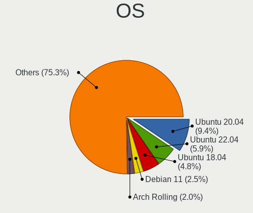
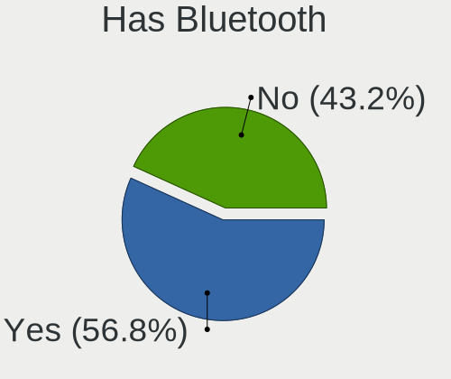
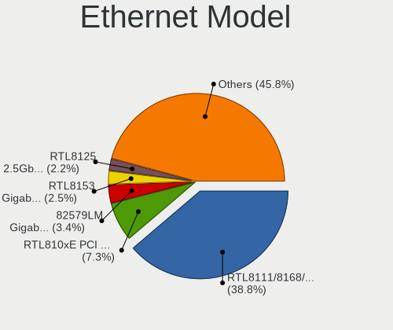
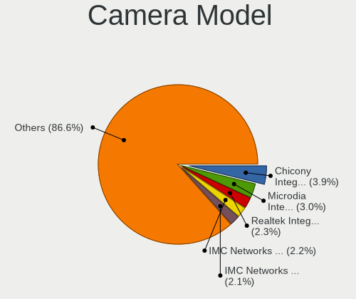

Linux - Tested Hardware & Statistics
------------------------------------

A project to collect tested hardware configurations for Linux.

Anyone can contribute to this report by the [hw-probe](https://github.com/linuxhw/hw-probe) tool:

    sudo -E hw-probe -all -upload

Please contribute! Especially if your hardware is rare.

This is a report for all computer types. See also reports for [desktops](/Desktop/README.md) and [notebooks](/Notebook/README.md).

Distribution-specific reports: [AlmaLinux](/Dist/AlmaLinux), [Alpine](/Dist/Alpine), [ALT_Linux](/Dist/ALT_Linux), [antiX](/Dist/antiX), [Artix](/Dist/Artix), [Chrome_OS](/Dist/Chrome_OS), [Clear_Linux](/Dist/Clear_Linux), [Deepin](/Dist/Deepin), [Devuan](/Dist/Devuan), [EndeavourOS](/Dist/EndeavourOS), [Garuda_Linux](/Dist/Garuda_Linux), [GNOME_OS](/Dist/GNOME_OS), [Kaisen](/Dist/Kaisen), [Mageia](/Dist/Mageia), [Makulu](/Dist/Makulu), [NixOS](/Dist/NixOS), [Nobara](/Dist/Nobara), [Oracle_Linux](/Dist/Oracle_Linux), [Pardus](/Dist/Pardus), [PureOS](/Dist/PureOS), [Q4OS](/Dist/Q4OS), [Reborn_OS](/Dist/Reborn_OS), [Rocky_Linux](/Dist/Rocky_Linux), [Sparky](/Dist/Sparky), [Void_Linux](/Dist/Void_Linux), [Xero](/Dist/Xero).

This report is for real hardware. Report for virtual hardware: [TestDays_VE](https://github.com/linuxhw/TestDays_VE)

Contents
--------

* [ Test Cases ](#test-cases)

* [ System ](#system)
  - [ OS                       ](#os)
  - [ OS Family                ](#os-family)
  - [ Kernel                   ](#kernel)
  - [ Kernel Family            ](#kernel-family)
  - [ Kernel Major Ver.        ](#kernel-major-ver)
  - [ Arch                     ](#arch)
  - [ DE                       ](#de)
  - [ Display Server           ](#display-server)
  - [ Display Manager          ](#display-manager)
  - [ OS Lang                  ](#os-lang)
  - [ Boot Mode                ](#boot-mode)
  - [ Filesystem               ](#filesystem)
  - [ Part. scheme             ](#part-scheme)
  - [ Dual Boot with Linux/BSD ](#dual-boot-with-linuxbsd)
  - [ Dual Boot (Win)          ](#dual-boot-win)

* [ Board ](#board)
  - [ Vendor                   ](#vendor)
  - [ Model                    ](#model)
  - [ Model Family             ](#model-family)
  - [ MFG Year                 ](#mfg-year)
  - [ Form Factor              ](#form-factor)
  - [ Secure Boot              ](#secure-boot)
  - [ Coreboot                 ](#coreboot)
  - [ RAM Size                 ](#ram-size)
  - [ RAM Used                 ](#ram-used)
  - [ Total Drives             ](#total-drives)
  - [ Has CD-ROM               ](#has-cd-rom)
  - [ Has Ethernet             ](#has-ethernet)
  - [ Has WiFi                 ](#has-wifi)
  - [ Has Bluetooth            ](#has-bluetooth)

* [ Location ](#location)
  - [ Country                  ](#country)
  - [ City                     ](#city)

* [ Drives ](#drives)
  - [ Drive Vendor             ](#drive-vendor)
  - [ Drive Model              ](#drive-model)
  - [ HDD Vendor               ](#hdd-vendor)
  - [ SSD Vendor               ](#ssd-vendor)
  - [ Drive Kind               ](#drive-kind)
  - [ Drive Connector          ](#drive-connector)
  - [ Drive Size               ](#drive-size)
  - [ Space Total              ](#space-total)
  - [ Space Used               ](#space-used)
  - [ Malfunc. Drives          ](#malfunc-drives)
  - [ Malfunc. Drive Vendor    ](#malfunc-drive-vendor)
  - [ Malfunc. HDD Vendor      ](#malfunc-hdd-vendor)
  - [ Malfunc. Drive Kind      ](#malfunc-drive-kind)
  - [ Failed Drives            ](#failed-drives)
  - [ Failed Drive Vendor      ](#failed-drive-vendor)
  - [ Drive Status             ](#drive-status)

* [ Storage controller ](#storage-controller)
  - [ Storage Vendor           ](#storage-vendor)
  - [ Storage Model            ](#storage-model)
  - [ Storage Kind             ](#storage-kind)

* [ Processor ](#processor)
  - [ CPU Vendor               ](#cpu-vendor)
  - [ CPU Model                ](#cpu-model)
  - [ CPU Model Family         ](#cpu-model-family)
  - [ CPU Cores                ](#cpu-cores)
  - [ CPU Sockets              ](#cpu-sockets)
  - [ CPU Threads              ](#cpu-threads)
  - [ CPU Op-Modes             ](#cpu-op-modes)
  - [ CPU Microcode            ](#cpu-microcode)
  - [ CPU Microarch            ](#cpu-microarch)

* [ Graphics ](#graphics)
  - [ GPU Vendor               ](#gpu-vendor)
  - [ GPU Model                ](#gpu-model)
  - [ GPU Combo                ](#gpu-combo)
  - [ GPU Driver               ](#gpu-driver)
  - [ GPU Memory               ](#gpu-memory)

* [ Monitor ](#monitor)
  - [ Monitor Vendor           ](#monitor-vendor)
  - [ Monitor Model            ](#monitor-model)
  - [ Monitor Resolution       ](#monitor-resolution)
  - [ Monitor Diagonal         ](#monitor-diagonal)
  - [ Monitor Width            ](#monitor-width)
  - [ Aspect Ratio             ](#aspect-ratio)
  - [ Monitor Area             ](#monitor-area)
  - [ Pixel Density            ](#pixel-density)
  - [ Multiple Monitors        ](#multiple-monitors)

* [ Network ](#network)
  - [ Net Controller Vendor    ](#net-controller-vendor)
  - [ Net Controller Model     ](#net-controller-model)
  - [ Wireless Vendor          ](#wireless-vendor)
  - [ Wireless Model           ](#wireless-model)
  - [ Ethernet Vendor          ](#ethernet-vendor)
  - [ Ethernet Model           ](#ethernet-model)
  - [ Net Controller Kind      ](#net-controller-kind)
  - [ Used Controller          ](#used-controller)
  - [ NICs                     ](#nics)
  - [ IPv6                     ](#ipv6)

* [ Bluetooth ](#bluetooth)
  - [ Bluetooth Vendor         ](#bluetooth-vendor)
  - [ Bluetooth Model          ](#bluetooth-model)

* [ Sound ](#sound)
  - [ Sound Vendor             ](#sound-vendor)
  - [ Sound Model              ](#sound-model)

* [ Memory ](#memory)
  - [ Memory Vendor            ](#memory-vendor)
  - [ Memory Model             ](#memory-model)
  - [ Memory Kind              ](#memory-kind)
  - [ Memory Form Factor       ](#memory-form-factor)
  - [ Memory Size              ](#memory-size)
  - [ Memory Speed             ](#memory-speed)

* [ Printers & scanners ](#printers--scanners)
  - [ Printer Vendor           ](#printer-vendor)
  - [ Printer Model            ](#printer-model)
  - [ Scanner Vendor           ](#scanner-vendor)
  - [ Scanner Model            ](#scanner-model)

* [ Camera ](#camera)
  - [ Camera Vendor            ](#camera-vendor)
  - [ Camera Model             ](#camera-model)

* [ Security ](#security)
  - [ Fingerprint Vendor       ](#fingerprint-vendor)
  - [ Fingerprint Model        ](#fingerprint-model)
  - [ Chipcard Vendor          ](#chipcard-vendor)
  - [ Chipcard Model           ](#chipcard-model)

* [ Unsupported ](#unsupported)
  - [ Unsupported Devices      ](#unsupported-devices)
  - [ Unsupported Device Types ](#unsupported-device-types)

Test Cases
----------

Total: 367823

| Vendor        | Model                       | Form-Factor | Probe                                                      | Date         |
|---------------|-----------------------------|-------------|------------------------------------------------------------|--------------|
| Alienware     | m17 R4                      | Notebook    | [4372e588f9](https://linux-hardware.org/?probe=4372e588f9) | Feb 02, 2024 |
| HP            | 339A                        | Desktop     | [e8e666af64](https://linux-hardware.org/?probe=e8e666af64) | Feb 02, 2024 |
| ASUSTek       | M4N72-E                     | Desktop     | [815b251540](https://linux-hardware.org/?probe=815b251540) | Feb 02, 2024 |
| MSI           | Z77A-GD65                   | Desktop     | [42366a1fa1](https://linux-hardware.org/?probe=42366a1fa1) | Feb 02, 2024 |
| Acer          | Nitro AN515-54              | Notebook    | [051e477b5f](https://linux-hardware.org/?probe=051e477b5f) | Feb 02, 2024 |
| Dell          | Inspiron 3542               | Notebook    | [c7753ffa8e](https://linux-hardware.org/?probe=c7753ffa8e) | Feb 02, 2024 |
| HP            | EliteBook 850 G8 Noteboo... | Notebook    | [7c65739a72](https://linux-hardware.org/?probe=7c65739a72) | Feb 02, 2024 |
| HP            | 3397                        | Desktop     | [f5180bd918](https://linux-hardware.org/?probe=f5180bd918) | Feb 02, 2024 |
| Unknown       | DH61BR G32662-203           | Desktop     | [06cb46d18c](https://linux-hardware.org/?probe=06cb46d18c) | Feb 02, 2024 |
| ASUSTek       | P7P55D-E                    | Desktop     | [7173101a68](https://linux-hardware.org/?probe=7173101a68) | Feb 02, 2024 |
| Acer          | Aspire V5-573G              | Notebook    | [869a029714](https://linux-hardware.org/?probe=869a029714) | Feb 02, 2024 |
| XDO.AI        | Pantera Pico PC             | Desktop     | [f5069feac3](https://linux-hardware.org/?probe=f5069feac3) | Feb 02, 2024 |
| Apple         | MacBookPro4,1               | Notebook    | [5d31a31783](https://linux-hardware.org/?probe=5d31a31783) | Feb 02, 2024 |
| MSI           | Modern 15 A10M              | Notebook    | [22f3c2e58e](https://linux-hardware.org/?probe=22f3c2e58e) | Feb 02, 2024 |
| ASRock        | X670E Pro RS                | Desktop     | [fd02477c14](https://linux-hardware.org/?probe=fd02477c14) | Feb 02, 2024 |
| Dell          | 0YC03K A03                  | Desktop     | [e6d016f309](https://linux-hardware.org/?probe=e6d016f309) | Feb 02, 2024 |
| Samsung       | 550P5C/550P7C               | Notebook    | [4d9464ae33](https://linux-hardware.org/?probe=4d9464ae33) | Feb 02, 2024 |
| Lenovo        | Yoga C740-15IML 81TD        | Convertible | [f4cebc212c](https://linux-hardware.org/?probe=f4cebc212c) | Feb 02, 2024 |
| Unknown       | DH61BR G32662-203           | Desktop     | [7496b90e09](https://linux-hardware.org/?probe=7496b90e09) | Feb 02, 2024 |
| Dell          | 0D28YY A01                  | Desktop     | [21e722f277](https://linux-hardware.org/?probe=21e722f277) | Feb 02, 2024 |
| HP            | Pavilion g6                 | Notebook    | [795109303b](https://linux-hardware.org/?probe=795109303b) | Feb 02, 2024 |
| HP            | EliteBook 8560w             | Notebook    | [6ff665aaf5](https://linux-hardware.org/?probe=6ff665aaf5) | Feb 02, 2024 |
| HP            | 83E9                        | Desktop     | [a140a989be](https://linux-hardware.org/?probe=a140a989be) | Feb 02, 2024 |
| ASUSTek       | SABERTOOTH Z77              | Desktop     | [75c314c9bb](https://linux-hardware.org/?probe=75c314c9bb) | Feb 02, 2024 |
| Medion        | Z170H4-EA                   | Desktop     | [17c714c6b5](https://linux-hardware.org/?probe=17c714c6b5) | Feb 02, 2024 |
| HP            | Pavilion Gaming Laptop 1... | Notebook    | [fe7dfd8247](https://linux-hardware.org/?probe=fe7dfd8247) | Feb 02, 2024 |
| Lenovo        | IdeaPad 110-15ACL 80TJ      | Notebook    | [6300a79454](https://linux-hardware.org/?probe=6300a79454) | Feb 02, 2024 |
| Intel         | NUC13ANBi3 N13056-202       | Mini pc     | [3548282229](https://linux-hardware.org/?probe=3548282229) | Feb 02, 2024 |
| Toshiba       | Satellite L55-C             | Notebook    | [f32d9dc51a](https://linux-hardware.org/?probe=f32d9dc51a) | Feb 02, 2024 |
| Apple         | MacBookPro11,5              | Notebook    | [55197489b0](https://linux-hardware.org/?probe=55197489b0) | Feb 02, 2024 |
| HP            | Spectre x360 Convertible    | Convertible | [a63a142388](https://linux-hardware.org/?probe=a63a142388) | Feb 02, 2024 |
| ASUSTek       | TUF B450-PLUS GAMING        | Desktop     | [4bcae97baa](https://linux-hardware.org/?probe=4bcae97baa) | Feb 02, 2024 |
| Medion        | E7214                       | Notebook    | [cb37ec8f5d](https://linux-hardware.org/?probe=cb37ec8f5d) | Feb 02, 2024 |
| Gigabyte      | AB350M-Gaming 3-CF          | Desktop     | [ef41c12950](https://linux-hardware.org/?probe=ef41c12950) | Feb 02, 2024 |
| Apple         | Mac-942B5BF58194151B        | All in one  | [1546d8c6bf](https://linux-hardware.org/?probe=1546d8c6bf) | Feb 02, 2024 |
| Lenovo        | ThinkPad P1 Gen 6 21FV00... | Notebook    | [7b22729e20](https://linux-hardware.org/?probe=7b22729e20) | Feb 02, 2024 |
| HP            | Pavilion dm1                | Notebook    | [f4c8f5a8e6](https://linux-hardware.org/?probe=f4c8f5a8e6) | Feb 02, 2024 |
| Lenovo        | ThinkPad L470 W10DG 20JV... | Notebook    | [e05005f76b](https://linux-hardware.org/?probe=e05005f76b) | Feb 02, 2024 |
| Intel         | X99-P4 V5.1                 | Desktop     | [092e51b68e](https://linux-hardware.org/?probe=092e51b68e) | Feb 02, 2024 |
| Lenovo        | Legion Slim 5 16IRH8 83D... | Notebook    | [2389b9fc2f](https://linux-hardware.org/?probe=2389b9fc2f) | Feb 02, 2024 |
| ASUSTek       | K53BR                       | Notebook    | [bd5284a0e8](https://linux-hardware.org/?probe=bd5284a0e8) | Feb 02, 2024 |
| Lenovo        | Legion Slim 5 16IRH8 83D... | Notebook    | [32facc4f9e](https://linux-hardware.org/?probe=32facc4f9e) | Feb 02, 2024 |
| Acer          | Aspire A517-51G             | Notebook    | [2788a21644](https://linux-hardware.org/?probe=2788a21644) | Feb 02, 2024 |
| ASUSTek       | Zenbook UX3404VA_Q420VA     | Notebook    | [2b3f583bc7](https://linux-hardware.org/?probe=2b3f583bc7) | Feb 02, 2024 |
| Dell          | XPS 15 7590                 | Notebook    | [214b9d35cb](https://linux-hardware.org/?probe=214b9d35cb) | Feb 02, 2024 |
| HP            | 8055                        | Desktop     | [1eec2a37ce](https://linux-hardware.org/?probe=1eec2a37ce) | Feb 02, 2024 |
| ASRock        | Z77 Pro3                    | Desktop     | [f1d8db0641](https://linux-hardware.org/?probe=f1d8db0641) | Feb 02, 2024 |
| ASUSTek       | Zenbook UX3404VA_Q420VA     | Notebook    | [a569cab490](https://linux-hardware.org/?probe=a569cab490) | Feb 02, 2024 |
| Acer          | Aspire VN7-592G             | Notebook    | [95f618bdeb](https://linux-hardware.org/?probe=95f618bdeb) | Feb 02, 2024 |
| Dell          | Inspiron 13-7359            | Notebook    | [82a1195ef5](https://linux-hardware.org/?probe=82a1195ef5) | Feb 02, 2024 |
| ASRock        | H61M-DGS R2.0               | Desktop     | [fed06b0a3c](https://linux-hardware.org/?probe=fed06b0a3c) | Feb 02, 2024 |
| LG Electro... | 16T90P-K.AAE7U1             | Convertible | [c0343d0686](https://linux-hardware.org/?probe=c0343d0686) | Feb 02, 2024 |
| Lenovo        | ThinkPad E14 Gen 3 20YE0... | Notebook    | [60cc806e9a](https://linux-hardware.org/?probe=60cc806e9a) | Feb 02, 2024 |
| Gigabyte      | B550M AORUS PRO-P           | Desktop     | [1f0ece5a8b](https://linux-hardware.org/?probe=1f0ece5a8b) | Feb 02, 2024 |
| Apple         | Mac-F221BEC8                | Desktop     | [7e71a3a029](https://linux-hardware.org/?probe=7e71a3a029) | Feb 02, 2024 |
| Dell          | Latitude 7390               | Notebook    | [2386e8641f](https://linux-hardware.org/?probe=2386e8641f) | Feb 02, 2024 |
| Gigabyte      | B550M AORUS PRO-P           | Desktop     | [11b2f337e7](https://linux-hardware.org/?probe=11b2f337e7) | Feb 02, 2024 |
| HP            | 1497                        | Desktop     | [ae90a32790](https://linux-hardware.org/?probe=ae90a32790) | Feb 02, 2024 |
| HP            | EliteBook 840 G2            | Notebook    | [4a3954a4c1](https://linux-hardware.org/?probe=4a3954a4c1) | Feb 02, 2024 |
| Lenovo        | ThinkPad T540p 20BE0060M... | Notebook    | [71296d9e0f](https://linux-hardware.org/?probe=71296d9e0f) | Feb 02, 2024 |
| Acer          | Aspire VN7-591G             | Notebook    | [c0f024d3e0](https://linux-hardware.org/?probe=c0f024d3e0) | Feb 02, 2024 |
| Acer          | Swift SF314-56              | Notebook    | [159a1c3a0f](https://linux-hardware.org/?probe=159a1c3a0f) | Feb 02, 2024 |
| Dell          | 0J7MNP A00                  | All in one  | [7a08cc9321](https://linux-hardware.org/?probe=7a08cc9321) | Feb 02, 2024 |
| Delovoy of... | LPGR.469559.018 V1.0        | Desktop     | [4ed2bd72be](https://linux-hardware.org/?probe=4ed2bd72be) | Feb 02, 2024 |
| HP            | ENVY m7                     | Notebook    | [b38e23bdbe](https://linux-hardware.org/?probe=b38e23bdbe) | Feb 02, 2024 |
| Dell          | 0J7MNP A00                  | All in one  | [3ec79f8a00](https://linux-hardware.org/?probe=3ec79f8a00) | Feb 02, 2024 |
| ASUSTek       | PRIME X370-PRO              | Desktop     | [58d150eef2](https://linux-hardware.org/?probe=58d150eef2) | Feb 02, 2024 |
| Dell          | Inspiron 3583               | Notebook    | [3c532c85ec](https://linux-hardware.org/?probe=3c532c85ec) | Feb 02, 2024 |
| Lenovo        | IdeaPad 3 17ALC6 82KV       | Notebook    | [3aa20161d9](https://linux-hardware.org/?probe=3aa20161d9) | Feb 02, 2024 |
| Gigabyte      | F2A75M-D3H                  | Desktop     | [a30e9bd132](https://linux-hardware.org/?probe=a30e9bd132) | Feb 02, 2024 |
| Unknown       | Unknown                     | Notebook    | [8c03bd946c](https://linux-hardware.org/?probe=8c03bd946c) | Feb 02, 2024 |
| Acer          | P4LJ0                       | Notebook    | [c0a2639732](https://linux-hardware.org/?probe=c0a2639732) | Feb 02, 2024 |
| ASUSTek       | H110M-R                     | Desktop     | [2902d23de2](https://linux-hardware.org/?probe=2902d23de2) | Feb 02, 2024 |
| Dell          | 0NK5PH A00                  | Desktop     | [211c3d7db6](https://linux-hardware.org/?probe=211c3d7db6) | Feb 02, 2024 |
| Acer          | Aspire 5741G                | Notebook    | [935470b35c](https://linux-hardware.org/?probe=935470b35c) | Feb 02, 2024 |
| ASUSTek       | F8Vr                        | Notebook    | [02fced1d70](https://linux-hardware.org/?probe=02fced1d70) | Feb 02, 2024 |
| Lenovo        | ThinkPad T14s Gen 1 20UJ... | Notebook    | [a64852fe4a](https://linux-hardware.org/?probe=a64852fe4a) | Feb 02, 2024 |
| Samsung       | RV410/RV510/S3510/E3510     | Notebook    | [1f85f107bb](https://linux-hardware.org/?probe=1f85f107bb) | Feb 02, 2024 |
| Dell          | Inspiron 3442               | Notebook    | [ca29fa6852](https://linux-hardware.org/?probe=ca29fa6852) | Feb 02, 2024 |
| Pegatron      | IPM41-D3                    | Desktop     | [5884d40085](https://linux-hardware.org/?probe=5884d40085) | Feb 02, 2024 |
| Lenovo        | ThinkPad X270 W10DG 20K5... | Notebook    | [e7400919cd](https://linux-hardware.org/?probe=e7400919cd) | Feb 02, 2024 |
| ASUSTek       | ROG STRIX B650E-E GAMING... | Desktop     | [97d6952c52](https://linux-hardware.org/?probe=97d6952c52) | Feb 02, 2024 |
| Gigabyte      | G31M-S2C                    | Desktop     | [b0e201e74a](https://linux-hardware.org/?probe=b0e201e74a) | Feb 02, 2024 |
| ASUSTek       | UX331UN                     | Notebook    | [9b0463c9de](https://linux-hardware.org/?probe=9b0463c9de) | Feb 02, 2024 |
| Acer          | Aspire V3-772               | Notebook    | [4a32c0297c](https://linux-hardware.org/?probe=4a32c0297c) | Feb 02, 2024 |
| Sapphire      | PI-AM3RS760G2               | Desktop     | [9b2e938cb4](https://linux-hardware.org/?probe=9b2e938cb4) | Feb 02, 2024 |
| ASUSTek       | VivoBook_ASUSLaptop M350... | Notebook    | [cb15afccd0](https://linux-hardware.org/?probe=cb15afccd0) | Feb 02, 2024 |
| HP            | 859C                        | Desktop     | [bc1cc805c6](https://linux-hardware.org/?probe=bc1cc805c6) | Feb 02, 2024 |
| Dell          | Latitude 7400               | Notebook    | [ad51cec5ea](https://linux-hardware.org/?probe=ad51cec5ea) | Feb 02, 2024 |
| Gigabyte      | H61M-S1                     | Desktop     | [e7f247621c](https://linux-hardware.org/?probe=e7f247621c) | Feb 02, 2024 |
| Dell          | Precision 7550              | Notebook    | [c210fa0d97](https://linux-hardware.org/?probe=c210fa0d97) | Feb 02, 2024 |
| HP            | 18E7                        | Desktop     | [84caef4dde](https://linux-hardware.org/?probe=84caef4dde) | Feb 02, 2024 |
| HP            | ProLiant DL360 Gen9         | Server      | [d71cef49ca](https://linux-hardware.org/?probe=d71cef49ca) | Feb 02, 2024 |
| Gigabyte      | Q87M-D2H                    | Desktop     | [4c5e48c75f](https://linux-hardware.org/?probe=4c5e48c75f) | Feb 02, 2024 |
| Gigabyte      | B450 AORUS ELITE            | Desktop     | [aaebf4ea23](https://linux-hardware.org/?probe=aaebf4ea23) | Feb 02, 2024 |
| Inventec      | DQ Class A02                | Desktop     | [4cb447dae2](https://linux-hardware.org/?probe=4cb447dae2) | Feb 02, 2024 |
| Acer          | Aspire 5741G                | Notebook    | [d598afdbe9](https://linux-hardware.org/?probe=d598afdbe9) | Feb 02, 2024 |
| DEXP          | Atlas M14-I5W303            | Notebook    | [fd14684ed2](https://linux-hardware.org/?probe=fd14684ed2) | Feb 02, 2024 |
| Apple         | Mac-F4218FC8 DVT            | All in one  | [7e9ecedb98](https://linux-hardware.org/?probe=7e9ecedb98) | Feb 02, 2024 |
| Gigabyte      | GA-990FXA-UD7               | Desktop     | [66768ccdf7](https://linux-hardware.org/?probe=66768ccdf7) | Feb 02, 2024 |
| Gigabyte      | B560M H                     | Desktop     | [84e64db583](https://linux-hardware.org/?probe=84e64db583) | Feb 02, 2024 |
| ASUSTek       | M5A97 EVO R2.0              | Desktop     | [4009a96bd4](https://linux-hardware.org/?probe=4009a96bd4) | Feb 02, 2024 |
| PC Special... | GK5CQ7Z                     | Notebook    | [d7632585fc](https://linux-hardware.org/?probe=d7632585fc) | Feb 02, 2024 |
| Lenovo        | ThinkPad E595 20NF0005IX    | Notebook    | [171aaf5d57](https://linux-hardware.org/?probe=171aaf5d57) | Feb 02, 2024 |
| Apple         | MacBookAir4,2               | Notebook    | [2952e00ccb](https://linux-hardware.org/?probe=2952e00ccb) | Feb 02, 2024 |
| ASRock        | 990FX Extreme4              | Desktop     | [b412a671e4](https://linux-hardware.org/?probe=b412a671e4) | Feb 02, 2024 |
| Dell          | G7 7588                     | Notebook    | [fdc746ce61](https://linux-hardware.org/?probe=fdc746ce61) | Feb 02, 2024 |
| eMachines     | E725                        | Notebook    | [e421aa20d1](https://linux-hardware.org/?probe=e421aa20d1) | Feb 02, 2024 |
| HP            | Laptop 17-cp0xxx            | Notebook    | [601c3c2cc4](https://linux-hardware.org/?probe=601c3c2cc4) | Feb 02, 2024 |
| Lenovo        | ThinkPad E595 20NF0005IX    | Notebook    | [c834e4941b](https://linux-hardware.org/?probe=c834e4941b) | Feb 02, 2024 |
| Lenovo        | 312A NOK                    | Desktop     | [366174cd75](https://linux-hardware.org/?probe=366174cd75) | Feb 02, 2024 |
| Apple         | MacBook5,1                  | Notebook    | [48a998308b](https://linux-hardware.org/?probe=48a998308b) | Feb 02, 2024 |
| Toshiba       | Satellite L50D-B            | Notebook    | [49e28cce05](https://linux-hardware.org/?probe=49e28cce05) | Feb 02, 2024 |
| Valve         | Jupiter                     | Notebook    | [ff59f7877a](https://linux-hardware.org/?probe=ff59f7877a) | Feb 02, 2024 |
| ASRock        | H61M-HVS                    | Desktop     | [a41e650c9c](https://linux-hardware.org/?probe=a41e650c9c) | Feb 02, 2024 |
| ASUSTek       | M5A97 EVO R2.0              | Desktop     | [ab60a0a3b4](https://linux-hardware.org/?probe=ab60a0a3b4) | Feb 02, 2024 |
| Lenovo        | ThinkPad T580 20LAS3NJ0T    | Notebook    | [17e848cdcf](https://linux-hardware.org/?probe=17e848cdcf) | Feb 02, 2024 |
| Dell          | Inspiron 5567               | Notebook    | [51c9bc9ff2](https://linux-hardware.org/?probe=51c9bc9ff2) | Feb 02, 2024 |
| ASUSTek       | B85M-G                      | Desktop     | [cd9f6ee87d](https://linux-hardware.org/?probe=cd9f6ee87d) | Feb 02, 2024 |
| Lenovo        | ThinkPad E590 20NB002BRT    | Notebook    | [283a2fd324](https://linux-hardware.org/?probe=283a2fd324) | Feb 02, 2024 |
| HP            | ProBook 450 G8 Notebook ... | Notebook    | [0bbbc51a52](https://linux-hardware.org/?probe=0bbbc51a52) | Feb 02, 2024 |
| ASUSTek       | Z170 PRO GAMING             | Desktop     | [b43380d687](https://linux-hardware.org/?probe=b43380d687) | Feb 02, 2024 |
| HP            | EliteBook x360 1030 G2      | Convertible | [1579230b7f](https://linux-hardware.org/?probe=1579230b7f) | Feb 02, 2024 |
| Lenovo        | MAHOBAY 0B98401 PRO         | Desktop     | [3074b7c2a6](https://linux-hardware.org/?probe=3074b7c2a6) | Feb 02, 2024 |
| Lenovo        | ThinkBook 16p Gen 4 21J8    | Notebook    | [7cbebba117](https://linux-hardware.org/?probe=7cbebba117) | Feb 02, 2024 |
| Timi          | RedmiBook Pro 15S           | Notebook    | [70dacc6818](https://linux-hardware.org/?probe=70dacc6818) | Feb 02, 2024 |
| Notebook      | V15x_V17xRNx                | Notebook    | [901e71289e](https://linux-hardware.org/?probe=901e71289e) | Feb 02, 2024 |
| Apple         | MacBookAir4,2               | Notebook    | [3173c9ba14](https://linux-hardware.org/?probe=3173c9ba14) | Feb 02, 2024 |
| Lenovo        | Legion Go 8APU1 83E1        | Tablet      | [5661819818](https://linux-hardware.org/?probe=5661819818) | Feb 02, 2024 |
| ASUSTek       | N56VZ                       | Notebook    | [2209fe1372](https://linux-hardware.org/?probe=2209fe1372) | Feb 02, 2024 |
| ASRock        | H61M-DGS R2.0               | Desktop     | [a757eacac1](https://linux-hardware.org/?probe=a757eacac1) | Feb 02, 2024 |
| ASRock        | 970M Pro3                   | Desktop     | [cf54a4b360](https://linux-hardware.org/?probe=cf54a4b360) | Feb 02, 2024 |
| Schenker      | XMG PRO (Late 2021)         | Notebook    | [502d4a5570](https://linux-hardware.org/?probe=502d4a5570) | Feb 02, 2024 |
| MECHREVO      | S1 Pro Series               | Notebook    | [ba68410f96](https://linux-hardware.org/?probe=ba68410f96) | Feb 02, 2024 |
| Acer          | Nitro AN515-58              | Notebook    | [1fe97c9103](https://linux-hardware.org/?probe=1fe97c9103) | Feb 02, 2024 |
| Apple         | Mac-F42386C8 PVT            | All in one  | [5e93071787](https://linux-hardware.org/?probe=5e93071787) | Feb 02, 2024 |
| INP           | i1000BTS                    | Desktop     | [3148738295](https://linux-hardware.org/?probe=3148738295) | Feb 02, 2024 |
| Lenovo        | NO DPK                      | Desktop     | [ce1ff05aed](https://linux-hardware.org/?probe=ce1ff05aed) | Feb 02, 2024 |
| MSI           | Modern 14 B11MOU            | Notebook    | [a5b3665f64](https://linux-hardware.org/?probe=a5b3665f64) | Feb 02, 2024 |
| MSI           | Modern 14 B11MOU            | Notebook    | [f7d0fcd205](https://linux-hardware.org/?probe=f7d0fcd205) | Feb 02, 2024 |
| ASRock        | X300-ITX                    | Desktop     | [3390b15018](https://linux-hardware.org/?probe=3390b15018) | Feb 02, 2024 |
| Dell          | 05XGC8 A01                  | Desktop     | [29ae38936a](https://linux-hardware.org/?probe=29ae38936a) | Feb 02, 2024 |
| ASUSTek       | PRIME H510M-R               | Desktop     | [4196d911d2](https://linux-hardware.org/?probe=4196d911d2) | Feb 02, 2024 |
| Medion        | E7218                       | Notebook    | [d99d2a5d9c](https://linux-hardware.org/?probe=d99d2a5d9c) | Feb 02, 2024 |
| MSI           | Thin GF63 12HW              | Notebook    | [b5b16477c3](https://linux-hardware.org/?probe=b5b16477c3) | Feb 02, 2024 |
| SLIMBOOK      | HERO-S-TGL-RTX              | Notebook    | [1260457422](https://linux-hardware.org/?probe=1260457422) | Feb 02, 2024 |
| Microsoft     | Surface Pro 4               | Tablet      | [07e24523f9](https://linux-hardware.org/?probe=07e24523f9) | Feb 02, 2024 |
| HP            | 1998                        | Desktop     | [0056c33526](https://linux-hardware.org/?probe=0056c33526) | Feb 02, 2024 |
| Lenovo        | Yoga 6 13ALC6 82ND          | Convertible | [2eec21d0eb](https://linux-hardware.org/?probe=2eec21d0eb) | Feb 02, 2024 |
| ASUSTek       | ROG CROSSHAIR X670E HERO    | Desktop     | [9d6e9d5720](https://linux-hardware.org/?probe=9d6e9d5720) | Feb 02, 2024 |
| HP            | EliteBook 840 G7 Noteboo... | Notebook    | [6f09cb7800](https://linux-hardware.org/?probe=6f09cb7800) | Feb 02, 2024 |
| Fujitsu       | D3523-Ax S26361-D3523-Ax    | Desktop     | [fefabce2b4](https://linux-hardware.org/?probe=fefabce2b4) | Feb 02, 2024 |
| Dell          | Latitude 3420               | Notebook    | [15de060676](https://linux-hardware.org/?probe=15de060676) | Feb 02, 2024 |
| MSI           | Prestige 13 AI Evo A1MG     | Notebook    | [abc18d1a9e](https://linux-hardware.org/?probe=abc18d1a9e) | Feb 02, 2024 |
| Gigabyte      | Z170X-Gaming 7              | Desktop     | [656bb7827a](https://linux-hardware.org/?probe=656bb7827a) | Feb 02, 2024 |
| Valve         | Galileo                     | Notebook    | [3b44d4da2f](https://linux-hardware.org/?probe=3b44d4da2f) | Feb 02, 2024 |
| Foxconn       | 2ADA                        | Desktop     | [e92639ba10](https://linux-hardware.org/?probe=e92639ba10) | Feb 02, 2024 |
| Dell          | Latitude 7420               | Notebook    | [5eb0b85732](https://linux-hardware.org/?probe=5eb0b85732) | Feb 02, 2024 |
| Supermicro    | H12SSL-i                    | Server      | [17031c6aac](https://linux-hardware.org/?probe=17031c6aac) | Feb 02, 2024 |
| ASRockRack    | B650D4U-2L2T/BCM            | Server      | [0fa43445d1](https://linux-hardware.org/?probe=0fa43445d1) | Feb 02, 2024 |
| Dell          | 0PV3YR A05                  | Server      | [25e7def18b](https://linux-hardware.org/?probe=25e7def18b) | Feb 02, 2024 |
| ASUSTek       | P5Q                         | Desktop     | [63522c9a09](https://linux-hardware.org/?probe=63522c9a09) | Feb 02, 2024 |
| MSI           | X99A RAIDER                 | Desktop     | [158530e4dc](https://linux-hardware.org/?probe=158530e4dc) | Feb 02, 2024 |
| Lenovo        | ThinkPad P14s Gen 2a 21A... | Notebook    | [6d6e6af46b](https://linux-hardware.org/?probe=6d6e6af46b) | Feb 02, 2024 |
| Google        | Pujjoteen15W                | Notebook    | [b23c1ed1eb](https://linux-hardware.org/?probe=b23c1ed1eb) | Feb 02, 2024 |
| Apple         | MacBookAir5,1               | Notebook    | [e25bf95ccb](https://linux-hardware.org/?probe=e25bf95ccb) | Feb 02, 2024 |
| MSI           | Raider GE68HX 13VF          | Notebook    | [72ac680d91](https://linux-hardware.org/?probe=72ac680d91) | Feb 02, 2024 |
| Apple         | MacBookAir5,1               | Notebook    | [058a447435](https://linux-hardware.org/?probe=058a447435) | Feb 02, 2024 |
| Dell          | Latitude 5511               | Notebook    | [e7d3018c34](https://linux-hardware.org/?probe=e7d3018c34) | Feb 02, 2024 |
| GX55          | Unknown                     | Tablet      | [99db62ac14](https://linux-hardware.org/?probe=99db62ac14) | Feb 02, 2024 |
| VIT           | P3400                       | Notebook    | [036ee57838](https://linux-hardware.org/?probe=036ee57838) | Feb 02, 2024 |
| Gigabyte      | A320M-S2H V2-CF             | Desktop     | [f38bbe7c82](https://linux-hardware.org/?probe=f38bbe7c82) | Feb 02, 2024 |
| Lenovo        | SHARKBAY NOK                | Desktop     | [f4caef7bf1](https://linux-hardware.org/?probe=f4caef7bf1) | Feb 02, 2024 |
| Acer          | Aspire A515-43              | Notebook    | [349b53e55a](https://linux-hardware.org/?probe=349b53e55a) | Feb 02, 2024 |
| HP            | EliteBook 850 G8 Noteboo... | Notebook    | [133d556add](https://linux-hardware.org/?probe=133d556add) | Feb 02, 2024 |
| Notebook      | NJx0MU                      | Notebook    | [6259b53b1c](https://linux-hardware.org/?probe=6259b53b1c) | Feb 02, 2024 |
| ASRock        | A320M-ITX                   | Desktop     | [7c3ebbb23c](https://linux-hardware.org/?probe=7c3ebbb23c) | Feb 02, 2024 |
| Gigabyte      | A520 AORUS ELITE            | Desktop     | [075ee0ca67](https://linux-hardware.org/?probe=075ee0ca67) | Feb 02, 2024 |
| Dell          | Inspiron 7577               | Notebook    | [0155afe6f3](https://linux-hardware.org/?probe=0155afe6f3) | Feb 02, 2024 |
| ASUSTek       | TUF Gaming B450M-PRO S      | Desktop     | [654e691a5d](https://linux-hardware.org/?probe=654e691a5d) | Feb 02, 2024 |
| Lenovo        | MIIX 520-12IKB 20M3         | Tablet      | [0fb22a9b60](https://linux-hardware.org/?probe=0fb22a9b60) | Feb 02, 2024 |
| Lenovo        | ThinkPad T14s Gen 2i 20W... | Notebook    | [fdc21a05c2](https://linux-hardware.org/?probe=fdc21a05c2) | Feb 02, 2024 |
| ASUSTek       | TUF Gaming B450M-PRO S      | Desktop     | [279e68de12](https://linux-hardware.org/?probe=279e68de12) | Feb 02, 2024 |
| HP            | 158A                        | Desktop     | [1ec6b139ac](https://linux-hardware.org/?probe=1ec6b139ac) | Feb 02, 2024 |
| Apple         | MacBookPro11,3              | Notebook    | [5bc93c37fa](https://linux-hardware.org/?probe=5bc93c37fa) | Feb 02, 2024 |
| HP            | 09E8h                       | Desktop     | [413788d555](https://linux-hardware.org/?probe=413788d555) | Feb 02, 2024 |
| MSI           | B450 GAMING PLUS MAX        | Desktop     | [e8554aab57](https://linux-hardware.org/?probe=e8554aab57) | Feb 02, 2024 |
| Acer          | Aspire 5738                 | Notebook    | [7137d60986](https://linux-hardware.org/?probe=7137d60986) | Feb 02, 2024 |
| HP            | EliteBook 2570p             | Notebook    | [59778f5513](https://linux-hardware.org/?probe=59778f5513) | Feb 02, 2024 |
| Dell          | Latitude 5290 2-in-1        | Tablet      | [51e59eeeb8](https://linux-hardware.org/?probe=51e59eeeb8) | Feb 02, 2024 |
| ASRock        | B660-ITX                    | Desktop     | [3749b9145b](https://linux-hardware.org/?probe=3749b9145b) | Feb 02, 2024 |
| Samsung       | 305E4A/305E5A/305E7A        | Notebook    | [bf840a5308](https://linux-hardware.org/?probe=bf840a5308) | Feb 02, 2024 |
| Lenovo        | ThinkPad T410 2537AF8       | Notebook    | [88794835fb](https://linux-hardware.org/?probe=88794835fb) | Feb 02, 2024 |
| Dell          | Inspiron 3542               | Notebook    | [176eee6b84](https://linux-hardware.org/?probe=176eee6b84) | Feb 02, 2024 |
| Apple         | Mac-AA95B1DDAB278B95 iMa... | All in one  | [565be02783](https://linux-hardware.org/?probe=565be02783) | Feb 02, 2024 |
| Dell          | Inspiron 3542               | Notebook    | [7f677482ef](https://linux-hardware.org/?probe=7f677482ef) | Feb 02, 2024 |
| Framework     | Laptop 13 (AMD Ryzen 704... | Notebook    | [d9a0906eac](https://linux-hardware.org/?probe=d9a0906eac) | Feb 02, 2024 |
| Gigabyte      | GA-990FXA-UD7               | Desktop     | [4726161c35](https://linux-hardware.org/?probe=4726161c35) | Feb 02, 2024 |
| Lenovo        | ThinkPad T15g Gen 1 20UR... | Notebook    | [e3e01bd0ff](https://linux-hardware.org/?probe=e3e01bd0ff) | Feb 02, 2024 |
| ASUSTek       | F2A85-M LE                  | Desktop     | [680ba020e2](https://linux-hardware.org/?probe=680ba020e2) | Feb 02, 2024 |
| ASUSTek       | X450CA                      | Notebook    | [701cfd5c41](https://linux-hardware.org/?probe=701cfd5c41) | Feb 02, 2024 |
| Lenovo        | Z50-70 20354                | Notebook    | [d6023b78a2](https://linux-hardware.org/?probe=d6023b78a2) | Feb 02, 2024 |
| Apple         | MacBookAir6,2               | Notebook    | [4bee7d161b](https://linux-hardware.org/?probe=4bee7d161b) | Feb 02, 2024 |
| Acer          | Aspire A315-54              | Notebook    | [3621142f4d](https://linux-hardware.org/?probe=3621142f4d) | Feb 02, 2024 |
| HP            | EliteBook 845 G8 Noteboo... | Notebook    | [7516b63802](https://linux-hardware.org/?probe=7516b63802) | Feb 02, 2024 |
| Apple         | MacBookAir6,2               | Notebook    | [4181fe4492](https://linux-hardware.org/?probe=4181fe4492) | Feb 02, 2024 |
| Schenker      | XMG PRO (Late 2021)         | Notebook    | [0bd25ae10e](https://linux-hardware.org/?probe=0bd25ae10e) | Feb 02, 2024 |
| Acer          | Swift SF314-43              | Notebook    | [e87efb031b](https://linux-hardware.org/?probe=e87efb031b) | Feb 02, 2024 |
| Acer          | NC-F5-771G-72XY             | Notebook    | [2f4c6fbadb](https://linux-hardware.org/?probe=2f4c6fbadb) | Feb 02, 2024 |
| ASUSTek       | X556UQK                     | Notebook    | [24b1509f61](https://linux-hardware.org/?probe=24b1509f61) | Feb 02, 2024 |
| Dell          | Inspiron 5547               | Notebook    | [507fad3c00](https://linux-hardware.org/?probe=507fad3c00) | Feb 02, 2024 |
| ASRock        | B560M-ITX/ac                | Desktop     | [9ed6c67efe](https://linux-hardware.org/?probe=9ed6c67efe) | Feb 02, 2024 |
| Lenovo        | ThinkBook 14 G6 IRL 21KG    | Notebook    | [c01e746574](https://linux-hardware.org/?probe=c01e746574) | Feb 02, 2024 |
| Lenovo        | G505s 20255                 | Notebook    | [f1903f6323](https://linux-hardware.org/?probe=f1903f6323) | Feb 02, 2024 |
| Unknown       | Unknown                     | Notebook    | [2037e9d75f](https://linux-hardware.org/?probe=2037e9d75f) | Feb 02, 2024 |
| Lenovo        | SHARKBAY 0B98401 PRO        | Desktop     | [62dc25b8b6](https://linux-hardware.org/?probe=62dc25b8b6) | Feb 02, 2024 |
| HP            | EliteBook Revolve 810 G2    | Notebook    | [788fb13f23](https://linux-hardware.org/?probe=788fb13f23) | Feb 02, 2024 |
| Dell          | 0WMJ54 A00                  | Desktop     | [d6c3c89e3d](https://linux-hardware.org/?probe=d6c3c89e3d) | Feb 02, 2024 |
| Dell          | Latitude 7280               | Notebook    | [c94b45b8f4](https://linux-hardware.org/?probe=c94b45b8f4) | Feb 02, 2024 |
| ASUSTek       | ROG Strix G531GT_G531GT     | Notebook    | [5e505eb9f1](https://linux-hardware.org/?probe=5e505eb9f1) | Feb 02, 2024 |
| HP            | 3647h                       | Desktop     | [5f1a400767](https://linux-hardware.org/?probe=5f1a400767) | Feb 02, 2024 |
| HP            | ENVY x360 Convertible 13... | Convertible | [a64e17ff88](https://linux-hardware.org/?probe=a64e17ff88) | Feb 02, 2024 |
| Pegatron      | Spring Peak                 | Notebook    | [b14f110621](https://linux-hardware.org/?probe=b14f110621) | Feb 02, 2024 |
| MSI           | B450 GAMING PLUS MAX        | Desktop     | [73e32179ef](https://linux-hardware.org/?probe=73e32179ef) | Feb 02, 2024 |
| Lenovo        | ThinkPad E14 Gen 2 20T60... | Notebook    | [47431ad7d9](https://linux-hardware.org/?probe=47431ad7d9) | Feb 02, 2024 |
| Gigabyte      | AX370-Gaming K7             | Desktop     | [c2514048e9](https://linux-hardware.org/?probe=c2514048e9) | Feb 02, 2024 |
| Unknown       | Unknown                     | Notebook    | [b85ea144b7](https://linux-hardware.org/?probe=b85ea144b7) | Feb 01, 2024 |
| ASRock        | H77 Pro4-M                  | Desktop     | [794e5341d9](https://linux-hardware.org/?probe=794e5341d9) | Feb 01, 2024 |
| HP            | 240 G8 Notebook PC          | Notebook    | [d4c61a6527](https://linux-hardware.org/?probe=d4c61a6527) | Feb 01, 2024 |
| Valve         | Galileo                     | Notebook    | [aebc4c73ad](https://linux-hardware.org/?probe=aebc4c73ad) | Feb 01, 2024 |
| HP            | EliteBook 840 G6            | Notebook    | [6cac3b71e0](https://linux-hardware.org/?probe=6cac3b71e0) | Feb 01, 2024 |
| VIT           | P3400                       | Notebook    | [6b03e6574f](https://linux-hardware.org/?probe=6b03e6574f) | Feb 01, 2024 |
| Apple         | MacBookAir7,2               | Notebook    | [632421d681](https://linux-hardware.org/?probe=632421d681) | Feb 01, 2024 |
| ASUSTek       | N53SV                       | Notebook    | [ee79ea1cbb](https://linux-hardware.org/?probe=ee79ea1cbb) | Feb 01, 2024 |
| HP            | 15                          | Notebook    | [b99530abd5](https://linux-hardware.org/?probe=b99530abd5) | Feb 01, 2024 |
| MSI           | B550 GAMING GEN3            | Desktop     | [e0f8f7bf56](https://linux-hardware.org/?probe=e0f8f7bf56) | Feb 01, 2024 |
| Biostar       | A10N-9830E                  | Desktop     | [672938d127](https://linux-hardware.org/?probe=672938d127) | Feb 01, 2024 |
| HP            | 15                          | Notebook    | [874ae10280](https://linux-hardware.org/?probe=874ae10280) | Feb 01, 2024 |
| Lenovo        | IdeaPad S340-15IWL 81N8     | Notebook    | [fd7240a3ee](https://linux-hardware.org/?probe=fd7240a3ee) | Feb 01, 2024 |
| HP            | 255 15.6 inch G10           | Notebook    | [86bdc742bd](https://linux-hardware.org/?probe=86bdc742bd) | Feb 01, 2024 |
| Lenovo        | IdeaPad S340-15IWL 81N8     | Notebook    | [b3b900cffa](https://linux-hardware.org/?probe=b3b900cffa) | Feb 01, 2024 |
| ASUSTek       | H110M-D                     | Desktop     | [287648c7d3](https://linux-hardware.org/?probe=287648c7d3) | Feb 01, 2024 |
| HP            | Pavilion Notebook           | Notebook    | [bb16eb2e4a](https://linux-hardware.org/?probe=bb16eb2e4a) | Feb 01, 2024 |
| Lenovo        | ThinkPad T440 20B7A0B7MN    | Notebook    | [74173e2c0a](https://linux-hardware.org/?probe=74173e2c0a) | Feb 01, 2024 |
| HP            | ENVY x360 Convertible 15... | Convertible | [34e8a186d6](https://linux-hardware.org/?probe=34e8a186d6) | Feb 01, 2024 |
| Dell          | Inspiron N5110              | Notebook    | [e7338ad21d](https://linux-hardware.org/?probe=e7338ad21d) | Feb 01, 2024 |
| ASUSTek       | PRIME X470-PRO              | Desktop     | [50c9a44280](https://linux-hardware.org/?probe=50c9a44280) | Feb 01, 2024 |
| Biostar       | IH61MF-Q5                   | Desktop     | [1087f70019](https://linux-hardware.org/?probe=1087f70019) | Feb 01, 2024 |
| Lenovo        | SHARKBAY SDK0E50510 WIN     | Desktop     | [fc6230e374](https://linux-hardware.org/?probe=fc6230e374) | Feb 01, 2024 |
| Dell          | 0YF8P5 A00                  | Desktop     | [c3510619ed](https://linux-hardware.org/?probe=c3510619ed) | Feb 01, 2024 |
| ASUSTek       | TUF Gaming B550-PLUS        | Desktop     | [8e3680cd5d](https://linux-hardware.org/?probe=8e3680cd5d) | Feb 01, 2024 |
| MSI           | B450-A PRO                  | Desktop     | [10f58dc52e](https://linux-hardware.org/?probe=10f58dc52e) | Feb 01, 2024 |
| Acer          | Aspire ES1-523              | Notebook    | [4344e68c86](https://linux-hardware.org/?probe=4344e68c86) | Feb 01, 2024 |
| Timi          | Redmi Book Pro 15 2022      | Notebook    | [fddf157b5f](https://linux-hardware.org/?probe=fddf157b5f) | Feb 01, 2024 |
| Intel         | DH61HO AAG62445-102         | Desktop     | [f6db94d707](https://linux-hardware.org/?probe=f6db94d707) | Feb 01, 2024 |
| Dell          | 0215PR A05                  | Desktop     | [05183a71ef](https://linux-hardware.org/?probe=05183a71ef) | Feb 01, 2024 |
| Gigabyte      | A320M-S2H-CF                | Desktop     | [ef0de660b6](https://linux-hardware.org/?probe=ef0de660b6) | Feb 01, 2024 |
| Dell          | 06X1TJ A00                  | Desktop     | [f3cb8642e0](https://linux-hardware.org/?probe=f3cb8642e0) | Feb 01, 2024 |
| Intel         | DH61HO AAG62445-102         | Desktop     | [4752f66f57](https://linux-hardware.org/?probe=4752f66f57) | Feb 01, 2024 |
| Apple         | MacBookPro5,4               | Notebook    | [c22226fe6f](https://linux-hardware.org/?probe=c22226fe6f) | Feb 01, 2024 |
| Pegatron      | Spring Peak                 | Notebook    | [4404cfb5c8](https://linux-hardware.org/?probe=4404cfb5c8) | Feb 01, 2024 |
| Lenovo        | IdeaPad S340-15API 81NC     | Notebook    | [7340c4abd7](https://linux-hardware.org/?probe=7340c4abd7) | Feb 01, 2024 |
| ASRock        | B550M Pro4                  | Desktop     | [ce95a21f31](https://linux-hardware.org/?probe=ce95a21f31) | Feb 01, 2024 |
| ASUSTek       | ROG Strix G634JZ_G634JZ     | Notebook    | [4b8399084a](https://linux-hardware.org/?probe=4b8399084a) | Feb 01, 2024 |
| ASUSTek       | P5K                         | Desktop     | [1414d10ffb](https://linux-hardware.org/?probe=1414d10ffb) | Feb 01, 2024 |
| Lenovo        | G510 20238                  | Notebook    | [d93b9b007a](https://linux-hardware.org/?probe=d93b9b007a) | Feb 01, 2024 |
| Acer          | TravelMate 7740G            | Notebook    | [78bfa1b270](https://linux-hardware.org/?probe=78bfa1b270) | Feb 01, 2024 |
| MSI           | Z370 PC PRO                 | Desktop     | [b0a50105f7](https://linux-hardware.org/?probe=b0a50105f7) | Feb 01, 2024 |
| Apple         | Mac-F4218FC8 DVT            | All in one  | [9b97e0a028](https://linux-hardware.org/?probe=9b97e0a028) | Feb 01, 2024 |
| Lenovo        | IdeaPad 3 15IGL05 81WQ      | Notebook    | [f2003839e0](https://linux-hardware.org/?probe=f2003839e0) | Feb 01, 2024 |
| ASUSTek       | Zenbook UM3402YAR_UM3402... | Notebook    | [f0b3157a23](https://linux-hardware.org/?probe=f0b3157a23) | Feb 01, 2024 |
| Dell          | Latitude 5420               | Notebook    | [9ca4bb32d7](https://linux-hardware.org/?probe=9ca4bb32d7) | Feb 01, 2024 |
| Dell          | Latitude 5511               | Notebook    | [910488f306](https://linux-hardware.org/?probe=910488f306) | Feb 01, 2024 |
| Intel         | NUC11PHBi7 M26151-404       | Mini pc     | [db8ba8a942](https://linux-hardware.org/?probe=db8ba8a942) | Feb 01, 2024 |
| MSI           | MPG X570 GAMING PLUS        | Desktop     | [0d5790b907](https://linux-hardware.org/?probe=0d5790b907) | Feb 01, 2024 |
| HP            | 2B34                        | Desktop     | [8d74dccabc](https://linux-hardware.org/?probe=8d74dccabc) | Feb 01, 2024 |
| ASUSTek       | ROG STRIX B350-F GAMING     | Desktop     | [6c75053ee6](https://linux-hardware.org/?probe=6c75053ee6) | Feb 01, 2024 |
| Lenovo        | Yoga Slim 7 14ITL05 82A3    | Notebook    | [98dc9736d7](https://linux-hardware.org/?probe=98dc9736d7) | Feb 01, 2024 |
| MSI           | MPG X570 GAMING PLUS        | Desktop     | [5ec61e07a8](https://linux-hardware.org/?probe=5ec61e07a8) | Feb 01, 2024 |
| Lenovo        | Yoga Slim 7 ProX 14ARH7 ... | Notebook    | [58f11b08b0](https://linux-hardware.org/?probe=58f11b08b0) | Feb 01, 2024 |
| Lenovo        | Yoga Slim 7 14ITL05 82A3    | Notebook    | [4661ceab45](https://linux-hardware.org/?probe=4661ceab45) | Feb 01, 2024 |
| Dell          | Inspiron 5482               | Convertible | [29b9d73e8b](https://linux-hardware.org/?probe=29b9d73e8b) | Feb 01, 2024 |
| ASUSTek       | VivoBook_ASUSLaptop X515... | Notebook    | [e5bbf9598f](https://linux-hardware.org/?probe=e5bbf9598f) | Feb 01, 2024 |
| Acer          | TravelMate P215-52          | Notebook    | [917516e40b](https://linux-hardware.org/?probe=917516e40b) | Feb 01, 2024 |
| Dell          | Inspiron N5010              | Notebook    | [151239b938](https://linux-hardware.org/?probe=151239b938) | Feb 01, 2024 |
| ASRock        | 880GMH/U3S3                 | Desktop     | [cccd54eb20](https://linux-hardware.org/?probe=cccd54eb20) | Feb 01, 2024 |
| ASUSTek       | K54C                        | Notebook    | [59e4e733f0](https://linux-hardware.org/?probe=59e4e733f0) | Feb 01, 2024 |
| Lenovo        | IdeaPad 320S-14IKB 80X4     | Notebook    | [ceef434e35](https://linux-hardware.org/?probe=ceef434e35) | Feb 01, 2024 |
| ASUSTek       | PRIME B560M-K               | Desktop     | [007e574396](https://linux-hardware.org/?probe=007e574396) | Feb 01, 2024 |
| HP            | 620                         | Notebook    | [adcf9577e4](https://linux-hardware.org/?probe=adcf9577e4) | Feb 01, 2024 |
| Lenovo        | 3330 NOK                    | Mini pc     | [c925201205](https://linux-hardware.org/?probe=c925201205) | Feb 01, 2024 |
| Lenovo        | ThinkPad T495 20NKS1XW08    | Notebook    | [62286dc8d9](https://linux-hardware.org/?probe=62286dc8d9) | Feb 01, 2024 |
| ASUSTek       | PRIME B560M-K               | Desktop     | [9d4315d3e3](https://linux-hardware.org/?probe=9d4315d3e3) | Feb 01, 2024 |
| ASUSTek       | VivoBook_ASUSLaptop X160... | Notebook    | [6f80a7214c](https://linux-hardware.org/?probe=6f80a7214c) | Feb 01, 2024 |
| Dell          | Latitude E6420              | Notebook    | [ff73a45b61](https://linux-hardware.org/?probe=ff73a45b61) | Feb 01, 2024 |
| Gigabyte      | Z790 AORUS PRO X            | Desktop     | [de6afda636](https://linux-hardware.org/?probe=de6afda636) | Feb 01, 2024 |
| Intel         | NUC11PABi5 K90634-302       | Mini pc     | [910fba93b8](https://linux-hardware.org/?probe=910fba93b8) | Feb 01, 2024 |
| Lenovo        | ThinkPad E15 Gen 4 21E60... | Notebook    | [fb180a9a54](https://linux-hardware.org/?probe=fb180a9a54) | Feb 01, 2024 |
| Lenovo        | ThinkPad X280 20KES4TD0T    | Notebook    | [4af2fc13f4](https://linux-hardware.org/?probe=4af2fc13f4) | Feb 01, 2024 |
| Acer          | Aspire 7740                 | Notebook    | [a329ef6c37](https://linux-hardware.org/?probe=a329ef6c37) | Feb 01, 2024 |
| Dell          | 0GDG8Y A00                  | Desktop     | [2cca1daa38](https://linux-hardware.org/?probe=2cca1daa38) | Feb 01, 2024 |
| Gigabyte      | X670 AORUS ELITE AX         | Desktop     | [f0bd42b414](https://linux-hardware.org/?probe=f0bd42b414) | Feb 01, 2024 |
| Dell          | Vostro 3525                 | Notebook    | [495877fada](https://linux-hardware.org/?probe=495877fada) | Feb 01, 2024 |
| Lenovo        | ThinkPad X1 Carbon Gen 1... | Notebook    | [f1b0b8716f](https://linux-hardware.org/?probe=f1b0b8716f) | Feb 01, 2024 |
| ASUSTek       | PRIME B460M-A               | Desktop     | [40c53134dc](https://linux-hardware.org/?probe=40c53134dc) | Feb 01, 2024 |
| ALTYK         | L14F-I5U16-N1               | Notebook    | [7cb618fcca](https://linux-hardware.org/?probe=7cb618fcca) | Feb 01, 2024 |
| ALTYK         | L14F-I5U16-N1               | Notebook    | [81274a6f09](https://linux-hardware.org/?probe=81274a6f09) | Feb 01, 2024 |
| Lenovo        | V17 G4 IRU 83A2             | Notebook    | [f33e772962](https://linux-hardware.org/?probe=f33e772962) | Feb 01, 2024 |
| HP            | ENVY x360 Convertible 15... | Convertible | [77c29c5fe1](https://linux-hardware.org/?probe=77c29c5fe1) | Feb 01, 2024 |
| HP            | Pavilion Notebook           | Notebook    | [bc55b0bd50](https://linux-hardware.org/?probe=bc55b0bd50) | Feb 01, 2024 |
| ASUSTek       | TUF Z390-PLUS GAMING        | Desktop     | [f708da8a98](https://linux-hardware.org/?probe=f708da8a98) | Feb 01, 2024 |
| ASUSTek       | Zenbook UM3402YAR_UM3402... | Notebook    | [04c6362187](https://linux-hardware.org/?probe=04c6362187) | Feb 01, 2024 |
| Toshiba       | Satellite U845W             | Notebook    | [bfcfa219eb](https://linux-hardware.org/?probe=bfcfa219eb) | Feb 01, 2024 |
| Acer          | Aspire A315-53              | Notebook    | [a3fde61a8b](https://linux-hardware.org/?probe=a3fde61a8b) | Feb 01, 2024 |
| Dell          | Latitude 7490               | Notebook    | [f6c07c876d](https://linux-hardware.org/?probe=f6c07c876d) | Feb 01, 2024 |
| Acer          | TravelMate B118-M           | Notebook    | [4f53c6a6af](https://linux-hardware.org/?probe=4f53c6a6af) | Feb 01, 2024 |
| Acer          | TravelMate 4220             | Notebook    | [73e17ddd6d](https://linux-hardware.org/?probe=73e17ddd6d) | Feb 01, 2024 |
| Toshiba       | Satellite U845W             | Notebook    | [7671d63234](https://linux-hardware.org/?probe=7671d63234) | Feb 01, 2024 |
| Gigabyte      | B650 GAMING X AX            | Desktop     | [5bf97512a7](https://linux-hardware.org/?probe=5bf97512a7) | Feb 01, 2024 |
| Dell          | XPS 15 9560                 | Notebook    | [63fe6fecb5](https://linux-hardware.org/?probe=63fe6fecb5) | Feb 01, 2024 |
| COM1          | E15-5A165-BM (9)            | Notebook    | [41d123782c](https://linux-hardware.org/?probe=41d123782c) | Feb 01, 2024 |
| Pegatron      | IPM41-D3                    | Desktop     | [7969244295](https://linux-hardware.org/?probe=7969244295) | Feb 01, 2024 |
| Dell          | 0T568R A00                  | Desktop     | [4ce5e16aa2](https://linux-hardware.org/?probe=4ce5e16aa2) | Feb 01, 2024 |
| HP            | 843B                        | Desktop     | [161ffc2ea0](https://linux-hardware.org/?probe=161ffc2ea0) | Feb 01, 2024 |
| Dell          | 0G214D A00                  | Desktop     | [2973076de3](https://linux-hardware.org/?probe=2973076de3) | Feb 01, 2024 |
| Shenzhen M... | F6BFC                       | Desktop     | [3d1b9568a9](https://linux-hardware.org/?probe=3d1b9568a9) | Feb 01, 2024 |
| Dell          | XPS 13 9310 2-in-1          | Convertible | [7bbfc4d26a](https://linux-hardware.org/?probe=7bbfc4d26a) | Feb 01, 2024 |
| Apple         | Mac-942B5BF58194151B        | All in one  | [88448ddf49](https://linux-hardware.org/?probe=88448ddf49) | Feb 01, 2024 |
| Acer          | Aspire A515-56              | Notebook    | [5599d65127](https://linux-hardware.org/?probe=5599d65127) | Feb 01, 2024 |
| HP            | EliteBook 1050 G1           | Notebook    | [8799a2e9ae](https://linux-hardware.org/?probe=8799a2e9ae) | Feb 01, 2024 |
| ASRock        | X370 Gaming X               | Desktop     | [54fa92de97](https://linux-hardware.org/?probe=54fa92de97) | Feb 01, 2024 |
| ASUSTek       | N53SV                       | Notebook    | [29807f0dfa](https://linux-hardware.org/?probe=29807f0dfa) | Feb 01, 2024 |
| Unknown       | Unknown                     | Desktop     | [4fa0768f2b](https://linux-hardware.org/?probe=4fa0768f2b) | Feb 01, 2024 |
| Gigabyte      | X570 AORUS ELITE WIFI       | Desktop     | [7d3d8c9a2f](https://linux-hardware.org/?probe=7d3d8c9a2f) | Feb 01, 2024 |
| HP            | EliteBook 1050 G1           | Notebook    | [c95847728d](https://linux-hardware.org/?probe=c95847728d) | Feb 01, 2024 |
| Unknown       | Unknown                     | Desktop     | [69b18742b6](https://linux-hardware.org/?probe=69b18742b6) | Feb 01, 2024 |
| Gigabyte      | EP43T-UD3L                  | Desktop     | [934c3f974a](https://linux-hardware.org/?probe=934c3f974a) | Feb 01, 2024 |
| HP            | Pavilion Notebook           | Notebook    | [397f03250d](https://linux-hardware.org/?probe=397f03250d) | Feb 01, 2024 |
| Lenovo        | 36FB SDK0J40700 WIN 3258... | All in one  | [2e506e3464](https://linux-hardware.org/?probe=2e506e3464) | Feb 01, 2024 |
| AMI           | Intel                       | Notebook    | [6d3ac84f15](https://linux-hardware.org/?probe=6d3ac84f15) | Feb 01, 2024 |
| Apple         | MacBookAir6,2               | Notebook    | [ae8af70d31](https://linux-hardware.org/?probe=ae8af70d31) | Feb 01, 2024 |
| Lenovo        | ThinkPad X1 Carbon 6th 2... | Notebook    | [6acefbaadc](https://linux-hardware.org/?probe=6acefbaadc) | Feb 01, 2024 |
| HP            | 250 G1                      | Notebook    | [af6c2e58b5](https://linux-hardware.org/?probe=af6c2e58b5) | Feb 01, 2024 |
| Supermicro    | X8DTU                       | Server      | [246a9d76c6](https://linux-hardware.org/?probe=246a9d76c6) | Feb 01, 2024 |
| ASUSTek       | PRIME B450M-A               | Desktop     | [5befaf642f](https://linux-hardware.org/?probe=5befaf642f) | Feb 01, 2024 |
| Dell          | 0VNGWR A00                  | All in one  | [cc68f4d744](https://linux-hardware.org/?probe=cc68f4d744) | Feb 01, 2024 |
| Apple         | MacBookAir6,2               | Notebook    | [b42c35c70b](https://linux-hardware.org/?probe=b42c35c70b) | Feb 01, 2024 |
| Acer          | Swift SF314-512             | Notebook    | [28bd75703e](https://linux-hardware.org/?probe=28bd75703e) | Feb 01, 2024 |
| Dell          | 0N0992 A00                  | Desktop     | [b1aae1e53b](https://linux-hardware.org/?probe=b1aae1e53b) | Feb 01, 2024 |
| MicroByte     | ezpad                       | Tablet      | [192098a0fc](https://linux-hardware.org/?probe=192098a0fc) | Feb 01, 2024 |
| MicroByte     | ezpad                       | Tablet      | [e8d8cc7618](https://linux-hardware.org/?probe=e8d8cc7618) | Feb 01, 2024 |
| HP            | 250 G1                      | Notebook    | [1cc61ac6b5](https://linux-hardware.org/?probe=1cc61ac6b5) | Feb 01, 2024 |
| Lenovo        | Yoga Slim 7 ProX 14ARH7 ... | Notebook    | [5f2635ae3a](https://linux-hardware.org/?probe=5f2635ae3a) | Feb 01, 2024 |
| MSI           | B450-A PRO                  | Desktop     | [aecf5f7bf1](https://linux-hardware.org/?probe=aecf5f7bf1) | Feb 01, 2024 |
| HONOR         | BRN-HXX                     | Notebook    | [9e92d94ecb](https://linux-hardware.org/?probe=9e92d94ecb) | Feb 01, 2024 |
| ASUSTek       | GL552VW                     | Notebook    | [1579728415](https://linux-hardware.org/?probe=1579728415) | Feb 01, 2024 |
| Apple         | Mac-4BC72D62AD45599E Mac... | Mini pc     | [729a70888f](https://linux-hardware.org/?probe=729a70888f) | Feb 01, 2024 |
| Samsung       | RV413/RV513/E3413           | Notebook    | [975921919b](https://linux-hardware.org/?probe=975921919b) | Feb 01, 2024 |
| Dell          | 0TDG4V A01                  | Desktop     | [d921cc13e3](https://linux-hardware.org/?probe=d921cc13e3) | Feb 01, 2024 |
| Lenovo        | ThinkPad Yoga 260 20FES1... | Convertible | [f6d99b6096](https://linux-hardware.org/?probe=f6d99b6096) | Feb 01, 2024 |
| MSI           | Z77A-GD65                   | Desktop     | [fd7e7fcc3e](https://linux-hardware.org/?probe=fd7e7fcc3e) | Feb 01, 2024 |
| Dell          | Latitude 5300 2-in-1        | Convertible | [7f56291587](https://linux-hardware.org/?probe=7f56291587) | Feb 01, 2024 |
| Apple         | Mac-F4208DC8 PVT            | Desktop     | [bce380880a](https://linux-hardware.org/?probe=bce380880a) | Feb 01, 2024 |
| Lenovo        | ThinkPad T14s Gen 2a 20X... | Notebook    | [f659cc07fc](https://linux-hardware.org/?probe=f659cc07fc) | Feb 01, 2024 |
| Dell          | Inspiron 7501               | Notebook    | [5c071c25ab](https://linux-hardware.org/?probe=5c071c25ab) | Feb 01, 2024 |
| Apple         | MacBookPro1,2               | Notebook    | [5e40347a6e](https://linux-hardware.org/?probe=5e40347a6e) | Feb 01, 2024 |
| Lenovo        | ThinkPad E14 Gen 2 20TA0... | Notebook    | [653f9c5fa5](https://linux-hardware.org/?probe=653f9c5fa5) | Feb 01, 2024 |
| Acer          | Aspire E5-722               | Notebook    | [2a4988436d](https://linux-hardware.org/?probe=2a4988436d) | Feb 01, 2024 |
| ASRock        | X370M-HDV                   | Desktop     | [64edf5f2dc](https://linux-hardware.org/?probe=64edf5f2dc) | Feb 01, 2024 |
| Lenovo        | Annapurna CRB 0B98401 PR... | Desktop     | [1cee0ab81d](https://linux-hardware.org/?probe=1cee0ab81d) | Feb 01, 2024 |
| Dell          | XPS 15 9560                 | Notebook    | [0b1c1e6784](https://linux-hardware.org/?probe=0b1c1e6784) | Feb 01, 2024 |
| Apple         | MacBookPro11,2              | Notebook    | [92dd523802](https://linux-hardware.org/?probe=92dd523802) | Feb 01, 2024 |
| Fujitsu       | LIFEBOOK E752               | Notebook    | [5bd3d39655](https://linux-hardware.org/?probe=5bd3d39655) | Feb 01, 2024 |
| Dell          | Precision 5520              | Notebook    | [60d35bb7a2](https://linux-hardware.org/?probe=60d35bb7a2) | Feb 01, 2024 |
| Panasonic     | CF-54-2                     | Notebook    | [7758f322a6](https://linux-hardware.org/?probe=7758f322a6) | Feb 01, 2024 |
| realme        | CloudProXXXX                | Notebook    | [1299621a5e](https://linux-hardware.org/?probe=1299621a5e) | Feb 01, 2024 |
| Gigabyte      | Z390 AORUS PRO WIFI-CF      | Desktop     | [a45a2b4f8e](https://linux-hardware.org/?probe=a45a2b4f8e) | Feb 01, 2024 |
| Lenovo        | G405 20239                  | Notebook    | [7afc820794](https://linux-hardware.org/?probe=7afc820794) | Feb 01, 2024 |
| Lenovo        | IdeaPad 1 15ADA7 82R1       | Notebook    | [aaec148c06](https://linux-hardware.org/?probe=aaec148c06) | Feb 01, 2024 |
| TrekStor      | Primebook P14               | Notebook    | [ffd6c873de](https://linux-hardware.org/?probe=ffd6c873de) | Feb 01, 2024 |
| Lenovo        | IdeaPad 320-15ISK 80XH      | Notebook    | [a3932a77fb](https://linux-hardware.org/?probe=a3932a77fb) | Feb 01, 2024 |
| EBN           | MA1N                        | Desktop     | [302ea43954](https://linux-hardware.org/?probe=302ea43954) | Feb 01, 2024 |
| HP            | 15 Notebook PC              | Notebook    | [b60abe5c3d](https://linux-hardware.org/?probe=b60abe5c3d) | Feb 01, 2024 |
| HP            | 15 Notebook PC              | Notebook    | [b2f9ce6a03](https://linux-hardware.org/?probe=b2f9ce6a03) | Feb 01, 2024 |
| ASRock        | G41M-VS3                    | Desktop     | [df1c8c0da3](https://linux-hardware.org/?probe=df1c8c0da3) | Feb 01, 2024 |
| Apple         | MacBookPro11,3              | Notebook    | [9b4ae891b7](https://linux-hardware.org/?probe=9b4ae891b7) | Feb 01, 2024 |
| HP            | 250 G1                      | Notebook    | [b99ad906cf](https://linux-hardware.org/?probe=b99ad906cf) | Feb 01, 2024 |
| HP            | 870C                        | Desktop     | [14801c4f80](https://linux-hardware.org/?probe=14801c4f80) | Feb 01, 2024 |
| Google        | Phaser360                   | Notebook    | [3347aeb232](https://linux-hardware.org/?probe=3347aeb232) | Feb 01, 2024 |
| Dell          | 09KPNV A01                  | Desktop     | [b6ba043767](https://linux-hardware.org/?probe=b6ba043767) | Feb 01, 2024 |
| ASUSTek       | M4A78-VM                    | Desktop     | [cc37c1b937](https://linux-hardware.org/?probe=cc37c1b937) | Feb 01, 2024 |
| HP            | Pavilion dv4                | Notebook    | [09400a55bb](https://linux-hardware.org/?probe=09400a55bb) | Feb 01, 2024 |
| Valve         | Jupiter                     | Notebook    | [ab5f4937c1](https://linux-hardware.org/?probe=ab5f4937c1) | Feb 01, 2024 |
| Gigabyte      | G41MT-D3                    | Desktop     | [88c563b03e](https://linux-hardware.org/?probe=88c563b03e) | Feb 01, 2024 |
| Apple         | MacBookPro11,1              | Notebook    | [fcabd4a1f4](https://linux-hardware.org/?probe=fcabd4a1f4) | Feb 01, 2024 |
| Dell          | Inspiron 15 7000 Gaming     | Notebook    | [8689e993e3](https://linux-hardware.org/?probe=8689e993e3) | Feb 01, 2024 |
| Apple         | MacBookPro11,1              | Notebook    | [b31d7d9323](https://linux-hardware.org/?probe=b31d7d9323) | Feb 01, 2024 |
| Dell          | Inspiron 15 7000 Gaming     | Notebook    | [01332b7a24](https://linux-hardware.org/?probe=01332b7a24) | Feb 01, 2024 |
| Apple         | MacBookPro4,1               | Notebook    | [863b50ad5a](https://linux-hardware.org/?probe=863b50ad5a) | Feb 01, 2024 |
| Microsoft     | Surface Laptop Go           | Tablet      | [8b82b0fb1f](https://linux-hardware.org/?probe=8b82b0fb1f) | Feb 01, 2024 |
| Lenovo        | G500 20236                  | Notebook    | [8b5fd80f76](https://linux-hardware.org/?probe=8b5fd80f76) | Feb 01, 2024 |
| HP            | ProBook 440 G1              | Notebook    | [1a7d0f5488](https://linux-hardware.org/?probe=1a7d0f5488) | Feb 01, 2024 |
| Valve         | Jupiter                     | Notebook    | [238b20b912](https://linux-hardware.org/?probe=238b20b912) | Feb 01, 2024 |
| Lenovo        | ThinkPad T480 20L50011US    | Notebook    | [bb6dd71048](https://linux-hardware.org/?probe=bb6dd71048) | Feb 01, 2024 |
| Dell          | XPS 15 9530                 | Notebook    | [3aa974d8a0](https://linux-hardware.org/?probe=3aa974d8a0) | Feb 01, 2024 |
| Lenovo        | G500 20236                  | Notebook    | [31fc253b87](https://linux-hardware.org/?probe=31fc253b87) | Feb 01, 2024 |
| ASUSTek       | ROG Strix G513RM_G513RM     | Notebook    | [2239a0b698](https://linux-hardware.org/?probe=2239a0b698) | Feb 01, 2024 |
| Valve         | Jupiter                     | Notebook    | [f7647969b5](https://linux-hardware.org/?probe=f7647969b5) | Feb 01, 2024 |
| ASUSTek       | P5B-Deluxe                  | Desktop     | [b30373632d](https://linux-hardware.org/?probe=b30373632d) | Feb 01, 2024 |
| Lenovo        | IdeaPad 3 15IGL05 81WQ      | Notebook    | [589322c92f](https://linux-hardware.org/?probe=589322c92f) | Feb 01, 2024 |
| Gigabyte      | X99P-SLI-CF                 | Desktop     | [95705bca92](https://linux-hardware.org/?probe=95705bca92) | Feb 01, 2024 |
| Supermicro    | H12SSL-i                    | Server      | [f206485d60](https://linux-hardware.org/?probe=f206485d60) | Feb 01, 2024 |
| ASRockRack    | B650D4U-2L2T/BCM            | Server      | [b7bc0cf1ac](https://linux-hardware.org/?probe=b7bc0cf1ac) | Feb 01, 2024 |
| Dell          | 0PV3YR A05                  | Server      | [58467e737b](https://linux-hardware.org/?probe=58467e737b) | Feb 01, 2024 |
| Dell          | Inspiron 3542               | Notebook    | [5a7e77b4a7](https://linux-hardware.org/?probe=5a7e77b4a7) | Feb 01, 2024 |
| HP            | Elite x2 1013 G3            | Tablet      | [bdf4429b2f](https://linux-hardware.org/?probe=bdf4429b2f) | Feb 01, 2024 |
| Razer         | Blade 14 - RZ09-0482        | Notebook    | [49f14f0aae](https://linux-hardware.org/?probe=49f14f0aae) | Feb 01, 2024 |
| Valve         | Galileo                     | Notebook    | [c286128e50](https://linux-hardware.org/?probe=c286128e50) | Feb 01, 2024 |
| MSI           | X99A RAIDER                 | Desktop     | [3953592045](https://linux-hardware.org/?probe=3953592045) | Feb 01, 2024 |
| Gigabyte      | B760M GAMING X DDR4         | Desktop     | [855d31073a](https://linux-hardware.org/?probe=855d31073a) | Feb 01, 2024 |
| Acer          | Nitro AN515-58              | Notebook    | [84c37d0192](https://linux-hardware.org/?probe=84c37d0192) | Feb 01, 2024 |
| Apple         | MacBookPro10,2              | Notebook    | [fca71d08b7](https://linux-hardware.org/?probe=fca71d08b7) | Feb 01, 2024 |
| MSI           | B550-A PRO                  | Desktop     | [c211b49a95](https://linux-hardware.org/?probe=c211b49a95) | Feb 01, 2024 |
| Acer          | AOD255                      | Notebook    | [43304c651c](https://linux-hardware.org/?probe=43304c651c) | Feb 01, 2024 |
| Gigabyte      | MZ32-AR0-00 01000100        | Server      | [3c84ba1c91](https://linux-hardware.org/?probe=3c84ba1c91) | Feb 01, 2024 |
| ASUSTek       | ASUS Zenbook 14 UX3405MA... | Notebook    | [531a090457](https://linux-hardware.org/?probe=531a090457) | Feb 01, 2024 |
| ASUSTek       | ProArt B550-CREATOR         | Desktop     | [52f18f604d](https://linux-hardware.org/?probe=52f18f604d) | Feb 01, 2024 |
| Lenovo        | ThinkPad X1 Carbon Gen 9... | Notebook    | [7adc6ac4b3](https://linux-hardware.org/?probe=7adc6ac4b3) | Feb 01, 2024 |
| HP            | 8598                        | Desktop     | [cc6faa2bfa](https://linux-hardware.org/?probe=cc6faa2bfa) | Feb 01, 2024 |
| Intel         | NUC8i7HNB J68197-602        | Mini pc     | [b3b6728f99](https://linux-hardware.org/?probe=b3b6728f99) | Feb 01, 2024 |
| HP            | ENVY 14                     | Notebook    | [ffe9159226](https://linux-hardware.org/?probe=ffe9159226) | Feb 01, 2024 |
| ASUSTek       | ASUS TUF Gaming F15 FX50... | Notebook    | [e94976b6d9](https://linux-hardware.org/?probe=e94976b6d9) | Feb 01, 2024 |
| Lenovo        | ThinkPad T480 20L6S4XW00    | Notebook    | [a24ce87b69](https://linux-hardware.org/?probe=a24ce87b69) | Feb 01, 2024 |
| HP            | 0B40h                       | Desktop     | [d165885fbf](https://linux-hardware.org/?probe=d165885fbf) | Feb 01, 2024 |
| Dell          | Inspiron 5748               | Notebook    | [1eaa79e492](https://linux-hardware.org/?probe=1eaa79e492) | Feb 01, 2024 |
| Notebook      | NJx0MU                      | Notebook    | [7def8ee544](https://linux-hardware.org/?probe=7def8ee544) | Feb 01, 2024 |
| Samsung       | 750XFH                      | Notebook    | [47d573ccf5](https://linux-hardware.org/?probe=47d573ccf5) | Feb 01, 2024 |
| Lenovo        | ThinkPad X230 Tablet 343... | Notebook    | [1c4d4deade](https://linux-hardware.org/?probe=1c4d4deade) | Feb 01, 2024 |
| Dell          | 0V8WGR A00                  | Desktop     | [9762a633ab](https://linux-hardware.org/?probe=9762a633ab) | Feb 01, 2024 |
| MSI           | X470 GAMING PRO CARBON      | Desktop     | [9d2088ace3](https://linux-hardware.org/?probe=9d2088ace3) | Feb 01, 2024 |
| Acer          | Veriton X4620G v1.0         | Desktop     | [0ce3db389e](https://linux-hardware.org/?probe=0ce3db389e) | Feb 01, 2024 |
| Lenovo        | MAHOBAY 0B98401 PRO         | Desktop     | [3cedb3c573](https://linux-hardware.org/?probe=3cedb3c573) | Feb 01, 2024 |
| ASUSTek       | ROG Flow X16 GV601RW_GV6... | Convertible | [ae13945074](https://linux-hardware.org/?probe=ae13945074) | Feb 01, 2024 |
| Lenovo        | ThinkPad P14s Gen 2i 20V... | Notebook    | [4e6e527f34](https://linux-hardware.org/?probe=4e6e527f34) | Feb 01, 2024 |
| Lenovo        | ThinkPad X1 Carbon 7th 2... | Notebook    | [16a348ccd1](https://linux-hardware.org/?probe=16a348ccd1) | Feb 01, 2024 |
| MSI           | A520M-A PRO                 | Desktop     | [a58037b70a](https://linux-hardware.org/?probe=a58037b70a) | Feb 01, 2024 |
| Lenovo        | V15 G4 AMN 82YU             | Notebook    | [7bfa72f494](https://linux-hardware.org/?probe=7bfa72f494) | Feb 01, 2024 |
| ASUSTek       | A68HM-PLUS                  | Desktop     | [b00734a23e](https://linux-hardware.org/?probe=b00734a23e) | Feb 01, 2024 |
| Gigabyte      | AB350M-D3H-CF               | Desktop     | [d9345d1a97](https://linux-hardware.org/?probe=d9345d1a97) | Feb 01, 2024 |
| Lenovo        | ThinkPad X1 Carbon Gen 8... | Notebook    | [fc52040fc1](https://linux-hardware.org/?probe=fc52040fc1) | Feb 01, 2024 |
| Lenovo        | V15 G4 AMN 82YU             | Notebook    | [e17ca19651](https://linux-hardware.org/?probe=e17ca19651) | Feb 01, 2024 |
| Lenovo        | ThinkPad P14s Gen 2a 21A... | Notebook    | [f833c48d57](https://linux-hardware.org/?probe=f833c48d57) | Feb 01, 2024 |
| Dell          | Precision 5680              | Notebook    | [9d85b2e2ea](https://linux-hardware.org/?probe=9d85b2e2ea) | Feb 01, 2024 |
| Lenovo        | ThinkPad P14s Gen 2i 20V... | Notebook    | [bc7890c0fe](https://linux-hardware.org/?probe=bc7890c0fe) | Feb 01, 2024 |
| Lenovo        | ThinkPad X1 Carbon Gen 8... | Notebook    | [ef62bb8257](https://linux-hardware.org/?probe=ef62bb8257) | Feb 01, 2024 |
| MSI           | B760 GAMING PLUS WIFI       | Desktop     | [a5425cfc63](https://linux-hardware.org/?probe=a5425cfc63) | Feb 01, 2024 |
| ASUSTek       | ROG Zephyrus G14 GA402RK... | Notebook    | [172f182e36](https://linux-hardware.org/?probe=172f182e36) | Feb 01, 2024 |
| MSI           | B760 GAMING PLUS WIFI       | Desktop     | [67539ba367](https://linux-hardware.org/?probe=67539ba367) | Feb 01, 2024 |
| MSI           | Z370-A PRO                  | Desktop     | [d012afeb56](https://linux-hardware.org/?probe=d012afeb56) | Feb 01, 2024 |
| ASUSTek       | UL80VT                      | Notebook    | [865619250b](https://linux-hardware.org/?probe=865619250b) | Feb 01, 2024 |
| Lenovo        | ThinkPad X1 Carbon 7th 2... | Notebook    | [841cef0b98](https://linux-hardware.org/?probe=841cef0b98) | Feb 01, 2024 |
| Unknown       | Apple Mac mini (M2, 2023... | Mini pc     | [d608f4a433](https://linux-hardware.org/?probe=d608f4a433) | Feb 01, 2024 |
| HC Technol... | HCAR5000-MI                 | Desktop     | [f6051e0b06](https://linux-hardware.org/?probe=f6051e0b06) | Feb 01, 2024 |
| Dell          | Vostro 3500                 | Notebook    | [1d57e2e0b1](https://linux-hardware.org/?probe=1d57e2e0b1) | Feb 01, 2024 |
| HP            | ENVY x360 Convertible 13... | Convertible | [ae820ef040](https://linux-hardware.org/?probe=ae820ef040) | Feb 01, 2024 |
| HP            | Pavilion dv6                | Notebook    | [9d58677c2a](https://linux-hardware.org/?probe=9d58677c2a) | Feb 01, 2024 |
| ASUSTek       | ROG STRIX B360-F GAMING     | Desktop     | [ad0630a0fc](https://linux-hardware.org/?probe=ad0630a0fc) | Feb 01, 2024 |
| ASUSTek       | TUF Gaming X570-PLUS        | Desktop     | [f7bb58fb95](https://linux-hardware.org/?probe=f7bb58fb95) | Feb 01, 2024 |
| Supermicro    | H11SSL-i                    | Server      | [2bc6c0e61b](https://linux-hardware.org/?probe=2bc6c0e61b) | Feb 01, 2024 |
| Lenovo        | Flex 2-14 20404             | Notebook    | [b2d8a38af3](https://linux-hardware.org/?probe=b2d8a38af3) | Feb 01, 2024 |
| Toshiba       | Satellite L750              | Notebook    | [a1e1f9075d](https://linux-hardware.org/?probe=a1e1f9075d) | Feb 01, 2024 |
| ASUSTek       | PRIME B760-PLUS D4          | Desktop     | [d9355c6146](https://linux-hardware.org/?probe=d9355c6146) | Feb 01, 2024 |
| Apple         | MacBookPro14,1              | Notebook    | [711c97e9af](https://linux-hardware.org/?probe=711c97e9af) | Feb 01, 2024 |
| Gigabyte      | B450M K-CF                  | Desktop     | [c58dd08065](https://linux-hardware.org/?probe=c58dd08065) | Jan 31, 2024 |
| Unknown       | OnePlus 6T                  | Soc         | [5f2084c452](https://linux-hardware.org/?probe=5f2084c452) | Jan 31, 2024 |
| Supermicro    | H11SSL-i                    | Server      | [a588d3636b](https://linux-hardware.org/?probe=a588d3636b) | Jan 31, 2024 |
| Intel         | Alder Lake-H PCH E1.1G      | Desktop     | [fa7a5b2aa3](https://linux-hardware.org/?probe=fa7a5b2aa3) | Jan 31, 2024 |
| HUAWEI        | BOD-WXX9                    | Notebook    | [d1a7f0cddb](https://linux-hardware.org/?probe=d1a7f0cddb) | Jan 31, 2024 |
| ASUSTek       | PRIME B350-PLUS             | Desktop     | [7cd644d30e](https://linux-hardware.org/?probe=7cd644d30e) | Jan 31, 2024 |
| Thomson       | N15C8BK2T                   | Notebook    | [5de65dcec1](https://linux-hardware.org/?probe=5de65dcec1) | Jan 31, 2024 |
| Sony          | SVE14A1V1EW                 | Notebook    | [0323c38fe4](https://linux-hardware.org/?probe=0323c38fe4) | Jan 31, 2024 |
| ASUSTek       | PN64                        | Mini pc     | [7123543d85](https://linux-hardware.org/?probe=7123543d85) | Jan 31, 2024 |
| Foxconn       | 9657MA                      | Desktop     | [6b2e0b2ae9](https://linux-hardware.org/?probe=6b2e0b2ae9) | Jan 31, 2024 |
| HP            | ENVY dv6                    | Notebook    | [a91621750a](https://linux-hardware.org/?probe=a91621750a) | Jan 31, 2024 |
| Intel         | B75                         | Desktop     | [2984342e49](https://linux-hardware.org/?probe=2984342e49) | Jan 31, 2024 |
| ASUSTek       | PRIME B650-PLUS             | Desktop     | [c83dcb11ca](https://linux-hardware.org/?probe=c83dcb11ca) | Jan 31, 2024 |
| ASUSTek       | H110M-A                     | Desktop     | [ef9ec58561](https://linux-hardware.org/?probe=ef9ec58561) | Jan 31, 2024 |
| Dell          | Latitude 5290 2-in-1        | Tablet      | [cfd409b2af](https://linux-hardware.org/?probe=cfd409b2af) | Jan 31, 2024 |
| ASUSTek       | X541SA                      | Notebook    | [6bd34cb6e0](https://linux-hardware.org/?probe=6bd34cb6e0) | Jan 31, 2024 |
| Acer          | Swift SF314-43              | Notebook    | [793c3d3b4c](https://linux-hardware.org/?probe=793c3d3b4c) | Jan 31, 2024 |
| Gigabyte      | GA-880GA-UD3H               | Desktop     | [343413d95b](https://linux-hardware.org/?probe=343413d95b) | Jan 31, 2024 |
| HONOR         | BBR-WAX9                    | Notebook    | [a34e642fbe](https://linux-hardware.org/?probe=a34e642fbe) | Jan 31, 2024 |
| Apple         | MacBookPro11,3              | Notebook    | [3a809ef1d0](https://linux-hardware.org/?probe=3a809ef1d0) | Jan 31, 2024 |
| Dell          | Latitude 7480               | Notebook    | [268ea50333](https://linux-hardware.org/?probe=268ea50333) | Jan 31, 2024 |
| HP            | 8053                        | Desktop     | [d4cc3a7d7d](https://linux-hardware.org/?probe=d4cc3a7d7d) | Jan 31, 2024 |
| Raspberry ... | Raspberry Pi 4 Model B R... | Soc         | [0f7b0cced4](https://linux-hardware.org/?probe=0f7b0cced4) | Jan 31, 2024 |
| ASUSTek       | PRIME A320M-R               | Desktop     | [c85924bf6f](https://linux-hardware.org/?probe=c85924bf6f) | Jan 31, 2024 |
| ASRock        | A320M-HDV R4.0              | Desktop     | [9262af6ace](https://linux-hardware.org/?probe=9262af6ace) | Jan 31, 2024 |
| ASUSTek       | X541SA                      | Notebook    | [8477157f76](https://linux-hardware.org/?probe=8477157f76) | Jan 31, 2024 |
| ASUSTek       | VivoBook_ASUSLaptop M160... | Notebook    | [0414c66c77](https://linux-hardware.org/?probe=0414c66c77) | Jan 31, 2024 |
| Unknown       | Unknown                     | Desktop     | [66102cc055](https://linux-hardware.org/?probe=66102cc055) | Jan 31, 2024 |
| Dell          | Inspiron 5748               | Notebook    | [7a50d780ce](https://linux-hardware.org/?probe=7a50d780ce) | Jan 31, 2024 |
| HP            | ENVY x360 Convertible 15... | Convertible | [539b422b80](https://linux-hardware.org/?probe=539b422b80) | Jan 31, 2024 |
| NZXT          | N7 B650E                    | Desktop     | [acb00e1425](https://linux-hardware.org/?probe=acb00e1425) | Jan 31, 2024 |
| Lenovo        | ThinkPad E16 Gen 1 21JTC... | Notebook    | [e91ff8608c](https://linux-hardware.org/?probe=e91ff8608c) | Jan 31, 2024 |
| Apple         | MacBookPro11,1              | Notebook    | [3f6fe6218f](https://linux-hardware.org/?probe=3f6fe6218f) | Jan 31, 2024 |
| Apple         | Mac-F2218EA9                | All in one  | [87634c39d0](https://linux-hardware.org/?probe=87634c39d0) | Jan 31, 2024 |
| Supermicro    | X10DRU-i+A                  | Desktop     | [f2881b94b0](https://linux-hardware.org/?probe=f2881b94b0) | Jan 31, 2024 |
| Gigabyte      | Z87X-UD4H-CF                | Desktop     | [f2e88dc5a7](https://linux-hardware.org/?probe=f2e88dc5a7) | Jan 31, 2024 |
| ASUSTek       | P8Z77-V LX                  | Desktop     | [011fd25549](https://linux-hardware.org/?probe=011fd25549) | Jan 31, 2024 |
| Acer          | Aspire E5-575G              | Notebook    | [d6ddc23d9b](https://linux-hardware.org/?probe=d6ddc23d9b) | Jan 31, 2024 |
| Mediacom      | SmartBook 14 FullHD - SB... | Notebook    | [53d7e5ce3c](https://linux-hardware.org/?probe=53d7e5ce3c) | Jan 31, 2024 |
| Lenovo        | IdeaPad Slim 5 16IRL8 82... | Notebook    | [8f630da527](https://linux-hardware.org/?probe=8f630da527) | Jan 31, 2024 |
| Lenovo        | ThinkPad 13 2nd Gen 20J1... | Notebook    | [7f20bd79c9](https://linux-hardware.org/?probe=7f20bd79c9) | Jan 31, 2024 |
| Gigabyte      | F2A88XN-WIFI                | Desktop     | [aad32e443a](https://linux-hardware.org/?probe=aad32e443a) | Jan 31, 2024 |
| HP            | EliteBook 8560w             | Notebook    | [6d3b73b144](https://linux-hardware.org/?probe=6d3b73b144) | Jan 31, 2024 |
| Gigabyte      | Q87M-D2H                    | Desktop     | [78ef1fbd6c](https://linux-hardware.org/?probe=78ef1fbd6c) | Jan 31, 2024 |
| Acer          | Swift SF514-56T             | Notebook    | [320f3db548](https://linux-hardware.org/?probe=320f3db548) | Jan 31, 2024 |
| ASUSTek       | X555LD                      | Notebook    | [bc95890dcd](https://linux-hardware.org/?probe=bc95890dcd) | Jan 31, 2024 |
| Apple         | MacBookAir6,2               | Notebook    | [7ad397fc57](https://linux-hardware.org/?probe=7ad397fc57) | Jan 31, 2024 |
| Lenovo        | IdeaPad 110-15ISK 80UD      | Notebook    | [45207cf034](https://linux-hardware.org/?probe=45207cf034) | Jan 31, 2024 |
| MACHCREATO... | E                           | Notebook    | [af231c3cc8](https://linux-hardware.org/?probe=af231c3cc8) | Jan 31, 2024 |
| Unknown       | Unknown                     | Notebook    | [13b20f5383](https://linux-hardware.org/?probe=13b20f5383) | Jan 31, 2024 |
| Lenovo        | ThinkPad T16 Gen 2 21K7C... | Notebook    | [3e6a5bfa72](https://linux-hardware.org/?probe=3e6a5bfa72) | Jan 31, 2024 |
| ASUSTek       | PRIME A320M-R               | Desktop     | [4995dfcd57](https://linux-hardware.org/?probe=4995dfcd57) | Jan 31, 2024 |
| ASUSTek       | TUF Gaming FX505GD_FX505... | Notebook    | [9c0cf210c3](https://linux-hardware.org/?probe=9c0cf210c3) | Jan 31, 2024 |
| HONOR         | BBR-WAX9                    | Notebook    | [a1b73e72d3](https://linux-hardware.org/?probe=a1b73e72d3) | Jan 31, 2024 |
| HP            | EliteBook 840 G1            | Notebook    | [920b1ecb34](https://linux-hardware.org/?probe=920b1ecb34) | Jan 31, 2024 |
| Lenovo        | ThinkPad X1 Carbon Gen 1... | Notebook    | [a84c65f63e](https://linux-hardware.org/?probe=a84c65f63e) | Jan 31, 2024 |
| ASUSTek       | X540YA                      | Notebook    | [4e8d90738d](https://linux-hardware.org/?probe=4e8d90738d) | Jan 31, 2024 |
| Dell          | 0YJPT1 A00                  | Desktop     | [014e8534ab](https://linux-hardware.org/?probe=014e8534ab) | Jan 31, 2024 |
| HP            | EliteBook 8440p             | Notebook    | [e8c221770b](https://linux-hardware.org/?probe=e8c221770b) | Jan 31, 2024 |
| Lenovo        | Legion 5 Pro 16IAH7H 82R... | Notebook    | [cbcf46b2fa](https://linux-hardware.org/?probe=cbcf46b2fa) | Jan 31, 2024 |
| MSI           | MS-7817                     | Desktop     | [e67644d160](https://linux-hardware.org/?probe=e67644d160) | Jan 31, 2024 |
| Apple         | Mac-F65AE981FFA204ED Mac... | Mini pc     | [462775ac8b](https://linux-hardware.org/?probe=462775ac8b) | Jan 31, 2024 |
| Lenovo        | ThinkCentre M55p 8808D8U    | Desktop     | [763dd9417b](https://linux-hardware.org/?probe=763dd9417b) | Jan 31, 2024 |
| Dell          | Inspiron 5584               | Notebook    | [abcbc837ce](https://linux-hardware.org/?probe=abcbc837ce) | Jan 31, 2024 |
| HP            | EliteBook 2570p             | Notebook    | [7d98ca3c90](https://linux-hardware.org/?probe=7d98ca3c90) | Jan 31, 2024 |
| Medion        | TJ4125                      | Desktop     | [2705de4986](https://linux-hardware.org/?probe=2705de4986) | Jan 31, 2024 |
| Gigabyte      | B85M-D3H                    | Desktop     | [059252dc92](https://linux-hardware.org/?probe=059252dc92) | Jan 31, 2024 |
| Dell          | Inspiron 16 Plus 7630       | Notebook    | [af2db531a1](https://linux-hardware.org/?probe=af2db531a1) | Jan 31, 2024 |
| Gigabyte      | B550M K                     | Desktop     | [1ead3418ae](https://linux-hardware.org/?probe=1ead3418ae) | Jan 31, 2024 |
| Intel         | DH55PJ AAE93812-302         | Desktop     | [acc04ef6ef](https://linux-hardware.org/?probe=acc04ef6ef) | Jan 31, 2024 |
| Lenovo        | LOQ 15IRH8 82XV             | Notebook    | [33490eaaf1](https://linux-hardware.org/?probe=33490eaaf1) | Jan 31, 2024 |
| ASUSTek       | M5A97 R2.0                  | Desktop     | [bf9814808f](https://linux-hardware.org/?probe=bf9814808f) | Jan 31, 2024 |
| Biostar       | H610MH                      | Desktop     | [fb0234d450](https://linux-hardware.org/?probe=fb0234d450) | Jan 31, 2024 |
| ASRock        | B550M Pro4                  | Desktop     | [562a7e84b6](https://linux-hardware.org/?probe=562a7e84b6) | Jan 31, 2024 |
| Lenovo        | G50-30 80G0                 | Notebook    | [16e8c28b87](https://linux-hardware.org/?probe=16e8c28b87) | Jan 31, 2024 |
| ASUSTek       | P5K                         | Desktop     | [2835d63be5](https://linux-hardware.org/?probe=2835d63be5) | Jan 31, 2024 |
| ASUSTek       | P5K                         | Desktop     | [5db8fad897](https://linux-hardware.org/?probe=5db8fad897) | Jan 31, 2024 |
| HP            | Elite x2 1012 G1            | Notebook    | [44bbb3b748](https://linux-hardware.org/?probe=44bbb3b748) | Jan 31, 2024 |
| HUAWEI        | MCLF-XX                     | Notebook    | [97bfeb35bc](https://linux-hardware.org/?probe=97bfeb35bc) | Jan 31, 2024 |
| ASUSTek       | B85M-K                      | Desktop     | [3058093889](https://linux-hardware.org/?probe=3058093889) | Jan 31, 2024 |
| HP            | ProBook 4510s               | Notebook    | [2982cc0a30](https://linux-hardware.org/?probe=2982cc0a30) | Jan 31, 2024 |
| Dell          | Latitude 7280               | Notebook    | [0a79c87afb](https://linux-hardware.org/?probe=0a79c87afb) | Jan 31, 2024 |
| ASUSTek       | ZenBook UX425IA_UM425IA     | Notebook    | [4838799f43](https://linux-hardware.org/?probe=4838799f43) | Jan 31, 2024 |
| Gigabyte      | B365M DS3H                  | Desktop     | [bb6bab84d0](https://linux-hardware.org/?probe=bb6bab84d0) | Jan 31, 2024 |
| Dell          | Latitude E7250              | Notebook    | [24ea631399](https://linux-hardware.org/?probe=24ea631399) | Jan 31, 2024 |
| Gigabyte      | B560M DS3H AC               | Desktop     | [81a39a795c](https://linux-hardware.org/?probe=81a39a795c) | Jan 31, 2024 |
| ASUSTek       | K50IJ                       | Notebook    | [061ca8b8ca](https://linux-hardware.org/?probe=061ca8b8ca) | Jan 31, 2024 |
| Dell          | Latitude 5501               | Notebook    | [7c92ef29c9](https://linux-hardware.org/?probe=7c92ef29c9) | Jan 31, 2024 |
| ASUSTek       | Zenbook UX5401ZAS_UX5401... | Notebook    | [36be131f18](https://linux-hardware.org/?probe=36be131f18) | Jan 31, 2024 |
| Intel         | NUC13ANBi3 N13056-202       | Mini pc     | [c669f94b18](https://linux-hardware.org/?probe=c669f94b18) | Jan 31, 2024 |
| Gigabyte      | B365M DS3H                  | Desktop     | [8a8a84c18b](https://linux-hardware.org/?probe=8a8a84c18b) | Jan 31, 2024 |
| HP            | Pavilion 17                 | Notebook    | [27b6494c43](https://linux-hardware.org/?probe=27b6494c43) | Jan 31, 2024 |
| Dell          | 0R4CNN A02                  | Server      | [1598eeb7c8](https://linux-hardware.org/?probe=1598eeb7c8) | Jan 31, 2024 |
| Lenovo        | IdeaPad Y560                | Notebook    | [e9a51b1fa8](https://linux-hardware.org/?probe=e9a51b1fa8) | Jan 31, 2024 |
| Lenovo        | IdeaPad 330-17IKB 81DM      | Notebook    | [3bba660f51](https://linux-hardware.org/?probe=3bba660f51) | Jan 31, 2024 |
| Lenovo        | G510 20238                  | Notebook    | [da159bff10](https://linux-hardware.org/?probe=da159bff10) | Jan 31, 2024 |
| ASUSTek       | K50IJ                       | Notebook    | [0eefe2c89f](https://linux-hardware.org/?probe=0eefe2c89f) | Jan 31, 2024 |
| ETegro Tec... | ETRS125G4 31S2MMB0040       | Server      | [12a68ef8f3](https://linux-hardware.org/?probe=12a68ef8f3) | Jan 31, 2024 |
| ASUSTek       | TUF Gaming B650M-PLUS       | Desktop     | [0b234564e9](https://linux-hardware.org/?probe=0b234564e9) | Jan 31, 2024 |
| ETegro Tec... | ETRS125G4 31S2MMB0040       | Server      | [34c89da9d0](https://linux-hardware.org/?probe=34c89da9d0) | Jan 31, 2024 |
| Dell          | Inspiron 5537               | Notebook    | [600bb8363d](https://linux-hardware.org/?probe=600bb8363d) | Jan 31, 2024 |
| HP            | EliteBook 8460p             | Notebook    | [8ddfa07beb](https://linux-hardware.org/?probe=8ddfa07beb) | Jan 31, 2024 |
| Dell          | 018D1Y A00                  | Desktop     | [28a3a41219](https://linux-hardware.org/?probe=28a3a41219) | Jan 31, 2024 |
| Shenzhen M... | F6BFC                       | Desktop     | [c7db1d88f4](https://linux-hardware.org/?probe=c7db1d88f4) | Jan 31, 2024 |
| ASRock        | B450M Pro4                  | Desktop     | [5a77cd3bbb](https://linux-hardware.org/?probe=5a77cd3bbb) | Jan 31, 2024 |
| Dell          | 0TY565                      | Desktop     | [7b0be6d329](https://linux-hardware.org/?probe=7b0be6d329) | Jan 31, 2024 |
| HP            | Pavilion Laptop 15-eh1xx... | Notebook    | [d743247f69](https://linux-hardware.org/?probe=d743247f69) | Jan 31, 2024 |
| ASRock        | X99 Taichi                  | Desktop     | [1799faad1e](https://linux-hardware.org/?probe=1799faad1e) | Jan 31, 2024 |
| ASUSTek       | A68HM-PLUS                  | Desktop     | [6361608cec](https://linux-hardware.org/?probe=6361608cec) | Jan 31, 2024 |
| ASUSTek       | PRIME X670E-PRO WIFI        | Notebook    | [4af4b18a2c](https://linux-hardware.org/?probe=4af4b18a2c) | Jan 31, 2024 |
| Dell          | Latitude E5410              | Notebook    | [d91781267c](https://linux-hardware.org/?probe=d91781267c) | Jan 31, 2024 |
| Supermicro    | X8DTH                       | Server      | [53d7109f48](https://linux-hardware.org/?probe=53d7109f48) | Jan 31, 2024 |
| Dell          | 0TY565                      | Desktop     | [a1dd2e6d5d](https://linux-hardware.org/?probe=a1dd2e6d5d) | Jan 31, 2024 |
| Dell          | Inspiron 7566               | Notebook    | [e8f24dd8cf](https://linux-hardware.org/?probe=e8f24dd8cf) | Jan 31, 2024 |
| Lenovo        | G575 20081                  | Notebook    | [162e1f81cf](https://linux-hardware.org/?probe=162e1f81cf) | Jan 31, 2024 |
| Acer          | Aspire 5735                 | Notebook    | [365fd9fe4d](https://linux-hardware.org/?probe=365fd9fe4d) | Jan 31, 2024 |
| Lenovo        | ThinkPad E14 Gen 3 20YE0... | Notebook    | [bfe57fcccb](https://linux-hardware.org/?probe=bfe57fcccb) | Jan 31, 2024 |
| Acer          | Aspire 5735                 | Notebook    | [bed38c72c8](https://linux-hardware.org/?probe=bed38c72c8) | Jan 31, 2024 |
| HP            | Pavilion g6                 | Notebook    | [7f9863aaa2](https://linux-hardware.org/?probe=7f9863aaa2) | Jan 31, 2024 |
| HP            | 15                          | Notebook    | [5abc868cce](https://linux-hardware.org/?probe=5abc868cce) | Jan 31, 2024 |
| HP            | Pavilion Laptop 15-ck0xx    | Notebook    | [573d69639e](https://linux-hardware.org/?probe=573d69639e) | Jan 31, 2024 |
| HP            | Elite x360 830 13 inch G... | Convertible | [d8081ec509](https://linux-hardware.org/?probe=d8081ec509) | Jan 31, 2024 |
| ASUSTek       | X555LD                      | Notebook    | [e65c871d95](https://linux-hardware.org/?probe=e65c871d95) | Jan 31, 2024 |
| Lenovo        | ThinkPad X270 W10DG 20K5... | Notebook    | [c62ec1a167](https://linux-hardware.org/?probe=c62ec1a167) | Jan 31, 2024 |
| ASUSTek       | VivoBook_ASUSLaptop M160... | Notebook    | [69eca6c154](https://linux-hardware.org/?probe=69eca6c154) | Jan 31, 2024 |
| ASUSTek       | B85M-G                      | Desktop     | [c14af0c776](https://linux-hardware.org/?probe=c14af0c776) | Jan 31, 2024 |
| Lenovo        | ThinkPad X1 Carbon 7th 2... | Notebook    | [afbbc9ebf0](https://linux-hardware.org/?probe=afbbc9ebf0) | Jan 31, 2024 |
| Unknown       | T3 MRD                      | Desktop     | [744984b9d3](https://linux-hardware.org/?probe=744984b9d3) | Jan 31, 2024 |
| ASUSTek       | V221ID                      | All in one  | [1a3791054b](https://linux-hardware.org/?probe=1a3791054b) | Jan 31, 2024 |
| ETegro Tec... | ETRS125G4 31S2MMB0040       | Server      | [535ed186d9](https://linux-hardware.org/?probe=535ed186d9) | Jan 31, 2024 |
| Biostar       | NF61S-M2A                   | Desktop     | [4b42e5cd37](https://linux-hardware.org/?probe=4b42e5cd37) | Jan 31, 2024 |
| Dell          | 06D7TR A01                  | Desktop     | [34d3eaffac](https://linux-hardware.org/?probe=34d3eaffac) | Jan 31, 2024 |
| ASUSTek       | PRIME A320M-K               | Desktop     | [348cad0405](https://linux-hardware.org/?probe=348cad0405) | Jan 31, 2024 |
| ETegro Tec... | ETRS125G4 31S2MMB0040       | Server      | [6a4b856510](https://linux-hardware.org/?probe=6a4b856510) | Jan 31, 2024 |
| MSI           | MAG B550M MORTAR            | Desktop     | [7ad6a0ecce](https://linux-hardware.org/?probe=7ad6a0ecce) | Jan 31, 2024 |
| ASUSTek       | PRIME B450M-A               | Desktop     | [20471f1e71](https://linux-hardware.org/?probe=20471f1e71) | Jan 31, 2024 |
| ASUSTek       | GL552JX                     | Notebook    | [4aebfef2d8](https://linux-hardware.org/?probe=4aebfef2d8) | Jan 31, 2024 |
| ASUSTek       | X555LD                      | Notebook    | [1433f11bba](https://linux-hardware.org/?probe=1433f11bba) | Jan 31, 2024 |
| Fujitsu       | D3401-A1 S26361-D3401-A1    | Desktop     | [2360c2cf38](https://linux-hardware.org/?probe=2360c2cf38) | Jan 31, 2024 |
| Intel         | SKYBAY                      | Desktop     | [1e706b6589](https://linux-hardware.org/?probe=1e706b6589) | Jan 31, 2024 |
| Dell          | System XPS L502X            | Notebook    | [71f31deb29](https://linux-hardware.org/?probe=71f31deb29) | Jan 31, 2024 |
| Acer          | Aspire A315-59              | Notebook    | [7d06efe302](https://linux-hardware.org/?probe=7d06efe302) | Jan 31, 2024 |
| Acer          | Aspire ES1-531              | Notebook    | [eb59b4c3ac](https://linux-hardware.org/?probe=eb59b4c3ac) | Jan 31, 2024 |
| Intel         | DG41AN AAE92991-401         | Desktop     | [5e520c92ca](https://linux-hardware.org/?probe=5e520c92ca) | Jan 31, 2024 |
| MSI           | Modern 14 B5M               | Notebook    | [e41b88a884](https://linux-hardware.org/?probe=e41b88a884) | Jan 31, 2024 |
| Lenovo        | ThinkCentre M91p 4518RQ4    | Desktop     | [ae147923cd](https://linux-hardware.org/?probe=ae147923cd) | Jan 31, 2024 |
| MSI           | Creator M16 A12UC           | Notebook    | [804a70b7f5](https://linux-hardware.org/?probe=804a70b7f5) | Jan 31, 2024 |
| ASUSTek       | Z97I-PLUS                   | Desktop     | [32200add92](https://linux-hardware.org/?probe=32200add92) | Jan 31, 2024 |
| HP            | ProBook 430 G8 Notebook ... | Notebook    | [ccf29ffd3d](https://linux-hardware.org/?probe=ccf29ffd3d) | Jan 31, 2024 |
| Fujitsu       | D2778-B1 S26361-D2778-B1    | Desktop     | [2f08f48285](https://linux-hardware.org/?probe=2f08f48285) | Jan 31, 2024 |
| HP            | Laptop 14-cf2xxx            | Notebook    | [7984b3ffda](https://linux-hardware.org/?probe=7984b3ffda) | Jan 31, 2024 |
| Fujitsu       | LIFEBOOK E554               | Notebook    | [ce905760f2](https://linux-hardware.org/?probe=ce905760f2) | Jan 31, 2024 |
| Packard Be... | EasyNote LS11SB             | Notebook    | [3dcf56426c](https://linux-hardware.org/?probe=3dcf56426c) | Jan 31, 2024 |
| MSI           | Prestige 14Evo B13M         | Notebook    | [2724b6a0da](https://linux-hardware.org/?probe=2724b6a0da) | Jan 31, 2024 |
| ASUSTek       | Z97I-PLUS                   | Desktop     | [38cafaade5](https://linux-hardware.org/?probe=38cafaade5) | Jan 31, 2024 |
| Lenovo        | ThinkPad T450 20BUS0EW11    | Notebook    | [f7020952b0](https://linux-hardware.org/?probe=f7020952b0) | Jan 31, 2024 |
| Lenovo        | Yoga 7 14ITL5 82BH          | Convertible | [c94175a3bc](https://linux-hardware.org/?probe=c94175a3bc) | Jan 31, 2024 |
| HUAWEI        | BOM-WXX9                    | Notebook    | [44970ca2bb](https://linux-hardware.org/?probe=44970ca2bb) | Jan 31, 2024 |
| Intel         | SKYBAY                      | Desktop     | [4420198abc](https://linux-hardware.org/?probe=4420198abc) | Jan 31, 2024 |
| MSI           | H110M PRO-VD                | Desktop     | [29fd183b3b](https://linux-hardware.org/?probe=29fd183b3b) | Jan 31, 2024 |
| HP            | ENVY x360 Convertible 13... | Convertible | [98de51c101](https://linux-hardware.org/?probe=98de51c101) | Jan 31, 2024 |
| Intel         | SKYBAY                      | Desktop     | [9d6bc7afb3](https://linux-hardware.org/?probe=9d6bc7afb3) | Jan 31, 2024 |
| MSI           | A520M-A PRO                 | Desktop     | [13a76a1fcf](https://linux-hardware.org/?probe=13a76a1fcf) | Jan 31, 2024 |
| HP            | ENVY x360 Convertible 13... | Convertible | [348c7c4e82](https://linux-hardware.org/?probe=348c7c4e82) | Jan 31, 2024 |
| Minix         | NEO Z83-4A                  | Notebook    | [a563c8089f](https://linux-hardware.org/?probe=a563c8089f) | Jan 31, 2024 |
| ASUSTek       | X556UQK                     | Notebook    | [970dc5b87d](https://linux-hardware.org/?probe=970dc5b87d) | Jan 31, 2024 |
| Lenovo        | ThinkPad T480s 20L8S8XJ0... | Notebook    | [ed474939eb](https://linux-hardware.org/?probe=ed474939eb) | Jan 31, 2024 |
| Unknown       | T3 MRD                      | Desktop     | [e3b3bc071f](https://linux-hardware.org/?probe=e3b3bc071f) | Jan 31, 2024 |
| HP            | Laptop 15-da0xxx            | Notebook    | [c4221423f9](https://linux-hardware.org/?probe=c4221423f9) | Jan 31, 2024 |
| MSI           | B550-A PRO                  | Desktop     | [85c2cd9371](https://linux-hardware.org/?probe=85c2cd9371) | Jan 31, 2024 |
| Acer          | Aspire E5-575G              | Notebook    | [fc26b8ad18](https://linux-hardware.org/?probe=fc26b8ad18) | Jan 31, 2024 |
| Gigabyte      | Z390 AORUS PRO WIFI-CF      | Desktop     | [bdb06264ab](https://linux-hardware.org/?probe=bdb06264ab) | Jan 31, 2024 |
| HP            | Pavilion g6                 | Notebook    | [acd0ae9c04](https://linux-hardware.org/?probe=acd0ae9c04) | Jan 31, 2024 |
| Dell          | Latitude D620               | Notebook    | [c0f28567a4](https://linux-hardware.org/?probe=c0f28567a4) | Jan 31, 2024 |
| ASUSTek       | VivoBook_ASUSLaptop E410... | Notebook    | [8d8a09ab09](https://linux-hardware.org/?probe=8d8a09ab09) | Jan 31, 2024 |
| Apple         | MacBookPro5,1               | Notebook    | [85b45c9a2f](https://linux-hardware.org/?probe=85b45c9a2f) | Jan 31, 2024 |
| Infinix       | INBOOK X1 NEO               | Notebook    | [aca7de6cf8](https://linux-hardware.org/?probe=aca7de6cf8) | Jan 31, 2024 |
| Lenovo        | SHARKBAY 0B98401 WIN        | Desktop     | [75d67d22e1](https://linux-hardware.org/?probe=75d67d22e1) | Jan 31, 2024 |
| ASUSTek       | ProArt Z490-CREATOR 10G     | Desktop     | [54beeb17dc](https://linux-hardware.org/?probe=54beeb17dc) | Jan 31, 2024 |
| Unknown       | X133                        | Notebook    | [a2fcc244e8](https://linux-hardware.org/?probe=a2fcc244e8) | Jan 31, 2024 |
| Lenovo        | IdeaPad 300-17ISK 80QH      | Notebook    | [4f9b6c7262](https://linux-hardware.org/?probe=4f9b6c7262) | Jan 31, 2024 |
| ASUSTek       | TUF Gaming B550M-PLUS       | Desktop     | [f8d19ad525](https://linux-hardware.org/?probe=f8d19ad525) | Jan 31, 2024 |
| HP            | Laptop 15-fc0xxx            | Notebook    | [28e16f1c53](https://linux-hardware.org/?probe=28e16f1c53) | Jan 31, 2024 |
| Lenovo        | IdeaPad 130-15IKB 81H7      | Notebook    | [f37bfd54e7](https://linux-hardware.org/?probe=f37bfd54e7) | Jan 31, 2024 |
| ASUSTek       | ProArt Z490-CREATOR 10G     | Desktop     | [65272ffc77](https://linux-hardware.org/?probe=65272ffc77) | Jan 31, 2024 |
| Lenovo        | SHARKBAY 0B98401 WIN        | Desktop     | [19f18a7bbc](https://linux-hardware.org/?probe=19f18a7bbc) | Jan 31, 2024 |
| Lenovo        | Yoga 6 13ABR8 83B2          | Convertible | [77c6d89192](https://linux-hardware.org/?probe=77c6d89192) | Jan 31, 2024 |
| HP            | 8B3C A                      | Desktop     | [12ec418267](https://linux-hardware.org/?probe=12ec418267) | Jan 31, 2024 |
| Lenovo        | IdeaPad 3 14ALC6 82KT       | Notebook    | [40f306477e](https://linux-hardware.org/?probe=40f306477e) | Jan 31, 2024 |
| Lenovo        | IdeaPad 300-17ISK 80QH      | Notebook    | [0e068176e4](https://linux-hardware.org/?probe=0e068176e4) | Jan 31, 2024 |
| Apple         | MacBook5,1                  | Notebook    | [e12d7e5691](https://linux-hardware.org/?probe=e12d7e5691) | Jan 31, 2024 |
| Lenovo        | V14-ADA 82C6                | Notebook    | [916a39975c](https://linux-hardware.org/?probe=916a39975c) | Jan 31, 2024 |
| Evolute       | B14HM21                     | Notebook    | [c5a911ad90](https://linux-hardware.org/?probe=c5a911ad90) | Jan 31, 2024 |
| Dell          | Inspiron N4050              | Notebook    | [9126475882](https://linux-hardware.org/?probe=9126475882) | Jan 31, 2024 |
| Acer          | Aspire E5-473               | Notebook    | [0a294c97ee](https://linux-hardware.org/?probe=0a294c97ee) | Jan 31, 2024 |
| ASUSTek       | PRO H410M-C                 | Desktop     | [ab001c7490](https://linux-hardware.org/?probe=ab001c7490) | Jan 31, 2024 |
| Lenovo        | IdeaPad S145-15IWL 81MV     | Notebook    | [16922386a7](https://linux-hardware.org/?probe=16922386a7) | Jan 31, 2024 |
| Dell          | 0GDJXY A00                  | All in one  | [667766f245](https://linux-hardware.org/?probe=667766f245) | Jan 31, 2024 |
| ASRock        | A520M-HDV                   | Desktop     | [fa42ae183a](https://linux-hardware.org/?probe=fa42ae183a) | Jan 31, 2024 |
| Lenovo        | ThinkPad T450s 20BWS0PJ0... | Notebook    | [96795f523b](https://linux-hardware.org/?probe=96795f523b) | Jan 31, 2024 |
| Dell          | 00VTMF A01                  | Desktop     | [3298485dd9](https://linux-hardware.org/?probe=3298485dd9) | Jan 31, 2024 |
| Apple         | MacBook5,1                  | Notebook    | [68076b1cbd](https://linux-hardware.org/?probe=68076b1cbd) | Jan 31, 2024 |
| Apple         | MacBook8,1                  | Notebook    | [6ef40b726e](https://linux-hardware.org/?probe=6ef40b726e) | Jan 31, 2024 |
| Lenovo        | ThinkStation C20 4263B84    | Desktop     | [084244999d](https://linux-hardware.org/?probe=084244999d) | Jan 31, 2024 |
| Rockchip      | RK3318 BOX                  | Soc         | [38bcbeddee](https://linux-hardware.org/?probe=38bcbeddee) | Jan 31, 2024 |
| MSI           | Z590-A PRO                  | Desktop     | [21e597196f](https://linux-hardware.org/?probe=21e597196f) | Jan 31, 2024 |
| Lenovo        | V310-15ISK 80SY             | Notebook    | [a72292c97b](https://linux-hardware.org/?probe=a72292c97b) | Jan 31, 2024 |
| ASUSTek       | ROG Zephyrus G14 GA401QC... | Notebook    | [02d7b129fc](https://linux-hardware.org/?probe=02d7b129fc) | Jan 31, 2024 |
| Supermicro    | H12SSL-i                    | Server      | [6849639353](https://linux-hardware.org/?probe=6849639353) | Jan 31, 2024 |
| ASRockRack    | B650D4U-2L2T/BCM            | Server      | [d67b24a21d](https://linux-hardware.org/?probe=d67b24a21d) | Jan 31, 2024 |
| HP            | EliteBook 840 G7 Noteboo... | Notebook    | [e79be04d28](https://linux-hardware.org/?probe=e79be04d28) | Jan 31, 2024 |
| Dell          | 0PV3YR A05                  | Server      | [399221e733](https://linux-hardware.org/?probe=399221e733) | Jan 31, 2024 |
| Dell          | Precision 7710              | Notebook    | [6e600ac30e](https://linux-hardware.org/?probe=6e600ac30e) | Jan 31, 2024 |
| ASRock        | A520M-HDV                   | Desktop     | [23be9724fe](https://linux-hardware.org/?probe=23be9724fe) | Jan 31, 2024 |
| ASUSTek       | ROG STRIX X670E-A GAMING... | Desktop     | [0f0dad6ef2](https://linux-hardware.org/?probe=0f0dad6ef2) | Jan 31, 2024 |
| MSI           | X99A RAIDER                 | Desktop     | [ffaf5dab37](https://linux-hardware.org/?probe=ffaf5dab37) | Jan 31, 2024 |
| ASUSTek       | TP550LA                     | Notebook    | [2fa23ece92](https://linux-hardware.org/?probe=2fa23ece92) | Jan 31, 2024 |
| ASRock        | B550M-ITX/ac                | Desktop     | [5996127f6c](https://linux-hardware.org/?probe=5996127f6c) | Jan 31, 2024 |
| Avell         | B.ON                        | Notebook    | [45a01901e9](https://linux-hardware.org/?probe=45a01901e9) | Jan 31, 2024 |
| Dell          | Inspiron MXC061             | Notebook    | [a134206781](https://linux-hardware.org/?probe=a134206781) | Jan 31, 2024 |
| HP            | ProBook 6570b               | Notebook    | [20537302e6](https://linux-hardware.org/?probe=20537302e6) | Jan 31, 2024 |
| HP            | EliteBook 8560p             | Notebook    | [5d0eb85b93](https://linux-hardware.org/?probe=5d0eb85b93) | Jan 31, 2024 |
| Lenovo        | NO DPK                      | Desktop     | [fd4b4dd902](https://linux-hardware.org/?probe=fd4b4dd902) | Jan 31, 2024 |
| Dell          | Inspiron 5537               | Notebook    | [7c7904f383](https://linux-hardware.org/?probe=7c7904f383) | Jan 31, 2024 |
| Intel         | B75                         | Desktop     | [000ad7f808](https://linux-hardware.org/?probe=000ad7f808) | Jan 31, 2024 |
| ASUSTek       | ROG Strix G531GT_G531GT     | Notebook    | [97575d7173](https://linux-hardware.org/?probe=97575d7173) | Jan 31, 2024 |
| Dell          | Inspiron 5537               | Notebook    | [7a4e4ac7ba](https://linux-hardware.org/?probe=7a4e4ac7ba) | Jan 31, 2024 |
| HP            | 240 G8 Notebook PC          | Notebook    | [02a1844f63](https://linux-hardware.org/?probe=02a1844f63) | Jan 31, 2024 |
| Packard Be... | EasyNote ENLG71BM           | Notebook    | [ab713b894e](https://linux-hardware.org/?probe=ab713b894e) | Jan 31, 2024 |
| ASUSTek       | N55SF                       | Notebook    | [03c3d9aa25](https://linux-hardware.org/?probe=03c3d9aa25) | Jan 31, 2024 |
| Dell          | XPS 13 9380                 | Notebook    | [479853dd4c](https://linux-hardware.org/?probe=479853dd4c) | Jan 31, 2024 |
| MSI           | PRO X670-P WIFI             | Desktop     | [2640847c88](https://linux-hardware.org/?probe=2640847c88) | Jan 31, 2024 |
| HP            | Laptop 15-dy1xxx            | Notebook    | [5a506021d1](https://linux-hardware.org/?probe=5a506021d1) | Jan 31, 2024 |
| ASUSTek       | TUF Gaming B550M-PLUS       | Desktop     | [a3277bc7da](https://linux-hardware.org/?probe=a3277bc7da) | Jan 31, 2024 |
| HP            | Laptop 15-dy1xxx            | Notebook    | [999c7694d0](https://linux-hardware.org/?probe=999c7694d0) | Jan 31, 2024 |
| Gigabyte      | EP45-UD3R                   | Desktop     | [45a5318a64](https://linux-hardware.org/?probe=45a5318a64) | Jan 31, 2024 |
| Lenovo        | ThinkPad X1 Carbon 6th (... | Notebook    | [14b81c317f](https://linux-hardware.org/?probe=14b81c317f) | Jan 31, 2024 |
| HP            | G72                         | Notebook    | [24758020db](https://linux-hardware.org/?probe=24758020db) | Jan 31, 2024 |
| Lenovo        | V330-14ARR 81B1             | Notebook    | [5dcee96cdb](https://linux-hardware.org/?probe=5dcee96cdb) | Jan 31, 2024 |
| Dell          | 0FM586                      | Desktop     | [a66d080473](https://linux-hardware.org/?probe=a66d080473) | Jan 31, 2024 |
| Intel         | NUC8BEB J72692-309          | Mini pc     | [a2536bd0a5](https://linux-hardware.org/?probe=a2536bd0a5) | Jan 31, 2024 |
| ASUSTek       | P6T WS PRO                  | Desktop     | [21d91717a1](https://linux-hardware.org/?probe=21d91717a1) | Jan 31, 2024 |
| Dell          | Studio 1450                 | Notebook    | [cdeeb53e43](https://linux-hardware.org/?probe=cdeeb53e43) | Jan 31, 2024 |
| Valve         | Jupiter                     | Notebook    | [282271ee83](https://linux-hardware.org/?probe=282271ee83) | Jan 31, 2024 |
| ASRock        | B660-ITX                    | Desktop     | [b55cc73086](https://linux-hardware.org/?probe=b55cc73086) | Jan 31, 2024 |
| Lenovo        | ThinkPad T430 23491R8       | Notebook    | [65c338c5ed](https://linux-hardware.org/?probe=65c338c5ed) | Jan 31, 2024 |
| ASRock        | B660-ITX                    | Desktop     | [f3d2ad85a3](https://linux-hardware.org/?probe=f3d2ad85a3) | Jan 31, 2024 |
| ASUSTek       | SABERTOOTH 990FX            | Desktop     | [a477ec4fe1](https://linux-hardware.org/?probe=a477ec4fe1) | Jan 31, 2024 |
| Acer          | Aspire ES1-523              | Notebook    | [aece88cd9b](https://linux-hardware.org/?probe=aece88cd9b) | Jan 31, 2024 |
| Dell          | 02K9CR A01                  | Desktop     | [72df486f35](https://linux-hardware.org/?probe=72df486f35) | Jan 31, 2024 |
| Valve         | Jupiter                     | Notebook    | [574ab05eb4](https://linux-hardware.org/?probe=574ab05eb4) | Jan 31, 2024 |
| Huanan        | X99-8M-F V1.4               | Desktop     | [7625188b91](https://linux-hardware.org/?probe=7625188b91) | Jan 31, 2024 |
| Dell          | Inspiron 1520               | Notebook    | [371f061c1d](https://linux-hardware.org/?probe=371f061c1d) | Jan 31, 2024 |
| HP            | 255 G8 Notebook PC          | Notebook    | [62254b1636](https://linux-hardware.org/?probe=62254b1636) | Jan 31, 2024 |
| Toshiba       | Satellite C55-B             | Notebook    | [cfd7031cd9](https://linux-hardware.org/?probe=cfd7031cd9) | Jan 31, 2024 |
| Dell          | Latitude E6430s             | Notebook    | [6eacf03c08](https://linux-hardware.org/?probe=6eacf03c08) | Jan 31, 2024 |
| HP            | 1998                        | Desktop     | [8ab7c171c3](https://linux-hardware.org/?probe=8ab7c171c3) | Jan 31, 2024 |
| Lenovo        | IdeaPad 320S-15IKB 81BQ     | Notebook    | [001809149c](https://linux-hardware.org/?probe=001809149c) | Jan 31, 2024 |
| Acer          | Swift SF514-56T             | Notebook    | [14b287861f](https://linux-hardware.org/?probe=14b287861f) | Jan 31, 2024 |
| ASUSTek       | TUF Gaming FX505DT_TUF50... | Notebook    | [5193f57d67](https://linux-hardware.org/?probe=5193f57d67) | Jan 31, 2024 |
| ASUSTek       | M4N68T-M LE                 | Desktop     | [31e2d90ef4](https://linux-hardware.org/?probe=31e2d90ef4) | Jan 31, 2024 |
| Lenovo        | ThinkPad T480s 20L8S8XJ0... | Notebook    | [021f108e72](https://linux-hardware.org/?probe=021f108e72) | Jan 31, 2024 |
| Fujitsu       | D3233-A1 S26361-D3233-A1    | Desktop     | [2a526e4632](https://linux-hardware.org/?probe=2a526e4632) | Jan 30, 2024 |
| Acer          | Swift SF314-42              | Notebook    | [32d0112bcd](https://linux-hardware.org/?probe=32d0112bcd) | Jan 30, 2024 |
| HP            | Presario C700               | Notebook    | [d309190dbb](https://linux-hardware.org/?probe=d309190dbb) | Jan 30, 2024 |
| Dell          | 00V62H A01                  | Desktop     | [4a42c319b4](https://linux-hardware.org/?probe=4a42c319b4) | Jan 30, 2024 |
| MSI           | MAG B550 TOMAHAWK           | Desktop     | [5222452ba4](https://linux-hardware.org/?probe=5222452ba4) | Jan 30, 2024 |
| HP            | ProBook 450 G8              | Notebook    | [f8d060061c](https://linux-hardware.org/?probe=f8d060061c) | Jan 30, 2024 |
| Gigabyte      | X570 GAMING X               | Desktop     | [3418c8d84c](https://linux-hardware.org/?probe=3418c8d84c) | Jan 30, 2024 |
| HP            | ProBook 450 G8              | Notebook    | [4ca13b7d13](https://linux-hardware.org/?probe=4ca13b7d13) | Jan 30, 2024 |
| Dell          | 0T568R A00                  | Desktop     | [56936b64ba](https://linux-hardware.org/?probe=56936b64ba) | Jan 30, 2024 |
| Google        | Cyan                        | Notebook    | [15ee2dfc2f](https://linux-hardware.org/?probe=15ee2dfc2f) | Jan 30, 2024 |
| ASUSTek       | Z10PE-D16 WS                | Server      | [3cb0e7e907](https://linux-hardware.org/?probe=3cb0e7e907) | Jan 30, 2024 |
| HP            | EliteBook 855 G8 Noteboo... | Notebook    | [fff51c5158](https://linux-hardware.org/?probe=fff51c5158) | Jan 30, 2024 |
| Dell          | Latitude 5590               | Notebook    | [d10e7cf975](https://linux-hardware.org/?probe=d10e7cf975) | Jan 30, 2024 |
| Dell          | Latitude 7400 2-in-1        | Convertible | [bb65922479](https://linux-hardware.org/?probe=bb65922479) | Jan 30, 2024 |
| Dell          | XPS 9315                    | Notebook    | [dd96b44e05](https://linux-hardware.org/?probe=dd96b44e05) | Jan 30, 2024 |
| Acer          | Swift SFE16-43              | Notebook    | [efdafdd6fc](https://linux-hardware.org/?probe=efdafdd6fc) | Jan 30, 2024 |
| HP            | Pavilion dv6                | Notebook    | [e1e2c04f8c](https://linux-hardware.org/?probe=e1e2c04f8c) | Jan 30, 2024 |
| Samsung       | 530U3BI/530U4BI/530U4BH     | Notebook    | [e26a562041](https://linux-hardware.org/?probe=e26a562041) | Jan 30, 2024 |
| Dell          | XPS 15 9570                 | Notebook    | [a8a446cfdd](https://linux-hardware.org/?probe=a8a446cfdd) | Jan 30, 2024 |
| Lenovo        | ThinkPad T540p 20BE003YU... | Notebook    | [809fd2e9fa](https://linux-hardware.org/?probe=809fd2e9fa) | Jan 30, 2024 |
| HP            | 802F                        | Desktop     | [7d597a977d](https://linux-hardware.org/?probe=7d597a977d) | Jan 30, 2024 |
| MACHINIST     | X99-D8-MAX V1.0             | Desktop     | [8ecccf1672](https://linux-hardware.org/?probe=8ecccf1672) | Jan 30, 2024 |
| Acer          | Aspire E1-572G              | Notebook    | [78a08c286e](https://linux-hardware.org/?probe=78a08c286e) | Jan 30, 2024 |
| MSI           | AMETHYST-M                  | Desktop     | [865d868008](https://linux-hardware.org/?probe=865d868008) | Jan 30, 2024 |
| ASUSTek       | Maximus V GENE              | Desktop     | [a56cd980bb](https://linux-hardware.org/?probe=a56cd980bb) | Jan 30, 2024 |
| Valve         | Jupiter                     | Notebook    | [1cdbb473c3](https://linux-hardware.org/?probe=1cdbb473c3) | Jan 30, 2024 |
| Dell          | Precision 5520              | Notebook    | [47f7336949](https://linux-hardware.org/?probe=47f7336949) | Jan 30, 2024 |
| Valve         | Jupiter                     | Notebook    | [0db5dcce8b](https://linux-hardware.org/?probe=0db5dcce8b) | Jan 30, 2024 |
| Gigabyte      | B85M-DS3H-A                 | Desktop     | [99e8a768ca](https://linux-hardware.org/?probe=99e8a768ca) | Jan 30, 2024 |
| AZW           | GTR V21                     | Mini pc     | [f0a278c92d](https://linux-hardware.org/?probe=f0a278c92d) | Jan 30, 2024 |
| Lenovo        | Yoga 900-13ISK 80MK         | Notebook    | [c5e686c940](https://linux-hardware.org/?probe=c5e686c940) | Jan 30, 2024 |
| Alienware     | 15 R3                       | Notebook    | [297db64e3b](https://linux-hardware.org/?probe=297db64e3b) | Jan 30, 2024 |
| Lenovo        | Yoga 710-15IKB 80V5         | Convertible | [f8bab29110](https://linux-hardware.org/?probe=f8bab29110) | Jan 30, 2024 |
| Foxconn       | 2AB7                        | Desktop     | [518f65ff6a](https://linux-hardware.org/?probe=518f65ff6a) | Jan 30, 2024 |
| HP            | ProBook 650 G2              | Notebook    | [cd22b7035d](https://linux-hardware.org/?probe=cd22b7035d) | Jan 30, 2024 |
| Apple         | MacBookPro7,1               | Notebook    | [973c263365](https://linux-hardware.org/?probe=973c263365) | Jan 30, 2024 |
| Dell          | Latitude 7400 2-in-1        | Convertible | [fe52a663b0](https://linux-hardware.org/?probe=fe52a663b0) | Jan 30, 2024 |
| ASUSTek       | ROG Zephyrus G15 GA503QS... | Notebook    | [556c1ede91](https://linux-hardware.org/?probe=556c1ede91) | Jan 30, 2024 |
| HP            | Pavilion Power Laptop 15... | Notebook    | [8098729533](https://linux-hardware.org/?probe=8098729533) | Jan 30, 2024 |
| ASUSTek       | TUF Gaming Z490-PLUS        | Desktop     | [fac7cfcfce](https://linux-hardware.org/?probe=fac7cfcfce) | Jan 30, 2024 |
| Lenovo        | IdeaPad Slim 3 15IAH8 83... | Notebook    | [76cc91cd14](https://linux-hardware.org/?probe=76cc91cd14) | Jan 30, 2024 |
| MSI           | Bravo 15 B5DD               | Notebook    | [a989f7aa10](https://linux-hardware.org/?probe=a989f7aa10) | Jan 30, 2024 |
| HP            | EliteBook 8570w             | Notebook    | [90936fe065](https://linux-hardware.org/?probe=90936fe065) | Jan 30, 2024 |
| Gigabyte      | B450 I AORUS PRO WIFI-CF    | Desktop     | [78b2648ff3](https://linux-hardware.org/?probe=78b2648ff3) | Jan 30, 2024 |
| MSI           | AMETHYST-M                  | Desktop     | [da16f0848e](https://linux-hardware.org/?probe=da16f0848e) | Jan 30, 2024 |
| Dell          | Latitude E7240              | Notebook    | [3093481906](https://linux-hardware.org/?probe=3093481906) | Jan 30, 2024 |
| Schenker      | XMG APEX 15 MAX (E22)       | Notebook    | [cf8a09526d](https://linux-hardware.org/?probe=cf8a09526d) | Jan 30, 2024 |
| HP            | Pavilion Gaming Laptop 1... | Notebook    | [27229e7136](https://linux-hardware.org/?probe=27229e7136) | Jan 30, 2024 |
| ASRock        | A320M-HDV R3.0              | Desktop     | [57e466f18c](https://linux-hardware.org/?probe=57e466f18c) | Jan 30, 2024 |
| Gigabyte      | H110M-H-CF                  | Desktop     | [d1065a1aca](https://linux-hardware.org/?probe=d1065a1aca) | Jan 30, 2024 |
| HP            | ENVY x360 Convertible 15... | Convertible | [c81a513b27](https://linux-hardware.org/?probe=c81a513b27) | Jan 30, 2024 |
| ASRock        | B450M Pro4                  | Desktop     | [ec3c7a4fc6](https://linux-hardware.org/?probe=ec3c7a4fc6) | Jan 30, 2024 |
| Acer          | Aspire E1-572G              | Notebook    | [a23343d32d](https://linux-hardware.org/?probe=a23343d32d) | Jan 30, 2024 |
| HP            | ZBook 17 G3                 | Notebook    | [fefc37bfa1](https://linux-hardware.org/?probe=fefc37bfa1) | Jan 30, 2024 |
| ASUSTek       | ROG Strix G814JI_G814JI     | Notebook    | [b51ecf60ef](https://linux-hardware.org/?probe=b51ecf60ef) | Jan 30, 2024 |
| HP            | Pavilion dv7                | Notebook    | [7899a3498e](https://linux-hardware.org/?probe=7899a3498e) | Jan 30, 2024 |
| ASRock        | X570 Phantom Gaming-ITX/... | Desktop     | [44c985b693](https://linux-hardware.org/?probe=44c985b693) | Jan 30, 2024 |
| Acer          | Nitro AN515-54              | Notebook    | [51116cec97](https://linux-hardware.org/?probe=51116cec97) | Jan 30, 2024 |
| Gigabyte      | B150N Phoenix-WIFI-CF       | Desktop     | [a8411850db](https://linux-hardware.org/?probe=a8411850db) | Jan 30, 2024 |
| MECHREVO      | WUJIE14 PRO                 | Notebook    | [5e58868dbf](https://linux-hardware.org/?probe=5e58868dbf) | Jan 30, 2024 |
| Intel         | NUC7i5BNB J31144-302        | Mini pc     | [b7e8bed4cd](https://linux-hardware.org/?probe=b7e8bed4cd) | Jan 30, 2024 |
| Acer          | Nitro AN515-54              | Notebook    | [3b5313811c](https://linux-hardware.org/?probe=3b5313811c) | Jan 30, 2024 |
| ASUSTek       | TUF B450M-PLUS GAMING       | Desktop     | [c737ef78e9](https://linux-hardware.org/?probe=c737ef78e9) | Jan 30, 2024 |
| HP            | EliteBook 845 G8 Noteboo... | Notebook    | [d58a0bc20e](https://linux-hardware.org/?probe=d58a0bc20e) | Jan 30, 2024 |
| ASUSTek       | P8H61-M LE/CSM R2.0         | Desktop     | [dd5bc39447](https://linux-hardware.org/?probe=dd5bc39447) | Jan 30, 2024 |
| AZW           | MINI S 10                   | Desktop     | [a209f8ae32](https://linux-hardware.org/?probe=a209f8ae32) | Jan 30, 2024 |
| Apple         | MacBook8,1                  | Notebook    | [9580d3149f](https://linux-hardware.org/?probe=9580d3149f) | Jan 30, 2024 |
| ASUSTek       | ProArt X570-CREATOR WIFI    | Desktop     | [13e5919ccf](https://linux-hardware.org/?probe=13e5919ccf) | Jan 30, 2024 |
| MSI           | GE62 6QE                    | Notebook    | [6d6f9ba002](https://linux-hardware.org/?probe=6d6f9ba002) | Jan 30, 2024 |
| ASRock        | X370 Professional Gaming    | Desktop     | [ddff1295a4](https://linux-hardware.org/?probe=ddff1295a4) | Jan 30, 2024 |
| Biostar       | MCP6P3                      | Desktop     | [cbb6a42f28](https://linux-hardware.org/?probe=cbb6a42f28) | Jan 30, 2024 |
| HP            | 15 Notebook PC              | Notebook    | [fd6be31d9d](https://linux-hardware.org/?probe=fd6be31d9d) | Jan 30, 2024 |
| MSI           | Z97 GAMING 7                | Desktop     | [4d77613083](https://linux-hardware.org/?probe=4d77613083) | Jan 30, 2024 |
| HP            | ZBook 17 G3                 | Notebook    | [525b120614](https://linux-hardware.org/?probe=525b120614) | Jan 30, 2024 |
| ASUSTek       | ASUS TUF Gaming A16 FA61... | Notebook    | [590fcea5fe](https://linux-hardware.org/?probe=590fcea5fe) | Jan 30, 2024 |
| Unknown       | Unknown                     | Desktop     | [6928c8eb05](https://linux-hardware.org/?probe=6928c8eb05) | Jan 30, 2024 |
| Biostar       | MCP6P3                      | Desktop     | [55f83d7c17](https://linux-hardware.org/?probe=55f83d7c17) | Jan 30, 2024 |
| Lenovo        | G510 20238                  | Notebook    | [192a3a0ab1](https://linux-hardware.org/?probe=192a3a0ab1) | Jan 30, 2024 |
| HP            | 8653 A                      | Desktop     | [64cfa9a25f](https://linux-hardware.org/?probe=64cfa9a25f) | Jan 30, 2024 |
| ASUSTek       | ASUS TUF Gaming A16 FA61... | Notebook    | [f45683d844](https://linux-hardware.org/?probe=f45683d844) | Jan 30, 2024 |
| Dell          | G15 5510                    | Notebook    | [9f3691e991](https://linux-hardware.org/?probe=9f3691e991) | Jan 30, 2024 |
| HUAWEI        | BOM-WXX9                    | Notebook    | [93b76b804d](https://linux-hardware.org/?probe=93b76b804d) | Jan 30, 2024 |
| Lenovo        | Yoga S730-13IWL 81J0        | Notebook    | [87e2c70726](https://linux-hardware.org/?probe=87e2c70726) | Jan 30, 2024 |
| ASRock        | H61M-DGS R2.0               | Desktop     | [dd059e849e](https://linux-hardware.org/?probe=dd059e849e) | Jan 30, 2024 |
| Lenovo        | ThinkPad T14 Gen 4 21K3C... | Notebook    | [649745f3ae](https://linux-hardware.org/?probe=649745f3ae) | Jan 30, 2024 |
| Lenovo        | IdeaPad 3 14ALC6 82KT       | Notebook    | [25fe740321](https://linux-hardware.org/?probe=25fe740321) | Jan 30, 2024 |
| Dell          | XPS 13 9305                 | Notebook    | [1b2e728298](https://linux-hardware.org/?probe=1b2e728298) | Jan 30, 2024 |
| ASUSTek       | GL552JX                     | Notebook    | [4acec8f3e2](https://linux-hardware.org/?probe=4acec8f3e2) | Jan 30, 2024 |
| Acer          | Aspire E1-571               | Notebook    | [daf8c42eca](https://linux-hardware.org/?probe=daf8c42eca) | Jan 30, 2024 |
| Unknown       | Unknown                     | Desktop     | [4690cc047a](https://linux-hardware.org/?probe=4690cc047a) | Jan 30, 2024 |
| Corsair       | Voyager a1600               | Notebook    | [86aec463cc](https://linux-hardware.org/?probe=86aec463cc) | Jan 30, 2024 |
| Lenovo        | IdeaPad Y560                | Notebook    | [a32d1d3fa7](https://linux-hardware.org/?probe=a32d1d3fa7) | Jan 30, 2024 |
| Qualcomm T... | BENGAL IDP                  | Soc         | [0fa5d4252e](https://linux-hardware.org/?probe=0fa5d4252e) | Jan 30, 2024 |
| Apple         | MacBookPro9,1               | Notebook    | [741671df2c](https://linux-hardware.org/?probe=741671df2c) | Jan 30, 2024 |
| LG Electro... | E500-SP13G                  | Notebook    | [24499c2111](https://linux-hardware.org/?probe=24499c2111) | Jan 30, 2024 |
| Lenovo        | 312A NOK                    | Desktop     | [4cb29324fc](https://linux-hardware.org/?probe=4cb29324fc) | Jan 30, 2024 |
| HP            | 1495                        | Desktop     | [a2017adb28](https://linux-hardware.org/?probe=a2017adb28) | Jan 30, 2024 |
| Lenovo        | ThinkPad T490 20N2005VMX    | Notebook    | [aecdf1facc](https://linux-hardware.org/?probe=aecdf1facc) | Jan 30, 2024 |
| HP            | 8265                        | Desktop     | [77473b5bd8](https://linux-hardware.org/?probe=77473b5bd8) | Jan 30, 2024 |
| Lenovo        | ThinkPad L13 Yoga Gen 2 ... | Convertible | [510407768d](https://linux-hardware.org/?probe=510407768d) | Jan 30, 2024 |
| MSI           | X99A SLI PLUS               | Desktop     | [216026fc45](https://linux-hardware.org/?probe=216026fc45) | Jan 30, 2024 |
| MSI           | B450 GAMING PLUS MAX        | Desktop     | [0451fa0547](https://linux-hardware.org/?probe=0451fa0547) | Jan 30, 2024 |
| Lenovo        | ThinkPad X1 Carbon Gen 8... | Notebook    | [1669d54762](https://linux-hardware.org/?probe=1669d54762) | Jan 30, 2024 |
| Lenovo        | ThinkPad P15 Gen 2i 20YR... | Notebook    | [0af07cd951](https://linux-hardware.org/?probe=0af07cd951) | Jan 30, 2024 |
| Dell          | Inspiron N5040              | Notebook    | [c2bf038df9](https://linux-hardware.org/?probe=c2bf038df9) | Jan 30, 2024 |
| Hot Pepper... | HPPMC10                     | Notebook    | [1bfdadd09f](https://linux-hardware.org/?probe=1bfdadd09f) | Jan 30, 2024 |
| ASUSTek       | PRIME X670-P WIFI           | Desktop     | [d1d5004095](https://linux-hardware.org/?probe=d1d5004095) | Jan 30, 2024 |
| Gigabyte      | B365M H                     | Desktop     | [ac7a22a8f4](https://linux-hardware.org/?probe=ac7a22a8f4) | Jan 30, 2024 |
| Lenovo        | IdeaPad S340-14API 81NB     | Notebook    | [39c2f54da6](https://linux-hardware.org/?probe=39c2f54da6) | Jan 30, 2024 |
| ASUSTek       | B85M-E/BR                   | Desktop     | [d3a20c90d1](https://linux-hardware.org/?probe=d3a20c90d1) | Jan 30, 2024 |
| Lenovo        | ThinkPad T480s 20L8S1WH0... | Notebook    | [f97fbae5f6](https://linux-hardware.org/?probe=f97fbae5f6) | Jan 30, 2024 |
| ASUSTek       | ZenBook UX425EA_UX425EA     | Notebook    | [d78102063d](https://linux-hardware.org/?probe=d78102063d) | Jan 30, 2024 |
| Gigabyte      | H55M-S2HP                   | Desktop     | [a1a4140c7e](https://linux-hardware.org/?probe=a1a4140c7e) | Jan 30, 2024 |
| Gigabyte      | H81M-S1                     | Desktop     | [0770521f11](https://linux-hardware.org/?probe=0770521f11) | Jan 30, 2024 |
| ASUSTek       | ZenBook UX425UA_UM425UA     | Notebook    | [2585f65922](https://linux-hardware.org/?probe=2585f65922) | Jan 30, 2024 |
| HP            | ENVY x360 2-in-1 Laptop ... | Convertible | [247c47d3f0](https://linux-hardware.org/?probe=247c47d3f0) | Jan 30, 2024 |
| Lenovo        | ThinkPad T480s 20L8S1WH0... | Notebook    | [c4978054da](https://linux-hardware.org/?probe=c4978054da) | Jan 30, 2024 |
| Unknown       | Unknown                     | Desktop     | [a4eb1c6dda](https://linux-hardware.org/?probe=a4eb1c6dda) | Jan 30, 2024 |
| Gigabyte      | MG51-G21-00 01010101        | Server      | [29dc4440ff](https://linux-hardware.org/?probe=29dc4440ff) | Jan 30, 2024 |
| Unknown       | Unknown                     | Desktop     | [f8b5f64c1e](https://linux-hardware.org/?probe=f8b5f64c1e) | Jan 30, 2024 |
| Acer          | TravelMate 5730             | Notebook    | [f2ecf032d2](https://linux-hardware.org/?probe=f2ecf032d2) | Jan 30, 2024 |
| Acer          | Nitro AN515-42              | Notebook    | [9e4c4acd0d](https://linux-hardware.org/?probe=9e4c4acd0d) | Jan 30, 2024 |
| MSI           | MS-6702E                    | Desktop     | [9624bc0fe2](https://linux-hardware.org/?probe=9624bc0fe2) | Jan 30, 2024 |
| Fujitsu       | LIFEBOOK E734               | Notebook    | [7b3a60ae2d](https://linux-hardware.org/?probe=7b3a60ae2d) | Jan 30, 2024 |
| MSI           | MS-7345                     | Desktop     | [3453f85c21](https://linux-hardware.org/?probe=3453f85c21) | Jan 30, 2024 |
| MSI           | 760GM-P23                   | Desktop     | [1e5ef07ed7](https://linux-hardware.org/?probe=1e5ef07ed7) | Jan 30, 2024 |
| MSI           | PRO B660M-A WIFI DDR4       | Desktop     | [aabd02c85c](https://linux-hardware.org/?probe=aabd02c85c) | Jan 30, 2024 |
| Gigabyte      | X570 AORUS ULTRA            | Desktop     | [c823432a5a](https://linux-hardware.org/?probe=c823432a5a) | Jan 30, 2024 |
| Gigabyte      | MG51-G21-00 01010101        | Server      | [56087b1d70](https://linux-hardware.org/?probe=56087b1d70) | Jan 30, 2024 |
| ASRock        | B550 Phantom Gaming 4       | Desktop     | [9d98a77586](https://linux-hardware.org/?probe=9d98a77586) | Jan 30, 2024 |
| Lenovo        | 312A NOK                    | Desktop     | [dea06ca305](https://linux-hardware.org/?probe=dea06ca305) | Jan 30, 2024 |
| Lenovo        | ThinkPad T510 43149TG       | Notebook    | [463b653f7a](https://linux-hardware.org/?probe=463b653f7a) | Jan 30, 2024 |
| Dell          | 0GY6Y8 A02                  | Desktop     | [c52cbab2e3](https://linux-hardware.org/?probe=c52cbab2e3) | Jan 30, 2024 |
| Dell          | G15 5511                    | Notebook    | [7fc6a18364](https://linux-hardware.org/?probe=7fc6a18364) | Jan 30, 2024 |
| HP            | EliteBook 8460p             | Notebook    | [9fd5ed9142](https://linux-hardware.org/?probe=9fd5ed9142) | Jan 30, 2024 |
| Toshiba       | Portable PC                 | Notebook    | [5c293a3c24](https://linux-hardware.org/?probe=5c293a3c24) | Jan 30, 2024 |
| Lenovo        | 312A NOK                    | Desktop     | [83eec08588](https://linux-hardware.org/?probe=83eec08588) | Jan 30, 2024 |
| Dell          | Latitude 3190               | Notebook    | [16f86af47d](https://linux-hardware.org/?probe=16f86af47d) | Jan 30, 2024 |
| Medion        | X781X                       | Notebook    | [3665eaa65c](https://linux-hardware.org/?probe=3665eaa65c) | Jan 30, 2024 |
| MSI           | H110M PRO-VD                | Desktop     | [2dcaa98349](https://linux-hardware.org/?probe=2dcaa98349) | Jan 30, 2024 |
| HP            | EliteBook 840 G8 Noteboo... | Notebook    | [f9618efd22](https://linux-hardware.org/?probe=f9618efd22) | Jan 30, 2024 |
| Acer          | Aspire E1-571               | Notebook    | [261ad8d1d0](https://linux-hardware.org/?probe=261ad8d1d0) | Jan 30, 2024 |
| ASUSTek       | ASUS EXPERTBOOK B7402FBA... | Convertible | [f2b4ad5d19](https://linux-hardware.org/?probe=f2b4ad5d19) | Jan 30, 2024 |
| Lenovo        | ThinkPad L14 Gen 4 21H5C... | Notebook    | [7f42dbc84d](https://linux-hardware.org/?probe=7f42dbc84d) | Jan 30, 2024 |
| AWOW          | AK41                        | Notebook    | [4e8816ed0c](https://linux-hardware.org/?probe=4e8816ed0c) | Jan 30, 2024 |
| Lenovo        | ThinkPad L14 Gen 4 21H5C... | Notebook    | [62bda5bd27](https://linux-hardware.org/?probe=62bda5bd27) | Jan 30, 2024 |
| HP            | 894D                        | Desktop     | [851e68057d](https://linux-hardware.org/?probe=851e68057d) | Jan 30, 2024 |
| Sony          | VPCF12A4E                   | Notebook    | [66fb5f96a0](https://linux-hardware.org/?probe=66fb5f96a0) | Jan 30, 2024 |
| HP            | Pavilion dv6                | Notebook    | [654b331eac](https://linux-hardware.org/?probe=654b331eac) | Jan 30, 2024 |
| MSI           | MAG B650 TOMAHAWK WIFI      | Desktop     | [c2ff3b6e2f](https://linux-hardware.org/?probe=c2ff3b6e2f) | Jan 30, 2024 |
| Raspberry ... | Raspberry Pi 4 Model B R... | Soc         | [1127b13645](https://linux-hardware.org/?probe=1127b13645) | Jan 30, 2024 |
| Raspberry ... | Raspberry Pi 5 Model B R... | Soc         | [88ff9ffee3](https://linux-hardware.org/?probe=88ff9ffee3) | Jan 30, 2024 |
| Raspberry ... | Raspberry Pi 4 Model B R... | Soc         | [a214537a22](https://linux-hardware.org/?probe=a214537a22) | Jan 30, 2024 |
| HP            | Pavilion dv6                | Notebook    | [69c00fe459](https://linux-hardware.org/?probe=69c00fe459) | Jan 30, 2024 |
| Acer          | Aspire A315-41              | Notebook    | [a78d79030e](https://linux-hardware.org/?probe=a78d79030e) | Jan 30, 2024 |
| ASUSTek       | P5QLD PRO                   | Desktop     | [2558422111](https://linux-hardware.org/?probe=2558422111) | Jan 30, 2024 |
| ASUSTek       | X99-DELUXE                  | Desktop     | [482b1946f4](https://linux-hardware.org/?probe=482b1946f4) | Jan 30, 2024 |
| Lenovo        | ThinkPad P15 Gen 2i 20YR... | Notebook    | [b0ebb1ac3b](https://linux-hardware.org/?probe=b0ebb1ac3b) | Jan 30, 2024 |
| HP            | 1495                        | Desktop     | [1c71a50dfc](https://linux-hardware.org/?probe=1c71a50dfc) | Jan 30, 2024 |
| Samsung       | 940XFG                      | Notebook    | [5dea9b20b4](https://linux-hardware.org/?probe=5dea9b20b4) | Jan 30, 2024 |
| Unknown       | T360D11                     | Desktop     | [4f06f14ee6](https://linux-hardware.org/?probe=4f06f14ee6) | Jan 30, 2024 |
| HP            | 8431                        | All in one  | [a0646a07e1](https://linux-hardware.org/?probe=a0646a07e1) | Jan 30, 2024 |
| Gigabyte      | Z690 UD DDR4                | Desktop     | [454433be44](https://linux-hardware.org/?probe=454433be44) | Jan 30, 2024 |
| Fujitsu       | LIFEBOOK E5512A             | Notebook    | [e4d7a0ca3a](https://linux-hardware.org/?probe=e4d7a0ca3a) | Jan 30, 2024 |
| Toshiba       | NB250                       | Notebook    | [f6694e7f86](https://linux-hardware.org/?probe=f6694e7f86) | Jan 30, 2024 |
| Gigabyte      | B360HD3                     | Desktop     | [7a7e6d1518](https://linux-hardware.org/?probe=7a7e6d1518) | Jan 30, 2024 |
| Gigabyte      | B75M-D3V                    | Desktop     | [5628f77cd1](https://linux-hardware.org/?probe=5628f77cd1) | Jan 30, 2024 |
| HP            | 2AA7 H                      | Desktop     | [4dbc7b0fe9](https://linux-hardware.org/?probe=4dbc7b0fe9) | Jan 30, 2024 |
| ASRock        | 990FX Extreme4              | Desktop     | [dbb897d3e1](https://linux-hardware.org/?probe=dbb897d3e1) | Jan 30, 2024 |
| Toshiba       | NB250                       | Notebook    | [635c466f5f](https://linux-hardware.org/?probe=635c466f5f) | Jan 30, 2024 |
| Lenovo        | IdeaPad 110-15ACL 80TJ      | Notebook    | [e94c77f59d](https://linux-hardware.org/?probe=e94c77f59d) | Jan 30, 2024 |
| MSI           | Bravo 17 A4DDR              | Notebook    | [bbf603e6e6](https://linux-hardware.org/?probe=bbf603e6e6) | Jan 30, 2024 |
| Dell          | 0NW6H5 A00                  | Desktop     | [ac9d05a0b5](https://linux-hardware.org/?probe=ac9d05a0b5) | Jan 30, 2024 |
| MSI           | Thin GF63 12HW              | Notebook    | [5c79e92eb3](https://linux-hardware.org/?probe=5c79e92eb3) | Jan 30, 2024 |
| Dell          | 0TDG4V A01                  | Desktop     | [240d51778b](https://linux-hardware.org/?probe=240d51778b) | Jan 30, 2024 |
| MECHREVO      | WUJIE14 PRO                 | Notebook    | [a3b9804ccf](https://linux-hardware.org/?probe=a3b9804ccf) | Jan 30, 2024 |
| MSI           | X370 GAMING PRO CARBON      | Desktop     | [b37fa10d8f](https://linux-hardware.org/?probe=b37fa10d8f) | Jan 30, 2024 |
| ASUSTek       | P8H61-MX                    | Desktop     | [1d7356527b](https://linux-hardware.org/?probe=1d7356527b) | Jan 30, 2024 |
| ASUSTek       | ASUS EXPERTBOOK L2402CYA... | Notebook    | [7b41a93878](https://linux-hardware.org/?probe=7b41a93878) | Jan 30, 2024 |
| HP            | Spectre x360 Convertible... | Convertible | [35aa462f74](https://linux-hardware.org/?probe=35aa462f74) | Jan 30, 2024 |
| Apple         | Mac-F60DEB81FF30ACF6 Mac... | Desktop     | [033b656553](https://linux-hardware.org/?probe=033b656553) | Jan 30, 2024 |
| HP            | 250 G1                      | Notebook    | [2e10da4cf7](https://linux-hardware.org/?probe=2e10da4cf7) | Jan 30, 2024 |
| Intel         | NUC5i7RYB H73774-102        | Mini pc     | [762753d726](https://linux-hardware.org/?probe=762753d726) | Jan 30, 2024 |
| ASRock        | B550 Pro4                   | Desktop     | [9617266ebe](https://linux-hardware.org/?probe=9617266ebe) | Jan 30, 2024 |
| OriginPC      | EVO16-S                     | Notebook    | [6d96755039](https://linux-hardware.org/?probe=6d96755039) | Jan 30, 2024 |
| ASUSTek       | PRIME B450M-A II            | Desktop     | [abdcd1a804](https://linux-hardware.org/?probe=abdcd1a804) | Jan 30, 2024 |
| Raspberry ... | Raspberry Pi 5 Model B R... | Soc         | [f47e169ab1](https://linux-hardware.org/?probe=f47e169ab1) | Jan 30, 2024 |
| Lenovo        | ThinkPad P52s 20LCS2Y800    | Notebook    | [cb08606d1d](https://linux-hardware.org/?probe=cb08606d1d) | Jan 30, 2024 |
| Dell          | 0HD5W2 A01                  | Desktop     | [fd88489b46](https://linux-hardware.org/?probe=fd88489b46) | Jan 30, 2024 |
| ASUSTek       | ET2321I                     | Notebook    | [67c62e9a94](https://linux-hardware.org/?probe=67c62e9a94) | Jan 30, 2024 |
| Chuwi         | GemiBook Plus               | Notebook    | [dd2a3f8fa2](https://linux-hardware.org/?probe=dd2a3f8fa2) | Jan 30, 2024 |
| Dell          | 0XDN97 A06                  | Server      | [50ae98a42d](https://linux-hardware.org/?probe=50ae98a42d) | Jan 30, 2024 |
| Dell          | 0X3D66 A02                  | Server      | [9e355872f9](https://linux-hardware.org/?probe=9e355872f9) | Jan 30, 2024 |
| Lenovo        | ThinkPad T480s 20L70028U... | Notebook    | [7acd38748f](https://linux-hardware.org/?probe=7acd38748f) | Jan 30, 2024 |
| ASUSTek       | Vivobook Go E1504FA_E150... | Notebook    | [646a977cdd](https://linux-hardware.org/?probe=646a977cdd) | Jan 30, 2024 |
| Dell          | 082F9M A00                  | Server      | [ab607bac6c](https://linux-hardware.org/?probe=ab607bac6c) | Jan 30, 2024 |
| Gigabyte      | Z790 AORUS PRO X            | Desktop     | [37a5bccc7c](https://linux-hardware.org/?probe=37a5bccc7c) | Jan 30, 2024 |
| ASUSTek       | ROG STRIX B550-F GAMING     | Desktop     | [0a68bb3157](https://linux-hardware.org/?probe=0a68bb3157) | Jan 30, 2024 |
| ASUSTek       | VivoBook_ASUSLaptop X512... | Notebook    | [bd5392e681](https://linux-hardware.org/?probe=bd5392e681) | Jan 30, 2024 |
| Gigabyte      | AB350-Gaming 3-CF           | Desktop     | [6eceb567fd](https://linux-hardware.org/?probe=6eceb567fd) | Jan 30, 2024 |
| Gigabyte      | AB350-Gaming 3-CF           | Desktop     | [547d3168d9](https://linux-hardware.org/?probe=547d3168d9) | Jan 30, 2024 |
| Dell          | Latitude 7390               | Notebook    | [defc75091c](https://linux-hardware.org/?probe=defc75091c) | Jan 30, 2024 |
| Acer          | Aspire 9420                 | Notebook    | [d0c7154097](https://linux-hardware.org/?probe=d0c7154097) | Jan 30, 2024 |
| Intel         | X99 V1.0                    | Desktop     | [202a9720c4](https://linux-hardware.org/?probe=202a9720c4) | Jan 30, 2024 |
| Apple         | MacBookAir6,2               | Notebook    | [52ae0efd8e](https://linux-hardware.org/?probe=52ae0efd8e) | Jan 30, 2024 |
| QIYIDA        | ED4 V1.1                    | Desktop     | [3583de3c82](https://linux-hardware.org/?probe=3583de3c82) | Jan 30, 2024 |
| ASUSTek       | G75VX                       | Notebook    | [5c270f1082](https://linux-hardware.org/?probe=5c270f1082) | Jan 30, 2024 |
| Intel         | NUC7i7DNB J83500-204        | Mini pc     | [2dc40304a3](https://linux-hardware.org/?probe=2dc40304a3) | Jan 30, 2024 |
| HP            | Laptop 17-ak0xx             | Notebook    | [0b511ae973](https://linux-hardware.org/?probe=0b511ae973) | Jan 30, 2024 |
| Dell          | 0U880P A01                  | Desktop     | [d3d4142e1e](https://linux-hardware.org/?probe=d3d4142e1e) | Jan 30, 2024 |
| MSI           | B450M BAZOOKA V2            | Desktop     | [fbf883eddb](https://linux-hardware.org/?probe=fbf883eddb) | Jan 30, 2024 |
| Gigabyte      | B75M-D3H                    | Desktop     | [b1b2694b98](https://linux-hardware.org/?probe=b1b2694b98) | Jan 30, 2024 |
| ASUSTek       | VivoBook_ASUSLaptop K370... | Notebook    | [e935a209d7](https://linux-hardware.org/?probe=e935a209d7) | Jan 30, 2024 |
| Lenovo        | ThinkPad T495 20NKS1EP00    | Notebook    | [addeb3711c](https://linux-hardware.org/?probe=addeb3711c) | Jan 30, 2024 |
| Notebook      | NJx0MU                      | Notebook    | [6f8f587ec5](https://linux-hardware.org/?probe=6f8f587ec5) | Jan 30, 2024 |
| Gigabyte      | AORUS 15P XD                | Notebook    | [72e109e02a](https://linux-hardware.org/?probe=72e109e02a) | Jan 30, 2024 |
| HP            | EliteBook Folio 9480m       | Notebook    | [648e9e296d](https://linux-hardware.org/?probe=648e9e296d) | Jan 30, 2024 |
| ASUSTek       | Zenbook Flip UP5302ZA_UP... | Convertible | [cc27f48922](https://linux-hardware.org/?probe=cc27f48922) | Jan 30, 2024 |
| MSI           | B760 GAMING PLUS WIFI       | Desktop     | [193e9e6c74](https://linux-hardware.org/?probe=193e9e6c74) | Jan 30, 2024 |
| Lenovo        | ThinkPad X1 Carbon Gen 1... | Notebook    | [69f602b6c5](https://linux-hardware.org/?probe=69f602b6c5) | Jan 30, 2024 |
| ASUSTek       | VivoBook_ASUSLaptop K370... | Notebook    | [4a1a726464](https://linux-hardware.org/?probe=4a1a726464) | Jan 30, 2024 |
| Lenovo        | ThinkPad X1 Carbon Gen 1... | Notebook    | [89f648ad66](https://linux-hardware.org/?probe=89f648ad66) | Jan 30, 2024 |
| Lenovo        | ThinkPad T570 20HAS0NU00    | Notebook    | [39f3b9fb56](https://linux-hardware.org/?probe=39f3b9fb56) | Jan 30, 2024 |
| Lenovo        | IdeaPad S145-15AST 81N3     | Notebook    | [c246a6b564](https://linux-hardware.org/?probe=c246a6b564) | Jan 30, 2024 |
| Dell          | Latitude 7212 Rugged Ext... | Notebook    | [d21b8c5f4e](https://linux-hardware.org/?probe=d21b8c5f4e) | Jan 30, 2024 |
| Gigabyte      | B650 GAMING X AX            | Desktop     | [e4619ce25f](https://linux-hardware.org/?probe=e4619ce25f) | Jan 30, 2024 |
| ASUSTek       | P7H55                       | Desktop     | [21853e5c4a](https://linux-hardware.org/?probe=21853e5c4a) | Jan 30, 2024 |
| Dell          | XPS 13 7390 2-in-1          | Convertible | [2c365787da](https://linux-hardware.org/?probe=2c365787da) | Jan 30, 2024 |
| ASUSTek       | VivoBook_ASUSLaptop K360... | Notebook    | [1ebab4d906](https://linux-hardware.org/?probe=1ebab4d906) | Jan 30, 2024 |
| Dell          | XPS 13 9360                 | Notebook    | [fb5ea12034](https://linux-hardware.org/?probe=fb5ea12034) | Jan 30, 2024 |
| Dell          | Inspiron 1525               | Notebook    | [ad26dae776](https://linux-hardware.org/?probe=ad26dae776) | Jan 30, 2024 |
| HP            | 8053                        | Desktop     | [7cba6dd60f](https://linux-hardware.org/?probe=7cba6dd60f) | Jan 30, 2024 |
| Dell          | Inspiron 1525               | Notebook    | [bc4394a85f](https://linux-hardware.org/?probe=bc4394a85f) | Jan 30, 2024 |
| Sony          | SVF1521Q1EW                 | Notebook    | [94c0695977](https://linux-hardware.org/?probe=94c0695977) | Jan 30, 2024 |
| Lenovo        | IdeaPad Gaming 3 15IMH05... | Notebook    | [0b6e8d1e4b](https://linux-hardware.org/?probe=0b6e8d1e4b) | Jan 30, 2024 |
| Lenovo        | ThinkPad T495 20NKS1XW08    | Notebook    | [a046c5e912](https://linux-hardware.org/?probe=a046c5e912) | Jan 30, 2024 |
| Toshiba       | Satellite M50D-A            | Notebook    | [4d7778b932](https://linux-hardware.org/?probe=4d7778b932) | Jan 30, 2024 |
| HP            | 1998                        | Desktop     | [92ff4b3ecd](https://linux-hardware.org/?probe=92ff4b3ecd) | Jan 30, 2024 |
| Lenovo        | ThinkPad P1 Gen 6 21FV00... | Notebook    | [bf8891bdd5](https://linux-hardware.org/?probe=bf8891bdd5) | Jan 30, 2024 |
| Lenovo        | ThinkPad T495 20NKS1XW08    | Notebook    | [b15caee983](https://linux-hardware.org/?probe=b15caee983) | Jan 30, 2024 |
| Lenovo        | ThinkPad T410 2537AT1       | Notebook    | [54b5a51811](https://linux-hardware.org/?probe=54b5a51811) | Jan 30, 2024 |
| Gigabyte      | B550M AORUS ELITE           | Desktop     | [e5435a9682](https://linux-hardware.org/?probe=e5435a9682) | Jan 30, 2024 |
| HP            | Notebook                    | Notebook    | [6757d33e0e](https://linux-hardware.org/?probe=6757d33e0e) | Jan 30, 2024 |
| HP            | 859C                        | Desktop     | [866ac7f0ed](https://linux-hardware.org/?probe=866ac7f0ed) | Jan 30, 2024 |
| HP            | Pavilion dv7                | Notebook    | [8aab31766b](https://linux-hardware.org/?probe=8aab31766b) | Jan 30, 2024 |
| Dell          | 0D4MD1 A00                  | Desktop     | [9dd5ab2544](https://linux-hardware.org/?probe=9dd5ab2544) | Jan 30, 2024 |
| Lenovo        | ThinkPad X250 20CLS1JN00    | Notebook    | [8ee7ee6174](https://linux-hardware.org/?probe=8ee7ee6174) | Jan 30, 2024 |
| Qualcomm T... | BENGAL IDP                  | Soc         | [0b276689cb](https://linux-hardware.org/?probe=0b276689cb) | Jan 30, 2024 |
| HP            | 1495                        | Desktop     | [4fe224eb89](https://linux-hardware.org/?probe=4fe224eb89) | Jan 30, 2024 |
| ASUSTek       | X540LA                      | Notebook    | [503b80e997](https://linux-hardware.org/?probe=503b80e997) | Jan 30, 2024 |
| Dell          | Latitude E6530              | Notebook    | [9aee5be7bf](https://linux-hardware.org/?probe=9aee5be7bf) | Jan 30, 2024 |
| Dell          | Latitude 5510               | Notebook    | [4abbee3451](https://linux-hardware.org/?probe=4abbee3451) | Jan 30, 2024 |
| Apple         | MacBook9,1                  | Notebook    | [e81979cbdf](https://linux-hardware.org/?probe=e81979cbdf) | Jan 29, 2024 |
| Apple         | MacBookPro14,2              | Notebook    | [c2b9f915d1](https://linux-hardware.org/?probe=c2b9f915d1) | Jan 29, 2024 |
| HP            | 2AF7                        | Desktop     | [fb8889e84c](https://linux-hardware.org/?probe=fb8889e84c) | Jan 29, 2024 |
| HP            | 2ADE                        | Desktop     | [c98c83ddde](https://linux-hardware.org/?probe=c98c83ddde) | Jan 29, 2024 |
| Medion        | B250H4-EM                   | Desktop     | [418b44d0a2](https://linux-hardware.org/?probe=418b44d0a2) | Jan 29, 2024 |
| ASUSTek       | H110M-A                     | Desktop     | [e72fb50bf3](https://linux-hardware.org/?probe=e72fb50bf3) | Jan 29, 2024 |
| ASRock        | B450M Pro4                  | Desktop     | [c0f87d75df](https://linux-hardware.org/?probe=c0f87d75df) | Jan 29, 2024 |
| ASUSTek       | ROG Maximus Z790 DARK HE... | Desktop     | [64433c2a96](https://linux-hardware.org/?probe=64433c2a96) | Jan 29, 2024 |
| Lenovo        | SHARKBAY 0B98401 PRO        | Desktop     | [141329c8f3](https://linux-hardware.org/?probe=141329c8f3) | Jan 29, 2024 |
| Gigabyte      | B450 AORUS PRO-CF           | Desktop     | [2a28e6308a](https://linux-hardware.org/?probe=2a28e6308a) | Jan 29, 2024 |
| Alienware     | 07HV66 A01                  | Desktop     | [732d349380](https://linux-hardware.org/?probe=732d349380) | Jan 29, 2024 |
| HP            | ProBook 4540s               | Notebook    | [ba6e31a8d3](https://linux-hardware.org/?probe=ba6e31a8d3) | Jan 29, 2024 |
| Dell          | Latitude E5420              | Notebook    | [fe49c198a3](https://linux-hardware.org/?probe=fe49c198a3) | Jan 29, 2024 |
| Pegatron      | Benicia                     | Desktop     | [b127dc2bc0](https://linux-hardware.org/?probe=b127dc2bc0) | Jan 29, 2024 |

...

System
------

OS
--

Installed operating systems

| Name               | Computers | Percent |
|--------------------|-----------|---------|
| Ubuntu 20.04       | 25719     | 9.91%   |
| Ubuntu 22.04       | 14395     | 5.55%   |
| Ubuntu 18.04       | 13185     | 5.08%   |
| Debian 11          | 6861      | 2.64%   |
| Arch Rolling       | 4959      | 1.91%   |
| OpenMandriva 4.2   | 4703      | 1.81%   |
| OpenMandriva 4.3   | 4654      | 1.79%   |
| ROSA R10           | 4390      | 1.69%   |
| ROSA R11           | 4121      | 1.59%   |
| Pop!_OS 22.04      | 4025      | 1.55%   |
| Zorin 16           | 3930      | 1.51%   |
| ROSA R8            | 3637      | 1.4%    |
| ROSA R6            | 3496      | 1.35%   |
| ROSA R7            | 3301      | 1.27%   |
| Linux Mint 20.3    | 3239      | 1.25%   |
| Manjaro            | 3217      | 1.24%   |
| BlackPanther 18.1  | 3006      | 1.16%   |
| Arch               | 2981      | 1.15%   |
| Fedora 38          | 2976      | 1.15%   |
| Debian 12          | 2909      | 1.12%   |
| KDE neon 20.04     | 2867      | 1.1%    |
| ROSA R8.1          | 2853      | 1.1%    |
| Linux Mint 21.1    | 2770      | 1.07%   |
| ROSA R9            | 2549      | 0.98%   |
| Linux Mint 20.2    | 2443      | 0.94%   |
| ArcoLinux Rolling  | 2377      | 0.92%   |
| ROSA R11.1         | 2356      | 0.91%   |
| Linux Mint 20.1    | 2271      | 0.88%   |
| Linux Mint 21.2    | 2246      | 0.87%   |
| Ubuntu 20.10       | 2231      | 0.86%   |
| Linux Mint 19.3    | 2210      | 0.85%   |
| Fedora 36          | 2148      | 0.83%   |
| Pop!_OS 20.04      | 2132      | 0.82%   |
| Ubuntu 21.10       | 2095      | 0.81%   |
| Ubuntu 19.10       | 2057      | 0.79%   |
| Fedora 37          | 2054      | 0.79%   |
| Linux Mint 20      | 2038      | 0.79%   |
| Xubuntu 20.04      | 2016      | 0.78%   |
| ROSA 12.2          | 2016      | 0.78%   |
| OpenMandriva 23.01 | 2007      | 0.77%   |

OS Family
---------

OS without a version

| Name          | Computers | Percent |
|---------------|-----------|---------|
| Ubuntu        | 65906     | 27.42%  |
| ROSA          | 27035     | 11.25%  |
| Linux Mint    | 19681     | 8.19%   |
| OpenMandriva  | 16355     | 6.8%    |
| Fedora        | 14516     | 6.04%   |
| Debian        | 12648     | 5.26%   |
| Pop!_OS       | 10263     | 4.27%   |
| Arch          | 7766      | 3.23%   |
| Manjaro       | 7402      | 3.08%   |
| Zorin         | 6044      | 2.51%   |
| Kubuntu       | 4574      | 1.9%    |
| Xubuntu       | 4415      | 1.84%   |
| KDE neon      | 4249      | 1.77%   |
| Endless       | 3516      | 1.46%   |
| BlackPanther  | 3254      | 1.35%   |
| openSUSE      | 2661      | 1.11%   |
| ArcoLinux     | 2556      | 1.06%   |
| Kali          | 1935      | 0.81%   |
| Elementary    | 1761      | 0.73%   |
| Gentoo        | 1684      | 0.7%    |
| Ubuntu MATE   | 1509      | 0.63%   |
| Lubuntu       | 1446      | 0.6%    |
| SteamOS       | 1431      | 0.6%    |
| EndeavourOS   | 1356      | 0.56%   |
| Ubuntu Unity  | 1196      | 0.5%    |
| LMDE          | 1022      | 0.43%   |
| Clear Linux   | 884       | 0.37%   |
| Nobara        | 821       | 0.34%   |
| CentOS        | 812       | 0.34%   |
| MX            | 751       | 0.31%   |
| Ubuntu Budgie | 682       | 0.28%   |
| ALT Linux     | 665       | 0.28%   |
| Garuda Linux  | 598       | 0.25%   |
| Parrot        | 562       | 0.23%   |
| Xero          | 446       | 0.19%   |
| Red OS        | 393       | 0.16%   |
| NixOS         | 332       | 0.14%   |
| Raspbian      | 318       | 0.13%   |
| RHEL          | 312       | 0.13%   |
| Peppermint    | 309       | 0.13%   |

Kernel
------

Version of the Linux kernel

| Version                            | Computers | Percent |
|------------------------------------|-----------|---------|
| 5.10.14-desktop-1omv4002           | 4533      | 1.58%   |
| 5.16.7-desktop-1omv4003            | 4346      | 1.52%   |
| 5.4.0-42-generic                   | 3815      | 1.33%   |
| 4.18.16-desktop-1bP                | 2201      | 0.77%   |
| 5.15.0-56-generic                  | 2188      | 0.76%   |
| 4.9.60-nrj-desktop-1rosa-x86_64    | 2054      | 0.72%   |
| 6.2.6-desktop-1omv2390             | 1893      | 0.66%   |
| 3.14.44-nrj-desktop-2rosa-x86_64   | 1868      | 0.65%   |
| 6.1.1-desktop-1omv2290             | 1840      | 0.64%   |
| 4.9.20-nrj-desktop-1rosa-x86_64    | 1840      | 0.64%   |
| 4.15.0-desktop-45.1rosa-x86_64     | 1804      | 0.63%   |
| 5.10.74-generic-2rosa2021.1-x86_64 | 1793      | 0.63%   |
| 5.4.0-58-generic                   | 1741      | 0.61%   |
| 4.1.25-nrj-desktop-1rosa-x86_64    | 1602      | 0.56%   |
| 5.4.0-48-generic                   | 1532      | 0.54%   |
| 5.4.0-52-generic                   | 1522      | 0.53%   |
| 5.15.0-58-generic                  | 1514      | 0.53%   |
| 5.15.0-52-generic                  | 1466      | 0.51%   |
| 4.1.15-nrj-desktop-1rosa-x86_64    | 1381      | 0.48%   |
| 5.4.0-26-generic                   | 1344      | 0.47%   |
| 6.4.11-desktop-1omv2390            | 1283      | 0.45%   |
| 5.15.0-46-generic                  | 1226      | 0.43%   |
| 5.3.0-28-generic                   | 1137      | 0.4%    |
| 5.4.0-29-generic                   | 1125      | 0.39%   |
| 5.4.0-40-generic                   | 1101      | 0.38%   |
| 5.3.0-40-generic                   | 1090      | 0.38%   |
| 5.11.0-27-generic                  | 1075      | 0.38%   |
| 5.15.0-48-generic                  | 1072      | 0.37%   |
| 6.2.0-26-generic                   | 1059      | 0.37%   |
| 6.5.0-14-generic                   | 1014      | 0.35%   |
| 5.10.0-8-amd64                     | 1010      | 0.35%   |
| 5.3.0-46-generic                   | 998       | 0.35%   |
| 4.1.34-nrj-desktop-2rosa-x86_64    | 972       | 0.34%   |
| 5.15.0-91-generic                  | 961       | 0.34%   |
| 5.19.0-35-generic                  | 956       | 0.33%   |
| 5.4.0-54-generic                   | 950       | 0.33%   |
| 5.4.0-91-generic                   | 948       | 0.33%   |
| 5.8.0-43-generic                   | 943       | 0.33%   |
| 5.11.0-38-generic                  | 928       | 0.32%   |
| 5.11.0-37-generic                  | 927       | 0.32%   |

Kernel Family
-------------

Linux kernel without a distro release

| Version | Computers | Percent |
|---------|-----------|---------|
| 5.4.0   | 33529     | 12.4%   |
| 5.15.0  | 21191     | 7.83%   |
| 4.15.0  | 14490     | 5.36%   |
| 5.8.0   | 10686     | 3.95%   |
| 5.11.0  | 10333     | 3.82%   |
| 5.13.0  | 9383      | 3.47%   |
| 5.3.0   | 7861      | 2.91%   |
| 5.10.0  | 7587      | 2.8%    |
| 5.19.0  | 7195      | 2.66%   |
| 6.2.0   | 6729      | 2.49%   |
| 5.0.0   | 5264      | 1.95%   |
| 5.10.14 | 4585      | 1.7%    |
| 5.16.7  | 4413      | 1.63%   |
| 4.18.0  | 4006      | 1.48%   |
| 6.1.0   | 3816      | 1.41%   |
| 6.2.6   | 2882      | 1.07%   |
| 3.14.44 | 2697      | 1%      |
| 6.5.0   | 2672      | 0.99%   |
| 4.9.60  | 2597      | 0.96%   |
| 4.9.20  | 2584      | 0.96%   |
| 4.18.16 | 2257      | 0.83%   |
| 4.1.25  | 2174      | 0.8%    |
| 6.1.1   | 2106      | 0.78%   |
| 4.19.0  | 1990      | 0.74%   |
| 5.10.74 | 1858      | 0.69%   |
| 4.1.15  | 1836      | 0.68%   |
| 6.4.11  | 1549      | 0.57%   |
| 4.1.34  | 1350      | 0.5%    |
| 4.1.38  | 1111      | 0.41%   |
| 5.6.14  | 1028      | 0.38%   |
| 4.9.9   | 1003      | 0.37%   |
| 6.6.2   | 996       | 0.37%   |
| 4.9.124 | 995       | 0.37%   |
| 5.14.0  | 985       | 0.36%   |
| 5.17.5  | 866       | 0.32%   |
| 6.0.12  | 799       | 0.3%    |
| 6.0.0   | 787       | 0.29%   |
| 6.5.6   | 748       | 0.28%   |
| 6.1.20  | 741       | 0.27%   |
| 4.9.155 | 694       | 0.26%   |

Kernel Major Ver.
-----------------

Linux kernel major version

| Version | Computers | Percent |
|---------|-----------|---------|
| 5.4     | 37015     | 14.05%  |
| 5.15    | 27694     | 10.51%  |
| 5.10    | 18256     | 6.93%   |
| 4.15    | 14564     | 5.53%   |
| 5.8     | 12976     | 4.93%   |
| 6.2     | 12319     | 4.68%   |
| 5.11    | 12268     | 4.66%   |
| 6.1     | 11357     | 4.31%   |
| 5.13    | 11033     | 4.19%   |
| 5.19    | 9353      | 3.55%   |
| 4.9     | 9293      | 3.53%   |
| 5.3     | 8876      | 3.37%   |
| 4.1     | 7578      | 2.88%   |
| 5.16    | 7412      | 2.81%   |
| 4.18    | 6366      | 2.42%   |
| 6.5     | 6231      | 2.37%   |
| 5.0     | 5583      | 2.12%   |
| 6.4     | 4608      | 1.75%   |
| 6.0     | 4310      | 1.64%   |
| 6.6     | 3945      | 1.5%    |
| 3.14    | 3554      | 1.35%   |
| 5.14    | 2993      | 1.14%   |
| 5.17    | 2946      | 1.12%   |
| 5.18    | 2930      | 1.11%   |
| 5.6     | 2807      | 1.07%   |
| 6.3     | 2740      | 1.04%   |
| 4.19    | 2611      | 0.99%   |
| 5.9     | 2356      | 0.89%   |
| 5.12    | 1893      | 0.72%   |
| 5.7     | 1639      | 0.62%   |
| 5.5     | 985       | 0.37%   |
| 4.4     | 866       | 0.33%   |
| 3.10    | 700       | 0.27%   |
| 4.13    | 407       | 0.15%   |
| 5.2     | 400       | 0.15%   |
| 5.1     | 390       | 0.15%   |
| 6.7     | 383       | 0.15%   |
| 4.14    | 234       | 0.09%   |
| 4.12    | 188       | 0.07%   |
| 4.16    | 173       | 0.07%   |

Arch
----

OS architecture (x86_64, i586, etc.)

| Name        | Computers | Percent |
|-------------|-----------|---------|
| x86_64      | 219098    | 94.57%  |
| i686        | 10363     | 4.47%   |
| aarch64     | 1594      | 0.69%   |
| armv7l      | 440       | 0.19%   |
| armv6l      | 42        | 0.02%   |
| armv8l      | 40        | 0.02%   |
| riscv64     | 27        | 0.01%   |
| ppc64       | 10        | 0.004%  |
| ppc         | 10        | 0.004%  |
| Unknown     | 7         | 0.003%  |
| loongarch64 | 6         | 0.003%  |
| i586        | 6         | 0.003%  |
| e2k         | 6         | 0.003%  |
| ppc64le     | 5         | 0.002%  |
| mips64      | 4         | 0.002%  |
| mips        | 2         | 0.001%  |
| armv5tel    | 2         | 0.001%  |
| unknow      | 1         | 0.0004% |
| sparc64     | 1         | 0.0004% |
| sh4a        | 1         | 0.0004% |
| s390x       | 1         | 0.0004% |
| i486        | 1         | 0.0004% |

DE
--

Desktop Environment

| Name             | Computers | Percent |
|------------------|-----------|---------|
| GNOME            | 93870     | 38.61%  |
| KDE5             | 47576     | 19.57%  |
| Unknown          | 25402     | 10.45%  |
| KDE4             | 18369     | 7.56%   |
| XFCE             | 15554     | 6.4%    |
| X-Cinnamon       | 15104     | 6.21%   |
| MATE             | 6217      | 2.56%   |
| KDE              | 4601      | 1.89%   |
| LXQt             | 3061      | 1.26%   |
| Cinnamon         | 2786      | 1.15%   |
| Pantheon         | 1688      | 0.69%   |
| LXDE             | 1253      | 0.52%   |
| Unity            | 1225      | 0.5%    |
| i3               | 1201      | 0.49%   |
| Budgie           | 1128      | 0.46%   |
| GNOME Flashback  | 574       | 0.24%   |
| Deepin           | 556       | 0.23%   |
| GNOME Classic    | 290       | 0.12%   |
| Hyprland         | 286       | 0.12%   |
| sway             | 284       | 0.12%   |
| Openbox          | 241       | 0.1%    |
| awesome          | 240       | 0.1%    |
| GNUstep          | 172       | 0.07%   |
| bspwm            | 157       | 0.06%   |
| lightdm-xsession | 136       | 0.06%   |
| DWM              | 125       | 0.05%   |
| qtile            | 118       | 0.05%   |
| Trinity          | 89        | 0.04%   |
| Enlightenment    | 87        | 0.04%   |
| icewm            | 81        | 0.03%   |
| xmonad           | 79        | 0.03%   |
| LeftWM           | 46        | 0.02%   |
| Endless:GNOME    | 37        | 0.02%   |
| BunsenLabs       | 32        | 0.01%   |
| i3-with-shmlog   | 30        | 0.01%   |
| UKUI             | 25        | 0.01%   |
| fluxbox          | 25        | 0.01%   |
| chadwm           | 23        | 0.01%   |
| fly              | 22        | 0.01%   |
| herbstluftwm     | 19        | 0.01%   |

Display Server
--------------

X11 or Wayland

| Name        | Computers | Percent |
|-------------|-----------|---------|
| X11         | 177725    | 74.41%  |
| Wayland     | 42234     | 17.68%  |
| Unknown     | 13858     | 5.8%    |
| Tty         | 4973      | 2.08%   |
| Web         | 35        | 0.01%   |
| Unspecified | 11        | 0.005%  |
| Xcb         | 1         | 0.0004% |

Display Manager
---------------

SDDM, LightDM, etc.

| Name          | Computers | Percent |
|---------------|-----------|---------|
| Unknown       | 103065    | 42.58%  |
| SDDM          | 42426     | 17.53%  |
| GDM3          | 25205     | 10.41%  |
| GDM           | 24606     | 10.17%  |
| LightDM       | 20963     | 8.66%   |
| KDM           | 18501     | 7.64%   |
| TDM           | 6030      | 2.49%   |
| XDM           | 381       | 0.16%   |
| SLiM          | 252       | 0.1%    |
| LXDM          | 192       | 0.08%   |
| Ly            | 106       | 0.04%   |
| MDM           | 88        | 0.04%   |
| NODM          | 66        | 0.03%   |
| GREETD        | 66        | 0.03%   |
| LY-DM         | 29        | 0.01%   |
| SLIMSKI       | 19        | 0.01%   |
| FLY-DM        | 18        | 0.01%   |
| EMPTTY        | 9         | 0.004%  |
| WDM           | 6         | 0.002%  |
| LDM           | 4         | 0.002%  |
| SU            | 2         | 0.001%  |
| LEMURS        | 2         | 0.001%  |
| XINIT         | 1         | 0.0004% |
| LYNDE         | 1         | 0.0004% |
| DARKDM_ON_TTY | 1         | 0.0004% |
| CDM           | 1         | 0.0004% |

OS Lang
-------

Language

| Lang    | Computers | Percent |
|---------|-----------|---------|
| en_US   | 82965     | 34.92%  |
| Unknown | 43143     | 18.16%  |
| de_DE   | 15551     | 6.54%   |
| ru_RU   | 14845     | 6.25%   |
| en_GB   | 10162     | 4.28%   |
| pt_BR   | 9574      | 4.03%   |
| fr_FR   | 8721      | 3.67%   |
| it_IT   | 5726      | 2.41%   |
| es_ES   | 4517      | 1.9%    |
| C       | 4121      | 1.73%   |
| en_CA   | 3738      | 1.57%   |
| pl_PL   | 3390      | 1.43%   |
| en_IN   | 3115      | 1.31%   |
| en_AU   | 2830      | 1.19%   |
| es_MX   | 1589      | 0.67%   |
| nl_NL   | 1420      | 0.6%    |
| cs_CZ   | 1262      | 0.53%   |
| es_AR   | 1181      | 0.5%    |
| hu_HU   | 1119      | 0.47%   |
| zh_CN   | 951       | 0.4%    |
| pt_PT   | 858       | 0.36%   |
| de_AT   | 844       | 0.36%   |
| tr_TR   | 818       | 0.34%   |
| en_ZA   | 803       | 0.34%   |
| sv_SE   | 670       | 0.28%   |
| de_CH   | 630       | 0.27%   |
| ja_JP   | 606       | 0.26%   |
| es_CL   | 561       | 0.24%   |
| es_CO   | 558       | 0.23%   |
| ru_UA   | 539       | 0.23%   |
| fi_FI   | 521       | 0.22%   |
| en_NZ   | 517       | 0.22%   |
| en_IE   | 474       | 0.2%    |
| fr_CA   | 467       | 0.2%    |
| fr_BE   | 397       | 0.17%   |
| el_GR   | 383       | 0.16%   |
| ro_RO   | 382       | 0.16%   |
| da_DK   | 344       | 0.14%   |
| nl_BE   | 343       | 0.14%   |
| en_PH   | 313       | 0.13%   |

Boot Mode
---------

EFI or BIOS

| Mode | Computers | Percent |
|------|-----------|---------|
| BIOS | 125809    | 53.11%  |
| EFI  | 111057    | 46.89%  |

Filesystem
----------

Type of filesystem

| Type                | Computers | Percent |
|---------------------|-----------|---------|
| Ext4                | 162997    | 67.98%  |
| Btrfs               | 22127     | 9.23%   |
| Unknown             | 21462     | 8.95%   |
| Overlay             | 20283     | 8.46%   |
| Tmpfs               | 6473      | 2.7%    |
| Xfs                 | 3145      | 1.31%   |
| Zfs                 | 1604      | 0.67%   |
| Ext2                | 519       | 0.22%   |
| Ext3                | 473       | 0.2%    |
| F2fs                | 346       | 0.14%   |
| Aufs                | 86        | 0.04%   |
| Rootfs              | 58        | 0.02%   |
| Reiserfs            | 56        | 0.02%   |
| Jfs                 | 44        | 0.02%   |
| XXXXXXX             | 27        | 0.01%   |
| XXXXX               | 8         | 0.003%  |
| XXX4                | 7         | 0.003%  |
| SAMSUNG             | 6         | 0.003%  |
| Fuse.fuse-overlayfs | 5         | 0.002%  |
| XXXX                | 4         | 0.002%  |
| ExX4                | 3         | 0.001%  |
| Bcachefs            | 3         | 0.001%  |
| XXXfs               | 2         | 0.001%  |
| XXX                 | 2         | 0.001%  |
| Ubifs               | 2         | 0.001%  |
| Ntfs                | 2         | 0.001%  |
| Xtrfs               | 1         | 0.0004% |
| Ufs                 | 1         | 0.0004% |
| SquXshfs            | 1         | 0.0004% |
| SquasXfs            | 1         | 0.0004% |
| OveXlay             | 1         | 0.0004% |
| Nilfs2              | 1         | 0.0004% |
| Nfs                 | 1         | 0.0004% |
| Lvm                 | 1         | 0.0004% |
| Fuse.sshfs          | 1         | 0.0004% |
| Fuse.snapfuse       | 1         | 0.0004% |
| Fake                | 1         | 0.0004% |
| Exfat               | 1         | 0.0004% |
| 2G                  | 1         | 0.0004% |
| 20G                 | 1         | 0.0004% |

Part. scheme
------------

Scheme of partitioning

| Type    | Computers | Percent |
|---------|-----------|---------|
| Unknown | 108570    | 45.41%  |
| GPT     | 89707     | 37.52%  |
| MBR     | 40813     | 17.07%  |

Dual Boot with Linux/BSD
------------------------

Hosting more than one Linux/BSD

| Dual boot | Computers | Percent |
|-----------|-----------|---------|
| No        | 201415    | 85.08%  |
| Yes       | 35312     | 14.92%  |

Dual Boot (Win)
---------------

Hosting Linux and Windows

| Dual boot | Computers | Percent |
|-----------|-----------|---------|
| No        | 168485    | 71.22%  |
| Yes       | 68098     | 28.78%  |

Board
-----

Vendor
------

Motherboard manufacturer

| Name                    | Computers | Percent |
|-------------------------|-----------|---------|
| ASUSTek Computer        | 40093     | 17.37%  |
| Lenovo                  | 30472     | 13.2%   |
| Hewlett-Packard         | 29715     | 12.87%  |
| Dell                    | 26930     | 11.67%  |
| Gigabyte Technology     | 16377     | 7.09%   |
| Acer                    | 13695     | 5.93%   |
| MSI                     | 13195     | 5.72%   |
| ASRock                  | 8442      | 3.66%   |
| Apple                   | 5517      | 2.39%   |
| Intel                   | 4058      | 1.76%   |
| Toshiba                 | 3573      | 1.55%   |
| Samsung Electronics     | 3233      | 1.4%    |
| Unknown                 | 2363      | 1.02%   |
| Sony                    | 1879      | 0.81%   |
| Fujitsu                 | 1727      | 0.75%   |
| HUAWEI                  | 1383      | 0.6%    |
| Raspberry Pi Foundation | 1270      | 0.55%   |
| Valve                   | 1207      | 0.52%   |
| Medion                  | 1054      | 0.46%   |
| Google                  | 1010      | 0.44%   |
| Pegatron                | 988       | 0.43%   |
| Packard Bell            | 915       | 0.4%    |
| Supermicro              | 899       | 0.39%   |
| Foxconn                 | 896       | 0.39%   |
| Biostar                 | 883       | 0.38%   |
| ECS                     | 861       | 0.37%   |
| Positivo                | 813       | 0.35%   |
| Notebook                | 770       | 0.33%   |
| Microsoft               | 744       | 0.32%   |
| Fujitsu Siemens         | 625       | 0.27%   |
| Alienware               | 596       | 0.26%   |
| eMachines               | 479       | 0.21%   |
| Timi                    | 464       | 0.2%    |
| AZW                     | 449       | 0.19%   |
| System76                | 434       | 0.19%   |
| TUXEDO                  | 416       | 0.18%   |
| AMI                     | 393       | 0.17%   |
| LG Electronics          | 356       | 0.15%   |
| Clevo                   | 347       | 0.15%   |
| Gateway                 | 340       | 0.15%   |

Model
-----

Motherboard model

| Name                         | Computers | Percent |
|------------------------------|-----------|---------|
| Unknown                      | 3134      | 1.36%   |
| ASUS All Series              | 2209      | 0.96%   |
| Valve Jupiter                | 1167      | 0.51%   |
| HP Notebook                  | 828       | 0.36%   |
| HP Pavilion g6               | 558       | 0.24%   |
| HP Pavilion dv6              | 542       | 0.23%   |
| Dell OptiPlex 7010           | 455       | 0.2%    |
| ASUS TUF Gaming X570-PLUS    | 405       | 0.18%   |
| MSI MS-7C37                  | 396       | 0.17%   |
| Apple MacBook5,2             | 385       | 0.17%   |
| RPi Raspberry Pi             | 378       | 0.16%   |
| HP Pavilion 15               | 353       | 0.15%   |
| MSI MS-7C02                  | 349       | 0.15%   |
| Gigabyte B450M DS3H          | 349       | 0.15%   |
| HP Pavilion dv7              | 340       | 0.15%   |
| ASUS PRIME A320M-K           | 337       | 0.15%   |
| HP Pavilion Notebook         | 327       | 0.14%   |
| Dell OptiPlex 9020           | 327       | 0.14%   |
| MSI MS-7817                  | 310       | 0.13%   |
| MSI MS-7B86                  | 286       | 0.12%   |
| Apple MacBookPro9,2          | 282       | 0.12%   |
| Gigabyte 970A-DS3P           | 279       | 0.12%   |
| Dell Latitude E6420          | 273       | 0.12%   |
| Apple MacBookAir7,2          | 262       | 0.11%   |
| Dell OptiPlex 780            | 260       | 0.11%   |
| HP 15                        | 251       | 0.11%   |
| Apple MacBookPro8,1          | 250       | 0.11%   |
| Dell OptiPlex 790            | 249       | 0.11%   |
| Dell Latitude E6430          | 248       | 0.11%   |
| ASUS M5A78L-M/USB3           | 242       | 0.1%    |
| MSI MS-7C91                  | 241       | 0.1%    |
| Dell Latitude E6410          | 239       | 0.1%    |
| ASUS M5A97 R2.0              | 237       | 0.1%    |
| MSI MS-7721                  | 236       | 0.1%    |
| MSI MS-7693                  | 232       | 0.1%    |
| MSI MS-7A38                  | 231       | 0.1%    |
| MSI MS-7B79                  | 226       | 0.1%    |
| Dell OptiPlex 3020           | 226       | 0.1%    |
| ASUS ROG STRIX B550-F GAMING | 225       | 0.1%    |
| Acer Nitro AN515-54          | 223       | 0.1%    |

Model Family
------------

Motherboard model prefix

| Name                  | Computers | Percent |
|-----------------------|-----------|---------|
| Lenovo ThinkPad       | 12854     | 5.57%   |
| Acer Aspire           | 9079      | 3.93%   |
| Dell Inspiron         | 7108      | 3.08%   |
| Dell Latitude         | 6737      | 2.92%   |
| Lenovo IdeaPad        | 6054      | 2.62%   |
| HP Pavilion           | 5497      | 2.38%   |
| Dell OptiPlex         | 3988      | 1.73%   |
| ASUS PRIME            | 3963      | 1.72%   |
| ASUS ROG              | 3619      | 1.57%   |
| HP EliteBook          | 3523      | 1.53%   |
| Unknown               | 3134      | 1.36%   |
| HP Compaq             | 3063      | 1.33%   |
| Toshiba Satellite     | 2990      | 1.3%    |
| ASUS VivoBook         | 2941      | 1.27%   |
| Dell XPS              | 2901      | 1.26%   |
| HP Laptop             | 2829      | 1.23%   |
| HP ProBook            | 2820      | 1.22%   |
| Dell Precision        | 2421      | 1.05%   |
| ASUS All              | 2209      | 0.96%   |
| ASUS TUF              | 2112      | 0.91%   |
| Lenovo ThinkCentre    | 1887      | 0.82%   |
| Dell Vostro           | 1582      | 0.69%   |
| HP ENVY               | 1404      | 0.61%   |
| RPi Raspberry         | 1268      | 0.55%   |
| Lenovo Yoga           | 1240      | 0.54%   |
| Valve Jupiter         | 1167      | 0.51%   |
| Acer Nitro            | 1099      | 0.48%   |
| Lenovo Legion         | 1084      | 0.47%   |
| ASUS ZenBook          | 866       | 0.38%   |
| HP Notebook           | 831       | 0.36%   |
| Acer Swift            | 781       | 0.34%   |
| HP EliteDesk          | 772       | 0.33%   |
| ASUS M5A78L-M         | 766       | 0.33%   |
| Fujitsu LIFEBOOK      | 754       | 0.33%   |
| Microsoft Surface     | 744       | 0.32%   |
| ASUS ASUS             | 698       | 0.3%    |
| HP ZBook              | 691       | 0.3%    |
| Gigabyte X570         | 689       | 0.3%    |
| Lenovo ThinkBook      | 646       | 0.28%   |
| Packard Bell EasyNote | 644       | 0.28%   |

MFG Year
--------

Motherboard manufacture year

| Year    | Computers | Percent |
|---------|-----------|---------|
| 2018    | 19677     | 8.52%   |
| 2012    | 19474     | 8.44%   |
| 2019    | 18630     | 8.07%   |
| 2020    | 18085     | 7.83%   |
| 2011    | 17391     | 7.53%   |
| 2013    | 16126     | 6.99%   |
| 2017    | 14264     | 6.18%   |
| 2021    | 14107     | 6.11%   |
| 2014    | 13012     | 5.64%   |
| 2010    | 12669     | 5.49%   |
| 2015    | 10985     | 4.76%   |
| 2016    | 10910     | 4.73%   |
| 2009    | 10388     | 4.5%    |
| 2008    | 9791      | 4.24%   |
| 2022    | 8684      | 3.76%   |
| 2007    | 6843      | 2.96%   |
| 2023    | 3118      | 1.35%   |
| 2006    | 3014      | 1.31%   |
| Unknown | 2001      | 0.87%   |
| 2005    | 1095      | 0.47%   |
| 2004    | 331       | 0.14%   |
| 2003    | 176       | 0.08%   |
| 2002    | 44        | 0.02%   |
| 2001    | 21        | 0.01%   |
| 2000    | 10        | 0.004%  |
| 2024    | 6         | 0.003%  |
| 1999    | 3         | 0.001%  |

Form Factor
-----------

Physical design of the computer

| Name           | Computers | Percent |
|----------------|-----------|---------|
| Notebook       | 124083    | 53.75%  |
| Desktop        | 89587     | 38.81%  |
| Convertible    | 5078      | 2.2%    |
| Mini pc        | 3199      | 1.39%   |
| All in one     | 2965      | 1.28%   |
| Server         | 2072      | 0.9%    |
| Tablet         | 1883      | 0.82%   |
| System on chip | 1822      | 0.79%   |
| Phone          | 135       | 0.06%   |
| Stick pc       | 16        | 0.01%   |
| Other          | 10        | 0.004%  |
| Firewall       | 5         | 0.002%  |

Secure Boot
-----------

Enabled or disabled

| State    | Computers | Percent |
|----------|-----------|---------|
| Disabled | 216500    | 93.09%  |
| Enabled  | 16069     | 6.91%   |

Coreboot
--------

Have coreboot on board

| Used | Computers | Percent |
|------|-----------|---------|
| No   | 229442    | 99.38%  |
| Yes  | 1422      | 0.62%   |

RAM Size
--------

Total RAM memory

| Size in GB      | Computers | Percent |
|-----------------|-----------|---------|
| 4.01-8.0        | 52317     | 22.12%  |
| 3.01-4.0        | 47516     | 20.09%  |
| 16.01-24.0      | 42654     | 18.03%  |
| 8.01-16.0       | 41839     | 17.69%  |
| 32.01-64.0      | 20787     | 8.79%   |
| 1.01-2.0        | 12116     | 5.12%   |
| 64.01-256.0     | 6479      | 2.74%   |
| 2.01-3.0        | 5651      | 2.39%   |
| 24.01-32.0      | 3936      | 1.66%   |
| 0.51-1.0        | 2111      | 0.89%   |
| More than 256.0 | 456       | 0.19%   |
| Unknown         | 438       | 0.19%   |
| 0.01-0.5        | 231       | 0.1%    |
| 0               | 2         | 0.001%  |

RAM Used
--------

Used RAM memory

| Used GB         | Computers | Percent |
|-----------------|-----------|---------|
| 1.01-2.0        | 89748     | 34.47%  |
| 2.01-3.0        | 59309     | 22.78%  |
| 4.01-8.0        | 34466     | 13.24%  |
| 3.01-4.0        | 30564     | 11.74%  |
| 0.51-1.0        | 28613     | 10.99%  |
| 8.01-16.0       | 9706      | 3.73%   |
| 0.01-0.5        | 4661      | 1.79%   |
| 16.01-24.0      | 1512      | 0.58%   |
| Unknown         | 644       | 0.25%   |
| 24.01-32.0      | 539       | 0.21%   |
| 32.01-64.0      | 426       | 0.16%   |
| 64.01-256.0     | 167       | 0.06%   |
| More than 256.0 | 20        | 0.01%   |
| 0               | 12        | 0.005%  |

Total Drives
------------

Number of drives on board

| Drives  | Computers | Percent |
|---------|-----------|---------|
| 1       | 144533    | 60.21%  |
| 2       | 58840     | 24.51%  |
| 3       | 18293     | 7.62%   |
| 4       | 8220      | 3.42%   |
| 5       | 3857      | 1.61%   |
| 0       | 2225      | 0.93%   |
| 6       | 1816      | 0.76%   |
| 7       | 870       | 0.36%   |
| 8       | 442       | 0.18%   |
| 9       | 263       | 0.11%   |
| 10      | 148       | 0.06%   |
| Unknown | 118       | 0.05%   |
| 11      | 117       | 0.05%   |
| 13      | 59        | 0.02%   |
| 12      | 53        | 0.02%   |
| 14      | 32        | 0.01%   |
| 17      | 19        | 0.01%   |
| 16      | 15        | 0.01%   |
| 19      | 14        | 0.01%   |
| 18      | 13        | 0.01%   |
| 15      | 11        | 0.005%  |
| 21      | 10        | 0.004%  |
| 20      | 10        | 0.004%  |
| 25      | 8         | 0.003%  |
| 27      | 7         | 0.003%  |
| 26      | 7         | 0.003%  |
| 36      | 6         | 0.002%  |
| 28      | 6         | 0.002%  |
| 24      | 5         | 0.002%  |
| 23      | 4         | 0.002%  |
| 22      | 4         | 0.002%  |
| 32      | 3         | 0.001%  |
| 97      | 2         | 0.001%  |
| 93      | 2         | 0.001%  |
| 70      | 2         | 0.001%  |
| 29      | 2         | 0.001%  |
| 410     | 1         | 0.0004% |
| 209     | 1         | 0.0004% |
| 101     | 1         | 0.0004% |
| 87      | 1         | 0.0004% |

Has CD-ROM
----------

Has CD-ROM on board

| Presented | Computers | Percent |
|-----------|-----------|---------|
| No        | 138872    | 59.46%  |
| Yes       | 94683     | 40.54%  |

Has Ethernet
------------

Has Ethernet on board

| Presented | Computers | Percent |
|-----------|-----------|---------|
| Yes       | 200730    | 86.68%  |
| No        | 30836     | 13.32%  |

Has WiFi
--------

Has WiFi module

| Presented | Computers | Percent |
|-----------|-----------|---------|
| Yes       | 171186    | 73.55%  |
| No        | 61561     | 26.45%  |

Has Bluetooth
-------------

Has Bluetooth module

| Presented | Computers | Percent |
|-----------|-----------|---------|
| Yes       | 131611    | 56.19%  |
| No        | 102623    | 43.81%  |

Location
--------

Country
-------

Geographic location (country)

| Country      | Computers | Percent |
|--------------|-----------|---------|
| USA          | 37790     | 16.17%  |
| Russia       | 27805     | 11.9%   |
| Germany      | 22136     | 9.47%   |
| Brazil       | 13928     | 5.96%   |
| France       | 10711     | 4.58%   |
| Italy        | 8524      | 3.65%   |
| UK           | 8442      | 3.61%   |
| Unknown      | 8148      | 3.49%   |
| Canada       | 6444      | 2.76%   |
| Spain        | 6028      | 2.58%   |
| Poland       | 5530      | 2.37%   |
| India        | 4900      | 2.1%    |
| Netherlands  | 4427      | 1.89%   |
| Hungary      | 4154      | 1.78%   |
| Australia    | 3747      | 1.6%    |
| Ukraine      | 3284      | 1.41%   |
| Mexico       | 2723      | 1.17%   |
| Switzerland  | 2431      | 1.04%   |
| Sweden       | 2303      | 0.99%   |
| Czechia      | 2289      | 0.98%   |
| Austria      | 2087      | 0.89%   |
| Argentina    | 2038      | 0.87%   |
| Turkey       | 2000      | 0.86%   |
| Belgium      | 1982      | 0.85%   |
| Romania      | 1946      | 0.83%   |
| Portugal     | 1717      | 0.73%   |
| Finland      | 1606      | 0.69%   |
| China        | 1589      | 0.68%   |
| Indonesia    | 1407      | 0.6%    |
| Greece       | 1406      | 0.6%    |
| Japan        | 1353      | 0.58%   |
| South Africa | 1172      | 0.5%    |
| Norway       | 1151      | 0.49%   |
| Colombia     | 1115      | 0.48%   |
| Bulgaria     | 1098      | 0.47%   |
| Belarus      | 1053      | 0.45%   |
| Denmark      | 1047      | 0.45%   |
| Chile        | 1019      | 0.44%   |
| Slovakia     | 856       | 0.37%   |
| Serbia       | 804       | 0.34%   |

City
----

Geographic location (city)

| City              | Computers | Percent |
|-------------------|-----------|---------|
| Unknown           | 8199      | 3.26%   |
| Moscow            | 5963      | 2.37%   |
| St Petersburg     | 2418      | 0.96%   |
| Berlin            | 2020      | 0.8%    |
| Sao Paulo         | 1763      | 0.7%    |
| Budapest          | 1641      | 0.65%   |
| Paris             | 1631      | 0.65%   |
| Voronezh          | 1323      | 0.53%   |
| Warsaw            | 1277      | 0.51%   |
| Vienna            | 1213      | 0.48%   |
| Milan             | 1194      | 0.48%   |
| Sydney            | 1045      | 0.42%   |
| Munich            | 1011      | 0.4%    |
| Rome              | 998       | 0.4%    |
| Madrid            | 996       | 0.4%    |
| Hamburg           | 936       | 0.37%   |
| Melbourne         | 908       | 0.36%   |
| Prague            | 892       | 0.36%   |
| Novosibirsk       | 867       | 0.35%   |
| Rio de Janeiro    | 862       | 0.34%   |
| Amsterdam         | 855       | 0.34%   |
| Bangor            | 854       | 0.34%   |
| Kyiv              | 783       | 0.31%   |
| Pecherskoye       | 766       | 0.3%    |
| Krasnodar         | 759       | 0.3%    |
| Yekaterinburg     | 755       | 0.3%    |
| Istanbul          | 752       | 0.3%    |
| Athens            | 748       | 0.3%    |
| Helsinki          | 744       | 0.3%    |
| Frankfurt am Main | 743       | 0.3%    |
| Toronto           | 690       | 0.27%   |
| Zurich            | 687       | 0.27%   |
| Barcelona         | 685       | 0.27%   |
| Montreal          | 652       | 0.26%   |
| Bengaluru         | 630       | 0.25%   |
| Bucharest         | 624       | 0.25%   |
| London            | 612       | 0.24%   |
| Sofia             | 573       | 0.23%   |
| Brisbane          | 563       | 0.22%   |
| New York          | 558       | 0.22%   |

Drives
------

Drive Vendor
------------

Hard drive vendors

| Vendor                      | Computers | Drives | Percent |
|-----------------------------|-----------|--------|---------|
| WDC                         | 52828     | 84372  | 15.68%  |
| Seagate                     | 51474     | 81715  | 15.28%  |
| Samsung Electronics         | 48930     | 77166  | 14.52%  |
| Toshiba                     | 22286     | 30686  | 6.62%   |
| Kingston                    | 18076     | 24730  | 5.37%   |
| SanDisk                     | 16648     | 22593  | 4.94%   |
| Unknown                     | 13556     | 18936  | 4.02%   |
| Hitachi                     | 12097     | 16578  | 3.59%   |
| Crucial                     | 11015     | 15621  | 3.27%   |
| Intel                       | 7954      | 11522  | 2.36%   |
| SK hynix                    | 7527      | 9574   | 2.23%   |
| HGST                        | 6310      | 9364   | 1.87%   |
| A-DATA Technology           | 4801      | 6426   | 1.43%   |
| Micron Technology           | 4725      | 6084   | 1.4%    |
| China                       | 3186      | 4182   | 0.95%   |
| Apple                       | 2500      | 3313   | 0.74%   |
| Phison                      | 2210      | 3030   | 0.66%   |
| KIOXIA                      | 2091      | 2653   | 0.62%   |
| SPCC                        | 2032      | 2758   | 0.6%    |
| Fujitsu                     | 1786      | 2318   | 0.53%   |
| PNY                         | 1760      | 2403   | 0.52%   |
| Maxtor                      | 1642      | 2181   | 0.49%   |
| Phison Electronics          | 1623      | 2141   | 0.48%   |
| Silicon Motion              | 1621      | 2167   | 0.48%   |
| OCZ                         | 1534      | 2013   | 0.46%   |
| Micron/Crucial Technology   | 1487      | 2036   | 0.44%   |
| Intenso                     | 1432      | 1968   | 0.43%   |
| Transcend                   | 1372      | 1764   | 0.41%   |
| Unknown                     | 1329      | 1550   | 0.39%   |
| Patriot                     | 1298      | 1742   | 0.39%   |
| LITEON                      | 1180      | 1452   | 0.35%   |
| Kingston Technology Company | 1154      | 1418   | 0.34%   |
| Corsair                     | 1070      | 1447   | 0.32%   |
| JMicron Technology          | 1013      | 1228   | 0.3%    |
| GOODRAM                     | 974       | 1405   | 0.29%   |
| Apacer                      | 866       | 1129   | 0.26%   |
| Hewlett-Packard             | 773       | 1343   | 0.23%   |
| Team                        | 741       | 980    | 0.22%   |
| Netac                       | 714       | 971    | 0.21%   |
| KingSpec                    | 706       | 901    | 0.21%   |

Drive Model
-----------

Hard drive models

| Model                                              | Computers | Percent |
|----------------------------------------------------|-----------|---------|
| Kingston SA400S37240G 240GB SSD                    | 3702      | 0.99%   |
| Seagate ST1000LM035-1RK172 1TB                     | 2700      | 0.72%   |
| Seagate ST500DM002-1BD142 500GB                    | 2661      | 0.71%   |
| Samsung NVMe SSD Controller SM981/PM981/PM983 1TB  | 2589      | 0.69%   |
| Samsung SSD 860 EVO 500GB                          | 2408      | 0.65%   |
| Seagate ST1000LM024 HN-M101MBB 1TB                 | 2312      | 0.62%   |
| Samsung SSD 850 EVO 250GB                          | 2232      | 0.6%    |
| Unknown MMC Card  32GB                             | 2147      | 0.58%   |
| Kingston SA400S37120G 120GB SSD                    | 2125      | 0.57%   |
| Toshiba MQ01ABD100 1TB                             | 2021      | 0.54%   |
| Kingston SA400S37480G 480GB SSD                    | 1969      | 0.53%   |
| Seagate ST1000DM010-2EP102 1TB                     | 1967      | 0.53%   |
| Unknown MMC Card  64GB                             | 1848      | 0.5%    |
| Samsung SSD 850 EVO 500GB                          | 1776      | 0.48%   |
| Toshiba MQ01ABF050 500GB                           | 1744      | 0.47%   |
| Seagate ST500LT012-1DG142 500GB                    | 1670      | 0.45%   |
| Toshiba DT01ACA100 1TB                             | 1649      | 0.44%   |
| Kingston SV300S37A120G 120GB SSD                   | 1597      | 0.43%   |
| Crucial CT500MX500SSD1 500GB                       | 1497      | 0.4%    |
| Seagate ST2000DM008-2FR102 2TB                     | 1488      | 0.4%    |
| Samsung SSD 860 EVO 1TB                            | 1482      | 0.4%    |
| Samsung NVMe SSD Controller PM9A1/PM9A3/980PRO 2TB | 1466      | 0.39%   |
| WDC WD10EZEX-08WN4A0 1TB                           | 1458      | 0.39%   |
| Toshiba MQ04ABF100 1TB                             | 1452      | 0.39%   |
| HGST HTS721010A9E630 1TB                           | 1404      | 0.38%   |
| Samsung SSD 860 EVO 250GB                          | 1351      | 0.36%   |
| Seagate ST9500325AS 500GB                          | 1342      | 0.36%   |
| Crucial CT240BX500SSD1 240GB                       | 1331      | 0.36%   |
| Unknown                                            | 1329      | 0.36%   |
| Crucial CT1000MX500SSD1 1TB                        | 1290      | 0.35%   |
| Seagate ST3500418AS 500GB                          | 1256      | 0.34%   |
| Samsung NVMe SSD Drive 512GB                       | 1250      | 0.34%   |
| Seagate ST1000DM003-1CH162 1TB                     | 1222      | 0.33%   |
| Samsung NVMe SSD Drive 500GB                       | 1157      | 0.31%   |
| Unknown SD/MMC/MS PRO 256GB                        | 1146      | 0.31%   |
| Unknown MMC Card  128GB                            | 1102      | 0.3%    |
| Seagate ST1000DM003-1ER162 1TB                     | 1077      | 0.29%   |
| Toshiba DT01ACA050 500GB                           | 1064      | 0.29%   |
| WDC WDS240G2G0A-00JH30 240GB SSD                   | 1017      | 0.27%   |
| Samsung NVMe SSD Drive 1TB                         | 1005      | 0.27%   |

HDD Vendor
----------

Hard disk drive vendors

| Vendor              | Computers | Drives | Percent |
|---------------------|-----------|--------|---------|
| Seagate             | 50576     | 79905  | 34.58%  |
| WDC                 | 44071     | 70436  | 30.14%  |
| Toshiba             | 17859     | 24583  | 12.21%  |
| Hitachi             | 12092     | 16571  | 8.27%   |
| Samsung Electronics | 7188      | 10319  | 4.92%   |
| HGST                | 6298      | 9182   | 4.31%   |
| Fujitsu             | 1766      | 2284   | 1.21%   |
| Maxtor              | 1581      | 2080   | 1.08%   |
| Unknown             | 1252      | 1741   | 0.86%   |
| Apple               | 736       | 870    | 0.5%    |
| JMicron Technology  | 648       | 804    | 0.44%   |
| TO Exter            | 215       | 268    | 0.15%   |
| Hewlett-Packard     | 198       | 482    | 0.14%   |
| External            | 169       | 218    | 0.12%   |
| ASMT                | 160       | 319    | 0.11%   |
| Intenso             | 152       | 218    | 0.1%    |
| IBM/Hitachi         | 89        | 104    | 0.06%   |
| StoreJet            | 67        | 71     | 0.05%   |
| ExcelStor           | 66        | 80     | 0.05%   |
| SSK                 | 64        | 74     | 0.04%   |
| HGST HTS            | 61        | 73     | 0.04%   |
| WD MediaMax         | 57        | 88     | 0.04%   |
| LaCie               | 54        | 81     | 0.04%   |
| USB3.0              | 40        | 55     | 0.03%   |
| HPE                 | 40        | 89     | 0.03%   |
| Inateck             | 39        | 50     | 0.03%   |
| Unknown             | 35        | 42     | 0.02%   |
| USB                 | 34        | 42     | 0.02%   |
| SABRENT             | 32        | 46     | 0.02%   |
| ASMedia             | 30        | 40     | 0.02%   |
| KESU                | 28        | 38     | 0.02%   |
| SAGE                | 24        | 31     | 0.02%   |
| Quantum             | 24        | 26     | 0.02%   |
| Maxone              | 22        | 29     | 0.02%   |
| MARVELL             | 21        | 28     | 0.01%   |
| ASMT109x            | 21        | 31     | 0.01%   |
| Magnetic Data       | 17        | 19     | 0.01%   |
| Initio              | 17        | 17     | 0.01%   |
| IBM                 | 16        | 22     | 0.01%   |
| MARSHAL             | 15        | 17     | 0.01%   |

SSD Vendor
----------

Solid state drive vendors

| Vendor              | Computers | Drives | Percent |
|---------------------|-----------|--------|---------|
| Samsung Electronics | 23043     | 34651  | 21.71%  |
| Kingston            | 14871     | 20265  | 14.01%  |
| Crucial             | 9929      | 14102  | 9.36%   |
| SanDisk             | 9478      | 12886  | 8.93%   |
| WDC                 | 6189      | 8364   | 5.83%   |
| A-DATA Technology   | 3853      | 5167   | 3.63%   |
| China               | 3154      | 4140   | 2.97%   |
| Intel               | 2946      | 4219   | 2.78%   |
| Micron Technology   | 1908      | 2562   | 1.8%    |
| SPCC                | 1814      | 2472   | 1.71%   |
| SK hynix            | 1692      | 2210   | 1.59%   |
| Toshiba             | 1645      | 2224   | 1.55%   |
| PNY                 | 1639      | 2249   | 1.54%   |
| OCZ                 | 1519      | 1972   | 1.43%   |
| Apple               | 1266      | 1484   | 1.19%   |
| Transcend           | 1258      | 1606   | 1.19%   |
| Patriot             | 1214      | 1644   | 1.14%   |
| Intenso             | 1086      | 1469   | 1.02%   |
| LITEON              | 1073      | 1329   | 1.01%   |
| GOODRAM             | 938       | 1350   | 0.88%   |
| Apacer              | 769       | 1004   | 0.72%   |
| Corsair             | 720       | 967    | 0.68%   |
| KingSpec            | 684       | 876    | 0.64%   |
| LITEONIT            | 681       | 874    | 0.64%   |
| Team                | 655       | 864    | 0.62%   |
| Plextor             | 649       | 919    | 0.61%   |
| Netac               | 582       | 808    | 0.55%   |
| Gigabyte Technology | 426       | 595    | 0.4%    |
| Lexar               | 423       | 506    | 0.4%    |
| Hewlett-Packard     | 413       | 590    | 0.39%   |
| SABRENT             | 410       | 492    | 0.39%   |
| Unknown             | 387       | 445    | 0.36%   |
| ASMT                | 359       | 435    | 0.34%   |
| Seagate             | 336       | 473    | 0.32%   |
| KingDian            | 310       | 434    | 0.29%   |
| Smartbuy            | 264       | 346    | 0.25%   |
| AMD                 | 249       | 321    | 0.23%   |
| Mushkin             | 228       | 332    | 0.21%   |
| Unknown             | 199       | 238    | 0.19%   |
| Verbatim            | 192       | 271    | 0.18%   |

Drive Kind
----------

HDD or SSD

| Kind    | Computers | Drives | Percent |
|---------|-----------|--------|---------|
| HDD     | 123370    | 222203 | 41.2%   |
| SSD     | 92332     | 147135 | 30.84%  |
| NVMe    | 66616     | 99662  | 22.25%  |
| MMC     | 12102     | 16319  | 4.04%   |
| Unknown | 4987      | 7572   | 1.67%   |

Drive Connector
---------------

SATA, SAS, NVMe, etc.

| Type | Computers | Drives | Percent |
|------|-----------|--------|---------|
| SATA | 176336    | 355844 | 65.78%  |
| NVMe | 66535     | 99278  | 24.82%  |
| SAS  | 13104     | 21450  | 4.89%   |
| MMC  | 12102     | 16319  | 4.51%   |

Drive Size
----------

Size of hard drive

| Size in TB      | Computers | Drives | Percent |
|-----------------|-----------|--------|---------|
| 0.01-0.5        | 134780    | 221115 | 59.96%  |
| 0.51-1.0        | 62280     | 96397  | 27.71%  |
| 1.01-2.0        | 15590     | 26247  | 6.94%   |
| 3.01-4.0        | 4659      | 9260   | 2.07%   |
| 4.01-10.0       | 3430      | 8023   | 1.53%   |
| 2.01-3.0        | 3335      | 6208   | 1.48%   |
| 10.01-20.0      | 654       | 2038   | 0.29%   |
| More than 100.0 | 16        | 18     | 0.01%   |
| 20.01-50.0      | 11        | 18     | 0.005%  |
| 0               | 10        | 10     | 0.004%  |
| 50.01-100.0     | 1         | 4      | 0.0004% |

Space Total
-----------

Amount of disk space available on the file system

| Size in GB     | Computers | Percent |
|----------------|-----------|---------|
| 101-250        | 62841     | 25.12%  |
| 251-500        | 53945     | 21.56%  |
| 501-1000       | 36296     | 14.51%  |
| 1-20           | 20817     | 8.32%   |
| 1001-2000      | 18792     | 7.51%   |
| 51-100         | 17378     | 6.95%   |
| More than 3000 | 11641     | 4.65%   |
| 21-50          | 11233     | 4.49%   |
| Unknown        | 10465     | 4.18%   |
| 2001-3000      | 6794      | 2.72%   |
| 0              | 2         | 0.001%  |

Space Used
----------

Amount of used disk space

| Used GB        | Computers | Percent |
|----------------|-----------|---------|
| 1-20           | 104419    | 40.42%  |
| 21-50          | 41678     | 16.13%  |
| 101-250        | 29779     | 11.53%  |
| 51-100         | 26984     | 10.44%  |
| 251-500        | 18214     | 7.05%   |
| 501-1000       | 12927     | 5%      |
| Unknown        | 10465     | 4.05%   |
| 1001-2000      | 7233      | 2.8%    |
| More than 3000 | 3978      | 1.54%   |
| 2001-3000      | 2606      | 1.01%   |
| 0              | 78        | 0.03%   |

Malfunc. Drives
---------------

Drive models with a malfunction

| Model                               | Computers | Drives | Percent |
|-------------------------------------|-----------|--------|---------|
| Seagate ST500DM002-1BD142 500GB     | 585       | 751    | 1.77%   |
| Seagate ST9500325AS 500GB           | 503       | 639    | 1.52%   |
| Seagate ST1000LM024 HN-M101MBB 1TB  | 369       | 457    | 1.11%   |
| Seagate ST500LT012-9WS142 500GB     | 344       | 432    | 1.04%   |
| Seagate ST3500418AS 500GB           | 338       | 450    | 1.02%   |
| Seagate ST500LT012-1DG142 500GB     | 288       | 344    | 0.87%   |
| HGST HTS545050A7E680 500GB          | 280       | 369    | 0.85%   |
| Seagate ST9320325AS 320GB           | 252       | 316    | 0.76%   |
| Toshiba MQ01ABD100 1TB              | 222       | 269    | 0.67%   |
| Seagate ST1000LM035-1RK172 1TB      | 216       | 238    | 0.65%   |
| Kingston SV300S37A120G 120GB SSD    | 196       | 224    | 0.59%   |
| Seagate ST9250315AS 250GB           | 191       | 233    | 0.58%   |
| HGST HTS541010A9E680 1TB            | 191       | 242    | 0.58%   |
| Seagate ST31000528AS 1TB            | 183       | 230    | 0.55%   |
| WDC WD5000AAKX-001CA0 500GB         | 177       | 224    | 0.53%   |
| HGST HTS721010A9E630 1TB            | 175       | 210    | 0.53%   |
| Toshiba MQ01ABF050 500GB            | 166       | 222    | 0.5%    |
| HGST HTS545050A7E380 500GB          | 159       | 218    | 0.48%   |
| Seagate ST3250410AS 250GB           | 157       | 201    | 0.47%   |
| HGST HTS725050A7E630 500GB          | 150       | 187    | 0.45%   |
| Seagate ST3250310AS 250GB           | 149       | 216    | 0.45%   |
| Hitachi HTS543232A7A384 320GB       | 143       | 170    | 0.43%   |
| Seagate ST1000DM003-1CH162 1TB      | 142       | 194    | 0.43%   |
| Seagate ST31000524AS 1TB            | 140       | 176    | 0.42%   |
| Seagate ST1000DM003-9YN162 1TB      | 130       | 155    | 0.39%   |
| SanDisk SSD U100 256GB              | 128       | 129    | 0.39%   |
| Toshiba MQ01ABD050 500GB            | 127       | 152    | 0.38%   |
| Seagate ST9500420AS 500GB           | 124       | 157    | 0.37%   |
| Seagate ST320LT020-9YG142 320GB     | 124       | 175    | 0.37%   |
| Hitachi HTS547575A9E384 752GB       | 121       | 152    | 0.37%   |
| Seagate ST500LM012 HN-M500MBB 500GB | 120       | 143    | 0.36%   |
| Hitachi HTS545050A7E380 500GB       | 120       | 149    | 0.36%   |
| Hitachi HTS545050B9A300 500GB       | 119       | 154    | 0.36%   |
| WDC WD10EARS-00Y5B1 1TB             | 117       | 171    | 0.35%   |
| Toshiba DT01ACA100 1TB              | 114       | 158    | 0.34%   |
| Seagate ST3320613AS 320GB           | 114       | 151    | 0.34%   |
| Toshiba DT01ACA050 500GB            | 112       | 140    | 0.34%   |
| Hitachi HTS547550A9E384 500GB       | 110       | 149    | 0.33%   |
| Hitachi HDS721010CLA332 1TB         | 110       | 134    | 0.33%   |
| Seagate ST500LM021-1KJ152 500GB     | 108       | 129    | 0.33%   |

Malfunc. Drive Vendor
---------------------

Vendors of faulty drives

| Vendor              | Computers | Drives | Percent |
|---------------------|-----------|--------|---------|
| Seagate             | 9359      | 12529  | 29.33%  |
| WDC                 | 7117      | 9642   | 22.3%   |
| Hitachi             | 3287      | 4187   | 10.3%   |
| Samsung Electronics | 2502      | 3344   | 7.84%   |
| Toshiba             | 2469      | 3071   | 7.74%   |
| HGST                | 1191      | 1543   | 3.73%   |
| Kingston            | 759       | 926    | 2.38%   |
| Sandisk             | 628       | 713    | 1.97%   |
| Maxtor              | 541       | 672    | 1.7%    |
| Intel               | 511       | 720    | 1.6%    |
| Crucial             | 419       | 543    | 1.31%   |
| SK hynix            | 369       | 436    | 1.16%   |
| A-DATA Technology   | 319       | 402    | 1%      |
| Fujitsu             | 307       | 376    | 0.96%   |
| Micron Technology   | 200       | 259    | 0.63%   |
| OCZ                 | 173       | 223    | 0.54%   |
| China               | 151       | 177    | 0.47%   |
| SPCC                | 118       | 139    | 0.37%   |
| Corsair             | 104       | 145    | 0.33%   |
| Apple               | 91        | 105    | 0.29%   |
| LITEON              | 78        | 89     | 0.24%   |
| LITEONIT            | 57        | 73     | 0.18%   |
| KingSpec            | 55        | 69     | 0.17%   |
| Hewlett-Packard     | 54        | 62     | 0.17%   |
| Netac               | 43        | 47     | 0.13%   |
| IBM/Hitachi         | 43        | 50     | 0.13%   |
| Intenso             | 41        | 50     | 0.13%   |
| Unknown             | 41        | 45     | 0.13%   |
| Plextor             | 39        | 57     | 0.12%   |
| Kingmax             | 39        | 68     | 0.12%   |
| Transcend           | 38        | 53     | 0.12%   |
| ASMT                | 36        | 52     | 0.11%   |
| Patriot             | 30        | 33     | 0.09%   |
| Apacer              | 27        | 35     | 0.08%   |
| AMD                 | 24        | 29     | 0.08%   |
| Unknown             | 21        | 26     | 0.07%   |
| SSSTC               | 19        | 22     | 0.06%   |
| PNY                 | 19        | 34     | 0.06%   |
| Mushkin             | 18        | 18     | 0.06%   |
| ExcelStor           | 18        | 20     | 0.06%   |

Malfunc. HDD Vendor
-------------------

Vendors of faulty HDD drives

| Vendor              | Computers | Drives | Percent |
|---------------------|-----------|--------|---------|
| Seagate             | 9357      | 12525  | 35.95%  |
| WDC                 | 6848      | 9310   | 26.31%  |
| Hitachi             | 3287      | 4187   | 12.63%  |
| Toshiba             | 2391      | 2977   | 9.19%   |
| Samsung Electronics | 1811      | 2433   | 6.96%   |
| HGST                | 1191      | 1543   | 4.58%   |
| Maxtor              | 541       | 672    | 2.08%   |
| Fujitsu             | 307       | 376    | 1.18%   |
| Apple               | 62        | 68     | 0.24%   |
| IBM/Hitachi         | 43        | 50     | 0.17%   |
| Hewlett-Packard     | 31        | 39     | 0.12%   |
| ExcelStor           | 18        | 20     | 0.07%   |
| ASMT                | 18        | 29     | 0.07%   |
| WD MediaMax         | 16        | 21     | 0.06%   |
| Unknown             | 13        | 18     | 0.05%   |
| IBM                 | 12        | 14     | 0.05%   |
| JMicron Technology  | 10        | 11     | 0.04%   |
| HGST HTS            | 7         | 9      | 0.03%   |
| Unknown             | 7         | 8      | 0.03%   |
| MARSHAL             | 6         | 7      | 0.02%   |
| ASMedia             | 6         | 10     | 0.02%   |
| QUANTUM             | 5         | 5      | 0.02%   |
| Initio              | 4         | 5      | 0.02%   |
| HPE                 | 4         | 6      | 0.02%   |
| MDT                 | 3         | 3      | 0.01%   |
| Magnetic Data       | 3         | 3      | 0.01%   |
| Inateck             | 3         | 3      | 0.01%   |
| TO Exter            | 2         | 2      | 0.01%   |
| SAGE                | 2         | 2      | 0.01%   |
| LaCie               | 2         | 2      | 0.01%   |
| Intenso             | 2         | 2      | 0.01%   |
| CSD                 | 2         | 3      | 0.01%   |
| USB3.0              | 1         | 1      | 0.004%  |
| TPH00100500GB       | 1         | 1      | 0.004%  |
| StoreJet            | 1         | 1      | 0.004%  |
| RSH-339             | 1         | 1      | 0.004%  |
| RSH-319             | 1         | 1      | 0.004%  |
| MaxDigital          | 1         | 1      | 0.004%  |
| ICY BOX             | 1         | 2      | 0.004%  |
| IB                  | 1         | 1      | 0.004%  |

Malfunc. Drive Kind
-------------------

Kinds of faulty drives

| Kind    | Computers | Drives | Percent |
|---------|-----------|--------|---------|
| HDD     | 24017     | 34381  | 80.49%  |
| SSD     | 5081      | 6475   | 17.03%  |
| NVMe    | 734       | 923    | 2.46%   |
| Unknown | 6         | 7      | 0.02%   |

Failed Drives
-------------

Failed drive models

| Model                              | Computers | Drives | Percent |
|------------------------------------|-----------|--------|---------|
| Seagate ST3500418AS 500GB          | 21        | 25     | 2.47%   |
| Seagate ST31000528AS 1TB           | 19        | 23     | 2.23%   |
| Samsung Electronics HD502HJ 500GB  | 12        | 17     | 1.41%   |
| Samsung Electronics SSD 980 1TB    | 10        | 11     | 1.18%   |
| Hitachi HDS721010DLE630 1TB        | 10        | 21     | 1.18%   |
| Seagate ST500DM002-1BD142 500GB    | 9         | 10     | 1.06%   |
| Seagate ST1000LM024 HN-M101MBB 1TB | 9         | 9      | 1.06%   |
| Samsung Electronics HM321HI 320GB  | 9         | 11     | 1.06%   |
| Samsung Electronics HD103SJ 1TB    | 9         | 11     | 1.06%   |
| Seagate ST9500325AS 500GB          | 8         | 10     | 0.94%   |
| Seagate ST9320325AS 320GB          | 8         | 9      | 0.94%   |
| Seagate ST500LT012-1DG142 500GB    | 8         | 8      | 0.94%   |
| Seagate ST31000524AS 1TB           | 8         | 10     | 0.94%   |
| HGST HTS721010A9E630 1TB           | 8         | 9      | 0.94%   |
| HGST HTS545050A7E680 500GB         | 8         | 8      | 0.94%   |
| Seagate ST3250318AS 250GB          | 7         | 11     | 0.82%   |
| Samsung Electronics SSD 980 500GB  | 7         | 8      | 0.82%   |
| Hitachi HTS545050A7E380 500GB      | 7         | 8      | 0.82%   |
| Apple HDD HTS541010A9E662 1TB      | 7         | 7      | 0.82%   |
| WDC WD3200BEVT-22ZCT0 320GB        | 6         | 7      | 0.71%   |
| WDC WD1600BEVT-22ZCT0 160GB        | 6         | 7      | 0.71%   |
| Toshiba MQ01ABD050 500GB           | 6         | 6      | 0.71%   |
| Seagate ST3500412AS 500GB          | 6         | 8      | 0.71%   |
| Seagate ST3500410AS 500GB          | 6         | 8      | 0.71%   |
| Samsung Electronics HD502IJ 500GB  | 6         | 6      | 0.71%   |
| Samsung Electronics HD252HJ 250GB  | 6         | 10     | 0.71%   |
| Hitachi HTS547550A9E384 500GB      | 6         | 7      | 0.71%   |
| HGST HTS545050A7E380 500GB         | 6         | 6      | 0.71%   |
| HGST HTS541010A9E680 1TB           | 6         | 7      | 0.71%   |
| Toshiba MQ01ABD100 1TB             | 5         | 5      | 0.59%   |
| Toshiba MK6465GSX 640GB            | 5         | 7      | 0.59%   |
| Toshiba MK3265GSX 320GB            | 5         | 5      | 0.59%   |
| Toshiba DT01ACA100 1TB             | 5         | 6      | 0.59%   |
| Seagate ST3320613AS 320GB          | 5         | 6      | 0.59%   |
| Seagate ST31500341AS 1TB           | 5         | 7      | 0.59%   |
| Samsung Electronics HD322GJ 320GB  | 5         | 6      | 0.59%   |
| WDC WD5000BEVT-22A0RT0 500GB       | 4         | 10     | 0.47%   |
| WDC WD3200BPVT-22JJ5T0 320GB       | 4         | 4      | 0.47%   |
| Toshiba MK5065GSX 500GB            | 4         | 4      | 0.47%   |
| Toshiba DT01ACA050 500GB           | 4         | 4      | 0.47%   |

Failed Drive Vendor
-------------------

Failed drive vendors

| Vendor                  | Computers | Drives | Percent |
|-------------------------|-----------|--------|---------|
| Seagate                 | 215       | 260    | 25.38%  |
| WDC                     | 196       | 231    | 23.14%  |
| Samsung Electronics     | 155       | 188    | 18.3%   |
| Toshiba                 | 92        | 104    | 10.86%  |
| Hitachi                 | 69        | 84     | 8.15%   |
| HGST                    | 37        | 41     | 4.37%   |
| Maxtor                  | 13        | 13     | 1.53%   |
| Apple                   | 10        | 12     | 1.18%   |
| Intel                   | 9         | 12     | 1.06%   |
| Crucial                 | 6         | 6      | 0.71%   |
| SK hynix                | 5         | 5      | 0.59%   |
| Kingston                | 4         | 4      | 0.47%   |
| Hewlett-Packard         | 4         | 8      | 0.47%   |
| Transcend               | 2         | 2      | 0.24%   |
| SanDisk                 | 2         | 2      | 0.24%   |
| Mushkin                 | 2         | 2      | 0.24%   |
| JMicron Technology      | 2         | 2      | 0.24%   |
| Intenso                 | 2         | 2      | 0.24%   |
| Fujitsu                 | 2         | 2      | 0.24%   |
| A-DATA Technology       | 2         | 2      | 0.24%   |
| Zheino                  | 1         | 1      | 0.12%   |
| Unknown                 | 1         | 1      | 0.12%   |
| Union Memory (Shenzhen) | 1         | 1      | 0.12%   |
| TPH00800640GB           | 1         | 1      | 0.12%   |
| SPCC                    | 1         | 1      | 0.12%   |
| Phison                  | 1         | 1      | 0.12%   |
| Patriot                 | 1         | 2      | 0.12%   |
| OCZ-AGIL                | 1         | 1      | 0.12%   |
| OCZ                     | 1         | 1      | 0.12%   |
| Micron Technology       | 1         | 1      | 0.12%   |
| LITEON                  | 1         | 2      | 0.12%   |
| KingDian                | 1         | 4      | 0.12%   |
| Inland                  | 1         | 1      | 0.12%   |
| IBM-ESXS                | 1         | 2      | 0.12%   |
| GOODRAM                 | 1         | 1      | 0.12%   |
| External                | 1         | 1      | 0.12%   |
| Corsair                 | 1         | 1      | 0.12%   |
| Acer                    | 1         | 1      | 0.12%   |

Drive Status
------------

Number of failed and malfunc. drives

| Status   | Computers | Drives | Percent |
|----------|-----------|--------|---------|
| Detected | 124969    | 256602 | 49.02%  |
| Works    | 100111    | 193483 | 39.27%  |
| Malfunc  | 29017     | 41786  | 11.38%  |
| Failed   | 840       | 1006   | 0.33%   |
| Limited  | 9         | 9      | 0.004%  |
| Fixed    | 5         | 5      | 0.002%  |

Storage controller
------------------

Storage Vendor
--------------

Storage controller vendors

| Vendor                           | Computers | Percent |
|----------------------------------|-----------|---------|
| Intel                            | 151831    | 52.91%  |
| AMD                              | 45224     | 15.76%  |
| Samsung Electronics              | 23334     | 8.13%   |
| SanDisk                          | 10678     | 3.72%   |
| SK hynix                         | 5665      | 1.97%   |
| Nvidia                           | 5313      | 1.85%   |
| Phison Electronics               | 4562      | 1.59%   |
| Kingston Technology Company      | 4465      | 1.56%   |
| ASMedia Technology               | 4417      | 1.54%   |
| JMicron Technology               | 3684      | 1.28%   |
| Marvell Technology Group         | 3380      | 1.18%   |
| Toshiba America Info Systems     | 3004      | 1.05%   |
| Micron Technology                | 2883      | 1%      |
| Micron/Crucial Technology        | 2559      | 0.89%   |
| Silicon Motion                   | 2199      | 0.77%   |
| KIOXIA                           | 2187      | 0.76%   |
| ADATA Technology                 | 1786      | 0.62%   |
| VIA Technologies                 | 1052      | 0.37%   |
| Realtek Semiconductor            | 904       | 0.32%   |
| LSI Logic / Symbios Logic        | 867       | 0.3%    |
| Broadcom / LSI                   | 736       | 0.26%   |
| Silicon Integrated Systems [SiS] | 600       | 0.21%   |
| Union Memory (Shenzhen)          | 564       | 0.2%    |
| MAXIO Technology (Hangzhou)      | 564       | 0.2%    |
| Solid State Storage Technology   | 515       | 0.18%   |
| Apple                            | 493       | 0.17%   |
| Silicon Image                    | 387       | 0.13%   |
| Lite-On Technology               | 347       | 0.12%   |
| Seagate Technology               | 325       | 0.11%   |
| Shenzhen Longsys Electronics     | 301       | 0.1%    |
| Hewlett-Packard                  | 272       | 0.09%   |
| Adaptec                          | 264       | 0.09%   |
| Lenovo                           | 193       | 0.07%   |
| O2 Micro                         | 184       | 0.06%   |
| INNOGRIT                         | 172       | 0.06%   |
| Yangtze Memory Technologies      | 138       | 0.05%   |
| Integrated Technology Express    | 126       | 0.04%   |
| Biwin Storage Technology         | 89        | 0.03%   |
| Netac Technology                 | 88        | 0.03%   |
| Solidigm                         | 78        | 0.03%   |

Storage Model
-------------

Storage controller models

| Model                                                                                   | Computers | Percent |
|-----------------------------------------------------------------------------------------|-----------|---------|
| AMD FCH SATA Controller [AHCI mode]                                                     | 28048     | 8.3%    |
| Samsung NVMe SSD Controller SM981/PM981/PM983                                           | 11310     | 3.35%   |
| Intel Sunrise Point-LP SATA Controller [AHCI mode]                                      | 10772     | 3.19%   |
| Intel 7 Series Chipset Family 6-port SATA Controller [AHCI mode]                        | 10446     | 3.09%   |
| Intel 8 Series/C220 Series Chipset Family 6-port SATA Controller 1 [AHCI mode]          | 9776      | 2.89%   |
| Intel 82801 Mobile SATA Controller [RAID mode]                                          | 7472      | 2.21%   |
| Intel 6 Series/C200 Series Chipset Family 6 port Mobile SATA AHCI Controller            | 7434      | 2.2%    |
| AMD SB7x0/SB8x0/SB9x0 SATA Controller [AHCI mode]                                       | 5988      | 1.77%   |
| AMD SB7x0/SB8x0/SB9x0 IDE Controller                                                    | 5781      | 1.71%   |
| Intel NM10/ICH7 Family SATA Controller [IDE mode]                                       | 5745      | 1.7%    |
| AMD 400 Series Chipset SATA Controller                                                  | 5639      | 1.67%   |
| Intel Q170/Q150/B150/H170/H110/Z170/CM236 Chipset SATA Controller [AHCI Mode]           | 5168      | 1.53%   |
| Intel 82801G (ICH7 Family) IDE Controller                                               | 5150      | 1.52%   |
| Intel 6 Series/C200 Series Chipset Family 6 port Desktop SATA AHCI Controller           | 5041      | 1.49%   |
| Intel 8 Series SATA Controller 1 [AHCI mode]                                            | 4878      | 1.44%   |
| Intel 82801IBM/IEM (ICH9M/ICH9M-E) 4 port SATA Controller [AHCI mode]                   | 4560      | 1.35%   |
| Samsung NVMe SSD Controller 980 (DRAM-less)                                             | 4540      | 1.34%   |
| Intel Volume Management Device NVMe RAID Controller                                     | 4471      | 1.32%   |
| ASMedia ASM1061/ASM1062 Serial ATA Controller                                           | 4049      | 1.2%    |
| Intel 7 Series/C210 Series Chipset Family 6-port SATA Controller [AHCI mode]            | 3932      | 1.16%   |
| AMD SB7x0/SB8x0/SB9x0 SATA Controller [IDE mode]                                        | 3912      | 1.16%   |
| Intel 200 Series PCH SATA controller [AHCI mode]                                        | 3772      | 1.12%   |
| Intel SATA Controller [RAID mode]                                                       | 3682      | 1.09%   |
| Intel Wildcat Point-LP SATA Controller [AHCI Mode]                                      | 3585      | 1.06%   |
| Samsung NVMe SSD Controller PM9A1/PM9A3/980PRO                                          | 3439      | 1.02%   |
| Intel 5 Series/3400 Series Chipset 4 port SATA AHCI Controller                          | 3411      | 1.01%   |
| AMD 500 Series Chipset SATA Controller                                                  | 3300      | 0.98%   |
| Intel Cannon Lake Mobile PCH SATA AHCI Controller                                       | 3109      | 0.92%   |
| Intel 82801HM/HEM (ICH8M/ICH8M-E) IDE Controller                                        | 2953      | 0.87%   |
| Intel Celeron/Pentium Silver Processor SATA Controller                                  | 2896      | 0.86%   |
| Intel 5 Series/3400 Series Chipset 6 port SATA AHCI Controller                          | 2805      | 0.83%   |
| Intel Cannon Lake PCH SATA AHCI Controller                                              | 2788      | 0.83%   |
| Samsung NVMe SSD Controller SM961/PM961/SM963                                           | 2712      | 0.8%    |
| Intel 6 Series/C200 Series Chipset Family Desktop SATA Controller (IDE mode, ports 4-5) | 2573      | 0.76%   |
| Intel Comet Lake SATA AHCI Controller                                                   | 2568      | 0.76%   |
| Intel 6 Series/C200 Series Chipset Family Desktop SATA Controller (IDE mode, ports 0-3) | 2565      | 0.76%   |
| Intel 82801HM/HEM (ICH8M/ICH8M-E) SATA Controller [AHCI mode]                           | 2502      | 0.74%   |
| SanDisk Ultra 3D / WD Blue SN550 NVMe SSD                                               | 2351      | 0.7%    |
| Intel Atom Processor E3800 Series SATA AHCI Controller                                  | 2269      | 0.67%   |
| SanDisk Extreme Pro / WD Black SN750 / PC SN730 / Red SN700 NVMe SSD                    | 2263      | 0.67%   |

Storage Kind
------------

Kind of storage controller (IDE, SATA, NVMe, SAS, ...)

| Kind | Computers | Percent |
|------|-----------|---------|
| SATA | 164514    | 56.54%  |
| NVMe | 67042     | 23.04%  |
| IDE  | 39303     | 13.51%  |
| RAID | 18529     | 6.37%   |
| SAS  | 1087      | 0.37%   |
| SCSI | 482       | 0.17%   |

Processor
---------

CPU Vendor
----------

Processor vendors

| Vendor                   | Computers | Percent |
|--------------------------|-----------|---------|
| Intel                    | 171568    | 74.31%  |
| AMD                      | 57037     | 24.7%   |
| ARM                      | 1938      | 0.84%   |
| Unknown                  | 84        | 0.04%   |
| Qualcomm                 | 77        | 0.03%   |
| CentaurHauls             | 73        | 0.03%   |
| Phytium                  | 23        | 0.01%   |
| sifive,u74-mc            | 14        | 0.01%   |
| HISILICON                | 6         | 0.003%  |
| Marvell Semiconductor    | 5         | 0.002%  |
| Loongson                 | 5         | 0.002%  |
| CHRP IBM,8233-E8B        | 5         | 0.002%  |
| thead,c906               | 4         | 0.002%  |
| sifive,bullet0           | 3         | 0.001%  |
| PowerNV C1P9S01 REV 1.01 | 3         | 0.001%  |
| PowerBook5,6             | 2         | 0.001%  |
| MIPS                     | 2         | 0.001%  |
| CHRP IBM,9131-52A        | 2         | 0.001%  |
| PowerNV FP5466G2         | 1         | 0.0004% |
| PowerNV C829UAG3         | 1         | 0.0004% |
| PowerMac8,1              | 1         | 0.0004% |
| PowerMac7,2              | 1         | 0.0004% |
| PowerMac3,6              | 1         | 0.0004% |
| PowerMac11,2             | 1         | 0.0004% |
| PowerMac10,2             | 1         | 0.0004% |
| PowerBook6,7             | 1         | 0.0004% |
| PowerBook5,5             | 1         | 0.0004% |
| PowerBook5,4             | 1         | 0.0004% |
| PowerBook3,5             | 1         | 0.0004% |
| PowerBook3,4             | 1         | 0.0004% |
| MBE8C-PC                 | 1         | 0.0004% |
| iSH                      | 1         | 0.0004% |
| IBM/S390                 | 1         | 0.0004% |
| HUAWEI                   | 1         | 0.0004% |
| GenuineTMx86             | 1         | 0.0004% |
| FSP-1                    | 1         | 0.0004% |
| Elbrus-MCST              | 1         | 0.0004% |
| EL2S4                    | 1         | 0.0004% |
| E8C/EATX                 | 1         | 0.0004% |
| E8C-SWTX                 | 1         | 0.0004% |

CPU Model
---------

Processor models

| Model                                         | Computers | Percent |
|-----------------------------------------------|-----------|---------|
| Intel Core i5-8250U CPU @ 1.60GHz             | 2206      | 0.95%   |
| Intel 11th Gen Core i5-1135G7 @ 2.40GHz       | 1939      | 0.84%   |
| Intel 11th Gen Core i7-1165G7 @ 2.80GHz       | 1936      | 0.84%   |
| Intel Core i5-7200U CPU @ 2.50GHz             | 1914      | 0.83%   |
| Intel Core i7-8550U CPU @ 1.80GHz             | 1864      | 0.8%    |
| AMD Ryzen 5 3600 6-Core Processor             | 1629      | 0.7%    |
| Intel Core i7-8565U CPU @ 1.80GHz             | 1484      | 0.64%   |
| Intel Core i5-8265U CPU @ 1.60GHz             | 1483      | 0.64%   |
| ARM Processor                                 | 1387      | 0.6%    |
| Intel Core i5-3210M CPU @ 2.50GHz             | 1343      | 0.58%   |
| Intel Core i7-9750H CPU @ 2.60GHz             | 1333      | 0.58%   |
| AMD Ryzen 5 3500U with Radeon Vega Mobile Gfx | 1296      | 0.56%   |
| Intel Core i5-6200U CPU @ 2.30GHz             | 1283      | 0.55%   |
| Intel Core i7-8750H CPU @ 2.20GHz             | 1271      | 0.55%   |
| Intel Core i5-10210U CPU @ 1.60GHz            | 1255      | 0.54%   |
| Intel Core i7-10510U CPU @ 1.80GHz            | 1215      | 0.52%   |
| AMD Custom APU 0405                           | 1205      | 0.52%   |
| AMD Ryzen 7 3700X 8-Core Processor            | 1193      | 0.51%   |
| Intel Core i7-7700HQ CPU @ 2.80GHz            | 1186      | 0.51%   |
| Intel Core i5-2520M CPU @ 2.50GHz             | 1155      | 0.5%    |
| Intel Core i5-3470 CPU @ 3.20GHz              | 1098      | 0.47%   |
| Intel Core i7-7500U CPU @ 2.70GHz             | 1076      | 0.46%   |
| Intel Atom x5-Z8350 CPU @ 1.44GHz             | 1070      | 0.46%   |
| Intel Core i5-5200U CPU @ 2.20GHz             | 1067      | 0.46%   |
| Intel Core 2 Duo CPU E8400 @ 3.00GHz          | 1042      | 0.45%   |
| Intel Core i5-3320M CPU @ 2.60GHz             | 1015      | 0.44%   |
| Intel Core i5-6300U CPU @ 2.40GHz             | 1005      | 0.43%   |
| Intel Core i5-2400 CPU @ 3.10GHz              | 986       | 0.43%   |
| Intel Core i7-3770 CPU @ 3.40GHz              | 973       | 0.42%   |
| AMD Ryzen 5 5500U with Radeon Graphics        | 928       | 0.4%    |
| Intel Core i7-10750H CPU @ 2.60GHz            | 894       | 0.39%   |
| Intel Core i5-4210U CPU @ 1.70GHz             | 887       | 0.38%   |
| Intel Core i5-3230M CPU @ 2.60GHz             | 886       | 0.38%   |
| AMD Ryzen 5 2600 Six-Core Processor           | 862       | 0.37%   |
| Intel Core i7-6700HQ CPU @ 2.60GHz            | 851       | 0.37%   |
| Intel Celeron CPU N2840 @ 2.16GHz             | 820       | 0.35%   |
| AMD FX-8350 Eight-Core Processor              | 801       | 0.35%   |
| Intel Core i7-4790 CPU @ 3.60GHz              | 798       | 0.34%   |
| AMD Ryzen 5 5600X 6-Core Processor            | 795       | 0.34%   |
| Intel Core i5-2410M CPU @ 2.30GHz             | 794       | 0.34%   |

CPU Model Family
----------------

Processor model prefix

| Model                   | Computers | Percent |
|-------------------------|-----------|---------|
| Intel Core i5           | 47170     | 20.38%  |
| Intel Core i7           | 37789     | 16.32%  |
| Intel Core i3           | 18345     | 7.92%   |
| Other                   | 16535     | 7.14%   |
| AMD Ryzen 5             | 12556     | 5.42%   |
| Intel Celeron           | 11941     | 5.16%   |
| Intel Core 2 Duo        | 10794     | 4.66%   |
| AMD Ryzen 7             | 9789      | 4.23%   |
| Intel Pentium           | 6837      | 2.95%   |
| Intel Xeon              | 5858      | 2.53%   |
| Intel Atom              | 4739      | 2.05%   |
| AMD FX                  | 3799      | 1.64%   |
| AMD Ryzen 9             | 3382      | 1.46%   |
| Intel Pentium Dual-Core | 3261      | 1.41%   |
| AMD Ryzen 3             | 2473      | 1.07%   |
| Intel Core 2 Quad       | 2267      | 0.98%   |
| AMD A6                  | 1972      | 0.85%   |
| AMD A8                  | 1901      | 0.82%   |
| AMD A10                 | 1616      | 0.7%    |
| Intel Core 2            | 1608      | 0.69%   |
| AMD A4                  | 1570      | 0.68%   |
| AMD Athlon 64 X2        | 1564      | 0.68%   |
| Intel Pentium Dual      | 1512      | 0.65%   |
| AMD Athlon II X2        | 1405      | 0.61%   |
| AMD Phenom II X4        | 1313      | 0.57%   |
| Intel Core i9           | 1303      | 0.56%   |
| Intel Pentium 4         | 1038      | 0.45%   |
| AMD E                   | 972       | 0.42%   |
| Intel Genuine           | 903       | 0.39%   |
| AMD Ryzen 7 PRO         | 897       | 0.39%   |
| Intel Pentium Silver    | 816       | 0.35%   |
| AMD Athlon              | 813       | 0.35%   |
| AMD E1                  | 811       | 0.35%   |
| AMD Athlon II X4        | 641       | 0.28%   |
| AMD E2                  | 625       | 0.27%   |
| AMD Ryzen 5 PRO         | 563       | 0.24%   |
| AMD Ryzen Threadripper  | 505       | 0.22%   |
| AMD Phenom II X6        | 505       | 0.22%   |
| Intel Pentium D         | 477       | 0.21%   |
| AMD Sempron             | 404       | 0.17%   |

CPU Cores
---------

Number of processor cores

| Number  | Computers | Percent |
|---------|-----------|---------|
| 2       | 96008     | 41.36%  |
| 4       | 78626     | 33.87%  |
| 6       | 20793     | 8.96%   |
| 8       | 15669     | 6.75%   |
| 1       | 7025      | 3.03%   |
| 12      | 3764      | 1.62%   |
| Unknown | 2198      | 0.95%   |
| 16      | 1903      | 0.82%   |
| 10      | 1747      | 0.75%   |
| 3       | 1722      | 0.74%   |
| 14      | 1307      | 0.56%   |
| 24      | 513       | 0.22%   |
| 32      | 199       | 0.09%   |
| 20      | 195       | 0.08%   |
| 28      | 92        | 0.04%   |
| 18      | 64        | 0.03%   |
| 64      | 60        | 0.03%   |
| 40      | 55        | 0.02%   |
| 36      | 36        | 0.02%   |
| 5       | 34        | 0.01%   |
| 48      | 31        | 0.01%   |
| 44      | 17        | 0.01%   |
| 128     | 16        | 0.01%   |
| 22      | 10        | 0.004%  |
| 96      | 9         | 0.004%  |
| 56      | 9         | 0.004%  |
| 80      | 4         | 0.002%  |
| 52      | 4         | 0.002%  |
| 192     | 3         | 0.001%  |
| 26      | 3         | 0.001%  |
| 104     | 2         | 0.001%  |
| 7       | 2         | 0.001%  |
| 384     | 1         | 0.0004% |
| 120     | 1         | 0.0004% |
| 72      | 1         | 0.0004% |
| 68      | 1         | 0.0004% |
| 15      | 1         | 0.0004% |
| 9       | 1         | 0.0004% |

CPU Sockets
-----------

Number of sockets

| Number  | Computers | Percent |
|---------|-----------|---------|
| 1       | 227929    | 98.68%  |
| 2       | 2471      | 1.07%   |
| Unknown | 460       | 0.2%    |
| 4       | 76        | 0.03%   |
| 3       | 37        | 0.02%   |
| 8       | 4         | 0.002%  |
| 0       | 3         | 0.001%  |
| 16      | 2         | 0.001%  |
| 6       | 2         | 0.001%  |
| 14      | 1         | 0.0004% |

CPU Threads
-----------

Threads per core (Hyper-Threading)

| Number  | Computers | Percent |
|---------|-----------|---------|
| 2       | 145655    | 62.77%  |
| 1       | 84086     | 36.24%  |
| Unknown | 2198      | 0.95%   |
| 4       | 54        | 0.02%   |
| 8       | 28        | 0.01%   |
| 12      | 6         | 0.003%  |
| 16      | 2         | 0.001%  |
| 6       | 2         | 0.001%  |
| 112     | 1         | 0.0004% |

CPU Op-Modes
------------

CPU Operation Modes (32-bit, 64-bit)

| Op mode        | Computers | Percent |
|----------------|-----------|---------|
| 32-bit, 64-bit | 223836    | 96.62%  |
| Unknown        | 4923      | 2.12%   |
| 32-bit         | 2512      | 1.08%   |
| 64-bit         | 402       | 0.17%   |

CPU Microcode
-------------

Microcode number

| Number     | Computers | Percent |
|------------|-----------|---------|
| Unknown    | 65054     | 26.99%  |
| 0x206a7    | 13387     | 5.55%   |
| 0x306a9    | 12646     | 5.25%   |
| 0x306c3    | 9256      | 3.84%   |
| 0x1067a    | 9180      | 3.81%   |
| 0x906ea    | 5038      | 2.09%   |
| 0x806ea    | 4377      | 1.82%   |
| 0x806ec    | 4158      | 1.73%   |
| 0x40651    | 4135      | 1.72%   |
| 0x506e3    | 3965      | 1.64%   |
| 0x20655    | 3841      | 1.59%   |
| 0x806c1    | 3790      | 1.57%   |
| 0x806e9    | 3763      | 1.56%   |
| 0x406e3    | 3669      | 1.52%   |
| 0x906e9    | 3460      | 1.44%   |
| 0x306d4    | 3253      | 1.35%   |
| 0x6fd      | 3251      | 1.35%   |
| 0x010000c8 | 2603      | 1.08%   |
| 0x08701021 | 2529      | 1.05%   |
| 0x08108109 | 2390      | 0.99%   |
| 0x10676    | 2344      | 0.97%   |
| 0x30678    | 2311      | 0.96%   |
| 0x0a50000c | 2017      | 0.84%   |
| 0x406c4    | 1989      | 0.83%   |
| 0x06001119 | 1891      | 0.78%   |
| 0x0800820d | 1797      | 0.75%   |
| 0x06000852 | 1721      | 0.71%   |
| 0x6fb      | 1617      | 0.67%   |
| 0x20652    | 1604      | 0.67%   |
| 0x08600106 | 1495      | 0.62%   |
| 0x706e5    | 1436      | 0.6%    |
| 0xa0652    | 1348      | 0.56%   |
| 0x08108102 | 1290      | 0.54%   |
| 0x706a1    | 1284      | 0.53%   |
| 0x506c9    | 1217      | 0.5%    |
| 0x106ca    | 1204      | 0.5%    |
| 0x106e5    | 1184      | 0.49%   |
| 0x906ed    | 1179      | 0.49%   |
| 0x08608103 | 1152      | 0.48%   |
| 0x08701013 | 1139      | 0.47%   |

CPU Microarch
-------------

Microarchitecture

| Name              | Computers | Percent |
|-------------------|-----------|---------|
| KabyLake          | 32616     | 14.08%  |
| Haswell           | 18986     | 8.2%    |
| SandyBridge       | 17408     | 7.52%   |
| IvyBridge         | 16847     | 7.27%   |
| Penryn            | 13841     | 5.98%   |
| Skylake           | 11375     | 4.91%   |
| Unknown           | 10414     | 4.5%    |
| Zen 2             | 8877      | 3.83%   |
| Core              | 8309      | 3.59%   |
| Westmere          | 7472      | 3.23%   |
| Zen+              | 7147      | 3.09%   |
| Silvermont        | 6973      | 3.01%   |
| Zen 3             | 6913      | 2.98%   |
| K10               | 6017      | 2.6%    |
| TigerLake         | 5856      | 2.53%   |
| Piledriver        | 5371      | 2.32%   |
| Broadwell         | 4978      | 2.15%   |
| CometLake         | 4544      | 1.96%   |
| Zen               | 4172      | 1.8%    |
| Alderlake Hybrid  | 3573      | 1.54%   |
| Icelake           | 3338      | 1.44%   |
| Goldmont plus     | 3187      | 1.38%   |
| K8 Hammer         | 2912      | 1.26%   |
| Excavator         | 2744      | 1.18%   |
| Bonnell           | 2433      | 1.05%   |
| Nehalem           | 2314      | 1%      |
| Bobcat            | 1880      | 0.81%   |
| NetBurst          | 1858      | 0.8%    |
| Goldmont          | 1691      | 0.73%   |
| Puma              | 1468      | 0.63%   |
| P6                | 1132      | 0.49%   |
| Jaguar            | 1053      | 0.45%   |
| K10 Llano         | 1045      | 0.45%   |
| Steamroller       | 1015      | 0.44%   |
| Bulldozer         | 781       | 0.34%   |
| Tremont           | 508       | 0.22%   |
| K8 & K10 hybrid   | 408       | 0.18%   |
| Gracemont         | 93        | 0.04%   |
| K6                | 65        | 0.03%   |
| Meteorlake Hybrid | 6         | 0.003%  |

Graphics
--------

GPU Vendor
----------

Vendors of graphics cards

| Vendor                                       | Computers | Percent |
|----------------------------------------------|-----------|---------|
| Intel                                        | 128367    | 47.58%  |
| Nvidia                                       | 75443     | 27.96%  |
| AMD                                          | 63010     | 23.35%  |
| Matrox Electronics Systems                   | 1228      | 0.46%   |
| ASPEED Technology                            | 887       | 0.33%   |
| Silicon Integrated Systems [SiS]             | 377       | 0.14%   |
| VIA Technologies                             | 265       | 0.1%    |
| ATI Technologies                             | 84        | 0.03%   |
| XGI Technology (eXtreme Graphics Innovation) | 35        | 0.01%   |
| S3 Graphics                                  | 27        | 0.01%   |
| Zhaoxin                                      | 19        | 0.01%   |
| Silicon Motion                               | 15        | 0.01%   |
| Huawei Technologies                          | 13        | 0.005%  |
| Loongson Technology                          | 8         | 0.003%  |
| Red Hat                                      | 5         | 0.002%  |
| Neomagic                                     | 5         | 0.002%  |
| NVidia / SGS Thomson (Joint Venture)         | 4         | 0.001%  |
| Phytium Technology                           | 3         | 0.001%  |
| Trident Microsystems                         | 2         | 0.001%  |
| Conexant Systems                             | 2         | 0.001%  |
| Nanjing Ruixinview Technology                | 1         | 0.0004% |
| Moore Threads Technology                     | 1         | 0.0004% |
| Jingjia Microelectronics                     | 1         | 0.0004% |
| Dome Imaging Systems                         | 1         | 0.0004% |
| Cirrus Logic                                 | 1         | 0.0004% |
| Alliance Semiconductor                       | 1         | 0.0004% |
| 3DLabs                                       | 1         | 0.0004% |

GPU Model
---------

Graphics card models

| Model                                                                                    | Computers | Percent |
|------------------------------------------------------------------------------------------|-----------|---------|
| Intel 2nd Generation Core Processor Family Integrated Graphics Controller                | 12599     | 4.5%    |
| Intel 3rd Gen Core processor Graphics Controller                                         | 9332      | 3.34%   |
| Intel UHD Graphics 620                                                                   | 5448      | 1.95%   |
| Intel Haswell-ULT Integrated Graphics Controller                                         | 5395      | 1.93%   |
| Intel TigerLake-LP GT2 [Iris Xe Graphics]                                                | 5108      | 1.83%   |
| Intel HD Graphics 620                                                                    | 4601      | 1.65%   |
| Intel Skylake GT2 [HD Graphics 520]                                                      | 4443      | 1.59%   |
| AMD Picasso/Raven 2 [Radeon Vega Series / Radeon Vega Mobile Series]                     | 4439      | 1.59%   |
| Intel Core Processor Integrated Graphics Controller                                      | 4340      | 1.55%   |
| Intel Xeon E3-1200 v3/4th Gen Core Processor Integrated Graphics Controller              | 4242      | 1.52%   |
| Intel CoffeeLake-H GT2 [UHD Graphics 630]                                                | 4074      | 1.46%   |
| AMD Ellesmere [Radeon RX 470/480/570/570X/580/580X/590]                                  | 3855      | 1.38%   |
| Intel WhiskeyLake-U GT2 [UHD Graphics 620]                                               | 3805      | 1.36%   |
| Intel Mobile 4 Series Chipset Integrated Graphics Controller                             | 3730      | 1.33%   |
| Intel Atom/Celeron/Pentium Processor x5-E8000/J3xxx/N3xxx Integrated Graphics Controller | 3719      | 1.33%   |
| AMD Renoir [Radeon RX Vega 6 (Ryzen 4000/5000 Mobile Series)]                            | 3554      | 1.27%   |
| Intel HD Graphics 5500                                                                   | 3466      | 1.24%   |
| Intel 4th Gen Core Processor Integrated Graphics Controller                              | 3257      | 1.16%   |
| Intel Atom Processor Z36xxx/Z37xxx Series Graphics & Display                             | 3217      | 1.15%   |
| Intel HD Graphics 530                                                                    | 3197      | 1.14%   |
| AMD Cezanne [Radeon Vega Series / Radeon Vega Mobile Series]                             | 3079      | 1.1%    |
| Intel CometLake-U GT2 [UHD Graphics]                                                     | 3049      | 1.09%   |
| Intel HD Graphics 630                                                                    | 2927      | 1.05%   |
| Intel GeminiLake [UHD Graphics 600]                                                      | 2570      | 0.92%   |
| Intel Xeon E3-1200 v2/3rd Gen Core processor Graphics Controller                         | 2470      | 0.88%   |
| Nvidia TU117M [GeForce GTX 1650 Mobile / Max-Q]                                          | 2197      | 0.79%   |
| Intel CoffeeLake-S GT2 [UHD Graphics 630]                                                | 2163      | 0.77%   |
| Nvidia GK208B [GeForce GT 710]                                                           | 2058      | 0.74%   |
| Intel 4 Series Chipset Integrated Graphics Controller                                    | 2048      | 0.73%   |
| Nvidia GP107 [GeForce GTX 1050 Ti]                                                       | 1960      | 0.7%    |
| Intel Mobile GM965/GL960 Integrated Graphics Controller (secondary)                      | 1885      | 0.67%   |
| Intel Mobile GM965/GL960 Integrated Graphics Controller (primary)                        | 1885      | 0.67%   |
| AMD Raven Ridge [Radeon Vega Series / Radeon Vega Mobile Series]                         | 1846      | 0.66%   |
| AMD Lucienne                                                                             | 1834      | 0.66%   |
| Intel CometLake-H GT2 [UHD Graphics]                                                     | 1821      | 0.65%   |
| AMD Stoney [Radeon R2/R3/R4/R5 Graphics]                                                 | 1599      | 0.57%   |
| Nvidia GT218 [GeForce 210]                                                               | 1524      | 0.54%   |
| Nvidia GF117M [GeForce 610M/710M/810M/820M / GT 620M/625M/630M/720M]                     | 1481      | 0.53%   |
| Intel Alder Lake-P GT2 [Iris Xe Graphics]                                                | 1471      | 0.53%   |
| Nvidia GP107M [GeForce GTX 1050 Mobile]                                                  | 1414      | 0.51%   |

GPU Combo
---------

Combinations of graphics cards

| Name                     | Computers | Percent |
|--------------------------|-----------|---------|
| 1 x Intel                | 92580     | 39.7%   |
| 1 x AMD                  | 49171     | 21.09%  |
| 1 x Nvidia               | 43923     | 18.84%  |
| Intel + Nvidia           | 27013     | 11.58%  |
| Intel + AMD              | 5961      | 2.56%   |
| 2 x AMD                  | 4287      | 1.84%   |
| AMD + Nvidia             | 3631      | 1.56%   |
| Other                    | 2351      | 1.01%   |
| 1 x Matrox               | 1056      | 0.45%   |
| 1 x ASPEED               | 650       | 0.28%   |
| 2 x Nvidia               | 587       | 0.25%   |
| 2 x Intel                | 584       | 0.25%   |
| 1 x SiS                  | 376       | 0.16%   |
| 1 x VIA                  | 262       | 0.11%   |
| Nvidia + ASPEED          | 165       | 0.07%   |
| Nvidia + Matrox          | 122       | 0.05%   |
| AMD + ASPEED             | 55        | 0.02%   |
| AMD + Matrox             | 48        | 0.02%   |
| Intel + 2 x Nvidia       | 47        | 0.02%   |
| 1 x XGI                  | 26        | 0.01%   |
| Intel + AMD + 1 x Nvidia | 26        | 0.01%   |
| 1 x S3 Graphics          | 23        | 0.01%   |
| 3 x AMD                  | 21        | 0.01%   |
| Intel + 2 x AMD          | 19        | 0.01%   |
| 1 x Zhaoxin              | 18        | 0.01%   |
| AMD + 2 x Nvidia         | 14        | 0.01%   |
| 3 x Nvidia               | 13        | 0.01%   |
| 2 x AMD + 1 x Nvidia     | 13        | 0.01%   |
| 2 x Nvidia + 1 x ASPEED  | 12        | 0.01%   |
| 1 x Silicon Motion       | 12        | 0.01%   |
| 1 x Huawei Technologies  | 12        | 0.01%   |
| 2 x Nvidia + 1 x Matrox  | 7         | 0.003%  |
| 1 x Red Hat              | 5         | 0.002%  |
| Nvidia + XGI             | 5         | 0.002%  |
| 1 x Neomagic             | 5         | 0.002%  |
| 1 x Intel + 3 x Nvidia   | 5         | 0.002%  |
| Intel + ASPEED           | 5         | 0.002%  |
| 1 x Loongson Technology  | 4         | 0.002%  |
| AMD + XGI                | 4         | 0.002%  |
| 4 x Nvidia               | 3         | 0.001%  |

GPU Driver
----------

Free vs proprietary

| Driver      | Computers | Percent |
|-------------|-----------|---------|
| Free        | 185832    | 78.78%  |
| Proprietary | 38130     | 16.17%  |
| Unknown     | 11915     | 5.05%   |

GPU Memory
----------

Total video memory

| Size in GB     | Computers | Percent |
|----------------|-----------|---------|
| Unknown        | 127941    | 53.39%  |
| 1.01-2.0       | 31718     | 13.24%  |
| 0.01-0.5       | 30141     | 12.58%  |
| 0.51-1.0       | 18506     | 7.72%   |
| 3.01-4.0       | 14055     | 5.87%   |
| 7.01-8.0       | 8235      | 3.44%   |
| 5.01-6.0       | 4383      | 1.83%   |
| 8.01-16.0      | 2663      | 1.11%   |
| 2.01-3.0       | 1457      | 0.61%   |
| 16.01-24.0     | 438       | 0.18%   |
| 4.01-5.0       | 72        | 0.03%   |
| 32.01-64.0     | 12        | 0.01%   |
| 24.01-32.0     | 10        | 0.004%  |
| 0              | 3         | 0.001%  |
| More than 64.0 | 1         | 0.0004% |
| 6.01-7.0       | 1         | 0.0004% |

Monitor
-------

Monitor Vendor
--------------

Monitor vendors

| Vendor                  | Computers | Percent |
|-------------------------|-----------|---------|
| Samsung Electronics     | 33058     | 13.42%  |
| AU Optronics            | 27663     | 11.23%  |
| LG Display              | 20819     | 8.45%   |
| BOE                     | 18937     | 7.69%   |
| Chimei Innolux          | 18573     | 7.54%   |
| Goldstar                | 13980     | 5.67%   |
| Dell                    | 13586     | 5.51%   |
| Acer                    | 9012      | 3.66%   |
| Hewlett-Packard         | 8129      | 3.3%    |
| BenQ                    | 5941      | 2.41%   |
| AOC                     | 5909      | 2.4%    |
| Philips                 | 5672      | 2.3%    |
| Ancor Communications    | 5170      | 2.1%    |
| Apple                   | 4851      | 1.97%   |
| Lenovo                  | 4441      | 1.8%    |
| Chi Mei Optoelectronics | 4145      | 1.68%   |
| Sharp                   | 3882      | 1.58%   |
| ViewSonic               | 2902      | 1.18%   |
| Iiyama                  | 2267      | 0.92%   |
| PANDA                   | 2069      | 0.84%   |
| ASUSTek Computer        | 1954      | 0.79%   |
| Sony                    | 1849      | 0.75%   |
| InfoVision              | 1661      | 0.67%   |
| LG Philips              | 1490      | 0.6%    |
| Unknown                 | 1411      | 0.57%   |
| LG Electronics          | 1270      | 0.52%   |
| HannStar                | 1153      | 0.47%   |
| NEC Computers           | 1099      | 0.45%   |
| Valve                   | 918       | 0.37%   |
| Eizo                    | 903       | 0.37%   |
| Fujitsu Siemens         | 806       | 0.33%   |
| Panasonic               | 790       | 0.32%   |
| CSO                     | 746       | 0.3%    |
| MSI                     | 738       | 0.3%    |
| Toshiba                 | 717       | 0.29%   |
| CPT                     | 703       | 0.29%   |
| Vizio                   | 689       | 0.28%   |
| Sceptre Tech            | 579       | 0.24%   |
| Medion                  | 412       | 0.17%   |
| Gigabyte Technology     | 402       | 0.16%   |

Monitor Model
-------------

Monitor models

| Model                                                                    | Computers | Percent |
|--------------------------------------------------------------------------|-----------|---------|
| AU Optronics LCD Monitor AUO38ED 1920x1080 344x193mm 15.5-inch           | 1092      | 0.43%   |
| Chimei Innolux LCD Monitor CMN14D4 1920x1080 309x173mm 13.9-inch         | 1027      | 0.4%    |
| LG Display LCD Monitor LGD02DC 1366x768 344x194mm 15.5-inch              | 1018      | 0.4%    |
| Samsung Electronics LCD Monitor SEC5441 1366x768 344x194mm 15.5-inch     | 982       | 0.39%   |
| AU Optronics LCD Monitor AUO21ED 1920x1080 344x193mm 15.5-inch           | 922       | 0.36%   |
| AU Optronics LCD Monitor AUO22EC 1366x768 344x193mm 15.5-inch            | 896       | 0.35%   |
| Chimei Innolux LCD Monitor CMN15DB 1366x768 344x193mm 15.5-inch          | 889       | 0.35%   |
| Chimei Innolux LCD Monitor CMN15F5 1920x1080 344x193mm 15.5-inch         | 837       | 0.33%   |
| Valve ANX7530 U VLV3001 800x1280 100x150mm 7.1-inch                      | 831       | 0.33%   |
| Goldstar FULL HD GSM5B55 1920x1080 480x270mm 21.7-inch                   | 706       | 0.28%   |
| AU Optronics LCD Monitor AUO26EC 1366x768 344x193mm 15.5-inch            | 675       | 0.26%   |
| Chi Mei Optoelectronics LCD Monitor CMO15A7 1366x768 344x193mm 15.5-inch | 669       | 0.26%   |
| Goldstar ULTRAWIDE GSM59F1 2560x1080 673x284mm 28.8-inch                 | 668       | 0.26%   |
| LG Display LCD Monitor LGD033A 1366x768 344x194mm 15.5-inch              | 534       | 0.21%   |
| AU Optronics LCD Monitor AUO403D 1920x1080 309x174mm 14.0-inch           | 521       | 0.2%    |
| Chimei Innolux LCD Monitor CMN15E7 1920x1080 344x193mm 15.5-inch         | 512       | 0.2%    |
| AU Optronics LCD Monitor AUO71EC 1366x768 344x193mm 15.5-inch            | 497       | 0.2%    |
| Samsung Electronics C24F390 SAM0D2C 1920x1080 521x293mm 23.5-inch        | 491       | 0.19%   |
| BOE LCD Monitor BOE06A5 1366x768 344x194mm 15.5-inch                     | 458       | 0.18%   |
| Goldstar IPS FULLHD GSM5AB8 1920x1080 480x270mm 21.7-inch                | 451       | 0.18%   |
| Samsung Electronics C27F390 SAM0D32 1920x1080 598x336mm 27.0-inch        | 434       | 0.17%   |
| AU Optronics LCD Monitor AUO45EC 1366x768 340x190mm 15.3-inch            | 430       | 0.17%   |
| Chimei Innolux LCD Monitor CMN15E6 1366x768 344x193mm 15.5-inch          | 429       | 0.17%   |
| PANDA LCD Monitor NCP004D 1920x1080 344x194mm 15.5-inch                  | 418       | 0.16%   |
| Dell U2412M DELA07A 1920x1200 518x324mm 24.1-inch                        | 388       | 0.15%   |
| Chimei Innolux LCD Monitor CMN15D5 1920x1080 344x193mm 15.5-inch         | 384       | 0.15%   |
| BOE LCD Monitor BOE06A4 1366x768 344x194mm 15.5-inch                     | 382       | 0.15%   |
| AU Optronics LCD Monitor AUO106C 1366x768 276x155mm 12.5-inch            | 380       | 0.15%   |
| Chimei Innolux LCD Monitor CMN1521 1920x1080 344x193mm 15.5-inch         | 373       | 0.15%   |
| Unknown                                                                  | 369       | 0.14%   |
| AU Optronics LCD Monitor AUO20EC 1366x768 344x193mm 15.5-inch            | 367       | 0.14%   |
| Chimei Innolux LCD Monitor CMN15E8 1920x1080 344x193mm 15.5-inch         | 366       | 0.14%   |
| Samsung Electronics S24F350 SAM0D20 1920x1080 521x293mm 23.5-inch        | 365       | 0.14%   |
| AU Optronics LCD Monitor AUO21EC 1366x768 344x193mm 15.5-inch            | 353       | 0.14%   |
| AU Optronics LCD Monitor AUO10EC 1366x768 344x193mm 15.5-inch            | 351       | 0.14%   |
| Vestel Elektronik 32FHD_LCD_TV VES3700 1920x1080 700x400mm 31.7-inch     | 349       | 0.14%   |
| Chimei Innolux LCD Monitor CMN15DC 1366x768 344x193mm 15.5-inch          | 348       | 0.14%   |
| LG Display LCD Monitor LGD046F 1920x1080 345x194mm 15.6-inch             | 346       | 0.14%   |
| Chimei Innolux LCD Monitor CMN15CA 1366x768 344x193mm 15.5-inch          | 344       | 0.13%   |
| Chi Mei Optoelectronics LCD Monitor CMO1592 1366x768 344x193mm 15.5-inch | 337       | 0.13%   |

Monitor Resolution
------------------

Monitor screen resolution

| Resolution         | Computers | Percent |
|--------------------|-----------|---------|
| 1920x1080 (FHD)    | 96828     | 40.83%  |
| 1366x768 (WXGA)    | 47190     | 19.9%   |
| 3840x2160 (4K)     | 13205     | 5.57%   |
| 1600x900 (HD+)     | 10379     | 4.38%   |
| 1280x1024 (SXGA)   | 10034     | 4.23%   |
| 2560x1440 (QHD)    | 9594      | 4.05%   |
| 1680x1050 (WSXGA+) | 6709      | 2.83%   |
| 1280x800 (WXGA)    | 6514      | 2.75%   |
| 1440x900 (WXGA+)   | 6286      | 2.65%   |
| 1920x1200 (WUXGA)  | 5577      | 2.35%   |
| Unknown            | 2450      | 1.03%   |
| 3440x1440          | 2121      | 0.89%   |
| 1360x768           | 2096      | 0.88%   |
| 2560x1080          | 2091      | 0.88%   |
| 2560x1600          | 1800      | 0.76%   |
| 1024x600           | 1346      | 0.57%   |
| 1024x768 (XGA)     | 1211      | 0.51%   |
| 3840x1080          | 1117      | 0.47%   |
| 800x1280           | 1026      | 0.43%   |
| 2880x1800          | 1014      | 0.43%   |
| 1920x540           | 798       | 0.34%   |
| 1600x1200          | 659       | 0.28%   |
| 3840x2400          | 607       | 0.26%   |
| 2160x1440          | 582       | 0.25%   |
| 1280x720 (HD)      | 391       | 0.16%   |
| 3200x1800 (QHD+)   | 381       | 0.16%   |
| 2736x1824          | 350       | 0.15%   |
| 2288x1287          | 328       | 0.14%   |
| 2256x1504          | 261       | 0.11%   |
| 1920x1280          | 203       | 0.09%   |
| 3840x1600          | 199       | 0.08%   |
| 3000x2000          | 180       | 0.08%   |
| 1400x1050          | 180       | 0.08%   |
| 3200x2000          | 141       | 0.06%   |
| 3840x1200          | 132       | 0.06%   |
| 2048x1152          | 132       | 0.06%   |
| 3072x1920          | 131       | 0.06%   |
| 4480x1440          | 121       | 0.05%   |
| 1680x945           | 110       | 0.05%   |
| 1280x960           | 110       | 0.05%   |

Monitor Diagonal
----------------

Diagonal size in inches

| Inches  | Computers | Percent |
|---------|-----------|---------|
| 15      | 62338     | 25.33%  |
| 13      | 20859     | 8.48%   |
| 14      | 17586     | 7.15%   |
| 24      | 16456     | 6.69%   |
| 27      | 15992     | 6.5%    |
| 23      | 15313     | 6.22%   |
| 17      | 15000     | 6.09%   |
| 21      | 14275     | 5.8%    |
| Unknown | 10574     | 4.3%    |
| 19      | 8630      | 3.51%   |
| 18      | 5495      | 2.23%   |
| 31      | 4994      | 2.03%   |
| 20      | 4337      | 1.76%   |
| 22      | 4220      | 1.71%   |
| 12      | 4027      | 1.64%   |
| 34      | 3462      | 1.41%   |
| 11      | 3147      | 1.28%   |
| 16      | 2193      | 0.89%   |
| 10      | 1707      | 0.69%   |
| 84      | 1682      | 0.68%   |
| 72      | 1374      | 0.56%   |
| 40      | 1334      | 0.54%   |
| 32      | 1299      | 0.53%   |
| 54      | 1170      | 0.48%   |
| 7       | 901       | 0.37%   |
| 25      | 862       | 0.35%   |
| 26      | 732       | 0.3%    |
| 28      | 475       | 0.19%   |
| 48      | 453       | 0.18%   |
| 52      | 435       | 0.18%   |
| 46      | 369       | 0.15%   |
| 37      | 327       | 0.13%   |
| 29      | 318       | 0.13%   |
| 65      | 317       | 0.13%   |
| 42      | 309       | 0.13%   |
| 49      | 258       | 0.1%    |
| 142     | 241       | 0.1%    |
| 33      | 226       | 0.09%   |
| 39      | 198       | 0.08%   |
| 43      | 194       | 0.08%   |

Monitor Width
-------------

Physical width

| Width in mm    | Computers | Percent |
|----------------|-----------|---------|
| 301-350        | 94125     | 38.89%  |
| 501-600        | 44497     | 18.39%  |
| 401-500        | 31443     | 12.99%  |
| 201-300        | 19752     | 8.16%   |
| 351-400        | 17667     | 7.3%    |
| Unknown        | 10574     | 4.37%   |
| 601-700        | 7547      | 3.12%   |
| 701-800        | 5174      | 2.14%   |
| 1001-1500      | 3684      | 1.52%   |
| 1501-2000      | 3335      | 1.38%   |
| 801-900        | 2108      | 0.87%   |
| 1-100          | 1030      | 0.43%   |
| 901-1000       | 644       | 0.27%   |
| More than 2000 | 256       | 0.11%   |
| 101-200        | 186       | 0.08%   |

Aspect Ratio
------------

Proportional relationship between the width and the height

| Ratio   | Computers | Percent |
|---------|-----------|---------|
| 16/9    | 165052    | 73.6%   |
| 16/10   | 28702     | 12.8%   |
| 5/4     | 9395      | 4.19%   |
| Unknown | 8808      | 3.93%   |
| 21/9    | 4118      | 1.84%   |
| 4/3     | 2904      | 1.29%   |
| 3/2     | 2604      | 1.16%   |
| 0.67    | 832       | 0.37%   |
| 32/9    | 574       | 0.26%   |
| 6/5     | 543       | 0.24%   |
| 1.00    | 265       | 0.12%   |
| 0.56    | 106       | 0.05%   |
| 0.62    | 82        | 0.04%   |
| 1.96    | 73        | 0.03%   |
| 3.40    | 34        | 0.02%   |
| 0.45    | 33        | 0.01%   |
| 3.20    | 27        | 0.01%   |
| 2.00    | 21        | 0.01%   |
| 3.73    | 17        | 0.01%   |
| 2.65    | 17        | 0.01%   |
| 0.89    | 11        | 0.005%  |
| 0.58    | 7         | 0.003%  |
| 2.12    | 6         | 0.003%  |
| 0.80    | 6         | 0.003%  |
| 0.75    | 5         | 0.002%  |
| 11/10   | 4         | 0.002%  |
| 0.63    | 4         | 0.002%  |
| 3.33    | 2         | 0.001%  |
| 2.01    | 2         | 0.001%  |
| 1.03    | 2         | 0.001%  |
| 0.65    | 2         | 0.001%  |
| 0.25    | 2         | 0.001%  |
| 3.88    | 1         | 0.0004% |
| 3.76    | 1         | 0.0004% |
| 2.69    | 1         | 0.0004% |
| 2.50    | 1         | 0.0004% |
| 2.21    | 1         | 0.0004% |
| 0.57    | 1         | 0.0004% |
| 0.31    | 1         | 0.0004% |
| 0.00    | 1         | 0.0004% |

Monitor Area
------------

Area in inch

| Area in inch | Computers | Percent |
|----------------|-----------|---------|
| 101-110        | 61813     | 25.35%  |
| 201-250        | 40363     | 16.55%  |
| 81-90          | 30024     | 12.31%  |
| 151-200        | 17158     | 7.04%   |
| 301-350        | 16522     | 6.78%   |
| Unknown        | 10575     | 4.34%   |
| 351-500        | 10489     | 4.3%    |
| 141-150        | 9067      | 3.72%   |
| 121-130        | 8798      | 3.61%   |
| 71-80          | 8440      | 3.46%   |
| More than 1000 | 6359      | 2.61%   |
| 251-300        | 6234      | 2.56%   |
| 501-1000       | 3678      | 1.51%   |
| 61-70          | 3500      | 1.44%   |
| 51-60          | 3229      | 1.32%   |
| 111-120        | 2136      | 0.88%   |
| 131-140        | 1843      | 0.76%   |
| 41-50          | 1670      | 0.68%   |
| 1-40           | 1210      | 0.5%    |
| 91-100         | 751       | 0.31%   |

Pixel Density
-------------

Pixels per inch

| Density       | Computers | Percent |
|---------------|-----------|---------|
| 51-100        | 81484     | 34.36%  |
| 101-120       | 65479     | 27.61%  |
| 121-160       | 55729     | 23.5%   |
| 161-240       | 13143     | 5.54%   |
| Unknown       | 10575     | 4.46%   |
| 1-50          | 5829      | 2.46%   |
| More than 240 | 4889      | 2.06%   |

Multiple Monitors
-----------------

Total monitors connected

| Total | Computers | Percent |
|-------|-----------|---------|
| 1     | 189036    | 79.77%  |
| 2     | 32228     | 13.6%   |
| 0     | 11832     | 4.99%   |
| 3     | 3521      | 1.49%   |
| 4     | 314       | 0.13%   |
| 5     | 23        | 0.01%   |
| 6     | 11        | 0.005%  |
| 7     | 1         | 0.0004% |

Network
-------

Net Controller Vendor
---------------------

Controller vendors

| Vendor                            | Computers | Percent |
|-----------------------------------|-----------|---------|
| Realtek Semiconductor             | 126998    | 36.48%  |
| Intel                             | 100534    | 28.88%  |
| Qualcomm Atheros                  | 42083     | 12.09%  |
| Broadcom                          | 20415     | 5.86%   |
| Broadcom Limited                  | 4969      | 1.43%   |
| Marvell Technology Group          | 4638      | 1.33%   |
| MediaTek                          | 4617      | 1.33%   |
| Ralink Technology                 | 4529      | 1.3%    |
| Nvidia                            | 4362      | 1.25%   |
| Ralink                            | 3797      | 1.09%   |
| TP-Link                           | 3545      | 1.02%   |
| ASIX Electronics                  | 1820      | 0.52%   |
| Samsung Electronics               | 1692      | 0.49%   |
| Huawei Technologies               | 1486      | 0.43%   |
| Qualcomm Atheros Communications   | 1309      | 0.38%   |
| Xiaomi                            | 1035      | 0.3%    |
| NetGear                           | 943       | 0.27%   |
| D-Link                            | 938       | 0.27%   |
| Dell                              | 861       | 0.25%   |
| ASUSTek Computer                  | 827       | 0.24%   |
| Microsoft                         | 816       | 0.23%   |
| D-Link System                     | 804       | 0.23%   |
| DisplayLink                       | 791       | 0.23%   |
| Sierra Wireless                   | 788       | 0.23%   |
| JMicron Technology                | 754       | 0.22%   |
| VIA Technologies                  | 720       | 0.21%   |
| Qualcomm                          | 708       | 0.2%    |
| Lenovo                            | 695       | 0.2%    |
| Ericsson Business Mobile Networks | 649       | 0.19%   |
| Aquantia                          | 627       | 0.18%   |
| Hewlett-Packard                   | 516       | 0.15%   |
| Silicon Integrated Systems [SiS]  | 481       | 0.14%   |
| Edimax Technology                 | 437       | 0.13%   |
| Linksys                           | 349       | 0.1%    |
| Motorola PCS                      | 335       | 0.1%    |
| Belkin Components                 | 315       | 0.09%   |
| Microchip Technology              | 288       | 0.08%   |
| Google                            | 288       | 0.08%   |
| Attansic Technology               | 281       | 0.08%   |
| OPPO Electronics                  | 275       | 0.08%   |

Net Controller Model
--------------------

Controller models

| Model                                                                  | Computers | Percent |
|------------------------------------------------------------------------|-----------|---------|
| Realtek RTL8111/8168/8211/8411 PCI Express Gigabit Ethernet Controller | 85059     | 20.97%  |
| Realtek RTL810xE PCI Express Fast Ethernet controller                  | 16165     | 3.99%   |
| Intel Wi-Fi 6 AX200                                                    | 8533      | 2.1%    |
| Intel 82579LM Gigabit Network Connection (Lewisville)                  | 7608      | 1.88%   |
| Qualcomm Atheros AR9285 Wireless Network Adapter (PCI-Express)         | 5799      | 1.43%   |
| Intel Wireless 8265 / 8275                                             | 5782      | 1.43%   |
| Qualcomm Atheros QCA9377 802.11ac Wireless Network Adapter             | 5715      | 1.41%   |
| Qualcomm Atheros AR9485 Wireless Network Adapter                       | 5511      | 1.36%   |
| Realtek RTL8153 Gigabit Ethernet Adapter                               | 5332      | 1.31%   |
| Qualcomm Atheros QCA9565 / AR9565 Wireless Network Adapter             | 5138      | 1.27%   |
| Intel I211 Gigabit Network Connection                                  | 4574      | 1.13%   |
| Realtek RTL8125 2.5GbE Controller                                      | 4507      | 1.11%   |
| Realtek RTL8821CE 802.11ac PCIe Wireless Network Adapter               | 4482      | 1.1%    |
| Intel Wireless 7265                                                    | 4450      | 1.1%    |
| Intel Wi-Fi 6 AX201                                                    | 4413      | 1.09%   |
| Realtek RTL8822CE 802.11ac PCIe Wireless Network Adapter               | 4342      | 1.07%   |
| Intel Wireless 7260                                                    | 4109      | 1.01%   |
| Intel Wireless 8260                                                    | 3325      | 0.82%   |
| Qualcomm Atheros QCA6174 802.11ac Wireless Network Adapter             | 3297      | 0.81%   |
| Intel Ethernet Connection (2) I219-V                                   | 3071      | 0.76%   |
| Broadcom BCM4313 802.11bgn Wireless Network Adapter                    | 3035      | 0.75%   |
| Intel Centrino Advanced-N 6205 [Taylor Peak]                           | 2976      | 0.73%   |
| Intel Ethernet Connection I217-LM                                      | 2939      | 0.72%   |
| Intel Cannon Lake PCH CNVi WiFi                                        | 2907      | 0.72%   |
| Intel Wireless 3165                                                    | 2873      | 0.71%   |
| Intel Comet Lake PCH-LP CNVi WiFi                                      | 2626      | 0.65%   |
| Realtek RTL8723BE PCIe Wireless Network Adapter                        | 2625      | 0.65%   |
| Intel Dual Band Wireless-AC 3168NGW [Stone Peak]                       | 2466      | 0.61%   |
| Intel Cannon Point-LP CNVi [Wireless-AC]                               | 2462      | 0.61%   |
| Qualcomm Atheros AR8151 v2.0 Gigabit Ethernet                          | 2282      | 0.56%   |
| Intel Ethernet Controller I225-V                                       | 2257      | 0.56%   |
| Intel Alder Lake-P PCH CNVi WiFi                                       | 2170      | 0.53%   |
| Broadcom BCM43142 802.11b/g/n                                          | 2095      | 0.52%   |
| Realtek RTL-8100/8101L/8139 PCI Fast Ethernet Adapter                  | 2048      | 0.5%    |
| Intel Wi-Fi 6E(802.11ax) AX210/AX1675* 2x2 [Typhoon Peak]              | 2043      | 0.5%    |
| Intel Comet Lake PCH CNVi WiFi                                         | 2038      | 0.5%    |
| Intel 82579V Gigabit Network Connection                                | 1956      | 0.48%   |
| Intel Wi-Fi 5(802.11ac) Wireless-AC 9x6x [Thunder Peak]                | 1942      | 0.48%   |
| Ralink MT7601U Wireless Adapter                                        | 1896      | 0.47%   |
| MediaTek MT7921 802.11ax PCI Express Wireless Network Adapter          | 1830      | 0.45%   |

Wireless Vendor
---------------

Wireless vendors

| Vendor                                | Computers | Percent |
|---------------------------------------|-----------|---------|
| Intel                                 | 74530     | 41.17%  |
| Qualcomm Atheros                      | 33008     | 18.24%  |
| Realtek Semiconductor                 | 30806     | 17.02%  |
| Broadcom                              | 13603     | 7.52%   |
| Ralink Technology                     | 4529      | 2.5%    |
| MediaTek                              | 4239      | 2.34%   |
| Ralink                                | 3795      | 2.1%    |
| TP-Link                               | 3217      | 1.78%   |
| Broadcom Limited                      | 3007      | 1.66%   |
| Qualcomm Atheros Communications       | 1309      | 0.72%   |
| NetGear                               | 917       | 0.51%   |
| D-Link                                | 877       | 0.48%   |
| Sierra Wireless                       | 788       | 0.44%   |
| ASUSTek Computer                      | 780       | 0.43%   |
| Microsoft                             | 713       | 0.39%   |
| Dell                                  | 508       | 0.28%   |
| D-Link System                         | 504       | 0.28%   |
| Marvell Technology Group              | 503       | 0.28%   |
| Edimax Technology                     | 437       | 0.24%   |
| Qualcomm                              | 409       | 0.23%   |
| Linksys                               | 318       | 0.18%   |
| Belkin Components                     | 306       | 0.17%   |
| Fibocom                               | 198       | 0.11%   |
| IMC Networks                          | 175       | 0.1%    |
| AVM                                   | 164       | 0.09%   |
| Ericsson Business Mobile Networks     | 139       | 0.08%   |
| Hewlett-Packard                       | 119       | 0.07%   |
| Sitecom Europe                        | 86        | 0.05%   |
| 802.11g Adapter [Linksys WUSB54GC v3] | 83        | 0.05%   |
| ZyDAS                                 | 73        | 0.04%   |
| Mercucys                              | 73        | 0.04%   |
| ZyXEL Communications                  | 72        | 0.04%   |
| Gemtek                                | 70        | 0.04%   |
| Micro Star International              | 58        | 0.03%   |
| BUFFALO                               | 54        | 0.03%   |
| Wilocity                              | 42        | 0.02%   |
| Tenda                                 | 40        | 0.02%   |
| Wacom                                 | 33        | 0.02%   |
| TRENDnet                              | 31        | 0.02%   |
| Xiaomi                                | 29        | 0.02%   |

Wireless Model
--------------

Wireless models

| Model                                                                   | Computers | Percent |
|-------------------------------------------------------------------------|-----------|---------|
| Intel Wi-Fi 6 AX200                                                     | 8533      | 4.68%   |
| Qualcomm Atheros AR9285 Wireless Network Adapter (PCI-Express)          | 5799      | 3.18%   |
| Intel Wireless 8265 / 8275                                              | 5782      | 3.17%   |
| Qualcomm Atheros QCA9377 802.11ac Wireless Network Adapter              | 5715      | 3.13%   |
| Qualcomm Atheros AR9485 Wireless Network Adapter                        | 5511      | 3.02%   |
| Qualcomm Atheros QCA9565 / AR9565 Wireless Network Adapter              | 5138      | 2.82%   |
| Realtek RTL8821CE 802.11ac PCIe Wireless Network Adapter                | 4482      | 2.46%   |
| Intel Wireless 7265                                                     | 4450      | 2.44%   |
| Intel Wi-Fi 6 AX201                                                     | 4413      | 2.42%   |
| Realtek RTL8822CE 802.11ac PCIe Wireless Network Adapter                | 4342      | 2.38%   |
| Intel Wireless 7260                                                     | 4109      | 2.25%   |
| Intel Wireless 8260                                                     | 3325      | 1.82%   |
| Qualcomm Atheros QCA6174 802.11ac Wireless Network Adapter              | 3297      | 1.81%   |
| Broadcom BCM4313 802.11bgn Wireless Network Adapter                     | 3035      | 1.66%   |
| Intel Centrino Advanced-N 6205 [Taylor Peak]                            | 2976      | 1.63%   |
| Intel Cannon Lake PCH CNVi WiFi                                         | 2907      | 1.59%   |
| Intel Wireless 3165                                                     | 2873      | 1.57%   |
| Intel Comet Lake PCH-LP CNVi WiFi                                       | 2626      | 1.44%   |
| Realtek RTL8723BE PCIe Wireless Network Adapter                         | 2625      | 1.44%   |
| Intel Dual Band Wireless-AC 3168NGW [Stone Peak]                        | 2466      | 1.35%   |
| Intel Cannon Point-LP CNVi [Wireless-AC]                                | 2462      | 1.35%   |
| Intel Alder Lake-P PCH CNVi WiFi                                        | 2170      | 1.19%   |
| Broadcom BCM43142 802.11b/g/n                                           | 2095      | 1.15%   |
| Intel Wi-Fi 6E(802.11ax) AX210/AX1675* 2x2 [Typhoon Peak]               | 2043      | 1.12%   |
| Intel Comet Lake PCH CNVi WiFi                                          | 2038      | 1.12%   |
| Intel Wi-Fi 5(802.11ac) Wireless-AC 9x6x [Thunder Peak]                 | 1942      | 1.06%   |
| Ralink MT7601U Wireless Adapter                                         | 1896      | 1.04%   |
| MediaTek MT7921 802.11ax PCI Express Wireless Network Adapter           | 1830      | 1%      |
| Realtek RTL8188EUS 802.11n Wireless Network Adapter                     | 1793      | 0.98%   |
| Qualcomm Atheros AR242x / AR542x Wireless Network Adapter (PCI-Express) | 1688      | 0.93%   |
| Realtek RTL8188CE 802.11b/g/n WiFi Adapter                              | 1655      | 0.91%   |
| Realtek RTL8822BE 802.11a/b/g/n/ac WiFi adapter                         | 1652      | 0.91%   |
| Intel PRO/Wireless 3945ABG [Golan] Network Connection                   | 1625      | 0.89%   |
| Intel Wireless 3160                                                     | 1577      | 0.86%   |
| Qualcomm Atheros AR9462 Wireless Network Adapter                        | 1532      | 0.84%   |
| Realtek 802.11ac NIC                                                    | 1358      | 0.74%   |
| Intel Dual Band Wireless-AC 3165 Plus Bluetooth                         | 1302      | 0.71%   |
| Realtek RTL88x2bu [AC1200 Techkey]                                      | 1266      | 0.69%   |
| Intel Ice Lake-LP PCH CNVi WiFi                                         | 1224      | 0.67%   |
| Intel Centrino Ultimate-N 6300                                          | 1204      | 0.66%   |

Ethernet Vendor
---------------

Ethernet vendors

| Vendor                            | Computers | Percent |
|-----------------------------------|-----------|---------|
| Realtek Semiconductor             | 114039    | 53.28%  |
| Intel                             | 51824     | 24.21%  |
| Qualcomm Atheros                  | 13394     | 6.26%   |
| Broadcom                          | 9426      | 4.4%    |
| Nvidia                            | 4351      | 2.03%   |
| Marvell Technology Group          | 4138      | 1.93%   |
| Broadcom Limited                  | 2042      | 0.95%   |
| ASIX Electronics                  | 1820      | 0.85%   |
| Samsung Electronics               | 1658      | 0.77%   |
| Xiaomi                            | 1005      | 0.47%   |
| DisplayLink                       | 791       | 0.37%   |
| JMicron Technology                | 754       | 0.35%   |
| Huawei Technologies               | 752       | 0.35%   |
| VIA Technologies                  | 699       | 0.33%   |
| Lenovo                            | 673       | 0.31%   |
| Aquantia                          | 627       | 0.29%   |
| Silicon Integrated Systems [SiS]  | 468       | 0.22%   |
| MediaTek                          | 356       | 0.17%   |
| TP-Link                           | 335       | 0.16%   |
| D-Link System                     | 301       | 0.14%   |
| Qualcomm                          | 287       | 0.13%   |
| Attansic Technology               | 281       | 0.13%   |
| Google                            | 278       | 0.13%   |
| OPPO Electronics                  | 273       | 0.13%   |
| ZTE WCDMA Technologies MSM        | 237       | 0.11%   |
| Motorola PCS                      | 233       | 0.11%   |
| Apple                             | 213       | 0.1%    |
| Microchip Technology              | 210       | 0.1%    |
| Mellanox Technologies             | 191       | 0.09%   |
| ICS Advent                        | 186       | 0.09%   |
| Hewlett-Packard                   | 150       | 0.07%   |
| 3Com                              | 142       | 0.07%   |
| Sundance Technology Inc / IC Plus | 113       | 0.05%   |
| OnePlus Technology (Shenzhen)     | 95        | 0.04%   |
| Microsoft                         | 91        | 0.04%   |
| HTC (High Tech Computer)          | 90        | 0.04%   |
| IBM                               | 89        | 0.04%   |
| American Megatrends               | 85        | 0.04%   |
| T & A Mobile Phones               | 79        | 0.04%   |
| D-Link                            | 63        | 0.03%   |

Ethernet Model
--------------

Ethernet models

| Model                                                                  | Computers | Percent |
|------------------------------------------------------------------------|-----------|---------|
| Realtek RTL8111/8168/8211/8411 PCI Express Gigabit Ethernet Controller | 85059     | 38.85%  |
| Realtek RTL810xE PCI Express Fast Ethernet controller                  | 16165     | 7.38%   |
| Intel 82579LM Gigabit Network Connection (Lewisville)                  | 7608      | 3.48%   |
| Realtek RTL8153 Gigabit Ethernet Adapter                               | 5332      | 2.44%   |
| Intel I211 Gigabit Network Connection                                  | 4574      | 2.09%   |
| Realtek RTL8125 2.5GbE Controller                                      | 4507      | 2.06%   |
| Intel Ethernet Connection (2) I219-V                                   | 3071      | 1.4%    |
| Intel Ethernet Connection I217-LM                                      | 2939      | 1.34%   |
| Qualcomm Atheros AR8151 v2.0 Gigabit Ethernet                          | 2282      | 1.04%   |
| Intel Ethernet Controller I225-V                                       | 2257      | 1.03%   |
| Realtek RTL-8100/8101L/8139 PCI Fast Ethernet Adapter                  | 2048      | 0.94%   |
| Intel 82579V Gigabit Network Connection                                | 1956      | 0.89%   |
| Nvidia MCP61 Ethernet                                                  | 1641      | 0.75%   |
| Intel Ethernet Connection (4) I219-LM                                  | 1612      | 0.74%   |
| Intel Ethernet Connection (7) I219-V                                   | 1611      | 0.74%   |
| ASIX AX88179 Gigabit Ethernet                                          | 1468      | 0.67%   |
| Intel Ethernet Connection (2) I219-LM                                  | 1410      | 0.64%   |
| Intel Ethernet Connection I219-LM                                      | 1404      | 0.64%   |
| Intel 82577LM Gigabit Network Connection                               | 1385      | 0.63%   |
| Qualcomm Atheros AR8161 Gigabit Ethernet                               | 1257      | 0.57%   |
| Intel Ethernet Connection I217-V                                       | 1215      | 0.56%   |
| Intel Ethernet Connection I218-LM                                      | 1211      | 0.55%   |
| Samsung Galaxy series, misc. (tethering mode)                          | 1178      | 0.54%   |
| Qualcomm Atheros AR8131 Gigabit Ethernet                               | 1160      | 0.53%   |
| Intel I210 Gigabit Network Connection                                  | 1089      | 0.5%    |
| Qualcomm Atheros Killer E220x Gigabit Ethernet Controller              | 1068      | 0.49%   |
| Nvidia MCP79 Ethernet                                                  | 1064      | 0.49%   |
| Broadcom NetLink BCM57785 Gigabit Ethernet PCIe                        | 1057      | 0.48%   |
| Intel Ethernet Connection (4) I219-V                                   | 1055      | 0.48%   |
| Intel Ethernet Connection (3) I218-LM                                  | 1047      | 0.48%   |
| Broadcom NetXtreme BCM57765 Gigabit Ethernet PCIe                      | 1035      | 0.47%   |
| Intel 82567LM-3 Gigabit Network Connection                             | 1025      | 0.47%   |
| Intel 82574L Gigabit Network Connection                                | 1016      | 0.46%   |
| Qualcomm Atheros AR8152 v2.0 Fast Ethernet                             | 968       | 0.44%   |
| Intel 82567LM Gigabit Network Connection                               | 956       | 0.44%   |
| Qualcomm Atheros AR8121/AR8113/AR8114 Gigabit or Fast Ethernet         | 952       | 0.43%   |
| Intel Ethernet Connection (2) I218-V                                   | 941       | 0.43%   |
| Intel Ethernet Connection (7) I219-LM                                  | 915       | 0.42%   |
| Intel Ethernet Connection (6) I219-V                                   | 907       | 0.41%   |
| Qualcomm Atheros QCA8171 Gigabit Ethernet                              | 906       | 0.41%   |

Net Controller Kind
-------------------

Ethernet, WiFi or modem

| Kind     | Computers | Percent |
|----------|-----------|---------|
| Ethernet | 200377    | 53.35%  |
| WiFi     | 171012    | 45.53%  |
| Modem    | 3602      | 0.96%   |
| Unknown  | 608       | 0.16%   |

Used Controller
---------------

Currently used network controller

| Kind     | Computers | Percent |
|----------|-----------|---------|
| WiFi     | 131673    | 55.16%  |
| Ethernet | 106962    | 44.81%  |
| Unknown  | 65        | 0.03%   |
| Modem    | 21        | 0.01%   |

NICs
----

Total network controllers on board

| Total | Computers | Percent |
|-------|-----------|---------|
| 2     | 124663    | 53.71%  |
| 1     | 95923     | 41.33%  |
| 0     | 5242      | 2.26%   |
| 3     | 4468      | 1.93%   |
| 4     | 1105      | 0.48%   |
| 6     | 246       | 0.11%   |
| 5     | 235       | 0.1%    |
| 8     | 84        | 0.04%   |
| 7     | 40        | 0.02%   |
| 10    | 26        | 0.01%   |
| 12    | 11        | 0.005%  |
| 9     | 10        | 0.004%  |
| 11    | 5         | 0.002%  |
| 13    | 4         | 0.002%  |
| 20    | 3         | 0.001%  |
| 18    | 3         | 0.001%  |
| 17    | 3         | 0.001%  |
| 132   | 2         | 0.001%  |
| 33    | 2         | 0.001%  |
| 16    | 2         | 0.001%  |
| 14    | 2         | 0.001%  |
| 66    | 1         | 0.0004% |
| 42    | 1         | 0.0004% |
| 32    | 1         | 0.0004% |
| 22    | 1         | 0.0004% |
| 21    | 1         | 0.0004% |

IPv6
----

IPv6 vs IPv4

| Used    | Computers | Percent |
|---------|-----------|---------|
| No      | 186008    | 78.47%  |
| Yes     | 42973     | 18.13%  |
| Unknown | 8071      | 3.4%    |

Bluetooth
---------

Bluetooth Vendor
----------------

Controller vendors

| Vendor                          | Computers | Percent |
|---------------------------------|-----------|---------|
| Intel                           | 59023     | 44.26%  |
| Realtek Semiconductor           | 13061     | 9.79%   |
| Qualcomm Atheros Communications | 11129     | 8.34%   |
| Cambridge Silicon Radio         | 7937      | 5.95%   |
| Broadcom                        | 7144      | 5.36%   |
| IMC Networks                    | 7013      | 5.26%   |
| Apple                           | 5108      | 3.83%   |
| Lite-On Technology              | 4978      | 3.73%   |
| Foxconn / Hon Hai               | 4360      | 3.27%   |
| ASUSTek Computer                | 2448      | 1.84%   |
| Dell                            | 1845      | 1.38%   |
| Hewlett-Packard                 | 1514      | 1.14%   |
| Ralink                          | 1130      | 0.85%   |
| Toshiba                         | 1122      | 0.84%   |
| MediaTek                        | 1047      | 0.79%   |
| Realtek                         | 785       | 0.59%   |
| Foxconn International           | 498       | 0.37%   |
| Marvell Semiconductor           | 460       | 0.34%   |
| Alps Electric                   | 375       | 0.28%   |
| TP-Link                         | 361       | 0.27%   |
| Ralink Technology               | 256       | 0.19%   |
| Integrated System Solution      | 211       | 0.16%   |
| USI                             | 145       | 0.11%   |
| Belkin Components               | 130       | 0.1%    |
| Askey Computer                  | 123       | 0.09%   |
| Dynex                           | 122       | 0.09%   |
| Edimax Technology               | 115       | 0.09%   |
| Chicony Electronics             | 97        | 0.07%   |
| Micro Star International        | 95        | 0.07%   |
| Taiyo Yuden                     | 84        | 0.06%   |
| Opticis                         | 72        | 0.05%   |
| Qcom                            | 65        | 0.05%   |
| HTC (High Tech Computer)        | 64        | 0.05%   |
| Smart Modular Technologies      | 50        | 0.04%   |
| Logitech                        | 48        | 0.04%   |
| Actions                         | 48        | 0.04%   |
| Unknown                         | 42        | 0.03%   |
| Conwise Technology              | 39        | 0.03%   |
| Fujitsu                         | 38        | 0.03%   |
| SINO WEALTH                     | 22        | 0.02%   |

Bluetooth Model
---------------

Controller models

| Model                                               | Computers | Percent |
|-----------------------------------------------------|-----------|---------|
| Intel Bluetooth wireless interface                  | 21480     | 16.09%  |
| Intel AX201 Bluetooth                               | 9972      | 7.47%   |
| Realtek Bluetooth Radio                             | 8733      | 6.54%   |
| Intel AX200 Bluetooth                               | 8132      | 6.09%   |
| Intel Bluetooth 9460/9560 Jefferson Peak (JfP)      | 8088      | 6.06%   |
| Cambridge Silicon Radio Bluetooth Dongle (HCI mode) | 7936      | 5.94%   |
| Qualcomm Atheros  Bluetooth Device                  | 4966      | 3.72%   |
| Intel Bluetooth Device                              | 3409      | 2.55%   |
| Realtek  Bluetooth 4.2 Adapter                      | 3131      | 2.34%   |
| IMC Networks Bluetooth Radio                        | 3067      | 2.3%    |
| Intel Wireless-AC 3168 Bluetooth                    | 2392      | 1.79%   |
| Apple Bluetooth Host Controller                     | 2041      | 1.53%   |
| Intel Centrino Bluetooth Wireless Transceiver       | 1920      | 1.44%   |
| Intel AX210 Bluetooth                               | 1919      | 1.44%   |
| Qualcomm Atheros AR3011 Bluetooth                   | 1823      | 1.37%   |
| Intel Wireless-AC 9260 Bluetooth Adapter            | 1812      | 1.36%   |
| Lite-On Qualcomm Atheros QCA9377 Bluetooth          | 1667      | 1.25%   |
| Qualcomm Atheros AR3012 Bluetooth 4.0               | 1651      | 1.24%   |
| IMC Networks Bluetooth Device                       | 1472      | 1.1%    |
| Apple Bluetooth USB Host Controller                 | 1367      | 1.02%   |
| Foxconn / Hon Hai Bluetooth Device                  | 1350      | 1.01%   |
| Lite-On Bluetooth Device                            | 1264      | 0.95%   |
| IMC Networks Wireless_Device                        | 1218      | 0.91%   |
| Qualcomm Atheros QCA61x4 Bluetooth 4.0              | 1180      | 0.88%   |
| Foxconn / Hon Hai Wireless_Device                   | 1143      | 0.86%   |
| Ralink RT3290 Bluetooth                             | 1130      | 0.85%   |
| Apple Built-in Bluetooth 2.0+EDR HCI                | 1095      | 0.82%   |
| MediaTek Wireless_Device                            | 986       | 0.74%   |
| Broadcom BCM2045B (BDC-2.1)                         | 926       | 0.69%   |
| Lite-On Atheros AR3012 Bluetooth                    | 917       | 0.69%   |
| Broadcom BCM20702A0 Bluetooth 4.0                   | 896       | 0.67%   |
| HP Broadcom 2070 Bluetooth Combo                    | 805       | 0.6%    |
| Realtek Bluetooth Radio                             | 785       | 0.59%   |
| Qualcomm Atheros AR9462 Bluetooth                   | 698       | 0.52%   |
| Broadcom BCM20702 Bluetooth 4.0 [ThinkPad]          | 684       | 0.51%   |
| ASUS Broadcom BCM20702A0 Bluetooth                  | 649       | 0.49%   |
| HP Bluetooth 2.0 Interface [Broadcom BCM2045]       | 635       | 0.48%   |
| Dell DW375 Bluetooth Module                         | 624       | 0.47%   |
| Realtek RTL8723B Bluetooth                          | 594       | 0.44%   |
| IMC Networks Atheros AR3012 Bluetooth 4.0 Adapter   | 550       | 0.41%   |

Sound
-----

Sound Vendor
------------

Sound card vendors

| Vendor                           | Computers | Percent |
|----------------------------------|-----------|---------|
| Intel                            | 162681    | 51.7%   |
| AMD                              | 66640     | 21.18%  |
| Nvidia                           | 54012     | 17.17%  |
| C-Media Electronics              | 5128      | 1.63%   |
| Logitech                         | 2269      | 0.72%   |
| Creative Labs                    | 2101      | 0.67%   |
| Texas Instruments                | 1101      | 0.35%   |
| JMTek                            | 1035      | 0.33%   |
| Realtek Semiconductor            | 960       | 0.31%   |
| GN Netcom                        | 924       | 0.29%   |
| Generalplus Technology           | 843       | 0.27%   |
| Kingston Technology              | 817       | 0.26%   |
| ASUSTek Computer                 | 807       | 0.26%   |
| VIA Technologies                 | 768       | 0.24%   |
| Creative Technology              | 758       | 0.24%   |
| Lenovo                           | 717       | 0.23%   |
| Focusrite-Novation               | 641       | 0.2%    |
| Plantronics                      | 634       | 0.2%    |
| Razer USA                        | 631       | 0.2%    |
| Silicon Integrated Systems [SiS] | 590       | 0.19%   |
| SteelSeries ApS                  | 586       | 0.19%   |
| Corsair                          | 547       | 0.17%   |
| Hewlett-Packard                  | 351       | 0.11%   |
| Micro Star International         | 342       | 0.11%   |
| Apple                            | 336       | 0.11%   |
| Blue Microphones                 | 329       | 0.1%    |
| Sony                             | 276       | 0.09%   |
| Tenx Technology                  | 243       | 0.08%   |
| Dell                             | 224       | 0.07%   |
| BEHRINGER International          | 224       | 0.07%   |
| Samson Technologies              | 218       | 0.07%   |
| Sennheiser Communications        | 198       | 0.06%   |
| M-Audio                          | 192       | 0.06%   |
| Yamaha                           | 178       | 0.06%   |
| GYROCOM C&C                      | 174       | 0.06%   |
| KTMicro                          | 170       | 0.05%   |
| Microsoft                        | 165       | 0.05%   |
| RODE Microphones                 | 164       | 0.05%   |
| XMOS                             | 151       | 0.05%   |
| DSEA A/S                         | 147       | 0.05%   |

Sound Model
-----------

Sound card models

| Model                                                                      | Computers | Percent |
|----------------------------------------------------------------------------|-----------|---------|
| AMD Family 17h/19h HD Audio Controller                                     | 17840     | 4.78%   |
| Intel 7 Series/C216 Chipset Family High Definition Audio Controller        | 16610     | 4.45%   |
| Intel Sunrise Point-LP HD Audio                                            | 15979     | 4.28%   |
| Intel 6 Series/C200 Series Chipset Family High Definition Audio Controller | 15745     | 4.22%   |
| Intel 8 Series/C220 Series Chipset High Definition Audio Controller        | 10834     | 2.91%   |
| AMD SBx00 Azalia (Intel HDA)                                               | 10266     | 2.75%   |
| Intel NM10/ICH7 Family High Definition Audio Controller                    | 8874      | 2.38%   |
| AMD Renoir Radeon High Definition Audio Controller                         | 8479      | 2.27%   |
| Intel 5 Series/3400 Series Chipset High Definition Audio                   | 7923      | 2.12%   |
| Intel Xeon E3-1200 v3/4th Gen Core Processor HD Audio Controller           | 7838      | 2.1%    |
| AMD FCH Azalia Controller                                                  | 7614      | 2.04%   |
| AMD Starship/Matisse HD Audio Controller                                   | 7580      | 2.03%   |
| Intel Cannon Lake PCH cAVS                                                 | 7492      | 2.01%   |
| Intel 82801I (ICH9 Family) HD Audio Controller                             | 7230      | 1.94%   |
| Intel 100 Series/C230 Series Chipset Family HD Audio Controller            | 6070      | 1.63%   |
| AMD Raven/Raven2/Fenghuang HDMI/DP Audio Controller                        | 5997      | 1.61%   |
| Intel Tiger Lake-LP Smart Sound Technology Audio Controller                | 5848      | 1.57%   |
| Intel 8 Series HD Audio Controller                                         | 5482      | 1.47%   |
| Intel Haswell-ULT HD Audio Controller                                      | 5454      | 1.46%   |
| AMD Family 17h (Models 00h-0fh) HD Audio Controller                        | 4459      | 1.2%    |
| Intel Broadwell-U Audio Controller                                         | 4445      | 1.19%   |
| Intel Wildcat Point-LP High Definition Audio Controller                    | 4322      | 1.16%   |
| Intel Cannon Point-LP High Definition Audio Controller                     | 4303      | 1.15%   |
| Nvidia GP107GL High Definition Audio Controller                            | 4182      | 1.12%   |
| Intel 200 Series PCH HD Audio                                              | 4095      | 1.1%    |
| AMD Ellesmere HDMI Audio [Radeon RX 470/480 / 570/580/590]                 | 4016      | 1.08%   |
| Intel 82801H (ICH8 Family) HD Audio Controller                             | 3898      | 1.05%   |
| Nvidia GF108 High Definition Audio Controller                              | 3706      | 0.99%   |
| Nvidia GK208 HDMI/DP Audio Controller                                      | 3630      | 0.97%   |
| AMD Kabini HDMI/DP Audio                                                   | 3405      | 0.91%   |
| Intel Comet Lake PCH-LP cAVS                                               | 3403      | 0.91%   |
| Nvidia High Definition Audio Controller                                    | 3181      | 0.85%   |
| Intel Celeron/Pentium Silver Processor High Definition Audio               | 3174      | 0.85%   |
| AMD Rembrandt Radeon High Definition Audio Controller                      | 3037      | 0.81%   |
| AMD Oland/Hainan/Cape Verde/Pitcairn HDMI Audio [Radeon HD 7000 Series]    | 2891      | 0.78%   |
| Intel Comet Lake PCH cAVS                                                  | 2811      | 0.75%   |
| Nvidia TU107 GeForce GTX 1650 High Definition Audio Controller             | 2776      | 0.74%   |
| Intel Atom Processor Z36xxx/Z37xxx Series High Definition Audio Controller | 2635      | 0.71%   |
| Nvidia GP106 High Definition Audio Controller                              | 2632      | 0.71%   |
| AMD Family 15h (Models 60h-6fh) Audio Controller                           | 2613      | 0.7%    |

Memory
------

Memory Vendor
-------------

Memory module vendors

| Vendor              | Computers | Percent |
|---------------------|-----------|---------|
| Samsung Electronics | 31752     | 20.27%  |
| SK hynix            | 25487     | 16.27%  |
| Unknown             | 20992     | 13.4%   |
| Kingston            | 18830     | 12.02%  |
| Micron Technology   | 13579     | 8.67%   |
| Crucial             | 8671      | 5.54%   |
| Corsair             | 7387      | 4.72%   |
| G.Skill             | 4653      | 2.97%   |
| A-DATA Technology   | 3094      | 1.98%   |
| Elpida              | 2717      | 1.73%   |
| Ramaxel Technology  | 2639      | 1.68%   |
| Nanya Technology    | 2199      | 1.4%    |
| Unknown (ABCD)      | 1224      | 0.78%   |
| Patriot             | 1186      | 0.76%   |
| Unknown             | 1087      | 0.69%   |
| Team                | 1051      | 0.67%   |
| Smart               | 847       | 0.54%   |
| Transcend           | 686       | 0.44%   |
| AMD                 | 599       | 0.38%   |
| GOODRAM             | 598       | 0.38%   |
| Apacer              | 425       | 0.27%   |
| ASint Technology    | 353       | 0.23%   |
| Goldkey             | 294       | 0.19%   |
| Silicon Power       | 282       | 0.18%   |
| Kingmax             | 271       | 0.17%   |
| Teikon              | 226       | 0.14%   |
| Qimonda             | 217       | 0.14%   |
| PNY                 | 205       | 0.13%   |
| 48spaces            | 198       | 0.13%   |
| Avant               | 192       | 0.12%   |
| GeIL                | 176       | 0.11%   |
| Unifosa             | 172       | 0.11%   |
| Hewlett-Packard     | 136       | 0.09%   |
| SHARETRONIC         | 134       | 0.09%   |
| Smart Brazil        | 130       | 0.08%   |
| Foxline             | 127       | 0.08%   |
| Kllisre             | 126       | 0.08%   |
| Timetec             | 125       | 0.08%   |
| Qumo                | 117       | 0.07%   |
| CSX                 | 117       | 0.07%   |

Memory Model
------------

Memory module models

| Model                                                               | Computers | Percent |
|---------------------------------------------------------------------|-----------|---------|
| Samsung RAM M471A5244CB0-CTD 4096MB SODIMM DDR4 3266MT/s            | 1128      | 0.66%   |
| SK hynix RAM HMA81GS6AFR8N-UH 8GB SODIMM DDR4 2667MT/s              | 1115      | 0.65%   |
| Unknown                                                             | 1087      | 0.64%   |
| SK hynix RAM HMT451S6BFR8A-PB 4GB SODIMM DDR3 1600MT/s              | 1068      | 0.63%   |
| Samsung RAM M471B5273DH0-CH9 4GB SODIMM DDR3 1334MT/s               | 1056      | 0.62%   |
| Samsung RAM M471A1G44AB0-CWE 8GB SODIMM DDR4 3200MT/s               | 985       | 0.58%   |
| Samsung RAM M471B5173DB0-YK0 4GB SODIMM DDR3 1600MT/s               | 974       | 0.57%   |
| Samsung RAM M471B5173QH0-YK0 4096MB SODIMM DDR3 1600MT/s            | 914       | 0.54%   |
| SK hynix RAM HMT351S6CFR8C-PB 4GB SODIMM DDR3 1600MT/s              | 913       | 0.54%   |
| Unknown (ABCD) RAM 123456789012345678 2048MB SODIMM LPDDR4 2400MT/s | 886       | 0.52%   |
| Samsung RAM M471B5173EB0-YK0 4GB SODIMM DDR3 1600MT/s               | 751       | 0.44%   |
| Samsung RAM M471A5244CB0-CRC 4GB SODIMM DDR4 2667MT/s               | 740       | 0.43%   |
| Samsung RAM M471B5273CH0-CH9 4GB SODIMM DDR3 1334MT/s               | 728       | 0.43%   |
| Samsung RAM M471A1K43DB1-CWE 8GB SODIMM DDR4 3200MT/s               | 684       | 0.4%    |
| SK hynix RAM HMT41GS6BFR8A-PB 8GB SODIMM DDR3 1600MT/s              | 655       | 0.38%   |
| Samsung RAM M471A1K43CB1-CRC 8GB SODIMM DDR4 2667MT/s               | 650       | 0.38%   |
| Unknown RAM Module 2048MB DIMM DDR2 800MT/s                         | 641       | 0.38%   |
| Samsung RAM M471A1K43CB1-CTD 8GB SODIMM DDR4 2667MT/s               | 630       | 0.37%   |
| Unknown RAM Module 2048MB DIMM SDRAM                                | 620       | 0.36%   |
| SK hynix RAM HMAA1GS6CJR6N-XN 8GB SODIMM DDR4 3200MT/s              | 587       | 0.34%   |
| Samsung RAM M471A1K43EB1-CWE 8GB SODIMM DDR4 3200MT/s               | 586       | 0.34%   |
| Unknown RAM Module 4096MB DIMM 1333MT/s                             | 582       | 0.34%   |
| Unknown RAM Module 2048MB DIMM 800MT/s                              | 579       | 0.34%   |
| Corsair RAM CMK16GX4M2B3200C16 8GB DIMM DDR4 3600MT/s               | 569       | 0.33%   |
| Samsung RAM M471A5244CB0-CWE 4GB SODIMM DDR4 3200MT/s               | 553       | 0.32%   |
| Samsung RAM M471A1K43DB1-CTD 8GB SODIMM DDR4 2667MT/s               | 552       | 0.32%   |
| SK hynix RAM HMA81GS6DJR8N-XN 8GB SODIMM DDR4 3200MT/s              | 549       | 0.32%   |
| Samsung RAM M471B1G73DB0-YK0 8GB SODIMM DDR3 1600MT/s               | 546       | 0.32%   |
| SK hynix RAM HMT451S6AFR8A-PB 4GB SODIMM DDR3 1600MT/s              | 532       | 0.31%   |
| Unknown RAM Module 2048MB DIMM 1333MT/s                             | 522       | 0.31%   |
| Samsung RAM M471B5773CHS-CH9 2048MB SODIMM DDR3 4199MT/s            | 520       | 0.31%   |
| Samsung RAM M471B1G73QH0-YK0 8GB SODIMM DDR3 1600MT/s               | 509       | 0.3%    |
| Micron RAM 4ATF51264HZ-2G6E1 4GB SODIMM DDR4 2667MT/s               | 505       | 0.3%    |
| Samsung RAM M471B5273DH0-CK0 4GB SODIMM DDR3 1600MT/s               | 501       | 0.29%   |
| Samsung RAM M471B5773DH0-CH9 2GB SODIMM DDR3 1600MT/s               | 498       | 0.29%   |
| Unknown RAM Module 1024MB DIMM SDRAM                                | 496       | 0.29%   |
| SK hynix RAM HMA81GS6CJR8N-VK 8GB SODIMM DDR4 2667MT/s              | 478       | 0.28%   |
| SK hynix RAM HMA851S6AFR6N-UH 4GB SODIMM DDR4 2667MT/s              | 475       | 0.28%   |
| SK hynix RAM HMA81GS6JJR8N-VK 8GB SODIMM DDR4 2667MT/s              | 471       | 0.28%   |
| Samsung RAM M471A1G44AB0-CWE 8GB Row Of Chips DDR4 3200MT/s         | 455       | 0.27%   |

Memory Kind
-----------

Memory module kinds

| Kind            | Computers | Percent |
|-----------------|-----------|---------|
| DDR4            | 53668     | 39.58%  |
| DDR3            | 48434     | 35.72%  |
| DDR2            | 9511      | 7.01%   |
| Unknown         | 6225      | 4.59%   |
| SDRAM           | 5465      | 4.03%   |
| LPDDR4          | 4370      | 3.22%   |
| LPDDR3          | 2659      | 1.96%   |
| DDR5            | 2118      | 1.56%   |
| DDR             | 1517      | 1.12%   |
| LPDDR5          | 1139      | 0.84%   |
| DRAM            | 469       | 0.35%   |
| RAM             | 9         | 0.01%   |
| EEPROM          | 7         | 0.01%   |
| DDR2 FB-DIMM    | 4         | 0.003%  |
| Logical non-vol | 3         | 0.002%  |
| EPROM           | 2         | 0.001%  |
| SRAM            | 1         | 0.001%  |
| LPDDR2          | 1         | 0.001%  |

Memory Form Factor
------------------

Physical design of the memory module

| Name            | Computers | Percent |
|-----------------|-----------|---------|
| SODIMM          | 73330     | 54.63%  |
| DIMM            | 51977     | 38.72%  |
| Row Of Chips    | 7655      | 5.7%    |
| Chip            | 552       | 0.41%   |
| Unknown         | 476       | 0.35%   |
| FB-DIMM         | 132       | 0.1%    |
| RIMM            | 111       | 0.08%   |
| Proprietary Car | 6         | 0.004%  |
| DIP             | 2         | 0.001%  |

Memory Size
-----------

Memory module size

| Size    | Computers | Percent |
|---------|-----------|---------|
| 8192    | 48654     | 32.4%   |
| 4096    | 42459     | 28.27%  |
| 2048    | 25258     | 16.82%  |
| 16384   | 18251     | 12.15%  |
| 1024    | 8821      | 5.87%   |
| 32768   | 4691      | 3.12%   |
| 512     | 1501      | 1%      |
| 256     | 279       | 0.19%   |
| 65536   | 116       | 0.08%   |
| 1536    | 23        | 0.02%   |
| 49152   | 19        | 0.01%   |
| 128     | 19        | 0.01%   |
| Unknown | 18        | 0.01%   |
| 3072    | 12        | 0.01%   |
| 64      | 8         | 0.01%   |
| 16      | 8         | 0.01%   |
| 12288   | 7         | 0.005%  |
| 6144    | 7         | 0.005%  |
| 32      | 7         | 0.005%  |
| 1       | 7         | 0.005%  |
| 129408  | 4         | 0.003%  |
| 131072  | 3         | 0.002%  |
| 258496  | 1         | 0.001%  |
| 32767   | 1         | 0.001%  |
| 24576   | 1         | 0.001%  |
| 16315   | 1         | 0.001%  |
| 15616   | 1         | 0.001%  |
| 12536   | 1         | 0.001%  |
| 12333   | 1         | 0.001%  |
| 8072    | 1         | 0.001%  |
| 384     | 1         | 0.001%  |
| 232     | 1         | 0.001%  |
| 13      | 1         | 0.001%  |
| 8       | 1         | 0.001%  |

Memory Speed
------------

Memory module speed

| Speed   | Computers | Percent |
|---------|-----------|---------|
| 1600    | 30098     | 20.35%  |
| 3200    | 18325     | 12.39%  |
| 2667    | 17382     | 11.75%  |
| 1333    | 12083     | 8.17%   |
| 2400    | 9368      | 6.33%   |
| 2133    | 6310      | 4.27%   |
| 1334    | 5627      | 3.81%   |
| 800     | 5359      | 3.62%   |
| 667     | 5140      | 3.48%   |
| Unknown | 4879      | 3.3%    |
| 3600    | 3092      | 2.09%   |
| 1867    | 2562      | 1.73%   |
| 1067    | 1967      | 1.33%   |
| 4267    | 1614      | 1.09%   |
| 1066    | 1516      | 1.03%   |
| 4800    | 1400      | 0.95%   |
| 3266    | 1294      | 0.88%   |
| 6400    | 1144      | 0.77%   |
| 4199    | 1121      | 0.76%   |
| 1866    | 1119      | 0.76%   |
| 3733    | 1050      | 0.71%   |
| 533     | 1025      | 0.69%   |
| 2666    | 932       | 0.63%   |
| 400     | 870       | 0.59%   |
| 2933    | 844       | 0.57%   |
| 1800    | 840       | 0.57%   |
| 3000    | 802       | 0.54%   |
| 2048    | 791       | 0.53%   |
| 3400    | 748       | 0.51%   |
| 3800    | 718       | 0.49%   |
| 333     | 511       | 0.35%   |
| 975     | 458       | 0.31%   |
| 3533    | 399       | 0.27%   |
| 4266    | 391       | 0.26%   |
| 3466    | 381       | 0.26%   |
| 3866    | 377       | 0.25%   |
| 8400    | 363       | 0.25%   |
| 5600    | 329       | 0.22%   |
| 2800    | 280       | 0.19%   |
| 3066    | 251       | 0.17%   |

Printers & scanners
-------------------

Printer Vendor
--------------

Printer device vendors

| Vendor                          | Computers | Percent |
|---------------------------------|-----------|---------|
| Hewlett-Packard                 | 2502      | 34.28%  |
| Canon                           | 1263      | 17.3%   |
| Brother Industries              | 1109      | 15.19%  |
| Samsung Electronics             | 851       | 11.66%  |
| Seiko Epson                     | 665       | 9.11%   |
| Xerox                           | 112       | 1.53%   |
| Prolific Technology             | 90        | 1.23%   |
| Dymo-CoStar                     | 81        | 1.11%   |
| Lexmark International           | 77        | 1.05%   |
| Pantum                          | 75        | 1.03%   |
| Kyocera                         | 73        | 1%      |
| QinHeng Electronics             | 63        | 0.86%   |
| Ricoh                           | 52        | 0.71%   |
| Panasonic (Matsushita)          | 49        | 0.67%   |
| STMicroelectronics              | 30        | 0.41%   |
| Zebra                           | 28        | 0.38%   |
| Oki Data                        | 22        | 0.3%    |
| Dell                            | 19        | 0.26%   |
| Fuji Xerox                      | 13        | 0.18%   |
| Apple                           | 11        | 0.15%   |
| Konica Minolta                  | 8         | 0.11%   |
| XiaoMi                          | 7         | 0.1%    |
| TSC Auto ID Technology          | 6         | 0.08%   |
| MIIIW                           | 6         | 0.08%   |
| Star Micronics                  | 5         | 0.07%   |
| Citizen                         | 5         | 0.07%   |
| SAT                             | 4         | 0.05%   |
| NXP Semiconductors              | 4         | 0.05%   |
| Datamax-O'Neil                  | 4         | 0.05%   |
| Custom Engineering SPA          | 4         | 0.05%   |
| WinChipHead                     | 3         | 0.04%   |
| Sharp                           | 3         | 0.04%   |
| Samsung Info. Systems America   | 3         | 0.04%   |
| Minolta                         | 3         | 0.04%   |
| Magic Control Technology        | 3         | 0.04%   |
| ICS Advent                      | 3         | 0.04%   |
| cab Produkttechnik GmbH & Co KG | 3         | 0.04%   |
| BIXOLON                         | 3         | 0.04%   |
| ATEN International              | 3         | 0.04%   |
| Zhuhai Poskey Technology        | 2         | 0.03%   |

Printer Model
-------------

Printer device models

| Model                                | Computers | Percent |
|--------------------------------------|-----------|---------|
| HP LaserJet 1020                     | 133       | 1.8%    |
| HP LaserJet 1018                     | 101       | 1.37%   |
| Prolific PL2305 Parallel Port        | 90        | 1.22%   |
| Samsung M2020 Series                 | 89        | 1.2%    |
| HP DeskJet 2600 series               | 84        | 1.14%   |
| HP LaserJet P1102                    | 80        | 1.08%   |
| Samsung M2070 Series                 | 74        | 1%      |
| Brother Printer                      | 70        | 0.95%   |
| HP DeskJet 2130 series               | 69        | 0.93%   |
| Canon PIXMA MG2500 Series            | 69        | 0.93%   |
| Samsung SCX-4200 series              | 65        | 0.88%   |
| Seiko Epson Printer                  | 63        | 0.85%   |
| QinHeng CH340S                       | 63        | 0.85%   |
| Samsung SCX-3400 Series              | 59        | 0.8%    |
| HP LaserJet P1005                    | 59        | 0.8%    |
| HP DeskJet 2700 series               | 57        | 0.77%   |
| Canon LBP2900                        | 56        | 0.76%   |
| HP ENVY 4520 series                  | 55        | 0.74%   |
| Brother HL-2030 Laser Printer        | 50        | 0.68%   |
| HP DeskJet 3630 series               | 47        | 0.64%   |
| HP Deskjet 2050 J510                 | 47        | 0.64%   |
| Samsung ML-1640 Series Laser Printer | 46        | 0.62%   |
| HP LaserJet 1010                     | 46        | 0.62%   |
| Canon PIXMA MG3600 Series            | 44        | 0.59%   |
| Canon PIXMA MX920 Series             | 41        | 0.55%   |
| Seiko Epson L3150 Series             | 40        | 0.54%   |
| Samsung SCX-3200 Series              | 40        | 0.54%   |
| Canon CanoScan LiDE 300              | 40        | 0.54%   |
| Canon LiDE 400                       | 39        | 0.53%   |
| Brother HL-1110 series               | 39        | 0.53%   |
| Samsung ML-216x Series Laser Printer | 36        | 0.49%   |
| HP Deskjet 2540 series               | 36        | 0.49%   |
| HP Deskjet 1050 J410                 | 35        | 0.47%   |
| HP LaserJet 1200                     | 34        | 0.46%   |
| HP ENVY 5000 series                  | 34        | 0.46%   |
| HP DeskJet 3700 series               | 34        | 0.46%   |
| Canon MF4410                         | 34        | 0.46%   |
| Canon iP7200 series                  | 34        | 0.46%   |
| HP LaserJet Professional P1102w      | 33        | 0.45%   |
| Canon MF3010                         | 33        | 0.45%   |

Scanner Vendor
--------------

Scanner device vendors

| Vendor                                         | Computers | Percent |
|------------------------------------------------|-----------|---------|
| Canon                                          | 834       | 52.06%  |
| Seiko Epson                                    | 349       | 21.79%  |
| Hewlett-Packard                                | 208       | 12.98%  |
| Mustek Systems                                 | 92        | 5.74%   |
| Ultima Electronics                             | 30        | 1.87%   |
| Acer Peripherals (now BenQ)                    | 26        | 1.62%   |
| AGFA-Gevaert NV                                | 18        | 1.12%   |
| Plustek                                        | 11        | 0.69%   |
| KYE Systems (Mouse Systems)                    | 10        | 0.62%   |
| Microtek International                         | 4         | 0.25%   |
| Fujitsu                                        | 4         | 0.25%   |
| UMAX                                           | 3         | 0.19%   |
| Visioneer                                      | 2         | 0.12%   |
| Siemens Information and Communication Products | 2         | 0.12%   |
| Canon Electronics                              | 2         | 0.12%   |
| Avision                                        | 2         | 0.12%   |
| Syscan                                         | 1         | 0.06%   |
| Salix Technology                               | 1         | 0.06%   |
| Papillon Systems                               | 1         | 0.06%   |
| Nikon                                          | 1         | 0.06%   |
| Minolta                                        | 1         | 0.06%   |

Scanner Model
-------------

Scanner device models

| Model                                                                                 | Computers | Percent |
|---------------------------------------------------------------------------------------|-----------|---------|
| Canon CanoScan LiDE 110                                                               | 127       | 7.9%    |
| Canon CanoScan LIDE 25                                                                | 96        | 5.97%   |
| Canon CanoScan LiDE 210                                                               | 93        | 5.79%   |
| Canon CanoScan N670U/N676U/LiDE 20                                                    | 88        | 5.48%   |
| Canon CanoScan LiDE 220                                                               | 78        | 4.85%   |
| Canon CanoScan LiDE 120                                                               | 58        | 3.61%   |
| Canon CanoScan LiDE 100                                                               | 47        | 2.92%   |
| HP ScanJet 2400c                                                                      | 39        | 2.43%   |
| Canon CanoScan N1240U/LiDE 30                                                         | 38        | 2.36%   |
| Seiko Epson GT-F500/GT-F550 [Perfection 2480/2580 PHOTO]                              | 29        | 1.8%    |
| Canon CanoScan LiDE 60                                                                | 29        | 1.8%    |
| Seiko Epson GT-F730 [GT-S630/Perfection V33/V330 Photo]                               | 27        | 1.68%   |
| Canon CanoScan LiDE 200                                                               | 27        | 1.68%   |
| Ultima Artec Ultima 2000 (GT6801 based)/Lifetec LT9385/ScanMagic 1200 UB Plus Scanner | 26        | 1.62%   |
| Seiko Epson GT-X820 [Perfection V600 Photo]                                           | 26        | 1.62%   |
| Seiko Epson GT-X770 [Perfection V500]                                                 | 26        | 1.62%   |
| Mustek Systems BearPaw 1200 CU Plus                                                   | 24        | 1.49%   |
| Canon CanoScan LiDE 50/LiDE 35/LiDE 40                                                | 23        | 1.43%   |
| Seiko Epson GT-F650 [GT-S600/Perfection V10/V100]                                     | 22        | 1.37%   |
| Seiko Epson GT-F520/GT-F570 [Perfection 3590 PHOTO]                                   | 21        | 1.31%   |
| Mustek Systems SNAPSCAN e22                                                           | 16        | 1%      |
| Seiko Epson GT-8400UF [Perfection 1670/1670 PHOTO]                                    | 15        | 0.93%   |
| Canon CanoScan LiDE 90                                                                | 15        | 0.93%   |
| Seiko Epson GT-9300UF [Perfection 2400 PHOTO]                                         | 14        | 0.87%   |
| Canon CanoScan LiDE 700F                                                              | 14        | 0.87%   |
| Seiko Epson GT-7400U [Perfection 1270]                                                | 13        | 0.81%   |
| Canon CanoScan N650U/N656U                                                            | 13        | 0.81%   |
| Canon CanoScan 4400F                                                                  | 13        | 0.81%   |
| Seiko Epson Scanner                                                                   | 12        | 0.75%   |
| Seiko Epson GT-X750 [Perfection 4490 Photo]                                           | 12        | 0.75%   |
| Seiko Epson GT-F720 [GT-S620/Perfection V30/V300 Photo]                               | 12        | 0.75%   |
| Mustek Systems ScanExpress 1200 UB                                                    | 12        | 0.75%   |
| Seiko Epson GT-8300UF [Perfection 1660 PHOTO]                                         | 11        | 0.68%   |
| HP Scanjet 300                                                                        | 10        | 0.62%   |
| Seiko Epson GT-F670 [Perfection V200 Photo]                                           | 9         | 0.56%   |
| Seiko Epson GT-7300U [Perfection 1260/1260 PHOTO]                                     | 9         | 0.56%   |
| Mustek Systems BearPaw 2400 CU Plus                                                   | 9         | 0.56%   |
| HP ScanJet 3800c                                                                      | 9         | 0.56%   |
| HP Scanjet 200                                                                        | 9         | 0.56%   |
| Canon CanoScan LiDE 70                                                                | 9         | 0.56%   |

Camera
------

Camera Vendor
-------------

Camera device vendors

| Vendor                                 | Computers | Percent |
|----------------------------------------|-----------|---------|
| Chicony Electronics                    | 28662     | 21.26%  |
| IMC Networks                           | 12055     | 8.94%   |
| Microdia                               | 11176     | 8.29%   |
| Realtek Semiconductor                  | 9862      | 7.31%   |
| Logitech                               | 7943      | 5.89%   |
| Sunplus Innovation Technology          | 6910      | 5.13%   |
| Bison Electronics                      | 6751      | 5.01%   |
| Quanta                                 | 6177      | 4.58%   |
| Cheng Uei Precision Industry (Foxlink) | 4707      | 3.49%   |
| Suyin                                  | 4584      | 3.4%    |
| Apple                                  | 4100      | 3.04%   |
| Acer                                   | 3214      | 2.38%   |
| Syntek                                 | 3189      | 2.37%   |
| Lite-On Technology                     | 2507      | 1.86%   |
| Silicon Motion                         | 2343      | 1.74%   |
| Alcor Micro                            | 1884      | 1.4%    |
| Luxvisions Innotech Limited            | 1700      | 1.26%   |
| Z-Star Microelectronics                | 1606      | 1.19%   |
| Microsoft                              | 1464      | 1.09%   |
| Samsung Electronics                    | 1301      | 0.96%   |
| Ricoh                                  | 1181      | 0.88%   |
| Sonix Technology                       | 757       | 0.56%   |
| Lenovo                                 | 721       | 0.53%   |
| ALi                                    | 531       | 0.39%   |
| Importek                               | 493       | 0.37%   |
| Generalplus Technology                 | 492       | 0.36%   |
| Primax Electronics                     | 426       | 0.32%   |
| GEMBIRD                                | 383       | 0.28%   |
| KYE Systems (Mouse Systems)            | 378       | 0.28%   |
| SunplusIT                              | 336       | 0.25%   |
| Creative Technology                    | 326       | 0.24%   |
| Cubeternet                             | 315       | 0.23%   |
| DigiTech                               | 286       | 0.21%   |
| ARC International                      | 282       | 0.21%   |
| OmniVision Technologies                | 248       | 0.18%   |
| Aveo Technology                        | 226       | 0.17%   |
| MacroSilicon                           | 218       | 0.16%   |
| USB Camera                             | 217       | 0.16%   |
| Arkmicro Technologies                  | 206       | 0.15%   |
| Pixart Imaging                         | 205       | 0.15%   |

Camera Model
------------

Camera device models

| Model                                   | Computers | Percent |
|-----------------------------------------|-----------|---------|
| Chicony Integrated Camera               | 5150      | 3.79%   |
| Microdia Integrated_Webcam_HD           | 4085      | 3.01%   |
| Realtek Integrated_Webcam_HD            | 3318      | 2.44%   |
| IMC Networks USB2.0 HD UVC WebCam       | 2912      | 2.14%   |
| IMC Networks Integrated Camera          | 2859      | 2.11%   |
| Chicony HD WebCam                       | 2774      | 2.04%   |
| Bison Integrated Camera                 | 1901      | 1.4%    |
| Logitech Webcam C270                    | 1854      | 1.37%   |
| Sunplus Integrated_Webcam_HD            | 1842      | 1.36%   |
| IMC Networks USB2.0 VGA UVC WebCam      | 1768      | 1.3%    |
| Syntek Integrated Camera                | 1655      | 1.22%   |
| Samsung Galaxy series, misc. (MTP mode) | 1276      | 0.94%   |
| Realtek USB Camera                      | 1247      | 0.92%   |
| Apple iPhone 5/5C/5S/6/SE/7/8/X/XR      | 1192      | 0.88%   |
| Logitech HD Pro Webcam C920             | 1177      | 0.87%   |
| Apple Built-in iSight                   | 1074      | 0.79%   |
| Quanta HD User Facing                   | 1071      | 0.79%   |
| Chicony HP HD Camera                    | 1018      | 0.75%   |
| Chicony USB 2.0 Camera                  | 958       | 0.71%   |
| Sunplus HD WebCam                       | 951       | 0.7%    |
| Microdia Integrated Webcam              | 929       | 0.68%   |
| Bison Lenovo EasyCamera                 | 906       | 0.67%   |
| Apple FaceTime HD Camera (Built-in)     | 904       | 0.67%   |
| Chicony HP Truevision HD                | 898       | 0.66%   |
| Lite-On Integrated Camera               | 890       | 0.66%   |
| Chicony USB2.0 HD UVC WebCam            | 887       | 0.65%   |
| Chicony Lenovo EasyCamera               | 858       | 0.63%   |
| Chicony HD User Facing                  | 836       | 0.62%   |
| Chicony USB2.0 VGA UVC WebCam           | 806       | 0.59%   |
| Chicony HP Truevision HD camera         | 806       | 0.59%   |
| Microdia USB 2.0 Camera                 | 768       | 0.57%   |
| Chicony EasyCamera                      | 747       | 0.55%   |
| Quanta HP TrueVision HD Camera          | 743       | 0.55%   |
| Alcor Micro USB 2.0 Camera              | 731       | 0.54%   |
| Chicony TOSHIBA Web Camera - HD         | 705       | 0.52%   |
| Chicony USB2.0 Camera                   | 700       | 0.52%   |
| Apple FaceTime HD Camera                | 685       | 0.5%    |
| Chicony VGA WebCam                      | 683       | 0.5%    |
| Acer Integrated Camera                  | 644       | 0.47%   |
| Chicony HP Wide Vision HD Camera        | 639       | 0.47%   |

Security
--------

Fingerprint Vendor
------------------

Fingerprint sensor vendors

| Vendor                             | Computers | Percent |
|------------------------------------|-----------|---------|
| Validity Sensors                   | 7664      | 33.63%  |
| Synaptics                          | 6102      | 26.77%  |
| Shenzhen Goodix Technology         | 3189      | 13.99%  |
| AuthenTec                          | 1524      | 6.69%   |
| Elan Microelectronics              | 1336      | 5.86%   |
| Upek                               | 1257      | 5.52%   |
| LighTuning Technology              | 931       | 4.08%   |
| STMicroelectronics                 | 377       | 1.65%   |
| Realtek USB2.0 Finger Print Bridge | 124       | 0.54%   |
| Focal-systems.Corp                 | 96        | 0.42%   |
| Samsung Electronics                | 94        | 0.41%   |
| DigitalPersona                     | 25        | 0.11%   |
| HOLTEK                             | 23        | 0.1%    |
| Microsoft                          | 13        | 0.06%   |
| Dell                               | 11        | 0.05%   |
| FocalTech                          | 8         | 0.04%   |
| GDMicroelectronics                 | 5         | 0.02%   |
| Futronic Technology                | 4         | 0.02%   |
| Next Biometrics                    | 3         | 0.01%   |
| Gingytech                          | 3         | 0.01%   |
| Suprema                            | 2         | 0.01%   |

Fingerprint Model
-----------------

Fingerprint sensor models

| Model                                                                      | Computers | Percent |
|----------------------------------------------------------------------------|-----------|---------|
| Synaptics Prometheus MIS Touch Fingerprint Reader                          | 1819      | 7.98%   |
| Shenzhen Goodix  FingerPrint Device                                        | 1740      | 7.63%   |
| Validity Sensors VFS495 Fingerprint Reader                                 | 1634      | 7.17%   |
| Upek Biometric Touchchip/Touchstrip Fingerprint Sensor                     | 1161      | 5.09%   |
| Shenzhen Goodix Fingerprint Reader                                         | 955       | 4.19%   |
| Validity Sensors VFS 5011 fingerprint sensor                               | 873       | 3.83%   |
| Synaptics Metallica MIS Touch Fingerprint Reader                           | 849       | 3.72%   |
| Validity Sensors VFS5011 Fingerprint Reader                                | 795       | 3.49%   |
| Elan ELAN:Fingerprint                                                      | 744       | 3.26%   |
| Validity Sensors Synaptics WBDI                                            | 642       | 2.82%   |
| Elan ELAN:ARM-M4                                                           | 540       | 2.37%   |
| Validity Sensors VFS491                                                    | 521       | 2.29%   |
| Validity Sensors VFS471 Fingerprint Reader                                 | 508       | 2.23%   |
| Validity Sensors Fingerprint scanner                                       | 507       | 2.22%   |
| Shenzhen Goodix FingerPrint                                                | 494       | 2.17%   |
| AuthenTec AES2810                                                          | 473       | 2.08%   |
| Synaptics  WBDI                                                            | 471       | 2.07%   |
| LighTuning EgisTec Touch Fingerprint Sensor                                | 452       | 1.98%   |
| Synaptics WBDI                                                             | 433       | 1.9%    |
| AuthenTec AES2501 Fingerprint Sensor                                       | 392       | 1.72%   |
| Validity Sensors VFS7500 Touch Fingerprint Sensor                          | 381       | 1.67%   |
| Synaptics UWP WBDI                                                         | 381       | 1.67%   |
| STMicroelectronics Fingerprint Reader                                      | 375       | 1.65%   |
| Synaptics Fingerprint reader [HP G6]                                       | 365       | 1.6%    |
| Validity Sensors VFS451 Fingerprint Reader                                 | 362       | 1.59%   |
| Validity Sensors Synaptics VFS7552 Touch Fingerprint Sensor with PurePrint | 361       | 1.58%   |
| Synaptics Metallica MOH Touch Fingerprint Reader                           | 317       | 1.39%   |
| Synaptics  FS7604 Touch Fingerprint Sensor with PurePrint                  | 306       | 1.34%   |
| Synaptics FS7604 Touch Fingerprint Sensor with PurePrint                   | 306       | 1.34%   |
| Validity Sensors Swipe Fingerprint Sensor                                  | 304       | 1.33%   |
| LighTuning ES603 Swipe Fingerprint Sensor                                  | 265       | 1.16%   |
| AuthenTec AES1600                                                          | 242       | 1.06%   |
| Synaptics WBDI Fingerprint Reader USB 086                                  | 224       | 0.98%   |
| AuthenTec Fingerprint Sensor                                               | 221       | 0.97%   |
| Validity Sensors VFS301 Fingerprint Reader                                 | 193       | 0.85%   |
| Synaptics UWP WBDI Device                                                  | 187       | 0.82%   |
| Validity Sensors VFS101 Fingerprint Reader                                 | 156       | 0.68%   |
| LighTuning Fingerprint Reader                                              | 150       | 0.66%   |
| Validity Sensors VFS7552 Touch Fingerprint Sensor                          | 137       | 0.6%    |
| Validity Sensors Synaptics VFS7552 Touch Fingerprint Sensor                | 124       | 0.54%   |

Chipcard Vendor
---------------

Chipcard module vendors

| Vendor                            | Computers | Percent |
|-----------------------------------|-----------|---------|
| Broadcom                          | 4302      | 45.1%   |
| Alcor Micro                       | 2555      | 26.79%  |
| O2 Micro                          | 687       | 7.2%    |
| Upek                              | 531       | 5.57%   |
| Lenovo                            | 476       | 4.99%   |
| Gemalto (was Gemplus)             | 149       | 1.56%   |
| SCM Microsystems                  | 124       | 1.3%    |
| Advanced Card Systems             | 100       | 1.05%   |
| OmniKey                           | 87        | 0.91%   |
| Realtek Semiconductor             | 65        | 0.68%   |
| Yubico.com                        | 63        | 0.66%   |
| Aladdin Knowledge Systems         | 51        | 0.53%   |
| Reiner SCT Kartensysteme          | 36        | 0.38%   |
| Cherry                            | 33        | 0.35%   |
| Clay Logic                        | 32        | 0.34%   |
| Chicony Electronics               | 31        | 0.33%   |
| Aktiv                             | 30        | 0.31%   |
| VASCO Data Security International | 27        | 0.28%   |
| Bit4id                            | 23        | 0.24%   |
| Hewlett-Packard                   | 20        | 0.21%   |
| Giesecke & Devrient               | 17        | 0.18%   |
| Fujitsu Siemens Computers         | 15        | 0.16%   |
| Aladdin R.D.                      | 14        | 0.15%   |
| Athena Smartcard Solutions        | 10        | 0.1%    |
| Watchdata                         | 7         | 0.07%   |
| NXP Semiconductors                | 6         | 0.06%   |
| C3PO                              | 6         | 0.06%   |
| Purism, SPC                       | 5         | 0.05%   |
| In Focus Systems                  | 5         | 0.05%   |
| Microchip Technology              | 4         | 0.04%   |
| Kobil Systems                     | 4         | 0.04%   |
| Feitian Technologies              | 4         | 0.04%   |
| Castles Technology                | 4         | 0.04%   |
| Jing-Mold Enterprise              | 2         | 0.02%   |
| Avtor                             | 2         | 0.02%   |
| ST-Ericsson                       | 1         | 0.01%   |
| SpringCard                        | 1         | 0.01%   |
| Precise Biometrics                | 1         | 0.01%   |
| Mako Technologies                 | 1         | 0.01%   |
| MagTek                            | 1         | 0.01%   |

Chipcard Model
--------------

Chipcard module models

| Model                                                                        | Computers | Percent |
|------------------------------------------------------------------------------|-----------|---------|
| Alcor Micro AU9540 Smartcard Reader                                          | 2504      | 26.24%  |
| Broadcom BCM5880 Secure Applications Processor                               | 1540      | 16.14%  |
| Broadcom 5880                                                                | 1029      | 10.78%  |
| Broadcom 58200                                                               | 916       | 9.6%    |
| Broadcom BCM5880 Secure Applications Processor with fingerprint swipe sensor | 782       | 8.19%   |
| O2 Micro OZ776 CCID Smartcard Reader                                         | 591       | 6.19%   |
| Upek TouchChip Fingerprint Coprocessor (WBF advanced mode)                   | 531       | 5.56%   |
| Lenovo Integrated Smart Card Reader                                          | 471       | 4.94%   |
| O2 Micro Oz776 SmartCard Reader                                              | 96        | 1.01%   |
| Gemalto (was Gemplus) GemPC Twin SmartCard Reader                            | 91        | 0.95%   |
| Realtek Semiconductor Smart Card Reader Interface                            | 65        | 0.68%   |
| SCM Microsystems SCR331-LC1 / SCR3310 SmartCard Reader                       | 56        | 0.59%   |
| Aladdin Knowledge Systems Token JC                                           | 51        | 0.53%   |
| Advanced Card Systems ACR38 SmartCard Reader                                 | 49        | 0.51%   |
| Alcor Micro Watchdata W 1981                                                 | 48        | 0.5%    |
| Yubico.com Yubikey 4/5 U2F+CCID                                              | 45        | 0.47%   |
| Gemalto (was Gemplus) Compact Smart Card Reader Writer                       | 44        | 0.46%   |
| Broadcom BCM5880 Secure Applications Processor with fingerprint touch sensor | 39        | 0.41%   |
| Chicony Electronics HP Skylab USB Smartcard Keyboard                         | 31        | 0.32%   |
| OmniKey CardMan 3021 / 3121                                                  | 29        | 0.3%    |
| Aktiv Rutoken lite                                                           | 29        | 0.3%    |
| SCM Microsystems SCR3340 - ExpressCard54 Smart Card Reader                   | 25        | 0.26%   |
| Advanced Card Systems ACR122U                                                | 24        | 0.25%   |
| Reiner SCT Kartensysteme cyberJack RFID basis contactless smartcard reader   | 23        | 0.24%   |
| Clay Logic Nitrokey Pro                                                      | 23        | 0.24%   |
| Cherry SmartCard Reader Keyboard KC 1000 SC                                  | 22        | 0.23%   |
| OmniKey CardMan 1021                                                         | 20        | 0.21%   |
| Hewlett-Packard SC Keyboard - Apollo (Liteon)                                | 20        | 0.21%   |
| Bit4id miniLector EVO                                                        | 19        | 0.2%    |
| VASCO Data Security International Digipass 905 SmartCard Reader              | 16        | 0.17%   |
| Yubico.com Yubikey NEO(-N) OTP+CCID                                          | 12        | 0.13%   |
| Gemalto (was Gemplus) GemPC Key SmartCard Reader                             | 12        | 0.13%   |
| Aladdin R.D. JaCarta                                                         | 12        | 0.13%   |
| Advanced Card Systems ACR39U                                                 | 12        | 0.13%   |
| OmniKey CardMan 4321                                                         | 11        | 0.12%   |
| VASCO Data Security International DIGIPASS 870                               | 10        | 0.1%    |
| OmniKey 3x21 Smart Card Reader                                               | 10        | 0.1%    |
| Athena Smartcard Solutions ASEDrive CCID                                     | 10        | 0.1%    |
| SCM Microsystems SCR35xx Smart Card Reader                                   | 9         | 0.09%   |
| SCM Microsystems SCR331 SmartCard Reader                                     | 9         | 0.09%   |

Unsupported
-----------

Unsupported Devices
-------------------

Total unsupported devices on board

| Total | Computers | Percent |
|-------|-----------|---------|
| 0     | 167064    | 70.25%  |
| 1     | 56633     | 23.81%  |
| 2     | 11116     | 4.67%   |
| 3     | 1940      | 0.82%   |
| 4     | 617       | 0.26%   |
| 5     | 227       | 0.1%    |
| 6     | 111       | 0.05%   |
| 7     | 53        | 0.02%   |
| 8     | 28        | 0.01%   |
| 9     | 11        | 0.005%  |
| 10    | 6         | 0.003%  |

Unsupported Device Types
------------------------

Types of unsupported devices

| Type                     | Computers | Percent |
|--------------------------|-----------|---------|
| Fingerprint reader       | 22507     | 26.66%  |
| Graphics card            | 21406     | 25.36%  |
| Net/wireless             | 10289     | 12.19%  |
| Chipcard                 | 8280      | 9.81%   |
| Multimedia controller    | 5136      | 6.08%   |
| Communication controller | 3761      | 4.46%   |
| Bluetooth                | 2386      | 2.83%   |
| Camera                   | 2369      | 2.81%   |
| Unassigned class         | 1904      | 2.26%   |
| Sound                    | 1401      | 1.66%   |
| Storage                  | 1232      | 1.46%   |
| Net/ethernet             | 858       | 1.02%   |
| Card reader              | 771       | 0.91%   |
| Network                  | 492       | 0.58%   |
| Modem                    | 445       | 0.53%   |
| Flash memory             | 274       | 0.32%   |
| Storage/raid             | 240       | 0.28%   |
| Dvb card                 | 168       | 0.2%    |
| Storage/ide              | 148       | 0.18%   |
| Firewire controller      | 129       | 0.15%   |
| Storage/nvme             | 57        | 0.07%   |
| Storage/ata              | 55        | 0.07%   |
| Tv card                  | 43        | 0.05%   |
| Wireless                 | 27        | 0.03%   |
| Video                    | 19        | 0.02%   |
| Unclassified device      | 17        | 0.02%   |

