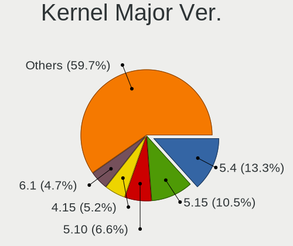
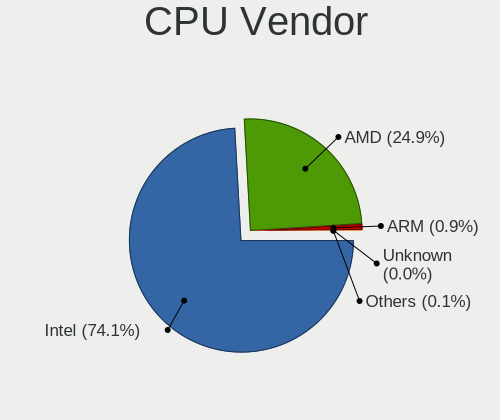

Linux - Tested Hardware & Statistics
------------------------------------

A project to collect tested hardware configurations for Linux.

Anyone can contribute to this report by the [hw-probe](https://github.com/linuxhw/hw-probe) tool:

    sudo -E hw-probe -all -upload

Please contribute! Especially if your hardware is rare.

This is a report for all computer types. See also reports for [desktops](/Desktop/README.md) and [notebooks](/Notebook/README.md).

Distribution-specific reports: [AlmaLinux](/Dist/AlmaLinux), [Alpine](/Dist/Alpine), [ALT_Linux](/Dist/ALT_Linux), [antiX](/Dist/antiX), [Artix](/Dist/Artix), [Chrome_OS](/Dist/Chrome_OS), [Clear_Linux](/Dist/Clear_Linux), [Deepin](/Dist/Deepin), [Devuan](/Dist/Devuan), [EndeavourOS](/Dist/EndeavourOS), [Garuda_Linux](/Dist/Garuda_Linux), [GNOME_OS](/Dist/GNOME_OS), [Kaisen](/Dist/Kaisen), [Mageia](/Dist/Mageia), [Makulu](/Dist/Makulu), [NixOS](/Dist/NixOS), [Nobara](/Dist/Nobara), [Oracle_Linux](/Dist/Oracle_Linux), [Pardus](/Dist/Pardus), [PureOS](/Dist/PureOS), [Q4OS](/Dist/Q4OS), [Reborn_OS](/Dist/Reborn_OS), [Rocky_Linux](/Dist/Rocky_Linux), [Sparky](/Dist/Sparky), [Void_Linux](/Dist/Void_Linux), [Xero](/Dist/Xero).

This report is for real hardware. Report for virtual hardware: [TestDays_VE](https://github.com/linuxhw/TestDays_VE)

Contents
--------

* [ Test Cases ](#test-cases)

* [ System ](#system)
  - [ OS                       ](#os)
  - [ OS Family                ](#os-family)
  - [ Kernel                   ](#kernel)
  - [ Kernel Family            ](#kernel-family)
  - [ Kernel Major Ver.        ](#kernel-major-ver)
  - [ Arch                     ](#arch)
  - [ DE                       ](#de)
  - [ Display Server           ](#display-server)
  - [ Display Manager          ](#display-manager)
  - [ OS Lang                  ](#os-lang)
  - [ Boot Mode                ](#boot-mode)
  - [ Filesystem               ](#filesystem)
  - [ Part. scheme             ](#part-scheme)
  - [ Dual Boot with Linux/BSD ](#dual-boot-with-linuxbsd)
  - [ Dual Boot (Win)          ](#dual-boot-win)

* [ Board ](#board)
  - [ Vendor                   ](#vendor)
  - [ Model                    ](#model)
  - [ Model Family             ](#model-family)
  - [ MFG Year                 ](#mfg-year)
  - [ Form Factor              ](#form-factor)
  - [ Secure Boot              ](#secure-boot)
  - [ Coreboot                 ](#coreboot)
  - [ RAM Size                 ](#ram-size)
  - [ RAM Used                 ](#ram-used)
  - [ Total Drives             ](#total-drives)
  - [ Has CD-ROM               ](#has-cd-rom)
  - [ Has Ethernet             ](#has-ethernet)
  - [ Has WiFi                 ](#has-wifi)
  - [ Has Bluetooth            ](#has-bluetooth)

* [ Location ](#location)
  - [ Country                  ](#country)
  - [ City                     ](#city)

* [ Drives ](#drives)
  - [ Drive Vendor             ](#drive-vendor)
  - [ Drive Model              ](#drive-model)
  - [ HDD Vendor               ](#hdd-vendor)
  - [ SSD Vendor               ](#ssd-vendor)
  - [ Drive Kind               ](#drive-kind)
  - [ Drive Connector          ](#drive-connector)
  - [ Drive Size               ](#drive-size)
  - [ Space Total              ](#space-total)
  - [ Space Used               ](#space-used)
  - [ Malfunc. Drives          ](#malfunc-drives)
  - [ Malfunc. Drive Vendor    ](#malfunc-drive-vendor)
  - [ Malfunc. HDD Vendor      ](#malfunc-hdd-vendor)
  - [ Malfunc. Drive Kind      ](#malfunc-drive-kind)
  - [ Failed Drives            ](#failed-drives)
  - [ Failed Drive Vendor      ](#failed-drive-vendor)
  - [ Drive Status             ](#drive-status)

* [ Storage controller ](#storage-controller)
  - [ Storage Vendor           ](#storage-vendor)
  - [ Storage Model            ](#storage-model)
  - [ Storage Kind             ](#storage-kind)

* [ Processor ](#processor)
  - [ CPU Vendor               ](#cpu-vendor)
  - [ CPU Model                ](#cpu-model)
  - [ CPU Model Family         ](#cpu-model-family)
  - [ CPU Cores                ](#cpu-cores)
  - [ CPU Sockets              ](#cpu-sockets)
  - [ CPU Threads              ](#cpu-threads)
  - [ CPU Op-Modes             ](#cpu-op-modes)
  - [ CPU Microcode            ](#cpu-microcode)
  - [ CPU Microarch            ](#cpu-microarch)

* [ Graphics ](#graphics)
  - [ GPU Vendor               ](#gpu-vendor)
  - [ GPU Model                ](#gpu-model)
  - [ GPU Combo                ](#gpu-combo)
  - [ GPU Driver               ](#gpu-driver)
  - [ GPU Memory               ](#gpu-memory)

* [ Monitor ](#monitor)
  - [ Monitor Vendor           ](#monitor-vendor)
  - [ Monitor Model            ](#monitor-model)
  - [ Monitor Resolution       ](#monitor-resolution)
  - [ Monitor Diagonal         ](#monitor-diagonal)
  - [ Monitor Width            ](#monitor-width)
  - [ Aspect Ratio             ](#aspect-ratio)
  - [ Monitor Area             ](#monitor-area)
  - [ Pixel Density            ](#pixel-density)
  - [ Multiple Monitors        ](#multiple-monitors)

* [ Network ](#network)
  - [ Net Controller Vendor    ](#net-controller-vendor)
  - [ Net Controller Model     ](#net-controller-model)
  - [ Wireless Vendor          ](#wireless-vendor)
  - [ Wireless Model           ](#wireless-model)
  - [ Ethernet Vendor          ](#ethernet-vendor)
  - [ Ethernet Model           ](#ethernet-model)
  - [ Net Controller Kind      ](#net-controller-kind)
  - [ Used Controller          ](#used-controller)
  - [ NICs                     ](#nics)
  - [ IPv6                     ](#ipv6)

* [ Bluetooth ](#bluetooth)
  - [ Bluetooth Vendor         ](#bluetooth-vendor)
  - [ Bluetooth Model          ](#bluetooth-model)

* [ Sound ](#sound)
  - [ Sound Vendor             ](#sound-vendor)
  - [ Sound Model              ](#sound-model)

* [ Memory ](#memory)
  - [ Memory Vendor            ](#memory-vendor)
  - [ Memory Model             ](#memory-model)
  - [ Memory Kind              ](#memory-kind)
  - [ Memory Form Factor       ](#memory-form-factor)
  - [ Memory Size              ](#memory-size)
  - [ Memory Speed             ](#memory-speed)

* [ Printers & scanners ](#printers--scanners)
  - [ Printer Vendor           ](#printer-vendor)
  - [ Printer Model            ](#printer-model)
  - [ Scanner Vendor           ](#scanner-vendor)
  - [ Scanner Model            ](#scanner-model)

* [ Camera ](#camera)
  - [ Camera Vendor            ](#camera-vendor)
  - [ Camera Model             ](#camera-model)

* [ Security ](#security)
  - [ Fingerprint Vendor       ](#fingerprint-vendor)
  - [ Fingerprint Model        ](#fingerprint-model)
  - [ Chipcard Vendor          ](#chipcard-vendor)
  - [ Chipcard Model           ](#chipcard-model)

* [ Unsupported ](#unsupported)
  - [ Unsupported Devices      ](#unsupported-devices)
  - [ Unsupported Device Types ](#unsupported-device-types)

Test Cases
----------

Total: 332188

| Vendor        | Model                       | Form-Factor | Probe                                                      | Date         |
|---------------|-----------------------------|-------------|------------------------------------------------------------|--------------|
| Acer          | AO722                       | Notebook    | [ae49a1e9c0](https://linux-hardware.org/?probe=ae49a1e9c0) | Sep 07, 2023 |
| Acer          | Aspire V5-531               | Notebook    | [e39cb4e3e6](https://linux-hardware.org/?probe=e39cb4e3e6) | Sep 07, 2023 |
| Lenovo        | ThinkPad P15v Gen 2i 21A... | Notebook    | [69fc5aab82](https://linux-hardware.org/?probe=69fc5aab82) | Sep 07, 2023 |
| Lenovo        | V580c 20160                 | Notebook    | [87f8bad27d](https://linux-hardware.org/?probe=87f8bad27d) | Sep 07, 2023 |
| Gateway       | IPISB-VR                    | Desktop     | [4bed351eee](https://linux-hardware.org/?probe=4bed351eee) | Sep 07, 2023 |
| Acer          | Aspire X1470                | Desktop     | [d136074365](https://linux-hardware.org/?probe=d136074365) | Sep 07, 2023 |
| Lenovo        | V15-IGL 82C3                | Notebook    | [78ecb1b882](https://linux-hardware.org/?probe=78ecb1b882) | Sep 07, 2023 |
| Lenovo        | ThinkPad P15v Gen 2i 21A... | Notebook    | [384d2074ad](https://linux-hardware.org/?probe=384d2074ad) | Sep 07, 2023 |
| BESSTAR Te... | UM700                       | Desktop     | [d635105967](https://linux-hardware.org/?probe=d635105967) | Sep 07, 2023 |
| Notebook      | NJx0MU                      | Notebook    | [db4ba96400](https://linux-hardware.org/?probe=db4ba96400) | Sep 07, 2023 |
| HP            | 89E9 0100                   | All in one  | [bb05bcc902](https://linux-hardware.org/?probe=bb05bcc902) | Sep 07, 2023 |
| Lenovo        | IdeaPad Y580 2099           | Notebook    | [d0db961274](https://linux-hardware.org/?probe=d0db961274) | Sep 07, 2023 |
| Apple         | MacBookPro9,2               | Notebook    | [f3bdad3061](https://linux-hardware.org/?probe=f3bdad3061) | Sep 07, 2023 |
| MSI           | MAG B550M MORTAR WIFI       | Desktop     | [7cbd11709c](https://linux-hardware.org/?probe=7cbd11709c) | Sep 07, 2023 |
| ASUSTek       | ASUS TUF Gaming F15 FX50... | Notebook    | [e207539e68](https://linux-hardware.org/?probe=e207539e68) | Sep 07, 2023 |
| Lenovo        | IdeaPad S145-15API 81UT     | Notebook    | [8a05090057](https://linux-hardware.org/?probe=8a05090057) | Sep 07, 2023 |
| ASUSTek       | TUF Gaming B550-PLUS WIF... | Desktop     | [5330a96ef6](https://linux-hardware.org/?probe=5330a96ef6) | Sep 07, 2023 |
| MSI           | B360M GAMING PLUS           | Desktop     | [1faaa87b61](https://linux-hardware.org/?probe=1faaa87b61) | Sep 07, 2023 |
| ASUSTek       | P8H77-V LE                  | Desktop     | [38ebaae5c3](https://linux-hardware.org/?probe=38ebaae5c3) | Sep 07, 2023 |
| Lenovo        | ThinkPad X1 Carbon Gen 1... | Notebook    | [81a5f77f1c](https://linux-hardware.org/?probe=81a5f77f1c) | Sep 07, 2023 |
| ASUSTek       | ROG Ally RC71L_RC71L        | Tablet      | [f47dacb739](https://linux-hardware.org/?probe=f47dacb739) | Sep 07, 2023 |
| Shenzhen M... | AHBAA OEM                   | Desktop     | [d4e6f24af3](https://linux-hardware.org/?probe=d4e6f24af3) | Sep 07, 2023 |
| Gigabyte      | Z790 UD                     | Desktop     | [3f67617c93](https://linux-hardware.org/?probe=3f67617c93) | Sep 07, 2023 |
| Acer          | Aspire X1470                | Desktop     | [a965ab170a](https://linux-hardware.org/?probe=a965ab170a) | Sep 07, 2023 |
| Gigabyte      | H610M S2 V2 DDR4            | Desktop     | [7323821425](https://linux-hardware.org/?probe=7323821425) | Sep 07, 2023 |
| HP            | ProBook 650 G8 Notebook ... | Notebook    | [b11a7b69f0](https://linux-hardware.org/?probe=b11a7b69f0) | Sep 07, 2023 |
| ASUSTek       | ROG STRIX B550-F GAMING ... | Desktop     | [fd7e472e9b](https://linux-hardware.org/?probe=fd7e472e9b) | Sep 07, 2023 |
| Gigabyte      | X670E AORUS MASTER          | Desktop     | [ade0754252](https://linux-hardware.org/?probe=ade0754252) | Sep 07, 2023 |
| ASRock        | 775Dual-VSTA                | Desktop     | [05af667eb0](https://linux-hardware.org/?probe=05af667eb0) | Sep 07, 2023 |
| ASUSTek       | ROG Ally RC71L_RC71L        | Tablet      | [78bdf275c2](https://linux-hardware.org/?probe=78bdf275c2) | Sep 07, 2023 |
| Lenovo        | Legion Y7000P IRH8 82YA     | Notebook    | [9ebc45f613](https://linux-hardware.org/?probe=9ebc45f613) | Sep 07, 2023 |
| Dell          | Latitude 7420               | Notebook    | [77df1805f6](https://linux-hardware.org/?probe=77df1805f6) | Sep 07, 2023 |
| Apple         | Mac-8ED6AF5B48C039E1 Mac... | Mini pc     | [adc9ee1464](https://linux-hardware.org/?probe=adc9ee1464) | Sep 07, 2023 |
| MSI           | Alpha 15 A3DDK              | Notebook    | [9a87dfb80b](https://linux-hardware.org/?probe=9a87dfb80b) | Sep 07, 2023 |
| HP            | Pavilion 15                 | Notebook    | [c251475f43](https://linux-hardware.org/?probe=c251475f43) | Sep 07, 2023 |
| Acer          | Aspire V5-531               | Notebook    | [63fd300645](https://linux-hardware.org/?probe=63fd300645) | Sep 07, 2023 |
| Lenovo        | ThinkBook 15 G4 IAP 21DJ    | Notebook    | [a2fab791b4](https://linux-hardware.org/?probe=a2fab791b4) | Sep 07, 2023 |
| Timi          | Redmi Book Pro 14S          | Notebook    | [b2776d8282](https://linux-hardware.org/?probe=b2776d8282) | Sep 07, 2023 |
| ASUSTek       | PRIME B365M-A               | Desktop     | [898930f2b1](https://linux-hardware.org/?probe=898930f2b1) | Sep 07, 2023 |
| ASRock        | B450M Pro4                  | Desktop     | [bedbf331b0](https://linux-hardware.org/?probe=bedbf331b0) | Sep 07, 2023 |
| ASUSTek       | VivoBook_ASUSLaptop X515... | Notebook    | [4fd02051b6](https://linux-hardware.org/?probe=4fd02051b6) | Sep 07, 2023 |
| Biostar       | A320MH                      | Desktop     | [87ae9fef79](https://linux-hardware.org/?probe=87ae9fef79) | Sep 07, 2023 |
| ASUSTek       | SABERTOOTH P67              | Desktop     | [002bdcd34d](https://linux-hardware.org/?probe=002bdcd34d) | Sep 07, 2023 |
| Sony          | SVF1521V6EB                 | Notebook    | [1d08716b2c](https://linux-hardware.org/?probe=1d08716b2c) | Sep 07, 2023 |
| Dell          | Latitude E7240              | Notebook    | [79a666783a](https://linux-hardware.org/?probe=79a666783a) | Sep 07, 2023 |
| HP            | Pavilion Laptop 15-eg3xx... | Notebook    | [003d136012](https://linux-hardware.org/?probe=003d136012) | Sep 07, 2023 |
| Acer          | Veriton X2640G V:1.0        | Desktop     | [76b044add6](https://linux-hardware.org/?probe=76b044add6) | Sep 07, 2023 |
| Lenovo        | IdeaPad S145-14AST 81ST     | Notebook    | [24eca3030c](https://linux-hardware.org/?probe=24eca3030c) | Sep 07, 2023 |
| Lenovo        | ThinkPad P16s Gen 1 21BT... | Notebook    | [79ddc77f63](https://linux-hardware.org/?probe=79ddc77f63) | Sep 07, 2023 |
| Dell          | 0WMJ54 A01                  | Desktop     | [034ff4bc7e](https://linux-hardware.org/?probe=034ff4bc7e) | Sep 07, 2023 |
| HP            | EliteBook 8760w             | Notebook    | [d061b57b29](https://linux-hardware.org/?probe=d061b57b29) | Sep 07, 2023 |
| HP            | 240 G8 Notebook PC          | Notebook    | [62735c1cd9](https://linux-hardware.org/?probe=62735c1cd9) | Sep 07, 2023 |
| Lenovo        | ThinkPad T410 2522PT3       | Notebook    | [da7303433d](https://linux-hardware.org/?probe=da7303433d) | Sep 07, 2023 |
| Lenovo        | IdeaPad Y700-17ISK 80Q0     | Notebook    | [2385447c50](https://linux-hardware.org/?probe=2385447c50) | Sep 07, 2023 |
| ASUSTek       | Z87M-PLUS                   | Desktop     | [ed1061dbb1](https://linux-hardware.org/?probe=ed1061dbb1) | Sep 07, 2023 |
| ASUSTek       | VivoBook_ASUSLaptop M760... | Notebook    | [699fb7e97e](https://linux-hardware.org/?probe=699fb7e97e) | Sep 07, 2023 |
| Dell          | 0NDYHG A01                  | Desktop     | [250bc7b8ea](https://linux-hardware.org/?probe=250bc7b8ea) | Sep 07, 2023 |
| Gigabyte      | X470 AORUS ULTRA GAMING-... | Desktop     | [67934ce24a](https://linux-hardware.org/?probe=67934ce24a) | Sep 07, 2023 |
| ASUSTek       | P8Z77-V LE PLUS             | Desktop     | [43fa75d035](https://linux-hardware.org/?probe=43fa75d035) | Sep 07, 2023 |
| Dell          | 0MCD6J A01                  | Server      | [f73ae91625](https://linux-hardware.org/?probe=f73ae91625) | Sep 07, 2023 |
| Gigabyte      | Z87X-UD3H-CF                | Desktop     | [43f205483a](https://linux-hardware.org/?probe=43f205483a) | Sep 07, 2023 |
| AZW           | GTR V01                     | Mini pc     | [1bc029ed5e](https://linux-hardware.org/?probe=1bc029ed5e) | Sep 07, 2023 |
| NZXT          | N7 Z370                     | Desktop     | [34a23bdc5f](https://linux-hardware.org/?probe=34a23bdc5f) | Sep 07, 2023 |
| Lenovo        | NOK                         | Desktop     | [30f2c89249](https://linux-hardware.org/?probe=30f2c89249) | Sep 07, 2023 |
| Dell          | Latitude 5480               | Notebook    | [166d57f310](https://linux-hardware.org/?probe=166d57f310) | Sep 07, 2023 |
| Valve         | Jupiter                     | Notebook    | [d4ca58e970](https://linux-hardware.org/?probe=d4ca58e970) | Sep 07, 2023 |
| Matsushita... | CF-74JCJBDAM                | Notebook    | [0cc1e4014d](https://linux-hardware.org/?probe=0cc1e4014d) | Sep 07, 2023 |
| Biostar       | B550M-SILVER                | Desktop     | [12ad2e157b](https://linux-hardware.org/?probe=12ad2e157b) | Sep 07, 2023 |
| HP            | Laptop 14-dq1xxx            | Notebook    | [125a7f7c0d](https://linux-hardware.org/?probe=125a7f7c0d) | Sep 07, 2023 |
| MSI           | MAG B650 TOMAHAWK WIFI      | Desktop     | [3221a3e5dd](https://linux-hardware.org/?probe=3221a3e5dd) | Sep 07, 2023 |
| Dell          | 0MCD6J A01                  | Server      | [051518ebc8](https://linux-hardware.org/?probe=051518ebc8) | Sep 07, 2023 |
| Dell          | 0MCD6J A03                  | Server      | [22cd3a08c6](https://linux-hardware.org/?probe=22cd3a08c6) | Sep 07, 2023 |
| Dell          | 0MCD6J A01                  | Server      | [51344d733f](https://linux-hardware.org/?probe=51344d733f) | Sep 07, 2023 |
| Dell          | 0MCD6J A01                  | Server      | [8d286f93a4](https://linux-hardware.org/?probe=8d286f93a4) | Sep 07, 2023 |
| Dell          | 0MCD6J A01                  | Server      | [2677109010](https://linux-hardware.org/?probe=2677109010) | Sep 07, 2023 |
| MSI           | MAG B650 TOMAHAWK WIFI      | Desktop     | [13bae1c4e9](https://linux-hardware.org/?probe=13bae1c4e9) | Sep 07, 2023 |
| Dell          | 0Y2MRG A00                  | Desktop     | [34ae665da1](https://linux-hardware.org/?probe=34ae665da1) | Sep 07, 2023 |
| Dell          | 0MCD6J A01                  | Server      | [f12a8bcc1b](https://linux-hardware.org/?probe=f12a8bcc1b) | Sep 07, 2023 |
| ASRock        | A68M-ITX                    | Desktop     | [f995094d6b](https://linux-hardware.org/?probe=f995094d6b) | Sep 07, 2023 |
| HUAWEI        | NBLK-WAX9X                  | Notebook    | [9911fc5254](https://linux-hardware.org/?probe=9911fc5254) | Sep 07, 2023 |
| MSI           | MAG Z490 TOMAHAWK           | Desktop     | [bacfcd3028](https://linux-hardware.org/?probe=bacfcd3028) | Sep 07, 2023 |
| Dell          | 088DT1 A01                  | Desktop     | [e7d12d040e](https://linux-hardware.org/?probe=e7d12d040e) | Sep 07, 2023 |
| Acer          | Nitro N50-610               | Desktop     | [3a6cb86551](https://linux-hardware.org/?probe=3a6cb86551) | Sep 07, 2023 |
| Apple         | MacBookPro8,1               | Notebook    | [f913de368f](https://linux-hardware.org/?probe=f913de368f) | Sep 07, 2023 |
| Acer          | Aspire 3820                 | Notebook    | [08f7d373e7](https://linux-hardware.org/?probe=08f7d373e7) | Sep 07, 2023 |
| Supermicro    | H12SSL-i                    | Server      | [c0498360ff](https://linux-hardware.org/?probe=c0498360ff) | Sep 07, 2023 |
| ASUSTek       | X453MA                      | Notebook    | [c48759c297](https://linux-hardware.org/?probe=c48759c297) | Sep 07, 2023 |
| Apple         | MacBookPro8,1               | Notebook    | [423b8d7135](https://linux-hardware.org/?probe=423b8d7135) | Sep 07, 2023 |
| ASUSTek       | ProArt B550-CREATOR         | Desktop     | [5b276b13a8](https://linux-hardware.org/?probe=5b276b13a8) | Sep 07, 2023 |
| HP            | EliteBook 845 14 inch G1... | Notebook    | [6459a498c5](https://linux-hardware.org/?probe=6459a498c5) | Sep 07, 2023 |
| Huanan        | X99-F8 GAMING V5.0          | Desktop     | [a4624a95da](https://linux-hardware.org/?probe=a4624a95da) | Sep 07, 2023 |
| Google        | Blooguard                   | Notebook    | [c9dec98f0f](https://linux-hardware.org/?probe=c9dec98f0f) | Sep 07, 2023 |
| Lenovo        | ThinkPad X1 Extreme 2nd ... | Notebook    | [eeb4e7afd8](https://linux-hardware.org/?probe=eeb4e7afd8) | Sep 07, 2023 |
| ASRockRack    | B650D4U-2L2T/BCM            | Server      | [6cc92a61b2](https://linux-hardware.org/?probe=6cc92a61b2) | Sep 07, 2023 |
| HP            | Pavilion Gaming Laptop 1... | Notebook    | [5254176a5a](https://linux-hardware.org/?probe=5254176a5a) | Sep 07, 2023 |
| Dell          | 0PV3YR A05                  | Server      | [da21e863a4](https://linux-hardware.org/?probe=da21e863a4) | Sep 07, 2023 |
| Valve         | Jupiter                     | Notebook    | [83b9205283](https://linux-hardware.org/?probe=83b9205283) | Sep 07, 2023 |
| Acer          | Nitro N50-610               | Desktop     | [6ba5f1b344](https://linux-hardware.org/?probe=6ba5f1b344) | Sep 07, 2023 |
| Multilaser    | PC31X                       | Notebook    | [96d451c4a5](https://linux-hardware.org/?probe=96d451c4a5) | Sep 07, 2023 |
| Lenovo        | IdeaPad 530S-14IKB 81EU     | Notebook    | [0ca7d43ae9](https://linux-hardware.org/?probe=0ca7d43ae9) | Sep 07, 2023 |
| MSI           | Bravo 17 A4DDR              | Notebook    | [2592f883ef](https://linux-hardware.org/?probe=2592f883ef) | Sep 07, 2023 |
| ASUSTek       | ASUS TUF Gaming F15 FX50... | Notebook    | [b982251e82](https://linux-hardware.org/?probe=b982251e82) | Sep 07, 2023 |
| MSI           | X99A RAIDER                 | Desktop     | [0434d08b59](https://linux-hardware.org/?probe=0434d08b59) | Sep 07, 2023 |
| Lenovo        | IdeaPad 330-15IKB 81FE      | Notebook    | [7410c2416c](https://linux-hardware.org/?probe=7410c2416c) | Sep 07, 2023 |
| Intel         | NUC5i3RYB H41000-503        | Mini pc     | [67e211cb5d](https://linux-hardware.org/?probe=67e211cb5d) | Sep 07, 2023 |
| Dell          | Latitude E6500              | Notebook    | [b4b035c4f7](https://linux-hardware.org/?probe=b4b035c4f7) | Sep 07, 2023 |
| Intel         | NUC8BEB J72692-306          | Mini pc     | [6cbfa96139](https://linux-hardware.org/?probe=6cbfa96139) | Sep 07, 2023 |
| Alienware     | m15 R7                      | Notebook    | [9e6b80bbf2](https://linux-hardware.org/?probe=9e6b80bbf2) | Sep 07, 2023 |
| ASUSTek       | PRIME H510M-E               | Desktop     | [0be77d9ece](https://linux-hardware.org/?probe=0be77d9ece) | Sep 07, 2023 |
| MSI           | MAG B550 TOMAHAWK           | Desktop     | [f8453df937](https://linux-hardware.org/?probe=f8453df937) | Sep 07, 2023 |
| Unknown       | Unknown                     | Soc         | [ee68830f56](https://linux-hardware.org/?probe=ee68830f56) | Sep 07, 2023 |
| Toshiba       | STI 006998G                 | Desktop     | [d34aadcc92](https://linux-hardware.org/?probe=d34aadcc92) | Sep 07, 2023 |
| ASUSTek       | ROG STRIX B560-E GAMING ... | Desktop     | [498958a11d](https://linux-hardware.org/?probe=498958a11d) | Sep 07, 2023 |
| Intel         | NUC8BEB J72692-310          | Mini pc     | [46729805b3](https://linux-hardware.org/?probe=46729805b3) | Sep 07, 2023 |
| Intel         | NUC8BEB J72692-310          | Mini pc     | [4ffdbcca94](https://linux-hardware.org/?probe=4ffdbcca94) | Sep 07, 2023 |
| Pegatron      | 2AD5                        | Desktop     | [fe02bb3d71](https://linux-hardware.org/?probe=fe02bb3d71) | Sep 07, 2023 |
| Lenovo        | 3704 SDK0R32862 WIN 3258... | Desktop     | [907edde95a](https://linux-hardware.org/?probe=907edde95a) | Sep 07, 2023 |
| Dell          | Precision M6800             | Notebook    | [b50e95f460](https://linux-hardware.org/?probe=b50e95f460) | Sep 07, 2023 |
| HP            | ENVY 15                     | Notebook    | [996948fd3c](https://linux-hardware.org/?probe=996948fd3c) | Sep 07, 2023 |
| Lenovo        | G565 20071                  | Notebook    | [786aafb0e9](https://linux-hardware.org/?probe=786aafb0e9) | Sep 07, 2023 |
| Gigabyte      | G41MT-D3                    | Desktop     | [f0c3188082](https://linux-hardware.org/?probe=f0c3188082) | Sep 07, 2023 |
| Dell          | 0WN7Y6 A02                  | Desktop     | [aaf64e4624](https://linux-hardware.org/?probe=aaf64e4624) | Sep 07, 2023 |
| MSI           | Z390-A PRO                  | Desktop     | [32c21f0b73](https://linux-hardware.org/?probe=32c21f0b73) | Sep 07, 2023 |
| ASUSTek       | ASUS TUF Dash F15 FX517Z... | Notebook    | [f33c62ab06](https://linux-hardware.org/?probe=f33c62ab06) | Sep 07, 2023 |
| Lenovo        | 32E4 SDK0T76538 WIN 3556... | Mini pc     | [ac035f8420](https://linux-hardware.org/?probe=ac035f8420) | Sep 07, 2023 |
| Unknown       | Unknown                     | Desktop     | [59544c398a](https://linux-hardware.org/?probe=59544c398a) | Sep 07, 2023 |
| MSI           | B450 TOMAHAWK MAX II        | Desktop     | [96d3b5db5c](https://linux-hardware.org/?probe=96d3b5db5c) | Sep 07, 2023 |
| Lenovo        | ThinkPad X230 23256N6       | Notebook    | [7ce5ebe4bc](https://linux-hardware.org/?probe=7ce5ebe4bc) | Sep 07, 2023 |
| Dell          | 0R96K1 A00                  | Mini pc     | [3498c7ff1c](https://linux-hardware.org/?probe=3498c7ff1c) | Sep 07, 2023 |
| ASRock        | Z97 Killer                  | Desktop     | [a1537a06ee](https://linux-hardware.org/?probe=a1537a06ee) | Sep 07, 2023 |
| Dell          | Latitude E5450              | Notebook    | [a705913b6e](https://linux-hardware.org/?probe=a705913b6e) | Sep 07, 2023 |
| Lenovo        | ThinkPad X1 Carbon Gen 1... | Notebook    | [8c22ca23f2](https://linux-hardware.org/?probe=8c22ca23f2) | Sep 07, 2023 |
| HP            | 18E5                        | Desktop     | [b0210e782a](https://linux-hardware.org/?probe=b0210e782a) | Sep 07, 2023 |
| ASUSTek       | PRIME A320M-K               | Desktop     | [a5506bdc30](https://linux-hardware.org/?probe=a5506bdc30) | Sep 07, 2023 |
| Dell          | Inspiron 7460               | Notebook    | [03726302da](https://linux-hardware.org/?probe=03726302da) | Sep 07, 2023 |
| Apple         | MacBookPro11,2              | Notebook    | [d3996a81e2](https://linux-hardware.org/?probe=d3996a81e2) | Sep 07, 2023 |
| HP            | EliteBook 2740p             | Notebook    | [0bada236bc](https://linux-hardware.org/?probe=0bada236bc) | Sep 07, 2023 |
| ASUSTek       | Maximus VII HERO            | Desktop     | [d9509a0fa0](https://linux-hardware.org/?probe=d9509a0fa0) | Sep 07, 2023 |
| Dell          | Inspiron 1525               | Notebook    | [6b0747dcb4](https://linux-hardware.org/?probe=6b0747dcb4) | Sep 07, 2023 |
| HP            | Laptop 14-dk1xxx            | Notebook    | [c7bea10745](https://linux-hardware.org/?probe=c7bea10745) | Sep 07, 2023 |
| HP            | 0B4Ch D                     | Desktop     | [1a2a0eef04](https://linux-hardware.org/?probe=1a2a0eef04) | Sep 06, 2023 |
| ALLDOCUBE     | i1025P                      | Tablet      | [987d1bc40e](https://linux-hardware.org/?probe=987d1bc40e) | Sep 06, 2023 |
| Dell          | Inspiron 1525               | Notebook    | [56a481c501](https://linux-hardware.org/?probe=56a481c501) | Sep 06, 2023 |
| ASUSTek       | ASUS TUF Dash F15 FX516P... | Notebook    | [3c6e29c3c3](https://linux-hardware.org/?probe=3c6e29c3c3) | Sep 06, 2023 |
| Samsung       | RF511/RF411/RF711           | Notebook    | [ef99cba7a5](https://linux-hardware.org/?probe=ef99cba7a5) | Sep 06, 2023 |
| ASRock        | Z87 Pro4                    | Desktop     | [89b861e771](https://linux-hardware.org/?probe=89b861e771) | Sep 06, 2023 |
| HP            | 0B4Ch D                     | Desktop     | [e6c990ad64](https://linux-hardware.org/?probe=e6c990ad64) | Sep 06, 2023 |
| ASUSTek       | ZenBook Pro Duo UX582LR_... | Notebook    | [b2ba03726a](https://linux-hardware.org/?probe=b2ba03726a) | Sep 06, 2023 |
| realme        | RMNBXXXX                    | Notebook    | [6783f1d181](https://linux-hardware.org/?probe=6783f1d181) | Sep 06, 2023 |
| Apple         | MacBookAir8,2               | Notebook    | [e9e8da1eea](https://linux-hardware.org/?probe=e9e8da1eea) | Sep 06, 2023 |
| Unknown       | Unknown                     | Notebook    | [16cb5e0d5b](https://linux-hardware.org/?probe=16cb5e0d5b) | Sep 06, 2023 |
| Gigabyte      | A520M S2H                   | Desktop     | [132fa17be7](https://linux-hardware.org/?probe=132fa17be7) | Sep 06, 2023 |
| HP            | ProBook 445 G7              | Notebook    | [373ba724e4](https://linux-hardware.org/?probe=373ba724e4) | Sep 06, 2023 |
| Dell          | Latitude E5450              | Notebook    | [1478760d8c](https://linux-hardware.org/?probe=1478760d8c) | Sep 06, 2023 |
| ASUSTek       | PRIME Z390M-PLUS            | Desktop     | [f98e7f20ca](https://linux-hardware.org/?probe=f98e7f20ca) | Sep 06, 2023 |
| eMachines     | eM350                       | Notebook    | [fae8f9e3f1](https://linux-hardware.org/?probe=fae8f9e3f1) | Sep 06, 2023 |
| Unknown       | Unknown                     | Soc         | [c002635827](https://linux-hardware.org/?probe=c002635827) | Sep 06, 2023 |
| HC Technol... | HCAR5000-MI                 | Desktop     | [3f98176bb7](https://linux-hardware.org/?probe=3f98176bb7) | Sep 06, 2023 |
| Lenovo        | Legion 5 15ARH05H 82B1      | Notebook    | [84368e642c](https://linux-hardware.org/?probe=84368e642c) | Sep 06, 2023 |
| Dell          | Inspiron 15 7000 Gaming     | Notebook    | [6192c839f5](https://linux-hardware.org/?probe=6192c839f5) | Sep 06, 2023 |
| Gigabyte      | A520M S2H                   | Desktop     | [36e10816ea](https://linux-hardware.org/?probe=36e10816ea) | Sep 06, 2023 |
| Lenovo        | V15 G2 ALC 82KD             | Notebook    | [db906f78dd](https://linux-hardware.org/?probe=db906f78dd) | Sep 06, 2023 |
| Dell          | 02YYK5 A01                  | Desktop     | [6bb77310bf](https://linux-hardware.org/?probe=6bb77310bf) | Sep 06, 2023 |
| Clevo         | M1100M                      | Notebook    | [399b796d9f](https://linux-hardware.org/?probe=399b796d9f) | Sep 06, 2023 |
| ASUSTek       | VivoBook_ASUSLaptop X513... | Notebook    | [29f1d7759a](https://linux-hardware.org/?probe=29f1d7759a) | Sep 06, 2023 |
| Gigabyte      | H61M-S2PV                   | Desktop     | [29d9f2566a](https://linux-hardware.org/?probe=29d9f2566a) | Sep 06, 2023 |
| Dell          | 096JG8 A01                  | Desktop     | [00e5bebc6a](https://linux-hardware.org/?probe=00e5bebc6a) | Sep 06, 2023 |
| ASUSTek       | Maximus V FORMULA           | Desktop     | [694ffed41f](https://linux-hardware.org/?probe=694ffed41f) | Sep 06, 2023 |
| Fujitsu       | D3236-S1 S26361-D3236-S1    | Desktop     | [1e743d0b2d](https://linux-hardware.org/?probe=1e743d0b2d) | Sep 06, 2023 |
| ASUSTek       | P7H55-M PRO                 | Desktop     | [26a5d8b449](https://linux-hardware.org/?probe=26a5d8b449) | Sep 06, 2023 |
| Dell          | Latitude E6540              | Notebook    | [2832b1dd0d](https://linux-hardware.org/?probe=2832b1dd0d) | Sep 06, 2023 |
| ASUSTek       | PRIME X370-PRO              | Desktop     | [d095848fec](https://linux-hardware.org/?probe=d095848fec) | Sep 06, 2023 |
| ASUSTek       | Z97-K                       | Desktop     | [849ecb3c82](https://linux-hardware.org/?probe=849ecb3c82) | Sep 06, 2023 |
| Raspberry ... | Raspberry Pi 3 Model B R... | Soc         | [34f019cf50](https://linux-hardware.org/?probe=34f019cf50) | Sep 06, 2023 |
| Medion        | Akoya P2213T                | Notebook    | [2464869ce2](https://linux-hardware.org/?probe=2464869ce2) | Sep 06, 2023 |
| ASRock        | Z68 Pro3                    | Desktop     | [757ebbe056](https://linux-hardware.org/?probe=757ebbe056) | Sep 06, 2023 |
| Acer          | EQ45LM                      | Desktop     | [22af76a0b6](https://linux-hardware.org/?probe=22af76a0b6) | Sep 06, 2023 |
| ASUSTek       | N751JX                      | Notebook    | [8ece217753](https://linux-hardware.org/?probe=8ece217753) | Sep 06, 2023 |
| HP            | Pavilion dv6                | Notebook    | [08d38c1680](https://linux-hardware.org/?probe=08d38c1680) | Sep 06, 2023 |
| Acer          | Swift SF314-51              | Notebook    | [7e7c32364d](https://linux-hardware.org/?probe=7e7c32364d) | Sep 06, 2023 |
| ASUSTek       | VivoBook_ASUSLaptop X513... | Notebook    | [344a00d524](https://linux-hardware.org/?probe=344a00d524) | Sep 06, 2023 |
| ASRock        | B460 Phantom Gaming 4       | Desktop     | [6521407977](https://linux-hardware.org/?probe=6521407977) | Sep 06, 2023 |
| ASUSTek       | X200MA                      | Notebook    | [e5a99beac7](https://linux-hardware.org/?probe=e5a99beac7) | Sep 06, 2023 |
| HUAWEI        | NBD-WXX9                    | Notebook    | [29e1f84537](https://linux-hardware.org/?probe=29e1f84537) | Sep 06, 2023 |
| MSI           | GE70 2PE                    | Notebook    | [19dddb0418](https://linux-hardware.org/?probe=19dddb0418) | Sep 06, 2023 |
| Acer          | Aspire GX-785               | Desktop     | [e33b7b35bf](https://linux-hardware.org/?probe=e33b7b35bf) | Sep 06, 2023 |
| MSI           | PRO B650-P WIFI             | Desktop     | [507d1bd39c](https://linux-hardware.org/?probe=507d1bd39c) | Sep 06, 2023 |
| HP            | Pavilion Notebook           | Notebook    | [50777cde40](https://linux-hardware.org/?probe=50777cde40) | Sep 06, 2023 |
| ASUSTek       | Zenbook UM3402YAR_UM3402... | Notebook    | [a4fb146fe8](https://linux-hardware.org/?probe=a4fb146fe8) | Sep 06, 2023 |
| ASUSTek       | PRIME B550M-A               | Desktop     | [b17a5edce5](https://linux-hardware.org/?probe=b17a5edce5) | Sep 06, 2023 |
| JGINYUE       | X79M-PLUS V2.2              | Desktop     | [602bfb550f](https://linux-hardware.org/?probe=602bfb550f) | Sep 06, 2023 |
| Biostar       | A58MD                       | Desktop     | [40f078fcfc](https://linux-hardware.org/?probe=40f078fcfc) | Sep 06, 2023 |
| HP            | 81B3                        | Desktop     | [b04c59ca3e](https://linux-hardware.org/?probe=b04c59ca3e) | Sep 06, 2023 |
| realme        | RMNBXXXX                    | Notebook    | [9370483c5f](https://linux-hardware.org/?probe=9370483c5f) | Sep 06, 2023 |
| Sony          | VGN-AW41MF_H                | Notebook    | [d3a3262a6e](https://linux-hardware.org/?probe=d3a3262a6e) | Sep 06, 2023 |
| MSI           | Bravo 15 C7VF               | Notebook    | [72b288770a](https://linux-hardware.org/?probe=72b288770a) | Sep 06, 2023 |
| JGINYUE       | X79M-PLUS V2.2              | Desktop     | [1535be8e5f](https://linux-hardware.org/?probe=1535be8e5f) | Sep 06, 2023 |
| Dell          | Precision M4700             | Notebook    | [3e354770b6](https://linux-hardware.org/?probe=3e354770b6) | Sep 06, 2023 |
| ASUSTek       | Z97-P                       | Desktop     | [d72c4b5cce](https://linux-hardware.org/?probe=d72c4b5cce) | Sep 06, 2023 |
| ASUSTek       | ASUS TUF Gaming F17 FX70... | Notebook    | [34fb398b78](https://linux-hardware.org/?probe=34fb398b78) | Sep 06, 2023 |
| Gigabyte      | B75M-D3H                    | Desktop     | [2285c5c493](https://linux-hardware.org/?probe=2285c5c493) | Sep 06, 2023 |
| ASUSTek       | ROG Ally RC71L_RC71L        | Tablet      | [89b56b4baf](https://linux-hardware.org/?probe=89b56b4baf) | Sep 06, 2023 |
| Lenovo        | ThinkPad T580 20LAS01H00    | Notebook    | [129e989480](https://linux-hardware.org/?probe=129e989480) | Sep 06, 2023 |
| Dell          | 0HMX8D A01                  | Desktop     | [48fa151690](https://linux-hardware.org/?probe=48fa151690) | Sep 06, 2023 |
| Gigabyte      | AB350M-Gaming 3-CF          | Desktop     | [a738df6114](https://linux-hardware.org/?probe=a738df6114) | Sep 06, 2023 |
| Dell          | XPS 15 9550                 | Notebook    | [c9f30a2b26](https://linux-hardware.org/?probe=c9f30a2b26) | Sep 06, 2023 |
| Timi          | Xiaomi Book Pro 14 2022     | Notebook    | [32c34f0aa2](https://linux-hardware.org/?probe=32c34f0aa2) | Sep 06, 2023 |
| Intel         | DQ67SW AAG12527-310         | Desktop     | [774ca51623](https://linux-hardware.org/?probe=774ca51623) | Sep 06, 2023 |
| ASUSTek       | ROG Maximus XII APEX        | Desktop     | [f735c5a6e7](https://linux-hardware.org/?probe=f735c5a6e7) | Sep 06, 2023 |
| MSI           | Boston                      | Desktop     | [f4749c6ef7](https://linux-hardware.org/?probe=f4749c6ef7) | Sep 06, 2023 |
| Gigabyte      | F2A68HM-DS2                 | Desktop     | [ffe10aadbe](https://linux-hardware.org/?probe=ffe10aadbe) | Sep 06, 2023 |
| Dell          | 00P8G1 A00                  | All in one  | [3ce904c03e](https://linux-hardware.org/?probe=3ce904c03e) | Sep 06, 2023 |
| ASUSTek       | ROG STRIX B550-A GAMING     | Desktop     | [9d45d79cb0](https://linux-hardware.org/?probe=9d45d79cb0) | Sep 06, 2023 |
| GPU Compan... | GWNR71517                   | Notebook    | [b6a521128f](https://linux-hardware.org/?probe=b6a521128f) | Sep 06, 2023 |
| Gigabyte      | A320M-S2H-CF                | Desktop     | [03e260aff4](https://linux-hardware.org/?probe=03e260aff4) | Sep 06, 2023 |
| Apple         | Mac-BE088AF8C5EB4FA2 iMa... | All in one  | [69bf752a4a](https://linux-hardware.org/?probe=69bf752a4a) | Sep 06, 2023 |
| MSI           | MPG B550 GAMING PLUS        | Desktop     | [48cc912b75](https://linux-hardware.org/?probe=48cc912b75) | Sep 06, 2023 |
| Lenovo        | ThinkPad P1 20MD0014UK      | Notebook    | [428c816118](https://linux-hardware.org/?probe=428c816118) | Sep 06, 2023 |
| Samsung       | 550P5C/550P7C               | Notebook    | [f59dbec9af](https://linux-hardware.org/?probe=f59dbec9af) | Sep 06, 2023 |
| Gigabyte      | B75M-D3H                    | Desktop     | [8d4c48dd2f](https://linux-hardware.org/?probe=8d4c48dd2f) | Sep 06, 2023 |
| HP            | 2B3C                        | Desktop     | [471f0f283b](https://linux-hardware.org/?probe=471f0f283b) | Sep 06, 2023 |
| ASRock        | H77 Pro4/MVP                | Desktop     | [9e650e7107](https://linux-hardware.org/?probe=9e650e7107) | Sep 06, 2023 |
| Dell          | Latitude 3520               | Notebook    | [0fa236983e](https://linux-hardware.org/?probe=0fa236983e) | Sep 06, 2023 |
| Samsung       | 550P5C/550P7C               | Notebook    | [83c77f6733](https://linux-hardware.org/?probe=83c77f6733) | Sep 06, 2023 |
| Lenovo        | ThinkPad T480 20L6S1FU00    | Notebook    | [f24dc99222](https://linux-hardware.org/?probe=f24dc99222) | Sep 06, 2023 |
| Fujitsu Si... | D2721-A1 S26361-D2721-A1    | Desktop     | [c19df6a939](https://linux-hardware.org/?probe=c19df6a939) | Sep 06, 2023 |
| Gigabyte      | B550 AORUS ELITE V2         | Desktop     | [c890510220](https://linux-hardware.org/?probe=c890510220) | Sep 06, 2023 |
| Intel         | DN2800MT AAG23738-803       | Desktop     | [8bdf13908a](https://linux-hardware.org/?probe=8bdf13908a) | Sep 06, 2023 |
| Standard      | MB45II/MB45IN               | Notebook    | [1e46c6aa81](https://linux-hardware.org/?probe=1e46c6aa81) | Sep 06, 2023 |
| Lenovo        | IdeaCentre K330B            | Desktop     | [a53977eb83](https://linux-hardware.org/?probe=a53977eb83) | Sep 06, 2023 |
| Lenovo        | H420                        | Desktop     | [f84aae6411](https://linux-hardware.org/?probe=f84aae6411) | Sep 06, 2023 |
| ASUSTek       | Z87M-PLUS                   | Desktop     | [30368099b8](https://linux-hardware.org/?probe=30368099b8) | Sep 06, 2023 |
| HP            | ProBook 6470b               | Notebook    | [4bb5a6911f](https://linux-hardware.org/?probe=4bb5a6911f) | Sep 06, 2023 |
| Dell          | 0NK5PH A01                  | Desktop     | [49e0ac3e09](https://linux-hardware.org/?probe=49e0ac3e09) | Sep 06, 2023 |
| Maibenben     | MaiBook M                   | Notebook    | [c3a39bc1f1](https://linux-hardware.org/?probe=c3a39bc1f1) | Sep 06, 2023 |
| Dell          | Inspiron 5559               | Notebook    | [0428af4d14](https://linux-hardware.org/?probe=0428af4d14) | Sep 06, 2023 |
| Intel         | NUC11PABi5 M68265-501       | Mini pc     | [3266fb476d](https://linux-hardware.org/?probe=3266fb476d) | Sep 06, 2023 |
| Dell          | 0KP561                      | Desktop     | [90055b146d](https://linux-hardware.org/?probe=90055b146d) | Sep 06, 2023 |
| Dell          | 0PC5F7 A00                  | Desktop     | [9ffb575d81](https://linux-hardware.org/?probe=9ffb575d81) | Sep 06, 2023 |
| Pegatron      | 2AB6                        | Desktop     | [40b17904fa](https://linux-hardware.org/?probe=40b17904fa) | Sep 06, 2023 |
| Shenzhen M... | F7BFD                       | Desktop     | [3f1c2a5cfa](https://linux-hardware.org/?probe=3f1c2a5cfa) | Sep 06, 2023 |
| Gigabyte      | B650 AORUS ELITE AX         | Desktop     | [97bacd8975](https://linux-hardware.org/?probe=97bacd8975) | Sep 06, 2023 |
| Dell          | 0RN4PJ A01                  | Server      | [342dfcbde0](https://linux-hardware.org/?probe=342dfcbde0) | Sep 06, 2023 |
| ASUSTek       | P8H77-M                     | Desktop     | [ebc8d3e851](https://linux-hardware.org/?probe=ebc8d3e851) | Sep 06, 2023 |
| Lenovo        | MAHOBAY Win8 Pro DPK TPG    | Desktop     | [c43f7a6e53](https://linux-hardware.org/?probe=c43f7a6e53) | Sep 06, 2023 |
| ASUSTek       | VivoBook_ASUSLaptop X571... | Notebook    | [2505f514b1](https://linux-hardware.org/?probe=2505f514b1) | Sep 06, 2023 |
| Supermicro    | X8DTU                       | Server      | [ceac91ff5e](https://linux-hardware.org/?probe=ceac91ff5e) | Sep 06, 2023 |
| Acer          | Aspire E1-571               | Notebook    | [5d22a61587](https://linux-hardware.org/?probe=5d22a61587) | Sep 06, 2023 |
| HP            | 1589                        | Desktop     | [550b95765c](https://linux-hardware.org/?probe=550b95765c) | Sep 06, 2023 |
| Lenovo        | ThinkPad X380 Yoga 20LJS... | Convertible | [19d11f7098](https://linux-hardware.org/?probe=19d11f7098) | Sep 06, 2023 |
| Lenovo        | IdeaPad 3 15ALC6 82KU       | Notebook    | [c8ee0a00a5](https://linux-hardware.org/?probe=c8ee0a00a5) | Sep 06, 2023 |
| MSI           | B450 TOMAHAWK MAX           | Desktop     | [9e7c97275d](https://linux-hardware.org/?probe=9e7c97275d) | Sep 06, 2023 |
| Pegatron      | IPXSB-H61                   | Desktop     | [415ba1cfc1](https://linux-hardware.org/?probe=415ba1cfc1) | Sep 06, 2023 |
| MSI           | GS60 2PC Ghost              | Notebook    | [0b971b067a](https://linux-hardware.org/?probe=0b971b067a) | Sep 06, 2023 |
| HP            | 844C                        | Desktop     | [6f4911cda7](https://linux-hardware.org/?probe=6f4911cda7) | Sep 06, 2023 |
| Samsung       | 340XAA/350XAA/550XAA        | Notebook    | [ba05ae3ca2](https://linux-hardware.org/?probe=ba05ae3ca2) | Sep 06, 2023 |
| ASUSTek       | TUF Gaming B550-PLUS        | Desktop     | [09e4ad77a9](https://linux-hardware.org/?probe=09e4ad77a9) | Sep 06, 2023 |
| HP            | 21F5                        | Desktop     | [af9bc6bde6](https://linux-hardware.org/?probe=af9bc6bde6) | Sep 06, 2023 |
| Lenovo        | 3708 NOK                    | Desktop     | [153f0dfa9d](https://linux-hardware.org/?probe=153f0dfa9d) | Sep 06, 2023 |
| Unknown       | Unknown                     | Desktop     | [c4829899c3](https://linux-hardware.org/?probe=c4829899c3) | Sep 06, 2023 |
| Lenovo        | Yoga Slim 7 14APU8 83AA     | Notebook    | [b884752710](https://linux-hardware.org/?probe=b884752710) | Sep 06, 2023 |
| HP            | 3047h                       | Desktop     | [9b6ecf8471](https://linux-hardware.org/?probe=9b6ecf8471) | Sep 06, 2023 |
| Lenovo        | ThinkPad E14 Gen 2 20TA0... | Notebook    | [0468bc91fc](https://linux-hardware.org/?probe=0468bc91fc) | Sep 06, 2023 |
| ASUSTek       | PRIME A320M-K               | Desktop     | [04d60f1b2d](https://linux-hardware.org/?probe=04d60f1b2d) | Sep 06, 2023 |
| System76      | Pangolin                    | Notebook    | [43dbf49440](https://linux-hardware.org/?probe=43dbf49440) | Sep 06, 2023 |
| ASRock        | Z97M OC Formula             | Desktop     | [1f2c20e8cf](https://linux-hardware.org/?probe=1f2c20e8cf) | Sep 06, 2023 |
| Valve         | Jupiter                     | Notebook    | [f9b0d35f75](https://linux-hardware.org/?probe=f9b0d35f75) | Sep 06, 2023 |
| Dell          | XPS 13 9310                 | Notebook    | [7e81f7531b](https://linux-hardware.org/?probe=7e81f7531b) | Sep 06, 2023 |
| HP            | ProBook 4530s               | Notebook    | [782493cb7d](https://linux-hardware.org/?probe=782493cb7d) | Sep 06, 2023 |
| Biostar       | G31-M7 TE                   | Desktop     | [2ef74da3f9](https://linux-hardware.org/?probe=2ef74da3f9) | Sep 06, 2023 |
| HP            | 3047h                       | Desktop     | [51ba95dc5a](https://linux-hardware.org/?probe=51ba95dc5a) | Sep 06, 2023 |
| Lenovo        | SDK0E50510 WIN              | Desktop     | [4e04252ac1](https://linux-hardware.org/?probe=4e04252ac1) | Sep 06, 2023 |
| Lenovo        | Yoga 520-14IKB 80YM         | Convertible | [a7e1067ce7](https://linux-hardware.org/?probe=a7e1067ce7) | Sep 06, 2023 |
| Intel         | H81                         | Desktop     | [5a16cea30a](https://linux-hardware.org/?probe=5a16cea30a) | Sep 06, 2023 |
| Samsung       | 340XAA/350XAA/550XAA        | Notebook    | [299a459ec5](https://linux-hardware.org/?probe=299a459ec5) | Sep 06, 2023 |
| HP            | ProBook 4540s               | Notebook    | [be4077d1c0](https://linux-hardware.org/?probe=be4077d1c0) | Sep 06, 2023 |
| ASUSTek       | X75VC                       | Notebook    | [ba211ae5ca](https://linux-hardware.org/?probe=ba211ae5ca) | Sep 06, 2023 |
| Dell          | 0F3KHR A00                  | Desktop     | [21a1983dcc](https://linux-hardware.org/?probe=21a1983dcc) | Sep 06, 2023 |
| Dell          | Vostro 3580                 | Notebook    | [5c165fd73b](https://linux-hardware.org/?probe=5c165fd73b) | Sep 06, 2023 |
| Apple         | Mac-942B5BF58194151B        | All in one  | [f421de992d](https://linux-hardware.org/?probe=f421de992d) | Sep 06, 2023 |
| DFI           | CH960                       | Desktop     | [f0caeeeae0](https://linux-hardware.org/?probe=f0caeeeae0) | Sep 06, 2023 |
| Lenovo        | IdeaPad Z360                | Notebook    | [1bb5ebf339](https://linux-hardware.org/?probe=1bb5ebf339) | Sep 06, 2023 |
| ASUSTek       | TUF B450M-PRO GAMING        | Desktop     | [5ba13c092c](https://linux-hardware.org/?probe=5ba13c092c) | Sep 06, 2023 |
| Lenovo        | ThinkPad E16 Gen 1 21JT0... | Notebook    | [586c1fab43](https://linux-hardware.org/?probe=586c1fab43) | Sep 06, 2023 |
| ASUSTek       | G551JM                      | Notebook    | [784e1f216e](https://linux-hardware.org/?probe=784e1f216e) | Sep 06, 2023 |
| HUAWEI        | BOHB-WAX9                   | Notebook    | [5d575aeb4f](https://linux-hardware.org/?probe=5d575aeb4f) | Sep 06, 2023 |
| TUXEDO        | InfinityBook S 15 Gen6      | Notebook    | [bf3fa40a81](https://linux-hardware.org/?probe=bf3fa40a81) | Sep 06, 2023 |
| ASUSTek       | K70IO                       | Notebook    | [bb32d5e30c](https://linux-hardware.org/?probe=bb32d5e30c) | Sep 06, 2023 |
| MSI           | 2A9Ch                       | Desktop     | [68fe74d684](https://linux-hardware.org/?probe=68fe74d684) | Sep 06, 2023 |
| AMI           | Aptio CRB                   | Mini pc     | [af67c49814](https://linux-hardware.org/?probe=af67c49814) | Sep 06, 2023 |
| Gigabyte      | H61M-S2PV                   | Desktop     | [c22fad9c67](https://linux-hardware.org/?probe=c22fad9c67) | Sep 06, 2023 |
| MSI           | Modern 15 A5M               | Notebook    | [eb92b04384](https://linux-hardware.org/?probe=eb92b04384) | Sep 06, 2023 |
| HP            | ProBook 650 G5              | Notebook    | [5e6e5cd047](https://linux-hardware.org/?probe=5e6e5cd047) | Sep 06, 2023 |
| ASUSTek       | PRIME B650M-A II            | Desktop     | [307ca05754](https://linux-hardware.org/?probe=307ca05754) | Sep 06, 2023 |
| Unknown       | TBYF-1014WIN32              | Notebook    | [11ef48e0c0](https://linux-hardware.org/?probe=11ef48e0c0) | Sep 06, 2023 |
| ASUSTek       | B150M-PLUS                  | Desktop     | [a5a6f0acfb](https://linux-hardware.org/?probe=a5a6f0acfb) | Sep 06, 2023 |
| HP            | 1905                        | Desktop     | [e0da3a1a45](https://linux-hardware.org/?probe=e0da3a1a45) | Sep 06, 2023 |
| Dell          | 0CU409                      | Desktop     | [f5ae8200cf](https://linux-hardware.org/?probe=f5ae8200cf) | Sep 06, 2023 |
| Huanan        | X99-QD4 V1.0                | Desktop     | [86a4e0d5b8](https://linux-hardware.org/?probe=86a4e0d5b8) | Sep 06, 2023 |
| ASUSTek       | X580VD                      | Notebook    | [989134a7c5](https://linux-hardware.org/?probe=989134a7c5) | Sep 06, 2023 |
| Sony          | SVF1521A7EB                 | Notebook    | [8b130feb09](https://linux-hardware.org/?probe=8b130feb09) | Sep 06, 2023 |
| MSI           | B550M PRO-VDH WIFI          | Desktop     | [51202f2fd7](https://linux-hardware.org/?probe=51202f2fd7) | Sep 06, 2023 |
| Lenovo        | 3717 SDK0J40700 WIN 3258... | Desktop     | [e47f10b579](https://linux-hardware.org/?probe=e47f10b579) | Sep 06, 2023 |
| ASUSTek       | X555QG                      | Notebook    | [8cf63afc0f](https://linux-hardware.org/?probe=8cf63afc0f) | Sep 06, 2023 |
| Lenovo        | ThinkPad P1 Gen 6 21FV00... | Notebook    | [c9a07c44d5](https://linux-hardware.org/?probe=c9a07c44d5) | Sep 06, 2023 |
| Unknown       | Unknown                     | Desktop     | [7fd153d869](https://linux-hardware.org/?probe=7fd153d869) | Sep 06, 2023 |
| Lenovo        | Legion 7 16ARHA7 82UH       | Notebook    | [57764e02db](https://linux-hardware.org/?probe=57764e02db) | Sep 06, 2023 |
| ASRock        | B650E PG-ITX WiFi           | Desktop     | [9dd5c2a861](https://linux-hardware.org/?probe=9dd5c2a861) | Sep 06, 2023 |
| HP            | Elite x2 1012 G2            | Tablet      | [659838923d](https://linux-hardware.org/?probe=659838923d) | Sep 06, 2023 |
| Lenovo        | ThinkPad X390 20Q0002UUS    | Notebook    | [aab185ac48](https://linux-hardware.org/?probe=aab185ac48) | Sep 06, 2023 |
| Lenovo        | 3144                        | Mini pc     | [8dbb3d65e7](https://linux-hardware.org/?probe=8dbb3d65e7) | Sep 06, 2023 |
| HP            | Elite x2 1012 G2            | Tablet      | [1c4301b1ba](https://linux-hardware.org/?probe=1c4301b1ba) | Sep 06, 2023 |
| Dell          | Inspiron 3542               | Notebook    | [1756563167](https://linux-hardware.org/?probe=1756563167) | Sep 06, 2023 |
| Gigabyte      | B450M GAMING                | Desktop     | [d729a17611](https://linux-hardware.org/?probe=d729a17611) | Sep 06, 2023 |
| Alienware     | 0H869M A00                  | Desktop     | [64132daa63](https://linux-hardware.org/?probe=64132daa63) | Sep 06, 2023 |
| Dell          | 0F3KHR A00                  | Desktop     | [53bfbec77e](https://linux-hardware.org/?probe=53bfbec77e) | Sep 06, 2023 |
| Apple         | MacBookPro11,3              | Notebook    | [bfdd099826](https://linux-hardware.org/?probe=bfdd099826) | Sep 06, 2023 |
| Gigabyte      | B450M GAMING                | Desktop     | [857d41cc6a](https://linux-hardware.org/?probe=857d41cc6a) | Sep 06, 2023 |
| Unknown       | Unknown                     | Desktop     | [6508e8eeb8](https://linux-hardware.org/?probe=6508e8eeb8) | Sep 06, 2023 |
| HP            | EliteBook x360 1020 G2      | Convertible | [583006d2de](https://linux-hardware.org/?probe=583006d2de) | Sep 06, 2023 |
| Supermicro    | X9DRW                       | Server      | [8108cf6d57](https://linux-hardware.org/?probe=8108cf6d57) | Sep 06, 2023 |
| Lenovo        | ThinkPad T16 Gen 2 21HH0... | Notebook    | [94c99c8274](https://linux-hardware.org/?probe=94c99c8274) | Sep 06, 2023 |
| MSI           | MS-B0A41                    | Desktop     | [c93409061c](https://linux-hardware.org/?probe=c93409061c) | Sep 06, 2023 |
| Microsoft     | Surface Book 2              | Tablet      | [de36160f60](https://linux-hardware.org/?probe=de36160f60) | Sep 06, 2023 |
| Pine Micro... | Pine64 Pinebook Pro         | Notebook    | [80e1d849fd](https://linux-hardware.org/?probe=80e1d849fd) | Sep 06, 2023 |
| Dell          | Latitude 3190               | Notebook    | [60f82737fa](https://linux-hardware.org/?probe=60f82737fa) | Sep 06, 2023 |
| MSI           | Z370-A PRO                  | Desktop     | [19dc657d04](https://linux-hardware.org/?probe=19dc657d04) | Sep 06, 2023 |
| Gateway       | NE56R                       | Notebook    | [ade8432ca6](https://linux-hardware.org/?probe=ade8432ca6) | Sep 06, 2023 |
| Supermicro    | X9DRW                       | Desktop     | [01d640708d](https://linux-hardware.org/?probe=01d640708d) | Sep 06, 2023 |
| HUAWEI        | BOM-WXX9                    | Notebook    | [8e0ee8ad83](https://linux-hardware.org/?probe=8e0ee8ad83) | Sep 06, 2023 |
| ASRock        | H61M-DGS R2.0               | Desktop     | [69a1288adb](https://linux-hardware.org/?probe=69a1288adb) | Sep 06, 2023 |
| TUXEDO        | Unknown                     | Notebook    | [1e6c412d84](https://linux-hardware.org/?probe=1e6c412d84) | Sep 06, 2023 |
| HP            | EliteBook 845 14 inch G9... | Notebook    | [6c4c9936b0](https://linux-hardware.org/?probe=6c4c9936b0) | Sep 06, 2023 |
| ASUSTek       | PRIME B365M-A               | Desktop     | [65bbed09ce](https://linux-hardware.org/?probe=65bbed09ce) | Sep 06, 2023 |
| Intel         | NUC12WSBi5 M46425-304       | Mini pc     | [d75c936b50](https://linux-hardware.org/?probe=d75c936b50) | Sep 06, 2023 |
| Clevo         | NL41MU2                     | Notebook    | [c309162d11](https://linux-hardware.org/?probe=c309162d11) | Sep 06, 2023 |
| Apple         | MacBookPro13,1              | Notebook    | [54f48be7f6](https://linux-hardware.org/?probe=54f48be7f6) | Sep 06, 2023 |
| ASUSTek       | Zephyrus S GX502GV_GX502... | Notebook    | [3429c55014](https://linux-hardware.org/?probe=3429c55014) | Sep 06, 2023 |
| MSI           | X470 GAMING PLUS            | Desktop     | [f20b630cf8](https://linux-hardware.org/?probe=f20b630cf8) | Sep 06, 2023 |
| ASRock        | H61M-DGS R2.0               | Desktop     | [f00617a2cf](https://linux-hardware.org/?probe=f00617a2cf) | Sep 06, 2023 |
| Lenovo        | ThinkPad P1 Gen 4i 20Y30... | Notebook    | [b6b2af8418](https://linux-hardware.org/?probe=b6b2af8418) | Sep 06, 2023 |
| ASUSTek       | Zephyrus S GX502GV_GX502... | Notebook    | [72fb0f052e](https://linux-hardware.org/?probe=72fb0f052e) | Sep 06, 2023 |
| Dell          | 0Y2MRG A00                  | Desktop     | [ad6d3dd867](https://linux-hardware.org/?probe=ad6d3dd867) | Sep 06, 2023 |
| ASUSTek       | X542UQ                      | Notebook    | [50ecc5159c](https://linux-hardware.org/?probe=50ecc5159c) | Sep 06, 2023 |
| MSI           | X470 GAMING PLUS            | Desktop     | [2b9d42ccc9](https://linux-hardware.org/?probe=2b9d42ccc9) | Sep 06, 2023 |
| Dell          | Latitude E7270              | Notebook    | [b8dcc3bac9](https://linux-hardware.org/?probe=b8dcc3bac9) | Sep 06, 2023 |
| Lenovo        | ThinkPad P1 Gen 4i 20Y30... | Notebook    | [89767db9e4](https://linux-hardware.org/?probe=89767db9e4) | Sep 06, 2023 |
| ASUSTek       | ROG CROSSHAIR VIII HERO     | Desktop     | [fafd1b4cf2](https://linux-hardware.org/?probe=fafd1b4cf2) | Sep 06, 2023 |
| ASUSTek       | P9X79 PRO                   | Desktop     | [1056a6ebb4](https://linux-hardware.org/?probe=1056a6ebb4) | Sep 06, 2023 |
| Dell          | 02YYK5 A01                  | Desktop     | [ce6860153d](https://linux-hardware.org/?probe=ce6860153d) | Sep 06, 2023 |
| ASUSTek       | X542UQ                      | Notebook    | [b34e0e7866](https://linux-hardware.org/?probe=b34e0e7866) | Sep 06, 2023 |
| Panasonic     | CF-191HACHFN                | Notebook    | [2c3ca0bdcf](https://linux-hardware.org/?probe=2c3ca0bdcf) | Sep 06, 2023 |
| Gigabyte      | H410M H V3                  | Desktop     | [c7bdf1cee6](https://linux-hardware.org/?probe=c7bdf1cee6) | Sep 06, 2023 |
| Google        | Pirika                      | Notebook    | [e05149e1de](https://linux-hardware.org/?probe=e05149e1de) | Sep 06, 2023 |
| Lenovo        | IdeaPad 310-15ISK 80UH      | Notebook    | [0deab6fc8b](https://linux-hardware.org/?probe=0deab6fc8b) | Sep 06, 2023 |
| Biostar       | TB360-BTC Expert            | Desktop     | [7bfb24d8e3](https://linux-hardware.org/?probe=7bfb24d8e3) | Sep 06, 2023 |
| Acer          | Aspire E1-531               | Notebook    | [9d5880bc6c](https://linux-hardware.org/?probe=9d5880bc6c) | Sep 06, 2023 |
| Acer          | Aspire E1-531               | Notebook    | [6ffc334cf9](https://linux-hardware.org/?probe=6ffc334cf9) | Sep 06, 2023 |
| Lenovo        | V110-15IAP 80TG             | Notebook    | [783815f79f](https://linux-hardware.org/?probe=783815f79f) | Sep 06, 2023 |
| Samsung       | 350V5C/351V5C/3540VC/344... | Notebook    | [e8caa63849](https://linux-hardware.org/?probe=e8caa63849) | Sep 06, 2023 |
| Acer          | Aspire Z3-615               | All in one  | [10bb2b77f8](https://linux-hardware.org/?probe=10bb2b77f8) | Sep 06, 2023 |
| HP            | ENVY x360 Convertible 13... | Convertible | [b1f7a8316d](https://linux-hardware.org/?probe=b1f7a8316d) | Sep 06, 2023 |
| ASUSTek       | ROG STRIX B550-F GAMING ... | Desktop     | [586f1d2fa7](https://linux-hardware.org/?probe=586f1d2fa7) | Sep 06, 2023 |
| HP            | Victus by Laptop 16-e0xx... | Notebook    | [0692b6f878](https://linux-hardware.org/?probe=0692b6f878) | Sep 06, 2023 |
| HP            | EliteBook 840 G1            | Notebook    | [1d1c8e33ff](https://linux-hardware.org/?probe=1d1c8e33ff) | Sep 06, 2023 |
| ASUSTek       | PRIME B450M-A II            | Desktop     | [07f51e668b](https://linux-hardware.org/?probe=07f51e668b) | Sep 06, 2023 |
| MSI           | B550-A PRO                  | Desktop     | [4a5a98638e](https://linux-hardware.org/?probe=4a5a98638e) | Sep 06, 2023 |
| ASUSTek       | ASUS TUF Gaming A15 FA50... | Notebook    | [4ed976d4ba](https://linux-hardware.org/?probe=4ed976d4ba) | Sep 06, 2023 |
| Lenovo        | Legion Pro 7 16IRX8 82WR    | Notebook    | [f946665a24](https://linux-hardware.org/?probe=f946665a24) | Sep 06, 2023 |
| Lenovo        | ThinkPad X1 Extreme 2nd ... | Notebook    | [3fe52a0e75](https://linux-hardware.org/?probe=3fe52a0e75) | Sep 06, 2023 |
| ASRock        | Z690 PG Velocita            | Desktop     | [0064d9d9e2](https://linux-hardware.org/?probe=0064d9d9e2) | Sep 06, 2023 |
| MSI           | MAG B550 TOMAHAWK           | Desktop     | [1c8b9eed31](https://linux-hardware.org/?probe=1c8b9eed31) | Sep 06, 2023 |
| Lenovo        | ThinkPad X1C 5th W10DG 2... | Notebook    | [b5f142ae13](https://linux-hardware.org/?probe=b5f142ae13) | Sep 06, 2023 |
| ASUSTek       | PRIME B550-PLUS             | Desktop     | [7fa390fcc4](https://linux-hardware.org/?probe=7fa390fcc4) | Sep 06, 2023 |
| Biostar       | A68MHE                      | Desktop     | [65bd192bf0](https://linux-hardware.org/?probe=65bd192bf0) | Sep 06, 2023 |
| ASRock        | B550M Pro4                  | Desktop     | [afba6fc1eb](https://linux-hardware.org/?probe=afba6fc1eb) | Sep 06, 2023 |
| Dell          | 0VNP2H A00                  | Desktop     | [04e5805a67](https://linux-hardware.org/?probe=04e5805a67) | Sep 06, 2023 |
| Pegatron      | TRUCKEE                     | Desktop     | [145414b8e3](https://linux-hardware.org/?probe=145414b8e3) | Sep 06, 2023 |
| ASUSTek       | PRIME B550M-A               | Desktop     | [7b99e058ff](https://linux-hardware.org/?probe=7b99e058ff) | Sep 06, 2023 |
| HP            | EliteBook 830 G5            | Notebook    | [8a0ad0652e](https://linux-hardware.org/?probe=8a0ad0652e) | Sep 06, 2023 |
| Apple         | Mac-BE088AF8C5EB4FA2 iMa... | All in one  | [732a32bc98](https://linux-hardware.org/?probe=732a32bc98) | Sep 06, 2023 |
| Notebook      | W230SS                      | Notebook    | [3d9af4f57a](https://linux-hardware.org/?probe=3d9af4f57a) | Sep 06, 2023 |
| VALE          | Notebook Classic C140       | Notebook    | [c2e792fccf](https://linux-hardware.org/?probe=c2e792fccf) | Sep 06, 2023 |
| VALE          | Notebook Classic C140       | Notebook    | [fb00b74b14](https://linux-hardware.org/?probe=fb00b74b14) | Sep 06, 2023 |
| VALE          | Notebook Classic C140       | Notebook    | [675a9e9b79](https://linux-hardware.org/?probe=675a9e9b79) | Sep 06, 2023 |
| Lenovo        | 3717 SDK0J40700 WIN 3258... | Desktop     | [d1cf42c68c](https://linux-hardware.org/?probe=d1cf42c68c) | Sep 06, 2023 |
| Gigabyte      | 970A-DS3P                   | Desktop     | [2ce7b78a76](https://linux-hardware.org/?probe=2ce7b78a76) | Sep 06, 2023 |
| ASUSTek       | ASUS TUF Gaming F15 FX50... | Notebook    | [cf9c65c6f4](https://linux-hardware.org/?probe=cf9c65c6f4) | Sep 06, 2023 |
| Dell          | Vostro 5470                 | Notebook    | [aa37593b87](https://linux-hardware.org/?probe=aa37593b87) | Sep 06, 2023 |
| Acer          | Aspire 5733Z                | Notebook    | [bc3d42d633](https://linux-hardware.org/?probe=bc3d42d633) | Sep 06, 2023 |
| ASUSTek       | ROG STRIX Z790-E GAMING ... | Desktop     | [4d1ca2eb79](https://linux-hardware.org/?probe=4d1ca2eb79) | Sep 06, 2023 |
| Unknown       | Unknown                     | Soc         | [55b8727f3f](https://linux-hardware.org/?probe=55b8727f3f) | Sep 06, 2023 |
| MSI           | MPG X570 GAMING PLUS        | Desktop     | [f04f6fc2a6](https://linux-hardware.org/?probe=f04f6fc2a6) | Sep 06, 2023 |
| Acer          | Swift SFX14-41G             | Notebook    | [611bb4fe1a](https://linux-hardware.org/?probe=611bb4fe1a) | Sep 06, 2023 |
| AZW           | U59                         | Desktop     | [0971b3ceb2](https://linux-hardware.org/?probe=0971b3ceb2) | Sep 06, 2023 |
| Apple         | MacBookPro13,1              | Notebook    | [d6b6455af2](https://linux-hardware.org/?probe=d6b6455af2) | Sep 06, 2023 |
| MSI           | MPG B650I EDGE WIFI         | Desktop     | [b395463f0e](https://linux-hardware.org/?probe=b395463f0e) | Sep 06, 2023 |
| Dell          | Vostro 5470                 | Notebook    | [230cd8c32e](https://linux-hardware.org/?probe=230cd8c32e) | Sep 06, 2023 |
| ASRockRack    | B565D4-V1L                  | Desktop     | [ff236ef40e](https://linux-hardware.org/?probe=ff236ef40e) | Sep 06, 2023 |
| Gigabyte      | Z68MA-D2H-B3                | Desktop     | [7db6779b5c](https://linux-hardware.org/?probe=7db6779b5c) | Sep 06, 2023 |
| Unknown       | HX90                        | Desktop     | [928ebd5aa7](https://linux-hardware.org/?probe=928ebd5aa7) | Sep 06, 2023 |
| HP            | Notebook                    | Notebook    | [ad9bafda30](https://linux-hardware.org/?probe=ad9bafda30) | Sep 06, 2023 |
| Dell          | G3 3500                     | Notebook    | [5da26d2241](https://linux-hardware.org/?probe=5da26d2241) | Sep 06, 2023 |
| HP            | Pavilion dv4                | Notebook    | [0b01aaddd6](https://linux-hardware.org/?probe=0b01aaddd6) | Sep 06, 2023 |
| ASUSTek       | K70IO                       | Notebook    | [e4f165224f](https://linux-hardware.org/?probe=e4f165224f) | Sep 06, 2023 |
| Valve         | Jupiter                     | Notebook    | [8209a15afb](https://linux-hardware.org/?probe=8209a15afb) | Sep 06, 2023 |
| Biostar       | G31M+                       | Desktop     | [24eb0eb2db](https://linux-hardware.org/?probe=24eb0eb2db) | Sep 06, 2023 |
| Dell          | Precision 5570              | Notebook    | [9baca62616](https://linux-hardware.org/?probe=9baca62616) | Sep 06, 2023 |
| Gigabyte      | 970A-DS3P                   | Desktop     | [3227a8a6bc](https://linux-hardware.org/?probe=3227a8a6bc) | Sep 06, 2023 |
| MSI           | MS-7995                     | Notebook    | [3269e143a3](https://linux-hardware.org/?probe=3269e143a3) | Sep 06, 2023 |
| ASUSTek       | Maximus V FORMULA           | Desktop     | [039aa353eb](https://linux-hardware.org/?probe=039aa353eb) | Sep 06, 2023 |
| Foxconn       | 2AB1                        | Desktop     | [bf3a43c945](https://linux-hardware.org/?probe=bf3a43c945) | Sep 06, 2023 |
| Valve         | Jupiter                     | Notebook    | [da71ec43ea](https://linux-hardware.org/?probe=da71ec43ea) | Sep 06, 2023 |
| Microsoft     | Surface Pro 6               | Tablet      | [4ae2ea34c2](https://linux-hardware.org/?probe=4ae2ea34c2) | Sep 06, 2023 |
| Lenovo        | ThinkPad E580 20KS001JUK    | Notebook    | [8b44f9cbdc](https://linux-hardware.org/?probe=8b44f9cbdc) | Sep 06, 2023 |
| Dell          | 042P49 A00                  | Desktop     | [b9dddc1ef8](https://linux-hardware.org/?probe=b9dddc1ef8) | Sep 06, 2023 |
| MSI           | B550M PRO-VDH WIFI          | Desktop     | [17702812ba](https://linux-hardware.org/?probe=17702812ba) | Sep 06, 2023 |
| HP            | Pavilion x360 Convertibl... | Convertible | [55c623e23d](https://linux-hardware.org/?probe=55c623e23d) | Sep 06, 2023 |
| ASUSTek       | VivoBook_ASUSLaptop K650... | Notebook    | [f50ce96f55](https://linux-hardware.org/?probe=f50ce96f55) | Sep 06, 2023 |
| Dell          | Inspiron 5567               | Notebook    | [56c33713a8](https://linux-hardware.org/?probe=56c33713a8) | Sep 06, 2023 |
| Gigabyte      | X99-UD4-CF                  | Desktop     | [ee70bf217a](https://linux-hardware.org/?probe=ee70bf217a) | Sep 06, 2023 |
| HP            | Pavilion x360 Convertibl... | Convertible | [db0c457b51](https://linux-hardware.org/?probe=db0c457b51) | Sep 06, 2023 |
| Framework     | Laptop (12th Gen Intel C... | Notebook    | [8d550b32d9](https://linux-hardware.org/?probe=8d550b32d9) | Sep 06, 2023 |
| MSI           | X79A-GD65                   | Desktop     | [5efb1e3e55](https://linux-hardware.org/?probe=5efb1e3e55) | Sep 06, 2023 |
| HP            | Laptop 15s-eq2xxx           | Notebook    | [03f6b3b62b](https://linux-hardware.org/?probe=03f6b3b62b) | Sep 06, 2023 |
| Lenovo        | IdeaPad S130-14IGM 81J2     | Notebook    | [dd18138503](https://linux-hardware.org/?probe=dd18138503) | Sep 06, 2023 |
| Gigabyte      | X570 AORUS ELITE            | Desktop     | [995b1f100d](https://linux-hardware.org/?probe=995b1f100d) | Sep 06, 2023 |
| Toshiba       | Satellite A205              | Notebook    | [9a44e74608](https://linux-hardware.org/?probe=9a44e74608) | Sep 06, 2023 |
| ASUSTek       | ROG Zephyrus G14 GA401QC... | Notebook    | [a1c2c12b6f](https://linux-hardware.org/?probe=a1c2c12b6f) | Sep 06, 2023 |
| ASUSTek       | TUF Gaming Z590-PLUS WIF... | Desktop     | [d2ae9b900d](https://linux-hardware.org/?probe=d2ae9b900d) | Sep 06, 2023 |
| Lenovo        | IdeaPad 1 14AMN7 82VF       | Notebook    | [dccf0aaf61](https://linux-hardware.org/?probe=dccf0aaf61) | Sep 06, 2023 |
| Sony          | SVE1712C5E                  | Notebook    | [a5c77b2450](https://linux-hardware.org/?probe=a5c77b2450) | Sep 06, 2023 |
| Lenovo        | IdeaPad 310-15ISK 80UH      | Notebook    | [479d5ea49e](https://linux-hardware.org/?probe=479d5ea49e) | Sep 06, 2023 |
| Lenovo        | IdeaPad Gaming 3 15ARH05... | Notebook    | [0fdeca1313](https://linux-hardware.org/?probe=0fdeca1313) | Sep 06, 2023 |
| HP            | ProBook 455 15.6 inch G9... | Notebook    | [5b7ab92e89](https://linux-hardware.org/?probe=5b7ab92e89) | Sep 06, 2023 |
| Fujitsu       | D3501-A1 S26361-D3501-A1    | Desktop     | [7c51242294](https://linux-hardware.org/?probe=7c51242294) | Sep 06, 2023 |
| Toshiba       | Satellite A210              | Notebook    | [54f5fb9c03](https://linux-hardware.org/?probe=54f5fb9c03) | Sep 06, 2023 |
| Alienware     | 0446JC A01                  | Desktop     | [d0c3088707](https://linux-hardware.org/?probe=d0c3088707) | Sep 06, 2023 |
| Dell          | Latitude 3190               | Notebook    | [7be68f9c9a](https://linux-hardware.org/?probe=7be68f9c9a) | Sep 06, 2023 |
| HP            | ENVY x360 Convertible 13... | Convertible | [79328b47d8](https://linux-hardware.org/?probe=79328b47d8) | Sep 05, 2023 |
| Toshiba       | Satellite A205              | Notebook    | [a2b456886d](https://linux-hardware.org/?probe=a2b456886d) | Sep 05, 2023 |
| Pegatron      | 2AD3                        | Desktop     | [07cfb5b967](https://linux-hardware.org/?probe=07cfb5b967) | Sep 05, 2023 |
| HP            | Laptop 15-dy1xxx            | Notebook    | [99dd75f86a](https://linux-hardware.org/?probe=99dd75f86a) | Sep 05, 2023 |
| Gigabyte      | H110M-Gaming3-CF            | Desktop     | [8985e6b1d9](https://linux-hardware.org/?probe=8985e6b1d9) | Sep 05, 2023 |
| Lenovo        | Yoga S740-15IRH 81NX        | Notebook    | [c31e15f2ba](https://linux-hardware.org/?probe=c31e15f2ba) | Sep 05, 2023 |
| Purism        | Librem 15 v3                | Notebook    | [d3a66abc8b](https://linux-hardware.org/?probe=d3a66abc8b) | Sep 05, 2023 |
| ASRock        | A320M-HDV R3.0              | Desktop     | [0d796a5d20](https://linux-hardware.org/?probe=0d796a5d20) | Sep 05, 2023 |
| Intel         | D33217GKE G76540-205        | Desktop     | [98630bd8bd](https://linux-hardware.org/?probe=98630bd8bd) | Sep 05, 2023 |
| MSI           | A320M PRO-VH PLUS           | Desktop     | [9614656d9b](https://linux-hardware.org/?probe=9614656d9b) | Sep 05, 2023 |
| ASUSTek       | X99-DELUXE                  | Desktop     | [0035cdf446](https://linux-hardware.org/?probe=0035cdf446) | Sep 05, 2023 |
| HP            | 81C9                        | Desktop     | [e80c7bf9d5](https://linux-hardware.org/?probe=e80c7bf9d5) | Sep 05, 2023 |
| Lenovo        | IdeaPad 1 14AMN7 82VF       | Notebook    | [51e417460a](https://linux-hardware.org/?probe=51e417460a) | Sep 05, 2023 |
| Apple         | Mac-F2268CC8                | All in one  | [abad0fc559](https://linux-hardware.org/?probe=abad0fc559) | Sep 05, 2023 |
| Acer          | Swift SFX14-41G             | Notebook    | [38f9d1abd9](https://linux-hardware.org/?probe=38f9d1abd9) | Sep 05, 2023 |
| HP            | 0B54h D                     | Desktop     | [978ff127e9](https://linux-hardware.org/?probe=978ff127e9) | Sep 05, 2023 |
| Apple         | Mac-F2268CC8                | All in one  | [999a713227](https://linux-hardware.org/?probe=999a713227) | Sep 05, 2023 |
| Lenovo        | ThinkPad Yoga 370 20JJS1... | Convertible | [814beb2b0c](https://linux-hardware.org/?probe=814beb2b0c) | Sep 05, 2023 |
| ASRock        | B450M Pro4                  | Desktop     | [cdabed6210](https://linux-hardware.org/?probe=cdabed6210) | Sep 05, 2023 |
| ASUSTek       | PRIME X470-PRO              | Desktop     | [f081f44bda](https://linux-hardware.org/?probe=f081f44bda) | Sep 05, 2023 |
| Acer          | Aspire E5-575G              | Notebook    | [054c5e3dc5](https://linux-hardware.org/?probe=054c5e3dc5) | Sep 05, 2023 |
| GMKtec        | NucBox G2                   | Desktop     | [8c03fc694f](https://linux-hardware.org/?probe=8c03fc694f) | Sep 05, 2023 |
| ASUSTek       | P5KPL-AM-CKD-VISUM-SI       | Desktop     | [4a055a6f9c](https://linux-hardware.org/?probe=4a055a6f9c) | Sep 05, 2023 |
| Gigabyte      | B550M S2H                   | Desktop     | [54556adb0b](https://linux-hardware.org/?probe=54556adb0b) | Sep 05, 2023 |
| ECS           | A740GM-M                    | Desktop     | [132b141a7d](https://linux-hardware.org/?probe=132b141a7d) | Sep 05, 2023 |
| Dell          | Inspiron 3585               | Notebook    | [89a0e93fd5](https://linux-hardware.org/?probe=89a0e93fd5) | Sep 05, 2023 |
| ASUSTek       | M3N78-VM                    | Desktop     | [0e8a4a2220](https://linux-hardware.org/?probe=0e8a4a2220) | Sep 05, 2023 |
| HP            | EliteBook 855 G7 Noteboo... | Notebook    | [89ce951011](https://linux-hardware.org/?probe=89ce951011) | Sep 05, 2023 |
| Sony          | SVE1712C5E                  | Notebook    | [f864c8e44a](https://linux-hardware.org/?probe=f864c8e44a) | Sep 05, 2023 |
| ASUSTek       | ASUS TUF Gaming F15 FX50... | Notebook    | [d3e36fc6ea](https://linux-hardware.org/?probe=d3e36fc6ea) | Sep 05, 2023 |
| Lenovo        | ThinkPad Yoga 370 20JJS1... | Convertible | [ceee64c16c](https://linux-hardware.org/?probe=ceee64c16c) | Sep 05, 2023 |
| Gigabyte      | 970A-DS3P                   | Desktop     | [4322b8da26](https://linux-hardware.org/?probe=4322b8da26) | Sep 05, 2023 |
| Gigabyte      | H61M-S1                     | Desktop     | [8f2ba921b5](https://linux-hardware.org/?probe=8f2ba921b5) | Sep 05, 2023 |
| Sony          | SVE1713X1EB                 | Notebook    | [f7c65dc902](https://linux-hardware.org/?probe=f7c65dc902) | Sep 05, 2023 |
| ASUSTek       | X502CA                      | Notebook    | [d630819b59](https://linux-hardware.org/?probe=d630819b59) | Sep 05, 2023 |
| ASUSTek       | ROG Strix G713PV_G713PV     | Notebook    | [cac93ead6f](https://linux-hardware.org/?probe=cac93ead6f) | Sep 05, 2023 |
| HP            | ZBook Studio G3             | Notebook    | [208f21a716](https://linux-hardware.org/?probe=208f21a716) | Sep 05, 2023 |
| Gigabyte      | Q87M-D2H                    | Desktop     | [f73f6d9301](https://linux-hardware.org/?probe=f73f6d9301) | Sep 05, 2023 |
| Biostar       | A320MH                      | Desktop     | [1907707516](https://linux-hardware.org/?probe=1907707516) | Sep 05, 2023 |
| Gigabyte      | F2A85X-UP4                  | Desktop     | [9c7d201848](https://linux-hardware.org/?probe=9c7d201848) | Sep 05, 2023 |
| ASUSTek       | ROG CROSSHAIR VIII DARK ... | Desktop     | [c404211007](https://linux-hardware.org/?probe=c404211007) | Sep 05, 2023 |
| ASRock        | N68C-S UCC                  | Desktop     | [c2e1fe7134](https://linux-hardware.org/?probe=c2e1fe7134) | Sep 05, 2023 |
| Lenovo        | Legion 5 Pro 16IAH7H 82R... | Notebook    | [9d86c0f6e5](https://linux-hardware.org/?probe=9d86c0f6e5) | Sep 05, 2023 |
| ASRock        | A320M-HDV R4.0              | Desktop     | [0f5597eb7e](https://linux-hardware.org/?probe=0f5597eb7e) | Sep 05, 2023 |
| ASRock        | H310CM-DVS                  | Desktop     | [6d7631e83a](https://linux-hardware.org/?probe=6d7631e83a) | Sep 05, 2023 |
| ASRock        | H310CM-DVS                  | Desktop     | [304ccb5f7e](https://linux-hardware.org/?probe=304ccb5f7e) | Sep 05, 2023 |
| HP            | EliteBook 845 14 inch G9... | Notebook    | [25ec8e4a16](https://linux-hardware.org/?probe=25ec8e4a16) | Sep 05, 2023 |
| HP            | ProBook 455 G7              | Notebook    | [7ae653c6c1](https://linux-hardware.org/?probe=7ae653c6c1) | Sep 05, 2023 |
| Lenovo        | IdeaPad 310-15ISK 80SM      | Notebook    | [a17f1582d4](https://linux-hardware.org/?probe=a17f1582d4) | Sep 05, 2023 |
| Dell          | Latitude 7490               | Notebook    | [2a945e76de](https://linux-hardware.org/?probe=2a945e76de) | Sep 05, 2023 |
| Lenovo        | ThinkPad T450 20BUS3L502    | Notebook    | [cb8de94658](https://linux-hardware.org/?probe=cb8de94658) | Sep 05, 2023 |
| Dell          | Latitude E5570              | Notebook    | [10d8ad7a3d](https://linux-hardware.org/?probe=10d8ad7a3d) | Sep 05, 2023 |
| HUAWEI        | BoDE-WXX9                   | Notebook    | [06a65572fe](https://linux-hardware.org/?probe=06a65572fe) | Sep 05, 2023 |
| Gigabyte      | F2A88XM-D3HP                | Desktop     | [6d1d81c7b3](https://linux-hardware.org/?probe=6d1d81c7b3) | Sep 05, 2023 |
| Lenovo        | G570 4334                   | Notebook    | [ce571e2d16](https://linux-hardware.org/?probe=ce571e2d16) | Sep 05, 2023 |
| ASRock        | X570 Taichi                 | Desktop     | [6515c97b89](https://linux-hardware.org/?probe=6515c97b89) | Sep 05, 2023 |
| ASUSTek       | X751LD                      | Notebook    | [ed90b83cc0](https://linux-hardware.org/?probe=ed90b83cc0) | Sep 05, 2023 |
| HP            | ZBook 15 G3                 | Notebook    | [faac131992](https://linux-hardware.org/?probe=faac131992) | Sep 05, 2023 |
| ASUSTek       | ROG STRIX X570-E GAMING ... | Desktop     | [a64157168e](https://linux-hardware.org/?probe=a64157168e) | Sep 05, 2023 |
| GMKtec        | NucBox G2                   | Desktop     | [ba313b48f8](https://linux-hardware.org/?probe=ba313b48f8) | Sep 05, 2023 |
| Dell          | Latitude 7400               | Notebook    | [e1ea4eb614](https://linux-hardware.org/?probe=e1ea4eb614) | Sep 05, 2023 |
| Lenovo        | V15 G4 AMN 82YU             | Notebook    | [bb7f6aed1a](https://linux-hardware.org/?probe=bb7f6aed1a) | Sep 05, 2023 |
| HP            | Laptop 15-da0xxx            | Notebook    | [326d057e96](https://linux-hardware.org/?probe=326d057e96) | Sep 05, 2023 |
| Lenovo        | Yoga 920-13IKB 80Y7         | Convertible | [5dca7c7315](https://linux-hardware.org/?probe=5dca7c7315) | Sep 05, 2023 |
| Gateway       | NE56R                       | Notebook    | [be83386f4d](https://linux-hardware.org/?probe=be83386f4d) | Sep 05, 2023 |
| Framework     | Laptop (13th Gen Intel C... | Notebook    | [1bcf7b95c6](https://linux-hardware.org/?probe=1bcf7b95c6) | Sep 05, 2023 |
| ASUSTek       | ROG STRIX Z790-E GAMING ... | Desktop     | [b1329d0cc1](https://linux-hardware.org/?probe=b1329d0cc1) | Sep 05, 2023 |
| MSI           | H270 GAMING M3              | Desktop     | [1c93682de6](https://linux-hardware.org/?probe=1c93682de6) | Sep 05, 2023 |
| Dell          | Precision 7670              | Notebook    | [42788bf2c7](https://linux-hardware.org/?probe=42788bf2c7) | Sep 05, 2023 |
| System76      | Pangolin                    | Notebook    | [461b8d48ba](https://linux-hardware.org/?probe=461b8d48ba) | Sep 05, 2023 |
| Fujitsu Si... | D2721-A1 S26361-D2721-A1    | Desktop     | [4297e9f110](https://linux-hardware.org/?probe=4297e9f110) | Sep 05, 2023 |
| HP            | 1497                        | Desktop     | [66bc78bedb](https://linux-hardware.org/?probe=66bc78bedb) | Sep 05, 2023 |
| Lenovo        | ThinkPad L13 Yoga 20R5A0... | Convertible | [8aa97e8393](https://linux-hardware.org/?probe=8aa97e8393) | Sep 05, 2023 |
| Biostar       | A320MH                      | Desktop     | [f13f5f9fe9](https://linux-hardware.org/?probe=f13f5f9fe9) | Sep 05, 2023 |
| Gigabyte      | H61M-S1                     | Desktop     | [e6eb36b583](https://linux-hardware.org/?probe=e6eb36b583) | Sep 05, 2023 |
| ASUSTek       | N76VJ                       | Notebook    | [382d892ff6](https://linux-hardware.org/?probe=382d892ff6) | Sep 05, 2023 |
| Dell          | 0T10XW A00                  | Desktop     | [89f4028960](https://linux-hardware.org/?probe=89f4028960) | Sep 05, 2023 |
| ASUSTek       | E402SA                      | Notebook    | [efad2958a0](https://linux-hardware.org/?probe=efad2958a0) | Sep 05, 2023 |
| HP            | Pavilion dv8000 (ET839UA... | Notebook    | [7b717719f5](https://linux-hardware.org/?probe=7b717719f5) | Sep 05, 2023 |
| Lenovo        | IdeaPad 5 15ITL05 82FG      | Notebook    | [3c55d4d55b](https://linux-hardware.org/?probe=3c55d4d55b) | Sep 05, 2023 |
| Samsung       | 950QED                      | Convertible | [e15539dd35](https://linux-hardware.org/?probe=e15539dd35) | Sep 05, 2023 |
| Acer          | Nitro AN515-46              | Notebook    | [bbbba2bc47](https://linux-hardware.org/?probe=bbbba2bc47) | Sep 05, 2023 |
| MSI           | H310M PRO-VH PLUS           | Desktop     | [56f00eec4a](https://linux-hardware.org/?probe=56f00eec4a) | Sep 05, 2023 |
| Dell          | Latitude 7390               | Notebook    | [4d913a8444](https://linux-hardware.org/?probe=4d913a8444) | Sep 05, 2023 |
| Gigabyte      | H61M-S1                     | Desktop     | [7647c25446](https://linux-hardware.org/?probe=7647c25446) | Sep 05, 2023 |
| ASUSTek       | ROG STRIX B550-I GAMING     | Desktop     | [23f0f9321c](https://linux-hardware.org/?probe=23f0f9321c) | Sep 05, 2023 |
| Foxconn       | 2ABF                        | Desktop     | [baad816533](https://linux-hardware.org/?probe=baad816533) | Sep 05, 2023 |
| HP            | 82E0                        | Desktop     | [a86ac881df](https://linux-hardware.org/?probe=a86ac881df) | Sep 05, 2023 |
| ASRock        | 970 Pro3 R2.0               | Desktop     | [01ede034b7](https://linux-hardware.org/?probe=01ede034b7) | Sep 05, 2023 |
| DFI           | CH960                       | Desktop     | [29c9bcf1ed](https://linux-hardware.org/?probe=29c9bcf1ed) | Sep 05, 2023 |
| Gigabyte      | B550 AORUS ELITE V2         | Desktop     | [38aad324f2](https://linux-hardware.org/?probe=38aad324f2) | Sep 05, 2023 |
| ASUSTek       | SABERTOOTH X58              | Desktop     | [9139773ff9](https://linux-hardware.org/?probe=9139773ff9) | Sep 05, 2023 |
| Dell          | Precision 7740              | Notebook    | [392ca47879](https://linux-hardware.org/?probe=392ca47879) | Sep 05, 2023 |
| Biostar       | TB360-BTC Expert            | Desktop     | [650e71b107](https://linux-hardware.org/?probe=650e71b107) | Sep 05, 2023 |
| Notebook      | N9x0TC                      | Notebook    | [ea9c38200b](https://linux-hardware.org/?probe=ea9c38200b) | Sep 05, 2023 |
| MSI           | MS-B0A81                    | Desktop     | [2c4cc9e78f](https://linux-hardware.org/?probe=2c4cc9e78f) | Sep 05, 2023 |
| Dell          | 0GY6Y8 A03                  | Desktop     | [da9dc1f5d9](https://linux-hardware.org/?probe=da9dc1f5d9) | Sep 05, 2023 |
| ASUSTek       | VivoBook_ASUSLaptop X409... | Notebook    | [cd1be324d4](https://linux-hardware.org/?probe=cd1be324d4) | Sep 05, 2023 |
| Dynabook      | Satellite Pro L50-G-193     | Notebook    | [6ab6bec7be](https://linux-hardware.org/?probe=6ab6bec7be) | Sep 05, 2023 |
| Gigabyte      | GA-890GPA-UD3H              | Desktop     | [d66af7c01e](https://linux-hardware.org/?probe=d66af7c01e) | Sep 05, 2023 |
| Gigabyte      | Q87M-D2H                    | Desktop     | [61c5e35c02](https://linux-hardware.org/?probe=61c5e35c02) | Sep 05, 2023 |
| Huanan        | X99-QD4 V1.0                | Desktop     | [9051992ac5](https://linux-hardware.org/?probe=9051992ac5) | Sep 05, 2023 |
| HP            | EliteBook 845 14 inch G9... | Notebook    | [30bf3f1f45](https://linux-hardware.org/?probe=30bf3f1f45) | Sep 05, 2023 |
| MSI           | Prestige 14H B12UCX         | Notebook    | [75d602c66f](https://linux-hardware.org/?probe=75d602c66f) | Sep 05, 2023 |
| ASUSTek       | PRIME B450M-GAMING/BR       | Desktop     | [190675e9f1](https://linux-hardware.org/?probe=190675e9f1) | Sep 05, 2023 |
| Lenovo        | ThinkPad T490 20N2001YUS    | Notebook    | [75c15ac2e8](https://linux-hardware.org/?probe=75c15ac2e8) | Sep 05, 2023 |
| Framework     | Laptop                      | Notebook    | [bd2852cd9e](https://linux-hardware.org/?probe=bd2852cd9e) | Sep 05, 2023 |
| ASUSTek       | ROG Strix G713RM_G713RM     | Notebook    | [0309bcca29](https://linux-hardware.org/?probe=0309bcca29) | Sep 05, 2023 |
| Dell          | Latitude 7490               | Notebook    | [c03e42edee](https://linux-hardware.org/?probe=c03e42edee) | Sep 05, 2023 |
| Lenovo        | IdeaPad 320-15IKB 81BG      | Notebook    | [5728a3a48b](https://linux-hardware.org/?probe=5728a3a48b) | Sep 05, 2023 |
| Unknown       | Unknown                     | Notebook    | [9b4d95cf35](https://linux-hardware.org/?probe=9b4d95cf35) | Sep 05, 2023 |
| Acer          | Aspire 5750Z                | Notebook    | [5bec99a137](https://linux-hardware.org/?probe=5bec99a137) | Sep 05, 2023 |
| Lenovo        | ThinkPad X1 Yoga 4th 20Q... | Convertible | [cd4ccc8478](https://linux-hardware.org/?probe=cd4ccc8478) | Sep 05, 2023 |
| Dell          | 0J3C2F A00                  | Desktop     | [1aa546be8c](https://linux-hardware.org/?probe=1aa546be8c) | Sep 05, 2023 |
| Apple         | MacBook8,1                  | Notebook    | [f2d8d7ffbb](https://linux-hardware.org/?probe=f2d8d7ffbb) | Sep 05, 2023 |
| Dell          | Latitude E7270              | Notebook    | [5a2067c4c2](https://linux-hardware.org/?probe=5a2067c4c2) | Sep 05, 2023 |
| Apple         | MacBookPro9,2               | Notebook    | [424ab4dc3d](https://linux-hardware.org/?probe=424ab4dc3d) | Sep 05, 2023 |
| Lenovo        | IdeaPad 320-15IKB 81BG      | Notebook    | [fdecc11aba](https://linux-hardware.org/?probe=fdecc11aba) | Sep 05, 2023 |
| MSI           | Z370-A PRO                  | Desktop     | [8415f054e5](https://linux-hardware.org/?probe=8415f054e5) | Sep 05, 2023 |
| Lenovo        | V15 G2 IJL 82QY             | Notebook    | [ca342c2a7e](https://linux-hardware.org/?probe=ca342c2a7e) | Sep 05, 2023 |
| Dell          | Inspiron 3480               | Notebook    | [3d639d27ba](https://linux-hardware.org/?probe=3d639d27ba) | Sep 05, 2023 |
| Intel         | H61                         | Desktop     | [d749d1595f](https://linux-hardware.org/?probe=d749d1595f) | Sep 05, 2023 |
| MSI           | Z270 GAMING PRO CARBON      | Desktop     | [6644f7f91e](https://linux-hardware.org/?probe=6644f7f91e) | Sep 05, 2023 |
| Lenovo        | Legion Slim 5 16APH8 82Y... | Notebook    | [27575898fe](https://linux-hardware.org/?probe=27575898fe) | Sep 05, 2023 |
| Acer          | TravelMate P215-41-G2       | Notebook    | [6a1b31cf59](https://linux-hardware.org/?probe=6a1b31cf59) | Sep 05, 2023 |
| Lenovo        | IdeaPad 3 15ALC6 82KU       | Notebook    | [312d4a06dc](https://linux-hardware.org/?probe=312d4a06dc) | Sep 05, 2023 |
| Toshiba       | Satellite A200              | Notebook    | [a26939af7b](https://linux-hardware.org/?probe=a26939af7b) | Sep 05, 2023 |
| ZOTAC         | ZBOX-ECM73070C/53060C       | Mini pc     | [613e4acc75](https://linux-hardware.org/?probe=613e4acc75) | Sep 05, 2023 |
| Dell          | Latitude 7280               | Notebook    | [3cf6ec76b5](https://linux-hardware.org/?probe=3cf6ec76b5) | Sep 05, 2023 |
| Lenovo        | ThinkBook 15 G2 ITL 20VE    | Notebook    | [7d6ff14b38](https://linux-hardware.org/?probe=7d6ff14b38) | Sep 05, 2023 |
| ASRock        | X670E Steel Legend          | Desktop     | [8bca1f8244](https://linux-hardware.org/?probe=8bca1f8244) | Sep 05, 2023 |
| ASUSTek       | K53SD                       | Notebook    | [051fefc7ca](https://linux-hardware.org/?probe=051fefc7ca) | Sep 05, 2023 |
| HP            | Victus by Laptop 16-e0xx... | Notebook    | [dda5b7f9c9](https://linux-hardware.org/?probe=dda5b7f9c9) | Sep 05, 2023 |
| HP            | Laptop 15s-eq2xxx           | Notebook    | [344c861540](https://linux-hardware.org/?probe=344c861540) | Sep 05, 2023 |
| Gigabyte      | X570 AORUS ELITE WIFI       | Desktop     | [7c5a59da7b](https://linux-hardware.org/?probe=7c5a59da7b) | Sep 05, 2023 |
| Sony          | SVE1513B1EW                 | Notebook    | [82fd19c99e](https://linux-hardware.org/?probe=82fd19c99e) | Sep 05, 2023 |
| Gigabyte      | GA-790FXTA-UD5              | Desktop     | [a97cdf671b](https://linux-hardware.org/?probe=a97cdf671b) | Sep 05, 2023 |
| Gigabyte      | X570 AORUS ELITE WIFI       | Desktop     | [b595dd4436](https://linux-hardware.org/?probe=b595dd4436) | Sep 05, 2023 |
| Dell          | Inspiron 5379               | Notebook    | [cafe064514](https://linux-hardware.org/?probe=cafe064514) | Sep 05, 2023 |
| HP            | ProBook 450 G8 Notebook ... | Notebook    | [5dbf7515d1](https://linux-hardware.org/?probe=5dbf7515d1) | Sep 05, 2023 |
| ASUSTek       | P8Z77-V LE                  | Desktop     | [e48cab52a7](https://linux-hardware.org/?probe=e48cab52a7) | Sep 05, 2023 |
| ASUSTek       | ROG Flow X13 GV301QH_GV3... | Notebook    | [7619d8e5e8](https://linux-hardware.org/?probe=7619d8e5e8) | Sep 05, 2023 |
| ASRock        | FM2A68M-HD+                 | Desktop     | [5971b283b6](https://linux-hardware.org/?probe=5971b283b6) | Sep 05, 2023 |
| Dell          | Inspiron 14 5420            | Notebook    | [70d0d79f77](https://linux-hardware.org/?probe=70d0d79f77) | Sep 05, 2023 |
| Dell          | 00V62H A01                  | Desktop     | [51b40f3137](https://linux-hardware.org/?probe=51b40f3137) | Sep 05, 2023 |
| Notebook      | NL5xNU                      | Notebook    | [306dab3d42](https://linux-hardware.org/?probe=306dab3d42) | Sep 05, 2023 |
| Dell          | Precision 7670              | Notebook    | [41bb07b203](https://linux-hardware.org/?probe=41bb07b203) | Sep 05, 2023 |
| ASUSTek       | UL80VT                      | Notebook    | [aec41416ac](https://linux-hardware.org/?probe=aec41416ac) | Sep 05, 2023 |
| MSI           | MAG B560M MORTAR            | Desktop     | [07429e910f](https://linux-hardware.org/?probe=07429e910f) | Sep 05, 2023 |
| HP            | EliteBook 845 14 inch G1... | Notebook    | [c57f9232a2](https://linux-hardware.org/?probe=c57f9232a2) | Sep 05, 2023 |
| Dell          | 0PTTT9 A01                  | Desktop     | [2c7accd18e](https://linux-hardware.org/?probe=2c7accd18e) | Sep 05, 2023 |
| Apple         | Mac-F4238CC8 PVT            | All in one  | [d16f2005c0](https://linux-hardware.org/?probe=d16f2005c0) | Sep 05, 2023 |
| ASRock        | AD525PV3                    | Desktop     | [0fa982f7ad](https://linux-hardware.org/?probe=0fa982f7ad) | Sep 05, 2023 |
| Valve         | Jupiter                     | Notebook    | [8ae585f958](https://linux-hardware.org/?probe=8ae585f958) | Sep 05, 2023 |
| MSI           | MAG B560M MORTAR WIFI       | Desktop     | [376e22722b](https://linux-hardware.org/?probe=376e22722b) | Sep 05, 2023 |
| ASRock        | AD525PV3                    | Desktop     | [9ab25d4913](https://linux-hardware.org/?probe=9ab25d4913) | Sep 05, 2023 |
| Dell          | Inspiron 7560               | Notebook    | [dc22012520](https://linux-hardware.org/?probe=dc22012520) | Sep 05, 2023 |
| Lenovo        | Legion Y7000P IRH8 82YA     | Notebook    | [235e80247e](https://linux-hardware.org/?probe=235e80247e) | Sep 05, 2023 |
| Acer          | Aspire C24-865              | All in one  | [62ba0d2a97](https://linux-hardware.org/?probe=62ba0d2a97) | Sep 05, 2023 |
| Acer          | Aspire V3-572P              | Notebook    | [1b021435e8](https://linux-hardware.org/?probe=1b021435e8) | Sep 05, 2023 |
| ASRock        | 970 Extreme4                | Desktop     | [4196acbe15](https://linux-hardware.org/?probe=4196acbe15) | Sep 05, 2023 |
| Panasonic     | CF-C2CUGZXKM                | Notebook    | [12ed8aee3f](https://linux-hardware.org/?probe=12ed8aee3f) | Sep 05, 2023 |
| Lenovo        | ThinkPad T480s 20L8S1R50... | Notebook    | [ea1d0861a1](https://linux-hardware.org/?probe=ea1d0861a1) | Sep 05, 2023 |
| MSI           | MAG X570 TOMAHAWK WIFI      | Desktop     | [44c55bd588](https://linux-hardware.org/?probe=44c55bd588) | Sep 05, 2023 |
| Lenovo        | ThinkBook 15 G3 ACL 21A4    | Notebook    | [229ca6e8cb](https://linux-hardware.org/?probe=229ca6e8cb) | Sep 05, 2023 |
| Samsung       | 750XDA                      | Notebook    | [efe919fb13](https://linux-hardware.org/?probe=efe919fb13) | Sep 05, 2023 |
| Dell          | Inspiron 3482               | Notebook    | [078746577b](https://linux-hardware.org/?probe=078746577b) | Sep 05, 2023 |
| Panasonic     | CF-C2CUGZXKM                | Notebook    | [fdcab89946](https://linux-hardware.org/?probe=fdcab89946) | Sep 05, 2023 |
| Gigabyte      | Z370XP SLI-CF               | Desktop     | [7139ad27f1](https://linux-hardware.org/?probe=7139ad27f1) | Sep 05, 2023 |
| Techvision    | TVI7309X B0                 | Desktop     | [846d8027c3](https://linux-hardware.org/?probe=846d8027c3) | Sep 05, 2023 |
| Lenovo        | ThinkPad T430 2349KQ3       | Notebook    | [287ea35176](https://linux-hardware.org/?probe=287ea35176) | Sep 05, 2023 |
| Lenovo        | ThinkPad T520 4243WCR       | Notebook    | [181ef642cd](https://linux-hardware.org/?probe=181ef642cd) | Sep 05, 2023 |
| Toshiba       | Satellite L455D             | Notebook    | [1d49ff24ad](https://linux-hardware.org/?probe=1d49ff24ad) | Sep 05, 2023 |
| ASUSTek       | TUF Gaming B660-PLUS WIF... | Desktop     | [0874ee1444](https://linux-hardware.org/?probe=0874ee1444) | Sep 05, 2023 |
| ASUSTek       | GD30CI                      | Desktop     | [f1c877be0e](https://linux-hardware.org/?probe=f1c877be0e) | Sep 05, 2023 |
| Sony          | VGN-CS108D                  | Notebook    | [24bf5bb06c](https://linux-hardware.org/?probe=24bf5bb06c) | Sep 05, 2023 |
| Dell          | Inspiron 15-3567            | Notebook    | [2fe06014b3](https://linux-hardware.org/?probe=2fe06014b3) | Sep 05, 2023 |
| Apple         | MacBookPro16,3              | Notebook    | [7f61d6c898](https://linux-hardware.org/?probe=7f61d6c898) | Sep 05, 2023 |
| Acer          | Aspire C24-865              | All in one  | [66f268deab](https://linux-hardware.org/?probe=66f268deab) | Sep 05, 2023 |
| Raspberry ... | Raspberry Pi 4 Model B R... | Soc         | [8a6408f82b](https://linux-hardware.org/?probe=8a6408f82b) | Sep 05, 2023 |
| HP            | Pavilion Notebook           | Notebook    | [b8dd9b8f96](https://linux-hardware.org/?probe=b8dd9b8f96) | Sep 05, 2023 |
| HP            | 1495                        | Desktop     | [272f11edff](https://linux-hardware.org/?probe=272f11edff) | Sep 05, 2023 |
| Shenzhen M... | F6BFC                       | Desktop     | [a33ec74b50](https://linux-hardware.org/?probe=a33ec74b50) | Sep 05, 2023 |
| Lenovo        | IdeaPad 5 15ITL05 82FG      | Notebook    | [ab9c556dc7](https://linux-hardware.org/?probe=ab9c556dc7) | Sep 05, 2023 |
| Intel         | NUC5i3RYB H41000-503        | Mini pc     | [05ad9c1b7b](https://linux-hardware.org/?probe=05ad9c1b7b) | Sep 05, 2023 |
| Dell          | Latitude 7390               | Notebook    | [2c6e7f955b](https://linux-hardware.org/?probe=2c6e7f955b) | Sep 05, 2023 |
| Intel         | DP43TF AAE34878-404         | Desktop     | [d83ba68fcb](https://linux-hardware.org/?probe=d83ba68fcb) | Sep 05, 2023 |
| Apple         | MacBookPro11,4              | Notebook    | [1cd7fc15b1](https://linux-hardware.org/?probe=1cd7fc15b1) | Sep 05, 2023 |
| Supermicro    | H12SSL-i                    | Server      | [f06bf24212](https://linux-hardware.org/?probe=f06bf24212) | Sep 05, 2023 |
| Intel         | DH55TC AAE70932-206         | Desktop     | [0576ca20ab](https://linux-hardware.org/?probe=0576ca20ab) | Sep 05, 2023 |
| Loongson      | LS3A6000-7A2000-1w-EVB-V... | Desktop     | [48e1f16931](https://linux-hardware.org/?probe=48e1f16931) | Sep 05, 2023 |
| Dell          | Precision 5680              | Notebook    | [fdcb7ce5d4](https://linux-hardware.org/?probe=fdcb7ce5d4) | Sep 05, 2023 |
| MSI           | P55-GD65                    | Desktop     | [2b514a72b1](https://linux-hardware.org/?probe=2b514a72b1) | Sep 05, 2023 |
| Biostar       | A68MHE                      | Desktop     | [65a3d0ff34](https://linux-hardware.org/?probe=65a3d0ff34) | Sep 05, 2023 |
| Dell          | 073MMW A02                  | Desktop     | [5b5728ae8d](https://linux-hardware.org/?probe=5b5728ae8d) | Sep 05, 2023 |
| ASUSTek       | PRIME X570-P                | Desktop     | [08dd85e58d](https://linux-hardware.org/?probe=08dd85e58d) | Sep 05, 2023 |
| AZW           | SER V1.0                    | Mini pc     | [8c0e6613ee](https://linux-hardware.org/?probe=8c0e6613ee) | Sep 05, 2023 |
| Microsoft     | Surface Pro 6               | Tablet      | [1a3b5fb063](https://linux-hardware.org/?probe=1a3b5fb063) | Sep 05, 2023 |
| Acer          | Aspire 4738Z                | Notebook    | [88b34596c0](https://linux-hardware.org/?probe=88b34596c0) | Sep 05, 2023 |
| ASRock        | B450M Pro4-F R2.0           | Desktop     | [3eef4ac5d3](https://linux-hardware.org/?probe=3eef4ac5d3) | Sep 05, 2023 |
| Lenovo        | IdeaPad 330S-15ARR 81FB     | Notebook    | [eb05baece5](https://linux-hardware.org/?probe=eb05baece5) | Sep 05, 2023 |
| ASRockRack    | B650D4U-2L2T/BCM            | Server      | [167ab1eb1c](https://linux-hardware.org/?probe=167ab1eb1c) | Sep 05, 2023 |
| MSI           | A320M PRO-VH PLUS           | Desktop     | [3e2b7d52c5](https://linux-hardware.org/?probe=3e2b7d52c5) | Sep 05, 2023 |
| Dell          | 0PV3YR A05                  | Server      | [0841c5e196](https://linux-hardware.org/?probe=0841c5e196) | Sep 05, 2023 |
| ASRock        | B550 Phantom Gaming-ITX/... | Desktop     | [5a4f7a4641](https://linux-hardware.org/?probe=5a4f7a4641) | Sep 05, 2023 |
| MSI           | PRO B760M-G DDR4            | Desktop     | [a8f42a3c96](https://linux-hardware.org/?probe=a8f42a3c96) | Sep 05, 2023 |
| Shenzhen M... | F6BFC                       | Desktop     | [d5cd8916d0](https://linux-hardware.org/?probe=d5cd8916d0) | Sep 05, 2023 |
| AZW           | MINI S                      | Desktop     | [a2a1414ea6](https://linux-hardware.org/?probe=a2a1414ea6) | Sep 05, 2023 |
| Lenovo        | ThinkPad X1 Yoga 4th 20Q... | Convertible | [1fce93cab3](https://linux-hardware.org/?probe=1fce93cab3) | Sep 05, 2023 |
| Acer          | Veriton M480                | Desktop     | [0c97015cce](https://linux-hardware.org/?probe=0c97015cce) | Sep 05, 2023 |
| HP            | Pavilion dv7                | Notebook    | [2d6aa7667d](https://linux-hardware.org/?probe=2d6aa7667d) | Sep 05, 2023 |
| Foxconn       | 2AB1                        | Desktop     | [5c43d49876](https://linux-hardware.org/?probe=5c43d49876) | Sep 05, 2023 |
| MSI           | X99A RAIDER                 | Desktop     | [c06fdd0648](https://linux-hardware.org/?probe=c06fdd0648) | Sep 05, 2023 |
| Dell          | G5 5590                     | Notebook    | [40098c0a79](https://linux-hardware.org/?probe=40098c0a79) | Sep 05, 2023 |
| Dell          | XPS 13 7390                 | Notebook    | [5154be8883](https://linux-hardware.org/?probe=5154be8883) | Sep 05, 2023 |
| HP            | 0B54h D                     | Desktop     | [6fc93ef4ee](https://linux-hardware.org/?probe=6fc93ef4ee) | Sep 05, 2023 |
| MSI           | GS75 Stealth 8SG            | Notebook    | [fc603fc196](https://linux-hardware.org/?probe=fc603fc196) | Sep 05, 2023 |
| Dell          | G5 5590                     | Notebook    | [1af9fd689a](https://linux-hardware.org/?probe=1af9fd689a) | Sep 05, 2023 |
| Dell          | 0T1D10 A01                  | Desktop     | [97ac9f9de8](https://linux-hardware.org/?probe=97ac9f9de8) | Sep 05, 2023 |
| ASUSTek       | A8R32-MVP Deluxe            | Desktop     | [d20cf2e835](https://linux-hardware.org/?probe=d20cf2e835) | Sep 05, 2023 |
| Dell          | G15 5530                    | Notebook    | [91dcc569ee](https://linux-hardware.org/?probe=91dcc569ee) | Sep 05, 2023 |
| Unknown       | Unknown                     | Soc         | [ac8b7f6a77](https://linux-hardware.org/?probe=ac8b7f6a77) | Sep 05, 2023 |
| Gigabyte      | X299 AORUS Ultra Gaming-... | Desktop     | [77c07d0f70](https://linux-hardware.org/?probe=77c07d0f70) | Sep 05, 2023 |
| ASUSTek       | PRIME A320M-K               | Desktop     | [7263435dde](https://linux-hardware.org/?probe=7263435dde) | Sep 05, 2023 |
| Gigabyte      | Z590 AORUS MASTER           | Desktop     | [40785211e9](https://linux-hardware.org/?probe=40785211e9) | Sep 05, 2023 |
| ASRock        | H470M-STX                   | Desktop     | [97e43e20d7](https://linux-hardware.org/?probe=97e43e20d7) | Sep 05, 2023 |
| Gigabyte      | X299 AORUS Ultra Gaming-... | Desktop     | [a0aaf4be5d](https://linux-hardware.org/?probe=a0aaf4be5d) | Sep 05, 2023 |
| AZW           | SER V01                     | Mini pc     | [b744dfb20a](https://linux-hardware.org/?probe=b744dfb20a) | Sep 05, 2023 |
| Intel         | DH55TC AAE70932-206         | Desktop     | [710c22af52](https://linux-hardware.org/?probe=710c22af52) | Sep 05, 2023 |
| HP            | EliteBook 845 G7 Noteboo... | Notebook    | [0131d0a313](https://linux-hardware.org/?probe=0131d0a313) | Sep 05, 2023 |
| Lenovo        | IdeaPad 100-14IBD 80RK      | Notebook    | [1a1c5e43bc](https://linux-hardware.org/?probe=1a1c5e43bc) | Sep 05, 2023 |
| HP            | ProBook 6570b               | Notebook    | [f66ec50e55](https://linux-hardware.org/?probe=f66ec50e55) | Sep 05, 2023 |
| Gigabyte      | H310M H                     | Desktop     | [47b2450a3e](https://linux-hardware.org/?probe=47b2450a3e) | Sep 05, 2023 |
| HP            | ProBook 6570b               | Notebook    | [9a31047350](https://linux-hardware.org/?probe=9a31047350) | Sep 05, 2023 |
| Google        | Treeya                      | Notebook    | [fcc8d7d8a1](https://linux-hardware.org/?probe=fcc8d7d8a1) | Sep 05, 2023 |
| Intel         | NUC8BEB J72692-303          | Mini pc     | [a66c2d8e50](https://linux-hardware.org/?probe=a66c2d8e50) | Sep 05, 2023 |
| HP            | EliteBook 8470p             | Notebook    | [a658addd87](https://linux-hardware.org/?probe=a658addd87) | Sep 05, 2023 |
| HP            | ENVY x360 Convertible 15... | Convertible | [bf7eead9e6](https://linux-hardware.org/?probe=bf7eead9e6) | Sep 05, 2023 |
| Apple         | MacBookPro16,2              | Notebook    | [b47ac62db2](https://linux-hardware.org/?probe=b47ac62db2) | Sep 05, 2023 |
| Inter Sale... | NID-11125DE                 | Notebook    | [2c94bcc096](https://linux-hardware.org/?probe=2c94bcc096) | Sep 05, 2023 |
| HP            | 0B4Ch D                     | Desktop     | [25b4eff820](https://linux-hardware.org/?probe=25b4eff820) | Sep 05, 2023 |
| ASUSTek       | TUF Gaming Z790-PLUS WIF... | Desktop     | [f8ec276ea3](https://linux-hardware.org/?probe=f8ec276ea3) | Sep 05, 2023 |
| Toshiba       | Satellite C650              | Notebook    | [0b87bf5b4b](https://linux-hardware.org/?probe=0b87bf5b4b) | Sep 05, 2023 |
| Apple         | MacBookPro10,1              | Notebook    | [11c016fb1b](https://linux-hardware.org/?probe=11c016fb1b) | Sep 05, 2023 |
| Toshiba       | Satellite C850-1DZ          | Notebook    | [cf916c2f33](https://linux-hardware.org/?probe=cf916c2f33) | Sep 05, 2023 |
| Notebook      | NJx0MU                      | Notebook    | [c02fef3ca2](https://linux-hardware.org/?probe=c02fef3ca2) | Sep 05, 2023 |
| HUAWEI        | NBD-WXX9                    | Notebook    | [005ebd39ce](https://linux-hardware.org/?probe=005ebd39ce) | Sep 05, 2023 |
| Lenovo        | ThinkPad L380 Yoga 20M70... | Convertible | [245441c639](https://linux-hardware.org/?probe=245441c639) | Sep 05, 2023 |
| HP            | ProBook 6550b               | Notebook    | [5881531377](https://linux-hardware.org/?probe=5881531377) | Sep 05, 2023 |
| Supermicro    | X9DRW                       | Server      | [0276a103dd](https://linux-hardware.org/?probe=0276a103dd) | Sep 05, 2023 |
| ASUSTek       | M4A785-M                    | Desktop     | [0e073fb229](https://linux-hardware.org/?probe=0e073fb229) | Sep 05, 2023 |
| Gigabyte      | 970A-DS3P                   | Desktop     | [8a98029595](https://linux-hardware.org/?probe=8a98029595) | Sep 05, 2023 |
| ASUSTek       | X541NC                      | Notebook    | [927ba04557](https://linux-hardware.org/?probe=927ba04557) | Sep 05, 2023 |
| Samsung       | 750QUA                      | Convertible | [d409932f7d](https://linux-hardware.org/?probe=d409932f7d) | Sep 05, 2023 |
| Lenovo        | ThinkPad Yoga 11e 4th Ge... | Convertible | [5738356b52](https://linux-hardware.org/?probe=5738356b52) | Sep 05, 2023 |
| HP            | Spectre x360 Convertible... | Convertible | [acdd8a41d9](https://linux-hardware.org/?probe=acdd8a41d9) | Sep 05, 2023 |
| Lenovo        | ThinkPad T470 W10DG 20JN... | Notebook    | [e65692f205](https://linux-hardware.org/?probe=e65692f205) | Sep 05, 2023 |
| ASUSTek       | P5G41T-M LX2/GB             | Desktop     | [4823d1487d](https://linux-hardware.org/?probe=4823d1487d) | Sep 05, 2023 |
| ASRock        | E35LM1                      | Desktop     | [663d9ac1e1](https://linux-hardware.org/?probe=663d9ac1e1) | Sep 04, 2023 |
| Apple         | Mac-F2218EA9                | All in one  | [db9fa6ee49](https://linux-hardware.org/?probe=db9fa6ee49) | Sep 04, 2023 |
| Gigabyte      | AORUS 17 XE4                | Notebook    | [7987abcc44](https://linux-hardware.org/?probe=7987abcc44) | Sep 04, 2023 |
| ASUSTek       | ROG STRIX B460-H GAMING     | Desktop     | [865ce7b55b](https://linux-hardware.org/?probe=865ce7b55b) | Sep 04, 2023 |
| HONOR         | BRN-FXX                     | Notebook    | [381e87228c](https://linux-hardware.org/?probe=381e87228c) | Sep 04, 2023 |
| MSI           | B350 GAMING PRO CARBON      | Desktop     | [c2257ed5b8](https://linux-hardware.org/?probe=c2257ed5b8) | Sep 04, 2023 |
| HP            | mt40                        | Notebook    | [c3a4682e40](https://linux-hardware.org/?probe=c3a4682e40) | Sep 04, 2023 |
| Lenovo        | Dory CRB                    | Desktop     | [4c136b6049](https://linux-hardware.org/?probe=4c136b6049) | Sep 04, 2023 |
| Lenovo        | Legion Y530-15ICH 81FV      | Notebook    | [5e7621ae15](https://linux-hardware.org/?probe=5e7621ae15) | Sep 04, 2023 |
| ASUSTek       | PRIME B450M-GAMING/BR       | Desktop     | [bcd06888e4](https://linux-hardware.org/?probe=bcd06888e4) | Sep 04, 2023 |
| Gigabyte      | H55M-S2HP                   | Desktop     | [f2ac0f8904](https://linux-hardware.org/?probe=f2ac0f8904) | Sep 04, 2023 |
| ASRock        | A55M-HVS                    | Desktop     | [eaa27d1ba6](https://linux-hardware.org/?probe=eaa27d1ba6) | Sep 04, 2023 |
| Dell          | Latitude E5430 non-vPro     | Notebook    | [ee1a881e82](https://linux-hardware.org/?probe=ee1a881e82) | Sep 04, 2023 |
| HP            | Notebook                    | Notebook    | [3a7a5608af](https://linux-hardware.org/?probe=3a7a5608af) | Sep 04, 2023 |
| Fujitsu       | D3183-A1 S26361-D3183-A1    | Desktop     | [85e1b123db](https://linux-hardware.org/?probe=85e1b123db) | Sep 04, 2023 |
| Gigabyte      | 970A-DS3P                   | Desktop     | [788841792b](https://linux-hardware.org/?probe=788841792b) | Sep 04, 2023 |
| Apple         | MacBookPro9,2               | Notebook    | [106e2d1e98](https://linux-hardware.org/?probe=106e2d1e98) | Sep 04, 2023 |
| Dell          | Inspiron 5567               | Notebook    | [3b740d65f2](https://linux-hardware.org/?probe=3b740d65f2) | Sep 04, 2023 |
| HP            | EliteBook 840 G4            | Notebook    | [28d5496080](https://linux-hardware.org/?probe=28d5496080) | Sep 04, 2023 |
| HP            | Notebook                    | Notebook    | [76a4d54b3b](https://linux-hardware.org/?probe=76a4d54b3b) | Sep 04, 2023 |
| ASUSTek       | TALAS                       | Desktop     | [094153c6f4](https://linux-hardware.org/?probe=094153c6f4) | Sep 04, 2023 |
| Lenovo        | ThinkPad T470 20HD000RUS    | Notebook    | [f7250cb3ae](https://linux-hardware.org/?probe=f7250cb3ae) | Sep 04, 2023 |
| Fujitsu       | D2990-A3 S26361-D2990-A3    | Desktop     | [59b9a21678](https://linux-hardware.org/?probe=59b9a21678) | Sep 04, 2023 |
| Lenovo        | ThinkPad X1 Carbon 7th 2... | Notebook    | [471b71bda5](https://linux-hardware.org/?probe=471b71bda5) | Sep 04, 2023 |
| Dell          | Precision 5570              | Notebook    | [abddf843dd](https://linux-hardware.org/?probe=abddf843dd) | Sep 04, 2023 |
| Gigabyte      | GA-790FXTA-UD5              | Desktop     | [6c90c83d67](https://linux-hardware.org/?probe=6c90c83d67) | Sep 04, 2023 |
| Dell          | XPS 15 9500                 | Notebook    | [3747ee0c29](https://linux-hardware.org/?probe=3747ee0c29) | Sep 04, 2023 |
| ASUSTek       | VivoBook_ASUSLaptop M160... | Notebook    | [08e7b606c8](https://linux-hardware.org/?probe=08e7b606c8) | Sep 04, 2023 |
| HUAWEI        | KLVL-WXX9                   | Notebook    | [d3cde5f4c5](https://linux-hardware.org/?probe=d3cde5f4c5) | Sep 04, 2023 |
| MSI           | Boston                      | Desktop     | [5e1b8aa70b](https://linux-hardware.org/?probe=5e1b8aa70b) | Sep 04, 2023 |
| ASRock        | X570M Pro4                  | Desktop     | [46627e6392](https://linux-hardware.org/?probe=46627e6392) | Sep 04, 2023 |
| Dell          | 0Y2MRG A00                  | Desktop     | [893bd8a261](https://linux-hardware.org/?probe=893bd8a261) | Sep 04, 2023 |
| Gigabyte      | Z390 AORUS PRO-CF           | Desktop     | [a9321ea88e](https://linux-hardware.org/?probe=a9321ea88e) | Sep 04, 2023 |
| ASRock        | H310M-STX                   | Desktop     | [5585353638](https://linux-hardware.org/?probe=5585353638) | Sep 04, 2023 |
| ASUSTek       | P5P43TD/USB3                | Desktop     | [619032e1d0](https://linux-hardware.org/?probe=619032e1d0) | Sep 04, 2023 |
| ASUSTek       | TUF Gaming X570-PLUS        | Desktop     | [f1888930f8](https://linux-hardware.org/?probe=f1888930f8) | Sep 04, 2023 |
| ASUSTek       | ProArt X670E-CREATOR WIF... | Desktop     | [cda189c68a](https://linux-hardware.org/?probe=cda189c68a) | Sep 04, 2023 |
| Inventec      | Z CLASS A02                 | Desktop     | [7f0254a775](https://linux-hardware.org/?probe=7f0254a775) | Sep 04, 2023 |
| HP            | ENVY x360 2-in-1 Laptop ... | Convertible | [606f54ecca](https://linux-hardware.org/?probe=606f54ecca) | Sep 04, 2023 |
| Toshiba       | Satellite C70D-A            | Notebook    | [36070747fd](https://linux-hardware.org/?probe=36070747fd) | Sep 04, 2023 |
| HP            | ZBook 15 G2                 | Notebook    | [18d9c74d60](https://linux-hardware.org/?probe=18d9c74d60) | Sep 04, 2023 |
| Dell          | 06D7TR A02                  | Desktop     | [a99e7ffcb1](https://linux-hardware.org/?probe=a99e7ffcb1) | Sep 04, 2023 |
| ASUSTek       | N73SV                       | Notebook    | [1e0b979775](https://linux-hardware.org/?probe=1e0b979775) | Sep 04, 2023 |
| HP            | EliteBook 8470p             | Notebook    | [5cb02e099f](https://linux-hardware.org/?probe=5cb02e099f) | Sep 04, 2023 |
| ASUSTek       | M32CD_A_F_K20CD_K31CD       | Desktop     | [c4334a53b6](https://linux-hardware.org/?probe=c4334a53b6) | Sep 04, 2023 |
| MSI           | Boston                      | Desktop     | [5ad763345c](https://linux-hardware.org/?probe=5ad763345c) | Sep 04, 2023 |
| ASRock        | B450 Gaming-ITX/ac          | Desktop     | [66dedbf64b](https://linux-hardware.org/?probe=66dedbf64b) | Sep 04, 2023 |
| Apple         | MacBookPro8,2               | Notebook    | [371c148953](https://linux-hardware.org/?probe=371c148953) | Sep 04, 2023 |
| TUXEDO        | Unknown                     | Notebook    | [c6b62e2a29](https://linux-hardware.org/?probe=c6b62e2a29) | Sep 04, 2023 |
| Dell          | 0J8G6F A03                  | Desktop     | [490dd7a710](https://linux-hardware.org/?probe=490dd7a710) | Sep 04, 2023 |
| ASRock        | B460M-HDV                   | Desktop     | [2380eeae30](https://linux-hardware.org/?probe=2380eeae30) | Sep 04, 2023 |
| ASRock        | N68-S3 FX                   | Desktop     | [2b503dd2b6](https://linux-hardware.org/?probe=2b503dd2b6) | Sep 04, 2023 |
| MSI           | Z370-A PRO                  | Desktop     | [b670e69634](https://linux-hardware.org/?probe=b670e69634) | Sep 04, 2023 |
| Lenovo        | ThinkPad SL510 28473QB      | Notebook    | [e1ff8baa87](https://linux-hardware.org/?probe=e1ff8baa87) | Sep 04, 2023 |
| ASUSTek       | X99-M WS                    | Desktop     | [f324b3dd33](https://linux-hardware.org/?probe=f324b3dd33) | Sep 04, 2023 |
| HP            | 8055                        | Desktop     | [2ed2e99af3](https://linux-hardware.org/?probe=2ed2e99af3) | Sep 04, 2023 |
| ASRock        | B450M-HDV R4.0              | Desktop     | [b87e106b6b](https://linux-hardware.org/?probe=b87e106b6b) | Sep 04, 2023 |
| Dell          | 06FW8M A00                  | Server      | [afde437d5d](https://linux-hardware.org/?probe=afde437d5d) | Sep 04, 2023 |
| HP            | EliteBook 840 G8 Noteboo... | Notebook    | [2a53f8dc55](https://linux-hardware.org/?probe=2a53f8dc55) | Sep 04, 2023 |
| Unknown       | SEI Robotics SEI610         | Soc         | [9b43cf14a3](https://linux-hardware.org/?probe=9b43cf14a3) | Sep 04, 2023 |
| ASUSTek       | Pro H510M-C                 | Desktop     | [ea823862a6](https://linux-hardware.org/?probe=ea823862a6) | Sep 04, 2023 |
| HP            | Spectre x360 Convertible... | Convertible | [9f577988e1](https://linux-hardware.org/?probe=9f577988e1) | Sep 04, 2023 |
| ASUSTek       | PRIME B550M-A               | Desktop     | [d99ec42689](https://linux-hardware.org/?probe=d99ec42689) | Sep 04, 2023 |
| Lenovo        | Yoga 720-13IKB 81C3         | Convertible | [d5abd666d9](https://linux-hardware.org/?probe=d5abd666d9) | Sep 04, 2023 |
| HP            | Pavilion dv9000 (RP249UA... | Notebook    | [ea5e3bac5f](https://linux-hardware.org/?probe=ea5e3bac5f) | Sep 04, 2023 |
| Acer          | Aspire 4741                 | Notebook    | [2f2b673625](https://linux-hardware.org/?probe=2f2b673625) | Sep 04, 2023 |
| Dell          | Latitude E6530              | Notebook    | [e1aa22b8b9](https://linux-hardware.org/?probe=e1aa22b8b9) | Sep 04, 2023 |
| Dell          | Inspiron 3576               | Notebook    | [5139d104cc](https://linux-hardware.org/?probe=5139d104cc) | Sep 04, 2023 |
| ASUSTek       | X75VC                       | Notebook    | [0830aad0cc](https://linux-hardware.org/?probe=0830aad0cc) | Sep 04, 2023 |
| Acer          | Aspire E1-571               | Notebook    | [032fca9d1d](https://linux-hardware.org/?probe=032fca9d1d) | Sep 04, 2023 |
| Dell          | 06D7TR A00                  | Desktop     | [ce82ba5660](https://linux-hardware.org/?probe=ce82ba5660) | Sep 04, 2023 |
| MSI           | MPG X570S EDGE MAX WIFI     | Desktop     | [59b20fdfab](https://linux-hardware.org/?probe=59b20fdfab) | Sep 04, 2023 |
| Dell          | Precision M4800             | Notebook    | [2e40a27b2e](https://linux-hardware.org/?probe=2e40a27b2e) | Sep 04, 2023 |
| Acer          | Aspire A315-24P             | Notebook    | [d082fdd668](https://linux-hardware.org/?probe=d082fdd668) | Sep 04, 2023 |
| HP            | 198E                        | Desktop     | [7f57cfbacc](https://linux-hardware.org/?probe=7f57cfbacc) | Sep 04, 2023 |
| ASRock        | NF6-GLAN                    | Desktop     | [80d9233886](https://linux-hardware.org/?probe=80d9233886) | Sep 04, 2023 |
| ASUSTek       | S400CA                      | Notebook    | [453335f199](https://linux-hardware.org/?probe=453335f199) | Sep 04, 2023 |
| Gigabyte      | B450 AORUS PRO WIFI-CF      | Desktop     | [834b31e663](https://linux-hardware.org/?probe=834b31e663) | Sep 04, 2023 |
| ASUSTek       | VivoBook_ASUSLaptop X421... | Notebook    | [ceade9f24f](https://linux-hardware.org/?probe=ceade9f24f) | Sep 04, 2023 |
| Dell          | Inspiron 16 5625            | Notebook    | [f3cbaf1a86](https://linux-hardware.org/?probe=f3cbaf1a86) | Sep 04, 2023 |
| ASUSTek       | K52JB                       | Notebook    | [7944dc4ca2](https://linux-hardware.org/?probe=7944dc4ca2) | Sep 04, 2023 |
| HP            | Laptop 15s-eq2xxx           | Notebook    | [522dd175b1](https://linux-hardware.org/?probe=522dd175b1) | Sep 04, 2023 |
| Dell          | Vostro 5590                 | Notebook    | [24ee101fee](https://linux-hardware.org/?probe=24ee101fee) | Sep 04, 2023 |
| HP            | Laptop 14s-dq2xxx           | Notebook    | [3a5b200954](https://linux-hardware.org/?probe=3a5b200954) | Sep 04, 2023 |
| HP            | ProBook x360 435 G8 Note... | Convertible | [5a9932b3b8](https://linux-hardware.org/?probe=5a9932b3b8) | Sep 04, 2023 |
| Dell          | Inspiron 16 5625            | Notebook    | [b0e01251ca](https://linux-hardware.org/?probe=b0e01251ca) | Sep 04, 2023 |
| ASUSTek       | ROG Zephyrus G14 GA401QE... | Notebook    | [da42098f81](https://linux-hardware.org/?probe=da42098f81) | Sep 04, 2023 |
| HP            | ProBook x360 435 G8 Note... | Convertible | [def3f0d266](https://linux-hardware.org/?probe=def3f0d266) | Sep 04, 2023 |
| Gigabyte      | EP31-DS3L                   | Desktop     | [bce72e53fa](https://linux-hardware.org/?probe=bce72e53fa) | Sep 04, 2023 |
| HP            | Pavilion dv9500             | Notebook    | [653fbbb509](https://linux-hardware.org/?probe=653fbbb509) | Sep 04, 2023 |
| Gigabyte      | H310M S2H x.x               | Desktop     | [7c39e7227e](https://linux-hardware.org/?probe=7c39e7227e) | Sep 04, 2023 |
| Dell          | XPS 13 9380                 | Notebook    | [94e7b43fe2](https://linux-hardware.org/?probe=94e7b43fe2) | Sep 04, 2023 |
| Dell          | 0VHWTR A02                  | Desktop     | [8e4830d581](https://linux-hardware.org/?probe=8e4830d581) | Sep 04, 2023 |
| Fujitsu       | D3400-A1 S26361-D3400-A1    | Desktop     | [49e3c842c1](https://linux-hardware.org/?probe=49e3c842c1) | Sep 04, 2023 |
| Acer          | Aspire A315-56              | Notebook    | [1f090fc4fd](https://linux-hardware.org/?probe=1f090fc4fd) | Sep 04, 2023 |
| Acer          | Aspire E1-531               | Notebook    | [7f9460a97c](https://linux-hardware.org/?probe=7f9460a97c) | Sep 04, 2023 |
| TUXEDO        | Pulse 15 Gen2               | Notebook    | [3dd77a8c87](https://linux-hardware.org/?probe=3dd77a8c87) | Sep 04, 2023 |
| Gigabyte      | B650M AORUS ELITE AX        | Desktop     | [71da9ea288](https://linux-hardware.org/?probe=71da9ea288) | Sep 04, 2023 |
| MSI           | H61M-P21                    | Desktop     | [9eddb8442b](https://linux-hardware.org/?probe=9eddb8442b) | Sep 04, 2023 |
| Samsung       | 950XED                      | Notebook    | [3d8ba5a34c](https://linux-hardware.org/?probe=3d8ba5a34c) | Sep 04, 2023 |
| HP            | 2ADE                        | Desktop     | [f7b01f93c4](https://linux-hardware.org/?probe=f7b01f93c4) | Sep 04, 2023 |
| Supermicro    | X8DTT                       | Server      | [1dbd818a95](https://linux-hardware.org/?probe=1dbd818a95) | Sep 04, 2023 |
| ASUSTek       | K53TA                       | Notebook    | [b173b156f9](https://linux-hardware.org/?probe=b173b156f9) | Sep 04, 2023 |
| Valve         | Jupiter                     | Notebook    | [20541373d1](https://linux-hardware.org/?probe=20541373d1) | Sep 04, 2023 |
| ASUSTek       | M5A97 R2.0                  | Desktop     | [39c78902f1](https://linux-hardware.org/?probe=39c78902f1) | Sep 04, 2023 |
| MSI           | H61M-P20                    | Desktop     | [cdf64232fc](https://linux-hardware.org/?probe=cdf64232fc) | Sep 04, 2023 |
| Seeed Stud... | ODYSSEY-X86J41X5 SD-BS-C... | Desktop     | [69fec63660](https://linux-hardware.org/?probe=69fec63660) | Sep 04, 2023 |
| ASRock        | B550 Phantom Gaming-ITX/... | Desktop     | [dcb565d513](https://linux-hardware.org/?probe=dcb565d513) | Sep 04, 2023 |
| Gateway       | NE56R                       | Notebook    | [99b1c83e93](https://linux-hardware.org/?probe=99b1c83e93) | Sep 04, 2023 |
| HUAWEI        | MateBook HZ-W09             | Tablet      | [1e12adec6b](https://linux-hardware.org/?probe=1e12adec6b) | Sep 04, 2023 |
| Dell          | Vostro 15 5510              | Notebook    | [7223b751c4](https://linux-hardware.org/?probe=7223b751c4) | Sep 04, 2023 |
| Dell          | Latitude 7440               | Notebook    | [47f28d7b00](https://linux-hardware.org/?probe=47f28d7b00) | Sep 04, 2023 |
| Apple         | MacBookPro11,1              | Notebook    | [d8efe50ca5](https://linux-hardware.org/?probe=d8efe50ca5) | Sep 04, 2023 |
| Seeed Stud... | ODYSSEY-X86J41X5 SD-BS-C... | Desktop     | [ea00f871b9](https://linux-hardware.org/?probe=ea00f871b9) | Sep 04, 2023 |
| Lenovo        | 3000 N200 0769EGG           | Notebook    | [44fd3c6e60](https://linux-hardware.org/?probe=44fd3c6e60) | Sep 04, 2023 |
| HP            | 8158 A01                    | Mini pc     | [de8c371188](https://linux-hardware.org/?probe=de8c371188) | Sep 04, 2023 |
| HP            | 8526 MVB, A                 | Desktop     | [3133ab688e](https://linux-hardware.org/?probe=3133ab688e) | Sep 04, 2023 |
| Toshiba       | Satellite A200              | Notebook    | [439b7547a5](https://linux-hardware.org/?probe=439b7547a5) | Sep 04, 2023 |
| HP            | ProLiant DL360 Gen9         | Server      | [5a772c1cbf](https://linux-hardware.org/?probe=5a772c1cbf) | Sep 04, 2023 |
| Dell          | Inspiron 7580               | Notebook    | [b021fe57a6](https://linux-hardware.org/?probe=b021fe57a6) | Sep 04, 2023 |
| HP            | ProLiant DL360 Gen9         | Server      | [bbcfaaaaed](https://linux-hardware.org/?probe=bbcfaaaaed) | Sep 04, 2023 |
| Lenovo        | ThinkPad E14 Gen 3 20YD0... | Notebook    | [8253da4d01](https://linux-hardware.org/?probe=8253da4d01) | Sep 04, 2023 |
| HP            | Laptop 15-dw2xxx            | Notebook    | [fff758a5d9](https://linux-hardware.org/?probe=fff758a5d9) | Sep 04, 2023 |
| Medion        | H110H4-EM                   | Desktop     | [e4752c330e](https://linux-hardware.org/?probe=e4752c330e) | Sep 04, 2023 |
| HP            | 2129                        | Desktop     | [d021b12b77](https://linux-hardware.org/?probe=d021b12b77) | Sep 04, 2023 |
| ASUSTek       | ROG STRIX X670E-A GAMING... | Desktop     | [80a94d69c2](https://linux-hardware.org/?probe=80a94d69c2) | Sep 04, 2023 |
| ASUSTek       | ASUS TUF Gaming F15 FX50... | Notebook    | [9accfe317a](https://linux-hardware.org/?probe=9accfe317a) | Sep 04, 2023 |
| Lenovo        | ThinkPad E520 11433FU       | Notebook    | [ecc10a1197](https://linux-hardware.org/?probe=ecc10a1197) | Sep 04, 2023 |
| HP            | Laptop 17-by0xxx            | Notebook    | [7c149b5f95](https://linux-hardware.org/?probe=7c149b5f95) | Sep 04, 2023 |
| Lenovo        | ThinkCentre A58 77057FG     | Desktop     | [b96c23b77b](https://linux-hardware.org/?probe=b96c23b77b) | Sep 04, 2023 |
| Dell          | Latitude 7390               | Notebook    | [cdee70b142](https://linux-hardware.org/?probe=cdee70b142) | Sep 04, 2023 |
| ASUSTek       | P5GC-MX                     | Desktop     | [7d13cd846d](https://linux-hardware.org/?probe=7d13cd846d) | Sep 04, 2023 |
| MACHINIST     | X99-K9 V2.0                 | Desktop     | [3462791aa1](https://linux-hardware.org/?probe=3462791aa1) | Sep 04, 2023 |
| Lenovo        | IdeaPad 510-15IKB 80SV      | Notebook    | [b3e23f1718](https://linux-hardware.org/?probe=b3e23f1718) | Sep 04, 2023 |
| Intel         | DG41RQ AAE54511-203         | Desktop     | [46aeab1365](https://linux-hardware.org/?probe=46aeab1365) | Sep 04, 2023 |
| Apple         | MacBook8,1                  | Notebook    | [88831ad48b](https://linux-hardware.org/?probe=88831ad48b) | Sep 04, 2023 |
| Dell          | 0773VG A00                  | Desktop     | [426a2f4142](https://linux-hardware.org/?probe=426a2f4142) | Sep 04, 2023 |
| Lenovo        | Legion 5 Pro 16ACH6H 82J... | Notebook    | [945acb9ea2](https://linux-hardware.org/?probe=945acb9ea2) | Sep 04, 2023 |
| Dell          | 06X1TJ A00                  | Desktop     | [f24368d776](https://linux-hardware.org/?probe=f24368d776) | Sep 04, 2023 |
| Dell          | 06X1TJ A00                  | Desktop     | [f4fbaa8dd1](https://linux-hardware.org/?probe=f4fbaa8dd1) | Sep 04, 2023 |
| OEM           | Intel H81                   | Desktop     | [649a092684](https://linux-hardware.org/?probe=649a092684) | Sep 04, 2023 |
| Lenovo        | ThinkPad X260 20F5S2WX0R    | Notebook    | [cb338af601](https://linux-hardware.org/?probe=cb338af601) | Sep 04, 2023 |
| System76      | Lemur Pro                   | Notebook    | [9ea11da090](https://linux-hardware.org/?probe=9ea11da090) | Sep 04, 2023 |
| Gigabyte      | Q87M-D2H                    | Desktop     | [f5e7afad66](https://linux-hardware.org/?probe=f5e7afad66) | Sep 04, 2023 |
| Lenovo        | IdeaPad S400 Touch VIUS3    | Notebook    | [d2ac233994](https://linux-hardware.org/?probe=d2ac233994) | Sep 04, 2023 |
| HUAWEI        | NBLK-WAX9X                  | Notebook    | [02c4374b47](https://linux-hardware.org/?probe=02c4374b47) | Sep 04, 2023 |
| Gigabyte      | B360HD3                     | Desktop     | [1242798344](https://linux-hardware.org/?probe=1242798344) | Sep 04, 2023 |
| Apple         | Mac-35C5E08120C7EEAF Mac... | Mini pc     | [9bc8520da8](https://linux-hardware.org/?probe=9bc8520da8) | Sep 04, 2023 |
| ASRock        | 960GM-VGS3 FX               | Desktop     | [c3059a2ebc](https://linux-hardware.org/?probe=c3059a2ebc) | Sep 04, 2023 |
| ASRock        | Z490 Phantom Gaming 4/ac    | Desktop     | [5fa23571c9](https://linux-hardware.org/?probe=5fa23571c9) | Sep 04, 2023 |
| Lenovo        | ThinkPad X1 Carbon 3rd 2... | Notebook    | [5f9e18ee26](https://linux-hardware.org/?probe=5f9e18ee26) | Sep 04, 2023 |
| Gigabyte      | X470 AORUS GAMING 7 WIFI... | Desktop     | [a28ca9b2fb](https://linux-hardware.org/?probe=a28ca9b2fb) | Sep 04, 2023 |
| Acer          | Aspire 8930                 | Notebook    | [9901032e2b](https://linux-hardware.org/?probe=9901032e2b) | Sep 04, 2023 |
| HP            | ProBook 650 G2              | Notebook    | [64026d5e6d](https://linux-hardware.org/?probe=64026d5e6d) | Sep 04, 2023 |
| Samsung       | 950QED                      | Convertible | [3d5bc9f8ca](https://linux-hardware.org/?probe=3d5bc9f8ca) | Sep 04, 2023 |
| Acer          | Predator G3-571             | Notebook    | [972f320a9d](https://linux-hardware.org/?probe=972f320a9d) | Sep 04, 2023 |
| Lenovo        | SKYBAY SDK0J40705 WIN 34... | Desktop     | [2ba34b459a](https://linux-hardware.org/?probe=2ba34b459a) | Sep 04, 2023 |
| Acer          | Aspire 3690                 | Notebook    | [503b015d34](https://linux-hardware.org/?probe=503b015d34) | Sep 04, 2023 |
| MSI           | B360M MORTAR                | Desktop     | [d023a05e0b](https://linux-hardware.org/?probe=d023a05e0b) | Sep 04, 2023 |
| Prestigio     | Smartbook PSB116A           | Notebook    | [d70df77a35](https://linux-hardware.org/?probe=d70df77a35) | Sep 04, 2023 |
| Lenovo        | IdeaPad 3 15ITL6 82H8       | Notebook    | [24a7c8a496](https://linux-hardware.org/?probe=24a7c8a496) | Sep 04, 2023 |
| AZW           | MINI S 10                   | Desktop     | [54967a6b36](https://linux-hardware.org/?probe=54967a6b36) | Sep 04, 2023 |
| ASUSTek       | N76VB                       | Notebook    | [246d3b2d0a](https://linux-hardware.org/?probe=246d3b2d0a) | Sep 04, 2023 |
| HP            | EliteBook 8440p             | Notebook    | [37e16bb39c](https://linux-hardware.org/?probe=37e16bb39c) | Sep 04, 2023 |
| Lenovo        | V130-15IKB 81HN             | Notebook    | [760698ac8a](https://linux-hardware.org/?probe=760698ac8a) | Sep 04, 2023 |
| ASUSTek       | VM42                        | Desktop     | [2869496e53](https://linux-hardware.org/?probe=2869496e53) | Sep 04, 2023 |
| Lenovo        | Legion Y740-17IRHg 81UJ     | Notebook    | [245964564e](https://linux-hardware.org/?probe=245964564e) | Sep 04, 2023 |
| Dell          | Inspiron 3542               | Notebook    | [6046f9d74b](https://linux-hardware.org/?probe=6046f9d74b) | Sep 04, 2023 |
| HP            | Laptop 15-dw1xxx            | Notebook    | [435d20add8](https://linux-hardware.org/?probe=435d20add8) | Sep 04, 2023 |
| Lenovo        | ThinkPad E14 20RAS04C00     | Notebook    | [13b7789482](https://linux-hardware.org/?probe=13b7789482) | Sep 04, 2023 |
| Gigabyte      | G31M-S2C                    | Desktop     | [c1a456e342](https://linux-hardware.org/?probe=c1a456e342) | Sep 04, 2023 |
| eMachines     | Rhine V1.42                 | Notebook    | [c18c4d64bd](https://linux-hardware.org/?probe=c18c4d64bd) | Sep 04, 2023 |
| Lenovo        | V15-ADA 82C7                | Notebook    | [85cc15f8ea](https://linux-hardware.org/?probe=85cc15f8ea) | Sep 04, 2023 |
| HP            | EliteBook 840 G1            | Notebook    | [318d03cfad](https://linux-hardware.org/?probe=318d03cfad) | Sep 04, 2023 |
| Foxconn       | 2ABF                        | Desktop     | [8928cdbfa8](https://linux-hardware.org/?probe=8928cdbfa8) | Sep 04, 2023 |
| Dell          | 05WNJ2 A02                  | Server      | [7b59f7f1d7](https://linux-hardware.org/?probe=7b59f7f1d7) | Sep 04, 2023 |
| Chuwi         | GemiBook                    | Notebook    | [cfdc48e9f6](https://linux-hardware.org/?probe=cfdc48e9f6) | Sep 04, 2023 |
| Pegatron      | IPXSB-H61                   | Desktop     | [78a354984d](https://linux-hardware.org/?probe=78a354984d) | Sep 04, 2023 |
| HP            | Laptop 15s-fq2xxx           | Notebook    | [2135954523](https://linux-hardware.org/?probe=2135954523) | Sep 04, 2023 |
| Gigabyte      | GB-BKi3A-7100               | Notebook    | [40c832efb9](https://linux-hardware.org/?probe=40c832efb9) | Sep 04, 2023 |
| MSI           | PRO Z690-A DDR4             | Desktop     | [09e7a8c91b](https://linux-hardware.org/?probe=09e7a8c91b) | Sep 04, 2023 |
| ASRock        | H510M-HDV R2.0              | Desktop     | [27684bd06d](https://linux-hardware.org/?probe=27684bd06d) | Sep 04, 2023 |
| Dell          | Inspiron 7537               | Notebook    | [036c877144](https://linux-hardware.org/?probe=036c877144) | Sep 04, 2023 |
| Gigabyte      | Z87X-UD5H-CF                | Desktop     | [4a93cea12b](https://linux-hardware.org/?probe=4a93cea12b) | Sep 04, 2023 |
| ASUSTek       | VivoBook 15_ASUS Laptop ... | Notebook    | [1d6a4b4279](https://linux-hardware.org/?probe=1d6a4b4279) | Sep 04, 2023 |
| Monster       | Huma H5 V3.2                | Notebook    | [75d95e264e](https://linux-hardware.org/?probe=75d95e264e) | Sep 04, 2023 |
| ASUSTek       | ASUS TUF Gaming A17 FA70... | Notebook    | [d5f8d13304](https://linux-hardware.org/?probe=d5f8d13304) | Sep 04, 2023 |
| ASUSTek       | Leonite2                    | Desktop     | [543ae5c1f3](https://linux-hardware.org/?probe=543ae5c1f3) | Sep 04, 2023 |
| Dell          | Vostro 14 3435              | Notebook    | [d35ddd8539](https://linux-hardware.org/?probe=d35ddd8539) | Sep 04, 2023 |
| ASUSTek       | PRIME B250M-A               | Desktop     | [02160fded0](https://linux-hardware.org/?probe=02160fded0) | Sep 04, 2023 |
| ASUSTek       | ROG Strix G531GT_G531GT     | Notebook    | [f7a6b9d479](https://linux-hardware.org/?probe=f7a6b9d479) | Sep 04, 2023 |
| ASUSTek       | X75A1                       | Notebook    | [d8be6d6952](https://linux-hardware.org/?probe=d8be6d6952) | Sep 04, 2023 |
| Dell          | Vostro 14 3435              | Notebook    | [34a27b9c29](https://linux-hardware.org/?probe=34a27b9c29) | Sep 04, 2023 |
| Lenovo        | ThinkPad T495s 20QKS0SD0... | Notebook    | [2dff249b45](https://linux-hardware.org/?probe=2dff249b45) | Sep 04, 2023 |
| Chuwi         | MiniBook X                  | Convertible | [a298625ea9](https://linux-hardware.org/?probe=a298625ea9) | Sep 04, 2023 |
| Compaq        | 430                         | Notebook    | [ac9fb09e14](https://linux-hardware.org/?probe=ac9fb09e14) | Sep 04, 2023 |
| Dell          | Latitude 7440               | Notebook    | [27b2ae9d5b](https://linux-hardware.org/?probe=27b2ae9d5b) | Sep 04, 2023 |
| HP            | Compaq 6730b (NN204ET#AB... | Notebook    | [7165368bfe](https://linux-hardware.org/?probe=7165368bfe) | Sep 04, 2023 |
| Lenovo        | ThinkPad L14 Gen 1 20U10... | Notebook    | [68e90ee0cb](https://linux-hardware.org/?probe=68e90ee0cb) | Sep 04, 2023 |
| ASRock        | H61M-DGS R2.0               | Desktop     | [3edb7718df](https://linux-hardware.org/?probe=3edb7718df) | Sep 04, 2023 |
| ASUSTek       | K73SV                       | Notebook    | [7d3f9fa0e5](https://linux-hardware.org/?probe=7d3f9fa0e5) | Sep 04, 2023 |
| Dell          | Precision 3581              | Notebook    | [739b270d83](https://linux-hardware.org/?probe=739b270d83) | Sep 04, 2023 |
| ASUSTek       | Leonite2                    | Desktop     | [cb59b205d9](https://linux-hardware.org/?probe=cb59b205d9) | Sep 04, 2023 |
| Dell          | Latitude 5285               | Notebook    | [9ddc47c6a9](https://linux-hardware.org/?probe=9ddc47c6a9) | Sep 04, 2023 |
| Gigabyte      | H87-D3H-CF                  | Desktop     | [9918661e50](https://linux-hardware.org/?probe=9918661e50) | Sep 04, 2023 |
| Unknown       | Unknown                     | Desktop     | [0c53c2df55](https://linux-hardware.org/?probe=0c53c2df55) | Sep 04, 2023 |
| HP            | 250 15.6 inch G9 Noteboo... | Notebook    | [5128231fd7](https://linux-hardware.org/?probe=5128231fd7) | Sep 04, 2023 |
| HP            | EliteBook 845 14 inch G1... | Notebook    | [8b11ecfd36](https://linux-hardware.org/?probe=8b11ecfd36) | Sep 04, 2023 |
| AXIOO         | Mybook 14E                  | Notebook    | [b6ddb628dc](https://linux-hardware.org/?probe=b6ddb628dc) | Sep 04, 2023 |
| ASRockRack    | X470D4U                     | Desktop     | [d38e269d11](https://linux-hardware.org/?probe=d38e269d11) | Sep 04, 2023 |
| SLIMBOOK      | PROX14-AMD                  | Notebook    | [c2da44c04f](https://linux-hardware.org/?probe=c2da44c04f) | Sep 04, 2023 |
| Fujitsu       | D3603-A1 S26361-D3603-A1    | Desktop     | [caa794eff8](https://linux-hardware.org/?probe=caa794eff8) | Sep 04, 2023 |
| HUAWEI        | BC11HGSC0 V100R003          | Server      | [6ce4aa2350](https://linux-hardware.org/?probe=6ce4aa2350) | Sep 04, 2023 |
| Lenovo        | IdeaPad 5 Pro 16ARH7 82S... | Notebook    | [daeb81e2f6](https://linux-hardware.org/?probe=daeb81e2f6) | Sep 04, 2023 |
| MSI           | Prestige 14Evo A12M         | Notebook    | [d7b4b0f2f1](https://linux-hardware.org/?probe=d7b4b0f2f1) | Sep 04, 2023 |
| HP            | 8449 00100                  | All in one  | [fa5e880618](https://linux-hardware.org/?probe=fa5e880618) | Sep 04, 2023 |
| MSI           | B85M-E33                    | Desktop     | [13b7edd351](https://linux-hardware.org/?probe=13b7edd351) | Sep 04, 2023 |
| Foxconn       | G31MX Series                | Desktop     | [4b4c5fb5f8](https://linux-hardware.org/?probe=4b4c5fb5f8) | Sep 04, 2023 |
| HP            | 829E                        | Mini pc     | [205ab47a36](https://linux-hardware.org/?probe=205ab47a36) | Sep 04, 2023 |
| Dynabook      | G83/HS                      | Notebook    | [9db149b715](https://linux-hardware.org/?probe=9db149b715) | Sep 04, 2023 |
| Dell          | 0M6C7G A00                  | Desktop     | [8645b925c9](https://linux-hardware.org/?probe=8645b925c9) | Sep 04, 2023 |
| ASRock        | 970 Pro3 R2.0               | Desktop     | [590b5224d9](https://linux-hardware.org/?probe=590b5224d9) | Sep 04, 2023 |
| HP            | Pavilion Laptop 14-dv0xx... | Notebook    | [ee6914ebdf](https://linux-hardware.org/?probe=ee6914ebdf) | Sep 04, 2023 |
| Dell          | 0GWHMW A00                  | Desktop     | [b02b2cb5f0](https://linux-hardware.org/?probe=b02b2cb5f0) | Sep 04, 2023 |
| Toshiba       | dynabook VC72/M             | Convertible | [988d354b55](https://linux-hardware.org/?probe=988d354b55) | Sep 04, 2023 |
| Fujitsu       | D3403-U1 S26361-D3403-U1    | Desktop     | [6dd9f72144](https://linux-hardware.org/?probe=6dd9f72144) | Sep 04, 2023 |
| Maibenben     | MaiBook M                   | Notebook    | [7189994067](https://linux-hardware.org/?probe=7189994067) | Sep 04, 2023 |
| Acer          | Veriton S2680G              | Desktop     | [e1fdce5232](https://linux-hardware.org/?probe=e1fdce5232) | Sep 04, 2023 |
| Unknown       | Unknown                     | Notebook    | [9441e027c6](https://linux-hardware.org/?probe=9441e027c6) | Sep 04, 2023 |
| ASUSTek       | VivoBook_ASUSLaptop M160... | Notebook    | [ea096b699b](https://linux-hardware.org/?probe=ea096b699b) | Sep 04, 2023 |
| HP            | EliteBook 845 14 inch G1... | Notebook    | [8a4af58adc](https://linux-hardware.org/?probe=8a4af58adc) | Sep 04, 2023 |
| Raspberry ... | Raspberry Pi                | Soc         | [34410efd6c](https://linux-hardware.org/?probe=34410efd6c) | Sep 04, 2023 |
| Acer          | Aspire A314-35              | Notebook    | [6edc4e910d](https://linux-hardware.org/?probe=6edc4e910d) | Sep 04, 2023 |
| Valve         | Jupiter                     | Notebook    | [fb306539b2](https://linux-hardware.org/?probe=fb306539b2) | Sep 04, 2023 |
| MSI           | PRO X670-P WIFI             | Desktop     | [326596a962](https://linux-hardware.org/?probe=326596a962) | Sep 04, 2023 |
| Supermicro    | H12SSL-i                    | Server      | [dc9d1ca231](https://linux-hardware.org/?probe=dc9d1ca231) | Sep 04, 2023 |
| HP            | Pavilion g7                 | Notebook    | [a2a69279d6](https://linux-hardware.org/?probe=a2a69279d6) | Sep 04, 2023 |
| Acer          | Aspire E1-572               | Notebook    | [5801580f1f](https://linux-hardware.org/?probe=5801580f1f) | Sep 04, 2023 |
| MSI           | Prestige 14Evo A12M         | Notebook    | [68bea64ed6](https://linux-hardware.org/?probe=68bea64ed6) | Sep 04, 2023 |
| Hardkernel    | ODROID-H3                   | Desktop     | [30f66c7581](https://linux-hardware.org/?probe=30f66c7581) | Sep 04, 2023 |
| Gigabyte      | AB350M-DS3H V2-CF           | Desktop     | [08a80ee482](https://linux-hardware.org/?probe=08a80ee482) | Sep 04, 2023 |
| ASUSTek       | VivoBook_ASUSLaptop X515... | Notebook    | [aeebc4664f](https://linux-hardware.org/?probe=aeebc4664f) | Sep 04, 2023 |
| ASUSTek       | N56JN                       | Notebook    | [eb9458de08](https://linux-hardware.org/?probe=eb9458de08) | Sep 04, 2023 |
| ASRockRack    | B650D4U-2L2T/BCM            | Server      | [b980688633](https://linux-hardware.org/?probe=b980688633) | Sep 04, 2023 |
| Dell          | 0PV3YR A05                  | Server      | [8d52d37e1e](https://linux-hardware.org/?probe=8d52d37e1e) | Sep 04, 2023 |
| HP            | ENVY 14 SPECTRE             | Notebook    | [1f0a26899c](https://linux-hardware.org/?probe=1f0a26899c) | Sep 04, 2023 |
| HP            | 1000                        | Notebook    | [59cd8d1250](https://linux-hardware.org/?probe=59cd8d1250) | Sep 04, 2023 |
| HUAWEI        | NBLB-WAX9N                  | Notebook    | [b7d2eae326](https://linux-hardware.org/?probe=b7d2eae326) | Sep 04, 2023 |
| Sony          | VPCEB27FX                   | Notebook    | [268d3a14a7](https://linux-hardware.org/?probe=268d3a14a7) | Sep 04, 2023 |
| ASRock        | Z790 Taichi Carrara         | Desktop     | [80f9f3915b](https://linux-hardware.org/?probe=80f9f3915b) | Sep 04, 2023 |
| MSI           | B360M BAZOOKA               | Desktop     | [bdb68056ae](https://linux-hardware.org/?probe=bdb68056ae) | Sep 04, 2023 |
| Dell          | Inspiron 5759               | Notebook    | [8a8a236a44](https://linux-hardware.org/?probe=8a8a236a44) | Sep 04, 2023 |
| Dell          | 0D28YY A01                  | Desktop     | [ae79e6a689](https://linux-hardware.org/?probe=ae79e6a689) | Sep 04, 2023 |
| ECS           | Nettle2                     | Desktop     | [8492f01e46](https://linux-hardware.org/?probe=8492f01e46) | Sep 04, 2023 |
| HP            | 247 G8 Notebook PC          | Notebook    | [74a7d9e304](https://linux-hardware.org/?probe=74a7d9e304) | Sep 04, 2023 |
| ASUSTek       | A88XM-E                     | Desktop     | [464ff29a95](https://linux-hardware.org/?probe=464ff29a95) | Sep 04, 2023 |
| Intel         | NUC12WSBi5 M46425-302       | Mini pc     | [362e60bccc](https://linux-hardware.org/?probe=362e60bccc) | Sep 04, 2023 |
| Lenovo        | ThinkCentre M58e 7303AZ2    | Desktop     | [908a64b09a](https://linux-hardware.org/?probe=908a64b09a) | Sep 04, 2023 |
| MSI           | X99A RAIDER                 | Desktop     | [6bf9db20f8](https://linux-hardware.org/?probe=6bf9db20f8) | Sep 04, 2023 |
| AZW           | MINI S                      | Desktop     | [331702f893](https://linux-hardware.org/?probe=331702f893) | Sep 04, 2023 |
| Chuwi         | GemiBook XPro               | Notebook    | [acf39c0e3f](https://linux-hardware.org/?probe=acf39c0e3f) | Sep 04, 2023 |
| Notebook      | NJx0MU                      | Notebook    | [1c048ac799](https://linux-hardware.org/?probe=1c048ac799) | Sep 04, 2023 |
| Dell          | 042P49 A01                  | Desktop     | [29e55d4d72](https://linux-hardware.org/?probe=29e55d4d72) | Sep 04, 2023 |
| Dell          | 0CU409                      | Desktop     | [ca461ddc28](https://linux-hardware.org/?probe=ca461ddc28) | Sep 04, 2023 |
| ASUSTek       | PRIME X570-P                | Desktop     | [922ff6eddb](https://linux-hardware.org/?probe=922ff6eddb) | Sep 04, 2023 |
| ASUSTek       | SABERTOOTH X58              | Desktop     | [edc8896f06](https://linux-hardware.org/?probe=edc8896f06) | Sep 04, 2023 |
| ASUSTek       | TUF Gaming FX505DT_FX505... | Notebook    | [8320743af2](https://linux-hardware.org/?probe=8320743af2) | Sep 04, 2023 |
| Apple         | MacBookPro16,2              | Notebook    | [ae41ba8b62](https://linux-hardware.org/?probe=ae41ba8b62) | Sep 04, 2023 |
| Gigabyte      | B650M AORUS ELITE AX        | Desktop     | [31cb6a887e](https://linux-hardware.org/?probe=31cb6a887e) | Sep 04, 2023 |
| ASUSTek       | TUF Gaming FA706IU_FA706... | Notebook    | [479e3b96b2](https://linux-hardware.org/?probe=479e3b96b2) | Sep 04, 2023 |
| MSI           | B450M BAZOOKA MAX WIFI      | Desktop     | [06571c70a0](https://linux-hardware.org/?probe=06571c70a0) | Sep 04, 2023 |
| ASUSTek       | K53E                        | Notebook    | [5604fe515d](https://linux-hardware.org/?probe=5604fe515d) | Sep 04, 2023 |
| Dell          | Latitude 5480               | Notebook    | [3a25585a10](https://linux-hardware.org/?probe=3a25585a10) | Sep 04, 2023 |
| Lenovo        | SHARKBAY NOK                | Desktop     | [1cc4b106a4](https://linux-hardware.org/?probe=1cc4b106a4) | Sep 04, 2023 |
| HP            | EliteBook Revolve 810 G2    | Notebook    | [3f102b35e3](https://linux-hardware.org/?probe=3f102b35e3) | Sep 04, 2023 |
| Acer          | Aspire 7741                 | Notebook    | [0b3868c6bc](https://linux-hardware.org/?probe=0b3868c6bc) | Sep 04, 2023 |
| Lenovo        | ThinkPad X250 20CLS2TQ0E    | Notebook    | [c5cdf73aa5](https://linux-hardware.org/?probe=c5cdf73aa5) | Sep 04, 2023 |
| ASUSTek       | ZenBook UX425UA_UM425UA     | Notebook    | [49d36f6acc](https://linux-hardware.org/?probe=49d36f6acc) | Sep 04, 2023 |
| Lenovo        | ThinkCentre M58p 7484AEF    | Desktop     | [ccffd7e998](https://linux-hardware.org/?probe=ccffd7e998) | Sep 04, 2023 |
| Lenovo        | ThinkPad X220 Tablet 429... | Notebook    | [8e29b0ae51](https://linux-hardware.org/?probe=8e29b0ae51) | Sep 04, 2023 |
| Gigabyte      | H510M H                     | Desktop     | [f235f2e7ef](https://linux-hardware.org/?probe=f235f2e7ef) | Sep 04, 2023 |
| Gigabyte      | B450 AORUS ELITE V2         | Desktop     | [2292824064](https://linux-hardware.org/?probe=2292824064) | Sep 04, 2023 |
| ASRock        | A520M-HDV                   | Desktop     | [8da6b89260](https://linux-hardware.org/?probe=8da6b89260) | Sep 04, 2023 |
| Gigabyte      | AB350-Gaming-CF             | Desktop     | [f51b98f4cd](https://linux-hardware.org/?probe=f51b98f4cd) | Sep 04, 2023 |
| Lenovo        | ThinkPad T400 64758S4       | Notebook    | [efcb0a82e1](https://linux-hardware.org/?probe=efcb0a82e1) | Sep 04, 2023 |
| ASUSTek       | Z170 PRO GAMING             | Desktop     | [73e3b8ef8a](https://linux-hardware.org/?probe=73e3b8ef8a) | Sep 04, 2023 |
| Gigabyte      | H510M S2H                   | Desktop     | [82f3e710d9](https://linux-hardware.org/?probe=82f3e710d9) | Sep 04, 2023 |
| Gigabyte      | A320M-H-CF                  | Desktop     | [8d171f78bf](https://linux-hardware.org/?probe=8d171f78bf) | Sep 04, 2023 |
| ASUSTek       | M5A78L-M/USB3               | Desktop     | [15826e3d9e](https://linux-hardware.org/?probe=15826e3d9e) | Sep 04, 2023 |
| VIT           | P2400                       | Notebook    | [d8ea46cf44](https://linux-hardware.org/?probe=d8ea46cf44) | Sep 04, 2023 |
| ASUSTek       | PRIME B550M-A AC            | Desktop     | [6ca26976b6](https://linux-hardware.org/?probe=6ca26976b6) | Sep 04, 2023 |
| HP            | Pavilion Gaming Laptop 1... | Notebook    | [d075cbe2e0](https://linux-hardware.org/?probe=d075cbe2e0) | Sep 04, 2023 |
| Apple         | MacBookAir5,1               | Notebook    | [e24382ee44](https://linux-hardware.org/?probe=e24382ee44) | Sep 04, 2023 |
| ASUSTek       | VivoBook_ASUSLaptop TP42... | Convertible | [518f9f381b](https://linux-hardware.org/?probe=518f9f381b) | Sep 04, 2023 |
| MSI           | B360M MORTAR ILYA MUROME... | Desktop     | [0899e4058a](https://linux-hardware.org/?probe=0899e4058a) | Sep 04, 2023 |
| MSI           | B450M PRO-VDH PLUS          | Desktop     | [7e0c89dfdb](https://linux-hardware.org/?probe=7e0c89dfdb) | Sep 04, 2023 |
| ASUSTek       | Maximus VIII RANGER         | Desktop     | [0faa734044](https://linux-hardware.org/?probe=0faa734044) | Sep 04, 2023 |
| Dell          | Latitude E6500              | Notebook    | [6199709334](https://linux-hardware.org/?probe=6199709334) | Sep 04, 2023 |
| Lenovo        | IdeaPad S340-15API 81NC     | Notebook    | [18d1abc9ca](https://linux-hardware.org/?probe=18d1abc9ca) | Sep 04, 2023 |
| Lenovo        | Dory CRB                    | Desktop     | [9bacefd984](https://linux-hardware.org/?probe=9bacefd984) | Sep 04, 2023 |
| Lenovo        | IdeaPadFlex 5 15ITL05 82... | Convertible | [a28608cf93](https://linux-hardware.org/?probe=a28608cf93) | Sep 04, 2023 |
| Toshiba       | Satellite L50-B             | Notebook    | [9dd40cd022](https://linux-hardware.org/?probe=9dd40cd022) | Sep 03, 2023 |
| Dell          | Inspiron 5770               | Notebook    | [1f2c94fe31](https://linux-hardware.org/?probe=1f2c94fe31) | Sep 03, 2023 |
| ASUSTek       | PRIME B550M-A               | Desktop     | [2252b35243](https://linux-hardware.org/?probe=2252b35243) | Sep 03, 2023 |

...

System
------

OS
--

Installed operating systems

| Name               | Computers | Percent |
|--------------------|-----------|---------|
| Ubuntu 20.04       | 25335     | 10.79%  |
| Ubuntu 18.04       | 13134     | 5.59%   |
| Ubuntu 22.04       | 11103     | 4.73%   |
| Debian 11          | 6628      | 2.82%   |
| OpenMandriva 4.2   | 4665      | 1.99%   |
| OpenMandriva 4.3   | 4570      | 1.95%   |
| ROSA R10           | 4390      | 1.87%   |
| ROSA R11           | 4120      | 1.75%   |
| Arch Rolling       | 3946      | 1.68%   |
| ROSA R8            | 3637      | 1.55%   |
| ROSA R6            | 3496      | 1.49%   |
| Zorin 16           | 3404      | 1.45%   |
| ROSA R7            | 3301      | 1.41%   |
| Pop!_OS 22.04      | 3259      | 1.39%   |
| Linux Mint 20.3    | 3123      | 1.33%   |
| Arch               | 2982      | 1.27%   |
| Manjaro            | 2960      | 1.26%   |
| BlackPanther 18.1  | 2880      | 1.23%   |
| KDE neon 20.04     | 2863      | 1.22%   |
| ROSA R8.1          | 2852      | 1.21%   |
| Linux Mint 21.1    | 2630      | 1.12%   |
| ROSA R9            | 2549      | 1.09%   |
| Linux Mint 20.2    | 2414      | 1.03%   |
| ROSA R11.1         | 2314      | 0.99%   |
| Linux Mint 20.1    | 2256      | 0.96%   |
| Ubuntu 20.10       | 2224      | 0.95%   |
| Linux Mint 19.3    | 2192      | 0.93%   |
| Fedora 36          | 2135      | 0.91%   |
| Pop!_OS 20.04      | 2128      | 0.91%   |
| Ubuntu 21.10       | 2090      | 0.89%   |
| Ubuntu 19.10       | 2056      | 0.88%   |
| Fedora 38          | 2034      | 0.87%   |
| Linux Mint 20      | 2016      | 0.86%   |
| Fedora 37          | 2014      | 0.86%   |
| ROSA 12.2          | 2006      | 0.85%   |
| Xubuntu 20.04      | 1983      | 0.84%   |
| OpenMandriva 23.01 | 1966      | 0.84%   |
| ArcoLinux Rolling  | 1951      | 0.83%   |
| Ubuntu 19.04       | 1903      | 0.81%   |
| OpenMandriva 23.03 | 1868      | 0.8%    |

OS Family
---------

OS without a version

| Name          | Computers | Percent |
|---------------|-----------|---------|
| Ubuntu        | 61102     | 28.05%  |
| ROSA          | 26365     | 12.1%   |
| Linux Mint    | 17636     | 8.1%    |
| OpenMandriva  | 14591     | 6.7%    |
| Fedora        | 12276     | 5.64%   |
| Debian        | 10729     | 4.93%   |
| Pop!_OS       | 9505      | 4.36%   |
| Manjaro       | 6905      | 3.17%   |
| Arch          | 6768      | 3.11%   |
| Zorin         | 5224      | 2.4%    |
| Xubuntu       | 4160      | 1.91%   |
| Kubuntu       | 4029      | 1.85%   |
| KDE neon      | 3988      | 1.83%   |
| Endless       | 3466      | 1.59%   |
| BlackPanther  | 3111      | 1.43%   |
| openSUSE      | 2258      | 1.04%   |
| ArcoLinux     | 2119      | 0.97%   |
| Kali          | 1628      | 0.75%   |
| Elementary    | 1616      | 0.74%   |
| Gentoo        | 1537      | 0.71%   |
| Ubuntu MATE   | 1405      | 0.65%   |
| Lubuntu       | 1316      | 0.6%    |
| Ubuntu Unity  | 1153      | 0.53%   |
| EndeavourOS   | 1074      | 0.49%   |
| SteamOS       | 1066      | 0.49%   |
| Clear Linux   | 855       | 0.39%   |
| LMDE          | 826       | 0.38%   |
| CentOS        | 720       | 0.33%   |
| Ubuntu Budgie | 642       | 0.29%   |
| MX            | 630       | 0.29%   |
| Nobara        | 584       | 0.27%   |
| ALT Linux     | 579       | 0.27%   |
| Parrot        | 504       | 0.23%   |
| Garuda Linux  | 497       | 0.23%   |
| Peppermint    | 300       | 0.14%   |
| Red OS        | 299       | 0.14%   |
| Raspbian      | 285       | 0.13%   |
| RHEL          | 281       | 0.13%   |
| Xero          | 256       | 0.12%   |
| LinuxFX       | 227       | 0.1%    |

Kernel
------

Version of the Linux kernel

| Version                            | Computers | Percent |
|------------------------------------|-----------|---------|
| 5.10.14-desktop-1omv4002           | 4495      | 1.74%   |
| 5.16.7-desktop-1omv4003            | 4286      | 1.66%   |
| 5.4.0-42-generic                   | 3815      | 1.47%   |
| 4.18.16-desktop-1bP                | 2156      | 0.83%   |
| 5.15.0-56-generic                  | 2149      | 0.83%   |
| 4.9.60-nrj-desktop-1rosa-x86_64    | 2054      | 0.79%   |
| 3.14.44-nrj-desktop-2rosa-x86_64   | 1868      | 0.72%   |
| 4.9.20-nrj-desktop-1rosa-x86_64    | 1840      | 0.71%   |
| 6.2.6-desktop-1omv2390             | 1805      | 0.7%    |
| 4.15.0-desktop-45.1rosa-x86_64     | 1803      | 0.7%    |
| 6.1.1-desktop-1omv2290             | 1801      | 0.7%    |
| 5.10.74-generic-2rosa2021.1-x86_64 | 1776      | 0.69%   |
| 5.4.0-58-generic                   | 1737      | 0.67%   |
| 4.1.25-nrj-desktop-1rosa-x86_64    | 1602      | 0.62%   |
| 5.4.0-48-generic                   | 1532      | 0.59%   |
| 5.4.0-52-generic                   | 1520      | 0.59%   |
| 5.15.0-58-generic                  | 1501      | 0.58%   |
| 5.15.0-52-generic                  | 1462      | 0.57%   |
| 4.1.15-nrj-desktop-1rosa-x86_64    | 1381      | 0.53%   |
| 5.4.0-26-generic                   | 1339      | 0.52%   |
| 5.15.0-46-generic                  | 1221      | 0.47%   |
| 5.3.0-28-generic                   | 1137      | 0.44%   |
| 5.4.0-29-generic                   | 1125      | 0.43%   |
| 5.4.0-40-generic                   | 1101      | 0.43%   |
| 5.3.0-40-generic                   | 1090      | 0.42%   |
| 5.11.0-27-generic                  | 1073      | 0.41%   |
| 5.15.0-48-generic                  | 1069      | 0.41%   |
| 5.10.0-8-amd64                     | 1009      | 0.39%   |
| 5.3.0-46-generic                   | 998       | 0.39%   |
| 4.1.34-nrj-desktop-2rosa-x86_64    | 972       | 0.38%   |
| 5.19.0-35-generic                  | 950       | 0.37%   |
| 5.4.0-54-generic                   | 948       | 0.37%   |
| 5.4.0-91-generic                   | 942       | 0.36%   |
| 5.8.0-43-generic                   | 939       | 0.36%   |
| 5.11.0-38-generic                  | 928       | 0.36%   |
| 5.11.0-37-generic                  | 927       | 0.36%   |
| 5.4.0-37-generic                   | 923       | 0.36%   |
| 5.4.0-65-generic                   | 914       | 0.35%   |
| 5.4.0-47-generic                   | 884       | 0.34%   |
| 5.15.0-43-generic                  | 882       | 0.34%   |

Kernel Family
-------------

Linux kernel without a distro release

| Version | Computers | Percent |
|---------|-----------|---------|
| 5.4.0   | 33210     | 13.6%   |
| 5.15.0  | 18076     | 7.4%    |
| 4.15.0  | 14412     | 5.9%    |
| 5.8.0   | 10665     | 4.37%   |
| 5.11.0  | 10308     | 4.22%   |
| 5.13.0  | 9258      | 3.79%   |
| 5.3.0   | 7859      | 3.22%   |
| 5.10.0  | 7348      | 3.01%   |
| 5.19.0  | 6950      | 2.85%   |
| 5.0.0   | 5258      | 2.15%   |
| 5.10.14 | 4547      | 1.86%   |
| 5.16.7  | 4353      | 1.78%   |
| 4.18.0  | 3978      | 1.63%   |
| 6.2.6   | 2774      | 1.14%   |
| 3.14.44 | 2697      | 1.1%    |
| 4.9.60  | 2596      | 1.06%   |
| 4.9.20  | 2583      | 1.06%   |
| 6.2.0   | 2540      | 1.04%   |
| 4.18.16 | 2212      | 0.91%   |
| 4.1.25  | 2174      | 0.89%   |
| 6.1.1   | 2063      | 0.84%   |
| 4.19.0  | 1982      | 0.81%   |
| 6.1.0   | 1941      | 0.79%   |
| 5.10.74 | 1840      | 0.75%   |
| 4.1.15  | 1836      | 0.75%   |
| 4.1.34  | 1350      | 0.55%   |
| 4.1.38  | 1110      | 0.45%   |
| 4.9.9   | 1003      | 0.41%   |
| 4.9.124 | 995       | 0.41%   |
| 5.6.14  | 976       | 0.4%    |
| 5.14.0  | 884       | 0.36%   |
| 5.17.5  | 858       | 0.35%   |
| 6.0.12  | 783       | 0.32%   |
| 6.0.0   | 772       | 0.32%   |
| 6.4.11  | 768       | 0.31%   |
| 4.9.155 | 691       | 0.28%   |
| 4.9.76  | 648       | 0.27%   |
| 4.1.16  | 633       | 0.26%   |
| 4.9.41  | 627       | 0.26%   |
| 4.4.0   | 615       | 0.25%   |

Kernel Major Ver.
-----------------

Linux kernel major version

| Version | Computers | Percent |
|---------|-----------|---------|
| 5.4     | 36648     | 15.41%  |
| 5.15    | 24341     | 10.24%  |
| 5.10    | 17810     | 7.49%   |
| 4.15    | 14485     | 6.09%   |
| 5.8     | 12953     | 5.45%   |
| 5.11    | 12241     | 5.15%   |
| 5.13    | 10905     | 4.59%   |
| 4.9     | 9280      | 3.9%    |
| 5.19    | 9097      | 3.83%   |
| 5.3     | 8873      | 3.73%   |
| 6.1     | 7918      | 3.33%   |
| 6.2     | 7803      | 3.28%   |
| 4.1     | 7577      | 3.19%   |
| 5.16    | 7324      | 3.08%   |
| 4.18    | 6293      | 2.65%   |
| 5.0     | 5577      | 2.35%   |
| 6.0     | 4263      | 1.79%   |
| 3.14    | 3554      | 1.49%   |
| 6.4     | 2949      | 1.24%   |
| 5.17    | 2920      | 1.23%   |
| 5.18    | 2912      | 1.22%   |
| 5.14    | 2774      | 1.17%   |
| 5.6     | 2750      | 1.16%   |
| 4.19    | 2593      | 1.09%   |
| 6.3     | 2538      | 1.07%   |
| 5.9     | 2354      | 0.99%   |
| 5.12    | 1893      | 0.8%    |
| 5.7     | 1639      | 0.69%   |
| 5.5     | 985       | 0.41%   |
| 4.4     | 855       | 0.36%   |
| 3.10    | 602       | 0.25%   |
| 4.13    | 406       | 0.17%   |
| 5.2     | 400       | 0.17%   |
| 5.1     | 390       | 0.16%   |
| 4.14    | 232       | 0.1%    |
| 4.12    | 188       | 0.08%   |
| 4.16    | 173       | 0.07%   |
| 6.5     | 166       | 0.07%   |
| 4.10    | 159       | 0.07%   |
| 4.8     | 139       | 0.06%   |

Arch
----

OS architecture (x86_64, i586, etc.)

| Name        | Computers | Percent |
|-------------|-----------|---------|
| x86_64      | 198208    | 94.2%   |
| i686        | 10212     | 4.85%   |
| aarch64     | 1418      | 0.67%   |
| armv7l      | 410       | 0.19%   |
| armv8l      | 40        | 0.02%   |
| armv6l      | 39        | 0.02%   |
| riscv64     | 20        | 0.01%   |
| ppc64       | 10        | 0.005%  |
| ppc         | 9         | 0.004%  |
| Unknown     | 7         | 0.003%  |
| i586        | 6         | 0.003%  |
| ppc64le     | 5         | 0.002%  |
| loongarch64 | 5         | 0.002%  |
| e2k         | 5         | 0.002%  |
| mips64      | 3         | 0.001%  |
| mips        | 2         | 0.001%  |
| armv5tel    | 2         | 0.001%  |
| unknow      | 1         | 0.0005% |
| sparc64     | 1         | 0.0005% |
| sh4a        | 1         | 0.0005% |
| s390x       | 1         | 0.0005% |

DE
--

Desktop Environment

| Name             | Computers | Percent |
|------------------|-----------|---------|
| GNOME            | 84249     | 38.18%  |
| KDE5             | 41847     | 18.96%  |
| Unknown          | 24265     | 11%     |
| KDE4             | 18337     | 8.31%   |
| XFCE             | 14018     | 6.35%   |
| X-Cinnamon       | 13151     | 5.96%   |
| MATE             | 5613      | 2.54%   |
| KDE              | 4543      | 2.06%   |
| Cinnamon         | 2635      | 1.19%   |
| LXQt             | 2629      | 1.19%   |
| Pantheon         | 1537      | 0.7%    |
| Unity            | 1179      | 0.53%   |
| LXDE             | 1146      | 0.52%   |
| i3               | 1048      | 0.47%   |
| Budgie           | 1009      | 0.46%   |
| GNOME Flashback  | 530       | 0.24%   |
| Deepin           | 514       | 0.23%   |
| GNOME Classic    | 252       | 0.11%   |
| sway             | 231       | 0.1%    |
| awesome          | 223       | 0.1%    |
| Openbox          | 213       | 0.1%    |
| GNUstep          | 168       | 0.08%   |
| Hyprland         | 153       | 0.07%   |
| bspwm            | 146       | 0.07%   |
| lightdm-xsession | 116       | 0.05%   |
| DWM              | 113       | 0.05%   |
| qtile            | 110       | 0.05%   |
| xmonad           | 77        | 0.03%   |
| Trinity          | 77        | 0.03%   |
| Enlightenment    | 72        | 0.03%   |
| icewm            | 64        | 0.03%   |
| LeftWM           | 44        | 0.02%   |
| i3-with-shmlog   | 27        | 0.01%   |
| BunsenLabs       | 25        | 0.01%   |
| fluxbox          | 21        | 0.01%   |
| chadwm           | 21        | 0.01%   |
| herbstluftwm     | 18        | 0.01%   |
| UKUI             | 17        | 0.01%   |
| fly              | 16        | 0.01%   |
| Cutefish         | 12        | 0.01%   |

Display Server
--------------

X11 or Wayland

| Name        | Computers | Percent |
|-------------|-----------|---------|
| X11         | 166007    | 76.78%  |
| Wayland     | 32721     | 15.13%  |
| Unknown     | 13214     | 6.11%   |
| Tty         | 4244      | 1.96%   |
| Web         | 28        | 0.01%   |
| Unspecified | 10        | 0.005%  |
| Xcb         | 1         | 0.0005% |

Display Manager
---------------

SDDM, LightDM, etc.

| Name    | Computers | Percent |
|---------|-----------|---------|
| Unknown | 95390     | 43.44%  |
| SDDM    | 37785     | 17.21%  |
| GDM     | 22806     | 10.39%  |
| GDM3    | 20193     | 9.2%    |
| KDM     | 18470     | 8.41%   |
| LightDM | 17838     | 8.12%   |
| TDM     | 6021      | 2.74%   |
| XDM     | 370       | 0.17%   |
| SLiM    | 224       | 0.1%    |
| LXDM    | 168       | 0.08%   |
| Ly      | 100       | 0.05%   |
| MDM     | 88        | 0.04%   |
| GREETD  | 51        | 0.02%   |
| NODM    | 34        | 0.02%   |
| FLY-DM  | 14        | 0.01%   |
| LY-DM   | 10        | 0.005%  |
| SLIMSKI | 9         | 0.004%  |
| EMPTTY  | 6         | 0.003%  |
| WDM     | 5         | 0.002%  |
| LDM     | 3         | 0.001%  |
| SU      | 2         | 0.001%  |
| XINIT   | 1         | 0.0005% |
| LYNDE   | 1         | 0.0005% |
| CDM     | 1         | 0.0005% |

OS Lang
-------

Language

| Lang    | Computers | Percent |
|---------|-----------|---------|
| en_US   | 73369     | 34.02%  |
| Unknown | 42658     | 19.78%  |
| de_DE   | 13870     | 6.43%   |
| ru_RU   | 13253     | 6.14%   |
| en_GB   | 9067      | 4.2%    |
| pt_BR   | 8884      | 4.12%   |
| fr_FR   | 7693      | 3.57%   |
| it_IT   | 4949      | 2.29%   |
| es_ES   | 4029      | 1.87%   |
| en_CA   | 3350      | 1.55%   |
| C       | 3348      | 1.55%   |
| pl_PL   | 3021      | 1.4%    |
| en_IN   | 2862      | 1.33%   |
| en_AU   | 2550      | 1.18%   |
| es_MX   | 1392      | 0.65%   |
| nl_NL   | 1302      | 0.6%    |
| cs_CZ   | 1164      | 0.54%   |
| es_AR   | 1079      | 0.5%    |
| hu_HU   | 1003      | 0.47%   |
| zh_CN   | 827       | 0.38%   |
| pt_PT   | 775       | 0.36%   |
| de_AT   | 765       | 0.35%   |
| en_ZA   | 741       | 0.34%   |
| tr_TR   | 706       | 0.33%   |
| sv_SE   | 615       | 0.29%   |
| de_CH   | 557       | 0.26%   |
| ja_JP   | 549       | 0.25%   |
| ru_UA   | 524       | 0.24%   |
| es_CL   | 505       | 0.23%   |
| es_CO   | 494       | 0.23%   |
| fi_FI   | 473       | 0.22%   |
| en_NZ   | 471       | 0.22%   |
| en_IE   | 428       | 0.2%    |
| fr_CA   | 423       | 0.2%    |
| el_GR   | 364       | 0.17%   |
| fr_BE   | 361       | 0.17%   |
| ro_RO   | 352       | 0.16%   |
| nl_BE   | 316       | 0.15%   |
| da_DK   | 302       | 0.14%   |
| en_PH   | 285       | 0.13%   |

Boot Mode
---------

EFI or BIOS

| Mode | Computers | Percent |
|------|-----------|---------|
| BIOS | 116160    | 54.05%  |
| EFI  | 98741     | 45.95%  |

Filesystem
----------

Type of filesystem

| Type                | Computers | Percent |
|---------------------|-----------|---------|
| Ext4                | 150205    | 69.18%  |
| Unknown             | 21442     | 9.88%   |
| Overlay             | 18690     | 8.61%   |
| Btrfs               | 17939     | 8.26%   |
| Tmpfs               | 3133      | 1.44%   |
| Xfs                 | 2815      | 1.3%    |
| Zfs                 | 1424      | 0.66%   |
| Ext2                | 502       | 0.23%   |
| Ext3                | 407       | 0.19%   |
| F2fs                | 297       | 0.14%   |
| Aufs                | 77        | 0.04%   |
| Reiserfs            | 51        | 0.02%   |
| Jfs                 | 40        | 0.02%   |
| Rootfs              | 26        | 0.01%   |
| XXXXXXX             | 24        | 0.01%   |
| XXXXX               | 6         | 0.003%  |
| XXX4                | 6         | 0.003%  |
| SAMSUNG             | 6         | 0.003%  |
| XXXX                | 4         | 0.002%  |
| Fuse.fuse-overlayfs | 4         | 0.002%  |
| ExX4                | 3         | 0.001%  |
| XXXfs               | 2         | 0.001%  |
| XXX                 | 2         | 0.001%  |
| Ubifs               | 2         | 0.001%  |
| Xtrfs               | 1         | 0.0005% |
| Ufs                 | 1         | 0.0005% |
| SquXshfs            | 1         | 0.0005% |
| SquasXfs            | 1         | 0.0005% |
| OveXlay             | 1         | 0.0005% |
| Ntfs                | 1         | 0.0005% |
| Nilfs2              | 1         | 0.0005% |
| Nfs                 | 1         | 0.0005% |
| Lvm                 | 1         | 0.0005% |
| Fuse.sshfs          | 1         | 0.0005% |
| Fuse.snapfuse       | 1         | 0.0005% |
| Exfat               | 1         | 0.0005% |
| Bcachefs            | 1         | 0.0005% |
| 2G                  | 1         | 0.0005% |
| 20G                 | 1         | 0.0005% |
| 12G                 | 1         | 0.0005% |

Part. scheme
------------

Scheme of partitioning

| Type    | Computers | Percent |
|---------|-----------|---------|
| Unknown | 101846    | 46.94%  |
| GPT     | 76673     | 35.34%  |
| MBR     | 38429     | 17.71%  |

Dual Boot with Linux/BSD
------------------------

Hosting more than one Linux/BSD

| Dual boot | Computers | Percent |
|-----------|-----------|---------|
| No        | 182725    | 85.08%  |
| Yes       | 32046     | 14.92%  |

Dual Boot (Win)
---------------

Hosting Linux and Windows

| Dual boot | Computers | Percent |
|-----------|-----------|---------|
| No        | 152616    | 71.07%  |
| Yes       | 62123     | 28.93%  |

Board
-----

Vendor
------

Motherboard manufacturer

| Name                    | Computers | Percent |
|-------------------------|-----------|---------|
| ASUSTek Computer        | 36720     | 17.52%  |
| Lenovo                  | 27392     | 13.07%  |
| Hewlett-Packard         | 26880     | 12.82%  |
| Dell                    | 24545     | 11.71%  |
| Gigabyte Technology     | 15131     | 7.22%   |
| Acer                    | 12641     | 6.03%   |
| MSI                     | 11901     | 5.68%   |
| ASRock                  | 7816      | 3.73%   |
| Apple                   | 4830      | 2.3%    |
| Intel                   | 3701      | 1.77%   |
| Toshiba                 | 3350      | 1.6%    |
| Samsung Electronics     | 3019      | 1.44%   |
| Unknown                 | 2061      | 0.98%   |
| Sony                    | 1775      | 0.85%   |
| Fujitsu                 | 1542      | 0.74%   |
| HUAWEI                  | 1174      | 0.56%   |
| Raspberry Pi Foundation | 1171      | 0.56%   |
| Medion                  | 961       | 0.46%   |
| Pegatron                | 924       | 0.44%   |
| Valve                   | 882       | 0.42%   |
| Packard Bell            | 869       | 0.41%   |
| Google                  | 839       | 0.4%    |
| Foxconn                 | 839       | 0.4%    |
| Biostar                 | 823       | 0.39%   |
| ECS                     | 822       | 0.39%   |
| Supermicro              | 786       | 0.37%   |
| Positivo                | 771       | 0.37%   |
| Notebook                | 714       | 0.34%   |
| Microsoft               | 645       | 0.31%   |
| Fujitsu Siemens         | 604       | 0.29%   |
| Alienware               | 531       | 0.25%   |
| eMachines               | 459       | 0.22%   |
| Timi                    | 420       | 0.2%    |
| System76                | 398       | 0.19%   |
| TUXEDO                  | 362       | 0.17%   |
| AMI                     | 351       | 0.17%   |
| AZW                     | 328       | 0.16%   |
| Gateway                 | 319       | 0.15%   |
| LG Electronics          | 318       | 0.15%   |
| Clevo                   | 314       | 0.15%   |

Model
-----

Motherboard model

| Name                      | Computers | Percent |
|---------------------------|-----------|---------|
| Unknown                   | 2774      | 1.32%   |
| ASUS All Series           | 2061      | 0.98%   |
| Valve Jupiter             | 882       | 0.42%   |
| HP Notebook               | 759       | 0.36%   |
| HP Pavilion g6            | 533       | 0.25%   |
| HP Pavilion dv6           | 511       | 0.24%   |
| Dell OptiPlex 7010        | 409       | 0.2%    |
| Apple MacBook5,2          | 382       | 0.18%   |
| ASUS TUF Gaming X570-PLUS | 372       | 0.18%   |
| RPi Raspberry Pi          | 368       | 0.18%   |
| MSI MS-7C37               | 361       | 0.17%   |
| MSI MS-7C02               | 326       | 0.16%   |
| HP Pavilion 15            | 326       | 0.16%   |
| Gigabyte B450M DS3H       | 326       | 0.16%   |
| HP Pavilion dv7           | 321       | 0.15%   |
| ASUS PRIME A320M-K        | 308       | 0.15%   |
| HP Pavilion Notebook      | 303       | 0.14%   |
| MSI MS-7817               | 293       | 0.14%   |
| Dell OptiPlex 9020        | 290       | 0.14%   |
| Gigabyte 970A-DS3P        | 268       | 0.13%   |
| Dell Latitude E6420       | 256       | 0.12%   |
| MSI MS-7B86               | 254       | 0.12%   |
| Apple MacBookPro9,2       | 247       | 0.12%   |
| Dell OptiPlex 780         | 239       | 0.11%   |
| HP 15                     | 235       | 0.11%   |
| Dell OptiPlex 790         | 234       | 0.11%   |
| ASUS M5A78L-M/USB3        | 230       | 0.11%   |
| Apple MacBookAir7,2       | 229       | 0.11%   |
| Dell Latitude E6430       | 228       | 0.11%   |
| MSI MS-7721               | 225       | 0.11%   |
| MSI MS-7693               | 222       | 0.11%   |
| Dell Latitude E6410       | 222       | 0.11%   |
| ASUS M5A97 R2.0           | 222       | 0.11%   |
| Apple MacBookPro8,1       | 217       | 0.1%    |
| MSI MS-7A38               | 213       | 0.1%    |
| Acer Nitro AN515-54       | 211       | 0.1%    |
| Dell OptiPlex 3020        | 210       | 0.1%    |
| MSI MS-7C91               | 206       | 0.1%    |
| ASRock B450M Pro4         | 205       | 0.1%    |
| Dell XPS 15 7590          | 204       | 0.1%    |

Model Family
------------

Motherboard model prefix

| Name                  | Computers | Percent |
|-----------------------|-----------|---------|
| Lenovo ThinkPad       | 11502     | 5.49%   |
| Acer Aspire           | 8435      | 4.02%   |
| Dell Inspiron         | 6601      | 3.15%   |
| Dell Latitude         | 6065      | 2.89%   |
| Lenovo IdeaPad        | 5484      | 2.62%   |
| HP Pavilion           | 5086      | 2.43%   |
| Dell OptiPlex         | 3608      | 1.72%   |
| ASUS PRIME            | 3532      | 1.69%   |
| HP EliteBook          | 3176      | 1.52%   |
| ASUS ROG              | 3073      | 1.47%   |
| HP Compaq             | 2856      | 1.36%   |
| Toshiba Satellite     | 2812      | 1.34%   |
| Unknown               | 2774      | 1.32%   |
| Dell XPS              | 2647      | 1.26%   |
| HP ProBook            | 2552      | 1.22%   |
| ASUS VivoBook         | 2517      | 1.2%    |
| HP Laptop             | 2515      | 1.2%    |
| Dell Precision        | 2161      | 1.03%   |
| ASUS All              | 2061      | 0.98%   |
| ASUS TUF              | 1852      | 0.88%   |
| Lenovo ThinkCentre    | 1656      | 0.79%   |
| Dell Vostro           | 1456      | 0.69%   |
| HP ENVY               | 1264      | 0.6%    |
| RPi Raspberry         | 1169      | 0.56%   |
| Lenovo Yoga           | 1087      | 0.52%   |
| Acer Nitro            | 964       | 0.46%   |
| Lenovo Legion         | 925       | 0.44%   |
| Valve Jupiter         | 882       | 0.42%   |
| HP Notebook           | 762       | 0.36%   |
| ASUS ZenBook          | 735       | 0.35%   |
| ASUS M5A78L-M         | 733       | 0.35%   |
| Acer Swift            | 700       | 0.33%   |
| Fujitsu LIFEBOOK      | 667       | 0.32%   |
| HP EliteDesk          | 646       | 0.31%   |
| Microsoft Surface     | 645       | 0.31%   |
| Gigabyte X570         | 629       | 0.3%    |
| Packard Bell EasyNote | 610       | 0.29%   |
| HP ZBook              | 609       | 0.29%   |
| Gigabyte B450M        | 583       | 0.28%   |
| Lenovo ThinkBook      | 565       | 0.27%   |

MFG Year
--------

Motherboard manufacture year

| Year    | Computers | Percent |
|---------|-----------|---------|
| 2018    | 18239     | 8.7%    |
| 2012    | 18193     | 8.68%   |
| 2019    | 17376     | 8.29%   |
| 2011    | 16366     | 7.81%   |
| 2020    | 16258     | 7.76%   |
| 2013    | 14837     | 7.08%   |
| 2017    | 12983     | 6.19%   |
| 2021    | 12145     | 5.79%   |
| 2010    | 11970     | 5.71%   |
| 2014    | 11704     | 5.58%   |
| 2015    | 10464     | 4.99%   |
| 2016    | 10117     | 4.83%   |
| 2009    | 9831      | 4.69%   |
| 2008    | 9010      | 4.3%    |
| 2022    | 6534      | 3.12%   |
| 2007    | 6291      | 3%      |
| 2006    | 2923      | 1.39%   |
| Unknown | 1792      | 0.85%   |
| 2005    | 1070      | 0.51%   |
| 2023    | 936       | 0.45%   |
| 2004    | 321       | 0.15%   |
| 2003    | 172       | 0.08%   |
| 2002    | 43        | 0.02%   |
| 2001    | 19        | 0.01%   |
| 2000    | 10        | 0.005%  |
| 1999    | 3         | 0.001%  |

Form Factor
-----------

Physical design of the computer

| Name           | Computers | Percent |
|----------------|-----------|---------|
| Notebook       | 112529    | 53.69%  |
| Desktop        | 81931     | 39.09%  |
| Convertible    | 4498      | 2.15%   |
| Mini pc        | 2780      | 1.33%   |
| All in one     | 2620      | 1.25%   |
| Server         | 1796      | 0.86%   |
| Tablet         | 1655      | 0.79%   |
| System on chip | 1641      | 0.78%   |
| Phone          | 132       | 0.06%   |
| Stick pc       | 16        | 0.01%   |
| Other          | 5         | 0.002%  |
| Firewall       | 4         | 0.002%  |

Secure Boot
-----------

Enabled or disabled

| State    | Computers | Percent |
|----------|-----------|---------|
| Disabled | 196746    | 93.2%   |
| Enabled  | 14345     | 6.8%    |

Coreboot
--------

Have coreboot on board

| Used | Computers | Percent |
|------|-----------|---------|
| No   | 208400    | 99.42%  |
| Yes  | 1214      | 0.58%   |

RAM Size
--------

Total RAM memory

| Size in GB      | Computers | Percent |
|-----------------|-----------|---------|
| 4.01-8.0        | 47241     | 22.01%  |
| 3.01-4.0        | 44713     | 20.83%  |
| 16.01-24.0      | 38146     | 17.77%  |
| 8.01-16.0       | 37912     | 17.67%  |
| 32.01-64.0      | 17808     | 8.3%    |
| 1.01-2.0        | 11671     | 5.44%   |
| 2.01-3.0        | 5414      | 2.52%   |
| 64.01-256.0     | 5394      | 2.51%   |
| 24.01-32.0      | 3230      | 1.51%   |
| 0.51-1.0        | 2045      | 0.95%   |
| Unknown         | 435       | 0.2%    |
| More than 256.0 | 382       | 0.18%   |
| 0.01-0.5        | 216       | 0.1%    |
| 0               | 1         | 0.0005% |

RAM Used
--------

Used RAM memory

| Used GB         | Computers | Percent |
|-----------------|-----------|---------|
| 1.01-2.0        | 83658     | 35.47%  |
| 2.01-3.0        | 53032     | 22.48%  |
| 4.01-8.0        | 29512     | 12.51%  |
| 0.51-1.0        | 27578     | 11.69%  |
| 3.01-4.0        | 26574     | 11.27%  |
| 8.01-16.0       | 8278      | 3.51%   |
| 0.01-0.5        | 4384      | 1.86%   |
| 16.01-24.0      | 1245      | 0.53%   |
| Unknown         | 638       | 0.27%   |
| 24.01-32.0      | 460       | 0.2%    |
| 32.01-64.0      | 368       | 0.16%   |
| 64.01-256.0     | 131       | 0.06%   |
| More than 256.0 | 18        | 0.01%   |
| 0               | 10        | 0.004%  |

Total Drives
------------

Number of drives on board

| Drives  | Computers | Percent |
|---------|-----------|---------|
| 1       | 131215    | 60.26%  |
| 2       | 53469     | 24.56%  |
| 3       | 16480     | 7.57%   |
| 4       | 7431      | 3.41%   |
| 5       | 3477      | 1.6%    |
| 0       | 2080      | 0.96%   |
| 6       | 1598      | 0.73%   |
| 7       | 781       | 0.36%   |
| 8       | 388       | 0.18%   |
| 9       | 217       | 0.1%    |
| 10      | 127       | 0.06%   |
| Unknown | 118       | 0.05%   |
| 11      | 98        | 0.05%   |
| 13      | 49        | 0.02%   |
| 12      | 48        | 0.02%   |
| 14      | 27        | 0.01%   |
| 17      | 17        | 0.01%   |
| 16      | 12        | 0.01%   |
| 18      | 11        | 0.01%   |
| 19      | 10        | 0.005%  |
| 15      | 10        | 0.005%  |
| 20      | 8         | 0.004%  |
| 27      | 7         | 0.003%  |
| 21      | 7         | 0.003%  |
| 28      | 6         | 0.003%  |
| 25      | 6         | 0.003%  |
| 36      | 5         | 0.002%  |
| 26      | 5         | 0.002%  |
| 24      | 5         | 0.002%  |
| 32      | 3         | 0.001%  |
| 23      | 3         | 0.001%  |
| 22      | 3         | 0.001%  |
| 97      | 2         | 0.001%  |
| 93      | 2         | 0.001%  |
| 29      | 2         | 0.001%  |
| 209     | 1         | 0.0005% |
| 87      | 1         | 0.0005% |
| 79      | 1         | 0.0005% |
| 71      | 1         | 0.0005% |
| 68      | 1         | 0.0005% |

Has CD-ROM
----------

Has CD-ROM on board

| Presented | Computers | Percent |
|-----------|-----------|---------|
| No        | 123476    | 58.23%  |
| Yes       | 88584     | 41.77%  |

Has Ethernet
------------

Has Ethernet on board

| Presented | Computers | Percent |
|-----------|-----------|---------|
| Yes       | 183253    | 87.18%  |
| No        | 26944     | 12.82%  |

Has WiFi
--------

Has WiFi module

| Presented | Computers | Percent |
|-----------|-----------|---------|
| Yes       | 154427    | 73.09%  |
| No        | 56865     | 26.91%  |

Has Bluetooth
-------------

Has Bluetooth module

| Presented | Computers | Percent |
|-----------|-----------|---------|
| Yes       | 117283    | 55.16%  |
| No        | 95338     | 44.84%  |

Location
--------

Country
-------

Geographic location (country)

| Country      | Computers | Percent |
|--------------|-----------|---------|
| USA          | 33866     | 15.96%  |
| Russia       | 25875     | 12.19%  |
| Germany      | 19825     | 9.34%   |
| Brazil       | 12940     | 6.1%    |
| France       | 9540      | 4.49%   |
| Unknown      | 8148      | 3.84%   |
| UK           | 7625      | 3.59%   |
| Italy        | 7446      | 3.51%   |
| Canada       | 5720      | 2.69%   |
| Spain        | 5406      | 2.55%   |
| Poland       | 4940      | 2.33%   |
| India        | 4466      | 2.1%    |
| Netherlands  | 4046      | 1.91%   |
| Hungary      | 3839      | 1.81%   |
| Australia    | 3319      | 1.56%   |
| Ukraine      | 3216      | 1.52%   |
| Mexico       | 2411      | 1.14%   |
| Switzerland  | 2179      | 1.03%   |
| Sweden       | 2092      | 0.99%   |
| Czechia      | 2079      | 0.98%   |
| Austria      | 1867      | 0.88%   |
| Argentina    | 1857      | 0.87%   |
| Belgium      | 1804      | 0.85%   |
| Turkey       | 1782      | 0.84%   |
| Romania      | 1762      | 0.83%   |
| Portugal     | 1549      | 0.73%   |
| Finland      | 1463      | 0.69%   |
| China        | 1410      | 0.66%   |
| Greece       | 1280      | 0.6%    |
| Indonesia    | 1257      | 0.59%   |
| Japan        | 1233      | 0.58%   |
| South Africa | 1083      | 0.51%   |
| Norway       | 1037      | 0.49%   |
| Colombia     | 998       | 0.47%   |
| Belarus      | 987       | 0.47%   |
| Bulgaria     | 981       | 0.46%   |
| Denmark      | 948       | 0.45%   |
| Chile        | 929       | 0.44%   |
| Slovakia     | 772       | 0.36%   |
| Serbia       | 743       | 0.35%   |

City
----

Geographic location (city)

| City              | Computers | Percent |
|-------------------|-----------|---------|
| Unknown           | 8195      | 3.6%    |
| Moscow            | 5379      | 2.36%   |
| St Petersburg     | 2239      | 0.98%   |
| Berlin            | 1807      | 0.79%   |
| Sao Paulo         | 1651      | 0.73%   |
| Budapest          | 1511      | 0.66%   |
| Paris             | 1479      | 0.65%   |
| Voronezh          | 1231      | 0.54%   |
| Warsaw            | 1133      | 0.5%    |
| Vienna            | 1097      | 0.48%   |
| Milan             | 1048      | 0.46%   |
| Sydney            | 935       | 0.41%   |
| Madrid            | 909       | 0.4%    |
| Munich            | 908       | 0.4%    |
| Rome              | 882       | 0.39%   |
| Hamburg           | 838       | 0.37%   |
| Novosibirsk       | 824       | 0.36%   |
| Prague            | 818       | 0.36%   |
| Bangor            | 807       | 0.35%   |
| Rio de Janeiro    | 801       | 0.35%   |
| Kyiv              | 769       | 0.34%   |
| Amsterdam         | 768       | 0.34%   |
| Pecherskoye       | 765       | 0.34%   |
| Melbourne         | 749       | 0.33%   |
| Krasnodar         | 716       | 0.31%   |
| Yekaterinburg     | 701       | 0.31%   |
| Athens            | 682       | 0.3%    |
| Istanbul          | 678       | 0.3%    |
| Helsinki          | 674       | 0.3%    |
| Frankfurt am Main | 673       | 0.3%    |
| Zurich            | 622       | 0.27%   |
| Barcelona         | 612       | 0.27%   |
| Toronto           | 585       | 0.26%   |
| Montreal          | 577       | 0.25%   |
| Bengaluru         | 567       | 0.25%   |
| London            | 563       | 0.25%   |
| Bucharest         | 563       | 0.25%   |
| Nizhniy Novgorod  | 530       | 0.23%   |
| Samara            | 515       | 0.23%   |
| Mexico City       | 508       | 0.22%   |

Drives
------

Drive Vendor
------------

Hard drive vendors

| Vendor                      | Computers | Drives | Percent |
|-----------------------------|-----------|--------|---------|
| WDC                         | 49136     | 77933  | 16.12%  |
| Seagate                     | 48169     | 75917  | 15.81%  |
| Samsung Electronics         | 43888     | 68522  | 14.4%   |
| Toshiba                     | 20747     | 28290  | 6.81%   |
| Kingston                    | 16383     | 22180  | 5.38%   |
| SanDisk                     | 14608     | 19602  | 4.79%   |
| Unknown                     | 12197     | 16638  | 4%      |
| Hitachi                     | 11455     | 15551  | 3.76%   |
| Crucial                     | 9797      | 13813  | 3.21%   |
| Intel                       | 7132      | 10203  | 2.34%   |
| SK hynix                    | 6547      | 8305   | 2.15%   |
| HGST                        | 5873      | 8527   | 1.93%   |
| A-DATA Technology           | 4342      | 5782   | 1.42%   |
| Micron Technology           | 3880      | 4945   | 1.27%   |
| China                       | 2754      | 3593   | 0.9%    |
| Apple                       | 2136      | 2802   | 0.7%    |
| Phison                      | 2094      | 2859   | 0.69%   |
| SPCC                        | 1817      | 2433   | 0.6%    |
| KIOXIA                      | 1719      | 2194   | 0.56%   |
| Fujitsu                     | 1674      | 2020   | 0.55%   |
| PNY                         | 1584      | 2099   | 0.52%   |
| Maxtor                      | 1576      | 2095   | 0.52%   |
| OCZ                         | 1461      | 1924   | 0.48%   |
| Silicon Motion              | 1378      | 1832   | 0.45%   |
| Transcend                   | 1258      | 1607   | 0.41%   |
| Intenso                     | 1238      | 1687   | 0.41%   |
| Patriot                     | 1162      | 1544   | 0.38%   |
| Phison Electronics          | 1127      | 1477   | 0.37%   |
| Micron/Crucial Technology   | 1109      | 1475   | 0.36%   |
| LITEON                      | 1097      | 1333   | 0.36%   |
| Unknown                     | 1021      | 1172   | 0.34%   |
| Corsair                     | 1000      | 1338   | 0.33%   |
| JMicron Technology          | 891       | 1068   | 0.29%   |
| GOODRAM                     | 876       | 1241   | 0.29%   |
| Kingston Technology Company | 768       | 915    | 0.25%   |
| Apacer                      | 764       | 982    | 0.25%   |
| Plextor                     | 676       | 960    | 0.22%   |
| Hewlett-Packard             | 674       | 1119   | 0.22%   |
| Team                        | 643       | 842    | 0.21%   |
| LITEONIT                    | 633       | 803    | 0.21%   |

Drive Model
-----------

Hard drive models

| Model                                                 | Computers | Percent |
|-------------------------------------------------------|-----------|---------|
| Kingston SA400S37240G 240GB SSD                       | 3348      | 0.99%   |
| Seagate ST1000LM035-1RK172 1TB                        | 2518      | 0.75%   |
| Seagate ST500DM002-1BD142 500GB                       | 2474      | 0.73%   |
| Samsung SSD 860 EVO 500GB                             | 2238      | 0.66%   |
| Seagate ST1000LM024 HN-M101MBB 1TB                    | 2192      | 0.65%   |
| Samsung SSD 850 EVO 250GB                             | 2054      | 0.61%   |
| Unknown MMC Card  32GB                                | 1992      | 0.59%   |
| Kingston SA400S37120G 120GB SSD                       | 1988      | 0.59%   |
| Toshiba MQ01ABD100 1TB                                | 1900      | 0.56%   |
| Samsung NVMe SSD Controller SM981/PM981/PM983 500GB   | 1841      | 0.55%   |
| Seagate ST1000DM010-2EP102 1TB                        | 1815      | 0.54%   |
| Kingston SA400S37480G 480GB SSD                       | 1704      | 0.51%   |
| Toshiba MQ01ABF050 500GB                              | 1653      | 0.49%   |
| Unknown MMC Card  64GB                                | 1644      | 0.49%   |
| Samsung SSD 850 EVO 500GB                             | 1640      | 0.49%   |
| Seagate ST500LT012-1DG142 500GB                       | 1563      | 0.46%   |
| Kingston SV300S37A120G 120GB SSD                      | 1521      | 0.45%   |
| Toshiba DT01ACA100 1TB                                | 1516      | 0.45%   |
| Seagate ST2000DM008-2FR102 2TB                        | 1336      | 0.4%    |
| Samsung SSD 860 EVO 1TB                               | 1335      | 0.4%    |
| Toshiba MQ04ABF100 1TB                                | 1334      | 0.4%    |
| Crucial CT500MX500SSD1 500GB                          | 1327      | 0.39%   |
| HGST HTS721010A9E630 1TB                              | 1315      | 0.39%   |
| WDC WD10EZEX-08WN4A0 1TB                              | 1303      | 0.39%   |
| Seagate ST9500325AS 500GB                             | 1256      | 0.37%   |
| Samsung NVMe SSD Drive 512GB                          | 1250      | 0.37%   |
| Samsung SSD 860 EVO 250GB                             | 1243      | 0.37%   |
| Crucial CT240BX500SSD1 240GB                          | 1196      | 0.35%   |
| Seagate ST3500418AS 500GB                             | 1195      | 0.35%   |
| Seagate ST1000DM003-1CH162 1TB                        | 1158      | 0.34%   |
| Samsung NVMe SSD Drive 500GB                          | 1157      | 0.34%   |
| Crucial CT1000MX500SSD1 1TB                           | 1123      | 0.33%   |
| Unknown SD/MMC/MS PRO 1GB                             | 1034      | 0.31%   |
| Unknown                                               | 1021      | 0.3%    |
| Samsung NVMe SSD Drive 1TB                            | 1004      | 0.3%    |
| Seagate ST1000DM003-1ER162 1TB                        | 999       | 0.3%    |
| Samsung PM963 2.5" NVMe PCIe SSD 256GB                | 999       | 0.3%    |
| Toshiba DT01ACA050 500GB                              | 988       | 0.29%   |
| Unknown MMC Card  128GB                               | 967       | 0.29%   |
| Samsung NVMe SSD Controller PM9A1/PM9A3/980PRO 1024GB | 957       | 0.28%   |

HDD Vendor
----------

Hard disk drive vendors

| Vendor              | Computers | Drives | Percent |
|---------------------|-----------|--------|---------|
| Seagate             | 47364     | 74277  | 34.67%  |
| WDC                 | 41135     | 65273  | 30.11%  |
| Toshiba             | 16681     | 22703  | 12.21%  |
| Hitachi             | 11450     | 15544  | 8.38%   |
| Samsung Electronics | 6871      | 9813   | 5.03%   |
| HGST                | 5863      | 8370   | 4.29%   |
| Fujitsu             | 1656      | 1989   | 1.21%   |
| Maxtor              | 1518      | 2000   | 1.11%   |
| Unknown             | 1132      | 1572   | 0.83%   |
| Apple               | 647       | 762    | 0.47%   |
| SABRENT             | 368       | 447    | 0.27%   |
| Hewlett-Packard     | 181       | 392    | 0.13%   |
| ASMT                | 168       | 304    | 0.12%   |
| External            | 146       | 182    | 0.11%   |
| Intenso             | 140       | 197    | 0.1%    |
| USB3.0              | 108       | 129    | 0.08%   |
| IBM/Hitachi         | 87        | 102    | 0.06%   |
| JMicron Technology  | 79        | 148    | 0.06%   |
| ExcelStor           | 62        | 74     | 0.05%   |
| ASMedia             | 57        | 78     | 0.04%   |
| SSK                 | 56        | 62     | 0.04%   |
| HGST HTS            | 56        | 68     | 0.04%   |
| WD MediaMax         | 51        | 79     | 0.04%   |
| USB                 | 50        | 59     | 0.04%   |
| LaCie               | 50        | 76     | 0.04%   |
| Inateck             | 34        | 42     | 0.02%   |
| HPE                 | 33        | 65     | 0.02%   |
| PHD 3.0             | 29        | 30     | 0.02%   |
| Quantum             | 24        | 26     | 0.02%   |
| KESU                | 23        | 33     | 0.02%   |
| Unknown             | 23        | 29     | 0.02%   |
| SAGE                | 22        | 29     | 0.02%   |
| ASMT109x            | 21        | 31     | 0.02%   |
| MARVELL             | 20        | 27     | 0.01%   |
| Maxone              | 18        | 23     | 0.01%   |
| StoreJet            | 17        | 18     | 0.01%   |
| Magnetic Data       | 16        | 18     | 0.01%   |
| IBM                 | 16        | 22     | 0.01%   |
| Pioneer             | 15        | 25     | 0.01%   |
| Initio              | 15        | 15     | 0.01%   |

SSD Vendor
----------

Solid state drive vendors

| Vendor              | Computers | Drives | Percent |
|---------------------|-----------|--------|---------|
| Samsung Electronics | 20936     | 31208  | 21.79%  |
| Kingston            | 13628     | 18396  | 14.19%  |
| Crucial             | 8901      | 12580  | 9.27%   |
| SanDisk             | 8780      | 11815  | 9.14%   |
| WDC                 | 5604      | 7537   | 5.83%   |
| A-DATA Technology   | 3509      | 4668   | 3.65%   |
| Intel               | 2726      | 3812   | 2.84%   |
| China               | 2724      | 3553   | 2.84%   |
| Micron Technology   | 1716      | 2248   | 1.79%   |
| SPCC                | 1628      | 2188   | 1.69%   |
| Toshiba             | 1524      | 2065   | 1.59%   |
| SK hynix            | 1522      | 1987   | 1.58%   |
| PNY                 | 1471      | 1956   | 1.53%   |
| OCZ                 | 1446      | 1883   | 1.51%   |
| Transcend           | 1159      | 1471   | 1.21%   |
| Patriot             | 1092      | 1462   | 1.14%   |
| Apple               | 1075      | 1256   | 1.12%   |
| LITEON              | 994       | 1219   | 1.03%   |
| Intenso             | 933       | 1247   | 0.97%   |
| GOODRAM             | 845       | 1197   | 0.88%   |
| Corsair             | 682       | 902    | 0.71%   |
| Apacer              | 681       | 882    | 0.71%   |
| LITEONIT            | 633       | 803    | 0.66%   |
| Plextor             | 626       | 883    | 0.65%   |
| KingSpec            | 608       | 783    | 0.63%   |
| Team                | 575       | 748    | 0.6%    |
| JMicron Technology  | 507       | 566    | 0.53%   |
| Netac               | 495       | 698    | 0.52%   |
| Gigabyte Technology | 376       | 530    | 0.39%   |
| Hewlett-Packard     | 354       | 492    | 0.37%   |
| Lexar               | 349       | 413    | 0.36%   |
| Unknown             | 324       | 369    | 0.34%   |
| Seagate             | 318       | 447    | 0.33%   |
| ASMT                | 303       | 370    | 0.32%   |
| KingDian            | 297       | 406    | 0.31%   |
| Smartbuy            | 250       | 326    | 0.26%   |
| AMD                 | 219       | 285    | 0.23%   |
| Mushkin             | 212       | 314    | 0.22%   |
| TO Exter            | 192       | 243    | 0.2%    |
| Unknown             | 191       | 229    | 0.2%    |

Drive Kind
----------

HDD or SSD

| Kind    | Computers | Drives | Percent |
|---------|-----------|--------|---------|
| HDD     | 115414    | 205693 | 42.57%  |
| SSD     | 83785     | 131662 | 30.9%   |
| NVMe    | 56609     | 83624  | 20.88%  |
| MMC     | 10878     | 14597  | 4.01%   |
| Unknown | 4424      | 6443   | 1.63%   |

Drive Connector
---------------

SATA, SAS, NVMe, etc.

| Type | Computers | Drives | Percent |
|------|-----------|--------|---------|
| SATA | 163146    | 325601 | 67.36%  |
| NVMe | 56551     | 83376  | 23.35%  |
| SAS  | 11614     | 18445  | 4.8%    |
| MMC  | 10878     | 14597  | 4.49%   |

Drive Size
----------

Size of hard drive

| Size in TB      | Computers | Drives | Percent |
|-----------------|-----------|--------|---------|
| 0.01-0.5        | 125132    | 203201 | 60.26%  |
| 0.51-1.0        | 57020     | 87161  | 27.46%  |
| 1.01-2.0        | 14995     | 24937  | 7.22%   |
| 3.01-4.0        | 4155      | 8215   | 2%      |
| 2.01-3.0        | 2970      | 5426   | 1.43%   |
| 4.01-10.0       | 2810      | 6668   | 1.35%   |
| 10.01-20.0      | 549       | 1704   | 0.26%   |
| More than 100.0 | 16        | 18     | 0.01%   |
| 0               | 10        | 10     | 0.005%  |
| 20.01-50.0      | 7         | 11     | 0.003%  |
| 50.01-100.0     | 1         | 4      | 0.0005% |

Space Total
-----------

Amount of disk space available on the file system

| Size in GB     | Computers | Percent |
|----------------|-----------|---------|
| 101-250        | 57635     | 25.42%  |
| 251-500        | 48952     | 21.59%  |
| 501-1000       | 32331     | 14.26%  |
| 1-20           | 19153     | 8.45%   |
| 1001-2000      | 16534     | 7.29%   |
| 51-100         | 16070     | 7.09%   |
| 21-50          | 10576     | 4.66%   |
| More than 3000 | 9955      | 4.39%   |
| Unknown        | 9508      | 4.19%   |
| 2001-3000      | 6029      | 2.66%   |
| 0              | 2         | 0.001%  |

Space Used
----------

Amount of used disk space

| Used GB        | Computers | Percent |
|----------------|-----------|---------|
| 1-20           | 96464     | 41.23%  |
| 21-50          | 37323     | 15.95%  |
| 101-250        | 26551     | 11.35%  |
| 51-100         | 24192     | 10.34%  |
| 251-500        | 16252     | 6.95%   |
| 501-1000       | 11492     | 4.91%   |
| Unknown        | 9508      | 4.06%   |
| 1001-2000      | 6384      | 2.73%   |
| More than 3000 | 3478      | 1.49%   |
| 2001-3000      | 2277      | 0.97%   |
| 0              | 50        | 0.02%   |

Malfunc. Drives
---------------

Drive models with a malfunction

| Model                               | Computers | Drives | Percent |
|-------------------------------------|-----------|--------|---------|
| Seagate ST500DM002-1BD142 500GB     | 536       | 687    | 1.74%   |
| Seagate ST9500325AS 500GB           | 473       | 598    | 1.53%   |
| Seagate ST1000LM024 HN-M101MBB 1TB  | 346       | 428    | 1.12%   |
| Seagate ST500LT012-9WS142 500GB     | 327       | 412    | 1.06%   |
| Seagate ST3500418AS 500GB           | 318       | 421    | 1.03%   |
| HGST HTS545050A7E680 500GB          | 263       | 347    | 0.85%   |
| Seagate ST500LT012-1DG142 500GB     | 261       | 310    | 0.85%   |
| Seagate ST9320325AS 320GB           | 240       | 299    | 0.78%   |
| Toshiba MQ01ABD100 1TB              | 206       | 244    | 0.67%   |
| Seagate ST1000LM035-1RK172 1TB      | 198       | 217    | 0.64%   |
| Kingston SV300S37A120G 120GB SSD    | 188       | 214    | 0.61%   |
| Seagate ST9250315AS 250GB           | 182       | 222    | 0.59%   |
| HGST HTS541010A9E680 1TB            | 174       | 214    | 0.56%   |
| Seagate ST31000528AS 1TB            | 172       | 217    | 0.56%   |
| WDC WD5000AAKX-001CA0 500GB         | 165       | 208    | 0.53%   |
| HGST HTS721010A9E630 1TB            | 157       | 188    | 0.51%   |
| Toshiba MQ01ABF050 500GB            | 154       | 197    | 0.5%    |
| Seagate ST3250410AS 250GB           | 153       | 196    | 0.5%    |
| HGST HTS545050A7E380 500GB          | 148       | 204    | 0.48%   |
| Seagate ST3250310AS 250GB           | 146       | 211    | 0.47%   |
| Seagate ST1000DM003-1CH162 1TB      | 137       | 186    | 0.44%   |
| Hitachi HTS543232A7A384 320GB       | 136       | 163    | 0.44%   |
| HGST HTS725050A7E630 500GB          | 135       | 170    | 0.44%   |
| Seagate ST31000524AS 1TB            | 131       | 163    | 0.42%   |
| SanDisk SSD U100 256GB              | 127       | 128    | 0.41%   |
| Seagate ST1000DM003-9YN162 1TB      | 125       | 145    | 0.41%   |
| Toshiba MQ01ABD050 500GB            | 121       | 142    | 0.39%   |
| Seagate ST9500420AS 500GB           | 119       | 148    | 0.39%   |
| Seagate ST320LT020-9YG142 320GB     | 119       | 168    | 0.39%   |
| Hitachi HTS547575A9E384 752GB       | 118       | 149    | 0.38%   |
| Seagate ST500LM012 HN-M500MBB 500GB | 115       | 135    | 0.37%   |
| Hitachi HTS545050A7E380 500GB       | 115       | 139    | 0.37%   |
| WDC WD10EARS-00Y5B1 1TB             | 114       | 163    | 0.37%   |
| Hitachi HTS545050B9A300 500GB       | 112       | 145    | 0.36%   |
| Seagate ST3320613AS 320GB           | 111       | 147    | 0.36%   |
| Toshiba DT01ACA100 1TB              | 105       | 139    | 0.34%   |
| Hitachi HDS721010CLA332 1TB         | 105       | 128    | 0.34%   |
| Hitachi HTS547550A9E384 500GB       | 104       | 140    | 0.34%   |
| Seagate ST3500413AS 500GB           | 103       | 120    | 0.33%   |
| Seagate ST3160815AS 160GB           | 102       | 119    | 0.33%   |

Malfunc. Drive Vendor
---------------------

Vendors of faulty drives

| Vendor              | Computers | Drives | Percent |
|---------------------|-----------|--------|---------|
| Seagate             | 8804      | 11754  | 29.64%  |
| WDC                 | 6612      | 8907   | 22.26%  |
| Hitachi             | 3126      | 3969   | 10.52%  |
| Samsung Electronics | 2333      | 3092   | 7.85%   |
| Toshiba             | 2324      | 2856   | 7.82%   |
| HGST                | 1095      | 1401   | 3.69%   |
| Kingston            | 699       | 839    | 2.35%   |
| SanDisk             | 573       | 645    | 1.93%   |
| Maxtor              | 510       | 633    | 1.72%   |
| Intel               | 463       | 616    | 1.56%   |
| Crucial             | 380       | 487    | 1.28%   |
| SK hynix            | 315       | 378    | 1.06%   |
| Fujitsu             | 296       | 348    | 1%      |
| A-DATA Technology   | 286       | 356    | 0.96%   |
| Micron Technology   | 175       | 224    | 0.59%   |
| OCZ                 | 165       | 212    | 0.56%   |
| China               | 126       | 146    | 0.42%   |
| SPCC                | 113       | 134    | 0.38%   |
| Corsair             | 93        | 132    | 0.31%   |
| LITEON              | 73        | 82     | 0.25%   |
| Apple               | 71        | 79     | 0.24%   |
| KingSpec            | 54        | 68     | 0.18%   |
| LITEONIT            | 52        | 65     | 0.18%   |
| Hewlett-Packard     | 49        | 54     | 0.16%   |
| IBM/Hitachi         | 41        | 48     | 0.14%   |
| Intenso             | 38        | 46     | 0.13%   |
| Plextor             | 37        | 53     | 0.12%   |
| Kingmax             | 37        | 65     | 0.12%   |
| Netac               | 35        | 38     | 0.12%   |
| Unknown             | 34        | 38     | 0.11%   |
| Transcend           | 33        | 47     | 0.11%   |
| ASMT                | 33        | 48     | 0.11%   |
| Apacer              | 25        | 33     | 0.08%   |
| Patriot             | 24        | 27     | 0.08%   |
| AMD                 | 22        | 27     | 0.07%   |
| PNY                 | 19        | 31     | 0.06%   |
| Unknown             | 18        | 23     | 0.06%   |
| Mushkin             | 18        | 18     | 0.06%   |
| SSSTC               | 17        | 19     | 0.06%   |
| ExcelStor           | 16        | 18     | 0.05%   |

Malfunc. HDD Vendor
-------------------

Vendors of faulty HDD drives

| Vendor              | Computers | Drives | Percent |
|---------------------|-----------|--------|---------|
| Seagate             | 8802      | 11750  | 35.96%  |
| WDC                 | 6397      | 8639   | 26.13%  |
| Hitachi             | 3126      | 3969   | 12.77%  |
| Toshiba             | 2252      | 2769   | 9.2%    |
| Samsung Electronics | 1742      | 2325   | 7.12%   |
| HGST                | 1095      | 1401   | 4.47%   |
| Maxtor              | 510       | 633    | 2.08%   |
| Fujitsu             | 296       | 348    | 1.21%   |
| Apple               | 48        | 53     | 0.2%    |
| IBM/Hitachi         | 41        | 48     | 0.17%   |
| Hewlett-Packard     | 29        | 34     | 0.12%   |
| ASMT                | 17        | 26     | 0.07%   |
| ExcelStor           | 16        | 18     | 0.07%   |
| WD MediaMax         | 13        | 18     | 0.05%   |
| IBM                 | 12        | 14     | 0.05%   |
| Unknown             | 10        | 15     | 0.04%   |
| HGST HTS            | 7         | 9      | 0.03%   |
| MARSHAL             | 6         | 7      | 0.02%   |
| ASMedia             | 6         | 9      | 0.02%   |
| USB3.0              | 5         | 6      | 0.02%   |
| Quantum             | 5         | 5      | 0.02%   |
| Initio              | 4         | 5      | 0.02%   |
| HPE                 | 4         | 5      | 0.02%   |
| Unknown             | 4         | 5      | 0.02%   |
| MDT                 | 3         | 3      | 0.01%   |
| JMicron Technology  | 3         | 4      | 0.01%   |
| SAGE                | 2         | 2      | 0.01%   |
| SABRENT             | 2         | 2      | 0.01%   |
| Magnetic Data       | 2         | 2      | 0.01%   |
| LaCie               | 2         | 2      | 0.01%   |
| Intenso             | 2         | 2      | 0.01%   |
| USB                 | 1         | 1      | 0.004%  |
| TPH00100500GB       | 1         | 1      | 0.004%  |
| RSH-339             | 1         | 1      | 0.004%  |
| RSH-319             | 1         | 1      | 0.004%  |
| MaxDigital          | 1         | 1      | 0.004%  |
| Inateck             | 1         | 1      | 0.004%  |
| ICY BOX             | 1         | 2      | 0.004%  |
| IB                  | 1         | 1      | 0.004%  |
| FEASSO              | 1         | 2      | 0.004%  |

Malfunc. Drive Kind
-------------------

Kinds of faulty drives

| Kind    | Computers | Drives | Percent |
|---------|-----------|--------|---------|
| HDD     | 22582     | 32148  | 81.36%  |
| SSD     | 4550      | 5713   | 16.39%  |
| NVMe    | 619       | 783    | 2.23%   |
| Unknown | 5         | 5      | 0.02%   |

Failed Drives
-------------

Failed drive models

| Model                              | Computers | Drives | Percent |
|------------------------------------|-----------|--------|---------|
| Seagate ST3500418AS 500GB          | 20        | 24     | 2.5%    |
| Seagate ST31000528AS 1TB           | 18        | 22     | 2.25%   |
| Samsung Electronics HD502HJ 500GB  | 12        | 16     | 1.5%    |
| Hitachi HDS721010DLE630 1TB        | 10        | 17     | 1.25%   |
| Seagate ST500DM002-1BD142 500GB    | 9         | 10     | 1.12%   |
| Samsung Electronics HM321HI 320GB  | 9         | 11     | 1.12%   |
| Seagate ST9500325AS 500GB          | 8         | 10     | 1%      |
| Seagate ST9320325AS 320GB          | 8         | 9      | 1%      |
| Seagate ST31000524AS 1TB           | 8         | 10     | 1%      |
| Seagate ST1000LM024 HN-M101MBB 1TB | 8         | 8      | 1%      |
| Samsung Electronics SSD 980 1TB    | 8         | 8      | 1%      |
| HGST HTS545050A7E680 500GB         | 8         | 8      | 1%      |
| Seagate ST500LT012-1DG142 500GB    | 7         | 7      | 0.87%   |
| Seagate ST3250318AS 250GB          | 7         | 11     | 0.87%   |
| Samsung Electronics HD103SJ 1TB    | 7         | 9      | 0.87%   |
| Hitachi HTS545050A7E380 500GB      | 7         | 8      | 0.87%   |
| HGST HTS721010A9E630 1TB           | 7         | 8      | 0.87%   |
| Apple HDD HTS541010A9E662 1TB      | 7         | 7      | 0.87%   |
| WDC WD3200BEVT-22ZCT0 320GB        | 6         | 7      | 0.75%   |
| WDC WD1600BEVT-22ZCT0 160GB        | 6         | 7      | 0.75%   |
| Seagate ST3500412AS 500GB          | 6         | 8      | 0.75%   |
| Samsung Electronics SSD 980 500GB  | 6         | 7      | 0.75%   |
| Samsung Electronics HD502IJ 500GB  | 6         | 6      | 0.75%   |
| Samsung Electronics HD252HJ 250GB  | 6         | 10     | 0.75%   |
| Hitachi HTS547550A9E384 500GB      | 6         | 7      | 0.75%   |
| HGST HTS545050A7E380 500GB         | 6         | 6      | 0.75%   |
| Toshiba MQ01ABD100 1TB             | 5         | 5      | 0.62%   |
| Toshiba MQ01ABD050 500GB           | 5         | 5      | 0.62%   |
| Toshiba MK6465GSX 640GB            | 5         | 7      | 0.62%   |
| Toshiba MK3265GSX 320GB            | 5         | 5      | 0.62%   |
| Toshiba DT01ACA100 1TB             | 5         | 6      | 0.62%   |
| Seagate ST3500410AS 500GB          | 5         | 7      | 0.62%   |
| Samsung Electronics HD322GJ 320GB  | 5         | 6      | 0.62%   |
| WDC WD5000BEVT-22A0RT0 500GB       | 4         | 10     | 0.5%    |
| WDC WD3200BPVT-22JJ5T0 320GB       | 4         | 4      | 0.5%    |
| Toshiba MK5065GSX 500GB            | 4         | 4      | 0.5%    |
| Toshiba DT01ACA050 500GB           | 4         | 4      | 0.5%    |
| Seagate ST9250315AS 250GB          | 4         | 4      | 0.5%    |
| Seagate ST3320613AS 320GB          | 4         | 5      | 0.5%    |
| Seagate ST31500341AS 1TB           | 4         | 6      | 0.5%    |

Failed Drive Vendor
-------------------

Failed drive vendors

| Vendor                  | Computers | Drives | Percent |
|-------------------------|-----------|--------|---------|
| Seagate                 | 202       | 246    | 25.31%  |
| WDC                     | 193       | 228    | 24.19%  |
| Samsung Electronics     | 149       | 177    | 18.67%  |
| Toshiba                 | 85        | 97     | 10.65%  |
| Hitachi                 | 65        | 76     | 8.15%   |
| HGST                    | 34        | 37     | 4.26%   |
| Maxtor                  | 12        | 12     | 1.5%    |
| Apple                   | 9         | 10     | 1.13%   |
| Intel                   | 7         | 7      | 0.88%   |
| Crucial                 | 6         | 6      | 0.75%   |
| Kingston                | 4         | 4      | 0.5%    |
| Hewlett-Packard         | 4         | 8      | 0.5%    |
| SK hynix                | 2         | 2      | 0.25%   |
| Fujitsu                 | 2         | 2      | 0.25%   |
| Zheino                  | 1         | 1      | 0.13%   |
| Unknown                 | 1         | 1      | 0.13%   |
| Union Memory (Shenzhen) | 1         | 1      | 0.13%   |
| Transcend               | 1         | 1      | 0.13%   |
| TPH00800640GB           | 1         | 1      | 0.13%   |
| SPCC                    | 1         | 1      | 0.13%   |
| SanDisk                 | 1         | 1      | 0.13%   |
| Phison                  | 1         | 1      | 0.13%   |
| Patriot                 | 1         | 2      | 0.13%   |
| OCZ-AGIL                | 1         | 1      | 0.13%   |
| OCZ                     | 1         | 1      | 0.13%   |
| Mushkin                 | 1         | 1      | 0.13%   |
| Micron Technology       | 1         | 1      | 0.13%   |
| LITEON                  | 1         | 2      | 0.13%   |
| KingDian                | 1         | 4      | 0.13%   |
| JMicron Technology      | 1         | 1      | 0.13%   |
| Intenso                 | 1         | 1      | 0.13%   |
| Inland                  | 1         | 1      | 0.13%   |
| IBM-ESXS                | 1         | 2      | 0.13%   |
| GOODRAM                 | 1         | 1      | 0.13%   |
| External                | 1         | 1      | 0.13%   |
| Corsair                 | 1         | 1      | 0.13%   |
| Acer                    | 1         | 1      | 0.13%   |
| A-DATA Technology       | 1         | 1      | 0.13%   |

Drive Status
------------

Number of failed and malfunc. drives

| Status   | Computers | Drives | Percent |
|----------|-----------|--------|---------|
| Detected | 113877    | 231725 | 49.24%  |
| Works    | 89581     | 170691 | 38.73%  |
| Malfunc  | 27008     | 38649  | 11.68%  |
| Failed   | 791       | 942    | 0.34%   |
| Limited  | 9         | 9      | 0.004%  |
| Fixed    | 3         | 3      | 0.001%  |

Storage controller
------------------

Storage Vendor
--------------

Storage controller vendors

| Vendor                           | Computers | Percent |
|----------------------------------|-----------|---------|
| Intel                            | 139130    | 53.89%  |
| AMD                              | 41235     | 15.97%  |
| Samsung Electronics              | 20207     | 7.83%   |
| SanDisk                          | 9041      | 3.5%    |
| Nvidia                           | 5090      | 1.97%   |
| SK hynix                         | 4865      | 1.88%   |
| ASMedia Technology               | 3948      | 1.53%   |
| Phison Electronics               | 3890      | 1.51%   |
| Kingston Technology Company      | 3626      | 1.4%    |
| JMicron Technology               | 3486      | 1.35%   |
| Marvell Technology Group         | 3148      | 1.22%   |
| Toshiba America Info Systems     | 2745      | 1.06%   |
| Micron Technology                | 2224      | 0.86%   |
| Micron/Crucial Technology        | 1994      | 0.77%   |
| Silicon Motion                   | 1884      | 0.73%   |
| KIOXIA                           | 1815      | 0.7%    |
| ADATA Technology                 | 1533      | 0.59%   |
| VIA Technologies                 | 1012      | 0.39%   |
| LSI Logic / Symbios Logic        | 766       | 0.3%    |
| Realtek Semiconductor            | 765       | 0.3%    |
| Broadcom / LSI                   | 632       | 0.24%   |
| Silicon Integrated Systems [SiS] | 590       | 0.23%   |
| Union Memory (Shenzhen)          | 503       | 0.19%   |
| Solid State Storage Technology   | 450       | 0.17%   |
| Apple                            | 419       | 0.16%   |
| Silicon Image                    | 368       | 0.14%   |
| Lite-On Technology               | 327       | 0.13%   |
| MAXIO Technology (Hangzhou)      | 286       | 0.11%   |
| Seagate Technology               | 279       | 0.11%   |
| Hewlett-Packard                  | 244       | 0.09%   |
| Adaptec                          | 241       | 0.09%   |
| Shenzhen Longsys Electronics     | 187       | 0.07%   |
| Lenovo                           | 178       | 0.07%   |
| O2 Micro                         | 135       | 0.05%   |
| Integrated Technology Express    | 122       | 0.05%   |
| INNOGRIT                         | 119       | 0.05%   |
| Yangtze Memory Technologies      | 112       | 0.04%   |
| Biwin Storage Technology         | 69        | 0.03%   |
| Netac Technology                 | 58        | 0.02%   |
| OCZ Technology Group             | 44        | 0.02%   |

Storage Model
-------------

Storage controller models

| Model                                                                                   | Computers | Percent |
|-----------------------------------------------------------------------------------------|-----------|---------|
| AMD FCH SATA Controller [AHCI mode]                                                     | 26217     | 8.58%   |
| Samsung NVMe SSD Controller SM981/PM981/PM983                                           | 10223     | 3.34%   |
| Intel Sunrise Point-LP SATA Controller [AHCI mode]                                      | 9911      | 3.24%   |
| Intel 7 Series Chipset Family 6-port SATA Controller [AHCI mode]                        | 9763      | 3.19%   |
| Intel 8 Series/C220 Series Chipset Family 6-port SATA Controller 1 [AHCI mode]          | 8873      | 2.9%    |
| Intel 6 Series/C200 Series Chipset Family 6 port Mobile SATA AHCI Controller            | 6956      | 2.28%   |
| Intel 82801 Mobile SATA Controller [RAID mode]                                          | 6865      | 2.25%   |
| AMD SB7x0/SB8x0/SB9x0 SATA Controller [AHCI mode]                                       | 5690      | 1.86%   |
| Intel NM10/ICH7 Family SATA Controller [IDE mode]                                       | 5525      | 1.81%   |
| AMD SB7x0/SB8x0/SB9x0 IDE Controller                                                    | 5519      | 1.81%   |
| AMD 400 Series Chipset SATA Controller                                                  | 5137      | 1.68%   |
| Intel 82801G (ICH7 Family) IDE Controller                                               | 4961      | 1.62%   |
| Intel 6 Series/C200 Series Chipset Family 6 port Desktop SATA AHCI Controller           | 4661      | 1.52%   |
| Intel Q170/Q150/B150/H170/H110/Z170/CM236 Chipset SATA Controller [AHCI Mode]           | 4636      | 1.52%   |
| Intel 8 Series SATA Controller 1 [AHCI mode]                                            | 4511      | 1.48%   |
| Intel 82801IBM/IEM (ICH9M/ICH9M-E) 4 port SATA Controller [AHCI mode]                   | 4323      | 1.41%   |
| Samsung NVMe SSD Controller 980                                                         | 3823      | 1.25%   |
| AMD SB7x0/SB8x0/SB9x0 SATA Controller [IDE mode]                                        | 3736      | 1.22%   |
| Intel Volume Management Device NVMe RAID Controller                                     | 3673      | 1.2%    |
| ASMedia ASM1062 Serial ATA Controller                                                   | 3641      | 1.19%   |
| Intel 7 Series/C210 Series Chipset Family 6-port SATA Controller [AHCI mode]            | 3621      | 1.18%   |
| Intel 200 Series PCH SATA controller [AHCI mode]                                        | 3398      | 1.11%   |
| Intel Wildcat Point-LP SATA Controller [AHCI Mode]                                      | 3296      | 1.08%   |
| Intel 5 Series/3400 Series Chipset 4 port SATA AHCI Controller                          | 3210      | 1.05%   |
| Intel SATA Controller [RAID mode]                                                       | 2953      | 0.97%   |
| Intel Cannon Lake Mobile PCH SATA AHCI Controller                                       | 2910      | 0.95%   |
| Intel 82801HM/HEM (ICH8M/ICH8M-E) IDE Controller                                        | 2810      | 0.92%   |
| AMD 500 Series Chipset SATA Controller                                                  | 2700      | 0.88%   |
| Samsung NVMe SSD Controller PM9A1/PM9A3/980PRO                                          | 2666      | 0.87%   |
| Intel 5 Series/3400 Series Chipset 6 port SATA AHCI Controller                          | 2624      | 0.86%   |
| Intel Celeron/Pentium Silver Processor SATA Controller                                  | 2577      | 0.84%   |
| Intel Cannon Lake PCH SATA AHCI Controller                                              | 2515      | 0.82%   |
| Samsung NVMe SSD Controller SM961/PM961/SM963                                           | 2480      | 0.81%   |
| Intel 6 Series/C200 Series Chipset Family Desktop SATA Controller (IDE mode, ports 4-5) | 2431      | 0.8%    |
| Intel 6 Series/C200 Series Chipset Family Desktop SATA Controller (IDE mode, ports 0-3) | 2424      | 0.79%   |
| Intel 82801HM/HEM (ICH8M/ICH8M-E) SATA Controller [AHCI mode]                           | 2373      | 0.78%   |
| Intel Comet Lake SATA AHCI Controller                                                   | 2286      | 0.75%   |
| Intel Atom Processor E3800 Series SATA AHCI Controller                                  | 2150      | 0.7%    |
| SanDisk WD Blue SN550 NVMe SSD                                                          | 2077      | 0.68%   |
| SanDisk WD Black SN750 / PC SN730 NVMe SSD                                              | 2036      | 0.67%   |

Storage Kind
------------

Kind of storage controller (IDE, SATA, NVMe, SAS, ...)

| Kind | Computers | Percent |
|------|-----------|---------|
| SATA | 150189    | 57.19%  |
| NVMe | 57060     | 21.73%  |
| IDE  | 37622     | 14.33%  |
| RAID | 16346     | 6.22%   |
| SAS  | 937       | 0.36%   |
| SCSI | 450       | 0.17%   |

Processor
---------

CPU Vendor
----------

Processor vendors

| Vendor                   | Computers | Percent |
|--------------------------|-----------|---------|
| Intel                    | 156392    | 74.61%  |
| AMD                      | 51194     | 24.42%  |
| ARM                      | 1754      | 0.84%   |
| QUALCOMM                 | 69        | 0.03%   |
| CentaurHauls             | 65        | 0.03%   |
| Unknown                  | 64        | 0.03%   |
| Phytium                  | 21        | 0.01%   |
| sifive,u74-mc            | 10        | 0.005%  |
| Hisilicon                | 6         | 0.003%  |
| Marvell Semiconductor    | 5         | 0.002%  |
| CHRP IBM,8233-E8B        | 5         | 0.002%  |
| Loongson                 | 4         | 0.002%  |
| thead,c906               | 3         | 0.001%  |
| sifive,bullet0           | 3         | 0.001%  |
| PowerNV C1P9S01 REV 1.01 | 3         | 0.001%  |
| PowerBook5,6             | 2         | 0.001%  |
| MIPS                     | 2         | 0.001%  |
| CHRP IBM,9131-52A        | 2         | 0.001%  |
| PowerNV FP5466G2         | 1         | 0.0005% |
| PowerNV C829UAG3         | 1         | 0.0005% |
| PowerMac8,1              | 1         | 0.0005% |
| PowerMac7,2              | 1         | 0.0005% |
| PowerMac3,6              | 1         | 0.0005% |
| PowerMac11,2             | 1         | 0.0005% |
| PowerMac10,2             | 1         | 0.0005% |
| PowerBook6,7             | 1         | 0.0005% |
| PowerBook5,5             | 1         | 0.0005% |
| PowerBook5,4             | 1         | 0.0005% |
| PowerBook3,4             | 1         | 0.0005% |
| MBE8C-PC                 | 1         | 0.0005% |
| IBM/S390                 | 1         | 0.0005% |
| GenuineTMx86             | 1         | 0.0005% |
| FSP-1                    | 1         | 0.0005% |
| Elbrus-MCST              | 1         | 0.0005% |
| E8C/EATX                 | 1         | 0.0005% |
| E8C-SWTX                 | 1         | 0.0005% |
| E8C-mITX                 | 1         | 0.0005% |
| AppliedMicro             | 1         | 0.0005% |

CPU Model
---------

Processor models

| Model                                         | Computers | Percent |
|-----------------------------------------------|-----------|---------|
| Intel Core i5-8250U CPU @ 1.60GHz             | 2046      | 0.97%   |
| Intel Core i5-7200U CPU @ 2.50GHz             | 1756      | 0.83%   |
| Intel 11th Gen Core i7-1165G7 @ 2.80GHz       | 1746      | 0.83%   |
| Intel Core i7-8550U CPU @ 1.80GHz             | 1737      | 0.83%   |
| Intel 11th Gen Core i5-1135G7 @ 2.40GHz       | 1652      | 0.79%   |
| AMD Ryzen 5 3600 6-Core Processor             | 1463      | 0.7%    |
| Intel Core i7-8565U CPU @ 1.80GHz             | 1401      | 0.67%   |
| Intel Core i5-8265U CPU @ 1.60GHz             | 1383      | 0.66%   |
| ARM Processor                                 | 1249      | 0.59%   |
| Intel Core i7-9750H CPU @ 2.60GHz             | 1242      | 0.59%   |
| Intel Core i5-3210M CPU @ 2.50GHz             | 1237      | 0.59%   |
| AMD Ryzen 5 3500U with Radeon Vega Mobile Gfx | 1206      | 0.57%   |
| Intel Core i7-8750H CPU @ 2.20GHz             | 1203      | 0.57%   |
| Intel Core i5-6200U CPU @ 2.30GHz             | 1181      | 0.56%   |
| Intel Core i7-10510U CPU @ 1.80GHz            | 1131      | 0.54%   |
| Intel Core i5-10210U CPU @ 1.60GHz            | 1130      | 0.54%   |
| AMD Ryzen 7 3700X 8-Core Processor            | 1100      | 0.52%   |
| Intel Core i7-7700HQ CPU @ 2.80GHz            | 1095      | 0.52%   |
| Intel Core i5-2520M CPU @ 2.50GHz             | 1074      | 0.51%   |
| Intel Atom x5-Z8350 CPU @ 1.44GHz             | 1006      | 0.48%   |
| Intel Core i7-7500U CPU @ 2.70GHz             | 994       | 0.47%   |
| Intel Core i5-3470 CPU @ 3.20GHz              | 994       | 0.47%   |
| Intel Core i5-5200U CPU @ 2.20GHz             | 989       | 0.47%   |
| Intel Core 2 Duo CPU E8400 @ 3.00GHz          | 984       | 0.47%   |
| Intel Core i5-3320M CPU @ 2.60GHz             | 949       | 0.45%   |
| Intel Core i5-2400 CPU @ 3.10GHz              | 908       | 0.43%   |
| Intel Core i7-3770 CPU @ 3.40GHz              | 888       | 0.42%   |
| AMD Custom APU 0405                           | 882       | 0.42%   |
| Intel Core i5-6300U CPU @ 2.40GHz             | 871       | 0.41%   |
| Intel Core i5-3230M CPU @ 2.60GHz             | 818       | 0.39%   |
| Intel Core i5-4210U CPU @ 1.70GHz             | 812       | 0.39%   |
| AMD Ryzen 5 2600 Six-Core Processor           | 809       | 0.38%   |
| Intel Core i7-10750H CPU @ 2.60GHz            | 797       | 0.38%   |
| Intel Core i7-6700HQ CPU @ 2.60GHz            | 786       | 0.37%   |
| Intel Celeron CPU N2840 @ 2.16GHz             | 786       | 0.37%   |
| AMD Ryzen 5 5500U with Radeon Graphics        | 768       | 0.36%   |
| AMD FX-8350 Eight-Core Processor              | 758       | 0.36%   |
| Intel Core i5-2410M CPU @ 2.30GHz             | 744       | 0.35%   |
| AMD FX-6300 Six-Core Processor                | 732       | 0.35%   |
| Intel Core i7-4790 CPU @ 3.60GHz              | 726       | 0.34%   |

CPU Model Family
----------------

Processor model prefix

| Model                   | Computers | Percent |
|-------------------------|-----------|---------|
| Intel Core i5           | 42963     | 20.44%  |
| Intel Core i7           | 34733     | 16.52%  |
| Intel Core i3           | 17037     | 8.11%   |
| Other                   | 12966     | 6.17%   |
| Intel Celeron           | 10969     | 5.22%   |
| AMD Ryzen 5             | 10957     | 5.21%   |
| Intel Core 2 Duo        | 10235     | 4.87%   |
| AMD Ryzen 7             | 8325      | 3.96%   |
| Intel Pentium           | 6429      | 3.06%   |
| Intel Xeon              | 5227      | 2.49%   |
| Intel Atom              | 4498      | 2.14%   |
| AMD FX                  | 3609      | 1.72%   |
| Intel Pentium Dual-Core | 3120      | 1.48%   |
| AMD Ryzen 9             | 2813      | 1.34%   |
| AMD Ryzen 3             | 2202      | 1.05%   |
| Intel Core 2 Quad       | 2154      | 1.02%   |
| AMD A6                  | 1845      | 0.88%   |
| AMD A8                  | 1791      | 0.85%   |
| Intel Core 2            | 1550      | 0.74%   |
| AMD Athlon 64 X2        | 1524      | 0.73%   |
| AMD A10                 | 1518      | 0.72%   |
| AMD A4                  | 1485      | 0.71%   |
| Intel Pentium Dual      | 1459      | 0.69%   |
| AMD Athlon II X2        | 1344      | 0.64%   |
| AMD Phenom II X4        | 1246      | 0.59%   |
| Intel Core i9           | 1164      | 0.55%   |
| Intel Pentium 4         | 1019      | 0.48%   |
| AMD E                   | 925       | 0.44%   |
| Intel Genuine           | 850       | 0.4%    |
| AMD E1                  | 761       | 0.36%   |
| AMD Athlon              | 750       | 0.36%   |
| AMD Ryzen 7 PRO         | 748       | 0.36%   |
| Intel Pentium Silver    | 745       | 0.35%   |
| AMD Athlon II X4        | 622       | 0.3%    |
| AMD E2                  | 577       | 0.27%   |
| AMD Ryzen 5 PRO         | 481       | 0.23%   |
| AMD Phenom II X6        | 479       | 0.23%   |
| AMD Ryzen Threadripper  | 473       | 0.23%   |
| Intel Pentium D         | 470       | 0.22%   |
| AMD Sempron             | 398       | 0.19%   |

CPU Cores
---------

Number of processor cores

| Number  | Computers | Percent |
|---------|-----------|---------|
| 2       | 89363     | 42.39%  |
| 4       | 71605     | 33.97%  |
| 6       | 18334     | 8.7%    |
| 8       | 13362     | 6.34%   |
| 1       | 6775      | 3.21%   |
| 12      | 3028      | 1.44%   |
| Unknown | 2108      | 1%      |
| 3       | 1649      | 0.78%   |
| 16      | 1521      | 0.72%   |
| 10      | 1147      | 0.54%   |
| 14      | 868       | 0.41%   |
| 24      | 347       | 0.16%   |
| 32      | 179       | 0.08%   |
| 20      | 167       | 0.08%   |
| 28      | 68        | 0.03%   |
| 18      | 48        | 0.02%   |
| 64      | 45        | 0.02%   |
| 40      | 40        | 0.02%   |
| 48      | 26        | 0.01%   |
| 5       | 25        | 0.01%   |
| 36      | 23        | 0.01%   |
| 128     | 15        | 0.01%   |
| 44      | 15        | 0.01%   |
| 96      | 9         | 0.004%  |
| 56      | 7         | 0.003%  |
| 22      | 7         | 0.003%  |
| 80      | 4         | 0.002%  |
| 192     | 3         | 0.001%  |
| 52      | 3         | 0.001%  |
| 104     | 2         | 0.001%  |
| 26      | 2         | 0.001%  |
| 7       | 2         | 0.001%  |
| 384     | 1         | 0.0005% |
| 120     | 1         | 0.0005% |
| 72      | 1         | 0.0005% |
| 68      | 1         | 0.0005% |
| 15      | 1         | 0.0005% |

CPU Sockets
-----------

Number of sockets

| Number  | Computers | Percent |
|---------|-----------|---------|
| 1       | 207095    | 98.74%  |
| 2       | 2153      | 1.03%   |
| Unknown | 371       | 0.18%   |
| 4       | 69        | 0.03%   |
| 3       | 33        | 0.02%   |
| 8       | 4         | 0.002%  |
| 0       | 3         | 0.001%  |
| 16      | 2         | 0.001%  |
| 14      | 1         | 0.0005% |
| 6       | 1         | 0.0005% |

CPU Threads
-----------

Threads per core (Hyper-Threading)

| Number  | Computers | Percent |
|---------|-----------|---------|
| 2       | 130257    | 61.82%  |
| 1       | 78251     | 37.14%  |
| Unknown | 2108      | 1%      |
| 4       | 50        | 0.02%   |
| 8       | 26        | 0.01%   |
| 12      | 6         | 0.003%  |
| 16      | 2         | 0.001%  |
| 6       | 2         | 0.001%  |
| 112     | 1         | 0.0005% |

CPU Op-Modes
------------

CPU Operation Modes (32-bit, 64-bit)

| Op mode        | Computers | Percent |
|----------------|-----------|---------|
| 32-bit, 64-bit | 202781    | 96.37%  |
| Unknown        | 4837      | 2.3%    |
| 32-bit         | 2440      | 1.16%   |
| 64-bit         | 360       | 0.17%   |

CPU Microcode
-------------

Microcode number

| Number     | Computers | Percent |
|------------|-----------|---------|
| Unknown    | 51382     | 23.54%  |
| 0x206a7    | 13018     | 5.97%   |
| 0x306a9    | 12246     | 5.61%   |
| 0x1067a    | 8933      | 4.09%   |
| 0x306c3    | 8860      | 4.06%   |
| 0x906ea    | 4888      | 2.24%   |
| 0x806ea    | 4239      | 1.94%   |
| 0x806ec    | 4008      | 1.84%   |
| 0x40651    | 4002      | 1.83%   |
| 0x506e3    | 3803      | 1.74%   |
| 0x20655    | 3721      | 1.71%   |
| 0x806e9    | 3656      | 1.68%   |
| 0x806c1    | 3596      | 1.65%   |
| 0x406e3    | 3533      | 1.62%   |
| 0x906e9    | 3294      | 1.51%   |
| 0x6fd      | 3176      | 1.46%   |
| 0x306d4    | 3163      | 1.45%   |
| 0x010000c8 | 2498      | 1.14%   |
| 0x08701021 | 2365      | 1.08%   |
| 0x10676    | 2281      | 1.05%   |
| 0x30678    | 2253      | 1.03%   |
| 0x08108109 | 2162      | 0.99%   |
| 0x406c4    | 1904      | 0.87%   |
| 0x06001119 | 1831      | 0.84%   |
| 0x0a50000c | 1768      | 0.81%   |
| 0x0800820d | 1676      | 0.77%   |
| 0x06000852 | 1642      | 0.75%   |
| 0x6fb      | 1585      | 0.73%   |
| 0x20652    | 1554      | 0.71%   |
| 0x706e5    | 1388      | 0.64%   |
| 0x08600106 | 1342      | 0.61%   |
| 0xa0652    | 1299      | 0.6%    |
| 0x706a1    | 1241      | 0.57%   |
| 0x08108102 | 1236      | 0.57%   |
| 0x106ca    | 1173      | 0.54%   |
| 0x506c9    | 1172      | 0.54%   |
| 0x106e5    | 1155      | 0.53%   |
| 0x906ed    | 1138      | 0.52%   |
| 0x806eb    | 1103      | 0.51%   |
| 0x08701013 | 1103      | 0.51%   |

CPU Microarch
-------------

Microarchitecture

| Name             | Computers | Percent |
|------------------|-----------|---------|
| KabyLake         | 29842     | 14.19%  |
| Haswell          | 17280     | 8.22%   |
| SandyBridge      | 16316     | 7.76%   |
| IvyBridge        | 15573     | 7.41%   |
| Penryn           | 13107     | 6.23%   |
| Skylake          | 10245     | 4.87%   |
| Zen 2            | 8070      | 3.84%   |
| Core             | 7987      | 3.8%    |
| Unknown          | 7865      | 3.74%   |
| Westmere         | 6991      | 3.33%   |
| Zen+             | 6585      | 3.13%   |
| Silvermont       | 6534      | 3.11%   |
| K10              | 5758      | 2.74%   |
| Zen 3            | 5536      | 2.63%   |
| Piledriver       | 5106      | 2.43%   |
| TigerLake        | 5023      | 2.39%   |
| Broadwell        | 4503      | 2.14%   |
| CometLake        | 4017      | 1.91%   |
| Zen              | 3908      | 1.86%   |
| Icelake          | 2881      | 1.37%   |
| K8 Hammer        | 2830      | 1.35%   |
| Goldmont plus    | 2815      | 1.34%   |
| Excavator        | 2506      | 1.19%   |
| Bonnell          | 2338      | 1.11%   |
| Alderlake Hybrid | 2236      | 1.06%   |
| Nehalem          | 2163      | 1.03%   |
| NetBurst         | 1826      | 0.87%   |
| Bobcat           | 1794      | 0.85%   |
| Goldmont         | 1553      | 0.74%   |
| Puma             | 1377      | 0.65%   |
| P6               | 1089      | 0.52%   |
| K10 Llano        | 992       | 0.47%   |
| Jaguar           | 977       | 0.46%   |
| Steamroller      | 957       | 0.46%   |
| Bulldozer        | 747       | 0.36%   |
| Tremont          | 422       | 0.2%    |
| K8 & K10 hybrid  | 392       | 0.19%   |
| K6               | 64        | 0.03%   |
| Gracemont        | 26        | 0.01%   |
| Sapphire Rapids  | 4         | 0.002%  |

Graphics
--------

GPU Vendor
----------

Vendors of graphics cards

| Vendor                                       | Computers | Percent |
|----------------------------------------------|-----------|---------|
| Intel                                        | 116369    | 47.52%  |
| Nvidia                                       | 69094     | 28.22%  |
| AMD                                          | 56753     | 23.18%  |
| Matrox Electronics Systems                   | 1055      | 0.43%   |
| ASPEED Technology                            | 756       | 0.31%   |
| Silicon Integrated Systems [SiS]             | 369       | 0.15%   |
| VIA Technologies                             | 258       | 0.11%   |
| ATI Technologies                             | 77        | 0.03%   |
| XGI Technology (eXtreme Graphics Innovation) | 34        | 0.01%   |
| S3 Graphics                                  | 25        | 0.01%   |
| Zhaoxin                                      | 15        | 0.01%   |
| Silicon Motion                               | 14        | 0.01%   |
| Huawei Technologies                          | 11        | 0.004%  |
| Loongson Technology                          | 7         | 0.003%  |
| Neomagic                                     | 5         | 0.002%  |
| Red Hat                                      | 3         | 0.001%  |
| Phytium Technology                           | 3         | 0.001%  |
| Trident Microsystems                         | 2         | 0.001%  |
| NVidia / SGS Thomson (Joint Venture)         | 2         | 0.001%  |
| Conexant Systems                             | 2         | 0.001%  |
| Nanjing Ruixinview Technology                | 1         | 0.0004% |
| Moore Threads Technology                     | 1         | 0.0004% |
| Dome Imaging Systems                         | 1         | 0.0004% |
| Cirrus Logic                                 | 1         | 0.0004% |
| Alliance Semiconductor                       | 1         | 0.0004% |
| 3DLabs                                       | 1         | 0.0004% |

GPU Model
---------

Graphics card models

| Model                                                                                    | Computers | Percent |
|------------------------------------------------------------------------------------------|-----------|---------|
| Intel 2nd Generation Core Processor Family Integrated Graphics Controller                | 11800     | 4.65%   |
| Intel 3rd Gen Core processor Graphics Controller                                         | 8685      | 3.42%   |
| Intel UHD Graphics 620                                                                   | 4955      | 1.95%   |
| Intel Haswell-ULT Integrated Graphics Controller                                         | 4944      | 1.95%   |
| Intel TigerLake-LP GT2 [Iris Xe Graphics]                                                | 4427      | 1.74%   |
| Intel HD Graphics 620                                                                    | 4210      | 1.66%   |
| Intel Core Processor Integrated Graphics Controller                                      | 4059      | 1.6%    |
| AMD Picasso/Raven 2 [Radeon Vega Series / Radeon Vega Mobile Series]                     | 4054      | 1.6%    |
| Intel Skylake GT2 [HD Graphics 520]                                                      | 4025      | 1.59%   |
| Intel CoffeeLake-H GT2 [UHD Graphics 630]                                                | 3822      | 1.51%   |
| Intel Xeon E3-1200 v3/4th Gen Core Processor Integrated Graphics Controller              | 3816      | 1.5%    |
| AMD Ellesmere [Radeon RX 470/480/570/570X/580/580X/590]                                  | 3546      | 1.4%    |
| Intel Mobile 4 Series Chipset Integrated Graphics Controller                             | 3536      | 1.39%   |
| Intel WhiskeyLake-U GT2 [UHD Graphics 620]                                               | 3512      | 1.38%   |
| Intel Atom/Celeron/Pentium Processor x5-E8000/J3xxx/N3xxx Integrated Graphics Controller | 3458      | 1.36%   |
| AMD Renoir                                                                               | 3213      | 1.27%   |
| Intel HD Graphics 5500                                                                   | 3195      | 1.26%   |
| Intel Atom Processor Z36xxx/Z37xxx Series Graphics & Display                             | 3043      | 1.2%    |
| Intel 4th Gen Core Processor Integrated Graphics Controller                              | 2976      | 1.17%   |
| Intel HD Graphics 530                                                                    | 2816      | 1.11%   |
| Intel CometLake-U GT2 [UHD Graphics]                                                     | 2773      | 1.09%   |
| Intel HD Graphics 630                                                                    | 2656      | 1.05%   |
| AMD Cezanne [Radeon Vega Series / Radeon Vega Mobile Series]                             | 2540      | 1%      |
| Intel Xeon E3-1200 v2/3rd Gen Core processor Graphics Controller                         | 2257      | 0.89%   |
| Intel GeminiLake [UHD Graphics 600]                                                      | 2250      | 0.89%   |
| Intel 4 Series Chipset Integrated Graphics Controller                                    | 1936      | 0.76%   |
| Intel CoffeeLake-S GT2 [UHD Graphics 630]                                                | 1914      | 0.75%   |
| Nvidia GK208B [GeForce GT 710]                                                           | 1901      | 0.75%   |
| Nvidia GP107 [GeForce GTX 1050 Ti]                                                       | 1835      | 0.72%   |
| Intel Mobile GM965/GL960 Integrated Graphics Controller (secondary)                      | 1803      | 0.71%   |
| Intel Mobile GM965/GL960 Integrated Graphics Controller (primary)                        | 1803      | 0.71%   |
| AMD Raven Ridge [Radeon Vega Series / Radeon Vega Mobile Series]                         | 1717      | 0.68%   |
| Intel CometLake-H GT2 [UHD Graphics]                                                     | 1636      | 0.64%   |
| AMD Lucienne                                                                             | 1520      | 0.6%    |
| AMD Stoney [Radeon R2/R3/R4/R5 Graphics]                                                 | 1467      | 0.58%   |
| Nvidia GT218 [GeForce 210]                                                               | 1461      | 0.58%   |
| Nvidia TU117M [GeForce GTX 1650 Mobile / Max-Q]                                          | 1412      | 0.56%   |
| Nvidia GF117M [GeForce 610M/710M/810M/820M / GT 620M/625M/630M/720M]                     | 1388      | 0.55%   |
| Intel Mobile 945GM/GMS/GME, 943/940GML Express Integrated Graphics Controller            | 1335      | 0.53%   |
| Nvidia GP107M [GeForce GTX 1050 Mobile]                                                  | 1321      | 0.52%   |

GPU Combo
---------

Combinations of graphics cards

| Name                     | Computers | Percent |
|--------------------------|-----------|---------|
| 1 x Intel                | 83831     | 39.61%  |
| 1 x AMD                  | 44327     | 20.95%  |
| 1 x Nvidia               | 40683     | 19.22%  |
| Intel + Nvidia           | 24550     | 11.6%   |
| Intel + AMD              | 5521      | 2.61%   |
| 2 x AMD                  | 3886      | 1.84%   |
| AMD + Nvidia             | 3039      | 1.44%   |
| Other                    | 2100      | 0.99%   |
| 1 x Matrox               | 906       | 0.43%   |
| 1 x ASPEED               | 548       | 0.26%   |
| 2 x Nvidia               | 542       | 0.26%   |
| 2 x Intel                | 414       | 0.2%    |
| 1 x SiS                  | 368       | 0.17%   |
| 1 x VIA                  | 256       | 0.12%   |
| Nvidia + ASPEED          | 150       | 0.07%   |
| Nvidia + Matrox          | 104       | 0.05%   |
| Intel + 2 x Nvidia       | 44        | 0.02%   |
| AMD + ASPEED             | 44        | 0.02%   |
| AMD + Matrox             | 43        | 0.02%   |
| 1 x XGI                  | 25        | 0.01%   |
| Intel + AMD + 1 x Nvidia | 25        | 0.01%   |
| 1 x S3 Graphics          | 22        | 0.01%   |
| 3 x AMD                  | 19        | 0.01%   |
| Intel + 2 x AMD          | 17        | 0.01%   |
| 1 x Zhaoxin              | 14        | 0.01%   |
| 3 x Nvidia               | 12        | 0.01%   |
| 2 x AMD + 1 x Nvidia     | 12        | 0.01%   |
| 1 x Silicon Motion       | 11        | 0.01%   |
| AMD + 2 x Nvidia         | 11        | 0.01%   |
| 2 x Nvidia + 1 x ASPEED  | 10        | 0.005%  |
| 1 x Huawei Technologies  | 10        | 0.005%  |
| Nvidia + XGI             | 5         | 0.002%  |
| 1 x Neomagic             | 5         | 0.002%  |
| 2 x Nvidia + 1 x Matrox  | 4         | 0.002%  |
| 1 x Intel + 3 x Nvidia   | 4         | 0.002%  |
| AMD + XGI                | 4         | 0.002%  |
| 4 x Nvidia               | 3         | 0.001%  |
| 1 x Red Hat              | 3         | 0.001%  |
| 1 x Phytium Technology   | 3         | 0.001%  |
| 1 x Loongson Technology  | 3         | 0.001%  |

GPU Driver
----------

Free vs proprietary

| Driver      | Computers | Percent |
|-------------|-----------|---------|
| Free        | 168702    | 78.78%  |
| Proprietary | 34682     | 16.2%   |
| Unknown     | 10757     | 5.02%   |

GPU Memory
----------

Total video memory

| Size in GB     | Computers | Percent |
|----------------|-----------|---------|
| Unknown        | 113500    | 52.18%  |
| 1.01-2.0       | 30154     | 13.86%  |
| 0.01-0.5       | 28086     | 12.91%  |
| 0.51-1.0       | 17519     | 8.05%   |
| 3.01-4.0       | 13042     | 6%      |
| 7.01-8.0       | 7323      | 3.37%   |
| 5.01-6.0       | 3987      | 1.83%   |
| 8.01-16.0      | 2155      | 0.99%   |
| 2.01-3.0       | 1352      | 0.62%   |
| 16.01-24.0     | 308       | 0.14%   |
| 4.01-5.0       | 67        | 0.03%   |
| 32.01-64.0     | 11        | 0.01%   |
| 24.01-32.0     | 10        | 0.005%  |
| 0              | 3         | 0.001%  |
| More than 64.0 | 1         | 0.0005% |
| 6.01-7.0       | 1         | 0.0005% |

Monitor
-------

Monitor Vendor
--------------

Monitor vendors

| Vendor                  | Computers | Percent |
|-------------------------|-----------|---------|
| Samsung Electronics     | 30222     | 13.56%  |
| AU Optronics            | 25144     | 11.28%  |
| LG Display              | 19240     | 8.63%   |
| BOE                     | 16675     | 7.48%   |
| Chimei Innolux          | 16583     | 7.44%   |
| Goldstar                | 12683     | 5.69%   |
| Dell                    | 12229     | 5.49%   |
| Acer                    | 8243      | 3.7%    |
| Hewlett-Packard         | 7332      | 3.29%   |
| BenQ                    | 5516      | 2.47%   |
| AOC                     | 5367      | 2.41%   |
| Philips                 | 5100      | 2.29%   |
| Ancor Communications    | 4751      | 2.13%   |
| Apple                   | 4256      | 1.91%   |
| Lenovo                  | 3982      | 1.79%   |
| Chi Mei Optoelectronics | 3918      | 1.76%   |
| Sharp                   | 3514      | 1.58%   |
| ViewSonic               | 2679      | 1.2%    |
| Iiyama                  | 2035      | 0.91%   |
| PANDA                   | 1829      | 0.82%   |
| Sony                    | 1687      | 0.76%   |
| ASUSTek Computer        | 1665      | 0.75%   |
| InfoVision              | 1473      | 0.66%   |
| LG Philips              | 1432      | 0.64%   |
| Unknown                 | 1306      | 0.59%   |
| LG Electronics          | 1208      | 0.54%   |
| HannStar                | 1101      | 0.49%   |
| NEC Computers           | 1026      | 0.46%   |
| Eizo                    | 829       | 0.37%   |
| Fujitsu Siemens         | 732       | 0.33%   |
| Panasonic               | 701       | 0.31%   |
| CPT                     | 683       | 0.31%   |
| Toshiba                 | 668       | 0.3%    |
| Vizio                   | 616       | 0.28%   |
| MSI                     | 607       | 0.27%   |
| CSO                     | 593       | 0.27%   |
| Valve                   | 592       | 0.27%   |
| Sceptre Tech            | 503       | 0.23%   |
| Medion                  | 395       | 0.18%   |
| Vestel Elektronik       | 331       | 0.15%   |

Monitor Model
-------------

Monitor models

| Model                                                                    | Computers | Percent |
|--------------------------------------------------------------------------|-----------|---------|
| AU Optronics LCD Monitor AUO38ED 1920x1080 344x193mm 15.5-inch           | 1020      | 0.44%   |
| LG Display LCD Monitor LGD02DC 1366x768 344x194mm 15.5-inch              | 974       | 0.42%   |
| Samsung Electronics LCD Monitor SEC5441 1280x800 331x207mm 15.4-inch     | 919       | 0.4%    |
| Chimei Innolux LCD Monitor CMN14D4 1920x1080 309x173mm 13.9-inch         | 917       | 0.4%    |
| AU Optronics LCD Monitor AUO21ED 1920x1080 344x193mm 15.5-inch           | 856       | 0.37%   |
| AU Optronics LCD Monitor AUO22EC 1366x768 344x193mm 15.5-inch            | 848       | 0.37%   |
| Chimei Innolux LCD Monitor CMN15DB 1366x768 344x193mm 15.5-inch          | 829       | 0.36%   |
| Chimei Innolux LCD Monitor CMN15F5 1920x1080 344x193mm 15.5-inch         | 731       | 0.32%   |
| Chi Mei Optoelectronics LCD Monitor CMO15A7 1366x768 344x193mm 15.5-inch | 638       | 0.28%   |
| AU Optronics LCD Monitor AUO26EC 1366x768 344x193mm 15.5-inch            | 637       | 0.28%   |
| Goldstar FULL HD GSM5B55 1920x1080 480x270mm 21.7-inch                   | 631       | 0.27%   |
| Goldstar ULTRAWIDE GSM59F1 2560x1080 673x284mm 28.8-inch                 | 617       | 0.27%   |
| Valve ANX7530 U VLV3001 800x1280 100x150mm 7.1-inch                      | 552       | 0.24%   |
| LG Display LCD Monitor LGD033A 1366x768 344x194mm 15.5-inch              | 517       | 0.22%   |
| AU Optronics LCD Monitor AUO403D 1920x1080 309x173mm 13.9-inch           | 473       | 0.21%   |
| AU Optronics LCD Monitor AUO71EC 1366x768 344x193mm 15.5-inch            | 462       | 0.2%    |
| Samsung Electronics C24F390 SAM0D2C 1920x1080 521x293mm 23.5-inch        | 443       | 0.19%   |
| BOE LCD Monitor BOE06A5 1366x768 344x194mm 15.5-inch                     | 441       | 0.19%   |
| Goldstar IPS FULLHD GSM5AB8 1920x1080 480x270mm 21.7-inch                | 415       | 0.18%   |
| Chimei Innolux LCD Monitor CMN15E7 1920x1080 344x193mm 15.5-inch         | 413       | 0.18%   |
| AU Optronics LCD Monitor AUO45EC 1366x768 344x193mm 15.5-inch            | 396       | 0.17%   |
| Chimei Innolux LCD Monitor CMN15E6 1366x768 344x193mm 15.5-inch          | 388       | 0.17%   |
| Samsung Electronics C27F390 SAM0D32 1920x1080 598x336mm 27.0-inch        | 386       | 0.17%   |
| PANDA LCD Monitor NCP004D 1920x1080 344x194mm 15.5-inch                  | 365       | 0.16%   |
| Chimei Innolux LCD Monitor CMN15D5 1920x1080 344x193mm 15.5-inch         | 364       | 0.16%   |
| Dell U2412M DELA07A 1920x1200 518x324mm 24.1-inch                        | 361       | 0.16%   |
| BOE LCD Monitor BOE06A4 1366x768 344x194mm 15.5-inch                     | 352       | 0.15%   |
| AU Optronics LCD Monitor AUO21EC 1366x768 344x193mm 15.5-inch            | 338       | 0.15%   |
| AU Optronics LCD Monitor AUO20EC 1366x768 344x193mm 15.5-inch            | 338       | 0.15%   |
| Samsung Electronics S24F350 SAM0D20 1920x1080 521x293mm 23.5-inch        | 336       | 0.15%   |
| AU Optronics LCD Monitor AUO106C 1366x768 276x155mm 12.5-inch            | 336       | 0.15%   |
| Vestel Elektronik 40W_LCD_TV VES3700 1920x540                            | 329       | 0.14%   |
| Chimei Innolux LCD Monitor CMN15CA 1366x768 344x193mm 15.5-inch          | 326       | 0.14%   |
| AU Optronics LCD Monitor AUO10EC 1366x768 344x193mm 15.5-inch            | 325       | 0.14%   |
| LG Display LCD Monitor LGD046F 1920x1080 345x194mm 15.6-inch             | 324       | 0.14%   |
| Chimei Innolux LCD Monitor CMN15E8 1920x1080 344x193mm 15.5-inch         | 324       | 0.14%   |
| Chimei Innolux LCD Monitor CMN15DC 1366x768 344x193mm 15.5-inch          | 324       | 0.14%   |
| Chi Mei Optoelectronics LCD Monitor CMO1592 1366x768 344x193mm 15.5-inch | 319       | 0.14%   |
| BOE LCD Monitor BOE0687 1920x1080 344x193mm 15.5-inch                    | 312       | 0.14%   |
| Chimei Innolux LCD Monitor CMN14D5 1920x1080 309x173mm 13.9-inch         | 305       | 0.13%   |

Monitor Resolution
------------------

Monitor screen resolution

| Resolution         | Computers | Percent |
|--------------------|-----------|---------|
| 1920x1080 (FHD)    | 86836     | 40.43%  |
| 1366x768 (WXGA)    | 43934     | 20.46%  |
| 3840x2160 (4K)     | 11552     | 5.38%   |
| 1600x900 (HD+)     | 9649      | 4.49%   |
| 1280x1024 (SXGA)   | 9496      | 4.42%   |
| 2560x1440 (QHD)    | 8318      | 3.87%   |
| 1680x1050 (WSXGA+) | 6256      | 2.91%   |
| 1280x800 (WXGA)    | 6202      | 2.89%   |
| 1440x900 (WXGA+)   | 5853      | 2.73%   |
| 1920x1200 (WUXGA)  | 4762      | 2.22%   |
| Unknown            | 2343      | 1.09%   |
| 1360x768           | 1959      | 0.91%   |
| 2560x1080          | 1884      | 0.88%   |
| 3440x1440          | 1827      | 0.85%   |
| 2560x1600          | 1403      | 0.65%   |
| 1024x600           | 1298      | 0.6%    |
| 1024x768 (XGA)     | 1131      | 0.53%   |
| 3840x1080          | 1009      | 0.47%   |
| 2880x1800          | 780       | 0.36%   |
| 1920x540           | 734       | 0.34%   |
| 800x1280           | 711       | 0.33%   |
| 1600x1200          | 618       | 0.29%   |
| 3840x2400          | 526       | 0.24%   |
| 2160x1440          | 495       | 0.23%   |
| 1280x720 (HD)      | 367       | 0.17%   |
| 3200x1800 (QHD+)   | 341       | 0.16%   |
| 2736x1824          | 298       | 0.14%   |
| 2288x1287          | 251       | 0.12%   |
| 2256x1504          | 200       | 0.09%   |
| 3840x1600          | 175       | 0.08%   |
| 1400x1050          | 165       | 0.08%   |
| 1920x1280          | 160       | 0.07%   |
| 3000x2000          | 158       | 0.07%   |
| 3840x1200          | 127       | 0.06%   |
| 2048x1152          | 121       | 0.06%   |
| 4480x1440          | 115       | 0.05%   |
| 3072x1920          | 103       | 0.05%   |
| 1680x945           | 102       | 0.05%   |
| 1280x960           | 102       | 0.05%   |
| 5760x1080          | 98        | 0.05%   |

Monitor Diagonal
----------------

Diagonal size in inches

| Inches  | Computers | Percent |
|---------|-----------|---------|
| 15      | 57070     | 25.64%  |
| 13      | 18736     | 8.42%   |
| 14      | 15656     | 7.03%   |
| 24      | 14610     | 6.56%   |
| 27      | 14041     | 6.31%   |
| 23      | 13994     | 6.29%   |
| 17      | 13901     | 6.25%   |
| 21      | 12997     | 5.84%   |
| Unknown | 9996      | 4.49%   |
| 19      | 8086      | 3.63%   |
| 18      | 5087      | 2.29%   |
| 31      | 4204      | 1.89%   |
| 20      | 4021      | 1.81%   |
| 22      | 3918      | 1.76%   |
| 12      | 3651      | 1.64%   |
| 34      | 3046      | 1.37%   |
| 11      | 2901      | 1.3%    |
| 10      | 1625      | 0.73%   |
| 16      | 1564      | 0.7%    |
| 84      | 1495      | 0.67%   |
| 72      | 1239      | 0.56%   |
| 32      | 1153      | 0.52%   |
| 40      | 1101      | 0.49%   |
| 54      | 1013      | 0.46%   |
| 25      | 788       | 0.35%   |
| 26      | 708       | 0.32%   |
| 7       | 573       | 0.26%   |
| 28      | 405       | 0.18%   |
| 52      | 398       | 0.18%   |
| 48      | 389       | 0.17%   |
| 46      | 338       | 0.15%   |
| 37      | 293       | 0.13%   |
| 65      | 292       | 0.13%   |
| 29      | 280       | 0.13%   |
| 42      | 274       | 0.12%   |
| 49      | 233       | 0.1%    |
| 33      | 208       | 0.09%   |
| 39      | 184       | 0.08%   |
| 35      | 182       | 0.08%   |
| 3       | 177       | 0.08%   |

Monitor Width
-------------

Physical width

| Width in mm    | Computers | Percent |
|----------------|-----------|---------|
| 301-350        | 85353     | 38.98%  |
| 501-600        | 39845     | 18.2%   |
| 401-500        | 28960     | 13.23%  |
| 201-300        | 17892     | 8.17%   |
| 351-400        | 16278     | 7.43%   |
| Unknown        | 9996      | 4.57%   |
| 601-700        | 6445      | 2.94%   |
| 701-800        | 4583      | 2.09%   |
| 1001-1500      | 3205      | 1.46%   |
| 1501-2000      | 2954      | 1.35%   |
| 801-900        | 1818      | 0.83%   |
| 1-100          | 714       | 0.33%   |
| 901-1000       | 563       | 0.26%   |
| More than 2000 | 182       | 0.08%   |
| 101-200        | 165       | 0.08%   |

Aspect Ratio
------------

Proportional relationship between the width and the height

| Ratio   | Computers | Percent |
|---------|-----------|---------|
| 16/9    | 149495    | 73.56%  |
| 16/10   | 25774     | 12.68%  |
| 5/4     | 8882      | 4.37%   |
| Unknown | 8393      | 4.13%   |
| 21/9    | 3616      | 1.78%   |
| 4/3     | 2777      | 1.37%   |
| 3/2     | 2265      | 1.11%   |
| 0.67    | 552       | 0.27%   |
| 6/5     | 507       | 0.25%   |
| 32/9    | 469       | 0.23%   |
| 1.00    | 189       | 0.09%   |
| 1.96    | 70        | 0.03%   |
| 0.62    | 35        | 0.02%   |
| 0.56    | 31        | 0.02%   |
| 3.40    | 30        | 0.01%   |
| 0.45    | 30        | 0.01%   |
| 3.20    | 22        | 0.01%   |
| 3.73    | 16        | 0.01%   |
| 2.00    | 15        | 0.01%   |
| 2.65    | 14        | 0.01%   |
| 0.58    | 7         | 0.003%  |
| 2.12    | 6         | 0.003%  |
| 0.89    | 6         | 0.003%  |
| 0.80    | 5         | 0.002%  |
| 11/10   | 4         | 0.002%  |
| 0.63    | 4         | 0.002%  |
| 0.75    | 3         | 0.001%  |
| 3.33    | 2         | 0.001%  |
| 2.01    | 2         | 0.001%  |
| 1.03    | 2         | 0.001%  |
| 0.25    | 2         | 0.001%  |
| 3.88    | 1         | 0.0005% |
| 3.76    | 1         | 0.0005% |
| 2.50    | 1         | 0.0005% |
| 2.21    | 1         | 0.0005% |
| 0.65    | 1         | 0.0005% |
| 0.57    | 1         | 0.0005% |
| 0.31    | 1         | 0.0005% |
| 0.00    | 1         | 0.0005% |

Monitor Area
------------

Area in inch

| Area in inch | Computers | Percent |
|----------------|-----------|---------|
| 101-110        | 56521     | 25.62%  |
| 201-250        | 36620     | 16.6%   |
| 81-90          | 26839     | 12.17%  |
| 151-200        | 15999     | 7.25%   |
| 301-350        | 14569     | 6.6%    |
| Unknown        | 9997      | 4.53%   |
| 351-500        | 9079      | 4.12%   |
| 141-150        | 8481      | 3.84%   |
| 121-130        | 7917      | 3.59%   |
| 71-80          | 7590      | 3.44%   |
| More than 1000 | 5575      | 2.53%   |
| 251-300        | 5563      | 2.52%   |
| 61-70          | 3195      | 1.45%   |
| 501-1000       | 3145      | 1.43%   |
| 51-60          | 2969      | 1.35%   |
| 131-140        | 1739      | 0.79%   |
| 111-120        | 1675      | 0.76%   |
| 41-50          | 1597      | 0.72%   |
| 1-40           | 873       | 0.4%    |
| 91-100         | 650       | 0.29%   |

Pixel Density
-------------

Pixels per inch

| Density       | Computers | Percent |
|---------------|-----------|---------|
| 51-100        | 74350     | 34.64%  |
| 101-120       | 60353     | 28.12%  |
| 121-160       | 49453     | 23.04%  |
| 161-240       | 10985     | 5.12%   |
| Unknown       | 9997      | 4.66%   |
| 1-50          | 5206      | 2.43%   |
| More than 240 | 4276      | 1.99%   |

Multiple Monitors
-----------------

Total monitors connected

| Total | Computers | Percent |
|-------|-----------|---------|
| 1     | 172243    | 80.12%  |
| 2     | 28864     | 13.43%  |
| 0     | 10471     | 4.87%   |
| 3     | 3100      | 1.44%   |
| 4     | 269       | 0.13%   |
| 5     | 20        | 0.01%   |
| 6     | 9         | 0.004%  |
| 7     | 1         | 0.0005% |

Network
-------

Net Controller Vendor
---------------------

Controller vendors

| Vendor                            | Computers | Percent |
|-----------------------------------|-----------|---------|
| Realtek Semiconductor             | 115278    | 36.47%  |
| Intel                             | 90147     | 28.52%  |
| Qualcomm Atheros                  | 39544     | 12.51%  |
| Broadcom                          | 18837     | 5.96%   |
| Broadcom Limited                  | 4575      | 1.45%   |
| Marvell Technology Group          | 4359      | 1.38%   |
| Ralink Technology                 | 4221      | 1.34%   |
| Nvidia                            | 4190      | 1.33%   |
| Ralink                            | 3598      | 1.14%   |
| MediaTek                          | 3340      | 1.06%   |
| TP-Link                           | 3143      | 0.99%   |
| Samsung Electronics               | 1540      | 0.49%   |
| ASIX Electronics                  | 1490      | 0.47%   |
| Huawei Technologies               | 1435      | 0.45%   |
| Qualcomm Atheros Communications   | 1225      | 0.39%   |
| Xiaomi                            | 901       | 0.29%   |
| D-Link                            | 863       | 0.27%   |
| NetGear                           | 853       | 0.27%   |
| Dell                              | 788       | 0.25%   |
| ASUSTek Computer                  | 767       | 0.24%   |
| D-Link System                     | 752       | 0.24%   |
| Microsoft                         | 722       | 0.23%   |
| JMicron Technology                | 722       | 0.23%   |
| VIA Technologies                  | 711       | 0.22%   |
| Sierra Wireless                   | 692       | 0.22%   |
| Lenovo                            | 623       | 0.2%    |
| DisplayLink                       | 623       | 0.2%    |
| Ericsson Business Mobile Networks | 601       | 0.19%   |
| Aquantia                          | 546       | 0.17%   |
| Qualcomm                          | 534       | 0.17%   |
| Silicon Integrated Systems [SiS]  | 472       | 0.15%   |
| Hewlett-Packard                   | 466       | 0.15%   |
| Edimax Technology                 | 398       | 0.13%   |
| Linksys                           | 322       | 0.1%    |
| Belkin Components                 | 296       | 0.09%   |
| Motorola PCS                      | 292       | 0.09%   |
| Attansic Technology               | 272       | 0.09%   |
| Microchip Technology              | 258       | 0.08%   |
| ZTE WCDMA Technologies MSM        | 257       | 0.08%   |
| OPPO Electronics                  | 238       | 0.08%   |

Net Controller Model
--------------------

Controller models

| Model                                                                   | Computers | Percent |
|-------------------------------------------------------------------------|-----------|---------|
| Realtek RTL8111/8168/8411 PCI Express Gigabit Ethernet Controller       | 77986     | 21.2%   |
| Realtek RTL810xE PCI Express Fast Ethernet controller                   | 15176     | 4.13%   |
| Intel Wi-Fi 6 AX200                                                     | 7740      | 2.1%    |
| Intel 82579LM Gigabit Network Connection (Lewisville)                   | 7004      | 1.9%    |
| Qualcomm Atheros AR9285 Wireless Network Adapter (PCI-Express)          | 5513      | 1.5%    |
| Qualcomm Atheros QCA9377 802.11ac Wireless Network Adapter              | 5314      | 1.44%   |
| Qualcomm Atheros AR9485 Wireless Network Adapter                        | 5196      | 1.41%   |
| Intel Wireless 8265 / 8275                                              | 5145      | 1.4%    |
| Qualcomm Atheros QCA9565 / AR9565 Wireless Network Adapter              | 4824      | 1.31%   |
| Realtek RTL8153 Gigabit Ethernet Adapter                                | 4557      | 1.24%   |
| Intel I211 Gigabit Network Connection                                   | 4235      | 1.15%   |
| Intel Wireless 7265                                                     | 3969      | 1.08%   |
| Realtek RTL8821CE 802.11ac PCIe Wireless Network Adapter                | 3931      | 1.07%   |
| Intel Wi-Fi 6 AX201                                                     | 3797      | 1.03%   |
| Intel Wireless 7260                                                     | 3772      | 1.03%   |
| Realtek RTL8822CE 802.11ac PCIe Wireless Network Adapter                | 3638      | 0.99%   |
| Realtek RTL8125 2.5GbE Controller                                       | 3541      | 0.96%   |
| Qualcomm Atheros QCA6174 802.11ac Wireless Network Adapter              | 3018      | 0.82%   |
| Intel Wireless 8260                                                     | 2983      | 0.81%   |
| Broadcom BCM4313 802.11bgn Wireless Network Adapter                     | 2855      | 0.78%   |
| Intel Ethernet Connection (2) I219-V                                    | 2837      | 0.77%   |
| Intel Centrino Advanced-N 6205 [Taylor Peak]                            | 2764      | 0.75%   |
| Intel Cannon Lake PCH CNVi WiFi                                         | 2688      | 0.73%   |
| Intel Wireless 3165                                                     | 2627      | 0.71%   |
| Intel Ethernet Connection I217-LM                                       | 2611      | 0.71%   |
| Realtek RTL8723BE PCIe Wireless Network Adapter                         | 2458      | 0.67%   |
| Intel Comet Lake PCH-LP CNVi WiFi                                       | 2376      | 0.65%   |
| Intel Cannon Point-LP CNVi [Wireless-AC]                                | 2276      | 0.62%   |
| Intel Dual Band Wireless-AC 3168NGW [Stone Peak]                        | 2261      | 0.61%   |
| Qualcomm Atheros AR8151 v2.0 Gigabit Ethernet                           | 2147      | 0.58%   |
| Realtek RTL-8100/8101L/8139 PCI Fast Ethernet Adapter                   | 1984      | 0.54%   |
| Broadcom BCM43142 802.11b/g/n                                           | 1933      | 0.53%   |
| Intel 82579V Gigabit Network Connection                                 | 1840      | 0.5%    |
| Intel Comet Lake PCH CNVi WiFi                                          | 1826      | 0.5%    |
| Intel Ethernet Controller I225-V                                        | 1810      | 0.49%   |
| Intel Wireless-AC 9260                                                  | 1800      | 0.49%   |
| Ralink MT7601U Wireless Adapter                                         | 1761      | 0.48%   |
| Realtek RTL8188EUS 802.11n Wireless Network Adapter                     | 1627      | 0.44%   |
| Qualcomm Atheros AR242x / AR542x Wireless Network Adapter (PCI-Express) | 1627      | 0.44%   |
| Nvidia MCP61 Ethernet                                                   | 1604      | 0.44%   |

Wireless Vendor
---------------

Wireless vendors

| Vendor                                | Computers | Percent |
|---------------------------------------|-----------|---------|
| Intel                                 | 66608     | 40.82%  |
| Qualcomm Atheros                      | 30995     | 18.99%  |
| Realtek Semiconductor                 | 27477     | 16.84%  |
| Broadcom                              | 12478     | 7.65%   |
| Ralink Technology                     | 4221      | 2.59%   |
| Ralink                                | 3596      | 2.2%    |
| MediaTek                              | 3005      | 1.84%   |
| TP-Link                               | 2835      | 1.74%   |
| Broadcom Limited                      | 2724      | 1.67%   |
| Qualcomm Atheros Communications       | 1225      | 0.75%   |
| NetGear                               | 827       | 0.51%   |
| D-Link                                | 804       | 0.49%   |
| ASUSTek Computer                      | 725       | 0.44%   |
| Sierra Wireless                       | 692       | 0.42%   |
| Microsoft                             | 630       | 0.39%   |
| D-Link System                         | 469       | 0.29%   |
| Dell                                  | 457       | 0.28%   |
| Marvell Technology Group              | 449       | 0.28%   |
| Edimax Technology                     | 398       | 0.24%   |
| Linksys                               | 294       | 0.18%   |
| Belkin Components                     | 287       | 0.18%   |
| Qualcomm                              | 265       | 0.16%   |
| Fibocom                               | 167       | 0.1%    |
| IMC Networks                          | 166       | 0.1%    |
| AVM                                   | 145       | 0.09%   |
| Ericsson Business Mobile Networks     | 128       | 0.08%   |
| Hewlett-Packard                       | 106       | 0.06%   |
| Sitecom Europe                        | 82        | 0.05%   |
| 802.11g Adapter [Linksys WUSB54GC v3] | 78        | 0.05%   |
| ZyDAS                                 | 68        | 0.04%   |
| Gemtek                                | 67        | 0.04%   |
| ZyXEL Communications                  | 64        | 0.04%   |
| Mercucys                              | 61        | 0.04%   |
| Micro Star International              | 54        | 0.03%   |
| BUFFALO                               | 49        | 0.03%   |
| Wilocity                              | 40        | 0.02%   |
| Tenda                                 | 35        | 0.02%   |
| TRENDnet                              | 31        | 0.02%   |
| Wacom                                 | 30        | 0.02%   |
| Xiaomi                                | 26        | 0.02%   |

Wireless Model
--------------

Wireless models

| Model                                                                   | Computers | Percent |
|-------------------------------------------------------------------------|-----------|---------|
| Intel Wi-Fi 6 AX200                                                     | 7740      | 4.7%    |
| Qualcomm Atheros AR9285 Wireless Network Adapter (PCI-Express)          | 5513      | 3.35%   |
| Qualcomm Atheros QCA9377 802.11ac Wireless Network Adapter              | 5314      | 3.23%   |
| Qualcomm Atheros AR9485 Wireless Network Adapter                        | 5196      | 3.16%   |
| Intel Wireless 8265 / 8275                                              | 5145      | 3.13%   |
| Qualcomm Atheros QCA9565 / AR9565 Wireless Network Adapter              | 4824      | 2.93%   |
| Intel Wireless 7265                                                     | 3969      | 2.41%   |
| Realtek RTL8821CE 802.11ac PCIe Wireless Network Adapter                | 3931      | 2.39%   |
| Intel Wi-Fi 6 AX201                                                     | 3797      | 2.31%   |
| Intel Wireless 7260                                                     | 3772      | 2.29%   |
| Realtek RTL8822CE 802.11ac PCIe Wireless Network Adapter                | 3638      | 2.21%   |
| Qualcomm Atheros QCA6174 802.11ac Wireless Network Adapter              | 3018      | 1.83%   |
| Intel Wireless 8260                                                     | 2983      | 1.81%   |
| Broadcom BCM4313 802.11bgn Wireless Network Adapter                     | 2855      | 1.74%   |
| Intel Centrino Advanced-N 6205 [Taylor Peak]                            | 2764      | 1.68%   |
| Intel Cannon Lake PCH CNVi WiFi                                         | 2688      | 1.63%   |
| Intel Wireless 3165                                                     | 2627      | 1.6%    |
| Realtek RTL8723BE PCIe Wireless Network Adapter                         | 2458      | 1.49%   |
| Intel Comet Lake PCH-LP CNVi WiFi                                       | 2376      | 1.44%   |
| Intel Cannon Point-LP CNVi [Wireless-AC]                                | 2276      | 1.38%   |
| Intel Dual Band Wireless-AC 3168NGW [Stone Peak]                        | 2261      | 1.37%   |
| Broadcom BCM43142 802.11b/g/n                                           | 1933      | 1.17%   |
| Intel Comet Lake PCH CNVi WiFi                                          | 1826      | 1.11%   |
| Intel Wireless-AC 9260                                                  | 1800      | 1.09%   |
| Ralink MT7601U Wireless Adapter                                         | 1761      | 1.07%   |
| Realtek RTL8188EUS 802.11n Wireless Network Adapter                     | 1627      | 0.99%   |
| Qualcomm Atheros AR242x / AR542x Wireless Network Adapter (PCI-Express) | 1627      | 0.99%   |
| Intel PRO/Wireless 3945ABG [Golan] Network Connection                   | 1577      | 0.96%   |
| Intel Alder Lake-P PCH CNVi WiFi                                        | 1574      | 0.96%   |
| Intel Wi-Fi 6 AX210/AX211/AX411 160MHz                                  | 1570      | 0.95%   |
| Realtek RTL8822BE 802.11a/b/g/n/ac WiFi adapter                         | 1552      | 0.94%   |
| Realtek RTL8188CE 802.11b/g/n WiFi Adapter                              | 1540      | 0.94%   |
| Intel Wireless 3160                                                     | 1470      | 0.89%   |
| MediaTek MT7921 802.11ax PCI Express Wireless Network Adapter           | 1450      | 0.88%   |
| Qualcomm Atheros AR9462 Wireless Network Adapter                        | 1438      | 0.87%   |
| Intel Dual Band Wireless-AC 3165 Plus Bluetooth                         | 1214      | 0.74%   |
| Realtek 802.11ac NIC                                                    | 1173      | 0.71%   |
| Intel WiFi Link 5100                                                    | 1146      | 0.7%    |
| Intel Centrino Ultimate-N 6300                                          | 1119      | 0.68%   |
| Realtek RTL88x2bu [AC1200 Techkey]                                      | 1117      | 0.68%   |

Ethernet Vendor
---------------

Ethernet vendors

| Vendor                            | Computers | Percent |
|-----------------------------------|-----------|---------|
| Realtek Semiconductor             | 103939    | 53.26%  |
| Intel                             | 46542     | 23.85%  |
| Qualcomm Atheros                  | 12640     | 6.48%   |
| Broadcom                          | 8703      | 4.46%   |
| Nvidia                            | 4180      | 2.14%   |
| Marvell Technology Group          | 3913      | 2.01%   |
| Broadcom Limited                  | 1929      | 0.99%   |
| Samsung Electronics               | 1509      | 0.77%   |
| ASIX Electronics                  | 1490      | 0.76%   |
| Xiaomi                            | 874       | 0.45%   |
| JMicron Technology                | 722       | 0.37%   |
| Huawei Technologies               | 712       | 0.36%   |
| VIA Technologies                  | 690       | 0.35%   |
| DisplayLink                       | 623       | 0.32%   |
| Lenovo                            | 607       | 0.31%   |
| Aquantia                          | 546       | 0.28%   |
| Silicon Integrated Systems [SiS]  | 459       | 0.24%   |
| MediaTek                          | 316       | 0.16%   |
| TP-Link                           | 314       | 0.16%   |
| D-Link System                     | 284       | 0.15%   |
| Attansic Technology               | 272       | 0.14%   |
| Qualcomm                          | 258       | 0.13%   |
| OPPO Electronics                  | 236       | 0.12%   |
| ZTE WCDMA Technologies MSM        | 230       | 0.12%   |
| Google                            | 227       | 0.12%   |
| Motorola PCS                      | 205       | 0.11%   |
| Apple                             | 194       | 0.1%    |
| Microchip Technology              | 184       | 0.09%   |
| Mellanox Technologies             | 168       | 0.09%   |
| ICS Advent                        | 163       | 0.08%   |
| 3Com                              | 137       | 0.07%   |
| Hewlett-Packard                   | 127       | 0.07%   |
| Sundance Technology Inc / IC Plus | 111       | 0.06%   |
| OnePlus Technology (Shenzhen)     | 93        | 0.05%   |
| HTC (High Tech Computer)          | 89        | 0.05%   |
| Microsoft                         | 83        | 0.04%   |
| IBM                               | 83        | 0.04%   |
| T & A Mobile Phones               | 74        | 0.04%   |
| American Megatrends               | 69        | 0.04%   |
| LG Electronics                    | 61        | 0.03%   |

Ethernet Model
--------------

Ethernet models

| Model                                                             | Computers | Percent |
|-------------------------------------------------------------------|-----------|---------|
| Realtek RTL8111/8168/8411 PCI Express Gigabit Ethernet Controller | 77986     | 39.11%  |
| Realtek RTL810xE PCI Express Fast Ethernet controller             | 15176     | 7.61%   |
| Intel 82579LM Gigabit Network Connection (Lewisville)             | 7004      | 3.51%   |
| Realtek RTL8153 Gigabit Ethernet Adapter                          | 4557      | 2.29%   |
| Intel I211 Gigabit Network Connection                             | 4235      | 2.12%   |
| Realtek RTL8125 2.5GbE Controller                                 | 3541      | 1.78%   |
| Intel Ethernet Connection (2) I219-V                              | 2837      | 1.42%   |
| Intel Ethernet Connection I217-LM                                 | 2611      | 1.31%   |
| Qualcomm Atheros AR8151 v2.0 Gigabit Ethernet                     | 2147      | 1.08%   |
| Realtek RTL-8100/8101L/8139 PCI Fast Ethernet Adapter             | 1984      | 1%      |
| Intel 82579V Gigabit Network Connection                           | 1840      | 0.92%   |
| Intel Ethernet Controller I225-V                                  | 1810      | 0.91%   |
| Nvidia MCP61 Ethernet                                             | 1604      | 0.8%    |
| Intel Ethernet Connection (7) I219-V                              | 1467      | 0.74%   |
| Intel Ethernet Connection (4) I219-LM                             | 1365      | 0.68%   |
| Intel 82577LM Gigabit Network Connection                          | 1300      | 0.65%   |
| Intel Ethernet Connection I219-LM                                 | 1238      | 0.62%   |
| Intel Ethernet Connection (2) I219-LM                             | 1234      | 0.62%   |
| Qualcomm Atheros AR8161 Gigabit Ethernet                          | 1185      | 0.59%   |
| ASIX AX88179 Gigabit Ethernet                                     | 1175      | 0.59%   |
| Intel Ethernet Connection I218-LM                                 | 1121      | 0.56%   |
| Intel Ethernet Connection I217-V                                  | 1100      | 0.55%   |
| Qualcomm Atheros AR8131 Gigabit Ethernet                          | 1096      | 0.55%   |
| Samsung Galaxy series, misc. (tethering mode)                     | 1073      | 0.54%   |
| Broadcom NetLink BCM57785 Gigabit Ethernet PCIe                   | 1006      | 0.5%    |
| Qualcomm Atheros Killer E220x Gigabit Ethernet Controller         | 995       | 0.5%    |
| Nvidia MCP79 Ethernet                                             | 984       | 0.49%   |
| Intel I210 Gigabit Network Connection                             | 975       | 0.49%   |
| Intel 82567LM-3 Gigabit Network Connection                        | 962       | 0.48%   |
| Intel Ethernet Connection (3) I218-LM                             | 942       | 0.47%   |
| Intel 82574L Gigabit Network Connection                           | 936       | 0.47%   |
| Intel Ethernet Connection (4) I219-V                              | 930       | 0.47%   |
| Qualcomm Atheros AR8152 v2.0 Fast Ethernet                        | 917       | 0.46%   |
| Qualcomm Atheros AR8121/AR8113/AR8114 Gigabit or Fast Ethernet    | 915       | 0.46%   |
| Intel 82567LM Gigabit Network Connection                          | 910       | 0.46%   |
| Broadcom NetXtreme BCM57765 Gigabit Ethernet PCIe                 | 910       | 0.46%   |
| Intel Ethernet Connection (2) I218-V                              | 883       | 0.44%   |
| Intel Ethernet Connection (6) I219-V                              | 851       | 0.43%   |
| Qualcomm Atheros QCA8171 Gigabit Ethernet                         | 850       | 0.43%   |
| Intel Ethernet Connection (7) I219-LM                             | 823       | 0.41%   |

Net Controller Kind
-------------------

Ethernet, WiFi or modem

| Kind     | Computers | Percent |
|----------|-----------|---------|
| Ethernet | 182950    | 53.64%  |
| WiFi     | 154262    | 45.22%  |
| Modem    | 3362      | 0.99%   |
| Unknown  | 526       | 0.15%   |

Used Controller
---------------

Currently used network controller

| Kind     | Computers | Percent |
|----------|-----------|---------|
| WiFi     | 118949    | 54.92%  |
| Ethernet | 97549     | 45.04%  |
| Unknown  | 62        | 0.03%   |
| Modem    | 20        | 0.01%   |

NICs
----

Total network controllers on board

| Total | Computers | Percent |
|-------|-----------|---------|
| 2     | 113565    | 53.9%   |
| 1     | 86821     | 41.21%  |
| 0     | 4789      | 2.27%   |
| 3     | 3950      | 1.87%   |
| 4     | 972       | 0.46%   |
| 6     | 208       | 0.1%    |
| 5     | 206       | 0.1%    |
| 8     | 72        | 0.03%   |
| 7     | 37        | 0.02%   |
| 10    | 22        | 0.01%   |
| 12    | 10        | 0.005%  |
| 9     | 10        | 0.005%  |
| 13    | 4         | 0.002%  |
| 20    | 3         | 0.001%  |
| 18    | 3         | 0.001%  |
| 132   | 2         | 0.001%  |
| 33    | 2         | 0.001%  |
| 17    | 2         | 0.001%  |
| 16    | 2         | 0.001%  |
| 14    | 2         | 0.001%  |
| 11    | 2         | 0.001%  |
| 66    | 1         | 0.0005% |
| 42    | 1         | 0.0005% |
| 32    | 1         | 0.0005% |
| 22    | 1         | 0.0005% |
| 21    | 1         | 0.0005% |

IPv6
----

IPv6 vs IPv4

| Used    | Computers | Percent |
|---------|-----------|---------|
| No      | 171117    | 79.57%  |
| Yes     | 35876     | 16.68%  |
| Unknown | 8071      | 3.75%   |

Bluetooth
---------

Bluetooth Vendor
----------------

Controller vendors

| Vendor                          | Computers | Percent |
|---------------------------------|-----------|---------|
| Intel                           | 52117     | 43.88%  |
| Realtek Semiconductor           | 11451     | 9.64%   |
| Qualcomm Atheros Communications | 10370     | 8.73%   |
| Cambridge Silicon Radio         | 7263      | 6.11%   |
| Broadcom                        | 6625      | 5.58%   |
| IMC Networks                    | 5960      | 5.02%   |
| Lite-On Technology              | 4583      | 3.86%   |
| Apple                           | 4497      | 3.79%   |
| Foxconn / Hon Hai               | 3765      | 3.17%   |
| ASUSTek Computer                | 2238      | 1.88%   |
| Dell                            | 1721      | 1.45%   |
| Hewlett-Packard                 | 1413      | 1.19%   |
| Ralink                          | 1070      | 0.9%    |
| Toshiba                         | 1047      | 0.88%   |
| Realtek                         | 677       | 0.57%   |
| MediaTek                        | 672       | 0.57%   |
| Foxconn International           | 466       | 0.39%   |
| Marvell Semiconductor           | 407       | 0.34%   |
| Alps Electric                   | 351       | 0.3%    |
| TP-Link                         | 257       | 0.22%   |
| Ralink Technology               | 247       | 0.21%   |
| Integrated System Solution      | 196       | 0.17%   |
| Belkin Components               | 121       | 0.1%    |
| Dynex                           | 113       | 0.1%    |
| Askey Computer                  | 109       | 0.09%   |
| Edimax Technology               | 100       | 0.08%   |
| Chicony Electronics             | 93        | 0.08%   |
| Micro Star International        | 92        | 0.08%   |
| USI                             | 85        | 0.07%   |
| Taiyo Yuden                     | 78        | 0.07%   |
| Qcom                            | 63        | 0.05%   |
| Opticis                         | 60        | 0.05%   |
| HTC (High Tech Computer)        | 59        | 0.05%   |
| Smart Modular Technologies      | 48        | 0.04%   |
| Logitech                        | 44        | 0.04%   |
| Conwise Technology              | 37        | 0.03%   |
| Fujitsu                         | 34        | 0.03%   |
| Unknown                         | 30        | 0.03%   |
| ISSC                            | 29        | 0.02%   |
| Actions                         | 24        | 0.02%   |

Bluetooth Model
---------------

Controller models

| Model                                               | Computers | Percent |
|-----------------------------------------------------|-----------|---------|
| Intel Bluetooth wireless interface                  | 19446     | 16.35%  |
| Intel AX201 Bluetooth                               | 8534      | 7.18%   |
| Realtek Bluetooth Radio                             | 7561      | 6.36%   |
| Intel AX200 Bluetooth                               | 7374      | 6.2%    |
| Intel Bluetooth 9460/9560 Jefferson Peak (JfP)      | 7306      | 6.14%   |
| Cambridge Silicon Radio Bluetooth Dongle (HCI mode) | 7262      | 6.11%   |
| Qualcomm Atheros  Bluetooth Device                  | 4605      | 3.87%   |
| Intel Bluetooth Device                              | 3712      | 3.12%   |
| Realtek  Bluetooth 4.2 Adapter                      | 2890      | 2.43%   |
| IMC Networks Bluetooth Radio                        | 2554      | 2.15%   |
| Intel Centrino Bluetooth Wireless Transceiver       | 1781      | 1.5%    |
| Apple Bluetooth Host Controller                     | 1759      | 1.48%   |
| Qualcomm Atheros AR3011 Bluetooth                   | 1720      | 1.45%   |
| Intel Wireless-AC 9260 Bluetooth Adapter            | 1678      | 1.41%   |
| Qualcomm Atheros AR3012 Bluetooth 4.0               | 1571      | 1.32%   |
| Lite-On Qualcomm Atheros QCA9377 Bluetooth          | 1559      | 1.31%   |
| Intel AX210 Bluetooth                               | 1477      | 1.24%   |
| IMC Networks Bluetooth Device                       | 1368      | 1.15%   |
| Foxconn / Hon Hai Bluetooth Device                  | 1243      | 1.05%   |
| Apple Bluetooth USB Host Controller                 | 1172      | 0.99%   |
| Lite-On Bluetooth Device                            | 1167      | 0.98%   |
| Ralink RT3290 Bluetooth                             | 1070      | 0.9%    |
| Qualcomm Atheros QCA61x4 Bluetooth 4.0              | 1069      | 0.9%    |
| Apple Built-in Bluetooth 2.0+EDR HCI                | 1010      | 0.85%   |
| Intel Centrino Advanced-N 6230 Bluetooth adapter    | 892       | 0.75%   |
| Lite-On Atheros AR3012 Bluetooth                    | 869       | 0.73%   |
| Broadcom BCM2045B (BDC-2.1)                         | 859       | 0.72%   |
| IMC Networks Wireless_Device                        | 851       | 0.72%   |
| Broadcom BCM20702A0 Bluetooth 4.0                   | 835       | 0.7%    |
| HP Broadcom 2070 Bluetooth Combo                    | 733       | 0.62%   |
| Qualcomm Atheros AR9462 Bluetooth                   | 650       | 0.55%   |
| Broadcom BCM20702 Bluetooth 4.0 [ThinkPad]          | 630       | 0.53%   |
| MediaTek Wireless_Device                            | 616       | 0.52%   |
| HP Bluetooth 2.0 Interface [Broadcom BCM2045]       | 608       | 0.51%   |
| ASUS Broadcom BCM20702A0 Bluetooth                  | 595       | 0.5%    |
| Dell DW375 Bluetooth Module                         | 574       | 0.48%   |
| Realtek 802.11ac WLAN Adapter                       | 550       | 0.46%   |
| IMC Networks Atheros AR3012 Bluetooth 4.0 Adapter   | 525       | 0.44%   |
| Foxconn International BCM43142A0 Bluetooth module   | 464       | 0.39%   |
| Broadcom BCM2070 Bluetooth 2.1 + EDR                | 452       | 0.38%   |

Sound
-----

Sound Vendor
------------

Sound card vendors

| Vendor                           | Computers | Percent |
|----------------------------------|-----------|---------|
| Intel                            | 148169    | 52.01%  |
| AMD                              | 59933     | 21.04%  |
| Nvidia                           | 49084     | 17.23%  |
| C-Media Electronics              | 4622      | 1.62%   |
| Logitech                         | 2015      | 0.71%   |
| Creative Labs                    | 1964      | 0.69%   |
| Texas Instruments                | 982       | 0.34%   |
| JMTek                            | 901       | 0.32%   |
| Realtek Semiconductor            | 857       | 0.3%    |
| GN Netcom                        | 810       | 0.28%   |
| VIA Technologies                 | 745       | 0.26%   |
| Generalplus Technology           | 715       | 0.25%   |
| Kingston Technology              | 713       | 0.25%   |
| Creative Technology              | 696       | 0.24%   |
| Lenovo                           | 620       | 0.22%   |
| ASUSTek Computer                 | 608       | 0.21%   |
| Silicon Integrated Systems [SiS] | 580       | 0.2%    |
| Plantronics                      | 580       | 0.2%    |
| Focusrite-Novation               | 562       | 0.2%    |
| Razer USA                        | 549       | 0.19%   |
| SteelSeries ApS                  | 500       | 0.18%   |
| Corsair                          | 489       | 0.17%   |
| Blue Microphones                 | 291       | 0.1%    |
| Hewlett-Packard                  | 280       | 0.1%    |
| Apple                            | 275       | 0.1%    |
| Micro Star International         | 234       | 0.08%   |
| Sony                             | 223       | 0.08%   |
| Tenx Technology                  | 218       | 0.08%   |
| BEHRINGER International          | 203       | 0.07%   |
| Samson Technologies              | 202       | 0.07%   |
| Dell                             | 197       | 0.07%   |
| Sennheiser Communications        | 176       | 0.06%   |
| M-Audio                          | 169       | 0.06%   |
| Yamaha                           | 165       | 0.06%   |
| GYROCOM C&C                      | 162       | 0.06%   |
| Microsoft                        | 146       | 0.05%   |
| RODE Microphones                 | 143       | 0.05%   |
| XMOS                             | 141       | 0.05%   |
| DSEA A/S                         | 124       | 0.04%   |
| SAVITECH                         | 121       | 0.04%   |

Sound Model
-----------

Sound card models

| Model                                                                      | Computers | Percent |
|----------------------------------------------------------------------------|-----------|---------|
| Intel 7 Series/C216 Chipset Family High Definition Audio Controller        | 15449     | 4.59%   |
| AMD Family 17h/19h HD Audio Controller                                     | 14978     | 4.45%   |
| Intel 6 Series/C200 Series Chipset Family High Definition Audio Controller | 14709     | 4.37%   |
| Intel Sunrise Point-LP HD Audio                                            | 14533     | 4.31%   |
| Intel 8 Series/C220 Series Chipset High Definition Audio Controller        | 9797      | 2.91%   |
| AMD SBx00 Azalia (Intel HDA)                                               | 9789      | 2.91%   |
| Intel NM10/ICH7 Family High Definition Audio Controller                    | 8529      | 2.53%   |
| Intel 5 Series/3400 Series Chipset High Definition Audio                   | 7444      | 2.21%   |
| AMD FCH Azalia Controller                                                  | 7195      | 2.14%   |
| Intel Xeon E3-1200 v3/4th Gen Core Processor HD Audio Controller           | 7108      | 2.11%   |
| AMD Renoir Radeon High Definition Audio Controller                         | 7064      | 2.1%    |
| Intel Cannon Lake PCH cAVS                                                 | 6900      | 2.05%   |
| Intel 82801I (ICH9 Family) HD Audio Controller                             | 6880      | 2.04%   |
| AMD Starship/Matisse HD Audio Controller                                   | 6683      | 1.98%   |
| AMD Raven/Raven2/Fenghuang HDMI/DP Audio Controller                        | 5504      | 1.63%   |
| Intel 100 Series/C230 Series Chipset Family HD Audio Controller            | 5478      | 1.63%   |
| Intel 8 Series HD Audio Controller                                         | 5028      | 1.49%   |
| Intel Tiger Lake-LP Smart Sound Technology Audio Controller                | 5015      | 1.49%   |
| Intel Haswell-ULT HD Audio Controller                                      | 5001      | 1.48%   |
| AMD Family 17h (Models 00h-0fh) HD Audio Controller                        | 4186      | 1.24%   |
| Intel Broadwell-U Audio Controller                                         | 4066      | 1.21%   |
| Intel Cannon Point-LP High Definition Audio Controller                     | 3973      | 1.18%   |
| Intel Wildcat Point-LP High Definition Audio Controller                    | 3952      | 1.17%   |
| Nvidia GP107GL High Definition Audio Controller                            | 3893      | 1.16%   |
| Intel 82801H (ICH8 Family) HD Audio Controller                             | 3709      | 1.1%    |
| Intel 200 Series PCH HD Audio                                              | 3690      | 1.1%    |
| AMD Ellesmere HDMI Audio [Radeon RX 470/480 / 570/580/590]                 | 3637      | 1.08%   |
| Nvidia GF108 High Definition Audio Controller                              | 3486      | 1.03%   |
| Nvidia GK208 HDMI/DP Audio Controller                                      | 3363      | 1%      |
| AMD Kabini HDMI/DP Audio                                                   | 3151      | 0.94%   |
| Intel Comet Lake PCH-LP cAVS                                               | 3096      | 0.92%   |
| Nvidia High Definition Audio Controller                                    | 2997      | 0.89%   |
| Intel Celeron/Pentium Silver Processor High Definition Audio               | 2802      | 0.83%   |
| AMD Oland/Hainan/Cape Verde/Pitcairn HDMI Audio [Radeon HD 7000 Series]    | 2715      | 0.81%   |
| Intel Atom Processor Z36xxx/Z37xxx Series High Definition Audio Controller | 2501      | 0.74%   |
| Nvidia TU107 GeForce GTX 1650 High Definition Audio Controller             | 2498      | 0.74%   |
| Intel Comet Lake PCH cAVS                                                  | 2498      | 0.74%   |
| Intel 82801JI (ICH10 Family) HD Audio Controller                           | 2451      | 0.73%   |
| Nvidia GP106 High Definition Audio Controller                              | 2441      | 0.72%   |
| AMD Family 15h (Models 60h-6fh) Audio Controller                           | 2392      | 0.71%   |

Memory
------

Memory Vendor
-------------

Memory module vendors

| Vendor              | Computers | Percent |
|---------------------|-----------|---------|
| Samsung Electronics | 28398     | 20.08%  |
| SK hynix            | 22873     | 16.18%  |
| Unknown             | 19928     | 14.09%  |
| Kingston            | 17128     | 12.11%  |
| Micron Technology   | 11938     | 8.44%   |
| Crucial             | 7807      | 5.52%   |
| Corsair             | 6594      | 4.66%   |
| G.Skill             | 4098      | 2.9%    |
| A-DATA Technology   | 2783      | 1.97%   |
| Elpida              | 2530      | 1.79%   |
| Ramaxel Technology  | 2407      | 1.7%    |
| Nanya Technology    | 2040      | 1.44%   |
| Patriot             | 1085      | 0.77%   |
| Unknown (ABCD)      | 1070      | 0.76%   |
| Team                | 925       | 0.65%   |
| Smart               | 784       | 0.55%   |
| Unknown             | 771       | 0.55%   |
| Transcend           | 626       | 0.44%   |
| AMD                 | 561       | 0.4%    |
| GOODRAM             | 556       | 0.39%   |
| Apacer              | 367       | 0.26%   |
| ASint Technology    | 333       | 0.24%   |
| Goldkey             | 282       | 0.2%    |
| Silicon Power       | 259       | 0.18%   |
| Kingmax             | 249       | 0.18%   |
| Qimonda             | 207       | 0.15%   |
| Teikon              | 206       | 0.15%   |
| 48spaces            | 189       | 0.13%   |
| PNY                 | 185       | 0.13%   |
| Avant               | 177       | 0.13%   |
| Unifosa             | 166       | 0.12%   |
| GeIL                | 159       | 0.11%   |
| SHARETRONIC         | 127       | 0.09%   |
| Smart Brazil        | 122       | 0.09%   |
| Kllisre             | 117       | 0.08%   |
| Foxline             | 117       | 0.08%   |
| Qumo                | 115       | 0.08%   |
| CSX                 | 110       | 0.08%   |
| Hewlett-Packard     | 109       | 0.08%   |
| Toshiba             | 108       | 0.08%   |

Memory Model
------------

Memory module models

| Model                                                            | Computers | Percent |
|------------------------------------------------------------------|-----------|---------|
| Samsung RAM M471A5244CB0-CTD 4GB SODIMM DDR4 3266MT/s            | 1028      | 0.67%   |
| SK hynix RAM HMA81GS6AFR8N-UH 8GB SODIMM DDR4 2667MT/s           | 1012      | 0.66%   |
| SK hynix RAM HMT451S6BFR8A-PB 4GB SODIMM DDR3 1600MT/s           | 981       | 0.64%   |
| Samsung RAM M471B5273DH0-CH9 4GB SODIMM DDR3 1334MT/s            | 981       | 0.64%   |
| Samsung RAM M471B5173DB0-YK0 4GB SODIMM DDR3 1600MT/s            | 906       | 0.59%   |
| Samsung RAM M471A1G44AB0-CWE 8GB SODIMM DDR4 3200MT/s            | 890       | 0.58%   |
| SK hynix RAM HMT351S6CFR8C-PB 4GB SODIMM DDR3 1600MT/s           | 849       | 0.55%   |
| Samsung RAM M471B5173QH0-YK0 4GB SODIMM DDR3 1600MT/s            | 847       | 0.55%   |
| Unknown (ABCD) RAM 123456789012345678 4GB SODIMM LPDDR4 2400MT/s | 772       | 0.5%    |
| Unknown                                                          | 771       | 0.5%    |
| Samsung RAM M471B5173EB0-YK0 4GB SODIMM DDR3 1600MT/s            | 701       | 0.45%   |
| Samsung RAM M471A5244CB0-CRC 4GB SODIMM DDR4 2667MT/s            | 697       | 0.45%   |
| Samsung RAM M471B5273CH0-CH9 4GB SODIMM DDR3 1334MT/s            | 682       | 0.44%   |
| Unknown RAM Module 2048MB DIMM DDR2 800MT/s                      | 641       | 0.42%   |
| Samsung RAM M471A1K43DB1-CWE 8GB SODIMM DDR4 3200MT/s            | 617       | 0.4%    |
| Unknown RAM Module 2048MB DIMM SDRAM                             | 616       | 0.4%    |
| Samsung RAM M471A1K43CB1-CRC 8GB SODIMM DDR4 2667MT/s            | 586       | 0.38%   |
| Unknown RAM Module 4096MB DIMM 1333MT/s                          | 581       | 0.38%   |
| Samsung RAM M471A1K43CB1-CTD 8GB SODIMM DDR4 2667MT/s            | 578       | 0.38%   |
| Unknown RAM Module 2048MB DIMM 800MT/s                           | 574       | 0.37%   |
| Unknown RAM Module 2048MB DIMM 1333MT/s                          | 521       | 0.34%   |
| Corsair RAM CMK16GX4M2B3200C16 8GB DIMM DDR4 3600MT/s            | 505       | 0.33%   |
| SK hynix RAM HMT451S6AFR8A-PB 4GB SODIMM DDR3 1600MT/s           | 501       | 0.33%   |
| Samsung RAM M471B1G73DB0-YK0 8GB SODIMM DDR3 1600MT/s            | 501       | 0.33%   |
| Samsung RAM M471A1K43DB1-CTD 8GB SODIMM DDR4 2667MT/s            | 500       | 0.32%   |
| Samsung RAM M471B5773CHS-CH9 2048MB SODIMM DDR3 4199MT/s         | 497       | 0.32%   |
| SK hynix RAM HMA81GS6DJR8N-XN 8GB SODIMM DDR4 3200MT/s           | 495       | 0.32%   |
| Unknown RAM Module 1024MB DIMM SDRAM                             | 494       | 0.32%   |
| SK hynix RAM HMAA1GS6CJR6N-XN 8GB SODIMM DDR4 3200MT/s           | 488       | 0.32%   |
| Samsung RAM M471B5273DH0-CK0 4GB SODIMM DDR3 1600MT/s            | 487       | 0.32%   |
| Samsung RAM M471B5773DH0-CH9 2GB SODIMM DDR3 1600MT/s            | 472       | 0.31%   |
| Micron RAM 4ATF51264HZ-2G6E1 4GB SODIMM DDR4 2667MT/s            | 467       | 0.3%    |
| Samsung RAM M471B1G73QH0-YK0 8GB SODIMM DDR3 1867MT/s            | 453       | 0.29%   |
| Samsung RAM M471A5244CB0-CWE 4GB SODIMM DDR4 3200MT/s            | 450       | 0.29%   |
| SK hynix RAM HMA81GS6JJR8N-VK 8GB SODIMM DDR4 2667MT/s           | 440       | 0.29%   |
| SK hynix RAM HMA81GS6CJR8N-VK 8GB SODIMM DDR4 2667MT/s           | 439       | 0.28%   |
| Samsung RAM M471A1K43EB1-CWE 8GB SODIMM DDR4 3200MT/s            | 435       | 0.28%   |
| SK hynix RAM HMA851S6AFR6N-UH 4GB SODIMM DDR4 2667MT/s           | 431       | 0.28%   |
| SK hynix RAM HMT41GS6BFR8A-PB 8192MB SODIMM DDR3 1600MT/s        | 428       | 0.28%   |
| Samsung RAM M471A1K43BB1-CRC 8GB SODIMM DDR4 2667MT/s            | 405       | 0.26%   |

Memory Kind
-----------

Memory module kinds

| Kind            | Computers | Percent |
|-----------------|-----------|---------|
| DDR4            | 47428     | 38.71%  |
| DDR3            | 44946     | 36.68%  |
| DDR2            | 9054      | 7.39%   |
| Unknown         | 5935      | 4.84%   |
| SDRAM           | 5218      | 4.26%   |
| LPDDR4          | 3760      | 3.07%   |
| LPDDR3          | 2393      | 1.95%   |
| DDR             | 1448      | 1.18%   |
| DDR5            | 1259      | 1.03%   |
| LPDDR5          | 641       | 0.52%   |
| DRAM            | 432       | 0.35%   |
| RAM             | 7         | 0.01%   |
| EEPROM          | 7         | 0.01%   |
| DDR2 FB-DIMM    | 4         | 0.003%  |
| Logical non-vol | 3         | 0.002%  |
| SRAM            | 1         | 0.001%  |

Memory Form Factor
------------------

Physical design of the memory module

| Name            | Computers | Percent |
|-----------------|-----------|---------|
| SODIMM          | 66178     | 54.58%  |
| DIMM            | 47522     | 39.19%  |
| Row Of Chips    | 6461      | 5.33%   |
| Chip            | 499       | 0.41%   |
| Unknown         | 369       | 0.3%    |
| FB-DIMM         | 120       | 0.1%    |
| RIMM            | 99        | 0.08%   |
| Proprietary Car | 4         | 0.003%  |
| DIP             | 1         | 0.001%  |

Memory Size
-----------

Memory module size

| Size    | Computers | Percent |
|---------|-----------|---------|
| 8192    | 43335     | 31.91%  |
| 4096    | 39116     | 28.8%   |
| 2048    | 23771     | 17.5%   |
| 16384   | 15411     | 11.35%  |
| 1024    | 8455      | 6.23%   |
| 32768   | 3783      | 2.79%   |
| 512     | 1454      | 1.07%   |
| 256     | 273       | 0.2%    |
| 65536   | 101       | 0.07%   |
| 1536    | 21        | 0.02%   |
| 128     | 18        | 0.01%   |
| Unknown | 18        | 0.01%   |
| 64      | 8         | 0.01%   |
| 32      | 7         | 0.01%   |
| 16      | 7         | 0.01%   |
| 1       | 7         | 0.01%   |
| 12288   | 6         | 0.004%  |
| 3072    | 5         | 0.004%  |
| 129408  | 4         | 0.003%  |
| 131072  | 3         | 0.002%  |
| 49152   | 3         | 0.002%  |
| 6144    | 3         | 0.002%  |
| 258496  | 1         | 0.001%  |
| 32767   | 1         | 0.001%  |
| 16315   | 1         | 0.001%  |
| 15616   | 1         | 0.001%  |
| 12333   | 1         | 0.001%  |
| 8072    | 1         | 0.001%  |
| 384     | 1         | 0.001%  |
| 232     | 1         | 0.001%  |
| 13      | 1         | 0.001%  |
| 8       | 1         | 0.001%  |

Memory Speed
------------

Memory module speed

| Speed   | Computers | Percent |
|---------|-----------|---------|
| 1600    | 27930     | 20.91%  |
| 2667    | 15738     | 11.78%  |
| 3200    | 15297     | 11.45%  |
| 1333    | 11291     | 8.45%   |
| 2400    | 8537      | 6.39%   |
| 2133    | 5726      | 4.29%   |
| 1334    | 5307      | 3.97%   |
| 800     | 5123      | 3.83%   |
| 667     | 4886      | 3.66%   |
| Unknown | 4683      | 3.51%   |
| 3600    | 2840      | 2.13%   |
| 1867    | 2307      | 1.73%   |
| 1067    | 1870      | 1.4%    |
| 1066    | 1408      | 1.05%   |
| 4267    | 1391      | 1.04%   |
| 3266    | 1296      | 0.97%   |
| 4199    | 1071      | 0.8%    |
| 1866    | 1024      | 0.77%   |
| 533     | 986       | 0.74%   |
| 4800    | 957       | 0.72%   |
| 400     | 839       | 0.63%   |
| 3000    | 826       | 0.62%   |
| 3400    | 777       | 0.58%   |
| 1800    | 766       | 0.57%   |
| 2933    | 750       | 0.56%   |
| 2048    | 741       | 0.55%   |
| 2666    | 737       | 0.55%   |
| 6400    | 683       | 0.51%   |
| 3733    | 651       | 0.49%   |
| 333     | 487       | 0.36%   |
| 975     | 428       | 0.32%   |
| 3800    | 410       | 0.31%   |
| 2800    | 366       | 0.27%   |
| 3533    | 362       | 0.27%   |
| 3466    | 348       | 0.26%   |
| 3866    | 339       | 0.25%   |
| 8400    | 337       | 0.25%   |
| 4266    | 310       | 0.23%   |
| 1639    | 200       | 0.15%   |
| 3666    | 195       | 0.15%   |

Printers & scanners
-------------------

Printer Vendor
--------------

Printer device vendors

| Vendor                          | Computers | Percent |
|---------------------------------|-----------|---------|
| Hewlett-Packard                 | 2346      | 34.5%   |
| Canon                           | 1189      | 17.49%  |
| Brother Industries              | 1015      | 14.93%  |
| Samsung Electronics             | 807       | 11.87%  |
| Seiko Epson                     | 614       | 9.03%   |
| Xerox                           | 105       | 1.54%   |
| Prolific Technology             | 87        | 1.28%   |
| Lexmark International           | 68        | 1%      |
| Kyocera                         | 68        | 1%      |
| Dymo-CoStar                     | 66        | 0.97%   |
| Pantum                          | 62        | 0.91%   |
| QinHeng Electronics             | 59        | 0.87%   |
| Ricoh                           | 50        | 0.74%   |
| Panasonic (Matsushita)          | 48        | 0.71%   |
| STMicroelectronics              | 27        | 0.4%    |
| Zebra                           | 26        | 0.38%   |
| Oki Data                        | 19        | 0.28%   |
| Dell                            | 19        | 0.28%   |
| Fuji Xerox                      | 13        | 0.19%   |
| Apple                           | 10        | 0.15%   |
| Konica Minolta                  | 8         | 0.12%   |
| TSC Auto ID Technology          | 6         | 0.09%   |
| MIIIW                           | 6         | 0.09%   |
| Star Micronics                  | 5         | 0.07%   |
| Citizen                         | 5         | 0.07%   |
| Xiaomi                          | 4         | 0.06%   |
| NXP Semiconductors              | 4         | 0.06%   |
| Datamax-O'Neil                  | 4         | 0.06%   |
| Custom Engineering SPA          | 4         | 0.06%   |
| WinChipHead                     | 3         | 0.04%   |
| Sharp                           | 3         | 0.04%   |
| Magic Control Technology        | 3         | 0.04%   |
| ICS Advent                      | 3         | 0.04%   |
| cab Produkttechnik GmbH & Co KG | 3         | 0.04%   |
| BIXOLON                         | 3         | 0.04%   |
| BESTEASY                        | 3         | 0.04%   |
| ATEN International              | 3         | 0.04%   |
| Zhuhai Poskey Technology        | 2         | 0.03%   |
| Toshiba TEC                     | 2         | 0.03%   |
| Seiko Instruments               | 2         | 0.03%   |

Printer Model
-------------

Printer device models

| Model                                | Computers | Percent |
|--------------------------------------|-----------|---------|
| HP LaserJet 1020                     | 127       | 1.84%   |
| HP LaserJet 1018                     | 93        | 1.35%   |
| Prolific PL2305 Parallel Port        | 87        | 1.26%   |
| Samsung M2020 Series                 | 82        | 1.19%   |
| HP DeskJet 2600 series               | 80        | 1.16%   |
| HP LaserJet P1102                    | 74        | 1.07%   |
| Samsung M2070 Series                 | 67        | 0.97%   |
| HP DeskJet 2130 series               | 67        | 0.97%   |
| Canon PIXMA MG2500 Series            | 66        | 0.96%   |
| Brother Printer                      | 66        | 0.96%   |
| Samsung SCX-4200 series              | 64        | 0.93%   |
| Seiko Epson Printer                  | 60        | 0.87%   |
| QinHeng CH340S                       | 59        | 0.86%   |
| Samsung SCX-3400 Series              | 58        | 0.84%   |
| HP LaserJet P1005                    | 55        | 0.8%    |
| Canon LBP2900                        | 55        | 0.8%    |
| HP ENVY 4520 series                  | 52        | 0.75%   |
| HP DeskJet 2700 series               | 49        | 0.71%   |
| Brother HL-2030 Laser Printer        | 46        | 0.67%   |
| HP LaserJet 1010                     | 45        | 0.65%   |
| HP DeskJet 3630 series               | 45        | 0.65%   |
| Samsung ML-1640 Series Laser Printer | 43        | 0.62%   |
| HP Deskjet 2050 J510                 | 43        | 0.62%   |
| Samsung SCX-3200 Series              | 40        | 0.58%   |
| Canon PIXMA MX920 Series             | 40        | 0.58%   |
| Canon PIXMA MG3600 Series            | 40        | 0.58%   |
| Brother HL-1110 series               | 39        | 0.57%   |
| Samsung ML-216x Series Laser Printer | 36        | 0.52%   |
| HP Deskjet 2540 series               | 35        | 0.51%   |
| Canon CanoScan LiDE 300              | 35        | 0.51%   |
| Seiko Epson ET-2710 Series           | 34        | 0.49%   |
| HP LaserJet 1200                     | 34        | 0.49%   |
| HP Deskjet 1050 J410                 | 34        | 0.49%   |
| Canon MF4410                         | 34        | 0.49%   |
| Canon iP7200 series                  | 34        | 0.49%   |
| HP LaserJet Professional P1102w      | 33        | 0.48%   |
| Canon LiDE 400                       | 33        | 0.48%   |
| Panasonic (Matsushita) KX-MB1500RU   | 32        | 0.46%   |
| Canon MF3010                         | 32        | 0.46%   |
| HP ENVY 5000 series                  | 31        | 0.45%   |

Scanner Vendor
--------------

Scanner device vendors

| Vendor                                         | Computers | Percent |
|------------------------------------------------|-----------|---------|
| Canon                                          | 779       | 51.56%  |
| Seiko Epson                                    | 331       | 21.91%  |
| Hewlett-Packard                                | 201       | 13.3%   |
| Mustek Systems                                 | 88        | 5.82%   |
| Ultima Electronics                             | 28        | 1.85%   |
| Acer Peripherals (now BenQ)                    | 25        | 1.65%   |
| AGFA-Gevaert NV                                | 17        | 1.13%   |
| KYE Systems (Mouse Systems)                    | 10        | 0.66%   |
| Plustek                                        | 9         | 0.6%    |
| Microtek International                         | 4         | 0.26%   |
| Fujitsu                                        | 4         | 0.26%   |
| Visioneer                                      | 2         | 0.13%   |
| UMAX                                           | 2         | 0.13%   |
| Siemens Information and Communication Products | 2         | 0.13%   |
| Canon Electronics                              | 2         | 0.13%   |
| Avision                                        | 2         | 0.13%   |
| Syscan                                         | 1         | 0.07%   |
| Salix Technology                               | 1         | 0.07%   |
| Papillon Systems                               | 1         | 0.07%   |
| Nikon                                          | 1         | 0.07%   |
| Minolta                                        | 1         | 0.07%   |

Scanner Model
-------------

Scanner device models

| Model                                                                                 | Computers | Percent |
|---------------------------------------------------------------------------------------|-----------|---------|
| Canon CanoScan LiDE 110                                                               | 121       | 7.98%   |
| Canon CanoScan LIDE 25                                                                | 89        | 5.87%   |
| Canon CanoScan LiDE 210                                                               | 84        | 5.54%   |
| Canon CanoScan N670U/N676U/LiDE 20                                                    | 82        | 5.41%   |
| Canon CanoScan LiDE 220                                                               | 69        | 4.55%   |
| Canon CanoScan LiDE 120                                                               | 58        | 3.83%   |
| Canon CanoScan LiDE 100                                                               | 46        | 3.03%   |
| HP ScanJet 2400c                                                                      | 39        | 2.57%   |
| Canon CanoScan N1240U/LiDE 30                                                         | 38        | 2.51%   |
| Seiko Epson GT-F500/GT-F550 [Perfection 2480/2580 PHOTO]                              | 29        | 1.91%   |
| Seiko Epson GT-F730 [GT-S630/Perfection V33/V330 Photo]                               | 27        | 1.78%   |
| Canon CanoScan LiDE 60                                                                | 27        | 1.78%   |
| Canon CanoScan LiDE 200                                                               | 26        | 1.72%   |
| Ultima Artec Ultima 2000 (GT6801 based)/Lifetec LT9385/ScanMagic 1200 UB Plus Scanner | 25        | 1.65%   |
| Seiko Epson GT-X770 [Perfection V500]                                                 | 24        | 1.58%   |
| Seiko Epson GT-X820 [Perfection V600 Photo]                                           | 23        | 1.52%   |
| Mustek Systems BearPaw 1200 CU Plus                                                   | 23        | 1.52%   |
| Seiko Epson GT-F650 [GT-S600/Perfection V10/V100]                                     | 21        | 1.39%   |
| Seiko Epson GT-F520/GT-F570 [Perfection 3590 PHOTO]                                   | 21        | 1.39%   |
| Canon CanoScan LiDE 50/LiDE 35/LiDE 40                                                | 20        | 1.32%   |
| Seiko Epson GT-8400UF [Perfection 1670/1670 PHOTO]                                    | 15        | 0.99%   |
| Mustek Systems SNAPSCAN e22                                                           | 15        | 0.99%   |
| Seiko Epson GT-9300UF [Perfection 2400 PHOTO]                                         | 13        | 0.86%   |
| Seiko Epson GT-7400U [Perfection 1270]                                                | 13        | 0.86%   |
| Canon CanoScan LiDE 90                                                                | 13        | 0.86%   |
| Canon CanoScan LiDE 700F                                                              | 13        | 0.86%   |
| Canon CanoScan N650U/N656U                                                            | 12        | 0.79%   |
| Canon CanoScan 4400F                                                                  | 12        | 0.79%   |
| Seiko Epson Scanner                                                                   | 11        | 0.73%   |
| Seiko Epson GT-X750 [Perfection 4490 Photo]                                           | 11        | 0.73%   |
| Seiko Epson GT-F720 [GT-S620/Perfection V30/V300 Photo]                               | 11        | 0.73%   |
| Mustek Systems ScanExpress 1200 UB                                                    | 11        | 0.73%   |
| Seiko Epson GT-F670 [Perfection V200 Photo]                                           | 9         | 0.59%   |
| Mustek Systems BearPaw 2400 CU Plus                                                   | 9         | 0.59%   |
| HP ScanJet 3800c                                                                      | 9         | 0.59%   |
| Canon CanoScan 9000F Mark II                                                          | 9         | 0.59%   |
| Seiko Epson GT-8300UF [Perfection 1660 PHOTO]                                         | 8         | 0.53%   |
| Seiko Epson GT-7300U [Perfection 1260/1260 PHOTO]                                     | 8         | 0.53%   |
| Seiko Epson GT-7200U [Perfection 1250/1250 PHOTO]                                     | 8         | 0.53%   |
| HP ScanJet 5590                                                                       | 8         | 0.53%   |

Camera
------

Camera Vendor
-------------

Camera device vendors

| Vendor                                 | Computers | Percent |
|----------------------------------------|-----------|---------|
| Chicony Electronics                    | 26199     | 21.45%  |
| IMC Networks                           | 10924     | 8.95%   |
| Microdia                               | 10148     | 8.31%   |
| Realtek Semiconductor                  | 8990      | 7.36%   |
| Logitech                               | 7242      | 5.93%   |
| Bison Electronics                      | 7019      | 5.75%   |
| Sunplus Innovation Technology          | 6279      | 5.14%   |
| Quanta                                 | 5395      | 4.42%   |
| Suyin                                  | 4331      | 3.55%   |
| Cheng Uei Precision Industry (Foxlink) | 4299      | 3.52%   |
| Apple                                  | 3617      | 2.96%   |
| Syntek                                 | 2864      | 2.35%   |
| Lite-On Technology                     | 2267      | 1.86%   |
| Silicon Motion                         | 2199      | 1.8%    |
| Acer                                   | 1927      | 1.58%   |
| Alcor Micro                            | 1777      | 1.46%   |
| Z-Star Microelectronics                | 1531      | 1.25%   |
| Luxvisions Innotech Limited            | 1425      | 1.17%   |
| Microsoft                              | 1340      | 1.1%    |
| Samsung Electronics                    | 1181      | 0.97%   |
| Ricoh                                  | 1100      | 0.9%    |
| Lenovo                                 | 681       | 0.56%   |
| Sonix Technology                       | 513       | 0.42%   |
| ALi                                    | 508       | 0.42%   |
| Importek                               | 459       | 0.38%   |
| Generalplus Technology                 | 440       | 0.36%   |
| Primax Electronics                     | 398       | 0.33%   |
| GEMBIRD                                | 357       | 0.29%   |
| KYE Systems (Mouse Systems)            | 354       | 0.29%   |
| Cubeternet                             | 304       | 0.25%   |
| Creative Technology                    | 302       | 0.25%   |
| SunplusIT                              | 285       | 0.23%   |
| DigiTech                               | 271       | 0.22%   |
| ARC International                      | 254       | 0.21%   |
| OmniVision Technologies                | 236       | 0.19%   |
| Aveo Technology                        | 220       | 0.18%   |
| Pixart Imaging                         | 200       | 0.16%   |
| Arkmicro Technologies                  | 198       | 0.16%   |
| MacroSilicon                           | 188       | 0.15%   |
| icSpring                               | 177       | 0.14%   |

Camera Model
------------

Camera device models

| Model                                   | Computers | Percent |
|-----------------------------------------|-----------|---------|
| Chicony Integrated Camera               | 4551      | 3.7%    |
| Microdia Integrated_Webcam_HD           | 3715      | 3.02%   |
| Realtek Integrated_Webcam_HD            | 2828      | 2.3%    |
| IMC Networks Integrated Camera          | 2553      | 2.08%   |
| IMC Networks USB2.0 HD UVC WebCam       | 2542      | 2.07%   |
| Chicony HD Webcam                       | 2262      | 1.84%   |
| Bison Integrated Camera                 | 1967      | 1.6%    |
| Logitech Webcam C270                    | 1702      | 1.38%   |
| Sunplus Integrated_Webcam_HD            | 1697      | 1.38%   |
| IMC Networks USB2.0 VGA UVC WebCam      | 1645      | 1.34%   |
| Syntek Integrated Camera                | 1416      | 1.15%   |
| Logitech HD Pro Webcam C920             | 1254      | 1.02%   |
| Samsung Galaxy series, misc. (MTP mode) | 1157      | 0.94%   |
| Apple iPhone 5/5C/5S/6/SE/7/8/X         | 1068      | 0.87%   |
| Sunplus HD WebCam                       | 992       | 0.81%   |
| Apple Built-in iSight                   | 949       | 0.77%   |
| Quanta HD User Facing                   | 942       | 0.77%   |
| Chicony HP HD Camera                    | 917       | 0.75%   |
| Microdia Integrated Webcam              | 862       | 0.7%    |
| Chicony USB 2.0 Camera                  | 839       | 0.68%   |
| Chicony HP Truevision HD                | 830       | 0.67%   |
| Chicony USB2.0 HD UVC WebCam            | 820       | 0.67%   |
| Chicony Lenovo EasyCamera               | 820       | 0.67%   |
| Lite-On Integrated Camera               | 791       | 0.64%   |
| Apple FaceTime HD Camera (Built-in)     | 777       | 0.63%   |
| Realtek USB Camera                      | 775       | 0.63%   |
| Chicony USB2.0 VGA UVC WebCam           | 752       | 0.61%   |
| Chicony HD User Facing                  | 741       | 0.6%    |
| Chicony HP TrueVision HD Camera         | 704       | 0.57%   |
| Chicony EasyCamera                      | 696       | 0.57%   |
| Chicony USB2.0 Camera                   | 692       | 0.56%   |
| Bison HD Webcam                         | 688       | 0.56%   |
| Quanta HP TrueVision HD Camera          | 667       | 0.54%   |
| Chicony TOSHIBA Web Camera - HD         | 657       | 0.53%   |
| Chicony VGA WebCam                      | 634       | 0.52%   |
| Apple FaceTime HD Camera                | 600       | 0.49%   |
| Bison Lenovo Integrated Webcam          | 596       | 0.48%   |
| Chicony HP Wide Vision HD Camera        | 581       | 0.47%   |
| Bison BisonCam, NB Pro                  | 572       | 0.46%   |
| Quanta VGA WebCam                       | 570       | 0.46%   |

Security
--------

Fingerprint Vendor
------------------

Fingerprint sensor vendors

| Vendor                             | Computers | Percent |
|------------------------------------|-----------|---------|
| Validity Sensors                   | 7051      | 34.02%  |
| Synaptics                          | 5457      | 26.33%  |
| Shenzhen Goodix Technology         | 2863      | 13.81%  |
| AuthenTec                          | 1449      | 6.99%   |
| Elan Microelectronics              | 1191      | 5.75%   |
| Upek                               | 1185      | 5.72%   |
| LighTuning Technology              | 848       | 4.09%   |
| STMicroelectronics                 | 361       | 1.74%   |
| Samsung Electronics                | 84        | 0.41%   |
| Focal-systems.Corp                 | 81        | 0.39%   |
| Realtek USB2.0 Finger Print Bridge | 77        | 0.37%   |
| DigitalPersona                     | 21        | 0.1%    |
| HOLTEK                             | 19        | 0.09%   |
| Microsoft                          | 13        | 0.06%   |
| Dell                               | 9         | 0.04%   |
| Futronic Technology                | 4         | 0.02%   |
| Next Biometrics                    | 3         | 0.01%   |
| Gingytech                          | 3         | 0.01%   |
| GDMicroelectronics                 | 3         | 0.01%   |
| Suprema                            | 2         | 0.01%   |

Fingerprint Model
-----------------

Fingerprint sensor models

| Model                                                                      | Computers | Percent |
|----------------------------------------------------------------------------|-----------|---------|
| Synaptics Prometheus MIS Touch Fingerprint Reader                          | 1658      | 8%      |
| Shenzhen Goodix  Fingerprint Device                                        | 1531      | 7.39%   |
| Validity Sensors VFS495 Fingerprint Reader                                 | 1495      | 7.21%   |
| Upek Biometric Touchchip/Touchstrip Fingerprint Sensor                     | 1092      | 5.27%   |
| Shenzhen Goodix Fingerprint Reader                                         | 873       | 4.21%   |
| Validity Sensors VFS 5011 fingerprint sensor                               | 797       | 3.85%   |
| Validity Sensors VFS5011 Fingerprint Reader                                | 734       | 3.54%   |
| Synaptics Metallica MIS Touch Fingerprint Reader                           | 727       | 3.51%   |
| Validity Sensors Synaptics WBDI                                            | 569       | 2.75%   |
| Elan ELAN:Fingerprint                                                      | 536       | 2.59%   |
| Validity Sensors Fingerprint scanner                                       | 484       | 2.34%   |
| Validity Sensors VFS491                                                    | 480       | 2.32%   |
| Validity Sensors VFS471 Fingerprint Reader                                 | 467       | 2.25%   |
| Elan ELAN:ARM-M4                                                           | 463       | 2.23%   |
| Shenzhen Goodix FingerPrint                                                | 459       | 2.21%   |
| AuthenTec AES2810                                                          | 453       | 2.19%   |
| Synaptics  WBDI                                                            | 445       | 2.15%   |
| Synaptics UWP WBDI                                                         | 433       | 2.09%   |
| LighTuning EgisTec Touch Fingerprint Sensor                                | 421       | 2.03%   |
| Synaptics WBDI                                                             | 386       | 1.86%   |
| AuthenTec AES2501 Fingerprint Sensor                                       | 377       | 1.82%   |
| STMicroelectronics Fingerprint Reader                                      | 359       | 1.73%   |
| Validity Sensors VFS451 Fingerprint Reader                                 | 349       | 1.68%   |
| Validity Sensors VFS7500 Touch Fingerprint Sensor                          | 348       | 1.68%   |
| Synaptics Fingerprint reader [HP G6]                                       | 330       | 1.59%   |
| Validity Sensors Synaptics VFS7552 Touch Fingerprint Sensor with PurePrint | 327       | 1.58%   |
| Synaptics Metallica MOH Touch Fingerprint Reader                           | 292       | 1.41%   |
| Validity Sensors Swipe Fingerprint Sensor                                  | 287       | 1.38%   |
| Synaptics  FS7604 Touch Fingerprint Sensor with PurePrint                  | 282       | 1.36%   |
| LighTuning ES603 Swipe Fingerprint Sensor                                  | 242       | 1.17%   |
| Synaptics FS7604 Touch Fingerprint Sensor with PurePrint                   | 237       | 1.14%   |
| AuthenTec AES1600                                                          | 234       | 1.13%   |
| AuthenTec Fingerprint Sensor                                               | 202       | 0.97%   |
| Synaptics WBDI Fingerprint Reader USB 086                                  | 199       | 0.96%   |
| Validity Sensors VFS301 Fingerprint Reader                                 | 175       | 0.84%   |
| Synaptics UWP WBDI Device                                                  | 150       | 0.72%   |
| Validity Sensors VFS101 Fingerprint Reader                                 | 147       | 0.71%   |
| Elan WBF Fingerprint Sensor                                                | 140       | 0.68%   |
| LighTuning Fingerprint Reader                                              | 139       | 0.67%   |
| Validity Sensors VFS7552 Touch Fingerprint Sensor                          | 124       | 0.6%    |

Chipcard Vendor
---------------

Chipcard module vendors

| Vendor                            | Computers | Percent |
|-----------------------------------|-----------|---------|
| Broadcom                          | 3854      | 44.89%  |
| Alcor Micro                       | 2258      | 26.3%   |
| O2 Micro                          | 642       | 7.48%   |
| Upek                              | 499       | 5.81%   |
| Lenovo                            | 446       | 5.2%    |
| Gemalto (was Gemplus)             | 134       | 1.56%   |
| SCM Microsystems                  | 112       | 1.3%    |
| Advanced Card Systems             | 88        | 1.03%   |
| OmniKey                           | 79        | 0.92%   |
| Realtek Semiconductor             | 59        | 0.69%   |
| Yubico.com                        | 56        | 0.65%   |
| Aladdin Knowledge Systems         | 47        | 0.55%   |
| Clay Logic                        | 32        | 0.37%   |
| Reiner SCT Kartensysteme          | 31        | 0.36%   |
| Cherry                            | 30        | 0.35%   |
| Chicony Electronics               | 25        | 0.29%   |
| VASCO Data Security International | 24        | 0.28%   |
| Aktiv                             | 22        | 0.26%   |
| BIT4ID                            | 21        | 0.24%   |
| Hewlett-Packard                   | 19        | 0.22%   |
| Giesecke & Devrient               | 14        | 0.16%   |
| Fujitsu Siemens Computers         | 14        | 0.16%   |
| Aladdin R.D.                      | 13        | 0.15%   |
| Athena Smartcard Solutions        | 10        | 0.12%   |
| Watchdata                         | 7         | 0.08%   |
| C3PO                              | 6         | 0.07%   |
| Purism, SPC                       | 5         | 0.06%   |
| In Focus Systems                  | 5         | 0.06%   |
| NXP Semiconductors                | 4         | 0.05%   |
| Kobil Systems                     | 4         | 0.05%   |
| Castles Technology                | 4         | 0.05%   |
| Microchip Technology              | 3         | 0.03%   |
| Feitian Technologies              | 3         | 0.03%   |
| Jing-Mold Enterprise              | 2         | 0.02%   |
| Avtor                             | 2         | 0.02%   |
| ST-Ericsson                       | 1         | 0.01%   |
| SpringCard                        | 1         | 0.01%   |
| Precise Biometrics                | 1         | 0.01%   |
| Mako Technologies                 | 1         | 0.01%   |
| MagTek                            | 1         | 0.01%   |

Chipcard Model
--------------

Chipcard module models

| Model                                                                        | Computers | Percent |
|------------------------------------------------------------------------------|-----------|---------|
| Alcor Micro AU9540 Smartcard Reader                                          | 2209      | 25.71%  |
| Broadcom BCM5880 Secure Applications Processor                               | 1437      | 16.73%  |
| Broadcom 5880                                                                | 891       | 10.37%  |
| Broadcom 58200                                                               | 774       | 9.01%   |
| Broadcom BCM5880 Secure Applications Processor with fingerprint swipe sensor | 722       | 8.4%    |
| O2 Micro OZ776 CCID Smartcard Reader                                         | 551       | 6.41%   |
| Upek TouchChip Fingerprint Coprocessor (WBF advanced mode)                   | 499       | 5.81%   |
| Lenovo Integrated Smart Card Reader                                          | 442       | 5.14%   |
| O2 Micro Oz776 SmartCard Reader                                              | 91        | 1.06%   |
| Gemalto (was Gemplus) GemPC Twin SmartCard Reader                            | 79        | 0.92%   |
| Realtek Semiconductor Smart Card Reader Interface                            | 59        | 0.69%   |
| SCM Microsystems SCR331-LC1 / SCR3310 SmartCard Reader                       | 51        | 0.59%   |
| Aladdin Knowledge Systems Token JC                                           | 47        | 0.55%   |
| Alcor Micro Watchdata W 1981                                                 | 46        | 0.54%   |
| Advanced Card Systems ACR38 SmartCard Reader                                 | 46        | 0.54%   |
| Gemalto (was Gemplus) Compact Smart Card Reader Writer                       | 42        | 0.49%   |
| Yubico.com Yubikey 4/5 U2F+CCID                                              | 39        | 0.45%   |
| Broadcom BCM5880 Secure Applications Processor with fingerprint touch sensor | 34        | 0.4%    |
| OmniKey CardMan 3021 / 3121                                                  | 26        | 0.3%    |
| Chicony Electronics HP Skylab USB Smartcard Keyboard                         | 25        | 0.29%   |
| Clay Logic Nitrokey Pro                                                      | 23        | 0.27%   |
| SCM Microsystems SCR3340 - ExpressCard54 Smart Card Reader                   | 21        | 0.24%   |
| Aktiv Rutoken lite                                                           | 21        | 0.24%   |
| OmniKey CardMan 1021                                                         | 20        | 0.23%   |
| Cherry SmartCard Reader Keyboard KC 1000 SC                                  | 20        | 0.23%   |
| Hewlett-Packard SC Keyboard - Apollo (Liteon)                                | 19        | 0.22%   |
| Advanced Card Systems ACR122U                                                | 19        | 0.22%   |
| Reiner SCT Kartensysteme cyberJack RFID basis contactless smartcard reader   | 18        | 0.21%   |
| BIT4ID miniLector EVO                                                        | 18        | 0.21%   |
| VASCO Data Security International Digipass 905 SmartCard Reader              | 14        | 0.16%   |
| Yubico.com Yubikey NEO(-N) OTP+CCID                                          | 12        | 0.14%   |
| OmniKey CardMan 4321                                                         | 11        | 0.13%   |
| Gemalto (was Gemplus) GemPC Key SmartCard Reader                             | 11        | 0.13%   |
| Aladdin R.D. JaCarta                                                         | 11        | 0.13%   |
| Athena Smartcard Solutions ASEDrive CCID                                     | 10        | 0.12%   |
| Advanced Card Systems ACR39U                                                 | 10        | 0.12%   |
| VASCO Data Security International DIGIPASS 870                               | 9         | 0.1%    |
| SCM Microsystems SCR35xx Smart Card Reader                                   | 9         | 0.1%    |
| SCM Microsystems SCR331 SmartCard Reader                                     | 9         | 0.1%    |
| Fujitsu Siemens Computers SmartCard Reader 2A                                | 9         | 0.1%    |

Unsupported
-----------

Unsupported Devices
-------------------

Total unsupported devices on board

| Total | Computers | Percent |
|-------|-----------|---------|
| 0     | 151888    | 70.4%   |
| 1     | 50833     | 23.56%  |
| 2     | 10357     | 4.8%    |
| 3     | 1762      | 0.82%   |
| 4     | 541       | 0.25%   |
| 5     | 198       | 0.09%   |
| 6     | 92        | 0.04%   |
| 7     | 49        | 0.02%   |
| 8     | 27        | 0.01%   |
| 9     | 8         | 0.004%  |
| 10    | 5         | 0.002%  |

Unsupported Device Types
------------------------

Types of unsupported devices

| Type                     | Computers | Percent |
|--------------------------|-----------|---------|
| Fingerprint reader       | 20472     | 26.76%  |
| Graphics card            | 19745     | 25.81%  |
| Net/wireless             | 9296      | 12.15%  |
| Chipcard                 | 7502      | 9.81%   |
| Multimedia controller    | 4466      | 5.84%   |
| Communication controller | 3382      | 4.42%   |
| Bluetooth                | 2189      | 2.86%   |
| Camera                   | 2067      | 2.7%    |
| Unassigned class         | 1656      | 2.16%   |
| Sound                    | 1220      | 1.59%   |
| Storage                  | 1143      | 1.49%   |
| Net/ethernet             | 743       | 0.97%   |
| Card reader              | 701       | 0.92%   |
| Network                  | 441       | 0.58%   |
| Modem                    | 417       | 0.55%   |
| Flash memory             | 263       | 0.34%   |
| Storage/raid             | 199       | 0.26%   |
| Dvb card                 | 158       | 0.21%   |
| Storage/ide              | 131       | 0.17%   |
| Firewire controller      | 119       | 0.16%   |
| Storage/ata              | 51        | 0.07%   |
| Storage/nvme             | 49        | 0.06%   |
| Tv card                  | 41        | 0.05%   |
| Wireless                 | 23        | 0.03%   |
| Video                    | 17        | 0.02%   |
| Unclassified device      | 16        | 0.02%   |

