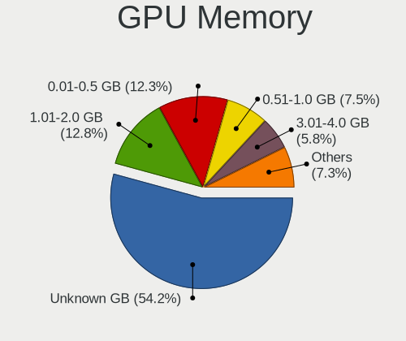

Linux - Tested Hardware & Statistics
------------------------------------

A project to collect tested hardware configurations for Linux.

Anyone can contribute to this report by the [hw-probe](https://github.com/linuxhw/hw-probe) tool:

    sudo -E hw-probe -all -upload

Please contribute! Especially if your hardware is rare.

This is a report for all computer types. See also reports for [desktops](/Desktop/README.md) and [notebooks](/Notebook/README.md).

Distribution-specific reports: [AlmaLinux](/Dist/AlmaLinux), [Alpine](/Dist/Alpine), [ALT_Linux](/Dist/ALT_Linux), [antiX](/Dist/antiX), [Artix](/Dist/Artix), [Chrome_OS](/Dist/Chrome_OS), [Clear_Linux](/Dist/Clear_Linux), [Deepin](/Dist/Deepin), [Devuan](/Dist/Devuan), [EndeavourOS](/Dist/EndeavourOS), [Garuda_Linux](/Dist/Garuda_Linux), [GNOME_OS](/Dist/GNOME_OS), [Kaisen](/Dist/Kaisen), [Mageia](/Dist/Mageia), [Makulu](/Dist/Makulu), [NixOS](/Dist/NixOS), [Nobara](/Dist/Nobara), [Oracle_Linux](/Dist/Oracle_Linux), [Pardus](/Dist/Pardus), [PureOS](/Dist/PureOS), [Q4OS](/Dist/Q4OS), [Reborn_OS](/Dist/Reborn_OS), [Rocky_Linux](/Dist/Rocky_Linux), [Sparky](/Dist/Sparky), [Void_Linux](/Dist/Void_Linux), [Xero](/Dist/Xero).

This report is for real hardware. Report for virtual hardware: [TestCoverage_VE](https://github.com/linuxhw/TestCoverage_VE)

Contents
--------

* [ Test Cases ](#test-cases)

* [ System ](#system)
  - [ OS                       ](#os)
  - [ OS Family                ](#os-family)
  - [ Kernel                   ](#kernel)
  - [ Kernel Family            ](#kernel-family)
  - [ Kernel Major Ver.        ](#kernel-major-ver)
  - [ Arch                     ](#arch)
  - [ DE                       ](#de)
  - [ Display Server           ](#display-server)
  - [ Display Manager          ](#display-manager)
  - [ OS Lang                  ](#os-lang)
  - [ Boot Mode                ](#boot-mode)
  - [ Filesystem               ](#filesystem)
  - [ Part. scheme             ](#part-scheme)
  - [ Dual Boot with Linux/BSD ](#dual-boot-with-linuxbsd)
  - [ Dual Boot (Win)          ](#dual-boot-win)

* [ Board ](#board)
  - [ Vendor                   ](#vendor)
  - [ Model                    ](#model)
  - [ Model Family             ](#model-family)
  - [ MFG Year                 ](#mfg-year)
  - [ Form Factor              ](#form-factor)
  - [ Secure Boot              ](#secure-boot)
  - [ Coreboot                 ](#coreboot)
  - [ RAM Size                 ](#ram-size)
  - [ RAM Used                 ](#ram-used)
  - [ Total Drives             ](#total-drives)
  - [ Has CD-ROM               ](#has-cd-rom)
  - [ Has Ethernet             ](#has-ethernet)
  - [ Has WiFi                 ](#has-wifi)
  - [ Has Bluetooth            ](#has-bluetooth)

* [ Location ](#location)
  - [ Country                  ](#country)
  - [ City                     ](#city)

* [ Drives ](#drives)
  - [ Drive Vendor             ](#drive-vendor)
  - [ Drive Model              ](#drive-model)
  - [ HDD Vendor               ](#hdd-vendor)
  - [ SSD Vendor               ](#ssd-vendor)
  - [ Drive Kind               ](#drive-kind)
  - [ Drive Connector          ](#drive-connector)
  - [ Drive Size               ](#drive-size)
  - [ Space Total              ](#space-total)
  - [ Space Used               ](#space-used)
  - [ Malfunc. Drives          ](#malfunc-drives)
  - [ Malfunc. Drive Vendor    ](#malfunc-drive-vendor)
  - [ Malfunc. HDD Vendor      ](#malfunc-hdd-vendor)
  - [ Malfunc. Drive Kind      ](#malfunc-drive-kind)
  - [ Failed Drives            ](#failed-drives)
  - [ Failed Drive Vendor      ](#failed-drive-vendor)
  - [ Drive Status             ](#drive-status)

* [ Storage controller ](#storage-controller)
  - [ Storage Vendor           ](#storage-vendor)
  - [ Storage Model            ](#storage-model)
  - [ Storage Kind             ](#storage-kind)

* [ Processor ](#processor)
  - [ CPU Vendor               ](#cpu-vendor)
  - [ CPU Model                ](#cpu-model)
  - [ CPU Model Family         ](#cpu-model-family)
  - [ CPU Cores                ](#cpu-cores)
  - [ CPU Sockets              ](#cpu-sockets)
  - [ CPU Threads              ](#cpu-threads)
  - [ CPU Op-Modes             ](#cpu-op-modes)
  - [ CPU Microcode            ](#cpu-microcode)
  - [ CPU Microarch            ](#cpu-microarch)

* [ Graphics ](#graphics)
  - [ GPU Vendor               ](#gpu-vendor)
  - [ GPU Model                ](#gpu-model)
  - [ GPU Combo                ](#gpu-combo)
  - [ GPU Driver               ](#gpu-driver)
  - [ GPU Memory               ](#gpu-memory)

* [ Monitor ](#monitor)
  - [ Monitor Vendor           ](#monitor-vendor)
  - [ Monitor Model            ](#monitor-model)
  - [ Monitor Resolution       ](#monitor-resolution)
  - [ Monitor Diagonal         ](#monitor-diagonal)
  - [ Monitor Width            ](#monitor-width)
  - [ Aspect Ratio             ](#aspect-ratio)
  - [ Monitor Area             ](#monitor-area)
  - [ Pixel Density            ](#pixel-density)
  - [ Multiple Monitors        ](#multiple-monitors)

* [ Network ](#network)
  - [ Net Controller Vendor    ](#net-controller-vendor)
  - [ Net Controller Model     ](#net-controller-model)
  - [ Wireless Vendor          ](#wireless-vendor)
  - [ Wireless Model           ](#wireless-model)
  - [ Ethernet Vendor          ](#ethernet-vendor)
  - [ Ethernet Model           ](#ethernet-model)
  - [ Net Controller Kind      ](#net-controller-kind)
  - [ Used Controller          ](#used-controller)
  - [ NICs                     ](#nics)
  - [ IPv6                     ](#ipv6)

* [ Bluetooth ](#bluetooth)
  - [ Bluetooth Vendor         ](#bluetooth-vendor)
  - [ Bluetooth Model          ](#bluetooth-model)

* [ Sound ](#sound)
  - [ Sound Vendor             ](#sound-vendor)
  - [ Sound Model              ](#sound-model)

* [ Memory ](#memory)
  - [ Memory Vendor            ](#memory-vendor)
  - [ Memory Model             ](#memory-model)
  - [ Memory Kind              ](#memory-kind)
  - [ Memory Form Factor       ](#memory-form-factor)
  - [ Memory Size              ](#memory-size)
  - [ Memory Speed             ](#memory-speed)

* [ Printers & scanners ](#printers--scanners)
  - [ Printer Vendor           ](#printer-vendor)
  - [ Printer Model            ](#printer-model)
  - [ Scanner Vendor           ](#scanner-vendor)
  - [ Scanner Model            ](#scanner-model)

* [ Camera ](#camera)
  - [ Camera Vendor            ](#camera-vendor)
  - [ Camera Model             ](#camera-model)

* [ Security ](#security)
  - [ Fingerprint Vendor       ](#fingerprint-vendor)
  - [ Fingerprint Model        ](#fingerprint-model)
  - [ Chipcard Vendor          ](#chipcard-vendor)
  - [ Chipcard Model           ](#chipcard-model)

* [ Unsupported ](#unsupported)
  - [ Unsupported Devices      ](#unsupported-devices)
  - [ Unsupported Device Types ](#unsupported-device-types)

Test Cases
----------

Total: 247397

| Vendor        | Model                       | Form-Factor | Probe                                                      | Date         |
|---------------|-----------------------------|-------------|------------------------------------------------------------|--------------|
| Dell          | Inspiron 5490               | Notebook    | [3ef6519b6d](https://linux-hardware.org/?probe=3ef6519b6d) | Sep 01, 2022 |
| Dell          | XPS 13 9305                 | Notebook    | [1746053c5b](https://linux-hardware.org/?probe=1746053c5b) | Sep 01, 2022 |
| Google        | Enguarde                    | Notebook    | [50369de0be](https://linux-hardware.org/?probe=50369de0be) | Sep 01, 2022 |
| Supermicro    | X9SCL/X9SCMA                | Desktop     | [fa0d296a6d](https://linux-hardware.org/?probe=fa0d296a6d) | Sep 01, 2022 |
| MSI           | X570-A PRO                  | Desktop     | [4a7d6a9276](https://linux-hardware.org/?probe=4a7d6a9276) | Sep 01, 2022 |
| Dell          | Latitude E6330              | Notebook    | [179123f301](https://linux-hardware.org/?probe=179123f301) | Sep 01, 2022 |
| Gigabyte      | 945GCM-S2L                  | Desktop     | [99613365f5](https://linux-hardware.org/?probe=99613365f5) | Sep 01, 2022 |
| ASUSTek       | X455LJ                      | Notebook    | [b635e1c2ba](https://linux-hardware.org/?probe=b635e1c2ba) | Sep 01, 2022 |
| Dell          | XPS 13 7390 2-in-1          | Convertible | [269a75d1cd](https://linux-hardware.org/?probe=269a75d1cd) | Sep 01, 2022 |
| Dell          | G15 5510                    | Notebook    | [78f2f5c95a](https://linux-hardware.org/?probe=78f2f5c95a) | Sep 01, 2022 |
| Dell          | XPS 13 7390 2-in-1          | Convertible | [d6d616d620](https://linux-hardware.org/?probe=d6d616d620) | Sep 01, 2022 |
| Dell          | XPS 13 7390 2-in-1          | Convertible | [4da7c712b4](https://linux-hardware.org/?probe=4da7c712b4) | Sep 01, 2022 |
| ASRockRack    | X470D4U2/1N1                | Desktop     | [2b524b9c24](https://linux-hardware.org/?probe=2b524b9c24) | Sep 01, 2022 |
| MSI           | Katana GF66 12UC            | Notebook    | [270a50ac4c](https://linux-hardware.org/?probe=270a50ac4c) | Sep 01, 2022 |
| Google        | Enguarde                    | Notebook    | [b59a9615cd](https://linux-hardware.org/?probe=b59a9615cd) | Sep 01, 2022 |
| ASUSTek       | ZenBook UX425IA_UM425IA     | Notebook    | [f25f0f5499](https://linux-hardware.org/?probe=f25f0f5499) | Sep 01, 2022 |
| Dell          | 0J584C A00                  | Desktop     | [de442f1c61](https://linux-hardware.org/?probe=de442f1c61) | Sep 01, 2022 |
| HP            | Laptop 15-ef1xxx            | Notebook    | [d27c20dcf9](https://linux-hardware.org/?probe=d27c20dcf9) | Sep 01, 2022 |
| Dell          | Inspiron 5559               | Notebook    | [c7b43caa52](https://linux-hardware.org/?probe=c7b43caa52) | Sep 01, 2022 |
| Google        | Enguarde                    | Notebook    | [7acc7436b0](https://linux-hardware.org/?probe=7acc7436b0) | Sep 01, 2022 |
| Lenovo        | ThinkPad X1 Extreme Gen ... | Notebook    | [d34c9cb705](https://linux-hardware.org/?probe=d34c9cb705) | Sep 01, 2022 |
| Lenovo        | ThinkPad X13 Yoga Gen 2 ... | Convertible | [969ebd4d3a](https://linux-hardware.org/?probe=969ebd4d3a) | Sep 01, 2022 |
| ASUSTek       | TUF Gaming Z490-PLUS        | Desktop     | [3a8803f198](https://linux-hardware.org/?probe=3a8803f198) | Sep 01, 2022 |
| Google        | Enguarde                    | Notebook    | [671a062f6e](https://linux-hardware.org/?probe=671a062f6e) | Sep 01, 2022 |
| HP            | OMEN Laptop 15-en0xxx       | Notebook    | [e4a4630b4e](https://linux-hardware.org/?probe=e4a4630b4e) | Sep 01, 2022 |
| Lenovo        | ThinkPad E15 Gen 2 20T80... | Notebook    | [21392e76a8](https://linux-hardware.org/?probe=21392e76a8) | Sep 01, 2022 |
| Google        | Enguarde                    | Notebook    | [baabafd42b](https://linux-hardware.org/?probe=baabafd42b) | Sep 01, 2022 |
| Google        | Enguarde                    | Notebook    | [4c1595c83e](https://linux-hardware.org/?probe=4c1595c83e) | Sep 01, 2022 |
| Google        | Enguarde                    | Notebook    | [bb6b28b279](https://linux-hardware.org/?probe=bb6b28b279) | Sep 01, 2022 |
| Google        | Terra                       | Notebook    | [b7940ab738](https://linux-hardware.org/?probe=b7940ab738) | Sep 01, 2022 |
| ASRock        | 990FX Extreme3              | Desktop     | [1e75cefa31](https://linux-hardware.org/?probe=1e75cefa31) | Sep 01, 2022 |
| Google        | Enguarde                    | Notebook    | [0cbe57b975](https://linux-hardware.org/?probe=0cbe57b975) | Sep 01, 2022 |
| Google        | Enguarde                    | Notebook    | [9f20842cc5](https://linux-hardware.org/?probe=9f20842cc5) | Sep 01, 2022 |
| Schenker      | XMG FUSION 15 (XFU15M22)    | Notebook    | [3a8cfc8781](https://linux-hardware.org/?probe=3a8cfc8781) | Sep 01, 2022 |
| Dell          | 02YRK5 A02                  | Desktop     | [bc316a8d3f](https://linux-hardware.org/?probe=bc316a8d3f) | Sep 01, 2022 |
| Lenovo        | ThinkPad T14 Gen 2i 20W1... | Notebook    | [12abd434b5](https://linux-hardware.org/?probe=12abd434b5) | Sep 01, 2022 |
| Gigabyte      | B450M DS3H WIFI-CF          | Desktop     | [fb12fe29dd](https://linux-hardware.org/?probe=fb12fe29dd) | Sep 01, 2022 |
| Apple         | MacBookAir7,2               | Notebook    | [73b50385f0](https://linux-hardware.org/?probe=73b50385f0) | Sep 01, 2022 |
| ASRock        | N68-S                       | Desktop     | [df5d34428a](https://linux-hardware.org/?probe=df5d34428a) | Sep 01, 2022 |
| HP            | Laptop 15-db1xxx            | Notebook    | [51b19bb74b](https://linux-hardware.org/?probe=51b19bb74b) | Sep 01, 2022 |
| ASUSTek       | PRIME A320M-K               | Desktop     | [bdae2c60cd](https://linux-hardware.org/?probe=bdae2c60cd) | Sep 01, 2022 |
| Packard Be... | DOT S                       | Notebook    | [b5b03f1cf7](https://linux-hardware.org/?probe=b5b03f1cf7) | Sep 01, 2022 |
| Gigabyte      | 970A-DS3P                   | Desktop     | [5ba20eb04b](https://linux-hardware.org/?probe=5ba20eb04b) | Sep 01, 2022 |
| Acer          | Aspire TC-605               | Desktop     | [5ff2a41fcd](https://linux-hardware.org/?probe=5ff2a41fcd) | Sep 01, 2022 |
| Lenovo        | ThinkPad E15 Gen 2 20T80... | Notebook    | [e16313490d](https://linux-hardware.org/?probe=e16313490d) | Sep 01, 2022 |
| ASRock        | A320M-DVS R4.0              | Desktop     | [143e6e1816](https://linux-hardware.org/?probe=143e6e1816) | Sep 01, 2022 |
| Acer          | Aspire 5742G                | Notebook    | [1ed15181cb](https://linux-hardware.org/?probe=1ed15181cb) | Sep 01, 2022 |
| ASUSTek       | M5A78L-M LX3                | Desktop     | [5ba264dfb2](https://linux-hardware.org/?probe=5ba264dfb2) | Sep 01, 2022 |
| Dell          | 0R6PCT A01                  | Desktop     | [02af50752e](https://linux-hardware.org/?probe=02af50752e) | Sep 01, 2022 |
| Lenovo        | IdeaPad 5 Pro 16ARH7 82S... | Notebook    | [46e67b2b16](https://linux-hardware.org/?probe=46e67b2b16) | Sep 01, 2022 |
| ASUSTek       | M5A78L-M LX3                | Desktop     | [169c9af937](https://linux-hardware.org/?probe=169c9af937) | Sep 01, 2022 |
| Google        | Enguarde                    | Notebook    | [06969489cc](https://linux-hardware.org/?probe=06969489cc) | Sep 01, 2022 |
| Google        | Enguarde                    | Notebook    | [2b4231258e](https://linux-hardware.org/?probe=2b4231258e) | Sep 01, 2022 |
| HP            | Pavilion 14                 | Notebook    | [b35151af0c](https://linux-hardware.org/?probe=b35151af0c) | Sep 01, 2022 |
| Google        | Enguarde                    | Notebook    | [1a0596c60d](https://linux-hardware.org/?probe=1a0596c60d) | Sep 01, 2022 |
| Google        | Enguarde                    | Notebook    | [4dfdb5e364](https://linux-hardware.org/?probe=4dfdb5e364) | Sep 01, 2022 |
| Lenovo        | SHARKBAY 31900058 STD       | Desktop     | [f113f959b7](https://linux-hardware.org/?probe=f113f959b7) | Sep 01, 2022 |
| Dell          | 042P49 A00                  | Desktop     | [31efc1e75f](https://linux-hardware.org/?probe=31efc1e75f) | Sep 01, 2022 |
| Google        | Enguarde                    | Notebook    | [c6db81251c](https://linux-hardware.org/?probe=c6db81251c) | Sep 01, 2022 |
| Lenovo        | B570e HuronRiver Platfor... | Notebook    | [23e052db95](https://linux-hardware.org/?probe=23e052db95) | Sep 01, 2022 |
| Lenovo        | G50-80 80E5                 | Notebook    | [ec5bb450ff](https://linux-hardware.org/?probe=ec5bb450ff) | Sep 01, 2022 |
| Acer          | Aspire TC-605               | Desktop     | [fdc6b95d8b](https://linux-hardware.org/?probe=fdc6b95d8b) | Sep 01, 2022 |
| ASUSTek       | P8Z77-V LE PLUS             | Desktop     | [0f7d76d65c](https://linux-hardware.org/?probe=0f7d76d65c) | Sep 01, 2022 |
| Dell          | Inspiron 7591 2n1           | Convertible | [b963be56f5](https://linux-hardware.org/?probe=b963be56f5) | Sep 01, 2022 |
| Lenovo        | Y520-15IKBN 80WK            | Notebook    | [7b6028e52d](https://linux-hardware.org/?probe=7b6028e52d) | Sep 01, 2022 |
| Google        | Enguarde                    | Notebook    | [05f112ddb7](https://linux-hardware.org/?probe=05f112ddb7) | Sep 01, 2022 |
| ASUSTek       | ROG STRIX X470-F GAMING     | Desktop     | [a2878122de](https://linux-hardware.org/?probe=a2878122de) | Sep 01, 2022 |
| MSI           | MS-B9201                    | Desktop     | [7bbae05d63](https://linux-hardware.org/?probe=7bbae05d63) | Sep 01, 2022 |
| Dell          | 042P49 A02                  | Desktop     | [3b1c07d561](https://linux-hardware.org/?probe=3b1c07d561) | Sep 01, 2022 |
| Dell          | G3 3590                     | Notebook    | [cbe6c26276](https://linux-hardware.org/?probe=cbe6c26276) | Sep 01, 2022 |
| Gigabyte      | P55A-UD3                    | Desktop     | [297cab0eb2](https://linux-hardware.org/?probe=297cab0eb2) | Sep 01, 2022 |
| Gigabyte      | Z590 GAMING X               | Desktop     | [b84d0acafb](https://linux-hardware.org/?probe=b84d0acafb) | Sep 01, 2022 |
| ASUSTek       | M2N32-SLI DELUXE            | Desktop     | [d1bb81241c](https://linux-hardware.org/?probe=d1bb81241c) | Sep 01, 2022 |
| Dell          | Vostro 15 5510              | Notebook    | [1c58d69316](https://linux-hardware.org/?probe=1c58d69316) | Sep 01, 2022 |
| Gigabyte      | Z370 HD3-OP-CF              | Desktop     | [55f8dbfb24](https://linux-hardware.org/?probe=55f8dbfb24) | Sep 01, 2022 |
| Dell          | 0MWYPT A02                  | Desktop     | [e2f98387b0](https://linux-hardware.org/?probe=e2f98387b0) | Sep 01, 2022 |
| MSI           | MS-B9201                    | Desktop     | [0d04798699](https://linux-hardware.org/?probe=0d04798699) | Sep 01, 2022 |
| Dell          | Vostro 15 5510              | Notebook    | [e14cc69370](https://linux-hardware.org/?probe=e14cc69370) | Sep 01, 2022 |
| ASUSTek       | TUF Gaming FX505DY_FX505... | Notebook    | [9cabeefea8](https://linux-hardware.org/?probe=9cabeefea8) | Sep 01, 2022 |
| Acer          | Aspire 5715Z                | Notebook    | [82086ce1c6](https://linux-hardware.org/?probe=82086ce1c6) | Sep 01, 2022 |
| Lenovo        | ThinkPad T430 2342A19       | Notebook    | [1fee695aec](https://linux-hardware.org/?probe=1fee695aec) | Sep 01, 2022 |
| Lenovo        | ThinkPad T460 20FMS08U00    | Notebook    | [d7457fd32a](https://linux-hardware.org/?probe=d7457fd32a) | Sep 01, 2022 |
| ASUSTek       | N552VW                      | Notebook    | [99d4a9be86](https://linux-hardware.org/?probe=99d4a9be86) | Sep 01, 2022 |
| Lenovo        | IdeaPad S410p 20296         | Notebook    | [dac943f23a](https://linux-hardware.org/?probe=dac943f23a) | Sep 01, 2022 |
| ASUSTek       | ROG STRIX X470-F GAMING     | Desktop     | [836d60c547](https://linux-hardware.org/?probe=836d60c547) | Sep 01, 2022 |
| Gigabyte      | Z370 HD3-OP-CF              | Desktop     | [ead5d021a7](https://linux-hardware.org/?probe=ead5d021a7) | Sep 01, 2022 |
| ASUSTek       | ROG Flow Z13 GZ301ZE_GZ3... | Tablet      | [365aaba099](https://linux-hardware.org/?probe=365aaba099) | Sep 01, 2022 |
| Dell          | Latitude 5521               | Notebook    | [dcf7869cf6](https://linux-hardware.org/?probe=dcf7869cf6) | Sep 01, 2022 |
| Lenovo        | 3168 NOK                    | Desktop     | [58c82b01e2](https://linux-hardware.org/?probe=58c82b01e2) | Sep 01, 2022 |
| Dell          | 07PXPY A04                  | Server      | [f0b9cd86ef](https://linux-hardware.org/?probe=f0b9cd86ef) | Sep 01, 2022 |
| Gigabyte      | Z97-HD3                     | Desktop     | [32e71c2905](https://linux-hardware.org/?probe=32e71c2905) | Sep 01, 2022 |
| Lenovo        | ThinkPad X1 Carbon 2nd 2... | Notebook    | [f7189849b4](https://linux-hardware.org/?probe=f7189849b4) | Sep 01, 2022 |
| Lenovo        | ThinkBook 14 G2 ITL 20VD    | Notebook    | [02ec70b604](https://linux-hardware.org/?probe=02ec70b604) | Sep 01, 2022 |
| HP            | Compaq 620                  | Notebook    | [6c8cd94a98](https://linux-hardware.org/?probe=6c8cd94a98) | Sep 01, 2022 |
| Dell          | Inspiron 15-3567            | Notebook    | [5b1f25ca62](https://linux-hardware.org/?probe=5b1f25ca62) | Sep 01, 2022 |
| Positivo      | C14CR01                     | Notebook    | [ff4d1d45b7](https://linux-hardware.org/?probe=ff4d1d45b7) | Sep 01, 2022 |
| HP            | Pavilion dv6                | Notebook    | [25e9e892e7](https://linux-hardware.org/?probe=25e9e892e7) | Sep 01, 2022 |
| Gigabyte      | P55-US3L                    | Desktop     | [93e1829d36](https://linux-hardware.org/?probe=93e1829d36) | Sep 01, 2022 |
| Lenovo        | ThinkPad T400 6474W7T       | Notebook    | [f9a9b12b37](https://linux-hardware.org/?probe=f9a9b12b37) | Sep 01, 2022 |
| Intel         | D34010WYB H14771-304        | Desktop     | [47d9609ba8](https://linux-hardware.org/?probe=47d9609ba8) | Sep 01, 2022 |
| HP            | Laptop 15-db0xxx            | Notebook    | [de848d928c](https://linux-hardware.org/?probe=de848d928c) | Sep 01, 2022 |
| Lenovo        | ThinkPad P15 Gen 1 20STC... | Notebook    | [0a5a3fa67e](https://linux-hardware.org/?probe=0a5a3fa67e) | Sep 01, 2022 |
| Acer          | Aspire V5-431               | Notebook    | [5ac694007d](https://linux-hardware.org/?probe=5ac694007d) | Sep 01, 2022 |
| Positivo      | C14CR01                     | Notebook    | [d1fc217886](https://linux-hardware.org/?probe=d1fc217886) | Sep 01, 2022 |
| Intel         | D34010WYB H14771-304        | Desktop     | [fd34481bf8](https://linux-hardware.org/?probe=fd34481bf8) | Sep 01, 2022 |
| Panasonic     | CF-191HACHFG                | Notebook    | [c1f0177dcb](https://linux-hardware.org/?probe=c1f0177dcb) | Sep 01, 2022 |
| Lenovo        | IdeaPad Slim 1-14AST-05 ... | Notebook    | [c83430605e](https://linux-hardware.org/?probe=c83430605e) | Sep 01, 2022 |
| HP            | Pavilion m6                 | Notebook    | [83b6eb0119](https://linux-hardware.org/?probe=83b6eb0119) | Sep 01, 2022 |
| Casper        | NIRVANA NOTEBOOK            | Notebook    | [7a5978071e](https://linux-hardware.org/?probe=7a5978071e) | Sep 01, 2022 |
| Avell High... | C62 MOB                     | Notebook    | [ab93c1f314](https://linux-hardware.org/?probe=ab93c1f314) | Sep 01, 2022 |
| HP            | ZBook 17 G2                 | Notebook    | [e2fc506c38](https://linux-hardware.org/?probe=e2fc506c38) | Sep 01, 2022 |
| ASUSTek       | Zenbook UX3402ZA_UX3402Z... | Convertible | [68170e253f](https://linux-hardware.org/?probe=68170e253f) | Sep 01, 2022 |
| Gigabyte      | H81M-WW                     | Desktop     | [2a56f256a3](https://linux-hardware.org/?probe=2a56f256a3) | Sep 01, 2022 |
| Lenovo        | IdeaPad 1 14ADA05 82GW      | Notebook    | [8a7e7ce8ea](https://linux-hardware.org/?probe=8a7e7ce8ea) | Sep 01, 2022 |
| Valve         | Jupiter                     | Notebook    | [6e9790c5e7](https://linux-hardware.org/?probe=6e9790c5e7) | Sep 01, 2022 |
| Notebook      | NL40_50CU                   | Notebook    | [af0da080ec](https://linux-hardware.org/?probe=af0da080ec) | Sep 01, 2022 |
| Dell          | Latitude 3340               | Notebook    | [d64525742a](https://linux-hardware.org/?probe=d64525742a) | Sep 01, 2022 |
| Dell          | Latitude 3340               | Notebook    | [b9d472b965](https://linux-hardware.org/?probe=b9d472b965) | Sep 01, 2022 |
| Lenovo        | IdeaPad 3 15ITL6 82H8       | Notebook    | [5ad5d3809b](https://linux-hardware.org/?probe=5ad5d3809b) | Sep 01, 2022 |
| Lenovo        | ThinkCentre M58e 7408BA5    | Desktop     | [4384314f98](https://linux-hardware.org/?probe=4384314f98) | Sep 01, 2022 |
| MSI           | H81M-P33                    | Desktop     | [8d15799ff9](https://linux-hardware.org/?probe=8d15799ff9) | Sep 01, 2022 |
| ASUSTek       | ZenBook UX431DA_UM431DA     | Notebook    | [cc30fbdce2](https://linux-hardware.org/?probe=cc30fbdce2) | Sep 01, 2022 |
| Dell          | Precision 5530              | Notebook    | [298ce27830](https://linux-hardware.org/?probe=298ce27830) | Sep 01, 2022 |
| LG Electro... | 14Z990-V.AP72B              | Notebook    | [8c67c188a1](https://linux-hardware.org/?probe=8c67c188a1) | Sep 01, 2022 |
| HP            | ProBook 4540s               | Notebook    | [b5e6fa5a71](https://linux-hardware.org/?probe=b5e6fa5a71) | Sep 01, 2022 |
| Dell          | XPS 9320                    | Notebook    | [525a1bd6b6](https://linux-hardware.org/?probe=525a1bd6b6) | Sep 01, 2022 |
| HP            | EliteBook 830 G8 Noteboo... | Notebook    | [814c094769](https://linux-hardware.org/?probe=814c094769) | Sep 01, 2022 |
| ASUSTek       | PRIME A320M-K               | Desktop     | [6552f796e2](https://linux-hardware.org/?probe=6552f796e2) | Sep 01, 2022 |
| HP            | ProLiant DL165 G7           | Server      | [3955b91269](https://linux-hardware.org/?probe=3955b91269) | Sep 01, 2022 |
| Gigabyte      | X150M-PRO ECC-CF            | Desktop     | [6db003ed3a](https://linux-hardware.org/?probe=6db003ed3a) | Sep 01, 2022 |
| HP            | EliteBook x360 830 G6       | Convertible | [751aeabd5d](https://linux-hardware.org/?probe=751aeabd5d) | Sep 01, 2022 |
| MECHREVO      | Code01 Ver2.0               | Notebook    | [f88772c4dc](https://linux-hardware.org/?probe=f88772c4dc) | Sep 01, 2022 |
| ASUSTek       | PRIME H310M-R R2.0          | Desktop     | [b226dd8bc2](https://linux-hardware.org/?probe=b226dd8bc2) | Sep 01, 2022 |
| ASUSTek       | VivoBook_ASUS Laptop X50... | Notebook    | [9da6412308](https://linux-hardware.org/?probe=9da6412308) | Sep 01, 2022 |
| Lenovo        | ThinkPad T440p 20AWS1200... | Notebook    | [55073b08dc](https://linux-hardware.org/?probe=55073b08dc) | Sep 01, 2022 |
| HP            | 1589                        | Desktop     | [fce9004571](https://linux-hardware.org/?probe=fce9004571) | Sep 01, 2022 |
| HP            | ProLiant DL165 G7           | Server      | [3148482797](https://linux-hardware.org/?probe=3148482797) | Sep 01, 2022 |
| Dell          | Latitude 3190               | Notebook    | [d30269b33c](https://linux-hardware.org/?probe=d30269b33c) | Sep 01, 2022 |
| MECHREVO      | Code01 Ver2.0               | Notebook    | [0cb5fbde81](https://linux-hardware.org/?probe=0cb5fbde81) | Sep 01, 2022 |
| Valve         | Jupiter                     | Notebook    | [c89533e9a2](https://linux-hardware.org/?probe=c89533e9a2) | Sep 01, 2022 |
| Lenovo        | ThinkPad T400 6474W7T       | Notebook    | [b52974ac00](https://linux-hardware.org/?probe=b52974ac00) | Sep 01, 2022 |
| ASRock        | N68-VS3 FX                  | Desktop     | [b4c043c208](https://linux-hardware.org/?probe=b4c043c208) | Sep 01, 2022 |
| ASUSTek       | V-M3N8200                   | Desktop     | [f593540c1c](https://linux-hardware.org/?probe=f593540c1c) | Sep 01, 2022 |
| Dell          | 0WPG9H A00                  | All in one  | [67aeed6eb1](https://linux-hardware.org/?probe=67aeed6eb1) | Sep 01, 2022 |
| Gigabyte      | GA-E6010N                   | Desktop     | [8daf2205a5](https://linux-hardware.org/?probe=8daf2205a5) | Sep 01, 2022 |
| ASUSTek       | PRIME B350M-K               | Desktop     | [ae0450c52a](https://linux-hardware.org/?probe=ae0450c52a) | Sep 01, 2022 |
| Dell          | 0WPG9H A00                  | All in one  | [b1b4bd6ce0](https://linux-hardware.org/?probe=b1b4bd6ce0) | Sep 01, 2022 |
| Notebook      | W65_67SB                    | Notebook    | [38393a5559](https://linux-hardware.org/?probe=38393a5559) | Sep 01, 2022 |
| HP            | Laptop 15-da0xxx            | Notebook    | [2c79168e77](https://linux-hardware.org/?probe=2c79168e77) | Sep 01, 2022 |
| ASUSTek       | K50IJ                       | Notebook    | [10dd5d1e15](https://linux-hardware.org/?probe=10dd5d1e15) | Sep 01, 2022 |
| Purism        | Librem 14                   | Notebook    | [54d6cbb49d](https://linux-hardware.org/?probe=54d6cbb49d) | Sep 01, 2022 |
| Gigabyte      | X150M-PRO ECC-CF            | Desktop     | [2f21cd30ff](https://linux-hardware.org/?probe=2f21cd30ff) | Sep 01, 2022 |
| ASUSTek       | ZenBook UX425QA_UM425QA     | Notebook    | [c48154f5f4](https://linux-hardware.org/?probe=c48154f5f4) | Sep 01, 2022 |
| Lenovo        | G50-45 80E3                 | Notebook    | [3080895149](https://linux-hardware.org/?probe=3080895149) | Sep 01, 2022 |
| Foxconn       | 2ABF                        | Desktop     | [c9a801a4d2](https://linux-hardware.org/?probe=c9a801a4d2) | Sep 01, 2022 |
| Apple         | Mac-FFE5EF870D7BA81A iMa... | All in one  | [52f8474c3a](https://linux-hardware.org/?probe=52f8474c3a) | Sep 01, 2022 |
| ASUSTek       | PRIME B550M-A               | Desktop     | [8fc60cb459](https://linux-hardware.org/?probe=8fc60cb459) | Sep 01, 2022 |
| Dell          | Latitude 3190 2-in-1        | Convertible | [7140822520](https://linux-hardware.org/?probe=7140822520) | Sep 01, 2022 |
| Lenovo        | IdeaPadFlex 3 11ADA05 82... | Convertible | [b99f4a264b](https://linux-hardware.org/?probe=b99f4a264b) | Sep 01, 2022 |
| Medion        | E6227                       | Notebook    | [e6ca2257e7](https://linux-hardware.org/?probe=e6ca2257e7) | Sep 01, 2022 |
| ASUSTek       | V-M3N8200                   | Desktop     | [f3cc0c0bd5](https://linux-hardware.org/?probe=f3cc0c0bd5) | Sep 01, 2022 |
| HP            | Laptop 15-da0xxx            | Notebook    | [40482ce9a3](https://linux-hardware.org/?probe=40482ce9a3) | Sep 01, 2022 |
| Dell          | Inspiron 13 5310            | Notebook    | [b6b7c6dc62](https://linux-hardware.org/?probe=b6b7c6dc62) | Sep 01, 2022 |
| ASUSTek       | PRIME H310M-R R2.0          | Desktop     | [c1ba9218de](https://linux-hardware.org/?probe=c1ba9218de) | Sep 01, 2022 |
| Dell          | Inspiron 15-3552            | Notebook    | [2eb780855d](https://linux-hardware.org/?probe=2eb780855d) | Sep 01, 2022 |
| Dell          | Inspiron 13 5310            | Notebook    | [6b3c188071](https://linux-hardware.org/?probe=6b3c188071) | Sep 01, 2022 |
| Dell          | Inspiron 13 5310            | Notebook    | [b0d6660da8](https://linux-hardware.org/?probe=b0d6660da8) | Sep 01, 2022 |
| ASUSTek       | ROG STRIX Z590-A GAMING ... | Desktop     | [e311938d4a](https://linux-hardware.org/?probe=e311938d4a) | Sep 01, 2022 |
| Dell          | Latitude 5591               | Notebook    | [b860997149](https://linux-hardware.org/?probe=b860997149) | Sep 01, 2022 |
| Gigabyte      | GA-MA785G-UD3H              | Desktop     | [2cf98644bc](https://linux-hardware.org/?probe=2cf98644bc) | Sep 01, 2022 |
| HP            | ProBook 6460b               | Notebook    | [a0e3db2eed](https://linux-hardware.org/?probe=a0e3db2eed) | Sep 01, 2022 |
| Samsung       | 950XEE                      | Notebook    | [454b67dd88](https://linux-hardware.org/?probe=454b67dd88) | Sep 01, 2022 |
| Lenovo        | Z50-70 20354                | Notebook    | [8ac8531142](https://linux-hardware.org/?probe=8ac8531142) | Sep 01, 2022 |
| Lenovo        | IdeaPad 3 14ARE05 81W3      | Notebook    | [b8c22aafab](https://linux-hardware.org/?probe=b8c22aafab) | Sep 01, 2022 |
| MSI           | H110M GAMING                | Desktop     | [2699df47df](https://linux-hardware.org/?probe=2699df47df) | Sep 01, 2022 |
| Toshiba       | Satellite C850              | Notebook    | [6cf6d8fca8](https://linux-hardware.org/?probe=6cf6d8fca8) | Sep 01, 2022 |
| Dell          | Inspiron 15-3552            | Notebook    | [a5e4d22ccd](https://linux-hardware.org/?probe=a5e4d22ccd) | Sep 01, 2022 |
| ASRock        | B450M Pro4-F                | Desktop     | [d48b9efca4](https://linux-hardware.org/?probe=d48b9efca4) | Sep 01, 2022 |
| Apple         | MacBookAir9,1               | Notebook    | [51c4002c97](https://linux-hardware.org/?probe=51c4002c97) | Sep 01, 2022 |
| Medion        | H110H4-EM                   | Desktop     | [9f80ee3a09](https://linux-hardware.org/?probe=9f80ee3a09) | Sep 01, 2022 |
| ASUSTek       | VivoBook_ASUSLaptop X515... | Notebook    | [6566bc7d09](https://linux-hardware.org/?probe=6566bc7d09) | Sep 01, 2022 |
| Lenovo        | Legion S7 15ACH6 82K8       | Notebook    | [d96b24b7f3](https://linux-hardware.org/?probe=d96b24b7f3) | Sep 01, 2022 |
| Daten Tecn... | DT02-M4                     | Notebook    | [6e337cb132](https://linux-hardware.org/?probe=6e337cb132) | Sep 01, 2022 |
| Alienware     | m15 R4                      | Notebook    | [267e4bb2dd](https://linux-hardware.org/?probe=267e4bb2dd) | Sep 01, 2022 |
| HP            | 3398                        | Desktop     | [8b5bad68cb](https://linux-hardware.org/?probe=8b5bad68cb) | Sep 01, 2022 |
| Daten Tecn... | DT02-M4                     | Notebook    | [cdac9cafaf](https://linux-hardware.org/?probe=cdac9cafaf) | Sep 01, 2022 |
| Dell          | Inspiron 3542               | Notebook    | [945ec7d987](https://linux-hardware.org/?probe=945ec7d987) | Sep 01, 2022 |
| Dell          | 0PV3YR A05                  | Server      | [ad36524b16](https://linux-hardware.org/?probe=ad36524b16) | Sep 01, 2022 |
| Lenovo        | Legion S7 15ACH6 82K8       | Notebook    | [67eb62450a](https://linux-hardware.org/?probe=67eb62450a) | Sep 01, 2022 |
| Gigabyte      | 990FXA-UD5                  | Desktop     | [e5364d8761](https://linux-hardware.org/?probe=e5364d8761) | Sep 01, 2022 |
| ASUSTek       | TUF Gaming FX505DT_FX505... | Notebook    | [c9841acd77](https://linux-hardware.org/?probe=c9841acd77) | Sep 01, 2022 |
| Apple         | Mac-77F17D7DA9285301 iMa... | All in one  | [43835631c2](https://linux-hardware.org/?probe=43835631c2) | Sep 01, 2022 |
| Acer          | Aspire E5-571               | Notebook    | [7759e41b1d](https://linux-hardware.org/?probe=7759e41b1d) | Sep 01, 2022 |
| ASUSTek       | TUF Gaming X570-PRO         | Desktop     | [6eae76b5d0](https://linux-hardware.org/?probe=6eae76b5d0) | Sep 01, 2022 |
| ECS           | H61H2-M2                    | Desktop     | [9735a8ef90](https://linux-hardware.org/?probe=9735a8ef90) | Sep 01, 2022 |
| ASUSTek       | X550CC                      | Notebook    | [21f3eb8b1d](https://linux-hardware.org/?probe=21f3eb8b1d) | Sep 01, 2022 |
| ASRock        | FM2A88X Extreme6+           | Desktop     | [689c3aa34d](https://linux-hardware.org/?probe=689c3aa34d) | Sep 01, 2022 |
| Lenovo        | SHARKBAY NO DPK             | Desktop     | [f872d36cd5](https://linux-hardware.org/?probe=f872d36cd5) | Sep 01, 2022 |
| MSI           | X99A RAIDER                 | Desktop     | [5cf1e75ad4](https://linux-hardware.org/?probe=5cf1e75ad4) | Sep 01, 2022 |
| Dell          | Latitude 5490               | Notebook    | [a3f76e546f](https://linux-hardware.org/?probe=a3f76e546f) | Sep 01, 2022 |
| Gigabyte      | 970A-DS3P                   | Desktop     | [1bc16dc2be](https://linux-hardware.org/?probe=1bc16dc2be) | Sep 01, 2022 |
| HP            | EliteBook 840 G7 Noteboo... | Notebook    | [b50b1adb0f](https://linux-hardware.org/?probe=b50b1adb0f) | Sep 01, 2022 |
| Microsoft     | Surface Laptop Go           | Tablet      | [18822e9fbe](https://linux-hardware.org/?probe=18822e9fbe) | Sep 01, 2022 |
| ASRock        | A320M-DVS R4.0              | Desktop     | [c3ca58ba40](https://linux-hardware.org/?probe=c3ca58ba40) | Sep 01, 2022 |
| Lenovo        | 36D5 SDK0J40700 WIN 3258... | Desktop     | [87dfd12899](https://linux-hardware.org/?probe=87dfd12899) | Sep 01, 2022 |
| ASUSTek       | X550ZE                      | Notebook    | [187a6feadf](https://linux-hardware.org/?probe=187a6feadf) | Sep 01, 2022 |
| ASRock        | FM2A55M-HD+                 | Desktop     | [2f96c73efb](https://linux-hardware.org/?probe=2f96c73efb) | Sep 01, 2022 |
| Apple         | MacBookPro5,1               | Notebook    | [4c90105342](https://linux-hardware.org/?probe=4c90105342) | Sep 01, 2022 |
| HP            | OMEN by Laptop 15-ce0xx     | Notebook    | [85d4f11486](https://linux-hardware.org/?probe=85d4f11486) | Sep 01, 2022 |
| Unknown       | HX90                        | Desktop     | [71295a28ed](https://linux-hardware.org/?probe=71295a28ed) | Sep 01, 2022 |
| ASRock        | X99 Taichi                  | Desktop     | [4cd4bf6c89](https://linux-hardware.org/?probe=4cd4bf6c89) | Sep 01, 2022 |
| HP            | EliteBook 840 G2            | Notebook    | [4da3485e34](https://linux-hardware.org/?probe=4da3485e34) | Sep 01, 2022 |
| Gigabyte      | B450 AORUS PRO WIFI-CF      | Desktop     | [8e1734f31a](https://linux-hardware.org/?probe=8e1734f31a) | Sep 01, 2022 |
| Dell          | Inspiron 1545               | Notebook    | [611306b3c0](https://linux-hardware.org/?probe=611306b3c0) | Sep 01, 2022 |
| ASRock        | N68-GS4 FX R2.0             | Desktop     | [ea730c9b2d](https://linux-hardware.org/?probe=ea730c9b2d) | Sep 01, 2022 |
| Dell          | 09M8Y8 A01                  | Desktop     | [54b61cd4be](https://linux-hardware.org/?probe=54b61cd4be) | Sep 01, 2022 |
| ASRock        | B450M/ac                    | Desktop     | [393a08345e](https://linux-hardware.org/?probe=393a08345e) | Sep 01, 2022 |
| HP            | ENVY Laptop 13-ba1xxx       | Notebook    | [5a4e2225a8](https://linux-hardware.org/?probe=5a4e2225a8) | Sep 01, 2022 |
| Lenovo        | ThinkPad X220 4291WSH       | Notebook    | [c86e73aed6](https://linux-hardware.org/?probe=c86e73aed6) | Sep 01, 2022 |
| Lenovo        | IdeaPad 330-15AST 81D6      | Notebook    | [972c4cb608](https://linux-hardware.org/?probe=972c4cb608) | Sep 01, 2022 |
| ASUSTek       | VivoBook 15_ASUS Laptop ... | Notebook    | [57d535de2e](https://linux-hardware.org/?probe=57d535de2e) | Sep 01, 2022 |
| Valve         | Jupiter                     | Notebook    | [c348c06118](https://linux-hardware.org/?probe=c348c06118) | Sep 01, 2022 |
| Lenovo        | Legion Y530-15ICH 81FV      | Notebook    | [c9fcbe9935](https://linux-hardware.org/?probe=c9fcbe9935) | Sep 01, 2022 |
| HP            | G42                         | Notebook    | [a79b07fcd0](https://linux-hardware.org/?probe=a79b07fcd0) | Sep 01, 2022 |
| Lenovo        | IdeaPad S145-15API 81V7     | Notebook    | [838e09c9cf](https://linux-hardware.org/?probe=838e09c9cf) | Sep 01, 2022 |
| Lenovo        | Z50-70 20354                | Notebook    | [6e245e4c63](https://linux-hardware.org/?probe=6e245e4c63) | Sep 01, 2022 |
| Lenovo        | Legion Y530-15ICH 81FV      | Notebook    | [52efef286f](https://linux-hardware.org/?probe=52efef286f) | Sep 01, 2022 |
| HUAWEI        | HKD-WXX                     | Notebook    | [7ff88a93c2](https://linux-hardware.org/?probe=7ff88a93c2) | Sep 01, 2022 |
| Acer          | Aspire 5810T                | Notebook    | [6f807b1a84](https://linux-hardware.org/?probe=6f807b1a84) | Sep 01, 2022 |
| Dell          | Latitude 5285               | Tablet      | [4e75bec854](https://linux-hardware.org/?probe=4e75bec854) | Sep 01, 2022 |
| HP            | ENVY Laptop 15-ep0xxx       | Notebook    | [93ff04a07b](https://linux-hardware.org/?probe=93ff04a07b) | Sep 01, 2022 |
| ASUSTek       | UX550VD                     | Notebook    | [a43d53b3b7](https://linux-hardware.org/?probe=a43d53b3b7) | Sep 01, 2022 |
| HP            | 871A                        | Mini pc     | [d6261d6fb1](https://linux-hardware.org/?probe=d6261d6fb1) | Sep 01, 2022 |
| Acer          | Aspire X3400                | Desktop     | [705a3242ae](https://linux-hardware.org/?probe=705a3242ae) | Sep 01, 2022 |
| ASUSTek       | TUF Gaming B450-PLUS II     | Desktop     | [efc46d8d23](https://linux-hardware.org/?probe=efc46d8d23) | Sep 01, 2022 |
| HP            | Laptop 14s-fq1xxx           | Notebook    | [1a173c5ea0](https://linux-hardware.org/?probe=1a173c5ea0) | Sep 01, 2022 |
| MSI           | B450M-A PRO MAX             | Desktop     | [6462d2370f](https://linux-hardware.org/?probe=6462d2370f) | Aug 31, 2022 |
| Valve         | Jupiter                     | Notebook    | [60db4bfa03](https://linux-hardware.org/?probe=60db4bfa03) | Aug 31, 2022 |
| HP            | EliteBook 840 G8 Noteboo... | Notebook    | [7277e72eb4](https://linux-hardware.org/?probe=7277e72eb4) | Aug 31, 2022 |
| Lenovo        | IdeaPad 320-15IAP 80XR      | Notebook    | [6aba706c0c](https://linux-hardware.org/?probe=6aba706c0c) | Aug 31, 2022 |
| Valve         | Jupiter                     | Notebook    | [5a2483051c](https://linux-hardware.org/?probe=5a2483051c) | Aug 31, 2022 |
| ASUSTek       | ROG STRIX B550-F GAMING     | Desktop     | [3ea6fa4079](https://linux-hardware.org/?probe=3ea6fa4079) | Aug 31, 2022 |
| Dell          | Latitude 7390               | Notebook    | [571b195a12](https://linux-hardware.org/?probe=571b195a12) | Aug 31, 2022 |
| ASUSTek       | PRIME H510T2/CSM            | Desktop     | [12033c4a8b](https://linux-hardware.org/?probe=12033c4a8b) | Aug 31, 2022 |
| Dell          | Latitude 7390               | Notebook    | [3c3f6114f6](https://linux-hardware.org/?probe=3c3f6114f6) | Aug 31, 2022 |
| Lenovo        | ThinkPad L13 Yoga Gen 2 ... | Convertible | [8e8a47df1b](https://linux-hardware.org/?probe=8e8a47df1b) | Aug 31, 2022 |
| HP            | Laptop 15-db0xxx            | Notebook    | [42879ce5cf](https://linux-hardware.org/?probe=42879ce5cf) | Aug 31, 2022 |
| Raspberry ... | Raspberry Pi 400 Rev 1.0    | Soc         | [4d1339ef49](https://linux-hardware.org/?probe=4d1339ef49) | Aug 31, 2022 |
| HP            | Laptop 15-db0xxx            | Notebook    | [3c7e97b769](https://linux-hardware.org/?probe=3c7e97b769) | Aug 31, 2022 |
| Toshiba       | PORTEGE M800                | Notebook    | [547ef88897](https://linux-hardware.org/?probe=547ef88897) | Aug 31, 2022 |
| ASUSTek       | ASUS TUF Gaming F15 FX50... | Notebook    | [0ca693e2dd](https://linux-hardware.org/?probe=0ca693e2dd) | Aug 31, 2022 |
| Lenovo        | G710 20252                  | Notebook    | [37b1f6e81c](https://linux-hardware.org/?probe=37b1f6e81c) | Aug 31, 2022 |
| HP            | 1906                        | Desktop     | [a23cef9946](https://linux-hardware.org/?probe=a23cef9946) | Aug 31, 2022 |
| Acer          | Aspire V3-571G              | Notebook    | [8f4a2b603a](https://linux-hardware.org/?probe=8f4a2b603a) | Aug 31, 2022 |
| MSI           | MAG X570S TORPEDO MAX       | Desktop     | [d98546fd95](https://linux-hardware.org/?probe=d98546fd95) | Aug 31, 2022 |
| ASUSTek       | P5K/EPU                     | Desktop     | [196d56922a](https://linux-hardware.org/?probe=196d56922a) | Aug 31, 2022 |
| Toshiba       | PORTEGE M800                | Notebook    | [355cc5a1ec](https://linux-hardware.org/?probe=355cc5a1ec) | Aug 31, 2022 |
| MSI           | MAG B550M MORTAR WIFI       | Desktop     | [f4d5b9fc69](https://linux-hardware.org/?probe=f4d5b9fc69) | Aug 31, 2022 |
| Dell          | Inspiron 15-3552            | Notebook    | [5a342673f5](https://linux-hardware.org/?probe=5a342673f5) | Aug 31, 2022 |
| MSI           | MPG B550I GAMING EDGE WI... | Desktop     | [aacd965d80](https://linux-hardware.org/?probe=aacd965d80) | Aug 31, 2022 |
| Samsung       | 340XAA/350XAA/550XAA        | Notebook    | [c1d60c7b0b](https://linux-hardware.org/?probe=c1d60c7b0b) | Aug 31, 2022 |
| ASUSTek       | P8H61-MX                    | Desktop     | [52e7588080](https://linux-hardware.org/?probe=52e7588080) | Aug 31, 2022 |
| Samsung       | 340XAA/350XAA/550XAA        | Notebook    | [dafd789095](https://linux-hardware.org/?probe=dafd789095) | Aug 31, 2022 |
| Microsoft     | Surface Pro                 | Tablet      | [b6cc2513ff](https://linux-hardware.org/?probe=b6cc2513ff) | Aug 31, 2022 |
| Microsoft     | Surface Pro                 | Tablet      | [e8b26fc530](https://linux-hardware.org/?probe=e8b26fc530) | Aug 31, 2022 |
| Google        | Enguarde                    | Notebook    | [4a240c438e](https://linux-hardware.org/?probe=4a240c438e) | Aug 31, 2022 |
| HP            | Pavilion g6                 | Notebook    | [cc725d880c](https://linux-hardware.org/?probe=cc725d880c) | Aug 31, 2022 |
| MECHREVO      | Code01 Ver2.0               | Notebook    | [c63c5e6700](https://linux-hardware.org/?probe=c63c5e6700) | Aug 31, 2022 |
| MSI           | H97M-G43                    | Desktop     | [978d5b45be](https://linux-hardware.org/?probe=978d5b45be) | Aug 31, 2022 |
| HP            | 81B4                        | Desktop     | [b81985e04e](https://linux-hardware.org/?probe=b81985e04e) | Aug 31, 2022 |
| HP            | EliteBook x360 1030 G2      | Convertible | [e1b27f8003](https://linux-hardware.org/?probe=e1b27f8003) | Aug 31, 2022 |
| MECHREVO      | Code01 Ver2.0               | Notebook    | [bbe5fe0eac](https://linux-hardware.org/?probe=bbe5fe0eac) | Aug 31, 2022 |
| Lenovo        | ThinkPad T580 20L9CTO1WW    | Notebook    | [d6e9455a63](https://linux-hardware.org/?probe=d6e9455a63) | Aug 31, 2022 |
| Apple         | MacBookPro9,2               | Notebook    | [3662302886](https://linux-hardware.org/?probe=3662302886) | Aug 31, 2022 |
| Valve         | Jupiter                     | Notebook    | [0b928ad313](https://linux-hardware.org/?probe=0b928ad313) | Aug 31, 2022 |
| HP            | Notebook                    | Notebook    | [573d359faf](https://linux-hardware.org/?probe=573d359faf) | Aug 31, 2022 |
| Acidanther... | Mac-F60DEB81FF30ACF6 Mac... | Desktop     | [1dd7a06125](https://linux-hardware.org/?probe=1dd7a06125) | Aug 31, 2022 |
| Raspberry ... | Raspberry Pi                | Soc         | [dea44e447f](https://linux-hardware.org/?probe=dea44e447f) | Aug 31, 2022 |
| Toshiba       | Satellite Pro L500          | Notebook    | [7f523718cf](https://linux-hardware.org/?probe=7f523718cf) | Aug 31, 2022 |
| Raspberry ... | Raspberry Pi                | Soc         | [a4fc4ad9e3](https://linux-hardware.org/?probe=a4fc4ad9e3) | Aug 31, 2022 |
| Dell          | Inspiron 15-3552            | Notebook    | [60317668ae](https://linux-hardware.org/?probe=60317668ae) | Aug 31, 2022 |
| Pegatron      | 2AB6                        | Desktop     | [c4ca3989e0](https://linux-hardware.org/?probe=c4ca3989e0) | Aug 31, 2022 |
| MSI           | MPG B550I GAMING EDGE WI... | Desktop     | [c5547cac7c](https://linux-hardware.org/?probe=c5547cac7c) | Aug 31, 2022 |
| Dell          | Latitude 7280               | Notebook    | [e71e9350b4](https://linux-hardware.org/?probe=e71e9350b4) | Aug 31, 2022 |
| ASUSTek       | K46CM                       | Notebook    | [742d7047ea](https://linux-hardware.org/?probe=742d7047ea) | Aug 31, 2022 |
| HP            | 18E5                        | Desktop     | [e7c5ab6cc4](https://linux-hardware.org/?probe=e7c5ab6cc4) | Aug 31, 2022 |
| ASUSTek       | Zenbook UX535QE_UM535QE     | Notebook    | [0c62d097f0](https://linux-hardware.org/?probe=0c62d097f0) | Aug 31, 2022 |
| Dell          | 0CRH6C A02                  | Desktop     | [edb6d4d6c2](https://linux-hardware.org/?probe=edb6d4d6c2) | Aug 31, 2022 |
| HP            | EliteBook 840 G8 Noteboo... | Notebook    | [4808984401](https://linux-hardware.org/?probe=4808984401) | Aug 31, 2022 |
| Intel         | X99                         | Desktop     | [8f4cdd5290](https://linux-hardware.org/?probe=8f4cdd5290) | Aug 31, 2022 |
| Dell          | 0R092H                      | Desktop     | [1a3a337c23](https://linux-hardware.org/?probe=1a3a337c23) | Aug 31, 2022 |
| Dell          | Latitude 7275               | Tablet      | [fce77a6b4b](https://linux-hardware.org/?probe=fce77a6b4b) | Aug 31, 2022 |
| Intel         | powered classmate PC        | Notebook    | [ed36baccf9](https://linux-hardware.org/?probe=ed36baccf9) | Aug 31, 2022 |
| Dell          | Latitude 7275               | Tablet      | [896ceefe29](https://linux-hardware.org/?probe=896ceefe29) | Aug 31, 2022 |
| ASUSTek       | Zenbook UX535QE_UM535QE     | Notebook    | [7931f65300](https://linux-hardware.org/?probe=7931f65300) | Aug 31, 2022 |
| Acer          | Aspire X3400                | Desktop     | [cb5288e92d](https://linux-hardware.org/?probe=cb5288e92d) | Aug 31, 2022 |
| HP            | Elite x2 1012 G1            | Notebook    | [10455cfe0d](https://linux-hardware.org/?probe=10455cfe0d) | Aug 31, 2022 |
| Acer          | Aspire X3400                | Desktop     | [5e9e5dd1ce](https://linux-hardware.org/?probe=5e9e5dd1ce) | Aug 31, 2022 |
| HP            | 15 Notebook PC              | Notebook    | [1109650747](https://linux-hardware.org/?probe=1109650747) | Aug 31, 2022 |
| Gigabyte      | P85-D3                      | Desktop     | [71ce0b707c](https://linux-hardware.org/?probe=71ce0b707c) | Aug 31, 2022 |
| ASUSTek       | Z170-K                      | Desktop     | [544582fd23](https://linux-hardware.org/?probe=544582fd23) | Aug 31, 2022 |
| Gigabyte      | H55M-UD2H                   | Desktop     | [1a72b89675](https://linux-hardware.org/?probe=1a72b89675) | Aug 31, 2022 |
| Lenovo        | ThinkPad L14 Gen 1 20U5S... | Notebook    | [eb79e6b28e](https://linux-hardware.org/?probe=eb79e6b28e) | Aug 31, 2022 |
| MSI           | MAG X570S TOMAHAWK MAX W... | Desktop     | [82cda7dfe9](https://linux-hardware.org/?probe=82cda7dfe9) | Aug 31, 2022 |
| ASUSTek       | PRIME H510M-K               | Desktop     | [6fa51d2c4e](https://linux-hardware.org/?probe=6fa51d2c4e) | Aug 31, 2022 |
| Dell          | Inspiron 7720               | Notebook    | [97883c54a3](https://linux-hardware.org/?probe=97883c54a3) | Aug 31, 2022 |
| Gigabyte      | B450 AORUS PRO-CF           | Desktop     | [37695eb7e5](https://linux-hardware.org/?probe=37695eb7e5) | Aug 31, 2022 |
| Unknown       | 1.0                         | Desktop     | [8f5cffd54f](https://linux-hardware.org/?probe=8f5cffd54f) | Aug 31, 2022 |
| Lenovo        | IdeaPad Slim 1-14AST-05 ... | Notebook    | [ad6c7ea5ab](https://linux-hardware.org/?probe=ad6c7ea5ab) | Aug 31, 2022 |
| Lenovo        | ThinkPad L13 Yoga Gen 2 ... | Convertible | [d0fd41cd07](https://linux-hardware.org/?probe=d0fd41cd07) | Aug 31, 2022 |
| OEM           | Intel H81                   | Desktop     | [4b45e6dc61](https://linux-hardware.org/?probe=4b45e6dc61) | Aug 31, 2022 |
| Apple         | Mac-77EB7D7DAF985301 iMa... | All in one  | [3d2275b1f9](https://linux-hardware.org/?probe=3d2275b1f9) | Aug 31, 2022 |
| Apple         | Mac-81E3E92DD6088272 iMa... | All in one  | [38306e56ae](https://linux-hardware.org/?probe=38306e56ae) | Aug 31, 2022 |
| Apple         | Mac-81E3E92DD6088272 iMa... | All in one  | [28fbbd943e](https://linux-hardware.org/?probe=28fbbd943e) | Aug 31, 2022 |
| JGINYUE       | B85I PLUS V2.1              | Desktop     | [d171691ef3](https://linux-hardware.org/?probe=d171691ef3) | Aug 31, 2022 |
| AZW           | SER                         | Mini pc     | [4ac98abc0e](https://linux-hardware.org/?probe=4ac98abc0e) | Aug 31, 2022 |
| MSI           | Z390-A PRO                  | Desktop     | [368eff381c](https://linux-hardware.org/?probe=368eff381c) | Aug 31, 2022 |
| ASRock        | B450 Gaming-ITX/ac          | Desktop     | [194290f42c](https://linux-hardware.org/?probe=194290f42c) | Aug 31, 2022 |
| MSI           | H410M PRO                   | Desktop     | [e1184c4522](https://linux-hardware.org/?probe=e1184c4522) | Aug 31, 2022 |
| HP            | Pavilion 15                 | Notebook    | [19c7cae23c](https://linux-hardware.org/?probe=19c7cae23c) | Aug 31, 2022 |
| Dell          | Latitude E6330              | Notebook    | [b5766d41fa](https://linux-hardware.org/?probe=b5766d41fa) | Aug 31, 2022 |
| ASUSTek       | Benicia                     | Desktop     | [13454a57f9](https://linux-hardware.org/?probe=13454a57f9) | Aug 31, 2022 |
| HP            | Pavilion x360 Convertibl... | Convertible | [1f4a6a9ec3](https://linux-hardware.org/?probe=1f4a6a9ec3) | Aug 31, 2022 |
| Dell          | Inspiron 13-7378            | Notebook    | [42666a5460](https://linux-hardware.org/?probe=42666a5460) | Aug 31, 2022 |
| Gigabyte      | B75M-D3H                    | Desktop     | [0146e0f5c8](https://linux-hardware.org/?probe=0146e0f5c8) | Aug 31, 2022 |
| Unknown       | Unknown                     | Notebook    | [cba954794c](https://linux-hardware.org/?probe=cba954794c) | Aug 31, 2022 |
| Gigabyte      | H110M-S2-CF                 | Desktop     | [6f3bb6200f](https://linux-hardware.org/?probe=6f3bb6200f) | Aug 31, 2022 |
| Toshiba       | Satellite C850D-118         | Notebook    | [1950f0aeac](https://linux-hardware.org/?probe=1950f0aeac) | Aug 31, 2022 |
| Notebook      | N24_25JU                    | Notebook    | [50f570f3d9](https://linux-hardware.org/?probe=50f570f3d9) | Aug 31, 2022 |
| MSI           | B550-A PRO                  | Desktop     | [75a1c786f0](https://linux-hardware.org/?probe=75a1c786f0) | Aug 31, 2022 |
| Toshiba       | TECRA S5                    | Notebook    | [121c8e110b](https://linux-hardware.org/?probe=121c8e110b) | Aug 31, 2022 |
| ASUSTek       | X541UJ                      | Notebook    | [0cd33aa36a](https://linux-hardware.org/?probe=0cd33aa36a) | Aug 31, 2022 |
| ASRock        | Z77 Pro4-M                  | Desktop     | [d7c9a106e7](https://linux-hardware.org/?probe=d7c9a106e7) | Aug 31, 2022 |
| HP            | Notebook                    | Notebook    | [ee135c3930](https://linux-hardware.org/?probe=ee135c3930) | Aug 31, 2022 |
| Toshiba       | TECRA S5                    | Notebook    | [6ec2bd9539](https://linux-hardware.org/?probe=6ec2bd9539) | Aug 31, 2022 |
| Dell          | Precision 3551              | Notebook    | [c9ffa625ad](https://linux-hardware.org/?probe=c9ffa625ad) | Aug 31, 2022 |
| Dell          | Latitude 7430               | Notebook    | [8876fb0448](https://linux-hardware.org/?probe=8876fb0448) | Aug 31, 2022 |
| Eluktronic... | MAG-15 2070                 | Notebook    | [d7fb373622](https://linux-hardware.org/?probe=d7fb373622) | Aug 31, 2022 |
| HUAWEI        | HVY-WXX9                    | Notebook    | [193310218d](https://linux-hardware.org/?probe=193310218d) | Aug 31, 2022 |
| Dell          | XPS 13 9310 2-in-1          | Convertible | [39faa4acc5](https://linux-hardware.org/?probe=39faa4acc5) | Aug 31, 2022 |
| MSI           | MPG B550I GAMING EDGE WI... | Desktop     | [e5c7462ead](https://linux-hardware.org/?probe=e5c7462ead) | Aug 31, 2022 |
| HP            | 83E0                        | Desktop     | [af9b15b8e7](https://linux-hardware.org/?probe=af9b15b8e7) | Aug 31, 2022 |
| Gigabyte      | X570S AORUS ELITE AX        | Desktop     | [36eb80672f](https://linux-hardware.org/?probe=36eb80672f) | Aug 31, 2022 |
| Notebook      | NLx0MU                      | Notebook    | [90c9b01136](https://linux-hardware.org/?probe=90c9b01136) | Aug 31, 2022 |
| ASRock        | B550M-ITX/ac                | Desktop     | [7850c07cdc](https://linux-hardware.org/?probe=7850c07cdc) | Aug 31, 2022 |
| Notebook      | NLx0MU                      | Notebook    | [77d4b4ff99](https://linux-hardware.org/?probe=77d4b4ff99) | Aug 31, 2022 |
| Dell          | Inspiron 15-3552            | Notebook    | [8e2cd928f3](https://linux-hardware.org/?probe=8e2cd928f3) | Aug 31, 2022 |
| Dell          | Inspiron 15-3567            | Notebook    | [710d1e9a9b](https://linux-hardware.org/?probe=710d1e9a9b) | Aug 31, 2022 |
| ASUSTek       | ROG STRIX X299-E GAMING     | Desktop     | [fc3200b967](https://linux-hardware.org/?probe=fc3200b967) | Aug 31, 2022 |
| ASUSTek       | ROG STRIX X570-E GAMING     | Desktop     | [1f8274de5a](https://linux-hardware.org/?probe=1f8274de5a) | Aug 31, 2022 |
| ASUSTek       | ROG STRIX X570-E GAMING     | Desktop     | [567bf4b44a](https://linux-hardware.org/?probe=567bf4b44a) | Aug 31, 2022 |
| Samsung       | RV410/RV510/S3510/E3510     | Notebook    | [d36b7bb077](https://linux-hardware.org/?probe=d36b7bb077) | Aug 31, 2022 |
| Packard Be... | WMCP78M                     | Desktop     | [93ead8d396](https://linux-hardware.org/?probe=93ead8d396) | Aug 31, 2022 |
| IBM           | 00AM527                     | Server      | [f562c32fa7](https://linux-hardware.org/?probe=f562c32fa7) | Aug 31, 2022 |
| Gigabyte      | M68MT-S2                    | Desktop     | [29b9669488](https://linux-hardware.org/?probe=29b9669488) | Aug 31, 2022 |
| ASUSTek       | M2A-VM HDMI                 | Desktop     | [9d9462f5a9](https://linux-hardware.org/?probe=9d9462f5a9) | Aug 31, 2022 |
| Valve         | Jupiter                     | Notebook    | [dbc549504c](https://linux-hardware.org/?probe=dbc549504c) | Aug 31, 2022 |
| IBM           | 00AM527                     | Server      | [847f75ac19](https://linux-hardware.org/?probe=847f75ac19) | Aug 31, 2022 |
| HUAWEI        | CREF-XX                     | Notebook    | [4ea2674cd8](https://linux-hardware.org/?probe=4ea2674cd8) | Aug 31, 2022 |
| ASRock        | B550M-ITX/ac                | Desktop     | [685e484cbd](https://linux-hardware.org/?probe=685e484cbd) | Aug 31, 2022 |
| MSI           | H510M-A PRO                 | Desktop     | [120400698e](https://linux-hardware.org/?probe=120400698e) | Aug 31, 2022 |
| Toshiba       | Satellite C850              | Notebook    | [d9505cea0a](https://linux-hardware.org/?probe=d9505cea0a) | Aug 31, 2022 |
| Vorke         | V1 Plus                     | Desktop     | [0f36a3adcb](https://linux-hardware.org/?probe=0f36a3adcb) | Aug 31, 2022 |
| Lenovo        | ThinkPad P43s 20RJS0D100    | Notebook    | [afbf0f6021](https://linux-hardware.org/?probe=afbf0f6021) | Aug 31, 2022 |
| ASUSTek       | GL10DH                      | Desktop     | [c197df704f](https://linux-hardware.org/?probe=c197df704f) | Aug 31, 2022 |
| Samsung       | 305E4A/305E5A/305E7A        | Notebook    | [6eeadaf886](https://linux-hardware.org/?probe=6eeadaf886) | Aug 31, 2022 |
| Lenovo        | ThinkPad X1 Yoga 2nd 20J... | Convertible | [b2456009ae](https://linux-hardware.org/?probe=b2456009ae) | Aug 31, 2022 |
| ASUSTek       | K401UQK                     | Notebook    | [4f026584d7](https://linux-hardware.org/?probe=4f026584d7) | Aug 31, 2022 |
| ASUSTek       | Z97-A                       | Desktop     | [1e70cd86f6](https://linux-hardware.org/?probe=1e70cd86f6) | Aug 31, 2022 |
| ASUSTek       | VivoBook_ASUS Laptop E51... | Notebook    | [b895a2ae7c](https://linux-hardware.org/?probe=b895a2ae7c) | Aug 31, 2022 |
| Gigabyte      | H110M-H-CF                  | Desktop     | [86fc2bf58f](https://linux-hardware.org/?probe=86fc2bf58f) | Aug 31, 2022 |
| Samsung       | 305E4A/305E5A/305E7A        | Notebook    | [56e8f54a3e](https://linux-hardware.org/?probe=56e8f54a3e) | Aug 31, 2022 |
| HP            | Pavilion Gaming Laptop      | Notebook    | [8382b4123e](https://linux-hardware.org/?probe=8382b4123e) | Aug 31, 2022 |
| HP            | 250 G8 Notebook PC          | Notebook    | [c0a39342c3](https://linux-hardware.org/?probe=c0a39342c3) | Aug 31, 2022 |
| The Wareho... | E2037                       | Notebook    | [e9599d1061](https://linux-hardware.org/?probe=e9599d1061) | Aug 31, 2022 |
| HP            | 18E7                        | Desktop     | [9344f12eea](https://linux-hardware.org/?probe=9344f12eea) | Aug 31, 2022 |
| Dell          | 0PV3YR A05                  | Server      | [e9386667fa](https://linux-hardware.org/?probe=e9386667fa) | Aug 31, 2022 |
| Notebook      | NJx0MU                      | Notebook    | [169efa4465](https://linux-hardware.org/?probe=169efa4465) | Aug 31, 2022 |
| Notebook      | NH5xAx                      | Notebook    | [e8487cd15f](https://linux-hardware.org/?probe=e8487cd15f) | Aug 31, 2022 |
| Dell          | Latitude E5570              | Notebook    | [91513d0ee3](https://linux-hardware.org/?probe=91513d0ee3) | Aug 31, 2022 |
| Acer          | Aspire R3-471T              | Notebook    | [01b021f810](https://linux-hardware.org/?probe=01b021f810) | Aug 31, 2022 |
| SZMZ          | X99M-G2                     | Desktop     | [eff1231310](https://linux-hardware.org/?probe=eff1231310) | Aug 31, 2022 |
| ASUSTek       | PN41                        | Mini pc     | [3728476d21](https://linux-hardware.org/?probe=3728476d21) | Aug 31, 2022 |
| Acer          | Aspire E1-571               | Notebook    | [4db54180a8](https://linux-hardware.org/?probe=4db54180a8) | Aug 31, 2022 |
| Lenovo        | IdeaPad 320-15IKB 81BT      | Notebook    | [ef34b3c3aa](https://linux-hardware.org/?probe=ef34b3c3aa) | Aug 31, 2022 |
| HP            | Presario F500 (GM639LA#A... | Notebook    | [7323caa631](https://linux-hardware.org/?probe=7323caa631) | Aug 31, 2022 |
| Dell          | Vostro 3550                 | Notebook    | [c26bf23cdd](https://linux-hardware.org/?probe=c26bf23cdd) | Aug 31, 2022 |
| HP            | Laptop 15-dy1xxx            | Notebook    | [836644c18b](https://linux-hardware.org/?probe=836644c18b) | Aug 31, 2022 |
| Samsung       | 670Z5E                      | Notebook    | [c72797ddaa](https://linux-hardware.org/?probe=c72797ddaa) | Aug 31, 2022 |
| HP            | EliteBook 820 G3            | Notebook    | [a0bc059a35](https://linux-hardware.org/?probe=a0bc059a35) | Aug 31, 2022 |
| HP            | EliteBook 820 G3            | Notebook    | [0c275e0aaa](https://linux-hardware.org/?probe=0c275e0aaa) | Aug 31, 2022 |
| ASRock        | FM2A88X Extreme6+           | Desktop     | [df96c4acaf](https://linux-hardware.org/?probe=df96c4acaf) | Aug 31, 2022 |
| 16512-2316... | MPG X570 GAMING EDGE WIF... | Desktop     | [d523a89d9b](https://linux-hardware.org/?probe=d523a89d9b) | Aug 31, 2022 |
| Samsung       | 930QDB                      | Convertible | [90bcd97cbb](https://linux-hardware.org/?probe=90bcd97cbb) | Aug 31, 2022 |
| HP            | Notebook                    | Notebook    | [2ca7fbbfa9](https://linux-hardware.org/?probe=2ca7fbbfa9) | Aug 31, 2022 |
| MSI           | X99A RAIDER                 | Desktop     | [56a6f41ffa](https://linux-hardware.org/?probe=56a6f41ffa) | Aug 31, 2022 |
| HP            | 8433 11                     | Desktop     | [00868f25c6](https://linux-hardware.org/?probe=00868f25c6) | Aug 31, 2022 |
| Samsung       | 930QDB                      | Convertible | [fec5bf86f1](https://linux-hardware.org/?probe=fec5bf86f1) | Aug 31, 2022 |
| Lenovo        | IdeaPad 5 15IIL05 81YK      | Notebook    | [6d04d534fa](https://linux-hardware.org/?probe=6d04d534fa) | Aug 31, 2022 |
| HP            | EliteBook x360 1030 G2      | Convertible | [05e4fbf471](https://linux-hardware.org/?probe=05e4fbf471) | Aug 31, 2022 |
| Lenovo        | ThinkPad T400 2767E53       | Notebook    | [454c7382bd](https://linux-hardware.org/?probe=454c7382bd) | Aug 31, 2022 |
| Notebook      | NJx0MU                      | Notebook    | [81d8e17fed](https://linux-hardware.org/?probe=81d8e17fed) | Aug 31, 2022 |
| Lenovo        | IdeaPad S145-15API 81V7     | Notebook    | [988032b933](https://linux-hardware.org/?probe=988032b933) | Aug 31, 2022 |
| Dell          | 0GXM1W A00                  | Desktop     | [b358b1d32b](https://linux-hardware.org/?probe=b358b1d32b) | Aug 31, 2022 |
| Dell          | Inspiron 3543               | Notebook    | [a557da948a](https://linux-hardware.org/?probe=a557da948a) | Aug 31, 2022 |
| Dell          | 0KV3RP A00                  | Desktop     | [731a14ee10](https://linux-hardware.org/?probe=731a14ee10) | Aug 31, 2022 |
| ASUSTek       | M3A78-CM                    | Desktop     | [d146908413](https://linux-hardware.org/?probe=d146908413) | Aug 31, 2022 |
| ASUSTek       | PRIME X299-DELUXE           | Desktop     | [a76390d5fc](https://linux-hardware.org/?probe=a76390d5fc) | Aug 31, 2022 |
| Dell          | 0T7D40 A01                  | Desktop     | [0968e0629e](https://linux-hardware.org/?probe=0968e0629e) | Aug 31, 2022 |
| Toshiba       | Satellite C850              | Notebook    | [5d7cb36794](https://linux-hardware.org/?probe=5d7cb36794) | Aug 31, 2022 |
| Lenovo        | ThinkPad X1 Carbon Gen 8... | Notebook    | [646afc5f72](https://linux-hardware.org/?probe=646afc5f72) | Aug 31, 2022 |
| HP            | EliteBook 840 G5            | Notebook    | [e4b0cb981a](https://linux-hardware.org/?probe=e4b0cb981a) | Aug 31, 2022 |
| Dell          | Inspiron 5502               | Notebook    | [1bb776feab](https://linux-hardware.org/?probe=1bb776feab) | Aug 31, 2022 |
| Dell          | Inspiron 3493               | Notebook    | [dc23941a16](https://linux-hardware.org/?probe=dc23941a16) | Aug 31, 2022 |
| ASRock        | B450M-HDV R4.0              | Desktop     | [9c9e1d1ff1](https://linux-hardware.org/?probe=9c9e1d1ff1) | Aug 31, 2022 |
| HP            | 18E9                        | Desktop     | [2dff78f303](https://linux-hardware.org/?probe=2dff78f303) | Aug 31, 2022 |
| Acer          | Aspire E5-521               | Notebook    | [9ce49fc3a3](https://linux-hardware.org/?probe=9ce49fc3a3) | Aug 31, 2022 |
| Acer          | Aspire E5-521               | Notebook    | [b9d306c31b](https://linux-hardware.org/?probe=b9d306c31b) | Aug 31, 2022 |
| Lenovo        | IdeaPad 330-15AST 81D6      | Notebook    | [f3877acbd2](https://linux-hardware.org/?probe=f3877acbd2) | Aug 31, 2022 |
| MSI           | B450 GAMING PRO CARBON A... | Desktop     | [2c72dfccbb](https://linux-hardware.org/?probe=2c72dfccbb) | Aug 30, 2022 |
| ASUSTek       | Z170 PRO GAMING             | Desktop     | [555e7c0745](https://linux-hardware.org/?probe=555e7c0745) | Aug 30, 2022 |
| ASUSTek       | ROG Zephyrus G14 GA402RK... | Notebook    | [c2d66050b5](https://linux-hardware.org/?probe=c2d66050b5) | Aug 30, 2022 |
| Dell          | 040DDP A00                  | Desktop     | [09ffe165d3](https://linux-hardware.org/?probe=09ffe165d3) | Aug 30, 2022 |
| ASRock        | N68-VS3 UCC                 | Desktop     | [688dcf88c9](https://linux-hardware.org/?probe=688dcf88c9) | Aug 30, 2022 |
| Positivo      | W942SW_SW1                  | Notebook    | [bec76a1474](https://linux-hardware.org/?probe=bec76a1474) | Aug 30, 2022 |
| Lenovo        | ThinkPad L540 20AUA06000    | Notebook    | [e2fd79b86e](https://linux-hardware.org/?probe=e2fd79b86e) | Aug 30, 2022 |
| ASUSTek       | VivoBook_ASUSLaptop X512... | Notebook    | [3d7c0ee13d](https://linux-hardware.org/?probe=3d7c0ee13d) | Aug 30, 2022 |
| HP            | Compaq 8510w                | Notebook    | [f7e1515654](https://linux-hardware.org/?probe=f7e1515654) | Aug 30, 2022 |
| ASRock        | N68-VS3 UCC                 | Desktop     | [4ccef99860](https://linux-hardware.org/?probe=4ccef99860) | Aug 30, 2022 |
| Google        | Enguarde                    | Notebook    | [7aa44db561](https://linux-hardware.org/?probe=7aa44db561) | Aug 30, 2022 |
| HP            | 2B38                        | Desktop     | [9170225d70](https://linux-hardware.org/?probe=9170225d70) | Aug 30, 2022 |
| Apple         | MacBookPro8,1               | Notebook    | [f65d685d05](https://linux-hardware.org/?probe=f65d685d05) | Aug 30, 2022 |
| ASUSTek       | G75VX                       | Notebook    | [e249508d61](https://linux-hardware.org/?probe=e249508d61) | Aug 30, 2022 |
| Lenovo        | Yoga 9 14IAP7 82LU          | Convertible | [dcdfb21686](https://linux-hardware.org/?probe=dcdfb21686) | Aug 30, 2022 |
| HP            | Pavilion x360 Convertibl... | Convertible | [26d60edae6](https://linux-hardware.org/?probe=26d60edae6) | Aug 30, 2022 |
| Lenovo        | V15-IIL 82C5                | Notebook    | [2a9e478284](https://linux-hardware.org/?probe=2a9e478284) | Aug 30, 2022 |
| ASUSTek       | VivoBook 15_ASUS Laptop ... | Notebook    | [9da97f5dea](https://linux-hardware.org/?probe=9da97f5dea) | Aug 30, 2022 |
| JGINYUE       | B85M VH PLUS V1.0           | Desktop     | [8712171422](https://linux-hardware.org/?probe=8712171422) | Aug 30, 2022 |
| HP            | Compaq 6830s (FR883LA#AB... | Notebook    | [bceac5a658](https://linux-hardware.org/?probe=bceac5a658) | Aug 30, 2022 |
| Lenovo        | ThinkPad Edge E530 62724... | Notebook    | [87cad1c0b0](https://linux-hardware.org/?probe=87cad1c0b0) | Aug 30, 2022 |
| Dell          | 0WG864                      | Desktop     | [234e8953bc](https://linux-hardware.org/?probe=234e8953bc) | Aug 30, 2022 |
| ASUSTek       | E202SA                      | Notebook    | [393cb25da2](https://linux-hardware.org/?probe=393cb25da2) | Aug 30, 2022 |
| Lenovo        | ThinkPad Helix 2nd 20CHS... | Tablet      | [d2d55164f0](https://linux-hardware.org/?probe=d2d55164f0) | Aug 30, 2022 |
| Gigabyte      | F2A88XM-HD3                 | Desktop     | [44e355eb93](https://linux-hardware.org/?probe=44e355eb93) | Aug 30, 2022 |
| Acer          | TMP453-MG                   | Notebook    | [63efab9aef](https://linux-hardware.org/?probe=63efab9aef) | Aug 30, 2022 |
| HP            | Compaq nc6400 (RU626ET#A... | Notebook    | [e94cb8e943](https://linux-hardware.org/?probe=e94cb8e943) | Aug 30, 2022 |
| Apple         | Mac-F22C86C8                | Mini pc     | [76046f5112](https://linux-hardware.org/?probe=76046f5112) | Aug 30, 2022 |
| Apple         | Mac-F22C86C8                | Mini pc     | [95c8025613](https://linux-hardware.org/?probe=95c8025613) | Aug 30, 2022 |
| HP            | 805A                        | Desktop     | [477936d851](https://linux-hardware.org/?probe=477936d851) | Aug 30, 2022 |
| Foxconn       | 2AAF                        | Desktop     | [a23b1b0822](https://linux-hardware.org/?probe=a23b1b0822) | Aug 30, 2022 |
| ASUSTek       | TUF Gaming X570-PLUS        | Desktop     | [858b04d480](https://linux-hardware.org/?probe=858b04d480) | Aug 30, 2022 |
| MSI           | Z97 GAMING 7                | Desktop     | [c9ebe69583](https://linux-hardware.org/?probe=c9ebe69583) | Aug 30, 2022 |
| Gigabyte      | B550 AORUS ELITE AX V2      | Desktop     | [98e0a08e65](https://linux-hardware.org/?probe=98e0a08e65) | Aug 30, 2022 |
| Gigabyte      | H61M-D2H-USB3               | Desktop     | [eb74fdbbbc](https://linux-hardware.org/?probe=eb74fdbbbc) | Aug 30, 2022 |
| Dell          | 0R092H                      | Desktop     | [85871600b3](https://linux-hardware.org/?probe=85871600b3) | Aug 30, 2022 |
| Lenovo        | ThinkPad L13 Yoga Gen 2 ... | Convertible | [354c669532](https://linux-hardware.org/?probe=354c669532) | Aug 30, 2022 |
| Dell          | Inspiron N5110              | Notebook    | [9fe8c04ec6](https://linux-hardware.org/?probe=9fe8c04ec6) | Aug 30, 2022 |
| Lenovo        | ThinkPad L15 Gen 1 20U70... | Notebook    | [71cd60f1b9](https://linux-hardware.org/?probe=71cd60f1b9) | Aug 30, 2022 |
| HP            | Laptop 15s-eq2xxx           | Notebook    | [d927e47d1f](https://linux-hardware.org/?probe=d927e47d1f) | Aug 30, 2022 |
| HP            | ProBook 450 G6              | Notebook    | [7763040d56](https://linux-hardware.org/?probe=7763040d56) | Aug 30, 2022 |
| Lenovo        | ThinkBook 14s Yoga ITL 2... | Convertible | [cee29232ee](https://linux-hardware.org/?probe=cee29232ee) | Aug 30, 2022 |
| ASRock        | N68C-S UCC                  | Desktop     | [f3389e42f8](https://linux-hardware.org/?probe=f3389e42f8) | Aug 30, 2022 |
| Gigabyte      | VM900M                      | Desktop     | [f446d835da](https://linux-hardware.org/?probe=f446d835da) | Aug 30, 2022 |
| HP            | ZBook 17                    | Notebook    | [98e643f5af](https://linux-hardware.org/?probe=98e643f5af) | Aug 30, 2022 |
| Dell          | 0R230R A00                  | Desktop     | [0ea749e83c](https://linux-hardware.org/?probe=0ea749e83c) | Aug 30, 2022 |
| ASRock        | B550M-HDV                   | Desktop     | [61f310f2a2](https://linux-hardware.org/?probe=61f310f2a2) | Aug 30, 2022 |
| Dell          | Vostro 15 5510              | Notebook    | [c89b1e69f4](https://linux-hardware.org/?probe=c89b1e69f4) | Aug 30, 2022 |
| Avell High... | B.ON                        | Notebook    | [dbc18dad43](https://linux-hardware.org/?probe=dbc18dad43) | Aug 30, 2022 |
| HP            | Pavilion Gaming Laptop 1... | Notebook    | [20da9d42a4](https://linux-hardware.org/?probe=20da9d42a4) | Aug 30, 2022 |
| iRU           | J231                        | All in one  | [7a81465010](https://linux-hardware.org/?probe=7a81465010) | Aug 30, 2022 |
| Medion        | P7649 MD60817               | Notebook    | [3a703e2be0](https://linux-hardware.org/?probe=3a703e2be0) | Aug 30, 2022 |
| Lenovo        | IdeaPad S340-14API 81NB     | Notebook    | [aa35aacc70](https://linux-hardware.org/?probe=aa35aacc70) | Aug 30, 2022 |
| Valve         | Jupiter                     | Notebook    | [1b38f48059](https://linux-hardware.org/?probe=1b38f48059) | Aug 30, 2022 |
| ASUSTek       | ET2410                      | All in one  | [3cd48cf0ed](https://linux-hardware.org/?probe=3cd48cf0ed) | Aug 30, 2022 |
| HP            | ProBook 6470b               | Notebook    | [2cbe458c94](https://linux-hardware.org/?probe=2cbe458c94) | Aug 30, 2022 |
| Lenovo        | ThinkPad L512 259756M       | Notebook    | [3990fcfeed](https://linux-hardware.org/?probe=3990fcfeed) | Aug 30, 2022 |
| MSI           | MPG B550I GAMING EDGE WI... | Desktop     | [e770273b10](https://linux-hardware.org/?probe=e770273b10) | Aug 30, 2022 |
| Dell          | XPS 15 9570                 | Notebook    | [6c35aeda10](https://linux-hardware.org/?probe=6c35aeda10) | Aug 30, 2022 |
| Dell          | Inspiron 15-3567            | Notebook    | [39ae8218f6](https://linux-hardware.org/?probe=39ae8218f6) | Aug 30, 2022 |
| Lenovo        | ThinkPad T490s 20NYS4HL0... | Notebook    | [273e5229a4](https://linux-hardware.org/?probe=273e5229a4) | Aug 30, 2022 |
| Google        | Reks                        | Notebook    | [71f6228c3d](https://linux-hardware.org/?probe=71f6228c3d) | Aug 30, 2022 |
| AMI           | Intel                       | Convertible | [0e6916718e](https://linux-hardware.org/?probe=0e6916718e) | Aug 30, 2022 |
| Lenovo        | Y520-15IKBN 80WK            | Notebook    | [8036c3df64](https://linux-hardware.org/?probe=8036c3df64) | Aug 30, 2022 |
| Gigabyte      | M68MT-S2                    | Desktop     | [16b07a7497](https://linux-hardware.org/?probe=16b07a7497) | Aug 30, 2022 |
| ASRock        | N68-S UCC                   | Desktop     | [1d38f1f08e](https://linux-hardware.org/?probe=1d38f1f08e) | Aug 30, 2022 |
| Lenovo        | ThinkPad T470 W10DG 20JM... | Notebook    | [9b23c4b82c](https://linux-hardware.org/?probe=9b23c4b82c) | Aug 30, 2022 |
| HP            | Pavilion Laptop 15-eh1xx... | Notebook    | [748558225a](https://linux-hardware.org/?probe=748558225a) | Aug 30, 2022 |
| Google        | Reks                        | Notebook    | [48174b01b3](https://linux-hardware.org/?probe=48174b01b3) | Aug 30, 2022 |
| HP            | Pavilion Gaming Laptop 1... | Notebook    | [11efd3dbe0](https://linux-hardware.org/?probe=11efd3dbe0) | Aug 30, 2022 |
| Lenovo        | IdeaPad 3 15ITL6 82H8       | Notebook    | [30457b898c](https://linux-hardware.org/?probe=30457b898c) | Aug 30, 2022 |
| HP            | ENVY x360 Convertible 15... | Convertible | [8286ea1021](https://linux-hardware.org/?probe=8286ea1021) | Aug 30, 2022 |
| MSI           | X79A-GD45                   | Desktop     | [bb940d6220](https://linux-hardware.org/?probe=bb940d6220) | Aug 30, 2022 |
| ASUSTek       | ROG STRIX B550-I GAMING     | Desktop     | [2fd4ef02b3](https://linux-hardware.org/?probe=2fd4ef02b3) | Aug 30, 2022 |
| Gigabyte      | B550M S2H                   | Desktop     | [73a8574652](https://linux-hardware.org/?probe=73a8574652) | Aug 30, 2022 |
| Lenovo        | ThinkPad Edge E535 3260E... | Notebook    | [05141be4a5](https://linux-hardware.org/?probe=05141be4a5) | Aug 30, 2022 |
| sunxi         | Allwinner sun7i (A20) Fa... | Soc         | [632a8a0ad8](https://linux-hardware.org/?probe=632a8a0ad8) | Aug 30, 2022 |
| ASRock        | Q1900-ITX                   | Desktop     | [c5a0ce2143](https://linux-hardware.org/?probe=c5a0ce2143) | Aug 30, 2022 |
| ASUSTek       | P5G41-M LX                  | Desktop     | [ecf64e8d47](https://linux-hardware.org/?probe=ecf64e8d47) | Aug 30, 2022 |
| Gigabyte      | B550M DS3H                  | Desktop     | [2e6d572c33](https://linux-hardware.org/?probe=2e6d572c33) | Aug 30, 2022 |
| HP            | ENVY Laptop 13-ad1xx        | Notebook    | [7399a32997](https://linux-hardware.org/?probe=7399a32997) | Aug 30, 2022 |
| ASUSTek       | X550CC                      | Notebook    | [f9a9be3a35](https://linux-hardware.org/?probe=f9a9be3a35) | Aug 30, 2022 |
| Acer          | Predator G3-710             | Desktop     | [b14bf667d5](https://linux-hardware.org/?probe=b14bf667d5) | Aug 30, 2022 |
| Supermicro    | X11SSL-F                    | Server      | [2de30f0154](https://linux-hardware.org/?probe=2de30f0154) | Aug 30, 2022 |
| ASUSTek       | P5G41-M LX                  | Desktop     | [b7e2198026](https://linux-hardware.org/?probe=b7e2198026) | Aug 30, 2022 |
| ASUSTek       | F3F                         | Notebook    | [57c5732aaa](https://linux-hardware.org/?probe=57c5732aaa) | Aug 30, 2022 |
| Gigabyte      | BOLD E3032                  | Desktop     | [115b09b849](https://linux-hardware.org/?probe=115b09b849) | Aug 30, 2022 |
| Supermicro    | X11SSL-F                    | Server      | [252e3549cd](https://linux-hardware.org/?probe=252e3549cd) | Aug 30, 2022 |
| Supermicro    | X11SSL-F                    | Server      | [b10d7755ee](https://linux-hardware.org/?probe=b10d7755ee) | Aug 30, 2022 |
| Supermicro    | X11SSL-F                    | Server      | [3f8bec5c1b](https://linux-hardware.org/?probe=3f8bec5c1b) | Aug 30, 2022 |
| HP            | Laptop 17-cp0xxx            | Notebook    | [62c06b8d9c](https://linux-hardware.org/?probe=62c06b8d9c) | Aug 30, 2022 |
| Raspberry ... | Raspberry Pi Compute Mod... | Soc         | [475f3981cd](https://linux-hardware.org/?probe=475f3981cd) | Aug 30, 2022 |
| Toshiba       | Satellite C850D-118         | Notebook    | [07000e4194](https://linux-hardware.org/?probe=07000e4194) | Aug 30, 2022 |
| HP            | EliteBook 840 G2            | Notebook    | [5ba91d8167](https://linux-hardware.org/?probe=5ba91d8167) | Aug 30, 2022 |
| HP            | EliteBook 840 G1            | Notebook    | [23d73aa95c](https://linux-hardware.org/?probe=23d73aa95c) | Aug 30, 2022 |
| Google        | Terra                       | Notebook    | [25f50ae6d9](https://linux-hardware.org/?probe=25f50ae6d9) | Aug 30, 2022 |
| Lenovo        | MAHOBAY                     | Desktop     | [53af4f5de7](https://linux-hardware.org/?probe=53af4f5de7) | Aug 30, 2022 |
| ASUSTek       | PRIME H310M-R R2.0          | Desktop     | [9d3e935355](https://linux-hardware.org/?probe=9d3e935355) | Aug 30, 2022 |
| Google        | Reks                        | Notebook    | [e768a1940e](https://linux-hardware.org/?probe=e768a1940e) | Aug 30, 2022 |
| ASUSTek       | ZenBook UX334FAC_UX333FA... | Notebook    | [ae84021e13](https://linux-hardware.org/?probe=ae84021e13) | Aug 30, 2022 |
| HP            | Notebook                    | Notebook    | [b0b97c0ea3](https://linux-hardware.org/?probe=b0b97c0ea3) | Aug 30, 2022 |
| Dell          | G3 3579                     | Notebook    | [fd78a1cf65](https://linux-hardware.org/?probe=fd78a1cf65) | Aug 30, 2022 |
| Supermicro    | X11SSM-F                    | Server      | [f715802815](https://linux-hardware.org/?probe=f715802815) | Aug 30, 2022 |
| Supermicro    | X11SSM-F                    | Server      | [a43842b263](https://linux-hardware.org/?probe=a43842b263) | Aug 30, 2022 |
| ASUSTek       | PRIME H310M-R R2.0          | Desktop     | [28f3abde34](https://linux-hardware.org/?probe=28f3abde34) | Aug 30, 2022 |
| Unknown       | TB-4000                     | Desktop     | [8f7f2e486a](https://linux-hardware.org/?probe=8f7f2e486a) | Aug 30, 2022 |
| Acer          | Aspire 5680                 | Notebook    | [e58163df64](https://linux-hardware.org/?probe=e58163df64) | Aug 30, 2022 |
| ASUSTek       | ROG Maximus XII EXTREME     | Desktop     | [a77d5e141e](https://linux-hardware.org/?probe=a77d5e141e) | Aug 30, 2022 |
| Dell          | 0NW6H5 A00                  | Desktop     | [d4de10030b](https://linux-hardware.org/?probe=d4de10030b) | Aug 30, 2022 |
| Packard Be... | EasyNote LM85               | Notebook    | [4294f9bdaf](https://linux-hardware.org/?probe=4294f9bdaf) | Aug 30, 2022 |
| Unknown       | Unknown                     | Desktop     | [49c235aa0d](https://linux-hardware.org/?probe=49c235aa0d) | Aug 30, 2022 |
| Gigabyte      | M68MT-S2                    | Desktop     | [cfd6369e5a](https://linux-hardware.org/?probe=cfd6369e5a) | Aug 30, 2022 |
| Lenovo        | ThinkPad L15 Gen 2a 20X8... | Notebook    | [df33320d10](https://linux-hardware.org/?probe=df33320d10) | Aug 30, 2022 |
| MACHINIST     | X99-RS9 V2.0                | Desktop     | [d972083fa3](https://linux-hardware.org/?probe=d972083fa3) | Aug 30, 2022 |
| Apple         | MacBook5,1                  | Notebook    | [436d2b29aa](https://linux-hardware.org/?probe=436d2b29aa) | Aug 30, 2022 |
| Dell          | Inspiron 7506 2n1           | Convertible | [aa9aef8014](https://linux-hardware.org/?probe=aa9aef8014) | Aug 30, 2022 |
| ASUSTek       | GL552JX                     | Notebook    | [d477c2cd47](https://linux-hardware.org/?probe=d477c2cd47) | Aug 30, 2022 |
| Fujitsu       | D3348-B1 S26361-D3348-B1    | Desktop     | [9721d1f81d](https://linux-hardware.org/?probe=9721d1f81d) | Aug 30, 2022 |
| Toshiba       | Satellite A300              | Notebook    | [f90886ae85](https://linux-hardware.org/?probe=f90886ae85) | Aug 30, 2022 |
| Dell          | Latitude E5530 non-vPro     | Notebook    | [7e839a0ef4](https://linux-hardware.org/?probe=7e839a0ef4) | Aug 30, 2022 |
| Lenovo        | IdeaPad 5 Pro 14ACN6 82L... | Notebook    | [b4a9d1fecc](https://linux-hardware.org/?probe=b4a9d1fecc) | Aug 30, 2022 |
| Lenovo        | IdeaPad C340-14IWL 81N4     | Convertible | [05c3d5d7b7](https://linux-hardware.org/?probe=05c3d5d7b7) | Aug 30, 2022 |
| HP            | EliteBook 840 G2            | Notebook    | [bed3be5142](https://linux-hardware.org/?probe=bed3be5142) | Aug 30, 2022 |
| HP            | EliteBook 840 G2            | Notebook    | [b588415d06](https://linux-hardware.org/?probe=b588415d06) | Aug 30, 2022 |
| Unknown       | Unknown                     | Desktop     | [3f51be2653](https://linux-hardware.org/?probe=3f51be2653) | Aug 30, 2022 |
| Lenovo        | ThinkPad T470 20HES3370A    | Notebook    | [3b1630e4bc](https://linux-hardware.org/?probe=3b1630e4bc) | Aug 30, 2022 |
| Gigabyte      | G31M-S2C                    | Desktop     | [61a4780992](https://linux-hardware.org/?probe=61a4780992) | Aug 30, 2022 |
| Lenovo        | ThinkPad L490 20Q5001YPB    | Notebook    | [daae538154](https://linux-hardware.org/?probe=daae538154) | Aug 30, 2022 |
| ASUSTek       | ROG Zephyrus G15 GA502IV... | Notebook    | [777f18537c](https://linux-hardware.org/?probe=777f18537c) | Aug 30, 2022 |
| Lenovo        | ThinkPad E15 Gen 3 20YG0... | Notebook    | [6393abc859](https://linux-hardware.org/?probe=6393abc859) | Aug 30, 2022 |
| Dell          | Precision M6400             | Notebook    | [3cf32e24fa](https://linux-hardware.org/?probe=3cf32e24fa) | Aug 30, 2022 |
| Dell          | Latitude E5270              | Notebook    | [d61a2cd74a](https://linux-hardware.org/?probe=d61a2cd74a) | Aug 30, 2022 |
| HP            | 255 G8 Notebook PC          | Notebook    | [c96e8a8254](https://linux-hardware.org/?probe=c96e8a8254) | Aug 30, 2022 |
| Lenovo        | IdeaPad S340-14API 81NB     | Notebook    | [4d2ce353d4](https://linux-hardware.org/?probe=4d2ce353d4) | Aug 30, 2022 |
| Dell          | Latitude 5520               | Notebook    | [26434099b3](https://linux-hardware.org/?probe=26434099b3) | Aug 30, 2022 |
| ASUSTek       | P5QPL-AM                    | Desktop     | [38e6481a65](https://linux-hardware.org/?probe=38e6481a65) | Aug 30, 2022 |
| Apple         | MacBookPro5,1               | Notebook    | [468eeca88b](https://linux-hardware.org/?probe=468eeca88b) | Aug 30, 2022 |
| Lenovo        | V330 81AX                   | Notebook    | [1457fc2903](https://linux-hardware.org/?probe=1457fc2903) | Aug 30, 2022 |
| Dell          | XPS 9320                    | Notebook    | [7fe70d3907](https://linux-hardware.org/?probe=7fe70d3907) | Aug 30, 2022 |
| Lenovo        | V330 81AX                   | Notebook    | [0699372547](https://linux-hardware.org/?probe=0699372547) | Aug 30, 2022 |
| HP            | EliteBook 830 G6            | Notebook    | [897046248f](https://linux-hardware.org/?probe=897046248f) | Aug 30, 2022 |
| Dell          | G3 3579                     | Notebook    | [a3fc82fe9a](https://linux-hardware.org/?probe=a3fc82fe9a) | Aug 30, 2022 |
| HUAWEI        | NBD-WXX9                    | Notebook    | [899d0fc360](https://linux-hardware.org/?probe=899d0fc360) | Aug 30, 2022 |
| ASUSTek       | P5KPL-CM                    | Desktop     | [dc62f3b267](https://linux-hardware.org/?probe=dc62f3b267) | Aug 30, 2022 |
| Dell          | Inspiron 5502               | Notebook    | [28a1dd084e](https://linux-hardware.org/?probe=28a1dd084e) | Aug 30, 2022 |
| Lenovo        | ThinkPad P50 20EQS33R0J     | Notebook    | [72f6962ac8](https://linux-hardware.org/?probe=72f6962ac8) | Aug 30, 2022 |
| ASUSTek       | Zenbook UX535QE_UM535QE     | Notebook    | [ca01260ab8](https://linux-hardware.org/?probe=ca01260ab8) | Aug 30, 2022 |
| Dell          | Inspiron 5502               | Notebook    | [df0098010e](https://linux-hardware.org/?probe=df0098010e) | Aug 30, 2022 |
| Apple         | MacBookAir7,2               | Notebook    | [a96a893eac](https://linux-hardware.org/?probe=a96a893eac) | Aug 30, 2022 |
| Gigabyte      | G31M-S2C                    | Desktop     | [8beed8e261](https://linux-hardware.org/?probe=8beed8e261) | Aug 30, 2022 |
| Lenovo        | ThinkPad L13 Yoga Gen 2 ... | Convertible | [d75c824e1f](https://linux-hardware.org/?probe=d75c824e1f) | Aug 30, 2022 |
| JGINYUE       | B85M VH PLUS V1.0           | Desktop     | [f065870080](https://linux-hardware.org/?probe=f065870080) | Aug 30, 2022 |
| ASUSTek       | VivoBook_ASUS Laptop E51... | Notebook    | [a2940c76f5](https://linux-hardware.org/?probe=a2940c76f5) | Aug 30, 2022 |
| HP            | EliteBook 820 G3            | Notebook    | [4ea311ca8e](https://linux-hardware.org/?probe=4ea311ca8e) | Aug 30, 2022 |
| ASUSTek       | TUF Gaming X570-PLUS        | Desktop     | [d816d2ade0](https://linux-hardware.org/?probe=d816d2ade0) | Aug 30, 2022 |
| Raspberry ... | Raspberry Pi                | Soc         | [d075972bed](https://linux-hardware.org/?probe=d075972bed) | Aug 30, 2022 |
| Raspberry ... | Raspberry Pi 4 Model B      | Soc         | [133dfe9b9e](https://linux-hardware.org/?probe=133dfe9b9e) | Aug 30, 2022 |
| Dell          | 0PV3YR A05                  | Server      | [251b320d54](https://linux-hardware.org/?probe=251b320d54) | Aug 30, 2022 |
| Dell          | 0H0P0M A00                  | Desktop     | [cfa1437377](https://linux-hardware.org/?probe=cfa1437377) | Aug 30, 2022 |
| HP            | Laptop 14-fq1xxx            | Notebook    | [8ea91d6b4b](https://linux-hardware.org/?probe=8ea91d6b4b) | Aug 30, 2022 |
| HP            | ProBook 4540s               | Notebook    | [0509af43f4](https://linux-hardware.org/?probe=0509af43f4) | Aug 30, 2022 |
| HP            | 2000                        | Notebook    | [106a330325](https://linux-hardware.org/?probe=106a330325) | Aug 30, 2022 |
| Apple         | Mac-65CE76090165799A iMa... | All in one  | [47049b9a6a](https://linux-hardware.org/?probe=47049b9a6a) | Aug 30, 2022 |
| HP            | 0A60h                       | Desktop     | [d801f7cb0c](https://linux-hardware.org/?probe=d801f7cb0c) | Aug 30, 2022 |
| ASUSTek       | M2N-TE                      | Desktop     | [82e7cc26e7](https://linux-hardware.org/?probe=82e7cc26e7) | Aug 30, 2022 |
| Lenovo        | 3111 SDK0J40697 WIN 3305... | Desktop     | [2be9b66ba1](https://linux-hardware.org/?probe=2be9b66ba1) | Aug 30, 2022 |
| MSI           | X99A RAIDER                 | Desktop     | [09b6390c84](https://linux-hardware.org/?probe=09b6390c84) | Aug 30, 2022 |
| ASRock        | FM2A88X Extreme6+           | Desktop     | [eba231b7db](https://linux-hardware.org/?probe=eba231b7db) | Aug 30, 2022 |
| Acer          | Aspire E5-771G              | Notebook    | [76803c2532](https://linux-hardware.org/?probe=76803c2532) | Aug 30, 2022 |
| DNI           | SNDTP-1513N 5508015890      | Desktop     | [9570ee789c](https://linux-hardware.org/?probe=9570ee789c) | Aug 30, 2022 |
| ASRockRack    | ROMED8-2T                   | Desktop     | [a034a83f72](https://linux-hardware.org/?probe=a034a83f72) | Aug 30, 2022 |
| Notebook      | NJx0MU                      | Notebook    | [5103a6fa3d](https://linux-hardware.org/?probe=5103a6fa3d) | Aug 30, 2022 |
| Apple         | Mac-BE088AF8C5EB4FA2 iMa... | All in one  | [6d2717b230](https://linux-hardware.org/?probe=6d2717b230) | Aug 30, 2022 |
| HP            | ENVY 14                     | Notebook    | [4dd324c355](https://linux-hardware.org/?probe=4dd324c355) | Aug 30, 2022 |
| Dell          | 0J3C2F A00                  | Desktop     | [276ac60713](https://linux-hardware.org/?probe=276ac60713) | Aug 30, 2022 |
| Lenovo        | ThinkPad X1 Carbon Gen 8... | Notebook    | [adcfb8a267](https://linux-hardware.org/?probe=adcfb8a267) | Aug 30, 2022 |
| Gigabyte      | Z97X-Gaming 7               | Desktop     | [1c993db964](https://linux-hardware.org/?probe=1c993db964) | Aug 30, 2022 |
| Gigabyte      | Z97X-Gaming 7               | Desktop     | [91438fc6b5](https://linux-hardware.org/?probe=91438fc6b5) | Aug 30, 2022 |
| Apple         | Mac-F2208EC8                | Mini pc     | [f262848655](https://linux-hardware.org/?probe=f262848655) | Aug 30, 2022 |
| HP            | 8464                        | Desktop     | [16bb2588e0](https://linux-hardware.org/?probe=16bb2588e0) | Aug 30, 2022 |
| Lenovo        | IdeaPad 330-15IKB 81DE      | Notebook    | [339b12ba13](https://linux-hardware.org/?probe=339b12ba13) | Aug 30, 2022 |
| Gigabyte      | GA-78LMT-S2                 | Desktop     | [70ee26740a](https://linux-hardware.org/?probe=70ee26740a) | Aug 30, 2022 |
| Positivo      | W942SW_SW1                  | Notebook    | [b74260aeaf](https://linux-hardware.org/?probe=b74260aeaf) | Aug 30, 2022 |
| Valve         | Jupiter                     | Notebook    | [40b9dd39a6](https://linux-hardware.org/?probe=40b9dd39a6) | Aug 30, 2022 |
| HP            | Compaq 620                  | Notebook    | [21b2482a38](https://linux-hardware.org/?probe=21b2482a38) | Aug 30, 2022 |
| Lenovo        | IdeaPad 330-15IKB 81DE      | Notebook    | [e5545fc36a](https://linux-hardware.org/?probe=e5545fc36a) | Aug 30, 2022 |
| HP            | 250 G7 Notebook PC          | Notebook    | [96a56c7cb9](https://linux-hardware.org/?probe=96a56c7cb9) | Aug 30, 2022 |
| Chuwi         | GemiBook Pro                | Notebook    | [b85d2b0ec5](https://linux-hardware.org/?probe=b85d2b0ec5) | Aug 30, 2022 |
| Chuwi         | GemiBook                    | Notebook    | [abca00f582](https://linux-hardware.org/?probe=abca00f582) | Aug 30, 2022 |
| Valve         | Jupiter                     | Notebook    | [ea6506cc93](https://linux-hardware.org/?probe=ea6506cc93) | Aug 30, 2022 |
| Lenovo        | IdeaPad 330-15AST 81D6      | Notebook    | [3236ef3b00](https://linux-hardware.org/?probe=3236ef3b00) | Aug 30, 2022 |
| Ematic        | EWT118                      | Notebook    | [3fa43d450e](https://linux-hardware.org/?probe=3fa43d450e) | Aug 30, 2022 |
| HP            | Compaq 620                  | Notebook    | [1313543116](https://linux-hardware.org/?probe=1313543116) | Aug 30, 2022 |
| HP            | 2B38                        | Desktop     | [40428ed239](https://linux-hardware.org/?probe=40428ed239) | Aug 30, 2022 |
| Samsung       | 870Z5E/880Z5E/680Z5E        | Notebook    | [0166c06969](https://linux-hardware.org/?probe=0166c06969) | Aug 30, 2022 |
| ASRock        | N68-S                       | Desktop     | [6aabf89438](https://linux-hardware.org/?probe=6aabf89438) | Aug 30, 2022 |
| Acer          | Aspire V3-731               | Notebook    | [19d7285e0f](https://linux-hardware.org/?probe=19d7285e0f) | Aug 30, 2022 |
| ASRock        | B450M Pro4 R2.0             | Desktop     | [d0ca11a18a](https://linux-hardware.org/?probe=d0ca11a18a) | Aug 29, 2022 |
| HP            | 2B36                        | Desktop     | [c6de6225af](https://linux-hardware.org/?probe=c6de6225af) | Aug 29, 2022 |
| Acer          | Aspire SW5-271              | Notebook    | [3446f93f1d](https://linux-hardware.org/?probe=3446f93f1d) | Aug 29, 2022 |
| Lenovo        | ThinkBook 15 G2 ITL 20VE    | Notebook    | [52f02ff7f1](https://linux-hardware.org/?probe=52f02ff7f1) | Aug 29, 2022 |
| ASRock        | B450M Pro4 R2.0             | Desktop     | [fb155ef3bd](https://linux-hardware.org/?probe=fb155ef3bd) | Aug 29, 2022 |
| Dell          | Inspiron 15 5510            | Notebook    | [346eda373e](https://linux-hardware.org/?probe=346eda373e) | Aug 29, 2022 |
| ASUSTek       | K501LX                      | Notebook    | [993e5d9848](https://linux-hardware.org/?probe=993e5d9848) | Aug 29, 2022 |
| Toshiba       | Satellite C845              | Notebook    | [58d3152512](https://linux-hardware.org/?probe=58d3152512) | Aug 29, 2022 |
| HP            | EliteBook 8440p             | Notebook    | [1f0f196305](https://linux-hardware.org/?probe=1f0f196305) | Aug 29, 2022 |
| Google        | Rammus                      | Notebook    | [cd31fc11aa](https://linux-hardware.org/?probe=cd31fc11aa) | Aug 29, 2022 |
| ASUSTek       | P8P67 PRO                   | Desktop     | [aa43ab7091](https://linux-hardware.org/?probe=aa43ab7091) | Aug 29, 2022 |
| ASUSTek       | PRIME B450-PLUS             | Desktop     | [a01239fd83](https://linux-hardware.org/?probe=a01239fd83) | Aug 29, 2022 |
| Dell          | Inspiron 15 5510            | Notebook    | [ecdb2875da](https://linux-hardware.org/?probe=ecdb2875da) | Aug 29, 2022 |
| Samsung       | 300E5M/300E5L               | Notebook    | [6f920f9002](https://linux-hardware.org/?probe=6f920f9002) | Aug 29, 2022 |
| Microtech     | CoreBook                    | Notebook    | [08c3ccbce4](https://linux-hardware.org/?probe=08c3ccbce4) | Aug 29, 2022 |
| ASUSTek       | P8P67 PRO                   | Desktop     | [4882cfb195](https://linux-hardware.org/?probe=4882cfb195) | Aug 29, 2022 |
| HP            | EliteBook 650 15.6 inch ... | Notebook    | [918418e0fc](https://linux-hardware.org/?probe=918418e0fc) | Aug 29, 2022 |
| Raspberry ... | Raspberry Pi Compute Mod... | Soc         | [8665be15ec](https://linux-hardware.org/?probe=8665be15ec) | Aug 29, 2022 |
| Lenovo        | ThinkPad L13 Yoga Gen 2 ... | Convertible | [c917d8e9ee](https://linux-hardware.org/?probe=c917d8e9ee) | Aug 29, 2022 |
| MSI           | MS-B9201                    | Desktop     | [b5c80c8c2c](https://linux-hardware.org/?probe=b5c80c8c2c) | Aug 29, 2022 |
| Gigabyte      | Z390 AORUS MASTER-CF        | Desktop     | [1a8ff186c7](https://linux-hardware.org/?probe=1a8ff186c7) | Aug 29, 2022 |
| Lenovo        | ThinkPad L13 Yoga Gen 2 ... | Convertible | [d2690990ee](https://linux-hardware.org/?probe=d2690990ee) | Aug 29, 2022 |
| Microsoft     | Surface Pro 6               | Tablet      | [be30fd63a0](https://linux-hardware.org/?probe=be30fd63a0) | Aug 29, 2022 |
| Microsoft     | Surface Pro 6               | Tablet      | [135f83007e](https://linux-hardware.org/?probe=135f83007e) | Aug 29, 2022 |
| Dell          | Inspiron 5721               | Notebook    | [d483434965](https://linux-hardware.org/?probe=d483434965) | Aug 29, 2022 |
| Acer          | Aspire E1-571G              | Notebook    | [414795a69b](https://linux-hardware.org/?probe=414795a69b) | Aug 29, 2022 |
| ASRock        | B85 Pro4                    | Desktop     | [db3bc987b6](https://linux-hardware.org/?probe=db3bc987b6) | Aug 29, 2022 |
| OEM           | G41 775 ICH7 8712           | Desktop     | [4225df6517](https://linux-hardware.org/?probe=4225df6517) | Aug 29, 2022 |
| Apple         | MacBookPro7,1               | Notebook    | [a879fb8249](https://linux-hardware.org/?probe=a879fb8249) | Aug 29, 2022 |
| Intel         | D525MWV AAE93081-401        | Desktop     | [985d906899](https://linux-hardware.org/?probe=985d906899) | Aug 29, 2022 |
| Dell          | 0KWVT8 A03                  | Desktop     | [b91ce43523](https://linux-hardware.org/?probe=b91ce43523) | Aug 29, 2022 |
| Timi          | Redmi Book Pro 15 2022      | Notebook    | [473daa5ce3](https://linux-hardware.org/?probe=473daa5ce3) | Aug 29, 2022 |
| HP            | 2000                        | Notebook    | [9705fe4434](https://linux-hardware.org/?probe=9705fe4434) | Aug 29, 2022 |
| Dell          | 0773VG A00                  | Desktop     | [576dfabbf6](https://linux-hardware.org/?probe=576dfabbf6) | Aug 29, 2022 |
| Gigabyte      | Z170-D3H-CF                 | Desktop     | [d9d75bc1f0](https://linux-hardware.org/?probe=d9d75bc1f0) | Aug 29, 2022 |
| Lenovo        | ThinkPad 13 2nd Gen 20J1... | Notebook    | [30b240a3fe](https://linux-hardware.org/?probe=30b240a3fe) | Aug 29, 2022 |
| HP            | ENVY x360 Convertible 15... | Convertible | [289c5dc0b6](https://linux-hardware.org/?probe=289c5dc0b6) | Aug 29, 2022 |
| ASUSTek       | VivoBook_ASUSLaptop X512... | Notebook    | [fc5f863965](https://linux-hardware.org/?probe=fc5f863965) | Aug 29, 2022 |
| Lenovo        | ThinkPad L13 Yoga Gen 2 ... | Convertible | [ded0b0e3f9](https://linux-hardware.org/?probe=ded0b0e3f9) | Aug 29, 2022 |
| Dell          | Latitude E6330              | Notebook    | [eb89774723](https://linux-hardware.org/?probe=eb89774723) | Aug 29, 2022 |
| Sony          | VPCSB1V9R                   | Notebook    | [b54e74887f](https://linux-hardware.org/?probe=b54e74887f) | Aug 29, 2022 |
| HP            | Pavilion x360 Convertibl... | Convertible | [e19d574682](https://linux-hardware.org/?probe=e19d574682) | Aug 29, 2022 |
| ASRock        | X470 Gaming-ITX/ac          | Desktop     | [b65fff0f51](https://linux-hardware.org/?probe=b65fff0f51) | Aug 29, 2022 |
| ASUSTek       | N550JV                      | Notebook    | [059ab7e21e](https://linux-hardware.org/?probe=059ab7e21e) | Aug 29, 2022 |
| Supermicro    | X10SLL-F                    | Desktop     | [c3b5857c26](https://linux-hardware.org/?probe=c3b5857c26) | Aug 29, 2022 |
| HP            | ProBook 6550b               | Notebook    | [662065bfe2](https://linux-hardware.org/?probe=662065bfe2) | Aug 29, 2022 |
| Intel         | NUC7JYB M37316-500          | Mini pc     | [0d75ce63f8](https://linux-hardware.org/?probe=0d75ce63f8) | Aug 29, 2022 |
| Gigabyte      | B365M D3H-CF                | Desktop     | [4a96f9e792](https://linux-hardware.org/?probe=4a96f9e792) | Aug 29, 2022 |
| Lenovo        | IdeaPad Gaming 3 15ACH6 ... | Notebook    | [c407e3a17c](https://linux-hardware.org/?probe=c407e3a17c) | Aug 29, 2022 |
| Gigabyte      | H81M-DS2                    | Desktop     | [373a11a297](https://linux-hardware.org/?probe=373a11a297) | Aug 29, 2022 |
| Alienware     | 01NYPT A00                  | Desktop     | [cd95b79270](https://linux-hardware.org/?probe=cd95b79270) | Aug 29, 2022 |
| MSI           | Prestige 14Evo A11MO        | Notebook    | [22cf60f50b](https://linux-hardware.org/?probe=22cf60f50b) | Aug 29, 2022 |
| Dell          | Latitude 3440               | Notebook    | [3e3f5ac9ab](https://linux-hardware.org/?probe=3e3f5ac9ab) | Aug 29, 2022 |
| HP            | ENVY x360 Convertible 15... | Convertible | [1d04855f84](https://linux-hardware.org/?probe=1d04855f84) | Aug 29, 2022 |
| Apple         | Mac-F2238BAE iMac11,3       | All in one  | [fd6324377f](https://linux-hardware.org/?probe=fd6324377f) | Aug 29, 2022 |
| ASRock        | X370 Gaming X               | Desktop     | [e915bb3a8c](https://linux-hardware.org/?probe=e915bb3a8c) | Aug 29, 2022 |
| Medion        | Cattle24 1M                 | Desktop     | [eb19c533e0](https://linux-hardware.org/?probe=eb19c533e0) | Aug 29, 2022 |
| ASUSTek       | Z97-C                       | Desktop     | [9bdae9239f](https://linux-hardware.org/?probe=9bdae9239f) | Aug 29, 2022 |
| HP            | EliteBook 8570w             | Notebook    | [907d5f36e6](https://linux-hardware.org/?probe=907d5f36e6) | Aug 29, 2022 |
| Acer          | Aspire E5-771G              | Notebook    | [52cc79c6d9](https://linux-hardware.org/?probe=52cc79c6d9) | Aug 29, 2022 |
| HP            | Pavilion g6                 | Notebook    | [d127560ff3](https://linux-hardware.org/?probe=d127560ff3) | Aug 29, 2022 |
| Lenovo        | Bantry CRB SDK0J40709 WI... | Desktop     | [4ba4105869](https://linux-hardware.org/?probe=4ba4105869) | Aug 29, 2022 |
| HP            | 304Ah                       | Desktop     | [3f370524f3](https://linux-hardware.org/?probe=3f370524f3) | Aug 29, 2022 |
| Dell          | OptiPlex 9020 AIO           | All in one  | [69bb3ed970](https://linux-hardware.org/?probe=69bb3ed970) | Aug 29, 2022 |
| Apple         | MacBookPro5,2               | Notebook    | [7f66ca2cc7](https://linux-hardware.org/?probe=7f66ca2cc7) | Aug 29, 2022 |
| ASUSTek       | P5KPL-AM SE                 | Desktop     | [7a2c713719](https://linux-hardware.org/?probe=7a2c713719) | Aug 29, 2022 |
| MSI           | MAG X570S TOMAHAWK MAX W... | Desktop     | [33aaa7baf4](https://linux-hardware.org/?probe=33aaa7baf4) | Aug 29, 2022 |
| Lenovo        | ThinkPad L13 Yoga Gen 2 ... | Convertible | [5a8b177558](https://linux-hardware.org/?probe=5a8b177558) | Aug 29, 2022 |
| HP            | 18E5                        | Desktop     | [c40ab0e3e3](https://linux-hardware.org/?probe=c40ab0e3e3) | Aug 29, 2022 |
| AMI           | Aptio CRB                   | Mini pc     | [505eb9a97c](https://linux-hardware.org/?probe=505eb9a97c) | Aug 29, 2022 |
| Intel         | NUC6i7KYB H90766-408        | Mini pc     | [14f4c7e248](https://linux-hardware.org/?probe=14f4c7e248) | Aug 29, 2022 |
| ASUSTek       | TUF B450-PLUS GAMING        | Desktop     | [4b37519faf](https://linux-hardware.org/?probe=4b37519faf) | Aug 29, 2022 |
| Lenovo        | IdeaPad Gaming 3 15ACH6 ... | Notebook    | [844a0c00e2](https://linux-hardware.org/?probe=844a0c00e2) | Aug 29, 2022 |
| Lenovo        | ThinkPad L13 Yoga Gen 2 ... | Convertible | [c96457b375](https://linux-hardware.org/?probe=c96457b375) | Aug 29, 2022 |
| win elemen... | MoreFine S500+              | Notebook    | [5a51c31ac9](https://linux-hardware.org/?probe=5a51c31ac9) | Aug 29, 2022 |
| Lenovo        | ThinkCentre M91p 4518AU8    | Desktop     | [0099ab3432](https://linux-hardware.org/?probe=0099ab3432) | Aug 29, 2022 |
| Dell          | XPS 15 9510                 | Notebook    | [45bba02b35](https://linux-hardware.org/?probe=45bba02b35) | Aug 29, 2022 |
| Raspberry ... | Raspberry Pi 4 Model B R... | Soc         | [7952ec28ef](https://linux-hardware.org/?probe=7952ec28ef) | Aug 29, 2022 |
| HP            | ProBook 450 G7              | Notebook    | [5fa4bf5fc8](https://linux-hardware.org/?probe=5fa4bf5fc8) | Aug 29, 2022 |
| HP            | ProLiant MicroServer Gen... | Desktop     | [b613af8e42](https://linux-hardware.org/?probe=b613af8e42) | Aug 29, 2022 |
| Lenovo        | ThinkPad X1 Carbon 6th 2... | Notebook    | [636a7f710c](https://linux-hardware.org/?probe=636a7f710c) | Aug 29, 2022 |
| HP            | Spectre x360 Convertible... | Convertible | [0da338038e](https://linux-hardware.org/?probe=0da338038e) | Aug 29, 2022 |
| Lenovo        | ThinkPad L13 Yoga Gen 2 ... | Convertible | [12ec01d9fb](https://linux-hardware.org/?probe=12ec01d9fb) | Aug 29, 2022 |
| ASUSTek       | Zenbook UX535QE_UM535QE     | Notebook    | [ddc175428b](https://linux-hardware.org/?probe=ddc175428b) | Aug 29, 2022 |
| Positivo B... | VJFE52F11X-B0611H           | Notebook    | [eedd8fa1eb](https://linux-hardware.org/?probe=eedd8fa1eb) | Aug 29, 2022 |
| ASUSTek       | TUF Gaming B550-PLUS        | Desktop     | [9fbdc83458](https://linux-hardware.org/?probe=9fbdc83458) | Aug 29, 2022 |
| ASUSTek       | TUF Gaming B550-PLUS        | Desktop     | [7b0113a203](https://linux-hardware.org/?probe=7b0113a203) | Aug 29, 2022 |
| Gigabyte      | H97M-D3H                    | Desktop     | [a8100fcf41](https://linux-hardware.org/?probe=a8100fcf41) | Aug 29, 2022 |
| Infinix       | INBOOK X2                   | Notebook    | [02ae752ba2](https://linux-hardware.org/?probe=02ae752ba2) | Aug 29, 2022 |
| Lenovo        | ThinkPad L13 Yoga Gen 2 ... | Convertible | [3191045f89](https://linux-hardware.org/?probe=3191045f89) | Aug 29, 2022 |
| MSI           | B250M PRO-VD                | Desktop     | [d462e3b9d0](https://linux-hardware.org/?probe=d462e3b9d0) | Aug 29, 2022 |
| Gigabyte      | H97M-D3H                    | Desktop     | [f8f42b0857](https://linux-hardware.org/?probe=f8f42b0857) | Aug 29, 2022 |
| Dell          | Latitude 3190 2-in-1        | Convertible | [536742931b](https://linux-hardware.org/?probe=536742931b) | Aug 29, 2022 |
| Lenovo        | ThinkPad L13 Yoga Gen 2 ... | Convertible | [4c62620474](https://linux-hardware.org/?probe=4c62620474) | Aug 29, 2022 |
| Dell          | Latitude 3300               | Notebook    | [bea8e53929](https://linux-hardware.org/?probe=bea8e53929) | Aug 29, 2022 |
| Dell          | Vostro 14 5410              | Notebook    | [2d4b907d84](https://linux-hardware.org/?probe=2d4b907d84) | Aug 29, 2022 |
| Apple         | MacBookPro5,5               | Notebook    | [97fdbc4a5b](https://linux-hardware.org/?probe=97fdbc4a5b) | Aug 29, 2022 |
| ASRock        | N68-S                       | Desktop     | [9d18792f64](https://linux-hardware.org/?probe=9d18792f64) | Aug 29, 2022 |
| Dell          | Latitude 5590               | Notebook    | [e06f40dae9](https://linux-hardware.org/?probe=e06f40dae9) | Aug 29, 2022 |
| Gigabyte      | B450 AORUS ELITE            | Desktop     | [a37d7cae28](https://linux-hardware.org/?probe=a37d7cae28) | Aug 29, 2022 |
| Eluktronic... | MAX-17                      | Notebook    | [627ecbeb36](https://linux-hardware.org/?probe=627ecbeb36) | Aug 29, 2022 |
| TUXEDO        | Polaris AMD Gen2 (REN)      | Notebook    | [df1e70349c](https://linux-hardware.org/?probe=df1e70349c) | Aug 29, 2022 |
| ASUSTek       | ROG Zephyrus G14 GA401QE... | Notebook    | [4b56f15871](https://linux-hardware.org/?probe=4b56f15871) | Aug 29, 2022 |
| MSI           | H310M PRO-M2 PLUS           | Desktop     | [a561fb6354](https://linux-hardware.org/?probe=a561fb6354) | Aug 29, 2022 |
| Dell          | Latitude E5450              | Notebook    | [9dad9e784f](https://linux-hardware.org/?probe=9dad9e784f) | Aug 29, 2022 |
| Gigabyte      | B550M S2H                   | Desktop     | [ac1d1ffdba](https://linux-hardware.org/?probe=ac1d1ffdba) | Aug 29, 2022 |
| Lenovo        | ThinkPad P1 20MDS0FC00      | Notebook    | [dcdde00f17](https://linux-hardware.org/?probe=dcdde00f17) | Aug 29, 2022 |
| Standard      | Unknown                     | Notebook    | [62e0164e5b](https://linux-hardware.org/?probe=62e0164e5b) | Aug 29, 2022 |
| Lenovo        | 36F4 SDK0J40697 WIN 3305... | All in one  | [c129f7c9b1](https://linux-hardware.org/?probe=c129f7c9b1) | Aug 29, 2022 |
| ASUSTek       | Maximus VIII HERO           | Desktop     | [8a68d394b8](https://linux-hardware.org/?probe=8a68d394b8) | Aug 29, 2022 |
| Lenovo        | MAHOBAY NO DPK              | Desktop     | [2d013c60ed](https://linux-hardware.org/?probe=2d013c60ed) | Aug 29, 2022 |
| AZW           | SER                         | Mini pc     | [92460ed2a6](https://linux-hardware.org/?probe=92460ed2a6) | Aug 29, 2022 |
| Lenovo        | 32E4 SDK0J40697 WIN 3305... | Mini pc     | [3825d0ce9c](https://linux-hardware.org/?probe=3825d0ce9c) | Aug 29, 2022 |
| Dell          | G15 5515                    | Notebook    | [708ef41c02](https://linux-hardware.org/?probe=708ef41c02) | Aug 29, 2022 |
| HP            | OMEN Laptop 15-en0xxx       | Notebook    | [f921aef61e](https://linux-hardware.org/?probe=f921aef61e) | Aug 29, 2022 |
| MSI           | MPG Z390I GAMING EDGE AC    | Desktop     | [cf0cdab1da](https://linux-hardware.org/?probe=cf0cdab1da) | Aug 29, 2022 |
| Gigabyte      | B85M-HD3                    | Desktop     | [dcb5e7a20c](https://linux-hardware.org/?probe=dcb5e7a20c) | Aug 29, 2022 |
| ASUSTek       | M70Vn                       | Notebook    | [236d8cb74e](https://linux-hardware.org/?probe=236d8cb74e) | Aug 29, 2022 |
| Dell          | Latitude E5440              | Notebook    | [b0d92d186f](https://linux-hardware.org/?probe=b0d92d186f) | Aug 29, 2022 |
| MSI           | MPG Z390 GAMING PLUS        | Desktop     | [60bc287a81](https://linux-hardware.org/?probe=60bc287a81) | Aug 29, 2022 |
| HP            | 8751                        | Desktop     | [62c8c2f25e](https://linux-hardware.org/?probe=62c8c2f25e) | Aug 29, 2022 |
| MSI           | MAG B550 TORPEDO            | Desktop     | [58f0ba95c3](https://linux-hardware.org/?probe=58f0ba95c3) | Aug 29, 2022 |
| ASUSTek       | X550LC                      | Notebook    | [3507f6f2ba](https://linux-hardware.org/?probe=3507f6f2ba) | Aug 29, 2022 |
| MSI           | MPG Z390 GAMING PLUS        | Desktop     | [7d1dae1de6](https://linux-hardware.org/?probe=7d1dae1de6) | Aug 29, 2022 |
| MSI           | B450M MORTAR MAX            | Desktop     | [25e7e97937](https://linux-hardware.org/?probe=25e7e97937) | Aug 29, 2022 |
| Lenovo        | ThinkPad P14s Gen 2a 21A... | Notebook    | [b3c97eb801](https://linux-hardware.org/?probe=b3c97eb801) | Aug 29, 2022 |
| Plaisio       | Turbo X                     | Notebook    | [ae92ead1ca](https://linux-hardware.org/?probe=ae92ead1ca) | Aug 29, 2022 |
| Gigabyte      | H170-D3H-CF                 | Desktop     | [75a6e1e9a1](https://linux-hardware.org/?probe=75a6e1e9a1) | Aug 29, 2022 |
| Monster       | Huma H5 V3.2                | Notebook    | [ea050f24db](https://linux-hardware.org/?probe=ea050f24db) | Aug 29, 2022 |
| Acer          | TravelMate P215-53          | Notebook    | [4ba2e9fbba](https://linux-hardware.org/?probe=4ba2e9fbba) | Aug 29, 2022 |
| Fujitsu       | LIFEBOOK E746               | Notebook    | [5b0eba15c2](https://linux-hardware.org/?probe=5b0eba15c2) | Aug 29, 2022 |
| ASUSTek       | PRIME Z590-P                | Desktop     | [e05dcd4a08](https://linux-hardware.org/?probe=e05dcd4a08) | Aug 29, 2022 |
| Lenovo        | ThinkPad P14s Gen 2a 21A... | Notebook    | [748d6f1523](https://linux-hardware.org/?probe=748d6f1523) | Aug 29, 2022 |
| Lenovo        | ThinkCentre M58p 6234CL2    | Desktop     | [14449a705a](https://linux-hardware.org/?probe=14449a705a) | Aug 29, 2022 |
| Lenovo        | V14-ADA 82C6                | Notebook    | [ce25a77e25](https://linux-hardware.org/?probe=ce25a77e25) | Aug 29, 2022 |
| HP            | EW7-I7D22875GR1             | Notebook    | [307b75624e](https://linux-hardware.org/?probe=307b75624e) | Aug 29, 2022 |
| Dell          | Latitude 3190               | Notebook    | [0998f7a5d1](https://linux-hardware.org/?probe=0998f7a5d1) | Aug 29, 2022 |
| ASRock        | Z170 Pro4                   | Desktop     | [eaa574481f](https://linux-hardware.org/?probe=eaa574481f) | Aug 29, 2022 |
| Unknown       | Unknown                     | Desktop     | [fd4ab67b77](https://linux-hardware.org/?probe=fd4ab67b77) | Aug 29, 2022 |
| Unknown       | Unknown                     | Desktop     | [4d1df25a9f](https://linux-hardware.org/?probe=4d1df25a9f) | Aug 29, 2022 |
| Lenovo        | V145-15AST 81MT             | Notebook    | [40b9d37c2a](https://linux-hardware.org/?probe=40b9d37c2a) | Aug 29, 2022 |
| Dell          | Precision 3570              | Notebook    | [7f7a44c923](https://linux-hardware.org/?probe=7f7a44c923) | Aug 29, 2022 |
| Supermicro    | X9DRD-7LN4F                 | Server      | [302c3f11ec](https://linux-hardware.org/?probe=302c3f11ec) | Aug 29, 2022 |
| HP            | EliteBook 8560w             | Notebook    | [0ea43b9010](https://linux-hardware.org/?probe=0ea43b9010) | Aug 29, 2022 |
| MSI           | MAG B550M MORTAR            | Desktop     | [82ff6d598a](https://linux-hardware.org/?probe=82ff6d598a) | Aug 29, 2022 |
| ASRock        | A320M-DVS R4.0              | Desktop     | [5140e742a9](https://linux-hardware.org/?probe=5140e742a9) | Aug 29, 2022 |
| Dell          | Latitude 9420               | Notebook    | [0b8d883170](https://linux-hardware.org/?probe=0b8d883170) | Aug 29, 2022 |
| ASUSTek       | X751LJC                     | Notebook    | [36c35406c9](https://linux-hardware.org/?probe=36c35406c9) | Aug 29, 2022 |
| Gigabyte      | B550 AORUS ELITE AX V2      | Desktop     | [81bc767d5b](https://linux-hardware.org/?probe=81bc767d5b) | Aug 29, 2022 |
| HP            | Pavilion Laptop 17-ar0xx    | Notebook    | [9336d821f8](https://linux-hardware.org/?probe=9336d821f8) | Aug 29, 2022 |
| HP            | 1497                        | Desktop     | [625185d1db](https://linux-hardware.org/?probe=625185d1db) | Aug 29, 2022 |
| Timi          | A35                         | Notebook    | [df50ea1876](https://linux-hardware.org/?probe=df50ea1876) | Aug 29, 2022 |
| Gigabyte      | Z97M-DS3H                   | Desktop     | [72c01f3cf1](https://linux-hardware.org/?probe=72c01f3cf1) | Aug 29, 2022 |
| Apple         | MacBookPro11,4              | Notebook    | [dc1f806296](https://linux-hardware.org/?probe=dc1f806296) | Aug 29, 2022 |
| HP            | ProBook 440 14 inch G9 N... | Notebook    | [0a08f13779](https://linux-hardware.org/?probe=0a08f13779) | Aug 29, 2022 |
| ASUSTek       | PRIME B550M-A               | Desktop     | [1ff074d641](https://linux-hardware.org/?probe=1ff074d641) | Aug 29, 2022 |
| Dell          | 0HY9JP A01                  | Desktop     | [b87b0407d9](https://linux-hardware.org/?probe=b87b0407d9) | Aug 29, 2022 |
| ASUSTek       | K55VM                       | Notebook    | [ec5806d544](https://linux-hardware.org/?probe=ec5806d544) | Aug 29, 2022 |
| OEM           | Intel H81                   | Desktop     | [8732ebea02](https://linux-hardware.org/?probe=8732ebea02) | Aug 29, 2022 |
| Dell          | Vostro 1014                 | Notebook    | [bf43d87a11](https://linux-hardware.org/?probe=bf43d87a11) | Aug 29, 2022 |
| System76      | Galago Pro                  | Notebook    | [df2c4ae77c](https://linux-hardware.org/?probe=df2c4ae77c) | Aug 29, 2022 |
| Valve         | Jupiter                     | Notebook    | [830c22afde](https://linux-hardware.org/?probe=830c22afde) | Aug 29, 2022 |
| Gigabyte      | H370 AORUS GAMING 3 WIFI... | Desktop     | [413bd5a721](https://linux-hardware.org/?probe=413bd5a721) | Aug 29, 2022 |
| Dell          | 05XGC8 A01                  | Desktop     | [73ac4cc88d](https://linux-hardware.org/?probe=73ac4cc88d) | Aug 29, 2022 |
| ASRock        | FM2A58M-VG3+ R2.0           | Desktop     | [422af9d6b5](https://linux-hardware.org/?probe=422af9d6b5) | Aug 29, 2022 |
| HP            | Notebook                    | Notebook    | [e00cfcb387](https://linux-hardware.org/?probe=e00cfcb387) | Aug 29, 2022 |
| ASUSTek       | ROG Strix G513RW_G513RW     | Notebook    | [aa5f4a0207](https://linux-hardware.org/?probe=aa5f4a0207) | Aug 29, 2022 |
| Lenovo        | IdeaPad 1 14ADA05 82GW      | Notebook    | [3b26a2ffe2](https://linux-hardware.org/?probe=3b26a2ffe2) | Aug 29, 2022 |
| Supermicro    | SKAGIT09                    | Desktop     | [3f4c6a4d48](https://linux-hardware.org/?probe=3f4c6a4d48) | Aug 29, 2022 |
| Samsung       | 670Z5E                      | Notebook    | [59959102e0](https://linux-hardware.org/?probe=59959102e0) | Aug 29, 2022 |
| Lenovo        | Legion 5 15ARH05 82B5       | Notebook    | [c44a50e117](https://linux-hardware.org/?probe=c44a50e117) | Aug 29, 2022 |
| Dell          | 0HY9JP A01                  | Desktop     | [fbb579a5d6](https://linux-hardware.org/?probe=fbb579a5d6) | Aug 29, 2022 |
| Toshiba       | Satellite L850              | Notebook    | [fe1480794c](https://linux-hardware.org/?probe=fe1480794c) | Aug 29, 2022 |
| ASUSTek       | X553MA                      | Notebook    | [108e0c7803](https://linux-hardware.org/?probe=108e0c7803) | Aug 29, 2022 |
| Positivo      | W942SW_SW1                  | Notebook    | [62dcad10f0](https://linux-hardware.org/?probe=62dcad10f0) | Aug 29, 2022 |
| Dell          | XPS 13 9360                 | Notebook    | [1763ee1dd0](https://linux-hardware.org/?probe=1763ee1dd0) | Aug 29, 2022 |
| Sony          | VPCEB36GM                   | Notebook    | [4495872308](https://linux-hardware.org/?probe=4495872308) | Aug 29, 2022 |
| IP3 Tech      | GB3B                        | Mini pc     | [99f7df96c2](https://linux-hardware.org/?probe=99f7df96c2) | Aug 29, 2022 |
| Lenovo        | IdeaPad Gaming 3 15ACH6 ... | Notebook    | [6f169db96b](https://linux-hardware.org/?probe=6f169db96b) | Aug 29, 2022 |
| HP            | ENVY Laptop 15-ep1xxx       | Notebook    | [d82227c6d3](https://linux-hardware.org/?probe=d82227c6d3) | Aug 29, 2022 |
| MSI           | Z77A-G43                    | Desktop     | [1d1864dabc](https://linux-hardware.org/?probe=1d1864dabc) | Aug 29, 2022 |
| ASUSTek       | VivoBook_ASUSLaptop X350... | Notebook    | [bddbedffed](https://linux-hardware.org/?probe=bddbedffed) | Aug 29, 2022 |
| Lenovo        | Legion 5 15ARH05 82B5       | Notebook    | [e3e8a26940](https://linux-hardware.org/?probe=e3e8a26940) | Aug 29, 2022 |
| Lenovo        | MAHOBAY NO DPK              | Desktop     | [9274f5e876](https://linux-hardware.org/?probe=9274f5e876) | Aug 29, 2022 |
| ASUSTek       | ROG STRIX B550-F GAMING     | Desktop     | [281360b58a](https://linux-hardware.org/?probe=281360b58a) | Aug 29, 2022 |
| Lenovo        | ThinkPad T400 2767E53       | Notebook    | [ee3156dfc5](https://linux-hardware.org/?probe=ee3156dfc5) | Aug 29, 2022 |
| Lenovo        | Legion 5 Pro 16ARH7H 82R... | Notebook    | [065da8ca1e](https://linux-hardware.org/?probe=065da8ca1e) | Aug 29, 2022 |
| Valve         | Jupiter                     | Notebook    | [43ec7fb445](https://linux-hardware.org/?probe=43ec7fb445) | Aug 29, 2022 |
| BESSTAR Te... | UM700                       | Desktop     | [13fdf5ef5e](https://linux-hardware.org/?probe=13fdf5ef5e) | Aug 29, 2022 |
| ASRock        | N68-S                       | Desktop     | [4fff0a6104](https://linux-hardware.org/?probe=4fff0a6104) | Aug 29, 2022 |
| Gigabyte      | F2A88XM-D3H                 | Desktop     | [3b245a809d](https://linux-hardware.org/?probe=3b245a809d) | Aug 28, 2022 |
| Gigabyte      | F2A88XM-D3H                 | Desktop     | [dcb225651d](https://linux-hardware.org/?probe=dcb225651d) | Aug 28, 2022 |
| HP            | ZBook 15u G4                | Notebook    | [39f4830019](https://linux-hardware.org/?probe=39f4830019) | Aug 28, 2022 |
| Lenovo        | G50-45 80E3                 | Notebook    | [239e5612ee](https://linux-hardware.org/?probe=239e5612ee) | Aug 28, 2022 |
| Dell          | Precision 5750              | Notebook    | [2ee41b471e](https://linux-hardware.org/?probe=2ee41b471e) | Aug 28, 2022 |
| Lenovo        | G70-80 80FF                 | Notebook    | [8ac571d297](https://linux-hardware.org/?probe=8ac571d297) | Aug 28, 2022 |
| Lenovo        | 3110 SDK0J40697 WIN 3305... | All in one  | [cde94f0c8e](https://linux-hardware.org/?probe=cde94f0c8e) | Aug 28, 2022 |
| ASUSTek       | K55A                        | Notebook    | [5d11054a36](https://linux-hardware.org/?probe=5d11054a36) | Aug 28, 2022 |
| Lenovo        | IdeaPadFlex 5-1570 81CA     | Convertible | [ecaac234f3](https://linux-hardware.org/?probe=ecaac234f3) | Aug 28, 2022 |
| Gigabyte      | AB350-Gaming-CF             | Desktop     | [499889da7e](https://linux-hardware.org/?probe=499889da7e) | Aug 28, 2022 |
| Apple         | MacBook5,2                  | Notebook    | [780e5cbb44](https://linux-hardware.org/?probe=780e5cbb44) | Aug 28, 2022 |
| eMachines     | E725                        | Notebook    | [3e5c01d133](https://linux-hardware.org/?probe=3e5c01d133) | Aug 28, 2022 |
| Lenovo        | G70-80 80FF                 | Notebook    | [3f2eb2720b](https://linux-hardware.org/?probe=3f2eb2720b) | Aug 28, 2022 |
| Intel         | NUC7i5BNB J31144-311        | Mini pc     | [2d66cac294](https://linux-hardware.org/?probe=2d66cac294) | Aug 28, 2022 |
| MSI           | B450M MORTAR MAX            | Desktop     | [2d89536f80](https://linux-hardware.org/?probe=2d89536f80) | Aug 28, 2022 |
| MSI           | B560M-A PRO                 | Desktop     | [a550031b1d](https://linux-hardware.org/?probe=a550031b1d) | Aug 28, 2022 |
| Gigabyte      | X470 AORUS GAMING 7 WIFI... | Desktop     | [c7ace10271](https://linux-hardware.org/?probe=c7ace10271) | Aug 28, 2022 |
| Gigabyte      | GA-870A-UD3                 | Desktop     | [809a84e36c](https://linux-hardware.org/?probe=809a84e36c) | Aug 28, 2022 |
| MSI           | Modern 14 B10MW             | Notebook    | [c107217cf8](https://linux-hardware.org/?probe=c107217cf8) | Aug 28, 2022 |
| Lenovo        | ThinkPad X1 Carbon 6th 2... | Notebook    | [a8acbb8d0b](https://linux-hardware.org/?probe=a8acbb8d0b) | Aug 28, 2022 |
| ASUSTek       | F3E                         | Notebook    | [1314dc63b6](https://linux-hardware.org/?probe=1314dc63b6) | Aug 28, 2022 |
| HUAWEI        | KLVL-WXXW                   | Notebook    | [829a45ed6f](https://linux-hardware.org/?probe=829a45ed6f) | Aug 28, 2022 |
| ReachingTe... | Dream Quest Office 2021     | Mini pc     | [b9803fd1ba](https://linux-hardware.org/?probe=b9803fd1ba) | Aug 28, 2022 |
| Gigabyte      | Z170-HD3P-CF                | Desktop     | [3ca98fc058](https://linux-hardware.org/?probe=3ca98fc058) | Aug 28, 2022 |
| MSI           | B75A-G41                    | Desktop     | [1d0e275f3e](https://linux-hardware.org/?probe=1d0e275f3e) | Aug 28, 2022 |
| Notebook      | NL4x_NL5xLU                 | Notebook    | [df4630db27](https://linux-hardware.org/?probe=df4630db27) | Aug 28, 2022 |
| Dell          | Inspiron 7570               | Notebook    | [087341ccba](https://linux-hardware.org/?probe=087341ccba) | Aug 28, 2022 |
| Lenovo        | ThinkPad L440 20ASA1V8BP    | Notebook    | [64f71278c7](https://linux-hardware.org/?probe=64f71278c7) | Aug 28, 2022 |
| Dell          | 09KPNV A00                  | Desktop     | [7e03afa646](https://linux-hardware.org/?probe=7e03afa646) | Aug 28, 2022 |
| Dell          | Inspiron 7570               | Notebook    | [157b282e20](https://linux-hardware.org/?probe=157b282e20) | Aug 28, 2022 |
| ASRock        | J3355B-ITX                  | Desktop     | [e27f786190](https://linux-hardware.org/?probe=e27f786190) | Aug 28, 2022 |
| Apple         | Mac-F4238CC8 PVT            | All in one  | [155267063a](https://linux-hardware.org/?probe=155267063a) | Aug 28, 2022 |
| Gigabyte      | GA-870A-UD3                 | Desktop     | [d037b5e961](https://linux-hardware.org/?probe=d037b5e961) | Aug 28, 2022 |
| Gigabyte      | GA-MA790FXT-UD5P            | Desktop     | [e692fe97cb](https://linux-hardware.org/?probe=e692fe97cb) | Aug 28, 2022 |
| ASUSTek       | SABERTOOTH X58              | Desktop     | [efb40be4e1](https://linux-hardware.org/?probe=efb40be4e1) | Aug 28, 2022 |
| ASUSTek       | P5KPL-AM SE                 | Desktop     | [17e8c1560b](https://linux-hardware.org/?probe=17e8c1560b) | Aug 28, 2022 |
| ReachingTe... | Dream Quest Office 2021     | Mini pc     | [f0e2de2452](https://linux-hardware.org/?probe=f0e2de2452) | Aug 28, 2022 |
| ASUSTek       | VivoBook_ASUSLaptop M350... | Notebook    | [7ed4b144d7](https://linux-hardware.org/?probe=7ed4b144d7) | Aug 28, 2022 |
| Panasonic     | CF-30KTPAZAE                | Notebook    | [61a8f4a768](https://linux-hardware.org/?probe=61a8f4a768) | Aug 28, 2022 |
| Google        | Eve                         | Notebook    | [4c83027c9a](https://linux-hardware.org/?probe=4c83027c9a) | Aug 28, 2022 |
| Apple         | MacBookPro14,1              | Notebook    | [31d4a8fc43](https://linux-hardware.org/?probe=31d4a8fc43) | Aug 28, 2022 |
| ASRock        | 990FX Extreme3              | Desktop     | [ec517dabad](https://linux-hardware.org/?probe=ec517dabad) | Aug 28, 2022 |
| Dell          | Inspiron N5010              | Notebook    | [3239a22fc0](https://linux-hardware.org/?probe=3239a22fc0) | Aug 28, 2022 |
| Acer          | Aspire TC-780               | Desktop     | [eba35d616c](https://linux-hardware.org/?probe=eba35d616c) | Aug 28, 2022 |
| Dell          | 0HY9JP A00                  | Desktop     | [811e87f60b](https://linux-hardware.org/?probe=811e87f60b) | Aug 28, 2022 |
| ASUSTek       | TUF Z390-PLUS GAMING        | Desktop     | [3ce9a33fed](https://linux-hardware.org/?probe=3ce9a33fed) | Aug 28, 2022 |
| Dell          | Precision 5750              | Notebook    | [af9992756f](https://linux-hardware.org/?probe=af9992756f) | Aug 28, 2022 |
| ASUSTek       | M2N68-AM SE2                | Desktop     | [0f71a52e11](https://linux-hardware.org/?probe=0f71a52e11) | Aug 28, 2022 |
| Lenovo        | Yoga C940-14IIL 81Q9        | Convertible | [9a83e7ee58](https://linux-hardware.org/?probe=9a83e7ee58) | Aug 28, 2022 |
| Dell          | XPS 13 9305                 | Notebook    | [d8bd3d6fc6](https://linux-hardware.org/?probe=d8bd3d6fc6) | Aug 28, 2022 |
| Lenovo        | IdeaPad 320-14ISK 80XG      | Notebook    | [8fac02d016](https://linux-hardware.org/?probe=8fac02d016) | Aug 28, 2022 |
| Dell          | 0NW6H5 A00                  | Desktop     | [40a706292c](https://linux-hardware.org/?probe=40a706292c) | Aug 28, 2022 |
| ASUSTek       | TUF Z390-PLUS GAMING        | Desktop     | [2adf8e9ff6](https://linux-hardware.org/?probe=2adf8e9ff6) | Aug 28, 2022 |
| HP            | ZBook 15u G4                | Notebook    | [2115d02bfd](https://linux-hardware.org/?probe=2115d02bfd) | Aug 28, 2022 |
| Lenovo        | V15-IGL 82C3                | Notebook    | [9efc7bc8ee](https://linux-hardware.org/?probe=9efc7bc8ee) | Aug 28, 2022 |
| Dell          | Inspiron MM061              | Notebook    | [7d69c012fb](https://linux-hardware.org/?probe=7d69c012fb) | Aug 28, 2022 |
| HP            | Laptop 15-db0xxx            | Notebook    | [d67f262815](https://linux-hardware.org/?probe=d67f262815) | Aug 28, 2022 |
| ASUSTek       | X542UA                      | Notebook    | [0bf776cdc1](https://linux-hardware.org/?probe=0bf776cdc1) | Aug 28, 2022 |
| ASUSTek       | ROG Strix G733QS_G733QS     | Notebook    | [589154a65e](https://linux-hardware.org/?probe=589154a65e) | Aug 28, 2022 |
| Gigabyte      | B450 I AORUS PRO WIFI-CF    | Desktop     | [a328df0016](https://linux-hardware.org/?probe=a328df0016) | Aug 28, 2022 |
| ASUSTek       | VivoBook_ASUSLaptop X509... | Notebook    | [dd415db306](https://linux-hardware.org/?probe=dd415db306) | Aug 28, 2022 |
| MSI           | B550-A PRO                  | Desktop     | [cb5e9cd1a8](https://linux-hardware.org/?probe=cb5e9cd1a8) | Aug 28, 2022 |
| Dell          | Inspiron N5010              | Notebook    | [e4cdaf6b35](https://linux-hardware.org/?probe=e4cdaf6b35) | Aug 28, 2022 |
| Lenovo        | IdeaPad 320-14ISK 80XG      | Notebook    | [d281087322](https://linux-hardware.org/?probe=d281087322) | Aug 28, 2022 |
| Lenovo        | IdeaPad 1 14ADA05 82GW      | Notebook    | [98ac365e3c](https://linux-hardware.org/?probe=98ac365e3c) | Aug 28, 2022 |
| Acer          | Nitro AN515-54              | Notebook    | [211edd7b18](https://linux-hardware.org/?probe=211edd7b18) | Aug 28, 2022 |
| Samsung       | R580/R590                   | Notebook    | [cb30537ee4](https://linux-hardware.org/?probe=cb30537ee4) | Aug 28, 2022 |
| ASUSTek       | ROG Strix G733QS_G733QS     | Notebook    | [8d17bfec23](https://linux-hardware.org/?probe=8d17bfec23) | Aug 28, 2022 |
| Acer          | Aspire A315-53              | Notebook    | [6ba36ee616](https://linux-hardware.org/?probe=6ba36ee616) | Aug 28, 2022 |
| ASUSTek       | N71Jv                       | Notebook    | [b30a3030ae](https://linux-hardware.org/?probe=b30a3030ae) | Aug 28, 2022 |
| Google        | Eldrid                      | Notebook    | [ae53120bac](https://linux-hardware.org/?probe=ae53120bac) | Aug 28, 2022 |
| Dell          | Studio 1735                 | Notebook    | [912f409b37](https://linux-hardware.org/?probe=912f409b37) | Aug 28, 2022 |
| HP            | 339A                        | Desktop     | [7338bebb05](https://linux-hardware.org/?probe=7338bebb05) | Aug 28, 2022 |
| Framework     | Laptop                      | Notebook    | [71c896cd39](https://linux-hardware.org/?probe=71c896cd39) | Aug 28, 2022 |
| Samsung       | 670Z5E                      | Notebook    | [8d86f689b4](https://linux-hardware.org/?probe=8d86f689b4) | Aug 28, 2022 |
| TUXEDO        | InfinityBook Pro 14 v4      | Notebook    | [cc583599ef](https://linux-hardware.org/?probe=cc583599ef) | Aug 28, 2022 |
| Dell          | Inspiron 5577               | Notebook    | [b40621d5f6](https://linux-hardware.org/?probe=b40621d5f6) | Aug 28, 2022 |
| Lenovo        | IdeaPad C340-14API 81N6     | Notebook    | [c8c04ce5db](https://linux-hardware.org/?probe=c8c04ce5db) | Aug 28, 2022 |
| ASRock        | X370 Gaming X               | Desktop     | [489691c2e3](https://linux-hardware.org/?probe=489691c2e3) | Aug 28, 2022 |
| Dell          | 00F82W A01                  | Desktop     | [d078076894](https://linux-hardware.org/?probe=d078076894) | Aug 28, 2022 |
| Acer          | Nitro AN515-42              | Notebook    | [a82d7c03b0](https://linux-hardware.org/?probe=a82d7c03b0) | Aug 28, 2022 |
| Lenovo        | Legion 5 Pro 16ACH6H 82J... | Notebook    | [6cd83991d9](https://linux-hardware.org/?probe=6cd83991d9) | Aug 28, 2022 |
| Fujitsu Si... | ESPRIMO Mobile U9210        | Notebook    | [1d29556c76](https://linux-hardware.org/?probe=1d29556c76) | Aug 28, 2022 |
| Lenovo        | ThinkPad T61 7661CV7        | Notebook    | [bc62619f59](https://linux-hardware.org/?probe=bc62619f59) | Aug 28, 2022 |
| MSI           | B360M PRO-VD                | Desktop     | [b5c030133e](https://linux-hardware.org/?probe=b5c030133e) | Aug 28, 2022 |
| HP            | Pavilion dv6700             | Notebook    | [8fae050683](https://linux-hardware.org/?probe=8fae050683) | Aug 28, 2022 |
| MSI           | B450 TOMAHAWK               | Desktop     | [3a448c33f9](https://linux-hardware.org/?probe=3a448c33f9) | Aug 28, 2022 |
| Unknown       | 1.0                         | Desktop     | [38ebf9fce3](https://linux-hardware.org/?probe=38ebf9fce3) | Aug 28, 2022 |
| Unknown       | Unknown                     | Desktop     | [ef43339df1](https://linux-hardware.org/?probe=ef43339df1) | Aug 28, 2022 |
| MSI           | B450 TOMAHAWK               | Desktop     | [4210c6a219](https://linux-hardware.org/?probe=4210c6a219) | Aug 28, 2022 |
| Xunlong       | Orange Pi PC                | Soc         | [dff587f11e](https://linux-hardware.org/?probe=dff587f11e) | Aug 28, 2022 |
| Shuttle       | XH310V2                     | Desktop     | [375b995195](https://linux-hardware.org/?probe=375b995195) | Aug 28, 2022 |
| Gigabyte      | A320M-S2H-CF                | Desktop     | [b7ebc75f83](https://linux-hardware.org/?probe=b7ebc75f83) | Aug 28, 2022 |
| ASUSTek       | P7P55-M                     | Desktop     | [7a73291019](https://linux-hardware.org/?probe=7a73291019) | Aug 28, 2022 |
| Gigabyte      | B450 AORUS ELITE            | Desktop     | [f07bd2b99b](https://linux-hardware.org/?probe=f07bd2b99b) | Aug 28, 2022 |
| Dell          | XPS 15 7590                 | Notebook    | [9158baf2c0](https://linux-hardware.org/?probe=9158baf2c0) | Aug 28, 2022 |
| Gigabyte      | B450M DS3H-CF               | Desktop     | [afde42fb41](https://linux-hardware.org/?probe=afde42fb41) | Aug 28, 2022 |
| Lenovo        | Bantry CRB 31900058 STD     | Desktop     | [d0c37f7188](https://linux-hardware.org/?probe=d0c37f7188) | Aug 28, 2022 |
| ASUSTek       | ProArt B550-CREATOR         | Desktop     | [ec9f8ea30e](https://linux-hardware.org/?probe=ec9f8ea30e) | Aug 28, 2022 |
| ASRock        | B450M Pro4                  | Desktop     | [8f0f345242](https://linux-hardware.org/?probe=8f0f345242) | Aug 28, 2022 |
| Gigabyte      | B450M DS3H-CF               | Desktop     | [6c1db95864](https://linux-hardware.org/?probe=6c1db95864) | Aug 28, 2022 |
| ASRock        | H61M-DGS                    | Desktop     | [023204fa1f](https://linux-hardware.org/?probe=023204fa1f) | Aug 28, 2022 |
| Gigabyte      | H97-HD3                     | Desktop     | [25e4d6c064](https://linux-hardware.org/?probe=25e4d6c064) | Aug 28, 2022 |
| MSI           | MPG X570 GAMING PLUS        | Desktop     | [942675a80c](https://linux-hardware.org/?probe=942675a80c) | Aug 28, 2022 |
| Dell          | Latitude E7470              | Notebook    | [568c9bfd40](https://linux-hardware.org/?probe=568c9bfd40) | Aug 28, 2022 |
| ASUSTek       | PRIME X570-P                | Desktop     | [1337a4c8e9](https://linux-hardware.org/?probe=1337a4c8e9) | Aug 28, 2022 |
| Dell          | Inspiron 1525               | Notebook    | [148c6dd35a](https://linux-hardware.org/?probe=148c6dd35a) | Aug 28, 2022 |
| Dell          | Latitude 7290               | Notebook    | [2c017f3533](https://linux-hardware.org/?probe=2c017f3533) | Aug 28, 2022 |
| MSI           | B450M MORTAR MAX            | Desktop     | [9b0e2c480f](https://linux-hardware.org/?probe=9b0e2c480f) | Aug 28, 2022 |
| ASUSTek       | A88XM-A                     | Desktop     | [d8a4e4d954](https://linux-hardware.org/?probe=d8a4e4d954) | Aug 28, 2022 |
| Dell          | Inspiron 3543               | Notebook    | [68d1385b7e](https://linux-hardware.org/?probe=68d1385b7e) | Aug 28, 2022 |
| Lenovo        | Yoga 7 14ITL5 82BH          | Convertible | [bdf0ad8513](https://linux-hardware.org/?probe=bdf0ad8513) | Aug 28, 2022 |
| HP            | Pavilion Laptop 14-ec0xx... | Notebook    | [73db272ecb](https://linux-hardware.org/?probe=73db272ecb) | Aug 28, 2022 |
| Acer          | Aspire A315-23              | Notebook    | [4c16a58579](https://linux-hardware.org/?probe=4c16a58579) | Aug 28, 2022 |
| MSI           | B450M PRO-M2 MAX            | Desktop     | [5e6e789346](https://linux-hardware.org/?probe=5e6e789346) | Aug 28, 2022 |
| Pegatron      | VIOLET6                     | Desktop     | [f17bcbfc4b](https://linux-hardware.org/?probe=f17bcbfc4b) | Aug 28, 2022 |
| Pegatron      | IPMSB-GS                    | Desktop     | [9edb57e041](https://linux-hardware.org/?probe=9edb57e041) | Aug 28, 2022 |
| Dell          | Latitude 5420               | Notebook    | [0d5e8a9703](https://linux-hardware.org/?probe=0d5e8a9703) | Aug 28, 2022 |
| Dell          | Latitude E6400              | Notebook    | [666ba32534](https://linux-hardware.org/?probe=666ba32534) | Aug 28, 2022 |
| ASUSTek       | G15DK                       | Desktop     | [231c2674a6](https://linux-hardware.org/?probe=231c2674a6) | Aug 28, 2022 |
| ASUSTek       | P7P55D                      | Desktop     | [4476755d78](https://linux-hardware.org/?probe=4476755d78) | Aug 28, 2022 |
| Valve         | Jupiter                     | Notebook    | [3848655fce](https://linux-hardware.org/?probe=3848655fce) | Aug 28, 2022 |
| HP            | Pavilion g6                 | Notebook    | [709d3e19e8](https://linux-hardware.org/?probe=709d3e19e8) | Aug 28, 2022 |
| Microtech     | CoreBook                    | Notebook    | [7507a104b7](https://linux-hardware.org/?probe=7507a104b7) | Aug 28, 2022 |
| Pegatron      | VIOLET6                     | Desktop     | [4960a57d91](https://linux-hardware.org/?probe=4960a57d91) | Aug 28, 2022 |
| ASUSTek       | VivoBook_ASUSLaptop X509... | Notebook    | [be59676867](https://linux-hardware.org/?probe=be59676867) | Aug 28, 2022 |
| Dell          | Inspiron 1545               | Notebook    | [ff02214b7f](https://linux-hardware.org/?probe=ff02214b7f) | Aug 28, 2022 |
| HP            | EliteBook x360 1030 G2      | Convertible | [995ab78b23](https://linux-hardware.org/?probe=995ab78b23) | Aug 28, 2022 |
| MSI           | E350IA-E45                  | Desktop     | [d1d570a455](https://linux-hardware.org/?probe=d1d570a455) | Aug 28, 2022 |
| Fujitsu       | FMVNQ8P6                    | Notebook    | [5e34698f14](https://linux-hardware.org/?probe=5e34698f14) | Aug 28, 2022 |
| HP            | Pavilion Laptop 15-eg0xx... | Notebook    | [d056fbc982](https://linux-hardware.org/?probe=d056fbc982) | Aug 28, 2022 |
| Lenovo        | ThinkPad W520 4270CTO       | Notebook    | [c4be3fe1b6](https://linux-hardware.org/?probe=c4be3fe1b6) | Aug 28, 2022 |
| WIPRO         | G31T-M                      | Desktop     | [51cea718eb](https://linux-hardware.org/?probe=51cea718eb) | Aug 28, 2022 |
| BBEN          | G16                         | Notebook    | [6b0b170e1c](https://linux-hardware.org/?probe=6b0b170e1c) | Aug 28, 2022 |
| Dell          | Inspiron N5010              | Notebook    | [1a76248bf8](https://linux-hardware.org/?probe=1a76248bf8) | Aug 28, 2022 |
| Apple         | Mac-65CE76090165799A iMa... | All in one  | [dd47181665](https://linux-hardware.org/?probe=dd47181665) | Aug 28, 2022 |
| Notebook      | N2x0WU                      | Notebook    | [c7065dc0c9](https://linux-hardware.org/?probe=c7065dc0c9) | Aug 28, 2022 |
| Lenovo        | IdeaPad 3 15ITL05 81X8      | Notebook    | [8b4125a88a](https://linux-hardware.org/?probe=8b4125a88a) | Aug 28, 2022 |
| HP            | Pavilion Laptop 14-ec0xx... | Notebook    | [04aec7a28a](https://linux-hardware.org/?probe=04aec7a28a) | Aug 28, 2022 |
| Gigabyte      | GA-MA770T-UD3               | Desktop     | [f6c6b627f7](https://linux-hardware.org/?probe=f6c6b627f7) | Aug 28, 2022 |
| Raspberry ... | Raspberry Pi Zero W Rev ... | Soc         | [054a02f33e](https://linux-hardware.org/?probe=054a02f33e) | Aug 28, 2022 |
| KupiDesheg... | Intel X79 lga 2011          | Desktop     | [92f097526f](https://linux-hardware.org/?probe=92f097526f) | Aug 28, 2022 |
| Gigabyte      | B550 AORUS ELITE AX V2      | Desktop     | [9e3df56c3b](https://linux-hardware.org/?probe=9e3df56c3b) | Aug 28, 2022 |
| ASUSTek       | ZenBook UX333FA_UX333FA     | Notebook    | [a66f7c7a3a](https://linux-hardware.org/?probe=a66f7c7a3a) | Aug 28, 2022 |
| ASUSTek       | TUF Gaming X570-PLUS        | Desktop     | [505d987d1e](https://linux-hardware.org/?probe=505d987d1e) | Aug 28, 2022 |
| Lenovo        | Legion 5 Pro 16ARH7H 82R... | Notebook    | [af00be0ff8](https://linux-hardware.org/?probe=af00be0ff8) | Aug 28, 2022 |
| Lenovo        | ThinkPad W520 4270CTO       | Notebook    | [568802fb43](https://linux-hardware.org/?probe=568802fb43) | Aug 28, 2022 |
| Dell          | Inspiron 5567               | Notebook    | [09d8066f44](https://linux-hardware.org/?probe=09d8066f44) | Aug 28, 2022 |
| HP            | Pavilion Gaming Laptop 1... | Notebook    | [20bea980d2](https://linux-hardware.org/?probe=20bea980d2) | Aug 28, 2022 |
| IT Channel... | NH5xAx                      | Notebook    | [66573b4b48](https://linux-hardware.org/?probe=66573b4b48) | Aug 28, 2022 |
| ASUSTek       | B85M-E                      | Desktop     | [a0f47aaaa7](https://linux-hardware.org/?probe=a0f47aaaa7) | Aug 28, 2022 |
| Quanta        | 2AC5 101                    | All in one  | [b32f35a4b1](https://linux-hardware.org/?probe=b32f35a4b1) | Aug 28, 2022 |
| Lenovo        | Yoga C940-14IIL 81Q9        | Convertible | [dc431e4826](https://linux-hardware.org/?probe=dc431e4826) | Aug 28, 2022 |
| Gigabyte      | F2A68HM-S1                  | Desktop     | [420036f4d6](https://linux-hardware.org/?probe=420036f4d6) | Aug 28, 2022 |
| HP            | 620                         | Notebook    | [b16c60f4cf](https://linux-hardware.org/?probe=b16c60f4cf) | Aug 28, 2022 |
| BBEN          | G16                         | Notebook    | [66fc9bd46b](https://linux-hardware.org/?probe=66fc9bd46b) | Aug 28, 2022 |
| HP            | ProBook 650 G1              | Notebook    | [7738c266d6](https://linux-hardware.org/?probe=7738c266d6) | Aug 28, 2022 |
| Acer          | Predator PT516-51s          | Notebook    | [5739f0b1a0](https://linux-hardware.org/?probe=5739f0b1a0) | Aug 28, 2022 |
| Apple         | MacBookPro8,1               | Notebook    | [5efa863ca3](https://linux-hardware.org/?probe=5efa863ca3) | Aug 28, 2022 |
| Medion        | B460H6-EM                   | Desktop     | [91371e505d](https://linux-hardware.org/?probe=91371e505d) | Aug 28, 2022 |
| Chuwi         | UBook X                     | Tablet      | [27c118eaf1](https://linux-hardware.org/?probe=27c118eaf1) | Aug 28, 2022 |
| Acer          | V3-771                      | Notebook    | [3efe8f2f41](https://linux-hardware.org/?probe=3efe8f2f41) | Aug 28, 2022 |
| ASUSTek       | N552VX                      | Notebook    | [b464c050cc](https://linux-hardware.org/?probe=b464c050cc) | Aug 28, 2022 |
| Gigabyte      | B450M DS3H WIFI-CF          | Desktop     | [dbb099ef3e](https://linux-hardware.org/?probe=dbb099ef3e) | Aug 28, 2022 |
| Acer          | Aspire E5-521               | Notebook    | [a94da62004](https://linux-hardware.org/?probe=a94da62004) | Aug 28, 2022 |
| Acer          | Aspire E5-521               | Notebook    | [64cefbec58](https://linux-hardware.org/?probe=64cefbec58) | Aug 28, 2022 |
| BANGHO        | AERO X2 I1002               | Notebook    | [f24ddb9619](https://linux-hardware.org/?probe=f24ddb9619) | Aug 28, 2022 |
| HP            | Pavilion Laptop 15-eg0xx... | Notebook    | [aa84c700c6](https://linux-hardware.org/?probe=aa84c700c6) | Aug 28, 2022 |
| Packard Be... | EasyNote_MX37-U-017         | Notebook    | [abc3dbdaec](https://linux-hardware.org/?probe=abc3dbdaec) | Aug 28, 2022 |
| Acer          | AO722                       | Notebook    | [377ad8686f](https://linux-hardware.org/?probe=377ad8686f) | Aug 28, 2022 |
| Dell          | 020M3P A00                  | Desktop     | [424ea42e17](https://linux-hardware.org/?probe=424ea42e17) | Aug 28, 2022 |
| Lenovo        | G700 20251                  | Notebook    | [25e0f764b5](https://linux-hardware.org/?probe=25e0f764b5) | Aug 28, 2022 |
| Dell          | Inspiron 3505               | Notebook    | [32f22bef7f](https://linux-hardware.org/?probe=32f22bef7f) | Aug 28, 2022 |
| HP            | ENVY dv7                    | Notebook    | [cbd3824347](https://linux-hardware.org/?probe=cbd3824347) | Aug 28, 2022 |
| Google        | Butterfly                   | Notebook    | [df8fafaf3b](https://linux-hardware.org/?probe=df8fafaf3b) | Aug 28, 2022 |
| Gigabyte      | H67A-USB3-B3                | Desktop     | [b04fc1333e](https://linux-hardware.org/?probe=b04fc1333e) | Aug 28, 2022 |
| Dell          | Latitude E5510              | Notebook    | [50831b94bf](https://linux-hardware.org/?probe=50831b94bf) | Aug 28, 2022 |
| Dell          | OptiPlex 3020M              | Desktop     | [84f424cfb7](https://linux-hardware.org/?probe=84f424cfb7) | Aug 28, 2022 |
| MSI           | B560M PRO-VDH               | Desktop     | [d8a638184b](https://linux-hardware.org/?probe=d8a638184b) | Aug 28, 2022 |
| Alienware     | 15                          | Notebook    | [f85646920a](https://linux-hardware.org/?probe=f85646920a) | Aug 28, 2022 |
| ASUSTek       | TP500LA                     | Notebook    | [de395dddd8](https://linux-hardware.org/?probe=de395dddd8) | Aug 28, 2022 |
| Acer          | Aspire E5-573G              | Notebook    | [70ea653c9c](https://linux-hardware.org/?probe=70ea653c9c) | Aug 28, 2022 |
| Gigabyte      | B450 AORUS ELITE            | Desktop     | [859b3cb78a](https://linux-hardware.org/?probe=859b3cb78a) | Aug 28, 2022 |
| ASUSTek       | VivoBook_ASUSLaptop X515... | Notebook    | [82fa6fbefa](https://linux-hardware.org/?probe=82fa6fbefa) | Aug 27, 2022 |
| Lenovo        | IdeaPad 5 15ALC05 82LN      | Notebook    | [70b2e9f836](https://linux-hardware.org/?probe=70b2e9f836) | Aug 27, 2022 |
| HP            | Spectre x360 Convertible... | Convertible | [58b2139536](https://linux-hardware.org/?probe=58b2139536) | Aug 27, 2022 |
| Dell          | Inspiron 3442               | Notebook    | [46a68b981e](https://linux-hardware.org/?probe=46a68b981e) | Aug 27, 2022 |
| Gigabyte      | B450M DS3H WIFI-CF          | Desktop     | [a90735a9e9](https://linux-hardware.org/?probe=a90735a9e9) | Aug 27, 2022 |
| Lenovo        | ThinkPad L440 20ASS3A300    | Notebook    | [fbf3d4a87a](https://linux-hardware.org/?probe=fbf3d4a87a) | Aug 27, 2022 |
| Lenovo        | B590 20208                  | Notebook    | [7eaabdb9ca](https://linux-hardware.org/?probe=7eaabdb9ca) | Aug 27, 2022 |
| MSI           | MAG X570S TOMAHAWK MAX W... | Desktop     | [3de4d575a9](https://linux-hardware.org/?probe=3de4d575a9) | Aug 27, 2022 |
| Apple         | MacBookAir6,2               | Notebook    | [0454b1e087](https://linux-hardware.org/?probe=0454b1e087) | Aug 27, 2022 |
| Lenovo        | SHARKBAY NOK                | Desktop     | [8571fd0486](https://linux-hardware.org/?probe=8571fd0486) | Aug 27, 2022 |
| Lenovo        | IdeaPad 320-15ABR 80XS      | Notebook    | [2e085a419b](https://linux-hardware.org/?probe=2e085a419b) | Aug 27, 2022 |
| Lenovo        | ThinkBook 13s-IWL 20R9      | Notebook    | [98bb5817f6](https://linux-hardware.org/?probe=98bb5817f6) | Aug 27, 2022 |
| Lenovo        | IdeaPad 1 14ADA05 82GW      | Notebook    | [ee07c7a93a](https://linux-hardware.org/?probe=ee07c7a93a) | Aug 27, 2022 |
| Lenovo        | IdeaPad 320-15ABR 80XS      | Notebook    | [c47cd7c7ed](https://linux-hardware.org/?probe=c47cd7c7ed) | Aug 27, 2022 |
| HP            | Laptop 15-bw0xx             | Notebook    | [90fa9c15ec](https://linux-hardware.org/?probe=90fa9c15ec) | Aug 27, 2022 |
| Lenovo        | V14-ADA 82C6                | Notebook    | [1d3dfbba56](https://linux-hardware.org/?probe=1d3dfbba56) | Aug 27, 2022 |
| ASRock        | B550M Pro4                  | Desktop     | [8c6b85a46c](https://linux-hardware.org/?probe=8c6b85a46c) | Aug 27, 2022 |
| Pegatron      | 2AB6                        | Desktop     | [93af020634](https://linux-hardware.org/?probe=93af020634) | Aug 27, 2022 |
| Lenovo        | ThinkPad T430 2349DG5       | Notebook    | [740898521d](https://linux-hardware.org/?probe=740898521d) | Aug 27, 2022 |
| Dell          | 0RY007                      | Desktop     | [8ff65ac056](https://linux-hardware.org/?probe=8ff65ac056) | Aug 27, 2022 |
| ASRock        | 990FX Extreme9              | Desktop     | [1a472eb51c](https://linux-hardware.org/?probe=1a472eb51c) | Aug 27, 2022 |
| Lenovo        | IdeaPad 110-15ISK 80UD      | Notebook    | [1dd156b433](https://linux-hardware.org/?probe=1dd156b433) | Aug 27, 2022 |
| Acidanther... | MacBookPro12,1              | Notebook    | [9e48c5e245](https://linux-hardware.org/?probe=9e48c5e245) | Aug 27, 2022 |
| Gigabyte      | X570 AORUS PRO WIFI         | Desktop     | [273e1c9459](https://linux-hardware.org/?probe=273e1c9459) | Aug 27, 2022 |
| HP            | ENVY x360 Convertible 15... | Convertible | [b592ce837a](https://linux-hardware.org/?probe=b592ce837a) | Aug 27, 2022 |
| Intel         | H61                         | Desktop     | [c829101789](https://linux-hardware.org/?probe=c829101789) | Aug 27, 2022 |
| ASUSTek       | Crosshair IV Formula        | Desktop     | [3a7218e2b1](https://linux-hardware.org/?probe=3a7218e2b1) | Aug 27, 2022 |
| HP            | Pavilion Notebook           | Notebook    | [0e4eab04c0](https://linux-hardware.org/?probe=0e4eab04c0) | Aug 27, 2022 |
| Lenovo        | ThinkPad T420s 4173RT4      | Notebook    | [a10cbdb73b](https://linux-hardware.org/?probe=a10cbdb73b) | Aug 27, 2022 |
| HP            | Pavilion Notebook           | Notebook    | [65e832cb2f](https://linux-hardware.org/?probe=65e832cb2f) | Aug 27, 2022 |
| Lenovo        | ThinkPad T420s 4173RT4      | Notebook    | [562d827323](https://linux-hardware.org/?probe=562d827323) | Aug 27, 2022 |
| ASUSTek       | PRIME A320M-A               | Desktop     | [517c813c17](https://linux-hardware.org/?probe=517c813c17) | Aug 27, 2022 |
| ASRock        | B450M Pro4                  | Desktop     | [f4fe5fd168](https://linux-hardware.org/?probe=f4fe5fd168) | Aug 27, 2022 |
| Gigabyte      | GA-MA78LMT-S2               | Desktop     | [a18db0fafd](https://linux-hardware.org/?probe=a18db0fafd) | Aug 27, 2022 |
| HP            | ENVY x360 Convertible 15... | Convertible | [7439a7400d](https://linux-hardware.org/?probe=7439a7400d) | Aug 27, 2022 |
| ReachingTe... | Dream Quest Office 2021     | Mini pc     | [8faac70cfa](https://linux-hardware.org/?probe=8faac70cfa) | Aug 27, 2022 |
| Dell          | Inspiron 3537               | Notebook    | [d7bec5678a](https://linux-hardware.org/?probe=d7bec5678a) | Aug 27, 2022 |
| Dell          | Inspiron 1501               | Notebook    | [8ec322c539](https://linux-hardware.org/?probe=8ec322c539) | Aug 27, 2022 |
| AMI           | Aptio CRB                   | Mini pc     | [11cd220cfd](https://linux-hardware.org/?probe=11cd220cfd) | Aug 27, 2022 |
| ASUSTek       | X556UQK                     | Notebook    | [262ff7d08a](https://linux-hardware.org/?probe=262ff7d08a) | Aug 27, 2022 |
| Gigabyte      | H61M-S1                     | Desktop     | [6bf1dafdbc](https://linux-hardware.org/?probe=6bf1dafdbc) | Aug 27, 2022 |
| HP            | 805D                        | Desktop     | [419598ebba](https://linux-hardware.org/?probe=419598ebba) | Aug 27, 2022 |
| Gigabyte      | GA-E6010N                   | Desktop     | [5a180519a2](https://linux-hardware.org/?probe=5a180519a2) | Aug 27, 2022 |
| Apple         | Mac-F2238AC8                | All in one  | [209e0387a9](https://linux-hardware.org/?probe=209e0387a9) | Aug 27, 2022 |
| Lenovo        | ThinkPad T14s Gen 1 20UJ... | Notebook    | [e86eacb6b4](https://linux-hardware.org/?probe=e86eacb6b4) | Aug 27, 2022 |
| ASUSTek       | Zenbook UX5401ZAS_UX5401... | Notebook    | [e3c7cd81e8](https://linux-hardware.org/?probe=e3c7cd81e8) | Aug 27, 2022 |
| Gigabyte      | B550 GAMING X V2            | Desktop     | [94e2f7cedc](https://linux-hardware.org/?probe=94e2f7cedc) | Aug 27, 2022 |
| Lenovo        | Yoga C940-14IIL 81Q9        | Convertible | [638f08fc43](https://linux-hardware.org/?probe=638f08fc43) | Aug 27, 2022 |
| ASUSTek       | X200MA                      | Notebook    | [dcadb94c69](https://linux-hardware.org/?probe=dcadb94c69) | Aug 27, 2022 |
| ASUSTek       | X200MA                      | Notebook    | [5d22a1baa9](https://linux-hardware.org/?probe=5d22a1baa9) | Aug 27, 2022 |
| Samsung       | 950QCG                      | Convertible | [a2be990b7b](https://linux-hardware.org/?probe=a2be990b7b) | Aug 27, 2022 |
| HP            | ENVY Notebook               | Notebook    | [c43c52b493](https://linux-hardware.org/?probe=c43c52b493) | Aug 27, 2022 |
| Shuttle       | DS437                       | Notebook    | [9b866a79d6](https://linux-hardware.org/?probe=9b866a79d6) | Aug 27, 2022 |
| Acer          | Nitro AN515-44              | Notebook    | [7d3e13cfa9](https://linux-hardware.org/?probe=7d3e13cfa9) | Aug 27, 2022 |
| Dell          | Inspiron N5010              | Notebook    | [b9953ab67e](https://linux-hardware.org/?probe=b9953ab67e) | Aug 27, 2022 |
| ASUSTek       | VivoBook_ASUSLaptop X512... | Notebook    | [65f638768e](https://linux-hardware.org/?probe=65f638768e) | Aug 27, 2022 |
| HP            | OMEN by Laptop 16-b0xxx     | Notebook    | [94b00f5da5](https://linux-hardware.org/?probe=94b00f5da5) | Aug 27, 2022 |
| ASUSTek       | P8B WS                      | Desktop     | [5f89ab0d00](https://linux-hardware.org/?probe=5f89ab0d00) | Aug 27, 2022 |
| Lenovo        | IdeaPad 3 15ITL6 82H8       | Notebook    | [559d6f0e42](https://linux-hardware.org/?probe=559d6f0e42) | Aug 27, 2022 |
| Raspberry ... | Raspberry Pi                | Soc         | [acfe0dfffa](https://linux-hardware.org/?probe=acfe0dfffa) | Aug 27, 2022 |
| Fujitsu       | D3061-A1 S26361-D3061-A1    | Desktop     | [f74dc71ad8](https://linux-hardware.org/?probe=f74dc71ad8) | Aug 27, 2022 |
| HUAWEI        | NBLBZ-WAX9N                 | Notebook    | [3d1138a71c](https://linux-hardware.org/?probe=3d1138a71c) | Aug 27, 2022 |
| Acer          | Aspire V3-571G              | Notebook    | [e584bee2db](https://linux-hardware.org/?probe=e584bee2db) | Aug 27, 2022 |
| Alienware     | M14xR1                      | Notebook    | [498d5f5254](https://linux-hardware.org/?probe=498d5f5254) | Aug 27, 2022 |
| Lenovo        | V14-ADA 82C6                | Notebook    | [46741f4613](https://linux-hardware.org/?probe=46741f4613) | Aug 27, 2022 |
| Acer          | Nitro AN515-57              | Notebook    | [decd7daef2](https://linux-hardware.org/?probe=decd7daef2) | Aug 27, 2022 |
| HP            | Pavilion dv6700             | Notebook    | [1912258e10](https://linux-hardware.org/?probe=1912258e10) | Aug 27, 2022 |
| ASUSTek       | VivoBook_ASUSLaptop X513... | Notebook    | [0cadff108e](https://linux-hardware.org/?probe=0cadff108e) | Aug 27, 2022 |
| Lenovo        | ThinkPad X1 Extreme Gen ... | Notebook    | [1746f3874c](https://linux-hardware.org/?probe=1746f3874c) | Aug 27, 2022 |
| HP            | Pavilion Gaming Laptop 1... | Notebook    | [1c75cbf917](https://linux-hardware.org/?probe=1c75cbf917) | Aug 27, 2022 |
| ASUSTek       | ROG Zephyrus G15 GA503QR... | Notebook    | [d6c013a669](https://linux-hardware.org/?probe=d6c013a669) | Aug 27, 2022 |
| ASUSTek       | N61Jv                       | Notebook    | [a8b586b903](https://linux-hardware.org/?probe=a8b586b903) | Aug 27, 2022 |
| Apple         | MacBookPro11,3              | Notebook    | [0008869bb6](https://linux-hardware.org/?probe=0008869bb6) | Aug 27, 2022 |
| BESSTAR Te... | X400                        | Notebook    | [ab70086ae7](https://linux-hardware.org/?probe=ab70086ae7) | Aug 27, 2022 |
| Apple         | MacBookPro11,3              | Notebook    | [c0e9a2e062](https://linux-hardware.org/?probe=c0e9a2e062) | Aug 27, 2022 |
| Dell          | Latitude E5470              | Notebook    | [7d49878b0d](https://linux-hardware.org/?probe=7d49878b0d) | Aug 27, 2022 |
| Raspberry ... | Raspberry Pi                | Soc         | [717302bb55](https://linux-hardware.org/?probe=717302bb55) | Aug 27, 2022 |
| Lenovo        | ThinkPad T470p 20J7S0CF0... | Notebook    | [7f2e793766](https://linux-hardware.org/?probe=7f2e793766) | Aug 27, 2022 |
| ReachingTe... | Dream Quest Office 2021     | Mini pc     | [72cf4f38cf](https://linux-hardware.org/?probe=72cf4f38cf) | Aug 27, 2022 |
| MSI           | P67A-C45                    | Desktop     | [5ffb676e01](https://linux-hardware.org/?probe=5ffb676e01) | Aug 27, 2022 |
| HP            | 3647h                       | Desktop     | [c83122d4d4](https://linux-hardware.org/?probe=c83122d4d4) | Aug 27, 2022 |
| Lenovo        | IdeaPad 330-15IGM 81D1      | Notebook    | [029246a642](https://linux-hardware.org/?probe=029246a642) | Aug 27, 2022 |
| Lenovo        | ThinkPad S1 Yoga 20CDCTO... | Notebook    | [f4dd9de519](https://linux-hardware.org/?probe=f4dd9de519) | Aug 27, 2022 |
| BESSTAR Te... | HM90                        | Desktop     | [134adccc85](https://linux-hardware.org/?probe=134adccc85) | Aug 27, 2022 |
| ASUSTek       | VivoBook_ASUSLaptop X513... | Notebook    | [cc7a3508d4](https://linux-hardware.org/?probe=cc7a3508d4) | Aug 27, 2022 |
| ASRock        | B560 Steel Legend           | Desktop     | [c64907de8d](https://linux-hardware.org/?probe=c64907de8d) | Aug 27, 2022 |
| ASRock        | A320M-HDV R4.0              | Desktop     | [67712f11d9](https://linux-hardware.org/?probe=67712f11d9) | Aug 27, 2022 |
| Gigabyte      | H77N-WIFI                   | Desktop     | [458442867e](https://linux-hardware.org/?probe=458442867e) | Aug 27, 2022 |
| Dell          | Latitude 3150               | Notebook    | [09f1514148](https://linux-hardware.org/?probe=09f1514148) | Aug 27, 2022 |
| MSI           | Z170A GAMING PRO            | Desktop     | [f86bc78c33](https://linux-hardware.org/?probe=f86bc78c33) | Aug 27, 2022 |
| Lenovo        | ThinkPad T470p 20J7S0CF0... | Notebook    | [8aeb1b057b](https://linux-hardware.org/?probe=8aeb1b057b) | Aug 27, 2022 |
| ASUSTek       | TUF Gaming B550-PLUS        | Desktop     | [704ce84e6a](https://linux-hardware.org/?probe=704ce84e6a) | Aug 27, 2022 |
| Lenovo        | IdeaPad 3 15ALC6 82MF       | Notebook    | [c155c4b324](https://linux-hardware.org/?probe=c155c4b324) | Aug 27, 2022 |
| Dell          | Vostro 3500                 | Notebook    | [e4cd019582](https://linux-hardware.org/?probe=e4cd019582) | Aug 27, 2022 |
| Raspberry ... | Raspberry Pi 4 Model B R... | Soc         | [6398be9a3e](https://linux-hardware.org/?probe=6398be9a3e) | Aug 27, 2022 |
| Lenovo        | IdeaPad 110-15ISK 80UD      | Notebook    | [608a16dc64](https://linux-hardware.org/?probe=608a16dc64) | Aug 27, 2022 |
| Dell          | 0G3HR7 A00                  | Desktop     | [500cf5a2b4](https://linux-hardware.org/?probe=500cf5a2b4) | Aug 27, 2022 |
| Dell          | 0G3HR7 A00                  | Desktop     | [f9671d44ad](https://linux-hardware.org/?probe=f9671d44ad) | Aug 27, 2022 |
| ASUSTek       | VivoBook_ASUSLaptop X513... | Notebook    | [c63d9bede8](https://linux-hardware.org/?probe=c63d9bede8) | Aug 27, 2022 |
| Lenovo        | 3130 SDK0J40697 WIN 3305... | Mini pc     | [41459260b8](https://linux-hardware.org/?probe=41459260b8) | Aug 27, 2022 |
| ASUSTek       | VivoBook_ASUSLaptop X513... | Notebook    | [a4a7c87b06](https://linux-hardware.org/?probe=a4a7c87b06) | Aug 27, 2022 |
| HP            | Compaq 6910p                | Notebook    | [894b5297c8](https://linux-hardware.org/?probe=894b5297c8) | Aug 27, 2022 |
| HP            | Pavilion Gaming Laptop 1... | Notebook    | [f4d9682f50](https://linux-hardware.org/?probe=f4d9682f50) | Aug 27, 2022 |
| ASUSTek       | ROG Strix G733ZW_G733ZW     | Notebook    | [4384be22c4](https://linux-hardware.org/?probe=4384be22c4) | Aug 27, 2022 |
| HP            | Spectre Folio Convertibl... | Convertible | [1bf525d79a](https://linux-hardware.org/?probe=1bf525d79a) | Aug 27, 2022 |
| Lenovo        | V340-17IWL 81RG             | Notebook    | [f725a87544](https://linux-hardware.org/?probe=f725a87544) | Aug 27, 2022 |
| Lenovo        | IdeaPadFlex 5 14ITL05 82... | Convertible | [1c87349faa](https://linux-hardware.org/?probe=1c87349faa) | Aug 27, 2022 |
| Acer          | One S1003                   | Tablet      | [0d0621c875](https://linux-hardware.org/?probe=0d0621c875) | Aug 27, 2022 |
| Acer          | Nitro AN515-57              | Notebook    | [8d314e1557](https://linux-hardware.org/?probe=8d314e1557) | Aug 27, 2022 |
| Lenovo        | G50-45 80E3                 | Notebook    | [be9921e0e0](https://linux-hardware.org/?probe=be9921e0e0) | Aug 27, 2022 |
| BESSTAR Te... | X400                        | Notebook    | [f8d3611cf0](https://linux-hardware.org/?probe=f8d3611cf0) | Aug 27, 2022 |
| HP            | 2820h                       | Desktop     | [66e45394e9](https://linux-hardware.org/?probe=66e45394e9) | Aug 27, 2022 |
| Gigabyte      | H61MS                       | Desktop     | [8ccf243309](https://linux-hardware.org/?probe=8ccf243309) | Aug 27, 2022 |
| ASUSTek       | Z170 PRO GAMING             | Desktop     | [e0fedafd62](https://linux-hardware.org/?probe=e0fedafd62) | Aug 27, 2022 |
| Gigabyte      | H61MS                       | Desktop     | [24164369fd](https://linux-hardware.org/?probe=24164369fd) | Aug 27, 2022 |
| Acer          | Nitro AN515-54              | Notebook    | [975f6a801d](https://linux-hardware.org/?probe=975f6a801d) | Aug 27, 2022 |
| HP            | Unknown                     | Notebook    | [9b22ce41e3](https://linux-hardware.org/?probe=9b22ce41e3) | Aug 27, 2022 |
| Lenovo        | IdeaPad 3 15ALC6 82KU       | Notebook    | [8231da35ed](https://linux-hardware.org/?probe=8231da35ed) | Aug 27, 2022 |
| Dell          | Inspiron 7506 2n1           | Convertible | [198a8130dc](https://linux-hardware.org/?probe=198a8130dc) | Aug 27, 2022 |
| Acer          | One S1003                   | Tablet      | [14016e8e79](https://linux-hardware.org/?probe=14016e8e79) | Aug 27, 2022 |
| Lenovo        | YangTian V340-15-IIL 81X... | Notebook    | [f26ee3814c](https://linux-hardware.org/?probe=f26ee3814c) | Aug 27, 2022 |
| Lenovo        | ThinkPad T440s 20ARS2KU0... | Notebook    | [6500c142f5](https://linux-hardware.org/?probe=6500c142f5) | Aug 27, 2022 |
| Fujitsu       | LIFEBOOK A530               | Notebook    | [5534f20f99](https://linux-hardware.org/?probe=5534f20f99) | Aug 27, 2022 |
| Fujitsu       | LIFEBOOK A530               | Notebook    | [df9aa3eab2](https://linux-hardware.org/?probe=df9aa3eab2) | Aug 27, 2022 |
| Lenovo        | ThinkPad 20M8S1K100         | Convertible | [4e77e4b1a0](https://linux-hardware.org/?probe=4e77e4b1a0) | Aug 27, 2022 |
| HP            | 18E7                        | Desktop     | [613d55d0e9](https://linux-hardware.org/?probe=613d55d0e9) | Aug 27, 2022 |
| ASUSTek       | N76VB                       | Notebook    | [e488dd7682](https://linux-hardware.org/?probe=e488dd7682) | Aug 27, 2022 |
| Lenovo        | ThinkPad E14 Gen 4 21E4C... | Notebook    | [cf1b2ff13c](https://linux-hardware.org/?probe=cf1b2ff13c) | Aug 27, 2022 |
| Intel         | NUC7JYB J67967-404          | Mini pc     | [da48ed6b65](https://linux-hardware.org/?probe=da48ed6b65) | Aug 27, 2022 |
| Lenovo        | ThinkPad X260 20F5A050IG    | Notebook    | [33b5154a7a](https://linux-hardware.org/?probe=33b5154a7a) | Aug 27, 2022 |
| Lenovo        | 3130 SDK0J40697 WIN 3305... | Mini pc     | [e05d9e51d5](https://linux-hardware.org/?probe=e05d9e51d5) | Aug 27, 2022 |
| ASUSTek       | F1A75-M-PRO R2.0            | Desktop     | [e7e057dd6d](https://linux-hardware.org/?probe=e7e057dd6d) | Aug 27, 2022 |
| TrekStor      | Primebook P14               | Notebook    | [d3237a664d](https://linux-hardware.org/?probe=d3237a664d) | Aug 27, 2022 |
| HP            | 83F3                        | Desktop     | [71d62174e2](https://linux-hardware.org/?probe=71d62174e2) | Aug 27, 2022 |
| Lenovo        | Legion 5 15ACH6H 82JU       | Notebook    | [8841ba5f53](https://linux-hardware.org/?probe=8841ba5f53) | Aug 27, 2022 |
| Dell          | 0KWVT8 A02                  | Desktop     | [3f9c00b0da](https://linux-hardware.org/?probe=3f9c00b0da) | Aug 27, 2022 |
| Lenovo        | IdeaPad Flex-14API 81SS     | Notebook    | [85e0bc5d57](https://linux-hardware.org/?probe=85e0bc5d57) | Aug 27, 2022 |
| ASUSTek       | M5A97 EVO R2.0              | Desktop     | [0d6eddc581](https://linux-hardware.org/?probe=0d6eddc581) | Aug 27, 2022 |
| GHIA          | 2 en 1                      | Tablet      | [5ed07e6854](https://linux-hardware.org/?probe=5ed07e6854) | Aug 27, 2022 |
| MSI           | GL72 6QF                    | Notebook    | [1ffe55389e](https://linux-hardware.org/?probe=1ffe55389e) | Aug 27, 2022 |
| Dell          | Latitude 7280               | Notebook    | [d214e30b1e](https://linux-hardware.org/?probe=d214e30b1e) | Aug 27, 2022 |
| Toshiba       | dynabook T653/46JR          | Notebook    | [b97366daa0](https://linux-hardware.org/?probe=b97366daa0) | Aug 27, 2022 |
| Dell          | XPS 15 9575                 | Convertible | [e18118bf63](https://linux-hardware.org/?probe=e18118bf63) | Aug 27, 2022 |
| Intel         | DH87RL AAG74240-401         | Desktop     | [814718547c](https://linux-hardware.org/?probe=814718547c) | Aug 27, 2022 |
| Dell          | Vostro 3500                 | Notebook    | [634c973e53](https://linux-hardware.org/?probe=634c973e53) | Aug 27, 2022 |
| Acer          | Aspire 8920                 | Notebook    | [b93b80fdbd](https://linux-hardware.org/?probe=b93b80fdbd) | Aug 27, 2022 |
| ASUSTek       | PRIME Z390-A                | Desktop     | [459c7c1eee](https://linux-hardware.org/?probe=459c7c1eee) | Aug 27, 2022 |
| ASRock        | N68-GS4 FX                  | Desktop     | [cec8fd2c2a](https://linux-hardware.org/?probe=cec8fd2c2a) | Aug 27, 2022 |
| ASUSTek       | M5A78L-M PLUS/USB3          | Desktop     | [d745245f37](https://linux-hardware.org/?probe=d745245f37) | Aug 27, 2022 |
| Lenovo        | 14w 81MQ000JUS              | Notebook    | [d71f12bede](https://linux-hardware.org/?probe=d71f12bede) | Aug 27, 2022 |
| Lenovo        | IdeaPad S130-14IGM 81J2     | Notebook    | [1ea46f19be](https://linux-hardware.org/?probe=1ea46f19be) | Aug 27, 2022 |
| Lenovo        | Legion 5 Pro 16ITH6H 82J... | Notebook    | [681486095a](https://linux-hardware.org/?probe=681486095a) | Aug 27, 2022 |
| Lenovo        | ThinkPad X1 Tablet Gen 3... | Tablet      | [87f6fccf0a](https://linux-hardware.org/?probe=87f6fccf0a) | Aug 27, 2022 |
| Google        | Eldrid                      | Notebook    | [6a0c6eb1de](https://linux-hardware.org/?probe=6a0c6eb1de) | Aug 27, 2022 |
| ASRock        | B550M Pro4                  | Desktop     | [9a05044c38](https://linux-hardware.org/?probe=9a05044c38) | Aug 27, 2022 |
| HP            | EliteBook 840 G5            | Notebook    | [7bd19ce9a1](https://linux-hardware.org/?probe=7bd19ce9a1) | Aug 27, 2022 |
| HP            | Compaq 620                  | Notebook    | [d3b989a80b](https://linux-hardware.org/?probe=d3b989a80b) | Aug 27, 2022 |
| Gigabyte      | GA-78LMT-USB3 SEx           | Desktop     | [7642980e6e](https://linux-hardware.org/?probe=7642980e6e) | Aug 27, 2022 |
| Gigabyte      | M61PME-S2                   | Desktop     | [8f8107b683](https://linux-hardware.org/?probe=8f8107b683) | Aug 27, 2022 |
| MSI           | MPG Z690 FORCE WIFI         | Desktop     | [e476312c10](https://linux-hardware.org/?probe=e476312c10) | Aug 27, 2022 |
| Exo           | Smart Serie L               | Notebook    | [5cbaef571b](https://linux-hardware.org/?probe=5cbaef571b) | Aug 27, 2022 |
| ASUSTek       | Z170-K                      | Desktop     | [137641269c](https://linux-hardware.org/?probe=137641269c) | Aug 27, 2022 |
| Valve         | Jupiter                     | Notebook    | [cd6744821b](https://linux-hardware.org/?probe=cd6744821b) | Aug 27, 2022 |
| ASUSTek       | VivoBook_ASUSLaptop X515... | Notebook    | [2267f01dee](https://linux-hardware.org/?probe=2267f01dee) | Aug 27, 2022 |
| ASRock        | Z68 Pro3 Gen3               | Desktop     | [186a63fa9e](https://linux-hardware.org/?probe=186a63fa9e) | Aug 27, 2022 |
| Dell          | 020M3P A00                  | Desktop     | [fea059fea0](https://linux-hardware.org/?probe=fea059fea0) | Aug 27, 2022 |
| Gigabyte      | M61PME-S2                   | Desktop     | [e3b89ab2db](https://linux-hardware.org/?probe=e3b89ab2db) | Aug 27, 2022 |
| Dell          | Vostro 15 5510              | Notebook    | [c3d134ca75](https://linux-hardware.org/?probe=c3d134ca75) | Aug 27, 2022 |
| MSI           | GL72 6QF                    | Notebook    | [46b40c3c67](https://linux-hardware.org/?probe=46b40c3c67) | Aug 27, 2022 |
| Dell          | XPS 9315                    | Notebook    | [6ab1d7417d](https://linux-hardware.org/?probe=6ab1d7417d) | Aug 27, 2022 |
| HP            | OMEN by Laptop 15z-en100    | Notebook    | [41f0deff42](https://linux-hardware.org/?probe=41f0deff42) | Aug 27, 2022 |
| Lenovo        | G570 4334                   | Notebook    | [7bea18122c](https://linux-hardware.org/?probe=7bea18122c) | Aug 27, 2022 |
| ASUSTek       | P5G41T-M LX V2              | Desktop     | [3c63953ca6](https://linux-hardware.org/?probe=3c63953ca6) | Aug 27, 2022 |
| HP            | 240 G7 Notebook PC          | Notebook    | [af418375d3](https://linux-hardware.org/?probe=af418375d3) | Aug 27, 2022 |
| ASUSTek       | A68HM-PLUS                  | Desktop     | [f585d57226](https://linux-hardware.org/?probe=f585d57226) | Aug 27, 2022 |
| HP            | 8054                        | Desktop     | [af4f950786](https://linux-hardware.org/?probe=af4f950786) | Aug 27, 2022 |
| Apple         | Mac-F22C86C8                | Mini pc     | [818b7e0b19](https://linux-hardware.org/?probe=818b7e0b19) | Aug 27, 2022 |
| Apple         | Mac-F22C86C8                | Mini pc     | [df8598d6f6](https://linux-hardware.org/?probe=df8598d6f6) | Aug 27, 2022 |
| Compumax C... | ONIX-CEL-0001               | Notebook    | [272ca2c7b7](https://linux-hardware.org/?probe=272ca2c7b7) | Aug 27, 2022 |
| Microsoft     | Surface Pro 3               | Tablet      | [9fe64d4a60](https://linux-hardware.org/?probe=9fe64d4a60) | Aug 27, 2022 |
| Lenovo        | ThinkPad L15 Gen 2a 20X7... | Notebook    | [f30320f76e](https://linux-hardware.org/?probe=f30320f76e) | Aug 27, 2022 |
| Lenovo        | IdeaPad 3 15ABA7 82RN       | Notebook    | [a23b4a8cd4](https://linux-hardware.org/?probe=a23b4a8cd4) | Aug 27, 2022 |
| Positivo      | C14CR01                     | Notebook    | [bb9a4c427a](https://linux-hardware.org/?probe=bb9a4c427a) | Aug 27, 2022 |
| HP            | EliteBook 820 G1            | Notebook    | [ece2ce43d2](https://linux-hardware.org/?probe=ece2ce43d2) | Aug 27, 2022 |
| ASUSTek       | PRIME H310M-E R2.0          | Desktop     | [43fdfb3cf8](https://linux-hardware.org/?probe=43fdfb3cf8) | Aug 27, 2022 |
| Lenovo        | V340-17IWL 81RG             | Notebook    | [8a689fc0fd](https://linux-hardware.org/?probe=8a689fc0fd) | Aug 27, 2022 |
| ASUSTek       | PRIME H310M-E R2.0          | Desktop     | [a1f434a97c](https://linux-hardware.org/?probe=a1f434a97c) | Aug 27, 2022 |
| Lenovo        | G580 20150                  | Notebook    | [1813b94682](https://linux-hardware.org/?probe=1813b94682) | Aug 27, 2022 |
| Medion        | Akoya P2213T                | Notebook    | [c8d10c3b3f](https://linux-hardware.org/?probe=c8d10c3b3f) | Aug 27, 2022 |
| HP            | ENVY x360 2-in-1 Laptop ... | Convertible | [fa26302bd8](https://linux-hardware.org/?probe=fa26302bd8) | Aug 27, 2022 |
| ASUSTek       | VivoBook_ASUSLaptop X435... | Notebook    | [02c6bde77b](https://linux-hardware.org/?probe=02c6bde77b) | Aug 27, 2022 |
| Lenovo        | ThinkPad L15 Gen 2a 20X7... | Notebook    | [a1b7c5d6ab](https://linux-hardware.org/?probe=a1b7c5d6ab) | Aug 27, 2022 |
| Apple         | MacBook4,1                  | Notebook    | [fdb7c715b3](https://linux-hardware.org/?probe=fdb7c715b3) | Aug 26, 2022 |
| Acer          | Aspire VN7-592G             | Notebook    | [cec4df79eb](https://linux-hardware.org/?probe=cec4df79eb) | Aug 26, 2022 |
| HP            | ProBook 4530s               | Notebook    | [be1270c998](https://linux-hardware.org/?probe=be1270c998) | Aug 26, 2022 |
| Acer          | Nitro AN515-42              | Notebook    | [063eca4290](https://linux-hardware.org/?probe=063eca4290) | Aug 26, 2022 |
| Lenovo        | Legion Y740-15IRHg 81UH     | Notebook    | [521dd85c98](https://linux-hardware.org/?probe=521dd85c98) | Aug 26, 2022 |
| Lenovo        | 3716 SDK0R32862 WIN 3258... | Desktop     | [7e810b23be](https://linux-hardware.org/?probe=7e810b23be) | Aug 26, 2022 |
| Alienware     | m15 R6                      | Notebook    | [d39642f1ce](https://linux-hardware.org/?probe=d39642f1ce) | Aug 26, 2022 |
| Intel         | X99                         | Desktop     | [4acddafcc3](https://linux-hardware.org/?probe=4acddafcc3) | Aug 26, 2022 |
| Apple         | Mac-F2208EC8                | Mini pc     | [5bfd5ddd59](https://linux-hardware.org/?probe=5bfd5ddd59) | Aug 26, 2022 |
| ASUSTek       | PRIME B450M-A II            | Desktop     | [37bdc91d97](https://linux-hardware.org/?probe=37bdc91d97) | Aug 26, 2022 |
| Dell          | Latitude 7350               | Notebook    | [c784fd2743](https://linux-hardware.org/?probe=c784fd2743) | Aug 26, 2022 |
| Gigabyte      | G41M-Combo                  | Desktop     | [353da69160](https://linux-hardware.org/?probe=353da69160) | Aug 26, 2022 |
| Gigabyte      | GA-78LMT-USB3               | Desktop     | [04474401fc](https://linux-hardware.org/?probe=04474401fc) | Aug 26, 2022 |
| Dell          | XPS 13 7390 2-in-1          | Convertible | [fa74c338ed](https://linux-hardware.org/?probe=fa74c338ed) | Aug 26, 2022 |
| Valve         | Jupiter                     | Notebook    | [8027445785](https://linux-hardware.org/?probe=8027445785) | Aug 26, 2022 |
| ASRock        | B450M-HDV R4.0              | Desktop     | [a180ab604a](https://linux-hardware.org/?probe=a180ab604a) | Aug 26, 2022 |
| Panasonic     | FZ55-1                      | Notebook    | [a45848f10f](https://linux-hardware.org/?probe=a45848f10f) | Aug 26, 2022 |
| MSI           | G31TM-P21                   | Desktop     | [cf0bc232f5](https://linux-hardware.org/?probe=cf0bc232f5) | Aug 26, 2022 |
| Lenovo        | ThinkPad L13 Yoga Gen 2 ... | Convertible | [915f3e44cd](https://linux-hardware.org/?probe=915f3e44cd) | Aug 26, 2022 |
| speedmaste... | E131x series                | Notebook    | [69d287c029](https://linux-hardware.org/?probe=69d287c029) | Aug 26, 2022 |
| MSI           | MAG B550 TOMAHAWK MAX WI... | Desktop     | [fbfc58655a](https://linux-hardware.org/?probe=fbfc58655a) | Aug 26, 2022 |
| Acer          | Aspire A515-45              | Notebook    | [88467a99ae](https://linux-hardware.org/?probe=88467a99ae) | Aug 26, 2022 |
| ASUSTek       | X541NA                      | Notebook    | [4755f121e3](https://linux-hardware.org/?probe=4755f121e3) | Aug 26, 2022 |
| Dell          | Latitude E6510              | Notebook    | [846791d8b9](https://linux-hardware.org/?probe=846791d8b9) | Aug 26, 2022 |
| Lenovo        | ThinkPad L13 Yoga Gen 2 ... | Convertible | [b02644baa9](https://linux-hardware.org/?probe=b02644baa9) | Aug 26, 2022 |
| ASRock        | FM2A68M-HD+                 | Desktop     | [22cc477cd2](https://linux-hardware.org/?probe=22cc477cd2) | Aug 26, 2022 |
| Lenovo        | ThinkPad L13 Yoga Gen 2 ... | Convertible | [33c08b0444](https://linux-hardware.org/?probe=33c08b0444) | Aug 26, 2022 |
| Foxconn       | A6VMX 0A                    | Desktop     | [f31fcbf60d](https://linux-hardware.org/?probe=f31fcbf60d) | Aug 26, 2022 |
| Gigabyte      | Z390 AORUS PRO WIFI-CF      | Desktop     | [d0e8962ad5](https://linux-hardware.org/?probe=d0e8962ad5) | Aug 26, 2022 |
| Dell          | 0WG860                      | Desktop     | [989ed2a988](https://linux-hardware.org/?probe=989ed2a988) | Aug 26, 2022 |
| Google        | Terra                       | Notebook    | [717b3cc17f](https://linux-hardware.org/?probe=717b3cc17f) | Aug 26, 2022 |
| Google        | Terra                       | Notebook    | [f9856d813e](https://linux-hardware.org/?probe=f9856d813e) | Aug 26, 2022 |
| Acer          | Aspire A515-45              | Notebook    | [c0b89ea222](https://linux-hardware.org/?probe=c0b89ea222) | Aug 26, 2022 |
| Lenovo        | ThinkPad E15 Gen 3 20YG0... | Notebook    | [208be390fa](https://linux-hardware.org/?probe=208be390fa) | Aug 26, 2022 |
| HP            | 8299                        | Desktop     | [37b30a10c2](https://linux-hardware.org/?probe=37b30a10c2) | Aug 26, 2022 |
| HUAWEI        | KLVD-WXX9                   | Notebook    | [c8eb396b68](https://linux-hardware.org/?probe=c8eb396b68) | Aug 26, 2022 |
| HP            | OMEN by Laptop 15z-en100    | Notebook    | [04c6e61e44](https://linux-hardware.org/?probe=04c6e61e44) | Aug 26, 2022 |
| Google        | Peppy                       | Notebook    | [be4ecba4dc](https://linux-hardware.org/?probe=be4ecba4dc) | Aug 26, 2022 |
| ASUSTek       | X550CC                      | Notebook    | [8b85141416](https://linux-hardware.org/?probe=8b85141416) | Aug 26, 2022 |
| Gigabyte      | P85-D3                      | Desktop     | [06b934d14f](https://linux-hardware.org/?probe=06b934d14f) | Aug 26, 2022 |
| Lenovo        | ThinkPad T430 2344BMU       | Notebook    | [c164d20c15](https://linux-hardware.org/?probe=c164d20c15) | Aug 26, 2022 |
| ASUSTek       | X455LD                      | Notebook    | [5351e31366](https://linux-hardware.org/?probe=5351e31366) | Aug 26, 2022 |
| Dell          | 0KV3RP A00                  | Desktop     | [f73bf383ce](https://linux-hardware.org/?probe=f73bf383ce) | Aug 26, 2022 |
| Acer          | Spin SP313-51N              | Convertible | [a55342c2f7](https://linux-hardware.org/?probe=a55342c2f7) | Aug 26, 2022 |
| ASUSTek       | P5KPL-AM IN/ROEM/SI         | Desktop     | [8ca59c4893](https://linux-hardware.org/?probe=8ca59c4893) | Aug 26, 2022 |
| ASUSTek       | ZenBook UX425UG_Q408UG      | Notebook    | [5b80fb349f](https://linux-hardware.org/?probe=5b80fb349f) | Aug 26, 2022 |
| Apple         | Mac-F2218FA9                | All in one  | [296fc14c83](https://linux-hardware.org/?probe=296fc14c83) | Aug 26, 2022 |
| Acer          | Aspire 5570Z                | Notebook    | [38fe74cbe3](https://linux-hardware.org/?probe=38fe74cbe3) | Aug 26, 2022 |
| MSI           | Creator 15 A11UH            | Notebook    | [fdd5e2b26a](https://linux-hardware.org/?probe=fdd5e2b26a) | Aug 26, 2022 |
| ASUSTek       | VivoBook_ASUSLaptop M340... | Notebook    | [3f94d521d4](https://linux-hardware.org/?probe=3f94d521d4) | Aug 26, 2022 |
| Gigabyte      | B450 AORUS M                | Desktop     | [86a305b6e7](https://linux-hardware.org/?probe=86a305b6e7) | Aug 26, 2022 |
| Apple         | Mac-BE088AF8C5EB4FA2 iMa... | All in one  | [68248e8ec4](https://linux-hardware.org/?probe=68248e8ec4) | Aug 26, 2022 |
| Dell          | 01XK1W A00                  | Desktop     | [7728612d53](https://linux-hardware.org/?probe=7728612d53) | Aug 26, 2022 |
| ASRock        | B560 Steel Legend           | Desktop     | [55ebdff357](https://linux-hardware.org/?probe=55ebdff357) | Aug 26, 2022 |
| Lenovo        | ThinkPad T590 20N4001NUS    | Notebook    | [479ef1a89c](https://linux-hardware.org/?probe=479ef1a89c) | Aug 26, 2022 |
| Lenovo        | Yoga C640-13IML 81UE        | Convertible | [54f5dc3cf8](https://linux-hardware.org/?probe=54f5dc3cf8) | Aug 26, 2022 |
| Dell          | Precision 7720              | Notebook    | [7fafc0e50b](https://linux-hardware.org/?probe=7fafc0e50b) | Aug 26, 2022 |
| Dell          | Precision M4600             | Notebook    | [de9a03d9be](https://linux-hardware.org/?probe=de9a03d9be) | Aug 26, 2022 |
| ASUSTek       | M70Vn                       | Notebook    | [2e84d460f5](https://linux-hardware.org/?probe=2e84d460f5) | Aug 26, 2022 |
| Fujitsu       | LIFEBOOK E752               | Notebook    | [adf76251c5](https://linux-hardware.org/?probe=adf76251c5) | Aug 26, 2022 |
| Complet       | MY8312                      | Notebook    | [4db1527bde](https://linux-hardware.org/?probe=4db1527bde) | Aug 26, 2022 |
| Lenovo        | ThinkPad X1 Carbon Gen 9... | Notebook    | [b28edd3886](https://linux-hardware.org/?probe=b28edd3886) | Aug 26, 2022 |
| Dell          | Vostro 1520                 | Notebook    | [b51f7dfba6](https://linux-hardware.org/?probe=b51f7dfba6) | Aug 26, 2022 |
| Lenovo        | ThinkPad X1 Carbon Gen 9... | Notebook    | [97770c5716](https://linux-hardware.org/?probe=97770c5716) | Aug 26, 2022 |
| Fujitsu       | LIFEBOOK E752               | Notebook    | [7c7a83f951](https://linux-hardware.org/?probe=7c7a83f951) | Aug 26, 2022 |
| Acer          | Nitro AN517-52              | Notebook    | [8732c0caef](https://linux-hardware.org/?probe=8732c0caef) | Aug 26, 2022 |
| Gigabyte      | Z490 UD                     | Desktop     | [a872472b1c](https://linux-hardware.org/?probe=a872472b1c) | Aug 26, 2022 |
| DEPO Compu... | DPC156                      | Notebook    | [7c97a519fe](https://linux-hardware.org/?probe=7c97a519fe) | Aug 26, 2022 |
| Lenovo        | ThinkPad L13 Yoga Gen 2 ... | Convertible | [fd644a3651](https://linux-hardware.org/?probe=fd644a3651) | Aug 26, 2022 |
| Apple         | Mac-CFF7D910A743CAAF iMa... | All in one  | [1b562e8768](https://linux-hardware.org/?probe=1b562e8768) | Aug 26, 2022 |
| Intel         | D2550MUD2 AAG81497-700      | Desktop     | [a181512016](https://linux-hardware.org/?probe=a181512016) | Aug 26, 2022 |
| ASRock        | B550M Pro4                  | Desktop     | [21157a31fe](https://linux-hardware.org/?probe=21157a31fe) | Aug 26, 2022 |
| ASUSTek       | X542URR                     | Notebook    | [11867009b0](https://linux-hardware.org/?probe=11867009b0) | Aug 26, 2022 |
| HP            | Pavilion Laptop 15-cd0xx    | Notebook    | [62ce95ce9c](https://linux-hardware.org/?probe=62ce95ce9c) | Aug 26, 2022 |
| Lenovo        | ThinkPad L13 Yoga Gen 2 ... | Convertible | [c7675aa2e6](https://linux-hardware.org/?probe=c7675aa2e6) | Aug 26, 2022 |
| MSI           | 760GM-P21                   | Desktop     | [7e45cde899](https://linux-hardware.org/?probe=7e45cde899) | Aug 26, 2022 |
| ASUSTek       | P8Z68-V PRO                 | Desktop     | [37ae937f4d](https://linux-hardware.org/?probe=37ae937f4d) | Aug 26, 2022 |
| Lenovo        | ThinkPad T490 20N2005VMX    | Notebook    | [264a4fd9a7](https://linux-hardware.org/?probe=264a4fd9a7) | Aug 26, 2022 |
| Biostar       | B660MX-E                    | Desktop     | [4fa9d132c2](https://linux-hardware.org/?probe=4fa9d132c2) | Aug 26, 2022 |
| Google        | Auron_Yuna                  | Notebook    | [de2984c01a](https://linux-hardware.org/?probe=de2984c01a) | Aug 26, 2022 |
| Apple         | MacBook5,1                  | Notebook    | [7c9f388153](https://linux-hardware.org/?probe=7c9f388153) | Aug 26, 2022 |
| Acer          | Aspire 5942                 | Notebook    | [528e0a954b](https://linux-hardware.org/?probe=528e0a954b) | Aug 26, 2022 |
| Lenovo        | ThinkPad T440p 20AW007QM... | Notebook    | [b24bbedfc1](https://linux-hardware.org/?probe=b24bbedfc1) | Aug 26, 2022 |
| ASUSTek       | X542URR                     | Notebook    | [909b7dcd37](https://linux-hardware.org/?probe=909b7dcd37) | Aug 26, 2022 |
| Acer          | Aspire V5-531               | Notebook    | [75b841b0b8](https://linux-hardware.org/?probe=75b841b0b8) | Aug 26, 2022 |
| Lenovo        | ThinkPad L13 Yoga Gen 2 ... | Convertible | [12bee9bc64](https://linux-hardware.org/?probe=12bee9bc64) | Aug 26, 2022 |
| Dell          | 01XK1W A00                  | Desktop     | [ee6cec5f61](https://linux-hardware.org/?probe=ee6cec5f61) | Aug 26, 2022 |
| Daten Tecn... | DT02-M4                     | Notebook    | [c8d0dcb323](https://linux-hardware.org/?probe=c8d0dcb323) | Aug 26, 2022 |
| HP            | 1497                        | Desktop     | [82e518a338](https://linux-hardware.org/?probe=82e518a338) | Aug 26, 2022 |
| ASUSTek       | ROG Flow X16 GV601RW_GV6... | Convertible | [aa28bc2c61](https://linux-hardware.org/?probe=aa28bc2c61) | Aug 26, 2022 |
| ASUSTek       | K52Dr                       | Notebook    | [aa74e72258](https://linux-hardware.org/?probe=aa74e72258) | Aug 26, 2022 |
| ASUSTek       | K72Jk                       | Notebook    | [d456f7083c](https://linux-hardware.org/?probe=d456f7083c) | Aug 26, 2022 |
| Lenovo        | Dory CRB                    | Desktop     | [aa633e1f74](https://linux-hardware.org/?probe=aa633e1f74) | Aug 26, 2022 |
| Dell          | Latitude 7424 Rugged Ext... | Notebook    | [9770e301cd](https://linux-hardware.org/?probe=9770e301cd) | Aug 26, 2022 |
| HP            | 1850                        | Desktop     | [85b5eedc40](https://linux-hardware.org/?probe=85b5eedc40) | Aug 26, 2022 |
| Lenovo        | IdeaPad 3 15IIL05 81WE      | Notebook    | [f945f778b2](https://linux-hardware.org/?probe=f945f778b2) | Aug 26, 2022 |
| SLIMBOOK      | PROX15-AMD                  | Notebook    | [73c598ebe7](https://linux-hardware.org/?probe=73c598ebe7) | Aug 26, 2022 |
| ASUSTek       | PRIME A520M-K               | Desktop     | [1b322f14b7](https://linux-hardware.org/?probe=1b322f14b7) | Aug 26, 2022 |
| HP            | Laptop 15-da1xxx            | Notebook    | [51e23209a4](https://linux-hardware.org/?probe=51e23209a4) | Aug 26, 2022 |
| Lenovo        | ThinkBook 13s G2 ITL 20V... | Notebook    | [cf7da7df12](https://linux-hardware.org/?probe=cf7da7df12) | Aug 26, 2022 |
| Apple         | MacBookPro9,2               | Notebook    | [49b01e516c](https://linux-hardware.org/?probe=49b01e516c) | Aug 26, 2022 |
| Lenovo        | Dory CRB                    | Desktop     | [34492f12b7](https://linux-hardware.org/?probe=34492f12b7) | Aug 26, 2022 |
| Gigabyte      | B250M-DS3H-CF               | Desktop     | [5d4e41a441](https://linux-hardware.org/?probe=5d4e41a441) | Aug 26, 2022 |
| ASRock        | B450M/ac R2.0               | Desktop     | [ede2f61f08](https://linux-hardware.org/?probe=ede2f61f08) | Aug 26, 2022 |
| Dell          | Latitude 7290               | Notebook    | [c89afca30f](https://linux-hardware.org/?probe=c89afca30f) | Aug 26, 2022 |
| Schenker      | VISION 15 (SVS15E21)        | Notebook    | [010f9d02e1](https://linux-hardware.org/?probe=010f9d02e1) | Aug 26, 2022 |
| Dell          | Latitude 5175               | Tablet      | [c751321ab1](https://linux-hardware.org/?probe=c751321ab1) | Aug 26, 2022 |
| Lenovo        | ThinkBook 13s G2 ITL 20V... | Notebook    | [76db86107b](https://linux-hardware.org/?probe=76db86107b) | Aug 26, 2022 |
| Intel         | X79G V2.x                   | Desktop     | [8418a8e83c](https://linux-hardware.org/?probe=8418a8e83c) | Aug 26, 2022 |
| ASUSTek       | M5A78L LE                   | Desktop     | [e4a6425675](https://linux-hardware.org/?probe=e4a6425675) | Aug 26, 2022 |
| Intel         | X79G V2.x                   | Desktop     | [2a3114af33](https://linux-hardware.org/?probe=2a3114af33) | Aug 26, 2022 |
| Samsung       | 3570R/370R/470R/450R/510... | Notebook    | [8aa6fdef16](https://linux-hardware.org/?probe=8aa6fdef16) | Aug 26, 2022 |
| ASUSTek       | IPN73-BA                    | Desktop     | [89f8b175e2](https://linux-hardware.org/?probe=89f8b175e2) | Aug 26, 2022 |
| ASUSTek       | P8Z68-V LE                  | Desktop     | [9839e8eeff](https://linux-hardware.org/?probe=9839e8eeff) | Aug 26, 2022 |
| Apple         | MacBookPro14,1              | Notebook    | [ce2bb0938b](https://linux-hardware.org/?probe=ce2bb0938b) | Aug 26, 2022 |
| ASUSTek       | P5QL-E                      | Desktop     | [f1c16cf6e7](https://linux-hardware.org/?probe=f1c16cf6e7) | Aug 26, 2022 |
| Dell          | Vostro 5625                 | Notebook    | [741abbfe3d](https://linux-hardware.org/?probe=741abbfe3d) | Aug 26, 2022 |
| Foxconn       | 2ABF                        | Desktop     | [46efca142c](https://linux-hardware.org/?probe=46efca142c) | Aug 26, 2022 |
| HP            | 8509                        | Desktop     | [0656e40cba](https://linux-hardware.org/?probe=0656e40cba) | Aug 26, 2022 |
| Apple         | MacBookPro14,1              | Notebook    | [61b05137a7](https://linux-hardware.org/?probe=61b05137a7) | Aug 26, 2022 |
| Lenovo        | ThinkPad T400 2768BM2       | Notebook    | [f2d91055c9](https://linux-hardware.org/?probe=f2d91055c9) | Aug 26, 2022 |
| Lenovo        | ThinkPad T440p 20AWS17N0... | Notebook    | [a624a45cda](https://linux-hardware.org/?probe=a624a45cda) | Aug 26, 2022 |
| Lenovo        | ThinkPad E580 20KS003GMH    | Notebook    | [5cadf3c5d2](https://linux-hardware.org/?probe=5cadf3c5d2) | Aug 26, 2022 |
| Dell          | 0K7CVF A03                  | Server      | [e4ead551b7](https://linux-hardware.org/?probe=e4ead551b7) | Aug 26, 2022 |
| HP            | 18E5                        | Desktop     | [9196bf639b](https://linux-hardware.org/?probe=9196bf639b) | Aug 26, 2022 |
| Lenovo        | 7033EW4                     | Desktop     | [54417ae55f](https://linux-hardware.org/?probe=54417ae55f) | Aug 26, 2022 |
| ASRock        | X570 Creator                | Desktop     | [612ada6405](https://linux-hardware.org/?probe=612ada6405) | Aug 26, 2022 |
| ASUSTek       | ROG STRIX X570-E GAMING ... | Desktop     | [dd68273352](https://linux-hardware.org/?probe=dd68273352) | Aug 26, 2022 |
| Dell          | Inspiron 3593               | Notebook    | [c3ae4b86ac](https://linux-hardware.org/?probe=c3ae4b86ac) | Aug 26, 2022 |
| ASUSTek       | P5QL-E                      | Desktop     | [e69218ea58](https://linux-hardware.org/?probe=e69218ea58) | Aug 26, 2022 |
| HP            | ProBook 450 G6              | Notebook    | [def45574de](https://linux-hardware.org/?probe=def45574de) | Aug 26, 2022 |
| ASUSTek       | Pro WS X570-ACE             | Desktop     | [96a87ada26](https://linux-hardware.org/?probe=96a87ada26) | Aug 26, 2022 |
| Razer         | Blade                       | Notebook    | [7d825be87d](https://linux-hardware.org/?probe=7d825be87d) | Aug 26, 2022 |
| Dell          | Latitude E6400              | Notebook    | [8517e82248](https://linux-hardware.org/?probe=8517e82248) | Aug 26, 2022 |
| Panasonic     | FZ55-1                      | Notebook    | [0ec106ca31](https://linux-hardware.org/?probe=0ec106ca31) | Aug 26, 2022 |
| Apple         | MacBookAir7,2               | Notebook    | [faf049bedc](https://linux-hardware.org/?probe=faf049bedc) | Aug 26, 2022 |
| Apple         | MacBookAir7,2               | Notebook    | [eed296b506](https://linux-hardware.org/?probe=eed296b506) | Aug 26, 2022 |
| Sony          | VGN-NR11Z_T                 | Notebook    | [54c1e7c198](https://linux-hardware.org/?probe=54c1e7c198) | Aug 26, 2022 |
| Lenovo        | ThinkPad T460s 20F9004NU... | Notebook    | [04f9f63255](https://linux-hardware.org/?probe=04f9f63255) | Aug 26, 2022 |
| ASUSTek       | P8H77-V LE                  | Desktop     | [4bd2fabdc7](https://linux-hardware.org/?probe=4bd2fabdc7) | Aug 26, 2022 |
| Dell          | Latitude 5300               | Notebook    | [f336b3aeaf](https://linux-hardware.org/?probe=f336b3aeaf) | Aug 26, 2022 |
| Gigabyte      | B550 GAMING X V2            | Desktop     | [f37ee1975e](https://linux-hardware.org/?probe=f37ee1975e) | Aug 26, 2022 |
| Dell          | 0PV3YR A05                  | Server      | [84b14ba399](https://linux-hardware.org/?probe=84b14ba399) | Aug 26, 2022 |
| Lenovo        | Yoga S940-14IWL 81Q7        | Notebook    | [416e5db831](https://linux-hardware.org/?probe=416e5db831) | Aug 26, 2022 |
| ASUSTek       | S551LB                      | Notebook    | [efd20dadd0](https://linux-hardware.org/?probe=efd20dadd0) | Aug 26, 2022 |
| ASRock        | X99 WS                      | Desktop     | [d16d59fab2](https://linux-hardware.org/?probe=d16d59fab2) | Aug 26, 2022 |
| Daten Tecn... | DT02-M4                     | Notebook    | [f2de49c59b](https://linux-hardware.org/?probe=f2de49c59b) | Aug 26, 2022 |
| Acer          | Aspire A315-34              | Notebook    | [d71a1ce240](https://linux-hardware.org/?probe=d71a1ce240) | Aug 26, 2022 |
| MSI           | X99A RAIDER                 | Desktop     | [8b0ab8f988](https://linux-hardware.org/?probe=8b0ab8f988) | Aug 26, 2022 |
| Notebook      | NJx0MU                      | Notebook    | [d9d556aea3](https://linux-hardware.org/?probe=d9d556aea3) | Aug 26, 2022 |
| ECS           | H61H2-M2                    | Desktop     | [72ebc08e0c](https://linux-hardware.org/?probe=72ebc08e0c) | Aug 26, 2022 |
| ECS           | A320AM4-M3D                 | Desktop     | [685960846a](https://linux-hardware.org/?probe=685960846a) | Aug 26, 2022 |
| Daten Tecn... | DT02-M4                     | Notebook    | [21e69486fd](https://linux-hardware.org/?probe=21e69486fd) | Aug 26, 2022 |
| ASRock        | FM2A88X Extreme6+           | Desktop     | [ff55a7dbf1](https://linux-hardware.org/?probe=ff55a7dbf1) | Aug 26, 2022 |
| Acer          | Aspire 5755G                | Notebook    | [f6f9f0e85d](https://linux-hardware.org/?probe=f6f9f0e85d) | Aug 26, 2022 |
| Timi          | Redmi Book Pro 14 2022      | Notebook    | [3f61df6540](https://linux-hardware.org/?probe=3f61df6540) | Aug 26, 2022 |
| Gigabyte      | B450 AORUS ELITE            | Desktop     | [bb51a9a03b](https://linux-hardware.org/?probe=bb51a9a03b) | Aug 26, 2022 |
| Lenovo        | 1046 NO DPK                 | Desktop     | [e21e07827d](https://linux-hardware.org/?probe=e21e07827d) | Aug 26, 2022 |
| Dell          | 0T656F A01                  | Desktop     | [d1bb410d06](https://linux-hardware.org/?probe=d1bb410d06) | Aug 26, 2022 |
| ASUSTek       | ROG CROSSHAIR VIII HERO     | Desktop     | [a954ba4e86](https://linux-hardware.org/?probe=a954ba4e86) | Aug 26, 2022 |
| HP            | Notebook                    | Notebook    | [2d11bc2975](https://linux-hardware.org/?probe=2d11bc2975) | Aug 26, 2022 |
| HP            | Laptop 15s-fq2xxx           | Notebook    | [8ffebf0c43](https://linux-hardware.org/?probe=8ffebf0c43) | Aug 26, 2022 |
| Lenovo        | IdeaPad 330-15IKB 81DE      | Notebook    | [619be9ede9](https://linux-hardware.org/?probe=619be9ede9) | Aug 26, 2022 |
| Dell          | Inspiron 1525               | Notebook    | [46512c691b](https://linux-hardware.org/?probe=46512c691b) | Aug 26, 2022 |
| HP            | 15                          | Notebook    | [310d617e09](https://linux-hardware.org/?probe=310d617e09) | Aug 26, 2022 |
| HP            | ENVY m7                     | Notebook    | [cf21038fd7](https://linux-hardware.org/?probe=cf21038fd7) | Aug 26, 2022 |
| Apple         | Mac-F2268DC8                | All in one  | [437b0cd64f](https://linux-hardware.org/?probe=437b0cd64f) | Aug 26, 2022 |
| HP            | ENVY 15                     | Notebook    | [db06c354d4](https://linux-hardware.org/?probe=db06c354d4) | Aug 26, 2022 |
| MSI           | X370 GAMING PRO CARBON      | Desktop     | [d988a14a82](https://linux-hardware.org/?probe=d988a14a82) | Aug 26, 2022 |
| Dell          | XPS 15 9570                 | Notebook    | [c6fc39489e](https://linux-hardware.org/?probe=c6fc39489e) | Aug 26, 2022 |
| Dell          | 06MC09 A00                  | Mini pc     | [71402e3c39](https://linux-hardware.org/?probe=71402e3c39) | Aug 26, 2022 |
| Apple         | MacBookPro8,1               | Notebook    | [c94e06f68f](https://linux-hardware.org/?probe=c94e06f68f) | Aug 26, 2022 |
| Dell          | Precision M4600             | Notebook    | [83c727c6db](https://linux-hardware.org/?probe=83c727c6db) | Aug 26, 2022 |
| Lenovo        | IdeaPad 5 14ARE05 81YM      | Notebook    | [c8b4d18767](https://linux-hardware.org/?probe=c8b4d18767) | Aug 25, 2022 |
| HP            | ProBook 6540b               | Notebook    | [c5f8425ba1](https://linux-hardware.org/?probe=c5f8425ba1) | Aug 25, 2022 |
| Acer          | Aspire 5680                 | Notebook    | [8ee728569a](https://linux-hardware.org/?probe=8ee728569a) | Aug 25, 2022 |
| Dell          | Inspiron 1525               | Notebook    | [47efe2482f](https://linux-hardware.org/?probe=47efe2482f) | Aug 25, 2022 |
| Gigabyte      | X399 AORUS PRO-CF           | Desktop     | [5769de3299](https://linux-hardware.org/?probe=5769de3299) | Aug 25, 2022 |
| ASUSTek       | K52Jc                       | Notebook    | [5c10927d11](https://linux-hardware.org/?probe=5c10927d11) | Aug 25, 2022 |
| Dell          | Inspiron 5537               | Notebook    | [d05888c5bc](https://linux-hardware.org/?probe=d05888c5bc) | Aug 25, 2022 |
| Lenovo        | Yoga S740-15IRH 81NX        | Notebook    | [b56c1d75a6](https://linux-hardware.org/?probe=b56c1d75a6) | Aug 25, 2022 |
| Dell          | Latitude E6400              | Notebook    | [714643ef93](https://linux-hardware.org/?probe=714643ef93) | Aug 25, 2022 |
| Raspberry ... | Raspberry Pi                | Soc         | [28ebe8cc1f](https://linux-hardware.org/?probe=28ebe8cc1f) | Aug 25, 2022 |
| Apple         | MacBookPro8,1               | Notebook    | [7be66c9d4c](https://linux-hardware.org/?probe=7be66c9d4c) | Aug 25, 2022 |
| ASUSTek       | M5A78L-M LX                 | Desktop     | [5efc5cdd53](https://linux-hardware.org/?probe=5efc5cdd53) | Aug 25, 2022 |
| Acer          | Aspire X3400                | Desktop     | [81acff75f6](https://linux-hardware.org/?probe=81acff75f6) | Aug 25, 2022 |
| Lenovo        | IdeaPad 3 15ALC6 82MF       | Notebook    | [843ee79f1b](https://linux-hardware.org/?probe=843ee79f1b) | Aug 25, 2022 |
| HP            | ENVY Laptop 13-aq1xxx       | Notebook    | [095ecf5f87](https://linux-hardware.org/?probe=095ecf5f87) | Aug 25, 2022 |
| Intel         | DQ965GF AAD41676-601        | Desktop     | [a163a7fc6d](https://linux-hardware.org/?probe=a163a7fc6d) | Aug 25, 2022 |
| ASUSTek       | Benicia                     | Desktop     | [08f930384d](https://linux-hardware.org/?probe=08f930384d) | Aug 25, 2022 |
| ASRock        | FM2A68M-DG3+                | Desktop     | [9076ba4635](https://linux-hardware.org/?probe=9076ba4635) | Aug 25, 2022 |
| Gigabyte      | M61SME-S2                   | Desktop     | [2ee74a388d](https://linux-hardware.org/?probe=2ee74a388d) | Aug 25, 2022 |
| ASUSTek       | X540LJ                      | Notebook    | [edac754e93](https://linux-hardware.org/?probe=edac754e93) | Aug 25, 2022 |
| Lenovo        | ThinkPad P14s Gen 2a 21A... | Notebook    | [83377b24dc](https://linux-hardware.org/?probe=83377b24dc) | Aug 25, 2022 |
| ASRock        | FM2A68M-DG3+                | Desktop     | [6190b5c039](https://linux-hardware.org/?probe=6190b5c039) | Aug 25, 2022 |
| Lenovo        | IdeaPad 320-15ABR 80XS      | Notebook    | [34dd0d912a](https://linux-hardware.org/?probe=34dd0d912a) | Aug 25, 2022 |
| Samsung       | 550XDA                      | Notebook    | [505f5100d0](https://linux-hardware.org/?probe=505f5100d0) | Aug 25, 2022 |
| MSI           | WF75 10TK                   | Notebook    | [8f395376ba](https://linux-hardware.org/?probe=8f395376ba) | Aug 25, 2022 |
| Foxconn       | P35A01                      | Desktop     | [fa220f1ce6](https://linux-hardware.org/?probe=fa220f1ce6) | Aug 25, 2022 |
| Dell          | 0YXT71 A03                  | Desktop     | [176c458f3a](https://linux-hardware.org/?probe=176c458f3a) | Aug 25, 2022 |
| Lenovo        | ThinkPad T420s 417152U      | Notebook    | [73a97b425c](https://linux-hardware.org/?probe=73a97b425c) | Aug 25, 2022 |
| Dell          | 0WG864                      | Desktop     | [7cbb2239ba](https://linux-hardware.org/?probe=7cbb2239ba) | Aug 25, 2022 |
| Lenovo        | IdeaPad 5 14ARE05 81YM      | Notebook    | [783495e971](https://linux-hardware.org/?probe=783495e971) | Aug 25, 2022 |
| Dell          | Latitude E7250              | Notebook    | [98f4886ef7](https://linux-hardware.org/?probe=98f4886ef7) | Aug 25, 2022 |
| Google        | Terra                       | Notebook    | [72965945d5](https://linux-hardware.org/?probe=72965945d5) | Aug 25, 2022 |
| Dell          | 0D4MD1 A02                  | Desktop     | [7a06622253](https://linux-hardware.org/?probe=7a06622253) | Aug 25, 2022 |
| Lenovo        | IdeaPad 330-15IKB 81DE      | Notebook    | [cbae91bec7](https://linux-hardware.org/?probe=cbae91bec7) | Aug 25, 2022 |
| Google        | Terra                       | Notebook    | [78436fd3bf](https://linux-hardware.org/?probe=78436fd3bf) | Aug 25, 2022 |
| ASRock        | B450M Steel Legend          | Desktop     | [5c8244526c](https://linux-hardware.org/?probe=5c8244526c) | Aug 25, 2022 |
| Dell          | 0WG864                      | Desktop     | [a333ec7f99](https://linux-hardware.org/?probe=a333ec7f99) | Aug 25, 2022 |
| Lenovo        | SHARKBAY 0B98405 STD        | Desktop     | [f8f9cd2bfc](https://linux-hardware.org/?probe=f8f9cd2bfc) | Aug 25, 2022 |
| ASUSTek       | PRIME A320M-K/BR            | Desktop     | [da0b51aa63](https://linux-hardware.org/?probe=da0b51aa63) | Aug 25, 2022 |
| MSI           | Modern 14 A10RAS            | Notebook    | [af216b7b4a](https://linux-hardware.org/?probe=af216b7b4a) | Aug 25, 2022 |
| HP            | 8245 001                    | All in one  | [d8ed4c408d](https://linux-hardware.org/?probe=d8ed4c408d) | Aug 25, 2022 |
| ASUSTek       | PRIME H510M-E               | Desktop     | [c1c6b26e42](https://linux-hardware.org/?probe=c1c6b26e42) | Aug 25, 2022 |
| Packard Be... | IMEDIA S1300                | Desktop     | [4b8f3feaa7](https://linux-hardware.org/?probe=4b8f3feaa7) | Aug 25, 2022 |
| Acer          | Swift SFX14-41G             | Notebook    | [8d1cad5e52](https://linux-hardware.org/?probe=8d1cad5e52) | Aug 25, 2022 |
| Gateway       | NV53A                       | Notebook    | [618b8506e2](https://linux-hardware.org/?probe=618b8506e2) | Aug 25, 2022 |
| Lenovo        | IdeaPad S340-15IWL 81N8     | Notebook    | [adf697ae96](https://linux-hardware.org/?probe=adf697ae96) | Aug 25, 2022 |
| Lenovo        | ThinkPad T500 2241VL9       | Notebook    | [35c8369d91](https://linux-hardware.org/?probe=35c8369d91) | Aug 25, 2022 |
| Valve         | Jupiter                     | Notebook    | [447edaff49](https://linux-hardware.org/?probe=447edaff49) | Aug 25, 2022 |
| ASUSTek       | N61Vg                       | Notebook    | [30be913709](https://linux-hardware.org/?probe=30be913709) | Aug 25, 2022 |
| Dell          | Latitude 7275               | Tablet      | [41f2262c86](https://linux-hardware.org/?probe=41f2262c86) | Aug 25, 2022 |
| Lenovo        | ThinkPad L13 Yoga Gen 2 ... | Convertible | [27095a2962](https://linux-hardware.org/?probe=27095a2962) | Aug 25, 2022 |
| Lenovo        | IdeaPad 5 Pro 16ARH7 82S... | Notebook    | [945109f9f8](https://linux-hardware.org/?probe=945109f9f8) | Aug 25, 2022 |
| Lenovo        | ThinkPad L13 Yoga Gen 2 ... | Convertible | [e399d35565](https://linux-hardware.org/?probe=e399d35565) | Aug 25, 2022 |
| NCR           | Pocono                      | Desktop     | [c209b1443a](https://linux-hardware.org/?probe=c209b1443a) | Aug 25, 2022 |
| Lenovo        | ThinkPad P14s Gen 2a 21A... | Notebook    | [d2e2d5484c](https://linux-hardware.org/?probe=d2e2d5484c) | Aug 25, 2022 |
| Gigabyte      | 965P-DS3                    | Desktop     | [38a4407789](https://linux-hardware.org/?probe=38a4407789) | Aug 25, 2022 |
| ASUSTek       | TUF Gaming X570-PLUS        | Desktop     | [d8286d5ca0](https://linux-hardware.org/?probe=d8286d5ca0) | Aug 25, 2022 |
| ASUSTek       | TUF Gaming X570-PLUS        | Desktop     | [b7263cf041](https://linux-hardware.org/?probe=b7263cf041) | Aug 25, 2022 |
| ASUSTek       | TUF Gaming X570-PLUS        | Desktop     | [efc9481d7d](https://linux-hardware.org/?probe=efc9481d7d) | Aug 25, 2022 |
| ASUSTek       | TUF Gaming X570-PLUS        | Desktop     | [13cd1e5eed](https://linux-hardware.org/?probe=13cd1e5eed) | Aug 25, 2022 |
| Google        | Kip                         | Notebook    | [1283f3d283](https://linux-hardware.org/?probe=1283f3d283) | Aug 25, 2022 |
| Dell          | 0RJ290                      | Desktop     | [ca82162ed5](https://linux-hardware.org/?probe=ca82162ed5) | Aug 25, 2022 |
| eMachines     | E725                        | Notebook    | [b73baa0850](https://linux-hardware.org/?probe=b73baa0850) | Aug 25, 2022 |
| Apple         | MacBookPro5,1               | Notebook    | [6efab17b42](https://linux-hardware.org/?probe=6efab17b42) | Aug 25, 2022 |
| Acer          | Aspire XC-710 V:1.1         | Desktop     | [0b76e0f97d](https://linux-hardware.org/?probe=0b76e0f97d) | Aug 25, 2022 |
| Dell          | 0F642F A00                  | Desktop     | [832cf31a6f](https://linux-hardware.org/?probe=832cf31a6f) | Aug 25, 2022 |
| Eluktronic... | MAX-17                      | Notebook    | [0a454665e0](https://linux-hardware.org/?probe=0a454665e0) | Aug 25, 2022 |
| Dell          | Latitude 5511               | Notebook    | [22c835a93a](https://linux-hardware.org/?probe=22c835a93a) | Aug 25, 2022 |
| ASUSTek       | A7N8X2.0                    | Desktop     | [f063b3e61a](https://linux-hardware.org/?probe=f063b3e61a) | Aug 25, 2022 |
| Apple         | MacBookAir7,2               | Notebook    | [b2dc63405c](https://linux-hardware.org/?probe=b2dc63405c) | Aug 25, 2022 |
| Dell          | 027W48 A03                  | All in one  | [f8b5c9dc29](https://linux-hardware.org/?probe=f8b5c9dc29) | Aug 25, 2022 |
| HUAWEI        | BOM-WXX9                    | Notebook    | [06ba6b75b4](https://linux-hardware.org/?probe=06ba6b75b4) | Aug 25, 2022 |
| Lenovo        | ThinkPad L490 20Q5S0LF00    | Notebook    | [3c1287dfd2](https://linux-hardware.org/?probe=3c1287dfd2) | Aug 25, 2022 |
| HP            | OMEN by Laptop 16-c0xxx     | Notebook    | [2a441a673b](https://linux-hardware.org/?probe=2a441a673b) | Aug 25, 2022 |
| Unknown       | TB-4000                     | Desktop     | [a3cfbd4659](https://linux-hardware.org/?probe=a3cfbd4659) | Aug 25, 2022 |
| Gigabyte      | X58A-UD3R                   | Desktop     | [3ab6c59d4f](https://linux-hardware.org/?probe=3ab6c59d4f) | Aug 25, 2022 |
| Positivo B... | VJFE52F11X-B0611H           | Notebook    | [635925265e](https://linux-hardware.org/?probe=635925265e) | Aug 25, 2022 |
| Dell          | Inspiron N5010              | Notebook    | [f4862a3793](https://linux-hardware.org/?probe=f4862a3793) | Aug 25, 2022 |
| OEM           | Intel H81                   | Desktop     | [cbedace60c](https://linux-hardware.org/?probe=cbedace60c) | Aug 25, 2022 |
| HP            | 2AF7                        | Desktop     | [7605e926c4](https://linux-hardware.org/?probe=7605e926c4) | Aug 25, 2022 |
| Foxconn       | 2ABF                        | Desktop     | [b19844ee21](https://linux-hardware.org/?probe=b19844ee21) | Aug 25, 2022 |
| Lenovo        | ThinkPad L13 Yoga Gen 2 ... | Convertible | [222aa7a498](https://linux-hardware.org/?probe=222aa7a498) | Aug 25, 2022 |
| Dell          | Inspiron 5459               | Notebook    | [398f6d4b78](https://linux-hardware.org/?probe=398f6d4b78) | Aug 25, 2022 |
| ASUSTek       | P8H67-M LE                  | Desktop     | [7bf3626764](https://linux-hardware.org/?probe=7bf3626764) | Aug 25, 2022 |
| HP            | ProBook 430 G5              | Notebook    | [6a7db587c7](https://linux-hardware.org/?probe=6a7db587c7) | Aug 25, 2022 |
| MSI           | H310M PRO-VDH PLUS          | Desktop     | [0bcf6f0268](https://linux-hardware.org/?probe=0bcf6f0268) | Aug 25, 2022 |
| ASUSTek       | VivoBook_ASUSLaptop X570... | Notebook    | [292f932c92](https://linux-hardware.org/?probe=292f932c92) | Aug 25, 2022 |
| Lenovo        | IdeaPad 3 15ALC6 Ub 82KU    | Notebook    | [5237518074](https://linux-hardware.org/?probe=5237518074) | Aug 25, 2022 |
| MSI           | B560M PRO-VDH               | Desktop     | [437118237f](https://linux-hardware.org/?probe=437118237f) | Aug 25, 2022 |
| Foxconn       | H61M/H61M-S                 | Desktop     | [18e7da32e9](https://linux-hardware.org/?probe=18e7da32e9) | Aug 25, 2022 |
| Gigabyte      | Z170X-Gaming 3              | Desktop     | [d1ca2bc878](https://linux-hardware.org/?probe=d1ca2bc878) | Aug 25, 2022 |
| HP            | 0980h                       | Desktop     | [1b4bdc2dd3](https://linux-hardware.org/?probe=1b4bdc2dd3) | Aug 25, 2022 |
| Acer          | Aspire V5-531               | Notebook    | [4ae228e219](https://linux-hardware.org/?probe=4ae228e219) | Aug 25, 2022 |
| ASUSTek       | ROG STRIX B550-F GAMING     | Desktop     | [2388b95ce9](https://linux-hardware.org/?probe=2388b95ce9) | Aug 25, 2022 |
| HP            | 0980h                       | Desktop     | [28433ca1db](https://linux-hardware.org/?probe=28433ca1db) | Aug 25, 2022 |
| Gigabyte      | H81M-D3H                    | Desktop     | [89ced19bd4](https://linux-hardware.org/?probe=89ced19bd4) | Aug 25, 2022 |
| Fujitsu       | D3173-A1 S26361-D3173-A1    | Mini pc     | [273ce0954a](https://linux-hardware.org/?probe=273ce0954a) | Aug 25, 2022 |
| Unknown       | Unknown                     | Notebook    | [b9616ab32f](https://linux-hardware.org/?probe=b9616ab32f) | Aug 25, 2022 |
| HP            | ProBook 640 G2              | Notebook    | [fc50d4e200](https://linux-hardware.org/?probe=fc50d4e200) | Aug 25, 2022 |
| Gigabyte      | B365 M AORUS ELITE-CF       | Desktop     | [05a337504b](https://linux-hardware.org/?probe=05a337504b) | Aug 25, 2022 |
| ASRock        | N68C-GS4 FX                 | Desktop     | [0462079328](https://linux-hardware.org/?probe=0462079328) | Aug 25, 2022 |
| Raspberry ... | Raspberry Pi Compute Mod... | Soc         | [a6aaf03cfe](https://linux-hardware.org/?probe=a6aaf03cfe) | Aug 25, 2022 |
| Dell          | Inspiron 7472               | Notebook    | [d9ff6dc8b4](https://linux-hardware.org/?probe=d9ff6dc8b4) | Aug 25, 2022 |
| Dell          | 0RY007                      | Desktop     | [8dece84856](https://linux-hardware.org/?probe=8dece84856) | Aug 25, 2022 |
| HONOR         | NBR-WAX9                    | Notebook    | [7e2c842043](https://linux-hardware.org/?probe=7e2c842043) | Aug 25, 2022 |
| MSI           | MS-7369                     | Desktop     | [3f701de216](https://linux-hardware.org/?probe=3f701de216) | Aug 25, 2022 |
| Gigabyte      | X570S AORUS PRO AX          | Desktop     | [4fb948980f](https://linux-hardware.org/?probe=4fb948980f) | Aug 25, 2022 |
| Gigabyte      | AORUS 17 YE5                | Notebook    | [130df57914](https://linux-hardware.org/?probe=130df57914) | Aug 25, 2022 |
| Dell          | 0GY6Y8 A03                  | Desktop     | [cb1949a84c](https://linux-hardware.org/?probe=cb1949a84c) | Aug 25, 2022 |
| Panasonic     | CF-53AAGZXDX                | Notebook    | [e4bc97855b](https://linux-hardware.org/?probe=e4bc97855b) | Aug 25, 2022 |
| Gigabyte      | G41MT-S2                    | Desktop     | [42cd205688](https://linux-hardware.org/?probe=42cd205688) | Aug 25, 2022 |
| ASUSTek       | UN62                        | Desktop     | [49fcd1324f](https://linux-hardware.org/?probe=49fcd1324f) | Aug 25, 2022 |
| Toshiba       | PORTEGE Z10t-A              | Notebook    | [ba23396754](https://linux-hardware.org/?probe=ba23396754) | Aug 25, 2022 |
| ASUSTek       | IPN73-BA                    | Desktop     | [da7e1db516](https://linux-hardware.org/?probe=da7e1db516) | Aug 25, 2022 |
| Unknown       | Unknown                     | Notebook    | [3c18cd9208](https://linux-hardware.org/?probe=3c18cd9208) | Aug 25, 2022 |
| Notebook      | W65_67SZ                    | Notebook    | [0bf839f496](https://linux-hardware.org/?probe=0bf839f496) | Aug 25, 2022 |
| Lenovo        | G460 20041                  | Notebook    | [ac9bf296d8](https://linux-hardware.org/?probe=ac9bf296d8) | Aug 25, 2022 |
| Lenovo        | IdeaPad 110-15ISK 80UD      | Notebook    | [72888e9acb](https://linux-hardware.org/?probe=72888e9acb) | Aug 25, 2022 |
| Acer          | AO533                       | Notebook    | [5150a8b326](https://linux-hardware.org/?probe=5150a8b326) | Aug 25, 2022 |
| HP            | Victus by Laptop 16-e0xx... | Notebook    | [2b52864870](https://linux-hardware.org/?probe=2b52864870) | Aug 25, 2022 |
| HP            | 15                          | Notebook    | [832c6247b2](https://linux-hardware.org/?probe=832c6247b2) | Aug 25, 2022 |
| HP            | Laptop 15-dy2xxx            | Notebook    | [26572efe76](https://linux-hardware.org/?probe=26572efe76) | Aug 25, 2022 |
| HUAWEI        | KPL-W0X                     | Notebook    | [b502ab922f](https://linux-hardware.org/?probe=b502ab922f) | Aug 25, 2022 |
| ASUSTek       | PRIME B350M-A               | Desktop     | [1c98247f4c](https://linux-hardware.org/?probe=1c98247f4c) | Aug 25, 2022 |
| Gigabyte      | B450 AORUS PRO WIFI-CF      | Desktop     | [866cc080e0](https://linux-hardware.org/?probe=866cc080e0) | Aug 25, 2022 |
| HP            | Laptop 14-dk0xxx            | Notebook    | [82da7782ec](https://linux-hardware.org/?probe=82da7782ec) | Aug 25, 2022 |
| HP            | Laptop 15-dy2xxx            | Notebook    | [bcd578a016](https://linux-hardware.org/?probe=bcd578a016) | Aug 25, 2022 |
| HUAWEI        | KLVL-WXX9                   | Notebook    | [fcfd89bb32](https://linux-hardware.org/?probe=fcfd89bb32) | Aug 25, 2022 |
| MSI           | MAG B550 TOMAHAWK           | Desktop     | [a380176da4](https://linux-hardware.org/?probe=a380176da4) | Aug 25, 2022 |
| HP            | Pavilion 17                 | Notebook    | [e252f6b16e](https://linux-hardware.org/?probe=e252f6b16e) | Aug 25, 2022 |
| Gigabyte      | Z170X-Gaming 3              | Desktop     | [8cb82a76c6](https://linux-hardware.org/?probe=8cb82a76c6) | Aug 25, 2022 |
| HP            | 829A                        | Mini pc     | [76cb57e98d](https://linux-hardware.org/?probe=76cb57e98d) | Aug 25, 2022 |
| Lenovo        | ThinkBook 14 G3 ACL 21A2    | Notebook    | [9f3be0c9b5](https://linux-hardware.org/?probe=9f3be0c9b5) | Aug 25, 2022 |
| Dell          | XPS 13 9380                 | Notebook    | [5bb7561235](https://linux-hardware.org/?probe=5bb7561235) | Aug 25, 2022 |
| Dell          | Inspiron 600m               | Notebook    | [6acc515c79](https://linux-hardware.org/?probe=6acc515c79) | Aug 25, 2022 |
| Lenovo        | IdeaPad 5 15ALC05 82LN      | Notebook    | [d988e1aeb9](https://linux-hardware.org/?probe=d988e1aeb9) | Aug 25, 2022 |
| Microsoft     | Surface Laptop Go           | Tablet      | [005afabbff](https://linux-hardware.org/?probe=005afabbff) | Aug 25, 2022 |
| MSI           | H97M-G43                    | Desktop     | [3f781247f0](https://linux-hardware.org/?probe=3f781247f0) | Aug 25, 2022 |
| MSI           | X370 GAMING PRO CARBON      | Desktop     | [cddae2a9cd](https://linux-hardware.org/?probe=cddae2a9cd) | Aug 25, 2022 |
| Acer          | Aspire 5742G                | Notebook    | [dfe17e89f1](https://linux-hardware.org/?probe=dfe17e89f1) | Aug 25, 2022 |
| Gigabyte      | Z170X-Gaming 3              | Desktop     | [faf428d3aa](https://linux-hardware.org/?probe=faf428d3aa) | Aug 25, 2022 |
| Dell          | 0PV3YR A05                  | Server      | [0b0b30459b](https://linux-hardware.org/?probe=0b0b30459b) | Aug 25, 2022 |
| Dell          | XPS 15 9560                 | Notebook    | [28323e5398](https://linux-hardware.org/?probe=28323e5398) | Aug 25, 2022 |
| MSI           | GE70 0NC/GE70 0ND           | Notebook    | [a7c9d17455](https://linux-hardware.org/?probe=a7c9d17455) | Aug 25, 2022 |
| ASUSTek       | PRIME B550-PLUS             | Desktop     | [67b791eb17](https://linux-hardware.org/?probe=67b791eb17) | Aug 25, 2022 |
| Notebook      | NJx0MU                      | Notebook    | [90476bcf5e](https://linux-hardware.org/?probe=90476bcf5e) | Aug 25, 2022 |
| Lenovo        | ThinkPad T480 20L6S9WY00    | Notebook    | [dfb0ad63df](https://linux-hardware.org/?probe=dfb0ad63df) | Aug 25, 2022 |
| MSI           | X99A RAIDER                 | Desktop     | [ec4d28f5de](https://linux-hardware.org/?probe=ec4d28f5de) | Aug 25, 2022 |
| ASRock        | FM2A88X Extreme6+           | Desktop     | [f80abd07f3](https://linux-hardware.org/?probe=f80abd07f3) | Aug 25, 2022 |
| OEM           | A320                        | Desktop     | [4dffd629cf](https://linux-hardware.org/?probe=4dffd629cf) | Aug 25, 2022 |
| ASRock        | B450M Pro4                  | Desktop     | [69fd53a234](https://linux-hardware.org/?probe=69fd53a234) | Aug 25, 2022 |
| HP            | Notebook                    | Notebook    | [0d4422145a](https://linux-hardware.org/?probe=0d4422145a) | Aug 25, 2022 |
| ASUSTek       | A88X-PRO                    | Desktop     | [922554664a](https://linux-hardware.org/?probe=922554664a) | Aug 25, 2022 |
| ASRock        | B450M Pro4                  | Desktop     | [47dc749c6c](https://linux-hardware.org/?probe=47dc749c6c) | Aug 25, 2022 |
| ASRock        | X470 Taichi                 | Desktop     | [7bc56eb3d4](https://linux-hardware.org/?probe=7bc56eb3d4) | Aug 25, 2022 |
| Valve         | Jupiter                     | Notebook    | [ebd183fc4b](https://linux-hardware.org/?probe=ebd183fc4b) | Aug 25, 2022 |
| ASUSTek       | X580VD                      | Notebook    | [c579b49e4c](https://linux-hardware.org/?probe=c579b49e4c) | Aug 25, 2022 |
| Valve         | Jupiter                     | Notebook    | [b74760105e](https://linux-hardware.org/?probe=b74760105e) | Aug 25, 2022 |
| Framework     | Laptop                      | Notebook    | [87e09551b3](https://linux-hardware.org/?probe=87e09551b3) | Aug 25, 2022 |
| Dell          | 01TKCC A01                  | Desktop     | [9a362ed844](https://linux-hardware.org/?probe=9a362ed844) | Aug 25, 2022 |
| HP            | Laptop 15-dy1xxx            | Notebook    | [b201192ebb](https://linux-hardware.org/?probe=b201192ebb) | Aug 25, 2022 |
| ASUSTek       | H97-PRO GAMER               | Desktop     | [663bc0a517](https://linux-hardware.org/?probe=663bc0a517) | Aug 25, 2022 |
| ASUSTek       | P81IJ                       | Notebook    | [7ab324abea](https://linux-hardware.org/?probe=7ab324abea) | Aug 25, 2022 |
| MSI           | A320M PRO-VD/S              | Desktop     | [676e223d96](https://linux-hardware.org/?probe=676e223d96) | Aug 25, 2022 |
| Dell          | Latitude 3570               | Notebook    | [287cfa2ce8](https://linux-hardware.org/?probe=287cfa2ce8) | Aug 25, 2022 |
| Lenovo        | ThinkPad Yoga 460 20EMCT... | Convertible | [73c79e8944](https://linux-hardware.org/?probe=73c79e8944) | Aug 25, 2022 |
| Lenovo        | ThinkPad L440 20ASS3A300    | Notebook    | [09feb7053d](https://linux-hardware.org/?probe=09feb7053d) | Aug 25, 2022 |
| Dell          | 01XK1W A00                  | Desktop     | [604a0a7789](https://linux-hardware.org/?probe=604a0a7789) | Aug 25, 2022 |
| Lenovo        | ThinkPad P70 20ERCTO1WW     | Notebook    | [d269aaa456](https://linux-hardware.org/?probe=d269aaa456) | Aug 25, 2022 |
| Lenovo        | ThinkPad L15 Gen 2a 20X7... | Notebook    | [8a23dbfd36](https://linux-hardware.org/?probe=8a23dbfd36) | Aug 25, 2022 |
| ASUSTek       | SABERTOOTH Z87              | Desktop     | [02072aee33](https://linux-hardware.org/?probe=02072aee33) | Aug 25, 2022 |
| Gigabyte      | 970-GAMING                  | Desktop     | [dad1ede2be](https://linux-hardware.org/?probe=dad1ede2be) | Aug 25, 2022 |
| MSI           | H110M GAMING                | Desktop     | [67b7ccfcb9](https://linux-hardware.org/?probe=67b7ccfcb9) | Aug 25, 2022 |
| ASUSTek       | TUF B365-PLUS GAMING        | Desktop     | [83e59cf9a5](https://linux-hardware.org/?probe=83e59cf9a5) | Aug 25, 2022 |
| HP            | Pavilion Notebook           | Notebook    | [5d03f69f35](https://linux-hardware.org/?probe=5d03f69f35) | Aug 25, 2022 |
| Fujitsu       | D2759 S26361-D2759-A13 W... | Server      | [76fff38597](https://linux-hardware.org/?probe=76fff38597) | Aug 25, 2022 |
| HP            | ZBook 15u G4                | Notebook    | [dcdc803214](https://linux-hardware.org/?probe=dcdc803214) | Aug 24, 2022 |
| ASUSTek       | ROG STRIX X570-E GAMING     | Desktop     | [413cc5a3c3](https://linux-hardware.org/?probe=413cc5a3c3) | Aug 24, 2022 |
| HP            | 18E4                        | Desktop     | [13d5c6848a](https://linux-hardware.org/?probe=13d5c6848a) | Aug 24, 2022 |
| Gigabyte      | Z77X-D3H                    | Desktop     | [294fe7d6c8](https://linux-hardware.org/?probe=294fe7d6c8) | Aug 24, 2022 |
| Dell          | Latitude 7275               | Tablet      | [43d764b91f](https://linux-hardware.org/?probe=43d764b91f) | Aug 24, 2022 |
| Dell          | Precision M4800             | Notebook    | [b00f73e4a3](https://linux-hardware.org/?probe=b00f73e4a3) | Aug 24, 2022 |
| ASUSTek       | TUF Gaming B550M-PLUS       | Desktop     | [94446a9884](https://linux-hardware.org/?probe=94446a9884) | Aug 24, 2022 |
| Apple         | Mac-F221BEC8                | Desktop     | [9ffe8ee96e](https://linux-hardware.org/?probe=9ffe8ee96e) | Aug 24, 2022 |
| BESSTAR Te... | HM90                        | Desktop     | [8f13ff6ebd](https://linux-hardware.org/?probe=8f13ff6ebd) | Aug 24, 2022 |
| Dell          | Latitude E5510              | Notebook    | [c237161d31](https://linux-hardware.org/?probe=c237161d31) | Aug 24, 2022 |
| Raspberry ... | Raspberry Pi                | Soc         | [d658a9bc25](https://linux-hardware.org/?probe=d658a9bc25) | Aug 24, 2022 |
| HP            | Compaq CQ58                 | Notebook    | [c4f7e439a9](https://linux-hardware.org/?probe=c4f7e439a9) | Aug 24, 2022 |
| HP            | Pavilion dv5                | Notebook    | [dd2f0b859b](https://linux-hardware.org/?probe=dd2f0b859b) | Aug 24, 2022 |
| Dell          | 0PU052                      | Desktop     | [2bffd37724](https://linux-hardware.org/?probe=2bffd37724) | Aug 24, 2022 |
| ASUSTek       | ROG ZENITH EXTREME          | Desktop     | [156da35e98](https://linux-hardware.org/?probe=156da35e98) | Aug 24, 2022 |
| Apple         | Mac-F221BEC8                | Desktop     | [4709584652](https://linux-hardware.org/?probe=4709584652) | Aug 24, 2022 |
| Lenovo        | IdeaPad S205 10382EG        | Notebook    | [f87311cbd3](https://linux-hardware.org/?probe=f87311cbd3) | Aug 24, 2022 |
| ASUSTek       | TUF B450-PLUS GAMING        | Desktop     | [c37bc2a345](https://linux-hardware.org/?probe=c37bc2a345) | Aug 24, 2022 |
| ASUSTek       | X705UAP                     | Notebook    | [eacfc15b6c](https://linux-hardware.org/?probe=eacfc15b6c) | Aug 24, 2022 |
| HP            | Pavilion dv6                | Notebook    | [7fd7791035](https://linux-hardware.org/?probe=7fd7791035) | Aug 24, 2022 |
| ASRock        | Z87 Extreme4                | Desktop     | [c1c23ef82f](https://linux-hardware.org/?probe=c1c23ef82f) | Aug 24, 2022 |
| ASUSTek       | ProArt StudioBook W700G3... | Notebook    | [72f873111c](https://linux-hardware.org/?probe=72f873111c) | Aug 24, 2022 |
| ASUSTek       | ROG Strix G513QY_G513QY     | Notebook    | [9e3b6f2140](https://linux-hardware.org/?probe=9e3b6f2140) | Aug 24, 2022 |
| Gigabyte      | F2A68HM-DS2                 | Desktop     | [a6d3642195](https://linux-hardware.org/?probe=a6d3642195) | Aug 24, 2022 |
| Dell          | Inspiron 5505               | Notebook    | [4ea2e79611](https://linux-hardware.org/?probe=4ea2e79611) | Aug 24, 2022 |
| HP            | 3397                        | Desktop     | [f65d0fdb85](https://linux-hardware.org/?probe=f65d0fdb85) | Aug 24, 2022 |
| ASUSTek       | PRIME B550M-A               | Desktop     | [b8af477a84](https://linux-hardware.org/?probe=b8af477a84) | Aug 24, 2022 |
| HP            | Pavilion Notebook           | Notebook    | [70ca4aae12](https://linux-hardware.org/?probe=70ca4aae12) | Aug 24, 2022 |
| Dell          | Inspiron 3583               | Notebook    | [37c79f953b](https://linux-hardware.org/?probe=37c79f953b) | Aug 24, 2022 |
| ASUSTek       | ROG Strix G513QY_G513QY     | Notebook    | [15960dc164](https://linux-hardware.org/?probe=15960dc164) | Aug 24, 2022 |
| Acer          | TravelMate 5742G            | Notebook    | [37418dc2c7](https://linux-hardware.org/?probe=37418dc2c7) | Aug 24, 2022 |
| 3Logic Gro... | APM Graviton                | Notebook    | [03fd96a27c](https://linux-hardware.org/?probe=03fd96a27c) | Aug 24, 2022 |
| Linx          | LINX1010B                   | Notebook    | [07194b77d4](https://linux-hardware.org/?probe=07194b77d4) | Aug 24, 2022 |
| HP            | 339A                        | Desktop     | [961ac650aa](https://linux-hardware.org/?probe=961ac650aa) | Aug 24, 2022 |
| HP            | Laptop 15-dw0xxx            | Notebook    | [8bb62c2062](https://linux-hardware.org/?probe=8bb62c2062) | Aug 24, 2022 |
| Google        | Rabbid                      | Notebook    | [8049c3894c](https://linux-hardware.org/?probe=8049c3894c) | Aug 24, 2022 |
| HP            | Compaq 610                  | Notebook    | [538b6ae6f8](https://linux-hardware.org/?probe=538b6ae6f8) | Aug 24, 2022 |
| Lenovo        | IdeaPad L340-15IRH Gamin... | Notebook    | [8021bbb58b](https://linux-hardware.org/?probe=8021bbb58b) | Aug 24, 2022 |
| Dell          | Latitude E7240              | Notebook    | [0e15063cb3](https://linux-hardware.org/?probe=0e15063cb3) | Aug 24, 2022 |
| Dell          | Inspiron M5030              | Notebook    | [59eec9a80d](https://linux-hardware.org/?probe=59eec9a80d) | Aug 24, 2022 |
| Dell          | 0F5C5X A00                  | Desktop     | [80cfa18cfd](https://linux-hardware.org/?probe=80cfa18cfd) | Aug 24, 2022 |
| HP            | ZBook 15 G6                 | Notebook    | [e51675ce88](https://linux-hardware.org/?probe=e51675ce88) | Aug 24, 2022 |
| HP            | Pavilion g6                 | Notebook    | [4c027aa104](https://linux-hardware.org/?probe=4c027aa104) | Aug 24, 2022 |
| Raspberry ... | Raspberry Pi Compute Mod... | Soc         | [6f1c64ae10](https://linux-hardware.org/?probe=6f1c64ae10) | Aug 24, 2022 |
| ASUSTek       | ROG Flow X13 GV301QE_GV3... | Notebook    | [b008775e13](https://linux-hardware.org/?probe=b008775e13) | Aug 24, 2022 |
| Lenovo        | IdeaPad 320-15IKB 80XL      | Notebook    | [4378f177a8](https://linux-hardware.org/?probe=4378f177a8) | Aug 24, 2022 |
| ASUSTek       | PRIME H310M-E R2.0          | Desktop     | [bc06f151fa](https://linux-hardware.org/?probe=bc06f151fa) | Aug 24, 2022 |
| Lenovo        | IdeaPad S540-15IML D 81N... | Notebook    | [a0c40a81ec](https://linux-hardware.org/?probe=a0c40a81ec) | Aug 24, 2022 |
| MSI           | GF63 Thin 10SCSR            | Notebook    | [f3facd36da](https://linux-hardware.org/?probe=f3facd36da) | Aug 24, 2022 |
| ASUSTek       | X751LD                      | Notebook    | [4306baa541](https://linux-hardware.org/?probe=4306baa541) | Aug 24, 2022 |
| IP3 Tech      | TGLUP3                      | Notebook    | [a4f803f8a1](https://linux-hardware.org/?probe=a4f803f8a1) | Aug 24, 2022 |
| Lenovo        | Yoga C940-14IIL 81Q9        | Convertible | [f2d59ff085](https://linux-hardware.org/?probe=f2d59ff085) | Aug 24, 2022 |
| Lenovo        | ThinkPad E490 20N8001EUS    | Notebook    | [1620f0e5ff](https://linux-hardware.org/?probe=1620f0e5ff) | Aug 24, 2022 |
| Valve         | Jupiter                     | Notebook    | [5064c9f57b](https://linux-hardware.org/?probe=5064c9f57b) | Aug 24, 2022 |
| Samsung       | NC210/NC110                 | Notebook    | [8063d3ecff](https://linux-hardware.org/?probe=8063d3ecff) | Aug 24, 2022 |
| Framework     | Laptop                      | Notebook    | [3c4bab3769](https://linux-hardware.org/?probe=3c4bab3769) | Aug 24, 2022 |
| Apple         | Mac-AA95B1DDAB278B95 iMa... | All in one  | [5e20db2905](https://linux-hardware.org/?probe=5e20db2905) | Aug 24, 2022 |
| HP            | ProBook 4540s               | Notebook    | [f082a7566a](https://linux-hardware.org/?probe=f082a7566a) | Aug 24, 2022 |
| ASUSTek       | X200MA                      | Notebook    | [8d375ef1fd](https://linux-hardware.org/?probe=8d375ef1fd) | Aug 24, 2022 |
| ASUSTek       | X200MA                      | Notebook    | [69af3fb82a](https://linux-hardware.org/?probe=69af3fb82a) | Aug 24, 2022 |
| ECS           | Asterope3                   | Desktop     | [624bd10b6f](https://linux-hardware.org/?probe=624bd10b6f) | Aug 24, 2022 |
| ASRock        | X470 Gaming-ITX/ac          | Desktop     | [e600ec0f73](https://linux-hardware.org/?probe=e600ec0f73) | Aug 24, 2022 |
| ASUSTek       | VivoBook_ASUSLaptop X531... | Notebook    | [255a1cdf9a](https://linux-hardware.org/?probe=255a1cdf9a) | Aug 24, 2022 |
| Gigabyte      | 970-GAMING                  | Desktop     | [faa79b7d62](https://linux-hardware.org/?probe=faa79b7d62) | Aug 24, 2022 |
| ASUSTek       | TUF Gaming X570-PLUS        | Desktop     | [d1cae6aca8](https://linux-hardware.org/?probe=d1cae6aca8) | Aug 24, 2022 |
| HUAWEI        | NBLB-WAX9N                  | Notebook    | [69281b6cc3](https://linux-hardware.org/?probe=69281b6cc3) | Aug 24, 2022 |
| HP            | ProBook 4540s               | Notebook    | [de08e9b296](https://linux-hardware.org/?probe=de08e9b296) | Aug 24, 2022 |
| Dell          | Latitude 5400               | Notebook    | [fce2c90c7e](https://linux-hardware.org/?probe=fce2c90c7e) | Aug 24, 2022 |
| HP            | 255 G6 Notebook PC          | Notebook    | [a476ba5a83](https://linux-hardware.org/?probe=a476ba5a83) | Aug 24, 2022 |
| Dell          | Inspiron 3543               | Notebook    | [000b034e01](https://linux-hardware.org/?probe=000b034e01) | Aug 24, 2022 |
| HP            | 2AFB                        | Desktop     | [ea3ce3f8dd](https://linux-hardware.org/?probe=ea3ce3f8dd) | Aug 24, 2022 |
| Lenovo        | ThinkPad E15 Gen 3 20YGC... | Notebook    | [d642f87765](https://linux-hardware.org/?probe=d642f87765) | Aug 24, 2022 |
| HP            | ZBook 15u G4                | Notebook    | [8b26a63aa2](https://linux-hardware.org/?probe=8b26a63aa2) | Aug 24, 2022 |
| Lenovo        | IdeaPad Gaming 3 15IMH05... | Notebook    | [37c239f9d1](https://linux-hardware.org/?probe=37c239f9d1) | Aug 24, 2022 |
| ASUSTek       | Z97-AR                      | Desktop     | [a766ce2d5a](https://linux-hardware.org/?probe=a766ce2d5a) | Aug 24, 2022 |
| Sony          | VAIO                        | All in one  | [3ed1ad79e4](https://linux-hardware.org/?probe=3ed1ad79e4) | Aug 24, 2022 |
| HUAWEI        | BOD-WXX9                    | Notebook    | [fd6ff49314](https://linux-hardware.org/?probe=fd6ff49314) | Aug 24, 2022 |
| ASUSTek       | B85M-E                      | Desktop     | [fda9abd530](https://linux-hardware.org/?probe=fda9abd530) | Aug 24, 2022 |
| ASRock        | AD2550-ITX                  | Desktop     | [79e491790d](https://linux-hardware.org/?probe=79e491790d) | Aug 24, 2022 |
| ASUSTek       | PRIME X570-PRO              | Desktop     | [663509c999](https://linux-hardware.org/?probe=663509c999) | Aug 24, 2022 |
| ASUSTek       | PRIME X570-PRO              | Desktop     | [2b7d1d59a1](https://linux-hardware.org/?probe=2b7d1d59a1) | Aug 24, 2022 |
| HP            | ENVY x360 Convertible 13... | Convertible | [994866ad01](https://linux-hardware.org/?probe=994866ad01) | Aug 24, 2022 |
| HP            | Laptop 15s-eq1xxx           | Notebook    | [a37633e1e2](https://linux-hardware.org/?probe=a37633e1e2) | Aug 24, 2022 |
| Apple         | Mac-AA95B1DDAB278B95 iMa... | All in one  | [f0c2f3a689](https://linux-hardware.org/?probe=f0c2f3a689) | Aug 24, 2022 |
| Valve         | Jupiter                     | Notebook    | [fbef109b91](https://linux-hardware.org/?probe=fbef109b91) | Aug 24, 2022 |
| HP            | Pavilion g6                 | Notebook    | [96672b6762](https://linux-hardware.org/?probe=96672b6762) | Aug 24, 2022 |
| ASUSTek       | P8Z77-M PRO                 | Desktop     | [8360395b95](https://linux-hardware.org/?probe=8360395b95) | Aug 24, 2022 |
| Gigabyte      | Z77X-D3H                    | Desktop     | [2952e542e1](https://linux-hardware.org/?probe=2952e542e1) | Aug 24, 2022 |
| Dell          | 073MMW A03                  | Desktop     | [b41e0fcad5](https://linux-hardware.org/?probe=b41e0fcad5) | Aug 24, 2022 |
| ASUSTek       | P8Z77-M PRO                 | Desktop     | [fdce8d9d0d](https://linux-hardware.org/?probe=fdce8d9d0d) | Aug 24, 2022 |
| HP            | Laptop 15s-fq2xxx           | Notebook    | [3c37e04cf3](https://linux-hardware.org/?probe=3c37e04cf3) | Aug 24, 2022 |
| MSI           | MEG Z490I UNIFY             | Desktop     | [34d2d4f66e](https://linux-hardware.org/?probe=34d2d4f66e) | Aug 24, 2022 |
| MSI           | B450-A PRO                  | Desktop     | [36f10ad555](https://linux-hardware.org/?probe=36f10ad555) | Aug 24, 2022 |
| Dell          | 0KWVT8 A03                  | Desktop     | [967ff51388](https://linux-hardware.org/?probe=967ff51388) | Aug 24, 2022 |
| Packard Be... | EasyNote LJ65               | Notebook    | [dcd6540e36](https://linux-hardware.org/?probe=dcd6540e36) | Aug 24, 2022 |
| HP            | 21D0                        | Desktop     | [1bd58d519c](https://linux-hardware.org/?probe=1bd58d519c) | Aug 24, 2022 |
| ASUSTek       | PRIME A320M-K               | Desktop     | [a096217ea3](https://linux-hardware.org/?probe=a096217ea3) | Aug 24, 2022 |
| ASUSTek       | ASUS TUF Gaming A15 FA50... | Notebook    | [92be7f3368](https://linux-hardware.org/?probe=92be7f3368) | Aug 24, 2022 |
| HUAWEI        | KLVD-WXX9                   | Notebook    | [b5dea99797](https://linux-hardware.org/?probe=b5dea99797) | Aug 24, 2022 |
| ASUSTek       | P5B                         | Desktop     | [27c91a4b60](https://linux-hardware.org/?probe=27c91a4b60) | Aug 24, 2022 |
| ASUSTek       | H97M-PLUS                   | Desktop     | [6bcc6b550f](https://linux-hardware.org/?probe=6bcc6b550f) | Aug 24, 2022 |
| HP            | Laptop 15s-fq2xxx           | Notebook    | [f8213e35a4](https://linux-hardware.org/?probe=f8213e35a4) | Aug 24, 2022 |
| ASUSTek       | H61M-K                      | Desktop     | [26c9be116e](https://linux-hardware.org/?probe=26c9be116e) | Aug 24, 2022 |
| Lenovo        | IdeaPad 5 14ALC05 82LM      | Notebook    | [421ab76c43](https://linux-hardware.org/?probe=421ab76c43) | Aug 24, 2022 |
| Dell          | 0D4MD1 A02                  | Desktop     | [b634bcdfa9](https://linux-hardware.org/?probe=b634bcdfa9) | Aug 24, 2022 |
| Lenovo        | B50-50 80S2                 | Notebook    | [45f5a72c59](https://linux-hardware.org/?probe=45f5a72c59) | Aug 24, 2022 |
| ASUSTek       | TUF Gaming B550-PLUS        | Desktop     | [ae4a81a473](https://linux-hardware.org/?probe=ae4a81a473) | Aug 24, 2022 |
| Lenovo        | ThinkPad T420 4180F75       | Notebook    | [f4a6e9705d](https://linux-hardware.org/?probe=f4a6e9705d) | Aug 24, 2022 |
| Lenovo        | Legion S7 15IMH5 82BC       | Notebook    | [594d5d4209](https://linux-hardware.org/?probe=594d5d4209) | Aug 24, 2022 |
| Lenovo        | Legion S7 15IMH5 82BC       | Notebook    | [f50f2a36d5](https://linux-hardware.org/?probe=f50f2a36d5) | Aug 24, 2022 |
| Gigabyte      | A320M-H-CF                  | Desktop     | [476ca6c833](https://linux-hardware.org/?probe=476ca6c833) | Aug 24, 2022 |
| HP            | 1905                        | Desktop     | [6693a2b3c7](https://linux-hardware.org/?probe=6693a2b3c7) | Aug 24, 2022 |
| LG Electro... | 14Z90P-G.AA89B              | Notebook    | [bccfbd256c](https://linux-hardware.org/?probe=bccfbd256c) | Aug 24, 2022 |
| Lenovo        | IdeaPad 3 15ADA6 82KR       | Notebook    | [f20e68e820](https://linux-hardware.org/?probe=f20e68e820) | Aug 24, 2022 |
| ASUSTek       | H170 PRO GAMING             | Desktop     | [03d06147ae](https://linux-hardware.org/?probe=03d06147ae) | Aug 24, 2022 |
| Dell          | Inspiron 5402               | Notebook    | [936ea503c8](https://linux-hardware.org/?probe=936ea503c8) | Aug 24, 2022 |
| Gigabyte      | Z68A-D3H-B3                 | Desktop     | [e75751c55b](https://linux-hardware.org/?probe=e75751c55b) | Aug 24, 2022 |
| ASUSTek       | TUF Gaming X570-PLUS        | Desktop     | [0df091061c](https://linux-hardware.org/?probe=0df091061c) | Aug 24, 2022 |
| Lenovo        | IdeaPad 5 Pro 14ACN6 82L... | Notebook    | [eed44ba087](https://linux-hardware.org/?probe=eed44ba087) | Aug 24, 2022 |
| Dell          | XPS 15 9500                 | Notebook    | [b3a7cd094e](https://linux-hardware.org/?probe=b3a7cd094e) | Aug 24, 2022 |
| ASUSTek       | X751LD                      | Notebook    | [7ce95dab0a](https://linux-hardware.org/?probe=7ce95dab0a) | Aug 24, 2022 |
| ASUSTek       | TUF B450-PRO GAMING         | Desktop     | [e3d3a359b5](https://linux-hardware.org/?probe=e3d3a359b5) | Aug 24, 2022 |
| ASUSTek       | H170 PRO GAMING             | Desktop     | [9533900663](https://linux-hardware.org/?probe=9533900663) | Aug 24, 2022 |
| Lenovo        | Legion Y540-15IRH-PG0 81... | Notebook    | [c7d603acb8](https://linux-hardware.org/?probe=c7d603acb8) | Aug 24, 2022 |
| Huanan        | X99-F8D V2.4                | Desktop     | [11cfa7a502](https://linux-hardware.org/?probe=11cfa7a502) | Aug 24, 2022 |
| MSI           | MEG Z490 GODLIKE            | Desktop     | [eb92b93947](https://linux-hardware.org/?probe=eb92b93947) | Aug 24, 2022 |
| Dell          | 0F5C5X A00                  | Desktop     | [5e62f9adde](https://linux-hardware.org/?probe=5e62f9adde) | Aug 24, 2022 |
| ASUSTek       | TUF Gaming B450-PLUS II     | Desktop     | [7332174749](https://linux-hardware.org/?probe=7332174749) | Aug 24, 2022 |
| Acer          | Swift SF114-33              | Notebook    | [115ca42bb8](https://linux-hardware.org/?probe=115ca42bb8) | Aug 24, 2022 |
| Gigabyte      | B360 AORUS GAMING 3 WIFI... | Desktop     | [18102e8a9a](https://linux-hardware.org/?probe=18102e8a9a) | Aug 24, 2022 |
| HP            | ProBook 430 G8 Notebook ... | Notebook    | [17260bd4fb](https://linux-hardware.org/?probe=17260bd4fb) | Aug 24, 2022 |
| GPU Compan... | GWTC116-2                   | Notebook    | [f9090c46a9](https://linux-hardware.org/?probe=f9090c46a9) | Aug 24, 2022 |
| GPU Compan... | GWTC116-2                   | Notebook    | [ac93dd480f](https://linux-hardware.org/?probe=ac93dd480f) | Aug 24, 2022 |
| Acer          | Aspire 5740                 | Notebook    | [5652f2c73d](https://linux-hardware.org/?probe=5652f2c73d) | Aug 24, 2022 |
| HP            | ENVY dv6                    | Notebook    | [e7bc07047b](https://linux-hardware.org/?probe=e7bc07047b) | Aug 24, 2022 |
| Apple         | MacBookPro11,1              | Notebook    | [5097845796](https://linux-hardware.org/?probe=5097845796) | Aug 24, 2022 |
| ASUSTek       | Z170-P                      | Desktop     | [0bd08aee88](https://linux-hardware.org/?probe=0bd08aee88) | Aug 24, 2022 |
| Samsung       | 730QAA                      | Convertible | [be9b44a8c5](https://linux-hardware.org/?probe=be9b44a8c5) | Aug 24, 2022 |
| Foxconn       | 2ABF                        | Desktop     | [6d7ce1962d](https://linux-hardware.org/?probe=6d7ce1962d) | Aug 24, 2022 |
| HP            | 1906                        | Desktop     | [b26f30eca5](https://linux-hardware.org/?probe=b26f30eca5) | Aug 24, 2022 |
| ASUSTek       | Z97-A                       | Desktop     | [016c661430](https://linux-hardware.org/?probe=016c661430) | Aug 24, 2022 |
| IBASE Tech... | MI970VFA                    | Desktop     | [27fc0d8773](https://linux-hardware.org/?probe=27fc0d8773) | Aug 24, 2022 |
| Dell          | Precision 7550              | Notebook    | [7a88756a0f](https://linux-hardware.org/?probe=7a88756a0f) | Aug 24, 2022 |
| HP            | Dev One Notebook PC         | Notebook    | [4263165650](https://linux-hardware.org/?probe=4263165650) | Aug 24, 2022 |
| Lenovo        | ThinkPad X1 Tablet Gen 3... | Tablet      | [7895013304](https://linux-hardware.org/?probe=7895013304) | Aug 24, 2022 |
| Gigabyte      | EP45-DS3L                   | Desktop     | [738a69419b](https://linux-hardware.org/?probe=738a69419b) | Aug 24, 2022 |
| Gigabyte      | F2A68HM-H                   | Desktop     | [c824203d0a](https://linux-hardware.org/?probe=c824203d0a) | Aug 24, 2022 |
| ASRock        | H110M-DVS R2.0              | Desktop     | [adae304d62](https://linux-hardware.org/?probe=adae304d62) | Aug 24, 2022 |
| Acer          | Nitro AN515-44              | Notebook    | [b456a14fe0](https://linux-hardware.org/?probe=b456a14fe0) | Aug 24, 2022 |
| Dell          | 0200DY A03                  | Desktop     | [9da770b898](https://linux-hardware.org/?probe=9da770b898) | Aug 24, 2022 |
| ASUSTek       | X202E                       | Notebook    | [b814b9f427](https://linux-hardware.org/?probe=b814b9f427) | Aug 24, 2022 |
| Toshiba       | Satellite L855              | Notebook    | [73de62c6c7](https://linux-hardware.org/?probe=73de62c6c7) | Aug 24, 2022 |
| Toshiba       | Satellite C55-B             | Notebook    | [eaabc96ff1](https://linux-hardware.org/?probe=eaabc96ff1) | Aug 24, 2022 |
| Valve         | Jupiter                     | Notebook    | [de49ccefa5](https://linux-hardware.org/?probe=de49ccefa5) | Aug 24, 2022 |
| Lenovo        | IdeaPad 320-15IAP 81A3      | Notebook    | [81b42d221d](https://linux-hardware.org/?probe=81b42d221d) | Aug 24, 2022 |
| HP            | Compaq Presario CQ50        | Notebook    | [ca5e35f5fd](https://linux-hardware.org/?probe=ca5e35f5fd) | Aug 24, 2022 |
| Lenovo        | ThinkPad L15 Gen 2a 20X7... | Notebook    | [6d0a3e71d7](https://linux-hardware.org/?probe=6d0a3e71d7) | Aug 24, 2022 |
| HP            | Laptop 14-dq2xxx            | Notebook    | [bc4f5f8811](https://linux-hardware.org/?probe=bc4f5f8811) | Aug 24, 2022 |
| Dell          | XPS 13 7390                 | Notebook    | [d609bf3253](https://linux-hardware.org/?probe=d609bf3253) | Aug 24, 2022 |
| ASRock        | B660-ITX                    | Desktop     | [316ae22af8](https://linux-hardware.org/?probe=316ae22af8) | Aug 24, 2022 |
| HP            | ProBook 450 G1              | Notebook    | [986bb07198](https://linux-hardware.org/?probe=986bb07198) | Aug 24, 2022 |
| Dell          | 08HPGT A01                  | Desktop     | [744f838dc2](https://linux-hardware.org/?probe=744f838dc2) | Aug 24, 2022 |
| ASRock        | AB350 Pro4                  | Desktop     | [ce872c873e](https://linux-hardware.org/?probe=ce872c873e) | Aug 24, 2022 |
| ASUSTek       | M3A78-CM                    | Desktop     | [d22f756c4c](https://linux-hardware.org/?probe=d22f756c4c) | Aug 24, 2022 |
| ASUSTek       | PRIME A320M-K               | Desktop     | [928ce75df1](https://linux-hardware.org/?probe=928ce75df1) | Aug 24, 2022 |
| Gigabyte      | GA-MA770T-UD3               | Desktop     | [4ed5107048](https://linux-hardware.org/?probe=4ed5107048) | Aug 24, 2022 |
| Dell          | XPS L421X                   | Notebook    | [227df9dc9e](https://linux-hardware.org/?probe=227df9dc9e) | Aug 24, 2022 |
| HP            | ProBook 450 G1              | Notebook    | [c7a1d435fb](https://linux-hardware.org/?probe=c7a1d435fb) | Aug 24, 2022 |
| Raspberry ... | Raspberry Pi 4 Model B R... | Soc         | [4b5ebc25d2](https://linux-hardware.org/?probe=4b5ebc25d2) | Aug 24, 2022 |
| Lenovo        | IdeaPad S145-15API 81V7     | Notebook    | [8b346ab142](https://linux-hardware.org/?probe=8b346ab142) | Aug 24, 2022 |
| Raspberry ... | Raspberry Pi 4 Model B R... | Soc         | [aa03f81ccc](https://linux-hardware.org/?probe=aa03f81ccc) | Aug 24, 2022 |
| HP            | 2000                        | Notebook    | [a17502ee0a](https://linux-hardware.org/?probe=a17502ee0a) | Aug 24, 2022 |
| Intel         | NUC7i5DNB J57626-509        | Mini pc     | [01eeb8ce29](https://linux-hardware.org/?probe=01eeb8ce29) | Aug 24, 2022 |
| Biostar       | P4M90-M7A Ver:1.0           | Desktop     | [b5e5debf66](https://linux-hardware.org/?probe=b5e5debf66) | Aug 24, 2022 |
| Razer         | Blade                       | Notebook    | [b552b446f0](https://linux-hardware.org/?probe=b552b446f0) | Aug 24, 2022 |
| Standard      | AHV                         | Notebook    | [1a4d477350](https://linux-hardware.org/?probe=1a4d477350) | Aug 24, 2022 |
| Lenovo        | ThinkPad X1 Yoga 2nd 20J... | Convertible | [3df60311dc](https://linux-hardware.org/?probe=3df60311dc) | Aug 24, 2022 |
| Lenovo        | V330-15IKB 81AX             | Notebook    | [c3ddddae2c](https://linux-hardware.org/?probe=c3ddddae2c) | Aug 24, 2022 |
| Razer         | Blade                       | Notebook    | [d13a0c3cda](https://linux-hardware.org/?probe=d13a0c3cda) | Aug 24, 2022 |
| Dell          | XPS 15 9520                 | Notebook    | [e4f7ce1ec7](https://linux-hardware.org/?probe=e4f7ce1ec7) | Aug 23, 2022 |
| Acer          | Predator G3620              | Desktop     | [b79ed7b47b](https://linux-hardware.org/?probe=b79ed7b47b) | Aug 23, 2022 |
| ASUSTek       | T100HAN                     | Notebook    | [9438c7bb11](https://linux-hardware.org/?probe=9438c7bb11) | Aug 23, 2022 |
| Raspberry ... | Raspberry Pi 4 Model B R... | Soc         | [141267e725](https://linux-hardware.org/?probe=141267e725) | Aug 23, 2022 |
| Raspberry ... | Raspberry Pi 4 Model B R... | Soc         | [2a9d448350](https://linux-hardware.org/?probe=2a9d448350) | Aug 23, 2022 |
| HP            | Compaq 6735s                | Notebook    | [4e52bb6ecb](https://linux-hardware.org/?probe=4e52bb6ecb) | Aug 23, 2022 |
| Raspberry ... | Raspberry Pi                | Soc         | [c42643096a](https://linux-hardware.org/?probe=c42643096a) | Aug 23, 2022 |
| Google        | Reks                        | Notebook    | [043b648dc5](https://linux-hardware.org/?probe=043b648dc5) | Aug 23, 2022 |
| Acer          | Aspire A315-42G             | Notebook    | [d5b057d1c9](https://linux-hardware.org/?probe=d5b057d1c9) | Aug 23, 2022 |
| Google        | Terra                       | Notebook    | [b720f3ca23](https://linux-hardware.org/?probe=b720f3ca23) | Aug 23, 2022 |
| Google        | Terra                       | Notebook    | [0fd5baced8](https://linux-hardware.org/?probe=0fd5baced8) | Aug 23, 2022 |
| HP            | Compaq 620                  | Notebook    | [12e664752c](https://linux-hardware.org/?probe=12e664752c) | Aug 23, 2022 |
| ASRock        | X570M Pro4                  | Desktop     | [f2bc1e0fae](https://linux-hardware.org/?probe=f2bc1e0fae) | Aug 23, 2022 |
| Dell          | 0C27VV A01                  | Desktop     | [652b6e2ec4](https://linux-hardware.org/?probe=652b6e2ec4) | Aug 23, 2022 |
| Samsung       | RV411/RV511/E3511/S3511/... | Notebook    | [3507cf3eab](https://linux-hardware.org/?probe=3507cf3eab) | Aug 23, 2022 |
| ASUSTek       | H81M-A/BR                   | Desktop     | [b9ac5d4051](https://linux-hardware.org/?probe=b9ac5d4051) | Aug 23, 2022 |
| Lenovo        | ThinkPad P53 20QNCTO1WW     | Notebook    | [27d62fafaf](https://linux-hardware.org/?probe=27d62fafaf) | Aug 23, 2022 |
| ASUSTek       | Z170-A                      | Desktop     | [d3c0ea0334](https://linux-hardware.org/?probe=d3c0ea0334) | Aug 23, 2022 |
| ASUSTek       | Z170-A                      | Desktop     | [257425efde](https://linux-hardware.org/?probe=257425efde) | Aug 23, 2022 |
| Dell          | Inspiron 3583               | Notebook    | [dfbced302f](https://linux-hardware.org/?probe=dfbced302f) | Aug 23, 2022 |
| Apple         | Mac-F2238AC8                | All in one  | [1153098481](https://linux-hardware.org/?probe=1153098481) | Aug 23, 2022 |
| Gigabyte      | H61M-D2H-USB3               | Desktop     | [eae2c82e26](https://linux-hardware.org/?probe=eae2c82e26) | Aug 23, 2022 |
| Lenovo        | ThinkPad T410 2537BF9       | Notebook    | [be0227ed47](https://linux-hardware.org/?probe=be0227ed47) | Aug 23, 2022 |
| Gigabyte      | Z390 GAMING X-CF            | Desktop     | [d396a491c2](https://linux-hardware.org/?probe=d396a491c2) | Aug 23, 2022 |
| Google        | Terra                       | Notebook    | [92efdef775](https://linux-hardware.org/?probe=92efdef775) | Aug 23, 2022 |
| ASUSTek       | P8B75-M LX PLUS             | Desktop     | [9f66ff50d5](https://linux-hardware.org/?probe=9f66ff50d5) | Aug 23, 2022 |
| Supermicro    | X10SDV-8C+-LN2F             | Server      | [a4ec1f93e5](https://linux-hardware.org/?probe=a4ec1f93e5) | Aug 23, 2022 |
| ASUSTek       | ROG Zephyrus G15 GA503QR... | Notebook    | [1e79d17c85](https://linux-hardware.org/?probe=1e79d17c85) | Aug 23, 2022 |
| ASUSTek       | B85-PLUS                    | Desktop     | [1eba4b558d](https://linux-hardware.org/?probe=1eba4b558d) | Aug 23, 2022 |
| Apple         | Mac-F22C86C8                | Mini pc     | [f7b5d18cbe](https://linux-hardware.org/?probe=f7b5d18cbe) | Aug 23, 2022 |
| ASUSTek       | M5A97 R2.0                  | Desktop     | [fdc1bb0c75](https://linux-hardware.org/?probe=fdc1bb0c75) | Aug 23, 2022 |
| ASUSTek       | PRIME B450-PLUS             | Desktop     | [6e5a434d0d](https://linux-hardware.org/?probe=6e5a434d0d) | Aug 23, 2022 |
| Lenovo        | 3151 SDK0J40697 WIN 3305... | Mini pc     | [199e70a85c](https://linux-hardware.org/?probe=199e70a85c) | Aug 23, 2022 |
| HP            | 3647h                       | Desktop     | [dc17a52501](https://linux-hardware.org/?probe=dc17a52501) | Aug 23, 2022 |
| Intel         | NUC8i7HVB J68196-504        | Mini pc     | [348dc86c64](https://linux-hardware.org/?probe=348dc86c64) | Aug 23, 2022 |
| Google        | Snappy                      | Notebook    | [89c9384dc4](https://linux-hardware.org/?probe=89c9384dc4) | Aug 23, 2022 |
| Intel         | NUC8i7HVB J68196-504        | Mini pc     | [83e175bed9](https://linux-hardware.org/?probe=83e175bed9) | Aug 23, 2022 |
| Valve         | Jupiter                     | Notebook    | [4c88b729d3](https://linux-hardware.org/?probe=4c88b729d3) | Aug 23, 2022 |
| HP            | ENVY x360 Convertible 15... | Convertible | [8af1d0e421](https://linux-hardware.org/?probe=8af1d0e421) | Aug 23, 2022 |
| Gigabyte      | H81M-S                      | Desktop     | [0b1e1d125d](https://linux-hardware.org/?probe=0b1e1d125d) | Aug 23, 2022 |
| Dell          | 0WR7PY A03                  | Desktop     | [1dd7e73006](https://linux-hardware.org/?probe=1dd7e73006) | Aug 23, 2022 |
| Dell          | 0WR7PY A03                  | Desktop     | [071889c1b4](https://linux-hardware.org/?probe=071889c1b4) | Aug 23, 2022 |
| Acer          | Nitro AN515-45              | Notebook    | [98c26372c2](https://linux-hardware.org/?probe=98c26372c2) | Aug 23, 2022 |
| Dell          | Inspiron 3583               | Notebook    | [d394d086d9](https://linux-hardware.org/?probe=d394d086d9) | Aug 23, 2022 |
| ASUSTek       | TUF Gaming B550M-PLUS       | Desktop     | [a8eb4233e8](https://linux-hardware.org/?probe=a8eb4233e8) | Aug 23, 2022 |
| Supermicro    | X7SBi-LN4                   | Desktop     | [ec37ffcc15](https://linux-hardware.org/?probe=ec37ffcc15) | Aug 23, 2022 |
| Apple         | MacBookPro16,2              | Notebook    | [3c6266b13d](https://linux-hardware.org/?probe=3c6266b13d) | Aug 23, 2022 |
| Acer          | Aspire A315-54K             | Notebook    | [685d6acc51](https://linux-hardware.org/?probe=685d6acc51) | Aug 23, 2022 |
| ASRock        | X470 Gaming-ITX/ac          | Desktop     | [90117da22c](https://linux-hardware.org/?probe=90117da22c) | Aug 23, 2022 |
| MSI           | Prestige 15 A10SC           | Notebook    | [35ffc8d54b](https://linux-hardware.org/?probe=35ffc8d54b) | Aug 23, 2022 |
| MSI           | Z390-A PRO                  | Desktop     | [f48d5a0a1c](https://linux-hardware.org/?probe=f48d5a0a1c) | Aug 23, 2022 |
| Lenovo        | ThinkPad X61 Tablet 7767... | Notebook    | [e5d3453caa](https://linux-hardware.org/?probe=e5d3453caa) | Aug 23, 2022 |
| Lenovo        | ThinkPad L13 Yoga Gen 2 ... | Convertible | [cdfd15fef9](https://linux-hardware.org/?probe=cdfd15fef9) | Aug 23, 2022 |
| Lenovo        | ThinkPad L13 Yoga Gen 2 ... | Convertible | [182b375456](https://linux-hardware.org/?probe=182b375456) | Aug 23, 2022 |
| HP            | 844C                        | Desktop     | [b56856200e](https://linux-hardware.org/?probe=b56856200e) | Aug 23, 2022 |
| LG Electro... | S430-G.BC33P1               | Notebook    | [d0b4cf47fe](https://linux-hardware.org/?probe=d0b4cf47fe) | Aug 23, 2022 |
| Packard Be... | EasyNote LJ65               | Notebook    | [6493743ace](https://linux-hardware.org/?probe=6493743ace) | Aug 23, 2022 |
| HP            | Laptop 15s-eq2xxx           | Notebook    | [efc85efba2](https://linux-hardware.org/?probe=efc85efba2) | Aug 23, 2022 |
| Lenovo        | Legion Y740-17IRHg 81UJ     | Notebook    | [b8859a4f21](https://linux-hardware.org/?probe=b8859a4f21) | Aug 23, 2022 |
| Lenovo        | ThinkPad E14 Gen 4 21ECS... | Notebook    | [6cb194ca87](https://linux-hardware.org/?probe=6cb194ca87) | Aug 23, 2022 |
| LincPlus      | LINNCPLUS P1                | Notebook    | [516427e0e9](https://linux-hardware.org/?probe=516427e0e9) | Aug 23, 2022 |
| Lenovo        | Legion Y740-17IRHg 81UJ     | Notebook    | [ce734a061a](https://linux-hardware.org/?probe=ce734a061a) | Aug 23, 2022 |
| ASUSTek       | VivoBook_ASUSLaptop X515... | Notebook    | [beb772b7f1](https://linux-hardware.org/?probe=beb772b7f1) | Aug 23, 2022 |
| Dell          | Inspiron M5030              | Notebook    | [a43c618dbb](https://linux-hardware.org/?probe=a43c618dbb) | Aug 23, 2022 |
| Dell          | Precision M4800             | Notebook    | [dbe7bfeb57](https://linux-hardware.org/?probe=dbe7bfeb57) | Aug 23, 2022 |
| Lenovo        | IdeaPad Gaming 3 15ARH05... | Notebook    | [5028378988](https://linux-hardware.org/?probe=5028378988) | Aug 23, 2022 |
| Acer          | Nitro AN517-51              | Notebook    | [e53f196e21](https://linux-hardware.org/?probe=e53f196e21) | Aug 23, 2022 |
| HP            | Pavilion x360 Convertibl... | Convertible | [cc66ac722b](https://linux-hardware.org/?probe=cc66ac722b) | Aug 23, 2022 |
| Dell          | Inspiron 3501               | Notebook    | [514172ddcc](https://linux-hardware.org/?probe=514172ddcc) | Aug 23, 2022 |
| Dell          | Precision M4800             | Notebook    | [b8edb4a562](https://linux-hardware.org/?probe=b8edb4a562) | Aug 23, 2022 |
| HP            | Stream 11 Pro               | Notebook    | [de889aa178](https://linux-hardware.org/?probe=de889aa178) | Aug 23, 2022 |
| ICP / iEi     | B217 V1.0                   | Desktop     | [9b540ece9f](https://linux-hardware.org/?probe=9b540ece9f) | Aug 23, 2022 |
| Dell          | 0X3D66 A14                  | Server      | [03b4bc97ad](https://linux-hardware.org/?probe=03b4bc97ad) | Aug 23, 2022 |
| Lenovo        | IdeaPad 3 15ARE05 81W4      | Notebook    | [33c24103bf](https://linux-hardware.org/?probe=33c24103bf) | Aug 23, 2022 |
| ASUSTek       | Pro B550M-C                 | Desktop     | [f0691dc9d8](https://linux-hardware.org/?probe=f0691dc9d8) | Aug 23, 2022 |
| MSI           | B450-A PRO MAX              | Desktop     | [47257deb9b](https://linux-hardware.org/?probe=47257deb9b) | Aug 23, 2022 |
| HP            | Pavilion g6                 | Notebook    | [ae65121050](https://linux-hardware.org/?probe=ae65121050) | Aug 23, 2022 |
| Lenovo        | IdeaPadFlex 5 14ALC05 82... | Convertible | [79c81eef28](https://linux-hardware.org/?probe=79c81eef28) | Aug 23, 2022 |
| Lenovo        | 1046 SDK0T08861 WIN 3305... | Desktop     | [bb84a4e155](https://linux-hardware.org/?probe=bb84a4e155) | Aug 23, 2022 |
| HUAWEI        | BOHB-WAX9                   | Notebook    | [91f1311a5f](https://linux-hardware.org/?probe=91f1311a5f) | Aug 23, 2022 |
| Gigabyte      | B550M S2H                   | Desktop     | [8b5fe2494e](https://linux-hardware.org/?probe=8b5fe2494e) | Aug 23, 2022 |
| Lenovo        | ThinkPad 13 2nd Gen 20J1... | Notebook    | [351d3809aa](https://linux-hardware.org/?probe=351d3809aa) | Aug 23, 2022 |
| Dell          | 0T1D10 A01                  | Desktop     | [c67ce079c7](https://linux-hardware.org/?probe=c67ce079c7) | Aug 23, 2022 |
| Lenovo        | ThinkPad L13 Yoga Gen 2 ... | Convertible | [57f614fe8e](https://linux-hardware.org/?probe=57f614fe8e) | Aug 23, 2022 |
| Lenovo        | ThinkPad E475 20H40006US    | Notebook    | [801a4be04d](https://linux-hardware.org/?probe=801a4be04d) | Aug 23, 2022 |
| Lenovo        | ThinkPad L13 Yoga Gen 2 ... | Convertible | [5de3b172a8](https://linux-hardware.org/?probe=5de3b172a8) | Aug 23, 2022 |
| Aquarius      | AQH310CM                    | Desktop     | [5e7e2820f4](https://linux-hardware.org/?probe=5e7e2820f4) | Aug 23, 2022 |
| Lenovo        | ThinkPad L13 Yoga Gen 2 ... | Convertible | [66b1fdd7f4](https://linux-hardware.org/?probe=66b1fdd7f4) | Aug 23, 2022 |
| Lenovo        | ThinkPad L13 Yoga Gen 2 ... | Convertible | [06663792e5](https://linux-hardware.org/?probe=06663792e5) | Aug 23, 2022 |
| Lenovo        | IdeaPad S540-13API 81XC     | Notebook    | [2ac415ca87](https://linux-hardware.org/?probe=2ac415ca87) | Aug 23, 2022 |
| Lenovo        | IdeaPad L340-15API 81LW     | Notebook    | [17761aa8e3](https://linux-hardware.org/?probe=17761aa8e3) | Aug 23, 2022 |
| ASUSTek       | A7N8X2.0                    | Desktop     | [56416fa002](https://linux-hardware.org/?probe=56416fa002) | Aug 23, 2022 |
| Dell          | 0MWYPT A02                  | Desktop     | [017af6f58d](https://linux-hardware.org/?probe=017af6f58d) | Aug 23, 2022 |
| Lenovo        | ThinkPad L13 Yoga Gen 2 ... | Convertible | [1672b2625e](https://linux-hardware.org/?probe=1672b2625e) | Aug 23, 2022 |
| ASUSTek       | TUF Gaming Z690-PLUS D4     | Desktop     | [1d0c242f30](https://linux-hardware.org/?probe=1d0c242f30) | Aug 23, 2022 |
| Acer          | Aspire V5-573PG             | Notebook    | [2720095db0](https://linux-hardware.org/?probe=2720095db0) | Aug 23, 2022 |
| ASUSTek       | H97-PRO GAMER               | Desktop     | [e934af2a60](https://linux-hardware.org/?probe=e934af2a60) | Aug 23, 2022 |
| Lenovo        | ThinkPad T440s 20ARS1UTA... | Notebook    | [8faf9cc68b](https://linux-hardware.org/?probe=8faf9cc68b) | Aug 23, 2022 |
| Lenovo        | 370A SDK0J40700 WIN 3258... | Desktop     | [8118d6f78c](https://linux-hardware.org/?probe=8118d6f78c) | Aug 23, 2022 |
| ASUSTek       | TUF X470-PLUS GAMING        | Desktop     | [ef940d86f4](https://linux-hardware.org/?probe=ef940d86f4) | Aug 23, 2022 |
| Gigabyte      | BOLD E3032                  | Desktop     | [4b70fe47a2](https://linux-hardware.org/?probe=4b70fe47a2) | Aug 23, 2022 |
| Acer          | Swift SF114-33              | Notebook    | [0ab380f8ac](https://linux-hardware.org/?probe=0ab380f8ac) | Aug 23, 2022 |
| ASUSTek       | H61M-K                      | Desktop     | [1f4f742288](https://linux-hardware.org/?probe=1f4f742288) | Aug 23, 2022 |
| Lenovo        | 14w 81MQ000JUS              | Notebook    | [3866b50e6e](https://linux-hardware.org/?probe=3866b50e6e) | Aug 23, 2022 |
| Gigabyte      | Z170-HD3P-CF                | Desktop     | [5a6911f8d2](https://linux-hardware.org/?probe=5a6911f8d2) | Aug 23, 2022 |
| Lenovo        | IdeaPad 510S-14ISK 80TK     | Notebook    | [a48fff902b](https://linux-hardware.org/?probe=a48fff902b) | Aug 23, 2022 |
| MSI           | GS73VR 6RF                  | Notebook    | [870534e620](https://linux-hardware.org/?probe=870534e620) | Aug 23, 2022 |
| Soyo          | SY-Classic B660M            | Desktop     | [7a2731c6bb](https://linux-hardware.org/?probe=7a2731c6bb) | Aug 23, 2022 |
| HP            | Laptop 15s-eq0xxx           | Notebook    | [29db41fc1b](https://linux-hardware.org/?probe=29db41fc1b) | Aug 23, 2022 |
| MSI           | H310M PRO-VH PLUS           | Desktop     | [b177563e19](https://linux-hardware.org/?probe=b177563e19) | Aug 23, 2022 |
| Soyo          | SY-Classic B660M            | Desktop     | [dcb41473bd](https://linux-hardware.org/?probe=dcb41473bd) | Aug 23, 2022 |
| MSI           | Z87-GD65 GAMING             | Desktop     | [f6f358dde8](https://linux-hardware.org/?probe=f6f358dde8) | Aug 23, 2022 |
| HP            | Laptop 14-dq4xxx            | Notebook    | [8171eb84c2](https://linux-hardware.org/?probe=8171eb84c2) | Aug 23, 2022 |
| Dell          | Vostro 5481                 | Notebook    | [749e6c3622](https://linux-hardware.org/?probe=749e6c3622) | Aug 23, 2022 |
| TEKNOSERVI... | PORTATIL TTL 15             | Notebook    | [054d000bb1](https://linux-hardware.org/?probe=054d000bb1) | Aug 23, 2022 |
| Gigabyte      | B550M AORUS PRO-P           | Desktop     | [7dae220687](https://linux-hardware.org/?probe=7dae220687) | Aug 23, 2022 |
| retsamarre... | Unknown                     | Desktop     | [5bc4dd4776](https://linux-hardware.org/?probe=5bc4dd4776) | Aug 23, 2022 |
| Alienware     | 15 R4                       | Notebook    | [f53260e0c2](https://linux-hardware.org/?probe=f53260e0c2) | Aug 23, 2022 |
| ASRock        | N68-VGS3 FX                 | Desktop     | [1d2367ccf7](https://linux-hardware.org/?probe=1d2367ccf7) | Aug 23, 2022 |
| Acer          | Aspire M5-581TG             | Notebook    | [03ec19b37d](https://linux-hardware.org/?probe=03ec19b37d) | Aug 23, 2022 |
| ASUSTek       | ROG Flow X16 GV601RM_GV6... | Convertible | [704cec73e1](https://linux-hardware.org/?probe=704cec73e1) | Aug 23, 2022 |
| HUAWEI        | NBD-WXX9                    | Notebook    | [254b378771](https://linux-hardware.org/?probe=254b378771) | Aug 23, 2022 |
| retsamarre... | Unknown                     | Desktop     | [8f8e0f49df](https://linux-hardware.org/?probe=8f8e0f49df) | Aug 23, 2022 |
| Acer          | Aspire 7250G                | Notebook    | [7035af5c32](https://linux-hardware.org/?probe=7035af5c32) | Aug 23, 2022 |
| HP            | 802F                        | Desktop     | [2c52215323](https://linux-hardware.org/?probe=2c52215323) | Aug 23, 2022 |
| Dell          | 0T1D10 A01                  | Desktop     | [39e79a7077](https://linux-hardware.org/?probe=39e79a7077) | Aug 23, 2022 |
| HP            | 802F                        | Desktop     | [e181d03426](https://linux-hardware.org/?probe=e181d03426) | Aug 23, 2022 |
| ASUSTek       | H61M-C                      | Desktop     | [93ac400083](https://linux-hardware.org/?probe=93ac400083) | Aug 23, 2022 |
| HP            | EliteBook 820 G1            | Notebook    | [1231c2fabe](https://linux-hardware.org/?probe=1231c2fabe) | Aug 23, 2022 |
| Lenovo        | IdeaPad 720S-13IKB 81BV     | Notebook    | [1b1c9cb460](https://linux-hardware.org/?probe=1b1c9cb460) | Aug 23, 2022 |
| ASUSTek       | ROG Flow Z13 GZ301ZE_GZ3... | Tablet      | [f9fbb00a0b](https://linux-hardware.org/?probe=f9fbb00a0b) | Aug 23, 2022 |
| Lenovo        | 14w 81MQ000JUS              | Notebook    | [1ff769c6ef](https://linux-hardware.org/?probe=1ff769c6ef) | Aug 23, 2022 |
| ASUSTek       | TUF Gaming X570-PLUS        | Desktop     | [0c80683e2a](https://linux-hardware.org/?probe=0c80683e2a) | Aug 23, 2022 |
| ASUSTek       | P5QPL-AM                    | Desktop     | [1fdb1ad301](https://linux-hardware.org/?probe=1fdb1ad301) | Aug 23, 2022 |
| Lenovo        | ThinkPad X13 Gen 2a 20XH... | Notebook    | [d0b18cffdb](https://linux-hardware.org/?probe=d0b18cffdb) | Aug 23, 2022 |
| ASUSTek       | PRIME Z370-A II             | Desktop     | [d7dee32799](https://linux-hardware.org/?probe=d7dee32799) | Aug 23, 2022 |
| ASUSTek       | X556UF                      | Notebook    | [23316377ee](https://linux-hardware.org/?probe=23316377ee) | Aug 23, 2022 |
| ASUSTek       | TUF Gaming B550M-PLUS       | Desktop     | [595bf9c8a7](https://linux-hardware.org/?probe=595bf9c8a7) | Aug 23, 2022 |
| Dell          | Latitude 5300 2-in-1        | Convertible | [79169c7ab4](https://linux-hardware.org/?probe=79169c7ab4) | Aug 23, 2022 |
| Lenovo        | ThinkPad X1 Yoga Gen 5 2... | Convertible | [57727c2af7](https://linux-hardware.org/?probe=57727c2af7) | Aug 23, 2022 |
| Lenovo        | B570e HuronRiver Platfor... | Notebook    | [0c5ed030a3](https://linux-hardware.org/?probe=0c5ed030a3) | Aug 23, 2022 |
| Gigabyte      | AB350M-DS3H-CF              | Desktop     | [f1947c5f8a](https://linux-hardware.org/?probe=f1947c5f8a) | Aug 23, 2022 |
| Dell          | Inspiron 5770               | Notebook    | [49314a1dfe](https://linux-hardware.org/?probe=49314a1dfe) | Aug 23, 2022 |
| ASUSTek       | P8H61-M LX2 R2.0            | Desktop     | [5754d37860](https://linux-hardware.org/?probe=5754d37860) | Aug 23, 2022 |
| Valve         | Jupiter                     | Notebook    | [ba1940016e](https://linux-hardware.org/?probe=ba1940016e) | Aug 23, 2022 |
| HP            | EliteBook 8470p             | Notebook    | [0b017b90c9](https://linux-hardware.org/?probe=0b017b90c9) | Aug 23, 2022 |
| MSI           | PRO Z690-A DDR4             | Desktop     | [beb3c92510](https://linux-hardware.org/?probe=beb3c92510) | Aug 23, 2022 |
| Acer          | Aspire V3-772G              | Notebook    | [92b070c9be](https://linux-hardware.org/?probe=92b070c9be) | Aug 23, 2022 |
| ASUSTek       | Zenbook UX5401ZA_UX5401Z... | Notebook    | [dd86526296](https://linux-hardware.org/?probe=dd86526296) | Aug 23, 2022 |
| Toshiba       | Satellite L855              | Notebook    | [07b2f24172](https://linux-hardware.org/?probe=07b2f24172) | Aug 23, 2022 |
| ASRock        | N68-GS4 FX                  | Desktop     | [026abd6a11](https://linux-hardware.org/?probe=026abd6a11) | Aug 23, 2022 |
| Valve         | Jupiter                     | Notebook    | [161cc0c135](https://linux-hardware.org/?probe=161cc0c135) | Aug 23, 2022 |
| Positivo      | W942SV_SV1                  | Notebook    | [24ad2b387d](https://linux-hardware.org/?probe=24ad2b387d) | Aug 23, 2022 |
| Apple         | MacBookAir7,1               | Notebook    | [079a951d65](https://linux-hardware.org/?probe=079a951d65) | Aug 23, 2022 |
| Gigabyte      | A320M-H-CF                  | Desktop     | [70d138aa2e](https://linux-hardware.org/?probe=70d138aa2e) | Aug 23, 2022 |
| AMI           | Cherry Trail Tablet         | Desktop     | [8cdf70d6e3](https://linux-hardware.org/?probe=8cdf70d6e3) | Aug 23, 2022 |
| MSI           | GL75 Leopard 10SDK          | Notebook    | [7004b23b33](https://linux-hardware.org/?probe=7004b23b33) | Aug 23, 2022 |
| ASUSTek       | ROG CROSSHAIR VIII HERO     | Desktop     | [46c6096b6e](https://linux-hardware.org/?probe=46c6096b6e) | Aug 23, 2022 |
| Lenovo        | Legion 5 15IMH05H 81Y6      | Notebook    | [62db26b1b4](https://linux-hardware.org/?probe=62db26b1b4) | Aug 23, 2022 |
| Acer          | Nitro AN515-44              | Notebook    | [092dcdf5b7](https://linux-hardware.org/?probe=092dcdf5b7) | Aug 23, 2022 |
| Raspberry ... | Raspberry Pi                | Soc         | [65b569c23c](https://linux-hardware.org/?probe=65b569c23c) | Aug 23, 2022 |
| ASUSTek       | X556UQK                     | Notebook    | [62dbb0625f](https://linux-hardware.org/?probe=62dbb0625f) | Aug 23, 2022 |
| ASUSTek       | X556UQK                     | Notebook    | [e5442dd2d4](https://linux-hardware.org/?probe=e5442dd2d4) | Aug 23, 2022 |
| ASRock        | Z170M Pro4S                 | Desktop     | [0bfb94df6e](https://linux-hardware.org/?probe=0bfb94df6e) | Aug 23, 2022 |
| Lenovo        | IdeaPad 3 15ITL6 82H8       | Notebook    | [284d2fd5c1](https://linux-hardware.org/?probe=284d2fd5c1) | Aug 23, 2022 |
| Acer          | Aspire E5-571               | Notebook    | [659e36b0ed](https://linux-hardware.org/?probe=659e36b0ed) | Aug 23, 2022 |
| Dell          | Latitude E5470              | Notebook    | [4cf5f4680f](https://linux-hardware.org/?probe=4cf5f4680f) | Aug 23, 2022 |
| ECS           | SF20PA2                     | Notebook    | [67dd8af18f](https://linux-hardware.org/?probe=67dd8af18f) | Aug 23, 2022 |
| Gigabyte      | B450 AORUS PRO WIFI-CF      | Desktop     | [93f28535f8](https://linux-hardware.org/?probe=93f28535f8) | Aug 23, 2022 |
| MSI           | 2AE0                        | Desktop     | [e8f1be4de4](https://linux-hardware.org/?probe=e8f1be4de4) | Aug 23, 2022 |
| Acer          | Aspire A515-56              | Notebook    | [6243ea9fb0](https://linux-hardware.org/?probe=6243ea9fb0) | Aug 23, 2022 |
| HP            | Spectre x360 Convertible... | Convertible | [707b4b79a1](https://linux-hardware.org/?probe=707b4b79a1) | Aug 23, 2022 |
| ASRock        | G41M-VS3                    | Desktop     | [97772a7cb6](https://linux-hardware.org/?probe=97772a7cb6) | Aug 23, 2022 |
| MSI           | 2AE0                        | Desktop     | [beb918fbc9](https://linux-hardware.org/?probe=beb918fbc9) | Aug 23, 2022 |
| Fujitsu       | FMVA42CW                    | Notebook    | [f50babde6a](https://linux-hardware.org/?probe=f50babde6a) | Aug 23, 2022 |
| HP            | Laptop 14-dq1xxx            | Notebook    | [975461703e](https://linux-hardware.org/?probe=975461703e) | Aug 23, 2022 |
| MSI           | H81M-E33                    | Desktop     | [56808775ee](https://linux-hardware.org/?probe=56808775ee) | Aug 23, 2022 |
| Dell          | Latitude D630               | Notebook    | [be9c4025cb](https://linux-hardware.org/?probe=be9c4025cb) | Aug 23, 2022 |
| ASUSTek       | VivoBook_ASUSLaptop X513... | Notebook    | [d64f8a64fa](https://linux-hardware.org/?probe=d64f8a64fa) | Aug 23, 2022 |
| ASUSTek       | VivoBook_ASUSLaptop X513... | Notebook    | [bb928725a6](https://linux-hardware.org/?probe=bb928725a6) | Aug 23, 2022 |
| Dell          | Vostro 15 5510              | Notebook    | [3224d8bdcc](https://linux-hardware.org/?probe=3224d8bdcc) | Aug 23, 2022 |
| Dell          | XPS 15 9570                 | Notebook    | [6cc47c9a0d](https://linux-hardware.org/?probe=6cc47c9a0d) | Aug 23, 2022 |
| Lenovo        | Legion 5 15IMH05H 81Y6      | Notebook    | [b008c35b2b](https://linux-hardware.org/?probe=b008c35b2b) | Aug 23, 2022 |
| Lenovo        | G580 20150                  | Notebook    | [6c0183592b](https://linux-hardware.org/?probe=6c0183592b) | Aug 23, 2022 |
| Lenovo        | ThinkPad T470 20HDCTO1WW    | Notebook    | [2e88f854f8](https://linux-hardware.org/?probe=2e88f854f8) | Aug 23, 2022 |
| Sony          | VGN-NR210FH                 | Notebook    | [8c007bfa55](https://linux-hardware.org/?probe=8c007bfa55) | Aug 23, 2022 |
| MSI           | Z170A GAMING PRO CARBON     | Desktop     | [0796a8df9d](https://linux-hardware.org/?probe=0796a8df9d) | Aug 23, 2022 |
| Gigabyte      | MP32-AR1-00 01010101        | Server      | [a704238781](https://linux-hardware.org/?probe=a704238781) | Aug 23, 2022 |
| Dell          | Inspiron 5567               | Notebook    | [7b0f03259b](https://linux-hardware.org/?probe=7b0f03259b) | Aug 23, 2022 |
| ASRock        | B450 Gaming-ITX/ac          | Desktop     | [fca17b512f](https://linux-hardware.org/?probe=fca17b512f) | Aug 23, 2022 |
| ASUSTek       | VivoBook_ASUSLaptop X515... | Notebook    | [3c41ecc4e0](https://linux-hardware.org/?probe=3c41ecc4e0) | Aug 23, 2022 |
| Acer          | Aspire E1-571               | Notebook    | [b2c1a1b4ff](https://linux-hardware.org/?probe=b2c1a1b4ff) | Aug 23, 2022 |
| HP            | Spectre x360 Convertible... | Convertible | [e2f0008c16](https://linux-hardware.org/?probe=e2f0008c16) | Aug 23, 2022 |
| Pegatron      | E60                         | Desktop     | [c1aba90f51](https://linux-hardware.org/?probe=c1aba90f51) | Aug 23, 2022 |
| ASUSTek       | VC66-C2                     | Desktop     | [f2f42bd538](https://linux-hardware.org/?probe=f2f42bd538) | Aug 23, 2022 |
| HP            | EliteBook 820 G3            | Notebook    | [5cb6011138](https://linux-hardware.org/?probe=5cb6011138) | Aug 23, 2022 |
| ASUSTek       | VC66-C2                     | Desktop     | [232526f2c2](https://linux-hardware.org/?probe=232526f2c2) | Aug 23, 2022 |
| Gigabyte      | 970A-DS3P                   | Desktop     | [79bc344d85](https://linux-hardware.org/?probe=79bc344d85) | Aug 23, 2022 |
| HP            | EliteBook x360 1030 G4      | Convertible | [5e11bd516d](https://linux-hardware.org/?probe=5e11bd516d) | Aug 23, 2022 |
| ASUSTek       | PRIME B450M-A               | Desktop     | [bfdd1ab294](https://linux-hardware.org/?probe=bfdd1ab294) | Aug 23, 2022 |
| Dell          | 0WG864                      | Desktop     | [e199a1a176](https://linux-hardware.org/?probe=e199a1a176) | Aug 23, 2022 |
| MSI           | PRO Z690-A DDR4             | Desktop     | [8e57e188c9](https://linux-hardware.org/?probe=8e57e188c9) | Aug 23, 2022 |
| Lenovo        | Yoga S740-15IRH 81NX        | Notebook    | [fc9bb1e6fa](https://linux-hardware.org/?probe=fc9bb1e6fa) | Aug 23, 2022 |
| Apple         | Mac-F2208EC8                | Mini pc     | [364b450a4f](https://linux-hardware.org/?probe=364b450a4f) | Aug 23, 2022 |
| Lenovo        | G500 20236                  | Notebook    | [da93b01660](https://linux-hardware.org/?probe=da93b01660) | Aug 22, 2022 |
| VANT          | MOOVE3-15                   | Notebook    | [854b7f42d4](https://linux-hardware.org/?probe=854b7f42d4) | Aug 22, 2022 |
| Acer          | Predator G3-710             | Desktop     | [7a58c9348e](https://linux-hardware.org/?probe=7a58c9348e) | Aug 22, 2022 |
| Gigabyte      | F2A88XM-DS2                 | Desktop     | [6c91036286](https://linux-hardware.org/?probe=6c91036286) | Aug 22, 2022 |
| Acer          | Aspire 5742                 | Notebook    | [6692313edb](https://linux-hardware.org/?probe=6692313edb) | Aug 22, 2022 |
| ASUSTek       | M4N68T-M-V2                 | Desktop     | [1528da74f6](https://linux-hardware.org/?probe=1528da74f6) | Aug 22, 2022 |
| Lenovo        | ThinkPad 13 2nd Gen 20J1... | Notebook    | [0e2b064aed](https://linux-hardware.org/?probe=0e2b064aed) | Aug 22, 2022 |
| ASUSTek       | P9X79                       | Desktop     | [e279591136](https://linux-hardware.org/?probe=e279591136) | Aug 22, 2022 |
| HP            | 8158 A01                    | Mini pc     | [443d203df8](https://linux-hardware.org/?probe=443d203df8) | Aug 22, 2022 |
| Samsung       | 340XAA/350XAA/550XAA        | Notebook    | [323faca611](https://linux-hardware.org/?probe=323faca611) | Aug 22, 2022 |
| Google        | Galtic                      | Notebook    | [f06baf315d](https://linux-hardware.org/?probe=f06baf315d) | Aug 22, 2022 |
| Valve         | Jupiter                     | Notebook    | [078b8e8ff1](https://linux-hardware.org/?probe=078b8e8ff1) | Aug 22, 2022 |
| MSI           | B450 TOMAHAWK MAX II        | Desktop     | [fdf4f8a46e](https://linux-hardware.org/?probe=fdf4f8a46e) | Aug 22, 2022 |
| HUAWEI        | BOHK-WAX9X                  | Notebook    | [c2f58df994](https://linux-hardware.org/?probe=c2f58df994) | Aug 22, 2022 |
| Dell          | Inspiron 7506 2n1           | Convertible | [d38d8273b0](https://linux-hardware.org/?probe=d38d8273b0) | Aug 22, 2022 |
| ASUSTek       | P5KPL-CM                    | Desktop     | [53a4b425d3](https://linux-hardware.org/?probe=53a4b425d3) | Aug 22, 2022 |
| ASRock        | FM2A88M-HD+ R3.0            | Desktop     | [10973eca34](https://linux-hardware.org/?probe=10973eca34) | Aug 22, 2022 |
| Raspberry ... | Raspberry Pi 3 Model B R... | Soc         | [ea0218b031](https://linux-hardware.org/?probe=ea0218b031) | Aug 22, 2022 |
| Gigabyte      | X570 I AORUS PRO WIFI       | Desktop     | [b0af95356c](https://linux-hardware.org/?probe=b0af95356c) | Aug 22, 2022 |
| Dell          | 0YJPT1 A00                  | Desktop     | [1de0aeba8f](https://linux-hardware.org/?probe=1de0aeba8f) | Aug 22, 2022 |
| Microtech     | CoreBook                    | Notebook    | [91f9a78c00](https://linux-hardware.org/?probe=91f9a78c00) | Aug 22, 2022 |
| HP            | Compaq nc6400 (EH522AV)     | Notebook    | [1c583ce5d2](https://linux-hardware.org/?probe=1c583ce5d2) | Aug 22, 2022 |
| Microtech     | CoreBook                    | Notebook    | [e6924626bb](https://linux-hardware.org/?probe=e6924626bb) | Aug 22, 2022 |
| Lenovo        | ThinkPad L13 Yoga Gen 2 ... | Convertible | [348bfefbea](https://linux-hardware.org/?probe=348bfefbea) | Aug 22, 2022 |
| Lenovo        | ThinkPad L13 Yoga Gen 2 ... | Convertible | [b4787e9532](https://linux-hardware.org/?probe=b4787e9532) | Aug 22, 2022 |
| ASUSTek       | P5Q-PRO                     | Desktop     | [622dac7a01](https://linux-hardware.org/?probe=622dac7a01) | Aug 22, 2022 |
| ASUSTek       | P9X79 LE                    | Desktop     | [1fbde15177](https://linux-hardware.org/?probe=1fbde15177) | Aug 22, 2022 |
| ASUSTek       | PRIME Z390-P                | Desktop     | [ca7534d4dc](https://linux-hardware.org/?probe=ca7534d4dc) | Aug 22, 2022 |
| HP            | EliteBook 645 14 inch G9... | Notebook    | [d287893b82](https://linux-hardware.org/?probe=d287893b82) | Aug 22, 2022 |
| MSI           | PS63 Modern 8RC             | Notebook    | [33a1092c01](https://linux-hardware.org/?probe=33a1092c01) | Aug 22, 2022 |
| Intel         | NUC11ATBC4 M53051-202       | Mini pc     | [6568854eef](https://linux-hardware.org/?probe=6568854eef) | Aug 22, 2022 |
| HP            | 18E7                        | Desktop     | [698520133f](https://linux-hardware.org/?probe=698520133f) | Aug 22, 2022 |
| Valve         | Jupiter                     | Notebook    | [04b0de9007](https://linux-hardware.org/?probe=04b0de9007) | Aug 22, 2022 |
| Samsung       | RV411/RV511/E3511/S3511/... | Notebook    | [ee5962ca1e](https://linux-hardware.org/?probe=ee5962ca1e) | Aug 22, 2022 |
| Gigabyte      | X570 I AORUS PRO WIFI       | Desktop     | [bc32a93168](https://linux-hardware.org/?probe=bc32a93168) | Aug 22, 2022 |
| ASUSTek       | PRIME H310M-E R2.0          | Desktop     | [37af41aa76](https://linux-hardware.org/?probe=37af41aa76) | Aug 22, 2022 |
| Acer          | Aspire A515-43              | Notebook    | [bc23fbec2a](https://linux-hardware.org/?probe=bc23fbec2a) | Aug 22, 2022 |
| Dell          | XPS L421X                   | Notebook    | [80a474140e](https://linux-hardware.org/?probe=80a474140e) | Aug 22, 2022 |
| AMI           | Unknown                     | Notebook    | [b6004987ab](https://linux-hardware.org/?probe=b6004987ab) | Aug 22, 2022 |
| ASUSTek       | ROG STRIX B450-F GAMING     | Desktop     | [4c95b1bccf](https://linux-hardware.org/?probe=4c95b1bccf) | Aug 22, 2022 |
| Microsoft     | Surface Pro 4               | Tablet      | [e3169f9b1c](https://linux-hardware.org/?probe=e3169f9b1c) | Aug 22, 2022 |
| HP            | 3397                        | Desktop     | [335f59c96f](https://linux-hardware.org/?probe=335f59c96f) | Aug 22, 2022 |
| Gigabyte      | H410M S2 V2                 | Desktop     | [cb43b7a4cf](https://linux-hardware.org/?probe=cb43b7a4cf) | Aug 22, 2022 |
| ASUSTek       | PRIME H410M-E               | Desktop     | [5270930555](https://linux-hardware.org/?probe=5270930555) | Aug 22, 2022 |
| ASUSTek       | X45U                        | Notebook    | [3efe835653](https://linux-hardware.org/?probe=3efe835653) | Aug 22, 2022 |
| Apple         | MacBookPro8,1               | Notebook    | [88bb92c310](https://linux-hardware.org/?probe=88bb92c310) | Aug 22, 2022 |
| Medion        | Akoya E7227                 | Notebook    | [dcb782c39c](https://linux-hardware.org/?probe=dcb782c39c) | Aug 22, 2022 |
| ASUSTek       | Z97-P                       | Desktop     | [bcd3bcb389](https://linux-hardware.org/?probe=bcd3bcb389) | Aug 22, 2022 |
| Lenovo        | ThinkPad X230 23252UG       | Notebook    | [149419b2df](https://linux-hardware.org/?probe=149419b2df) | Aug 22, 2022 |
| Raspberry ... | Raspberry Pi                | Soc         | [5a185ff469](https://linux-hardware.org/?probe=5a185ff469) | Aug 22, 2022 |
| Lenovo        | ThinkPad T14 Gen 2a 20XL... | Notebook    | [47cae9ef99](https://linux-hardware.org/?probe=47cae9ef99) | Aug 22, 2022 |
| Lenovo        | B570e 476022G               | Notebook    | [ad4a4c25d5](https://linux-hardware.org/?probe=ad4a4c25d5) | Aug 22, 2022 |
| Acer          | Enduro EUN314-51WG          | Notebook    | [aa9ea3d520](https://linux-hardware.org/?probe=aa9ea3d520) | Aug 22, 2022 |
| Lenovo        | ThinkPad X230 23252UG       | Notebook    | [09505ab893](https://linux-hardware.org/?probe=09505ab893) | Aug 22, 2022 |
| Acer          | Aspire 5742                 | Notebook    | [97c61c3095](https://linux-hardware.org/?probe=97c61c3095) | Aug 22, 2022 |
| Medion        | P6620                       | Notebook    | [e5db2a930b](https://linux-hardware.org/?probe=e5db2a930b) | Aug 22, 2022 |
| ASRock        | A320M-HDV R4.0              | Desktop     | [3cca56dc74](https://linux-hardware.org/?probe=3cca56dc74) | Aug 22, 2022 |
| HUAWEI        | NBD-WXX9                    | Notebook    | [4391428197](https://linux-hardware.org/?probe=4391428197) | Aug 22, 2022 |
| Dell          | Latitude E6400              | Notebook    | [51f384a71c](https://linux-hardware.org/?probe=51f384a71c) | Aug 22, 2022 |
| Gigabyte      | H97-Gaming 3                | Desktop     | [c084ff3123](https://linux-hardware.org/?probe=c084ff3123) | Aug 22, 2022 |
| Dell          | Latitude 7390               | Notebook    | [0d626db6e1](https://linux-hardware.org/?probe=0d626db6e1) | Aug 22, 2022 |
| Lenovo        | ThinkPad L13 Yoga Gen 2 ... | Convertible | [13b47f963c](https://linux-hardware.org/?probe=13b47f963c) | Aug 22, 2022 |
| HP            | EliteBook 840 G8 Noteboo... | Notebook    | [2aa681b773](https://linux-hardware.org/?probe=2aa681b773) | Aug 22, 2022 |
| HP            | EliteBook 840 G8 Noteboo... | Notebook    | [a51a82210b](https://linux-hardware.org/?probe=a51a82210b) | Aug 22, 2022 |
| ASUSTek       | K53E                        | Notebook    | [65ddd1bb6f](https://linux-hardware.org/?probe=65ddd1bb6f) | Aug 22, 2022 |
| Acer          | TravelMate 5760             | Notebook    | [3d9c208d81](https://linux-hardware.org/?probe=3d9c208d81) | Aug 22, 2022 |
| Gigabyte      | 970A-DS3                    | Desktop     | [ae71518dcf](https://linux-hardware.org/?probe=ae71518dcf) | Aug 22, 2022 |
| Dell          | 0J3C2F A00                  | Desktop     | [0ff24f8d0a](https://linux-hardware.org/?probe=0ff24f8d0a) | Aug 22, 2022 |
| Lenovo        | ThinkPad L13 Yoga Gen 2 ... | Convertible | [d16f428a43](https://linux-hardware.org/?probe=d16f428a43) | Aug 22, 2022 |
| ASRock        | Z75 Pro3                    | Desktop     | [4fbe3d2710](https://linux-hardware.org/?probe=4fbe3d2710) | Aug 22, 2022 |
| Gigabyte      | B550 AORUS ELITE V2         | Desktop     | [a25c6f8d64](https://linux-hardware.org/?probe=a25c6f8d64) | Aug 22, 2022 |
| Biostar       | H81MHV3 5.0                 | Desktop     | [161cae6726](https://linux-hardware.org/?probe=161cae6726) | Aug 22, 2022 |
| System76      | Thelio thelio-r2            | Desktop     | [6eb968883d](https://linux-hardware.org/?probe=6eb968883d) | Aug 22, 2022 |
| ASRock        | A320M-HDV R4.0              | Desktop     | [82481d6225](https://linux-hardware.org/?probe=82481d6225) | Aug 22, 2022 |
| ASRock        | A520M-HVS                   | Desktop     | [842ad7d4d2](https://linux-hardware.org/?probe=842ad7d4d2) | Aug 22, 2022 |
| Dell          | XPS 15 9520                 | Notebook    | [33ff4e4962](https://linux-hardware.org/?probe=33ff4e4962) | Aug 22, 2022 |
| Intel         | H61                         | Desktop     | [f2a42b45ca](https://linux-hardware.org/?probe=f2a42b45ca) | Aug 22, 2022 |
| Gigabyte      | EP45-DS3P                   | Desktop     | [2af48f00ac](https://linux-hardware.org/?probe=2af48f00ac) | Aug 22, 2022 |
| Gigabyte      | EP45-DS3P                   | Desktop     | [0910ca3887](https://linux-hardware.org/?probe=0910ca3887) | Aug 22, 2022 |
| MSI           | H110M PRO-VD                | Desktop     | [7652f87b3a](https://linux-hardware.org/?probe=7652f87b3a) | Aug 22, 2022 |
| TUXEDO        | Pulse 15 Gen1               | Notebook    | [936ce5ca55](https://linux-hardware.org/?probe=936ce5ca55) | Aug 22, 2022 |
| ASUSTek       | A78M-E                      | Desktop     | [594e3ae5f4](https://linux-hardware.org/?probe=594e3ae5f4) | Aug 22, 2022 |
| ASUSTek       | VivoBook_ASUSLaptop TP41... | Convertible | [1b2c235511](https://linux-hardware.org/?probe=1b2c235511) | Aug 22, 2022 |
| Acer          | Aspire 5741G                | Notebook    | [dfa9c7ced0](https://linux-hardware.org/?probe=dfa9c7ced0) | Aug 22, 2022 |
| ASUSTek       | VivoBook_ASUSLaptop TP41... | Convertible | [c563f4b965](https://linux-hardware.org/?probe=c563f4b965) | Aug 22, 2022 |
| HP            | ENVY Laptop 17-ce1xxx       | Notebook    | [4c201d43d0](https://linux-hardware.org/?probe=4c201d43d0) | Aug 22, 2022 |
| MSI           | FM2-A55M-P33                | Desktop     | [3ff97d9be5](https://linux-hardware.org/?probe=3ff97d9be5) | Aug 22, 2022 |
| MSI           | Z370 TOMAHAWK               | Desktop     | [251d227686](https://linux-hardware.org/?probe=251d227686) | Aug 22, 2022 |
| Dell          | Latitude E7240              | Notebook    | [4adf6ab444](https://linux-hardware.org/?probe=4adf6ab444) | Aug 22, 2022 |
| Dell          | Latitude 7420               | Notebook    | [ebbef2bf39](https://linux-hardware.org/?probe=ebbef2bf39) | Aug 22, 2022 |
| MSI           | P41T-C31                    | Desktop     | [f8487b4fdb](https://linux-hardware.org/?probe=f8487b4fdb) | Aug 22, 2022 |
| MSI           | 2A9C                        | Desktop     | [4f15bcded6](https://linux-hardware.org/?probe=4f15bcded6) | Aug 22, 2022 |
| Apple         | MacBookAir6,2               | Notebook    | [b3fcba32bd](https://linux-hardware.org/?probe=b3fcba32bd) | Aug 22, 2022 |
| Medion        | Akoya E7227                 | Notebook    | [ba32335766](https://linux-hardware.org/?probe=ba32335766) | Aug 22, 2022 |
| HP            | 82B4                        | Desktop     | [e3200ae579](https://linux-hardware.org/?probe=e3200ae579) | Aug 22, 2022 |
| Dell          | Latitude 3300               | Notebook    | [e8b139ecad](https://linux-hardware.org/?probe=e8b139ecad) | Aug 22, 2022 |
| ASRock        | H61M-VG3                    | Desktop     | [a3cd7ba2c1](https://linux-hardware.org/?probe=a3cd7ba2c1) | Aug 22, 2022 |
| HP            | 805B                        | Desktop     | [602a9470ab](https://linux-hardware.org/?probe=602a9470ab) | Aug 22, 2022 |
| Dell          | Latitude 5521               | Notebook    | [b14afc8c75](https://linux-hardware.org/?probe=b14afc8c75) | Aug 22, 2022 |
| HP            | 2187 A01                    | Desktop     | [ab44144f07](https://linux-hardware.org/?probe=ab44144f07) | Aug 22, 2022 |
| HP            | ProBook 440 G8 Notebook ... | Notebook    | [6fcc3e058d](https://linux-hardware.org/?probe=6fcc3e058d) | Aug 22, 2022 |
| HP            | EliteBook 8440p             | Notebook    | [f85ff90a58](https://linux-hardware.org/?probe=f85ff90a58) | Aug 22, 2022 |
| HP            | EliteBook 8440p             | Notebook    | [3842f0e711](https://linux-hardware.org/?probe=3842f0e711) | Aug 22, 2022 |
| Unknown       | Unknown                     | All in one  | [da8e3c67be](https://linux-hardware.org/?probe=da8e3c67be) | Aug 22, 2022 |
| ASUSTek       | P5B SE                      | Desktop     | [f8291aad0a](https://linux-hardware.org/?probe=f8291aad0a) | Aug 22, 2022 |
| Dell          | XPS 15 9560                 | Notebook    | [29d52f610c](https://linux-hardware.org/?probe=29d52f610c) | Aug 22, 2022 |
| Lenovo        | ThinkPad E580 20KS0009AD    | Notebook    | [ba4d785a29](https://linux-hardware.org/?probe=ba4d785a29) | Aug 22, 2022 |
| Lenovo        | IdeaPad 3 14ITL6 82H7       | Notebook    | [b41e95cd1b](https://linux-hardware.org/?probe=b41e95cd1b) | Aug 22, 2022 |
| Apple         | MacBookPro12,1              | Notebook    | [222fd7ac34](https://linux-hardware.org/?probe=222fd7ac34) | Aug 22, 2022 |
| ASUSTek       | Pro WS WRX80E-SAGE SE WI... | Desktop     | [a332f284ab](https://linux-hardware.org/?probe=a332f284ab) | Aug 22, 2022 |
| Dell          | Latitude 3310               | Notebook    | [dedda1b96c](https://linux-hardware.org/?probe=dedda1b96c) | Aug 22, 2022 |
| ASUSTek       | Z10PA-U8 Series             | Desktop     | [3e560a4018](https://linux-hardware.org/?probe=3e560a4018) | Aug 22, 2022 |
| Lenovo        | Yoga Slim 7 Pro 14ACH5 8... | Notebook    | [788397e7ae](https://linux-hardware.org/?probe=788397e7ae) | Aug 22, 2022 |
| MSI           | PS63 Modern 8RC             | Notebook    | [ae3bcc6b88](https://linux-hardware.org/?probe=ae3bcc6b88) | Aug 22, 2022 |
| MSI           | PS63 Modern 8RC             | Notebook    | [b45c0fb9fa](https://linux-hardware.org/?probe=b45c0fb9fa) | Aug 22, 2022 |
| Acer          | Nitro AN515-45              | Notebook    | [c0372aaa91](https://linux-hardware.org/?probe=c0372aaa91) | Aug 22, 2022 |
| Unknown       | Unknown                     | Notebook    | [40c763302e](https://linux-hardware.org/?probe=40c763302e) | Aug 22, 2022 |
| ASUSTek       | H110M-A/M.2                 | Desktop     | [dab0f526b0](https://linux-hardware.org/?probe=dab0f526b0) | Aug 22, 2022 |
| ASRock        | B365M Pro4-F                | Desktop     | [3b519201e2](https://linux-hardware.org/?probe=3b519201e2) | Aug 22, 2022 |
| Acer          | Nitro AN515-45              | Notebook    | [be6beefb03](https://linux-hardware.org/?probe=be6beefb03) | Aug 22, 2022 |
| ASUSTek       | PRIME H370-PLUS             | Desktop     | [eb81df27ce](https://linux-hardware.org/?probe=eb81df27ce) | Aug 22, 2022 |
| Dell          | Vostro 3550                 | Notebook    | [230033da23](https://linux-hardware.org/?probe=230033da23) | Aug 22, 2022 |
| ASUSTek       | H61M-C                      | Desktop     | [8d187f0a28](https://linux-hardware.org/?probe=8d187f0a28) | Aug 22, 2022 |
| Dell          | 02P9X9 A00                  | Server      | [b7d9a0c4a2](https://linux-hardware.org/?probe=b7d9a0c4a2) | Aug 22, 2022 |
| Fujitsu       | D3220-A1 S26361-D3220-A1    | Desktop     | [5cf178d7ac](https://linux-hardware.org/?probe=5cf178d7ac) | Aug 22, 2022 |
| Toshiba       | Satellite L875D             | Notebook    | [45ed0eb61a](https://linux-hardware.org/?probe=45ed0eb61a) | Aug 22, 2022 |
| ASUSTek       | P6X58D PREMIUM              | Desktop     | [a44650a9d8](https://linux-hardware.org/?probe=a44650a9d8) | Aug 22, 2022 |
| Acer          | Aspire E1-410               | Notebook    | [e7d78093ba](https://linux-hardware.org/?probe=e7d78093ba) | Aug 22, 2022 |
| Dell          | Latitude E6500              | Notebook    | [defd0003bc](https://linux-hardware.org/?probe=defd0003bc) | Aug 22, 2022 |
| Acer          | TravelMate 5730             | Notebook    | [ec6fd6cddb](https://linux-hardware.org/?probe=ec6fd6cddb) | Aug 22, 2022 |
| Lenovo        | M30-70 80H8                 | Notebook    | [d254ca63b4](https://linux-hardware.org/?probe=d254ca63b4) | Aug 22, 2022 |
| Lenovo        | IdeaPad 5 Pro 14ACN6 82L... | Notebook    | [d08e00053f](https://linux-hardware.org/?probe=d08e00053f) | Aug 22, 2022 |
| ASRock        | X470 Taichi                 | Desktop     | [8f7d642c46](https://linux-hardware.org/?probe=8f7d642c46) | Aug 22, 2022 |
| Apple         | Mac-F2268DC8                | All in one  | [6b5ced2971](https://linux-hardware.org/?probe=6b5ced2971) | Aug 22, 2022 |
| Acer          | Aspire E1-410               | Notebook    | [d2ba4edba4](https://linux-hardware.org/?probe=d2ba4edba4) | Aug 22, 2022 |
| ASUSTek       | X751LN                      | Notebook    | [68cd0152fb](https://linux-hardware.org/?probe=68cd0152fb) | Aug 22, 2022 |
| Apple         | Mac-35C5E08120C7EEAF Mac... | Mini pc     | [d37dfc0613](https://linux-hardware.org/?probe=d37dfc0613) | Aug 22, 2022 |
| ASUSTek       | M5A78L-M/USB3               | Desktop     | [fa5f1121d5](https://linux-hardware.org/?probe=fa5f1121d5) | Aug 22, 2022 |
| Gigabyte      | B450M DS3H-CF               | Desktop     | [e8bee7737a](https://linux-hardware.org/?probe=e8bee7737a) | Aug 22, 2022 |
| ASRock        | Z97 Pro3                    | Desktop     | [a9f2cced08](https://linux-hardware.org/?probe=a9f2cced08) | Aug 22, 2022 |
| ASUSTek       | TUF Gaming X570-PLUS        | Desktop     | [0dbe2c5dfd](https://linux-hardware.org/?probe=0dbe2c5dfd) | Aug 22, 2022 |
| ASRock        | Z97 Pro3                    | Desktop     | [9590ddbb06](https://linux-hardware.org/?probe=9590ddbb06) | Aug 22, 2022 |
| Dell          | 052RF2 A01                  | Server      | [82830908ab](https://linux-hardware.org/?probe=82830908ab) | Aug 22, 2022 |
| Lenovo        | 36FB SDK0L77769 WIN 3423... | All in one  | [c65b675fc8](https://linux-hardware.org/?probe=c65b675fc8) | Aug 22, 2022 |
| Apple         | MacBook9,1                  | Notebook    | [a6726b8439](https://linux-hardware.org/?probe=a6726b8439) | Aug 22, 2022 |
| Dell          | 0427JK A00                  | Desktop     | [8f6a2c8d0b](https://linux-hardware.org/?probe=8f6a2c8d0b) | Aug 22, 2022 |
| Dell          | 0PC5F7 A01                  | Desktop     | [141b155ee9](https://linux-hardware.org/?probe=141b155ee9) | Aug 22, 2022 |
| MSI           | Z97 GAMING 5                | Desktop     | [e9b2d6cd02](https://linux-hardware.org/?probe=e9b2d6cd02) | Aug 22, 2022 |
| ASUSTek       | VivoBook_ASUS Laptop E41... | Notebook    | [aacdd42304](https://linux-hardware.org/?probe=aacdd42304) | Aug 22, 2022 |
| HP            | 2AF7                        | Desktop     | [29826a67d9](https://linux-hardware.org/?probe=29826a67d9) | Aug 22, 2022 |
| ASUSTek       | VivoBook_ASUSLaptop X760... | Notebook    | [f1fa32b507](https://linux-hardware.org/?probe=f1fa32b507) | Aug 22, 2022 |
| Aquarius      | Cmp NS765                   | Notebook    | [991487a61b](https://linux-hardware.org/?probe=991487a61b) | Aug 22, 2022 |
| Apple         | MacBook9,1                  | Notebook    | [aff9259c2c](https://linux-hardware.org/?probe=aff9259c2c) | Aug 22, 2022 |
| HP            | 2AF7                        | Desktop     | [fbc1710ad8](https://linux-hardware.org/?probe=fbc1710ad8) | Aug 22, 2022 |
| HP            | Pavilion Laptop 15-cs0xx... | Notebook    | [8c7493d7d1](https://linux-hardware.org/?probe=8c7493d7d1) | Aug 22, 2022 |
| HP            | Pavilion Gaming Laptop 1... | Notebook    | [f94ce7d00a](https://linux-hardware.org/?probe=f94ce7d00a) | Aug 22, 2022 |
| MSI           | MAG B660M MORTAR WIFI DD... | Desktop     | [8898d24c48](https://linux-hardware.org/?probe=8898d24c48) | Aug 22, 2022 |
| Lenovo        | IdeaPad 5 14ALC05 82LM      | Notebook    | [7169cd34ab](https://linux-hardware.org/?probe=7169cd34ab) | Aug 22, 2022 |
| Google        | Celes                       | Notebook    | [049d5b3dbc](https://linux-hardware.org/?probe=049d5b3dbc) | Aug 22, 2022 |
| Dell          | Latitude E6540              | Notebook    | [546fed0c24](https://linux-hardware.org/?probe=546fed0c24) | Aug 22, 2022 |
| ASUSTek       | Z170-A                      | Desktop     | [35270005d4](https://linux-hardware.org/?probe=35270005d4) | Aug 22, 2022 |
| Dell          | Inspiron 13-5368            | Notebook    | [9d0f972a5f](https://linux-hardware.org/?probe=9d0f972a5f) | Aug 22, 2022 |
| Intel         | H61                         | Desktop     | [f0a810114c](https://linux-hardware.org/?probe=f0a810114c) | Aug 22, 2022 |
| Lenovo        | MIIX 320-10ICR 80XF         | Tablet      | [e404ccb462](https://linux-hardware.org/?probe=e404ccb462) | Aug 22, 2022 |
| MSI           | X99S GAMING 7               | Desktop     | [f729654c4a](https://linux-hardware.org/?probe=f729654c4a) | Aug 22, 2022 |
| Biostar       | A68N-5100                   | Desktop     | [2c6df92279](https://linux-hardware.org/?probe=2c6df92279) | Aug 22, 2022 |
| Gigabyte      | B450M DS3H-CF               | Desktop     | [b182084c88](https://linux-hardware.org/?probe=b182084c88) | Aug 22, 2022 |
| HP            | ENVY m6 Notebook            | Notebook    | [c51af546e7](https://linux-hardware.org/?probe=c51af546e7) | Aug 22, 2022 |
| Chuwi         | GemiBook Pro                | Notebook    | [03ed2d6805](https://linux-hardware.org/?probe=03ed2d6805) | Aug 22, 2022 |
| Dell          | Inspiron 3501               | Notebook    | [2f3937854b](https://linux-hardware.org/?probe=2f3937854b) | Aug 22, 2022 |
| HP            | Pavilion Gaming Laptop 1... | Notebook    | [5b8c529dab](https://linux-hardware.org/?probe=5b8c529dab) | Aug 22, 2022 |
| Apple         | MacBookPro5,5               | Notebook    | [f25926e1fa](https://linux-hardware.org/?probe=f25926e1fa) | Aug 22, 2022 |
| SLIMBOOK      | PROX-AMD5                   | Notebook    | [d0c0be8be7](https://linux-hardware.org/?probe=d0c0be8be7) | Aug 22, 2022 |
| Supermicro    | SKAGIT09                    | Desktop     | [1ae2767db3](https://linux-hardware.org/?probe=1ae2767db3) | Aug 22, 2022 |
| Apple         | MacBookPro5,5               | Notebook    | [784c6d89a6](https://linux-hardware.org/?probe=784c6d89a6) | Aug 22, 2022 |
| SLIMBOOK      | PROX-AMD5                   | Notebook    | [f269c48ca8](https://linux-hardware.org/?probe=f269c48ca8) | Aug 22, 2022 |
| Lenovo        | IdeaPad S145-15IIL 82DJ     | Notebook    | [64b9832653](https://linux-hardware.org/?probe=64b9832653) | Aug 22, 2022 |
| Toshiba       | Satellite P55t-C            | Notebook    | [70560700a6](https://linux-hardware.org/?probe=70560700a6) | Aug 22, 2022 |
| Dell          | Latitude 3190               | Notebook    | [74fd1046be](https://linux-hardware.org/?probe=74fd1046be) | Aug 22, 2022 |
| Notebook      | NJx0MU                      | Notebook    | [7a86bdf14e](https://linux-hardware.org/?probe=7a86bdf14e) | Aug 22, 2022 |
| Lenovo        | ThinkPad X230 2324BB5       | Notebook    | [0c6c383c92](https://linux-hardware.org/?probe=0c6c383c92) | Aug 22, 2022 |
| Dell          | 018D1Y A00                  | Desktop     | [638c9094e2](https://linux-hardware.org/?probe=638c9094e2) | Aug 22, 2022 |
| Unknown       | GSUO H61V10C                | Desktop     | [1e7ccd0999](https://linux-hardware.org/?probe=1e7ccd0999) | Aug 22, 2022 |
| Apple         | MacBookPro12,1              | Notebook    | [e4dec4681f](https://linux-hardware.org/?probe=e4dec4681f) | Aug 22, 2022 |
| HP            | Laptop 17-ca0xxx            | Notebook    | [c956ba84ed](https://linux-hardware.org/?probe=c956ba84ed) | Aug 22, 2022 |
| Gigabyte      | H61M-S2PT                   | Desktop     | [b7e6228017](https://linux-hardware.org/?probe=b7e6228017) | Aug 22, 2022 |
| Dell          | Latitude 7410               | Notebook    | [ae90ce90ed](https://linux-hardware.org/?probe=ae90ce90ed) | Aug 22, 2022 |
| HP            | Mini 110-3100               | Notebook    | [1e27123078](https://linux-hardware.org/?probe=1e27123078) | Aug 22, 2022 |
| ASUSTek       | X555UB                      | Notebook    | [a1db92c63c](https://linux-hardware.org/?probe=a1db92c63c) | Aug 22, 2022 |
| Acer          | Aspire 5742G                | Notebook    | [546164ada0](https://linux-hardware.org/?probe=546164ada0) | Aug 22, 2022 |
| ASUSTek       | J1800I-C/BR                 | Desktop     | [f2f76737ad](https://linux-hardware.org/?probe=f2f76737ad) | Aug 22, 2022 |
| Acer          | Swift SFX14-41G             | Notebook    | [959dda5404](https://linux-hardware.org/?probe=959dda5404) | Aug 22, 2022 |
| Lenovo        | IdeaPad 500S-14ISK 80Q3     | Notebook    | [fdbec5aab2](https://linux-hardware.org/?probe=fdbec5aab2) | Aug 22, 2022 |
| ASUSTek       | ASUS TUF Gaming A15 FA50... | Notebook    | [cb533d9c12](https://linux-hardware.org/?probe=cb533d9c12) | Aug 22, 2022 |
| HP            | 2000                        | Notebook    | [8462eb5175](https://linux-hardware.org/?probe=8462eb5175) | Aug 22, 2022 |
| ASRock        | 890GM Pro3                  | Desktop     | [51f5d50d85](https://linux-hardware.org/?probe=51f5d50d85) | Aug 22, 2022 |
| ASRock        | G41M-VS3                    | Desktop     | [659ccaca6e](https://linux-hardware.org/?probe=659ccaca6e) | Aug 22, 2022 |
| ASRock        | 890GM Pro3                  | Desktop     | [002a0c3f5a](https://linux-hardware.org/?probe=002a0c3f5a) | Aug 22, 2022 |
| HP            | ProBook 4530s               | Notebook    | [8cf09b4a9c](https://linux-hardware.org/?probe=8cf09b4a9c) | Aug 22, 2022 |
| Lenovo        | ThinkPad T400 6474B84       | Notebook    | [f8a6513790](https://linux-hardware.org/?probe=f8a6513790) | Aug 22, 2022 |
| Apple         | MacBookPro6,1               | Notebook    | [52a1f16ef3](https://linux-hardware.org/?probe=52a1f16ef3) | Aug 22, 2022 |
| Valve         | Jupiter                     | Notebook    | [1c25a3bf8a](https://linux-hardware.org/?probe=1c25a3bf8a) | Aug 22, 2022 |
| Apple         | MacBookPro11,5              | Notebook    | [19d3fab687](https://linux-hardware.org/?probe=19d3fab687) | Aug 21, 2022 |
| Gigabyte      | H370 HD3-CF                 | Desktop     | [3f06afc812](https://linux-hardware.org/?probe=3f06afc812) | Aug 21, 2022 |
| Acer          | Unknown                     | Notebook    | [c35afdde00](https://linux-hardware.org/?probe=c35afdde00) | Aug 21, 2022 |
| Apple         | MacBookPro11,2              | Notebook    | [9856ca2463](https://linux-hardware.org/?probe=9856ca2463) | Aug 21, 2022 |
| MSI           | Z97 GAMING 5                | Desktop     | [0b072564ac](https://linux-hardware.org/?probe=0b072564ac) | Aug 21, 2022 |
| MSI           | MAG B550M MORTAR            | Desktop     | [441eb14634](https://linux-hardware.org/?probe=441eb14634) | Aug 21, 2022 |
| ASUSTek       | K55DR                       | Notebook    | [3620d3d416](https://linux-hardware.org/?probe=3620d3d416) | Aug 21, 2022 |
| Huanan        | X99 F8D V2.2                | Desktop     | [d12525038d](https://linux-hardware.org/?probe=d12525038d) | Aug 21, 2022 |
| MSI           | MPG X570 GAMING PLUS        | Desktop     | [e064c453da](https://linux-hardware.org/?probe=e064c453da) | Aug 21, 2022 |
| Lenovo        | IdeaPad Gaming 3 15IMH05... | Notebook    | [0d73b91195](https://linux-hardware.org/?probe=0d73b91195) | Aug 21, 2022 |
| Gigabyte      | AB350-Gaming-CF             | Desktop     | [f38202db0d](https://linux-hardware.org/?probe=f38202db0d) | Aug 21, 2022 |
| Apple         | Mac-031AEE4D24BFF0B1 Mac... | Mini pc     | [b7173a46ac](https://linux-hardware.org/?probe=b7173a46ac) | Aug 21, 2022 |
| Lenovo        | IdeaPad 5 14ARE05 81YM      | Notebook    | [ada7663387](https://linux-hardware.org/?probe=ada7663387) | Aug 21, 2022 |
| ASUSTek       | X540NA                      | Notebook    | [1fa4b8b58a](https://linux-hardware.org/?probe=1fa4b8b58a) | Aug 21, 2022 |
| Unknown       | Unknown                     | Notebook    | [35fca00a09](https://linux-hardware.org/?probe=35fca00a09) | Aug 21, 2022 |
| Dell          | 0T10XW A01                  | Desktop     | [30ebde5edc](https://linux-hardware.org/?probe=30ebde5edc) | Aug 21, 2022 |
| Dell          | Latitude 5490               | Notebook    | [a37eabe03f](https://linux-hardware.org/?probe=a37eabe03f) | Aug 21, 2022 |
| Apple         | MacBookPro6,1               | Notebook    | [ae19610f33](https://linux-hardware.org/?probe=ae19610f33) | Aug 21, 2022 |
| HP            | 304Bh                       | Desktop     | [1e3d59e493](https://linux-hardware.org/?probe=1e3d59e493) | Aug 21, 2022 |
| Gigabyte      | G41MT-S2P                   | Desktop     | [6d96e92f0d](https://linux-hardware.org/?probe=6d96e92f0d) | Aug 21, 2022 |
| Acer          | Swift SFX14-41G             | Notebook    | [3de1fd7f2c](https://linux-hardware.org/?probe=3de1fd7f2c) | Aug 21, 2022 |
| Gigabyte      | AB350-Gaming-CF             | Desktop     | [5dabf74b7f](https://linux-hardware.org/?probe=5dabf74b7f) | Aug 21, 2022 |
| ASUSTek       | X540NA                      | Notebook    | [e9bcb08163](https://linux-hardware.org/?probe=e9bcb08163) | Aug 21, 2022 |
| Dell          | 0T1D10 A01                  | Desktop     | [8c4bf9344a](https://linux-hardware.org/?probe=8c4bf9344a) | Aug 21, 2022 |
| Dell          | G15 5511                    | Notebook    | [44fa9bf084](https://linux-hardware.org/?probe=44fa9bf084) | Aug 21, 2022 |
| HUAWEI        | BOHB-WAX9                   | Notebook    | [75232835e2](https://linux-hardware.org/?probe=75232835e2) | Aug 21, 2022 |
| Apple         | Mac-F2238AC8                | All in one  | [c9be76cad8](https://linux-hardware.org/?probe=c9be76cad8) | Aug 21, 2022 |
| Acer          | TravelMate P215-52G         | Notebook    | [1d36fcbc9f](https://linux-hardware.org/?probe=1d36fcbc9f) | Aug 21, 2022 |
| Dell          | 02M8NY A01                  | Desktop     | [b9fd5fc489](https://linux-hardware.org/?probe=b9fd5fc489) | Aug 21, 2022 |
| ASUSTek       | PRIME X570-P                | Desktop     | [14cade3bfe](https://linux-hardware.org/?probe=14cade3bfe) | Aug 21, 2022 |
| HP            | 2B36                        | Desktop     | [9890b96e0e](https://linux-hardware.org/?probe=9890b96e0e) | Aug 21, 2022 |
| Gigabyte      | G41MT-S2P                   | Desktop     | [e47aa0a7b1](https://linux-hardware.org/?probe=e47aa0a7b1) | Aug 21, 2022 |
| HP            | ENVY x360 2-in-1 Laptop ... | Convertible | [29b391197a](https://linux-hardware.org/?probe=29b391197a) | Aug 21, 2022 |
| HP            | Pavilion g6                 | Notebook    | [7e345d980f](https://linux-hardware.org/?probe=7e345d980f) | Aug 21, 2022 |
| Samsung       | Galaxy Book 12 LTE          | Tablet      | [e7f6559a38](https://linux-hardware.org/?probe=e7f6559a38) | Aug 21, 2022 |
| Fujitsu       | LIFEBOOK UH552              | Notebook    | [15a1f49654](https://linux-hardware.org/?probe=15a1f49654) | Aug 21, 2022 |
| Dell          | Inspiron 3583               | Notebook    | [d9ab8accea](https://linux-hardware.org/?probe=d9ab8accea) | Aug 21, 2022 |
| MSI           | B550-A PRO                  | Desktop     | [421874f76a](https://linux-hardware.org/?probe=421874f76a) | Aug 21, 2022 |
| Dell          | 0C27VV A03                  | Desktop     | [4e894e1897](https://linux-hardware.org/?probe=4e894e1897) | Aug 21, 2022 |
| System76      | Oryx Pro                    | Notebook    | [7c763e43c6](https://linux-hardware.org/?probe=7c763e43c6) | Aug 21, 2022 |
| HP            | Laptop 15-dy2xxx            | Notebook    | [2431fa78d1](https://linux-hardware.org/?probe=2431fa78d1) | Aug 21, 2022 |
| HP            | Laptop 15-dy2xxx            | Notebook    | [532e1358b6](https://linux-hardware.org/?probe=532e1358b6) | Aug 21, 2022 |
| Dell          | Inspiron 3583               | Notebook    | [6ff066abac](https://linux-hardware.org/?probe=6ff066abac) | Aug 21, 2022 |
| Samsung       | 700Z3A/700Z4A/700Z5A/700... | Notebook    | [8756581baa](https://linux-hardware.org/?probe=8756581baa) | Aug 21, 2022 |
| Dell          | Latitude E6530              | Notebook    | [2dc6598431](https://linux-hardware.org/?probe=2dc6598431) | Aug 21, 2022 |
| Acer          | AO725                       | Notebook    | [5eed64f77d](https://linux-hardware.org/?probe=5eed64f77d) | Aug 21, 2022 |
| Positivo      | C14RV01                     | Notebook    | [818c67da93](https://linux-hardware.org/?probe=818c67da93) | Aug 21, 2022 |
| Gigabyte      | Z97X-UD3H-CF                | Desktop     | [38fd87d37c](https://linux-hardware.org/?probe=38fd87d37c) | Aug 21, 2022 |
| Gigabyte      | B450 AORUS M                | Desktop     | [68fa656563](https://linux-hardware.org/?probe=68fa656563) | Aug 21, 2022 |
| HP            | ENVY x360 Convertible 15... | Convertible | [750425c2c2](https://linux-hardware.org/?probe=750425c2c2) | Aug 21, 2022 |
| HP            | 805B                        | Desktop     | [e7fa1a7244](https://linux-hardware.org/?probe=e7fa1a7244) | Aug 21, 2022 |
| Dell          | Inspiron 5547               | Notebook    | [f67221bd42](https://linux-hardware.org/?probe=f67221bd42) | Aug 21, 2022 |
| Foxconn       | G31MX Series                | Desktop     | [a68130c719](https://linux-hardware.org/?probe=a68130c719) | Aug 21, 2022 |
| Acer          | Aspire E1-572G              | Notebook    | [d3d75b83d2](https://linux-hardware.org/?probe=d3d75b83d2) | Aug 21, 2022 |
| MSI           | GE60 0NC/GE60 0ND           | Notebook    | [838dcef1f9](https://linux-hardware.org/?probe=838dcef1f9) | Aug 21, 2022 |
| MACHINIST     | H81M-PRO S1 V2.0            | Desktop     | [12be75fa90](https://linux-hardware.org/?probe=12be75fa90) | Aug 21, 2022 |
| HP            | Pavilion dv7                | Notebook    | [81b7ddb4e9](https://linux-hardware.org/?probe=81b7ddb4e9) | Aug 21, 2022 |
| MSI           | FM2-A55M-E33                | Desktop     | [fac0116bf7](https://linux-hardware.org/?probe=fac0116bf7) | Aug 21, 2022 |
| SLIMBOOK      | PROX14-AMD                  | Notebook    | [f01fb4784c](https://linux-hardware.org/?probe=f01fb4784c) | Aug 21, 2022 |
| ASUSTek       | 1015BX                      | Notebook    | [61edccb8dd](https://linux-hardware.org/?probe=61edccb8dd) | Aug 21, 2022 |
| HP            | Laptop 17-bs0xx             | Notebook    | [3dda19880c](https://linux-hardware.org/?probe=3dda19880c) | Aug 21, 2022 |
| Dell          | XPS 13 9370                 | Notebook    | [79d380d4af](https://linux-hardware.org/?probe=79d380d4af) | Aug 21, 2022 |
| Gigabyte      | P35-DS3L                    | Desktop     | [1ee42449ed](https://linux-hardware.org/?probe=1ee42449ed) | Aug 21, 2022 |
| ZOTAC         | ZBOX-CI323NANO              | Mini pc     | [a8bf4ad2a0](https://linux-hardware.org/?probe=a8bf4ad2a0) | Aug 21, 2022 |
| Unknown       | Unknown                     | Notebook    | [57d5700736](https://linux-hardware.org/?probe=57d5700736) | Aug 21, 2022 |
| HP            | OMEN by Laptop 16-b0xxx     | Notebook    | [ce5ed849b0](https://linux-hardware.org/?probe=ce5ed849b0) | Aug 21, 2022 |
| Dell          | XPS 13 9350                 | Notebook    | [e663637449](https://linux-hardware.org/?probe=e663637449) | Aug 21, 2022 |
| Lenovo        | ThinkPad T500 2082BRG       | Notebook    | [29d7ac6ea6](https://linux-hardware.org/?probe=29d7ac6ea6) | Aug 21, 2022 |
| ASUSTek       | X556UF                      | Notebook    | [9630e2d4f5](https://linux-hardware.org/?probe=9630e2d4f5) | Aug 21, 2022 |
| HP            | ENVY x360 2-in-1 Laptop ... | Convertible | [f08f69a177](https://linux-hardware.org/?probe=f08f69a177) | Aug 21, 2022 |
| Shuttle       | FS81                        | Desktop     | [4c3be1b1a6](https://linux-hardware.org/?probe=4c3be1b1a6) | Aug 21, 2022 |
| ASUSTek       | 1015BX                      | Notebook    | [94f3284833](https://linux-hardware.org/?probe=94f3284833) | Aug 21, 2022 |
| Acer          | Aspire 5740                 | Notebook    | [19158f2e35](https://linux-hardware.org/?probe=19158f2e35) | Aug 21, 2022 |
| HP            | Pavilion m6                 | Notebook    | [54fcf9b1b4](https://linux-hardware.org/?probe=54fcf9b1b4) | Aug 21, 2022 |
| HUAWEI        | HLY-WX9XX                   | Notebook    | [287788013b](https://linux-hardware.org/?probe=287788013b) | Aug 21, 2022 |
| HP            | Laptop 14-dk1xxx            | Notebook    | [4875c1533b](https://linux-hardware.org/?probe=4875c1533b) | Aug 21, 2022 |
| ASUSTek       | Z87-C                       | Desktop     | [8de83c544f](https://linux-hardware.org/?probe=8de83c544f) | Aug 21, 2022 |
| Lenovo        | IdeaPad S130-11IGM 81J1     | Notebook    | [01416789ab](https://linux-hardware.org/?probe=01416789ab) | Aug 21, 2022 |
| Alienware     | 15 R3                       | Notebook    | [109d7cb528](https://linux-hardware.org/?probe=109d7cb528) | Aug 21, 2022 |
| HP            | 1998                        | Desktop     | [69b6b04268](https://linux-hardware.org/?probe=69b6b04268) | Aug 21, 2022 |
| Lenovo        | ThinkPad T500 2082BRG       | Notebook    | [c8f76780a1](https://linux-hardware.org/?probe=c8f76780a1) | Aug 21, 2022 |
| HP            | 3047h                       | Desktop     | [4b36895c4f](https://linux-hardware.org/?probe=4b36895c4f) | Aug 21, 2022 |
| HP            | ENVY x360 2-in-1 Laptop ... | Convertible | [4cdf35c2ca](https://linux-hardware.org/?probe=4cdf35c2ca) | Aug 21, 2022 |
| HP            | ENVY TS m6 Sleekbook        | Notebook    | [314250b1d7](https://linux-hardware.org/?probe=314250b1d7) | Aug 21, 2022 |
| ASRock        | X370 Taichi                 | Desktop     | [8f952ff258](https://linux-hardware.org/?probe=8f952ff258) | Aug 21, 2022 |
| ECS           | H61H2-M2                    | Desktop     | [97ec1c67e8](https://linux-hardware.org/?probe=97ec1c67e8) | Aug 21, 2022 |
| Samsung       | R519/R719                   | Notebook    | [c0720d7924](https://linux-hardware.org/?probe=c0720d7924) | Aug 21, 2022 |
| HP            | Compaq 15                   | Notebook    | [c2bdac6148](https://linux-hardware.org/?probe=c2bdac6148) | Aug 21, 2022 |
| Lenovo        | ThinkPad X220 4291V1C       | Notebook    | [8ab56e33c4](https://linux-hardware.org/?probe=8ab56e33c4) | Aug 21, 2022 |
| BBEN          | G16                         | Notebook    | [f9768aedb9](https://linux-hardware.org/?probe=f9768aedb9) | Aug 21, 2022 |
| MSI           | Katana GF76 11UD            | Notebook    | [256a057752](https://linux-hardware.org/?probe=256a057752) | Aug 21, 2022 |
| ASUSTek       | ROG Strix G513QY_G513QY     | Notebook    | [a80c24ae6b](https://linux-hardware.org/?probe=a80c24ae6b) | Aug 21, 2022 |
| Samsung       | 550XCJ/550XCR               | Notebook    | [cae0d518ee](https://linux-hardware.org/?probe=cae0d518ee) | Aug 21, 2022 |
| Dell          | G5 5587                     | Notebook    | [327f035c11](https://linux-hardware.org/?probe=327f035c11) | Aug 21, 2022 |
| Intel         | DH61WW AAG23116-203         | Desktop     | [43a16c5e88](https://linux-hardware.org/?probe=43a16c5e88) | Aug 21, 2022 |
| Acer          | Aspire 7750ZG               | Notebook    | [e0d514dd08](https://linux-hardware.org/?probe=e0d514dd08) | Aug 21, 2022 |
| Lenovo        | Z710 20250                  | Notebook    | [8c7e567f41](https://linux-hardware.org/?probe=8c7e567f41) | Aug 21, 2022 |
| Acer          | Aspire E1-522               | Notebook    | [f4f0162d9a](https://linux-hardware.org/?probe=f4f0162d9a) | Aug 21, 2022 |
| ASUSTek       | Zenbook UM5401QA_UM5401Q... | Notebook    | [1380621999](https://linux-hardware.org/?probe=1380621999) | Aug 21, 2022 |
| ASUSTek       | PRIME H510M-K               | Desktop     | [d52c203fc9](https://linux-hardware.org/?probe=d52c203fc9) | Aug 21, 2022 |
| HP            | Notebook                    | Notebook    | [bd5bad0b49](https://linux-hardware.org/?probe=bd5bad0b49) | Aug 21, 2022 |
| Unknown       | X79A                        | Desktop     | [5c545069e2](https://linux-hardware.org/?probe=5c545069e2) | Aug 21, 2022 |
| ASUSTek       | B150M-A                     | Desktop     | [0dac247b92](https://linux-hardware.org/?probe=0dac247b92) | Aug 21, 2022 |
| HP            | 250 G7 Notebook PC          | Notebook    | [ced2388c29](https://linux-hardware.org/?probe=ced2388c29) | Aug 21, 2022 |
| Toshiba       | Satellite P70-B             | Notebook    | [4e04d56e06](https://linux-hardware.org/?probe=4e04d56e06) | Aug 21, 2022 |
| Valve         | Jupiter                     | Notebook    | [bc83cf9f77](https://linux-hardware.org/?probe=bc83cf9f77) | Aug 21, 2022 |
| ECS           | B75H2-M3                    | Desktop     | [c42410be8b](https://linux-hardware.org/?probe=c42410be8b) | Aug 21, 2022 |
| ASUSTek       | K53SD                       | Notebook    | [1b2c4f25a7](https://linux-hardware.org/?probe=1b2c4f25a7) | Aug 21, 2022 |
| Toshiba       | Satellite P70-B             | Notebook    | [402017a7ea](https://linux-hardware.org/?probe=402017a7ea) | Aug 21, 2022 |
| Lenovo        | ThinkPad E595 20NF001PTX    | Notebook    | [98b92cfe3a](https://linux-hardware.org/?probe=98b92cfe3a) | Aug 21, 2022 |
| Lenovo        | IdeaPad 320-15IKB 80XL      | Notebook    | [8ab10bdcff](https://linux-hardware.org/?probe=8ab10bdcff) | Aug 21, 2022 |
| Lenovo        | ThinkPad X200 7458FZ3       | Notebook    | [232835b00b](https://linux-hardware.org/?probe=232835b00b) | Aug 21, 2022 |
| HP            | 212B                        | Desktop     | [ba5bf87e58](https://linux-hardware.org/?probe=ba5bf87e58) | Aug 21, 2022 |
| Gigabyte      | Z390 AORUS ELITE-CF         | Desktop     | [ba3fb2513f](https://linux-hardware.org/?probe=ba3fb2513f) | Aug 21, 2022 |
| Dell          | G3 3500                     | Notebook    | [1e8edd3350](https://linux-hardware.org/?probe=1e8edd3350) | Aug 21, 2022 |
| Acer          | Aspire E1-531               | Notebook    | [1292b2297f](https://linux-hardware.org/?probe=1292b2297f) | Aug 21, 2022 |
| Gigabyte      | Z390 AORUS ELITE-CF         | Desktop     | [7ee8720a43](https://linux-hardware.org/?probe=7ee8720a43) | Aug 21, 2022 |
| Acer          | Aspire A517-52              | Notebook    | [b61f6861a6](https://linux-hardware.org/?probe=b61f6861a6) | Aug 21, 2022 |
| Samsung       | 550P5C/550P7C               | Notebook    | [75f94f8fa5](https://linux-hardware.org/?probe=75f94f8fa5) | Aug 21, 2022 |
| MSI           | Z590-A PRO                  | Desktop     | [c74bbc2f61](https://linux-hardware.org/?probe=c74bbc2f61) | Aug 21, 2022 |
| ASUSTek       | VM45                        | Desktop     | [7d7b99c7f4](https://linux-hardware.org/?probe=7d7b99c7f4) | Aug 21, 2022 |
| ASRock        | AD2700-ITX                  | Desktop     | [4be47e3738](https://linux-hardware.org/?probe=4be47e3738) | Aug 21, 2022 |
| ASUSTek       | Z10PE-D16 WS                | Desktop     | [d9ff119ebe](https://linux-hardware.org/?probe=d9ff119ebe) | Aug 21, 2022 |
| Dell          | Vostro 3360                 | Notebook    | [0964195fe5](https://linux-hardware.org/?probe=0964195fe5) | Aug 21, 2022 |
| Dell          | Inspiron 5447               | Notebook    | [aa44fba5de](https://linux-hardware.org/?probe=aa44fba5de) | Aug 21, 2022 |
| ASUSTek       | ROG STRIX Z390-E GAMING     | Desktop     | [3b799e56c6](https://linux-hardware.org/?probe=3b799e56c6) | Aug 21, 2022 |
| Biostar       | G31-M7 TE                   | Desktop     | [aaacebef4a](https://linux-hardware.org/?probe=aaacebef4a) | Aug 21, 2022 |
| OEM           | G41 775 ICH7 8712           | Desktop     | [71bfa72a22](https://linux-hardware.org/?probe=71bfa72a22) | Aug 21, 2022 |
| BBEN          | G16                         | Notebook    | [d491f08ce0](https://linux-hardware.org/?probe=d491f08ce0) | Aug 21, 2022 |
| ASUSTek       | ROG STRIX Z690-E GAMING ... | Desktop     | [5f90bb65a6](https://linux-hardware.org/?probe=5f90bb65a6) | Aug 21, 2022 |
| ASUSTek       | ZenBook UX431DA_UM431DA     | Notebook    | [2e77015116](https://linux-hardware.org/?probe=2e77015116) | Aug 21, 2022 |
| ASUSTek       | K52F                        | Notebook    | [cafd25a659](https://linux-hardware.org/?probe=cafd25a659) | Aug 21, 2022 |
| Raspberry ... | Raspberry Pi Zero W Rev ... | Soc         | [33a9a68b5d](https://linux-hardware.org/?probe=33a9a68b5d) | Aug 21, 2022 |
| HP            | Pavilion g4                 | Notebook    | [f8c2fc628e](https://linux-hardware.org/?probe=f8c2fc628e) | Aug 21, 2022 |
| Positivo      | C14CU51                     | Notebook    | [288c810d97](https://linux-hardware.org/?probe=288c810d97) | Aug 21, 2022 |
| ASUSTek       | ROG Strix G533ZM_G533ZM     | Notebook    | [390e67b458](https://linux-hardware.org/?probe=390e67b458) | Aug 21, 2022 |
| Gigabyte      | M68MT-S2P                   | Desktop     | [23c07b5d2b](https://linux-hardware.org/?probe=23c07b5d2b) | Aug 21, 2022 |
| Acer          | Aspire E5-575               | Notebook    | [8b1a8497c7](https://linux-hardware.org/?probe=8b1a8497c7) | Aug 21, 2022 |
| Foxconn       | 2ABF                        | Desktop     | [3eed86b908](https://linux-hardware.org/?probe=3eed86b908) | Aug 21, 2022 |
| Dell          | Inspiron 1520               | Notebook    | [052b6ab02c](https://linux-hardware.org/?probe=052b6ab02c) | Aug 21, 2022 |
| Raspberry ... | Raspberry Pi Model B Plu... | Soc         | [f62074389e](https://linux-hardware.org/?probe=f62074389e) | Aug 21, 2022 |
| HP            | Pavilion 15                 | Notebook    | [c8d31e4708](https://linux-hardware.org/?probe=c8d31e4708) | Aug 21, 2022 |
| Raspberry ... | Raspberry Pi Model B Plu... | Soc         | [7deff7707e](https://linux-hardware.org/?probe=7deff7707e) | Aug 21, 2022 |
| HP            | 83EF                        | Desktop     | [6f964c19c3](https://linux-hardware.org/?probe=6f964c19c3) | Aug 21, 2022 |
| Acer          | Nitro AN515-57              | Notebook    | [bdc4179004](https://linux-hardware.org/?probe=bdc4179004) | Aug 21, 2022 |
| ASUSTek       | ZenBook UX534FTC_UX534FT    | Notebook    | [d4a7a111a7](https://linux-hardware.org/?probe=d4a7a111a7) | Aug 21, 2022 |
| ASUSTek       | X542BA                      | Notebook    | [7e86736ebc](https://linux-hardware.org/?probe=7e86736ebc) | Aug 21, 2022 |
| Samsung       | 550P5C/550P7C               | Notebook    | [c369daf6b0](https://linux-hardware.org/?probe=c369daf6b0) | Aug 21, 2022 |
| eMachines     | D725                        | Notebook    | [34394fab35](https://linux-hardware.org/?probe=34394fab35) | Aug 21, 2022 |
| Timi          | TM1701                      | Notebook    | [4591dee526](https://linux-hardware.org/?probe=4591dee526) | Aug 21, 2022 |
| ASUSTek       | VivoBook_ASUSLaptop X521... | Notebook    | [77a2156c5a](https://linux-hardware.org/?probe=77a2156c5a) | Aug 21, 2022 |
| Unknown       | Unknown                     | Notebook    | [472eb48ecc](https://linux-hardware.org/?probe=472eb48ecc) | Aug 21, 2022 |
| HP            | ProBook 6570b               | Notebook    | [eba0cd02ec](https://linux-hardware.org/?probe=eba0cd02ec) | Aug 21, 2022 |
| Dell          | 09M8Y8 A02                  | Desktop     | [0fbe4d3ee0](https://linux-hardware.org/?probe=0fbe4d3ee0) | Aug 21, 2022 |
| MSI           | P55-GD55                    | Desktop     | [89f2c92fa1](https://linux-hardware.org/?probe=89f2c92fa1) | Aug 21, 2022 |
| Acer          | Aspire A315-23G             | Notebook    | [e31fb3f3cf](https://linux-hardware.org/?probe=e31fb3f3cf) | Aug 21, 2022 |
| Dell          | Inspiron 15-5578            | Notebook    | [a0ff8934e5](https://linux-hardware.org/?probe=a0ff8934e5) | Aug 21, 2022 |
| Sony          | SVS15115FWB                 | Notebook    | [6844bd3288](https://linux-hardware.org/?probe=6844bd3288) | Aug 21, 2022 |
| Dell          | Latitude 5420               | Notebook    | [e8ccf9922e](https://linux-hardware.org/?probe=e8ccf9922e) | Aug 21, 2022 |
| MSI           | B450 TOMAHAWK               | Desktop     | [6a7db0cdb1](https://linux-hardware.org/?probe=6a7db0cdb1) | Aug 21, 2022 |
| Dell          | Latitude 5420               | Notebook    | [f44e5a1241](https://linux-hardware.org/?probe=f44e5a1241) | Aug 21, 2022 |
| Intel         | NUC7i5DNB J57626-509        | Mini pc     | [20a816d976](https://linux-hardware.org/?probe=20a816d976) | Aug 21, 2022 |
| Dell          | Inspiron 5447               | Notebook    | [21d9982f20](https://linux-hardware.org/?probe=21d9982f20) | Aug 21, 2022 |
| Acer          | Popcorn                     | Notebook    | [1c3d0d6b87](https://linux-hardware.org/?probe=1c3d0d6b87) | Aug 21, 2022 |
| Dell          | XPS 15 9550                 | Notebook    | [8ab7fcb6ff](https://linux-hardware.org/?probe=8ab7fcb6ff) | Aug 21, 2022 |
| Lenovo        | Legion Y540-15IRH 81SX      | Notebook    | [08d6e2e6e8](https://linux-hardware.org/?probe=08d6e2e6e8) | Aug 21, 2022 |
| Acidanther... | Mac-F60DEB81FF30ACF6 Mac... | Desktop     | [c717f7c6d5](https://linux-hardware.org/?probe=c717f7c6d5) | Aug 21, 2022 |
| AZW           | GK55                        | Desktop     | [0ae52e1fdf](https://linux-hardware.org/?probe=0ae52e1fdf) | Aug 21, 2022 |
| Dell          | Precision 7720              | Notebook    | [60ad0b7b3d](https://linux-hardware.org/?probe=60ad0b7b3d) | Aug 21, 2022 |
| MSI           | MAG X570 TOMAHAWK WIFI      | Desktop     | [066815dcef](https://linux-hardware.org/?probe=066815dcef) | Aug 21, 2022 |
| Acer          | Predator G9-791             | Notebook    | [782f581f0b](https://linux-hardware.org/?probe=782f581f0b) | Aug 21, 2022 |
| Gigabyte      | Z370 AORUS Gaming K3-CF     | Desktop     | [8047eeecb4](https://linux-hardware.org/?probe=8047eeecb4) | Aug 20, 2022 |
| Medion        | P7816                       | Notebook    | [086f9ac20c](https://linux-hardware.org/?probe=086f9ac20c) | Aug 20, 2022 |
| ASUSTek       | K53SJ                       | Notebook    | [63c2bb76a0](https://linux-hardware.org/?probe=63c2bb76a0) | Aug 20, 2022 |
| Lenovo        | ThinkBook 15p 20V3          | Notebook    | [9c31fff4b2](https://linux-hardware.org/?probe=9c31fff4b2) | Aug 20, 2022 |
| ASUSTek       | P7P55D-E                    | Desktop     | [7c83845247](https://linux-hardware.org/?probe=7c83845247) | Aug 20, 2022 |
| Apple         | MacBookPro8,2               | Notebook    | [b01d72c341](https://linux-hardware.org/?probe=b01d72c341) | Aug 20, 2022 |
| ASRock        | N68C-S UCC                  | Desktop     | [bb19c0586c](https://linux-hardware.org/?probe=bb19c0586c) | Aug 20, 2022 |
| HP            | ENVY 15                     | Notebook    | [5d984dedf6](https://linux-hardware.org/?probe=5d984dedf6) | Aug 20, 2022 |
| HUAWEI        | EMD-WXX                     | Notebook    | [1ee66f2c65](https://linux-hardware.org/?probe=1ee66f2c65) | Aug 20, 2022 |
| HP            | ENVY x360 Convertible 13... | Convertible | [e4869235d8](https://linux-hardware.org/?probe=e4869235d8) | Aug 20, 2022 |
| ASRock        | Z77 Extreme6                | Desktop     | [660091e5bb](https://linux-hardware.org/?probe=660091e5bb) | Aug 20, 2022 |
| Novatech      | C141WP-I5HS                 | Notebook    | [767c02caeb](https://linux-hardware.org/?probe=767c02caeb) | Aug 20, 2022 |
| HP            | ENVY x360 Convertible 13... | Convertible | [47b1480e61](https://linux-hardware.org/?probe=47b1480e61) | Aug 20, 2022 |
| Lenovo        | ThinkPad T480 20L5000BGE    | Notebook    | [dd53f23249](https://linux-hardware.org/?probe=dd53f23249) | Aug 20, 2022 |
| Dell          | Latitude E5530 non-vPro     | Notebook    | [d0737ad7f1](https://linux-hardware.org/?probe=d0737ad7f1) | Aug 20, 2022 |
| HP            | Compaq 6735s                | Notebook    | [5cfcfab468](https://linux-hardware.org/?probe=5cfcfab468) | Aug 20, 2022 |
| Positivo      | Mobile                      | Notebook    | [8678ddf7ac](https://linux-hardware.org/?probe=8678ddf7ac) | Aug 20, 2022 |
| Positivo      | Mobile                      | Notebook    | [d1cf6b8c9e](https://linux-hardware.org/?probe=d1cf6b8c9e) | Aug 20, 2022 |
| HUAWEI        | BOM-WXX9                    | Notebook    | [53f5ad0f1e](https://linux-hardware.org/?probe=53f5ad0f1e) | Aug 20, 2022 |
| Sony          | VPCEB12FD                   | Notebook    | [f98be4240a](https://linux-hardware.org/?probe=f98be4240a) | Aug 20, 2022 |
| ASRock        | H310CM-DVS                  | Desktop     | [17f6682bf3](https://linux-hardware.org/?probe=17f6682bf3) | Aug 20, 2022 |
| HP            | 255 G7 Notebook PC          | Notebook    | [c001653a5a](https://linux-hardware.org/?probe=c001653a5a) | Aug 20, 2022 |
| Gigabyte      | B365M DS3H WIFI             | Desktop     | [142e25352d](https://linux-hardware.org/?probe=142e25352d) | Aug 20, 2022 |
| MSI           | Modern 14 B5M               | Notebook    | [9a8166de9b](https://linux-hardware.org/?probe=9a8166de9b) | Aug 20, 2022 |
| MSI           | A55M-E33                    | Desktop     | [80d29c4f23](https://linux-hardware.org/?probe=80d29c4f23) | Aug 20, 2022 |
| ASUSTek       | VivoBook_ASUSLaptop X415... | Notebook    | [342bd47a5a](https://linux-hardware.org/?probe=342bd47a5a) | Aug 20, 2022 |
| Dell          | XPS 15 9560                 | Notebook    | [d1fb1214f6](https://linux-hardware.org/?probe=d1fb1214f6) | Aug 20, 2022 |
| Dell          | XPS 15 9560                 | Notebook    | [fc1a1cd41f](https://linux-hardware.org/?probe=fc1a1cd41f) | Aug 20, 2022 |
| HP            | Pavilion Laptop 14-ec0xx... | Notebook    | [32e59cda1c](https://linux-hardware.org/?probe=32e59cda1c) | Aug 20, 2022 |
| Acer          | Aspire R3-131T              | Notebook    | [3f6370f978](https://linux-hardware.org/?probe=3f6370f978) | Aug 20, 2022 |
| Packard Be... | PT890-8237A                 | Desktop     | [36a4120390](https://linux-hardware.org/?probe=36a4120390) | Aug 20, 2022 |
| Samsung       | R59P/R60P/R61P              | Notebook    | [552d907afc](https://linux-hardware.org/?probe=552d907afc) | Aug 20, 2022 |
| HP            | ENVY Notebook               | Notebook    | [7d790e2b4d](https://linux-hardware.org/?probe=7d790e2b4d) | Aug 20, 2022 |
| Pine Micro... | Pine64 PinePhone (1.2)      | Phone       | [533e62b70d](https://linux-hardware.org/?probe=533e62b70d) | Aug 20, 2022 |
| MSI           | G31M3                       | Desktop     | [3bb7906f56](https://linux-hardware.org/?probe=3bb7906f56) | Aug 20, 2022 |
| ASUSTek       | TUF B350M-PLUS GAMING       | Desktop     | [b2ac87cffc](https://linux-hardware.org/?probe=b2ac87cffc) | Aug 20, 2022 |
| Dell          | Vostro 15 3515              | Notebook    | [3f12b83029](https://linux-hardware.org/?probe=3f12b83029) | Aug 20, 2022 |
| ASUSTek       | PRIME B450M-A II            | Desktop     | [56a34e0816](https://linux-hardware.org/?probe=56a34e0816) | Aug 20, 2022 |
| ASUSTek       | Maximus III GENE            | Desktop     | [a82adf90dc](https://linux-hardware.org/?probe=a82adf90dc) | Aug 20, 2022 |
| Gigabyte      | G1.Sniper B5-CF             | Desktop     | [7dbac78a87](https://linux-hardware.org/?probe=7dbac78a87) | Aug 20, 2022 |
| Lenovo        | 312A SDK0J40697 WIN 3305... | Desktop     | [abbb1d7360](https://linux-hardware.org/?probe=abbb1d7360) | Aug 20, 2022 |
| Lenovo        | Yoga 7 14ITL5 82BH          | Convertible | [c3e335499f](https://linux-hardware.org/?probe=c3e335499f) | Aug 20, 2022 |
| VANT          | MOOVE3-15                   | Notebook    | [2b5a36a1e6](https://linux-hardware.org/?probe=2b5a36a1e6) | Aug 20, 2022 |
| ASUSTek       | VivoBook_ASUSLaptop X712... | Notebook    | [2fda694b9c](https://linux-hardware.org/?probe=2fda694b9c) | Aug 20, 2022 |
| ASUSTek       | P5KPL-SE                    | Desktop     | [2925e63a87](https://linux-hardware.org/?probe=2925e63a87) | Aug 20, 2022 |
| ASUSTek       | Maximus III GENE            | Desktop     | [9cbc8d9f88](https://linux-hardware.org/?probe=9cbc8d9f88) | Aug 20, 2022 |
| HONOR         | NBD-WXX9                    | Notebook    | [1fdf41de8b](https://linux-hardware.org/?probe=1fdf41de8b) | Aug 20, 2022 |
| Dell          | Latitude E6430              | Notebook    | [c7a98ce916](https://linux-hardware.org/?probe=c7a98ce916) | Aug 20, 2022 |
| AZW           | MII-V                       | Desktop     | [59698f6b33](https://linux-hardware.org/?probe=59698f6b33) | Aug 20, 2022 |
| Apple         | MacBookPro11,3              | Notebook    | [51a98d93a6](https://linux-hardware.org/?probe=51a98d93a6) | Aug 20, 2022 |
| Acer          | Aspire A315-23              | Notebook    | [cedbeec8c7](https://linux-hardware.org/?probe=cedbeec8c7) | Aug 20, 2022 |
| ASUSTek       | ROG STRIX B450-E GAMING     | Desktop     | [aaf726faa0](https://linux-hardware.org/?probe=aaf726faa0) | Aug 20, 2022 |
| Dell          | Vostro 15 5510              | Notebook    | [9f5e59e0b9](https://linux-hardware.org/?probe=9f5e59e0b9) | Aug 20, 2022 |
| Sony          | SVS15115FWB                 | Notebook    | [2fb1c4ab2d](https://linux-hardware.org/?probe=2fb1c4ab2d) | Aug 20, 2022 |
| MSI           | Z170A PC MATE               | Desktop     | [8df71394cd](https://linux-hardware.org/?probe=8df71394cd) | Aug 20, 2022 |
| Dell          | Latitude 7420               | Notebook    | [d599ef65fd](https://linux-hardware.org/?probe=d599ef65fd) | Aug 20, 2022 |
| HP            | ProBook 445 G7              | Notebook    | [898a635cdd](https://linux-hardware.org/?probe=898a635cdd) | Aug 20, 2022 |
| GPU Compan... | GWTN141-10                  | Notebook    | [3bb80937c1](https://linux-hardware.org/?probe=3bb80937c1) | Aug 20, 2022 |
| ASUSTek       | N56VZ                       | Notebook    | [e9e40a7df5](https://linux-hardware.org/?probe=e9e40a7df5) | Aug 20, 2022 |
| Dell          | Latitude 5290 2-in-1        | Notebook    | [bafc4d3392](https://linux-hardware.org/?probe=bafc4d3392) | Aug 20, 2022 |
| MSI           | GF75 Thin 10SCSXR           | Notebook    | [095c130069](https://linux-hardware.org/?probe=095c130069) | Aug 20, 2022 |
| Google        | Teemo                       | Desktop     | [4cc9295e6d](https://linux-hardware.org/?probe=4cc9295e6d) | Aug 20, 2022 |
| Intel         | NUC11TNBi5 M11904-404       | Mini pc     | [d7d2cfb261](https://linux-hardware.org/?probe=d7d2cfb261) | Aug 20, 2022 |
| Intel         | NUC11TNBi5 M11904-404       | Mini pc     | [d9b92f7c2c](https://linux-hardware.org/?probe=d9b92f7c2c) | Aug 20, 2022 |
| ASUSTek       | A88XM-A                     | Desktop     | [f8900d8840](https://linux-hardware.org/?probe=f8900d8840) | Aug 20, 2022 |
| HP            | ProBook 640 G1              | Notebook    | [a69a02f102](https://linux-hardware.org/?probe=a69a02f102) | Aug 20, 2022 |
| HP            | ZBook Fury 17.3 inch G8 ... | Notebook    | [8b1d8459e2](https://linux-hardware.org/?probe=8b1d8459e2) | Aug 20, 2022 |
| ASUSTek       | ASUS TUF Gaming A15 FA50... | Notebook    | [ac28d2918e](https://linux-hardware.org/?probe=ac28d2918e) | Aug 20, 2022 |
| HP            | 620                         | Notebook    | [d3b1eb8b4e](https://linux-hardware.org/?probe=d3b1eb8b4e) | Aug 20, 2022 |
| ASUSTek       | ROG Strix G513QM_G513QM     | Notebook    | [0cef35b44a](https://linux-hardware.org/?probe=0cef35b44a) | Aug 20, 2022 |
| OEM           | Intel H81                   | Desktop     | [5e354c60d1](https://linux-hardware.org/?probe=5e354c60d1) | Aug 20, 2022 |
| Biostar       | B550M-SILVER                | Desktop     | [d3a371bce6](https://linux-hardware.org/?probe=d3a371bce6) | Aug 20, 2022 |
| Gigabyte      | B550M DS3H                  | Desktop     | [fd0604d0fb](https://linux-hardware.org/?probe=fd0604d0fb) | Aug 20, 2022 |
| Gigabyte      | H61M-S1                     | Desktop     | [a558a229d2](https://linux-hardware.org/?probe=a558a229d2) | Aug 20, 2022 |
| ASUSTek       | UX31E                       | Notebook    | [84ed4c9d73](https://linux-hardware.org/?probe=84ed4c9d73) | Aug 20, 2022 |
| HP            | Pavilion g6                 | Notebook    | [8d5375bd39](https://linux-hardware.org/?probe=8d5375bd39) | Aug 20, 2022 |
| HP            | Laptop 17-cp0xxx            | Notebook    | [6ba8616656](https://linux-hardware.org/?probe=6ba8616656) | Aug 20, 2022 |
| HP            | ProBook 440 G3              | Notebook    | [e51d4ae241](https://linux-hardware.org/?probe=e51d4ae241) | Aug 20, 2022 |
| ASUSTek       | T100TA                      | Notebook    | [bef32730bf](https://linux-hardware.org/?probe=bef32730bf) | Aug 20, 2022 |
| Packard Be... | WMCP78M                     | Desktop     | [f9cb5cf0a8](https://linux-hardware.org/?probe=f9cb5cf0a8) | Aug 20, 2022 |
| HP            | ProBook 445 G7              | Notebook    | [28e67ea5a7](https://linux-hardware.org/?probe=28e67ea5a7) | Aug 20, 2022 |
| HP            | Pavilion dv6                | Notebook    | [5d8ca491cf](https://linux-hardware.org/?probe=5d8ca491cf) | Aug 20, 2022 |
| ASUSTek       | X550LN                      | Notebook    | [e762245df3](https://linux-hardware.org/?probe=e762245df3) | Aug 20, 2022 |
| Lenovo        | ThinkPad X220 4290L39       | Notebook    | [31a7893b95](https://linux-hardware.org/?probe=31a7893b95) | Aug 20, 2022 |
| Samsung       | 300E4A/300E5A/300E7A        | Notebook    | [c460e1207e](https://linux-hardware.org/?probe=c460e1207e) | Aug 20, 2022 |
| ASUSTek       | ROG Zephyrus M16 GU603ZE... | Notebook    | [8dd3a87210](https://linux-hardware.org/?probe=8dd3a87210) | Aug 20, 2022 |
| MSI           | Z590-A PRO                  | Desktop     | [8445aa0041](https://linux-hardware.org/?probe=8445aa0041) | Aug 20, 2022 |
| HP            | Compaq CQ58                 | Notebook    | [59fadaa084](https://linux-hardware.org/?probe=59fadaa084) | Aug 20, 2022 |
| HP            | 81C5 MVB                    | Desktop     | [86a0520dc6](https://linux-hardware.org/?probe=86a0520dc6) | Aug 20, 2022 |
| Lenovo        | IdeaPad S340-14API 81NB     | Notebook    | [93c259f492](https://linux-hardware.org/?probe=93c259f492) | Aug 20, 2022 |
| ASUSTek       | Zephyrus S GX531GX_GX531... | Notebook    | [0041774402](https://linux-hardware.org/?probe=0041774402) | Aug 20, 2022 |
| HP            | 15                          | Notebook    | [4d736aca15](https://linux-hardware.org/?probe=4d736aca15) | Aug 20, 2022 |
| ASUSTek       | ROG Flow Z13 GZ301ZE_GZ3... | Tablet      | [7a8fee05aa](https://linux-hardware.org/?probe=7a8fee05aa) | Aug 20, 2022 |
| ASUSTek       | VivoBook_ASUSLaptop TP41... | Convertible | [a2bae119d2](https://linux-hardware.org/?probe=a2bae119d2) | Aug 20, 2022 |
| Gigabyte      | GA-MA780G-UD3H              | Desktop     | [c9738d69e9](https://linux-hardware.org/?probe=c9738d69e9) | Aug 20, 2022 |
| Samsung       | 935XDB                      | Notebook    | [a8d4f5e6a0](https://linux-hardware.org/?probe=a8d4f5e6a0) | Aug 20, 2022 |
| Lenovo        | ThinkPad T500 2055A38       | Notebook    | [f37fce9f01](https://linux-hardware.org/?probe=f37fce9f01) | Aug 20, 2022 |
| ASUSTek       | ROG Strix G533ZW_G533ZW     | Notebook    | [12f4c121ea](https://linux-hardware.org/?probe=12f4c121ea) | Aug 20, 2022 |
| Acer          | Aspire A517-51              | Notebook    | [0cff943f6b](https://linux-hardware.org/?probe=0cff943f6b) | Aug 20, 2022 |
| Gigabyte      | Z490 AORUS ELITE AC         | Desktop     | [b12d6e7967](https://linux-hardware.org/?probe=b12d6e7967) | Aug 20, 2022 |
| Lenovo        | Yoga 7 15ITL5 82BJ          | Convertible | [b6df5aec25](https://linux-hardware.org/?probe=b6df5aec25) | Aug 20, 2022 |
| Lenovo        | ThinkPad E590 20NB0029GE    | Notebook    | [ee75702cd5](https://linux-hardware.org/?probe=ee75702cd5) | Aug 20, 2022 |
| MSI           | GS65 Stealth Thin 8RE       | Notebook    | [90aed4d5d1](https://linux-hardware.org/?probe=90aed4d5d1) | Aug 20, 2022 |
| Gigabyte      | X570 AORUS MASTER           | Desktop     | [9bfc03d98e](https://linux-hardware.org/?probe=9bfc03d98e) | Aug 20, 2022 |
| MSI           | MAG B550 TOMAHAWK           | Desktop     | [ed2076bba5](https://linux-hardware.org/?probe=ed2076bba5) | Aug 20, 2022 |
| Supermicro    | X10DRT-PT                   | Desktop     | [748c44c44c](https://linux-hardware.org/?probe=748c44c44c) | Aug 20, 2022 |
| ASUSTek       | X756UAK                     | Notebook    | [6db3b2a7bc](https://linux-hardware.org/?probe=6db3b2a7bc) | Aug 20, 2022 |
| Dell          | Precision 7750              | Notebook    | [53e5baea4e](https://linux-hardware.org/?probe=53e5baea4e) | Aug 20, 2022 |
| MSI           | B550M PRO-VDH WIFI          | Desktop     | [2a32a11841](https://linux-hardware.org/?probe=2a32a11841) | Aug 20, 2022 |
| Toshiba       | PORTEGE M780                | Notebook    | [8b7e72c5d9](https://linux-hardware.org/?probe=8b7e72c5d9) | Aug 20, 2022 |
| Gigabyte      | B75M-D3H                    | Desktop     | [6503feb8b7](https://linux-hardware.org/?probe=6503feb8b7) | Aug 20, 2022 |
| ASUSTek       | VivoBook_ASUSLaptop X340... | Notebook    | [45bac2f9d1](https://linux-hardware.org/?probe=45bac2f9d1) | Aug 20, 2022 |
| MSI           | B450 TOMAHAWK MAX II        | Desktop     | [57f1970999](https://linux-hardware.org/?probe=57f1970999) | Aug 20, 2022 |
| realme        | RMNBXXXX                    | Notebook    | [d98be8821f](https://linux-hardware.org/?probe=d98be8821f) | Aug 20, 2022 |
| ASUSTek       | PRIME B365M-C               | Desktop     | [8ae386a7a0](https://linux-hardware.org/?probe=8ae386a7a0) | Aug 20, 2022 |
| ASRock        | FM2A88X-ITX+                | Desktop     | [44940c79b7](https://linux-hardware.org/?probe=44940c79b7) | Aug 20, 2022 |
| HP            | 3048h                       | Desktop     | [34e0bbc168](https://linux-hardware.org/?probe=34e0bbc168) | Aug 20, 2022 |
| Apple         | Mac-F2268DC8                | All in one  | [2edb743fb5](https://linux-hardware.org/?probe=2edb743fb5) | Aug 20, 2022 |
| Apple         | Mac-F2268DC8                | All in one  | [216ea6f436](https://linux-hardware.org/?probe=216ea6f436) | Aug 20, 2022 |
| ASUSTek       | A88X-PRO                    | Desktop     | [f3eacd2075](https://linux-hardware.org/?probe=f3eacd2075) | Aug 20, 2022 |
| HP            | ProBook 655 G1              | Notebook    | [e37e59a165](https://linux-hardware.org/?probe=e37e59a165) | Aug 20, 2022 |
| Valve         | Jupiter                     | Notebook    | [36124147ef](https://linux-hardware.org/?probe=36124147ef) | Aug 20, 2022 |
| MSI           | Z370 PC PRO                 | Desktop     | [9131aa23c4](https://linux-hardware.org/?probe=9131aa23c4) | Aug 20, 2022 |
| Microsoft     | Surface Pro 3               | Tablet      | [3e363f083b](https://linux-hardware.org/?probe=3e363f083b) | Aug 20, 2022 |
| Toshiba       | Satellite C55-C             | Notebook    | [99faef3f00](https://linux-hardware.org/?probe=99faef3f00) | Aug 20, 2022 |
| Microsoft     | Surface Pro 3               | Tablet      | [db8c206449](https://linux-hardware.org/?probe=db8c206449) | Aug 20, 2022 |
| MSI           | MPG X570 GAMING PRO CARB... | Desktop     | [8b871bcdc8](https://linux-hardware.org/?probe=8b871bcdc8) | Aug 20, 2022 |
| Acer          | Aspire one 1-431            | Notebook    | [cd1755e81d](https://linux-hardware.org/?probe=cd1755e81d) | Aug 20, 2022 |
| Hampoo        | Cherry Trail CR V200        | Notebook    | [a4e514075c](https://linux-hardware.org/?probe=a4e514075c) | Aug 20, 2022 |
| Gigabyte      | B550M DS3H                  | Desktop     | [774796ffbd](https://linux-hardware.org/?probe=774796ffbd) | Aug 20, 2022 |
| ASUSTek       | ROG STRIX B450-F GAMING     | Desktop     | [1f85d6a1b9](https://linux-hardware.org/?probe=1f85d6a1b9) | Aug 20, 2022 |
| MSI           | MAG X570S TORPEDO MAX       | Desktop     | [d5e91a17b8](https://linux-hardware.org/?probe=d5e91a17b8) | Aug 20, 2022 |
| Lenovo        | ThinkPad L540 20AUA06000    | Notebook    | [7783d3ca34](https://linux-hardware.org/?probe=7783d3ca34) | Aug 20, 2022 |
| Acer          | Nitro AN515-43              | Notebook    | [0313f9d79b](https://linux-hardware.org/?probe=0313f9d79b) | Aug 20, 2022 |
| ASUSTek       | ROG Zephyrus G15 GA503RW... | Notebook    | [4f711bf806](https://linux-hardware.org/?probe=4f711bf806) | Aug 20, 2022 |
| GPU Compan... | GWTN141-10                  | Notebook    | [ba4a181e92](https://linux-hardware.org/?probe=ba4a181e92) | Aug 20, 2022 |
| MSI           | GF63 Thin 10UC              | Notebook    | [b04f79d93a](https://linux-hardware.org/?probe=b04f79d93a) | Aug 20, 2022 |
| Lenovo        | G500 20236                  | Notebook    | [81ba48faa1](https://linux-hardware.org/?probe=81ba48faa1) | Aug 20, 2022 |
| Dell          | Latitude E6430              | Notebook    | [30a702dcec](https://linux-hardware.org/?probe=30a702dcec) | Aug 20, 2022 |
| MSI           | X370 KRAIT GAMING           | Desktop     | [ea80c11a16](https://linux-hardware.org/?probe=ea80c11a16) | Aug 20, 2022 |
| ASUSTek       | Z97-PRO GAMER               | Desktop     | [2f5ef1300f](https://linux-hardware.org/?probe=2f5ef1300f) | Aug 19, 2022 |
| HP            | Pavilion dv6                | Notebook    | [0aae35eb95](https://linux-hardware.org/?probe=0aae35eb95) | Aug 19, 2022 |
| HP            | EliteBook 8540p             | Notebook    | [cdd3dd9925](https://linux-hardware.org/?probe=cdd3dd9925) | Aug 19, 2022 |
| Gigabyte      | Z170-D3H-CF                 | Desktop     | [8b3ca4e7d1](https://linux-hardware.org/?probe=8b3ca4e7d1) | Aug 19, 2022 |
| ASUSTek       | ROG STRIX X299-E GAMING     | Desktop     | [3a7a62f6f8](https://linux-hardware.org/?probe=3a7a62f6f8) | Aug 19, 2022 |
| MSI           | Boston                      | Desktop     | [4a10f122a2](https://linux-hardware.org/?probe=4a10f122a2) | Aug 19, 2022 |
| HP            | 805D                        | Desktop     | [6748d722e7](https://linux-hardware.org/?probe=6748d722e7) | Aug 19, 2022 |
| ASUSTek       | H110M-CS                    | Desktop     | [df6dff3fa3](https://linux-hardware.org/?probe=df6dff3fa3) | Aug 19, 2022 |
| Lenovo        | IdeaPad Gaming 3 15IMH05... | Notebook    | [0008792e11](https://linux-hardware.org/?probe=0008792e11) | Aug 19, 2022 |
| ASUSTek       | PRIME B450M-K II            | Desktop     | [6b101e9381](https://linux-hardware.org/?probe=6b101e9381) | Aug 19, 2022 |
| MSI           | Sword 15 A11UD              | Notebook    | [ca0fbaa451](https://linux-hardware.org/?probe=ca0fbaa451) | Aug 19, 2022 |
| MSI           | Sword 15 A11UD              | Notebook    | [565a6f9022](https://linux-hardware.org/?probe=565a6f9022) | Aug 19, 2022 |
| HP            | Compaq 6730b (KE718AV)      | Notebook    | [2bb0221a17](https://linux-hardware.org/?probe=2bb0221a17) | Aug 19, 2022 |
| Apple         | Mac-F22C86C8                | Mini pc     | [83bdc1ea13](https://linux-hardware.org/?probe=83bdc1ea13) | Aug 19, 2022 |
| Dell          | G3 3779                     | Notebook    | [a2b721ca15](https://linux-hardware.org/?probe=a2b721ca15) | Aug 19, 2022 |
| ASUSTek       | M4A78-E                     | Desktop     | [76028e78e9](https://linux-hardware.org/?probe=76028e78e9) | Aug 19, 2022 |
| Fanless Mi... | Rev GMLR1                   | Mini pc     | [2efae45a8f](https://linux-hardware.org/?probe=2efae45a8f) | Aug 19, 2022 |
| HP            | 097Ch                       | Desktop     | [ac391817bc](https://linux-hardware.org/?probe=ac391817bc) | Aug 19, 2022 |
| Gigabyte      | B550 VISION D-P             | Desktop     | [b0579e2127](https://linux-hardware.org/?probe=b0579e2127) | Aug 19, 2022 |
| Unknown       | Unknown                     | Notebook    | [937afb80d6](https://linux-hardware.org/?probe=937afb80d6) | Aug 19, 2022 |
| HP            | Stream 7 Tablet             | Tablet      | [9d4dabb130](https://linux-hardware.org/?probe=9d4dabb130) | Aug 19, 2022 |
| Gigabyte      | B550 VISION D-P             | Desktop     | [8620d444d4](https://linux-hardware.org/?probe=8620d444d4) | Aug 19, 2022 |
| Dell          | OptiPlex 9020 AIO           | All in one  | [1679336e66](https://linux-hardware.org/?probe=1679336e66) | Aug 19, 2022 |
| HP            | EliteBook 850 G3            | Notebook    | [bb313c5b5e](https://linux-hardware.org/?probe=bb313c5b5e) | Aug 19, 2022 |
| ASUSTek       | B85M-E                      | Desktop     | [0b5044dacf](https://linux-hardware.org/?probe=0b5044dacf) | Aug 19, 2022 |
| HUAWEI        | NBD-WXX9                    | Notebook    | [b7c760ecee](https://linux-hardware.org/?probe=b7c760ecee) | Aug 19, 2022 |
| HP            | EliteBook 850 G3            | Notebook    | [a81d513d7c](https://linux-hardware.org/?probe=a81d513d7c) | Aug 19, 2022 |
| Gigabyte      | H81M-S2H                    | Desktop     | [5893f7215e](https://linux-hardware.org/?probe=5893f7215e) | Aug 19, 2022 |
| Gigabyte      | B460M DS3H V2               | Desktop     | [e5e74eea07](https://linux-hardware.org/?probe=e5e74eea07) | Aug 19, 2022 |
| Dell          | OptiPlex 9020 AIO           | All in one  | [1e9f4acc7b](https://linux-hardware.org/?probe=1e9f4acc7b) | Aug 19, 2022 |
| ASUSTek       | TUF Gaming B450-PLUS II     | Desktop     | [223ee72525](https://linux-hardware.org/?probe=223ee72525) | Aug 19, 2022 |
| MSI           | Z390-A PRO                  | Desktop     | [4bb68951b6](https://linux-hardware.org/?probe=4bb68951b6) | Aug 19, 2022 |
| Positivo      | Q4128C-S                    | Notebook    | [abe16f9b0c](https://linux-hardware.org/?probe=abe16f9b0c) | Aug 19, 2022 |
| Valve         | Jupiter                     | Notebook    | [eb63fecd35](https://linux-hardware.org/?probe=eb63fecd35) | Aug 19, 2022 |
| ASUSTek       | TUF H310M-PLUS GAMING/BR    | Desktop     | [2e1445b2c8](https://linux-hardware.org/?probe=2e1445b2c8) | Aug 19, 2022 |
| Google        | Reks                        | Notebook    | [e5cde69ff7](https://linux-hardware.org/?probe=e5cde69ff7) | Aug 19, 2022 |
| MSI           | B85I                        | Desktop     | [454972a062](https://linux-hardware.org/?probe=454972a062) | Aug 19, 2022 |
| Lenovo        | ThinkPad L13 Yoga Gen 2 ... | Convertible | [139de551c8](https://linux-hardware.org/?probe=139de551c8) | Aug 19, 2022 |
| ASUSTek       | VivoBook_ASUSLaptop X421... | Notebook    | [87fcf5d702](https://linux-hardware.org/?probe=87fcf5d702) | Aug 19, 2022 |
| Dell          | 0RY206                      | Desktop     | [faf3aaf7b6](https://linux-hardware.org/?probe=faf3aaf7b6) | Aug 19, 2022 |
| HP            | Laptop 17-cp0xxx            | Notebook    | [9e72f598eb](https://linux-hardware.org/?probe=9e72f598eb) | Aug 19, 2022 |
| ASUSTek       | VivoBook_ASUSLaptop X340... | Notebook    | [f095219c78](https://linux-hardware.org/?probe=f095219c78) | Aug 19, 2022 |
| ASUSTek       | PRIME Z390-A                | Desktop     | [c1b5d9ffc1](https://linux-hardware.org/?probe=c1b5d9ffc1) | Aug 19, 2022 |
| HP            | Stream Laptop 14-cb1XX      | Notebook    | [7ab9912d76](https://linux-hardware.org/?probe=7ab9912d76) | Aug 19, 2022 |
| Dell          | 0TVR1F A01                  | Desktop     | [1b8906bb20](https://linux-hardware.org/?probe=1b8906bb20) | Aug 19, 2022 |
| Haier         | GG1560XT                    | Notebook    | [6498de51c5](https://linux-hardware.org/?probe=6498de51c5) | Aug 19, 2022 |
| Dell          | Vostro 3400                 | Notebook    | [3b7d550ab9](https://linux-hardware.org/?probe=3b7d550ab9) | Aug 19, 2022 |
| ASUSTek       | PRIME B460M-A R2.0          | Desktop     | [e29f13e0b6](https://linux-hardware.org/?probe=e29f13e0b6) | Aug 19, 2022 |
| Dell          | Vostro 3400                 | Notebook    | [9b438d4bbf](https://linux-hardware.org/?probe=9b438d4bbf) | Aug 19, 2022 |
| Intel         | DN2820FYK H24582-201        | Desktop     | [a67c5b1926](https://linux-hardware.org/?probe=a67c5b1926) | Aug 19, 2022 |
| HP            | 8184 X4                     | Desktop     | [2dcf653d17](https://linux-hardware.org/?probe=2dcf653d17) | Aug 19, 2022 |
| Acer          | Aspire E5-575G              | Notebook    | [771804393e](https://linux-hardware.org/?probe=771804393e) | Aug 19, 2022 |
| HP            | 8184 X4                     | Desktop     | [080aadafd7](https://linux-hardware.org/?probe=080aadafd7) | Aug 19, 2022 |
| HP            | ENVY x360 Convertible 15... | Convertible | [20c406b9b0](https://linux-hardware.org/?probe=20c406b9b0) | Aug 19, 2022 |
| Lenovo        | ThinkPad L13 Yoga Gen 2 ... | Convertible | [696fd40644](https://linux-hardware.org/?probe=696fd40644) | Aug 19, 2022 |
| ASUSTek       | Maximus IX HERO             | Desktop     | [782466213a](https://linux-hardware.org/?probe=782466213a) | Aug 19, 2022 |
| MSI           | MAG B550 TOMAHAWK           | Desktop     | [93c5d7b0f9](https://linux-hardware.org/?probe=93c5d7b0f9) | Aug 19, 2022 |
| MACHINIST     | X99-RS9 V2.0                | Desktop     | [ffb095f0c3](https://linux-hardware.org/?probe=ffb095f0c3) | Aug 19, 2022 |
| HP            | HDX16                       | Notebook    | [46e0559af0](https://linux-hardware.org/?probe=46e0559af0) | Aug 19, 2022 |
| Haier         | GG1560XT                    | Notebook    | [1918cb9aa0](https://linux-hardware.org/?probe=1918cb9aa0) | Aug 19, 2022 |
| Apple         | Mac-35C5E08120C7EEAF Mac... | Mini pc     | [001ac5c374](https://linux-hardware.org/?probe=001ac5c374) | Aug 19, 2022 |
| Lenovo        | ThinkPad L13 Yoga Gen 2 ... | Convertible | [7ee3d377c3](https://linux-hardware.org/?probe=7ee3d377c3) | Aug 19, 2022 |
| Lenovo        | ThinkPad L13 Yoga Gen 2 ... | Convertible | [38cbeed056](https://linux-hardware.org/?probe=38cbeed056) | Aug 19, 2022 |
| Lenovo        | 36F4 SDK0J40697 WIN 3305... | All in one  | [5cbe471be8](https://linux-hardware.org/?probe=5cbe471be8) | Aug 19, 2022 |
| HP            | 250 G7 Notebook PC          | Notebook    | [ec15e7b0c5](https://linux-hardware.org/?probe=ec15e7b0c5) | Aug 19, 2022 |
| ASUSTek       | ASUS TUF Gaming A15 FA50... | Notebook    | [b97f13141f](https://linux-hardware.org/?probe=b97f13141f) | Aug 19, 2022 |
| Gigabyte      | GA-78LMT-USB3 SEx           | Desktop     | [ed1f055157](https://linux-hardware.org/?probe=ed1f055157) | Aug 19, 2022 |
| HP            | EliteBook 840 G8 Noteboo... | Notebook    | [45bfdfa985](https://linux-hardware.org/?probe=45bfdfa985) | Aug 19, 2022 |
| Gigabyte      | GA-78LMT-USB3 SEx           | Desktop     | [764eaea2ba](https://linux-hardware.org/?probe=764eaea2ba) | Aug 19, 2022 |
| ASRock        | B450M-HDV R4.0              | Desktop     | [2f99e182f6](https://linux-hardware.org/?probe=2f99e182f6) | Aug 19, 2022 |
| Packard Be... | EasyNote TJ66               | Notebook    | [96c3144e93](https://linux-hardware.org/?probe=96c3144e93) | Aug 19, 2022 |
| HP            | 620                         | Notebook    | [259635c419](https://linux-hardware.org/?probe=259635c419) | Aug 19, 2022 |
| MSI           | X99A GAMING PRO CARBON      | Desktop     | [f526447f78](https://linux-hardware.org/?probe=f526447f78) | Aug 19, 2022 |
| ASUSTek       | GL703VD                     | Notebook    | [54f9d46a7d](https://linux-hardware.org/?probe=54f9d46a7d) | Aug 19, 2022 |
| ASUSTek       | F2A55                       | Desktop     | [fbeb34e877](https://linux-hardware.org/?probe=fbeb34e877) | Aug 19, 2022 |
| Dell          | 0478VN A00                  | Desktop     | [8f1c3bf1aa](https://linux-hardware.org/?probe=8f1c3bf1aa) | Aug 19, 2022 |
| Unknown       | Unknown                     | Notebook    | [295b2926da](https://linux-hardware.org/?probe=295b2926da) | Aug 19, 2022 |
| Gigabyte      | Z590 UD AC                  | Desktop     | [2709dfd2c3](https://linux-hardware.org/?probe=2709dfd2c3) | Aug 19, 2022 |
| HP            | HDX16                       | Notebook    | [fb119a9cb4](https://linux-hardware.org/?probe=fb119a9cb4) | Aug 19, 2022 |
| Dell          | 0WR7PY A03                  | Desktop     | [81f6e6a93d](https://linux-hardware.org/?probe=81f6e6a93d) | Aug 19, 2022 |
| ASUSTek       | ROG STRIX X570-E GAMING     | Desktop     | [4dc3a452d9](https://linux-hardware.org/?probe=4dc3a452d9) | Aug 19, 2022 |
| HP            | EliteBook 8460p             | Notebook    | [1eca9d2f2d](https://linux-hardware.org/?probe=1eca9d2f2d) | Aug 19, 2022 |
| Dell          | 0XHGV1 A01                  | Desktop     | [b05fac6451](https://linux-hardware.org/?probe=b05fac6451) | Aug 19, 2022 |
| Dell          | XPS 15 9530                 | Notebook    | [9e6a3e80b4](https://linux-hardware.org/?probe=9e6a3e80b4) | Aug 19, 2022 |
| Gigabyte      | Q87M-D2H                    | Desktop     | [8c56960243](https://linux-hardware.org/?probe=8c56960243) | Aug 19, 2022 |
| Intel         | NUC7i3BNB J22859-313        | Mini pc     | [b6c2448d15](https://linux-hardware.org/?probe=b6c2448d15) | Aug 19, 2022 |
| Lenovo        | ThinkPad L13 Yoga Gen 2 ... | Convertible | [dd60bc456d](https://linux-hardware.org/?probe=dd60bc456d) | Aug 19, 2022 |
| Lenovo        | V110-15IAP 80TG             | Notebook    | [65bb270b4e](https://linux-hardware.org/?probe=65bb270b4e) | Aug 19, 2022 |
| HP            | 1497                        | Desktop     | [580e1a6efe](https://linux-hardware.org/?probe=580e1a6efe) | Aug 19, 2022 |
| Apple         | MacBookPro5,5               | Notebook    | [f429863c5f](https://linux-hardware.org/?probe=f429863c5f) | Aug 19, 2022 |
| MSI           | Z77A-G45                    | Desktop     | [ff3c734303](https://linux-hardware.org/?probe=ff3c734303) | Aug 19, 2022 |
| Valve         | Jupiter                     | Notebook    | [d6b92d1aa0](https://linux-hardware.org/?probe=d6b92d1aa0) | Aug 19, 2022 |
| Lenovo        | Yoga 9 14IAP7 82LU          | Convertible | [b745244bb7](https://linux-hardware.org/?probe=b745244bb7) | Aug 19, 2022 |
| Apple         | Mac-F22C86C8                | Mini pc     | [2c703ecc1c](https://linux-hardware.org/?probe=2c703ecc1c) | Aug 19, 2022 |
| Lenovo        | ThinkPad T520 4239CTO       | Notebook    | [c88fbf8cc5](https://linux-hardware.org/?probe=c88fbf8cc5) | Aug 19, 2022 |
| ICL           | N7x0WU                      | Notebook    | [7b9c4ad6b1](https://linux-hardware.org/?probe=7b9c4ad6b1) | Aug 19, 2022 |
| MicroByte     | ezbook                      | Notebook    | [4539b0ee98](https://linux-hardware.org/?probe=4539b0ee98) | Aug 19, 2022 |
| HP            | Laptop 14s-fq1xxx           | Notebook    | [61f9640136](https://linux-hardware.org/?probe=61f9640136) | Aug 19, 2022 |
| ASUSTek       | P8H67-M LE                  | Desktop     | [ce8c93b28f](https://linux-hardware.org/?probe=ce8c93b28f) | Aug 19, 2022 |
| Lenovo        | 3100 SDK0J40700 WIN 3258... | Desktop     | [d39161dc13](https://linux-hardware.org/?probe=d39161dc13) | Aug 19, 2022 |
| Pine Micro... | Pine64 PinePhone (1.2)      | Phone       | [2b238b3dc7](https://linux-hardware.org/?probe=2b238b3dc7) | Aug 19, 2022 |
| ASUSTek       | PRIME B460M-K               | Desktop     | [f5f3761418](https://linux-hardware.org/?probe=f5f3761418) | Aug 19, 2022 |
| Dell          | Inspiron M5010              | Notebook    | [266f9fc41d](https://linux-hardware.org/?probe=266f9fc41d) | Aug 19, 2022 |
| ASUSTek       | M4A88T-M/USB3               | Desktop     | [2494475fe0](https://linux-hardware.org/?probe=2494475fe0) | Aug 19, 2022 |
| Lenovo        | ThinkPad L440 20ASS3A300    | Notebook    | [1a0800fc4a](https://linux-hardware.org/?probe=1a0800fc4a) | Aug 19, 2022 |
| ASUSTek       | VivoBook_ASUSLaptop M350... | Notebook    | [8fd948229f](https://linux-hardware.org/?probe=8fd948229f) | Aug 19, 2022 |
| HP            | Compaq nx7300 (RH678EA#A... | Notebook    | [6fc01cef23](https://linux-hardware.org/?probe=6fc01cef23) | Aug 19, 2022 |
| HP            | EliteBook 840 G8 Noteboo... | Notebook    | [e6003f393e](https://linux-hardware.org/?probe=e6003f393e) | Aug 19, 2022 |
| Lenovo        | ThinkPad X1 Carbon 4th 2... | Notebook    | [bdb88a532f](https://linux-hardware.org/?probe=bdb88a532f) | Aug 19, 2022 |
| HP            | ElitePad 1000 G2            | Notebook    | [ed06ba603c](https://linux-hardware.org/?probe=ed06ba603c) | Aug 19, 2022 |
| Lenovo        | ThinkPad X13 Gen 1 20UFS... | Notebook    | [8834646a81](https://linux-hardware.org/?probe=8834646a81) | Aug 19, 2022 |
| Acer          | Aspire E5-475               | Notebook    | [f21f1687d5](https://linux-hardware.org/?probe=f21f1687d5) | Aug 19, 2022 |
| Fujitsu       | LIFEBOOK UH552              | Notebook    | [ad8ec93f74](https://linux-hardware.org/?probe=ad8ec93f74) | Aug 19, 2022 |
| HP            | EliteBook 6930p             | Notebook    | [ee6cfb6de5](https://linux-hardware.org/?probe=ee6cfb6de5) | Aug 19, 2022 |
| CompuLab      | fitlet2                     | Mini pc     | [f7fc2a9686](https://linux-hardware.org/?probe=f7fc2a9686) | Aug 19, 2022 |
| ASUSTek       | ProArt B660-CREATOR D4      | Desktop     | [0b9e6d6ad9](https://linux-hardware.org/?probe=0b9e6d6ad9) | Aug 19, 2022 |
| Acer          | Aspire E5-475               | Notebook    | [04b38f1dfd](https://linux-hardware.org/?probe=04b38f1dfd) | Aug 19, 2022 |
| HP            | 15                          | Notebook    | [d519e672ca](https://linux-hardware.org/?probe=d519e672ca) | Aug 19, 2022 |
| Dell          | Latitude 5500               | Notebook    | [1c7c8639aa](https://linux-hardware.org/?probe=1c7c8639aa) | Aug 19, 2022 |
| ASUSTek       | A88XM-E                     | Desktop     | [04d716a25d](https://linux-hardware.org/?probe=04d716a25d) | Aug 19, 2022 |
| ASUSTek       | P5KPL-VM                    | Desktop     | [803031cd3b](https://linux-hardware.org/?probe=803031cd3b) | Aug 19, 2022 |
| Gigabyte      | X58-USB3                    | Desktop     | [5119bcb630](https://linux-hardware.org/?probe=5119bcb630) | Aug 19, 2022 |
| Gigabyte      | B450 GAMING X               | Desktop     | [699e2fb2ee](https://linux-hardware.org/?probe=699e2fb2ee) | Aug 19, 2022 |
| Acer          | Nitro AN517-52              | Notebook    | [8a1b401faa](https://linux-hardware.org/?probe=8a1b401faa) | Aug 19, 2022 |
| ASUSTek       | M4A77TD PRO                 | Desktop     | [a93d70f67b](https://linux-hardware.org/?probe=a93d70f67b) | Aug 19, 2022 |
| Dell          | Inspiron 5490               | Notebook    | [98f795ee5f](https://linux-hardware.org/?probe=98f795ee5f) | Aug 19, 2022 |
| Samsung       | 700Z3A/700Z4A/700Z5A/700... | Notebook    | [71b36edb04](https://linux-hardware.org/?probe=71b36edb04) | Aug 19, 2022 |
| Lenovo        | ThinkPad X201 3626FAG       | Notebook    | [0271f9018f](https://linux-hardware.org/?probe=0271f9018f) | Aug 19, 2022 |
| Chuwi         | UBook X                     | Tablet      | [088a315adf](https://linux-hardware.org/?probe=088a315adf) | Aug 19, 2022 |
| ASUSTek       | VivoBook_ASUSLaptop TP42... | Convertible | [c7f7373ed5](https://linux-hardware.org/?probe=c7f7373ed5) | Aug 19, 2022 |
| Samsung       | RV411/RV511/E3511/S3511/... | Notebook    | [b1602685e4](https://linux-hardware.org/?probe=b1602685e4) | Aug 19, 2022 |
| ASRock        | B450 Pro4                   | Desktop     | [ed013e82aa](https://linux-hardware.org/?probe=ed013e82aa) | Aug 19, 2022 |
| MSI           | GT62VR 7RD                  | Notebook    | [b5d41dd949](https://linux-hardware.org/?probe=b5d41dd949) | Aug 19, 2022 |
| HP            | 15                          | Notebook    | [166efee25e](https://linux-hardware.org/?probe=166efee25e) | Aug 19, 2022 |
| MSI           | B350 PC MATE                | Desktop     | [e058dec94d](https://linux-hardware.org/?probe=e058dec94d) | Aug 19, 2022 |
| MSI           | GF75 Thin 10SCXR            | Notebook    | [b75c38c8a5](https://linux-hardware.org/?probe=b75c38c8a5) | Aug 19, 2022 |
| HP            | Laptop 15-da0xxx            | Notebook    | [7a9624c968](https://linux-hardware.org/?probe=7a9624c968) | Aug 19, 2022 |
| Valve         | Jupiter                     | Notebook    | [bff4d1ca46](https://linux-hardware.org/?probe=bff4d1ca46) | Aug 19, 2022 |
| ASUSTek       | ROG STRIX Z390-E GAMING     | Desktop     | [1d1f39fd1b](https://linux-hardware.org/?probe=1d1f39fd1b) | Aug 19, 2022 |
| Acer          | Aspire E5-571               | Notebook    | [12371a2f0b](https://linux-hardware.org/?probe=12371a2f0b) | Aug 19, 2022 |
| HP            | Pavilion dm4                | Notebook    | [46bb1c7064](https://linux-hardware.org/?probe=46bb1c7064) | Aug 19, 2022 |
| Timi          | A35                         | Notebook    | [cf89c68d08](https://linux-hardware.org/?probe=cf89c68d08) | Aug 19, 2022 |
| Lenovo        | ThinkPad X1 Tablet Gen 2... | Tablet      | [e770166097](https://linux-hardware.org/?probe=e770166097) | Aug 19, 2022 |
| Gigabyte      | B450M DS3H-CF               | Desktop     | [a2b6c2ae17](https://linux-hardware.org/?probe=a2b6c2ae17) | Aug 19, 2022 |
| ASUSTek       | ASUS TUF Dash F15 FX516P... | Notebook    | [c6bb19402d](https://linux-hardware.org/?probe=c6bb19402d) | Aug 19, 2022 |
| Dell          | 0200DY A03                  | Desktop     | [e0e14cd1f2](https://linux-hardware.org/?probe=e0e14cd1f2) | Aug 19, 2022 |
| Intel         | DH87RL AAG74240-401         | Desktop     | [ebc0328fe0](https://linux-hardware.org/?probe=ebc0328fe0) | Aug 19, 2022 |
| Lenovo        | IdeaPad 110-14IBR 80UJ      | Notebook    | [ec1b67985f](https://linux-hardware.org/?probe=ec1b67985f) | Aug 19, 2022 |
| ASUSTek       | ROG STRIX X570-F GAMING     | Desktop     | [d59342b7a4](https://linux-hardware.org/?probe=d59342b7a4) | Aug 19, 2022 |
| eMachines     | E525                        | Notebook    | [90d5ce71fa](https://linux-hardware.org/?probe=90d5ce71fa) | Aug 19, 2022 |
| Lenovo        | G50-45 80E3                 | Notebook    | [0ed8a39444](https://linux-hardware.org/?probe=0ed8a39444) | Aug 19, 2022 |
| GPU Compan... | GWTN156-11                  | Notebook    | [c22aa4377d](https://linux-hardware.org/?probe=c22aa4377d) | Aug 19, 2022 |
| LattePanda    | Delta CDJQ-BI-7-S70GR200... | Desktop     | [78e2d2b06a](https://linux-hardware.org/?probe=78e2d2b06a) | Aug 19, 2022 |
| LattePanda    | Delta CDJQ-BI-7-S70GR200... | Desktop     | [8720690695](https://linux-hardware.org/?probe=8720690695) | Aug 19, 2022 |
| Gateway       | NV55C                       | Notebook    | [37dc8b6dd5](https://linux-hardware.org/?probe=37dc8b6dd5) | Aug 19, 2022 |
| Dell          | Inspiron 5535               | Notebook    | [b62b002b47](https://linux-hardware.org/?probe=b62b002b47) | Aug 19, 2022 |
| Dell          | 06D7TR A00                  | Desktop     | [70876fab99](https://linux-hardware.org/?probe=70876fab99) | Aug 19, 2022 |
| ASUSTek       | ROG STRIX B450-F GAMING     | Desktop     | [ccea67d380](https://linux-hardware.org/?probe=ccea67d380) | Aug 19, 2022 |
| Dell          | Latitude E6410              | Notebook    | [3304a70394](https://linux-hardware.org/?probe=3304a70394) | Aug 19, 2022 |
| Dell          | XPS 13 9360                 | Notebook    | [74b0bedd54](https://linux-hardware.org/?probe=74b0bedd54) | Aug 19, 2022 |
| Dell          | 06D7TR A00                  | Desktop     | [beaf0daf5a](https://linux-hardware.org/?probe=beaf0daf5a) | Aug 19, 2022 |
| Acer          | Aspire XC-830               | Desktop     | [b3e0135d65](https://linux-hardware.org/?probe=b3e0135d65) | Aug 19, 2022 |
| HUAWEI        | EMD-WXX                     | Notebook    | [9c4217c76b](https://linux-hardware.org/?probe=9c4217c76b) | Aug 19, 2022 |
| Lenovo        | ThinkPad P50 20EN0005PG     | Notebook    | [69c8e5eedc](https://linux-hardware.org/?probe=69c8e5eedc) | Aug 19, 2022 |
| Compaq        | Presario 21 VerX            | Notebook    | [97aa39b2ca](https://linux-hardware.org/?probe=97aa39b2ca) | Aug 19, 2022 |
| Dell          | Latitude E5430 non-vPro     | Notebook    | [ac7fb69037](https://linux-hardware.org/?probe=ac7fb69037) | Aug 19, 2022 |
| MSI           | MS-7528                     | Desktop     | [723f567e19](https://linux-hardware.org/?probe=723f567e19) | Aug 19, 2022 |
| MSI           | MEG X570 UNIFY              | Desktop     | [e32743d60f](https://linux-hardware.org/?probe=e32743d60f) | Aug 19, 2022 |
| Lenovo        | ThinkPad W510 4391F66       | Notebook    | [a92e3ba61f](https://linux-hardware.org/?probe=a92e3ba61f) | Aug 19, 2022 |
| ASUSTek       | X99-A/USB                   | Desktop     | [4bfbe43f55](https://linux-hardware.org/?probe=4bfbe43f55) | Aug 19, 2022 |
| Lenovo        | ThinkPad E14 Gen 3 20Y70... | Notebook    | [81be616c6b](https://linux-hardware.org/?probe=81be616c6b) | Aug 19, 2022 |
| MSI           | MAG B550 TOMAHAWK           | Desktop     | [6865f5ed0b](https://linux-hardware.org/?probe=6865f5ed0b) | Aug 19, 2022 |
| Apple         | MacBookPro9,2               | Notebook    | [23fb1e2721](https://linux-hardware.org/?probe=23fb1e2721) | Aug 19, 2022 |
| ASUSTek       | X99-A/USB                   | Desktop     | [b723cf0362](https://linux-hardware.org/?probe=b723cf0362) | Aug 19, 2022 |
| Lenovo        | IdeaPad 3 15IIL05 81WE      | Notebook    | [4efd818377](https://linux-hardware.org/?probe=4efd818377) | Aug 19, 2022 |
| Apple         | MacBook6,1                  | Notebook    | [f7703b1b38](https://linux-hardware.org/?probe=f7703b1b38) | Aug 19, 2022 |
| MSI           | MS-7528                     | Desktop     | [4d549f68ce](https://linux-hardware.org/?probe=4d549f68ce) | Aug 19, 2022 |
| ASUSTek       | P7H55-M LX                  | Desktop     | [b545a0cf4f](https://linux-hardware.org/?probe=b545a0cf4f) | Aug 19, 2022 |
| HP            | ProBook 440 G1              | Notebook    | [eb86fd2237](https://linux-hardware.org/?probe=eb86fd2237) | Aug 19, 2022 |
| HP            | Stream Laptop 14-cb1xxx     | Notebook    | [c954da96ad](https://linux-hardware.org/?probe=c954da96ad) | Aug 18, 2022 |
| Apple         | MacBookPro9,2               | Notebook    | [eb35a0b474](https://linux-hardware.org/?probe=eb35a0b474) | Aug 18, 2022 |
| Lenovo        | Yoga 9 15IMH5 82DE          | Convertible | [e6a9f975ae](https://linux-hardware.org/?probe=e6a9f975ae) | Aug 18, 2022 |
| HP            | EliteBook 840 G6            | Notebook    | [8af519565f](https://linux-hardware.org/?probe=8af519565f) | Aug 18, 2022 |
| Lenovo        | Legion 5 15IMH05 82AU       | Notebook    | [bd4737dfcf](https://linux-hardware.org/?probe=bd4737dfcf) | Aug 18, 2022 |
| Intel         | X79M-S                      | Desktop     | [b6746f7b8d](https://linux-hardware.org/?probe=b6746f7b8d) | Aug 18, 2022 |
| Gigabyte      | AB350-Gaming 3-CF           | Desktop     | [9661c799c9](https://linux-hardware.org/?probe=9661c799c9) | Aug 18, 2022 |
| Google        | Reks                        | Notebook    | [d09d250717](https://linux-hardware.org/?probe=d09d250717) | Aug 18, 2022 |
| Google        | Terra                       | Notebook    | [4eca7693ab](https://linux-hardware.org/?probe=4eca7693ab) | Aug 18, 2022 |
| Dell          | 0KWVT8 A03                  | Desktop     | [7af77fd850](https://linux-hardware.org/?probe=7af77fd850) | Aug 18, 2022 |
| ASUSTek       | VivoBook_ASUSLaptop X509... | Notebook    | [f9ec8eaac3](https://linux-hardware.org/?probe=f9ec8eaac3) | Aug 18, 2022 |
| Dell          | Latitude 7280               | Notebook    | [63e00d0c9d](https://linux-hardware.org/?probe=63e00d0c9d) | Aug 18, 2022 |
| Gigabyte      | X299 AORUS MASTER           | Desktop     | [8d76a030ca](https://linux-hardware.org/?probe=8d76a030ca) | Aug 18, 2022 |
| Acer          | Veriton X2631G V:1.0        | Desktop     | [de98920808](https://linux-hardware.org/?probe=de98920808) | Aug 18, 2022 |
| Intel         | NUC7i7BNB J31145-310        | Mini pc     | [d9f1c174b3](https://linux-hardware.org/?probe=d9f1c174b3) | Aug 18, 2022 |
| TUXEDO        | W65_W67RZ1                  | Notebook    | [cdecb1ca2f](https://linux-hardware.org/?probe=cdecb1ca2f) | Aug 18, 2022 |
| ASUSTek       | H81M-E                      | Desktop     | [2b0b66767d](https://linux-hardware.org/?probe=2b0b66767d) | Aug 18, 2022 |
| Acer          | TravelMate B118-M           | Notebook    | [e35887bbe0](https://linux-hardware.org/?probe=e35887bbe0) | Aug 18, 2022 |
| Lenovo        | ThinkPad L13 Yoga Gen 2 ... | Convertible | [4851f9ba90](https://linux-hardware.org/?probe=4851f9ba90) | Aug 18, 2022 |
| ASUSTek       | ROG STRIX B550-F GAMING     | Desktop     | [6d2502dc07](https://linux-hardware.org/?probe=6d2502dc07) | Aug 18, 2022 |
| Dell          | Inspiron 5558               | Notebook    | [b4bc42c01c](https://linux-hardware.org/?probe=b4bc42c01c) | Aug 18, 2022 |
| HP            | 81B7 1101                   | All in one  | [7b1f1044ae](https://linux-hardware.org/?probe=7b1f1044ae) | Aug 18, 2022 |
| HP            | ProBook 450 G7              | Notebook    | [c636c0401e](https://linux-hardware.org/?probe=c636c0401e) | Aug 18, 2022 |
| Sony          | VPCEB1S1E                   | Notebook    | [45dbb67d02](https://linux-hardware.org/?probe=45dbb67d02) | Aug 18, 2022 |
| Intel         | X79M-S                      | Desktop     | [49a7d62fe8](https://linux-hardware.org/?probe=49a7d62fe8) | Aug 18, 2022 |
| Framework     | Laptop                      | Notebook    | [a8988f1665](https://linux-hardware.org/?probe=a8988f1665) | Aug 18, 2022 |
| Gigabyte      | A320M-S2H V2-CF             | Desktop     | [38eed67854](https://linux-hardware.org/?probe=38eed67854) | Aug 18, 2022 |
| Lenovo        | ThinkPad L13 Yoga Gen 2 ... | Convertible | [2bf6063217](https://linux-hardware.org/?probe=2bf6063217) | Aug 18, 2022 |
| Acer          | One Z1402                   | Notebook    | [d4b5a11843](https://linux-hardware.org/?probe=d4b5a11843) | Aug 18, 2022 |
| ASRock        | A785GM-LE                   | Desktop     | [139f85aee5](https://linux-hardware.org/?probe=139f85aee5) | Aug 18, 2022 |
| MSI           | MPG X570 GAMING EDGE WIF... | Desktop     | [0721fd9306](https://linux-hardware.org/?probe=0721fd9306) | Aug 18, 2022 |
| Intel         | D54250WYK H13922-302        | Desktop     | [ba78bd360c](https://linux-hardware.org/?probe=ba78bd360c) | Aug 18, 2022 |
| Acer          | Nitro AN515-43              | Notebook    | [59f87a8821](https://linux-hardware.org/?probe=59f87a8821) | Aug 18, 2022 |
| Gigabyte      | Z370 HD3P-CF                | Desktop     | [410c71e7ef](https://linux-hardware.org/?probe=410c71e7ef) | Aug 18, 2022 |
| Gigabyte      | H310M H x.x                 | Desktop     | [67f253af6e](https://linux-hardware.org/?probe=67f253af6e) | Aug 18, 2022 |
| Dell          | 07T4MC A06                  | Desktop     | [d6c22de1e9](https://linux-hardware.org/?probe=d6c22de1e9) | Aug 18, 2022 |
| Dell          | Inspiron 7570               | Notebook    | [7d353117aa](https://linux-hardware.org/?probe=7d353117aa) | Aug 18, 2022 |
| Dell          | Inspiron 7570               | Notebook    | [10609a18a8](https://linux-hardware.org/?probe=10609a18a8) | Aug 18, 2022 |
| Apple         | MacBookAir6,2               | Notebook    | [f27c089486](https://linux-hardware.org/?probe=f27c089486) | Aug 18, 2022 |
| Gateway       | NV55C                       | Notebook    | [377412b832](https://linux-hardware.org/?probe=377412b832) | Aug 18, 2022 |
| ASUSTek       | X75A1                       | Notebook    | [870fcf0f3c](https://linux-hardware.org/?probe=870fcf0f3c) | Aug 18, 2022 |
| Dell          | Latitude E6420              | Notebook    | [588755599f](https://linux-hardware.org/?probe=588755599f) | Aug 18, 2022 |
| Gigabyte      | B450M DS3H-CF               | Desktop     | [8a1a495053](https://linux-hardware.org/?probe=8a1a495053) | Aug 18, 2022 |
| HP            | ZBook 17 G6                 | Notebook    | [fdcb40d147](https://linux-hardware.org/?probe=fdcb40d147) | Aug 18, 2022 |
| Dell          | 096JG8 A01                  | Desktop     | [6605c5f8ec](https://linux-hardware.org/?probe=6605c5f8ec) | Aug 18, 2022 |
| HP            | ZBook 17 G6                 | Notebook    | [cf5500d7b1](https://linux-hardware.org/?probe=cf5500d7b1) | Aug 18, 2022 |
| eMachines     | ET1350                      | Desktop     | [96e9f7aba7](https://linux-hardware.org/?probe=96e9f7aba7) | Aug 18, 2022 |
| ECS           | GF8100VM-M5                 | Desktop     | [0dcfde6fc6](https://linux-hardware.org/?probe=0dcfde6fc6) | Aug 18, 2022 |
| Foxconn       | 2ADA                        | Desktop     | [015ccc4b06](https://linux-hardware.org/?probe=015ccc4b06) | Aug 18, 2022 |
| ASUSTek       | K45A                        | Notebook    | [b007d7ae1d](https://linux-hardware.org/?probe=b007d7ae1d) | Aug 18, 2022 |
| Gateway       | DS50                        | Desktop     | [3d4faf13bb](https://linux-hardware.org/?probe=3d4faf13bb) | Aug 18, 2022 |
| Google        | Reks                        | Notebook    | [9fc034e8a0](https://linux-hardware.org/?probe=9fc034e8a0) | Aug 18, 2022 |
| Acer          | Aspire 7750G                | Notebook    | [6110ab7d79](https://linux-hardware.org/?probe=6110ab7d79) | Aug 18, 2022 |
| Google        | Terra                       | Notebook    | [aabdca917b](https://linux-hardware.org/?probe=aabdca917b) | Aug 18, 2022 |
| Acer          | TravelMate 5620             | Notebook    | [5b1df1054c](https://linux-hardware.org/?probe=5b1df1054c) | Aug 18, 2022 |
| ASUSTek       | SABERTOOTH 990FX R2.0       | Desktop     | [334844dd8c](https://linux-hardware.org/?probe=334844dd8c) | Aug 18, 2022 |
| HP            | Compaq 610                  | Notebook    | [2b90520f8f](https://linux-hardware.org/?probe=2b90520f8f) | Aug 18, 2022 |
| Apple         | MacBookPro11,3              | Notebook    | [4e9e089c1a](https://linux-hardware.org/?probe=4e9e089c1a) | Aug 18, 2022 |
| ASUSTek       | ROG STRIX B660-I GAMING ... | Desktop     | [58b22885a8](https://linux-hardware.org/?probe=58b22885a8) | Aug 18, 2022 |
| Lenovo        | G500 20236                  | Notebook    | [45df8f9be9](https://linux-hardware.org/?probe=45df8f9be9) | Aug 18, 2022 |
| Unknown       | Unknown                     | Notebook    | [abdf1d084a](https://linux-hardware.org/?probe=abdf1d084a) | Aug 18, 2022 |
| BESSTAR Te... | UM350                       | Desktop     | [c7bb6b56fb](https://linux-hardware.org/?probe=c7bb6b56fb) | Aug 18, 2022 |
| HP            | Stream 11 Pro               | Notebook    | [76b11a4ddb](https://linux-hardware.org/?probe=76b11a4ddb) | Aug 18, 2022 |
| Prestigio     | PSB141C01BFH                | Notebook    | [37e5052027](https://linux-hardware.org/?probe=37e5052027) | Aug 18, 2022 |
| IP3 Techno... | ACN30                       | Notebook    | [e25ed534c0](https://linux-hardware.org/?probe=e25ed534c0) | Aug 18, 2022 |
| Lenovo        | ACLUAB                      | Notebook    | [3dcd5fa41c](https://linux-hardware.org/?probe=3dcd5fa41c) | Aug 18, 2022 |
| Dell          | Latitude E5510              | Notebook    | [c7defb71d5](https://linux-hardware.org/?probe=c7defb71d5) | Aug 18, 2022 |
| MSI           | Katana GF66 11UG            | Notebook    | [74da710e26](https://linux-hardware.org/?probe=74da710e26) | Aug 18, 2022 |
| Gigabyte      | B550 AORUS ELITE AX         | Desktop     | [49943f84c8](https://linux-hardware.org/?probe=49943f84c8) | Aug 18, 2022 |
| Supermicro    | X10DRL-i                    | Server      | [2595b11a75](https://linux-hardware.org/?probe=2595b11a75) | Aug 18, 2022 |
| ASUSTek       | X551MA                      | Notebook    | [7baf2d8841](https://linux-hardware.org/?probe=7baf2d8841) | Aug 18, 2022 |
| HP            | ENVY x360 Convertible 13... | Convertible | [4817b02964](https://linux-hardware.org/?probe=4817b02964) | Aug 18, 2022 |
| Lenovo        | ThinkPad L13 Yoga Gen 2 ... | Convertible | [4abfd8a6c0](https://linux-hardware.org/?probe=4abfd8a6c0) | Aug 18, 2022 |
| Dell          | Latitude 7390               | Notebook    | [d726450b55](https://linux-hardware.org/?probe=d726450b55) | Aug 18, 2022 |
| Lenovo        | ThinkPad Edge E431 62774... | Notebook    | [b7d37d0c4c](https://linux-hardware.org/?probe=b7d37d0c4c) | Aug 18, 2022 |
| Gigabyte      | B560M DS3H AC               | Desktop     | [84e861fd2c](https://linux-hardware.org/?probe=84e861fd2c) | Aug 18, 2022 |
| ASUSTek       | B150M-C/BR                  | Desktop     | [b15c721e4c](https://linux-hardware.org/?probe=b15c721e4c) | Aug 18, 2022 |
| Medion        | Akoya E6418 MD99620         | Notebook    | [6817b38103](https://linux-hardware.org/?probe=6817b38103) | Aug 18, 2022 |
| Samsung       | 950QDB                      | Convertible | [d4fc73ce00](https://linux-hardware.org/?probe=d4fc73ce00) | Aug 18, 2022 |
| 3Logic Gro... | Graviton N15i               | Notebook    | [cfa6cef53d](https://linux-hardware.org/?probe=cfa6cef53d) | Aug 18, 2022 |
| Dell          | Latitude 5580               | Notebook    | [5c9db9ff58](https://linux-hardware.org/?probe=5c9db9ff58) | Aug 18, 2022 |
| HUAWEI        | MACHC-WAX9                  | Notebook    | [95a5dd6af3](https://linux-hardware.org/?probe=95a5dd6af3) | Aug 18, 2022 |
| Acer          | Predator PO5-600s V:1.0     | Desktop     | [6e8b922033](https://linux-hardware.org/?probe=6e8b922033) | Aug 18, 2022 |
| Apple         | MacBook2,1                  | Notebook    | [46208653fa](https://linux-hardware.org/?probe=46208653fa) | Aug 18, 2022 |
| ASUSTek       | VivoBook 15_ASUS Laptop ... | Notebook    | [e500790878](https://linux-hardware.org/?probe=e500790878) | Aug 18, 2022 |
| Arquimedes... | 760GM                       | Desktop     | [5f653afdff](https://linux-hardware.org/?probe=5f653afdff) | Aug 18, 2022 |
| HUAWEI        | MACHC-WAX9                  | Notebook    | [0a9d130f45](https://linux-hardware.org/?probe=0a9d130f45) | Aug 18, 2022 |
| Intel         | NUC10i7FNB M38062-307       | Mini pc     | [ea6140bf28](https://linux-hardware.org/?probe=ea6140bf28) | Aug 18, 2022 |
| HP            | 8591                        | Desktop     | [4235eb97c1](https://linux-hardware.org/?probe=4235eb97c1) | Aug 18, 2022 |
| HP            | ProBook 640 G4              | Notebook    | [d4da530f4b](https://linux-hardware.org/?probe=d4da530f4b) | Aug 18, 2022 |
| ECS           | H61H2-M13                   | Desktop     | [fb83ed3720](https://linux-hardware.org/?probe=fb83ed3720) | Aug 18, 2022 |
| Lenovo        | ThinkPad L13 Yoga Gen 2 ... | Convertible | [b0b0747ce6](https://linux-hardware.org/?probe=b0b0747ce6) | Aug 18, 2022 |
| 3Logic Gro... | Graviton N15i               | Notebook    | [840fa733f4](https://linux-hardware.org/?probe=840fa733f4) | Aug 18, 2022 |
| MSI           | 760GM-P23                   | Desktop     | [42245b8fc8](https://linux-hardware.org/?probe=42245b8fc8) | Aug 18, 2022 |
| Acer          | Aspire A515-51G             | Notebook    | [d29438c201](https://linux-hardware.org/?probe=d29438c201) | Aug 18, 2022 |
| Lenovo        | ThinkPad E520 1143CWG       | Notebook    | [bc6f3f891a](https://linux-hardware.org/?probe=bc6f3f891a) | Aug 18, 2022 |
| Chuwi         | HeroBook Air                | Notebook    | [6e13e6abe8](https://linux-hardware.org/?probe=6e13e6abe8) | Aug 18, 2022 |
| ASUSTek       | PRIME Z390-A                | Desktop     | [e03daeba5f](https://linux-hardware.org/?probe=e03daeba5f) | Aug 18, 2022 |
| MSI           | MS-AE611 100                | All in one  | [336e0dfd12](https://linux-hardware.org/?probe=336e0dfd12) | Aug 18, 2022 |
| Dell          | Inspiron 7506 2n1           | Convertible | [5f96308609](https://linux-hardware.org/?probe=5f96308609) | Aug 18, 2022 |
| ASUSTek       | ZenBook UX434FAC_UX433FA... | Notebook    | [a3da16034e](https://linux-hardware.org/?probe=a3da16034e) | Aug 18, 2022 |
| Lenovo        | G50-80 80E5                 | Notebook    | [1a392021c7](https://linux-hardware.org/?probe=1a392021c7) | Aug 18, 2022 |
| ASUSTek       | ZenBook UX425IA_UM425IA     | Notebook    | [2bf774fae7](https://linux-hardware.org/?probe=2bf774fae7) | Aug 18, 2022 |
| HP            | ProBook 450 G5              | Notebook    | [68697e720d](https://linux-hardware.org/?probe=68697e720d) | Aug 18, 2022 |
| Dell          | Latitude 3420               | Notebook    | [49300ca856](https://linux-hardware.org/?probe=49300ca856) | Aug 18, 2022 |
| ASUSTek       | X542UQR                     | Notebook    | [4c8af9dc73](https://linux-hardware.org/?probe=4c8af9dc73) | Aug 18, 2022 |
| ECS           | G31T-M9                     | Desktop     | [d5b3edd559](https://linux-hardware.org/?probe=d5b3edd559) | Aug 18, 2022 |
| ASUSTek       | ASUS TUF Gaming F15 FX50... | Notebook    | [9619850e97](https://linux-hardware.org/?probe=9619850e97) | Aug 18, 2022 |
| ASUSTek       | TUF Gaming B560M-PLUS WI... | Desktop     | [8a48025d15](https://linux-hardware.org/?probe=8a48025d15) | Aug 18, 2022 |
| IBM           | 2722BDG                     | Notebook    | [e0fe2162a3](https://linux-hardware.org/?probe=e0fe2162a3) | Aug 18, 2022 |
| ASRock        | H61M-DGS                    | Desktop     | [ffb9dcb065](https://linux-hardware.org/?probe=ffb9dcb065) | Aug 18, 2022 |
| Microtech     | ebookPro                    | Notebook    | [b6c6859a02](https://linux-hardware.org/?probe=b6c6859a02) | Aug 18, 2022 |
| Lenovo        | Z51-70 80K6                 | Notebook    | [f10fe1f561](https://linux-hardware.org/?probe=f10fe1f561) | Aug 18, 2022 |
| Lenovo        | ThinkPad X1 Carbon 6th 2... | Notebook    | [c32d69a956](https://linux-hardware.org/?probe=c32d69a956) | Aug 18, 2022 |
| Lenovo        | Yoga 530-14ARR 81H9         | Convertible | [f8675baa98](https://linux-hardware.org/?probe=f8675baa98) | Aug 18, 2022 |
| Gigabyte      | B450M S2H                   | Desktop     | [a0a7a845e3](https://linux-hardware.org/?probe=a0a7a845e3) | Aug 18, 2022 |
| Gigabyte      | G5 GD                       | Notebook    | [ddea7f9305](https://linux-hardware.org/?probe=ddea7f9305) | Aug 18, 2022 |
| Dynabook      | Satellite Pro C50-G-10M     | Notebook    | [92acf22491](https://linux-hardware.org/?probe=92acf22491) | Aug 18, 2022 |
| Lenovo        | G570 20079                  | Notebook    | [1dda2df118](https://linux-hardware.org/?probe=1dda2df118) | Aug 18, 2022 |
| Dynabook      | Satellite Pro C50-G-10M     | Notebook    | [f1c882f6f9](https://linux-hardware.org/?probe=f1c882f6f9) | Aug 18, 2022 |
| Toshiba       | QOSMIO X70-B                | Notebook    | [9d599f3d84](https://linux-hardware.org/?probe=9d599f3d84) | Aug 18, 2022 |
| MSI           | B450-A PRO MAX              | Desktop     | [9a1a049600](https://linux-hardware.org/?probe=9a1a049600) | Aug 18, 2022 |
| Gigabyte      | P43-ES3G                    | Desktop     | [de6e02672c](https://linux-hardware.org/?probe=de6e02672c) | Aug 18, 2022 |
| Lenovo        | G570 20079                  | Notebook    | [59e3f96082](https://linux-hardware.org/?probe=59e3f96082) | Aug 18, 2022 |
| ASUSTek       | Z97-E                       | Desktop     | [aa95967c03](https://linux-hardware.org/?probe=aa95967c03) | Aug 18, 2022 |
| ASUSTek       | M5A88-V EVO                 | Desktop     | [e8b519c4de](https://linux-hardware.org/?probe=e8b519c4de) | Aug 18, 2022 |
| System76      | Oryx Pro                    | Notebook    | [1583fbab76](https://linux-hardware.org/?probe=1583fbab76) | Aug 18, 2022 |
| HP            | Laptop 15s-eq2xxx           | Notebook    | [dcb33e35ae](https://linux-hardware.org/?probe=dcb33e35ae) | Aug 18, 2022 |
| Lenovo        | ThinkPad P15 Gen 2i 20YQ... | Notebook    | [0887012e66](https://linux-hardware.org/?probe=0887012e66) | Aug 18, 2022 |
| Lenovo        | IdeaPad 3 14IGL05 81WH      | Notebook    | [d78fb85708](https://linux-hardware.org/?probe=d78fb85708) | Aug 18, 2022 |
| MSI           | B350M MORTAR                | Desktop     | [d1c6be49c4](https://linux-hardware.org/?probe=d1c6be49c4) | Aug 18, 2022 |
| Lenovo        | IdeaPad 5 15IIL05 81YK      | Notebook    | [658569ca5e](https://linux-hardware.org/?probe=658569ca5e) | Aug 18, 2022 |
| Toshiba       | dynabook T653/46JR          | Notebook    | [decfecaa20](https://linux-hardware.org/?probe=decfecaa20) | Aug 18, 2022 |
| Dell          | Inspiron 5559               | Notebook    | [ae2d8ade73](https://linux-hardware.org/?probe=ae2d8ade73) | Aug 18, 2022 |
| Dell          | Inspiron N5010              | Notebook    | [a54395e915](https://linux-hardware.org/?probe=a54395e915) | Aug 18, 2022 |
| Acer          | Aspire E5-471G              | Notebook    | [3179053060](https://linux-hardware.org/?probe=3179053060) | Aug 18, 2022 |
| Toshiba       | Satellite P55t-C            | Notebook    | [deac60d261](https://linux-hardware.org/?probe=deac60d261) | Aug 18, 2022 |
| Gigabyte      | F2A88XM-D3H                 | Desktop     | [3d5404aaff](https://linux-hardware.org/?probe=3d5404aaff) | Aug 18, 2022 |
| Acer          | TMP255-M                    | Notebook    | [ec78f44540](https://linux-hardware.org/?probe=ec78f44540) | Aug 18, 2022 |
| MSI           | B550M PRO-VDH WIFI          | Desktop     | [83d7ac44e3](https://linux-hardware.org/?probe=83d7ac44e3) | Aug 18, 2022 |
| Acer          | TMP255-M                    | Notebook    | [b0bf845535](https://linux-hardware.org/?probe=b0bf845535) | Aug 18, 2022 |
| Apple         | Mac-F4238CC8 PVT            | All in one  | [ac84fb211a](https://linux-hardware.org/?probe=ac84fb211a) | Aug 18, 2022 |
| Acer          | Aspire A515-52G             | Notebook    | [00a40c053e](https://linux-hardware.org/?probe=00a40c053e) | Aug 18, 2022 |
| Lenovo        | ThinkStation D30 4223CC9    | Desktop     | [16e54152fd](https://linux-hardware.org/?probe=16e54152fd) | Aug 18, 2022 |
| MSI           | MS-AA721 100                | All in one  | [97971415be](https://linux-hardware.org/?probe=97971415be) | Aug 18, 2022 |
| MSI           | MS-AA721 100                | All in one  | [596afef47d](https://linux-hardware.org/?probe=596afef47d) | Aug 18, 2022 |
| ASRock        | B550M Pro4                  | Desktop     | [9b5ba9f755](https://linux-hardware.org/?probe=9b5ba9f755) | Aug 18, 2022 |
| ASUSTek       | M5A78L-M/USB3               | Desktop     | [4242f8b9c2](https://linux-hardware.org/?probe=4242f8b9c2) | Aug 18, 2022 |
| Lenovo        | ThinkStation D30 4223CC9    | Desktop     | [e0208cab99](https://linux-hardware.org/?probe=e0208cab99) | Aug 18, 2022 |
| Lenovo        | 36F4 SDK0J40697 WIN 3305... | All in one  | [4b585d8c34](https://linux-hardware.org/?probe=4b585d8c34) | Aug 18, 2022 |
| ASUSTek       | M5A78L-M/USB3               | Desktop     | [bac870dd75](https://linux-hardware.org/?probe=bac870dd75) | Aug 18, 2022 |
| MSI           | MPG Z690 FORCE WIFI         | Desktop     | [df94820d80](https://linux-hardware.org/?probe=df94820d80) | Aug 18, 2022 |
| ASUSTek       | ProArt B660-CREATOR D4      | Desktop     | [f9f180ac3a](https://linux-hardware.org/?probe=f9f180ac3a) | Aug 18, 2022 |
| Dell          | Vostro 3405                 | Notebook    | [2b5840062a](https://linux-hardware.org/?probe=2b5840062a) | Aug 18, 2022 |
| ASUSTek       | M5A78L-M LX/BR              | Desktop     | [52b9313de4](https://linux-hardware.org/?probe=52b9313de4) | Aug 18, 2022 |
| HP            | Pavilion g6                 | Notebook    | [edcd723a3f](https://linux-hardware.org/?probe=edcd723a3f) | Aug 18, 2022 |
| Lenovo        | B590 20206                  | Notebook    | [d2d8a01f80](https://linux-hardware.org/?probe=d2d8a01f80) | Aug 18, 2022 |
| Acidanther... | MacBookPro12,1              | Notebook    | [6afa5c842e](https://linux-hardware.org/?probe=6afa5c842e) | Aug 18, 2022 |
| ASUSTek       | PRIME Z590M-PLUS            | Desktop     | [bd7c6f361d](https://linux-hardware.org/?probe=bd7c6f361d) | Aug 18, 2022 |
| Positivo B... | S14SL03                     | Notebook    | [558f5a2f24](https://linux-hardware.org/?probe=558f5a2f24) | Aug 18, 2022 |
| ASUSTek       | ROG STRIX B550-F GAMING     | Desktop     | [169469e8b6](https://linux-hardware.org/?probe=169469e8b6) | Aug 18, 2022 |
| ASUSTek       | P8B75-V                     | Desktop     | [a37b0b7e18](https://linux-hardware.org/?probe=a37b0b7e18) | Aug 18, 2022 |
| Intel         | Unknown                     | Desktop     | [23f3bdae8a](https://linux-hardware.org/?probe=23f3bdae8a) | Aug 18, 2022 |
| MSI           | Creator Z16 Hiroshi F A1... | Notebook    | [e056c24d1d](https://linux-hardware.org/?probe=e056c24d1d) | Aug 18, 2022 |
| Dell          | 05XGC8 A00                  | Desktop     | [43741daa2d](https://linux-hardware.org/?probe=43741daa2d) | Aug 18, 2022 |
| Packard Be... | EasyNote TJ65               | Notebook    | [df3b457c00](https://linux-hardware.org/?probe=df3b457c00) | Aug 18, 2022 |
| Dell          | 0WG864                      | Desktop     | [c4aee967b4](https://linux-hardware.org/?probe=c4aee967b4) | Aug 18, 2022 |
| Acer          | Aspire A515-45              | Notebook    | [9e48793165](https://linux-hardware.org/?probe=9e48793165) | Aug 18, 2022 |
| Intel         | NUC11PABi3 M11790-305       | Mini pc     | [ee575cbed5](https://linux-hardware.org/?probe=ee575cbed5) | Aug 18, 2022 |
| Lenovo        | ThinkPad X230 2306CTO       | Notebook    | [1bde57f974](https://linux-hardware.org/?probe=1bde57f974) | Aug 18, 2022 |
| HP            | ProBook 440 G4              | Notebook    | [7bdaf1eeed](https://linux-hardware.org/?probe=7bdaf1eeed) | Aug 18, 2022 |
| Lenovo        | G580 20150                  | Notebook    | [3c18536e95](https://linux-hardware.org/?probe=3c18536e95) | Aug 18, 2022 |
| Apple         | MacBookPro8,2               | Notebook    | [5200949f98](https://linux-hardware.org/?probe=5200949f98) | Aug 18, 2022 |
| HUAWEI        | NBD-WXX9                    | Notebook    | [fa32705b39](https://linux-hardware.org/?probe=fa32705b39) | Aug 18, 2022 |
| Acer          | Nitro AN515-44              | Notebook    | [aa18fee893](https://linux-hardware.org/?probe=aa18fee893) | Aug 18, 2022 |
| ASUSTek       | ROG Maximus XI HERO         | Desktop     | [e61c3cee8a](https://linux-hardware.org/?probe=e61c3cee8a) | Aug 18, 2022 |
| Valve         | Jupiter                     | Notebook    | [87f3603202](https://linux-hardware.org/?probe=87f3603202) | Aug 18, 2022 |
| Acer          | Nitro AN517-41              | Notebook    | [73649d898c](https://linux-hardware.org/?probe=73649d898c) | Aug 18, 2022 |
| Dell          | XPS MXC062                  | Notebook    | [d6c0b9b085](https://linux-hardware.org/?probe=d6c0b9b085) | Aug 18, 2022 |
| ASRock        | Z490 Phantom Gaming 4       | Desktop     | [7b66b20b9f](https://linux-hardware.org/?probe=7b66b20b9f) | Aug 17, 2022 |
| ASUSTek       | TUF Gaming B560M-PLUS WI... | Desktop     | [d0c25e4ba8](https://linux-hardware.org/?probe=d0c25e4ba8) | Aug 17, 2022 |
| Notebook      | P7xxDM2(-G)                 | Notebook    | [f074899985](https://linux-hardware.org/?probe=f074899985) | Aug 17, 2022 |
| ASUSTek       | TUF Gaming B550M-PLUS       | Desktop     | [8fc237babf](https://linux-hardware.org/?probe=8fc237babf) | Aug 17, 2022 |
| Lenovo        | 30BE SDK0J40705 WIN 3425... | Desktop     | [02f9463f2b](https://linux-hardware.org/?probe=02f9463f2b) | Aug 17, 2022 |
| HP            | ENVY x360 Convertible 13... | Convertible | [b5963af4aa](https://linux-hardware.org/?probe=b5963af4aa) | Aug 17, 2022 |
| ASUSTek       | ROG STRIX B550-I GAMING     | Desktop     | [d98e5c8b5e](https://linux-hardware.org/?probe=d98e5c8b5e) | Aug 17, 2022 |
| Acer          | TravelMate 5620             | Notebook    | [cdb6e6d5d6](https://linux-hardware.org/?probe=cdb6e6d5d6) | Aug 17, 2022 |
| ASUSTek       | K70IJ                       | Notebook    | [99bb1459e7](https://linux-hardware.org/?probe=99bb1459e7) | Aug 17, 2022 |
| Lenovo        | Yoga 6 13ALC6 82ND          | Convertible | [5016bc91a3](https://linux-hardware.org/?probe=5016bc91a3) | Aug 17, 2022 |
| Lenovo        | G500 20236                  | Notebook    | [6974cf32ce](https://linux-hardware.org/?probe=6974cf32ce) | Aug 17, 2022 |
| Acer          | Aspire E5-573               | Notebook    | [1815c3a2f2](https://linux-hardware.org/?probe=1815c3a2f2) | Aug 17, 2022 |
| Lenovo        | ThinkPad X240 20ALA0AHRT    | Notebook    | [cfc3d5853c](https://linux-hardware.org/?probe=cfc3d5853c) | Aug 17, 2022 |
| Lenovo        | IdeaPad 5 Pro 14ACN6 82L... | Notebook    | [97fb16fc3f](https://linux-hardware.org/?probe=97fb16fc3f) | Aug 17, 2022 |
| Lenovo        | ThinkPad E14 Gen 2 20TAC... | Notebook    | [ee7cbda038](https://linux-hardware.org/?probe=ee7cbda038) | Aug 17, 2022 |
| Lenovo        | ThinkPad L13 Yoga Gen 2 ... | Convertible | [762c1d4ca6](https://linux-hardware.org/?probe=762c1d4ca6) | Aug 17, 2022 |
| Notebook      | NLx0MU                      | Notebook    | [0e2658915d](https://linux-hardware.org/?probe=0e2658915d) | Aug 17, 2022 |
| ASUSTek       | PRIME Z390-A                | Desktop     | [859884934f](https://linux-hardware.org/?probe=859884934f) | Aug 17, 2022 |
| MSI           | B85M-E45                    | Desktop     | [cb991c0789](https://linux-hardware.org/?probe=cb991c0789) | Aug 17, 2022 |
| ASUSTek       | ROG STRIX B550-A GAMING     | Desktop     | [16b9aa5d1b](https://linux-hardware.org/?probe=16b9aa5d1b) | Aug 17, 2022 |
| Acer          | MRS600M                     | Desktop     | [ec4c10d06e](https://linux-hardware.org/?probe=ec4c10d06e) | Aug 17, 2022 |
| Shuttle       | DS437                       | Notebook    | [21e0ca6a77](https://linux-hardware.org/?probe=21e0ca6a77) | Aug 17, 2022 |
| Samsung       | 670Z5E                      | Notebook    | [039ab9ead1](https://linux-hardware.org/?probe=039ab9ead1) | Aug 17, 2022 |
| ASRock        | 960GM-GS3 FX                | Desktop     | [ea73b0ba84](https://linux-hardware.org/?probe=ea73b0ba84) | Aug 17, 2022 |
| HP            | 14                          | Notebook    | [0f2cde73bb](https://linux-hardware.org/?probe=0f2cde73bb) | Aug 17, 2022 |
| Lenovo        | ThinkPad E15 Gen 2 20T9S... | Notebook    | [0dbc32a26d](https://linux-hardware.org/?probe=0dbc32a26d) | Aug 17, 2022 |
| Lenovo        | ThinkPad L13 Yoga Gen 2 ... | Convertible | [eadf4aa206](https://linux-hardware.org/?probe=eadf4aa206) | Aug 17, 2022 |
| Lenovo        | ThinkPad L13 Yoga Gen 2 ... | Convertible | [6cfc1604da](https://linux-hardware.org/?probe=6cfc1604da) | Aug 17, 2022 |
| Lenovo        | ThinkPad L13 Yoga Gen 2 ... | Convertible | [9547f3a6c6](https://linux-hardware.org/?probe=9547f3a6c6) | Aug 17, 2022 |
| Lenovo        | IdeaPad 320-15IAP 80XR      | Notebook    | [7e5604ed7a](https://linux-hardware.org/?probe=7e5604ed7a) | Aug 17, 2022 |
| Positivo      | S14CT01                     | Notebook    | [22d8d4f3a2](https://linux-hardware.org/?probe=22d8d4f3a2) | Aug 17, 2022 |
| Lenovo        | SHARKBAY NOK                | Desktop     | [e73d7ae317](https://linux-hardware.org/?probe=e73d7ae317) | Aug 17, 2022 |
| Dell          | 0FDY5C A00                  | Desktop     | [4cd1658b87](https://linux-hardware.org/?probe=4cd1658b87) | Aug 17, 2022 |
| ASRock        | H81M                        | Desktop     | [d59c4705a2](https://linux-hardware.org/?probe=d59c4705a2) | Aug 17, 2022 |
| HP            | EliteBook 8470p             | Notebook    | [8f5ed294e7](https://linux-hardware.org/?probe=8f5ed294e7) | Aug 17, 2022 |
| ASRock        | B550M Pro4                  | Desktop     | [41b271c4e7](https://linux-hardware.org/?probe=41b271c4e7) | Aug 17, 2022 |
| ASUSTek       | ASUS EXPERTBOOK P5440FA_... | Notebook    | [eb159f06ab](https://linux-hardware.org/?probe=eb159f06ab) | Aug 17, 2022 |
| ASRock        | B550M-ITX/ac                | Desktop     | [6a95ac6709](https://linux-hardware.org/?probe=6a95ac6709) | Aug 17, 2022 |
| ASUSTek       | ASUS EXPERTBOOK P5440FA_... | Notebook    | [36fb0e2471](https://linux-hardware.org/?probe=36fb0e2471) | Aug 17, 2022 |
| Valve         | Jupiter                     | Notebook    | [f0dc30e9f8](https://linux-hardware.org/?probe=f0dc30e9f8) | Aug 17, 2022 |
| Lenovo        | ThinkPad T450 20BUS0EW1F    | Notebook    | [88ad38d9f7](https://linux-hardware.org/?probe=88ad38d9f7) | Aug 17, 2022 |
| Lenovo        | ThinkPad L13 Yoga Gen 2 ... | Convertible | [dec4f58731](https://linux-hardware.org/?probe=dec4f58731) | Aug 17, 2022 |
| Lenovo        | ThinkPad L13 Yoga Gen 2 ... | Convertible | [cf2c47ca4a](https://linux-hardware.org/?probe=cf2c47ca4a) | Aug 17, 2022 |
| Lenovo        | ThinkPad T450 20BUS0EW1F    | Notebook    | [73b611ea50](https://linux-hardware.org/?probe=73b611ea50) | Aug 17, 2022 |
| ASUSTek       | PRIME B250-PRO              | Desktop     | [870d7102f5](https://linux-hardware.org/?probe=870d7102f5) | Aug 17, 2022 |
| Positivo      | S14CT01                     | Notebook    | [2b561def97](https://linux-hardware.org/?probe=2b561def97) | Aug 17, 2022 |
| ASUSTek       | UX32A                       | Notebook    | [99bb55bc78](https://linux-hardware.org/?probe=99bb55bc78) | Aug 17, 2022 |
| Packard Be... | EasyNote TK37               | Notebook    | [996a14d9f4](https://linux-hardware.org/?probe=996a14d9f4) | Aug 17, 2022 |
| HP            | Laptop 14-cm0xxx            | Notebook    | [e6b2ec9760](https://linux-hardware.org/?probe=e6b2ec9760) | Aug 17, 2022 |
| Lenovo        | IdeaPad 330-15IKB 81DE      | Notebook    | [7f3311afd4](https://linux-hardware.org/?probe=7f3311afd4) | Aug 17, 2022 |
| ASRock        | 775Dual-VSTA                | Desktop     | [89ac2bb6fe](https://linux-hardware.org/?probe=89ac2bb6fe) | Aug 17, 2022 |
| ASUSTek       | Berkeley                    | Desktop     | [e9998910ee](https://linux-hardware.org/?probe=e9998910ee) | Aug 17, 2022 |
| Lenovo        | ThinkPad T420 4177QKU       | Notebook    | [a18ab36f34](https://linux-hardware.org/?probe=a18ab36f34) | Aug 17, 2022 |
| Intel         | NUC10i7FNB M38062-307       | Mini pc     | [d38b463d7d](https://linux-hardware.org/?probe=d38b463d7d) | Aug 17, 2022 |
| HP            | ENVY x360 Convertible 13... | Convertible | [9b0baef94d](https://linux-hardware.org/?probe=9b0baef94d) | Aug 17, 2022 |
| Acer          | Aspire E1-431               | Notebook    | [d4132b425f](https://linux-hardware.org/?probe=d4132b425f) | Aug 17, 2022 |
| MSI           | A320M-A PRO M2              | Desktop     | [abad46b854](https://linux-hardware.org/?probe=abad46b854) | Aug 17, 2022 |
| Dell          | Inspiron 7520               | Notebook    | [96349ba82a](https://linux-hardware.org/?probe=96349ba82a) | Aug 17, 2022 |
| ASUSTek       | K45A                        | Notebook    | [cbbc0ff58a](https://linux-hardware.org/?probe=cbbc0ff58a) | Aug 17, 2022 |
| Gigabyte      | H410M S2 V2                 | Desktop     | [944a99ea66](https://linux-hardware.org/?probe=944a99ea66) | Aug 17, 2022 |
| Lenovo        | ThinkPad L13 Yoga Gen 2 ... | Convertible | [5d5dc44bc1](https://linux-hardware.org/?probe=5d5dc44bc1) | Aug 17, 2022 |
| Lenovo        | ThinkPad L13 Yoga Gen 2 ... | Convertible | [44196b38e4](https://linux-hardware.org/?probe=44196b38e4) | Aug 17, 2022 |
| Lenovo        | ThinkPad L13 Yoga Gen 2 ... | Convertible | [23ba190eb0](https://linux-hardware.org/?probe=23ba190eb0) | Aug 17, 2022 |
| Lenovo        | ThinkPad L13 Yoga Gen 2 ... | Convertible | [6fd776c9ef](https://linux-hardware.org/?probe=6fd776c9ef) | Aug 17, 2022 |
| Lenovo        | ThinkPad L13 Yoga Gen 2 ... | Convertible | [819b5be1bb](https://linux-hardware.org/?probe=819b5be1bb) | Aug 17, 2022 |
| Acer          | Aspire V3-771               | Notebook    | [dc65bd0f38](https://linux-hardware.org/?probe=dc65bd0f38) | Aug 17, 2022 |
| HP            | Pavilion Laptop 15-cs0xx... | Notebook    | [8aea7a68ee](https://linux-hardware.org/?probe=8aea7a68ee) | Aug 17, 2022 |
| Lenovo        | ThinkPad L13 Yoga Gen 2 ... | Convertible | [c409f02456](https://linux-hardware.org/?probe=c409f02456) | Aug 17, 2022 |
| ASUSTek       | X556UQ                      | Notebook    | [cc792932e6](https://linux-hardware.org/?probe=cc792932e6) | Aug 17, 2022 |
| Lenovo        | ThinkPad L13 Yoga Gen 2 ... | Convertible | [d85efa32be](https://linux-hardware.org/?probe=d85efa32be) | Aug 17, 2022 |
| Lenovo        | ThinkPad L13 Yoga Gen 2 ... | Convertible | [e384856047](https://linux-hardware.org/?probe=e384856047) | Aug 17, 2022 |
| Lenovo        | ThinkPad L13 Yoga Gen 2 ... | Convertible | [d9705face9](https://linux-hardware.org/?probe=d9705face9) | Aug 17, 2022 |
| Lenovo        | ThinkPad L13 Yoga Gen 2 ... | Convertible | [fa5d4671bc](https://linux-hardware.org/?probe=fa5d4671bc) | Aug 17, 2022 |
| Lenovo        | ThinkPad L13 Yoga Gen 2 ... | Convertible | [88ae3a7f46](https://linux-hardware.org/?probe=88ae3a7f46) | Aug 17, 2022 |
| Apple         | Mac-F2208EC8                | Mini pc     | [15ff0db2e3](https://linux-hardware.org/?probe=15ff0db2e3) | Aug 17, 2022 |
| ASUSTek       | X756UQ                      | Notebook    | [9b30268acb](https://linux-hardware.org/?probe=9b30268acb) | Aug 17, 2022 |
| Gigabyte      | B360 AORUS GAMING 3 WIFI... | Desktop     | [1e4e125d11](https://linux-hardware.org/?probe=1e4e125d11) | Aug 17, 2022 |
| ASUSTek       | K55A                        | Notebook    | [be90796111](https://linux-hardware.org/?probe=be90796111) | Aug 17, 2022 |
| Lenovo        | ThinkPad L13 Yoga Gen 2 ... | Convertible | [17c37ac51d](https://linux-hardware.org/?probe=17c37ac51d) | Aug 17, 2022 |
| Lenovo        | ThinkPad L13 Yoga Gen 2 ... | Convertible | [8e714e37b9](https://linux-hardware.org/?probe=8e714e37b9) | Aug 17, 2022 |
| Lenovo        | ThinkPad L13 Yoga Gen 2 ... | Convertible | [4e5efc2b45](https://linux-hardware.org/?probe=4e5efc2b45) | Aug 17, 2022 |
| Lenovo        | ThinkPad L13 Yoga Gen 2 ... | Convertible | [f600dc5571](https://linux-hardware.org/?probe=f600dc5571) | Aug 17, 2022 |
| Lenovo        | ThinkPad L13 Yoga Gen 2 ... | Convertible | [090390a858](https://linux-hardware.org/?probe=090390a858) | Aug 17, 2022 |
| Lenovo        | IdeaPad 3 15ALC6 82KU       | Notebook    | [e9d1b72a88](https://linux-hardware.org/?probe=e9d1b72a88) | Aug 17, 2022 |
| Lenovo        | IdeaPad Gaming 3 15IHU6 ... | Notebook    | [f3731f8754](https://linux-hardware.org/?probe=f3731f8754) | Aug 17, 2022 |
| Lenovo        | IdeaPad 330-15IKB 81DE      | Notebook    | [f1d6bc684c](https://linux-hardware.org/?probe=f1d6bc684c) | Aug 17, 2022 |
| Dell          | 054KM3 A01                  | Desktop     | [3f966fdafa](https://linux-hardware.org/?probe=3f966fdafa) | Aug 17, 2022 |
| Dell          | 09M8Y8 A01                  | Desktop     | [9defe532c0](https://linux-hardware.org/?probe=9defe532c0) | Aug 17, 2022 |
| ASUSTek       | VivoBook_ASUSLaptop M350... | Notebook    | [93b2d066d6](https://linux-hardware.org/?probe=93b2d066d6) | Aug 17, 2022 |
| HP            | Laptop 15-dw3xxx            | Notebook    | [f0d245ec0f](https://linux-hardware.org/?probe=f0d245ec0f) | Aug 17, 2022 |
| Dell          | XPS 15 9560                 | Notebook    | [d971bbde47](https://linux-hardware.org/?probe=d971bbde47) | Aug 17, 2022 |
| Lenovo        | ThinkPad L13 Yoga Gen 2 ... | Convertible | [3ef824b092](https://linux-hardware.org/?probe=3ef824b092) | Aug 17, 2022 |
| Lenovo        | ThinkPad L13 Yoga Gen 2 ... | Convertible | [6360d9a2ac](https://linux-hardware.org/?probe=6360d9a2ac) | Aug 17, 2022 |
| Lenovo        | ThinkPad L13 Yoga Gen 2 ... | Convertible | [e262f6b963](https://linux-hardware.org/?probe=e262f6b963) | Aug 17, 2022 |
| Lenovo        | ThinkPad L13 Yoga Gen 2 ... | Convertible | [6968426580](https://linux-hardware.org/?probe=6968426580) | Aug 17, 2022 |
| MSI           | Modern 14 B11SBL            | Notebook    | [ad56f2a352](https://linux-hardware.org/?probe=ad56f2a352) | Aug 17, 2022 |
| Acer          | Aspire TC-705               | Desktop     | [22d9229d27](https://linux-hardware.org/?probe=22d9229d27) | Aug 17, 2022 |
| Dell          | XPS 15 9520                 | Notebook    | [7e75c31235](https://linux-hardware.org/?probe=7e75c31235) | Aug 17, 2022 |
| Lenovo        | ThinkPad L13 Yoga Gen 2 ... | Convertible | [7a668f339d](https://linux-hardware.org/?probe=7a668f339d) | Aug 17, 2022 |
| Dell          | Inspiron 5570               | Notebook    | [a6de4113fa](https://linux-hardware.org/?probe=a6de4113fa) | Aug 17, 2022 |
| ASUSTek       | P7H55-M                     | Desktop     | [7596762e80](https://linux-hardware.org/?probe=7596762e80) | Aug 17, 2022 |
| Lenovo        | ThinkPad L14 Gen 1 20U2S... | Notebook    | [ff64bb7593](https://linux-hardware.org/?probe=ff64bb7593) | Aug 17, 2022 |
| HUAWEI        | NBLB-WAX9N                  | Notebook    | [9003287b49](https://linux-hardware.org/?probe=9003287b49) | Aug 17, 2022 |
| HP            | 2215                        | Desktop     | [71a33dc713](https://linux-hardware.org/?probe=71a33dc713) | Aug 17, 2022 |
| Lenovo        | ThinkPad L13 Yoga Gen 2 ... | Convertible | [5c71ea72fe](https://linux-hardware.org/?probe=5c71ea72fe) | Aug 17, 2022 |
| Lenovo        | ThinkPad L13 Yoga Gen 2 ... | Convertible | [45f822152d](https://linux-hardware.org/?probe=45f822152d) | Aug 17, 2022 |
| Lenovo        | ThinkPad L13 Yoga Gen 2 ... | Convertible | [6a899b0236](https://linux-hardware.org/?probe=6a899b0236) | Aug 17, 2022 |
| Lenovo        | ThinkPad L13 Yoga Gen 2 ... | Convertible | [4bd4e21f0c](https://linux-hardware.org/?probe=4bd4e21f0c) | Aug 17, 2022 |
| HP            | 2215                        | Desktop     | [aa386126ad](https://linux-hardware.org/?probe=aa386126ad) | Aug 17, 2022 |
| Lenovo        | ThinkPad L13 Yoga Gen 2 ... | Convertible | [549970a619](https://linux-hardware.org/?probe=549970a619) | Aug 17, 2022 |
| Lenovo        | ThinkPad L13 Yoga Gen 2 ... | Convertible | [0110227072](https://linux-hardware.org/?probe=0110227072) | Aug 17, 2022 |
| Lenovo        | IdeaPad 330-17ICH 81FL      | Notebook    | [af45935f74](https://linux-hardware.org/?probe=af45935f74) | Aug 17, 2022 |
| Lenovo        | ThinkPad L13 Yoga Gen 2 ... | Convertible | [a55d54836a](https://linux-hardware.org/?probe=a55d54836a) | Aug 17, 2022 |
| Lenovo        | ThinkPad L13 Yoga Gen 2 ... | Convertible | [3e0e445b26](https://linux-hardware.org/?probe=3e0e445b26) | Aug 17, 2022 |
| Lenovo        | ThinkPad L13 Yoga Gen 2 ... | Convertible | [d8b1cb2061](https://linux-hardware.org/?probe=d8b1cb2061) | Aug 17, 2022 |
| Lenovo        | ThinkPad L13 Yoga Gen 2 ... | Convertible | [51b8352efa](https://linux-hardware.org/?probe=51b8352efa) | Aug 17, 2022 |
| Lenovo        | ThinkPad L13 Yoga Gen 2 ... | Convertible | [c870d31a49](https://linux-hardware.org/?probe=c870d31a49) | Aug 17, 2022 |
| Lenovo        | ThinkPad L13 Yoga Gen 2 ... | Convertible | [ca3ec0ff43](https://linux-hardware.org/?probe=ca3ec0ff43) | Aug 17, 2022 |
| Lenovo        | ThinkPad T440p 20AWS0VB0... | Notebook    | [0c8e0377e6](https://linux-hardware.org/?probe=0c8e0377e6) | Aug 17, 2022 |
| Lenovo        | ThinkPad L13 Yoga Gen 2 ... | Convertible | [733b464bd0](https://linux-hardware.org/?probe=733b464bd0) | Aug 17, 2022 |
| Lenovo        | ThinkPad L13 Yoga Gen 2 ... | Convertible | [bf2bf3fbf8](https://linux-hardware.org/?probe=bf2bf3fbf8) | Aug 17, 2022 |
| Lenovo        | ThinkPad L13 Yoga Gen 2 ... | Convertible | [2c4ebf882d](https://linux-hardware.org/?probe=2c4ebf882d) | Aug 17, 2022 |
| MSI           | H110M PRO-VH PLUS           | Desktop     | [e6e4efd93a](https://linux-hardware.org/?probe=e6e4efd93a) | Aug 17, 2022 |
| Apple         | Mac-4B682C642B45593E iMa... | All in one  | [ac42df990f](https://linux-hardware.org/?probe=ac42df990f) | Aug 17, 2022 |
| Acer          | Nitro AN515-56              | Notebook    | [c62f8ea53b](https://linux-hardware.org/?probe=c62f8ea53b) | Aug 17, 2022 |
| Lenovo        | ThinkPad T480s 20L70044A... | Notebook    | [f90559618b](https://linux-hardware.org/?probe=f90559618b) | Aug 17, 2022 |
| MSI           | X470 GAMING PRO             | Desktop     | [b648d56b04](https://linux-hardware.org/?probe=b648d56b04) | Aug 17, 2022 |
| Gigabyte      | F2A88XM-D3H                 | Desktop     | [c4336ae88d](https://linux-hardware.org/?probe=c4336ae88d) | Aug 17, 2022 |
| Foxconn       | 2ABF                        | Desktop     | [eaea01215e](https://linux-hardware.org/?probe=eaea01215e) | Aug 17, 2022 |
| Standard      | Unknown                     | Notebook    | [782f229d6c](https://linux-hardware.org/?probe=782f229d6c) | Aug 17, 2022 |
| Packard Be... | EasyNote TS11HR             | Notebook    | [9d82dca288](https://linux-hardware.org/?probe=9d82dca288) | Aug 17, 2022 |
| ASUSTek       | UX461UN                     | Convertible | [da2ae510f9](https://linux-hardware.org/?probe=da2ae510f9) | Aug 17, 2022 |
| Acer          | Nitro AN515-31              | Notebook    | [471659ffff](https://linux-hardware.org/?probe=471659ffff) | Aug 17, 2022 |
| ASUSTek       | P8H77-V LE                  | Desktop     | [7f6138d8ce](https://linux-hardware.org/?probe=7f6138d8ce) | Aug 17, 2022 |
| Toshiba       | Satellite C870-1F3          | Notebook    | [6738afe025](https://linux-hardware.org/?probe=6738afe025) | Aug 17, 2022 |
| Gigabyte      | B450 AORUS PRO-CF           | Desktop     | [3ab7d6393c](https://linux-hardware.org/?probe=3ab7d6393c) | Aug 17, 2022 |
| Apple         | MacBookAir7,2               | Notebook    | [1bbad39284](https://linux-hardware.org/?probe=1bbad39284) | Aug 17, 2022 |
| ASUSTek       | X542UQR                     | Notebook    | [8236615818](https://linux-hardware.org/?probe=8236615818) | Aug 17, 2022 |
| Dell          | Latitude 3380               | Notebook    | [a99b3cef26](https://linux-hardware.org/?probe=a99b3cef26) | Aug 17, 2022 |
| Apple         | Mac-031B6874CF7F642A iMa... | All in one  | [45681a9dcc](https://linux-hardware.org/?probe=45681a9dcc) | Aug 17, 2022 |
| Lenovo        | G505 20240                  | Notebook    | [fa8889478b](https://linux-hardware.org/?probe=fa8889478b) | Aug 17, 2022 |
| ASUSTek       | VivoBook 14_ASUS Laptop ... | Notebook    | [9bdceca056](https://linux-hardware.org/?probe=9bdceca056) | Aug 17, 2022 |
| Gigabyte      | H61M-DS2                    | Desktop     | [d066e1bcdf](https://linux-hardware.org/?probe=d066e1bcdf) | Aug 17, 2022 |
| Lenovo        | ThinkPad T430s 2356FG9      | Notebook    | [9a10c152af](https://linux-hardware.org/?probe=9a10c152af) | Aug 17, 2022 |
| Lenovo        | B50-50 80S2                 | Notebook    | [5163e0015e](https://linux-hardware.org/?probe=5163e0015e) | Aug 17, 2022 |
| HP            | Victus by Laptop 16-e0xx... | Notebook    | [dd79ae2b92](https://linux-hardware.org/?probe=dd79ae2b92) | Aug 17, 2022 |
| ASUSTek       | N75SF                       | Notebook    | [3b6f89e145](https://linux-hardware.org/?probe=3b6f89e145) | Aug 17, 2022 |
| ASUSTek       | VivoBook 15_ASUS Laptop ... | Notebook    | [3f685da542](https://linux-hardware.org/?probe=3f685da542) | Aug 17, 2022 |
| Dell          | Inspiron 3542               | Notebook    | [32ccd17130](https://linux-hardware.org/?probe=32ccd17130) | Aug 17, 2022 |
| NEC Comput... | PC-LJ730MG6W                | Notebook    | [c0e6c7edb7](https://linux-hardware.org/?probe=c0e6c7edb7) | Aug 17, 2022 |
| HP            | 872B                        | Desktop     | [466f4962fe](https://linux-hardware.org/?probe=466f4962fe) | Aug 17, 2022 |
| Dell          | G15 5515                    | Notebook    | [3a7c8ea452](https://linux-hardware.org/?probe=3a7c8ea452) | Aug 17, 2022 |
| Gigabyte      | AORUS 17 YE5                | Notebook    | [0d78cd8f9a](https://linux-hardware.org/?probe=0d78cd8f9a) | Aug 17, 2022 |
| LattePanda    | Alpha                       | Desktop     | [b4438af1e7](https://linux-hardware.org/?probe=b4438af1e7) | Aug 17, 2022 |
| Gigabyte      | AORUS 17 YE5                | Notebook    | [95b5329e08](https://linux-hardware.org/?probe=95b5329e08) | Aug 17, 2022 |
| HP            | 250 G7 Notebook PC          | Notebook    | [8ea659cd8c](https://linux-hardware.org/?probe=8ea659cd8c) | Aug 17, 2022 |
| Dell          | 00V62H A01                  | Desktop     | [34b4c61308](https://linux-hardware.org/?probe=34b4c61308) | Aug 17, 2022 |
| ASUSTek       | STRIX X99 GAMING            | Desktop     | [49872997f2](https://linux-hardware.org/?probe=49872997f2) | Aug 17, 2022 |
| ASUSTek       | Z10PC-D8 Series             | Desktop     | [1cb7c569c1](https://linux-hardware.org/?probe=1cb7c569c1) | Aug 17, 2022 |
| ECS           | G31T-M9                     | Desktop     | [6192258c32](https://linux-hardware.org/?probe=6192258c32) | Aug 17, 2022 |
| HP            | ZBook 15 G3                 | Notebook    | [f89a185aa6](https://linux-hardware.org/?probe=f89a185aa6) | Aug 17, 2022 |
| Toshiba       | Satellite C55-A             | Notebook    | [b5108145be](https://linux-hardware.org/?probe=b5108145be) | Aug 17, 2022 |
| Gigabyte      | B85M-D3PH                   | Desktop     | [a5ed221478](https://linux-hardware.org/?probe=a5ed221478) | Aug 17, 2022 |
| Toshiba       | Satellite C55-A             | Notebook    | [0db7961f5a](https://linux-hardware.org/?probe=0db7961f5a) | Aug 17, 2022 |
| Lenovo        | ThinkPad T440p 20AWS1AY0... | Notebook    | [fcda79b03d](https://linux-hardware.org/?probe=fcda79b03d) | Aug 17, 2022 |
| MSI           | Modern 14 A10RAS            | Notebook    | [f7102225ca](https://linux-hardware.org/?probe=f7102225ca) | Aug 17, 2022 |
| ASUSTek       | M3A78-CM                    | Desktop     | [1ea309e90c](https://linux-hardware.org/?probe=1ea309e90c) | Aug 17, 2022 |
| MSI           | Modern 14 A10RAS            | Notebook    | [3a57a6329f](https://linux-hardware.org/?probe=3a57a6329f) | Aug 17, 2022 |
| Dell          | Latitude 3310               | Notebook    | [92f66bf3aa](https://linux-hardware.org/?probe=92f66bf3aa) | Aug 17, 2022 |
| Lenovo        | SHARKBAY SDK0E50510 WIN     | Desktop     | [8911aeaaaf](https://linux-hardware.org/?probe=8911aeaaaf) | Aug 17, 2022 |
| Gigabyte      | H81M-S2PH                   | Desktop     | [c8f8e78df8](https://linux-hardware.org/?probe=c8f8e78df8) | Aug 17, 2022 |
| Acer          | TravelMate P653-M           | Notebook    | [1e33abf031](https://linux-hardware.org/?probe=1e33abf031) | Aug 17, 2022 |
| Dell          | Latitude 3420               | Notebook    | [33a254b0e0](https://linux-hardware.org/?probe=33a254b0e0) | Aug 17, 2022 |
| ASRock        | FM2A75M-DGS R2.0            | Desktop     | [f6ff5fc2bf](https://linux-hardware.org/?probe=f6ff5fc2bf) | Aug 17, 2022 |
| ASUSTek       | P8B75-M LX                  | Desktop     | [1efeb7be2c](https://linux-hardware.org/?probe=1efeb7be2c) | Aug 17, 2022 |
| ASUSTek       | T101HA                      | Tablet      | [8e32248e29](https://linux-hardware.org/?probe=8e32248e29) | Aug 17, 2022 |
| Aquarius      | NS585                       | Notebook    | [db9cbd5688](https://linux-hardware.org/?probe=db9cbd5688) | Aug 17, 2022 |
| Dell          | Latitude 7400               | Notebook    | [7f870ac8c2](https://linux-hardware.org/?probe=7f870ac8c2) | Aug 17, 2022 |
| Gigabyte      | H61M-S2P                    | Desktop     | [49aedf1cf8](https://linux-hardware.org/?probe=49aedf1cf8) | Aug 17, 2022 |
| HP            | ProBook 4440s               | Notebook    | [5f3b887159](https://linux-hardware.org/?probe=5f3b887159) | Aug 17, 2022 |
| HP            | Pavilion x360 m3 Convert... | Convertible | [bde621edc4](https://linux-hardware.org/?probe=bde621edc4) | Aug 17, 2022 |
| Dell          | 0RY206                      | Desktop     | [5dd1ce5c96](https://linux-hardware.org/?probe=5dd1ce5c96) | Aug 17, 2022 |
| HP            | EliteBook 8460p             | Notebook    | [26f646cca0](https://linux-hardware.org/?probe=26f646cca0) | Aug 17, 2022 |
| ASUSTek       | K72Jr                       | Notebook    | [604b0356b1](https://linux-hardware.org/?probe=604b0356b1) | Aug 17, 2022 |
| Intel         | NUC6CAYB J23203-403         | Mini pc     | [92525ee03c](https://linux-hardware.org/?probe=92525ee03c) | Aug 17, 2022 |
| Microsoft     | Surface Laptop Go           | Tablet      | [eec78b1552](https://linux-hardware.org/?probe=eec78b1552) | Aug 17, 2022 |
| Gigabyte      | Z590 UD AC                  | Desktop     | [5ee622e6da](https://linux-hardware.org/?probe=5ee622e6da) | Aug 17, 2022 |
| Gigabyte      | B550M S2H                   | Desktop     | [e04617befa](https://linux-hardware.org/?probe=e04617befa) | Aug 17, 2022 |
| Eluktronic... | MAX-17                      | Notebook    | [b0aec6f095](https://linux-hardware.org/?probe=b0aec6f095) | Aug 17, 2022 |
| ASUSTek       | Z170-P                      | Desktop     | [e6503a6655](https://linux-hardware.org/?probe=e6503a6655) | Aug 17, 2022 |
| HP            | Pavilion Laptop 15-eh0xx... | Notebook    | [59080cc039](https://linux-hardware.org/?probe=59080cc039) | Aug 17, 2022 |
| ASRock        | B550M Pro4                  | Desktop     | [ab3425dd99](https://linux-hardware.org/?probe=ab3425dd99) | Aug 17, 2022 |
| MSI           | MPG Z390M GAMING EDGE AC    | Desktop     | [d81b4dec2a](https://linux-hardware.org/?probe=d81b4dec2a) | Aug 17, 2022 |
| Lenovo        | ThinkPad X13 Gen 1 20UFS... | Notebook    | [6eadd1ec75](https://linux-hardware.org/?probe=6eadd1ec75) | Aug 17, 2022 |
| Dell          | Latitude E6420              | Notebook    | [3e7ce84c59](https://linux-hardware.org/?probe=3e7ce84c59) | Aug 17, 2022 |
| ASUSTek       | Z97-C                       | Desktop     | [58f88a4494](https://linux-hardware.org/?probe=58f88a4494) | Aug 17, 2022 |
| Gigabyte      | D525TUD                     | Desktop     | [125fdc6af1](https://linux-hardware.org/?probe=125fdc6af1) | Aug 17, 2022 |
| Dell          | 0WPG9H A00                  | All in one  | [87ba9f4be1](https://linux-hardware.org/?probe=87ba9f4be1) | Aug 17, 2022 |
| Unknown       | Unknown                     | Notebook    | [66053f0e50](https://linux-hardware.org/?probe=66053f0e50) | Aug 17, 2022 |
| Intel         | DH87RL AAG74240-401         | Desktop     | [a8c5b732f4](https://linux-hardware.org/?probe=a8c5b732f4) | Aug 17, 2022 |
| Lenovo        | ThinkPad T460s 20F9004NU... | Notebook    | [3b35e8e9da](https://linux-hardware.org/?probe=3b35e8e9da) | Aug 17, 2022 |
| Gigabyte      | GA-MA770T-UD3P              | Desktop     | [8441adcca9](https://linux-hardware.org/?probe=8441adcca9) | Aug 17, 2022 |
| HP            | 828A                        | Desktop     | [f42b1efd1e](https://linux-hardware.org/?probe=f42b1efd1e) | Aug 17, 2022 |
| ASUSTek       | Z550SA                      | Notebook    | [03ef043fd9](https://linux-hardware.org/?probe=03ef043fd9) | Aug 17, 2022 |
| Gigabyte      | B460M DS3H                  | Desktop     | [2b97e09efa](https://linux-hardware.org/?probe=2b97e09efa) | Aug 17, 2022 |
| Lenovo        | ThinkPad X1 Carbon 3rd 2... | Notebook    | [dcfef0a5d7](https://linux-hardware.org/?probe=dcfef0a5d7) | Aug 17, 2022 |
| Gigabyte      | X570 GAMING X               | Desktop     | [d8e60dcf09](https://linux-hardware.org/?probe=d8e60dcf09) | Aug 17, 2022 |
| HP            | Notebook                    | Notebook    | [784ad31f68](https://linux-hardware.org/?probe=784ad31f68) | Aug 17, 2022 |
| Lenovo        | IdeaPad 330S-15IKB 81F5     | Notebook    | [78ff8418f9](https://linux-hardware.org/?probe=78ff8418f9) | Aug 17, 2022 |
| Acer          | Aspire TC-885 V:1.1         | Desktop     | [1ab8003e04](https://linux-hardware.org/?probe=1ab8003e04) | Aug 17, 2022 |
| MSI           | Delta 15 A5EFK              | Notebook    | [4b165c8f79](https://linux-hardware.org/?probe=4b165c8f79) | Aug 17, 2022 |
| HP            | EliteBook 8460p             | Notebook    | [98b5311ef6](https://linux-hardware.org/?probe=98b5311ef6) | Aug 17, 2022 |
| Lenovo        | Yoga Slim 7 ProX 14ARH7 ... | Notebook    | [0793e37f62](https://linux-hardware.org/?probe=0793e37f62) | Aug 17, 2022 |
| Chuwi         | LarkBook X                  | Notebook    | [b3c5eba91b](https://linux-hardware.org/?probe=b3c5eba91b) | Aug 17, 2022 |
| HUAWEI        | BOHK-WAX9X                  | Notebook    | [57732104cd](https://linux-hardware.org/?probe=57732104cd) | Aug 17, 2022 |
| Dell          | Precision M6600             | Notebook    | [2e1eaedbc4](https://linux-hardware.org/?probe=2e1eaedbc4) | Aug 17, 2022 |
| MSI           | PS63 Modern 8RD             | Notebook    | [ad3134e010](https://linux-hardware.org/?probe=ad3134e010) | Aug 17, 2022 |

...

System
------

OS
--

Installed operating systems

| Name                         | Computers | Percent |
|------------------------------|-----------|---------|
| Ubuntu 20.04                 | 24081     | 13.72%  |
| Ubuntu 18.04                 | 13024     | 7.42%   |
| OpenMandriva 4.2             | 4519      | 2.57%   |
| ROSA R10                     | 4389      | 2.5%    |
| Debian 11                    | 4118      | 2.35%   |
| ROSA R11                     | 4106      | 2.34%   |
| ROSA R8                      | 3637      | 2.07%   |
| ROSA R6                      | 3496      | 1.99%   |
| ROSA R7                      | 3301      | 1.88%   |
| OpenMandriva 4.3             | 3179      | 1.81%   |
| Arch                         | 2877      | 1.64%   |
| ROSA R8.1                    | 2852      | 1.62%   |
| KDE neon 20.04               | 2709      | 1.54%   |
| BlackPanther 18.1            | 2681      | 1.53%   |
| Ubuntu 22.04                 | 2674      | 1.52%   |
| ROSA R9                      | 2548      | 1.45%   |
| Linux Mint 20.3              | 2376      | 1.35%   |
| Linux Mint 20.2              | 2310      | 1.32%   |
| Ubuntu 20.10                 | 2219      | 1.26%   |
| Manjaro                      | 2210      | 1.26%   |
| Linux Mint 20.1              | 2209      | 1.26%   |
| ROSA R11.1                   | 2179      | 1.24%   |
| Linux Mint 19.3              | 2133      | 1.22%   |
| Pop!_OS 20.04                | 2114      | 1.2%    |
| Ubuntu 21.10                 | 2079      | 1.18%   |
| Ubuntu 19.10                 | 2068      | 1.18%   |
| Linux Mint 20                | 1950      | 1.11%   |
| Ubuntu 19.04                 | 1903      | 1.08%   |
| Arch Rolling                 | 1892      | 1.08%   |
| Zorin 16                     | 1867      | 1.06%   |
| Xubuntu 20.04                | 1800      | 1.03%   |
| Pop!_OS 21.04                | 1796      | 1.02%   |
| Ubuntu 21.04                 | 1771      | 1.01%   |
| Debian 10                    | 1711      | 0.97%   |
| Pop!_OS 20.10                | 1648      | 0.94%   |
| Fedora 35                    | 1608      | 0.92%   |
| Fedora 34                    | 1580      | 0.9%    |
| ROSA 12.2                    | 1579      | 0.9%    |
| Zorin 15                     | 1565      | 0.89%   |
| Fedora 33                    | 1559      | 0.89%   |
| Fedora 32                    | 1370      | 0.78%   |
| Kubuntu 20.04                | 1332      | 0.76%   |
| Fedora 36                    | 1250      | 0.71%   |
| Ubuntu 16.04                 | 1202      | 0.68%   |
| ArcoLinux Rolling            | 1144      | 0.65%   |
| Pop!_OS 21.10                | 1104      | 0.63%   |
| Xubuntu 18.04                | 1003      | 0.57%   |
| Pop!_OS 22.04                | 952       | 0.54%   |
| Fedora 31                    | 909       | 0.52%   |
| Linux Mint 19.1              | 903       | 0.51%   |
| openSUSE Tumbleweed-XXXXXXXX | 879       | 0.5%    |
| Ubuntu 18.10                 | 857       | 0.49%   |
| Linux Mint 19.2              | 762       | 0.43%   |
| Debian Testing               | 598       | 0.34%   |
| Ubuntu MATE 20.04            | 587       | 0.33%   |
| ROSA R5                      | 571       | 0.33%   |
| Gentoo 2.7                   | 555       | 0.32%   |
| OpenMandriva 4.50            | 546       | 0.31%   |
| Elementary 6.1               | 513       | 0.29%   |
| EndeavourOS Rolling          | 419       | 0.24%   |

OS Family
---------

OS without a version

| Name          | Computers | Percent |
|---------------|-----------|---------|
| Ubuntu        | 49937     | 30.51%  |
| ROSA          | 24557     | 15%     |
| Linux Mint    | 12651     | 7.73%   |
| OpenMandriva  | 8504      | 5.2%    |
| Fedora        | 7860      | 4.8%    |
| Pop!_OS       | 7263      | 4.44%   |
| Debian        | 6899      | 4.21%   |
| Manjaro       | 5457      | 3.33%   |
| Arch          | 4688      | 2.86%   |
| Zorin         | 3616      | 2.21%   |
| Xubuntu       | 3427      | 2.09%   |
| Endless       | 3233      | 1.98%   |
| KDE neon      | 3066      | 1.87%   |
| BlackPanther  | 2894      | 1.77%   |
| Kubuntu       | 2685      | 1.64%   |
| openSUSE      | 1409      | 0.86%   |
| ArcoLinux     | 1286      | 0.79%   |
| Elementary    | 1179      | 0.72%   |
| Gentoo        | 1108      | 0.68%   |
| Ubuntu MATE   | 1095      | 0.67%   |
| Kali          | 949       | 0.58%   |
| Lubuntu       | 946       | 0.58%   |
| Clear Linux   | 758       | 0.46%   |
| CentOS        | 619       | 0.38%   |
| EndeavourOS   | 551       | 0.34%   |
| LMDE          | 537       | 0.33%   |
| Ubuntu Budgie | 502       | 0.31%   |
| ALT Linux     | 380       | 0.23%   |
| MX            | 348       | 0.21%   |
| Parrot        | 317       | 0.19%   |
| Garuda Linux  | 283       | 0.17%   |
| Peppermint    | 270       | 0.16%   |
| RHEL          | 222       | 0.14%   |
| SteamOS       | 204       | 0.12%   |
| LinuxFX       | 204       | 0.12%   |
| RED           | 191       | 0.12%   |
| Raspbian      | 188       | 0.11%   |
| Deepin        | 177       | 0.11%   |
| Solus         | 160       | 0.1%    |
| Artix         | 145       | 0.09%   |
| Reborn OS     | 131       | 0.08%   |
| Void Linux    | 117       | 0.07%   |
| Ubuntu Studio | 117       | 0.07%   |
| Slackware     | 117       | 0.07%   |
| Devuan        | 101       | 0.06%   |
| Linux Lite    | 98        | 0.06%   |
| Red OS        | 95        | 0.06%   |
| UbuntuDDE     | 86        | 0.05%   |
| Alpine        | 86        | 0.05%   |
| Mageia        | 83        | 0.05%   |
| Feren OS      | 81        | 0.05%   |
| Android       | 79        | 0.05%   |
| Xero          | 76        | 0.05%   |
| RELS          | 76        | 0.05%   |
| NixOS         | 76        | 0.05%   |
| Manjaro-ARM   | 76        | 0.05%   |
| Rocky Linux   | 60        | 0.04%   |
| Chrome OS     | 58        | 0.04%   |
| antiX         | 53        | 0.03%   |
| antergos      | 48        | 0.03%   |

Kernel
------

Version of the Linux kernel

| Version                            | Computers | Percent |
|------------------------------------|-----------|---------|
| 5.10.14-desktop-1omv4002           | 4353      | 2.26%   |
| 5.4.0-42-generic                   | 3800      | 1.97%   |
| 5.16.7-desktop-1omv4003            | 3072      | 1.59%   |
| 4.9.60-nrj-desktop-1rosa-x86_64    | 2053      | 1.06%   |
| 4.18.16-desktop-1bP                | 2052      | 1.06%   |
| 3.14.44-nrj-desktop-2rosa-x86_64   | 1868      | 0.97%   |
| 4.9.20-nrj-desktop-1rosa-x86_64    | 1839      | 0.95%   |
| 4.15.0-desktop-45.1rosa-x86_64     | 1793      | 0.93%   |
| 5.4.0-58-generic                   | 1726      | 0.9%    |
| 4.1.25-nrj-desktop-1rosa-x86_64    | 1602      | 0.83%   |
| 5.4.0-48-generic                   | 1530      | 0.79%   |
| 5.4.0-52-generic                   | 1517      | 0.79%   |
| 5.10.74-generic-2rosa2021.1-x86_64 | 1507      | 0.78%   |
| 4.1.15-nrj-desktop-1rosa-x86_64    | 1381      | 0.72%   |
| 5.4.0-26-generic                   | 1320      | 0.68%   |
| 5.3.0-28-generic                   | 1134      | 0.59%   |
| 5.4.0-29-generic                   | 1125      | 0.58%   |
| 5.4.0-40-generic                   | 1102      | 0.57%   |
| 5.3.0-40-generic                   | 1090      | 0.57%   |
| 5.11.0-27-generic                  | 1049      | 0.54%   |
| 5.10.0-8-amd64                     | 1003      | 0.52%   |
| 5.3.0-46-generic                   | 998       | 0.52%   |
| 4.1.34-nrj-desktop-2rosa-x86_64    | 972       | 0.5%    |
| 5.4.0-54-generic                   | 944       | 0.49%   |
| 5.8.0-43-generic                   | 927       | 0.48%   |
| 5.11.0-37-generic                  | 924       | 0.48%   |
| 5.4.0-37-generic                   | 922       | 0.48%   |
| 5.11.0-38-generic                  | 917       | 0.48%   |
| 5.4.0-65-generic                   | 910       | 0.47%   |
| 5.4.0-91-generic                   | 903       | 0.47%   |
| 5.4.0-47-generic                   | 880       | 0.46%   |
| 5.0.0-37-generic                   | 875       | 0.45%   |
| 5.13.0-39-generic                  | 867       | 0.45%   |
| 5.15.0-46-generic                  | 856       | 0.44%   |
| 5.11.0-7620-generic                | 844       | 0.44%   |
| 3.14.44-nrj-desktop-2rosa-i586     | 833       | 0.43%   |
| 5.11.0-40-generic                  | 811       | 0.42%   |
| 5.13.0-30-generic                  | 807       | 0.42%   |
| 4.9.124-nrj-desktop-1rosa-x86_64   | 802       | 0.42%   |
| 5.8.0-14-generic                   | 784       | 0.41%   |
| 5.13.0-28-generic                  | 766       | 0.4%    |
| 5.8.0-50-generic                   | 756       | 0.39%   |
| 5.8.0-7630-generic                 | 751       | 0.39%   |
| 5.4.0-33-generic                   | 747       | 0.39%   |
| 5.6.14-desktop-2bP                 | 746       | 0.39%   |
| 5.11.0-43-generic                  | 725       | 0.38%   |
| 4.18.0-15-generic                  | 711       | 0.37%   |
| 5.8.0-44-generic                   | 707       | 0.37%   |
| 5.4.0-74-generic                   | 702       | 0.36%   |
| 5.15.0-41-generic                  | 699       | 0.36%   |
| 4.9.9-nrj-desktop-1rosa-x86_64     | 697       | 0.36%   |
| 5.3.0-42-generic                   | 695       | 0.36%   |
| 5.4.0-72-generic                   | 687       | 0.36%   |
| 5.4.0-66-generic                   | 678       | 0.35%   |
| 5.8.0-48-generic                   | 671       | 0.35%   |
| 5.0.0-32-generic                   | 671       | 0.35%   |
| 5.4.0-7634-generic                 | 670       | 0.35%   |
| 5.4.0-56-generic                   | 667       | 0.35%   |
| 5.11.0-41-generic                  | 656       | 0.34%   |
| 5.4.0-31-generic                   | 649       | 0.34%   |

Kernel Family
-------------

Linux kernel without a distro release

| Version | Computers | Percent |
|---------|-----------|---------|
| 5.4.0   | 31546     | 17.34%  |
| 4.15.0  | 14083     | 7.74%   |
| 5.8.0   | 10575     | 5.81%   |
| 5.11.0  | 10059     | 5.53%   |
| 5.13.0  | 8299      | 4.56%   |
| 5.3.0   | 7853      | 4.32%   |
| 5.0.0   | 5245      | 2.88%   |
| 5.10.0  | 4815      | 2.65%   |
| 5.15.0  | 4486      | 2.47%   |
| 5.10.14 | 4405      | 2.42%   |
| 4.18.0  | 3898      | 2.14%   |
| 5.16.7  | 3138      | 1.72%   |
| 3.14.44 | 2697      | 1.48%   |
| 4.9.60  | 2595      | 1.43%   |
| 4.9.20  | 2579      | 1.42%   |
| 4.1.25  | 2174      | 1.19%   |
| 4.18.16 | 2108      | 1.16%   |
| 4.19.0  | 1904      | 1.05%   |
| 4.1.15  | 1836      | 1.01%   |
| 5.10.74 | 1559      | 0.86%   |
| 4.1.34  | 1350      | 0.74%   |
| 4.1.38  | 1110      | 0.61%   |
| 4.9.9   | 1003      | 0.55%   |
| 4.9.124 | 994       | 0.55%   |
| 5.6.14  | 848       | 0.47%   |
| 5.17.5  | 754       | 0.41%   |
| 4.9.155 | 674       | 0.37%   |
| 4.9.76  | 648       | 0.36%   |
| 4.1.16  | 633       | 0.35%   |
| 4.9.41  | 627       | 0.34%   |
| 4.4.0   | 586       | 0.32%   |
| 5.4.32  | 575       | 0.32%   |
| 5.14.0  | 571       | 0.31%   |
| 5.9.16  | 495       | 0.27%   |
| 5.4.83  | 492       | 0.27%   |
| 5.16.11 | 432       | 0.24%   |
| 5.16.0  | 431       | 0.24%   |
| 5.12.4  | 430       | 0.24%   |
| 5.6.0   | 391       | 0.21%   |
| 4.1.19  | 390       | 0.21%   |
| 3.10.0  | 390       | 0.21%   |
| 3.14.53 | 387       | 0.21%   |
| 5.7.0   | 371       | 0.2%    |
| 4.1.22  | 368       | 0.2%    |
| 5.11.12 | 361       | 0.2%    |
| 4.13.0  | 361       | 0.2%    |
| 5.9.0   | 357       | 0.2%    |
| 4.9.95  | 343       | 0.19%   |
| 5.18.0  | 340       | 0.19%   |
| 4.1.33  | 340       | 0.19%   |
| 5.15.5  | 339       | 0.19%   |
| 5.18.12 | 338       | 0.19%   |
| 5.3.18  | 333       | 0.18%   |
| 5.17.1  | 333       | 0.18%   |
| 5.15.15 | 314       | 0.17%   |
| 5.13.19 | 309       | 0.17%   |
| 4.1.13  | 309       | 0.17%   |
| 4.9.0   | 299       | 0.16%   |
| 5.18.10 | 296       | 0.16%   |
| 5.9.11  | 288       | 0.16%   |

Kernel Major Ver.
-----------------

Linux kernel major version

| Version | Computers | Percent |
|---------|-----------|---------|
| 5.4     | 34851     | 19.69%  |
| 5.10    | 14347     | 8.1%    |
| 4.15    | 14153     | 7.99%   |
| 5.8     | 12862     | 7.27%   |
| 5.11    | 11952     | 6.75%   |
| 5.13    | 9928      | 5.61%   |
| 4.9     | 9216      | 5.21%   |
| 5.3     | 8849      | 5%      |
| 5.15    | 8397      | 4.74%   |
| 4.1     | 7573      | 4.28%   |
| 4.18    | 6109      | 3.45%   |
| 5.16    | 5837      | 3.3%    |
| 5.0     | 5561      | 3.14%   |
| 3.14    | 3554      | 2.01%   |
| 5.6     | 2619      | 1.48%   |
| 5.17    | 2601      | 1.47%   |
| 4.19    | 2489      | 1.41%   |
| 5.18    | 2441      | 1.38%   |
| 5.9     | 2346      | 1.33%   |
| 5.14    | 2237      | 1.26%   |
| 5.12    | 1886      | 1.07%   |
| 5.7     | 1634      | 0.92%   |
| 5.5     | 979       | 0.55%   |
| 4.4     | 812       | 0.46%   |
| 3.10    | 516       | 0.29%   |
| 5.19    | 418       | 0.24%   |
| 4.13    | 404       | 0.23%   |
| 5.2     | 399       | 0.23%   |
| 5.1     | 389       | 0.22%   |
| 4.14    | 219       | 0.12%   |
| 4.12    | 186       | 0.11%   |
| 4.16    | 171       | 0.1%    |
| 4.10    | 156       | 0.09%   |
| 4.8     | 136       | 0.08%   |
| 4.20    | 127       | 0.07%   |
| 4.17    | 93        | 0.05%   |
| 4.7     | 66        | 0.04%   |
| 2.6     | 63        | 0.04%   |
| 3.18    | 58        | 0.03%   |
| 4.6     | 54        | 0.03%   |
| 4.0     | 49        | 0.03%   |
| 3.16    | 36        | 0.02%   |
| 4.11    | 35        | 0.02%   |
| 4.3     | 32        | 0.02%   |
| 4.2     | 31        | 0.02%   |
| 4.5     | 28        | 0.02%   |
| 3.13    | 21        | 0.01%   |
| 5       | 16        | 0.01%   |
| Unknown | 16        | 0.01%   |
| 3.0     | 15        | 0.01%   |
| 3.17    | 12        | 0.01%   |
| 3.4     | 11        | 0.01%   |
| 3.19    | 10        | 0.01%   |
| 6.0     | 5         | 0.003%  |
| 3.2     | 5         | 0.003%  |
| 3.8     | 3         | 0.002%  |
| 3.15    | 3         | 0.002%  |
| 3.12    | 2         | 0.001%  |
| 5.4.104 | 1         | 0.001%  |
| 5.17.1  | 1         | 0.001%  |

Arch
----

OS architecture (x86_64, i586, etc.)

| Name     | Computers | Percent |
|----------|-----------|---------|
| x86_64   | 147979    | 92.97%  |
| i686     | 9766      | 6.14%   |
| aarch64  | 1035      | 0.65%   |
| armv7l   | 288       | 0.18%   |
| armv8l   | 38        | 0.02%   |
| armv6l   | 22        | 0.01%   |
| riscv64  | 8         | 0.01%   |
| ppc      | 7         | 0.004%  |
| ppc64    | 6         | 0.004%  |
| Unknown  | 6         | 0.004%  |
| i586     | 4         | 0.003%  |
| e2k      | 3         | 0.002%  |
| ppc64le  | 2         | 0.001%  |
| mips64   | 2         | 0.001%  |
| armv5tel | 2         | 0.001%  |
| unknow   | 1         | 0.001%  |
| sh4a     | 1         | 0.001%  |
| mips     | 1         | 0.001%  |

DE
--

Desktop Environment

| Name                     | Computers | Percent |
|--------------------------|-----------|---------|
| GNOME                    | 61534     | 36.93%  |
| KDE5                     | 27084     | 16.25%  |
| Unknown                  | 21652     | 12.99%  |
| KDE4                     | 18237     | 10.94%  |
| XFCE                     | 10104     | 6.06%   |
| X-Cinnamon               | 8758      | 5.26%   |
| KDE                      | 4433      | 2.66%   |
| MATE                     | 4059      | 2.44%   |
| Cinnamon                 | 2220      | 1.33%   |
| LXQt                     | 1726      | 1.04%   |
| Pantheon                 | 1090      | 0.65%   |
| Unity                    | 1073      | 0.64%   |
| LXDE                     | 895       | 0.54%   |
| Budgie                   | 786       | 0.47%   |
| i3                       | 704       | 0.42%   |
| Deepin                   | 427       | 0.26%   |
| GNOME Flashback          | 412       | 0.25%   |
| GNOME Classic            | 174       | 0.1%    |
| awesome                  | 161       | 0.1%    |
| Openbox                  | 142       | 0.09%   |
| GNUstep                  | 125       | 0.08%   |
| sway                     | 106       | 0.06%   |
| bspwm                    | 99        | 0.06%   |
| DWM                      | 78        | 0.05%   |
| qtile                    | 76        | 0.05%   |
| lightdm-xsession         | 65        | 0.04%   |
| xmonad                   | 60        | 0.04%   |
| trinity                  | 48        | 0.03%   |
| Enlightenment            | 47        | 0.03%   |
| icewm                    | 37        | 0.02%   |
| LeftWM                   | 24        | 0.01%   |
| i3-with-shmlog           | 18        | 0.01%   |
| herbstluftwm             | 12        | 0.01%   |
| fly                      | 12        | 0.01%   |
| fluxbox                  | 11        | 0.01%   |
| UKUI                     | 9         | 0.01%   |
| Cutefish                 | 9         | 0.01%   |
| Yaru:ubuntu:GNOME        | 8         | 0.005%  |
| xubuntu                  | 7         | 0.004%  |
| fvwm                     | 6         | 0.004%  |
| default                  | 6         | 0.004%  |
| XSession                 | 5         | 0.003%  |
| Lubuntu                  | 5         | 0.003%  |
| jwm                      | 5         | 0.003%  |
| spectrwm                 | 4         | 0.002%  |
| Phosh:GNOME              | 4         | 0.002%  |
| dusk                     | 4         | 0.002%  |
| river                    | 3         | 0.002%  |
| Core                     | 3         | 0.002%  |
| /usr/bin/openbox-session | 3         | 0.002%  |
| xinitrc                  | 2         | 0.001%  |
| wmaker-common            | 2         | 0.001%  |
| WindowMaker              | 2         | 0.001%  |
| ubuntustudio             | 2         | 0.001%  |
| qtile-default            | 2         | 0.001%  |
| Peppermint               | 2         | 0.001%  |
| pearl:GNOME              | 2         | 0.001%  |
| none+i3                  | 2         | 0.001%  |
| Lumina                   | 2         | 0.001%  |
| hyprland                 | 2         | 0.001%  |

Display Server
--------------

X11 or Wayland

| Name        | Computers | Percent |
|-------------|-----------|---------|
| X11         | 132193    | 81.42%  |
| Wayland     | 15759     | 9.71%   |
| Unknown     | 11835     | 7.29%   |
| Tty         | 2561      | 1.58%   |
| Web         | 17        | 0.01%   |
| Unspecified | 4         | 0.002%  |

Display Manager
---------------

SDDM, LightDM, etc.

| Name    | Computers | Percent |
|---------|-----------|---------|
| Unknown | 78472     | 47.49%  |
| SDDM    | 25814     | 15.62%  |
| KDM     | 18373     | 11.12%  |
| GDM     | 17492     | 10.58%  |
| LightDM | 9821      | 5.94%   |
| GDM3    | 8468      | 5.12%   |
| TDM     | 6049      | 3.66%   |
| XDM     | 300       | 0.18%   |
| SLiM    | 159       | 0.1%    |
| LXDM    | 97        | 0.06%   |
| MDM     | 86        | 0.05%   |
| Ly      | 66        | 0.04%   |
| NODM    | 25        | 0.02%   |
| GREETD  | 18        | 0.01%   |
| FLY-DM  | 6         | 0.004%  |
| SLIMSKI | 3         | 0.002%  |
| WDM     | 2         | 0.001%  |
| LDM     | 2         | 0.001%  |
| EMPTTY  | 1         | 0.001%  |

OS Lang
-------

Language

| Lang    | Computers | Percent |
|---------|-----------|---------|
| en_US   | 49994     | 30.7%   |
| Unknown | 41658     | 25.58%  |
| de_DE   | 9952      | 6.11%   |
| ru_RU   | 9217      | 5.66%   |
| pt_BR   | 6905      | 4.24%   |
| en_GB   | 6328      | 3.89%   |
| fr_FR   | 5307      | 3.26%   |
| it_IT   | 3175      | 1.95%   |
| es_ES   | 2890      | 1.77%   |
| en_CA   | 2414      | 1.48%   |
| C       | 2285      | 1.4%    |
| pl_PL   | 2198      | 1.35%   |
| en_IN   | 2166      | 1.33%   |
| en_AU   | 1863      | 1.14%   |
| nl_NL   | 971       | 0.6%    |
| es_MX   | 905       | 0.56%   |
| cs_CZ   | 856       | 0.53%   |
| es_AR   | 797       | 0.49%   |
| hu_HU   | 757       | 0.46%   |
| pt_PT   | 594       | 0.36%   |
| en_ZA   | 571       | 0.35%   |
| de_AT   | 534       | 0.33%   |
| zh_CN   | 511       | 0.31%   |
| tr_TR   | 486       | 0.3%    |
| ru_UA   | 479       | 0.29%   |
| sv_SE   | 452       | 0.28%   |
| ja_JP   | 430       | 0.26%   |
| de_CH   | 395       | 0.24%   |
| es_CL   | 359       | 0.22%   |
| es_CO   | 356       | 0.22%   |
| fi_FI   | 352       | 0.22%   |
| en_NZ   | 327       | 0.2%    |
| fr_CA   | 311       | 0.19%   |
| en_IE   | 302       | 0.19%   |
| el_GR   | 292       | 0.18%   |
| ro_RO   | 291       | 0.18%   |
| fr_BE   | 255       | 0.16%   |
| nl_BE   | 237       | 0.15%   |
| da_DK   | 228       | 0.14%   |
| uk_UA   | 225       | 0.14%   |
| sk_SK   | 216       | 0.13%   |
| en_IL   | 212       | 0.13%   |
| en_PH   | 189       | 0.12%   |
| nb_NO   | 180       | 0.11%   |
| es_PE   | 156       | 0.1%    |
| bg_BG   | 155       | 0.1%    |
| ko_KR   | 154       | 0.09%   |
| zh_TW   | 151       | 0.09%   |
| ca_ES   | 150       | 0.09%   |
| POSIX   | 145       | 0.09%   |
| es_VE   | 141       | 0.09%   |
| en_SG   | 134       | 0.08%   |
| fr_CH   | 125       | 0.08%   |
| en_DK   | 118       | 0.07%   |
| hr_HR   | 112       | 0.07%   |
| es_EC   | 102       | 0.06%   |
| es_UY   | 97        | 0.06%   |
| C.UTF8  | 91        | 0.06%   |
| en_HK   | 87        | 0.05%   |
| sl_SI   | 73        | 0.04%   |

Boot Mode
---------

EFI or BIOS

| Mode | Computers | Percent |
|------|-----------|---------|
| BIOS | 91950     | 56.76%  |
| EFI  | 70060     | 43.24%  |

Filesystem
----------

Type of filesystem

| Type                | Computers | Percent |
|---------------------|-----------|---------|
| Ext4                | 114918    | 70.42%  |
| Unknown             | 21404     | 13.12%  |
| Overlay             | 13295     | 8.15%   |
| Btrfs               | 9318      | 5.71%   |
| Xfs                 | 1959      | 1.2%    |
| Zfs                 | 939       | 0.58%   |
| Ext2                | 455       | 0.28%   |
| Ext3                | 354       | 0.22%   |
| F2fs                | 194       | 0.12%   |
| Tmpfs               | 158       | 0.1%    |
| Aufs                | 68        | 0.04%   |
| Reiserfs            | 36        | 0.02%   |
| Jfs                 | 27        | 0.02%   |
| Rootfs              | 15        | 0.01%   |
| XXXXXXX             | 12        | 0.01%   |
| SAMSUNG             | 6         | 0.004%  |
| XXXXX               | 5         | 0.003%  |
| Fuse.fuse-overlayfs | 4         | 0.002%  |
| ExX4                | 3         | 0.002%  |
| XXXX                | 2         | 0.001%  |
| XXX4                | 2         | 0.001%  |
| XXX                 | 2         | 0.001%  |
| Ubifs               | 2         | 0.001%  |
| XXXfs               | 1         | 0.001%  |
| Xtrfs               | 1         | 0.001%  |
| Ufs                 | 1         | 0.001%  |
| SquXshfs            | 1         | 0.001%  |
| SquasXfs            | 1         | 0.001%  |
| OveXlay             | 1         | 0.001%  |
| Ntfs                | 1         | 0.001%  |
| Nfs                 | 1         | 0.001%  |
| Lvm                 | 1         | 0.001%  |
| Fuse.sshfs          | 1         | 0.001%  |
| Exfat               | 1         | 0.001%  |
| Bcachefs            | 1         | 0.001%  |
| 2G                  | 1         | 0.001%  |
| 20G                 | 1         | 0.001%  |
| 12G                 | 1         | 0.001%  |

Part. scheme
------------

Scheme of partitioning

| Type    | Computers | Percent |
|---------|-----------|---------|
| Unknown | 86552     | 53.11%  |
| GPT     | 45028     | 27.63%  |
| MBR     | 31378     | 19.26%  |

Dual Boot with Linux/BSD
------------------------

Hosting more than one Linux/BSD

| Dual boot | Computers | Percent |
|-----------|-----------|---------|
| No        | 138893    | 85.79%  |
| Yes       | 23000     | 14.21%  |

Dual Boot (Win)
---------------

Hosting Linux and Windows

| Dual boot | Computers | Percent |
|-----------|-----------|---------|
| No        | 115489    | 71.22%  |
| Yes       | 46658     | 28.78%  |

Board
-----

Vendor
------

Motherboard manufacturer

| Name                    | Computers | Percent |
|-------------------------|-----------|---------|
| ASUSTek Computer        | 28572     | 18.04%  |
| Hewlett-Packard         | 20197     | 12.75%  |
| Lenovo                  | 20010     | 12.63%  |
| Dell                    | 18560     | 11.72%  |
| Gigabyte Technology     | 11912     | 7.52%   |
| Acer                    | 9972      | 6.3%    |
| MSI                     | 8838      | 5.58%   |
| ASRock                  | 6270      | 3.96%   |
| Apple                   | 3362      | 2.12%   |
| Intel                   | 2839      | 1.79%   |
| Toshiba                 | 2756      | 1.74%   |
| Samsung Electronics     | 2514      | 1.59%   |
| Sony                    | 1485      | 0.94%   |
| Unknown                 | 1426      | 0.9%    |
| Fujitsu                 | 1122      | 0.71%   |
| Raspberry Pi Foundation | 921       | 0.58%   |
| Pegatron                | 761       | 0.48%   |
| Medion                  | 755       | 0.48%   |
| Packard Bell            | 753       | 0.48%   |
| ECS                     | 717       | 0.45%   |
| Foxconn                 | 698       | 0.44%   |
| Biostar                 | 661       | 0.42%   |
| HUAWEI                  | 658       | 0.42%   |
| Positivo                | 629       | 0.4%    |
| Supermicro              | 564       | 0.36%   |
| Notebook                | 555       | 0.35%   |
| Fujitsu Siemens         | 528       | 0.33%   |
| Google                  | 493       | 0.31%   |
| Microsoft               | 413       | 0.26%   |
| eMachines               | 399       | 0.25%   |
| Alienware               | 380       | 0.24%   |
| System76                | 294       | 0.19%   |
| AMI                     | 279       | 0.18%   |
| Timi                    | 262       | 0.17%   |
| Gateway                 | 253       | 0.16%   |
| LG Electronics          | 249       | 0.16%   |
| Clevo                   | 242       | 0.15%   |
| TUXEDO                  | 238       | 0.15%   |
| Chuwi                   | 171       | 0.11%   |
| Valve                   | 148       | 0.09%   |
| Razer                   | 145       | 0.09%   |
| Panasonic               | 142       | 0.09%   |
| IBM                     | 140       | 0.09%   |
| Huanan                  | 140       | 0.09%   |
| Shuttle                 | 135       | 0.09%   |
| ZOTAC                   | 131       | 0.08%   |
| Quanta                  | 101       | 0.06%   |
| Semp Toshiba            | 100       | 0.06%   |
| BESSTAR Tech            | 99        | 0.06%   |
| OEM                     | 97        | 0.06%   |
| Nvidia                  | 97        | 0.06%   |
| Itautec                 | 97        | 0.06%   |
| PCWare                  | 96        | 0.06%   |
| AZW                     | 94        | 0.06%   |
| Teclast                 | 85        | 0.05%   |
| PC Specialist           | 79        | 0.05%   |
| Framework               | 76        | 0.05%   |
| Aquarius                | 71        | 0.04%   |
| NEC Computers           | 70        | 0.04%   |
| Schenker                | 69        | 0.04%   |

Model
-----

Motherboard model

| Name                               | Computers | Percent |
|------------------------------------|-----------|---------|
| Unknown                            | 2014      | 1.27%   |
| ASUS All Series                    | 1681      | 1.06%   |
| HP Notebook                        | 609       | 0.38%   |
| HP Pavilion g6                     | 459       | 0.29%   |
| HP Pavilion dv6                    | 433       | 0.27%   |
| RPi Raspberry Pi                   | 333       | 0.21%   |
| Apple MacBook5,2                   | 328       | 0.21%   |
| Dell OptiPlex 7010                 | 299       | 0.19%   |
| HP Pavilion dv7                    | 267       | 0.17%   |
| MSI MS-7C37                        | 265       | 0.17%   |
| HP Pavilion 15                     | 263       | 0.17%   |
| Gigabyte B450M DS3H                | 261       | 0.16%   |
| ASUS TUF Gaming X570-PLUS          | 252       | 0.16%   |
| MSI MS-7C02                        | 250       | 0.16%   |
| MSI MS-7817                        | 238       | 0.15%   |
| HP Pavilion Notebook               | 237       | 0.15%   |
| Gigabyte 970A-DS3P                 | 230       | 0.15%   |
| ASUS PRIME A320M-K                 | 226       | 0.14%   |
| Dell Latitude E6420                | 208       | 0.13%   |
| Dell OptiPlex 9020                 | 204       | 0.13%   |
| ASUS M5A78L-M/USB3                 | 203       | 0.13%   |
| Dell OptiPlex 780                  | 193       | 0.12%   |
| HP 15                              | 188       | 0.12%   |
| Dell Latitude E6410                | 188       | 0.12%   |
| MSI MS-7693                        | 187       | 0.12%   |
| Dell Latitude E6430                | 186       | 0.12%   |
| MSI MS-7721                        | 185       | 0.12%   |
| Acer Nitro AN515-54                | 185       | 0.12%   |
| MSI MS-7B86                        | 182       | 0.11%   |
| Dell OptiPlex 790                  | 181       | 0.11%   |
| ASUS M5A97 R2.0                    | 181       | 0.11%   |
| HP Laptop 15-bw0xx                 | 170       | 0.11%   |
| Dell XPS 15 7590                   | 168       | 0.11%   |
| Dell Inspiron 15-3567              | 163       | 0.1%    |
| Apple MacBookAir7,2                | 163       | 0.1%    |
| MSI MS-7A38                        | 162       | 0.1%    |
| ASUS PRIME B450M-A                 | 158       | 0.1%    |
| Dell Latitude E6400                | 157       | 0.1%    |
| HP Pavilion g7                     | 156       | 0.1%    |
| Dell XPS 15 9570                   | 156       | 0.1%    |
| Apple MacBookPro9,2                | 156       | 0.1%    |
| ASRock B450M Pro4                  | 154       | 0.1%    |
| Dell Inspiron N5110                | 151       | 0.1%    |
| RPi Raspberry Pi 4 Model B Rev 1.4 | 150       | 0.09%   |
| Valve Jupiter                      | 148       | 0.09%   |
| Dell OptiPlex 3020                 | 148       | 0.09%   |
| ASUS ROG STRIX B450-F GAMING       | 148       | 0.09%   |
| Dell OptiPlex 755                  | 147       | 0.09%   |
| Gigabyte G31M-ES2L                 | 146       | 0.09%   |
| Dell Inspiron 1545                 | 146       | 0.09%   |
| MSI MS-7B79                        | 145       | 0.09%   |
| Dell Inspiron 5570                 | 140       | 0.09%   |
| Apple MacBookPro8,1                | 138       | 0.09%   |
| HP EliteBook 8460p                 | 137       | 0.09%   |
| HP Laptop 15-bs0xx                 | 136       | 0.09%   |
| Lenovo G50-45 80E3                 | 134       | 0.08%   |
| HP Compaq Elite 8300 SFF           | 134       | 0.08%   |
| ASRock N68C-S UCC                  | 134       | 0.08%   |
| Gigabyte A320M-S2H                 | 131       | 0.08%   |
| HP EliteBook 8470p                 | 129       | 0.08%   |

Model Family
------------

Motherboard model prefix

| Name                  | Computers | Percent |
|-----------------------|-----------|---------|
| Lenovo ThinkPad       | 8307      | 5.24%   |
| Acer Aspire           | 6721      | 4.24%   |
| Dell Inspiron         | 5273      | 3.33%   |
| Dell Latitude         | 4470      | 2.82%   |
| Lenovo IdeaPad        | 4020      | 2.54%   |
| HP Pavilion           | 3983      | 2.51%   |
| Dell OptiPlex         | 2678      | 1.69%   |
| ASUS PRIME            | 2409      | 1.52%   |
| Toshiba Satellite     | 2344      | 1.48%   |
| HP EliteBook          | 2312      | 1.46%   |
| HP Compaq             | 2300      | 1.45%   |
| Unknown               | 2014      | 1.27%   |
| HP ProBook            | 2009      | 1.27%   |
| Dell XPS              | 1996      | 1.26%   |
| ASUS ROG              | 1891      | 1.19%   |
| HP Laptop             | 1803      | 1.14%   |
| ASUS VivoBook         | 1708      | 1.08%   |
| ASUS All              | 1681      | 1.06%   |
| Dell Precision        | 1526      | 0.96%   |
| ASUS TUF              | 1232      | 0.78%   |
| Lenovo ThinkCentre    | 1180      | 0.74%   |
| Dell Vostro           | 1127      | 0.71%   |
| RPi Raspberry         | 919       | 0.58%   |
| HP ENVY               | 901       | 0.57%   |
| Lenovo Yoga           | 734       | 0.46%   |
| Acer Nitro            | 708       | 0.45%   |
| ASUS M5A78L-M         | 627       | 0.4%    |
| HP Notebook           | 612       | 0.39%   |
| Lenovo Legion         | 555       | 0.35%   |
| Packard Bell EasyNote | 530       | 0.33%   |
| Acer Swift            | 517       | 0.33%   |
| Fujitsu LIFEBOOK      | 501       | 0.32%   |
| Gigabyte X570         | 489       | 0.31%   |
| ASUS P8H61-M          | 450       | 0.28%   |
| ASUS ZenBook          | 440       | 0.28%   |
| Gigabyte B450M        | 432       | 0.27%   |
| ASUS M5A97            | 430       | 0.27%   |
| HP ZBook              | 420       | 0.27%   |
| Microsoft Surface     | 413       | 0.26%   |
| HP EliteDesk          | 412       | 0.26%   |
| HP 250                | 404       | 0.26%   |
| Acer TravelMate       | 398       | 0.25%   |
| Acer Extensa          | 386       | 0.24%   |
| Gigabyte B450         | 384       | 0.24%   |
| Apple MacBook5        | 376       | 0.24%   |
| ASUS P8Z77-V          | 349       | 0.22%   |
| Fujitsu ESPRIMO       | 344       | 0.22%   |
| Dell PowerEdge        | 338       | 0.21%   |
| Lenovo ThinkBook      | 337       | 0.21%   |
| HP ProDesk            | 337       | 0.21%   |
| HP OMEN               | 313       | 0.2%    |
| Lenovo IdeaCentre     | 289       | 0.18%   |
| ASUS SABERTOOTH       | 287       | 0.18%   |
| ASRock B450M          | 284       | 0.18%   |
| ASUS P5KPL-AM         | 280       | 0.18%   |
| HP ProLiant           | 272       | 0.17%   |
| MSI MS-7C37           | 265       | 0.17%   |
| HP Spectre            | 262       | 0.17%   |
| ASUS ASUS             | 260       | 0.16%   |
| ASUS P5G41T-M         | 258       | 0.16%   |

MFG Year
--------

Motherboard manufacture year

| Year    | Computers | Percent |
|---------|-----------|---------|
| 2012    | 14654     | 9.25%   |
| 2018    | 14296     | 9.02%   |
| 2011    | 13541     | 8.55%   |
| 2019    | 13408     | 8.46%   |
| 2013    | 11871     | 7.49%   |
| 2020    | 11160     | 7.05%   |
| 2017    | 10171     | 6.42%   |
| 2010    | 10039     | 6.34%   |
| 2014    | 9160      | 5.78%   |
| 2009    | 8262      | 5.22%   |
| 2015    | 8077      | 5.1%    |
| 2016    | 7900      | 4.99%   |
| 2008    | 7722      | 4.87%   |
| 2021    | 6181      | 3.9%    |
| 2007    | 5613      | 3.54%   |
| 2006    | 2585      | 1.63%   |
| Unknown | 1379      | 0.87%   |
| 2005    | 986       | 0.62%   |
| 2022    | 879       | 0.55%   |
| 2004    | 299       | 0.19%   |
| 2003    | 157       | 0.1%    |
| 2002    | 38        | 0.02%   |
| 2001    | 18        | 0.01%   |
| 2000    | 9         | 0.01%   |
| 1999    | 3         | 0.002%  |

Form Factor
-----------

Physical design of the computer

| Name           | Computers | Percent |
|----------------|-----------|---------|
| Notebook       | 84652     | 53.44%  |
| Desktop        | 63429     | 40.04%  |
| Convertible    | 3006      | 1.9%    |
| All in one     | 1862      | 1.18%   |
| Mini pc        | 1787      | 1.13%   |
| Server         | 1237      | 0.78%   |
| System on chip | 1185      | 0.75%   |
| Tablet         | 1126      | 0.71%   |
| Phone          | 107       | 0.07%   |
| Stick pc       | 12        | 0.01%   |
| Firewall       | 3         | 0.002%  |
| Other          | 2         | 0.001%  |

Secure Boot
-----------

Enabled or disabled

| State    | Computers | Percent |
|----------|-----------|---------|
| Disabled | 148993    | 93.49%  |
| Enabled  | 10372     | 6.51%   |

Coreboot
--------

Have coreboot on board

| Used | Computers | Percent |
|------|-----------|---------|
| No   | 157654    | 99.52%  |
| Yes  | 755       | 0.48%   |

RAM Size
--------

Total RAM memory

| Size in GB      | Computers | Percent |
|-----------------|-----------|---------|
| 3.01-4.0        | 37089     | 22.9%   |
| 4.01-8.0        | 35024     | 21.62%  |
| 8.01-16.0       | 28229     | 17.43%  |
| 16.01-24.0      | 27238     | 16.82%  |
| 32.01-64.0      | 11416     | 7.05%   |
| 1.01-2.0        | 10309     | 6.37%   |
| 2.01-3.0        | 4845      | 2.99%   |
| 64.01-256.0     | 3259      | 2.01%   |
| 24.01-32.0      | 1942      | 1.2%    |
| 0.51-1.0        | 1820      | 1.12%   |
| Unknown         | 424       | 0.26%   |
| More than 256.0 | 205       | 0.13%   |
| 0.01-0.5        | 162       | 0.1%    |

RAM Used
--------

Used RAM memory

| Used GB         | Computers | Percent |
|-----------------|-----------|---------|
| 1.01-2.0        | 66902     | 37.75%  |
| 2.01-3.0        | 37816     | 21.34%  |
| 0.51-1.0        | 24652     | 13.91%  |
| 4.01-8.0        | 19105     | 10.78%  |
| 3.01-4.0        | 17869     | 10.08%  |
| 8.01-16.0       | 5211      | 2.94%   |
| 0.01-0.5        | 3677      | 2.07%   |
| 16.01-24.0      | 780       | 0.44%   |
| Unknown         | 614       | 0.35%   |
| 24.01-32.0      | 285       | 0.16%   |
| 32.01-64.0      | 211       | 0.12%   |
| 64.01-256.0     | 71        | 0.04%   |
| More than 256.0 | 9         | 0.01%   |
| 0               | 5         | 0.003%  |

Total Drives
------------

Number of drives on board

| Drives  | Computers | Percent |
|---------|-----------|---------|
| 1       | 99905     | 60.85%  |
| 2       | 40013     | 24.37%  |
| 3       | 12246     | 7.46%   |
| 4       | 5366      | 3.27%   |
| 5       | 2476      | 1.51%   |
| 0       | 1675      | 1.02%   |
| 6       | 1117      | 0.68%   |
| 7       | 553       | 0.34%   |
| 8       | 266       | 0.16%   |
| 9       | 153       | 0.09%   |
| Unknown | 118       | 0.07%   |
| 10      | 73        | 0.04%   |
| 11      | 62        | 0.04%   |
| 13      | 29        | 0.02%   |
| 12      | 28        | 0.02%   |
| 14      | 19        | 0.01%   |
| 16      | 10        | 0.01%   |
| 15      | 8         | 0.005%  |
| 18      | 7         | 0.004%  |
| 17      | 7         | 0.004%  |
| 20      | 5         | 0.003%  |
| 36      | 4         | 0.002%  |
| 24      | 4         | 0.002%  |
| 19      | 3         | 0.002%  |
| 97      | 2         | 0.001%  |
| 93      | 2         | 0.001%  |
| 28      | 2         | 0.001%  |
| 27      | 2         | 0.001%  |
| 25      | 2         | 0.001%  |
| 23      | 2         | 0.001%  |
| 22      | 2         | 0.001%  |
| 21      | 2         | 0.001%  |
| 209     | 1         | 0.001%  |
| 87      | 1         | 0.001%  |
| 71      | 1         | 0.001%  |
| 68      | 1         | 0.001%  |
| 45      | 1         | 0.001%  |
| 37      | 1         | 0.001%  |
| 35      | 1         | 0.001%  |
| 32      | 1         | 0.001%  |
| 30      | 1         | 0.001%  |
| 26      | 1         | 0.001%  |

Has CD-ROM
----------

Has CD-ROM on board

| Presented | Computers | Percent |
|-----------|-----------|---------|
| No        | 86608     | 54.01%  |
| Yes       | 73734     | 45.99%  |

Has Ethernet
------------

Has Ethernet on board

| Presented | Computers | Percent |
|-----------|-----------|---------|
| Yes       | 140812    | 88.69%  |
| No        | 17951     | 11.31%  |

Has WiFi
--------

Has WiFi module

| Presented | Computers | Percent |
|-----------|-----------|---------|
| Yes       | 114472    | 71.71%  |
| No        | 45150     | 28.29%  |

Has Bluetooth
-------------

Has Bluetooth module

| Presented | Computers | Percent |
|-----------|-----------|---------|
| Yes       | 83919     | 52.26%  |
| No        | 76646     | 47.74%  |

Location
--------

Country
-------

Geographic location (country)

| Country      | Computers | Percent |
|--------------|-----------|---------|
| USA          | 24498     | 15.26%  |
| Russia       | 21299     | 13.26%  |
| Germany      | 14448     | 9%      |
| Brazil       | 10226     | 6.37%   |
| Unknown      | 8072      | 5.03%   |
| France       | 6715      | 4.18%   |
| UK           | 5626      | 3.5%    |
| Italy        | 4892      | 3.05%   |
| Canada       | 4177      | 2.6%    |
| Spain        | 3959      | 2.47%   |
| Poland       | 3621      | 2.25%   |
| India        | 3392      | 2.11%   |
| Hungary      | 3250      | 2.02%   |
| Ukraine      | 3006      | 1.87%   |
| Netherlands  | 2945      | 1.83%   |
| Australia    | 2419      | 1.51%   |
| Mexico       | 1714      | 1.07%   |
| Switzerland  | 1595      | 0.99%   |
| Czechia      | 1544      | 0.96%   |
| Sweden       | 1527      | 0.95%   |
| Argentina    | 1401      | 0.87%   |
| Romania      | 1383      | 0.86%   |
| Austria      | 1378      | 0.86%   |
| Belgium      | 1353      | 0.84%   |
| Turkey       | 1242      | 0.77%   |
| Portugal     | 1154      | 0.72%   |
| Finland      | 1044      | 0.65%   |
| Greece       | 982       | 0.61%   |
| China        | 956       | 0.6%    |
| Indonesia    | 887       | 0.55%   |
| Japan        | 867       | 0.54%   |
| South Africa | 839       | 0.52%   |
| Belarus      | 820       | 0.51%   |
| Norway       | 775       | 0.48%   |
| Colombia     | 738       | 0.46%   |
| Bulgaria     | 735       | 0.46%   |
| Denmark      | 681       | 0.42%   |
| Chile        | 667       | 0.42%   |
| Slovakia     | 574       | 0.36%   |
| Serbia       | 555       | 0.35%   |
| New Zealand  | 538       | 0.34%   |
| Israel       | 514       | 0.32%   |
| Iran         | 483       | 0.3%    |
| Ireland      | 439       | 0.27%   |
| Taiwan       | 406       | 0.25%   |
| Kazakhstan   | 394       | 0.25%   |
| Philippines  | 393       | 0.24%   |
| Croatia      | 378       | 0.24%   |
| Egypt        | 350       | 0.22%   |
| South Korea  | 333       | 0.21%   |
| Thailand     | 327       | 0.2%    |
| Vietnam      | 323       | 0.2%    |
| Malaysia     | 306       | 0.19%   |
| Peru         | 286       | 0.18%   |
| Singapore    | 272       | 0.17%   |
| Lithuania    | 272       | 0.17%   |
| Hong Kong    | 269       | 0.17%   |
| Slovenia     | 268       | 0.17%   |
| Pakistan     | 247       | 0.15%   |
| Latvia       | 239       | 0.15%   |

City
----

Geographic location (city)

| City              | Computers | Percent |
|-------------------|-----------|---------|
| Unknown           | 8092      | 4.74%   |
| Moscow            | 4159      | 2.44%   |
| St Petersburg     | 1777      | 1.04%   |
| Sao Paulo         | 1352      | 0.79%   |
| Berlin            | 1314      | 0.77%   |
| Budapest          | 1249      | 0.73%   |
| Paris             | 1072      | 0.63%   |
| Voronezh          | 939       | 0.55%   |
| Warsaw            | 828       | 0.48%   |
| Vienna            | 814       | 0.48%   |
| Pecherskoye       | 765       | 0.45%   |
| Kyiv              | 714       | 0.42%   |
| Sydney            | 693       | 0.41%   |
| Novosibirsk       | 684       | 0.4%    |
| Munich            | 675       | 0.4%    |
| Bangor            | 658       | 0.39%   |
| Milan             | 637       | 0.37%   |
| Madrid            | 631       | 0.37%   |
| Rome              | 613       | 0.36%   |
| Rio de Janeiro    | 602       | 0.35%   |
| Hamburg           | 601       | 0.35%   |
| Prague            | 596       | 0.35%   |
| Yekaterinburg     | 590       | 0.35%   |
| Krasnodar         | 578       | 0.34%   |
| Amsterdam         | 542       | 0.32%   |
| Athens            | 535       | 0.31%   |
| Melbourne         | 486       | 0.28%   |
| Istanbul          | 481       | 0.28%   |
| Frankfurt am Main | 471       | 0.28%   |
| Helsinki          | 469       | 0.27%   |
| Zurich            | 464       | 0.27%   |
| Bucharest         | 462       | 0.27%   |
| Barcelona         | 452       | 0.26%   |
| Nizhniy Novgorod  | 439       | 0.26%   |
| Toronto           | 437       | 0.26%   |
| Samara            | 436       | 0.26%   |
| Montreal          | 430       | 0.25%   |
| Bengaluru         | 413       | 0.24%   |
| Sofia             | 390       | 0.23%   |
| Minsk             | 386       | 0.23%   |
| Rostov-on-Don     | 385       | 0.23%   |
| Perm              | 378       | 0.22%   |
| London            | 369       | 0.22%   |
| Mexico City       | 366       | 0.21%   |
| Chelyabinsk       | 364       | 0.21%   |
| Brisbane          | 362       | 0.21%   |
| Buenos Aires      | 348       | 0.2%    |
| Braslia         | 338       | 0.2%    |
| Chicago           | 334       | 0.2%    |
| Cologne           | 331       | 0.19%   |
| New York          | 330       | 0.19%   |
| Belgrade          | 326       | 0.19%   |
| Stuttgart         | 308       | 0.18%   |
| Dover-Foxcroft    | 306       | 0.18%   |
| Dallas            | 297       | 0.17%   |
| Bogot           | 296       | 0.17%   |
| Los Angeles       | 294       | 0.17%   |
| Curitiba          | 292       | 0.17%   |
| Belo Horizonte    | 290       | 0.17%   |
| Krakow            | 289       | 0.17%   |

Drives
------

Drive Vendor
------------

Hard drive vendors

| Vendor                    | Computers | Drives | Percent |
|---------------------------|-----------|--------|---------|
| WDC                       | 39501     | 61331  | 17.42%  |
| Seagate                   | 39140     | 60303  | 17.27%  |
| Samsung Electronics       | 31627     | 48090  | 13.95%  |
| Toshiba                   | 16634     | 22245  | 7.34%   |
| Kingston                  | 12026     | 16036  | 5.3%    |
| SanDisk                   | 9934      | 13012  | 4.38%   |
| Hitachi                   | 9654      | 12867  | 4.26%   |
| Unknown                   | 8814      | 11985  | 3.89%   |
| Crucial                   | 6787      | 9398   | 2.99%   |
| Intel                     | 5173      | 7280   | 2.28%   |
| HGST                      | 4772      | 6835   | 2.11%   |
| SK hynix                  | 4375      | 5431   | 1.93%   |
| A-DATA Technology         | 3217      | 4221   | 1.42%   |
| Micron Technology         | 2243      | 2841   | 0.99%   |
| Phison                    | 1731      | 2382   | 0.76%   |
| China                     | 1690      | 2167   | 0.75%   |
| Fujitsu                   | 1434      | 1672   | 0.63%   |
| Apple                     | 1418      | 1811   | 0.63%   |
| Maxtor                    | 1382      | 1820   | 0.61%   |
| SPCC                      | 1268      | 1660   | 0.56%   |
| OCZ                       | 1260      | 1641   | 0.56%   |
| PNY                       | 1074      | 1381   | 0.47%   |
| Transcend                 | 963       | 1227   | 0.42%   |
| KIOXIA                    | 888       | 1139   | 0.39%   |
| LITEON                    | 852       | 1021   | 0.38%   |
| Corsair                   | 829       | 1081   | 0.37%   |
| Patriot                   | 813       | 1072   | 0.36%   |
| Silicon Motion            | 802       | 1065   | 0.35%   |
| Intenso                   | 800       | 1066   | 0.35%   |
| Goodram                   | 647       | 870    | 0.29%   |
| Plextor                   | 590       | 837    | 0.26%   |
| JMicron Technology        | 571       | 675    | 0.25%   |
| Apacer                    | 506       | 647    | 0.22%   |
| LITEONIT                  | 504       | 623    | 0.22%   |
| Micron/Crucial Technology | 489       | 642    | 0.22%   |
| Hewlett-Packard           | 479       | 730    | 0.21%   |
| KingSpec                  | 451       | 579    | 0.2%    |
| Team                      | 404       | 527    | 0.18%   |
| XPG                       | 395       | 532    | 0.17%   |
| Unknown                   | 395       | 440    | 0.17%   |
| Gigabyte Technology       | 375       | 515    | 0.17%   |
| ASMT                      | 357       | 498    | 0.16%   |
| HUAWEI                    | 336       | 400    | 0.15%   |
| Netac                     | 287       | 388    | 0.13%   |
| SABRENT                   | 277       | 324    | 0.12%   |
| KingDian                  | 266       | 346    | 0.12%   |
| Realtek Semiconductor     | 250       | 319    | 0.11%   |
| Lexar                     | 243       | 278    | 0.11%   |
| Smartbuy                  | 219       | 274    | 0.1%    |
| Mushkin                   | 190       | 275    | 0.08%   |
| Lenovo                    | 171       | 219    | 0.08%   |
| AMD                       | 170       | 234    | 0.07%   |
| Lite-On                   | 155       | 192    | 0.07%   |
| KingFast                  | 153       | 204    | 0.07%   |
| ADATA Technology          | 149       | 179    | 0.07%   |
| TO Exter                  | 139       | 175    | 0.06%   |
| FORESEE                   | 131       | 155    | 0.06%   |
| SSSTC                     | 108       | 112    | 0.05%   |
| Dogfish                   | 108       | 139    | 0.05%   |
| Kingmax                   | 100       | 160    | 0.04%   |

Drive Model
-----------

Hard drive models

| Model                               | Computers | Percent |
|-------------------------------------|-----------|---------|
| Kingston SA400S37240G 240GB SSD     | 2368      | 0.95%   |
| Seagate ST1000LM035-1RK172 1TB      | 2032      | 0.81%   |
| Seagate ST500DM002-1BD142 500GB     | 2028      | 0.81%   |
| Seagate ST1000LM024 HN-M101MBB 1TB  | 1854      | 0.74%   |
| Samsung SSD 860 EVO 500GB           | 1686      | 0.67%   |
| Samsung SSD 850 EVO 250GB           | 1624      | 0.65%   |
| Kingston SA400S37120G 120GB SSD     | 1621      | 0.65%   |
| Toshiba MQ01ABD100 1TB              | 1543      | 0.62%   |
| Unknown MMC Card  32GB              | 1516      | 0.61%   |
| Toshiba MQ01ABF050 500GB            | 1366      | 0.55%   |
| Seagate ST1000DM010-2EP102 1TB      | 1352      | 0.54%   |
| Seagate ST500LT012-1DG142 500GB     | 1314      | 0.53%   |
| Kingston SV300S37A120G 120GB SSD    | 1280      | 0.51%   |
| Samsung SSD 850 EVO 500GB           | 1258      | 0.5%    |
| Samsung NVMe SSD Drive 512GB        | 1227      | 0.49%   |
| Toshiba DT01ACA100 1TB              | 1204      | 0.48%   |
| Unknown MMC Card  64GB              | 1142      | 0.46%   |
| Samsung NVMe SSD Drive 500GB        | 1139      | 0.46%   |
| Kingston SA400S37480G 480GB SSD     | 1095      | 0.44%   |
| Seagate ST9500325AS 500GB           | 1080      | 0.43%   |
| HGST HTS721010A9E630 1TB            | 1077      | 0.43%   |
| Toshiba MQ04ABF100 1TB              | 1036      | 0.41%   |
| Samsung SSD 860 EVO 1TB             | 1020      | 0.41%   |
| Seagate ST3500418AS 500GB           | 1010      | 0.4%    |
| Samsung SSD 860 EVO 250GB           | 1007      | 0.4%    |
| WDC WD10EZEX-08WN4A0 1TB            | 998       | 0.4%    |
| Samsung NVMe SSD Drive 256GB        | 977       | 0.39%   |
| Samsung NVMe SSD Drive 1TB          | 965       | 0.39%   |
| Seagate ST1000DM003-1CH162 1TB      | 939       | 0.38%   |
| Seagate ST2000DM008-2FR102 2TB      | 929       | 0.37%   |
| Crucial CT500MX500SSD1 500GB        | 907       | 0.36%   |
| Crucial CT240BX500SSD1 240GB        | 838       | 0.34%   |
| SanDisk NVMe SSD Drive 512GB        | 827       | 0.33%   |
| Toshiba DT01ACA050 500GB            | 812       | 0.32%   |
| Intel NVMe SSD Drive 512GB          | 805       | 0.32%   |
| Seagate ST1000DM003-1ER162 1TB      | 785       | 0.31%   |
| Unknown SD/MMC/MS PRO 128GB         | 744       | 0.3%    |
| HGST HTS545050A7E680 500GB          | 736       | 0.29%   |
| WDC WDS240G2G0A-00JH30 240GB SSD    | 725       | 0.29%   |
| WDC WD10SPZX-21Z10T0 1TB            | 725       | 0.29%   |
| Seagate Expansion 500GB             | 724       | 0.29%   |
| Crucial CT1000MX500SSD1 1TB         | 723       | 0.29%   |
| Seagate ST500LM012 HN-M500MBB 500GB | 699       | 0.28%   |
| Toshiba HDWD110 1TB                 | 656       | 0.26%   |
| HGST HTS541010A9E680 1TB            | 646       | 0.26%   |
| Seagate ST31000528AS 1TB            | 635       | 0.25%   |
| Unknown MMC Card  128GB             | 616       | 0.25%   |
| Samsung SSD 840 EVO 250GB           | 581       | 0.23%   |
| Samsung SSD 970 EVO Plus 1TB        | 579       | 0.23%   |
| SK hynix NVMe SSD Drive 512GB       | 577       | 0.23%   |
| Seagate ST2000DM001-1ER164 2TB      | 563       | 0.23%   |
| SanDisk SSD PLUS 240GB              | 563       | 0.23%   |
| Seagate ST31000524AS 1TB            | 558       | 0.22%   |
| WDC WD10JPVX-22JC3T0 1TB            | 555       | 0.22%   |
| SanDisk NVMe SSD Drive 256GB        | 550       | 0.22%   |
| Samsung SSD 970 EVO Plus 500GB      | 548       | 0.22%   |
| Seagate ST2000DM001-1CH164 2TB      | 545       | 0.22%   |
| Seagate ST500LT012-9WS142 500GB     | 542       | 0.22%   |
| WDC WD10EZEX-00BN5A0 1TB            | 541       | 0.22%   |
| WDC WDS500G2B0A-00SM50 500GB SSD    | 532       | 0.21%   |

HDD Vendor
----------

Hard disk drive vendors

| Vendor              | Computers | Drives | Percent |
|---------------------|-----------|--------|---------|
| Seagate             | 38576     | 59137  | 34.5%   |
| WDC                 | 33700     | 52228  | 30.14%  |
| Toshiba             | 13526     | 18026  | 12.1%   |
| Hitachi             | 9652      | 12864  | 8.63%   |
| Samsung Electronics | 5961      | 8369   | 5.33%   |
| HGST                | 4766      | 6689   | 4.26%   |
| Fujitsu             | 1418      | 1646   | 1.27%   |
| Maxtor              | 1333      | 1748   | 1.19%   |
| Unknown             | 820       | 1159   | 0.73%   |
| Apple               | 438       | 511    | 0.39%   |
| ASMT                | 283       | 405    | 0.25%   |
| SABRENT             | 253       | 297    | 0.23%   |
| Hewlett-Packard     | 132       | 245    | 0.12%   |
| Intenso             | 97        | 136    | 0.09%   |
| IBM/Hitachi         | 81        | 93     | 0.07%   |
| USB3.0              | 70        | 83     | 0.06%   |
| JMicron Technology  | 68        | 100    | 0.06%   |
| ExcelStor           | 52        | 64     | 0.05%   |
| ASMedia             | 50        | 68     | 0.04%   |
| WD MediaMax         | 40        | 57     | 0.04%   |
| LaCie               | 29        | 50     | 0.03%   |
| USB                 | 28        | 33     | 0.03%   |
| HGST HTS            | 28        | 31     | 0.03%   |
| HPE                 | 22        | 35     | 0.02%   |
| KESU                | 21        | 28     | 0.02%   |
| ASMT109x            | 21        | 31     | 0.02%   |
| Quantum             | 19        | 20     | 0.02%   |
| PHD 3.0             | 19        | 20     | 0.02%   |
| MARVELL             | 17        | 24     | 0.02%   |
| IBM                 | 15        | 21     | 0.01%   |
| Magnetic Data       | 14        | 16     | 0.01%   |
| Maxone              | 13        | 15     | 0.01%   |
| Apricorn            | 13        | 16     | 0.01%   |
| SATAFIRM            | 11        | 12     | 0.01%   |
| Dell                | 10        | 16     | 0.01%   |
| USB 3.0             | 9         | 17     | 0.01%   |
| StoreJet            | 9         | 10     | 0.01%   |
| SAGE                | 9         | 10     | 0.01%   |
| External            | 9         | 9      | 0.01%   |
| MARSHAL             | 8         | 10     | 0.01%   |
| RSH-319             | 7         | 8      | 0.01%   |
| LIO-ORG             | 7         | 31     | 0.01%   |
| Unknown             | 7         | 9      | 0.01%   |
| Synology            | 6         | 14     | 0.01%   |
| MaxDigital          | 6         | 10     | 0.01%   |
| Lenovo              | 6         | 15     | 0.01%   |
| IET                 | 6         | 10     | 0.01%   |
| DAS                 | 6         | 25     | 0.01%   |
| SILICONMOTION       | 5         | 6      | 0.004%  |
| RSH-339             | 5         | 5      | 0.004%  |
| Fantom              | 5         | 8      | 0.004%  |
| DELLBOSS            | 5         | 5      | 0.004%  |
| China               | 5         | 5      | 0.004%  |
| Pear 2TB            | 4         | 4      | 0.004%  |
| MDT                 | 4         | 4      | 0.004%  |
| Maxtor 6            | 4         | 5      | 0.004%  |
| ICY BOX             | 4         | 5      | 0.004%  |
| IBM-ESXS            | 4         | 8      | 0.004%  |
| CLOVER              | 4         | 4      | 0.004%  |
| TrueNAS             | 3         | 5      | 0.003%  |

SSD Vendor
----------

Solid state drive vendors

| Vendor              | Computers | Drives | Percent |
|---------------------|-----------|--------|---------|
| Samsung Electronics | 15750     | 22821  | 22.38%  |
| Kingston            | 10315     | 13696  | 14.65%  |
| SanDisk             | 6760      | 8930   | 9.6%    |
| Crucial             | 6280      | 8712   | 8.92%   |
| WDC                 | 4148      | 5423   | 5.89%   |
| A-DATA Technology   | 2662      | 3491   | 3.78%   |
| Intel               | 2148      | 2940   | 3.05%   |
| China               | 1668      | 2143   | 2.37%   |
| Micron Technology   | 1289      | 1661   | 1.83%   |
| OCZ                 | 1245      | 1600   | 1.77%   |
| Toshiba             | 1189      | 1581   | 1.69%   |
| SPCC                | 1158      | 1516   | 1.65%   |
| SK hynix            | 1157      | 1443   | 1.64%   |
| PNY                 | 1003      | 1291   | 1.42%   |
| Transcend           | 901       | 1144   | 1.28%   |
| LITEON              | 775       | 936    | 1.1%    |
| Patriot             | 774       | 1025   | 1.1%    |
| Apple               | 723       | 836    | 1.03%   |
| GOODRAM             | 627       | 843    | 0.89%   |
| Intenso             | 599       | 783    | 0.85%   |
| Corsair             | 591       | 759    | 0.84%   |
| Plextor             | 546       | 771    | 0.78%   |
| LITEONIT            | 504       | 623    | 0.72%   |
| Apacer              | 459       | 596    | 0.65%   |
| KingSpec            | 435       | 560    | 0.62%   |
| Team                | 367       | 471    | 0.52%   |
| JMicron Technology  | 308       | 345    | 0.44%   |
| Netac               | 257       | 353    | 0.37%   |
| KingDian            | 257       | 337    | 0.37%   |
| Gigabyte Technology | 249       | 343    | 0.35%   |
| Seagate             | 247       | 341    | 0.35%   |
| Hewlett-Packard     | 243       | 330    | 0.35%   |
| Lexar               | 218       | 250    | 0.31%   |
| Smartbuy            | 212       | 265    | 0.3%    |
| Unknown             | 169       | 197    | 0.24%   |
| Mushkin             | 167       | 248    | 0.24%   |
| Unknown             | 150       | 170    | 0.21%   |
| AMD                 | 145       | 192    | 0.21%   |
| TO Exter            | 139       | 175    | 0.2%    |
| FORESEE             | 119       | 139    | 0.17%   |
| Dogfish             | 108       | 139    | 0.15%   |
| Kingmax             | 98        | 158    | 0.14%   |
| Verbatim            | 92        | 117    | 0.13%   |
| Leven               | 84        | 100    | 0.12%   |
| BHT                 | 77        | 94     | 0.11%   |
| KingFast            | 76        | 90     | 0.11%   |
| Teclast             | 69        | 78     | 0.1%    |
| KIOXIA-EXCERIA      | 66        | 86     | 0.09%   |
| Drevo               | 66        | 84     | 0.09%   |
| BIWIN               | 60        | 68     | 0.09%   |
| TCSUNBOW            | 59        | 84     | 0.08%   |
| LDLC                | 59        | 78     | 0.08%   |
| OWC                 | 58        | 80     | 0.08%   |
| Emtec               | 58        | 68     | 0.08%   |
| Vaseky              | 57        | 76     | 0.08%   |
| ASMT                | 55        | 69     | 0.08%   |
| Maxtor              | 49        | 72     | 0.07%   |
| Zheino              | 48        | 63     | 0.07%   |
| OCZ-VERTEX3         | 41        | 54     | 0.06%   |
| Pioneer             | 40        | 56     | 0.06%   |

Drive Kind
----------

HDD or SSD

| Kind    | Computers | Drives | Percent |
|---------|-----------|--------|---------|
| HDD     | 94846     | 164689 | 46.89%  |
| SSD     | 61960     | 94608  | 30.63%  |
| NVMe    | 34622     | 49853  | 17.12%  |
| MMC     | 7571      | 10195  | 3.74%   |
| Unknown | 3280      | 4764   | 1.62%   |

Drive Connector
---------------

SATA, SAS, NVMe, etc.

| Type | Computers | Drives | Percent |
|------|-----------|--------|---------|
| SATA | 129611    | 251433 | 72.05%  |
| NVMe | 34542     | 49653  | 19.2%   |
| SAS  | 8157      | 12828  | 4.53%   |
| MMC  | 7571      | 10195  | 4.21%   |

Drive Size
----------

Size of hard drive

| Size in TB      | Computers | Drives | Percent |
|-----------------|-----------|--------|---------|
| 0.01-0.5        | 101023    | 162174 | 62.15%  |
| 0.51-1.0        | 43563     | 64994  | 26.8%   |
| 1.01-2.0        | 10307     | 16824  | 6.34%   |
| 3.01-4.0        | 3125      | 5898   | 1.92%   |
| 2.01-3.0        | 2305      | 4099   | 1.42%   |
| 4.01-10.0       | 1913      | 4318   | 1.18%   |
| 10.01-20.0      | 291       | 969    | 0.18%   |
| 0               | 7         | 7      | 0.004%  |
| 20.01-50.0      | 5         | 9      | 0.003%  |
| More than 100.0 | 1         | 1      | 0.001%  |
| 50.01-100.0     | 1         | 4      | 0.001%  |

Space Total
-----------

Amount of disk space available on the file system

| Size in GB     | Computers | Percent |
|----------------|-----------|---------|
| 101-250        | 44285     | 25.97%  |
| 251-500        | 37012     | 21.7%   |
| 501-1000       | 23766     | 13.94%  |
| 1-20           | 14144     | 8.29%   |
| 51-100         | 12867     | 7.55%   |
| 1001-2000      | 11659     | 6.84%   |
| 21-50          | 8676      | 5.09%   |
| Unknown        | 7252      | 4.25%   |
| More than 3000 | 6600      | 3.87%   |
| 2001-3000      | 4261      | 2.5%    |
| 0              | 1         | 0.001%  |

Space Used
----------

Amount of used disk space

| Used GB        | Computers | Percent |
|----------------|-----------|---------|
| 1-20           | 75917     | 43.2%   |
| 21-50          | 27267     | 15.52%  |
| 101-250        | 19226     | 10.94%  |
| 51-100         | 17605     | 10.02%  |
| 251-500        | 11652     | 6.63%   |
| 501-1000       | 8232      | 4.68%   |
| Unknown        | 7252      | 4.13%   |
| 1001-2000      | 4578      | 2.61%   |
| More than 3000 | 2375      | 1.35%   |
| 2001-3000      | 1598      | 0.91%   |
| 0              | 32        | 0.02%   |

Malfunc. Drives
---------------

Drive models with a malfunction

| Model                               | Computers | Drives | Percent |
|-------------------------------------|-----------|--------|---------|
| Seagate ST500DM002-1BD142 500GB     | 421       | 535    | 1.72%   |
| Seagate ST9500325AS 500GB           | 391       | 504    | 1.6%    |
| Seagate ST1000LM024 HN-M101MBB 1TB  | 276       | 335    | 1.13%   |
| Seagate ST500LT012-9WS142 500GB     | 272       | 348    | 1.11%   |
| Seagate ST3500418AS 500GB           | 267       | 354    | 1.09%   |
| Seagate ST9320325AS 320GB           | 211       | 264    | 0.86%   |
| HGST HTS545050A7E680 500GB          | 210       | 280    | 0.86%   |
| Seagate ST500LT012-1DG142 500GB     | 205       | 243    | 0.84%   |
| Seagate ST9250315AS 250GB           | 171       | 209    | 0.7%    |
| Toshiba MQ01ABD100 1TB              | 148       | 177    | 0.61%   |
| WDC WD5000AAKX-001CA0 500GB         | 147       | 186    | 0.6%    |
| Seagate ST31000528AS 1TB            | 145       | 183    | 0.59%   |
| Kingston SV300S37A120G 120GB SSD    | 145       | 165    | 0.59%   |
| Seagate ST1000LM035-1RK172 1TB      | 139       | 149    | 0.57%   |
| Seagate ST3250410AS 250GB           | 138       | 176    | 0.57%   |
| HGST HTS541010A9E680 1TB            | 133       | 164    | 0.54%   |
| Seagate ST3250310AS 250GB           | 125       | 177    | 0.51%   |
| HGST HTS545050A7E380 500GB          | 125       | 175    | 0.51%   |
| Hitachi HTS543232A7A384 320GB       | 119       | 144    | 0.49%   |
| HGST HTS721010A9E630 1TB            | 119       | 139    | 0.49%   |
| Toshiba MQ01ABF050 500GB            | 110       | 137    | 0.45%   |
| Seagate ST31000524AS 1TB            | 109       | 141    | 0.45%   |
| Seagate ST1000DM003-1CH162 1TB      | 109       | 148    | 0.45%   |
| HGST HTS725050A7E630 500GB          | 108       | 129    | 0.44%   |
| Seagate ST320LT020-9YG142 320GB     | 107       | 152    | 0.44%   |
| Seagate ST9500420AS 500GB           | 104       | 131    | 0.43%   |
| Seagate ST1000DM003-9YN162 1TB      | 103       | 118    | 0.42%   |
| Hitachi HTS547575A9E384 752GB       | 99        | 125    | 0.41%   |
| Toshiba MQ01ABD050 500GB            | 98        | 117    | 0.4%    |
| SanDisk SSD U100 256GB              | 98        | 98     | 0.4%    |
| Seagate ST3320613AS 320GB           | 97        | 127    | 0.4%    |
| Hitachi HTS545050A7E380 500GB       | 95        | 116    | 0.39%   |
| WDC WD10EARS-00Y5B1 1TB             | 94        | 135    | 0.39%   |
| Seagate ST3160815AS 160GB           | 94        | 110    | 0.39%   |
| Hitachi HTS545050B9A300 500GB       | 93        | 119    | 0.38%   |
| WDC WD5000AADS-00S9B0 500GB         | 91        | 107    | 0.37%   |
| Hitachi HTS547550A9E384 500GB       | 89        | 115    | 0.36%   |
| Hitachi HTS545025B9A300 250GB       | 89        | 115    | 0.36%   |
| Seagate ST31500341AS 1TB            | 87        | 119    | 0.36%   |
| Hitachi HDS721050CLA362 500GB       | 86        | 109    | 0.35%   |
| Hitachi HDS721010CLA332 1TB         | 86        | 108    | 0.35%   |
| Seagate ST500LM012 HN-M500MBB 500GB | 85        | 103    | 0.35%   |
| Seagate ST3250318AS 250GB           | 85        | 110    | 0.35%   |
| Samsung Electronics HM160HI 160GB   | 80        | 101    | 0.33%   |
| Seagate ST3500413AS 500GB           | 79        | 89     | 0.32%   |
| Samsung Electronics HD080HJ 80GB    | 79        | 96     | 0.32%   |
| Hitachi HDP725050GLA360 500GB       | 75        | 99     | 0.31%   |
| Seagate ST380011A 80GB              | 73        | 83     | 0.3%    |
| Toshiba DT01ACA100 1TB              | 72        | 94     | 0.29%   |
| Toshiba DT01ACA050 500GB            | 72        | 90     | 0.29%   |
| Seagate ST3160811AS 160GB           | 71        | 98     | 0.29%   |
| Hitachi HTS545032B9A300 320GB       | 71        | 85     | 0.29%   |
| WDC WD3200AAJS-00L7A0 320GB         | 69        | 78     | 0.28%   |
| Seagate ST500LM021-1KJ152 500GB     | 69        | 77     | 0.28%   |
| Samsung Electronics HD160JJ 160GB   | 69        | 99     | 0.28%   |
| Hitachi HTS542512K9SA00 120GB       | 68        | 81     | 0.28%   |
| Seagate ST3320620AS 320GB           | 67        | 87     | 0.27%   |
| Samsung Electronics HD161HJ 160GB   | 67        | 80     | 0.27%   |
| Hitachi HTS541612J9SA00 120GB       | 67        | 81     | 0.27%   |
| Seagate ST3500320AS 500GB           | 66        | 84     | 0.27%   |

Malfunc. Drive Vendor
---------------------

Vendors of faulty drives

| Vendor              | Computers | Drives | Percent |
|---------------------|-----------|--------|---------|
| Seagate             | 7212      | 9595   | 30.69%  |
| WDC                 | 5281      | 7071   | 22.47%  |
| Hitachi             | 2626      | 3345   | 11.17%  |
| Samsung Electronics | 1861      | 2416   | 7.92%   |
| Toshiba             | 1795      | 2222   | 7.64%   |
| HGST                | 865       | 1094   | 3.68%   |
| Kingston            | 518       | 613    | 2.2%    |
| Maxtor              | 436       | 535    | 1.86%   |
| SanDisk             | 425       | 475    | 1.81%   |
| Intel               | 317       | 396    | 1.35%   |
| Crucial             | 272       | 332    | 1.16%   |
| Fujitsu             | 258       | 299    | 1.1%    |
| A-DATA Technology   | 213       | 263    | 0.91%   |
| SK hynix            | 184       | 220    | 0.78%   |
| OCZ                 | 139       | 183    | 0.59%   |
| Micron Technology   | 124       | 149    | 0.53%   |
| SPCC                | 92        | 113    | 0.39%   |
| Corsair             | 83        | 107    | 0.35%   |
| China               | 55        | 66     | 0.23%   |
| LITEON              | 47        | 54     | 0.2%    |
| Apple               | 43        | 47     | 0.18%   |
| LITEONIT            | 41        | 50     | 0.17%   |
| IBM/Hitachi         | 38        | 43     | 0.16%   |
| Kingmax             | 37        | 61     | 0.16%   |
| KingSpec            | 33        | 42     | 0.14%   |
| Hewlett-Packard     | 32        | 36     | 0.14%   |
| Plextor             | 31        | 46     | 0.13%   |
| Transcend           | 25        | 32     | 0.11%   |
| ASMT                | 22        | 31     | 0.09%   |
| Unknown             | 18        | 23     | 0.08%   |
| Apacer              | 17        | 24     | 0.07%   |
| Intenso             | 16        | 23     | 0.07%   |
| Patriot             | 15        | 18     | 0.06%   |
| Mushkin             | 15        | 15     | 0.06%   |
| ExcelStor           | 12        | 14     | 0.05%   |
| AMD                 | 12        | 16     | 0.05%   |
| KingDian            | 11        | 16     | 0.05%   |
| IBM                 | 11        | 13     | 0.05%   |
| GOODRAM             | 11        | 11     | 0.05%   |
| Unknown             | 11        | 14     | 0.05%   |
| Drevo               | 10        | 14     | 0.04%   |
| WD MediaMax         | 9         | 14     | 0.04%   |
| PNY                 | 9         | 12     | 0.04%   |
| XPG                 | 8         | 8      | 0.03%   |
| OCZ-VERTEX3         | 8         | 14     | 0.03%   |
| ASMedia             | 8         | 9      | 0.03%   |
| Team                | 7         | 10     | 0.03%   |
| SSSTC               | 7         | 8      | 0.03%   |
| Netac               | 7         | 9      | 0.03%   |
| Smartbuy            | 6         | 6      | 0.03%   |
| LDLC                | 6         | 8      | 0.03%   |
| Lenovo              | 5         | 5      | 0.02%   |
| JMicron Technology  | 5         | 5      | 0.02%   |
| HGST HTS            | 5         | 6      | 0.02%   |
| Phison              | 4         | 5      | 0.02%   |
| MARSHAL             | 4         | 5      | 0.02%   |
| KingFast            | 4         | 4      | 0.02%   |
| Colorful            | 4         | 5      | 0.02%   |
| Zheino              | 3         | 4      | 0.01%   |
| Silicon Motion      | 3         | 4      | 0.01%   |

Malfunc. HDD Vendor
-------------------

Vendors of faulty HDD drives

| Vendor              | Computers | Drives | Percent |
|---------------------|-----------|--------|---------|
| Seagate             | 7211      | 9592   | 36.02%  |
| WDC                 | 5175      | 6939   | 25.85%  |
| Hitachi             | 2626      | 3345   | 13.12%  |
| Toshiba             | 1746      | 2163   | 8.72%   |
| Samsung Electronics | 1519      | 2004   | 7.59%   |
| HGST                | 865       | 1094   | 4.32%   |
| Maxtor              | 436       | 535    | 2.18%   |
| Fujitsu             | 258       | 299    | 1.29%   |
| IBM/Hitachi         | 38        | 43     | 0.19%   |
| Apple               | 30        | 34     | 0.15%   |
| Hewlett-Packard     | 18        | 22     | 0.09%   |
| ASMT                | 15        | 20     | 0.07%   |
| ExcelStor           | 12        | 14     | 0.06%   |
| IBM                 | 11        | 13     | 0.05%   |
| Unknown             | 10        | 15     | 0.05%   |
| WD MediaMax         | 9         | 14     | 0.04%   |
| ASMedia             | 7         | 7      | 0.03%   |
| HGST HTS            | 5         | 6      | 0.02%   |
| MARSHAL             | 4         | 5      | 0.02%   |
| Quantum             | 3         | 3      | 0.01%   |
| Unknown             | 3         | 4      | 0.01%   |
| USB3.0              | 2         | 2      | 0.01%   |
| MDT                 | 2         | 2      | 0.01%   |
| JMicron Technology  | 2         | 2      | 0.01%   |
| HPE                 | 2         | 2      | 0.01%   |
| TPH00100500GB       | 1         | 1      | 0.005%  |
| SATAFIRM            | 1         | 1      | 0.005%  |
| RSH-339             | 1         | 1      | 0.005%  |
| MaxDigital          | 1         | 1      | 0.005%  |
| Magnetic Data       | 1         | 1      | 0.005%  |
| ICY BOX             | 1         | 1      | 0.005%  |
| IB                  | 1         | 1      | 0.005%  |
| FEASSO              | 1         | 2      | 0.005%  |
| DAS                 | 1         | 3      | 0.005%  |
| China               | 1         | 1      | 0.005%  |
| Apricorn            | 1         | 1      | 0.005%  |

Malfunc. Drive Kind
-------------------

Kinds of faulty drives

| Kind    | Computers | Drives | Percent |
|---------|-----------|--------|---------|
| HDD     | 18489     | 26193  | 84.27%  |
| SSD     | 3125      | 3826   | 14.24%  |
| NVMe    | 325       | 397    | 1.48%   |
| Unknown | 2         | 2      | 0.01%   |

Failed Drives
-------------

Failed drive models

| Model                               | Computers | Drives | Percent |
|-------------------------------------|-----------|--------|---------|
| Seagate ST3500418AS 500GB           | 18        | 21     | 2.71%   |
| Seagate ST31000528AS 1TB            | 14        | 16     | 2.11%   |
| Samsung Electronics HD502HJ 500GB   | 10        | 12     | 1.51%   |
| Samsung Electronics HM321HI 320GB   | 9         | 11     | 1.36%   |
| Hitachi HDS721010DLE630 1TB         | 9         | 16     | 1.36%   |
| Seagate ST9500325AS 500GB           | 8         | 9      | 1.2%    |
| Seagate ST31000524AS 1TB            | 8         | 10     | 1.2%    |
| HGST HTS545050A7E680 500GB          | 8         | 8      | 1.2%    |
| Seagate ST9320325AS 320GB           | 7         | 8      | 1.05%   |
| Seagate ST500LT012-1DG142 500GB     | 7         | 7      | 1.05%   |
| Seagate ST1000LM024 HN-M101MBB 1TB  | 7         | 7      | 1.05%   |
| WDC WD3200BEVT-22ZCT0 320GB         | 6         | 7      | 0.9%    |
| WDC WD1600BEVT-22ZCT0 160GB         | 6         | 7      | 0.9%    |
| Seagate ST3500412AS 500GB           | 6         | 8      | 0.9%    |
| Samsung Electronics HD502IJ 500GB   | 6         | 6      | 0.9%    |
| Samsung Electronics HD103SJ 1TB     | 6         | 7      | 0.9%    |
| HGST HTS721010A9E630 1TB            | 6         | 7      | 0.9%    |
| Toshiba MK6465GSX 640GB             | 5         | 7      | 0.75%   |
| Seagate ST500DM002-1BD142 500GB     | 5         | 5      | 0.75%   |
| Seagate ST3250318AS 250GB           | 5         | 9      | 0.75%   |
| Samsung Electronics HD322GJ 320GB   | 5         | 6      | 0.75%   |
| Samsung Electronics HD252HJ 250GB   | 5         | 9      | 0.75%   |
| Hitachi HTS547550A9E384 500GB       | 5         | 6      | 0.75%   |
| Hitachi HTS545050A7E380 500GB       | 5         | 5      | 0.75%   |
| HGST HTS545050A7E380 500GB          | 5         | 5      | 0.75%   |
| Apple HDD HTS541010A9E662 1TB       | 5         | 5      | 0.75%   |
| Toshiba MQ01ABD100 1TB              | 4         | 4      | 0.6%    |
| Toshiba MQ01ABD050 500GB            | 4         | 4      | 0.6%    |
| Toshiba MK5065GSX 500GB             | 4         | 4      | 0.6%    |
| Toshiba MK3265GSX 320GB             | 4         | 4      | 0.6%    |
| Seagate ST9250315AS 250GB           | 4         | 4      | 0.6%    |
| Seagate ST3500410AS 500GB           | 4         | 5      | 0.6%    |
| Seagate ST31000333AS 1TB            | 4         | 4      | 0.6%    |
| Samsung Electronics SP0411N 40GB    | 4         | 5      | 0.6%    |
| Hitachi HTS547575A9E384 752GB       | 4         | 5      | 0.6%    |
| Hitachi HDS721010CLA332 1TB         | 4         | 4      | 0.6%    |
| HGST HTS541010A9E680 1TB            | 4         | 4      | 0.6%    |
| WDC WD7500BPVT-22HXZT1 752GB        | 3         | 3      | 0.45%   |
| WDC WD5000BEVT-22A0RT0 500GB        | 3         | 7      | 0.45%   |
| WDC WD5000AAKS-00V1A0 500GB         | 3         | 4      | 0.45%   |
| WDC WD3200BPVT-22JJ5T0 320GB        | 3         | 3      | 0.45%   |
| WDC WD3200AAJS-00L7A0 320GB         | 3         | 4      | 0.45%   |
| WDC WD2500BEVT-22A23T0 250GB        | 3         | 4      | 0.45%   |
| WDC WD1600BEVS-22RST0 160GB         | 3         | 4      | 0.45%   |
| WDC WD15EARS-00MVWB0 1TB            | 3         | 6      | 0.45%   |
| WDC WD10SPZX-21Z10T0 1TB            | 3         | 3      | 0.45%   |
| Toshiba MK6475GSX 640GB             | 3         | 3      | 0.45%   |
| Toshiba MK5065GSXN 500GB            | 3         | 3      | 0.45%   |
| Toshiba MK3259GSXP 320GB            | 3         | 3      | 0.45%   |
| Toshiba MK1059GSM 1TB               | 3         | 4      | 0.45%   |
| Toshiba DT01ACA200 2TB              | 3         | 3      | 0.45%   |
| Seagate ST500LM012 HN-M500MBB 500GB | 3         | 3      | 0.45%   |
| Seagate ST500DM002-1BC142 500GB     | 3         | 3      | 0.45%   |
| Seagate ST3750528AS 752GB           | 3         | 3      | 0.45%   |
| Seagate ST3320613AS 320GB           | 3         | 4      | 0.45%   |
| Seagate ST32000542AS 2TB            | 3         | 5      | 0.45%   |
| Seagate ST31500341AS 1TB            | 3         | 4      | 0.45%   |
| Samsung Electronics SSD 980 500GB   | 3         | 4      | 0.45%   |
| Samsung Electronics HM160HI 160GB   | 3         | 3      | 0.45%   |
| Samsung Electronics HD204UI 2TB     | 3         | 3      | 0.45%   |

Failed Drive Vendor
-------------------

Failed drive vendors

| Vendor              | Computers | Drives | Percent |
|---------------------|-----------|--------|---------|
| Seagate             | 174       | 209    | 26.24%  |
| WDC                 | 168       | 194    | 25.34%  |
| Samsung Electronics | 112       | 133    | 16.89%  |
| Toshiba             | 72        | 79     | 10.86%  |
| Hitachi             | 55        | 65     | 8.3%    |
| HGST                | 27        | 29     | 4.07%   |
| Maxtor              | 12        | 12     | 1.81%   |
| Apple               | 7         | 8      | 1.06%   |
| Kingston            | 4         | 4      | 0.6%    |
| Intel               | 4         | 4      | 0.6%    |
| Crucial             | 4         | 4      | 0.6%    |
| Hewlett-Packard     | 2         | 2      | 0.3%    |
| Fujitsu             | 2         | 2      | 0.3%    |
| Zheino              | 1         | 1      | 0.15%   |
| Unknown             | 1         | 1      | 0.15%   |
| Transcend           | 1         | 1      | 0.15%   |
| TPH00800640GB       | 1         | 1      | 0.15%   |
| SK hynix            | 1         | 1      | 0.15%   |
| SanDisk             | 1         | 1      | 0.15%   |
| Phison              | 1         | 1      | 0.15%   |
| Patriot             | 1         | 2      | 0.15%   |
| OCZ-AGIL            | 1         | 1      | 0.15%   |
| OCZ                 | 1         | 1      | 0.15%   |
| Mushkin             | 1         | 1      | 0.15%   |
| Micron Technology   | 1         | 1      | 0.15%   |
| LITEON              | 1         | 2      | 0.15%   |
| KingDian            | 1         | 1      | 0.15%   |
| JMicron Technology  | 1         | 1      | 0.15%   |
| Intenso             | 1         | 1      | 0.15%   |
| Goodram             | 1         | 1      | 0.15%   |
| External            | 1         | 1      | 0.15%   |
| Corsair             | 1         | 1      | 0.15%   |
| A-DATA Technology   | 1         | 1      | 0.15%   |

Drive Status
------------

Number of failed and malfunc. drives

| Status   | Computers | Drives | Percent |
|----------|-----------|--------|---------|
| Detected | 88044     | 175197 | 50.67%  |
| Works    | 63631     | 117722 | 36.62%  |
| Malfunc  | 21418     | 30418  | 12.33%  |
| Failed   | 657       | 767    | 0.38%   |
| Limited  | 5         | 5      | 0.003%  |

Storage controller
------------------

Storage Vendor
--------------

Storage controller vendors

| Vendor                           | Computers | Percent |
|----------------------------------|-----------|---------|
| Intel                            | 107931    | 56.74%  |
| AMD                              | 31120     | 16.36%  |
| Samsung Electronics              | 12889     | 6.78%   |
| SanDisk                          | 5393      | 2.84%   |
| Nvidia                           | 4423      | 2.33%   |
| SK hynix                         | 3098      | 1.63%   |
| JMicron Technology               | 3005      | 1.58%   |
| ASMedia Technology               | 2902      | 1.53%   |
| Marvell Technology Group         | 2603      | 1.37%   |
| Phison Electronics               | 2340      | 1.23%   |
| Toshiba America Info Systems     | 2057      | 1.08%   |
| Kingston Technology Company      | 1834      | 0.96%   |
| Silicon Motion                   | 1142      | 0.6%    |
| Micron Technology                | 995       | 0.52%   |
| KIOXIA                           | 989       | 0.52%   |
| Micron/Crucial Technology        | 987       | 0.52%   |
| ADATA Technology                 | 947       | 0.5%    |
| VIA Technologies                 | 905       | 0.48%   |
| LSI Logic / Symbios Logic        | 555       | 0.29%   |
| Silicon Integrated Systems [SiS] | 541       | 0.28%   |
| Realtek Semiconductor            | 467       | 0.25%   |
| Broadcom / LSI                   | 427       | 0.22%   |
| Union Memory (Shenzhen)          | 316       | 0.17%   |
| Silicon Image                    | 310       | 0.16%   |
| Apple                            | 269       | 0.14%   |
| Lite-On Technology               | 262       | 0.14%   |
| Solid State Storage Technology   | 225       | 0.12%   |
| Adaptec                          | 177       | 0.09%   |
| Hewlett-Packard                  | 169       | 0.09%   |
| Seagate Technology               | 165       | 0.09%   |
| Lenovo                           | 137       | 0.07%   |
| Integrated Technology Express    | 109       | 0.06%   |
| Shenzhen Longsys Electronics     | 70        | 0.04%   |
| Yangtze Memory Technologies      | 47        | 0.02%   |
| ULi Electronics                  | 40        | 0.02%   |
| OCZ Technology Group             | 38        | 0.02%   |
| Unknown                          | 37        | 0.02%   |
| MAXIO Technology (Hangzhou)      | 36        | 0.02%   |
| Promise Technology               | 30        | 0.02%   |
| HighPoint Technologies           | 27        | 0.01%   |
| Biwin Storage Technology         | 27        | 0.01%   |
| 3ware                            | 25        | 0.01%   |
| Lite-On IT Corp. / Plextor       | 20        | 0.01%   |
| Areca Technology                 | 18        | 0.01%   |
| Broadcom                         | 14        | 0.01%   |
| O2 Micro                         | 12        | 0.01%   |
| Dell                             | 12        | 0.01%   |
| Huawei Technologies              | 7         | 0.004%  |
| Tekram Technology                | 5         | 0.003%  |
| Zhaoxin                          | 4         | 0.002%  |
| Western Digital                  | 4         | 0.002%  |
| Beijing Starblaze Technology     | 4         | 0.002%  |
| ATTO Technology                  | 4         | 0.002%  |
| Advanced System Products         | 4         | 0.002%  |
| Unknown                          | 4         | 0.002%  |
| MCST                             | 3         | 0.002%  |
| Initio                           | 3         | 0.002%  |
| Chelsio Communications           | 3         | 0.002%  |
| ATI Technologies                 | 3         | 0.002%  |
| Artop Electronic                 | 3         | 0.002%  |

Storage Model
-------------

Storage controller models

| Model                                                                                   | Computers | Percent |
|-----------------------------------------------------------------------------------------|-----------|---------|
| AMD FCH SATA Controller [AHCI mode]                                                     | 19405     | 8.48%   |
| Intel 7 Series Chipset Family 6-port SATA Controller [AHCI mode]                        | 7906      | 3.46%   |
| Intel Sunrise Point-LP SATA Controller [AHCI mode]                                      | 7743      | 3.39%   |
| Samsung NVMe SSD Controller SM981/PM981/PM983                                           | 7331      | 3.21%   |
| Intel 8 Series/C220 Series Chipset Family 6-port SATA Controller 1 [AHCI mode]          | 6874      | 3.01%   |
| Intel 6 Series/C200 Series Chipset Family 6 port Mobile SATA AHCI Controller            | 5717      | 2.5%    |
| Intel 82801 Mobile SATA Controller [RAID mode]                                          | 5383      | 2.35%   |
| Intel NM10/ICH7 Family SATA Controller [IDE mode]                                       | 4929      | 2.16%   |
| AMD SB7x0/SB8x0/SB9x0 SATA Controller [AHCI mode]                                       | 4823      | 2.11%   |
| AMD SB7x0/SB8x0/SB9x0 IDE Controller                                                    | 4742      | 2.07%   |
| Intel 82801G (ICH7 Family) IDE Controller                                               | 4430      | 1.94%   |
| AMD 400 Series Chipset SATA Controller                                                  | 3836      | 1.68%   |
| Intel 6 Series/C200 Series Chipset Family 6 port Desktop SATA AHCI Controller           | 3707      | 1.62%   |
| Intel 82801IBM/IEM (ICH9M/ICH9M-E) 4 port SATA Controller [AHCI mode]                   | 3651      | 1.6%    |
| Intel 8 Series SATA Controller 1 [AHCI mode]                                            | 3565      | 1.56%   |
| Intel Q170/Q150/B150/H170/H110/Z170/CM236 Chipset SATA Controller [AHCI Mode]           | 3513      | 1.54%   |
| AMD SB7x0/SB8x0/SB9x0 SATA Controller [IDE mode]                                        | 3222      | 1.41%   |
| Intel 7 Series/C210 Series Chipset Family 6-port SATA Controller [AHCI mode]            | 2850      | 1.25%   |
| ASMedia ASM1062 Serial ATA Controller                                                   | 2716      | 1.19%   |
| Intel 5 Series/3400 Series Chipset 4 port SATA AHCI Controller                          | 2663      | 1.16%   |
| Intel Wildcat Point-LP SATA Controller [AHCI Mode]                                      | 2565      | 1.12%   |
| Intel 200 Series PCH SATA controller [AHCI mode]                                        | 2477      | 1.08%   |
| Intel 82801HM/HEM (ICH8M/ICH8M-E) IDE Controller                                        | 2395      | 1.05%   |
| Intel Cannon Lake Mobile PCH SATA AHCI Controller                                       | 2290      | 1%      |
| Intel SATA Controller [RAID mode]                                                       | 2265      | 0.99%   |
| Intel 5 Series/3400 Series Chipset 6 port SATA AHCI Controller                          | 2111      | 0.92%   |
| Intel 6 Series/C200 Series Chipset Family Desktop SATA Controller (IDE mode, ports 4-5) | 2056      | 0.9%    |
| Intel 6 Series/C200 Series Chipset Family Desktop SATA Controller (IDE mode, ports 0-3) | 2053      | 0.9%    |
| Intel 82801HM/HEM (ICH8M/ICH8M-E) SATA Controller [AHCI mode]                           | 1991      | 0.87%   |
| Samsung NVMe SSD Controller 980                                                         | 1957      | 0.86%   |
| Samsung NVMe SSD Controller SM961/PM961/SM963                                           | 1871      | 0.82%   |
| Intel Cannon Lake PCH SATA AHCI Controller                                              | 1843      | 0.81%   |
| Intel Atom Processor E3800 Series SATA AHCI Controller                                  | 1736      | 0.76%   |
| Intel Volume Management Device NVMe RAID Controller                                     | 1683      | 0.74%   |
| Intel Celeron/Pentium Silver Processor SATA Controller                                  | 1675      | 0.73%   |
| Nvidia MCP61 SATA Controller                                                            | 1654      | 0.72%   |
| Intel HM170/QM170 Chipset SATA Controller [AHCI Mode]                                   | 1609      | 0.7%    |
| Intel Comet Lake SATA AHCI Controller                                                   | 1567      | 0.69%   |
| JMicron JMB363 SATA/IDE Controller                                                      | 1553      | 0.68%   |
| AMD 500 Series Chipset SATA Controller                                                  | 1449      | 0.63%   |
| Nvidia MCP61 IDE                                                                        | 1422      | 0.62%   |
| SanDisk WD Black SN750 / PC SN730 NVMe SSD                                              | 1401      | 0.61%   |
| Intel SSD 660P Series                                                                   | 1352      | 0.59%   |
| Intel Cannon Point-LP SATA Controller [AHCI Mode]                                       | 1335      | 0.58%   |
| Intel NM10/ICH7 Family SATA Controller [AHCI mode]                                      | 1318      | 0.58%   |
| SanDisk WD Blue SN550 NVMe SSD                                                          | 1300      | 0.57%   |
| Intel Atom/Celeron/Pentium Processor x5-E8000/J3xxx/N3xxx Series SATA Controller        | 1263      | 0.55%   |
| Intel 82801JI (ICH10 Family) 4 port SATA IDE Controller #1                              | 1176      | 0.51%   |
| Intel 5 Series/3400 Series Chipset 4 port SATA IDE Controller                           | 1164      | 0.51%   |
| Phison E12 NVMe Controller                                                              | 1163      | 0.51%   |
| Intel 82801I (ICH9 Family) 2 port SATA Controller [IDE mode]                            | 1129      | 0.49%   |
| Intel Celeron N3350/Pentium N4200/Atom E3900 Series SATA AHCI Controller                | 1115      | 0.49%   |
| Intel 82801JI (ICH10 Family) 2 port SATA IDE Controller #2                              | 1111      | 0.49%   |
| Intel 5 Series/3400 Series Chipset 2 port SATA IDE Controller                           | 1111      | 0.49%   |
| Intel 9 Series Chipset Family SATA Controller [AHCI Mode]                               | 1109      | 0.48%   |
| AMD 300 Series Chipset SATA Controller                                                  | 1014      | 0.44%   |
| Samsung NVMe SSD Controller PM9A1/PM9A3/980PRO                                          | 1009      | 0.44%   |
| AMD FCH SATA Controller D                                                               | 1005      | 0.44%   |
| Micron Non-Volatile memory controller                                                   | 975       | 0.43%   |
| AMD FCH IDE Controller                                                                  | 958       | 0.42%   |

Storage Kind
------------

Kind of storage controller (IDE, SATA, NVMe, SAS, ...)

| Kind | Computers | Percent |
|------|-----------|---------|
| SATA | 114771    | 58.95%  |
| NVMe | 35035     | 17.99%  |
| IDE  | 32684     | 16.79%  |
| RAID | 11255     | 5.78%   |
| SAS  | 603       | 0.31%   |
| SCSI | 357       | 0.18%   |

Processor
---------

CPU Vendor
----------

Processor vendors

| Vendor                   | Computers | Percent |
|--------------------------|-----------|---------|
| Intel                    | 119699    | 75.56%  |
| AMD                      | 37255     | 23.52%  |
| ARM                      | 1287      | 0.81%   |
| QUALCOMM                 | 50        | 0.03%   |
| CentaurHauls             | 46        | 0.03%   |
| Unknown                  | 37        | 0.02%   |
| Phytium                  | 7         | 0.004%  |
| HiSilicon                | 4         | 0.003%  |
| sifive,u74-mc            | 3         | 0.002%  |
| sifive,bullet0           | 3         | 0.002%  |
| Marvell Semiconductor    | 3         | 0.002%  |
| PowerNV C1P9S01 REV 1.01 | 2         | 0.001%  |
| CHRP IBM,9131-52A        | 2         | 0.001%  |
| PowerMac8,1              | 1         | 0.001%  |
| PowerMac7,2              | 1         | 0.001%  |
| PowerMac3,6              | 1         | 0.001%  |
| PowerMac11,2             | 1         | 0.001%  |
| PowerMac10,2             | 1         | 0.001%  |
| PowerBook6,7             | 1         | 0.001%  |
| PowerBook5,6             | 1         | 0.001%  |
| PowerBook5,5             | 1         | 0.001%  |
| PowerBook5,4             | 1         | 0.001%  |
| PowerBook3,4             | 1         | 0.001%  |
| MIPS                     | 1         | 0.001%  |
| MBE8C-PC                 | 1         | 0.001%  |
| GenuineTMx86             | 1         | 0.001%  |
| E8C/EATX                 | 1         | 0.001%  |
| E8C-SWTX                 | 1         | 0.001%  |
| CHRP IBM,8233-E8B        | 1         | 0.001%  |
| AppliedMicro             | 1         | 0.001%  |

CPU Model
---------

Processor models

| Model                                         | Computers | Percent |
|-----------------------------------------------|-----------|---------|
| Intel Core i5-8250U CPU @ 1.60GHz             | 1646      | 1.04%   |
| Intel Core i7-8550U CPU @ 1.80GHz             | 1396      | 0.88%   |
| Intel Core i5-7200U CPU @ 2.50GHz             | 1390      | 0.87%   |
| Intel 11th Gen Core i7-1165G7 @ 2.80GHz       | 1161      | 0.73%   |
| Intel Core i7-8565U CPU @ 1.80GHz             | 1138      | 0.72%   |
| Intel Core i5-8265U CPU @ 1.60GHz             | 1104      | 0.69%   |
| AMD Ryzen 5 3600 6-Core Processor             | 1086      | 0.68%   |
| Intel Core i7-9750H CPU @ 2.60GHz             | 978       | 0.62%   |
| Intel Core i5-3210M CPU @ 2.50GHz             | 975       | 0.61%   |
| Intel Core i7-8750H CPU @ 2.20GHz             | 969       | 0.61%   |
| ARM Processor                                 | 940       | 0.59%   |
| AMD Ryzen 5 3500U with Radeon Vega Mobile Gfx | 917       | 0.58%   |
| Intel Core i5-6200U CPU @ 2.30GHz             | 904       | 0.57%   |
| Intel Core i7-10510U CPU @ 1.80GHz            | 888       | 0.56%   |
| Intel Core i7-7700HQ CPU @ 2.80GHz            | 882       | 0.55%   |
| Intel Core i5-2520M CPU @ 2.50GHz             | 874       | 0.55%   |
| Intel 11th Gen Core i5-1135G7 @ 2.40GHz       | 864       | 0.54%   |
| Intel Core 2 Duo CPU E8400 @ 3.00GHz          | 855       | 0.54%   |
| AMD Ryzen 7 3700X 8-Core Processor            | 831       | 0.52%   |
| Intel Core i7-7500U CPU @ 2.70GHz             | 824       | 0.52%   |
| Intel Atom x5-Z8350 CPU @ 1.44GHz             | 807       | 0.51%   |
| Intel Core i5-10210U CPU @ 1.60GHz            | 784       | 0.49%   |
| Intel Core i5-3470 CPU @ 3.20GHz              | 782       | 0.49%   |
| Intel Core i5-5200U CPU @ 2.20GHz             | 779       | 0.49%   |
| Intel Core i5-3320M CPU @ 2.60GHz             | 746       | 0.47%   |
| Intel Core i5-2400 CPU @ 3.10GHz              | 724       | 0.46%   |
| Intel Core i7-3770 CPU @ 3.40GHz              | 670       | 0.42%   |
| Intel Core i5-3230M CPU @ 2.60GHz             | 670       | 0.42%   |
| Intel Core i5-4210U CPU @ 1.70GHz             | 658       | 0.41%   |
| Intel Celeron CPU N2840 @ 2.16GHz             | 650       | 0.41%   |
| AMD FX-8350 Eight-Core Processor              | 631       | 0.4%    |
| Intel Core i5-2410M CPU @ 2.30GHz             | 623       | 0.39%   |
| AMD FX-6300 Six-Core Processor                | 618       | 0.39%   |
| AMD Ryzen 5 2600 Six-Core Processor           | 616       | 0.39%   |
| Intel Core i7-6700HQ CPU @ 2.60GHz            | 613       | 0.39%   |
| Intel Core i5-2450M CPU @ 2.50GHz             | 611       | 0.38%   |
| Intel Core i3-2120 CPU @ 3.30GHz              | 591       | 0.37%   |
| Intel Core i3-6006U CPU @ 2.00GHz             | 588       | 0.37%   |
| Intel Core i5-6300U CPU @ 2.40GHz             | 572       | 0.36%   |
| Intel Core i5-4200U CPU @ 1.60GHz             | 565       | 0.36%   |
| Intel Core i7-10750H CPU @ 2.60GHz            | 550       | 0.35%   |
| Intel Celeron CPU N3060 @ 1.60GHz             | 546       | 0.34%   |
| AMD Ryzen 9 3900X 12-Core Processor           | 542       | 0.34%   |
| Intel Core i7-4790 CPU @ 3.60GHz              | 539       | 0.34%   |
| AMD Ryzen 7 2700X Eight-Core Processor        | 539       | 0.34%   |
| Intel Core i7-2600 CPU @ 3.40GHz              | 526       | 0.33%   |
| Intel Core 2 Quad CPU Q6600 @ 2.40GHz         | 520       | 0.33%   |
| Intel Core i3-3110M CPU @ 2.40GHz             | 519       | 0.33%   |
| Intel Celeron CPU N3350 @ 1.10GHz             | 519       | 0.33%   |
| Intel Core i7-6500U CPU @ 2.50GHz             | 504       | 0.32%   |
| Intel Core 2 Duo CPU E7500 @ 2.93GHz          | 503       | 0.32%   |
| AMD Ryzen 5 1600 Six-Core Processor           | 503       | 0.32%   |
| Intel Core i3-5005U CPU @ 2.00GHz             | 496       | 0.31%   |
| Intel Core i5-1035G1 CPU @ 1.00GHz            | 495       | 0.31%   |
| Intel Core i3-2350M CPU @ 2.30GHz             | 487       | 0.31%   |
| Intel Core i5 CPU M 520 @ 2.40GHz             | 484       | 0.3%    |
| Intel Core i5-2430M CPU @ 2.40GHz             | 482       | 0.3%    |
| Intel Core i3 CPU M 370 @ 2.40GHz             | 479       | 0.3%    |
| Intel Celeron N4000 CPU @ 1.10GHz             | 476       | 0.3%    |
| AMD Ryzen 7 4800H with Radeon Graphics        | 475       | 0.3%    |

CPU Model Family
----------------

Processor model prefix

| Model                   | Computers | Percent |
|-------------------------|-----------|---------|
| Intel Core i5           | 32924     | 20.73%  |
| Intel Core i7           | 26904     | 16.94%  |
| Intel Core i3           | 13545     | 8.53%   |
| Intel Core 2 Duo        | 8669      | 5.46%   |
| Intel Celeron           | 8282      | 5.22%   |
| AMD Ryzen 5             | 7210      | 4.54%   |
| Other                   | 5814      | 3.66%   |
| Intel Pentium           | 5373      | 3.38%   |
| AMD Ryzen 7             | 5125      | 3.23%   |
| Intel Atom              | 3827      | 2.41%   |
| Intel Xeon              | 3824      | 2.41%   |
| AMD FX                  | 3038      | 1.91%   |
| Intel Pentium Dual-Core | 2698      | 1.7%    |
| Intel Core 2 Quad       | 1821      | 1.15%   |
| AMD Ryzen 3             | 1603      | 1.01%   |
| AMD Ryzen 9             | 1568      | 0.99%   |
| AMD A6                  | 1518      | 0.96%   |
| AMD A8                  | 1492      | 0.94%   |
| AMD Athlon 64 X2        | 1397      | 0.88%   |
| Intel Core 2            | 1384      | 0.87%   |
| Intel Pentium Dual      | 1297      | 0.82%   |
| AMD A4                  | 1250      | 0.79%   |
| AMD A10                 | 1250      | 0.79%   |
| AMD Athlon II X2        | 1183      | 0.74%   |
| AMD Phenom II X4        | 1076      | 0.68%   |
| Intel Pentium 4         | 954       | 0.6%    |
| Intel Core i9           | 863       | 0.54%   |
| AMD E                   | 783       | 0.49%   |
| Intel Genuine           | 746       | 0.47%   |
| AMD E1                  | 628       | 0.4%    |
| AMD Athlon              | 575       | 0.36%   |
| AMD Athlon II X4        | 547       | 0.34%   |
| Intel Pentium Silver    | 495       | 0.31%   |
| AMD E2                  | 482       | 0.3%    |
| AMD Ryzen 7 PRO         | 481       | 0.3%    |
| Intel Pentium D         | 428       | 0.27%   |
| AMD Phenom II X6        | 389       | 0.24%   |
| AMD Sempron             | 350       | 0.22%   |
| AMD Ryzen Threadripper  | 347       | 0.22%   |
| AMD Phenom              | 333       | 0.21%   |
| AMD Turion 64 X2 Mobile | 316       | 0.2%    |
| Intel Celeron M         | 307       | 0.19%   |
| AMD Athlon 64           | 300       | 0.19%   |
| AMD Athlon II X3        | 285       | 0.18%   |
| Intel Pentium M         | 283       | 0.18%   |
| AMD Ryzen 5 PRO         | 270       | 0.17%   |
| Intel Celeron Dual-Core | 240       | 0.15%   |
| ARM BCM                 | 233       | 0.15%   |
| Intel Pentium Gold      | 221       | 0.14%   |
| AMD Athlon X4           | 221       | 0.14%   |
| AMD Athlon II           | 215       | 0.14%   |
| AMD Phenom II X2        | 181       | 0.11%   |
| AMD Athlon X2           | 172       | 0.11%   |
| Intel Core m3           | 171       | 0.11%   |
| AMD Phenom II           | 171       | 0.11%   |
| AMD C-60                | 170       | 0.11%   |
| AMD A12                 | 158       | 0.1%    |
| AMD C-50                | 106       | 0.07%   |
| Intel Core Duo          | 105       | 0.07%   |
| Intel Xeon Silver       | 94        | 0.06%   |

CPU Cores
---------

Number of processor cores

| Number  | Computers | Percent |
|---------|-----------|---------|
| 2       | 72246     | 45.33%  |
| 4       | 53758     | 33.73%  |
| 6       | 12380     | 7.77%   |
| 8       | 8221      | 5.16%   |
| 1       | 5952      | 3.73%   |
| Unknown | 1985      | 1.25%   |
| 12      | 1530      | 0.96%   |
| 3       | 1392      | 0.87%   |
| 16      | 797       | 0.5%    |
| 10      | 358       | 0.22%   |
| 14      | 163       | 0.1%    |
| 24      | 154       | 0.1%    |
| 32      | 130       | 0.08%   |
| 20      | 123       | 0.08%   |
| 28      | 32        | 0.02%   |
| 64      | 30        | 0.02%   |
| 40      | 30        | 0.02%   |
| 18      | 27        | 0.02%   |
| 48      | 16        | 0.01%   |
| 5       | 14        | 0.01%   |
| 96      | 7         | 0.004%  |
| 36      | 7         | 0.004%  |
| 128     | 6         | 0.004%  |
| 44      | 6         | 0.004%  |
| 56      | 4         | 0.003%  |
| 22      | 4         | 0.003%  |
| 80      | 3         | 0.002%  |
| 192     | 2         | 0.001%  |
| 52      | 2         | 0.001%  |
| 120     | 1         | 0.001%  |
| 72      | 1         | 0.001%  |
| 68      | 1         | 0.001%  |
| 26      | 1         | 0.001%  |
| 15      | 1         | 0.001%  |
| 7       | 1         | 0.001%  |

CPU Sockets
-----------

Number of sockets

| Number  | Computers | Percent |
|---------|-----------|---------|
| 1       | 156632    | 98.81%  |
| 2       | 1565      | 0.99%   |
| Unknown | 248       | 0.16%   |
| 4       | 53        | 0.03%   |
| 3       | 17        | 0.01%   |
| 8       | 2         | 0.001%  |
| 6       | 1         | 0.001%  |
| 0       | 1         | 0.001%  |

CPU Threads
-----------

Threads per core (Hyper-Threading)

| Number  | Computers | Percent |
|---------|-----------|---------|
| 2       | 94219     | 59.13%  |
| 1       | 63099     | 39.6%   |
| Unknown | 1985      | 1.25%   |
| 8       | 12        | 0.01%   |
| 4       | 11        | 0.01%   |
| 112     | 1         | 0.001%  |
| 16      | 1         | 0.001%  |
| 6       | 1         | 0.001%  |

CPU Op-Modes
------------

CPU Operation Modes (32-bit, 64-bit)

| Op mode        | Computers | Percent |
|----------------|-----------|---------|
| 32-bit, 64-bit | 152020    | 95.5%   |
| Unknown        | 4598      | 2.89%   |
| 32-bit         | 2275      | 1.43%   |
| 64-bit         | 291       | 0.18%   |

CPU Microcode
-------------

Microcode number

| Number     | Computers | Percent |
|------------|-----------|---------|
| Unknown    | 29206     | 17.85%  |
| 0x206a7    | 11315     | 6.92%   |
| 0x306a9    | 10460     | 6.39%   |
| 0x1067a    | 7871      | 4.81%   |
| 0x306c3    | 7425      | 4.54%   |
| 0x906ea    | 4074      | 2.49%   |
| 0x806ea    | 3503      | 2.14%   |
| 0x40651    | 3354      | 2.05%   |
| 0x20655    | 3250      | 1.99%   |
| 0x806ec    | 3193      | 1.95%   |
| 0x506e3    | 3073      | 1.88%   |
| 0x806e9    | 3038      | 1.86%   |
| 0x406e3    | 2888      | 1.77%   |
| 0x6fd      | 2881      | 1.76%   |
| 0x906e9    | 2758      | 1.69%   |
| 0x306d4    | 2650      | 1.62%   |
| 0x806c1    | 2284      | 1.4%    |
| 0x010000c8 | 2243      | 1.37%   |
| 0x10676    | 2042      | 1.25%   |
| 0x30678    | 1934      | 1.18%   |
| 0x08701021 | 1755      | 1.07%   |
| 0x06001119 | 1632      | 1%      |
| 0x406c4    | 1588      | 0.97%   |
| 0x08108109 | 1492      | 0.91%   |
| 0x06000852 | 1457      | 0.89%   |
| 0x6fb      | 1415      | 0.87%   |
| 0x20652    | 1351      | 0.83%   |
| 0x0800820d | 1336      | 0.82%   |
| 0x706e5    | 1068      | 0.65%   |
| 0x08108102 | 1058      | 0.65%   |
| 0x106ca    | 1053      | 0.64%   |
| 0x706a1    | 1023      | 0.63%   |
| 0x106e5    | 999       | 0.61%   |
| 0x08701013 | 973       | 0.59%   |
| 0xa0652    | 969       | 0.59%   |
| 0x6f6      | 947       | 0.58%   |
| 0x806eb    | 932       | 0.57%   |
| 0x506c9    | 931       | 0.57%   |
| 0x906ed    | 913       | 0.56%   |
| 0x08600106 | 886       | 0.54%   |
| 0x0a50000c | 851       | 0.52%   |
| 0x05000119 | 848       | 0.52%   |
| 0x406c3    | 842       | 0.51%   |
| 0x06006705 | 738       | 0.45%   |
| 0x0810100b | 733       | 0.45%   |
| 0x07030105 | 728       | 0.45%   |
| 0x03000027 | 707       | 0.43%   |
| 0x106c2    | 611       | 0.37%   |
| 0x06003106 | 566       | 0.35%   |
| 0x0700010f | 553       | 0.34%   |
| 0x706a8    | 538       | 0.33%   |
| 0x08001138 | 538       | 0.33%   |
| 0x206d7    | 508       | 0.31%   |
| 0x010000db | 504       | 0.31%   |
| 0xa0653    | 498       | 0.3%    |
| 0x106a5    | 496       | 0.3%    |
| 0x08600104 | 496       | 0.3%    |
| 0x306f2    | 486       | 0.3%    |
| 0xa0655    | 477       | 0.29%   |
| 0x206c2    | 472       | 0.29%   |

CPU Microarch
-------------

Microarchitecture

| Name             | Computers | Percent |
|------------------|-----------|---------|
| KabyLake         | 22843     | 14.39%  |
| SandyBridge      | 13353     | 8.41%   |
| Haswell          | 13353     | 8.41%   |
| IvyBridge        | 12398     | 7.81%   |
| Penryn           | 11113     | 7%      |
| Skylake          | 7577      | 4.77%   |
| Core             | 7011      | 4.42%   |
| Zen 2            | 5932      | 3.74%   |
| Westmere         | 5721      | 3.6%    |
| Silvermont       | 5248      | 3.31%   |
| K10              | 5006      | 3.15%   |
| Zen+             | 4972      | 3.13%   |
| Piledriver       | 4296      | 2.71%   |
| Broadwell        | 3402      | 2.14%   |
| Unknown          | 3248      | 2.05%   |
| Zen              | 3108      | 1.96%   |
| TigerLake        | 2811      | 1.77%   |
| CometLake        | 2646      | 1.67%   |
| K8 Hammer        | 2574      | 1.62%   |
| Zen 3            | 2390      | 1.51%   |
| Bonnell          | 2094      | 1.32%   |
| Excavator        | 1957      | 1.23%   |
| Goldmont plus    | 1794      | 1.13%   |
| IceLake          | 1786      | 1.12%   |
| Nehalem          | 1779      | 1.12%   |
| NetBurst         | 1701      | 1.07%   |
| Bobcat           | 1507      | 0.95%   |
| Goldmont         | 1166      | 0.73%   |
| Puma             | 1125      | 0.71%   |
| P6               | 990       | 0.62%   |
| K10 Llano        | 858       | 0.54%   |
| Jaguar           | 802       | 0.51%   |
| Steamroller      | 760       | 0.48%   |
| Bulldozer        | 644       | 0.41%   |
| K8 & K10 hybrid  | 333       | 0.21%   |
| Alderlake Hybrid | 287       | 0.18%   |
| Tremont          | 130       | 0.08%   |
| K6               | 62        | 0.04%   |
| Sapphire Rapids  | 2         | 0.001%  |
| CannonLake       | 2         | 0.001%  |
| Geode            | 1         | 0.001%  |

Graphics
--------

GPU Vendor
----------

Vendors of graphics cards

| Vendor                                       | Computers | Percent |
|----------------------------------------------|-----------|---------|
| Intel                                        | 87645     | 47.47%  |
| Nvidia                                       | 53070     | 28.74%  |
| AMD                                          | 41970     | 22.73%  |
| Matrox Electronics Systems                   | 734       | 0.4%    |
| ASPEED Technology                            | 487       | 0.26%   |
| Silicon Integrated Systems [SiS]             | 339       | 0.18%   |
| VIA Technologies                             | 235       | 0.13%   |
| ATI Technologies                             | 66        | 0.04%   |
| XGI Technology (eXtreme Graphics Innovation) | 30        | 0.02%   |
| S3 Graphics                                  | 24        | 0.01%   |
| Silicon Motion                               | 11        | 0.01%   |
| Huawei Technologies                          | 8         | 0.004%  |
| Neomagic                                     | 5         | 0.003%  |
| Zhaoxin                                      | 4         | 0.002%  |
| Trident Microsystems                         | 2         | 0.001%  |
| Loongson Technology                          | 2         | 0.001%  |
| Phytium Technology                           | 1         | 0.001%  |
| NVidia / SGS Thomson (Joint Venture)         | 1         | 0.001%  |
| Dome Imaging Systems                         | 1         | 0.001%  |
| Conexant Systems                             | 1         | 0.001%  |
| Alliance Semiconductor                       | 1         | 0.001%  |

GPU Model
---------

Graphics card models

| Model                                                                                    | Computers | Percent |
|------------------------------------------------------------------------------------------|-----------|---------|
| Intel 2nd Generation Core Processor Family Integrated Graphics Controller                | 9607      | 5.01%   |
| Intel 3rd Gen Core processor Graphics Controller                                         | 7014      | 3.66%   |
| Intel Haswell-ULT Integrated Graphics Controller                                         | 3868      | 2.02%   |
| Intel UHD Graphics 620                                                                   | 3833      | 2%      |
| Intel Core Processor Integrated Graphics Controller                                      | 3315      | 1.73%   |
| Intel HD Graphics 620                                                                    | 3095      | 1.61%   |
| Intel CoffeeLake-H GT2 [UHD Graphics 630]                                                | 3043      | 1.59%   |
| Intel Skylake GT2 [HD Graphics 520]                                                      | 3018      | 1.57%   |
| Intel Mobile 4 Series Chipset Integrated Graphics Controller                             | 2973      | 1.55%   |
| AMD Picasso/Raven 2 [Radeon Vega Series / Radeon Vega Mobile Series]                     | 2938      | 1.53%   |
| Intel Xeon E3-1200 v3/4th Gen Core Processor Integrated Graphics Controller              | 2914      | 1.52%   |
| Intel WhiskeyLake-U GT2 [UHD Graphics 620]                                               | 2790      | 1.45%   |
| Intel Atom/Celeron/Pentium Processor x5-E8000/J3xxx/N3xxx Integrated Graphics Controller | 2771      | 1.44%   |
| AMD Ellesmere [Radeon RX 470/480/570/570X/580/580X/590]                                  | 2746      | 1.43%   |
| Intel TigerLake-LP GT2 [Iris Xe Graphics]                                                | 2546      | 1.33%   |
| Intel HD Graphics 5500                                                                   | 2486      | 1.3%    |
| Intel Atom Processor Z36xxx/Z37xxx Series Graphics & Display                             | 2450      | 1.28%   |
| Intel 4th Gen Core Processor Integrated Graphics Controller                              | 2332      | 1.22%   |
| AMD Renoir                                                                               | 2312      | 1.2%    |
| Intel HD Graphics 630                                                                    | 2055      | 1.07%   |
| Intel HD Graphics 530                                                                    | 2009      | 1.05%   |
| Intel CometLake-U GT2 [UHD Graphics]                                                     | 1970      | 1.03%   |
| Intel Xeon E3-1200 v2/3rd Gen Core processor Graphics Controller                         | 1726      | 0.9%    |
| Intel 4 Series Chipset Integrated Graphics Controller                                    | 1603      | 0.84%   |
| Intel Mobile GM965/GL960 Integrated Graphics Controller (secondary)                      | 1560      | 0.81%   |
| Intel Mobile GM965/GL960 Integrated Graphics Controller (primary)                        | 1560      | 0.81%   |
| Nvidia GK208B [GeForce GT 710]                                                           | 1492      | 0.78%   |
| Intel CoffeeLake-S GT2 [UHD Graphics 630]                                                | 1438      | 0.75%   |
| Nvidia GP107 [GeForce GTX 1050 Ti]                                                       | 1402      | 0.73%   |
| Intel GeminiLake [UHD Graphics 600]                                                      | 1394      | 0.73%   |
| AMD Raven Ridge [Radeon Vega Series / Radeon Vega Mobile Series]                         | 1364      | 0.71%   |
| Nvidia GT218 [GeForce 210]                                                               | 1258      | 0.66%   |
| Intel Mobile 945GM/GMS/GME, 943/940GML Express Integrated Graphics Controller            | 1219      | 0.64%   |
| Nvidia GF117M [GeForce 610M/710M/810M/820M / GT 620M/625M/630M/720M]                     | 1156      | 0.6%    |
| AMD Stoney [Radeon R2/R3/R4/R5 Graphics]                                                 | 1145      | 0.6%    |
| Intel CometLake-H GT2 [UHD Graphics]                                                     | 1115      | 0.58%   |
| AMD Cezanne                                                                              | 1113      | 0.58%   |
| Nvidia GP107M [GeForce GTX 1050 Mobile]                                                  | 1064      | 0.55%   |
| Intel Atom Processor D4xx/D5xx/N4xx/N5xx Integrated Graphics Controller                  | 1025      | 0.53%   |
| Nvidia TU117M [GeForce GTX 1650 Mobile / Max-Q]                                          | 1017      | 0.53%   |
| Nvidia GP106 [GeForce GTX 1060 6GB]                                                      | 938       | 0.49%   |
| AMD Topaz XT [Radeon R7 M260/M265 / M340/M360 / M440/M445 / 530/535 / 620/625 Mobile]    | 928       | 0.48%   |
| Intel HD Graphics 500                                                                    | 897       | 0.47%   |
| Intel 82G33/G31 Express Integrated Graphics Controller                                   | 877       | 0.46%   |
| AMD Cedar [Radeon HD 5000/6000/7350/8350 Series]                                         | 858       | 0.45%   |
| AMD Sun XT [Radeon HD 8670A/8670M/8690M / R5 M330 / M430 / Radeon 520 Mobile]            | 851       | 0.44%   |
| AMD Navi 10 [Radeon RX 5600 OEM/5600 XT / 5700/5700 XT]                                  | 836       | 0.44%   |
| AMD Seymour [Radeon HD 6400M/7400M Series]                                               | 817       | 0.43%   |
| Intel Mobile 945GM/GMS, 943/940GML Express Integrated Graphics Controller                | 789       | 0.41%   |
| Nvidia GP108M [GeForce MX150]                                                            | 759       | 0.4%    |
| Nvidia GP107M [GeForce GTX 1050 Ti Mobile]                                               | 753       | 0.39%   |
| Intel Iris Plus Graphics G1 (Ice Lake)                                                   | 753       | 0.39%   |
| Nvidia GP108 [GeForce GT 1030]                                                           | 731       | 0.38%   |
| AMD Mullins [Radeon R4/R5 Graphics]                                                      | 704       | 0.37%   |
| Nvidia GM107 [GeForce GTX 750 Ti]                                                        | 699       | 0.36%   |
| Intel 4th Generation Core Processor Family Integrated Graphics Controller                | 698       | 0.36%   |
| AMD Wani [Radeon R5/R6/R7 Graphics]                                                      | 693       | 0.36%   |
| AMD Lucienne                                                                             | 664       | 0.35%   |
| Nvidia GP104 [GeForce GTX 1070]                                                          | 640       | 0.33%   |
| Nvidia GF119 [GeForce GT 610]                                                            | 629       | 0.33%   |

GPU Combo
---------

Combinations of graphics cards

| Name                                     | Computers | Percent |
|------------------------------------------|-----------|---------|
| 1 x Intel                                | 63136     | 39.51%  |
| 1 x AMD                                  | 32752     | 20.5%   |
| 1 x Nvidia                               | 32313     | 20.22%  |
| Intel + Nvidia                           | 18422     | 11.53%  |
| Intel + AMD                              | 4457      | 2.79%   |
| 2 x AMD                                  | 3050      | 1.91%   |
| AMD + Nvidia                             | 1707      | 1.07%   |
| Other                                    | 1492      | 0.93%   |
| 1 x Matrox                               | 634       | 0.4%    |
| 2 x Nvidia                               | 407       | 0.25%   |
| 1 x ASPEED                               | 352       | 0.22%   |
| 1 x SiS                                  | 338       | 0.21%   |
| 1 x VIA                                  | 233       | 0.15%   |
| Nvidia + ASPEED                          | 102       | 0.06%   |
| Nvidia + Matrox                          | 66        | 0.04%   |
| 2 x Intel                                | 35        | 0.02%   |
| Intel + 2 x Nvidia                       | 32        | 0.02%   |
| AMD + Matrox                             | 31        | 0.02%   |
| AMD + ASPEED                             | 27        | 0.02%   |
| 1 x XGI                                  | 24        | 0.02%   |
| 1 x S3 Graphics                          | 21        | 0.01%   |
| Intel + AMD + 1 x Nvidia                 | 19        | 0.01%   |
| 3 x AMD                                  | 13        | 0.01%   |
| Intel + 2 x AMD                          | 12        | 0.01%   |
| 3 x Nvidia                               | 11        | 0.01%   |
| 2 x AMD + 1 x Nvidia                     | 10        | 0.01%   |
| 1 x Silicon Motion                       | 8         | 0.01%   |
| AMD + 2 x Nvidia                         | 8         | 0.01%   |
| 1 x Huawei Technologies                  | 7         | 0.004%  |
| 2 x Nvidia + 1 x ASPEED                  | 5         | 0.003%  |
| 1 x Neomagic                             | 5         | 0.003%  |
| 2 x Nvidia + 1 x Matrox                  | 4         | 0.003%  |
| 1 x Zhaoxin                              | 3         | 0.002%  |
| Nvidia + XGI                             | 3         | 0.002%  |
| 1 x Intel + 3 x Nvidia                   | 3         | 0.002%  |
| AMD + XGI                                | 3         | 0.002%  |
| 4 x Nvidia                               | 2         | 0.001%  |
| 2 x AMD + 1 x Nvidia + 1 x ASPEED        | 2         | 0.001%  |
| 1 x Trident Microsystems                 | 2         | 0.001%  |
| 1 x Intel + 4 x Nvidia                   | 2         | 0.001%  |
| 1 x Intel + 3 x AMD                      | 2         | 0.001%  |
| Intel + Silicon Motion                   | 2         | 0.001%  |
| 6 x Nvidia                               | 1         | 0.001%  |
| 5 x Nvidia                               | 1         | 0.001%  |
| 5 x AMD                                  | 1         | 0.001%  |
| 3 x AMD + 1 x Nvidia                     | 1         | 0.001%  |
| 2 x Loongson Technology                  | 1         | 0.001%  |
| 2 x AMD + 3 x Nvidia                     | 1         | 0.001%  |
| 2 x AMD + 2 x Nvidia + 1 x Matrox        | 1         | 0.001%  |
| 2 x AMD + 1 x Conexant Systems           | 1         | 0.001%  |
| 2 x AMD + 1 x ASPEED                     | 1         | 0.001%  |
| 2 x AMD + 1 x Alliance Semiconductor     | 1         | 0.001%  |
| 1 x Phytium Technology                   | 1         | 0.001%  |
| 1 x NVidia / SGS Thomson (Joint Venture) | 1         | 0.001%  |
| Nvidia + Zhaoxin                         | 1         | 0.001%  |
| Nvidia + VIA                             | 1         | 0.001%  |
| Nvidia + Silicon Motion                  | 1         | 0.001%  |
| Nvidia + Huawei Technologies             | 1         | 0.001%  |
| Nvidia + Dome Imaging Systems            | 1         | 0.001%  |
| 1 x Loongson Technology                  | 1         | 0.001%  |

GPU Driver
----------

Free vs proprietary

| Driver      | Computers | Percent |
|-------------|-----------|---------|
| Free        | 127250    | 78.63%  |
| Proprietary | 26338     | 16.28%  |
| Unknown     | 8240      | 5.09%   |

GPU Memory
----------

Total video memory

| Size in GB | Computers | Percent |
|------------|-----------|---------|
| Unknown    | 79589     | 48.49%  |
| 1.01-2.0   | 25727     | 15.67%  |
| 0.01-0.5   | 23133     | 14.09%  |
| 0.51-1.0   | 14671     | 8.94%   |
| 3.01-4.0   | 10415     | 6.34%   |
| 7.01-8.0   | 5224      | 3.18%   |
| 5.01-6.0   | 3008      | 1.83%   |
| 8.01-16.0  | 1149      | 0.7%    |
| 2.01-3.0   | 1062      | 0.65%   |
| 16.01-24.0 | 108       | 0.07%   |
| 4.01-5.0   | 43        | 0.03%   |
| 32.01-64.0 | 8         | 0.005%  |
| 24.01-32.0 | 6         | 0.004%  |
| 0          | 2         | 0.001%  |

Monitor
-------

Monitor Vendor
--------------

Monitor vendors

| Vendor                  | Computers | Percent |
|-------------------------|-----------|---------|
| Samsung Electronics     | 23812     | 14.17%  |
| AU Optronics            | 19518     | 11.62%  |
| LG Display              | 15094     | 8.98%   |
| Chimei Innolux          | 11949     | 7.11%   |
| BOE                     | 11315     | 6.73%   |
| Goldstar                | 9886      | 5.88%   |
| Dell                    | 9152      | 5.45%   |
| Acer                    | 6351      | 3.78%   |
| Hewlett-Packard         | 5428      | 3.23%   |
| BenQ                    | 4362      | 2.6%    |
| AOC                     | 3970      | 2.36%   |
| Philips                 | 3933      | 2.34%   |
| Ancor Communications    | 3761      | 2.24%   |
| Chi Mei Optoelectronics | 3334      | 1.98%   |
| Lenovo                  | 3009      | 1.79%   |
| Apple                   | 3003      | 1.79%   |
| Sharp                   | 2572      | 1.53%   |
| ViewSonic               | 2093      | 1.25%   |
| Iiyama                  | 1490      | 0.89%   |
| Sony                    | 1311      | 0.78%   |
| LG Philips              | 1226      | 0.73%   |
| PANDA                   | 1225      | 0.73%   |
| Unknown                 | 1103      | 0.66%   |
| InfoVision              | 1026      | 0.61%   |
| LG Electronics          | 1018      | 0.61%   |
| ASUSTek Computer        | 981       | 0.58%   |
| HannStar                | 947       | 0.56%   |
| NEC Computers           | 850       | 0.51%   |
| Eizo                    | 595       | 0.35%   |
| CPT                     | 590       | 0.35%   |
| Fujitsu Siemens         | 564       | 0.34%   |
| Panasonic               | 529       | 0.31%   |
| Toshiba                 | 514       | 0.31%   |
| Vizio                   | 460       | 0.27%   |
| Sceptre Tech            | 349       | 0.21%   |
| Medion                  | 318       | 0.19%   |
| MSI                     | 312       | 0.19%   |
| CSO                     | 258       | 0.15%   |
| Vestel Elektronik       | 243       | 0.14%   |
| InnoLux Display         | 235       | 0.14%   |
| Hitachi                 | 212       | 0.13%   |
| ___                     | 187       | 0.11%   |
| RTK                     | 184       | 0.11%   |
| LGD                     | 183       | 0.11%   |
| Plain Tree Systems      | 170       | 0.1%    |
| Insignia                | 170       | 0.1%    |
| Belinea                 | 169       | 0.1%    |
| Packard Bell            | 167       | 0.1%    |
| MStar                   | 166       | 0.1%    |
| Quanta Display          | 164       | 0.1%    |
| Idek Iiyama             | 151       | 0.09%   |
| ANX                     | 142       | 0.08%   |
| Seiko/Epson             | 137       | 0.08%   |
| Gigabyte Technology     | 132       | 0.08%   |
| Gateway                 | 131       | 0.08%   |
| Unknown                 | 126       | 0.07%   |
| HKC                     | 124       | 0.07%   |
| Lenovo Group Limited    | 117       | 0.07%   |
| AUS                     | 113       | 0.07%   |
| MiTAC                   | 111       | 0.07%   |

Monitor Model
-------------

Monitor models

| Model                                                                     | Computers | Percent |
|---------------------------------------------------------------------------|-----------|---------|
| AU Optronics LCD Monitor AUO38ED 1920x1080 344x193mm 15.5-inch            | 865       | 0.5%    |
| LG Display LCD Monitor LGD02DC 1366x768 344x194mm 15.5-inch               | 834       | 0.48%   |
| Samsung Electronics LCD Monitor SEC5441 1366x768 344x194mm 15.5-inch      | 767       | 0.44%   |
| AU Optronics LCD Monitor AUO22EC 1366x768 344x193mm 15.5-inch             | 738       | 0.42%   |
| AU Optronics LCD Monitor AUO21ED 1920x1080 344x193mm 15.5-inch            | 682       | 0.39%   |
| Chimei Innolux LCD Monitor CMN15DB 1366x768 344x193mm 15.5-inch           | 680       | 0.39%   |
| Chimei Innolux LCD Monitor CMN14D4 1920x1080 309x173mm 13.9-inch          | 653       | 0.38%   |
| Chi Mei Optoelectronics LCD Monitor CMO15A7 1366x768 344x193mm 15.5-inch  | 564       | 0.32%   |
| AU Optronics LCD Monitor AUO26EC 1366x768 344x193mm 15.5-inch             | 524       | 0.3%    |
| Goldstar ULTRAWIDE GSM59F1 2560x1080 673x284mm 28.8-inch                  | 487       | 0.28%   |
| AU Optronics LCD Monitor AUO61ED 1920x1080 344x193mm 15.5-inch            | 486       | 0.28%   |
| Chimei Innolux LCD Monitor CMN15F5 1920x1080 344x193mm 15.5-inch          | 478       | 0.28%   |
| LG Display LCD Monitor LGD033A 1366x768 344x194mm 15.5-inch               | 433       | 0.25%   |
| Goldstar FULL HD GSM5B55 1920x1080 480x270mm 21.7-inch                    | 433       | 0.25%   |
| AU Optronics LCD Monitor AUO71EC 1366x768 344x193mm 15.5-inch             | 386       | 0.22%   |
| BOE LCD Monitor BOE06A5 1366x768 344x194mm 15.5-inch                      | 368       | 0.21%   |
| AU Optronics LCD Monitor AUO403D 1920x1080 309x173mm 13.9-inch            | 330       | 0.19%   |
| AU Optronics LCD Monitor AUO45EC 1366x768 344x193mm 15.5-inch             | 328       | 0.19%   |
| Goldstar LCD Monitor GSM5AB8 1920x1080 480x270mm 21.7-inch                | 314       | 0.18%   |
| Samsung Electronics C24F390 SAM0D2C 1920x1080 520x290mm 23.4-inch         | 309       | 0.18%   |
| Chimei Innolux LCD Monitor CMN15D5 1920x1080 344x193mm 15.5-inch          | 307       | 0.18%   |
| BOE LCD Monitor BOE06A4 1366x768 344x194mm 15.5-inch                      | 294       | 0.17%   |
| Chimei Innolux LCD Monitor CMN15E6 1366x768 344x193mm 15.5-inch           | 287       | 0.17%   |
| AU Optronics LCD Monitor AUO21EC 1366x768 340x190mm 15.3-inch             | 283       | 0.16%   |
| AU Optronics LCD Monitor AUO20EC 1366x768 344x193mm 15.5-inch             | 283       | 0.16%   |
| Dell U2412M DELA07A 1920x1200 518x324mm 24.1-inch                         | 278       | 0.16%   |
| HannStar LCD Monitor HSD03E9 1024x600 220x129mm 10.0-inch                 | 272       | 0.16%   |
| Samsung Electronics C27F390 SAM0D32 1920x1080 600x340mm 27.2-inch         | 271       | 0.16%   |
| Chi Mei Optoelectronics LCD Monitor CMO1592 1366x768 350x190mm 15.7-inch  | 268       | 0.15%   |
| AU Optronics LCD Monitor AUO10EC 1366x768 344x193mm 15.5-inch             | 268       | 0.15%   |
| Chimei Innolux LCD Monitor CMN15DC 1366x768 344x193mm 15.5-inch           | 267       | 0.15%   |
| BOE LCD Monitor BOE0687 1920x1080 344x193mm 15.5-inch                     | 264       | 0.15%   |
| Samsung Electronics LCD Monitor SEC3245 1366x768 344x194mm 15.5-inch      | 262       | 0.15%   |
| Chimei Innolux LCD Monitor CMN15CA 1366x768 344x193mm 15.5-inch           | 259       | 0.15%   |
| Chimei Innolux LCD Monitor CMN15E8 1920x1080 344x193mm 15.5-inch          | 255       | 0.15%   |
| LG Display LCD Monitor LGD046F 1920x1080 345x194mm 15.6-inch              | 254       | 0.15%   |
| AU Optronics LCD Monitor AUO70EC 1366x768 344x193mm 15.5-inch             | 251       | 0.14%   |
| AU Optronics LCD Monitor AUO106C 1366x768 277x156mm 12.5-inch             | 250       | 0.14%   |
| Vestel Elektronik 50UHD_LCD_TV VES3700 3840x2160 1872x1053mm 84.6-inch    | 243       | 0.14%   |
| Samsung Electronics LCD Monitor SEC544B 1600x900 382x215mm 17.3-inch      | 243       | 0.14%   |
| Apple LCD Monitor APP9C5F 1280x800 286x179mm 13.3-inch                    | 243       | 0.14%   |
| LG Display LCD Monitor LGD0456 1366x768 344x194mm 15.5-inch               | 237       | 0.14%   |
| BOE LCD Monitor BOE0672 1366x768 344x194mm 15.5-inch                      | 237       | 0.14%   |
| Apple Color LCD APP9C5B 1280x800 290x180mm 13.4-inch                      | 234       | 0.13%   |
| AU Optronics LCD Monitor AUO23EC 1366x768 344x193mm 15.5-inch             | 228       | 0.13%   |
| LG Display LCD Monitor LGD039F 1366x768 345x194mm 15.6-inch               | 226       | 0.13%   |
| Chimei Innolux LCD Monitor CMN15E7 1920x1080 344x193mm 15.5-inch          | 225       | 0.13%   |
| AU Optronics LCD Monitor AUO139E 1600x900 382x214mm 17.2-inch             | 225       | 0.13%   |
| PANDA LCD Monitor NCP004D 1920x1080 344x194mm 15.5-inch                   | 221       | 0.13%   |
| Samsung Electronics S24F350 SAM0D20 1920x1080 521x293mm 23.5-inch         | 220       | 0.13%   |
| Lenovo LCD Monitor LEN40B0 1366x768 344x193mm 15.5-inch                   | 218       | 0.13%   |
| Chi Mei Optoelectronics LCD Monitor CMO1720 1920x1080 382x215mm 17.3-inch | 215       | 0.12%   |
| Chimei Innolux LCD Monitor CMN1735 1920x1080 382x215mm 17.3-inch          | 213       | 0.12%   |
| LG Display LCD Monitor LGD05E5 1920x1080 344x194mm 15.5-inch              | 212       | 0.12%   |
| Chi Mei Optoelectronics LCD Monitor CMO15A3 1366x768 344x193mm 15.5-inch  | 212       | 0.12%   |
| BOE LCD Monitor BOE0812 1920x1080 344x194mm 15.5-inch                     | 212       | 0.12%   |
| Chimei Innolux LCD Monitor CMN14D5 1920x1080 309x173mm 13.9-inch          | 210       | 0.12%   |
| AU Optronics LCD Monitor AUO313C 1366x768 309x173mm 13.9-inch             | 210       | 0.12%   |
| AU Optronics LCD Monitor AUO183C 1366x768 309x173mm 13.9-inch             | 210       | 0.12%   |
| LG Display LCD Monitor LGD038E 1366x768 344x194mm 15.5-inch               | 209       | 0.12%   |

Monitor Resolution
------------------

Monitor screen resolution

| Resolution         | Computers | Percent |
|--------------------|-----------|---------|
| 1920x1080 (FHD)    | 63830     | 39.29%  |
| 1366x768 (WXGA)    | 35427     | 21.81%  |
| 1280x1024 (SXGA)   | 8279      | 5.1%    |
| 3840x2160 (4K)     | 7835      | 4.82%   |
| 1600x900 (HD+)     | 7801      | 4.8%    |
| 2560x1440 (QHD)    | 5395      | 3.32%   |
| 1280x800 (WXGA)    | 5231      | 3.22%   |
| 1680x1050 (WSXGA+) | 5102      | 3.14%   |
| 1440x900 (WXGA+)   | 4800      | 2.95%   |
| 1920x1200 (WUXGA)  | 3320      | 2.04%   |
| Unknown            | 1933      | 1.19%   |
| 1360x768           | 1605      | 0.99%   |
| 2560x1080          | 1343      | 0.83%   |
| 1024x600           | 1190      | 0.73%   |
| 3440x1440          | 1076      | 0.66%   |
| 1024x768 (XGA)     | 984       | 0.61%   |
| 3840x1080          | 777       | 0.48%   |
| 2560x1600          | 626       | 0.39%   |
| 1920x540           | 554       | 0.34%   |
| 1600x1200          | 513       | 0.32%   |
| 2880x1800          | 339       | 0.21%   |
| 3840x2400          | 300       | 0.18%   |
| 2160x1440          | 298       | 0.18%   |
| 1280x720 (HD)      | 297       | 0.18%   |
| 3200x1800 (QHD+)   | 275       | 0.17%   |
| 2736x1824          | 190       | 0.12%   |
| 2288x1287          | 150       | 0.09%   |
| 800x1280           | 147       | 0.09%   |
| 1400x1050          | 141       | 0.09%   |
| 2256x1504          | 113       | 0.07%   |
| 3000x2000          | 106       | 0.07%   |
| 3840x1600          | 104       | 0.06%   |
| 2048x1152          | 98        | 0.06%   |
| 3840x1200          | 97        | 0.06%   |
| 4480x1440          | 95        | 0.06%   |
| 1680x945           | 88        | 0.05%   |
| 1920x1280          | 86        | 0.05%   |
| 1280x960           | 82        | 0.05%   |
| 3200x1080          | 80        | 0.05%   |
| 5760x1080          | 76        | 0.05%   |
| 1280x768           | 71        | 0.04%   |
| 1152x864           | 68        | 0.04%   |
| 5760x2160          | 66        | 0.04%   |
| 3600x1080          | 61        | 0.04%   |
| 5120x1440          | 56        | 0.03%   |
| 7680x2160          | 54        | 0.03%   |
| 3456x2160          | 47        | 0.03%   |
| 3072x1920          | 44        | 0.03%   |
| 3286x1080          | 37        | 0.02%   |
| 2880x1920          | 34        | 0.02%   |
| 2048x1536          | 33        | 0.02%   |
| 3520x1080          | 32        | 0.02%   |
| 3200x2000          | 32        | 0.02%   |
| 3360x1080          | 31        | 0.02%   |
| 4480x1080          | 25        | 0.02%   |
| 2240x1400          | 25        | 0.02%   |
| 1800x1200          | 25        | 0.02%   |
| 1024x576           | 23        | 0.01%   |
| 6400x2160          | 22        | 0.01%   |
| 3360x1050          | 22        | 0.01%   |

Monitor Diagonal
----------------

Diagonal size in inches

| Inches  | Computers | Percent |
|---------|-----------|---------|
| 15      | 44341     | 26.45%  |
| 13      | 13785     | 8.22%   |
| 14      | 11224     | 6.69%   |
| 17      | 11093     | 6.62%   |
| 23      | 10604     | 6.32%   |
| 24      | 10512     | 6.27%   |
| 27      | 10001     | 5.96%   |
| 21      | 9926      | 5.92%   |
| Unknown | 8409      | 5.02%   |
| 19      | 6794      | 4.05%   |
| 18      | 4152      | 2.48%   |
| 20      | 3231      | 1.93%   |
| 22      | 3194      | 1.9%    |
| 12      | 2735      | 1.63%   |
| 31      | 2733      | 1.63%   |
| 11      | 2146      | 1.28%   |
| 34      | 1977      | 1.18%   |
| 10      | 1413      | 0.84%   |
| 84      | 1043      | 0.62%   |
| 72      | 950       | 0.57%   |
| 32      | 831       | 0.5%    |
| 54      | 718       | 0.43%   |
| 16      | 671       | 0.4%    |
| 40      | 609       | 0.36%   |
| 25      | 599       | 0.36%   |
| 26      | 449       | 0.27%   |
| 52      | 293       | 0.17%   |
| 48      | 269       | 0.16%   |
| 46      | 266       | 0.16%   |
| 28      | 237       | 0.14%   |
| 37      | 208       | 0.12%   |
| 65      | 186       | 0.11%   |
| 49      | 185       | 0.11%   |
| 42      | 181       | 0.11%   |
| 29      | 176       | 0.1%    |
| 33      | 145       | 0.09%   |
| 39      | 139       | 0.08%   |
| 47      | 122       | 0.07%   |
| 43      | 121       | 0.07%   |
| 8       | 107       | 0.06%   |
| 35      | 91        | 0.05%   |
| 55      | 87        | 0.05%   |
| 142     | 84        | 0.05%   |
| 74      | 82        | 0.05%   |
| 36      | 63        | 0.04%   |
| 60      | 54        | 0.03%   |
| 41      | 53        | 0.03%   |
| 50      | 42        | 0.03%   |
| 38      | 39        | 0.02%   |
| 30      | 38        | 0.02%   |
| 57      | 36        | 0.02%   |
| 69      | 33        | 0.02%   |
| 64      | 32        | 0.02%   |
| 44      | 26        | 0.02%   |
| 66      | 22        | 0.01%   |
| 75      | 17        | 0.01%   |
| 7       | 15        | 0.01%   |
| 9       | 14        | 0.01%   |
| 59      | 13        | 0.01%   |
| 63      | 8         | 0.005%  |

Monitor Width
-------------

Physical width

| Width in mm    | Computers | Percent |
|----------------|-----------|---------|
| 301-350        | 64960     | 39.35%  |
| 501-600        | 29099     | 17.63%  |
| 401-500        | 22903     | 13.87%  |
| 201-300        | 13349     | 8.09%   |
| 351-400        | 12921     | 7.83%   |
| Unknown        | 8409      | 5.09%   |
| 601-700        | 4304      | 2.61%   |
| 701-800        | 2988      | 1.81%   |
| 1001-1500      | 2318      | 1.4%    |
| 1501-2000      | 2129      | 1.29%   |
| 801-900        | 1048      | 0.63%   |
| 901-1000       | 413       | 0.25%   |
| 101-200        | 129       | 0.08%   |
| More than 2000 | 95        | 0.06%   |
| 1-100          | 10        | 0.01%   |

Aspect Ratio
------------

Proportional relationship between the width and the height

| Ratio   | Computers | Percent |
|---------|-----------|---------|
| 16/9    | 112611    | 73.18%  |
| 16/10   | 19378     | 12.59%  |
| 5/4     | 7674      | 4.99%   |
| Unknown | 7050      | 4.58%   |
| 4/3     | 2339      | 1.52%   |
| 21/9    | 2306      | 1.5%    |
| 3/2     | 1517      | 0.99%   |
| 32/9    | 319       | 0.21%   |
| 6/5     | 281       | 0.18%   |
| 0.62    | 159       | 0.1%    |
| 1.00    | 95        | 0.06%   |
| 1.96    | 53        | 0.03%   |
| 0.45    | 22        | 0.01%   |
| 3.40    | 17        | 0.01%   |
| 3.20    | 16        | 0.01%   |
| 3.73    | 9         | 0.01%   |
| 2.65    | 8         | 0.01%   |
| 2.00    | 4         | 0.003%  |
| 11/10   | 4         | 0.003%  |
| 0.80    | 4         | 0.003%  |
| 0.56    | 4         | 0.003%  |
| 0.67    | 3         | 0.002%  |
| 0.58    | 3         | 0.002%  |
| 2.01    | 2         | 0.001%  |
| 1.98    | 2         | 0.001%  |
| 1.03    | 2         | 0.001%  |
| 0.75    | 2         | 0.001%  |
| 3.88    | 1         | 0.001%  |
| 3.76    | 1         | 0.001%  |
| 2.50    | 1         | 0.001%  |
| 2.21    | 1         | 0.001%  |
| 0.89    | 1         | 0.001%  |
| 0.65    | 1         | 0.001%  |
| 0.57    | 1         | 0.001%  |
| 0.00    | 1         | 0.001%  |

Monitor Area
------------

Area in inch

| Area in inch | Computers | Percent |
|----------------|-----------|---------|
| 101-110        | 43907     | 26.4%   |
| 201-250        | 27602     | 16.6%   |
| 81-90          | 19405     | 11.67%  |
| 151-200        | 13146     | 7.9%    |
| 301-350        | 10322     | 6.21%   |
| Unknown        | 8410      | 5.06%   |
| 141-150        | 7119      | 4.28%   |
| 121-130        | 6007      | 3.61%   |
| 351-500        | 5925      | 3.56%   |
| 71-80          | 5633      | 3.39%   |
| 251-300        | 4092      | 2.46%   |
| More than 1000 | 3904      | 2.35%   |
| 61-70          | 2432      | 1.46%   |
| 51-60          | 2180      | 1.31%   |
| 501-1000       | 2092      | 1.26%   |
| 41-50          | 1404      | 0.84%   |
| 131-140        | 1383      | 0.83%   |
| 111-120        | 740       | 0.44%   |
| 91-100         | 479       | 0.29%   |
| 1-40           | 135       | 0.08%   |

Pixel Density
-------------

Pixels per inch

| Density       | Computers | Percent |
|---------------|-----------|---------|
| 51-100        | 57555     | 35.54%  |
| 101-120       | 47455     | 29.3%   |
| 121-160       | 35196     | 21.73%  |
| Unknown       | 8410      | 5.19%   |
| 161-240       | 6611      | 4.08%   |
| 1-50          | 3953      | 2.44%   |
| More than 240 | 2763      | 1.71%   |

Multiple Monitors
-----------------

Total monitors connected

| Total | Computers | Percent |
|-------|-----------|---------|
| 1     | 131597    | 81.19%  |
| 2     | 20702     | 12.77%  |
| 0     | 7497      | 4.63%   |
| 3     | 2104      | 1.3%    |
| 4     | 176       | 0.11%   |
| 5     | 11        | 0.01%   |
| 6     | 5         | 0.003%  |
| 7     | 1         | 0.001%  |

Network
-------

Net Controller Vendor
---------------------

Controller vendors

| Vendor                                | Computers | Percent |
|---------------------------------------|-----------|---------|
| Realtek Semiconductor                 | 87162     | 36.42%  |
| Intel                                 | 65207     | 27.25%  |
| Qualcomm Atheros                      | 32676     | 13.65%  |
| Broadcom                              | 14848     | 6.2%    |
| Marvell Technology Group              | 3713      | 1.55%   |
| Broadcom Limited                      | 3672      | 1.53%   |
| Nvidia                                | 3661      | 1.53%   |
| Ralink Technology                     | 3394      | 1.42%   |
| Ralink                                | 3048      | 1.27%   |
| TP-Link                               | 2077      | 0.87%   |
| Huawei Technologies                   | 1243      | 0.52%   |
| MediaTek                              | 1197      | 0.5%    |
| Samsung Electronics                   | 1077      | 0.45%   |
| Qualcomm Atheros Communications       | 1018      | 0.43%   |
| ASIX Electronics                      | 784       | 0.33%   |
| D-Link                                | 703       | 0.29%   |
| VIA Technologies                      | 659       | 0.28%   |
| D-Link System                         | 654       | 0.27%   |
| NetGear                               | 635       | 0.27%   |
| Xiaomi                                | 629       | 0.26%   |
| ASUSTek Computer                      | 611       | 0.26%   |
| JMicron Technology                    | 609       | 0.25%   |
| Dell                                  | 577       | 0.24%   |
| Microsoft                             | 524       | 0.22%   |
| Ericsson Business Mobile Networks     | 482       | 0.2%    |
| Sierra Wireless                       | 473       | 0.2%    |
| Silicon Integrated Systems [SiS]      | 434       | 0.18%   |
| Lenovo                                | 425       | 0.18%   |
| DisplayLink                           | 411       | 0.17%   |
| Hewlett-Packard                       | 359       | 0.15%   |
| Aquantia                              | 356       | 0.15%   |
| Edimax Technology                     | 302       | 0.13%   |
| Qualcomm                              | 268       | 0.11%   |
| Attansic Technology                   | 253       | 0.11%   |
| Linksys                               | 245       | 0.1%    |
| Belkin Components                     | 236       | 0.1%    |
| Motorola PCS                          | 222       | 0.09%   |
| ZTE WCDMA Technologies MSM            | 216       | 0.09%   |
| Microchip Technology                  | 174       | 0.07%   |
| IMC Networks                          | 144       | 0.06%   |
| Google                                | 143       | 0.06%   |
| Apple                                 | 139       | 0.06%   |
| 3Com                                  | 123       | 0.05%   |
| Mellanox Technologies                 | 118       | 0.05%   |
| Fibocom                               | 118       | 0.05%   |
| ICS Advent                            | 116       | 0.05%   |
| Gemtek                                | 107       | 0.04%   |
| AVM                                   | 107       | 0.04%   |
| Sundance Technology Inc / IC Plus     | 106       | 0.04%   |
| Arduino SA                            | 105       | 0.04%   |
| Realtek                               | 103       | 0.04%   |
| OPPO Electronics                      | 97        | 0.04%   |
| OnePlus Technology (Shenzhen)         | 92        | 0.04%   |
| HTC (High Tech Computer)              | 83        | 0.03%   |
| T & A Mobile Phones                   | 71        | 0.03%   |
| Sitecom Europe                        | 70        | 0.03%   |
| AMD                                   | 68        | 0.03%   |
| U-Blox                                | 66        | 0.03%   |
| LG Electronics                        | 63        | 0.03%   |
| 802.11g Adapter [Linksys WUSB54GC v3] | 63        | 0.03%   |

Net Controller Model
--------------------

Controller models

| Model                                                                   | Computers | Percent |
|-------------------------------------------------------------------------|-----------|---------|
| Realtek RTL8111/8168/8411 PCI Express Gigabit Ethernet Controller       | 60267     | 21.72%  |
| Realtek RTL810xE PCI Express Fast Ethernet controller                   | 12666     | 4.57%   |
| Intel Wi-Fi 6 AX200                                                     | 5560      | 2%      |
| Intel 82579LM Gigabit Network Connection (Lewisville)                   | 5463      | 1.97%   |
| Qualcomm Atheros AR9285 Wireless Network Adapter (PCI-Express)          | 4772      | 1.72%   |
| Qualcomm Atheros AR9485 Wireless Network Adapter                        | 4354      | 1.57%   |
| Qualcomm Atheros QCA9377 802.11ac Wireless Network Adapter              | 4219      | 1.52%   |
| Qualcomm Atheros QCA9565 / AR9565 Wireless Network Adapter              | 3908      | 1.41%   |
| Intel Wireless 8265 / 8275                                              | 3702      | 1.33%   |
| Intel I211 Gigabit Network Connection                                   | 3261      | 1.18%   |
| Intel Wireless 7260                                                     | 2933      | 1.06%   |
| Intel Wireless 7265                                                     | 2881      | 1.04%   |
| Realtek RTL8153 Gigabit Ethernet Adapter                                | 2835      | 1.02%   |
| Realtek RTL8821CE 802.11ac PCIe Wireless Network Adapter                | 2649      | 0.95%   |
| Broadcom BCM4313 802.11bgn Wireless Network Adapter                     | 2447      | 0.88%   |
| Qualcomm Atheros QCA6174 802.11ac Wireless Network Adapter              | 2321      | 0.84%   |
| Intel Centrino Advanced-N 6205 [Taylor Peak]                            | 2219      | 0.8%    |
| Intel Ethernet Connection (2) I219-V                                    | 2173      | 0.78%   |
| Intel Wireless 8260                                                     | 2143      | 0.77%   |
| Intel Wi-Fi 6 AX201                                                     | 2143      | 0.77%   |
| Intel Cannon Lake PCH CNVi WiFi                                         | 2086      | 0.75%   |
| Realtek RTL8723BE PCIe Wireless Network Adapter                         | 2054      | 0.74%   |
| Intel Wireless 3165                                                     | 1990      | 0.72%   |
| Intel Ethernet Connection I217-LM                                       | 1859      | 0.67%   |
| Realtek RTL-8100/8101L/8139 PCI Fast Ethernet Adapter                   | 1810      | 0.65%   |
| Intel Cannon Point-LP CNVi [Wireless-AC]                                | 1810      | 0.65%   |
| Qualcomm Atheros AR8151 v2.0 Gigabit Ethernet                           | 1804      | 0.65%   |
| Realtek RTL8822CE 802.11ac PCIe Wireless Network Adapter                | 1797      | 0.65%   |
| Realtek RTL8125 2.5GbE Controller                                       | 1738      | 0.63%   |
| Intel Dual Band Wireless-AC 3168NGW [Stone Peak]                        | 1680      | 0.61%   |
| Intel Comet Lake PCH-LP CNVi WiFi                                       | 1673      | 0.6%    |
| Broadcom BCM43142 802.11b/g/n                                           | 1573      | 0.57%   |
| Intel 82579V Gigabit Network Connection                                 | 1496      | 0.54%   |
| Qualcomm Atheros AR242x / AR542x Wireless Network Adapter (PCI-Express) | 1465      | 0.53%   |
| Nvidia MCP61 Ethernet                                                   | 1448      | 0.52%   |
| Intel PRO/Wireless 3945ABG [Golan] Network Connection                   | 1397      | 0.5%    |
| Ralink MT7601U Wireless Adapter                                         | 1394      | 0.5%    |
| Intel Wireless-AC 9260                                                  | 1359      | 0.49%   |
| Realtek RTL8188EUS 802.11n Wireless Network Adapter                     | 1280      | 0.46%   |
| Realtek RTL8188CE 802.11b/g/n WiFi Adapter                              | 1274      | 0.46%   |
| Intel Comet Lake PCH CNVi WiFi                                          | 1253      | 0.45%   |
| Realtek RTL8822BE 802.11a/b/g/n/ac WiFi adapter                         | 1231      | 0.44%   |
| Intel Wireless 3160                                                     | 1170      | 0.42%   |
| Qualcomm Atheros AR9462 Wireless Network Adapter                        | 1128      | 0.41%   |
| Intel Ethernet Connection (7) I219-V                                    | 1107      | 0.4%    |
| Intel 82577LM Gigabit Network Connection                                | 1061      | 0.38%   |
| Qualcomm Atheros AR8161 Gigabit Ethernet                                | 996       | 0.36%   |
| Intel Dual Band Wireless-AC 3165 Plus Bluetooth                         | 963       | 0.35%   |
| Intel WiFi Link 5100                                                    | 962       | 0.35%   |
| Qualcomm Atheros AR8131 Gigabit Ethernet                                | 932       | 0.34%   |
| Ralink RT3290 Wireless 802.11n 1T/1R PCIe                               | 911       | 0.33%   |
| Qualcomm Atheros AR9287 Wireless Network Adapter (PCI-Express)          | 899       | 0.32%   |
| Intel Centrino Ultimate-N 6300                                          | 894       | 0.32%   |
| Realtek RTL8188EE Wireless Network Adapter                              | 882       | 0.32%   |
| Intel Ethernet Connection I218-LM                                       | 870       | 0.31%   |
| Intel Ethernet Connection (2) I219-LM                                   | 853       | 0.31%   |
| Qualcomm Atheros AR9271 802.11n                                         | 852       | 0.31%   |
| Intel Ethernet Connection I217-V                                        | 852       | 0.31%   |
| Broadcom NetLink BCM57785 Gigabit Ethernet PCIe                         | 844       | 0.3%    |
| Intel Ethernet Connection I219-LM                                       | 832       | 0.3%    |

Wireless Vendor
---------------

Wireless vendors

| Vendor                                | Computers | Percent |
|---------------------------------------|-----------|---------|
| Intel                                 | 47625     | 39.46%  |
| Qualcomm Atheros                      | 25480     | 21.11%  |
| Realtek Semiconductor                 | 19363     | 16.04%  |
| Broadcom                              | 9867      | 8.18%   |
| Ralink Technology                     | 3394      | 2.81%   |
| Ralink                                | 3046      | 2.52%   |
| Broadcom Limited                      | 2130      | 1.76%   |
| TP-Link                               | 1872      | 1.55%   |
| Qualcomm Atheros Communications       | 1018      | 0.84%   |
| MediaTek                              | 940       | 0.78%   |
| D-Link                                | 654       | 0.54%   |
| NetGear                               | 617       | 0.51%   |
| ASUSTek Computer                      | 575       | 0.48%   |
| Microsoft                             | 456       | 0.38%   |
| D-Link System                         | 401       | 0.33%   |
| Sierra Wireless                       | 356       | 0.29%   |
| Dell                                  | 327       | 0.27%   |
| Marvell Technology Group              | 320       | 0.27%   |
| Edimax Technology                     | 302       | 0.25%   |
| Belkin Components                     | 229       | 0.19%   |
| Linksys                               | 225       | 0.19%   |
| IMC Networks                          | 144       | 0.12%   |
| AVM                                   | 107       | 0.09%   |
| Realtek                               | 103       | 0.09%   |
| Qualcomm                              | 97        | 0.08%   |
| Fibocom                               | 97        | 0.08%   |
| Ericsson Business Mobile Networks     | 96        | 0.08%   |
| Hewlett-Packard                       | 78        | 0.06%   |
| Sitecom Europe                        | 69        | 0.06%   |
| 802.11g Adapter [Linksys WUSB54GC v3] | 63        | 0.05%   |
| Gemtek                                | 57        | 0.05%   |
| ZyXEL Communications                  | 56        | 0.05%   |
| ZyDAS                                 | 56        | 0.05%   |
| Micro Star International              | 47        | 0.04%   |
| BUFFALO                               | 42        | 0.03%   |
| Mercucys                              | 41        | 0.03%   |
| Wilocity                              | 31        | 0.03%   |
| TRENDnet                              | 25        | 0.02%   |
| Xiaomi                                | 22        | 0.02%   |
| Accton Technology                     | 21        | 0.02%   |
| Wacom                                 | 20        | 0.02%   |
| Texas Instruments                     | 20        | 0.02%   |
| Samsung Electronics                   | 15        | 0.01%   |
| Fujitsu Siemens Computers             | 15        | 0.01%   |
| Guillemot                             | 13        | 0.01%   |
| AboCom Systems                        | 13        | 0.01%   |
| Sagem                                 | 12        | 0.01%   |
| PLANEX                                | 12        | 0.01%   |
| Philips (or NXP)                      | 9         | 0.01%   |
| Qcom                                  | 7         | 0.01%   |
| Encore Electronics                    | 7         | 0.01%   |
| Senao                                 | 6         | 0.005%  |
| Quectel Wireless Solutions            | 6         | 0.005%  |
| Elecom                                | 6         | 0.005%  |
| Apple                                 | 6         | 0.005%  |
| VIA Technologies                      | 5         | 0.004%  |
| Panasonic (Matsushita)                | 5         | 0.004%  |
| Chu Yuen Enterprise                   | 5         | 0.004%  |
| Hawking Technologies                  | 4         | 0.003%  |
| Belkin                                | 4         | 0.003%  |

Wireless Model
--------------

Wireless models

| Model                                                                   | Computers | Percent |
|-------------------------------------------------------------------------|-----------|---------|
| Intel Wi-Fi 6 AX200                                                     | 5560      | 4.57%   |
| Qualcomm Atheros AR9285 Wireless Network Adapter (PCI-Express)          | 4772      | 3.92%   |
| Qualcomm Atheros AR9485 Wireless Network Adapter                        | 4354      | 3.58%   |
| Qualcomm Atheros QCA9377 802.11ac Wireless Network Adapter              | 4219      | 3.47%   |
| Qualcomm Atheros QCA9565 / AR9565 Wireless Network Adapter              | 3908      | 3.21%   |
| Intel Wireless 8265 / 8275                                              | 3702      | 3.04%   |
| Intel Wireless 7260                                                     | 2933      | 2.41%   |
| Intel Wireless 7265                                                     | 2881      | 2.37%   |
| Realtek RTL8821CE 802.11ac PCIe Wireless Network Adapter                | 2649      | 2.18%   |
| Broadcom BCM4313 802.11bgn Wireless Network Adapter                     | 2447      | 2.01%   |
| Qualcomm Atheros QCA6174 802.11ac Wireless Network Adapter              | 2321      | 1.91%   |
| Intel Centrino Advanced-N 6205 [Taylor Peak]                            | 2219      | 1.82%   |
| Intel Wireless 8260                                                     | 2143      | 1.76%   |
| Intel Wi-Fi 6 AX201                                                     | 2143      | 1.76%   |
| Intel Cannon Lake PCH CNVi WiFi                                         | 2086      | 1.72%   |
| Realtek RTL8723BE PCIe Wireless Network Adapter                         | 2054      | 1.69%   |
| Intel Wireless 3165                                                     | 1990      | 1.64%   |
| Intel Cannon Point-LP CNVi [Wireless-AC]                                | 1810      | 1.49%   |
| Realtek RTL8822CE 802.11ac PCIe Wireless Network Adapter                | 1797      | 1.48%   |
| Intel Dual Band Wireless-AC 3168NGW [Stone Peak]                        | 1680      | 1.38%   |
| Intel Comet Lake PCH-LP CNVi WiFi                                       | 1673      | 1.38%   |
| Broadcom BCM43142 802.11b/g/n                                           | 1573      | 1.29%   |
| Qualcomm Atheros AR242x / AR542x Wireless Network Adapter (PCI-Express) | 1465      | 1.2%    |
| Intel PRO/Wireless 3945ABG [Golan] Network Connection                   | 1397      | 1.15%   |
| Ralink MT7601U Wireless Adapter                                         | 1394      | 1.15%   |
| Intel Wireless-AC 9260                                                  | 1359      | 1.12%   |
| Realtek RTL8188EUS 802.11n Wireless Network Adapter                     | 1280      | 1.05%   |
| Realtek RTL8188CE 802.11b/g/n WiFi Adapter                              | 1274      | 1.05%   |
| Intel Comet Lake PCH CNVi WiFi                                          | 1253      | 1.03%   |
| Realtek RTL8822BE 802.11a/b/g/n/ac WiFi adapter                         | 1231      | 1.01%   |
| Intel Wireless 3160                                                     | 1170      | 0.96%   |
| Qualcomm Atheros AR9462 Wireless Network Adapter                        | 1128      | 0.93%   |
| Intel Dual Band Wireless-AC 3165 Plus Bluetooth                         | 963       | 0.79%   |
| Intel WiFi Link 5100                                                    | 962       | 0.79%   |
| Ralink RT3290 Wireless 802.11n 1T/1R PCIe                               | 911       | 0.75%   |
| Qualcomm Atheros AR9287 Wireless Network Adapter (PCI-Express)          | 899       | 0.74%   |
| Intel Centrino Ultimate-N 6300                                          | 893       | 0.73%   |
| Realtek RTL8188EE Wireless Network Adapter                              | 882       | 0.73%   |
| Qualcomm Atheros AR9271 802.11n                                         | 852       | 0.7%    |
| Intel Centrino Advanced-N 6200                                          | 815       | 0.67%   |
| Qualcomm Atheros AR928X Wireless Network Adapter (PCI-Express)          | 810       | 0.67%   |
| Broadcom BCM4322 802.11a/b/g/n Wireless LAN Controller                  | 794       | 0.65%   |
| Intel Ice Lake-LP PCH CNVi WiFi                                         | 793       | 0.65%   |
| Intel Centrino Wireless-N 2230                                          | 780       | 0.64%   |
| Realtek RTL8723DE Wireless Network Adapter                              | 775       | 0.64%   |
| Realtek RTL88x2bu [AC1200 Techkey]                                      | 748       | 0.62%   |
| Intel Centrino Advanced-N 6235                                          | 739       | 0.61%   |
| Intel PRO/Wireless 4965 AG or AGN [Kedron] Network Connection           | 711       | 0.58%   |
| Realtek 802.11ac NIC                                                    | 696       | 0.57%   |
| Broadcom BCM4312 802.11b/g LP-PHY                                       | 690       | 0.57%   |
| Intel Wi-Fi 6 AX210/AX211/AX411 160MHz                                  | 646       | 0.53%   |
| Ralink RT5370 Wireless Adapter                                          | 630       | 0.52%   |
| Realtek RTL8821AE 802.11ac PCIe Wireless Network Adapter                | 583       | 0.48%   |
| Ralink RT3090 Wireless 802.11n 1T/1R PCIe                               | 583       | 0.48%   |
| Broadcom BCM4360 802.11ac Wireless Network Adapter                      | 582       | 0.48%   |
| Broadcom BCM43228 802.11a/b/g/n                                         | 572       | 0.47%   |
| Ralink RT2870/RT3070 Wireless Adapter                                   | 566       | 0.47%   |
| MediaTek MT7921 802.11ax PCI Express Wireless Network Adapter           | 544       | 0.45%   |
| Intel Centrino Wireless-N 1000 [Condor Peak]                            | 539       | 0.44%   |
| Broadcom Limited BCM4312 802.11b/g LP-PHY                               | 531       | 0.44%   |

Ethernet Vendor
---------------

Ethernet vendors

| Vendor                                 | Computers | Percent |
|----------------------------------------|-----------|---------|
| Realtek Semiconductor                  | 79763     | 53.35%  |
| Intel                                  | 34171     | 22.86%  |
| Qualcomm Atheros                       | 10648     | 7.12%   |
| Broadcom                               | 6711      | 4.49%   |
| Nvidia                                 | 3655      | 2.44%   |
| Marvell Technology Group               | 3395      | 2.27%   |
| Broadcom Limited                       | 1611      | 1.08%   |
| Samsung Electronics                    | 1051      | 0.7%    |
| ASIX Electronics                       | 784       | 0.52%   |
| VIA Technologies                       | 640       | 0.43%   |
| JMicron Technology                     | 609       | 0.41%   |
| Xiaomi                                 | 606       | 0.41%   |
| Huawei Technologies                    | 573       | 0.38%   |
| Silicon Integrated Systems [SiS]       | 423       | 0.28%   |
| Lenovo                                 | 416       | 0.28%   |
| DisplayLink                            | 411       | 0.27%   |
| Aquantia                               | 356       | 0.24%   |
| D-Link System                          | 254       | 0.17%   |
| Attansic Technology                    | 253       | 0.17%   |
| MediaTek                               | 243       | 0.16%   |
| TP-Link                                | 208       | 0.14%   |
| Qualcomm                               | 162       | 0.11%   |
| Motorola PCS                           | 152       | 0.1%    |
| Google                                 | 137       | 0.09%   |
| Apple                                  | 131       | 0.09%   |
| 3Com                                   | 119       | 0.08%   |
| Sierra Wireless                        | 117       | 0.08%   |
| Microchip Technology                   | 117       | 0.08%   |
| ICS Advent                             | 116       | 0.08%   |
| Sundance Technology Inc / IC Plus      | 106       | 0.07%   |
| OPPO Electronics                       | 95        | 0.06%   |
| Hewlett-Packard                        | 86        | 0.06%   |
| Mellanox Technologies                  | 85        | 0.06%   |
| HTC (High Tech Computer)               | 67        | 0.04%   |
| OnePlus Technology (Shenzhen)          | 65        | 0.04%   |
| Microsoft                              | 63        | 0.04%   |
| IBM                                    | 56        | 0.04%   |
| T & A Mobile Phones                    | 54        | 0.04%   |
| LG Electronics                         | 53        | 0.04%   |
| HMD Global                             | 53        | 0.04%   |
| ZTE WCDMA Technologies MSM             | 50        | 0.03%   |
| Gemtek                                 | 50        | 0.03%   |
| D-Link                                 | 50        | 0.03%   |
| Sony Ericsson Mobile Communications AB | 44        | 0.03%   |
| Standard Microsystems                  | 39        | 0.03%   |
| Spreadtrum Communications              | 39        | 0.03%   |
| ASUSTek Computer                       | 36        | 0.02%   |
| American Megatrends                    | 36        | 0.02%   |
| ADMtek                                 | 34        | 0.02%   |
| Davicom Semiconductor                  | 28        | 0.02%   |
| Cypress Semiconductor                  | 26        | 0.02%   |
| QLogic                                 | 21        | 0.01%   |
| Emulex                                 | 21        | 0.01%   |
| Accton Technology                      | 21        | 0.01%   |
| Linksys                                | 20        | 0.01%   |
| GCT Semiconductor                      | 20        | 0.01%   |
| NTmore                                 | 19        | 0.01%   |
| NetGear                                | 19        | 0.01%   |
| Fibocom                                | 19        | 0.01%   |
| Vimtron Electronics                    | 18        | 0.01%   |

Ethernet Model
--------------

Ethernet models

| Model                                                             | Computers | Percent |
|-------------------------------------------------------------------|-----------|---------|
| Realtek RTL8111/8168/8411 PCI Express Gigabit Ethernet Controller | 60267     | 39.52%  |
| Realtek RTL810xE PCI Express Fast Ethernet controller             | 12666     | 8.31%   |
| Intel 82579LM Gigabit Network Connection (Lewisville)             | 5463      | 3.58%   |
| Intel I211 Gigabit Network Connection                             | 3261      | 2.14%   |
| Realtek RTL8153 Gigabit Ethernet Adapter                          | 2835      | 1.86%   |
| Intel Ethernet Connection (2) I219-V                              | 2173      | 1.42%   |
| Intel Ethernet Connection I217-LM                                 | 1859      | 1.22%   |
| Realtek RTL-8100/8101L/8139 PCI Fast Ethernet Adapter             | 1810      | 1.19%   |
| Qualcomm Atheros AR8151 v2.0 Gigabit Ethernet                     | 1804      | 1.18%   |
| Realtek RTL8125 2.5GbE Controller                                 | 1737      | 1.14%   |
| Intel 82579V Gigabit Network Connection                           | 1496      | 0.98%   |
| Nvidia MCP61 Ethernet                                             | 1448      | 0.95%   |
| Intel Ethernet Connection (7) I219-V                              | 1107      | 0.73%   |
| Intel 82577LM Gigabit Network Connection                          | 1061      | 0.7%    |
| Qualcomm Atheros AR8161 Gigabit Ethernet                          | 996       | 0.65%   |
| Qualcomm Atheros AR8131 Gigabit Ethernet                          | 932       | 0.61%   |
| Intel Ethernet Connection I218-LM                                 | 870       | 0.57%   |
| Intel Ethernet Connection (2) I219-LM                             | 853       | 0.56%   |
| Intel Ethernet Connection I217-V                                  | 852       | 0.56%   |
| Broadcom NetLink BCM57785 Gigabit Ethernet PCIe                   | 844       | 0.55%   |
| Intel Ethernet Connection I219-LM                                 | 832       | 0.55%   |
| Intel Ethernet Connection (4) I219-LM                             | 823       | 0.54%   |
| Qualcomm Atheros AR8121/AR8113/AR8114 Gigabit or Fast Ethernet    | 815       | 0.53%   |
| Intel 82567LM-3 Gigabit Network Connection                        | 802       | 0.53%   |
| Qualcomm Atheros AR8152 v2.0 Fast Ethernet                        | 792       | 0.52%   |
| Qualcomm Atheros Killer E220x Gigabit Ethernet Controller         | 784       | 0.51%   |
| Nvidia MCP79 Ethernet                                             | 777       | 0.51%   |
| Intel Ethernet Controller I225-V                                  | 768       | 0.5%    |
| Intel 82567LM Gigabit Network Connection                          | 759       | 0.5%    |
| Samsung Galaxy series, misc. (tethering mode)                     | 736       | 0.48%   |
| Intel 82574L Gigabit Network Connection                           | 733       | 0.48%   |
| Intel Ethernet Connection (4) I219-V                              | 712       | 0.47%   |
| Marvell Group 88E8040 PCI-E Fast Ethernet Controller              | 707       | 0.46%   |
| Intel Ethernet Connection (3) I218-LM                             | 705       | 0.46%   |
| Intel Ethernet Connection (2) I218-V                              | 703       | 0.46%   |
| Qualcomm Atheros QCA8171 Gigabit Ethernet                         | 700       | 0.46%   |
| Intel I210 Gigabit Network Connection                             | 692       | 0.45%   |
| Intel Ethernet Connection (6) I219-V                              | 662       | 0.43%   |
| Qualcomm Atheros AR8132 Fast Ethernet                             | 656       | 0.43%   |
| Broadcom NetLink BCM57780 Gigabit Ethernet PCIe                   | 646       | 0.42%   |
| Intel Ethernet Connection (7) I219-LM                             | 599       | 0.39%   |
| Broadcom NetXtreme BCM57765 Gigabit Ethernet PCIe                 | 589       | 0.39%   |
| ASIX AX88179 Gigabit Ethernet                                     | 540       | 0.35%   |
| Qualcomm Atheros QCA8172 Fast Ethernet                            | 507       | 0.33%   |
| Qualcomm Atheros Killer E2500 Gigabit Ethernet Controller         | 503       | 0.33%   |
| Marvell Group 88E8056 PCI-E Gigabit Ethernet Controller           | 498       | 0.33%   |
| Qualcomm Atheros AR8162 Fast Ethernet                             | 495       | 0.32%   |
| JMicron JMC250 PCI Express Gigabit Ethernet Controller            | 487       | 0.32%   |
| Qualcomm Atheros Killer E2400 Gigabit Ethernet Controller         | 484       | 0.32%   |
| Broadcom NetXtreme BCM5764M Gigabit Ethernet PCIe                 | 480       | 0.31%   |
| Xiaomi Mi/Redmi series (RNDIS)                                    | 467       | 0.31%   |
| Qualcomm Atheros Attansic L1 Gigabit Ethernet                     | 458       | 0.3%    |
| Realtek RTL8169 PCI Gigabit Ethernet Controller                   | 451       | 0.3%    |
| Broadcom NetXtreme BCM5761 Gigabit Ethernet PCIe                  | 414       | 0.27%   |
| Intel 82566DM-2 Gigabit Network Connection                        | 411       | 0.27%   |
| Intel Ethernet Connection (10) I219-V                             | 402       | 0.26%   |
| Marvell Group 88E8055 PCI-E Gigabit Ethernet Controller           | 389       | 0.26%   |
| Realtek RTL8152 Fast Ethernet Adapter                             | 386       | 0.25%   |
| Intel Ethernet Connection I219-V                                  | 377       | 0.25%   |
| Broadcom NetLink BCM5787M Gigabit Ethernet PCI Express            | 361       | 0.24%   |

Net Controller Kind
-------------------

Ethernet, WiFi or modem

| Kind     | Computers | Percent |
|----------|-----------|---------|
| Ethernet | 140611    | 54.44%  |
| WiFi     | 114396    | 44.29%  |
| Modem    | 2879      | 1.11%   |
| Unknown  | 397       | 0.15%   |

Used Controller
---------------

Currently used network controller

| Kind     | Computers | Percent |
|----------|-----------|---------|
| WiFi     | 88849     | 54.38%  |
| Ethernet | 74367     | 45.52%  |
| Modem    | 107       | 0.07%   |
| Unknown  | 64        | 0.04%   |

NICs
----

Total network controllers on board

| Total | Computers | Percent |
|-------|-----------|---------|
| 2     | 86951     | 54.64%  |
| 1     | 64860     | 40.76%  |
| 0     | 3524      | 2.21%   |
| 3     | 2751      | 1.73%   |
| 4     | 653       | 0.41%   |
| 6     | 142       | 0.09%   |
| 5     | 135       | 0.08%   |
| 8     | 46        | 0.03%   |
| 7     | 16        | 0.01%   |
| 10    | 15        | 0.01%   |
| 12    | 7         | 0.004%  |
| 9     | 5         | 0.003%  |
| 18    | 3         | 0.002%  |
| 13    | 3         | 0.002%  |
| 14    | 2         | 0.001%  |
| 132   | 1         | 0.001%  |
| 66    | 1         | 0.001%  |
| 33    | 1         | 0.001%  |
| 32    | 1         | 0.001%  |
| 22    | 1         | 0.001%  |
| 21    | 1         | 0.001%  |
| 20    | 1         | 0.001%  |
| 17    | 1         | 0.001%  |
| 16    | 1         | 0.001%  |
| 11    | 1         | 0.001%  |

IPv6
----

IPv6 vs IPv4

| Used    | Computers | Percent |
|---------|-----------|---------|
| No      | 134241    | 82.77%  |
| Yes     | 19880     | 12.26%  |
| Unknown | 8071      | 4.98%   |

Bluetooth
---------

Bluetooth Vendor
----------------

Controller vendors

| Vendor                          | Computers | Percent |
|---------------------------------|-----------|---------|
| Intel                           | 35826     | 42.21%  |
| Qualcomm Atheros Communications | 8360      | 9.85%   |
| Realtek Semiconductor           | 7753      | 9.13%   |
| Cambridge Silicon Radio         | 5524      | 6.51%   |
| Broadcom                        | 5447      | 6.42%   |
| IMC Networks                    | 3749      | 4.42%   |
| Lite-On Technology              | 3568      | 4.2%    |
| Apple                           | 3174      | 3.74%   |
| Foxconn / Hon Hai               | 2497      | 2.94%   |
| ASUSTek Computer                | 1711      | 2.02%   |
| Dell                            | 1439      | 1.7%    |
| Hewlett-Packard                 | 1154      | 1.36%   |
| Ralink                          | 911       | 1.07%   |
| Toshiba                         | 852       | 1%      |
| Realtek                         | 419       | 0.49%   |
| Foxconn International           | 404       | 0.48%   |
| Marvell Semiconductor           | 292       | 0.34%   |
| Alps Electric                   | 292       | 0.34%   |
| Ralink Technology               | 222       | 0.26%   |
| Integrated System Solution      | 163       | 0.19%   |
| MediaTek                        | 139       | 0.16%   |
| Belkin Components               | 91        | 0.11%   |
| Askey Computer                  | 85        | 0.1%    |
| Dynex                           | 84        | 0.1%    |
| Chicony Electronics             | 81        | 0.1%    |
| Micro Star International        | 75        | 0.09%   |
| Edimax Technology               | 62        | 0.07%   |
| Taiyo Yuden                     | 61        | 0.07%   |
| Qcom                            | 56        | 0.07%   |
| Unknown                         | 48        | 0.06%   |
| HTC (High Tech Computer)        | 48        | 0.06%   |
| TP-Link                         | 44        | 0.05%   |
| Logitech                        | 36        | 0.04%   |
| Conwise Technology              | 34        | 0.04%   |
| USI                             | 23        | 0.03%   |
| Fujitsu                         | 18        | 0.02%   |
| Roper                           | 14        | 0.02%   |
| Primax Electronics              | 14        | 0.02%   |
| Opticis                         | 13        | 0.02%   |
| D-Link System                   | 11        | 0.01%   |
| Syntek                          | 9         | 0.01%   |
| SINO WEALTH                     | 9         | 0.01%   |
| Kensington                      | 8         | 0.01%   |
| Sitecom Europe                  | 7         | 0.01%   |
| Creative Technology             | 7         | 0.01%   |
| Unknown                         | 7         | 0.01%   |
| Mobile Action Technology        | 5         | 0.01%   |
| D-Link                          | 5         | 0.01%   |
| Motorola PCS                    | 4         | 0.005%  |
| Fujitsu Siemens Computers       | 4         | 0.005%  |
| TRENDnet                        | 3         | 0.004%  |
| Samsung Electronics             | 3         | 0.004%  |
| i.Tech Dynamic Limited          | 2         | 0.002%  |
| Corsair                         | 2         | 0.002%  |
| AboCom Systems                  | 2         | 0.002%  |
| Zeevo                           | 1         | 0.001%  |
| Qualcomm Atheros                | 1         | 0.001%  |
| National Semiconductor          | 1         | 0.001%  |
| Microsoft                       | 1         | 0.001%  |
| Cypress Semiconductor           | 1         | 0.001%  |

Bluetooth Model
---------------

Controller models

| Model                                                                               | Computers | Percent |
|-------------------------------------------------------------------------------------|-----------|---------|
| Intel Bluetooth wireless interface                                                  | 14426     | 16.98%  |
| Cambridge Silicon Radio Bluetooth Dongle (HCI mode)                                 | 5523      | 6.5%    |
| Intel AX200 Bluetooth                                                               | 5285      | 6.22%   |
| Intel Bluetooth 9460/9560 Jefferson Peak (JfP)                                      | 5264      | 6.2%    |
| Intel AX201 Bluetooth                                                               | 5049      | 5.94%   |
| Realtek Bluetooth Radio                                                             | 4288      | 5.05%   |
| Qualcomm Atheros  Bluetooth Device                                                  | 3606      | 4.24%   |
| Realtek  Bluetooth 4.2 Adapter                                                      | 2242      | 2.64%   |
| Intel Wireless-AC 3168 Bluetooth                                                    | 1622      | 1.91%   |
| Qualcomm Atheros AR3011 Bluetooth                                                   | 1465      | 1.72%   |
| Intel Centrino Bluetooth Wireless Transceiver                                       | 1426      | 1.68%   |
| IMC Networks Bluetooth Radio                                                        | 1335      | 1.57%   |
| Qualcomm Atheros AR3012 Bluetooth 4.0                                               | 1308      | 1.54%   |
| Lite-On Qualcomm Atheros QCA9377 Bluetooth                                          | 1270      | 1.49%   |
| Intel Wireless-AC 9260 Bluetooth Adapter                                            | 1258      | 1.48%   |
| IMC Networks Bluetooth Device                                                       | 1094      | 1.29%   |
| Apple Bluetooth Host Controller                                                     | 1008      | 1.19%   |
| Apple Bluetooth USB Host Controller                                                 | 968       | 1.14%   |
| Foxconn / Hon Hai Bluetooth Device                                                  | 959       | 1.13%   |
| Lite-On Bluetooth Device                                                            | 940       | 1.11%   |
| Ralink RT3290 Bluetooth                                                             | 911       | 1.07%   |
| Qualcomm Atheros QCA61x4 Bluetooth 4.0                                              | 793       | 0.93%   |
| Intel Centrino Advanced-N 6230 Bluetooth adapter                                    | 751       | 0.88%   |
| Apple Built-in Bluetooth 2.0+EDR HCI                                                | 742       | 0.87%   |
| Lite-On Atheros AR3012 Bluetooth                                                    | 703       | 0.83%   |
| Broadcom BCM2045B (BDC-2.1)                                                         | 692       | 0.81%   |
| Broadcom BCM20702A0 Bluetooth 4.0                                                   | 676       | 0.8%    |
| Intel AX210 Bluetooth                                                               | 612       | 0.72%   |
| HP Broadcom 2070 Bluetooth Combo                                                    | 580       | 0.68%   |
| Qualcomm Atheros AR9462 Bluetooth                                                   | 538       | 0.63%   |
| HP Bluetooth 2.0 Interface [Broadcom BCM2045]                                       | 514       | 0.61%   |
| Broadcom BCM20702 Bluetooth 4.0 [ThinkPad]                                          | 488       | 0.57%   |
| ASUS Broadcom BCM20702A0 Bluetooth                                                  | 477       | 0.56%   |
| Realtek RTL8723B Bluetooth                                                          | 474       | 0.56%   |
| Dell DW375 Bluetooth Module                                                         | 471       | 0.55%   |
| IMC Networks Atheros AR3012 Bluetooth 4.0 Adapter                                   | 451       | 0.53%   |
| Realtek Bluetooth Radio                                                             | 419       | 0.49%   |
| Foxconn International BCM43142A0 Bluetooth module                                   | 402       | 0.47%   |
| Broadcom BCM2070 Bluetooth 2.1 + EDR                                                | 400       | 0.47%   |
| Broadcom BCM2045 Bluetooth                                                          | 380       | 0.45%   |
| Apple Bluetooth HCI                                                                 | 355       | 0.42%   |
| Realtek RTL8821A Bluetooth                                                          | 325       | 0.38%   |
| Broadcom BCM2070 Bluetooth Device                                                   | 325       | 0.38%   |
| IMC Networks Wireless_Device                                                        | 314       | 0.37%   |
| Realtek RTL8822BE Bluetooth 4.2 Adapter                                             | 301       | 0.35%   |
| Dell BCM20702A0 Bluetooth Module                                                    | 301       | 0.35%   |
| Qualcomm Atheros Bluetooth USB Host Controller                                      | 300       | 0.35%   |
| Broadcom HP Portable SoftSailing                                                    | 300       | 0.35%   |
| Broadcom BCM43142A0 Bluetooth 4.0                                                   | 288       | 0.34%   |
| Foxconn / Hon Hai Foxconn T77H114 BCM2070 [Single-Chip Bluetooth 2.1 + EDR Adapter] | 258       | 0.3%    |
| Foxconn / Hon Hai Bluetooth USB Host Controller                                     | 238       | 0.28%   |
| Foxconn / Hon Hai BCM20702A0                                                        | 229       | 0.27%   |
| Broadcom BCM2045B (BDC-2.1) [Bluetooth Controller]                                  | 212       | 0.25%   |
| Qualcomm Atheros Bluetooth                                                          | 210       | 0.25%   |
| Broadcom BCM43142 Bluetooth 4.0                                                     | 209       | 0.25%   |
| Marvell Bluetooth and Wireless LAN Composite                                        | 207       | 0.24%   |
| Toshiba Integrated Bluetooth HCI                                                    | 195       | 0.23%   |
| Toshiba Bluetooth Device                                                            | 188       | 0.22%   |
| Lite-On Broadcom BCM43142A0 Bluetooth Device                                        | 181       | 0.21%   |
| Foxconn / Hon Hai Broadcom Bluetooth 2.1 Device                                     | 179       | 0.21%   |

Sound
-----

Sound Vendor
------------

Sound card vendors

| Vendor                                          | Computers | Percent |
|-------------------------------------------------|-----------|---------|
| Intel                                           | 113102    | 53.07%  |
| AMD                                             | 43893     | 20.6%   |
| Nvidia                                          | 36894     | 17.31%  |
| C-Media Electronics                             | 3410      | 1.6%    |
| Creative Labs                                   | 1620      | 0.76%   |
| Logitech                                        | 1394      | 0.65%   |
| Texas Instruments                               | 700       | 0.33%   |
| VIA Technologies                                | 655       | 0.31%   |
| JMTek                                           | 620       | 0.29%   |
| Realtek Semiconductor                           | 567       | 0.27%   |
| Silicon Integrated Systems [SiS]                | 532       | 0.25%   |
| GN Netcom                                       | 531       | 0.25%   |
| Creative Technology                             | 509       | 0.24%   |
| Generalplus Technology                          | 446       | 0.21%   |
| Kingston Technology                             | 443       | 0.21%   |
| Plantronics                                     | 434       | 0.2%    |
| Lenovo                                          | 396       | 0.19%   |
| Focusrite-Novation                              | 363       | 0.17%   |
| Corsair                                         | 350       | 0.16%   |
| SteelSeries ApS                                 | 341       | 0.16%   |
| Razer USA                                       | 327       | 0.15%   |
| ASUSTek Computer                                | 246       | 0.12%   |
| Blue Microphones                                | 226       | 0.11%   |
| Sennheiser Communications                       | 211       | 0.1%    |
| Tenx Technology                                 | 160       | 0.08%   |
| Apple                                           | 153       | 0.07%   |
| BEHRINGER International                         | 138       | 0.06%   |
| Samson Technologies                             | 136       | 0.06%   |
| Dell                                            | 134       | 0.06%   |
| Hewlett-Packard                                 | 133       | 0.06%   |
| GYROCOM C&C                                     | 133       | 0.06%   |
| Sony                                            | 130       | 0.06%   |
| M-Audio                                         | 130       | 0.06%   |
| Yamaha                                          | 120       | 0.06%   |
| Microsoft                                       | 113       | 0.05%   |
| XMOS                                            | 97        | 0.05%   |
| RODE Microphones                                | 95        | 0.04%   |
| SAVITECH                                        | 87        | 0.04%   |
| Ensoniq                                         | 74        | 0.03%   |
| Micro Star International                        | 69        | 0.03%   |
| Cambridge Silicon Radio                         | 68        | 0.03%   |
| Thesycon Systemsoftware & Consulting            | 66        | 0.03%   |
| Giga-Byte Technology                            | 63        | 0.03%   |
| Licensed by Sony Computer Entertainment America | 62        | 0.03%   |
| Conexant Systems                                | 61        | 0.03%   |
| Unknown                                         | 59        | 0.03%   |
| Astro Gaming                                    | 59        | 0.03%   |
| Audio-Technica                                  | 56        | 0.03%   |
| FiiO Electronics Technology                     | 53        | 0.02%   |
| PreSonus Audio Electronics                      | 52        | 0.02%   |
| Turtle Beach                                    | 51        | 0.02%   |
| AKAI Professional M.I.                          | 48        | 0.02%   |
| Native Instruments                              | 47        | 0.02%   |
| Valve Software                                  | 46        | 0.02%   |
| ATI Technologies                                | 46        | 0.02%   |
| Asahi Kasei Microsystems                        | 43        | 0.02%   |
| ULi Electronics                                 | 41        | 0.02%   |
| No brand                                        | 41        | 0.02%   |
| Bose                                            | 40        | 0.02%   |
| Samsung Electronics                             | 39        | 0.02%   |

Sound Model
-----------

Sound card models

| Model                                                                                             | Computers | Percent |
|---------------------------------------------------------------------------------------------------|-----------|---------|
| Intel 7 Series/C216 Chipset Family High Definition Audio Controller                               | 12423     | 4.95%   |
| Intel 6 Series/C200 Series Chipset Family High Definition Audio Controller                        | 12016     | 4.79%   |
| Intel Sunrise Point-LP HD Audio                                                                   | 11073     | 4.41%   |
| AMD Family 17h/19h HD Audio Controller                                                            | 8819      | 3.51%   |
| AMD SBx00 Azalia (Intel HDA)                                                                      | 8399      | 3.35%   |
| Intel NM10/ICH7 Family High Definition Audio Controller                                           | 7623      | 3.04%   |
| Intel 8 Series/C220 Series Chipset High Definition Audio Controller                               | 7526      | 3%      |
| Intel 5 Series/3400 Series Chipset High Definition Audio                                          | 6135      | 2.44%   |
| AMD FCH Azalia Controller                                                                         | 5999      | 2.39%   |
| Intel 82801I (ICH9 Family) HD Audio Controller                                                    | 5851      | 2.33%   |
| Intel Xeon E3-1200 v3/4th Gen Core Processor HD Audio Controller                                  | 5471      | 2.18%   |
| Intel Cannon Lake PCH cAVS                                                                        | 5324      | 2.12%   |
| AMD Starship/Matisse HD Audio Controller                                                          | 4484      | 1.79%   |
| Intel 100 Series/C230 Series Chipset Family HD Audio Controller                                   | 4176      | 1.66%   |
| AMD Raven/Raven2/Fenghuang HDMI/DP Audio Controller                                               | 4119      | 1.64%   |
| Intel 8 Series HD Audio Controller                                                                | 3929      | 1.57%   |
| Intel Haswell-ULT HD Audio Controller                                                             | 3905      | 1.56%   |
| AMD Renoir Radeon High Definition Audio Controller                                                | 3634      | 1.45%   |
| AMD Family 17h (Models 00h-0fh) HD Audio Controller                                               | 3352      | 1.34%   |
| Intel 82801H (ICH8 Family) HD Audio Controller                                                    | 3180      | 1.27%   |
| Intel Broadwell-U Audio Controller                                                                | 3136      | 1.25%   |
| Intel Cannon Point-LP High Definition Audio Controller                                            | 3109      | 1.24%   |
| Intel Wildcat Point-LP High Definition Audio Controller                                           | 3062      | 1.22%   |
| Nvidia GP107GL High Definition Audio Controller                                                   | 2998      | 1.19%   |
| Nvidia GF108 High Definition Audio Controller                                                     | 2843      | 1.13%   |
| Intel Tiger Lake-LP Smart Sound Technology Audio Controller                                       | 2808      | 1.12%   |
| AMD Ellesmere HDMI Audio [Radeon RX 470/480 / 570/580/590]                                        | 2771      | 1.1%    |
| Intel 200 Series PCH HD Audio                                                                     | 2687      | 1.07%   |
| Nvidia GK208 HDMI/DP Audio Controller                                                             | 2610      | 1.04%   |
| Nvidia High Definition Audio Controller                                                           | 2551      | 1.02%   |
| AMD Kabini HDMI/DP Audio                                                                          | 2540      | 1.01%   |
| AMD Oland/Hainan/Cape Verde/Pitcairn HDMI Audio [Radeon HD 7000 Series]                           | 2255      | 0.9%    |
| Intel Comet Lake PCH-LP cAVS                                                                      | 2230      | 0.89%   |
| Intel 82801JI (ICH10 Family) HD Audio Controller                                                  | 2045      | 0.81%   |
| Intel Atom Processor Z36xxx/Z37xxx Series High Definition Audio Controller                        | 2021      | 0.81%   |
| AMD Family 15h (Models 60h-6fh) Audio Controller                                                  | 1883      | 0.75%   |
| Nvidia GP106 High Definition Audio Controller                                                     | 1881      | 0.75%   |
| Intel Celeron/Pentium Silver Processor High Definition Audio                                      | 1785      | 0.71%   |
| Intel Comet Lake PCH cAVS                                                                         | 1696      | 0.68%   |
| Nvidia TU107 GeForce GTX 1650 High Definition Audio Controller                                    | 1691      | 0.67%   |
| Nvidia GK107 HDMI Audio Controller                                                                | 1656      | 0.66%   |
| Intel Atom/Celeron/Pentium Processor x5-E8000/J3xxx/N3xxx Series High Definition Audio Controller | 1614      | 0.64%   |
| Nvidia GP104 High Definition Audio Controller                                                     | 1606      | 0.64%   |
| Nvidia MCP61 High Definition Audio                                                                | 1602      | 0.64%   |
| AMD Cedar HDMI Audio [Radeon HD 5400/6300/7300 Series]                                            | 1584      | 0.63%   |
| Nvidia GM107 High Definition Audio Controller [GeForce 940MX]                                     | 1526      | 0.61%   |
| Nvidia TU106 High Definition Audio Controller                                                     | 1456      | 0.58%   |
| Nvidia TU116 High Definition Audio Controller                                                     | 1411      | 0.56%   |
| Intel CM238 HD Audio Controller                                                                   | 1403      | 0.56%   |
| AMD Trinity HDMI Audio Controller                                                                 | 1394      | 0.56%   |
| Nvidia GF119 HDMI Audio Controller                                                                | 1383      | 0.55%   |
| AMD Baffin HDMI/DP Audio [Radeon RX 550 640SP / RX 560/560X]                                      | 1276      | 0.51%   |
| AMD RV710/730 HDMI Audio [Radeon HD 4000 series]                                                  | 1268      | 0.51%   |
| Intel Ice Lake-LP Smart Sound Technology Audio Controller                                         | 1256      | 0.5%    |
| AMD Wrestler HDMI Audio                                                                           | 1185      | 0.47%   |
| AMD Navi 10 HDMI Audio                                                                            | 1149      | 0.46%   |
| AMD Caicos HDMI Audio [Radeon HD 6450 / 7450/8450/8490 OEM / R5 230/235/235X OEM]                 | 1148      | 0.46%   |
| Intel 9 Series Chipset Family HD Audio Controller                                                 | 1145      | 0.46%   |
| AMD High Definition Audio Controller                                                              | 1141      | 0.45%   |
| Intel Celeron N3350/Pentium N4200/Atom E3900 Series Audio Cluster                                 | 1137      | 0.45%   |

Memory
------

Memory Vendor
-------------

Memory module vendors

| Vendor                | Computers | Percent |
|-----------------------|-----------|---------|
| Samsung Electronics   | 20189     | 19.48%  |
| Unknown               | 16924     | 16.33%  |
| SK hynix              | 16523     | 15.94%  |
| Kingston              | 12879     | 12.43%  |
| Micron Technology     | 8009      | 7.73%   |
| Crucial               | 5486      | 5.29%   |
| Corsair               | 4683      | 4.52%   |
| G.Skill               | 2832      | 2.73%   |
| Elpida                | 2031      | 1.96%   |
| A-DATA Technology     | 1970      | 1.9%    |
| Ramaxel Technology    | 1811      | 1.75%   |
| Nanya Technology      | 1650      | 1.59%   |
| Patriot               | 807       | 0.78%   |
| Unknown (ABCD)        | 590       | 0.57%   |
| Team                  | 575       | 0.55%   |
| Smart                 | 560       | 0.54%   |
| Transcend             | 475       | 0.46%   |
| Goodram               | 408       | 0.39%   |
| AMD                   | 376       | 0.36%   |
| Unknown               | 307       | 0.3%    |
| ASint Technology      | 292       | 0.28%   |
| Apacer                | 251       | 0.24%   |
| Goldkey               | 241       | 0.23%   |
| Kingmax               | 213       | 0.21%   |
| Silicon Power         | 212       | 0.2%    |
| Qimonda               | 176       | 0.17%   |
| 48spaces              | 170       | 0.16%   |
| Teikon                | 163       | 0.16%   |
| GeIL                  | 132       | 0.13%   |
| Unifosa               | 131       | 0.13%   |
| PNY                   | 117       | 0.11%   |
| Avant                 | 117       | 0.11%   |
| SHARETRONIC           | 112       | 0.11%   |
| Qumo                  | 100       | 0.1%    |
| Smart Brazil          | 89        | 0.09%   |
| Kllisre               | 87        | 0.08%   |
| Toshiba               | 80        | 0.08%   |
| CSX                   | 79        | 0.08%   |
| Foxline               | 66        | 0.06%   |
| Hewlett-Packard       | 65        | 0.06%   |
| Neo Forza             | 63        | 0.06%   |
| High Bridge           | 56        | 0.05%   |
| Multilaser            | 40        | 0.04%   |
| KETECH                | 40        | 0.04%   |
| Timetec               | 36        | 0.03%   |
| OCZ                   | 35        | 0.03%   |
| Atermiter             | 35        | 0.03%   |
| TakeMS                | 29        | 0.03%   |
| Ramos Technology      | 29        | 0.03%   |
| Sesame                | 28        | 0.03%   |
| Kingmax Semiconductor | 28        | 0.03%   |
| Hikvision             | 28        | 0.03%   |
| Infineon              | 25        | 0.02%   |
| Exceleram             | 25        | 0.02%   |
| Super Talent          | 23        | 0.02%   |
| Golden Empire         | 23        | 0.02%   |
| Axiom                 | 23        | 0.02%   |
| KLEVV                 | 21        | 0.02%   |
| Kreton                | 20        | 0.02%   |
| TwinMOS               | 19        | 0.02%   |

Memory Model
------------

Memory module models

| Model                                                               | Computers | Percent |
|---------------------------------------------------------------------|-----------|---------|
| Samsung RAM M471B5273DH0-CH9 4096MB SODIMM DDR3 1334MT/s            | 813       | 0.72%   |
| Samsung RAM M471A5244CB0-CTD 4096MB SODIMM DDR4 3266MT/s            | 790       | 0.7%    |
| SK hynix RAM HMA81GS6AFR8N-UH 8GB SODIMM DDR4 2667MT/s              | 744       | 0.66%   |
| SK hynix RAM HMT451S6BFR8A-PB 4GB SODIMM DDR3 1600MT/s              | 732       | 0.64%   |
| Samsung RAM M471B5173DB0-YK0 4096MB SODIMM DDR3 1600MT/s            | 697       | 0.61%   |
| SK hynix RAM HMT351S6CFR8C-PB 4GB SODIMM DDR3 1600MT/s              | 677       | 0.6%    |
| Samsung RAM M471B5173QH0-YK0 4GB SODIMM DDR3 1600MT/s               | 638       | 0.56%   |
| Unknown RAM Module 2048MB DIMM DDR2 800MT/s                         | 631       | 0.56%   |
| Unknown RAM Module 2048MB DIMM SDRAM                                | 609       | 0.54%   |
| Samsung RAM M471A1G44AB0-CWE 8GB SODIMM DDR4 3200MT/s               | 589       | 0.52%   |
| Unknown RAM Module 2048MB DIMM 800MT/s                              | 566       | 0.5%    |
| Unknown RAM Module 4096MB DIMM 1333MT/s                             | 565       | 0.5%    |
| Samsung RAM M471A5244CB0-CRC 4GB SODIMM DDR4 2667MT/s               | 550       | 0.48%   |
| Samsung RAM M471B5273CH0-CH9 4096MB SODIMM DDR3 1334MT/s            | 549       | 0.48%   |
| Samsung RAM M471B5173EB0-YK0 4GB SODIMM DDR3 1600MT/s               | 522       | 0.46%   |
| Unknown RAM Module 2048MB DIMM 1333MT/s                             | 513       | 0.45%   |
| Unknown RAM Module 1024MB DIMM SDRAM                                | 489       | 0.43%   |
| SK hynix RAM HMT41GS6BFR8A-PB 8GB SODIMM DDR3 1600MT/s              | 443       | 0.39%   |
| Samsung RAM M471A1K43CB1-CRC 8GB SODIMM DDR4 2667MT/s               | 428       | 0.38%   |
| Unknown (ABCD) RAM 123456789012345678 2048MB SODIMM LPDDR4 2400MT/s | 425       | 0.37%   |
| Samsung RAM M471B5773CHS-CH9 2GB SODIMM DDR3 4199MT/s               | 413       | 0.36%   |
| Samsung RAM M471A1K43CB1-CTD 8GB SODIMM DDR4 2667MT/s               | 410       | 0.36%   |
| Samsung RAM M471B5773DH0-CH9 2048MB SODIMM DDR3 1600MT/s            | 409       | 0.36%   |
| Samsung RAM M471A1K43DB1-CWE 8GB SODIMM DDR4 3200MT/s               | 409       | 0.36%   |
| Samsung RAM M471B5273DH0-CK0 4GB SODIMM DDR3 1600MT/s               | 405       | 0.36%   |
| SK hynix RAM HMT451S6AFR8A-PB 4096MB SODIMM DDR3 1600MT/s           | 391       | 0.34%   |
| Samsung RAM M471A1K43DB1-CTD 8GB SODIMM DDR4 2667MT/s               | 374       | 0.33%   |
| Unknown RAM Module 1024MB DIMM DDR2 800MT/s                         | 373       | 0.33%   |
| Unknown RAM Module 2048MB SODIMM DDR2 667MT/s                       | 366       | 0.32%   |
| Micron RAM 4ATF51264HZ-2G6E1 4GB SODIMM DDR4 2667MT/s               | 361       | 0.32%   |
| Samsung RAM M471B1G73DB0-YK0 8GB SODIMM DDR3 1600MT/s               | 360       | 0.32%   |
| SK hynix RAM HMA81GS6JJR8N-VK 8GB SODIMM DDR4 2667MT/s              | 341       | 0.3%    |
| Corsair RAM CMK16GX4M2B3200C16 8GB DIMM DDR4 3600MT/s               | 340       | 0.3%    |
| Samsung RAM M471B1G73QH0-YK0 8GB SODIMM DDR3 1600MT/s               | 337       | 0.3%    |
| SK hynix RAM HMA81GS6CJR8N-VK 8GB SODIMM DDR4 2667MT/s              | 334       | 0.29%   |
| SK hynix RAM HMA851S6AFR6N-UH 4GB SODIMM DDR4 2667MT/s              | 331       | 0.29%   |
| Unknown                                                             | 307       | 0.27%   |
| Unknown RAM Module 2048MB SODIMM DDR2                               | 303       | 0.27%   |
| SK hynix RAM HMT351S6EFR8A-PB 4GB SODIMM DDR3 1600MT/s              | 301       | 0.27%   |
| Unknown RAM Module 1024MB DIMM 800MT/s                              | 295       | 0.26%   |
| Unknown RAM Module 4096MB DIMM DDR3 1333MT/s                        | 293       | 0.26%   |
| Unknown RAM Module 1024MB DIMM DDR2 667MT/s                         | 293       | 0.26%   |
| SK hynix RAM HMA81GS6DJR8N-XN 8GB SODIMM DDR4 3200MT/s              | 284       | 0.25%   |
| Samsung RAM M471A1K43BB1-CRC 8GB SODIMM DDR4 2667MT/s               | 279       | 0.25%   |
| Unknown RAM Module 2048MB DIMM DDR2 667MT/s                         | 276       | 0.24%   |
| Kingston RAM KHX1600C9D3/4GX 4GB DIMM DDR3 2400MT/s                 | 276       | 0.24%   |
| SK hynix RAM HMA851S6CJR6N-VK 4GB SODIMM DDR4 2667MT/s              | 262       | 0.23%   |
| Elpida RAM EBJ41UF8BCS0-DJ-F 4GB SODIMM DDR3 1334MT/s               | 260       | 0.23%   |
| SK hynix RAM Module 1GB SODIMM DDR2 800MT/s                         | 256       | 0.23%   |
| Kingston RAM KHX1600C10D3/8G 8GB DIMM DDR3 1600MT/s                 | 254       | 0.22%   |
| Corsair RAM CMK16GX4M2B3000C15 8GB DIMM DDR4 3000MT/s               | 249       | 0.22%   |
| Samsung RAM M471B1G73EB0-YK0 8GB SODIMM DDR3 1600MT/s               | 248       | 0.22%   |
| Unknown RAM Module 1024MB SODIMM DDR2                               | 246       | 0.22%   |
| Samsung RAM M471B5673FH0-CH9 2GB SODIMM DDR3 1334MT/s               | 244       | 0.21%   |
| Samsung RAM M471A1G44AB0-CWE 8GB Row Of Chips DDR4 3200MT/s         | 239       | 0.21%   |
| Unknown RAM Module 4096MB SODIMM DDR3                               | 236       | 0.21%   |
| Unknown RAM Module 1024MB SODIMM DDR2 667MT/s                       | 233       | 0.21%   |
| Samsung RAM M471A2K43CB1-CTD 16GB SODIMM DDR4 8400MT/s              | 230       | 0.2%    |
| Micron RAM 8ATF1G64HZ-3G2J1 8GB SODIMM DDR4 3200MT/s                | 227       | 0.2%    |
| Micron RAM 4ATF1G64HZ-3G2E1 8GB SODIMM DDR4 3200MT/s                | 227       | 0.2%    |

Memory Kind
-----------

Memory module kinds

| Kind         | Computers | Percent |
|--------------|-----------|---------|
| DDR3         | 35571     | 39.49%  |
| DDR4         | 31628     | 35.11%  |
| DDR2         | 7732      | 8.58%   |
| Unknown      | 5233      | 5.81%   |
| SDRAM        | 4274      | 4.75%   |
| LPDDR4       | 2170      | 2.41%   |
| LPDDR3       | 1730      | 1.92%   |
| DDR          | 1285      | 1.43%   |
| DRAM         | 338       | 0.38%   |
| DDR5         | 61        | 0.07%   |
| LPDDR5       | 37        | 0.04%   |
| EEPROM       | 6         | 0.01%   |
| RAM          | 4         | 0.004%  |
| DDR2 FB-DIMM | 2         | 0.002%  |
| SRAM         | 1         | 0.001%  |

Memory Form Factor
------------------

Physical design of the memory module

| Name            | Computers | Percent |
|-----------------|-----------|---------|
| SODIMM          | 48186     | 54.19%  |
| DIMM            | 36287     | 40.81%  |
| Row Of Chips    | 3757      | 4.22%   |
| Chip            | 358       | 0.4%    |
| Unknown         | 179       | 0.2%    |
| FB-DIMM         | 95        | 0.11%   |
| RIMM            | 62        | 0.07%   |
| Proprietary Car | 1         | 0.001%  |

Memory Size
-----------

Memory module size

| Size    | Computers | Percent |
|---------|-----------|---------|
| 4096    | 31914     | 32%     |
| 8192    | 27962     | 28.03%  |
| 2048    | 19721     | 19.77%  |
| 16384   | 9140      | 9.16%   |
| 1024    | 7494      | 7.51%   |
| 32768   | 1784      | 1.79%   |
| 512     | 1336      | 1.34%   |
| 256     | 257       | 0.26%   |
| 65536   | 50        | 0.05%   |
| 128     | 18        | 0.02%   |
| Unknown | 17        | 0.02%   |
| 1536    | 15        | 0.02%   |
| 64      | 7         | 0.01%   |
| 32      | 7         | 0.01%   |
| 16      | 6         | 0.01%   |
| 1       | 6         | 0.01%   |
| 129408  | 3         | 0.003%  |
| 6144    | 2         | 0.002%  |
| 3072    | 2         | 0.002%  |
| 258496  | 1         | 0.001%  |
| 131072  | 1         | 0.001%  |
| 32767   | 1         | 0.001%  |
| 232     | 1         | 0.001%  |
| 13      | 1         | 0.001%  |

Memory Speed
------------

Memory module speed

| Speed   | Computers | Percent |
|---------|-----------|---------|
| 1600    | 21882     | 22.29%  |
| 2667    | 11418     | 11.63%  |
| 1333    | 9336      | 9.51%   |
| 3200    | 8556      | 8.72%   |
| 2400    | 6297      | 6.41%   |
| 800     | 4418      | 4.5%    |
| 1334    | 4391      | 4.47%   |
| 2133    | 4299      | 4.38%   |
| 667     | 4188      | 4.27%   |
| Unknown | 4127      | 4.2%    |
| 3600    | 1860      | 1.89%   |
| 1867    | 1680      | 1.71%   |
| 1067    | 1516      | 1.54%   |
| 1066    | 1143      | 1.16%   |
| 3266    | 855       | 0.87%   |
| 533     | 853       | 0.87%   |
| 4199    | 848       | 0.86%   |
| 4267    | 820       | 0.84%   |
| 400     | 761       | 0.78%   |
| 1866    | 742       | 0.76%   |
| 3466    | 682       | 0.69%   |
| 3000    | 636       | 0.65%   |
| 2933    | 605       | 0.62%   |
| 2048    | 590       | 0.6%    |
| 2666    | 569       | 0.58%   |
| 333     | 441       | 0.45%   |
| 1800    | 360       | 0.37%   |
| 975     | 345       | 0.35%   |
| 3733    | 321       | 0.33%   |
| 3400    | 317       | 0.32%   |
| 8400    | 259       | 0.26%   |
| 2800    | 240       | 0.24%   |
| 1639    | 165       | 0.17%   |
| 266     | 165       | 0.17%   |
| 4800    | 159       | 0.16%   |
| 4266    | 154       | 0.16%   |
| 3800    | 131       | 0.13%   |
| 2000    | 127       | 0.13%   |
| 1400    | 93        | 0.09%   |
| 49926   | 92        | 0.09%   |
| 3066    | 84        | 0.09%   |
| 3334    | 81        | 0.08%   |
| 2733    | 81        | 0.08%   |
| 3333    | 78        | 0.08%   |
| 3100    | 73        | 0.07%   |
| 2134    | 71        | 0.07%   |
| 2866    | 69        | 0.07%   |
| 3151    | 64        | 0.07%   |
| 2200    | 64        | 0.07%   |
| 3866    | 61        | 0.06%   |
| 66      | 60        | 0.06%   |
| 3500    | 59        | 0.06%   |
| 6400    | 51        | 0.05%   |
| 200     | 50        | 0.05%   |
| 2465    | 48        | 0.05%   |
| 4000    | 39        | 0.04%   |
| 3007    | 37        | 0.04%   |
| 3666    | 33        | 0.03%   |
| 2187    | 31        | 0.03%   |
| 3067    | 29        | 0.03%   |

Printers & scanners
-------------------

Printer Vendor
--------------

Printer device vendors

| Vendor                             | Computers | Percent |
|------------------------------------|-----------|---------|
| Hewlett-Packard                    | 1921      | 35.1%   |
| Canon                              | 959       | 17.52%  |
| Brother Industries                 | 776       | 14.18%  |
| Samsung Electronics                | 688       | 12.57%  |
| Seiko Epson                        | 484       | 8.84%   |
| Xerox                              | 86        | 1.57%   |
| Prolific Technology                | 79        | 1.44%   |
| Kyocera                            | 55        | 1%      |
| QinHeng Electronics                | 47        | 0.86%   |
| Lexmark International              | 46        | 0.84%   |
| Panasonic (Matsushita)             | 45        | 0.82%   |
| Dymo-CoStar                        | 44        | 0.8%    |
| Pantum                             | 43        | 0.79%   |
| Ricoh                              | 40        | 0.73%   |
| Zebra                              | 18        | 0.33%   |
| STMicroelectronics                 | 17        | 0.31%   |
| Oki Data                           | 17        | 0.31%   |
| Dell                               | 15        | 0.27%   |
| Fuji Xerox                         | 11        | 0.2%    |
| Konica Minolta                     | 7         | 0.13%   |
| Apple                              | 7         | 0.13%   |
| TSC Auto ID Technology             | 6         | 0.11%   |
| Xiaomi                             | 3         | 0.05%   |
| WinChipHead                        | 3         | 0.05%   |
| Star Micronics                     | 3         | 0.05%   |
| Sharp                              | 3         | 0.05%   |
| NXP Semiconductors                 | 3         | 0.05%   |
| MIIIW                              | 3         | 0.05%   |
| Magic Control Technology           | 3         | 0.05%   |
| Datamax-O'Neil                     | 3         | 0.05%   |
| Citizen                            | 3         | 0.05%   |
| cab Produkttechnik GmbH & Co KG    | 3         | 0.05%   |
| ATEN International                 | 3         | 0.05%   |
| Zhuhai Poskey Technology           | 2         | 0.04%   |
| Toshiba TEC                        | 2         | 0.04%   |
| Seiko Instruments                  | 2         | 0.04%   |
| SAT                                | 2         | 0.04%   |
| ICS Advent                         | 2         | 0.04%   |
| GODEX INTERNATIONAL                | 2         | 0.04%   |
| Custom Engineering SPA             | 2         | 0.04%   |
| BIXOLON                            | 2         | 0.04%   |
| Yurex                              | 1         | 0.02%   |
| Sato                               | 1         | 0.02%   |
| Samsung Info. Systems America      | 1         | 0.02%   |
| Sagem                              | 1         | 0.02%   |
| Omnidirectional Control Technology | 1         | 0.02%   |
| Minolta                            | 1         | 0.02%   |
| KODAK                              | 1         | 0.02%   |
| Graphtec America                   | 1         | 0.02%   |
| Boca Systems                       | 1         | 0.02%   |
| BeiJing LanXum Computer Technology | 1         | 0.02%   |
| ARGOX                              | 1         | 0.02%   |
| Agere Systems (Lucent)             | 1         | 0.02%   |
| Unknown                            | 1         | 0.02%   |

Printer Model
-------------

Printer device models

| Model                                 | Computers | Percent |
|---------------------------------------|-----------|---------|
| HP LaserJet 1020                      | 116       | 2.09%   |
| HP LaserJet 1018                      | 81        | 1.46%   |
| Prolific PL2305 Parallel Port         | 79        | 1.43%   |
| Samsung M2020 Series                  | 64        | 1.15%   |
| HP DeskJet 2620 All-in-One Printer    | 64        | 1.15%   |
| HP LaserJet P1102                     | 62        | 1.12%   |
| Samsung SCX-4200 series               | 61        | 1.1%    |
| Seiko Epson Printer                   | 57        | 1.03%   |
| Brother Printer                       | 57        | 1.03%   |
| Canon PIXMA MG2500 Series             | 55        | 0.99%   |
| HP DeskJet 2130 series                | 54        | 0.97%   |
| Samsung M2070 Series                  | 53        | 0.96%   |
| Samsung SCX-3400 Series               | 51        | 0.92%   |
| HP ENVY 4520 series                   | 48        | 0.87%   |
| QinHeng CH340S                        | 47        | 0.85%   |
| Canon LBP2900                         | 47        | 0.85%   |
| HP LaserJet P1005                     | 44        | 0.79%   |
| Brother HL-2030 Laser Printer         | 42        | 0.76%   |
| HP LaserJet 1010                      | 39        | 0.7%    |
| HP DeskJet 3630 series                | 37        | 0.67%   |
| Samsung SCX-3200 Series               | 35        | 0.63%   |
| Samsung ML-1640 Series Laser Printer  | 35        | 0.63%   |
| HP Deskjet 2050 J510                  | 35        | 0.63%   |
| HP Deskjet 2540 series                | 34        | 0.61%   |
| Brother HL-1110 series                | 34        | 0.61%   |
| Canon PIXMA MX920 Series              | 32        | 0.58%   |
| Canon iP7200 series                   | 32        | 0.58%   |
| HP Deskjet 1050 J410                  | 31        | 0.56%   |
| Samsung ML-216x Series Laser Printer  | 30        | 0.54%   |
| Panasonic (Matsushita) KX-MB1500UC    | 30        | 0.54%   |
| Canon PIXMA MG3600 Series             | 30        | 0.54%   |
| Canon MF4410                          | 29        | 0.52%   |
| HP LaserJet 1200                      | 28        | 0.51%   |
| Seiko Epson USB2.0 Printer (Hi-speed) | 27        | 0.49%   |
| HP LaserJet Professional P 1102w      | 27        | 0.49%   |
| HP DeskJet 2700 series                | 27        | 0.49%   |
| HP LaserJet Professional P1102w       | 26        | 0.47%   |
| HP LaserJet 1022                      | 26        | 0.47%   |
| Canon MF3010                          | 26        | 0.47%   |
| Seiko Epson L210 Series               | 25        | 0.45%   |
| Canon CanoScan LiDE 300               | 25        | 0.45%   |
| Samsung ML-2010P Mono Laser Printer   | 24        | 0.43%   |
| HP LaserJet 1320                      | 24        | 0.43%   |
| Seiko Epson L3150 Series              | 23        | 0.41%   |
| HP ENVY 5000 series                   | 22        | 0.4%    |
| HP DeskJet F4200 series               | 22        | 0.4%    |
| HP DeskJet 3700 series                | 22        | 0.4%    |
| HP Deskjet 3050 J610 series           | 22        | 0.4%    |
| Canon MF4010 series                   | 22        | 0.4%    |
| Seiko Epson L120 Series               | 21        | 0.38%   |
| Canon LBP6000                         | 21        | 0.38%   |
| Seiko Epson L220 Series               | 20        | 0.36%   |
| Samsung ML-1660 Series                | 20        | 0.36%   |
| HP LaserJet P1006                     | 20        | 0.36%   |
| HP LaserJet 3050                      | 20        | 0.36%   |
| Brother HL-2130 series                | 20        | 0.36%   |
| HP Officejet 4500 G510g-m             | 19        | 0.34%   |
| HP OfficeJet 3830 series              | 19        | 0.34%   |
| HP Deskjet 3520 series                | 19        | 0.34%   |
| Canon LiDE 400                        | 19        | 0.34%   |

Scanner Vendor
--------------

Scanner device vendors

| Vendor                                         | Computers | Percent |
|------------------------------------------------|-----------|---------|
| Canon                                          | 649       | 50.66%  |
| Seiko Epson                                    | 276       | 21.55%  |
| Hewlett-Packard                                | 178       | 13.9%   |
| Mustek Systems                                 | 79        | 6.17%   |
| Ultima Electronics                             | 27        | 2.11%   |
| Acer Peripherals (now BenQ)                    | 22        | 1.72%   |
| AGFA-Gevaert NV                                | 14        | 1.09%   |
| KYE Systems (Mouse Systems)                    | 8         | 0.62%   |
| Plustek                                        | 7         | 0.55%   |
| Microtek International                         | 4         | 0.31%   |
| Fujitsu                                        | 4         | 0.31%   |
| Visioneer                                      | 2         | 0.16%   |
| UMAX                                           | 2         | 0.16%   |
| Canon Electronics                              | 2         | 0.16%   |
| Avision                                        | 2         | 0.16%   |
| Syscan                                         | 1         | 0.08%   |
| Siemens Information and Communication Products | 1         | 0.08%   |
| Papillon Systems                               | 1         | 0.08%   |
| Nikon                                          | 1         | 0.08%   |
| Minolta                                        | 1         | 0.08%   |

Scanner Model
-------------

Scanner device models

| Model                                                                                 | Computers | Percent |
|---------------------------------------------------------------------------------------|-----------|---------|
| Canon CanoScan LiDE 110                                                               | 103       | 8.02%   |
| Canon CanoScan LIDE 25                                                                | 82        | 6.38%   |
| Canon CanoScan N670U/N676U/LiDE 20                                                    | 69        | 5.37%   |
| Canon CanoScan LiDE 210                                                               | 68        | 5.29%   |
| Canon CanoScan LiDE 220                                                               | 57        | 4.44%   |
| Canon CanoScan LiDE 120                                                               | 45        | 3.5%    |
| HP ScanJet 2400c                                                                      | 36        | 2.8%    |
| Canon CanoScan N1240U/LiDE 30                                                         | 35        | 2.72%   |
| Canon CanoScan LiDE 100                                                               | 34        | 2.65%   |
| Seiko Epson GT-F730 [GT-S630/Perfection V33/V330 Photo]                               | 26        | 2.02%   |
| Seiko Epson GT-F500/GT-F550 [Perfection 2480/2580 PHOTO]                              | 25        | 1.95%   |
| Ultima Artec Ultima 2000 (GT6801 based)/Lifetec LT9385/ScanMagic 1200 UB Plus Scanner | 24        | 1.87%   |
| Mustek Systems BearPaw 1200 CU Plus                                                   | 23        | 1.79%   |
| Canon CanoScan LiDE 60                                                                | 22        | 1.71%   |
| Seiko Epson GT-X770 [Perfection V500]                                                 | 21        | 1.63%   |
| Seiko Epson GT-X820 [Perfection V600 Photo]                                           | 18        | 1.4%    |
| Seiko Epson GT-F520/GT-F570 [Perfection 3590 PHOTO]                                   | 18        | 1.4%    |
| Seiko Epson GT-F650 [GT-S600/Perfection V10/V100]                                     | 17        | 1.32%   |
| Canon CanoScan LiDE 50/LiDE 35/LiDE 40                                                | 17        | 1.32%   |
| Seiko Epson GT-8400UF [Perfection 1670/1670 PHOTO]                                    | 14        | 1.09%   |
| Mustek Systems SNAPSCAN e22                                                           | 14        | 1.09%   |
| Canon CanoScan LiDE 200                                                               | 14        | 1.09%   |
| Seiko Epson GT-7400U [Perfection 1270]                                                | 13        | 1.01%   |
| Canon CanoScan LiDE 700F                                                              | 13        | 1.01%   |
| Seiko Epson GT-9300UF [Perfection 2400 PHOTO]                                         | 12        | 0.93%   |
| Seiko Epson Scanner                                                                   | 10        | 0.78%   |
| Seiko Epson GT-X750 [Perfection 4490 Photo]                                           | 10        | 0.78%   |
| Seiko Epson GT-F720 [GT-S620/Perfection V30/V300 Photo]                               | 10        | 0.78%   |
| Canon CanoScan N650U/N656U                                                            | 10        | 0.78%   |
| Canon CanoScan LiDE 90                                                                | 10        | 0.78%   |
| Seiko Epson GT-F670 [Perfection V200 Photo]                                           | 9         | 0.7%    |
| Canon CanoScan 4400F                                                                  | 9         | 0.7%    |
| Mustek Systems BearPaw 2400 CU Plus                                                   | 8         | 0.62%   |
| HP ScanJet 5590                                                                       | 8         | 0.62%   |
| HP ScanJet 3800c                                                                      | 8         | 0.62%   |
| HP Scanjet 200                                                                        | 8         | 0.62%   |
| Canon CanoScan LiDE 600F                                                              | 8         | 0.62%   |
| Seiko Epson GT-7200U [Perfection 1250/1250 PHOTO]                                     | 7         | 0.54%   |
| Mustek Systems ScanExpress 1200 UB                                                    | 7         | 0.54%   |
| HP ScanJet 3970c                                                                      | 7         | 0.54%   |
| HP Scanjet 300                                                                        | 7         | 0.54%   |
| Canon CanoScan LiDE 70                                                                | 7         | 0.54%   |
| Canon CanoScan 9000F Mark II                                                          | 7         | 0.54%   |
| Canon CanoScan                                                                        | 7         | 0.54%   |
| Seiko Epson Perfection 660                                                            | 6         | 0.47%   |
| Seiko Epson GT-7300U [Perfection 1260/1260 PHOTO]                                     | 6         | 0.47%   |
| Mustek Systems BearPaw 2448 TA Plus                                                   | 6         | 0.47%   |
| Mustek Systems BearPaw 2448 CU Pro                                                    | 6         | 0.47%   |
| HP ScanJet 82x0C                                                                      | 6         | 0.47%   |
| HP ScanJet 2200c                                                                      | 6         | 0.47%   |
| HP PSC 1200                                                                           | 6         | 0.47%   |
| Canon CanoScan LiDE 500F                                                              | 6         | 0.47%   |
| Canon CanoScan 8800F                                                                  | 6         | 0.47%   |
| Canon CanoScan 4200F                                                                  | 6         | 0.47%   |
| AGFA-Gevaert NV SnapScan 1212U (?)                                                    | 6         | 0.47%   |
| Acer Peripherals (now BenQ) S2W 3300U/4300U                                           | 6         | 0.47%   |
| Seiko Epson GT-X800 [Perfection 4990 PHOTO]                                           | 5         | 0.39%   |
| Seiko Epson GT-8300UF [Perfection 1660 PHOTO]                                         | 5         | 0.39%   |
| Seiko Epson GT-7700U [Perfection 1240U]                                               | 5         | 0.39%   |
| HP ScanJet G4050                                                                      | 5         | 0.39%   |

Camera
------

Camera Vendor
-------------

Camera device vendors

| Vendor                                 | Computers | Percent |
|----------------------------------------|-----------|---------|
| Chicony Electronics                    | 20142     | 22.03%  |
| IMC Networks                           | 7992      | 8.74%   |
| Microdia                               | 7488      | 8.19%   |
| Realtek Semiconductor                  | 6951      | 7.6%    |
| Acer                                   | 6515      | 7.12%   |
| Logitech                               | 5470      | 5.98%   |
| Sunplus Innovation Technology          | 4720      | 5.16%   |
| Quanta                                 | 3617      | 3.96%   |
| Suyin                                  | 3604      | 3.94%   |
| Cheng Uei Precision Industry (Foxlink) | 3276      | 3.58%   |
| Apple                                  | 2492      | 2.73%   |
| Syntek                                 | 2099      | 2.3%    |
| Silicon Motion                         | 1858      | 2.03%   |
| Lite-On Technology                     | 1737      | 1.9%    |
| Alcor Micro                            | 1450      | 1.59%   |
| Z-Star Microelectronics                | 1365      | 1.49%   |
| Microsoft                              | 1024      | 1.12%   |
| Ricoh                                  | 939       | 1.03%   |
| Samsung Electronics                    | 891       | 0.97%   |
| Luxvisions Innotech Limited            | 639       | 0.7%    |
| Lenovo                                 | 534       | 0.58%   |
| ALi                                    | 429       | 0.47%   |
| Importek                               | 372       | 0.41%   |
| Primax Electronics                     | 316       | 0.35%   |
| KYE Systems (Mouse Systems)            | 298       | 0.33%   |
| Generalplus Technology                 | 298       | 0.33%   |
| GEMBIRD                                | 291       | 0.32%   |
| Cubeternet                             | 259       | 0.28%   |
| Creative Technology                    | 251       | 0.27%   |
| DigiTech                               | 240       | 0.26%   |
| OmniVision Technologies                | 196       | 0.21%   |
| Aveo Technology                        | 196       | 0.21%   |
| Pixart Imaging                         | 185       | 0.2%    |
| Arkmicro Technologies                  | 180       | 0.2%    |
| ARC International                      | 177       | 0.19%   |
| Unknown                                | 161       | 0.18%   |
| Sonix Technology                       | 151       | 0.17%   |
| Genesys Logic                          | 141       | 0.15%   |
| MacroSilicon                           | 130       | 0.14%   |
| Jieli Technology                       | 121       | 0.13%   |
| LG Electronics                         | 119       | 0.13%   |
| Sunplus Technology                     | 118       | 0.13%   |
| Hewlett-Packard                        | 107       | 0.12%   |
| Intel                                  | 106       | 0.12%   |
| SunplusIT                              | 79        | 0.09%   |
| Huawei Technologies                    | 75        | 0.08%   |
| Trust                                  | 70        | 0.08%   |
| Razer USA                              | 68        | 0.07%   |
| webcam                                 | 62        | 0.07%   |
| icSpring                               | 58        | 0.06%   |
| Guillemot                              | 57        | 0.06%   |
| Philips (or NXP)                       | 44        | 0.05%   |
| Vimicro                                | 43        | 0.05%   |
| AVerMedia Technologies                 | 42        | 0.05%   |
| Valve Software                         | 41        | 0.04%   |
| Google                                 | 40        | 0.04%   |
| Foxconn / Hon Hai                      | 38        | 0.04%   |
| Nokia Mobile Phones                    | 34        | 0.04%   |
| Y Media                                | 33        | 0.04%   |
| Novatek Microelectronics               | 33        | 0.04%   |

Camera Model
------------

Camera device models

| Model                                                   | Computers | Percent |
|---------------------------------------------------------|-----------|---------|
| Chicony Integrated Camera                               | 3147      | 3.42%   |
| Microdia Integrated_Webcam_HD                           | 2731      | 2.97%   |
| Realtek Integrated_Webcam_HD                            | 2167      | 2.35%   |
| Chicony HD Webcam                                       | 1981      | 2.15%   |
| IMC Networks Integrated Camera                          | 1778      | 1.93%   |
| IMC Networks USB2.0 HD UVC WebCam                       | 1612      | 1.75%   |
| Acer Integrated Camera                                  | 1466      | 1.59%   |
| IMC Networks USB2.0 VGA UVC WebCam                      | 1361      | 1.48%   |
| Logitech Webcam C270                                    | 1338      | 1.45%   |
| Sunplus Integrated_Webcam_HD                            | 1271      | 1.38%   |
| Syntek Integrated Camera                                | 891       | 0.97%   |
| Samsung Galaxy series, misc. (MTP mode)                 | 871       | 0.95%   |
| Acer Lenovo EasyCamera                                  | 850       | 0.92%   |
| Logitech HD Pro Webcam C920                             | 797       | 0.87%   |
| Chicony USB 2.0 Camera                                  | 778       | 0.84%   |
| Apple iPhone 5/5C/5S/6/SE                               | 761       | 0.83%   |
| Realtek USB Camera                                      | 756       | 0.82%   |
| Sunplus HD WebCam                                       | 731       | 0.79%   |
| Chicony Lenovo EasyCamera                               | 721       | 0.78%   |
| Apple Built-in iSight                                   | 680       | 0.74%   |
| Chicony USB2.0 HD UVC WebCam                            | 673       | 0.73%   |
| Microdia Integrated Webcam                              | 657       | 0.71%   |
| Chicony HP TrueVision HD                                | 657       | 0.71%   |
| Quanta HD User Facing                                   | 646       | 0.7%    |
| Acer BisonCam, NB Pro                                   | 632       | 0.69%   |
| Chicony HP HD Camera                                    | 621       | 0.67%   |
| Chicony USB2.0 VGA UVC WebCam                           | 616       | 0.67%   |
| Lite-On Integrated Camera                               | 600       | 0.65%   |
| Chicony EasyCamera                                      | 557       | 0.6%    |
| Chicony TOSHIBA Web Camera - HD                         | 537       | 0.58%   |
| Acer Lenovo Integrated Webcam                           | 530       | 0.58%   |
| Chicony HD User Facing                                  | 509       | 0.55%   |
| Chicony VGA WebCam                                      | 506       | 0.55%   |
| Alcor Micro USB 2.0 Camera                              | 490       | 0.53%   |
| Chicony USB2.0 Camera                                   | 487       | 0.53%   |
| Acer EasyCamera                                         | 482       | 0.52%   |
| Apple FaceTime HD Camera (Built-in)                     | 473       | 0.51%   |
| Syntek Lenovo EasyCamera                                | 472       | 0.51%   |
| Quanta VGA WebCam                                       | 471       | 0.51%   |
| Acer HD Webcam                                          | 468       | 0.51%   |
| Chicony HP Truevision HD camera                         | 465       | 0.51%   |
| Quanta HP TrueVision HD Camera                          | 460       | 0.5%    |
| Chicony HP Webcam                                       | 448       | 0.49%   |
| Realtek Integrated Webcam                               | 446       | 0.48%   |
| Chicony Integrated Camera (1280x720@30)                 | 430       | 0.47%   |
| Quanta HD Webcam                                        | 426       | 0.46%   |
| IMC Networks UVC VGA Webcam                             | 422       | 0.46%   |
| Suyin HP Truevision HD                                  | 416       | 0.45%   |
| Suyin Acer/HP Integrated Webcam [CN0314]                | 415       | 0.45%   |
| Microdia Laptop_Integrated_Webcam_HD                    | 415       | 0.45%   |
| Chicony HP Wide Vision HD Camera                        | 405       | 0.44%   |
| Acer SunplusIT Integrated Camera                        | 405       | 0.44%   |
| Z-Star Venus USB2.0 Camera                              | 398       | 0.43%   |
| Cheng Uei Precision Industry (Foxlink) HP TrueVision HD | 398       | 0.43%   |
| Apple FaceTime HD Camera                                | 396       | 0.43%   |
| Cheng Uei Precision Industry (Foxlink) HP Webcam        | 390       | 0.42%   |
| Realtek Lenovo EasyCamera                               | 387       | 0.42%   |
| Microdia USB 2.0 Camera                                 | 387       | 0.42%   |
| Cheng Uei Precision Industry (Foxlink) Webcam           | 379       | 0.41%   |
| Quanta HP Webcam                                        | 361       | 0.39%   |

Security
--------

Fingerprint Vendor
------------------

Fingerprint sensor vendors

| Vendor                     | Computers | Percent |
|----------------------------|-----------|---------|
| Validity Sensors           | 5435      | 35.53%  |
| Synaptics                  | 3877      | 25.35%  |
| Shenzhen Goodix Technology | 1886      | 12.33%  |
| AuthenTec                  | 1205      | 7.88%   |
| Upek                       | 955       | 6.24%   |
| Elan Microelectronics      | 808       | 5.28%   |
| LighTuning Technology      | 680       | 4.45%   |
| STMicroelectronics         | 316       | 2.07%   |
| Samsung Electronics        | 60        | 0.39%   |
| Focal-systems.Corp         | 34        | 0.22%   |
| DigitalPersona             | 14        | 0.09%   |
| HOLTEK                     | 9         | 0.06%   |
| Microsoft                  | 6         | 0.04%   |
| Dell                       | 5         | 0.03%   |
| Futronic Technology        | 3         | 0.02%   |
| Suprema                    | 2         | 0.01%   |
| Gingytech                  | 1         | 0.01%   |

Fingerprint Model
-----------------

Fingerprint sensor models

| Model                                                                      | Computers | Percent |
|----------------------------------------------------------------------------|-----------|---------|
| Synaptics Prometheus MIS Touch Fingerprint Reader                          | 1219      | 7.97%   |
| Validity Sensors VFS495 Fingerprint Reader                                 | 1153      | 7.54%   |
| Unknown                                                                    | 984       | 6.43%   |
| Shenzhen Goodix  Fingerprint Device                                        | 900       | 5.88%   |
| Upek Biometric Touchchip/Touchstrip Fingerprint Sensor                     | 885       | 5.79%   |
| Shenzhen Goodix Fingerprint Reader                                         | 635       | 4.15%   |
| Validity Sensors VFS5011 Fingerprint Reader                                | 605       | 3.96%   |
| Validity Sensors VFS 5011 fingerprint sensor                               | 599       | 3.92%   |
| Elan ELAN:Fingerprint                                                      | 529       | 3.46%   |
| Synaptics Metallica MIS Touch Fingerprint Reader                           | 506       | 3.31%   |
| Validity Sensors Fingerprint scanner                                       | 410       | 2.68%   |
| Validity Sensors VFS491                                                    | 381       | 2.49%   |
| AuthenTec AES2810                                                          | 378       | 2.47%   |
| Validity Sensors VFS471 Fingerprint Reader                                 | 374       | 2.44%   |
| Synaptics  WBDI                                                            | 361       | 2.36%   |
| Validity Sensors Synaptics WBDI                                            | 359       | 2.35%   |
| LighTuning EgisTec Touch Fingerprint Sensor                                | 352       | 2.3%    |
| Shenzhen Goodix FingerPrint                                                | 351       | 2.29%   |
| AuthenTec AES2501 Fingerprint Sensor                                       | 318       | 2.08%   |
| STMicroelectronics Fingerprint Reader                                      | 314       | 2.05%   |
| Validity Sensors VFS451 Fingerprint Reader                                 | 281       | 1.84%   |
| Synaptics  VFS7552 Touch Fingerprint Sensor with PurePrint                 | 255       | 1.67%   |
| Validity Sensors VFS7500 Touch Fingerprint Sensor                          | 248       | 1.62%   |
| Synaptics Metallica MOH Touch Fingerprint Reader                           | 235       | 1.54%   |
| Elan ELAN:ARM-M4                                                           | 234       | 1.53%   |
| Validity Sensors Synaptics VFS7552 Touch Fingerprint Sensor with PurePrint | 227       | 1.48%   |
| Validity Sensors Swipe Fingerprint Sensor                                  | 223       | 1.46%   |
| Synaptics  FS7604 Touch Fingerprint Sensor with PurePrint                  | 215       | 1.41%   |
| AuthenTec AES1600                                                          | 201       | 1.31%   |
| LighTuning ES603 Swipe Fingerprint Sensor                                  | 199       | 1.3%    |
| AuthenTec Fingerprint Sensor                                               | 161       | 1.05%   |
| Validity Sensors VFS301 Fingerprint Reader                                 | 148       | 0.97%   |
| Validity Sensors VFS101 Fingerprint Reader                                 | 131       | 0.86%   |
| LighTuning Fingerprint Reader                                              | 117       | 0.76%   |
| Validity Sensors VFS7552 Touch Fingerprint Sensor                          | 103       | 0.67%   |
| Validity Sensors VFS Fingerprint sensor                                    | 84        | 0.55%   |
| AuthenTec AES1660 Fingerprint Sensor                                       | 80        | 0.52%   |
| Synaptics WBDI Device                                                      | 76        | 0.5%    |
| Validity Sensors Synaptics VFS7552 Touch Fingerprint Sensor                | 75        | 0.49%   |
| Upek TCS5B Fingerprint sensor                                              | 68        | 0.44%   |
| AuthenTec AES2550 Fingerprint Sensor                                       | 63        | 0.41%   |
| Elan fingerprint sensor [FeinTech FPS00200]                                | 44        | 0.29%   |
| Validity Sensors VFS300 Fingerprint Reader                                 | 34        | 0.22%   |
| Focal-systems.Corp FT9201Fingerprint.                                      | 34        | 0.22%   |
| Samsung Fingerprint Sensor Device - 730B                                   | 33        | 0.22%   |
| Synaptics  WBDI Fingerprint Reader - USB 052                               | 27        | 0.18%   |
| Samsung Fingerprint Device                                                 | 27        | 0.18%   |
| DigitalPersona Fingerprint Reader                                          | 13        | 0.08%   |
| LighTuning Fingerprint Sensor                                              | 12        | 0.08%   |
| HOLTEK FocalTech Fingerprint Device                                        | 9         | 0.06%   |
| Microsoft Fingerprint Reader                                               | 6         | 0.04%   |
| Dell MS819 Wired Mouse With Fingerprint Reader                             | 5         | 0.03%   |
| Suprema SUP-SFR400(A) BioMini Fingerprint Reader                           | 2         | 0.01%   |
| STMicroelectronics TouchChip Fingerprint Reader                          | 2         | 0.01%   |
| Futronic FS81 Fingerprint Scanner Module                                   | 2         | 0.01%   |
| AuthenTec AES3500 TruePrint Sensor                                         | 2         | 0.01%   |
| Upek TouchStrip Fingerprint Sensor                                         | 1         | 0.01%   |
| Upek TCS1C EIM/STM32 Fingerprint sensor                                    | 1         | 0.01%   |
| Gingytech Fingerprint sensor                                               | 1         | 0.01%   |
| Futronic Fingerprint Scanner Model FS88                                    | 1         | 0.01%   |

Chipcard Vendor
---------------

Chipcard module vendors

| Vendor                                  | Computers | Percent |
|-----------------------------------------|-----------|---------|
| Broadcom                                | 2833      | 44.63%  |
| Alcor Micro                             | 1586      | 24.98%  |
| O2 Micro                                | 528       | 8.32%   |
| Upek                                    | 381       | 6%      |
| Lenovo                                  | 360       | 5.67%   |
| Gemalto (was Gemplus)                   | 104       | 1.64%   |
| SCM Microsystems                        | 82        | 1.29%   |
| Advanced Card Systems                   | 64        | 1.01%   |
| OmniKey                                 | 63        | 0.99%   |
| Realtek Semiconductor                   | 40        | 0.63%   |
| Yubico.com                              | 39        | 0.61%   |
| Aladdin Knowledge Systems               | 39        | 0.61%   |
| Clay Logic                              | 23        | 0.36%   |
| Reiner SCT Kartensysteme                | 22        | 0.35%   |
| Cherry                                  | 21        | 0.33%   |
| VASCO Data Security International       | 20        | 0.32%   |
| Hewlett-Packard                         | 17        | 0.27%   |
| Chicony Electronics                     | 16        | 0.25%   |
| BIT4ID                                  | 15        | 0.24%   |
| Aktiv                                   | 14        | 0.22%   |
| Giesecke & Devrient                     | 12        | 0.19%   |
| Fujitsu Siemens Computers               | 11        | 0.17%   |
| Athena Smartcard Solutions              | 9         | 0.14%   |
| Aladdin R.D.                            | 9         | 0.14%   |
| Watchdata                               | 5         | 0.08%   |
| Kobil Systems                           | 4         | 0.06%   |
| In Focus Systems                        | 4         | 0.06%   |
| Purism, SPC                             | 3         | 0.05%   |
| Microchip Technology                    | 3         | 0.05%   |
| C3PO                                    | 3         | 0.05%   |
| NXP Semiconductors                      | 2         | 0.03%   |
| Feitian Technologies                    | 2         | 0.03%   |
| Castles Technology                      | 2         | 0.03%   |
| Avtor                                   | 2         | 0.03%   |
| ST-Ericsson                             | 1         | 0.02%   |
| SpringCard                              | 1         | 0.02%   |
| Mako Technologies                       | 1         | 0.02%   |
| MagTek                                  | 1         | 0.02%   |
| Jing-Mold Enterprise                    | 1         | 0.02%   |
| Integrated Technology Express           | 1         | 0.02%   |
| HID Global                              | 1         | 0.02%   |
| Future Technology Devices International | 1         | 0.02%   |
| BLUTRONICS                              | 1         | 0.02%   |
| BIFIT                                   | 1         | 0.02%   |

Chipcard Model
--------------

Chipcard module models

| Model                                                                        | Computers | Percent |
|------------------------------------------------------------------------------|-----------|---------|
| Alcor Micro AU9540 Smartcard Reader                                          | 1548      | 24.37%  |
| Broadcom BCM5880 Secure Applications Processor                               | 1159      | 18.25%  |
| Broadcom 5880                                                                | 612       | 9.64%   |
| Broadcom BCM5880 Secure Applications Processor with fingerprint swipe sensor | 569       | 8.96%   |
| Broadcom 58200                                                               | 468       | 7.37%   |
| O2 Micro OZ776 CCID Smartcard Reader                                         | 448       | 7.05%   |
| Upek TouchChip Fingerprint Coprocessor (WBF advanced mode)                   | 381       | 6%      |
| Lenovo Integrated Smart Card Reader                                          | 359       | 5.65%   |
| O2 Micro Oz776 SmartCard Reader                                              | 80        | 1.26%   |
| Gemalto (was Gemplus) GemPC Twin SmartCard Reader                            | 58        | 0.91%   |
| Realtek Semiconductor Smart Card Reader Interface                            | 40        | 0.63%   |
| Aladdin Knowledge Systems Token JC                                           | 39        | 0.61%   |
| Advanced Card Systems ACR38 SmartCard Reader                                 | 39        | 0.61%   |
| Alcor Micro Watchdata W 1981                                                 | 37        | 0.58%   |
| Gemalto (was Gemplus) Compact Smart Card Reader Writer                       | 34        | 0.54%   |
| SCM Microsystems SCR331-LC1 / SCR3310 SmartCard Reader                       | 32        | 0.5%    |
| Yubico.com Yubikey 4 U2F+CCID                                                | 27        | 0.43%   |
| Broadcom BCM5880 Secure Applications Processor with fingerprint touch sensor | 27        | 0.43%   |
| OmniKey CardMan 3021 / 3121                                                  | 22        | 0.35%   |
| SCM Microsystems SCR3340 - ExpressCard54 Smart Card Reader                   | 17        | 0.27%   |
| Hewlett-Packard SC Keyboard - Apollo (Liteon)                                | 17        | 0.27%   |
| OmniKey CardMan 1021                                                         | 16        | 0.25%   |
| Chicony Electronics HP Skylab USB Smartcard Keyboard                         | 16        | 0.25%   |
| Clay Logic Nitrokey Pro                                                      | 15        | 0.24%   |
| Bit4id miniLector EVO                                                        | 14        | 0.22%   |
| Aktiv Rutoken lite                                                           | 13        | 0.2%    |
| VASCO Data Security International Digipass 905 SmartCard Reader              | 12        | 0.19%   |
| Cherry SmartCard Reader Keyboard KC 1000 SC                                  | 12        | 0.19%   |
| Advanced Card Systems ACR122U                                                | 12        | 0.19%   |
| Yubico.com Yubikey NEO(-N) OTP+CCID                                          | 10        | 0.16%   |
| OmniKey CardMan 4321                                                         | 10        | 0.16%   |
| Gemalto (was Gemplus) GemPC Key SmartCard Reader                             | 10        | 0.16%   |
| SCM Microsystems SCR35xx Smart Card Reader                                   | 9         | 0.14%   |
| Reiner SCT Kartensysteme cyberJack RFID basis contactless smartcard reader   | 9         | 0.14%   |
| Athena Smartcard Solutions ASEDrive CCID                                     | 9         | 0.14%   |
| Aladdin R.D. JaCarta                                                         | 9         | 0.14%   |
| VASCO Data Security International DIGIPASS 870                               | 8         | 0.13%   |
| SCM Microsystems SCR331 SmartCard Reader                                     | 7         | 0.11%   |
| Reiner SCT Kartensysteme cyberJack one                                       | 7         | 0.11%   |
| OmniKey 3x21 Smart Card Reader                                               | 7         | 0.11%   |
| Fujitsu Siemens Computers SmartCard Reader 2A                                | 7         | 0.11%   |
| Giesecke & Devrient StarSign CUT S                                           | 6         | 0.09%   |
| Giesecke & Devrient StarSign CUT                                             | 6         | 0.09%   |
| Watchdata USB Key                                                            | 5         | 0.08%   |
| SCM Microsystems SCR335 SmartCard Reader                                     | 5         | 0.08%   |
| Advanced Card Systems ACR39U                                                 | 5         | 0.08%   |
| SCM Microsystems SCR3500 A Contact Reader                                    | 4         | 0.06%   |
| Reiner SCT Kartensysteme tanJack USB                                         | 4         | 0.06%   |
| In Focus Systems EMV Smartcard Reader                                        | 4         | 0.06%   |
| Clay Logic Nitrokey Start                                                    | 4         | 0.06%   |
| Cherry SmartTerminal XX1X                                                    | 4         | 0.06%   |
| Advanced Card Systems ACR1281 1S Dual Reader                                 | 4         | 0.06%   |
| Purism, SPC Librem Key                                                       | 3         | 0.05%   |
| OmniKey CardMan Smart@Link                                                   | 3         | 0.05%   |
| OmniKey CardMan 3121 (HID Technologies)                                      | 3         | 0.05%   |
| Microchip Technology SMSC USX101x Reader                                     | 3         | 0.05%   |
| Advanced Card Systems Token USB 64K                                          | 3         | 0.05%   |
| Yubico.com Yubikey 4/5 CCID                                                  | 2         | 0.03%   |
| Reiner SCT Kartensysteme cyberJack e-com/pinpad                              | 2         | 0.03%   |
| OmniKey Smart Card Reader USB                                                | 2         | 0.03%   |

Unsupported
-----------

Unsupported Devices
-------------------

Total unsupported devices on board

| Total | Computers | Percent |
|-------|-----------|---------|
| 0     | 116798    | 71.77%  |
| 1     | 37060     | 22.77%  |
| 2     | 7084      | 4.35%   |
| 3     | 1174      | 0.72%   |
| 4     | 368       | 0.23%   |
| 5     | 129       | 0.08%   |
| 6     | 60        | 0.04%   |
| 7     | 33        | 0.02%   |
| 8     | 16        | 0.01%   |
| 9     | 6         | 0.004%  |
| 10    | 2         | 0.001%  |

Unsupported Device Types
------------------------

Types of unsupported devices

| Type                     | Computers | Percent |
|--------------------------|-----------|---------|
| Fingerprint reader       | 15119     | 27.78%  |
| Graphics card            | 13058     | 23.99%  |
| Net/wireless             | 6847      | 12.58%  |
| Chipcard                 | 5624      | 10.33%  |
| Multimedia controller    | 2998      | 5.51%   |
| Communication controller | 2497      | 4.59%   |
| Bluetooth                | 1663      | 3.06%   |
| Camera                   | 1219      | 2.24%   |
| Unassigned class         | 1152      | 2.12%   |
| Storage                  | 938       | 1.72%   |
| Sound                    | 823       | 1.51%   |
| Card reader              | 538       | 0.99%   |
| Net/ethernet             | 524       | 0.96%   |
| Modem                    | 341       | 0.63%   |
| Network                  | 291       | 0.53%   |
| Flash memory             | 237       | 0.44%   |
| Storage/raid             | 122       | 0.22%   |
| Dvb card                 | 117       | 0.21%   |
| Storage/ide              | 97        | 0.18%   |
| Firewire controller      | 90        | 0.17%   |
| Storage/ata              | 33        | 0.06%   |
| Tv card                  | 31        | 0.06%   |
| Storage/nvme             | 29        | 0.05%   |
| Video                    | 16        | 0.03%   |
| Wireless                 | 12        | 0.02%   |
| Unclassified device      | 12        | 0.02%   |

