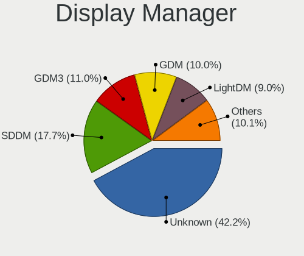

Linux - Tested Hardware & Statistics
------------------------------------

A project to collect tested hardware configurations for Linux.

Anyone can contribute to this report by the [hw-probe](https://github.com/linuxhw/hw-probe) tool:

    sudo -E hw-probe -all -upload

Please contribute! Especially if your hardware is rare.

This is a report for all computer types. See also reports for [desktops](/Desktop/README.md) and [notebooks](/Notebook/README.md).

Distribution-specific reports: [Alpine](/Dist/Alpine), [ALT_Linux](/Dist/ALT_Linux), [antiX](/Dist/antiX), [Artix](/Dist/Artix), [Chrome_OS](/Dist/Chrome_OS), [Clear_Linux](/Dist/Clear_Linux), [Deepin](/Dist/Deepin), [Devuan](/Dist/Devuan), [EndeavourOS](/Dist/EndeavourOS), [Garuda_Linux](/Dist/Garuda_Linux), [GNOME_OS](/Dist/GNOME_OS), [Mageia](/Dist/Mageia), [Makulu](/Dist/Makulu), [NixOS](/Dist/NixOS), [Oracle_Linux](/Dist/Oracle_Linux), [Pardus](/Dist/Pardus), [PureOS](/Dist/PureOS), [Q4OS](/Dist/Q4OS), [Reborn_OS](/Dist/Reborn_OS), [Rocky_Linux](/Dist/Rocky_Linux), [Sparky](/Dist/Sparky), [Void_Linux](/Dist/Void_Linux), [Xero](/Dist/Xero).

This report is for real hardware. Report for virtual hardware: [TestCoverage_VE](https://github.com/linuxhw/TestCoverage_VE)

Contents
--------

* [ Test Cases ](#test-cases)

* [ System ](#system)
  - [ OS                       ](#os)
  - [ OS Family                ](#os-family)
  - [ Kernel                   ](#kernel)
  - [ Kernel Family            ](#kernel-family)
  - [ Kernel Major Ver.        ](#kernel-major-ver)
  - [ Arch                     ](#arch)
  - [ DE                       ](#de)
  - [ Display Server           ](#display-server)
  - [ Display Manager          ](#display-manager)
  - [ OS Lang                  ](#os-lang)
  - [ Boot Mode                ](#boot-mode)
  - [ Filesystem               ](#filesystem)
  - [ Part. scheme             ](#part-scheme)
  - [ Dual Boot with Linux/BSD ](#dual-boot-with-linuxbsd)
  - [ Dual Boot (Win)          ](#dual-boot-win)

* [ Board ](#board)
  - [ Vendor                   ](#vendor)
  - [ Model                    ](#model)
  - [ Model Family             ](#model-family)
  - [ MFG Year                 ](#mfg-year)
  - [ Form Factor              ](#form-factor)
  - [ Secure Boot              ](#secure-boot)
  - [ Coreboot                 ](#coreboot)
  - [ RAM Size                 ](#ram-size)
  - [ RAM Used                 ](#ram-used)
  - [ Total Drives             ](#total-drives)
  - [ Has CD-ROM               ](#has-cd-rom)
  - [ Has Ethernet             ](#has-ethernet)
  - [ Has WiFi                 ](#has-wifi)
  - [ Has Bluetooth            ](#has-bluetooth)

* [ Location ](#location)
  - [ Country                  ](#country)
  - [ City                     ](#city)

* [ Drives ](#drives)
  - [ Drive Vendor             ](#drive-vendor)
  - [ Drive Model              ](#drive-model)
  - [ HDD Vendor               ](#hdd-vendor)
  - [ SSD Vendor               ](#ssd-vendor)
  - [ Drive Kind               ](#drive-kind)
  - [ Drive Connector          ](#drive-connector)
  - [ Drive Size               ](#drive-size)
  - [ Space Total              ](#space-total)
  - [ Space Used               ](#space-used)
  - [ Malfunc. Drives          ](#malfunc-drives)
  - [ Malfunc. Drive Vendor    ](#malfunc-drive-vendor)
  - [ Malfunc. HDD Vendor      ](#malfunc-hdd-vendor)
  - [ Malfunc. Drive Kind      ](#malfunc-drive-kind)
  - [ Failed Drives            ](#failed-drives)
  - [ Failed Drive Vendor      ](#failed-drive-vendor)
  - [ Drive Status             ](#drive-status)

* [ Storage controller ](#storage-controller)
  - [ Storage Vendor           ](#storage-vendor)
  - [ Storage Model            ](#storage-model)
  - [ Storage Kind             ](#storage-kind)

* [ Processor ](#processor)
  - [ CPU Vendor               ](#cpu-vendor)
  - [ CPU Model                ](#cpu-model)
  - [ CPU Model Family         ](#cpu-model-family)
  - [ CPU Cores                ](#cpu-cores)
  - [ CPU Sockets              ](#cpu-sockets)
  - [ CPU Threads              ](#cpu-threads)
  - [ CPU Op-Modes             ](#cpu-op-modes)
  - [ CPU Microcode            ](#cpu-microcode)
  - [ CPU Microarch            ](#cpu-microarch)

* [ Graphics ](#graphics)
  - [ GPU Vendor               ](#gpu-vendor)
  - [ GPU Model                ](#gpu-model)
  - [ GPU Combo                ](#gpu-combo)
  - [ GPU Driver               ](#gpu-driver)
  - [ GPU Memory               ](#gpu-memory)

* [ Monitor ](#monitor)
  - [ Monitor Vendor           ](#monitor-vendor)
  - [ Monitor Model            ](#monitor-model)
  - [ Monitor Resolution       ](#monitor-resolution)
  - [ Monitor Diagonal         ](#monitor-diagonal)
  - [ Monitor Width            ](#monitor-width)
  - [ Aspect Ratio             ](#aspect-ratio)
  - [ Monitor Area             ](#monitor-area)
  - [ Pixel Density            ](#pixel-density)
  - [ Multiple Monitors        ](#multiple-monitors)

* [ Network ](#network)
  - [ Net Controller Vendor    ](#net-controller-vendor)
  - [ Net Controller Model     ](#net-controller-model)
  - [ Wireless Vendor          ](#wireless-vendor)
  - [ Wireless Model           ](#wireless-model)
  - [ Ethernet Vendor          ](#ethernet-vendor)
  - [ Ethernet Model           ](#ethernet-model)
  - [ Net Controller Kind      ](#net-controller-kind)
  - [ Used Controller          ](#used-controller)
  - [ NICs                     ](#nics)
  - [ IPv6                     ](#ipv6)

* [ Bluetooth ](#bluetooth)
  - [ Bluetooth Vendor         ](#bluetooth-vendor)
  - [ Bluetooth Model          ](#bluetooth-model)

* [ Sound ](#sound)
  - [ Sound Vendor             ](#sound-vendor)
  - [ Sound Model              ](#sound-model)

* [ Memory ](#memory)
  - [ Memory Vendor            ](#memory-vendor)
  - [ Memory Model             ](#memory-model)
  - [ Memory Kind              ](#memory-kind)
  - [ Memory Form Factor       ](#memory-form-factor)
  - [ Memory Size              ](#memory-size)
  - [ Memory Speed             ](#memory-speed)

* [ Printers & scanners ](#printers--scanners)
  - [ Printer Vendor           ](#printer-vendor)
  - [ Printer Model            ](#printer-model)
  - [ Scanner Vendor           ](#scanner-vendor)
  - [ Scanner Model            ](#scanner-model)

* [ Camera ](#camera)
  - [ Camera Vendor            ](#camera-vendor)
  - [ Camera Model             ](#camera-model)

* [ Security ](#security)
  - [ Fingerprint Vendor       ](#fingerprint-vendor)
  - [ Fingerprint Model        ](#fingerprint-model)
  - [ Chipcard Vendor          ](#chipcard-vendor)
  - [ Chipcard Model           ](#chipcard-model)

* [ Unsupported ](#unsupported)
  - [ Unsupported Devices      ](#unsupported-devices)
  - [ Unsupported Device Types ](#unsupported-device-types)

Test Cases
----------

Total: 250589

| Vendor        | Model                       | Form-Factor | Probe                                                      | Date         |
|---------------|-----------------------------|-------------|------------------------------------------------------------|--------------|
| ASUSTek       | P8H61-M LX3 R2.0            | Desktop     | [8538f5cbeb](https://linux-hardware.org/?probe=8538f5cbeb) | May 01, 2022 |
| ASUSTek       | X202E                       | Notebook    | [37ad2923f5](https://linux-hardware.org/?probe=37ad2923f5) | May 01, 2022 |
| Lenovo        | ThinkPad Yoga 11e 20DAS0... | Notebook    | [55402e38ae](https://linux-hardware.org/?probe=55402e38ae) | May 01, 2022 |
| ASUSTek       | PRIME B550M-A               | Desktop     | [379c6be15c](https://linux-hardware.org/?probe=379c6be15c) | May 01, 2022 |
| Gigabyte      | GA-78LMT-S2P                | Desktop     | [b8194d3077](https://linux-hardware.org/?probe=b8194d3077) | May 01, 2022 |
| Dell          | Inspiron 7577               | Notebook    | [9bde827e06](https://linux-hardware.org/?probe=9bde827e06) | May 01, 2022 |
| HP            | ProBook 640 G8 Notebook ... | Notebook    | [dc1b877e42](https://linux-hardware.org/?probe=dc1b877e42) | May 01, 2022 |
| ASUSTek       | PRIME B550M-A               | Desktop     | [620c550b04](https://linux-hardware.org/?probe=620c550b04) | May 01, 2022 |
| ASUSTek       | PU551LA                     | Notebook    | [19e1b6041b](https://linux-hardware.org/?probe=19e1b6041b) | May 01, 2022 |
| Dell          | 0M017G A01                  | Desktop     | [653212f53c](https://linux-hardware.org/?probe=653212f53c) | May 01, 2022 |
| HUAWEI        | KLVL-WXX9                   | Notebook    | [b152a1215a](https://linux-hardware.org/?probe=b152a1215a) | Apr 30, 2022 |
| ASUSTek       | Strix 17 GL703GE            | Notebook    | [fabd2d1e45](https://linux-hardware.org/?probe=fabd2d1e45) | Apr 30, 2022 |
| Pegatron      | 2AB5                        | Desktop     | [534476ac99](https://linux-hardware.org/?probe=534476ac99) | Apr 30, 2022 |
| HP            | ProBook 455 G7              | Notebook    | [88fcea9210](https://linux-hardware.org/?probe=88fcea9210) | Apr 30, 2022 |
| HP            | 0B48h                       | Desktop     | [4c6e5824f2](https://linux-hardware.org/?probe=4c6e5824f2) | Apr 30, 2022 |
| ASUSTek       | Strix 17 GL703GE            | Notebook    | [0e0d0dd3aa](https://linux-hardware.org/?probe=0e0d0dd3aa) | Apr 30, 2022 |
| HP            | EliteBook 8440p             | Notebook    | [5a3254d19c](https://linux-hardware.org/?probe=5a3254d19c) | Apr 30, 2022 |
| Dell          | Inspiron 15-3567            | Notebook    | [589f58c857](https://linux-hardware.org/?probe=589f58c857) | Apr 30, 2022 |
| Gigabyte      | B365M DS3H                  | Desktop     | [247ab2d4f1](https://linux-hardware.org/?probe=247ab2d4f1) | Apr 30, 2022 |
| Fujitsu Si... | AMILO A1650G                | Notebook    | [fbf6d9db93](https://linux-hardware.org/?probe=fbf6d9db93) | Apr 30, 2022 |
| Lenovo        | ThinkPad T420 4177QKU       | Notebook    | [215758ad8a](https://linux-hardware.org/?probe=215758ad8a) | Apr 30, 2022 |
| Fujitsu Si... | AMILO A1650G                | Notebook    | [134f0a947b](https://linux-hardware.org/?probe=134f0a947b) | Apr 30, 2022 |
| Gigabyte      | B550 AORUS ELITE AX V2      | Desktop     | [cb6d49fe71](https://linux-hardware.org/?probe=cb6d49fe71) | Apr 30, 2022 |
| ASUSTek       | G75VX                       | Notebook    | [fb58cab830](https://linux-hardware.org/?probe=fb58cab830) | Apr 30, 2022 |
| Dell          | Inspiron 7577               | Notebook    | [132a55cc40](https://linux-hardware.org/?probe=132a55cc40) | Apr 30, 2022 |
| Dell          | Precision M2800             | Notebook    | [deffc81ac5](https://linux-hardware.org/?probe=deffc81ac5) | Apr 30, 2022 |
| Dell          | Inspiron 3793               | Notebook    | [9d2383d1f8](https://linux-hardware.org/?probe=9d2383d1f8) | Apr 30, 2022 |
| ASUSTek       | TUF Gaming B550-PLUS        | Desktop     | [57241594ad](https://linux-hardware.org/?probe=57241594ad) | Apr 30, 2022 |
| Dell          | Vostro 3400                 | Notebook    | [da9df39f8c](https://linux-hardware.org/?probe=da9df39f8c) | Apr 30, 2022 |
| HP            | EliteBook 8440p             | Notebook    | [3782e39a43](https://linux-hardware.org/?probe=3782e39a43) | Apr 30, 2022 |
| ASUSTek       | TUF Gaming Z690-PLUS WIF... | Desktop     | [b4d4e52220](https://linux-hardware.org/?probe=b4d4e52220) | Apr 30, 2022 |
| Positivo      | POS-ECIG41BSA               | Desktop     | [b622f7f43f](https://linux-hardware.org/?probe=b622f7f43f) | Apr 30, 2022 |
| ASUSTek       | ROG Maximus X HERO          | Desktop     | [18daf9705b](https://linux-hardware.org/?probe=18daf9705b) | Apr 30, 2022 |
| Sony          | SVE1513R1EB                 | Notebook    | [59a46c5857](https://linux-hardware.org/?probe=59a46c5857) | Apr 30, 2022 |
| Lenovo        | IdeaPad 3 14ALC6 82KT       | Notebook    | [633bddd44b](https://linux-hardware.org/?probe=633bddd44b) | Apr 30, 2022 |
| Acer          | V5-171                      | Notebook    | [a07ba20ff0](https://linux-hardware.org/?probe=a07ba20ff0) | Apr 30, 2022 |
| Lenovo        | ThinkPad E15 Gen 3 20YG0... | Notebook    | [6710b89c52](https://linux-hardware.org/?probe=6710b89c52) | Apr 30, 2022 |
| Dell          | Vostro 3400                 | Notebook    | [de3670cdd7](https://linux-hardware.org/?probe=de3670cdd7) | Apr 30, 2022 |
| ASUSTek       | PRIME B350M-A               | Desktop     | [87542ba2c2](https://linux-hardware.org/?probe=87542ba2c2) | Apr 30, 2022 |
| Medion        | MS-7616                     | Desktop     | [f3572ea9a5](https://linux-hardware.org/?probe=f3572ea9a5) | Apr 30, 2022 |
| HP            | 650                         | Notebook    | [1332a3196c](https://linux-hardware.org/?probe=1332a3196c) | Apr 30, 2022 |
| Dell          | Vostro 3400                 | Notebook    | [29400ed868](https://linux-hardware.org/?probe=29400ed868) | Apr 30, 2022 |
| Lenovo        | G700 20251                  | Notebook    | [94272db5ec](https://linux-hardware.org/?probe=94272db5ec) | Apr 30, 2022 |
| Alienware     | x17 R2                      | Notebook    | [d78db966bc](https://linux-hardware.org/?probe=d78db966bc) | Apr 30, 2022 |
| LattePanda    | Alpha                       | Desktop     | [4e0dc573e1](https://linux-hardware.org/?probe=4e0dc573e1) | Apr 30, 2022 |
| MSI           | A320M-A PRO MAX             | Desktop     | [dc1c0d091e](https://linux-hardware.org/?probe=dc1c0d091e) | Apr 30, 2022 |
| Lenovo        | Legion 5 15ACH6H 82JU       | Notebook    | [5838cd4268](https://linux-hardware.org/?probe=5838cd4268) | Apr 30, 2022 |
| Lenovo        | IdeaPad 5 15ARE05 81YQ      | Notebook    | [95ec2ff7d2](https://linux-hardware.org/?probe=95ec2ff7d2) | Apr 30, 2022 |
| Lenovo        | ThinkPad X1 Tablet Gen 3... | Tablet      | [76ee3be416](https://linux-hardware.org/?probe=76ee3be416) | Apr 30, 2022 |
| MSI           | B550-A PRO                  | Desktop     | [d2903d25c5](https://linux-hardware.org/?probe=d2903d25c5) | Apr 30, 2022 |
| Dell          | Vostro 1720                 | Notebook    | [bc8f50b9fb](https://linux-hardware.org/?probe=bc8f50b9fb) | Apr 30, 2022 |
| HP            | Presario C500 (GF581UA#A... | Notebook    | [0e01914db4](https://linux-hardware.org/?probe=0e01914db4) | Apr 30, 2022 |
| Dell          | Vostro 3400                 | Notebook    | [72ea7f5155](https://linux-hardware.org/?probe=72ea7f5155) | Apr 30, 2022 |
| Dell          | Vostro 1720                 | Notebook    | [56cc7a9a54](https://linux-hardware.org/?probe=56cc7a9a54) | Apr 30, 2022 |
| Lenovo        | MAHOBAY                     | Desktop     | [5a54ce639c](https://linux-hardware.org/?probe=5a54ce639c) | Apr 30, 2022 |
| Gigabyte      | F2A68HM-S1                  | Desktop     | [23a77acbe8](https://linux-hardware.org/?probe=23a77acbe8) | Apr 30, 2022 |
| Lenovo        | ThinkPad 10 2nd 20E30035... | Tablet      | [f51fab0e09](https://linux-hardware.org/?probe=f51fab0e09) | Apr 30, 2022 |
| Gigabyte      | H61M-S2PV                   | Desktop     | [6b213d6f7e](https://linux-hardware.org/?probe=6b213d6f7e) | Apr 30, 2022 |
| ASUSTek       | Z8NA-D6                     | Desktop     | [5f540a16c9](https://linux-hardware.org/?probe=5f540a16c9) | Apr 30, 2022 |
| HP            | ProBook 440 G8 Notebook ... | Notebook    | [a4adaba544](https://linux-hardware.org/?probe=a4adaba544) | Apr 30, 2022 |
| Gigabyte      | H61M-DS2 x.x                | Desktop     | [463e99eb8c](https://linux-hardware.org/?probe=463e99eb8c) | Apr 30, 2022 |
| Lenovo        | 81VS                        | Notebook    | [1ff46f7cdc](https://linux-hardware.org/?probe=1ff46f7cdc) | Apr 30, 2022 |
| Dell          | G3 3500                     | Notebook    | [df72f36c52](https://linux-hardware.org/?probe=df72f36c52) | Apr 30, 2022 |
| Lenovo        | 81VS                        | Notebook    | [ea23b0e852](https://linux-hardware.org/?probe=ea23b0e852) | Apr 30, 2022 |
| Lenovo        | ThinkPad T61 7659A39        | Notebook    | [e5c32846e2](https://linux-hardware.org/?probe=e5c32846e2) | Apr 30, 2022 |
| Fujitsu Si... | D2660-A1 S26361-D2660-A1    | Desktop     | [bb192229b3](https://linux-hardware.org/?probe=bb192229b3) | Apr 30, 2022 |
| MSI           | X570-A PRO                  | Desktop     | [ff568c874c](https://linux-hardware.org/?probe=ff568c874c) | Apr 30, 2022 |
| Gigabyte      | B365M DS3H                  | Desktop     | [0a00cf3e33](https://linux-hardware.org/?probe=0a00cf3e33) | Apr 30, 2022 |
| Gigabyte      | B365M DS3H                  | Desktop     | [f140b54261](https://linux-hardware.org/?probe=f140b54261) | Apr 30, 2022 |
| MSI           | PRO H610M-G DDR4            | Desktop     | [f7806fa6f0](https://linux-hardware.org/?probe=f7806fa6f0) | Apr 30, 2022 |
| ASUSTek       | PRIME B550M-K               | Desktop     | [92c09fc927](https://linux-hardware.org/?probe=92c09fc927) | Apr 30, 2022 |
| HP            | 0AECh D                     | Desktop     | [89441b750f](https://linux-hardware.org/?probe=89441b750f) | Apr 30, 2022 |
| ASRock        | B560 Pro4                   | Desktop     | [a788b08450](https://linux-hardware.org/?probe=a788b08450) | Apr 30, 2022 |
| MSI           | B450M GAMING PLUS           | Desktop     | [0929d58de7](https://linux-hardware.org/?probe=0929d58de7) | Apr 30, 2022 |
| Fujitsu Si... | D2660-A1 S26361-D2660-A1    | Desktop     | [a5ce52429c](https://linux-hardware.org/?probe=a5ce52429c) | Apr 30, 2022 |
| Gigabyte      | A320M-S2H-CF                | Desktop     | [9e846e3cb1](https://linux-hardware.org/?probe=9e846e3cb1) | Apr 30, 2022 |
| HP            | Pavilion Laptop 14-ec0xx... | Notebook    | [3a7cd290f6](https://linux-hardware.org/?probe=3a7cd290f6) | Apr 30, 2022 |
| Lenovo        | G510 20238                  | Notebook    | [07e8a61019](https://linux-hardware.org/?probe=07e8a61019) | Apr 30, 2022 |
| Dell          | Latitude 3330               | Notebook    | [1843c62895](https://linux-hardware.org/?probe=1843c62895) | Apr 30, 2022 |
| Dell          | System XPS L502X            | Notebook    | [77e1846d8d](https://linux-hardware.org/?probe=77e1846d8d) | Apr 30, 2022 |
| ASUSTek       | TUF Gaming X570-PLUS        | Desktop     | [22008db28a](https://linux-hardware.org/?probe=22008db28a) | Apr 30, 2022 |
| IBM           | 00D4062                     | Server      | [d18004b017](https://linux-hardware.org/?probe=d18004b017) | Apr 30, 2022 |
| Dell          | XPS M1530                   | Notebook    | [0e58eb209d](https://linux-hardware.org/?probe=0e58eb209d) | Apr 30, 2022 |
| ASRock        | X470 Gaming-ITX/ac          | Desktop     | [2b03a9568d](https://linux-hardware.org/?probe=2b03a9568d) | Apr 30, 2022 |
| Lenovo        | IdeaPad Flex-14API 81SS     | Notebook    | [f5d70fb9d3](https://linux-hardware.org/?probe=f5d70fb9d3) | Apr 30, 2022 |
| ASUSTek       | X756UQ                      | Notebook    | [c876e88eea](https://linux-hardware.org/?probe=c876e88eea) | Apr 30, 2022 |
| Dell          | XPS M1530                   | Notebook    | [757d1b099e](https://linux-hardware.org/?probe=757d1b099e) | Apr 30, 2022 |
| ASUSTek       | TUF Gaming FX705GM_FX705... | Notebook    | [3589ada8b3](https://linux-hardware.org/?probe=3589ada8b3) | Apr 30, 2022 |
| MSI           | B560M-A PRO                 | Desktop     | [21dbd84bbc](https://linux-hardware.org/?probe=21dbd84bbc) | Apr 30, 2022 |
| ASRock        | B550 Extreme4               | Desktop     | [7a90a198f5](https://linux-hardware.org/?probe=7a90a198f5) | Apr 30, 2022 |
| ASUSTek       | UX31A                       | Notebook    | [59228e735e](https://linux-hardware.org/?probe=59228e735e) | Apr 30, 2022 |
| Dell          | Precision M6500             | Notebook    | [a3d82a4f1a](https://linux-hardware.org/?probe=a3d82a4f1a) | Apr 30, 2022 |
| Gigabyte      | B550 AORUS ELITE AX V2      | Desktop     | [83e47f9c91](https://linux-hardware.org/?probe=83e47f9c91) | Apr 30, 2022 |
| Dell          | Precision M6500             | Notebook    | [cb7e68eb50](https://linux-hardware.org/?probe=cb7e68eb50) | Apr 30, 2022 |
| ASUSTek       | P8H61-M                     | Desktop     | [942f86f88a](https://linux-hardware.org/?probe=942f86f88a) | Apr 30, 2022 |
| Lenovo        | ThinkPad X270 W10DG 20K5... | Notebook    | [e14a2c047d](https://linux-hardware.org/?probe=e14a2c047d) | Apr 30, 2022 |
| ASUSTek       | Pro WS WRX80E-SAGE SE WI... | Desktop     | [10975a661b](https://linux-hardware.org/?probe=10975a661b) | Apr 30, 2022 |
| Google        | Lick                        | Notebook    | [33d1e6209a](https://linux-hardware.org/?probe=33d1e6209a) | Apr 30, 2022 |
| Itautec       | Infoway w7535               | Notebook    | [ac87d9e508](https://linux-hardware.org/?probe=ac87d9e508) | Apr 30, 2022 |
| Apple         | Mac-F42C88C8 Proto1         | Desktop     | [3edd5f05f7](https://linux-hardware.org/?probe=3edd5f05f7) | Apr 30, 2022 |
| Dell          | 0TY915                      | Desktop     | [ef4cf49069](https://linux-hardware.org/?probe=ef4cf49069) | Apr 30, 2022 |
| ASUSTek       | X756UQ                      | Notebook    | [2543d87831](https://linux-hardware.org/?probe=2543d87831) | Apr 30, 2022 |
| Lenovo        | ThinkPad Yoga 11e 20DAS0... | Notebook    | [df7b5507c1](https://linux-hardware.org/?probe=df7b5507c1) | Apr 30, 2022 |
| Gigabyte      | A320M-S2H-CF                | Desktop     | [2f94f4673a](https://linux-hardware.org/?probe=2f94f4673a) | Apr 30, 2022 |
| HP            | G42                         | Notebook    | [e23740df6e](https://linux-hardware.org/?probe=e23740df6e) | Apr 30, 2022 |
| HUAWEI        | HVY-WXX9                    | Notebook    | [d7913302d5](https://linux-hardware.org/?probe=d7913302d5) | Apr 30, 2022 |
| ASUSTek       | PRIME Z390-A                | Desktop     | [c4d7dc5e80](https://linux-hardware.org/?probe=c4d7dc5e80) | Apr 30, 2022 |
| MSI           | MPG Z490 GAMING PLUS        | Desktop     | [8d3881574d](https://linux-hardware.org/?probe=8d3881574d) | Apr 30, 2022 |
| Dell          | Vostro 5581                 | Notebook    | [cdcb310766](https://linux-hardware.org/?probe=cdcb310766) | Apr 30, 2022 |
| Lenovo        | Z50-70 20354                | Notebook    | [f253fe8221](https://linux-hardware.org/?probe=f253fe8221) | Apr 30, 2022 |
| Dell          | G7 7700                     | Notebook    | [462862ed56](https://linux-hardware.org/?probe=462862ed56) | Apr 30, 2022 |
| Dell          | Inspiron N4050              | Notebook    | [6d8f615203](https://linux-hardware.org/?probe=6d8f615203) | Apr 30, 2022 |
| HP            | G42                         | Notebook    | [f6ca4559f5](https://linux-hardware.org/?probe=f6ca4559f5) | Apr 30, 2022 |
| Lenovo        | IdeaPad Z510 20287          | Notebook    | [058184d73c](https://linux-hardware.org/?probe=058184d73c) | Apr 30, 2022 |
| HP            | 1791                        | Desktop     | [877270ede6](https://linux-hardware.org/?probe=877270ede6) | Apr 30, 2022 |
| Dell          | Precision 7520              | Notebook    | [2dc98a1a8d](https://linux-hardware.org/?probe=2dc98a1a8d) | Apr 30, 2022 |
| Lenovo        | ThinkBook 15 G2 ITL 20VE    | Notebook    | [31b081b116](https://linux-hardware.org/?probe=31b081b116) | Apr 30, 2022 |
| ASRock        | X99 Extreme4                | Desktop     | [d45e1e88db](https://linux-hardware.org/?probe=d45e1e88db) | Apr 30, 2022 |
| ASRock        | X99 Extreme4                | Desktop     | [41cec63ac6](https://linux-hardware.org/?probe=41cec63ac6) | Apr 30, 2022 |
| Toshiba       | Dakar10FW8                  | Notebook    | [fbe2aaac31](https://linux-hardware.org/?probe=fbe2aaac31) | Apr 30, 2022 |
| ASRock        | 880GM-LE FX                 | Desktop     | [f695420d7e](https://linux-hardware.org/?probe=f695420d7e) | Apr 30, 2022 |
| Dell          | G5 5590                     | Notebook    | [4738729947](https://linux-hardware.org/?probe=4738729947) | Apr 30, 2022 |
| Toshiba       | Satellite C55-A-1J8         | Notebook    | [26cd3478c5](https://linux-hardware.org/?probe=26cd3478c5) | Apr 30, 2022 |
| Acer          | Aspire ES1-512              | Notebook    | [642d72d06d](https://linux-hardware.org/?probe=642d72d06d) | Apr 30, 2022 |
| SLIMBOOK      | PROX15-AMD                  | Notebook    | [c934f2e590](https://linux-hardware.org/?probe=c934f2e590) | Apr 30, 2022 |
| Lenovo        | ThinkBook 14 G2 ARE 20VF    | Notebook    | [b6cbc6e523](https://linux-hardware.org/?probe=b6cbc6e523) | Apr 30, 2022 |
| ASUSTek       | Lancaster8                  | Desktop     | [912f9bb3f9](https://linux-hardware.org/?probe=912f9bb3f9) | Apr 30, 2022 |
| Lenovo        | ThinkPad L15 Gen 2 20X4S... | Notebook    | [48d3759522](https://linux-hardware.org/?probe=48d3759522) | Apr 30, 2022 |
| Lenovo        | ThinkPad T540p 20BFS26E0... | Notebook    | [06738e7bb8](https://linux-hardware.org/?probe=06738e7bb8) | Apr 30, 2022 |
| MSI           | GP65 Leopard 10SFK          | Notebook    | [4523d433d4](https://linux-hardware.org/?probe=4523d433d4) | Apr 30, 2022 |
| Lenovo        | ThinkPad P15v Gen 1 20TQ... | Notebook    | [ac5b1123ad](https://linux-hardware.org/?probe=ac5b1123ad) | Apr 30, 2022 |
| Gigabyte      | H97-Gaming 3                | Desktop     | [150f5a4bd0](https://linux-hardware.org/?probe=150f5a4bd0) | Apr 30, 2022 |
| MSI           | GP65 Leopard 10SFK          | Notebook    | [a30f4b3e9f](https://linux-hardware.org/?probe=a30f4b3e9f) | Apr 30, 2022 |
| ASUSTek       | PRIME Z490-P                | Desktop     | [b6658c2ada](https://linux-hardware.org/?probe=b6658c2ada) | Apr 30, 2022 |
| NSX           | SB1402                      | Notebook    | [c9d79a4fe5](https://linux-hardware.org/?probe=c9d79a4fe5) | Apr 30, 2022 |
| Lenovo        | G50-30 80G0                 | Notebook    | [bc333fe437](https://linux-hardware.org/?probe=bc333fe437) | Apr 30, 2022 |
| Acer          | Aspire E5-774G              | Notebook    | [32426089be](https://linux-hardware.org/?probe=32426089be) | Apr 30, 2022 |
| HP            | Stream Notebook PC 13       | Notebook    | [f4eb2d351c](https://linux-hardware.org/?probe=f4eb2d351c) | Apr 30, 2022 |
| HUAWEI        | BOM-WXX9                    | Notebook    | [faa7213f5c](https://linux-hardware.org/?probe=faa7213f5c) | Apr 30, 2022 |
| Acer          | Aspire E5-774G              | Notebook    | [0fce8f01ae](https://linux-hardware.org/?probe=0fce8f01ae) | Apr 30, 2022 |
| HP            | Pavilion dv7                | Notebook    | [f66df9ca5b](https://linux-hardware.org/?probe=f66df9ca5b) | Apr 30, 2022 |
| ASUSTek       | M5A78L LE                   | Desktop     | [9328531b5a](https://linux-hardware.org/?probe=9328531b5a) | Apr 30, 2022 |
| HP            | 1494                        | Desktop     | [939f3b7987](https://linux-hardware.org/?probe=939f3b7987) | Apr 30, 2022 |
| Lenovo        | ThinkPad S3 Yoga 14 20DM... | Notebook    | [5d0f1a15e1](https://linux-hardware.org/?probe=5d0f1a15e1) | Apr 30, 2022 |
| Dell          | G3 3500                     | Notebook    | [c9ee387b32](https://linux-hardware.org/?probe=c9ee387b32) | Apr 30, 2022 |
| Apple         | MacBookAir5,1               | Notebook    | [45c12c8fc4](https://linux-hardware.org/?probe=45c12c8fc4) | Apr 30, 2022 |
| Acer          | Aspire A517-51G             | Notebook    | [a7e637b1af](https://linux-hardware.org/?probe=a7e637b1af) | Apr 30, 2022 |
| ASUSTek       | P5QL                        | Desktop     | [121da21f08](https://linux-hardware.org/?probe=121da21f08) | Apr 30, 2022 |
| HP            | Pavilion dv7                | Notebook    | [150931746e](https://linux-hardware.org/?probe=150931746e) | Apr 30, 2022 |
| ASUSTek       | X550VC                      | Notebook    | [16223d208e](https://linux-hardware.org/?probe=16223d208e) | Apr 30, 2022 |
| ASRock        | P67 Pro3                    | Desktop     | [8e26d23d06](https://linux-hardware.org/?probe=8e26d23d06) | Apr 30, 2022 |
| HP            | Laptop 15-dw3xxx            | Notebook    | [889f1cba36](https://linux-hardware.org/?probe=889f1cba36) | Apr 30, 2022 |
| MSI           | PS63 Modern 8M              | Notebook    | [06f3f7a100](https://linux-hardware.org/?probe=06f3f7a100) | Apr 30, 2022 |
| HP            | ProBook 440 G8 Notebook ... | Notebook    | [a7fe3cb0f6](https://linux-hardware.org/?probe=a7fe3cb0f6) | Apr 30, 2022 |
| Lenovo        | ThinkPad T530 2394CTO       | Notebook    | [73ee1262a6](https://linux-hardware.org/?probe=73ee1262a6) | Apr 30, 2022 |
| ASRock        | B550 Extreme4               | Desktop     | [75362e2061](https://linux-hardware.org/?probe=75362e2061) | Apr 30, 2022 |
| Gigabyte      | B550M DS3H                  | Desktop     | [f62d8963d7](https://linux-hardware.org/?probe=f62d8963d7) | Apr 30, 2022 |
| MSI           | B450 TOMAHAWK MAX II        | Desktop     | [6db8017245](https://linux-hardware.org/?probe=6db8017245) | Apr 30, 2022 |
| Positivo      | S14CT01                     | Notebook    | [7260e4f199](https://linux-hardware.org/?probe=7260e4f199) | Apr 30, 2022 |
| Lenovo        | G40-70 80GA                 | Notebook    | [fcd20cb250](https://linux-hardware.org/?probe=fcd20cb250) | Apr 30, 2022 |
| Gigabyte      | M68MT-S2                    | Desktop     | [f3b89e43d4](https://linux-hardware.org/?probe=f3b89e43d4) | Apr 30, 2022 |
| ASUSTek       | PRIME Z490-P                | Desktop     | [c6a75d1040](https://linux-hardware.org/?probe=c6a75d1040) | Apr 30, 2022 |
| Acer          | Aspire 4349                 | Notebook    | [f34555b3d6](https://linux-hardware.org/?probe=f34555b3d6) | Apr 30, 2022 |
| eMachines     | eME730                      | Notebook    | [ac985950eb](https://linux-hardware.org/?probe=ac985950eb) | Apr 30, 2022 |
| HP            | ProBook 4520s               | Notebook    | [60eab2c6c5](https://linux-hardware.org/?probe=60eab2c6c5) | Apr 30, 2022 |
| ASUSTek       | ROG STRIX B560-I GAMING ... | Desktop     | [e8fee79ec7](https://linux-hardware.org/?probe=e8fee79ec7) | Apr 30, 2022 |
| Positivo      | S14CT01                     | Notebook    | [dec0b170c2](https://linux-hardware.org/?probe=dec0b170c2) | Apr 30, 2022 |
| Dell          | Latitude 7390               | Notebook    | [bbf3908118](https://linux-hardware.org/?probe=bbf3908118) | Apr 30, 2022 |
| Acer          | Aspire A315-53              | Notebook    | [24faa6d3b2](https://linux-hardware.org/?probe=24faa6d3b2) | Apr 30, 2022 |
| Lenovo        | ThinkCentre M58 7627AD5     | Desktop     | [05a686b922](https://linux-hardware.org/?probe=05a686b922) | Apr 30, 2022 |
| ASUSTek       | UX303LAB                    | Notebook    | [4d47234d72](https://linux-hardware.org/?probe=4d47234d72) | Apr 30, 2022 |
| Lenovo        | Yoga Slim 7 14ARE05 82A2    | Notebook    | [a90e6b2be7](https://linux-hardware.org/?probe=a90e6b2be7) | Apr 30, 2022 |
| Acer          | Aspire E5-411G              | Notebook    | [0629e76746](https://linux-hardware.org/?probe=0629e76746) | Apr 30, 2022 |
| Apple         | MacBookPro8,1               | Notebook    | [8826e1d451](https://linux-hardware.org/?probe=8826e1d451) | Apr 30, 2022 |
| Intel         | DCP847SKE G80890-105        | Desktop     | [45dc47c8aa](https://linux-hardware.org/?probe=45dc47c8aa) | Apr 30, 2022 |
| HP            | Laptop 17-ca0xxx            | Notebook    | [10eb959775](https://linux-hardware.org/?probe=10eb959775) | Apr 30, 2022 |
| ASRock        | B75M-ITX                    | Desktop     | [dbc851e0d3](https://linux-hardware.org/?probe=dbc851e0d3) | Apr 30, 2022 |
| HP            | Pavilion Notebook           | Notebook    | [995ea9538b](https://linux-hardware.org/?probe=995ea9538b) | Apr 30, 2022 |
| Dell          | Latitude 5480               | Notebook    | [ba1ff8183e](https://linux-hardware.org/?probe=ba1ff8183e) | Apr 30, 2022 |
| ASUSTek       | CROSSHAIR VI HERO           | Desktop     | [5220d21e84](https://linux-hardware.org/?probe=5220d21e84) | Apr 30, 2022 |
| Dell          | Latitude 9420               | Notebook    | [4ba28afe84](https://linux-hardware.org/?probe=4ba28afe84) | Apr 30, 2022 |
| Gigabyte      | H310N x.x                   | Desktop     | [d0daa33c07](https://linux-hardware.org/?probe=d0daa33c07) | Apr 30, 2022 |
| HP            | ENVY dv7                    | Notebook    | [5793ce4fb8](https://linux-hardware.org/?probe=5793ce4fb8) | Apr 30, 2022 |
| HP            | ZBook 15 G5                 | Notebook    | [133b6e19a9](https://linux-hardware.org/?probe=133b6e19a9) | Apr 30, 2022 |
| Medion        | Cattle24 1M                 | Desktop     | [920d1b35ab](https://linux-hardware.org/?probe=920d1b35ab) | Apr 30, 2022 |
| Acer          | Aspire E5-571               | Notebook    | [35b5fa2276](https://linux-hardware.org/?probe=35b5fa2276) | Apr 30, 2022 |
| HP            | ZBook 15 G5                 | Notebook    | [ce42a9f877](https://linux-hardware.org/?probe=ce42a9f877) | Apr 30, 2022 |
| Timi          | TM1701                      | Notebook    | [f81bb7efbe](https://linux-hardware.org/?probe=f81bb7efbe) | Apr 30, 2022 |
| HP            | ENVY dv7                    | Notebook    | [7f4dd80400](https://linux-hardware.org/?probe=7f4dd80400) | Apr 30, 2022 |
| ASRock        | A300M-STX                   | Desktop     | [1c72c0839b](https://linux-hardware.org/?probe=1c72c0839b) | Apr 30, 2022 |
| Lenovo        | ThinkPad P1 Gen 2 20QUS1... | Notebook    | [2065a3c2f3](https://linux-hardware.org/?probe=2065a3c2f3) | Apr 30, 2022 |
| Toshiba       | Satellite L10W-B-101        | Notebook    | [8383d306f3](https://linux-hardware.org/?probe=8383d306f3) | Apr 30, 2022 |
| Acer          | Nitro AN517-51              | Notebook    | [81d7fd8d2e](https://linux-hardware.org/?probe=81d7fd8d2e) | Apr 30, 2022 |
| HP            | Spectre x360 Convertible    | Convertible | [90d6769c58](https://linux-hardware.org/?probe=90d6769c58) | Apr 30, 2022 |
| Raspberry ... | Raspberry Pi 4 Model B R... | Soc         | [18eb9a1e52](https://linux-hardware.org/?probe=18eb9a1e52) | Apr 30, 2022 |
| Pegatron      | Spring Peak                 | Notebook    | [66a1692171](https://linux-hardware.org/?probe=66a1692171) | Apr 30, 2022 |
| Intel         | V1.3                        | Desktop     | [a01993f2fa](https://linux-hardware.org/?probe=a01993f2fa) | Apr 30, 2022 |
| Lenovo        | ThinkPad Edge E530 62724... | Notebook    | [07334ae084](https://linux-hardware.org/?probe=07334ae084) | Apr 30, 2022 |
| HP            | EliteBook 840 G1            | Notebook    | [47c28082e8](https://linux-hardware.org/?probe=47c28082e8) | Apr 30, 2022 |
| Dell          | Precision 7540              | Notebook    | [8b1b7dd8da](https://linux-hardware.org/?probe=8b1b7dd8da) | Apr 30, 2022 |
| Lenovo        | ThinkBook 15 G2 ITL 20VE    | Notebook    | [1abef3591b](https://linux-hardware.org/?probe=1abef3591b) | Apr 30, 2022 |
| Gigabyte      | GA-970A-UD3                 | Desktop     | [0158bc69ec](https://linux-hardware.org/?probe=0158bc69ec) | Apr 30, 2022 |
| Dell          | 09KPNV A00                  | Desktop     | [6ae554c455](https://linux-hardware.org/?probe=6ae554c455) | Apr 30, 2022 |
| ASUSTek       | P5KPL-AM                    | Desktop     | [7c398e1d2b](https://linux-hardware.org/?probe=7c398e1d2b) | Apr 30, 2022 |
| Sony          | VPCEH2J1E                   | Notebook    | [86f6b8c750](https://linux-hardware.org/?probe=86f6b8c750) | Apr 30, 2022 |
| Gigabyte      | G1.Sniper A88X-CF           | Desktop     | [89323fb22d](https://linux-hardware.org/?probe=89323fb22d) | Apr 30, 2022 |
| HP            | ZBook 15 G6                 | Notebook    | [f948921cba](https://linux-hardware.org/?probe=f948921cba) | Apr 30, 2022 |
| Dell          | XPS 13 9343                 | Notebook    | [b48ccc106e](https://linux-hardware.org/?probe=b48ccc106e) | Apr 30, 2022 |
| ASUSTek       | ROG STRIX B550-F GAMING     | Desktop     | [f4a6777382](https://linux-hardware.org/?probe=f4a6777382) | Apr 30, 2022 |
| Lenovo        | 36C5 SDK0J40700 WIN 3258... | Desktop     | [d9ac32b17d](https://linux-hardware.org/?probe=d9ac32b17d) | Apr 30, 2022 |
| ASUSTek       | A55M-E                      | Desktop     | [eed78fb5ab](https://linux-hardware.org/?probe=eed78fb5ab) | Apr 30, 2022 |
| Toshiba       | IS 1413G                    | Notebook    | [8074a86bc7](https://linux-hardware.org/?probe=8074a86bc7) | Apr 30, 2022 |
| Intel         | NUC9VXQNB K47179-403        | Mini pc     | [c99c3cdac6](https://linux-hardware.org/?probe=c99c3cdac6) | Apr 30, 2022 |
| HP            | 1497                        | Desktop     | [559a844943](https://linux-hardware.org/?probe=559a844943) | Apr 30, 2022 |
| MSI           | MPG Z390 GAMING PRO CARB... | Desktop     | [07a115654d](https://linux-hardware.org/?probe=07a115654d) | Apr 30, 2022 |
| HP            | 3396                        | Desktop     | [468c2975ee](https://linux-hardware.org/?probe=468c2975ee) | Apr 30, 2022 |
| HP            | Spectre x360 Convertible... | Convertible | [b81ecfb2a3](https://linux-hardware.org/?probe=b81ecfb2a3) | Apr 30, 2022 |
| MSI           | H87I                        | Desktop     | [af4a26a5ea](https://linux-hardware.org/?probe=af4a26a5ea) | Apr 30, 2022 |
| ASRock        | Z68 Extreme4 Gen3           | Desktop     | [6afc1a0af8](https://linux-hardware.org/?probe=6afc1a0af8) | Apr 30, 2022 |
| Supermicro    | X9DRi-LN4+/X9DR3-LN4+       | Desktop     | [89def966af](https://linux-hardware.org/?probe=89def966af) | Apr 30, 2022 |
| ASUSTek       | H81M-K                      | Desktop     | [d5d92c2890](https://linux-hardware.org/?probe=d5d92c2890) | Apr 30, 2022 |
| MSI           | MPG X570 GAMING PLUS        | Desktop     | [af01f27647](https://linux-hardware.org/?probe=af01f27647) | Apr 30, 2022 |
| ASUSTek       | PRIME B350-PLUS             | Desktop     | [13fd8e249d](https://linux-hardware.org/?probe=13fd8e249d) | Apr 30, 2022 |
| HP            | ProBook 440 G7              | Notebook    | [6bba4f2274](https://linux-hardware.org/?probe=6bba4f2274) | Apr 30, 2022 |
| Google        | Fleex                       | Notebook    | [212ff0673f](https://linux-hardware.org/?probe=212ff0673f) | Apr 30, 2022 |
| Lenovo        | V330-15IKB 81AX             | Notebook    | [60a636868c](https://linux-hardware.org/?probe=60a636868c) | Apr 30, 2022 |
| Lenovo        | IdeaPad S145-15IWL 81MV     | Notebook    | [05db30a69b](https://linux-hardware.org/?probe=05db30a69b) | Apr 30, 2022 |
| Lenovo        | S10-3                       | Notebook    | [712c2dced9](https://linux-hardware.org/?probe=712c2dced9) | Apr 30, 2022 |
| Dell          | 0PV3YR A05                  | Server      | [627cbf0981](https://linux-hardware.org/?probe=627cbf0981) | Apr 30, 2022 |
| Acer          | Aspire E5-571               | Notebook    | [ebdc8b1380](https://linux-hardware.org/?probe=ebdc8b1380) | Apr 30, 2022 |
| ASUSTek       | T100HAN                     | Notebook    | [5ee200cfbe](https://linux-hardware.org/?probe=5ee200cfbe) | Apr 30, 2022 |
| Lenovo        | IdeaPad 5 14ITL05 82FE      | Notebook    | [51625474b7](https://linux-hardware.org/?probe=51625474b7) | Apr 30, 2022 |
| JINGSHA       | Unknown                     | Desktop     | [e1b9c4eab0](https://linux-hardware.org/?probe=e1b9c4eab0) | Apr 30, 2022 |
| Dell          | XPS 15 9510                 | Notebook    | [b92517268e](https://linux-hardware.org/?probe=b92517268e) | Apr 30, 2022 |
| Lenovo        | 3098 SDK0E50510 WIN 2625... | Desktop     | [3b9e57fc42](https://linux-hardware.org/?probe=3b9e57fc42) | Apr 30, 2022 |
| Acer          | Aspire A514-54              | Notebook    | [70efbbb6c7](https://linux-hardware.org/?probe=70efbbb6c7) | Apr 30, 2022 |
| Microsoft     | Surface Laptop Go           | Tablet      | [06b533396d](https://linux-hardware.org/?probe=06b533396d) | Apr 30, 2022 |
| HP            | Pavilion Gaming Laptop 1... | Notebook    | [67d1865b69](https://linux-hardware.org/?probe=67d1865b69) | Apr 30, 2022 |
| Huanan        | X99-BD4 V/OPCZAO            | Desktop     | [2f215a330a](https://linux-hardware.org/?probe=2f215a330a) | Apr 30, 2022 |
| MSI           | MAG B550M MORTAR            | Desktop     | [c994128afd](https://linux-hardware.org/?probe=c994128afd) | Apr 30, 2022 |
| HP            | Pavilion Gaming Laptop 1... | Notebook    | [57a8a5bfcd](https://linux-hardware.org/?probe=57a8a5bfcd) | Apr 30, 2022 |
| ASUSTek       | PRIME B450M-A               | Desktop     | [a53000596e](https://linux-hardware.org/?probe=a53000596e) | Apr 30, 2022 |
| ASRock        | FM2A88X Extreme6+           | Desktop     | [437484b928](https://linux-hardware.org/?probe=437484b928) | Apr 30, 2022 |
| ASUSTek       | X550LC                      | Notebook    | [be5992f617](https://linux-hardware.org/?probe=be5992f617) | Apr 30, 2022 |
| Dell          | 0K068D A00                  | Desktop     | [a73170db03](https://linux-hardware.org/?probe=a73170db03) | Apr 30, 2022 |
| Pegatron      | 2AC2                        | Desktop     | [a87f5d4c6e](https://linux-hardware.org/?probe=a87f5d4c6e) | Apr 30, 2022 |
| MSI           | B550-A PRO                  | Desktop     | [0b23621ed1](https://linux-hardware.org/?probe=0b23621ed1) | Apr 30, 2022 |
| Acer          | Aspire A315-23              | Notebook    | [865091bbc1](https://linux-hardware.org/?probe=865091bbc1) | Apr 30, 2022 |
| Philco        | 14I                         | Notebook    | [03bb0fdeef](https://linux-hardware.org/?probe=03bb0fdeef) | Apr 30, 2022 |
| Acer          | Aspire A315-23              | Notebook    | [5ee29c3982](https://linux-hardware.org/?probe=5ee29c3982) | Apr 30, 2022 |
| HP            | 18E7                        | Desktop     | [90a161bd80](https://linux-hardware.org/?probe=90a161bd80) | Apr 30, 2022 |
| HP            | Laptop 17-by3xxx            | Notebook    | [087399e252](https://linux-hardware.org/?probe=087399e252) | Apr 30, 2022 |
| Toshiba       | Satellite C660              | Notebook    | [f4403056c8](https://linux-hardware.org/?probe=f4403056c8) | Apr 30, 2022 |
| ASUSTek       | X553MA                      | Notebook    | [3d56136487](https://linux-hardware.org/?probe=3d56136487) | Apr 30, 2022 |
| Dell          | Latitude 5490               | Notebook    | [9445f416cb](https://linux-hardware.org/?probe=9445f416cb) | Apr 30, 2022 |
| Gigabyte      | 990FXA-UD3                  | Desktop     | [9b128bc47e](https://linux-hardware.org/?probe=9b128bc47e) | Apr 30, 2022 |
| ASUSTek       | X556UR                      | Notebook    | [3f920954f7](https://linux-hardware.org/?probe=3f920954f7) | Apr 30, 2022 |
| MSI           | A88XM-E45 V2                | Desktop     | [a50ad068b1](https://linux-hardware.org/?probe=a50ad068b1) | Apr 30, 2022 |
| Acer          | V5-171                      | Notebook    | [8500a1c376](https://linux-hardware.org/?probe=8500a1c376) | Apr 30, 2022 |
| HP            | Pavilion Sleekbook 15       | Notebook    | [0003f9342e](https://linux-hardware.org/?probe=0003f9342e) | Apr 30, 2022 |
| ASUSTek       | TUF Gaming X570-PLUS        | Desktop     | [a1199bffe2](https://linux-hardware.org/?probe=a1199bffe2) | Apr 30, 2022 |
| ASUSTek       | ROG STRIX B550-A GAMING     | Desktop     | [297dca51b9](https://linux-hardware.org/?probe=297dca51b9) | Apr 30, 2022 |
| ASUSTek       | P8Z68-V                     | Desktop     | [e6557824cb](https://linux-hardware.org/?probe=e6557824cb) | Apr 30, 2022 |
| Dell          | Inspiron 15-3565            | Notebook    | [a26578c0fc](https://linux-hardware.org/?probe=a26578c0fc) | Apr 30, 2022 |
| Gigabyte      | B560M DS3H V2               | Desktop     | [c2096251fc](https://linux-hardware.org/?probe=c2096251fc) | Apr 30, 2022 |
| ASUSTek       | ROG STRIX B450-F GAMING     | Desktop     | [da04f72dfc](https://linux-hardware.org/?probe=da04f72dfc) | Apr 30, 2022 |
| Lenovo        | SHARKBAY 0B98405 STD        | Desktop     | [4842f5aef2](https://linux-hardware.org/?probe=4842f5aef2) | Apr 30, 2022 |
| Gigabyte      | B550M DS3H                  | Desktop     | [7797c23169](https://linux-hardware.org/?probe=7797c23169) | Apr 30, 2022 |
| Valve         | Jupiter                     | Notebook    | [1c826aed5e](https://linux-hardware.org/?probe=1c826aed5e) | Apr 30, 2022 |
| Foxconn       | 2A92                        | Desktop     | [298326d530](https://linux-hardware.org/?probe=298326d530) | Apr 30, 2022 |
| ASRock        | Z370 Gaming K6              | Desktop     | [63d2d272b6](https://linux-hardware.org/?probe=63d2d272b6) | Apr 30, 2022 |
| HP            | Laptop 14-dq1xxx            | Notebook    | [7c9e2f4d8f](https://linux-hardware.org/?probe=7c9e2f4d8f) | Apr 30, 2022 |
| Foxconn       | 2A92                        | Desktop     | [a710d4a58f](https://linux-hardware.org/?probe=a710d4a58f) | Apr 30, 2022 |
| MSI           | MAG B460M MORTAR            | Desktop     | [07cb268e5e](https://linux-hardware.org/?probe=07cb268e5e) | Apr 30, 2022 |
| Lenovo        | ThinkPad L15 Gen 1 20U4S... | Notebook    | [55e76f131d](https://linux-hardware.org/?probe=55e76f131d) | Apr 30, 2022 |
| Gigabyte      | H610I DDR4                  | Desktop     | [b9ee954651](https://linux-hardware.org/?probe=b9ee954651) | Apr 30, 2022 |
| EVGA          | X58 SLI Classified Tyler... | Desktop     | [07254f2dbb](https://linux-hardware.org/?probe=07254f2dbb) | Apr 30, 2022 |
| Acer          | TM4750                      | Notebook    | [b515682692](https://linux-hardware.org/?probe=b515682692) | Apr 30, 2022 |
| Gigabyte      | B85M-D3H                    | Desktop     | [aab74c31b9](https://linux-hardware.org/?probe=aab74c31b9) | Apr 30, 2022 |
| Dell          | XPS 15 9510                 | Notebook    | [52609c3695](https://linux-hardware.org/?probe=52609c3695) | Apr 29, 2022 |
| HP            | 255 G6 Notebook PC          | Notebook    | [f639c7c8f5](https://linux-hardware.org/?probe=f639c7c8f5) | Apr 29, 2022 |
| HP            | 0B54h D                     | Desktop     | [2023024a05](https://linux-hardware.org/?probe=2023024a05) | Apr 29, 2022 |
| Gigabyte      | H610I DDR4                  | Desktop     | [ead878ad96](https://linux-hardware.org/?probe=ead878ad96) | Apr 29, 2022 |
| Gigabyte      | GA-MA770-UD3                | Desktop     | [4924979f39](https://linux-hardware.org/?probe=4924979f39) | Apr 29, 2022 |
| HP            | Spectre x360 Convertible... | Convertible | [58dfeebbb5](https://linux-hardware.org/?probe=58dfeebbb5) | Apr 29, 2022 |
| HP            | ZBook 15 G5                 | Notebook    | [aac5097e2a](https://linux-hardware.org/?probe=aac5097e2a) | Apr 29, 2022 |
| Gigabyte      | B550 AORUS ELITE V2         | Desktop     | [7cd33daa8a](https://linux-hardware.org/?probe=7cd33daa8a) | Apr 29, 2022 |
| Gigabyte      | H170-HD3 DDR3-CF            | Desktop     | [b23594dfa0](https://linux-hardware.org/?probe=b23594dfa0) | Apr 29, 2022 |
| ASUSTek       | X71Vn                       | Notebook    | [b31a7dce8b](https://linux-hardware.org/?probe=b31a7dce8b) | Apr 29, 2022 |
| Gigabyte      | H170-HD3 DDR3-CF            | Desktop     | [d17a3858ad](https://linux-hardware.org/?probe=d17a3858ad) | Apr 29, 2022 |
| HP            | ENVY Laptop 15-ep0xxx       | Notebook    | [96dbfb494e](https://linux-hardware.org/?probe=96dbfb494e) | Apr 29, 2022 |
| HP            | Laptop 17-by4xxx            | Notebook    | [767590ac38](https://linux-hardware.org/?probe=767590ac38) | Apr 29, 2022 |
| ASUSTek       | ROG STRIX X570-E GAMING     | Desktop     | [970d30df6d](https://linux-hardware.org/?probe=970d30df6d) | Apr 29, 2022 |
| Dell          | Inspiron N5050              | Notebook    | [7d3cb853e6](https://linux-hardware.org/?probe=7d3cb853e6) | Apr 29, 2022 |
| Intel         | NUC8BEB J72693-305          | Mini pc     | [082e245a6c](https://linux-hardware.org/?probe=082e245a6c) | Apr 29, 2022 |
| ASUSTek       | TUF Gaming X570-PLUS        | Desktop     | [f157b373a1](https://linux-hardware.org/?probe=f157b373a1) | Apr 29, 2022 |
| Sony          | SVE1513R1EB                 | Notebook    | [d1e0096b2d](https://linux-hardware.org/?probe=d1e0096b2d) | Apr 29, 2022 |
| ASUSTek       | TUF Gaming X570-PLUS        | Desktop     | [f339d2405b](https://linux-hardware.org/?probe=f339d2405b) | Apr 29, 2022 |
| HP            | EliteBook 840 G1            | Notebook    | [53bceed0aa](https://linux-hardware.org/?probe=53bceed0aa) | Apr 29, 2022 |
| ASUSTek       | PRIME H510M-E               | Desktop     | [5c9e5fc14c](https://linux-hardware.org/?probe=5c9e5fc14c) | Apr 29, 2022 |
| Lenovo        | Legion 7 16ACHg6 82N6       | Notebook    | [bad5b7036e](https://linux-hardware.org/?probe=bad5b7036e) | Apr 29, 2022 |
| Dell          | Latitude 5520               | Notebook    | [d35917a603](https://linux-hardware.org/?probe=d35917a603) | Apr 29, 2022 |
| MSI           | A320M PRO-E                 | Desktop     | [655905bb3b](https://linux-hardware.org/?probe=655905bb3b) | Apr 29, 2022 |
| Dell          | Inspiron N4010              | Notebook    | [e1369b0428](https://linux-hardware.org/?probe=e1369b0428) | Apr 29, 2022 |
| Biostar       | J3060NH                     | Desktop     | [b058b65094](https://linux-hardware.org/?probe=b058b65094) | Apr 29, 2022 |
| Supermicro    | X9DRW-7TPF+                 | Server      | [6bd590bc17](https://linux-hardware.org/?probe=6bd590bc17) | Apr 29, 2022 |
| MSI           | H110M PRO-VH PLUS           | Desktop     | [876baf36d7](https://linux-hardware.org/?probe=876baf36d7) | Apr 29, 2022 |
| ASRock        | B450M Steel Legend          | Desktop     | [c40273d0bc](https://linux-hardware.org/?probe=c40273d0bc) | Apr 29, 2022 |
| Lenovo        | ThinkPad S3-S440 20AY00B... | Notebook    | [1ecbcb6b83](https://linux-hardware.org/?probe=1ecbcb6b83) | Apr 29, 2022 |
| Acer          | Aspire A315-42G             | Notebook    | [56fabb8cec](https://linux-hardware.org/?probe=56fabb8cec) | Apr 29, 2022 |
| Dell          | Latitude 5520               | Notebook    | [9851c7847d](https://linux-hardware.org/?probe=9851c7847d) | Apr 29, 2022 |
| ASUSTek       | S551LN                      | Notebook    | [a5f0e1cee7](https://linux-hardware.org/?probe=a5f0e1cee7) | Apr 29, 2022 |
| Dell          | Latitude E6330              | Notebook    | [c78066bc19](https://linux-hardware.org/?probe=c78066bc19) | Apr 29, 2022 |
| Dell          | Precision M6600             | Notebook    | [bb40a22dd3](https://linux-hardware.org/?probe=bb40a22dd3) | Apr 29, 2022 |
| HP            | EliteBook 8570w             | Notebook    | [e6f47edf47](https://linux-hardware.org/?probe=e6f47edf47) | Apr 29, 2022 |
| Avell High... | B.ON                        | Notebook    | [eb3d4d0f78](https://linux-hardware.org/?probe=eb3d4d0f78) | Apr 29, 2022 |
| Lenovo        | IdeaPad Y700-17ISK 80Q0     | Notebook    | [2c8a1c2444](https://linux-hardware.org/?probe=2c8a1c2444) | Apr 29, 2022 |
| ASUSTek       | ROG STRIX X470-F GAMING     | Desktop     | [809ea3e76a](https://linux-hardware.org/?probe=809ea3e76a) | Apr 29, 2022 |
| Acer          | Aspire A715-71G             | Notebook    | [ec6c90818c](https://linux-hardware.org/?probe=ec6c90818c) | Apr 29, 2022 |
| Gigabyte      | Z68AP-D3                    | Desktop     | [af8b52acd3](https://linux-hardware.org/?probe=af8b52acd3) | Apr 29, 2022 |
| ASRock        | ALiveNF6G-GLAN              | Desktop     | [7dfb4ca9f5](https://linux-hardware.org/?probe=7dfb4ca9f5) | Apr 29, 2022 |
| MSI           | B450 TOMAHAWK MAX           | Desktop     | [b443315241](https://linux-hardware.org/?probe=b443315241) | Apr 29, 2022 |
| Dell          | 0G261D A00                  | Desktop     | [860d883e5b](https://linux-hardware.org/?probe=860d883e5b) | Apr 29, 2022 |
| Fujitsu       | D3222-A1 S26361-D3222-A1    | Desktop     | [fe522bdf2e](https://linux-hardware.org/?probe=fe522bdf2e) | Apr 29, 2022 |
| Lenovo        | ThinkPad P14s Gen 2a 21A... | Notebook    | [9f5c24d3e8](https://linux-hardware.org/?probe=9f5c24d3e8) | Apr 29, 2022 |
| HP            | ENVY x360 Convertible 15... | Convertible | [62b044e6e7](https://linux-hardware.org/?probe=62b044e6e7) | Apr 29, 2022 |
| Lenovo        | ThinkPad S3-S440 20AY00B... | Notebook    | [474e572043](https://linux-hardware.org/?probe=474e572043) | Apr 29, 2022 |
| Toshiba       | Satellite C650              | Notebook    | [58539bbf0a](https://linux-hardware.org/?probe=58539bbf0a) | Apr 29, 2022 |
| Unknown       | Intel X79                   | Desktop     | [95d09d79ca](https://linux-hardware.org/?probe=95d09d79ca) | Apr 29, 2022 |
| Dell          | Precision 3551              | Notebook    | [b146dc2249](https://linux-hardware.org/?probe=b146dc2249) | Apr 29, 2022 |
| Google        | Bobba360                    | Notebook    | [e90fbcc91d](https://linux-hardware.org/?probe=e90fbcc91d) | Apr 29, 2022 |
| Toshiba       | Satellite P50-B-103         | Notebook    | [6df44e9098](https://linux-hardware.org/?probe=6df44e9098) | Apr 29, 2022 |
| MSI           | MPG B550 GAMING PLUS        | Desktop     | [af2b0de49b](https://linux-hardware.org/?probe=af2b0de49b) | Apr 29, 2022 |
| Lenovo        | MAHOBAY NOK                 | Desktop     | [ab21675303](https://linux-hardware.org/?probe=ab21675303) | Apr 29, 2022 |
| ASUSTek       | ROG Zephyrus G14 GA402RJ... | Notebook    | [96fc510369](https://linux-hardware.org/?probe=96fc510369) | Apr 29, 2022 |
| ASUSTek       | G55VW                       | Notebook    | [6bd8a1b04a](https://linux-hardware.org/?probe=6bd8a1b04a) | Apr 29, 2022 |
| Dell          | Precision 3551              | Notebook    | [d5a3a490f4](https://linux-hardware.org/?probe=d5a3a490f4) | Apr 29, 2022 |
| Lenovo        | Z50-75 80EC                 | Notebook    | [f301c52b41](https://linux-hardware.org/?probe=f301c52b41) | Apr 29, 2022 |
| ASUSTek       | UX31E                       | Notebook    | [8f165f54aa](https://linux-hardware.org/?probe=8f165f54aa) | Apr 29, 2022 |
| ASUSTek       | ZenBook UX450FDX_UX480FD    | Notebook    | [9f7923bcd2](https://linux-hardware.org/?probe=9f7923bcd2) | Apr 29, 2022 |
| Dell          | 0VNP2H A00                  | Desktop     | [bb480c7f9c](https://linux-hardware.org/?probe=bb480c7f9c) | Apr 29, 2022 |
| Lenovo        | IdeaPad 100-15IBD 80QQ      | Notebook    | [4af637024a](https://linux-hardware.org/?probe=4af637024a) | Apr 29, 2022 |
| Lenovo        | ThinkPad P14s Gen 2a 21A... | Notebook    | [da73d0b77d](https://linux-hardware.org/?probe=da73d0b77d) | Apr 29, 2022 |
| ASUSTek       | X541UAK                     | Notebook    | [7bac9962d9](https://linux-hardware.org/?probe=7bac9962d9) | Apr 29, 2022 |
| Lenovo        | ThinkPad T450 20BV001YMS    | Notebook    | [f38b762c83](https://linux-hardware.org/?probe=f38b762c83) | Apr 29, 2022 |
| HP            | EliteBook 8570w             | Notebook    | [7795fe989b](https://linux-hardware.org/?probe=7795fe989b) | Apr 29, 2022 |
| ASUSTek       | M5A97 LE R2.0               | Desktop     | [686f4acac4](https://linux-hardware.org/?probe=686f4acac4) | Apr 29, 2022 |
| TUXEDO        | Book BM15 Gen10             | Notebook    | [45b5b1bba9](https://linux-hardware.org/?probe=45b5b1bba9) | Apr 29, 2022 |
| Dell          | 0GY6Y8 A03                  | Desktop     | [b4946e7399](https://linux-hardware.org/?probe=b4946e7399) | Apr 29, 2022 |
| HP            | 83EE                        | Desktop     | [55171637ca](https://linux-hardware.org/?probe=55171637ca) | Apr 29, 2022 |
| HP            | Laptop 15-db1xxx            | Notebook    | [442670a18f](https://linux-hardware.org/?probe=442670a18f) | Apr 29, 2022 |
| Dell          | Inspiron 3542               | Notebook    | [19f5e16bce](https://linux-hardware.org/?probe=19f5e16bce) | Apr 29, 2022 |
| ASUSTek       | ROG STRIX X299-E GAMING ... | Desktop     | [bce425f138](https://linux-hardware.org/?probe=bce425f138) | Apr 29, 2022 |
| HP            | Laptop 15-da0xxx            | Notebook    | [6ad1b34a48](https://linux-hardware.org/?probe=6ad1b34a48) | Apr 29, 2022 |
| Dell          | XPS 13 7390                 | Notebook    | [aadc641825](https://linux-hardware.org/?probe=aadc641825) | Apr 29, 2022 |
| Supermicro    | X7DB8                       | Desktop     | [a2dd962374](https://linux-hardware.org/?probe=a2dd962374) | Apr 29, 2022 |
| Lenovo        | ThinkPad E14 Gen 4 21ECS... | Notebook    | [61bb949815](https://linux-hardware.org/?probe=61bb949815) | Apr 29, 2022 |
| Google        | Enguarde                    | Notebook    | [878203f099](https://linux-hardware.org/?probe=878203f099) | Apr 29, 2022 |
| Lenovo        | Yoga S740-14IIL 81RS        | Notebook    | [6affdcee0f](https://linux-hardware.org/?probe=6affdcee0f) | Apr 29, 2022 |
| ASUSTek       | Rampage IV EXTREME          | Desktop     | [111d072676](https://linux-hardware.org/?probe=111d072676) | Apr 29, 2022 |
| ASUSTek       | ROG STRIX Z370-E GAMING     | Desktop     | [fafda83c57](https://linux-hardware.org/?probe=fafda83c57) | Apr 29, 2022 |
| ASUSTek       | K52N                        | Notebook    | [29f3f98ad0](https://linux-hardware.org/?probe=29f3f98ad0) | Apr 29, 2022 |
| MSI           | Z390-A PRO                  | Desktop     | [e2f7ad0f81](https://linux-hardware.org/?probe=e2f7ad0f81) | Apr 29, 2022 |
| ASUSTek       | X553MA                      | Notebook    | [2c284d0f8c](https://linux-hardware.org/?probe=2c284d0f8c) | Apr 29, 2022 |
| Gigabyte      | P31-ES3G                    | Desktop     | [dc8419dcb3](https://linux-hardware.org/?probe=dc8419dcb3) | Apr 29, 2022 |
| Dell          | 07WP95 A02                  | Desktop     | [8dd4d42608](https://linux-hardware.org/?probe=8dd4d42608) | Apr 29, 2022 |
| Lenovo        | ThinkPad T420 4180A21       | Notebook    | [6b5a6e89a2](https://linux-hardware.org/?probe=6b5a6e89a2) | Apr 29, 2022 |
| HP            | Pavilion Gaming Laptop 1... | Notebook    | [f842336794](https://linux-hardware.org/?probe=f842336794) | Apr 29, 2022 |
| ASUSTek       | X411UN                      | Notebook    | [c864c65ec1](https://linux-hardware.org/?probe=c864c65ec1) | Apr 29, 2022 |
| Supermicro    | X11SSH-F                    | Desktop     | [0d475e91f3](https://linux-hardware.org/?probe=0d475e91f3) | Apr 29, 2022 |
| HARDKERNEL    | ODROID-H2                   | Desktop     | [c3303164ff](https://linux-hardware.org/?probe=c3303164ff) | Apr 29, 2022 |
| Gigabyte      | AB350-Gaming 3-CF           | Desktop     | [7b292b972d](https://linux-hardware.org/?probe=7b292b972d) | Apr 29, 2022 |
| Dell          | Inspiron N5110              | Notebook    | [fb1248d6be](https://linux-hardware.org/?probe=fb1248d6be) | Apr 29, 2022 |
| ASUSTek       | PRIME H610M-A D4            | Desktop     | [e9376d24f0](https://linux-hardware.org/?probe=e9376d24f0) | Apr 29, 2022 |
| Intel         | NUC8BEB J72693-305          | Mini pc     | [ea3b16fcfd](https://linux-hardware.org/?probe=ea3b16fcfd) | Apr 29, 2022 |
| MSI           | CR70 2M/CX70 2OC/CX70 2O... | Notebook    | [454226474b](https://linux-hardware.org/?probe=454226474b) | Apr 29, 2022 |
| MSI           | H110M PRO-VD                | Desktop     | [e750916955](https://linux-hardware.org/?probe=e750916955) | Apr 29, 2022 |
| Acer          | Aspire XC-830               | Desktop     | [257e472e1a](https://linux-hardware.org/?probe=257e472e1a) | Apr 29, 2022 |
| Foxconn       | H61MD/H61MD-V               | Desktop     | [25b52955ee](https://linux-hardware.org/?probe=25b52955ee) | Apr 29, 2022 |
| Acer          | Aspire A515-56              | Notebook    | [a10b79694f](https://linux-hardware.org/?probe=a10b79694f) | Apr 29, 2022 |
| ASUSTek       | P8Z77-V LX                  | Desktop     | [3b8440b69f](https://linux-hardware.org/?probe=3b8440b69f) | Apr 29, 2022 |
| Acer          | TravelMate 2490             | Notebook    | [8cc2cf84f4](https://linux-hardware.org/?probe=8cc2cf84f4) | Apr 29, 2022 |
| Lenovo        | Win8 Pro DPK TPG            | Desktop     | [9b78e9af72](https://linux-hardware.org/?probe=9b78e9af72) | Apr 29, 2022 |
| Intel         | NUC7JYB J67967-404          | Mini pc     | [3a7104d6b4](https://linux-hardware.org/?probe=3a7104d6b4) | Apr 29, 2022 |
| ASUSTek       | ROG STRIX B450-F GAMING     | Desktop     | [ffdfb3a578](https://linux-hardware.org/?probe=ffdfb3a578) | Apr 29, 2022 |
| HP            | 158A                        | Desktop     | [11b5037897](https://linux-hardware.org/?probe=11b5037897) | Apr 29, 2022 |
| HP            | ENVY x360 Convertible 13... | Convertible | [ad8bbf54e3](https://linux-hardware.org/?probe=ad8bbf54e3) | Apr 29, 2022 |
| Cisco Syst... | 0T38HV A02                  | Server      | [abc0c5402d](https://linux-hardware.org/?probe=abc0c5402d) | Apr 29, 2022 |
| Lenovo        | ThinkPad L560 20F1001YGE    | Notebook    | [c4021bd208](https://linux-hardware.org/?probe=c4021bd208) | Apr 29, 2022 |
| ASUSTek       | ROG STRIX B450-F GAMING     | Desktop     | [55c0ec3653](https://linux-hardware.org/?probe=55c0ec3653) | Apr 29, 2022 |
| Huanan        | X99-BD4 V/OPCZAO            | Desktop     | [a5743a1922](https://linux-hardware.org/?probe=a5743a1922) | Apr 29, 2022 |
| ASUSTek       | M4N68T                      | Desktop     | [8113a96dff](https://linux-hardware.org/?probe=8113a96dff) | Apr 29, 2022 |
| Fujitsu Si... | ESPRIMO Mobile V5535        | Notebook    | [5d02fb20c7](https://linux-hardware.org/?probe=5d02fb20c7) | Apr 29, 2022 |
| ASUSTek       | B150 PRO GAMING D3          | Desktop     | [e258d71e2e](https://linux-hardware.org/?probe=e258d71e2e) | Apr 29, 2022 |
| Dell          | Inspiron 14 7420 2-in-1     | Convertible | [71fee7e383](https://linux-hardware.org/?probe=71fee7e383) | Apr 29, 2022 |
| HP            | Pavilion Gaming Laptop 1... | Notebook    | [bd2dda1d8a](https://linux-hardware.org/?probe=bd2dda1d8a) | Apr 29, 2022 |
| YASHI         | MYBOOK 360                  | Notebook    | [d44c4fd567](https://linux-hardware.org/?probe=d44c4fd567) | Apr 29, 2022 |
| Gigabyte      | B365M H                     | Desktop     | [6755ed2aa6](https://linux-hardware.org/?probe=6755ed2aa6) | Apr 29, 2022 |
| Toshiba       | Satellite Pro R50-B         | Notebook    | [6a8bdd387c](https://linux-hardware.org/?probe=6a8bdd387c) | Apr 29, 2022 |
| Gigabyte      | X570 AORUS ULTRA            | Desktop     | [6bb8f4af30](https://linux-hardware.org/?probe=6bb8f4af30) | Apr 29, 2022 |
| Acer          | TravelMate 6592             | Notebook    | [7d4878ff33](https://linux-hardware.org/?probe=7d4878ff33) | Apr 29, 2022 |
| HP            | ENVY dv7                    | Notebook    | [dbd8feaee0](https://linux-hardware.org/?probe=dbd8feaee0) | Apr 29, 2022 |
| ASUSTek       | TUF Gaming X570-PLUS        | Desktop     | [7e84138ea1](https://linux-hardware.org/?probe=7e84138ea1) | Apr 29, 2022 |
| HP            | ZBook 15 G3                 | Notebook    | [94d74e9b78](https://linux-hardware.org/?probe=94d74e9b78) | Apr 29, 2022 |
| ASRock        | B450M-HDV R4.0              | Desktop     | [bce1bba9ff](https://linux-hardware.org/?probe=bce1bba9ff) | Apr 29, 2022 |
| ASUSTek       | M5A78L-M PLUS/USB3          | Desktop     | [88c6676e7b](https://linux-hardware.org/?probe=88c6676e7b) | Apr 29, 2022 |
| Dell          | 0RN4PJ A00                  | Server      | [72d2aa925f](https://linux-hardware.org/?probe=72d2aa925f) | Apr 29, 2022 |
| Cisco Syst... | 0T38HV A02                  | Server      | [9389a4bd1e](https://linux-hardware.org/?probe=9389a4bd1e) | Apr 29, 2022 |
| Lenovo        | IdeaPad L340-15API 81LW     | Notebook    | [2614591cf9](https://linux-hardware.org/?probe=2614591cf9) | Apr 29, 2022 |
| ASUSTek       | K53SC                       | Notebook    | [f2605ba739](https://linux-hardware.org/?probe=f2605ba739) | Apr 29, 2022 |
| Lenovo        | ThinkPad T470 W10DG 20JN... | Notebook    | [e7ca44864b](https://linux-hardware.org/?probe=e7ca44864b) | Apr 29, 2022 |
| HP            | ZBook 15 G3                 | Notebook    | [ced6ab1ae8](https://linux-hardware.org/?probe=ced6ab1ae8) | Apr 29, 2022 |
| ASUSTek       | VivoBook_ASUSLaptop X421... | Notebook    | [af3efcde26](https://linux-hardware.org/?probe=af3efcde26) | Apr 29, 2022 |
| Pine Micro... | Pine64 Pinebook Pro         | Notebook    | [65c9d1ca57](https://linux-hardware.org/?probe=65c9d1ca57) | Apr 29, 2022 |
| Dell          | XPS 13 9360                 | Notebook    | [5df7751e99](https://linux-hardware.org/?probe=5df7751e99) | Apr 29, 2022 |
| Dell          | Inspiron 7400               | Notebook    | [0c0af6919d](https://linux-hardware.org/?probe=0c0af6919d) | Apr 29, 2022 |
| MSI           | Katana GF76 11SC            | Notebook    | [15dcec28fc](https://linux-hardware.org/?probe=15dcec28fc) | Apr 29, 2022 |
| Acer          | Aspire 5750G                | Notebook    | [9444fc82ad](https://linux-hardware.org/?probe=9444fc82ad) | Apr 29, 2022 |
| HP            | Pavilion Gaming Laptop 1... | Notebook    | [cfc9c5dbf7](https://linux-hardware.org/?probe=cfc9c5dbf7) | Apr 29, 2022 |
| MSI           | MPG X570 GAMING PLUS        | Desktop     | [e45e120b35](https://linux-hardware.org/?probe=e45e120b35) | Apr 29, 2022 |
| HP            | EliteBook x360 1040 G8 N... | Convertible | [8c70bea200](https://linux-hardware.org/?probe=8c70bea200) | Apr 29, 2022 |
| Gigabyte      | B450M S2H                   | Desktop     | [2e84d98937](https://linux-hardware.org/?probe=2e84d98937) | Apr 29, 2022 |
| Lenovo        | ThinkPad T450 20BUS1MN00    | Notebook    | [4e2b073a5c](https://linux-hardware.org/?probe=4e2b073a5c) | Apr 29, 2022 |
| ASRock        | A300M-STX                   | Desktop     | [48af028244](https://linux-hardware.org/?probe=48af028244) | Apr 29, 2022 |
| Fujitsu Si... | AMILO Xi 3650               | Notebook    | [61da560f18](https://linux-hardware.org/?probe=61da560f18) | Apr 29, 2022 |
| Intel         | X79 V2.72B                  | Desktop     | [396faf60b6](https://linux-hardware.org/?probe=396faf60b6) | Apr 29, 2022 |
| ASUSTek       | ROG STRIX Z370-F GAMING     | Desktop     | [965985d6f4](https://linux-hardware.org/?probe=965985d6f4) | Apr 29, 2022 |
| Foxconn       | 2A8C                        | Desktop     | [eb747a3063](https://linux-hardware.org/?probe=eb747a3063) | Apr 29, 2022 |
| ASUSTek       | P8Z77-V                     | Desktop     | [b3506ef75d](https://linux-hardware.org/?probe=b3506ef75d) | Apr 29, 2022 |
| HP            | ProBook 645 G4              | Notebook    | [0a4b56ae27](https://linux-hardware.org/?probe=0a4b56ae27) | Apr 29, 2022 |
| ASUSTek       | ASUS TUF Gaming F15 FX50... | Notebook    | [df82c076b8](https://linux-hardware.org/?probe=df82c076b8) | Apr 29, 2022 |
| Acer          | Aspire 5750G                | Notebook    | [6ee3965a21](https://linux-hardware.org/?probe=6ee3965a21) | Apr 29, 2022 |
| Acer          | AOD270                      | Notebook    | [d0fae524f9](https://linux-hardware.org/?probe=d0fae524f9) | Apr 29, 2022 |
| ASUSTek       | TUF Gaming FX504GE_FX80G... | Notebook    | [d5828a8f9f](https://linux-hardware.org/?probe=d5828a8f9f) | Apr 29, 2022 |
| PCWare        | IPX4105G Pro                | Desktop     | [073d789fc4](https://linux-hardware.org/?probe=073d789fc4) | Apr 29, 2022 |
| Acer          | AOD270                      | Notebook    | [44d897bc15](https://linux-hardware.org/?probe=44d897bc15) | Apr 29, 2022 |
| Dell          | Latitude 3420               | Notebook    | [d1239521b9](https://linux-hardware.org/?probe=d1239521b9) | Apr 29, 2022 |
| Acer          | Aspire ES1-311              | Notebook    | [aa4612575b](https://linux-hardware.org/?probe=aa4612575b) | Apr 29, 2022 |
| MSI           | GE66 Raider 11UH            | Notebook    | [9bdf866ebc](https://linux-hardware.org/?probe=9bdf866ebc) | Apr 29, 2022 |
| HP            | 3396                        | Desktop     | [bd2e5eb69c](https://linux-hardware.org/?probe=bd2e5eb69c) | Apr 29, 2022 |
| HP            | 3396                        | Desktop     | [705baf56a1](https://linux-hardware.org/?probe=705baf56a1) | Apr 29, 2022 |
| Pepper Job... | GLK-UC2X                    | Desktop     | [28495f32bd](https://linux-hardware.org/?probe=28495f32bd) | Apr 29, 2022 |
| Gigabyte      | Z77X-UD3H                   | Desktop     | [b07e1c97aa](https://linux-hardware.org/?probe=b07e1c97aa) | Apr 29, 2022 |
| Gigabyte      | B360M AORUS Gaming 3-CF     | Desktop     | [6a5bc03a3a](https://linux-hardware.org/?probe=6a5bc03a3a) | Apr 29, 2022 |
| HP            | Pavilion 17                 | Notebook    | [6de5e5677f](https://linux-hardware.org/?probe=6de5e5677f) | Apr 29, 2022 |
| Gigabyte      | Z170X-UD3-CF                | Desktop     | [ca711b9db0](https://linux-hardware.org/?probe=ca711b9db0) | Apr 29, 2022 |
| HP            | EliteBook x360 1040 G8 N... | Convertible | [aa5c3c28bf](https://linux-hardware.org/?probe=aa5c3c28bf) | Apr 29, 2022 |
| Toshiba       | Satellite P200              | Notebook    | [9b29aa0e0e](https://linux-hardware.org/?probe=9b29aa0e0e) | Apr 29, 2022 |
| Dell          | G5 5500                     | Notebook    | [c6064853ad](https://linux-hardware.org/?probe=c6064853ad) | Apr 29, 2022 |
| Lenovo        | 3136 SDK0K17763 WIN 1801... | Mini pc     | [7b13bcb624](https://linux-hardware.org/?probe=7b13bcb624) | Apr 29, 2022 |
| ASRock        | A520M Pro4                  | Desktop     | [45630a42df](https://linux-hardware.org/?probe=45630a42df) | Apr 29, 2022 |
| Lite-On       | 08FCh E01                   | Desktop     | [876d70350c](https://linux-hardware.org/?probe=876d70350c) | Apr 29, 2022 |
| Fanless Mi... | Rev GMLR1                   | Mini pc     | [1c8e1b39cb](https://linux-hardware.org/?probe=1c8e1b39cb) | Apr 29, 2022 |
| Gigabyte      | G41MT-D3                    | Desktop     | [905e3ffa68](https://linux-hardware.org/?probe=905e3ffa68) | Apr 29, 2022 |
| Dell          | Vostro 1510                 | Notebook    | [3b071a4b76](https://linux-hardware.org/?probe=3b071a4b76) | Apr 29, 2022 |
| Lenovo        | ThinkPad X390 20Q1SCDR00    | Notebook    | [41a3cac1f4](https://linux-hardware.org/?probe=41a3cac1f4) | Apr 29, 2022 |
| SLIMBOOK      | PROX15-AMD                  | Notebook    | [dc1c531e45](https://linux-hardware.org/?probe=dc1c531e45) | Apr 29, 2022 |
| Dell          | Vostro 1510                 | Notebook    | [483727ec47](https://linux-hardware.org/?probe=483727ec47) | Apr 29, 2022 |
| Raspberry ... | Raspberry Pi 4 Model B R... | Soc         | [ff9b46fd29](https://linux-hardware.org/?probe=ff9b46fd29) | Apr 29, 2022 |
| HP            | Pavilion 14                 | Notebook    | [84bde5e223](https://linux-hardware.org/?probe=84bde5e223) | Apr 29, 2022 |
| Microsoft     | Surface Pro 3               | Tablet      | [6c498d2ce5](https://linux-hardware.org/?probe=6c498d2ce5) | Apr 29, 2022 |
| Gigabyte      | X570 AORUS ULTRA            | Desktop     | [d3872db37e](https://linux-hardware.org/?probe=d3872db37e) | Apr 29, 2022 |
| Dell          | 0PV3YR A05                  | Server      | [eecc63a9af](https://linux-hardware.org/?probe=eecc63a9af) | Apr 29, 2022 |
| Gigabyte      | G1.Sniper A88X-CF           | Desktop     | [c64aa4070a](https://linux-hardware.org/?probe=c64aa4070a) | Apr 29, 2022 |
| MSI           | MAG Z690 TOMAHAWK WIFI D... | Desktop     | [e37bc471b1](https://linux-hardware.org/?probe=e37bc471b1) | Apr 29, 2022 |
| HP            | Pavilion 15                 | Notebook    | [2484213956](https://linux-hardware.org/?probe=2484213956) | Apr 29, 2022 |
| HP            | Pavilion dv7                | Notebook    | [fd2d8cc4f6](https://linux-hardware.org/?probe=fd2d8cc4f6) | Apr 29, 2022 |
| Dell          | Latitude E7450              | Notebook    | [ed6e7a9362](https://linux-hardware.org/?probe=ed6e7a9362) | Apr 29, 2022 |
| Dell          | Inspiron 3421               | Notebook    | [15a2c261da](https://linux-hardware.org/?probe=15a2c261da) | Apr 29, 2022 |
| Microsoft     | Surface Laptop Go           | Tablet      | [5754b2db0d](https://linux-hardware.org/?probe=5754b2db0d) | Apr 29, 2022 |
| Lenovo        | ThinkPad T480 20L6S29D02    | Notebook    | [1eb07120eb](https://linux-hardware.org/?probe=1eb07120eb) | Apr 29, 2022 |
| Alienware     | 07W25T A00                  | Desktop     | [b989838f70](https://linux-hardware.org/?probe=b989838f70) | Apr 29, 2022 |
| ASRock        | FM2A88X Extreme6+           | Desktop     | [297ddaddf9](https://linux-hardware.org/?probe=297ddaddf9) | Apr 29, 2022 |
| Rockchip      | RK3288 Asus Tinker Board... | Soc         | [db72a98d92](https://linux-hardware.org/?probe=db72a98d92) | Apr 29, 2022 |
| OEM           | V1.0                        | Desktop     | [167ee50568](https://linux-hardware.org/?probe=167ee50568) | Apr 29, 2022 |
| Teclast       | F7 Plus                     | Notebook    | [8096cf3295](https://linux-hardware.org/?probe=8096cf3295) | Apr 29, 2022 |
| Dell          | Latitude 3540               | Notebook    | [a97573f3cf](https://linux-hardware.org/?probe=a97573f3cf) | Apr 29, 2022 |
| Gigabyte      | Z370 AORUS Gaming 5-CF      | Desktop     | [2cfdf9b28a](https://linux-hardware.org/?probe=2cfdf9b28a) | Apr 29, 2022 |
| Dell          | Latitude 3540               | Notebook    | [a6b8509194](https://linux-hardware.org/?probe=a6b8509194) | Apr 29, 2022 |
| ASUSTek       | PRIME H310M-E R2.0          | Desktop     | [2b7167b16e](https://linux-hardware.org/?probe=2b7167b16e) | Apr 29, 2022 |
| Lenovo        | ThinkPad X1 Extreme 2nd ... | Notebook    | [12a0105da3](https://linux-hardware.org/?probe=12a0105da3) | Apr 29, 2022 |
| Pegatron      | 2AC2                        | Desktop     | [2b0042d784](https://linux-hardware.org/?probe=2b0042d784) | Apr 29, 2022 |
| Lenovo        | IdeaPad 330-15IKB 81FE      | Notebook    | [6ace557278](https://linux-hardware.org/?probe=6ace557278) | Apr 29, 2022 |
| Lenovo        | ThinkCentre M91p 7052A9G    | Desktop     | [277754d8c1](https://linux-hardware.org/?probe=277754d8c1) | Apr 29, 2022 |
| MSI           | B450 TOMAHAWK MAX           | Desktop     | [589a22c0c6](https://linux-hardware.org/?probe=589a22c0c6) | Apr 29, 2022 |
| ASUSTek       | M5A78L-M PLUS/USB3          | Desktop     | [f2bdbd2a4a](https://linux-hardware.org/?probe=f2bdbd2a4a) | Apr 29, 2022 |
| MSI           | MAG Z490 TOMAHAWK           | Desktop     | [27df4d83ea](https://linux-hardware.org/?probe=27df4d83ea) | Apr 29, 2022 |
| Lenovo        | ThinkPad E15 Gen 2 20T80... | Notebook    | [637af2dcc6](https://linux-hardware.org/?probe=637af2dcc6) | Apr 29, 2022 |
| Apple         | MacBookPro8,2               | Notebook    | [50c8a02c35](https://linux-hardware.org/?probe=50c8a02c35) | Apr 29, 2022 |
| HP            | 8433 11                     | Desktop     | [a5b829538b](https://linux-hardware.org/?probe=a5b829538b) | Apr 29, 2022 |
| Lenovo        | ThinkPad T480 20L50004UK    | Notebook    | [34015c4874](https://linux-hardware.org/?probe=34015c4874) | Apr 29, 2022 |
| ASUSTek       | X540SAA                     | Notebook    | [6c8e397ca3](https://linux-hardware.org/?probe=6c8e397ca3) | Apr 29, 2022 |
| ASUSTek       | PRIME B360M-A               | Desktop     | [519ed87066](https://linux-hardware.org/?probe=519ed87066) | Apr 29, 2022 |
| System76      | Oryx Pro                    | Notebook    | [cf999d4581](https://linux-hardware.org/?probe=cf999d4581) | Apr 29, 2022 |
| ASUSTek       | PRIME B360M-A               | Desktop     | [c46a1d595b](https://linux-hardware.org/?probe=c46a1d595b) | Apr 29, 2022 |
| MSI           | A78M-E35                    | Desktop     | [8f9bf75a08](https://linux-hardware.org/?probe=8f9bf75a08) | Apr 29, 2022 |
| Lenovo        | ThinkPad X1 Tablet Gen 2... | Tablet      | [bdb2f1c4ad](https://linux-hardware.org/?probe=bdb2f1c4ad) | Apr 29, 2022 |
| Unknown       | X133                        | Notebook    | [b90d940d9e](https://linux-hardware.org/?probe=b90d940d9e) | Apr 29, 2022 |
| ASUSTek       | TUF Gaming X570-PLUS        | Desktop     | [a26fd2399d](https://linux-hardware.org/?probe=a26fd2399d) | Apr 29, 2022 |
| HP            | EliteBook 840 G1            | Notebook    | [411c79850c](https://linux-hardware.org/?probe=411c79850c) | Apr 29, 2022 |
| Apple         | Mac-F226BEC8 PVT            | All in one  | [681aa1a670](https://linux-hardware.org/?probe=681aa1a670) | Apr 29, 2022 |
| ASUSTek       | Z87-WS                      | Desktop     | [1c67952875](https://linux-hardware.org/?probe=1c67952875) | Apr 29, 2022 |
| Lenovo        | ThinkPad E15 20RD003KHV     | Notebook    | [ef265ae548](https://linux-hardware.org/?probe=ef265ae548) | Apr 29, 2022 |
| Dell          | 0T568R A00                  | Desktop     | [290f6d6b48](https://linux-hardware.org/?probe=290f6d6b48) | Apr 29, 2022 |
| Gigabyte      | B550 AORUS PRO              | Desktop     | [9686556653](https://linux-hardware.org/?probe=9686556653) | Apr 29, 2022 |
| HP            | 8704                        | Desktop     | [41d896b51d](https://linux-hardware.org/?probe=41d896b51d) | Apr 29, 2022 |
| HP            | Pavilion x360 Convertibl... | Convertible | [fec983464c](https://linux-hardware.org/?probe=fec983464c) | Apr 29, 2022 |
| ASUSTek       | H81M-E                      | Desktop     | [4cf62cf9a3](https://linux-hardware.org/?probe=4cf62cf9a3) | Apr 29, 2022 |
| Gigabyte      | H55M-UD2H                   | Desktop     | [12e326fab8](https://linux-hardware.org/?probe=12e326fab8) | Apr 28, 2022 |
| Dell          | Inspiron 5547               | Notebook    | [a5d8e73a23](https://linux-hardware.org/?probe=a5d8e73a23) | Apr 28, 2022 |
| Medion        | E3215 MD60929               | Convertible | [a84ba0d682](https://linux-hardware.org/?probe=a84ba0d682) | Apr 28, 2022 |
| ASUSTek       | ROG STRIX B450-F GAMING     | Desktop     | [aed5ee3ded](https://linux-hardware.org/?probe=aed5ee3ded) | Apr 28, 2022 |
| ASRock        | X470 Gaming-ITX/ac          | Desktop     | [c7eeb7b79d](https://linux-hardware.org/?probe=c7eeb7b79d) | Apr 28, 2022 |
| Dell          | Inspiron 5547               | Notebook    | [be4ab0fd27](https://linux-hardware.org/?probe=be4ab0fd27) | Apr 28, 2022 |
| MSI           | X470 GAMING PLUS MAX        | Desktop     | [d291472a69](https://linux-hardware.org/?probe=d291472a69) | Apr 28, 2022 |
| Google        | Enguarde                    | Notebook    | [194e2eb81b](https://linux-hardware.org/?probe=194e2eb81b) | Apr 28, 2022 |
| ASUSTek       | CROSSHAIR VI HERO           | Desktop     | [c4fc81307d](https://linux-hardware.org/?probe=c4fc81307d) | Apr 28, 2022 |
| Acer          | Aspire A515-54              | Notebook    | [4ff968ef61](https://linux-hardware.org/?probe=4ff968ef61) | Apr 28, 2022 |
| ASRock        | P67 Pro3                    | Desktop     | [f7fed2c8eb](https://linux-hardware.org/?probe=f7fed2c8eb) | Apr 28, 2022 |
| HP            | Compaq 6730b (GW687AV)      | Notebook    | [96ee86a3c6](https://linux-hardware.org/?probe=96ee86a3c6) | Apr 28, 2022 |
| Lenovo        | IdeaPad 5 15ARE05 81YQ      | Notebook    | [57271a5f8b](https://linux-hardware.org/?probe=57271a5f8b) | Apr 28, 2022 |
| Intel         | MAHOBAY                     | Desktop     | [ca65be05f0](https://linux-hardware.org/?probe=ca65be05f0) | Apr 28, 2022 |
| HP            | ZBook Firefly 15 inch G8... | Notebook    | [6cdff366fa](https://linux-hardware.org/?probe=6cdff366fa) | Apr 28, 2022 |
| Toshiba       | IS 1413G                    | Notebook    | [995f77010e](https://linux-hardware.org/?probe=995f77010e) | Apr 28, 2022 |
| ASUSTek       | PRIME X470-PRO              | Desktop     | [8c1bf73769](https://linux-hardware.org/?probe=8c1bf73769) | Apr 28, 2022 |
| Toshiba       | IS 1413G                    | Notebook    | [e2293170b3](https://linux-hardware.org/?probe=e2293170b3) | Apr 28, 2022 |
| Gigabyte      | B550 AORUS ELITE AX V2      | Desktop     | [ab83eedd1f](https://linux-hardware.org/?probe=ab83eedd1f) | Apr 28, 2022 |
| Lenovo        | ThinkPad L412 440332U       | Notebook    | [6616ce20ee](https://linux-hardware.org/?probe=6616ce20ee) | Apr 28, 2022 |
| Acer          | Aspire A315-42G             | Notebook    | [03c0f64a6e](https://linux-hardware.org/?probe=03c0f64a6e) | Apr 28, 2022 |
| Dell          | Precision 7510              | Notebook    | [afaea67857](https://linux-hardware.org/?probe=afaea67857) | Apr 28, 2022 |
| Lenovo        | ThinkCentre M57 6072A5G     | Desktop     | [373677ac37](https://linux-hardware.org/?probe=373677ac37) | Apr 28, 2022 |
| HP            | Pavilion 13 x360 PC         | Notebook    | [f898a6a476](https://linux-hardware.org/?probe=f898a6a476) | Apr 28, 2022 |
| ASUSTek       | B150M-A                     | Desktop     | [fa213f6681](https://linux-hardware.org/?probe=fa213f6681) | Apr 28, 2022 |
| Dell          | Inspiron 7400               | Notebook    | [8e5289a5e7](https://linux-hardware.org/?probe=8e5289a5e7) | Apr 28, 2022 |
| Dell          | Inspiron 3505               | Notebook    | [1f6bbce46b](https://linux-hardware.org/?probe=1f6bbce46b) | Apr 28, 2022 |
| Lenovo        | ThinkPad L13 Yoga Gen 2 ... | Convertible | [d5998a6183](https://linux-hardware.org/?probe=d5998a6183) | Apr 28, 2022 |
| Gigabyte      | A320M-S2H V2-CF             | Desktop     | [02b4a9bd72](https://linux-hardware.org/?probe=02b4a9bd72) | Apr 28, 2022 |
| Dell          | Latitude 5411               | Notebook    | [34c470e595](https://linux-hardware.org/?probe=34c470e595) | Apr 28, 2022 |
| Lenovo        | ThinkPad T14 Gen 1 20S1S... | Notebook    | [a3ddc714b0](https://linux-hardware.org/?probe=a3ddc714b0) | Apr 28, 2022 |
| ASUSTek       | X550LC                      | Notebook    | [22369d04ff](https://linux-hardware.org/?probe=22369d04ff) | Apr 28, 2022 |
| ASRock        | H61M-VG4                    | Desktop     | [92f92ef4ee](https://linux-hardware.org/?probe=92f92ef4ee) | Apr 28, 2022 |
| ASRock        | G31M-S                      | Desktop     | [296df4a9d4](https://linux-hardware.org/?probe=296df4a9d4) | Apr 28, 2022 |
| ASUSTek       | M5A78L-M/USB3               | Desktop     | [f45e5abc4a](https://linux-hardware.org/?probe=f45e5abc4a) | Apr 28, 2022 |
| Apple         | MacBook3,1                  | Notebook    | [5c90931c74](https://linux-hardware.org/?probe=5c90931c74) | Apr 28, 2022 |
| Acer          | Aspire E5-553G              | Notebook    | [00a648bda6](https://linux-hardware.org/?probe=00a648bda6) | Apr 28, 2022 |
| ASUSTek       | M5A78L-M/USB3               | Desktop     | [6f3ea2d512](https://linux-hardware.org/?probe=6f3ea2d512) | Apr 28, 2022 |
| Google        | Enguarde                    | Notebook    | [37794c3d3a](https://linux-hardware.org/?probe=37794c3d3a) | Apr 28, 2022 |
| Acer          | Aspire E5-553G              | Notebook    | [4646f6cd23](https://linux-hardware.org/?probe=4646f6cd23) | Apr 28, 2022 |
| Lenovo        | ThinkPad L13 Yoga Gen 2 ... | Convertible | [f3eb7d23b1](https://linux-hardware.org/?probe=f3eb7d23b1) | Apr 28, 2022 |
| Fujitsu       | LIFEBOOK S762               | Notebook    | [e168087bf0](https://linux-hardware.org/?probe=e168087bf0) | Apr 28, 2022 |
| HP            | Pavilion g4                 | Notebook    | [d225cb6b3d](https://linux-hardware.org/?probe=d225cb6b3d) | Apr 28, 2022 |
| Gigabyte      | B450 AORUS M                | Desktop     | [de4ae72708](https://linux-hardware.org/?probe=de4ae72708) | Apr 28, 2022 |
| SLIMBOOK      | PROX15-AMD                  | Notebook    | [c3dad3331c](https://linux-hardware.org/?probe=c3dad3331c) | Apr 28, 2022 |
| Fujitsu       | LIFEBOOK S762               | Notebook    | [c258235d05](https://linux-hardware.org/?probe=c258235d05) | Apr 28, 2022 |
| LG Electro... | 16T90P-G.AA78G              | Convertible | [42a891a892](https://linux-hardware.org/?probe=42a891a892) | Apr 28, 2022 |
| Lenovo        | ThinkPad T431s 20ACS03P0... | Notebook    | [3c0878aee3](https://linux-hardware.org/?probe=3c0878aee3) | Apr 28, 2022 |
| HP            | Pavilion g4                 | Notebook    | [a10918283d](https://linux-hardware.org/?probe=a10918283d) | Apr 28, 2022 |
| Lenovo        | ThinkPad T420 4180PC4       | Notebook    | [6c69039594](https://linux-hardware.org/?probe=6c69039594) | Apr 28, 2022 |
| Dell          | Inspiron 5570               | Notebook    | [8105c6bf09](https://linux-hardware.org/?probe=8105c6bf09) | Apr 28, 2022 |
| Lenovo        | ThinkPad Edge E430 3254A... | Notebook    | [00474d7e97](https://linux-hardware.org/?probe=00474d7e97) | Apr 28, 2022 |
| MSI           | MEG Z590 GODLIKE            | Desktop     | [d0ca0e52ad](https://linux-hardware.org/?probe=d0ca0e52ad) | Apr 28, 2022 |
| Dell          | Inspiron 3542               | Notebook    | [6e00a18a0f](https://linux-hardware.org/?probe=6e00a18a0f) | Apr 28, 2022 |
| BESSTAR Te... | HM90                        | Desktop     | [814f90b822](https://linux-hardware.org/?probe=814f90b822) | Apr 28, 2022 |
| ASUSTek       | ROG CROSSHAIR VIII HERO     | Desktop     | [29e1e28903](https://linux-hardware.org/?probe=29e1e28903) | Apr 28, 2022 |
| ASRock        | B450M Pro4                  | Desktop     | [773f69d63b](https://linux-hardware.org/?probe=773f69d63b) | Apr 28, 2022 |
| Lenovo        | SKYBAY No DPK               | All in one  | [41f38e1f81](https://linux-hardware.org/?probe=41f38e1f81) | Apr 28, 2022 |
| System76      | Oryx Pro                    | Notebook    | [ae46ece731](https://linux-hardware.org/?probe=ae46ece731) | Apr 28, 2022 |
| MSI           | MEG Z590 GODLIKE            | Desktop     | [ec7e5a0314](https://linux-hardware.org/?probe=ec7e5a0314) | Apr 28, 2022 |
| Lenovo        | ThinkPad Edge E430 3254A... | Notebook    | [3c9c9f209d](https://linux-hardware.org/?probe=3c9c9f209d) | Apr 28, 2022 |
| Intel         | H61M-S2PV                   | Desktop     | [caa602b556](https://linux-hardware.org/?probe=caa602b556) | Apr 28, 2022 |
| Gigabyte      | H67M-UD2H-B3                | Desktop     | [7defbcb7bb](https://linux-hardware.org/?probe=7defbcb7bb) | Apr 28, 2022 |
| Lenovo        | ThinkCentre A57 98517HG     | Desktop     | [e8cab6c0fb](https://linux-hardware.org/?probe=e8cab6c0fb) | Apr 28, 2022 |
| Lenovo        | IdeaPad 330-15AST 81D6      | Notebook    | [f98b9b686e](https://linux-hardware.org/?probe=f98b9b686e) | Apr 28, 2022 |
| Acer          | Nitro AN515-45              | Notebook    | [aee7cca97f](https://linux-hardware.org/?probe=aee7cca97f) | Apr 28, 2022 |
| Lenovo        | ThinkCentre A57 98517HG     | Desktop     | [f6bfd948e9](https://linux-hardware.org/?probe=f6bfd948e9) | Apr 28, 2022 |
| Intel         | NUC6CAYB J23203-409         | Mini pc     | [3b927afe90](https://linux-hardware.org/?probe=3b927afe90) | Apr 28, 2022 |
| Acer          | Aspire E5-573G              | Notebook    | [aa3f9c5f30](https://linux-hardware.org/?probe=aa3f9c5f30) | Apr 28, 2022 |
| Acer          | Aspire XC-830               | Desktop     | [4e6d6e311c](https://linux-hardware.org/?probe=4e6d6e311c) | Apr 28, 2022 |
| Lenovo        | IdeaPad 320S-14IKB 80X4     | Notebook    | [06ef070e40](https://linux-hardware.org/?probe=06ef070e40) | Apr 28, 2022 |
| Gigabyte      | H310M H                     | Desktop     | [182e82d90e](https://linux-hardware.org/?probe=182e82d90e) | Apr 28, 2022 |
| Lenovo        | IdeaPad 320S-14IKB 80X4     | Notebook    | [8ef803f8c9](https://linux-hardware.org/?probe=8ef803f8c9) | Apr 28, 2022 |
| Acer          | Predator G3620              | Desktop     | [556a67d50d](https://linux-hardware.org/?probe=556a67d50d) | Apr 28, 2022 |
| Lenovo        | IdeaPad 330-15AST 81D6      | Notebook    | [674c8c1bf3](https://linux-hardware.org/?probe=674c8c1bf3) | Apr 28, 2022 |
| MSI           | H55M-E23                    | Desktop     | [4ab5f58470](https://linux-hardware.org/?probe=4ab5f58470) | Apr 28, 2022 |
| Acer          | Nitro AN515-44              | Notebook    | [11b568f82d](https://linux-hardware.org/?probe=11b568f82d) | Apr 28, 2022 |
| ASUSTek       | P5KPL-AM                    | Desktop     | [7669e97557](https://linux-hardware.org/?probe=7669e97557) | Apr 28, 2022 |
| Dell          | Inspiron 3580               | Notebook    | [794ab7ba41](https://linux-hardware.org/?probe=794ab7ba41) | Apr 28, 2022 |
| Dell          | 0J37VM A00                  | Desktop     | [76f13aa200](https://linux-hardware.org/?probe=76f13aa200) | Apr 28, 2022 |
| Dell          | Latitude 5420               | Notebook    | [26abde11eb](https://linux-hardware.org/?probe=26abde11eb) | Apr 28, 2022 |
| ASUSTek       | H81M-E                      | Desktop     | [b485d8f932](https://linux-hardware.org/?probe=b485d8f932) | Apr 28, 2022 |
| HP            | 15                          | Notebook    | [5d7a22faa6](https://linux-hardware.org/?probe=5d7a22faa6) | Apr 28, 2022 |
| ASRock        | P67 Pro3                    | Desktop     | [95e665d1f5](https://linux-hardware.org/?probe=95e665d1f5) | Apr 28, 2022 |
| Lenovo        | NOK                         | Desktop     | [4ea735896c](https://linux-hardware.org/?probe=4ea735896c) | Apr 28, 2022 |
| Samsung       | 670Z5E                      | Notebook    | [7867dbccf7](https://linux-hardware.org/?probe=7867dbccf7) | Apr 28, 2022 |
| Lenovo        | 312D SDK0J40697 WIN 3305... | Mini pc     | [7cd94887fe](https://linux-hardware.org/?probe=7cd94887fe) | Apr 28, 2022 |
| ASRock        | A320M-HDV R4.0              | Desktop     | [0b88a7422d](https://linux-hardware.org/?probe=0b88a7422d) | Apr 28, 2022 |
| IBM           | 00D4062                     | Server      | [cd977a86ce](https://linux-hardware.org/?probe=cd977a86ce) | Apr 28, 2022 |
| Dell          | Inspiron 3593               | Notebook    | [54087491d8](https://linux-hardware.org/?probe=54087491d8) | Apr 28, 2022 |
| HP            | ProBook 645 G4              | Notebook    | [1546b59830](https://linux-hardware.org/?probe=1546b59830) | Apr 28, 2022 |
| HP            | 871A                        | Mini pc     | [2072675717](https://linux-hardware.org/?probe=2072675717) | Apr 28, 2022 |
| HP            | Pavilion Laptop 15-cs3xx... | Notebook    | [ac2800ef82](https://linux-hardware.org/?probe=ac2800ef82) | Apr 28, 2022 |
| TYAN Compu... | S7012                       | Server      | [018f293210](https://linux-hardware.org/?probe=018f293210) | Apr 28, 2022 |
| Acer          | Swift SF314-57              | Notebook    | [d48d0527ee](https://linux-hardware.org/?probe=d48d0527ee) | Apr 28, 2022 |
| MSI           | H510I PRO WIFI              | Desktop     | [5e6c23c3b5](https://linux-hardware.org/?probe=5e6c23c3b5) | Apr 28, 2022 |
| Dell          | XPS 13 9360                 | Notebook    | [1126937638](https://linux-hardware.org/?probe=1126937638) | Apr 28, 2022 |
| HP            | 8299                        | Desktop     | [7a54bfae05](https://linux-hardware.org/?probe=7a54bfae05) | Apr 28, 2022 |
| ASUSTek       | PRIME B450M-A II            | Desktop     | [21b89b5942](https://linux-hardware.org/?probe=21b89b5942) | Apr 28, 2022 |
| HP            | Pavilion 15                 | Notebook    | [fee7e96d70](https://linux-hardware.org/?probe=fee7e96d70) | Apr 28, 2022 |
| Toshiba       | IS 1413G                    | Notebook    | [a63dc69025](https://linux-hardware.org/?probe=a63dc69025) | Apr 28, 2022 |
| MSI           | B450-A PRO MAX              | Desktop     | [efd0934b49](https://linux-hardware.org/?probe=efd0934b49) | Apr 28, 2022 |
| Dell          | 08HPGT A01                  | Desktop     | [a12d1b0c47](https://linux-hardware.org/?probe=a12d1b0c47) | Apr 28, 2022 |
| Samsung       | 670Z5E                      | Notebook    | [39efe61675](https://linux-hardware.org/?probe=39efe61675) | Apr 28, 2022 |
| ASUSTek       | PRIME B450M-A II            | Desktop     | [cc6cd50096](https://linux-hardware.org/?probe=cc6cd50096) | Apr 28, 2022 |
| Lenovo        | G50-45 80E3                 | Notebook    | [910267bbd5](https://linux-hardware.org/?probe=910267bbd5) | Apr 28, 2022 |
| Lenovo        | ThinkPad T440s 20ARS3640... | Notebook    | [13ec979f89](https://linux-hardware.org/?probe=13ec979f89) | Apr 28, 2022 |
| Lenovo        | ThinkPad X131e 33683YG      | Notebook    | [58076aa8e9](https://linux-hardware.org/?probe=58076aa8e9) | Apr 28, 2022 |
| ASUSTek       | M5A78L LE                   | Desktop     | [96739891ab](https://linux-hardware.org/?probe=96739891ab) | Apr 28, 2022 |
| Gigabyte      | B450 AORUS M                | Desktop     | [13f68cfe10](https://linux-hardware.org/?probe=13f68cfe10) | Apr 28, 2022 |
| Lenovo        | G50-45 80E3                 | Notebook    | [22dd67107b](https://linux-hardware.org/?probe=22dd67107b) | Apr 28, 2022 |
| Unknown       | Unknown                     | Soc         | [e8f3d1c7c0](https://linux-hardware.org/?probe=e8f3d1c7c0) | Apr 28, 2022 |
| HP            | Pavilion 17                 | Notebook    | [d865ef2ed1](https://linux-hardware.org/?probe=d865ef2ed1) | Apr 28, 2022 |
| ASUSTek       | VivoBook_ASUSLaptop X521... | Notebook    | [e8349bba13](https://linux-hardware.org/?probe=e8349bba13) | Apr 28, 2022 |
| Lenovo        | ThinkPad T495 20NJ0012GM    | Notebook    | [81f7a796be](https://linux-hardware.org/?probe=81f7a796be) | Apr 28, 2022 |
| HP            | Stream Laptop 14-ds0xxx     | Notebook    | [59a8e467c6](https://linux-hardware.org/?probe=59a8e467c6) | Apr 28, 2022 |
| Sony          | VGN-FW56J                   | Notebook    | [45c6c458bc](https://linux-hardware.org/?probe=45c6c458bc) | Apr 28, 2022 |
| Intel         | NUC6CAYB J23203-409         | Mini pc     | [97c0bfb76c](https://linux-hardware.org/?probe=97c0bfb76c) | Apr 28, 2022 |
| Notebook      | W65_67SZ                    | Notebook    | [11d3972448](https://linux-hardware.org/?probe=11d3972448) | Apr 28, 2022 |
| Acer          | Extensa 5635G               | Notebook    | [6e69a86d63](https://linux-hardware.org/?probe=6e69a86d63) | Apr 28, 2022 |
| Dell          | Inspiron MP061              | Notebook    | [e41e5725a7](https://linux-hardware.org/?probe=e41e5725a7) | Apr 28, 2022 |
| Acer          | Veriton X2640G V:1.0        | Desktop     | [c75ef7f42d](https://linux-hardware.org/?probe=c75ef7f42d) | Apr 28, 2022 |
| Acer          | Veriton X2640G V:1.0        | Desktop     | [af1b36d1f6](https://linux-hardware.org/?probe=af1b36d1f6) | Apr 28, 2022 |
| HP            | 1495                        | Desktop     | [b6e482940f](https://linux-hardware.org/?probe=b6e482940f) | Apr 28, 2022 |
| MSI           | MEG Z590 GODLIKE            | Desktop     | [db3540f085](https://linux-hardware.org/?probe=db3540f085) | Apr 28, 2022 |
| HP            | 22F8                        | Desktop     | [34b2b0f23f](https://linux-hardware.org/?probe=34b2b0f23f) | Apr 28, 2022 |
| Intel         | NUC10i7FNB K61360-305       | Mini pc     | [8ef2e84f50](https://linux-hardware.org/?probe=8ef2e84f50) | Apr 28, 2022 |
| Razer         | Blade 15 Studio Edition ... | Notebook    | [563510a4b7](https://linux-hardware.org/?probe=563510a4b7) | Apr 28, 2022 |
| HP            | ZBook 17 G2                 | Notebook    | [81409450dc](https://linux-hardware.org/?probe=81409450dc) | Apr 28, 2022 |
| Dell          | Latitude 3120               | Convertible | [952eee1425](https://linux-hardware.org/?probe=952eee1425) | Apr 28, 2022 |
| Dell          | Inspiron MP061              | Notebook    | [634294bb8a](https://linux-hardware.org/?probe=634294bb8a) | Apr 28, 2022 |
| Lenovo        | IdeaPad 5 Pro 14ACN6 82L... | Notebook    | [ab11d6ac2f](https://linux-hardware.org/?probe=ab11d6ac2f) | Apr 28, 2022 |
| MSI           | MEG Z590 GODLIKE            | Desktop     | [a2f86e2fea](https://linux-hardware.org/?probe=a2f86e2fea) | Apr 28, 2022 |
| HP            | Spectre x360 Convertible... | Convertible | [64cb392628](https://linux-hardware.org/?probe=64cb392628) | Apr 28, 2022 |
| Dell          | Latitude 5310               | Notebook    | [b4e7215e3b](https://linux-hardware.org/?probe=b4e7215e3b) | Apr 28, 2022 |
| Dell          | XPS 13 7390                 | Notebook    | [37b195945a](https://linux-hardware.org/?probe=37b195945a) | Apr 28, 2022 |
| Samsung       | 730QDA                      | Convertible | [6d4573984e](https://linux-hardware.org/?probe=6d4573984e) | Apr 28, 2022 |
| Lenovo        | V14 G2 ITL Ua 82KA          | Notebook    | [f191c49754](https://linux-hardware.org/?probe=f191c49754) | Apr 28, 2022 |
| Gigabyte      | X570 AORUS PRO              | Desktop     | [44e25caaa1](https://linux-hardware.org/?probe=44e25caaa1) | Apr 28, 2022 |
| Dell          | Latitude 7420               | Notebook    | [8e3bcab404](https://linux-hardware.org/?probe=8e3bcab404) | Apr 28, 2022 |
| Unknown       | Unknown                     | Notebook    | [a55db1f065](https://linux-hardware.org/?probe=a55db1f065) | Apr 28, 2022 |
| Lenovo        | G570 20079                  | Notebook    | [9bf9254f54](https://linux-hardware.org/?probe=9bf9254f54) | Apr 28, 2022 |
| HP            | 1495                        | Desktop     | [632386ed8d](https://linux-hardware.org/?probe=632386ed8d) | Apr 28, 2022 |
| HP            | Laptop 15-db1xxx            | Notebook    | [7050d2a05f](https://linux-hardware.org/?probe=7050d2a05f) | Apr 28, 2022 |
| Gigabyte      | B450M DS3H V2               | Desktop     | [94a47b7e85](https://linux-hardware.org/?probe=94a47b7e85) | Apr 28, 2022 |
| Apple         | Mac-81E3E92DD6088272 iMa... | All in one  | [1f26415f58](https://linux-hardware.org/?probe=1f26415f58) | Apr 28, 2022 |
| Dell          | Latitude 7400               | Notebook    | [7f20623ac0](https://linux-hardware.org/?probe=7f20623ac0) | Apr 28, 2022 |
| Dell          | Inspiron 3543               | Notebook    | [6165b0554d](https://linux-hardware.org/?probe=6165b0554d) | Apr 28, 2022 |
| ASUSTek       | ROG Flow Z13 GZ301ZE_GZ3... | Tablet      | [2bf0ef0725](https://linux-hardware.org/?probe=2bf0ef0725) | Apr 28, 2022 |
| ASUSTek       | TUF Z390-PLUS GAMING        | Desktop     | [919872f97b](https://linux-hardware.org/?probe=919872f97b) | Apr 28, 2022 |
| HUAWEI        | NBM-WXX9                    | Notebook    | [4f15ab06cc](https://linux-hardware.org/?probe=4f15ab06cc) | Apr 28, 2022 |
| ASRock        | P67 Pro3                    | Desktop     | [27b6c6ce37](https://linux-hardware.org/?probe=27b6c6ce37) | Apr 28, 2022 |
| Toshiba       | Satellite C855              | Notebook    | [703a704f72](https://linux-hardware.org/?probe=703a704f72) | Apr 28, 2022 |
| Dell          | Inspiron 5400 2n1           | Convertible | [b8854e91ae](https://linux-hardware.org/?probe=b8854e91ae) | Apr 28, 2022 |
| Sony          | VPCEH3F1R                   | Notebook    | [2d78f4b2b5](https://linux-hardware.org/?probe=2d78f4b2b5) | Apr 28, 2022 |
| MSI           | X470 GAMING PLUS            | Desktop     | [b483bb308e](https://linux-hardware.org/?probe=b483bb308e) | Apr 28, 2022 |
| MSI           | MAG Z690 TOMAHAWK WIFI D... | Desktop     | [46430e1117](https://linux-hardware.org/?probe=46430e1117) | Apr 28, 2022 |
| Gigabyte      | EX58-UD4P                   | Desktop     | [910da71dd2](https://linux-hardware.org/?probe=910da71dd2) | Apr 28, 2022 |
| ECS           | A780LM-M2                   | Desktop     | [ae8fabafb3](https://linux-hardware.org/?probe=ae8fabafb3) | Apr 28, 2022 |
| Dell          | Vostro 3560                 | Notebook    | [56d52ea265](https://linux-hardware.org/?probe=56d52ea265) | Apr 28, 2022 |
| Dell          | 09KPNV A00                  | Desktop     | [5046e0575b](https://linux-hardware.org/?probe=5046e0575b) | Apr 28, 2022 |
| Qualcomm T... | SDM845 v2.1 MTP PVT         | Soc         | [1efe3337b5](https://linux-hardware.org/?probe=1efe3337b5) | Apr 28, 2022 |
| Lenovo        | Legion 5 15ACH6 82JW        | Notebook    | [e962d2016e](https://linux-hardware.org/?probe=e962d2016e) | Apr 28, 2022 |
| HP            | ENVY x360 Convertible 15... | Convertible | [e3ea985a9e](https://linux-hardware.org/?probe=e3ea985a9e) | Apr 28, 2022 |
| Dell          | 0PV3YR A05                  | Server      | [f5a5a69887](https://linux-hardware.org/?probe=f5a5a69887) | Apr 28, 2022 |
| Lenovo        | Z50-75 80EC                 | Notebook    | [3e88e21f3c](https://linux-hardware.org/?probe=3e88e21f3c) | Apr 28, 2022 |
| Lenovo        | IdeaPad 320-15ABR 80XS      | Notebook    | [94defd50ef](https://linux-hardware.org/?probe=94defd50ef) | Apr 28, 2022 |
| Dell          | Inspiron 15-3565            | Notebook    | [66d159169f](https://linux-hardware.org/?probe=66d159169f) | Apr 28, 2022 |
| Lenovo        | IdeaPad 3 15IGL05 81WQ      | Notebook    | [c12f5ae663](https://linux-hardware.org/?probe=c12f5ae663) | Apr 28, 2022 |
| ASUSTek       | ASUS TUF Gaming A17 FA70... | Notebook    | [ce4196dac6](https://linux-hardware.org/?probe=ce4196dac6) | Apr 28, 2022 |
| Acer          | Aspire 5750G                | Notebook    | [f05f85c143](https://linux-hardware.org/?probe=f05f85c143) | Apr 28, 2022 |
| Dell          | Inspiron 5566               | Notebook    | [49396d0706](https://linux-hardware.org/?probe=49396d0706) | Apr 28, 2022 |
| ASRock        | FM2A88X Extreme6+           | Desktop     | [0c6a314aa5](https://linux-hardware.org/?probe=0c6a314aa5) | Apr 28, 2022 |
| MSI           | MAG B550M MORTAR WIFI       | Desktop     | [8d8cef9b7d](https://linux-hardware.org/?probe=8d8cef9b7d) | Apr 28, 2022 |
| Dell          | 0NW73C A00                  | Desktop     | [344e2b816e](https://linux-hardware.org/?probe=344e2b816e) | Apr 28, 2022 |
| Acer          | Aspire ES1-572              | Notebook    | [25f9b83c30](https://linux-hardware.org/?probe=25f9b83c30) | Apr 28, 2022 |
| Dell          | Inspiron 3583               | Notebook    | [740919a383](https://linux-hardware.org/?probe=740919a383) | Apr 28, 2022 |
| ASUSTek       | ROG CROSSHAIR VIII HERO     | Desktop     | [6f7b2f6a78](https://linux-hardware.org/?probe=6f7b2f6a78) | Apr 28, 2022 |
| Apple         | MacBookPro10,2              | Notebook    | [2d79aab0aa](https://linux-hardware.org/?probe=2d79aab0aa) | Apr 28, 2022 |
| ASUSTek       | VivoBook_ASUSLaptop M340... | Notebook    | [382d77c2b0](https://linux-hardware.org/?probe=382d77c2b0) | Apr 28, 2022 |
| MSI           | MAG B550M MORTAR WIFI       | Desktop     | [6f320b7fcb](https://linux-hardware.org/?probe=6f320b7fcb) | Apr 28, 2022 |
| ASUSTek       | K40IN                       | Notebook    | [ab6a95da52](https://linux-hardware.org/?probe=ab6a95da52) | Apr 28, 2022 |
| Lenovo        | ThinkPad T470 W10DG 20JN... | Notebook    | [16f0860d82](https://linux-hardware.org/?probe=16f0860d82) | Apr 28, 2022 |
| ASRock        | B550M Pro4                  | Desktop     | [1715307c13](https://linux-hardware.org/?probe=1715307c13) | Apr 28, 2022 |
| ASRock        | B550M Pro4                  | Desktop     | [31f358fdd0](https://linux-hardware.org/?probe=31f358fdd0) | Apr 28, 2022 |
| MSI           | B450M PRO-VDH MAX           | Desktop     | [2514409f18](https://linux-hardware.org/?probe=2514409f18) | Apr 28, 2022 |
| Packard Be... | DOT S                       | Notebook    | [d0231bab8b](https://linux-hardware.org/?probe=d0231bab8b) | Apr 28, 2022 |
| ASUSTek       | X200MA                      | Notebook    | [f93f8fcb35](https://linux-hardware.org/?probe=f93f8fcb35) | Apr 28, 2022 |
| Samsung       | RC530/RC730                 | Notebook    | [2e44e9228e](https://linux-hardware.org/?probe=2e44e9228e) | Apr 28, 2022 |
| Dell          | Latitude 7275               | Tablet      | [b7443972f3](https://linux-hardware.org/?probe=b7443972f3) | Apr 28, 2022 |
| Dell          | 088DT1 A01                  | Desktop     | [b664b8720e](https://linux-hardware.org/?probe=b664b8720e) | Apr 28, 2022 |
| ASUSTek       | PRIME H310M-D R2.0          | Desktop     | [2999ff1487](https://linux-hardware.org/?probe=2999ff1487) | Apr 28, 2022 |
| HP            | 255 G6 Notebook PC          | Notebook    | [d52cf822df](https://linux-hardware.org/?probe=d52cf822df) | Apr 28, 2022 |
| ASRock        | B450M Pro4                  | Desktop     | [2943b21899](https://linux-hardware.org/?probe=2943b21899) | Apr 28, 2022 |
| Lenovo        | ThinkPad P14s Gen 1 20Y1... | Notebook    | [6f26e0d7bd](https://linux-hardware.org/?probe=6f26e0d7bd) | Apr 28, 2022 |
| HP            | Pavilion 13 x360 PC         | Notebook    | [d48ed77abc](https://linux-hardware.org/?probe=d48ed77abc) | Apr 28, 2022 |
| Dell          | Inspiron 3135               | Notebook    | [6ca6980f06](https://linux-hardware.org/?probe=6ca6980f06) | Apr 28, 2022 |
| ASUSTek       | P9X79 LE                    | Desktop     | [ad35094812](https://linux-hardware.org/?probe=ad35094812) | Apr 28, 2022 |
| Unknown       | Unknown                     | Notebook    | [5e2ffd2f9a](https://linux-hardware.org/?probe=5e2ffd2f9a) | Apr 28, 2022 |
| HP            | ProBook 4510s               | Notebook    | [d020eac67a](https://linux-hardware.org/?probe=d020eac67a) | Apr 27, 2022 |
| Microsoft     | Surface Pro 7               | Tablet      | [998ef3a4fe](https://linux-hardware.org/?probe=998ef3a4fe) | Apr 27, 2022 |
| MSI           | B450M PRO-VDH PLUS          | Desktop     | [c4f91167bb](https://linux-hardware.org/?probe=c4f91167bb) | Apr 27, 2022 |
| Sony          | VPCF120FL                   | Notebook    | [1636c68c92](https://linux-hardware.org/?probe=1636c68c92) | Apr 27, 2022 |
| Dell          | 0J3C2F A00                  | Desktop     | [464c70eb8d](https://linux-hardware.org/?probe=464c70eb8d) | Apr 27, 2022 |
| Fujitsu       | D3162-A1 S26361-D3162-A1    | Desktop     | [19e0445e6f](https://linux-hardware.org/?probe=19e0445e6f) | Apr 27, 2022 |
| ASUSTek       | H110M-D D3                  | Desktop     | [e94f15dbb8](https://linux-hardware.org/?probe=e94f15dbb8) | Apr 27, 2022 |
| ECS           | GeForce7050M-M              | Desktop     | [7b99513a4a](https://linux-hardware.org/?probe=7b99513a4a) | Apr 27, 2022 |
| Toshiba       | Satellite Pro S500          | Notebook    | [eb4ae51e74](https://linux-hardware.org/?probe=eb4ae51e74) | Apr 27, 2022 |
| ECS           | GeForce7050M-M              | Desktop     | [d957db1716](https://linux-hardware.org/?probe=d957db1716) | Apr 27, 2022 |
| Acer          | Nitro AN515-57              | Notebook    | [3206e0f075](https://linux-hardware.org/?probe=3206e0f075) | Apr 27, 2022 |
| ECS           | H61H2-CM                    | Desktop     | [00620504c7](https://linux-hardware.org/?probe=00620504c7) | Apr 27, 2022 |
| Dell          | Inspiron 5566               | Notebook    | [695d362d8f](https://linux-hardware.org/?probe=695d362d8f) | Apr 27, 2022 |
| Dell          | 0YJHYD A00                  | Desktop     | [6111a9976e](https://linux-hardware.org/?probe=6111a9976e) | Apr 27, 2022 |
| ASUSTek       | PRIME Z490-A                | Desktop     | [2ae652bf21](https://linux-hardware.org/?probe=2ae652bf21) | Apr 27, 2022 |
| ASUSTek       | FX503VM                     | Notebook    | [c227966510](https://linux-hardware.org/?probe=c227966510) | Apr 27, 2022 |
| ASUSTek       | FX503VM                     | Notebook    | [1275aa643d](https://linux-hardware.org/?probe=1275aa643d) | Apr 27, 2022 |
| ASUSTek       | P5Q-E                       | Desktop     | [f70215ac5e](https://linux-hardware.org/?probe=f70215ac5e) | Apr 27, 2022 |
| HP            | ENVY Laptop 14-eb0xxx       | Notebook    | [495a74c914](https://linux-hardware.org/?probe=495a74c914) | Apr 27, 2022 |
| Acer          | Aspire E1-570               | Notebook    | [efcd6be006](https://linux-hardware.org/?probe=efcd6be006) | Apr 27, 2022 |
| Apple         | MacBookAir7,2               | Notebook    | [17a853c8ff](https://linux-hardware.org/?probe=17a853c8ff) | Apr 27, 2022 |
| Timi          | A35S                        | Notebook    | [8a3195e10c](https://linux-hardware.org/?probe=8a3195e10c) | Apr 27, 2022 |
| Dell          | 0M5DCD A00                  | Desktop     | [f420f53eca](https://linux-hardware.org/?probe=f420f53eca) | Apr 27, 2022 |
| Dell          | XPS 13 9310                 | Notebook    | [d394f4e0d9](https://linux-hardware.org/?probe=d394f4e0d9) | Apr 27, 2022 |
| Dell          | XPS 15 9560                 | Notebook    | [92e903308e](https://linux-hardware.org/?probe=92e903308e) | Apr 27, 2022 |
| Dell          | Inspiron N4010              | Notebook    | [820098c075](https://linux-hardware.org/?probe=820098c075) | Apr 27, 2022 |
| ASUSTek       | Z87-PLUS                    | Desktop     | [3b25bc9d0d](https://linux-hardware.org/?probe=3b25bc9d0d) | Apr 27, 2022 |
| HP            | Pavilion g6                 | Notebook    | [b79730a7af](https://linux-hardware.org/?probe=b79730a7af) | Apr 27, 2022 |
| Dell          | Latitude 5310               | Notebook    | [1bfa3e6f27](https://linux-hardware.org/?probe=1bfa3e6f27) | Apr 27, 2022 |
| Dell          | XPS 13 9370                 | Notebook    | [349f8f5d64](https://linux-hardware.org/?probe=349f8f5d64) | Apr 27, 2022 |
| ASUSTek       | X550VX                      | Notebook    | [b72fe24642](https://linux-hardware.org/?probe=b72fe24642) | Apr 27, 2022 |
| ASRock        | X470 Gaming-ITX/ac          | Desktop     | [d5d6cde087](https://linux-hardware.org/?probe=d5d6cde087) | Apr 27, 2022 |
| Lenovo        | G700 20251                  | Notebook    | [4dd8fa1d2f](https://linux-hardware.org/?probe=4dd8fa1d2f) | Apr 27, 2022 |
| HP            | 255 G8 Notebook PC          | Notebook    | [782eef0bbe](https://linux-hardware.org/?probe=782eef0bbe) | Apr 27, 2022 |
| ASUSTek       | X550VX                      | Notebook    | [4dc675b81c](https://linux-hardware.org/?probe=4dc675b81c) | Apr 27, 2022 |
| ASUSTek       | X550LC                      | Notebook    | [c5f3191403](https://linux-hardware.org/?probe=c5f3191403) | Apr 27, 2022 |
| HUAWEI        | HVY-WXX9                    | Notebook    | [824ccc1317](https://linux-hardware.org/?probe=824ccc1317) | Apr 27, 2022 |
| Apple         | Mac-35C5E08120C7EEAF Mac... | Mini pc     | [e3001e38a3](https://linux-hardware.org/?probe=e3001e38a3) | Apr 27, 2022 |
| Apple         | MacBook3,1                  | Notebook    | [c7da3d4c4f](https://linux-hardware.org/?probe=c7da3d4c4f) | Apr 27, 2022 |
| Apple         | Mac-35C5E08120C7EEAF Mac... | Mini pc     | [a4d49bf6d9](https://linux-hardware.org/?probe=a4d49bf6d9) | Apr 27, 2022 |
| Lanix         | EQ45M-S2 LNXACT             | Desktop     | [485f464d12](https://linux-hardware.org/?probe=485f464d12) | Apr 27, 2022 |
| Matsushita... | CF-30CTQAZBG                | Notebook    | [7935a074aa](https://linux-hardware.org/?probe=7935a074aa) | Apr 27, 2022 |
| HP            | Pavilion 13 x360 PC         | Notebook    | [3e5933fe0d](https://linux-hardware.org/?probe=3e5933fe0d) | Apr 27, 2022 |
| Dell          | 08NPPY A00                  | Desktop     | [6c4d2173a5](https://linux-hardware.org/?probe=6c4d2173a5) | Apr 27, 2022 |
| Intel         | DH61BF AAG81311-101         | Desktop     | [f40f12b9be](https://linux-hardware.org/?probe=f40f12b9be) | Apr 27, 2022 |
| ASRock        | B550 Extreme4               | Desktop     | [a7061bdb08](https://linux-hardware.org/?probe=a7061bdb08) | Apr 27, 2022 |
| HP            | Notebook                    | Notebook    | [daaa31b65a](https://linux-hardware.org/?probe=daaa31b65a) | Apr 27, 2022 |
| Intel         | NUC11ATBPE M49844-202       | Mini pc     | [d5f3295927](https://linux-hardware.org/?probe=d5f3295927) | Apr 27, 2022 |
| Packard Be... | EasyNote_MX37-U-057NL       | Notebook    | [41760b3852](https://linux-hardware.org/?probe=41760b3852) | Apr 27, 2022 |
| Gigabyte      | Z590 UD                     | Desktop     | [b304c37639](https://linux-hardware.org/?probe=b304c37639) | Apr 27, 2022 |
| Lenovo        | G575 4383                   | Notebook    | [2f6fdef961](https://linux-hardware.org/?probe=2f6fdef961) | Apr 27, 2022 |
| Toshiba       | Satellite C55-C             | Notebook    | [35e8d13a74](https://linux-hardware.org/?probe=35e8d13a74) | Apr 27, 2022 |
| Lenovo        | ThinkBook 15-IIL 20SM       | Notebook    | [4a7baada7f](https://linux-hardware.org/?probe=4a7baada7f) | Apr 27, 2022 |
| ASUSTek       | UX31E                       | Notebook    | [ef86b0396a](https://linux-hardware.org/?probe=ef86b0396a) | Apr 27, 2022 |
| Acer          | Aspire XC-830               | Desktop     | [2fa6666d88](https://linux-hardware.org/?probe=2fa6666d88) | Apr 27, 2022 |
| HP            | Laptop 15s-fq2xxx           | Notebook    | [91c7a6b5a0](https://linux-hardware.org/?probe=91c7a6b5a0) | Apr 27, 2022 |
| ASUSTek       | H87-PRO                     | Desktop     | [476e417317](https://linux-hardware.org/?probe=476e417317) | Apr 27, 2022 |
| Acer          | Aspire 6930G                | Notebook    | [f0c8ad777d](https://linux-hardware.org/?probe=f0c8ad777d) | Apr 27, 2022 |
| HP            | Laptop 15s-fq2xxx           | Notebook    | [d1bc01fac8](https://linux-hardware.org/?probe=d1bc01fac8) | Apr 27, 2022 |
| Dell          | 0M5DCD A00                  | Desktop     | [a8752656c1](https://linux-hardware.org/?probe=a8752656c1) | Apr 27, 2022 |
| Gigabyte      | B450 GAMING X               | Desktop     | [155297b5da](https://linux-hardware.org/?probe=155297b5da) | Apr 27, 2022 |
| HP            | ProBook 455 G8 Notebook ... | Notebook    | [fc0cea6830](https://linux-hardware.org/?probe=fc0cea6830) | Apr 27, 2022 |
| Acer          | Aspire XC-830               | Desktop     | [b45bd0a0a0](https://linux-hardware.org/?probe=b45bd0a0a0) | Apr 27, 2022 |
| ASUSTek       | PRIME H570-PLUS             | Desktop     | [217e24d827](https://linux-hardware.org/?probe=217e24d827) | Apr 27, 2022 |
| HP            | Laptop 15-da0xxx            | Notebook    | [8332dfca0b](https://linux-hardware.org/?probe=8332dfca0b) | Apr 27, 2022 |
| Dell          | Inspiron 3543               | Notebook    | [7fb19b7da4](https://linux-hardware.org/?probe=7fb19b7da4) | Apr 27, 2022 |
| Lenovo        | Unknown                     | Notebook    | [869b7e6d8d](https://linux-hardware.org/?probe=869b7e6d8d) | Apr 27, 2022 |
| HUAWEI        | BOM-WXX9                    | Notebook    | [c07e06f794](https://linux-hardware.org/?probe=c07e06f794) | Apr 27, 2022 |
| Lenovo        | IdeaPad 110-15ISK 80UD      | Notebook    | [e51ff27a5a](https://linux-hardware.org/?probe=e51ff27a5a) | Apr 27, 2022 |
| Lenovo        | Unknown                     | Notebook    | [88f2e3a710](https://linux-hardware.org/?probe=88f2e3a710) | Apr 27, 2022 |
| Dell          | 0R1PCR A00                  | Desktop     | [feec38a0f5](https://linux-hardware.org/?probe=feec38a0f5) | Apr 27, 2022 |
| HP            | EliteBook 840 G2            | Notebook    | [8c0c59e517](https://linux-hardware.org/?probe=8c0c59e517) | Apr 27, 2022 |
| Lenovo        | SHARKBAY 31900059 STD       | All in one  | [910be59af9](https://linux-hardware.org/?probe=910be59af9) | Apr 27, 2022 |
| ASUSTek       | Z97M-PLUS/BR                | Desktop     | [c82cd4f476](https://linux-hardware.org/?probe=c82cd4f476) | Apr 27, 2022 |
| Lenovo        | G50-30 80G0                 | Notebook    | [7fb6e94bab](https://linux-hardware.org/?probe=7fb6e94bab) | Apr 27, 2022 |
| Acer          | TM4750                      | Notebook    | [8254e2b47d](https://linux-hardware.org/?probe=8254e2b47d) | Apr 27, 2022 |
| Acer          | Aspire 5625G                | Notebook    | [654e51fb7c](https://linux-hardware.org/?probe=654e51fb7c) | Apr 27, 2022 |
| ASUSTek       | M51BC                       | Desktop     | [f997f2d1c1](https://linux-hardware.org/?probe=f997f2d1c1) | Apr 27, 2022 |
| Gigabyte      | F2A68HM-S1                  | Desktop     | [e1f76d9f38](https://linux-hardware.org/?probe=e1f76d9f38) | Apr 27, 2022 |
| Lenovo        | ThinkPad R61 7735WRF        | Notebook    | [81c8577ab7](https://linux-hardware.org/?probe=81c8577ab7) | Apr 27, 2022 |
| HP            | 2000                        | Notebook    | [65891d90cc](https://linux-hardware.org/?probe=65891d90cc) | Apr 27, 2022 |
| MSI           | B550M PRO-VDH WIFI          | Desktop     | [b923126955](https://linux-hardware.org/?probe=b923126955) | Apr 27, 2022 |
| ASUSTek       | SABERTOOTH Z170 S           | Desktop     | [21663dc8b3](https://linux-hardware.org/?probe=21663dc8b3) | Apr 27, 2022 |
| SANTECH       | NHx0EH_EJ_EK                | Notebook    | [f10828c0a8](https://linux-hardware.org/?probe=f10828c0a8) | Apr 27, 2022 |
| ASUSTek       | Z170-A                      | Desktop     | [127862c3f7](https://linux-hardware.org/?probe=127862c3f7) | Apr 27, 2022 |
| Dell          | 0WR7PY A01                  | Desktop     | [0212dc3208](https://linux-hardware.org/?probe=0212dc3208) | Apr 27, 2022 |
| HP            | 829A                        | Mini pc     | [316fd2fd12](https://linux-hardware.org/?probe=316fd2fd12) | Apr 27, 2022 |
| ASUSTek       | TUF B450-PRO GAMING         | Desktop     | [4185312ca8](https://linux-hardware.org/?probe=4185312ca8) | Apr 27, 2022 |
| ASUSTek       | TUF B450-PRO GAMING         | Desktop     | [88248eb2e6](https://linux-hardware.org/?probe=88248eb2e6) | Apr 27, 2022 |
| Dell          | Latitude E4310              | Notebook    | [41db45879c](https://linux-hardware.org/?probe=41db45879c) | Apr 27, 2022 |
| HP            | 1588h                       | Desktop     | [20624367eb](https://linux-hardware.org/?probe=20624367eb) | Apr 27, 2022 |
| Lenovo        | IdeaPad S340-15API 81NC     | Notebook    | [1a773927c4](https://linux-hardware.org/?probe=1a773927c4) | Apr 27, 2022 |
| Dell          | Inspiron N4010              | Notebook    | [4d84b677ae](https://linux-hardware.org/?probe=4d84b677ae) | Apr 27, 2022 |
| ASUSTek       | ZenBook UX450FDX_UX450FD... | Notebook    | [afe44fa080](https://linux-hardware.org/?probe=afe44fa080) | Apr 27, 2022 |
| ASUSTek       | E402SA                      | Notebook    | [4c5cbe705d](https://linux-hardware.org/?probe=4c5cbe705d) | Apr 27, 2022 |
| System76      | Pangolin                    | Notebook    | [d326fc9a39](https://linux-hardware.org/?probe=d326fc9a39) | Apr 27, 2022 |
| MSI           | H510I PRO WIFI              | Desktop     | [f6df392394](https://linux-hardware.org/?probe=f6df392394) | Apr 27, 2022 |
| MSI           | B450M PRO-VDH MAX           | Desktop     | [185c64fa0d](https://linux-hardware.org/?probe=185c64fa0d) | Apr 27, 2022 |
| NF541         | 1.0                         | Desktop     | [c0999696b6](https://linux-hardware.org/?probe=c0999696b6) | Apr 27, 2022 |
| MSI           | H510I PRO WIFI              | Desktop     | [3599ba9485](https://linux-hardware.org/?probe=3599ba9485) | Apr 27, 2022 |
| Lenovo        | MAHOBAY 0B98401 PRO         | Desktop     | [c6bf48bfb3](https://linux-hardware.org/?probe=c6bf48bfb3) | Apr 27, 2022 |
| Gigabyte      | B550M AORUS PRO-P           | Desktop     | [b15f34dd41](https://linux-hardware.org/?probe=b15f34dd41) | Apr 27, 2022 |
| Lenovo        | ThinkPad P14s Gen 1 20Y1... | Notebook    | [3314e78ec8](https://linux-hardware.org/?probe=3314e78ec8) | Apr 27, 2022 |
| HP            | Spectre x360 Convertible... | Convertible | [c9fb277b57](https://linux-hardware.org/?probe=c9fb277b57) | Apr 27, 2022 |
| Dell          | Vostro 15 3515              | Notebook    | [7c99d7d4c5](https://linux-hardware.org/?probe=7c99d7d4c5) | Apr 27, 2022 |
| ASRock        | B550M Pro4                  | Desktop     | [99b46394bf](https://linux-hardware.org/?probe=99b46394bf) | Apr 27, 2022 |
| Biostar       | A68N-2100K                  | Desktop     | [db9760ae3a](https://linux-hardware.org/?probe=db9760ae3a) | Apr 27, 2022 |
| HP            | 8437                        | Desktop     | [c9444c57eb](https://linux-hardware.org/?probe=c9444c57eb) | Apr 27, 2022 |
| Lenovo        | IdeaPad Gaming 3 15ARH05... | Notebook    | [8ece944a7b](https://linux-hardware.org/?probe=8ece944a7b) | Apr 27, 2022 |
| Unknown       | Unknown                     | Notebook    | [e77a313003](https://linux-hardware.org/?probe=e77a313003) | Apr 27, 2022 |
| ASUSTek       | K50IE                       | Notebook    | [5d8cdec08c](https://linux-hardware.org/?probe=5d8cdec08c) | Apr 27, 2022 |
| Unknown       | Unknown                     | Desktop     | [82ad7e86b5](https://linux-hardware.org/?probe=82ad7e86b5) | Apr 27, 2022 |
| Dell          | Inspiron 7506 2n1           | Convertible | [b2bddaf1b1](https://linux-hardware.org/?probe=b2bddaf1b1) | Apr 27, 2022 |
| HP            | 1588h                       | Desktop     | [831e4e5993](https://linux-hardware.org/?probe=831e4e5993) | Apr 27, 2022 |
| ASUSTek       | Zephyrus S GX531GXR_GX53... | Notebook    | [882dbf87c5](https://linux-hardware.org/?probe=882dbf87c5) | Apr 27, 2022 |
| Lenovo        | ThinkPad T480 20L6SJN400    | Notebook    | [294a5ef80c](https://linux-hardware.org/?probe=294a5ef80c) | Apr 27, 2022 |
| Biostar       | A68N-2100K                  | Desktop     | [87d629883f](https://linux-hardware.org/?probe=87d629883f) | Apr 27, 2022 |
| HP            | 8437                        | Desktop     | [cb1aa84569](https://linux-hardware.org/?probe=cb1aa84569) | Apr 27, 2022 |
| ASUSTek       | H110M-A/M.2                 | Desktop     | [4c6852d631](https://linux-hardware.org/?probe=4c6852d631) | Apr 27, 2022 |
| ASUSTek       | T102HA                      | Tablet      | [1406a26a6e](https://linux-hardware.org/?probe=1406a26a6e) | Apr 27, 2022 |
| ASUSTek       | TUF Gaming B450-PLUS II     | Desktop     | [f06ce3d416](https://linux-hardware.org/?probe=f06ce3d416) | Apr 27, 2022 |
| HP            | ENVY x360 Convertible 15... | Convertible | [f369da2680](https://linux-hardware.org/?probe=f369da2680) | Apr 27, 2022 |
| MSI           | B85M-P33                    | Desktop     | [b18d0beead](https://linux-hardware.org/?probe=b18d0beead) | Apr 27, 2022 |
| Lenovo        | Yoga C740-14IML 81TC        | Convertible | [25041b35de](https://linux-hardware.org/?probe=25041b35de) | Apr 27, 2022 |
| Lenovo        | G570 20079                  | Notebook    | [8bca69a0a8](https://linux-hardware.org/?probe=8bca69a0a8) | Apr 27, 2022 |
| Gigabyte      | H110M-S2H-CF                | Desktop     | [e612a2bab1](https://linux-hardware.org/?probe=e612a2bab1) | Apr 27, 2022 |
| HP            | 250 G5 Notebook PC          | Notebook    | [e4ecdec958](https://linux-hardware.org/?probe=e4ecdec958) | Apr 27, 2022 |
| Gigabyte      | X570 I AORUS PRO WIFI       | Desktop     | [11a6c8f173](https://linux-hardware.org/?probe=11a6c8f173) | Apr 27, 2022 |
| Gigabyte      | X570 UD                     | Desktop     | [67f24b974b](https://linux-hardware.org/?probe=67f24b974b) | Apr 27, 2022 |
| HP            | ProBook 470 G0              | Notebook    | [d0c294728b](https://linux-hardware.org/?probe=d0c294728b) | Apr 27, 2022 |
| Dell          | Inspiron 7506 2n1           | Convertible | [02b0c35fed](https://linux-hardware.org/?probe=02b0c35fed) | Apr 27, 2022 |
| IBM           | 94Y7718 SIT                 | Server      | [074e80349e](https://linux-hardware.org/?probe=074e80349e) | Apr 27, 2022 |
| ASRock        | H61M-VG4                    | Desktop     | [204b1328f2](https://linux-hardware.org/?probe=204b1328f2) | Apr 27, 2022 |
| Gigabyte      | 970A-DS3P                   | Desktop     | [1fc7423fdf](https://linux-hardware.org/?probe=1fc7423fdf) | Apr 27, 2022 |
| Lenovo        | NOK                         | Desktop     | [6d17068770](https://linux-hardware.org/?probe=6d17068770) | Apr 27, 2022 |
| HP            | EliteBook x360 1040 G8 N... | Convertible | [fde127175d](https://linux-hardware.org/?probe=fde127175d) | Apr 27, 2022 |
| ASUSTek       | Z170-A                      | Desktop     | [e2461ef9a7](https://linux-hardware.org/?probe=e2461ef9a7) | Apr 27, 2022 |
| ASRockRack    | B565D4-V1L                  | Desktop     | [bf0b5a06c9](https://linux-hardware.org/?probe=bf0b5a06c9) | Apr 27, 2022 |
| Gigabyte      | H61M-S1                     | Desktop     | [32fd06793f](https://linux-hardware.org/?probe=32fd06793f) | Apr 27, 2022 |
| HP            | Laptop 15-bw0xx             | Notebook    | [dc46901a64](https://linux-hardware.org/?probe=dc46901a64) | Apr 27, 2022 |
| Medion        | B460H6-EM                   | Desktop     | [82b4baa4ed](https://linux-hardware.org/?probe=82b4baa4ed) | Apr 27, 2022 |
| Lenovo        | ThinkPad L460 20FVS3X800    | Notebook    | [adbec7ed2e](https://linux-hardware.org/?probe=adbec7ed2e) | Apr 27, 2022 |
| Lenovo        | ThinkPad T470 W10DG 20JN... | Notebook    | [37501fa5f3](https://linux-hardware.org/?probe=37501fa5f3) | Apr 27, 2022 |
| Dell          | Latitude E6510              | Notebook    | [10d60e00c2](https://linux-hardware.org/?probe=10d60e00c2) | Apr 27, 2022 |
| Samsung       | 350V5C/351V5C/3540VC/344... | Notebook    | [6e793edd01](https://linux-hardware.org/?probe=6e793edd01) | Apr 27, 2022 |
| ASUSTek       | SABERTOOTH Z77              | Desktop     | [d354934f98](https://linux-hardware.org/?probe=d354934f98) | Apr 27, 2022 |
| ASUSTek       | VANGUARD B85                | Desktop     | [d591002039](https://linux-hardware.org/?probe=d591002039) | Apr 27, 2022 |
| ASUSTek       | ROG Zephyrus G14 GA401IH... | Notebook    | [863612cc05](https://linux-hardware.org/?probe=863612cc05) | Apr 27, 2022 |
| Pegatron      | 2A99                        | Desktop     | [92c0dec6fa](https://linux-hardware.org/?probe=92c0dec6fa) | Apr 27, 2022 |
| Dell          | Inspiron 5415               | Notebook    | [5edac5d5a6](https://linux-hardware.org/?probe=5edac5d5a6) | Apr 27, 2022 |
| ASUSTek       | Pro WS WRX80E-SAGE SE WI... | Desktop     | [a3f49d1a04](https://linux-hardware.org/?probe=a3f49d1a04) | Apr 27, 2022 |
| HP            | ZBook 17 G5                 | Notebook    | [6c1227313d](https://linux-hardware.org/?probe=6c1227313d) | Apr 27, 2022 |
| Acer          | Aspire A515-55              | Notebook    | [fa33f58948](https://linux-hardware.org/?probe=fa33f58948) | Apr 27, 2022 |
| Medion        | B360H4-EM V1.0              | Desktop     | [9ed05797b0](https://linux-hardware.org/?probe=9ed05797b0) | Apr 27, 2022 |
| HP            | ZBook 17 G5                 | Notebook    | [4f49f3d6c2](https://linux-hardware.org/?probe=4f49f3d6c2) | Apr 27, 2022 |
| ASUSTek       | Pro WS WRX80E-SAGE SE WI... | Desktop     | [b47f678ce9](https://linux-hardware.org/?probe=b47f678ce9) | Apr 27, 2022 |
| Medion        | B360H4-EM V1.0              | Desktop     | [7a35687e1d](https://linux-hardware.org/?probe=7a35687e1d) | Apr 27, 2022 |
| Acer          | Aspire E5-774G              | Notebook    | [be0fb85534](https://linux-hardware.org/?probe=be0fb85534) | Apr 27, 2022 |
| ASRock        | H61M-VG4                    | Desktop     | [fff58f97e8](https://linux-hardware.org/?probe=fff58f97e8) | Apr 27, 2022 |
| Purism        | Librem 15 v3                | Notebook    | [d2a13c9d0a](https://linux-hardware.org/?probe=d2a13c9d0a) | Apr 27, 2022 |
| Gigabyte      | P31-ES3G                    | Desktop     | [c3df637d15](https://linux-hardware.org/?probe=c3df637d15) | Apr 27, 2022 |
| HP            | Notebook                    | Notebook    | [cbac71290e](https://linux-hardware.org/?probe=cbac71290e) | Apr 27, 2022 |
| Dell          | Latitude E6520              | Notebook    | [1ca407a69f](https://linux-hardware.org/?probe=1ca407a69f) | Apr 27, 2022 |
| Alienware     | M18xR2                      | Notebook    | [3853b17e46](https://linux-hardware.org/?probe=3853b17e46) | Apr 27, 2022 |
| Gigabyte      | GA-880GM-UD2H               | Desktop     | [3c53a0e59d](https://linux-hardware.org/?probe=3c53a0e59d) | Apr 27, 2022 |
| Razer         | Blade                       | Notebook    | [c5ef4943c4](https://linux-hardware.org/?probe=c5ef4943c4) | Apr 27, 2022 |
| HP            | Spectre x360 Convertible... | Convertible | [bbb524450f](https://linux-hardware.org/?probe=bbb524450f) | Apr 27, 2022 |
| ASUSTek       | P9X79                       | Desktop     | [ba50a20e23](https://linux-hardware.org/?probe=ba50a20e23) | Apr 27, 2022 |
| ASUSTek       | Zephyrus S GX531GXR_GX53... | Notebook    | [b540bb9d6f](https://linux-hardware.org/?probe=b540bb9d6f) | Apr 27, 2022 |
| ASUSTek       | X505BA                      | Notebook    | [30972759d1](https://linux-hardware.org/?probe=30972759d1) | Apr 27, 2022 |
| ASUSTek       | PRIME X570-P                | Desktop     | [1243ca01bb](https://linux-hardware.org/?probe=1243ca01bb) | Apr 27, 2022 |
| Biostar       | H410MH S2                   | Desktop     | [2670b60f3c](https://linux-hardware.org/?probe=2670b60f3c) | Apr 27, 2022 |
| ASUSTek       | T102HA                      | Tablet      | [6dd79c7d6a](https://linux-hardware.org/?probe=6dd79c7d6a) | Apr 27, 2022 |
| Acer          | Aspire 3810TZ               | Notebook    | [cba19ea352](https://linux-hardware.org/?probe=cba19ea352) | Apr 27, 2022 |
| Biostar       | H410MH S2                   | Desktop     | [21763ed6a1](https://linux-hardware.org/?probe=21763ed6a1) | Apr 27, 2022 |
| ASUSTek       | TUF Z390-PLUS GAMING        | Desktop     | [77c2b99e9b](https://linux-hardware.org/?probe=77c2b99e9b) | Apr 27, 2022 |
| ASRock        | P67 Pro3                    | Desktop     | [fe31926e33](https://linux-hardware.org/?probe=fe31926e33) | Apr 27, 2022 |
| Gigabyte      | H61M-S2PV                   | Desktop     | [f09766a481](https://linux-hardware.org/?probe=f09766a481) | Apr 27, 2022 |
| ASRock        | AB350M-HDV                  | Desktop     | [6ee4ea44a8](https://linux-hardware.org/?probe=6ee4ea44a8) | Apr 27, 2022 |
| HP            | Unknown                     | Notebook    | [32f3c98619](https://linux-hardware.org/?probe=32f3c98619) | Apr 27, 2022 |
| Dell          | 01HYR7 A01                  | Desktop     | [d7757bf097](https://linux-hardware.org/?probe=d7757bf097) | Apr 27, 2022 |
| HP            | 15                          | Notebook    | [63e5782bc3](https://linux-hardware.org/?probe=63e5782bc3) | Apr 27, 2022 |
| Intel         | NUC11ATBPE M49844-202       | Mini pc     | [60b915c436](https://linux-hardware.org/?probe=60b915c436) | Apr 27, 2022 |
| HP            | 15                          | Notebook    | [e240f03797](https://linux-hardware.org/?probe=e240f03797) | Apr 27, 2022 |
| Pegatron      | 2A73h                       | Desktop     | [a756a0148d](https://linux-hardware.org/?probe=a756a0148d) | Apr 27, 2022 |
| Foxconn       | H61MXE                      | Desktop     | [d8168e72e7](https://linux-hardware.org/?probe=d8168e72e7) | Apr 27, 2022 |
| Noblex        | N14WD21                     | Notebook    | [a8a7a4e1d5](https://linux-hardware.org/?probe=a8a7a4e1d5) | Apr 27, 2022 |
| Lenovo        | ThinkPad X250 20CLS52P0F    | Notebook    | [a4d291ccda](https://linux-hardware.org/?probe=a4d291ccda) | Apr 27, 2022 |
| Notebook      | W130SV                      | Notebook    | [a88535a3a5](https://linux-hardware.org/?probe=a88535a3a5) | Apr 27, 2022 |
| ASUSTek       | PRIME H510M-K               | Desktop     | [31217e01e3](https://linux-hardware.org/?probe=31217e01e3) | Apr 27, 2022 |
| Lenovo        | ThinkPad T470 W10DG 20JM... | Notebook    | [81aed15a37](https://linux-hardware.org/?probe=81aed15a37) | Apr 27, 2022 |
| ASUSTek       | PRIME B660M-A WIFI D4       | Desktop     | [288bb26592](https://linux-hardware.org/?probe=288bb26592) | Apr 27, 2022 |
| HP            | 22F8                        | Desktop     | [eb4d49a17b](https://linux-hardware.org/?probe=eb4d49a17b) | Apr 27, 2022 |
| ASUSTek       | PRIME Z690-P WIFI D4        | Desktop     | [97a2717eb9](https://linux-hardware.org/?probe=97a2717eb9) | Apr 27, 2022 |
| Dell          | 0T10XW A02                  | Desktop     | [9202f4bade](https://linux-hardware.org/?probe=9202f4bade) | Apr 27, 2022 |
| Dell          | 0PV3YR A05                  | Server      | [718c932097](https://linux-hardware.org/?probe=718c932097) | Apr 27, 2022 |
| Toshiba       | Satellite C55t-C            | Notebook    | [1fe2032839](https://linux-hardware.org/?probe=1fe2032839) | Apr 27, 2022 |
| Apple         | Mac-F42C88C8 Proto1         | Desktop     | [56da721176](https://linux-hardware.org/?probe=56da721176) | Apr 27, 2022 |
| Apple         | Mac-F42C88C8 Proto1         | Desktop     | [1619af58d4](https://linux-hardware.org/?probe=1619af58d4) | Apr 27, 2022 |
| Toshiba       | Satellite C55t-C            | Notebook    | [cabf0c7464](https://linux-hardware.org/?probe=cabf0c7464) | Apr 27, 2022 |
| Lenovo        | IdeaPad S145-15API 81V7     | Notebook    | [b7ac79ff8f](https://linux-hardware.org/?probe=b7ac79ff8f) | Apr 27, 2022 |
| MSI           | GS66 Stealth 10UG           | Notebook    | [77b699045a](https://linux-hardware.org/?probe=77b699045a) | Apr 27, 2022 |
| Lenovo        | IdeaPad 310-14ISK 80SL      | Notebook    | [a57363e60a](https://linux-hardware.org/?probe=a57363e60a) | Apr 27, 2022 |
| Lenovo        | IdeaPad 330-15IKB 81FE      | Notebook    | [593ee8ccf3](https://linux-hardware.org/?probe=593ee8ccf3) | Apr 27, 2022 |
| ASUSTek       | PRIME H510M-K               | Desktop     | [67c03df307](https://linux-hardware.org/?probe=67c03df307) | Apr 27, 2022 |
| ASRock        | FM2A88X Extreme6+           | Desktop     | [6d102c467b](https://linux-hardware.org/?probe=6d102c467b) | Apr 27, 2022 |
| Lenovo        | IdeaPad Gaming 3 15IMH05... | Notebook    | [a696a35961](https://linux-hardware.org/?probe=a696a35961) | Apr 27, 2022 |
| Foxconn       | 2AB1                        | Desktop     | [2d6ef9c4b6](https://linux-hardware.org/?probe=2d6ef9c4b6) | Apr 27, 2022 |
| Lenovo        | ThinkPad X220 4291WSH       | Notebook    | [21fcbc1850](https://linux-hardware.org/?probe=21fcbc1850) | Apr 27, 2022 |
| ASUSTek       | Acacia                      | Desktop     | [d43c62d4ab](https://linux-hardware.org/?probe=d43c62d4ab) | Apr 27, 2022 |
| Toshiba       | Satellite L735D             | Notebook    | [4bd23809e6](https://linux-hardware.org/?probe=4bd23809e6) | Apr 27, 2022 |
| Dell          | Inspiron 3583               | Notebook    | [8f10e59515](https://linux-hardware.org/?probe=8f10e59515) | Apr 27, 2022 |
| Lenovo        | IdeaPad S145-15API 81V7     | Notebook    | [9e7c77d251](https://linux-hardware.org/?probe=9e7c77d251) | Apr 27, 2022 |
| ASRock        | B450 Steel Legend           | Desktop     | [bf0a56358c](https://linux-hardware.org/?probe=bf0a56358c) | Apr 27, 2022 |
| Gigabyte      | Z370P D3-CF                 | Desktop     | [fd2b7d1fe2](https://linux-hardware.org/?probe=fd2b7d1fe2) | Apr 27, 2022 |
| ASUSTek       | GA15DH                      | Desktop     | [30a22d7be3](https://linux-hardware.org/?probe=30a22d7be3) | Apr 27, 2022 |
| MSI           | H510M-A PRO                 | Desktop     | [7630e097d9](https://linux-hardware.org/?probe=7630e097d9) | Apr 27, 2022 |
| Lenovo        | IdeaPadFlex 15 20309        | Notebook    | [d23e7110f6](https://linux-hardware.org/?probe=d23e7110f6) | Apr 27, 2022 |
| Toshiba       | Satellite L735D             | Notebook    | [a832b721e3](https://linux-hardware.org/?probe=a832b721e3) | Apr 27, 2022 |
| Gigabyte      | G1.Sniper A88X-CF           | Desktop     | [68fdd1e81a](https://linux-hardware.org/?probe=68fdd1e81a) | Apr 27, 2022 |
| Lenovo        | IdeaPadFlex 15 20309        | Notebook    | [3390e01a9c](https://linux-hardware.org/?probe=3390e01a9c) | Apr 27, 2022 |
| Lenovo        | ThinkPad T470 W10DG 20JN... | Notebook    | [87cc990d93](https://linux-hardware.org/?probe=87cc990d93) | Apr 27, 2022 |
| HP            | EliteBook 840 G1            | Notebook    | [74c6e22c86](https://linux-hardware.org/?probe=74c6e22c86) | Apr 27, 2022 |
| Acer          | Aspire 5750G                | Notebook    | [3a96bf8237](https://linux-hardware.org/?probe=3a96bf8237) | Apr 27, 2022 |
| Acer          | Aspire 5742G                | Notebook    | [313e7bcf23](https://linux-hardware.org/?probe=313e7bcf23) | Apr 27, 2022 |
| MSI           | MPG X570 GAMING EDGE WIF... | Desktop     | [a547974d27](https://linux-hardware.org/?probe=a547974d27) | Apr 27, 2022 |
| Dell          | 00V62H A01                  | Desktop     | [7c7b023841](https://linux-hardware.org/?probe=7c7b023841) | Apr 27, 2022 |
| Biostar       | G41D3C                      | Desktop     | [a6db6a2cdf](https://linux-hardware.org/?probe=a6db6a2cdf) | Apr 27, 2022 |
| Raspberry ... | Raspberry Pi 4 Model B R... | Soc         | [f3eb691337](https://linux-hardware.org/?probe=f3eb691337) | Apr 27, 2022 |
| MSI           | MPG X570 GAMING EDGE WIF... | Desktop     | [7be2e51c84](https://linux-hardware.org/?probe=7be2e51c84) | Apr 27, 2022 |
| HP            | ProBook 450 G8 Notebook ... | Notebook    | [ff8e46a260](https://linux-hardware.org/?probe=ff8e46a260) | Apr 27, 2022 |
| Lenovo        | IdeaPad Y470 0855           | Notebook    | [ee26833b58](https://linux-hardware.org/?probe=ee26833b58) | Apr 27, 2022 |
| Acer          | Aspire A315-34              | Notebook    | [a49e25f2b8](https://linux-hardware.org/?probe=a49e25f2b8) | Apr 27, 2022 |
| Biostar       | G41D3C                      | Desktop     | [0a4b95688a](https://linux-hardware.org/?probe=0a4b95688a) | Apr 27, 2022 |
| Raspberry ... | Raspberry Pi 4 Model B R... | Soc         | [6569d085e4](https://linux-hardware.org/?probe=6569d085e4) | Apr 27, 2022 |
| HP            | ProBook 450 G8 Notebook ... | Notebook    | [0a6534997e](https://linux-hardware.org/?probe=0a6534997e) | Apr 27, 2022 |
| MSI           | MPG X570 GAMING PLUS        | Desktop     | [bd185a521b](https://linux-hardware.org/?probe=bd185a521b) | Apr 27, 2022 |
| ASUSTek       | H110M-D D3                  | Desktop     | [abc1b924c9](https://linux-hardware.org/?probe=abc1b924c9) | Apr 27, 2022 |
| MSI           | MPG X570 GAMING PLUS        | Desktop     | [80792ef9d7](https://linux-hardware.org/?probe=80792ef9d7) | Apr 27, 2022 |
| Gigabyte      | B560M DS3H V2               | Desktop     | [4854a84496](https://linux-hardware.org/?probe=4854a84496) | Apr 27, 2022 |
| Fujitsu Si... | D2151-A1 S26361-D2151-A1    | Desktop     | [4db68ede02](https://linux-hardware.org/?probe=4db68ede02) | Apr 27, 2022 |
| ASUSTek       | B85M-E                      | Desktop     | [05896f4d55](https://linux-hardware.org/?probe=05896f4d55) | Apr 27, 2022 |
| ASUSTek       | Z97M-PLUS/BR                | Desktop     | [8dafe7350b](https://linux-hardware.org/?probe=8dafe7350b) | Apr 27, 2022 |
| ASUSTek       | ROG CROSSHAIR VIII HERO     | Desktop     | [1f10d820f8](https://linux-hardware.org/?probe=1f10d820f8) | Apr 27, 2022 |
| ASUSTek       | TUF Gaming X570-PLUS        | Desktop     | [31b5451ae1](https://linux-hardware.org/?probe=31b5451ae1) | Apr 27, 2022 |
| ASUSTek       | ROG CROSSHAIR VIII HERO     | Desktop     | [dfadead480](https://linux-hardware.org/?probe=dfadead480) | Apr 27, 2022 |
| Intel         | NUC8BEB J72688-307          | Mini pc     | [e408254cc8](https://linux-hardware.org/?probe=e408254cc8) | Apr 27, 2022 |
| ASUSTek       | P5Q-E                       | Desktop     | [1a2453d50d](https://linux-hardware.org/?probe=1a2453d50d) | Apr 27, 2022 |
| Gigabyte      | GA-78LMT-USB3 SEx           | Desktop     | [5721b7c107](https://linux-hardware.org/?probe=5721b7c107) | Apr 27, 2022 |
| MSI           | Z370 SLI PLUS               | Desktop     | [75dbc4ddab](https://linux-hardware.org/?probe=75dbc4ddab) | Apr 27, 2022 |
| Gigabyte      | B550I AORUS PRO AX          | Desktop     | [3c6aace75c](https://linux-hardware.org/?probe=3c6aace75c) | Apr 27, 2022 |
| ASUSTek       | B85M-E                      | Desktop     | [c4ccc166be](https://linux-hardware.org/?probe=c4ccc166be) | Apr 27, 2022 |
| Gigabyte      | B450M DS3H-CF               | Desktop     | [a7eeea4f7c](https://linux-hardware.org/?probe=a7eeea4f7c) | Apr 27, 2022 |
| Positivo      | S14SL01                     | Notebook    | [f8bdbe707d](https://linux-hardware.org/?probe=f8bdbe707d) | Apr 27, 2022 |
| Dell          | 00V62H A01                  | Desktop     | [eddac3b03f](https://linux-hardware.org/?probe=eddac3b03f) | Apr 27, 2022 |
| Dell          | Latitude 5410               | Notebook    | [1a67b58656](https://linux-hardware.org/?probe=1a67b58656) | Apr 27, 2022 |
| MSI           | Z97-G45 GAMING              | Desktop     | [6660cb5133](https://linux-hardware.org/?probe=6660cb5133) | Apr 27, 2022 |
| Lenovo        | ThinkPad T460s 20F9001DU... | Notebook    | [5c617c528a](https://linux-hardware.org/?probe=5c617c528a) | Apr 27, 2022 |
| Samsung       | RV411/RV511/E3511/S3511/... | Notebook    | [f3c9dd19da](https://linux-hardware.org/?probe=f3c9dd19da) | Apr 26, 2022 |
| MSI           | 880GMA-E35                  | Desktop     | [6ff68166f7](https://linux-hardware.org/?probe=6ff68166f7) | Apr 26, 2022 |
| Lenovo        | ThinkPad X1 Carbon 4th 2... | Notebook    | [14f1d071ae](https://linux-hardware.org/?probe=14f1d071ae) | Apr 26, 2022 |
| HP            | Notebook                    | Notebook    | [ec93418371](https://linux-hardware.org/?probe=ec93418371) | Apr 26, 2022 |
| PC Special... | NJ50_70CU                   | Notebook    | [a9b4399cad](https://linux-hardware.org/?probe=a9b4399cad) | Apr 26, 2022 |
| Dell          | XPS 13 9305                 | Notebook    | [edf60be002](https://linux-hardware.org/?probe=edf60be002) | Apr 26, 2022 |
| Lenovo        | ThinkPad T530 2394CTO       | Notebook    | [9fffc0babc](https://linux-hardware.org/?probe=9fffc0babc) | Apr 26, 2022 |
| Timi          | RedmiBook Pro 15S           | Notebook    | [d060ed71c3](https://linux-hardware.org/?probe=d060ed71c3) | Apr 26, 2022 |
| Dell          | 06JWJY A01                  | Desktop     | [938679bafe](https://linux-hardware.org/?probe=938679bafe) | Apr 26, 2022 |
| Sony          | SVF1521L1RB                 | Notebook    | [ff5ff260a0](https://linux-hardware.org/?probe=ff5ff260a0) | Apr 26, 2022 |
| Lenovo        | Legion 7 15IMH05 81YT       | Notebook    | [9384c00f6e](https://linux-hardware.org/?probe=9384c00f6e) | Apr 26, 2022 |
| HP            | ZBook 17 G3                 | Notebook    | [133232a304](https://linux-hardware.org/?probe=133232a304) | Apr 26, 2022 |
| ASUSTek       | Maximus II Formula          | Desktop     | [66a4342140](https://linux-hardware.org/?probe=66a4342140) | Apr 26, 2022 |
| ASUSTek       | VivoBook_ASUS Laptop E21... | Notebook    | [73de8fd9f4](https://linux-hardware.org/?probe=73de8fd9f4) | Apr 26, 2022 |
| Dell          | 0DR845                      | Desktop     | [5f00785e45](https://linux-hardware.org/?probe=5f00785e45) | Apr 26, 2022 |
| Lenovo        | ThinkPad T430u 335337G      | Notebook    | [31bc958302](https://linux-hardware.org/?probe=31bc958302) | Apr 26, 2022 |
| Sony          | SVF1521L1RB                 | Notebook    | [f20cc07739](https://linux-hardware.org/?probe=f20cc07739) | Apr 26, 2022 |
| Acer          | Aspire E1-570               | Notebook    | [1621e22812](https://linux-hardware.org/?probe=1621e22812) | Apr 26, 2022 |
| Lenovo        | ThinkPad T530 2394CTO       | Notebook    | [b5f175a650](https://linux-hardware.org/?probe=b5f175a650) | Apr 26, 2022 |
| ASUSTek       | X705UA                      | Notebook    | [8c12b4587e](https://linux-hardware.org/?probe=8c12b4587e) | Apr 26, 2022 |
| Lenovo        | ThinkPad T430u 335337G      | Notebook    | [8446691cb3](https://linux-hardware.org/?probe=8446691cb3) | Apr 26, 2022 |
| Intel         | Unknown                     | Notebook    | [41b673dda8](https://linux-hardware.org/?probe=41b673dda8) | Apr 26, 2022 |
| Samsung       | 755XDA                      | Notebook    | [eea7e3a0d3](https://linux-hardware.org/?probe=eea7e3a0d3) | Apr 26, 2022 |
| ASRock        | B550 Extreme4               | Desktop     | [fcd8a2962e](https://linux-hardware.org/?probe=fcd8a2962e) | Apr 26, 2022 |
| Raspberry ... | Raspberry Pi 4 Model B R... | Soc         | [0f8a6e887d](https://linux-hardware.org/?probe=0f8a6e887d) | Apr 26, 2022 |
| Sony          | SVF1521L1RB                 | Notebook    | [c8b61e83d7](https://linux-hardware.org/?probe=c8b61e83d7) | Apr 26, 2022 |
| Lenovo        | Legion 5 15ACH6 82JW        | Notebook    | [3b4a331875](https://linux-hardware.org/?probe=3b4a331875) | Apr 26, 2022 |
| Acer          | Swift SF316-51              | Notebook    | [fe42983639](https://linux-hardware.org/?probe=fe42983639) | Apr 26, 2022 |
| MSI           | Stealth GS66 12UGS          | Notebook    | [bf36d72c14](https://linux-hardware.org/?probe=bf36d72c14) | Apr 26, 2022 |
| HP            | ENVY 17                     | Notebook    | [c33b35becc](https://linux-hardware.org/?probe=c33b35becc) | Apr 26, 2022 |
| ASRock        | B550M Pro4                  | Desktop     | [003eab04ae](https://linux-hardware.org/?probe=003eab04ae) | Apr 26, 2022 |
| Intel         | NUC11TNBv5 M11900-404       | Mini pc     | [d21f47aef8](https://linux-hardware.org/?probe=d21f47aef8) | Apr 26, 2022 |
| Dell          | XPS 13 9380                 | Notebook    | [c052066ee4](https://linux-hardware.org/?probe=c052066ee4) | Apr 26, 2022 |
| Casper        | NIRVANA NOTEBOOK            | Desktop     | [d74b2d8bb3](https://linux-hardware.org/?probe=d74b2d8bb3) | Apr 26, 2022 |
| HP            | ProBook x360 11 G3 EE       | Convertible | [b55ed2fbd6](https://linux-hardware.org/?probe=b55ed2fbd6) | Apr 26, 2022 |
| Acer          | Aspire 5625G                | Notebook    | [6dfe24b002](https://linux-hardware.org/?probe=6dfe24b002) | Apr 26, 2022 |
| Acer          | Nitro AN515-43              | Notebook    | [99527fd065](https://linux-hardware.org/?probe=99527fd065) | Apr 26, 2022 |
| Dell          | Inspiron 3583               | Notebook    | [bca722d45d](https://linux-hardware.org/?probe=bca722d45d) | Apr 26, 2022 |
| Acer          | Aspire V3-571               | Notebook    | [65d778f931](https://linux-hardware.org/?probe=65d778f931) | Apr 26, 2022 |
| Raspberry ... | Raspberry Pi                | Soc         | [50c760fc94](https://linux-hardware.org/?probe=50c760fc94) | Apr 26, 2022 |
| Lenovo        | ThinkPad T15 Gen 1 20S60... | Notebook    | [482bb47b36](https://linux-hardware.org/?probe=482bb47b36) | Apr 26, 2022 |
| Dell          | 0WR7PY A03                  | Desktop     | [4ac0a4dff1](https://linux-hardware.org/?probe=4ac0a4dff1) | Apr 26, 2022 |
| HP            | 09F8h                       | Desktop     | [8605181df9](https://linux-hardware.org/?probe=8605181df9) | Apr 26, 2022 |
| HP            | EliteBook 8770w             | Notebook    | [4fa8e91f6d](https://linux-hardware.org/?probe=4fa8e91f6d) | Apr 26, 2022 |
| HP            | ProBook 440 G8 Notebook ... | Notebook    | [753e3fda7d](https://linux-hardware.org/?probe=753e3fda7d) | Apr 26, 2022 |
| MSI           | MEG X570 UNIFY              | Desktop     | [4f7c3fc75d](https://linux-hardware.org/?probe=4f7c3fc75d) | Apr 26, 2022 |
| Lenovo        | AILZx                       | Notebook    | [efa15d667f](https://linux-hardware.org/?probe=efa15d667f) | Apr 26, 2022 |
| Lenovo        | ThinkPad T14s Gen 1 20UJ... | Notebook    | [2b7f66b701](https://linux-hardware.org/?probe=2b7f66b701) | Apr 26, 2022 |
| Lenovo        | G700 20251                  | Notebook    | [fc283a78af](https://linux-hardware.org/?probe=fc283a78af) | Apr 26, 2022 |
| ASRock        | X300M-STX                   | Desktop     | [35a063e4e9](https://linux-hardware.org/?probe=35a063e4e9) | Apr 26, 2022 |
| ASUSTek       | M5A78L-M LX3                | Desktop     | [9fc1163ba6](https://linux-hardware.org/?probe=9fc1163ba6) | Apr 26, 2022 |
| Toshiba       | TECRA R940                  | Notebook    | [d841324245](https://linux-hardware.org/?probe=d841324245) | Apr 26, 2022 |
| MSI           | Stealth GS66 12UGS          | Notebook    | [273526bab2](https://linux-hardware.org/?probe=273526bab2) | Apr 26, 2022 |
| Gigabyte      | F2A78M-HD2                  | Desktop     | [454d879501](https://linux-hardware.org/?probe=454d879501) | Apr 26, 2022 |
| Gigabyte      | B660M DS3H AX DDR4          | Desktop     | [0633ac7757](https://linux-hardware.org/?probe=0633ac7757) | Apr 26, 2022 |
| Lenovo        | ThinkPad T61 64665WG        | Notebook    | [ac1bec6053](https://linux-hardware.org/?probe=ac1bec6053) | Apr 26, 2022 |
| MSI           | GF63 Thin 10SC              | Notebook    | [bc3cbdbc1f](https://linux-hardware.org/?probe=bc3cbdbc1f) | Apr 26, 2022 |
| Apple         | Mac-F2238BAE iMac11,3       | All in one  | [9468064cf9](https://linux-hardware.org/?probe=9468064cf9) | Apr 26, 2022 |
| Lenovo        | B450 1S16800336100RT        | Notebook    | [ddaca02cbd](https://linux-hardware.org/?probe=ddaca02cbd) | Apr 26, 2022 |
| HP            | Laptop 14-cf3xxx            | Notebook    | [e049bbd414](https://linux-hardware.org/?probe=e049bbd414) | Apr 26, 2022 |
| ASRock        | P67 Pro3                    | Desktop     | [2e36dc12d2](https://linux-hardware.org/?probe=2e36dc12d2) | Apr 26, 2022 |
| HP            | 255 G8 Notebook PC          | Notebook    | [17ccf19b71](https://linux-hardware.org/?probe=17ccf19b71) | Apr 26, 2022 |
| Acer          | NC-E5-573-36PM              | Notebook    | [a98a807776](https://linux-hardware.org/?probe=a98a807776) | Apr 26, 2022 |
| Lenovo        | Z50-70 20354                | Notebook    | [44714b01ff](https://linux-hardware.org/?probe=44714b01ff) | Apr 26, 2022 |
| Lenovo        | G700 20251                  | Notebook    | [bbb54a4f60](https://linux-hardware.org/?probe=bbb54a4f60) | Apr 26, 2022 |
| Lenovo        | Z50-70 20354                | Notebook    | [75188b99b5](https://linux-hardware.org/?probe=75188b99b5) | Apr 26, 2022 |
| Acer          | Aspire 7736                 | Notebook    | [a0b8522191](https://linux-hardware.org/?probe=a0b8522191) | Apr 26, 2022 |
| ASUSTek       | PRIME B450M-K               | Desktop     | [458eb421b9](https://linux-hardware.org/?probe=458eb421b9) | Apr 26, 2022 |
| ZoomSmart     | A8006                       | Tablet      | [988bb3eda7](https://linux-hardware.org/?probe=988bb3eda7) | Apr 26, 2022 |
| Itautec       | NT 2030                     | Desktop     | [ce556d6808](https://linux-hardware.org/?probe=ce556d6808) | Apr 26, 2022 |
| MSI           | GP66 Leopard 11UH           | Notebook    | [549c216d66](https://linux-hardware.org/?probe=549c216d66) | Apr 26, 2022 |
| Gigabyte      | H67MA-USB3-B3               | Desktop     | [f2fb45ef53](https://linux-hardware.org/?probe=f2fb45ef53) | Apr 26, 2022 |
| ASUSTek       | ZenBook UX434FQ_UX434FQ     | Notebook    | [9f8c80ed7d](https://linux-hardware.org/?probe=9f8c80ed7d) | Apr 26, 2022 |
| ASRock        | FM2A75M Pro4+               | Desktop     | [0fc510a45a](https://linux-hardware.org/?probe=0fc510a45a) | Apr 26, 2022 |
| Lenovo        | ThinkPad L490 20Q5002GPG    | Notebook    | [9e591226b7](https://linux-hardware.org/?probe=9e591226b7) | Apr 26, 2022 |
| Gigabyte      | H67MA-USB3-B3               | Desktop     | [d1e23f1023](https://linux-hardware.org/?probe=d1e23f1023) | Apr 26, 2022 |
| ASRock        | FM2A75M Pro4+               | Desktop     | [e8cef8d7a9](https://linux-hardware.org/?probe=e8cef8d7a9) | Apr 26, 2022 |
| Lenovo        | Yoga Slim 7 Pro 14ACH5 8... | Notebook    | [9191742453](https://linux-hardware.org/?probe=9191742453) | Apr 26, 2022 |
| Dell          | XPS 13 9310                 | Notebook    | [1f95a73d57](https://linux-hardware.org/?probe=1f95a73d57) | Apr 26, 2022 |
| Unknown       | Unknown                     | Soc         | [5937b60f18](https://linux-hardware.org/?probe=5937b60f18) | Apr 26, 2022 |
| Apple         | Mac-FC02E91DDD3FA6A4 iMa... | All in one  | [26a7e61215](https://linux-hardware.org/?probe=26a7e61215) | Apr 26, 2022 |
| SLIMBOOK      | ONE-AMD-M4                  | Desktop     | [99911022e9](https://linux-hardware.org/?probe=99911022e9) | Apr 26, 2022 |
| Biostar       | G41D3C                      | Desktop     | [a91924c1db](https://linux-hardware.org/?probe=a91924c1db) | Apr 26, 2022 |
| ZoomSmart     | A8006                       | Tablet      | [fcc5f522b3](https://linux-hardware.org/?probe=fcc5f522b3) | Apr 26, 2022 |
| ASUSTek       | Zephyrus S GX531GXR_GX53... | Notebook    | [9dee9219fd](https://linux-hardware.org/?probe=9dee9219fd) | Apr 26, 2022 |
| HP            | Notebook                    | Notebook    | [975bc190a2](https://linux-hardware.org/?probe=975bc190a2) | Apr 26, 2022 |
| Biostar       | G41D3C                      | Desktop     | [cf7cab4e09](https://linux-hardware.org/?probe=cf7cab4e09) | Apr 26, 2022 |
| Gigabyte      | B660M DS3H AX DDR4          | Desktop     | [56902c7998](https://linux-hardware.org/?probe=56902c7998) | Apr 26, 2022 |
| ASUSTek       | B85M-G                      | Desktop     | [a8934b94b8](https://linux-hardware.org/?probe=a8934b94b8) | Apr 26, 2022 |
| ASUSTek       | K53SC                       | Notebook    | [66e086eeaf](https://linux-hardware.org/?probe=66e086eeaf) | Apr 26, 2022 |
| ASUSTek       | K50ID                       | Notebook    | [7d7776358b](https://linux-hardware.org/?probe=7d7776358b) | Apr 26, 2022 |
| Acer          | TravelMate P249-G2-MG       | Notebook    | [2e0bd790c6](https://linux-hardware.org/?probe=2e0bd790c6) | Apr 26, 2022 |
| Sony          | SVE1512H1RW                 | Notebook    | [d3007a4939](https://linux-hardware.org/?probe=d3007a4939) | Apr 26, 2022 |
| Dell          | Latitude 7520               | Notebook    | [674f3ca531](https://linux-hardware.org/?probe=674f3ca531) | Apr 26, 2022 |
| HP            | ProBook 450 G8 Notebook ... | Notebook    | [4f92840d8c](https://linux-hardware.org/?probe=4f92840d8c) | Apr 26, 2022 |
| Acer          | Aspire ES1-512              | Notebook    | [f0ed67e309](https://linux-hardware.org/?probe=f0ed67e309) | Apr 26, 2022 |
| ASUSTek       | ROG STRIX B450-I GAMING     | Desktop     | [4b9faf4848](https://linux-hardware.org/?probe=4b9faf4848) | Apr 26, 2022 |
| AZW           | U59                         | Desktop     | [ecee060925](https://linux-hardware.org/?probe=ecee060925) | Apr 26, 2022 |
| ASUSTek       | ROG STRIX B550-I GAMING     | Desktop     | [5456280ec0](https://linux-hardware.org/?probe=5456280ec0) | Apr 26, 2022 |
| Intel         | NUC7JYB J67967-404          | Mini pc     | [727b677ecb](https://linux-hardware.org/?probe=727b677ecb) | Apr 26, 2022 |
| Lenovo        | ThinkPad X230 2333BF6       | Notebook    | [f5e57e219b](https://linux-hardware.org/?probe=f5e57e219b) | Apr 26, 2022 |
| ASUSTek       | P55VA                       | Notebook    | [21c5b79768](https://linux-hardware.org/?probe=21c5b79768) | Apr 26, 2022 |
| Fujitsu Si... | AMILO Xi 3650               | Notebook    | [5661c025c7](https://linux-hardware.org/?probe=5661c025c7) | Apr 26, 2022 |
| Chuwi         | UBOOK                       | Convertible | [5899252c4d](https://linux-hardware.org/?probe=5899252c4d) | Apr 26, 2022 |
| ASUSTek       | Hematite                    | Desktop     | [a6eec927f0](https://linux-hardware.org/?probe=a6eec927f0) | Apr 26, 2022 |
| Lenovo        | ThinkPad T570 W10DG 20JX... | Notebook    | [489a3a5798](https://linux-hardware.org/?probe=489a3a5798) | Apr 26, 2022 |
| Dell          | Latitude 7480               | Notebook    | [817415642f](https://linux-hardware.org/?probe=817415642f) | Apr 26, 2022 |
| ASUSTek       | G750JS                      | Notebook    | [24dab87910](https://linux-hardware.org/?probe=24dab87910) | Apr 26, 2022 |
| Dell          | 0VNM11 A00                  | Desktop     | [6aae7c23ad](https://linux-hardware.org/?probe=6aae7c23ad) | Apr 26, 2022 |
| MSI           | H510M-A PRO                 | Desktop     | [6dcece8c55](https://linux-hardware.org/?probe=6dcece8c55) | Apr 26, 2022 |
| ASUSTek       | VivoBook 15_ASUS Laptop ... | Notebook    | [bcc0c7612d](https://linux-hardware.org/?probe=bcc0c7612d) | Apr 26, 2022 |
| Lenovo        | ThinkPad E15 20RDS03500     | Notebook    | [6aa4c36808](https://linux-hardware.org/?probe=6aa4c36808) | Apr 26, 2022 |
| MSI           | H170A PC MATE               | Desktop     | [558be4bee8](https://linux-hardware.org/?probe=558be4bee8) | Apr 26, 2022 |
| ASUSTek       | PRIME H510M-K               | Desktop     | [2b03d8c6f0](https://linux-hardware.org/?probe=2b03d8c6f0) | Apr 26, 2022 |
| ASUSTek       | X455LD                      | Notebook    | [9f98b410f6](https://linux-hardware.org/?probe=9f98b410f6) | Apr 26, 2022 |
| ASUSTek       | P5G41T-M LX2/GB             | Desktop     | [36ae8140f9](https://linux-hardware.org/?probe=36ae8140f9) | Apr 26, 2022 |
| Acer          | Aspire E1-570               | Notebook    | [b8257c292a](https://linux-hardware.org/?probe=b8257c292a) | Apr 26, 2022 |
| Acer          | Aspire E5-575G              | Notebook    | [b48dc21646](https://linux-hardware.org/?probe=b48dc21646) | Apr 26, 2022 |
| Lenovo        | IdeaPad 5 14ALC05 82LM      | Notebook    | [ea3e0b8695](https://linux-hardware.org/?probe=ea3e0b8695) | Apr 26, 2022 |
| ASUSTek       | Zephyrus S GX531GXR_GX53... | Notebook    | [54b755397c](https://linux-hardware.org/?probe=54b755397c) | Apr 26, 2022 |
| ASUSTek       | ROG Strix G733QR_G733QR     | Notebook    | [e4c1fa069d](https://linux-hardware.org/?probe=e4c1fa069d) | Apr 26, 2022 |
| Supermicro    | X11SPL-F                    | Server      | [34f6e28125](https://linux-hardware.org/?probe=34f6e28125) | Apr 26, 2022 |
| Notebook      | W35xSTQ_370ST               | Notebook    | [ef4f066fba](https://linux-hardware.org/?probe=ef4f066fba) | Apr 26, 2022 |
| Dell          | Latitude 7480               | Notebook    | [7e85baf2f4](https://linux-hardware.org/?probe=7e85baf2f4) | Apr 26, 2022 |
| MSI           | A320M-A PRO MAX             | Desktop     | [e06fd46729](https://linux-hardware.org/?probe=e06fd46729) | Apr 26, 2022 |
| Fujitsu Si... | AMILO Xi 3650               | Notebook    | [c33c4a0ca2](https://linux-hardware.org/?probe=c33c4a0ca2) | Apr 26, 2022 |
| ASUSTek       | ROG CROSSHAIR VIII DARK ... | Desktop     | [f37918f4d4](https://linux-hardware.org/?probe=f37918f4d4) | Apr 26, 2022 |
| Lenovo        | ThinkPad T440p 20AWS1EH0... | Notebook    | [fae5ee6551](https://linux-hardware.org/?probe=fae5ee6551) | Apr 26, 2022 |
| Lenovo        | 3106 SDK0J40705 WIN 3425... | Desktop     | [93c883ef59](https://linux-hardware.org/?probe=93c883ef59) | Apr 26, 2022 |
| Gigabyte      | Z590 D                      | Desktop     | [afad17a56d](https://linux-hardware.org/?probe=afad17a56d) | Apr 26, 2022 |
| Fujitsu       | LIFEBOOK A531               | Notebook    | [4d2a2873fb](https://linux-hardware.org/?probe=4d2a2873fb) | Apr 26, 2022 |
| Dell          | XPS 17 9710                 | Notebook    | [c7dfc69b32](https://linux-hardware.org/?probe=c7dfc69b32) | Apr 26, 2022 |
| Google        | Relm                        | Notebook    | [edd0a8864b](https://linux-hardware.org/?probe=edd0a8864b) | Apr 26, 2022 |
| HP            | ZBook Fury 15 G7 Mobile ... | Notebook    | [620718bb9e](https://linux-hardware.org/?probe=620718bb9e) | Apr 26, 2022 |
| Lenovo        | ThinkPad X13 Yoga Gen 2 ... | Convertible | [184c256d66](https://linux-hardware.org/?probe=184c256d66) | Apr 26, 2022 |
| Unknown       | 1.0                         | Desktop     | [7c17b2186e](https://linux-hardware.org/?probe=7c17b2186e) | Apr 26, 2022 |
| Dell          | Inspiron 3442               | Notebook    | [d4b7580074](https://linux-hardware.org/?probe=d4b7580074) | Apr 26, 2022 |
| Dell          | Inspiron 3442               | Notebook    | [d994ff2a13](https://linux-hardware.org/?probe=d994ff2a13) | Apr 26, 2022 |
| Lenovo        | ThinkPad X201 Tablet 083... | Notebook    | [e3ece9d899](https://linux-hardware.org/?probe=e3ece9d899) | Apr 26, 2022 |
| ASUSTek       | ROG Zephyrus G14 GA401QE... | Notebook    | [fa07d6f127](https://linux-hardware.org/?probe=fa07d6f127) | Apr 26, 2022 |
| Lenovo        | ThinkPad W541 20EFCTO1WW    | Notebook    | [8f61feb9d0](https://linux-hardware.org/?probe=8f61feb9d0) | Apr 26, 2022 |
| Biostar       | G31M+                       | Desktop     | [b756b9bc9f](https://linux-hardware.org/?probe=b756b9bc9f) | Apr 26, 2022 |
| Gigabyte      | Z370 HD3P-CF                | Desktop     | [faee56dd80](https://linux-hardware.org/?probe=faee56dd80) | Apr 26, 2022 |
| Gigabyte      | H77N-WIFI                   | Desktop     | [205ae74d07](https://linux-hardware.org/?probe=205ae74d07) | Apr 26, 2022 |
| Dell          | 0PV3YR A05                  | Server      | [c9b8a75b0a](https://linux-hardware.org/?probe=c9b8a75b0a) | Apr 26, 2022 |
| Apple         | Mac-F42C88C8 Proto1         | Desktop     | [486215d495](https://linux-hardware.org/?probe=486215d495) | Apr 26, 2022 |
| Lenovo        | ThinkPad X1 Extreme 2nd ... | Notebook    | [98251fced6](https://linux-hardware.org/?probe=98251fced6) | Apr 26, 2022 |
| Lenovo        | ThinkPad X1 Extreme 2nd ... | Notebook    | [e466d79804](https://linux-hardware.org/?probe=e466d79804) | Apr 26, 2022 |
| ASUSTek       | PRIME H510M-K               | Desktop     | [7e8c222029](https://linux-hardware.org/?probe=7e8c222029) | Apr 26, 2022 |
| Biostar       | J3160NH                     | Desktop     | [8ffd3a1aa4](https://linux-hardware.org/?probe=8ffd3a1aa4) | Apr 26, 2022 |
| HP            | Pavilion Notebook           | Notebook    | [6a34230d87](https://linux-hardware.org/?probe=6a34230d87) | Apr 26, 2022 |
| ASRock        | FM2A88X Extreme6+           | Desktop     | [c18a182bcd](https://linux-hardware.org/?probe=c18a182bcd) | Apr 26, 2022 |
| MSI           | MS-6701                     | Desktop     | [8853d92523](https://linux-hardware.org/?probe=8853d92523) | Apr 26, 2022 |
| ASUSTek       | VivoBook_ASUSLaptop X530... | Notebook    | [5c309ec35d](https://linux-hardware.org/?probe=5c309ec35d) | Apr 26, 2022 |
| Lenovo        | IdeaPad 330-15IKB 81FE      | Notebook    | [64cd863479](https://linux-hardware.org/?probe=64cd863479) | Apr 26, 2022 |
| MSI           | MS-6701                     | Desktop     | [0bde2af604](https://linux-hardware.org/?probe=0bde2af604) | Apr 26, 2022 |
| Raspberry ... | Raspberry Pi                | Soc         | [bac1bc2649](https://linux-hardware.org/?probe=bac1bc2649) | Apr 26, 2022 |
| Gigabyte      | X570 AORUS ULTRA            | Desktop     | [00728feb75](https://linux-hardware.org/?probe=00728feb75) | Apr 26, 2022 |
| Intel         | Crestline & ICH8M Chipse... | Notebook    | [b410b890ef](https://linux-hardware.org/?probe=b410b890ef) | Apr 26, 2022 |
| Dell          | Latitude E6540              | Notebook    | [c3e7bcf701](https://linux-hardware.org/?probe=c3e7bcf701) | Apr 26, 2022 |
| Unknown       | Unknown                     | Notebook    | [885f468161](https://linux-hardware.org/?probe=885f468161) | Apr 26, 2022 |
| Intel         | Crestline & ICH8M Chipse... | Notebook    | [4435386574](https://linux-hardware.org/?probe=4435386574) | Apr 26, 2022 |
| HP            | ProBook 4310s               | Notebook    | [a37901ae30](https://linux-hardware.org/?probe=a37901ae30) | Apr 26, 2022 |
| Lenovo        | ThinkPad E470 20H1A01YAC    | Notebook    | [cd8726de3c](https://linux-hardware.org/?probe=cd8726de3c) | Apr 26, 2022 |
| Lenovo        | ThinkPad P15v Gen 1 20TQ... | Notebook    | [bd827295e5](https://linux-hardware.org/?probe=bd827295e5) | Apr 26, 2022 |
| HP            | Notebook                    | Notebook    | [94f0ce7610](https://linux-hardware.org/?probe=94f0ce7610) | Apr 26, 2022 |
| Dell          | G15 5510                    | Notebook    | [5126d58147](https://linux-hardware.org/?probe=5126d58147) | Apr 26, 2022 |
| Lenovo        | Legion 5 15ACH6 82JW        | Notebook    | [5c573cd88d](https://linux-hardware.org/?probe=5c573cd88d) | Apr 26, 2022 |
| ASUSTek       | M3A78-CM                    | Desktop     | [b9b5673dac](https://linux-hardware.org/?probe=b9b5673dac) | Apr 26, 2022 |
| Gigabyte      | B85M-D2V                    | Desktop     | [ca876d7b83](https://linux-hardware.org/?probe=ca876d7b83) | Apr 26, 2022 |
| Acer          | Aspire A315-41              | Notebook    | [a42b1cda2c](https://linux-hardware.org/?probe=a42b1cda2c) | Apr 26, 2022 |
| Toshiba       | Satellite C55-C             | Notebook    | [d48006a0b2](https://linux-hardware.org/?probe=d48006a0b2) | Apr 26, 2022 |
| Apple         | MacBookPro9,1               | Notebook    | [35b3b3ae30](https://linux-hardware.org/?probe=35b3b3ae30) | Apr 26, 2022 |
| Toshiba       | Satellite C55-C             | Notebook    | [e9bc1aaf05](https://linux-hardware.org/?probe=e9bc1aaf05) | Apr 26, 2022 |
| Acer          | Aspire A515-45              | Notebook    | [128cdc0a61](https://linux-hardware.org/?probe=128cdc0a61) | Apr 26, 2022 |
| Apple         | MacBookPro11,1              | Notebook    | [a8626eb701](https://linux-hardware.org/?probe=a8626eb701) | Apr 26, 2022 |
| ASUSTek       | PRIME X570-P                | Desktop     | [6bee5ac8c6](https://linux-hardware.org/?probe=6bee5ac8c6) | Apr 26, 2022 |
| ASUSTek       | PRIME X570-PRO              | Desktop     | [ed0065a715](https://linux-hardware.org/?probe=ed0065a715) | Apr 26, 2022 |
| Dell          | 0WMJ54 A01                  | Desktop     | [ff9f82ef2d](https://linux-hardware.org/?probe=ff9f82ef2d) | Apr 26, 2022 |
| ASUSTek       | PRIME X570-P                | Desktop     | [a304ccdfb1](https://linux-hardware.org/?probe=a304ccdfb1) | Apr 26, 2022 |
| Alienware     | 02XRCM A01                  | Desktop     | [90cc83b1aa](https://linux-hardware.org/?probe=90cc83b1aa) | Apr 26, 2022 |
| Dell          | 0FDT3J A04                  | Server      | [20586ef3ab](https://linux-hardware.org/?probe=20586ef3ab) | Apr 26, 2022 |
| ASUSTek       | ROG Maximus XI CODE         | Desktop     | [8cca49b0ee](https://linux-hardware.org/?probe=8cca49b0ee) | Apr 25, 2022 |
| HP            | Compaq Presario CQ70        | Notebook    | [ebfb06702f](https://linux-hardware.org/?probe=ebfb06702f) | Apr 25, 2022 |
| HP            | Stream Laptop 11-ak0xxx     | Notebook    | [8bd50984ef](https://linux-hardware.org/?probe=8bd50984ef) | Apr 25, 2022 |
| Dell          | Inspiron 5447               | Notebook    | [0adfe1cfb9](https://linux-hardware.org/?probe=0adfe1cfb9) | Apr 25, 2022 |
| ASRock        | B550M Pro4                  | Desktop     | [feea6c0d76](https://linux-hardware.org/?probe=feea6c0d76) | Apr 25, 2022 |
| Lenovo        | ThinkPad T440 20B7S3UD00    | Notebook    | [9c66fd444a](https://linux-hardware.org/?probe=9c66fd444a) | Apr 25, 2022 |
| System76      | Thelio thelio-r2            | Desktop     | [aae937be8b](https://linux-hardware.org/?probe=aae937be8b) | Apr 25, 2022 |
| ASUSTek       | K53SC                       | Notebook    | [6676db7948](https://linux-hardware.org/?probe=6676db7948) | Apr 25, 2022 |
| Lenovo        | Legion 7 16ACHg6 82N6       | Notebook    | [a65d23d316](https://linux-hardware.org/?probe=a65d23d316) | Apr 25, 2022 |
| Lenovo        | 3132 SDK0J40697 WIN 3305... | Desktop     | [c26bb7d11c](https://linux-hardware.org/?probe=c26bb7d11c) | Apr 25, 2022 |
| Lenovo        | ThinkPad T440 20B7S3UD00    | Notebook    | [942267c99b](https://linux-hardware.org/?probe=942267c99b) | Apr 25, 2022 |
| ASRock        | X470 Gaming-ITX/ac          | Desktop     | [28e635a30b](https://linux-hardware.org/?probe=28e635a30b) | Apr 25, 2022 |
| Raspberry ... | Raspberry Pi 3 Model B P... | Soc         | [319157372c](https://linux-hardware.org/?probe=319157372c) | Apr 25, 2022 |
| Medion        | S17402 MD63000              | Notebook    | [fe73d0023a](https://linux-hardware.org/?probe=fe73d0023a) | Apr 25, 2022 |
| Lenovo        | Reno                        | Server      | [02fecd4d4a](https://linux-hardware.org/?probe=02fecd4d4a) | Apr 25, 2022 |
| Toshiba       | Satellite S55-C             | Notebook    | [05afb55e10](https://linux-hardware.org/?probe=05afb55e10) | Apr 25, 2022 |
| Dell          | XPS 13 9370                 | Notebook    | [08d2d58a95](https://linux-hardware.org/?probe=08d2d58a95) | Apr 25, 2022 |
| HP            | Stream Laptop 14-ax0XX      | Notebook    | [40b23da6dc](https://linux-hardware.org/?probe=40b23da6dc) | Apr 25, 2022 |
| Unknown       | Unknown                     | Desktop     | [f67ff826d9](https://linux-hardware.org/?probe=f67ff826d9) | Apr 25, 2022 |
| HP            | 3397                        | Desktop     | [754e703cc5](https://linux-hardware.org/?probe=754e703cc5) | Apr 25, 2022 |
| Gigabyte      | X570S AORUS MASTER          | Desktop     | [5ac12e226f](https://linux-hardware.org/?probe=5ac12e226f) | Apr 25, 2022 |
| Raspberry ... | Raspberry Pi                | Soc         | [ff35a6956d](https://linux-hardware.org/?probe=ff35a6956d) | Apr 25, 2022 |
| MSI           | Z68A-GD80                   | Desktop     | [fedca9082a](https://linux-hardware.org/?probe=fedca9082a) | Apr 25, 2022 |
| Dell          | G15 5510                    | Notebook    | [ef1787abc5](https://linux-hardware.org/?probe=ef1787abc5) | Apr 25, 2022 |
| ASRock        | A320M-HD                    | Desktop     | [f99a1a0591](https://linux-hardware.org/?probe=f99a1a0591) | Apr 25, 2022 |
| Lenovo        | ThinkPad E14 20RBS25S00     | Notebook    | [89debf3e0e](https://linux-hardware.org/?probe=89debf3e0e) | Apr 25, 2022 |
| Sony          | SVE1712V1RB                 | Notebook    | [e63891da73](https://linux-hardware.org/?probe=e63891da73) | Apr 25, 2022 |
| Acer          | Aspire A717-71G             | Notebook    | [55baa49b73](https://linux-hardware.org/?probe=55baa49b73) | Apr 25, 2022 |
| Acer          | Aspire TC-780               | Desktop     | [501877dba5](https://linux-hardware.org/?probe=501877dba5) | Apr 25, 2022 |
| Lenovo        | IdeaPad L340-15IRH Gamin... | Notebook    | [2717caa7f5](https://linux-hardware.org/?probe=2717caa7f5) | Apr 25, 2022 |
| Dell          | 0J3C2F A02                  | Desktop     | [833d1610d5](https://linux-hardware.org/?probe=833d1610d5) | Apr 25, 2022 |
| Dell          | Latitude E6410              | Notebook    | [bc9515e4a7](https://linux-hardware.org/?probe=bc9515e4a7) | Apr 25, 2022 |
| ASUSTek       | P6T DELUXE V2               | Desktop     | [0e266b4987](https://linux-hardware.org/?probe=0e266b4987) | Apr 25, 2022 |
| ASUSTek       | PRIME X470-PRO              | Desktop     | [5e1b40c8b5](https://linux-hardware.org/?probe=5e1b40c8b5) | Apr 25, 2022 |
| ASUSTek       | M4A87TD/USB3                | Desktop     | [9574f78f95](https://linux-hardware.org/?probe=9574f78f95) | Apr 25, 2022 |
| ASRock        | H61M-DGS                    | Desktop     | [c8019d43f7](https://linux-hardware.org/?probe=c8019d43f7) | Apr 25, 2022 |
| Gigabyte      | Z390 UD                     | Desktop     | [f7290e5680](https://linux-hardware.org/?probe=f7290e5680) | Apr 25, 2022 |
| HP            | EliteBook 8440p             | Notebook    | [c854b74386](https://linux-hardware.org/?probe=c854b74386) | Apr 25, 2022 |
| Acer          | Aspire ES1-523              | Notebook    | [23c9792994](https://linux-hardware.org/?probe=23c9792994) | Apr 25, 2022 |
| ASRock        | H97 Pro4                    | Desktop     | [e937f129bf](https://linux-hardware.org/?probe=e937f129bf) | Apr 25, 2022 |
| Dell          | Precision 7510              | Notebook    | [484a851b85](https://linux-hardware.org/?probe=484a851b85) | Apr 25, 2022 |
| Lenovo        | ThinkPad T400 2767B77       | Notebook    | [54b2615503](https://linux-hardware.org/?probe=54b2615503) | Apr 25, 2022 |
| HP            | Laptop 15s-du3xxx           | Notebook    | [8197ac9c77](https://linux-hardware.org/?probe=8197ac9c77) | Apr 25, 2022 |
| Lenovo        | ThinkPad X230 2324GA7       | Notebook    | [a5138b511d](https://linux-hardware.org/?probe=a5138b511d) | Apr 25, 2022 |
| ASUSTek       | P5GC-MX/MEDION/SI           | Desktop     | [8801f8d20c](https://linux-hardware.org/?probe=8801f8d20c) | Apr 25, 2022 |
| Lenovo        | ThinkBook 13s-IWL 20R9      | Notebook    | [604488642b](https://linux-hardware.org/?probe=604488642b) | Apr 25, 2022 |
| ASUSTek       | M5A78L-M LX3                | Desktop     | [5991a49238](https://linux-hardware.org/?probe=5991a49238) | Apr 25, 2022 |
| ASUSTek       | ROG STRIX B550-F GAMING     | Desktop     | [35975b7d55](https://linux-hardware.org/?probe=35975b7d55) | Apr 25, 2022 |
| Lenovo        | ThinkPad X270 W10DG 20K5... | Notebook    | [06a00cfce7](https://linux-hardware.org/?probe=06a00cfce7) | Apr 25, 2022 |
| Dell          | 05R2TK A01                  | All in one  | [317f2966c3](https://linux-hardware.org/?probe=317f2966c3) | Apr 25, 2022 |
| HP            | EliteBook 850 G5            | Notebook    | [f147e21cb9](https://linux-hardware.org/?probe=f147e21cb9) | Apr 25, 2022 |
| ASUSTek       | A55BM-E                     | Desktop     | [b2b220b65d](https://linux-hardware.org/?probe=b2b220b65d) | Apr 25, 2022 |
| HP            | EliteBook 850 G5            | Notebook    | [5ec9af6708](https://linux-hardware.org/?probe=5ec9af6708) | Apr 25, 2022 |
| Lenovo        | ThinkPad P15v Gen 1 20TQ... | Notebook    | [9e7c80a9d0](https://linux-hardware.org/?probe=9e7c80a9d0) | Apr 25, 2022 |
| MouseCompu... | NH55Dx                      | Notebook    | [0a397dd5e7](https://linux-hardware.org/?probe=0a397dd5e7) | Apr 25, 2022 |
| ASUSTek       | ROG Strix G733ZX_G733ZX     | Notebook    | [032acaf88c](https://linux-hardware.org/?probe=032acaf88c) | Apr 25, 2022 |
| ASUSTek       | ROG Zephyrus G14 GA402RJ... | Notebook    | [0d3c8ed904](https://linux-hardware.org/?probe=0d3c8ed904) | Apr 25, 2022 |
| ASRock        | G31M-VS2                    | Desktop     | [912aa8341f](https://linux-hardware.org/?probe=912aa8341f) | Apr 25, 2022 |
| Lenovo        | ThinkPad T14 Gen 2i 20W0... | Notebook    | [37a92322aa](https://linux-hardware.org/?probe=37a92322aa) | Apr 25, 2022 |
| iRU           | LPGR.469559.001             | Notebook    | [3758808bc5](https://linux-hardware.org/?probe=3758808bc5) | Apr 25, 2022 |
| ASUSTek       | PRIME A320M-K               | Desktop     | [f4f8108d1e](https://linux-hardware.org/?probe=f4f8108d1e) | Apr 25, 2022 |
| Lenovo        | ThinkPad L15 Gen 2 20X3C... | Notebook    | [3fcb247b21](https://linux-hardware.org/?probe=3fcb247b21) | Apr 25, 2022 |
| Dell          | Latitude 3120               | Convertible | [57a9cd74db](https://linux-hardware.org/?probe=57a9cd74db) | Apr 25, 2022 |
| Timi          | RedmiBook Pro 15S           | Notebook    | [07ccc93cd4](https://linux-hardware.org/?probe=07ccc93cd4) | Apr 25, 2022 |
| Lenovo        | ThinkCentre M57 6072A5G     | Desktop     | [c56e03f023](https://linux-hardware.org/?probe=c56e03f023) | Apr 25, 2022 |
| Lenovo        | ThinkCentre M57 6072A5G     | Desktop     | [d01598be7b](https://linux-hardware.org/?probe=d01598be7b) | Apr 25, 2022 |
| Dell          | Inspiron 1525               | Notebook    | [47a349b8db](https://linux-hardware.org/?probe=47a349b8db) | Apr 25, 2022 |
| MSI           | GF65 Thin 10UE              | Notebook    | [b099b2ab43](https://linux-hardware.org/?probe=b099b2ab43) | Apr 25, 2022 |
| Dell          | 042P49 A02                  | Desktop     | [cc2266d5aa](https://linux-hardware.org/?probe=cc2266d5aa) | Apr 25, 2022 |
| HP            | EliteBook 840 G7 Noteboo... | Notebook    | [b586e45245](https://linux-hardware.org/?probe=b586e45245) | Apr 25, 2022 |
| ASUSTek       | M2N-MX SE Plus              | Desktop     | [7c068a38f3](https://linux-hardware.org/?probe=7c068a38f3) | Apr 25, 2022 |
| MSI           | GF65 Thin 10UE              | Notebook    | [79fc46c6f0](https://linux-hardware.org/?probe=79fc46c6f0) | Apr 25, 2022 |
| HP            | ProBook 4520s               | Notebook    | [1621eddc70](https://linux-hardware.org/?probe=1621eddc70) | Apr 25, 2022 |
| HP            | 82FE 11                     | Desktop     | [1b7d145108](https://linux-hardware.org/?probe=1b7d145108) | Apr 25, 2022 |
| Lenovo        | IdeaPad 510-15IKB 80SV      | Notebook    | [2d1a1334c6](https://linux-hardware.org/?probe=2d1a1334c6) | Apr 25, 2022 |
| Acer          | Aspire E1-571               | Notebook    | [35824f9b37](https://linux-hardware.org/?probe=35824f9b37) | Apr 25, 2022 |
| Lenovo        | ThinkPad X201 Tablet 083... | Notebook    | [8e7b2c79a0](https://linux-hardware.org/?probe=8e7b2c79a0) | Apr 25, 2022 |
| Lenovo        | IdeaPadFlex 5-1470 81C9     | Convertible | [038b7bda71](https://linux-hardware.org/?probe=038b7bda71) | Apr 25, 2022 |
| Unknown       | Unknown                     | Notebook    | [8f76034215](https://linux-hardware.org/?probe=8f76034215) | Apr 25, 2022 |
| ASUSTek       | X540LJ                      | Notebook    | [982005a931](https://linux-hardware.org/?probe=982005a931) | Apr 25, 2022 |
| ASRock        | X570 Pro4                   | Desktop     | [678366aef2](https://linux-hardware.org/?probe=678366aef2) | Apr 25, 2022 |
| Gigabyte      | X570 AORUS MASTER           | Desktop     | [4a9e24224a](https://linux-hardware.org/?probe=4a9e24224a) | Apr 25, 2022 |
| MSI           | B450 TOMAHAWK               | Desktop     | [148f1cc5e8](https://linux-hardware.org/?probe=148f1cc5e8) | Apr 25, 2022 |
| ASUSTek       | X540LJ                      | Notebook    | [8e0c841b78](https://linux-hardware.org/?probe=8e0c841b78) | Apr 25, 2022 |
| Dell          | Inspiron 3537               | Notebook    | [2fcc2371d9](https://linux-hardware.org/?probe=2fcc2371d9) | Apr 25, 2022 |
| Google        | Enguarde                    | Notebook    | [9b28418435](https://linux-hardware.org/?probe=9b28418435) | Apr 25, 2022 |
| EVGA          | X299 MICRO                  | Desktop     | [924977085d](https://linux-hardware.org/?probe=924977085d) | Apr 25, 2022 |
| HP            | OMEN by Laptop 15-ce0xx     | Notebook    | [8694f28b60](https://linux-hardware.org/?probe=8694f28b60) | Apr 25, 2022 |
| ASUSTek       | T101HA                      | Tablet      | [23747b18ed](https://linux-hardware.org/?probe=23747b18ed) | Apr 25, 2022 |
| HP            | ProBook 4710s               | Notebook    | [03d5c4c5b2](https://linux-hardware.org/?probe=03d5c4c5b2) | Apr 25, 2022 |
| HP            | 348 G4                      | Notebook    | [54db7eb2da](https://linux-hardware.org/?probe=54db7eb2da) | Apr 25, 2022 |
| Fujitsu       | LIFEBOOK E751               | Notebook    | [ace84bb1e5](https://linux-hardware.org/?probe=ace84bb1e5) | Apr 25, 2022 |
| ICL           | H310SB-TM                   | All in one  | [11db07be56](https://linux-hardware.org/?probe=11db07be56) | Apr 25, 2022 |
| Dell          | 0HN7XN A01                  | Desktop     | [a282e15540](https://linux-hardware.org/?probe=a282e15540) | Apr 25, 2022 |
| Fujitsu       | LIFEBOOK AH531              | Notebook    | [f0f822fa1b](https://linux-hardware.org/?probe=f0f822fa1b) | Apr 25, 2022 |
| ASUSTek       | B85-PRO GAMER               | Desktop     | [c76074f5e0](https://linux-hardware.org/?probe=c76074f5e0) | Apr 25, 2022 |
| Toshiba       | Satellite A200              | Notebook    | [f940bea00c](https://linux-hardware.org/?probe=f940bea00c) | Apr 25, 2022 |
| ASUSTek       | X555LF                      | Notebook    | [0aa3a88c0c](https://linux-hardware.org/?probe=0aa3a88c0c) | Apr 25, 2022 |
| Toshiba       | Satellite A200              | Notebook    | [b1594df62f](https://linux-hardware.org/?probe=b1594df62f) | Apr 25, 2022 |
| ASUSTek       | UX303LN                     | Notebook    | [13a99f1912](https://linux-hardware.org/?probe=13a99f1912) | Apr 25, 2022 |
| ASUSTek       | P5G41T-M LX3                | Desktop     | [43adb86887](https://linux-hardware.org/?probe=43adb86887) | Apr 25, 2022 |
| ASUSTek       | PRIME B350-PLUS             | Desktop     | [b24ac490a1](https://linux-hardware.org/?probe=b24ac490a1) | Apr 25, 2022 |
| ASUSTek       | H81M-C                      | Desktop     | [643eb9c031](https://linux-hardware.org/?probe=643eb9c031) | Apr 25, 2022 |
| ASUSTek       | P5G41T-M LX3                | Desktop     | [ba9b8d5ac1](https://linux-hardware.org/?probe=ba9b8d5ac1) | Apr 25, 2022 |
| HP            | EliteBook 840 G4            | Notebook    | [a1b9c91836](https://linux-hardware.org/?probe=a1b9c91836) | Apr 25, 2022 |
| MSI           | MEG X570 ACE                | Desktop     | [6807da5804](https://linux-hardware.org/?probe=6807da5804) | Apr 25, 2022 |
| Toshiba       | Satellite C50t-B            | Notebook    | [d2a6276ca3](https://linux-hardware.org/?probe=d2a6276ca3) | Apr 25, 2022 |
| ASUSTek       | P7P55 LX                    | Desktop     | [82c13f2b01](https://linux-hardware.org/?probe=82c13f2b01) | Apr 25, 2022 |
| Lenovo        | IdeaPad 320-15ISK 80XH      | Notebook    | [b4577b2374](https://linux-hardware.org/?probe=b4577b2374) | Apr 25, 2022 |
| ASUSTek       | VivoBook_ASUSLaptop X513... | Notebook    | [a33d02fb0e](https://linux-hardware.org/?probe=a33d02fb0e) | Apr 25, 2022 |
| HP            | Laptop 15s-eq2xxx           | Notebook    | [981d5e03b3](https://linux-hardware.org/?probe=981d5e03b3) | Apr 25, 2022 |
| HP            | Laptop 15s-eq2xxx           | Notebook    | [0b3a1039fb](https://linux-hardware.org/?probe=0b3a1039fb) | Apr 25, 2022 |
| Lenovo        | G50-30 80G0                 | Notebook    | [c7ea70f7ba](https://linux-hardware.org/?probe=c7ea70f7ba) | Apr 25, 2022 |
| HP            | Pro Tablet 608 G1           | Notebook    | [a8b97ee7cf](https://linux-hardware.org/?probe=a8b97ee7cf) | Apr 25, 2022 |
| HP            | EliteBook 845 G7 Noteboo... | Notebook    | [1b1bf8dddf](https://linux-hardware.org/?probe=1b1bf8dddf) | Apr 25, 2022 |
| ASUSTek       | G20AJ                       | Desktop     | [ed023008e4](https://linux-hardware.org/?probe=ed023008e4) | Apr 25, 2022 |
| HP            | ProBook 455R G6             | Notebook    | [3118a03e9b](https://linux-hardware.org/?probe=3118a03e9b) | Apr 25, 2022 |
| TUXEDO        | Pulse 15 Gen1               | Notebook    | [190d52b2d6](https://linux-hardware.org/?probe=190d52b2d6) | Apr 25, 2022 |
| Raspberry ... | Raspberry Pi 4 Model B R... | Soc         | [f0671e360b](https://linux-hardware.org/?probe=f0671e360b) | Apr 25, 2022 |
| ASUSTek       | P5KPL-AM EPU                | Desktop     | [71c83c7998](https://linux-hardware.org/?probe=71c83c7998) | Apr 25, 2022 |
| Acer          | Aspire E1-571               | Notebook    | [009a9c8ce0](https://linux-hardware.org/?probe=009a9c8ce0) | Apr 25, 2022 |
| MSI           | MEG X570 ACE                | Desktop     | [e558893ff0](https://linux-hardware.org/?probe=e558893ff0) | Apr 25, 2022 |
| Toshiba       | Satellite U300              | Notebook    | [1fa01f4156](https://linux-hardware.org/?probe=1fa01f4156) | Apr 25, 2022 |
| Acer          | Veriton X2640G V:1.0        | Desktop     | [f1e5d5715f](https://linux-hardware.org/?probe=f1e5d5715f) | Apr 25, 2022 |
| Acer          | Veriton X2640G V:1.0        | Desktop     | [a0e3085b4c](https://linux-hardware.org/?probe=a0e3085b4c) | Apr 25, 2022 |
| Acer          | Veriton X2640G V:1.0        | Desktop     | [9819b3fc78](https://linux-hardware.org/?probe=9819b3fc78) | Apr 25, 2022 |
| Acer          | Veriton X2640G V:1.0        | Desktop     | [d27d03b7e4](https://linux-hardware.org/?probe=d27d03b7e4) | Apr 25, 2022 |
| Acer          | Veriton X2640G V:1.0        | Desktop     | [a8784c861a](https://linux-hardware.org/?probe=a8784c861a) | Apr 25, 2022 |
| Acer          | Veriton X2640G V:1.0        | Desktop     | [b970feef75](https://linux-hardware.org/?probe=b970feef75) | Apr 25, 2022 |
| Acer          | Veriton X2640G V:1.0        | Desktop     | [6bfffcf96a](https://linux-hardware.org/?probe=6bfffcf96a) | Apr 25, 2022 |
| MSI           | MEG B550 UNIFY              | Desktop     | [3cf3319591](https://linux-hardware.org/?probe=3cf3319591) | Apr 25, 2022 |
| Gigabyte      | G1.Sniper A88X-CF           | Desktop     | [392c7e4d0d](https://linux-hardware.org/?probe=392c7e4d0d) | Apr 25, 2022 |
| Dell          | G15 5510                    | Notebook    | [8cf81514fa](https://linux-hardware.org/?probe=8cf81514fa) | Apr 25, 2022 |
| Packard Be... | EasyNote TS11HR             | Notebook    | [e1731ce27f](https://linux-hardware.org/?probe=e1731ce27f) | Apr 25, 2022 |
| HP            | Spectre x360 Convertible... | Convertible | [973e161bd9](https://linux-hardware.org/?probe=973e161bd9) | Apr 25, 2022 |
| Packard Be... | EasyNote TS11HR             | Notebook    | [a681022e30](https://linux-hardware.org/?probe=a681022e30) | Apr 25, 2022 |
| Dell          | Latitude 3190               | Notebook    | [b88d7076df](https://linux-hardware.org/?probe=b88d7076df) | Apr 25, 2022 |
| Lenovo        | IdeaPad 100-15IBY 80MJ      | Notebook    | [bd286b124a](https://linux-hardware.org/?probe=bd286b124a) | Apr 25, 2022 |
| ASUSTek       | VivoBook_ASUSLaptop M350... | Notebook    | [4c3bf947f5](https://linux-hardware.org/?probe=4c3bf947f5) | Apr 25, 2022 |
| HP            | EliteBook 830 G5            | Notebook    | [17f9b4e988](https://linux-hardware.org/?probe=17f9b4e988) | Apr 25, 2022 |
| HP            | 0AACh                       | Desktop     | [f9e511945d](https://linux-hardware.org/?probe=f9e511945d) | Apr 25, 2022 |
| Dell          | Inspiron 5577               | Notebook    | [0925d92173](https://linux-hardware.org/?probe=0925d92173) | Apr 25, 2022 |
| Dell          | Inspiron 3501               | Notebook    | [99bd45c11d](https://linux-hardware.org/?probe=99bd45c11d) | Apr 25, 2022 |
| Acer          | Nitro AN515-44              | Notebook    | [319cbc94dd](https://linux-hardware.org/?probe=319cbc94dd) | Apr 25, 2022 |
| Gigabyte      | AB350-Gaming 3-CF           | Desktop     | [9236e9bc93](https://linux-hardware.org/?probe=9236e9bc93) | Apr 25, 2022 |
| Sony          | SVS13A25PBS                 | Notebook    | [c1be74b619](https://linux-hardware.org/?probe=c1be74b619) | Apr 25, 2022 |
| ASUSTek       | VivoBook_ASUSLaptop X530... | Notebook    | [710ddc650e](https://linux-hardware.org/?probe=710ddc650e) | Apr 25, 2022 |
| Dell          | Inspiron N4050              | Notebook    | [7b82407cba](https://linux-hardware.org/?probe=7b82407cba) | Apr 25, 2022 |
| ASUSTek       | PRIME B550M-A               | Desktop     | [9499befe8c](https://linux-hardware.org/?probe=9499befe8c) | Apr 25, 2022 |
| ASUSTek       | PRO A320M-R WI-FI           | Desktop     | [0cbc3290f0](https://linux-hardware.org/?probe=0cbc3290f0) | Apr 25, 2022 |
| HP            | 82FE 11                     | Desktop     | [895a0442d0](https://linux-hardware.org/?probe=895a0442d0) | Apr 25, 2022 |
| ASUSTek       | PRIME B550M-A               | Desktop     | [3f04d2aaa5](https://linux-hardware.org/?probe=3f04d2aaa5) | Apr 25, 2022 |
| HP            | Laptop 15-db0xxx            | Notebook    | [4fc3f5659d](https://linux-hardware.org/?probe=4fc3f5659d) | Apr 25, 2022 |
| HP            | 212B                        | Desktop     | [f202f01728](https://linux-hardware.org/?probe=f202f01728) | Apr 25, 2022 |
| Dell          | Latitude D830               | Notebook    | [1c23417a15](https://linux-hardware.org/?probe=1c23417a15) | Apr 25, 2022 |
| ASUSTek       | H81M-PLUS                   | Desktop     | [4479bed84f](https://linux-hardware.org/?probe=4479bed84f) | Apr 25, 2022 |
| HP            | Laptop 15-db0xxx            | Notebook    | [127dd69ddf](https://linux-hardware.org/?probe=127dd69ddf) | Apr 25, 2022 |
| Acer          | Nitro AN515-55              | Notebook    | [04b51fe1cf](https://linux-hardware.org/?probe=04b51fe1cf) | Apr 25, 2022 |
| ASRock        | B450M Steel Legend          | Desktop     | [06ecfd2026](https://linux-hardware.org/?probe=06ecfd2026) | Apr 25, 2022 |
| Pegatron      | Narra6                      | Desktop     | [0bfaba2999](https://linux-hardware.org/?probe=0bfaba2999) | Apr 25, 2022 |
| Gigabyte      | M912                        | Notebook    | [fd0834889a](https://linux-hardware.org/?probe=fd0834889a) | Apr 25, 2022 |
| Dell          | Inspiron 15 7000 Gaming     | Notebook    | [b1b4ea439d](https://linux-hardware.org/?probe=b1b4ea439d) | Apr 25, 2022 |
| Dell          | Latitude E7270              | Notebook    | [d8dedbd4f6](https://linux-hardware.org/?probe=d8dedbd4f6) | Apr 25, 2022 |
| Lenovo        | 3716 SDK0R32862 WIN 3258... | Desktop     | [8cba4892be](https://linux-hardware.org/?probe=8cba4892be) | Apr 25, 2022 |
| Lenovo        | ThinkPad T530 2359CTO       | Notebook    | [58199da0ee](https://linux-hardware.org/?probe=58199da0ee) | Apr 25, 2022 |
| ASUSTek       | H81M-PLUS                   | Desktop     | [4fd4202535](https://linux-hardware.org/?probe=4fd4202535) | Apr 25, 2022 |
| Dell          | 0KP561                      | Desktop     | [0467bf679e](https://linux-hardware.org/?probe=0467bf679e) | Apr 25, 2022 |
| MSI           | Z97 GAMING 5                | Desktop     | [f41f324f01](https://linux-hardware.org/?probe=f41f324f01) | Apr 25, 2022 |
| Gigabyte      | GA-870A-UD3                 | Desktop     | [37314a1343](https://linux-hardware.org/?probe=37314a1343) | Apr 25, 2022 |
| ASUSTek       | PRIME B460M-A               | Desktop     | [d1d705c163](https://linux-hardware.org/?probe=d1d705c163) | Apr 25, 2022 |
| ASUSTek       | PRIME B460M-A               | Desktop     | [97ff7b7591](https://linux-hardware.org/?probe=97ff7b7591) | Apr 25, 2022 |
| HP            | ProBook 470 G5              | Notebook    | [e0def5bddc](https://linux-hardware.org/?probe=e0def5bddc) | Apr 25, 2022 |
| HP            | ProBook 470 G5              | Notebook    | [90f3d2dd98](https://linux-hardware.org/?probe=90f3d2dd98) | Apr 25, 2022 |
| Samsung       | 340XAA/350XAA/550XAA        | Notebook    | [7423afe5a1](https://linux-hardware.org/?probe=7423afe5a1) | Apr 25, 2022 |
| Dell          | Inspiron 7460               | Notebook    | [6a67f6de58](https://linux-hardware.org/?probe=6a67f6de58) | Apr 25, 2022 |
| Intel         | DH61CR AAG14064-204         | Desktop     | [82d6475ef3](https://linux-hardware.org/?probe=82d6475ef3) | Apr 25, 2022 |
| Supermicro    | X7DWT                       | Desktop     | [d7d46c682c](https://linux-hardware.org/?probe=d7d46c682c) | Apr 25, 2022 |
| Apple         | MacBookAir6,2               | Notebook    | [fe067fc3d4](https://linux-hardware.org/?probe=fe067fc3d4) | Apr 25, 2022 |
| Supermicro    | X7DWT                       | Desktop     | [4570a2caf7](https://linux-hardware.org/?probe=4570a2caf7) | Apr 25, 2022 |
| ASUSTek       | PRIME Z690M-PLUS D4         | Desktop     | [f0aea29124](https://linux-hardware.org/?probe=f0aea29124) | Apr 25, 2022 |
| ASUSTek       | H81M-V3                     | Desktop     | [4d87f6f113](https://linux-hardware.org/?probe=4d87f6f113) | Apr 25, 2022 |
| HP            | 2B47                        | Desktop     | [3805de3dc4](https://linux-hardware.org/?probe=3805de3dc4) | Apr 25, 2022 |
| Dell          | Precision 3561              | Notebook    | [251f19b464](https://linux-hardware.org/?probe=251f19b464) | Apr 25, 2022 |
| HP            | ENVY Laptop 17-ch0xxx       | Notebook    | [256f703e7e](https://linux-hardware.org/?probe=256f703e7e) | Apr 25, 2022 |
| Google        | Bobba                       | Notebook    | [008afa9913](https://linux-hardware.org/?probe=008afa9913) | Apr 25, 2022 |
| Acer          | Nitro AN515-53              | Notebook    | [8a96f457bb](https://linux-hardware.org/?probe=8a96f457bb) | Apr 25, 2022 |
| HP            | Pavilion 17                 | Notebook    | [8a86695a31](https://linux-hardware.org/?probe=8a86695a31) | Apr 25, 2022 |
| Gigabyte      | B150N Phoenix-WIFI-CF       | Desktop     | [dbaaf867f6](https://linux-hardware.org/?probe=dbaaf867f6) | Apr 25, 2022 |
| Apple         | MacBookAir6,2               | Notebook    | [fb26f3ab65](https://linux-hardware.org/?probe=fb26f3ab65) | Apr 25, 2022 |
| ASUSTek       | UX461UN                     | Convertible | [57bbbf3023](https://linux-hardware.org/?probe=57bbbf3023) | Apr 25, 2022 |
| Apple         | Mac-F42C88C8 Proto1         | Desktop     | [be64d5f610](https://linux-hardware.org/?probe=be64d5f610) | Apr 25, 2022 |
| Apple         | MacBookPro9,2               | Notebook    | [003f1099c2](https://linux-hardware.org/?probe=003f1099c2) | Apr 25, 2022 |
| Dell          | 0T10XW A02                  | Desktop     | [cd96ab234b](https://linux-hardware.org/?probe=cd96ab234b) | Apr 25, 2022 |
| ASUSTek       | P8Z68-V LX                  | Desktop     | [5df6c147c0](https://linux-hardware.org/?probe=5df6c147c0) | Apr 25, 2022 |
| ASUSTek       | ROG STRIX Z590-F GAMING ... | Desktop     | [1b0a41c232](https://linux-hardware.org/?probe=1b0a41c232) | Apr 25, 2022 |
| Fujitsu       | D3173-A1 S26361-D3173-A1    | Mini pc     | [16265ec944](https://linux-hardware.org/?probe=16265ec944) | Apr 25, 2022 |
| Fujitsu       | FMVA06004                   | Notebook    | [4c63e1bcc2](https://linux-hardware.org/?probe=4c63e1bcc2) | Apr 25, 2022 |
| Dell          | Precision M3800             | Notebook    | [7b63874768](https://linux-hardware.org/?probe=7b63874768) | Apr 25, 2022 |
| Lenovo        | ThinkPad T420 41786VU       | Notebook    | [e2b4c2327b](https://linux-hardware.org/?probe=e2b4c2327b) | Apr 25, 2022 |
| Acer          | Aspire VN7-792G             | Notebook    | [77f5ce42de](https://linux-hardware.org/?probe=77f5ce42de) | Apr 24, 2022 |
| Lenovo        | IdeaPad D330-10IGL 82H0     | Tablet      | [59a3e6a130](https://linux-hardware.org/?probe=59a3e6a130) | Apr 24, 2022 |
| Dell          | Inspiron 5567               | Notebook    | [9da2289998](https://linux-hardware.org/?probe=9da2289998) | Apr 24, 2022 |
| Lenovo        | ThinkBook 15 G3 ACL 21A4    | Notebook    | [2fcb2f9b19](https://linux-hardware.org/?probe=2fcb2f9b19) | Apr 24, 2022 |
| ASUSTek       | ASUS TUF Gaming F15 FX50... | Notebook    | [8104edaf22](https://linux-hardware.org/?probe=8104edaf22) | Apr 24, 2022 |
| Foxconn       | 2ABF                        | Desktop     | [a7f5507dcd](https://linux-hardware.org/?probe=a7f5507dcd) | Apr 24, 2022 |
| TUXEDO        | Pulse 15 Gen1               | Notebook    | [5b54f10afa](https://linux-hardware.org/?probe=5b54f10afa) | Apr 24, 2022 |
| HUAWEI        | MACH-WX9                    | Notebook    | [0199a1bcec](https://linux-hardware.org/?probe=0199a1bcec) | Apr 24, 2022 |
| ASRock        | Z270 Extreme4               | Desktop     | [b060c039ca](https://linux-hardware.org/?probe=b060c039ca) | Apr 24, 2022 |
| Gigabyte      | A320M-S2H V2-CF             | Desktop     | [4b41ff5fb9](https://linux-hardware.org/?probe=4b41ff5fb9) | Apr 24, 2022 |
| Lenovo        | Yoga C940-14IIL 81Q9        | Convertible | [bf7a7381a8](https://linux-hardware.org/?probe=bf7a7381a8) | Apr 24, 2022 |
| HP            | Pavilion dv6000             | Notebook    | [f41a09331b](https://linux-hardware.org/?probe=f41a09331b) | Apr 24, 2022 |
| ASUSTek       | PRIME H570-PLUS             | Desktop     | [deb39edb0a](https://linux-hardware.org/?probe=deb39edb0a) | Apr 24, 2022 |
| Gigabyte      | B550 AORUS PRO AC           | Desktop     | [c0af99fa7e](https://linux-hardware.org/?probe=c0af99fa7e) | Apr 24, 2022 |
| ASUSTek       | S400CA                      | Notebook    | [b9b3e314e5](https://linux-hardware.org/?probe=b9b3e314e5) | Apr 24, 2022 |
| Sony          | SVE1513R1EB                 | Notebook    | [5275d17d40](https://linux-hardware.org/?probe=5275d17d40) | Apr 24, 2022 |
| Intel         | NUC8BEB J72688-305          | Mini pc     | [f656f0d16f](https://linux-hardware.org/?probe=f656f0d16f) | Apr 24, 2022 |
| ASUSTek       | X550VX                      | Notebook    | [2e5a3b2158](https://linux-hardware.org/?probe=2e5a3b2158) | Apr 24, 2022 |
| Notebook      | W65_67SF                    | Notebook    | [37712c1d2b](https://linux-hardware.org/?probe=37712c1d2b) | Apr 24, 2022 |
| Lenovo        | G510 20238                  | Notebook    | [906f1626d7](https://linux-hardware.org/?probe=906f1626d7) | Apr 24, 2022 |
| AMI           | Intel                       | Notebook    | [87e32073a4](https://linux-hardware.org/?probe=87e32073a4) | Apr 24, 2022 |
| Foxconn       | 2ABF                        | Desktop     | [e039df74b3](https://linux-hardware.org/?probe=e039df74b3) | Apr 24, 2022 |
| Gigabyte      | P55M-UD2                    | Desktop     | [5f9ffc8d46](https://linux-hardware.org/?probe=5f9ffc8d46) | Apr 24, 2022 |
| Notebook      | NLx0MU                      | Notebook    | [5d65012d75](https://linux-hardware.org/?probe=5d65012d75) | Apr 24, 2022 |
| ASUSTek       | P8H61-M LE                  | Desktop     | [9d244bbdcc](https://linux-hardware.org/?probe=9d244bbdcc) | Apr 24, 2022 |
| Dell          | 08HPGT A01                  | Desktop     | [9c9601a864](https://linux-hardware.org/?probe=9c9601a864) | Apr 24, 2022 |
| Dell          | Vostro 3405                 | Notebook    | [2d5bae0eeb](https://linux-hardware.org/?probe=2d5bae0eeb) | Apr 24, 2022 |
| Lenovo        | SDK0E50510 WIN              | Desktop     | [de010dfc55](https://linux-hardware.org/?probe=de010dfc55) | Apr 24, 2022 |
| Sony          | VPCEH25FM                   | Notebook    | [bceedddb01](https://linux-hardware.org/?probe=bceedddb01) | Apr 24, 2022 |
| Gigabyte      | AB350-Gaming-CF             | Desktop     | [66bb137352](https://linux-hardware.org/?probe=66bb137352) | Apr 24, 2022 |
| Lenovo        | ThinkPad W520 4284BL9       | Notebook    | [a7dd5a566e](https://linux-hardware.org/?probe=a7dd5a566e) | Apr 24, 2022 |
| MSI           | G31TM-P35                   | Desktop     | [711f26a820](https://linux-hardware.org/?probe=711f26a820) | Apr 24, 2022 |
| Gigabyte      | AB350M-DS3H V2-CF           | Desktop     | [b0a2546f9f](https://linux-hardware.org/?probe=b0a2546f9f) | Apr 24, 2022 |
| MSI           | 760GM-P21                   | Desktop     | [3582362347](https://linux-hardware.org/?probe=3582362347) | Apr 24, 2022 |
| ASUSTek       | VivoBook_ASUSLaptop M350... | Notebook    | [de4fb8782a](https://linux-hardware.org/?probe=de4fb8782a) | Apr 24, 2022 |
| Dell          | 06NWYK A01                  | Desktop     | [14b3e7c65a](https://linux-hardware.org/?probe=14b3e7c65a) | Apr 24, 2022 |
| Dell          | Studio 1558                 | Notebook    | [b31435ef0c](https://linux-hardware.org/?probe=b31435ef0c) | Apr 24, 2022 |
| MSI           | GP72 6QF                    | Notebook    | [8a2ac9964c](https://linux-hardware.org/?probe=8a2ac9964c) | Apr 24, 2022 |
| Lenovo        | G570 4334                   | Notebook    | [0abccb142a](https://linux-hardware.org/?probe=0abccb142a) | Apr 24, 2022 |
| ASUSTek       | P8H61-M LX2                 | Desktop     | [a60c0bf48d](https://linux-hardware.org/?probe=a60c0bf48d) | Apr 24, 2022 |
| HP            | ProBook x360 11 G5 EE       | Convertible | [ef1e814871](https://linux-hardware.org/?probe=ef1e814871) | Apr 24, 2022 |
| Positivo      | POS-EIBTDB                  | Desktop     | [2b6822eb50](https://linux-hardware.org/?probe=2b6822eb50) | Apr 24, 2022 |
| HP            | Pavilion dv6000 (RE386EA... | Notebook    | [9d00048a2d](https://linux-hardware.org/?probe=9d00048a2d) | Apr 24, 2022 |
| ASUSTek       | VivoBook_ASUSLaptop M350... | Notebook    | [02a8ced4e4](https://linux-hardware.org/?probe=02a8ced4e4) | Apr 24, 2022 |
| Acer          | Aspire A515-56G             | Notebook    | [492dd679be](https://linux-hardware.org/?probe=492dd679be) | Apr 24, 2022 |
| Gigabyte      | G41M-Combo                  | Desktop     | [5bfd7adb54](https://linux-hardware.org/?probe=5bfd7adb54) | Apr 24, 2022 |
| ASUSTek       | 1215N                       | Notebook    | [b921f6fbae](https://linux-hardware.org/?probe=b921f6fbae) | Apr 24, 2022 |
| Alienware     | m15 R7                      | Notebook    | [77727a1731](https://linux-hardware.org/?probe=77727a1731) | Apr 24, 2022 |
| ASUSTek       | S551LN                      | Notebook    | [779fe5a429](https://linux-hardware.org/?probe=779fe5a429) | Apr 24, 2022 |
| Dell          | 06CV2N A00                  | Desktop     | [f9e949ad9b](https://linux-hardware.org/?probe=f9e949ad9b) | Apr 24, 2022 |
| ASUSTek       | UX32A                       | Notebook    | [0cbf3a6f80](https://linux-hardware.org/?probe=0cbf3a6f80) | Apr 24, 2022 |
| HP            | 255 G3                      | Notebook    | [7f8bc209d0](https://linux-hardware.org/?probe=7f8bc209d0) | Apr 24, 2022 |
| Toshiba       | PORTEGE M800                | Notebook    | [20f2ac516c](https://linux-hardware.org/?probe=20f2ac516c) | Apr 24, 2022 |
| HP            | Notebook                    | Notebook    | [339f862ddd](https://linux-hardware.org/?probe=339f862ddd) | Apr 24, 2022 |
| Toshiba       | Satellite L655              | Notebook    | [a4c9b28b0f](https://linux-hardware.org/?probe=a4c9b28b0f) | Apr 24, 2022 |
| MSI           | Z390-A PRO                  | Desktop     | [d4a06d7bbe](https://linux-hardware.org/?probe=d4a06d7bbe) | Apr 24, 2022 |
| Acer          | Aspire E1-570               | Notebook    | [3ed79cff5c](https://linux-hardware.org/?probe=3ed79cff5c) | Apr 24, 2022 |
| Dell          | 08WKV3 A00                  | Desktop     | [e6ef37e2a0](https://linux-hardware.org/?probe=e6ef37e2a0) | Apr 24, 2022 |
| Gigabyte      | H310M H                     | Desktop     | [5c94950753](https://linux-hardware.org/?probe=5c94950753) | Apr 24, 2022 |
| Lenovo        | ThinkPad P1 Gen 4i 20Y30... | Notebook    | [b1895460f6](https://linux-hardware.org/?probe=b1895460f6) | Apr 24, 2022 |
| MSI           | Z390-A PRO                  | Desktop     | [6c64775a71](https://linux-hardware.org/?probe=6c64775a71) | Apr 24, 2022 |
| ASUSTek       | Pro WS X570-ACE             | Desktop     | [1612f46137](https://linux-hardware.org/?probe=1612f46137) | Apr 24, 2022 |
| HUAWEI        | BOM-WXX9                    | Notebook    | [a771d771b2](https://linux-hardware.org/?probe=a771d771b2) | Apr 24, 2022 |
| Acer          | Aspire V3-571G              | Notebook    | [6dad6af75e](https://linux-hardware.org/?probe=6dad6af75e) | Apr 24, 2022 |
| HP            | 255 G8 Notebook PC          | Notebook    | [c16cb4e0d6](https://linux-hardware.org/?probe=c16cb4e0d6) | Apr 24, 2022 |
| Lenovo        | ThinkPad P1 Gen 4i 20Y30... | Notebook    | [11e7429c51](https://linux-hardware.org/?probe=11e7429c51) | Apr 24, 2022 |
| Dell          | 0GXM1W A02                  | Desktop     | [6564561a75](https://linux-hardware.org/?probe=6564561a75) | Apr 24, 2022 |
| Lenovo        | IdeaPad L340-15IRH Gamin... | Notebook    | [54aa68a653](https://linux-hardware.org/?probe=54aa68a653) | Apr 24, 2022 |
| Alienware     | 17 R2                       | Notebook    | [93cc7785c3](https://linux-hardware.org/?probe=93cc7785c3) | Apr 24, 2022 |
| Acer          | Aspire A515-56G             | Notebook    | [5fc4dbeaad](https://linux-hardware.org/?probe=5fc4dbeaad) | Apr 24, 2022 |
| ASUSTek       | ASUS TUF Gaming F15 FX50... | Notebook    | [1d1c33575f](https://linux-hardware.org/?probe=1d1c33575f) | Apr 24, 2022 |
| Casper        | NIRVANA NOTEBOOK            | Desktop     | [0d4977ae14](https://linux-hardware.org/?probe=0d4977ae14) | Apr 24, 2022 |
| MSI           | G31M3 V2                    | Desktop     | [4c1d75729a](https://linux-hardware.org/?probe=4c1d75729a) | Apr 24, 2022 |
| Lenovo        | ThinkPad L14 Gen 1 20U5S... | Notebook    | [228ec1a5f7](https://linux-hardware.org/?probe=228ec1a5f7) | Apr 24, 2022 |
| MSI           | B250M PRO-VDH               | Desktop     | [a1ff9cf092](https://linux-hardware.org/?probe=a1ff9cf092) | Apr 24, 2022 |
| HP            | Pavilion dv6                | Notebook    | [83093f24ef](https://linux-hardware.org/?probe=83093f24ef) | Apr 24, 2022 |
| HUAWEI        | BOM-WXX9                    | Notebook    | [1a195527a4](https://linux-hardware.org/?probe=1a195527a4) | Apr 24, 2022 |
| ASRock        | Z170 Gaming K4              | Desktop     | [96b772b4e6](https://linux-hardware.org/?probe=96b772b4e6) | Apr 24, 2022 |
| ASUSTek       | H97I-PLUS                   | Desktop     | [1b392b96c3](https://linux-hardware.org/?probe=1b392b96c3) | Apr 24, 2022 |
| MSI           | PE60 2QE                    | Notebook    | [703b37d444](https://linux-hardware.org/?probe=703b37d444) | Apr 24, 2022 |
| Lenovo        | ThinkPad W700 275236U       | Notebook    | [b7c7a5216b](https://linux-hardware.org/?probe=b7c7a5216b) | Apr 24, 2022 |
| HP            | ProBook x360 11 G5 EE       | Convertible | [3ea846ae2a](https://linux-hardware.org/?probe=3ea846ae2a) | Apr 24, 2022 |
| Raspberry ... | Raspberry Pi 3 Model B R... | Soc         | [4d499dd1d3](https://linux-hardware.org/?probe=4d499dd1d3) | Apr 24, 2022 |
| Lenovo        | ThinkPad W700 275236U       | Notebook    | [4d31fc069f](https://linux-hardware.org/?probe=4d31fc069f) | Apr 24, 2022 |
| Gigabyte      | H110M-S2PV-CF               | Desktop     | [d076b5c763](https://linux-hardware.org/?probe=d076b5c763) | Apr 24, 2022 |
| Lenovo        | ThinkPad X220 42875TU       | Notebook    | [6748d74892](https://linux-hardware.org/?probe=6748d74892) | Apr 24, 2022 |
| Lenovo        | ThinkPad X1 Extreme 2nd ... | Notebook    | [85cc720515](https://linux-hardware.org/?probe=85cc720515) | Apr 24, 2022 |
| Acer          | FX58M                       | Desktop     | [af1d52769d](https://linux-hardware.org/?probe=af1d52769d) | Apr 24, 2022 |
| Dell          | Latitude E6530              | Notebook    | [87a016871d](https://linux-hardware.org/?probe=87a016871d) | Apr 24, 2022 |
| Acer          | TravelMate Spin P614RN-5... | Convertible | [5850b85224](https://linux-hardware.org/?probe=5850b85224) | Apr 24, 2022 |
| BLAUPUNKT     | Discovery 1011WI            | Notebook    | [c20b87673e](https://linux-hardware.org/?probe=c20b87673e) | Apr 24, 2022 |
| Toshiba       | NB550D                      | Notebook    | [386409d233](https://linux-hardware.org/?probe=386409d233) | Apr 24, 2022 |
| HP            | 821D                        | Desktop     | [6a70c646a5](https://linux-hardware.org/?probe=6a70c646a5) | Apr 24, 2022 |
| MSI           | B450 TOMAHAWK MAX           | Desktop     | [182279920b](https://linux-hardware.org/?probe=182279920b) | Apr 24, 2022 |
| ASUSTek       | P5KPL-AM SE                 | Desktop     | [d3d995a41b](https://linux-hardware.org/?probe=d3d995a41b) | Apr 24, 2022 |
| ASUSTek       | X540LA                      | Notebook    | [370a60692a](https://linux-hardware.org/?probe=370a60692a) | Apr 24, 2022 |
| Gigabyte      | Z87X-UD5 TH-CF              | Desktop     | [5dc83ea64b](https://linux-hardware.org/?probe=5dc83ea64b) | Apr 24, 2022 |
| Lenovo        | ThinkPad X270 W10DG 20K5... | Notebook    | [d3b85d339a](https://linux-hardware.org/?probe=d3b85d339a) | Apr 24, 2022 |
| Lenovo        | Yoga S740-14IIL 81RS        | Notebook    | [ac10947315](https://linux-hardware.org/?probe=ac10947315) | Apr 24, 2022 |
| Acer          | FX58M                       | Desktop     | [3074ddb372](https://linux-hardware.org/?probe=3074ddb372) | Apr 24, 2022 |
| Dell          | Precision M3800             | Notebook    | [fbabacd835](https://linux-hardware.org/?probe=fbabacd835) | Apr 24, 2022 |
| ASUSTek       | X550CC                      | Notebook    | [4f77777c97](https://linux-hardware.org/?probe=4f77777c97) | Apr 24, 2022 |
| MSI           | G31TM-P35                   | Desktop     | [2c1b91769f](https://linux-hardware.org/?probe=2c1b91769f) | Apr 24, 2022 |
| Dell          | G3 3500                     | Notebook    | [e3f0210b87](https://linux-hardware.org/?probe=e3f0210b87) | Apr 24, 2022 |
| HUAWEI        | MACHC-WAX9                  | Notebook    | [9cda67e701](https://linux-hardware.org/?probe=9cda67e701) | Apr 24, 2022 |
| ASRock        | B550 Taichi                 | Desktop     | [12060212f8](https://linux-hardware.org/?probe=12060212f8) | Apr 24, 2022 |
| MSI           | Katana GF76 11UD            | Notebook    | [2e4a211c66](https://linux-hardware.org/?probe=2e4a211c66) | Apr 24, 2022 |
| HP            | Pavilion 17                 | Notebook    | [8665d58c51](https://linux-hardware.org/?probe=8665d58c51) | Apr 24, 2022 |
| Gigabyte      | X570S AORUS MASTER          | Desktop     | [fee9fe1263](https://linux-hardware.org/?probe=fee9fe1263) | Apr 24, 2022 |
| Gigabyte      | B360 AORUS GAMING 3 WIFI... | Desktop     | [fabaa5b3ab](https://linux-hardware.org/?probe=fabaa5b3ab) | Apr 24, 2022 |
| Lenovo        | Yoga 7 15ITL5 82BJ          | Convertible | [ccb4d8201f](https://linux-hardware.org/?probe=ccb4d8201f) | Apr 24, 2022 |
| HP            | ProBook 430 G1              | Notebook    | [52259207bb](https://linux-hardware.org/?probe=52259207bb) | Apr 24, 2022 |
| Lenovo        | IdeaPad 5 15ARE05 81YQ      | Notebook    | [3500d4bb21](https://linux-hardware.org/?probe=3500d4bb21) | Apr 24, 2022 |
| HP            | 255 G6 Notebook PC          | Notebook    | [ad390bd7b7](https://linux-hardware.org/?probe=ad390bd7b7) | Apr 24, 2022 |
| Dell          | XPS 12-9Q33                 | Notebook    | [5cbe457f54](https://linux-hardware.org/?probe=5cbe457f54) | Apr 24, 2022 |
| Toshiba       | Satellite C660              | Notebook    | [c3bb583347](https://linux-hardware.org/?probe=c3bb583347) | Apr 24, 2022 |
| Gigabyte      | B450M DS3H-CF               | Desktop     | [2b65eeae8d](https://linux-hardware.org/?probe=2b65eeae8d) | Apr 24, 2022 |
| Dell          | 0WMJ54 A01                  | Desktop     | [2e3ae2a664](https://linux-hardware.org/?probe=2e3ae2a664) | Apr 24, 2022 |
| ZOTAC         | ZBOXSD-ID12/ID13            | Mini pc     | [730b034ed7](https://linux-hardware.org/?probe=730b034ed7) | Apr 24, 2022 |
| Lenovo        | SHARKBAY 31900058 STD       | Desktop     | [b36aa38e8a](https://linux-hardware.org/?probe=b36aa38e8a) | Apr 24, 2022 |
| Raspberry ... | Raspberry Pi                | Soc         | [f7e2496340](https://linux-hardware.org/?probe=f7e2496340) | Apr 24, 2022 |
| ASUSTek       | M5A78L-M/USB3               | Desktop     | [4d564b4038](https://linux-hardware.org/?probe=4d564b4038) | Apr 24, 2022 |
| Dell          | Latitude 7400 2-in-1        | Convertible | [3fff5f40c3](https://linux-hardware.org/?probe=3fff5f40c3) | Apr 24, 2022 |
| Dell          | Latitude 7400 2-in-1        | Convertible | [090b87ad9b](https://linux-hardware.org/?probe=090b87ad9b) | Apr 24, 2022 |
| ASUSTek       | SABERTOOTH 990FX            | Desktop     | [f82141025b](https://linux-hardware.org/?probe=f82141025b) | Apr 24, 2022 |
| HP            | Laptop 15-bw0xx             | Notebook    | [e83ffcb04f](https://linux-hardware.org/?probe=e83ffcb04f) | Apr 24, 2022 |
| ASUSTek       | VivoBook_ASUSLaptop X512... | Notebook    | [7fc8d31b49](https://linux-hardware.org/?probe=7fc8d31b49) | Apr 24, 2022 |
| Dell          | 0XR1GT A00                  | Desktop     | [2a3b9ad6cf](https://linux-hardware.org/?probe=2a3b9ad6cf) | Apr 24, 2022 |
| ASRock        | B560 Pro4                   | Desktop     | [734fbc9db6](https://linux-hardware.org/?probe=734fbc9db6) | Apr 24, 2022 |
| HP            | Laptop 15-bw0xx             | Notebook    | [25e6181500](https://linux-hardware.org/?probe=25e6181500) | Apr 24, 2022 |
| Lenovo        | V15 G2 ALC 82KD             | Notebook    | [743177a467](https://linux-hardware.org/?probe=743177a467) | Apr 24, 2022 |
| Dell          | Latitude E5500              | Notebook    | [c954cb4ba4](https://linux-hardware.org/?probe=c954cb4ba4) | Apr 24, 2022 |
| Lenovo        | ThinkPad T520 4243WRK       | Notebook    | [3600152c79](https://linux-hardware.org/?probe=3600152c79) | Apr 24, 2022 |
| Dell          | Latitude E5500              | Notebook    | [ab88dc2482](https://linux-hardware.org/?probe=ab88dc2482) | Apr 24, 2022 |
| Dell          | Latitude 7280               | Notebook    | [7ad22b030d](https://linux-hardware.org/?probe=7ad22b030d) | Apr 24, 2022 |
| Lenovo        | ThinkPad T520 4243WRK       | Notebook    | [cf390615ba](https://linux-hardware.org/?probe=cf390615ba) | Apr 24, 2022 |
| HP            | EliteBook 850 G6            | Notebook    | [438ad440d0](https://linux-hardware.org/?probe=438ad440d0) | Apr 24, 2022 |
| ASUSTek       | ASUS EXPERTBOOK P2451FA_... | Notebook    | [8a8d7b120a](https://linux-hardware.org/?probe=8a8d7b120a) | Apr 24, 2022 |
| ASUSTek       | P5GD1                       | Desktop     | [11b7aa3465](https://linux-hardware.org/?probe=11b7aa3465) | Apr 24, 2022 |
| ASRock        | P67 Pro3                    | Desktop     | [2aa7f09968](https://linux-hardware.org/?probe=2aa7f09968) | Apr 24, 2022 |
| Timi          | TM1612                      | Notebook    | [9e6b6f4737](https://linux-hardware.org/?probe=9e6b6f4737) | Apr 24, 2022 |
| Dell          | Latitude 3440               | Notebook    | [a0c0358f78](https://linux-hardware.org/?probe=a0c0358f78) | Apr 24, 2022 |
| GreatWall     | TN140A2                     | Notebook    | [69043361cf](https://linux-hardware.org/?probe=69043361cf) | Apr 24, 2022 |
| Valve         | Jupiter                     | Notebook    | [4c43342014](https://linux-hardware.org/?probe=4c43342014) | Apr 24, 2022 |
| Apple         | MacBookAir6,1               | Notebook    | [6c717bc636](https://linux-hardware.org/?probe=6c717bc636) | Apr 24, 2022 |
| Dell          | 0GXM1W A02                  | Desktop     | [af6b49b2a5](https://linux-hardware.org/?probe=af6b49b2a5) | Apr 24, 2022 |
| Lenovo        | ThinkCentre M58p 7220A72    | Desktop     | [e686789a94](https://linux-hardware.org/?probe=e686789a94) | Apr 24, 2022 |
| MSI           | GF63 Thin 9SC               | Notebook    | [c3e874826b](https://linux-hardware.org/?probe=c3e874826b) | Apr 24, 2022 |
| Acer          | Aspire ES1-521              | Notebook    | [0d1857219f](https://linux-hardware.org/?probe=0d1857219f) | Apr 24, 2022 |
| Apple         | MacBookPro9,1               | Notebook    | [faf447a067](https://linux-hardware.org/?probe=faf447a067) | Apr 24, 2022 |
| Lenovo        | IdeaPad 5 Pro 14ITL6 82L... | Notebook    | [a260bf9ce6](https://linux-hardware.org/?probe=a260bf9ce6) | Apr 24, 2022 |
| Acer          | Aspire TC-390               | Desktop     | [69a7263b5a](https://linux-hardware.org/?probe=69a7263b5a) | Apr 24, 2022 |
| ASRock        | H110 Pro BTC+               | Desktop     | [1251ef669d](https://linux-hardware.org/?probe=1251ef669d) | Apr 24, 2022 |
| Lenovo        | IdeaPad 330S-15IKB 81F5     | Notebook    | [9877ddeaf6](https://linux-hardware.org/?probe=9877ddeaf6) | Apr 24, 2022 |
| ASUSTek       | SABERTOOTH 990FX            | Desktop     | [6d624aee80](https://linux-hardware.org/?probe=6d624aee80) | Apr 24, 2022 |
| MSI           | MAG Z490 TOMAHAWK           | Desktop     | [88318f48e8](https://linux-hardware.org/?probe=88318f48e8) | Apr 24, 2022 |
| Lenovo        | ThinkPad T440 20B7A0S200    | Notebook    | [0ef99a6615](https://linux-hardware.org/?probe=0ef99a6615) | Apr 24, 2022 |
| Lenovo        | IdeaPad 5 Pro 14ACN6 82L... | Notebook    | [803959fe3c](https://linux-hardware.org/?probe=803959fe3c) | Apr 24, 2022 |
| ASUSTek       | ROG Strix G731GT_G731GT     | Notebook    | [32eee9be32](https://linux-hardware.org/?probe=32eee9be32) | Apr 24, 2022 |
| Raspberry ... | Raspberry Pi Zero W Rev ... | Soc         | [22afc15bd6](https://linux-hardware.org/?probe=22afc15bd6) | Apr 24, 2022 |
| Gigabyte      | Z370P D3-CF                 | Desktop     | [df7e090d9c](https://linux-hardware.org/?probe=df7e090d9c) | Apr 24, 2022 |
| MSI           | GX700                       | Notebook    | [b2cc52d381](https://linux-hardware.org/?probe=b2cc52d381) | Apr 24, 2022 |
| Gigabyte      | B550M DS3H                  | Desktop     | [1c1ffc0da8](https://linux-hardware.org/?probe=1c1ffc0da8) | Apr 24, 2022 |
| ASRock        | X300M-STX                   | Desktop     | [096a0bc434](https://linux-hardware.org/?probe=096a0bc434) | Apr 24, 2022 |
| Biostar       | NM70I-1017U                 | Desktop     | [c27061c8f4](https://linux-hardware.org/?probe=c27061c8f4) | Apr 24, 2022 |
| ASUSTek       | M4A89GTD-PRO/USB3           | Desktop     | [dbb48b83bf](https://linux-hardware.org/?probe=dbb48b83bf) | Apr 24, 2022 |
| ASRock        | X300M-STX                   | Desktop     | [3e5e1e7137](https://linux-hardware.org/?probe=3e5e1e7137) | Apr 24, 2022 |
| Gigabyte      | B560M H                     | Desktop     | [fa2c44bf71](https://linux-hardware.org/?probe=fa2c44bf71) | Apr 24, 2022 |
| Dell          | 0PV3YR A05                  | Server      | [c9c576f90b](https://linux-hardware.org/?probe=c9c576f90b) | Apr 24, 2022 |
| Dell          | XPS 15 9510                 | Notebook    | [a934bef382](https://linux-hardware.org/?probe=a934bef382) | Apr 24, 2022 |
| ASUSTek       | K55A                        | Notebook    | [079c627411](https://linux-hardware.org/?probe=079c627411) | Apr 24, 2022 |
| Apple         | MacBookPro14,1              | Notebook    | [ce4f3d8ec8](https://linux-hardware.org/?probe=ce4f3d8ec8) | Apr 24, 2022 |
| ASRock        | FM2A88X Extreme6+           | Desktop     | [f1cdf5f3e7](https://linux-hardware.org/?probe=f1cdf5f3e7) | Apr 24, 2022 |
| HP            | EliteBook x360 1030 G3      | Convertible | [30bac0dca3](https://linux-hardware.org/?probe=30bac0dca3) | Apr 24, 2022 |
| Dell          | Inspiron 11-3168            | Notebook    | [79460e1288](https://linux-hardware.org/?probe=79460e1288) | Apr 24, 2022 |
| ASUSTek       | ROG Strix G731GT_G731GT     | Notebook    | [9edf97b766](https://linux-hardware.org/?probe=9edf97b766) | Apr 24, 2022 |
| Dell          | 0T1D10 A01                  | Desktop     | [660e4984f7](https://linux-hardware.org/?probe=660e4984f7) | Apr 24, 2022 |
| MSI           | MAG B550 TOMAHAWK           | Desktop     | [3f1d42f10f](https://linux-hardware.org/?probe=3f1d42f10f) | Apr 24, 2022 |
| Gigabyte      | G1.Sniper B5-CF             | Desktop     | [4f148a3f66](https://linux-hardware.org/?probe=4f148a3f66) | Apr 24, 2022 |
| Gigabyte      | G1.Sniper B5-CF             | Desktop     | [e0e448efcb](https://linux-hardware.org/?probe=e0e448efcb) | Apr 24, 2022 |
| Gigabyte      | GA-78LMT-USB3 R2 sex        | Desktop     | [a1eaf40bdb](https://linux-hardware.org/?probe=a1eaf40bdb) | Apr 24, 2022 |
| ASUSTek       | VivoBook_ASUSLaptop X512... | Notebook    | [44c8507975](https://linux-hardware.org/?probe=44c8507975) | Apr 24, 2022 |
| ASUSTek       | X750JN                      | Notebook    | [343a4c47a6](https://linux-hardware.org/?probe=343a4c47a6) | Apr 24, 2022 |
| HP            | Laptop 17-bs0xx             | Notebook    | [8a4835680a](https://linux-hardware.org/?probe=8a4835680a) | Apr 24, 2022 |
| ASUSTek       | VivoBook_ASUSLaptop X512... | Notebook    | [19ef63f944](https://linux-hardware.org/?probe=19ef63f944) | Apr 24, 2022 |
| HP            | ENVY x360 Convertible       | Convertible | [34ac6fff67](https://linux-hardware.org/?probe=34ac6fff67) | Apr 24, 2022 |
| ASUSTek       | B85M-E                      | Desktop     | [31572b098d](https://linux-hardware.org/?probe=31572b098d) | Apr 24, 2022 |
| Haier         | U1520SD                     | Notebook    | [a546af91bb](https://linux-hardware.org/?probe=a546af91bb) | Apr 24, 2022 |
| Gigabyte      | B450 AORUS M                | Desktop     | [20d9884cb6](https://linux-hardware.org/?probe=20d9884cb6) | Apr 24, 2022 |
| Dell          | 0GY6Y8 A03                  | Desktop     | [58065270dd](https://linux-hardware.org/?probe=58065270dd) | Apr 24, 2022 |
| HP            | Pavilion g6                 | Notebook    | [83eab02369](https://linux-hardware.org/?probe=83eab02369) | Apr 24, 2022 |
| Gigabyte      | B450 AORUS M                | Desktop     | [dac092d7bc](https://linux-hardware.org/?probe=dac092d7bc) | Apr 24, 2022 |
| Avell High... | C65 MOB                     | Notebook    | [b8e185c194](https://linux-hardware.org/?probe=b8e185c194) | Apr 24, 2022 |
| ASUSTek       | F2A85-M PRO                 | Desktop     | [e0298dd8f0](https://linux-hardware.org/?probe=e0298dd8f0) | Apr 24, 2022 |
| Dell          | Inspiron 5559               | Notebook    | [e9676d63f9](https://linux-hardware.org/?probe=e9676d63f9) | Apr 24, 2022 |
| Acer          | AOD270                      | Notebook    | [50198f1c2f](https://linux-hardware.org/?probe=50198f1c2f) | Apr 24, 2022 |
| HP            | Pavilion ZV6100 (EE984EA... | Notebook    | [b3985fd156](https://linux-hardware.org/?probe=b3985fd156) | Apr 24, 2022 |
| Lenovo        | ThinkBook 15 G2 ITL 20VE    | Notebook    | [fbb2b97e0f](https://linux-hardware.org/?probe=fbb2b97e0f) | Apr 24, 2022 |
| ASUSTek       | 1215N                       | Notebook    | [93ad513620](https://linux-hardware.org/?probe=93ad513620) | Apr 24, 2022 |
| Intel         | DN2820FYB H24582-205        | Desktop     | [fb612cbcd5](https://linux-hardware.org/?probe=fb612cbcd5) | Apr 24, 2022 |
| SANTECH       | NHx0EH_EJ_EK                | Notebook    | [2e51ffc9e7](https://linux-hardware.org/?probe=2e51ffc9e7) | Apr 24, 2022 |
| Dell          | Latitude 3380               | Notebook    | [2aa3eacaee](https://linux-hardware.org/?probe=2aa3eacaee) | Apr 24, 2022 |
| Haier         | S424                        | Notebook    | [9dcf76fcf7](https://linux-hardware.org/?probe=9dcf76fcf7) | Apr 24, 2022 |
| Lenovo        | ThinkPad X390 Yoga 20NN0... | Convertible | [3c1ff82bb0](https://linux-hardware.org/?probe=3c1ff82bb0) | Apr 24, 2022 |
| Dell          | XPS 15 9575                 | Convertible | [380fefab43](https://linux-hardware.org/?probe=380fefab43) | Apr 24, 2022 |
| ASRock        | B550M Pro4                  | Desktop     | [3d46ae9ba9](https://linux-hardware.org/?probe=3d46ae9ba9) | Apr 23, 2022 |
| Lenovo        | ThinkBook 15 G2 ARE 20VG    | Notebook    | [99e25e855e](https://linux-hardware.org/?probe=99e25e855e) | Apr 23, 2022 |
| ASUSTek       | TUF B450-PLUS GAMING        | Desktop     | [f7838121d2](https://linux-hardware.org/?probe=f7838121d2) | Apr 23, 2022 |
| Gigabyte      | GA-78LMT-S2P                | Desktop     | [3aeeaee161](https://linux-hardware.org/?probe=3aeeaee161) | Apr 23, 2022 |
| HP            | 2820h                       | Desktop     | [3918640e67](https://linux-hardware.org/?probe=3918640e67) | Apr 23, 2022 |
| Dell          | 018D1Y A00                  | Desktop     | [705fbe0501](https://linux-hardware.org/?probe=705fbe0501) | Apr 23, 2022 |
| MSI           | H81M-E33                    | Desktop     | [a56e939c9f](https://linux-hardware.org/?probe=a56e939c9f) | Apr 23, 2022 |
| Samsung       | 550XCJ/550XCR               | Notebook    | [4f5bd4cb03](https://linux-hardware.org/?probe=4f5bd4cb03) | Apr 23, 2022 |
| HP            | Pavilion Gaming Laptop 1... | Notebook    | [2bb4e3b744](https://linux-hardware.org/?probe=2bb4e3b744) | Apr 23, 2022 |
| Lenovo        | ThinkPad E460 20ET000YLM    | Notebook    | [c82beac367](https://linux-hardware.org/?probe=c82beac367) | Apr 23, 2022 |
| HP            | Pavilion Gaming Laptop 1... | Notebook    | [9beab176cd](https://linux-hardware.org/?probe=9beab176cd) | Apr 23, 2022 |
| ASUSTek       | PRIME Z270-P                | Desktop     | [6cc8c69a6c](https://linux-hardware.org/?probe=6cc8c69a6c) | Apr 23, 2022 |
| ASUSTek       | B85M-E                      | Desktop     | [037b7180fd](https://linux-hardware.org/?probe=037b7180fd) | Apr 23, 2022 |
| Dell          | XPS 15 9510                 | Notebook    | [b61b2af9eb](https://linux-hardware.org/?probe=b61b2af9eb) | Apr 23, 2022 |
| Gigabyte      | H61M-S1                     | Desktop     | [0ca4241f02](https://linux-hardware.org/?probe=0ca4241f02) | Apr 23, 2022 |
| ASRock        | P67 Pro3                    | Desktop     | [37473be9b0](https://linux-hardware.org/?probe=37473be9b0) | Apr 23, 2022 |
| ASUSTek       | M4A78-E                     | Desktop     | [e4779f4dc8](https://linux-hardware.org/?probe=e4779f4dc8) | Apr 23, 2022 |
| Dell          | Vostro 3500                 | Notebook    | [33a9b533e8](https://linux-hardware.org/?probe=33a9b533e8) | Apr 23, 2022 |
| ASUSTek       | X450LCP                     | Notebook    | [a2ed4903be](https://linux-hardware.org/?probe=a2ed4903be) | Apr 23, 2022 |
| HUAWEI        | HVY-WXX9                    | Notebook    | [43098a1f34](https://linux-hardware.org/?probe=43098a1f34) | Apr 23, 2022 |
| Dell          | Vostro 3500                 | Notebook    | [ffb0508bd2](https://linux-hardware.org/?probe=ffb0508bd2) | Apr 23, 2022 |
| ASRock        | B550 Phantom Gaming-ITX/... | Desktop     | [81f1c06851](https://linux-hardware.org/?probe=81f1c06851) | Apr 23, 2022 |
| ASUSTek       | M5A97 R2.0                  | Desktop     | [d68949ed95](https://linux-hardware.org/?probe=d68949ed95) | Apr 23, 2022 |
| HP            | EliteBook 840 G7 Noteboo... | Notebook    | [f57f07921b](https://linux-hardware.org/?probe=f57f07921b) | Apr 23, 2022 |
| ASUSTek       | X705UQR                     | Notebook    | [e4a27bf740](https://linux-hardware.org/?probe=e4a27bf740) | Apr 23, 2022 |
| Alienware     | 07HV66 A00                  | Desktop     | [7b889c5010](https://linux-hardware.org/?probe=7b889c5010) | Apr 23, 2022 |
| HP            | ProBook 430 G5              | Notebook    | [9c45d7cb78](https://linux-hardware.org/?probe=9c45d7cb78) | Apr 23, 2022 |
| Gigabyte      | X470 AORUS ULTRA GAMING-... | Desktop     | [31ff0c4c22](https://linux-hardware.org/?probe=31ff0c4c22) | Apr 23, 2022 |
| Dell          | Latitude 5401               | Notebook    | [d115db916d](https://linux-hardware.org/?probe=d115db916d) | Apr 23, 2022 |
| Chuwi         | AeroBook Pro                | Notebook    | [a123315898](https://linux-hardware.org/?probe=a123315898) | Apr 23, 2022 |
| Toshiba       | IS 1413G                    | Notebook    | [d5918f0d93](https://linux-hardware.org/?probe=d5918f0d93) | Apr 23, 2022 |
| MSI           | Z390-A PRO                  | Desktop     | [ada0b8f67a](https://linux-hardware.org/?probe=ada0b8f67a) | Apr 23, 2022 |
| ASUSTek       | ZenBook UX325EA_UX325EA     | Notebook    | [36f385210f](https://linux-hardware.org/?probe=36f385210f) | Apr 23, 2022 |
| Dell          | Latitude 5401               | Notebook    | [c9f380ea26](https://linux-hardware.org/?probe=c9f380ea26) | Apr 23, 2022 |
| HP            | 15                          | Notebook    | [d9ed47d44c](https://linux-hardware.org/?probe=d9ed47d44c) | Apr 23, 2022 |
| HP            | EliteBook 8440p             | Notebook    | [487f1a4924](https://linux-hardware.org/?probe=487f1a4924) | Apr 23, 2022 |
| ASUSTek       | AM1M-A                      | Desktop     | [11bded9e5f](https://linux-hardware.org/?probe=11bded9e5f) | Apr 23, 2022 |
| Google        | Bobba                       | Notebook    | [a5c612d7ec](https://linux-hardware.org/?probe=a5c612d7ec) | Apr 23, 2022 |
| ASUSTek       | AM1I-A                      | Desktop     | [b041f2cde0](https://linux-hardware.org/?probe=b041f2cde0) | Apr 23, 2022 |
| MSI           | X570-A PRO                  | Desktop     | [b6a4a77ba4](https://linux-hardware.org/?probe=b6a4a77ba4) | Apr 23, 2022 |
| ASUSTek       | VivoBook 15_ASUS Laptop ... | Notebook    | [3e3f727deb](https://linux-hardware.org/?probe=3e3f727deb) | Apr 23, 2022 |
| HP            | 21EF                        | Desktop     | [9e37979ea3](https://linux-hardware.org/?probe=9e37979ea3) | Apr 23, 2022 |
| Pegatron      | IPPPV-D3G                   | Desktop     | [2eea78768b](https://linux-hardware.org/?probe=2eea78768b) | Apr 23, 2022 |
| MSI           | E350IA-E45                  | Desktop     | [8271a7f1d5](https://linux-hardware.org/?probe=8271a7f1d5) | Apr 23, 2022 |
| Intel         | X99                         | Desktop     | [1c9a508130](https://linux-hardware.org/?probe=1c9a508130) | Apr 23, 2022 |
| Fujitsu       | LIFEBOOK AH531              | Notebook    | [0324fe4cc6](https://linux-hardware.org/?probe=0324fe4cc6) | Apr 23, 2022 |
| Gigabyte      | GB-BRR7H-4800               | Desktop     | [475131a6f4](https://linux-hardware.org/?probe=475131a6f4) | Apr 23, 2022 |
| Acer          | Aspire E1-571               | Notebook    | [4a76d57188](https://linux-hardware.org/?probe=4a76d57188) | Apr 23, 2022 |
| Acer          | Aspire E1-531               | Notebook    | [c1cd0a61e1](https://linux-hardware.org/?probe=c1cd0a61e1) | Apr 23, 2022 |
| Acer          | Aspire E1-571               | Notebook    | [ee546b53aa](https://linux-hardware.org/?probe=ee546b53aa) | Apr 23, 2022 |
| Pegatron      | IPMH61P1                    | Desktop     | [73ac7e5e3e](https://linux-hardware.org/?probe=73ac7e5e3e) | Apr 23, 2022 |
| HP            | ENVY x360 Convertible 15... | Convertible | [d6d999cbc8](https://linux-hardware.org/?probe=d6d999cbc8) | Apr 23, 2022 |
| Lenovo        | ThinkPad E14 Gen 2 20TA0... | Notebook    | [45b9330abf](https://linux-hardware.org/?probe=45b9330abf) | Apr 23, 2022 |
| Lenovo        | Yoga 910-13IKB 80VF         | Convertible | [d0a5573598](https://linux-hardware.org/?probe=d0a5573598) | Apr 23, 2022 |
| MSI           | E350IA-E45                  | Desktop     | [da7d376e11](https://linux-hardware.org/?probe=da7d376e11) | Apr 23, 2022 |
| HP            | Pavilion Laptop 17-ar0xx    | Notebook    | [c1c54ece08](https://linux-hardware.org/?probe=c1c54ece08) | Apr 23, 2022 |
| Medion        | E7220                       | Notebook    | [c2d7457304](https://linux-hardware.org/?probe=c2d7457304) | Apr 23, 2022 |
| HP            | Notebook                    | Notebook    | [4772a69956](https://linux-hardware.org/?probe=4772a69956) | Apr 23, 2022 |
| MSI           | PRO B660M-A WIFI DDR4       | Desktop     | [0534d32a13](https://linux-hardware.org/?probe=0534d32a13) | Apr 23, 2022 |
| Gigabyte      | A320M-S2H-CF                | Desktop     | [3d101a3380](https://linux-hardware.org/?probe=3d101a3380) | Apr 23, 2022 |
| ASUSTek       | ASUS TUF Gaming F17 FX70... | Notebook    | [e63c319457](https://linux-hardware.org/?probe=e63c319457) | Apr 23, 2022 |
| ASRock        | B450 Pro4                   | Desktop     | [61ab02b4e8](https://linux-hardware.org/?probe=61ab02b4e8) | Apr 23, 2022 |
| Lenovo        | B590 20206                  | Notebook    | [80befa3088](https://linux-hardware.org/?probe=80befa3088) | Apr 23, 2022 |
| Sony          | SVE1512H1RW                 | Notebook    | [0fc6ea9996](https://linux-hardware.org/?probe=0fc6ea9996) | Apr 23, 2022 |
| Gigabyte      | X570 AORUS PRO              | Desktop     | [187db4f8e4](https://linux-hardware.org/?probe=187db4f8e4) | Apr 23, 2022 |
| Lenovo        | IdeaPad 5 15ARE05 81YQ      | Notebook    | [27563e961d](https://linux-hardware.org/?probe=27563e961d) | Apr 23, 2022 |
| HUAWEI        | HVY-WXX9                    | Notebook    | [56d949b3bb](https://linux-hardware.org/?probe=56d949b3bb) | Apr 23, 2022 |
| ASUSTek       | M4A78-EM                    | Desktop     | [5ef7775195](https://linux-hardware.org/?probe=5ef7775195) | Apr 23, 2022 |
| Gigabyte      | Z390 M GAMING-CF            | Desktop     | [929f99800a](https://linux-hardware.org/?probe=929f99800a) | Apr 23, 2022 |
| Dell          | Latitude 5290               | Notebook    | [e373cb6fa1](https://linux-hardware.org/?probe=e373cb6fa1) | Apr 23, 2022 |
| HP            | EliteBook 8470p             | Notebook    | [0ee15f97fd](https://linux-hardware.org/?probe=0ee15f97fd) | Apr 23, 2022 |
| Biostar       | G41D3C                      | Desktop     | [ac5c2d8b54](https://linux-hardware.org/?probe=ac5c2d8b54) | Apr 23, 2022 |
| ASUSTek       | N550JV                      | Notebook    | [acbc0ffb3b](https://linux-hardware.org/?probe=acbc0ffb3b) | Apr 23, 2022 |
| Samsung       | 355V4C/355V4X/355V5C/355... | Notebook    | [5d81eb4631](https://linux-hardware.org/?probe=5d81eb4631) | Apr 23, 2022 |
| Purism        | Librem 14                   | Notebook    | [9d078217f1](https://linux-hardware.org/?probe=9d078217f1) | Apr 23, 2022 |
| Biostar       | G41D3C                      | Desktop     | [6fdf919c55](https://linux-hardware.org/?probe=6fdf919c55) | Apr 23, 2022 |
| Dell          | 0KJCC5 A00                  | Desktop     | [00181fd144](https://linux-hardware.org/?probe=00181fd144) | Apr 23, 2022 |
| Dell          | Latitude E4300              | Notebook    | [0bc4953a89](https://linux-hardware.org/?probe=0bc4953a89) | Apr 23, 2022 |
| ASRock        | B85M Pro3                   | Desktop     | [551ea1b91f](https://linux-hardware.org/?probe=551ea1b91f) | Apr 23, 2022 |
| Dell          | Latitude 7390 2-in-1        | Notebook    | [8391ca514e](https://linux-hardware.org/?probe=8391ca514e) | Apr 23, 2022 |
| Gigabyte      | F2A88XN-WIFI                | Desktop     | [347ded3d71](https://linux-hardware.org/?probe=347ded3d71) | Apr 23, 2022 |
| MSI           | H510M PRO                   | Desktop     | [62b9c33cba](https://linux-hardware.org/?probe=62b9c33cba) | Apr 23, 2022 |
| Acer          | TravelMate P259-MG          | Notebook    | [debe4697b9](https://linux-hardware.org/?probe=debe4697b9) | Apr 23, 2022 |
| MSI           | PRO B660-A DDR4             | Desktop     | [ec79dfd8b1](https://linux-hardware.org/?probe=ec79dfd8b1) | Apr 23, 2022 |
| Dell          | 04GJJT A00                  | Desktop     | [73fe079eb6](https://linux-hardware.org/?probe=73fe079eb6) | Apr 23, 2022 |
| HP            | 0AECh D                     | Desktop     | [5fd33a9a4e](https://linux-hardware.org/?probe=5fd33a9a4e) | Apr 23, 2022 |
| Medion        | E6436 MD61150               | Notebook    | [999d2d1526](https://linux-hardware.org/?probe=999d2d1526) | Apr 23, 2022 |
| Foxconn       | 945 7AD Series              | Desktop     | [04346c58f5](https://linux-hardware.org/?probe=04346c58f5) | Apr 23, 2022 |
| Lenovo        | ThinkPad T540p 20BES05A0... | Notebook    | [41276f12db](https://linux-hardware.org/?probe=41276f12db) | Apr 23, 2022 |
| Dell          | XPS 17 9700                 | Notebook    | [2d275ba888](https://linux-hardware.org/?probe=2d275ba888) | Apr 23, 2022 |
| Lenovo        | ThinkPad T540p 20BES05A0... | Notebook    | [55733b5ae3](https://linux-hardware.org/?probe=55733b5ae3) | Apr 23, 2022 |
| Acer          | Swift SF315-52              | Notebook    | [089d81a936](https://linux-hardware.org/?probe=089d81a936) | Apr 23, 2022 |
| ECS           | Iris8                       | Desktop     | [1cff4313c1](https://linux-hardware.org/?probe=1cff4313c1) | Apr 23, 2022 |
| Unknown       | Unknown                     | Desktop     | [5d54074527](https://linux-hardware.org/?probe=5d54074527) | Apr 23, 2022 |
| Unknown       | Unknown                     | Notebook    | [ff32f84c4e](https://linux-hardware.org/?probe=ff32f84c4e) | Apr 23, 2022 |
| ASUSTek       | ZenBook UX433FA_UX433FA     | Notebook    | [0ca0b999d6](https://linux-hardware.org/?probe=0ca0b999d6) | Apr 23, 2022 |
| Dell          | Precision 3551              | Notebook    | [e1921eba79](https://linux-hardware.org/?probe=e1921eba79) | Apr 23, 2022 |
| Lenovo        | ThinkPad T450s 20BWS3FX0... | Notebook    | [00d3556f08](https://linux-hardware.org/?probe=00d3556f08) | Apr 23, 2022 |
| Gigabyte      | B550M DS3H                  | Desktop     | [c668e0d48e](https://linux-hardware.org/?probe=c668e0d48e) | Apr 23, 2022 |
| Acer          | Swift SF514-51              | Notebook    | [d6c47a5367](https://linux-hardware.org/?probe=d6c47a5367) | Apr 23, 2022 |
| ASUSTek       | ROG STRIX B550-I GAMING     | Desktop     | [b9ea98672f](https://linux-hardware.org/?probe=b9ea98672f) | Apr 23, 2022 |
| Dell          | Latitude 3340               | Notebook    | [e6aa31da26](https://linux-hardware.org/?probe=e6aa31da26) | Apr 23, 2022 |
| HP            | Pavilion 17                 | Notebook    | [19405b738b](https://linux-hardware.org/?probe=19405b738b) | Apr 23, 2022 |
| MSI           | P67A-GD65                   | Desktop     | [ff96b12477](https://linux-hardware.org/?probe=ff96b12477) | Apr 23, 2022 |
| Gigabyte      | 990XA-UD3                   | Desktop     | [d01bcb69ea](https://linux-hardware.org/?probe=d01bcb69ea) | Apr 23, 2022 |
| Dell          | 00V62H A00                  | Desktop     | [2da43c32a4](https://linux-hardware.org/?probe=2da43c32a4) | Apr 23, 2022 |
| Lenovo        | Yoga Duet 7 13ITL6 82MA     | Tablet      | [ab5986371d](https://linux-hardware.org/?probe=ab5986371d) | Apr 23, 2022 |
| BESSTAR Te... | VB9                         | All in one  | [d38a98aa85](https://linux-hardware.org/?probe=d38a98aa85) | Apr 23, 2022 |
| ASUSTek       | PRIME Z590-A                | Desktop     | [7f7ea99704](https://linux-hardware.org/?probe=7f7ea99704) | Apr 23, 2022 |
| ASUSTek       | VivoBook_ASUS Laptop X50... | Notebook    | [a551ef1ec7](https://linux-hardware.org/?probe=a551ef1ec7) | Apr 23, 2022 |
| HP            | Pavilion 17                 | Notebook    | [851d01ca2e](https://linux-hardware.org/?probe=851d01ca2e) | Apr 23, 2022 |
| HP            | 3646h                       | Desktop     | [131d2ef893](https://linux-hardware.org/?probe=131d2ef893) | Apr 23, 2022 |
| Nvidia        | Tegra                       | Soc         | [36bbd53ec1](https://linux-hardware.org/?probe=36bbd53ec1) | Apr 23, 2022 |
| ASUSTek       | X55A                        | Notebook    | [9188b40f88](https://linux-hardware.org/?probe=9188b40f88) | Apr 23, 2022 |
| MSI           | 770-G45                     | Desktop     | [5c1bce29f2](https://linux-hardware.org/?probe=5c1bce29f2) | Apr 23, 2022 |
| Acer          | AOD270                      | Notebook    | [b53cedd40c](https://linux-hardware.org/?probe=b53cedd40c) | Apr 23, 2022 |
| HP            | Pavilion Laptop 17-ar0xx    | Notebook    | [9f7348e2ec](https://linux-hardware.org/?probe=9f7348e2ec) | Apr 23, 2022 |
| Gigabyte      | E2500N                      | Desktop     | [92784cd549](https://linux-hardware.org/?probe=92784cd549) | Apr 23, 2022 |
| HP            | 09F8h                       | Desktop     | [5042a34dcd](https://linux-hardware.org/?probe=5042a34dcd) | Apr 23, 2022 |
| Dell          | 0HD5W2 A00                  | Desktop     | [3b01c4a4a5](https://linux-hardware.org/?probe=3b01c4a4a5) | Apr 23, 2022 |
| ASUSTek       | PRIME H310M-R R2.0          | Desktop     | [661b8cc46d](https://linux-hardware.org/?probe=661b8cc46d) | Apr 23, 2022 |
| ASUSTek       | X401A1                      | Notebook    | [883c933519](https://linux-hardware.org/?probe=883c933519) | Apr 23, 2022 |
| Lenovo        | IdeaPad Gaming 3 15ACH6 ... | Notebook    | [c90694a42c](https://linux-hardware.org/?probe=c90694a42c) | Apr 23, 2022 |
| Raspberry ... | Raspberry Pi 3 Model B R... | Soc         | [e4d563d75b](https://linux-hardware.org/?probe=e4d563d75b) | Apr 23, 2022 |
| AZW           | GTi                         | Desktop     | [e2d4a0da2e](https://linux-hardware.org/?probe=e2d4a0da2e) | Apr 23, 2022 |
| AZW           | GTi                         | Desktop     | [cde74551bf](https://linux-hardware.org/?probe=cde74551bf) | Apr 23, 2022 |
| Dell          | Inspiron 7506 2n1           | Convertible | [47cbc95032](https://linux-hardware.org/?probe=47cbc95032) | Apr 23, 2022 |
| Dell          | 0NW73C A01                  | Desktop     | [430f7b0e3a](https://linux-hardware.org/?probe=430f7b0e3a) | Apr 23, 2022 |
| Toshiba       | Satellite U300              | Notebook    | [9db41e52eb](https://linux-hardware.org/?probe=9db41e52eb) | Apr 23, 2022 |
| Dell          | Latitude 3190 2-in-1        | Convertible | [cba75446b8](https://linux-hardware.org/?probe=cba75446b8) | Apr 23, 2022 |
| ASRock        | FM2A75M Pro4+               | Desktop     | [2ccbcae022](https://linux-hardware.org/?probe=2ccbcae022) | Apr 23, 2022 |
| Dell          | Latitude 3190 2-in-1        | Convertible | [8ed6b948aa](https://linux-hardware.org/?probe=8ed6b948aa) | Apr 23, 2022 |
| Apple         | Mac-F226BEC8 PVT            | All in one  | [f9b84e295a](https://linux-hardware.org/?probe=f9b84e295a) | Apr 23, 2022 |
| Gigabyte      | B560M H                     | Desktop     | [bb325bf209](https://linux-hardware.org/?probe=bb325bf209) | Apr 23, 2022 |
| ASUSTek       | X401A1                      | Notebook    | [9b960298ef](https://linux-hardware.org/?probe=9b960298ef) | Apr 23, 2022 |
| ASRock        | FM2A75M Pro4+               | Desktop     | [ec77795911](https://linux-hardware.org/?probe=ec77795911) | Apr 23, 2022 |
| ASUSTek       | P8H61-M LX R2.0             | Desktop     | [e17b0d706a](https://linux-hardware.org/?probe=e17b0d706a) | Apr 23, 2022 |
| Lenovo        | ThinkPad E15 Gen 2 20TDS... | Notebook    | [59a49b2d04](https://linux-hardware.org/?probe=59a49b2d04) | Apr 23, 2022 |
| Acer          | Aspire V5-571G              | Notebook    | [e76a1e5467](https://linux-hardware.org/?probe=e76a1e5467) | Apr 23, 2022 |
| Dell          | 0XR1GT A00                  | Desktop     | [fb3d31a363](https://linux-hardware.org/?probe=fb3d31a363) | Apr 23, 2022 |
| MSI           | PRO B660M-A WIFI DDR4       | Desktop     | [8ae54427ca](https://linux-hardware.org/?probe=8ae54427ca) | Apr 23, 2022 |
| MSI           | MS-1T11                     | Desktop     | [9c16a631ef](https://linux-hardware.org/?probe=9c16a631ef) | Apr 23, 2022 |
| Dell          | 0XR1GT A00                  | Desktop     | [a0eb199a0c](https://linux-hardware.org/?probe=a0eb199a0c) | Apr 23, 2022 |
| ASUSTek       | ROG STRIX Z390-F GAMING     | Desktop     | [7ad6e17281](https://linux-hardware.org/?probe=7ad6e17281) | Apr 23, 2022 |
| ASUSTek       | ROG STRIX Z390-F GAMING     | Desktop     | [73c09c4d29](https://linux-hardware.org/?probe=73c09c4d29) | Apr 23, 2022 |
| MSI           | MS-1T11                     | Desktop     | [e263cd80f5](https://linux-hardware.org/?probe=e263cd80f5) | Apr 23, 2022 |
| ASUSTek       | K55VD                       | Notebook    | [8c2253380a](https://linux-hardware.org/?probe=8c2253380a) | Apr 23, 2022 |
| Lenovo        | ThinkPad T450s 20BWS2HP0... | Notebook    | [762843e768](https://linux-hardware.org/?probe=762843e768) | Apr 23, 2022 |
| ASRock        | H410M-HVS                   | Desktop     | [5357a4e149](https://linux-hardware.org/?probe=5357a4e149) | Apr 23, 2022 |
| Lenovo        | ThinkPad T450s 20BWS2HP0... | Notebook    | [11ec4d291b](https://linux-hardware.org/?probe=11ec4d291b) | Apr 23, 2022 |
| Dell          | Latitude 7400               | Notebook    | [189ae3d755](https://linux-hardware.org/?probe=189ae3d755) | Apr 23, 2022 |
| Dell          | 0HY9JP A00                  | Desktop     | [9a884ccaa8](https://linux-hardware.org/?probe=9a884ccaa8) | Apr 23, 2022 |
| Lenovo        | ThinkPad X220 42875TU       | Notebook    | [2dd8baa591](https://linux-hardware.org/?probe=2dd8baa591) | Apr 23, 2022 |
| Lenovo        | SHARKBAY SDK0E50510 WIN     | Desktop     | [7538f27511](https://linux-hardware.org/?probe=7538f27511) | Apr 23, 2022 |
| ASRock        | H410M-HVS                   | Desktop     | [97f2c666ff](https://linux-hardware.org/?probe=97f2c666ff) | Apr 23, 2022 |
| ASRock        | P5B-DE                      | Desktop     | [b9b6d17274](https://linux-hardware.org/?probe=b9b6d17274) | Apr 23, 2022 |
| Gigabyte      | A320M-H-CF                  | Desktop     | [da2e3a603d](https://linux-hardware.org/?probe=da2e3a603d) | Apr 23, 2022 |
| Intel         | NUC6CAYB J23203-402         | Mini pc     | [86964dccfd](https://linux-hardware.org/?probe=86964dccfd) | Apr 23, 2022 |
| HP            | Elite x2 G8 Tablet          | Tablet      | [d6ba8e665c](https://linux-hardware.org/?probe=d6ba8e665c) | Apr 23, 2022 |
| Dell          | 0PV3YR A05                  | Server      | [8d16b89bdb](https://linux-hardware.org/?probe=8d16b89bdb) | Apr 23, 2022 |
| Acer          | Aspire 1410                 | Notebook    | [0399a90ade](https://linux-hardware.org/?probe=0399a90ade) | Apr 23, 2022 |
| ASUSTek       | TUF Gaming B550M-PLUS       | Desktop     | [6af9cfacd0](https://linux-hardware.org/?probe=6af9cfacd0) | Apr 23, 2022 |
| MSI           | G41M-S01                    | Desktop     | [cd81f73a4d](https://linux-hardware.org/?probe=cd81f73a4d) | Apr 23, 2022 |
| Acer          | Nitro AN515-44              | Notebook    | [6e05fa6a88](https://linux-hardware.org/?probe=6e05fa6a88) | Apr 23, 2022 |
| Dell          | Precision 3560              | Notebook    | [58f2749e54](https://linux-hardware.org/?probe=58f2749e54) | Apr 23, 2022 |
| Dell          | Precision 3560              | Notebook    | [72129eb241](https://linux-hardware.org/?probe=72129eb241) | Apr 23, 2022 |
| ASUSTek       | TUF Gaming X570-PRO         | Desktop     | [afcef911ce](https://linux-hardware.org/?probe=afcef911ce) | Apr 23, 2022 |
| ASUSTek       | K46CA                       | Notebook    | [e762eba391](https://linux-hardware.org/?probe=e762eba391) | Apr 23, 2022 |
| Raspberry ... | Raspberry Pi                | Soc         | [c46c916a16](https://linux-hardware.org/?probe=c46c916a16) | Apr 23, 2022 |
| HP            | Unknown                     | Notebook    | [0a47967da0](https://linux-hardware.org/?probe=0a47967da0) | Apr 23, 2022 |
| HP            | 22F8                        | Desktop     | [67dc13d1ad](https://linux-hardware.org/?probe=67dc13d1ad) | Apr 23, 2022 |
| Microsoft     | Surface Pro 7               | Tablet      | [8ff97fd246](https://linux-hardware.org/?probe=8ff97fd246) | Apr 23, 2022 |
| Lenovo        | IdeaPad Z470                | Notebook    | [0033f5692b](https://linux-hardware.org/?probe=0033f5692b) | Apr 23, 2022 |
| ASRock        | FM2A88X Extreme6+           | Desktop     | [7a1a93bd80](https://linux-hardware.org/?probe=7a1a93bd80) | Apr 23, 2022 |
| Lenovo        | 3733 SDK0T76461 WIN 3422... | Desktop     | [037284e799](https://linux-hardware.org/?probe=037284e799) | Apr 23, 2022 |
| Intel         | H81                         | Desktop     | [9720e797c4](https://linux-hardware.org/?probe=9720e797c4) | Apr 23, 2022 |
| MSI           | Z590-A PRO                  | Desktop     | [5b78ae1e5e](https://linux-hardware.org/?probe=5b78ae1e5e) | Apr 23, 2022 |
| Gigabyte      | B450 I AORUS PRO WIFI-CF    | Desktop     | [3cb8eac116](https://linux-hardware.org/?probe=3cb8eac116) | Apr 23, 2022 |
| Intel         | H81                         | Desktop     | [2c89989829](https://linux-hardware.org/?probe=2c89989829) | Apr 23, 2022 |
| Lenovo        | Yoga Slim 7 14ARE05 82A2    | Notebook    | [7988499108](https://linux-hardware.org/?probe=7988499108) | Apr 23, 2022 |
| Dell          | Inspiron N5110              | Notebook    | [30209dbcd1](https://linux-hardware.org/?probe=30209dbcd1) | Apr 23, 2022 |
| HP            | EliteBook 8570w             | Notebook    | [0a4b339d0f](https://linux-hardware.org/?probe=0a4b339d0f) | Apr 23, 2022 |
| ASUSTek       | ROG STRIX B450-F GAMING ... | Desktop     | [2bcb31328e](https://linux-hardware.org/?probe=2bcb31328e) | Apr 23, 2022 |
| ASUSTek       | ROG STRIX B365-G GAMING     | Desktop     | [14089322a6](https://linux-hardware.org/?probe=14089322a6) | Apr 23, 2022 |
| HP            | Pavilion Laptop 15-eh0xx... | Notebook    | [6fbbf00053](https://linux-hardware.org/?probe=6fbbf00053) | Apr 23, 2022 |
| Hardkernel    | ODROID-M1                   | Soc         | [69b46ca57d](https://linux-hardware.org/?probe=69b46ca57d) | Apr 23, 2022 |
| Microsoft     | Surface Pro 7               | Tablet      | [8c3b142c85](https://linux-hardware.org/?probe=8c3b142c85) | Apr 23, 2022 |
| Framework     | Laptop                      | Notebook    | [dbc00cbd42](https://linux-hardware.org/?probe=dbc00cbd42) | Apr 23, 2022 |
| Lenovo        | ThinkPad T520 4243RT9       | Notebook    | [a10fb9fe10](https://linux-hardware.org/?probe=a10fb9fe10) | Apr 23, 2022 |
| Apple         | MacBookPro6,1               | Notebook    | [e73885a94d](https://linux-hardware.org/?probe=e73885a94d) | Apr 23, 2022 |
| ASUSTek       | ZenBook UX425EA_UX425EA     | Notebook    | [6162231453](https://linux-hardware.org/?probe=6162231453) | Apr 23, 2022 |
| Dell          | 0GY6Y8 A00                  | Desktop     | [cb93a4a05d](https://linux-hardware.org/?probe=cb93a4a05d) | Apr 23, 2022 |
| HP            | 18E9                        | Desktop     | [36ff483a2f](https://linux-hardware.org/?probe=36ff483a2f) | Apr 23, 2022 |
| HP            | Pavilion g6                 | Notebook    | [796bf7f467](https://linux-hardware.org/?probe=796bf7f467) | Apr 23, 2022 |
| MSI           | Z77A-GD65                   | Desktop     | [75dc6c44e5](https://linux-hardware.org/?probe=75dc6c44e5) | Apr 23, 2022 |
| Gateway       | NE570                       | Notebook    | [1cb22c0c86](https://linux-hardware.org/?probe=1cb22c0c86) | Apr 23, 2022 |
| Acer          | TravelMate P215-41-G2       | Notebook    | [dcfad64d9d](https://linux-hardware.org/?probe=dcfad64d9d) | Apr 23, 2022 |
| ASUSTek       | X556UB                      | Notebook    | [a9d2922649](https://linux-hardware.org/?probe=a9d2922649) | Apr 23, 2022 |
| ASUSTek       | ROG STRIX B550-I GAMING     | Desktop     | [c3f809fc02](https://linux-hardware.org/?probe=c3f809fc02) | Apr 23, 2022 |
| ASUSTek       | PRIME B560-PLUS             | Desktop     | [8e31efa5fa](https://linux-hardware.org/?probe=8e31efa5fa) | Apr 23, 2022 |
| Dell          | Latitude 3120               | Notebook    | [632ba0bee8](https://linux-hardware.org/?probe=632ba0bee8) | Apr 23, 2022 |
| ASRock        | QC5000M                     | Desktop     | [b9341a0704](https://linux-hardware.org/?probe=b9341a0704) | Apr 23, 2022 |
| Unknown       | Unknown                     | Notebook    | [f45406567e](https://linux-hardware.org/?probe=f45406567e) | Apr 23, 2022 |
| Apple         | MacBookPro9,2               | Notebook    | [967eac195b](https://linux-hardware.org/?probe=967eac195b) | Apr 23, 2022 |
| Pegatron      | 2A86E01                     | Desktop     | [9c1149c9f7](https://linux-hardware.org/?probe=9c1149c9f7) | Apr 23, 2022 |
| Dell          | Latitude 3120               | Notebook    | [78f0703e75](https://linux-hardware.org/?probe=78f0703e75) | Apr 23, 2022 |
| HP            | Pavilion g7                 | Notebook    | [40588f77cb](https://linux-hardware.org/?probe=40588f77cb) | Apr 23, 2022 |
| Dell          | 0WR7PY A01                  | Desktop     | [66c6e57421](https://linux-hardware.org/?probe=66c6e57421) | Apr 23, 2022 |
| PC Special... | N8xEJEK                     | Notebook    | [344f872508](https://linux-hardware.org/?probe=344f872508) | Apr 23, 2022 |
| ASUSTek       | ZenBook UX425EA_UX425EA     | Notebook    | [9146df4426](https://linux-hardware.org/?probe=9146df4426) | Apr 23, 2022 |
| Lenovo        | Legion 5 15ACH6H 82JU       | Notebook    | [4e8b5f940a](https://linux-hardware.org/?probe=4e8b5f940a) | Apr 23, 2022 |
| Dell          | Latitude 5580               | Notebook    | [cbd7aaec4a](https://linux-hardware.org/?probe=cbd7aaec4a) | Apr 23, 2022 |
| Lenovo        | IdeaPad 3 15ITL6 82H8       | Notebook    | [d1111c70c7](https://linux-hardware.org/?probe=d1111c70c7) | Apr 23, 2022 |
| ASUSTek       | UX32VD                      | Notebook    | [6f956cd55c](https://linux-hardware.org/?probe=6f956cd55c) | Apr 23, 2022 |
| Apple         | MacBookPro10,2              | Notebook    | [477b1e873f](https://linux-hardware.org/?probe=477b1e873f) | Apr 23, 2022 |
| Chuwi         | Unknown                     | Notebook    | [96105ecbb2](https://linux-hardware.org/?probe=96105ecbb2) | Apr 23, 2022 |
| Lenovo        | ThinkPad P50 20EQS64N1N     | Notebook    | [c3d792a237](https://linux-hardware.org/?probe=c3d792a237) | Apr 23, 2022 |
| Dell          | Inspiron 3583               | Notebook    | [d9c8361847](https://linux-hardware.org/?probe=d9c8361847) | Apr 23, 2022 |
| HP            | 8053                        | Desktop     | [f214dbdf74](https://linux-hardware.org/?probe=f214dbdf74) | Apr 23, 2022 |
| ASUSTek       | PRIME A320M-C R2.0          | Desktop     | [ba551e9420](https://linux-hardware.org/?probe=ba551e9420) | Apr 23, 2022 |
| Acer          | Swift SF314-43              | Notebook    | [9ba9e35d88](https://linux-hardware.org/?probe=9ba9e35d88) | Apr 23, 2022 |
| ASUSTek       | VivoBook_ASUS Laptop X50... | Notebook    | [fd6718859d](https://linux-hardware.org/?probe=fd6718859d) | Apr 23, 2022 |
| HP            | EliteBook Folio 9470m       | Notebook    | [cd369fb3e3](https://linux-hardware.org/?probe=cd369fb3e3) | Apr 23, 2022 |
| Mediacom      | GTZS                        | Notebook    | [41939828a4](https://linux-hardware.org/?probe=41939828a4) | Apr 23, 2022 |
| Intel         | NUC11TNBv7 K87766-404       | Mini pc     | [291cbe0513](https://linux-hardware.org/?probe=291cbe0513) | Apr 23, 2022 |
| Acer          | Aspire A515-51              | Notebook    | [9f8f3a2eb5](https://linux-hardware.org/?probe=9f8f3a2eb5) | Apr 23, 2022 |
| Acer          | Aspire A515-51              | Notebook    | [738850499d](https://linux-hardware.org/?probe=738850499d) | Apr 23, 2022 |
| Acer          | Aspire A515-51              | Notebook    | [fd8cacef33](https://linux-hardware.org/?probe=fd8cacef33) | Apr 23, 2022 |
| Dell          | XPS 13 9305                 | Notebook    | [51daefb9d3](https://linux-hardware.org/?probe=51daefb9d3) | Apr 22, 2022 |
| Dell          | Latitude 7280               | Notebook    | [e64ba65609](https://linux-hardware.org/?probe=e64ba65609) | Apr 22, 2022 |
| Lenovo        | ThinkBook 15p Gen 2 21B1    | Notebook    | [ce0b6939ac](https://linux-hardware.org/?probe=ce0b6939ac) | Apr 22, 2022 |
| ASUSTek       | H81M-A                      | Desktop     | [01c63fa622](https://linux-hardware.org/?probe=01c63fa622) | Apr 22, 2022 |
| Pegatron      | IPMH61P1                    | Desktop     | [26a1791ea4](https://linux-hardware.org/?probe=26a1791ea4) | Apr 22, 2022 |
| HP            | Laptop 15-bs0xx             | Notebook    | [3ce5eb80eb](https://linux-hardware.org/?probe=3ce5eb80eb) | Apr 22, 2022 |
| HP            | Unknown                     | Notebook    | [fa5bba3e33](https://linux-hardware.org/?probe=fa5bba3e33) | Apr 22, 2022 |
| Seco          | C40 C                       | Desktop     | [3e1fffcda7](https://linux-hardware.org/?probe=3e1fffcda7) | Apr 22, 2022 |
| Acer          | AOD257                      | Notebook    | [9b11649bce](https://linux-hardware.org/?probe=9b11649bce) | Apr 22, 2022 |
| HP            | 8719                        | Desktop     | [7e0ae3d91f](https://linux-hardware.org/?probe=7e0ae3d91f) | Apr 22, 2022 |
| Acer          | Aspire 7110                 | Notebook    | [6e46dbc582](https://linux-hardware.org/?probe=6e46dbc582) | Apr 22, 2022 |
| Lenovo        | ThinkPad X230 2325I63       | Notebook    | [22522f125f](https://linux-hardware.org/?probe=22522f125f) | Apr 22, 2022 |
| ASUSTek       | P8H61-M LX3 R2.0            | Desktop     | [1d8b10f388](https://linux-hardware.org/?probe=1d8b10f388) | Apr 22, 2022 |
| Dell          | Inspiron 7391 2n1           | Convertible | [0c1628930f](https://linux-hardware.org/?probe=0c1628930f) | Apr 22, 2022 |
| Acer          | AOD257                      | Notebook    | [e321b17ef8](https://linux-hardware.org/?probe=e321b17ef8) | Apr 22, 2022 |
| Google        | Bobba                       | Notebook    | [5ad66cbf53](https://linux-hardware.org/?probe=5ad66cbf53) | Apr 22, 2022 |
| HP            | 8768 A                      | Desktop     | [a939560d30](https://linux-hardware.org/?probe=a939560d30) | Apr 22, 2022 |
| ASRock        | H97 Pro4                    | Desktop     | [2147b931e3](https://linux-hardware.org/?probe=2147b931e3) | Apr 22, 2022 |
| Dell          | 088DT1 A01                  | Desktop     | [9e72ff0940](https://linux-hardware.org/?probe=9e72ff0940) | Apr 22, 2022 |
| Gigabyte      | B450M DS3H-CF               | Desktop     | [413f4ca17d](https://linux-hardware.org/?probe=413f4ca17d) | Apr 22, 2022 |
| Toshiba       | Satellite L50D-B            | Notebook    | [f283519d44](https://linux-hardware.org/?probe=f283519d44) | Apr 22, 2022 |
| Lenovo        | Yoga 730-15IKB 81CU         | Convertible | [26727e92e4](https://linux-hardware.org/?probe=26727e92e4) | Apr 22, 2022 |
| MSI           | Boston                      | Desktop     | [2f29911ce8](https://linux-hardware.org/?probe=2f29911ce8) | Apr 22, 2022 |
| Lenovo        | IdeaPad S145-15IWL 81S9     | Notebook    | [e97ab3fc6c](https://linux-hardware.org/?probe=e97ab3fc6c) | Apr 22, 2022 |
| Proline       | V146A                       | Notebook    | [30cc5fb7c1](https://linux-hardware.org/?probe=30cc5fb7c1) | Apr 22, 2022 |
| HP            | Pavilion 15                 | Notebook    | [a1b094c360](https://linux-hardware.org/?probe=a1b094c360) | Apr 22, 2022 |
| Timi          | RedmiBook 14-APCS           | Notebook    | [32cb202a0e](https://linux-hardware.org/?probe=32cb202a0e) | Apr 22, 2022 |
| ASUSTek       | CROSSHAIR II FORMULA        | Desktop     | [d35c4838f2](https://linux-hardware.org/?probe=d35c4838f2) | Apr 22, 2022 |
| Lenovo        | Yoga 300-11IBY 80M0         | Notebook    | [998ea03b05](https://linux-hardware.org/?probe=998ea03b05) | Apr 22, 2022 |
| ASUSTek       | VivoBook_ASUSLaptop M350... | Notebook    | [e18efd2f6b](https://linux-hardware.org/?probe=e18efd2f6b) | Apr 22, 2022 |
| ASUSTek       | CROSSHAIR II FORMULA        | Desktop     | [61e0546ed7](https://linux-hardware.org/?probe=61e0546ed7) | Apr 22, 2022 |
| Supermicro    | X5DP8                       | Desktop     | [991180636d](https://linux-hardware.org/?probe=991180636d) | Apr 22, 2022 |
| ASUSTek       | GL552JX                     | Notebook    | [dae470212d](https://linux-hardware.org/?probe=dae470212d) | Apr 22, 2022 |
| Acer          | Aspire A515-54G             | Notebook    | [9eeb0ced39](https://linux-hardware.org/?probe=9eeb0ced39) | Apr 22, 2022 |
| Samsung       | 550XDA                      | Notebook    | [379e724ba3](https://linux-hardware.org/?probe=379e724ba3) | Apr 22, 2022 |
| MSI           | MS-7267                     | Desktop     | [d0d0dc78d5](https://linux-hardware.org/?probe=d0d0dc78d5) | Apr 22, 2022 |
| Dell          | Latitude E5440              | Notebook    | [91744e20c7](https://linux-hardware.org/?probe=91744e20c7) | Apr 22, 2022 |
| Dell          | Latitude E7450              | Notebook    | [5ce1623306](https://linux-hardware.org/?probe=5ce1623306) | Apr 22, 2022 |
| Lenovo        | E31-70 80KX                 | Notebook    | [21f5bdfbc7](https://linux-hardware.org/?probe=21f5bdfbc7) | Apr 22, 2022 |
| ASUSTek       | M5A78L-M/USB3               | Desktop     | [4033356f39](https://linux-hardware.org/?probe=4033356f39) | Apr 22, 2022 |
| Lenovo        | ThinkBook 16p Gen 2 20YM    | Notebook    | [a8038d3972](https://linux-hardware.org/?probe=a8038d3972) | Apr 22, 2022 |
| ASUSTek       | P7H55-M BR                  | Desktop     | [e3c7a6ade9](https://linux-hardware.org/?probe=e3c7a6ade9) | Apr 22, 2022 |
| Intel         | NUC8BEB J72692-303          | Mini pc     | [19d81a0ef0](https://linux-hardware.org/?probe=19d81a0ef0) | Apr 22, 2022 |
| Lenovo        | Legion Y530-15ICH 81FV      | Notebook    | [2c17462cda](https://linux-hardware.org/?probe=2c17462cda) | Apr 22, 2022 |
| Lenovo        | Unknown                     | Notebook    | [f582eb96bb](https://linux-hardware.org/?probe=f582eb96bb) | Apr 22, 2022 |
| Google        | Enguarde                    | Notebook    | [d23e0dd7ea](https://linux-hardware.org/?probe=d23e0dd7ea) | Apr 22, 2022 |
| Supermicro    | X5DP8                       | Desktop     | [3e50d9b6b4](https://linux-hardware.org/?probe=3e50d9b6b4) | Apr 22, 2022 |
| Intel         | NUC8BEB J72692-303          | Mini pc     | [cd9c2dd8f9](https://linux-hardware.org/?probe=cd9c2dd8f9) | Apr 22, 2022 |
| ASUSTek       | X450CP                      | Notebook    | [2518b6daad](https://linux-hardware.org/?probe=2518b6daad) | Apr 22, 2022 |
| Raspberry ... | Raspberry Pi 4 Model B R... | Soc         | [46ae253039](https://linux-hardware.org/?probe=46ae253039) | Apr 22, 2022 |
| ASRock        | H110M-DVS R2.0              | Desktop     | [f682ddf4ed](https://linux-hardware.org/?probe=f682ddf4ed) | Apr 22, 2022 |
| ASUSTek       | SABERTOOTH X99              | Desktop     | [51cc264c62](https://linux-hardware.org/?probe=51cc264c62) | Apr 22, 2022 |
| MSI           | MPG Z590 GAMING EDGE WIF... | Desktop     | [18f00ab5d9](https://linux-hardware.org/?probe=18f00ab5d9) | Apr 22, 2022 |
| ASUSTek       | X450CP                      | Notebook    | [17d51c502f](https://linux-hardware.org/?probe=17d51c502f) | Apr 22, 2022 |
| Acer          | Swift SF114-33              | Notebook    | [93239c624a](https://linux-hardware.org/?probe=93239c624a) | Apr 22, 2022 |
| HP            | ProBook 440 G8 Notebook ... | Notebook    | [c8f16c0d16](https://linux-hardware.org/?probe=c8f16c0d16) | Apr 22, 2022 |
| Lenovo        | ThinkPad 10 2nd 20E30013... | Tablet      | [0e7e04c683](https://linux-hardware.org/?probe=0e7e04c683) | Apr 22, 2022 |
| MSI           | B250M BAZOOKA               | Desktop     | [36386a3115](https://linux-hardware.org/?probe=36386a3115) | Apr 22, 2022 |
| Lenovo        | E31-70 80KX                 | Notebook    | [6910bac4f7](https://linux-hardware.org/?probe=6910bac4f7) | Apr 22, 2022 |
| Dell          | Inspiron 3542               | Notebook    | [0c301210d8](https://linux-hardware.org/?probe=0c301210d8) | Apr 22, 2022 |
| ASUSTek       | P5B                         | Desktop     | [223154e54d](https://linux-hardware.org/?probe=223154e54d) | Apr 22, 2022 |
| Raspberry ... | Raspberry Pi                | Soc         | [6718ac3459](https://linux-hardware.org/?probe=6718ac3459) | Apr 22, 2022 |
| Dell          | 0GDG8Y A00                  | Desktop     | [a0ab7e8078](https://linux-hardware.org/?probe=a0ab7e8078) | Apr 22, 2022 |
| Apple         | MacBookPro4,1               | Notebook    | [0773779335](https://linux-hardware.org/?probe=0773779335) | Apr 22, 2022 |
| HP            | ProBook 450 G4              | Notebook    | [77a6f92da0](https://linux-hardware.org/?probe=77a6f92da0) | Apr 22, 2022 |
| Acer          | Nitro AN515-57              | Notebook    | [848b9d8f5c](https://linux-hardware.org/?probe=848b9d8f5c) | Apr 22, 2022 |
| HP            | ZBook 15 G5                 | Notebook    | [3b1d5e2bb8](https://linux-hardware.org/?probe=3b1d5e2bb8) | Apr 22, 2022 |
| AMI           | Cherry Trail Tablet         | Desktop     | [a2179e3116](https://linux-hardware.org/?probe=a2179e3116) | Apr 22, 2022 |
| HP            | 3646h                       | Desktop     | [e232464dd6](https://linux-hardware.org/?probe=e232464dd6) | Apr 22, 2022 |
| Acer          | Nitro AN515-57              | Notebook    | [da630d58cf](https://linux-hardware.org/?probe=da630d58cf) | Apr 22, 2022 |
| Gigabyte      | B360M H                     | Desktop     | [ec4003c77d](https://linux-hardware.org/?probe=ec4003c77d) | Apr 22, 2022 |
| AWOW          | AL34                        | Notebook    | [cc4a446b9e](https://linux-hardware.org/?probe=cc4a446b9e) | Apr 22, 2022 |
| Lenovo        | Yoga 9 14ITL5 82BG          | Convertible | [208e83a199](https://linux-hardware.org/?probe=208e83a199) | Apr 22, 2022 |
| MSI           | Z77A-G43                    | Desktop     | [e0729e8375](https://linux-hardware.org/?probe=e0729e8375) | Apr 22, 2022 |
| Gateway       | SX2185                      | Desktop     | [d22bb794a1](https://linux-hardware.org/?probe=d22bb794a1) | Apr 22, 2022 |
| ASUSTek       | PRIME B560M-A AC            | Desktop     | [cf250660ab](https://linux-hardware.org/?probe=cf250660ab) | Apr 22, 2022 |
| Dell          | Latitude E5500              | Notebook    | [500b4b5ee2](https://linux-hardware.org/?probe=500b4b5ee2) | Apr 22, 2022 |
| Lenovo        | NO DPK                      | Desktop     | [709f4d5f8c](https://linux-hardware.org/?probe=709f4d5f8c) | Apr 22, 2022 |
| ASUSTek       | PRIME B560M-A AC            | Desktop     | [1ca3d685bc](https://linux-hardware.org/?probe=1ca3d685bc) | Apr 22, 2022 |
| HP            | Pavilion dv6                | Notebook    | [16e2c4e6d3](https://linux-hardware.org/?probe=16e2c4e6d3) | Apr 22, 2022 |
| Samsung       | 300E4C/300E5C/300E7C        | Notebook    | [f3e50d22aa](https://linux-hardware.org/?probe=f3e50d22aa) | Apr 22, 2022 |
| Gigabyte      | G33M-DS2R                   | Desktop     | [d2cd51f72d](https://linux-hardware.org/?probe=d2cd51f72d) | Apr 22, 2022 |
| HP            | 158B                        | Desktop     | [af3f62d027](https://linux-hardware.org/?probe=af3f62d027) | Apr 22, 2022 |
| Acer          | Aspire E1-571               | Notebook    | [6d4294bbf8](https://linux-hardware.org/?probe=6d4294bbf8) | Apr 22, 2022 |
| ASUSTek       | K54HR                       | Notebook    | [9d42053630](https://linux-hardware.org/?probe=9d42053630) | Apr 22, 2022 |
| HP            | ENVY x360 Convert 15        | Convertible | [f3071c3072](https://linux-hardware.org/?probe=f3071c3072) | Apr 22, 2022 |
| Positivo      | W942SW_SW1                  | Notebook    | [36b0510bae](https://linux-hardware.org/?probe=36b0510bae) | Apr 22, 2022 |
| Dell          | 0HY9JP A00                  | Desktop     | [40d59bce4b](https://linux-hardware.org/?probe=40d59bce4b) | Apr 22, 2022 |
| HONOR         | NBD-WXX9                    | Notebook    | [135c98b96d](https://linux-hardware.org/?probe=135c98b96d) | Apr 22, 2022 |
| Biostar       | J3060NH                     | Desktop     | [0c990ac779](https://linux-hardware.org/?probe=0c990ac779) | Apr 22, 2022 |
| Acer          | Aspire E1-571               | Notebook    | [202353253a](https://linux-hardware.org/?probe=202353253a) | Apr 22, 2022 |
| MSI           | MEG X570 GODLIKE            | Desktop     | [db3046a43d](https://linux-hardware.org/?probe=db3046a43d) | Apr 22, 2022 |
| TUXEDO        | Aura 15 Gen1                | Notebook    | [8ee6cabf43](https://linux-hardware.org/?probe=8ee6cabf43) | Apr 22, 2022 |
| ASUSTek       | ROG Maximus XIII HERO       | Desktop     | [6ba25a4781](https://linux-hardware.org/?probe=6ba25a4781) | Apr 22, 2022 |
| Samsung       | 300E4C/300E5C/300E7C        | Notebook    | [d90f38b2ad](https://linux-hardware.org/?probe=d90f38b2ad) | Apr 22, 2022 |
| ASUSTek       | P8Z77-V LX                  | Desktop     | [891c8720c2](https://linux-hardware.org/?probe=891c8720c2) | Apr 22, 2022 |
| Lenovo        | SKYBAY SDK0J40705 WIN 34... | Desktop     | [30f8dbd98c](https://linux-hardware.org/?probe=30f8dbd98c) | Apr 22, 2022 |
| Samsung       | 550XDA                      | Notebook    | [a3011752e2](https://linux-hardware.org/?probe=a3011752e2) | Apr 22, 2022 |
| ASUSTek       | H110M-K                     | Desktop     | [c80263e88a](https://linux-hardware.org/?probe=c80263e88a) | Apr 22, 2022 |
| ASUSTek       | Z87-PLUS                    | Desktop     | [cdc3ddaa2d](https://linux-hardware.org/?probe=cdc3ddaa2d) | Apr 22, 2022 |
| Lenovo        | SKYBAY SDK0J40705 WIN 34... | Desktop     | [179d1e1a0f](https://linux-hardware.org/?probe=179d1e1a0f) | Apr 22, 2022 |
| ASUSTek       | X541UJ                      | Notebook    | [4043c70a42](https://linux-hardware.org/?probe=4043c70a42) | Apr 22, 2022 |
| Apple         | Mac-F22C86C8                | Mini pc     | [bcd53f4be6](https://linux-hardware.org/?probe=bcd53f4be6) | Apr 22, 2022 |
| Gigabyte      | A320M-S2H-CF                | Desktop     | [4bb685c310](https://linux-hardware.org/?probe=4bb685c310) | Apr 22, 2022 |
| ASUSTek       | P5B                         | Desktop     | [00f8e07a8d](https://linux-hardware.org/?probe=00f8e07a8d) | Apr 22, 2022 |
| Apple         | MacBookPro9,2               | Notebook    | [2ceab75e03](https://linux-hardware.org/?probe=2ceab75e03) | Apr 22, 2022 |
| HP            | Notebook                    | Notebook    | [e6099e9fd5](https://linux-hardware.org/?probe=e6099e9fd5) | Apr 22, 2022 |
| Lenovo        | ThinkPad T490 20N20009RI    | Notebook    | [3f5a56d826](https://linux-hardware.org/?probe=3f5a56d826) | Apr 22, 2022 |
| ASRock        | AB350M Pro4                 | Desktop     | [544c5dbbf7](https://linux-hardware.org/?probe=544c5dbbf7) | Apr 22, 2022 |
| Lenovo        | ThinkPad P53 20QN000ESP     | Notebook    | [16b3189bd8](https://linux-hardware.org/?probe=16b3189bd8) | Apr 22, 2022 |
| Dell          | 0T10XW A00                  | Desktop     | [508d41c597](https://linux-hardware.org/?probe=508d41c597) | Apr 22, 2022 |
| ASUSTek       | ZenBook Pro Duo UX581GV_... | Notebook    | [0cd6fe25ec](https://linux-hardware.org/?probe=0cd6fe25ec) | Apr 22, 2022 |
| Dell          | Inspiron 15 5510            | Notebook    | [73a8933099](https://linux-hardware.org/?probe=73a8933099) | Apr 22, 2022 |
| ASUSTek       | Z87-A                       | Desktop     | [ef07d8d824](https://linux-hardware.org/?probe=ef07d8d824) | Apr 22, 2022 |
| ASUSTek       | H81M-K                      | Desktop     | [95a2757020](https://linux-hardware.org/?probe=95a2757020) | Apr 22, 2022 |
| ASUSTek       | ROG Zephyrus M16 GU603HE... | Notebook    | [2c48c81559](https://linux-hardware.org/?probe=2c48c81559) | Apr 22, 2022 |
| Pegatron      | A15W8                       | Notebook    | [93ddbc3b82](https://linux-hardware.org/?probe=93ddbc3b82) | Apr 22, 2022 |
| ASUSTek       | ROG STRIX B365-G GAMING     | Desktop     | [703d6d22db](https://linux-hardware.org/?probe=703d6d22db) | Apr 22, 2022 |
| ASUSTek       | H170M-PLUS                  | Desktop     | [86f45617ad](https://linux-hardware.org/?probe=86f45617ad) | Apr 22, 2022 |
| Colorful T... | C.H81A-BTC V20              | Desktop     | [1f0dab0203](https://linux-hardware.org/?probe=1f0dab0203) | Apr 22, 2022 |
| Lenovo        | MIIX 310-10ICR 80SG         | Tablet      | [91fc5d74c6](https://linux-hardware.org/?probe=91fc5d74c6) | Apr 22, 2022 |
| ASUSTek       | P5QC                        | Desktop     | [63f53fd6cb](https://linux-hardware.org/?probe=63f53fd6cb) | Apr 22, 2022 |
| Pegatron      | A15W8                       | Notebook    | [c02c5b8796](https://linux-hardware.org/?probe=c02c5b8796) | Apr 22, 2022 |
| Fujitsu       | CELSIUS H720                | Notebook    | [4c3233cd10](https://linux-hardware.org/?probe=4c3233cd10) | Apr 22, 2022 |
| Microsoft     | Surface Pro                 | Tablet      | [12d817136f](https://linux-hardware.org/?probe=12d817136f) | Apr 22, 2022 |
| HP            | Pavilion Gaming Laptop 1... | Notebook    | [6be9414efd](https://linux-hardware.org/?probe=6be9414efd) | Apr 22, 2022 |
| ASUSTek       | PRIME X570-P                | Desktop     | [2c7cee55b7](https://linux-hardware.org/?probe=2c7cee55b7) | Apr 22, 2022 |
| Dell          | Precision 3560              | Notebook    | [cc7a9c5fe2](https://linux-hardware.org/?probe=cc7a9c5fe2) | Apr 22, 2022 |
| ASUSTek       | PRIME X570-P                | Desktop     | [b8a5ec8483](https://linux-hardware.org/?probe=b8a5ec8483) | Apr 22, 2022 |
| Dell          | Inspiron 7577               | Notebook    | [ea4f513eb9](https://linux-hardware.org/?probe=ea4f513eb9) | Apr 22, 2022 |
| Gigabyte      | U2152                       | Notebook    | [0226fcddee](https://linux-hardware.org/?probe=0226fcddee) | Apr 22, 2022 |
| Dell          | 06NWYK A00                  | Desktop     | [e67d861aba](https://linux-hardware.org/?probe=e67d861aba) | Apr 22, 2022 |
| HP            | Laptop 15-ra0xx             | Notebook    | [bc175803f2](https://linux-hardware.org/?probe=bc175803f2) | Apr 22, 2022 |
| Dell          | Inspiron 7506 2n1           | Convertible | [8009de24c8](https://linux-hardware.org/?probe=8009de24c8) | Apr 22, 2022 |
| Acer          | Aspire A515-45              | Notebook    | [377315649e](https://linux-hardware.org/?probe=377315649e) | Apr 22, 2022 |
| Raspberry ... | Raspberry Pi 3 Model B R... | Soc         | [7d38b3b29f](https://linux-hardware.org/?probe=7d38b3b29f) | Apr 22, 2022 |
| ASUSTek       | P9X79                       | Desktop     | [5f754cd313](https://linux-hardware.org/?probe=5f754cd313) | Apr 22, 2022 |
| Lenovo        | ThinkPad L15 Gen 1 20U70... | Notebook    | [618d8cab02](https://linux-hardware.org/?probe=618d8cab02) | Apr 22, 2022 |
| ASRock        | G31M-VS2                    | Desktop     | [962b281504](https://linux-hardware.org/?probe=962b281504) | Apr 22, 2022 |
| ASRock        | Z370 Pro4-IB                | Desktop     | [c0c51e4d53](https://linux-hardware.org/?probe=c0c51e4d53) | Apr 22, 2022 |
| Lenovo        | E41-25 81FS                 | Notebook    | [4880f7c2d5](https://linux-hardware.org/?probe=4880f7c2d5) | Apr 22, 2022 |
| HP            | Folio 13 - 2000             | Notebook    | [e6bd30864d](https://linux-hardware.org/?probe=e6bd30864d) | Apr 22, 2022 |
| Lenovo        | IdeaPad L340-17API 81LY     | Notebook    | [4d911b0d94](https://linux-hardware.org/?probe=4d911b0d94) | Apr 22, 2022 |
| Medion        | H110H4-EM                   | Desktop     | [bdbf84afd8](https://linux-hardware.org/?probe=bdbf84afd8) | Apr 22, 2022 |
| Lenovo        | ThinkBook 15-IML 20RW       | Notebook    | [28690580aa](https://linux-hardware.org/?probe=28690580aa) | Apr 22, 2022 |
| Lenovo        | IdeaPad L340-17API 81LY     | Notebook    | [aa854e0ae2](https://linux-hardware.org/?probe=aa854e0ae2) | Apr 22, 2022 |
| Lenovo        | Z50-70 20354                | Notebook    | [6d50395aee](https://linux-hardware.org/?probe=6d50395aee) | Apr 22, 2022 |
| Acer          | Aspire E1-570               | Notebook    | [9b96999445](https://linux-hardware.org/?probe=9b96999445) | Apr 22, 2022 |
| MSI           | Stealth GS77 12UGS          | Notebook    | [cd1bc2095f](https://linux-hardware.org/?probe=cd1bc2095f) | Apr 22, 2022 |
| HP            | EliteBook 2530p             | Notebook    | [bfaeba4483](https://linux-hardware.org/?probe=bfaeba4483) | Apr 22, 2022 |
| ASUSTek       | M5A78L-M LX3                | Desktop     | [2b17dd2971](https://linux-hardware.org/?probe=2b17dd2971) | Apr 22, 2022 |
| Dell          | XPS 15 7590                 | Notebook    | [f2680af572](https://linux-hardware.org/?probe=f2680af572) | Apr 22, 2022 |
| Acer          | Aspire E1-570               | Notebook    | [b8e8a058d2](https://linux-hardware.org/?probe=b8e8a058d2) | Apr 22, 2022 |
| Acer          | Aspire V3-771               | Notebook    | [f36e209172](https://linux-hardware.org/?probe=f36e209172) | Apr 22, 2022 |
| Lenovo        | IdeaPad 330-15IKB 81DE      | Notebook    | [8abbc8a322](https://linux-hardware.org/?probe=8abbc8a322) | Apr 22, 2022 |
| ASUSTek       | TUF Gaming X570-PRO         | Desktop     | [8e0d54760d](https://linux-hardware.org/?probe=8e0d54760d) | Apr 22, 2022 |
| Apple         | MacBookPro10,2              | Notebook    | [9936062b3c](https://linux-hardware.org/?probe=9936062b3c) | Apr 22, 2022 |
| Intel         | DH61SA AAG38870-201         | Desktop     | [d8868878ca](https://linux-hardware.org/?probe=d8868878ca) | Apr 22, 2022 |
| HUAWEI        | HVY-WXX9                    | Notebook    | [3320719d25](https://linux-hardware.org/?probe=3320719d25) | Apr 22, 2022 |
| Gigabyte      | H310M S2H x.x               | Desktop     | [bde3fa1f37](https://linux-hardware.org/?probe=bde3fa1f37) | Apr 22, 2022 |
| MSI           | GE60 2PC                    | Notebook    | [0614a4172b](https://linux-hardware.org/?probe=0614a4172b) | Apr 22, 2022 |
| MSI           | B350M MORTAR ARCTIC         | Desktop     | [6c6203c7ff](https://linux-hardware.org/?probe=6c6203c7ff) | Apr 22, 2022 |
| MSI           | Stealth GS77 12UGS          | Notebook    | [33afc70a54](https://linux-hardware.org/?probe=33afc70a54) | Apr 22, 2022 |
| Lenovo        | IdeaPad 320-15IKB 81BG      | Notebook    | [26b3b0efb2](https://linux-hardware.org/?probe=26b3b0efb2) | Apr 22, 2022 |
| HP            | EliteBook 830 G5            | Notebook    | [6061f1cd1e](https://linux-hardware.org/?probe=6061f1cd1e) | Apr 22, 2022 |
| HUAWEI        | DRC-WXX                     | Tablet      | [b2b1324db9](https://linux-hardware.org/?probe=b2b1324db9) | Apr 22, 2022 |
| Lenovo        | ThinkPad T14 Gen 1 20UES... | Notebook    | [5a855c522f](https://linux-hardware.org/?probe=5a855c522f) | Apr 22, 2022 |
| Lenovo        | ThinkPad T470s 20HF004MM... | Notebook    | [69a5e98a04](https://linux-hardware.org/?probe=69a5e98a04) | Apr 22, 2022 |
| HP            | Folio 13 - 2000             | Notebook    | [801488394d](https://linux-hardware.org/?probe=801488394d) | Apr 22, 2022 |
| Lenovo        | ThinkPad T14s Gen 2i 20W... | Notebook    | [3e1029ed36](https://linux-hardware.org/?probe=3e1029ed36) | Apr 22, 2022 |
| Gigabyte      | Z590 VISION G               | Desktop     | [597940fbe8](https://linux-hardware.org/?probe=597940fbe8) | Apr 22, 2022 |
| Google        | Candy                       | Notebook    | [5a31bd1da8](https://linux-hardware.org/?probe=5a31bd1da8) | Apr 22, 2022 |
| Acer          | Swift SF314-42              | Notebook    | [b0dc5471af](https://linux-hardware.org/?probe=b0dc5471af) | Apr 22, 2022 |
| Dell          | 0T10XW A00                  | Desktop     | [de27893552](https://linux-hardware.org/?probe=de27893552) | Apr 22, 2022 |
| Dell          | Latitude 7490               | Notebook    | [2b8d24f8ae](https://linux-hardware.org/?probe=2b8d24f8ae) | Apr 22, 2022 |
| Unknown       | Unknown                     | Notebook    | [dad86f3306](https://linux-hardware.org/?probe=dad86f3306) | Apr 22, 2022 |
| ASUSTek       | K53E                        | Notebook    | [14e628cbba](https://linux-hardware.org/?probe=14e628cbba) | Apr 22, 2022 |
| HP            | 2B4B                        | Desktop     | [c3dd8ed52a](https://linux-hardware.org/?probe=c3dd8ed52a) | Apr 22, 2022 |
| Dell          | Inspiron 1545               | Notebook    | [8869defd9c](https://linux-hardware.org/?probe=8869defd9c) | Apr 22, 2022 |
| Medion        | Erazer X7843 MD99996        | Notebook    | [02dd167b63](https://linux-hardware.org/?probe=02dd167b63) | Apr 22, 2022 |
| ASUSTek       | PRIME TRX40-PRO S           | Desktop     | [017717599c](https://linux-hardware.org/?probe=017717599c) | Apr 22, 2022 |
| Toshiba       | Satellite C850-A786         | Notebook    | [e57aca482e](https://linux-hardware.org/?probe=e57aca482e) | Apr 22, 2022 |
| Lenovo        | 31900058 STD                | Desktop     | [0e3c909996](https://linux-hardware.org/?probe=0e3c909996) | Apr 22, 2022 |
| Dell          | 0HD5W2 A00                  | Desktop     | [ddfd89e9dc](https://linux-hardware.org/?probe=ddfd89e9dc) | Apr 22, 2022 |
| Lenovo        | IdeaPad 5 Pro 16ACH6 82L... | Notebook    | [35e11e3e60](https://linux-hardware.org/?probe=35e11e3e60) | Apr 22, 2022 |
| HP            | EliteBook 2530p             | Notebook    | [a68c57ea30](https://linux-hardware.org/?probe=a68c57ea30) | Apr 22, 2022 |
| Sony          | VPCEB3PGX                   | Notebook    | [1771623608](https://linux-hardware.org/?probe=1771623608) | Apr 22, 2022 |
| Lenovo        | IdeaPadFlex 15 20309        | Notebook    | [6dac014a49](https://linux-hardware.org/?probe=6dac014a49) | Apr 22, 2022 |
| A-DATA Tec... | XENIAXe15TI7G11GXELX        | Notebook    | [a1e3d6d19a](https://linux-hardware.org/?probe=a1e3d6d19a) | Apr 22, 2022 |
| Lenovo        | IdeaPad 3 15IGL05 81WQ      | Notebook    | [2f497982cd](https://linux-hardware.org/?probe=2f497982cd) | Apr 22, 2022 |
| Google        | Droid                       | Notebook    | [b7b4dc6117](https://linux-hardware.org/?probe=b7b4dc6117) | Apr 22, 2022 |
| MSI           | MPG B550 GAMING EDGE WIF... | Desktop     | [a76e953825](https://linux-hardware.org/?probe=a76e953825) | Apr 22, 2022 |
| Lenovo        | Yoga C740-15IML 81TD        | Convertible | [0dc3df4e7e](https://linux-hardware.org/?probe=0dc3df4e7e) | Apr 22, 2022 |
| Acer          | Aspire F5-573G              | Notebook    | [c4cfcaf69e](https://linux-hardware.org/?probe=c4cfcaf69e) | Apr 22, 2022 |
| Lenovo        | B50-70 20384                | Notebook    | [35cf0f09e4](https://linux-hardware.org/?probe=35cf0f09e4) | Apr 22, 2022 |
| Gigabyte      | B550M AORUS ELITE           | Desktop     | [acc082b594](https://linux-hardware.org/?probe=acc082b594) | Apr 22, 2022 |
| Biostar       | TB250-BTC                   | Desktop     | [dd7f66f6dc](https://linux-hardware.org/?probe=dd7f66f6dc) | Apr 22, 2022 |
| HP            | Stream Laptop 14-ds0xxx     | Notebook    | [288f415604](https://linux-hardware.org/?probe=288f415604) | Apr 22, 2022 |
| Lenovo        | IdeaPad 500S-13ISK 80Q2     | Notebook    | [4548a301f8](https://linux-hardware.org/?probe=4548a301f8) | Apr 22, 2022 |
| Dell          | Inspiron 1525               | Notebook    | [b5dbaddd84](https://linux-hardware.org/?probe=b5dbaddd84) | Apr 22, 2022 |
| Lenovo        | Gardenia CRB SDK0J40709 ... | All in one  | [e8e0b5fd5d](https://linux-hardware.org/?probe=e8e0b5fd5d) | Apr 22, 2022 |
| ASRock        | Z87 Pro4                    | Desktop     | [0c4cc8712f](https://linux-hardware.org/?probe=0c4cc8712f) | Apr 22, 2022 |
| HP            | Laptop 15-bs0xx             | Notebook    | [a1636896d9](https://linux-hardware.org/?probe=a1636896d9) | Apr 22, 2022 |
| HP            | ProBook 440 G8 Notebook ... | Notebook    | [ff77bbf8ae](https://linux-hardware.org/?probe=ff77bbf8ae) | Apr 22, 2022 |
| ASRock        | B550M Pro4                  | Desktop     | [b82721163b](https://linux-hardware.org/?probe=b82721163b) | Apr 22, 2022 |
| HP            | Laptop 15-bs0xx             | Notebook    | [03481a94b3](https://linux-hardware.org/?probe=03481a94b3) | Apr 22, 2022 |
| Dell          | 0X9M3X A01                  | Desktop     | [29a508398a](https://linux-hardware.org/?probe=29a508398a) | Apr 22, 2022 |
| Lenovo        | IdeaPad 320-15IKB 80YH      | Notebook    | [f5f36d1c44](https://linux-hardware.org/?probe=f5f36d1c44) | Apr 22, 2022 |
| Gigabyte      | G31M-ES2L                   | Desktop     | [0150424029](https://linux-hardware.org/?probe=0150424029) | Apr 22, 2022 |
| Dell          | 0KP561                      | Desktop     | [87398af452](https://linux-hardware.org/?probe=87398af452) | Apr 22, 2022 |
| Intel         | DQ45CB AAE30148-206         | Desktop     | [c4278ebcaa](https://linux-hardware.org/?probe=c4278ebcaa) | Apr 22, 2022 |
| MSI           | Pulse GL76 11UEK            | Notebook    | [beff2fb2f8](https://linux-hardware.org/?probe=beff2fb2f8) | Apr 22, 2022 |
| Dell          | 073MMW A03                  | Desktop     | [f3ecf74145](https://linux-hardware.org/?probe=f3ecf74145) | Apr 22, 2022 |
| Raspberry ... | Raspberry Pi 3 Model B R... | Soc         | [83c11db3f8](https://linux-hardware.org/?probe=83c11db3f8) | Apr 22, 2022 |
| Acer          | Predator G3610              | Desktop     | [a53edf84d4](https://linux-hardware.org/?probe=a53edf84d4) | Apr 22, 2022 |
| HP            | Compaq nx7300 (RU608ES#A... | Notebook    | [8910c29183](https://linux-hardware.org/?probe=8910c29183) | Apr 22, 2022 |
| HP            | ProBook 4540s               | Notebook    | [17272efb83](https://linux-hardware.org/?probe=17272efb83) | Apr 22, 2022 |
| Gigabyte      | Z370 HD3-CF                 | Desktop     | [8888cb88d3](https://linux-hardware.org/?probe=8888cb88d3) | Apr 22, 2022 |
| Google        | Enguarde                    | Notebook    | [dbace8fc61](https://linux-hardware.org/?probe=dbace8fc61) | Apr 22, 2022 |
| Dell          | Latitude 7285               | Tablet      | [0ec990ab1e](https://linux-hardware.org/?probe=0ec990ab1e) | Apr 22, 2022 |
| MSI           | GE62 6QD                    | Notebook    | [d66e41c50e](https://linux-hardware.org/?probe=d66e41c50e) | Apr 22, 2022 |
| Acer          | Aspire 8930                 | Notebook    | [aaf1f1994a](https://linux-hardware.org/?probe=aaf1f1994a) | Apr 22, 2022 |
| HUAWEI        | DRC-WXX                     | Tablet      | [d459a4ef7d](https://linux-hardware.org/?probe=d459a4ef7d) | Apr 22, 2022 |
| Dell          | Latitude 7275               | Tablet      | [8b373dc563](https://linux-hardware.org/?probe=8b373dc563) | Apr 22, 2022 |
| Supermicro    | X8DTU-6+                    | Server      | [bdb5fddfac](https://linux-hardware.org/?probe=bdb5fddfac) | Apr 21, 2022 |
| ASUSTek       | P8H77-M                     | Desktop     | [1b5a8b5542](https://linux-hardware.org/?probe=1b5a8b5542) | Apr 21, 2022 |
| Fujitsu       | LIFEBOOK E744               | Notebook    | [ca56dc9824](https://linux-hardware.org/?probe=ca56dc9824) | Apr 21, 2022 |
| Dell          | XPS M1530                   | Notebook    | [f22a6a2c55](https://linux-hardware.org/?probe=f22a6a2c55) | Apr 21, 2022 |
| Lenovo        | IdeaPad 3 17ITL6 82H9       | Notebook    | [8f132efef2](https://linux-hardware.org/?probe=8f132efef2) | Apr 21, 2022 |
| Acer          | Aspire 7530G                | Notebook    | [710b429d94](https://linux-hardware.org/?probe=710b429d94) | Apr 21, 2022 |
| MSI           | MAG B460 TOMAHAWK           | Desktop     | [8ef18c7ea4](https://linux-hardware.org/?probe=8ef18c7ea4) | Apr 21, 2022 |
| MSI           | 970A-G45                    | Desktop     | [35f8f0652d](https://linux-hardware.org/?probe=35f8f0652d) | Apr 21, 2022 |
| Intel         | NUC8BEB J72693-309          | Mini pc     | [d103edc70e](https://linux-hardware.org/?probe=d103edc70e) | Apr 21, 2022 |
| SiS Techno... | 741                         | Desktop     | [46a25ce1d0](https://linux-hardware.org/?probe=46a25ce1d0) | Apr 21, 2022 |
| Gigabyte      | B450M DS3H-CF               | Desktop     | [3a052b2111](https://linux-hardware.org/?probe=3a052b2111) | Apr 21, 2022 |
| Dell          | 040DDP A01                  | Desktop     | [6e37f18366](https://linux-hardware.org/?probe=6e37f18366) | Apr 21, 2022 |
| Lenovo        | ThinkPad X230 2325HR9       | Notebook    | [a9d9d3fbb2](https://linux-hardware.org/?probe=a9d9d3fbb2) | Apr 21, 2022 |
| SiS Techno... | 741                         | Desktop     | [7cf3dd5251](https://linux-hardware.org/?probe=7cf3dd5251) | Apr 21, 2022 |
| AMI           | Cherry Trail CR             | Desktop     | [61d45f784c](https://linux-hardware.org/?probe=61d45f784c) | Apr 21, 2022 |
| ASUSTek       | P5P43TD                     | Desktop     | [8c7c0bd289](https://linux-hardware.org/?probe=8c7c0bd289) | Apr 21, 2022 |
| Dell          | Inspiron 1764               | Notebook    | [4c6e3f36dd](https://linux-hardware.org/?probe=4c6e3f36dd) | Apr 21, 2022 |
| Gigabyte      | Z97X-UD5H                   | Desktop     | [15bba912da](https://linux-hardware.org/?probe=15bba912da) | Apr 21, 2022 |
| Gigabyte      | 970A-UD3P                   | Desktop     | [98eb9909d0](https://linux-hardware.org/?probe=98eb9909d0) | Apr 21, 2022 |
| Valve         | Jupiter                     | Notebook    | [8564bded7f](https://linux-hardware.org/?probe=8564bded7f) | Apr 21, 2022 |
| Valve         | Jupiter                     | Notebook    | [d761657c3a](https://linux-hardware.org/?probe=d761657c3a) | Apr 21, 2022 |
| Acer          | Extensa 2519                | Notebook    | [f8cca8cf47](https://linux-hardware.org/?probe=f8cca8cf47) | Apr 21, 2022 |
| Gigabyte      | B550 AORUS ELITE AX V2      | Desktop     | [bb2195b690](https://linux-hardware.org/?probe=bb2195b690) | Apr 21, 2022 |
| ASUSTek       | PRIME B450M-A               | Desktop     | [a3a204ed56](https://linux-hardware.org/?probe=a3a204ed56) | Apr 21, 2022 |
| HP            | EliteBook 840 G5            | Notebook    | [0f748e86d4](https://linux-hardware.org/?probe=0f748e86d4) | Apr 21, 2022 |
| HUAWEI        | CREM-WXX9                   | Notebook    | [2a7742c460](https://linux-hardware.org/?probe=2a7742c460) | Apr 21, 2022 |
| MSI           | B550-A PRO                  | Desktop     | [212c60ebc5](https://linux-hardware.org/?probe=212c60ebc5) | Apr 21, 2022 |
| HP            | EliteBook 840 G5            | Notebook    | [58a8282067](https://linux-hardware.org/?probe=58a8282067) | Apr 21, 2022 |
| Microsoft     | Surface Pro 4               | Tablet      | [4e74006288](https://linux-hardware.org/?probe=4e74006288) | Apr 21, 2022 |
| ASUSTek       | PN51                        | Mini pc     | [757b005814](https://linux-hardware.org/?probe=757b005814) | Apr 21, 2022 |
| Lenovo        | IdeaPad 320-15IKB 80YH      | Notebook    | [05dfaaa5c7](https://linux-hardware.org/?probe=05dfaaa5c7) | Apr 21, 2022 |
| HP            | 250 G7 Notebook PC          | Notebook    | [e7f7e1188e](https://linux-hardware.org/?probe=e7f7e1188e) | Apr 21, 2022 |
| Dell          | Latitude 7320 Detachable    | Tablet      | [6906fd42bc](https://linux-hardware.org/?probe=6906fd42bc) | Apr 21, 2022 |
| ASUSTek       | M5A78L-M LX3                | Desktop     | [caebf74610](https://linux-hardware.org/?probe=caebf74610) | Apr 21, 2022 |
| Gigabyte      | X570 AORUS ELITE WIFI       | Desktop     | [82b11931ed](https://linux-hardware.org/?probe=82b11931ed) | Apr 21, 2022 |
| ASUSTek       | CROSSHAIR V FORMULA-Z       | Desktop     | [d2ba372696](https://linux-hardware.org/?probe=d2ba372696) | Apr 21, 2022 |
| Gigabyte      | X570S AORUS MASTER          | Desktop     | [040fc5ac90](https://linux-hardware.org/?probe=040fc5ac90) | Apr 21, 2022 |
| Samsung       | 730QDA                      | Convertible | [3a9f66fbd6](https://linux-hardware.org/?probe=3a9f66fbd6) | Apr 21, 2022 |
| ASUSTek       | CROSSHAIR V FORMULA-Z       | Desktop     | [753f5d4e22](https://linux-hardware.org/?probe=753f5d4e22) | Apr 21, 2022 |
| Microsoft     | Surface Book 2              | Tablet      | [c32d394b3a](https://linux-hardware.org/?probe=c32d394b3a) | Apr 21, 2022 |
| Chuwi         | CoreBox                     | Mini pc     | [18578239d6](https://linux-hardware.org/?probe=18578239d6) | Apr 21, 2022 |
| Intel         | NUC8BEB J72693-309          | Mini pc     | [e5d8c4e246](https://linux-hardware.org/?probe=e5d8c4e246) | Apr 21, 2022 |
| Gigabyte      | B550 AORUS ELITE AX V2      | Desktop     | [074f40a67b](https://linux-hardware.org/?probe=074f40a67b) | Apr 21, 2022 |
| Acer          | Aspire 7540                 | Notebook    | [0700a2eb31](https://linux-hardware.org/?probe=0700a2eb31) | Apr 21, 2022 |
| Dell          | 0X2MKR A00                  | All in one  | [5a662b428e](https://linux-hardware.org/?probe=5a662b428e) | Apr 21, 2022 |
| Timi          | TM1701                      | Notebook    | [dba97f1875](https://linux-hardware.org/?probe=dba97f1875) | Apr 21, 2022 |
| Gigabyte      | GA-78LMT-USB3               | Desktop     | [8034b9ae8c](https://linux-hardware.org/?probe=8034b9ae8c) | Apr 21, 2022 |
| HP            | EliteBook 8470p             | Notebook    | [c1623a9f89](https://linux-hardware.org/?probe=c1623a9f89) | Apr 21, 2022 |
| HP            | EliteBook Folio 9470m       | Notebook    | [13136bcf8d](https://linux-hardware.org/?probe=13136bcf8d) | Apr 21, 2022 |
| Gigabyte      | Z270XP-SLI-CF               | Desktop     | [f1a2e57e22](https://linux-hardware.org/?probe=f1a2e57e22) | Apr 21, 2022 |
| ASUSTek       | H170M-PLUS                  | Desktop     | [c021555957](https://linux-hardware.org/?probe=c021555957) | Apr 21, 2022 |
| Samsung       | 300V3A/300V4A/300V5A/200... | Notebook    | [7ab5ec522c](https://linux-hardware.org/?probe=7ab5ec522c) | Apr 21, 2022 |
| Acer          | Nitro AN515-51              | Notebook    | [6a3938aa9c](https://linux-hardware.org/?probe=6a3938aa9c) | Apr 21, 2022 |
| Acer          | Nitro AN515-51              | Notebook    | [db446247f1](https://linux-hardware.org/?probe=db446247f1) | Apr 21, 2022 |
| CyberPower... | Tracer II                   | Notebook    | [4582a60770](https://linux-hardware.org/?probe=4582a60770) | Apr 21, 2022 |
| Dynabook      | PORTEGE X30L-J              | Notebook    | [5894fd3a34](https://linux-hardware.org/?probe=5894fd3a34) | Apr 21, 2022 |
| Acer          | Aspire E5-553               | Notebook    | [1c736596fa](https://linux-hardware.org/?probe=1c736596fa) | Apr 21, 2022 |
| MSI           | GS65 Stealth Thin 8RE       | Notebook    | [cbb3f353a5](https://linux-hardware.org/?probe=cbb3f353a5) | Apr 21, 2022 |
| Apple         | MacBookAir4,2               | Notebook    | [1535fd1e85](https://linux-hardware.org/?probe=1535fd1e85) | Apr 21, 2022 |
| Pegatron      | EVANS                       | Desktop     | [118f512619](https://linux-hardware.org/?probe=118f512619) | Apr 21, 2022 |
| Intel         | X99                         | Desktop     | [f7410bb2fd](https://linux-hardware.org/?probe=f7410bb2fd) | Apr 21, 2022 |
| Dell          | XPS 15 7590                 | Notebook    | [5266d4c66b](https://linux-hardware.org/?probe=5266d4c66b) | Apr 21, 2022 |
| ASUSTek       | VivoBook_ASUSLaptop X509... | Notebook    | [58e0a1814b](https://linux-hardware.org/?probe=58e0a1814b) | Apr 21, 2022 |
| Dell          | XPS 15 7590                 | Notebook    | [70d107a754](https://linux-hardware.org/?probe=70d107a754) | Apr 21, 2022 |
| HP            | Pavilion g6                 | Notebook    | [63f6b73d50](https://linux-hardware.org/?probe=63f6b73d50) | Apr 21, 2022 |
| Lenovo        | IdeaPad 500-15ISK 80NT      | Notebook    | [3b670f415f](https://linux-hardware.org/?probe=3b670f415f) | Apr 21, 2022 |
| HP            | Pavilion Gaming Laptop 1... | Notebook    | [ce3b387afa](https://linux-hardware.org/?probe=ce3b387afa) | Apr 21, 2022 |
| ASUSTek       | PRIME H310M-D R2.0          | Desktop     | [9c06485301](https://linux-hardware.org/?probe=9c06485301) | Apr 21, 2022 |
| Dell          | 02X6YT A01                  | Desktop     | [f672bdbf0e](https://linux-hardware.org/?probe=f672bdbf0e) | Apr 21, 2022 |
| HP            | EliteBook 840 G8 Noteboo... | Notebook    | [3b76e2f5ab](https://linux-hardware.org/?probe=3b76e2f5ab) | Apr 21, 2022 |
| Lenovo        | IdeaPad 3 17ITL6 82H9       | Notebook    | [e958c0d823](https://linux-hardware.org/?probe=e958c0d823) | Apr 21, 2022 |
| ASRock        | X470 Taichi                 | Desktop     | [0da1d9833d](https://linux-hardware.org/?probe=0da1d9833d) | Apr 21, 2022 |
| ECS           | H61H2-MV                    | Desktop     | [939f87564f](https://linux-hardware.org/?probe=939f87564f) | Apr 21, 2022 |
| Razer         | Blade 14 - RZ09-0370        | Notebook    | [51eac6f63f](https://linux-hardware.org/?probe=51eac6f63f) | Apr 21, 2022 |
| Dell          | 0590KW A01                  | Server      | [e86a005fd7](https://linux-hardware.org/?probe=e86a005fd7) | Apr 21, 2022 |
| HP            | 8054                        | Desktop     | [f9ec7b0896](https://linux-hardware.org/?probe=f9ec7b0896) | Apr 21, 2022 |
| HP            | ZBook 15 G3                 | Notebook    | [664867989b](https://linux-hardware.org/?probe=664867989b) | Apr 21, 2022 |
| Lenovo        | ThinkBook 15 G2 ITL 20VE    | Notebook    | [85b1934bfd](https://linux-hardware.org/?probe=85b1934bfd) | Apr 21, 2022 |
| ASUSTek       | G550JK                      | Notebook    | [566770a325](https://linux-hardware.org/?probe=566770a325) | Apr 21, 2022 |
| Lenovo        | Gardenia CRB SDK0J40709 ... | All in one  | [df18833e16](https://linux-hardware.org/?probe=df18833e16) | Apr 21, 2022 |
| ASUSTek       | PRIME A320M-K               | Desktop     | [822db71f7a](https://linux-hardware.org/?probe=822db71f7a) | Apr 21, 2022 |
| ASUSTek       | H97-PLUS                    | Desktop     | [6495b55188](https://linux-hardware.org/?probe=6495b55188) | Apr 21, 2022 |
| Unknown       | Unknown                     | Desktop     | [80099b4b7f](https://linux-hardware.org/?probe=80099b4b7f) | Apr 21, 2022 |
| KLLISRE       | X99-B5 V1.1                 | Desktop     | [14e557ad2d](https://linux-hardware.org/?probe=14e557ad2d) | Apr 21, 2022 |
| HP            | Pavilion Laptop 14-dv0xx... | Notebook    | [aa08ee444f](https://linux-hardware.org/?probe=aa08ee444f) | Apr 21, 2022 |
| HP            | Laptop 14-ck0xxx            | Notebook    | [02dd52b3b5](https://linux-hardware.org/?probe=02dd52b3b5) | Apr 21, 2022 |
| Dell          | XPS 13 7390                 | Notebook    | [b2cc2161d3](https://linux-hardware.org/?probe=b2cc2161d3) | Apr 21, 2022 |
| MSI           | 0A48                        | Desktop     | [1e73c16d0c](https://linux-hardware.org/?probe=1e73c16d0c) | Apr 21, 2022 |
| Lenovo        | ThinkCentre M58 6258D3G     | Desktop     | [b84eab559e](https://linux-hardware.org/?probe=b84eab559e) | Apr 21, 2022 |
| Dell          | Latitude 5400               | Notebook    | [b9d83d936e](https://linux-hardware.org/?probe=b9d83d936e) | Apr 21, 2022 |
| Gigabyte      | G41MT-USB3                  | Desktop     | [10f3a0eaae](https://linux-hardware.org/?probe=10f3a0eaae) | Apr 21, 2022 |
| Dell          | 04GJJT A00                  | Desktop     | [5f2f4d715e](https://linux-hardware.org/?probe=5f2f4d715e) | Apr 21, 2022 |
| HP            | 304Ah                       | Desktop     | [08fbf0f311](https://linux-hardware.org/?probe=08fbf0f311) | Apr 21, 2022 |
| ASRock        | H61M-VG4                    | Desktop     | [a2452e4824](https://linux-hardware.org/?probe=a2452e4824) | Apr 21, 2022 |
| Acer          | Veriton M2631 V:1.0         | Desktop     | [4f27720e96](https://linux-hardware.org/?probe=4f27720e96) | Apr 21, 2022 |
| ASUSTek       | UX31E                       | Notebook    | [ca406cf975](https://linux-hardware.org/?probe=ca406cf975) | Apr 21, 2022 |
| Acer          | TravelMate P653-M           | Notebook    | [208913a075](https://linux-hardware.org/?probe=208913a075) | Apr 21, 2022 |
| Apple         | MacBookPro7,1               | Notebook    | [2641eee3f1](https://linux-hardware.org/?probe=2641eee3f1) | Apr 21, 2022 |
| ASUSTek       | ROG Strix G513QM_G513QM     | Notebook    | [b6a457c33a](https://linux-hardware.org/?probe=b6a457c33a) | Apr 21, 2022 |
| ASUSTek       | G550JK                      | Notebook    | [6d291b9c9c](https://linux-hardware.org/?probe=6d291b9c9c) | Apr 21, 2022 |
| Dell          | Inspiron 15-3567            | Notebook    | [761f4046fa](https://linux-hardware.org/?probe=761f4046fa) | Apr 21, 2022 |
| Dell          | 0WMJ54 A01                  | Desktop     | [37ec4fb91d](https://linux-hardware.org/?probe=37ec4fb91d) | Apr 21, 2022 |
| Dell          | 0JP3NX A01                  | Desktop     | [e1c710c88f](https://linux-hardware.org/?probe=e1c710c88f) | Apr 21, 2022 |
| Dell          | 0JP3NX A01                  | Desktop     | [8e6566a555](https://linux-hardware.org/?probe=8e6566a555) | Apr 21, 2022 |
| ASUSTek       | UX31E                       | Notebook    | [32d9d8c8df](https://linux-hardware.org/?probe=32d9d8c8df) | Apr 21, 2022 |
| Dell          | Inspiron 5447               | Notebook    | [b5f1325640](https://linux-hardware.org/?probe=b5f1325640) | Apr 21, 2022 |
| Dell          | Latitude 3310               | Notebook    | [3130a4d7c3](https://linux-hardware.org/?probe=3130a4d7c3) | Apr 21, 2022 |
| Acer          | Extensa 2519                | Notebook    | [ae1a90a282](https://linux-hardware.org/?probe=ae1a90a282) | Apr 21, 2022 |
| Lenovo        | Legion Y7000 81FW           | Notebook    | [c56c469d4f](https://linux-hardware.org/?probe=c56c469d4f) | Apr 21, 2022 |
| Unknown       | Unknown                     | Desktop     | [c7c9ed4c0e](https://linux-hardware.org/?probe=c7c9ed4c0e) | Apr 21, 2022 |
| Sony          | SVE1713V1EB                 | Notebook    | [84441dd32d](https://linux-hardware.org/?probe=84441dd32d) | Apr 21, 2022 |
| Lenovo        | Yoga 6 13ALC6 82ND          | Convertible | [3d667e4edf](https://linux-hardware.org/?probe=3d667e4edf) | Apr 21, 2022 |
| Lenovo        | ThinkPad T450s 20BWS2US0... | Notebook    | [1a7a85a6ca](https://linux-hardware.org/?probe=1a7a85a6ca) | Apr 21, 2022 |
| Lenovo        | ThinkPad X1 Extreme 2nd ... | Notebook    | [37b1ff3685](https://linux-hardware.org/?probe=37b1ff3685) | Apr 21, 2022 |
| Lenovo        | ThinkPad T450s 20BWS2US0... | Notebook    | [2dcace1084](https://linux-hardware.org/?probe=2dcace1084) | Apr 21, 2022 |
| ASUSTek       | Z170-P                      | Desktop     | [aa004d1627](https://linux-hardware.org/?probe=aa004d1627) | Apr 21, 2022 |
| Dell          | Inspiron 5447               | Notebook    | [f68123a23d](https://linux-hardware.org/?probe=f68123a23d) | Apr 21, 2022 |
| HP            | 15                          | Notebook    | [3253e0fc56](https://linux-hardware.org/?probe=3253e0fc56) | Apr 21, 2022 |
| Gigabyte      | B450M GAMING                | Desktop     | [bf31ebdabe](https://linux-hardware.org/?probe=bf31ebdabe) | Apr 21, 2022 |
| Lenovo        | ThinkPad P43s 20RH0023UK    | Notebook    | [1cabdda156](https://linux-hardware.org/?probe=1cabdda156) | Apr 21, 2022 |
| Gigabyte      | Z170-Gaming K3              | Desktop     | [e21b7b0696](https://linux-hardware.org/?probe=e21b7b0696) | Apr 21, 2022 |
| ASUSTek       | P8Z77-V LX                  | Desktop     | [878d9753ef](https://linux-hardware.org/?probe=878d9753ef) | Apr 21, 2022 |
| HP            | Laptop 15-db1xxx            | Notebook    | [725dad09bf](https://linux-hardware.org/?probe=725dad09bf) | Apr 21, 2022 |
| HP            | ZBook Fury 15 G7 Mobile ... | Notebook    | [1fc4d30b49](https://linux-hardware.org/?probe=1fc4d30b49) | Apr 21, 2022 |
| HP            | Laptop 15s-fq2xxx           | Notebook    | [cba42e1765](https://linux-hardware.org/?probe=cba42e1765) | Apr 21, 2022 |
| Lenovo        | ThinkStation XXXX 415852... | Desktop     | [afabe3060d](https://linux-hardware.org/?probe=afabe3060d) | Apr 21, 2022 |
| ASUSTek       | TUF Gaming FX705DT_FX705... | Notebook    | [329905cab9](https://linux-hardware.org/?probe=329905cab9) | Apr 21, 2022 |
| Gigabyte      | AB350M-HD3-CF               | Desktop     | [dd16ab4768](https://linux-hardware.org/?probe=dd16ab4768) | Apr 21, 2022 |
| Lenovo        | IdeaPadFlex 5 14ITL05 82... | Convertible | [a3aa6e30b9](https://linux-hardware.org/?probe=a3aa6e30b9) | Apr 21, 2022 |
| Lenovo        | ThinkBook 16p Gen 2 20YM    | Notebook    | [e0d5f104b9](https://linux-hardware.org/?probe=e0d5f104b9) | Apr 21, 2022 |
| Dell          | Precision M4800             | Notebook    | [ffaec4124a](https://linux-hardware.org/?probe=ffaec4124a) | Apr 21, 2022 |
| ASUSTek       | 970 PRO GAMING/AURA         | Desktop     | [9a6d4db5b7](https://linux-hardware.org/?probe=9a6d4db5b7) | Apr 21, 2022 |
| Unknown       | G41 Series                  | Desktop     | [c6040e6638](https://linux-hardware.org/?probe=c6040e6638) | Apr 21, 2022 |
| ASUSTek       | GL502VMK                    | Notebook    | [cc5ed34db8](https://linux-hardware.org/?probe=cc5ed34db8) | Apr 21, 2022 |
| Acer          | Swift SF314-512             | Notebook    | [d7e77fd856](https://linux-hardware.org/?probe=d7e77fd856) | Apr 21, 2022 |
| HP            | Laptop 15s-fq3xxx           | Notebook    | [676db10abf](https://linux-hardware.org/?probe=676db10abf) | Apr 21, 2022 |
| HP            | Laptop 15-bw0xx             | Notebook    | [bf030ccfa0](https://linux-hardware.org/?probe=bf030ccfa0) | Apr 21, 2022 |
| MSI           | Z97 GAMING 5                | Desktop     | [180e1b4ab7](https://linux-hardware.org/?probe=180e1b4ab7) | Apr 21, 2022 |
| Lenovo        | 3000 N200 0769EQG           | Notebook    | [d9bbff0c4d](https://linux-hardware.org/?probe=d9bbff0c4d) | Apr 21, 2022 |
| ASUSTek       | F5SL                        | Notebook    | [a5cf2fd4ca](https://linux-hardware.org/?probe=a5cf2fd4ca) | Apr 21, 2022 |
| MSI           | Sword 15 A11UE              | Notebook    | [c9316aedb8](https://linux-hardware.org/?probe=c9316aedb8) | Apr 21, 2022 |
| HP            | 2AF7                        | Desktop     | [0a92bfa831](https://linux-hardware.org/?probe=0a92bfa831) | Apr 21, 2022 |
| Gigabyte      | AERO 15XV8                  | Notebook    | [d52bc41f4c](https://linux-hardware.org/?probe=d52bc41f4c) | Apr 21, 2022 |
| Hardkernel    | ODROID-M1                   | Soc         | [481e87aa23](https://linux-hardware.org/?probe=481e87aa23) | Apr 21, 2022 |
| ASRock        | B560M Pro4                  | Desktop     | [ab9982c327](https://linux-hardware.org/?probe=ab9982c327) | Apr 21, 2022 |
| Gigabyte      | EP45-DS3L                   | Desktop     | [948b64fcc9](https://linux-hardware.org/?probe=948b64fcc9) | Apr 21, 2022 |
| ASUSTek       | TUF Gaming X570-PLUS        | Desktop     | [93a5ff0ad9](https://linux-hardware.org/?probe=93a5ff0ad9) | Apr 21, 2022 |
| MSI           | MAG X570 TOMAHAWK WIFI      | Desktop     | [68a04098ec](https://linux-hardware.org/?probe=68a04098ec) | Apr 21, 2022 |
| Acer          | Aspire E5-551G              | Notebook    | [8dd5e105d1](https://linux-hardware.org/?probe=8dd5e105d1) | Apr 21, 2022 |
| ASUSTek       | Z87-K                       | Desktop     | [480a64a95a](https://linux-hardware.org/?probe=480a64a95a) | Apr 21, 2022 |
| Wiltronic     | iVIEW i896QW                | Notebook    | [34e1873984](https://linux-hardware.org/?probe=34e1873984) | Apr 21, 2022 |
| Gigabyte      | H310M S2                    | Desktop     | [0f18c98ee7](https://linux-hardware.org/?probe=0f18c98ee7) | Apr 21, 2022 |
| Toshiba       | Satellite P75-A             | Notebook    | [7530153886](https://linux-hardware.org/?probe=7530153886) | Apr 21, 2022 |
| Gigabyte      | H61M-DS2 DVI                | Desktop     | [8ed5a0f97a](https://linux-hardware.org/?probe=8ed5a0f97a) | Apr 21, 2022 |
| ASUSTek       | ROG CROSSHAIR VIII DARK ... | Desktop     | [fc1fd7355c](https://linux-hardware.org/?probe=fc1fd7355c) | Apr 21, 2022 |
| Lenovo        | 3102 SDK0J40697 WIN 3305... | Desktop     | [7b24feb14a](https://linux-hardware.org/?probe=7b24feb14a) | Apr 21, 2022 |
| Toshiba       | Satellite P75-A             | Notebook    | [c9e373245c](https://linux-hardware.org/?probe=c9e373245c) | Apr 21, 2022 |
| Lenovo        | IdeaPadFlex 5 15ALC05 82... | Convertible | [ffee4690fb](https://linux-hardware.org/?probe=ffee4690fb) | Apr 21, 2022 |
| MSI           | Z97-G43 GAMING              | Desktop     | [a4d2dc6c95](https://linux-hardware.org/?probe=a4d2dc6c95) | Apr 21, 2022 |
| ASUSTek       | ASUSPRO P1440FAC_P1440FA    | Notebook    | [b53c2836e9](https://linux-hardware.org/?probe=b53c2836e9) | Apr 21, 2022 |
| ASUSTek       | ASUS TUF Gaming F15 FX50... | Notebook    | [5f78518f42](https://linux-hardware.org/?probe=5f78518f42) | Apr 21, 2022 |
| Dell          | 042P49 A02                  | Desktop     | [40c3ccc42c](https://linux-hardware.org/?probe=40c3ccc42c) | Apr 21, 2022 |
| ASUSTek       | ASUSPRO P1440FAC_P1440FA    | Notebook    | [cb2bc8f53e](https://linux-hardware.org/?probe=cb2bc8f53e) | Apr 21, 2022 |
| Dell          | Latitude E6420              | Notebook    | [83b008961c](https://linux-hardware.org/?probe=83b008961c) | Apr 21, 2022 |
| Gigabyte      | GA-MA785G-UD3H              | Desktop     | [1c54ba7a0c](https://linux-hardware.org/?probe=1c54ba7a0c) | Apr 21, 2022 |
| ASUSTek       | ROG STRIX B550-F GAMING     | Desktop     | [ff5e15c4d9](https://linux-hardware.org/?probe=ff5e15c4d9) | Apr 21, 2022 |
| Gateway       | NV59C                       | Notebook    | [c7f652c9f8](https://linux-hardware.org/?probe=c7f652c9f8) | Apr 21, 2022 |
| MSI           | Modern 15 A11MU             | Notebook    | [9fc8be1cac](https://linux-hardware.org/?probe=9fc8be1cac) | Apr 21, 2022 |
| Sony          | SVT1121B2EW                 | Notebook    | [dd43f45353](https://linux-hardware.org/?probe=dd43f45353) | Apr 21, 2022 |
| ASUSTek       | B85M-E                      | Desktop     | [b59670505a](https://linux-hardware.org/?probe=b59670505a) | Apr 21, 2022 |
| Toshiba       | Satellite C55-C             | Notebook    | [a7dd57eb03](https://linux-hardware.org/?probe=a7dd57eb03) | Apr 21, 2022 |
| Dell          | Latitude E7250              | Notebook    | [fa677cf244](https://linux-hardware.org/?probe=fa677cf244) | Apr 21, 2022 |
| Gigabyte      | B550 AORUS ELITE V2         | Desktop     | [cb4bc274b3](https://linux-hardware.org/?probe=cb4bc274b3) | Apr 21, 2022 |
| HP            | Notebook                    | Notebook    | [65e86d0311](https://linux-hardware.org/?probe=65e86d0311) | Apr 21, 2022 |
| Lenovo        | Legion Y530-15ICH 81FV      | Notebook    | [7f31ce6194](https://linux-hardware.org/?probe=7f31ce6194) | Apr 21, 2022 |
| Acer          | Aspire 1410                 | Notebook    | [703c2ec84a](https://linux-hardware.org/?probe=703c2ec84a) | Apr 21, 2022 |
| Acer          | Nitro AN515-55              | Notebook    | [49bb0bd1ff](https://linux-hardware.org/?probe=49bb0bd1ff) | Apr 21, 2022 |
| ASRock        | B560 Pro4                   | Desktop     | [5fdc5a8e7b](https://linux-hardware.org/?probe=5fdc5a8e7b) | Apr 21, 2022 |
| HP            | Pavilion Gaming Laptop 1... | Notebook    | [4e2119abc8](https://linux-hardware.org/?probe=4e2119abc8) | Apr 21, 2022 |
| Gigabyte      | B85M-D3H                    | Desktop     | [3e69787ee4](https://linux-hardware.org/?probe=3e69787ee4) | Apr 21, 2022 |
| ASUSTek       | ROG STRIX B550-F GAMING     | Desktop     | [6af0b2a3c9](https://linux-hardware.org/?probe=6af0b2a3c9) | Apr 21, 2022 |
| Acer          | Nitro N50-600 V:1.1         | Desktop     | [15332404e6](https://linux-hardware.org/?probe=15332404e6) | Apr 21, 2022 |
| HP            | Pavilion Gaming Laptop 1... | Notebook    | [d43a69ef63](https://linux-hardware.org/?probe=d43a69ef63) | Apr 21, 2022 |
| Google        | Celes                       | Notebook    | [a1a2262b88](https://linux-hardware.org/?probe=a1a2262b88) | Apr 21, 2022 |
| Gigabyte      | B550M AORUS ELITE           | Desktop     | [4521315d14](https://linux-hardware.org/?probe=4521315d14) | Apr 21, 2022 |
| Gigabyte      | B550M AORUS ELITE           | Desktop     | [fff2447e5a](https://linux-hardware.org/?probe=fff2447e5a) | Apr 21, 2022 |
| Dell          | Latitude 7320 Detachable    | Tablet      | [c5158da48f](https://linux-hardware.org/?probe=c5158da48f) | Apr 21, 2022 |
| Dell          | Precision M4600             | Notebook    | [0ac2adfe5a](https://linux-hardware.org/?probe=0ac2adfe5a) | Apr 21, 2022 |
| Mediacom      | GTZS                        | Notebook    | [edc22ef82a](https://linux-hardware.org/?probe=edc22ef82a) | Apr 21, 2022 |
| Dell          | Precision M4800             | Notebook    | [fb13b19803](https://linux-hardware.org/?probe=fb13b19803) | Apr 21, 2022 |
| Acer          | Nitro N50-600 V:1.1         | Desktop     | [b272388aa6](https://linux-hardware.org/?probe=b272388aa6) | Apr 21, 2022 |
| ASUSTek       | PN51                        | Mini pc     | [94e43177eb](https://linux-hardware.org/?probe=94e43177eb) | Apr 21, 2022 |
| Dell          | 0T1D10 A01                  | Desktop     | [2cb73e0d8b](https://linux-hardware.org/?probe=2cb73e0d8b) | Apr 21, 2022 |
| Raspberry ... | Raspberry Pi 4 Model B R... | Soc         | [91e4368388](https://linux-hardware.org/?probe=91e4368388) | Apr 21, 2022 |
| Dell          | Vostro 3580                 | Notebook    | [c34ed29ab2](https://linux-hardware.org/?probe=c34ed29ab2) | Apr 21, 2022 |
| Apple         | Mac-F42C88C8 Proto1         | Desktop     | [2e19ae4498](https://linux-hardware.org/?probe=2e19ae4498) | Apr 21, 2022 |
| Lenovo        | SHARKBAY SDK0J40705 WIN ... | Desktop     | [91aa85fff9](https://linux-hardware.org/?probe=91aa85fff9) | Apr 21, 2022 |
| Lenovo        | ThinkPad T460 20FN002SUS    | Notebook    | [0fad5f6cd2](https://linux-hardware.org/?probe=0fad5f6cd2) | Apr 21, 2022 |
| HP            | ZBook 15 G3                 | Notebook    | [3b23a0c003](https://linux-hardware.org/?probe=3b23a0c003) | Apr 20, 2022 |
| Lenovo        | ThinkPad T460 20FN002SUS    | Notebook    | [ad90c97825](https://linux-hardware.org/?probe=ad90c97825) | Apr 20, 2022 |
| Lenovo        | ThinkPad X200 Tablet 744... | Notebook    | [1945aa754f](https://linux-hardware.org/?probe=1945aa754f) | Apr 20, 2022 |
| Dell          | XPS 13 9333                 | Notebook    | [e3fcba68df](https://linux-hardware.org/?probe=e3fcba68df) | Apr 20, 2022 |
| Positivo      | W940TU                      | Notebook    | [4d03effd28](https://linux-hardware.org/?probe=4d03effd28) | Apr 20, 2022 |
| Lenovo        | ThinkPad E580 20KS006EMZ    | Notebook    | [4d54c594ff](https://linux-hardware.org/?probe=4d54c594ff) | Apr 20, 2022 |
| ASUSTek       | P6T DELUXE V2               | Desktop     | [ef169ddb1d](https://linux-hardware.org/?probe=ef169ddb1d) | Apr 20, 2022 |
| MSI           | Z170A GAMING M3             | Desktop     | [84f6645ca5](https://linux-hardware.org/?probe=84f6645ca5) | Apr 20, 2022 |
| Positivo      | W940TU                      | Notebook    | [971493b883](https://linux-hardware.org/?probe=971493b883) | Apr 20, 2022 |
| Philco        | Unknown                     | Notebook    | [16719246ff](https://linux-hardware.org/?probe=16719246ff) | Apr 20, 2022 |
| ASUSTek       | PRIME B450M-GAMING/BR       | Desktop     | [c568c44d81](https://linux-hardware.org/?probe=c568c44d81) | Apr 20, 2022 |
| Lenovo        | IdeaPad 5 15ALC05 82LN      | Notebook    | [76bb32f682](https://linux-hardware.org/?probe=76bb32f682) | Apr 20, 2022 |
| ASUSTek       | P6T DELUXE V2               | Desktop     | [c1d8847c06](https://linux-hardware.org/?probe=c1d8847c06) | Apr 20, 2022 |
| Dell          | 00VTMF A01                  | Desktop     | [5c93377fd1](https://linux-hardware.org/?probe=5c93377fd1) | Apr 20, 2022 |
| Lenovo        | ThinkPad T450s 20BWS19E0... | Notebook    | [c6a1ec3df0](https://linux-hardware.org/?probe=c6a1ec3df0) | Apr 20, 2022 |
| Unknown       | RS780-SB700                 | Desktop     | [eb3aa5fa60](https://linux-hardware.org/?probe=eb3aa5fa60) | Apr 20, 2022 |
| ASUSTek       | M4A785-M                    | Desktop     | [03878be4ec](https://linux-hardware.org/?probe=03878be4ec) | Apr 20, 2022 |
| Dell          | Precision 3561              | Notebook    | [26fa0f202c](https://linux-hardware.org/?probe=26fa0f202c) | Apr 20, 2022 |
| MSI           | X470 GAMING PLUS            | Desktop     | [33bcd3ec01](https://linux-hardware.org/?probe=33bcd3ec01) | Apr 20, 2022 |
| Lenovo        | ThinkPad E15 20RD001EMC     | Notebook    | [d98ca42427](https://linux-hardware.org/?probe=d98ca42427) | Apr 20, 2022 |
| HP            | Laptop 15-bw0xx             | Notebook    | [b251d7f8e6](https://linux-hardware.org/?probe=b251d7f8e6) | Apr 20, 2022 |
| Apple         | Mac-F42C88C8 Proto1         | Desktop     | [5fbb55d515](https://linux-hardware.org/?probe=5fbb55d515) | Apr 20, 2022 |
| Lenovo        | SHARKBAY 0B98401 PRO        | Desktop     | [0ceaadd5e3](https://linux-hardware.org/?probe=0ceaadd5e3) | Apr 20, 2022 |
| Samsung       | RC410/RC510/RC710           | Notebook    | [9adfada605](https://linux-hardware.org/?probe=9adfada605) | Apr 20, 2022 |
| ASRock        | X470 Gaming-ITX/ac          | Desktop     | [e71954f2f9](https://linux-hardware.org/?probe=e71954f2f9) | Apr 20, 2022 |
| Lenovo        | IdeaPad C340-14API 81N6     | Notebook    | [0ebad8c6f7](https://linux-hardware.org/?probe=0ebad8c6f7) | Apr 20, 2022 |
| Toshiba       | Satellite Pro L850-B339     | Notebook    | [d884eeae8f](https://linux-hardware.org/?probe=d884eeae8f) | Apr 20, 2022 |
| Dell          | Latitude XT3                | Notebook    | [6db9585e20](https://linux-hardware.org/?probe=6db9585e20) | Apr 20, 2022 |
| Gigabyte      | P55M-UD2                    | Desktop     | [bc5f8558f3](https://linux-hardware.org/?probe=bc5f8558f3) | Apr 20, 2022 |
| HP            | Pavilion Gaming Laptop 1... | Notebook    | [eeaf97bb56](https://linux-hardware.org/?probe=eeaf97bb56) | Apr 20, 2022 |
| Lenovo        | ThinkPad T430s 2356H83      | Notebook    | [714396bc62](https://linux-hardware.org/?probe=714396bc62) | Apr 20, 2022 |
| Google        | Enguarde                    | Notebook    | [2bad463aa0](https://linux-hardware.org/?probe=2bad463aa0) | Apr 20, 2022 |
| Lenovo        | ThinkPad T440p 20AWS1Y90... | Notebook    | [de746c72d1](https://linux-hardware.org/?probe=de746c72d1) | Apr 20, 2022 |
| Lenovo        | B50-45 20388                | Notebook    | [7ad45f257f](https://linux-hardware.org/?probe=7ad45f257f) | Apr 20, 2022 |
| Dell          | XPS 15 7590                 | Notebook    | [7338b3ccc3](https://linux-hardware.org/?probe=7338b3ccc3) | Apr 20, 2022 |
| Acer          | Swift SF114-34              | Notebook    | [f2bfb22fea](https://linux-hardware.org/?probe=f2bfb22fea) | Apr 20, 2022 |
| Acer          | Aspire 9410                 | Notebook    | [f6c795c09a](https://linux-hardware.org/?probe=f6c795c09a) | Apr 20, 2022 |
| ASUSTek       | X450LA                      | Notebook    | [997a83a67c](https://linux-hardware.org/?probe=997a83a67c) | Apr 20, 2022 |
| HUAWEI        | KLVL-WXXW                   | Notebook    | [aa8173a46a](https://linux-hardware.org/?probe=aa8173a46a) | Apr 20, 2022 |
| MSI           | B450M MORTAR                | Desktop     | [74323309f1](https://linux-hardware.org/?probe=74323309f1) | Apr 20, 2022 |
| Samsung       | 550XDA                      | Notebook    | [66cb0691e0](https://linux-hardware.org/?probe=66cb0691e0) | Apr 20, 2022 |
| Dell          | Inspiron N5040              | Notebook    | [9069ecddb3](https://linux-hardware.org/?probe=9069ecddb3) | Apr 20, 2022 |
| HP            | EliteBook 840 G1            | Notebook    | [d2e2811388](https://linux-hardware.org/?probe=d2e2811388) | Apr 20, 2022 |
| Lenovo        | G50-70 20351                | Notebook    | [270da8f08a](https://linux-hardware.org/?probe=270da8f08a) | Apr 20, 2022 |
| Dell          | 0200DY A01                  | Desktop     | [5cb77cb68e](https://linux-hardware.org/?probe=5cb77cb68e) | Apr 20, 2022 |
| HP            | Pavilion dv6                | Notebook    | [8a3a510921](https://linux-hardware.org/?probe=8a3a510921) | Apr 20, 2022 |
| Lenovo        | SDK0E50510 WIN              | Desktop     | [3d829a871e](https://linux-hardware.org/?probe=3d829a871e) | Apr 20, 2022 |
| Dell          | 02KGF7 A00                  | Desktop     | [960e7981ca](https://linux-hardware.org/?probe=960e7981ca) | Apr 20, 2022 |
| Dell          | Latitude D430               | Notebook    | [00ddfbe46f](https://linux-hardware.org/?probe=00ddfbe46f) | Apr 20, 2022 |
| Google        | Enguarde                    | Notebook    | [d39dbe919e](https://linux-hardware.org/?probe=d39dbe919e) | Apr 20, 2022 |
| MSI           | MPG Z390 GAMING EDGE AC     | Desktop     | [7beb17ef96](https://linux-hardware.org/?probe=7beb17ef96) | Apr 20, 2022 |
| ASUSTek       | TUF Gaming X570-PLUS        | Desktop     | [4daf24b44d](https://linux-hardware.org/?probe=4daf24b44d) | Apr 20, 2022 |
| Dixonsxp      | Unknown                     | Notebook    | [65e40dacf4](https://linux-hardware.org/?probe=65e40dacf4) | Apr 20, 2022 |
| ASUSTek       | P8H67-M LE                  | Desktop     | [0d5a9fcacc](https://linux-hardware.org/?probe=0d5a9fcacc) | Apr 20, 2022 |
| Lenovo        | ThinkBook 14 G2 ARE 20VF    | Notebook    | [e87dfd05bc](https://linux-hardware.org/?probe=e87dfd05bc) | Apr 20, 2022 |
| Acer          | Aspire A315-23              | Notebook    | [5593faa826](https://linux-hardware.org/?probe=5593faa826) | Apr 20, 2022 |
| Lenovo        | ThinkBook 14 G2 ARE 20VF    | Notebook    | [fae46ae55c](https://linux-hardware.org/?probe=fae46ae55c) | Apr 20, 2022 |
| ASUSTek       | PRIME Z390-P                | Desktop     | [c9ef889715](https://linux-hardware.org/?probe=c9ef889715) | Apr 20, 2022 |
| Dell          | 0HJ054                      | Desktop     | [8289626c00](https://linux-hardware.org/?probe=8289626c00) | Apr 20, 2022 |
| Google        | Enguarde                    | Notebook    | [63afa83513](https://linux-hardware.org/?probe=63afa83513) | Apr 20, 2022 |
| ASUSTek       | P5G41T-M LX3                | Desktop     | [a21dad9ee4](https://linux-hardware.org/?probe=a21dad9ee4) | Apr 20, 2022 |
| Gigabyte      | H110M-M2-CF                 | Desktop     | [089f66bac4](https://linux-hardware.org/?probe=089f66bac4) | Apr 20, 2022 |
| Dell          | Inspiron 3593               | Notebook    | [0e990c65f0](https://linux-hardware.org/?probe=0e990c65f0) | Apr 20, 2022 |
| HP            | ENVY Laptop 14-eb0xxx       | Notebook    | [5d95841f54](https://linux-hardware.org/?probe=5d95841f54) | Apr 20, 2022 |
| Dell          | Inspiron 3593               | Notebook    | [f42bf105dc](https://linux-hardware.org/?probe=f42bf105dc) | Apr 20, 2022 |
| HP            | 625                         | Notebook    | [1d14c84fe9](https://linux-hardware.org/?probe=1d14c84fe9) | Apr 20, 2022 |
| ASUSTek       | H87-PRO                     | Desktop     | [aa1df63f27](https://linux-hardware.org/?probe=aa1df63f27) | Apr 20, 2022 |
| ASUSTek       | X102BA                      | Notebook    | [00fbb5cbff](https://linux-hardware.org/?probe=00fbb5cbff) | Apr 20, 2022 |
| ASUSTek       | U35JC                       | Notebook    | [d5ba4e2fdf](https://linux-hardware.org/?probe=d5ba4e2fdf) | Apr 20, 2022 |
| ASUSTek       | P5GC-MX                     | Desktop     | [810607b312](https://linux-hardware.org/?probe=810607b312) | Apr 20, 2022 |
| MSI           | X470 GAMING PLUS            | Desktop     | [54084b1049](https://linux-hardware.org/?probe=54084b1049) | Apr 20, 2022 |
| Digma         | CITI 10 C402T CS1044EW      | Tablet      | [c9719f58e9](https://linux-hardware.org/?probe=c9719f58e9) | Apr 20, 2022 |
| ASUSTek       | X540LJ                      | Notebook    | [33a74b2070](https://linux-hardware.org/?probe=33a74b2070) | Apr 20, 2022 |
| eMachines     | MCP61PM-GM                  | Desktop     | [16c4522843](https://linux-hardware.org/?probe=16c4522843) | Apr 20, 2022 |
| Dell          | Precision M2300             | Notebook    | [05928bee5f](https://linux-hardware.org/?probe=05928bee5f) | Apr 20, 2022 |
| Gigabyte      | B560M AORUS PRO AX          | Desktop     | [61ca629904](https://linux-hardware.org/?probe=61ca629904) | Apr 20, 2022 |
| Gigabyte      | B560M AORUS PRO AX          | Desktop     | [c722e417a1](https://linux-hardware.org/?probe=c722e417a1) | Apr 20, 2022 |
| Gigabyte      | H310M H                     | Desktop     | [9a462cda5a](https://linux-hardware.org/?probe=9a462cda5a) | Apr 20, 2022 |
| Apple         | MacBookAir5,1               | Notebook    | [3dd8282149](https://linux-hardware.org/?probe=3dd8282149) | Apr 20, 2022 |
| Toshiba       | Satellite S75-A             | Notebook    | [90ba54ad32](https://linux-hardware.org/?probe=90ba54ad32) | Apr 20, 2022 |
| Dell          | 0N4YC8 A00                  | Desktop     | [32cc2a24ac](https://linux-hardware.org/?probe=32cc2a24ac) | Apr 20, 2022 |
| Gigabyte      | 945GCM-S2L                  | Desktop     | [76bcd3a380](https://linux-hardware.org/?probe=76bcd3a380) | Apr 20, 2022 |
| HP            | 3047h                       | Desktop     | [36a3e2ab98](https://linux-hardware.org/?probe=36a3e2ab98) | Apr 20, 2022 |
| Samsung       | 530U3BI/530U4BI/530U4BH     | Notebook    | [1d8b7fa1f2](https://linux-hardware.org/?probe=1d8b7fa1f2) | Apr 20, 2022 |
| HP            | 3395                        | All in one  | [c19d0e3a69](https://linux-hardware.org/?probe=c19d0e3a69) | Apr 20, 2022 |
| Google        | Enguarde                    | Notebook    | [75c049c0a1](https://linux-hardware.org/?probe=75c049c0a1) | Apr 20, 2022 |
| Dell          | 0HD5W2 A01                  | Desktop     | [d493d2cda0](https://linux-hardware.org/?probe=d493d2cda0) | Apr 20, 2022 |
| Dell          | 0FGK1C A00                  | Desktop     | [b8fe9256d0](https://linux-hardware.org/?probe=b8fe9256d0) | Apr 20, 2022 |
| Google        | Enguarde                    | Notebook    | [181bb3b047](https://linux-hardware.org/?probe=181bb3b047) | Apr 20, 2022 |
| Google        | Enguarde                    | Notebook    | [9b62ce9d7f](https://linux-hardware.org/?probe=9b62ce9d7f) | Apr 20, 2022 |
| Google        | Enguarde                    | Notebook    | [3e6dd7d3ee](https://linux-hardware.org/?probe=3e6dd7d3ee) | Apr 20, 2022 |
| Gigabyte      | P31-ES3G                    | Desktop     | [96e7ccb1b4](https://linux-hardware.org/?probe=96e7ccb1b4) | Apr 20, 2022 |
| Teclast       | tPAD                        | Notebook    | [2b86292373](https://linux-hardware.org/?probe=2b86292373) | Apr 20, 2022 |
| Dell          | Latitude 5480               | Notebook    | [811930e65e](https://linux-hardware.org/?probe=811930e65e) | Apr 20, 2022 |
| MSI           | A320M-A PRO MAX             | Desktop     | [b925b403ca](https://linux-hardware.org/?probe=b925b403ca) | Apr 20, 2022 |
| Dell          | Latitude E6430              | Notebook    | [91bbf4068b](https://linux-hardware.org/?probe=91bbf4068b) | Apr 20, 2022 |
| Dell          | XPS 13 9350                 | Notebook    | [ed27d7c06d](https://linux-hardware.org/?probe=ed27d7c06d) | Apr 20, 2022 |
| ASUSTek       | FX503VD                     | Notebook    | [218e8b7d2a](https://linux-hardware.org/?probe=218e8b7d2a) | Apr 20, 2022 |
| Dell          | XPS 13 9350                 | Notebook    | [2cd4849553](https://linux-hardware.org/?probe=2cd4849553) | Apr 20, 2022 |
| Dell          | 040DDP A01                  | Desktop     | [0830bf0a35](https://linux-hardware.org/?probe=0830bf0a35) | Apr 20, 2022 |
| Gigabyte      | MZAPLBP-00                  | Desktop     | [62b2cada75](https://linux-hardware.org/?probe=62b2cada75) | Apr 20, 2022 |
| Dell          | Inspiron 7577               | Notebook    | [6843f2bcfe](https://linux-hardware.org/?probe=6843f2bcfe) | Apr 20, 2022 |
| Dell          | XPS 13 9360                 | Notebook    | [ffb9cf10be](https://linux-hardware.org/?probe=ffb9cf10be) | Apr 20, 2022 |
| Dell          | Inspiron 5570               | Notebook    | [f7102a5d2b](https://linux-hardware.org/?probe=f7102a5d2b) | Apr 20, 2022 |
| Dell          | XPS 13 9360                 | Notebook    | [f174d4ced7](https://linux-hardware.org/?probe=f174d4ced7) | Apr 20, 2022 |
| HP            | OMEN by Laptop 16-c0xxx     | Notebook    | [d277143404](https://linux-hardware.org/?probe=d277143404) | Apr 20, 2022 |
| HP            | 3048h                       | Desktop     | [b35df4ed74](https://linux-hardware.org/?probe=b35df4ed74) | Apr 20, 2022 |
| Unknown       | RS690-SB600                 | Desktop     | [0cb86e267f](https://linux-hardware.org/?probe=0cb86e267f) | Apr 20, 2022 |
| Lenovo        | ThinkPad X220 4286A78       | Notebook    | [d5c9254caa](https://linux-hardware.org/?probe=d5c9254caa) | Apr 20, 2022 |
| Lenovo        | ThinkPad T400 64754B9       | Notebook    | [443f31afef](https://linux-hardware.org/?probe=443f31afef) | Apr 20, 2022 |
| Lenovo        | ThinkPad T400 64754B9       | Notebook    | [11ed3cef75](https://linux-hardware.org/?probe=11ed3cef75) | Apr 20, 2022 |
| Notebook      | NL5xNU                      | Notebook    | [bc83a39684](https://linux-hardware.org/?probe=bc83a39684) | Apr 20, 2022 |
| HP            | Laptop 15s-du2xxx           | Notebook    | [fe39cbe3d1](https://linux-hardware.org/?probe=fe39cbe3d1) | Apr 20, 2022 |
| HP            | Laptop 14s-dk0xxx           | Notebook    | [ec7bef597a](https://linux-hardware.org/?probe=ec7bef597a) | Apr 20, 2022 |
| HP            | Pavilion g6                 | Notebook    | [ee4c469a07](https://linux-hardware.org/?probe=ee4c469a07) | Apr 20, 2022 |
| AMI           | Aptio CRB                   | Mini pc     | [b720cd5fc5](https://linux-hardware.org/?probe=b720cd5fc5) | Apr 20, 2022 |
| MSI           | Z97 GAMING 5                | Desktop     | [a6bd59cad3](https://linux-hardware.org/?probe=a6bd59cad3) | Apr 20, 2022 |
| Lenovo        | Legion 5 15ITH6H 82JH       | Notebook    | [b9f3f2d21f](https://linux-hardware.org/?probe=b9f3f2d21f) | Apr 20, 2022 |
| HP            | 250 G7 Notebook PC          | Notebook    | [a58503065e](https://linux-hardware.org/?probe=a58503065e) | Apr 20, 2022 |
| Lenovo        | Legion Y530-15ICH 81FV      | Notebook    | [88764ed497](https://linux-hardware.org/?probe=88764ed497) | Apr 20, 2022 |
| Lenovo        | ThinkPad L390 20NR001EPG    | Notebook    | [d83b89a414](https://linux-hardware.org/?probe=d83b89a414) | Apr 20, 2022 |
| Lenovo        | 31900058 STD                | Desktop     | [a6e1c8829e](https://linux-hardware.org/?probe=a6e1c8829e) | Apr 20, 2022 |
| HP            | 250 G7 Notebook PC          | Notebook    | [c9f37aca9b](https://linux-hardware.org/?probe=c9f37aca9b) | Apr 20, 2022 |
| HP            | 250 G7 Notebook PC          | Notebook    | [4505d43267](https://linux-hardware.org/?probe=4505d43267) | Apr 20, 2022 |
| Dell          | 0X2MKR A00                  | All in one  | [b99f83cd12](https://linux-hardware.org/?probe=b99f83cd12) | Apr 20, 2022 |
| HP            | G72                         | Notebook    | [255c100d4f](https://linux-hardware.org/?probe=255c100d4f) | Apr 20, 2022 |
| MSI           | H110M PRO-VD PLUS           | Desktop     | [37d0f0bb74](https://linux-hardware.org/?probe=37d0f0bb74) | Apr 20, 2022 |
| HP            | 2B2C                        | Desktop     | [195e5473e9](https://linux-hardware.org/?probe=195e5473e9) | Apr 20, 2022 |
| HP            | 250 G7 Notebook PC          | Notebook    | [bc8b33e0d2](https://linux-hardware.org/?probe=bc8b33e0d2) | Apr 20, 2022 |
| ASUSTek       | PRIME B450M-K               | Desktop     | [f1881dec46](https://linux-hardware.org/?probe=f1881dec46) | Apr 20, 2022 |
| HP            | Laptop 15-bw0xx             | Notebook    | [790b162fa0](https://linux-hardware.org/?probe=790b162fa0) | Apr 20, 2022 |
| Dell          | Latitude E6510              | Notebook    | [f082fd7a23](https://linux-hardware.org/?probe=f082fd7a23) | Apr 20, 2022 |
| HP            | Laptop 14s-dk0xxx           | Notebook    | [1edc356b52](https://linux-hardware.org/?probe=1edc356b52) | Apr 20, 2022 |
| Acer          | Nitro AN515-44              | Notebook    | [5549666ce7](https://linux-hardware.org/?probe=5549666ce7) | Apr 20, 2022 |
| Foxconn       | 2AB1                        | Desktop     | [f32b27ae86](https://linux-hardware.org/?probe=f32b27ae86) | Apr 20, 2022 |
| Lenovo        | ThinkPad T590 20N5S2NC0V    | Notebook    | [d6bf3c27ef](https://linux-hardware.org/?probe=d6bf3c27ef) | Apr 20, 2022 |
| Gigabyte      | A320M-S2H-CF                | Desktop     | [9b742eb785](https://linux-hardware.org/?probe=9b742eb785) | Apr 20, 2022 |
| Toshiba       | Satellite L50-C             | Notebook    | [9e2b287533](https://linux-hardware.org/?probe=9e2b287533) | Apr 20, 2022 |
| Acer          | Swift SF314-42              | Notebook    | [a8af23856d](https://linux-hardware.org/?probe=a8af23856d) | Apr 20, 2022 |
| Dell          | 0YF8P5 A00                  | Desktop     | [11d8a53dd0](https://linux-hardware.org/?probe=11d8a53dd0) | Apr 20, 2022 |
| Toshiba       | TECRA R940                  | Notebook    | [e7dc07a41c](https://linux-hardware.org/?probe=e7dc07a41c) | Apr 20, 2022 |
| Dell          | Inspiron 5559               | Notebook    | [6ddb878f3e](https://linux-hardware.org/?probe=6ddb878f3e) | Apr 20, 2022 |
| Intel         | NUC12EDBi9 M27907-302       | Mini pc     | [589bc2d17a](https://linux-hardware.org/?probe=589bc2d17a) | Apr 20, 2022 |
| HP            | Notebook                    | Notebook    | [bec9c06e6e](https://linux-hardware.org/?probe=bec9c06e6e) | Apr 20, 2022 |
| Intel         | W7650                       | Notebook    | [edb281c81e](https://linux-hardware.org/?probe=edb281c81e) | Apr 20, 2022 |
| HP            | ENVY x360 Convertible       | Convertible | [ce9f79fdbe](https://linux-hardware.org/?probe=ce9f79fdbe) | Apr 20, 2022 |
| HP            | ElitePad 1000 G2            | Notebook    | [05daf3f64b](https://linux-hardware.org/?probe=05daf3f64b) | Apr 20, 2022 |
| HP            | ENVY x360 Convertible       | Convertible | [e65ff110bb](https://linux-hardware.org/?probe=e65ff110bb) | Apr 20, 2022 |
| Intel         | W7650                       | Notebook    | [cdf0885f07](https://linux-hardware.org/?probe=cdf0885f07) | Apr 20, 2022 |
| ASUSTek       | ROG STRIX B550-F GAMING     | Desktop     | [466f67adb3](https://linux-hardware.org/?probe=466f67adb3) | Apr 20, 2022 |
| HP            | Laptop 17-cn0xxx            | Notebook    | [2851261ddb](https://linux-hardware.org/?probe=2851261ddb) | Apr 20, 2022 |
| ASRock        | B550 Pro4                   | Desktop     | [a1806b3e86](https://linux-hardware.org/?probe=a1806b3e86) | Apr 20, 2022 |
| ASUSTek       | M5A78L-M LX V2              | Desktop     | [f830e867e5](https://linux-hardware.org/?probe=f830e867e5) | Apr 20, 2022 |
| Positivo      | Q464C                       | Notebook    | [b68073fbe4](https://linux-hardware.org/?probe=b68073fbe4) | Apr 20, 2022 |
| ASUSTek       | A8R32-MVP Deluxe            | Desktop     | [7969fc986b](https://linux-hardware.org/?probe=7969fc986b) | Apr 20, 2022 |
| Gigabyte      | H77N-WIFI                   | Desktop     | [c76d7ab314](https://linux-hardware.org/?probe=c76d7ab314) | Apr 20, 2022 |
| ASRock        | N68-GS4 FX R2.0             | Desktop     | [d126b742fe](https://linux-hardware.org/?probe=d126b742fe) | Apr 20, 2022 |
| Positivo      | Q464C                       | Notebook    | [31c6ba5157](https://linux-hardware.org/?probe=31c6ba5157) | Apr 20, 2022 |
| Gigabyte      | B450 AORUS M                | Desktop     | [ff11434d18](https://linux-hardware.org/?probe=ff11434d18) | Apr 20, 2022 |
| ASRock        | N68-GS4 FX R2.0             | Desktop     | [888cf862fc](https://linux-hardware.org/?probe=888cf862fc) | Apr 20, 2022 |
| MSI           | GS60 2PE Ghost Pro          | Notebook    | [89a2ef83fd](https://linux-hardware.org/?probe=89a2ef83fd) | Apr 20, 2022 |
| Dell          | 06D7TR A01                  | Desktop     | [fe1217f09c](https://linux-hardware.org/?probe=fe1217f09c) | Apr 20, 2022 |
| ASRock        | X470 Taichi Ultimate        | Desktop     | [d10be6941f](https://linux-hardware.org/?probe=d10be6941f) | Apr 20, 2022 |
| HP            | ENVY x360 Convertible 13... | Convertible | [53199db8c8](https://linux-hardware.org/?probe=53199db8c8) | Apr 20, 2022 |
| ASUSTek       | ZenBook UX333FN_UX333FN     | Notebook    | [8273c9ecb4](https://linux-hardware.org/?probe=8273c9ecb4) | Apr 20, 2022 |
| Dell          | Latitude E6420              | Notebook    | [85d321a02b](https://linux-hardware.org/?probe=85d321a02b) | Apr 20, 2022 |
| HP            | Pavilion Gaming Laptop 1... | Notebook    | [074f1f75dc](https://linux-hardware.org/?probe=074f1f75dc) | Apr 20, 2022 |
| Lenovo        | Z40-70 20366                | Notebook    | [c77a5735b7](https://linux-hardware.org/?probe=c77a5735b7) | Apr 20, 2022 |
| Biostar       | J3060NH                     | Desktop     | [cd7f6e4843](https://linux-hardware.org/?probe=cd7f6e4843) | Apr 20, 2022 |
| ASRock        | X470 Taichi Ultimate        | Desktop     | [a92dda8ded](https://linux-hardware.org/?probe=a92dda8ded) | Apr 20, 2022 |
| HP            | 255 G8 Notebook PC          | Notebook    | [d88db86125](https://linux-hardware.org/?probe=d88db86125) | Apr 20, 2022 |
| ASUSTek       | PRIME A520M-E               | Desktop     | [0aa2639b59](https://linux-hardware.org/?probe=0aa2639b59) | Apr 20, 2022 |
| ASUSTek       | ZenBook UX333FN_UX333FN     | Notebook    | [a889f37319](https://linux-hardware.org/?probe=a889f37319) | Apr 20, 2022 |
| MSI           | B550-A PRO                  | Desktop     | [3af8357ab9](https://linux-hardware.org/?probe=3af8357ab9) | Apr 20, 2022 |
| Lenovo        | ThinkBook 13s-IWL 20R9      | Notebook    | [2fecc1fd76](https://linux-hardware.org/?probe=2fecc1fd76) | Apr 20, 2022 |
| Gigabyte      | Z68AP-D3                    | Desktop     | [76d25fd5c1](https://linux-hardware.org/?probe=76d25fd5c1) | Apr 20, 2022 |
| MSI           | Z390-A PRO                  | Desktop     | [4121c8fcc2](https://linux-hardware.org/?probe=4121c8fcc2) | Apr 20, 2022 |
| ASUSTek       | ROG CROSSHAIR VIII HERO     | Desktop     | [4a4df2dc70](https://linux-hardware.org/?probe=4a4df2dc70) | Apr 20, 2022 |
| Dell          | Inspiron 15-3567            | Notebook    | [8cbc7d1caf](https://linux-hardware.org/?probe=8cbc7d1caf) | Apr 20, 2022 |
| Lenovo        | ThinkPad T560 20FJS0NT04    | Notebook    | [19ebdf705a](https://linux-hardware.org/?probe=19ebdf705a) | Apr 20, 2022 |
| Valve         | Jupiter                     | Notebook    | [f2e59fcb97](https://linux-hardware.org/?probe=f2e59fcb97) | Apr 20, 2022 |
| Dell          | XPS M1530                   | Notebook    | [60d3e4f97f](https://linux-hardware.org/?probe=60d3e4f97f) | Apr 20, 2022 |
| HP            | ProBook 440 G5              | Notebook    | [288c8e99b2](https://linux-hardware.org/?probe=288c8e99b2) | Apr 20, 2022 |
| ASUSTek       | Q87M-E                      | Desktop     | [e409d7a8df](https://linux-hardware.org/?probe=e409d7a8df) | Apr 20, 2022 |
| eMachines     | D730                        | Notebook    | [09350021b3](https://linux-hardware.org/?probe=09350021b3) | Apr 20, 2022 |
| Dell          | G3 3579                     | Notebook    | [a85e01d9d0](https://linux-hardware.org/?probe=a85e01d9d0) | Apr 20, 2022 |
| HP            | Laptop 14s-fq0xxx           | Notebook    | [8794debb03](https://linux-hardware.org/?probe=8794debb03) | Apr 20, 2022 |
| Lenovo        | ThinkPad T400 6474WBN       | Notebook    | [8bac0a70d6](https://linux-hardware.org/?probe=8bac0a70d6) | Apr 20, 2022 |
| Dell          | 040DDP A01                  | Desktop     | [1f14473753](https://linux-hardware.org/?probe=1f14473753) | Apr 19, 2022 |
| Chuwi         | Hi10 X                      | Tablet      | [c83cb969dc](https://linux-hardware.org/?probe=c83cb969dc) | Apr 19, 2022 |
| Lenovo        | ThinkPad E480 20KN001QGE    | Notebook    | [6d0ba64623](https://linux-hardware.org/?probe=6d0ba64623) | Apr 19, 2022 |
| Gigabyte      | X570 AORUS ELITE            | Desktop     | [fd661468b9](https://linux-hardware.org/?probe=fd661468b9) | Apr 19, 2022 |
| Dell          | Studio 1555                 | Notebook    | [0bb6e11e4f](https://linux-hardware.org/?probe=0bb6e11e4f) | Apr 19, 2022 |
| Samsung       | 950XDB/951XDB/950XDY        | Notebook    | [336a67fbee](https://linux-hardware.org/?probe=336a67fbee) | Apr 19, 2022 |
| Google        | Enguarde                    | Notebook    | [ad9cda8c65](https://linux-hardware.org/?probe=ad9cda8c65) | Apr 19, 2022 |
| Lenovo        | IdeaPad 5 15ARE05 81YQ      | Notebook    | [864a20afce](https://linux-hardware.org/?probe=864a20afce) | Apr 19, 2022 |
| System76      | Oryx Pro                    | Notebook    | [7f83049cd5](https://linux-hardware.org/?probe=7f83049cd5) | Apr 19, 2022 |
| Lenovo        | ThinkPad T520 4243AP1       | Notebook    | [7723ab4bd9](https://linux-hardware.org/?probe=7723ab4bd9) | Apr 19, 2022 |
| Acer          | Aspire E5-574               | Notebook    | [6f1f7031bb](https://linux-hardware.org/?probe=6f1f7031bb) | Apr 19, 2022 |
| ASUSTek       | M5A78L-M/USB3               | Desktop     | [b09a55b7ad](https://linux-hardware.org/?probe=b09a55b7ad) | Apr 19, 2022 |
| GPU Compan... | GWTN141-10                  | Notebook    | [6c4022059c](https://linux-hardware.org/?probe=6c4022059c) | Apr 19, 2022 |
| Lenovo        | ThinkPad T400 6474WBN       | Notebook    | [b7f4f882f3](https://linux-hardware.org/?probe=b7f4f882f3) | Apr 19, 2022 |
| Gigabyte      | EP45-DS3L                   | Desktop     | [35d6ec9f89](https://linux-hardware.org/?probe=35d6ec9f89) | Apr 19, 2022 |
| Lenovo        | 3000 N100 076835U           | Notebook    | [31a5dc6cf6](https://linux-hardware.org/?probe=31a5dc6cf6) | Apr 19, 2022 |
| Lenovo        | SHARKBAY 31900058 STD       | Desktop     | [beab5308cb](https://linux-hardware.org/?probe=beab5308cb) | Apr 19, 2022 |
| HP            | Laptop 15s-eq2xxx           | Notebook    | [18a941a40d](https://linux-hardware.org/?probe=18a941a40d) | Apr 19, 2022 |
| Google        | Enguarde                    | Notebook    | [8a92222bf2](https://linux-hardware.org/?probe=8a92222bf2) | Apr 19, 2022 |
| Medion        | Akoya E6416 MD99610         | Notebook    | [5e6e51f206](https://linux-hardware.org/?probe=5e6e51f206) | Apr 19, 2022 |
| Lenovo        | IdeaPad 3 15ADA05 81W1      | Notebook    | [ee565a2f35](https://linux-hardware.org/?probe=ee565a2f35) | Apr 19, 2022 |
| MSI           | 2AE0                        | Desktop     | [da90dbf2f2](https://linux-hardware.org/?probe=da90dbf2f2) | Apr 19, 2022 |
| ASUSTek       | X301A1                      | Notebook    | [b935ecb34c](https://linux-hardware.org/?probe=b935ecb34c) | Apr 19, 2022 |
| Dell          | Precision 5550              | Notebook    | [949f4a7658](https://linux-hardware.org/?probe=949f4a7658) | Apr 19, 2022 |
| Dell          | Latitude E6520              | Notebook    | [33502900d8](https://linux-hardware.org/?probe=33502900d8) | Apr 19, 2022 |
| HP            | Laptop 15-da1xxx            | Notebook    | [85f9b41fe4](https://linux-hardware.org/?probe=85f9b41fe4) | Apr 19, 2022 |
| Foxconn       | G41MXP/G41MXP-V             | Desktop     | [61c0639dae](https://linux-hardware.org/?probe=61c0639dae) | Apr 19, 2022 |
| HP            | 8437                        | Desktop     | [f359fffed7](https://linux-hardware.org/?probe=f359fffed7) | Apr 19, 2022 |
| HP            | 18E7                        | Desktop     | [1b6db66cc1](https://linux-hardware.org/?probe=1b6db66cc1) | Apr 19, 2022 |
| HP            | Laptop 15s-eq1xxx           | Notebook    | [b1eb98dd6a](https://linux-hardware.org/?probe=b1eb98dd6a) | Apr 19, 2022 |
| MSI           | X99A SLI PLUS               | Desktop     | [0b935aadb3](https://linux-hardware.org/?probe=0b935aadb3) | Apr 19, 2022 |
| Lenovo        | 3098 NOK                    | Desktop     | [a9126e3886](https://linux-hardware.org/?probe=a9126e3886) | Apr 19, 2022 |
| Dell          | 02YYK5 A01                  | Desktop     | [a3bf1cf766](https://linux-hardware.org/?probe=a3bf1cf766) | Apr 19, 2022 |
| Huanan        | X79 V2.47                   | Desktop     | [7441d98b6a](https://linux-hardware.org/?probe=7441d98b6a) | Apr 19, 2022 |
| ASRock        | B450M Pro4-F                | Desktop     | [68d9ef89c7](https://linux-hardware.org/?probe=68d9ef89c7) | Apr 19, 2022 |
| ASRock        | X79 Extreme9                | Desktop     | [e483a6e634](https://linux-hardware.org/?probe=e483a6e634) | Apr 19, 2022 |
| Acer          | Aspire 5750G                | Notebook    | [37a57a968f](https://linux-hardware.org/?probe=37a57a968f) | Apr 19, 2022 |
| HP            | Notebook                    | Notebook    | [f6d84934cd](https://linux-hardware.org/?probe=f6d84934cd) | Apr 19, 2022 |
| HP            | Pavilion Laptop 14-bk0xx    | Notebook    | [61ebff551a](https://linux-hardware.org/?probe=61ebff551a) | Apr 19, 2022 |
| Gigabyte      | H81M-S2H                    | Desktop     | [85082e6de6](https://linux-hardware.org/?probe=85082e6de6) | Apr 19, 2022 |
| Acer          | Aspire A315-23              | Notebook    | [4b9d2c67fe](https://linux-hardware.org/?probe=4b9d2c67fe) | Apr 19, 2022 |
| Lenovo        | Z50-70 20354                | Notebook    | [a7fcc96eb5](https://linux-hardware.org/?probe=a7fcc96eb5) | Apr 19, 2022 |
| Acer          | Swift SF314-42              | Notebook    | [6838edcb15](https://linux-hardware.org/?probe=6838edcb15) | Apr 19, 2022 |
| MSI           | B450 TOMAHAWK               | Desktop     | [4c46fa8a5b](https://linux-hardware.org/?probe=4c46fa8a5b) | Apr 19, 2022 |
| HP            | Pavilion Power Laptop 15... | Notebook    | [a15b921802](https://linux-hardware.org/?probe=a15b921802) | Apr 19, 2022 |
| Gigabyte      | B550M S2H                   | Desktop     | [208972e3b5](https://linux-hardware.org/?probe=208972e3b5) | Apr 19, 2022 |
| HP            | 339A                        | Desktop     | [229032eb98](https://linux-hardware.org/?probe=229032eb98) | Apr 19, 2022 |
| Toshiba       | Satellite C850-F31Q         | Notebook    | [e7a2a2ff69](https://linux-hardware.org/?probe=e7a2a2ff69) | Apr 19, 2022 |
| Lenovo        | ThinkPad T440p 20AWS03H0... | Notebook    | [0458ae6c71](https://linux-hardware.org/?probe=0458ae6c71) | Apr 19, 2022 |
| Dell          | XPS 15 9560                 | Notebook    | [a6cd5f07ee](https://linux-hardware.org/?probe=a6cd5f07ee) | Apr 19, 2022 |
| System76      | Galago Pro                  | Notebook    | [32b09fd215](https://linux-hardware.org/?probe=32b09fd215) | Apr 19, 2022 |
| Dell          | 0GY6Y8 A02                  | Desktop     | [abf93cff25](https://linux-hardware.org/?probe=abf93cff25) | Apr 19, 2022 |
| ASRock        | A320M-DGS                   | Desktop     | [b7df060840](https://linux-hardware.org/?probe=b7df060840) | Apr 19, 2022 |
| ASRock        | A320M-DGS                   | Desktop     | [70fe08376f](https://linux-hardware.org/?probe=70fe08376f) | Apr 19, 2022 |
| Gigabyte      | X99-UD4-CF                  | Desktop     | [db53151112](https://linux-hardware.org/?probe=db53151112) | Apr 19, 2022 |
| GPD           | P2 MAX                      | Notebook    | [ca842dc5fb](https://linux-hardware.org/?probe=ca842dc5fb) | Apr 19, 2022 |
| Dell          | Latitude E6230              | Notebook    | [617c507040](https://linux-hardware.org/?probe=617c507040) | Apr 19, 2022 |
| Microtech     | ebookPro                    | Notebook    | [78932bce82](https://linux-hardware.org/?probe=78932bce82) | Apr 19, 2022 |
| Dell          | Inspiron 15-3567            | Notebook    | [b87e7c08ab](https://linux-hardware.org/?probe=b87e7c08ab) | Apr 19, 2022 |
| Acer          | Nitro AN515-45              | Notebook    | [c4456aaa4f](https://linux-hardware.org/?probe=c4456aaa4f) | Apr 19, 2022 |
| Lenovo        | ThinkPad E15 20RD003KHV     | Notebook    | [70547d6581](https://linux-hardware.org/?probe=70547d6581) | Apr 19, 2022 |
| MSI           | B150 PC MATE                | Desktop     | [34c7fe45bc](https://linux-hardware.org/?probe=34c7fe45bc) | Apr 19, 2022 |
| ASUSTek       | P8Z77-V                     | Desktop     | [40e958c5e1](https://linux-hardware.org/?probe=40e958c5e1) | Apr 19, 2022 |
| ASUSTek       | H61M-K                      | Desktop     | [4fd2fa24e4](https://linux-hardware.org/?probe=4fd2fa24e4) | Apr 19, 2022 |
| Lenovo        | ThinkPad SL 2743X12         | Notebook    | [ad56efc5ff](https://linux-hardware.org/?probe=ad56efc5ff) | Apr 19, 2022 |
| Toshiba       | Satellite Pro S500          | Notebook    | [ab247646c8](https://linux-hardware.org/?probe=ab247646c8) | Apr 19, 2022 |
| MSI           | MS-7388                     | Desktop     | [2d133cd746](https://linux-hardware.org/?probe=2d133cd746) | Apr 19, 2022 |
| Gigabyte      | H77N-WIFI                   | Desktop     | [80950d86dc](https://linux-hardware.org/?probe=80950d86dc) | Apr 19, 2022 |
| Toshiba       | Satellite Pro S500          | Notebook    | [5c95055668](https://linux-hardware.org/?probe=5c95055668) | Apr 19, 2022 |
| Medion        | H110H4-EM                   | Desktop     | [358d943521](https://linux-hardware.org/?probe=358d943521) | Apr 19, 2022 |
| Dell          | Latitude 3410               | Notebook    | [d932874d9c](https://linux-hardware.org/?probe=d932874d9c) | Apr 19, 2022 |
| ASUSTek       | ASUS TUF Gaming A15 FA50... | Notebook    | [7f4254b1b1](https://linux-hardware.org/?probe=7f4254b1b1) | Apr 19, 2022 |
| Toshiba       | dynabook Satellite B552/... | Notebook    | [60e6d780aa](https://linux-hardware.org/?probe=60e6d780aa) | Apr 19, 2022 |
| HP            | Pavilion g7                 | Notebook    | [6bfdb0c3c9](https://linux-hardware.org/?probe=6bfdb0c3c9) | Apr 19, 2022 |
| ASUSTek       | Leonite2                    | Desktop     | [e8813012dd](https://linux-hardware.org/?probe=e8813012dd) | Apr 19, 2022 |
| MSI           | Z97 GAMING 5                | Desktop     | [350979cb0a](https://linux-hardware.org/?probe=350979cb0a) | Apr 19, 2022 |
| Pine Micro... | Pine64 PinePhonePro         | Phone       | [5a75c038d2](https://linux-hardware.org/?probe=5a75c038d2) | Apr 19, 2022 |
| Medion        | H81H3-EM2                   | Desktop     | [f9a0473778](https://linux-hardware.org/?probe=f9a0473778) | Apr 19, 2022 |
| Lenovo        | 312F NOK                    | Mini pc     | [98fdf4128a](https://linux-hardware.org/?probe=98fdf4128a) | Apr 19, 2022 |
| Lenovo        | IdeaPad 310-15ISK 80SM      | Notebook    | [0579e465d1](https://linux-hardware.org/?probe=0579e465d1) | Apr 19, 2022 |
| Dell          | Latitude E6230              | Notebook    | [98f4014ead](https://linux-hardware.org/?probe=98f4014ead) | Apr 19, 2022 |
| Dell          | XPS 13 7390                 | Notebook    | [80c38b1425](https://linux-hardware.org/?probe=80c38b1425) | Apr 19, 2022 |
| Lenovo        | ThinkPad X230 2324A15       | Notebook    | [8ff57cadde](https://linux-hardware.org/?probe=8ff57cadde) | Apr 19, 2022 |
| HP            | 250 G7 Notebook PC          | Notebook    | [fa53bb24d9](https://linux-hardware.org/?probe=fa53bb24d9) | Apr 19, 2022 |
| HP            | 250 G7 Notebook PC          | Notebook    | [9590ee5812](https://linux-hardware.org/?probe=9590ee5812) | Apr 19, 2022 |
| Intel         | NUC11PABi5 K90634-304       | Mini pc     | [d359794b2f](https://linux-hardware.org/?probe=d359794b2f) | Apr 19, 2022 |
| ASUSTek       | 1011PX                      | Notebook    | [264d31f34e](https://linux-hardware.org/?probe=264d31f34e) | Apr 19, 2022 |
| Acer          | Swift SF114-34              | Notebook    | [d300c598e0](https://linux-hardware.org/?probe=d300c598e0) | Apr 19, 2022 |
| Gigabyte      | B250M-D3H-CF                | Desktop     | [72972fdcd8](https://linux-hardware.org/?probe=72972fdcd8) | Apr 19, 2022 |
| Lenovo        | ThinkPad X1 Extreme Gen ... | Notebook    | [4047b55bcf](https://linux-hardware.org/?probe=4047b55bcf) | Apr 19, 2022 |
| Medion        | D3F3-EM2                    | Desktop     | [733df830d1](https://linux-hardware.org/?probe=733df830d1) | Apr 19, 2022 |
| ICL           | RAYbook Si1512              | Notebook    | [ccf6fb39e5](https://linux-hardware.org/?probe=ccf6fb39e5) | Apr 19, 2022 |
| HP            | Pavilion g7                 | Notebook    | [97e00013eb](https://linux-hardware.org/?probe=97e00013eb) | Apr 19, 2022 |
| Lenovo        | 312A SDK0J40697 WIN 3305... | Desktop     | [0e53d4286d](https://linux-hardware.org/?probe=0e53d4286d) | Apr 19, 2022 |
| Apple         | Mac-4B682C642B45593E iMa... | All in one  | [d2125b0881](https://linux-hardware.org/?probe=d2125b0881) | Apr 19, 2022 |
| Dell          | Latitude E5470              | Notebook    | [da9241c331](https://linux-hardware.org/?probe=da9241c331) | Apr 19, 2022 |
| Gigabyte      | H77N-WIFI                   | Desktop     | [547f0a3baa](https://linux-hardware.org/?probe=547f0a3baa) | Apr 19, 2022 |
| ICL           | RAYbook Si1512              | Notebook    | [ca58a7218c](https://linux-hardware.org/?probe=ca58a7218c) | Apr 19, 2022 |
| Lenovo        | IdeaPad Gaming 3 15ARH05... | Notebook    | [b405ce3a31](https://linux-hardware.org/?probe=b405ce3a31) | Apr 19, 2022 |
| MSI           | AMETHYST-M                  | Desktop     | [73864e97e4](https://linux-hardware.org/?probe=73864e97e4) | Apr 19, 2022 |
| Dell          | Precision 3260              | Desktop     | [70a8481a89](https://linux-hardware.org/?probe=70a8481a89) | Apr 19, 2022 |
| MSI           | B450 TOMAHAWK MAX           | Desktop     | [34c876e7e6](https://linux-hardware.org/?probe=34c876e7e6) | Apr 19, 2022 |
| Acer          | Aspire A315-41G             | Notebook    | [a5ca05763e](https://linux-hardware.org/?probe=a5ca05763e) | Apr 19, 2022 |
| Unknown       | Unknown                     | Soc         | [290d2ba979](https://linux-hardware.org/?probe=290d2ba979) | Apr 19, 2022 |
| ASUSTek       | M5A97                       | Desktop     | [8a262ac580](https://linux-hardware.org/?probe=8a262ac580) | Apr 19, 2022 |
| ASUSTek       | VivoBook_ASUSLaptop X415... | Notebook    | [f3d940677f](https://linux-hardware.org/?probe=f3d940677f) | Apr 19, 2022 |
| Lenovo        | ThinkCentre M81 5049W16     | Desktop     | [0fd05faa69](https://linux-hardware.org/?probe=0fd05faa69) | Apr 19, 2022 |
| ICL           | RAYbook Si1512              | Notebook    | [2da4cb3427](https://linux-hardware.org/?probe=2da4cb3427) | Apr 19, 2022 |
| ICL           | RAYbook Si1512              | Notebook    | [77b103e672](https://linux-hardware.org/?probe=77b103e672) | Apr 19, 2022 |
| Dell          | 0M5DCD A00                  | Desktop     | [d985c073a1](https://linux-hardware.org/?probe=d985c073a1) | Apr 19, 2022 |
| Intel         | SKYBAY                      | Desktop     | [ec99a4a73b](https://linux-hardware.org/?probe=ec99a4a73b) | Apr 19, 2022 |
| ICL           | RAYbook Si1512              | Notebook    | [25b490f8a8](https://linux-hardware.org/?probe=25b490f8a8) | Apr 19, 2022 |
| HP            | ProBook 450 G3              | Notebook    | [f31bad1291](https://linux-hardware.org/?probe=f31bad1291) | Apr 19, 2022 |
| HP            | EliteBook 840 G2            | Notebook    | [3e0d410668](https://linux-hardware.org/?probe=3e0d410668) | Apr 19, 2022 |
| ASRock        | FM2A88X Pro+                | Desktop     | [fecedeccaf](https://linux-hardware.org/?probe=fecedeccaf) | Apr 19, 2022 |
| ICL           | RAYbook Si1512              | Notebook    | [1f7e277528](https://linux-hardware.org/?probe=1f7e277528) | Apr 19, 2022 |
| HP            | 250 G7 Notebook PC          | Notebook    | [e03dec259a](https://linux-hardware.org/?probe=e03dec259a) | Apr 19, 2022 |
| Intel         | SKYBAY                      | Desktop     | [807bf178aa](https://linux-hardware.org/?probe=807bf178aa) | Apr 19, 2022 |
| Dell          | XPS 15 7590                 | Notebook    | [ee7354dd8d](https://linux-hardware.org/?probe=ee7354dd8d) | Apr 19, 2022 |
| Dell          | 0WR7PY A01                  | Desktop     | [6fa162f829](https://linux-hardware.org/?probe=6fa162f829) | Apr 19, 2022 |
| ASUSTek       | M5A78L-M PLUS/USB3          | Desktop     | [79eb10a5ef](https://linux-hardware.org/?probe=79eb10a5ef) | Apr 19, 2022 |
| ASUSTek       | X541UAK                     | Notebook    | [8b54af493a](https://linux-hardware.org/?probe=8b54af493a) | Apr 19, 2022 |
| HP            | 18E7                        | Desktop     | [5f675779f1](https://linux-hardware.org/?probe=5f675779f1) | Apr 19, 2022 |
| ASUSTek       | M5A78L-M LX                 | Desktop     | [10f79ec4bc](https://linux-hardware.org/?probe=10f79ec4bc) | Apr 19, 2022 |
| Inventec      | D CLASS A02                 | Desktop     | [d00d37285b](https://linux-hardware.org/?probe=d00d37285b) | Apr 19, 2022 |
| MSI           | Z170A GAMING M5             | Desktop     | [9cabfec30b](https://linux-hardware.org/?probe=9cabfec30b) | Apr 19, 2022 |
| Positivo      | N1250                       | Notebook    | [c2dfeaab53](https://linux-hardware.org/?probe=c2dfeaab53) | Apr 19, 2022 |
| Acer          | Aspire ES1-731              | Notebook    | [451ce5305a](https://linux-hardware.org/?probe=451ce5305a) | Apr 19, 2022 |
| HP            | 3397                        | Desktop     | [feeb7b4a56](https://linux-hardware.org/?probe=feeb7b4a56) | Apr 19, 2022 |
| Acer          | Aspire ES1-731              | Notebook    | [fa843a199c](https://linux-hardware.org/?probe=fa843a199c) | Apr 19, 2022 |
| Lenovo        | IdeaPad S540-15IML D 81N... | Notebook    | [58dc7c7bf2](https://linux-hardware.org/?probe=58dc7c7bf2) | Apr 19, 2022 |
| MSI           | B550M PRO-VDH WIFI          | Desktop     | [4ec65c693a](https://linux-hardware.org/?probe=4ec65c693a) | Apr 19, 2022 |
| Timi          | A35S                        | Notebook    | [e7d8adf61f](https://linux-hardware.org/?probe=e7d8adf61f) | Apr 19, 2022 |
| ASRock        | B560 Pro4                   | Desktop     | [1c3459c038](https://linux-hardware.org/?probe=1c3459c038) | Apr 19, 2022 |
| HP            | EliteBook 840 G2            | Notebook    | [b963507390](https://linux-hardware.org/?probe=b963507390) | Apr 19, 2022 |
| HP            | EliteBook 840 G2            | Notebook    | [fff8ad361e](https://linux-hardware.org/?probe=fff8ad361e) | Apr 19, 2022 |
| MSI           | B450M PRO-VDH MAX           | Desktop     | [73dbb7e52a](https://linux-hardware.org/?probe=73dbb7e52a) | Apr 19, 2022 |
| Dell          | 0C522T A00                  | Desktop     | [8684c390a7](https://linux-hardware.org/?probe=8684c390a7) | Apr 19, 2022 |
| ASRock        | N3150M                      | Desktop     | [0ee71f6582](https://linux-hardware.org/?probe=0ee71f6582) | Apr 19, 2022 |
| HP            | Laptop 15-db1xxx            | Notebook    | [93159530ba](https://linux-hardware.org/?probe=93159530ba) | Apr 19, 2022 |
| Sony          | VGN-SZ120P                  | Notebook    | [550f0939eb](https://linux-hardware.org/?probe=550f0939eb) | Apr 19, 2022 |
| Raspberry ... | Raspberry Pi                | Soc         | [f5af57c07c](https://linux-hardware.org/?probe=f5af57c07c) | Apr 19, 2022 |
| Lenovo        | IdeaPadFlex 5 15ITL05 82... | Convertible | [e44ad7d84e](https://linux-hardware.org/?probe=e44ad7d84e) | Apr 19, 2022 |
| Dell          | XPS 13 9310                 | Notebook    | [0f924d06d6](https://linux-hardware.org/?probe=0f924d06d6) | Apr 19, 2022 |
| Dell          | 0CU568 A00                  | Desktop     | [b544c48421](https://linux-hardware.org/?probe=b544c48421) | Apr 19, 2022 |
| Razer         | Blade 15 Base Model (Ear... | Notebook    | [4c845dc459](https://linux-hardware.org/?probe=4c845dc459) | Apr 19, 2022 |
| HP            | 8265                        | Desktop     | [6a7abd0db8](https://linux-hardware.org/?probe=6a7abd0db8) | Apr 19, 2022 |
| Dell          | 0CU568 A00                  | Desktop     | [84f7029c22](https://linux-hardware.org/?probe=84f7029c22) | Apr 19, 2022 |
| Apple         | MacBookPro11,1              | Notebook    | [a010271a3d](https://linux-hardware.org/?probe=a010271a3d) | Apr 19, 2022 |
| ASUSTek       | M5A97                       | Desktop     | [3a20d298f9](https://linux-hardware.org/?probe=3a20d298f9) | Apr 19, 2022 |
| Dell          | Inspiron M5010              | Notebook    | [eff0448051](https://linux-hardware.org/?probe=eff0448051) | Apr 19, 2022 |
| Raspberry ... | Raspberry Pi                | Soc         | [fc4ba6c008](https://linux-hardware.org/?probe=fc4ba6c008) | Apr 19, 2022 |
| HP            | ENVY Laptop 15-ep1xxx       | Notebook    | [29f92aa75f](https://linux-hardware.org/?probe=29f92aa75f) | Apr 19, 2022 |
| Razer         | Blade 15 (2022) - RZ09-0... | Notebook    | [4fe85803b7](https://linux-hardware.org/?probe=4fe85803b7) | Apr 19, 2022 |
| Toshiba       | Satellite L455              | Notebook    | [7f0bad47af](https://linux-hardware.org/?probe=7f0bad47af) | Apr 19, 2022 |
| ASUSTek       | M3A78-CM                    | Desktop     | [40898b5295](https://linux-hardware.org/?probe=40898b5295) | Apr 19, 2022 |
| HP            | 82B4                        | Desktop     | [d15212b522](https://linux-hardware.org/?probe=d15212b522) | Apr 19, 2022 |
| Dell          | 0C522T A00                  | Desktop     | [d6203110b3](https://linux-hardware.org/?probe=d6203110b3) | Apr 19, 2022 |
| Toshiba       | Satellite L455              | Notebook    | [3a0c54144d](https://linux-hardware.org/?probe=3a0c54144d) | Apr 19, 2022 |
| HP            | 2820h                       | Desktop     | [21046a0077](https://linux-hardware.org/?probe=21046a0077) | Apr 19, 2022 |
| HP            | 82B4                        | Desktop     | [c3ed060808](https://linux-hardware.org/?probe=c3ed060808) | Apr 19, 2022 |
| HUAWEI        | NBLK-WAX9X                  | Notebook    | [bbc4928d39](https://linux-hardware.org/?probe=bbc4928d39) | Apr 19, 2022 |
| MSI           | GL65 Leopard 10SER          | Notebook    | [2bdfe0279e](https://linux-hardware.org/?probe=2bdfe0279e) | Apr 19, 2022 |
| Lenovo        | IdeaPad L340-17IRH Gamin... | Notebook    | [26c006e6e3](https://linux-hardware.org/?probe=26c006e6e3) | Apr 19, 2022 |
| Samsung       | 700T                        | Notebook    | [089fd14dad](https://linux-hardware.org/?probe=089fd14dad) | Apr 19, 2022 |
| Biostar       | H55A+                       | Desktop     | [3b18e10f6c](https://linux-hardware.org/?probe=3b18e10f6c) | Apr 19, 2022 |
| Lenovo        | ThinkPad E14 20RA002UBM     | Notebook    | [a888d6756a](https://linux-hardware.org/?probe=a888d6756a) | Apr 19, 2022 |
| Acer          | Aspire A315-42G             | Notebook    | [3654d1f0fa](https://linux-hardware.org/?probe=3654d1f0fa) | Apr 19, 2022 |
| HP            | Spectre x360 Convertible... | Convertible | [cb11a3f634](https://linux-hardware.org/?probe=cb11a3f634) | Apr 19, 2022 |
| HP            | Notebook                    | Notebook    | [b746d96b41](https://linux-hardware.org/?probe=b746d96b41) | Apr 19, 2022 |
| Lenovo        | B50-80 80EW                 | Notebook    | [2d1471986b](https://linux-hardware.org/?probe=2d1471986b) | Apr 19, 2022 |
| Dell          | Inspiron 5558               | Notebook    | [51a3d5d920](https://linux-hardware.org/?probe=51a3d5d920) | Apr 19, 2022 |
| Dell          | Inspiron 5521               | Notebook    | [7290650d08](https://linux-hardware.org/?probe=7290650d08) | Apr 19, 2022 |
| HP            | Laptop 15-dw0xxx            | Notebook    | [7f35172610](https://linux-hardware.org/?probe=7f35172610) | Apr 19, 2022 |
| Lenovo        | ThinkStation C20 4263BA7    | Desktop     | [d162e9aa70](https://linux-hardware.org/?probe=d162e9aa70) | Apr 19, 2022 |
| HP            | Compaq 6720s                | Notebook    | [23c39d626c](https://linux-hardware.org/?probe=23c39d626c) | Apr 19, 2022 |
| Acer          | Aspire A515-54              | Notebook    | [c1a060dd90](https://linux-hardware.org/?probe=c1a060dd90) | Apr 19, 2022 |
| Alienware     | 0VDT73 A00                  | Desktop     | [1053bd7904](https://linux-hardware.org/?probe=1053bd7904) | Apr 18, 2022 |
| Raspberry ... | Raspberry Pi 4 Model B R... | Soc         | [84a778839d](https://linux-hardware.org/?probe=84a778839d) | Apr 18, 2022 |
| ASUSTek       | M2N68-AM                    | Desktop     | [15c9b8ea76](https://linux-hardware.org/?probe=15c9b8ea76) | Apr 18, 2022 |
| HP            | 470 G8                      | Notebook    | [fb6853bfde](https://linux-hardware.org/?probe=fb6853bfde) | Apr 18, 2022 |
| Samsung       | 370E4K                      | Notebook    | [b3d7575f01](https://linux-hardware.org/?probe=b3d7575f01) | Apr 18, 2022 |
| Lenovo        | ThinkPad X220 4291QT1       | Notebook    | [9ffcb6bf7a](https://linux-hardware.org/?probe=9ffcb6bf7a) | Apr 18, 2022 |
| Sony          | VGN-SZ120P                  | Notebook    | [d8af65a51a](https://linux-hardware.org/?probe=d8af65a51a) | Apr 18, 2022 |
| ASUSTek       | ZenBook UX325SA_UM325SA     | Notebook    | [d3d2e2fe8a](https://linux-hardware.org/?probe=d3d2e2fe8a) | Apr 18, 2022 |
| ASUSTek       | TUF Gaming X570-PLUS        | Desktop     | [dc42beaa8d](https://linux-hardware.org/?probe=dc42beaa8d) | Apr 18, 2022 |
| Intel         | X79G V2.x                   | Desktop     | [497807c732](https://linux-hardware.org/?probe=497807c732) | Apr 18, 2022 |
| Lenovo        | IdeaPad S145-15API 81V7     | Notebook    | [746e2ea0d2](https://linux-hardware.org/?probe=746e2ea0d2) | Apr 18, 2022 |
| HP            | ProBook 6440b               | Notebook    | [54a85fc99d](https://linux-hardware.org/?probe=54a85fc99d) | Apr 18, 2022 |
| Samsung       | 700T                        | Notebook    | [64407fe818](https://linux-hardware.org/?probe=64407fe818) | Apr 18, 2022 |
| Apple         | Mac-F221BEC8                | Desktop     | [f01fe0dd05](https://linux-hardware.org/?probe=f01fe0dd05) | Apr 18, 2022 |
| Razer         | Blade 15 (2022) - RZ09-0... | Notebook    | [fa995794ba](https://linux-hardware.org/?probe=fa995794ba) | Apr 18, 2022 |
| ASUSTek       | VivoBook_ASUSLaptop X340... | Notebook    | [b5e3c59f45](https://linux-hardware.org/?probe=b5e3c59f45) | Apr 18, 2022 |
| Toshiba       | Satellite C870-1C2          | Notebook    | [c8917c947b](https://linux-hardware.org/?probe=c8917c947b) | Apr 18, 2022 |
| Gigabyte      | B450M DS3H-CF               | Desktop     | [66ac59c0a3](https://linux-hardware.org/?probe=66ac59c0a3) | Apr 18, 2022 |
| Lenovo        | ThinkPad T14 Gen 1 20UES... | Notebook    | [36e5a2229d](https://linux-hardware.org/?probe=36e5a2229d) | Apr 18, 2022 |
| MSI           | Z97-G43 GAMING              | Desktop     | [927a1a0b8d](https://linux-hardware.org/?probe=927a1a0b8d) | Apr 18, 2022 |
| Gigabyte      | X99-UD4-CF                  | Desktop     | [86aeb14193](https://linux-hardware.org/?probe=86aeb14193) | Apr 18, 2022 |
| MECER         | YA13Q20-DP_PRO              | Notebook    | [d4cf4e840f](https://linux-hardware.org/?probe=d4cf4e840f) | Apr 18, 2022 |
| Lenovo        | G780 20138                  | Notebook    | [ec0d75d365](https://linux-hardware.org/?probe=ec0d75d365) | Apr 18, 2022 |
| HP            | ML110 G4                    | Desktop     | [f8ffa1a82a](https://linux-hardware.org/?probe=f8ffa1a82a) | Apr 18, 2022 |
| Lenovo        | SHARKBAY SDK0E50512 STD     | Desktop     | [14fa81fab9](https://linux-hardware.org/?probe=14fa81fab9) | Apr 18, 2022 |
| Toshiba       | Satellite Pro C660          | Notebook    | [678e3209cb](https://linux-hardware.org/?probe=678e3209cb) | Apr 18, 2022 |
| Acer          | Aspire V7-482PG             | Notebook    | [40eb526de9](https://linux-hardware.org/?probe=40eb526de9) | Apr 18, 2022 |
| MSI           | Boston                      | Desktop     | [ee1d487c1e](https://linux-hardware.org/?probe=ee1d487c1e) | Apr 18, 2022 |
| Gigabyte      | B365M DS3H                  | Desktop     | [ed62d97841](https://linux-hardware.org/?probe=ed62d97841) | Apr 18, 2022 |
| MSI           | B450 TOMAHAWK MAX           | Desktop     | [5d0b8a14f2](https://linux-hardware.org/?probe=5d0b8a14f2) | Apr 18, 2022 |
| ASUSTek       | X450LA                      | Notebook    | [90ec608bc5](https://linux-hardware.org/?probe=90ec608bc5) | Apr 18, 2022 |
| Lenovo        | B590 20208                  | Notebook    | [af6b076e21](https://linux-hardware.org/?probe=af6b076e21) | Apr 18, 2022 |
| ASUSTek       | PRIME H510M-A               | Desktop     | [59fb2af2c2](https://linux-hardware.org/?probe=59fb2af2c2) | Apr 18, 2022 |
| HP            | Pavilion Laptop 15-cw1xx... | Notebook    | [a33d067e62](https://linux-hardware.org/?probe=a33d067e62) | Apr 18, 2022 |
| ASRock        | Z490 Pro4                   | Desktop     | [67071d11a1](https://linux-hardware.org/?probe=67071d11a1) | Apr 18, 2022 |
| Acer          | Veriton Z4820G              | All in one  | [651d569b66](https://linux-hardware.org/?probe=651d569b66) | Apr 18, 2022 |
| ASRock        | AB350 Gaming-ITX/ac         | Desktop     | [c8b6437680](https://linux-hardware.org/?probe=c8b6437680) | Apr 18, 2022 |
| ASUSTek       | ASUS TUF Dash F15 FX516P... | Notebook    | [8510a8836c](https://linux-hardware.org/?probe=8510a8836c) | Apr 18, 2022 |
| ASUSTek       | ASUS TUF Dash F15 FX516P... | Notebook    | [6c3ed980a1](https://linux-hardware.org/?probe=6c3ed980a1) | Apr 18, 2022 |
| Apple         | MacBookPro9,2               | Notebook    | [812afb255a](https://linux-hardware.org/?probe=812afb255a) | Apr 18, 2022 |
| Dell          | XPS 13 9310                 | Notebook    | [e6f96a585c](https://linux-hardware.org/?probe=e6f96a585c) | Apr 18, 2022 |
| Dell          | Latitude 7490               | Notebook    | [c1a1427ad0](https://linux-hardware.org/?probe=c1a1427ad0) | Apr 18, 2022 |
| Toshiba       | Satellite Pro C660          | Notebook    | [6af3fd0dea](https://linux-hardware.org/?probe=6af3fd0dea) | Apr 18, 2022 |
| Acer          | Swift SF114-34              | Notebook    | [068741773e](https://linux-hardware.org/?probe=068741773e) | Apr 18, 2022 |
| Lenovo        | B575e 36852EG               | Notebook    | [8f5e5f427a](https://linux-hardware.org/?probe=8f5e5f427a) | Apr 18, 2022 |
| Samsung       | 350V5C/351V5C/3540VC/344... | Notebook    | [1826b33b78](https://linux-hardware.org/?probe=1826b33b78) | Apr 18, 2022 |
| Dell          | 0TTDMJ A00                  | Desktop     | [4db6e91115](https://linux-hardware.org/?probe=4db6e91115) | Apr 18, 2022 |
| ASUSTek       | K53SD                       | Notebook    | [0b91570a33](https://linux-hardware.org/?probe=0b91570a33) | Apr 18, 2022 |
| ASUSTek       | G752VSK                     | Notebook    | [4b6d535621](https://linux-hardware.org/?probe=4b6d535621) | Apr 18, 2022 |
| HP            | Laptop 15-dw1xxx            | Notebook    | [f3b566f07e](https://linux-hardware.org/?probe=f3b566f07e) | Apr 18, 2022 |
| HP            | 2B0D A01                    | All in one  | [26c0536db2](https://linux-hardware.org/?probe=26c0536db2) | Apr 18, 2022 |
| Hungaro Fl... | Navon Loop 360              | Notebook    | [48b6f0e313](https://linux-hardware.org/?probe=48b6f0e313) | Apr 18, 2022 |
| Dell          | Inspiron 5585               | Notebook    | [2c6e96d91f](https://linux-hardware.org/?probe=2c6e96d91f) | Apr 18, 2022 |
| Alienware     | M11x                        | Notebook    | [df72ecbe58](https://linux-hardware.org/?probe=df72ecbe58) | Apr 18, 2022 |
| Huanan        | X79 249PC V2.2              | Desktop     | [209e881793](https://linux-hardware.org/?probe=209e881793) | Apr 18, 2022 |
| ASUSTek       | M4A87TD/USB3                | Desktop     | [bee196bace](https://linux-hardware.org/?probe=bee196bace) | Apr 18, 2022 |
| Dell          | Inspiron 15-3567            | Notebook    | [f8e7d70919](https://linux-hardware.org/?probe=f8e7d70919) | Apr 18, 2022 |
| ASUSTek       | G551JW                      | Notebook    | [b0d7f099f5](https://linux-hardware.org/?probe=b0d7f099f5) | Apr 18, 2022 |
| ASUSTek       | G771JW                      | Notebook    | [9b04178e4d](https://linux-hardware.org/?probe=9b04178e4d) | Apr 18, 2022 |
| ASUSTek       | K53SD                       | Notebook    | [169b47991c](https://linux-hardware.org/?probe=169b47991c) | Apr 18, 2022 |
| ASUSTek       | WS C422 SAGE/10G            | Desktop     | [27db6c7db6](https://linux-hardware.org/?probe=27db6c7db6) | Apr 18, 2022 |
| Lenovo        | ThinkBook 15 G2 ITL 20VE    | Notebook    | [8070a851f2](https://linux-hardware.org/?probe=8070a851f2) | Apr 18, 2022 |
| HP            | Laptop 15-dw1xxx            | Notebook    | [f94fb1535f](https://linux-hardware.org/?probe=f94fb1535f) | Apr 18, 2022 |
| ASUSTek       | 1101HA                      | Notebook    | [fc482cbbe1](https://linux-hardware.org/?probe=fc482cbbe1) | Apr 18, 2022 |
| Dell          | Latitude E7440              | Notebook    | [8609968661](https://linux-hardware.org/?probe=8609968661) | Apr 18, 2022 |
| MSI           | Modern 14 B10MW             | Notebook    | [3ad8717f9a](https://linux-hardware.org/?probe=3ad8717f9a) | Apr 18, 2022 |
| MSI           | Z170M MORTAR                | Desktop     | [90597097b2](https://linux-hardware.org/?probe=90597097b2) | Apr 18, 2022 |
| MSI           | Z390-A PRO                  | Desktop     | [3ebe403371](https://linux-hardware.org/?probe=3ebe403371) | Apr 18, 2022 |
| Dell          | 06D7TR A01                  | Desktop     | [36f481beb4](https://linux-hardware.org/?probe=36f481beb4) | Apr 18, 2022 |
| ASUSTek       | PRIME B450-PLUS             | Desktop     | [49d51ee541](https://linux-hardware.org/?probe=49d51ee541) | Apr 18, 2022 |
| AMI           | Intel                       | Convertible | [ed2743ce85](https://linux-hardware.org/?probe=ed2743ce85) | Apr 18, 2022 |
| Unknown       | Unknown                     | Notebook    | [b903351314](https://linux-hardware.org/?probe=b903351314) | Apr 18, 2022 |
| ASRock        | 970 Pro3 R2.0               | Desktop     | [fefd073d6d](https://linux-hardware.org/?probe=fefd073d6d) | Apr 18, 2022 |
| AMI           | Aptio CRB                   | Mini pc     | [7d16b45ebd](https://linux-hardware.org/?probe=7d16b45ebd) | Apr 18, 2022 |
| Dell          | 0X574R                      | Notebook    | [6da5c2339f](https://linux-hardware.org/?probe=6da5c2339f) | Apr 18, 2022 |
| Gigabyte      | Z490M                       | Desktop     | [2138ce9310](https://linux-hardware.org/?probe=2138ce9310) | Apr 18, 2022 |
| Acer          | P7YE0                       | Notebook    | [5e81ff3f2e](https://linux-hardware.org/?probe=5e81ff3f2e) | Apr 18, 2022 |
| Apple         | MacBookAir5,2               | Notebook    | [2cca37f312](https://linux-hardware.org/?probe=2cca37f312) | Apr 18, 2022 |
| HUAWEI        | HVY-WXX9                    | Notebook    | [9629510a6c](https://linux-hardware.org/?probe=9629510a6c) | Apr 18, 2022 |
| ASUSTek       | P8Z77-V LX                  | Desktop     | [37fa300c26](https://linux-hardware.org/?probe=37fa300c26) | Apr 18, 2022 |
| HP            | G42                         | Notebook    | [18486c3d27](https://linux-hardware.org/?probe=18486c3d27) | Apr 18, 2022 |
| Gigabyte      | GA-78LMT-USB3 SEx           | Desktop     | [179b76718e](https://linux-hardware.org/?probe=179b76718e) | Apr 18, 2022 |
| ASUSTek       | ROG Maximus XI HERO         | Desktop     | [d2a4b7e7ed](https://linux-hardware.org/?probe=d2a4b7e7ed) | Apr 18, 2022 |
| ASUSTek       | X541UAK                     | Notebook    | [49f2a25263](https://linux-hardware.org/?probe=49f2a25263) | Apr 18, 2022 |
| ASUSTek       | P8Z68 DELUXE                | Desktop     | [4df90e6250](https://linux-hardware.org/?probe=4df90e6250) | Apr 18, 2022 |
| Raspberry ... | Raspberry Pi                | Soc         | [a5584e7ec2](https://linux-hardware.org/?probe=a5584e7ec2) | Apr 18, 2022 |
| Shuttle       | FH61V                       | Desktop     | [2fae1ee493](https://linux-hardware.org/?probe=2fae1ee493) | Apr 18, 2022 |
| Dell          | Inspiron 5567               | Notebook    | [e9f6594677](https://linux-hardware.org/?probe=e9f6594677) | Apr 18, 2022 |
| Acer          | Aspire A315-51              | Notebook    | [a6ae41a1c9](https://linux-hardware.org/?probe=a6ae41a1c9) | Apr 18, 2022 |
| HP            | EliteBook 840 G4            | Notebook    | [8d13032194](https://linux-hardware.org/?probe=8d13032194) | Apr 18, 2022 |
| ASUSTek       | PRIME X399-A                | Desktop     | [e595903b64](https://linux-hardware.org/?probe=e595903b64) | Apr 18, 2022 |
| Lenovo        | ThinkPad T440s 20ARS1940... | Notebook    | [a7fbe1af34](https://linux-hardware.org/?probe=a7fbe1af34) | Apr 18, 2022 |
| Lenovo        | G580 20150                  | Notebook    | [e3a29e4f7f](https://linux-hardware.org/?probe=e3a29e4f7f) | Apr 18, 2022 |
| Timi          | TM1604                      | Notebook    | [2c182df836](https://linux-hardware.org/?probe=2c182df836) | Apr 18, 2022 |
| Panasonic     | CF-S10EYADR                 | Notebook    | [efd3e5ce84](https://linux-hardware.org/?probe=efd3e5ce84) | Apr 18, 2022 |
| Packard Be... | DOTM                        | Notebook    | [fc12f3ef5e](https://linux-hardware.org/?probe=fc12f3ef5e) | Apr 18, 2022 |
| Lenovo        | B575e 36852EG               | Notebook    | [4731516b58](https://linux-hardware.org/?probe=4731516b58) | Apr 18, 2022 |
| ASRock        | Z170 Gaming K4              | Desktop     | [81e06a1dcb](https://linux-hardware.org/?probe=81e06a1dcb) | Apr 18, 2022 |
| Medion        | E6215                       | Notebook    | [39eedb46b2](https://linux-hardware.org/?probe=39eedb46b2) | Apr 18, 2022 |
| ASUSTek       | ROG Zephyrus M16 GU603HE... | Notebook    | [f8696ef7df](https://linux-hardware.org/?probe=f8696ef7df) | Apr 18, 2022 |
| Gigabyte      | B450 AORUS PRO-CF           | Desktop     | [874e39c8ef](https://linux-hardware.org/?probe=874e39c8ef) | Apr 18, 2022 |
| HP            | ENVY x360 Convertible 13... | Convertible | [95744e46d1](https://linux-hardware.org/?probe=95744e46d1) | Apr 18, 2022 |
| Dell          | Inspiron 5567               | Notebook    | [d6b72a0160](https://linux-hardware.org/?probe=d6b72a0160) | Apr 18, 2022 |
| MSI           | G41M-P33 Combo              | Desktop     | [b3c127802c](https://linux-hardware.org/?probe=b3c127802c) | Apr 18, 2022 |
| ASUSTek       | N56VV                       | Notebook    | [2e4a4c394e](https://linux-hardware.org/?probe=2e4a4c394e) | Apr 18, 2022 |
| Avell High... | B.ON                        | Notebook    | [6f37e0aabc](https://linux-hardware.org/?probe=6f37e0aabc) | Apr 18, 2022 |
| MSI           | Z87-GD65 GAMING             | Desktop     | [5bfeeef88e](https://linux-hardware.org/?probe=5bfeeef88e) | Apr 18, 2022 |
| Dell          | 09M8Y8 A01                  | Desktop     | [8b989c82a2](https://linux-hardware.org/?probe=8b989c82a2) | Apr 18, 2022 |
| ASUSTek       | ZenBook UX425EA_UX425EA     | Notebook    | [2369e789c7](https://linux-hardware.org/?probe=2369e789c7) | Apr 18, 2022 |
| Toshiba       | IS 1413G                    | Notebook    | [1b3267b605](https://linux-hardware.org/?probe=1b3267b605) | Apr 18, 2022 |
| Sony          | SVF1521L1RB                 | Notebook    | [1bfd1d7042](https://linux-hardware.org/?probe=1bfd1d7042) | Apr 18, 2022 |
| ASUSTek       | N56VV                       | Notebook    | [2ad328ebc8](https://linux-hardware.org/?probe=2ad328ebc8) | Apr 18, 2022 |
| MSI           | Z370-A PRO                  | Desktop     | [9f5287d8cb](https://linux-hardware.org/?probe=9f5287d8cb) | Apr 18, 2022 |
| 3Logic Gro... | DMB-H310-TMI01              | All in one  | [b97ab9e5ca](https://linux-hardware.org/?probe=b97ab9e5ca) | Apr 18, 2022 |
| HP            | EliteBook x360 1030 G4      | Convertible | [4e8f764b38](https://linux-hardware.org/?probe=4e8f764b38) | Apr 18, 2022 |
| ASUSTek       | H97M-PLUS                   | Desktop     | [71ace683c7](https://linux-hardware.org/?probe=71ace683c7) | Apr 18, 2022 |
| ICL           | H310SB-TM                   | All in one  | [75dab395ac](https://linux-hardware.org/?probe=75dab395ac) | Apr 18, 2022 |
| Gigabyte      | B450 AORUS ELITE            | Desktop     | [e269a6b9b8](https://linux-hardware.org/?probe=e269a6b9b8) | Apr 18, 2022 |
| HP            | ProBook 440 G5              | Notebook    | [39189517e8](https://linux-hardware.org/?probe=39189517e8) | Apr 18, 2022 |
| HP            | 250 G7 Notebook PC          | Notebook    | [d0a06db2b3](https://linux-hardware.org/?probe=d0a06db2b3) | Apr 18, 2022 |
| Dell          | 09M8Y8 A01                  | Desktop     | [fff624b795](https://linux-hardware.org/?probe=fff624b795) | Apr 18, 2022 |
| ASRock        | X570 Taichi Razer Editio... | Desktop     | [b3f2a146ea](https://linux-hardware.org/?probe=b3f2a146ea) | Apr 18, 2022 |
| ASRock        | X570 Taichi Razer Editio... | Desktop     | [d597e4df9c](https://linux-hardware.org/?probe=d597e4df9c) | Apr 18, 2022 |
| ASRock        | Z87M Extreme4               | Desktop     | [83ffe21604](https://linux-hardware.org/?probe=83ffe21604) | Apr 18, 2022 |
| ASUSTek       | M4A88T-I DELUXE             | Desktop     | [24d5e6293f](https://linux-hardware.org/?probe=24d5e6293f) | Apr 18, 2022 |
| BESSTAR Te... | GB1B                        | Mini pc     | [c66ed31515](https://linux-hardware.org/?probe=c66ed31515) | Apr 18, 2022 |
| HP            | ENVY x360 Convertible 15... | Convertible | [4151cdb86a](https://linux-hardware.org/?probe=4151cdb86a) | Apr 18, 2022 |
| Dell          | Latitude 3120               | Notebook    | [c6b9dfe36e](https://linux-hardware.org/?probe=c6b9dfe36e) | Apr 18, 2022 |
| Dell          | 0X9M3X A05                  | Desktop     | [f049c88dfe](https://linux-hardware.org/?probe=f049c88dfe) | Apr 18, 2022 |
| HP            | 250 G7 Notebook PC          | Notebook    | [33a738be3b](https://linux-hardware.org/?probe=33a738be3b) | Apr 18, 2022 |
| ASUSTek       | UL30VT                      | Notebook    | [faad37ee2e](https://linux-hardware.org/?probe=faad37ee2e) | Apr 18, 2022 |
| Chuwi         | Unknown                     | Notebook    | [a44bd392c5](https://linux-hardware.org/?probe=a44bd392c5) | Apr 18, 2022 |
| ASUSTek       | H87-PLUS                    | Desktop     | [10e97d2168](https://linux-hardware.org/?probe=10e97d2168) | Apr 18, 2022 |
| ASUSTek       | ASUS TUF Gaming F17 FX70... | Notebook    | [885a3f046f](https://linux-hardware.org/?probe=885a3f046f) | Apr 18, 2022 |
| Gigabyte      | H61M-D2P-B3                 | Desktop     | [c4561b1073](https://linux-hardware.org/?probe=c4561b1073) | Apr 18, 2022 |
| Gigabyte      | GA-78LMT-USB3               | Desktop     | [70beb92c3b](https://linux-hardware.org/?probe=70beb92c3b) | Apr 18, 2022 |
| Acer          | RS780HVF                    | Desktop     | [cfccb88227](https://linux-hardware.org/?probe=cfccb88227) | Apr 18, 2022 |
| TUXEDO        | Polaris Intel Gen3 (TGL)    | Notebook    | [08f9942632](https://linux-hardware.org/?probe=08f9942632) | Apr 18, 2022 |
| Lenovo        | IdeaPad S510p 20298         | Notebook    | [80943ca395](https://linux-hardware.org/?probe=80943ca395) | Apr 18, 2022 |
| Acer          | Aspire TC-115               | Desktop     | [16d5411ae8](https://linux-hardware.org/?probe=16d5411ae8) | Apr 18, 2022 |
| Pegatron      | 2AC3                        | Desktop     | [771e8a4439](https://linux-hardware.org/?probe=771e8a4439) | Apr 18, 2022 |
| ASRock        | X99X Killer                 | Desktop     | [c6d6bddd17](https://linux-hardware.org/?probe=c6d6bddd17) | Apr 18, 2022 |
| HP            | 250 G6 Notebook PC          | Notebook    | [a5bb696691](https://linux-hardware.org/?probe=a5bb696691) | Apr 18, 2022 |
| Gigabyte      | B85M-DS3H                   | Desktop     | [c278a421cd](https://linux-hardware.org/?probe=c278a421cd) | Apr 18, 2022 |
| HP            | 250 G7 Notebook PC          | Notebook    | [a6631d6c9a](https://linux-hardware.org/?probe=a6631d6c9a) | Apr 18, 2022 |
| HP            | 250 G7 Notebook PC          | Notebook    | [7b60ea8e45](https://linux-hardware.org/?probe=7b60ea8e45) | Apr 18, 2022 |
| Dell          | Latitude 3190               | Notebook    | [d1542717be](https://linux-hardware.org/?probe=d1542717be) | Apr 18, 2022 |
| MSI           | X470 GAMING PLUS            | Desktop     | [2ddbae278a](https://linux-hardware.org/?probe=2ddbae278a) | Apr 18, 2022 |
| HP            | ProBook 440 G5              | Notebook    | [d78747839a](https://linux-hardware.org/?probe=d78747839a) | Apr 18, 2022 |
| Gigabyte      | X570 AORUS ELITE            | Desktop     | [59bc74a946](https://linux-hardware.org/?probe=59bc74a946) | Apr 18, 2022 |
| ASRock        | AD2700-ITX                  | Desktop     | [a9a471ad26](https://linux-hardware.org/?probe=a9a471ad26) | Apr 18, 2022 |
| Lenovo        | 3145 No DPK                 | All in one  | [faeb46556e](https://linux-hardware.org/?probe=faeb46556e) | Apr 18, 2022 |
| HP            | Pavilion Gaming Laptop 1... | Notebook    | [65fa83d729](https://linux-hardware.org/?probe=65fa83d729) | Apr 18, 2022 |
| ICL           | RAYbook Si1512              | Notebook    | [aa2de26f4f](https://linux-hardware.org/?probe=aa2de26f4f) | Apr 18, 2022 |
| ASUSTek       | P8H67-M LE                  | Desktop     | [3bea0f2a6a](https://linux-hardware.org/?probe=3bea0f2a6a) | Apr 18, 2022 |
| HP            | Pavilion Gaming Laptop 1... | Notebook    | [41a7060cbe](https://linux-hardware.org/?probe=41a7060cbe) | Apr 18, 2022 |
| Intel         | SKYBAY                      | Desktop     | [5ce5f89e30](https://linux-hardware.org/?probe=5ce5f89e30) | Apr 18, 2022 |
| Intel         | SKYBAY                      | Desktop     | [016707b662](https://linux-hardware.org/?probe=016707b662) | Apr 18, 2022 |
| HP            | 250 G7 Notebook PC          | Notebook    | [6225568c92](https://linux-hardware.org/?probe=6225568c92) | Apr 18, 2022 |
| ASUSTek       | ROG Zephyrus G14 GA401QH... | Notebook    | [5a58c1f799](https://linux-hardware.org/?probe=5a58c1f799) | Apr 18, 2022 |
| Lenovo        | 3145 No DPK                 | All in one  | [1ec31e58eb](https://linux-hardware.org/?probe=1ec31e58eb) | Apr 18, 2022 |
| Lenovo        | 3145 No DPK                 | All in one  | [558e7d71c5](https://linux-hardware.org/?probe=558e7d71c5) | Apr 18, 2022 |
| Lenovo        | 3145 No DPK                 | All in one  | [58d8d12597](https://linux-hardware.org/?probe=58d8d12597) | Apr 18, 2022 |
| Lenovo        | 3145 No DPK                 | All in one  | [352ed8f1aa](https://linux-hardware.org/?probe=352ed8f1aa) | Apr 18, 2022 |
| Lenovo        | 3145 No DPK                 | All in one  | [f23db30412](https://linux-hardware.org/?probe=f23db30412) | Apr 18, 2022 |
| Lenovo        | 3145 No DPK                 | All in one  | [3fa8965015](https://linux-hardware.org/?probe=3fa8965015) | Apr 18, 2022 |
| Lenovo        | 3145 No DPK                 | All in one  | [287eb4cfbb](https://linux-hardware.org/?probe=287eb4cfbb) | Apr 18, 2022 |
| Lenovo        | 3145 No DPK                 | All in one  | [8c69097ae0](https://linux-hardware.org/?probe=8c69097ae0) | Apr 18, 2022 |
| Gigabyte      | A320M-H-CF                  | Desktop     | [6247b19a2f](https://linux-hardware.org/?probe=6247b19a2f) | Apr 18, 2022 |
| HP            | ProBook 440 G5              | Notebook    | [be57c6ecd1](https://linux-hardware.org/?probe=be57c6ecd1) | Apr 18, 2022 |
| Acer          | Veriton X2640G V:1.0        | Desktop     | [472e946f77](https://linux-hardware.org/?probe=472e946f77) | Apr 18, 2022 |
| ASUSTek       | ROG Flow X13 GV301QH_GV3... | Notebook    | [6db9a3dea0](https://linux-hardware.org/?probe=6db9a3dea0) | Apr 18, 2022 |
| HP            | ProBook 440 G5              | Notebook    | [9202f2e9ef](https://linux-hardware.org/?probe=9202f2e9ef) | Apr 18, 2022 |
| HP            | ProBook 440 G5              | Notebook    | [f51e697243](https://linux-hardware.org/?probe=f51e697243) | Apr 18, 2022 |
| HP            | ZBook 17 G5                 | Notebook    | [7e24715646](https://linux-hardware.org/?probe=7e24715646) | Apr 18, 2022 |
| Intel         | SKYBAY                      | Desktop     | [f227fe1fc7](https://linux-hardware.org/?probe=f227fe1fc7) | Apr 18, 2022 |
| HP            | ProBook 440 G5              | Notebook    | [a739d61b7b](https://linux-hardware.org/?probe=a739d61b7b) | Apr 18, 2022 |
| HP            | ProBook 440 G5              | Notebook    | [86a59150d4](https://linux-hardware.org/?probe=86a59150d4) | Apr 18, 2022 |
| HP            | ZBook 17 G5                 | Notebook    | [e83eeef31e](https://linux-hardware.org/?probe=e83eeef31e) | Apr 18, 2022 |
| Lenovo        | IdeaPad 3 15IML05 81WB      | Notebook    | [ab4247484f](https://linux-hardware.org/?probe=ab4247484f) | Apr 18, 2022 |
| Intel         | SKYBAY                      | Desktop     | [49039d6324](https://linux-hardware.org/?probe=49039d6324) | Apr 18, 2022 |
| Intel         | SKYBAY                      | Desktop     | [39553516dd](https://linux-hardware.org/?probe=39553516dd) | Apr 18, 2022 |
| Lenovo        | IdeaPad 3 15IML05 81WB      | Notebook    | [3bf424720c](https://linux-hardware.org/?probe=3bf424720c) | Apr 18, 2022 |
| HP            | ProBook 440 G5              | Notebook    | [a0246c4b50](https://linux-hardware.org/?probe=a0246c4b50) | Apr 18, 2022 |
| Intel         | SKYBAY                      | Desktop     | [9f87ee8978](https://linux-hardware.org/?probe=9f87ee8978) | Apr 18, 2022 |
| Lenovo        | NOK                         | Desktop     | [bbb26b6822](https://linux-hardware.org/?probe=bbb26b6822) | Apr 18, 2022 |
| Lenovo        | ThinkPad T520 4243RT9       | Notebook    | [d948d987b4](https://linux-hardware.org/?probe=d948d987b4) | Apr 18, 2022 |
| Lenovo        | IdeaPad S145-15API 81UT     | Notebook    | [094918a3ca](https://linux-hardware.org/?probe=094918a3ca) | Apr 18, 2022 |
| HP            | ProBook 4535s               | Notebook    | [23ab986b5e](https://linux-hardware.org/?probe=23ab986b5e) | Apr 18, 2022 |
| HP            | 15 Notebook PC              | Notebook    | [e1d2871cd8](https://linux-hardware.org/?probe=e1d2871cd8) | Apr 18, 2022 |
| ECS           | H61H2-M13                   | Desktop     | [f3d574e81e](https://linux-hardware.org/?probe=f3d574e81e) | Apr 18, 2022 |
| HP            | Pavilion dv4                | Notebook    | [7bd955f313](https://linux-hardware.org/?probe=7bd955f313) | Apr 18, 2022 |
| ASUSTek       | TUF Z390-PLUS GAMING        | Desktop     | [dddd6b6edd](https://linux-hardware.org/?probe=dddd6b6edd) | Apr 18, 2022 |
| ASUSTek       | TUF Gaming Z690-PLUS D4     | Desktop     | [fb3e0b6b22](https://linux-hardware.org/?probe=fb3e0b6b22) | Apr 18, 2022 |
| Lenovo        | IdeaPad C340-14API 81N6     | Notebook    | [9e1d98199a](https://linux-hardware.org/?probe=9e1d98199a) | Apr 18, 2022 |
| Raspberry ... | Raspberry Pi                | Soc         | [f11d63b866](https://linux-hardware.org/?probe=f11d63b866) | Apr 18, 2022 |
| HP            | 2B2C                        | Desktop     | [5c21edefdc](https://linux-hardware.org/?probe=5c21edefdc) | Apr 18, 2022 |
| Raspberry ... | Raspberry Pi                | Soc         | [add6d454bd](https://linux-hardware.org/?probe=add6d454bd) | Apr 18, 2022 |
| Lenovo        | ThinkPad W530 2463A49       | Notebook    | [202b5d34a1](https://linux-hardware.org/?probe=202b5d34a1) | Apr 18, 2022 |
| ASUSTek       | PRIME Z390-A                | Desktop     | [81d7ace164](https://linux-hardware.org/?probe=81d7ace164) | Apr 18, 2022 |
| Gigabyte      | J1900M-D2P                  | Desktop     | [170db82573](https://linux-hardware.org/?probe=170db82573) | Apr 18, 2022 |
| Apple         | MacBookPro11,1              | Notebook    | [c9e6f401ab](https://linux-hardware.org/?probe=c9e6f401ab) | Apr 18, 2022 |
| ASUSTek       | Rampage V EDITION 10        | Desktop     | [028f7e340b](https://linux-hardware.org/?probe=028f7e340b) | Apr 18, 2022 |
| Clevo         | W54xEU                      | Notebook    | [cb4036a7dc](https://linux-hardware.org/?probe=cb4036a7dc) | Apr 18, 2022 |
| ASUSTek       | ROG Zephyrus G14 GA402RJ... | Notebook    | [81b837dc13](https://linux-hardware.org/?probe=81b837dc13) | Apr 18, 2022 |
| ASRock        | AD525PV3                    | Desktop     | [b5c71cfdef](https://linux-hardware.org/?probe=b5c71cfdef) | Apr 18, 2022 |
| MSI           | Katana GF76 11UG            | Notebook    | [f460a6924f](https://linux-hardware.org/?probe=f460a6924f) | Apr 18, 2022 |
| Biostar       | A320MH                      | Desktop     | [9beb151bac](https://linux-hardware.org/?probe=9beb151bac) | Apr 18, 2022 |
| Lenovo        | IdeaPad 5 15ITL05 82FG      | Notebook    | [1f3827f38e](https://linux-hardware.org/?probe=1f3827f38e) | Apr 18, 2022 |
| MSI           | Z590-A PRO                  | Desktop     | [ebe60e3c9e](https://linux-hardware.org/?probe=ebe60e3c9e) | Apr 18, 2022 |
| Dell          | Inspiron 3542               | Notebook    | [196f849315](https://linux-hardware.org/?probe=196f849315) | Apr 18, 2022 |
| Lenovo        | IdeaPadFlex 5 14ITL05 82... | Convertible | [7ea786c89b](https://linux-hardware.org/?probe=7ea786c89b) | Apr 18, 2022 |
| MSI           | B350M BAZOOKA               | Desktop     | [3a370d720b](https://linux-hardware.org/?probe=3a370d720b) | Apr 18, 2022 |
| Lenovo        | ThinkBook 14 G3 ACL 21A2    | Notebook    | [3faf048414](https://linux-hardware.org/?probe=3faf048414) | Apr 18, 2022 |
| HP            | 250 G5 Notebook PC          | Notebook    | [5cb8325ed4](https://linux-hardware.org/?probe=5cb8325ed4) | Apr 18, 2022 |
| Lenovo        | ThinkPad X230 23202DG       | Notebook    | [c7f2c2e71c](https://linux-hardware.org/?probe=c7f2c2e71c) | Apr 18, 2022 |
| Dell          | Latitude E5520              | Notebook    | [1b428165cf](https://linux-hardware.org/?probe=1b428165cf) | Apr 18, 2022 |
| Lenovo        | ThinkPad T420 4180DV2       | Notebook    | [4ed718df3e](https://linux-hardware.org/?probe=4ed718df3e) | Apr 18, 2022 |
| Apple         | MacBookPro8,2               | Notebook    | [a315b0490b](https://linux-hardware.org/?probe=a315b0490b) | Apr 18, 2022 |
| Lenovo        | ThinkPad L412 0585AV3       | Notebook    | [55186a3c2e](https://linux-hardware.org/?probe=55186a3c2e) | Apr 18, 2022 |
| Lenovo        | ThinkCentre A57 98517HG     | Desktop     | [d624a31b69](https://linux-hardware.org/?probe=d624a31b69) | Apr 18, 2022 |
| ASUSTek       | K73BR                       | Notebook    | [596b3b2df6](https://linux-hardware.org/?probe=596b3b2df6) | Apr 18, 2022 |
| HP            | OMEN by Laptop              | Notebook    | [7178bd9e1d](https://linux-hardware.org/?probe=7178bd9e1d) | Apr 18, 2022 |
| Gigabyte      | B550 GAMING X V2            | Desktop     | [278c76b54f](https://linux-hardware.org/?probe=278c76b54f) | Apr 18, 2022 |
| Acer          | TMP645-M                    | Notebook    | [9b20e644dd](https://linux-hardware.org/?probe=9b20e644dd) | Apr 18, 2022 |
| Lenovo        | ThinkPad T480s 20L8S2N70... | Notebook    | [db5f56be25](https://linux-hardware.org/?probe=db5f56be25) | Apr 18, 2022 |
| Dell          | Inspiron 3521               | Notebook    | [00dc9c3cca](https://linux-hardware.org/?probe=00dc9c3cca) | Apr 18, 2022 |
| ASUSTek       | ROG CROSSHAIR VIII HERO     | Desktop     | [ff70aec1ae](https://linux-hardware.org/?probe=ff70aec1ae) | Apr 18, 2022 |
| Lenovo        | G50-45 80E3                 | Notebook    | [bd331015ea](https://linux-hardware.org/?probe=bd331015ea) | Apr 18, 2022 |
| HP            | ElitePad 1000 G2            | Notebook    | [f7888cc252](https://linux-hardware.org/?probe=f7888cc252) | Apr 18, 2022 |
| ASUSTek       | ROG STRIX B550-F GAMING     | Desktop     | [4c8ca0d53f](https://linux-hardware.org/?probe=4c8ca0d53f) | Apr 18, 2022 |
| HP            | Pavilion Gaming Laptop 1... | Notebook    | [42db396ee8](https://linux-hardware.org/?probe=42db396ee8) | Apr 18, 2022 |
| Acer          | Aspire E5-571G              | Notebook    | [f37cea6c6f](https://linux-hardware.org/?probe=f37cea6c6f) | Apr 18, 2022 |
| Toshiba       | Satellite Pro L300          | Notebook    | [6b08a26a10](https://linux-hardware.org/?probe=6b08a26a10) | Apr 18, 2022 |
| Google        | Cave                        | Notebook    | [c762019e08](https://linux-hardware.org/?probe=c762019e08) | Apr 18, 2022 |
| HP            | Pavilion Gaming Laptop 1... | Notebook    | [4dc4e0af40](https://linux-hardware.org/?probe=4dc4e0af40) | Apr 18, 2022 |
| Gigabyte      | X570 GAMING X               | Desktop     | [d0cd53048e](https://linux-hardware.org/?probe=d0cd53048e) | Apr 18, 2022 |
| Packard Be... | EasyNote LE69KB             | Notebook    | [e2f89cd4b0](https://linux-hardware.org/?probe=e2f89cd4b0) | Apr 18, 2022 |
| ASRock        | Z68 Extreme4                | Desktop     | [36da46e911](https://linux-hardware.org/?probe=36da46e911) | Apr 18, 2022 |
| Packard Be... | EasyNote LE69KB             | Notebook    | [0afcb896ee](https://linux-hardware.org/?probe=0afcb896ee) | Apr 18, 2022 |
| Lenovo        | ThinkPad T420 4180DV2       | Notebook    | [402c31b107](https://linux-hardware.org/?probe=402c31b107) | Apr 18, 2022 |
| Gigabyte      | X570 GAMING X               | Desktop     | [8436ff452b](https://linux-hardware.org/?probe=8436ff452b) | Apr 18, 2022 |
| Acer          | Aspire A515-43              | Notebook    | [c661d7a105](https://linux-hardware.org/?probe=c661d7a105) | Apr 18, 2022 |
| Unknown       | Unknown                     | Notebook    | [cfd3bd53a8](https://linux-hardware.org/?probe=cfd3bd53a8) | Apr 18, 2022 |
| HP            | Spectre Notebook            | Notebook    | [42d4ceac84](https://linux-hardware.org/?probe=42d4ceac84) | Apr 18, 2022 |
| ECS           | H310H5-M2                   | Desktop     | [653fae2086](https://linux-hardware.org/?probe=653fae2086) | Apr 18, 2022 |
| Unknown       | Unknown                     | Soc         | [1d48b69381](https://linux-hardware.org/?probe=1d48b69381) | Apr 18, 2022 |
| ASUSTek       | PRIME B460M-A               | Desktop     | [98637b4cf2](https://linux-hardware.org/?probe=98637b4cf2) | Apr 18, 2022 |
| Acer          | Aspire V3-571               | Notebook    | [b1ea72b76e](https://linux-hardware.org/?probe=b1ea72b76e) | Apr 18, 2022 |
| Acer          | Aspire 7730ZG               | Notebook    | [4129ff8d3a](https://linux-hardware.org/?probe=4129ff8d3a) | Apr 18, 2022 |
| ASUSTek       | P5QL-E                      | Desktop     | [f5e7c2d5a1](https://linux-hardware.org/?probe=f5e7c2d5a1) | Apr 18, 2022 |
| Dell          | XPS 15 9575                 | Convertible | [7bac0abf51](https://linux-hardware.org/?probe=7bac0abf51) | Apr 18, 2022 |
| Gigabyte      | G41MT-ES2L                  | Desktop     | [fbeec44852](https://linux-hardware.org/?probe=fbeec44852) | Apr 18, 2022 |
| ASRock        | Z87 Extreme6                | Desktop     | [d7e24821ee](https://linux-hardware.org/?probe=d7e24821ee) | Apr 18, 2022 |
| Lenovo        | IdeaPad S340-15IWL 81N8     | Notebook    | [b895187681](https://linux-hardware.org/?probe=b895187681) | Apr 17, 2022 |
| Lenovo        | ThinkPad Edge E430 3254C... | Notebook    | [df0e3664e4](https://linux-hardware.org/?probe=df0e3664e4) | Apr 17, 2022 |
| ASUSTek       | ROG STRIX X570-E GAMING     | Desktop     | [f727388ac8](https://linux-hardware.org/?probe=f727388ac8) | Apr 17, 2022 |
| ASUSTek       | ROG STRIX X570-E GAMING     | Desktop     | [c1102c77ec](https://linux-hardware.org/?probe=c1102c77ec) | Apr 17, 2022 |
| Lenovo        | G50-80 80E5                 | Notebook    | [a07c515f60](https://linux-hardware.org/?probe=a07c515f60) | Apr 17, 2022 |
| Lenovo        | Z50-70 20354                | Notebook    | [e693d05883](https://linux-hardware.org/?probe=e693d05883) | Apr 17, 2022 |
| Dell          | Latitude E6410              | Notebook    | [391866815a](https://linux-hardware.org/?probe=391866815a) | Apr 17, 2022 |
| MSI           | B450-A PRO MAX              | Desktop     | [9ce44bf30d](https://linux-hardware.org/?probe=9ce44bf30d) | Apr 17, 2022 |
| Gigabyte      | G41MT-USB3                  | Desktop     | [4618c00b42](https://linux-hardware.org/?probe=4618c00b42) | Apr 17, 2022 |
| ASRock        | N68C-GS UCC                 | Desktop     | [444d0034c0](https://linux-hardware.org/?probe=444d0034c0) | Apr 17, 2022 |
| ASUSTek       | U47A                        | Notebook    | [575ed9230d](https://linux-hardware.org/?probe=575ed9230d) | Apr 17, 2022 |
| ASUSTek       | PRIME H410M-E               | Desktop     | [583693a1a9](https://linux-hardware.org/?probe=583693a1a9) | Apr 17, 2022 |
| HP            | Laptop 14-dq4xxx            | Notebook    | [4d29f7d8eb](https://linux-hardware.org/?probe=4d29f7d8eb) | Apr 17, 2022 |
| Lenovo        | ThinkPad X131e 33683YG      | Notebook    | [7855e19861](https://linux-hardware.org/?probe=7855e19861) | Apr 17, 2022 |
| Fujitsu       | D3162-C1 S26361-D3162-C1    | Desktop     | [3ef27dafd2](https://linux-hardware.org/?probe=3ef27dafd2) | Apr 17, 2022 |
| Lenovo        | Yoga Duet 7 13ITL6 82MA     | Tablet      | [a2b841241d](https://linux-hardware.org/?probe=a2b841241d) | Apr 17, 2022 |
| Foxconn       | 2ABF                        | Desktop     | [ce158f41e2](https://linux-hardware.org/?probe=ce158f41e2) | Apr 17, 2022 |
| HP            | Laptop 14s-fq0xxx           | Notebook    | [0e97aa77b4](https://linux-hardware.org/?probe=0e97aa77b4) | Apr 17, 2022 |
| Hungaro Fl... | Navon Loop 360              | Notebook    | [cde65f88c1](https://linux-hardware.org/?probe=cde65f88c1) | Apr 17, 2022 |
| Gigabyte      | AB350-Gaming-CF             | Desktop     | [2e392a500b](https://linux-hardware.org/?probe=2e392a500b) | Apr 17, 2022 |
| Lenovo        | ThinkPad X270 W10DG 20K5... | Notebook    | [8065288a96](https://linux-hardware.org/?probe=8065288a96) | Apr 17, 2022 |
| Unknown       | Unknown                     | All in one  | [85f7750f62](https://linux-hardware.org/?probe=85f7750f62) | Apr 17, 2022 |
| Intel         | Unknown                     | Desktop     | [b734cf3221](https://linux-hardware.org/?probe=b734cf3221) | Apr 17, 2022 |
| Gigabyte      | Z490I AORUS ULTRA           | Desktop     | [7b61fb0ba4](https://linux-hardware.org/?probe=7b61fb0ba4) | Apr 17, 2022 |
| Gigabyte      | X570 AORUS ELITE            | Desktop     | [f7008a1e16](https://linux-hardware.org/?probe=f7008a1e16) | Apr 17, 2022 |
| Gigabyte      | H170-HD3-CF                 | Desktop     | [cebf5b3135](https://linux-hardware.org/?probe=cebf5b3135) | Apr 17, 2022 |
| HP            | 250 G7 Notebook PC          | Notebook    | [4058d0c1ca](https://linux-hardware.org/?probe=4058d0c1ca) | Apr 17, 2022 |
| ASUSTek       | UX303LB                     | Notebook    | [104779add9](https://linux-hardware.org/?probe=104779add9) | Apr 17, 2022 |
| MSI           | GF75 Thin 10UEK             | Notebook    | [866aa88f0f](https://linux-hardware.org/?probe=866aa88f0f) | Apr 17, 2022 |
| Dell          | Latitude E7440              | Notebook    | [bd010335eb](https://linux-hardware.org/?probe=bd010335eb) | Apr 17, 2022 |
| ASUSTek       | X756UVK                     | Notebook    | [cbfe95b65d](https://linux-hardware.org/?probe=cbfe95b65d) | Apr 17, 2022 |
| HP            | 86E9 A                      | Desktop     | [11004e6442](https://linux-hardware.org/?probe=11004e6442) | Apr 17, 2022 |
| Packard Be... | EasyNote TS11HR             | Notebook    | [28836e512c](https://linux-hardware.org/?probe=28836e512c) | Apr 17, 2022 |
| Lenovo        | ThinkPad L420 7829BH2       | Notebook    | [726f69890c](https://linux-hardware.org/?probe=726f69890c) | Apr 17, 2022 |
| ASUSTek       | PRIME B660-PLUS D4          | Desktop     | [d921190f7e](https://linux-hardware.org/?probe=d921190f7e) | Apr 17, 2022 |
| HP            | 339A                        | Desktop     | [7949378026](https://linux-hardware.org/?probe=7949378026) | Apr 17, 2022 |
| ASUSTek       | P8H77-M LE                  | Desktop     | [f940c46866](https://linux-hardware.org/?probe=f940c46866) | Apr 17, 2022 |
| HP            | 250 G2                      | Notebook    | [eafcfe8215](https://linux-hardware.org/?probe=eafcfe8215) | Apr 17, 2022 |
| HP            | Laptop 17-ca3xxx            | Notebook    | [3fa04a4195](https://linux-hardware.org/?probe=3fa04a4195) | Apr 17, 2022 |
| ASUSTek       | S551LB                      | Notebook    | [bb1d6d3623](https://linux-hardware.org/?probe=bb1d6d3623) | Apr 17, 2022 |
| Shanghai Z... | ZXE CRB                     | Notebook    | [fe284f4173](https://linux-hardware.org/?probe=fe284f4173) | Apr 17, 2022 |
| MSI           | B350M PRO-VDH               | Desktop     | [884f15c1df](https://linux-hardware.org/?probe=884f15c1df) | Apr 17, 2022 |
| ASUSTek       | ROG STRIX B450-F GAMING     | Desktop     | [cc4a1b8b6f](https://linux-hardware.org/?probe=cc4a1b8b6f) | Apr 17, 2022 |
| Dell          | 0N4YC8 A00                  | Desktop     | [b4ea114ce4](https://linux-hardware.org/?probe=b4ea114ce4) | Apr 17, 2022 |
| Unknown       | Unknown                     | Desktop     | [f5deab7689](https://linux-hardware.org/?probe=f5deab7689) | Apr 17, 2022 |
| Sony          | SVF1521L1RB                 | Notebook    | [e2034a7617](https://linux-hardware.org/?probe=e2034a7617) | Apr 17, 2022 |
| Timi          | A7S                         | Notebook    | [a9d2b97739](https://linux-hardware.org/?probe=a9d2b97739) | Apr 17, 2022 |
| Samsung       | RV415/RV515                 | Notebook    | [e2462a2328](https://linux-hardware.org/?probe=e2462a2328) | Apr 17, 2022 |
| ASUSTek       | X541NC                      | Notebook    | [d1dc342eb9](https://linux-hardware.org/?probe=d1dc342eb9) | Apr 17, 2022 |
| Acer          | Swift SF314-42              | Notebook    | [bdabebbafe](https://linux-hardware.org/?probe=bdabebbafe) | Apr 17, 2022 |
| ASUSTek       | X550EP                      | Notebook    | [fbc44882a3](https://linux-hardware.org/?probe=fbc44882a3) | Apr 17, 2022 |
| Gigabyte      | H310M S2H x.x               | Desktop     | [a0325fabb2](https://linux-hardware.org/?probe=a0325fabb2) | Apr 17, 2022 |
| Gigabyte      | H310M S2H x.x               | Desktop     | [d775ab24fe](https://linux-hardware.org/?probe=d775ab24fe) | Apr 17, 2022 |
| Lenovo        | 30D0 SDK0J40705 WIN 3425... | Desktop     | [fa96d5405d](https://linux-hardware.org/?probe=fa96d5405d) | Apr 17, 2022 |
| ASUSTek       | Zephyrus M GU502GV_GU502... | Notebook    | [10a97e42a3](https://linux-hardware.org/?probe=10a97e42a3) | Apr 17, 2022 |
| ASUSTek       | M5A97 LE R2.0               | Desktop     | [49c981ee41](https://linux-hardware.org/?probe=49c981ee41) | Apr 17, 2022 |
| ASUSTek       | G752VSK                     | Notebook    | [dfbc0779e8](https://linux-hardware.org/?probe=dfbc0779e8) | Apr 17, 2022 |
| BESSTAR Te... | UM250 V1.0                  | Desktop     | [271eb8380b](https://linux-hardware.org/?probe=271eb8380b) | Apr 17, 2022 |
| Dell          | Latitude E6440              | Notebook    | [33955db41e](https://linux-hardware.org/?probe=33955db41e) | Apr 17, 2022 |
| HP            | 1850                        | Desktop     | [7c24268bc3](https://linux-hardware.org/?probe=7c24268bc3) | Apr 17, 2022 |
| Fujitsu       | D2828-A2 S26361-D2828-A2    | Desktop     | [44e20e1af0](https://linux-hardware.org/?probe=44e20e1af0) | Apr 17, 2022 |
| ASRockRack    | X470D4U                     | Desktop     | [1b9b990e65](https://linux-hardware.org/?probe=1b9b990e65) | Apr 17, 2022 |
| Gigabyte      | M61PME-S2P                  | Desktop     | [a245e4681b](https://linux-hardware.org/?probe=a245e4681b) | Apr 17, 2022 |
| Toshiba       | Satellite P200              | Notebook    | [f7726b9903](https://linux-hardware.org/?probe=f7726b9903) | Apr 17, 2022 |
| MSI           | Z77A-GD65                   | Desktop     | [0350456f3b](https://linux-hardware.org/?probe=0350456f3b) | Apr 17, 2022 |
| Gigabyte      | B550 AORUS ELITE V2         | Desktop     | [b35ed6654a](https://linux-hardware.org/?probe=b35ed6654a) | Apr 17, 2022 |
| HP            | Laptop 15-db1xxx            | Notebook    | [b3dd50d275](https://linux-hardware.org/?probe=b3dd50d275) | Apr 17, 2022 |
| Toshiba       | Satellite L50D-B            | Notebook    | [c5d02ba256](https://linux-hardware.org/?probe=c5d02ba256) | Apr 17, 2022 |
| Samsung       | Galaxy Book 12 LTE          | Tablet      | [a4d7160eb9](https://linux-hardware.org/?probe=a4d7160eb9) | Apr 17, 2022 |
| HUAWEI        | KLVL-WXX9                   | Notebook    | [9868b4e681](https://linux-hardware.org/?probe=9868b4e681) | Apr 17, 2022 |
| Samsung       | R425D/R525D                 | Notebook    | [84fdb88779](https://linux-hardware.org/?probe=84fdb88779) | Apr 17, 2022 |
| Dell          | Latitude 5490               | Notebook    | [04964a95f3](https://linux-hardware.org/?probe=04964a95f3) | Apr 17, 2022 |
| TUXEDO        | Stellaris Intel Gen3 (TG... | Notebook    | [c1a5e02fa5](https://linux-hardware.org/?probe=c1a5e02fa5) | Apr 17, 2022 |
| HP            | Notebook                    | Notebook    | [966668f0c0](https://linux-hardware.org/?probe=966668f0c0) | Apr 17, 2022 |
| Positivo      | Mobile                      | Notebook    | [0cfa1a5e22](https://linux-hardware.org/?probe=0cfa1a5e22) | Apr 17, 2022 |
| Toshiba       | Satellite P775              | Notebook    | [2c36a8d142](https://linux-hardware.org/?probe=2c36a8d142) | Apr 17, 2022 |
| HP            | 14                          | Notebook    | [71f296bd93](https://linux-hardware.org/?probe=71f296bd93) | Apr 17, 2022 |
| ASUSTek       | M4A785-M                    | Desktop     | [25526ee77d](https://linux-hardware.org/?probe=25526ee77d) | Apr 17, 2022 |
| MACHINIST     | B75 PRO V1.0                | Desktop     | [bc17af5881](https://linux-hardware.org/?probe=bc17af5881) | Apr 17, 2022 |
| Acer          | Aspire V3-112P              | Notebook    | [c27219930e](https://linux-hardware.org/?probe=c27219930e) | Apr 17, 2022 |
| ASUSTek       | P8Z77-V LX2                 | Desktop     | [a61fc6c54e](https://linux-hardware.org/?probe=a61fc6c54e) | Apr 17, 2022 |
| HP            | EliteBook 8560w             | Notebook    | [1c7ab231f3](https://linux-hardware.org/?probe=1c7ab231f3) | Apr 17, 2022 |
| ASUSTek       | UX31E                       | Notebook    | [fa535559e0](https://linux-hardware.org/?probe=fa535559e0) | Apr 17, 2022 |
| ASUSTek       | B85M-E                      | Desktop     | [b68f986aaf](https://linux-hardware.org/?probe=b68f986aaf) | Apr 17, 2022 |
| ASUSTek       | TUF Gaming H570-PRO         | Desktop     | [94b69dd7bc](https://linux-hardware.org/?probe=94b69dd7bc) | Apr 17, 2022 |
| ASUSTek       | B85M-E                      | Desktop     | [93306ff9ee](https://linux-hardware.org/?probe=93306ff9ee) | Apr 17, 2022 |
| ASRock        | P67 Pro3                    | Desktop     | [18865ac675](https://linux-hardware.org/?probe=18865ac675) | Apr 17, 2022 |
| ASUSTek       | PRIME Z490-A                | Desktop     | [1bf9523120](https://linux-hardware.org/?probe=1bf9523120) | Apr 17, 2022 |
| Samsung       | Galaxy Book 12 LTE          | Tablet      | [71624fff28](https://linux-hardware.org/?probe=71624fff28) | Apr 17, 2022 |
| Lenovo        | 3714 NOK                    | Desktop     | [80ed454cc3](https://linux-hardware.org/?probe=80ed454cc3) | Apr 17, 2022 |
| Acer          | Aspire V3-571               | Notebook    | [5bd64f9988](https://linux-hardware.org/?probe=5bd64f9988) | Apr 17, 2022 |
| ASRock        | N68-GS                      | Desktop     | [b2c1441699](https://linux-hardware.org/?probe=b2c1441699) | Apr 17, 2022 |
| Lenovo        | ThinkPad E15 Gen 3 20YG0... | Notebook    | [84978cfba3](https://linux-hardware.org/?probe=84978cfba3) | Apr 17, 2022 |
| Gigabyte      | A320M-S2H V2-CF             | Desktop     | [1675f1f8a1](https://linux-hardware.org/?probe=1675f1f8a1) | Apr 17, 2022 |
| Lenovo        | ThinkPad L15 Gen 1 20U4S... | Notebook    | [e5c667382f](https://linux-hardware.org/?probe=e5c667382f) | Apr 17, 2022 |
| MSI           | Z590-A PRO                  | Desktop     | [52a97f186f](https://linux-hardware.org/?probe=52a97f186f) | Apr 17, 2022 |
| Gigabyte      | B550M S2H                   | Desktop     | [1127f26185](https://linux-hardware.org/?probe=1127f26185) | Apr 17, 2022 |
| Lenovo        | G780 20138                  | Notebook    | [8e0dc93ff2](https://linux-hardware.org/?probe=8e0dc93ff2) | Apr 17, 2022 |
| Acer          | Aspire F5-571G              | Notebook    | [16518ad895](https://linux-hardware.org/?probe=16518ad895) | Apr 17, 2022 |
| Acer          | Nitro AN515-55              | Notebook    | [6d20f56bba](https://linux-hardware.org/?probe=6d20f56bba) | Apr 17, 2022 |
| HP            | 18E5                        | Desktop     | [211d35a24b](https://linux-hardware.org/?probe=211d35a24b) | Apr 17, 2022 |
| Intel         | DH61BE AAG14062-206         | Desktop     | [4816f51374](https://linux-hardware.org/?probe=4816f51374) | Apr 17, 2022 |
| Gigabyte      | M61PME-S2P                  | Desktop     | [c354af5ec4](https://linux-hardware.org/?probe=c354af5ec4) | Apr 17, 2022 |
| Framework     | Laptop                      | Notebook    | [acad8f1ccb](https://linux-hardware.org/?probe=acad8f1ccb) | Apr 17, 2022 |
| ASUSTek       | M5A99X EVO R2.0             | Desktop     | [211859a28f](https://linux-hardware.org/?probe=211859a28f) | Apr 17, 2022 |
| Lenovo        | ThinkPad L14 Gen 2 20X2S... | Notebook    | [e0676b8bc5](https://linux-hardware.org/?probe=e0676b8bc5) | Apr 17, 2022 |
| HP            | Victus by Laptop 16-d0xx... | Notebook    | [020929c7b4](https://linux-hardware.org/?probe=020929c7b4) | Apr 17, 2022 |
| HP            | Unknown                     | Notebook    | [7732ecb02d](https://linux-hardware.org/?probe=7732ecb02d) | Apr 17, 2022 |
| Lenovo        | ThinkPad L14 Gen 2 20X2S... | Notebook    | [61bf43c506](https://linux-hardware.org/?probe=61bf43c506) | Apr 17, 2022 |
| Acer          | Aspire C24-865              | All in one  | [873c58a401](https://linux-hardware.org/?probe=873c58a401) | Apr 17, 2022 |
| HP            | 3396                        | Desktop     | [2c07ec89d4](https://linux-hardware.org/?probe=2c07ec89d4) | Apr 17, 2022 |
| J&W           | J1900T                      | Desktop     | [7c87f17ed7](https://linux-hardware.org/?probe=7c87f17ed7) | Apr 17, 2022 |
| MSI           | B450 GAMING PRO CARBON A... | Desktop     | [be1e468728](https://linux-hardware.org/?probe=be1e468728) | Apr 17, 2022 |
| HP            | Laptop 17-cn0xxx            | Notebook    | [abdd8db787](https://linux-hardware.org/?probe=abdd8db787) | Apr 17, 2022 |
| HP            | Laptop 15-bw0xx             | Notebook    | [f11c0320c0](https://linux-hardware.org/?probe=f11c0320c0) | Apr 17, 2022 |
| HP            | Pavilion Laptop 14-dv0xx... | Notebook    | [e040a4511b](https://linux-hardware.org/?probe=e040a4511b) | Apr 17, 2022 |
| ASUSTek       | PRIME X399-A                | Desktop     | [b2fe9a09fd](https://linux-hardware.org/?probe=b2fe9a09fd) | Apr 17, 2022 |
| ASUSTek       | M5A99X EVO R2.0             | Desktop     | [ae0700c71c](https://linux-hardware.org/?probe=ae0700c71c) | Apr 17, 2022 |
| Dell          | 0KV62T A01                  | Desktop     | [0c6e50ed20](https://linux-hardware.org/?probe=0c6e50ed20) | Apr 17, 2022 |
| HP            | Pavilion Notebook           | Notebook    | [217905d42a](https://linux-hardware.org/?probe=217905d42a) | Apr 17, 2022 |
| HP            | Pavilion Laptop 15-cc6xx    | Notebook    | [42836ca452](https://linux-hardware.org/?probe=42836ca452) | Apr 17, 2022 |
| Unknown       | Unknown                     | Notebook    | [170b2f2002](https://linux-hardware.org/?probe=170b2f2002) | Apr 17, 2022 |
| CompuLab      | fitlet                      | Mini pc     | [556d51f12c](https://linux-hardware.org/?probe=556d51f12c) | Apr 17, 2022 |
| Dell          | 0PV3YR A05                  | Server      | [6bdbd5de5d](https://linux-hardware.org/?probe=6bdbd5de5d) | Apr 17, 2022 |
| HP            | Pavilion g6                 | Notebook    | [0ca03714c7](https://linux-hardware.org/?probe=0ca03714c7) | Apr 17, 2022 |
| Apple         | MacBookPro12,1              | Notebook    | [3c5f232016](https://linux-hardware.org/?probe=3c5f232016) | Apr 17, 2022 |
| Lenovo        | ThinkPad X1 Carbon Gen 8... | Notebook    | [cd9d75f503](https://linux-hardware.org/?probe=cd9d75f503) | Apr 17, 2022 |
| HP            | 18E4                        | Desktop     | [695c520694](https://linux-hardware.org/?probe=695c520694) | Apr 17, 2022 |
| Acer          | Aspire R3-131T              | Notebook    | [48f584f713](https://linux-hardware.org/?probe=48f584f713) | Apr 17, 2022 |
| Dell          | 0KV62T A01                  | Desktop     | [7bed7782c4](https://linux-hardware.org/?probe=7bed7782c4) | Apr 17, 2022 |
| ASRock        | FM2A88X Extreme6+           | Desktop     | [e5cc93cddd](https://linux-hardware.org/?probe=e5cc93cddd) | Apr 17, 2022 |
| ASUSTek       | PU401LAC                    | Notebook    | [08a76b8cb8](https://linux-hardware.org/?probe=08a76b8cb8) | Apr 17, 2022 |
| ASUSTek       | P5K Deluxe                  | Desktop     | [e7b66178ce](https://linux-hardware.org/?probe=e7b66178ce) | Apr 17, 2022 |
| Dell          | Inspiron 15-5578            | Notebook    | [4e70c05231](https://linux-hardware.org/?probe=4e70c05231) | Apr 17, 2022 |
| Dell          | Inspiron 1501               | Notebook    | [ef65603ba9](https://linux-hardware.org/?probe=ef65603ba9) | Apr 17, 2022 |
| MSI           | H81M-E33                    | Desktop     | [ff9197cd63](https://linux-hardware.org/?probe=ff9197cd63) | Apr 17, 2022 |
| Apple         | MacBookPro5,4               | Notebook    | [918fef81c3](https://linux-hardware.org/?probe=918fef81c3) | Apr 17, 2022 |
| Fujitsu       | D3091-A1 S26361-D3091-A1    | Desktop     | [d2559a2f19](https://linux-hardware.org/?probe=d2559a2f19) | Apr 17, 2022 |
| MSI           | MAG B460M MORTAR            | Desktop     | [278ccbaf44](https://linux-hardware.org/?probe=278ccbaf44) | Apr 17, 2022 |
| MSI           | B450I GAMING PLUS MAX WI... | Desktop     | [f0d5c82d74](https://linux-hardware.org/?probe=f0d5c82d74) | Apr 17, 2022 |
| Valve         | Jupiter                     | Notebook    | [4f23fab4fd](https://linux-hardware.org/?probe=4f23fab4fd) | Apr 17, 2022 |
| TUXEDO        | Book_XA1510                 | Notebook    | [441b2fd4ab](https://linux-hardware.org/?probe=441b2fd4ab) | Apr 17, 2022 |
| ASUSTek       | ROG STRIX B450-F GAMING ... | Desktop     | [601e55a0a8](https://linux-hardware.org/?probe=601e55a0a8) | Apr 17, 2022 |
| ASUSTek       | TUF Gaming X570-PLUS        | Desktop     | [c5bc86febb](https://linux-hardware.org/?probe=c5bc86febb) | Apr 17, 2022 |
| TUXEDO        | Book_XA1510                 | Notebook    | [b109942662](https://linux-hardware.org/?probe=b109942662) | Apr 17, 2022 |
| HP            | OMEN by Laptop 15-dc0xxx    | Notebook    | [49f90b075b](https://linux-hardware.org/?probe=49f90b075b) | Apr 17, 2022 |
| Gateway       | NE570                       | Notebook    | [d4b1bdce70](https://linux-hardware.org/?probe=d4b1bdce70) | Apr 17, 2022 |
| Lenovo        | ThinkPad X220 4291QT1       | Notebook    | [00a23bc10c](https://linux-hardware.org/?probe=00a23bc10c) | Apr 17, 2022 |
| ASRock        | B450 Gaming-ITX/ac          | Desktop     | [063cead5c3](https://linux-hardware.org/?probe=063cead5c3) | Apr 17, 2022 |
| Apple         | MacBookPro8,2               | Notebook    | [f273c6051a](https://linux-hardware.org/?probe=f273c6051a) | Apr 17, 2022 |
| Google        | Candy                       | Notebook    | [77b6731597](https://linux-hardware.org/?probe=77b6731597) | Apr 17, 2022 |
| Lenovo        | ThinkPad T430 2349D53       | Notebook    | [7b1d2ec5a1](https://linux-hardware.org/?probe=7b1d2ec5a1) | Apr 17, 2022 |
| ASUSTek       | P5GC-MX                     | Desktop     | [55cd1e5c8f](https://linux-hardware.org/?probe=55cd1e5c8f) | Apr 17, 2022 |
| ASUSTek       | PRIME A320M-K               | Desktop     | [bdb3506164](https://linux-hardware.org/?probe=bdb3506164) | Apr 17, 2022 |
| Dell          | 0VNP2H A00                  | Desktop     | [88c090370a](https://linux-hardware.org/?probe=88c090370a) | Apr 17, 2022 |
| Dell          | Latitude XT3                | Notebook    | [c4d7d751b7](https://linux-hardware.org/?probe=c4d7d751b7) | Apr 17, 2022 |
| Dell          | 0VNP2H A00                  | Desktop     | [acfe3213d0](https://linux-hardware.org/?probe=acfe3213d0) | Apr 17, 2022 |
| HP            | EliteBook 830 G5            | Notebook    | [601cc73b24](https://linux-hardware.org/?probe=601cc73b24) | Apr 17, 2022 |
| Chuwi         | HeroBook Air                | Notebook    | [647f782e9f](https://linux-hardware.org/?probe=647f782e9f) | Apr 17, 2022 |
| MSI           | Modern 14 B10MW             | Notebook    | [b5d0d5b10b](https://linux-hardware.org/?probe=b5d0d5b10b) | Apr 17, 2022 |
| Apple         | Mac-F22C86C8                | Mini pc     | [47fc027d41](https://linux-hardware.org/?probe=47fc027d41) | Apr 17, 2022 |
| MSI           | B350M BAZOOKA               | Desktop     | [30cb790818](https://linux-hardware.org/?probe=30cb790818) | Apr 17, 2022 |
| Gigabyte      | 970A-UD3                    | Desktop     | [7128f5f2b4](https://linux-hardware.org/?probe=7128f5f2b4) | Apr 17, 2022 |
| Lenovo        | MAHOBAY Win8 Pro DPK TPG    | Desktop     | [4dbd302f8c](https://linux-hardware.org/?probe=4dbd302f8c) | Apr 17, 2022 |
| HP            | Pavilion dv6500             | Notebook    | [000a991767](https://linux-hardware.org/?probe=000a991767) | Apr 17, 2022 |
| ASUSTek       | TUF Gaming X570-PLUS        | Desktop     | [a4dda68647](https://linux-hardware.org/?probe=a4dda68647) | Apr 17, 2022 |
| Apple         | MacBookPro7,1               | Notebook    | [4def2a51dc](https://linux-hardware.org/?probe=4def2a51dc) | Apr 17, 2022 |
| Lenovo        | Unknown                     | Notebook    | [6e1760aed0](https://linux-hardware.org/?probe=6e1760aed0) | Apr 17, 2022 |
| ASUSTek       | VivoBook_ASUSLaptop X513... | Notebook    | [1825f45bfa](https://linux-hardware.org/?probe=1825f45bfa) | Apr 17, 2022 |
| HP            | ENVY x360 Convertible 15... | Convertible | [f4151908bf](https://linux-hardware.org/?probe=f4151908bf) | Apr 17, 2022 |
| Gigabyte      | GA-MA69VM-S2                | Desktop     | [5aa8ec8c7e](https://linux-hardware.org/?probe=5aa8ec8c7e) | Apr 17, 2022 |
| Fanless Mi... | Rev GMLR1                   | Mini pc     | [1d954567bf](https://linux-hardware.org/?probe=1d954567bf) | Apr 17, 2022 |
| HP            | Laptop 15s-fq3xxx           | Notebook    | [1fef674c68](https://linux-hardware.org/?probe=1fef674c68) | Apr 17, 2022 |
| HP            | Pavilion g6                 | Notebook    | [0c4c081e71](https://linux-hardware.org/?probe=0c4c081e71) | Apr 17, 2022 |
| MSI           | H510M PRO                   | Desktop     | [a9ce7c295a](https://linux-hardware.org/?probe=a9ce7c295a) | Apr 17, 2022 |
| Apple         | Mac-F22C86C8                | Mini pc     | [9eac0ebbce](https://linux-hardware.org/?probe=9eac0ebbce) | Apr 17, 2022 |
| ASUSTek       | PRIME B550M-A               | Desktop     | [72a48fb5d6](https://linux-hardware.org/?probe=72a48fb5d6) | Apr 17, 2022 |
| Lenovo        | Yoga 720-15IKB              | Convertible | [42b7bd7f75](https://linux-hardware.org/?probe=42b7bd7f75) | Apr 16, 2022 |
| ASRock        | N68-GS4 FX R2.0             | Desktop     | [8f8f3b74e6](https://linux-hardware.org/?probe=8f8f3b74e6) | Apr 16, 2022 |
| Dell          | Inspiron 5555               | Notebook    | [9123d206b0](https://linux-hardware.org/?probe=9123d206b0) | Apr 16, 2022 |
| HP            | ENVY TS 17                  | Notebook    | [83c35e58d5](https://linux-hardware.org/?probe=83c35e58d5) | Apr 16, 2022 |

...

System
------

OS
--

Installed operating systems

| Name                | Computers | Percent |
|---------------------|-----------|---------|
| Ubuntu 20.04        | 23101     | 14.47%  |
| Ubuntu 18.04        | 12951     | 8.11%   |
| OpenMandriva 4.2    | 4430      | 2.78%   |
| ROSA R10            | 4409      | 2.76%   |
| ROSA R11            | 4116      | 2.58%   |
| ROSA R8             | 3666      | 2.3%    |
| ROSA R6             | 3505      | 2.2%    |
| ROSA R7             | 3320      | 2.08%   |
| Debian 11           | 3231      | 2.02%   |
| ROSA R8.1           | 2858      | 1.79%   |
| BlackPanther 18.1   | 2640      | 1.65%   |
| ROSA R9             | 2544      | 1.59%   |
| Arch                | 2494      | 1.56%   |
| KDE neon 20.04      | 2301      | 1.44%   |
| Linux Mint 20.2     | 2246      | 1.41%   |
| Ubuntu 20.10        | 2219      | 1.39%   |
| Linux Mint 20.1     | 2172      | 1.36%   |
| ROSA R11.1          | 2104      | 1.32%   |
| Pop!_OS 20.04       | 2097      | 1.31%   |
| Linux Mint 19.3     | 2095      | 1.31%   |
| Ubuntu 19.10        | 2075      | 1.3%    |
| OpenMandriva 4.3    | 2006      | 1.26%   |
| Ubuntu 21.10        | 1994      | 1.25%   |
| Manjaro             | 1955      | 1.22%   |
| Linux Mint 20       | 1919      | 1.2%    |
| Ubuntu 19.04        | 1902      | 1.19%   |
| Pop!_OS 21.04       | 1792      | 1.12%   |
| Xubuntu 20.04       | 1770      | 1.11%   |
| Ubuntu 21.04        | 1763      | 1.1%    |
| Debian 10           | 1678      | 1.05%   |
| Arch Rolling        | 1676      | 1.05%   |
| Pop!_OS 20.10       | 1643      | 1.03%   |
| Fedora 34           | 1564      | 0.98%   |
| Fedora 33           | 1554      | 0.97%   |
| Zorin 15            | 1537      | 0.96%   |
| Fedora 35           | 1457      | 0.91%   |
| Zorin 16            | 1416      | 0.89%   |
| Fedora 32           | 1366      | 0.86%   |
| Linux Mint 20.3     | 1336      | 0.84%   |
| Kubuntu 20.04       | 1308      | 0.82%   |
| Ubuntu 16.04        | 1183      | 0.74%   |
| Pop!_OS 21.10       | 1071      | 0.67%   |
| ArcoLinux Rolling   | 1001      | 0.63%   |
| Xubuntu 18.04       | 994       | 0.62%   |
| Fedora 31           | 908       | 0.57%   |
| Linux Mint 19.1     | 894       | 0.56%   |
| Ubuntu 18.10        | 858       | 0.54%   |
| Linux Mint 19.2     | 760       | 0.48%   |
| ROSA 12.2           | 747       | 0.47%   |
| ROSA R5             | 577       | 0.36%   |
| Ubuntu MATE 20.04   | 554       | 0.35%   |
| Gentoo 2.7          | 546       | 0.34%   |
| OpenMandriva 4.50   | 527       | 0.33%   |
| Debian Testing      | 515       | 0.32%   |
| Gentoo 2.6          | 391       | 0.24%   |
| LMDE 4              | 381       | 0.24%   |
| Lubuntu 20.04       | 369       | 0.23%   |
| KDE neon 18.04      | 368       | 0.23%   |
| Endless 3.7.8       | 358       | 0.22%   |
| EndeavourOS Rolling | 355       | 0.22%   |

OS Family
---------

OS without a version

| Name          | Computers | Percent |
|---------------|-----------|---------|
| Ubuntu        | 46718     | 31.45%  |
| ROSA          | 23743     | 15.98%  |
| Linux Mint    | 11353     | 7.64%   |
| OpenMandriva  | 6961      | 4.69%   |
| Fedora        | 6701      | 4.51%   |
| Pop!_OS       | 6384      | 4.3%    |
| Debian        | 5867      | 3.95%   |
| Manjaro       | 4927      | 3.32%   |
| Arch          | 4100      | 2.76%   |
| Xubuntu       | 3291      | 2.22%   |
| Zorin         | 3137      | 2.11%   |
| Endless       | 3137      | 2.11%   |
| BlackPanther  | 2853      | 1.92%   |
| KDE neon      | 2648      | 1.78%   |
| Kubuntu       | 2424      | 1.63%   |
| openSUSE      | 1219      | 0.82%   |
| ArcoLinux     | 1131      | 0.76%   |
| Elementary    | 1012      | 0.68%   |
| Ubuntu MATE   | 1006      | 0.68%   |
| Gentoo        | 995       | 0.67%   |
| Lubuntu       | 830       | 0.56%   |
| Kali          | 797       | 0.54%   |
| Clear Linux   | 701       | 0.47%   |
| CentOS        | 586       | 0.39%   |
| EndeavourOS   | 459       | 0.31%   |
| Ubuntu Budgie | 449       | 0.3%    |
| LMDE          | 445       | 0.3%    |
| ALT Linux     | 324       | 0.22%   |
| MX            | 304       | 0.2%    |
| Peppermint    | 257       | 0.17%   |
| Parrot        | 254       | 0.17%   |
| Garuda Linux  | 229       | 0.15%   |
| RHEL          | 195       | 0.13%   |
| RED           | 189       | 0.13%   |
| LinuxFX       | 179       | 0.12%   |
| Deepin        | 172       | 0.12%   |
| Raspbian      | 154       | 0.1%    |
| Solus         | 152       | 0.1%    |
| Reborn OS     | 126       | 0.08%   |
| Artix         | 123       | 0.08%   |
| Slackware     | 109       | 0.07%   |
| Void Linux    | 103       | 0.07%   |
| Devuan        | 84        | 0.06%   |
| Mageia        | 79        | 0.05%   |
| Android       | 77        | 0.05%   |
| RELS          | 75        | 0.05%   |
| Alpine        | 70        | 0.05%   |
| Manjaro-ARM   | 66        | 0.04%   |
| NixOS         | 64        | 0.04%   |
| Chrome OS     | 58        | 0.04%   |
| Xero          | 57        | 0.04%   |
| Rocky Linux   | 47        | 0.03%   |
| antergos      | 47        | 0.03%   |
| Red OS        | 43        | 0.03%   |
| Sparky        | 40        | 0.03%   |
| Oracle Linux  | 39        | 0.03%   |
| PureOS        | 35        | 0.02%   |
| GNOME OS      | 35        | 0.02%   |
| Makulu        | 34        | 0.02%   |
| Pardus        | 33        | 0.02%   |

Kernel
------

Version of the Linux kernel

| Version                            | Computers | Percent |
|------------------------------------|-----------|---------|
| 5.10.14-desktop-1omv4002           | 4272      | 2.41%   |
| 5.4.0-42-generic                   | 3836      | 2.16%   |
| 4.9.60-nrj-desktop-1rosa-x86_64    | 2074      | 1.17%   |
| 4.18.16-desktop-1bP                | 2027      | 1.14%   |
| 5.16.7-desktop-1omv4003            | 1980      | 1.12%   |
| 3.14.44-nrj-desktop-2rosa-x86_64   | 1876      | 1.06%   |
| 4.9.20-nrj-desktop-1rosa-x86_64    | 1841      | 1.04%   |
| 4.15.0-desktop-45.1rosa-x86_64     | 1802      | 1.02%   |
| 5.4.0-58-generic                   | 1735      | 0.98%   |
| 4.1.25-nrj-desktop-1rosa-x86_64    | 1629      | 0.92%   |
| 5.4.0-52-generic                   | 1548      | 0.87%   |
| 5.4.0-48-generic                   | 1545      | 0.87%   |
| 4.1.15-nrj-desktop-1rosa-x86_64    | 1405      | 0.79%   |
| 5.4.0-26-generic                   | 1312      | 0.74%   |
| 5.3.0-28-generic                   | 1143      | 0.64%   |
| 5.4.0-29-generic                   | 1129      | 0.64%   |
| 5.4.0-40-generic                   | 1120      | 0.63%   |
| 5.3.0-40-generic                   | 1103      | 0.62%   |
| 5.11.0-27-generic                  | 1042      | 0.59%   |
| 5.10.0-8-amd64                     | 1003      | 0.57%   |
| 5.3.0-46-generic                   | 998       | 0.56%   |
| 4.1.34-nrj-desktop-2rosa-x86_64    | 992       | 0.56%   |
| 5.4.0-54-generic                   | 959       | 0.54%   |
| 5.10.74-generic-2rosa2021.1-x86_64 | 948       | 0.53%   |
| 5.11.0-37-generic                  | 946       | 0.53%   |
| 5.4.0-37-generic                   | 939       | 0.53%   |
| 5.4.0-65-generic                   | 934       | 0.53%   |
| 5.11.0-38-generic                  | 928       | 0.52%   |
| 5.8.0-43-generic                   | 926       | 0.52%   |
| 5.4.0-47-generic                   | 899       | 0.51%   |
| 5.0.0-37-generic                   | 878       | 0.49%   |
| 5.11.0-7620-generic                | 842       | 0.47%   |
| 5.13.0-39-generic                  | 837       | 0.47%   |
| 4.9.124-nrj-desktop-1rosa-x86_64   | 833       | 0.47%   |
| 3.14.44-nrj-desktop-2rosa-i586     | 832       | 0.47%   |
| 5.11.0-40-generic                  | 812       | 0.46%   |
| 5.4.0-91-generic                   | 802       | 0.45%   |
| 5.13.0-28-generic                  | 772       | 0.44%   |
| 5.13.0-30-generic                  | 771       | 0.43%   |
| 5.8.0-50-generic                   | 769       | 0.43%   |
| 5.8.0-14-generic                   | 765       | 0.43%   |
| 5.4.0-33-generic                   | 764       | 0.43%   |
| 5.8.0-7630-generic                 | 754       | 0.42%   |
| 5.8.0-44-generic                   | 729       | 0.41%   |
| 5.6.14-desktop-2bP                 | 723       | 0.41%   |
| 5.11.0-43-generic                  | 713       | 0.4%    |
| 4.18.0-15-generic                  | 712       | 0.4%    |
| 5.4.0-66-generic                   | 705       | 0.4%    |
| 4.9.9-nrj-desktop-1rosa-x86_64     | 704       | 0.4%    |
| 5.3.0-42-generic                   | 700       | 0.39%   |
| 5.4.0-72-generic                   | 698       | 0.39%   |
| 5.4.0-74-generic                   | 697       | 0.39%   |
| 5.4.0-56-generic                   | 695       | 0.39%   |
| 5.8.0-48-generic                   | 687       | 0.39%   |
| 5.4.0-7634-generic                 | 674       | 0.38%   |
| 5.0.0-32-generic                   | 674       | 0.38%   |
| 5.11.0-41-generic                  | 662       | 0.37%   |
| 5.8.0-59-generic                   | 659       | 0.37%   |
| 4.1.38-nrj-desktop-2rosa-x86_64    | 653       | 0.37%   |
| 5.4.0-31-generic                   | 647       | 0.36%   |

Kernel Family
-------------

Linux kernel without a distro release

| Version | Computers | Percent |
|---------|-----------|---------|
| 5.4.0   | 30191     | 18.16%  |
| 4.15.0  | 13964     | 8.4%    |
| 5.8.0   | 10555     | 6.35%   |
| 5.11.0  | 9899      | 5.96%   |
| 5.3.0   | 7858      | 4.73%   |
| 5.13.0  | 6589      | 3.96%   |
| 5.0.0   | 5251      | 3.16%   |
| 5.10.14 | 4324      | 2.6%    |
| 5.10.0  | 3912      | 2.35%   |
| 4.18.0  | 3860      | 2.32%   |
| 3.14.44 | 2704      | 1.63%   |
| 4.9.60  | 2618      | 1.57%   |
| 4.9.20  | 2583      | 1.55%   |
| 4.1.25  | 2207      | 1.33%   |
| 4.18.16 | 2082      | 1.25%   |
| 5.16.7  | 2046      | 1.23%   |
| 4.19.0  | 1872      | 1.13%   |
| 4.1.15  | 1866      | 1.12%   |
| 4.1.34  | 1377      | 0.83%   |
| 4.1.38  | 1117      | 0.67%   |
| 4.9.124 | 1032      | 0.62%   |
| 4.9.9   | 1012      | 0.61%   |
| 5.10.74 | 979       | 0.59%   |
| 5.6.14  | 830       | 0.5%    |
| 5.15.0  | 711       | 0.43%   |
| 4.9.155 | 678       | 0.41%   |
| 4.9.76  | 671       | 0.4%    |
| 4.9.41  | 650       | 0.39%   |
| 4.1.16  | 647       | 0.39%   |
| 4.4.0   | 570       | 0.34%   |
| 5.4.32  | 558       | 0.34%   |
| 5.9.16  | 508       | 0.31%   |
| 5.4.83  | 463       | 0.28%   |
| 5.14.0  | 447       | 0.27%   |
| 5.12.4  | 428       | 0.26%   |
| 5.16.11 | 421       | 0.25%   |
| 4.1.19  | 415       | 0.25%   |
| 3.14.53 | 403       | 0.24%   |
| 5.6.0   | 385       | 0.23%   |
| 4.1.22  | 381       | 0.23%   |
| 5.7.0   | 371       | 0.22%   |
| 4.13.0  | 366       | 0.22%   |
| 4.9.95  | 362       | 0.22%   |
| 5.9.0   | 361       | 0.22%   |
| 4.1.33  | 360       | 0.22%   |
| 5.11.12 | 354       | 0.21%   |
| 3.10.0  | 352       | 0.21%   |
| 5.15.5  | 339       | 0.2%    |
| 4.1.13  | 335       | 0.2%    |
| 5.3.18  | 320       | 0.19%   |
| 5.15.15 | 317       | 0.19%   |
| 5.13.19 | 301       | 0.18%   |
| 5.9.11  | 295       | 0.18%   |
| 5.16.0  | 294       | 0.18%   |
| 5.15.12 | 280       | 0.17%   |
| 4.9.0   | 279       | 0.17%   |
| 5.17.1  | 274       | 0.16%   |
| 4.9.111 | 261       | 0.16%   |
| 5.13.13 | 256       | 0.15%   |
| 5.15.8  | 252       | 0.15%   |

Kernel Major Ver.
-----------------

Linux kernel major version

| Version | Computers | Percent |
|---------|-----------|---------|
| 5.4     | 33430     | 20.79%  |
| 4.15    | 14038     | 8.73%   |
| 5.8     | 12856     | 7.99%   |
| 5.10    | 12543     | 7.8%    |
| 5.11    | 11786     | 7.33%   |
| 4.9     | 9187      | 5.71%   |
| 5.3     | 8842      | 5.5%    |
| 5.13    | 8214      | 5.11%   |
| 4.1     | 7587      | 4.72%   |
| 4.18    | 6047      | 3.76%   |
| 5.0     | 5567      | 3.46%   |
| 5.16    | 4391      | 2.73%   |
| 5.15    | 3883      | 2.41%   |
| 3.14    | 3555      | 2.21%   |
| 5.6     | 2599      | 1.62%   |
| 4.19    | 2447      | 1.52%   |
| 5.9     | 2375      | 1.48%   |
| 5.14    | 2045      | 1.27%   |
| 5.12    | 1898      | 1.18%   |
| 5.7     | 1651      | 1.03%   |
| 5.5     | 981       | 0.61%   |
| 4.4     | 805       | 0.5%    |
| 5.17    | 649       | 0.4%    |
| 3.10    | 478       | 0.3%    |
| 4.13    | 416       | 0.26%   |
| 5.2     | 400       | 0.25%   |
| 5.1     | 395       | 0.25%   |
| 4.14    | 226       | 0.14%   |
| 4.12    | 189       | 0.12%   |
| 4.16    | 180       | 0.11%   |
| 4.10    | 155       | 0.1%    |
| 4.8     | 142       | 0.09%   |
| 4.20    | 126       | 0.08%   |
| 4.17    | 100       | 0.06%   |
| 4.7     | 75        | 0.05%   |
| 3.18    | 66        | 0.04%   |
| 2.6     | 62        | 0.04%   |
| 4.6     | 57        | 0.04%   |
| 4.0     | 56        | 0.03%   |
| 4.11    | 41        | 0.03%   |
| 4.3     | 36        | 0.02%   |
| 3.16    | 36        | 0.02%   |
| 4.5     | 35        | 0.02%   |
| 4.2     | 31        | 0.02%   |
| 3.13    | 19        | 0.01%   |
| 5       | 16        | 0.01%   |
| Unknown | 16        | 0.01%   |
| 3.0     | 15        | 0.01%   |
| 3.19    | 13        | 0.01%   |
| 3.17    | 13        | 0.01%   |
| 5.18    | 10        | 0.01%   |
| 3.4     | 10        | 0.01%   |
| 3.2     | 5         | 0.003%  |
| 3.8     | 3         | 0.002%  |
| 3.15    | 3         | 0.002%  |
| 3.12    | 2         | 0.001%  |
| 6.0     | 1         | 0.001%  |
| 5.4.104 | 1         | 0.001%  |
| 5.15.6  | 1         | 0.001%  |
| 5.14.12 | 1         | 0.001%  |

Arch
----

OS architecture (x86_64, i586, etc.)

| Name     | Computers | Percent |
|----------|-----------|---------|
| x86_64   | 133950    | 92.51%  |
| i686     | 9590      | 6.62%   |
| aarch64  | 916       | 0.63%   |
| armv7l   | 254       | 0.18%   |
| armv8l   | 38        | 0.03%   |
| armv6l   | 18        | 0.01%   |
| ppc      | 6         | 0.004%  |
| Unknown  | 6         | 0.004%  |
| ppc64    | 5         | 0.003%  |
| i586     | 3         | 0.002%  |
| e2k      | 3         | 0.002%  |
| ppc64le  | 2         | 0.001%  |
| mips64   | 2         | 0.001%  |
| unknow   | 1         | 0.001%  |
| mips     | 1         | 0.001%  |
| armv5tel | 1         | 0.001%  |

DE
--

Desktop Environment

| Name                     | Computers | Percent |
|--------------------------|-----------|---------|
| GNOME                    | 55096     | 36.37%  |
| KDE5                     | 22974     | 15.16%  |
| Unknown                  | 20741     | 13.69%  |
| KDE4                     | 18179     | 12%     |
| XFCE                     | 9058      | 5.98%   |
| X-Cinnamon               | 7690      | 5.08%   |
| KDE                      | 4425      | 2.92%   |
| MATE                     | 3631      | 2.4%    |
| Cinnamon                 | 2070      | 1.37%   |
| LXQt                     | 1497      | 0.99%   |
| Unity                    | 1022      | 0.67%   |
| Pantheon                 | 924       | 0.61%   |
| LXDE                     | 841       | 0.56%   |
| Budgie                   | 708       | 0.47%   |
| i3                       | 638       | 0.42%   |
| Deepin                   | 411       | 0.27%   |
| GNOME Flashback          | 384       | 0.25%   |
| GNOME Classic            | 152       | 0.1%    |
| awesome                  | 138       | 0.09%   |
| Openbox                  | 127       | 0.08%   |
| GNUstep                  | 124       | 0.08%   |
| sway                     | 80        | 0.05%   |
| bspwm                    | 79        | 0.05%   |
| dwm                      | 69        | 0.05%   |
| qtile                    | 60        | 0.04%   |
| xmonad                   | 56        | 0.04%   |
| lightdm-xsession         | 44        | 0.03%   |
| Trinity                  | 43        | 0.03%   |
| Enlightenment            | 41        | 0.03%   |
| ICEWM                    | 27        | 0.02%   |
| leftwm                   | 20        | 0.01%   |
| i3-with-shmlog           | 15        | 0.01%   |
| Herbstluftwm             | 11        | 0.01%   |
| fluxbox                  | 10        | 0.01%   |
| Yaru:ubuntu:GNOME        | 8         | 0.01%   |
| xubuntu                  | 7         | 0.005%  |
| UKUI                     | 6         | 0.004%  |
| default                  | 6         | 0.004%  |
| Cutefish                 | 6         | 0.004%  |
| XSession                 | 5         | 0.003%  |
| Lubuntu                  | 5         | 0.003%  |
| FVWM                     | 5         | 0.003%  |
| fly                      | 5         | 0.003%  |
| jwm                      | 4         | 0.003%  |
| spectrwm                 | 3         | 0.002%  |
| Phosh:GNOME              | 3         | 0.002%  |
| dusk                     | 3         | 0.002%  |
| Core                     | 3         | 0.002%  |
| /usr/bin/openbox-session | 3         | 0.002%  |
| xinitrc                  | 2         | 0.001%  |
| wmaker-common            | 2         | 0.001%  |
| ubuntustudio             | 2         | 0.001%  |
| river                    | 2         | 0.001%  |
| qtile-default            | 2         | 0.001%  |
| Peppermint               | 2         | 0.001%  |
| pearl:GNOME              | 2         | 0.001%  |
| none+i3                  | 2         | 0.001%  |
| Lumina                   | 2         | 0.001%  |
| GNOME:Phosh              | 2         | 0.001%  |
| GNOME-Flashback          | 2         | 0.001%  |

Display Server
--------------

X11 or Wayland

| Name        | Computers | Percent |
|-------------|-----------|---------|
| X11         | 121891    | 82.71%  |
| Wayland     | 11934     | 8.1%    |
| Unknown     | 11348     | 7.7%    |
| Tty         | 2171      | 1.47%   |
| Web         | 15        | 0.01%   |
| Unspecified | 5         | 0.003%  |

Display Manager
---------------

SDDM, LightDM, etc.

| Name    | Computers | Percent |
|---------|-----------|---------|
| Unknown | 73574     | 49.06%  |
| SDDM    | 22663     | 15.11%  |
| KDM     | 18319     | 12.22%  |
| GDM     | 15655     | 10.44%  |
| LightDM | 7753      | 5.17%   |
| TDM     | 5947      | 3.97%   |
| GDM3    | 5389      | 3.59%   |
| XDM     | 270       | 0.18%   |
| SLiM    | 142       | 0.09%   |
| LXDM    | 87        | 0.06%   |
| MDM     | 86        | 0.06%   |
| Ly      | 49        | 0.03%   |
| NODM    | 23        | 0.02%   |
| GREETD  | 10        | 0.01%   |
| LDM     | 2         | 0.001%  |
| WDM     | 1         | 0.001%  |
| EMPTTY  | 1         | 0.001%  |

OS Lang
-------

Language

| Lang    | Computers | Percent |
|---------|-----------|---------|
| en_US   | 43410     | 29.31%  |
| Unknown | 41386     | 27.94%  |
| de_DE   | 9018      | 6.09%   |
| ru_RU   | 7659      | 5.17%   |
| pt_BR   | 6296      | 4.25%   |
| en_GB   | 5675      | 3.83%   |
| fr_FR   | 4641      | 3.13%   |
| it_IT   | 2924      | 1.97%   |
| es_ES   | 2589      | 1.75%   |
| en_CA   | 2170      | 1.47%   |
| C       | 2029      | 1.37%   |
| pl_PL   | 2000      | 1.35%   |
| en_IN   | 1956      | 1.32%   |
| en_AU   | 1610      | 1.09%   |
| nl_NL   | 874       | 0.59%   |
| es_MX   | 806       | 0.54%   |
| cs_CZ   | 761       | 0.51%   |
| es_AR   | 713       | 0.48%   |
| hu_HU   | 696       | 0.47%   |
| pt_PT   | 537       | 0.36%   |
| en_ZA   | 508       | 0.34%   |
| de_AT   | 484       | 0.33%   |
| ru_UA   | 456       | 0.31%   |
| zh_CN   | 433       | 0.29%   |
| tr_TR   | 431       | 0.29%   |
| sv_SE   | 406       | 0.27%   |
| ja_JP   | 384       | 0.26%   |
| de_CH   | 351       | 0.24%   |
| es_CL   | 318       | 0.21%   |
| fi_FI   | 312       | 0.21%   |
| es_CO   | 311       | 0.21%   |
| fr_CA   | 292       | 0.2%    |
| en_NZ   | 277       | 0.19%   |
| ro_RO   | 276       | 0.19%   |
| el_GR   | 271       | 0.18%   |
| en_IE   | 263       | 0.18%   |
| fr_BE   | 224       | 0.15%   |
| nl_BE   | 222       | 0.15%   |
| uk_UA   | 217       | 0.15%   |
| sk_SK   | 207       | 0.14%   |
| da_DK   | 204       | 0.14%   |
| en_IL   | 190       | 0.13%   |
| nb_NO   | 159       | 0.11%   |
| en_PH   | 156       | 0.11%   |
| bg_BG   | 143       | 0.1%    |
| zh_TW   | 140       | 0.09%   |
| ko_KR   | 138       | 0.09%   |
| ca_ES   | 138       | 0.09%   |
| es_PE   | 132       | 0.09%   |
| POSIX   | 129       | 0.09%   |
| es_VE   | 121       | 0.08%   |
| en_SG   | 119       | 0.08%   |
| fr_CH   | 110       | 0.07%   |
| hr_HR   | 103       | 0.07%   |
| en_DK   | 100       | 0.07%   |
| es_EC   | 90        | 0.06%   |
| es_UY   | 89        | 0.06%   |
| en_HK   | 78        | 0.05%   |
| C.UTF8  | 71        | 0.05%   |
| sl_SI   | 68        | 0.05%   |

Boot Mode
---------

EFI or BIOS

| Mode | Computers | Percent |
|------|-----------|---------|
| BIOS | 84964     | 57.69%  |
| EFI  | 62312     | 42.31%  |

Filesystem
----------

Type of filesystem

| Type                | Computers | Percent |
|---------------------|-----------|---------|
| Ext4                | 104352    | 70.33%  |
| Unknown             | 21201     | 14.29%  |
| Overlay             | 11523     | 7.77%   |
| Btrfs               | 7389      | 4.98%   |
| Xfs                 | 1784      | 1.2%    |
| Zfs                 | 829       | 0.56%   |
| Ext2                | 444       | 0.3%    |
| Ext3                | 345       | 0.23%   |
| F2fs                | 170       | 0.11%   |
| Tmpfs               | 154       | 0.1%    |
| Aufs                | 65        | 0.04%   |
| Reiserfs            | 35        | 0.02%   |
| Jfs                 | 25        | 0.02%   |
| Rootfs              | 14        | 0.01%   |
| SAMSUNG             | 6         | 0.004%  |
| XXXXXXX             | 4         | 0.003%  |
| XXXXX               | 4         | 0.003%  |
| Fuse.fuse-overlayfs | 4         | 0.003%  |
| ExX4                | 3         | 0.002%  |
| XXXX                | 2         | 0.001%  |
| XXX                 | 2         | 0.001%  |
| Ubifs               | 2         | 0.001%  |
| XXXfs               | 1         | 0.001%  |
| XXX4                | 1         | 0.001%  |
| Xtrfs               | 1         | 0.001%  |
| Ufs                 | 1         | 0.001%  |
| SquXshfs            | 1         | 0.001%  |
| SquasXfs            | 1         | 0.001%  |
| OveXlay             | 1         | 0.001%  |
| Ntfs                | 1         | 0.001%  |
| Nfs                 | 1         | 0.001%  |
| Lvm                 | 1         | 0.001%  |
| Fuse.sshfs          | 1         | 0.001%  |
| Exfat               | 1         | 0.001%  |
| 2G                  | 1         | 0.001%  |
| 20G                 | 1         | 0.001%  |
| 12G                 | 1         | 0.001%  |

Part. scheme
------------

Scheme of partitioning

| Type    | Computers | Percent |
|---------|-----------|---------|
| Unknown | 80203     | 54.12%  |
| GPT     | 38598     | 26.04%  |
| MBR     | 29405     | 19.84%  |

Dual Boot with Linux/BSD
------------------------

Hosting more than one Linux/BSD

| Dual boot | Computers | Percent |
|-----------|-----------|---------|
| No        | 127525    | 86.7%   |
| Yes       | 19567     | 13.3%   |

Dual Boot (Win)
---------------

Hosting Linux and Windows

| Dual boot | Computers | Percent |
|-----------|-----------|---------|
| No        | 105258    | 71.39%  |
| Yes       | 42183     | 28.61%  |

Board
-----

Vendor
------

Motherboard manufacturer

| Name                    | Computers | Percent |
|-------------------------|-----------|---------|
| ASUSTek Computer        | 26155     | 18.16%  |
| Hewlett-Packard         | 18345     | 12.73%  |
| Lenovo                  | 18061     | 12.54%  |
| Dell                    | 16800     | 11.66%  |
| Gigabyte Technology     | 10968     | 7.61%   |
| Acer                    | 9232      | 6.41%   |
| MSI                     | 7926      | 5.5%    |
| ASRock                  | 5814      | 4.04%   |
| Apple                   | 3026      | 2.1%    |
| Toshiba                 | 2588      | 1.8%    |
| Intel                   | 2585      | 1.79%   |
| Samsung Electronics     | 2359      | 1.64%   |
| Unknown                 | 1454      | 1.01%   |
| Sony                    | 1393      | 0.97%   |
| Fujitsu                 | 1017      | 0.71%   |
| Pegatron                | 720       | 0.5%    |
| Packard Bell            | 708       | 0.49%   |
| Medion                  | 698       | 0.48%   |
| Raspberry Pi Foundation | 684       | 0.47%   |
| ECS                     | 674       | 0.47%   |
| Foxconn                 | 643       | 0.45%   |
| Biostar                 | 612       | 0.42%   |
| Positivo                | 576       | 0.4%    |
| HUAWEI                  | 531       | 0.37%   |
| Fujitsu Siemens         | 511       | 0.35%   |
| Supermicro              | 500       | 0.35%   |
| Notebook                | 499       | 0.35%   |
| Google                  | 395       | 0.27%   |
| eMachines               | 377       | 0.26%   |
| Microsoft               | 353       | 0.25%   |
| Alienware               | 321       | 0.22%   |
| System76                | 261       | 0.18%   |
| AMI                     | 247       | 0.17%   |
| Gateway                 | 237       | 0.16%   |
| Timi                    | 230       | 0.16%   |
| Clevo                   | 225       | 0.16%   |
| LG Electronics          | 224       | 0.16%   |
| TUXEDO                  | 210       | 0.15%   |
| Chuwi                   | 140       | 0.1%    |
| IBM                     | 132       | 0.09%   |
| ZOTAC                   | 122       | 0.08%   |
| Panasonic               | 120       | 0.08%   |
| Huanan                  | 120       | 0.08%   |
| Shuttle                 | 119       | 0.08%   |
| Razer                   | 119       | 0.08%   |
| Semp Toshiba            | 98        | 0.07%   |
| Quanta                  | 97        | 0.07%   |
| Itautec                 | 97        | 0.07%   |
| Nvidia                  | 95        | 0.07%   |
| PCWare                  | 88        | 0.06%   |
| OEM                     | 85        | 0.06%   |
| Teclast                 | 80        | 0.06%   |
| PC Specialist           | 74        | 0.05%   |
| BESSTAR Tech            | 71        | 0.05%   |
| NEC Computers           | 66        | 0.05%   |
| AZW                     | 64        | 0.04%   |
| ABIT                    | 60        | 0.04%   |
| Digibras                | 58        | 0.04%   |
| Framework               | 57        | 0.04%   |
| EVGA                    | 57        | 0.04%   |

Model
-----

Motherboard model

| Name                         | Computers | Percent |
|------------------------------|-----------|---------|
| Unknown                      | 1938      | 1.35%   |
| ASUS All Series              | 1572      | 1.09%   |
| HP Notebook                  | 562       | 0.39%   |
| HP Pavilion g6               | 427       | 0.3%    |
| HP Pavilion dv6              | 415       | 0.29%   |
| RPi Raspberry Pi             | 360       | 0.25%   |
| Apple MacBook5,2             | 325       | 0.23%   |
| Dell OptiPlex 7010           | 268       | 0.19%   |
| HP Pavilion dv7              | 254       | 0.18%   |
| Gigabyte B450M DS3H          | 244       | 0.17%   |
| HP Pavilion 15               | 243       | 0.17%   |
| MSI MS-7C37                  | 228       | 0.16%   |
| ASUS TUF GAMING X570-PLUS    | 224       | 0.16%   |
| MSI MS-7C02                  | 219       | 0.15%   |
| Gigabyte 970A-DS3P           | 215       | 0.15%   |
| MSI MS-7817                  | 214       | 0.15%   |
| HP Pavilion Notebook         | 211       | 0.15%   |
| ASUS PRIME A320M-K           | 204       | 0.14%   |
| Dell Latitude E6420          | 191       | 0.13%   |
| ASUS M5A78L-M/USB3           | 189       | 0.13%   |
| Dell OptiPlex 9020           | 186       | 0.13%   |
| Acer Nitro AN515-54          | 178       | 0.12%   |
| Dell Latitude E6410          | 176       | 0.12%   |
| HP 15                        | 175       | 0.12%   |
| Dell OptiPlex 780            | 174       | 0.12%   |
| MSI MS-7693                  | 173       | 0.12%   |
| ASUS M5A97 R2.0              | 171       | 0.12%   |
| Dell Latitude E6430          | 169       | 0.12%   |
| Dell OptiPlex 790            | 167       | 0.12%   |
| MSI MS-7721                  | 165       | 0.11%   |
| HP Laptop 15-bw0xx           | 165       | 0.11%   |
| Dell XPS 15 7590             | 161       | 0.11%   |
| MSI MS-7B86                  | 160       | 0.11%   |
| Dell Inspiron 15-3567        | 150       | 0.1%    |
| Dell Inspiron N5110          | 147       | 0.1%    |
| HP Pavilion g7               | 146       | 0.1%    |
| ASUS PRIME B450M-A           | 145       | 0.1%    |
| MSI MS-7A38                  | 144       | 0.1%    |
| Dell Latitude E6400          | 144       | 0.1%    |
| ASRock B450M Pro4            | 144       | 0.1%    |
| Gigabyte G31M-ES2L           | 140       | 0.1%    |
| Dell XPS 15 9570             | 140       | 0.1%    |
| Apple MacBookPro9,2          | 138       | 0.1%    |
| Apple MacBookAir7,2          | 138       | 0.1%    |
| Dell Inspiron 1545           | 137       | 0.1%    |
| ASUS ROG STRIX B450-F GAMING | 137       | 0.1%    |
| MSI MS-7B79                  | 134       | 0.09%   |
| Dell OptiPlex 755            | 134       | 0.09%   |
| Dell Inspiron 5570           | 132       | 0.09%   |
| Dell OptiPlex 3020           | 131       | 0.09%   |
| ASRock N68C-S UCC            | 128       | 0.09%   |
| HP Laptop 15-bs0xx           | 127       | 0.09%   |
| Gigabyte A320M-S2H           | 126       | 0.09%   |
| Lenovo G50-45 80E3           | 125       | 0.09%   |
| Apple MacBookPro8,1          | 125       | 0.09%   |
| HP EliteBook 8460p           | 123       | 0.09%   |
| HP Laptop 15-db0xxx          | 122       | 0.08%   |
| ASUS M5A78L-M LX3            | 122       | 0.08%   |
| HP Compaq Elite 8300 SFF     | 121       | 0.08%   |
| Dell Latitude D630           | 120       | 0.08%   |

Model Family
------------

Motherboard model prefix

| Name                   | Computers | Percent |
|------------------------|-----------|---------|
| Lenovo ThinkPad        | 7550      | 5.24%   |
| Acer Aspire            | 6249      | 4.34%   |
| Dell Inspiron          | 4917      | 3.41%   |
| Dell Latitude          | 3978      | 2.76%   |
| Lenovo IdeaPad         | 3718      | 2.58%   |
| HP Pavilion            | 3675      | 2.55%   |
| Dell OptiPlex          | 2429      | 1.69%   |
| Toshiba Satellite      | 2217      | 1.54%   |
| HP Compaq              | 2144      | 1.49%   |
| ASUS PRIME             | 2142      | 1.49%   |
| HP EliteBook           | 2096      | 1.46%   |
| Unknown                | 1938      | 1.35%   |
| Dell XPS               | 1871      | 1.3%    |
| HP ProBook             | 1821      | 1.26%   |
| HP Laptop              | 1604      | 1.11%   |
| ASUS All               | 1572      | 1.09%   |
| ASUS ROG               | 1560      | 1.08%   |
| ASUS VivoBook          | 1486      | 1.03%   |
| Dell Precision         | 1360      | 0.94%   |
| Lenovo ThinkCentre     | 1066      | 0.74%   |
| ASUS TUF               | 1044      | 0.72%   |
| Dell Vostro            | 1041      | 0.72%   |
| HP ENVY                | 802       | 0.56%   |
| RPi Raspberry          | 682       | 0.47%   |
| Lenovo Yoga            | 650       | 0.45%   |
| Acer Nitro             | 631       | 0.44%   |
| ASUS M5A78L-M          | 599       | 0.42%   |
| HP Notebook            | 564       | 0.39%   |
| Packard Bell EasyNote  | 497       | 0.35%   |
| Lenovo Legion          | 469       | 0.33%   |
| Acer Swift             | 465       | 0.32%   |
| Fujitsu LIFEBOOK       | 452       | 0.31%   |
| Gigabyte X570          | 430       | 0.3%    |
| ASUS P8H61-M           | 424       | 0.29%   |
| ASUS M5A97             | 404       | 0.28%   |
| Gigabyte B450M         | 388       | 0.27%   |
| ASUS ZenBook           | 380       | 0.26%   |
| Acer TravelMate        | 375       | 0.26%   |
| HP 250                 | 371       | 0.26%   |
| Acer Extensa           | 371       | 0.26%   |
| Apple MacBook5         | 369       | 0.26%   |
| HP ZBook               | 367       | 0.25%   |
| HP EliteDesk           | 354       | 0.25%   |
| Microsoft Surface      | 353       | 0.25%   |
| Gigabyte B450          | 344       | 0.24%   |
| ASUS P8Z77-V           | 339       | 0.24%   |
| Fujitsu ESPRIMO        | 317       | 0.22%   |
| Dell PowerEdge         | 297       | 0.21%   |
| HP ProDesk             | 293       | 0.2%    |
| ASUS P5KPL-AM          | 273       | 0.19%   |
| Lenovo IdeaCentre      | 267       | 0.19%   |
| Lenovo ThinkBook       | 264       | 0.18%   |
| HP OMEN                | 259       | 0.18%   |
| ASUS SABERTOOTH        | 258       | 0.18%   |
| ASRock B450M           | 254       | 0.18%   |
| HP ProLiant            | 248       | 0.17%   |
| ASUS P5G41T-M          | 246       | 0.17%   |
| HP Spectre             | 236       | 0.16%   |
| Gigabyte GA-78LMT-USB3 | 236       | 0.16%   |
| HP 15                  | 232       | 0.16%   |

MFG Year
--------

Motherboard manufacture year

| Year    | Computers | Percent |
|---------|-----------|---------|
| 2012    | 13692     | 9.5%    |
| 2018    | 13155     | 9.13%   |
| 2011    | 12705     | 8.82%   |
| 2019    | 12159     | 8.44%   |
| 2013    | 10710     | 7.43%   |
| 2020    | 9513      | 6.6%    |
| 2010    | 9479      | 6.58%   |
| 2017    | 9336      | 6.48%   |
| 2014    | 8571      | 5.95%   |
| 2009    | 7810      | 5.42%   |
| 2015    | 7354      | 5.11%   |
| 2016    | 7345      | 5.1%    |
| 2008    | 7281      | 5.05%   |
| 2007    | 5379      | 3.73%   |
| 2021    | 4301      | 2.99%   |
| 2006    | 2423      | 1.68%   |
| Unknown | 1234      | 0.86%   |
| 2005    | 964       | 0.67%   |
| 2004    | 293       | 0.2%    |
| 2003    | 153       | 0.11%   |
| 2022    | 134       | 0.09%   |
| 2002    | 38        | 0.03%   |
| 2001    | 15        | 0.01%   |
| 2000    | 9         | 0.01%   |
| 1999    | 1         | 0.001%  |

Form Factor
-----------

Physical design of the computer

| Name           | Computers | Percent |
|----------------|-----------|---------|
| Notebook       | 76871     | 53.36%  |
| Desktop        | 58117     | 40.34%  |
| Convertible    | 2596      | 1.8%    |
| All in one     | 1700      | 1.18%   |
| Mini pc        | 1518      | 1.05%   |
| Server         | 1105      | 0.77%   |
| System on chip | 1043      | 0.72%   |
| Tablet         | 992       | 0.69%   |
| Phone          | 100       | 0.07%   |
| Stick pc       | 9         | 0.01%   |
| Firewall       | 3         | 0.002%  |

Secure Boot
-----------

Enabled or disabled

| State    | Computers | Percent |
|----------|-----------|---------|
| Disabled | 135639    | 93.62%  |
| Enabled  | 9236      | 6.38%   |

Coreboot
--------

Have coreboot on board

| Used | Computers | Percent |
|------|-----------|---------|
| No   | 143439    | 99.57%  |
| Yes  | 616       | 0.43%   |

RAM Size
--------

Total RAM memory

| Size in GB      | Computers | Percent |
|-----------------|-----------|---------|
| 3.01-4.0        | 34697     | 23.55%  |
| 4.01-8.0        | 31426     | 21.33%  |
| 8.01-16.0       | 25592     | 17.37%  |
| 16.01-24.0      | 24295     | 16.49%  |
| 1.01-2.0        | 9841      | 6.68%   |
| 32.01-64.0      | 9839      | 6.68%   |
| 2.01-3.0        | 4684      | 3.18%   |
| 64.01-256.0     | 2760      | 1.87%   |
| 0.51-1.0        | 1746      | 1.19%   |
| 24.01-32.0      | 1681      | 1.14%   |
| Unknown         | 423       | 0.29%   |
| More than 256.0 | 175       | 0.12%   |
| 0.01-0.5        | 147       | 0.1%    |

RAM Used
--------

Used RAM memory

| Used GB         | Computers | Percent |
|-----------------|-----------|---------|
| 1.01-2.0        | 61717     | 38.16%  |
| 2.01-3.0        | 34068     | 21.06%  |
| 0.51-1.0        | 23607     | 14.6%   |
| 4.01-8.0        | 16777     | 10.37%  |
| 3.01-4.0        | 15770     | 9.75%   |
| 8.01-16.0       | 4520      | 2.79%   |
| 0.01-0.5        | 3491      | 2.16%   |
| 16.01-24.0      | 681       | 0.42%   |
| Unknown         | 610       | 0.38%   |
| 24.01-32.0      | 249       | 0.15%   |
| 32.01-64.0      | 180       | 0.11%   |
| 64.01-256.0     | 63        | 0.04%   |
| More than 256.0 | 5         | 0.003%  |
| 0               | 4         | 0.002%  |

Total Drives
------------

Number of drives on board

| Drives  | Computers | Percent |
|---------|-----------|---------|
| 1       | 91078     | 61.03%  |
| 2       | 36307     | 24.33%  |
| 3       | 11067     | 7.42%   |
| 4       | 4833      | 3.24%   |
| 5       | 2223      | 1.49%   |
| 0       | 1504      | 1.01%   |
| 6       | 999       | 0.67%   |
| 7       | 483       | 0.32%   |
| 8       | 238       | 0.16%   |
| 9       | 135       | 0.09%   |
| Unknown | 120       | 0.08%   |
| 10      | 63        | 0.04%   |
| 11      | 56        | 0.04%   |
| 13      | 27        | 0.02%   |
| 12      | 24        | 0.02%   |
| 14      | 16        | 0.01%   |
| 16      | 9         | 0.01%   |
| 15      | 7         | 0.005%  |
| 18      | 6         | 0.004%  |
| 17      | 6         | 0.004%  |
| 20      | 5         | 0.003%  |
| 36      | 4         | 0.003%  |
| 24      | 4         | 0.003%  |
| 19      | 3         | 0.002%  |
| 97      | 2         | 0.001%  |
| 93      | 2         | 0.001%  |
| 28      | 2         | 0.001%  |
| 25      | 2         | 0.001%  |
| 23      | 2         | 0.001%  |
| 22      | 2         | 0.001%  |
| 21      | 2         | 0.001%  |
| 209     | 1         | 0.001%  |
| 87      | 1         | 0.001%  |
| 71      | 1         | 0.001%  |
| 68      | 1         | 0.001%  |
| 45      | 1         | 0.001%  |
| 37      | 1         | 0.001%  |
| 35      | 1         | 0.001%  |
| 32      | 1         | 0.001%  |
| 30      | 1         | 0.001%  |
| 27      | 1         | 0.001%  |

Has CD-ROM
----------

Has CD-ROM on board

| Presented | Computers | Percent |
|-----------|-----------|---------|
| No        | 77460     | 53.15%  |
| Yes       | 68269     | 46.85%  |

Has Ethernet
------------

Has Ethernet on board

| Presented | Computers | Percent |
|-----------|-----------|---------|
| Yes       | 128838    | 89.25%  |
| No        | 15520     | 10.75%  |

Has WiFi
--------

Has WiFi module

| Presented | Computers | Percent |
|-----------|-----------|---------|
| Yes       | 103527    | 71.33%  |
| No        | 41608     | 28.67%  |

Has Bluetooth
-------------

Has Bluetooth module

| Presented | Computers | Percent |
|-----------|-----------|---------|
| Yes       | 74957     | 51.35%  |
| No        | 71010     | 48.65%  |

Location
--------

Country
-------

Geographic location (country)

| Country      | Computers | Percent |
|--------------|-----------|---------|
| USA          | 21701     | 14.85%  |
| Russia       | 19687     | 13.47%  |
| Germany      | 13160     | 9.01%   |
| Brazil       | 9419      | 6.45%   |
| Unknown      | 8070      | 5.52%   |
| France       | 5932      | 4.06%   |
| UK           | 5078      | 3.48%   |
| Italy        | 4513      | 3.09%   |
| Canada       | 3793      | 2.6%    |
| Spain        | 3618      | 2.48%   |
| Poland       | 3269      | 2.24%   |
| Hungary      | 3118      | 2.13%   |
| India        | 3054      | 2.09%   |
| Ukraine      | 2873      | 1.97%   |
| Netherlands  | 2609      | 1.79%   |
| Australia    | 2110      | 1.44%   |
| Mexico       | 1520      | 1.04%   |
| Switzerland  | 1447      | 0.99%   |
| Czechia      | 1396      | 0.96%   |
| Sweden       | 1369      | 0.94%   |
| Romania      | 1305      | 0.89%   |
| Austria      | 1250      | 0.86%   |
| Argentina    | 1250      | 0.86%   |
| Belgium      | 1225      | 0.84%   |
| Turkey       | 1098      | 0.75%   |
| Portugal     | 1045      | 0.72%   |
| Finland      | 936       | 0.64%   |
| Greece       | 901       | 0.62%   |
| China        | 837       | 0.57%   |
| Indonesia    | 783       | 0.54%   |
| Japan        | 767       | 0.52%   |
| Belarus      | 763       | 0.52%   |
| South Africa | 756       | 0.52%   |
| Norway       | 696       | 0.48%   |
| Bulgaria     | 667       | 0.46%   |
| Colombia     | 657       | 0.45%   |
| Denmark      | 613       | 0.42%   |
| Chile        | 593       | 0.41%   |
| Slovakia     | 530       | 0.36%   |
| Serbia       | 509       | 0.35%   |
| Israel       | 468       | 0.32%   |
| New Zealand  | 467       | 0.32%   |
| Iran         | 439       | 0.3%    |
| Ireland      | 392       | 0.27%   |
| Kazakhstan   | 371       | 0.25%   |
| Taiwan       | 361       | 0.25%   |
| Croatia      | 342       | 0.23%   |
| Philippines  | 340       | 0.23%   |
| Egypt        | 318       | 0.22%   |
| South Korea  | 305       | 0.21%   |
| Vietnam      | 295       | 0.2%    |
| Thailand     | 279       | 0.19%   |
| Malaysia     | 266       | 0.18%   |
| Lithuania    | 246       | 0.17%   |
| Slovenia     | 241       | 0.16%   |
| Peru         | 238       | 0.16%   |
| Singapore    | 234       | 0.16%   |
| Hong Kong    | 225       | 0.15%   |
| Pakistan     | 220       | 0.15%   |
| Latvia       | 218       | 0.15%   |

City
----

Geographic location (city)

| City              | Computers | Percent |
|-------------------|-----------|---------|
| Unknown           | 8090      | 5.17%   |
| Moscow            | 3876      | 2.48%   |
| St Petersburg     | 1628      | 1.04%   |
| Berlin            | 1199      | 0.77%   |
| Budapest          | 1135      | 0.73%   |
| Sao Paulo         | 1082      | 0.69%   |
| Paris             | 922       | 0.59%   |
| Pecherskoye       | 766       | 0.49%   |
| Vienna            | 755       | 0.48%   |
| Warsaw            | 754       | 0.48%   |
| Kyiv              | 729       | 0.47%   |
| Voronezh          | 711       | 0.45%   |
| Rome              | 628       | 0.4%    |
| Novosibirsk       | 615       | 0.39%   |
| Munich            | 607       | 0.39%   |
| Yekaterinburg     | 597       | 0.38%   |
| Madrid            | 597       | 0.38%   |
| Milan             | 577       | 0.37%   |
| Sydney            | 570       | 0.36%   |
| Hamburg           | 565       | 0.36%   |
| Rio de Janeiro    | 561       | 0.36%   |
| Bangor            | 545       | 0.35%   |
| Prague            | 522       | 0.33%   |
| Krasnodar         | 499       | 0.32%   |
| Athens            | 494       | 0.32%   |
| Portland          | 474       | 0.3%    |
| Frankfurt am Main | 471       | 0.3%    |
| London            | 445       | 0.28%   |
| Amsterdam         | 437       | 0.28%   |
| Istanbul          | 420       | 0.27%   |
| Barcelona         | 417       | 0.27%   |
| Nizhniy Novgorod  | 416       | 0.27%   |
| Montreal          | 406       | 0.26%   |
| Zurich            | 403       | 0.26%   |
| Rostov-on-Don     | 401       | 0.26%   |
| Toronto           | 399       | 0.26%   |
| Bucharest         | 388       | 0.25%   |
| Minsk             | 387       | 0.25%   |
| Helsinki          | 387       | 0.25%   |
| Bengaluru         | 373       | 0.24%   |
| Melbourne         | 358       | 0.23%   |
| Sofia             | 355       | 0.23%   |
| Mexico City       | 324       | 0.21%   |
| Chicago           | 319       | 0.2%    |
| Stuttgart         | 317       | 0.2%    |
| Brisbane          | 314       | 0.2%    |
| Buenos Aires      | 303       | 0.19%   |
| Belgrade          | 299       | 0.19%   |
| Cologne           | 288       | 0.18%   |
| Curitiba          | 286       | 0.18%   |
| Belo Horizonte    | 285       | 0.18%   |
| Chelyabinsk       | 284       | 0.18%   |
| Perm              | 282       | 0.18%   |
| Srednyaya Akhtuba | 281       | 0.18%   |
| New York          | 267       | 0.17%   |
| Krakow            | 265       | 0.17%   |
| Dublin            | 257       | 0.16%   |
| Krasnoyarsk       | 248       | 0.16%   |
| Tehran            | 247       | 0.16%   |
| Los Angeles       | 247       | 0.16%   |

Drives
------

Drive Vendor
------------

Hard drive vendors

| Vendor                    | Computers | Drives | Percent |
|---------------------------|-----------|--------|---------|
| WDC                       | 36523     | 58082  | 17.77%  |
| Seagate                   | 36353     | 57211  | 17.69%  |
| Samsung Electronics       | 28389     | 43856  | 13.81%  |
| Toshiba                   | 15385     | 21011  | 7.49%   |
| Kingston                  | 10843     | 14662  | 5.28%   |
| Hitachi                   | 9095      | 12434  | 4.43%   |
| SanDisk                   | 8830      | 11724  | 4.3%    |
| Unknown                   | 7934      | 10973  | 3.86%   |
| Crucial                   | 5956      | 8391   | 2.9%    |
| Intel                     | 4693      | 6660   | 2.28%   |
| HGST                      | 4434      | 6536   | 2.16%   |
| SK Hynix                  | 3728      | 4709   | 1.81%   |
| A-DATA Technology         | 2848      | 3790   | 1.39%   |
| Micron Technology         | 1890      | 2419   | 0.92%   |
| China                     | 1454      | 1878   | 0.71%   |
| PHISON                    | 1419      | 2008   | 0.69%   |
| Fujitsu                   | 1370      | 1629   | 0.67%   |
| MAXTOR                    | 1323      | 1809   | 0.64%   |
| Apple                     | 1238      | 1569   | 0.6%    |
| OCZ                       | 1174      | 1554   | 0.57%   |
| SPCC                      | 1133      | 1520   | 0.55%   |
| PNY                       | 934       | 1230   | 0.45%   |
| Transcend                 | 887       | 1165   | 0.43%   |
| LITEON                    | 771       | 938    | 0.38%   |
| Corsair                   | 766       | 1009   | 0.37%   |
| Patriot                   | 725       | 965    | 0.35%   |
| Intenso                   | 706       | 963    | 0.34%   |
| KIOXIA                    | 695       | 886    | 0.34%   |
| Silicon Motion            | 674       | 922    | 0.33%   |
| GOODRAM                   | 563       | 789    | 0.27%   |
| PLEXTOR                   | 548       | 856    | 0.27%   |
| JMicron                   | 508       | 611    | 0.25%   |
| LITEONIT                  | 474       | 617    | 0.23%   |
| Hewlett-Packard           | 423       | 645    | 0.21%   |
| Apacer                    | 418       | 559    | 0.2%    |
| Micron/Crucial Technology | 405       | 539    | 0.2%    |
| KingSpec                  | 400       | 553    | 0.19%   |
| Team                      | 345       | 445    | 0.17%   |
| XPG                       | 338       | 455    | 0.16%   |
| HUAWEI                    | 332       | 410    | 0.16%   |
| ASMT                      | 313       | 452    | 0.15%   |
| Gigabyte Technology       | 295       | 422    | 0.14%   |
| KingDian                  | 250       | 337    | 0.12%   |
| SABRENT                   | 246       | 287    | 0.12%   |
| Realtek Semiconductor     | 217       | 276    | 0.11%   |
| Netac                     | 214       | 282    | 0.1%    |
| Unknown                   | 211       | 234    | 0.1%    |
| Lexar                     | 208       | 238    | 0.1%    |
| Smartbuy                  | 200       | 249    | 0.1%    |
| Mushkin                   | 174       | 254    | 0.08%   |
| Lenovo                    | 156       | 204    | 0.08%   |
| AMD                       | 147       | 205    | 0.07%   |
| Lite-On                   | 139       | 177    | 0.07%   |
| KingFast                  | 134       | 179    | 0.07%   |
| TO Exter                  | 123       | 156    | 0.06%   |
| FORESEE                   | 113       | 134    | 0.05%   |
| ADATA Technology          | 112       | 139    | 0.05%   |
| Union Memory              | 102       | 129    | 0.05%   |
| Kingmax                   | 95        | 178    | 0.05%   |
| External                  | 91        | 112    | 0.04%   |

Drive Model
-----------

Hard drive models

| Model                               | Computers | Percent |
|-------------------------------------|-----------|---------|
| Kingston SA400S37240G 240GB SSD     | 2147      | 0.95%   |
| Seagate ST1000LM035-1RK172 1TB      | 1879      | 0.83%   |
| Seagate ST500DM002-1BD142 500GB     | 1870      | 0.83%   |
| Seagate ST1000LM024 HN-M101MBB 1TB  | 1736      | 0.77%   |
| Samsung SSD 860 EVO 500GB           | 1555      | 0.69%   |
| Kingston SA400S37120G 120GB SSD     | 1500      | 0.66%   |
| Samsung SSD 850 EVO 250GB           | 1490      | 0.66%   |
| Toshiba MQ01ABD100 1TB              | 1418      | 0.63%   |
| Unknown MMC Card  32GB              | 1410      | 0.62%   |
| Toshiba MQ01ABF050 500GB            | 1287      | 0.57%   |
| Seagate ST1000DM010-2EP102 1TB      | 1218      | 0.54%   |
| Seagate ST500LT012-1DG142 500GB     | 1215      | 0.54%   |
| Kingston SV300S37A120G 120GB SSD    | 1201      | 0.53%   |
| Samsung SSD 850 EVO 500GB           | 1148      | 0.51%   |
| Toshiba DT01ACA100 1TB              | 1122      | 0.5%    |
| Samsung NVMe SSD Drive 512GB        | 1085      | 0.48%   |
| Unknown MMC Card  64GB              | 1056      | 0.47%   |
| Seagate ST9500325AS 500GB           | 1038      | 0.46%   |
| Samsung NVMe SSD Drive 500GB        | 1023      | 0.45%   |
| Kingston SA400S37480G 480GB SSD     | 996       | 0.44%   |
| HGST HTS721010A9E630 1TB            | 988       | 0.44%   |
| Seagate ST3500418AS 500GB           | 956       | 0.42%   |
| Samsung SSD 860 EVO 1TB             | 939       | 0.41%   |
| Toshiba MQ04ABF100 1TB              | 938       | 0.41%   |
| Samsung SSD 860 EVO 250GB           | 921       | 0.41%   |
| WDC WD10EZEX-08WN4A0 1TB            | 904       | 0.4%    |
| Samsung NVMe SSD Drive 256GB        | 870       | 0.38%   |
| Seagate ST1000DM003-1CH162 1TB      | 866       | 0.38%   |
| Seagate ST2000DM008-2FR102 2TB      | 807       | 0.36%   |
| Crucial CT500MX500SSD1 500GB        | 798       | 0.35%   |
| Samsung NVMe SSD Drive 1TB          | 779       | 0.34%   |
| Crucial CT240BX500SSD1 240GB        | 738       | 0.33%   |
| Toshiba DT01ACA050 500GB            | 737       | 0.33%   |
| Intel NVMe SSD Drive 512GB          | 727       | 0.32%   |
| Sandisk NVMe SSD Drive 512GB        | 723       | 0.32%   |
| Seagate ST1000DM003-1ER162 1TB      | 710       | 0.31%   |
| WDC WD10SPZX-21Z10T0 1TB            | 685       | 0.3%    |
| HGST HTS545050A7E680 500GB          | 683       | 0.3%    |
| Unknown SD/MMC/MS PRO 16GB          | 663       | 0.29%   |
| Seagate Expansion+ 2TB              | 663       | 0.29%   |
| WDC WDS240G2G0A-00JH30 240GB SSD    | 654       | 0.29%   |
| Seagate ST500LM012 HN-M500MBB 500GB | 654       | 0.29%   |
| Crucial CT1000MX500SSD1 1TB         | 600       | 0.26%   |
| Toshiba HDWD110 1TB                 | 599       | 0.26%   |
| HGST HTS541010A9E680 1TB            | 599       | 0.26%   |
| Seagate ST31000528AS 1TB            | 598       | 0.26%   |
| Unknown MMC Card  128GB             | 561       | 0.25%   |
| Samsung SSD 840 EVO 250GB           | 542       | 0.24%   |
| Seagate ST31000524AS 1TB            | 527       | 0.23%   |
| WDC WD10JPVX-22JC3T0 1TB            | 522       | 0.23%   |
| SanDisk SSD PLUS 240GB              | 519       | 0.23%   |
| Seagate ST2000DM001-1ER164 2TB      | 513       | 0.23%   |
| Seagate ST500LT012-9WS142 500GB     | 508       | 0.22%   |
| Seagate ST2000DM001-1CH164 2TB      | 508       | 0.22%   |
| WDC WD10EZEX-00BN5A0 1TB            | 506       | 0.22%   |
| SK Hynix NVMe SSD Drive 512GB       | 506       | 0.22%   |
| HGST HTS725050A7E630 500GB          | 502       | 0.22%   |
| Seagate ST9320325AS 320GB           | 498       | 0.22%   |
| Samsung SSD 970 EVO Plus 1TB        | 483       | 0.21%   |
| Seagate ST2000DM006-2DM164 2TB      | 475       | 0.21%   |

HDD Vendor
----------

Hard disk drive vendors

| Vendor              | Computers | Drives | Percent |
|---------------------|-----------|--------|---------|
| Seagate             | 35858     | 56166  | 34.42%  |
| WDC                 | 31431     | 49970  | 30.17%  |
| Toshiba             | 12539     | 17086  | 12.04%  |
| Hitachi             | 9094      | 12432  | 8.73%   |
| Samsung Electronics | 5662      | 8254   | 5.44%   |
| HGST                | 4428      | 6390   | 4.25%   |
| Fujitsu             | 1357      | 1605   | 1.3%    |
| MAXTOR              | 1283      | 1739   | 1.23%   |
| Unknown             | 728       | 1048   | 0.7%    |
| Apple               | 382       | 448    | 0.37%   |
| ASMT                | 228       | 337    | 0.22%   |
| SABRENT             | 222       | 260    | 0.21%   |
| Hewlett-Packard     | 124       | 219    | 0.12%   |
| Intenso             | 84        | 126    | 0.08%   |
| IBM/Hitachi         | 80        | 91     | 0.08%   |
| JMicron             | 62        | 95     | 0.06%   |
| ExcelStor           | 50        | 63     | 0.05%   |
| ASMedia             | 46        | 64     | 0.04%   |
| WD MediaMax         | 37        | 54     | 0.04%   |
| LaCie               | 28        | 48     | 0.03%   |
| USB3.0              | 25        | 34     | 0.02%   |
| USB                 | 25        | 30     | 0.02%   |
| HGST HTS            | 22        | 24     | 0.02%   |
| KESU                | 20        | 27     | 0.02%   |
| ASMT109x            | 20        | 37     | 0.02%   |
| QUANTUM             | 19        | 20     | 0.02%   |
| MARVELL             | 17        | 24     | 0.02%   |
| PHD 3.0             | 16        | 17     | 0.02%   |
| Inateck             | 16        | 21     | 0.02%   |
| IBM                 | 15        | 21     | 0.01%   |
| HPE                 | 14        | 26     | 0.01%   |
| Apricorn            | 12        | 15     | 0.01%   |
| Maxone              | 11        | 13     | 0.01%   |
| Magnetic Data       | 10        | 11     | 0.01%   |
| Dell                | 10        | 16     | 0.01%   |
| USB 3.0             | 9         | 16     | 0.01%   |
| MARSHAL             | 8         | 10     | 0.01%   |
| StoreJet            | 7         | 8      | 0.01%   |
| LIO-ORG             | 7         | 31     | 0.01%   |
| MaxDigital          | 6         | 8      | 0.01%   |
| Lenovo              | 6         | 15     | 0.01%   |
| DAS                 | 6         | 19     | 0.01%   |
| Synology            | 5         | 13     | 0.005%  |
| SILICONMOTION       | 5         | 8      | 0.005%  |
| IET                 | 5         | 9      | 0.005%  |
| Fantom              | 5         | 6      | 0.005%  |
| China               | 5         | 5      | 0.005%  |
| Unknown             | 5         | 7      | 0.005%  |
| RSH-339             | 4         | 4      | 0.004%  |
| RSH-319             | 4         | 5      | 0.004%  |
| Pear 2TB            | 4         | 4      | 0.004%  |
| MDT                 | 4         | 4      | 0.004%  |
| Maxtor 6            | 4         | 5      | 0.004%  |
| ICY BOX             | 4         | 5      | 0.004%  |
| DELLBOSS            | 4         | 4      | 0.004%  |
| CLOVER              | 4         | 4      | 0.004%  |
| TrueNAS             | 3         | 5      | 0.003%  |
| sage                | 3         | 3      | 0.003%  |
| QNAP                | 3         | 9      | 0.003%  |
| OEM                 | 3         | 4      | 0.003%  |

SSD Vendor
----------

Solid state drive vendors

| Vendor              | Computers | Drives | Percent |
|---------------------|-----------|--------|---------|
| Samsung Electronics | 14350     | 21238  | 22.56%  |
| Kingston            | 9495      | 12777  | 14.93%  |
| SanDisk             | 6187      | 8265   | 9.73%   |
| Crucial             | 5534      | 7823   | 8.7%    |
| WDC                 | 3730      | 4956   | 5.86%   |
| A-DATA Technology   | 2386      | 3188   | 3.75%   |
| Intel               | 2015      | 2822   | 3.17%   |
| China               | 1434      | 1857   | 2.25%   |
| Micron Technology   | 1166      | 1512   | 1.83%   |
| OCZ                 | 1160      | 1521   | 1.82%   |
| Toshiba             | 1081      | 1480   | 1.7%    |
| SK Hynix            | 1048      | 1333   | 1.65%   |
| SPCC                | 1041      | 1399   | 1.64%   |
| PNY                 | 877       | 1156   | 1.38%   |
| Transcend           | 833       | 1092   | 1.31%   |
| LITEON              | 701       | 861    | 1.1%    |
| Patriot             | 691       | 927    | 1.09%   |
| Apple               | 635       | 737    | 1%      |
| Corsair             | 558       | 727    | 0.88%   |
| GOODRAM             | 551       | 770    | 0.87%   |
| Intenso             | 536       | 704    | 0.84%   |
| PLEXTOR             | 509       | 779    | 0.8%    |
| LITEONIT            | 474       | 617    | 0.75%   |
| Apacer              | 384       | 523    | 0.6%    |
| KingSpec            | 382       | 532    | 0.6%    |
| Team                | 320       | 404    | 0.5%    |
| JMicron             | 271       | 309    | 0.43%   |
| KingDian            | 241       | 328    | 0.38%   |
| Seagate             | 222       | 307    | 0.35%   |
| Hewlett-Packard     | 217       | 297    | 0.34%   |
| Gigabyte Technology | 206       | 297    | 0.32%   |
| Smartbuy            | 193       | 240    | 0.3%    |
| Netac               | 193       | 258    | 0.3%    |
| Lexar               | 185       | 212    | 0.29%   |
| Unknown             | 163       | 195    | 0.26%   |
| Mushkin             | 153       | 231    | 0.24%   |
| AMD                 | 130       | 173    | 0.2%    |
| TO Exter            | 123       | 156    | 0.19%   |
| FORESEE             | 102       | 121    | 0.16%   |
| Kingmax             | 95        | 178    | 0.15%   |
| Dogfish             | 89        | 118    | 0.14%   |
| Verbatim            | 82        | 105    | 0.13%   |
| External            | 81        | 102    | 0.13%   |
| Unknown             | 77        | 86     | 0.12%   |
| Leven               | 69        | 81     | 0.11%   |
| BHT                 | 69        | 82     | 0.11%   |
| KingFast            | 67        | 78     | 0.11%   |
| Teclast             | 64        | 68     | 0.1%    |
| DREVO               | 63        | 81     | 0.1%    |
| ASMT                | 60        | 83     | 0.09%   |
| TCSUNBOW            | 57        | 82     | 0.09%   |
| OWC                 | 53        | 75     | 0.08%   |
| Vaseky              | 50        | 69     | 0.08%   |
| BIWIN               | 49        | 57     | 0.08%   |
| LDLC                | 48        | 68     | 0.08%   |
| KIOXIA-EXCERIA      | 48        | 61     | 0.08%   |
| EMTEC               | 47        | 57     | 0.07%   |
| Zheino              | 44        | 60     | 0.07%   |
| MAXTOR              | 40        | 70     | 0.06%   |
| OCZ-VERTEX3         | 38        | 50     | 0.06%   |

Drive Kind
----------

HDD or SSD

| Kind    | Computers | Drives | Percent |
|---------|-----------|--------|---------|
| HDD     | 88442     | 157164 | 48.23%  |
| SSD     | 56066     | 87147  | 30.58%  |
| NVMe    | 29186     | 42147  | 15.92%  |
| MMC     | 6681      | 9194   | 3.64%   |
| Unknown | 2983      | 4411   | 1.63%   |

Drive Connector
---------------

SATA, SAS, NVMe, etc.

| Type | Computers | Drives | Percent |
|------|-----------|--------|---------|
| SATA | 119696    | 237086 | 73.51%  |
| NVMe | 29173     | 42093  | 17.92%  |
| SAS  | 7277      | 11690  | 4.47%   |
| MMC  | 6681      | 9194   | 4.1%    |

Drive Size
----------

Size of hard drive

| Size in TB  | Computers | Drives | Percent |
|-------------|-----------|--------|---------|
| 0.01-0.5    | 92991     | 152022 | 61.97%  |
| 0.51-1.0    | 40440     | 62099  | 26.95%  |
| 1.01-2.0    | 9812      | 16190  | 6.54%   |
| 3.01-4.0    | 3001      | 5705   | 2%      |
| 2.01-3.0    | 2180      | 4010   | 1.45%   |
| 4.01-10.0   | 1402      | 3451   | 0.93%   |
| 10.01-20.0  | 227       | 816    | 0.15%   |
| 0           | 6         | 5      | 0.004%  |
| 20.01-50.0  | 5         | 9      | 0.003%  |
| 50.01-100.0 | 1         | 4      | 0.001%  |

Space Total
-----------

Amount of disk space available on the file system

| Size in GB     | Computers | Percent |
|----------------|-----------|---------|
| 101-250        | 40459     | 26.09%  |
| 251-500        | 33791     | 21.79%  |
| 501-1000       | 21465     | 13.84%  |
| 1-20           | 12588     | 8.12%   |
| 51-100         | 12022     | 7.75%   |
| 1001-2000      | 10424     | 6.72%   |
| 21-50          | 8125      | 5.24%   |
| Unknown        | 6584      | 4.25%   |
| More than 3000 | 5771      | 3.72%   |
| 2001-3000      | 3835      | 2.47%   |

Space Used
----------

Amount of used disk space

| Used GB        | Computers | Percent |
|----------------|-----------|---------|
| 1-20           | 69631     | 43.54%  |
| 21-50          | 24789     | 15.5%   |
| 101-250        | 17428     | 10.9%   |
| 51-100         | 15955     | 9.98%   |
| 251-500        | 10435     | 6.53%   |
| 501-1000       | 7427      | 4.64%   |
| Unknown        | 6584      | 4.12%   |
| 1001-2000      | 4116      | 2.57%   |
| More than 3000 | 2096      | 1.31%   |
| 2001-3000      | 1425      | 0.89%   |
| 0              | 25        | 0.02%   |

Malfunc. Drives
---------------

Drive models with a malfunction

| Model                               | Computers | Drives | Percent |
|-------------------------------------|-----------|--------|---------|
| Seagate ST9500325AS 500GB           | 376       | 503    | 1.66%   |
| Seagate ST500DM002-1BD142 500GB     | 375       | 504    | 1.66%   |
| Seagate ST3500418AS 500GB           | 253       | 360    | 1.12%   |
| Seagate ST500LT012-9WS142 500GB     | 251       | 330    | 1.11%   |
| Seagate ST1000LM024 HN-M101MBB 1TB  | 248       | 319    | 1.1%    |
| Seagate ST9320325AS 320GB           | 197       | 261    | 0.87%   |
| Seagate ST500LT012-1DG142 500GB     | 187       | 238    | 0.83%   |
| HGST HTS545050A7E680 500GB          | 186       | 262    | 0.82%   |
| Seagate ST9250315AS 250GB           | 165       | 211    | 0.73%   |
| WDC WD5000AAKX-001CA0 500GB         | 139       | 181    | 0.62%   |
| Seagate ST3250410AS 250GB           | 137       | 179    | 0.61%   |
| Seagate ST31000528AS 1TB            | 136       | 187    | 0.6%    |
| Toshiba MQ01ABD100 1TB              | 134       | 167    | 0.59%   |
| Kingston SV300S37A120G 120GB SSD    | 126       | 147    | 0.56%   |
| Seagate ST1000LM035-1RK172 1TB      | 125       | 135    | 0.55%   |
| HGST HTS541010A9E680 1TB            | 120       | 155    | 0.53%   |
| Seagate ST3250310AS 250GB           | 119       | 175    | 0.53%   |
| Hitachi HTS543232A7A384 320GB       | 118       | 145    | 0.52%   |
| HGST HTS545050A7E380 500GB          | 118       | 180    | 0.52%   |
| HGST HTS721010A9E630 1TB            | 107       | 124    | 0.47%   |
| Seagate ST31000524AS 1TB            | 105       | 136    | 0.46%   |
| Seagate ST320LT020-9YG142 320GB     | 102       | 150    | 0.45%   |
| Seagate ST9500420AS 500GB           | 101       | 134    | 0.45%   |
| Toshiba MQ01ABF050 500GB            | 99        | 133    | 0.44%   |
| Seagate ST1000DM003-1CH162 1TB      | 99        | 134    | 0.44%   |
| HGST HTS725050A7E630 500GB          | 99        | 116    | 0.44%   |
| Seagate ST1000DM003-9YN162 1TB      | 97        | 109    | 0.43%   |
| Seagate ST3320613AS 320GB           | 95        | 129    | 0.42%   |
| Hitachi HTS547575A9E384 752GB       | 94        | 122    | 0.42%   |
| Toshiba MQ01ABD050 500GB            | 92        | 111    | 0.41%   |
| WDC WD10EARS-00Y5B1 1TB             | 90        | 161    | 0.4%    |
| Seagate ST3160815AS 160GB           | 89        | 104    | 0.39%   |
| Hitachi HTS545050A7E380 500GB       | 89        | 114    | 0.39%   |
| Hitachi HTS545050B9A300 500GB       | 88        | 126    | 0.39%   |
| Hitachi HTS547550A9E384 500GB       | 86        | 114    | 0.38%   |
| Hitachi HTS545025B9A300 250GB       | 86        | 111    | 0.38%   |
| WDC WD5000AADS-00S9B0 500GB         | 85        | 103    | 0.38%   |
| SanDisk SSD U100 256GB              | 84        | 84     | 0.37%   |
| Seagate ST31500341AS 1TB            | 83        | 117    | 0.37%   |
| Hitachi HDS721050CLA362 500GB       | 81        | 105    | 0.36%   |
| Seagate ST500LM012 HN-M500MBB 500GB | 80        | 97     | 0.35%   |
| Seagate ST3250318AS 250GB           | 80        | 106    | 0.35%   |
| Hitachi HDS721010CLA332 1TB         | 78        | 103    | 0.35%   |
| Samsung Electronics HM160HI 160GB   | 76        | 98     | 0.34%   |
| Samsung Electronics HD080HJ 80GB    | 75        | 93     | 0.33%   |
| Seagate ST380011A 80GB              | 73        | 83     | 0.32%   |
| Hitachi HDP725050GLA360 500GB       | 73        | 97     | 0.32%   |
| Seagate ST3160811AS 160GB           | 69        | 98     | 0.31%   |
| Toshiba DT01ACA050 500GB            | 68        | 89     | 0.3%    |
| Seagate ST3500413AS 500GB           | 68        | 75     | 0.3%    |
| Samsung Electronics HD160JJ 160GB   | 67        | 108    | 0.3%    |
| Hitachi HTS542512K9SA00 120GB       | 67        | 77     | 0.3%    |
| WDC WD3200AAJS-00L7A0 320GB         | 66        | 78     | 0.29%   |
| Seagate ST3320620AS 320GB           | 66        | 90     | 0.29%   |
| Seagate ST500LM021-1KJ152 500GB     | 65        | 72     | 0.29%   |
| Seagate ST3500320AS 500GB           | 65        | 87     | 0.29%   |
| Samsung Electronics HD161HJ 160GB   | 65        | 82     | 0.29%   |
| Hitachi HTS545032B9A300 320GB       | 65        | 79     | 0.29%   |
| Hitachi HTS541612J9SA00 120GB       | 65        | 82     | 0.29%   |
| Seagate ST320LT012-9WS14C 320GB     | 64        | 84     | 0.28%   |

Malfunc. Drive Vendor
---------------------

Vendors of faulty drives

| Vendor              | Computers | Drives | Percent |
|---------------------|-----------|--------|---------|
| Seagate             | 6754      | 9299   | 31.06%  |
| WDC                 | 4878      | 6832   | 22.43%  |
| Hitachi             | 2477      | 3260   | 11.39%  |
| Samsung Electronics | 1705      | 2321   | 7.84%   |
| Toshiba             | 1668      | 2150   | 7.67%   |
| HGST                | 784       | 1029   | 3.61%   |
| Kingston            | 463       | 563    | 2.13%   |
| MAXTOR              | 421       | 545    | 1.94%   |
| SanDisk             | 377       | 440    | 1.73%   |
| Intel               | 293       | 399    | 1.35%   |
| Crucial             | 246       | 307    | 1.13%   |
| Fujitsu             | 245       | 289    | 1.13%   |
| A-DATA Technology   | 194       | 245    | 0.89%   |
| SK Hynix            | 156       | 194    | 0.72%   |
| OCZ                 | 126       | 182    | 0.58%   |
| Micron Technology   | 108       | 131    | 0.5%    |
| SPCC                | 88        | 108    | 0.4%    |
| Corsair             | 80        | 111    | 0.37%   |
| LITEON              | 44        | 51     | 0.2%    |
| Apple               | 39        | 41     | 0.18%   |
| LITEONIT            | 38        | 60     | 0.17%   |
| IBM/Hitachi         | 37        | 42     | 0.17%   |
| Kingmax             | 36        | 62     | 0.17%   |
| China               | 35        | 44     | 0.16%   |
| KingSpec            | 30        | 49     | 0.14%   |
| PLEXTOR             | 29        | 45     | 0.13%   |
| Hewlett-Packard     | 26        | 30     | 0.12%   |
| Transcend           | 22        | 28     | 0.1%    |
| ASMT                | 20        | 28     | 0.09%   |
| Unknown             | 17        | 22     | 0.08%   |
| Intenso             | 15        | 20     | 0.07%   |
| Mushkin             | 14        | 14     | 0.06%   |
| Patriot             | 12        | 14     | 0.06%   |
| Apacer              | 12        | 19     | 0.06%   |
| KingDian            | 11        | 17     | 0.05%   |
| IBM                 | 11        | 13     | 0.05%   |
| ExcelStor           | 11        | 13     | 0.05%   |
| AMD                 | 10        | 13     | 0.05%   |
| WD MediaMax         | 9         | 14     | 0.04%   |
| DREVO               | 9         | 12     | 0.04%   |
| PNY                 | 8         | 13     | 0.04%   |
| OCZ-VERTEX3         | 7         | 12     | 0.03%   |
| Asmedia             | 7         | 8      | 0.03%   |
| Unknown             | 7         | 8      | 0.03%   |
| Team                | 6         | 7      | 0.03%   |
| SSSTC               | 6         | 7      | 0.03%   |
| XPG                 | 5         | 5      | 0.02%   |
| LDLC                | 5         | 7      | 0.02%   |
| GOODRAM             | 5         | 5      | 0.02%   |
| Smartbuy            | 4         | 4      | 0.02%   |
| Phison              | 4         | 5      | 0.02%   |
| Netac               | 4         | 4      | 0.02%   |
| MARSHAL             | 4         | 5      | 0.02%   |
| KingFast            | 4         | 4      | 0.02%   |
| Colorful            | 4         | 5      | 0.02%   |
| Zheino              | 3         | 4      | 0.01%   |
| Silicon Motion      | 3         | 7      | 0.01%   |
| QUMO                | 3         | 4      | 0.01%   |
| QUANTUM             | 3         | 3      | 0.01%   |
| Lenovo              | 3         | 3      | 0.01%   |

Malfunc. HDD Vendor
-------------------

Vendors of faulty HDD drives

| Vendor              | Computers | Drives | Percent |
|---------------------|-----------|--------|---------|
| Seagate             | 6753      | 9296   | 36.11%  |
| WDC                 | 4792      | 6726   | 25.63%  |
| Hitachi             | 2477      | 3260   | 13.25%  |
| Toshiba             | 1621      | 2090   | 8.67%   |
| Samsung Electronics | 1442      | 2010   | 7.71%   |
| HGST                | 784       | 1029   | 4.19%   |
| MAXTOR              | 421       | 545    | 2.25%   |
| Fujitsu             | 245       | 289    | 1.31%   |
| IBM/Hitachi         | 37        | 42     | 0.2%    |
| Apple               | 27        | 29     | 0.14%   |
| Hewlett-Packard     | 16        | 20     | 0.09%   |
| ASMT                | 12        | 14     | 0.06%   |
| IBM                 | 11        | 13     | 0.06%   |
| ExcelStor           | 11        | 13     | 0.06%   |
| WD MediaMax         | 9         | 14     | 0.05%   |
| Unknown             | 9         | 14     | 0.05%   |
| asmedia             | 6         | 6      | 0.03%   |
| MARSHAL             | 4         | 5      | 0.02%   |
| QUANTUM             | 3         | 3      | 0.02%   |
| Unknown             | 3         | 4      | 0.02%   |
| MDT                 | 2         | 2      | 0.01%   |
| HPE                 | 2         | 2      | 0.01%   |
| HGST HTS            | 2         | 2      | 0.01%   |
| TPH00100500GB       | 1         | 1      | 0.01%   |
| RSH-339             | 1         | 1      | 0.01%   |
| MaxDigital          | 1         | 1      | 0.01%   |
| JMicron             | 1         | 1      | 0.01%   |
| ICY BOX             | 1         | 1      | 0.01%   |
| IB                  | 1         | 1      | 0.01%   |
| FEASSO              | 1         | 2      | 0.01%   |
| DAS                 | 1         | 3      | 0.01%   |
| China               | 1         | 1      | 0.01%   |
| Apricorn            | 1         | 1      | 0.01%   |

Malfunc. Drive Kind
-------------------

Kinds of faulty drives

| Kind    | Computers | Drives | Percent |
|---------|-----------|--------|---------|
| HDD     | 17259     | 25441  | 85.12%  |
| SSD     | 2761      | 3520   | 13.62%  |
| NVMe    | 255       | 324    | 1.26%   |
| Unknown | 1         | 1      | 0.005%  |

Failed Drives
-------------

Failed drive models

| Model                               | Computers | Drives | Percent |
|-------------------------------------|-----------|--------|---------|
| Seagate ST3500418AS 500GB           | 18        | 21     | 2.91%   |
| Seagate ST31000528AS 1TB            | 13        | 15     | 2.1%    |
| Samsung Electronics HD502HJ 500GB   | 10        | 12     | 1.62%   |
| Hitachi HDS721010DLE630 1TB         | 9         | 18     | 1.45%   |
| Seagate ST31000524AS 1TB            | 8         | 10     | 1.29%   |
| Samsung Electronics HM321HI 320GB   | 8         | 10     | 1.29%   |
| HGST HTS545050A7E680 500GB          | 8         | 8      | 1.29%   |
| Seagate ST9500325AS 500GB           | 7         | 8      | 1.13%   |
| Seagate ST9320325AS 320GB           | 7         | 8      | 1.13%   |
| Seagate ST500LT012-1DG142 500GB     | 7         | 8      | 1.13%   |
| Seagate ST1000LM024 HN-M101MBB 1TB  | 7         | 7      | 1.13%   |
| WDC WD3200BEVT-22ZCT0 320GB         | 6         | 8      | 0.97%   |
| WDC WD1600BEVT-22ZCT0 160GB         | 6         | 7      | 0.97%   |
| Seagate ST3500412AS 500GB           | 6         | 8      | 0.97%   |
| Toshiba MK6465GSX 640GB             | 5         | 7      | 0.81%   |
| Seagate ST3250318AS 250GB           | 5         | 10     | 0.81%   |
| Samsung Electronics HD502IJ 500GB   | 5         | 5      | 0.81%   |
| Samsung Electronics HD322GJ 320GB   | 5         | 6      | 0.81%   |
| Samsung Electronics HD103SJ 1TB     | 5         | 5      | 0.81%   |
| Hitachi HTS545050A7E380 500GB       | 5         | 5      | 0.81%   |
| HGST HTS721010A9E630 1TB            | 5         | 6      | 0.81%   |
| Apple HDD HTS541010A9E662 1TB       | 5         | 5      | 0.81%   |
| Toshiba MQ01ABD050 500GB            | 4         | 4      | 0.65%   |
| Toshiba MK5065GSX 500GB             | 4         | 4      | 0.65%   |
| Toshiba MK3265GSX 320GB             | 4         | 4      | 0.65%   |
| Seagate ST9250315AS 250GB           | 4         | 4      | 0.65%   |
| Seagate ST3500410AS 500GB           | 4         | 5      | 0.65%   |
| Seagate ST31000333AS 1TB            | 4         | 4      | 0.65%   |
| Samsung Electronics SP0411N 34GB    | 4         | 6      | 0.65%   |
| Hitachi HTS547575A9E384 752GB       | 4         | 5      | 0.65%   |
| Hitachi HTS547550A9E384 500GB       | 4         | 5      | 0.65%   |
| HGST HTS545050A7E380 500GB          | 4         | 4      | 0.65%   |
| HGST HTS541010A9E680 1TB            | 4         | 4      | 0.65%   |
| WDC WD7500BPVT-22HXZT1 752GB        | 3         | 3      | 0.48%   |
| WDC WD5000BEVT-22A0RT0 500GB        | 3         | 4      | 0.48%   |
| WDC WD5000AAKS-00V1A0 500GB         | 3         | 4      | 0.48%   |
| WDC WD3200BPVT-22JJ5T0 320GB        | 3         | 3      | 0.48%   |
| WDC WD3200AAJS-00L7A0 320GB         | 3         | 4      | 0.48%   |
| WDC WD2500BEVT-22A23T0 250GB        | 3         | 4      | 0.48%   |
| WDC WD1600BEVS-22RST0 160GB         | 3         | 4      | 0.48%   |
| WDC WD15EARS-00MVWB0 1TB            | 3         | 7      | 0.48%   |
| WDC WD10SPZX-21Z10T0 1TB            | 3         | 3      | 0.48%   |
| Toshiba MQ01ABD100 1TB              | 3         | 3      | 0.48%   |
| Toshiba MK6475GSX 640GB             | 3         | 3      | 0.48%   |
| Toshiba MK5065GSXN 500GB            | 3         | 3      | 0.48%   |
| Toshiba MK3259GSXP 320GB            | 3         | 3      | 0.48%   |
| Toshiba MK1059GSM 1TB               | 3         | 4      | 0.48%   |
| Toshiba DT01ACA200 2TB              | 3         | 3      | 0.48%   |
| Seagate ST500LM012 HN-M500MBB 500GB | 3         | 3      | 0.48%   |
| Seagate ST500DM002-1BD142 500GB     | 3         | 3      | 0.48%   |
| Seagate ST500DM002-1BC142 500GB     | 3         | 3      | 0.48%   |
| Seagate ST3750528AS 752GB           | 3         | 3      | 0.48%   |
| Seagate ST3320613AS 320GB           | 3         | 4      | 0.48%   |
| Seagate ST32000542AS 2TB            | 3         | 5      | 0.48%   |
| Seagate ST31500341AS 1TB            | 3         | 4      | 0.48%   |
| Samsung Electronics HM160HI 160GB   | 3         | 3      | 0.48%   |
| Samsung Electronics HD252HJ 250GB   | 3         | 12     | 0.48%   |
| Samsung Electronics HD204UI 2TB     | 3         | 3      | 0.48%   |
| MAXTOR 6Y080L0 82GB                 | 3         | 3      | 0.48%   |
| Kingston SV300S37A120G 120GB SSD    | 3         | 3      | 0.48%   |

Failed Drive Vendor
-------------------

Failed drive vendors

| Vendor              | Computers | Drives | Percent |
|---------------------|-----------|--------|---------|
| Seagate             | 165       | 201    | 26.7%   |
| WDC                 | 159       | 184    | 25.73%  |
| Samsung Electronics | 99        | 124    | 16.02%  |
| Toshiba             | 68        | 75     | 11%     |
| Hitachi             | 53        | 65     | 8.58%   |
| HGST                | 25        | 27     | 4.05%   |
| MAXTOR              | 12        | 12     | 1.94%   |
| Apple               | 7         | 8      | 1.13%   |
| Kingston            | 4         | 4      | 0.65%   |
| Crucial             | 4         | 4      | 0.65%   |
| Intel               | 3         | 3      | 0.49%   |
| Hewlett-Packard     | 2         | 2      | 0.32%   |
| Fujitsu             | 2         | 2      | 0.32%   |
| Transcend           | 1         | 1      | 0.16%   |
| TPH00800640GB       | 1         | 1      | 0.16%   |
| SK Hynix            | 1         | 1      | 0.16%   |
| SanDisk             | 1         | 1      | 0.16%   |
| Patriot             | 1         | 2      | 0.16%   |
| OCZ-AGIL            | 1         | 1      | 0.16%   |
| OCZ                 | 1         | 1      | 0.16%   |
| Mushkin             | 1         | 1      | 0.16%   |
| Micron Technology   | 1         | 1      | 0.16%   |
| LITEON              | 1         | 2      | 0.16%   |
| JMicron             | 1         | 1      | 0.16%   |
| Intenso             | 1         | 1      | 0.16%   |
| GOODRAM             | 1         | 1      | 0.16%   |
| Corsair             | 1         | 1      | 0.16%   |
| A-DATA Technology   | 1         | 1      | 0.16%   |

Drive Status
------------

Number of failed and malfunc. drives

| Status   | Computers | Drives | Percent |
|----------|-----------|--------|---------|
| Detected | 80783     | 162697 | 51.18%  |
| Works    | 56624     | 107348 | 35.88%  |
| Malfunc  | 19811     | 29286  | 12.55%  |
| Failed   | 614       | 728    | 0.39%   |
| Limited  | 4         | 4      | 0.003%  |

Storage controller
------------------

Storage Vendor
--------------

Storage controller vendors

| Vendor                           | Computers | Percent |
|----------------------------------|-----------|---------|
| Intel                            | 98866     | 57.6%   |
| AMD                              | 28241     | 16.45%  |
| Samsung Electronics              | 11029     | 6.43%   |
| Sandisk                          | 4514      | 2.63%   |
| Nvidia                           | 4206      | 2.45%   |
| JMicron Technology               | 2846      | 1.66%   |
| ASMedia Technology               | 2623      | 1.53%   |
| SK Hynix                         | 2574      | 1.5%    |
| Marvell Technology Group         | 2436      | 1.42%   |
| Phison Electronics               | 1916      | 1.12%   |
| Toshiba America Info Systems     | 1852      | 1.08%   |
| Kingston Technology Company      | 1454      | 0.85%   |
| Silicon Motion                   | 939       | 0.55%   |
| VIA Technologies                 | 868       | 0.51%   |
| Micron/Crucial Technology        | 822       | 0.48%   |
| ADATA Technology                 | 807       | 0.47%   |
| KIOXIA                           | 801       | 0.47%   |
| Micron Technology                | 753       | 0.44%   |
| Silicon Integrated Systems [SiS] | 529       | 0.31%   |
| LSI Logic / Symbios Logic        | 501       | 0.29%   |
| Realtek Semiconductor            | 393       | 0.23%   |
| Broadcom / LSI                   | 379       | 0.22%   |
| Silicon Image                    | 292       | 0.17%   |
| Union Memory (Shenzhen)          | 260       | 0.15%   |
| Lite-On Technology               | 238       | 0.14%   |
| Apple                            | 232       | 0.14%   |
| Solid State Storage Technology   | 171       | 0.1%    |
| Adaptec                          | 170       | 0.1%    |
| Hewlett-Packard                  | 155       | 0.09%   |
| Seagate Technology               | 134       | 0.08%   |
| Lenovo                           | 124       | 0.07%   |
| Integrated Technology Express    | 103       | 0.06%   |
| Shenzhen Longsys Electronics     | 55        | 0.03%   |
| ULi Electronics                  | 40        | 0.02%   |
| Yangtze Memory Technologies      | 37        | 0.02%   |
| OCZ Technology Group             | 37        | 0.02%   |
| Promise Technology               | 29        | 0.02%   |
| Unknown                          | 23        | 0.01%   |
| HighPoint Technologies           | 23        | 0.01%   |
| 3ware                            | 23        | 0.01%   |
| Lite-On IT Corp. / Plextor       | 18        | 0.01%   |
| Biwin Storage Technology         | 17        | 0.01%   |
| Areca Technology                 | 17        | 0.01%   |
| MAXIO Technology (Hangzhou)      | 16        | 0.01%   |
| Broadcom                         | 13        | 0.01%   |
| Dell                             | 11        | 0.01%   |
| Huawei Technologies              | 7         | 0.004%  |
| Tekram Technology                | 4         | 0.002%  |
| Beijing Starblaze Technology     | 4         | 0.002%  |
| ATTO Technology                  | 4         | 0.002%  |
| Advanced System Products         | 4         | 0.002%  |
| Zhaoxin                          | 3         | 0.002%  |
| Western Digital                  | 3         | 0.002%  |
| O2 Micro                         | 3         | 0.002%  |
| MCST                             | 3         | 0.002%  |
| Initio                           | 3         | 0.002%  |
| ATI Technologies                 | 3         | 0.002%  |
| Artop Electronic                 | 3         | 0.002%  |
| Toshiba                          | 2         | 0.001%  |
| Mylex                            | 2         | 0.001%  |

Storage Model
-------------

Storage controller models

| Model                                                                                   | Computers | Percent |
|-----------------------------------------------------------------------------------------|-----------|---------|
| AMD FCH SATA Controller [AHCI mode]                                                     | 17477     | 8.42%   |
| Intel 7 Series Chipset Family 6-port SATA Controller [AHCI mode]                        | 7322      | 3.53%   |
| Intel Sunrise Point-LP SATA Controller [AHCI mode]                                      | 7089      | 3.41%   |
| Samsung NVMe SSD Controller SM981/PM981/PM983                                           | 6509      | 3.14%   |
| Intel 8 Series/C220 Series Chipset Family 6-port SATA Controller 1 [AHCI mode]          | 6310      | 3.04%   |
| Intel 6 Series/C200 Series Chipset Family 6 port Mobile SATA AHCI Controller            | 5369      | 2.59%   |
| Intel 82801 Mobile SATA Controller [RAID mode]                                          | 4921      | 2.37%   |
| Intel NM10/ICH7 Family SATA Controller [IDE mode]                                       | 4704      | 2.27%   |
| AMD SB7x0/SB8x0/SB9x0 SATA Controller [AHCI mode]                                       | 4538      | 2.19%   |
| AMD SB7x0/SB8x0/SB9x0 IDE Controller                                                    | 4504      | 2.17%   |
| Intel 82801G (ICH7 Family) IDE Controller                                               | 4245      | 2.04%   |
| Intel 82801IBM/IEM (ICH9M/ICH9M-E) 4 port SATA Controller [AHCI mode]                   | 3459      | 1.67%   |
| AMD 400 Series Chipset SATA Controller                                                  | 3430      | 1.65%   |
| Intel 6 Series/C200 Series Chipset Family 6 port Desktop SATA AHCI Controller           | 3427      | 1.65%   |
| Intel 8 Series SATA Controller 1 [AHCI mode]                                            | 3290      | 1.58%   |
| Intel Q170/Q150/B150/H170/H110/Z170/CM236 Chipset SATA Controller [AHCI Mode]           | 3168      | 1.53%   |
| AMD SB7x0/SB8x0/SB9x0 SATA Controller [IDE mode]                                        | 3079      | 1.48%   |
| Intel 7 Series/C210 Series Chipset Family 6-port SATA Controller [AHCI mode]            | 2616      | 1.26%   |
| Intel 5 Series/3400 Series Chipset 4 port SATA AHCI Controller                          | 2505      | 1.21%   |
| ASMedia ASM1062 Serial ATA Controller                                                   | 2456      | 1.18%   |
| Intel Wildcat Point-LP SATA Controller [AHCI Mode]                                      | 2358      | 1.14%   |
| Intel 82801HM/HEM (ICH8M/ICH8M-E) IDE Controller                                        | 2273      | 1.09%   |
| Intel 200 Series PCH SATA controller [AHCI mode]                                        | 2173      | 1.05%   |
| Intel Cannon Lake Mobile PCH SATA AHCI Controller                                       | 2124      | 1.02%   |
| Intel SATA Controller [RAID mode]                                                       | 2049      | 0.99%   |
| Intel 5 Series/3400 Series Chipset 6 port SATA AHCI Controller                          | 1971      | 0.95%   |
| Intel 6 Series/C200 Series Chipset Family Desktop SATA Controller (IDE mode, ports 4-5) | 1939      | 0.93%   |
| Intel 6 Series/C200 Series Chipset Family Desktop SATA Controller (IDE mode, ports 0-3) | 1936      | 0.93%   |
| Intel 82801HM/HEM (ICH8M/ICH8M-E) SATA Controller [AHCI mode]                           | 1886      | 0.91%   |
| Samsung NVMe SSD Controller SM961/PM961/SM963                                           | 1706      | 0.82%   |
| Intel Cannon Lake PCH SATA AHCI Controller                                              | 1660      | 0.8%    |
| Intel Atom Processor E3800 Series SATA AHCI Controller                                  | 1617      | 0.78%   |
| Nvidia MCP61 SATA Controller                                                            | 1582      | 0.76%   |
| Intel HM170/QM170 Chipset SATA Controller [AHCI Mode]                                   | 1485      | 0.72%   |
| Samsung NVMe SSD Controller 980                                                         | 1472      | 0.71%   |
| JMicron JMB363 SATA/IDE Controller                                                      | 1458      | 0.7%    |
| Intel Celeron/Pentium Silver Processor SATA Controller                                  | 1405      | 0.68%   |
| Nvidia MCP61 IDE                                                                        | 1361      | 0.66%   |
| Intel Comet Lake SATA AHCI Controller                                                   | 1355      | 0.65%   |
| Intel NM10/ICH7 Family SATA Controller [AHCI mode]                                      | 1258      | 0.61%   |
| Intel SSD 660P Series                                                                   | 1219      | 0.59%   |
| Sandisk WD Black SN750 / PC SN730 NVMe SSD                                              | 1200      | 0.58%   |
| Intel Cannon Point-LP SATA Controller [AHCI Mode]                                       | 1190      | 0.57%   |
| Intel Atom/Celeron/Pentium Processor x5-E8000/J3xxx/N3xxx Series SATA Controller        | 1190      | 0.57%   |
| Intel Volume Management Device NVMe RAID Controller                                     | 1183      | 0.57%   |
| AMD 500 Series Chipset SATA Controller                                                  | 1116      | 0.54%   |
| Intel 82801JI (ICH10 Family) 4 port SATA IDE Controller #1                              | 1110      | 0.53%   |
| Intel 5 Series/3400 Series Chipset 4 port SATA IDE Controller                           | 1096      | 0.53%   |
| Intel 82801I (ICH9 Family) 2 port SATA Controller [IDE mode]                            | 1088      | 0.52%   |
| Sandisk WD Blue SN550 NVMe SSD                                                          | 1051      | 0.51%   |
| Intel 82801JI (ICH10 Family) 2 port SATA IDE Controller #2                              | 1051      | 0.51%   |
| Intel 5 Series/3400 Series Chipset 2 port SATA IDE Controller                           | 1042      | 0.5%    |
| Phison E12 NVMe Controller                                                              | 1022      | 0.49%   |
| Intel 9 Series Chipset Family SATA Controller [AHCI Mode]                               | 1013      | 0.49%   |
| Intel Celeron N3350/Pentium N4200/Atom E3900 Series SATA AHCI Controller                | 1006      | 0.48%   |
| AMD 300 Series Chipset SATA Controller                                                  | 940       | 0.45%   |
| AMD FCH SATA Controller D                                                               | 909       | 0.44%   |
| AMD FCH IDE Controller                                                                  | 901       | 0.43%   |
| Intel 82801GBM/GHM (ICH7-M Family) SATA Controller [IDE mode]                           | 886       | 0.43%   |
| Intel 82801JI (ICH10 Family) SATA AHCI Controller                                       | 878       | 0.42%   |

Storage Kind
------------

Kind of storage controller (IDE, SATA, NVMe, SAS, ...)

| Kind | Computers | Percent |
|------|-----------|---------|
| SATA | 104483    | 59.32%  |
| IDE  | 31046     | 17.63%  |
| NVMe | 29629     | 16.82%  |
| RAID | 10094     | 5.73%   |
| SAS  | 543       | 0.31%   |
| SCSI | 338       | 0.19%   |

Processor
---------

CPU Vendor
----------

Processor vendors

| Vendor                   | Computers | Percent |
|--------------------------|-----------|---------|
| Intel                    | 109281    | 75.86%  |
| AMD                      | 33490     | 23.25%  |
| ARM                      | 1136      | 0.79%   |
| QUALCOMM                 | 49        | 0.03%   |
| CentaurHauls             | 44        | 0.03%   |
| Unknown                  | 35        | 0.02%   |
| PHYTIUM                  | 6         | 0.004%  |
| PowerNV C1P9S01 REV 1.01 | 2         | 0.001%  |
| Marvell Semiconductor    | 2         | 0.001%  |
| CHRP IBM,9131-52A        | 2         | 0.001%  |
| PowerMac8,1              | 1         | 0.001%  |
| PowerMac7,2              | 1         | 0.001%  |
| PowerMac3,6              | 1         | 0.001%  |
| PowerMac10,2             | 1         | 0.001%  |
| PowerBook5,6             | 1         | 0.001%  |
| PowerBook5,5             | 1         | 0.001%  |
| PowerBook5,4             | 1         | 0.001%  |
| PowerBook3,4             | 1         | 0.001%  |
| MIPS                     | 1         | 0.001%  |
| MBE8C-PC                 | 1         | 0.001%  |
| E8C/EATX                 | 1         | 0.001%  |
| E8C-SWTX                 | 1         | 0.001%  |
| CHRP IBM,8233-E8B        | 1         | 0.001%  |

CPU Model
---------

Processor models

| Model                                         | Computers | Percent |
|-----------------------------------------------|-----------|---------|
| Intel Core i5-8250U CPU @ 1.60GHz             | 1518      | 1.05%   |
| Intel Core i7-8550U CPU @ 1.80GHz             | 1281      | 0.89%   |
| Intel Core i5-7200U CPU @ 2.50GHz             | 1259      | 0.87%   |
| Intel Core i7-8565U CPU @ 1.80GHz             | 1078      | 0.75%   |
| Intel Core i5-8265U CPU @ 1.60GHz             | 980       | 0.68%   |
| AMD Ryzen 5 3600 6-Core Processor             | 956       | 0.66%   |
| Intel 11th Gen Core i7-1165G7 @ 2.80GHz       | 942       | 0.65%   |
| Intel Core i7-9750H CPU @ 2.60GHz             | 909       | 0.63%   |
| Intel Core i5-3210M CPU @ 2.50GHz             | 900       | 0.62%   |
| Intel Core i7-8750H CPU @ 2.20GHz             | 894       | 0.62%   |
| ARM Processor                                 | 830       | 0.57%   |
| Intel Core i5-6200U CPU @ 2.30GHz             | 826       | 0.57%   |
| AMD Ryzen 5 3500U with Radeon Vega Mobile Gfx | 824       | 0.57%   |
| Intel Core i5-2520M CPU @ 2.50GHz             | 821       | 0.57%   |
| Intel Core i7-7700HQ CPU @ 2.80GHz            | 814       | 0.56%   |
| Intel Core 2 Duo CPU E8400 @ 3.00GHz          | 808       | 0.56%   |
| Intel Core i7-10510U CPU @ 1.80GHz            | 800       | 0.55%   |
| Intel Core i7-7500U CPU @ 2.70GHz             | 762       | 0.53%   |
| AMD Ryzen 7 3700X 8-Core Processor            | 753       | 0.52%   |
| Intel Atom x5-Z8350 CPU @ 1.44GHz             | 748       | 0.52%   |
| Intel Core i5-3470 CPU @ 3.20GHz              | 711       | 0.49%   |
| Intel Core i5-5200U CPU @ 2.20GHz             | 708       | 0.49%   |
| Intel Core i5-10210U CPU @ 1.60GHz            | 682       | 0.47%   |
| Intel Core i5-2400 CPU @ 3.10GHz              | 671       | 0.46%   |
| Intel Core i5-3320M CPU @ 2.60GHz             | 667       | 0.46%   |
| Intel 11th Gen Core i5-1135G7 @ 2.40GHz       | 651       | 0.45%   |
| Intel Core i5-3230M CPU @ 2.60GHz             | 624       | 0.43%   |
| Intel Core i7-3770 CPU @ 3.40GHz              | 615       | 0.43%   |
| Intel Core i5-4210U CPU @ 1.70GHz             | 609       | 0.42%   |
| Intel Celeron CPU N2840 @ 2.16GHz             | 593       | 0.41%   |
| Intel Core i5-2410M CPU @ 2.30GHz             | 582       | 0.4%    |
| AMD FX-8350 Eight-Core Processor              | 581       | 0.4%    |
| AMD FX-6300 Six-Core Processor                | 578       | 0.4%    |
| Intel Core i5-2450M CPU @ 2.50GHz             | 569       | 0.39%   |
| AMD Ryzen 5 2600 Six-Core Processor           | 563       | 0.39%   |
| Intel Core i7-6700HQ CPU @ 2.60GHz            | 557       | 0.39%   |
| Intel Core i3-2120 CPU @ 3.30GHz              | 549       | 0.38%   |
| Intel Core i3-6006U CPU @ 2.00GHz             | 539       | 0.37%   |
| Intel Core i5-4200U CPU @ 1.60GHz             | 517       | 0.36%   |
| Intel Core i5-6300U CPU @ 2.40GHz             | 515       | 0.36%   |
| Intel Core i7-4790 CPU @ 3.60GHz              | 498       | 0.34%   |
| AMD Ryzen 7 2700X Eight-Core Processor        | 497       | 0.34%   |
| Intel Core 2 Quad CPU Q6600 @ 2.40GHz         | 490       | 0.34%   |
| Intel Core i3-3110M CPU @ 2.40GHz             | 485       | 0.34%   |
| AMD Ryzen 9 3900X 12-Core Processor           | 482       | 0.33%   |
| Intel Core i7-2600 CPU @ 3.40GHz              | 481       | 0.33%   |
| Intel Celeron CPU N3060 @ 1.60GHz             | 479       | 0.33%   |
| Intel Core 2 Duo CPU E7500 @ 2.93GHz          | 473       | 0.33%   |
| Intel Core i7-10750H CPU @ 2.60GHz            | 471       | 0.33%   |
| Intel Core i7-6500U CPU @ 2.50GHz             | 467       | 0.32%   |
| Intel Celeron CPU N3350 @ 1.10GHz             | 467       | 0.32%   |
| Intel Core i3-5005U CPU @ 2.00GHz             | 460       | 0.32%   |
| Intel Core i3-2350M CPU @ 2.30GHz             | 460       | 0.32%   |
| Intel Core i5-2430M CPU @ 2.40GHz             | 457       | 0.32%   |
| AMD Ryzen 5 1600 Six-Core Processor           | 457       | 0.32%   |
| Intel Core i3 CPU M 370 @ 2.40GHz             | 451       | 0.31%   |
| Intel Core i5 CPU M 520 @ 2.40GHz             | 448       | 0.31%   |
| Intel Core i3-2310M CPU @ 2.10GHz             | 448       | 0.31%   |
| Intel Celeron N4000 CPU @ 1.10GHz             | 443       | 0.31%   |
| Intel Core i7-2670QM CPU @ 2.20GHz            | 441       | 0.31%   |

CPU Model Family
----------------

Processor model prefix

| Model                   | Computers | Percent |
|-------------------------|-----------|---------|
| Intel Core i5           | 29935     | 20.73%  |
| Intel Core i7           | 24671     | 17.08%  |
| Intel Core i3           | 12477     | 8.64%   |
| Intel Core 2 Duo        | 8208      | 5.68%   |
| Intel Celeron           | 7501      | 5.19%   |
| AMD Ryzen 5             | 6229      | 4.31%   |
| Intel Pentium           | 5025      | 3.48%   |
| AMD Ryzen 7             | 4352      | 3.01%   |
| Other                   | 4328      | 3%      |
| Intel Atom              | 3594      | 2.49%   |
| Intel Xeon              | 3429      | 2.37%   |
| AMD FX                  | 2840      | 1.97%   |
| Intel Pentium Dual-Core | 2562      | 1.77%   |
| Intel Core 2 Quad       | 1710      | 1.18%   |
| AMD Ryzen 3             | 1421      | 0.98%   |
| AMD A6                  | 1411      | 0.98%   |
| AMD A8                  | 1387      | 0.96%   |
| AMD Athlon 64 X2        | 1349      | 0.93%   |
| Intel Core 2            | 1324      | 0.92%   |
| AMD Ryzen 9             | 1246      | 0.86%   |
| Intel Pentium Dual      | 1234      | 0.85%   |
| AMD A4                  | 1166      | 0.81%   |
| AMD A10                 | 1158      | 0.8%    |
| AMD Athlon II X2        | 1138      | 0.79%   |
| AMD Phenom II X4        | 1020      | 0.71%   |
| Intel Pentium 4         | 936       | 0.65%   |
| Intel Core i9           | 765       | 0.53%   |
| AMD E                   | 742       | 0.51%   |
| Intel Genuine           | 722       | 0.5%    |
| AMD E1                  | 587       | 0.41%   |
| AMD Athlon II X4        | 525       | 0.36%   |
| AMD Athlon              | 511       | 0.35%   |
| AMD E2                  | 452       | 0.31%   |
| Intel Pentium D         | 415       | 0.29%   |
| Intel Pentium Silver    | 409       | 0.28%   |
| AMD Ryzen 7 PRO         | 408       | 0.28%   |
| AMD Phenom II X6        | 360       | 0.25%   |
| AMD Sempron             | 337       | 0.23%   |
| AMD Ryzen Threadripper  | 315       | 0.22%   |
| AMD Phenom              | 313       | 0.22%   |
| AMD Turion 64 X2 Mobile | 298       | 0.21%   |
| Intel Celeron M         | 297       | 0.21%   |
| AMD Athlon 64           | 292       | 0.2%    |
| AMD Athlon II X3        | 273       | 0.19%   |
| Intel Pentium M         | 269       | 0.19%   |
| Intel Celeron Dual-Core | 227       | 0.16%   |
| AMD Ryzen 5 PRO         | 222       | 0.15%   |
| AMD Athlon II           | 208       | 0.14%   |
| AMD Athlon X4           | 207       | 0.14%   |
| ARM BCM                 | 198       | 0.14%   |
| Intel Pentium Gold      | 180       | 0.12%   |
| AMD Phenom II X2        | 169       | 0.12%   |
| AMD Athlon X2           | 166       | 0.11%   |
| AMD Phenom II           | 161       | 0.11%   |
| AMD C-60                | 161       | 0.11%   |
| Intel Core m3           | 156       | 0.11%   |
| AMD A12                 | 148       | 0.1%    |
| Intel Core Duo          | 102       | 0.07%   |
| AMD C-50                | 102       | 0.07%   |
| AMD Turion 64 Mobile    | 89        | 0.06%   |

CPU Cores
---------

Number of processor cores

| Number  | Computers | Percent |
|---------|-----------|---------|
| 2       | 67033     | 46.24%  |
| 4       | 48597     | 33.52%  |
| 6       | 10730     | 7.4%    |
| 8       | 6907      | 4.76%   |
| 1       | 5689      | 3.92%   |
| Unknown | 1936      | 1.34%   |
| 3       | 1308      | 0.9%    |
| 12      | 1257      | 0.87%   |
| 16      | 657       | 0.45%   |
| 10      | 274       | 0.19%   |
| 24      | 142       | 0.1%    |
| 20      | 108       | 0.07%   |
| 32      | 107       | 0.07%   |
| 14      | 53        | 0.04%   |
| 40      | 28        | 0.02%   |
| 64      | 25        | 0.02%   |
| 28      | 23        | 0.02%   |
| 18      | 22        | 0.02%   |
| 48      | 13        | 0.01%   |
| 5       | 13        | 0.01%   |
| 96      | 7         | 0.005%  |
| 36      | 7         | 0.005%  |
| 128     | 6         | 0.004%  |
| 44      | 6         | 0.004%  |
| 56      | 4         | 0.003%  |
| 22      | 4         | 0.003%  |
| 192     | 2         | 0.001%  |
| 52      | 2         | 0.001%  |
| 120     | 1         | 0.001%  |
| 72      | 1         | 0.001%  |
| 68      | 1         | 0.001%  |
| 26      | 1         | 0.001%  |
| 15      | 1         | 0.001%  |
| 7       | 1         | 0.001%  |

CPU Sockets
-----------

Number of sockets

| Number  | Computers | Percent |
|---------|-----------|---------|
| 1       | 142430    | 98.8%   |
| 2       | 1458      | 1.01%   |
| Unknown | 200       | 0.14%   |
| 4       | 52        | 0.04%   |
| 3       | 16        | 0.01%   |
| 8       | 2         | 0.001%  |
| 6       | 1         | 0.001%  |
| 0       | 1         | 0.001%  |

CPU Threads
-----------

Threads per core (Hyper-Threading)

| Number  | Computers | Percent |
|---------|-----------|---------|
| 2       | 84432     | 58.25%  |
| 1       | 58554     | 40.4%   |
| Unknown | 1936      | 1.34%   |
| 4       | 7         | 0.005%  |
| 8       | 6         | 0.004%  |
| 112     | 1         | 0.001%  |
| 16      | 1         | 0.001%  |

CPU Op-Modes
------------

CPU Operation Modes (32-bit, 64-bit)

| Op mode        | Computers | Percent |
|----------------|-----------|---------|
| 32-bit, 64-bit | 137852    | 95.2%   |
| Unknown        | 4471      | 3.09%   |
| 32-bit         | 2210      | 1.53%   |
| 64-bit         | 276       | 0.19%   |

CPU Microcode
-------------

Microcode number

| Number     | Computers | Percent |
|------------|-----------|---------|
| Unknown    | 25201     | 16.96%  |
| 0x206a7    | 10669     | 7.18%   |
| 0x306a9    | 9738      | 6.55%   |
| 0x1067a    | 7477      | 5.03%   |
| 0x306c3    | 6890      | 4.64%   |
| 0x906ea    | 3721      | 2.5%    |
| 0x806ea    | 3230      | 2.17%   |
| 0x40651    | 3111      | 2.09%   |
| 0x20655    | 3080      | 2.07%   |
| 0x806ec    | 2862      | 1.93%   |
| 0x506e3    | 2794      | 1.88%   |
| 0x806e9    | 2774      | 1.87%   |
| 0x6fd      | 2745      | 1.85%   |
| 0x406e3    | 2660      | 1.79%   |
| 0x906e9    | 2534      | 1.71%   |
| 0x306d4    | 2457      | 1.65%   |
| 0x010000c8 | 2171      | 1.46%   |
| 0x10676    | 1958      | 1.32%   |
| 0x30678    | 1802      | 1.21%   |
| 0x806c1    | 1798      | 1.21%   |
| 0x06001119 | 1544      | 1.04%   |
| 0x08701021 | 1535      | 1.03%   |
| 0x406c4    | 1450      | 0.98%   |
| 0x06000852 | 1369      | 0.92%   |
| 0x6fb      | 1352      | 0.91%   |
| 0x08108109 | 1300      | 0.87%   |
| 0x20652    | 1282      | 0.86%   |
| 0x0800820d | 1209      | 0.81%   |
| 0x106ca    | 1009      | 0.68%   |
| 0x08108102 | 989       | 0.67%   |
| 0x706a1    | 944       | 0.64%   |
| 0x106e5    | 943       | 0.63%   |
| 0x706e5    | 927       | 0.62%   |
| 0x08701013 | 926       | 0.62%   |
| 0x6f6      | 907       | 0.61%   |
| 0x806eb    | 859       | 0.58%   |
| 0x506c9    | 849       | 0.57%   |
| 0x906ed    | 836       | 0.56%   |
| 0xa0652    | 825       | 0.56%   |
| 0x05000119 | 809       | 0.54%   |
| 0x406c3    | 793       | 0.53%   |
| 0x08600106 | 742       | 0.5%    |
| 0x0810100b | 695       | 0.47%   |
| 0x06006705 | 688       | 0.46%   |
| 0x07030105 | 678       | 0.46%   |
| 0x03000027 | 675       | 0.45%   |
| 0x106c2    | 587       | 0.4%    |
| 0x0a50000c | 525       | 0.35%   |
| 0x0700010f | 523       | 0.35%   |
| 0x06003106 | 520       | 0.35%   |
| 0x08001138 | 502       | 0.34%   |
| 0x010000db | 481       | 0.32%   |
| 0x206d7    | 463       | 0.31%   |
| 0x106a5    | 462       | 0.31%   |
| 0x10661    | 445       | 0.3%    |
| 0x08600104 | 444       | 0.3%    |
| 0x206c2    | 441       | 0.3%    |
| 0x6f2      | 429       | 0.29%   |
| 0x306f2    | 429       | 0.29%   |
| 0xa0655    | 417       | 0.28%   |

CPU Microarch
-------------

Microarchitecture

| Name             | Computers | Percent |
|------------------|-----------|---------|
| KabyLake         | 20679     | 14.32%  |
| SandyBridge      | 12479     | 8.64%   |
| Haswell          | 12233     | 8.47%   |
| IvyBridge        | 11446     | 7.93%   |
| Penryn           | 10507     | 7.28%   |
| Skylake          | 6856      | 4.75%   |
| Core             | 6686      | 4.63%   |
| Westmere         | 5365      | 3.72%   |
| Zen 2            | 5239      | 3.63%   |
| Silvermont       | 4839      | 3.35%   |
| K10              | 4774      | 3.31%   |
| Zen+             | 4469      | 3.1%    |
| Piledriver       | 4016      | 2.78%   |
| Broadwell        | 3084      | 2.14%   |
| Zen              | 2875      | 1.99%   |
| K8 Hammer        | 2478      | 1.72%   |
| Unknown          | 2451      | 1.7%    |
| CometLake        | 2238      | 1.55%   |
| TigerLake        | 2154      | 1.49%   |
| Bonnell          | 1995      | 1.38%   |
| Excavator        | 1801      | 1.25%   |
| NetBurst         | 1666      | 1.15%   |
| Nehalem          | 1653      | 1.14%   |
| Zen 3            | 1583      | 1.1%    |
| Goldmont plus    | 1506      | 1.04%   |
| IceLake          | 1441      | 1%      |
| Bobcat           | 1430      | 0.99%   |
| Goldmont         | 1048      | 0.73%   |
| Puma             | 1035      | 0.72%   |
| P6               | 952       | 0.66%   |
| K10 Llano        | 809       | 0.56%   |
| Jaguar           | 757       | 0.52%   |
| Steamroller      | 690       | 0.48%   |
| Bulldozer        | 609       | 0.42%   |
| K8 & K10 hybrid  | 319       | 0.22%   |
| Alderlake Hybrid | 82        | 0.06%   |
| Tremont          | 70        | 0.05%   |
| K6               | 60        | 0.04%   |
| Sapphire Rapids  | 2         | 0.001%  |
| CannonLake       | 2         | 0.001%  |
| Geode            | 1         | 0.001%  |

Graphics
--------

GPU Vendor
----------

Vendors of graphics cards

| Vendor                                       | Computers | Percent |
|----------------------------------------------|-----------|---------|
| Intel                                        | 79586     | 47.41%  |
| Nvidia                                       | 48481     | 28.88%  |
| AMD                                          | 38029     | 22.65%  |
| Matrox Electronics Systems                   | 657       | 0.39%   |
| ASPEED Technology                            | 413       | 0.25%   |
| Silicon Integrated Systems [SiS]             | 331       | 0.2%    |
| VIA Technologies                             | 226       | 0.13%   |
| ATI Technologies                             | 60        | 0.04%   |
| XGI Technology (eXtreme Graphics Innovation) | 29        | 0.02%   |
| S3 Graphics                                  | 23        | 0.01%   |
| Silicon Motion                               | 11        | 0.01%   |
| Huawei Technologies                          | 8         | 0.005%  |
| Zhaoxin                                      | 3         | 0.002%  |
| Neomagic                                     | 3         | 0.002%  |
| Trident Microsystems                         | 2         | 0.001%  |
| Loongson Technology                          | 2         | 0.001%  |
| NVidia / SGS Thomson (Joint Venture)         | 1         | 0.001%  |
| Dome Imaging Systems                         | 1         | 0.001%  |
| Conexant Systems                             | 1         | 0.001%  |
| Alliance Semiconductor                       | 1         | 0.001%  |

GPU Model
---------

Graphics card models

| Model                                                                                    | Computers | Percent |
|------------------------------------------------------------------------------------------|-----------|---------|
| Intel 2nd Generation Core Processor Family Integrated Graphics Controller                | 8979      | 5.14%   |
| Intel 3rd Gen Core processor Graphics Controller                                         | 6484      | 3.71%   |
| Intel Haswell-ULT Integrated Graphics Controller                                         | 3551      | 2.03%   |
| Intel UHD Graphics 620                                                                   | 3513      | 2.01%   |
| Intel Core Processor Integrated Graphics Controller                                      | 3115      | 1.78%   |
| Intel CoffeeLake-H GT2 [UHD Graphics 630]                                                | 2827      | 1.62%   |
| Intel HD Graphics 620                                                                    | 2802      | 1.6%    |
| Intel Mobile 4 Series Chipset Integrated Graphics Controller                             | 2801      | 1.6%    |
| Intel Skylake GT2 [HD Graphics 520]                                                      | 2762      | 1.58%   |
| Intel Xeon E3-1200 v3/4th Gen Core Processor Integrated Graphics Controller              | 2668      | 1.53%   |
| AMD Picasso/Raven 2 [Radeon Vega Series / Radeon Vega Mobile Series]                     | 2602      | 1.49%   |
| Intel WhiskeyLake-U GT2 [UHD Graphics 620]                                               | 2551      | 1.46%   |
| Intel Atom/Celeron/Pentium Processor x5-E8000/J3xxx/N3xxx Integrated Graphics Controller | 2545      | 1.46%   |
| AMD Ellesmere [Radeon RX 470/480/570/570X/580/580X/590]                                  | 2512      | 1.44%   |
| Intel HD Graphics 5500                                                                   | 2282      | 1.31%   |
| Intel Atom Processor Z36xxx/Z37xxx Series Graphics & Display                             | 2267      | 1.3%    |
| Intel 4th Gen Core Processor Integrated Graphics Controller                              | 2148      | 1.23%   |
| AMD Renoir                                                                               | 2018      | 1.16%   |
| Intel TigerLake-LP GT2 [Iris Xe Graphics]                                                | 1973      | 1.13%   |
| Intel HD Graphics 630                                                                    | 1878      | 1.08%   |
| Intel HD Graphics 530                                                                    | 1796      | 1.03%   |
| Intel CometLake-U GT2 [UHD Graphics]                                                     | 1729      | 0.99%   |
| Intel Xeon E3-1200 v2/3rd Gen Core processor Graphics Controller                         | 1585      | 0.91%   |
| Intel 4 Series Chipset Integrated Graphics Controller                                    | 1493      | 0.85%   |
| Intel Mobile GM965/GL960 Integrated Graphics Controller (secondary)                      | 1478      | 0.85%   |
| Intel Mobile GM965/GL960 Integrated Graphics Controller (primary)                        | 1478      | 0.85%   |
| Nvidia GK208B [GeForce GT 710]                                                           | 1385      | 0.79%   |
| AMD Raven Ridge [Radeon Vega Series / Radeon Vega Mobile Series]                         | 1265      | 0.72%   |
| Nvidia GP107 [GeForce GTX 1050 Ti]                                                       | 1254      | 0.72%   |
| Intel CoffeeLake-S GT2 [UHD Graphics 630]                                                | 1238      | 0.71%   |
| Nvidia GT218 [GeForce 210]                                                               | 1189      | 0.68%   |
| Intel Mobile 945GM/GMS/GME, 943/940GML Express Integrated Graphics Controller            | 1181      | 0.68%   |
| Intel GeminiLake [UHD Graphics 600]                                                      | 1166      | 0.67%   |
| Nvidia GF117M [GeForce 610M/710M/810M/820M / GT 620M/625M/630M/720M]                     | 1086      | 0.62%   |
| AMD Stoney [Radeon R2/R3/R4/R5 Graphics]                                                 | 1061      | 0.61%   |
| Nvidia GP107M [GeForce GTX 1050 Mobile]                                                  | 994       | 0.57%   |
| Intel Atom Processor D4xx/D5xx/N4xx/N5xx Integrated Graphics Controller                  | 979       | 0.56%   |
| Intel CometLake-H GT2 [UHD Graphics]                                                     | 947       | 0.54%   |
| Nvidia TU117M [GeForce GTX 1650 Mobile / Max-Q]                                          | 935       | 0.54%   |
| AMD Topaz XT [Radeon R7 M260/M265 / M340/M360 / M440/M445 / 530/535 / 620/625 Mobile]    | 862       | 0.49%   |
| Nvidia GP106 [GeForce GTX 1060 6GB]                                                      | 860       | 0.49%   |
| Intel 82G33/G31 Express Integrated Graphics Controller                                   | 830       | 0.48%   |
| Intel HD Graphics 500                                                                    | 799       | 0.46%   |
| AMD Cedar [Radeon HD 5000/6000/7350/8350 Series]                                         | 793       | 0.45%   |
| AMD Sun XT [Radeon HD 8670A/8670M/8690M / R5 M330 / M430 / Radeon 520 Mobile]            | 788       | 0.45%   |
| AMD Seymour [Radeon HD 6400M/7400M Series]                                               | 776       | 0.44%   |
| AMD Navi 10 [Radeon RX 5600 OEM/5600 XT / 5700/5700 XT]                                  | 767       | 0.44%   |
| Intel Mobile 945GM/GMS, 943/940GML Express Integrated Graphics Controller                | 763       | 0.44%   |
| AMD Cezanne                                                                              | 713       | 0.41%   |
| Nvidia GP108M [GeForce MX150]                                                            | 703       | 0.4%    |
| Nvidia GP107M [GeForce GTX 1050 Ti Mobile]                                               | 701       | 0.4%    |
| AMD Mullins [Radeon R4/R5 Graphics]                                                      | 648       | 0.37%   |
| Nvidia GP108 [GeForce GT 1030]                                                           | 645       | 0.37%   |
| Nvidia GM107 [GeForce GTX 750 Ti]                                                        | 643       | 0.37%   |
| Intel 4th Generation Core Processor Family Integrated Graphics Controller                | 639       | 0.37%   |
| AMD Wani [Radeon R5/R6/R7 Graphics]                                                      | 635       | 0.36%   |
| Intel Iris Plus Graphics G1 (Ice Lake)                                                   | 633       | 0.36%   |
| Nvidia GF119 [GeForce GT 610]                                                            | 588       | 0.34%   |
| Nvidia GP104 [GeForce GTX 1070]                                                          | 577       | 0.33%   |
| Nvidia GM204 [GeForce GTX 970]                                                           | 561       | 0.32%   |

GPU Combo
---------

Combinations of graphics cards

| Name                                     | Computers | Percent |
|------------------------------------------|-----------|---------|
| 1 x Intel                                | 57232     | 39.4%   |
| 1 x Nvidia                               | 29771     | 20.49%  |
| 1 x AMD                                  | 29638     | 20.4%   |
| Intel + Nvidia                           | 16737     | 11.52%  |
| Intel + AMD                              | 4146      | 2.85%   |
| 2 x AMD                                  | 2836      | 1.95%   |
| AMD + Nvidia                             | 1392      | 0.96%   |
| Other                                    | 1312      | 0.9%    |
| 1 x Matrox                               | 569       | 0.39%   |
| 2 x Nvidia                               | 371       | 0.26%   |
| 1 x SiS                                  | 330       | 0.23%   |
| 1 x ASPEED                               | 290       | 0.2%    |
| 1 x VIA                                  | 224       | 0.15%   |
| Nvidia + ASPEED                          | 95        | 0.07%   |
| Nvidia + Matrox                          | 57        | 0.04%   |
| Intel + 2 x Nvidia                       | 29        | 0.02%   |
| AMD + Matrox                             | 28        | 0.02%   |
| AMD + ASPEED                             | 24        | 0.02%   |
| 1 x XGI                                  | 23        | 0.02%   |
| 1 x S3 Graphics                          | 20        | 0.01%   |
| Intel + AMD + 1 x Nvidia                 | 16        | 0.01%   |
| 3 x AMD                                  | 12        | 0.01%   |
| 2 x Intel                                | 12        | 0.01%   |
| 3 x Nvidia                               | 11        | 0.01%   |
| Intel + 2 x AMD                          | 11        | 0.01%   |
| 2 x AMD + 1 x Nvidia                     | 9         | 0.01%   |
| 1 x Silicon Motion                       | 8         | 0.01%   |
| 1 x Huawei Technologies                  | 7         | 0.005%  |
| AMD + 2 x Nvidia                         | 7         | 0.005%  |
| 2 x Nvidia + 1 x Matrox                  | 4         | 0.003%  |
| 2 x Nvidia + 1 x ASPEED                  | 3         | 0.002%  |
| 1 x Zhaoxin                              | 3         | 0.002%  |
| Nvidia + XGI                             | 3         | 0.002%  |
| 1 x Neomagic                             | 3         | 0.002%  |
| 1 x Intel + 3 x Nvidia                   | 3         | 0.002%  |
| AMD + XGI                                | 3         | 0.002%  |
| 4 x Nvidia                               | 2         | 0.001%  |
| 2 x AMD + 1 x Nvidia + 1 x ASPEED        | 2         | 0.001%  |
| 1 x Trident Microsystems                 | 2         | 0.001%  |
| 1 x Intel + 4 x Nvidia                   | 2         | 0.001%  |
| 1 x Intel + 3 x AMD                      | 2         | 0.001%  |
| Intel + Silicon Motion                   | 2         | 0.001%  |
| 6 x Nvidia                               | 1         | 0.001%  |
| 5 x Nvidia                               | 1         | 0.001%  |
| 5 x AMD                                  | 1         | 0.001%  |
| 3 x AMD + 1 x Nvidia                     | 1         | 0.001%  |
| 2 x Loongson Technology                  | 1         | 0.001%  |
| 2 x AMD + 2 x Nvidia + 1 x Matrox        | 1         | 0.001%  |
| 2 x AMD + 1 x Conexant Systems           | 1         | 0.001%  |
| 2 x AMD + 1 x ASPEED                     | 1         | 0.001%  |
| 2 x AMD + 1 x Alliance Semiconductor     | 1         | 0.001%  |
| 1 x NVidia / SGS Thomson (Joint Venture) | 1         | 0.001%  |
| Nvidia + VIA                             | 1         | 0.001%  |
| Nvidia + Silicon Motion                  | 1         | 0.001%  |
| Nvidia + Huawei Technologies             | 1         | 0.001%  |
| Nvidia + Dome Imaging Systems            | 1         | 0.001%  |
| 1 x Loongson Technology                  | 1         | 0.001%  |
| 1 x Intel + 7 x Nvidia                   | 1         | 0.001%  |
| Intel + 5 x AMD + Nvidia                 | 1         | 0.001%  |
| 1 x Intel + 4 x AMD                      | 1         | 0.001%  |

GPU Driver
----------

Free vs proprietary

| Driver      | Computers | Percent |
|-------------|-----------|---------|
| Free        | 115828    | 78.71%  |
| Proprietary | 24042     | 16.34%  |
| Unknown     | 7294      | 4.96%   |

GPU Memory
----------

Total video memory

| Size in GB | Computers | Percent |
|------------|-----------|---------|
| Unknown    | 70468     | 47.19%  |
| 1.01-2.0   | 24336     | 16.3%   |
| 0.01-0.5   | 21699     | 14.53%  |
| 0.51-1.0   | 13772     | 9.22%   |
| 3.01-4.0   | 9625      | 6.45%   |
| 7.01-8.0   | 4632      | 3.1%    |
| 5.01-6.0   | 2721      | 1.82%   |
| 2.01-3.0   | 985       | 0.66%   |
| 8.01-16.0  | 937       | 0.63%   |
| 16.01-24.0 | 91        | 0.06%   |
| 4.01-5.0   | 36        | 0.02%   |
| 24.01-32.0 | 5         | 0.003%  |
| 32.01-64.0 | 4         | 0.003%  |
| 0          | 2         | 0.001%  |

Monitor
-------

Monitor Vendor
--------------

Monitor vendors

| Vendor                  | Computers | Percent |
|-------------------------|-----------|---------|
| Samsung Electronics     | 21997     | 14.42%  |
| AU Optronics            | 17758     | 11.64%  |
| LG Display              | 13861     | 9.09%   |
| Chimei Innolux          | 10687     | 7.01%   |
| BOE                     | 9872      | 6.47%   |
| Goldstar                | 9004      | 5.9%    |
| Dell                    | 8259      | 5.42%   |
| Acer                    | 5890      | 3.86%   |
| Hewlett-Packard         | 4917      | 3.22%   |
| BenQ                    | 3999      | 2.62%   |
| AOC                     | 3599      | 2.36%   |
| Philips                 | 3579      | 2.35%   |
| Ancor Communications    | 3470      | 2.28%   |
| Chi Mei Optoelectronics | 3167      | 2.08%   |
| Lenovo                  | 2734      | 1.79%   |
| Apple                   | 2720      | 1.78%   |
| Sharp                   | 2286      | 1.5%    |
| ViewSonic               | 1909      | 1.25%   |
| Iiyama                  | 1328      | 0.87%   |
| Sony                    | 1198      | 0.79%   |
| LG Philips              | 1181      | 0.77%   |
| PANDA                   | 1069      | 0.7%    |
| Unknown                 | 1034      | 0.68%   |
| LG Electronics          | 958       | 0.63%   |
| InfoVision              | 911       | 0.6%    |
| HannStar                | 891       | 0.58%   |
| ASUSTek Computer        | 810       | 0.53%   |
| NEC Computers           | 803       | 0.53%   |
| CPT                     | 555       | 0.36%   |
| Eizo                    | 528       | 0.35%   |
| Fujitsu Siemens         | 525       | 0.34%   |
| Panasonic               | 482       | 0.32%   |
| Toshiba                 | 460       | 0.3%    |
| Vizio                   | 412       | 0.27%   |
| Medion                  | 302       | 0.2%    |
| Sceptre Tech            | 294       | 0.19%   |
| MSI                     | 246       | 0.16%   |
| InnoLux Display         | 222       | 0.15%   |
| Vestel Elektronik       | 219       | 0.14%   |
| CSO                     | 192       | 0.13%   |
| Hitachi                 | 191       | 0.13%   |
| LGD                     | 178       | 0.12%   |
| ___                     | 164       | 0.11%   |
| Belinea                 | 162       | 0.11%   |
| Plain Tree Systems      | 159       | 0.1%    |
| Packard Bell            | 159       | 0.1%    |
| RTK                     | 156       | 0.1%    |
| Quanta Display          | 156       | 0.1%    |
| MStar                   | 155       | 0.1%    |
| Insignia                | 155       | 0.1%    |
| Idek Iiyama             | 137       | 0.09%   |
| Seiko/Epson             | 131       | 0.09%   |
| Gateway                 | 119       | 0.08%   |
| Lenovo Group Limited    | 110       | 0.07%   |
| HKC                     | 109       | 0.07%   |
| IBM                     | 106       | 0.07%   |
| AUS                     | 102       | 0.07%   |
| MiTAC                   | 100       | 0.07%   |
| Gigabyte Technology     | 93        | 0.06%   |
| KTC                     | 92        | 0.06%   |

Monitor Model
-------------

Monitor models

| Model                                                                     | Computers | Percent |
|---------------------------------------------------------------------------|-----------|---------|
| AU Optronics LCD Monitor AUO38ED 1920x1080 344x193mm 15.5-inch            | 804       | 0.51%   |
| LG Display LCD Monitor LGD02DC 1366x768 344x194mm 15.5-inch               | 789       | 0.5%    |
| Samsung Electronics LCD Monitor SEC5441 1366x768 309x174mm 14.0-inch      | 720       | 0.46%   |
| AU Optronics LCD Monitor AUO22EC 1366x768 344x193mm 15.5-inch             | 690       | 0.44%   |
| Chimei Innolux LCD Monitor CMN15DB 1366x768 344x193mm 15.5-inch           | 628       | 0.4%    |
| AU Optronics LCD Monitor AUO21ED 1920x1080 344x194mm 15.5-inch            | 618       | 0.39%   |
| Chimei Innolux LCD Monitor CMN14D4 1920x1080 309x173mm 13.9-inch          | 582       | 0.37%   |
| Chi Mei Optoelectronics LCD Monitor CMO15A7 1366x768 344x193mm 15.5-inch  | 530       | 0.34%   |
| AU Optronics LCD Monitor AUO26EC 1366x768 344x193mm 15.5-inch             | 484       | 0.31%   |
| Goldstar ULTRAWIDE GSM59F1 2560x1080 677x290mm 29.0-inch                  | 451       | 0.29%   |
| AU Optronics LCD Monitor AUO61ED 1920x1080 344x194mm 15.5-inch            | 444       | 0.28%   |
| Chimei Innolux LCD Monitor CMN15F5 1920x1080 344x193mm 15.5-inch          | 416       | 0.26%   |
| LG Display LCD Monitor LGD033A 1366x768 344x194mm 15.5-inch               | 413       | 0.26%   |
| Goldstar FULL HD GSM5B55 1920x1080 480x270mm 21.7-inch                    | 372       | 0.24%   |
| AU Optronics LCD Monitor AUO71EC 1366x768 344x193mm 15.5-inch             | 358       | 0.23%   |
| BOE LCD Monitor BOE06A5 1366x768 344x194mm 15.5-inch                      | 345       | 0.22%   |
| AU Optronics LCD Monitor AUO45EC 1366x768 344x193mm 15.5-inch             | 305       | 0.19%   |
| AU Optronics LCD Monitor AUO403D 1920x1080 309x174mm 14.0-inch            | 302       | 0.19%   |
| Chimei Innolux LCD Monitor CMN15D5 1920x1080 344x193mm 15.5-inch          | 287       | 0.18%   |
| Goldstar LCD Monitor GSM5AB8 1920x1080 480x270mm 21.7-inch                | 283       | 0.18%   |
| BOE LCD Monitor BOE06A4 1366x768 344x194mm 15.5-inch                      | 275       | 0.17%   |
| AU Optronics LCD Monitor AUO20EC 1366x768 344x193mm 15.5-inch             | 267       | 0.17%   |
| Samsung Electronics C24F390 SAM0D2C 1920x1080 521x293mm 23.5-inch         | 266       | 0.17%   |
| AU Optronics LCD Monitor AUO21EC 1366x768 344x193mm 15.5-inch             | 266       | 0.17%   |
| HannStar HSD101PFW2 HSD03E9 1024x600 222x125mm 10.0-inch                  | 262       | 0.17%   |
| Dell U2412M DELA07A 1920x1200 518x324mm 24.1-inch                         | 259       | 0.16%   |
| Chi Mei Optoelectronics LCD Monitor CMO1592 1366x768 344x193mm 15.5-inch  | 257       | 0.16%   |
| Samsung Electronics LCD Monitor SEC3245 1366x768 344x194mm 15.5-inch      | 254       | 0.16%   |
| Chimei Innolux LCD Monitor CMN15DC 1366x768 344x193mm 15.5-inch           | 253       | 0.16%   |
| AU Optronics LCD Monitor AUO10EC 1366x768 344x193mm 15.5-inch             | 252       | 0.16%   |
| Chimei Innolux LCD Monitor CMN15E6 1366x768 344x193mm 15.5-inch           | 245       | 0.16%   |
| Samsung Electronics C27F390 SAM0D32 1920x1080 598x336mm 27.0-inch         | 243       | 0.15%   |
| BOE LCD Monitor BOE0687 1920x1080 344x193mm 15.5-inch                     | 243       | 0.15%   |
| Chimei Innolux LCD Monitor CMN15CA 1366x768 344x193mm 15.5-inch           | 241       | 0.15%   |
| Chimei Innolux LCD Monitor CMN15E8 1920x1080 344x193mm 15.5-inch          | 236       | 0.15%   |
| Apple LCD Monitor APP9C5F 1280x800 286x179mm 13.3-inch                    | 236       | 0.15%   |
| Apple Color LCD APP9C5B 1280x800 286x179mm 13.3-inch                      | 233       | 0.15%   |
| AU Optronics LCD Monitor AUO106C 1366x768 277x156mm 12.5-inch             | 232       | 0.15%   |
| AU Optronics LCD Monitor AUO70EC 1366x768 344x193mm 15.5-inch             | 231       | 0.15%   |
| LG Display LCD Monitor LGD046F 1920x1080 344x194mm 15.5-inch              | 226       | 0.14%   |
| BOE LCD Monitor BOE0672 1366x768 344x194mm 15.5-inch                      | 225       | 0.14%   |
| Samsung Electronics LCD Monitor SEC544B 1600x900 382x214mm 17.2-inch      | 222       | 0.14%   |
| Vestel Elektronik 40UHD_LCD_TV VES3700 3840x2160 890x500mm 40.2-inch      | 219       | 0.14%   |
| LG Display LCD Monitor LGD0456 1366x768 344x194mm 15.5-inch               | 217       | 0.14%   |
| AU Optronics LCD Monitor AUO139E 1600x900 382x214mm 17.2-inch             | 212       | 0.13%   |
| LG Display LCD Monitor LGD039F 1366x768 345x194mm 15.6-inch               | 211       | 0.13%   |
| AU Optronics LCD Monitor AUO23EC 1366x768 344x193mm 15.5-inch             | 211       | 0.13%   |
| Lenovo LCD Monitor LEN40B0 1366x768 344x194mm 15.5-inch                   | 206       | 0.13%   |
| Chimei Innolux LCD Monitor CMN1735 1920x1080 382x215mm 17.3-inch          | 203       | 0.13%   |
| LG Display LCD Monitor LGD038E 1366x768 344x194mm 15.5-inch               | 202       | 0.13%   |
| AU Optronics LCD Monitor AUO183C 1366x768 309x173mm 13.9-inch             | 201       | 0.13%   |
| Chi Mei Optoelectronics LCD Monitor CMO1720 1920x1080 382x215mm 17.3-inch | 200       | 0.13%   |
| Chi Mei Optoelectronics LCD Monitor CMO15A3 1366x768 344x193mm 15.5-inch  | 200       | 0.13%   |
| Chimei Innolux LCD Monitor CMN15E7 1920x1080 344x193mm 15.5-inch          | 199       | 0.13%   |
| Samsung Electronics LCD Monitor SEC324A 1366x768 344x194mm 15.5-inch      | 195       | 0.12%   |
| AU Optronics LCD Monitor AUO8174 1280x800 331x207mm 15.4-inch             | 195       | 0.12%   |
| Chimei Innolux LCD Monitor CMN15AB 1366x768 344x194mm 15.5-inch           | 192       | 0.12%   |
| Samsung Electronics S24F350 SAM0D20 1920x1080 520x290mm 23.4-inch         | 191       | 0.12%   |
| AU Optronics LCD Monitor AUO313C 1366x768 310x170mm 13.9-inch             | 191       | 0.12%   |
| LG Display LCD Monitor LGD05E5 1920x1080 344x194mm 15.5-inch              | 188       | 0.12%   |

Monitor Resolution
------------------

Monitor screen resolution

| Resolution         | Computers | Percent |
|--------------------|-----------|---------|
| 1920x1080 (FHD)    | 57182     | 38.74%  |
| 1366x768 (WXGA)    | 32776     | 22.21%  |
| 1280x1024 (SXGA)   | 7883      | 5.34%   |
| 1600x900 (HD+)     | 7300      | 4.95%   |
| 3840x2160 (4K)     | 6820      | 4.62%   |
| 1280x800 (WXGA)    | 4982      | 3.38%   |
| 1680x1050 (WSXGA+) | 4783      | 3.24%   |
| 2560x1440 (QHD)    | 4646      | 3.15%   |
| 1440x900 (WXGA+)   | 4481      | 3.04%   |
| 1920x1200 (WUXGA)  | 2983      | 2.02%   |
| Unknown            | 1801      | 1.22%   |
| 1360x768           | 1485      | 1.01%   |
| 2560x1080          | 1190      | 0.81%   |
| 1024x600           | 1153      | 0.78%   |
| 1024x768 (XGA)     | 929       | 0.63%   |
| 3440x1440          | 876       | 0.59%   |
| 3840x1080          | 702       | 0.48%   |
| 2560x1600          | 495       | 0.34%   |
| 1920x540           | 493       | 0.33%   |
| 1600x1200          | 484       | 0.33%   |
| 3200x1800 (QHD+)   | 277       | 0.19%   |
| 2880x1800          | 273       | 0.18%   |
| 1280x720 (HD)      | 273       | 0.18%   |
| 2160x1440          | 246       | 0.17%   |
| 3840x2400          | 223       | 0.15%   |
| 2736x1824          | 164       | 0.11%   |
| 1400x1050          | 132       | 0.09%   |
| 2288x1287          | 129       | 0.09%   |
| 3000x2000          | 98        | 0.07%   |
| 2048x1152          | 91        | 0.06%   |
| 2256x1504          | 90        | 0.06%   |
| 3840x1600          | 88        | 0.06%   |
| 3840x1200          | 87        | 0.06%   |
| 4480x1440          | 86        | 0.06%   |
| 1680x945           | 84        | 0.06%   |
| 1280x960           | 78        | 0.05%   |
| 3200x1080          | 72        | 0.05%   |
| 1920x1280          | 71        | 0.05%   |
| 5760x1080          | 68        | 0.05%   |
| 1280x768           | 67        | 0.05%   |
| 1152x864           | 66        | 0.04%   |
| 5760x2160          | 60        | 0.04%   |
| 3600x1080          | 60        | 0.04%   |
| 7680x2160          | 48        | 0.03%   |
| 5120x1440          | 48        | 0.03%   |
| 3072x1920          | 36        | 0.02%   |
| 3456x2160          | 34        | 0.02%   |
| 3286x1080          | 34        | 0.02%   |
| 2048x1536          | 32        | 0.02%   |
| 3360x1080          | 31        | 0.02%   |
| 2880x1920          | 31        | 0.02%   |
| 3520x1080          | 30        | 0.02%   |
| 4480x1080          | 23        | 0.02%   |
| 800x1280           | 22        | 0.01%   |
| 3200x2000          | 22        | 0.01%   |
| 1024x576           | 22        | 0.01%   |
| 6400x2160          | 21        | 0.01%   |
| 3360x1050          | 21        | 0.01%   |
| 2800x1752          | 21        | 0.01%   |
| 2560x1024          | 21        | 0.01%   |

Monitor Diagonal
----------------

Diagonal size in inches

| Inches  | Computers | Percent |
|---------|-----------|---------|
| 15      | 40438     | 26.58%  |
| 13      | 12363     | 8.13%   |
| 17      | 10314     | 6.78%   |
| 14      | 9964      | 6.55%   |
| 23      | 9593      | 6.3%    |
| 24      | 9408      | 6.18%   |
| 21      | 9077      | 5.97%   |
| 27      | 8797      | 5.78%   |
| Unknown | 7799      | 5.13%   |
| 19      | 6402      | 4.21%   |
| 18      | 3870      | 2.54%   |
| 20      | 3016      | 1.98%   |
| 22      | 2984      | 1.96%   |
| 12      | 2502      | 1.64%   |
| 31      | 2303      | 1.51%   |
| 11      | 1969      | 1.29%   |
| 34      | 1704      | 1.12%   |
| 10      | 1425      | 0.94%   |
| 84      | 913       | 0.6%    |
| 72      | 850       | 0.56%   |
| 32      | 741       | 0.49%   |
| 54      | 636       | 0.42%   |
| 40      | 632       | 0.42%   |
| 25      | 549       | 0.36%   |
| 16      | 517       | 0.34%   |
| 26      | 397       | 0.26%   |
| 52      | 234       | 0.15%   |
| 48      | 230       | 0.15%   |
| 28      | 210       | 0.14%   |
| 37      | 179       | 0.12%   |
| 49      | 173       | 0.11%   |
| 46      | 163       | 0.11%   |
| 65      | 161       | 0.11%   |
| 42      | 161       | 0.11%   |
| 29      | 143       | 0.09%   |
| 33      | 137       | 0.09%   |
| 39      | 126       | 0.08%   |
| 47      | 112       | 0.07%   |
| 43      | 108       | 0.07%   |
| 8       | 102       | 0.07%   |
| 55      | 77        | 0.05%   |
| 74      | 73        | 0.05%   |
| 35      | 70        | 0.05%   |
| 142     | 68        | 0.04%   |
| 41      | 51        | 0.03%   |
| 60      | 49        | 0.03%   |
| 36      | 48        | 0.03%   |
| 50      | 39        | 0.03%   |
| 38      | 36        | 0.02%   |
| 30      | 35        | 0.02%   |
| 57      | 32        | 0.02%   |
| 44      | 24        | 0.02%   |
| 64      | 23        | 0.02%   |
| 66      | 21        | 0.01%   |
| 69      | 17        | 0.01%   |
| 75      | 15        | 0.01%   |
| 59      | 13        | 0.01%   |
| 9       | 13        | 0.01%   |
| 7       | 9         | 0.01%   |
| 63      | 7         | 0.005%  |

Monitor Width
-------------

Physical width

| Width in mm    | Computers | Percent |
|----------------|-----------|---------|
| 301-350        | 58902     | 39.31%  |
| 501-600        | 26030     | 17.37%  |
| 401-500        | 21199     | 14.15%  |
| 201-300        | 12253     | 8.18%   |
| 351-400        | 11979     | 7.99%   |
| Unknown        | 7799      | 5.2%    |
| 601-700        | 3672      | 2.45%   |
| 701-800        | 2606      | 1.74%   |
| 1001-1500      | 1957      | 1.31%   |
| 1501-2000      | 1868      | 1.25%   |
| 801-900        | 1006      | 0.67%   |
| 901-1000       | 375       | 0.25%   |
| 101-200        | 119       | 0.08%   |
| More than 2000 | 78        | 0.05%   |
| 1-100          | 7         | 0.005%  |

Aspect Ratio
------------

Proportional relationship between the width and the height

| Ratio   | Computers | Percent |
|---------|-----------|---------|
| 16/9    | 101892    | 72.78%  |
| 16/10   | 17828     | 12.73%  |
| 5/4     | 7313      | 5.22%   |
| Unknown | 6649      | 4.75%   |
| 4/3     | 2212      | 1.58%   |
| 21/9    | 1975      | 1.41%   |
| 3/2     | 1337      | 0.96%   |
| 32/9    | 276       | 0.2%    |
| 6/5     | 262       | 0.19%   |
| 1.00    | 78        | 0.06%   |
| 1.96    | 50        | 0.04%   |
| 0.62    | 34        | 0.02%   |
| 0.45    | 21        | 0.02%   |
| 3.40    | 14        | 0.01%   |
| 3.20    | 14        | 0.01%   |
| 3.73    | 8         | 0.01%   |
| 2.65    | 4         | 0.003%  |
| 2.00    | 4         | 0.003%  |
| 11/10   | 4         | 0.003%  |
| 0.56    | 4         | 0.003%  |
| 0.80    | 3         | 0.002%  |
| 2.01    | 2         | 0.001%  |
| 0.75    | 2         | 0.001%  |
| 3.88    | 1         | 0.001%  |
| 3.76    | 1         | 0.001%  |
| 2.50    | 1         | 0.001%  |
| 2.21    | 1         | 0.001%  |
| 1.98    | 1         | 0.001%  |
| 1.03    | 1         | 0.001%  |
| 0.89    | 1         | 0.001%  |
| 0.65    | 1         | 0.001%  |
| 0.57    | 1         | 0.001%  |
| 0.00    | 1         | 0.001%  |

Monitor Area
------------

Area in inch

| Area in inch | Computers | Percent |
|----------------|-----------|---------|
| 101-110        | 40023     | 26.51%  |
| 201-250        | 25052     | 16.59%  |
| 81-90          | 17254     | 11.43%  |
| 151-200        | 12347     | 8.18%   |
| 301-350        | 9069      | 6.01%   |
| Unknown        | 7800      | 5.17%   |
| 141-150        | 6703      | 4.44%   |
| 121-130        | 5484      | 3.63%   |
| 351-500        | 5084      | 3.37%   |
| 71-80          | 5082      | 3.37%   |
| 251-300        | 3679      | 2.44%   |
| More than 1000 | 3420      | 2.27%   |
| 61-70          | 2236      | 1.48%   |
| 51-60          | 1997      | 1.32%   |
| 501-1000       | 1870      | 1.24%   |
| 41-50          | 1418      | 0.94%   |
| 131-140        | 1295      | 0.86%   |
| 111-120        | 598       | 0.4%    |
| 91-100         | 443       | 0.29%   |
| 1-40           | 123       | 0.08%   |

Pixel Density
-------------

Pixels per inch

| Density       | Computers | Percent |
|---------------|-----------|---------|
| 51-100        | 52805     | 35.92%  |
| 101-120       | 43574     | 29.64%  |
| 121-160       | 31269     | 21.27%  |
| Unknown       | 7800      | 5.31%   |
| 161-240       | 5728      | 3.9%    |
| 1-50          | 3436      | 2.34%   |
| More than 240 | 2399      | 1.63%   |

Multiple Monitors
-----------------

Total monitors connected

| Total | Computers | Percent |
|-------|-----------|---------|
| 1     | 120198    | 81.63%  |
| 2     | 18507     | 12.57%  |
| 0     | 6540      | 4.44%   |
| 3     | 1849      | 1.26%   |
| 4     | 146       | 0.1%    |
| 5     | 11        | 0.01%   |
| 6     | 4         | 0.003%  |

Network
-------

Net Controller Vendor
---------------------

Controller vendors

| Vendor                                | Computers | Percent |
|---------------------------------------|-----------|---------|
| Realtek Semiconductor                 | 79117     | 36.32%  |
| Intel                                 | 58343     | 26.79%  |
| Qualcomm Atheros                      | 30513     | 14.01%  |
| Broadcom                              | 13786     | 6.33%   |
| Marvell Technology Group              | 3517      | 1.61%   |
| Nvidia                                | 3485      | 1.6%    |
| Broadcom Limited                      | 3420      | 1.57%   |
| Ralink Technology                     | 3149      | 1.45%   |
| Ralink                                | 2860      | 1.31%   |
| TP-Link                               | 1883      | 0.86%   |
| Huawei Technologies                   | 1172      | 0.54%   |
| Qualcomm Atheros Communications       | 949       | 0.44%   |
| Samsung Electronics                   | 940       | 0.43%   |
| MediaTek                              | 846       | 0.39%   |
| D-Link                                | 656       | 0.3%    |
| ASIX Electronics                      | 652       | 0.3%    |
| VIA Technologies                      | 641       | 0.29%   |
| D-Link System                         | 613       | 0.28%   |
| JMicron Technology                    | 577       | 0.26%   |
| NetGear                               | 571       | 0.26%   |
| ASUSTek Computer                      | 567       | 0.26%   |
| Xiaomi                                | 549       | 0.25%   |
| Dell                                  | 522       | 0.24%   |
| Microsoft                             | 459       | 0.21%   |
| Ericsson Business Mobile Networks     | 458       | 0.21%   |
| Silicon Integrated Systems [SiS]      | 422       | 0.19%   |
| Sierra Wireless                       | 416       | 0.19%   |
| Lenovo                                | 372       | 0.17%   |
| DisplayLink                           | 363       | 0.17%   |
| Hewlett-Packard                       | 333       | 0.15%   |
| Aquantia                              | 291       | 0.13%   |
| Edimax Technology                     | 286       | 0.13%   |
| Attansic Technology                   | 248       | 0.11%   |
| Linksys                               | 230       | 0.11%   |
| Belkin Components                     | 222       | 0.1%    |
| Qualcomm                              | 220       | 0.1%    |
| ZTE WCDMA Technologies MSM            | 206       | 0.09%   |
| Motorola PCS                          | 198       | 0.09%   |
| Microchip Technology                  | 148       | 0.07%   |
| IMC Networks                          | 132       | 0.06%   |
| 3Com                                  | 120       | 0.06%   |
| Apple                                 | 118       | 0.05%   |
| Google                                | 114       | 0.05%   |
| Fibocom                               | 107       | 0.05%   |
| Gemtek                                | 103       | 0.05%   |
| Arduino SA                            | 99        | 0.05%   |
| Mellanox Technologies                 | 97        | 0.04%   |
| Sundance Technology Inc / IC Plus     | 96        | 0.04%   |
| ICS Advent                            | 96        | 0.04%   |
| AVM                                   | 94        | 0.04%   |
| HTC (High Tech Computer)              | 80        | 0.04%   |
| OPPO Electronics                      | 77        | 0.04%   |
| AMD                                   | 68        | 0.03%   |
| Sitecom Europe                        | 67        | 0.03%   |
| T & A Mobile Phones                   | 61        | 0.03%   |
| ZyXEL Communications                  | 59        | 0.03%   |
| LG Electronics                        | 57        | 0.03%   |
| 802.11g Adapter [Linksys WUSB54GC v3] | 57        | 0.03%   |
| ZyDAS                                 | 56        | 0.03%   |
| U-Blox                                | 56        | 0.03%   |

Net Controller Model
--------------------

Controller models

| Model                                                                   | Computers | Percent |
|-------------------------------------------------------------------------|-----------|---------|
| Realtek RTL8111/8168/8411 PCI Express Gigabit Ethernet Controller       | 55093     | 21.84%  |
| Realtek RTL810xE PCI Express Fast Ethernet controller                   | 11846     | 4.7%    |
| Intel 82579LM Gigabit Network Connection (Lewisville)                   | 5013      | 1.99%   |
| Intel Wi-Fi 6 AX200                                                     | 4840      | 1.92%   |
| Qualcomm Atheros AR9285 Wireless Network Adapter (PCI-Express)          | 4562      | 1.81%   |
| Qualcomm Atheros AR9485 Wireless Network Adapter                        | 4073      | 1.61%   |
| Qualcomm Atheros QCA9377 802.11ac Wireless Network Adapter              | 3870      | 1.53%   |
| Qualcomm Atheros QCA9565 / AR9565 Wireless Network Adapter              | 3625      | 1.44%   |
| Intel Wireless 8265 / 8275                                              | 3340      | 1.32%   |
| Intel I211 Gigabit Network Connection                                   | 2939      | 1.16%   |
| Intel Wireless 7260                                                     | 2718      | 1.08%   |
| Intel Wireless 7265                                                     | 2529      | 1%      |
| Realtek RTL8153 Gigabit Ethernet Adapter                                | 2416      | 0.96%   |
| Broadcom BCM4313 802.11bgn Wireless Network Adapter                     | 2313      | 0.92%   |
| Realtek RTL8821CE 802.11ac PCIe Wireless Network Adapter                | 2274      | 0.9%    |
| Qualcomm Atheros QCA6174 802.11ac Wireless Network Adapter              | 2088      | 0.83%   |
| Intel Centrino Advanced-N 6205 [Taylor Peak]                            | 2052      | 0.81%   |
| Intel Ethernet Connection (2) I219-V                                    | 1982      | 0.79%   |
| Intel Wireless 8260                                                     | 1938      | 0.77%   |
| Realtek RTL8723BE PCIe Wireless Network Adapter                         | 1916      | 0.76%   |
| Intel Cannon Lake PCH CNVi WiFi                                         | 1896      | 0.75%   |
| Intel Wireless 3165                                                     | 1802      | 0.71%   |
| Realtek RTL-8100/8101L/8139 PCI Fast Ethernet Adapter                   | 1754      | 0.7%    |
| Qualcomm Atheros AR8151 v2.0 Gigabit Ethernet                           | 1705      | 0.68%   |
| Intel Ethernet Connection I217-LM                                       | 1681      | 0.67%   |
| Intel Cannon Point-LP CNVi [Wireless-AC]                                | 1662      | 0.66%   |
| Intel Wi-Fi 6 AX201                                                     | 1654      | 0.66%   |
| Intel Dual Band Wireless-AC 3168NGW [Stone Peak]                        | 1523      | 0.6%    |
| Intel Comet Lake PCH-LP CNVi WiFi                                       | 1474      | 0.58%   |
| Broadcom BCM43142 802.11b/g/n                                           | 1457      | 0.58%   |
| Qualcomm Atheros AR242x / AR542x Wireless Network Adapter (PCI-Express) | 1410      | 0.56%   |
| Intel 82579V Gigabit Network Connection                                 | 1389      | 0.55%   |
| Nvidia MCP61 Ethernet                                                   | 1384      | 0.55%   |
| Realtek RTL8822CE 802.11ac PCIe Wireless Network Adapter                | 1369      | 0.54%   |
| Intel PRO/Wireless 3945ABG [Golan] Network Connection                   | 1334      | 0.53%   |
| Realtek RTL8125 2.5GbE Controller                                       | 1323      | 0.52%   |
| Ralink MT7601U Wireless Adapter                                         | 1284      | 0.51%   |
| Intel Wireless-AC 9260                                                  | 1232      | 0.49%   |
| Realtek RTL8188CE 802.11b/g/n WiFi Adapter                              | 1181      | 0.47%   |
| Realtek RTL8188EUS 802.11n Wireless Network Adapter                     | 1155      | 0.46%   |
| Realtek RTL8822BE 802.11a/b/g/n/ac WiFi adapter                         | 1134      | 0.45%   |
| Intel Wireless 3160                                                     | 1078      | 0.43%   |
| Intel Comet Lake PCH CNVi WiFi                                          | 1050      | 0.42%   |
| Qualcomm Atheros AR9462 Wireless Network Adapter                        | 1024      | 0.41%   |
| Intel Ethernet Connection (7) I219-V                                    | 1007      | 0.4%    |
| Intel 82577LM Gigabit Network Connection                                | 999       | 0.4%    |
| Qualcomm Atheros AR8161 Gigabit Ethernet                                | 938       | 0.37%   |
| Intel WiFi Link 5100                                                    | 921       | 0.37%   |
| Intel Dual Band Wireless-AC 3165 Plus Bluetooth                         | 886       | 0.35%   |
| Qualcomm Atheros AR8131 Gigabit Ethernet                                | 875       | 0.35%   |
| Qualcomm Atheros AR9287 Wireless Network Adapter (PCI-Express)          | 850       | 0.34%   |
| Ralink RT3290 Wireless 802.11n 1T/1R PCIe                               | 849       | 0.34%   |
| Intel Centrino Ultimate-N 6300                                          | 827       | 0.33%   |
| Realtek RTL8188EE Wireless Network Adapter                              | 811       | 0.32%   |
| Qualcomm Atheros AR9271 802.11n                                         | 795       | 0.32%   |
| Intel Ethernet Connection I218-LM                                       | 793       | 0.31%   |
| Broadcom NetLink BCM57785 Gigabit Ethernet PCIe                         | 793       | 0.31%   |
| Intel Ethernet Connection I217-V                                        | 781       | 0.31%   |
| Qualcomm Atheros AR8121/AR8113/AR8114 Gigabit or Fast Ethernet          | 775       | 0.31%   |
| Intel Centrino Advanced-N 6200                                          | 770       | 0.31%   |

Wireless Vendor
---------------

Wireless vendors

| Vendor                                | Computers | Percent |
|---------------------------------------|-----------|---------|
| Intel                                 | 42396     | 38.87%  |
| Qualcomm Atheros                      | 23741     | 21.76%  |
| Realtek Semiconductor                 | 17160     | 15.73%  |
| Broadcom                              | 9143      | 8.38%   |
| Ralink Technology                     | 3149      | 2.89%   |
| Ralink                                | 2858      | 2.62%   |
| Broadcom Limited                      | 1955      | 1.79%   |
| TP-Link                               | 1710      | 1.57%   |
| Qualcomm Atheros Communications       | 949       | 0.87%   |
| D-Link                                | 612       | 0.56%   |
| MEDIATEK                              | 610       | 0.56%   |
| NetGear                               | 554       | 0.51%   |
| ASUSTek Computer                      | 536       | 0.49%   |
| Sierra Wireless                       | 416       | 0.38%   |
| Microsoft                             | 400       | 0.37%   |
| D-Link System                         | 373       | 0.34%   |
| Dell                                  | 290       | 0.27%   |
| Edimax Technology                     | 286       | 0.26%   |
| Marvell Technology Group              | 284       | 0.26%   |
| Belkin Components                     | 216       | 0.2%    |
| Linksys                               | 210       | 0.19%   |
| IMC Networks                          | 132       | 0.12%   |
| AVM                                   | 94        | 0.09%   |
| Fibocom                               | 90        | 0.08%   |
| Qualcomm                              | 81        | 0.07%   |
| Hewlett-Packard                       | 74        | 0.07%   |
| Sitecom Europe                        | 66        | 0.06%   |
| 802.11g Adapter [Linksys WUSB54GC v3] | 57        | 0.05%   |
| ZyDAS                                 | 55        | 0.05%   |
| ZyXEL Communications                  | 53        | 0.05%   |
| Gemtek                                | 53        | 0.05%   |
| Micro Star International              | 45        | 0.04%   |
| BUFFALO                               | 41        | 0.04%   |
| Mercucys                              | 36        | 0.03%   |
| Wilocity                              | 26        | 0.02%   |
| TRENDnet                              | 22        | 0.02%   |
| Xiaomi                                | 20        | 0.02%   |
| Wacom                                 | 20        | 0.02%   |
| Texas Instruments                     | 19        | 0.02%   |
| Tenda                                 | 19        | 0.02%   |
| Realtek                               | 19        | 0.02%   |
| Accton Technology                     | 19        | 0.02%   |
| Samsung Electronics                   | 15        | 0.01%   |
| Fujitsu Siemens Computers             | 15        | 0.01%   |
| Guillemot                             | 12        | 0.01%   |
| Sagem                                 | 11        | 0.01%   |
| PLANEX                                | 11        | 0.01%   |
| AboCom Systems                        | 11        | 0.01%   |
| Philips (or NXP)                      | 8         | 0.01%   |
| Senao                                 | 6         | 0.01%   |
| Qcom                                  | 6         | 0.01%   |
| Elecom                                | 6         | 0.01%   |
| Apple                                 | 6         | 0.01%   |
| VIA Technologies                      | 5         | 0.005%  |
| Panasonic (Matsushita)                | 5         | 0.005%  |
| Encore Electronics                    | 5         | 0.005%  |
| Quectel Wireless Solutions            | 4         | 0.004%  |
| Lenovo                                | 4         | 0.004%  |
| Hawking Technologies                  | 4         | 0.004%  |
| Chu Yuen Enterprise                   | 4         | 0.004%  |

Wireless Model
--------------

Wireless models

| Model                                                                   | Computers | Percent |
|-------------------------------------------------------------------------|-----------|---------|
| Intel Wi-Fi 6 AX200                                                     | 4840      | 4.4%    |
| Qualcomm Atheros AR9285 Wireless Network Adapter (PCI-Express)          | 4562      | 4.15%   |
| Qualcomm Atheros AR9485 Wireless Network Adapter                        | 4073      | 3.7%    |
| Qualcomm Atheros QCA9377 802.11ac Wireless Network Adapter              | 3870      | 3.52%   |
| Qualcomm Atheros QCA9565 / AR9565 Wireless Network Adapter              | 3625      | 3.3%    |
| Intel Wireless 8265 / 8275                                              | 3340      | 3.04%   |
| Intel Wireless 7260                                                     | 2718      | 2.47%   |
| Intel Wireless 7265                                                     | 2529      | 2.3%    |
| Broadcom BCM4313 802.11bgn Wireless Network Adapter                     | 2313      | 2.1%    |
| Realtek RTL8821CE 802.11ac PCIe Wireless Network Adapter                | 2274      | 2.07%   |
| Qualcomm Atheros QCA6174 802.11ac Wireless Network Adapter              | 2088      | 1.9%    |
| Intel Centrino Advanced-N 6205 [Taylor Peak]                            | 2052      | 1.87%   |
| Intel Wireless 8260                                                     | 1938      | 1.76%   |
| Realtek RTL8723BE PCIe Wireless Network Adapter                         | 1916      | 1.74%   |
| Intel Cannon Lake PCH CNVi WiFi                                         | 1896      | 1.72%   |
| Intel Wireless 3165                                                     | 1802      | 1.64%   |
| Intel Cannon Point-LP CNVi [Wireless-AC]                                | 1662      | 1.51%   |
| Intel Wi-Fi 6 AX201                                                     | 1654      | 1.5%    |
| Intel Dual Band Wireless-AC 3168NGW [Stone Peak]                        | 1523      | 1.39%   |
| Intel Comet Lake PCH-LP CNVi WiFi                                       | 1474      | 1.34%   |
| Broadcom BCM43142 802.11b/g/n                                           | 1457      | 1.33%   |
| Qualcomm Atheros AR242x / AR542x Wireless Network Adapter (PCI-Express) | 1410      | 1.28%   |
| Realtek RTL8822CE 802.11ac PCIe Wireless Network Adapter                | 1369      | 1.25%   |
| Intel PRO/Wireless 3945ABG [Golan] Network Connection                   | 1334      | 1.21%   |
| Ralink MT7601U Wireless Adapter                                         | 1284      | 1.17%   |
| Intel Wireless-AC 9260                                                  | 1232      | 1.12%   |
| Realtek RTL8188CE 802.11b/g/n WiFi Adapter                              | 1181      | 1.07%   |
| Realtek RTL8188EUS 802.11n Wireless Network Adapter                     | 1155      | 1.05%   |
| Realtek RTL8822BE 802.11a/b/g/n/ac WiFi adapter                         | 1134      | 1.03%   |
| Intel Wireless 3160                                                     | 1078      | 0.98%   |
| Intel Comet Lake PCH CNVi WiFi                                          | 1050      | 0.95%   |
| Qualcomm Atheros AR9462 Wireless Network Adapter                        | 1024      | 0.93%   |
| Intel WiFi Link 5100                                                    | 921       | 0.84%   |
| Intel Dual Band Wireless-AC 3165 Plus Bluetooth                         | 886       | 0.81%   |
| Qualcomm Atheros AR9287 Wireless Network Adapter (PCI-Express)          | 850       | 0.77%   |
| Ralink RT3290 Wireless 802.11n 1T/1R PCIe                               | 849       | 0.77%   |
| Intel Centrino Ultimate-N 6300                                          | 827       | 0.75%   |
| Realtek RTL8188EE Wireless Network Adapter                              | 811       | 0.74%   |
| Qualcomm Atheros AR9271 802.11n                                         | 795       | 0.72%   |
| Intel Centrino Advanced-N 6200                                          | 770       | 0.7%    |
| Broadcom BCM4322 802.11a/b/g/n Wireless LAN Controller                  | 748       | 0.68%   |
| Qualcomm Atheros AR928X Wireless Network Adapter (PCI-Express)          | 745       | 0.68%   |
| Intel Centrino Wireless-N 2230                                          | 727       | 0.66%   |
| Realtek RTL8723DE Wireless Network Adapter                              | 721       | 0.66%   |
| Intel Centrino Advanced-N 6235                                          | 672       | 0.61%   |
| Intel PRO/Wireless 4965 AG or AGN [Kedron] Network Connection           | 671       | 0.61%   |
| Intel Ice Lake-LP PCH CNVi WiFi                                         | 670       | 0.61%   |
| Broadcom BCM4312 802.11b/g LP-PHY                                       | 655       | 0.6%    |
| Realtek RTL88x2bu [AC1200 Techkey]                                      | 642       | 0.58%   |
| Ralink RT5370 Wireless Adapter                                          | 594       | 0.54%   |
| Realtek 802.11ac NIC                                                    | 572       | 0.52%   |
| Ralink RT3090 Wireless 802.11n 1T/1R PCIe                               | 557       | 0.51%   |
| Realtek RTL8821AE 802.11ac PCIe Wireless Network Adapter                | 537       | 0.49%   |
| Ralink RT2870/RT3070 Wireless Adapter                                   | 536       | 0.49%   |
| Broadcom BCM43228 802.11a/b/g/n                                         | 521       | 0.47%   |
| Broadcom BCM4360 802.11ac Wireless Network Adapter                      | 515       | 0.47%   |
| Broadcom Limited BCM4312 802.11b/g LP-PHY                               | 500       | 0.45%   |
| Intel Centrino Wireless-N 1000 [Condor Peak]                            | 499       | 0.45%   |
| Intel PRO/Wireless 5100 AGN [Shiloh] Network Connection                 | 473       | 0.43%   |
| Broadcom BCM4331 802.11a/b/g/n                                          | 450       | 0.41%   |

Ethernet Vendor
---------------

Ethernet vendors

| Vendor                                 | Computers | Percent |
|----------------------------------------|-----------|---------|
| Realtek Semiconductor                  | 72801     | 53.3%   |
| Intel                                  | 30758     | 22.52%  |
| Qualcomm Atheros                       | 10024     | 7.34%   |
| Broadcom                               | 6209      | 4.55%   |
| Nvidia                                 | 3479      | 2.55%   |
| Marvell Technology Group               | 3235      | 2.37%   |
| Broadcom Limited                       | 1532      | 1.12%   |
| Samsung Electronics                    | 898       | 0.66%   |
| ASIX Electronics                       | 652       | 0.48%   |
| VIA Technologies                       | 622       | 0.46%   |
| JMicron Technology                     | 577       | 0.42%   |
| Xiaomi                                 | 528       | 0.39%   |
| Huawei Technologies                    | 516       | 0.38%   |
| Silicon Integrated Systems [SiS]       | 412       | 0.3%    |
| DisplayLink                            | 363       | 0.27%   |
| Lenovo                                 | 359       | 0.26%   |
| Aquantia                               | 291       | 0.21%   |
| Attansic Technology                    | 248       | 0.18%   |
| D-Link System                          | 241       | 0.18%   |
| MediaTek                               | 224       | 0.16%   |
| ZTE WCDMA Technologies MSM             | 184       | 0.13%   |
| TP-Link                                | 175       | 0.13%   |
| Motorola PCS                           | 134       | 0.1%    |
| Qualcomm                               | 132       | 0.1%    |
| 3Com                                   | 116       | 0.08%   |
| Apple                                  | 110       | 0.08%   |
| Microchip Technology                   | 99        | 0.07%   |
| Sundance Technology Inc / IC Plus      | 96        | 0.07%   |
| ICS Advent                             | 96        | 0.07%   |
| Google                                 | 90        | 0.07%   |
| HTC (High Tech Computer)               | 80        | 0.06%   |
| OPPO Electronics                       | 76        | 0.06%   |
| Hewlett-Packard                        | 76        | 0.06%   |
| Mellanox Technologies                  | 68        | 0.05%   |
| Microsoft                              | 56        | 0.04%   |
| OnePlus Technology (Shenzhen)          | 54        | 0.04%   |
| IBM                                    | 51        | 0.04%   |
| Gemtek                                 | 50        | 0.04%   |
| HMD Global                             | 49        | 0.04%   |
| T & A Mobile Phones                    | 47        | 0.03%   |
| LG Electronics                         | 47        | 0.03%   |
| D-Link                                 | 44        | 0.03%   |
| Sony Ericsson Mobile Communications AB | 41        | 0.03%   |
| Standard Microsystems                  | 36        | 0.03%   |
| Spreadtrum Communications              | 34        | 0.02%   |
| ADMtek                                 | 34        | 0.02%   |
| American Megatrends                    | 33        | 0.02%   |
| ASUSTek Computer                       | 31        | 0.02%   |
| Davicom Semiconductor                  | 26        | 0.02%   |
| Cypress Semiconductor                  | 22        | 0.02%   |
| Linksys                                | 20        | 0.01%   |
| GCT Semiconductor                      | 20        | 0.01%   |
| QLogic                                 | 19        | 0.01%   |
| NTmore                                 | 19        | 0.01%   |
| Accton Technology                      | 19        | 0.01%   |
| NetGear                                | 18        | 0.01%   |
| Foxconn / Hon Hai                      | 18        | 0.01%   |
| Emulex                                 | 18        | 0.01%   |
| Vimtron Electronics                    | 17        | 0.01%   |
| ULi Electronics                        | 16        | 0.01%   |

Ethernet Model
--------------

Ethernet models

| Model                                                             | Computers | Percent |
|-------------------------------------------------------------------|-----------|---------|
| Realtek RTL8111/8168/8411 PCI Express Gigabit Ethernet Controller | 55093     | 39.56%  |
| Realtek RTL810xE PCI Express Fast Ethernet controller             | 11846     | 8.51%   |
| Intel 82579LM Gigabit Network Connection (Lewisville)             | 5013      | 3.6%    |
| Intel I211 Gigabit Network Connection                             | 2939      | 2.11%   |
| Realtek RTL8153 Gigabit Ethernet Adapter                          | 2416      | 1.74%   |
| Intel Ethernet Connection (2) I219-V                              | 1982      | 1.42%   |
| Realtek RTL-8100/8101L/8139 PCI Fast Ethernet Adapter             | 1754      | 1.26%   |
| Qualcomm Atheros AR8151 v2.0 Gigabit Ethernet                     | 1705      | 1.22%   |
| Intel Ethernet Connection I217-LM                                 | 1681      | 1.21%   |
| Nvidia MCP61 Ethernet                                             | 1384      | 0.99%   |
| Intel 82579V Gigabit Network Connection                           | 1382      | 0.99%   |
| Realtek RTL8125 2.5GbE Controller                                 | 1320      | 0.95%   |
| Intel Ethernet Connection (7) I219-V                              | 1007      | 0.72%   |
| Intel 82577LM Gigabit Network Connection                          | 999       | 0.72%   |
| Qualcomm Atheros AR8161 Gigabit Ethernet                          | 938       | 0.67%   |
| Qualcomm Atheros AR8131 Gigabit Ethernet                          | 875       | 0.63%   |
| Intel Ethernet Connection I218-LM                                 | 793       | 0.57%   |
| Broadcom NetLink BCM57785 Gigabit Ethernet PCIe                   | 793       | 0.57%   |
| Intel Ethernet Connection I217-V                                  | 781       | 0.56%   |
| Qualcomm Atheros AR8121/AR8113/AR8114 Gigabit or Fast Ethernet    | 775       | 0.56%   |
| Intel Ethernet Connection I219-LM                                 | 752       | 0.54%   |
| Intel Ethernet Connection (2) I219-LM                             | 751       | 0.54%   |
| Intel 82567LM-3 Gigabit Network Connection                        | 745       | 0.54%   |
| Qualcomm Atheros AR8152 v2.0 Fast Ethernet                        | 741       | 0.53%   |
| Nvidia MCP79 Ethernet                                             | 730       | 0.52%   |
| Intel Ethernet Connection (4) I219-LM                             | 727       | 0.52%   |
| Qualcomm Atheros Killer E220x Gigabit Ethernet Controller         | 722       | 0.52%   |
| Intel 82567LM Gigabit Network Connection                          | 703       | 0.5%    |
| Marvell Group 88E8040 PCI-E Fast Ethernet Controller              | 680       | 0.49%   |
| Intel 82574L Gigabit Network Connection                           | 661       | 0.47%   |
| Qualcomm Atheros QCA8171 Gigabit Ethernet                         | 657       | 0.47%   |
| Intel Ethernet Connection (3) I218-LM                             | 645       | 0.46%   |
| Samsung Galaxy series, misc. (tethering mode)                     | 644       | 0.46%   |
| Intel Ethernet Connection (2) I218-V                              | 643       | 0.46%   |
| Intel Ethernet Connection (4) I219-V                              | 641       | 0.46%   |
| Qualcomm Atheros AR8132 Fast Ethernet                             | 628       | 0.45%   |
| Intel I210 Gigabit Network Connection                             | 615       | 0.44%   |
| Broadcom NetLink BCM57780 Gigabit Ethernet PCIe                   | 606       | 0.44%   |
| Intel Ethernet Connection (6) I219-V                              | 604       | 0.43%   |
| Intel Ethernet Connection (7) I219-LM                             | 542       | 0.39%   |
| Intel Ethernet Controller I225-V                                  | 532       | 0.38%   |
| Broadcom NetXtreme BCM57765 Gigabit Ethernet PCIe                 | 529       | 0.38%   |
| Marvell Group 88E8056 PCI-E Gigabit Ethernet Controller           | 475       | 0.34%   |
| Qualcomm Atheros QCA8172 Fast Ethernet                            | 474       | 0.34%   |
| Qualcomm Atheros AR8162 Fast Ethernet                             | 467       | 0.34%   |
| JMicron JMC250 PCI Express Gigabit Ethernet Controller            | 463       | 0.33%   |
| Qualcomm Atheros Killer E2500 Gigabit Ethernet Controller         | 459       | 0.33%   |
| Qualcomm Atheros Killer E2400 Gigabit Ethernet Controller         | 447       | 0.32%   |
| Qualcomm Atheros Attansic L1 Gigabit Ethernet                     | 447       | 0.32%   |
| Broadcom NetXtreme BCM5764M Gigabit Ethernet PCIe                 | 441       | 0.32%   |
| ASIX AX88179 Gigabit Ethernet                                     | 432       | 0.31%   |
| Realtek RTL8169 PCI Gigabit Ethernet Controller                   | 430       | 0.31%   |
| Xiaomi Mi/Redmi series (RNDIS)                                    | 416       | 0.3%    |
| Intel 82566DM-2 Gigabit Network Connection                        | 386       | 0.28%   |
| Broadcom NetXtreme BCM5761 Gigabit Ethernet PCIe                  | 385       | 0.28%   |
| Marvell Group 88E8055 PCI-E Gigabit Ethernet Controller           | 379       | 0.27%   |
| Intel Ethernet Connection (10) I219-V                             | 356       | 0.26%   |
| Broadcom NetLink BCM5787M Gigabit Ethernet PCI Express            | 347       | 0.25%   |
| Intel Ethernet Connection I219-V                                  | 344       | 0.25%   |
| VIA VT6102/VT6103 [Rhine-II]                                      | 336       | 0.24%   |

Net Controller Kind
-------------------

Ethernet, WiFi or modem

| Kind     | Computers | Percent |
|----------|-----------|---------|
| Ethernet | 128663    | 54.71%  |
| WiFi     | 103467    | 44%     |
| Modem    | 2689      | 1.14%   |
| Unknown  | 352       | 0.15%   |

Used Controller
---------------

Currently used network controller

| Kind     | Computers | Percent |
|----------|-----------|---------|
| Ethernet | 86498     | 49.95%  |
| WiFi     | 86485     | 49.94%  |
| Modem    | 118       | 0.07%   |
| Unknown  | 80        | 0.05%   |

NICs
----

Total network controllers on board

| Total | Computers | Percent |
|-------|-----------|---------|
| 2     | 79582     | 55%     |
| 1     | 58648     | 40.53%  |
| 0     | 3128      | 2.16%   |
| 3     | 2432      | 1.68%   |
| 4     | 569       | 0.39%   |
| 6     | 122       | 0.08%   |
| 5     | 120       | 0.08%   |
| 8     | 39        | 0.03%   |
| 10    | 13        | 0.01%   |
| 7     | 12        | 0.01%   |
| 12    | 7         | 0.005%  |
| 18    | 3         | 0.002%  |
| 13    | 3         | 0.002%  |
| 9     | 3         | 0.002%  |
| 132   | 1         | 0.001%  |
| 66    | 1         | 0.001%  |
| 33    | 1         | 0.001%  |
| 32    | 1         | 0.001%  |
| 22    | 1         | 0.001%  |
| 21    | 1         | 0.001%  |
| 20    | 1         | 0.001%  |
| 17    | 1         | 0.001%  |
| 16    | 1         | 0.001%  |
| 14    | 1         | 0.001%  |
| 11    | 1         | 0.001%  |

IPv6
----

IPv6 vs IPv4

| Used    | Computers | Percent |
|---------|-----------|---------|
| No      | 123632    | 83.85%  |
| Yes     | 15749     | 10.68%  |
| Unknown | 8069      | 5.47%   |

Bluetooth
---------

Bluetooth Vendor
----------------

Controller vendors

| Vendor                          | Computers | Percent |
|---------------------------------|-----------|---------|
| Intel                           | 31416     | 41.45%  |
| Qualcomm Atheros Communications | 7706      | 10.17%  |
| Realtek Semiconductor           | 6796      | 8.97%   |
| Broadcom                        | 5060      | 6.68%   |
| Cambridge Silicon Radio         | 5007      | 6.61%   |
| Lite-On Technology              | 3276      | 4.32%   |
| IMC Networks                    | 3181      | 4.2%    |
| Apple                           | 2879      | 3.8%    |
| Foxconn / Hon Hai               | 2237      | 2.95%   |
| ASUSTek Computer                | 1577      | 2.08%   |
| Dell                            | 1323      | 1.75%   |
| Hewlett-Packard                 | 1084      | 1.43%   |
| Ralink                          | 849       | 1.12%   |
| Toshiba                         | 802       | 1.06%   |
| Foxconn International           | 377       | 0.5%    |
| Realtek                         | 354       | 0.47%   |
| Alps Electric                   | 279       | 0.37%   |
| Marvell Semiconductor           | 258       | 0.34%   |
| Ralink Technology               | 208       | 0.27%   |
| Integrated System Solution      | 152       | 0.2%    |
| MediaTek                        | 95        | 0.13%   |
| Askey Computer                  | 84        | 0.11%   |
| Belkin Components               | 82        | 0.11%   |
| Dynex                           | 78        | 0.1%    |
| Chicony Electronics             | 77        | 0.1%    |
| Micro Star International        | 71        | 0.09%   |
| Taiyo Yuden                     | 61        | 0.08%   |
| Qcom                            | 53        | 0.07%   |
| Unknown                         | 47        | 0.06%   |
| Edimax Technology               | 47        | 0.06%   |
| HTC (High Tech Computer)        | 45        | 0.06%   |
| Logitech                        | 33        | 0.04%   |
| Conwise Technology              | 32        | 0.04%   |
| TP-Link                         | 23        | 0.03%   |
| USI                             | 17        | 0.02%   |
| Fujitsu                         | 15        | 0.02%   |
| Roper                           | 14        | 0.02%   |
| Primax Electronics              | 13        | 0.02%   |
| D-Link System                   | 11        | 0.01%   |
| Syntek                          | 8         | 0.01%   |
| Opticis                         | 8         | 0.01%   |
| Sitecom Europe                  | 7         | 0.01%   |
| Kensington                      | 7         | 0.01%   |
| Creative Technology             | 7         | 0.01%   |
| D-Link                          | 5         | 0.01%   |
| Unknown                         | 5         | 0.01%   |
| SINO WEALTH                     | 4         | 0.01%   |
| Mobile Action Technology        | 4         | 0.01%   |
| Fujitsu Siemens Computers       | 4         | 0.01%   |
| Samsung Electronics             | 3         | 0.004%  |
| Motorola PCS                    | 3         | 0.004%  |
| TRENDnet                        | 2         | 0.003%  |
| i.Tech Dynamic Limited          | 2         | 0.003%  |
| AboCom Systems                  | 2         | 0.003%  |
| Zeevo                           | 1         | 0.001%  |
| Qualcomm Atheros                | 1         | 0.001%  |
| National Semiconductor          | 1         | 0.001%  |
| Microsoft                       | 1         | 0.001%  |
| Cypress Semiconductor           | 1         | 0.001%  |
| Corsair                         | 1         | 0.001%  |

Bluetooth Model
---------------

Controller models

| Model                                                                               | Computers | Percent |
|-------------------------------------------------------------------------------------|-----------|---------|
| Intel Bluetooth wireless interface                                                  | 13034     | 17.18%  |
| Cambridge Silicon Radio Bluetooth Dongle (HCI mode)                                 | 5006      | 6.6%    |
| Intel Bluetooth 9460/9560 Jefferson Peak (JfP)                                      | 4645      | 6.12%   |
| Intel AX200 Bluetooth                                                               | 4604      | 6.07%   |
| Intel Bluetooth Device                                                              | 4117      | 5.43%   |
| Realtek Bluetooth Radio                                                             | 3591      | 4.73%   |
| Qualcomm Atheros  Bluetooth Device                                                  | 3297      | 4.35%   |
| Realtek  Bluetooth 4.2 Adapter                                                      | 2062      | 2.72%   |
| Lite-On Bluetooth Device                                                            | 2046      | 2.7%    |
| Intel Wireless-AC 3168 Bluetooth                                                    | 1474      | 1.94%   |
| Qualcomm Atheros AR3011 Bluetooth                                                   | 1399      | 1.84%   |
| Intel Centrino Bluetooth Wireless Transceiver                                       | 1321      | 1.74%   |
| Qualcomm Atheros AR3012 Bluetooth 4.0                                               | 1218      | 1.61%   |
| Intel Wireless-AC 9260 Bluetooth Adapter                                            | 1142      | 1.51%   |
| IMC Networks Bluetooth Radio                                                        | 1043      | 1.37%   |
| Apple Bluetooth USB Host Controller                                                 | 1002      | 1.32%   |
| IMC Networks Bluetooth Device                                                       | 994       | 1.31%   |
| Foxconn / Hon Hai Bluetooth Device                                                  | 878       | 1.16%   |
| Ralink RT3290 Bluetooth                                                             | 849       | 1.12%   |
| Apple Bluetooth Host Controller                                                     | 741       | 0.98%   |
| Intel Centrino Advanced-N 6230 Bluetooth adapter                                    | 715       | 0.94%   |
| Apple Built-in Bluetooth 2.0+EDR HCI                                                | 697       | 0.92%   |
| Qualcomm Atheros QCA61x4 Bluetooth 4.0                                              | 688       | 0.91%   |
| Lite-On Atheros AR3012 Bluetooth                                                    | 653       | 0.86%   |
| Broadcom BCM2045B (BDC-2.1)                                                         | 650       | 0.86%   |
| Broadcom BCM20702A0 Bluetooth 4.0                                                   | 617       | 0.81%   |
| HP Broadcom 2070 Bluetooth Combo                                                    | 538       | 0.71%   |
| Qualcomm Atheros AR9462 Bluetooth                                                   | 502       | 0.66%   |
| HP Bluetooth 2.0 Interface [Broadcom BCM2045]                                       | 488       | 0.64%   |
| Qualcomm Atheros Bluetooth USB Host Controller                                      | 478       | 0.63%   |
| Broadcom BCM20702 Bluetooth 4.0 [ThinkPad]                                          | 455       | 0.6%    |
| Realtek RTL8723B Bluetooth                                                          | 440       | 0.58%   |
| Dell DW375 Bluetooth Module                                                         | 440       | 0.58%   |
| ASUS Broadcom BCM20702A0 Bluetooth                                                  | 429       | 0.57%   |
| IMC Networks Atheros AR3012 Bluetooth 4.0 Adapter                                   | 412       | 0.54%   |
| Intel AX210 Bluetooth                                                               | 402       | 0.53%   |
| Foxconn International BCM43142A0 Bluetooth module                                   | 375       | 0.49%   |
| Broadcom BCM2070 Bluetooth 2.1 + EDR                                                | 374       | 0.49%   |
| Broadcom BCM2045 Bluetooth                                                          | 360       | 0.47%   |
| Realtek Bluetooth Radio                                                             | 354       | 0.47%   |
| Apple Bluetooth HCI                                                                 | 339       | 0.45%   |
| Broadcom BCM2070 Bluetooth Device                                                   | 314       | 0.41%   |
| Realtek RTL8821A Bluetooth                                                          | 306       | 0.4%    |
| Realtek RTL8822BE Bluetooth 4.2 Adapter                                             | 274       | 0.36%   |
| Dell BCM20702A0 Bluetooth Module                                                    | 268       | 0.35%   |
| Broadcom HP Portable SoftSailing                                                    | 266       | 0.35%   |
| Broadcom BCM43142A0 Bluetooth 4.0                                                   | 263       | 0.35%   |
| Foxconn / Hon Hai Foxconn T77H114 BCM2070 [Single-Chip Bluetooth 2.1 + EDR Adapter] | 237       | 0.31%   |
| Foxconn / Hon Hai Bluetooth USB Host Controller                                     | 220       | 0.29%   |
| Foxconn / Hon Hai BCM20702A0                                                        | 217       | 0.29%   |
| Broadcom BCM2045B (BDC-2.1) [Bluetooth Controller]                                  | 196       | 0.26%   |
| Broadcom BCM43142 Bluetooth 4.0                                                     | 193       | 0.25%   |
| IMC Networks Wireless_Device                                                        | 186       | 0.25%   |
| Toshiba Integrated Bluetooth HCI                                                    | 184       | 0.24%   |
| Marvell Bluetooth and Wireless LAN Composite                                        | 181       | 0.24%   |
| Toshiba Bluetooth Device                                                            | 180       | 0.24%   |
| Foxconn / Hon Hai Broadcom Bluetooth 2.1 Device                                     | 169       | 0.22%   |
| Lite-On Broadcom BCM43142A0 Bluetooth Device                                        | 164       | 0.22%   |
| Dell Wireless 365 Bluetooth                                                         | 161       | 0.21%   |
| ASUS Bluetooth Radio                                                                | 161       | 0.21%   |

Sound
-----

Sound Vendor
------------

Sound card vendors

| Vendor                                          | Computers | Percent |
|-------------------------------------------------|-----------|---------|
| Intel                                           | 103182    | 53.42%  |
| AMD                                             | 39550     | 20.47%  |
| Nvidia                                          | 33446     | 17.31%  |
| C-Media Electronics                             | 3039      | 1.57%   |
| Creative Labs                                   | 1512      | 0.78%   |
| Logitech                                        | 1236      | 0.64%   |
| VIA Technologies                                | 638       | 0.33%   |
| Texas Instruments                               | 613       | 0.32%   |
| JMTek                                           | 539       | 0.28%   |
| Silicon Integrated Systems [SiS]                | 520       | 0.27%   |
| Realtek Semiconductor                           | 505       | 0.26%   |
| Creative Technology                             | 467       | 0.24%   |
| GN Netcom                                       | 460       | 0.24%   |
| Plantronics                                     | 396       | 0.21%   |
| Generalplus Technology                          | 381       | 0.2%    |
| Kingston Technology                             | 365       | 0.19%   |
| Lenovo                                          | 344       | 0.18%   |
| Focusrite-Novation                              | 324       | 0.17%   |
| Corsair                                         | 312       | 0.16%   |
| SteelSeries ApS                                 | 277       | 0.14%   |
| Razer USA                                       | 267       | 0.14%   |
| ASUSTek Computer                                | 202       | 0.1%    |
| Blue Microphones                                | 198       | 0.1%    |
| Sennheiser Communications                       | 192       | 0.1%    |
| Tenx Technology                                 | 151       | 0.08%   |
| Apple                                           | 125       | 0.06%   |
| GYROCOM C&C                                     | 122       | 0.06%   |
| M-Audio                                         | 121       | 0.06%   |
| Dell                                            | 121       | 0.06%   |
| Samson Technologies                             | 119       | 0.06%   |
| BEHRINGER International                         | 118       | 0.06%   |
| Yamaha                                          | 109       | 0.06%   |
| Sony                                            | 108       | 0.06%   |
| Hewlett-Packard                                 | 108       | 0.06%   |
| Microsoft                                       | 98        | 0.05%   |
| XMOS                                            | 86        | 0.04%   |
| RODE Microphones                                | 80        | 0.04%   |
| Ensoniq                                         | 71        | 0.04%   |
| SAVITECH                                        | 70        | 0.04%   |
| Licensed by Sony Computer Entertainment America | 61        | 0.03%   |
| Cambridge Silicon Radio                         | 58        | 0.03%   |
| Thesycon Systemsoftware & Consulting            | 56        | 0.03%   |
| Giga-Byte Technology                            | 53        | 0.03%   |
| Astro Gaming                                    | 50        | 0.03%   |
| Unknown                                         | 49        | 0.03%   |
| Turtle Beach                                    | 49        | 0.03%   |
| Conexant Systems                                | 47        | 0.02%   |
| AKAI Professional M.I.                          | 46        | 0.02%   |
| FiiO Electronics Technology                     | 44        | 0.02%   |
| Audio-Technica                                  | 44        | 0.02%   |
| PreSonus Audio Electronics                      | 42        | 0.02%   |
| Micro Star International                        | 42        | 0.02%   |
| ULi Electronics                                 | 41        | 0.02%   |
| Native Instruments                              | 41        | 0.02%   |
| ATI Technologies                                | 41        | 0.02%   |
| Asahi Kasei Microsystems                        | 41        | 0.02%   |
| Valve Software                                  | 40        | 0.02%   |
| No brand                                        | 36        | 0.02%   |
| Bose                                            | 34        | 0.02%   |
| Samsung Electronics                             | 32        | 0.02%   |

Sound Model
-----------

Sound card models

| Model                                                                                             | Computers | Percent |
|---------------------------------------------------------------------------------------------------|-----------|---------|
| Intel 7 Series/C216 Chipset Family High Definition Audio Controller                               | 11491     | 5.06%   |
| Intel 6 Series/C200 Series Chipset Family High Definition Audio Controller                        | 11239     | 4.94%   |
| Intel Sunrise Point-LP HD Audio                                                                   | 10090     | 4.44%   |
| AMD SBx00 Azalia (Intel HDA)                                                                      | 7965      | 3.5%    |
| AMD Family 17h/19h HD Audio Controller                                                            | 7341      | 3.23%   |
| Intel NM10/ICH7 Family High Definition Audio Controller                                           | 7296      | 3.21%   |
| Intel 8 Series/C220 Series Chipset High Definition Audio Controller                               | 6896      | 3.03%   |
| Intel 5 Series/3400 Series Chipset High Definition Audio                                          | 5758      | 2.53%   |
| AMD FCH Azalia Controller                                                                         | 5597      | 2.46%   |
| Intel 82801I (ICH9 Family) HD Audio Controller                                                    | 5550      | 2.44%   |
| Intel Xeon E3-1200 v3/4th Gen Core Processor HD Audio Controller                                  | 5012      | 2.2%    |
| Intel Cannon Lake PCH cAVS                                                                        | 4874      | 2.14%   |
| AMD Starship/Matisse HD Audio Controller                                                          | 3813      | 1.68%   |
| Intel 100 Series/C230 Series Chipset Family HD Audio Controller                                   | 3767      | 1.66%   |
| AMD Raven/Raven2/Fenghuang HDMI/DP Audio Controller                                               | 3697      | 1.63%   |
| Intel 8 Series HD Audio Controller                                                                | 3610      | 1.59%   |
| Intel Haswell-ULT HD Audio Controller                                                             | 3585      | 1.58%   |
| AMD Family 17h (Models 00h-0fh) HD Audio Controller                                               | 3085      | 1.36%   |
| Intel 82801H (ICH8 Family) HD Audio Controller                                                    | 3024      | 1.33%   |
| Intel Broadwell-U Audio Controller                                                                | 2859      | 1.26%   |
| Intel Cannon Point-LP High Definition Audio Controller                                            | 2816      | 1.24%   |
| Intel Wildcat Point-LP High Definition Audio Controller                                           | 2794      | 1.23%   |
| AMD Renoir Radeon High Definition Audio Controller                                                | 2763      | 1.22%   |
| Nvidia GP107GL High Definition Audio Controller                                                   | 2726      | 1.2%    |
| Nvidia GF108 High Definition Audio Controller                                                     | 2652      | 1.17%   |
| AMD Ellesmere HDMI Audio [Radeon RX 470/480 / 570/580/590]                                        | 2536      | 1.12%   |
| Nvidia High Definition Audio Controller                                                           | 2407      | 1.06%   |
| Nvidia GK208 HDMI/DP Audio Controller                                                             | 2402      | 1.06%   |
| AMD Kabini HDMI/DP Audio                                                                          | 2357      | 1.04%   |
| Intel 200 Series PCH HD Audio                                                                     | 2354      | 1.04%   |
| Intel Tiger Lake-LP Smart Sound Technology Audio Controller                                       | 2153      | 0.95%   |
| AMD Oland/Hainan/Cape Verde/Pitcairn HDMI Audio [Radeon HD 7000 Series]                           | 2098      | 0.92%   |
| Intel Comet Lake PCH-LP cAVS                                                                      | 1963      | 0.86%   |
| Intel 82801JI (ICH10 Family) HD Audio Controller                                                  | 1921      | 0.85%   |
| Intel Atom Processor Z36xxx/Z37xxx Series High Definition Audio Controller                        | 1874      | 0.82%   |
| AMD Family 15h (Models 60h-6fh) Audio Controller                                                  | 1736      | 0.76%   |
| Nvidia GP106 High Definition Audio Controller                                                     | 1711      | 0.75%   |
| Nvidia GK107 HDMI Audio Controller                                                                | 1544      | 0.68%   |
| Nvidia MCP61 High Definition Audio                                                                | 1535      | 0.68%   |
| Intel Celeron/Pentium Silver Processor High Definition Audio                                      | 1497      | 0.66%   |
| AMD Cedar HDMI Audio [Radeon HD 5400/6300/7300 Series]                                            | 1483      | 0.65%   |
| Intel Atom/Celeron/Pentium Processor x5-E8000/J3xxx/N3xxx Series High Definition Audio Controller | 1481      | 0.65%   |
| Nvidia TU107 GeForce GTX 1650 High Definition Audio Controller                                    | 1467      | 0.65%   |
| Nvidia GP104 High Definition Audio Controller                                                     | 1458      | 0.64%   |
| Intel Comet Lake PCH cAVS                                                                         | 1425      | 0.63%   |
| Nvidia GM107 High Definition Audio Controller [GeForce 940MX]                                     | 1398      | 0.62%   |
| AMD Trinity HDMI Audio Controller                                                                 | 1301      | 0.57%   |
| Intel CM238 HD Audio Controller                                                                   | 1299      | 0.57%   |
| Nvidia GF119 HDMI Audio Controller                                                                | 1291      | 0.57%   |
| Nvidia TU106 High Definition Audio Controller                                                     | 1281      | 0.56%   |
| Nvidia TU116 High Definition Audio Controller                                                     | 1242      | 0.55%   |
| AMD RV710/730 HDMI Audio [Radeon HD 4000 series]                                                  | 1197      | 0.53%   |
| AMD Baffin HDMI/DP Audio [Radeon RX 550 640SP / RX 560/560X]                                      | 1150      | 0.51%   |
| AMD Wrestler HDMI Audio                                                                           | 1130      | 0.5%    |
| AMD Caicos HDMI Audio [Radeon HD 6450 / 7450/8450/8490 OEM / R5 230/235/235X OEM]                 | 1077      | 0.47%   |
| Intel Ice Lake-LP Smart Sound Technology Audio Controller                                         | 1074      | 0.47%   |
| AMD High Definition Audio Controller                                                              | 1058      | 0.47%   |
| Intel 9 Series Chipset Family HD Audio Controller                                                 | 1049      | 0.46%   |
| AMD Navi 10 HDMI Audio                                                                            | 1033      | 0.45%   |
| Intel Celeron N3350/Pentium N4200/Atom E3900 Series Audio Cluster                                 | 1022      | 0.45%   |

Memory
------

Memory Vendor
-------------

Memory module vendors

| Vendor                | Computers | Percent |
|-----------------------|-----------|---------|
| Samsung Electronics   | 17960     | 19.26%  |
| Unknown               | 15988     | 17.14%  |
| SK Hynix              | 14801     | 15.87%  |
| Kingston              | 11725     | 12.57%  |
| Micron Technology     | 7016      | 7.52%   |
| Crucial               | 4778      | 5.12%   |
| Corsair               | 4209      | 4.51%   |
| G.Skill               | 2482      | 2.66%   |
| ELPIDA                | 1901      | 2.04%   |
| A-DATA Technology     | 1755      | 1.88%   |
| Ramaxel Technology    | 1677      | 1.8%    |
| Nanya Technology      | 1546      | 1.66%   |
| Patriot               | 710       | 0.76%   |
| Smart                 | 484       | 0.52%   |
| Team                  | 471       | 0.5%    |
| Unknown (ABCD)        | 459       | 0.49%   |
| Transcend             | 439       | 0.47%   |
| GOODRAM               | 356       | 0.38%   |
| AMD                   | 312       | 0.33%   |
| ASint Technology      | 281       | 0.3%    |
| Goldkey               | 228       | 0.24%   |
| Apacer                | 224       | 0.24%   |
| Silicon Power         | 196       | 0.21%   |
| Kingmax               | 192       | 0.21%   |
| 48spaces              | 166       | 0.18%   |
| Qimonda               | 164       | 0.18%   |
| Unknown               | 158       | 0.17%   |
| Teikon                | 142       | 0.15%   |
| Unifosa               | 120       | 0.13%   |
| GeIL                  | 119       | 0.13%   |
| Avant                 | 106       | 0.11%   |
| SHARETRONIC           | 105       | 0.11%   |
| PNY                   | 96        | 0.1%    |
| Qumo                  | 91        | 0.1%    |
| SMART Brazil          | 85        | 0.09%   |
| Toshiba               | 73        | 0.08%   |
| CSX                   | 72        | 0.08%   |
| Kllisre               | 71        | 0.08%   |
| High Bridge           | 52        | 0.06%   |
| Hewlett-Packard       | 52        | 0.06%   |
| Neo Forza             | 50        | 0.05%   |
| Foxline               | 40        | 0.04%   |
| Multilaser            | 35        | 0.04%   |
| OCZ                   | 33        | 0.04%   |
| KETECH                | 33        | 0.04%   |
| Atermiter             | 31        | 0.03%   |
| TIMETEC               | 27        | 0.03%   |
| TakeMS                | 27        | 0.03%   |
| Kingmax Semiconductor | 26        | 0.03%   |
| Hikvision             | 26        | 0.03%   |
| Sesame                | 24        | 0.03%   |
| Ramos Technology      | 24        | 0.03%   |
| Infineon              | 24        | 0.03%   |
| Exceleram             | 24        | 0.03%   |
| Golden Empire         | 23        | 0.02%   |
| AXIOM                 | 21        | 0.02%   |
| TwinMOS               | 18        | 0.02%   |
| Super Talent          | 18        | 0.02%   |
| Kreton                | 18        | 0.02%   |
| V-Color               | 17        | 0.02%   |

Memory Model
------------

Memory module models

| Model                                                            | Computers | Percent |
|------------------------------------------------------------------|-----------|---------|
| Samsung RAM M471B5273DH0-CH9 4096MB SODIMM DDR3 1334MT/s         | 757       | 0.74%   |
| Samsung RAM M471A5244CB0-CTD 4096MB SODIMM DDR4 3266MT/s         | 704       | 0.69%   |
| SK Hynix RAM HMA81GS6AFR8N-UH 8GB SODIMM DDR4 2667MT/s           | 663       | 0.65%   |
| Samsung RAM M471B5173DB0-YK0 4096MB SODIMM DDR3 1600MT/s         | 639       | 0.62%   |
| Unknown RAM Module 2048MB DIMM DDR2 800MT/s                      | 625       | 0.61%   |
| Unknown RAM Module 2048MB DIMM SDRAM                             | 604       | 0.59%   |
| Samsung RAM M471B5173QH0-YK0 4GB SODIMM DDR3 1600MT/s            | 578       | 0.56%   |
| Unknown RAM Module 2048MB DIMM 800MT/s                           | 560       | 0.55%   |
| Unknown RAM Module 4096MB DIMM 1333MT/s                          | 554       | 0.54%   |
| SK Hynix RAM HMT451S6BFR8A-PB 4096MB SODIMM DDR3 1600MT/s        | 537       | 0.52%   |
| Samsung RAM M471B5273CH0-CH9 4GB SODIMM DDR3 1334MT/s            | 514       | 0.5%    |
| SK Hynix RAM HMT351S6CFR8C-PB 4GB SODIMM DDR3 1600MT/s           | 511       | 0.5%    |
| Unknown RAM Module 2048MB DIMM 1333MT/s                          | 508       | 0.5%    |
| Samsung RAM M471A5244CB0-CRC 4GB SODIMM DDR4 2667MT/s            | 507       | 0.5%    |
| Unknown RAM Module 1024MB DIMM SDRAM                             | 486       | 0.47%   |
| Samsung RAM M471A1G44AB0-CWE 8192MB SODIMM DDR4 3200MT/s         | 480       | 0.47%   |
| Samsung RAM M471B5173EB0-YK0 4GB SODIMM DDR3 1600MT/s            | 472       | 0.46%   |
| Samsung RAM M471B5773CHS-CH9 2GB SODIMM DDR3 4199MT/s            | 393       | 0.38%   |
| Samsung RAM M471A1K43CB1-CRC 8GB SODIMM DDR4 2667MT/s            | 391       | 0.38%   |
| Samsung RAM M471B5773DH0-CH9 2GB SODIMM DDR3 1600MT/s            | 385       | 0.38%   |
| Samsung RAM M471B5273DH0-CK0 4GB SODIMM DDR3 1600MT/s            | 381       | 0.37%   |
| Unknown RAM Module 1024MB DIMM DDR2 800MT/s                      | 369       | 0.36%   |
| Samsung RAM M471A1K43CB1-CTD 8192MB SODIMM DDR4 2667MT/s         | 368       | 0.36%   |
| Unknown RAM Module 2048MB SODIMM DDR2 667MT/s                    | 358       | 0.35%   |
| Samsung RAM M471A1K43DB1-CWE 8192MB SODIMM DDR4 3200MT/s         | 340       | 0.33%   |
| Unknown (ABCD) RAM 123456789012345678 3GB SODIMM LPDDR4 2400MT/s | 328       | 0.32%   |
| Samsung RAM M471B1G73DB0-YK0 8GB SODIMM DDR3 1600MT/s            | 327       | 0.32%   |
| Samsung RAM M471A1K43DB1-CTD 8GB SODIMM DDR4 2667MT/s            | 326       | 0.32%   |
| Micron RAM 4ATF51264HZ-2G6E1 4GB SODIMM DDR4 2667MT/s            | 313       | 0.31%   |
| SK Hynix RAM HMA81GS6JJR8N-VK 8GB SODIMM DDR4 2667MT/s           | 311       | 0.3%    |
| SK Hynix RAM HMA81GS6CJR8N-VK 8192MB SODIMM DDR4 2667MT/s        | 306       | 0.3%    |
| Unknown RAM Module 2048MB SODIMM DDR2                            | 303       | 0.3%    |
| Samsung RAM M471B1G73QH0-YK0 8GB SODIMM DDR3 1600MT/s            | 303       | 0.3%    |
| SK Hynix RAM HMT451S6AFR8A-PB 4GB SODIMM DDR3 1600MT/s           | 297       | 0.29%   |
| Corsair RAM CMK16GX4M2B3200C16 8GB DIMM DDR4 3600MT/s            | 297       | 0.29%   |
| Unknown RAM Module 1024MB DIMM 800MT/s                           | 293       | 0.29%   |
| Unknown RAM Module 4096MB DIMM DDR3 1333MT/s                     | 291       | 0.28%   |
| Unknown RAM Module 1024MB DIMM DDR2 667MT/s                      | 291       | 0.28%   |
| SK Hynix RAM HMA851S6AFR6N-UH 4096MB SODIMM DDR4 2667MT/s        | 289       | 0.28%   |
| SK Hynix RAM HMT41GS6BFR8A-PB 8192MB SODIMM DDR3 1600MT/s        | 281       | 0.27%   |
| Unknown RAM Module 2048MB DIMM DDR2 667MT/s                      | 274       | 0.27%   |
| Kingston RAM KHX1600C9D3/4GX 4GB DIMM DDR3 2400MT/s              | 265       | 0.26%   |
| SK Hynix RAM Module 1GB SODIMM DDR2 800MT/s                      | 256       | 0.25%   |
| Samsung RAM M471A1K43BB1-CRC 8192MB SODIMM DDR4 2667MT/s         | 250       | 0.24%   |
| SK Hynix RAM HMT425S6AFR6A-PB 2GB SODIMM DDR3 1600MT/s           | 247       | 0.24%   |
| Elpida RAM EBJ41UF8BCS0-DJ-F 4GB SODIMM DDR3 1334MT/s            | 246       | 0.24%   |
| Unknown RAM Module 1024MB SODIMM DDR2                            | 245       | 0.24%   |
| SK Hynix RAM HMA851S6CJR6N-VK 4GB SODIMM DDR4 2667MT/s           | 235       | 0.23%   |
| Unknown RAM Module 4096MB SODIMM DDR3                            | 232       | 0.23%   |
| Samsung RAM M471B5673FH0-CH9 2048MB SODIMM DDR3 1334MT/s         | 231       | 0.23%   |
| Unknown RAM Module 1024MB SODIMM DDR2 667MT/s                    | 230       | 0.22%   |
| Kingston RAM KHX1600C10D3/8G 8GB DIMM DDR3 1600MT/s              | 230       | 0.22%   |
| SK Hynix RAM HMA81GS6DJR8N-XN 8GB SODIMM DDR4 3200MT/s           | 226       | 0.22%   |
| Samsung RAM M471B1G73EB0-YK0 8192MB SODIMM DDR3 1600MT/s         | 226       | 0.22%   |
| Corsair RAM CMK16GX4M2B3000C15 8GB DIMM DDR4 3000MT/s            | 226       | 0.22%   |
| SK Hynix RAM HMT351S6EFR8A-PB 4GB SODIMM DDR3 1600MT/s           | 215       | 0.21%   |
| Unknown RAM Module 2048MB DIMM 667MT/s                           | 211       | 0.21%   |
| Samsung RAM M471B5673FH0-CF8 2GB SODIMM DDR3 1067MT/s            | 207       | 0.2%    |
| Samsung RAM M471A2K43CB1-CTD 16GB SODIMM DDR4 2667MT/s           | 207       | 0.2%    |
| Samsung RAM M471A1G44AB0-CWE 8GB Row Of Chips DDR4 3200MT/s      | 207       | 0.2%    |

Memory Kind
-----------

Memory module kinds

| Kind         | Computers | Percent |
|--------------|-----------|---------|
| DDR3         | 32831     | 40.46%  |
| DDR4         | 27181     | 33.5%   |
| DDR2         | 7349      | 9.06%   |
| Unknown      | 4915      | 6.06%   |
| SDRAM        | 4014      | 4.95%   |
| LPDDR4       | 1744      | 2.15%   |
| LPDDR3       | 1548      | 1.91%   |
| DDR          | 1226      | 1.51%   |
| DRAM         | 316       | 0.39%   |
| EEPROM       | 5         | 0.01%   |
| RAM          | 3         | 0.004%  |
| DDR2 FB-DIMM | 2         | 0.002%  |
| SRAM         | 1         | 0.001%  |

Memory Form Factor
------------------

Physical design of the memory module

| Name            | Computers | Percent |
|-----------------|-----------|---------|
| SODIMM          | 43301     | 54.1%   |
| DIMM            | 33011     | 41.25%  |
| Row Of Chips    | 3126      | 3.91%   |
| Chip            | 324       | 0.4%    |
| Unknown         | 130       | 0.16%   |
| FB-DIMM         | 87        | 0.11%   |
| RIMM            | 56        | 0.07%   |
| Proprietary Car | 1         | 0.001%  |

Memory Size
-----------

Memory module size

| Size    | Computers | Percent |
|---------|-----------|---------|
| 4096    | 28796     | 31.96%  |
| 8192    | 24406     | 27.09%  |
| 2048    | 18793     | 20.86%  |
| 16384   | 7869      | 8.73%   |
| 1024    | 7188      | 7.98%   |
| 32768   | 1392      | 1.54%   |
| 512     | 1294      | 1.44%   |
| 256     | 252       | 0.28%   |
| 65536   | 32        | 0.04%   |
| 128     | 17        | 0.02%   |
| Unknown | 17        | 0.02%   |
| 1536    | 13        | 0.01%   |
| 32      | 7         | 0.01%   |
| 16      | 6         | 0.01%   |
| 64      | 5         | 0.01%   |
| 1       | 5         | 0.01%   |
| 129408  | 3         | 0.003%  |
| 3072    | 2         | 0.002%  |
| 258496  | 1         | 0.001%  |
| 131072  | 1         | 0.001%  |
| 32767   | 1         | 0.001%  |
| 6144    | 1         | 0.001%  |
| 13      | 1         | 0.001%  |

Memory Speed
------------

Memory module speed

| Speed   | Computers | Percent |
|---------|-----------|---------|
| 1600    | 20077     | 22.74%  |
| 2667    | 10299     | 11.66%  |
| 1333    | 8797      | 9.96%   |
| 3200    | 6709      | 7.6%    |
| 2400    | 5620      | 6.37%   |
| 800     | 4199      | 4.76%   |
| 1334    | 4091      | 4.63%   |
| 667     | 3976      | 4.5%    |
| Unknown | 3935      | 4.46%   |
| 2133    | 3830      | 4.34%   |
| 1867    | 1474      | 1.67%   |
| 1067    | 1407      | 1.59%   |
| 3600    | 1403      | 1.59%   |
| 1066    | 1056      | 1.2%    |
| 533     | 811       | 0.92%   |
| 4199    | 807       | 0.91%   |
| 3266    | 745       | 0.84%   |
| 400     | 730       | 0.83%   |
| 4267    | 690       | 0.78%   |
| 1866    | 659       | 0.75%   |
| 3466    | 613       | 0.69%   |
| 2048    | 555       | 0.63%   |
| 2933    | 538       | 0.61%   |
| 3000    | 525       | 0.59%   |
| 2666    | 513       | 0.58%   |
| 333     | 422       | 0.48%   |
| 975     | 320       | 0.36%   |
| 1800    | 317       | 0.36%   |
| 3733    | 254       | 0.29%   |
| 3400    | 220       | 0.25%   |
| 2800    | 204       | 0.23%   |
| 3533    | 160       | 0.18%   |
| 1639    | 159       | 0.18%   |
| 266     | 158       | 0.18%   |
| 4266    | 122       | 0.14%   |
| 3800    | 116       | 0.13%   |
| 2000    | 113       | 0.13%   |
| 49926   | 86        | 0.1%    |
| 1400    | 86        | 0.1%    |
| 2134    | 80        | 0.09%   |
| 3333    | 72        | 0.08%   |
| 3334    | 71        | 0.08%   |
| 2733    | 69        | 0.08%   |
| 3100    | 64        | 0.07%   |
| 3151    | 62        | 0.07%   |
| 66      | 60        | 0.07%   |
| 2200    | 58        | 0.07%   |
| 3866    | 55        | 0.06%   |
| 3500    | 52        | 0.06%   |
| 3066    | 49        | 0.06%   |
| 200     | 48        | 0.05%   |
| 2465    | 46        | 0.05%   |
| 4000    | 37        | 0.04%   |
| 4800    | 36        | 0.04%   |
| 3007    | 33        | 0.04%   |
| 8400    | 26        | 0.03%   |
| 3666    | 26        | 0.03%   |
| 3067    | 25        | 0.03%   |
| 2934    | 24        | 0.03%   |
| 133     | 24        | 0.03%   |

Printers & scanners
-------------------

Printer Vendor
--------------

Printer device vendors

| Vendor                             | Computers | Percent |
|------------------------------------|-----------|---------|
| Hewlett-Packard                    | 1803      | 35.21%  |
| Canon                              | 903       | 17.63%  |
| Brother Industries                 | 708       | 13.83%  |
| Samsung Electronics                | 656       | 12.81%  |
| Seiko Epson                        | 462       | 9.02%   |
| Xerox                              | 78        | 1.52%   |
| Prolific Technology                | 73        | 1.43%   |
| Kyocera                            | 53        | 1.03%   |
| QinHeng Electronics                | 43        | 0.84%   |
| Panasonic (Matsushita)             | 43        | 0.84%   |
| Lexmark International              | 42        | 0.82%   |
| Ricoh                              | 39        | 0.76%   |
| Pantum                             | 35        | 0.68%   |
| Dymo-CoStar                        | 35        | 0.68%   |
| Zebra                              | 17        | 0.33%   |
| Oki Data                           | 17        | 0.33%   |
| STMicroelectronics                 | 15        | 0.29%   |
| Dell                               | 15        | 0.29%   |
| Fuji Xerox                         | 11        | 0.21%   |
| Konica Minolta                     | 7         | 0.14%   |
| TSC Auto ID Technology             | 6         | 0.12%   |
| Apple                              | 6         | 0.12%   |
| WinChipHead                        | 3         | 0.06%   |
| Star Micronics                     | 3         | 0.06%   |
| Sharp                              | 3         | 0.06%   |
| MIIIW                              | 3         | 0.06%   |
| Magic Control Technology           | 3         | 0.06%   |
| Citizen                            | 3         | 0.06%   |
| cab Produkttechnik GmbH & Co KG    | 3         | 0.06%   |
| ATEN International                 | 3         | 0.06%   |
| Zhuhai Poskey Technology           | 2         | 0.04%   |
| Xiaomi                             | 2         | 0.04%   |
| Seiko Instruments                  | 2         | 0.04%   |
| NXP Semiconductors                 | 2         | 0.04%   |
| GODEX INTERNATIONAL                | 2         | 0.04%   |
| Datamax-O'Neil                     | 2         | 0.04%   |
| Custom Engineering SPA             | 2         | 0.04%   |
| BIXOLON                            | 2         | 0.04%   |
| Yurex                              | 1         | 0.02%   |
| Toshiba TEC                        | 1         | 0.02%   |
| Sato                               | 1         | 0.02%   |
| Samsung Info. Systems America      | 1         | 0.02%   |
| Sagem                              | 1         | 0.02%   |
| Omnidirectional Control Technology | 1         | 0.02%   |
| Kodak                              | 1         | 0.02%   |
| ICS Advent                         | 1         | 0.02%   |
| Coopaty                            | 1         | 0.02%   |
| Boca Systems                       | 1         | 0.02%   |
| BeiJing LanXum Computer Technology | 1         | 0.02%   |
| ARGOX                              | 1         | 0.02%   |
| Agere Systems (Lucent)             | 1         | 0.02%   |
| Unknown                            | 1         | 0.02%   |

Printer Model
-------------

Printer device models

| Model                                 | Computers | Percent |
|---------------------------------------|-----------|---------|
| HP LaserJet 1020                      | 112       | 2.16%   |
| HP LaserJet 1018                      | 77        | 1.48%   |
| Prolific PL2305 Parallel Port         | 73        | 1.41%   |
| Samsung SCX-4200 series               | 61        | 1.18%   |
| HP DeskJet 2620 All-in-One Printer    | 61        | 1.18%   |
| Samsung M2020 Series                  | 59        | 1.14%   |
| HP LaserJet P1102                     | 58        | 1.12%   |
| Seiko Epson Printer                   | 55        | 1.06%   |
| HP DeskJet 2130 series                | 52        | 1%      |
| Brother Printer                       | 52        | 1%      |
| Samsung M2070 Series                  | 51        | 0.98%   |
| Canon PIXMA MG2500 Series             | 50        | 0.96%   |
| Samsung SCX-3400 Series               | 49        | 0.94%   |
| HP ENVY 4520 series                   | 46        | 0.89%   |
| Canon LBP2900                         | 45        | 0.87%   |
| QinHeng CH340S                        | 43        | 0.83%   |
| HP LaserJet P1005                     | 41        | 0.79%   |
| Brother HL-2030 Laser Printer         | 41        | 0.79%   |
| HP LaserJet 1010                      | 36        | 0.69%   |
| Samsung SCX-3200 Series               | 35        | 0.67%   |
| Samsung ML-1640 Series Laser Printer  | 35        | 0.67%   |
| HP DeskJet 3630 series                | 33        | 0.64%   |
| HP Deskjet 2540 series                | 32        | 0.62%   |
| HP Deskjet 2050 J510                  | 32        | 0.62%   |
| Canon iP7200 series                   | 32        | 0.62%   |
| Brother HL-1110 series                | 32        | 0.62%   |
| Canon PIXMA MX920 Series              | 30        | 0.58%   |
| HP Deskjet 1050 J410                  | 29        | 0.56%   |
| Samsung ML-216x Series Laser Printer  | 28        | 0.54%   |
| Panasonic (Matsushita) KX-MB1500CX    | 28        | 0.54%   |
| Seiko Epson USB2.0 Printer (Hi-speed) | 27        | 0.52%   |
| HP LaserJet Professional P 1102w      | 27        | 0.52%   |
| Canon PIXMA MG3600 Series             | 27        | 0.52%   |
| Canon MF4410                          | 27        | 0.52%   |
| HP LaserJet 1200                      | 26        | 0.5%    |
| Canon MF3010                          | 26        | 0.5%    |
| Seiko Epson L210 Series               | 25        | 0.48%   |
| HP LaserJet Professional P1102w       | 23        | 0.44%   |
| HP LaserJet 1022                      | 23        | 0.44%   |
| HP DeskJet 2700 series                | 23        | 0.44%   |
| HP LaserJet 1320                      | 22        | 0.42%   |
| HP ENVY 5000 series                   | 22        | 0.42%   |
| HP DeskJet F4200 series               | 22        | 0.42%   |
| HP Deskjet 3050 J610 series           | 22        | 0.42%   |
| Canon MF4010 series                   | 22        | 0.42%   |
| Canon CanoScan LiDE 300               | 22        | 0.42%   |
| Seiko Epson ET-2710 Series            | 20        | 0.39%   |
| HP LaserJet P1006                     | 20        | 0.39%   |
| HP LaserJet 3050                      | 20        | 0.39%   |
| Canon LBP6000                         | 20        | 0.39%   |
| Brother HL-2130 series                | 20        | 0.39%   |
| Seiko Epson L222 Series               | 19        | 0.37%   |
| Samsung ML-2010P Mono Laser Printer   | 19        | 0.37%   |
| Samsung ML-1660 Series                | 19        | 0.37%   |
| HP Officejet 4500 G510g-m             | 19        | 0.37%   |
| Seiko Epson L120 Series               | 18        | 0.35%   |
| HP Printing Support                   | 18        | 0.35%   |
| HP DeskJet 3700 series                | 18        | 0.35%   |
| Canon PIXMA MP280                     | 18        | 0.35%   |
| Canon LBP3010/LBP3018/LBP3050         | 18        | 0.35%   |

Scanner Vendor
--------------

Scanner device vendors

| Vendor                                         | Computers | Percent |
|------------------------------------------------|-----------|---------|
| Canon                                          | 600       | 49.5%   |
| Seiko Epson                                    | 265       | 21.86%  |
| Hewlett-Packard                                | 174       | 14.36%  |
| Mustek Systems                                 | 78        | 6.44%   |
| Ultima Electronics                             | 26        | 2.15%   |
| Acer Peripherals (now BenQ)                    | 21        | 1.73%   |
| AGFA-Gevaert NV                                | 12        | 0.99%   |
| KYE Systems (Mouse Systems)                    | 8         | 0.66%   |
| Plustek                                        | 7         | 0.58%   |
| Microtek International                         | 4         | 0.33%   |
| Fujitsu                                        | 4         | 0.33%   |
| Visioneer                                      | 2         | 0.17%   |
| UMAX                                           | 2         | 0.17%   |
| Canon Electronics                              | 2         | 0.17%   |
| Avision                                        | 2         | 0.17%   |
| Syscan                                         | 1         | 0.08%   |
| Siemens Information and Communication Products | 1         | 0.08%   |
| Papillon Systems                               | 1         | 0.08%   |
| Nikon                                          | 1         | 0.08%   |
| Minolta                                        | 1         | 0.08%   |

Scanner Model
-------------

Scanner device models

| Model                                                                                 | Computers | Percent |
|---------------------------------------------------------------------------------------|-----------|---------|
| Canon CanoScan LiDE 110                                                               | 98        | 8.06%   |
| Canon CanoScan LIDE 25                                                                | 78        | 6.41%   |
| Canon CanoScan N670U/N676U/LiDE 20                                                    | 64        | 5.26%   |
| Canon CanoScan LiDE 210                                                               | 64        | 5.26%   |
| Canon CanoScan LiDE 220                                                               | 52        | 4.28%   |
| Canon CanoScan LiDE 120                                                               | 43        | 3.54%   |
| HP ScanJet 2400c                                                                      | 34        | 2.8%    |
| Canon CanoScan N1240U/LiDE 30                                                         | 30        | 2.47%   |
| Canon CanoScan LiDE 100                                                               | 30        | 2.47%   |
| Seiko Epson GT-F730 [GT-S630/Perfection V33/V330 Photo]                               | 26        | 2.14%   |
| Seiko Epson GT-F500/GT-F550 [Perfection 2480/2580 PHOTO]                              | 25        | 2.06%   |
| Ultima Artec Ultima 2000 (GT6801 based)/Lifetec LT9385/ScanMagic 1200 UB Plus Scanner | 23        | 1.89%   |
| Mustek Systems BearPaw 1200 CU Plus                                                   | 23        | 1.89%   |
| Seiko Epson GT-X770 [Perfection V500]                                                 | 20        | 1.64%   |
| Canon CanoScan LiDE 60                                                                | 18        | 1.48%   |
| Seiko Epson GT-F650 [GT-S600/Perfection V10/V100]                                     | 17        | 1.4%    |
| Seiko Epson GT-F520/GT-F570 [Perfection 3590 PHOTO]                                   | 17        | 1.4%    |
| Seiko Epson GT-X820 [Perfection V600 Photo]                                           | 16        | 1.32%   |
| Canon CanoScan LiDE 50/LiDE 35/LiDE 40                                                | 16        | 1.32%   |
| Mustek Systems SNAPSCAN e22                                                           | 14        | 1.15%   |
| Seiko Epson GT-8400UF [Perfection 1670/1670 PHOTO]                                    | 13        | 1.07%   |
| Seiko Epson GT-7400U [Perfection 1270]                                                | 13        | 1.07%   |
| Canon CanoScan LiDE 700F                                                              | 13        | 1.07%   |
| Canon CanoScan LiDE 200                                                               | 13        | 1.07%   |
| Seiko Epson GT-9300UF [Perfection 2400 PHOTO]                                         | 11        | 0.9%    |
| Seiko Epson Scanner                                                                   | 10        | 0.82%   |
| Seiko Epson GT-X750 [Perfection 4490 Photo]                                           | 10        | 0.82%   |
| Canon CanoScan LiDE 90                                                                | 10        | 0.82%   |
| Seiko Epson GT-F720 [GT-S620/Perfection V30/V300 Photo]                               | 9         | 0.74%   |
| Seiko Epson GT-F670 [Perfection V200 Photo]                                           | 9         | 0.74%   |
| Canon CanoScan 4400F                                                                  | 9         | 0.74%   |
| Mustek Systems BearPaw 2400 CU Plus                                                   | 8         | 0.66%   |
| HP ScanJet 5590                                                                       | 8         | 0.66%   |
| HP ScanJet 3800c                                                                      | 8         | 0.66%   |
| HP Scanjet 200                                                                        | 8         | 0.66%   |
| Canon CanoScan N650U/N656U                                                            | 8         | 0.66%   |
| Canon CanoScan LiDE 600F                                                              | 8         | 0.66%   |
| Seiko Epson GT-7200U [Perfection 1250/1250 PHOTO]                                     | 7         | 0.58%   |
| Mustek Systems ScanExpress 1200 UB                                                    | 7         | 0.58%   |
| HP ScanJet 3970c                                                                      | 7         | 0.58%   |
| HP Scanjet 300                                                                        | 7         | 0.58%   |
| Canon CanoScan LiDE 70                                                                | 7         | 0.58%   |
| Canon CanoScan                                                                        | 7         | 0.58%   |
| Seiko Epson GT-7300U [Perfection 1260/1260 PHOTO]                                     | 6         | 0.49%   |
| Mustek Systems BearPaw 2448 TA Plus                                                   | 6         | 0.49%   |
| Mustek Systems BearPaw 2448 CU Pro                                                    | 6         | 0.49%   |
| HP ScanJet 82x0C                                                                      | 6         | 0.49%   |
| HP ScanJet 2200c                                                                      | 6         | 0.49%   |
| HP PSC 1200                                                                           | 6         | 0.49%   |
| Canon CanoScan LiDE 500F                                                              | 6         | 0.49%   |
| Canon CanoScan 9000F Mark II                                                          | 6         | 0.49%   |
| Acer Peripherals (now BenQ) S2W 3300U/4300U                                           | 6         | 0.49%   |
| Seiko Epson Perfection 660                                                            | 5         | 0.41%   |
| Seiko Epson GT-X800 [Perfection 4990 PHOTO]                                           | 5         | 0.41%   |
| Seiko Epson GT-8300UF [Perfection 1660 PHOTO]                                         | 5         | 0.41%   |
| HP ScanJet G4050                                                                      | 5         | 0.41%   |
| HP ScanJet 3570c                                                                      | 5         | 0.41%   |
| HP ScanJet 3400cse                                                                    | 5         | 0.41%   |
| HP HP4470C                                                                            | 5         | 0.41%   |
| Canon CanoScan 4200F                                                                  | 5         | 0.41%   |

Camera
------

Camera Vendor
-------------

Camera device vendors

| Vendor                                 | Computers | Percent |
|----------------------------------------|-----------|---------|
| Chicony Electronics                    | 18395     | 22.21%  |
| IMC Networks                           | 7146      | 8.63%   |
| Microdia                               | 6705      | 8.09%   |
| Realtek Semiconductor                  | 6289      | 7.59%   |
| Acer                                   | 5976      | 7.21%   |
| Logitech                               | 4959      | 5.99%   |
| Sunplus Innovation Technology          | 4266      | 5.15%   |
| Suyin                                  | 3374      | 4.07%   |
| Quanta                                 | 3157      | 3.81%   |
| Cheng Uei Precision Industry (Foxlink) | 2967      | 3.58%   |
| Apple                                  | 2239      | 2.7%    |
| Syntek                                 | 1854      | 2.24%   |
| Silicon Motion                         | 1756      | 2.12%   |
| Lite-On Technology                     | 1600      | 1.93%   |
| Alcor Micro                            | 1353      | 1.63%   |
| Z-Star Microelectronics                | 1321      | 1.59%   |
| Microsoft                              | 920       | 1.11%   |
| Ricoh                                  | 871       | 1.05%   |
| Samsung Electronics                    | 822       | 0.99%   |
| Lenovo                                 | 491       | 0.59%   |
| Luxvisions Innotech Limited            | 471       | 0.57%   |
| ALi                                    | 394       | 0.48%   |
| Importek                               | 350       | 0.42%   |
| Primax Electronics                     | 290       | 0.35%   |
| GEMBIRD                                | 272       | 0.33%   |
| KYE Systems (Mouse Systems)            | 270       | 0.33%   |
| Generalplus Technology                 | 268       | 0.32%   |
| Cubeternet                             | 244       | 0.29%   |
| DigiTech                               | 232       | 0.28%   |
| Creative Technology                    | 229       | 0.28%   |
| Aveo Technology                        | 191       | 0.23%   |
| OmniVision Technologies                | 188       | 0.23%   |
| Pixart Imaging                         | 177       | 0.21%   |
| Arkmicro Technologies                  | 175       | 0.21%   |
| ARC International                      | 144       | 0.17%   |
| Genesys Logic                          | 135       | 0.16%   |
| Unknown                                | 130       | 0.16%   |
| MacroSilicon                           | 115       | 0.14%   |
| LG Electronics                         | 113       | 0.14%   |
| Sunplus Technology                     | 108       | 0.13%   |
| Intel                                  | 100       | 0.12%   |
| Sonix Technology                       | 95        | 0.11%   |
| Jieli Technology                       | 95        | 0.11%   |
| Hewlett-Packard                        | 92        | 0.11%   |
| Huawei Technologies                    | 70        | 0.08%   |
| Trust                                  | 65        | 0.08%   |
| Razer USA                              | 59        | 0.07%   |
| webcam                                 | 55        | 0.07%   |
| Guillemot                              | 51        | 0.06%   |
| Philips (or NXP)                       | 42        | 0.05%   |
| USB Camera                             | 39        | 0.05%   |
| Valve Software                         | 35        | 0.04%   |
| Google                                 | 35        | 0.04%   |
| Foxconn / Hon Hai                      | 35        | 0.04%   |
| AVerMedia Technologies                 | 34        | 0.04%   |
| Nokia Mobile Phones                    | 32        | 0.04%   |
| Novatek Microelectronics               | 31        | 0.04%   |
| Alpha Imaging Technology               | 28        | 0.03%   |
| A4Tech                                 | 27        | 0.03%   |
| eMPIA Technology                       | 25        | 0.03%   |

Camera Model
------------

Camera device models

| Model                                                   | Computers | Percent |
|---------------------------------------------------------|-----------|---------|
| Chicony Integrated Camera                               | 2746      | 3.29%   |
| Microdia Integrated_Webcam_HD                           | 2292      | 2.75%   |
| Realtek Integrated_Webcam_HD                            | 1926      | 2.31%   |
| Chicony HD Webcam                                       | 1849      | 2.22%   |
| IMC Networks Integrated Camera                          | 1573      | 1.89%   |
| Acer Integrated Camera                                  | 1422      | 1.71%   |
| IMC Networks USB2.0 HD UVC WebCam                       | 1369      | 1.64%   |
| Sunplus Integrated_Webcam_HD                            | 1316      | 1.58%   |
| IMC Networks USB2.0 VGA UVC WebCam                      | 1260      | 1.51%   |
| Logitech Webcam C270                                    | 1217      | 1.46%   |
| Samsung Galaxy A5 (MTP)                                 | 802       | 0.96%   |
| Acer Lenovo EasyCamera                                  | 776       | 0.93%   |
| Syntek Integrated Camera                                | 730       | 0.88%   |
| Logitech HD Pro Webcam C920                             | 715       | 0.86%   |
| Realtek USB Camera                                      | 680       | 0.82%   |
| Chicony USB 2.0 Camera                                  | 679       | 0.81%   |
| Sunplus HD WebCam                                       | 675       | 0.81%   |
| Apple iPhone 5/5C/5S/6/SE                               | 675       | 0.81%   |
| Chicony Lenovo EasyCamera                               | 672       | 0.81%   |
| Apple Built-in iSight                                   | 617       | 0.74%   |
| Chicony USB2.0 HD UVC WebCam                            | 608       | 0.73%   |
| Chicony HP Truevision HD                                | 605       | 0.73%   |
| Microdia Integrated Webcam                              | 595       | 0.71%   |
| Acer BisonCam, NB Pro                                   | 568       | 0.68%   |
| Chicony USB2.0 VGA UVC WebCam                           | 561       | 0.67%   |
| Lite-On Integrated Camera                               | 555       | 0.67%   |
| Chicony HP HD Camera                                    | 555       | 0.67%   |
| Quanta HD User Facing                                   | 545       | 0.65%   |
| Acer Lenovo Integrated Webcam                           | 541       | 0.65%   |
| Chicony EasyCamera                                      | 514       | 0.62%   |
| Chicony TOSHIBA Web Camera - HD                         | 490       | 0.59%   |
| Chicony VGA Webcam                                      | 476       | 0.57%   |
| Acer EasyCamera                                         | 459       | 0.55%   |
| Chicony USB2.0 Camera                                   | 443       | 0.53%   |
| Chicony HD User Facing                                  | 443       | 0.53%   |
| Syntek Lenovo EasyCamera                                | 437       | 0.52%   |
| Quanta VGA WebCam                                       | 435       | 0.52%   |
| Apple FaceTime HD Camera (Built-in)                     | 421       | 0.5%    |
| Microdia Laptop_Integrated_Webcam_HD                    | 419       | 0.5%    |
| Chicony HP Truevision HD camera                         | 413       | 0.5%    |
| Chicony HP Webcam                                       | 411       | 0.49%   |
| Realtek Integrated Webcam                               | 408       | 0.49%   |
| Quanta HP TrueVision HD Camera                          | 406       | 0.49%   |
| IMC Networks UVC VGA Webcam                             | 406       | 0.49%   |
| Realtek Lenovo EasyCamera                               | 401       | 0.48%   |
| Quanta HD WebCam                                        | 397       | 0.48%   |
| Chicony Integrated Camera (1280x720@30)                 | 396       | 0.47%   |
| Suyin Acer/HP Integrated Webcam [CN0314]                | 390       | 0.47%   |
| Z-Star Venus USB2.0 Camera                              | 387       | 0.46%   |
| Suyin HP Truevision HD                                  | 378       | 0.45%   |
| Alcor Micro USB 2.0 Web Camera                          | 378       | 0.45%   |
| Cheng Uei Precision Industry (Foxlink) HP Truevision HD | 373       | 0.45%   |
| Acer SunplusIT Integrated Camera                        | 373       | 0.45%   |
| Acer HD Webcam                                          | 366       | 0.44%   |
| Cheng Uei Precision Industry (Foxlink) HP Webcam        | 363       | 0.44%   |
| Apple FaceTime HD Camera                                | 353       | 0.42%   |
| Chicony HP Wide Vision HD Camera                        | 352       | 0.42%   |
| Microdia Sonix USB 2.0 Camera                           | 347       | 0.42%   |
| Cheng Uei Precision Industry (Foxlink) Webcam           | 338       | 0.41%   |
| Sunplus ASUS Webcam                                     | 334       | 0.4%    |

Security
--------

Fingerprint Vendor
------------------

Fingerprint sensor vendors

| Vendor                     | Computers | Percent |
|----------------------------|-----------|---------|
| Validity Sensors           | 4995      | 36.17%  |
| Synaptics                  | 3442      | 24.92%  |
| Shenzhen Goodix Technology | 1597      | 11.56%  |
| AuthenTec                  | 1133      | 8.2%    |
| Upek                       | 903       | 6.54%   |
| Elan Microelectronics      | 706       | 5.11%   |
| LighTuning Technology      | 634       | 4.59%   |
| STMicroelectronics         | 293       | 2.12%   |
| Samsung Electronics        | 55        | 0.4%    |
| Focal-systems.Corp         | 24        | 0.17%   |
| DigitalPersona             | 10        | 0.07%   |
| Microsoft                  | 6         | 0.04%   |
| HOLTEK                     | 5         | 0.04%   |
| Futronic Technology        | 3         | 0.02%   |
| Dell                       | 3         | 0.02%   |
| Suprema                    | 2         | 0.01%   |

Fingerprint Model
-----------------

Fingerprint sensor models

| Model                                                                      | Computers | Percent |
|----------------------------------------------------------------------------|-----------|---------|
| Synaptics Prometheus MIS Touch Fingerprint Reader                          | 1086      | 7.86%   |
| Validity Sensors VFS495 Fingerprint Reader                                 | 1044      | 7.56%   |
| Upek Biometric Touchchip/Touchstrip Fingerprint Sensor                     | 838       | 6.07%   |
| Unknown                                                                    | 833       | 6.03%   |
| Shenzhen Goodix  Fingerprint Device                                        | 708       | 5.13%   |
| Validity Sensors VFS5011 Fingerprint Reader                                | 566       | 4.1%    |
| Shenzhen Goodix Fingerprint Reader                                         | 565       | 4.09%   |
| Validity Sensors VFS 5011 fingerprint sensor                               | 553       | 4%      |
| Elan ELAN:Fingerprint                                                      | 526       | 3.81%   |
| Synaptics Metallica MIS Touch Fingerprint Reader                           | 456       | 3.3%    |
| Validity Sensors Fingerprint scanner                                       | 382       | 2.77%   |
| AuthenTec AES2810                                                          | 351       | 2.54%   |
| Validity Sensors VFS471 Fingerprint Reader                                 | 346       | 2.51%   |
| Validity Sensors VFS491                                                    | 345       | 2.5%    |
| Synaptics  WBDI                                                            | 332       | 2.4%    |
| LighTuning EgisTec Touch Fingerprint Sensor                                | 329       | 2.38%   |
| Shenzhen Goodix FingerPrint                                                | 324       | 2.35%   |
| Validity Sensors Synaptics WBDI                                            | 318       | 2.3%    |
| AuthenTec AES2501 Fingerprint Sensor                                       | 303       | 2.19%   |
| STMicroelectronics Fingerprint Reader                                      | 291       | 2.11%   |
| Validity Sensors VFS451 Fingerprint Reader                                 | 263       | 1.9%    |
| Synaptics  VFS7552 Touch Fingerprint Sensor with PurePrint                 | 232       | 1.68%   |
| Validity Sensors VFS7500 Touch Fingerprint Sensor                          | 221       | 1.6%    |
| Synaptics Metallica MOH Touch Fingerprint Reader                           | 219       | 1.59%   |
| Validity Sensors Synaptics VFS7552 Touch Fingerprint Sensor with PurePrint | 208       | 1.51%   |
| Validity Sensors Swipe Fingerprint Sensor                                  | 208       | 1.51%   |
| AuthenTec AES1600                                                          | 198       | 1.43%   |
| Synaptics  FS7604 Touch Fingerprint Sensor with PurePrint                  | 188       | 1.36%   |
| LighTuning ES603 Swipe Fingerprint Sensor                                  | 185       | 1.34%   |
| Elan ELAN:ARM-M4                                                           | 179       | 1.3%    |
| AuthenTec Fingerprint Sensor                                               | 143       | 1.04%   |
| Validity Sensors VFS301 Fingerprint Reader                                 | 139       | 1.01%   |
| Validity Sensors VFS101 Fingerprint Reader                                 | 129       | 0.93%   |
| LighTuning Fingerprint Reader                                              | 110       | 0.8%    |
| Validity Sensors VFS7552 Touch Fingerprint Sensor                          | 95        | 0.69%   |
| Validity Sensors VFS Fingerprint sensor                                    | 82        | 0.59%   |
| AuthenTec AES1660 Fingerprint Sensor                                       | 73        | 0.53%   |
| Synaptics WBDI Device                                                      | 72        | 0.52%   |
| Validity Sensors Synaptics VFS7552 Touch Fingerprint Sensor                | 66        | 0.48%   |
| Upek TCS5B Fingerprint sensor                                              | 63        | 0.46%   |
| AuthenTec AES2550 Fingerprint Sensor                                       | 61        | 0.44%   |
| Validity Sensors VFS300 Fingerprint Reader                                 | 30        | 0.22%   |
| Samsung Fingerprint Sensor Device - 730B                                   | 30        | 0.22%   |
| Synaptics  WBDI Fingerprint Reader - USB 052                               | 25        | 0.18%   |
| Samsung Fingerprint Device                                                 | 25        | 0.18%   |
| Focal-systems.Corp FT9201Fingerprint.                                      | 24        | 0.17%   |
| LighTuning Fingerprint Sensor                                              | 10        | 0.07%   |
| DigitalPersona Fingerprint Reader                                          | 9         | 0.07%   |
| Microsoft Fingerprint Reader                                               | 6         | 0.04%   |
| HOLTEK FocalTech Fingerprint Device                                        | 5         | 0.04%   |
| Dell MS819 Wired Mouse With Fingerprint Reader                             | 3         | 0.02%   |
| Suprema SUP-SFR400(A) BioMini Fingerprint Reader                           | 2         | 0.01%   |
| STMicroelectronics TouchChip Fingerprint Reader                          | 2         | 0.01%   |
| Futronic FS81 Fingerprint Scanner Module                                   | 2         | 0.01%   |
| AuthenTec AES3500 TruePrint Sensor                                         | 2         | 0.01%   |
| Upek TouchStrip Fingerprint Sensor                                         | 1         | 0.01%   |
| Upek TCS1C EIM/STM32 Fingerprint sensor                                    | 1         | 0.01%   |
| Futronic Fingerprint Scanner Model FS88                                    | 1         | 0.01%   |
| Elan Elan Security-WBF Fingerprint Sensor                                  | 1         | 0.01%   |
| DigitalPersona Fingerprint Scanner, U.are.U 2000                           | 1         | 0.01%   |

Chipcard Vendor
---------------

Chipcard module vendors

| Vendor                                  | Computers | Percent |
|-----------------------------------------|-----------|---------|
| Broadcom                                | 2549      | 44.43%  |
| Alcor Micro                             | 1426      | 24.86%  |
| O2 Micro                                | 485       | 8.45%   |
| Upek                                    | 352       | 6.14%   |
| Lenovo                                  | 343       | 5.98%   |
| Gemalto (was Gemplus)                   | 88        | 1.53%   |
| SCM Microsystems                        | 67        | 1.17%   |
| Advanced Card Systems                   | 60        | 1.05%   |
| OmniKey                                 | 56        | 0.98%   |
| Aladdin Knowledge Systems               | 36        | 0.63%   |
| Realtek Semiconductor                   | 34        | 0.59%   |
| Yubico.com                              | 31        | 0.54%   |
| VASCO Data Security International       | 20        | 0.35%   |
| Reiner SCT Kartensysteme                | 20        | 0.35%   |
| Clay Logic                              | 20        | 0.35%   |
| Cherry                                  | 17        | 0.3%    |
| Chicony Electronics                     | 16        | 0.28%   |
| Hewlett-Packard                         | 15        | 0.26%   |
| BIT4ID                                  | 13        | 0.23%   |
| Giesecke & Devrient                     | 12        | 0.21%   |
| Fujitsu Siemens Computers               | 11        | 0.19%   |
| Aktiv                                   | 11        | 0.19%   |
| Athena Smartcard Solutions              | 8         | 0.14%   |
| ARDS                                    | 8         | 0.14%   |
| Watchdata                               | 5         | 0.09%   |
| Kobil Systems                           | 4         | 0.07%   |
| In Focus Systems                        | 4         | 0.07%   |
| Purism, SPC                             | 3         | 0.05%   |
| Microchip Technology                    | 3         | 0.05%   |
| C3PO                                    | 3         | 0.05%   |
| NXP Semiconductors                      | 2         | 0.03%   |
| Feitian Technologies                    | 2         | 0.03%   |
| Castles Technology                      | 2         | 0.03%   |
| Avtor                                   | 2         | 0.03%   |
| ST-Ericsson                             | 1         | 0.02%   |
| SpringCard                              | 1         | 0.02%   |
| Mako Technologies                       | 1         | 0.02%   |
| Jing-Mold Enterprise                    | 1         | 0.02%   |
| Integrated Technology Express           | 1         | 0.02%   |
| HID Global                              | 1         | 0.02%   |
| Future Technology Devices International | 1         | 0.02%   |
| BLUTRONICS                              | 1         | 0.02%   |
| BIFIT                                   | 1         | 0.02%   |

Chipcard Model
--------------

Chipcard module models

| Model                                                                        | Computers | Percent |
|------------------------------------------------------------------------------|-----------|---------|
| Alcor Micro AU9540 Smartcard Reader                                          | 1390      | 24.22%  |
| Broadcom BCM5880 Secure Applications Processor                               | 1064      | 18.54%  |
| Broadcom 5880                                                                | 550       | 9.58%   |
| Broadcom BCM5880 Secure Applications Processor with fingerprint swipe sensor | 520       | 9.06%   |
| O2 Micro OZ776 CCID Smartcard Reader                                         | 412       | 7.18%   |
| Broadcom 58200                                                               | 393       | 6.85%   |
| Upek TouchChip Fingerprint Coprocessor (WBF advanced mode)                   | 352       | 6.13%   |
| Lenovo Integrated Smart Card Reader                                          | 342       | 5.96%   |
| O2 Micro Oz776 SmartCard Reader                                              | 73        | 1.27%   |
| Gemalto (was Gemplus) GemPC Twin SmartCard Reader                            | 50        | 0.87%   |
| Advanced Card Systems ACR38 SmartCard Reader                                 | 38        | 0.66%   |
| Aladdin Knowledge Systems Token JC                                           | 36        | 0.63%   |
| Alcor Micro Watchdata W 1981                                                 | 35        | 0.61%   |
| Realtek Semiconductor Smart Card Reader Interface                            | 34        | 0.59%   |
| Gemalto (was Gemplus) Compact Smart Card Reader Writer                       | 28        | 0.49%   |
| Broadcom BCM5880 Secure Applications Processor with fingerprint touch sensor | 24        | 0.42%   |
| SCM Microsystems SCR331-LC1 / SCR3310 SmartCard Reader                       | 21        | 0.37%   |
| Yubico.com Yubikey 4/5 U2F+CCID                                              | 20        | 0.35%   |
| OmniKey CardMan 3021 / 3121                                                  | 20        | 0.35%   |
| SCM Microsystems SCR3340 - ExpressCard54 Smart Card Reader                   | 17        | 0.3%    |
| Chicony Electronics HP Skylab USB Smartcard Keyboard                         | 16        | 0.28%   |
| Hewlett-Packard SC Keyboard - Apollo (Liteon)                                | 15        | 0.26%   |
| OmniKey CardMan 1021                                                         | 13        | 0.23%   |
| Clay Logic Nitrokey Pro                                                      | 13        | 0.23%   |
| VASCO Data Security International Digipass 905 SmartCard Reader              | 12        | 0.21%   |
| BIT4ID miniLector EVO                                                        | 12        | 0.21%   |
| Advanced Card Systems ACR122U                                                | 11        | 0.19%   |
| Cherry SmartCard Reader Keyboard KC 1000 SC                                  | 10        | 0.17%   |
| Aktiv Rutoken lite                                                           | 10        | 0.17%   |
| Yubico.com Yubikey NEO(-N) OTP+CCID                                          | 9         | 0.16%   |
| OmniKey CardMan 4321                                                         | 9         | 0.16%   |
| VASCO Data Security International DIGIPASS 870                               | 8         | 0.14%   |
| SCM Microsystems SCR35xx Smart Card Reader                                   | 8         | 0.14%   |
| Reiner SCT Kartensysteme cyberJack RFID basis contactless smartcard reader   | 8         | 0.14%   |
| Gemalto (was Gemplus) GemPC Key SmartCard Reader                             | 8         | 0.14%   |
| Athena Smartcard Solutions ASEDrive CCID                                     | 8         | 0.14%   |
| ARDS JaCarta                                                                 | 8         | 0.14%   |
| SCM Microsystems SCR331 SmartCard Reader                                     | 7         | 0.12%   |
| Reiner SCT Kartensysteme cyberJack one                                       | 7         | 0.12%   |
| Fujitsu Siemens Computers SmartCard Reader 2A                                | 7         | 0.12%   |
| OmniKey 3x21 Smart Card Reader                                               | 6         | 0.1%    |
| Giesecke & Devrient StarSign CUT S                                           | 6         | 0.1%    |
| Giesecke & Devrient StarSign CUT                                             | 6         | 0.1%    |
| Watchdata USB Key                                                            | 5         | 0.09%   |
| SCM Microsystems SCR335 SmartCard Reader                                     | 5         | 0.09%   |
| Advanced Card Systems ACR39U                                                 | 5         | 0.09%   |
| In Focus Systems EMV Smartcard Reader                                        | 4         | 0.07%   |
| Clay Logic Nitrokey Start                                                    | 4         | 0.07%   |
| Reiner SCT Kartensysteme tanJack USB                                         | 3         | 0.05%   |
| Purism, SPC Librem Key                                                       | 3         | 0.05%   |
| OmniKey CardMan Smart@Link                                                   | 3         | 0.05%   |
| OmniKey CardMan 3121 (HID Technologies)                                      | 3         | 0.05%   |
| Microchip Technology SMSC USX101x Reader                                     | 3         | 0.05%   |
| Cherry SmartTerminal XX1X                                                    | 3         | 0.05%   |
| Advanced Card Systems Token USB 64K                                          | 3         | 0.05%   |
| Yubico.com Yubikey 4/5 CCID                                                  | 2         | 0.03%   |
| SCM Microsystems SCR3500 A Contact Reader                                    | 2         | 0.03%   |
| Reiner SCT Kartensysteme cyberJack e-com/pinpad                              | 2         | 0.03%   |
| OmniKey Smart Card Reader USB                                                | 2         | 0.03%   |
| NXP Semiconductors PR533                                                     | 2         | 0.03%   |

Unsupported
-----------

Unsupported Devices
-------------------

Total unsupported devices on board

| Total | Computers | Percent |
|-------|-----------|---------|
| 0     | 106760    | 72.14%  |
| 1     | 33328     | 22.52%  |
| 2     | 6354      | 4.29%   |
| 3     | 1040      | 0.7%    |
| 4     | 310       | 0.21%   |
| 5     | 107       | 0.07%   |
| 6     | 50        | 0.03%   |
| 7     | 31        | 0.02%   |
| 8     | 13        | 0.01%   |
| 9     | 5         | 0.003%  |
| 10    | 2         | 0.001%  |

Unsupported Device Types
------------------------

Types of unsupported devices

| Type                     | Computers | Percent |
|--------------------------|-----------|---------|
| Fingerprint reader       | 13665     | 28.04%  |
| Graphics card            | 11588     | 23.78%  |
| Net/wireless             | 6161      | 12.64%  |
| Chipcard                 | 5108      | 10.48%  |
| Multimedia controller    | 2614      | 5.36%   |
| Communication controller | 2237      | 4.59%   |
| Bluetooth                | 1476      | 3.03%   |
| Camera                   | 1048      | 2.15%   |
| Unassigned class         | 1000      | 2.05%   |
| Storage                  | 880       | 1.81%   |
| Sound                    | 704       | 1.44%   |
| Card reader              | 490       | 1.01%   |
| Net/ethernet             | 462       | 0.95%   |
| Modem                    | 316       | 0.65%   |
| Network                  | 246       | 0.5%    |
| Flash memory             | 227       | 0.47%   |
| Dvb card                 | 108       | 0.22%   |
| Storage/raid             | 106       | 0.22%   |
| Storage/ide              | 88        | 0.18%   |
| Firewire controller      | 85        | 0.17%   |
| Tv card                  | 30        | 0.06%   |
| Storage/ata              | 30        | 0.06%   |
| Storage/nvme             | 26        | 0.05%   |
| Video                    | 15        | 0.03%   |
| Unclassified device      | 12        | 0.02%   |
| Wireless                 | 9         | 0.02%   |

