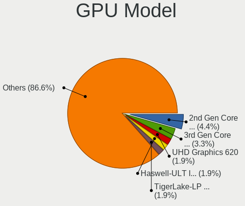
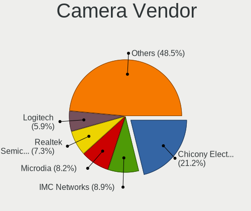

Linux - Tested Hardware & Statistics
------------------------------------

A project to collect tested hardware configurations for Linux.

Anyone can contribute to this report by the [hw-probe](https://github.com/linuxhw/hw-probe) tool:

    sudo -E hw-probe -all -upload

Please contribute! Especially if your hardware is rare.

This is a report for all computer types. See also reports for [desktops](/Desktop/README.md) and [notebooks](/Notebook/README.md).

Distribution-specific reports: [AlmaLinux](/Dist/AlmaLinux), [Alpine](/Dist/Alpine), [ALT_Linux](/Dist/ALT_Linux), [antiX](/Dist/antiX), [Artix](/Dist/Artix), [Chrome_OS](/Dist/Chrome_OS), [Clear_Linux](/Dist/Clear_Linux), [Deepin](/Dist/Deepin), [Devuan](/Dist/Devuan), [EndeavourOS](/Dist/EndeavourOS), [Garuda_Linux](/Dist/Garuda_Linux), [GNOME_OS](/Dist/GNOME_OS), [Kaisen](/Dist/Kaisen), [Mageia](/Dist/Mageia), [Makulu](/Dist/Makulu), [NixOS](/Dist/NixOS), [Nobara](/Dist/Nobara), [Oracle_Linux](/Dist/Oracle_Linux), [Pardus](/Dist/Pardus), [PureOS](/Dist/PureOS), [Q4OS](/Dist/Q4OS), [Reborn_OS](/Dist/Reborn_OS), [Rocky_Linux](/Dist/Rocky_Linux), [Sparky](/Dist/Sparky), [Void_Linux](/Dist/Void_Linux), [Xero](/Dist/Xero).

This report is for real hardware. Report for virtual hardware: [TestCoverage_VE](https://github.com/linuxhw/TestCoverage_VE)

Contents
--------

* [ Test Cases ](#test-cases)

* [ System ](#system)
  - [ OS                       ](#os)
  - [ OS Family                ](#os-family)
  - [ Kernel                   ](#kernel)
  - [ Kernel Family            ](#kernel-family)
  - [ Kernel Major Ver.        ](#kernel-major-ver)
  - [ Arch                     ](#arch)
  - [ DE                       ](#de)
  - [ Display Server           ](#display-server)
  - [ Display Manager          ](#display-manager)
  - [ OS Lang                  ](#os-lang)
  - [ Boot Mode                ](#boot-mode)
  - [ Filesystem               ](#filesystem)
  - [ Part. scheme             ](#part-scheme)
  - [ Dual Boot with Linux/BSD ](#dual-boot-with-linuxbsd)
  - [ Dual Boot (Win)          ](#dual-boot-win)

* [ Board ](#board)
  - [ Vendor                   ](#vendor)
  - [ Model                    ](#model)
  - [ Model Family             ](#model-family)
  - [ MFG Year                 ](#mfg-year)
  - [ Form Factor              ](#form-factor)
  - [ Secure Boot              ](#secure-boot)
  - [ Coreboot                 ](#coreboot)
  - [ RAM Size                 ](#ram-size)
  - [ RAM Used                 ](#ram-used)
  - [ Total Drives             ](#total-drives)
  - [ Has CD-ROM               ](#has-cd-rom)
  - [ Has Ethernet             ](#has-ethernet)
  - [ Has WiFi                 ](#has-wifi)
  - [ Has Bluetooth            ](#has-bluetooth)

* [ Location ](#location)
  - [ Country                  ](#country)
  - [ City                     ](#city)

* [ Drives ](#drives)
  - [ Drive Vendor             ](#drive-vendor)
  - [ Drive Model              ](#drive-model)
  - [ HDD Vendor               ](#hdd-vendor)
  - [ SSD Vendor               ](#ssd-vendor)
  - [ Drive Kind               ](#drive-kind)
  - [ Drive Connector          ](#drive-connector)
  - [ Drive Size               ](#drive-size)
  - [ Space Total              ](#space-total)
  - [ Space Used               ](#space-used)
  - [ Malfunc. Drives          ](#malfunc-drives)
  - [ Malfunc. Drive Vendor    ](#malfunc-drive-vendor)
  - [ Malfunc. HDD Vendor      ](#malfunc-hdd-vendor)
  - [ Malfunc. Drive Kind      ](#malfunc-drive-kind)
  - [ Failed Drives            ](#failed-drives)
  - [ Failed Drive Vendor      ](#failed-drive-vendor)
  - [ Drive Status             ](#drive-status)

* [ Storage controller ](#storage-controller)
  - [ Storage Vendor           ](#storage-vendor)
  - [ Storage Model            ](#storage-model)
  - [ Storage Kind             ](#storage-kind)

* [ Processor ](#processor)
  - [ CPU Vendor               ](#cpu-vendor)
  - [ CPU Model                ](#cpu-model)
  - [ CPU Model Family         ](#cpu-model-family)
  - [ CPU Cores                ](#cpu-cores)
  - [ CPU Sockets              ](#cpu-sockets)
  - [ CPU Threads              ](#cpu-threads)
  - [ CPU Op-Modes             ](#cpu-op-modes)
  - [ CPU Microcode            ](#cpu-microcode)
  - [ CPU Microarch            ](#cpu-microarch)

* [ Graphics ](#graphics)
  - [ GPU Vendor               ](#gpu-vendor)
  - [ GPU Model                ](#gpu-model)
  - [ GPU Combo                ](#gpu-combo)
  - [ GPU Driver               ](#gpu-driver)
  - [ GPU Memory               ](#gpu-memory)

* [ Monitor ](#monitor)
  - [ Monitor Vendor           ](#monitor-vendor)
  - [ Monitor Model            ](#monitor-model)
  - [ Monitor Resolution       ](#monitor-resolution)
  - [ Monitor Diagonal         ](#monitor-diagonal)
  - [ Monitor Width            ](#monitor-width)
  - [ Aspect Ratio             ](#aspect-ratio)
  - [ Monitor Area             ](#monitor-area)
  - [ Pixel Density            ](#pixel-density)
  - [ Multiple Monitors        ](#multiple-monitors)

* [ Network ](#network)
  - [ Net Controller Vendor    ](#net-controller-vendor)
  - [ Net Controller Model     ](#net-controller-model)
  - [ Wireless Vendor          ](#wireless-vendor)
  - [ Wireless Model           ](#wireless-model)
  - [ Ethernet Vendor          ](#ethernet-vendor)
  - [ Ethernet Model           ](#ethernet-model)
  - [ Net Controller Kind      ](#net-controller-kind)
  - [ Used Controller          ](#used-controller)
  - [ NICs                     ](#nics)
  - [ IPv6                     ](#ipv6)

* [ Bluetooth ](#bluetooth)
  - [ Bluetooth Vendor         ](#bluetooth-vendor)
  - [ Bluetooth Model          ](#bluetooth-model)

* [ Sound ](#sound)
  - [ Sound Vendor             ](#sound-vendor)
  - [ Sound Model              ](#sound-model)

* [ Memory ](#memory)
  - [ Memory Vendor            ](#memory-vendor)
  - [ Memory Model             ](#memory-model)
  - [ Memory Kind              ](#memory-kind)
  - [ Memory Form Factor       ](#memory-form-factor)
  - [ Memory Size              ](#memory-size)
  - [ Memory Speed             ](#memory-speed)

* [ Printers & scanners ](#printers--scanners)
  - [ Printer Vendor           ](#printer-vendor)
  - [ Printer Model            ](#printer-model)
  - [ Scanner Vendor           ](#scanner-vendor)
  - [ Scanner Model            ](#scanner-model)

* [ Camera ](#camera)
  - [ Camera Vendor            ](#camera-vendor)
  - [ Camera Model             ](#camera-model)

* [ Security ](#security)
  - [ Fingerprint Vendor       ](#fingerprint-vendor)
  - [ Fingerprint Model        ](#fingerprint-model)
  - [ Chipcard Vendor          ](#chipcard-vendor)
  - [ Chipcard Model           ](#chipcard-model)

* [ Unsupported ](#unsupported)
  - [ Unsupported Devices      ](#unsupported-devices)
  - [ Unsupported Device Types ](#unsupported-device-types)

Test Cases
----------

Total: 281287

| Vendor        | Model                       | Form-Factor | Probe                                                      | Date         |
|---------------|-----------------------------|-------------|------------------------------------------------------------|--------------|
| Dell          | 0VHWTR A01                  | Desktop     | [7544868958](https://linux-hardware.org/?probe=7544868958) | Feb 01, 2023 |
| MSI           | MS-N0E1 Ver                 | Notebook    | [9c4dcef9c6](https://linux-hardware.org/?probe=9c4dcef9c6) | Feb 01, 2023 |
| HP            | ENVY x360 Convertible 15... | Convertible | [ab92a33bdf](https://linux-hardware.org/?probe=ab92a33bdf) | Feb 01, 2023 |
| Apple         | MacBookPro12,1              | Notebook    | [6e089e22b1](https://linux-hardware.org/?probe=6e089e22b1) | Feb 01, 2023 |
| ASUSTek       | VivoBook_ASUSLaptop M540... | Notebook    | [8bc290ef67](https://linux-hardware.org/?probe=8bc290ef67) | Feb 01, 2023 |
| HP            | Laptop 17-cn0xxx            | Notebook    | [71bfc02926](https://linux-hardware.org/?probe=71bfc02926) | Feb 01, 2023 |
| ASUSTek       | TUF B450-PLUS GAMING        | Desktop     | [d44fb4f702](https://linux-hardware.org/?probe=d44fb4f702) | Feb 01, 2023 |
| ASRock        | B250M-HDV                   | Desktop     | [a2ff80e7dd](https://linux-hardware.org/?probe=a2ff80e7dd) | Feb 01, 2023 |
| Gigabyte      | GA-MA770T-UD3               | Desktop     | [4644d239d7](https://linux-hardware.org/?probe=4644d239d7) | Feb 01, 2023 |
| Gigabyte      | Z690 GAMING X DDR4          | Desktop     | [21ce876854](https://linux-hardware.org/?probe=21ce876854) | Feb 01, 2023 |
| Shenzhen M... | F7BFC                       | Desktop     | [ecf260f299](https://linux-hardware.org/?probe=ecf260f299) | Feb 01, 2023 |
| Lenovo        | ThinkPad T490 20N2000LRT    | Notebook    | [aaaf227faf](https://linux-hardware.org/?probe=aaaf227faf) | Feb 01, 2023 |
| Dell          | Inspiron 5566               | Notebook    | [b2dd8d93c7](https://linux-hardware.org/?probe=b2dd8d93c7) | Feb 01, 2023 |
| MSI           | D2415 S26361-D2415-A21      | Desktop     | [3acfaaf14c](https://linux-hardware.org/?probe=3acfaaf14c) | Feb 01, 2023 |
| ASUSTek       | A8N-SLI Premium             | Desktop     | [faf81c22ae](https://linux-hardware.org/?probe=faf81c22ae) | Feb 01, 2023 |
| Apple         | MacBookAir7,2               | Notebook    | [352c998936](https://linux-hardware.org/?probe=352c998936) | Feb 01, 2023 |
| Toshiba       | Satellite P775              | Notebook    | [c03f7668ac](https://linux-hardware.org/?probe=c03f7668ac) | Feb 01, 2023 |
| MSI           | GF63 Thin 11UC              | Notebook    | [b34b3228d3](https://linux-hardware.org/?probe=b34b3228d3) | Feb 01, 2023 |
| MSI           | Modern 14 B11MOU            | Notebook    | [542173e9a2](https://linux-hardware.org/?probe=542173e9a2) | Feb 01, 2023 |
| HP            | Compaq nx9420 (ES444ET#A... | Notebook    | [ac78478b3b](https://linux-hardware.org/?probe=ac78478b3b) | Feb 01, 2023 |
| Gigabyte      | GA-78LMT-USB3 SEx           | Desktop     | [6aa10285fe](https://linux-hardware.org/?probe=6aa10285fe) | Feb 01, 2023 |
| Fujitsu       | D3400-A1 S26361-D3400-A1    | Desktop     | [b792043acd](https://linux-hardware.org/?probe=b792043acd) | Feb 01, 2023 |
| MSI           | GP60 2PE                    | Notebook    | [a1bb8934a0](https://linux-hardware.org/?probe=a1bb8934a0) | Feb 01, 2023 |
| HP            | 0AACh                       | Desktop     | [f41abcf7f9](https://linux-hardware.org/?probe=f41abcf7f9) | Feb 01, 2023 |
| Dell          | Latitude 7420               | Notebook    | [f0b8816283](https://linux-hardware.org/?probe=f0b8816283) | Feb 01, 2023 |
| Lenovo        | ThinkPad L13 Yoga Gen 2 ... | Convertible | [2f0a18ba6b](https://linux-hardware.org/?probe=2f0a18ba6b) | Feb 01, 2023 |
| Biostar       | A68N-5000                   | Desktop     | [96e9f6ff35](https://linux-hardware.org/?probe=96e9f6ff35) | Feb 01, 2023 |
| BESSTAR Te... | HM90                        | Desktop     | [3f958de9bb](https://linux-hardware.org/?probe=3f958de9bb) | Feb 01, 2023 |
| Lenovo        | ThinkPad T470s 20HF0000U... | Notebook    | [d7a5b537d9](https://linux-hardware.org/?probe=d7a5b537d9) | Feb 01, 2023 |
| Gigabyte      | G31M-ES2C                   | Desktop     | [ec3d16bb4e](https://linux-hardware.org/?probe=ec3d16bb4e) | Feb 01, 2023 |
| ASUSTek       | ASUS TUF Gaming F15 FX50... | Notebook    | [ab31f6153e](https://linux-hardware.org/?probe=ab31f6153e) | Feb 01, 2023 |
| Lenovo        | ThinkPad T400 6473PMG       | Notebook    | [07cba1c44b](https://linux-hardware.org/?probe=07cba1c44b) | Feb 01, 2023 |
| MSI           | A520M-A PRO                 | Desktop     | [f7a88d0dea](https://linux-hardware.org/?probe=f7a88d0dea) | Feb 01, 2023 |
| Gigabyte      | Z690 GAMING X DDR4          | Desktop     | [de7f0840d1](https://linux-hardware.org/?probe=de7f0840d1) | Feb 01, 2023 |
| Lenovo        | ThinkPad P1 Gen 3 20TJS2... | Notebook    | [22abfb4a79](https://linux-hardware.org/?probe=22abfb4a79) | Feb 01, 2023 |
| Dell          | Latitude 5430               | Notebook    | [2afa57d0fa](https://linux-hardware.org/?probe=2afa57d0fa) | Feb 01, 2023 |
| ASUSTek       | H110M-R                     | Desktop     | [c790793197](https://linux-hardware.org/?probe=c790793197) | Feb 01, 2023 |
| eMachines     | E725                        | Notebook    | [4b1805b3f6](https://linux-hardware.org/?probe=4b1805b3f6) | Feb 01, 2023 |
| Lenovo        | ThinkPad X1 Carbon Gen 9... | Notebook    | [0de8121880](https://linux-hardware.org/?probe=0de8121880) | Feb 01, 2023 |
| Lenovo        | 3111 NOK                    | Desktop     | [4f7d6b345c](https://linux-hardware.org/?probe=4f7d6b345c) | Feb 01, 2023 |
| Apple         | Mac-F2268DC8                | All in one  | [b13dd2d455](https://linux-hardware.org/?probe=b13dd2d455) | Feb 01, 2023 |
| Lenovo        | IdeaPad S145-15API 81V7     | Notebook    | [7e78833b8b](https://linux-hardware.org/?probe=7e78833b8b) | Feb 01, 2023 |
| Lenovo        | IdeaPad S145-15IWL 81S9     | Notebook    | [2be076637c](https://linux-hardware.org/?probe=2be076637c) | Feb 01, 2023 |
| Lenovo        | ThinkPad X220 4286CTO       | Notebook    | [465114aa14](https://linux-hardware.org/?probe=465114aa14) | Feb 01, 2023 |
| Gigabyte      | B365M DS3H                  | Desktop     | [d515d5d9f7](https://linux-hardware.org/?probe=d515d5d9f7) | Feb 01, 2023 |
| AMI           | Cherry Trail CR             | Desktop     | [162e744903](https://linux-hardware.org/?probe=162e744903) | Feb 01, 2023 |
| Lenovo        | 3111 NOK                    | Desktop     | [03df681b38](https://linux-hardware.org/?probe=03df681b38) | Feb 01, 2023 |
| Valve         | Jupiter                     | Notebook    | [09c9b01e9b](https://linux-hardware.org/?probe=09c9b01e9b) | Feb 01, 2023 |
| Dell          | Vostro 3500                 | Notebook    | [fa4104f438](https://linux-hardware.org/?probe=fa4104f438) | Feb 01, 2023 |
| Lenovo        | ThinkPad A485 20MVS0U500    | Notebook    | [b398a8e8e6](https://linux-hardware.org/?probe=b398a8e8e6) | Feb 01, 2023 |
| Lenovo        | IdeaPad S530-13IWL 81J7     | Notebook    | [6ed194a014](https://linux-hardware.org/?probe=6ed194a014) | Feb 01, 2023 |
| Lenovo        | ThinkPad T490s 20NYS4HL0... | Notebook    | [d792c0057e](https://linux-hardware.org/?probe=d792c0057e) | Feb 01, 2023 |
| HP            | EliteBook 8570p             | Notebook    | [2f7f3a5b93](https://linux-hardware.org/?probe=2f7f3a5b93) | Feb 01, 2023 |
| ASUSTek       | P9X79                       | Desktop     | [01e8662b39](https://linux-hardware.org/?probe=01e8662b39) | Feb 01, 2023 |
| Lenovo        | ThinkPad X1 Carbon Gen 9... | Notebook    | [f39ab69b74](https://linux-hardware.org/?probe=f39ab69b74) | Feb 01, 2023 |
| Acer          | Aspire 5750G                | Notebook    | [a8a3f37ad8](https://linux-hardware.org/?probe=a8a3f37ad8) | Feb 01, 2023 |
| Lenovo        | ThinkPad T520 4243WRK       | Notebook    | [924a321452](https://linux-hardware.org/?probe=924a321452) | Feb 01, 2023 |
| ASUSTek       | TUF Gaming X570-PRO WIFI... | Desktop     | [48bccd4f38](https://linux-hardware.org/?probe=48bccd4f38) | Feb 01, 2023 |
| Lenovo        | ThinkPad E14 20RAS1RA00     | Notebook    | [8360c9e13f](https://linux-hardware.org/?probe=8360c9e13f) | Feb 01, 2023 |
| Dell          | Vostro 3500                 | Notebook    | [ec80fcb8a5](https://linux-hardware.org/?probe=ec80fcb8a5) | Feb 01, 2023 |
| Lenovo        | IdeaPad 3 15ADA05 81W1      | Notebook    | [95e019beb2](https://linux-hardware.org/?probe=95e019beb2) | Feb 01, 2023 |
| Apple         | MacBookPro15,1              | Notebook    | [7f89f4417d](https://linux-hardware.org/?probe=7f89f4417d) | Feb 01, 2023 |
| Intel         | D34010WYK H14771-303        | Desktop     | [31485ae6ec](https://linux-hardware.org/?probe=31485ae6ec) | Feb 01, 2023 |
| Lenovo        | Yoga Slim 7 Pro 14IAP7 8... | Notebook    | [b829e9afbd](https://linux-hardware.org/?probe=b829e9afbd) | Feb 01, 2023 |
| Notebook      | NJx0MU                      | Notebook    | [c402e9c063](https://linux-hardware.org/?probe=c402e9c063) | Feb 01, 2023 |
| Pegatron      | 2A94                        | Desktop     | [58961a542f](https://linux-hardware.org/?probe=58961a542f) | Feb 01, 2023 |
| Lenovo        | ThinkPad E520 1143JYG       | Notebook    | [87735dd3b0](https://linux-hardware.org/?probe=87735dd3b0) | Feb 01, 2023 |
| Apple         | MacBookAir6,2               | Notebook    | [2261a77abb](https://linux-hardware.org/?probe=2261a77abb) | Feb 01, 2023 |
| MSI           | MAG Z590 TORPEDO            | Desktop     | [431a6c7a3a](https://linux-hardware.org/?probe=431a6c7a3a) | Feb 01, 2023 |
| Gigabyte      | X299 AORUS Gaming 3-CF      | Desktop     | [775a993b3a](https://linux-hardware.org/?probe=775a993b3a) | Feb 01, 2023 |
| Lenovo        | IdeaPad 3 17ITL6 82H9       | Notebook    | [eaaf15f3f6](https://linux-hardware.org/?probe=eaaf15f3f6) | Feb 01, 2023 |
| MSI           | GF63 Thin 11UC              | Notebook    | [4f06c55846](https://linux-hardware.org/?probe=4f06c55846) | Feb 01, 2023 |
| ASUSTek       | Zenbook UX535QE_UM535QE     | Notebook    | [ee219f2f82](https://linux-hardware.org/?probe=ee219f2f82) | Feb 01, 2023 |
| Lenovo        | ThinkPad X1 Carbon Gen 9... | Notebook    | [c1862b275d](https://linux-hardware.org/?probe=c1862b275d) | Feb 01, 2023 |
| Acer          | Nitro AN515-54              | Notebook    | [9aee0a798c](https://linux-hardware.org/?probe=9aee0a798c) | Feb 01, 2023 |
| Lenovo        | ThinkPad X1 Carbon Gen 9... | Notebook    | [1aa5d63f0c](https://linux-hardware.org/?probe=1aa5d63f0c) | Feb 01, 2023 |
| Foxconn       | G41MXE/G41MXE-K             | Desktop     | [50c552026e](https://linux-hardware.org/?probe=50c552026e) | Feb 01, 2023 |
| Dell          | Latitude 7490               | Notebook    | [b2c18d04be](https://linux-hardware.org/?probe=b2c18d04be) | Feb 01, 2023 |
| ASUSTek       | S551LN                      | Notebook    | [b7361dbc53](https://linux-hardware.org/?probe=b7361dbc53) | Feb 01, 2023 |
| Dell          | Inspiron 7306 2n1           | Convertible | [782559ae77](https://linux-hardware.org/?probe=782559ae77) | Feb 01, 2023 |
| ASUSTek       | Zenbook UX535QE_UM535QE     | Notebook    | [af2f6edc6f](https://linux-hardware.org/?probe=af2f6edc6f) | Feb 01, 2023 |
| Dell          | Latitude 7490               | Notebook    | [050126f7f7](https://linux-hardware.org/?probe=050126f7f7) | Feb 01, 2023 |
| Apple         | MacBookAir5,2               | Notebook    | [8a90f64e68](https://linux-hardware.org/?probe=8a90f64e68) | Feb 01, 2023 |
| HP            | 250 G1                      | Notebook    | [41f3eccf2e](https://linux-hardware.org/?probe=41f3eccf2e) | Feb 01, 2023 |
| Apple         | MacBookAir5,2               | Notebook    | [2bdd007ce6](https://linux-hardware.org/?probe=2bdd007ce6) | Feb 01, 2023 |
| MSI           | MAG B550 TOMAHAWK           | Desktop     | [142f5fcb2d](https://linux-hardware.org/?probe=142f5fcb2d) | Feb 01, 2023 |
| HP            | 250 G1                      | Notebook    | [345cb01bcc](https://linux-hardware.org/?probe=345cb01bcc) | Feb 01, 2023 |
| MSI           | Z170A PC MATE               | Desktop     | [ff305089b2](https://linux-hardware.org/?probe=ff305089b2) | Feb 01, 2023 |
| ASUSTek       | N552VW                      | Notebook    | [1ebeeec517](https://linux-hardware.org/?probe=1ebeeec517) | Feb 01, 2023 |
| Timi          | Mi NoteBook Ultra           | Notebook    | [d897ec0114](https://linux-hardware.org/?probe=d897ec0114) | Feb 01, 2023 |
| Dell          | 09KPNV A01                  | Desktop     | [5dcda0d3e5](https://linux-hardware.org/?probe=5dcda0d3e5) | Feb 01, 2023 |
| Lenovo        | SHARKBAY 0B98401 WIN        | Desktop     | [1668f1f69f](https://linux-hardware.org/?probe=1668f1f69f) | Feb 01, 2023 |
| Dell          | 0GDJXY A00                  | All in one  | [1ce7db78c1](https://linux-hardware.org/?probe=1ce7db78c1) | Feb 01, 2023 |
| ASRock        | X570 Pro4                   | Desktop     | [81b19ff917](https://linux-hardware.org/?probe=81b19ff917) | Feb 01, 2023 |
| Lenovo        | ThinkPad X220 Tablet 429... | Notebook    | [c4869ecf2c](https://linux-hardware.org/?probe=c4869ecf2c) | Feb 01, 2023 |
| ECS           | G31T-M7                     | Desktop     | [9b0f53b46c](https://linux-hardware.org/?probe=9b0f53b46c) | Feb 01, 2023 |
| ASUSTek       | Z87-A                       | Desktop     | [1b880dbac2](https://linux-hardware.org/?probe=1b880dbac2) | Feb 01, 2023 |
| HUAWEI        | BOHK-WAX9X                  | Notebook    | [07b498f669](https://linux-hardware.org/?probe=07b498f669) | Feb 01, 2023 |
| Valve         | Jupiter                     | Notebook    | [eab7cc51cd](https://linux-hardware.org/?probe=eab7cc51cd) | Feb 01, 2023 |
| Supermicro    | H12SSL-i                    | Server      | [cca8d74416](https://linux-hardware.org/?probe=cca8d74416) | Feb 01, 2023 |
| ASRockRack    | X470D4U2-2T                 | Desktop     | [602482d070](https://linux-hardware.org/?probe=602482d070) | Feb 01, 2023 |
| ASUSTek       | ProArt X670E-CREATOR WIF... | Desktop     | [ffe1cabad7](https://linux-hardware.org/?probe=ffe1cabad7) | Feb 01, 2023 |
| PCWare        | IPX525R2-D3                 | Desktop     | [20868d90a7](https://linux-hardware.org/?probe=20868d90a7) | Feb 01, 2023 |
| Dell          | Inspiron 7501               | Notebook    | [426493e8a5](https://linux-hardware.org/?probe=426493e8a5) | Feb 01, 2023 |
| Dell          | 06D7TR A00                  | Desktop     | [d040bfd5cc](https://linux-hardware.org/?probe=d040bfd5cc) | Feb 01, 2023 |
| Acer          | Aspire A315-21G             | Notebook    | [1a3af834c9](https://linux-hardware.org/?probe=1a3af834c9) | Feb 01, 2023 |
| Acer          | Predator PH517-61           | Notebook    | [b16ddc31d8](https://linux-hardware.org/?probe=b16ddc31d8) | Feb 01, 2023 |
| Lenovo        | ThinkPad T16 Gen 1 21CH0... | Notebook    | [78eeec802b](https://linux-hardware.org/?probe=78eeec802b) | Feb 01, 2023 |
| PCWare        | IPX525R2-D3                 | Desktop     | [d67831dc82](https://linux-hardware.org/?probe=d67831dc82) | Feb 01, 2023 |
| Dell          | Latitude E6440              | Notebook    | [8712bed802](https://linux-hardware.org/?probe=8712bed802) | Feb 01, 2023 |
| MSI           | MAG Z790 TOMAHAWK WIFI      | Desktop     | [b9fb1c5111](https://linux-hardware.org/?probe=b9fb1c5111) | Feb 01, 2023 |
| Dell          | Latitude E6440              | Notebook    | [09b61adc0b](https://linux-hardware.org/?probe=09b61adc0b) | Feb 01, 2023 |
| Gigabyte      | B550 AORUS ELITE V2         | Desktop     | [aa3b7e2dc8](https://linux-hardware.org/?probe=aa3b7e2dc8) | Feb 01, 2023 |
| ASUSTek       | PRIME B550-PLUS             | Desktop     | [bea57d418a](https://linux-hardware.org/?probe=bea57d418a) | Feb 01, 2023 |
| Microsoft     | Surface Laptop Go           | Tablet      | [455825998f](https://linux-hardware.org/?probe=455825998f) | Feb 01, 2023 |
| Dell          | 0PV3YR A05                  | Server      | [f2b211ff3a](https://linux-hardware.org/?probe=f2b211ff3a) | Feb 01, 2023 |
| ASUSTek       | PRIME B550M-A               | Desktop     | [2e458676e4](https://linux-hardware.org/?probe=2e458676e4) | Feb 01, 2023 |
| Acer          | Aspire A315-21G             | Notebook    | [78f5b5c42b](https://linux-hardware.org/?probe=78f5b5c42b) | Feb 01, 2023 |
| ASUSTek       | PRIME B550M-A               | Desktop     | [779b723b67](https://linux-hardware.org/?probe=779b723b67) | Feb 01, 2023 |
| MSI           | Raider GE66 12UHS           | Notebook    | [75e83dae8b](https://linux-hardware.org/?probe=75e83dae8b) | Feb 01, 2023 |
| Fujitsu       | LIFEBOOK E744               | Notebook    | [b048f7d3e1](https://linux-hardware.org/?probe=b048f7d3e1) | Feb 01, 2023 |
| HP            | Laptop 14-dq4xxx            | Notebook    | [c102edf6a0](https://linux-hardware.org/?probe=c102edf6a0) | Feb 01, 2023 |
| ASRock        | FM2A88X Extreme6+           | Desktop     | [79c11af9ac](https://linux-hardware.org/?probe=79c11af9ac) | Feb 01, 2023 |
| Dell          | Vostro 1520                 | Notebook    | [3fab7107b7](https://linux-hardware.org/?probe=3fab7107b7) | Feb 01, 2023 |
| Valve         | Jupiter                     | Notebook    | [304c2a8ce3](https://linux-hardware.org/?probe=304c2a8ce3) | Feb 01, 2023 |
| Gigabyte      | Z170X-Gaming 3              | Desktop     | [b0697611f6](https://linux-hardware.org/?probe=b0697611f6) | Feb 01, 2023 |
| ASUSTek       | ROG STRIX X570-E GAMING     | Desktop     | [9fb41ee5bc](https://linux-hardware.org/?probe=9fb41ee5bc) | Feb 01, 2023 |
| Valve         | Jupiter                     | Notebook    | [6debcb8087](https://linux-hardware.org/?probe=6debcb8087) | Feb 01, 2023 |
| MSI           | B250M PRO-VDH               | Desktop     | [1dbacce612](https://linux-hardware.org/?probe=1dbacce612) | Feb 01, 2023 |
| Dell          | Inspiron 15-3567            | Notebook    | [2f6f4bc8c7](https://linux-hardware.org/?probe=2f6f4bc8c7) | Feb 01, 2023 |
| Dell          | 00V62H A01                  | Desktop     | [d7b81788e7](https://linux-hardware.org/?probe=d7b81788e7) | Feb 01, 2023 |
| ASUSTek       | ROG STRIX Z490-A GAMING     | Desktop     | [5f2948351d](https://linux-hardware.org/?probe=5f2948351d) | Feb 01, 2023 |
| Lenovo        | ThinkPad X270 20HMS0T000    | Notebook    | [e9854b7cf8](https://linux-hardware.org/?probe=e9854b7cf8) | Feb 01, 2023 |
| Gigabyte      | Z690 AORUS ELITE AX DDR4    | Desktop     | [115de2faed](https://linux-hardware.org/?probe=115de2faed) | Feb 01, 2023 |
| MSI           | X470 GAMING PLUS MAX        | Desktop     | [f1fecf5447](https://linux-hardware.org/?probe=f1fecf5447) | Feb 01, 2023 |
| ASUSTek       | ProArt X670E-CREATOR WIF... | Desktop     | [4f8642280f](https://linux-hardware.org/?probe=4f8642280f) | Feb 01, 2023 |
| AZW           | U59                         | Desktop     | [9b73123be3](https://linux-hardware.org/?probe=9b73123be3) | Feb 01, 2023 |
| HP            | Pavilion Gaming Laptop 1... | Notebook    | [de3138b686](https://linux-hardware.org/?probe=de3138b686) | Feb 01, 2023 |
| Gigabyte      | B450M H                     | Desktop     | [2d4aa2e1a0](https://linux-hardware.org/?probe=2d4aa2e1a0) | Feb 01, 2023 |
| ASUSTek       | PRIME B550M-A               | Desktop     | [4251ab2f9a](https://linux-hardware.org/?probe=4251ab2f9a) | Feb 01, 2023 |
| Dell          | 0PU052                      | Desktop     | [d2f241353d](https://linux-hardware.org/?probe=d2f241353d) | Feb 01, 2023 |
| Notebook      | NJx0MU                      | Notebook    | [eb152c7d4e](https://linux-hardware.org/?probe=eb152c7d4e) | Feb 01, 2023 |
| AZW           | U59                         | Desktop     | [74f028454a](https://linux-hardware.org/?probe=74f028454a) | Feb 01, 2023 |
| Intel         | DG965OT AAD75595-200        | Other       | [8ab85c58be](https://linux-hardware.org/?probe=8ab85c58be) | Feb 01, 2023 |
| Intel         | NUC11PABi5 K90634-305       | Mini pc     | [63143e2bf5](https://linux-hardware.org/?probe=63143e2bf5) | Feb 01, 2023 |
| Google        | Pantheon                    | Notebook    | [12e0b96dd1](https://linux-hardware.org/?probe=12e0b96dd1) | Feb 01, 2023 |
| ASUSTek       | M4A89TD PRO USB3            | Desktop     | [9010e03a18](https://linux-hardware.org/?probe=9010e03a18) | Feb 01, 2023 |
| Dell          | Inspiron One 2320           | All in one  | [f4933208c1](https://linux-hardware.org/?probe=f4933208c1) | Feb 01, 2023 |
| Acer          | Aspire A315-53              | Notebook    | [d221bc6b8d](https://linux-hardware.org/?probe=d221bc6b8d) | Feb 01, 2023 |
| Lenovo        | 3181 NO DPK                 | Mini pc     | [d4c01d094b](https://linux-hardware.org/?probe=d4c01d094b) | Feb 01, 2023 |
| AZW           | S5 V1.0                     | Mini pc     | [213d0d1a6a](https://linux-hardware.org/?probe=213d0d1a6a) | Feb 01, 2023 |
| Apple         | MacBookPro11,1              | Notebook    | [44f90bc9ab](https://linux-hardware.org/?probe=44f90bc9ab) | Feb 01, 2023 |
| Dell          | Precision M6700             | Notebook    | [743cb766c2](https://linux-hardware.org/?probe=743cb766c2) | Feb 01, 2023 |
| HP            | 1790                        | Desktop     | [d0d3ca5e7c](https://linux-hardware.org/?probe=d0d3ca5e7c) | Feb 01, 2023 |
| Dell          | 06D7TR A02                  | Desktop     | [b3bb51473f](https://linux-hardware.org/?probe=b3bb51473f) | Feb 01, 2023 |
| ASUSTek       | PRIME B550-PLUS             | Desktop     | [23b27dab7d](https://linux-hardware.org/?probe=23b27dab7d) | Feb 01, 2023 |
| Lenovo        | ThinkPad T14s Gen 3 21CQ... | Notebook    | [6b9dc508e1](https://linux-hardware.org/?probe=6b9dc508e1) | Feb 01, 2023 |
| Gigabyte      | G41MT-D3                    | Desktop     | [99127d4bed](https://linux-hardware.org/?probe=99127d4bed) | Feb 01, 2023 |
| Gigabyte      | B550M AORUS ELITE           | Desktop     | [a8f54f681a](https://linux-hardware.org/?probe=a8f54f681a) | Feb 01, 2023 |
| HP            | Presario CQ57               | Notebook    | [0e34caefa3](https://linux-hardware.org/?probe=0e34caefa3) | Feb 01, 2023 |
| Dell          | 0WG860                      | Desktop     | [002a1f805c](https://linux-hardware.org/?probe=002a1f805c) | Feb 01, 2023 |
| Dell          | 02P9X9 A04                  | Server      | [bda0eb6835](https://linux-hardware.org/?probe=bda0eb6835) | Feb 01, 2023 |
| ASUSTek       | ROG STRIX X570-E GAMING     | Desktop     | [4bb9990abe](https://linux-hardware.org/?probe=4bb9990abe) | Feb 01, 2023 |
| ASUSTek       | VivoBook_ASUSLaptop E510... | Notebook    | [08e071efa2](https://linux-hardware.org/?probe=08e071efa2) | Feb 01, 2023 |
| ASUSTek       | ROG Strix G713QE_G713QE     | Notebook    | [f05a20fe00](https://linux-hardware.org/?probe=f05a20fe00) | Feb 01, 2023 |
| Gigabyte      | MZBSWMP-00                  | Desktop     | [894f632950](https://linux-hardware.org/?probe=894f632950) | Feb 01, 2023 |
| Dell          | 0D28YY A01                  | Desktop     | [51b04e5d58](https://linux-hardware.org/?probe=51b04e5d58) | Feb 01, 2023 |
| Gigabyte      | H55M-UD2H                   | Desktop     | [9337f49fff](https://linux-hardware.org/?probe=9337f49fff) | Feb 01, 2023 |
| Dell          | 0VHWTR A02                  | Desktop     | [4820c0216f](https://linux-hardware.org/?probe=4820c0216f) | Feb 01, 2023 |
| Huanan        | X99-F8D PLUS V1.1           | Desktop     | [e68a009e8f](https://linux-hardware.org/?probe=e68a009e8f) | Feb 01, 2023 |
| Gigabyte      | GA-MA69VM-S2                | Desktop     | [72dae43046](https://linux-hardware.org/?probe=72dae43046) | Feb 01, 2023 |
| Dell          | Inspiron 5748               | Notebook    | [7ee6505f8d](https://linux-hardware.org/?probe=7ee6505f8d) | Feb 01, 2023 |
| ASUSTek       | TUF Gaming FX504GE_FX80G... | Notebook    | [3fc59532b8](https://linux-hardware.org/?probe=3fc59532b8) | Feb 01, 2023 |
| Schenker      | VISION 16 Pro (L22)         | Notebook    | [0979a6ca2a](https://linux-hardware.org/?probe=0979a6ca2a) | Jan 31, 2023 |
| HP            | Laptop 15s-fq5xxx           | Notebook    | [bd22f26ad1](https://linux-hardware.org/?probe=bd22f26ad1) | Jan 31, 2023 |
| HP            | Laptop 15s-fq5xxx           | Notebook    | [28ea3cafe8](https://linux-hardware.org/?probe=28ea3cafe8) | Jan 31, 2023 |
| Lenovo        | ThinkPad T560 20FJS44L0B    | Notebook    | [06bf3870a5](https://linux-hardware.org/?probe=06bf3870a5) | Jan 31, 2023 |
| Gigabyte      | H510M H                     | Desktop     | [298b411767](https://linux-hardware.org/?probe=298b411767) | Jan 31, 2023 |
| Acer          | Nitro AN515-52              | Notebook    | [86156a3b50](https://linux-hardware.org/?probe=86156a3b50) | Jan 31, 2023 |
| Lenovo        | ThinkPad T530 2394A11       | Notebook    | [e7946fa600](https://linux-hardware.org/?probe=e7946fa600) | Jan 31, 2023 |
| ASUSTek       | TUF Gaming Z690-PLUS D4     | Desktop     | [d6d4c6c38c](https://linux-hardware.org/?probe=d6d4c6c38c) | Jan 31, 2023 |
| Samsung       | RV415/RV515                 | Notebook    | [ea50188d5c](https://linux-hardware.org/?probe=ea50188d5c) | Jan 31, 2023 |
| Dell          | Latitude E7240              | Notebook    | [fe655eca77](https://linux-hardware.org/?probe=fe655eca77) | Jan 31, 2023 |
| Gigabyte      | B450M DS3H V2               | Desktop     | [75a3416ebc](https://linux-hardware.org/?probe=75a3416ebc) | Jan 31, 2023 |
| Lenovo        | Legion 5 17ACH6H 82JY       | Notebook    | [62f941075c](https://linux-hardware.org/?probe=62f941075c) | Jan 31, 2023 |
| Gigabyte      | Z690M DS3H DDR4             | Desktop     | [8f858cb9b9](https://linux-hardware.org/?probe=8f858cb9b9) | Jan 31, 2023 |
| Intel         | NUC13SBBi5 M89887-303       | Mini pc     | [5ddc33f69b](https://linux-hardware.org/?probe=5ddc33f69b) | Jan 31, 2023 |
| Lenovo        | ThinkPad T14s Gen 2i 20W... | Notebook    | [ab57658c86](https://linux-hardware.org/?probe=ab57658c86) | Jan 31, 2023 |
| ASUSTek       | VivoBook_ASUS Laptop E21... | Notebook    | [478c456288](https://linux-hardware.org/?probe=478c456288) | Jan 31, 2023 |
| ASUSTek       | PRIME B660-PLUS D4          | Desktop     | [f1a9c37047](https://linux-hardware.org/?probe=f1a9c37047) | Jan 31, 2023 |
| Lenovo        | Yoga 520-14IKB 80X8         | Convertible | [92f6e450b8](https://linux-hardware.org/?probe=92f6e450b8) | Jan 31, 2023 |
| Acer          | Aspire E1-522               | Notebook    | [af61a3d9c8](https://linux-hardware.org/?probe=af61a3d9c8) | Jan 31, 2023 |
| HUAWEI        | HLYL-WXX9                   | Notebook    | [6e8d45f76b](https://linux-hardware.org/?probe=6e8d45f76b) | Jan 31, 2023 |
| ASUSTek       | F2A85-V                     | Desktop     | [c68678a1a5](https://linux-hardware.org/?probe=c68678a1a5) | Jan 31, 2023 |
| ASUSTek       | Zenbook UX8402ZA_UX8402Z... | Notebook    | [1d212c67b2](https://linux-hardware.org/?probe=1d212c67b2) | Jan 31, 2023 |
| MSI           | 870A-G54                    | Desktop     | [0aaa012de5](https://linux-hardware.org/?probe=0aaa012de5) | Jan 31, 2023 |
| HP            | Laptop 14s-dq3xxx           | Notebook    | [12ebaf0896](https://linux-hardware.org/?probe=12ebaf0896) | Jan 31, 2023 |
| Lenovo        | ThinkPad X1 Extreme 20MF... | Notebook    | [70310e25d1](https://linux-hardware.org/?probe=70310e25d1) | Jan 31, 2023 |
| Dell          | Latitude E6540              | Notebook    | [156a047a82](https://linux-hardware.org/?probe=156a047a82) | Jan 31, 2023 |
| Medion        | E15410                      | Notebook    | [24135c324e](https://linux-hardware.org/?probe=24135c324e) | Jan 31, 2023 |
| HUAWEI        | HN-WX9X                     | Notebook    | [4b8ddf5d09](https://linux-hardware.org/?probe=4b8ddf5d09) | Jan 31, 2023 |
| HP            | ENVY 15                     | Notebook    | [c688eb85bb](https://linux-hardware.org/?probe=c688eb85bb) | Jan 31, 2023 |
| HP            | Notebook                    | Notebook    | [3cea0a0519](https://linux-hardware.org/?probe=3cea0a0519) | Jan 31, 2023 |
| Lenovo        | IdeaPad S145-15API 81V7     | Notebook    | [ebbe861495](https://linux-hardware.org/?probe=ebbe861495) | Jan 31, 2023 |
| Dell          | Inspiron 5748               | Notebook    | [ecbd4ac8b6](https://linux-hardware.org/?probe=ecbd4ac8b6) | Jan 31, 2023 |
| Dell          | Inspiron 15-7579            | Notebook    | [b5bd231bf3](https://linux-hardware.org/?probe=b5bd231bf3) | Jan 31, 2023 |
| HP            | ENVY x360 2-in-1 Laptop ... | Convertible | [21b6d00ff2](https://linux-hardware.org/?probe=21b6d00ff2) | Jan 31, 2023 |
| Apple         | MacBookPro15,2              | Notebook    | [7612aba4cb](https://linux-hardware.org/?probe=7612aba4cb) | Jan 31, 2023 |
| Acer          | Aspire A515-54G             | Notebook    | [a57a68e42f](https://linux-hardware.org/?probe=a57a68e42f) | Jan 31, 2023 |
| ASUSTek       | PRIME B660-PLUS D4          | Desktop     | [fe2a413caa](https://linux-hardware.org/?probe=fe2a413caa) | Jan 31, 2023 |
| Dell          | 042P49 A01                  | Desktop     | [2791787281](https://linux-hardware.org/?probe=2791787281) | Jan 31, 2023 |
| Dell          | 0Y7WYT A00                  | Desktop     | [77909a2fa1](https://linux-hardware.org/?probe=77909a2fa1) | Jan 31, 2023 |
| MSI           | B450 TOMAHAWK MAX           | Desktop     | [3f9519f358](https://linux-hardware.org/?probe=3f9519f358) | Jan 31, 2023 |
| ASUSTek       | ROG Zephyrus G14 GA402RK... | Notebook    | [0d500d9d33](https://linux-hardware.org/?probe=0d500d9d33) | Jan 31, 2023 |
| HP            | Notebook                    | Notebook    | [f352309997](https://linux-hardware.org/?probe=f352309997) | Jan 31, 2023 |
| Google        | Gnawty                      | Notebook    | [4188917829](https://linux-hardware.org/?probe=4188917829) | Jan 31, 2023 |
| MSI           | H510M-A PRO                 | Desktop     | [609fc1e9bb](https://linux-hardware.org/?probe=609fc1e9bb) | Jan 31, 2023 |
| ASUSTek       | M5A97 EVO R2.0              | Desktop     | [f4e30fc177](https://linux-hardware.org/?probe=f4e30fc177) | Jan 31, 2023 |
| ASUSTek       | P5QL PRO                    | Desktop     | [77cc2bd640](https://linux-hardware.org/?probe=77cc2bd640) | Jan 31, 2023 |
| Notebook      | W35xSTQ_370ST               | Notebook    | [b52cc29e08](https://linux-hardware.org/?probe=b52cc29e08) | Jan 31, 2023 |
| Dell          | 0Y7WYT A00                  | Desktop     | [d299b4befd](https://linux-hardware.org/?probe=d299b4befd) | Jan 31, 2023 |
| Dell          | Latitude 5480               | Notebook    | [8b43efc7ea](https://linux-hardware.org/?probe=8b43efc7ea) | Jan 31, 2023 |
| HP            | 255 15.6 inch G9 Noteboo... | Notebook    | [7758d7c535](https://linux-hardware.org/?probe=7758d7c535) | Jan 31, 2023 |
| ASUSTek       | VivoBook_ASUSLaptop X150... | Notebook    | [e2ad5b033f](https://linux-hardware.org/?probe=e2ad5b033f) | Jan 31, 2023 |
| Dell          | G3 3500                     | Notebook    | [4b519ab8a8](https://linux-hardware.org/?probe=4b519ab8a8) | Jan 31, 2023 |
| HP            | 18E4                        | Desktop     | [50c68be419](https://linux-hardware.org/?probe=50c68be419) | Jan 31, 2023 |
| Gigabyte      | X670 AORUS ELITE AX         | Desktop     | [4e438c4768](https://linux-hardware.org/?probe=4e438c4768) | Jan 31, 2023 |
| HP            | 0AACh                       | Desktop     | [32961ffb11](https://linux-hardware.org/?probe=32961ffb11) | Jan 31, 2023 |
| ASUSTek       | VivoBook_ASUSLaptop X421... | Notebook    | [1cfa73407d](https://linux-hardware.org/?probe=1cfa73407d) | Jan 31, 2023 |
| Gigabyte      | B560 DS3H AC-Y1             | Desktop     | [6c094e2027](https://linux-hardware.org/?probe=6c094e2027) | Jan 31, 2023 |
| ASUSTek       | P7P55D                      | Desktop     | [981ae95b2a](https://linux-hardware.org/?probe=981ae95b2a) | Jan 31, 2023 |
| HP            | 18E4                        | Desktop     | [d038da9e08](https://linux-hardware.org/?probe=d038da9e08) | Jan 31, 2023 |
| Acer          | Aspire E5-575G              | Notebook    | [463b7f859f](https://linux-hardware.org/?probe=463b7f859f) | Jan 31, 2023 |
| BESSTAR Te... | GB7                         | Mini pc     | [abe22da26e](https://linux-hardware.org/?probe=abe22da26e) | Jan 31, 2023 |
| Google        | Lillipup                    | Notebook    | [45f9b8c3cf](https://linux-hardware.org/?probe=45f9b8c3cf) | Jan 31, 2023 |
| ASRock        | B450 Gaming-ITX/ac          | Desktop     | [25b35d4826](https://linux-hardware.org/?probe=25b35d4826) | Jan 31, 2023 |
| AMD           | Inagua CRB                  | Desktop     | [3f497311dd](https://linux-hardware.org/?probe=3f497311dd) | Jan 31, 2023 |
| HP            | 21EF                        | Desktop     | [0aacd43b02](https://linux-hardware.org/?probe=0aacd43b02) | Jan 31, 2023 |
| ASRock        | H87 Pro4                    | Desktop     | [8a53501060](https://linux-hardware.org/?probe=8a53501060) | Jan 31, 2023 |
| Gigabyte      | X670 AORUS ELITE AX         | Desktop     | [66459fc07c](https://linux-hardware.org/?probe=66459fc07c) | Jan 31, 2023 |
| NCR           | Pocono                      | Desktop     | [1a1c878e10](https://linux-hardware.org/?probe=1a1c878e10) | Jan 31, 2023 |
| Lenovo        | IdeaPad S145-15IIL 82DJ     | Notebook    | [3803fd2405](https://linux-hardware.org/?probe=3803fd2405) | Jan 31, 2023 |
| Lenovo        | Y50-70 20378                | Notebook    | [04c77927f5](https://linux-hardware.org/?probe=04c77927f5) | Jan 31, 2023 |
| Lenovo        | ThinkPad X140e 20BMS03E0... | Notebook    | [fb4c4aebf9](https://linux-hardware.org/?probe=fb4c4aebf9) | Jan 31, 2023 |
| Timi          | TM1701                      | Notebook    | [a474c92380](https://linux-hardware.org/?probe=a474c92380) | Jan 31, 2023 |
| Lenovo        | Y50-70 20378                | Notebook    | [5dc21f30b5](https://linux-hardware.org/?probe=5dc21f30b5) | Jan 31, 2023 |
| ASUSTek       | ROG STRIX B660-I GAMING ... | Desktop     | [19d65de9b6](https://linux-hardware.org/?probe=19d65de9b6) | Jan 31, 2023 |
| ASUSTek       | ROG STRIX Z590-A GAMING ... | Desktop     | [b54f170a86](https://linux-hardware.org/?probe=b54f170a86) | Jan 31, 2023 |
| Unknown       | Unknown                     | Desktop     | [7e53e3c6e8](https://linux-hardware.org/?probe=7e53e3c6e8) | Jan 31, 2023 |
| Unknown       | ARM5                        | Mini pc     | [aad3a07e37](https://linux-hardware.org/?probe=aad3a07e37) | Jan 31, 2023 |
| Acer          | Aspire AV14-51              | Notebook    | [fa801eea4b](https://linux-hardware.org/?probe=fa801eea4b) | Jan 31, 2023 |
| Gigabyte      | Z690 GAMING X DDR4          | Desktop     | [f2636de53b](https://linux-hardware.org/?probe=f2636de53b) | Jan 31, 2023 |
| Lenovo        | ThinkPad T14 Gen 2a 20XK... | Notebook    | [db8bdbd72b](https://linux-hardware.org/?probe=db8bdbd72b) | Jan 31, 2023 |
| Gigabyte      | B560M H                     | Desktop     | [65f58e4e39](https://linux-hardware.org/?probe=65f58e4e39) | Jan 31, 2023 |
| Dell          | XPS 13 7390                 | Notebook    | [5479d8c85b](https://linux-hardware.org/?probe=5479d8c85b) | Jan 31, 2023 |
| HP            | Laptop 15-bw0xx             | Notebook    | [b7fce61d74](https://linux-hardware.org/?probe=b7fce61d74) | Jan 31, 2023 |
| Dell          | XPS 13 9370                 | Notebook    | [cd12cbdc16](https://linux-hardware.org/?probe=cd12cbdc16) | Jan 31, 2023 |
| HUAWEI        | KLVL-WXXW                   | Notebook    | [4c8bff0f95](https://linux-hardware.org/?probe=4c8bff0f95) | Jan 31, 2023 |
| Lenovo        | ThinkPad E15 Gen 2 20T9S... | Notebook    | [51d249d102](https://linux-hardware.org/?probe=51d249d102) | Jan 31, 2023 |
| ASUSTek       | Maximus VII GENE            | Desktop     | [c936c07925](https://linux-hardware.org/?probe=c936c07925) | Jan 31, 2023 |
| Dell          | 0NKW6Y A02                  | Desktop     | [4a63357651](https://linux-hardware.org/?probe=4a63357651) | Jan 31, 2023 |
| Dell          | Inspiron 7400               | Notebook    | [a6b124fd34](https://linux-hardware.org/?probe=a6b124fd34) | Jan 31, 2023 |
| HP            | ENVY x360 Convertible 15... | Convertible | [daa9bd48c8](https://linux-hardware.org/?probe=daa9bd48c8) | Jan 31, 2023 |
| ASUSTek       | VivoBook_ASUSLaptop M340... | Notebook    | [cd9b7d5796](https://linux-hardware.org/?probe=cd9b7d5796) | Jan 31, 2023 |
| Dell          | 0D28YY A00                  | Desktop     | [8641149603](https://linux-hardware.org/?probe=8641149603) | Jan 31, 2023 |
| HP            | 0AACh                       | Desktop     | [94baf3c57c](https://linux-hardware.org/?probe=94baf3c57c) | Jan 31, 2023 |
| Gigabyte      | GA-MA785GM-US2H             | Desktop     | [dd017ac78a](https://linux-hardware.org/?probe=dd017ac78a) | Jan 31, 2023 |
| Dell          | Latitude 7420               | Notebook    | [55f81648a1](https://linux-hardware.org/?probe=55f81648a1) | Jan 31, 2023 |
| Aquarius      | Cmp NS685U                  | Notebook    | [b067e76e64](https://linux-hardware.org/?probe=b067e76e64) | Jan 31, 2023 |
| ASUSTek       | ROG STRIX B450-I GAMING     | Desktop     | [d59770af38](https://linux-hardware.org/?probe=d59770af38) | Jan 31, 2023 |
| ASUSTek       | ROG STRIX B450-I GAMING     | Desktop     | [3a5ae3d1e8](https://linux-hardware.org/?probe=3a5ae3d1e8) | Jan 31, 2023 |
| Intel         | DH77DF AAG40293-301         | Desktop     | [1a0f7653e3](https://linux-hardware.org/?probe=1a0f7653e3) | Jan 31, 2023 |
| Fujitsu       | D3041-A1 S26361-D3041-A1    | Desktop     | [4762c2a35b](https://linux-hardware.org/?probe=4762c2a35b) | Jan 31, 2023 |
| Lenovo        | ThinkPad T530 2429F27       | Notebook    | [85ac6a588d](https://linux-hardware.org/?probe=85ac6a588d) | Jan 31, 2023 |
| Gigabyte      | X570 AORUS ELITE            | Desktop     | [caa1c9e23a](https://linux-hardware.org/?probe=caa1c9e23a) | Jan 31, 2023 |
| Dell          | 0XHGV1 A00                  | Desktop     | [05a6fd1857](https://linux-hardware.org/?probe=05a6fd1857) | Jan 31, 2023 |
| MSI           | B550-A PRO                  | Desktop     | [78ab25ef78](https://linux-hardware.org/?probe=78ab25ef78) | Jan 31, 2023 |
| HP            | EliteBook 840 G1            | Notebook    | [9b91cecab9](https://linux-hardware.org/?probe=9b91cecab9) | Jan 31, 2023 |
| Lenovo        | IdeaPad S145-15API 81V7     | Notebook    | [949ea399fb](https://linux-hardware.org/?probe=949ea399fb) | Jan 31, 2023 |
| Gigabyte      | P85-D3                      | Desktop     | [7e25d19fae](https://linux-hardware.org/?probe=7e25d19fae) | Jan 31, 2023 |
| Dell          | XPS 15 9570                 | Notebook    | [896d7f2fbd](https://linux-hardware.org/?probe=896d7f2fbd) | Jan 31, 2023 |
| Gigabyte      | H61M-S2PV                   | Desktop     | [4aa843346a](https://linux-hardware.org/?probe=4aa843346a) | Jan 31, 2023 |
| Timi          | A34R                        | Notebook    | [18ab422614](https://linux-hardware.org/?probe=18ab422614) | Jan 31, 2023 |
| Dell          | Vostro 3700                 | Notebook    | [a663152b7c](https://linux-hardware.org/?probe=a663152b7c) | Jan 31, 2023 |
| Apple         | MacBookPro12,1              | Notebook    | [228ab40738](https://linux-hardware.org/?probe=228ab40738) | Jan 31, 2023 |
| Gigabyte      | B450 AORUS ELITE            | Desktop     | [a2c87504d6](https://linux-hardware.org/?probe=a2c87504d6) | Jan 31, 2023 |
| Apple         | Mac-F22C86C8                | Mini pc     | [63ea9a161f](https://linux-hardware.org/?probe=63ea9a161f) | Jan 31, 2023 |
| Clevo         | NL41MU2                     | Notebook    | [95dac05397](https://linux-hardware.org/?probe=95dac05397) | Jan 31, 2023 |
| Gigabyte      | H97M-D3H                    | Desktop     | [3ccdc4fa2b](https://linux-hardware.org/?probe=3ccdc4fa2b) | Jan 31, 2023 |
| Notebook      | W35xSTQ_370ST               | Notebook    | [b33ec828fc](https://linux-hardware.org/?probe=b33ec828fc) | Jan 31, 2023 |
| MSI           | B550-A PRO                  | Desktop     | [2458455037](https://linux-hardware.org/?probe=2458455037) | Jan 31, 2023 |
| Toshiba       | Satellite R630              | Notebook    | [52ffe609b8](https://linux-hardware.org/?probe=52ffe609b8) | Jan 31, 2023 |
| HP            | EliteBook 840 G2            | Notebook    | [bf4741c8ad](https://linux-hardware.org/?probe=bf4741c8ad) | Jan 31, 2023 |
| Lenovo        | IdeaPad 5 15ARE05 81YQ      | Notebook    | [396877a008](https://linux-hardware.org/?probe=396877a008) | Jan 31, 2023 |
| Dell          | Latitude E6530              | Notebook    | [140543c98c](https://linux-hardware.org/?probe=140543c98c) | Jan 31, 2023 |
| Dell          | 06HR05 A00                  | Desktop     | [b80c55d90d](https://linux-hardware.org/?probe=b80c55d90d) | Jan 31, 2023 |
| ASUSTek       | Zenbook UX8402ZA_UX8402Z... | Notebook    | [4dcc88b215](https://linux-hardware.org/?probe=4dcc88b215) | Jan 31, 2023 |
| ASUSTek       | M5A78L-M LX/BR              | Desktop     | [d8d386cb1d](https://linux-hardware.org/?probe=d8d386cb1d) | Jan 31, 2023 |
| HP            | Notebook                    | Notebook    | [82d58b21c4](https://linux-hardware.org/?probe=82d58b21c4) | Jan 31, 2023 |
| Dell          | Vostro 3700                 | Notebook    | [ae3838cc5d](https://linux-hardware.org/?probe=ae3838cc5d) | Jan 31, 2023 |
| Dell          | Latitude 5410               | Notebook    | [717012530d](https://linux-hardware.org/?probe=717012530d) | Jan 31, 2023 |
| ASUSTek       | Z97-PRO GAMER               | Desktop     | [9ce51b923e](https://linux-hardware.org/?probe=9ce51b923e) | Jan 31, 2023 |
| Dell          | Studio 1558                 | Notebook    | [acfea4cd33](https://linux-hardware.org/?probe=acfea4cd33) | Jan 31, 2023 |
| ASUSTek       | K50IJ                       | Notebook    | [c01f530c1c](https://linux-hardware.org/?probe=c01f530c1c) | Jan 31, 2023 |
| Gigabyte      | 945GCM-S2C                  | Desktop     | [41ad246a0b](https://linux-hardware.org/?probe=41ad246a0b) | Jan 31, 2023 |
| MSI           | G41M-P28                    | Desktop     | [7f37c4b40e](https://linux-hardware.org/?probe=7f37c4b40e) | Jan 31, 2023 |
| Dell          | Latitude 7410               | Notebook    | [fd07971a70](https://linux-hardware.org/?probe=fd07971a70) | Jan 31, 2023 |
| Lenovo        | ZHAOYANG K4e-ITL 82F8       | Notebook    | [dd9e1146ff](https://linux-hardware.org/?probe=dd9e1146ff) | Jan 31, 2023 |
| ASUSTek       | K50IJ                       | Notebook    | [51c65b48bc](https://linux-hardware.org/?probe=51c65b48bc) | Jan 31, 2023 |
| Unknown       | Unknown                     | Notebook    | [e6c824b966](https://linux-hardware.org/?probe=e6c824b966) | Jan 31, 2023 |
| TUXEDO        | InfinityBook Pro Gen7 (M... | Notebook    | [4a2fcb6bd0](https://linux-hardware.org/?probe=4a2fcb6bd0) | Jan 31, 2023 |
| ASUSTek       | P5V800-MX                   | Desktop     | [a8696956aa](https://linux-hardware.org/?probe=a8696956aa) | Jan 31, 2023 |
| Lenovo        | ThinkPad P15 Gen 2i 20YQ... | Notebook    | [ea48b6870c](https://linux-hardware.org/?probe=ea48b6870c) | Jan 31, 2023 |
| HP            | Laptop 15s-eq3xxx           | Notebook    | [e9525c9a86](https://linux-hardware.org/?probe=e9525c9a86) | Jan 31, 2023 |
| Lenovo        | 3717 SDK0J40697 WIN 3305... | Desktop     | [175a0fcf9a](https://linux-hardware.org/?probe=175a0fcf9a) | Jan 31, 2023 |
| Google        | Casta                       | Notebook    | [db372f6a5f](https://linux-hardware.org/?probe=db372f6a5f) | Jan 31, 2023 |
| HP            | Laptop 15s-eq3xxx           | Notebook    | [e6cb9d8296](https://linux-hardware.org/?probe=e6cb9d8296) | Jan 31, 2023 |
| Unknown       | Unknown                     | Desktop     | [66b96d9a0f](https://linux-hardware.org/?probe=66b96d9a0f) | Jan 31, 2023 |
| ASUSTek       | ZenBook UX425UA_UM425UA     | Notebook    | [4febaa325b](https://linux-hardware.org/?probe=4febaa325b) | Jan 31, 2023 |
| HP            | EliteBook 2560p             | Notebook    | [798466ab86](https://linux-hardware.org/?probe=798466ab86) | Jan 31, 2023 |
| Notebook      | NJx0MU                      | Notebook    | [58d5bdaa2d](https://linux-hardware.org/?probe=58d5bdaa2d) | Jan 31, 2023 |
| ASUSTek       | VivoBook_ASUSLaptop X530... | Notebook    | [78bd5ea99c](https://linux-hardware.org/?probe=78bd5ea99c) | Jan 31, 2023 |
| HP            | ZBook Studio G3             | Notebook    | [506988f4ba](https://linux-hardware.org/?probe=506988f4ba) | Jan 31, 2023 |
| Timi          | Xiaomi Book Air 13 2022     | Convertible | [e5695a72a0](https://linux-hardware.org/?probe=e5695a72a0) | Jan 31, 2023 |
| Lenovo        | ThinkPad T440 20B7S2GS0W    | Notebook    | [46008b3d38](https://linux-hardware.org/?probe=46008b3d38) | Jan 31, 2023 |
| Lenovo        | 36C8 SDK0J40700 WIN 3258... | Desktop     | [01c7dbecde](https://linux-hardware.org/?probe=01c7dbecde) | Jan 31, 2023 |
| Raspberry ... | Raspberry Pi 4 Model B R... | Soc         | [656bb989e7](https://linux-hardware.org/?probe=656bb989e7) | Jan 31, 2023 |
| Gigabyte      | Z97M-DS3H                   | Desktop     | [360dc83e04](https://linux-hardware.org/?probe=360dc83e04) | Jan 31, 2023 |
| Unknown       | Unknown                     | Desktop     | [4dbe55873b](https://linux-hardware.org/?probe=4dbe55873b) | Jan 31, 2023 |
| Medion        | MS-7728                     | Desktop     | [60cf9e4948](https://linux-hardware.org/?probe=60cf9e4948) | Jan 31, 2023 |
| Lenovo        | ThinkPad T410 2518BPG       | Notebook    | [011f53deaa](https://linux-hardware.org/?probe=011f53deaa) | Jan 31, 2023 |
| Fujitsu       | D3041-A1 S26361-D3041-A1    | Desktop     | [00fcd39954](https://linux-hardware.org/?probe=00fcd39954) | Jan 31, 2023 |
| ASUSTek       | N53Ta                       | Notebook    | [30131c7409](https://linux-hardware.org/?probe=30131c7409) | Jan 31, 2023 |
| HP            | Pavilion Gaming Laptop 1... | Notebook    | [9fd1916420](https://linux-hardware.org/?probe=9fd1916420) | Jan 31, 2023 |
| HP            | Sona                        | Notebook    | [36a3d72172](https://linux-hardware.org/?probe=36a3d72172) | Jan 31, 2023 |
| ASUSTek       | 1011PX                      | Notebook    | [204706229b](https://linux-hardware.org/?probe=204706229b) | Jan 31, 2023 |
| HP            | Pavilion Gaming Laptop 1... | Notebook    | [318f007db6](https://linux-hardware.org/?probe=318f007db6) | Jan 31, 2023 |
| ASUSTek       | VivoBook_ASUSLaptop K350... | Notebook    | [1c798340db](https://linux-hardware.org/?probe=1c798340db) | Jan 31, 2023 |
| TUXEDO        | Stellaris Intel Gen4        | Notebook    | [2df9f60f2e](https://linux-hardware.org/?probe=2df9f60f2e) | Jan 31, 2023 |
| ASRock        | G31M-VS2                    | Desktop     | [e12dd528ea](https://linux-hardware.org/?probe=e12dd528ea) | Jan 31, 2023 |
| Cube          | SurfTab twin 11.6           | Convertible | [ab9b9ee0b8](https://linux-hardware.org/?probe=ab9b9ee0b8) | Jan 31, 2023 |
| MSI           | H81M-E34                    | Desktop     | [19b8f90522](https://linux-hardware.org/?probe=19b8f90522) | Jan 31, 2023 |
| Maxtang       | EHL30 V1.0                  | Desktop     | [d104ad1307](https://linux-hardware.org/?probe=d104ad1307) | Jan 31, 2023 |
| Supermicro    | H12SSL-i                    | Server      | [f0884ec1aa](https://linux-hardware.org/?probe=f0884ec1aa) | Jan 31, 2023 |
| Acer          | Predator PH315-52           | Notebook    | [b1c77eb9c7](https://linux-hardware.org/?probe=b1c77eb9c7) | Jan 31, 2023 |
| Lenovo        | ThinkBook 13s G2 ITL 20V... | Notebook    | [74bf135ed9](https://linux-hardware.org/?probe=74bf135ed9) | Jan 31, 2023 |
| Lenovo        | ThinkBook 13s G2 ITL 20V... | Notebook    | [e0c723e305](https://linux-hardware.org/?probe=e0c723e305) | Jan 31, 2023 |
| HP            | ENVY Laptop 13-ah0xxx       | Notebook    | [7636aeaacc](https://linux-hardware.org/?probe=7636aeaacc) | Jan 31, 2023 |
| Intel         | NUC7i3DNB J57625-508        | Mini pc     | [0b0b0a2686](https://linux-hardware.org/?probe=0b0b0a2686) | Jan 31, 2023 |
| MSI           | A320M-A PRO MAX             | Desktop     | [5abc8dccdb](https://linux-hardware.org/?probe=5abc8dccdb) | Jan 31, 2023 |
| System76      | Lemur                       | Notebook    | [6dac0a5b94](https://linux-hardware.org/?probe=6dac0a5b94) | Jan 31, 2023 |
| Gigabyte      | A320M-H-CF                  | Desktop     | [f5379a55ea](https://linux-hardware.org/?probe=f5379a55ea) | Jan 31, 2023 |
| Notebook      | PD5x_7xPNP_PNN_PNT          | Notebook    | [a64ae29757](https://linux-hardware.org/?probe=a64ae29757) | Jan 31, 2023 |
| ASUSTek       | B85M-G                      | Desktop     | [44c2ca8150](https://linux-hardware.org/?probe=44c2ca8150) | Jan 31, 2023 |
| Supermicro    | H12SSL-i                    | Server      | [89430aeb82](https://linux-hardware.org/?probe=89430aeb82) | Jan 31, 2023 |
| ASRockRack    | X470D4U2-2T                 | Desktop     | [af3cf25119](https://linux-hardware.org/?probe=af3cf25119) | Jan 31, 2023 |
| Huanan        | X79 INTEL (INTEL Xeon E5... | Desktop     | [2c021665e1](https://linux-hardware.org/?probe=2c021665e1) | Jan 31, 2023 |
| Dell          | Latitude D630               | Notebook    | [ff0aa8c4ed](https://linux-hardware.org/?probe=ff0aa8c4ed) | Jan 31, 2023 |
| Dell          | Latitude D630               | Notebook    | [d8ac695aa3](https://linux-hardware.org/?probe=d8ac695aa3) | Jan 31, 2023 |
| ASUSTek       | VivoBook_ASUSLaptop TP42... | Convertible | [84278c514e](https://linux-hardware.org/?probe=84278c514e) | Jan 31, 2023 |
| Dell          | XPS 13 9360                 | Notebook    | [3aa64bf1ec](https://linux-hardware.org/?probe=3aa64bf1ec) | Jan 31, 2023 |
| Gigabyte      | Z690 GAMING X DDR4          | Desktop     | [8512c1d0cc](https://linux-hardware.org/?probe=8512c1d0cc) | Jan 31, 2023 |
| ASUSTek       | VivoBook_ASUSLaptop TP42... | Convertible | [e91278bf3b](https://linux-hardware.org/?probe=e91278bf3b) | Jan 31, 2023 |
| Lenovo        | G40-80 80JE                 | Notebook    | [bb5d758714](https://linux-hardware.org/?probe=bb5d758714) | Jan 31, 2023 |
| Dell          | 040DDP A01                  | Desktop     | [6094b799d7](https://linux-hardware.org/?probe=6094b799d7) | Jan 31, 2023 |
| Lenovo        | ThinkPad X220 Tablet 429... | Notebook    | [230b38f8e6](https://linux-hardware.org/?probe=230b38f8e6) | Jan 31, 2023 |
| Gigabyte      | H270-Gaming 3               | Desktop     | [e64a1e0a5a](https://linux-hardware.org/?probe=e64a1e0a5a) | Jan 31, 2023 |
| Gigabyte      | F2A88XM-D3H                 | Desktop     | [846f831269](https://linux-hardware.org/?probe=846f831269) | Jan 31, 2023 |
| ASUSTek       | PRIME B550M-A               | Desktop     | [318b0a5ecb](https://linux-hardware.org/?probe=318b0a5ecb) | Jan 31, 2023 |
| Acer          | Aspire A517-51              | Notebook    | [cb65ba4ce5](https://linux-hardware.org/?probe=cb65ba4ce5) | Jan 31, 2023 |
| Dell          | 0PV3YR A05                  | Server      | [d8f44aeb4c](https://linux-hardware.org/?probe=d8f44aeb4c) | Jan 31, 2023 |
| Gigabyte      | Z170-HD3P-CF                | Desktop     | [9e9deedf0d](https://linux-hardware.org/?probe=9e9deedf0d) | Jan 31, 2023 |
| Acer          | Aspire E5-571               | Notebook    | [615ee3d3fd](https://linux-hardware.org/?probe=615ee3d3fd) | Jan 31, 2023 |
| Lenovo        | ThinkPad P51 20HJS0BR00     | Notebook    | [6c05048c9d](https://linux-hardware.org/?probe=6c05048c9d) | Jan 31, 2023 |
| Acer          | Aspire E5-571               | Notebook    | [6498b44bcc](https://linux-hardware.org/?probe=6498b44bcc) | Jan 31, 2023 |
| Apple         | Mac-031AEE4D24BFF0B1 Mac... | Mini pc     | [a06f4e8595](https://linux-hardware.org/?probe=a06f4e8595) | Jan 31, 2023 |
| ASRock        | FM2A88X Extreme6+           | Desktop     | [73bc9212a3](https://linux-hardware.org/?probe=73bc9212a3) | Jan 31, 2023 |
| ASUSTek       | PRIME B550-PLUS             | Desktop     | [989e45d84b](https://linux-hardware.org/?probe=989e45d84b) | Jan 31, 2023 |
| MSI           | 870-G45                     | Desktop     | [cda1aade14](https://linux-hardware.org/?probe=cda1aade14) | Jan 31, 2023 |
| ASUSTek       | ProArt X670E-CREATOR WIF... | Desktop     | [6e7d6aae31](https://linux-hardware.org/?probe=6e7d6aae31) | Jan 31, 2023 |
| ASUSTek       | PRIME B250-A                | Desktop     | [c686d3d123](https://linux-hardware.org/?probe=c686d3d123) | Jan 31, 2023 |
| ASRock        | AD2700-ITX                  | Desktop     | [2f14c18867](https://linux-hardware.org/?probe=2f14c18867) | Jan 31, 2023 |
| Dell          | 0NW6H5 A00                  | Desktop     | [6296345ebb](https://linux-hardware.org/?probe=6296345ebb) | Jan 31, 2023 |
| Lenovo        | ThinkPad E560 20EV002FUS    | Notebook    | [0110b731e7](https://linux-hardware.org/?probe=0110b731e7) | Jan 31, 2023 |
| HP            | Pavilion dv6                | Notebook    | [c84439bfbf](https://linux-hardware.org/?probe=c84439bfbf) | Jan 31, 2023 |
| Google        | Robo360                     | Notebook    | [c9fb18664b](https://linux-hardware.org/?probe=c9fb18664b) | Jan 31, 2023 |
| Acer          | MCP73VE NVIDIA MCP73        | Desktop     | [840102fa91](https://linux-hardware.org/?probe=840102fa91) | Jan 31, 2023 |
| HP            | ENVY x360 2-in-1 Laptop ... | Convertible | [e0e7acce8d](https://linux-hardware.org/?probe=e0e7acce8d) | Jan 31, 2023 |
| ASUSTek       | TUF Gaming X570-PLUS        | Desktop     | [eb4687961f](https://linux-hardware.org/?probe=eb4687961f) | Jan 31, 2023 |
| Lenovo        | ThinkPad E560 20EV002FUS    | Notebook    | [faa0a5a1ff](https://linux-hardware.org/?probe=faa0a5a1ff) | Jan 31, 2023 |
| Lenovo        | G40-80 80JE                 | Notebook    | [e5dc585024](https://linux-hardware.org/?probe=e5dc585024) | Jan 31, 2023 |
| ASRock        | H77 Pro4-M                  | Desktop     | [a37090dd20](https://linux-hardware.org/?probe=a37090dd20) | Jan 31, 2023 |
| HP            | 339A                        | Desktop     | [e3078cd4d7](https://linux-hardware.org/?probe=e3078cd4d7) | Jan 31, 2023 |
| ASRock        | X570 Pro4                   | Desktop     | [37999411ed](https://linux-hardware.org/?probe=37999411ed) | Jan 31, 2023 |
| Lenovo        | ThinkPad T430 2349A44       | Notebook    | [9f8528c5da](https://linux-hardware.org/?probe=9f8528c5da) | Jan 31, 2023 |
| Acer          | Swift SF114-32              | Notebook    | [82d317899e](https://linux-hardware.org/?probe=82d317899e) | Jan 31, 2023 |
| Lenovo        | Legion Y530-15ICH 81FV      | Notebook    | [aaaa563786](https://linux-hardware.org/?probe=aaaa563786) | Jan 31, 2023 |
| Dell          | 0CNCJW A08                  | Server      | [1abe023ed7](https://linux-hardware.org/?probe=1abe023ed7) | Jan 31, 2023 |
| Lenovo        | ThinkPad L540 20AVCTO1WW    | Notebook    | [d08beb0c26](https://linux-hardware.org/?probe=d08beb0c26) | Jan 31, 2023 |
| Dell          | XPS 15 9500                 | Notebook    | [6a0af9dbcb](https://linux-hardware.org/?probe=6a0af9dbcb) | Jan 31, 2023 |
| Lenovo        | 30D0 SDK0J40697 WIN 3305... | Desktop     | [f018b74ad8](https://linux-hardware.org/?probe=f018b74ad8) | Jan 31, 2023 |
| Gigabyte      | B550M DS3H                  | Desktop     | [eaee265ecc](https://linux-hardware.org/?probe=eaee265ecc) | Jan 31, 2023 |
| HP            | ENVY x360 Convertible 15... | Convertible | [9bb7eb28ed](https://linux-hardware.org/?probe=9bb7eb28ed) | Jan 31, 2023 |
| HP            | 8599                        | Desktop     | [3ffedfbc62](https://linux-hardware.org/?probe=3ffedfbc62) | Jan 31, 2023 |
| HP            | ENVY dv6                    | Notebook    | [4d8c55a82f](https://linux-hardware.org/?probe=4d8c55a82f) | Jan 31, 2023 |
| Lenovo        | 316E NOK                    | Mini pc     | [c53133f306](https://linux-hardware.org/?probe=c53133f306) | Jan 31, 2023 |
| Lenovo        | 316E NOK                    | Mini pc     | [9721d24c04](https://linux-hardware.org/?probe=9721d24c04) | Jan 31, 2023 |
| HP            | 8599                        | Desktop     | [759d3a0829](https://linux-hardware.org/?probe=759d3a0829) | Jan 31, 2023 |
| Apple         | MacBookPro8,1               | Notebook    | [0eac708be5](https://linux-hardware.org/?probe=0eac708be5) | Jan 31, 2023 |
| Valve         | Jupiter                     | Notebook    | [584a69fbac](https://linux-hardware.org/?probe=584a69fbac) | Jan 31, 2023 |
| Fujitsu       | LIFEBOOK S751               | Notebook    | [35948f3b5e](https://linux-hardware.org/?probe=35948f3b5e) | Jan 31, 2023 |
| ASUSTek       | CROSSHAIR V FORMULA-Z       | Desktop     | [32dfb5ebe2](https://linux-hardware.org/?probe=32dfb5ebe2) | Jan 31, 2023 |
| Jetway        | I61G-ITX                    | Desktop     | [24cf6ad56e](https://linux-hardware.org/?probe=24cf6ad56e) | Jan 31, 2023 |
| Acer          | Swift SF114-32              | Notebook    | [8e8ae85d60](https://linux-hardware.org/?probe=8e8ae85d60) | Jan 31, 2023 |
| MACHINIST     | X99Z V102 IENGINEER         | Desktop     | [d2cfaf56df](https://linux-hardware.org/?probe=d2cfaf56df) | Jan 31, 2023 |
| Raspberry ... | Raspberry Pi 4 Model B R... | Soc         | [011c3940f9](https://linux-hardware.org/?probe=011c3940f9) | Jan 31, 2023 |
| HP            | 829A                        | Mini pc     | [a6925c200b](https://linux-hardware.org/?probe=a6925c200b) | Jan 31, 2023 |
| Apple         | MacBookPro14,2              | Notebook    | [ff0dfe765e](https://linux-hardware.org/?probe=ff0dfe765e) | Jan 31, 2023 |
| ASUSTek       | PRIME B360M-A               | Desktop     | [1196b501d5](https://linux-hardware.org/?probe=1196b501d5) | Jan 31, 2023 |
| HUAWEI        | WRTB-WXX9                   | Notebook    | [60967eaaaf](https://linux-hardware.org/?probe=60967eaaaf) | Jan 31, 2023 |
| HP            | Compaq 6730s                | Notebook    | [1b083e5b64](https://linux-hardware.org/?probe=1b083e5b64) | Jan 31, 2023 |
| Samsung       | 550XCJ/550XCR               | Notebook    | [75fad3daf3](https://linux-hardware.org/?probe=75fad3daf3) | Jan 31, 2023 |
| HP            | ProLiant DL360 G7           | Server      | [53f4f127f2](https://linux-hardware.org/?probe=53f4f127f2) | Jan 31, 2023 |
| ASUSTek       | ROG STRIX B550-I GAMING     | Desktop     | [33ae030343](https://linux-hardware.org/?probe=33ae030343) | Jan 31, 2023 |
| Dell          | Latitude E5420              | Notebook    | [ccc3ca9853](https://linux-hardware.org/?probe=ccc3ca9853) | Jan 31, 2023 |
| MSI           | B450 TOMAHAWK MAX           | Desktop     | [f2a2476d45](https://linux-hardware.org/?probe=f2a2476d45) | Jan 31, 2023 |
| Intel         | NUC6i5SYB H81131-504        | Mini pc     | [d079e3930d](https://linux-hardware.org/?probe=d079e3930d) | Jan 31, 2023 |
| ASUSTek       | H110-PLUS                   | Desktop     | [c20a43e3e5](https://linux-hardware.org/?probe=c20a43e3e5) | Jan 31, 2023 |
| HP            | 240 G3                      | Notebook    | [cd49e2e9ac](https://linux-hardware.org/?probe=cd49e2e9ac) | Jan 31, 2023 |
| Dell          | XPS 15 9570                 | Notebook    | [ee60c1c921](https://linux-hardware.org/?probe=ee60c1c921) | Jan 31, 2023 |
| Lenovo        | ThinkPad E14 Gen 4 21E30... | Notebook    | [87904d9d06](https://linux-hardware.org/?probe=87904d9d06) | Jan 31, 2023 |
| HP            | Compaq 6730s                | Notebook    | [ced2899d20](https://linux-hardware.org/?probe=ced2899d20) | Jan 31, 2023 |
| MSI           | MPG X570 GAMING EDGE WIF... | Desktop     | [177c33e4a9](https://linux-hardware.org/?probe=177c33e4a9) | Jan 31, 2023 |
| Lenovo        | ThinkPad X270 W10DG 20K5... | Notebook    | [5e5231a159](https://linux-hardware.org/?probe=5e5231a159) | Jan 31, 2023 |
| Lenovo        | ThinkPad L380 20M5S09Y00    | Notebook    | [2326ffc032](https://linux-hardware.org/?probe=2326ffc032) | Jan 31, 2023 |
| ASUSTek       | TUF Gaming B450M-PRO S      | Desktop     | [3be362b4aa](https://linux-hardware.org/?probe=3be362b4aa) | Jan 31, 2023 |
| ASRock        | 890GM Pro3                  | Desktop     | [b2bb32cbbc](https://linux-hardware.org/?probe=b2bb32cbbc) | Jan 31, 2023 |
| ASRock        | B650M PG Riptide            | Desktop     | [260d257a0c](https://linux-hardware.org/?probe=260d257a0c) | Jan 30, 2023 |
| MSI           | PRO B650M-A WIFI            | Desktop     | [30a093116e](https://linux-hardware.org/?probe=30a093116e) | Jan 30, 2023 |
| Lenovo        | ThinkPad T500 2055AZ1       | Notebook    | [1086813401](https://linux-hardware.org/?probe=1086813401) | Jan 30, 2023 |
| HP            | ProBook 650 G1              | Notebook    | [fc09442b7c](https://linux-hardware.org/?probe=fc09442b7c) | Jan 30, 2023 |
| HP            | ProBook 650 G1              | Notebook    | [b78602c91d](https://linux-hardware.org/?probe=b78602c91d) | Jan 30, 2023 |
| MSI           | PRO Z690-P DDR4             | Desktop     | [a434328de5](https://linux-hardware.org/?probe=a434328de5) | Jan 30, 2023 |
| MSI           | MPG X570 GAMING PLUS        | Desktop     | [67262a8155](https://linux-hardware.org/?probe=67262a8155) | Jan 30, 2023 |
| Lenovo        | IdeaPad S145-15API 81V7     | Notebook    | [2474b4641c](https://linux-hardware.org/?probe=2474b4641c) | Jan 30, 2023 |
| Lenovo        | ThinkPad T500 2055AZ1       | Notebook    | [0b43f40c2a](https://linux-hardware.org/?probe=0b43f40c2a) | Jan 30, 2023 |
| ASUSTek       | P8H77-V LE                  | Desktop     | [9edd1a1969](https://linux-hardware.org/?probe=9edd1a1969) | Jan 30, 2023 |
| ASUSTek       | PRIME X670E-PRO WIFI        | Desktop     | [4f08ac24d9](https://linux-hardware.org/?probe=4f08ac24d9) | Jan 30, 2023 |
| Lenovo        | Legion 7 16ARHA7 82UH       | Notebook    | [bcaa2e6b1a](https://linux-hardware.org/?probe=bcaa2e6b1a) | Jan 30, 2023 |
| Dell          | 0P01GV A03                  | Desktop     | [b029e941fb](https://linux-hardware.org/?probe=b029e941fb) | Jan 30, 2023 |
| HP            | 255 15.6 inch G9 Noteboo... | Notebook    | [5201a076f6](https://linux-hardware.org/?probe=5201a076f6) | Jan 30, 2023 |
| Gigabyte      | Z390 DESIGNARE-CF           | Desktop     | [02c8ae01d1](https://linux-hardware.org/?probe=02c8ae01d1) | Jan 30, 2023 |
| Dell          | Inspiron 5485 2n1           | Convertible | [e335e7282d](https://linux-hardware.org/?probe=e335e7282d) | Jan 30, 2023 |
| Framework     | Laptop (12th Gen Intel C... | Notebook    | [96671141f9](https://linux-hardware.org/?probe=96671141f9) | Jan 30, 2023 |
| Acer          | Aspire A315-56              | Notebook    | [93f5ac8f6d](https://linux-hardware.org/?probe=93f5ac8f6d) | Jan 30, 2023 |
| Acer          | Unknown                     | Desktop     | [05de2b4244](https://linux-hardware.org/?probe=05de2b4244) | Jan 30, 2023 |
| ASUSTek       | P8H61-MX                    | Desktop     | [4830eacf5e](https://linux-hardware.org/?probe=4830eacf5e) | Jan 30, 2023 |
| Toshiba       | Satellite U845W             | Notebook    | [6735a45763](https://linux-hardware.org/?probe=6735a45763) | Jan 30, 2023 |
| HP            | Pavilion 15                 | Notebook    | [e3adac798e](https://linux-hardware.org/?probe=e3adac798e) | Jan 30, 2023 |
| ASUSTek       | P8H61-MX                    | Desktop     | [0b59b68d55](https://linux-hardware.org/?probe=0b59b68d55) | Jan 30, 2023 |
| Lenovo        | ThinkPad P50 20EN0013US     | Notebook    | [d3bf9fe9e3](https://linux-hardware.org/?probe=d3bf9fe9e3) | Jan 30, 2023 |
| Acer          | Aspire ES1-512              | Notebook    | [0d254e85dd](https://linux-hardware.org/?probe=0d254e85dd) | Jan 30, 2023 |
| Dell          | 0Y2K8N A01                  | Desktop     | [6a4a26884d](https://linux-hardware.org/?probe=6a4a26884d) | Jan 30, 2023 |
| MACHENIKE     | MACHCREATOR-16              | Notebook    | [c44c077d1e](https://linux-hardware.org/?probe=c44c077d1e) | Jan 30, 2023 |
| ASUSTek       | X55VD                       | Notebook    | [4120c1019c](https://linux-hardware.org/?probe=4120c1019c) | Jan 30, 2023 |
| Gigabyte      | X570 AORUS ELITE            | Desktop     | [034ae066aa](https://linux-hardware.org/?probe=034ae066aa) | Jan 30, 2023 |
| MSI           | MPG X570 GAMING EDGE WIF... | Desktop     | [353272e0d2](https://linux-hardware.org/?probe=353272e0d2) | Jan 30, 2023 |
| MSI           | GL75 Leopard 10SCSR         | Notebook    | [8e30762127](https://linux-hardware.org/?probe=8e30762127) | Jan 30, 2023 |
| GPU Compan... | GWTN141-10                  | Notebook    | [f012d6d71c](https://linux-hardware.org/?probe=f012d6d71c) | Jan 30, 2023 |
| Acer          | Predator PH315-52           | Notebook    | [457b7cf5f0](https://linux-hardware.org/?probe=457b7cf5f0) | Jan 30, 2023 |
| ASUSTek       | M4A89GTD-PRO/USB3           | Desktop     | [10c275723f](https://linux-hardware.org/?probe=10c275723f) | Jan 30, 2023 |
| Dell          | Vostro 15 3515              | Notebook    | [357d14774f](https://linux-hardware.org/?probe=357d14774f) | Jan 30, 2023 |
| Intel         | DQ77MK AAG39642-500         | Desktop     | [3e004045f7](https://linux-hardware.org/?probe=3e004045f7) | Jan 30, 2023 |
| ASUSTek       | ROG STRIX X570-E GAMING     | Desktop     | [e3f96394c0](https://linux-hardware.org/?probe=e3f96394c0) | Jan 30, 2023 |
| MSI           | GS66 Stealth 10SE           | Notebook    | [bf112866e3](https://linux-hardware.org/?probe=bf112866e3) | Jan 30, 2023 |
| HP            | Notebook                    | Notebook    | [fc93f8e357](https://linux-hardware.org/?probe=fc93f8e357) | Jan 30, 2023 |
| HP            | 3115-AEC13432GR1            | Notebook    | [98eb70341a](https://linux-hardware.org/?probe=98eb70341a) | Jan 30, 2023 |
| Dell          | 0GDG8Y A00                  | Desktop     | [8ba7e25b58](https://linux-hardware.org/?probe=8ba7e25b58) | Jan 30, 2023 |
| ASRock        | B450M Pro4                  | Desktop     | [c63c663181](https://linux-hardware.org/?probe=c63c663181) | Jan 30, 2023 |
| ASUSTek       | P5KPL-C/1600                | Desktop     | [dba6d97191](https://linux-hardware.org/?probe=dba6d97191) | Jan 30, 2023 |
| Dell          | Latitude E5430 non-vPro     | Notebook    | [d1e99e3f04](https://linux-hardware.org/?probe=d1e99e3f04) | Jan 30, 2023 |
| HP            | Pavilion Notebook           | Notebook    | [912213d849](https://linux-hardware.org/?probe=912213d849) | Jan 30, 2023 |
| Lenovo        | G580 20150                  | Notebook    | [339aef175f](https://linux-hardware.org/?probe=339aef175f) | Jan 30, 2023 |
| Acer          | Aspire E5-575G              | Notebook    | [532f5a8dbe](https://linux-hardware.org/?probe=532f5a8dbe) | Jan 30, 2023 |
| Lenovo        | ThinkPad Edge E431 62779... | Notebook    | [8d7c1dbf4d](https://linux-hardware.org/?probe=8d7c1dbf4d) | Jan 30, 2023 |
| Acer          | Aspire V3-772G              | Notebook    | [fce1ba6f6b](https://linux-hardware.org/?probe=fce1ba6f6b) | Jan 30, 2023 |
| Dell          | 0Y2K8N A01                  | Desktop     | [8e4f1d2ed2](https://linux-hardware.org/?probe=8e4f1d2ed2) | Jan 30, 2023 |
| Dell          | 0GDG8Y A00                  | Desktop     | [759e9a48d1](https://linux-hardware.org/?probe=759e9a48d1) | Jan 30, 2023 |
| Lenovo        | G580 20150                  | Notebook    | [e0b08d335b](https://linux-hardware.org/?probe=e0b08d335b) | Jan 30, 2023 |
| ASUSTek       | ROG STRIX X370-F GAMING     | Desktop     | [3c8b3f4e7d](https://linux-hardware.org/?probe=3c8b3f4e7d) | Jan 30, 2023 |
| Dell          | 0TP412                      | Desktop     | [5db177340d](https://linux-hardware.org/?probe=5db177340d) | Jan 30, 2023 |
| Sony          | VPCCB16FG                   | Notebook    | [837588c9eb](https://linux-hardware.org/?probe=837588c9eb) | Jan 30, 2023 |
| Lenovo        | NO DPK                      | Desktop     | [35edbda29f](https://linux-hardware.org/?probe=35edbda29f) | Jan 30, 2023 |
| Gigabyte      | Z690 GAMING X DDR4          | Desktop     | [6bf8eb9c73](https://linux-hardware.org/?probe=6bf8eb9c73) | Jan 30, 2023 |
| HP            | Pavilion Notebook           | Notebook    | [456415a23e](https://linux-hardware.org/?probe=456415a23e) | Jan 30, 2023 |
| MSI           | 970 GAMING                  | Desktop     | [7bc39da7c1](https://linux-hardware.org/?probe=7bc39da7c1) | Jan 30, 2023 |
| Lenovo        | ThinkPad E15 Gen 2 20TD0... | Notebook    | [f6be582448](https://linux-hardware.org/?probe=f6be582448) | Jan 30, 2023 |
| Lenovo        | IdeaPad 530S-15IKB 81EV     | Notebook    | [58739a5bef](https://linux-hardware.org/?probe=58739a5bef) | Jan 30, 2023 |
| Lenovo        | ThinkPad W510 4391W3V       | Notebook    | [78d987fedf](https://linux-hardware.org/?probe=78d987fedf) | Jan 30, 2023 |
| Lenovo        | NO DPK                      | Desktop     | [e21e3e152b](https://linux-hardware.org/?probe=e21e3e152b) | Jan 30, 2023 |
| HP            | Stream Laptop 14-cb1XX      | Notebook    | [3f17be7a85](https://linux-hardware.org/?probe=3f17be7a85) | Jan 30, 2023 |
| Intel         | DH77DF AAG40293-301         | Desktop     | [1c91d911d7](https://linux-hardware.org/?probe=1c91d911d7) | Jan 30, 2023 |
| Toshiba       | Satellite P750              | Notebook    | [1cc0f342b5](https://linux-hardware.org/?probe=1cc0f342b5) | Jan 30, 2023 |
| HP            | ProBook 4720s               | Notebook    | [b6edbaeae1](https://linux-hardware.org/?probe=b6edbaeae1) | Jan 30, 2023 |
| Acer          | Aspire A315-56              | Notebook    | [bacea93055](https://linux-hardware.org/?probe=bacea93055) | Jan 30, 2023 |
| Timi          | Xiaomi Book Air 13 2022     | Convertible | [5d5761529f](https://linux-hardware.org/?probe=5d5761529f) | Jan 30, 2023 |
| Acer          | Aspire E1-522               | Notebook    | [88de348bef](https://linux-hardware.org/?probe=88de348bef) | Jan 30, 2023 |
| Lenovo        | 1046 SDK0T08861 WIN 3305... | Desktop     | [fa81cc9dea](https://linux-hardware.org/?probe=fa81cc9dea) | Jan 30, 2023 |
| Apple         | Mac-27ADBB7B4CEE8E61 iMa... | All in one  | [17a5588d06](https://linux-hardware.org/?probe=17a5588d06) | Jan 30, 2023 |
| Acer          | Aspire M5-581TG             | Notebook    | [970a402846](https://linux-hardware.org/?probe=970a402846) | Jan 30, 2023 |
| Apple         | MacBookPro5,2               | Notebook    | [4cb11c2a78](https://linux-hardware.org/?probe=4cb11c2a78) | Jan 30, 2023 |
| Acer          | Aspire M5-581TG             | Notebook    | [c2d425d254](https://linux-hardware.org/?probe=c2d425d254) | Jan 30, 2023 |
| HP            | Laptop 17-bs0xx             | Notebook    | [ed57a59e39](https://linux-hardware.org/?probe=ed57a59e39) | Jan 30, 2023 |
| Lenovo        | 36C8 SDK0J40700 WIN 3258... | Desktop     | [529b411b46](https://linux-hardware.org/?probe=529b411b46) | Jan 30, 2023 |
| MSI           | Raider GE76 12UE            | Notebook    | [c69bbc917b](https://linux-hardware.org/?probe=c69bbc917b) | Jan 30, 2023 |
| ASUSTek       | ROG Zephyrus M16 GU603ZX... | Notebook    | [7442c84b55](https://linux-hardware.org/?probe=7442c84b55) | Jan 30, 2023 |
| ASUSTek       | UX310UQK                    | Notebook    | [d4aec33c44](https://linux-hardware.org/?probe=d4aec33c44) | Jan 30, 2023 |
| ASUSTek       | UX310UQK                    | Notebook    | [58e7588538](https://linux-hardware.org/?probe=58e7588538) | Jan 30, 2023 |
| Fujitsu       | D3230-A1 S26361-D3230-A1    | Desktop     | [3bdb934f29](https://linux-hardware.org/?probe=3bdb934f29) | Jan 30, 2023 |
| Acer          | Aspire E5-771               | Notebook    | [389651889c](https://linux-hardware.org/?probe=389651889c) | Jan 30, 2023 |
| Lenovo        | ThinkPad W510 431924G       | Notebook    | [c899463c77](https://linux-hardware.org/?probe=c899463c77) | Jan 30, 2023 |
| ASUSTek       | E3 PRO GAMING V5            | Desktop     | [b7917146d8](https://linux-hardware.org/?probe=b7917146d8) | Jan 30, 2023 |
| MSI           | Bravo 15 B5DD               | Notebook    | [b3c357b53b](https://linux-hardware.org/?probe=b3c357b53b) | Jan 30, 2023 |
| HP            | ProBook 6465b               | Notebook    | [de7999a824](https://linux-hardware.org/?probe=de7999a824) | Jan 30, 2023 |
| ASUSTek       | ROG Strix G513RW_G513RW     | Notebook    | [942c001b11](https://linux-hardware.org/?probe=942c001b11) | Jan 30, 2023 |
| ASUSTek       | H61M-A/BR                   | Desktop     | [b6a73bd22e](https://linux-hardware.org/?probe=b6a73bd22e) | Jan 30, 2023 |
| Lenovo        | Yoga 3 14 80JH              | Notebook    | [6c66b66a78](https://linux-hardware.org/?probe=6c66b66a78) | Jan 30, 2023 |
| Dell          | Latitude 7480               | Notebook    | [f3a84b494f](https://linux-hardware.org/?probe=f3a84b494f) | Jan 30, 2023 |
| Lenovo        | ThinkPad W510 4391W3V       | Notebook    | [a178301183](https://linux-hardware.org/?probe=a178301183) | Jan 30, 2023 |
| ASUSTek       | ROG STRIX Z390-E GAMING     | Desktop     | [7983249b4c](https://linux-hardware.org/?probe=7983249b4c) | Jan 30, 2023 |
| HP            | Compaq Presario CQ70        | Notebook    | [07e9e57b88](https://linux-hardware.org/?probe=07e9e57b88) | Jan 30, 2023 |
| BESSTAR Te... | UM350                       | Desktop     | [ee1ba0e588](https://linux-hardware.org/?probe=ee1ba0e588) | Jan 30, 2023 |
| Lenovo        | ThinkPad L380 Yoga 20M8S... | Convertible | [782e38cf06](https://linux-hardware.org/?probe=782e38cf06) | Jan 30, 2023 |
| Lenovo        | SHARKBAY 0B98401 WIN        | Desktop     | [cbfcb68cc6](https://linux-hardware.org/?probe=cbfcb68cc6) | Jan 30, 2023 |
| HP            | Pavilion x360 Convertibl... | Convertible | [14b0a73713](https://linux-hardware.org/?probe=14b0a73713) | Jan 30, 2023 |
| HP            | Laptop 17-ak0xx             | Notebook    | [6e6f32430a](https://linux-hardware.org/?probe=6e6f32430a) | Jan 30, 2023 |
| Dell          | XPS 13 9360                 | Notebook    | [9037e30b54](https://linux-hardware.org/?probe=9037e30b54) | Jan 30, 2023 |
| Dell          | Latitude E6520              | Notebook    | [f042c5966b](https://linux-hardware.org/?probe=f042c5966b) | Jan 30, 2023 |
| ASUSTek       | VivoBook_ASUSLaptop X515... | Notebook    | [1ecef01472](https://linux-hardware.org/?probe=1ecef01472) | Jan 30, 2023 |
| Acer          | Swift SF114-32              | Notebook    | [1228d6d0f7](https://linux-hardware.org/?probe=1228d6d0f7) | Jan 30, 2023 |
| HP            | EliteBook 840 G5            | Notebook    | [7b2b210afd](https://linux-hardware.org/?probe=7b2b210afd) | Jan 30, 2023 |
| Fujitsu Si... | LIFEBOOK E8310              | Notebook    | [bc685693a6](https://linux-hardware.org/?probe=bc685693a6) | Jan 30, 2023 |
| ASUSTek       | VivoBook_ASUSLaptop K350... | Notebook    | [3ecd91770e](https://linux-hardware.org/?probe=3ecd91770e) | Jan 30, 2023 |
| HP            | ProBook x360 11 G5 EE       | Convertible | [8f41c8cf5c](https://linux-hardware.org/?probe=8f41c8cf5c) | Jan 30, 2023 |
| ASUSTek       | ROG Maximus X HERO          | Desktop     | [070a09add8](https://linux-hardware.org/?probe=070a09add8) | Jan 30, 2023 |
| Dell          | Latitude E6420              | Notebook    | [68908b991a](https://linux-hardware.org/?probe=68908b991a) | Jan 30, 2023 |
| Dell          | Inspiron 5758               | Notebook    | [de58233dca](https://linux-hardware.org/?probe=de58233dca) | Jan 30, 2023 |
| ASUSTek       | H61M-A/BR                   | Desktop     | [0ae96c2bbc](https://linux-hardware.org/?probe=0ae96c2bbc) | Jan 30, 2023 |
| ASUSTek       | ROG Maximus X HERO          | Desktop     | [8cca3cb036](https://linux-hardware.org/?probe=8cca3cb036) | Jan 30, 2023 |
| HUAWEI        | BOHB-WAX9                   | Notebook    | [f4916a0bd5](https://linux-hardware.org/?probe=f4916a0bd5) | Jan 30, 2023 |
| Gateway       | IPIMB-ARA                   | Desktop     | [253b58b2a4](https://linux-hardware.org/?probe=253b58b2a4) | Jan 30, 2023 |
| HP            | EliteBook Revolve 810 G3    | Notebook    | [1f55ca148f](https://linux-hardware.org/?probe=1f55ca148f) | Jan 30, 2023 |
| HP            | ZBook 15u G3                | Notebook    | [7f985597d7](https://linux-hardware.org/?probe=7f985597d7) | Jan 30, 2023 |
| HP            | ZBook 15u G3                | Notebook    | [7a35a6d886](https://linux-hardware.org/?probe=7a35a6d886) | Jan 30, 2023 |
| Fujitsu       | LIFEBOOK AH532              | Notebook    | [cf200b9cf1](https://linux-hardware.org/?probe=cf200b9cf1) | Jan 30, 2023 |
| Intel         | S2600WFT H48104-854         | Server      | [68791b3635](https://linux-hardware.org/?probe=68791b3635) | Jan 30, 2023 |
| Gigabyte      | B365M H                     | Desktop     | [89d336f0b7](https://linux-hardware.org/?probe=89d336f0b7) | Jan 30, 2023 |
| ASUSTek       | P8P67 DELUXE                | Desktop     | [8f3278e68a](https://linux-hardware.org/?probe=8f3278e68a) | Jan 30, 2023 |
| Gigabyte      | GA-990FXA-UD3               | Desktop     | [78cd3f7f65](https://linux-hardware.org/?probe=78cd3f7f65) | Jan 30, 2023 |
| Dell          | Latitude D630C              | Notebook    | [401357bc99](https://linux-hardware.org/?probe=401357bc99) | Jan 30, 2023 |
| HP            | EliteBook 8560p             | Notebook    | [f03a63f76a](https://linux-hardware.org/?probe=f03a63f76a) | Jan 30, 2023 |
| Valve         | Jupiter                     | Notebook    | [9568a6f43d](https://linux-hardware.org/?probe=9568a6f43d) | Jan 30, 2023 |
| HP            | Pavilion x360 Convertibl... | Convertible | [8fd86a447c](https://linux-hardware.org/?probe=8fd86a447c) | Jan 30, 2023 |
| Intel         | NUC7i5BNB J31144-311        | Mini pc     | [e95329eafd](https://linux-hardware.org/?probe=e95329eafd) | Jan 30, 2023 |
| Infinix       | INBOOK X2 GEN11             | Notebook    | [d826805d37](https://linux-hardware.org/?probe=d826805d37) | Jan 30, 2023 |
| MSI           | GF75 Thin 10UE              | Notebook    | [1177ccc150](https://linux-hardware.org/?probe=1177ccc150) | Jan 30, 2023 |
| Dell          | Latitude E6400              | Notebook    | [a195487665](https://linux-hardware.org/?probe=a195487665) | Jan 30, 2023 |
| HP            | ProLiant DL360 G7           | Server      | [cbc5231e9c](https://linux-hardware.org/?probe=cbc5231e9c) | Jan 30, 2023 |
| Dell          | G15 5511                    | Notebook    | [36214ba4de](https://linux-hardware.org/?probe=36214ba4de) | Jan 30, 2023 |
| Gigabyte      | B450M DS3H V2               | Desktop     | [b5f1f3cb42](https://linux-hardware.org/?probe=b5f1f3cb42) | Jan 30, 2023 |
| MSI           | H81M-P33                    | Desktop     | [32149d3b64](https://linux-hardware.org/?probe=32149d3b64) | Jan 30, 2023 |
| Lenovo        | Z50-70 20354                | Notebook    | [54f6c27c09](https://linux-hardware.org/?probe=54f6c27c09) | Jan 30, 2023 |
| Lenovo        | 3136 SDK0J40697 WIN 3305... | Mini pc     | [8d62c84240](https://linux-hardware.org/?probe=8d62c84240) | Jan 30, 2023 |
| Apple         | Mac-35C5E08120C7EEAF Mac... | Mini pc     | [c89aeaf207](https://linux-hardware.org/?probe=c89aeaf207) | Jan 30, 2023 |
| Dell          | Precision 3560              | Notebook    | [3d5432deef](https://linux-hardware.org/?probe=3d5432deef) | Jan 30, 2023 |
| ASUSTek       | ROG STRIX B550-F GAMING     | Desktop     | [7743588036](https://linux-hardware.org/?probe=7743588036) | Jan 30, 2023 |
| PCWare        | IPMH110G                    | Desktop     | [95fe94d9f4](https://linux-hardware.org/?probe=95fe94d9f4) | Jan 30, 2023 |
| ASUSTek       | PRIME X570-P                | Desktop     | [a05f6f2f6c](https://linux-hardware.org/?probe=a05f6f2f6c) | Jan 30, 2023 |
| Dell          | Precision 3560              | Notebook    | [c250c935bd](https://linux-hardware.org/?probe=c250c935bd) | Jan 30, 2023 |
| Gigabyte      | B550 AORUS ELITE            | Desktop     | [3fac03d01d](https://linux-hardware.org/?probe=3fac03d01d) | Jan 30, 2023 |
| Dell          | Precision 3571              | Notebook    | [55f371f4ef](https://linux-hardware.org/?probe=55f371f4ef) | Jan 30, 2023 |
| ASUSTek       | ROG STRIX B550-F GAMING     | Desktop     | [0082cca600](https://linux-hardware.org/?probe=0082cca600) | Jan 30, 2023 |
| ASUSTek       | X550LC                      | Notebook    | [4c50999862](https://linux-hardware.org/?probe=4c50999862) | Jan 30, 2023 |
| ASUSTek       | X550LC                      | Notebook    | [41d606bbe8](https://linux-hardware.org/?probe=41d606bbe8) | Jan 30, 2023 |
| Dell          | Latitude 5480               | Notebook    | [ee87ac218f](https://linux-hardware.org/?probe=ee87ac218f) | Jan 30, 2023 |
| ASRock        | X470 Master SLI             | Desktop     | [1746dfe4b1](https://linux-hardware.org/?probe=1746dfe4b1) | Jan 30, 2023 |
| Dell          | Latitude 5480               | Notebook    | [3cbac640e1](https://linux-hardware.org/?probe=3cbac640e1) | Jan 30, 2023 |
| NetGear       | ReadyDATA 5200              | Desktop     | [74a68eba33](https://linux-hardware.org/?probe=74a68eba33) | Jan 30, 2023 |
| ASUSTek       | Zenbook UM3402YA_UM3402Y... | Notebook    | [9b17a7541e](https://linux-hardware.org/?probe=9b17a7541e) | Jan 30, 2023 |
| HP            | Compaq CQ58                 | Notebook    | [63dfd6ca48](https://linux-hardware.org/?probe=63dfd6ca48) | Jan 30, 2023 |
| HP            | EliteBook 850 G8 Noteboo... | Notebook    | [a5d6a22838](https://linux-hardware.org/?probe=a5d6a22838) | Jan 30, 2023 |
| ASUSTek       | H81M2                       | Desktop     | [304b95972c](https://linux-hardware.org/?probe=304b95972c) | Jan 30, 2023 |
| ASRock        | X670E Steel Legend          | Desktop     | [e197bd2a4b](https://linux-hardware.org/?probe=e197bd2a4b) | Jan 30, 2023 |
| Intel         | NUC11PABi7 K90104-302       | Mini pc     | [6d867d07e1](https://linux-hardware.org/?probe=6d867d07e1) | Jan 30, 2023 |
| Valve         | Jupiter                     | Notebook    | [9623640b5d](https://linux-hardware.org/?probe=9623640b5d) | Jan 30, 2023 |
| Lenovo        | Legion R9000P ARH7H 82RG    | Notebook    | [15cda8e776](https://linux-hardware.org/?probe=15cda8e776) | Jan 30, 2023 |
| Fujitsu       | LIFEBOOK A530               | Notebook    | [0698054de0](https://linux-hardware.org/?probe=0698054de0) | Jan 30, 2023 |
| Toshiba       | PORTEGE X30-E               | Notebook    | [01f74415b0](https://linux-hardware.org/?probe=01f74415b0) | Jan 30, 2023 |
| Fujitsu       | LIFEBOOK A530               | Notebook    | [122005ade3](https://linux-hardware.org/?probe=122005ade3) | Jan 30, 2023 |
| HP            | 15                          | Notebook    | [409a15bdf3](https://linux-hardware.org/?probe=409a15bdf3) | Jan 30, 2023 |
| Dell          | Latitude 7390               | Notebook    | [b154892be4](https://linux-hardware.org/?probe=b154892be4) | Jan 30, 2023 |
| ASUSTek       | P8H61-MX                    | Desktop     | [f13f4da766](https://linux-hardware.org/?probe=f13f4da766) | Jan 30, 2023 |
| HP            | ENVY Laptop 13-ah1xxx       | Notebook    | [360756b46a](https://linux-hardware.org/?probe=360756b46a) | Jan 30, 2023 |
| MSI           | H310M PRO-M2 PLUS           | Desktop     | [a96d93846a](https://linux-hardware.org/?probe=a96d93846a) | Jan 30, 2023 |
| Lenovo        | IdeaPad 1 14AMN7 82VF       | Notebook    | [0c220851f3](https://linux-hardware.org/?probe=0c220851f3) | Jan 30, 2023 |
| ZoomSmart     | A1002                       | Tablet      | [f8733ffc4d](https://linux-hardware.org/?probe=f8733ffc4d) | Jan 30, 2023 |
| HP            | Pavilion g6                 | Notebook    | [d25ed40cf3](https://linux-hardware.org/?probe=d25ed40cf3) | Jan 30, 2023 |
| Acer          | Aspire E1-572G              | Notebook    | [6064a923c6](https://linux-hardware.org/?probe=6064a923c6) | Jan 30, 2023 |
| Lenovo        | IdeaPad 310-15ABR 80ST      | Notebook    | [2469884587](https://linux-hardware.org/?probe=2469884587) | Jan 30, 2023 |
| Acer          | Swift SF114-31              | Notebook    | [9d7f73242e](https://linux-hardware.org/?probe=9d7f73242e) | Jan 30, 2023 |
| MSI           | PRO B660M-A DDR4            | Desktop     | [0f2037dcd8](https://linux-hardware.org/?probe=0f2037dcd8) | Jan 30, 2023 |
| ASUSTek       | X556UQK                     | Notebook    | [6c3dd54582](https://linux-hardware.org/?probe=6c3dd54582) | Jan 30, 2023 |
| Dell          | Precision 5560              | Notebook    | [c994bfa3a7](https://linux-hardware.org/?probe=c994bfa3a7) | Jan 30, 2023 |
| HP            | 8054                        | Desktop     | [f2367fdcda](https://linux-hardware.org/?probe=f2367fdcda) | Jan 30, 2023 |
| Dell          | 060K5C A02                  | Server      | [10f46b2d20](https://linux-hardware.org/?probe=10f46b2d20) | Jan 30, 2023 |
| Dell          | 060K5C A02                  | Server      | [cef0697950](https://linux-hardware.org/?probe=cef0697950) | Jan 30, 2023 |
| Acer          | Aspire 5755G                | Notebook    | [03c2f11b67](https://linux-hardware.org/?probe=03c2f11b67) | Jan 30, 2023 |
| TUXEDO        | Unknown                     | Notebook    | [81566e6fc9](https://linux-hardware.org/?probe=81566e6fc9) | Jan 30, 2023 |
| Acer          | Swift SF314-71              | Notebook    | [41c052436a](https://linux-hardware.org/?probe=41c052436a) | Jan 30, 2023 |
| Supermicro    | H12SSL-i                    | Server      | [6d079ed3ca](https://linux-hardware.org/?probe=6d079ed3ca) | Jan 30, 2023 |
| Supermicro    | H12SSL-i                    | Server      | [d81d33bda5](https://linux-hardware.org/?probe=d81d33bda5) | Jan 30, 2023 |
| ASRockRack    | X470D4U2-2T                 | Desktop     | [ec76a40223](https://linux-hardware.org/?probe=ec76a40223) | Jan 30, 2023 |
| Dell          | Latitude 3190               | Notebook    | [a53530646a](https://linux-hardware.org/?probe=a53530646a) | Jan 30, 2023 |
| HP            | 8526 MVB, A                 | Desktop     | [eaa1bf595f](https://linux-hardware.org/?probe=eaa1bf595f) | Jan 30, 2023 |
| HP            | ENVY x360 2-in-1 Laptop ... | Convertible | [9b0891d54d](https://linux-hardware.org/?probe=9b0891d54d) | Jan 30, 2023 |
| ASRock        | B450M Pro4 R2.0             | Desktop     | [e4289105c5](https://linux-hardware.org/?probe=e4289105c5) | Jan 30, 2023 |
| Lenovo        | ThinkPad P15 Gen 2i 20YR... | Notebook    | [3c0723977c](https://linux-hardware.org/?probe=3c0723977c) | Jan 30, 2023 |
| Dell          | Latitude E6520              | Notebook    | [81717ed3df](https://linux-hardware.org/?probe=81717ed3df) | Jan 30, 2023 |
| Apple         | MacBookPro11,3              | Notebook    | [b7cec06bcb](https://linux-hardware.org/?probe=b7cec06bcb) | Jan 30, 2023 |
| HP            | 8054                        | Desktop     | [36f5306e37](https://linux-hardware.org/?probe=36f5306e37) | Jan 30, 2023 |
| MSI           | GE75 Raider 10SF            | Notebook    | [85d2ae302d](https://linux-hardware.org/?probe=85d2ae302d) | Jan 30, 2023 |
| Lenovo        | ThinkPad T480 20L5001KAU    | Notebook    | [4b7046e26c](https://linux-hardware.org/?probe=4b7046e26c) | Jan 30, 2023 |
| HP            | Pavilion dv7                | Notebook    | [b61ed06b1e](https://linux-hardware.org/?probe=b61ed06b1e) | Jan 30, 2023 |
| Dell          | Latitude E7240              | Notebook    | [a1f713f6e3](https://linux-hardware.org/?probe=a1f713f6e3) | Jan 30, 2023 |
| Acer          | Aspire A515-41G             | Notebook    | [88db10e257](https://linux-hardware.org/?probe=88db10e257) | Jan 30, 2023 |
| HP            | Pavilion 15                 | Notebook    | [6ceccb3d73](https://linux-hardware.org/?probe=6ceccb3d73) | Jan 30, 2023 |
| MSI           | B550M PRO-VDH WIFI          | Desktop     | [02580dd501](https://linux-hardware.org/?probe=02580dd501) | Jan 30, 2023 |
| ASUSTek       | VivoBook_ASUSLaptop M150... | Notebook    | [8a324e4189](https://linux-hardware.org/?probe=8a324e4189) | Jan 30, 2023 |
| Lenovo        | ThinkPad T430 2347G4U       | Notebook    | [5802e6b9b9](https://linux-hardware.org/?probe=5802e6b9b9) | Jan 30, 2023 |
| ASUSTek       | PRIME B450M-A               | Desktop     | [f0000c6ae7](https://linux-hardware.org/?probe=f0000c6ae7) | Jan 30, 2023 |
| MSI           | X370 SLI PLUS               | Desktop     | [bb20465703](https://linux-hardware.org/?probe=bb20465703) | Jan 30, 2023 |
| Lenovo        | Yoga 510-14AST 80S9         | Convertible | [bb0384d993](https://linux-hardware.org/?probe=bb0384d993) | Jan 30, 2023 |
| Dell          | 0D6H9T A00                  | Desktop     | [2c34aba28a](https://linux-hardware.org/?probe=2c34aba28a) | Jan 30, 2023 |
| Dell          | XPS 13 9380                 | Notebook    | [ec00530842](https://linux-hardware.org/?probe=ec00530842) | Jan 30, 2023 |
| ASUSTek       | PRIME B350M-A               | Desktop     | [e2721d08d6](https://linux-hardware.org/?probe=e2721d08d6) | Jan 30, 2023 |
| HP            | ProLiant DL360p Gen8        | Server      | [452a50e49c](https://linux-hardware.org/?probe=452a50e49c) | Jan 30, 2023 |
| ASUSTek       | SABERTOOTH 990FX            | Desktop     | [0e28b954b4](https://linux-hardware.org/?probe=0e28b954b4) | Jan 30, 2023 |
| ASUSTek       | SABERTOOTH 990FX            | Desktop     | [10421fe598](https://linux-hardware.org/?probe=10421fe598) | Jan 30, 2023 |
| Dell          | 0PV3YR A05                  | Server      | [79e7fde988](https://linux-hardware.org/?probe=79e7fde988) | Jan 30, 2023 |
| Valve         | Jupiter                     | Notebook    | [e48701a8e1](https://linux-hardware.org/?probe=e48701a8e1) | Jan 30, 2023 |
| Avell High... | B11 MOB                     | Notebook    | [dd9d29ddc7](https://linux-hardware.org/?probe=dd9d29ddc7) | Jan 30, 2023 |
| Lenovo        | ThinkPad T430 2347G4U       | Notebook    | [3fcf581653](https://linux-hardware.org/?probe=3fcf581653) | Jan 30, 2023 |
| ASUSTek       | PRIME B550M-A               | Desktop     | [585c3c8f85](https://linux-hardware.org/?probe=585c3c8f85) | Jan 30, 2023 |
| ASRock        | FM2A88X Extreme6+           | Desktop     | [24402e3d42](https://linux-hardware.org/?probe=24402e3d42) | Jan 30, 2023 |
| ASUSTek       | ROG STRIX B550-I GAMING     | Desktop     | [3d555e69f7](https://linux-hardware.org/?probe=3d555e69f7) | Jan 30, 2023 |
| Acer          | Aspire A715-75G             | Notebook    | [59a0c6f08f](https://linux-hardware.org/?probe=59a0c6f08f) | Jan 30, 2023 |
| AZW           | GT-R                        | Notebook    | [6c286ec8fb](https://linux-hardware.org/?probe=6c286ec8fb) | Jan 30, 2023 |
| Dell          | XPS 15 9570                 | Notebook    | [1d06f2715a](https://linux-hardware.org/?probe=1d06f2715a) | Jan 30, 2023 |
| Lenovo        | 3148 NOK                    | Desktop     | [72815c2ab8](https://linux-hardware.org/?probe=72815c2ab8) | Jan 30, 2023 |
| HP            | 18E7                        | Desktop     | [db4ef3e5f4](https://linux-hardware.org/?probe=db4ef3e5f4) | Jan 30, 2023 |
| Lenovo        | MAHOBAY Win8 STD MM DPK ... | Desktop     | [ee36c9d395](https://linux-hardware.org/?probe=ee36c9d395) | Jan 30, 2023 |
| ASUSTek       | F5VL                        | Notebook    | [07e0539a43](https://linux-hardware.org/?probe=07e0539a43) | Jan 30, 2023 |
| Avell High... | B.ON                        | Notebook    | [721fbbdeb2](https://linux-hardware.org/?probe=721fbbdeb2) | Jan 30, 2023 |
| HP            | OMEN by Laptop 15z-en100    | Notebook    | [0c91238954](https://linux-hardware.org/?probe=0c91238954) | Jan 30, 2023 |
| Acer          | Aspire A515-45              | Notebook    | [42405a6a0c](https://linux-hardware.org/?probe=42405a6a0c) | Jan 30, 2023 |
| HP            | ENVY x360 Convertible 15... | Convertible | [d86a1c4fb2](https://linux-hardware.org/?probe=d86a1c4fb2) | Jan 30, 2023 |
| ASUSTek       | PRIME B450-PLUS             | Desktop     | [4cb7a5f214](https://linux-hardware.org/?probe=4cb7a5f214) | Jan 30, 2023 |
| Dell          | 0D28YY A00                  | Desktop     | [63b753b56e](https://linux-hardware.org/?probe=63b753b56e) | Jan 30, 2023 |
| AZW           | S5 V1.0                     | Mini pc     | [380088c986](https://linux-hardware.org/?probe=380088c986) | Jan 30, 2023 |
| Lenovo        | ThinkPad T480 20L5000UUS    | Notebook    | [d356c9846a](https://linux-hardware.org/?probe=d356c9846a) | Jan 30, 2023 |
| Gigabyte      | X570 I AORUS PRO WIFI       | Desktop     | [7893a67a4b](https://linux-hardware.org/?probe=7893a67a4b) | Jan 30, 2023 |
| Acer          | Aspire A515-52              | Notebook    | [51fa3ff577](https://linux-hardware.org/?probe=51fa3ff577) | Jan 30, 2023 |
| Gigabyte      | H61M-S2PV                   | Desktop     | [a3e79a2330](https://linux-hardware.org/?probe=a3e79a2330) | Jan 30, 2023 |
| Gigabyte      | H270-Gaming 3               | Desktop     | [4427845ac1](https://linux-hardware.org/?probe=4427845ac1) | Jan 30, 2023 |
| ASUSTek       | Z170 PRO GAMING             | Desktop     | [c2a4529e33](https://linux-hardware.org/?probe=c2a4529e33) | Jan 30, 2023 |
| Sony          | PCG-GRT230(UC)              | Notebook    | [0a7c76da78](https://linux-hardware.org/?probe=0a7c76da78) | Jan 30, 2023 |
| MSI           | B450M-A PRO MAX             | Desktop     | [a7232f4811](https://linux-hardware.org/?probe=a7232f4811) | Jan 30, 2023 |
| Lenovo        | 3704 SDK0J40700 WIN 3258... | Desktop     | [aff06e830e](https://linux-hardware.org/?probe=aff06e830e) | Jan 30, 2023 |
| Unknown       | Unknown                     | Notebook    | [d780984cf9](https://linux-hardware.org/?probe=d780984cf9) | Jan 30, 2023 |
| MSI           | GE60 0NC/GE60 0ND           | Notebook    | [a7ef98ea02](https://linux-hardware.org/?probe=a7ef98ea02) | Jan 30, 2023 |
| Valve         | Jupiter                     | Notebook    | [935a50bce1](https://linux-hardware.org/?probe=935a50bce1) | Jan 30, 2023 |
| Lenovo        | ThinkPad T460s 20FAS1F20... | Notebook    | [39b709296b](https://linux-hardware.org/?probe=39b709296b) | Jan 30, 2023 |
| HP            | 0A64h                       | Desktop     | [da7b36ad47](https://linux-hardware.org/?probe=da7b36ad47) | Jan 30, 2023 |
| Acer          | Aspire 5552                 | Notebook    | [f1168775a7](https://linux-hardware.org/?probe=f1168775a7) | Jan 30, 2023 |
| ASUSTek       | ROG Maximus XIII HERO       | Desktop     | [a32a9ba13a](https://linux-hardware.org/?probe=a32a9ba13a) | Jan 30, 2023 |
| HUAWEI        | NBLB-WAX9N                  | Notebook    | [519a211655](https://linux-hardware.org/?probe=519a211655) | Jan 30, 2023 |
| Gigabyte      | H61M-S2PV                   | Desktop     | [5181ba0a3d](https://linux-hardware.org/?probe=5181ba0a3d) | Jan 30, 2023 |
| ASUSTek       | PRIME Z690-P WIFI           | Desktop     | [d2f9eb15f5](https://linux-hardware.org/?probe=d2f9eb15f5) | Jan 30, 2023 |
| Fujitsu       | D3222-A1 S26361-D3222-A1    | Desktop     | [ef9c1299e6](https://linux-hardware.org/?probe=ef9c1299e6) | Jan 30, 2023 |
| HP            | 240 G8 Notebook PC          | Notebook    | [00a3607d18](https://linux-hardware.org/?probe=00a3607d18) | Jan 30, 2023 |
| HP            | 339A                        | Desktop     | [3bc7df3921](https://linux-hardware.org/?probe=3bc7df3921) | Jan 30, 2023 |
| ViewSonic     | VOT132                      | Desktop     | [a8ecfadd53](https://linux-hardware.org/?probe=a8ecfadd53) | Jan 30, 2023 |
| HP            | Laptop 15s-eq1xxx           | Notebook    | [9f093d7cff](https://linux-hardware.org/?probe=9f093d7cff) | Jan 30, 2023 |
| HP            | Pavilion dv6                | Notebook    | [0966ae419c](https://linux-hardware.org/?probe=0966ae419c) | Jan 30, 2023 |
| MSI           | H81M-P33                    | Desktop     | [63402c414d](https://linux-hardware.org/?probe=63402c414d) | Jan 30, 2023 |
| ASRock        | J4125M                      | Desktop     | [535c1b6821](https://linux-hardware.org/?probe=535c1b6821) | Jan 30, 2023 |
| Acer          | Aspire TC-895 V:1.0         | Desktop     | [190e9b4aee](https://linux-hardware.org/?probe=190e9b4aee) | Jan 30, 2023 |
| ASUSTek       | ASUS TUF Gaming F15 FX50... | Notebook    | [d800b8a4b9](https://linux-hardware.org/?probe=d800b8a4b9) | Jan 30, 2023 |
| ASRock        | FM2A68M-DG3+                | Desktop     | [7fb4a85c09](https://linux-hardware.org/?probe=7fb4a85c09) | Jan 30, 2023 |
| Fujitsu Si... | STYLISTIC ST5112            | Notebook    | [c343cec0c8](https://linux-hardware.org/?probe=c343cec0c8) | Jan 30, 2023 |
| Acer          | Swift SF514-52T             | Notebook    | [6f95748149](https://linux-hardware.org/?probe=6f95748149) | Jan 30, 2023 |
| Gigabyte      | AB350-Gaming-CF             | Desktop     | [5a2c721748](https://linux-hardware.org/?probe=5a2c721748) | Jan 30, 2023 |
| ASUSTek       | Z170 PRO GAMING             | Desktop     | [9b6a9a4ab5](https://linux-hardware.org/?probe=9b6a9a4ab5) | Jan 30, 2023 |
| Intel         | B75                         | Desktop     | [6597bed6da](https://linux-hardware.org/?probe=6597bed6da) | Jan 29, 2023 |
| ASRock        | N68-S UCC                   | Desktop     | [e8f09a159a](https://linux-hardware.org/?probe=e8f09a159a) | Jan 29, 2023 |
| Dell          | Vostro 7620                 | Notebook    | [b6d43b8741](https://linux-hardware.org/?probe=b6d43b8741) | Jan 29, 2023 |
| ASUSTek       | Z97-PRO                     | Desktop     | [0e241538c1](https://linux-hardware.org/?probe=0e241538c1) | Jan 29, 2023 |
| Gigabyte      | B450 AORUS ELITE            | Desktop     | [e5f6f546d4](https://linux-hardware.org/?probe=e5f6f546d4) | Jan 29, 2023 |
| ASUSTek       | B85M-G                      | Desktop     | [73deb30280](https://linux-hardware.org/?probe=73deb30280) | Jan 29, 2023 |
| HP            | 1791                        | Desktop     | [0cb5402c68](https://linux-hardware.org/?probe=0cb5402c68) | Jan 29, 2023 |
| HP            | G62                         | Notebook    | [166ddbe627](https://linux-hardware.org/?probe=166ddbe627) | Jan 29, 2023 |
| ASUSTek       | 1011PX                      | Notebook    | [7359bcfbfb](https://linux-hardware.org/?probe=7359bcfbfb) | Jan 29, 2023 |
| ASUSTek       | X507UA                      | Notebook    | [49cc52b5b2](https://linux-hardware.org/?probe=49cc52b5b2) | Jan 29, 2023 |
| Dell          | Inspiron 14 5410 2-in-1     | Convertible | [36caf406ce](https://linux-hardware.org/?probe=36caf406ce) | Jan 29, 2023 |
| Sony          | PCG-Z1VA(UC)                | Notebook    | [db4f48132e](https://linux-hardware.org/?probe=db4f48132e) | Jan 29, 2023 |
| Lenovo        | MIIX 320-10ICR 80XF         | Tablet      | [56622f5d6c](https://linux-hardware.org/?probe=56622f5d6c) | Jan 29, 2023 |
| Lenovo        | IdeaPad S145-15IWL 81S9     | Notebook    | [1c62beb905](https://linux-hardware.org/?probe=1c62beb905) | Jan 29, 2023 |
| HP            | ProBook 5320m               | Notebook    | [b8fc81e61c](https://linux-hardware.org/?probe=b8fc81e61c) | Jan 29, 2023 |
| Samsung       | RV415/RV515                 | Notebook    | [c5999dc406](https://linux-hardware.org/?probe=c5999dc406) | Jan 29, 2023 |
| ASUSTek       | GA15DH                      | Desktop     | [767fe59cb7](https://linux-hardware.org/?probe=767fe59cb7) | Jan 29, 2023 |
| HP            | 8460                        | Desktop     | [078e151afc](https://linux-hardware.org/?probe=078e151afc) | Jan 29, 2023 |
| Acer          | Nitro AN515-52              | Notebook    | [c8c73a9f67](https://linux-hardware.org/?probe=c8c73a9f67) | Jan 29, 2023 |
| ASUSTek       | H81M-CS/BR                  | Desktop     | [ca82a3e5a7](https://linux-hardware.org/?probe=ca82a3e5a7) | Jan 29, 2023 |
| Lenovo        | ThinkPad L15 Gen 2 20X30... | Notebook    | [fddcdb0f47](https://linux-hardware.org/?probe=fddcdb0f47) | Jan 29, 2023 |
| Lenovo        | V15 G2 ALC 82KD             | Notebook    | [9f76193ccc](https://linux-hardware.org/?probe=9f76193ccc) | Jan 29, 2023 |
| Dell          | Inspiron 5770               | Notebook    | [b5612c2501](https://linux-hardware.org/?probe=b5612c2501) | Jan 29, 2023 |
| Lenovo        | Yoga 7 16IAH7 82UF          | Convertible | [2f9de3e332](https://linux-hardware.org/?probe=2f9de3e332) | Jan 29, 2023 |
| Lenovo        | IdeaPad 320-15ISK 80XH      | Notebook    | [7bc88d72f0](https://linux-hardware.org/?probe=7bc88d72f0) | Jan 29, 2023 |
| HP            | Laptop 15-dy2xxx            | Notebook    | [97e6b9cb60](https://linux-hardware.org/?probe=97e6b9cb60) | Jan 29, 2023 |
| MACHENIKE     | MACHCREATOR-16              | Notebook    | [e3d7c03a2e](https://linux-hardware.org/?probe=e3d7c03a2e) | Jan 29, 2023 |
| HP            | Laptop 15-dy2xxx            | Notebook    | [e5e795e7a2](https://linux-hardware.org/?probe=e5e795e7a2) | Jan 29, 2023 |
| Apple         | MacBookPro11,1              | Notebook    | [e5af375b93](https://linux-hardware.org/?probe=e5af375b93) | Jan 29, 2023 |
| ASUSTek       | ROG Strix G513RW_G513RW     | Notebook    | [2f0ffeb3be](https://linux-hardware.org/?probe=2f0ffeb3be) | Jan 29, 2023 |
| Apple         | MacBookPro11,1              | Notebook    | [41d67fcba8](https://linux-hardware.org/?probe=41d67fcba8) | Jan 29, 2023 |
| Dell          | 02YRK5 A02                  | Desktop     | [d6faeebd74](https://linux-hardware.org/?probe=d6faeebd74) | Jan 29, 2023 |
| Gigabyte      | Z270X-Ultra Gaming-CF       | Desktop     | [55c3e9597c](https://linux-hardware.org/?probe=55c3e9597c) | Jan 29, 2023 |
| ASUSTek       | TUF Gaming B550-PLUS        | Desktop     | [11b07d4e11](https://linux-hardware.org/?probe=11b07d4e11) | Jan 29, 2023 |
| Sony          | VPCCB16FG                   | Notebook    | [7307480466](https://linux-hardware.org/?probe=7307480466) | Jan 29, 2023 |
| Lenovo        | IdeaPad 3 15ALC6 82KU       | Notebook    | [830de1d797](https://linux-hardware.org/?probe=830de1d797) | Jan 29, 2023 |
| Dell          | 0D883F A06                  | Desktop     | [5fe35cda58](https://linux-hardware.org/?probe=5fe35cda58) | Jan 29, 2023 |
| Dell          | Latitude 9510               | Convertible | [06dc993730](https://linux-hardware.org/?probe=06dc993730) | Jan 29, 2023 |
| Lenovo        | Legion 7 15IMH05 81YT       | Notebook    | [b88f08d400](https://linux-hardware.org/?probe=b88f08d400) | Jan 29, 2023 |
| Lenovo        | 3000 N200 0769BAG           | Notebook    | [f8f410eb2a](https://linux-hardware.org/?probe=f8f410eb2a) | Jan 29, 2023 |
| Dell          | 0D883F A06                  | Desktop     | [ec1220585a](https://linux-hardware.org/?probe=ec1220585a) | Jan 29, 2023 |
| ASUSTek       | ROG STRIX B550-F GAMING     | Desktop     | [4fb612b680](https://linux-hardware.org/?probe=4fb612b680) | Jan 29, 2023 |
| Lenovo        | IdeaPad 320-15IKB 80XL      | Notebook    | [5dbc5260b2](https://linux-hardware.org/?probe=5dbc5260b2) | Jan 29, 2023 |
| Lenovo        | IdeaPad Gaming 3 15IMH05... | Notebook    | [51245400df](https://linux-hardware.org/?probe=51245400df) | Jan 29, 2023 |
| ASUSTek       | P6T SE                      | Desktop     | [04ed0bd8b1](https://linux-hardware.org/?probe=04ed0bd8b1) | Jan 29, 2023 |
| Lenovo        | IdeaPad Y560                | Notebook    | [47438e081a](https://linux-hardware.org/?probe=47438e081a) | Jan 29, 2023 |
| HUAWEI        | NBLK-WAX9X                  | Notebook    | [933e5a5b96](https://linux-hardware.org/?probe=933e5a5b96) | Jan 29, 2023 |
| Google        | Lillipup                    | Notebook    | [194cec66f5](https://linux-hardware.org/?probe=194cec66f5) | Jan 29, 2023 |
| MSI           | MPG B550I GAMING EDGE MA... | Desktop     | [ff186606cd](https://linux-hardware.org/?probe=ff186606cd) | Jan 29, 2023 |
| Intel         | NUC6CAYB J23203-410         | Mini pc     | [d4f05f2d34](https://linux-hardware.org/?probe=d4f05f2d34) | Jan 29, 2023 |
| Intel         | H61                         | Desktop     | [87a72c61f2](https://linux-hardware.org/?probe=87a72c61f2) | Jan 29, 2023 |
| Lenovo        | ThinkPad T420 4236PN3       | Notebook    | [3b5c51e8b8](https://linux-hardware.org/?probe=3b5c51e8b8) | Jan 29, 2023 |
| Fujitsu       | D3183-A1 S26361-D3183-A1    | Desktop     | [bfb86ee660](https://linux-hardware.org/?probe=bfb86ee660) | Jan 29, 2023 |
| Lenovo        | IdeaPad 5 15ITL05 82FG      | Notebook    | [4b8206c892](https://linux-hardware.org/?probe=4b8206c892) | Jan 29, 2023 |
| Dell          | G15 5520                    | Notebook    | [ae4bf1777e](https://linux-hardware.org/?probe=ae4bf1777e) | Jan 29, 2023 |
| ASUSTek       | P8Q77-M                     | Desktop     | [be0ebca5cc](https://linux-hardware.org/?probe=be0ebca5cc) | Jan 29, 2023 |
| Microsoft     | Surface Laptop 4            | Tablet      | [77c9cc065f](https://linux-hardware.org/?probe=77c9cc065f) | Jan 29, 2023 |
| HP            | ProBook x360 11 G5 EE       | Convertible | [183bb56595](https://linux-hardware.org/?probe=183bb56595) | Jan 29, 2023 |
| Sony          | VPCSB11FX                   | Notebook    | [7659c1ba93](https://linux-hardware.org/?probe=7659c1ba93) | Jan 29, 2023 |
| Lenovo        | IdeaPad 320-15IKB 80XL      | Notebook    | [7c0c804a3e](https://linux-hardware.org/?probe=7c0c804a3e) | Jan 29, 2023 |
| Acer          | Aspire E5-553               | Notebook    | [8200b57a5b](https://linux-hardware.org/?probe=8200b57a5b) | Jan 29, 2023 |
| Microsoft     | Surface Laptop 4            | Tablet      | [1ddc17833b](https://linux-hardware.org/?probe=1ddc17833b) | Jan 29, 2023 |
| Dell          | Inspiron 3542               | Notebook    | [42a753536d](https://linux-hardware.org/?probe=42a753536d) | Jan 29, 2023 |
| Gigabyte      | Z370 HD3-CF                 | Desktop     | [1721760555](https://linux-hardware.org/?probe=1721760555) | Jan 29, 2023 |
| ASRock        | B460M Pro4                  | Desktop     | [7af163f694](https://linux-hardware.org/?probe=7af163f694) | Jan 29, 2023 |
| MSI           | PRO H610M-G DDR4            | Desktop     | [358b908129](https://linux-hardware.org/?probe=358b908129) | Jan 29, 2023 |
| HP            | Pavilion 15                 | Notebook    | [c5ac9f6d89](https://linux-hardware.org/?probe=c5ac9f6d89) | Jan 29, 2023 |
| HC            | HCAR357-MI V1.0             | Desktop     | [986dd858ba](https://linux-hardware.org/?probe=986dd858ba) | Jan 29, 2023 |
| ASUSTek       | G750JX                      | Notebook    | [d868c23c4b](https://linux-hardware.org/?probe=d868c23c4b) | Jan 29, 2023 |
| MSI           | X399 SLI PLUS               | Desktop     | [f7008e788b](https://linux-hardware.org/?probe=f7008e788b) | Jan 29, 2023 |
| HUAWEI        | BOHB-WAX9                   | Notebook    | [ee6b0e54f7](https://linux-hardware.org/?probe=ee6b0e54f7) | Jan 29, 2023 |
| Gigabyte      | B250M-HD3-CF                | Desktop     | [f8630776ca](https://linux-hardware.org/?probe=f8630776ca) | Jan 29, 2023 |
| Apple         | Mac-00BE6ED71E35EB86 iMa... | All in one  | [bdb3c91476](https://linux-hardware.org/?probe=bdb3c91476) | Jan 29, 2023 |
| Gigabyte      | B550 GAMING X V2            | Desktop     | [868269808a](https://linux-hardware.org/?probe=868269808a) | Jan 29, 2023 |
| Dell          | Inspiron 3501               | Notebook    | [7bb7fe1a4f](https://linux-hardware.org/?probe=7bb7fe1a4f) | Jan 29, 2023 |
| MSI           | Z77A-G43                    | Desktop     | [873725bb74](https://linux-hardware.org/?probe=873725bb74) | Jan 29, 2023 |
| ASUSTek       | K55A                        | Notebook    | [e3088b45e1](https://linux-hardware.org/?probe=e3088b45e1) | Jan 29, 2023 |
| MSI           | Z77A-G43                    | Desktop     | [f489fe4f5d](https://linux-hardware.org/?probe=f489fe4f5d) | Jan 29, 2023 |
| Lenovo        | ThinkPad T580 20LA0025MX    | Notebook    | [c5e4274143](https://linux-hardware.org/?probe=c5e4274143) | Jan 29, 2023 |
| ASRock        | P45DE3                      | Desktop     | [e4c2e737f7](https://linux-hardware.org/?probe=e4c2e737f7) | Jan 29, 2023 |
| Dell          | Precision 5530              | Notebook    | [92399ea8dc](https://linux-hardware.org/?probe=92399ea8dc) | Jan 29, 2023 |
| EVGA          | E689 $                      | Desktop     | [9d4b1aeaa9](https://linux-hardware.org/?probe=9d4b1aeaa9) | Jan 29, 2023 |
| HP            | Laptop 14-cm0xxx            | Notebook    | [9b93652159](https://linux-hardware.org/?probe=9b93652159) | Jan 29, 2023 |
| MSI           | 760GM-P23                   | Desktop     | [34fab6626e](https://linux-hardware.org/?probe=34fab6626e) | Jan 29, 2023 |
| Lenovo        | IdeaPad 720S-14IKB 81BD     | Notebook    | [50eb066d41](https://linux-hardware.org/?probe=50eb066d41) | Jan 29, 2023 |
| ASUSTek       | ROG Maximus XIII HERO       | Desktop     | [6b634c85e8](https://linux-hardware.org/?probe=6b634c85e8) | Jan 29, 2023 |
| ASUSTek       | PRIME Z690-P WIFI           | Desktop     | [da2056876e](https://linux-hardware.org/?probe=da2056876e) | Jan 29, 2023 |
| HP            | ENVY x360 2-in-1 Laptop ... | Convertible | [dab1328d8d](https://linux-hardware.org/?probe=dab1328d8d) | Jan 29, 2023 |
| HUAWEI        | MACHD-WXX9                  | Notebook    | [cac5b8faa5](https://linux-hardware.org/?probe=cac5b8faa5) | Jan 29, 2023 |
| Unknown       | Unknown                     | Notebook    | [23d04579d4](https://linux-hardware.org/?probe=23d04579d4) | Jan 29, 2023 |
| HP            | 339A                        | Desktop     | [5bd8bab56c](https://linux-hardware.org/?probe=5bd8bab56c) | Jan 29, 2023 |
| Acer          | Aspire V5-573G              | Notebook    | [e253d5b49b](https://linux-hardware.org/?probe=e253d5b49b) | Jan 29, 2023 |
| HP            | ZBook 14 G2                 | Notebook    | [4b1e1bc7e1](https://linux-hardware.org/?probe=4b1e1bc7e1) | Jan 29, 2023 |
| HP            | ENVY x360 2-in-1 Laptop ... | Convertible | [3a7f252d19](https://linux-hardware.org/?probe=3a7f252d19) | Jan 29, 2023 |
| Dell          | Inspiron 15-3573            | Notebook    | [b735bbde51](https://linux-hardware.org/?probe=b735bbde51) | Jan 29, 2023 |
| Apple         | MacBookPro5,5               | Notebook    | [678b6fa5f6](https://linux-hardware.org/?probe=678b6fa5f6) | Jan 29, 2023 |
| ASUSTek       | PRIME B450M-K II            | Desktop     | [d4a5012f93](https://linux-hardware.org/?probe=d4a5012f93) | Jan 29, 2023 |
| ASUSTek       | P8H67                       | Desktop     | [c6163491b5](https://linux-hardware.org/?probe=c6163491b5) | Jan 29, 2023 |
| Dell          | Inspiron 3501               | Notebook    | [725c2a80f8](https://linux-hardware.org/?probe=725c2a80f8) | Jan 29, 2023 |
| Lenovo        | IdeaPad 510-15ISK 80SR      | Notebook    | [debdb8208f](https://linux-hardware.org/?probe=debdb8208f) | Jan 29, 2023 |
| Lenovo        | ThinkPad T14 Gen 2i 20W1... | Notebook    | [5122097b1e](https://linux-hardware.org/?probe=5122097b1e) | Jan 29, 2023 |
| Acer          | Aspire E5-553               | Notebook    | [3ac195a476](https://linux-hardware.org/?probe=3ac195a476) | Jan 29, 2023 |
| Lenovo        | IdeaPad 3 15ITL6 82H8       | Notebook    | [8727d22cba](https://linux-hardware.org/?probe=8727d22cba) | Jan 29, 2023 |
| Valve         | Jupiter                     | Notebook    | [91ef57c9e5](https://linux-hardware.org/?probe=91ef57c9e5) | Jan 29, 2023 |
| Gigabyte      | X470 AORUS ULTRA GAMING-... | Desktop     | [6444a93633](https://linux-hardware.org/?probe=6444a93633) | Jan 29, 2023 |
| HP            | OMEN by Laptop 16-c0xxx     | Notebook    | [32d5472e21](https://linux-hardware.org/?probe=32d5472e21) | Jan 29, 2023 |
| MSI           | P55-CD53                    | Desktop     | [7c46f17179](https://linux-hardware.org/?probe=7c46f17179) | Jan 29, 2023 |
| ASRock        | Z77M                        | Desktop     | [83a27ed2b5](https://linux-hardware.org/?probe=83a27ed2b5) | Jan 29, 2023 |
| ASUSTek       | PRIME B550M-A AC            | Desktop     | [c11ff840dd](https://linux-hardware.org/?probe=c11ff840dd) | Jan 29, 2023 |
| Lenovo        | IdeaPad 100-15IBD 80QQ      | Notebook    | [84c2710911](https://linux-hardware.org/?probe=84c2710911) | Jan 29, 2023 |
| HP            | ProBook 4520s               | Notebook    | [6a16110b08](https://linux-hardware.org/?probe=6a16110b08) | Jan 29, 2023 |
| HP            | ProBook 4520s               | Notebook    | [e973aeb114](https://linux-hardware.org/?probe=e973aeb114) | Jan 29, 2023 |
| Dell          | 0VRWRC A01                  | Desktop     | [0e6a170715](https://linux-hardware.org/?probe=0e6a170715) | Jan 29, 2023 |
| Intel         | H61                         | Desktop     | [0ce404915f](https://linux-hardware.org/?probe=0ce404915f) | Jan 29, 2023 |
| HP            | Pavilion Sleekbook 15       | Notebook    | [d17dc00a8a](https://linux-hardware.org/?probe=d17dc00a8a) | Jan 29, 2023 |
| Lenovo        | ThinkPad X1 Carbon Gen 8... | Notebook    | [47246aa8b5](https://linux-hardware.org/?probe=47246aa8b5) | Jan 29, 2023 |
| HP            | 81B4                        | Desktop     | [01229ad5ec](https://linux-hardware.org/?probe=01229ad5ec) | Jan 29, 2023 |
| Gigabyte      | X570 AORUS PRO              | Desktop     | [ab13127567](https://linux-hardware.org/?probe=ab13127567) | Jan 29, 2023 |
| ASUSTek       | X555LD                      | Notebook    | [b70d834fe5](https://linux-hardware.org/?probe=b70d834fe5) | Jan 29, 2023 |
| Medion        | TJ4125                      | Desktop     | [5fb5d01ae9](https://linux-hardware.org/?probe=5fb5d01ae9) | Jan 29, 2023 |
| Notebook      | NJx0MU                      | Notebook    | [10cdf2558f](https://linux-hardware.org/?probe=10cdf2558f) | Jan 29, 2023 |
| Fujitsu Si... | D2587-A1 S26361-D2587-A1    | Desktop     | [6378111bbd](https://linux-hardware.org/?probe=6378111bbd) | Jan 29, 2023 |
| Gigabyte      | 8IPE1000-G/L                | Desktop     | [6f83e8b57d](https://linux-hardware.org/?probe=6f83e8b57d) | Jan 29, 2023 |
| MSI           | CR700                       | Notebook    | [35d1ff1eac](https://linux-hardware.org/?probe=35d1ff1eac) | Jan 29, 2023 |
| Intel         | powered classmate PC        | Notebook    | [a3e602934b](https://linux-hardware.org/?probe=a3e602934b) | Jan 29, 2023 |
| Intel         | Unknown                     | Notebook    | [f387a4b732](https://linux-hardware.org/?probe=f387a4b732) | Jan 29, 2023 |
| ASRock        | G41M-S3                     | Desktop     | [2196343afa](https://linux-hardware.org/?probe=2196343afa) | Jan 29, 2023 |
| Intel         | Unknown                     | Notebook    | [79aa357327](https://linux-hardware.org/?probe=79aa357327) | Jan 29, 2023 |
| HP            | 8643 SMVB                   | Desktop     | [d9047d3c7b](https://linux-hardware.org/?probe=d9047d3c7b) | Jan 29, 2023 |
| ASUSTek       | P7P55D LE                   | Desktop     | [943a02b7e9](https://linux-hardware.org/?probe=943a02b7e9) | Jan 29, 2023 |
| Lenovo        | Legion 5 15ACH6H 82JU       | Notebook    | [dd07a46c6a](https://linux-hardware.org/?probe=dd07a46c6a) | Jan 29, 2023 |
| Lenovo        | S21e-20 80M4                | Notebook    | [7017fcf775](https://linux-hardware.org/?probe=7017fcf775) | Jan 29, 2023 |
| Notebook      | NJx0MU                      | Notebook    | [09bbe80125](https://linux-hardware.org/?probe=09bbe80125) | Jan 29, 2023 |
| Lenovo        | IdeaPad 320-15AST 80XV      | Notebook    | [a732875be3](https://linux-hardware.org/?probe=a732875be3) | Jan 29, 2023 |
| ASUSTek       | P6T SE                      | Desktop     | [c52b5b3357](https://linux-hardware.org/?probe=c52b5b3357) | Jan 29, 2023 |
| ASUSTek       | PRIME H310I-PLUS R2.0       | Desktop     | [1b8a1f7b64](https://linux-hardware.org/?probe=1b8a1f7b64) | Jan 29, 2023 |
| Lenovo        | S21e-20 80M4                | Notebook    | [9afa780018](https://linux-hardware.org/?probe=9afa780018) | Jan 29, 2023 |
| HP            | ProBook 650 G1              | Notebook    | [830394a75e](https://linux-hardware.org/?probe=830394a75e) | Jan 29, 2023 |
| ASRock        | B450 Gaming K4              | Desktop     | [e768563b42](https://linux-hardware.org/?probe=e768563b42) | Jan 29, 2023 |
| ASUSTek       | ASUS TUF Gaming F15 FX50... | Notebook    | [90644628b4](https://linux-hardware.org/?probe=90644628b4) | Jan 29, 2023 |
| Gigabyte      | X570 I AORUS PRO WIFI       | Desktop     | [e6fedcdbb0](https://linux-hardware.org/?probe=e6fedcdbb0) | Jan 29, 2023 |
| HP            | Laptop 14-fq0xxx            | Notebook    | [0b7bcda17a](https://linux-hardware.org/?probe=0b7bcda17a) | Jan 29, 2023 |
| Acer          | Nitro AN517-41              | Notebook    | [ecb7c49d2e](https://linux-hardware.org/?probe=ecb7c49d2e) | Jan 29, 2023 |
| TECNO         | MEGABOOK T1                 | Notebook    | [db0e6c89b4](https://linux-hardware.org/?probe=db0e6c89b4) | Jan 29, 2023 |
| ASUSTek       | TUF Gaming X570-PLUS        | Desktop     | [97aa61aba5](https://linux-hardware.org/?probe=97aa61aba5) | Jan 29, 2023 |
| Lenovo        | Legion 5 15ACH6 82JW        | Notebook    | [175211d52c](https://linux-hardware.org/?probe=175211d52c) | Jan 29, 2023 |
| Timi          | RedmiBook Pro 15S           | Notebook    | [21cf912e1c](https://linux-hardware.org/?probe=21cf912e1c) | Jan 29, 2023 |
| ASUSTek       | ProArt B550-CREATOR         | Desktop     | [c93e84b79b](https://linux-hardware.org/?probe=c93e84b79b) | Jan 29, 2023 |
| ASUSTek       | ROG STRIX B550-F GAMING     | Desktop     | [5a7b54907f](https://linux-hardware.org/?probe=5a7b54907f) | Jan 29, 2023 |
| ASUSTek       | K93SV                       | Notebook    | [3b4dd13d9f](https://linux-hardware.org/?probe=3b4dd13d9f) | Jan 29, 2023 |
| Samsung       | RV420/RV520/RV720/E3530/... | Notebook    | [93e0f40842](https://linux-hardware.org/?probe=93e0f40842) | Jan 29, 2023 |
| Alienware     | x17 R2                      | Notebook    | [d004749696](https://linux-hardware.org/?probe=d004749696) | Jan 29, 2023 |
| Alienware     | x17 R2                      | Notebook    | [350244db5d](https://linux-hardware.org/?probe=350244db5d) | Jan 29, 2023 |
| MSI           | MAG B550M MORTAR WIFI       | Desktop     | [eb551b5ec0](https://linux-hardware.org/?probe=eb551b5ec0) | Jan 29, 2023 |
| Acer          | Aspire 3810T                | Notebook    | [a7b93a7119](https://linux-hardware.org/?probe=a7b93a7119) | Jan 29, 2023 |
| Dell          | Inspiron 5520               | Notebook    | [c869e74605](https://linux-hardware.org/?probe=c869e74605) | Jan 29, 2023 |
| Valve         | Jupiter                     | Notebook    | [f439aa5179](https://linux-hardware.org/?probe=f439aa5179) | Jan 29, 2023 |
| Supermicro    | H12SSL-i                    | Server      | [091b3e37fb](https://linux-hardware.org/?probe=091b3e37fb) | Jan 29, 2023 |
| Supermicro    | H12SSL-i                    | Server      | [49654976af](https://linux-hardware.org/?probe=49654976af) | Jan 29, 2023 |
| ASRockRack    | X470D4U2-2T                 | Desktop     | [6b99585bc0](https://linux-hardware.org/?probe=6b99585bc0) | Jan 29, 2023 |
| Dell          | Latitude 5400               | Notebook    | [80651273e4](https://linux-hardware.org/?probe=80651273e4) | Jan 29, 2023 |
| HP            | EliteBook 8460p             | Notebook    | [caedc4c130](https://linux-hardware.org/?probe=caedc4c130) | Jan 29, 2023 |
| Apple         | Mac-27ADBB7B4CEE8E61 iMa... | All in one  | [4042b92ee1](https://linux-hardware.org/?probe=4042b92ee1) | Jan 29, 2023 |
| Valve         | Jupiter                     | Notebook    | [9fdd992e96](https://linux-hardware.org/?probe=9fdd992e96) | Jan 29, 2023 |
| Lenovo        | IdeaPad S340-14IML 81N9     | Notebook    | [58e620077b](https://linux-hardware.org/?probe=58e620077b) | Jan 29, 2023 |
| Microsoft     | Surface Go                  | Tablet      | [e91c24c3f9](https://linux-hardware.org/?probe=e91c24c3f9) | Jan 29, 2023 |
| HP            | ENVY x360 Convertible 15... | Convertible | [3aaad3b44c](https://linux-hardware.org/?probe=3aaad3b44c) | Jan 29, 2023 |
| Raspberry ... | Raspberry Pi Zero W Rev ... | Soc         | [1a2fb44fac](https://linux-hardware.org/?probe=1a2fb44fac) | Jan 29, 2023 |
| HP            | Pavilion dv6                | Notebook    | [1e739ddc0d](https://linux-hardware.org/?probe=1e739ddc0d) | Jan 29, 2023 |
| Lenovo        | IdeaPad Y560                | Notebook    | [621aca8707](https://linux-hardware.org/?probe=621aca8707) | Jan 29, 2023 |
| HP            | Convertible x360 11-ab0X... | Convertible | [c56cc33809](https://linux-hardware.org/?probe=c56cc33809) | Jan 29, 2023 |
| ASUSTek       | PRIME B450M-A II            | Desktop     | [104fb04e91](https://linux-hardware.org/?probe=104fb04e91) | Jan 29, 2023 |
| Lenovo        | ThinkPad E14 Gen 3 20Y7C... | Notebook    | [66ab929a6c](https://linux-hardware.org/?probe=66ab929a6c) | Jan 29, 2023 |
| ASUSTek       | PRIME B550M-A               | Desktop     | [ef43edeee5](https://linux-hardware.org/?probe=ef43edeee5) | Jan 29, 2023 |
| HP            | ENVY x360 2-in-1 Laptop ... | Convertible | [de8c055a8a](https://linux-hardware.org/?probe=de8c055a8a) | Jan 29, 2023 |
| Lenovo        | IdeaPad Y560                | Notebook    | [55fe252b4e](https://linux-hardware.org/?probe=55fe252b4e) | Jan 29, 2023 |
| ASRock        | Z97E-ITX/ac                 | Desktop     | [80d82e6be6](https://linux-hardware.org/?probe=80d82e6be6) | Jan 29, 2023 |
| ASRock        | 970M Pro3                   | Desktop     | [e0a5d6512f](https://linux-hardware.org/?probe=e0a5d6512f) | Jan 29, 2023 |
| ASUSTek       | B150M-C                     | Desktop     | [6eb1a5b38e](https://linux-hardware.org/?probe=6eb1a5b38e) | Jan 29, 2023 |
| Motion Com... | C5t                         | Notebook    | [200be33adc](https://linux-hardware.org/?probe=200be33adc) | Jan 29, 2023 |
| Dell          | 0PV3YR A05                  | Server      | [351106d7e5](https://linux-hardware.org/?probe=351106d7e5) | Jan 29, 2023 |
| ASRock        | FM2A88X Extreme6+           | Desktop     | [f9a823cb38](https://linux-hardware.org/?probe=f9a823cb38) | Jan 29, 2023 |
| ASRock        | Z97E-ITX/ac                 | Desktop     | [4d092eb96c](https://linux-hardware.org/?probe=4d092eb96c) | Jan 29, 2023 |
| Apple         | Mac-F226BEC8 PVT            | All in one  | [45e2952704](https://linux-hardware.org/?probe=45e2952704) | Jan 29, 2023 |
| Clevo         | W240EU/W250EUQ/W270EUQ      | Notebook    | [3912652a13](https://linux-hardware.org/?probe=3912652a13) | Jan 29, 2023 |
| Razer         | Blade 15 (2022) - RZ09-0... | Notebook    | [41d33a9029](https://linux-hardware.org/?probe=41d33a9029) | Jan 29, 2023 |
| SYWZ          | S210H Series                | Desktop     | [4d1018a808](https://linux-hardware.org/?probe=4d1018a808) | Jan 29, 2023 |
| Dell          | Inspiron 5520               | Notebook    | [6de5bc549f](https://linux-hardware.org/?probe=6de5bc549f) | Jan 29, 2023 |
| Toshiba       | QOSMIO X770                 | Notebook    | [62b104b3d2](https://linux-hardware.org/?probe=62b104b3d2) | Jan 29, 2023 |
| Acer          | Aspire A315-41              | Notebook    | [f8ef554d85](https://linux-hardware.org/?probe=f8ef554d85) | Jan 29, 2023 |
| HP            | Laptop 15-da0xxx            | Notebook    | [959a9a17dd](https://linux-hardware.org/?probe=959a9a17dd) | Jan 29, 2023 |
| ASUSTek       | TUF Gaming FX505DT_FX505... | Notebook    | [4333734c92](https://linux-hardware.org/?probe=4333734c92) | Jan 29, 2023 |
| ASRock        | X570M Pro4                  | Desktop     | [e72f7f2fb1](https://linux-hardware.org/?probe=e72f7f2fb1) | Jan 29, 2023 |
| ASUSTek       | CROSSHAIR VI HERO           | Desktop     | [190a780b8a](https://linux-hardware.org/?probe=190a780b8a) | Jan 29, 2023 |
| HP            | ProBook 640 G2              | Notebook    | [7b08eeb50c](https://linux-hardware.org/?probe=7b08eeb50c) | Jan 29, 2023 |
| System76      | Lemur                       | Notebook    | [a6fc9167f7](https://linux-hardware.org/?probe=a6fc9167f7) | Jan 29, 2023 |
| Acer          | E1-510                      | Notebook    | [659bb96537](https://linux-hardware.org/?probe=659bb96537) | Jan 29, 2023 |
| ASUSTek       | TUF Gaming FX505DT_FX505... | Notebook    | [87502e1eb2](https://linux-hardware.org/?probe=87502e1eb2) | Jan 29, 2023 |
| Dell          | Latitude 5400               | Notebook    | [eb97e73f08](https://linux-hardware.org/?probe=eb97e73f08) | Jan 29, 2023 |
| Lenovo        | 312D SDK0J40697 WIN 3305... | Mini pc     | [d84840d5c9](https://linux-hardware.org/?probe=d84840d5c9) | Jan 29, 2023 |
| Positivo      | Q464C-O                     | Notebook    | [e61f2d0622](https://linux-hardware.org/?probe=e61f2d0622) | Jan 29, 2023 |
| ASUSTek       | ROG Strix G513RM_G513RM     | Notebook    | [4603f92b18](https://linux-hardware.org/?probe=4603f92b18) | Jan 29, 2023 |
| Lenovo        | ThinkPad X220 42915CG       | Notebook    | [d058eeaad5](https://linux-hardware.org/?probe=d058eeaad5) | Jan 29, 2023 |
| HP            | Pavilion dv7                | Notebook    | [f27e7c24c1](https://linux-hardware.org/?probe=f27e7c24c1) | Jan 29, 2023 |
| Lenovo        | IdeaPad 3 14ITL6 82H7       | Notebook    | [086e08a04b](https://linux-hardware.org/?probe=086e08a04b) | Jan 29, 2023 |
| BESSTAR Te... | TH50                        | Desktop     | [4aa292e3c1](https://linux-hardware.org/?probe=4aa292e3c1) | Jan 29, 2023 |
| Apple         | MacBookPro7,1               | Notebook    | [615e9f22e4](https://linux-hardware.org/?probe=615e9f22e4) | Jan 29, 2023 |
| Lenovo        | ThinkPad X1 Yoga Gen 7 2... | Convertible | [2fee4a59ba](https://linux-hardware.org/?probe=2fee4a59ba) | Jan 29, 2023 |
| Alienware     | x15 R2                      | Notebook    | [51bb7a8c39](https://linux-hardware.org/?probe=51bb7a8c39) | Jan 29, 2023 |
| ASUSTek       | Z170M-E D3                  | Desktop     | [2b466d1b19](https://linux-hardware.org/?probe=2b466d1b19) | Jan 29, 2023 |
| System76      | Darter Pro                  | Notebook    | [5d97ec522f](https://linux-hardware.org/?probe=5d97ec522f) | Jan 29, 2023 |
| Gigabyte      | Z170XP-SLI-CF               | Desktop     | [b9a38b7494](https://linux-hardware.org/?probe=b9a38b7494) | Jan 29, 2023 |
| Dell          | Precision 7510              | Notebook    | [4f56174991](https://linux-hardware.org/?probe=4f56174991) | Jan 29, 2023 |
| ASUSTek       | B85M-G                      | Desktop     | [26fd2a9f6a](https://linux-hardware.org/?probe=26fd2a9f6a) | Jan 29, 2023 |
| ASUSTek       | M5A97 R2.0                  | Desktop     | [703a3a2694](https://linux-hardware.org/?probe=703a3a2694) | Jan 29, 2023 |
| Gigabyte      | M61PME-S2                   | Desktop     | [8227150e0d](https://linux-hardware.org/?probe=8227150e0d) | Jan 29, 2023 |
| ASUSTek       | ASUS TUF Gaming F15 FX50... | Notebook    | [608c0b8c88](https://linux-hardware.org/?probe=608c0b8c88) | Jan 29, 2023 |
| Supermicro    | X10DRL-CT                   | Server      | [3dcf1286ab](https://linux-hardware.org/?probe=3dcf1286ab) | Jan 29, 2023 |
| ASRock        | Z77 Pro4                    | Desktop     | [fe501e214b](https://linux-hardware.org/?probe=fe501e214b) | Jan 29, 2023 |
| ASRock        | B450 Gaming K4              | Desktop     | [000203af81](https://linux-hardware.org/?probe=000203af81) | Jan 29, 2023 |
| Apple         | Mac-F2238BAE iMac11,3       | All in one  | [03171e1e33](https://linux-hardware.org/?probe=03171e1e33) | Jan 29, 2023 |
| Lenovo        | MAHOBAY NO DPK              | Desktop     | [a6f17c156d](https://linux-hardware.org/?probe=a6f17c156d) | Jan 29, 2023 |
| ASRock        | Z77 Pro4                    | Desktop     | [a5d8b81f29](https://linux-hardware.org/?probe=a5d8b81f29) | Jan 29, 2023 |
| Acer          | Aspire 5733                 | Notebook    | [da753d74a1](https://linux-hardware.org/?probe=da753d74a1) | Jan 29, 2023 |
| Lenovo        | Legion Y540-15IRH-PG0 81... | Notebook    | [e2fa9aa820](https://linux-hardware.org/?probe=e2fa9aa820) | Jan 29, 2023 |
| Dell          | XPS 13 7390                 | Notebook    | [60c03ee1f7](https://linux-hardware.org/?probe=60c03ee1f7) | Jan 29, 2023 |
| Gigabyte      | M61PME-S2                   | Desktop     | [813f01976d](https://linux-hardware.org/?probe=813f01976d) | Jan 29, 2023 |
| MSI           | B450M MORTAR MAX            | Desktop     | [017467452c](https://linux-hardware.org/?probe=017467452c) | Jan 29, 2023 |
| Lenovo        | ThinkPad T460 20FMS79000    | Notebook    | [2b397905e1](https://linux-hardware.org/?probe=2b397905e1) | Jan 29, 2023 |
| ASRock        | B450M Pro4 R2.0             | Desktop     | [9f2e4066f6](https://linux-hardware.org/?probe=9f2e4066f6) | Jan 29, 2023 |
| Foxconn       | A74MX-S/A74MX-K             | Desktop     | [9daeb7adc3](https://linux-hardware.org/?probe=9daeb7adc3) | Jan 29, 2023 |
| Lenovo        | ThinkPad E14 Gen 3 20Y7C... | Notebook    | [4b4d53bcc1](https://linux-hardware.org/?probe=4b4d53bcc1) | Jan 29, 2023 |
| Gigabyte      | Z690 AORUS PRO              | Desktop     | [b07e189d3c](https://linux-hardware.org/?probe=b07e189d3c) | Jan 29, 2023 |
| Acer          | Aspire C24-1650             | All in one  | [221c45eb1b](https://linux-hardware.org/?probe=221c45eb1b) | Jan 29, 2023 |
| Lenovo        | Yoga Slim 7 Carbon 13ITL... | Notebook    | [d3936466af](https://linux-hardware.org/?probe=d3936466af) | Jan 29, 2023 |
| Gateway       | NV570P                      | Notebook    | [f7d900c26c](https://linux-hardware.org/?probe=f7d900c26c) | Jan 29, 2023 |
| HP            | ENVY x360 Convertible 15... | Convertible | [c0a36a0b02](https://linux-hardware.org/?probe=c0a36a0b02) | Jan 29, 2023 |
| Toshiba       | STI 010433                  | Desktop     | [fead488cf1](https://linux-hardware.org/?probe=fead488cf1) | Jan 29, 2023 |
| Lenovo        | SHARKBAY SDK0J40700 WIN     | Desktop     | [75027cfa77](https://linux-hardware.org/?probe=75027cfa77) | Jan 29, 2023 |
| Dell          | G15 5515                    | Notebook    | [1be125c3cd](https://linux-hardware.org/?probe=1be125c3cd) | Jan 29, 2023 |
| ASRock        | H610M-HVS                   | Desktop     | [2774d547be](https://linux-hardware.org/?probe=2774d547be) | Jan 29, 2023 |
| AXDIA Inte... | WINPAD V10                  | Notebook    | [c5f4838490](https://linux-hardware.org/?probe=c5f4838490) | Jan 29, 2023 |
| ASRock        | B460M Pro4                  | Desktop     | [37c0fb77f5](https://linux-hardware.org/?probe=37c0fb77f5) | Jan 29, 2023 |
| Acer          | Nitro AN515-52              | Notebook    | [2fb747792d](https://linux-hardware.org/?probe=2fb747792d) | Jan 29, 2023 |
| Acer          | FMP55                       | Desktop     | [d091fbc8d3](https://linux-hardware.org/?probe=d091fbc8d3) | Jan 29, 2023 |
| Timi          | TM1703                      | Notebook    | [6bb85263a7](https://linux-hardware.org/?probe=6bb85263a7) | Jan 29, 2023 |
| Dell          | Latitude E6530              | Notebook    | [87bca9f2a4](https://linux-hardware.org/?probe=87bca9f2a4) | Jan 29, 2023 |
| Apple         | Mac-F221BEC8                | Desktop     | [d8de82d8c4](https://linux-hardware.org/?probe=d8de82d8c4) | Jan 29, 2023 |
| ASRock        | B550 Pro4                   | Desktop     | [eaed78d213](https://linux-hardware.org/?probe=eaed78d213) | Jan 28, 2023 |
| ASUSTek       | P5Q PRO TURBO               | Desktop     | [72e0a3fde5](https://linux-hardware.org/?probe=72e0a3fde5) | Jan 28, 2023 |
| ASUSTek       | ZenBook Q536FD_Q536FD       | Convertible | [0d1e08db32](https://linux-hardware.org/?probe=0d1e08db32) | Jan 28, 2023 |
| ASUSTek       | PRIME Z690-A                | Desktop     | [8dee7ae6ec](https://linux-hardware.org/?probe=8dee7ae6ec) | Jan 28, 2023 |
| Samsung       | N102S                       | Notebook    | [c23908cf42](https://linux-hardware.org/?probe=c23908cf42) | Jan 28, 2023 |
| Dell          | 0F8098                      | Desktop     | [d6066c739e](https://linux-hardware.org/?probe=d6066c739e) | Jan 28, 2023 |
| HP            | ZBook 17 G3                 | Notebook    | [a1b5cdf1db](https://linux-hardware.org/?probe=a1b5cdf1db) | Jan 28, 2023 |
| ASUSTek       | P5Q PRO TURBO               | Desktop     | [a1cb8edb5a](https://linux-hardware.org/?probe=a1cb8edb5a) | Jan 28, 2023 |
| MSI           | A68HM GRENADE               | Desktop     | [696581b7b6](https://linux-hardware.org/?probe=696581b7b6) | Jan 28, 2023 |
| ASUSTek       | V241DA                      | All in one  | [72df681f16](https://linux-hardware.org/?probe=72df681f16) | Jan 28, 2023 |
| Dell          | G15 5520                    | Notebook    | [a0c269c5b1](https://linux-hardware.org/?probe=a0c269c5b1) | Jan 28, 2023 |
| Gigabyte      | Z97M-DS3H                   | Desktop     | [e9fc2c87df](https://linux-hardware.org/?probe=e9fc2c87df) | Jan 28, 2023 |
| ASUSTek       | Z97-K                       | Desktop     | [e3f865cd20](https://linux-hardware.org/?probe=e3f865cd20) | Jan 28, 2023 |
| ASRock        | B550 Pro4                   | Desktop     | [5fa28ba14d](https://linux-hardware.org/?probe=5fa28ba14d) | Jan 28, 2023 |
| TUXEDO        | N14xWU                      | Notebook    | [5681ab6b5d](https://linux-hardware.org/?probe=5681ab6b5d) | Jan 28, 2023 |
| ASRock        | B450M Pro4 R2.0             | Desktop     | [f2bf9c3c82](https://linux-hardware.org/?probe=f2bf9c3c82) | Jan 28, 2023 |
| Toshiba       | QOSMIO X770                 | Notebook    | [b7cf9bee5c](https://linux-hardware.org/?probe=b7cf9bee5c) | Jan 28, 2023 |
| ASUSTek       | X550LB                      | Notebook    | [9590dd2f30](https://linux-hardware.org/?probe=9590dd2f30) | Jan 28, 2023 |
| ASUSTek       | X555LD                      | Notebook    | [3a3e1fafdf](https://linux-hardware.org/?probe=3a3e1fafdf) | Jan 28, 2023 |
| HP            | Notebook                    | Notebook    | [d38e078368](https://linux-hardware.org/?probe=d38e078368) | Jan 28, 2023 |
| HP            | Laptop 17-cp2xxx            | Notebook    | [e04f33db90](https://linux-hardware.org/?probe=e04f33db90) | Jan 28, 2023 |
| HP            | 18E7                        | Desktop     | [01cbafc241](https://linux-hardware.org/?probe=01cbafc241) | Jan 28, 2023 |
| ASUSTek       | F2A55-M LK2                 | Desktop     | [8bf2fa8d9b](https://linux-hardware.org/?probe=8bf2fa8d9b) | Jan 28, 2023 |
| Lenovo        | G550 2958                   | Notebook    | [8bee986aca](https://linux-hardware.org/?probe=8bee986aca) | Jan 28, 2023 |
| ASUSTek       | VivoBook_ASUSLaptop X412... | Notebook    | [1d28352c0f](https://linux-hardware.org/?probe=1d28352c0f) | Jan 28, 2023 |
| ASUSTek       | H81M-A/BR                   | Desktop     | [ca72045652](https://linux-hardware.org/?probe=ca72045652) | Jan 28, 2023 |
| Intel         | X79G V2.x                   | Desktop     | [40bc764c73](https://linux-hardware.org/?probe=40bc764c73) | Jan 28, 2023 |
| ASUSTek       | K43SJ                       | Notebook    | [0cff4ad069](https://linux-hardware.org/?probe=0cff4ad069) | Jan 28, 2023 |
| Dell          | XPS 13 9380                 | Notebook    | [ed99ed692d](https://linux-hardware.org/?probe=ed99ed692d) | Jan 28, 2023 |
| Gigabyte      | B550I AORUS PRO AX          | Desktop     | [8b5c80cad4](https://linux-hardware.org/?probe=8b5c80cad4) | Jan 28, 2023 |
| ASUSTek       | M5A97 R2.0                  | Desktop     | [845b3c6990](https://linux-hardware.org/?probe=845b3c6990) | Jan 28, 2023 |
| HP            | EliteBook 840 G1            | Notebook    | [30549ebd3a](https://linux-hardware.org/?probe=30549ebd3a) | Jan 28, 2023 |
| Gigabyte      | X570 AORUS MASTER           | Desktop     | [6b71ec1a01](https://linux-hardware.org/?probe=6b71ec1a01) | Jan 28, 2023 |
| Dell          | Latitude 7280               | Notebook    | [358f4c431f](https://linux-hardware.org/?probe=358f4c431f) | Jan 28, 2023 |
| ASUSTek       | ROG Strix G733QS_G733QS     | Notebook    | [e789456756](https://linux-hardware.org/?probe=e789456756) | Jan 28, 2023 |
| Dell          | Inspiron 7706 2n1           | Convertible | [f8da74bad3](https://linux-hardware.org/?probe=f8da74bad3) | Jan 28, 2023 |
| HUAWEI        | NBLK-WAX9X                  | Notebook    | [a88e343a83](https://linux-hardware.org/?probe=a88e343a83) | Jan 28, 2023 |
| Dell          | Latitude 7280               | Notebook    | [903e0489c4](https://linux-hardware.org/?probe=903e0489c4) | Jan 28, 2023 |
| Valve         | Jupiter                     | Notebook    | [4a823b2eef](https://linux-hardware.org/?probe=4a823b2eef) | Jan 28, 2023 |
| HP            | Laptop 15-da2xxx            | Notebook    | [8384a02b4b](https://linux-hardware.org/?probe=8384a02b4b) | Jan 28, 2023 |
| Dell          | 0PXWHK A00                  | Desktop     | [1866c91eb9](https://linux-hardware.org/?probe=1866c91eb9) | Jan 28, 2023 |
| EVGA          | E689 $                      | Desktop     | [be99ae882b](https://linux-hardware.org/?probe=be99ae882b) | Jan 28, 2023 |
| ASUSTek       | 1215B                       | Notebook    | [8d26a8d157](https://linux-hardware.org/?probe=8d26a8d157) | Jan 28, 2023 |
| ASUSTek       | M5A97 R2.0                  | Desktop     | [d7469767f6](https://linux-hardware.org/?probe=d7469767f6) | Jan 28, 2023 |
| INSYS         | GW1-W149                    | Notebook    | [5a4337006d](https://linux-hardware.org/?probe=5a4337006d) | Jan 28, 2023 |
| Gigabyte      | H77M-D3H                    | Desktop     | [a9367f87d4](https://linux-hardware.org/?probe=a9367f87d4) | Jan 28, 2023 |
| ASUSTek       | ProArt StudioBook H7600H... | Notebook    | [8e9b78c0e8](https://linux-hardware.org/?probe=8e9b78c0e8) | Jan 28, 2023 |
| ASUSTek       | ROG STRIX B650E-F GAMING... | Desktop     | [2d2e42ae23](https://linux-hardware.org/?probe=2d2e42ae23) | Jan 28, 2023 |
| Dell          | XPS 13 9315 2-in-1          | Tablet      | [c62fe4b879](https://linux-hardware.org/?probe=c62fe4b879) | Jan 28, 2023 |
| Dell          | 0HD5W2 A00                  | Desktop     | [890cad48c3](https://linux-hardware.org/?probe=890cad48c3) | Jan 28, 2023 |

...

System
------

OS
--

Installed operating systems

| Name              | Computers | Percent |
|-------------------|-----------|---------|
| Ubuntu 20.04      | 24627     | 12.32%  |
| Ubuntu 18.04      | 13015     | 6.51%   |
| Ubuntu 22.04      | 6478      | 3.24%   |
| Debian 11         | 5319      | 2.66%   |
| OpenMandriva 4.2  | 4596      | 2.3%    |
| ROSA R10          | 4389      | 2.2%    |
| OpenMandriva 4.3  | 4205      | 2.1%    |
| ROSA R11          | 4115      | 2.06%   |
| ROSA R8           | 3637      | 1.82%   |
| ROSA R6           | 3496      | 1.75%   |
| ROSA R7           | 3301      | 1.65%   |
| Arch              | 2982      | 1.49%   |
| KDE neon 20.04    | 2855      | 1.43%   |
| ROSA R8.1         | 2852      | 1.43%   |
| Linux Mint 20.3   | 2817      | 1.41%   |
| BlackPanther 18.1 | 2731      | 1.37%   |
| Arch Rolling      | 2679      | 1.34%   |
| ROSA R9           | 2548      | 1.27%   |
| Zorin 16          | 2521      | 1.26%   |
| Manjaro           | 2515      | 1.26%   |
| Linux Mint 20.2   | 2373      | 1.19%   |
| ROSA R11.1        | 2250      | 1.13%   |
| Linux Mint 20.1   | 2231      | 1.12%   |
| Ubuntu 20.10      | 2217      | 1.11%   |
| Linux Mint 19.3   | 2163      | 1.08%   |
| Pop!_OS 20.04     | 2120      | 1.06%   |
| Ubuntu 21.10      | 2084      | 1.04%   |
| Fedora 36         | 2062      | 1.03%   |
| Ubuntu 19.10      | 2056      | 1.03%   |
| Pop!_OS 22.04     | 1987      | 0.99%   |
| Linux Mint 20     | 1984      | 0.99%   |
| ROSA 12.2         | 1978      | 0.99%   |
| Xubuntu 20.04     | 1921      | 0.96%   |
| Ubuntu 19.04      | 1903      | 0.95%   |
| Pop!_OS 21.04     | 1800      | 0.9%    |
| Ubuntu 21.04      | 1768      | 0.88%   |
| Debian 10         | 1745      | 0.87%   |
| Pop!_OS 20.10     | 1650      | 0.83%   |
| Fedora 35         | 1642      | 0.82%   |
| Zorin 15          | 1599      | 0.8%    |

OS Family
---------

OS without a version

| Name          | Computers | Percent |
|---------------|-----------|---------|
| Ubuntu        | 54212     | 29.11%  |
| ROSA          | 25406     | 13.64%  |
| Linux Mint    | 14614     | 7.85%   |
| OpenMandriva  | 11202     | 6.02%   |
| Fedora        | 9593      | 5.15%   |
| Debian        | 8330      | 4.47%   |
| Pop!_OS       | 8251      | 4.43%   |
| Manjaro       | 6103      | 3.28%   |
| Arch          | 5530      | 2.97%   |
| Zorin         | 4302      | 2.31%   |
| Xubuntu       | 3782      | 2.03%   |
| KDE neon      | 3486      | 1.87%   |
| Endless       | 3347      | 1.8%    |
| Kubuntu       | 3282      | 1.76%   |
| BlackPanther  | 2945      | 1.58%   |
| openSUSE      | 1689      | 0.91%   |
| ArcoLinux     | 1506      | 0.81%   |
| Elementary    | 1368      | 0.73%   |
| Gentoo        | 1305      | 0.7%    |
| Ubuntu MATE   | 1244      | 0.67%   |
| Kali          | 1207      | 0.65%   |
| Lubuntu       | 1096      | 0.59%   |
| Ubuntu Unity  | 1085      | 0.58%   |
| Clear Linux   | 813       | 0.44%   |
| EndeavourOS   | 756       | 0.41%   |
| CentOS        | 671       | 0.36%   |
| LMDE          | 664       | 0.36%   |
| SteamOS       | 608       | 0.33%   |
| Ubuntu Budgie | 563       | 0.3%    |
| ALT Linux     | 470       | 0.25%   |
| MX            | 442       | 0.24%   |
| Parrot        | 382       | 0.21%   |
| Garuda Linux  | 372       | 0.2%    |
| Peppermint    | 286       | 0.15%   |
| Nobara        | 277       | 0.15%   |
| RHEL          | 242       | 0.13%   |
| Raspbian      | 221       | 0.12%   |
| LinuxFX       | 217       | 0.12%   |
| RED           | 193       | 0.1%    |
| Red OS        | 192       | 0.1%    |

Kernel
------

Version of the Linux kernel

| Version                            | Computers | Percent |
|------------------------------------|-----------|---------|
| 5.10.14-desktop-1omv4002           | 4424      | 2.02%   |
| 5.16.7-desktop-1omv4003            | 4056      | 1.85%   |
| 5.4.0-42-generic                   | 3807      | 1.73%   |
| 4.18.16-desktop-1bP                | 2082      | 0.95%   |
| 4.9.60-nrj-desktop-1rosa-x86_64    | 2053      | 0.94%   |
| 3.14.44-nrj-desktop-2rosa-x86_64   | 1868      | 0.85%   |
| 5.15.0-56-generic                  | 1859      | 0.85%   |
| 4.9.20-nrj-desktop-1rosa-x86_64    | 1839      | 0.84%   |
| 4.15.0-desktop-45.1rosa-x86_64     | 1800      | 0.82%   |
| 5.4.0-58-generic                   | 1728      | 0.79%   |
| 5.10.74-generic-2rosa2021.1-x86_64 | 1727      | 0.79%   |
| 4.1.25-nrj-desktop-1rosa-x86_64    | 1602      | 0.73%   |
| 5.4.0-48-generic                   | 1531      | 0.7%    |
| 5.4.0-52-generic                   | 1520      | 0.69%   |
| 5.15.0-52-generic                  | 1432      | 0.65%   |
| 4.1.15-nrj-desktop-1rosa-x86_64    | 1381      | 0.63%   |
| 5.4.0-26-generic                   | 1328      | 0.61%   |
| 5.15.0-46-generic                  | 1194      | 0.54%   |
| 5.3.0-28-generic                   | 1135      | 0.52%   |
| 5.4.0-29-generic                   | 1125      | 0.51%   |
| 6.1.1-desktop-1omv2290             | 1107      | 0.5%    |
| 5.4.0-40-generic                   | 1101      | 0.5%    |
| 5.3.0-40-generic                   | 1090      | 0.5%    |
| 5.11.0-27-generic                  | 1063      | 0.48%   |
| 5.15.0-48-generic                  | 1060      | 0.48%   |
| 5.10.0-8-amd64                     | 1005      | 0.46%   |
| 5.3.0-46-generic                   | 998       | 0.45%   |
| 4.1.34-nrj-desktop-2rosa-x86_64    | 972       | 0.44%   |
| 5.4.0-54-generic                   | 946       | 0.43%   |
| 5.8.0-43-generic                   | 932       | 0.42%   |
| 5.4.0-91-generic                   | 927       | 0.42%   |
| 5.11.0-37-generic                  | 926       | 0.42%   |
| 5.11.0-38-generic                  | 924       | 0.42%   |
| 5.4.0-37-generic                   | 922       | 0.42%   |
| 5.4.0-65-generic                   | 914       | 0.42%   |
| 5.15.0-58-generic                  | 906       | 0.41%   |
| 5.4.0-47-generic                   | 881       | 0.4%    |
| 5.13.0-39-generic                  | 875       | 0.4%    |
| 5.0.0-37-generic                   | 875       | 0.4%    |
| 5.15.0-41-generic                  | 848       | 0.39%   |

Kernel Family
-------------

Linux kernel without a distro release

| Version | Computers | Percent |
|---------|-----------|---------|
| 5.4.0   | 32495     | 15.69%  |
| 4.15.0  | 14284     | 6.9%    |
| 5.15.0  | 12381     | 5.98%   |
| 5.8.0   | 10624     | 5.13%   |
| 5.11.0  | 10224     | 4.94%   |
| 5.13.0  | 8803      | 4.25%   |
| 5.3.0   | 7856      | 3.79%   |
| 5.10.0  | 6037      | 2.91%   |
| 5.0.0   | 5251      | 2.53%   |
| 5.10.14 | 4476      | 2.16%   |
| 5.16.7  | 4123      | 1.99%   |
| 4.18.0  | 3937      | 1.9%    |
| 3.14.44 | 2697      | 1.3%    |
| 4.9.60  | 2595      | 1.25%   |
| 4.9.20  | 2580      | 1.25%   |
| 4.1.25  | 2174      | 1.05%   |
| 4.18.16 | 2138      | 1.03%   |
| 4.19.0  | 1944      | 0.94%   |
| 4.1.15  | 1836      | 0.89%   |
| 5.19.0  | 1796      | 0.87%   |
| 5.10.74 | 1788      | 0.86%   |
| 6.1.1   | 1353      | 0.65%   |
| 4.1.34  | 1350      | 0.65%   |
| 4.1.38  | 1110      | 0.54%   |
| 4.9.9   | 1003      | 0.48%   |
| 4.9.124 | 994       | 0.48%   |
| 5.6.14  | 876       | 0.42%   |
| 5.17.5  | 842       | 0.41%   |
| 5.14.0  | 738       | 0.36%   |
| 4.9.155 | 684       | 0.33%   |
| 4.9.76  | 648       | 0.31%   |
| 4.1.16  | 633       | 0.31%   |
| 4.9.41  | 627       | 0.3%    |
| 4.4.0   | 603       | 0.29%   |
| 5.4.32  | 597       | 0.29%   |
| 5.18.0  | 542       | 0.26%   |
| 6.0.12  | 521       | 0.25%   |
| 6.0.0   | 518       | 0.25%   |
| 5.4.83  | 516       | 0.25%   |
| 5.9.16  | 497       | 0.24%   |

Kernel Major Ver.
-----------------

Linux kernel major version

| Version | Computers | Percent |
|---------|-----------|---------|
| 5.4     | 35876     | 17.79%  |
| 5.15    | 17714     | 8.78%   |
| 5.10    | 16166     | 8.02%   |
| 4.15    | 14357     | 7.12%   |
| 5.8     | 12911     | 6.4%    |
| 5.11    | 12130     | 6.02%   |
| 5.13    | 10438     | 5.18%   |
| 4.9     | 9240      | 4.58%   |
| 5.3     | 8864      | 4.4%    |
| 4.1     | 7576      | 3.76%   |
| 5.16    | 6927      | 3.44%   |
| 4.18    | 6178      | 3.06%   |
| 5.0     | 5569      | 2.76%   |
| 5.19    | 3888      | 1.93%   |
| 6.0     | 3584      | 1.78%   |
| 3.14    | 3554      | 1.76%   |
| 5.18    | 2840      | 1.41%   |
| 5.17    | 2833      | 1.4%    |
| 5.6     | 2648      | 1.31%   |
| 4.19    | 2544      | 1.26%   |
| 5.14    | 2464      | 1.22%   |
| 5.9     | 2351      | 1.17%   |
| 6.1     | 2210      | 1.1%    |
| 5.12    | 1890      | 0.94%   |
| 5.7     | 1637      | 0.81%   |
| 5.5     | 983       | 0.49%   |
| 4.4     | 836       | 0.41%   |
| 3.10    | 548       | 0.27%   |
| 4.13    | 406       | 0.2%    |
| 5.2     | 399       | 0.2%    |
| 5.1     | 389       | 0.19%   |
| 4.14    | 222       | 0.11%   |
| 4.12    | 188       | 0.09%   |
| 4.16    | 173       | 0.09%   |
| 4.10    | 157       | 0.08%   |
| 4.8     | 137       | 0.07%   |
| 4.20    | 127       | 0.06%   |
| 4.17    | 94        | 0.05%   |
| 4.7     | 66        | 0.03%   |
| 2.6     | 66        | 0.03%   |

Arch
----

OS architecture (x86_64, i586, etc.)

| Name        | Computers | Percent |
|-------------|-----------|---------|
| x86_64      | 168958    | 93.57%  |
| i686        | 9969      | 5.52%   |
| aarch64     | 1179      | 0.65%   |
| armv7l      | 339       | 0.19%   |
| armv8l      | 40        | 0.02%   |
| armv6l      | 28        | 0.02%   |
| riscv64     | 11        | 0.01%   |
| ppc64       | 9         | 0.005%  |
| ppc         | 9         | 0.005%  |
| Unknown     | 6         | 0.003%  |
| i586        | 5         | 0.003%  |
| e2k         | 4         | 0.002%  |
| ppc64le     | 3         | 0.002%  |
| mips64      | 2         | 0.001%  |
| mips        | 2         | 0.001%  |
| armv5tel    | 2         | 0.001%  |
| unknow      | 1         | 0.001%  |
| sh4a        | 1         | 0.001%  |
| s390x       | 1         | 0.001%  |
| loongarch64 | 1         | 0.001%  |

DE
--

Desktop Environment

| Name              | Computers | Percent |
|-------------------|-----------|---------|
| GNOME             | 71132     | 37.62%  |
| KDE5              | 33329     | 17.63%  |
| Unknown           | 22707     | 12.01%  |
| KDE4              | 18290     | 9.67%   |
| XFCE              | 11666     | 6.17%   |
| X-Cinnamon        | 10502     | 5.55%   |
| MATE              | 4706      | 2.49%   |
| KDE               | 4475      | 2.37%   |
| Cinnamon          | 2401      | 1.27%   |
| LXQt              | 2034      | 1.08%   |
| Pantheon          | 1282      | 0.68%   |
| Unity             | 1111      | 0.59%   |
| LXDE              | 1004      | 0.53%   |
| Budgie            | 870       | 0.46%   |
| i3                | 849       | 0.45%   |
| GNOME Flashback   | 473       | 0.25%   |
| Deepin            | 458       | 0.24%   |
| GNOME Classic     | 204       | 0.11%   |
| awesome           | 194       | 0.1%    |
| openbox           | 172       | 0.09%   |
| sway              | 157       | 0.08%   |
| GNUstep           | 126       | 0.07%   |
| bspwm             | 116       | 0.06%   |
| qtile             | 92        | 0.05%   |
| DWM               | 89        | 0.05%   |
| lightdm-xsession  | 85        | 0.04%   |
| xmonad            | 68        | 0.04%   |
| Trinity           | 63        | 0.03%   |
| Enlightenment     | 60        | 0.03%   |
| icewm             | 42        | 0.02%   |
| LeftWM            | 36        | 0.02%   |
| hyprland          | 26        | 0.01%   |
| i3-with-shmlog    | 22        | 0.01%   |
| fluxbox           | 16        | 0.01%   |
| UKUI              | 15        | 0.01%   |
| herbstluftwm      | 15        | 0.01%   |
| fly               | 14        | 0.01%   |
| Cutefish          | 10        | 0.01%   |
| Yaru:ubuntu:GNOME | 9         | 0.005%  |
| Phosh:GNOME       | 8         | 0.004%  |

Display Server
--------------

X11 or Wayland

| Name        | Computers | Percent |
|-------------|-----------|---------|
| X11         | 146867    | 79.5%   |
| Wayland     | 22285     | 12.06%  |
| Unknown     | 12355     | 6.69%   |
| Tty         | 3210      | 1.74%   |
| Web         | 24        | 0.01%   |
| Unspecified | 6         | 0.003%  |

Display Manager
---------------

SDDM, LightDM, etc.

| Name    | Computers | Percent |
|---------|-----------|---------|
| Unknown | 85142     | 45.3%   |
| SDDM    | 30775     | 16.38%  |
| GDM     | 19933     | 10.61%  |
| KDM     | 18427     | 9.81%   |
| GDM3    | 13554     | 7.21%   |
| LightDM | 13200     | 7.02%   |
| TDM     | 6010      | 3.2%    |
| XDM     | 334       | 0.18%   |
| SLiM    | 182       | 0.1%    |
| LXDM    | 125       | 0.07%   |
| MDM     | 87        | 0.05%   |
| Ly      | 80        | 0.04%   |
| GREETD  | 32        | 0.02%   |
| NODM    | 27        | 0.01%   |
| FLY-DM  | 10        | 0.01%   |
| WDM     | 3         | 0.002%  |
| SLIMSKI | 3         | 0.002%  |
| LDM     | 3         | 0.002%  |
| EMPTTY  | 3         | 0.002%  |
| XINIT   | 1         | 0.001%  |
| LYNDE   | 1         | 0.001%  |
| CDM     | 1         | 0.001%  |

OS Lang
-------

Language

| Lang    | Computers | Percent |
|---------|-----------|---------|
| en_US   | 59766     | 32.35%  |
| Unknown | 42074     | 22.77%  |
| de_DE   | 11449     | 6.2%    |
| ru_RU   | 10978     | 5.94%   |
| pt_BR   | 7662      | 4.15%   |
| en_GB   | 7360      | 3.98%   |
| fr_FR   | 6314      | 3.42%   |
| it_IT   | 4176      | 2.26%   |
| es_ES   | 3361      | 1.82%   |
| en_CA   | 2793      | 1.51%   |
| C       | 2668      | 1.44%   |
| pl_PL   | 2559      | 1.39%   |
| en_IN   | 2419      | 1.31%   |
| en_AU   | 2145      | 1.16%   |
| nl_NL   | 1116      | 0.6%    |
| es_MX   | 1069      | 0.58%   |
| cs_CZ   | 983       | 0.53%   |
| es_AR   | 903       | 0.49%   |
| hu_HU   | 859       | 0.46%   |
| pt_PT   | 659       | 0.36%   |
| en_ZA   | 637       | 0.34%   |
| de_AT   | 632       | 0.34%   |
| zh_CN   | 628       | 0.34%   |
| tr_TR   | 569       | 0.31%   |
| sv_SE   | 503       | 0.27%   |
| ru_UA   | 499       | 0.27%   |
| ja_JP   | 476       | 0.26%   |
| de_CH   | 449       | 0.24%   |
| es_CL   | 411       | 0.22%   |
| es_CO   | 410       | 0.22%   |
| fi_FI   | 395       | 0.21%   |
| en_NZ   | 390       | 0.21%   |
| fr_CA   | 359       | 0.19%   |
| en_IE   | 348       | 0.19%   |
| el_GR   | 328       | 0.18%   |
| ro_RO   | 322       | 0.17%   |
| fr_BE   | 305       | 0.17%   |
| nl_BE   | 269       | 0.15%   |
| da_DK   | 256       | 0.14%   |
| uk_UA   | 241       | 0.13%   |

Boot Mode
---------

EFI or BIOS

| Mode | Computers | Percent |
|------|-----------|---------|
| BIOS | 102256    | 55.56%  |
| EFI  | 81792     | 44.44%  |

Filesystem
----------

Type of filesystem

| Type                | Computers | Percent |
|---------------------|-----------|---------|
| Ext4                | 130198    | 70.32%  |
| Unknown             | 21414     | 11.57%  |
| Overlay             | 16086     | 8.69%   |
| Btrfs               | 12538     | 6.77%   |
| Xfs                 | 2278      | 1.23%   |
| Zfs                 | 1156      | 0.62%   |
| Ext2                | 476       | 0.26%   |
| Ext3                | 379       | 0.2%    |
| F2fs                | 224       | 0.12%   |
| Tmpfs               | 185       | 0.1%    |
| Aufs                | 72        | 0.04%   |
| Reiserfs            | 43        | 0.02%   |
| Jfs                 | 29        | 0.02%   |
| XXXXXXX             | 20        | 0.01%   |
| Rootfs              | 18        | 0.01%   |
| XXXXX               | 6         | 0.003%  |
| SAMSUNG             | 6         | 0.003%  |
| Fuse.fuse-overlayfs | 4         | 0.002%  |
| XXXX                | 3         | 0.002%  |
| XXX4                | 3         | 0.002%  |
| ExX4                | 3         | 0.002%  |
| XXX                 | 2         | 0.001%  |
| Ubifs               | 2         | 0.001%  |
| XXXfs               | 1         | 0.001%  |
| Xtrfs               | 1         | 0.001%  |
| Ufs                 | 1         | 0.001%  |
| SquXshfs            | 1         | 0.001%  |
| SquasXfs            | 1         | 0.001%  |
| OveXlay             | 1         | 0.001%  |
| Ntfs                | 1         | 0.001%  |
| Nfs                 | 1         | 0.001%  |
| Lvm                 | 1         | 0.001%  |
| Fuse.sshfs          | 1         | 0.001%  |
| Fuse.snapfuse       | 1         | 0.001%  |
| Exfat               | 1         | 0.001%  |
| Bcachefs            | 1         | 0.001%  |
| 2G                  | 1         | 0.001%  |
| 20G                 | 1         | 0.001%  |
| 12G                 | 1         | 0.001%  |

Part. scheme
------------

Scheme of partitioning

| Type    | Computers | Percent |
|---------|-----------|---------|
| Unknown | 92912     | 50.07%  |
| GPT     | 58028     | 31.27%  |
| MBR     | 34633     | 18.66%  |

Dual Boot with Linux/BSD
------------------------

Hosting more than one Linux/BSD

| Dual boot | Computers | Percent |
|-----------|-----------|---------|
| No        | 156886    | 85.34%  |
| Yes       | 26943     | 14.66%  |

Dual Boot (Win)
---------------

Hosting Linux and Windows

| Dual boot | Computers | Percent |
|-----------|-----------|---------|
| No        | 130631    | 70.98%  |
| Yes       | 53397     | 29.02%  |

Board
-----

Vendor
------

Motherboard manufacturer

| Name                    | Computers | Percent |
|-------------------------|-----------|---------|
| ASUSTek Computer        | 32116     | 17.86%  |
| Lenovo                  | 23082     | 12.84%  |
| Hewlett-Packard         | 23001     | 12.79%  |
| Dell                    | 21138     | 11.76%  |
| Gigabyte Technology     | 13290     | 7.39%   |
| Acer                    | 11129     | 6.19%   |
| MSI                     | 10122     | 5.63%   |
| ASRock                  | 6909      | 3.84%   |
| Apple                   | 3898      | 2.17%   |
| Intel                   | 3150      | 1.75%   |
| Toshiba                 | 3015      | 1.68%   |
| Samsung Electronics     | 2726      | 1.52%   |
| Unknown                 | 1653      | 0.92%   |
| Sony                    | 1609      | 0.89%   |
| Fujitsu                 | 1272      | 0.71%   |
| Raspberry Pi Foundation | 1025      | 0.57%   |
| HUAWEI                  | 877       | 0.49%   |
| Pegatron                | 839       | 0.47%   |
| Medion                  | 833       | 0.46%   |
| Packard Bell            | 799       | 0.44%   |
| ECS                     | 767       | 0.43%   |
| Foxconn                 | 754       | 0.42%   |
| Biostar                 | 722       | 0.4%    |
| Positivo                | 680       | 0.38%   |
| Google                  | 633       | 0.35%   |
| Supermicro              | 622       | 0.35%   |
| Notebook                | 617       | 0.34%   |
| Fujitsu Siemens         | 552       | 0.31%   |
| Valve                   | 501       | 0.28%   |
| Microsoft               | 500       | 0.28%   |
| Alienware               | 443       | 0.25%   |
| eMachines               | 417       | 0.23%   |
| System76                | 347       | 0.19%   |
| Timi                    | 328       | 0.18%   |
| AMI                     | 303       | 0.17%   |
| LG Electronics          | 287       | 0.16%   |
| Gateway                 | 283       | 0.16%   |
| TUXEDO                  | 277       | 0.15%   |
| Clevo                   | 272       | 0.15%   |
| Chuwi                   | 224       | 0.12%   |

Model
-----

Motherboard model

| Name                      | Computers | Percent |
|---------------------------|-----------|---------|
| Unknown                   | 2292      | 1.27%   |
| ASUS All Series           | 1867      | 1.04%   |
| HP Notebook               | 671       | 0.37%   |
| Valve Jupiter             | 501       | 0.28%   |
| HP Pavilion g6            | 493       | 0.27%   |
| HP Pavilion dv6           | 465       | 0.26%   |
| RPi Raspberry Pi          | 350       | 0.19%   |
| Dell OptiPlex 7010        | 350       | 0.19%   |
| Apple MacBook5,2          | 331       | 0.18%   |
| MSI MS-7C37               | 308       | 0.17%   |
| ASUS TUF Gaming X570-PLUS | 302       | 0.17%   |
| Gigabyte B450M DS3H       | 301       | 0.17%   |
| HP Pavilion dv7           | 290       | 0.16%   |
| HP Pavilion 15            | 287       | 0.16%   |
| MSI MS-7C02               | 279       | 0.16%   |
| HP Pavilion Notebook      | 266       | 0.15%   |
| MSI MS-7817               | 264       | 0.15%   |
| ASUS PRIME A320M-K        | 263       | 0.15%   |
| Gigabyte 970A-DS3P        | 251       | 0.14%   |
| Dell Latitude E6420       | 233       | 0.13%   |
| Dell OptiPlex 9020        | 230       | 0.13%   |
| ASUS M5A78L-M/USB3        | 218       | 0.12%   |
| Dell OptiPlex 780         | 214       | 0.12%   |
| MSI MS-7B86               | 213       | 0.12%   |
| HP 15                     | 209       | 0.12%   |
| Dell OptiPlex 790         | 206       | 0.11%   |
| Dell Latitude E6430       | 204       | 0.11%   |
| MSI MS-7721               | 202       | 0.11%   |
| MSI MS-7693               | 202       | 0.11%   |
| Dell Latitude E6410       | 202       | 0.11%   |
| ASUS M5A97 R2.0           | 202       | 0.11%   |
| Acer Nitro AN515-54       | 198       | 0.11%   |
| Apple MacBookAir7,2       | 193       | 0.11%   |
| HP Laptop 15-bw0xx        | 186       | 0.1%    |
| Apple MacBookPro9,2       | 185       | 0.1%    |
| Dell XPS 15 7590          | 183       | 0.1%    |
| MSI MS-7A38               | 182       | 0.1%    |
| ASRock B450M Pro4         | 181       | 0.1%    |
| Dell Inspiron 15-3567     | 180       | 0.1%    |
| ASUS PRIME B450M-A        | 180       | 0.1%    |

Model Family
------------

Motherboard model prefix

| Name                  | Computers | Percent |
|-----------------------|-----------|---------|
| Lenovo ThinkPad       | 9606      | 5.34%   |
| Acer Aspire           | 7470      | 4.15%   |
| Dell Inspiron         | 5869      | 3.26%   |
| Dell Latitude         | 5167      | 2.87%   |
| Lenovo IdeaPad        | 4643      | 2.58%   |
| HP Pavilion           | 4463      | 2.48%   |
| Dell OptiPlex         | 3064      | 1.7%    |
| ASUS PRIME            | 2875      | 1.6%    |
| HP EliteBook          | 2676      | 1.49%   |
| Toshiba Satellite     | 2551      | 1.42%   |
| HP Compaq             | 2543      | 1.41%   |
| ASUS ROG              | 2364      | 1.31%   |
| Unknown               | 2292      | 1.27%   |
| Dell XPS              | 2284      | 1.27%   |
| HP ProBook            | 2240      | 1.25%   |
| HP Laptop             | 2092      | 1.16%   |
| ASUS VivoBook         | 2031      | 1.13%   |
| ASUS All              | 1867      | 1.04%   |
| Dell Precision        | 1791      | 1%      |
| ASUS TUF              | 1492      | 0.83%   |
| Lenovo ThinkCentre    | 1370      | 0.76%   |
| Dell Vostro           | 1266      | 0.7%    |
| HP ENVY               | 1064      | 0.59%   |
| RPi Raspberry         | 1023      | 0.57%   |
| Lenovo Yoga           | 874       | 0.49%   |
| Acer Nitro            | 815       | 0.45%   |
| Lenovo Legion         | 704       | 0.39%   |
| HP Notebook           | 674       | 0.37%   |
| ASUS M5A78L-M         | 672       | 0.37%   |
| Acer Swift            | 602       | 0.33%   |
| ASUS ZenBook          | 565       | 0.31%   |
| Packard Bell EasyNote | 562       | 0.31%   |
| Fujitsu LIFEBOOK      | 562       | 0.31%   |
| Gigabyte X570         | 549       | 0.31%   |
| HP ZBook              | 505       | 0.28%   |
| Gigabyte B450M        | 504       | 0.28%   |
| Valve Jupiter         | 501       | 0.28%   |
| Microsoft Surface     | 500       | 0.28%   |
| HP EliteDesk          | 498       | 0.28%   |
| ASUS P8H61-M          | 485       | 0.27%   |

MFG Year
--------

Motherboard manufacture year

| Year    | Computers | Percent |
|---------|-----------|---------|
| 2012    | 16233     | 9.03%   |
| 2018    | 15900     | 8.84%   |
| 2019    | 15204     | 8.46%   |
| 2011    | 14756     | 8.21%   |
| 2020    | 13451     | 7.48%   |
| 2013    | 13130     | 7.3%    |
| 2017    | 11430     | 6.36%   |
| 2010    | 10841     | 6.03%   |
| 2014    | 10191     | 5.67%   |
| 2015    | 9103      | 5.06%   |
| 2009    | 8936      | 4.97%   |
| 2021    | 8819      | 4.91%   |
| 2016    | 8794      | 4.89%   |
| 2008    | 8288      | 4.61%   |
| 2007    | 5878      | 3.27%   |
| 2022    | 3025      | 1.68%   |
| 2006    | 2762      | 1.54%   |
| Unknown | 1467      | 0.82%   |
| 2005    | 1038      | 0.58%   |
| 2004    | 309       | 0.17%   |
| 2003    | 161       | 0.09%   |
| 2002    | 40        | 0.02%   |
| 2001    | 19        | 0.01%   |
| 2000    | 10        | 0.01%   |
| 2023    | 3         | 0.002%  |
| 1999    | 3         | 0.002%  |

Form Factor
-----------

Physical design of the computer

| Name           | Computers | Percent |
|----------------|-----------|---------|
| Notebook       | 96416     | 53.63%  |
| Desktop        | 71140     | 39.57%  |
| Convertible    | 3645      | 2.03%   |
| Mini pc        | 2169      | 1.21%   |
| All in one     | 2149      | 1.2%    |
| Server         | 1429      | 0.79%   |
| System on chip | 1354      | 0.75%   |
| Tablet         | 1345      | 0.75%   |
| Phone          | 117       | 0.07%   |
| Stick pc       | 12        | 0.01%   |
| Other          | 11        | 0.01%   |
| Firewall       | 4         | 0.002%  |

Secure Boot
-----------

Enabled or disabled

| State    | Computers | Percent |
|----------|-----------|---------|
| Disabled | 168912    | 93.35%  |
| Enabled  | 12039     | 6.65%   |

Coreboot
--------

Have coreboot on board

| Used | Computers | Percent |
|------|-----------|---------|
| No   | 178842    | 99.47%  |
| Yes  | 953       | 0.53%   |

RAM Size
--------

Total RAM memory

| Size in GB      | Computers | Percent |
|-----------------|-----------|---------|
| 3.01-4.0        | 40505     | 22.04%  |
| 4.01-8.0        | 40145     | 21.84%  |
| 8.01-16.0       | 32263     | 17.55%  |
| 16.01-24.0      | 31746     | 17.27%  |
| 32.01-64.0      | 13952     | 7.59%   |
| 1.01-2.0        | 10913     | 5.94%   |
| 2.01-3.0        | 5064      | 2.76%   |
| 64.01-256.0     | 4006      | 2.18%   |
| 24.01-32.0      | 2407      | 1.31%   |
| 0.51-1.0        | 1915      | 1.04%   |
| Unknown         | 430       | 0.23%   |
| More than 256.0 | 259       | 0.14%   |
| 0.01-0.5        | 182       | 0.1%    |
| 0               | 1         | 0.001%  |

RAM Used
--------

Used RAM memory

| Used GB         | Computers | Percent |
|-----------------|-----------|---------|
| 1.01-2.0        | 74191     | 36.86%  |
| 2.01-3.0        | 44013     | 21.87%  |
| 0.51-1.0        | 25980     | 12.91%  |
| 4.01-8.0        | 23078     | 11.47%  |
| 3.01-4.0        | 21361     | 10.61%  |
| 8.01-16.0       | 6406      | 3.18%   |
| 0.01-0.5        | 3946      | 1.96%   |
| 16.01-24.0      | 944       | 0.47%   |
| Unknown         | 628       | 0.31%   |
| 24.01-32.0      | 337       | 0.17%   |
| 32.01-64.0      | 278       | 0.14%   |
| 64.01-256.0     | 94        | 0.05%   |
| More than 256.0 | 11        | 0.01%   |
| 0               | 7         | 0.003%  |

Total Drives
------------

Number of drives on board

| Drives  | Computers | Percent |
|---------|-----------|---------|
| 1       | 112979    | 60.63%  |
| 2       | 45564     | 24.45%  |
| 3       | 13980     | 7.5%    |
| 4       | 6202      | 3.33%   |
| 5       | 2862      | 1.54%   |
| 0       | 1844      | 0.99%   |
| 6       | 1297      | 0.7%    |
| 7       | 655       | 0.35%   |
| 8       | 307       | 0.16%   |
| 9       | 177       | 0.09%   |
| Unknown | 118       | 0.06%   |
| 10      | 91        | 0.05%   |
| 11      | 75        | 0.04%   |
| 12      | 37        | 0.02%   |
| 13      | 35        | 0.02%   |
| 14      | 22        | 0.01%   |
| 16      | 11        | 0.01%   |
| 18      | 10        | 0.01%   |
| 17      | 10        | 0.01%   |
| 15      | 10        | 0.01%   |
| 20      | 7         | 0.004%  |
| 28      | 5         | 0.003%  |
| 36      | 4         | 0.002%  |
| 27      | 4         | 0.002%  |
| 24      | 4         | 0.002%  |
| 21      | 4         | 0.002%  |
| 19      | 4         | 0.002%  |
| 26      | 3         | 0.002%  |
| 25      | 3         | 0.002%  |
| 23      | 3         | 0.002%  |
| 97      | 2         | 0.001%  |
| 93      | 2         | 0.001%  |
| 32      | 2         | 0.001%  |
| 22      | 2         | 0.001%  |
| 209     | 1         | 0.001%  |
| 87      | 1         | 0.001%  |
| 71      | 1         | 0.001%  |
| 68      | 1         | 0.001%  |
| 51      | 1         | 0.001%  |
| 46      | 1         | 0.001%  |

Has CD-ROM
----------

Has CD-ROM on board

| Presented | Computers | Percent |
|-----------|-----------|---------|
| No        | 101881    | 56.01%  |
| Yes       | 80029     | 43.99%  |

Has Ethernet
------------

Has Ethernet on board

| Presented | Computers | Percent |
|-----------|-----------|---------|
| Yes       | 158507    | 87.95%  |
| No        | 21724     | 12.05%  |

Has WiFi
--------

Has WiFi module

| Presented | Computers | Percent |
|-----------|-----------|---------|
| Yes       | 131190    | 72.4%   |
| No        | 50005     | 27.6%   |

Has Bluetooth
-------------

Has Bluetooth module

| Presented | Computers | Percent |
|-----------|-----------|---------|
| Yes       | 97692     | 53.6%   |
| No        | 84567     | 46.4%   |

Location
--------

Country
-------

Geographic location (country)

| Country      | Computers | Percent |
|--------------|-----------|---------|
| USA          | 28350     | 15.56%  |
| Russia       | 23305     | 12.79%  |
| Germany      | 16579     | 9.1%    |
| Brazil       | 11258     | 6.18%   |
| Unknown      | 8141      | 4.47%   |
| France       | 7941      | 4.36%   |
| UK           | 6413      | 3.52%   |
| Italy        | 6357      | 3.49%   |
| Canada       | 4828      | 2.65%   |
| Spain        | 4590      | 2.52%   |
| Poland       | 4170      | 2.29%   |
| India        | 3804      | 2.09%   |
| Hungary      | 3465      | 1.9%    |
| Netherlands  | 3424      | 1.88%   |
| Ukraine      | 3092      | 1.7%    |
| Australia    | 2779      | 1.53%   |
| Mexico       | 1987      | 1.09%   |
| Switzerland  | 1806      | 0.99%   |
| Czechia      | 1766      | 0.97%   |
| Sweden       | 1732      | 0.95%   |
| Austria      | 1592      | 0.87%   |
| Argentina    | 1580      | 0.87%   |
| Belgium      | 1559      | 0.86%   |
| Romania      | 1557      | 0.85%   |
| Turkey       | 1446      | 0.79%   |
| Portugal     | 1319      | 0.72%   |
| Finland      | 1202      | 0.66%   |
| Greece       | 1131      | 0.62%   |
| China        | 1131      | 0.62%   |
| Indonesia    | 1053      | 0.58%   |
| Japan        | 1011      | 0.56%   |
| South Africa | 930       | 0.51%   |
| Belarus      | 884       | 0.49%   |
| Norway       | 869       | 0.48%   |
| Bulgaria     | 838       | 0.46%   |
| Colombia     | 829       | 0.46%   |
| Denmark      | 786       | 0.43%   |
| Chile        | 767       | 0.42%   |
| Slovakia     | 650       | 0.36%   |
| Serbia       | 643       | 0.35%   |

City
----

Geographic location (city)

| City              | Computers | Percent |
|-------------------|-----------|---------|
| Unknown           | 8184      | 4.21%   |
| Moscow            | 4649      | 2.39%   |
| St Petersburg     | 1977      | 1.02%   |
| Berlin            | 1496      | 0.77%   |
| Sao Paulo         | 1474      | 0.76%   |
| Budapest          | 1347      | 0.69%   |
| Paris             | 1240      | 0.64%   |
| Voronezh          | 1075      | 0.55%   |
| Warsaw            | 945       | 0.49%   |
| Vienna            | 932       | 0.48%   |
| Milan             | 875       | 0.45%   |
| Sydney            | 776       | 0.4%    |
| Munich            | 776       | 0.4%    |
| Rome              | 765       | 0.39%   |
| Pecherskoye       | 765       | 0.39%   |
| Novosibirsk       | 755       | 0.39%   |
| Madrid            | 753       | 0.39%   |
| Kyiv              | 735       | 0.38%   |
| Bangor            | 716       | 0.37%   |
| Hamburg           | 700       | 0.36%   |
| Prague            | 694       | 0.36%   |
| Rio de Janeiro    | 669       | 0.34%   |
| Krasnodar         | 646       | 0.33%   |
| Amsterdam         | 641       | 0.33%   |
| Yekaterinburg     | 640       | 0.33%   |
| Athens            | 608       | 0.31%   |
| Melbourne         | 582       | 0.3%    |
| Istanbul          | 555       | 0.29%   |
| Frankfurt am Main | 555       | 0.29%   |
| Helsinki          | 545       | 0.28%   |
| Zurich            | 514       | 0.26%   |
| Barcelona         | 509       | 0.26%   |
| Bucharest         | 505       | 0.26%   |
| Toronto           | 498       | 0.26%   |
| Montreal          | 487       | 0.25%   |
| Nizhniy Novgorod  | 480       | 0.25%   |
| Bengaluru         | 476       | 0.25%   |
| London            | 474       | 0.24%   |
| Samara            | 464       | 0.24%   |
| Sofia             | 442       | 0.23%   |

Drives
------

Drive Vendor
------------

Hard drive vendors

| Vendor                    | Computers | Drives | Percent |
|---------------------------|-----------|--------|---------|
| WDC                       | 43736     | 68117  | 16.89%  |
| Seagate                   | 43033     | 66767  | 16.61%  |
| Samsung Electronics       | 36728     | 56226  | 14.18%  |
| Toshiba                   | 18392     | 24772  | 7.1%    |
| Kingston                  | 13899     | 18556  | 5.37%   |
| SanDisk                   | 11760     | 15516  | 4.54%   |
| Hitachi                   | 10433     | 14016  | 4.03%   |
| Unknown                   | 10265     | 13970  | 3.96%   |
| Crucial                   | 8023      | 11130  | 3.1%    |
| Intel                     | 5978      | 8445   | 2.31%   |
| SK hynix                  | 5271      | 6570   | 2.03%   |
| HGST                      | 5236      | 7545   | 2.02%   |
| A-DATA Technology         | 3695      | 4852   | 1.43%   |
| Micron Technology         | 2895      | 3635   | 1.12%   |
| China                     | 2083      | 2687   | 0.8%    |
| Phison                    | 1904      | 2614   | 0.74%   |
| Apple                     | 1689      | 2168   | 0.65%   |
| Fujitsu                   | 1505      | 1770   | 0.58%   |
| SPCC                      | 1480      | 1959   | 0.57%   |
| Maxtor                    | 1470      | 1940   | 0.57%   |
| OCZ                       | 1348      | 1763   | 0.52%   |
| PNY                       | 1275      | 1653   | 0.49%   |
| KIOXIA                    | 1228      | 1557   | 0.47%   |
| Transcend                 | 1077      | 1372   | 0.42%   |
| Silicon Motion            | 1038      | 1363   | 0.4%    |
| Intenso                   | 974       | 1298   | 0.38%   |
| LITEON                    | 970       | 1162   | 0.37%   |
| Patriot                   | 965       | 1265   | 0.37%   |
| Corsair                   | 903       | 1196   | 0.35%   |
| GOODRAM                   | 738       | 1016   | 0.28%   |
| JMicron Technology        | 695       | 826    | 0.27%   |
| Micron/Crucial Technology | 685       | 892    | 0.26%   |
| Unknown                   | 638       | 715    | 0.25%   |
| Plextor                   | 624       | 883    | 0.24%   |
| Apacer                    | 608       | 787    | 0.23%   |
| LITEONIT                  | 559       | 698    | 0.22%   |
| Hewlett-Packard           | 555       | 848    | 0.21%   |
| KingSpec                  | 519       | 670    | 0.2%    |
| Phison Electronics        | 514       | 634    | 0.2%    |
| Team                      | 498       | 648    | 0.19%   |

Drive Model
-----------

Hard drive models

| Model                                  | Computers | Percent |
|----------------------------------------|-----------|---------|
| Kingston SA400S37240G 240GB SSD        | 2808      | 0.98%   |
| Seagate ST1000LM035-1RK172 1TB         | 2241      | 0.78%   |
| Seagate ST500DM002-1BD142 500GB        | 2224      | 0.78%   |
| Seagate ST1000LM024 HN-M101MBB 1TB     | 2005      | 0.7%    |
| Samsung SSD 860 EVO 500GB              | 1951      | 0.68%   |
| Samsung SSD 850 EVO 250GB              | 1804      | 0.63%   |
| Kingston SA400S37120G 120GB SSD        | 1774      | 0.62%   |
| Unknown MMC Card  32GB                 | 1723      | 0.6%    |
| Toshiba MQ01ABD100 1TB                 | 1687      | 0.59%   |
| Seagate ST1000DM010-2EP102 1TB         | 1548      | 0.54%   |
| Toshiba MQ01ABF050 500GB               | 1500      | 0.52%   |
| Samsung SSD 850 EVO 500GB              | 1430      | 0.5%    |
| Seagate ST500LT012-1DG142 500GB        | 1422      | 0.5%    |
| Kingston SV300S37A120G 120GB SSD       | 1392      | 0.49%   |
| Unknown MMC Card  64GB                 | 1342      | 0.47%   |
| Kingston SA400S37480G 480GB SSD        | 1342      | 0.47%   |
| Toshiba DT01ACA100 1TB                 | 1335      | 0.47%   |
| Samsung NVMe SSD Drive 512GB           | 1249      | 0.44%   |
| HGST HTS721010A9E630 1TB               | 1184      | 0.41%   |
| Toshiba MQ04ABF100 1TB                 | 1168      | 0.41%   |
| Samsung SSD 860 EVO 1TB                | 1164      | 0.41%   |
| Seagate ST9500325AS 500GB              | 1163      | 0.41%   |
| Samsung NVMe SSD Drive 500GB           | 1155      | 0.4%    |
| WDC WD10EZEX-08WN4A0 1TB               | 1140      | 0.4%    |
| Samsung SSD 860 EVO 250GB              | 1122      | 0.39%   |
| Seagate ST2000DM008-2FR102 2TB         | 1107      | 0.39%   |
| Seagate ST3500418AS 500GB              | 1087      | 0.38%   |
| Crucial CT500MX500SSD1 500GB           | 1080      | 0.38%   |
| Seagate ST1000DM003-1CH162 1TB         | 1033      | 0.36%   |
| Samsung SM963 2.5" NVMe PCIe SSD 256GB | 998       | 0.35%   |
| Samsung NVMe SSD Drive 1TB             | 991       | 0.35%   |
| Crucial CT240BX500SSD1 240GB           | 986       | 0.34%   |
| Crucial CT1000MX500SSD1 1TB            | 887       | 0.31%   |
| Toshiba DT01ACA050 500GB               | 886       | 0.31%   |
| Unknown SD/MMC/MS PRO 2GB              | 875       | 0.31%   |
| Seagate ST1000DM003-1ER162 1TB         | 873       | 0.31%   |
| SanDisk NVMe SSD Drive 512GB           | 860       | 0.3%    |
| WDC WDS240G2G0A-00JH30 240GB SSD       | 816       | 0.29%   |
| Intel NVMe SSD Drive 512GB             | 811       | 0.28%   |
| Seagate Expansion 240GB                | 810       | 0.28%   |

HDD Vendor
----------

Hard disk drive vendors

| Vendor              | Computers | Drives | Percent |
|---------------------|-----------|--------|---------|
| Seagate             | 42375     | 65422  | 34.58%  |
| WDC                 | 36944     | 57486  | 30.15%  |
| Toshiba             | 14869     | 19976  | 12.14%  |
| Hitachi             | 10431     | 14013  | 8.51%   |
| Samsung Electronics | 6373      | 8994   | 5.2%    |
| HGST                | 5229      | 7393   | 4.27%   |
| Fujitsu             | 1488      | 1740   | 1.21%   |
| Maxtor              | 1416      | 1856   | 1.16%   |
| Unknown             | 964       | 1351   | 0.79%   |
| Apple               | 520       | 607    | 0.42%   |
| ASMT                | 332       | 479    | 0.27%   |
| SABRENT             | 294       | 348    | 0.24%   |
| Hewlett-Packard     | 150       | 294    | 0.12%   |
| Intenso             | 116       | 160    | 0.09%   |
| USB3.0              | 87        | 106    | 0.07%   |
| IBM/Hitachi         | 85        | 98     | 0.07%   |
| JMicron Technology  | 73        | 115    | 0.06%   |
| ASMedia             | 71        | 92     | 0.06%   |
| ExcelStor           | 57        | 69     | 0.05%   |
| HGST HTS            | 50        | 61     | 0.04%   |
| WD MediaMax         | 44        | 61     | 0.04%   |
| USB                 | 35        | 41     | 0.03%   |
| LaCie               | 33        | 54     | 0.03%   |
| HPE                 | 27        | 49     | 0.02%   |
| KESU                | 23        | 31     | 0.02%   |
| ASMT109x            | 23        | 33     | 0.02%   |
| PHD 3.0             | 21        | 22     | 0.02%   |
| Quantum             | 20        | 21     | 0.02%   |
| MARVELL             | 19        | 26     | 0.02%   |
| Magnetic Data       | 16        | 18     | 0.01%   |
| Pioneer             | 15        | 25     | 0.01%   |
| IBM                 | 15        | 21     | 0.01%   |
| Unknown             | 15        | 19     | 0.01%   |
| Maxone              | 14        | 17     | 0.01%   |
| SAGE                | 13        | 18     | 0.01%   |
| External            | 13        | 13     | 0.01%   |
| Apricorn            | 13        | 16     | 0.01%   |
| StoreJet            | 12        | 13     | 0.01%   |
| Dell                | 10        | 16     | 0.01%   |
| USB 3.0             | 9         | 18     | 0.01%   |

SSD Vendor
----------

Solid state drive vendors

| Vendor              | Computers | Drives | Percent |
|---------------------|-----------|--------|---------|
| Samsung Electronics | 17939     | 26189  | 22.19%  |
| Kingston            | 11738     | 15630  | 14.52%  |
| SanDisk             | 7622      | 10112  | 9.43%   |
| Crucial             | 7372      | 10262  | 9.12%   |
| WDC                 | 4771      | 6284   | 5.9%    |
| A-DATA Technology   | 3023      | 3969   | 3.74%   |
| Intel               | 2369      | 3262   | 2.93%   |
| China               | 2056      | 2657   | 2.54%   |
| Micron Technology   | 1445      | 1873   | 1.79%   |
| SPCC                | 1341      | 1780   | 1.66%   |
| OCZ                 | 1333      | 1722   | 1.65%   |
| Toshiba             | 1330      | 1777   | 1.65%   |
| SK hynix            | 1305      | 1638   | 1.61%   |
| PNY                 | 1187      | 1543   | 1.47%   |
| Transcend           | 1000      | 1265   | 1.24%   |
| Patriot             | 916       | 1208   | 1.13%   |
| LITEON              | 881       | 1064   | 1.09%   |
| Apple               | 861       | 993    | 1.06%   |
| Intenso             | 725       | 945    | 0.9%    |
| GOODRAM             | 715       | 984    | 0.88%   |
| Corsair             | 633       | 829    | 0.78%   |
| Plextor             | 577       | 813    | 0.71%   |
| LITEONIT            | 559       | 698    | 0.69%   |
| Apacer              | 550       | 721    | 0.68%   |
| KingSpec            | 502       | 650    | 0.62%   |
| Team                | 446       | 574    | 0.55%   |
| JMicron Technology  | 379       | 420    | 0.47%   |
| Netac               | 366       | 501    | 0.45%   |
| Gigabyte Technology | 294       | 404    | 0.36%   |
| Hewlett-Packard     | 289       | 388    | 0.36%   |
| Lexar               | 276       | 324    | 0.34%   |
| KingDian            | 276       | 372    | 0.34%   |
| Seagate             | 271       | 376    | 0.34%   |
| Smartbuy            | 227       | 290    | 0.28%   |
| Unknown             | 222       | 253    | 0.27%   |
| Unknown             | 186       | 220    | 0.23%   |
| Mushkin             | 184       | 272    | 0.23%   |
| AMD                 | 179       | 238    | 0.22%   |
| TO Exter            | 164       | 205    | 0.2%    |
| FORESEE             | 138       | 160    | 0.17%   |

Drive Kind
----------

HDD or SSD

| Kind    | Computers | Drives | Percent |
|---------|-----------|--------|---------|
| HDD     | 103761    | 181579 | 44.92%  |
| SSD     | 70942     | 109158 | 30.71%  |
| NVMe    | 43502     | 62896  | 18.83%  |
| MMC     | 8975      | 12051  | 3.89%   |
| Unknown | 3792      | 5481   | 1.64%   |

Drive Connector
---------------

SATA, SAS, NVMe, etc.

| Type | Computers | Drives | Percent |
|------|-----------|--------|---------|
| SATA | 143789    | 281436 | 69.89%  |
| NVMe | 43402     | 62644  | 21.1%   |
| SAS  | 9559      | 15034  | 4.65%   |
| MMC  | 8975      | 12051  | 4.36%   |

Drive Size
----------

Size of hard drive

| Size in TB      | Computers | Drives | Percent |
|-----------------|-----------|--------|---------|
| 0.01-0.5        | 111200    | 178920 | 61.28%  |
| 0.51-1.0        | 49266     | 74041  | 27.15%  |
| 1.01-2.0        | 11622     | 19108  | 6.4%    |
| 3.01-4.0        | 3580      | 6707   | 1.97%   |
| 4.01-10.0       | 2731      | 5943   | 1.5%    |
| 2.01-3.0        | 2619      | 4709   | 1.44%   |
| 10.01-20.0      | 424       | 1275   | 0.23%   |
| 20.01-50.0      | 9         | 20     | 0.005%  |
| 0               | 9         | 9      | 0.005%  |
| More than 100.0 | 1         | 1      | 0.001%  |
| 50.01-100.0     | 1         | 4      | 0.001%  |

Space Total
-----------

Amount of disk space available on the file system

| Size in GB     | Computers | Percent |
|----------------|-----------|---------|
| 101-250        | 49854     | 25.75%  |
| 251-500        | 41893     | 21.64%  |
| 501-1000       | 27135     | 14.02%  |
| 1-20           | 16596     | 8.57%   |
| 51-100         | 14187     | 7.33%   |
| 1001-2000      | 13553     | 7%      |
| 21-50          | 9433      | 4.87%   |
| Unknown        | 8176      | 4.22%   |
| More than 3000 | 7812      | 4.04%   |
| 2001-3000      | 4945      | 2.55%   |
| 0              | 1         | 0.001%  |

Space Used
----------

Amount of used disk space

| Used GB        | Computers | Percent |
|----------------|-----------|---------|
| 1-20           | 84772     | 42.46%  |
| 21-50          | 31169     | 15.61%  |
| 101-250        | 22274     | 11.16%  |
| 51-100         | 20242     | 10.14%  |
| 251-500        | 13518     | 6.77%   |
| 501-1000       | 9552      | 4.78%   |
| Unknown        | 8176      | 4.09%   |
| 1001-2000      | 5253      | 2.63%   |
| More than 3000 | 2794      | 1.4%    |
| 2001-3000      | 1870      | 0.94%   |
| 0              | 41        | 0.02%   |

Malfunc. Drives
---------------

Drive models with a malfunction

| Model                               | Computers | Drives | Percent |
|-------------------------------------|-----------|--------|---------|
| Seagate ST500DM002-1BD142 500GB     | 469       | 594    | 1.74%   |
| Seagate ST9500325AS 500GB           | 424       | 539    | 1.57%   |
| Seagate ST1000LM024 HN-M101MBB 1TB  | 303       | 369    | 1.12%   |
| Seagate ST500LT012-9WS142 500GB     | 297       | 378    | 1.1%    |
| Seagate ST3500418AS 500GB           | 286       | 375    | 1.06%   |
| HGST HTS545050A7E680 500GB          | 237       | 311    | 0.88%   |
| Seagate ST500LT012-1DG142 500GB     | 229       | 270    | 0.85%   |
| Seagate ST9320325AS 320GB           | 220       | 277    | 0.81%   |
| Seagate ST9250315AS 250GB           | 176       | 214    | 0.65%   |
| Toshiba MQ01ABD100 1TB              | 164       | 196    | 0.61%   |
| Kingston SV300S37A120G 120GB SSD    | 163       | 183    | 0.6%    |
| Seagate ST1000LM035-1RK172 1TB      | 161       | 173    | 0.6%    |
| WDC WD5000AAKX-001CA0 500GB         | 155       | 196    | 0.57%   |
| Seagate ST31000528AS 1TB            | 155       | 195    | 0.57%   |
| HGST HTS541010A9E680 1TB            | 148       | 182    | 0.55%   |
| Seagate ST3250410AS 250GB           | 144       | 183    | 0.53%   |
| HGST HTS545050A7E380 500GB          | 134       | 185    | 0.5%    |
| HGST HTS721010A9E630 1TB            | 133       | 156    | 0.49%   |
| Seagate ST3250310AS 250GB           | 132       | 188    | 0.49%   |
| Toshiba MQ01ABF050 500GB            | 127       | 160    | 0.47%   |
| Hitachi HTS543232A7A384 320GB       | 126       | 152    | 0.47%   |
| Seagate ST31000524AS 1TB            | 121       | 153    | 0.45%   |
| Seagate ST1000DM003-1CH162 1TB      | 117       | 157    | 0.43%   |
| HGST HTS725050A7E630 500GB          | 117       | 146    | 0.43%   |
| Seagate ST1000DM003-9YN162 1TB      | 115       | 130    | 0.43%   |
| Seagate ST9500420AS 500GB           | 113       | 141    | 0.42%   |
| SanDisk SSD U100 256GB              | 111       | 111    | 0.41%   |
| Seagate ST320LT020-9YG142 320GB     | 110       | 156    | 0.41%   |
| Seagate ST3320613AS 320GB           | 109       | 139    | 0.4%    |
| Hitachi HTS547575A9E384 752GB       | 109       | 138    | 0.4%    |
| Toshiba MQ01ABD050 500GB            | 108       | 127    | 0.4%    |
| Hitachi HTS545050A7E380 500GB       | 103       | 125    | 0.38%   |
| Hitachi HTS545050B9A300 500GB       | 102       | 129    | 0.38%   |
| WDC WD10EARS-00Y5B1 1TB             | 101       | 145    | 0.37%   |
| WDC WD5000AADS-00S9B0 500GB         | 96        | 112    | 0.36%   |
| Seagate ST3160815AS 160GB           | 96        | 112    | 0.36%   |
| Hitachi HTS547550A9E384 500GB       | 96        | 128    | 0.36%   |
| Seagate ST500LM012 HN-M500MBB 500GB | 95        | 114    | 0.35%   |
| Seagate ST3250318AS 249GB           | 94        | 119    | 0.35%   |
| Hitachi HDS721050CLA362 500GB       | 93        | 117    | 0.34%   |

Malfunc. Drive Vendor
---------------------

Vendors of faulty drives

| Vendor              | Computers | Drives | Percent |
|---------------------|-----------|--------|---------|
| Seagate             | 7880      | 10466  | 30.31%  |
| WDC                 | 5832      | 7775   | 22.43%  |
| Hitachi             | 2844      | 3613   | 10.94%  |
| Samsung Electronics | 2041      | 2661   | 7.85%   |
| Toshiba             | 1994      | 2454   | 7.67%   |
| HGST                | 957       | 1214   | 3.68%   |
| Kingston            | 596       | 701    | 2.29%   |
| SanDisk             | 485       | 542    | 1.87%   |
| Maxtor              | 469       | 574    | 1.8%    |
| Intel               | 374       | 478    | 1.44%   |
| Crucial             | 315       | 388    | 1.21%   |
| Fujitsu             | 266       | 310    | 1.02%   |
| A-DATA Technology   | 245       | 299    | 0.94%   |
| SK hynix            | 233       | 278    | 0.9%    |
| OCZ                 | 146       | 191    | 0.56%   |
| Micron Technology   | 141       | 175    | 0.54%   |
| SPCC                | 100       | 121    | 0.38%   |
| Corsair             | 89        | 121    | 0.34%   |
| China               | 73        | 86     | 0.28%   |
| LITEON              | 58        | 65     | 0.22%   |
| Apple               | 56        | 60     | 0.22%   |
| LITEONIT            | 45        | 58     | 0.17%   |
| KingSpec            | 39        | 50     | 0.15%   |
| IBM/Hitachi         | 39        | 44     | 0.15%   |
| Kingmax             | 37        | 63     | 0.14%   |
| Hewlett-Packard     | 35        | 39     | 0.13%   |
| Plextor             | 34        | 50     | 0.13%   |
| Transcend           | 27        | 36     | 0.1%    |
| ASMT                | 27        | 39     | 0.1%    |
| Unknown             | 24        | 28     | 0.09%   |
| Intenso             | 21        | 28     | 0.08%   |
| Patriot             | 20        | 23     | 0.08%   |
| Apacer              | 20        | 28     | 0.08%   |
| Unknown             | 18        | 23     | 0.07%   |
| Mushkin             | 16        | 16     | 0.06%   |
| AMD                 | 16        | 21     | 0.06%   |
| Netac               | 15        | 17     | 0.06%   |
| PNY                 | 13        | 18     | 0.05%   |
| XPG                 | 12        | 13     | 0.05%   |
| GOODRAM             | 12        | 12     | 0.05%   |

Malfunc. HDD Vendor
-------------------

Vendors of faulty HDD drives

| Vendor              | Computers | Drives | Percent |
|---------------------|-----------|--------|---------|
| Seagate             | 7879      | 10463  | 36.06%  |
| WDC                 | 5679      | 7588   | 25.99%  |
| Hitachi             | 2844      | 3613   | 13.02%  |
| Toshiba             | 1935      | 2382   | 8.86%   |
| Samsung Electronics | 1605      | 2127   | 7.35%   |
| HGST                | 957       | 1214   | 4.38%   |
| Maxtor              | 469       | 574    | 2.15%   |
| Fujitsu             | 266       | 310    | 1.22%   |
| IBM/Hitachi         | 39        | 44     | 0.18%   |
| Apple               | 38        | 42     | 0.17%   |
| ASMT                | 25        | 37     | 0.11%   |
| Hewlett-Packard     | 20        | 24     | 0.09%   |
| ExcelStor           | 12        | 14     | 0.05%   |
| WD MediaMax         | 11        | 16     | 0.05%   |
| IBM                 | 11        | 13     | 0.05%   |
| Unknown             | 10        | 15     | 0.05%   |
| ASMedia             | 8         | 9      | 0.04%   |
| HGST HTS            | 6         | 8      | 0.03%   |
| USB3.0              | 5         | 6      | 0.02%   |
| MARSHAL             | 4         | 5      | 0.02%   |
| Unknown             | 4         | 5      | 0.02%   |
| Quantum             | 3         | 3      | 0.01%   |
| HPE                 | 3         | 3      | 0.01%   |
| MDT                 | 2         | 2      | 0.01%   |
| Magnetic Data       | 2         | 2      | 0.01%   |
| JMicron Technology  | 2         | 2      | 0.01%   |
| USB                 | 1         | 1      | 0.005%  |
| TPH00100500GB       | 1         | 1      | 0.005%  |
| SABRENT             | 1         | 1      | 0.005%  |
| RSH-339             | 1         | 1      | 0.005%  |
| MaxDigital          | 1         | 1      | 0.005%  |
| LaCie               | 1         | 1      | 0.005%  |
| ICY BOX             | 1         | 1      | 0.005%  |
| IB                  | 1         | 1      | 0.005%  |
| FEASSO              | 1         | 2      | 0.005%  |
| DAS                 | 1         | 3      | 0.005%  |
| China               | 1         | 1      | 0.005%  |
| Apricorn            | 1         | 1      | 0.005%  |

Malfunc. Drive Kind
-------------------

Kinds of faulty drives

| Kind    | Computers | Drives | Percent |
|---------|-----------|--------|---------|
| HDD     | 20190     | 28536  | 83.06%  |
| SSD     | 3681      | 4513   | 15.14%  |
| NVMe    | 434       | 537    | 1.79%   |
| Unknown | 3         | 3      | 0.01%   |

Failed Drives
-------------

Failed drive models

| Model                              | Computers | Drives | Percent |
|------------------------------------|-----------|--------|---------|
| Seagate ST3500418AS 500GB          | 19        | 22     | 2.63%   |
| Seagate ST31000528AS 1TB           | 15        | 17     | 2.07%   |
| Samsung Electronics HD502HJ 500GB  | 11        | 13     | 1.52%   |
| Samsung Electronics HM321HI 320GB  | 9         | 11     | 1.24%   |
| Hitachi HDS721010DLE630 1TB        | 9         | 16     | 1.24%   |
| Seagate ST9500325AS 500GB          | 8         | 10     | 1.11%   |
| Seagate ST31000524AS 1TB           | 8         | 10     | 1.11%   |
| HGST HTS545050A7E680 500GB         | 8         | 8      | 1.11%   |
| Seagate ST9320325AS 320GB          | 7         | 8      | 0.97%   |
| Seagate ST500LT012-1DG142 500GB    | 7         | 7      | 0.97%   |
| Seagate ST500DM002-1BD142 500GB    | 7         | 8      | 0.97%   |
| Seagate ST1000LM024 HN-M101MBB 1TB | 7         | 7      | 0.97%   |
| Hitachi HTS545050A7E380 500GB      | 7         | 8      | 0.97%   |
| HGST HTS721010A9E630 1TB           | 7         | 8      | 0.97%   |
| WDC WD3200BEVT-22ZCT0 320GB        | 6         | 7      | 0.83%   |
| WDC WD1600BEVT-22ZCT0 160GB        | 6         | 7      | 0.83%   |
| Seagate ST3500412AS 500GB          | 6         | 8      | 0.83%   |
| Seagate ST3250318AS 249GB          | 6         | 10     | 0.83%   |
| Samsung Electronics HD502IJ 500GB  | 6         | 6      | 0.83%   |
| Samsung Electronics HD103SJ 1TB    | 6         | 7      | 0.83%   |
| HGST HTS545050A7E380 500GB         | 6         | 6      | 0.83%   |
| Toshiba MQ01ABD100 1TB             | 5         | 5      | 0.69%   |
| Toshiba MQ01ABD050 500GB           | 5         | 5      | 0.69%   |
| Toshiba MK6465GSX 640GB            | 5         | 7      | 0.69%   |
| Seagate ST3500410AS 500GB          | 5         | 7      | 0.69%   |
| Samsung Electronics SSD 980 1TB    | 5         | 5      | 0.69%   |
| Samsung Electronics HD322GJ 320GB  | 5         | 6      | 0.69%   |
| Samsung Electronics HD252HJ 250GB  | 5         | 9      | 0.69%   |
| Hitachi HTS547550A9E384 500GB      | 5         | 6      | 0.69%   |
| Apple HDD HTS541010A9E662 1TB      | 5         | 5      | 0.69%   |
| WDC WD5000BEVT-22A0RT0 500GB       | 4         | 10     | 0.55%   |
| Toshiba MK5065GSX 500GB            | 4         | 4      | 0.55%   |
| Toshiba MK3265GSX 320GB            | 4         | 4      | 0.55%   |
| Seagate ST9250315AS 250GB          | 4         | 4      | 0.55%   |
| Seagate ST31500341AS 1TB           | 4         | 6      | 0.55%   |
| Seagate ST31000333AS 1TB           | 4         | 4      | 0.55%   |
| Samsung Electronics SSD 980 500GB  | 4         | 5      | 0.55%   |
| Samsung Electronics SP0411N 40GB   | 4         | 5      | 0.55%   |
| Samsung Electronics HM160HI 160GB  | 4         | 4      | 0.55%   |
| Hitachi HTS547575A9E384 752GB      | 4         | 5      | 0.55%   |

Failed Drive Vendor
-------------------

Failed drive vendors

| Vendor              | Computers | Drives | Percent |
|---------------------|-----------|--------|---------|
| Seagate             | 188       | 229    | 26.07%  |
| WDC                 | 180       | 211    | 24.97%  |
| Samsung Electronics | 127       | 148    | 17.61%  |
| Toshiba             | 76        | 84     | 10.54%  |
| Hitachi             | 60        | 71     | 8.32%   |
| HGST                | 31        | 33     | 4.3%    |
| Maxtor              | 12        | 12     | 1.66%   |
| Apple               | 7         | 8      | 0.97%   |
| Intel               | 5         | 5      | 0.69%   |
| Kingston            | 4         | 4      | 0.55%   |
| Hewlett-Packard     | 4         | 8      | 0.55%   |
| Crucial             | 4         | 4      | 0.55%   |
| Fujitsu             | 2         | 2      | 0.28%   |
| Zheino              | 1         | 1      | 0.14%   |
| Unknown             | 1         | 1      | 0.14%   |
| Transcend           | 1         | 1      | 0.14%   |
| TPH00800640GB       | 1         | 1      | 0.14%   |
| SPCC                | 1         | 1      | 0.14%   |
| SK hynix            | 1         | 1      | 0.14%   |
| SanDisk             | 1         | 1      | 0.14%   |
| Phison              | 1         | 1      | 0.14%   |
| Patriot             | 1         | 2      | 0.14%   |
| OCZ-AGIL            | 1         | 1      | 0.14%   |
| OCZ                 | 1         | 1      | 0.14%   |
| Mushkin             | 1         | 1      | 0.14%   |
| Micron Technology   | 1         | 1      | 0.14%   |
| LITEON              | 1         | 2      | 0.14%   |
| KingDian            | 1         | 2      | 0.14%   |
| JMicron Technology  | 1         | 1      | 0.14%   |
| Intenso             | 1         | 1      | 0.14%   |
| GOODRAM             | 1         | 1      | 0.14%   |
| External            | 1         | 1      | 0.14%   |
| Corsair             | 1         | 1      | 0.14%   |
| A-DATA Technology   | 1         | 1      | 0.14%   |

Drive Status
------------

Number of failed and malfunc. drives

| Status   | Computers | Drives | Percent |
|----------|-----------|--------|---------|
| Detected | 98703     | 198048 | 49.95%  |
| Works    | 74460     | 138677 | 37.68%  |
| Malfunc  | 23709     | 33589  | 12%     |
| Failed   | 714       | 843    | 0.36%   |
| Limited  | 8         | 8      | 0.004%  |

Storage controller
------------------

Storage Vendor
--------------

Storage controller vendors

| Vendor                           | Computers | Percent |
|----------------------------------|-----------|---------|
| Intel                            | 121027    | 55.48%  |
| AMD                              | 35393     | 16.22%  |
| Samsung Electronics              | 15833     | 7.26%   |
| SanDisk                          | 6828      | 3.13%   |
| Nvidia                           | 4705      | 2.16%   |
| SK hynix                         | 3825      | 1.75%   |
| ASMedia Technology               | 3304      | 1.51%   |
| JMicron Technology               | 3214      | 1.47%   |
| Phison Electronics               | 2988      | 1.37%   |
| Marvell Technology Group         | 2841      | 1.3%    |
| Kingston Technology Company      | 2542      | 1.17%   |
| Toshiba America Info Systems     | 2363      | 1.08%   |
| Micron Technology                | 1499      | 0.69%   |
| Silicon Motion                   | 1442      | 0.66%   |
| KIOXIA                           | 1328      | 0.61%   |
| Micron/Crucial Technology        | 1320      | 0.61%   |
| ADATA Technology                 | 1166      | 0.53%   |
| VIA Technologies                 | 950       | 0.44%   |
| LSI Logic / Symbios Logic        | 636       | 0.29%   |
| Realtek Semiconductor            | 573       | 0.26%   |
| Silicon Integrated Systems [SiS] | 565       | 0.26%   |
| Broadcom / LSI                   | 502       | 0.23%   |
| Union Memory (Shenzhen)          | 392       | 0.18%   |
| Silicon Image                    | 337       | 0.15%   |
| Solid State Storage Technology   | 322       | 0.15%   |
| Apple                            | 319       | 0.15%   |
| Lite-On Technology               | 294       | 0.13%   |
| Seagate Technology               | 208       | 0.1%    |
| Hewlett-Packard                  | 202       | 0.09%   |
| Adaptec                          | 199       | 0.09%   |
| Lenovo                           | 147       | 0.07%   |
| Integrated Technology Express    | 114       | 0.05%   |
| Shenzhen Longsys Electronics     | 104       | 0.05%   |
| MAXIO Technology (Hangzhou)      | 84        | 0.04%   |
| O2 Micro                         | 64        | 0.03%   |
| Yangtze Memory Technologies      | 62        | 0.03%   |
| INNOGRIT                         | 55        | 0.03%   |
| Biwin Storage Technology         | 43        | 0.02%   |
| ULi Electronics                  | 41        | 0.02%   |
| OCZ Technology Group             | 41        | 0.02%   |

Storage Model
-------------

Storage controller models

| Model                                                                                   | Computers | Percent |
|-----------------------------------------------------------------------------------------|-----------|---------|
| AMD FCH SATA Controller [AHCI mode]                                                     | 22161     | 8.51%   |
| Intel 7 Series Chipset Family 6-port SATA Controller [AHCI mode]                        | 8710      | 3.34%   |
| Intel Sunrise Point-LP SATA Controller [AHCI mode]                                      | 8602      | 3.3%    |
| Samsung NVMe SSD Controller SM981/PM981/PM983                                           | 8582      | 3.3%    |
| Intel 8 Series/C220 Series Chipset Family 6-port SATA Controller 1 [AHCI mode]          | 7702      | 2.96%   |
| Intel 6 Series/C200 Series Chipset Family 6 port Mobile SATA AHCI Controller            | 6230      | 2.39%   |
| Intel 82801 Mobile SATA Controller [RAID mode]                                          | 6052      | 2.32%   |
| AMD SB7x0/SB8x0/SB9x0 SATA Controller [AHCI mode]                                       | 5212      | 2%      |
| Intel NM10/ICH7 Family SATA Controller [IDE mode]                                       | 5190      | 1.99%   |
| AMD SB7x0/SB8x0/SB9x0 IDE Controller                                                    | 5099      | 1.96%   |
| Intel 82801G (ICH7 Family) IDE Controller                                               | 4662      | 1.79%   |
| AMD 400 Series Chipset SATA Controller                                                  | 4430      | 1.7%    |
| Intel 6 Series/C200 Series Chipset Family 6 port Desktop SATA AHCI Controller           | 4116      | 1.58%   |
| Intel 8 Series SATA Controller 1 [AHCI mode]                                            | 3981      | 1.53%   |
| Intel Q170/Q150/B150/H170/H110/Z170/CM236 Chipset SATA Controller [AHCI Mode]           | 3965      | 1.52%   |
| Intel 82801IBM/IEM (ICH9M/ICH9M-E) 4 port SATA Controller [AHCI mode]                   | 3932      | 1.51%   |
| AMD SB7x0/SB8x0/SB9x0 SATA Controller [IDE mode]                                        | 3455      | 1.33%   |
| Intel 7 Series/C210 Series Chipset Family 6-port SATA Controller [AHCI mode]            | 3194      | 1.23%   |
| ASMedia ASM1062 Serial ATA Controller                                                   | 3084      | 1.18%   |
| Intel 5 Series/3400 Series Chipset 4 port SATA AHCI Controller                          | 2897      | 1.11%   |
| Intel 200 Series PCH SATA controller [AHCI mode]                                        | 2876      | 1.1%    |
| Intel Wildcat Point-LP SATA Controller [AHCI Mode]                                      | 2873      | 1.1%    |
| Samsung NVMe SSD Controller 980                                                         | 2726      | 1.05%   |
| Intel Cannon Lake Mobile PCH SATA AHCI Controller                                       | 2562      | 0.98%   |
| Intel 82801HM/HEM (ICH8M/ICH8M-E) IDE Controller                                        | 2555      | 0.98%   |
| Intel Volume Management Device NVMe RAID Controller                                     | 2554      | 0.98%   |
| Intel SATA Controller [RAID mode]                                                       | 2538      | 0.97%   |
| Intel 5 Series/3400 Series Chipset 6 port SATA AHCI Controller                          | 2319      | 0.89%   |
| Intel 6 Series/C200 Series Chipset Family Desktop SATA Controller (IDE mode, ports 4-5) | 2222      | 0.85%   |
| Intel 6 Series/C200 Series Chipset Family Desktop SATA Controller (IDE mode, ports 0-3) | 2218      | 0.85%   |
| Intel 82801HM/HEM (ICH8M/ICH8M-E) SATA Controller [AHCI mode]                           | 2142      | 0.82%   |
| Samsung NVMe SSD Controller SM961/PM961/SM963                                           | 2131      | 0.82%   |
| Intel Cannon Lake PCH SATA AHCI Controller                                              | 2109      | 0.81%   |
| Intel Celeron/Pentium Silver Processor SATA Controller                                  | 2094      | 0.8%    |
| Intel Atom Processor E3800 Series SATA AHCI Controller                                  | 1931      | 0.74%   |
| AMD 500 Series Chipset SATA Controller                                                  | 1928      | 0.74%   |
| Intel Comet Lake SATA AHCI Controller                                                   | 1867      | 0.72%   |
| Intel HM170/QM170 Chipset SATA Controller [AHCI Mode]                                   | 1793      | 0.69%   |
| Nvidia MCP61 SATA Controller                                                            | 1737      | 0.67%   |
| SanDisk WD Black SN750 / PC SN730 NVMe SSD                                              | 1680      | 0.65%   |

Storage Kind
------------

Kind of storage controller (IDE, SATA, NVMe, SAS, ...)

| Kind | Computers | Percent |
|------|-----------|---------|
| SATA | 129881    | 58.25%  |
| NVMe | 43899     | 19.69%  |
| IDE  | 34715     | 15.57%  |
| RAID | 13363     | 5.99%   |
| SAS  | 732       | 0.33%   |
| SCSI | 394       | 0.18%   |

Processor
---------

CPU Vendor
----------

Processor vendors

| Vendor                   | Computers | Percent |
|--------------------------|-----------|---------|
| Intel                    | 135043    | 75.11%  |
| AMD                      | 43073     | 23.96%  |
| ARM                      | 1456      | 0.81%   |
| QUALCOMM                 | 59        | 0.03%   |
| CentaurHauls             | 57        | 0.03%   |
| Unknown                  | 47        | 0.03%   |
| Phytium                  | 18        | 0.01%   |
| Hisilicon                | 6         | 0.003%  |
| sifive,u74-mc            | 5         | 0.003%  |
| Marvell Semiconductor    | 4         | 0.002%  |
| CHRP IBM,8233-E8B        | 4         | 0.002%  |
| sifive,bullet0           | 3         | 0.002%  |
| PowerNV C1P9S01 REV 1.01 | 2         | 0.001%  |
| PowerBook5,6             | 2         | 0.001%  |
| MIPS                     | 2         | 0.001%  |
| CHRP IBM,9131-52A        | 2         | 0.001%  |
| thead,c906               | 1         | 0.001%  |
| PowerNV FP5466G2         | 1         | 0.001%  |
| PowerMac8,1              | 1         | 0.001%  |
| PowerMac7,2              | 1         | 0.001%  |
| PowerMac3,6              | 1         | 0.001%  |
| PowerMac11,2             | 1         | 0.001%  |
| PowerMac10,2             | 1         | 0.001%  |
| PowerBook6,7             | 1         | 0.001%  |
| PowerBook5,5             | 1         | 0.001%  |
| PowerBook5,4             | 1         | 0.001%  |
| PowerBook3,4             | 1         | 0.001%  |
| MBE8C-PC                 | 1         | 0.001%  |
| Loongson                 | 1         | 0.001%  |
| IBM/S390                 | 1         | 0.001%  |
| GenuineTMx86             | 1         | 0.001%  |
| FSP-1                    | 1         | 0.001%  |
| Elbrus-MCST              | 1         | 0.001%  |
| E8C/EATX                 | 1         | 0.001%  |
| E8C-SWTX                 | 1         | 0.001%  |
| AppliedMicro             | 1         | 0.001%  |

CPU Model
---------

Processor models

| Model                                         | Computers | Percent |
|-----------------------------------------------|-----------|---------|
| Intel Core i5-8250U CPU @ 1.60GHz             | 1818      | 1.01%   |
| Intel Core i7-8550U CPU @ 1.80GHz             | 1556      | 0.86%   |
| Intel Core i5-7200U CPU @ 2.50GHz             | 1545      | 0.86%   |
| Intel 11th Gen Core i7-1165G7 @ 2.80GHz       | 1450      | 0.8%    |
| Intel Core i7-8565U CPU @ 1.80GHz             | 1263      | 0.7%    |
| AMD Ryzen 5 3600 6-Core Processor             | 1257      | 0.7%    |
| Intel Core i5-8265U CPU @ 1.60GHz             | 1221      | 0.68%   |
| Intel 11th Gen Core i5-1135G7 @ 2.40GHz       | 1197      | 0.66%   |
| Intel Core i7-9750H CPU @ 2.60GHz             | 1091      | 0.6%    |
| Intel Core i5-3210M CPU @ 2.50GHz             | 1079      | 0.6%    |
| Intel Core i7-8750H CPU @ 2.20GHz             | 1073      | 0.59%   |
| ARM Processor                                 | 1053      | 0.58%   |
| AMD Ryzen 5 3500U with Radeon Vega Mobile Gfx | 1043      | 0.58%   |
| Intel Core i5-6200U CPU @ 2.30GHz             | 1014      | 0.56%   |
| Intel Core i7-10510U CPU @ 1.80GHz            | 999       | 0.55%   |
| Intel Core i7-7700HQ CPU @ 2.80GHz            | 985       | 0.55%   |
| Intel Core i5-2520M CPU @ 2.50GHz             | 968       | 0.54%   |
| AMD Ryzen 7 3700X 8-Core Processor            | 949       | 0.53%   |
| Intel Core i5-10210U CPU @ 1.60GHz            | 940       | 0.52%   |
| Intel Core 2 Duo CPU E8400 @ 3.00GHz          | 915       | 0.51%   |
| Intel Core i7-7500U CPU @ 2.70GHz             | 898       | 0.5%    |
| Intel Atom x5-Z8350 CPU @ 1.44GHz             | 890       | 0.49%   |
| Intel Core i5-3470 CPU @ 3.20GHz              | 873       | 0.48%   |
| Intel Core i5-5200U CPU @ 2.20GHz             | 872       | 0.48%   |
| Intel Core i5-3320M CPU @ 2.60GHz             | 838       | 0.46%   |
| Intel Core i5-2400 CPU @ 3.10GHz              | 804       | 0.45%   |
| Intel Core i7-3770 CPU @ 3.40GHz              | 768       | 0.43%   |
| Intel Core i5-3230M CPU @ 2.60GHz             | 732       | 0.41%   |
| Intel Core i5-4210U CPU @ 1.70GHz             | 725       | 0.4%    |
| Intel Celeron CPU N2840 @ 2.16GHz             | 721       | 0.4%    |
| AMD Ryzen 5 2600 Six-Core Processor           | 696       | 0.39%   |
| AMD FX-8350 Eight-Core Processor              | 695       | 0.39%   |
| Intel Core i7-6700HQ CPU @ 2.60GHz            | 686       | 0.38%   |
| Intel Core i5-2410M CPU @ 2.30GHz             | 682       | 0.38%   |
| Intel Core i5-6300U CPU @ 2.40GHz             | 675       | 0.37%   |
| AMD FX-6300 Six-Core Processor                | 667       | 0.37%   |
| Intel Core i5-2450M CPU @ 2.50GHz             | 658       | 0.36%   |
| Intel Core i7-10750H CPU @ 2.60GHz            | 657       | 0.36%   |
| Intel Core i3-2120 CPU @ 3.30GHz              | 639       | 0.35%   |
| Intel Core i3-6006U CPU @ 2.00GHz             | 638       | 0.35%   |

CPU Model Family
----------------

Processor model prefix

| Model                   | Computers | Percent |
|-------------------------|-----------|---------|
| Intel Core i5           | 37155     | 20.61%  |
| Intel Core i7           | 30197     | 16.75%  |
| Intel Core i3           | 15026     | 8.34%   |
| Intel Celeron           | 9457      | 5.25%   |
| Intel Core 2 Duo        | 9325      | 5.17%   |
| AMD Ryzen 5             | 8766      | 4.86%   |
| Other                   | 8669      | 4.81%   |
| AMD Ryzen 7             | 6374      | 3.54%   |
| Intel Pentium           | 5839      | 3.24%   |
| Intel Xeon              | 4373      | 2.43%   |
| Intel Atom              | 4115      | 2.28%   |
| AMD FX                  | 3311      | 1.84%   |
| Intel Pentium Dual-Core | 2885      | 1.6%    |
| AMD Ryzen 9             | 2020      | 1.12%   |
| Intel Core 2 Quad       | 1960      | 1.09%   |
| AMD Ryzen 3             | 1847      | 1.02%   |
| AMD A6                  | 1665      | 0.92%   |
| AMD A8                  | 1627      | 0.9%    |
| Intel Core 2            | 1454      | 0.81%   |
| AMD Athlon 64 X2        | 1453      | 0.81%   |
| Intel Pentium Dual      | 1371      | 0.76%   |
| AMD A10                 | 1363      | 0.76%   |
| AMD A4                  | 1354      | 0.75%   |
| AMD Athlon II X2        | 1257      | 0.7%    |
| AMD Phenom II X4        | 1146      | 0.64%   |
| Intel Core i9           | 994       | 0.55%   |
| Intel Pentium 4         | 980       | 0.54%   |
| AMD E                   | 838       | 0.46%   |
| Intel Genuine           | 791       | 0.44%   |
| AMD E1                  | 701       | 0.39%   |
| AMD Athlon              | 638       | 0.35%   |
| Intel Pentium Silver    | 620       | 0.34%   |
| AMD Ryzen 7 PRO         | 596       | 0.33%   |
| AMD Athlon II X4        | 585       | 0.32%   |
| AMD E2                  | 526       | 0.29%   |
| Intel Pentium D         | 453       | 0.25%   |
| AMD Phenom II X6        | 434       | 0.24%   |
| AMD Ryzen Threadripper  | 403       | 0.22%   |
| AMD Sempron             | 372       | 0.21%   |
| AMD Ryzen 5 PRO         | 356       | 0.2%    |

CPU Cores
---------

Number of processor cores

| Number  | Computers | Percent |
|---------|-----------|---------|
| 2       | 79574     | 44.01%  |
| 4       | 61378     | 33.94%  |
| 6       | 14861     | 8.22%   |
| 8       | 10289     | 5.69%   |
| 1       | 6311      | 3.49%   |
| 12      | 2099      | 1.16%   |
| Unknown | 2032      | 1.12%   |
| 3       | 1504      | 0.83%   |
| 16      | 1050      | 0.58%   |
| 10      | 596       | 0.33%   |
| 14      | 410       | 0.23%   |
| 24      | 196       | 0.11%   |
| 32      | 150       | 0.08%   |
| 20      | 141       | 0.08%   |
| 28      | 38        | 0.02%   |
| 64      | 36        | 0.02%   |
| 18      | 36        | 0.02%   |
| 40      | 32        | 0.02%   |
| 48      | 21        | 0.01%   |
| 5       | 17        | 0.01%   |
| 36      | 10        | 0.01%   |
| 44      | 8         | 0.004%  |
| 128     | 7         | 0.004%  |
| 96      | 7         | 0.004%  |
| 56      | 6         | 0.003%  |
| 22      | 4         | 0.002%  |
| 80      | 3         | 0.002%  |
| 192     | 2         | 0.001%  |
| 52      | 2         | 0.001%  |
| 120     | 1         | 0.001%  |
| 104     | 1         | 0.001%  |
| 72      | 1         | 0.001%  |
| 68      | 1         | 0.001%  |
| 26      | 1         | 0.001%  |
| 15      | 1         | 0.001%  |
| 7       | 1         | 0.001%  |

CPU Sockets
-----------

Number of sockets

| Number  | Computers | Percent |
|---------|-----------|---------|
| 1       | 177760    | 98.81%  |
| 2       | 1764      | 0.98%   |
| Unknown | 295       | 0.16%   |
| 4       | 59        | 0.03%   |
| 3       | 26        | 0.01%   |
| 8       | 2         | 0.001%  |
| 6       | 1         | 0.001%  |
| 0       | 1         | 0.001%  |

CPU Threads
-----------

Threads per core (Hyper-Threading)

| Number  | Computers | Percent |
|---------|-----------|---------|
| 2       | 109086    | 60.35%  |
| 1       | 69593     | 38.5%   |
| Unknown | 2032      | 1.12%   |
| 4       | 31        | 0.02%   |
| 8       | 17        | 0.01%   |
| 6       | 2         | 0.001%  |
| 112     | 1         | 0.001%  |
| 16      | 1         | 0.001%  |
| 12      | 1         | 0.001%  |

CPU Op-Modes
------------

CPU Operation Modes (32-bit, 64-bit)

| Op mode        | Computers | Percent |
|----------------|-----------|---------|
| 32-bit, 64-bit | 173219    | 95.92%  |
| Unknown        | 4690      | 2.6%    |
| 32-bit         | 2354      | 1.3%    |
| 64-bit         | 317       | 0.18%   |

CPU Microcode
-------------

Microcode number

| Number     | Computers | Percent |
|------------|-----------|---------|
| Unknown    | 35778     | 19.24%  |
| 0x206a7    | 12203     | 6.56%   |
| 0x306a9    | 11437     | 6.15%   |
| 0x1067a    | 8386      | 4.51%   |
| 0x306c3    | 8155      | 4.39%   |
| 0x906ea    | 4527      | 2.43%   |
| 0x806ea    | 3902      | 2.1%    |
| 0x40651    | 3702      | 1.99%   |
| 0x806ec    | 3621      | 1.95%   |
| 0x20655    | 3494      | 1.88%   |
| 0x506e3    | 3449      | 1.85%   |
| 0x806e9    | 3365      | 1.81%   |
| 0x406e3    | 3193      | 1.72%   |
| 0x906e9    | 3049      | 1.64%   |
| 0x6fd      | 3037      | 1.63%   |
| 0x806c1    | 3007      | 1.62%   |
| 0x306d4    | 2927      | 1.57%   |
| 0x010000c8 | 2360      | 1.27%   |
| 0x10676    | 2174      | 1.17%   |
| 0x30678    | 2115      | 1.14%   |
| 0x08701021 | 2070      | 1.11%   |
| 0x08108109 | 1774      | 0.95%   |
| 0x406c4    | 1755      | 0.94%   |
| 0x06001119 | 1726      | 0.93%   |
| 0x06000852 | 1546      | 0.83%   |
| 0x6fb      | 1506      | 0.81%   |
| 0x0800820d | 1490      | 0.8%    |
| 0x20652    | 1452      | 0.78%   |
| 0x0a50000c | 1260      | 0.68%   |
| 0x706e5    | 1242      | 0.67%   |
| 0xa0652    | 1163      | 0.63%   |
| 0x706a1    | 1143      | 0.61%   |
| 0x08108102 | 1125      | 0.6%    |
| 0x106ca    | 1113      | 0.6%    |
| 0x08600106 | 1091      | 0.59%   |
| 0x106e5    | 1074      | 0.58%   |
| 0x506c9    | 1050      | 0.56%   |
| 0x08701013 | 1038      | 0.56%   |
| 0x906ed    | 1032      | 0.55%   |
| 0x806eb    | 1029      | 0.55%   |

CPU Microarch
-------------

Microarchitecture

| Name             | Computers | Percent |
|------------------|-----------|---------|
| KabyLake         | 25803     | 14.32%  |
| Haswell          | 14985     | 8.31%   |
| SandyBridge      | 14632     | 8.12%   |
| IvyBridge        | 13769     | 7.64%   |
| Penryn           | 11942     | 6.63%   |
| Skylake          | 8643      | 4.8%    |
| Core             | 7440      | 4.13%   |
| Zen 2            | 6910      | 3.83%   |
| Westmere         | 6252      | 3.47%   |
| Silvermont       | 5841      | 3.24%   |
| Zen+             | 5668      | 3.14%   |
| K10              | 5352      | 2.97%   |
| Unknown          | 4927      | 2.73%   |
| Piledriver       | 4668      | 2.59%   |
| Broadwell        | 3843      | 2.13%   |
| TigerLake        | 3778      | 2.1%    |
| Zen 3            | 3604      | 2%      |
| Zen              | 3457      | 1.92%   |
| CometLake        | 3215      | 1.78%   |
| K8 Hammer        | 2692      | 1.49%   |
| IceLake          | 2259      | 1.25%   |
| Goldmont plus    | 2255      | 1.25%   |
| Bonnell          | 2206      | 1.22%   |
| Excavator        | 2193      | 1.22%   |
| Nehalem          | 1942      | 1.08%   |
| NetBurst         | 1763      | 0.98%   |
| Bobcat           | 1622      | 0.9%    |
| Goldmont         | 1331      | 0.74%   |
| Puma             | 1238      | 0.69%   |
| P6               | 1040      | 0.58%   |
| Alderlake Hybrid | 947       | 0.53%   |
| K10 Llano        | 928       | 0.51%   |
| Jaguar           | 886       | 0.49%   |
| Steamroller      | 847       | 0.47%   |
| Bulldozer        | 691       | 0.38%   |
| K8 & K10 hybrid  | 361       | 0.2%    |
| Tremont          | 248       | 0.14%   |
| K6               | 62        | 0.03%   |
| Sapphire Rapids  | 3         | 0.002%  |
| CannonLake       | 2         | 0.001%  |

Graphics
--------

GPU Vendor
----------

Vendors of graphics cards

| Vendor                                       | Computers | Percent |
|----------------------------------------------|-----------|---------|
| Intel                                        | 99669     | 47.51%  |
| Nvidia                                       | 59840     | 28.52%  |
| AMD                                          | 48080     | 22.92%  |
| Matrox Electronics Systems                   | 855       | 0.41%   |
| ASPEED Technology                            | 570       | 0.27%   |
| Silicon Integrated Systems [SiS]             | 352       | 0.17%   |
| VIA Technologies                             | 244       | 0.12%   |
| ATI Technologies                             | 69        | 0.03%   |
| XGI Technology (eXtreme Graphics Innovation) | 31        | 0.01%   |
| S3 Graphics                                  | 24        | 0.01%   |
| Silicon Motion                               | 12        | 0.01%   |
| Zhaoxin                                      | 11        | 0.01%   |
| Huawei Technologies                          | 9         | 0.004%  |
| Neomagic                                     | 5         | 0.002%  |
| Phytium Technology                           | 3         | 0.001%  |
| Loongson Technology                          | 3         | 0.001%  |
| Trident Microsystems                         | 2         | 0.001%  |
| Conexant Systems                             | 2         | 0.001%  |
| Red Hat                                      | 1         | 0.0005% |
| NVidia / SGS Thomson (Joint Venture)         | 1         | 0.0005% |
| Moore Threads Technology                     | 1         | 0.0005% |
| Dome Imaging Systems                         | 1         | 0.0005% |
| Cirrus Logic                                 | 1         | 0.0005% |
| Alliance Semiconductor                       | 1         | 0.0005% |

GPU Model
---------

Graphics card models

| Model                                                                                    | Computers | Percent |
|------------------------------------------------------------------------------------------|-----------|---------|
| Intel 2nd Generation Core Processor Family Integrated Graphics Controller                | 10565     | 4.85%   |
| Intel 3rd Gen Core processor Graphics Controller                                         | 7720      | 3.55%   |
| Intel Haswell-ULT Integrated Graphics Controller                                         | 4341      | 1.99%   |
| Intel UHD Graphics 620                                                                   | 4309      | 1.98%   |
| Intel HD Graphics 620                                                                    | 3646      | 1.67%   |
| Intel Core Processor Integrated Graphics Controller                                      | 3635      | 1.67%   |
| AMD Picasso/Raven 2 [Radeon Vega Series / Radeon Vega Mobile Series]                     | 3413      | 1.57%   |
| Intel Skylake GT2 [HD Graphics 520]                                                      | 3393      | 1.56%   |
| Intel CoffeeLake-H GT2 [UHD Graphics 630]                                                | 3383      | 1.55%   |
| Intel TigerLake-LP GT2 [Iris Xe Graphics]                                                | 3379      | 1.55%   |
| Intel Xeon E3-1200 v3/4th Gen Core Processor Integrated Graphics Controller              | 3280      | 1.51%   |
| Intel Mobile 4 Series Chipset Integrated Graphics Controller                             | 3209      | 1.47%   |
| Intel WhiskeyLake-U GT2 [UHD Graphics 620]                                               | 3100      | 1.42%   |
| Intel Atom/Celeron/Pentium Processor x5-E8000/J3xxx/N3xxx Integrated Graphics Controller | 3082      | 1.42%   |
| AMD Ellesmere [Radeon RX 470/480/570/570X/580/580X/590]                                  | 3081      | 1.41%   |
| Intel HD Graphics 5500                                                                   | 2788      | 1.28%   |
| AMD Renoir                                                                               | 2737      | 1.26%   |
| Intel Atom Processor Z36xxx/Z37xxx Series Graphics & Display                             | 2729      | 1.25%   |
| Intel 4th Gen Core Processor Integrated Graphics Controller                              | 2636      | 1.21%   |
| Intel CometLake-U GT2 [UHD Graphics]                                                     | 2327      | 1.07%   |
| Intel HD Graphics 530                                                                    | 2321      | 1.07%   |
| Intel HD Graphics 630                                                                    | 2304      | 1.06%   |
| Intel Xeon E3-1200 v2/3rd Gen Core processor Graphics Controller                         | 1959      | 0.9%    |
| Intel GeminiLake [UHD Graphics 600]                                                      | 1778      | 0.82%   |
| Intel 4 Series Chipset Integrated Graphics Controller                                    | 1739      | 0.8%    |
| Nvidia GK208B [GeForce GT 710]                                                           | 1690      | 0.78%   |
| AMD Cezanne [Radeon Vega Series / Radeon Vega Mobile Series]                             | 1682      | 0.77%   |
| Intel Mobile GM965/GL960 Integrated Graphics Controller (secondary)                      | 1653      | 0.76%   |
| Intel Mobile GM965/GL960 Integrated Graphics Controller (primary)                        | 1653      | 0.76%   |
| Intel CoffeeLake-S GT2 [UHD Graphics 630]                                                | 1623      | 0.75%   |
| Nvidia GP107 [GeForce GTX 1050 Ti]                                                       | 1603      | 0.74%   |
| AMD Raven Ridge [Radeon Vega Series / Radeon Vega Mobile Series]                         | 1522      | 0.7%    |
| Nvidia GT218 [GeForce 210]                                                               | 1351      | 0.62%   |
| Intel CometLake-H GT2 [UHD Graphics]                                                     | 1337      | 0.61%   |
| AMD Stoney [Radeon R2/R3/R4/R5 Graphics]                                                 | 1287      | 0.59%   |
| Intel Mobile 945GM/GMS/GME, 943/940GML Express Integrated Graphics Controller            | 1274      | 0.59%   |
| Nvidia GF117M [GeForce 610M/710M/810M/820M / GT 620M/625M/630M/720M]                     | 1256      | 0.58%   |
| Nvidia TU117M [GeForce GTX 1650 Mobile / Max-Q]                                          | 1174      | 0.54%   |
| Nvidia GP107M [GeForce GTX 1050 Mobile]                                                  | 1173      | 0.54%   |
| Intel Atom Processor D4xx/D5xx/N4xx/N5xx Integrated Graphics Controller                  | 1086      | 0.5%    |

GPU Combo
---------

Combinations of graphics cards

| Name                              | Computers | Percent |
|-----------------------------------|-----------|---------|
| 1 x Intel                         | 71786     | 39.57%  |
| 1 x AMD                           | 37584     | 20.72%  |
| 1 x Nvidia                        | 35891     | 19.79%  |
| Intel + Nvidia                    | 21034     | 11.6%   |
| Intel + AMD                       | 4898      | 2.7%    |
| 2 x AMD                           | 3403      | 1.88%   |
| AMD + Nvidia                      | 2202      | 1.21%   |
| Other                             | 1719      | 0.95%   |
| 1 x Matrox                        | 736       | 0.41%   |
| 2 x Nvidia                        | 467       | 0.26%   |
| 1 x ASPEED                        | 409       | 0.23%   |
| 1 x SiS                           | 351       | 0.19%   |
| 1 x VIA                           | 242       | 0.13%   |
| 2 x Intel                         | 146       | 0.08%   |
| Nvidia + ASPEED                   | 121       | 0.07%   |
| Nvidia + Matrox                   | 80        | 0.04%   |
| Intel + 2 x Nvidia                | 39        | 0.02%   |
| AMD + Matrox                      | 36        | 0.02%   |
| AMD + ASPEED                      | 31        | 0.02%   |
| 1 x XGI                           | 24        | 0.01%   |
| 1 x S3 Graphics                   | 21        | 0.01%   |
| Intel + AMD + 1 x Nvidia          | 20        | 0.01%   |
| 3 x AMD                           | 17        | 0.01%   |
| Intel + 2 x AMD                   | 13        | 0.01%   |
| 3 x Nvidia                        | 12        | 0.01%   |
| 2 x AMD + 1 x Nvidia              | 10        | 0.01%   |
| 1 x Zhaoxin                       | 10        | 0.01%   |
| 1 x Silicon Motion                | 9         | 0.005%  |
| 1 x Huawei Technologies           | 8         | 0.004%  |
| AMD + 2 x Nvidia                  | 8         | 0.004%  |
| 2 x Nvidia + 1 x ASPEED           | 7         | 0.004%  |
| 1 x Neomagic                      | 5         | 0.003%  |
| 2 x Nvidia + 1 x Matrox           | 4         | 0.002%  |
| AMD + XGI                         | 4         | 0.002%  |
| 4 x Nvidia                        | 3         | 0.002%  |
| 1 x Phytium Technology            | 3         | 0.002%  |
| Nvidia + XGI                      | 3         | 0.002%  |
| 1 x Intel + 3 x Nvidia            | 3         | 0.002%  |
| 2 x AMD + 1 x Nvidia + 1 x ASPEED | 2         | 0.001%  |
| 1 x Trident Microsystems          | 2         | 0.001%  |

GPU Driver
----------

Free vs proprietary

| Driver      | Computers | Percent |
|-------------|-----------|---------|
| Free        | 144661    | 78.77%  |
| Proprietary | 29748     | 16.2%   |
| Unknown     | 9248      | 5.04%   |

GPU Memory
----------

Total video memory

| Size in GB     | Computers | Percent |
|----------------|-----------|---------|
| Unknown        | 93646     | 50.23%  |
| 1.01-2.0       | 27658     | 14.84%  |
| 0.01-0.5       | 25206     | 13.52%  |
| 0.51-1.0       | 15948     | 8.56%   |
| 3.01-4.0       | 11512     | 6.18%   |
| 7.01-8.0       | 6080      | 3.26%   |
| 5.01-6.0       | 3427      | 1.84%   |
| 8.01-16.0      | 1515      | 0.81%   |
| 2.01-3.0       | 1194      | 0.64%   |
| 16.01-24.0     | 159       | 0.09%   |
| 4.01-5.0       | 52        | 0.03%   |
| 32.01-64.0     | 9         | 0.005%  |
| 24.01-32.0     | 7         | 0.004%  |
| 0              | 2         | 0.001%  |
| More than 64.0 | 1         | 0.001%  |

Monitor
-------

Monitor Vendor
--------------

Monitor vendors

| Vendor                  | Computers | Percent |
|-------------------------|-----------|---------|
| Samsung Electronics     | 26504     | 13.84%  |
| AU Optronics            | 22187     | 11.58%  |
| LG Display              | 16879     | 8.81%   |
| Chimei Innolux          | 13855     | 7.23%   |
| BOE                     | 13582     | 7.09%   |
| Goldstar                | 11224     | 5.86%   |
| Dell                    | 10470     | 5.47%   |
| Acer                    | 7159      | 3.74%   |
| Hewlett-Packard         | 6246      | 3.26%   |
| BenQ                    | 4862      | 2.54%   |
| AOC                     | 4538      | 2.37%   |
| Philips                 | 4439      | 2.32%   |
| Ancor Communications    | 4216      | 2.2%    |
| Chi Mei Optoelectronics | 3593      | 1.88%   |
| Apple                   | 3449      | 1.8%    |
| Lenovo                  | 3423      | 1.79%   |
| Sharp                   | 2976      | 1.55%   |
| ViewSonic               | 2343      | 1.22%   |
| Iiyama                  | 1701      | 0.89%   |
| PANDA                   | 1480      | 0.77%   |
| Sony                    | 1463      | 0.76%   |
| LG Philips              | 1317      | 0.69%   |
| ASUSTek Computer        | 1259      | 0.66%   |
| InfoVision              | 1224      | 0.64%   |
| Unknown                 | 1172      | 0.61%   |
| LG Electronics          | 1091      | 0.57%   |
| HannStar                | 1016      | 0.53%   |
| NEC Computers           | 929       | 0.48%   |
| Eizo                    | 706       | 0.37%   |
| CPT                     | 633       | 0.33%   |
| Fujitsu Siemens         | 620       | 0.32%   |
| Panasonic               | 609       | 0.32%   |
| Toshiba                 | 580       | 0.3%    |
| Vizio                   | 530       | 0.28%   |
| MSI                     | 427       | 0.22%   |
| Sceptre Tech            | 403       | 0.21%   |
| CSO                     | 394       | 0.21%   |
| Medion                  | 360       | 0.19%   |
| Vestel Elektronik       | 282       | 0.15%   |
| Hitachi                 | 249       | 0.13%   |

Monitor Model
-------------

Monitor models

| Model                                                                    | Computers | Percent |
|--------------------------------------------------------------------------|-----------|---------|
| AU Optronics LCD Monitor AUO38ED 1920x1080 344x193mm 15.5-inch           | 937       | 0.47%   |
| LG Display LCD Monitor LGD02DC 1366x768 344x194mm 15.5-inch              | 896       | 0.45%   |
| Samsung Electronics LCD Monitor SEC5441 1366x768 344x194mm 15.5-inch     | 840       | 0.42%   |
| AU Optronics LCD Monitor AUO22EC 1366x768 344x193mm 15.5-inch            | 784       | 0.4%    |
| AU Optronics LCD Monitor AUO21ED 1920x1080 344x194mm 15.5-inch           | 768       | 0.39%   |
| Chimei Innolux LCD Monitor CMN14D4 1920x1080 309x173mm 13.9-inch         | 759       | 0.38%   |
| Chimei Innolux LCD Monitor CMN15DB 1366x768 344x193mm 15.5-inch          | 739       | 0.37%   |
| Chi Mei Optoelectronics LCD Monitor CMO15A7 1366x768 344x193mm 15.5-inch | 593       | 0.3%    |
| Chimei Innolux LCD Monitor CMN15F5 1920x1080 344x193mm 15.5-inch         | 584       | 0.29%   |
| AU Optronics LCD Monitor AUO26EC 1366x768 344x193mm 15.5-inch            | 573       | 0.29%   |
| Goldstar LG ULTRAWIDE GSM59F1 2560x1080 670x280mm 28.6-inch              | 542       | 0.27%   |
| AU Optronics LCD Monitor AUO61ED 1920x1080 344x194mm 15.5-inch           | 539       | 0.27%   |
| Goldstar FULL HD GSM5B55 1920x1080 480x270mm 21.7-inch                   | 518       | 0.26%   |
| LG Display LCD Monitor LGD033A 1366x768 344x194mm 15.5-inch              | 466       | 0.24%   |
| AU Optronics LCD Monitor AUO71EC 1366x768 344x193mm 15.5-inch            | 421       | 0.21%   |
| BOE LCD Monitor BOE06A5 1366x768 344x194mm 15.5-inch                     | 399       | 0.2%    |
| AU Optronics LCD Monitor AUO403D 1920x1080 309x173mm 13.9-inch           | 393       | 0.2%    |
| Samsung Electronics C24F390 SAM0D2C 1920x1080 521x293mm 23.5-inch        | 368       | 0.19%   |
| AU Optronics LCD Monitor AUO45EC 1366x768 344x193mm 15.5-inch            | 360       | 0.18%   |
| Goldstar IPS FULLHD GSM5AB8 1920x1080 480x270mm 21.7-inch                | 358       | 0.18%   |
| Chimei Innolux LCD Monitor CMN15D5 1920x1080 344x193mm 15.5-inch         | 338       | 0.17%   |
| Chimei Innolux LCD Monitor CMN15E6 1366x768 344x193mm 15.5-inch          | 327       | 0.17%   |
| BOE LCD Monitor BOE06A4 1366x768 344x194mm 15.5-inch                     | 321       | 0.16%   |
| Samsung Electronics C27F390 SAM0D32 1920x1080 598x336mm 27.0-inch        | 319       | 0.16%   |
| Dell U2412M DELA07A 1920x1200 518x324mm 24.1-inch                        | 319       | 0.16%   |
| AU Optronics LCD Monitor AUO20EC 1366x768 344x193mm 15.5-inch            | 310       | 0.16%   |
| AU Optronics LCD Monitor AUO21EC 1366x768 344x193mm 15.5-inch            | 309       | 0.16%   |
| Chimei Innolux LCD Monitor CMN15E7 1920x1080 344x193mm 15.5-inch         | 300       | 0.15%   |
| Chimei Innolux LCD Monitor CMN15DC 1366x768 344x193mm 15.5-inch          | 298       | 0.15%   |
| Chi Mei Optoelectronics LCD Monitor CMO1592 1366x768 344x193mm 15.5-inch | 293       | 0.15%   |
| AU Optronics LCD Monitor AUO10EC 1366x768 344x193mm 15.5-inch            | 291       | 0.15%   |
| LG Display LCD Monitor LGD046F 1920x1080 344x194mm 15.5-inch             | 289       | 0.15%   |
| BOE LCD Monitor BOE0687 1920x1080 344x193mm 15.5-inch                    | 287       | 0.14%   |
| Chimei Innolux LCD Monitor CMN15CA 1366x768 344x193mm 15.5-inch          | 284       | 0.14%   |
| HannStar HSD100IFW1 HSD03E9 1024x600 220x129mm 10.0-inch                 | 283       | 0.14%   |
| Vestel Elektronik 50FHD_LCD_TV VES3700 1920x1080 1280x720mm 57.8-inch    | 281       | 0.14%   |
| Chimei Innolux LCD Monitor CMN15E8 1920x1080 344x193mm 15.5-inch         | 281       | 0.14%   |
| Samsung Electronics S24F350 SAM0D20 1920x1080 521x293mm 23.5-inch        | 280       | 0.14%   |
| Samsung Electronics LCD Monitor SEC3245 1366x768 344x194mm 15.5-inch     | 280       | 0.14%   |
| AU Optronics LCD Monitor AUO70EC 1366x768 344x193mm 15.5-inch            | 279       | 0.14%   |

Monitor Resolution
------------------

Monitor screen resolution

| Resolution         | Computers | Percent |
|--------------------|-----------|---------|
| 1920x1080 (FHD)    | 73831     | 39.95%  |
| 1366x768 (WXGA)    | 39103     | 21.16%  |
| 3840x2160 (4K)     | 9393      | 5.08%   |
| 1280x1024 (SXGA)   | 8872      | 4.8%    |
| 1600x900 (HD+)     | 8610      | 4.66%   |
| 2560x1440 (QHD)    | 6502      | 3.52%   |
| 1280x800 (WXGA)    | 5614      | 3.04%   |
| 1680x1050 (WSXGA+) | 5613      | 3.04%   |
| 1440x900 (WXGA+)   | 5264      | 2.85%   |
| 1920x1200 (WUXGA)  | 3935      | 2.13%   |
| Unknown            | 2052      | 1.11%   |
| 1360x768           | 1771      | 0.96%   |
| 2560x1080          | 1573      | 0.85%   |
| 3440x1440          | 1369      | 0.74%   |
| 1024x600           | 1240      | 0.67%   |
| 1024x768 (XGA)     | 1049      | 0.57%   |
| 2560x1600          | 931       | 0.5%    |
| 3840x1080          | 874       | 0.47%   |
| 1920x540           | 634       | 0.34%   |
| 1600x1200          | 565       | 0.31%   |
| 800x1280           | 500       | 0.27%   |
| 2880x1800          | 491       | 0.27%   |
| 3840x2400          | 390       | 0.21%   |
| 2160x1440          | 382       | 0.21%   |
| 1280x720 (HD)      | 326       | 0.18%   |
| 3200x1800 (QHD+)   | 307       | 0.17%   |
| 2736x1824          | 224       | 0.12%   |
| 2288x1287          | 186       | 0.1%    |
| 1400x1050          | 153       | 0.08%   |
| 2256x1504          | 151       | 0.08%   |
| 3000x2000          | 132       | 0.07%   |
| 3840x1600          | 127       | 0.07%   |
| 1920x1280          | 111       | 0.06%   |
| 3840x1200          | 107       | 0.06%   |
| 2048x1152          | 105       | 0.06%   |
| 4480x1440          | 99        | 0.05%   |
| 1680x945           | 93        | 0.05%   |
| 1280x960           | 87        | 0.05%   |
| 5760x1080          | 85        | 0.05%   |
| 3200x1080          | 84        | 0.05%   |

Monitor Diagonal
----------------

Diagonal size in inches

| Inches  | Computers | Percent |
|---------|-----------|---------|
| 15      | 50038     | 26.16%  |
| 13      | 15861     | 8.29%   |
| 14      | 13072     | 6.84%   |
| 17      | 12339     | 6.45%   |
| 24      | 12254     | 6.41%   |
| 23      | 12150     | 6.35%   |
| 27      | 11656     | 6.09%   |
| 21      | 11149     | 5.83%   |
| Unknown | 9200      | 4.81%   |
| 19      | 7361      | 3.85%   |
| 18      | 4568      | 2.39%   |
| 20      | 3555      | 1.86%   |
| 22      | 3531      | 1.85%   |
| 31      | 3323      | 1.74%   |
| 12      | 3094      | 1.62%   |
| 11      | 2486      | 1.3%    |
| 34      | 2416      | 1.26%   |
| 10      | 1509      | 0.79%   |
| 84      | 1232      | 0.64%   |
| 72      | 1061      | 0.55%   |
| 16      | 987       | 0.52%   |
| 32      | 966       | 0.51%   |
| 40      | 956       | 0.5%    |
| 54      | 807       | 0.42%   |
| 25      | 696       | 0.36%   |
| 26      | 563       | 0.29%   |
| 52      | 324       | 0.17%   |
| 48      | 322       | 0.17%   |
| 28      | 295       | 0.15%   |
| 46      | 275       | 0.14%   |
| 37      | 244       | 0.13%   |
| 29      | 221       | 0.12%   |
| 42      | 216       | 0.11%   |
| 49      | 214       | 0.11%   |
| 65      | 213       | 0.11%   |
| 7       | 174       | 0.09%   |
| 33      | 171       | 0.09%   |
| 39      | 157       | 0.08%   |
| 47      | 153       | 0.08%   |
| 43      | 144       | 0.08%   |

Monitor Width
-------------

Physical width

| Width in mm    | Computers | Percent |
|----------------|-----------|---------|
| 301-350        | 73851     | 39.24%  |
| 501-600        | 33693     | 17.9%   |
| 401-500        | 25433     | 13.51%  |
| 201-300        | 15245     | 8.1%    |
| 351-400        | 14374     | 7.64%   |
| Unknown        | 9200      | 4.89%   |
| 601-700        | 5185      | 2.76%   |
| 701-800        | 3626      | 1.93%   |
| 1001-1500      | 2711      | 1.44%   |
| 1501-2000      | 2465      | 1.31%   |
| 801-900        | 1507      | 0.8%    |
| 901-1000       | 470       | 0.25%   |
| 1-100          | 168       | 0.09%   |
| 101-200        | 142       | 0.08%   |
| More than 2000 | 121       | 0.06%   |

Aspect Ratio
------------

Proportional relationship between the width and the height

| Ratio   | Computers | Percent |
|---------|-----------|---------|
| 16/9    | 128580    | 73.46%  |
| 16/10   | 22017     | 12.58%  |
| 5/4     | 8242      | 4.71%   |
| Unknown | 7467      | 4.27%   |
| 21/9    | 2833      | 1.62%   |
| 4/3     | 2529      | 1.44%   |
| 3/2     | 1801      | 1.03%   |
| 32/9    | 395       | 0.23%   |
| 0.62    | 370       | 0.21%   |
| 6/5     | 312       | 0.18%   |
| 0.67    | 161       | 0.09%   |
| 1.00    | 122       | 0.07%   |
| 1.96    | 58        | 0.03%   |
| 0.56    | 22        | 0.01%   |
| 0.45    | 22        | 0.01%   |
| 3.40    | 19        | 0.01%   |
| 3.20    | 18        | 0.01%   |
| 3.73    | 13        | 0.01%   |
| 2.65    | 12        | 0.01%   |
| 2.00    | 7         | 0.004%  |
| 0.89    | 4         | 0.002%  |
| 0.80    | 4         | 0.002%  |
| 0.58    | 4         | 0.002%  |
| 11/10   | 3         | 0.002%  |
| 2.01    | 2         | 0.001%  |
| 1.03    | 2         | 0.001%  |
| 0.75    | 2         | 0.001%  |
| 3.88    | 1         | 0.001%  |
| 3.76    | 1         | 0.001%  |
| 3.33    | 1         | 0.001%  |
| 2.50    | 1         | 0.001%  |
| 2.21    | 1         | 0.001%  |
| 2.12    | 1         | 0.001%  |
| 0.65    | 1         | 0.001%  |
| 0.57    | 1         | 0.001%  |
| 0.31    | 1         | 0.001%  |
| 0.25    | 1         | 0.001%  |
| 0.00    | 1         | 0.001%  |

Monitor Area
------------

Area in inch

| Area in inch | Computers | Percent |
|----------------|-----------|---------|
| 101-110        | 49607     | 26.16%  |
| 201-250        | 31447     | 16.58%  |
| 81-90          | 22479     | 11.85%  |
| 151-200        | 14346     | 7.57%   |
| 301-350        | 12054     | 6.36%   |
| Unknown        | 9201      | 4.85%   |
| 141-150        | 7762      | 4.09%   |
| 351-500        | 7184      | 3.79%   |
| 121-130        | 6853      | 3.61%   |
| 71-80          | 6479      | 3.42%   |
| 251-300        | 4804      | 2.53%   |
| More than 1000 | 4571      | 2.41%   |
| 61-70          | 2734      | 1.44%   |
| 501-1000       | 2701      | 1.42%   |
| 51-60          | 2532      | 1.34%   |
| 131-140        | 1511      | 0.8%    |
| 41-50          | 1491      | 0.79%   |
| 111-120        | 1016      | 0.54%   |
| 91-100         | 551       | 0.29%   |
| 1-40           | 305       | 0.16%   |

Pixel Density
-------------

Pixels per inch

| Density       | Computers | Percent |
|---------------|-----------|---------|
| 51-100        | 64882     | 35.16%  |
| 101-120       | 52827     | 28.62%  |
| 121-160       | 41452     | 22.46%  |
| Unknown       | 9201      | 4.99%   |
| 161-240       | 8394      | 4.55%   |
| 1-50          | 4509      | 2.44%   |
| More than 240 | 3291      | 1.78%   |

Multiple Monitors
-----------------

Total monitors connected

| Total | Computers | Percent |
|-------|-----------|---------|
| 1     | 148606    | 80.72%  |
| 2     | 24063     | 13.07%  |
| 0     | 8708      | 4.73%   |
| 3     | 2496      | 1.36%   |
| 4     | 206       | 0.11%   |
| 5     | 14        | 0.01%   |
| 6     | 8         | 0.004%  |
| 7     | 1         | 0.001%  |

Network
-------

Net Controller Vendor
---------------------

Controller vendors

| Vendor                            | Computers | Percent |
|-----------------------------------|-----------|---------|
| Realtek Semiconductor             | 99069     | 36.51%  |
| Intel                             | 75514     | 27.83%  |
| Qualcomm Atheros                  | 35739     | 13.17%  |
| Broadcom                          | 16464     | 6.07%   |
| Broadcom Limited                  | 4074      | 1.5%    |
| Marvell Technology Group          | 3986      | 1.47%   |
| Nvidia                            | 3889      | 1.43%   |
| Ralink Technology                 | 3750      | 1.38%   |
| Ralink                            | 3299      | 1.22%   |
| TP-Link                           | 2564      | 0.94%   |
| MediaTek                          | 1933      | 0.71%   |
| Huawei Technologies               | 1332      | 0.49%   |
| Samsung Electronics               | 1263      | 0.47%   |
| Qualcomm Atheros Communications   | 1097      | 0.4%    |
| ASIX Electronics                  | 1062      | 0.39%   |
| D-Link                            | 762       | 0.28%   |
| NetGear                           | 729       | 0.27%   |
| Xiaomi                            | 718       | 0.26%   |
| D-Link System                     | 696       | 0.26%   |
| VIA Technologies                  | 683       | 0.25%   |
| ASUSTek Computer                  | 674       | 0.25%   |
| Dell                              | 656       | 0.24%   |
| JMicron Technology                | 650       | 0.24%   |
| Microsoft                         | 599       | 0.22%   |
| Sierra Wireless                   | 556       | 0.2%    |
| Ericsson Business Mobile Networks | 529       | 0.19%   |
| Lenovo                            | 508       | 0.19%   |
| DisplayLink                       | 503       | 0.19%   |
| Silicon Integrated Systems [SiS]  | 450       | 0.17%   |
| Aquantia                          | 419       | 0.15%   |
| Hewlett-Packard                   | 408       | 0.15%   |
| Qualcomm                          | 360       | 0.13%   |
| Edimax Technology                 | 347       | 0.13%   |
| Linksys                           | 298       | 0.11%   |
| Belkin Components                 | 265       | 0.1%    |
| Attansic Technology               | 262       | 0.1%    |
| Motorola PCS                      | 247       | 0.09%   |
| ZTE WCDMA Technologies MSM        | 230       | 0.08%   |
| Microchip Technology              | 210       | 0.08%   |
| Google                            | 178       | 0.07%   |

Net Controller Model
--------------------

Controller models

| Model                                                                   | Computers | Percent |
|-------------------------------------------------------------------------|-----------|---------|
| Realtek RTL8111/8168/8411 PCI Express Gigabit Ethernet Controller       | 67814     | 21.53%  |
| Realtek RTL810xE PCI Express Fast Ethernet controller                   | 13755     | 4.37%   |
| Intel Wi-Fi 6 AX200                                                     | 6536      | 2.07%   |
| Intel 82579LM Gigabit Network Connection (Lewisville)                   | 6126      | 1.94%   |
| Qualcomm Atheros AR9285 Wireless Network Adapter (PCI-Express)          | 5112      | 1.62%   |
| Qualcomm Atheros AR9485 Wireless Network Adapter                        | 4745      | 1.51%   |
| Qualcomm Atheros QCA9377 802.11ac Wireless Network Adapter              | 4704      | 1.49%   |
| Qualcomm Atheros QCA9565 / AR9565 Wireless Network Adapter              | 4337      | 1.38%   |
| Intel Wireless 8265 / 8275                                              | 4297      | 1.36%   |
| Intel I211 Gigabit Network Connection                                   | 3695      | 1.17%   |
| Realtek RTL8153 Gigabit Ethernet Adapter                                | 3569      | 1.13%   |
| Intel Wireless 7265                                                     | 3344      | 1.06%   |
| Intel Wireless 7260                                                     | 3301      | 1.05%   |
| Realtek RTL8821CE 802.11ac PCIe Wireless Network Adapter                | 3192      | 1.01%   |
| Intel Wi-Fi 6 AX201                                                     | 2860      | 0.91%   |
| Qualcomm Atheros QCA6174 802.11ac Wireless Network Adapter              | 2637      | 0.84%   |
| Broadcom BCM4313 802.11bgn Wireless Network Adapter                     | 2637      | 0.84%   |
| Realtek RTL8822CE 802.11ac PCIe Wireless Network Adapter                | 2617      | 0.83%   |
| Intel Ethernet Connection (2) I219-V                                    | 2474      | 0.79%   |
| Intel Wireless 8260                                                     | 2462      | 0.78%   |
| Intel Centrino Advanced-N 6205 [Taylor Peak]                            | 2436      | 0.77%   |
| Realtek RTL8125 2.5GbE Controller                                       | 2390      | 0.76%   |
| Intel Cannon Lake PCH CNVi WiFi                                         | 2358      | 0.75%   |
| Intel Wireless 3165                                                     | 2254      | 0.72%   |
| Realtek RTL8723BE PCIe Wireless Network Adapter                         | 2242      | 0.71%   |
| Intel Ethernet Connection I217-LM                                       | 2141      | 0.68%   |
| Intel Cannon Point-LP CNVi [Wireless-AC]                                | 2009      | 0.64%   |
| Intel Comet Lake PCH-LP CNVi WiFi                                       | 1985      | 0.63%   |
| Qualcomm Atheros AR8151 v2.0 Gigabit Ethernet                           | 1936      | 0.61%   |
| Intel Dual Band Wireless-AC 3168NGW [Stone Peak]                        | 1922      | 0.61%   |
| Realtek RTL-8100/8101L/8139 PCI Fast Ethernet Adapter                   | 1894      | 0.6%    |
| Broadcom BCM43142 802.11b/g/n                                           | 1728      | 0.55%   |
| Intel 82579V Gigabit Network Connection                                 | 1636      | 0.52%   |
| Ralink MT7601U Wireless Adapter                                         | 1551      | 0.49%   |
| Intel Wireless-AC 9260                                                  | 1537      | 0.49%   |
| Qualcomm Atheros AR242x / AR542x Wireless Network Adapter (PCI-Express) | 1532      | 0.49%   |
| Nvidia MCP61 Ethernet                                                   | 1522      | 0.48%   |
| Intel Comet Lake PCH CNVi WiFi                                          | 1490      | 0.47%   |
| Intel PRO/Wireless 3945ABG [Golan] Network Connection                   | 1480      | 0.47%   |
| Realtek RTL8188EUS 802.11n Wireless Network Adapter                     | 1422      | 0.45%   |

Wireless Vendor
---------------

Wireless vendors

| Vendor                                | Computers | Percent |
|---------------------------------------|-----------|---------|
| Intel                                 | 55506     | 40.09%  |
| Qualcomm Atheros                      | 27973     | 20.2%   |
| Realtek Semiconductor                 | 22766     | 16.44%  |
| Broadcom                              | 10903     | 7.87%   |
| Ralink Technology                     | 3750      | 2.71%   |
| Ralink                                | 3297      | 2.38%   |
| Broadcom Limited                      | 2400      | 1.73%   |
| TP-Link                               | 2308      | 1.67%   |
| MediaTek                              | 1642      | 1.19%   |
| Qualcomm Atheros Communications       | 1097      | 0.79%   |
| NetGear                               | 708       | 0.51%   |
| D-Link                                | 708       | 0.51%   |
| ASUSTek Computer                      | 637       | 0.46%   |
| Sierra Wireless                       | 556       | 0.4%    |
| Microsoft                             | 522       | 0.38%   |
| D-Link System                         | 431       | 0.31%   |
| Dell                                  | 378       | 0.27%   |
| Marvell Technology Group              | 365       | 0.26%   |
| Edimax Technology                     | 347       | 0.25%   |
| Linksys                               | 274       | 0.2%    |
| Belkin Components                     | 257       | 0.19%   |
| IMC Networks                          | 159       | 0.11%   |
| Qualcomm                              | 153       | 0.11%   |
| Fibocom                               | 136       | 0.1%    |
| AVM                                   | 122       | 0.09%   |
| Ericsson Business Mobile Networks     | 110       | 0.08%   |
| Hewlett-Packard                       | 92        | 0.07%   |
| Sitecom Europe                        | 78        | 0.06%   |
| Gemtek                                | 62        | 0.04%   |
| ZyDAS                                 | 60        | 0.04%   |
| ZyXEL Communications                  | 58        | 0.04%   |
| Mercucys                              | 50        | 0.04%   |
| Micro Star International              | 49        | 0.04%   |
| 802.11g Adapter [Linksys WUSB54GC v3] | 46        | 0.03%   |
| BUFFALO                               | 44        | 0.03%   |
| Wilocity                              | 33        | 0.02%   |
| TRENDnet                              | 27        | 0.02%   |
| Tenda                                 | 24        | 0.02%   |
| Xiaomi                                | 23        | 0.02%   |
| Accton Technology                     | 23        | 0.02%   |

Wireless Model
--------------

Wireless models

| Model                                                                   | Computers | Percent |
|-------------------------------------------------------------------------|-----------|---------|
| Intel Wi-Fi 6 AX200                                                     | 6536      | 4.69%   |
| Qualcomm Atheros AR9285 Wireless Network Adapter (PCI-Express)          | 5112      | 3.66%   |
| Qualcomm Atheros AR9485 Wireless Network Adapter                        | 4745      | 3.4%    |
| Qualcomm Atheros QCA9377 802.11ac Wireless Network Adapter              | 4704      | 3.37%   |
| Qualcomm Atheros QCA9565 / AR9565 Wireless Network Adapter              | 4337      | 3.11%   |
| Intel Wireless 8265 / 8275                                              | 4297      | 3.08%   |
| Intel Wireless 7265                                                     | 3344      | 2.4%    |
| Intel Wireless 7260                                                     | 3301      | 2.37%   |
| Realtek RTL8821CE 802.11ac PCIe Wireless Network Adapter                | 3192      | 2.29%   |
| Intel Wi-Fi 6 AX201                                                     | 2860      | 2.05%   |
| Qualcomm Atheros QCA6174 802.11ac Wireless Network Adapter              | 2637      | 1.89%   |
| Broadcom BCM4313 802.11bgn Wireless Network Adapter                     | 2637      | 1.89%   |
| Realtek RTL8822CE 802.11ac PCIe Wireless Network Adapter                | 2617      | 1.88%   |
| Intel Wireless 8260                                                     | 2462      | 1.76%   |
| Intel Centrino Advanced-N 6205 [Taylor Peak]                            | 2436      | 1.75%   |
| Intel Cannon Lake PCH CNVi WiFi                                         | 2358      | 1.69%   |
| Intel Wireless 3165                                                     | 2254      | 1.62%   |
| Realtek RTL8723BE PCIe Wireless Network Adapter                         | 2242      | 1.61%   |
| Intel Cannon Point-LP CNVi [Wireless-AC]                                | 2009      | 1.44%   |
| Intel Comet Lake PCH-LP CNVi WiFi                                       | 1985      | 1.42%   |
| Intel Dual Band Wireless-AC 3168NGW [Stone Peak]                        | 1922      | 1.38%   |
| Broadcom BCM43142 802.11b/g/n                                           | 1728      | 1.24%   |
| Ralink MT7601U Wireless Adapter                                         | 1551      | 1.11%   |
| Intel Wireless-AC 9260                                                  | 1537      | 1.1%    |
| Qualcomm Atheros AR242x / AR542x Wireless Network Adapter (PCI-Express) | 1532      | 1.1%    |
| Intel Comet Lake PCH CNVi WiFi                                          | 1490      | 1.07%   |
| Intel PRO/Wireless 3945ABG [Golan] Network Connection                   | 1480      | 1.06%   |
| Realtek RTL8188EUS 802.11n Wireless Network Adapter                     | 1422      | 1.02%   |
| Realtek RTL8188CE 802.11b/g/n WiFi Adapter                              | 1393      | 1%      |
| Realtek RTL8822BE 802.11a/b/g/n/ac WiFi adapter                         | 1386      | 0.99%   |
| Intel Wireless 3160                                                     | 1301      | 0.93%   |
| Qualcomm Atheros AR9462 Wireless Network Adapter                        | 1259      | 0.9%    |
| Intel Dual Band Wireless-AC 3165 Plus Bluetooth                         | 1070      | 0.77%   |
| Intel WiFi Link 5100                                                    | 1045      | 0.75%   |
| Intel Wi-Fi 6 AX210/AX211/AX411 160MHz                                  | 1007      | 0.72%   |
| Intel Centrino Ultimate-N 6300                                          | 997       | 0.71%   |
| Qualcomm Atheros AR9287 Wireless Network Adapter (PCI-Express)          | 979       | 0.7%    |
| Ralink RT3290 Wireless 802.11n 1T/1R PCIe                               | 978       | 0.7%    |
| Realtek RTL8188EE Wireless Network Adapter                              | 975       | 0.7%    |
| Qualcomm Atheros AR9271 802.11n                                         | 924       | 0.66%   |

Ethernet Vendor
---------------

Ethernet vendors

| Vendor                            | Computers | Percent |
|-----------------------------------|-----------|---------|
| Realtek Semiconductor             | 89986     | 53.41%  |
| Intel                             | 39204     | 23.27%  |
| Qualcomm Atheros                  | 11485     | 6.82%   |
| Broadcom                          | 7526      | 4.47%   |
| Nvidia                            | 3879      | 2.3%    |
| Marvell Technology Group          | 3624      | 2.15%   |
| Broadcom Limited                  | 1746      | 1.04%   |
| Samsung Electronics               | 1235      | 0.73%   |
| ASIX Electronics                  | 1062      | 0.63%   |
| Xiaomi                            | 694       | 0.41%   |
| VIA Technologies                  | 663       | 0.39%   |
| JMicron Technology                | 650       | 0.39%   |
| Huawei Technologies               | 639       | 0.38%   |
| DisplayLink                       | 503       | 0.3%    |
| Lenovo                            | 497       | 0.29%   |
| Silicon Integrated Systems [SiS]  | 438       | 0.26%   |
| Aquantia                          | 419       | 0.25%   |
| MediaTek                          | 273       | 0.16%   |
| D-Link System                     | 266       | 0.16%   |
| Attansic Technology               | 262       | 0.16%   |
| TP-Link                           | 260       | 0.15%   |
| ZTE WCDMA Technologies MSM        | 205       | 0.12%   |
| Qualcomm                          | 197       | 0.12%   |
| Motorola PCS                      | 171       | 0.1%    |
| Google                            | 170       | 0.1%    |
| Apple                             | 167       | 0.1%    |
| Microchip Technology              | 143       | 0.08%   |
| OPPO Electronics                  | 140       | 0.08%   |
| ICS Advent                        | 137       | 0.08%   |
| 3Com                              | 125       | 0.07%   |
| Sundance Technology Inc / IC Plus | 109       | 0.06%   |
| Mellanox Technologies             | 107       | 0.06%   |
| Hewlett-Packard                   | 103       | 0.06%   |
| HTC (High Tech Computer)          | 87        | 0.05%   |
| OnePlus Technology (Shenzhen)     | 86        | 0.05%   |
| IBM                               | 71        | 0.04%   |
| Microsoft                         | 70        | 0.04%   |
| LG Electronics                    | 56        | 0.03%   |
| T & A Mobile Phones               | 55        | 0.03%   |
| HMD Global                        | 55        | 0.03%   |

Ethernet Model
--------------

Ethernet models

| Model                                                             | Computers | Percent |
|-------------------------------------------------------------------|-----------|---------|
| Realtek RTL8111/8168/8411 PCI Express Gigabit Ethernet Controller | 67814     | 39.42%  |
| Realtek RTL810xE PCI Express Fast Ethernet controller             | 13755     | 8%      |
| Intel 82579LM Gigabit Network Connection (Lewisville)             | 6126      | 3.56%   |
| Intel I211 Gigabit Network Connection                             | 3695      | 2.15%   |
| Realtek RTL8153 Gigabit Ethernet Adapter                          | 3569      | 2.07%   |
| Intel Ethernet Connection (2) I219-V                              | 2474      | 1.44%   |
| Realtek RTL8125 2.5GbE Controller                                 | 2389      | 1.39%   |
| Intel Ethernet Connection I217-LM                                 | 2141      | 1.24%   |
| Qualcomm Atheros AR8151 v2.0 Gigabit Ethernet                     | 1936      | 1.13%   |
| Realtek RTL-8100/8101L/8139 PCI Fast Ethernet Adapter             | 1894      | 1.1%    |
| Intel 82579V Gigabit Network Connection                           | 1636      | 0.95%   |
| Nvidia MCP61 Ethernet                                             | 1522      | 0.88%   |
| Intel Ethernet Connection (7) I219-V                              | 1263      | 0.73%   |
| Intel Ethernet Controller I225-V                                  | 1171      | 0.68%   |
| Intel 82577LM Gigabit Network Connection                          | 1159      | 0.67%   |
| Qualcomm Atheros AR8161 Gigabit Ethernet                          | 1070      | 0.62%   |
| Intel Ethernet Connection (4) I219-LM                             | 1032      | 0.6%    |
| Qualcomm Atheros AR8131 Gigabit Ethernet                          | 1002      | 0.58%   |
| Intel Ethernet Connection (2) I219-LM                             | 1001      | 0.58%   |
| Intel Ethernet Connection I218-LM                                 | 991       | 0.58%   |
| Intel Ethernet Connection I219-LM                                 | 970       | 0.56%   |
| Intel Ethernet Connection I217-V                                  | 955       | 0.56%   |
| Broadcom NetLink BCM57785 Gigabit Ethernet PCIe                   | 909       | 0.53%   |
| Samsung Galaxy series, misc. (tethering mode)                     | 874       | 0.51%   |
| Intel 82567LM-3 Gigabit Network Connection                        | 870       | 0.51%   |
| Qualcomm Atheros AR8121/AR8113/AR8114 Gigabit or Fast Ethernet    | 865       | 0.5%    |
| Qualcomm Atheros Killer E220x Gigabit Ethernet Controller         | 856       | 0.5%    |
| Nvidia MCP79 Ethernet                                             | 847       | 0.49%   |
| Qualcomm Atheros AR8152 v2.0 Fast Ethernet                        | 838       | 0.49%   |
| Intel 82574L Gigabit Network Connection                           | 824       | 0.48%   |
| Intel 82567LM Gigabit Network Connection                          | 820       | 0.48%   |
| Intel I210 Gigabit Network Connection                             | 805       | 0.47%   |
| Intel Ethernet Connection (3) I218-LM                             | 799       | 0.46%   |
| Intel Ethernet Connection (4) I219-V                              | 795       | 0.46%   |
| ASIX AX88179 Gigabit Ethernet                                     | 787       | 0.46%   |
| Intel Ethernet Connection (2) I218-V                              | 781       | 0.45%   |
| Qualcomm Atheros QCA8171 Gigabit Ethernet                         | 769       | 0.45%   |
| Marvell Group 88E8040 PCI-E Fast Ethernet Controller              | 747       | 0.43%   |
| Intel Ethernet Connection (6) I219-V                              | 738       | 0.43%   |
| Broadcom NetLink BCM57780 Gigabit Ethernet PCIe                   | 712       | 0.41%   |

Net Controller Kind
-------------------

Ethernet, WiFi or modem

| Kind     | Computers | Percent |
|----------|-----------|---------|
| Ethernet | 158261    | 54.06%  |
| WiFi     | 131064    | 44.77%  |
| Modem    | 2991      | 1.02%   |
| Unknown  | 436       | 0.15%   |

Used Controller
---------------

Currently used network controller

| Kind     | Computers | Percent |
|----------|-----------|---------|
| WiFi     | 101462    | 54.68%  |
| Ethernet | 84006     | 45.28%  |
| Unknown  | 59        | 0.03%   |
| Modem    | 16        | 0.01%   |

NICs
----

Total network controllers on board

| Total | Computers | Percent |
|-------|-----------|---------|
| 2     | 98033     | 54.27%  |
| 1     | 74106     | 41.02%  |
| 0     | 4054      | 2.24%   |
| 3     | 3234      | 1.79%   |
| 4     | 766       | 0.42%   |
| 5     | 165       | 0.09%   |
| 6     | 158       | 0.09%   |
| 8     | 52        | 0.03%   |
| 7     | 24        | 0.01%   |
| 10    | 18        | 0.01%   |
| 12    | 9         | 0.005%  |
| 9     | 5         | 0.003%  |
| 20    | 3         | 0.002%  |
| 18    | 3         | 0.002%  |
| 13    | 3         | 0.002%  |
| 14    | 2         | 0.001%  |
| 132   | 1         | 0.001%  |
| 66    | 1         | 0.001%  |
| 42    | 1         | 0.001%  |
| 33    | 1         | 0.001%  |
| 32    | 1         | 0.001%  |
| 22    | 1         | 0.001%  |
| 21    | 1         | 0.001%  |
| 17    | 1         | 0.001%  |
| 16    | 1         | 0.001%  |
| 11    | 1         | 0.001%  |

IPv6
----

IPv6 vs IPv4

| Used    | Computers | Percent |
|---------|-----------|---------|
| No      | 149855    | 81.38%  |
| Yes     | 26219     | 14.24%  |
| Unknown | 8071      | 4.38%   |

Bluetooth
---------

Bluetooth Vendor
----------------

Controller vendors

| Vendor                          | Computers | Percent |
|---------------------------------|-----------|---------|
| Intel                           | 42554     | 43.05%  |
| Realtek Semiconductor           | 9247      | 9.35%   |
| Qualcomm Atheros Communications | 9246      | 9.35%   |
| Cambridge Silicon Radio         | 6267      | 6.34%   |
| Broadcom                        | 5984      | 6.05%   |
| IMC Networks                    | 4704      | 4.76%   |
| Lite-On Technology              | 4023      | 4.07%   |
| Apple                           | 3664      | 3.71%   |
| Foxconn / Hon Hai               | 2954      | 2.99%   |
| ASUSTek Computer                | 1920      | 1.94%   |
| Dell                            | 1565      | 1.58%   |
| Hewlett-Packard                 | 1265      | 1.28%   |
| Ralink                          | 978       | 0.99%   |
| Toshiba                         | 937       | 0.95%   |
| Realtek                         | 537       | 0.54%   |
| Foxconn International           | 434       | 0.44%   |
| Marvell Semiconductor           | 334       | 0.34%   |
| Alps Electric                   | 316       | 0.32%   |
| MediaTek                        | 306       | 0.31%   |
| Ralink Technology               | 231       | 0.23%   |
| Integrated System Solution      | 179       | 0.18%   |
| TP-Link                         | 125       | 0.13%   |
| Belkin Components               | 102       | 0.1%    |
| Askey Computer                  | 93        | 0.09%   |
| Dynex                           | 91        | 0.09%   |
| Chicony Electronics             | 85        | 0.09%   |
| Micro Star International        | 82        | 0.08%   |
| Edimax Technology               | 82        | 0.08%   |
| Taiyo Yuden                     | 67        | 0.07%   |
| Qcom                            | 57        | 0.06%   |
| HTC (High Tech Computer)        | 52        | 0.05%   |
| Unknown                         | 50        | 0.05%   |
| USI                             | 42        | 0.04%   |
| Logitech                        | 39        | 0.04%   |
| Conwise Technology              | 35        | 0.04%   |
| Opticis                         | 31        | 0.03%   |
| Fujitsu                         | 22        | 0.02%   |
| SIN                             | 14        | 0.01%   |
| Roper                           | 14        | 0.01%   |
| Primax Electronics              | 14        | 0.01%   |

Bluetooth Model
---------------

Controller models

| Model                                               | Computers | Percent |
|-----------------------------------------------------|-----------|---------|
| Intel Bluetooth wireless interface                  | 16518     | 16.69%  |
| Intel Bluetooth Device                              | 7123      | 7.2%    |
| Cambridge Silicon Radio Bluetooth Dongle (HCI mode) | 6266      | 6.33%   |
| Intel AX200 Bluetooth                               | 6211      | 6.28%   |
| Intel Bluetooth 9460/9560 Jefferson Peak (JfP)      | 6129      | 6.19%   |
| Realtek Bluetooth Radio                             | 5380      | 5.44%   |
| Qualcomm Atheros  Bluetooth Device                  | 4028      | 4.07%   |
| Realtek  Bluetooth 4.2 Adapter                      | 2517      | 2.54%   |
| Lite-On Bluetooth Device                            | 2461      | 2.49%   |
| IMC Networks Bluetooth Radio                        | 1891      | 1.91%   |
| Intel Wireless-AC 3168 Bluetooth                    | 1859      | 1.88%   |
| Intel Centrino Bluetooth Wireless Transceiver       | 1584      | 1.6%    |
| Qualcomm Atheros AR3011 Bluetooth                   | 1578      | 1.59%   |
| Intel Wireless-AC 9260 Bluetooth Adapter            | 1431      | 1.45%   |
| Qualcomm Atheros AR3012 Bluetooth 4.0               | 1425      | 1.44%   |
| IMC Networks Bluetooth Device                       | 1217      | 1.23%   |
| Apple Bluetooth Host Controller                     | 1196      | 1.21%   |
| Apple Bluetooth USB Host Controller                 | 1148      | 1.16%   |
| Foxconn / Hon Hai Bluetooth Device                  | 1067      | 1.08%   |
| Ralink RT3290 Bluetooth                             | 978       | 0.99%   |
| Intel AX210 Bluetooth                               | 956       | 0.97%   |
| Qualcomm Atheros QCA61x4 Bluetooth 4.0              | 927       | 0.94%   |
| Apple Built-in Bluetooth 2.0+EDR HCI                | 824       | 0.83%   |
| Intel Centrino Advanced-N 6230 Bluetooth adapter    | 806       | 0.81%   |
| Lite-On Atheros AR3012 Bluetooth                    | 772       | 0.78%   |
| Broadcom BCM2045B (BDC-2.1)                         | 751       | 0.76%   |
| Broadcom BCM20702A0 Bluetooth 4.0                   | 746       | 0.75%   |
| HP Broadcom 2070 Bluetooth Combo                    | 641       | 0.65%   |
| Qualcomm Atheros AR9462 Bluetooth                   | 595       | 0.6%    |
| HP Bluetooth 2.0 Interface [Broadcom BCM2045]       | 559       | 0.56%   |
| Broadcom BCM20702 Bluetooth 4.0 [ThinkPad]          | 556       | 0.56%   |
| Realtek Bluetooth Radio                             | 537       | 0.54%   |
| ASUS Broadcom BCM20702A0 Bluetooth                  | 527       | 0.53%   |
| Dell DW375 Bluetooth Module                         | 520       | 0.53%   |
| Realtek RTL8723B Bluetooth                          | 514       | 0.52%   |
| IMC Networks Wireless_Device                        | 506       | 0.51%   |
| IMC Networks Atheros AR3012 Bluetooth 4.0 Adapter   | 483       | 0.49%   |
| Foxconn International BCM43142A0 Bluetooth module   | 432       | 0.44%   |
| Broadcom BCM2070 Bluetooth 2.1 + EDR                | 427       | 0.43%   |
| Broadcom BCM2045 Bluetooth                          | 410       | 0.41%   |

Sound
-----

Sound Vendor
------------

Sound card vendors

| Vendor                           | Computers | Percent |
|----------------------------------|-----------|---------|
| Intel                            | 127796    | 52.6%   |
| AMD                              | 50578     | 20.82%  |
| Nvidia                           | 42000     | 17.29%  |
| C-Media Electronics              | 3901      | 1.61%   |
| Creative Labs                    | 1774      | 0.73%   |
| Logitech                         | 1647      | 0.68%   |
| Texas Instruments                | 814       | 0.34%   |
| JMTek                            | 738       | 0.3%    |
| Realtek Semiconductor            | 693       | 0.29%   |
| VIA Technologies                 | 683       | 0.28%   |
| GN Netcom                        | 635       | 0.26%   |
| Creative Technology              | 592       | 0.24%   |
| Kingston Technology              | 564       | 0.23%   |
| Silicon Integrated Systems [SiS] | 555       | 0.23%   |
| Generalplus Technology           | 532       | 0.22%   |
| Plantronics                      | 495       | 0.2%    |
| Lenovo                           | 485       | 0.2%    |
| Focusrite-Novation               | 437       | 0.18%   |
| Razer USA                        | 424       | 0.17%   |
| SteelSeries ApS                  | 401       | 0.17%   |
| Corsair                          | 392       | 0.16%   |
| ASUSTek Computer                 | 375       | 0.15%   |
| Blue Microphones                 | 257       | 0.11%   |
| Apple                            | 199       | 0.08%   |
| Tenx Technology                  | 185       | 0.08%   |
| Hewlett-Packard                  | 185       | 0.08%   |
| Sennheiser Communications        | 178       | 0.07%   |
| Sony                             | 170       | 0.07%   |
| Samson Technologies              | 168       | 0.07%   |
| BEHRINGER International          | 163       | 0.07%   |
| Dell                             | 157       | 0.06%   |
| M-Audio                          | 148       | 0.06%   |
| GYROCOM C&C                      | 146       | 0.06%   |
| Yamaha                           | 133       | 0.05%   |
| Microsoft                        | 126       | 0.05%   |
| RODE Microphones                 | 120       | 0.05%   |
| XMOS                             | 114       | 0.05%   |
| Micro Star International         | 112       | 0.05%   |
| SAVITECH                         | 104       | 0.04%   |
| Giga-Byte Technology             | 86        | 0.04%   |

Sound Model
-----------

Sound card models

| Model                                                                      | Computers | Percent |
|----------------------------------------------------------------------------|-----------|---------|
| Intel 7 Series/C216 Chipset Family High Definition Audio Controller        | 13752     | 4.8%    |
| Intel 6 Series/C200 Series Chipset Family High Definition Audio Controller | 13170     | 4.6%    |
| Intel Sunrise Point-LP HD Audio                                            | 12467     | 4.35%   |
| AMD Family 17h/19h HD Audio Controller                                     | 11177     | 3.9%    |
| AMD SBx00 Azalia (Intel HDA)                                               | 9030      | 3.15%   |
| Intel 8 Series/C220 Series Chipset High Definition Audio Controller        | 8455      | 2.95%   |
| Intel NM10/ICH7 Family High Definition Audio Controller                    | 8032      | 2.8%    |
| Intel 5 Series/3400 Series Chipset High Definition Audio                   | 6686      | 2.33%   |
| AMD FCH Azalia Controller                                                  | 6529      | 2.28%   |
| Intel 82801I (ICH9 Family) HD Audio Controller                             | 6303      | 2.2%    |
| Intel Xeon E3-1200 v3/4th Gen Core Processor HD Audio Controller           | 6166      | 2.15%   |
| Intel Cannon Lake PCH cAVS                                                 | 5996      | 2.09%   |
| AMD Starship/Matisse HD Audio Controller                                   | 5447      | 1.9%    |
| AMD Renoir Radeon High Definition Audio Controller                         | 5015      | 1.75%   |
| AMD Raven/Raven2/Fenghuang HDMI/DP Audio Controller                        | 4723      | 1.65%   |
| Intel 100 Series/C230 Series Chipset Family HD Audio Controller            | 4709      | 1.64%   |
| Intel 8 Series HD Audio Controller                                         | 4410      | 1.54%   |
| Intel Haswell-ULT HD Audio Controller                                      | 4383      | 1.53%   |
| Intel Tiger Lake-LP Smart Sound Technology Audio Controller                | 3772      | 1.32%   |
| AMD Family 17h (Models 00h-0fh) HD Audio Controller                        | 3724      | 1.3%    |
| Intel Broadwell-U Audio Controller                                         | 3528      | 1.23%   |
| Intel Cannon Point-LP High Definition Audio Controller                     | 3478      | 1.21%   |
| Intel Wildcat Point-LP High Definition Audio Controller                    | 3434      | 1.2%    |
| Nvidia GP107GL High Definition Audio Controller                            | 3401      | 1.19%   |
| Intel 82801H (ICH8 Family) HD Audio Controller                             | 3389      | 1.18%   |
| Nvidia GF108 High Definition Audio Controller                              | 3130      | 1.09%   |
| Intel 200 Series PCH HD Audio                                              | 3118      | 1.09%   |
| AMD Ellesmere HDMI Audio [Radeon RX 470/480 / 570/580/590]                 | 3117      | 1.09%   |
| Nvidia GK208 HDMI/DP Audio Controller                                      | 2955      | 1.03%   |
| AMD Kabini HDMI/DP Audio                                                   | 2814      | 0.98%   |
| Nvidia High Definition Audio Controller                                    | 2746      | 0.96%   |
| Intel Comet Lake PCH-LP cAVS                                               | 2613      | 0.91%   |
| AMD Oland/Hainan/Cape Verde/Pitcairn HDMI Audio [Radeon HD 7000 Series]    | 2443      | 0.85%   |
| Intel Atom Processor Z36xxx/Z37xxx Series High Definition Audio Controller | 2249      | 0.78%   |
| Intel Celeron/Pentium Silver Processor High Definition Audio               | 2245      | 0.78%   |
| Intel 82801JI (ICH10 Family) HD Audio Controller                           | 2223      | 0.78%   |
| Nvidia GP106 High Definition Audio Controller                              | 2106      | 0.73%   |
| AMD Family 15h (Models 60h-6fh) Audio Controller                           | 2104      | 0.73%   |
| Intel Comet Lake PCH cAVS                                                  | 2034      | 0.71%   |
| Nvidia TU107 GeForce GTX 1650 High Definition Audio Controller             | 2010      | 0.7%    |

Memory
------

Memory Vendor
-------------

Memory module vendors

| Vendor              | Computers | Percent |
|---------------------|-----------|---------|
| Samsung Electronics | 23654     | 19.8%   |
| SK hynix            | 19197     | 16.07%  |
| Unknown             | 18253     | 15.28%  |
| Kingston            | 14675     | 12.28%  |
| Micron Technology   | 9556      | 8%      |
| Crucial             | 6427      | 5.38%   |
| Corsair             | 5496      | 4.6%    |
| G.Skill             | 3317      | 2.78%   |
| A-DATA Technology   | 2297      | 1.92%   |
| Elpida              | 2240      | 1.88%   |
| Ramaxel Technology  | 2045      | 1.71%   |
| Nanya Technology    | 1825      | 1.53%   |
| Patriot             | 931       | 0.78%   |
| Unknown (ABCD)      | 796       | 0.67%   |
| Team                | 726       | 0.61%   |
| Smart               | 657       | 0.55%   |
| Unknown             | 565       | 0.47%   |
| Transcend           | 545       | 0.46%   |
| GOODRAM             | 468       | 0.39%   |
| AMD                 | 464       | 0.39%   |
| ASint Technology    | 307       | 0.26%   |
| Apacer              | 297       | 0.25%   |
| Goldkey             | 266       | 0.22%   |
| Silicon Power       | 231       | 0.19%   |
| Kingmax             | 224       | 0.19%   |
| Qimonda             | 190       | 0.16%   |
| Teikon              | 180       | 0.15%   |
| 48spaces            | 177       | 0.15%   |
| PNY                 | 147       | 0.12%   |
| Unifosa             | 144       | 0.12%   |
| GeIL                | 144       | 0.12%   |
| Avant               | 139       | 0.12%   |
| SHARETRONIC         | 120       | 0.1%    |
| Qumo                | 108       | 0.09%   |
| Smart Brazil        | 103       | 0.09%   |
| Kllisre             | 101       | 0.08%   |
| Foxline             | 93        | 0.08%   |
| CSX                 | 93        | 0.08%   |
| Toshiba             | 91        | 0.08%   |
| Hewlett-Packard     | 81        | 0.07%   |

Memory Model
------------

Memory module models

| Model                                                            | Computers | Percent |
|------------------------------------------------------------------|-----------|---------|
| Samsung RAM M471A5244CB0-CTD 4GB SODIMM DDR4 3266MT/s            | 900       | 0.69%   |
| Samsung RAM M471B5273DH0-CH9 4GB SODIMM DDR3 1334MT/s            | 890       | 0.68%   |
| SK hynix RAM HMA81GS6AFR8N-UH 8192MB SODIMM DDR4 2667MT/s        | 869       | 0.67%   |
| Samsung RAM M471B5173DB0-YK0 4GB SODIMM DDR3 1600MT/s            | 793       | 0.61%   |
| Samsung RAM M471B5173QH0-YK0 4GB SODIMM DDR3 1600MT/s            | 738       | 0.57%   |
| Samsung RAM M471A1G44AB0-CWE 8GB SODIMM DDR4 3200MT/s            | 718       | 0.55%   |
| Unknown RAM Module 2048MB DIMM DDR2 800MT/s                      | 637       | 0.49%   |
| Unknown RAM Module 2048MB DIMM SDRAM                             | 614       | 0.47%   |
| SK hynix RAM HMT351S6CFR8C-PB 4GB SODIMM DDR3 1600MT/s           | 614       | 0.47%   |
| Samsung RAM M471A5244CB0-CRC 4GB SODIMM DDR4 2667MT/s            | 614       | 0.47%   |
| Samsung RAM M471B5273CH0-CH9 4GB SODIMM DDR3 1334MT/s            | 605       | 0.46%   |
| Samsung RAM M471B5173EB0-YK0 4GB SODIMM DDR3 1600MT/s            | 598       | 0.46%   |
| Unknown RAM Module 4096MB DIMM 1333MT/s                          | 574       | 0.44%   |
| Unknown (ABCD) RAM 123456789012345678 2GB SODIMM LPDDR4 2400MT/s | 572       | 0.44%   |
| Unknown RAM Module 2048MB DIMM 800MT/s                           | 567       | 0.43%   |
| Unknown                                                          | 565       | 0.43%   |
| Unknown RAM Module 2048MB DIMM 1333MT/s                          | 517       | 0.4%    |
| Samsung RAM M471A1K43DB1-CWE 8GB SODIMM DDR4 3200MT/s            | 516       | 0.4%    |
| SK hynix RAM HMT451S6BFR8A-PB 4096MB SODIMM DDR3 1600MT/s        | 515       | 0.39%   |
| SK hynix RAM HMT41GS6BFR8A-PB 8GB SODIMM DDR3 1600MT/s           | 508       | 0.39%   |
| Samsung RAM M471A1K43CB1-CRC 8GB SODIMM DDR4 2667MT/s            | 497       | 0.38%   |
| Unknown RAM Module 1024MB DIMM SDRAM                             | 492       | 0.38%   |
| Samsung RAM M471A1K43CB1-CTD 8GB SODIMM DDR4 2667MT/s            | 483       | 0.37%   |
| Samsung RAM M471B5773CHS-CH9 2GB SODIMM DDR3 4199MT/s            | 454       | 0.35%   |
| Samsung RAM M471B5773DH0-CH9 2GB SODIMM DDR3 1600MT/s            | 441       | 0.34%   |
| Samsung RAM M471B5273DH0-CK0 4GB SODIMM DDR3 1600MT/s            | 440       | 0.34%   |
| Samsung RAM M471B1G73DB0-YK0 8GB SODIMM DDR3 1600MT/s            | 426       | 0.33%   |
| Samsung RAM M471A1K43DB1-CTD 8GB SODIMM DDR4 2667MT/s            | 426       | 0.33%   |
| Corsair RAM CMK16GX4M2B3200C16 8GB DIMM DDR4 3600MT/s            | 413       | 0.32%   |
| Micron RAM 4ATF51264HZ-2G6E1 4GB SODIMM DDR4 2667MT/s            | 408       | 0.31%   |
| Samsung RAM M471B1G73QH0-YK0 8GB SODIMM DDR3 1867MT/s            | 388       | 0.3%    |
| SK hynix RAM HMA81GS6JJR8N-VK 8GB SODIMM DDR4 2667MT/s           | 385       | 0.3%    |
| SK hynix RAM HMA851S6AFR6N-UH 4GB SODIMM DDR4 2667MT/s           | 381       | 0.29%   |
| Unknown RAM Module 1024MB DIMM DDR2 800MT/s                      | 380       | 0.29%   |
| SK hynix RAM HMA81GS6CJR8N-VK 8GB SODIMM DDR4 2667MT/s           | 380       | 0.29%   |
| Unknown RAM Module 2048MB SODIMM DDR2 667MT/s                    | 375       | 0.29%   |
| SK hynix RAM HMA81GS6DJR8N-XN 8GB SODIMM DDR4 3200MT/s           | 365       | 0.28%   |
| SK hynix RAM HMT451S6AFR8A-PB 4GB SODIMM DDR3 1600MT/s           | 360       | 0.28%   |
| SK hynix RAM HMT351S6EFR8A-PB 4GB SODIMM DDR3 1600MT/s           | 334       | 0.26%   |
| Samsung RAM M471A1K43BB1-CRC 8GB SODIMM DDR4 2667MT/s            | 330       | 0.25%   |

Memory Kind
-----------

Memory module kinds

| Kind         | Computers | Percent |
|--------------|-----------|---------|
| DDR3         | 39676     | 38.25%  |
| DDR4         | 38287     | 36.91%  |
| DDR2         | 8262      | 7.96%   |
| Unknown      | 5491      | 5.29%   |
| SDRAM        | 4719      | 4.55%   |
| LPDDR4       | 2855      | 2.75%   |
| LPDDR3       | 2031      | 1.96%   |
| DDR          | 1369      | 1.32%   |
| DDR5         | 436       | 0.42%   |
| DRAM         | 358       | 0.35%   |
| LPDDR5       | 235       | 0.23%   |
| EEPROM       | 6         | 0.01%   |
| RAM          | 5         | 0.005%  |
| DDR2 FB-DIMM | 2         | 0.002%  |
| SRAM         | 1         | 0.001%  |

Memory Form Factor
------------------

Physical design of the memory module

| Name            | Computers | Percent |
|-----------------|-----------|---------|
| SODIMM          | 55728     | 54.36%  |
| DIMM            | 41057     | 40.05%  |
| Row Of Chips    | 4888      | 4.77%   |
| Chip            | 419       | 0.41%   |
| Unknown         | 243       | 0.24%   |
| FB-DIMM         | 105       | 0.1%    |
| RIMM            | 72        | 0.07%   |
| Proprietary Car | 1         | 0.001%  |

Memory Size
-----------

Memory module size

| Size    | Computers | Percent |
|---------|-----------|---------|
| 4096    | 35137     | 30.65%  |
| 8192    | 34260     | 29.88%  |
| 2048    | 21501     | 18.75%  |
| 16384   | 11630     | 10.14%  |
| 1024    | 7910      | 6.9%    |
| 32768   | 2400      | 2.09%   |
| 512     | 1378      | 1.2%    |
| 256     | 267       | 0.23%   |
| 65536   | 65        | 0.06%   |
| 128     | 18        | 0.02%   |
| 1536    | 17        | 0.01%   |
| Unknown | 17        | 0.01%   |
| 64      | 7         | 0.01%   |
| 32      | 7         | 0.01%   |
| 16      | 7         | 0.01%   |
| 1       | 6         | 0.01%   |
| 3072    | 5         | 0.004%  |
| 129408  | 3         | 0.003%  |
| 6144    | 2         | 0.002%  |
| 258496  | 1         | 0.001%  |
| 131072  | 1         | 0.001%  |
| 32767   | 1         | 0.001%  |
| 232     | 1         | 0.001%  |
| 13      | 1         | 0.001%  |
| 8       | 1         | 0.001%  |

Memory Speed
------------

Memory module speed

| Speed   | Computers | Percent |
|---------|-----------|---------|
| 1600    | 24654     | 21.82%  |
| 2667    | 13190     | 11.67%  |
| 3200    | 11168     | 9.88%   |
| 1333    | 10187     | 9.01%   |
| 2400    | 7325      | 6.48%   |
| 2133    | 4944      | 4.37%   |
| 1334    | 4786      | 4.24%   |
| 800     | 4711      | 4.17%   |
| 667     | 4494      | 3.98%   |
| Unknown | 4355      | 3.85%   |
| 3600    | 2242      | 1.98%   |
| 1867    | 1965      | 1.74%   |
| 1067    | 1648      | 1.46%   |
| 1066    | 1263      | 1.12%   |
| 4267    | 1065      | 0.94%   |
| 3266    | 1016      | 0.9%    |
| 4199    | 979       | 0.87%   |
| 533     | 916       | 0.81%   |
| 1866    | 847       | 0.75%   |
| 400     | 802       | 0.71%   |
| 3400    | 741       | 0.66%   |
| 3000    | 727       | 0.64%   |
| 2048    | 657       | 0.58%   |
| 2933    | 643       | 0.57%   |
| 2666    | 642       | 0.57%   |
| 3466    | 590       | 0.52%   |
| 3733    | 487       | 0.43%   |
| 333     | 464       | 0.41%   |
| 4800    | 426       | 0.38%   |
| 1800    | 406       | 0.36%   |
| 975     | 382       | 0.34%   |
| 2800    | 309       | 0.27%   |
| 8400    | 293       | 0.26%   |
| 3866    | 283       | 0.25%   |
| 3800    | 245       | 0.22%   |
| 6400    | 243       | 0.22%   |
| 4266    | 232       | 0.21%   |
| 1639    | 181       | 0.16%   |
| 266     | 171       | 0.15%   |
| 2000    | 141       | 0.12%   |

Printers & scanners
-------------------

Printer Vendor
--------------

Printer device vendors

| Vendor                          | Computers | Percent |
|---------------------------------|-----------|---------|
| Hewlett-Packard                 | 2086      | 34.61%  |
| Canon                           | 1064      | 17.65%  |
| Brother Industries              | 883       | 14.65%  |
| Samsung Electronics             | 737       | 12.23%  |
| Seiko Epson                     | 537       | 8.91%   |
| Xerox                           | 93        | 1.54%   |
| Prolific Technology             | 83        | 1.38%   |
| Kyocera                         | 60        | 1%      |
| Pantum                          | 54        | 0.9%    |
| Lexmark International           | 54        | 0.9%    |
| Dymo-CoStar                     | 53        | 0.88%   |
| QinHeng Electronics             | 52        | 0.86%   |
| Panasonic (Matsushita)          | 48        | 0.8%    |
| Ricoh                           | 45        | 0.75%   |
| Zebra                           | 21        | 0.35%   |
| STMicroelectronics              | 19        | 0.32%   |
| Oki Data                        | 18        | 0.3%    |
| Dell                            | 15        | 0.25%   |
| Fuji Xerox                      | 11        | 0.18%   |
| Apple                           | 9         | 0.15%   |
| Konica Minolta                  | 7         | 0.12%   |
| TSC Auto ID Technology          | 6         | 0.1%    |
| MIIIW                           | 5         | 0.08%   |
| Star Micronics                  | 4         | 0.07%   |
| NXP Semiconductors              | 4         | 0.07%   |
| Datamax-O'Neil                  | 4         | 0.07%   |
| Citizen                         | 4         | 0.07%   |
| Xiaomi                          | 3         | 0.05%   |
| WinChipHead                     | 3         | 0.05%   |
| Sharp                           | 3         | 0.05%   |
| Magic Control Technology        | 3         | 0.05%   |
| ICS Advent                      | 3         | 0.05%   |
| cab Produkttechnik GmbH & Co KG | 3         | 0.05%   |
| ATEN International              | 3         | 0.05%   |
| Zhuhai Poskey Technology        | 2         | 0.03%   |
| Toshiba TEC                     | 2         | 0.03%   |
| Seiko Instruments               | 2         | 0.03%   |
| SAT                             | 2         | 0.03%   |
| GODEX INTERNATIONAL             | 2         | 0.03%   |
| Custom Engineering SPA          | 2         | 0.03%   |

Printer Model
-------------

Printer device models

| Model                                 | Computers | Percent |
|---------------------------------------|-----------|---------|
| HP LaserJet 1020                      | 119       | 1.95%   |
| Prolific PL2305 Parallel Port         | 83        | 1.36%   |
| HP LaserJet 1018                      | 83        | 1.36%   |
| Samsung M2020 Series                  | 71        | 1.16%   |
| HP DeskJet 2600 series                | 68        | 1.11%   |
| HP LaserJet P1102                     | 65        | 1.06%   |
| Samsung SCX-4200 series               | 62        | 1.02%   |
| Canon PIXMA MG2500 Series             | 61        | 1%      |
| Samsung M2070 Series                  | 60        | 0.98%   |
| Brother Printer                       | 60        | 0.98%   |
| Seiko Epson Printer                   | 59        | 0.97%   |
| HP DeskJet 2130 series                | 59        | 0.97%   |
| Samsung SCX-3400 Series               | 54        | 0.88%   |
| QinHeng CH340S                        | 52        | 0.85%   |
| Canon LBP2900                         | 52        | 0.85%   |
| HP LaserJet P1005                     | 50        | 0.82%   |
| HP ENVY 4520 series                   | 49        | 0.8%    |
| Brother HL-2030 Laser Printer         | 44        | 0.72%   |
| HP LaserJet 1010                      | 42        | 0.69%   |
| HP DeskJet 3630 series                | 40        | 0.66%   |
| HP Deskjet 2050 J510                  | 39        | 0.64%   |
| Samsung ML-1640 Series Laser Printer  | 38        | 0.62%   |
| Canon PIXMA MX920 Series              | 38        | 0.62%   |
| HP DeskJet 2700 series                | 37        | 0.61%   |
| Samsung SCX-3200 Series               | 36        | 0.59%   |
| Brother HL-1110 series                | 36        | 0.59%   |
| HP Deskjet 2540 series                | 34        | 0.56%   |
| Canon PIXMA MG3600 Series             | 34        | 0.56%   |
| Canon iP7200 series                   | 33        | 0.54%   |
| Samsung ML-216x Series Laser Printer  | 32        | 0.52%   |
| Panasonic (Matsushita) KX-MB1500RU    | 32        | 0.52%   |
| HP Deskjet 1050 J410                  | 32        | 0.52%   |
| Canon MF4410                          | 32        | 0.52%   |
| Seiko Epson ET-2710 Series            | 30        | 0.49%   |
| HP LaserJet Professional P1102w       | 30        | 0.49%   |
| HP LaserJet 1200                      | 30        | 0.49%   |
| Canon CanoScan LiDE 300               | 30        | 0.49%   |
| Canon MF3010                          | 29        | 0.48%   |
| Seiko Epson USB2.0 Printer (Hi-speed) | 27        | 0.44%   |
| HP LaserJet Professional P 1102w      | 27        | 0.44%   |

Scanner Vendor
--------------

Scanner device vendors

| Vendor                                         | Computers | Percent |
|------------------------------------------------|-----------|---------|
| Canon                                          | 697       | 50.8%   |
| Seiko Epson                                    | 300       | 21.87%  |
| Hewlett-Packard                                | 191       | 13.92%  |
| Mustek Systems                                 | 82        | 5.98%   |
| Ultima Electronics                             | 27        | 1.97%   |
| Acer Peripherals (now BenQ)                    | 24        | 1.75%   |
| AGFA-Gevaert NV                                | 15        | 1.09%   |
| KYE Systems (Mouse Systems)                    | 8         | 0.58%   |
| Plustek                                        | 7         | 0.51%   |
| Microtek International                         | 4         | 0.29%   |
| Fujitsu                                        | 4         | 0.29%   |
| Visioneer                                      | 2         | 0.15%   |
| UMAX                                           | 2         | 0.15%   |
| Canon Electronics                              | 2         | 0.15%   |
| Avision                                        | 2         | 0.15%   |
| Syscan                                         | 1         | 0.07%   |
| Siemens Information and Communication Products | 1         | 0.07%   |
| Papillon Systems                               | 1         | 0.07%   |
| Nikon                                          | 1         | 0.07%   |
| Minolta                                        | 1         | 0.07%   |

Scanner Model
-------------

Scanner device models

| Model                                                                                 | Computers | Percent |
|---------------------------------------------------------------------------------------|-----------|---------|
| Canon CanoScan LiDE 110                                                               | 109       | 7.92%   |
| Canon CanoScan LIDE 25                                                                | 86        | 6.25%   |
| Canon CanoScan N670U/N676U/LiDE 20                                                    | 73        | 5.31%   |
| Canon CanoScan LiDE 210                                                               | 72        | 5.23%   |
| Canon CanoScan LiDE 220                                                               | 62        | 4.51%   |
| Canon CanoScan LiDE 120                                                               | 52        | 3.78%   |
| HP ScanJet 2400c                                                                      | 37        | 2.69%   |
| Canon CanoScan LiDE 100                                                               | 37        | 2.69%   |
| Canon CanoScan N1240U/LiDE 30                                                         | 36        | 2.62%   |
| Seiko Epson GT-F500/GT-F550 [Perfection 2480/2580 PHOTO]                              | 27        | 1.96%   |
| Seiko Epson GT-F730 [GT-S630/Perfection V33/V330 Photo]                               | 26        | 1.89%   |
| Ultima Artec Ultima 2000 (GT6801 based)/Lifetec LT9385/ScanMagic 1200 UB Plus Scanner | 24        | 1.74%   |
| Seiko Epson GT-X820 [Perfection V600 Photo]                                           | 23        | 1.67%   |
| Mustek Systems BearPaw 1200 CU Plus                                                   | 23        | 1.67%   |
| Canon CanoScan LiDE 60                                                                | 23        | 1.67%   |
| Seiko Epson GT-X770 [Perfection V500]                                                 | 22        | 1.6%    |
| Seiko Epson GT-F520/GT-F570 [Perfection 3590 PHOTO]                                   | 20        | 1.45%   |
| Canon CanoScan LiDE 50/LiDE 35/LiDE 40                                                | 20        | 1.45%   |
| Seiko Epson GT-F650 [GT-S600/Perfection V10/V100]                                     | 19        | 1.38%   |
| Canon CanoScan LiDE 200                                                               | 19        | 1.38%   |
| Seiko Epson GT-8400UF [Perfection 1670/1670 PHOTO]                                    | 15        | 1.09%   |
| Mustek Systems SNAPSCAN e22                                                           | 14        | 1.02%   |
| Seiko Epson GT-9300UF [Perfection 2400 PHOTO]                                         | 13        | 0.94%   |
| Seiko Epson GT-7400U [Perfection 1270]                                                | 13        | 0.94%   |
| Canon CanoScan LiDE 700F                                                              | 13        | 0.94%   |
| Canon CanoScan N650U/N656U                                                            | 12        | 0.87%   |
| Canon CanoScan LiDE 90                                                                | 11        | 0.8%    |
| Seiko Epson Scanner                                                                   | 10        | 0.73%   |
| Seiko Epson GT-X750 [Perfection 4490 Photo]                                           | 10        | 0.73%   |
| Seiko Epson GT-F720 [GT-S620/Perfection V30/V300 Photo]                               | 10        | 0.73%   |
| Seiko Epson GT-F670 [Perfection V200 Photo]                                           | 9         | 0.65%   |
| Mustek Systems ScanExpress 1200 UB                                                    | 9         | 0.65%   |
| Canon CanoScan 4400F                                                                  | 9         | 0.65%   |
| Seiko Epson GT-7300U [Perfection 1260/1260 PHOTO]                                     | 8         | 0.58%   |
| Mustek Systems BearPaw 2400 CU Plus                                                   | 8         | 0.58%   |
| HP ScanJet 5590                                                                       | 8         | 0.58%   |
| HP ScanJet 3800c                                                                      | 8         | 0.58%   |
| HP Scanjet 200                                                                        | 8         | 0.58%   |
| Canon CanoScan LiDE 600F                                                              | 8         | 0.58%   |
| Canon CanoScan 9000F Mark II                                                          | 8         | 0.58%   |

Camera
------

Camera Vendor
-------------

Camera device vendors

| Vendor                                 | Computers | Percent |
|----------------------------------------|-----------|---------|
| Chicony Electronics                    | 22698     | 21.75%  |
| IMC Networks                           | 9268      | 8.88%   |
| Microdia                               | 8660      | 8.3%    |
| Realtek Semiconductor                  | 7842      | 7.52%   |
| Acer                                   | 7530      | 7.22%   |
| Logitech                               | 6222      | 5.96%   |
| Sunplus Innovation Technology          | 5352      | 5.13%   |
| Quanta                                 | 4339      | 4.16%   |
| Suyin                                  | 3936      | 3.77%   |
| Cheng Uei Precision Industry (Foxlink) | 3723      | 3.57%   |
| Apple                                  | 2928      | 2.81%   |
| Syntek                                 | 2421      | 2.32%   |
| Silicon Motion                         | 1995      | 1.91%   |
| Lite-On Technology                     | 1977      | 1.89%   |
| Alcor Micro                            | 1584      | 1.52%   |
| Z-Star Microelectronics                | 1449      | 1.39%   |
| Microsoft                              | 1159      | 1.11%   |
| Samsung Electronics                    | 1020      | 0.98%   |
| Ricoh                                  | 1007      | 0.97%   |
| Luxvisions Innotech Limited            | 951       | 0.91%   |
| Lenovo                                 | 597       | 0.57%   |
| ALi                                    | 459       | 0.44%   |
| Importek                               | 405       | 0.39%   |
| Generalplus Technology                 | 357       | 0.34%   |
| Primax Electronics                     | 354       | 0.34%   |
| KYE Systems (Mouse Systems)            | 331       | 0.32%   |
| GEMBIRD                                | 315       | 0.3%    |
| Cubeternet                             | 280       | 0.27%   |
| Creative Technology                    | 269       | 0.26%   |
| Sonix Technology                       | 262       | 0.25%   |
| DigiTech                               | 253       | 0.24%   |
| Aveo Technology                        | 209       | 0.2%    |
| ARC International                      | 209       | 0.2%    |
| OmniVision Technologies                | 207       | 0.2%    |
| Pixart Imaging                         | 190       | 0.18%   |
| Arkmicro Technologies                  | 188       | 0.18%   |
| Unknown                                | 182       | 0.17%   |
| SunplusIT                              | 173       | 0.17%   |
| MacroSilicon                           | 151       | 0.14%   |
| Genesys Logic                          | 149       | 0.14%   |

Camera Model
------------

Camera device models

| Model                               | Computers | Percent |
|-------------------------------------|-----------|---------|
| Chicony Integrated Camera           | 3733      | 3.55%   |
| Microdia Integrated_Webcam_HD       | 3129      | 2.98%   |
| Realtek Integrated_Webcam_HD        | 2458      | 2.34%   |
| Chicony HD WebCam                   | 2291      | 2.18%   |
| IMC Networks Integrated Camera      | 2106      | 2%      |
| IMC Networks USB2.0 HD UVC WebCam   | 2001      | 1.9%    |
| Acer Integrated Camera              | 1800      | 1.71%   |
| Logitech Webcam C270                | 1503      | 1.43%   |
| IMC Networks USB2.0 VGA UVC WebCam  | 1497      | 1.42%   |
| Sunplus Integrated_Webcam_HD        | 1450      | 1.38%   |
| Acer Lenovo EasyCamera              | 1274      | 1.21%   |
| Syntek Integrated Camera            | 1097      | 1.04%   |
| Samsung Galaxy A5 (MTP)             | 1000      | 0.95%   |
| Logitech HD Pro Webcam C920         | 915       | 0.87%   |
| Apple iPhone 5/5C/5S/6/SE           | 886       | 0.84%   |
| Realtek USB Camera                  | 861       | 0.82%   |
| Sunplus HD WebCam                   | 800       | 0.76%   |
| Apple Built-in iSight               | 780       | 0.74%   |
| Chicony USB 2.0 Camera              | 777       | 0.74%   |
| Microdia Integrated Webcam          | 765       | 0.73%   |
| Chicony Lenovo EasyCamera           | 762       | 0.72%   |
| Quanta HD User Facing               | 760       | 0.72%   |
| Chicony USB2.0 HD UVC WebCam        | 738       | 0.7%    |
| Chicony HP HD Camera                | 735       | 0.7%    |
| Chicony HP Truevision HD            | 733       | 0.7%    |
| Acer BisonCam, NB Pro               | 680       | 0.65%   |
| Lite-On Integrated Camera           | 678       | 0.65%   |
| Chicony USB2.0 VGA UVC WebCam       | 669       | 0.64%   |
| Chicony EasyCamera                  | 619       | 0.59%   |
| Chicony HD User Facing              | 609       | 0.58%   |
| Apple FaceTime HD Camera (Built-in) | 601       | 0.57%   |
| Chicony USB2.0 Camera               | 571       | 0.54%   |
| Chicony VGA Webcam                  | 570       | 0.54%   |
| Chicony HP TrueVision HD Camera     | 565       | 0.54%   |
| Microdia USB 2.0 Camera             | 563       | 0.54%   |
| Quanta HP TrueVision HD Camera      | 539       | 0.51%   |
| Acer EasyCamera                     | 531       | 0.51%   |
| Acer HD Webcam                      | 525       | 0.5%    |
| Quanta VGA WebCam                   | 524       | 0.5%    |
| Syntek Lenovo EasyCamera            | 519       | 0.49%   |

Security
--------

Fingerprint Vendor
------------------

Fingerprint sensor vendors

| Vendor                             | Computers | Percent |
|------------------------------------|-----------|---------|
| Validity Sensors                   | 6104      | 34.69%  |
| Synaptics                          | 4558      | 25.9%   |
| Shenzhen Goodix Technology         | 2314      | 13.15%  |
| AuthenTec                          | 1309      | 7.44%   |
| Upek                               | 1056      | 6%      |
| Elan Microelectronics              | 971       | 5.52%   |
| LighTuning Technology              | 754       | 4.28%   |
| STMicroelectronics                 | 336       | 1.91%   |
| Samsung Electronics                | 67        | 0.38%   |
| Focal-systems.Corp                 | 54        | 0.31%   |
| Realtek USB2.0 Finger Print Bridge | 17        | 0.1%    |
| DigitalPersona                     | 17        | 0.1%    |
| HOLTEK                             | 12        | 0.07%   |
| Microsoft                          | 11        | 0.06%   |
| Dell                               | 6         | 0.03%   |
| Futronic Technology                | 4         | 0.02%   |
| Next Biometrics                    | 3         | 0.02%   |
| Suprema                            | 2         | 0.01%   |
| Gingytech                          | 1         | 0.01%   |
| GDMicroelectronics                 | 1         | 0.01%   |

Fingerprint Model
-----------------

Fingerprint sensor models

| Model                                                                      | Computers | Percent |
|----------------------------------------------------------------------------|-----------|---------|
| Synaptics Prometheus MIS Touch Fingerprint Reader                          | 1413      | 8.03%   |
| Validity Sensors VFS495 Fingerprint Reader                                 | 1299      | 7.38%   |
| Unknown                                                                    | 1256      | 7.14%   |
| Shenzhen Goodix  FingerPrint Device                                        | 1173      | 6.67%   |
| Upek Biometric Touchchip/Touchstrip Fingerprint Sensor                     | 979       | 5.56%   |
| Shenzhen Goodix Fingerprint Reader                                         | 739       | 4.2%    |
| Validity Sensors VFS 5011 fingerprint sensor                               | 685       | 3.89%   |
| Validity Sensors VFS5011 Fingerprint Reader                                | 669       | 3.8%    |
| Synaptics Metallica MIS Touch Fingerprint Reader                           | 594       | 3.38%   |
| Elan ELAN:Fingerprint                                                      | 588       | 3.34%   |
| Validity Sensors Fingerprint scanner                                       | 440       | 2.5%    |
| Validity Sensors Synaptics WBDI                                            | 435       | 2.47%   |
| Validity Sensors VFS491                                                    | 423       | 2.4%    |
| Validity Sensors VFS471 Fingerprint Reader                                 | 419       | 2.38%   |
| AuthenTec AES2810                                                          | 413       | 2.35%   |
| Shenzhen Goodix FingerPrint                                                | 402       | 2.28%   |
| Synaptics  WBDI                                                            | 398       | 2.26%   |
| LighTuning EgisTec Touch Fingerprint Sensor                                | 387       | 2.2%    |
| AuthenTec AES2501 Fingerprint Sensor                                       | 342       | 1.94%   |
| Elan ELAN:ARM-M4                                                           | 335       | 1.9%    |
| STMicroelectronics Fingerprint Reader                                      | 334       | 1.9%    |
| Validity Sensors VFS451 Fingerprint Reader                                 | 308       | 1.75%   |
| Synaptics  VFS7552 Touch Fingerprint Sensor with PurePrint                 | 288       | 1.64%   |
| Validity Sensors VFS7500 Touch Fingerprint Sensor                          | 281       | 1.6%    |
| Validity Sensors Synaptics VFS7552 Touch Fingerprint Sensor with PurePrint | 270       | 1.53%   |
| Synaptics Metallica MOH Touch Fingerprint Reader                           | 258       | 1.47%   |
| Validity Sensors Swipe Fingerprint Sensor                                  | 248       | 1.41%   |
| Synaptics  FS7604 Touch Fingerprint Sensor with PurePrint                  | 242       | 1.38%   |
| AuthenTec AES1600                                                          | 220       | 1.25%   |
| LighTuning ES603 Swipe Fingerprint Sensor                                  | 214       | 1.22%   |
| AuthenTec Fingerprint Sensor                                               | 178       | 1.01%   |
| Validity Sensors VFS301 Fingerprint Reader                                 | 158       | 0.9%    |
| Validity Sensors VFS101 Fingerprint Reader                                 | 133       | 0.76%   |
| LighTuning Fingerprint Reader                                              | 126       | 0.72%   |
| Validity Sensors VFS7552 Touch Fingerprint Sensor                          | 113       | 0.64%   |
| Validity Sensors VFS Fingerprint sensor                                    | 99        | 0.56%   |
| Validity Sensors Synaptics VFS7552 Touch Fingerprint Sensor                | 88        | 0.5%    |
| AuthenTec AES1660 Fingerprint Sensor                                       | 83        | 0.47%   |
| Synaptics WBDI Device                                                      | 81        | 0.46%   |
| Upek TCS5B Fingerprint sensor                                              | 75        | 0.43%   |

Chipcard Vendor
---------------

Chipcard module vendors

| Vendor                            | Computers | Percent |
|-----------------------------------|-----------|---------|
| Broadcom                          | 3253      | 44.54%  |
| Alcor Micro                       | 1883      | 25.78%  |
| O2 Micro                          | 573       | 7.85%   |
| Upek                              | 429       | 5.87%   |
| Lenovo                            | 406       | 5.56%   |
| Gemalto (was Gemplus)             | 119       | 1.63%   |
| SCM Microsystems                  | 97        | 1.33%   |
| Advanced Card Systems             | 77        | 1.05%   |
| OmniKey                           | 69        | 0.94%   |
| Realtek Semiconductor             | 49        | 0.67%   |
| Yubico.com                        | 44        | 0.6%    |
| Aladdin Knowledge Systems         | 42        | 0.58%   |
| Clay Logic                        | 29        | 0.4%    |
| Reiner SCT Kartensysteme          | 27        | 0.37%   |
| VASCO Data Security International | 21        | 0.29%   |
| Chicony Electronics               | 21        | 0.29%   |
| Cherry                            | 21        | 0.29%   |
| Aktiv                             | 19        | 0.26%   |
| Hewlett-Packard                   | 17        | 0.23%   |
| BIT4ID                            | 16        | 0.22%   |
| Fujitsu Siemens Computers         | 13        | 0.18%   |
| Giesecke & Devrient               | 12        | 0.16%   |
| Athena Smartcard Solutions        | 10        | 0.14%   |
| Aladdin R.D.                      | 9         | 0.12%   |
| Watchdata                         | 6         | 0.08%   |
| In Focus Systems                  | 5         | 0.07%   |
| C3PO                              | 5         | 0.07%   |
| Purism, SPC                       | 4         | 0.05%   |
| Kobil Systems                     | 4         | 0.05%   |
| NXP Semiconductors                | 3         | 0.04%   |
| Microchip Technology              | 3         | 0.04%   |
| Feitian Technologies              | 3         | 0.04%   |
| Castles Technology                | 2         | 0.03%   |
| Avtor                             | 2         | 0.03%   |
| ST-Ericsson                       | 1         | 0.01%   |
| SpringCard                        | 1         | 0.01%   |
| Precise Biometrics                | 1         | 0.01%   |
| Mako Technologies                 | 1         | 0.01%   |
| MagTek                            | 1         | 0.01%   |
| Jing-Mold Enterprise              | 1         | 0.01%   |

Chipcard Model
--------------

Chipcard module models

| Model                                                                        | Computers | Percent |
|------------------------------------------------------------------------------|-----------|---------|
| Alcor Micro AU9540 Smartcard Reader                                          | 1840      | 25.17%  |
| Broadcom BCM5880 Secure Applications Processor                               | 1281      | 17.53%  |
| Broadcom 5880                                                                | 716       | 9.8%    |
| Broadcom BCM5880 Secure Applications Processor with fingerprint swipe sensor | 636       | 8.7%    |
| Broadcom 58200                                                               | 591       | 8.09%   |
| O2 Micro OZ776 CCID Smartcard Reader                                         | 487       | 6.66%   |
| Upek TouchChip Fingerprint Coprocessor (WBF advanced mode)                   | 429       | 5.87%   |
| Lenovo Integrated Smart Card Reader                                          | 402       | 5.5%    |
| O2 Micro Oz776 SmartCard Reader                                              | 86        | 1.18%   |
| Gemalto (was Gemplus) GemPC Twin SmartCard Reader                            | 69        | 0.94%   |
| Realtek Semiconductor Smart Card Reader Interface                            | 49        | 0.67%   |
| SCM Microsystems SCR331-LC1 / SCR3310 SmartCard Reader                       | 43        | 0.59%   |
| Advanced Card Systems ACR38 SmartCard Reader                                 | 43        | 0.59%   |
| Aladdin Knowledge Systems Token JC                                           | 42        | 0.57%   |
| Alcor Micro Watchdata W 1981                                                 | 41        | 0.56%   |
| Gemalto (was Gemplus) Compact Smart Card Reader Writer                       | 37        | 0.51%   |
| Broadcom BCM5880 Secure Applications Processor with fingerprint touch sensor | 32        | 0.44%   |
| Yubico.com Yubikey 4/5 U2F+CCID                                              | 30        | 0.41%   |
| OmniKey CardMan 3021 / 3121                                                  | 22        | 0.3%    |
| Chicony Electronics HP Skylab USB Smartcard Keyboard                         | 21        | 0.29%   |
| Clay Logic Nitrokey Pro                                                      | 20        | 0.27%   |
| OmniKey CardMan 1021                                                         | 18        | 0.25%   |
| Aktiv Rutoken lite                                                           | 18        | 0.25%   |
| SCM Microsystems SCR3340 - ExpressCard54 Smart Card Reader                   | 17        | 0.23%   |
| Hewlett-Packard SC Keyboard - Apollo (Liteon)                                | 17        | 0.23%   |
| BIT4ID miniLector EVO                                                        | 15        | 0.21%   |
| Reiner SCT Kartensysteme cyberJack RFID basis contactless smartcard reader   | 14        | 0.19%   |
| Advanced Card Systems ACR122U                                                | 14        | 0.19%   |
| VASCO Data Security International Digipass 905 SmartCard Reader              | 12        | 0.16%   |
| Cherry SmartCard Reader Keyboard KC 1000 SC                                  | 12        | 0.16%   |
| Yubico.com Yubikey NEO(-N) OTP+CCID                                          | 11        | 0.15%   |
| OmniKey CardMan 4321                                                         | 11        | 0.15%   |
| Gemalto (was Gemplus) GemPC Key SmartCard Reader                             | 11        | 0.15%   |
| Athena Smartcard Solutions ASEDrive CCID                                     | 10        | 0.14%   |
| SCM Microsystems SCR35xx Smart Card Reader                                   | 9         | 0.12%   |
| Aladdin R.D. JaCarta                                                         | 9         | 0.12%   |
| VASCO Data Security International DIGIPASS 870                               | 8         | 0.11%   |
| SCM Microsystems SCR331 SmartCard Reader                                     | 8         | 0.11%   |
| OmniKey 3x21 Smart Card Reader                                               | 8         | 0.11%   |
| Fujitsu Siemens Computers SmartCard Reader 2A                                | 8         | 0.11%   |

Unsupported
-----------

Unsupported Devices
-------------------

Total unsupported devices on board

| Total | Computers | Percent |
|-------|-----------|---------|
| 0     | 131158    | 70.97%  |
| 1     | 42871     | 23.2%   |
| 2     | 8627      | 4.67%   |
| 3     | 1420      | 0.77%   |
| 4     | 439       | 0.24%   |
| 5     | 164       | 0.09%   |
| 6     | 72        | 0.04%   |
| 7     | 40        | 0.02%   |
| 8     | 18        | 0.01%   |
| 9     | 8         | 0.004%  |
| 10    | 2         | 0.001%  |

Unsupported Device Types
------------------------

Types of unsupported devices

| Type                     | Computers | Percent |
|--------------------------|-----------|---------|
| Fingerprint reader       | 17381     | 27.12%  |
| Graphics card            | 16293     | 25.43%  |
| Net/wireless             | 7860      | 12.27%  |
| Chipcard                 | 6425      | 10.03%  |
| Multimedia controller    | 3573      | 5.58%   |
| Communication controller | 2864      | 4.47%   |
| Bluetooth                | 1879      | 2.93%   |
| Camera                   | 1579      | 2.46%   |
| Unassigned class         | 1318      | 2.06%   |
| Storage                  | 1026      | 1.6%    |
| Sound                    | 994       | 1.55%   |
| Net/ethernet             | 632       | 0.99%   |
| Card reader              | 610       | 0.95%   |
| Modem                    | 380       | 0.59%   |
| Network                  | 357       | 0.56%   |
| Flash memory             | 244       | 0.38%   |
| Storage/raid             | 160       | 0.25%   |
| Dvb card                 | 136       | 0.21%   |
| Storage/ide              | 109       | 0.17%   |
| Firewire controller      | 101       | 0.16%   |
| Storage/ata              | 39        | 0.06%   |
| Tv card                  | 38        | 0.06%   |
| Storage/nvme             | 36        | 0.06%   |
| Wireless                 | 17        | 0.03%   |
| Video                    | 16        | 0.02%   |
| Unclassified device      | 13        | 0.02%   |

