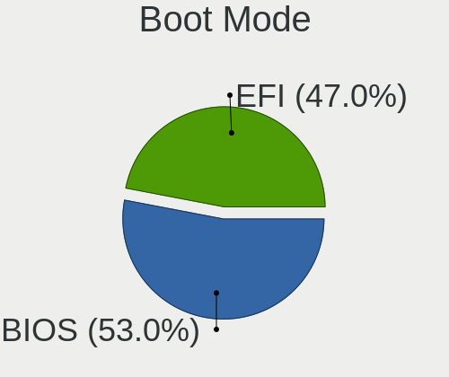
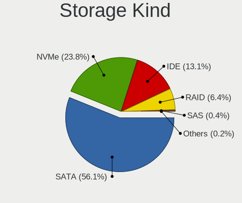
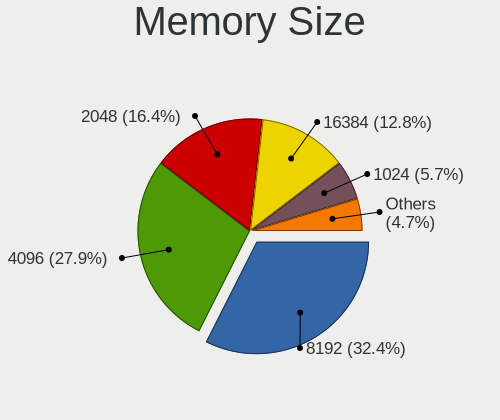

Linux - Tested Hardware & Statistics
------------------------------------

A project to collect tested hardware configurations for Linux.

Anyone can contribute to this report by the [hw-probe](https://github.com/linuxhw/hw-probe) tool:

    sudo -E hw-probe -all -upload

Please contribute! Especially if your hardware is rare.

This is a report for all computer types. See also reports for [desktops](/Desktop/README.md) and [notebooks](/Notebook/README.md).

Distribution-specific reports: [AlmaLinux](/Dist/AlmaLinux), [Alpine](/Dist/Alpine), [ALT_Linux](/Dist/ALT_Linux), [antiX](/Dist/antiX), [Artix](/Dist/Artix), [Chrome_OS](/Dist/Chrome_OS), [Clear_Linux](/Dist/Clear_Linux), [Deepin](/Dist/Deepin), [Devuan](/Dist/Devuan), [EndeavourOS](/Dist/EndeavourOS), [Garuda_Linux](/Dist/Garuda_Linux), [GNOME_OS](/Dist/GNOME_OS), [Kaisen](/Dist/Kaisen), [Mageia](/Dist/Mageia), [Makulu](/Dist/Makulu), [NixOS](/Dist/NixOS), [Nobara](/Dist/Nobara), [Oracle_Linux](/Dist/Oracle_Linux), [Pardus](/Dist/Pardus), [PureOS](/Dist/PureOS), [Q4OS](/Dist/Q4OS), [Reborn_OS](/Dist/Reborn_OS), [Rocky_Linux](/Dist/Rocky_Linux), [Sparky](/Dist/Sparky), [Void_Linux](/Dist/Void_Linux), [Xero](/Dist/Xero).

This report is for real hardware. Report for virtual hardware: [TestCoverage_VE](https://github.com/linuxhw/TestCoverage_VE)

Contents
--------

* [ Test Cases ](#test-cases)

* [ System ](#system)
  - [ OS                       ](#os)
  - [ OS Family                ](#os-family)
  - [ Kernel                   ](#kernel)
  - [ Kernel Family            ](#kernel-family)
  - [ Kernel Major Ver.        ](#kernel-major-ver)
  - [ Arch                     ](#arch)
  - [ DE                       ](#de)
  - [ Display Server           ](#display-server)
  - [ Display Manager          ](#display-manager)
  - [ OS Lang                  ](#os-lang)
  - [ Boot Mode                ](#boot-mode)
  - [ Filesystem               ](#filesystem)
  - [ Part. scheme             ](#part-scheme)
  - [ Dual Boot with Linux/BSD ](#dual-boot-with-linuxbsd)
  - [ Dual Boot (Win)          ](#dual-boot-win)

* [ Board ](#board)
  - [ Vendor                   ](#vendor)
  - [ Model                    ](#model)
  - [ Model Family             ](#model-family)
  - [ MFG Year                 ](#mfg-year)
  - [ Form Factor              ](#form-factor)
  - [ Secure Boot              ](#secure-boot)
  - [ Coreboot                 ](#coreboot)
  - [ RAM Size                 ](#ram-size)
  - [ RAM Used                 ](#ram-used)
  - [ Total Drives             ](#total-drives)
  - [ Has CD-ROM               ](#has-cd-rom)
  - [ Has Ethernet             ](#has-ethernet)
  - [ Has WiFi                 ](#has-wifi)
  - [ Has Bluetooth            ](#has-bluetooth)

* [ Location ](#location)
  - [ Country                  ](#country)
  - [ City                     ](#city)

* [ Drives ](#drives)
  - [ Drive Vendor             ](#drive-vendor)
  - [ Drive Model              ](#drive-model)
  - [ HDD Vendor               ](#hdd-vendor)
  - [ SSD Vendor               ](#ssd-vendor)
  - [ Drive Kind               ](#drive-kind)
  - [ Drive Connector          ](#drive-connector)
  - [ Drive Size               ](#drive-size)
  - [ Space Total              ](#space-total)
  - [ Space Used               ](#space-used)
  - [ Malfunc. Drives          ](#malfunc-drives)
  - [ Malfunc. Drive Vendor    ](#malfunc-drive-vendor)
  - [ Malfunc. HDD Vendor      ](#malfunc-hdd-vendor)
  - [ Malfunc. Drive Kind      ](#malfunc-drive-kind)
  - [ Failed Drives            ](#failed-drives)
  - [ Failed Drive Vendor      ](#failed-drive-vendor)
  - [ Drive Status             ](#drive-status)

* [ Storage controller ](#storage-controller)
  - [ Storage Vendor           ](#storage-vendor)
  - [ Storage Model            ](#storage-model)
  - [ Storage Kind             ](#storage-kind)

* [ Processor ](#processor)
  - [ CPU Vendor               ](#cpu-vendor)
  - [ CPU Model                ](#cpu-model)
  - [ CPU Model Family         ](#cpu-model-family)
  - [ CPU Cores                ](#cpu-cores)
  - [ CPU Sockets              ](#cpu-sockets)
  - [ CPU Threads              ](#cpu-threads)
  - [ CPU Op-Modes             ](#cpu-op-modes)
  - [ CPU Microcode            ](#cpu-microcode)
  - [ CPU Microarch            ](#cpu-microarch)

* [ Graphics ](#graphics)
  - [ GPU Vendor               ](#gpu-vendor)
  - [ GPU Model                ](#gpu-model)
  - [ GPU Combo                ](#gpu-combo)
  - [ GPU Driver               ](#gpu-driver)
  - [ GPU Memory               ](#gpu-memory)

* [ Monitor ](#monitor)
  - [ Monitor Vendor           ](#monitor-vendor)
  - [ Monitor Model            ](#monitor-model)
  - [ Monitor Resolution       ](#monitor-resolution)
  - [ Monitor Diagonal         ](#monitor-diagonal)
  - [ Monitor Width            ](#monitor-width)
  - [ Aspect Ratio             ](#aspect-ratio)
  - [ Monitor Area             ](#monitor-area)
  - [ Pixel Density            ](#pixel-density)
  - [ Multiple Monitors        ](#multiple-monitors)

* [ Network ](#network)
  - [ Net Controller Vendor    ](#net-controller-vendor)
  - [ Net Controller Model     ](#net-controller-model)
  - [ Wireless Vendor          ](#wireless-vendor)
  - [ Wireless Model           ](#wireless-model)
  - [ Ethernet Vendor          ](#ethernet-vendor)
  - [ Ethernet Model           ](#ethernet-model)
  - [ Net Controller Kind      ](#net-controller-kind)
  - [ Used Controller          ](#used-controller)
  - [ NICs                     ](#nics)
  - [ IPv6                     ](#ipv6)

* [ Bluetooth ](#bluetooth)
  - [ Bluetooth Vendor         ](#bluetooth-vendor)
  - [ Bluetooth Model          ](#bluetooth-model)

* [ Sound ](#sound)
  - [ Sound Vendor             ](#sound-vendor)
  - [ Sound Model              ](#sound-model)

* [ Memory ](#memory)
  - [ Memory Vendor            ](#memory-vendor)
  - [ Memory Model             ](#memory-model)
  - [ Memory Kind              ](#memory-kind)
  - [ Memory Form Factor       ](#memory-form-factor)
  - [ Memory Size              ](#memory-size)
  - [ Memory Speed             ](#memory-speed)

* [ Printers & scanners ](#printers--scanners)
  - [ Printer Vendor           ](#printer-vendor)
  - [ Printer Model            ](#printer-model)
  - [ Scanner Vendor           ](#scanner-vendor)
  - [ Scanner Model            ](#scanner-model)

* [ Camera ](#camera)
  - [ Camera Vendor            ](#camera-vendor)
  - [ Camera Model             ](#camera-model)

* [ Security ](#security)
  - [ Fingerprint Vendor       ](#fingerprint-vendor)
  - [ Fingerprint Model        ](#fingerprint-model)
  - [ Chipcard Vendor          ](#chipcard-vendor)
  - [ Chipcard Model           ](#chipcard-model)

* [ Unsupported ](#unsupported)
  - [ Unsupported Devices      ](#unsupported-devices)
  - [ Unsupported Device Types ](#unsupported-device-types)

Test Cases
----------

Total: 266005

| Vendor        | Model                       | Form-Factor | Probe                                                      | Date         |
|---------------|-----------------------------|-------------|------------------------------------------------------------|--------------|
| 3Q            | TD2500G-P-Q3 A01            | Desktop     | [46626558f6](https://linux-hardware.org/?probe=46626558f6) | Dec 01, 2022 |
| Gigabyte      | X570S AORUS PRO AX          | Notebook    | [253135f8dc](https://linux-hardware.org/?probe=253135f8dc) | Dec 01, 2022 |
| Valve         | Jupiter                     | Notebook    | [1fdf6ffce7](https://linux-hardware.org/?probe=1fdf6ffce7) | Dec 01, 2022 |
| ASUSTek       | AT3IONT-I DELUXE            | Desktop     | [16680c5211](https://linux-hardware.org/?probe=16680c5211) | Dec 01, 2022 |
| Acer          | Aspire V3-571G              | Notebook    | [bbb0c707bb](https://linux-hardware.org/?probe=bbb0c707bb) | Dec 01, 2022 |
| HP            | ProLiant DL360 G7           | Server      | [878afd8a43](https://linux-hardware.org/?probe=878afd8a43) | Dec 01, 2022 |
| MSI           | GL62M 7RE                   | Notebook    | [5fcb394edb](https://linux-hardware.org/?probe=5fcb394edb) | Dec 01, 2022 |
| HP            | Laptop 15-dw1xxx            | Notebook    | [d8d5459ad6](https://linux-hardware.org/?probe=d8d5459ad6) | Dec 01, 2022 |
| Valve         | Jupiter                     | Notebook    | [ec26a28bff](https://linux-hardware.org/?probe=ec26a28bff) | Dec 01, 2022 |
| HP            | Stream Laptop 14-cb1XX      | Notebook    | [e8ecfcc3cd](https://linux-hardware.org/?probe=e8ecfcc3cd) | Dec 01, 2022 |
| MSI           | GF72 8RD                    | Notebook    | [c03f783ea5](https://linux-hardware.org/?probe=c03f783ea5) | Dec 01, 2022 |
| AZW           | SEi                         | Notebook    | [3cd2f7f657](https://linux-hardware.org/?probe=3cd2f7f657) | Dec 01, 2022 |
| Lenovo        | ThinkPad T470p 20J60018M... | Notebook    | [994d8e4b1d](https://linux-hardware.org/?probe=994d8e4b1d) | Dec 01, 2022 |
| HP            | Stream Laptop 14-cb1XX      | Notebook    | [80c9d45a14](https://linux-hardware.org/?probe=80c9d45a14) | Dec 01, 2022 |
| Packard Be... | DOT S                       | Notebook    | [bb05d9a173](https://linux-hardware.org/?probe=bb05d9a173) | Dec 01, 2022 |
| HP            | Laptop 15-dw1xxx            | Notebook    | [1dddd99280](https://linux-hardware.org/?probe=1dddd99280) | Dec 01, 2022 |
| Acer          | Aspire XC-705               | Desktop     | [86a503df2a](https://linux-hardware.org/?probe=86a503df2a) | Dec 01, 2022 |
| Acer          | Aspire V3-771               | Notebook    | [38dfcb79d5](https://linux-hardware.org/?probe=38dfcb79d5) | Dec 01, 2022 |
| Lenovo        | IdeaPad Gaming 3 15IAH7 ... | Notebook    | [fe9e8854c5](https://linux-hardware.org/?probe=fe9e8854c5) | Dec 01, 2022 |
| Gigabyte      | B450M DS3H-CF               | Desktop     | [5e7bc65683](https://linux-hardware.org/?probe=5e7bc65683) | Dec 01, 2022 |
| Acer          | Aspire V5-121               | Notebook    | [473cfb46f7](https://linux-hardware.org/?probe=473cfb46f7) | Dec 01, 2022 |
| Samsung       | R540/R538/SA41/E452         | Notebook    | [afad3c8828](https://linux-hardware.org/?probe=afad3c8828) | Dec 01, 2022 |
| MSI           | GV72 7RE                    | Notebook    | [74b317d501](https://linux-hardware.org/?probe=74b317d501) | Dec 01, 2022 |
| Acer          | Aspire 3830TG               | Notebook    | [8bb246cbaa](https://linux-hardware.org/?probe=8bb246cbaa) | Dec 01, 2022 |
| Lenovo        | ThinkPad T440p 20AN0079M... | Notebook    | [79261239c1](https://linux-hardware.org/?probe=79261239c1) | Dec 01, 2022 |
| HP            | 250 G7 Notebook PC          | Notebook    | [1002df8858](https://linux-hardware.org/?probe=1002df8858) | Dec 01, 2022 |
| ASUSTek       | A88XM-A/USB                 | Desktop     | [012f2dccba](https://linux-hardware.org/?probe=012f2dccba) | Dec 01, 2022 |
| Acer          | Aspire 3830TG               | Notebook    | [46bcb20e26](https://linux-hardware.org/?probe=46bcb20e26) | Dec 01, 2022 |
| Gigabyte      | B450M DS3H-CF               | Desktop     | [660b9b7529](https://linux-hardware.org/?probe=660b9b7529) | Dec 01, 2022 |
| ASUSTek       | A88XM-A                     | Desktop     | [f883ed1fd1](https://linux-hardware.org/?probe=f883ed1fd1) | Dec 01, 2022 |
| ASRock        | AD525PV3                    | Desktop     | [da83c87218](https://linux-hardware.org/?probe=da83c87218) | Dec 01, 2022 |
| Apple         | Mac-35C5E08120C7EEAF Mac... | Mini pc     | [a203c920d4](https://linux-hardware.org/?probe=a203c920d4) | Dec 01, 2022 |
| Gigabyte      | B450 I AORUS PRO WIFI-CF    | Desktop     | [9866b7f07f](https://linux-hardware.org/?probe=9866b7f07f) | Dec 01, 2022 |
| ASUSTek       | TUF Gaming X570-PLUS_BR     | Desktop     | [7ff54a3b05](https://linux-hardware.org/?probe=7ff54a3b05) | Dec 01, 2022 |
| MSI           | MAG B550 TOMAHAWK MAX WI... | Desktop     | [51cf6d10e7](https://linux-hardware.org/?probe=51cf6d10e7) | Dec 01, 2022 |
| HP            | Pavilion g6                 | Notebook    | [cb93839085](https://linux-hardware.org/?probe=cb93839085) | Dec 01, 2022 |
| Lenovo        | ThinkBook 15 G3 ACL 21A4    | Notebook    | [d57de89542](https://linux-hardware.org/?probe=d57de89542) | Dec 01, 2022 |
| MSI           | G41M-S03                    | Desktop     | [763decb5d5](https://linux-hardware.org/?probe=763decb5d5) | Dec 01, 2022 |
| Lenovo        | Legion S7 15ACH6 82K8       | Notebook    | [4ab89a8ad2](https://linux-hardware.org/?probe=4ab89a8ad2) | Dec 01, 2022 |
| ASUSTek       | PRIME B550-PLUS             | Desktop     | [a4ed7efef9](https://linux-hardware.org/?probe=a4ed7efef9) | Dec 01, 2022 |
| HP            | Pavilion dv8000 (ET839UA... | Notebook    | [5b22a7d584](https://linux-hardware.org/?probe=5b22a7d584) | Dec 01, 2022 |
| HP            | Spectre x360 Convertible... | Convertible | [019a1b2e2a](https://linux-hardware.org/?probe=019a1b2e2a) | Dec 01, 2022 |
| Gigabyte      | B450 GAMING X               | Desktop     | [ff5aef2f59](https://linux-hardware.org/?probe=ff5aef2f59) | Dec 01, 2022 |
| ASUSTek       | PRIME B550-PLUS             | Desktop     | [5eebfea632](https://linux-hardware.org/?probe=5eebfea632) | Dec 01, 2022 |
| Lenovo        | IdeaPad Gaming 3 15IAH7 ... | Notebook    | [562e1f4b92](https://linux-hardware.org/?probe=562e1f4b92) | Dec 01, 2022 |
| ASUSTek       | P8H67                       | Desktop     | [31a7799a34](https://linux-hardware.org/?probe=31a7799a34) | Dec 01, 2022 |
| Dell          | Latitude E5450              | Notebook    | [305bf364f6](https://linux-hardware.org/?probe=305bf364f6) | Dec 01, 2022 |
| ASUSTek       | ASUS BR1100CKA BR1100CKA... | Notebook    | [aa9ad07031](https://linux-hardware.org/?probe=aa9ad07031) | Dec 01, 2022 |
| HP            | ENVY x360 Convertible 15... | Convertible | [c0663aa7da](https://linux-hardware.org/?probe=c0663aa7da) | Dec 01, 2022 |
| ASUSTek       | Zephyrus M GU502GV_GU502... | Notebook    | [de34f148b9](https://linux-hardware.org/?probe=de34f148b9) | Dec 01, 2022 |
| Unknown       | Unknown                     | Soc         | [05a662464d](https://linux-hardware.org/?probe=05a662464d) | Dec 01, 2022 |
| HP            | 0A98h                       | Desktop     | [f2b620c220](https://linux-hardware.org/?probe=f2b620c220) | Dec 01, 2022 |
| Positivo B... | VJFE53F11X-B0511H           | Notebook    | [24b1be97d6](https://linux-hardware.org/?probe=24b1be97d6) | Dec 01, 2022 |
| TUXEDO        | N13xWU                      | Notebook    | [55935f091d](https://linux-hardware.org/?probe=55935f091d) | Dec 01, 2022 |
| Medion        | H81H3-EM2 H81EM2W08.309     | Desktop     | [9aa4880856](https://linux-hardware.org/?probe=9aa4880856) | Dec 01, 2022 |
| Lenovo        | SHARKBAY NOK                | Desktop     | [e03c6b53ed](https://linux-hardware.org/?probe=e03c6b53ed) | Dec 01, 2022 |
| Positivo B... | VJFE53F11X-B0511H           | Notebook    | [a2e91cba31](https://linux-hardware.org/?probe=a2e91cba31) | Dec 01, 2022 |
| MSI           | PRO Z690-A DDR4             | Desktop     | [db5a886817](https://linux-hardware.org/?probe=db5a886817) | Dec 01, 2022 |
| Gigabyte      | B450M DS3H-CF               | Desktop     | [9d7fdf83b6](https://linux-hardware.org/?probe=9d7fdf83b6) | Dec 01, 2022 |
| Lenovo        | IdeaPad 3 15ALC6 82MF       | Notebook    | [c8ef49d294](https://linux-hardware.org/?probe=c8ef49d294) | Dec 01, 2022 |
| Acer          | Aspire XC-780               | Desktop     | [b385e11c00](https://linux-hardware.org/?probe=b385e11c00) | Dec 01, 2022 |
| ASUSTek       | M5A97 PLUS                  | Desktop     | [63820e3937](https://linux-hardware.org/?probe=63820e3937) | Dec 01, 2022 |
| Dell          | XPS 13 9300                 | Notebook    | [d6c50b1786](https://linux-hardware.org/?probe=d6c50b1786) | Dec 01, 2022 |
| Lenovo        | ThinkBook 15 G3 ACL 21A4    | Notebook    | [9d27bb4f90](https://linux-hardware.org/?probe=9d27bb4f90) | Dec 01, 2022 |
| Dell          | 0G254H A00                  | Desktop     | [473fb8a09a](https://linux-hardware.org/?probe=473fb8a09a) | Dec 01, 2022 |
| Lenovo        | ThinkPad E15 Gen 4 21EES... | Notebook    | [674157de54](https://linux-hardware.org/?probe=674157de54) | Dec 01, 2022 |
| MSI           | GS75 Stealth 8SG            | Notebook    | [70be467762](https://linux-hardware.org/?probe=70be467762) | Dec 01, 2022 |
| Intel         | NUC11PABi5 K90634-305       | Mini pc     | [cccf492c06](https://linux-hardware.org/?probe=cccf492c06) | Dec 01, 2022 |
| MSI           | H81M-E33                    | Desktop     | [aa874580d3](https://linux-hardware.org/?probe=aa874580d3) | Dec 01, 2022 |
| HP            | Notebook                    | Notebook    | [7c22b96a9a](https://linux-hardware.org/?probe=7c22b96a9a) | Dec 01, 2022 |
| Intel         | NUC11PABi5 K90634-305       | Mini pc     | [4c7e1d5bc4](https://linux-hardware.org/?probe=4c7e1d5bc4) | Dec 01, 2022 |
| ASUSTek       | Maximus VIII RANGER         | Desktop     | [c8d4cd1faf](https://linux-hardware.org/?probe=c8d4cd1faf) | Dec 01, 2022 |
| ASUSTek       | Maximus VIII RANGER         | Desktop     | [866e8151d7](https://linux-hardware.org/?probe=866e8151d7) | Dec 01, 2022 |
| Apple         | Mac-F221BEC8                | Desktop     | [7f91a09589](https://linux-hardware.org/?probe=7f91a09589) | Dec 01, 2022 |
| Gigabyte      | GA-MA790FXT-UD5P            | Desktop     | [010349b87b](https://linux-hardware.org/?probe=010349b87b) | Dec 01, 2022 |
| Dell          | Latitude E5570              | Notebook    | [4db5cd2ef4](https://linux-hardware.org/?probe=4db5cd2ef4) | Dec 01, 2022 |
| Dell          | Latitude E5450              | Notebook    | [2b934a729c](https://linux-hardware.org/?probe=2b934a729c) | Dec 01, 2022 |
| ASUSTek       | P7P55D                      | Desktop     | [0a012accfd](https://linux-hardware.org/?probe=0a012accfd) | Dec 01, 2022 |
| THUNDEROBO... | 911MT                       | Notebook    | [40111c09eb](https://linux-hardware.org/?probe=40111c09eb) | Dec 01, 2022 |
| Sony          | VPCEB1M1E                   | Notebook    | [988c78f70d](https://linux-hardware.org/?probe=988c78f70d) | Dec 01, 2022 |
| Lenovo        | IdeaPad 3 15ALC6 82KU       | Notebook    | [f9020b8dc6](https://linux-hardware.org/?probe=f9020b8dc6) | Dec 01, 2022 |
| Lenovo        | IdeaPad 100-15IBD 80QQ      | Notebook    | [929550dc41](https://linux-hardware.org/?probe=929550dc41) | Dec 01, 2022 |
| Samsung       | 930XED                      | Notebook    | [38584fa129](https://linux-hardware.org/?probe=38584fa129) | Dec 01, 2022 |
| Lenovo        | SHARKBAY SDK0E50510 WIN     | Desktop     | [2f59960e11](https://linux-hardware.org/?probe=2f59960e11) | Dec 01, 2022 |
| Lenovo        | ThinkPad T420 4236V6S       | Notebook    | [5900d34c9a](https://linux-hardware.org/?probe=5900d34c9a) | Dec 01, 2022 |
| Dell          | XPS 13 9343                 | Notebook    | [125fcd77b9](https://linux-hardware.org/?probe=125fcd77b9) | Dec 01, 2022 |
| HP            | 18E4                        | Desktop     | [b0254c66c7](https://linux-hardware.org/?probe=b0254c66c7) | Dec 01, 2022 |
| Fujitsu       | D3128-A1 S26361-D3128-A1    | Desktop     | [ad24dc05a0](https://linux-hardware.org/?probe=ad24dc05a0) | Dec 01, 2022 |
| Gigabyte      | GA-990FXA-UD7               | Desktop     | [e300be2b5e](https://linux-hardware.org/?probe=e300be2b5e) | Dec 01, 2022 |
| Lenovo        | SHARKBAY SDK0E50510 WIN     | Desktop     | [c155b94a47](https://linux-hardware.org/?probe=c155b94a47) | Dec 01, 2022 |
| Dell          | Precision 5540              | Notebook    | [030dbd45f0](https://linux-hardware.org/?probe=030dbd45f0) | Dec 01, 2022 |
| Fujitsu       | D3128-A1 S26361-D3128-A1    | Desktop     | [0e38c9a3be](https://linux-hardware.org/?probe=0e38c9a3be) | Dec 01, 2022 |
| Lenovo        | ThinkPad L560 20F10034MX    | Notebook    | [34842eb8d9](https://linux-hardware.org/?probe=34842eb8d9) | Dec 01, 2022 |
| HP            | 8433 11                     | Desktop     | [01f9a28da3](https://linux-hardware.org/?probe=01f9a28da3) | Dec 01, 2022 |
| TUXEDO        | InfinityBook Pro 14 Gen6    | Notebook    | [946e66e35e](https://linux-hardware.org/?probe=946e66e35e) | Dec 01, 2022 |
| HP            | EliteBook 8730w             | Notebook    | [fa27703043](https://linux-hardware.org/?probe=fa27703043) | Dec 01, 2022 |
| Medion        | H81H3-EM2 H81EM2W08.309     | Desktop     | [c1f5a1f413](https://linux-hardware.org/?probe=c1f5a1f413) | Dec 01, 2022 |
| Mediacom      | SmartBook 14 FullHD - SB... | Notebook    | [1df1f552ff](https://linux-hardware.org/?probe=1df1f552ff) | Dec 01, 2022 |
| Apple         | Mac-81E3E92DD6088272 iMa... | All in one  | [a8bad4d4b6](https://linux-hardware.org/?probe=a8bad4d4b6) | Dec 01, 2022 |
| HUAWEI        | MACH-WX9                    | Notebook    | [a37f48c68a](https://linux-hardware.org/?probe=a37f48c68a) | Dec 01, 2022 |
| Lenovo        | B40-70 20392                | Notebook    | [a527c5b6e6](https://linux-hardware.org/?probe=a527c5b6e6) | Dec 01, 2022 |
| Lenovo        | ThinkPad X1 Yoga 4th 20Q... | Convertible | [72ab240431](https://linux-hardware.org/?probe=72ab240431) | Dec 01, 2022 |
| BESSTAR Te... | GB1B                        | Mini pc     | [961f58c143](https://linux-hardware.org/?probe=961f58c143) | Dec 01, 2022 |
| Dell          | Inspiron 3501               | Notebook    | [f9379c4ffb](https://linux-hardware.org/?probe=f9379c4ffb) | Dec 01, 2022 |
| MSI           | MEG X570 UNIFY              | Desktop     | [df74bf8e13](https://linux-hardware.org/?probe=df74bf8e13) | Dec 01, 2022 |
| Lenovo        | V330-15IKB 81AX             | Notebook    | [becc2328fd](https://linux-hardware.org/?probe=becc2328fd) | Dec 01, 2022 |
| ASRock        | Z68 Extreme4 Gen3           | Desktop     | [c14e2149eb](https://linux-hardware.org/?probe=c14e2149eb) | Dec 01, 2022 |
| ASUSTek       | P5B                         | Desktop     | [44f13beada](https://linux-hardware.org/?probe=44f13beada) | Dec 01, 2022 |
| Lenovo        | Legion 5 15ACH6H 82JU       | Notebook    | [2cf7f9ab67](https://linux-hardware.org/?probe=2cf7f9ab67) | Dec 01, 2022 |
| HP            | 84EE 1100                   | All in one  | [7efea8ad7f](https://linux-hardware.org/?probe=7efea8ad7f) | Dec 01, 2022 |
| MSI           | GF63 Thin 9SC               | Notebook    | [057b0039b7](https://linux-hardware.org/?probe=057b0039b7) | Dec 01, 2022 |
| Dell          | XPS 15 9560                 | Notebook    | [3ee313dd51](https://linux-hardware.org/?probe=3ee313dd51) | Dec 01, 2022 |
| Acer          | Aspire E1-570G              | Notebook    | [b41442c5a1](https://linux-hardware.org/?probe=b41442c5a1) | Dec 01, 2022 |
| Lenovo        | Yoga 7 15ITL5 82BJ          | Convertible | [6c6d0525fc](https://linux-hardware.org/?probe=6c6d0525fc) | Dec 01, 2022 |
| Dell          | XPS 15 9560                 | Notebook    | [fde8194d5c](https://linux-hardware.org/?probe=fde8194d5c) | Dec 01, 2022 |
| Lenovo        | MIIX 310-10ICR 80SG         | Tablet      | [64e68bf245](https://linux-hardware.org/?probe=64e68bf245) | Dec 01, 2022 |
| MSI           | MAG B550 TOMAHAWK MAX WI... | Desktop     | [1775ec9d4b](https://linux-hardware.org/?probe=1775ec9d4b) | Dec 01, 2022 |
| Lenovo        | IdeaPad S340-14API 81NB     | Notebook    | [a8156db955](https://linux-hardware.org/?probe=a8156db955) | Dec 01, 2022 |
| MSI           | MAG B550 TOMAHAWK MAX WI... | Desktop     | [097d1c062e](https://linux-hardware.org/?probe=097d1c062e) | Dec 01, 2022 |
| ASUSTek       | ASUS TUF Dash F15 FX516P... | Notebook    | [0128a48982](https://linux-hardware.org/?probe=0128a48982) | Dec 01, 2022 |
| Lenovo        | Legion Y530-15ICH 81FV      | Notebook    | [615b292682](https://linux-hardware.org/?probe=615b292682) | Dec 01, 2022 |
| Acer          | Aspire 5750G                | Notebook    | [a8236e24a5](https://linux-hardware.org/?probe=a8236e24a5) | Dec 01, 2022 |
| Acer          | Aspire C24-963              | All in one  | [ab421fd2d4](https://linux-hardware.org/?probe=ab421fd2d4) | Dec 01, 2022 |
| HP            | Pavilion dv7                | Notebook    | [aa6cdce8f8](https://linux-hardware.org/?probe=aa6cdce8f8) | Dec 01, 2022 |
| ASUSTek       | ROG STRIX Z690-A GAMING ... | Desktop     | [8cf4925f08](https://linux-hardware.org/?probe=8cf4925f08) | Dec 01, 2022 |
| Dell          | 07JJ74 A01                  | Server      | [7096492ea2](https://linux-hardware.org/?probe=7096492ea2) | Dec 01, 2022 |
| Lenovo        | IdeaPad 5 Pro 14ACN6 82L... | Notebook    | [5955142015](https://linux-hardware.org/?probe=5955142015) | Dec 01, 2022 |
| ASUSTek       | H97-PLUS                    | Desktop     | [e8d75cbeed](https://linux-hardware.org/?probe=e8d75cbeed) | Dec 01, 2022 |
| Acer          | TravelMate P614-51T-G2      | Notebook    | [952e89e25d](https://linux-hardware.org/?probe=952e89e25d) | Dec 01, 2022 |
| ASRock        | X300M-STX                   | Desktop     | [97ceee65f3](https://linux-hardware.org/?probe=97ceee65f3) | Dec 01, 2022 |
| HP            | 1495                        | Desktop     | [138b5bb823](https://linux-hardware.org/?probe=138b5bb823) | Dec 01, 2022 |
| ASRock        | X300M-STX                   | Desktop     | [5b7f983a24](https://linux-hardware.org/?probe=5b7f983a24) | Dec 01, 2022 |
| HP            | ENVY dv7                    | Notebook    | [1cef09f19a](https://linux-hardware.org/?probe=1cef09f19a) | Dec 01, 2022 |
| ASRock        | X300M-STX                   | Desktop     | [42ddb2463e](https://linux-hardware.org/?probe=42ddb2463e) | Dec 01, 2022 |
| ASUSTek       | S551LN                      | Notebook    | [b21b106fdf](https://linux-hardware.org/?probe=b21b106fdf) | Dec 01, 2022 |
| ASUSTek       | P7H55-M                     | Desktop     | [b461d54421](https://linux-hardware.org/?probe=b461d54421) | Dec 01, 2022 |
| HP            | OMEN by Laptop 16-b1xxx     | Notebook    | [0cd3005f69](https://linux-hardware.org/?probe=0cd3005f69) | Dec 01, 2022 |
| Samsung       | 550XED                      | Notebook    | [d8894f602a](https://linux-hardware.org/?probe=d8894f602a) | Dec 01, 2022 |
| HP            | ProBook 440 G7              | Notebook    | [a54a325001](https://linux-hardware.org/?probe=a54a325001) | Dec 01, 2022 |
| Dell          | Latitude E7470              | Notebook    | [457187e169](https://linux-hardware.org/?probe=457187e169) | Dec 01, 2022 |
| HP            | 8184 X4                     | Desktop     | [2b5ea5e34c](https://linux-hardware.org/?probe=2b5ea5e34c) | Dec 01, 2022 |
| ASUSTek       | PRIME B460M-K               | Desktop     | [c8dd66d6de](https://linux-hardware.org/?probe=c8dd66d6de) | Dec 01, 2022 |
| ASUSTek       | PRIME B550M-A               | Desktop     | [5b86ca0927](https://linux-hardware.org/?probe=5b86ca0927) | Dec 01, 2022 |
| Dell          | 07JJ74 A01                  | Server      | [cb373247ed](https://linux-hardware.org/?probe=cb373247ed) | Dec 01, 2022 |
| ASUSTek       | PRIME B250M-K               | Desktop     | [97a1793680](https://linux-hardware.org/?probe=97a1793680) | Dec 01, 2022 |
| ASUSTek       | GL503VM                     | Notebook    | [dbd4aba670](https://linux-hardware.org/?probe=dbd4aba670) | Dec 01, 2022 |
| ASUSTek       | PRIME Z690-P WIFI D4        | Desktop     | [42932dd5fd](https://linux-hardware.org/?probe=42932dd5fd) | Dec 01, 2022 |
| ASUSTek       | VivoBook_ASUSLaptop E410... | Notebook    | [62ae8cb7dc](https://linux-hardware.org/?probe=62ae8cb7dc) | Dec 01, 2022 |
| Acer          | Aspire 5750G                | Notebook    | [198d7f2534](https://linux-hardware.org/?probe=198d7f2534) | Dec 01, 2022 |
| Samsung       | 355V4C/356V4C/3445VC/354... | Notebook    | [65fa0de0a2](https://linux-hardware.org/?probe=65fa0de0a2) | Dec 01, 2022 |
| System76      | Thelio thelio-r2            | Desktop     | [a7ae37f43e](https://linux-hardware.org/?probe=a7ae37f43e) | Dec 01, 2022 |
| ASUSTek       | TUF Gaming X570-PLUS        | Desktop     | [f7b40a75f6](https://linux-hardware.org/?probe=f7b40a75f6) | Dec 01, 2022 |
| ASUSTek       | GL503VM                     | Notebook    | [3db38d22b3](https://linux-hardware.org/?probe=3db38d22b3) | Dec 01, 2022 |
| Lenovo        | Legion 5 Pro 16ACH6H 82J... | Notebook    | [794fbb64f9](https://linux-hardware.org/?probe=794fbb64f9) | Dec 01, 2022 |
| HP            | Spectre x360 Convertible... | Convertible | [443bd561a5](https://linux-hardware.org/?probe=443bd561a5) | Dec 01, 2022 |
| Lenovo        | ThinkPad T480S 20L8SBTD0... | Notebook    | [2d4a014ef1](https://linux-hardware.org/?probe=2d4a014ef1) | Dec 01, 2022 |
| Dell          | 0R6PCT A01                  | Desktop     | [c8ef04b4b2](https://linux-hardware.org/?probe=c8ef04b4b2) | Dec 01, 2022 |
| Acer          | Aspire xxxx                 | Notebook    | [320d58f6f1](https://linux-hardware.org/?probe=320d58f6f1) | Dec 01, 2022 |
| ASUSTek       | ROG STRIX X570-F GAMING     | Desktop     | [1ebd8b1b89](https://linux-hardware.org/?probe=1ebd8b1b89) | Dec 01, 2022 |
| Dell          | Latitude E7240              | Notebook    | [0945377dfb](https://linux-hardware.org/?probe=0945377dfb) | Dec 01, 2022 |
| Lenovo        | 3190 NOK                    | Mini pc     | [b550b6a30e](https://linux-hardware.org/?probe=b550b6a30e) | Dec 01, 2022 |
| In-Sing       | NK81J                       | Notebook    | [bca0a3709f](https://linux-hardware.org/?probe=bca0a3709f) | Dec 01, 2022 |
| Acer          | Aspire 5336                 | Notebook    | [65be105c02](https://linux-hardware.org/?probe=65be105c02) | Dec 01, 2022 |
| Unknown       | Unknown                     | Notebook    | [dceef2a9d5](https://linux-hardware.org/?probe=dceef2a9d5) | Dec 01, 2022 |
| Apple         | Mac-942B59F58194171B iMa... | All in one  | [ce6f6fcaad](https://linux-hardware.org/?probe=ce6f6fcaad) | Dec 01, 2022 |
| ASUSTek       | PRIME X370-PRO              | Desktop     | [aa87dfdc13](https://linux-hardware.org/?probe=aa87dfdc13) | Dec 01, 2022 |
| Gigabyte      | F2A88XM-D3H                 | Desktop     | [b0bf36f700](https://linux-hardware.org/?probe=b0bf36f700) | Dec 01, 2022 |
| HP            | Stream Laptop 11-ak0xxx     | Notebook    | [d2c04dd7cd](https://linux-hardware.org/?probe=d2c04dd7cd) | Dec 01, 2022 |
| Gigabyte      | F2A88XM-D3H                 | Desktop     | [f5a5a30379](https://linux-hardware.org/?probe=f5a5a30379) | Dec 01, 2022 |
| Dell          | 0PV3YR A05                  | Server      | [3131016a26](https://linux-hardware.org/?probe=3131016a26) | Dec 01, 2022 |
| Dell          | Latitude E7470              | Notebook    | [b24884fe44](https://linux-hardware.org/?probe=b24884fe44) | Dec 01, 2022 |
| ONDA          | M3 miniPC VER               | Desktop     | [35f4c45eb5](https://linux-hardware.org/?probe=35f4c45eb5) | Dec 01, 2022 |
| ASUSTek       | ROG STRIX B450-F GAMING     | Desktop     | [0461e6b5d2](https://linux-hardware.org/?probe=0461e6b5d2) | Dec 01, 2022 |
| Lenovo        | ThinkPad X13 Gen 1 20UFC... | Notebook    | [cccb2da575](https://linux-hardware.org/?probe=cccb2da575) | Dec 01, 2022 |
| Lenovo        | ThinkPad T480S 20L8SBTD0... | Notebook    | [e1cec664eb](https://linux-hardware.org/?probe=e1cec664eb) | Dec 01, 2022 |
| Pegatron      | 2AC2                        | Desktop     | [3d92c6cbc8](https://linux-hardware.org/?probe=3d92c6cbc8) | Dec 01, 2022 |
| HP            | Pavilion dv8000 (ET839UA... | Notebook    | [19c2f41d14](https://linux-hardware.org/?probe=19c2f41d14) | Dec 01, 2022 |
| MSI           | X99A RAIDER                 | Desktop     | [0e87a76042](https://linux-hardware.org/?probe=0e87a76042) | Dec 01, 2022 |
| HP            | EliteBook 820 G3            | Notebook    | [d313455fa8](https://linux-hardware.org/?probe=d313455fa8) | Dec 01, 2022 |
| Gigabyte      | Z590I VISION D              | Desktop     | [655e907d62](https://linux-hardware.org/?probe=655e907d62) | Dec 01, 2022 |
| Lenovo        | ThinkPad T430s 2355C33      | Notebook    | [aff020417f](https://linux-hardware.org/?probe=aff020417f) | Dec 01, 2022 |
| ASUSTek       | K52F                        | Notebook    | [63c08600c3](https://linux-hardware.org/?probe=63c08600c3) | Dec 01, 2022 |
| MSI           | GL65 Leopard 10SDR          | Notebook    | [73c388fb61](https://linux-hardware.org/?probe=73c388fb61) | Dec 01, 2022 |
| HP            | EliteBook 820 G3            | Notebook    | [31b9efe771](https://linux-hardware.org/?probe=31b9efe771) | Dec 01, 2022 |
| MSI           | GL65 Leopard 10SDR          | Notebook    | [6d44ef56c9](https://linux-hardware.org/?probe=6d44ef56c9) | Dec 01, 2022 |
| Unknown       | 1.0                         | Desktop     | [c8cfeaf2be](https://linux-hardware.org/?probe=c8cfeaf2be) | Dec 01, 2022 |
| ASUSTek       | K52F                        | Notebook    | [4276cc2cb9](https://linux-hardware.org/?probe=4276cc2cb9) | Dec 01, 2022 |
| Dell          | Vostro 3480                 | Notebook    | [bf353a87c5](https://linux-hardware.org/?probe=bf353a87c5) | Dec 01, 2022 |
| K.A.Techno... | TM1                         | Notebook    | [96c2b9969f](https://linux-hardware.org/?probe=96c2b9969f) | Dec 01, 2022 |
| Apple         | MacBookPro11,4              | Notebook    | [138689463a](https://linux-hardware.org/?probe=138689463a) | Dec 01, 2022 |
| ASUSTek       | PRIME A320M-K               | Desktop     | [e1a4335a71](https://linux-hardware.org/?probe=e1a4335a71) | Dec 01, 2022 |
| MSI           | B450-A PRO MAX              | Desktop     | [8de79673ea](https://linux-hardware.org/?probe=8de79673ea) | Dec 01, 2022 |
| Lenovo        | ThinkPad X13 Gen 2a 20XH... | Notebook    | [f0ee9f78bd](https://linux-hardware.org/?probe=f0ee9f78bd) | Dec 01, 2022 |
| ASUSTek       | ROG STRIX B550-F GAMING     | Desktop     | [0f27e558f3](https://linux-hardware.org/?probe=0f27e558f3) | Dec 01, 2022 |
| HP            | ProBook 450 G2              | Notebook    | [552ac907a0](https://linux-hardware.org/?probe=552ac907a0) | Dec 01, 2022 |
| GPU Compan... | GWTC116-2                   | Notebook    | [d004be9ab6](https://linux-hardware.org/?probe=d004be9ab6) | Dec 01, 2022 |
| Acer          | Aspire C24-963              | All in one  | [4f517e816d](https://linux-hardware.org/?probe=4f517e816d) | Dec 01, 2022 |
| Apple         | MacBookPro11,4              | Notebook    | [16d0cef78c](https://linux-hardware.org/?probe=16d0cef78c) | Dec 01, 2022 |
| MSI           | B460M PRO-VDH WIFI          | Desktop     | [3b7321ba87](https://linux-hardware.org/?probe=3b7321ba87) | Dec 01, 2022 |
| Dell          | Inspiron 13-5378            | Notebook    | [9d25b2f6e0](https://linux-hardware.org/?probe=9d25b2f6e0) | Dec 01, 2022 |
| Raspberry ... | Raspberry Pi 3 Model B P... | Soc         | [5fa6ceed90](https://linux-hardware.org/?probe=5fa6ceed90) | Dec 01, 2022 |
| W271ELQ       | Unknown                     | Notebook    | [ae170d1e81](https://linux-hardware.org/?probe=ae170d1e81) | Dec 01, 2022 |
| Apple         | MacBook6,1                  | Notebook    | [b8145a2349](https://linux-hardware.org/?probe=b8145a2349) | Dec 01, 2022 |
| ASUSTek       | K55VD                       | Notebook    | [149d517fa5](https://linux-hardware.org/?probe=149d517fa5) | Dec 01, 2022 |
| ASUSTek       | P8H77-V LE                  | Desktop     | [d82ed03dd9](https://linux-hardware.org/?probe=d82ed03dd9) | Dec 01, 2022 |
| ASUSTek       | SABERTOOTH X58              | Desktop     | [4ae619c728](https://linux-hardware.org/?probe=4ae619c728) | Dec 01, 2022 |
| System76      | Thelio thelio-r1            | Desktop     | [a888eb38b3](https://linux-hardware.org/?probe=a888eb38b3) | Dec 01, 2022 |
| System76      | Thelio thelio-r1            | Desktop     | [76343aa234](https://linux-hardware.org/?probe=76343aa234) | Dec 01, 2022 |
| HP            | 18E9                        | Desktop     | [9086d1a1e5](https://linux-hardware.org/?probe=9086d1a1e5) | Dec 01, 2022 |
| Lenovo        | Yoga 7 16IAH7 82UF          | Convertible | [c62923ba95](https://linux-hardware.org/?probe=c62923ba95) | Dec 01, 2022 |
| Lenovo        | ThinkPad L560 20F2S2UR02    | Notebook    | [29c5e0f7b1](https://linux-hardware.org/?probe=29c5e0f7b1) | Dec 01, 2022 |
| MSI           | MPG Z390 GAMING PRO CARB... | Desktop     | [f8a7663037](https://linux-hardware.org/?probe=f8a7663037) | Dec 01, 2022 |
| Dell          | Vostro 3578                 | Notebook    | [89161c2dee](https://linux-hardware.org/?probe=89161c2dee) | Dec 01, 2022 |
| ASUSTek       | P5K WS                      | Desktop     | [f3608476bf](https://linux-hardware.org/?probe=f3608476bf) | Dec 01, 2022 |
| Dell          | XPS 13 9310                 | Notebook    | [aadf1c39a0](https://linux-hardware.org/?probe=aadf1c39a0) | Dec 01, 2022 |
| HP            | EliteBook 8570w             | Notebook    | [a4ae0cdd6a](https://linux-hardware.org/?probe=a4ae0cdd6a) | Dec 01, 2022 |
| THUNDEROBO... | 911MT                       | Notebook    | [cdd03a3498](https://linux-hardware.org/?probe=cdd03a3498) | Dec 01, 2022 |
| Lenovo        | 3000 V100 076346G           | Notebook    | [bb04272723](https://linux-hardware.org/?probe=bb04272723) | Dec 01, 2022 |
| MSI           | B350 GAMING PLUS            | Desktop     | [b840a0d02e](https://linux-hardware.org/?probe=b840a0d02e) | Dec 01, 2022 |
| Acer          | Aspire 5741G                | Notebook    | [0a336099ba](https://linux-hardware.org/?probe=0a336099ba) | Dec 01, 2022 |
| Gigabyte      | Z390 M GAMING-CF            | Desktop     | [f0dba35258](https://linux-hardware.org/?probe=f0dba35258) | Dec 01, 2022 |
| ECS           | H61H2-WM                    | Desktop     | [9a7a280b58](https://linux-hardware.org/?probe=9a7a280b58) | Dec 01, 2022 |
| Lenovo        | B450 1S1680033610187        | Notebook    | [e33670a27b](https://linux-hardware.org/?probe=e33670a27b) | Nov 30, 2022 |
| Fujitsu       | D2917-A1 S26361-D2917-A1    | Desktop     | [dd124e3579](https://linux-hardware.org/?probe=dd124e3579) | Nov 30, 2022 |
| Gigabyte      | H170-HD3-CF                 | Desktop     | [1d293c6d72](https://linux-hardware.org/?probe=1d293c6d72) | Nov 30, 2022 |
| Google        | Cyan                        | Notebook    | [4aa7125981](https://linux-hardware.org/?probe=4aa7125981) | Nov 30, 2022 |
| Acer          | Aspire A315-21              | Notebook    | [7c3a371165](https://linux-hardware.org/?probe=7c3a371165) | Nov 30, 2022 |
| Dell          | Inspiron MM061              | Notebook    | [703ef1c899](https://linux-hardware.org/?probe=703ef1c899) | Nov 30, 2022 |
| ASUSTek       | PRIME B450M-GAMING/BR       | Desktop     | [8a4813eec4](https://linux-hardware.org/?probe=8a4813eec4) | Nov 30, 2022 |
| HP            | 255 G4                      | Notebook    | [33b2fb7f31](https://linux-hardware.org/?probe=33b2fb7f31) | Nov 30, 2022 |
| HUAWEI        | KLVL-WXX9                   | Notebook    | [ea8b9066f6](https://linux-hardware.org/?probe=ea8b9066f6) | Nov 30, 2022 |
| Acer          | Aspire A315-21              | Notebook    | [5f14327a56](https://linux-hardware.org/?probe=5f14327a56) | Nov 30, 2022 |
| ASUSTek       | ROG STRIX X470-F GAMING     | Desktop     | [b52b8b590b](https://linux-hardware.org/?probe=b52b8b590b) | Nov 30, 2022 |
| HP            | 1825                        | Desktop     | [5f8bff315d](https://linux-hardware.org/?probe=5f8bff315d) | Nov 30, 2022 |
| THUNDEROBO... | 911MT                       | Notebook    | [2731961e4c](https://linux-hardware.org/?probe=2731961e4c) | Nov 30, 2022 |
| ASUSTek       | ROG STRIX X570-I GAMING     | Desktop     | [ac84964c19](https://linux-hardware.org/?probe=ac84964c19) | Nov 30, 2022 |
| sunxi         | FriendlyARM NanoPi NEO 2    | Soc         | [f1e2cbe354](https://linux-hardware.org/?probe=f1e2cbe354) | Nov 30, 2022 |
| Lenovo        | ThinkPad E15 Gen 2 20TDS... | Notebook    | [9bd70d2025](https://linux-hardware.org/?probe=9bd70d2025) | Nov 30, 2022 |
| Samsung       | 300E4A/300E5A/300E7A/343... | Notebook    | [5f53eff4a6](https://linux-hardware.org/?probe=5f53eff4a6) | Nov 30, 2022 |
| HUAWEI        | CREM-WXX9                   | Notebook    | [2436f4cf5e](https://linux-hardware.org/?probe=2436f4cf5e) | Nov 30, 2022 |
| MSI           | GE72 6QC                    | Notebook    | [ba4847397e](https://linux-hardware.org/?probe=ba4847397e) | Nov 30, 2022 |
| Lenovo        | ThinkPad X220 4291WSH       | Notebook    | [3e67e44d23](https://linux-hardware.org/?probe=3e67e44d23) | Nov 30, 2022 |
| Lenovo        | SHARKBAY SDK0E50510 WIN     | Desktop     | [475ad82d2b](https://linux-hardware.org/?probe=475ad82d2b) | Nov 30, 2022 |
| Colorful T... | DJ H310M-E V20              | Desktop     | [ef8cb053dc](https://linux-hardware.org/?probe=ef8cb053dc) | Nov 30, 2022 |
| Dell          | Inspiron 15-3567            | Notebook    | [eff3d877bc](https://linux-hardware.org/?probe=eff3d877bc) | Nov 30, 2022 |
| Medion        | MS-7748                     | Desktop     | [0e92aa55ca](https://linux-hardware.org/?probe=0e92aa55ca) | Nov 30, 2022 |
| Colorful T... | DJ H310M-E V20              | Desktop     | [9831bd75b9](https://linux-hardware.org/?probe=9831bd75b9) | Nov 30, 2022 |
| Lenovo        | ThinkCentre M70e 0809D1Y    | Desktop     | [0cd85fa9f3](https://linux-hardware.org/?probe=0cd85fa9f3) | Nov 30, 2022 |
| ASUSTek       | ROG STRIX B550-F GAMING     | Desktop     | [80b8b349f8](https://linux-hardware.org/?probe=80b8b349f8) | Nov 30, 2022 |
| Gigabyte      | Z390 M GAMING-CF            | Desktop     | [baa969bf8b](https://linux-hardware.org/?probe=baa969bf8b) | Nov 30, 2022 |
| Pegatron      | C15B                        | Notebook    | [defacd8748](https://linux-hardware.org/?probe=defacd8748) | Nov 30, 2022 |
| ASRock        | B75M-DGS                    | Desktop     | [ca277bb16c](https://linux-hardware.org/?probe=ca277bb16c) | Nov 30, 2022 |
| Dell          | 0NDYHG A01                  | Desktop     | [5dd9f4dea9](https://linux-hardware.org/?probe=5dd9f4dea9) | Nov 30, 2022 |
| Lenovo        | ThinkPad X270 20HNS03B00    | Notebook    | [bd40de3011](https://linux-hardware.org/?probe=bd40de3011) | Nov 30, 2022 |
| Lenovo        | ThinkPad E15 Gen 2 20TDS... | Notebook    | [bd0ca3e793](https://linux-hardware.org/?probe=bd0ca3e793) | Nov 30, 2022 |
| ASUSTek       | PRIME B450M-A II            | Desktop     | [a5b34b67f2](https://linux-hardware.org/?probe=a5b34b67f2) | Nov 30, 2022 |
| Lenovo        | ThinkPad P14s Gen 2a 21A... | Notebook    | [258c074e40](https://linux-hardware.org/?probe=258c074e40) | Nov 30, 2022 |
| MSI           | Boston                      | Desktop     | [0564f7ed2d](https://linux-hardware.org/?probe=0564f7ed2d) | Nov 30, 2022 |
| Dell          | 0N4YC8 A00                  | Desktop     | [2e53fa79ed](https://linux-hardware.org/?probe=2e53fa79ed) | Nov 30, 2022 |
| Lenovo        | ThinkPad T530 24297ZG       | Notebook    | [422f84a794](https://linux-hardware.org/?probe=422f84a794) | Nov 30, 2022 |
| Lenovo        | IdeaPad 310-15IAP 80TT      | Notebook    | [3aa3302b92](https://linux-hardware.org/?probe=3aa3302b92) | Nov 30, 2022 |
| Dell          | Latitude E5520              | Notebook    | [92a4c9b5ef](https://linux-hardware.org/?probe=92a4c9b5ef) | Nov 30, 2022 |
| MSI           | B450-A PRO MAX              | Desktop     | [e2f97abdea](https://linux-hardware.org/?probe=e2f97abdea) | Nov 30, 2022 |
| ASUSTek       | Z97-A                       | Desktop     | [da1400c491](https://linux-hardware.org/?probe=da1400c491) | Nov 30, 2022 |
| Pegatron      | C15B                        | Notebook    | [92271ab582](https://linux-hardware.org/?probe=92271ab582) | Nov 30, 2022 |
| Lenovo        | ThinkPad X1 Carbon Gen 1... | Notebook    | [0aa3ec7616](https://linux-hardware.org/?probe=0aa3ec7616) | Nov 30, 2022 |
| HP            | ElitePad 1000 G2            | Notebook    | [0b05465735](https://linux-hardware.org/?probe=0b05465735) | Nov 30, 2022 |
| Sony          | VPCEB4L9E                   | Notebook    | [cad7ef5059](https://linux-hardware.org/?probe=cad7ef5059) | Nov 30, 2022 |
| Samsung       | 730QAA                      | Convertible | [7ec4c2ecfd](https://linux-hardware.org/?probe=7ec4c2ecfd) | Nov 30, 2022 |
| Apple         | Mac-F2238BAE iMac11,3       | All in one  | [473821d177](https://linux-hardware.org/?probe=473821d177) | Nov 30, 2022 |
| HP            | Pavilion dv5                | Notebook    | [0fc7017b0c](https://linux-hardware.org/?probe=0fc7017b0c) | Nov 30, 2022 |
| HP            | 304Ah                       | Desktop     | [15db22accc](https://linux-hardware.org/?probe=15db22accc) | Nov 30, 2022 |
| Acer          | Aspire A315-34              | Notebook    | [6bf371252b](https://linux-hardware.org/?probe=6bf371252b) | Nov 30, 2022 |
| MSI           | MAG Z690 TOMAHAWK WIFI D... | Desktop     | [24dd5413fa](https://linux-hardware.org/?probe=24dd5413fa) | Nov 30, 2022 |
| MSI           | Z170A GAMING M3             | Desktop     | [dfe92c80c1](https://linux-hardware.org/?probe=dfe92c80c1) | Nov 30, 2022 |
| ASUSTek       | P8P67 DELUXE                | Desktop     | [c117ba54ea](https://linux-hardware.org/?probe=c117ba54ea) | Nov 30, 2022 |
| HP            | EliteBook 840 G3            | Notebook    | [e17d8c1694](https://linux-hardware.org/?probe=e17d8c1694) | Nov 30, 2022 |
| HUAWEI        | NBLK-WAX9X                  | Notebook    | [183243daeb](https://linux-hardware.org/?probe=183243daeb) | Nov 30, 2022 |
| Unknown       | Unknown                     | Notebook    | [9964cb6fe2](https://linux-hardware.org/?probe=9964cb6fe2) | Nov 30, 2022 |
| Dell          | 0WR7PY A03                  | Desktop     | [ba1e414d62](https://linux-hardware.org/?probe=ba1e414d62) | Nov 30, 2022 |
| Gigabyte      | X570 GAMING X               | Desktop     | [7ea2de1a3b](https://linux-hardware.org/?probe=7ea2de1a3b) | Nov 30, 2022 |
| Dell          | Studio 1558                 | Notebook    | [cf40788ef8](https://linux-hardware.org/?probe=cf40788ef8) | Nov 30, 2022 |
| Samsung       | 300E5K/300E5Q               | Notebook    | [f6bb652f5a](https://linux-hardware.org/?probe=f6bb652f5a) | Nov 30, 2022 |
| HP            | 8924 0101                   | All in one  | [f9c0b53eee](https://linux-hardware.org/?probe=f9c0b53eee) | Nov 30, 2022 |
| Toshiba       | TECRA S11                   | Notebook    | [3d2414e47b](https://linux-hardware.org/?probe=3d2414e47b) | Nov 30, 2022 |
| Pegatron      | BYT-X1                      | Desktop     | [edadb85201](https://linux-hardware.org/?probe=edadb85201) | Nov 30, 2022 |
| ASUSTek       | H81M-PLUS                   | Desktop     | [8d98938198](https://linux-hardware.org/?probe=8d98938198) | Nov 30, 2022 |
| Dell          | 0WWJRX A00                  | Desktop     | [83ef480c7d](https://linux-hardware.org/?probe=83ef480c7d) | Nov 30, 2022 |
| Pegatron      | BYT-X1                      | Desktop     | [b248df8671](https://linux-hardware.org/?probe=b248df8671) | Nov 30, 2022 |
| HP            | ZBook 14 G2                 | Notebook    | [b2bba919b2](https://linux-hardware.org/?probe=b2bba919b2) | Nov 30, 2022 |
| ASUSTek       | Z170-E                      | Desktop     | [5e68d23175](https://linux-hardware.org/?probe=5e68d23175) | Nov 30, 2022 |
| Lenovo        | ThinkPad P14s Gen 2a 21A... | Notebook    | [29ec19d38e](https://linux-hardware.org/?probe=29ec19d38e) | Nov 30, 2022 |
| Dell          | 0Y2G81 A01                  | Server      | [7ce42afb90](https://linux-hardware.org/?probe=7ce42afb90) | Nov 30, 2022 |
| ASUSTek       | ROG STRIX B550-I GAMING     | Desktop     | [4e6ae396d9](https://linux-hardware.org/?probe=4e6ae396d9) | Nov 30, 2022 |
| Samsung       | 550XDA                      | Notebook    | [7614fde301](https://linux-hardware.org/?probe=7614fde301) | Nov 30, 2022 |
| ASUSTek       | K53SC                       | Notebook    | [6d21dd6cea](https://linux-hardware.org/?probe=6d21dd6cea) | Nov 30, 2022 |
| ASUSTek       | E203NAH                     | Notebook    | [3d091ea214](https://linux-hardware.org/?probe=3d091ea214) | Nov 30, 2022 |
| Lenovo        | IdeaPad Gaming 3 15ARH05... | Notebook    | [65c3211b0a](https://linux-hardware.org/?probe=65c3211b0a) | Nov 30, 2022 |
| Lenovo        | ThinkPad P1 Gen 3 20TJS5... | Notebook    | [2df1670891](https://linux-hardware.org/?probe=2df1670891) | Nov 30, 2022 |
| HP            | Pavilion dv9000 (RP919EA... | Notebook    | [dcdd31c3d5](https://linux-hardware.org/?probe=dcdd31c3d5) | Nov 30, 2022 |
| Medion        | MS-7800                     | Desktop     | [a5658a6933](https://linux-hardware.org/?probe=a5658a6933) | Nov 30, 2022 |
| Graviton      | DMB-H510-MCA01              | Desktop     | [4dbcbc3b7a](https://linux-hardware.org/?probe=4dbcbc3b7a) | Nov 30, 2022 |
| ASUSTek       | ROG STRIX Z490-A GAMING     | Desktop     | [dc5ec6eb84](https://linux-hardware.org/?probe=dc5ec6eb84) | Nov 30, 2022 |
| Unknown       | X99H                        | Desktop     | [b9e2236de7](https://linux-hardware.org/?probe=b9e2236de7) | Nov 30, 2022 |
| Dell          | Inspiron N5010              | Notebook    | [687aa83749](https://linux-hardware.org/?probe=687aa83749) | Nov 30, 2022 |
| Lenovo        | IdeaPad Gaming 3 15ARH05... | Notebook    | [2a8dbc14ef](https://linux-hardware.org/?probe=2a8dbc14ef) | Nov 30, 2022 |
| GPU Compan... | GWTN156-2BK                 | Notebook    | [1ed3629f61](https://linux-hardware.org/?probe=1ed3629f61) | Nov 30, 2022 |
| ASRock        | N68-S3 UCC                  | Desktop     | [1d20e4ba6d](https://linux-hardware.org/?probe=1d20e4ba6d) | Nov 30, 2022 |
| Gigabyte      | Z370 HD3-CF                 | Desktop     | [ece7618688](https://linux-hardware.org/?probe=ece7618688) | Nov 30, 2022 |
| ASUSTek       | P8H61-M LX3                 | Desktop     | [87d3950072](https://linux-hardware.org/?probe=87d3950072) | Nov 30, 2022 |
| Gigabyte      | Z87-HD3                     | Desktop     | [d9a78cb529](https://linux-hardware.org/?probe=d9a78cb529) | Nov 30, 2022 |
| ASUSTek       | TUF Gaming X670E-PLUS WI... | Desktop     | [9282404406](https://linux-hardware.org/?probe=9282404406) | Nov 30, 2022 |
| Dell          | 0M5DCD A00                  | Desktop     | [e9fae02409](https://linux-hardware.org/?probe=e9fae02409) | Nov 30, 2022 |
| Gigabyte      | GB-BRR7H-4700               | Desktop     | [8398d00a16](https://linux-hardware.org/?probe=8398d00a16) | Nov 30, 2022 |
| Lenovo        | G500 20236                  | Notebook    | [43815283d9](https://linux-hardware.org/?probe=43815283d9) | Nov 30, 2022 |
| Standard      | Unknown                     | Notebook    | [723d9c3551](https://linux-hardware.org/?probe=723d9c3551) | Nov 30, 2022 |
| Gigabyte      | G33M-S2                     | Desktop     | [3d6a965dd4](https://linux-hardware.org/?probe=3d6a965dd4) | Nov 30, 2022 |
| Apple         | Mac-F2268CC8                | All in one  | [6e2f0af1b5](https://linux-hardware.org/?probe=6e2f0af1b5) | Nov 30, 2022 |
| HUAWEI        | CREM-WXX9                   | Notebook    | [33f7ac03f4](https://linux-hardware.org/?probe=33f7ac03f4) | Nov 30, 2022 |
| Dell          | Inspiron 15-3567            | Notebook    | [ee99c81e47](https://linux-hardware.org/?probe=ee99c81e47) | Nov 30, 2022 |
| Lenovo        | ThinkPad T470s W10DG 20J... | Notebook    | [645418a0dd](https://linux-hardware.org/?probe=645418a0dd) | Nov 30, 2022 |
| HP            | EliteBook x360 1040 G8 N... | Convertible | [4b635dd9ef](https://linux-hardware.org/?probe=4b635dd9ef) | Nov 30, 2022 |
| ASUSTek       | ROG STRIX Z690-A GAMING ... | Desktop     | [6b21f343c3](https://linux-hardware.org/?probe=6b21f343c3) | Nov 30, 2022 |
| ASUSTek       | UX550VD                     | Notebook    | [a3f2aafbf1](https://linux-hardware.org/?probe=a3f2aafbf1) | Nov 30, 2022 |
| ASUSTek       | PRIME B550-PLUS             | Desktop     | [a6a71120f2](https://linux-hardware.org/?probe=a6a71120f2) | Nov 30, 2022 |
| Apple         | Mac-F226BEC8 PVT            | All in one  | [c4ae439087](https://linux-hardware.org/?probe=c4ae439087) | Nov 30, 2022 |
| OEM           | H110 Ver:2.21               | Desktop     | [ad7fffd9e3](https://linux-hardware.org/?probe=ad7fffd9e3) | Nov 30, 2022 |
| Packard Be... | EasyNote TE69CXP            | Notebook    | [919275eb73](https://linux-hardware.org/?probe=919275eb73) | Nov 30, 2022 |
| Lenovo        | IdeaPadFlex 5 14ALC7 82R... | Convertible | [1c30aa7bcd](https://linux-hardware.org/?probe=1c30aa7bcd) | Nov 30, 2022 |
| Lenovo        | ThinkPad X1 Carbon Gen 9... | Notebook    | [b4aeee5799](https://linux-hardware.org/?probe=b4aeee5799) | Nov 30, 2022 |
| MSI           | MAG B550M MORTAR            | Desktop     | [b4c010a2b2](https://linux-hardware.org/?probe=b4c010a2b2) | Nov 30, 2022 |
| Samsung       | 530U3C/530U4C/532U3C        | Notebook    | [d95adc01a7](https://linux-hardware.org/?probe=d95adc01a7) | Nov 30, 2022 |
| HP            | OMEN Laptop 15-en0xxx       | Notebook    | [c3d55f501c](https://linux-hardware.org/?probe=c3d55f501c) | Nov 30, 2022 |
| Lenovo        | IdeaPad Gaming 3 15ARH05... | Notebook    | [89e340c4ec](https://linux-hardware.org/?probe=89e340c4ec) | Nov 30, 2022 |
| Dell          | 0YHMCJ A01                  | Server      | [77f946c99b](https://linux-hardware.org/?probe=77f946c99b) | Nov 30, 2022 |
| Foxconn       | 2ABF                        | Desktop     | [09a9309a2a](https://linux-hardware.org/?probe=09a9309a2a) | Nov 30, 2022 |
| HP            | EliteBook 860 16 inch G9... | Notebook    | [dda393ca54](https://linux-hardware.org/?probe=dda393ca54) | Nov 30, 2022 |
| Dell          | XPS 15 9500                 | Notebook    | [42971a8394](https://linux-hardware.org/?probe=42971a8394) | Nov 30, 2022 |
| ASRock        | 970 Extreme3                | Desktop     | [4951da34da](https://linux-hardware.org/?probe=4951da34da) | Nov 30, 2022 |
| AMI           | Aptio CRB                   | Mini pc     | [d7025eb475](https://linux-hardware.org/?probe=d7025eb475) | Nov 30, 2022 |
| ASUSTek       | Benicia                     | Desktop     | [e5468e4258](https://linux-hardware.org/?probe=e5468e4258) | Nov 30, 2022 |
| Haier         | A1420EM                     | Notebook    | [6f18b3c1ce](https://linux-hardware.org/?probe=6f18b3c1ce) | Nov 30, 2022 |
| ASUSTek       | M5A78L-M LE/USB3            | Desktop     | [dd3801095f](https://linux-hardware.org/?probe=dd3801095f) | Nov 30, 2022 |
| ASUSTek       | P7H55-M                     | Desktop     | [729bb4ef87](https://linux-hardware.org/?probe=729bb4ef87) | Nov 30, 2022 |
| Dell          | Latitude 7390               | Notebook    | [7214cac96d](https://linux-hardware.org/?probe=7214cac96d) | Nov 30, 2022 |
| Dell          | XPS 15 9500                 | Notebook    | [f9215967d3](https://linux-hardware.org/?probe=f9215967d3) | Nov 30, 2022 |
| MACHINIST     | X99-D8-MAX V1.0             | Desktop     | [c2430965a1](https://linux-hardware.org/?probe=c2430965a1) | Nov 30, 2022 |
| HP            | ProBook 450 G6              | Notebook    | [c9e94d483e](https://linux-hardware.org/?probe=c9e94d483e) | Nov 30, 2022 |
| MSI           | Z370 GAMING PLUS            | Desktop     | [bd1c91dba9](https://linux-hardware.org/?probe=bd1c91dba9) | Nov 30, 2022 |
| Lenovo        | Yoga 530-14IKB 81EK         | Convertible | [e214cb1bb9](https://linux-hardware.org/?probe=e214cb1bb9) | Nov 30, 2022 |
| Notebook      | RIM2520                     | Notebook    | [5f66abbb8b](https://linux-hardware.org/?probe=5f66abbb8b) | Nov 30, 2022 |
| Intel         | NUC7JYB J67967-404          | Mini pc     | [fd897211fa](https://linux-hardware.org/?probe=fd897211fa) | Nov 30, 2022 |
| ASUSTek       | ASUS TUF Gaming A15 FA50... | Notebook    | [66b6e49eb5](https://linux-hardware.org/?probe=66b6e49eb5) | Nov 30, 2022 |
| Apple         | Mac-B809C3757DA9BB8D iMa... | All in one  | [f698b715e4](https://linux-hardware.org/?probe=f698b715e4) | Nov 30, 2022 |
| HP            | OMEN by Laptop 16-b1xxx     | Notebook    | [32b68762df](https://linux-hardware.org/?probe=32b68762df) | Nov 30, 2022 |
| HP            | EliteBook Revolve 810 G3    | Notebook    | [ca043cff45](https://linux-hardware.org/?probe=ca043cff45) | Nov 30, 2022 |
| Lenovo        | IdeaPadFlex 5 15ITL05 82... | Convertible | [307022e985](https://linux-hardware.org/?probe=307022e985) | Nov 30, 2022 |
| ASUSTek       | P8P67 DELUXE                | Desktop     | [47131749a5](https://linux-hardware.org/?probe=47131749a5) | Nov 30, 2022 |
| Lenovo        | ThinkPad T470p 20J7S1FR0... | Notebook    | [517347d2cf](https://linux-hardware.org/?probe=517347d2cf) | Nov 30, 2022 |
| Lenovo        | Y520-15IKBN 80WK            | Notebook    | [b245f9da58](https://linux-hardware.org/?probe=b245f9da58) | Nov 30, 2022 |
| Dell          | 0TP406                      | Desktop     | [3eceea61d2](https://linux-hardware.org/?probe=3eceea61d2) | Nov 30, 2022 |
| Dell          | 0XJ5V0 A03                  | Desktop     | [b954e4c174](https://linux-hardware.org/?probe=b954e4c174) | Nov 30, 2022 |
| GALAX         | B365M G10b                  | Desktop     | [9eabacd766](https://linux-hardware.org/?probe=9eabacd766) | Nov 30, 2022 |
| Dell          | G15 5511                    | Notebook    | [d2c2cb8454](https://linux-hardware.org/?probe=d2c2cb8454) | Nov 30, 2022 |
| ASUSTek       | TUF Gaming Z690-PLUS D4     | Desktop     | [da83c13da3](https://linux-hardware.org/?probe=da83c13da3) | Nov 30, 2022 |
| Lenovo        | 3190 SDK0J40697 WIN 3305... | Mini pc     | [1c03d54694](https://linux-hardware.org/?probe=1c03d54694) | Nov 30, 2022 |
| HP            | ZBook 15v G5                | Notebook    | [aabc35ae2a](https://linux-hardware.org/?probe=aabc35ae2a) | Nov 30, 2022 |
| Acer          | Nitro AN515-43              | Notebook    | [b315e85bda](https://linux-hardware.org/?probe=b315e85bda) | Nov 30, 2022 |
| Lenovo        | Legion 5 15ACH6H 82JU       | Notebook    | [944ace565b](https://linux-hardware.org/?probe=944ace565b) | Nov 30, 2022 |
| HP            | Notebook                    | Notebook    | [afac08b852](https://linux-hardware.org/?probe=afac08b852) | Nov 30, 2022 |
| Dell          | Inspiron 3558               | Notebook    | [481755baa3](https://linux-hardware.org/?probe=481755baa3) | Nov 30, 2022 |
| Dell          | 0C3YXR A01                  | Desktop     | [95fbd0e6b4](https://linux-hardware.org/?probe=95fbd0e6b4) | Nov 30, 2022 |
| HP            | Spectre x360 Convertible... | Convertible | [d233ee2114](https://linux-hardware.org/?probe=d233ee2114) | Nov 30, 2022 |
| Gigabyte      | B450M DS3H-CF               | Desktop     | [952c3681c0](https://linux-hardware.org/?probe=952c3681c0) | Nov 30, 2022 |
| Dell          | Latitude E6440              | Notebook    | [0c3dd709dd](https://linux-hardware.org/?probe=0c3dd709dd) | Nov 30, 2022 |
| MSI           | Modern 14 B5M               | Notebook    | [8277ece293](https://linux-hardware.org/?probe=8277ece293) | Nov 30, 2022 |
| GALAX         | B365M G10b                  | Desktop     | [9f7438d5a3](https://linux-hardware.org/?probe=9f7438d5a3) | Nov 30, 2022 |
| Dell          | G15 5511                    | Notebook    | [f9e456efd0](https://linux-hardware.org/?probe=f9e456efd0) | Nov 30, 2022 |
| Dell          | 0TP406                      | Desktop     | [d22689331c](https://linux-hardware.org/?probe=d22689331c) | Nov 30, 2022 |
| ASUSTek       | VivoBook_ASUSLaptop E410... | Notebook    | [9505f905e8](https://linux-hardware.org/?probe=9505f905e8) | Nov 30, 2022 |
| HP            | ENVY x360 Convertible 15... | Convertible | [9ad34fe6e2](https://linux-hardware.org/?probe=9ad34fe6e2) | Nov 30, 2022 |
| HP            | ENVY x360 Convertible 15... | Convertible | [99e23cf04d](https://linux-hardware.org/?probe=99e23cf04d) | Nov 30, 2022 |
| Samsung       | 300E4A/300E5A/300E7A/343... | Notebook    | [aadb9ff1d4](https://linux-hardware.org/?probe=aadb9ff1d4) | Nov 30, 2022 |
| ASUSTek       | TUF Gaming Z690-PLUS D4     | Desktop     | [459c2ba743](https://linux-hardware.org/?probe=459c2ba743) | Nov 30, 2022 |
| Lenovo        | 3190 SDK0J40697 WIN 3305... | Mini pc     | [cafd86ffda](https://linux-hardware.org/?probe=cafd86ffda) | Nov 30, 2022 |
| Dell          | 0D28YY A00                  | Desktop     | [4af0b7dc59](https://linux-hardware.org/?probe=4af0b7dc59) | Nov 30, 2022 |
| Gigabyte      | H77N-WIFI                   | Desktop     | [f4fa3a4e7f](https://linux-hardware.org/?probe=f4fa3a4e7f) | Nov 30, 2022 |
| ASRock        | A320M-HDV R4.0              | Desktop     | [3a64631617](https://linux-hardware.org/?probe=3a64631617) | Nov 30, 2022 |
| Gigabyte      | B450 AORUS M                | Desktop     | [3e3ccd1471](https://linux-hardware.org/?probe=3e3ccd1471) | Nov 30, 2022 |
| ASUSTek       | N550JV                      | Notebook    | [c39c35ea09](https://linux-hardware.org/?probe=c39c35ea09) | Nov 30, 2022 |
| Dell          | 0D28YY A00                  | Desktop     | [bc8c993489](https://linux-hardware.org/?probe=bc8c993489) | Nov 30, 2022 |
| Dell          | Latitude E6530              | Notebook    | [c90145516a](https://linux-hardware.org/?probe=c90145516a) | Nov 30, 2022 |
| MSI           | PRO H610M-B DDR4            | Desktop     | [dc35eb3d09](https://linux-hardware.org/?probe=dc35eb3d09) | Nov 30, 2022 |
| ZOTAC         | ZBOX-MI522NANO/MI542NANO    | Mini pc     | [26a5aa815f](https://linux-hardware.org/?probe=26a5aa815f) | Nov 30, 2022 |
| Acer          | E1-510                      | Notebook    | [8aadf699f9](https://linux-hardware.org/?probe=8aadf699f9) | Nov 30, 2022 |
| Dell          | 08NPPY A00                  | Desktop     | [a774c1201c](https://linux-hardware.org/?probe=a774c1201c) | Nov 30, 2022 |
| HP            | Laptop 14-dk1xxx            | Notebook    | [9dbd54884d](https://linux-hardware.org/?probe=9dbd54884d) | Nov 30, 2022 |
| Acer          | Aspire E5-575G              | Notebook    | [1ca5144296](https://linux-hardware.org/?probe=1ca5144296) | Nov 30, 2022 |
| HP            | ENVY x360 Convertible 15... | Convertible | [fc681f2f42](https://linux-hardware.org/?probe=fc681f2f42) | Nov 30, 2022 |
| PCBOX-H       | BayTrail                    | Notebook    | [81eca2f60e](https://linux-hardware.org/?probe=81eca2f60e) | Nov 30, 2022 |
| HP            | 1825                        | Desktop     | [a3f8ec5423](https://linux-hardware.org/?probe=a3f8ec5423) | Nov 30, 2022 |
| PCBOX-H       | BayTrail                    | Notebook    | [5841aa11f1](https://linux-hardware.org/?probe=5841aa11f1) | Nov 30, 2022 |
| Dell          | Inspiron N4050              | Notebook    | [7b0cf2fa20](https://linux-hardware.org/?probe=7b0cf2fa20) | Nov 30, 2022 |
| ASUSTek       | VivoBook_ASUSLaptop X140... | Notebook    | [55d95654c4](https://linux-hardware.org/?probe=55d95654c4) | Nov 30, 2022 |
| Notebook      | NJx0MU                      | Notebook    | [d53007b0b3](https://linux-hardware.org/?probe=d53007b0b3) | Nov 30, 2022 |
| Acer          | Aspire E5-575               | Notebook    | [b393262562](https://linux-hardware.org/?probe=b393262562) | Nov 30, 2022 |
| MSI           | B550M PRO-VDH WIFI          | Desktop     | [53e6bc021e](https://linux-hardware.org/?probe=53e6bc021e) | Nov 30, 2022 |
| ASUSTek       | E403SA                      | Notebook    | [d3a1f181d5](https://linux-hardware.org/?probe=d3a1f181d5) | Nov 30, 2022 |
| Philco        | 14H                         | Notebook    | [8d29065667](https://linux-hardware.org/?probe=8d29065667) | Nov 30, 2022 |
| Lenovo        | ThinkBook 14s-IWL 20RM      | Notebook    | [d77cb5ebb0](https://linux-hardware.org/?probe=d77cb5ebb0) | Nov 30, 2022 |
| ASUSTek       | M5A78L-M PLUS/USB3          | Desktop     | [efecce0072](https://linux-hardware.org/?probe=efecce0072) | Nov 30, 2022 |
| ASUSTek       | ROG STRIX B450-E GAMING     | Desktop     | [abcc431f9f](https://linux-hardware.org/?probe=abcc431f9f) | Nov 30, 2022 |
| HP            | Pavilion g6                 | Notebook    | [c552ca011c](https://linux-hardware.org/?probe=c552ca011c) | Nov 30, 2022 |
| Positivo      | i500pro                     | Notebook    | [4a79aa2383](https://linux-hardware.org/?probe=4a79aa2383) | Nov 30, 2022 |
| Foxconn       | 2ABF                        | Desktop     | [b585d891a8](https://linux-hardware.org/?probe=b585d891a8) | Nov 30, 2022 |
| HP            | Spectre x360 Convertible... | Convertible | [f1d4630160](https://linux-hardware.org/?probe=f1d4630160) | Nov 30, 2022 |
| ASRock        | B450M Steel Legend          | Desktop     | [9d6aeff37c](https://linux-hardware.org/?probe=9d6aeff37c) | Nov 30, 2022 |
| Dell          | Inspiron 15-3552            | Notebook    | [e740b148c1](https://linux-hardware.org/?probe=e740b148c1) | Nov 30, 2022 |
| Gigabyte      | X570 AORUS ELITE WIFI       | Desktop     | [f17f99d4e6](https://linux-hardware.org/?probe=f17f99d4e6) | Nov 30, 2022 |
| Lenovo        | Legion 5 17ACH6H 82JY       | Notebook    | [f5f86becf7](https://linux-hardware.org/?probe=f5f86becf7) | Nov 30, 2022 |
| ASUSTek       | PRIME X370-PRO              | Desktop     | [7f89d71e2e](https://linux-hardware.org/?probe=7f89d71e2e) | Nov 30, 2022 |
| MSI           | B560M-A PRO                 | Desktop     | [a92a0830e9](https://linux-hardware.org/?probe=a92a0830e9) | Nov 30, 2022 |
| ASUSTek       | SABERTOOTH Z97 MARK S       | Desktop     | [2c5c1d6071](https://linux-hardware.org/?probe=2c5c1d6071) | Nov 30, 2022 |
| ASRock        | N68-S3 UCC                  | Desktop     | [ede29d01f8](https://linux-hardware.org/?probe=ede29d01f8) | Nov 30, 2022 |
| MSI           | GE75 Raider 10SE            | Notebook    | [88245a0df3](https://linux-hardware.org/?probe=88245a0df3) | Nov 30, 2022 |
| Dell          | Inspiron 3580               | Notebook    | [6bc2705d99](https://linux-hardware.org/?probe=6bc2705d99) | Nov 30, 2022 |
| Apple         | MacBook4,1                  | Notebook    | [0866a64897](https://linux-hardware.org/?probe=0866a64897) | Nov 30, 2022 |
| Lenovo        | IdeaPad S145-15API 81V7     | Notebook    | [53ee9a8fb9](https://linux-hardware.org/?probe=53ee9a8fb9) | Nov 30, 2022 |
| HP            | Laptop 15s-fq4xxx           | Notebook    | [19b00c186f](https://linux-hardware.org/?probe=19b00c186f) | Nov 30, 2022 |
| Dell          | 0Y7WYT A00                  | Desktop     | [c0e4685d23](https://linux-hardware.org/?probe=c0e4685d23) | Nov 30, 2022 |
| HP            | Laptop 15s-fq4xxx           | Notebook    | [18ec3bc77e](https://linux-hardware.org/?probe=18ec3bc77e) | Nov 30, 2022 |
| GPU Compan... | GWTN156-2BK                 | Notebook    | [dbba08e68e](https://linux-hardware.org/?probe=dbba08e68e) | Nov 30, 2022 |
| HP            | Laptop 14s-dk0xxx           | Notebook    | [c1d2a02024](https://linux-hardware.org/?probe=c1d2a02024) | Nov 30, 2022 |
| Gigabyte      | 970A-DS3P                   | Desktop     | [22c7db0e68](https://linux-hardware.org/?probe=22c7db0e68) | Nov 30, 2022 |
| Lenovo        | ThinkPad T480 20L6S01Q3K    | Notebook    | [9fd6308179](https://linux-hardware.org/?probe=9fd6308179) | Nov 30, 2022 |
| HP            | Pavilion 14                 | Notebook    | [dedd30adc4](https://linux-hardware.org/?probe=dedd30adc4) | Nov 30, 2022 |
| Gigabyte      | 970A-DS3P                   | Desktop     | [65493a981c](https://linux-hardware.org/?probe=65493a981c) | Nov 30, 2022 |
| HP            | Laptop 14-dq1xxx            | Notebook    | [b12534f13d](https://linux-hardware.org/?probe=b12534f13d) | Nov 30, 2022 |
| Lenovo        | ThinkPad X1 Carbon 6th 2... | Notebook    | [38c4009dba](https://linux-hardware.org/?probe=38c4009dba) | Nov 30, 2022 |
| ASRock        | AB350 Pro4                  | Desktop     | [de19b92dda](https://linux-hardware.org/?probe=de19b92dda) | Nov 30, 2022 |
| Dell          | 0NDYHG A01                  | Desktop     | [a3191b9bfe](https://linux-hardware.org/?probe=a3191b9bfe) | Nov 30, 2022 |
| Acer          | TravelMate P614-51T-G2      | Notebook    | [37e14fc1c1](https://linux-hardware.org/?probe=37e14fc1c1) | Nov 30, 2022 |
| ASRock        | H77M                        | Desktop     | [ffa3496b0d](https://linux-hardware.org/?probe=ffa3496b0d) | Nov 30, 2022 |
| HP            | Pavilion Gaming Laptop 1... | Notebook    | [c33e807c11](https://linux-hardware.org/?probe=c33e807c11) | Nov 30, 2022 |
| Lenovo        | ThinkPad L13 Yoga Gen 2 ... | Convertible | [00232e7345](https://linux-hardware.org/?probe=00232e7345) | Nov 29, 2022 |
| ASUSTek       | H81M-C                      | Desktop     | [458ea4bd06](https://linux-hardware.org/?probe=458ea4bd06) | Nov 29, 2022 |
| IP3 Tech      | GB3B                        | Mini pc     | [558174d9f4](https://linux-hardware.org/?probe=558174d9f4) | Nov 29, 2022 |
| Medion        | D3F3-EM                     | Desktop     | [ae428a6a6a](https://linux-hardware.org/?probe=ae428a6a6a) | Nov 29, 2022 |
| Tactus        | GeoBook 140                 | Notebook    | [91342e56df](https://linux-hardware.org/?probe=91342e56df) | Nov 29, 2022 |
| Dell          | Inspiron 5423               | Notebook    | [db57850733](https://linux-hardware.org/?probe=db57850733) | Nov 29, 2022 |
| ASRock        | H470M-HDV/M.2               | Desktop     | [c01129a199](https://linux-hardware.org/?probe=c01129a199) | Nov 29, 2022 |
| MSI           | B560M-A PRO                 | Desktop     | [81bf84e7e5](https://linux-hardware.org/?probe=81bf84e7e5) | Nov 29, 2022 |
| HP            | Compaq CQ58                 | Notebook    | [009ac41742](https://linux-hardware.org/?probe=009ac41742) | Nov 29, 2022 |
| ASUSTek       | PRIME B450M-A II            | Desktop     | [f0dfa48048](https://linux-hardware.org/?probe=f0dfa48048) | Nov 29, 2022 |
| Fujitsu       | D3162-A1 S26361-D3162-A1    | Desktop     | [b38075cef4](https://linux-hardware.org/?probe=b38075cef4) | Nov 29, 2022 |
| HP            | Stream Laptop 14-cb1xxx     | Notebook    | [6f96ec5e1d](https://linux-hardware.org/?probe=6f96ec5e1d) | Nov 29, 2022 |
| Apple         | Mac-27ADBB7B4CEE8E61 iMa... | All in one  | [b7a1fc62d1](https://linux-hardware.org/?probe=b7a1fc62d1) | Nov 29, 2022 |
| ASUSTek       | TUF Gaming X570-PLUS        | Desktop     | [2e35df903f](https://linux-hardware.org/?probe=2e35df903f) | Nov 29, 2022 |
| MSI           | PRO Z690-A DDR4             | Desktop     | [bd30397e24](https://linux-hardware.org/?probe=bd30397e24) | Nov 29, 2022 |
| MSI           | MPG X570 GAMING EDGE WIF... | Desktop     | [c01a10b89d](https://linux-hardware.org/?probe=c01a10b89d) | Nov 29, 2022 |
| Lenovo        | Yoga 7 15ITL5 82BJ          | Convertible | [9f1ad78301](https://linux-hardware.org/?probe=9f1ad78301) | Nov 29, 2022 |
| Acer          | Nitro AN515-58              | Notebook    | [02f4319195](https://linux-hardware.org/?probe=02f4319195) | Nov 29, 2022 |
| ASUSTek       | M5A78L/USB3                 | Desktop     | [99c33f6741](https://linux-hardware.org/?probe=99c33f6741) | Nov 29, 2022 |
| Lenovo        | G70-80 80FF                 | Notebook    | [022ce8e2c8](https://linux-hardware.org/?probe=022ce8e2c8) | Nov 29, 2022 |
| Lenovo        | ThinkPad T16 Gen 1 21BWS... | Notebook    | [3f19147b70](https://linux-hardware.org/?probe=3f19147b70) | Nov 29, 2022 |
| MSI           | PRO Z690-A DDR4             | Desktop     | [3b4f834c63](https://linux-hardware.org/?probe=3b4f834c63) | Nov 29, 2022 |
| Intel         | H81U                        | Notebook    | [87a1cceaae](https://linux-hardware.org/?probe=87a1cceaae) | Nov 29, 2022 |
| Acer          | AO756                       | Notebook    | [c1ff6fe10c](https://linux-hardware.org/?probe=c1ff6fe10c) | Nov 29, 2022 |
| Acer          | Nitro AN515-58              | Notebook    | [77ad02b5bd](https://linux-hardware.org/?probe=77ad02b5bd) | Nov 29, 2022 |
| Lenovo        | IdeaPad 3 15ADA05 81W1      | Notebook    | [1a742c23df](https://linux-hardware.org/?probe=1a742c23df) | Nov 29, 2022 |
| ASUSTek       | M5A97 EVO R2.0              | Desktop     | [a42a4d6080](https://linux-hardware.org/?probe=a42a4d6080) | Nov 29, 2022 |
| Lenovo        | Yoga 6 13ALC6 82ND          | Convertible | [48319e6f46](https://linux-hardware.org/?probe=48319e6f46) | Nov 29, 2022 |
| HP            | EliteBook 840 G6            | Notebook    | [3f545fe7c9](https://linux-hardware.org/?probe=3f545fe7c9) | Nov 29, 2022 |
| Gigabyte      | B450M DS3H V2               | Desktop     | [f00a357dbe](https://linux-hardware.org/?probe=f00a357dbe) | Nov 29, 2022 |
| MSI           | Katana GF76 11UD            | Notebook    | [186950bae6](https://linux-hardware.org/?probe=186950bae6) | Nov 29, 2022 |
| ASUSTek       | ASUS TUF Gaming F15 FX50... | Notebook    | [f4de100586](https://linux-hardware.org/?probe=f4de100586) | Nov 29, 2022 |
| Lenovo        | SDK0E50510 WIN              | Desktop     | [76b79932d5](https://linux-hardware.org/?probe=76b79932d5) | Nov 29, 2022 |
| Acer          | Aspire A315-34              | Notebook    | [56bb76fb28](https://linux-hardware.org/?probe=56bb76fb28) | Nov 29, 2022 |
| Lenovo        | IdeaPad Y700-17ISK 80Q0     | Notebook    | [802af80043](https://linux-hardware.org/?probe=802af80043) | Nov 29, 2022 |
| Positivo B... | S14SL03                     | Notebook    | [a42ebacec4](https://linux-hardware.org/?probe=a42ebacec4) | Nov 29, 2022 |
| HP            | 8437                        | Desktop     | [c5bbfc32f6](https://linux-hardware.org/?probe=c5bbfc32f6) | Nov 29, 2022 |
| Dell          | Precision 7520              | Notebook    | [2c0cb92f23](https://linux-hardware.org/?probe=2c0cb92f23) | Nov 29, 2022 |
| Dell          | Vostro 5470                 | Notebook    | [15c504a6ef](https://linux-hardware.org/?probe=15c504a6ef) | Nov 29, 2022 |
| HP            | Elite x2 1011 G1 Tablet     | Notebook    | [1a00258de3](https://linux-hardware.org/?probe=1a00258de3) | Nov 29, 2022 |
| HP            | Pavilion Laptop 14-dv0xx... | Notebook    | [4a49152177](https://linux-hardware.org/?probe=4a49152177) | Nov 29, 2022 |
| Chuwi         | LarkBox Pro                 | Mini pc     | [9b78bb4bbf](https://linux-hardware.org/?probe=9b78bb4bbf) | Nov 29, 2022 |
| Lenovo        | Legion 5 15IMH05H 82CF      | Notebook    | [adb0404576](https://linux-hardware.org/?probe=adb0404576) | Nov 29, 2022 |
| Chuwi         | LarkBox Pro                 | Mini pc     | [65a673d91a](https://linux-hardware.org/?probe=65a673d91a) | Nov 29, 2022 |
| MSI           | H510M-A PRO                 | Desktop     | [cbae74a53a](https://linux-hardware.org/?probe=cbae74a53a) | Nov 29, 2022 |
| ASRock        | A320M-HDV R4.0              | Desktop     | [12492cb99a](https://linux-hardware.org/?probe=12492cb99a) | Nov 29, 2022 |
| Intel         | NUC5CPYB H61145-404         | Mini pc     | [c14ddb66a4](https://linux-hardware.org/?probe=c14ddb66a4) | Nov 29, 2022 |
| Apple         | MacBookAir6,2               | Notebook    | [e0187bc636](https://linux-hardware.org/?probe=e0187bc636) | Nov 29, 2022 |
| Dell          | Inspiron 5570               | Notebook    | [9e4bdbc81d](https://linux-hardware.org/?probe=9e4bdbc81d) | Nov 29, 2022 |
| Acer          | Nitro AN515-58              | Notebook    | [6bb64e8108](https://linux-hardware.org/?probe=6bb64e8108) | Nov 29, 2022 |
| Dell          | Inspiron 5570               | Notebook    | [399346217e](https://linux-hardware.org/?probe=399346217e) | Nov 29, 2022 |
| HP            | Pavilion 17                 | Notebook    | [431ce9bd18](https://linux-hardware.org/?probe=431ce9bd18) | Nov 29, 2022 |
| Dell          | Latitude E6410              | Notebook    | [d7abefea4b](https://linux-hardware.org/?probe=d7abefea4b) | Nov 29, 2022 |
| Lenovo        | Yoga Slim 7 14ARE05 82A2    | Notebook    | [89e97c7099](https://linux-hardware.org/?probe=89e97c7099) | Nov 29, 2022 |
| Gigabyte      | GA-MA780G-UD3H              | Desktop     | [bc3188dd75](https://linux-hardware.org/?probe=bc3188dd75) | Nov 29, 2022 |
| HP            | Pavilion Gaming Laptop 1... | Notebook    | [50e500a8fb](https://linux-hardware.org/?probe=50e500a8fb) | Nov 29, 2022 |
| Dell          | Latitude E6410              | Notebook    | [bac3e8c250](https://linux-hardware.org/?probe=bac3e8c250) | Nov 29, 2022 |
| MSI           | D2414 S26361-D2414-A10      | Desktop     | [ef1367a574](https://linux-hardware.org/?probe=ef1367a574) | Nov 29, 2022 |
| Apple         | MacBookAir8,1               | Notebook    | [7581ef0e85](https://linux-hardware.org/?probe=7581ef0e85) | Nov 29, 2022 |
| UMAX          | U-Box N42                   | Mini pc     | [44170ddf90](https://linux-hardware.org/?probe=44170ddf90) | Nov 29, 2022 |
| MSI           | GF75 Thin 9SC               | Notebook    | [50a779c35d](https://linux-hardware.org/?probe=50a779c35d) | Nov 29, 2022 |
| Lenovo        | ThinkPad T580 20L9001YIV    | Notebook    | [dc13dde66a](https://linux-hardware.org/?probe=dc13dde66a) | Nov 29, 2022 |
| IBM           | MSI-9151 Boards             | Desktop     | [720ff829b9](https://linux-hardware.org/?probe=720ff829b9) | Nov 29, 2022 |
| Apple         | Mac-F2268CC8                | All in one  | [0cb6dd7966](https://linux-hardware.org/?probe=0cb6dd7966) | Nov 29, 2022 |
| HP            | 18E4                        | Desktop     | [39b839e527](https://linux-hardware.org/?probe=39b839e527) | Nov 29, 2022 |
| Dell          | Latitude E7240              | Notebook    | [8b0b984870](https://linux-hardware.org/?probe=8b0b984870) | Nov 29, 2022 |
| Dell          | Inspiron 16 7620 2-in-1     | Convertible | [b34e3370f4](https://linux-hardware.org/?probe=b34e3370f4) | Nov 29, 2022 |
| Lenovo        | IdeaPadFlex 5 14ARE05 81... | Convertible | [997ffc40f0](https://linux-hardware.org/?probe=997ffc40f0) | Nov 29, 2022 |
| Gigabyte      | B250M-DS3H-CF               | Desktop     | [efacbf6215](https://linux-hardware.org/?probe=efacbf6215) | Nov 29, 2022 |
| Dell          | Inspiron 16 7620 2-in-1     | Convertible | [3e34521c45](https://linux-hardware.org/?probe=3e34521c45) | Nov 29, 2022 |
| HP            | ProBook 450 G8              | Notebook    | [eec30c7857](https://linux-hardware.org/?probe=eec30c7857) | Nov 29, 2022 |
| Acer          | Nitro AN515-51              | Notebook    | [ba6d4f20e7](https://linux-hardware.org/?probe=ba6d4f20e7) | Nov 29, 2022 |
| Gigabyte      | B250M-DS3H-CF               | Desktop     | [85ac938c0c](https://linux-hardware.org/?probe=85ac938c0c) | Nov 29, 2022 |
| Dell          | Inspiron 16 7620 2-in-1     | Convertible | [e43c4c3053](https://linux-hardware.org/?probe=e43c4c3053) | Nov 29, 2022 |
| Dell          | Inspiron 5566               | Notebook    | [a130766490](https://linux-hardware.org/?probe=a130766490) | Nov 29, 2022 |
| HUAWEI        | CREM-WXX9                   | Notebook    | [ddad96715a](https://linux-hardware.org/?probe=ddad96715a) | Nov 29, 2022 |
| ASRock        | N68-S3 UCC                  | Desktop     | [fd6f368580](https://linux-hardware.org/?probe=fd6f368580) | Nov 29, 2022 |
| Foxconn       | G41MXE/G41MXE-K             | Desktop     | [4f13d9a2cc](https://linux-hardware.org/?probe=4f13d9a2cc) | Nov 29, 2022 |
| Lenovo        | ThinkPad E550 20DF004RGE    | Notebook    | [a06fd97ee3](https://linux-hardware.org/?probe=a06fd97ee3) | Nov 29, 2022 |
| ASUSTek       | M4A89GTD-PRO/USB3           | Desktop     | [9dd6019148](https://linux-hardware.org/?probe=9dd6019148) | Nov 29, 2022 |
| HP            | 3048h                       | Desktop     | [6f5a8d1a09](https://linux-hardware.org/?probe=6f5a8d1a09) | Nov 29, 2022 |
| ASRock        | H270M-ITX/ac                | Desktop     | [dfc381d411](https://linux-hardware.org/?probe=dfc381d411) | Nov 29, 2022 |
| ASUSTek       | X756UVK                     | Notebook    | [93b549fb81](https://linux-hardware.org/?probe=93b549fb81) | Nov 29, 2022 |
| Samsung       | R560                        | Notebook    | [936ae4b775](https://linux-hardware.org/?probe=936ae4b775) | Nov 29, 2022 |
| Samsung       | 730QED                      | Convertible | [5d62977479](https://linux-hardware.org/?probe=5d62977479) | Nov 29, 2022 |
| UMAX          | U-Box N42                   | Mini pc     | [5953c13736](https://linux-hardware.org/?probe=5953c13736) | Nov 29, 2022 |
| MSI           | B560M PRO-VDH               | Desktop     | [cee0622b1f](https://linux-hardware.org/?probe=cee0622b1f) | Nov 29, 2022 |
| Lenovo        | 364F SDK0J40700 WIN 3258... | Desktop     | [481a664e0a](https://linux-hardware.org/?probe=481a664e0a) | Nov 29, 2022 |
| HUAWEI        | BOD-WXX9                    | Notebook    | [a2b8deb4e3](https://linux-hardware.org/?probe=a2b8deb4e3) | Nov 29, 2022 |
| MSI           | Katana GF76 11UD            | Notebook    | [48bb9075a7](https://linux-hardware.org/?probe=48bb9075a7) | Nov 29, 2022 |
| Lenovo        | 3162 SDK0J40697 WIN 3305... | Desktop     | [296ceaab80](https://linux-hardware.org/?probe=296ceaab80) | Nov 29, 2022 |
| ASUSTek       | X756UXK                     | Notebook    | [a8fde1c59a](https://linux-hardware.org/?probe=a8fde1c59a) | Nov 29, 2022 |
| Toshiba       | Satellite L40               | Notebook    | [fa36933936](https://linux-hardware.org/?probe=fa36933936) | Nov 29, 2022 |
| HP            | Pavilion g6                 | Notebook    | [fefac15f4c](https://linux-hardware.org/?probe=fefac15f4c) | Nov 29, 2022 |
| Lenovo        | ThinkPad X1 Carbon Gen 9... | Notebook    | [1f904e68af](https://linux-hardware.org/?probe=1f904e68af) | Nov 29, 2022 |
| Dell          | 0M859N A00                  | Desktop     | [95cf7fe257](https://linux-hardware.org/?probe=95cf7fe257) | Nov 29, 2022 |
| ASUSTek       | P5KPL-AM SE                 | Desktop     | [719921de81](https://linux-hardware.org/?probe=719921de81) | Nov 29, 2022 |
| HP            | Victus by Laptop 16-d0xx... | Notebook    | [dae405ee81](https://linux-hardware.org/?probe=dae405ee81) | Nov 29, 2022 |
| BESSTAR Te... | UM700                       | Desktop     | [a97334be81](https://linux-hardware.org/?probe=a97334be81) | Nov 29, 2022 |
| HP            | 339A                        | Desktop     | [ea5cacd50e](https://linux-hardware.org/?probe=ea5cacd50e) | Nov 29, 2022 |
| Apple         | Mac-F2268DAE                | All in one  | [8d37e3e327](https://linux-hardware.org/?probe=8d37e3e327) | Nov 29, 2022 |
| Dell          | Latitude 5330               | Notebook    | [b8d907f2e8](https://linux-hardware.org/?probe=b8d907f2e8) | Nov 29, 2022 |
| Dell          | Inspiron 3521               | Notebook    | [2ecbfd5e39](https://linux-hardware.org/?probe=2ecbfd5e39) | Nov 29, 2022 |
| ASUSTek       | P5KPL-AM SE                 | Desktop     | [f998b6a0d9](https://linux-hardware.org/?probe=f998b6a0d9) | Nov 29, 2022 |
| Apple         | Mac-F2268DAE                | All in one  | [e41751f26a](https://linux-hardware.org/?probe=e41751f26a) | Nov 29, 2022 |
| Gigabyte      | TRX40 AORUS PRO WIFI        | Desktop     | [d5702f8b2d](https://linux-hardware.org/?probe=d5702f8b2d) | Nov 29, 2022 |
| Gigabyte      | TRX40 AORUS PRO WIFI        | Desktop     | [640a031786](https://linux-hardware.org/?probe=640a031786) | Nov 29, 2022 |
| Acer          | Aspire A315-56              | Notebook    | [a1ec8cb1b2](https://linux-hardware.org/?probe=a1ec8cb1b2) | Nov 29, 2022 |
| Lenovo        | B590 20206                  | Notebook    | [5bec8860f3](https://linux-hardware.org/?probe=5bec8860f3) | Nov 29, 2022 |
| ASRock        | 960GM-GS3 FX                | Desktop     | [1474b9ee78](https://linux-hardware.org/?probe=1474b9ee78) | Nov 29, 2022 |
| ASUSTek       | G751JL                      | Notebook    | [1bfbfafe68](https://linux-hardware.org/?probe=1bfbfafe68) | Nov 29, 2022 |
| Gigabyte      | B450M DS3H-CF               | Desktop     | [eae94e440a](https://linux-hardware.org/?probe=eae94e440a) | Nov 29, 2022 |
| Lenovo        | ThinkPad L14 Gen 1 20U50... | Notebook    | [9216162e85](https://linux-hardware.org/?probe=9216162e85) | Nov 29, 2022 |
| Apple         | MacBookAir6,2               | Notebook    | [99eb1cfce0](https://linux-hardware.org/?probe=99eb1cfce0) | Nov 29, 2022 |
| Lenovo        | IdeaPad 5 Pro 16ACH6 82L... | Notebook    | [8e6e8471a7](https://linux-hardware.org/?probe=8e6e8471a7) | Nov 29, 2022 |
| HP            | 8876 11                     | Desktop     | [babda62ffa](https://linux-hardware.org/?probe=babda62ffa) | Nov 29, 2022 |
| ASUSTek       | N61Jv                       | Notebook    | [5eb5f5e384](https://linux-hardware.org/?probe=5eb5f5e384) | Nov 29, 2022 |
| Lenovo        | IdeaPad 110-15AST 80TR      | Notebook    | [cbb0c1dca7](https://linux-hardware.org/?probe=cbb0c1dca7) | Nov 29, 2022 |
| ASRock        | N68C-S UCC                  | Desktop     | [c7bff3d908](https://linux-hardware.org/?probe=c7bff3d908) | Nov 29, 2022 |
| ASUSTek       | VivoBook_ASUSLaptop X512... | Notebook    | [140872c53d](https://linux-hardware.org/?probe=140872c53d) | Nov 29, 2022 |
| Dell          | XPS 13 9365                 | Convertible | [9d7352a65d](https://linux-hardware.org/?probe=9d7352a65d) | Nov 29, 2022 |
| ASUSTek       | P5KPL-CM                    | Desktop     | [a20e18af73](https://linux-hardware.org/?probe=a20e18af73) | Nov 29, 2022 |
| Apple         | MacBookPro12,1              | Notebook    | [f03f3a9325](https://linux-hardware.org/?probe=f03f3a9325) | Nov 29, 2022 |
| ASUSTek       | ProArt X670E-CREATOR WIF... | Desktop     | [6d835027fa](https://linux-hardware.org/?probe=6d835027fa) | Nov 29, 2022 |
| Samsung       | 355V4C/356V4C/3445VC/354... | Notebook    | [8a99ec717f](https://linux-hardware.org/?probe=8a99ec717f) | Nov 29, 2022 |
| Dell          | Latitude D620               | Notebook    | [9f6317405c](https://linux-hardware.org/?probe=9f6317405c) | Nov 29, 2022 |
| ASUSTek       | TUF B450-PLUS GAMING        | Desktop     | [472530d650](https://linux-hardware.org/?probe=472530d650) | Nov 29, 2022 |
| ASRock        | B550M Pro4                  | Desktop     | [f48969af69](https://linux-hardware.org/?probe=f48969af69) | Nov 29, 2022 |
| ASUSTek       | Q170T                       | Desktop     | [99abcc63ab](https://linux-hardware.org/?probe=99abcc63ab) | Nov 29, 2022 |
| ASUSTek       | Zenbook UX535QE_UM535QE     | Notebook    | [9f473cbdeb](https://linux-hardware.org/?probe=9f473cbdeb) | Nov 29, 2022 |
| OEM           | H110 Ver:2.21               | Desktop     | [2e7e420f42](https://linux-hardware.org/?probe=2e7e420f42) | Nov 29, 2022 |
| MSI           | GT60                        | Notebook    | [07557bed1b](https://linux-hardware.org/?probe=07557bed1b) | Nov 29, 2022 |
| Dell          | Inspiron 15-3567            | Notebook    | [20219ca82a](https://linux-hardware.org/?probe=20219ca82a) | Nov 29, 2022 |
| Dell          | 0Y5DDC A00                  | Desktop     | [5d4811b390](https://linux-hardware.org/?probe=5d4811b390) | Nov 29, 2022 |
| Dell          | Inspiron 16 5625            | Notebook    | [50912d5fa9](https://linux-hardware.org/?probe=50912d5fa9) | Nov 29, 2022 |
| Dell          | 0J8G6F A03                  | Desktop     | [1424a94eb0](https://linux-hardware.org/?probe=1424a94eb0) | Nov 29, 2022 |
| Lenovo        | ThinkPad T14s Gen 2a 20X... | Notebook    | [762b81c49e](https://linux-hardware.org/?probe=762b81c49e) | Nov 29, 2022 |
| Dell          | Inspiron 5406 2n1           | Convertible | [92afc95831](https://linux-hardware.org/?probe=92afc95831) | Nov 29, 2022 |
| Lenovo        | IdeaPad 510S-14ISK 80TK     | Notebook    | [687d4d78a4](https://linux-hardware.org/?probe=687d4d78a4) | Nov 29, 2022 |
| HUAWEI        | NBD-WXX9                    | Notebook    | [e9932df850](https://linux-hardware.org/?probe=e9932df850) | Nov 29, 2022 |
| HUAWEI        | NBD-WXX9                    | Notebook    | [179ff76e75](https://linux-hardware.org/?probe=179ff76e75) | Nov 29, 2022 |
| Lenovo        | ThinkPad T14s Gen 2a 20X... | Notebook    | [01543655e9](https://linux-hardware.org/?probe=01543655e9) | Nov 29, 2022 |
| Gigabyte      | Z490 AORUS XTREME WF        | Desktop     | [6d4f229020](https://linux-hardware.org/?probe=6d4f229020) | Nov 29, 2022 |
| TUXEDO        | Unknown                     | Notebook    | [fd06ca029c](https://linux-hardware.org/?probe=fd06ca029c) | Nov 29, 2022 |
| HP            | ZBook Power G7 Mobile Wo... | Notebook    | [bb023e130b](https://linux-hardware.org/?probe=bb023e130b) | Nov 29, 2022 |
| Dell          | Latitude E5440              | Notebook    | [90d18073d6](https://linux-hardware.org/?probe=90d18073d6) | Nov 29, 2022 |
| ASUSTek       | P8H77-M                     | Desktop     | [4aafb7e858](https://linux-hardware.org/?probe=4aafb7e858) | Nov 29, 2022 |
| Dell          | Latitude 7490               | Notebook    | [8934413cf0](https://linux-hardware.org/?probe=8934413cf0) | Nov 29, 2022 |
| HP            | EliteBook 845 G8 Noteboo... | Notebook    | [a41d7dbfb1](https://linux-hardware.org/?probe=a41d7dbfb1) | Nov 29, 2022 |
| HP            | Laptop 14s-fq0xxx           | Notebook    | [e71c023456](https://linux-hardware.org/?probe=e71c023456) | Nov 29, 2022 |
| HP            | Pavilion dv7                | Notebook    | [1ba2fdd19b](https://linux-hardware.org/?probe=1ba2fdd19b) | Nov 29, 2022 |
| Dell          | System Vostro 3750          | Notebook    | [ed88e2ae0c](https://linux-hardware.org/?probe=ed88e2ae0c) | Nov 29, 2022 |
| Acer          | Aspire E1-570G              | Notebook    | [bbb8e289a9](https://linux-hardware.org/?probe=bbb8e289a9) | Nov 29, 2022 |
| ASRock        | H510M-HDV                   | Desktop     | [03a1675c85](https://linux-hardware.org/?probe=03a1675c85) | Nov 29, 2022 |
| Medion        | H110H4-EM2                  | Desktop     | [38b9e166f2](https://linux-hardware.org/?probe=38b9e166f2) | Nov 29, 2022 |
| Gigabyte      | 946GMX-S2                   | Desktop     | [6c97b310fb](https://linux-hardware.org/?probe=6c97b310fb) | Nov 29, 2022 |
| Thomson       | N17V3C8WH512                | Notebook    | [b89cd0328a](https://linux-hardware.org/?probe=b89cd0328a) | Nov 29, 2022 |
| HP            | Compaq nc6320 (GB940ES#A... | Notebook    | [bb417133ee](https://linux-hardware.org/?probe=bb417133ee) | Nov 29, 2022 |
| ASRock        | Z77 Extreme3                | Desktop     | [e473c1c45c](https://linux-hardware.org/?probe=e473c1c45c) | Nov 29, 2022 |
| Dell          | 0FDY5C A00                  | Desktop     | [3cba0b32b1](https://linux-hardware.org/?probe=3cba0b32b1) | Nov 29, 2022 |
| Dell          | Latitude 3500               | Notebook    | [de0731ac74](https://linux-hardware.org/?probe=de0731ac74) | Nov 29, 2022 |
| AMI           | Intel                       | Notebook    | [3e2e312c6e](https://linux-hardware.org/?probe=3e2e312c6e) | Nov 29, 2022 |
| HP            | ProBook 450 G8 Notebook ... | Notebook    | [34f43d3808](https://linux-hardware.org/?probe=34f43d3808) | Nov 29, 2022 |
| Gigabyte      | B550 AORUS ELITE AX V2      | Desktop     | [ff119f84e6](https://linux-hardware.org/?probe=ff119f84e6) | Nov 29, 2022 |
| Lenovo        | 1031 SBB0J05441 WIN 3305... | Desktop     | [cc75562371](https://linux-hardware.org/?probe=cc75562371) | Nov 29, 2022 |
| Acer          | Aspire A315-22              | Notebook    | [c52689296b](https://linux-hardware.org/?probe=c52689296b) | Nov 29, 2022 |
| Dell          | Inspiron 15-3567            | Notebook    | [b06377f324](https://linux-hardware.org/?probe=b06377f324) | Nov 29, 2022 |
| HP            | 255 G7 Notebook PC          | Notebook    | [0bd83a29f4](https://linux-hardware.org/?probe=0bd83a29f4) | Nov 29, 2022 |
| Valve         | Jupiter                     | Notebook    | [a9299c074e](https://linux-hardware.org/?probe=a9299c074e) | Nov 29, 2022 |
| MSI           | MAG B560 TORPEDO            | Desktop     | [b58a1b4b2f](https://linux-hardware.org/?probe=b58a1b4b2f) | Nov 29, 2022 |
| MSI           | MAG B560 TORPEDO            | Desktop     | [6cd5ddc986](https://linux-hardware.org/?probe=6cd5ddc986) | Nov 29, 2022 |
| Lenovo        | IdeaPad S340-14IIL 81VV     | Notebook    | [2a4bb490d0](https://linux-hardware.org/?probe=2a4bb490d0) | Nov 29, 2022 |
| Lenovo        | IdeaPad S340-14IIL 81VV     | Notebook    | [a05b99b00e](https://linux-hardware.org/?probe=a05b99b00e) | Nov 29, 2022 |
| HP            | 15 Notebook PC              | Notebook    | [3f524b291e](https://linux-hardware.org/?probe=3f524b291e) | Nov 29, 2022 |
| Valve         | Jupiter                     | Notebook    | [0f40429822](https://linux-hardware.org/?probe=0f40429822) | Nov 29, 2022 |
| Gigabyte      | A320M-H-CF                  | Desktop     | [66fe0c3ddf](https://linux-hardware.org/?probe=66fe0c3ddf) | Nov 29, 2022 |
| Gigabyte      | B450M DS3H-CF               | Desktop     | [a73d36e579](https://linux-hardware.org/?probe=a73d36e579) | Nov 29, 2022 |
| Chuwi         | CoreBook X                  | Notebook    | [f6745ce587](https://linux-hardware.org/?probe=f6745ce587) | Nov 29, 2022 |
| HP            | 15 Notebook PC              | Notebook    | [3b9651372a](https://linux-hardware.org/?probe=3b9651372a) | Nov 29, 2022 |
| Sony          | VGN-NS150FJ                 | Notebook    | [e675a19a27](https://linux-hardware.org/?probe=e675a19a27) | Nov 29, 2022 |
| Apple         | MacBookAir6,2               | Notebook    | [0d098f7432](https://linux-hardware.org/?probe=0d098f7432) | Nov 29, 2022 |
| HP            | ProBook 440 G5              | Notebook    | [45097ff070](https://linux-hardware.org/?probe=45097ff070) | Nov 29, 2022 |
| Supermicro    | X10DRU-i+B                  | Desktop     | [e55edce907](https://linux-hardware.org/?probe=e55edce907) | Nov 29, 2022 |
| HP            | ENVY x360 2-in-1 Laptop ... | Convertible | [bdf6aee6f5](https://linux-hardware.org/?probe=bdf6aee6f5) | Nov 29, 2022 |
| Lenovo        | V310-14IKB 80T2             | Notebook    | [b7c976ef9c](https://linux-hardware.org/?probe=b7c976ef9c) | Nov 29, 2022 |
| Dell          | Latitude E6540              | Notebook    | [48c805974c](https://linux-hardware.org/?probe=48c805974c) | Nov 29, 2022 |
| HP            | Victus by Laptop 16-e0xx... | Notebook    | [9c45563fb6](https://linux-hardware.org/?probe=9c45563fb6) | Nov 29, 2022 |
| ASRock        | FM2A78 Pro4+                | Desktop     | [7eae5fad47](https://linux-hardware.org/?probe=7eae5fad47) | Nov 29, 2022 |
| HP            | 1850                        | Desktop     | [1d0a3a4461](https://linux-hardware.org/?probe=1d0a3a4461) | Nov 29, 2022 |
| ECS           | 945P/PL-A                   | Desktop     | [ff47651dd8](https://linux-hardware.org/?probe=ff47651dd8) | Nov 29, 2022 |
| ASUSTek       | ROG STRIX B550-F GAMING     | Desktop     | [a95de3b373](https://linux-hardware.org/?probe=a95de3b373) | Nov 29, 2022 |
| Alienware     | 17 R3                       | Notebook    | [1cf396c1ef](https://linux-hardware.org/?probe=1cf396c1ef) | Nov 29, 2022 |
| Valve         | Jupiter                     | Notebook    | [de1a950876](https://linux-hardware.org/?probe=de1a950876) | Nov 29, 2022 |
| HP            | Notebook                    | Notebook    | [79929c5c49](https://linux-hardware.org/?probe=79929c5c49) | Nov 29, 2022 |
| ECS           | BSWI-D2                     | Desktop     | [b7e4fbdd31](https://linux-hardware.org/?probe=b7e4fbdd31) | Nov 29, 2022 |
| Lenovo        | G500 20236                  | Notebook    | [6ece9d62e6](https://linux-hardware.org/?probe=6ece9d62e6) | Nov 29, 2022 |
| Lenovo        | ThinkPad T460s 20FAS16J0... | Notebook    | [142a1e8a94](https://linux-hardware.org/?probe=142a1e8a94) | Nov 29, 2022 |
| Toshiba       | Satellite A305              | Notebook    | [3defab8cbd](https://linux-hardware.org/?probe=3defab8cbd) | Nov 29, 2022 |
| Lenovo        | 1031 SBB0J05441 WIN 3305... | Desktop     | [a6ea0d5259](https://linux-hardware.org/?probe=a6ea0d5259) | Nov 29, 2022 |
| HP            | Compaq nc6320 (GB940ES#A... | Notebook    | [ddb2f42bcc](https://linux-hardware.org/?probe=ddb2f42bcc) | Nov 29, 2022 |
| Apple         | Mac-77F17D7DA9285301 iMa... | All in one  | [a74a067f14](https://linux-hardware.org/?probe=a74a067f14) | Nov 29, 2022 |
| Dell          | XPS 15 9500                 | Notebook    | [9c87ab493e](https://linux-hardware.org/?probe=9c87ab493e) | Nov 29, 2022 |
| Razer         | Blade Stealth               | Notebook    | [e182c3c739](https://linux-hardware.org/?probe=e182c3c739) | Nov 29, 2022 |
| ASUSTek       | PRIME Z690-P WIFI D4        | Desktop     | [262228b1fb](https://linux-hardware.org/?probe=262228b1fb) | Nov 29, 2022 |
| VA_IP3        | GMLR_V1                     | Mini pc     | [ac6676f125](https://linux-hardware.org/?probe=ac6676f125) | Nov 29, 2022 |
| MSI           | Z370 GAMING PRO CARBON      | Desktop     | [96b383097b](https://linux-hardware.org/?probe=96b383097b) | Nov 29, 2022 |
| Acer          | Nitro AN517-51              | Notebook    | [c20385f7bd](https://linux-hardware.org/?probe=c20385f7bd) | Nov 29, 2022 |
| ASRock        | B550 Phantom Gaming 4/ac    | Desktop     | [66525e5501](https://linux-hardware.org/?probe=66525e5501) | Nov 29, 2022 |
| Biostar       | H81MHV3 5.0                 | Desktop     | [d89a05dd31](https://linux-hardware.org/?probe=d89a05dd31) | Nov 29, 2022 |
| HP            | ZBook 15                    | Notebook    | [452a6f86d5](https://linux-hardware.org/?probe=452a6f86d5) | Nov 29, 2022 |
| ASUSTek       | PRIME B560M-A AC            | Desktop     | [d4cc718e46](https://linux-hardware.org/?probe=d4cc718e46) | Nov 29, 2022 |
| HUAWEI        | NBLK-WAX9X                  | Notebook    | [8f17b6a915](https://linux-hardware.org/?probe=8f17b6a915) | Nov 29, 2022 |
| Lenovo        | ThinkPad L15 Gen 1 20U70... | Notebook    | [fd821a4b54](https://linux-hardware.org/?probe=fd821a4b54) | Nov 29, 2022 |
| Samsung       | 350V5C/351V5C/3540VC/344... | Notebook    | [e0bdd2fbd2](https://linux-hardware.org/?probe=e0bdd2fbd2) | Nov 29, 2022 |
| Lenovo        | V17 G2 ITL 82NX             | Notebook    | [6dcdb4d9ea](https://linux-hardware.org/?probe=6dcdb4d9ea) | Nov 29, 2022 |
| ASUSTek       | K70IO                       | Notebook    | [f91b4cdb61](https://linux-hardware.org/?probe=f91b4cdb61) | Nov 29, 2022 |
| Unknown       | Unknown                     | Notebook    | [d2789773ef](https://linux-hardware.org/?probe=d2789773ef) | Nov 29, 2022 |
| MSI           | MAG X570S TOMAHAWK MAX W... | Desktop     | [04d2eea487](https://linux-hardware.org/?probe=04d2eea487) | Nov 28, 2022 |
| ASUSTek       | ZenBook UX325EA_UX325EA     | Notebook    | [1e52ea39e4](https://linux-hardware.org/?probe=1e52ea39e4) | Nov 28, 2022 |
| Microsoft     | Surface Pro                 | Tablet      | [2fcba8743c](https://linux-hardware.org/?probe=2fcba8743c) | Nov 28, 2022 |
| Dell          | G7 7790                     | Notebook    | [a85c1cd70e](https://linux-hardware.org/?probe=a85c1cd70e) | Nov 28, 2022 |
| Gigabyte      | F2A55M-HD2                  | Desktop     | [8b3da34947](https://linux-hardware.org/?probe=8b3da34947) | Nov 28, 2022 |
| Lenovo        | ThinkCentre M57 6072AZ3     | Desktop     | [9d794b4d38](https://linux-hardware.org/?probe=9d794b4d38) | Nov 28, 2022 |
| ASUSTek       | H81I-PLUS                   | Desktop     | [4aba048a46](https://linux-hardware.org/?probe=4aba048a46) | Nov 28, 2022 |
| Lenovo        | ThinkBook 15 G3 ACL 21A4    | Notebook    | [ef6247e6fd](https://linux-hardware.org/?probe=ef6247e6fd) | Nov 28, 2022 |
| ASUSTek       | ASUS TUF Dash F15 FX517Z... | Notebook    | [972f6f4355](https://linux-hardware.org/?probe=972f6f4355) | Nov 28, 2022 |
| ASUSTek       | H81I-PLUS                   | Desktop     | [2042d30c8b](https://linux-hardware.org/?probe=2042d30c8b) | Nov 28, 2022 |
| Acer          | Aspire 5820TG               | Notebook    | [61cab6d996](https://linux-hardware.org/?probe=61cab6d996) | Nov 28, 2022 |
| Dell          | Latitude 5411               | Notebook    | [122facad78](https://linux-hardware.org/?probe=122facad78) | Nov 28, 2022 |
| Acer          | Aspire 5820TG               | Notebook    | [1e64d9426d](https://linux-hardware.org/?probe=1e64d9426d) | Nov 28, 2022 |
| Intel         | DH67BL AAG10189-213         | Desktop     | [11252af398](https://linux-hardware.org/?probe=11252af398) | Nov 28, 2022 |
| Acer          | Swift SF314-43              | Notebook    | [1a6c47ad0e](https://linux-hardware.org/?probe=1a6c47ad0e) | Nov 28, 2022 |
| HP            | Pavilion dv7                | Notebook    | [db7897d2fc](https://linux-hardware.org/?probe=db7897d2fc) | Nov 28, 2022 |
| Dell          | Inspiron 5558               | Notebook    | [c506dd4125](https://linux-hardware.org/?probe=c506dd4125) | Nov 28, 2022 |
| Dell          | Latitude E5520              | Notebook    | [1b3b69b19f](https://linux-hardware.org/?probe=1b3b69b19f) | Nov 28, 2022 |
| Gigabyte      | X570 AORUS MASTER           | Desktop     | [f2c8b52293](https://linux-hardware.org/?probe=f2c8b52293) | Nov 28, 2022 |
| Apple         | MacBookPro8,1               | Notebook    | [7ba1690c68](https://linux-hardware.org/?probe=7ba1690c68) | Nov 28, 2022 |
| Lenovo        | IdeaPad 5 Pro 16ACH6 82L... | Notebook    | [39e771bd92](https://linux-hardware.org/?probe=39e771bd92) | Nov 28, 2022 |
| Acer          | Aspire E1-570G              | Notebook    | [def1faf044](https://linux-hardware.org/?probe=def1faf044) | Nov 28, 2022 |
| Toshiba       | Satellite C660              | Notebook    | [ca7c59284c](https://linux-hardware.org/?probe=ca7c59284c) | Nov 28, 2022 |
| Gigabyte      | B450 AORUS M                | Desktop     | [d20243efed](https://linux-hardware.org/?probe=d20243efed) | Nov 28, 2022 |
| Acer          | Aspire A315-59              | Notebook    | [f7a1cff386](https://linux-hardware.org/?probe=f7a1cff386) | Nov 28, 2022 |
| Lenovo        | ThinkPad T420 4236WR1       | Notebook    | [43fa54b5bc](https://linux-hardware.org/?probe=43fa54b5bc) | Nov 28, 2022 |
| ASUSTek       | CM1630                      | Desktop     | [b82a5c41fc](https://linux-hardware.org/?probe=b82a5c41fc) | Nov 28, 2022 |
| HP            | 250 G6 Notebook PC          | Notebook    | [95b1694080](https://linux-hardware.org/?probe=95b1694080) | Nov 28, 2022 |
| Apple         | Mac-F2238BAE iMac11,3       | All in one  | [6d711e74c3](https://linux-hardware.org/?probe=6d711e74c3) | Nov 28, 2022 |
| Dell          | Latitude 7480               | Notebook    | [409c2f27c8](https://linux-hardware.org/?probe=409c2f27c8) | Nov 28, 2022 |
| Dell          | Precision 5760              | Notebook    | [0e19ec2f3d](https://linux-hardware.org/?probe=0e19ec2f3d) | Nov 28, 2022 |
| Supermicro    | X8DTG-D                     | Server      | [9e977b651e](https://linux-hardware.org/?probe=9e977b651e) | Nov 28, 2022 |
| HP            | ProBook 450 G8 Notebook ... | Notebook    | [2de79b83d5](https://linux-hardware.org/?probe=2de79b83d5) | Nov 28, 2022 |
| Lenovo        | ThinkPad X301 2776LEG       | Notebook    | [ebaea0c805](https://linux-hardware.org/?probe=ebaea0c805) | Nov 28, 2022 |
| MSI           | X570-A PRO                  | Desktop     | [92ddd925db](https://linux-hardware.org/?probe=92ddd925db) | Nov 28, 2022 |
| HP            | Laptop 14s-dq5xxx           | Notebook    | [9bb72cb3e8](https://linux-hardware.org/?probe=9bb72cb3e8) | Nov 28, 2022 |
| ASUSTek       | GA15DH                      | Desktop     | [a789d492a4](https://linux-hardware.org/?probe=a789d492a4) | Nov 28, 2022 |
| Lenovo        | ThinkPad X1 Yoga 3rd 20L... | Convertible | [bb49870780](https://linux-hardware.org/?probe=bb49870780) | Nov 28, 2022 |
| Dell          | G3 3500                     | Notebook    | [291b53ea79](https://linux-hardware.org/?probe=291b53ea79) | Nov 28, 2022 |
| HP            | ProBook 640 G2              | Notebook    | [56ceffe338](https://linux-hardware.org/?probe=56ceffe338) | Nov 28, 2022 |
| HP            | Mini 110-1100               | Notebook    | [8f28854dfa](https://linux-hardware.org/?probe=8f28854dfa) | Nov 28, 2022 |
| Acer          | Aspire 5738                 | Notebook    | [a9697f1e7a](https://linux-hardware.org/?probe=a9697f1e7a) | Nov 28, 2022 |
| Lenovo        | ThinkPad T470p 20J60018M... | Notebook    | [c5f7049b04](https://linux-hardware.org/?probe=c5f7049b04) | Nov 28, 2022 |
| Lenovo        | G565 20071                  | Notebook    | [659a9a89b9](https://linux-hardware.org/?probe=659a9a89b9) | Nov 28, 2022 |
| HP            | EliteBook 8460p             | Notebook    | [ffe997080f](https://linux-hardware.org/?probe=ffe997080f) | Nov 28, 2022 |
| Gateway       | SX2851                      | Desktop     | [b408695def](https://linux-hardware.org/?probe=b408695def) | Nov 28, 2022 |
| HP            | 620                         | Notebook    | [5baeeace34](https://linux-hardware.org/?probe=5baeeace34) | Nov 28, 2022 |
| HP            | 806A                        | Desktop     | [82128d6a8b](https://linux-hardware.org/?probe=82128d6a8b) | Nov 28, 2022 |
| Lenovo        | G50-80 80E5                 | Notebook    | [1387bf11ea](https://linux-hardware.org/?probe=1387bf11ea) | Nov 28, 2022 |
| ASUSTek       | Pro WS WRX80E-SAGE SE WI... | Desktop     | [40c84f5af9](https://linux-hardware.org/?probe=40c84f5af9) | Nov 28, 2022 |
| ASUSTek       | UX31E                       | Notebook    | [97c63f232d](https://linux-hardware.org/?probe=97c63f232d) | Nov 28, 2022 |
| MSI           | MS-7817                     | Desktop     | [3a740dd46a](https://linux-hardware.org/?probe=3a740dd46a) | Nov 28, 2022 |
| ASRock        | B450M Pro4                  | Desktop     | [219a616346](https://linux-hardware.org/?probe=219a616346) | Nov 28, 2022 |
| Chuwi         | HeroBook Pro                | Notebook    | [df7f48022d](https://linux-hardware.org/?probe=df7f48022d) | Nov 28, 2022 |
| Chuwi         | HeroBook Pro                | Notebook    | [c8e48e2c0f](https://linux-hardware.org/?probe=c8e48e2c0f) | Nov 28, 2022 |
| Dell          | Inspiron 16 5625            | Notebook    | [22da2f8729](https://linux-hardware.org/?probe=22da2f8729) | Nov 28, 2022 |
| MSI           | MS-7817                     | Desktop     | [48ae0e1997](https://linux-hardware.org/?probe=48ae0e1997) | Nov 28, 2022 |
| HP            | EliteBook 845 G7 Noteboo... | Notebook    | [e1495dc120](https://linux-hardware.org/?probe=e1495dc120) | Nov 28, 2022 |
| Timi          | TM1701                      | Notebook    | [64ee057496](https://linux-hardware.org/?probe=64ee057496) | Nov 28, 2022 |
| Gigabyte      | H410M H                     | Desktop     | [09129dad50](https://linux-hardware.org/?probe=09129dad50) | Nov 28, 2022 |
| Gigabyte      | A520M S2H                   | Desktop     | [151f18b424](https://linux-hardware.org/?probe=151f18b424) | Nov 28, 2022 |
| Apple         | MacBookPro10,1              | Notebook    | [c0c2f77cdb](https://linux-hardware.org/?probe=c0c2f77cdb) | Nov 28, 2022 |
| Google        | Akemi                       | Notebook    | [89c466ffd4](https://linux-hardware.org/?probe=89c466ffd4) | Nov 28, 2022 |
| ASRock        | B450M Pro4-F                | Desktop     | [8d0514a0df](https://linux-hardware.org/?probe=8d0514a0df) | Nov 28, 2022 |
| Lenovo        | IdeaPad Y560                | Notebook    | [4918810cd1](https://linux-hardware.org/?probe=4918810cd1) | Nov 28, 2022 |
| Lenovo        | G700 20251                  | Notebook    | [49167f9f67](https://linux-hardware.org/?probe=49167f9f67) | Nov 28, 2022 |
| Apple         | Mac-B809C3757DA9BB8D iMa... | All in one  | [916343aa23](https://linux-hardware.org/?probe=916343aa23) | Nov 28, 2022 |
| MSI           | B450M PRO-VDH MAX           | Desktop     | [dee60b9f35](https://linux-hardware.org/?probe=dee60b9f35) | Nov 28, 2022 |
| MSI           | B450M PRO-VDH MAX           | Desktop     | [1651962e5a](https://linux-hardware.org/?probe=1651962e5a) | Nov 28, 2022 |
| ASUSTek       | ZenBook UX425IA_UM425IA     | Notebook    | [d258962c35](https://linux-hardware.org/?probe=d258962c35) | Nov 28, 2022 |
| ASUSTek       | X756UVK                     | Notebook    | [4745940cf9](https://linux-hardware.org/?probe=4745940cf9) | Nov 28, 2022 |
| Quanta        | TW9/SW9                     | Notebook    | [5bfeb648aa](https://linux-hardware.org/?probe=5bfeb648aa) | Nov 28, 2022 |
| Chuwi         | CoreBook X                  | Notebook    | [810ed5914a](https://linux-hardware.org/?probe=810ed5914a) | Nov 28, 2022 |
| Quanta        | TW9/SW9                     | Notebook    | [ba75780c3e](https://linux-hardware.org/?probe=ba75780c3e) | Nov 28, 2022 |
| Dell          | 0NK5PH A00                  | Desktop     | [d889c3c50a](https://linux-hardware.org/?probe=d889c3c50a) | Nov 28, 2022 |
| Dell          | Precision M6400             | Notebook    | [05f69c6917](https://linux-hardware.org/?probe=05f69c6917) | Nov 28, 2022 |
| Intel         | H61                         | Desktop     | [42f943bc9c](https://linux-hardware.org/?probe=42f943bc9c) | Nov 28, 2022 |
| Dell          | Latitude 3190               | Notebook    | [3c4756b965](https://linux-hardware.org/?probe=3c4756b965) | Nov 28, 2022 |
| Lenovo        | ThinkPad X1 Carbon 3rd 2... | Notebook    | [69a6535286](https://linux-hardware.org/?probe=69a6535286) | Nov 28, 2022 |
| ASUSTek       | Zenbook UX535QE_UM535QE     | Notebook    | [a3c2004787](https://linux-hardware.org/?probe=a3c2004787) | Nov 28, 2022 |
| MSI           | K9N6PGM2-V2                 | Desktop     | [b2eb1eccbd](https://linux-hardware.org/?probe=b2eb1eccbd) | Nov 28, 2022 |
| Notebook      | L140PU                      | Notebook    | [8893420e06](https://linux-hardware.org/?probe=8893420e06) | Nov 28, 2022 |
| ASRock        | Q1900M                      | Desktop     | [0a90a5d3a5](https://linux-hardware.org/?probe=0a90a5d3a5) | Nov 28, 2022 |
| Gigabyte      | Z97X-SLI-CF                 | Desktop     | [ae01075720](https://linux-hardware.org/?probe=ae01075720) | Nov 28, 2022 |
| Lenovo        | ThinkPad X390 Yoga 20NQS... | Convertible | [ae85dba67e](https://linux-hardware.org/?probe=ae85dba67e) | Nov 28, 2022 |
| Gigabyte      | Z690 AORUS ELITE AX         | Desktop     | [3ba81fa674](https://linux-hardware.org/?probe=3ba81fa674) | Nov 28, 2022 |
| HP            | 18E5                        | Desktop     | [e336f0ac13](https://linux-hardware.org/?probe=e336f0ac13) | Nov 28, 2022 |
| Lenovo        | ThinkBook 15 G3 ACL 21A4    | Notebook    | [ceb78dbe4e](https://linux-hardware.org/?probe=ceb78dbe4e) | Nov 28, 2022 |
| ASUSTek       | M4A87TD/USB3                | Desktop     | [e38a783ce1](https://linux-hardware.org/?probe=e38a783ce1) | Nov 28, 2022 |
| MSI           | MPG B550 GAMING PLUS        | Desktop     | [341bca1753](https://linux-hardware.org/?probe=341bca1753) | Nov 28, 2022 |
| HP            | 843B                        | Desktop     | [19bd35484c](https://linux-hardware.org/?probe=19bd35484c) | Nov 28, 2022 |
| Acer          | Aspire ES1-522              | Notebook    | [114c1d0914](https://linux-hardware.org/?probe=114c1d0914) | Nov 28, 2022 |
| Unknown       | Unknown                     | Notebook    | [390854c8dd](https://linux-hardware.org/?probe=390854c8dd) | Nov 28, 2022 |
| Gigabyte      | H410M H                     | Desktop     | [88ca303518](https://linux-hardware.org/?probe=88ca303518) | Nov 28, 2022 |
| HP            | ProBook 650 G1              | Notebook    | [f038c3cc67](https://linux-hardware.org/?probe=f038c3cc67) | Nov 28, 2022 |
| HP            | EliteBook Folio 9480m       | Notebook    | [7f9d229259](https://linux-hardware.org/?probe=7f9d229259) | Nov 28, 2022 |
| Toshiba       | Satellite L875              | Notebook    | [2d5e211d72](https://linux-hardware.org/?probe=2d5e211d72) | Nov 28, 2022 |
| Gigabyte      | H81M-S                      | Desktop     | [fab21fa561](https://linux-hardware.org/?probe=fab21fa561) | Nov 28, 2022 |
| Dell          | Inspiron N5050              | Notebook    | [e4c533a89b](https://linux-hardware.org/?probe=e4c533a89b) | Nov 28, 2022 |
| ASUSTek       | PN41                        | Mini pc     | [4f937eabac](https://linux-hardware.org/?probe=4f937eabac) | Nov 28, 2022 |
| Sony          | VPCYB3V1E                   | Notebook    | [8fc84889a5](https://linux-hardware.org/?probe=8fc84889a5) | Nov 28, 2022 |
| Lenovo        | B51-80 80LM                 | Notebook    | [3c50a742a9](https://linux-hardware.org/?probe=3c50a742a9) | Nov 28, 2022 |
| Timi          | TM1613                      | Notebook    | [37036a425d](https://linux-hardware.org/?probe=37036a425d) | Nov 28, 2022 |
| ASUSTek       | PRIME B450M-K               | Desktop     | [944ade9560](https://linux-hardware.org/?probe=944ade9560) | Nov 28, 2022 |
| HP            | ProBook 450 G5              | Notebook    | [e94fd64204](https://linux-hardware.org/?probe=e94fd64204) | Nov 28, 2022 |
| Gigabyte      | GA-MA770-UD3                | Desktop     | [be98ffe55b](https://linux-hardware.org/?probe=be98ffe55b) | Nov 28, 2022 |
| Acer          | Aspire 5742G                | Notebook    | [d5f03d47ba](https://linux-hardware.org/?probe=d5f03d47ba) | Nov 28, 2022 |
| Lenovo        | IdeaPad S340-14API 81NB     | Notebook    | [4fbe923ad2](https://linux-hardware.org/?probe=4fbe923ad2) | Nov 28, 2022 |
| ASUSTek       | X453MA                      | Notebook    | [f30a5c4808](https://linux-hardware.org/?probe=f30a5c4808) | Nov 28, 2022 |
| HUAWEI        | MRC-WX0                     | Notebook    | [98f550465b](https://linux-hardware.org/?probe=98f550465b) | Nov 28, 2022 |
| Acer          | Aspire 5742G                | Notebook    | [e0701bc81d](https://linux-hardware.org/?probe=e0701bc81d) | Nov 28, 2022 |
| Razer         | Blade                       | Notebook    | [de6f0ebcad](https://linux-hardware.org/?probe=de6f0ebcad) | Nov 28, 2022 |
| Lenovo        | IdeaPad S340-14API 81NB     | Notebook    | [e117f07f42](https://linux-hardware.org/?probe=e117f07f42) | Nov 28, 2022 |
| HP            | 255 G6 Notebook PC          | Notebook    | [e17172d1c5](https://linux-hardware.org/?probe=e17172d1c5) | Nov 28, 2022 |
| Dell          | 0773VG A00                  | Desktop     | [a21b1834c2](https://linux-hardware.org/?probe=a21b1834c2) | Nov 28, 2022 |
| Dell          | Latitude E6320              | Notebook    | [bcbdb4bf67](https://linux-hardware.org/?probe=bcbdb4bf67) | Nov 28, 2022 |
| HP            | Pavilion Laptop 15-cw1xx... | Notebook    | [1f4c5bfc57](https://linux-hardware.org/?probe=1f4c5bfc57) | Nov 28, 2022 |
| Dell          | XPS 13 9370                 | Notebook    | [d353a1624b](https://linux-hardware.org/?probe=d353a1624b) | Nov 28, 2022 |
| Pegatron      | VIOLET                      | Desktop     | [f0f25e6854](https://linux-hardware.org/?probe=f0f25e6854) | Nov 28, 2022 |
| MSI           | MEG Z490 UNIFY              | Desktop     | [b6af703e1a](https://linux-hardware.org/?probe=b6af703e1a) | Nov 28, 2022 |
| PCWare        | IPMH61R1                    | Desktop     | [7872d8f10f](https://linux-hardware.org/?probe=7872d8f10f) | Nov 28, 2022 |
| Dell          | 0773VG A00                  | Desktop     | [04125afb72](https://linux-hardware.org/?probe=04125afb72) | Nov 28, 2022 |
| ASUSTek       | PN52                        | Mini pc     | [1e84d5c704](https://linux-hardware.org/?probe=1e84d5c704) | Nov 28, 2022 |
| Lenovo        | ThinkPad T450 20BV0005US    | Notebook    | [a98e281c16](https://linux-hardware.org/?probe=a98e281c16) | Nov 28, 2022 |
| ASUSTek       | GL752VW                     | Notebook    | [edc0678b85](https://linux-hardware.org/?probe=edc0678b85) | Nov 28, 2022 |
| Lenovo        | ThinkPad T450 20BV0005US    | Notebook    | [c06b73c5c3](https://linux-hardware.org/?probe=c06b73c5c3) | Nov 28, 2022 |
| Lenovo        | ThinkPad E15 Gen 4 21E60... | Notebook    | [16705fe86c](https://linux-hardware.org/?probe=16705fe86c) | Nov 28, 2022 |
| HP            | EliteBook 8460p             | Notebook    | [6f3bf3fe46](https://linux-hardware.org/?probe=6f3bf3fe46) | Nov 28, 2022 |
| ASUSTek       | H110M-K                     | Desktop     | [becbfa5cc7](https://linux-hardware.org/?probe=becbfa5cc7) | Nov 28, 2022 |
| Apple         | Mac-27ADBB7B4CEE8E61 iMa... | All in one  | [5947cba303](https://linux-hardware.org/?probe=5947cba303) | Nov 28, 2022 |
| Toshiba       | PORTEGE Z30t-A              | Notebook    | [8af94993bd](https://linux-hardware.org/?probe=8af94993bd) | Nov 28, 2022 |
| Dell          | Latitude E6320              | Notebook    | [f77e444066](https://linux-hardware.org/?probe=f77e444066) | Nov 28, 2022 |
| Lenovo        | IdeaPad 3 15ADA05 81W1      | Notebook    | [3433fd5db6](https://linux-hardware.org/?probe=3433fd5db6) | Nov 28, 2022 |
| Dell          | 0WMJ54 A01                  | Desktop     | [778a84af28](https://linux-hardware.org/?probe=778a84af28) | Nov 28, 2022 |
| PC Special... | NH5xAx                      | Notebook    | [8bd9aae635](https://linux-hardware.org/?probe=8bd9aae635) | Nov 28, 2022 |
| MSI           | Z77A-G43                    | Desktop     | [207d763813](https://linux-hardware.org/?probe=207d763813) | Nov 28, 2022 |
| MSI           | IONA                        | Desktop     | [255f7f8dc4](https://linux-hardware.org/?probe=255f7f8dc4) | Nov 28, 2022 |
| ASRock        | H87M Pro4                   | Desktop     | [c0511f2d46](https://linux-hardware.org/?probe=c0511f2d46) | Nov 28, 2022 |
| ASUSTek       | ZenBook UX325UA_UM325UA     | Notebook    | [c95bbb16de](https://linux-hardware.org/?probe=c95bbb16de) | Nov 28, 2022 |
| ASRock        | FM2A78 Pro4+                | Desktop     | [908283c378](https://linux-hardware.org/?probe=908283c378) | Nov 28, 2022 |
| MSI           | 970A-G46                    | Desktop     | [3cd88e88d3](https://linux-hardware.org/?probe=3cd88e88d3) | Nov 28, 2022 |
| Dell          | Vostro 3500                 | Notebook    | [db276a4d2e](https://linux-hardware.org/?probe=db276a4d2e) | Nov 28, 2022 |
| ECS           | H61H2-M13                   | Desktop     | [88988d4d0d](https://linux-hardware.org/?probe=88988d4d0d) | Nov 28, 2022 |
| Lenovo        | Aptio CRB No DPK            | Mini pc     | [eeddc09936](https://linux-hardware.org/?probe=eeddc09936) | Nov 28, 2022 |
| Lenovo        | IdeaPad L340-15API 81LW     | Notebook    | [ddb1791ff6](https://linux-hardware.org/?probe=ddb1791ff6) | Nov 28, 2022 |
| Intel         | X79G V2.x                   | Desktop     | [6b229554fc](https://linux-hardware.org/?probe=6b229554fc) | Nov 28, 2022 |
| Apple         | MacBookAir6,2               | Notebook    | [ed4692d2a7](https://linux-hardware.org/?probe=ed4692d2a7) | Nov 28, 2022 |
| ASUSTek       | PRIME A320M-K               | Desktop     | [c56c5e5a10](https://linux-hardware.org/?probe=c56c5e5a10) | Nov 28, 2022 |
| Lenovo        | ThinkBook 15 G3 ACL 21A4    | Notebook    | [901fa6e871](https://linux-hardware.org/?probe=901fa6e871) | Nov 28, 2022 |
| Gigabyte      | B365M DS3H                  | Desktop     | [4b9ee0ef6a](https://linux-hardware.org/?probe=4b9ee0ef6a) | Nov 28, 2022 |
| ASUSTek       | PRIME A320M-K               | Desktop     | [e853b09dfa](https://linux-hardware.org/?probe=e853b09dfa) | Nov 28, 2022 |
| Dell          | XPS 15 7590                 | Notebook    | [8072eb50aa](https://linux-hardware.org/?probe=8072eb50aa) | Nov 28, 2022 |
| HP            | Stream Laptop 14-cb1xxx     | Notebook    | [1bf2bd6761](https://linux-hardware.org/?probe=1bf2bd6761) | Nov 28, 2022 |
| PC Special... | NH5xAx                      | Notebook    | [3be194cb8a](https://linux-hardware.org/?probe=3be194cb8a) | Nov 28, 2022 |
| Dell          | G3 3779                     | Notebook    | [3e85396dae](https://linux-hardware.org/?probe=3e85396dae) | Nov 28, 2022 |
| ASUSTek       | TUF Gaming X570-PLUS        | Desktop     | [e3f55c7b9d](https://linux-hardware.org/?probe=e3f55c7b9d) | Nov 28, 2022 |
| Acer          | TravelMate B113             | Notebook    | [567c2d2e20](https://linux-hardware.org/?probe=567c2d2e20) | Nov 28, 2022 |
| Samsung       | 3570R/370R/470R/450R/510... | Notebook    | [51d2b67ca3](https://linux-hardware.org/?probe=51d2b67ca3) | Nov 28, 2022 |
| Valve         | Jupiter                     | Notebook    | [ef85b8ab38](https://linux-hardware.org/?probe=ef85b8ab38) | Nov 28, 2022 |
| Framework     | Laptop (12th Gen Intel C... | Notebook    | [7578d56f26](https://linux-hardware.org/?probe=7578d56f26) | Nov 28, 2022 |
| Lenovo        | ThinkPad P15s Gen 2i 20W... | Notebook    | [ea6f1fc82e](https://linux-hardware.org/?probe=ea6f1fc82e) | Nov 28, 2022 |
| Valve         | Jupiter                     | Notebook    | [622315486c](https://linux-hardware.org/?probe=622315486c) | Nov 28, 2022 |
| Shuttle       | FS35V4                      | Desktop     | [46923496a3](https://linux-hardware.org/?probe=46923496a3) | Nov 28, 2022 |
| MSI           | MPG Z390 GAMING EDGE AC     | Desktop     | [245ea45167](https://linux-hardware.org/?probe=245ea45167) | Nov 28, 2022 |
| HP            | Laptop 15-dy2xxx            | Notebook    | [a1c088bc35](https://linux-hardware.org/?probe=a1c088bc35) | Nov 28, 2022 |
| MSI           | IONA                        | Desktop     | [94841f2b61](https://linux-hardware.org/?probe=94841f2b61) | Nov 28, 2022 |
| Valve         | Jupiter                     | Notebook    | [637e97b132](https://linux-hardware.org/?probe=637e97b132) | Nov 28, 2022 |
| HUAWEI        | BOD-WXX9                    | Notebook    | [5b2f9bfd5c](https://linux-hardware.org/?probe=5b2f9bfd5c) | Nov 28, 2022 |
| Dell          | 0T10XW A02                  | Desktop     | [e97a065fa8](https://linux-hardware.org/?probe=e97a065fa8) | Nov 28, 2022 |
| Lenovo        | ThinkPad T14 Gen 1 20S00... | Notebook    | [b79b60e4b3](https://linux-hardware.org/?probe=b79b60e4b3) | Nov 28, 2022 |
| ASUSTek       | M5A88-M                     | Desktop     | [f4b2035429](https://linux-hardware.org/?probe=f4b2035429) | Nov 28, 2022 |
| Dell          | Latitude E6420              | Notebook    | [15ee6e2e20](https://linux-hardware.org/?probe=15ee6e2e20) | Nov 28, 2022 |
| Gigabyte      | B450 AORUS M                | Desktop     | [8263c8ba6f](https://linux-hardware.org/?probe=8263c8ba6f) | Nov 28, 2022 |
| MSI           | B460M PRO-VDH WIFI          | Desktop     | [da2828f715](https://linux-hardware.org/?probe=da2828f715) | Nov 28, 2022 |
| Dell          | G15 5520                    | Notebook    | [251078d1b4](https://linux-hardware.org/?probe=251078d1b4) | Nov 28, 2022 |
| Lenovo        | V14-IIL 82C4                | Notebook    | [407b574c57](https://linux-hardware.org/?probe=407b574c57) | Nov 28, 2022 |
| Dell          | 09WH54 A00                  | Desktop     | [2700be5b4a](https://linux-hardware.org/?probe=2700be5b4a) | Nov 28, 2022 |
| HP            | Laptop 15-da0xxx            | Notebook    | [eb168566ee](https://linux-hardware.org/?probe=eb168566ee) | Nov 28, 2022 |
| Dell          | Inspiron 15 5510            | Notebook    | [5ec5306c0f](https://linux-hardware.org/?probe=5ec5306c0f) | Nov 28, 2022 |
| ASUSTek       | TUF Gaming X570-PLUS        | Desktop     | [54407c7caa](https://linux-hardware.org/?probe=54407c7caa) | Nov 28, 2022 |
| Dell          | Precision M4700             | Notebook    | [17f1344975](https://linux-hardware.org/?probe=17f1344975) | Nov 28, 2022 |
| HP            | EliteBook 8470w             | Notebook    | [7008753054](https://linux-hardware.org/?probe=7008753054) | Nov 28, 2022 |
| Lenovo        | Flex 2-15 20405             | Notebook    | [7e37de4475](https://linux-hardware.org/?probe=7e37de4475) | Nov 28, 2022 |
| Lenovo        | ThinkPad E580 20KS001QMX    | Notebook    | [97fda88c7b](https://linux-hardware.org/?probe=97fda88c7b) | Nov 28, 2022 |
| Dell          | 0K3CM7 A00                  | Desktop     | [076eeadd80](https://linux-hardware.org/?probe=076eeadd80) | Nov 28, 2022 |
| MSI           | Prestige 15 A12SC           | Notebook    | [af2a404105](https://linux-hardware.org/?probe=af2a404105) | Nov 28, 2022 |
| ASUSTek       | ROG Zephyrus G15 GA502IV... | Notebook    | [86f58e68b6](https://linux-hardware.org/?probe=86f58e68b6) | Nov 28, 2022 |
| Gigabyte      | B360 AORUS GAMING 3 WIFI... | Desktop     | [e479f87a66](https://linux-hardware.org/?probe=e479f87a66) | Nov 28, 2022 |
| MSI           | MAG B550 TOMAHAWK           | Desktop     | [0149d91a8d](https://linux-hardware.org/?probe=0149d91a8d) | Nov 28, 2022 |
| ASUSTek       | S551LB                      | Notebook    | [d74127627f](https://linux-hardware.org/?probe=d74127627f) | Nov 28, 2022 |
| Dell          | Inspiron 5458               | Notebook    | [624e6b243c](https://linux-hardware.org/?probe=624e6b243c) | Nov 28, 2022 |
| Dell          | Inspiron 5458               | Notebook    | [54e985a956](https://linux-hardware.org/?probe=54e985a956) | Nov 28, 2022 |
| Dell          | Latitude E6420              | Notebook    | [251fb963fe](https://linux-hardware.org/?probe=251fb963fe) | Nov 28, 2022 |
| HP            | Victus by Gaming Laptop ... | Notebook    | [e1dcd6d119](https://linux-hardware.org/?probe=e1dcd6d119) | Nov 28, 2022 |
| Clevo         | W55xEU                      | Notebook    | [5ed799ba64](https://linux-hardware.org/?probe=5ed799ba64) | Nov 28, 2022 |
| HP            | EliteBook 8560w             | Notebook    | [61e60261ef](https://linux-hardware.org/?probe=61e60261ef) | Nov 28, 2022 |
| Gigabyte      | H410M S2H V3                | Desktop     | [8882bfe4f8](https://linux-hardware.org/?probe=8882bfe4f8) | Nov 28, 2022 |
| MSI           | GP72 7RDX                   | Notebook    | [648eb6d88a](https://linux-hardware.org/?probe=648eb6d88a) | Nov 28, 2022 |
| Valve         | Jupiter                     | Notebook    | [f0d9943604](https://linux-hardware.org/?probe=f0d9943604) | Nov 28, 2022 |
| HUAWEI        | BOHK-WAX9X                  | Notebook    | [4c6d3faf86](https://linux-hardware.org/?probe=4c6d3faf86) | Nov 28, 2022 |
| Acer          | Aspire A515-57              | Notebook    | [984e01118e](https://linux-hardware.org/?probe=984e01118e) | Nov 28, 2022 |
| HUAWEI        | BOHK-WAX9X                  | Notebook    | [cd98ebccb9](https://linux-hardware.org/?probe=cd98ebccb9) | Nov 28, 2022 |
| Dell          | Inspiron 15-3552            | Notebook    | [03a1a706d1](https://linux-hardware.org/?probe=03a1a706d1) | Nov 28, 2022 |
| HOUTER        | IPMIP-GS                    | Desktop     | [cbc472e6df](https://linux-hardware.org/?probe=cbc472e6df) | Nov 28, 2022 |
| Dell          | XPS 15 9500                 | Notebook    | [f149afb5d1](https://linux-hardware.org/?probe=f149afb5d1) | Nov 28, 2022 |
| HP            | 82F1                        | Desktop     | [17ed0cee6a](https://linux-hardware.org/?probe=17ed0cee6a) | Nov 28, 2022 |
| Lenovo        | IdeaPad 5 15IIL05 81YK      | Notebook    | [ab9b95babe](https://linux-hardware.org/?probe=ab9b95babe) | Nov 28, 2022 |
| Lenovo        | ThinkPad T460 20FMS07000    | Notebook    | [0c1dece352](https://linux-hardware.org/?probe=0c1dece352) | Nov 28, 2022 |
| HP            | OMEN by Laptop 16-c0xxx     | Notebook    | [1620a1a2cb](https://linux-hardware.org/?probe=1620a1a2cb) | Nov 28, 2022 |
| Gigabyte      | AB350-Gaming-CF             | Desktop     | [6bf87b9885](https://linux-hardware.org/?probe=6bf87b9885) | Nov 28, 2022 |
| HP            | Pavilion Laptop 14-ce3xx... | Notebook    | [ccc431ef2e](https://linux-hardware.org/?probe=ccc431ef2e) | Nov 28, 2022 |
| Lenovo        | Yoga Slim 7 ProX 14ARH7 ... | Notebook    | [0d99651537](https://linux-hardware.org/?probe=0d99651537) | Nov 28, 2022 |
| Microsoft     | Surface Pro 8               | Tablet      | [c0f32e47f1](https://linux-hardware.org/?probe=c0f32e47f1) | Nov 28, 2022 |
| Microsoft     | Surface Book 2              | Tablet      | [c4bbe90221](https://linux-hardware.org/?probe=c4bbe90221) | Nov 28, 2022 |
| HUAWEI        | KLVL-WXX9                   | Notebook    | [af7d162434](https://linux-hardware.org/?probe=af7d162434) | Nov 28, 2022 |
| Lenovo        | 0B98401 PRO                 | Desktop     | [63487a2957](https://linux-hardware.org/?probe=63487a2957) | Nov 28, 2022 |
| Lenovo        | Yoga Slim 7 ProX 14ARH7 ... | Notebook    | [3f660318ea](https://linux-hardware.org/?probe=3f660318ea) | Nov 28, 2022 |
| ASUSTek       | X555LAB                     | Notebook    | [d62cc93587](https://linux-hardware.org/?probe=d62cc93587) | Nov 28, 2022 |
| ASUSTek       | X555LAB                     | Notebook    | [8d8fc0d4d4](https://linux-hardware.org/?probe=8d8fc0d4d4) | Nov 28, 2022 |
| Dell          | 040DDP A00                  | Desktop     | [6bf43c8793](https://linux-hardware.org/?probe=6bf43c8793) | Nov 28, 2022 |
| HP            | 212B                        | Desktop     | [53471968c2](https://linux-hardware.org/?probe=53471968c2) | Nov 28, 2022 |
| Lenovo        | ThinkPad T430 2344BZU       | Notebook    | [0dcd2bdc50](https://linux-hardware.org/?probe=0dcd2bdc50) | Nov 28, 2022 |
| Lenovo        | ThinkPad X1 Extreme 20MF... | Notebook    | [f18a4c8031](https://linux-hardware.org/?probe=f18a4c8031) | Nov 28, 2022 |
| ASUSTek       | TUF Gaming FX505DV_FX505... | Notebook    | [68e68e1e01](https://linux-hardware.org/?probe=68e68e1e01) | Nov 28, 2022 |
| ASUSTek       | K70IO                       | Notebook    | [4eabf9a0d4](https://linux-hardware.org/?probe=4eabf9a0d4) | Nov 28, 2022 |
| MSI           | B450 TOMAHAWK MAX           | Desktop     | [fa5d6f5ca6](https://linux-hardware.org/?probe=fa5d6f5ca6) | Nov 28, 2022 |
| Gigabyte      | B85-HD3-A                   | Desktop     | [cc1637d7e2](https://linux-hardware.org/?probe=cc1637d7e2) | Nov 27, 2022 |
| Acer          | Nitro AN517-54              | Notebook    | [a9b90b8910](https://linux-hardware.org/?probe=a9b90b8910) | Nov 27, 2022 |
| Lenovo        | 0B98401 PRO                 | Desktop     | [0b632b7ae8](https://linux-hardware.org/?probe=0b632b7ae8) | Nov 27, 2022 |
| Dell          | 0DR845                      | Desktop     | [57f2ea3914](https://linux-hardware.org/?probe=57f2ea3914) | Nov 27, 2022 |
| Dell          | 0DR845                      | Desktop     | [f28560630d](https://linux-hardware.org/?probe=f28560630d) | Nov 27, 2022 |
| HP            | Laptop 14-fq1xxx            | Notebook    | [7837242848](https://linux-hardware.org/?probe=7837242848) | Nov 27, 2022 |
| Toshiba       | Satellite L775D             | Notebook    | [bf6fc6fd49](https://linux-hardware.org/?probe=bf6fc6fd49) | Nov 27, 2022 |
| Unknown       | Unknown                     | Notebook    | [4f73de3788](https://linux-hardware.org/?probe=4f73de3788) | Nov 27, 2022 |
| Lenovo        | ThinkPad E490 20N8000RUK    | Notebook    | [6816e8f5ca](https://linux-hardware.org/?probe=6816e8f5ca) | Nov 27, 2022 |
| Dell          | System XPS L502X            | Notebook    | [bd45da46bc](https://linux-hardware.org/?probe=bd45da46bc) | Nov 27, 2022 |
| Lenovo        | ThinkPad E490 20N8000RUK    | Notebook    | [06c690a0e1](https://linux-hardware.org/?probe=06c690a0e1) | Nov 27, 2022 |
| Lenovo        | ThinkPad X260 20F6005HUS    | Notebook    | [6418eda1a9](https://linux-hardware.org/?probe=6418eda1a9) | Nov 27, 2022 |
| HP            | Laptop 14s-dq5xxx           | Notebook    | [e5164649e1](https://linux-hardware.org/?probe=e5164649e1) | Nov 27, 2022 |
| ASUSTek       | 1225B                       | Notebook    | [87f1b143de](https://linux-hardware.org/?probe=87f1b143de) | Nov 27, 2022 |
| Fujitsu       | LIFEBOOK S751               | Notebook    | [20cb13ada3](https://linux-hardware.org/?probe=20cb13ada3) | Nov 27, 2022 |
| Valve         | Jupiter                     | Notebook    | [81b0ea6c7a](https://linux-hardware.org/?probe=81b0ea6c7a) | Nov 27, 2022 |
| ASUSTek       | N61Vg                       | Notebook    | [b5cc07b253](https://linux-hardware.org/?probe=b5cc07b253) | Nov 27, 2022 |
| Lenovo        | ThinkPad T450 20BUS03J00    | Notebook    | [8423f90db0](https://linux-hardware.org/?probe=8423f90db0) | Nov 27, 2022 |
| Fujitsu       | LIFEBOOK S751               | Notebook    | [9062066523](https://linux-hardware.org/?probe=9062066523) | Nov 27, 2022 |
| ASUSTek       | TUF Gaming FX705GM_FX705... | Notebook    | [3515e0a362](https://linux-hardware.org/?probe=3515e0a362) | Nov 27, 2022 |
| ASUSTek       | SABERTOOTH 990FX R2.0       | Desktop     | [bc515374ae](https://linux-hardware.org/?probe=bc515374ae) | Nov 27, 2022 |
| Dell          | Latitude E6230              | Notebook    | [f3536b80de](https://linux-hardware.org/?probe=f3536b80de) | Nov 27, 2022 |
| Lenovo        | IdeaPad 3 15IGL05 81WQ      | Notebook    | [415a8f0d8b](https://linux-hardware.org/?probe=415a8f0d8b) | Nov 27, 2022 |
| Dell          | Latitude E6230              | Notebook    | [dbaae2beb7](https://linux-hardware.org/?probe=dbaae2beb7) | Nov 27, 2022 |
| Acer          | Nitro N50-610               | Desktop     | [1a50d26810](https://linux-hardware.org/?probe=1a50d26810) | Nov 27, 2022 |
| ASUSTek       | X555YA                      | Notebook    | [0e9bb436b5](https://linux-hardware.org/?probe=0e9bb436b5) | Nov 27, 2022 |
| Acer          | Nitro N50-610               | Desktop     | [b924b1fdd6](https://linux-hardware.org/?probe=b924b1fdd6) | Nov 27, 2022 |
| Unknown       | V00                         | Mini pc     | [54723a3c4c](https://linux-hardware.org/?probe=54723a3c4c) | Nov 27, 2022 |
| Dell          | 05XGC8 A00                  | Desktop     | [e0e0efb9be](https://linux-hardware.org/?probe=e0e0efb9be) | Nov 27, 2022 |
| System76      | Oryx Pro                    | Notebook    | [c7d2918a69](https://linux-hardware.org/?probe=c7d2918a69) | Nov 27, 2022 |
| Gigabyte      | M61PME-S2P                  | Desktop     | [4aa3d8ee32](https://linux-hardware.org/?probe=4aa3d8ee32) | Nov 27, 2022 |
| ASUSTek       | PRIME X570-PRO              | Desktop     | [8f8f53c15b](https://linux-hardware.org/?probe=8f8f53c15b) | Nov 27, 2022 |
| Acer          | Nitro AN517-54              | Notebook    | [445583d2bb](https://linux-hardware.org/?probe=445583d2bb) | Nov 27, 2022 |
| MSI           | K9N6PGM2-V2                 | Desktop     | [82b84f846b](https://linux-hardware.org/?probe=82b84f846b) | Nov 27, 2022 |
| Dell          | XPS 13 9305                 | Notebook    | [c306dcfa4f](https://linux-hardware.org/?probe=c306dcfa4f) | Nov 27, 2022 |
| ASUSTek       | ROG STRIX B550-E GAMING     | Desktop     | [b0078eda9b](https://linux-hardware.org/?probe=b0078eda9b) | Nov 27, 2022 |
| Acer          | Predator PH315-54           | Notebook    | [15909202b8](https://linux-hardware.org/?probe=15909202b8) | Nov 27, 2022 |
| Lenovo        | ThinkPad E15 Gen 4 21EES... | Notebook    | [d8bb1b1d38](https://linux-hardware.org/?probe=d8bb1b1d38) | Nov 27, 2022 |
| ASUSTek       | P8Z68 DELUXE/GEN3           | Desktop     | [cbd36eefe1](https://linux-hardware.org/?probe=cbd36eefe1) | Nov 27, 2022 |
| HP            | Laptop 15-da1xxx            | Notebook    | [8c4cae32db](https://linux-hardware.org/?probe=8c4cae32db) | Nov 27, 2022 |
| Lenovo        | ThinkPad T520 4243F53       | Notebook    | [8f9e96442a](https://linux-hardware.org/?probe=8f9e96442a) | Nov 27, 2022 |
| Medion        | E11201                      | Notebook    | [0838f9db75](https://linux-hardware.org/?probe=0838f9db75) | Nov 27, 2022 |
| Samsung       | 300E4A/300E5A/300E7A/343... | Notebook    | [44a305db4d](https://linux-hardware.org/?probe=44a305db4d) | Nov 27, 2022 |
| HP            | EliteBook 8560w             | Notebook    | [3145d17bb7](https://linux-hardware.org/?probe=3145d17bb7) | Nov 27, 2022 |
| Gateway       | G33M05G1 MP                 | Desktop     | [193a69e5ee](https://linux-hardware.org/?probe=193a69e5ee) | Nov 27, 2022 |
| ASUSTek       | TUF Gaming X570-PLUS        | Desktop     | [7cb4ad7428](https://linux-hardware.org/?probe=7cb4ad7428) | Nov 27, 2022 |
| MSI           | H510I PRO WIFI              | Desktop     | [f46e59c772](https://linux-hardware.org/?probe=f46e59c772) | Nov 27, 2022 |
| Toshiba       | TECRA M11                   | Notebook    | [509dfbf1a4](https://linux-hardware.org/?probe=509dfbf1a4) | Nov 27, 2022 |
| Tactus        | GeoBook 140                 | Notebook    | [e3f4d734da](https://linux-hardware.org/?probe=e3f4d734da) | Nov 27, 2022 |
| Gateway       | M-1631U                     | Notebook    | [f0f0517dab](https://linux-hardware.org/?probe=f0f0517dab) | Nov 27, 2022 |
| Acer          | Veriton X4620G V1.0         | Desktop     | [37be4a2bf8](https://linux-hardware.org/?probe=37be4a2bf8) | Nov 27, 2022 |
| Lenovo        | ThinkPad L540 20AVA07BJP    | Notebook    | [cfc9d5c8a2](https://linux-hardware.org/?probe=cfc9d5c8a2) | Nov 27, 2022 |
| Lenovo        | ThinkPad E15 Gen 4 21EES... | Notebook    | [7db4db6cc7](https://linux-hardware.org/?probe=7db4db6cc7) | Nov 27, 2022 |
| Lenovo        | ThinkPad T14 Gen 2i 20W1... | Notebook    | [620cab185f](https://linux-hardware.org/?probe=620cab185f) | Nov 27, 2022 |
| ASUSTek       | M5A78L-M LX                 | Desktop     | [c924457e4b](https://linux-hardware.org/?probe=c924457e4b) | Nov 27, 2022 |
| ASUSTek       | VivoBook S15 X510UF         | Notebook    | [7bd68a8bb1](https://linux-hardware.org/?probe=7bd68a8bb1) | Nov 27, 2022 |
| Packard Be... | MCP73VT-PM                  | Desktop     | [e2e6da1ef3](https://linux-hardware.org/?probe=e2e6da1ef3) | Nov 27, 2022 |
| Gigabyte      | B550 GAMING X               | Desktop     | [f8979201eb](https://linux-hardware.org/?probe=f8979201eb) | Nov 27, 2022 |
| Medion        | TJ4125                      | Desktop     | [a1c7ac96d3](https://linux-hardware.org/?probe=a1c7ac96d3) | Nov 27, 2022 |
| HP            | ProBook 5330m               | Notebook    | [3763f505a0](https://linux-hardware.org/?probe=3763f505a0) | Nov 27, 2022 |
| Acer          | Aspire V3-571               | Notebook    | [ab9e6cc193](https://linux-hardware.org/?probe=ab9e6cc193) | Nov 27, 2022 |
| Lenovo        | V15-IIL 82C5                | Notebook    | [ceda4dbb46](https://linux-hardware.org/?probe=ceda4dbb46) | Nov 27, 2022 |
| Gigabyte      | B450M DS3H-CF               | Desktop     | [54d005e599](https://linux-hardware.org/?probe=54d005e599) | Nov 27, 2022 |
| CompuLab      | Intense-PC                  | Mini pc     | [25e327c3f1](https://linux-hardware.org/?probe=25e327c3f1) | Nov 27, 2022 |
| Lenovo        | IdeaPad 320-15AST 80XV      | Notebook    | [76087ad674](https://linux-hardware.org/?probe=76087ad674) | Nov 27, 2022 |
| Gigabyte      | RC14UD                      | Notebook    | [37c4b79c24](https://linux-hardware.org/?probe=37c4b79c24) | Nov 27, 2022 |
| HP            | 86EE                        | All in one  | [8533afb703](https://linux-hardware.org/?probe=8533afb703) | Nov 27, 2022 |
| ASUSTek       | P7H55-M                     | Desktop     | [e5ac492508](https://linux-hardware.org/?probe=e5ac492508) | Nov 27, 2022 |
| Notebook      | NP5x_NP6x_NP7xPNP           | Notebook    | [3dd83d6d9d](https://linux-hardware.org/?probe=3dd83d6d9d) | Nov 27, 2022 |
| Acer          | Aspire V3-571               | Notebook    | [a4d6ce5fa1](https://linux-hardware.org/?probe=a4d6ce5fa1) | Nov 27, 2022 |
| Dell          | XPS 15 9560                 | Notebook    | [47782768eb](https://linux-hardware.org/?probe=47782768eb) | Nov 27, 2022 |
| HP            | 3397                        | Desktop     | [e264b68f30](https://linux-hardware.org/?probe=e264b68f30) | Nov 27, 2022 |
| ASUSTek       | PRIME A320M-K               | Desktop     | [37b51f19ef](https://linux-hardware.org/?probe=37b51f19ef) | Nov 27, 2022 |
| Unknown       | Unknown                     | Desktop     | [1a24753132](https://linux-hardware.org/?probe=1a24753132) | Nov 27, 2022 |
| ASUSTek       | VivoBook_ASUSLaptop X412... | Notebook    | [2aba12235d](https://linux-hardware.org/?probe=2aba12235d) | Nov 27, 2022 |
| HP            | Laptop 15s-eq2xxx           | Notebook    | [bdc1a14cd4](https://linux-hardware.org/?probe=bdc1a14cd4) | Nov 27, 2022 |
| Gateway       | G33M05G1 MP                 | Desktop     | [291e32a741](https://linux-hardware.org/?probe=291e32a741) | Nov 27, 2022 |
| ASUSTek       | ROG Zephyrus M16 GU603HE... | Notebook    | [8d63931ff6](https://linux-hardware.org/?probe=8d63931ff6) | Nov 27, 2022 |
| Gigabyte      | B450 AORUS ELITE            | Desktop     | [3fda27c7b6](https://linux-hardware.org/?probe=3fda27c7b6) | Nov 27, 2022 |
| Acer          | AO756                       | Notebook    | [fa5c9df13a](https://linux-hardware.org/?probe=fa5c9df13a) | Nov 27, 2022 |
| MSI           | MAG X570S TOMAHAWK MAX W... | Desktop     | [8fa53292bf](https://linux-hardware.org/?probe=8fa53292bf) | Nov 27, 2022 |
| Acer          | AO756                       | Notebook    | [d390d588fe](https://linux-hardware.org/?probe=d390d588fe) | Nov 27, 2022 |
| Dell          | G3 3779                     | Notebook    | [2def46f37c](https://linux-hardware.org/?probe=2def46f37c) | Nov 27, 2022 |
| Dell          | Precision M4700             | Notebook    | [7f5ebe66b6](https://linux-hardware.org/?probe=7f5ebe66b6) | Nov 27, 2022 |
| HP            | Compaq nx9110 (DU432EA#A... | Notebook    | [1b54092e14](https://linux-hardware.org/?probe=1b54092e14) | Nov 27, 2022 |
| Dell          | Inspiron 5566               | Notebook    | [99e1d10484](https://linux-hardware.org/?probe=99e1d10484) | Nov 27, 2022 |
| Gigabyte      | B450 AORUS ELITE            | Desktop     | [e6a6d0affd](https://linux-hardware.org/?probe=e6a6d0affd) | Nov 27, 2022 |
| MSI           | X570-A PRO                  | Desktop     | [c2c27cf47f](https://linux-hardware.org/?probe=c2c27cf47f) | Nov 27, 2022 |
| Dell          | Inspiron 5566               | Notebook    | [7d3bf460f7](https://linux-hardware.org/?probe=7d3bf460f7) | Nov 27, 2022 |
| HUAWEI        | RLEF-XX                     | Notebook    | [bb5c736032](https://linux-hardware.org/?probe=bb5c736032) | Nov 27, 2022 |
| Gigabyte      | Z370P D3-CF                 | Desktop     | [02c62a5eb8](https://linux-hardware.org/?probe=02c62a5eb8) | Nov 27, 2022 |
| Lenovo        | ThinkBook 14 G2 ITL 20VD    | Notebook    | [2d1a576ee6](https://linux-hardware.org/?probe=2d1a576ee6) | Nov 27, 2022 |
| Lenovo        | S20-30 Touch 20434          | Notebook    | [63d2134051](https://linux-hardware.org/?probe=63d2134051) | Nov 27, 2022 |
| Quanta        | JW6H                        | Notebook    | [12c85e1c14](https://linux-hardware.org/?probe=12c85e1c14) | Nov 27, 2022 |
| Dell          | 042P49 A01                  | Desktop     | [8f510e55e2](https://linux-hardware.org/?probe=8f510e55e2) | Nov 27, 2022 |
| HP            | EliteBook 8460p             | Notebook    | [a39632439e](https://linux-hardware.org/?probe=a39632439e) | Nov 27, 2022 |
| HP            | Compaq Presario CQ60        | Notebook    | [1f521f98cb](https://linux-hardware.org/?probe=1f521f98cb) | Nov 27, 2022 |
| AMD           | 58514                       | Desktop     | [7558bc36a0](https://linux-hardware.org/?probe=7558bc36a0) | Nov 27, 2022 |
| Dell          | Studio 1558                 | Notebook    | [bc76adb105](https://linux-hardware.org/?probe=bc76adb105) | Nov 27, 2022 |
| HP            | Pavilion Laptop 14-ec0xx... | Notebook    | [26083dd909](https://linux-hardware.org/?probe=26083dd909) | Nov 27, 2022 |
| Acer          | Aspire A515-45              | Notebook    | [4cec4d0e04](https://linux-hardware.org/?probe=4cec4d0e04) | Nov 27, 2022 |
| ASUSTek       | N53Jf                       | Notebook    | [e4dc6e5cd9](https://linux-hardware.org/?probe=e4dc6e5cd9) | Nov 27, 2022 |
| ASUSTek       | PRIME B450M-A               | Desktop     | [2a77cd8415](https://linux-hardware.org/?probe=2a77cd8415) | Nov 27, 2022 |
| ASRock        | H87M Pro4                   | Desktop     | [8d15aa84d6](https://linux-hardware.org/?probe=8d15aa84d6) | Nov 27, 2022 |
| HP            | Pavilion g6                 | Notebook    | [17d324d115](https://linux-hardware.org/?probe=17d324d115) | Nov 27, 2022 |
| ASUSTek       | PRIME B250M-K               | Desktop     | [73b4c53383](https://linux-hardware.org/?probe=73b4c53383) | Nov 27, 2022 |
| Gigabyte      | Z370P D3-CF                 | Desktop     | [6206268283](https://linux-hardware.org/?probe=6206268283) | Nov 27, 2022 |
| BESSTAR Te... | HM90                        | Desktop     | [eda49557ae](https://linux-hardware.org/?probe=eda49557ae) | Nov 27, 2022 |
| Lenovo        | B50-30 80ES                 | Notebook    | [ced4c1f563](https://linux-hardware.org/?probe=ced4c1f563) | Nov 27, 2022 |
| Lenovo        | Legion 5 Pro 16IAH7H 82R... | Notebook    | [4825bcbe78](https://linux-hardware.org/?probe=4825bcbe78) | Nov 27, 2022 |
| Apple         | MacBookPro6,2               | Notebook    | [409c3edc19](https://linux-hardware.org/?probe=409c3edc19) | Nov 27, 2022 |
| HP            | ENVY Laptop 17-ce1xxx       | Notebook    | [60c25a49bc](https://linux-hardware.org/?probe=60c25a49bc) | Nov 27, 2022 |
| HUAWEI        | KLVL-WXXW                   | Notebook    | [7e65f428cc](https://linux-hardware.org/?probe=7e65f428cc) | Nov 27, 2022 |
| Gigabyte      | X399 DESIGNARE EX-CF        | Desktop     | [677279419f](https://linux-hardware.org/?probe=677279419f) | Nov 27, 2022 |

...

System
------

OS
--

Installed operating systems

| Name              | Computers | Percent |
|-------------------|-----------|---------|
| Ubuntu 20.04      | 24354     | 12.87%  |
| Ubuntu 18.04      | 12943     | 6.84%   |
| Ubuntu 22.04      | 5022      | 2.65%   |
| Debian 11         | 4822      | 2.55%   |
| OpenMandriva 4.2  | 4565      | 2.41%   |
| ROSA R10          | 4389      | 2.32%   |
| ROSA R11          | 4112      | 2.17%   |
| OpenMandriva 4.3  | 3890      | 2.06%   |
| ROSA R8           | 3637      | 1.92%   |
| ROSA R6           | 3496      | 1.85%   |
| ROSA R7           | 3301      | 1.74%   |
| Arch              | 2984      | 1.58%   |
| ROSA R8.1         | 2852      | 1.51%   |
| KDE neon 20.04    | 2848      | 1.51%   |
| BlackPanther 18.1 | 2706      | 1.43%   |
| Linux Mint 20.3   | 2669      | 1.41%   |
| ROSA R9           | 2548      | 1.35%   |
| Manjaro           | 2382      | 1.26%   |
| Linux Mint 20.2   | 2350      | 1.24%   |
| Arch Rolling      | 2349      | 1.24%   |
| ROSA R11.1        | 2229      | 1.18%   |
| Zorin 16          | 2226      | 1.18%   |
| Linux Mint 20.1   | 2221      | 1.17%   |
| Ubuntu 20.10      | 2215      | 1.17%   |
| Linux Mint 19.3   | 2152      | 1.14%   |
| Pop!_OS 20.04     | 2116      | 1.12%   |
| Ubuntu 21.10      | 2083      | 1.1%    |
| Ubuntu 19.10      | 2055      | 1.09%   |
| Fedora 36         | 1996      | 1.05%   |
| Linux Mint 20     | 1968      | 1.04%   |
| ROSA 12.2         | 1960      | 1.04%   |
| Ubuntu 19.04      | 1903      | 1.01%   |
| Xubuntu 20.04     | 1885      | 1%      |
| Pop!_OS 21.04     | 1798      | 0.95%   |
| Ubuntu 21.04      | 1767      | 0.93%   |
| Debian 10         | 1732      | 0.92%   |
| Pop!_OS 20.10     | 1649      | 0.87%   |
| Fedora 35         | 1632      | 0.86%   |
| Zorin 15          | 1586      | 0.84%   |
| Fedora 34         | 1584      | 0.84%   |

OS Family
---------

OS without a version

| Name          | Computers | Percent |
|---------------|-----------|---------|
| Ubuntu        | 52082     | 29.53%  |
| ROSA          | 25094     | 14.23%  |
| Linux Mint    | 13708     | 7.77%   |
| OpenMandriva  | 9551      | 5.42%   |
| Fedora        | 8895      | 5.04%   |
| Pop!_OS       | 7851      | 4.45%   |
| Debian        | 7734      | 4.39%   |
| Manjaro       | 5816      | 3.3%    |
| Arch          | 5217      | 2.96%   |
| Zorin         | 3994      | 2.26%   |
| Xubuntu       | 3647      | 2.07%   |
| KDE neon      | 3329      | 1.89%   |
| Endless       | 3296      | 1.87%   |
| Kubuntu       | 3034      | 1.72%   |
| BlackPanther  | 2920      | 1.66%   |
| openSUSE      | 1546      | 0.88%   |
| ArcoLinux     | 1422      | 0.81%   |
| Elementary    | 1285      | 0.73%   |
| Gentoo        | 1227      | 0.7%    |
| Ubuntu MATE   | 1178      | 0.67%   |
| Kali          | 1108      | 0.63%   |
| Ubuntu Unity  | 1051      | 0.6%    |
| Lubuntu       | 1034      | 0.59%   |
| Clear Linux   | 798       | 0.45%   |
| EndeavourOS   | 679       | 0.39%   |
| CentOS        | 651       | 0.37%   |
| LMDE          | 612       | 0.35%   |
| Ubuntu Budgie | 540       | 0.31%   |
| SteamOS       | 431       | 0.24%   |
| ALT Linux     | 425       | 0.24%   |
| MX            | 406       | 0.23%   |
| Parrot        | 358       | 0.2%    |
| Garuda Linux  | 325       | 0.18%   |
| Peppermint    | 280       | 0.16%   |
| RHEL          | 235       | 0.13%   |
| LinuxFX       | 213       | 0.12%   |
| Raspbian      | 208       | 0.12%   |
| RED           | 193       | 0.11%   |
| Nobara        | 187       | 0.11%   |
| Deepin        | 182       | 0.1%    |

Kernel
------

Version of the Linux kernel

| Version                            | Computers | Percent |
|------------------------------------|-----------|---------|
| 5.10.14-desktop-1omv4002           | 4396      | 2.12%   |
| 5.4.0-42-generic                   | 3804      | 1.83%   |
| 5.16.7-desktop-1omv4003            | 3754      | 1.81%   |
| 4.18.16-desktop-1bP                | 2070      | 1%      |
| 4.9.60-nrj-desktop-1rosa-x86_64    | 2053      | 0.99%   |
| 3.14.44-nrj-desktop-2rosa-x86_64   | 1868      | 0.9%    |
| 4.9.20-nrj-desktop-1rosa-x86_64    | 1839      | 0.88%   |
| 4.15.0-desktop-45.1rosa-x86_64     | 1797      | 0.86%   |
| 5.4.0-58-generic                   | 1727      | 0.83%   |
| 5.10.74-generic-2rosa2021.1-x86_64 | 1710      | 0.82%   |
| 4.1.25-nrj-desktop-1rosa-x86_64    | 1602      | 0.77%   |
| 5.4.0-48-generic                   | 1531      | 0.74%   |
| 5.4.0-52-generic                   | 1518      | 0.73%   |
| 5.15.0-52-generic                  | 1394      | 0.67%   |
| 4.1.15-nrj-desktop-1rosa-x86_64    | 1381      | 0.66%   |
| 5.4.0-26-generic                   | 1325      | 0.64%   |
| 5.15.0-46-generic                  | 1182      | 0.57%   |
| 5.3.0-28-generic                   | 1134      | 0.55%   |
| 5.4.0-29-generic                   | 1125      | 0.54%   |
| 5.4.0-40-generic                   | 1101      | 0.53%   |
| 5.3.0-40-generic                   | 1090      | 0.52%   |
| 5.11.0-27-generic                  | 1060      | 0.51%   |
| 5.15.0-48-generic                  | 1047      | 0.5%    |
| 5.10.0-8-amd64                     | 1004      | 0.48%   |
| 5.3.0-46-generic                   | 998       | 0.48%   |
| 4.1.34-nrj-desktop-2rosa-x86_64    | 972       | 0.47%   |
| 5.4.0-54-generic                   | 945       | 0.45%   |
| 5.8.0-43-generic                   | 930       | 0.45%   |
| 5.11.0-37-generic                  | 925       | 0.45%   |
| 5.4.0-37-generic                   | 922       | 0.44%   |
| 5.11.0-38-generic                  | 922       | 0.44%   |
| 5.4.0-91-generic                   | 917       | 0.44%   |
| 5.4.0-65-generic                   | 912       | 0.44%   |
| 5.4.0-47-generic                   | 881       | 0.42%   |
| 5.0.0-37-generic                   | 875       | 0.42%   |
| 5.13.0-39-generic                  | 874       | 0.42%   |
| 5.11.0-7620-generic                | 844       | 0.41%   |
| 3.14.44-nrj-desktop-2rosa-i586     | 833       | 0.4%    |
| 5.13.0-30-generic                  | 828       | 0.4%    |
| 5.11.0-40-generic                  | 812       | 0.39%   |

Kernel Family
-------------

Linux kernel without a distro release

| Version | Computers | Percent |
|---------|-----------|---------|
| 5.4.0   | 32140     | 16.38%  |
| 4.15.0  | 14227     | 7.25%   |
| 5.8.0   | 10599     | 5.4%    |
| 5.11.0  | 10160     | 5.18%   |
| 5.15.0  | 9174      | 4.68%   |
| 5.13.0  | 8599      | 4.38%   |
| 5.3.0   | 7854      | 4%      |
| 5.10.0  | 5515      | 2.81%   |
| 5.0.0   | 5249      | 2.68%   |
| 5.10.14 | 4448      | 2.27%   |
| 4.18.0  | 3922      | 2%      |
| 5.16.7  | 3820      | 1.95%   |
| 3.14.44 | 2697      | 1.37%   |
| 4.9.60  | 2595      | 1.32%   |
| 4.9.20  | 2580      | 1.32%   |
| 4.1.25  | 2174      | 1.11%   |
| 4.18.16 | 2126      | 1.08%   |
| 4.19.0  | 1925      | 0.98%   |
| 4.1.15  | 1836      | 0.94%   |
| 5.10.74 | 1770      | 0.9%    |
| 4.1.34  | 1350      | 0.69%   |
| 5.19.0  | 1161      | 0.59%   |
| 4.1.38  | 1110      | 0.57%   |
| 4.9.9   | 1003      | 0.51%   |
| 4.9.124 | 994       | 0.51%   |
| 5.6.14  | 857       | 0.44%   |
| 5.17.5  | 830       | 0.42%   |
| 4.9.155 | 679       | 0.35%   |
| 5.14.0  | 667       | 0.34%   |
| 4.9.76  | 648       | 0.33%   |
| 4.1.16  | 633       | 0.32%   |
| 4.9.41  | 627       | 0.32%   |
| 4.4.0   | 595       | 0.3%    |
| 5.4.32  | 589       | 0.3%    |
| 5.18.0  | 521       | 0.27%   |
| 5.4.83  | 512       | 0.26%   |
| 5.9.16  | 496       | 0.25%   |
| 5.16.0  | 443       | 0.23%   |
| 5.16.11 | 434       | 0.22%   |
| 5.12.4  | 430       | 0.22%   |

Kernel Major Ver.
-----------------

Linux kernel major version

| Version | Computers | Percent |
|---------|-----------|---------|
| 5.4     | 35497     | 18.59%  |
| 5.10    | 15505     | 8.12%   |
| 4.15    | 14299     | 7.49%   |
| 5.15    | 13862     | 7.26%   |
| 5.8     | 12886     | 6.75%   |
| 5.11    | 12060     | 6.32%   |
| 5.13    | 10232     | 5.36%   |
| 4.9     | 9230      | 4.83%   |
| 5.3     | 8859      | 4.64%   |
| 4.1     | 7576      | 3.97%   |
| 5.16    | 6596      | 3.45%   |
| 4.18    | 6151      | 3.22%   |
| 5.0     | 5565      | 2.91%   |
| 3.14    | 3554      | 1.86%   |
| 5.19    | 3141      | 1.64%   |
| 5.17    | 2777      | 1.45%   |
| 5.18    | 2773      | 1.45%   |
| 5.6     | 2629      | 1.38%   |
| 4.19    | 2523      | 1.32%   |
| 5.14    | 2366      | 1.24%   |
| 5.9     | 2351      | 1.23%   |
| 5.12    | 1886      | 0.99%   |
| 6.0     | 1746      | 0.91%   |
| 5.7     | 1637      | 0.86%   |
| 5.5     | 983       | 0.51%   |
| 4.4     | 823       | 0.43%   |
| 3.10    | 536       | 0.28%   |
| 4.13    | 406       | 0.21%   |
| 5.2     | 399       | 0.21%   |
| 5.1     | 389       | 0.2%    |
| 4.14    | 221       | 0.12%   |
| 4.12    | 187       | 0.1%    |
| 4.16    | 172       | 0.09%   |
| 4.10    | 156       | 0.08%   |
| 4.8     | 136       | 0.07%   |
| 4.20    | 127       | 0.07%   |
| 4.17    | 94        | 0.05%   |
| 4.7     | 66        | 0.03%   |
| 2.6     | 65        | 0.03%   |
| 3.18    | 58        | 0.03%   |

Arch
----

OS architecture (x86_64, i586, etc.)

| Name     | Computers | Percent |
|----------|-----------|---------|
| x86_64   | 159719    | 93.31%  |
| i686     | 9893      | 5.78%   |
| aarch64  | 1118      | 0.65%   |
| armv7l   | 319       | 0.19%   |
| armv8l   | 39        | 0.02%   |
| armv6l   | 26        | 0.02%   |
| ppc64    | 9         | 0.01%   |
| ppc      | 9         | 0.01%   |
| riscv64  | 8         | 0.005%  |
| Unknown  | 6         | 0.004%  |
| i586     | 5         | 0.003%  |
| ppc64le  | 3         | 0.002%  |
| e2k      | 3         | 0.002%  |
| mips64   | 2         | 0.001%  |
| mips     | 2         | 0.001%  |
| armv5tel | 2         | 0.001%  |
| unknow   | 1         | 0.001%  |
| sh4a     | 1         | 0.001%  |
| s390x    | 1         | 0.001%  |

DE
--

Desktop Environment

| Name              | Computers | Percent |
|-------------------|-----------|---------|
| GNOME             | 67085     | 37.43%  |
| KDE5              | 30332     | 16.92%  |
| Unknown           | 22330     | 12.46%  |
| KDE4              | 18274     | 10.2%   |
| XFCE              | 11011     | 6.14%   |
| X-Cinnamon        | 9676      | 5.4%    |
| KDE               | 4452      | 2.48%   |
| MATE              | 4433      | 2.47%   |
| Cinnamon          | 2335      | 1.3%    |
| LXQt              | 1908      | 1.06%   |
| Pantheon          | 1199      | 0.67%   |
| Unity             | 1077      | 0.6%    |
| LXDE              | 953       | 0.53%   |
| Budgie            | 841       | 0.47%   |
| i3                | 792       | 0.44%   |
| GNOME Flashback   | 458       | 0.26%   |
| Deepin            | 445       | 0.25%   |
| GNOME Classic     | 192       | 0.11%   |
| awesome           | 182       | 0.1%    |
| openbox           | 163       | 0.09%   |
| sway              | 140       | 0.08%   |
| GNUstep           | 125       | 0.07%   |
| bspwm             | 108       | 0.06%   |
| qtile             | 89        | 0.05%   |
| DWM               | 82        | 0.05%   |
| lightdm-xsession  | 76        | 0.04%   |
| xmonad            | 65        | 0.04%   |
| trinity           | 58        | 0.03%   |
| Enlightenment     | 54        | 0.03%   |
| ICEWM             | 41        | 0.02%   |
| LeftWM            | 29        | 0.02%   |
| i3-with-shmlog    | 20        | 0.01%   |
| Hyprland          | 15        | 0.01%   |
| UKUI              | 14        | 0.01%   |
| Herbstluftwm      | 14        | 0.01%   |
| Fluxbox           | 13        | 0.01%   |
| fly               | 12        | 0.01%   |
| Cutefish          | 10        | 0.01%   |
| Yaru:ubuntu:GNOME | 9         | 0.01%   |
| xubuntu           | 7         | 0.004%  |

Display Server
--------------

X11 or Wayland

| Name        | Computers | Percent |
|-------------|-----------|---------|
| X11         | 140348    | 80.22%  |
| Wayland     | 19498     | 11.14%  |
| Unknown     | 12155     | 6.95%   |
| Tty         | 2931      | 1.68%   |
| Web         | 21        | 0.01%   |
| Unspecified | 4         | 0.002%  |

Display Manager
---------------

SDDM, LightDM, etc.

| Name    | Computers | Percent |
|---------|-----------|---------|
| Unknown | 82365     | 46.27%  |
| SDDM    | 28330     | 15.92%  |
| GDM     | 18874     | 10.6%   |
| KDM     | 18410     | 10.34%  |
| LightDM | 11768     | 6.61%   |
| GDM3    | 11410     | 6.41%   |
| TDM     | 6007      | 3.37%   |
| XDM     | 317       | 0.18%   |
| SLiM    | 166       | 0.09%   |
| LXDM    | 113       | 0.06%   |
| MDM     | 87        | 0.05%   |
| Ly      | 77        | 0.04%   |
| GREETD  | 28        | 0.02%   |
| NODM    | 26        | 0.01%   |
| FLY-DM  | 7         | 0.004%  |
| SLIMSKI | 3         | 0.002%  |
| LDM     | 3         | 0.002%  |
| EMPTTY  | 3         | 0.002%  |
| WDM     | 2         | 0.001%  |
| XINIT   | 1         | 0.001%  |
| CDM     | 1         | 0.001%  |

OS Lang
-------

Language

| Lang    | Computers | Percent |
|---------|-----------|---------|
| en_US   | 55292     | 31.58%  |
| Unknown | 41938     | 23.95%  |
| de_DE   | 10774     | 6.15%   |
| ru_RU   | 10219     | 5.84%   |
| pt_BR   | 7311      | 4.18%   |
| en_GB   | 6917      | 3.95%   |
| fr_FR   | 5853      | 3.34%   |
| it_IT   | 3879      | 2.22%   |
| es_ES   | 3153      | 1.8%    |
| en_CA   | 2631      | 1.5%    |
| C       | 2496      | 1.43%   |
| pl_PL   | 2381      | 1.36%   |
| en_IN   | 2318      | 1.32%   |
| en_AU   | 2030      | 1.16%   |
| nl_NL   | 1046      | 0.6%    |
| es_MX   | 992       | 0.57%   |
| cs_CZ   | 908       | 0.52%   |
| es_AR   | 873       | 0.5%    |
| hu_HU   | 815       | 0.47%   |
| pt_PT   | 629       | 0.36%   |
| en_ZA   | 609       | 0.35%   |
| zh_CN   | 588       | 0.34%   |
| de_AT   | 578       | 0.33%   |
| tr_TR   | 539       | 0.31%   |
| ru_UA   | 489       | 0.28%   |
| sv_SE   | 476       | 0.27%   |
| ja_JP   | 459       | 0.26%   |
| de_CH   | 415       | 0.24%   |
| es_CL   | 391       | 0.22%   |
| es_CO   | 381       | 0.22%   |
| fi_FI   | 378       | 0.22%   |
| en_NZ   | 360       | 0.21%   |
| fr_CA   | 340       | 0.19%   |
| en_IE   | 325       | 0.19%   |
| el_GR   | 312       | 0.18%   |
| ro_RO   | 304       | 0.17%   |
| fr_BE   | 285       | 0.16%   |
| nl_BE   | 255       | 0.15%   |
| da_DK   | 239       | 0.14%   |
| uk_UA   | 236       | 0.13%   |

Boot Mode
---------

EFI or BIOS

| Mode | Computers | Percent |
|------|-----------|---------|
| BIOS | 97807     | 56.09%  |
| EFI  | 76566     | 43.91%  |

Filesystem
----------

Type of filesystem

| Type                | Computers | Percent |
|---------------------|-----------|---------|
| Ext4                | 123804    | 70.54%  |
| Unknown             | 21409     | 12.2%   |
| Overlay             | 14492     | 8.26%   |
| Btrfs               | 11153     | 6.36%   |
| Xfs                 | 2143      | 1.22%   |
| Zfs                 | 1068      | 0.61%   |
| Ext2                | 467       | 0.27%   |
| Ext3                | 367       | 0.21%   |
| F2fs                | 211       | 0.12%   |
| Tmpfs               | 167       | 0.1%    |
| Aufs                | 70        | 0.04%   |
| Reiserfs            | 39        | 0.02%   |
| Jfs                 | 29        | 0.02%   |
| XXXXXXX             | 17        | 0.01%   |
| Rootfs              | 16        | 0.01%   |
| XXXXX               | 6         | 0.003%  |
| SAMSUNG             | 6         | 0.003%  |
| Fuse.fuse-overlayfs | 4         | 0.002%  |
| XXXX                | 3         | 0.002%  |
| XXX4                | 3         | 0.002%  |
| ExX4                | 3         | 0.002%  |
| XXX                 | 2         | 0.001%  |
| Ubifs               | 2         | 0.001%  |
| XXXfs               | 1         | 0.001%  |
| Xtrfs               | 1         | 0.001%  |
| Ufs                 | 1         | 0.001%  |
| SquXshfs            | 1         | 0.001%  |
| SquasXfs            | 1         | 0.001%  |
| OveXlay             | 1         | 0.001%  |
| Ntfs                | 1         | 0.001%  |
| Nfs                 | 1         | 0.001%  |
| Lvm                 | 1         | 0.001%  |
| Fuse.sshfs          | 1         | 0.001%  |
| Fuse.snapfuse       | 1         | 0.001%  |
| Exfat               | 1         | 0.001%  |
| Bcachefs            | 1         | 0.001%  |
| 2G                  | 1         | 0.001%  |
| 20G                 | 1         | 0.001%  |
| 12G                 | 1         | 0.001%  |

Part. scheme
------------

Scheme of partitioning

| Type    | Computers | Percent |
|---------|-----------|---------|
| Unknown | 90465     | 51.5%   |
| GPT     | 52054     | 29.63%  |
| MBR     | 33141     | 18.87%  |

Dual Boot with Linux/BSD
------------------------

Hosting more than one Linux/BSD

| Dual boot | Computers | Percent |
|-----------|-----------|---------|
| No        | 149161    | 85.63%  |
| Yes       | 25034     | 14.37%  |

Dual Boot (Win)
---------------

Hosting Linux and Windows

| Dual boot | Computers | Percent |
|-----------|-----------|---------|
| No        | 123975    | 71.08%  |
| Yes       | 50432     | 28.92%  |

Board
-----

Vendor
------

Motherboard manufacturer

| Name                    | Computers | Percent |
|-------------------------|-----------|---------|
| ASUSTek Computer        | 30564     | 17.94%  |
| Hewlett-Packard         | 21786     | 12.79%  |
| Lenovo                  | 21722     | 12.75%  |
| Dell                    | 20025     | 11.75%  |
| Gigabyte Technology     | 12680     | 7.44%   |
| Acer                    | 10593     | 6.22%   |
| MSI                     | 9551      | 5.61%   |
| ASRock                  | 6613      | 3.88%   |
| Apple                   | 3663      | 2.15%   |
| Intel                   | 3007      | 1.76%   |
| Toshiba                 | 2906      | 1.71%   |
| Samsung Electronics     | 2645      | 1.55%   |
| Unknown                 | 1556      | 0.91%   |
| Sony                    | 1555      | 0.91%   |
| Fujitsu                 | 1204      | 0.71%   |
| Raspberry Pi Foundation | 983       | 0.58%   |
| Medion                  | 802       | 0.47%   |
| Pegatron                | 797       | 0.47%   |
| HUAWEI                  | 795       | 0.47%   |
| Packard Bell            | 781       | 0.46%   |
| ECS                     | 748       | 0.44%   |
| Foxconn                 | 732       | 0.43%   |
| Biostar                 | 696       | 0.41%   |
| Positivo                | 657       | 0.39%   |
| Supermicro              | 592       | 0.35%   |
| Notebook                | 587       | 0.34%   |
| Google                  | 563       | 0.33%   |
| Fujitsu Siemens         | 541       | 0.32%   |
| Microsoft               | 459       | 0.27%   |
| Alienware               | 417       | 0.24%   |
| eMachines               | 410       | 0.24%   |
| Valve                   | 343       | 0.2%    |
| System76                | 325       | 0.19%   |
| Timi                    | 300       | 0.18%   |
| AMI                     | 292       | 0.17%   |
| Gateway                 | 270       | 0.16%   |
| LG Electronics          | 268       | 0.16%   |
| TUXEDO                  | 260       | 0.15%   |
| Clevo                   | 252       | 0.15%   |
| Chuwi                   | 211       | 0.12%   |

Model
-----

Motherboard model

| Name                      | Computers | Percent |
|---------------------------|-----------|---------|
| Unknown                   | 2178      | 1.28%   |
| ASUS All Series           | 1781      | 1.05%   |
| HP Notebook               | 640       | 0.38%   |
| HP Pavilion g6            | 479       | 0.28%   |
| HP Pavilion dv6           | 450       | 0.26%   |
| RPi Raspberry Pi          | 346       | 0.2%    |
| Valve Jupiter             | 343       | 0.2%    |
| Apple MacBook5,2          | 330       | 0.19%   |
| Dell OptiPlex 7010        | 328       | 0.19%   |
| MSI MS-7C37               | 291       | 0.17%   |
| Gigabyte B450M DS3H       | 288       | 0.17%   |
| HP Pavilion dv7           | 281       | 0.16%   |
| HP Pavilion 15            | 276       | 0.16%   |
| ASUS TUF Gaming X570-PLUS | 276       | 0.16%   |
| MSI MS-7C02               | 265       | 0.16%   |
| HP Pavilion Notebook      | 255       | 0.15%   |
| MSI MS-7817               | 253       | 0.15%   |
| Gigabyte 970A-DS3P        | 245       | 0.14%   |
| ASUS PRIME A320M-K        | 243       | 0.14%   |
| Dell Latitude E6420       | 223       | 0.13%   |
| Dell OptiPlex 9020        | 217       | 0.13%   |
| ASUS M5A78L-M/USB3        | 211       | 0.12%   |
| Dell OptiPlex 780         | 208       | 0.12%   |
| MSI MS-7B86               | 201       | 0.12%   |
| HP 15                     | 199       | 0.12%   |
| MSI MS-7693               | 197       | 0.12%   |
| MSI MS-7721               | 196       | 0.12%   |
| Dell Latitude E6430       | 196       | 0.12%   |
| Dell Latitude E6410       | 194       | 0.11%   |
| Acer Nitro AN515-54       | 191       | 0.11%   |
| Dell OptiPlex 790         | 190       | 0.11%   |
| ASUS M5A97 R2.0           | 189       | 0.11%   |
| Apple MacBookAir7,2       | 183       | 0.11%   |
| Dell XPS 15 7590          | 178       | 0.1%    |
| HP Laptop 15-bw0xx        | 177       | 0.1%    |
| MSI MS-7A38               | 176       | 0.1%    |
| Apple MacBookPro9,2       | 174       | 0.1%    |
| Dell Inspiron 15-3567     | 173       | 0.1%    |
| HP Pavilion g7            | 169       | 0.1%    |
| ASUS PRIME B450M-A        | 167       | 0.1%    |

Model Family
------------

Motherboard model prefix

| Name                  | Computers | Percent |
|-----------------------|-----------|---------|
| Lenovo ThinkPad       | 9026      | 5.3%    |
| Acer Aspire           | 7118      | 4.18%   |
| Dell Inspiron         | 5596      | 3.28%   |
| Dell Latitude         | 4895      | 2.87%   |
| Lenovo IdeaPad        | 4367      | 2.56%   |
| HP Pavilion           | 4247      | 2.49%   |
| Dell OptiPlex         | 2879      | 1.69%   |
| ASUS PRIME            | 2656      | 1.56%   |
| HP EliteBook          | 2517      | 1.48%   |
| Toshiba Satellite     | 2464      | 1.45%   |
| HP Compaq             | 2442      | 1.43%   |
| Unknown               | 2178      | 1.28%   |
| ASUS ROG              | 2171      | 1.27%   |
| Dell XPS              | 2157      | 1.27%   |
| HP ProBook            | 2143      | 1.26%   |
| HP Laptop             | 1971      | 1.16%   |
| ASUS VivoBook         | 1890      | 1.11%   |
| ASUS All              | 1781      | 1.05%   |
| Dell Precision        | 1694      | 0.99%   |
| ASUS TUF              | 1372      | 0.81%   |
| Lenovo ThinkCentre    | 1281      | 0.75%   |
| Dell Vostro           | 1204      | 0.71%   |
| HP ENVY               | 1002      | 0.59%   |
| RPi Raspberry         | 981       | 0.58%   |
| Lenovo Yoga           | 808       | 0.47%   |
| Acer Nitro            | 765       | 0.45%   |
| ASUS M5A78L-M         | 651       | 0.38%   |
| Lenovo Legion         | 645       | 0.38%   |
| HP Notebook           | 643       | 0.38%   |
| Acer Swift            | 563       | 0.33%   |
| Packard Bell EasyNote | 550       | 0.32%   |
| Fujitsu LIFEBOOK      | 537       | 0.32%   |
| Gigabyte X570         | 529       | 0.31%   |
| ASUS ZenBook          | 509       | 0.3%    |
| Gigabyte B450M        | 472       | 0.28%   |
| ASUS P8H61-M          | 468       | 0.27%   |
| HP EliteDesk          | 465       | 0.27%   |
| HP ZBook              | 463       | 0.27%   |
| Microsoft Surface     | 459       | 0.27%   |
| ASUS M5A97            | 452       | 0.27%   |

MFG Year
--------

Motherboard manufacture year

| Year    | Computers | Percent |
|---------|-----------|---------|
| 2012    | 15454     | 9.07%   |
| 2018    | 15167     | 8.9%    |
| 2019    | 14471     | 8.49%   |
| 2011    | 14242     | 8.36%   |
| 2020    | 12561     | 7.37%   |
| 2013    | 12556     | 7.37%   |
| 2017    | 10865     | 6.38%   |
| 2010    | 10542     | 6.19%   |
| 2014    | 9761      | 5.73%   |
| 2015    | 8663      | 5.08%   |
| 2009    | 8602      | 5.05%   |
| 2016    | 8477      | 4.97%   |
| 2008    | 8044      | 4.72%   |
| 2021    | 7670      | 4.5%    |
| 2007    | 5725      | 3.36%   |
| 2006    | 2719      | 1.6%    |
| 2022    | 1942      | 1.14%   |
| Unknown | 1383      | 0.81%   |
| 2005    | 1015      | 0.6%    |
| 2004    | 306       | 0.18%   |
| 2003    | 158       | 0.09%   |
| 2002    | 38        | 0.02%   |
| 2001    | 18        | 0.01%   |
| 2000    | 10        | 0.01%   |
| 1999    | 3         | 0.002%  |

Form Factor
-----------

Physical design of the computer

| Name           | Computers | Percent |
|----------------|-----------|---------|
| Notebook       | 91352     | 53.61%  |
| Desktop        | 67694     | 39.73%  |
| Convertible    | 3355      | 1.97%   |
| All in one     | 2003      | 1.18%   |
| Mini pc        | 1988      | 1.17%   |
| Server         | 1342      | 0.79%   |
| System on chip | 1281      | 0.75%   |
| Tablet         | 1242      | 0.73%   |
| Phone          | 111       | 0.07%   |
| Stick pc       | 12        | 0.01%   |
| Other          | 8         | 0.005%  |
| Firewall       | 4         | 0.002%  |

Secure Boot
-----------

Enabled or disabled

| State    | Computers | Percent |
|----------|-----------|---------|
| Disabled | 160142    | 93.39%  |
| Enabled  | 11331     | 6.61%   |

Coreboot
--------

Have coreboot on board

| Used | Computers | Percent |
|------|-----------|---------|
| No   | 169536    | 99.5%   |
| Yes  | 858       | 0.5%    |

RAM Size
--------

Total RAM memory

| Size in GB      | Computers | Percent |
|-----------------|-----------|---------|
| 3.01-4.0        | 38984     | 22.38%  |
| 4.01-8.0        | 37923     | 21.77%  |
| 8.01-16.0       | 30470     | 17.49%  |
| 16.01-24.0      | 29763     | 17.09%  |
| 32.01-64.0      | 12824     | 7.36%   |
| 1.01-2.0        | 10654     | 6.12%   |
| 2.01-3.0        | 4971      | 2.85%   |
| 64.01-256.0     | 3688      | 2.12%   |
| 24.01-32.0      | 2178      | 1.25%   |
| 0.51-1.0        | 1883      | 1.08%   |
| Unknown         | 430       | 0.25%   |
| More than 256.0 | 249       | 0.14%   |
| 0.01-0.5        | 177       | 0.1%    |
| 0               | 1         | 0.001%  |

RAM Used
--------

Used RAM memory

| Used GB         | Computers | Percent |
|-----------------|-----------|---------|
| 1.01-2.0        | 70864     | 37.16%  |
| 2.01-3.0        | 41269     | 21.64%  |
| 0.51-1.0        | 25424     | 13.33%  |
| 4.01-8.0        | 21361     | 11.2%   |
| 3.01-4.0        | 19873     | 10.42%  |
| 8.01-16.0       | 5913      | 3.1%    |
| 0.01-0.5        | 3839      | 2.01%   |
| 16.01-24.0      | 864       | 0.45%   |
| Unknown         | 626       | 0.33%   |
| 24.01-32.0      | 321       | 0.17%   |
| 32.01-64.0      | 260       | 0.14%   |
| 64.01-256.0     | 86        | 0.05%   |
| More than 256.0 | 11        | 0.01%   |
| 0               | 6         | 0.003%  |

Total Drives
------------

Number of drives on board

| Drives  | Computers | Percent |
|---------|-----------|---------|
| 1       | 107204    | 60.7%   |
| 2       | 43128     | 24.42%  |
| 3       | 13263     | 7.51%   |
| 4       | 5825      | 3.3%    |
| 5       | 2698      | 1.53%   |
| 0       | 1759      | 1%      |
| 6       | 1223      | 0.69%   |
| 7       | 604       | 0.34%   |
| 8       | 285       | 0.16%   |
| 9       | 165       | 0.09%   |
| Unknown | 118       | 0.07%   |
| 10      | 84        | 0.05%   |
| 11      | 72        | 0.04%   |
| 12      | 35        | 0.02%   |
| 13      | 30        | 0.02%   |
| 14      | 22        | 0.01%   |
| 16      | 11        | 0.01%   |
| 15      | 10        | 0.01%   |
| 17      | 9         | 0.01%   |
| 18      | 7         | 0.004%  |
| 20      | 5         | 0.003%  |
| 36      | 4         | 0.002%  |
| 24      | 4         | 0.002%  |
| 19      | 4         | 0.002%  |
| 27      | 3         | 0.002%  |
| 97      | 2         | 0.001%  |
| 93      | 2         | 0.001%  |
| 32      | 2         | 0.001%  |
| 28      | 2         | 0.001%  |
| 25      | 2         | 0.001%  |
| 23      | 2         | 0.001%  |
| 22      | 2         | 0.001%  |
| 21      | 2         | 0.001%  |
| 209     | 1         | 0.001%  |
| 87      | 1         | 0.001%  |
| 71      | 1         | 0.001%  |
| 68      | 1         | 0.001%  |
| 51      | 1         | 0.001%  |
| 46      | 1         | 0.001%  |
| 45      | 1         | 0.001%  |

Has CD-ROM
----------

Has CD-ROM on board

| Presented | Computers | Percent |
|-----------|-----------|---------|
| No        | 95478     | 55.38%  |
| Yes       | 76914     | 44.62%  |

Has Ethernet
------------

Has Ethernet on board

| Presented | Computers | Percent |
|-----------|-----------|---------|
| Yes       | 150675    | 88.22%  |
| No        | 20125     | 11.78%  |

Has WiFi
--------

Has WiFi module

| Presented | Computers | Percent |
|-----------|-----------|---------|
| Yes       | 123812    | 72.11%  |
| No        | 47891     | 27.89%  |

Has Bluetooth
-------------

Has Bluetooth module

| Presented | Computers | Percent |
|-----------|-----------|---------|
| Yes       | 91625     | 53.05%  |
| No        | 81098     | 46.95%  |

Location
--------

Country
-------

Geographic location (country)

| Country      | Computers | Percent |
|--------------|-----------|---------|
| USA          | 26549     | 15.38%  |
| Russia       | 22436     | 12.99%  |
| Germany      | 15600     | 9.03%   |
| Brazil       | 10789     | 6.25%   |
| Unknown      | 8139      | 4.71%   |
| France       | 7377      | 4.27%   |
| UK           | 6060      | 3.51%   |
| Italy        | 5908      | 3.42%   |
| Canada       | 4496      | 2.6%    |
| Spain        | 4302      | 2.49%   |
| Poland       | 3917      | 2.27%   |
| India        | 3647      | 2.11%   |
| Hungary      | 3364      | 1.95%   |
| Netherlands  | 3221      | 1.87%   |
| Ukraine      | 3058      | 1.77%   |
| Australia    | 2611      | 1.51%   |
| Mexico       | 1864      | 1.08%   |
| Switzerland  | 1702      | 0.99%   |
| Czechia      | 1652      | 0.96%   |
| Sweden       | 1637      | 0.95%   |
| Argentina    | 1519      | 0.88%   |
| Austria      | 1495      | 0.87%   |
| Romania      | 1475      | 0.85%   |
| Belgium      | 1469      | 0.85%   |
| Turkey       | 1364      | 0.79%   |
| Portugal     | 1252      | 0.73%   |
| Finland      | 1129      | 0.65%   |
| China        | 1080      | 0.63%   |
| Greece       | 1066      | 0.62%   |
| Indonesia    | 982       | 0.57%   |
| Japan        | 941       | 0.54%   |
| South Africa | 886       | 0.51%   |
| Belarus      | 846       | 0.49%   |
| Norway       | 828       | 0.48%   |
| Bulgaria     | 788       | 0.46%   |
| Colombia     | 781       | 0.45%   |
| Denmark      | 730       | 0.42%   |
| Chile        | 729       | 0.42%   |
| Slovakia     | 608       | 0.35%   |
| Serbia       | 603       | 0.35%   |

City
----

Geographic location (city)

| City              | Computers | Percent |
|-------------------|-----------|---------|
| Unknown           | 8180      | 4.45%   |
| Moscow            | 4440      | 2.42%   |
| St Petersburg     | 1891      | 1.03%   |
| Sao Paulo         | 1424      | 0.78%   |
| Berlin            | 1409      | 0.77%   |
| Budapest          | 1305      | 0.71%   |
| Paris             | 1167      | 0.64%   |
| Voronezh          | 1019      | 0.55%   |
| Warsaw            | 885       | 0.48%   |
| Vienna            | 875       | 0.48%   |
| Milan             | 806       | 0.44%   |
| Pecherskoye       | 765       | 0.42%   |
| Sydney            | 739       | 0.4%    |
| Munich            | 733       | 0.4%    |
| Kyiv              | 726       | 0.4%    |
| Novosibirsk       | 720       | 0.39%   |
| Rome              | 711       | 0.39%   |
| Madrid            | 693       | 0.38%   |
| Bangor            | 691       | 0.38%   |
| Hamburg           | 651       | 0.35%   |
| Rio de Janeiro    | 648       | 0.35%   |
| Prague            | 648       | 0.35%   |
| Yekaterinburg     | 625       | 0.34%   |
| Krasnodar         | 614       | 0.33%   |
| Amsterdam         | 597       | 0.32%   |
| Athens            | 580       | 0.32%   |
| Melbourne         | 535       | 0.29%   |
| Istanbul          | 530       | 0.29%   |
| Frankfurt am Main | 518       | 0.28%   |
| Helsinki          | 513       | 0.28%   |
| Zurich            | 492       | 0.27%   |
| Barcelona         | 487       | 0.27%   |
| Bucharest         | 483       | 0.26%   |
| Toronto           | 468       | 0.25%   |
| Nizhniy Novgorod  | 465       | 0.25%   |
| Montreal          | 461       | 0.25%   |
| Samara            | 451       | 0.25%   |
| Bengaluru         | 451       | 0.25%   |
| Sofia             | 417       | 0.23%   |
| Rostov-on-Don     | 406       | 0.22%   |

Drives
------

Drive Vendor
------------

Hard drive vendors

| Vendor                    | Computers | Drives | Percent |
|---------------------------|-----------|--------|---------|
| WDC                       | 41900     | 65147  | 17.11%  |
| Seagate                   | 41351     | 63972  | 16.89%  |
| Samsung Electronics       | 34491     | 52667  | 14.08%  |
| Toshiba                   | 17650     | 23687  | 7.21%   |
| Kingston                  | 13068     | 17437  | 5.34%   |
| SanDisk                   | 10976     | 14446  | 4.48%   |
| Hitachi                   | 10107     | 13515  | 4.13%   |
| Unknown                   | 9634      | 13106  | 3.93%   |
| Crucial                   | 7463      | 10351  | 3.05%   |
| Intel                     | 5606      | 7889   | 2.29%   |
| HGST                      | 5042      | 7230   | 2.06%   |
| SK hynix                  | 4900      | 6084   | 2%      |
| A-DATA Technology         | 3478      | 4576   | 1.42%   |
| Micron Technology         | 2625      | 3290   | 1.07%   |
| China                     | 1885      | 2440   | 0.77%   |
| Phison                    | 1841      | 2530   | 0.75%   |
| Apple                     | 1580      | 2022   | 0.65%   |
| Fujitsu                   | 1476      | 1734   | 0.6%    |
| Maxtor                    | 1431      | 1887   | 0.58%   |
| SPCC                      | 1378      | 1819   | 0.56%   |
| OCZ                       | 1308      | 1709   | 0.53%   |
| PNY                       | 1194      | 1537   | 0.49%   |
| KIOXIA                    | 1073      | 1372   | 0.44%   |
| Transcend                 | 1034      | 1320   | 0.42%   |
| Silicon Motion            | 928       | 1220   | 0.38%   |
| LITEON                    | 925       | 1107   | 0.38%   |
| Patriot                   | 902       | 1182   | 0.37%   |
| Intenso                   | 895       | 1193   | 0.37%   |
| Corsair                   | 876       | 1155   | 0.36%   |
| Goodram                   | 692       | 945    | 0.28%   |
| JMicron Technology        | 630       | 753    | 0.26%   |
| Plextor                   | 611       | 868    | 0.25%   |
| Micron/Crucial Technology | 603       | 785    | 0.25%   |
| Apacer                    | 549       | 704    | 0.22%   |
| Unknown                   | 547       | 608    | 0.22%   |
| LITEONIT                  | 538       | 671    | 0.22%   |
| Hewlett-Packard           | 518       | 798    | 0.21%   |
| KingSpec                  | 495       | 640    | 0.2%    |
| Team                      | 451       | 593    | 0.18%   |
| XPG                       | 428       | 573    | 0.17%   |

Drive Model
-----------

Hard drive models

| Model                                  | Computers | Percent |
|----------------------------------------|-----------|---------|
| Kingston SA400S37240G 240GB SSD        | 2595      | 0.96%   |
| Seagate ST1000LM035-1RK172 1TB         | 2154      | 0.8%    |
| Seagate ST500DM002-1BD142 500GB        | 2141      | 0.79%   |
| Seagate ST1000LM024 HN-M101MBB 1TB     | 1931      | 0.71%   |
| Samsung SSD 860 EVO 500GB              | 1852      | 0.68%   |
| Samsung SSD 850 EVO 250GB              | 1727      | 0.64%   |
| Kingston SA400S37120G 120GB SSD        | 1703      | 0.63%   |
| Unknown MMC Card  32GB                 | 1636      | 0.6%    |
| Toshiba MQ01ABD100 1TB                 | 1627      | 0.6%    |
| Seagate ST1000DM010-2EP102 1TB         | 1461      | 0.54%   |
| Toshiba MQ01ABF050 500GB               | 1442      | 0.53%   |
| Seagate ST500LT012-1DG142 500GB        | 1377      | 0.51%   |
| Samsung SSD 850 EVO 500GB              | 1356      | 0.5%    |
| Kingston SV300S37A120G 120GB SSD       | 1346      | 0.5%    |
| Toshiba DT01ACA100 1TB                 | 1283      | 0.47%   |
| Unknown MMC Card  64GB                 | 1267      | 0.47%   |
| Samsung NVMe SSD Drive 512GB           | 1248      | 0.46%   |
| Kingston SA400S37480G 480GB SSD        | 1227      | 0.45%   |
| Samsung NVMe SSD Drive 500GB           | 1155      | 0.43%   |
| HGST HTS721010A9E630 1TB               | 1144      | 0.42%   |
| Seagate ST9500325AS 500GB              | 1127      | 0.42%   |
| Samsung SSD 860 EVO 1TB                | 1118      | 0.41%   |
| Toshiba MQ04ABF100 1TB                 | 1107      | 0.41%   |
| WDC WD10EZEX-08WN4A0 1TB               | 1083      | 0.4%    |
| Samsung SSD 860 EVO 250GB              | 1081      | 0.4%    |
| Seagate ST3500418AS 500GB              | 1054      | 0.39%   |
| Seagate ST2000DM008-2FR102 2TB         | 1024      | 0.38%   |
| Crucial CT500MX500SSD1 500GB           | 1015      | 0.38%   |
| Samsung SM963 2.5" NVMe PCIe SSD 256GB | 998       | 0.37%   |
| Seagate ST1000DM003-1CH162 1TB         | 997       | 0.37%   |
| Samsung NVMe SSD Drive 1TB             | 990       | 0.37%   |
| Crucial CT240BX500SSD1 240GB           | 918       | 0.34%   |
| Toshiba DT01ACA050 500GB               | 854       | 0.32%   |
| SanDisk NVMe SSD Drive 512GB           | 853       | 0.32%   |
| Seagate ST1000DM003-1ER162 1TB         | 835       | 0.31%   |
| Crucial CT1000MX500SSD1 1TB            | 812       | 0.3%    |
| Intel NVMe SSD Drive 512GB             | 811       | 0.3%    |
| Unknown SD/MMC/MS PRO 8GB              | 810       | 0.3%    |
| WDC WDS240G2G0A-00JH30 240GB SSD       | 779       | 0.29%   |
| Seagate Expansion 1TB                  | 769       | 0.28%   |

HDD Vendor
----------

Hard disk drive vendors

| Vendor              | Computers | Drives | Percent |
|---------------------|-----------|--------|---------|
| Seagate             | 40730     | 62711  | 34.63%  |
| WDC                 | 35542     | 55182  | 30.22%  |
| Toshiba             | 14303     | 19133  | 12.16%  |
| Hitachi             | 10105     | 13512  | 8.59%   |
| Samsung Electronics | 6193      | 8722   | 5.27%   |
| HGST                | 5036      | 7084   | 4.28%   |
| Fujitsu             | 1459      | 1705   | 1.24%   |
| Maxtor              | 1380      | 1808   | 1.17%   |
| Unknown             | 895       | 1264   | 0.76%   |
| Apple               | 481       | 561    | 0.41%   |
| ASMT                | 302       | 434    | 0.26%   |
| Hewlett-Packard     | 142       | 278    | 0.12%   |
| Intenso             | 104       | 146    | 0.09%   |
| IBM/Hitachi         | 84        | 97     | 0.07%   |
| JMicron Technology  | 71        | 108    | 0.06%   |
| ExcelStor           | 55        | 67     | 0.05%   |
| ASMedia             | 48        | 62     | 0.04%   |
| WD MediaMax         | 43        | 60     | 0.04%   |
| HGST HTS            | 37        | 46     | 0.03%   |
| USB                 | 32        | 38     | 0.03%   |
| LaCie               | 32        | 53     | 0.03%   |
| USB3.0              | 31        | 44     | 0.03%   |
| HPE                 | 26        | 47     | 0.02%   |
| Inateck             | 23        | 28     | 0.02%   |
| ASMT109x            | 23        | 33     | 0.02%   |
| KESU                | 22        | 30     | 0.02%   |
| Quantum             | 20        | 21     | 0.02%   |
| PHD 3.0             | 19        | 20     | 0.02%   |
| MARVELL             | 19        | 26     | 0.02%   |
| SABRENT             | 18        | 26     | 0.02%   |
| Magnetic Data       | 16        | 18     | 0.01%   |
| IBM                 | 15        | 21     | 0.01%   |
| SAGE                | 13        | 17     | 0.01%   |
| Maxone              | 13        | 16     | 0.01%   |
| Apricorn            | 13        | 16     | 0.01%   |
| Unknown             | 13        | 17     | 0.01%   |
| External            | 11        | 11     | 0.01%   |
| StoreJet            | 10        | 11     | 0.01%   |
| Dell                | 10        | 16     | 0.01%   |
| USB 3.0             | 9         | 17     | 0.01%   |

SSD Vendor
----------

Solid state drive vendors

| Vendor              | Computers | Drives | Percent |
|---------------------|-----------|--------|---------|
| Samsung Electronics | 16984     | 24703  | 22.27%  |
| Kingston            | 11110     | 14772  | 14.57%  |
| SanDisk             | 7237      | 9595   | 9.49%   |
| Crucial             | 6889      | 9573   | 9.03%   |
| WDC                 | 4493      | 5906   | 5.89%   |
| A-DATA Technology   | 2859      | 3758   | 3.75%   |
| Intel               | 2271      | 3113   | 2.98%   |
| China               | 1859      | 2411   | 2.44%   |
| Micron Technology   | 1369      | 1768   | 1.8%    |
| OCZ                 | 1293      | 1668   | 1.7%    |
| Toshiba             | 1266      | 1692   | 1.66%   |
| SPCC                | 1253      | 1658   | 1.64%   |
| SK hynix            | 1245      | 1557   | 1.63%   |
| PNY                 | 1114      | 1438   | 1.46%   |
| Transcend           | 960       | 1219   | 1.26%   |
| Patriot             | 858       | 1130   | 1.13%   |
| LITEON              | 840       | 1014   | 1.1%    |
| Apple               | 810       | 933    | 1.06%   |
| Intenso             | 673       | 873    | 0.88%   |
| GOODRAM             | 669       | 915    | 0.88%   |
| Corsair             | 621       | 808    | 0.81%   |
| Plextor             | 565       | 799    | 0.74%   |
| LITEONIT            | 538       | 671    | 0.71%   |
| Apacer              | 498       | 648    | 0.65%   |
| KingSpec            | 478       | 619    | 0.63%   |
| Team                | 408       | 529    | 0.54%   |
| JMicron Technology  | 344       | 385    | 0.45%   |
| Netac               | 323       | 443    | 0.42%   |
| Gigabyte Technology | 276       | 381    | 0.36%   |
| KingDian            | 265       | 355    | 0.35%   |
| Hewlett-Packard     | 265       | 359    | 0.35%   |
| Seagate             | 257       | 355    | 0.34%   |
| Lexar               | 251       | 293    | 0.33%   |
| Smartbuy            | 218       | 276    | 0.29%   |
| Unknown             | 198       | 225    | 0.26%   |
| Unknown             | 182       | 214    | 0.24%   |
| Mushkin             | 175       | 260    | 0.23%   |
| AMD                 | 162       | 216    | 0.21%   |
| TO Exter            | 149       | 187    | 0.2%    |
| FORESEE             | 130       | 151    | 0.17%   |

Drive Kind
----------

HDD or SSD

| Kind    | Computers | Drives | Percent |
|---------|-----------|--------|---------|
| HDD     | 99743     | 173881 | 45.67%  |
| SSD     | 66994     | 102804 | 30.67%  |
| NVMe    | 39744     | 57458  | 18.2%   |
| MMC     | 8374      | 11252  | 3.83%   |
| Unknown | 3559      | 5161   | 1.63%   |

Drive Connector
---------------

SATA, SAS, NVMe, etc.

| Type | Computers | Drives | Percent |
|------|-----------|--------|---------|
| SATA | 137576    | 268430 | 70.8%   |
| NVMe | 39470     | 56867  | 20.31%  |
| SAS  | 8903      | 14007  | 4.58%   |
| MMC  | 8374      | 11252  | 4.31%   |

Drive Size
----------

Size of hard drive

| Size in TB      | Computers | Drives | Percent |
|-----------------|-----------|--------|---------|
| 0.01-0.5        | 106436    | 170407 | 61.42%  |
| 0.51-1.0        | 47268     | 71058  | 27.27%  |
| 1.01-2.0        | 11010     | 18030  | 6.35%   |
| 3.01-4.0        | 3142      | 6063   | 1.81%   |
| 2.01-3.0        | 2574      | 4561   | 1.49%   |
| 4.01-10.0       | 2425      | 5323   | 1.4%    |
| 10.01-20.0      | 433       | 1211   | 0.25%   |
| 20.01-50.0      | 9         | 20     | 0.01%   |
| 0               | 7         | 7      | 0.004%  |
| More than 100.0 | 1         | 1      | 0.001%  |
| 50.01-100.0     | 1         | 4      | 0.001%  |

Space Total
-----------

Amount of disk space available on the file system

| Size in GB     | Computers | Percent |
|----------------|-----------|---------|
| 101-250        | 47455     | 25.86%  |
| 251-500        | 39778     | 21.68%  |
| 501-1000       | 25686     | 14%     |
| 1-20           | 15344     | 8.36%   |
| 51-100         | 13616     | 7.42%   |
| 1001-2000      | 12739     | 6.94%   |
| 21-50          | 9096      | 4.96%   |
| Unknown        | 7793      | 4.25%   |
| More than 3000 | 7288      | 3.97%   |
| 2001-3000      | 4677      | 2.55%   |
| 0              | 1         | 0.001%  |

Space Used
----------

Amount of used disk space

| Used GB        | Computers | Percent |
|----------------|-----------|---------|
| 1-20           | 80658     | 42.64%  |
| 21-50          | 29494     | 15.59%  |
| 101-250        | 20982     | 11.09%  |
| 51-100         | 19148     | 10.12%  |
| 251-500        | 12723     | 6.73%   |
| 501-1000       | 9007      | 4.76%   |
| Unknown        | 7793      | 4.12%   |
| 1001-2000      | 4953      | 2.62%   |
| More than 3000 | 2630      | 1.39%   |
| 2001-3000      | 1752      | 0.93%   |
| 0              | 37        | 0.02%   |

Malfunc. Drives
---------------

Drive models with a malfunction

| Model                              | Computers | Drives | Percent |
|------------------------------------|-----------|--------|---------|
| Seagate ST500DM002-1BD142 500GB    | 447       | 568    | 1.73%   |
| Seagate ST9500325AS 500GB          | 408       | 522    | 1.58%   |
| Seagate ST1000LM024 HN-M101MBB 1TB | 288       | 352    | 1.11%   |
| Seagate ST500LT012-9WS142 500GB    | 286       | 367    | 1.11%   |
| Seagate ST3500418AS 500GB          | 279       | 368    | 1.08%   |
| HGST HTS545050A7E680 500GB         | 226       | 298    | 0.87%   |
| Seagate ST9320325AS 320GB          | 218       | 273    | 0.84%   |
| Seagate ST500LT012-1DG142 500GB    | 218       | 258    | 0.84%   |
| Seagate ST9250315AS 250GB          | 172       | 210    | 0.67%   |
| Toshiba MQ01ABD100 1TB             | 157       | 186    | 0.61%   |
| Seagate ST1000LM035-1RK172 1TB     | 154       | 166    | 0.6%    |
| Kingston SV300S37A120G 120GB SSD   | 153       | 173    | 0.59%   |
| WDC WD5000AAKX-001CA0 500GB        | 151       | 190    | 0.58%   |
| Seagate ST31000528AS 1TB           | 151       | 191    | 0.58%   |
| Seagate ST3250410AS 250GB          | 144       | 182    | 0.56%   |
| HGST HTS541010A9E680 1TB           | 143       | 175    | 0.55%   |
| Seagate ST3250310AS 250GB          | 129       | 185    | 0.5%    |
| HGST HTS721010A9E630 1TB           | 128       | 152    | 0.5%    |
| HGST HTS545050A7E380 500GB         | 128       | 178    | 0.5%    |
| Hitachi HTS543232A7A384 320GB      | 123       | 149    | 0.48%   |
| Toshiba MQ01ABF050 500GB           | 118       | 149    | 0.46%   |
| Seagate ST1000DM003-1CH162 1TB     | 114       | 154    | 0.44%   |
| Seagate ST31000524AS 1TB           | 113       | 145    | 0.44%   |
| Seagate ST9500420AS 500GB          | 112       | 140    | 0.43%   |
| HGST HTS725050A7E630 500GB         | 112       | 136    | 0.43%   |
| Seagate ST1000DM003-9YN162 1TB     | 109       | 124    | 0.42%   |
| Seagate ST320LT020-9YG142 320GB    | 108       | 154    | 0.42%   |
| Toshiba MQ01ABD050 500GB           | 105       | 124    | 0.41%   |
| SanDisk SSD U100 256GB             | 105       | 105    | 0.41%   |
| Hitachi HTS547575A9E384 752GB      | 105       | 133    | 0.41%   |
| Seagate ST3320613AS 320GB          | 101       | 131    | 0.39%   |
| Hitachi HTS545050B9A300 500GB      | 99        | 126    | 0.38%   |
| Hitachi HTS545050A7E380 500GB      | 99        | 121    | 0.38%   |
| WDC WD10EARS-00Y5B1 1TB            | 98        | 140    | 0.38%   |
| Seagate ST3160815AS 160GB          | 96        | 112    | 0.37%   |
| WDC WD5000AADS-00S9B0 500GB        | 94        | 110    | 0.36%   |
| Hitachi HDS721050CLA362 500GB      | 93        | 117    | 0.36%   |
| Hitachi HTS547550A9E384 500GB      | 92        | 123    | 0.36%   |
| Hitachi HTS545025B9A300 250GB      | 91        | 117    | 0.35%   |
| Seagate ST3250318AS 250GB          | 90        | 115    | 0.35%   |

Malfunc. Drive Vendor
---------------------

Vendors of faulty drives

| Vendor              | Computers | Drives | Percent |
|---------------------|-----------|--------|---------|
| Seagate             | 7579      | 10097  | 30.45%  |
| WDC                 | 5584      | 7466   | 22.44%  |
| Hitachi             | 2771      | 3522   | 11.13%  |
| Samsung Electronics | 1962      | 2553   | 7.88%   |
| Toshiba             | 1899      | 2341   | 7.63%   |
| HGST                | 917       | 1159   | 3.68%   |
| Kingston            | 557       | 658    | 2.24%   |
| SanDisk             | 459       | 513    | 1.84%   |
| Maxtor              | 455       | 558    | 1.83%   |
| Intel               | 353       | 445    | 1.42%   |
| Crucial             | 294       | 363    | 1.18%   |
| Fujitsu             | 260       | 304    | 1.04%   |
| A-DATA Technology   | 226       | 279    | 0.91%   |
| SK hynix            | 215       | 256    | 0.86%   |
| OCZ                 | 142       | 186    | 0.57%   |
| Micron Technology   | 134       | 160    | 0.54%   |
| SPCC                | 98        | 119    | 0.39%   |
| Corsair             | 88        | 116    | 0.35%   |
| China               | 65        | 76     | 0.26%   |
| LITEON              | 56        | 63     | 0.23%   |
| Apple               | 49        | 53     | 0.2%    |
| LITEONIT            | 44        | 55     | 0.18%   |
| IBM/Hitachi         | 38        | 43     | 0.15%   |
| Kingmax             | 37        | 63     | 0.15%   |
| KingSpec            | 36        | 47     | 0.14%   |
| Hewlett-Packard     | 33        | 37     | 0.13%   |
| Plextor             | 32        | 48     | 0.13%   |
| Transcend           | 26        | 35     | 0.1%    |
| ASMT                | 24        | 36     | 0.1%    |
| Intenso             | 20        | 26     | 0.08%   |
| Unknown             | 18        | 23     | 0.07%   |
| Apacer              | 17        | 25     | 0.07%   |
| Patriot             | 16        | 19     | 0.06%   |
| Mushkin             | 15        | 15     | 0.06%   |
| Unknown             | 15        | 18     | 0.06%   |
| AMD                 | 14        | 18     | 0.06%   |
| PNY                 | 12        | 17     | 0.05%   |
| ExcelStor           | 12        | 14     | 0.05%   |
| WD MediaMax         | 11        | 16     | 0.04%   |
| KingDian            | 11        | 16     | 0.04%   |

Malfunc. HDD Vendor
-------------------

Vendors of faulty HDD drives

| Vendor              | Computers | Drives | Percent |
|---------------------|-----------|--------|---------|
| Seagate             | 7578      | 10094  | 36.01%  |
| WDC                 | 5454      | 7305   | 25.92%  |
| Hitachi             | 2771      | 3522   | 13.17%  |
| Toshiba             | 1847      | 2278   | 8.78%   |
| Samsung Electronics | 1568      | 2076   | 7.45%   |
| HGST                | 917       | 1159   | 4.36%   |
| Maxtor              | 455       | 558    | 2.16%   |
| Fujitsu             | 260       | 304    | 1.24%   |
| IBM/Hitachi         | 38        | 43     | 0.18%   |
| Apple               | 34        | 38     | 0.16%   |
| Hewlett-Packard     | 19        | 23     | 0.09%   |
| ASMT                | 16        | 24     | 0.08%   |
| ExcelStor           | 12        | 14     | 0.06%   |
| WD MediaMax         | 11        | 16     | 0.05%   |
| IBM                 | 11        | 13     | 0.05%   |
| Unknown             | 10        | 15     | 0.05%   |
| ASMedia             | 6         | 6      | 0.03%   |
| HGST HTS            | 5         | 7      | 0.02%   |
| MARSHAL             | 4         | 5      | 0.02%   |
| Unknown             | 4         | 5      | 0.02%   |
| Quantum             | 3         | 3      | 0.01%   |
| HPE                 | 3         | 3      | 0.01%   |
| MDT                 | 2         | 2      | 0.01%   |
| Magnetic Data       | 2         | 2      | 0.01%   |
| JMicron Technology  | 2         | 2      | 0.01%   |
| USB3.0              | 1         | 1      | 0.005%  |
| TPH00100500GB       | 1         | 1      | 0.005%  |
| RSH-339             | 1         | 1      | 0.005%  |
| MaxDigital          | 1         | 1      | 0.005%  |
| Initio              | 1         | 1      | 0.005%  |
| Inateck             | 1         | 1      | 0.005%  |
| ICY BOX             | 1         | 1      | 0.005%  |
| IB                  | 1         | 1      | 0.005%  |
| FEASSO              | 1         | 2      | 0.005%  |
| DAS                 | 1         | 3      | 0.005%  |
| China               | 1         | 1      | 0.005%  |
| Apricorn            | 1         | 1      | 0.005%  |

Malfunc. Drive Kind
-------------------

Kinds of faulty drives

| Kind    | Computers | Drives | Percent |
|---------|-----------|--------|---------|
| HDD     | 19441     | 27532  | 83.6%   |
| SSD     | 3426      | 4203   | 14.73%  |
| NVMe    | 384       | 471    | 1.65%   |
| Unknown | 3         | 3      | 0.01%   |

Failed Drives
-------------

Failed drive models

| Model                              | Computers | Drives | Percent |
|------------------------------------|-----------|--------|---------|
| Seagate ST3500418AS 500GB          | 18        | 21     | 2.6%    |
| Seagate ST31000528AS 1TB           | 14        | 16     | 2.02%   |
| Samsung Electronics HD502HJ 500GB  | 10        | 12     | 1.44%   |
| Samsung Electronics HM321HI 320GB  | 9         | 11     | 1.3%    |
| Hitachi HDS721010DLE630 1TB        | 9         | 16     | 1.3%    |
| Seagate ST9500325AS 500GB          | 8         | 9      | 1.15%   |
| Seagate ST31000524AS 1TB           | 8         | 10     | 1.15%   |
| HGST HTS545050A7E680 500GB         | 8         | 8      | 1.15%   |
| Seagate ST9320325AS 320GB          | 7         | 8      | 1.01%   |
| Seagate ST500LT012-1DG142 500GB    | 7         | 7      | 1.01%   |
| Seagate ST1000LM024 HN-M101MBB 1TB | 7         | 7      | 1.01%   |
| HGST HTS721010A9E630 1TB           | 7         | 8      | 1.01%   |
| WDC WD3200BEVT-22ZCT0 320GB        | 6         | 7      | 0.87%   |
| WDC WD1600BEVT-22ZCT0 160GB        | 6         | 7      | 0.87%   |
| Seagate ST500DM002-1BD142 500GB    | 6         | 7      | 0.87%   |
| Seagate ST3500412AS 500GB          | 6         | 8      | 0.87%   |
| Seagate ST3250318AS 250GB          | 6         | 10     | 0.87%   |
| Samsung Electronics HD502IJ 500GB  | 6         | 6      | 0.87%   |
| Samsung Electronics HD103SJ 1TB    | 6         | 7      | 0.87%   |
| Hitachi HTS545050A7E380 500GB      | 6         | 7      | 0.87%   |
| Toshiba MQ01ABD100 1TB             | 5         | 5      | 0.72%   |
| Toshiba MK6465GSX 640GB            | 5         | 7      | 0.72%   |
| Seagate ST3500410AS 500GB          | 5         | 6      | 0.72%   |
| Samsung Electronics HD322GJ 320GB  | 5         | 6      | 0.72%   |
| Samsung Electronics HD252HJ 250GB  | 5         | 9      | 0.72%   |
| Hitachi HTS547550A9E384 500GB      | 5         | 6      | 0.72%   |
| HGST HTS545050A7E380 500GB         | 5         | 5      | 0.72%   |
| Apple HDD HTS541010A9E662 1TB      | 5         | 5      | 0.72%   |
| WDC WD5000BEVT-22A0RT0 500GB       | 4         | 10     | 0.58%   |
| Toshiba MQ01ABD050 500GB           | 4         | 4      | 0.58%   |
| Toshiba MK5065GSX 500GB            | 4         | 4      | 0.58%   |
| Toshiba MK3265GSX 320GB            | 4         | 4      | 0.58%   |
| Seagate ST9250315AS 250GB          | 4         | 4      | 0.58%   |
| Seagate ST31500341AS 1TB           | 4         | 5      | 0.58%   |
| Seagate ST31000333AS 1TB           | 4         | 4      | 0.58%   |
| Samsung Electronics SSD 980 500GB  | 4         | 5      | 0.58%   |
| Samsung Electronics SP0411N 40GB   | 4         | 5      | 0.58%   |
| Samsung Electronics HM160HI 160GB  | 4         | 4      | 0.58%   |
| Hitachi HTS547575A9E384 752GB      | 4         | 5      | 0.58%   |
| Hitachi HDS721050DLE630 500GB      | 4         | 4      | 0.58%   |

Failed Drive Vendor
-------------------

Failed drive vendors

| Vendor              | Computers | Drives | Percent |
|---------------------|-----------|--------|---------|
| Seagate             | 181       | 218    | 26.19%  |
| WDC                 | 175       | 203    | 25.33%  |
| Samsung Electronics | 118       | 139    | 17.08%  |
| Toshiba             | 73        | 81     | 10.56%  |
| Hitachi             | 58        | 69     | 8.39%   |
| HGST                | 29        | 31     | 4.2%    |
| Maxtor              | 12        | 12     | 1.74%   |
| Apple               | 7         | 8      | 1.01%   |
| Kingston            | 4         | 4      | 0.58%   |
| Intel               | 4         | 4      | 0.58%   |
| Hewlett-Packard     | 4         | 8      | 0.58%   |
| Crucial             | 4         | 4      | 0.58%   |
| Fujitsu             | 2         | 2      | 0.29%   |
| Zheino              | 1         | 1      | 0.14%   |
| Unknown             | 1         | 1      | 0.14%   |
| Transcend           | 1         | 1      | 0.14%   |
| TPH00800640GB       | 1         | 1      | 0.14%   |
| SK hynix            | 1         | 1      | 0.14%   |
| SanDisk             | 1         | 1      | 0.14%   |
| Phison              | 1         | 1      | 0.14%   |
| Patriot             | 1         | 2      | 0.14%   |
| OCZ-AGIL            | 1         | 1      | 0.14%   |
| OCZ                 | 1         | 1      | 0.14%   |
| Mushkin             | 1         | 1      | 0.14%   |
| Micron Technology   | 1         | 1      | 0.14%   |
| LITEON              | 1         | 2      | 0.14%   |
| KingDian            | 1         | 1      | 0.14%   |
| JMicron Technology  | 1         | 1      | 0.14%   |
| Intenso             | 1         | 1      | 0.14%   |
| GOODRAM             | 1         | 1      | 0.14%   |
| External            | 1         | 1      | 0.14%   |
| Corsair             | 1         | 1      | 0.14%   |
| A-DATA Technology   | 1         | 1      | 0.14%   |

Drive Status
------------

Number of failed and malfunc. drives

| Status   | Computers | Drives | Percent |
|----------|-----------|--------|---------|
| Detected | 94132     | 188220 | 50.32%  |
| Works    | 69569     | 129316 | 37.19%  |
| Malfunc  | 22690     | 32209  | 12.13%  |
| Failed   | 685       | 805    | 0.37%   |
| Limited  | 6         | 6      | 0.003%  |

Storage controller
------------------

Storage Vendor
--------------

Storage controller vendors

| Vendor                           | Computers | Percent |
|----------------------------------|-----------|---------|
| Intel                            | 115298    | 56.03%  |
| AMD                              | 33405     | 16.23%  |
| Samsung Electronics              | 14510     | 7.05%   |
| SanDisk                          | 6223      | 3.02%   |
| Nvidia                           | 4580      | 2.23%   |
| SK hynix                         | 3521      | 1.71%   |
| JMicron Technology               | 3124      | 1.52%   |
| ASMedia Technology               | 3124      | 1.52%   |
| Marvell Technology Group         | 2742      | 1.33%   |
| Phison Electronics               | 2708      | 1.32%   |
| Toshiba America Info Systems     | 2236      | 1.09%   |
| Kingston Technology Company      | 2217      | 1.08%   |
| Micron Technology                | 1299      | 0.63%   |
| Silicon Motion                   | 1294      | 0.63%   |
| KIOXIA                           | 1176      | 0.57%   |
| Micron/Crucial Technology        | 1171      | 0.57%   |
| ADATA Technology                 | 1075      | 0.52%   |
| VIA Technologies                 | 931       | 0.45%   |
| LSI Logic / Symbios Logic        | 604       | 0.29%   |
| Silicon Integrated Systems [SiS] | 553       | 0.27%   |
| Realtek Semiconductor            | 519       | 0.25%   |
| Broadcom / LSI                   | 473       | 0.23%   |
| Union Memory (Shenzhen)          | 360       | 0.17%   |
| Silicon Image                    | 322       | 0.16%   |
| Apple                            | 300       | 0.15%   |
| Solid State Storage Technology   | 283       | 0.14%   |
| Lite-On Technology               | 281       | 0.14%   |
| Seagate Technology               | 193       | 0.09%   |
| Adaptec                          | 189       | 0.09%   |
| Hewlett-Packard                  | 180       | 0.09%   |
| Lenovo                           | 143       | 0.07%   |
| Integrated Technology Express    | 110       | 0.05%   |
| Shenzhen Longsys Electronics     | 85        | 0.04%   |
| MAXIO Technology (Hangzhou)      | 57        | 0.03%   |
| Yangtze Memory Technologies      | 56        | 0.03%   |
| ULi Electronics                  | 41        | 0.02%   |
| OCZ Technology Group             | 40        | 0.02%   |
| INNOGRIT                         | 38        | 0.02%   |
| Biwin Storage Technology         | 37        | 0.02%   |
| O2 Micro                         | 32        | 0.02%   |

Storage Model
-------------

Storage controller models

| Model                                                                                   | Computers | Percent |
|-----------------------------------------------------------------------------------------|-----------|---------|
| AMD FCH SATA Controller [AHCI mode]                                                     | 20895     | 8.48%   |
| Intel 7 Series Chipset Family 6-port SATA Controller [AHCI mode]                        | 8343      | 3.39%   |
| Intel Sunrise Point-LP SATA Controller [AHCI mode]                                      | 8238      | 3.34%   |
| Samsung NVMe SSD Controller SM981/PM981/PM983                                           | 8016      | 3.25%   |
| Intel 8 Series/C220 Series Chipset Family 6-port SATA Controller 1 [AHCI mode]          | 7340      | 2.98%   |
| Intel 6 Series/C200 Series Chipset Family 6 port Mobile SATA AHCI Controller            | 6002      | 2.44%   |
| Intel 82801 Mobile SATA Controller [RAID mode]                                          | 5775      | 2.34%   |
| Intel NM10/ICH7 Family SATA Controller [IDE mode]                                       | 5086      | 2.06%   |
| AMD SB7x0/SB8x0/SB9x0 SATA Controller [AHCI mode]                                       | 5028      | 2.04%   |
| AMD SB7x0/SB8x0/SB9x0 IDE Controller                                                    | 4928      | 2%      |
| Intel 82801G (ICH7 Family) IDE Controller                                               | 4570      | 1.85%   |
| AMD 400 Series Chipset SATA Controller                                                  | 4163      | 1.69%   |
| Intel 6 Series/C200 Series Chipset Family 6 port Desktop SATA AHCI Controller           | 3940      | 1.6%    |
| Intel 8 Series SATA Controller 1 [AHCI mode]                                            | 3808      | 1.55%   |
| Intel 82801IBM/IEM (ICH9M/ICH9M-E) 4 port SATA Controller [AHCI mode]                   | 3805      | 1.54%   |
| Intel Q170/Q150/B150/H170/H110/Z170/CM236 Chipset SATA Controller [AHCI Mode]           | 3764      | 1.53%   |
| AMD SB7x0/SB8x0/SB9x0 SATA Controller [IDE mode]                                        | 3347      | 1.36%   |
| Intel 7 Series/C210 Series Chipset Family 6-port SATA Controller [AHCI mode]            | 3043      | 1.24%   |
| ASMedia ASM1062 Serial ATA Controller                                                   | 2923      | 1.19%   |
| Intel 5 Series/3400 Series Chipset 4 port SATA AHCI Controller                          | 2803      | 1.14%   |
| Intel Wildcat Point-LP SATA Controller [AHCI Mode]                                      | 2747      | 1.12%   |
| Intel 200 Series PCH SATA controller [AHCI mode]                                        | 2719      | 1.1%    |
| Intel 82801HM/HEM (ICH8M/ICH8M-E) IDE Controller                                        | 2477      | 1.01%   |
| Intel Cannon Lake Mobile PCH SATA AHCI Controller                                       | 2446      | 0.99%   |
| Intel SATA Controller [RAID mode]                                                       | 2414      | 0.98%   |
| Samsung NVMe SSD Controller 980                                                         | 2383      | 0.97%   |
| Intel 5 Series/3400 Series Chipset 6 port SATA AHCI Controller                          | 2228      | 0.9%    |
| Intel Volume Management Device NVMe RAID Controller                                     | 2155      | 0.87%   |
| Intel 6 Series/C200 Series Chipset Family Desktop SATA Controller (IDE mode, ports 4-5) | 2150      | 0.87%   |
| Intel 6 Series/C200 Series Chipset Family Desktop SATA Controller (IDE mode, ports 0-3) | 2146      | 0.87%   |
| Intel 82801HM/HEM (ICH8M/ICH8M-E) SATA Controller [AHCI mode]                           | 2070      | 0.84%   |
| Samsung NVMe SSD Controller SM961/PM961/SM963                                           | 2017      | 0.82%   |
| Intel Cannon Lake PCH SATA AHCI Controller                                              | 1979      | 0.8%    |
| Intel Celeron/Pentium Silver Processor SATA Controller                                  | 1931      | 0.78%   |
| Intel Atom Processor E3800 Series SATA AHCI Controller                                  | 1842      | 0.75%   |
| Intel Comet Lake SATA AHCI Controller                                                   | 1731      | 0.7%    |
| Intel HM170/QM170 Chipset SATA Controller [AHCI Mode]                                   | 1717      | 0.7%    |
| Nvidia MCP61 SATA Controller                                                            | 1702      | 0.69%   |
| AMD 500 Series Chipset SATA Controller                                                  | 1701      | 0.69%   |
| JMicron JMB363 SATA/IDE Controller                                                      | 1615      | 0.66%   |

Storage Kind
------------

Kind of storage controller (IDE, SATA, NVMe, SAS, ...)

| Kind | Computers | Percent |
|------|-----------|---------|
| SATA | 122802    | 58.36%  |
| NVMe | 39965     | 18.99%  |
| IDE  | 33935     | 16.13%  |
| RAID | 12663     | 6.02%   |
| SAS  | 665       | 0.32%   |
| SCSI | 377       | 0.18%   |

Processor
---------

CPU Vendor
----------

Processor vendors

| Vendor                   | Computers | Percent |
|--------------------------|-----------|---------|
| Intel                    | 128377    | 75.34%  |
| AMD                      | 40431     | 23.73%  |
| ARM                      | 1381      | 0.81%   |
| QUALCOMM                 | 55        | 0.03%   |
| CentaurHauls             | 53        | 0.03%   |
| Unknown                  | 45        | 0.03%   |
| Phytium                  | 16        | 0.01%   |
| HiSilicon                | 5         | 0.003%  |
| Marvell Semiconductor    | 4         | 0.002%  |
| CHRP IBM,8233-E8B        | 4         | 0.002%  |
| sifive,u74-mc            | 3         | 0.002%  |
| sifive,bullet0           | 3         | 0.002%  |
| PowerNV C1P9S01 REV 1.01 | 2         | 0.001%  |
| PowerBook5,6             | 2         | 0.001%  |
| MIPS                     | 2         | 0.001%  |
| CHRP IBM,9131-52A        | 2         | 0.001%  |
| PowerNV FP5466G2         | 1         | 0.001%  |
| PowerMac8,1              | 1         | 0.001%  |
| PowerMac7,2              | 1         | 0.001%  |
| PowerMac3,6              | 1         | 0.001%  |
| PowerMac11,2             | 1         | 0.001%  |
| PowerMac10,2             | 1         | 0.001%  |
| PowerBook6,7             | 1         | 0.001%  |
| PowerBook5,5             | 1         | 0.001%  |
| PowerBook5,4             | 1         | 0.001%  |
| PowerBook3,4             | 1         | 0.001%  |
| MBE8C-PC                 | 1         | 0.001%  |
| IBM/S390                 | 1         | 0.001%  |
| GenuineTMx86             | 1         | 0.001%  |
| FSP-1                    | 1         | 0.001%  |
| E8C/EATX                 | 1         | 0.001%  |
| E8C-SWTX                 | 1         | 0.001%  |
| AppliedMicro             | 1         | 0.001%  |

CPU Model
---------

Processor models

| Model                                         | Computers | Percent |
|-----------------------------------------------|-----------|---------|
| Intel Core i5-8250U CPU @ 1.60GHz             | 1738      | 1.02%   |
| Intel Core i7-8550U CPU @ 1.80GHz             | 1490      | 0.87%   |
| Intel Core i5-7200U CPU @ 2.50GHz             | 1471      | 0.86%   |
| Intel 11th Gen Core i7-1165G7 @ 2.80GHz       | 1330      | 0.78%   |
| Intel Core i7-8565U CPU @ 1.80GHz             | 1220      | 0.71%   |
| AMD Ryzen 5 3600 6-Core Processor             | 1174      | 0.69%   |
| Intel Core i5-8265U CPU @ 1.60GHz             | 1171      | 0.68%   |
| Intel 11th Gen Core i5-1135G7 @ 2.40GHz       | 1046      | 0.61%   |
| Intel Core i7-9750H CPU @ 2.60GHz             | 1044      | 0.61%   |
| Intel Core i5-3210M CPU @ 2.50GHz             | 1035      | 0.61%   |
| Intel Core i7-8750H CPU @ 2.20GHz             | 1034      | 0.6%    |
| ARM Processor                                 | 1001      | 0.59%   |
| AMD Ryzen 5 3500U with Radeon Vega Mobile Gfx | 993       | 0.58%   |
| Intel Core i5-6200U CPU @ 2.30GHz             | 967       | 0.57%   |
| Intel Core i7-7700HQ CPU @ 2.80GHz            | 947       | 0.55%   |
| Intel Core i7-10510U CPU @ 1.80GHz            | 946       | 0.55%   |
| Intel Core i5-2520M CPU @ 2.50GHz             | 935       | 0.55%   |
| AMD Ryzen 7 3700X 8-Core Processor            | 898       | 0.53%   |
| Intel Core 2 Duo CPU E8400 @ 3.00GHz          | 895       | 0.52%   |
| Intel Core i7-7500U CPU @ 2.70GHz             | 873       | 0.51%   |
| Intel Core i5-10210U CPU @ 1.60GHz            | 870       | 0.51%   |
| Intel Atom x5-Z8350 CPU @ 1.44GHz             | 852       | 0.5%    |
| Intel Core i5-5200U CPU @ 2.20GHz             | 838       | 0.49%   |
| Intel Core i5-3470 CPU @ 3.20GHz              | 835       | 0.49%   |
| Intel Core i5-3320M CPU @ 2.60GHz             | 788       | 0.46%   |
| Intel Core i5-2400 CPU @ 3.10GHz              | 768       | 0.45%   |
| Intel Core i7-3770 CPU @ 3.40GHz              | 720       | 0.42%   |
| Intel Core i5-3230M CPU @ 2.60GHz             | 701       | 0.41%   |
| Intel Core i5-4210U CPU @ 1.70GHz             | 699       | 0.41%   |
| Intel Celeron CPU N2840 @ 2.16GHz             | 686       | 0.4%    |
| AMD FX-8350 Eight-Core Processor              | 666       | 0.39%   |
| Intel Core i5-2410M CPU @ 2.30GHz             | 656       | 0.38%   |
| AMD Ryzen 5 2600 Six-Core Processor           | 656       | 0.38%   |
| Intel Core i7-6700HQ CPU @ 2.60GHz            | 653       | 0.38%   |
| AMD FX-6300 Six-Core Processor                | 645       | 0.38%   |
| Intel Core i5-2450M CPU @ 2.50GHz             | 639       | 0.37%   |
| Intel Core i5-6300U CPU @ 2.40GHz             | 634       | 0.37%   |
| Intel Core i3-2120 CPU @ 3.30GHz              | 617       | 0.36%   |
| Intel Core i3-6006U CPU @ 2.00GHz             | 611       | 0.36%   |
| Intel Core i7-10750H CPU @ 2.60GHz            | 609       | 0.36%   |

CPU Model Family
----------------

Processor model prefix

| Model                   | Computers | Percent |
|-------------------------|-----------|---------|
| Intel Core i5           | 35309     | 20.67%  |
| Intel Core i7           | 28831     | 16.88%  |
| Intel Core i3           | 14373     | 8.41%   |
| Intel Core 2 Duo        | 9030      | 5.29%   |
| Intel Celeron           | 8946      | 5.24%   |
| AMD Ryzen 5             | 8047      | 4.71%   |
| Other                   | 7375      | 4.32%   |
| AMD Ryzen 7             | 5805      | 3.4%    |
| Intel Pentium           | 5624      | 3.29%   |
| Intel Xeon              | 4141      | 2.42%   |
| Intel Atom              | 3991      | 2.34%   |
| AMD FX                  | 3190      | 1.87%   |
| Intel Pentium Dual-Core | 2800      | 1.64%   |
| Intel Core 2 Quad       | 1904      | 1.11%   |
| AMD Ryzen 9             | 1811      | 1.06%   |
| AMD Ryzen 3             | 1742      | 1.02%   |
| AMD A6                  | 1601      | 0.94%   |
| AMD A8                  | 1573      | 0.92%   |
| AMD Athlon 64 X2        | 1428      | 0.84%   |
| Intel Core 2            | 1422      | 0.83%   |
| Intel Pentium Dual      | 1341      | 0.79%   |
| AMD A10                 | 1313      | 0.77%   |
| AMD A4                  | 1300      | 0.76%   |
| AMD Athlon II X2        | 1219      | 0.71%   |
| AMD Phenom II X4        | 1112      | 0.65%   |
| Intel Pentium 4         | 965       | 0.56%   |
| Intel Core i9           | 943       | 0.55%   |
| AMD E                   | 812       | 0.48%   |
| Intel Genuine           | 776       | 0.45%   |
| AMD E1                  | 663       | 0.39%   |
| AMD Athlon              | 609       | 0.36%   |
| Intel Pentium Silver    | 578       | 0.34%   |
| AMD Athlon II X4        | 568       | 0.33%   |
| AMD Ryzen 7 PRO         | 550       | 0.32%   |
| AMD E2                  | 507       | 0.3%    |
| Intel Pentium D         | 443       | 0.26%   |
| AMD Phenom II X6        | 413       | 0.24%   |
| AMD Ryzen Threadripper  | 391       | 0.23%   |
| AMD Sempron             | 363       | 0.21%   |
| AMD Phenom              | 340       | 0.2%    |

CPU Cores
---------

Number of processor cores

| Number  | Computers | Percent |
|---------|-----------|---------|
| 2       | 76331     | 44.53%  |
| 4       | 58111     | 33.9%   |
| 6       | 13742     | 8.02%   |
| 8       | 9385      | 5.48%   |
| 1       | 6157      | 3.59%   |
| Unknown | 2013      | 1.17%   |
| 12      | 1841      | 1.07%   |
| 3       | 1452      | 0.85%   |
| 16      | 929       | 0.54%   |
| 10      | 480       | 0.28%   |
| 14      | 288       | 0.17%   |
| 24      | 179       | 0.1%    |
| 32      | 145       | 0.08%   |
| 20      | 137       | 0.08%   |
| 64      | 34        | 0.02%   |
| 28      | 32        | 0.02%   |
| 18      | 32        | 0.02%   |
| 40      | 31        | 0.02%   |
| 48      | 18        | 0.01%   |
| 5       | 16        | 0.01%   |
| 44      | 8         | 0.005%  |
| 36      | 8         | 0.005%  |
| 128     | 7         | 0.004%  |
| 96      | 7         | 0.004%  |
| 56      | 5         | 0.003%  |
| 22      | 4         | 0.002%  |
| 80      | 3         | 0.002%  |
| 192     | 2         | 0.001%  |
| 52      | 2         | 0.001%  |
| 120     | 1         | 0.001%  |
| 104     | 1         | 0.001%  |
| 72      | 1         | 0.001%  |
| 68      | 1         | 0.001%  |
| 26      | 1         | 0.001%  |
| 15      | 1         | 0.001%  |
| 7       | 1         | 0.001%  |

CPU Sockets
-----------

Number of sockets

| Number  | Computers | Percent |
|---------|-----------|---------|
| 1       | 168475    | 98.81%  |
| 2       | 1675      | 0.98%   |
| Unknown | 276       | 0.16%   |
| 4       | 56        | 0.03%   |
| 3       | 21        | 0.01%   |
| 8       | 2         | 0.001%  |
| 6       | 1         | 0.001%  |
| 0       | 1         | 0.001%  |

CPU Threads
-----------

Threads per core (Hyper-Threading)

| Number  | Computers | Percent |
|---------|-----------|---------|
| 2       | 102554    | 59.85%  |
| 1       | 66743     | 38.95%  |
| Unknown | 2013      | 1.17%   |
| 4       | 17        | 0.01%   |
| 8       | 13        | 0.01%   |
| 112     | 1         | 0.001%  |
| 16      | 1         | 0.001%  |
| 6       | 1         | 0.001%  |

CPU Op-Modes
------------

CPU Operation Modes (32-bit, 64-bit)

| Op mode        | Computers | Percent |
|----------------|-----------|---------|
| 32-bit, 64-bit | 163886    | 95.74%  |
| Unknown        | 4654      | 2.72%   |
| 32-bit         | 2327      | 1.36%   |
| 64-bit         | 306       | 0.18%   |

CPU Microcode
-------------

Microcode number

| Number     | Computers | Percent |
|------------|-----------|---------|
| Unknown    | 32994     | 18.73%  |
| 0x206a7    | 11822     | 6.71%   |
| 0x306a9    | 10990     | 6.24%   |
| 0x1067a    | 8153      | 4.63%   |
| 0x306c3    | 7839      | 4.45%   |
| 0x906ea    | 4332      | 2.46%   |
| 0x806ea    | 3723      | 2.11%   |
| 0x40651    | 3538      | 2.01%   |
| 0x806ec    | 3451      | 1.96%   |
| 0x20655    | 3381      | 1.92%   |
| 0x506e3    | 3281      | 1.86%   |
| 0x806e9    | 3209      | 1.82%   |
| 0x406e3    | 3064      | 1.74%   |
| 0x6fd      | 2961      | 1.68%   |
| 0x906e9    | 2919      | 1.66%   |
| 0x306d4    | 2806      | 1.59%   |
| 0x806c1    | 2698      | 1.53%   |
| 0x010000c8 | 2310      | 1.31%   |
| 0x10676    | 2112      | 1.2%    |
| 0x30678    | 2036      | 1.16%   |
| 0x08701021 | 1938      | 1.1%    |
| 0x06001119 | 1679      | 0.95%   |
| 0x406c4    | 1676      | 0.95%   |
| 0x08108109 | 1658      | 0.94%   |
| 0x06000852 | 1504      | 0.85%   |
| 0x6fb      | 1471      | 0.84%   |
| 0x0800820d | 1422      | 0.81%   |
| 0x20652    | 1413      | 0.8%    |
| 0x706e5    | 1172      | 0.67%   |
| 0x706a1    | 1094      | 0.62%   |
| 0x08108102 | 1091      | 0.62%   |
| 0x0a50000c | 1083      | 0.61%   |
| 0x106ca    | 1082      | 0.61%   |
| 0xa0652    | 1079      | 0.61%   |
| 0x106e5    | 1045      | 0.59%   |
| 0x08701013 | 1008      | 0.57%   |
| 0x08600106 | 1004      | 0.57%   |
| 0x506c9    | 999       | 0.57%   |
| 0x806eb    | 984       | 0.56%   |
| 0x906ed    | 983       | 0.56%   |

CPU Microarch
-------------

Microarchitecture

| Name             | Computers | Percent |
|------------------|-----------|---------|
| KabyLake         | 24503     | 14.35%  |
| Haswell          | 14287     | 8.36%   |
| SandyBridge      | 14077     | 8.24%   |
| IvyBridge        | 13157     | 7.7%    |
| Penryn           | 11594     | 6.79%   |
| Skylake          | 8216      | 4.81%   |
| Core             | 7248      | 4.24%   |
| Zen 2            | 6501      | 3.81%   |
| Westmere         | 6024      | 3.53%   |
| Silvermont       | 5572      | 3.26%   |
| Zen+             | 5360      | 3.14%   |
| K10              | 5191      | 3.04%   |
| Piledriver       | 4499      | 2.63%   |
| Unknown          | 4154      | 2.43%   |
| Broadwell        | 3657      | 2.14%   |
| TigerLake        | 3357      | 1.97%   |
| Zen              | 3306      | 1.94%   |
| Zen 3            | 3033      | 1.78%   |
| CometLake        | 2976      | 1.74%   |
| K8 Hammer        | 2641      | 1.55%   |
| Bonnell          | 2156      | 1.26%   |
| Excavator        | 2085      | 1.22%   |
| Goldmont plus    | 2071      | 1.21%   |
| IceLake          | 2068      | 1.21%   |
| Nehalem          | 1873      | 1.1%    |
| NetBurst         | 1733      | 1.01%   |
| Bobcat           | 1564      | 0.92%   |
| Goldmont         | 1259      | 0.74%   |
| Puma             | 1197      | 0.7%    |
| P6               | 1024      | 0.6%    |
| K10 Llano        | 896       | 0.52%   |
| Jaguar           | 840       | 0.49%   |
| Steamroller      | 808       | 0.47%   |
| Bulldozer        | 668       | 0.39%   |
| Alderlake Hybrid | 609       | 0.36%   |
| K8 & K10 hybrid  | 343       | 0.2%    |
| Tremont          | 195       | 0.11%   |
| K6               | 62        | 0.04%   |
| Sapphire Rapids  | 3         | 0.002%  |
| CannonLake       | 2         | 0.001%  |

Graphics
--------

GPU Vendor
----------

Vendors of graphics cards

| Vendor                                       | Computers | Percent |
|----------------------------------------------|-----------|---------|
| Intel                                        | 94377     | 47.49%  |
| Nvidia                                       | 56961     | 28.66%  |
| AMD                                          | 45324     | 22.8%   |
| Matrox Electronics Systems                   | 798       | 0.4%    |
| ASPEED Technology                            | 533       | 0.27%   |
| Silicon Integrated Systems [SiS]             | 347       | 0.17%   |
| VIA Technologies                             | 240       | 0.12%   |
| ATI Technologies                             | 67        | 0.03%   |
| XGI Technology (eXtreme Graphics Innovation) | 30        | 0.02%   |
| S3 Graphics                                  | 24        | 0.01%   |
| Silicon Motion                               | 12        | 0.01%   |
| Zhaoxin                                      | 9         | 0.005%  |
| Huawei Technologies                          | 9         | 0.005%  |
| Neomagic                                     | 5         | 0.003%  |
| Trident Microsystems                         | 2         | 0.001%  |
| Phytium Technology                           | 2         | 0.001%  |
| Loongson Technology                          | 2         | 0.001%  |
| NVidia / SGS Thomson (Joint Venture)         | 1         | 0.001%  |
| Moore Threads Technology                     | 1         | 0.001%  |
| Dome Imaging Systems                         | 1         | 0.001%  |
| Conexant Systems                             | 1         | 0.001%  |
| Cirrus Logic                                 | 1         | 0.001%  |
| Alliance Semiconductor                       | 1         | 0.001%  |

GPU Model
---------

Graphics card models

| Model                                                                                    | Computers | Percent |
|------------------------------------------------------------------------------------------|-----------|---------|
| Intel 2nd Generation Core Processor Family Integrated Graphics Controller                | 10152     | 4.92%   |
| Intel 3rd Gen Core processor Graphics Controller                                         | 7406      | 3.59%   |
| Intel Haswell-ULT Integrated Graphics Controller                                         | 4135      | 2%      |
| Intel UHD Graphics 620                                                                   | 4099      | 1.99%   |
| Intel Core Processor Integrated Graphics Controller                                      | 3499      | 1.7%    |
| Intel HD Graphics 620                                                                    | 3460      | 1.68%   |
| Intel CoffeeLake-H GT2 [UHD Graphics 630]                                                | 3245      | 1.57%   |
| Intel Skylake GT2 [HD Graphics 520]                                                      | 3236      | 1.57%   |
| AMD Picasso/Raven 2 [Radeon Vega Series / Radeon Vega Mobile Series]                     | 3208      | 1.55%   |
| Intel Xeon E3-1200 v3/4th Gen Core Processor Integrated Graphics Controller              | 3108      | 1.51%   |
| Intel Mobile 4 Series Chipset Integrated Graphics Controller                             | 3096      | 1.5%    |
| Intel TigerLake-LP GT2 [Iris Xe Graphics]                                                | 3018      | 1.46%   |
| Intel WhiskeyLake-U GT2 [UHD Graphics 620]                                               | 2986      | 1.45%   |
| Intel Atom/Celeron/Pentium Processor x5-E8000/J3xxx/N3xxx Integrated Graphics Controller | 2938      | 1.42%   |
| AMD Ellesmere [Radeon RX 470/480/570/570X/580/580X/590]                                  | 2920      | 1.41%   |
| Intel HD Graphics 5500                                                                   | 2670      | 1.29%   |
| Intel Atom Processor Z36xxx/Z37xxx Series Graphics & Display                             | 2605      | 1.26%   |
| AMD Renoir                                                                               | 2560      | 1.24%   |
| Intel 4th Gen Core Processor Integrated Graphics Controller                              | 2515      | 1.22%   |
| Intel HD Graphics 630                                                                    | 2192      | 1.06%   |
| Intel HD Graphics 530                                                                    | 2171      | 1.05%   |
| Intel CometLake-U GT2 [UHD Graphics]                                                     | 2168      | 1.05%   |
| Intel Xeon E3-1200 v2/3rd Gen Core processor Graphics Controller                         | 1854      | 0.9%    |
| Intel 4 Series Chipset Integrated Graphics Controller                                    | 1688      | 0.82%   |
| Intel GeminiLake [UHD Graphics 600]                                                      | 1622      | 0.79%   |
| Nvidia GK208B [GeForce GT 710]                                                           | 1621      | 0.79%   |
| Intel Mobile GM965/GL960 Integrated Graphics Controller (secondary)                      | 1610      | 0.78%   |
| Intel Mobile GM965/GL960 Integrated Graphics Controller (primary)                        | 1610      | 0.78%   |
| Intel CoffeeLake-S GT2 [UHD Graphics 630]                                                | 1522      | 0.74%   |
| Nvidia GP107 [GeForce GTX 1050 Ti]                                                       | 1511      | 0.73%   |
| AMD Raven Ridge [Radeon Vega Series / Radeon Vega Mobile Series]                         | 1450      | 0.7%    |
| AMD Cezanne [Radeon Vega Series / Radeon Vega Mobile Series]                             | 1422      | 0.69%   |
| Nvidia GT218 [GeForce 210]                                                               | 1311      | 0.64%   |
| Intel Mobile 945GM/GMS/GME, 943/940GML Express Integrated Graphics Controller            | 1256      | 0.61%   |
| Intel CometLake-H GT2 [UHD Graphics]                                                     | 1238      | 0.6%    |
| AMD Stoney [Radeon R2/R3/R4/R5 Graphics]                                                 | 1226      | 0.59%   |
| Nvidia GF117M [GeForce 610M/710M/810M/820M / GT 620M/625M/630M/720M]                     | 1209      | 0.59%   |
| Nvidia GP107M [GeForce GTX 1050 Mobile]                                                  | 1139      | 0.55%   |
| Nvidia TU117M [GeForce GTX 1650 Mobile / Max-Q]                                          | 1100      | 0.53%   |
| Intel Atom Processor D4xx/D5xx/N4xx/N5xx Integrated Graphics Controller                  | 1054      | 0.51%   |

GPU Combo
---------

Combinations of graphics cards

| Name                              | Computers | Percent |
|-----------------------------------|-----------|---------|
| 1 x Intel                         | 67984     | 39.55%  |
| 1 x AMD                           | 35415     | 20.6%   |
| 1 x Nvidia                        | 34403     | 20.01%  |
| Intel + Nvidia                    | 19896     | 11.57%  |
| Intel + AMD                       | 4700      | 2.73%   |
| 2 x AMD                           | 3228      | 1.88%   |
| AMD + Nvidia                      | 1982      | 1.15%   |
| Other                             | 1622      | 0.94%   |
| 1 x Matrox                        | 685       | 0.4%    |
| 2 x Nvidia                        | 444       | 0.26%   |
| 1 x ASPEED                        | 382       | 0.22%   |
| 1 x SiS                           | 346       | 0.2%    |
| 1 x VIA                           | 238       | 0.14%   |
| Nvidia + ASPEED                   | 114       | 0.07%   |
| Nvidia + Matrox                   | 74        | 0.04%   |
| 2 x Intel                         | 73        | 0.04%   |
| AMD + Matrox                      | 36        | 0.02%   |
| Intel + 2 x Nvidia                | 35        | 0.02%   |
| AMD + ASPEED                      | 29        | 0.02%   |
| 1 x XGI                           | 24        | 0.01%   |
| 1 x S3 Graphics                   | 21        | 0.01%   |
| Intel + AMD + 1 x Nvidia          | 19        | 0.01%   |
| 3 x AMD                           | 16        | 0.01%   |
| Intel + 2 x AMD                   | 13        | 0.01%   |
| 3 x Nvidia                        | 12        | 0.01%   |
| 2 x AMD + 1 x Nvidia              | 10        | 0.01%   |
| 1 x Silicon Motion                | 9         | 0.01%   |
| 1 x Zhaoxin                       | 8         | 0.005%  |
| 1 x Huawei Technologies           | 8         | 0.005%  |
| AMD + 2 x Nvidia                  | 8         | 0.005%  |
| 2 x Nvidia + 1 x ASPEED           | 7         | 0.004%  |
| 1 x Neomagic                      | 5         | 0.003%  |
| 2 x Nvidia + 1 x Matrox           | 4         | 0.002%  |
| Nvidia + XGI                      | 3         | 0.002%  |
| 1 x Intel + 3 x Nvidia            | 3         | 0.002%  |
| AMD + XGI                         | 3         | 0.002%  |
| 4 x Nvidia                        | 2         | 0.001%  |
| 2 x AMD + 1 x Nvidia + 1 x ASPEED | 2         | 0.001%  |
| 1 x Trident Microsystems          | 2         | 0.001%  |
| 1 x Phytium Technology            | 2         | 0.001%  |

GPU Driver
----------

Free vs proprietary

| Driver      | Computers | Percent |
|-------------|-----------|---------|
| Free        | 136855    | 78.62%  |
| Proprietary | 28382     | 16.31%  |
| Unknown     | 8826      | 5.07%   |

GPU Memory
----------

Total video memory

| Size in GB     | Computers | Percent |
|----------------|-----------|---------|
| Unknown        | 87493     | 49.54%  |
| 1.01-2.0       | 26815     | 15.18%  |
| 0.01-0.5       | 24250     | 13.73%  |
| 0.51-1.0       | 15428     | 8.74%   |
| 3.01-4.0       | 11041     | 6.25%   |
| 7.01-8.0       | 5685      | 3.22%   |
| 5.01-6.0       | 3239      | 1.83%   |
| 8.01-16.0      | 1329      | 0.75%   |
| 2.01-3.0       | 1131      | 0.64%   |
| 16.01-24.0     | 134       | 0.08%   |
| 4.01-5.0       | 49        | 0.03%   |
| 32.01-64.0     | 9         | 0.01%   |
| 24.01-32.0     | 6         | 0.003%  |
| 0              | 2         | 0.001%  |
| More than 64.0 | 1         | 0.001%  |

Monitor
-------

Monitor Vendor
--------------

Monitor vendors

| Vendor                  | Computers | Percent |
|-------------------------|-----------|---------|
| Samsung Electronics     | 25344     | 13.98%  |
| AU Optronics            | 21040     | 11.61%  |
| LG Display              | 16108     | 8.89%   |
| Chimei Innolux          | 13023     | 7.18%   |
| BOE                     | 12598     | 6.95%   |
| Goldstar                | 10658     | 5.88%   |
| Dell                    | 9862      | 5.44%   |
| Acer                    | 6797      | 3.75%   |
| Hewlett-Packard         | 5870      | 3.24%   |
| BenQ                    | 4649      | 2.56%   |
| AOC                     | 4298      | 2.37%   |
| Philips                 | 4232      | 2.33%   |
| Ancor Communications    | 4016      | 2.22%   |
| Chi Mei Optoelectronics | 3471      | 1.91%   |
| Apple                   | 3258      | 1.8%    |
| Lenovo                  | 3225      | 1.78%   |
| Sharp                   | 2810      | 1.55%   |
| ViewSonic               | 2226      | 1.23%   |
| Iiyama                  | 1614      | 0.89%   |
| Sony                    | 1392      | 0.77%   |
| PANDA                   | 1371      | 0.76%   |
| LG Philips              | 1273      | 0.7%    |
| Unknown                 | 1146      | 0.63%   |
| ASUSTek Computer        | 1126      | 0.62%   |
| InfoVision              | 1124      | 0.62%   |
| LG Electronics          | 1066      | 0.59%   |
| HannStar                | 988       | 0.55%   |
| NEC Computers           | 890       | 0.49%   |
| Eizo                    | 656       | 0.36%   |
| CPT                     | 613       | 0.34%   |
| Fujitsu Siemens         | 601       | 0.33%   |
| Panasonic               | 574       | 0.32%   |
| Toshiba                 | 556       | 0.31%   |
| Vizio                   | 502       | 0.28%   |
| MSI                     | 382       | 0.21%   |
| Sceptre Tech            | 379       | 0.21%   |
| Medion                  | 342       | 0.19%   |
| CSO                     | 339       | 0.19%   |
| Vestel Elektronik       | 263       | 0.15%   |
| InnoLux Display         | 242       | 0.13%   |

Monitor Model
-------------

Monitor models

| Model                                                                    | Computers | Percent |
|--------------------------------------------------------------------------|-----------|---------|
| AU Optronics LCD Monitor AUO38ED 1920x1080 344x193mm 15.5-inch           | 902       | 0.48%   |
| LG Display LCD Monitor LGD02DC 1366x768 344x194mm 15.5-inch              | 868       | 0.46%   |
| Samsung Electronics LCD Monitor SEC5441 1366x768 344x194mm 15.5-inch     | 814       | 0.43%   |
| AU Optronics LCD Monitor AUO22EC 1366x768 344x193mm 15.5-inch            | 769       | 0.41%   |
| AU Optronics LCD Monitor AUO21ED 1920x1080 344x193mm 15.5-inch           | 731       | 0.39%   |
| Chimei Innolux LCD Monitor CMN15DB 1366x768 344x193mm 15.5-inch          | 714       | 0.38%   |
| Chimei Innolux LCD Monitor CMN14D4 1920x1080 309x173mm 13.9-inch         | 710       | 0.38%   |
| Chi Mei Optoelectronics LCD Monitor CMO15A7 1366x768 344x193mm 15.5-inch | 582       | 0.31%   |
| AU Optronics LCD Monitor AUO26EC 1366x768 344x193mm 15.5-inch            | 550       | 0.29%   |
| Chimei Innolux LCD Monitor CMN15F5 1920x1080 344x193mm 15.5-inch         | 542       | 0.29%   |
| AU Optronics LCD Monitor AUO61ED 1920x1080 344x193mm 15.5-inch           | 521       | 0.28%   |
| Goldstar LG ULTRAWIDE GSM59F1 2560x1080 670x280mm 28.6-inch              | 520       | 0.28%   |
| Goldstar FULL HD GSM5B55 1920x1080 480x270mm 21.7-inch                   | 490       | 0.26%   |
| LG Display LCD Monitor LGD033A 1366x768 344x194mm 15.5-inch              | 455       | 0.24%   |
| AU Optronics LCD Monitor AUO71EC 1366x768 344x193mm 15.5-inch            | 404       | 0.22%   |
| BOE LCD Monitor BOE06A5 1366x768 344x194mm 15.5-inch                     | 387       | 0.21%   |
| AU Optronics LCD Monitor AUO403D 1920x1080 309x173mm 13.9-inch           | 375       | 0.2%    |
| AU Optronics LCD Monitor AUO45EC 1366x768 344x193mm 15.5-inch            | 345       | 0.18%   |
| Samsung Electronics C24F390 SAM0D2C 1920x1080 520x290mm 23.4-inch        | 343       | 0.18%   |
| Goldstar IPS FULLHD GSM5AB8 1920x1080 480x270mm 21.7-inch                | 337       | 0.18%   |
| Chimei Innolux LCD Monitor CMN15D5 1920x1080 344x193mm 15.5-inch         | 318       | 0.17%   |
| Chimei Innolux LCD Monitor CMN15E6 1366x768 344x193mm 15.5-inch          | 313       | 0.17%   |
| BOE LCD Monitor BOE06A4 1366x768 344x194mm 15.5-inch                     | 308       | 0.16%   |
| Dell U2412M DELA07A 1920x1200 518x324mm 24.1-inch                        | 302       | 0.16%   |
| Samsung Electronics C27F390 SAM0D32 1920x1080 598x336mm 27.0-inch        | 299       | 0.16%   |
| AU Optronics LCD Monitor AUO21EC 1366x768 344x193mm 15.5-inch            | 298       | 0.16%   |
| AU Optronics LCD Monitor AUO20EC 1366x768 344x193mm 15.5-inch            | 296       | 0.16%   |
| Chimei Innolux LCD Monitor CMN15DC 1366x768 344x193mm 15.5-inch          | 286       | 0.15%   |
| Chi Mei Optoelectronics LCD Monitor CMO1592 1366x768 344x193mm 15.5-inch | 283       | 0.15%   |
| AU Optronics LCD Monitor AUO10EC 1366x768 344x193mm 15.5-inch            | 281       | 0.15%   |
| LG Display LCD Monitor LGD046F 1920x1080 345x194mm 15.6-inch             | 279       | 0.15%   |
| HannStar HSD101PFW2 HSD03E9 1024x600 222x125mm 10.0-inch                 | 279       | 0.15%   |
| Samsung Electronics LCD Monitor SEC3245 1366x768 344x194mm 15.5-inch     | 276       | 0.15%   |
| Chimei Innolux LCD Monitor CMN15CA 1366x768 344x193mm 15.5-inch          | 274       | 0.15%   |
| BOE LCD Monitor BOE0687 1920x1080 344x193mm 15.5-inch                    | 273       | 0.15%   |
| AU Optronics LCD Monitor AUO70EC 1366x768 344x193mm 15.5-inch            | 269       | 0.14%   |
| AU Optronics LCD Monitor AUO106C 1366x768 276x155mm 12.5-inch            | 268       | 0.14%   |
| Chimei Innolux LCD Monitor CMN15E8 1920x1080 344x193mm 15.5-inch         | 267       | 0.14%   |
| Vestel Elektronik 55UHD_LCD_TV VES3700 3840x2160 1872x1053mm 84.6-inch   | 263       | 0.14%   |
| Chimei Innolux LCD Monitor CMN15E7 1920x1080 344x193mm 15.5-inch         | 263       | 0.14%   |

Monitor Resolution
------------------

Monitor screen resolution

| Resolution         | Computers | Percent |
|--------------------|-----------|---------|
| 1920x1080 (FHD)    | 69439     | 39.68%  |
| 1366x768 (WXGA)    | 37525     | 21.44%  |
| 3840x2160 (4K)     | 8720      | 4.98%   |
| 1280x1024 (SXGA)   | 8608      | 4.92%   |
| 1600x900 (HD+)     | 8234      | 4.7%    |
| 2560x1440 (QHD)    | 5957      | 3.4%    |
| 1280x800 (WXGA)    | 5432      | 3.1%    |
| 1680x1050 (WSXGA+) | 5381      | 3.07%   |
| 1440x900 (WXGA+)   | 5077      | 2.9%    |
| 1920x1200 (WUXGA)  | 3680      | 2.1%    |
| Unknown            | 2006      | 1.15%   |
| 1360x768           | 1707      | 0.98%   |
| 2560x1080          | 1475      | 0.84%   |
| 3440x1440          | 1240      | 0.71%   |
| 1024x600           | 1220      | 0.7%    |
| 1024x768 (XGA)     | 1023      | 0.58%   |
| 3840x1080          | 834       | 0.48%   |
| 2560x1600          | 794       | 0.45%   |
| 1920x540           | 600       | 0.34%   |
| 1600x1200          | 539       | 0.31%   |
| 2880x1800          | 427       | 0.24%   |
| 2160x1440          | 354       | 0.2%    |
| 3840x2400          | 353       | 0.2%    |
| 800x1280           | 342       | 0.2%    |
| 1280x720 (HD)      | 318       | 0.18%   |
| 3200x1800 (QHD+)   | 297       | 0.17%   |
| 2736x1824          | 205       | 0.12%   |
| 2288x1287          | 167       | 0.1%    |
| 1400x1050          | 149       | 0.09%   |
| 2256x1504          | 134       | 0.08%   |
| 3000x2000          | 123       | 0.07%   |
| 3840x1600          | 117       | 0.07%   |
| 3840x1200          | 102       | 0.06%   |
| 2048x1152          | 102       | 0.06%   |
| 1920x1280          | 100       | 0.06%   |
| 4480x1440          | 97        | 0.06%   |
| 1680x945           | 89        | 0.05%   |
| 1280x960           | 87        | 0.05%   |
| 3200x1080          | 82        | 0.05%   |
| 5760x1080          | 78        | 0.04%   |

Monitor Diagonal
----------------

Diagonal size in inches

| Inches  | Computers | Percent |
|---------|-----------|---------|
| 15      | 47603     | 26.31%  |
| 13      | 14963     | 8.27%   |
| 14      | 12257     | 6.78%   |
| 17      | 11779     | 6.51%   |
| 24      | 11524     | 6.37%   |
| 23      | 11463     | 6.34%   |
| 27      | 11039     | 6.1%    |
| 21      | 10589     | 5.85%   |
| Unknown | 8935      | 4.94%   |
| 19      | 7117      | 3.93%   |
| 18      | 4399      | 2.43%   |
| 20      | 3395      | 1.88%   |
| 22      | 3384      | 1.87%   |
| 31      | 3052      | 1.69%   |
| 12      | 2922      | 1.62%   |
| 11      | 2356      | 1.3%    |
| 34      | 2228      | 1.23%   |
| 10      | 1461      | 0.81%   |
| 84      | 1135      | 0.63%   |
| 72      | 1014      | 0.56%   |
| 32      | 907       | 0.5%    |
| 16      | 851       | 0.47%   |
| 54      | 767       | 0.42%   |
| 25      | 645       | 0.36%   |
| 40      | 597       | 0.33%   |
| 26      | 519       | 0.29%   |
| 52      | 307       | 0.17%   |
| 48      | 300       | 0.17%   |
| 46      | 279       | 0.15%   |
| 28      | 267       | 0.15%   |
| 37      | 230       | 0.13%   |
| 65      | 202       | 0.11%   |
| 29      | 202       | 0.11%   |
| 42      | 200       | 0.11%   |
| 49      | 197       | 0.11%   |
| 33      | 162       | 0.09%   |
| 39      | 148       | 0.08%   |
| 43      | 136       | 0.08%   |
| 47      | 131       | 0.07%   |
| 8       | 113       | 0.06%   |

Monitor Width
-------------

Physical width

| Width in mm    | Computers | Percent |
|----------------|-----------|---------|
| 301-350        | 70002     | 39.32%  |
| 501-600        | 31803     | 17.86%  |
| 401-500        | 24300     | 13.65%  |
| 201-300        | 14439     | 8.11%   |
| 351-400        | 13721     | 7.71%   |
| Unknown        | 8935      | 5.02%   |
| 601-700        | 4780      | 2.68%   |
| 701-800        | 3344      | 1.88%   |
| 1001-1500      | 2559      | 1.44%   |
| 1501-2000      | 2312      | 1.3%    |
| 801-900        | 1106      | 0.62%   |
| 901-1000       | 451       | 0.25%   |
| 101-200        | 137       | 0.08%   |
| More than 2000 | 108       | 0.06%   |
| 1-100          | 41        | 0.02%   |

Aspect Ratio
------------

Proportional relationship between the width and the height

| Ratio   | Computers | Percent |
|---------|-----------|---------|
| 16/9    | 121522    | 73.33%  |
| 16/10   | 20859     | 12.59%  |
| 5/4     | 7998      | 4.83%   |
| Unknown | 7309      | 4.41%   |
| 21/9    | 2603      | 1.57%   |
| 4/3     | 2438      | 1.47%   |
| 3/2     | 1679      | 1.01%   |
| 32/9    | 357       | 0.22%   |
| 0.62    | 329       | 0.2%    |
| 6/5     | 302       | 0.18%   |
| 1.00    | 109       | 0.07%   |
| 1.96    | 57        | 0.03%   |
| 0.67    | 34        | 0.02%   |
| 0.45    | 22        | 0.01%   |
| 3.40    | 19        | 0.01%   |
| 3.20    | 17        | 0.01%   |
| 3.73    | 12        | 0.01%   |
| 2.65    | 10        | 0.01%   |
| 2.00    | 5         | 0.003%  |
| 0.80    | 4         | 0.002%  |
| 0.58    | 4         | 0.002%  |
| 0.56    | 4         | 0.002%  |
| 11/10   | 3         | 0.002%  |
| 1.98    | 3         | 0.002%  |
| 2.01    | 2         | 0.001%  |
| 1.03    | 2         | 0.001%  |
| 0.89    | 2         | 0.001%  |
| 0.75    | 2         | 0.001%  |
| 3.88    | 1         | 0.001%  |
| 3.76    | 1         | 0.001%  |
| 2.50    | 1         | 0.001%  |
| 2.21    | 1         | 0.001%  |
| 2.12    | 1         | 0.001%  |
| 0.65    | 1         | 0.001%  |
| 0.57    | 1         | 0.001%  |
| 0.31    | 1         | 0.001%  |
| 0.00    | 1         | 0.001%  |

Monitor Area
------------

Area in inch

| Area in inch | Computers | Percent |
|----------------|-----------|---------|
| 101-110        | 47166     | 26.29%  |
| 201-250        | 29747     | 16.58%  |
| 81-90          | 21101     | 11.76%  |
| 151-200        | 13832     | 7.71%   |
| 301-350        | 11398     | 6.35%   |
| Unknown        | 8936      | 4.98%   |
| 141-150        | 7496      | 4.18%   |
| 351-500        | 6632      | 3.7%    |
| 121-130        | 6461      | 3.6%    |
| 71-80          | 6136      | 3.42%   |
| 251-300        | 4484      | 2.5%    |
| More than 1000 | 4284      | 2.39%   |
| 61-70          | 2593      | 1.45%   |
| 51-60          | 2396      | 1.34%   |
| 501-1000       | 2240      | 1.25%   |
| 131-140        | 1453      | 0.81%   |
| 41-50          | 1448      | 0.81%   |
| 111-120        | 901       | 0.5%    |
| 91-100         | 519       | 0.29%   |
| 1-40           | 174       | 0.1%    |

Pixel Density
-------------

Pixels per inch

| Density       | Computers | Percent |
|---------------|-----------|---------|
| 51-100        | 61647     | 35.3%   |
| 101-120       | 50407     | 28.87%  |
| 121-160       | 38749     | 22.19%  |
| Unknown       | 8936      | 5.12%   |
| 161-240       | 7562      | 4.33%   |
| 1-50          | 4276      | 2.45%   |
| More than 240 | 3052      | 1.75%   |

Multiple Monitors
-----------------

Total monitors connected

| Total | Computers | Percent |
|-------|-----------|---------|
| 1     | 141046    | 80.85%  |
| 2     | 22638     | 12.98%  |
| 0     | 8219      | 4.71%   |
| 3     | 2329      | 1.34%   |
| 4     | 194       | 0.11%   |
| 5     | 13        | 0.01%   |
| 6     | 8         | 0.005%  |
| 7     | 1         | 0.001%  |

Network
-------

Net Controller Vendor
---------------------

Controller vendors

| Vendor                            | Computers | Percent |
|-----------------------------------|-----------|---------|
| Realtek Semiconductor             | 93797     | 36.45%  |
| Intel                             | 71066     | 27.62%  |
| Qualcomm Atheros                  | 34395     | 13.37%  |
| Broadcom                          | 15734     | 6.12%   |
| Broadcom Limited                  | 3907      | 1.52%   |
| Marvell Technology Group          | 3863      | 1.5%    |
| Nvidia                            | 3790      | 1.47%   |
| Ralink Technology                 | 3600      | 1.4%    |
| Ralink                            | 3175      | 1.23%   |
| TP-Link                           | 2389      | 0.93%   |
| MediaTek                          | 1581      | 0.61%   |
| Huawei Technologies               | 1301      | 0.51%   |
| Samsung Electronics               | 1182      | 0.46%   |
| Qualcomm Atheros Communications   | 1066      | 0.41%   |
| ASIX Electronics                  | 948       | 0.37%   |
| D-Link                            | 738       | 0.29%   |
| NetGear                           | 693       | 0.27%   |
| D-Link System                     | 682       | 0.27%   |
| Xiaomi                            | 673       | 0.26%   |
| VIA Technologies                  | 673       | 0.26%   |
| ASUSTek Computer                  | 647       | 0.25%   |
| Dell                              | 628       | 0.24%   |
| JMicron Technology                | 625       | 0.24%   |
| Microsoft                         | 571       | 0.22%   |
| Sierra Wireless                   | 516       | 0.2%    |
| Ericsson Business Mobile Networks | 503       | 0.2%    |
| Lenovo                            | 468       | 0.18%   |
| DisplayLink                       | 464       | 0.18%   |
| Silicon Integrated Systems [SiS]  | 443       | 0.17%   |
| Aquantia                          | 394       | 0.15%   |
| Hewlett-Packard                   | 386       | 0.15%   |
| Edimax Technology                 | 323       | 0.13%   |
| Qualcomm                          | 322       | 0.13%   |
| Linksys                           | 287       | 0.11%   |
| Attansic Technology               | 257       | 0.1%    |
| Belkin Components                 | 247       | 0.1%    |
| Motorola PCS                      | 232       | 0.09%   |
| ZTE WCDMA Technologies MSM        | 221       | 0.09%   |
| Microchip Technology              | 201       | 0.08%   |
| Apple                             | 163       | 0.06%   |

Net Controller Model
--------------------

Controller models

| Model                                                                   | Computers | Percent |
|-------------------------------------------------------------------------|-----------|---------|
| Realtek RTL8111/8168/8411 PCI Express Gigabit Ethernet Controller       | 64447     | 21.59%  |
| Realtek RTL810xE PCI Express Fast Ethernet controller                   | 13290     | 4.45%   |
| Intel Wi-Fi 6 AX200                                                     | 6150      | 2.06%   |
| Intel 82579LM Gigabit Network Connection (Lewisville)                   | 5836      | 1.96%   |
| Qualcomm Atheros AR9285 Wireless Network Adapter (PCI-Express)          | 4955      | 1.66%   |
| Qualcomm Atheros AR9485 Wireless Network Adapter                        | 4573      | 1.53%   |
| Qualcomm Atheros QCA9377 802.11ac Wireless Network Adapter              | 4493      | 1.51%   |
| Qualcomm Atheros QCA9565 / AR9565 Wireless Network Adapter              | 4138      | 1.39%   |
| Intel Wireless 8265 / 8275                                              | 4036      | 1.35%   |
| Intel I211 Gigabit Network Connection                                   | 3530      | 1.18%   |
| Realtek RTL8153 Gigabit Ethernet Adapter                                | 3260      | 1.09%   |
| Intel Wireless 7265                                                     | 3137      | 1.05%   |
| Intel Wireless 7260                                                     | 3130      | 1.05%   |
| Realtek RTL8821CE 802.11ac PCIe Wireless Network Adapter                | 2956      | 0.99%   |
| Broadcom BCM4313 802.11bgn Wireless Network Adapter                     | 2547      | 0.85%   |
| Intel Wi-Fi 6 AX201                                                     | 2536      | 0.85%   |
| Qualcomm Atheros QCA6174 802.11ac Wireless Network Adapter              | 2501      | 0.84%   |
| Intel Ethernet Connection (2) I219-V                                    | 2363      | 0.79%   |
| Intel Wireless 8260                                                     | 2337      | 0.78%   |
| Intel Centrino Advanced-N 6205 [Taylor Peak]                            | 2335      | 0.78%   |
| Realtek RTL8822CE 802.11ac PCIe Wireless Network Adapter                | 2249      | 0.75%   |
| Intel Cannon Lake PCH CNVi WiFi                                         | 2238      | 0.75%   |
| Realtek RTL8723BE PCIe Wireless Network Adapter                         | 2150      | 0.72%   |
| Intel Wireless 3165                                                     | 2127      | 0.71%   |
| Realtek RTL8125 2.5GbE Controller                                       | 2078      | 0.7%    |
| Intel Ethernet Connection I217-LM                                       | 2028      | 0.68%   |
| Intel Cannon Point-LP CNVi [Wireless-AC]                                | 1931      | 0.65%   |
| Qualcomm Atheros AR8151 v2.0 Gigabit Ethernet                           | 1886      | 0.63%   |
| Realtek RTL-8100/8101L/8139 PCI Fast Ethernet Adapter                   | 1857      | 0.62%   |
| Intel Comet Lake PCH-LP CNVi WiFi                                       | 1847      | 0.62%   |
| Intel Dual Band Wireless-AC 3168NGW [Stone Peak]                        | 1802      | 0.6%    |
| Broadcom BCM43142 802.11b/g/n                                           | 1660      | 0.56%   |
| Intel 82579V Gigabit Network Connection                                 | 1583      | 0.53%   |
| Qualcomm Atheros AR242x / AR542x Wireless Network Adapter (PCI-Express) | 1507      | 0.5%    |
| Nvidia MCP61 Ethernet                                                   | 1489      | 0.5%    |
| Ralink MT7601U Wireless Adapter                                         | 1478      | 0.5%    |
| Intel Wireless-AC 9260                                                  | 1471      | 0.49%   |
| Intel PRO/Wireless 3945ABG [Golan] Network Connection                   | 1435      | 0.48%   |
| Intel Comet Lake PCH CNVi WiFi                                          | 1388      | 0.46%   |
| Realtek RTL8188EUS 802.11n Wireless Network Adapter                     | 1366      | 0.46%   |

Wireless Vendor
---------------

Wireless vendors

| Vendor                                | Computers | Percent |
|---------------------------------------|-----------|---------|
| Intel                                 | 52066     | 39.84%  |
| Qualcomm Atheros                      | 26864     | 20.56%  |
| Realtek Semiconductor                 | 21279     | 16.28%  |
| Broadcom                              | 10446     | 7.99%   |
| Ralink Technology                     | 3600      | 2.75%   |
| Ralink                                | 3173      | 2.43%   |
| Broadcom Limited                      | 2292      | 1.75%   |
| TP-Link                               | 2150      | 1.65%   |
| MediaTek                              | 1307      | 1%      |
| Qualcomm Atheros Communications       | 1066      | 0.82%   |
| NetGear                               | 673       | 0.51%   |
| D-Link                                | 672       | 0.51%   |
| ASUSTek Computer                      | 610       | 0.47%   |
| Sierra Wireless                       | 516       | 0.39%   |
| Microsoft                             | 498       | 0.38%   |
| D-Link System                         | 423       | 0.32%   |
| Dell                                  | 361       | 0.28%   |
| Marvell Technology Group              | 348       | 0.27%   |
| Edimax Technology                     | 323       | 0.25%   |
| Linksys                               | 265       | 0.2%    |
| Belkin Components                     | 239       | 0.18%   |
| Hewlett-Packard                       | 168       | 0.13%   |
| IMC Networks                          | 151       | 0.12%   |
| Qualcomm                              | 129       | 0.1%    |
| Fibocom                               | 127       | 0.1%    |
| AVM                                   | 117       | 0.09%   |
| Sitecom Europe                        | 74        | 0.06%   |
| Gemtek                                | 59        | 0.05%   |
| ZyXEL Communications                  | 58        | 0.04%   |
| ZyDAS                                 | 58        | 0.04%   |
| Micro Star International              | 49        | 0.04%   |
| Mercucys                              | 44        | 0.03%   |
| BUFFALO                               | 44        | 0.03%   |
| 802.11g Adapter [Linksys WUSB54GC v3] | 44        | 0.03%   |
| Wilocity                              | 33        | 0.03%   |
| TRENDnet                              | 26        | 0.02%   |
| Xiaomi                                | 23        | 0.02%   |
| Tenda                                 | 23        | 0.02%   |
| Wacom                                 | 22        | 0.02%   |
| Accton Technology                     | 22        | 0.02%   |

Wireless Model
--------------

Wireless models

| Model                                                                   | Computers | Percent |
|-------------------------------------------------------------------------|-----------|---------|
| Intel Wi-Fi 6 AX200                                                     | 6150      | 4.67%   |
| Qualcomm Atheros AR9285 Wireless Network Adapter (PCI-Express)          | 4955      | 3.76%   |
| Qualcomm Atheros AR9485 Wireless Network Adapter                        | 4573      | 3.47%   |
| Qualcomm Atheros QCA9377 802.11ac Wireless Network Adapter              | 4493      | 3.41%   |
| Qualcomm Atheros QCA9565 / AR9565 Wireless Network Adapter              | 4138      | 3.14%   |
| Intel Wireless 8265 / 8275                                              | 4036      | 3.07%   |
| Intel Wireless 7265                                                     | 3137      | 2.38%   |
| Intel Wireless 7260                                                     | 3130      | 2.38%   |
| Realtek RTL8821CE 802.11ac PCIe Wireless Network Adapter                | 2956      | 2.25%   |
| Broadcom BCM4313 802.11bgn Wireless Network Adapter                     | 2547      | 1.93%   |
| Intel Wi-Fi 6 AX201                                                     | 2536      | 1.93%   |
| Qualcomm Atheros QCA6174 802.11ac Wireless Network Adapter              | 2501      | 1.9%    |
| Intel Wireless 8260                                                     | 2337      | 1.77%   |
| Intel Centrino Advanced-N 6205 [Taylor Peak]                            | 2335      | 1.77%   |
| Realtek RTL8822CE 802.11ac PCIe Wireless Network Adapter                | 2249      | 1.71%   |
| Intel Cannon Lake PCH CNVi WiFi                                         | 2238      | 1.7%    |
| Realtek RTL8723BE PCIe Wireless Network Adapter                         | 2150      | 1.63%   |
| Intel Wireless 3165                                                     | 2127      | 1.62%   |
| Intel Cannon Point-LP CNVi [Wireless-AC]                                | 1931      | 1.47%   |
| Intel Comet Lake PCH-LP CNVi WiFi                                       | 1847      | 1.4%    |
| Intel Dual Band Wireless-AC 3168NGW [Stone Peak]                        | 1802      | 1.37%   |
| Broadcom BCM43142 802.11b/g/n                                           | 1660      | 1.26%   |
| Qualcomm Atheros AR242x / AR542x Wireless Network Adapter (PCI-Express) | 1507      | 1.14%   |
| Ralink MT7601U Wireless Adapter                                         | 1478      | 1.12%   |
| Intel Wireless-AC 9260                                                  | 1471      | 1.12%   |
| Intel PRO/Wireless 3945ABG [Golan] Network Connection                   | 1435      | 1.09%   |
| Intel Comet Lake PCH CNVi WiFi                                          | 1388      | 1.05%   |
| Realtek RTL8188EUS 802.11n Wireless Network Adapter                     | 1366      | 1.04%   |
| Realtek RTL8188CE 802.11b/g/n WiFi Adapter                              | 1348      | 1.02%   |
| Realtek RTL8822BE 802.11a/b/g/n/ac WiFi adapter                         | 1341      | 1.02%   |
| Intel Wireless 3160                                                     | 1254      | 0.95%   |
| Qualcomm Atheros AR9462 Wireless Network Adapter                        | 1193      | 0.91%   |
| Intel Dual Band Wireless-AC 3165 Plus Bluetooth                         | 1023      | 0.78%   |
| Intel WiFi Link 5100                                                    | 1013      | 0.77%   |
| Intel Centrino Ultimate-N 6300                                          | 960       | 0.73%   |
| Ralink RT3290 Wireless 802.11n 1T/1R PCIe                               | 948       | 0.72%   |
| Qualcomm Atheros AR9287 Wireless Network Adapter (PCI-Express)          | 946       | 0.72%   |
| Realtek RTL8188EE Wireless Network Adapter                              | 933       | 0.71%   |
| Qualcomm Atheros AR9271 802.11n                                         | 898       | 0.68%   |
| Intel Ice Lake-LP PCH CNVi WiFi                                         | 865       | 0.66%   |

Ethernet Vendor
---------------

Ethernet vendors

| Vendor                            | Computers | Percent |
|-----------------------------------|-----------|---------|
| Realtek Semiconductor             | 85435     | 53.39%  |
| Intel                             | 37033     | 23.14%  |
| Qualcomm Atheros                  | 11133     | 6.96%   |
| Broadcom                          | 7136      | 4.46%   |
| Nvidia                            | 3780      | 2.36%   |
| Marvell Technology Group          | 3517      | 2.2%    |
| Broadcom Limited                  | 1687      | 1.05%   |
| Samsung Electronics               | 1155      | 0.72%   |
| ASIX Electronics                  | 948       | 0.59%   |
| VIA Technologies                  | 654       | 0.41%   |
| Xiaomi                            | 649       | 0.41%   |
| JMicron Technology                | 625       | 0.39%   |
| Huawei Technologies               | 618       | 0.39%   |
| DisplayLink                       | 464       | 0.29%   |
| Lenovo                            | 457       | 0.29%   |
| Silicon Integrated Systems [SiS]  | 432       | 0.27%   |
| Aquantia                          | 394       | 0.25%   |
| D-Link System                     | 260       | 0.16%   |
| MediaTek                          | 257       | 0.16%   |
| Attansic Technology               | 257       | 0.16%   |
| TP-Link                           | 243       | 0.15%   |
| ZTE WCDMA Technologies MSM        | 197       | 0.12%   |
| Qualcomm                          | 183       | 0.11%   |
| Motorola PCS                      | 161       | 0.1%    |
| Google                            | 154       | 0.1%    |
| Apple                             | 154       | 0.1%    |
| Microchip Technology              | 136       | 0.08%   |
| ICS Advent                        | 127       | 0.08%   |
| 3Com                              | 121       | 0.08%   |
| OPPO Electronics                  | 120       | 0.07%   |
| Sundance Technology Inc / IC Plus | 108       | 0.07%   |
| Mellanox Technologies             | 102       | 0.06%   |
| OnePlus Technology (Shenzhen)     | 78        | 0.05%   |
| IBM                               | 69        | 0.04%   |
| HTC (High Tech Computer)          | 67        | 0.04%   |
| D-Link                            | 67        | 0.04%   |
| Microsoft                         | 66        | 0.04%   |
| LG Electronics                    | 55        | 0.03%   |
| HMD Global                        | 55        | 0.03%   |
| T & A Mobile Phones               | 54        | 0.03%   |

Ethernet Model
--------------

Ethernet models

| Model                                                             | Computers | Percent |
|-------------------------------------------------------------------|-----------|---------|
| Realtek RTL8111/8168/8411 PCI Express Gigabit Ethernet Controller | 64447     | 39.46%  |
| Realtek RTL810xE PCI Express Fast Ethernet controller             | 13290     | 8.14%   |
| Intel 82579LM Gigabit Network Connection (Lewisville)             | 5836      | 3.57%   |
| Intel I211 Gigabit Network Connection                             | 3530      | 2.16%   |
| Realtek RTL8153 Gigabit Ethernet Adapter                          | 3260      | 2%      |
| Intel Ethernet Connection (2) I219-V                              | 2363      | 1.45%   |
| Realtek RTL8125 2.5GbE Controller                                 | 2077      | 1.27%   |
| Intel Ethernet Connection I217-LM                                 | 2028      | 1.24%   |
| Qualcomm Atheros AR8151 v2.0 Gigabit Ethernet                     | 1886      | 1.15%   |
| Realtek RTL-8100/8101L/8139 PCI Fast Ethernet Adapter             | 1857      | 1.14%   |
| Intel 82579V Gigabit Network Connection                           | 1583      | 0.97%   |
| Nvidia MCP61 Ethernet                                             | 1489      | 0.91%   |
| Intel Ethernet Connection (7) I219-V                              | 1189      | 0.73%   |
| Intel 82577LM Gigabit Network Connection                          | 1117      | 0.68%   |
| Qualcomm Atheros AR8161 Gigabit Ethernet                          | 1036      | 0.63%   |
| Qualcomm Atheros AR8131 Gigabit Ethernet                          | 969       | 0.59%   |
| Intel Ethernet Controller I225-V                                  | 966       | 0.59%   |
| Intel Ethernet Connection I218-LM                                 | 936       | 0.57%   |
| Intel Ethernet Connection (2) I219-LM                             | 935       | 0.57%   |
| Intel Ethernet Connection (4) I219-LM                             | 934       | 0.57%   |
| Intel Ethernet Connection I219-LM                                 | 915       | 0.56%   |
| Intel Ethernet Connection I217-V                                  | 907       | 0.56%   |
| Broadcom NetLink BCM57785 Gigabit Ethernet PCIe                   | 882       | 0.54%   |
| Intel 82567LM-3 Gigabit Network Connection                        | 850       | 0.52%   |
| Qualcomm Atheros AR8121/AR8113/AR8114 Gigabit or Fast Ethernet    | 843       | 0.52%   |
| Qualcomm Atheros Killer E220x Gigabit Ethernet Controller         | 822       | 0.5%    |
| Nvidia MCP79 Ethernet                                             | 819       | 0.5%    |
| Qualcomm Atheros AR8152 v2.0 Fast Ethernet                        | 818       | 0.5%    |
| Samsung Galaxy series, misc. (tethering mode)                     | 815       | 0.5%    |
| Intel 82567LM Gigabit Network Connection                          | 794       | 0.49%   |
| Intel 82574L Gigabit Network Connection                           | 777       | 0.48%   |
| Intel Ethernet Connection (3) I218-LM                             | 767       | 0.47%   |
| Intel I210 Gigabit Network Connection                             | 757       | 0.46%   |
| Intel Ethernet Connection (4) I219-V                              | 753       | 0.46%   |
| Intel Ethernet Connection (2) I218-V                              | 751       | 0.46%   |
| Qualcomm Atheros QCA8171 Gigabit Ethernet                         | 738       | 0.45%   |
| Marvell Group 88E8040 PCI-E Fast Ethernet Controller              | 734       | 0.45%   |
| Intel Ethernet Connection (6) I219-V                              | 705       | 0.43%   |
| ASIX AX88179 Gigabit Ethernet                                     | 687       | 0.42%   |
| Broadcom NetLink BCM57780 Gigabit Ethernet PCIe                   | 683       | 0.42%   |

Net Controller Kind
-------------------

Ethernet, WiFi or modem

| Kind     | Computers | Percent |
|----------|-----------|---------|
| Ethernet | 150441    | 54.19%  |
| WiFi     | 123729    | 44.57%  |
| Modem    | 3005      | 1.08%   |
| Unknown  | 435       | 0.16%   |

Used Controller
---------------

Currently used network controller

| Kind     | Computers | Percent |
|----------|-----------|---------|
| WiFi     | 95994     | 54.6%   |
| Ethernet | 79731     | 45.35%  |
| Unknown  | 69        | 0.04%   |
| Modem    | 27        | 0.02%   |

NICs
----

Total network controllers on board

| Total | Computers | Percent |
|-------|-----------|---------|
| 2     | 93118     | 54.4%   |
| 1     | 70075     | 40.94%  |
| 0     | 3834      | 2.24%   |
| 3     | 3022      | 1.77%   |
| 4     | 709       | 0.41%   |
| 5     | 154       | 0.09%   |
| 6     | 150       | 0.09%   |
| 8     | 48        | 0.03%   |
| 7     | 22        | 0.01%   |
| 10    | 17        | 0.01%   |
| 12    | 9         | 0.01%   |
| 9     | 5         | 0.003%  |
| 18    | 3         | 0.002%  |
| 13    | 3         | 0.002%  |
| 14    | 2         | 0.001%  |
| 132   | 1         | 0.001%  |
| 66    | 1         | 0.001%  |
| 33    | 1         | 0.001%  |
| 32    | 1         | 0.001%  |
| 22    | 1         | 0.001%  |
| 21    | 1         | 0.001%  |
| 20    | 1         | 0.001%  |
| 17    | 1         | 0.001%  |
| 16    | 1         | 0.001%  |
| 11    | 1         | 0.001%  |

IPv6
----

IPv6 vs IPv4

| Used    | Computers | Percent |
|---------|-----------|---------|
| No      | 143116    | 82.02%  |
| Yes     | 23306     | 13.36%  |
| Unknown | 8071      | 4.63%   |

Bluetooth
---------

Bluetooth Vendor
----------------

Controller vendors

| Vendor                          | Computers | Percent |
|---------------------------------|-----------|---------|
| Intel                           | 39638     | 42.76%  |
| Qualcomm Atheros Communications | 8851      | 9.55%   |
| Realtek Semiconductor           | 8591      | 9.27%   |
| Cambridge Silicon Radio         | 5958      | 6.43%   |
| Broadcom                        | 5734      | 6.19%   |
| IMC Networks                    | 4274      | 4.61%   |
| Lite-On Technology              | 3812      | 4.11%   |
| Apple                           | 3443      | 3.71%   |
| Foxconn / Hon Hai               | 2745      | 2.96%   |
| ASUSTek Computer                | 1834      | 1.98%   |
| Dell                            | 1522      | 1.64%   |
| Hewlett-Packard                 | 1212      | 1.31%   |
| Ralink                          | 948       | 1.02%   |
| Toshiba                         | 898       | 0.97%   |
| Realtek                         | 489       | 0.53%   |
| Foxconn International           | 420       | 0.45%   |
| Marvell Semiconductor           | 318       | 0.34%   |
| Alps Electric                   | 305       | 0.33%   |
| Ralink Technology               | 228       | 0.25%   |
| MediaTek                        | 216       | 0.23%   |
| Integrated System Solution      | 171       | 0.18%   |
| Belkin Components               | 97        | 0.1%    |
| Askey Computer                  | 90        | 0.1%    |
| Dynex                           | 87        | 0.09%   |
| Chicony Electronics             | 83        | 0.09%   |
| TP-Link                         | 81        | 0.09%   |
| Micro Star International        | 80        | 0.09%   |
| Edimax Technology               | 74        | 0.08%   |
| Taiyo Yuden                     | 63        | 0.07%   |
| Qcom                            | 57        | 0.06%   |
| HTC (High Tech Computer)        | 51        | 0.06%   |
| Unknown                         | 50        | 0.05%   |
| Logitech                        | 37        | 0.04%   |
| Conwise Technology              | 34        | 0.04%   |
| USI                             | 33        | 0.04%   |
| Opticis                         | 21        | 0.02%   |
| Fujitsu                         | 21        | 0.02%   |
| Roper                           | 14        | 0.02%   |
| Primax Electronics              | 14        | 0.02%   |
| D-Link System                   | 13        | 0.01%   |

Bluetooth Model
---------------

Controller models

| Model                                               | Computers | Percent |
|-----------------------------------------------------|-----------|---------|
| Intel Bluetooth wireless interface                  | 15602     | 16.81%  |
| Cambridge Silicon Radio Bluetooth Dongle (HCI mode) | 5957      | 6.42%   |
| Intel AX201 Bluetooth                               | 5878      | 6.33%   |
| Intel AX200 Bluetooth                               | 5848      | 6.3%    |
| Intel Bluetooth 9460/9560 Jefferson Peak (JfP)      | 5746      | 6.19%   |
| Realtek Bluetooth Radio                             | 5191      | 5.59%   |
| Qualcomm Atheros  Bluetooth Device                  | 3823      | 4.12%   |
| Realtek  Bluetooth 4.2 Adapter                      | 2408      | 2.6%    |
| Intel Wireless-AC 3168 Bluetooth                    | 1742      | 1.88%   |
| IMC Networks Bluetooth Radio                        | 1638      | 1.77%   |
| Qualcomm Atheros AR3011 Bluetooth                   | 1525      | 1.64%   |
| Intel Centrino Bluetooth Wireless Transceiver       | 1513      | 1.63%   |
| Qualcomm Atheros AR3012 Bluetooth 4.0               | 1380      | 1.49%   |
| Intel Wireless-AC 9260 Bluetooth Adapter            | 1367      | 1.47%   |
| Lite-On Qualcomm Atheros QCA9377 Bluetooth          | 1343      | 1.45%   |
| IMC Networks Bluetooth Device                       | 1168      | 1.26%   |
| Apple Bluetooth Host Controller                     | 1109      | 1.2%    |
| Apple Bluetooth USB Host Controller                 | 1069      | 1.15%   |
| Foxconn / Hon Hai Bluetooth Device                  | 1012      | 1.09%   |
| Lite-On Bluetooth Device                            | 1009      | 1.09%   |
| Ralink RT3290 Bluetooth                             | 948       | 1.02%   |
| Qualcomm Atheros QCA61x4 Bluetooth 4.0              | 874       | 0.94%   |
| Intel AX210 Bluetooth                               | 810       | 0.87%   |
| Apple Built-in Bluetooth 2.0+EDR HCI                | 786       | 0.85%   |
| Intel Centrino Advanced-N 6230 Bluetooth adapter    | 781       | 0.84%   |
| Lite-On Atheros AR3012 Bluetooth                    | 732       | 0.79%   |
| Broadcom BCM2045B (BDC-2.1)                         | 726       | 0.78%   |
| Broadcom BCM20702A0 Bluetooth 4.0                   | 714       | 0.77%   |
| HP Broadcom 2070 Bluetooth Combo                    | 617       | 0.66%   |
| Qualcomm Atheros AR9462 Bluetooth                   | 572       | 0.62%   |
| HP Bluetooth 2.0 Interface [Broadcom BCM2045]       | 532       | 0.57%   |
| Broadcom BCM20702 Bluetooth 4.0 [ThinkPad]          | 518       | 0.56%   |
| ASUS Broadcom BCM20702A0 Bluetooth                  | 504       | 0.54%   |
| Dell DW375 Bluetooth Module                         | 501       | 0.54%   |
| Realtek RTL8723B Bluetooth                          | 495       | 0.53%   |
| Realtek Bluetooth Radio                             | 489       | 0.53%   |
| IMC Networks Atheros AR3012 Bluetooth 4.0 Adapter   | 466       | 0.5%    |
| IMC Networks Wireless_Device                        | 422       | 0.45%   |
| Foxconn International BCM43142A0 Bluetooth module   | 418       | 0.45%   |
| Broadcom BCM2070 Bluetooth 2.1 + EDR                | 417       | 0.45%   |

Sound
-----

Sound Vendor
------------

Sound card vendors

| Vendor                           | Computers | Percent |
|----------------------------------|-----------|---------|
| Intel                            | 121413    | 52.81%  |
| AMD                              | 47571     | 20.69%  |
| Nvidia                           | 39819     | 17.32%  |
| C-Media Electronics              | 3670      | 1.6%    |
| Creative Labs                    | 1707      | 0.74%   |
| Logitech                         | 1540      | 0.67%   |
| Texas Instruments                | 761       | 0.33%   |
| JMTek                            | 690       | 0.3%    |
| VIA Technologies                 | 673       | 0.29%   |
| Realtek Semiconductor            | 648       | 0.28%   |
| GN Netcom                        | 578       | 0.25%   |
| Creative Technology              | 562       | 0.24%   |
| Silicon Integrated Systems [SiS] | 544       | 0.24%   |
| Kingston Technology              | 515       | 0.22%   |
| Generalplus Technology           | 491       | 0.21%   |
| Plantronics                      | 464       | 0.2%    |
| Lenovo                           | 441       | 0.19%   |
| Focusrite-Novation               | 405       | 0.18%   |
| Corsair                          | 387       | 0.17%   |
| Razer USA                        | 386       | 0.17%   |
| SteelSeries ApS                  | 370       | 0.16%   |
| ASUSTek Computer                 | 317       | 0.14%   |
| Blue Microphones                 | 246       | 0.11%   |
| Sennheiser Communications        | 197       | 0.09%   |
| Apple                            | 184       | 0.08%   |
| Tenx Technology                  | 175       | 0.08%   |
| Samson Technologies              | 156       | 0.07%   |
| Hewlett-Packard                  | 152       | 0.07%   |
| BEHRINGER International          | 152       | 0.07%   |
| Sony                             | 151       | 0.07%   |
| Dell                             | 146       | 0.06%   |
| M-Audio                          | 141       | 0.06%   |
| GYROCOM C&C                      | 141       | 0.06%   |
| Yamaha                           | 127       | 0.06%   |
| Microsoft                        | 118       | 0.05%   |
| RODE Microphones                 | 112       | 0.05%   |
| XMOS                             | 106       | 0.05%   |
| SAVITECH                         | 98        | 0.04%   |
| Micro Star International         | 88        | 0.04%   |
| Cambridge Silicon Radio          | 80        | 0.03%   |

Sound Model
-----------

Sound card models

| Model                                                                      | Computers | Percent |
|----------------------------------------------------------------------------|-----------|---------|
| Intel 7 Series/C216 Chipset Family High Definition Audio Controller        | 13164     | 4.86%   |
| Intel 6 Series/C200 Series Chipset Family High Definition Audio Controller | 12674     | 4.68%   |
| Intel Sunrise Point-LP HD Audio                                            | 11846     | 4.37%   |
| AMD Family 17h/19h HD Audio Controller                                     | 10100     | 3.73%   |
| AMD SBx00 Azalia (Intel HDA)                                               | 8733      | 3.22%   |
| Intel 8 Series/C220 Series Chipset High Definition Audio Controller        | 8057      | 2.97%   |
| Intel NM10/ICH7 Family High Definition Audio Controller                    | 7867      | 2.9%    |
| Intel 5 Series/3400 Series Chipset High Definition Audio                   | 6454      | 2.38%   |
| AMD FCH Azalia Controller                                                  | 6287      | 2.32%   |
| Intel 82801I (ICH9 Family) HD Audio Controller                             | 6107      | 2.25%   |
| Intel Xeon E3-1200 v3/4th Gen Core Processor HD Audio Controller           | 5863      | 2.16%   |
| Intel Cannon Lake PCH cAVS                                                 | 5701      | 2.1%    |
| AMD Starship/Matisse HD Audio Controller                                   | 5026      | 1.86%   |
| Intel 100 Series/C230 Series Chipset Family HD Audio Controller            | 4470      | 1.65%   |
| AMD Raven/Raven2/Fenghuang HDMI/DP Audio Controller                        | 4464      | 1.65%   |
| AMD Renoir Radeon High Definition Audio Controller                         | 4402      | 1.62%   |
| Intel 8 Series HD Audio Controller                                         | 4202      | 1.55%   |
| Intel Haswell-ULT HD Audio Controller                                      | 4176      | 1.54%   |
| AMD Family 17h (Models 00h-0fh) HD Audio Controller                        | 3561      | 1.31%   |
| Intel Broadwell-U Audio Controller                                         | 3365      | 1.24%   |
| Intel Tiger Lake-LP Smart Sound Technology Audio Controller                | 3352      | 1.24%   |
| Intel Cannon Point-LP High Definition Audio Controller                     | 3340      | 1.23%   |
| Intel 82801H (ICH8 Family) HD Audio Controller                             | 3287      | 1.21%   |
| Intel Wildcat Point-LP High Definition Audio Controller                    | 3280      | 1.21%   |
| Nvidia GP107GL High Definition Audio Controller                            | 3236      | 1.19%   |
| Nvidia GF108 High Definition Audio Controller                              | 3004      | 1.11%   |
| Intel 200 Series PCH HD Audio                                              | 2947      | 1.09%   |
| AMD Ellesmere HDMI Audio [Radeon RX 470/480 / 570/580/590]                 | 2946      | 1.09%   |
| Nvidia GK208 HDMI/DP Audio Controller                                      | 2829      | 1.04%   |
| AMD Kabini HDMI/DP Audio                                                   | 2688      | 0.99%   |
| Nvidia High Definition Audio Controller                                    | 2664      | 0.98%   |
| Intel Comet Lake PCH-LP cAVS                                               | 2443      | 0.9%    |
| AMD Oland/Hainan/Cape Verde/Pitcairn HDMI Audio [Radeon HD 7000 Series]    | 2370      | 0.87%   |
| Intel Atom Processor Z36xxx/Z37xxx Series High Definition Audio Controller | 2145      | 0.79%   |
| Intel 82801JI (ICH10 Family) HD Audio Controller                           | 2145      | 0.79%   |
| Intel Celeron/Pentium Silver Processor High Definition Audio               | 2062      | 0.76%   |
| Nvidia GP106 High Definition Audio Controller                              | 2013      | 0.74%   |
| AMD Family 15h (Models 60h-6fh) Audio Controller                           | 2000      | 0.74%   |
| Intel Comet Lake PCH cAVS                                                  | 1892      | 0.7%    |
| Nvidia TU107 GeForce GTX 1650 High Definition Audio Controller             | 1871      | 0.69%   |

Memory
------

Memory Vendor
-------------

Memory module vendors

| Vendor              | Computers | Percent |
|---------------------|-----------|---------|
| Samsung Electronics | 22157     | 19.72%  |
| SK hynix            | 18003     | 16.02%  |
| Unknown             | 17646     | 15.7%   |
| Kingston            | 13847     | 12.32%  |
| Micron Technology   | 8847      | 7.87%   |
| Crucial             | 5995      | 5.34%   |
| Corsair             | 5139      | 4.57%   |
| G.Skill             | 3093      | 2.75%   |
| Elpida              | 2153      | 1.92%   |
| A-DATA Technology   | 2139      | 1.9%    |
| Ramaxel Technology  | 1950      | 1.74%   |
| Nanya Technology    | 1742      | 1.55%   |
| Patriot             | 880       | 0.78%   |
| Unknown (ABCD)      | 720       | 0.64%   |
| Team                | 659       | 0.59%   |
| Smart               | 614       | 0.55%   |
| Transcend           | 520       | 0.46%   |
| Unknown             | 450       | 0.4%    |
| AMD                 | 438       | 0.39%   |
| GOODRAM             | 436       | 0.39%   |
| ASint Technology    | 306       | 0.27%   |
| Apacer              | 275       | 0.24%   |
| Goldkey             | 254       | 0.23%   |
| Silicon Power       | 219       | 0.19%   |
| Kingmax             | 219       | 0.19%   |
| Qimonda             | 188       | 0.17%   |
| 48spaces            | 173       | 0.15%   |
| Teikon              | 170       | 0.15%   |
| GeIL                | 141       | 0.13%   |
| Unifosa             | 136       | 0.12%   |
| PNY                 | 134       | 0.12%   |
| Avant               | 130       | 0.12%   |
| SHARETRONIC         | 114       | 0.1%    |
| Qumo                | 104       | 0.09%   |
| Smart Brazil        | 95        | 0.08%   |
| Kllisre             | 92        | 0.08%   |
| CSX                 | 87        | 0.08%   |
| Toshiba             | 84        | 0.07%   |
| Foxline             | 79        | 0.07%   |
| Neo Forza           | 71        | 0.06%   |

Memory Model
------------

Memory module models

| Model                                                            | Computers | Percent |
|------------------------------------------------------------------|-----------|---------|
| Samsung RAM M471A5244CB0-CTD 4GB SODIMM DDR4 3266MT/s            | 855       | 0.7%    |
| Samsung RAM M471B5273DH0-CH9 4GB SODIMM DDR3 1334MT/s            | 848       | 0.69%   |
| SK hynix RAM HMA81GS6AFR8N-UH 8GB SODIMM DDR4 2667MT/s           | 812       | 0.66%   |
| SK hynix RAM HMT451S6BFR8A-PB 4GB SODIMM DDR3 1600MT/s           | 792       | 0.64%   |
| Samsung RAM M471B5173DB0-YK0 4096MB SODIMM DDR3 1600MT/s         | 756       | 0.62%   |
| SK hynix RAM HMT351S6CFR8C-PB 4GB SODIMM DDR3 1600MT/s           | 715       | 0.58%   |
| Samsung RAM M471B5173QH0-YK0 4GB SODIMM DDR3 1600MT/s            | 691       | 0.56%   |
| Samsung RAM M471A1G44AB0-CWE 8GB SODIMM DDR4 3200MT/s            | 669       | 0.54%   |
| Unknown RAM Module 2048MB DIMM DDR2 800MT/s                      | 635       | 0.52%   |
| Unknown RAM Module 2048MB DIMM SDRAM                             | 612       | 0.5%    |
| Samsung RAM M471A5244CB0-CRC 4GB SODIMM DDR4 2667MT/s            | 581       | 0.47%   |
| Samsung RAM M471B5273CH0-CH9 4GB SODIMM DDR3 1334MT/s            | 579       | 0.47%   |
| Unknown RAM Module 4096MB DIMM 1333MT/s                          | 571       | 0.46%   |
| Unknown RAM Module 2048MB DIMM 800MT/s                           | 566       | 0.46%   |
| Samsung RAM M471B5173EB0-YK0 4GB SODIMM DDR3 1600MT/s            | 564       | 0.46%   |
| Unknown (ABCD) RAM 123456789012345678 2GB SODIMM LPDDR4 2400MT/s | 517       | 0.42%   |
| Unknown RAM Module 2048MB DIMM 1333MT/s                          | 515       | 0.42%   |
| Unknown RAM Module 1024MB DIMM SDRAM                             | 490       | 0.4%    |
| Samsung RAM M471A1K43CB1-CRC 8GB SODIMM DDR4 2667MT/s            | 477       | 0.39%   |
| Samsung RAM M471A1K43DB1-CWE 8192MB SODIMM DDR4 3200MT/s         | 475       | 0.39%   |
| Samsung RAM M471A1K43CB1-CTD 8GB SODIMM DDR4 2667MT/s            | 452       | 0.37%   |
| Unknown                                                          | 450       | 0.37%   |
| Samsung RAM M471B5773CHS-CH9 2048MB SODIMM DDR3 4199MT/s         | 435       | 0.35%   |
| SK hynix RAM HMT41GS6BFR8A-PB 8GB SODIMM DDR3 1600MT/s           | 433       | 0.35%   |
| Samsung RAM M471B5773DH0-CH9 2GB SODIMM DDR3 1600MT/s            | 430       | 0.35%   |
| SK hynix RAM HMT451S6AFR8A-PB 4GB SODIMM DDR3 1600MT/s           | 422       | 0.34%   |
| Samsung RAM M471B5273DH0-CK0 4GB SODIMM DDR3 1600MT/s            | 422       | 0.34%   |
| Samsung RAM M471B1G73DB0-YK0 8GB SODIMM DDR3 1600MT/s            | 403       | 0.33%   |
| Samsung RAM M471A1K43DB1-CTD 8GB SODIMM DDR4 2667MT/s            | 401       | 0.33%   |
| Micron RAM 4ATF51264HZ-2G6E1 4GB SODIMM DDR4 2667MT/s            | 381       | 0.31%   |
| Unknown RAM Module 1024MB DIMM DDR2 800MT/s                      | 377       | 0.31%   |
| Corsair RAM CMK16GX4M2B3200C16 8GB DIMM DDR4 3600MT/s            | 374       | 0.3%    |
| Unknown RAM Module 2048MB SODIMM DDR2 667MT/s                    | 369       | 0.3%    |
| SK hynix RAM HMA81GS6JJR8N-VK 8GB SODIMM DDR4 2667MT/s           | 366       | 0.3%    |
| Samsung RAM M471B1G73QH0-YK0 8GB SODIMM DDR3 1600MT/s            | 366       | 0.3%    |
| SK hynix RAM HMA851S6AFR6N-UH 4GB SODIMM DDR4 2667MT/s           | 360       | 0.29%   |
| SK hynix RAM HMA81GS6CJR8N-VK 8GB SODIMM DDR4 2667MT/s           | 360       | 0.29%   |
| SK hynix RAM HMA81GS6DJR8N-XN 8GB SODIMM DDR4 3200MT/s           | 330       | 0.27%   |
| Samsung RAM M471A1K43BB1-CRC 8GB SODIMM DDR4 2667MT/s            | 307       | 0.25%   |
| Unknown RAM Module 2048MB SODIMM DDR2                            | 305       | 0.25%   |

Memory Kind
-----------

Memory module kinds

| Kind         | Computers | Percent |
|--------------|-----------|---------|
| DDR3         | 37784     | 38.72%  |
| DDR4         | 35345     | 36.22%  |
| DDR2         | 8027      | 8.23%   |
| Unknown      | 5350      | 5.48%   |
| SDRAM        | 4519      | 4.63%   |
| LPDDR4       | 2573      | 2.64%   |
| LPDDR3       | 1905      | 1.95%   |
| DDR          | 1328      | 1.36%   |
| DRAM         | 350       | 0.36%   |
| DDR5         | 232       | 0.24%   |
| LPDDR5       | 152       | 0.16%   |
| EEPROM       | 6         | 0.01%   |
| RAM          | 4         | 0.004%  |
| DDR2 FB-DIMM | 2         | 0.002%  |
| SRAM         | 1         | 0.001%  |

Memory Form Factor
------------------

Physical design of the memory module

| Name            | Computers | Percent |
|-----------------|-----------|---------|
| SODIMM          | 52326     | 54.28%  |
| DIMM            | 38885     | 40.34%  |
| Row Of Chips    | 4409      | 4.57%   |
| Chip            | 398       | 0.41%   |
| Unknown         | 210       | 0.22%   |
| FB-DIMM         | 101       | 0.1%    |
| RIMM            | 68        | 0.07%   |
| Proprietary Car | 1         | 0.001%  |

Memory Size
-----------

Memory module size

| Size    | Computers | Percent |
|---------|-----------|---------|
| 4096    | 33451     | 30.99%  |
| 8192    | 31540     | 29.22%  |
| 2048    | 20669     | 19.15%  |
| 16384   | 10657     | 9.87%   |
| 1024    | 7738      | 7.17%   |
| 32768   | 2122      | 1.97%   |
| 512     | 1363      | 1.26%   |
| 256     | 261       | 0.24%   |
| 65536   | 63        | 0.06%   |
| 128     | 18        | 0.02%   |
| 1536    | 17        | 0.02%   |
| Unknown | 17        | 0.02%   |
| 64      | 7         | 0.01%   |
| 32      | 7         | 0.01%   |
| 16      | 7         | 0.01%   |
| 1       | 6         | 0.01%   |
| 3072    | 4         | 0.004%  |
| 129408  | 3         | 0.003%  |
| 6144    | 2         | 0.002%  |
| 258496  | 1         | 0.001%  |
| 131072  | 1         | 0.001%  |
| 32767   | 1         | 0.001%  |
| 232     | 1         | 0.001%  |
| 13      | 1         | 0.001%  |

Memory Speed
------------

Memory module speed

| Speed   | Computers | Percent |
|---------|-----------|---------|
| 1600    | 23374     | 21.98%  |
| 2667    | 12431     | 11.69%  |
| 3200    | 10039     | 9.44%   |
| 1333    | 9781      | 9.2%    |
| 2400    | 6893      | 6.48%   |
| 2133    | 4660      | 4.38%   |
| 1334    | 4618      | 4.34%   |
| 800     | 4570      | 4.3%    |
| 667     | 4358      | 4.1%    |
| Unknown | 4259      | 4%      |
| 3600    | 2053      | 1.93%   |
| 1867    | 1846      | 1.74%   |
| 1067    | 1570      | 1.48%   |
| 1066    | 1214      | 1.14%   |
| 4267    | 981       | 0.92%   |
| 4199    | 946       | 0.89%   |
| 533     | 886       | 0.83%   |
| 3266    | 870       | 0.82%   |
| 1866    | 784       | 0.74%   |
| 400     | 780       | 0.73%   |
| 3000    | 679       | 0.64%   |
| 2048    | 628       | 0.59%   |
| 3400    | 626       | 0.59%   |
| 2666    | 615       | 0.58%   |
| 2933    | 547       | 0.51%   |
| 3466    | 544       | 0.51%   |
| 333     | 454       | 0.43%   |
| 3733    | 432       | 0.41%   |
| 1800    | 389       | 0.37%   |
| 975     | 361       | 0.34%   |
| 8400    | 280       | 0.26%   |
| 4800    | 279       | 0.26%   |
| 2800    | 268       | 0.25%   |
| 3866    | 261       | 0.25%   |
| 3800    | 220       | 0.21%   |
| 4266    | 185       | 0.17%   |
| 1639    | 169       | 0.16%   |
| 266     | 167       | 0.16%   |
| 6400    | 156       | 0.15%   |
| 2000    | 132       | 0.12%   |

Printers & scanners
-------------------

Printer Vendor
--------------

Printer device vendors

| Vendor                          | Computers | Percent |
|---------------------------------|-----------|---------|
| Hewlett-Packard                 | 2012      | 34.79%  |
| Canon                           | 1009      | 17.45%  |
| Brother Industries              | 839       | 14.51%  |
| Samsung Electronics             | 717       | 12.4%   |
| Seiko Epson                     | 513       | 8.87%   |
| Xerox                           | 90        | 1.56%   |
| Prolific Technology             | 82        | 1.42%   |
| Kyocera                         | 56        | 0.97%   |
| Pantum                          | 53        | 0.92%   |
| Lexmark International           | 52        | 0.9%    |
| Dymo-CoStar                     | 50        | 0.86%   |
| QinHeng Electronics             | 49        | 0.85%   |
| Panasonic (Matsushita)          | 47        | 0.81%   |
| Ricoh                           | 42        | 0.73%   |
| Zebra                           | 20        | 0.35%   |
| STMicroelectronics              | 17        | 0.29%   |
| Oki Data                        | 17        | 0.29%   |
| Dell                            | 15        | 0.26%   |
| Fuji Xerox                      | 11        | 0.19%   |
| Apple                           | 9         | 0.16%   |
| Konica Minolta                  | 7         | 0.12%   |
| TSC Auto ID Technology          | 6         | 0.1%    |
| Star Micronics                  | 4         | 0.07%   |
| NXP Semiconductors              | 4         | 0.07%   |
| MIIIW                           | 4         | 0.07%   |
| Datamax-O'Neil                  | 4         | 0.07%   |
| Xiaomi                          | 3         | 0.05%   |
| WinChipHead                     | 3         | 0.05%   |
| Sharp                           | 3         | 0.05%   |
| Magic Control Technology        | 3         | 0.05%   |
| ICS Advent                      | 3         | 0.05%   |
| Citizen                         | 3         | 0.05%   |
| cab Produkttechnik GmbH & Co KG | 3         | 0.05%   |
| ATEN International              | 3         | 0.05%   |
| Zhuhai Poskey Technology        | 2         | 0.03%   |
| Toshiba TEC                     | 2         | 0.03%   |
| Seiko Instruments               | 2         | 0.03%   |
| SAT                             | 2         | 0.03%   |
| GODEX INTERNATIONAL             | 2         | 0.03%   |
| Custom Engineering SPA          | 2         | 0.03%   |

Printer Model
-------------

Printer device models

| Model                                 | Computers | Percent |
|---------------------------------------|-----------|---------|
| HP LaserJet 1020                      | 118       | 2.01%   |
| Prolific PL2305 Parallel Port         | 82        | 1.4%    |
| HP LaserJet 1018                      | 82        | 1.4%    |
| Samsung M2020 Series                  | 66        | 1.13%   |
| HP DeskJet 2620 All-in-One Printer    | 66        | 1.13%   |
| HP LaserJet P1102                     | 63        | 1.08%   |
| Samsung SCX-4200 series               | 62        | 1.06%   |
| Seiko Epson Printer                   | 59        | 1.01%   |
| Brother Printer                       | 59        | 1.01%   |
| Samsung M2070 Series                  | 58        | 0.99%   |
| HP DeskJet 2130 series                | 58        | 0.99%   |
| Canon PIXMA MG2500 Series             | 57        | 0.97%   |
| Samsung SCX-3400 Series               | 51        | 0.87%   |
| Canon LBP2900                         | 51        | 0.87%   |
| QinHeng CH340S                        | 49        | 0.84%   |
| HP LaserJet P1005                     | 48        | 0.82%   |
| HP ENVY 4520 series                   | 48        | 0.82%   |
| Brother HL-2030 Laser Printer         | 43        | 0.73%   |
| HP LaserJet 1010                      | 41        | 0.7%    |
| HP DeskJet 3630 series                | 40        | 0.68%   |
| HP Deskjet 2050 J510                  | 39        | 0.67%   |
| Samsung SCX-3200 Series               | 36        | 0.61%   |
| Samsung ML-1640 Series Laser Printer  | 36        | 0.61%   |
| Brother HL-1110 series                | 35        | 0.6%    |
| HP Deskjet 2540 series                | 34        | 0.58%   |
| Canon PIXMA MX920 Series              | 34        | 0.58%   |
| Samsung ML-216x Series Laser Printer  | 32        | 0.55%   |
| Panasonic (Matsushita) KX-MB1500RU    | 32        | 0.55%   |
| HP DeskJet 2700 series                | 32        | 0.55%   |
| HP Deskjet 1050 J410                  | 32        | 0.55%   |
| Canon PIXMA MG3600 Series             | 32        | 0.55%   |
| Canon iP7200 series                   | 32        | 0.55%   |
| HP LaserJet Professional P1102w       | 29        | 0.49%   |
| HP LaserJet 1200                      | 29        | 0.49%   |
| Canon MF4410                          | 29        | 0.49%   |
| Canon MF3010                          | 29        | 0.49%   |
| Seiko Epson USB2.0 Printer (Hi-speed) | 27        | 0.46%   |
| HP LaserJet Professional P 1102w      | 27        | 0.46%   |
| Canon CanoScan LiDE 300               | 27        | 0.46%   |
| Seiko Epson L3150 Series              | 26        | 0.44%   |

Scanner Vendor
--------------

Scanner device vendors

| Vendor                                         | Computers | Percent |
|------------------------------------------------|-----------|---------|
| Canon                                          | 676       | 50.98%  |
| Seiko Epson                                    | 285       | 21.49%  |
| Hewlett-Packard                                | 184       | 13.88%  |
| Mustek Systems                                 | 81        | 6.11%   |
| Ultima Electronics                             | 27        | 2.04%   |
| Acer Peripherals (now BenQ)                    | 23        | 1.73%   |
| AGFA-Gevaert NV                                | 14        | 1.06%   |
| KYE Systems (Mouse Systems)                    | 8         | 0.6%    |
| Plustek                                        | 7         | 0.53%   |
| Microtek International                         | 4         | 0.3%    |
| Fujitsu                                        | 4         | 0.3%    |
| Visioneer                                      | 2         | 0.15%   |
| UMAX                                           | 2         | 0.15%   |
| Canon Electronics                              | 2         | 0.15%   |
| Avision                                        | 2         | 0.15%   |
| Syscan                                         | 1         | 0.08%   |
| Siemens Information and Communication Products | 1         | 0.08%   |
| Papillon Systems                               | 1         | 0.08%   |
| Nikon                                          | 1         | 0.08%   |
| Minolta                                        | 1         | 0.08%   |

Scanner Model
-------------

Scanner device models

| Model                                                                                 | Computers | Percent |
|---------------------------------------------------------------------------------------|-----------|---------|
| Canon CanoScan LiDE 110                                                               | 104       | 7.82%   |
| Canon CanoScan LIDE 25                                                                | 85        | 6.39%   |
| Canon CanoScan N670U/N676U/LiDE 20                                                    | 72        | 5.41%   |
| Canon CanoScan LiDE 210                                                               | 70        | 5.26%   |
| Canon CanoScan LiDE 220                                                               | 60        | 4.51%   |
| Canon CanoScan LiDE 120                                                               | 48        | 3.61%   |
| HP ScanJet 2400c                                                                      | 36        | 2.71%   |
| Canon CanoScan N1240U/LiDE 30                                                         | 36        | 2.71%   |
| Canon CanoScan LiDE 100                                                               | 36        | 2.71%   |
| Seiko Epson GT-F730 [GT-S630/Perfection V33/V330 Photo]                               | 26        | 1.95%   |
| Seiko Epson GT-F500/GT-F550 [Perfection 2480/2580 PHOTO]                              | 26        | 1.95%   |
| Ultima Artec Ultima 2000 (GT6801 based)/Lifetec LT9385/ScanMagic 1200 UB Plus Scanner | 24        | 1.8%    |
| Mustek Systems BearPaw 1200 CU Plus                                                   | 23        | 1.73%   |
| Canon CanoScan LiDE 60                                                                | 22        | 1.65%   |
| Seiko Epson GT-X770 [Perfection V500]                                                 | 21        | 1.58%   |
| Seiko Epson GT-X820 [Perfection V600 Photo]                                           | 20        | 1.5%    |
| Seiko Epson GT-F520/GT-F570 [Perfection 3590 PHOTO]                                   | 19        | 1.43%   |
| Seiko Epson GT-F650 [GT-S600/Perfection V10/V100]                                     | 18        | 1.35%   |
| Canon CanoScan LiDE 50/LiDE 35/LiDE 40                                                | 18        | 1.35%   |
| Canon CanoScan LiDE 200                                                               | 18        | 1.35%   |
| Seiko Epson GT-8400UF [Perfection 1670/1670 PHOTO]                                    | 14        | 1.05%   |
| Mustek Systems SNAPSCAN e22                                                           | 14        | 1.05%   |
| Seiko Epson GT-7400U [Perfection 1270]                                                | 13        | 0.98%   |
| Canon CanoScan LiDE 700F                                                              | 13        | 0.98%   |
| Seiko Epson GT-9300UF [Perfection 2400 PHOTO]                                         | 12        | 0.9%    |
| Canon CanoScan N650U/N656U                                                            | 12        | 0.9%    |
| Canon CanoScan LiDE 90                                                                | 11        | 0.83%   |
| Seiko Epson Scanner                                                                   | 10        | 0.75%   |
| Seiko Epson GT-X750 [Perfection 4490 Photo]                                           | 10        | 0.75%   |
| Seiko Epson GT-F720 [GT-S620/Perfection V30/V300 Photo]                               | 10        | 0.75%   |
| Seiko Epson GT-F670 [Perfection V200 Photo]                                           | 9         | 0.68%   |
| Canon CanoScan 4400F                                                                  | 9         | 0.68%   |
| Mustek Systems ScanExpress 1200 UB                                                    | 8         | 0.6%    |
| Mustek Systems BearPaw 2400 CU Plus                                                   | 8         | 0.6%    |
| HP ScanJet 5590                                                                       | 8         | 0.6%    |
| HP ScanJet 3800c                                                                      | 8         | 0.6%    |
| HP Scanjet 200                                                                        | 8         | 0.6%    |
| Canon CanoScan LiDE 600F                                                              | 8         | 0.6%    |
| Seiko Epson GT-7200U [Perfection 1250/1250 PHOTO]                                     | 7         | 0.53%   |
| HP ScanJet 3970c                                                                      | 7         | 0.53%   |

Camera
------

Camera Vendor
-------------

Camera device vendors

| Vendor                                 | Computers | Percent |
|----------------------------------------|-----------|---------|
| Chicony Electronics                    | 21574     | 21.85%  |
| IMC Networks                           | 8728      | 8.84%   |
| Microdia                               | 8150      | 8.25%   |
| Realtek Semiconductor                  | 7459      | 7.55%   |
| Acer                                   | 7104      | 7.2%    |
| Logitech                               | 5899      | 5.97%   |
| Sunplus Innovation Technology          | 5099      | 5.16%   |
| Quanta                                 | 4015      | 4.07%   |
| Suyin                                  | 3795      | 3.84%   |
| Cheng Uei Precision Industry (Foxlink) | 3521      | 3.57%   |
| Apple                                  | 2735      | 2.77%   |
| Syntek                                 | 2267      | 2.3%    |
| Silicon Motion                         | 1931      | 1.96%   |
| Lite-On Technology                     | 1873      | 1.9%    |
| Alcor Micro                            | 1527      | 1.55%   |
| Z-Star Microelectronics                | 1417      | 1.44%   |
| Microsoft                              | 1098      | 1.11%   |
| Ricoh                                  | 984       | 1%      |
| Samsung Electronics                    | 966       | 0.98%   |
| Luxvisions Innotech Limited            | 697       | 0.71%   |
| Lenovo                                 | 572       | 0.58%   |
| ALi                                    | 451       | 0.46%   |
| Importek                               | 393       | 0.4%    |
| Primax Electronics                     | 336       | 0.34%   |
| Generalplus Technology                 | 331       | 0.34%   |
| KYE Systems (Mouse Systems)            | 321       | 0.33%   |
| GEMBIRD                                | 306       | 0.31%   |
| Cubeternet                             | 273       | 0.28%   |
| Creative Technology                    | 260       | 0.26%   |
| DigiTech                               | 251       | 0.25%   |
| Sonix Technology                       | 204       | 0.21%   |
| Aveo Technology                        | 202       | 0.2%    |
| OmniVision Technologies                | 200       | 0.2%    |
| Pixart Imaging                         | 189       | 0.19%   |
| ARC International                      | 188       | 0.19%   |
| Arkmicro Technologies                  | 186       | 0.19%   |
| Unknown                                | 178       | 0.18%   |
| Genesys Logic                          | 145       | 0.15%   |
| MacroSilicon                           | 141       | 0.14%   |
| Jieli Technology                       | 130       | 0.13%   |

Camera Model
------------

Camera device models

| Model                                   | Computers | Percent |
|-----------------------------------------|-----------|---------|
| Chicony integrated camera               | 3486      | 3.5%    |
| Microdia Integrated_Webcam_HD           | 2900      | 2.92%   |
| Realtek Integrated_Webcam_HD            | 2345      | 2.36%   |
| Chicony HD WebCam                       | 2118      | 2.13%   |
| IMC Networks Integrated Camera          | 1966      | 1.98%   |
| IMC Networks USB2.0 HD UVC WebCam       | 1842      | 1.85%   |
| Acer Integrated Camera                  | 1652      | 1.66%   |
| IMC Networks USB2.0 VGA UVC WebCam      | 1441      | 1.45%   |
| Logitech Webcam C270                    | 1436      | 1.44%   |
| Sunplus Integrated_Webcam_HD            | 1386      | 1.39%   |
| Syntek Integrated Camera                | 998       | 1%      |
| Samsung Galaxy series, misc. (MTP mode) | 946       | 0.95%   |
| Realtek USB Camera                      | 927       | 0.93%   |
| Acer Lenovo EasyCamera                  | 900       | 0.9%    |
| Logitech HD Pro Webcam C920             | 870       | 0.87%   |
| Apple iPhone 5/5C/5S/6/SE               | 835       | 0.84%   |
| Chicony USB 2.0 Camera                  | 810       | 0.81%   |
| Sunplus HD WebCam                       | 781       | 0.79%   |
| Chicony Lenovo EasyCamera               | 743       | 0.75%   |
| Apple Built-in iSight                   | 733       | 0.74%   |
| Chicony USB2.0 HD UVC WebCam            | 720       | 0.72%   |
| Microdia Integrated Webcam              | 713       | 0.72%   |
| Quanta HD User Facing                   | 702       | 0.71%   |
| Chicony HP Truevision HD                | 695       | 0.7%    |
| Chicony HP HD Camera                    | 694       | 0.7%    |
| Acer BisonCam, NB Pro                   | 659       | 0.66%   |
| Lite-On Integrated Camera               | 646       | 0.65%   |
| Chicony USB2.0 VGA UVC WebCam           | 646       | 0.65%   |
| Acer Lenovo Integrated Webcam           | 600       | 0.6%    |
| Chicony EasyCamera                      | 592       | 0.6%    |
| Chicony TOSHIBA Web Camera - HD         | 563       | 0.57%   |
| Chicony HD User Facing                  | 563       | 0.57%   |
| Chicony VGA WebCam                      | 545       | 0.55%   |
| Apple FaceTime HD Camera (Built-in)     | 542       | 0.54%   |
| Chicony USB2.0 Camera                   | 534       | 0.54%   |
| Alcor Micro USB 2.0 Camera              | 524       | 0.53%   |
| Chicony HP TrueVision HD Camera         | 522       | 0.52%   |
| Quanta HP TrueVision HD Camera          | 511       | 0.51%   |
| Acer EasyCamera                         | 506       | 0.51%   |
| Microdia Laptop_Integrated_Webcam_HD    | 499       | 0.5%    |

Security
--------

Fingerprint Vendor
------------------

Fingerprint sensor vendors

| Vendor                             | Computers | Percent |
|------------------------------------|-----------|---------|
| Validity Sensors                   | 5815      | 35.07%  |
| Synaptics                          | 4244      | 25.59%  |
| Shenzhen Goodix Technology         | 2152      | 12.98%  |
| AuthenTec                          | 1259      | 7.59%   |
| Upek                               | 1008      | 6.08%   |
| Elan Microelectronics              | 903       | 5.45%   |
| LighTuning Technology              | 719       | 4.34%   |
| STMicroelectronics                 | 324       | 1.95%   |
| Samsung Electronics                | 64        | 0.39%   |
| Focal-systems.Corp                 | 41        | 0.25%   |
| DigitalPersona                     | 14        | 0.08%   |
| HOLTEK                             | 10        | 0.06%   |
| Realtek USB2.0 Finger Print Bridge | 9         | 0.05%   |
| Microsoft                          | 7         | 0.04%   |
| Dell                               | 6         | 0.04%   |
| Futronic Technology                | 3         | 0.02%   |
| Suprema                            | 2         | 0.01%   |
| Gingytech                          | 1         | 0.01%   |
| GDMicroelectronics                 | 1         | 0.01%   |

Fingerprint Model
-----------------

Fingerprint sensor models

| Model                                                                      | Computers | Percent |
|----------------------------------------------------------------------------|-----------|---------|
| Synaptics Prometheus MIS Touch Fingerprint Reader                          | 1336      | 8.06%   |
| Validity Sensors VFS495 Fingerprint Reader                                 | 1239      | 7.47%   |
| Unknown                                                                    | 1102      | 6.65%   |
| Shenzhen Goodix  FingerPrint Device                                        | 1075      | 6.48%   |
| Upek Biometric Touchchip/Touchstrip Fingerprint Sensor                     | 934       | 5.63%   |
| Shenzhen Goodix Fingerprint Reader                                         | 690       | 4.16%   |
| Validity Sensors VFS 5011 fingerprint sensor                               | 651       | 3.93%   |
| Validity Sensors VFS5011 Fingerprint Reader                                | 649       | 3.91%   |
| Elan ELAN:Fingerprint                                                      | 568       | 3.43%   |
| Synaptics Metallica MIS Touch Fingerprint Reader                           | 557       | 3.36%   |
| Validity Sensors Fingerprint scanner                                       | 424       | 2.56%   |
| Validity Sensors VFS471 Fingerprint Reader                                 | 402       | 2.42%   |
| Validity Sensors VFS491                                                    | 401       | 2.42%   |
| Validity Sensors Synaptics WBDI                                            | 393       | 2.37%   |
| AuthenTec AES2810                                                          | 393       | 2.37%   |
| Shenzhen Goodix FingerPrint                                                | 387       | 2.33%   |
| Synaptics  WBDI                                                            | 384       | 2.32%   |
| LighTuning EgisTec Touch Fingerprint Sensor                                | 372       | 2.24%   |
| AuthenTec AES2501 Fingerprint Sensor                                       | 332       | 2%      |
| STMicroelectronics Fingerprint Reader                                      | 322       | 1.94%   |
| Validity Sensors VFS451 Fingerprint Reader                                 | 293       | 1.77%   |
| Elan ELAN:ARM-M4                                                           | 288       | 1.74%   |
| Synaptics  VFS7552 Touch Fingerprint Sensor with PurePrint                 | 279       | 1.68%   |
| Validity Sensors VFS7500 Touch Fingerprint Sensor                          | 268       | 1.62%   |
| Validity Sensors Synaptics VFS7552 Touch Fingerprint Sensor with PurePrint | 249       | 1.5%    |
| Synaptics Metallica MOH Touch Fingerprint Reader                           | 246       | 1.48%   |
| Validity Sensors Swipe Fingerprint Sensor                                  | 240       | 1.45%   |
| Synaptics  FS7604 Touch Fingerprint Sensor with PurePrint                  | 233       | 1.41%   |
| AuthenTec AES1600                                                          | 211       | 1.27%   |
| LighTuning ES603 Swipe Fingerprint Sensor                                  | 208       | 1.25%   |
| AuthenTec Fingerprint Sensor                                               | 172       | 1.04%   |
| Validity Sensors VFS301 Fingerprint Reader                                 | 155       | 0.93%   |
| Validity Sensors VFS101 Fingerprint Reader                                 | 131       | 0.79%   |
| LighTuning Fingerprint Reader                                              | 121       | 0.73%   |
| Validity Sensors VFS7552 Touch Fingerprint Sensor                          | 106       | 0.64%   |
| Validity Sensors VFS Fingerprint sensor                                    | 94        | 0.57%   |
| Validity Sensors Synaptics VFS7552 Touch Fingerprint Sensor                | 84        | 0.51%   |
| AuthenTec AES1660 Fingerprint Sensor                                       | 81        | 0.49%   |
| Synaptics WBDI Device                                                      | 80        | 0.48%   |
| Upek TCS5B Fingerprint sensor                                              | 72        | 0.43%   |

Chipcard Vendor
---------------

Chipcard module vendors

| Vendor                            | Computers | Percent |
|-----------------------------------|-----------|---------|
| Broadcom                          | 3086      | 44.74%  |
| Alcor Micro                       | 1758      | 25.49%  |
| O2 Micro                          | 547       | 7.93%   |
| Upek                              | 400       | 5.8%    |
| Lenovo                            | 383       | 5.55%   |
| Gemalto (was Gemplus)             | 113       | 1.64%   |
| SCM Microsystems                  | 91        | 1.32%   |
| Advanced Card Systems             | 72        | 1.04%   |
| OmniKey                           | 68        | 0.99%   |
| Realtek Semiconductor             | 46        | 0.67%   |
| Yubico.com                        | 42        | 0.61%   |
| Aladdin Knowledge Systems         | 41        | 0.59%   |
| Clay Logic                        | 28        | 0.41%   |
| Reiner SCT Kartensysteme          | 25        | 0.36%   |
| Cherry                            | 21        | 0.3%    |
| VASCO Data Security International | 20        | 0.29%   |
| Chicony Electronics               | 18        | 0.26%   |
| Hewlett-Packard                   | 17        | 0.25%   |
| Aktiv                             | 17        | 0.25%   |
| BIT4ID                            | 16        | 0.23%   |
| Giesecke & Devrient               | 12        | 0.17%   |
| Fujitsu Siemens Computers         | 12        | 0.17%   |
| Athena Smartcard Solutions        | 10        | 0.14%   |
| Aladdin R.D.                      | 9         | 0.13%   |
| Watchdata                         | 6         | 0.09%   |
| In Focus Systems                  | 5         | 0.07%   |
| C3PO                              | 5         | 0.07%   |
| Kobil Systems                     | 4         | 0.06%   |
| Purism, SPC                       | 3         | 0.04%   |
| NXP Semiconductors                | 3         | 0.04%   |
| Microchip Technology              | 3         | 0.04%   |
| Feitian Technologies              | 2         | 0.03%   |
| Castles Technology                | 2         | 0.03%   |
| Avtor                             | 2         | 0.03%   |
| ST-Ericsson                       | 1         | 0.01%   |
| SpringCard                        | 1         | 0.01%   |
| Precise Biometrics                | 1         | 0.01%   |
| Mako Technologies                 | 1         | 0.01%   |
| MagTek                            | 1         | 0.01%   |
| Jing-Mold Enterprise              | 1         | 0.01%   |

Chipcard Model
--------------

Chipcard module models

| Model                                                                        | Computers | Percent |
|------------------------------------------------------------------------------|-----------|---------|
| Alcor Micro AU9540 Smartcard Reader                                          | 1717      | 24.87%  |
| Broadcom BCM5880 Secure Applications Processor                               | 1240      | 17.96%  |
| Broadcom 5880                                                                | 671       | 9.72%   |
| Broadcom BCM5880 Secure Applications Processor with fingerprint swipe sensor | 607       | 8.79%   |
| Broadcom 58200                                                               | 541       | 7.84%   |
| O2 Micro OZ776 CCID Smartcard Reader                                         | 466       | 6.75%   |
| Upek TouchChip Fingerprint Coprocessor (WBF advanced mode)                   | 400       | 5.79%   |
| Lenovo Integrated Smart Card Reader                                          | 380       | 5.5%    |
| O2 Micro Oz776 SmartCard Reader                                              | 81        | 1.17%   |
| Gemalto (was Gemplus) GemPC Twin SmartCard Reader                            | 64        | 0.93%   |
| Realtek Semiconductor Smart Card Reader Interface                            | 46        | 0.67%   |
| Aladdin Knowledge Systems Token JC                                           | 41        | 0.59%   |
| Advanced Card Systems ACR38 SmartCard Reader                                 | 41        | 0.59%   |
| Alcor Micro Watchdata W 1981                                                 | 39        | 0.56%   |
| SCM Microsystems SCR331-LC1 / SCR3310 SmartCard Reader                       | 38        | 0.55%   |
| Gemalto (was Gemplus) Compact Smart Card Reader Writer                       | 36        | 0.52%   |
| Broadcom BCM5880 Secure Applications Processor with fingerprint touch sensor | 30        | 0.43%   |
| Yubico.com Yubikey 4/5 U2F+CCID                                              | 29        | 0.42%   |
| OmniKey CardMan 3021 / 3121                                                  | 22        | 0.32%   |
| Clay Logic Nitrokey Pro                                                      | 20        | 0.29%   |
| OmniKey CardMan 1021                                                         | 18        | 0.26%   |
| Chicony Electronics HP Skylab USB Smartcard Keyboard                         | 18        | 0.26%   |
| SCM Microsystems SCR3340 - ExpressCard54 Smart Card Reader                   | 17        | 0.25%   |
| Hewlett-Packard SC Keyboard - Apollo (Liteon)                                | 17        | 0.25%   |
| Aktiv Rutoken lite                                                           | 16        | 0.23%   |
| BIT4ID miniLector EVO                                                        | 15        | 0.22%   |
| Advanced Card Systems ACR122U                                                | 14        | 0.2%    |
| VASCO Data Security International Digipass 905 SmartCard Reader              | 12        | 0.17%   |
| Reiner SCT Kartensysteme cyberJack RFID basis contactless smartcard reader   | 12        | 0.17%   |
| Cherry SmartCard Reader Keyboard KC 1000 SC                                  | 12        | 0.17%   |
| Yubico.com Yubikey NEO(-N) OTP+CCID                                          | 11        | 0.16%   |
| OmniKey CardMan 4321                                                         | 11        | 0.16%   |
| Gemalto (was Gemplus) GemPC Key SmartCard Reader                             | 11        | 0.16%   |
| Athena Smartcard Solutions ASEDrive CCID                                     | 10        | 0.14%   |
| SCM Microsystems SCR35xx Smart Card Reader                                   | 9         | 0.13%   |
| Aladdin R.D. JaCarta                                                         | 9         | 0.13%   |
| VASCO Data Security International DIGIPASS 870                               | 8         | 0.12%   |
| SCM Microsystems SCR331 SmartCard Reader                                     | 8         | 0.12%   |
| OmniKey 3x21 Smart Card Reader                                               | 8         | 0.12%   |
| Fujitsu Siemens Computers SmartCard Reader 2A                                | 8         | 0.12%   |

Unsupported
-----------

Unsupported Devices
-------------------

Total unsupported devices on board

| Total | Computers | Percent |
|-------|-----------|---------|
| 0     | 125072    | 71.42%  |
| 1     | 40317     | 23.02%  |
| 2     | 7748      | 4.42%   |
| 3     | 1289      | 0.74%   |
| 4     | 406       | 0.23%   |
| 5     | 152       | 0.09%   |
| 6     | 66        | 0.04%   |
| 7     | 39        | 0.02%   |
| 8     | 19        | 0.01%   |
| 9     | 6         | 0.003%  |
| 10    | 2         | 0.001%  |

Unsupported Device Types
------------------------

Types of unsupported devices

| Type                     | Computers | Percent |
|--------------------------|-----------|---------|
| Fingerprint reader       | 16381     | 27.57%  |
| Graphics card            | 14379     | 24.2%   |
| Net/wireless             | 7435      | 12.51%  |
| Chipcard                 | 6083      | 10.24%  |
| Multimedia controller    | 3327      | 5.6%    |
| Communication controller | 2714      | 4.57%   |
| Bluetooth                | 1796      | 3.02%   |
| Camera                   | 1431      | 2.41%   |
| Unassigned class         | 1249      | 2.1%    |
| Storage                  | 985       | 1.66%   |
| Sound                    | 925       | 1.56%   |
| Net/ethernet             | 592       | 1%      |
| Card reader              | 570       | 0.96%   |
| Modem                    | 362       | 0.61%   |
| Network                  | 328       | 0.55%   |
| Flash memory             | 241       | 0.41%   |
| Storage/raid             | 138       | 0.23%   |
| Dvb card                 | 127       | 0.21%   |
| Storage/ide              | 105       | 0.18%   |
| Firewire controller      | 99        | 0.17%   |
| Storage/ata              | 35        | 0.06%   |
| Tv card                  | 33        | 0.06%   |
| Storage/nvme             | 32        | 0.05%   |
| Video                    | 16        | 0.03%   |
| Wireless                 | 15        | 0.03%   |
| Unclassified device      | 13        | 0.02%   |

