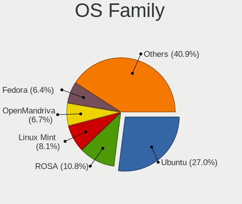
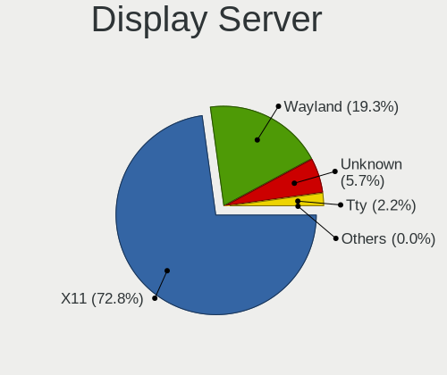
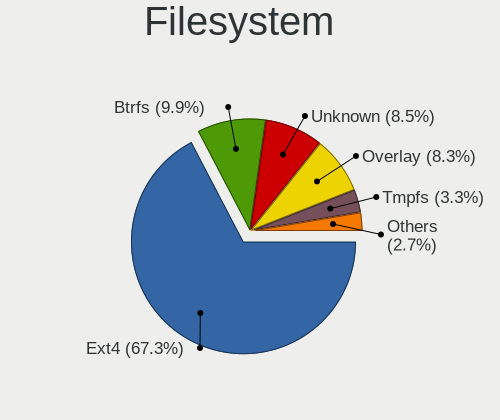
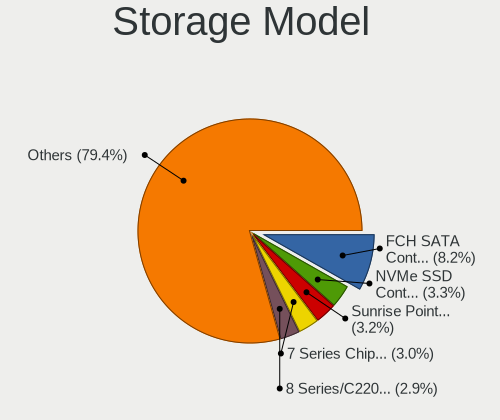
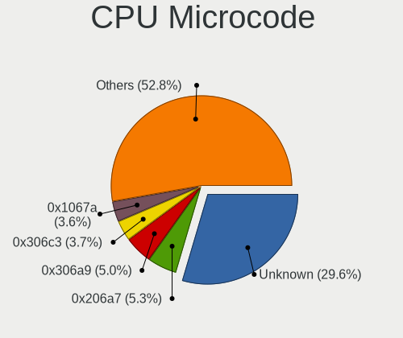
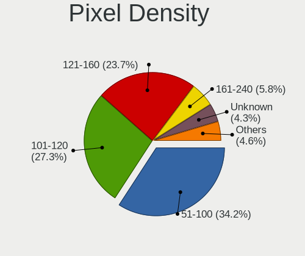
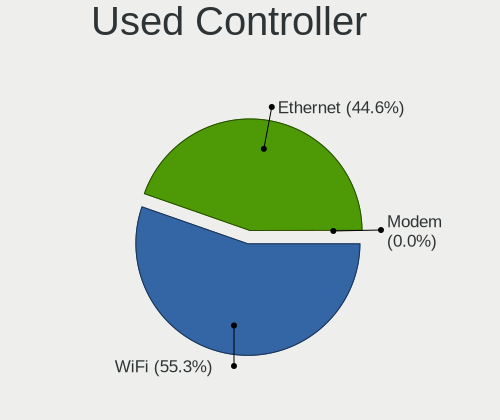

Linux - Tested Hardware & Statistics
------------------------------------

A project to collect tested hardware configurations for Linux.

Anyone can contribute to this report by the [hw-probe](https://github.com/linuxhw/hw-probe) tool:

    sudo -E hw-probe -all -upload

Please contribute! Especially if your hardware is rare.

This is a report for all computer types. See also reports for [desktops](/Desktop/README.md) and [notebooks](/Notebook/README.md).

Distribution-specific reports: [AlmaLinux](/Dist/AlmaLinux), [Alpine](/Dist/Alpine), [ALT_Linux](/Dist/ALT_Linux), [antiX](/Dist/antiX), [Artix](/Dist/Artix), [Chrome_OS](/Dist/Chrome_OS), [Clear_Linux](/Dist/Clear_Linux), [Deepin](/Dist/Deepin), [Devuan](/Dist/Devuan), [EndeavourOS](/Dist/EndeavourOS), [Garuda_Linux](/Dist/Garuda_Linux), [GNOME_OS](/Dist/GNOME_OS), [Kaisen](/Dist/Kaisen), [Mageia](/Dist/Mageia), [Makulu](/Dist/Makulu), [NixOS](/Dist/NixOS), [Nobara](/Dist/Nobara), [Oracle_Linux](/Dist/Oracle_Linux), [Pardus](/Dist/Pardus), [PureOS](/Dist/PureOS), [Q4OS](/Dist/Q4OS), [Reborn_OS](/Dist/Reborn_OS), [Rocky_Linux](/Dist/Rocky_Linux), [Sparky](/Dist/Sparky), [Void_Linux](/Dist/Void_Linux), [Xero](/Dist/Xero).

This report is for real hardware. Report for virtual hardware: [TestDays_VE](https://github.com/linuxhw/TestDays_VE)

Contents
--------

* [ Test Cases ](#test-cases)

* [ System ](#system)
  - [ OS                       ](#os)
  - [ OS Family                ](#os-family)
  - [ Kernel                   ](#kernel)
  - [ Kernel Family            ](#kernel-family)
  - [ Kernel Major Ver.        ](#kernel-major-ver)
  - [ Arch                     ](#arch)
  - [ DE                       ](#de)
  - [ Display Server           ](#display-server)
  - [ Display Manager          ](#display-manager)
  - [ OS Lang                  ](#os-lang)
  - [ Boot Mode                ](#boot-mode)
  - [ Filesystem               ](#filesystem)
  - [ Part. scheme             ](#part-scheme)
  - [ Dual Boot with Linux/BSD ](#dual-boot-with-linuxbsd)
  - [ Dual Boot (Win)          ](#dual-boot-win)

* [ Board ](#board)
  - [ Vendor                   ](#vendor)
  - [ Model                    ](#model)
  - [ Model Family             ](#model-family)
  - [ MFG Year                 ](#mfg-year)
  - [ Form Factor              ](#form-factor)
  - [ Secure Boot              ](#secure-boot)
  - [ Coreboot                 ](#coreboot)
  - [ RAM Size                 ](#ram-size)
  - [ RAM Used                 ](#ram-used)
  - [ Total Drives             ](#total-drives)
  - [ Has CD-ROM               ](#has-cd-rom)
  - [ Has Ethernet             ](#has-ethernet)
  - [ Has WiFi                 ](#has-wifi)
  - [ Has Bluetooth            ](#has-bluetooth)

* [ Location ](#location)
  - [ Country                  ](#country)
  - [ City                     ](#city)

* [ Drives ](#drives)
  - [ Drive Vendor             ](#drive-vendor)
  - [ Drive Model              ](#drive-model)
  - [ HDD Vendor               ](#hdd-vendor)
  - [ SSD Vendor               ](#ssd-vendor)
  - [ Drive Kind               ](#drive-kind)
  - [ Drive Connector          ](#drive-connector)
  - [ Drive Size               ](#drive-size)
  - [ Space Total              ](#space-total)
  - [ Space Used               ](#space-used)
  - [ Malfunc. Drives          ](#malfunc-drives)
  - [ Malfunc. Drive Vendor    ](#malfunc-drive-vendor)
  - [ Malfunc. HDD Vendor      ](#malfunc-hdd-vendor)
  - [ Malfunc. Drive Kind      ](#malfunc-drive-kind)
  - [ Failed Drives            ](#failed-drives)
  - [ Failed Drive Vendor      ](#failed-drive-vendor)
  - [ Drive Status             ](#drive-status)

* [ Storage controller ](#storage-controller)
  - [ Storage Vendor           ](#storage-vendor)
  - [ Storage Model            ](#storage-model)
  - [ Storage Kind             ](#storage-kind)

* [ Processor ](#processor)
  - [ CPU Vendor               ](#cpu-vendor)
  - [ CPU Model                ](#cpu-model)
  - [ CPU Model Family         ](#cpu-model-family)
  - [ CPU Cores                ](#cpu-cores)
  - [ CPU Sockets              ](#cpu-sockets)
  - [ CPU Threads              ](#cpu-threads)
  - [ CPU Op-Modes             ](#cpu-op-modes)
  - [ CPU Microcode            ](#cpu-microcode)
  - [ CPU Microarch            ](#cpu-microarch)

* [ Graphics ](#graphics)
  - [ GPU Vendor               ](#gpu-vendor)
  - [ GPU Model                ](#gpu-model)
  - [ GPU Combo                ](#gpu-combo)
  - [ GPU Driver               ](#gpu-driver)
  - [ GPU Memory               ](#gpu-memory)

* [ Monitor ](#monitor)
  - [ Monitor Vendor           ](#monitor-vendor)
  - [ Monitor Model            ](#monitor-model)
  - [ Monitor Resolution       ](#monitor-resolution)
  - [ Monitor Diagonal         ](#monitor-diagonal)
  - [ Monitor Width            ](#monitor-width)
  - [ Aspect Ratio             ](#aspect-ratio)
  - [ Monitor Area             ](#monitor-area)
  - [ Pixel Density            ](#pixel-density)
  - [ Multiple Monitors        ](#multiple-monitors)

* [ Network ](#network)
  - [ Net Controller Vendor    ](#net-controller-vendor)
  - [ Net Controller Model     ](#net-controller-model)
  - [ Wireless Vendor          ](#wireless-vendor)
  - [ Wireless Model           ](#wireless-model)
  - [ Ethernet Vendor          ](#ethernet-vendor)
  - [ Ethernet Model           ](#ethernet-model)
  - [ Net Controller Kind      ](#net-controller-kind)
  - [ Used Controller          ](#used-controller)
  - [ NICs                     ](#nics)
  - [ IPv6                     ](#ipv6)

* [ Bluetooth ](#bluetooth)
  - [ Bluetooth Vendor         ](#bluetooth-vendor)
  - [ Bluetooth Model          ](#bluetooth-model)

* [ Sound ](#sound)
  - [ Sound Vendor             ](#sound-vendor)
  - [ Sound Model              ](#sound-model)

* [ Memory ](#memory)
  - [ Memory Vendor            ](#memory-vendor)
  - [ Memory Model             ](#memory-model)
  - [ Memory Kind              ](#memory-kind)
  - [ Memory Form Factor       ](#memory-form-factor)
  - [ Memory Size              ](#memory-size)
  - [ Memory Speed             ](#memory-speed)

* [ Printers & scanners ](#printers--scanners)
  - [ Printer Vendor           ](#printer-vendor)
  - [ Printer Model            ](#printer-model)
  - [ Scanner Vendor           ](#scanner-vendor)
  - [ Scanner Model            ](#scanner-model)

* [ Camera ](#camera)
  - [ Camera Vendor            ](#camera-vendor)
  - [ Camera Model             ](#camera-model)

* [ Security ](#security)
  - [ Fingerprint Vendor       ](#fingerprint-vendor)
  - [ Fingerprint Model        ](#fingerprint-model)
  - [ Chipcard Vendor          ](#chipcard-vendor)
  - [ Chipcard Model           ](#chipcard-model)

* [ Unsupported ](#unsupported)
  - [ Unsupported Devices      ](#unsupported-devices)
  - [ Unsupported Device Types ](#unsupported-device-types)

Test Cases
----------

Total: 296606

| Vendor        | Model                       | Form-Factor | Probe                                                      | Date         |
|---------------|-----------------------------|-------------|------------------------------------------------------------|--------------|
| Dell          | Vostro 1520                 | Notebook    | [2132a3308c](https://linux-hardware.org/?probe=2132a3308c) | Apr 01, 2023 |
| ASUSTek       | K52JB                       | Notebook    | [0e18c3546c](https://linux-hardware.org/?probe=0e18c3546c) | Apr 01, 2023 |
| ASUSTek       | Z170 PRO GAMING             | Desktop     | [b272d7b271](https://linux-hardware.org/?probe=b272d7b271) | Apr 01, 2023 |
| Chuwi         | GemiBook Pro                | Notebook    | [41b51a471d](https://linux-hardware.org/?probe=41b51a471d) | Apr 01, 2023 |
| ASUSTek       | PRIME Z490-P                | Desktop     | [bbbfbb2dfc](https://linux-hardware.org/?probe=bbbfbb2dfc) | Apr 01, 2023 |
| Chuwi         | GemiBook Pro                | Notebook    | [fc4116204b](https://linux-hardware.org/?probe=fc4116204b) | Apr 01, 2023 |
| HP            | 1495                        | Desktop     | [96283c0a09](https://linux-hardware.org/?probe=96283c0a09) | Apr 01, 2023 |
| Intel         | DB75EN AAG39650-303         | Desktop     | [50d4a766a6](https://linux-hardware.org/?probe=50d4a766a6) | Apr 01, 2023 |
| Apple         | MacBookPro9,2               | Notebook    | [b0beffe006](https://linux-hardware.org/?probe=b0beffe006) | Apr 01, 2023 |
| Acer          | H57M01                      | Desktop     | [215701a84d](https://linux-hardware.org/?probe=215701a84d) | Apr 01, 2023 |
| HP            | 1495                        | Desktop     | [f25125625a](https://linux-hardware.org/?probe=f25125625a) | Apr 01, 2023 |
| Notebook      | NJx0MU                      | Notebook    | [14751f18b3](https://linux-hardware.org/?probe=14751f18b3) | Apr 01, 2023 |
| ASUSTek       | P8Z77-V LX                  | Desktop     | [ecd633a350](https://linux-hardware.org/?probe=ecd633a350) | Apr 01, 2023 |
| Acer          | Predator G3-605             | Desktop     | [eb21663788](https://linux-hardware.org/?probe=eb21663788) | Apr 01, 2023 |
| Tactus        | GeoBook 140                 | Notebook    | [0ceb5a3b7c](https://linux-hardware.org/?probe=0ceb5a3b7c) | Apr 01, 2023 |
| ASUSTek       | M5A97 EVO R2.0              | Desktop     | [3f218796ae](https://linux-hardware.org/?probe=3f218796ae) | Apr 01, 2023 |
| Dell          | Latitude 7275               | Tablet      | [c118ca04bc](https://linux-hardware.org/?probe=c118ca04bc) | Apr 01, 2023 |
| ASUSTek       | PRIME B250M-A               | Desktop     | [dc5fce2825](https://linux-hardware.org/?probe=dc5fce2825) | Apr 01, 2023 |
| ZOTAC         | ZBOX-EN1070/1060,EN1070K... | Mini pc     | [5f703bfc7d](https://linux-hardware.org/?probe=5f703bfc7d) | Apr 01, 2023 |
| Biostar       | A740G M2+                   | Desktop     | [182d84f68a](https://linux-hardware.org/?probe=182d84f68a) | Apr 01, 2023 |
| Dell          | Inspiron 15 5510            | Notebook    | [e169cd0886](https://linux-hardware.org/?probe=e169cd0886) | Apr 01, 2023 |
| Lenovo        | MIIX 320-10ICR 80XF         | Tablet      | [06acff9e6b](https://linux-hardware.org/?probe=06acff9e6b) | Apr 01, 2023 |
| HP            | Pavilion g7                 | Notebook    | [7820d2ca67](https://linux-hardware.org/?probe=7820d2ca67) | Apr 01, 2023 |
| Dell          | Latitude 5530               | Notebook    | [e4688e2ef8](https://linux-hardware.org/?probe=e4688e2ef8) | Apr 01, 2023 |
| HP            | 8906 SMVB                   | Desktop     | [74430f2160](https://linux-hardware.org/?probe=74430f2160) | Apr 01, 2023 |
| Gigabyte      | Q87M-D2H                    | Desktop     | [b627db43dd](https://linux-hardware.org/?probe=b627db43dd) | Apr 01, 2023 |
| ASUSTek       | TUF B450M-PLUS GAMING       | Desktop     | [5ef1391fb2](https://linux-hardware.org/?probe=5ef1391fb2) | Apr 01, 2023 |
| Lenovo        | 317E SDK0K17763 WIN 1801... | Desktop     | [a4cad34ac9](https://linux-hardware.org/?probe=a4cad34ac9) | Apr 01, 2023 |
| Acer          | Aspire V5-121               | Notebook    | [d6cc7a67ab](https://linux-hardware.org/?probe=d6cc7a67ab) | Apr 01, 2023 |
| Acer          | Aspire 5740                 | Notebook    | [eeba9d18fa](https://linux-hardware.org/?probe=eeba9d18fa) | Apr 01, 2023 |
| Medion        | H61H2-LM3                   | Desktop     | [80bb5bbf28](https://linux-hardware.org/?probe=80bb5bbf28) | Apr 01, 2023 |
| HP            | Pavilion Laptop 14-ec0xx... | Notebook    | [1da5570114](https://linux-hardware.org/?probe=1da5570114) | Apr 01, 2023 |
| Lenovo        | ThinkPad T440 20B7S0JC0K    | Notebook    | [4169f13182](https://linux-hardware.org/?probe=4169f13182) | Apr 01, 2023 |
| Acer          | H11H4-AI V:1.0              | Desktop     | [d5337ce0e3](https://linux-hardware.org/?probe=d5337ce0e3) | Apr 01, 2023 |
| MSI           | Vector GP66 12UGS           | Notebook    | [4787e68a9c](https://linux-hardware.org/?probe=4787e68a9c) | Apr 01, 2023 |
| Lenovo        | ThinkPad P1 Gen 4i 20Y30... | Notebook    | [96c53eccb0](https://linux-hardware.org/?probe=96c53eccb0) | Apr 01, 2023 |
| Acer          | Aspire A315-35              | Notebook    | [659a4cfd5a](https://linux-hardware.org/?probe=659a4cfd5a) | Apr 01, 2023 |
| Lenovo        | V15 G2 IJL 82QY             | Notebook    | [8582f4e86e](https://linux-hardware.org/?probe=8582f4e86e) | Apr 01, 2023 |
| Lenovo        | 3111 SDK0J40697 WIN 3305... | Mini pc     | [d27ec7c05b](https://linux-hardware.org/?probe=d27ec7c05b) | Apr 01, 2023 |
| Lenovo        | V15 G2 IJL 82QY             | Notebook    | [e94e2e397e](https://linux-hardware.org/?probe=e94e2e397e) | Apr 01, 2023 |
| HP            | 8431                        | All in one  | [577af5a471](https://linux-hardware.org/?probe=577af5a471) | Apr 01, 2023 |
| Dell          | 0MGK50 A02                  | Desktop     | [3a042b5160](https://linux-hardware.org/?probe=3a042b5160) | Apr 01, 2023 |
| ASUSTek       | N752VX                      | Notebook    | [d426499408](https://linux-hardware.org/?probe=d426499408) | Apr 01, 2023 |
| Gigabyte      | Z370 HD3-CF                 | Desktop     | [824aa0ae13](https://linux-hardware.org/?probe=824aa0ae13) | Apr 01, 2023 |
| ASUSTek       | PRIME X470-PRO              | Desktop     | [96fcc41161](https://linux-hardware.org/?probe=96fcc41161) | Apr 01, 2023 |
| Medion        | E6214                       | Notebook    | [5766389c97](https://linux-hardware.org/?probe=5766389c97) | Apr 01, 2023 |
| Lenovo        | V310-14ISK 80SX             | Notebook    | [cd6dee4651](https://linux-hardware.org/?probe=cd6dee4651) | Apr 01, 2023 |
| Gigabyte      | B450 I AORUS PRO WIFI-CF    | Desktop     | [b4a624599e](https://linux-hardware.org/?probe=b4a624599e) | Apr 01, 2023 |
| Lenovo        | ThinkPad X1 Yoga Gen 7 2... | Convertible | [06275c19f3](https://linux-hardware.org/?probe=06275c19f3) | Apr 01, 2023 |
| ASRock        | B450 Pro4 R2.0              | Desktop     | [046d59655e](https://linux-hardware.org/?probe=046d59655e) | Apr 01, 2023 |
| Gigabyte      | B150M-D2V DDR3-CF           | Desktop     | [35bae3b94d](https://linux-hardware.org/?probe=35bae3b94d) | Apr 01, 2023 |
| ASUSTek       | B250 MINING EXPERT          | Desktop     | [da86fa8f75](https://linux-hardware.org/?probe=da86fa8f75) | Apr 01, 2023 |
| HP            | Presario CQ58               | Notebook    | [e8f8f289ac](https://linux-hardware.org/?probe=e8f8f289ac) | Apr 01, 2023 |
| MSI           | MEG X670E ACE               | Desktop     | [2b9356529f](https://linux-hardware.org/?probe=2b9356529f) | Apr 01, 2023 |
| MSI           | B450 GAMING PLUS            | Desktop     | [539137fb36](https://linux-hardware.org/?probe=539137fb36) | Apr 01, 2023 |
| ASUSTek       | ZenBook UX325EA_UX325EA     | Notebook    | [4191279e7e](https://linux-hardware.org/?probe=4191279e7e) | Apr 01, 2023 |
| Lenovo        | IdeaPad 510-15IKB 80SV      | Notebook    | [6ab0a0226d](https://linux-hardware.org/?probe=6ab0a0226d) | Apr 01, 2023 |
| Intel         | DH77EB AAG39073-304         | Desktop     | [f0d73d9284](https://linux-hardware.org/?probe=f0d73d9284) | Apr 01, 2023 |
| Lenovo        | ThinkPad T410 2518P9G       | Notebook    | [4f74fa6cd2](https://linux-hardware.org/?probe=4f74fa6cd2) | Apr 01, 2023 |
| Apple         | MacBookPro9,2               | Notebook    | [111eeac3b3](https://linux-hardware.org/?probe=111eeac3b3) | Apr 01, 2023 |
| Lenovo        | IdeaPad U310                | Notebook    | [6add75e18c](https://linux-hardware.org/?probe=6add75e18c) | Apr 01, 2023 |
| Unknown       | X133                        | Notebook    | [950572f119](https://linux-hardware.org/?probe=950572f119) | Apr 01, 2023 |
| ASUSTek       | F3JP                        | Notebook    | [e561213582](https://linux-hardware.org/?probe=e561213582) | Apr 01, 2023 |
| ASUSTek       | X550LB                      | Notebook    | [3d35ff8b68](https://linux-hardware.org/?probe=3d35ff8b68) | Apr 01, 2023 |
| Gigabyte      | B550 AORUS ELITE V2         | Desktop     | [978a5e2579](https://linux-hardware.org/?probe=978a5e2579) | Apr 01, 2023 |
| Intel         | DG41RQ AAE54511-203         | Desktop     | [383835a445](https://linux-hardware.org/?probe=383835a445) | Apr 01, 2023 |
| Toshiba       | Satellite S50-A-K7M         | Notebook    | [af163d8ec3](https://linux-hardware.org/?probe=af163d8ec3) | Apr 01, 2023 |
| Lenovo        | V110-15ISK 80TL             | Notebook    | [db058df07b](https://linux-hardware.org/?probe=db058df07b) | Apr 01, 2023 |
| Apple         | MacBookPro9,2               | Notebook    | [2fcab6a925](https://linux-hardware.org/?probe=2fcab6a925) | Apr 01, 2023 |
| Lenovo        | SHARKBAY NOK                | Desktop     | [091d2eda88](https://linux-hardware.org/?probe=091d2eda88) | Apr 01, 2023 |
| Lenovo        | V110-15ISK 80TL             | Notebook    | [3691be13e8](https://linux-hardware.org/?probe=3691be13e8) | Apr 01, 2023 |
| Gigabyte      | G41M-Combo                  | Desktop     | [ac658bcb80](https://linux-hardware.org/?probe=ac658bcb80) | Apr 01, 2023 |
| MSI           | MAG X570S TORPEDO MAX       | Desktop     | [664da8ff45](https://linux-hardware.org/?probe=664da8ff45) | Apr 01, 2023 |
| ASUSTek       | T100TA                      | Notebook    | [5be9a0230e](https://linux-hardware.org/?probe=5be9a0230e) | Apr 01, 2023 |
| ASUSTek       | ASUS EXPERTBOOK B1500CEA... | Notebook    | [87bc2601f3](https://linux-hardware.org/?probe=87bc2601f3) | Apr 01, 2023 |
| MSI           | P43T-C51                    | Desktop     | [d16b44b442](https://linux-hardware.org/?probe=d16b44b442) | Apr 01, 2023 |
| MSI           | Vector GP66 12UGS           | Notebook    | [12e105f6da](https://linux-hardware.org/?probe=12e105f6da) | Apr 01, 2023 |
| MSI           | MAG B660M MORTAR WIFI DD... | Desktop     | [c512f4cdd9](https://linux-hardware.org/?probe=c512f4cdd9) | Apr 01, 2023 |
| ASUSTek       | ROG STRIX X570-E GAMING     | Desktop     | [6fd833b58c](https://linux-hardware.org/?probe=6fd833b58c) | Apr 01, 2023 |
| Gigabyte      | MZGLKDP-00                  | Desktop     | [c9427f4873](https://linux-hardware.org/?probe=c9427f4873) | Apr 01, 2023 |
| Unknown       | Unknown                     | Soc         | [15a1a38207](https://linux-hardware.org/?probe=15a1a38207) | Apr 01, 2023 |
| Lenovo        | ThinkPad X1 Yoga Gen 7 2... | Convertible | [36e57fb4cf](https://linux-hardware.org/?probe=36e57fb4cf) | Apr 01, 2023 |
| Acer          | Aspire A515-57              | Notebook    | [4a1b8f3f21](https://linux-hardware.org/?probe=4a1b8f3f21) | Apr 01, 2023 |
| Lenovo        | ThinkPad E14 20RA004YUS     | Notebook    | [36b592e607](https://linux-hardware.org/?probe=36b592e607) | Apr 01, 2023 |
| Gigabyte      | F2A78M-DS2                  | Desktop     | [0528b2df2b](https://linux-hardware.org/?probe=0528b2df2b) | Apr 01, 2023 |
| ASUSTek       | PRIME B350M-A               | Desktop     | [f8afb163dc](https://linux-hardware.org/?probe=f8afb163dc) | Apr 01, 2023 |
| ASRock        | B460M Pro4                  | Desktop     | [1f3b96d1a0](https://linux-hardware.org/?probe=1f3b96d1a0) | Apr 01, 2023 |
| Unknown       | ACB20                       | Notebook    | [6e70bacda5](https://linux-hardware.org/?probe=6e70bacda5) | Apr 01, 2023 |
| ASUSTek       | S551LN                      | Notebook    | [916adbdf9f](https://linux-hardware.org/?probe=916adbdf9f) | Apr 01, 2023 |
| Samsung       | R530/R730/R540              | Notebook    | [714ed0f007](https://linux-hardware.org/?probe=714ed0f007) | Apr 01, 2023 |
| Acer          | Aspire XC-780               | Desktop     | [206239c162](https://linux-hardware.org/?probe=206239c162) | Apr 01, 2023 |
| Sony          | VPCEH1S1R                   | Notebook    | [12100cdd4b](https://linux-hardware.org/?probe=12100cdd4b) | Apr 01, 2023 |
| Lenovo        | G505 20240                  | Notebook    | [d873632b2b](https://linux-hardware.org/?probe=d873632b2b) | Apr 01, 2023 |
| MSI           | H97M-G43                    | Desktop     | [b93caf26e4](https://linux-hardware.org/?probe=b93caf26e4) | Apr 01, 2023 |
| HP            | Pavilion Gaming Laptop 1... | Notebook    | [70fb59cd4f](https://linux-hardware.org/?probe=70fb59cd4f) | Apr 01, 2023 |
| HP            | EliteBook 8470p             | Notebook    | [178ccc8d4d](https://linux-hardware.org/?probe=178ccc8d4d) | Apr 01, 2023 |
| ASUSTek       | PRIME B550M-A               | Desktop     | [79d44a9e66](https://linux-hardware.org/?probe=79d44a9e66) | Apr 01, 2023 |
| Dell          | Vostro 15-3568              | Notebook    | [d93b1d27e1](https://linux-hardware.org/?probe=d93b1d27e1) | Apr 01, 2023 |
| Unknown       | Unknown                     | Notebook    | [702a241ca6](https://linux-hardware.org/?probe=702a241ca6) | Apr 01, 2023 |
| Fujitsu       | D3432-A1 S26361-D3432-A1    | Desktop     | [86241cd6ad](https://linux-hardware.org/?probe=86241cd6ad) | Apr 01, 2023 |
| Lenovo        | IdeaPad 3 15IIL05 81WE      | Notebook    | [9db0830268](https://linux-hardware.org/?probe=9db0830268) | Apr 01, 2023 |
| Acer          | Aspire A515-51G             | Notebook    | [efc8399ce9](https://linux-hardware.org/?probe=efc8399ce9) | Apr 01, 2023 |
| Dell          | 09M8Y8 A01                  | Desktop     | [17d5390549](https://linux-hardware.org/?probe=17d5390549) | Apr 01, 2023 |
| Lenovo        | G560 20042                  | Notebook    | [c5a4783dfb](https://linux-hardware.org/?probe=c5a4783dfb) | Apr 01, 2023 |
| MSI           | MAG B660M MORTAR WIFI DD... | Desktop     | [e615755655](https://linux-hardware.org/?probe=e615755655) | Apr 01, 2023 |
| HP            | 255 G7 Notebook PC          | Notebook    | [e06d57c27a](https://linux-hardware.org/?probe=e06d57c27a) | Apr 01, 2023 |
| HP            | 304Ah                       | Desktop     | [14d92e85a2](https://linux-hardware.org/?probe=14d92e85a2) | Apr 01, 2023 |
| AZW           | Green G3                    | Desktop     | [a987d9a5c1](https://linux-hardware.org/?probe=a987d9a5c1) | Apr 01, 2023 |
| ASUSTek       | ROG STRIX Z690-A GAMING ... | Desktop     | [1fa4ec7b05](https://linux-hardware.org/?probe=1fa4ec7b05) | Apr 01, 2023 |
| ASUSTek       | M5A78L LE                   | Desktop     | [af64a32a09](https://linux-hardware.org/?probe=af64a32a09) | Apr 01, 2023 |
| HP            | 84FD                        | Desktop     | [79367d5f7d](https://linux-hardware.org/?probe=79367d5f7d) | Apr 01, 2023 |
| MSI           | H510M-A PRO                 | Desktop     | [a6953d3b96](https://linux-hardware.org/?probe=a6953d3b96) | Apr 01, 2023 |
| ASRock        | H470M-STX                   | Desktop     | [c1f349f579](https://linux-hardware.org/?probe=c1f349f579) | Apr 01, 2023 |
| Acer          | Nitro AN517-54              | Notebook    | [82d28ac7c0](https://linux-hardware.org/?probe=82d28ac7c0) | Apr 01, 2023 |
| HUAWEI        | NBD-WXX9                    | Notebook    | [d4c718bdab](https://linux-hardware.org/?probe=d4c718bdab) | Apr 01, 2023 |
| Lenovo        | G50-45 80E3                 | Notebook    | [059e2e5858](https://linux-hardware.org/?probe=059e2e5858) | Apr 01, 2023 |
| Lenovo        | 4030                        | Desktop     | [7a23fd4fb4](https://linux-hardware.org/?probe=7a23fd4fb4) | Apr 01, 2023 |
| Gigabyte      | X570 AORUS XTREME           | Desktop     | [1146b0ebfc](https://linux-hardware.org/?probe=1146b0ebfc) | Apr 01, 2023 |
| HP            | ENVY x360 Convertible 13... | Convertible | [aabb4d79b8](https://linux-hardware.org/?probe=aabb4d79b8) | Apr 01, 2023 |
| Lenovo        | G50-45 80E3                 | Notebook    | [f75af97954](https://linux-hardware.org/?probe=f75af97954) | Apr 01, 2023 |
| Acer          | Aspire A515-56              | Notebook    | [a959d79d84](https://linux-hardware.org/?probe=a959d79d84) | Apr 01, 2023 |
| Gigabyte      | B450 AORUS M                | Desktop     | [c1a0385d07](https://linux-hardware.org/?probe=c1a0385d07) | Apr 01, 2023 |
| Toshiba       | Satellite C55-B             | Notebook    | [250e5371c1](https://linux-hardware.org/?probe=250e5371c1) | Apr 01, 2023 |
| Dell          | 09KPNV A01                  | Desktop     | [2b25e4872f](https://linux-hardware.org/?probe=2b25e4872f) | Apr 01, 2023 |
| ASUSTek       | PRIME B550M-A WIFI II       | Desktop     | [ad3ead1116](https://linux-hardware.org/?probe=ad3ead1116) | Apr 01, 2023 |
| ASUSTek       | PRIME A320M-K               | Desktop     | [16f87cd333](https://linux-hardware.org/?probe=16f87cd333) | Apr 01, 2023 |
| ASUSTek       | TUF Gaming B550M-PLUS       | Desktop     | [e45ad193f8](https://linux-hardware.org/?probe=e45ad193f8) | Apr 01, 2023 |
| Microsoft     | Surface Go 3                | Tablet      | [d6d1ab6c61](https://linux-hardware.org/?probe=d6d1ab6c61) | Apr 01, 2023 |
| Gigabyte      | GA-MA785GM-US2H             | Desktop     | [e9fe5cb307](https://linux-hardware.org/?probe=e9fe5cb307) | Apr 01, 2023 |
| ASUSTek       | SABERTOOTH 990FX R2.0       | Desktop     | [d80d075b91](https://linux-hardware.org/?probe=d80d075b91) | Apr 01, 2023 |
| Lenovo        | ThinkPad X230 2325DV4       | Notebook    | [6cff5cd5d1](https://linux-hardware.org/?probe=6cff5cd5d1) | Apr 01, 2023 |
| Dell          | Latitude 5580               | Notebook    | [10cbd4c04d](https://linux-hardware.org/?probe=10cbd4c04d) | Apr 01, 2023 |
| Dell          | XPS 15 9570                 | Notebook    | [7beef34820](https://linux-hardware.org/?probe=7beef34820) | Apr 01, 2023 |
| Fujitsu       | LIFEBOOK S935               | Notebook    | [11b63a22b5](https://linux-hardware.org/?probe=11b63a22b5) | Apr 01, 2023 |
| Lenovo        | IdeaPadFlex 5 14ABR8 82X... | Convertible | [8357ff8cf5](https://linux-hardware.org/?probe=8357ff8cf5) | Apr 01, 2023 |
| Medion        | H61H2-LM3                   | Desktop     | [2e79b95cb4](https://linux-hardware.org/?probe=2e79b95cb4) | Apr 01, 2023 |
| ASUSTek       | PRIME B550M-A AC            | Desktop     | [2cc7a15de5](https://linux-hardware.org/?probe=2cc7a15de5) | Apr 01, 2023 |
| HP            | Pavilion Gaming Laptop 1... | Notebook    | [7e8bd9a529](https://linux-hardware.org/?probe=7e8bd9a529) | Apr 01, 2023 |
| Supermicro    | H12SSL-i                    | Server      | [61297d4bc4](https://linux-hardware.org/?probe=61297d4bc4) | Apr 01, 2023 |
| ASRockRack    | X470D4U2-2T                 | Desktop     | [acb0f81194](https://linux-hardware.org/?probe=acb0f81194) | Apr 01, 2023 |
| Dell          | 0PV3YR A05                  | Server      | [2175527bda](https://linux-hardware.org/?probe=2175527bda) | Apr 01, 2023 |
| Gigabyte      | B360 AORUS GAMING 3-CF      | Desktop     | [f54ccba86f](https://linux-hardware.org/?probe=f54ccba86f) | Apr 01, 2023 |
| Unknown       | X79                         | Desktop     | [d0592836a5](https://linux-hardware.org/?probe=d0592836a5) | Apr 01, 2023 |
| Acer          | Aspire A515-56              | Notebook    | [db53e1a333](https://linux-hardware.org/?probe=db53e1a333) | Apr 01, 2023 |
| ASUSTek       | T100TA                      | Notebook    | [1f0b0c32ca](https://linux-hardware.org/?probe=1f0b0c32ca) | Apr 01, 2023 |
| HP            | 18E7                        | Desktop     | [98319f4504](https://linux-hardware.org/?probe=98319f4504) | Apr 01, 2023 |
| Gigabyte      | Z97X-Gaming 3               | Desktop     | [89ca656f30](https://linux-hardware.org/?probe=89ca656f30) | Apr 01, 2023 |
| Lenovo        | G500 20236                  | Notebook    | [22d22e0742](https://linux-hardware.org/?probe=22d22e0742) | Apr 01, 2023 |
| Lenovo        | G500 20236                  | Notebook    | [2994622700](https://linux-hardware.org/?probe=2994622700) | Apr 01, 2023 |
| Lenovo        | ThinkPad E14 Gen 2 20TA0... | Notebook    | [2a881cc01e](https://linux-hardware.org/?probe=2a881cc01e) | Apr 01, 2023 |
| Lenovo        | IdeaPad L340-15IRH Gamin... | Notebook    | [27fbf62ba0](https://linux-hardware.org/?probe=27fbf62ba0) | Apr 01, 2023 |
| Sony          | VPCEA3BFX                   | Notebook    | [6215c985dd](https://linux-hardware.org/?probe=6215c985dd) | Apr 01, 2023 |
| ASUSTek       | P8Z77-V PREMIUM             | Desktop     | [d774a892d1](https://linux-hardware.org/?probe=d774a892d1) | Apr 01, 2023 |
| Lenovo        | ThinkCentre M58 9728AHG     | Desktop     | [cb0fa70953](https://linux-hardware.org/?probe=cb0fa70953) | Apr 01, 2023 |
| Dell          | Inspiron 13 5310            | Notebook    | [32bdbfa581](https://linux-hardware.org/?probe=32bdbfa581) | Apr 01, 2023 |
| ASRock        | FM2A88X Extreme6+           | Desktop     | [4a9aebc7f0](https://linux-hardware.org/?probe=4a9aebc7f0) | Apr 01, 2023 |
| Apple         | Mac-F4208DC8 PVT            | Desktop     | [f05009caac](https://linux-hardware.org/?probe=f05009caac) | Apr 01, 2023 |
| Lenovo        | 0x36C4 SDK0J40679 WIN 32... | All in one  | [5d5eb8d675](https://linux-hardware.org/?probe=5d5eb8d675) | Apr 01, 2023 |
| MSI           | X99A RAIDER                 | Desktop     | [50e745e72a](https://linux-hardware.org/?probe=50e745e72a) | Apr 01, 2023 |
| Itautec       | Infoway w7535               | Notebook    | [48a539f108](https://linux-hardware.org/?probe=48a539f108) | Apr 01, 2023 |
| Dell          | 0GY6Y8 A03                  | Desktop     | [7754565ec1](https://linux-hardware.org/?probe=7754565ec1) | Apr 01, 2023 |
| Gigabyte      | Z77X-UD5H                   | Desktop     | [2be0fa6524](https://linux-hardware.org/?probe=2be0fa6524) | Apr 01, 2023 |
| Gigabyte      | B560M AORUS ELITE           | Desktop     | [ee536703f8](https://linux-hardware.org/?probe=ee536703f8) | Apr 01, 2023 |
| Lenovo        | ThinkPad X201s 514328U      | Notebook    | [011c475758](https://linux-hardware.org/?probe=011c475758) | Apr 01, 2023 |
| Toshiba       | Satellite L45-B             | Notebook    | [6d4878cdbf](https://linux-hardware.org/?probe=6d4878cdbf) | Apr 01, 2023 |
| Dell          | Latitude E7470              | Notebook    | [ee66bc49a5](https://linux-hardware.org/?probe=ee66bc49a5) | Apr 01, 2023 |
| Valve         | Jupiter                     | Notebook    | [816e9cb6f6](https://linux-hardware.org/?probe=816e9cb6f6) | Apr 01, 2023 |
| Dell          | 0TTDMJ A00                  | Desktop     | [5d6606235d](https://linux-hardware.org/?probe=5d6606235d) | Apr 01, 2023 |
| Valve         | Jupiter                     | Notebook    | [a91aee62d3](https://linux-hardware.org/?probe=a91aee62d3) | Apr 01, 2023 |
| Gigabyte      | A320M-H-CF                  | Desktop     | [a5c21e7892](https://linux-hardware.org/?probe=a5c21e7892) | Apr 01, 2023 |
| HP            | Pavilion x360 Convertibl... | Convertible | [7e97eb6308](https://linux-hardware.org/?probe=7e97eb6308) | Apr 01, 2023 |
| Gigabyte      | Z170X-Gaming 7              | Desktop     | [f7c90851ac](https://linux-hardware.org/?probe=f7c90851ac) | Apr 01, 2023 |
| Gigabyte      | A320M-H-CF                  | Desktop     | [4b873550ab](https://linux-hardware.org/?probe=4b873550ab) | Apr 01, 2023 |
| Acer          | WG43M                       | Desktop     | [77cb0bf517](https://linux-hardware.org/?probe=77cb0bf517) | Apr 01, 2023 |
| HP            | Pavilion dv7                | Notebook    | [00bbec023a](https://linux-hardware.org/?probe=00bbec023a) | Apr 01, 2023 |
| Xunlong       | Orange Pi One               | Soc         | [8d982c6cd9](https://linux-hardware.org/?probe=8d982c6cd9) | Apr 01, 2023 |
| HP            | 1998                        | Desktop     | [d88ffd3db4](https://linux-hardware.org/?probe=d88ffd3db4) | Apr 01, 2023 |
| Lenovo        | IdeaPad Gaming 3 15ACH6 ... | Notebook    | [0a028a43f8](https://linux-hardware.org/?probe=0a028a43f8) | Apr 01, 2023 |
| HP            | 240 G6 Notebook PC          | Notebook    | [44e093df31](https://linux-hardware.org/?probe=44e093df31) | Apr 01, 2023 |
| Lenovo        | ThinkPad T440p              | Notebook    | [4057e0c5e9](https://linux-hardware.org/?probe=4057e0c5e9) | Apr 01, 2023 |
| MSI           | B550M PRO-VDH WIFI          | Desktop     | [e3a13c69ef](https://linux-hardware.org/?probe=e3a13c69ef) | Apr 01, 2023 |
| Lenovo        | V15-IGL 82C3                | Notebook    | [4773b9449c](https://linux-hardware.org/?probe=4773b9449c) | Apr 01, 2023 |
| Dell          | 0M5DCD A00                  | Desktop     | [91cc314380](https://linux-hardware.org/?probe=91cc314380) | Apr 01, 2023 |
| MSI           | B450M PRO-M2 MAX            | Desktop     | [5a83c18a3e](https://linux-hardware.org/?probe=5a83c18a3e) | Apr 01, 2023 |
| HP            | Notebook                    | Notebook    | [7cb279c8e0](https://linux-hardware.org/?probe=7cb279c8e0) | Apr 01, 2023 |
| Dell          | Vostro 15 3515              | Notebook    | [eea311b1bb](https://linux-hardware.org/?probe=eea311b1bb) | Apr 01, 2023 |
| Valve         | Jupiter                     | Notebook    | [2628ea9d8e](https://linux-hardware.org/?probe=2628ea9d8e) | Apr 01, 2023 |
| Novatech      | NL40_50CU                   | Notebook    | [caaa544589](https://linux-hardware.org/?probe=caaa544589) | Apr 01, 2023 |
| ASUSTek       | X555BP                      | Notebook    | [c7f621e335](https://linux-hardware.org/?probe=c7f621e335) | Apr 01, 2023 |
| HP            | Laptop 15s-eq3xxx           | Notebook    | [758bb2556e](https://linux-hardware.org/?probe=758bb2556e) | Apr 01, 2023 |
| ASUSTek       | Leonite2                    | Desktop     | [41353f6a59](https://linux-hardware.org/?probe=41353f6a59) | Apr 01, 2023 |
| Gigabyte      | F2A88XM-HD3                 | Desktop     | [39bc576f7f](https://linux-hardware.org/?probe=39bc576f7f) | Apr 01, 2023 |
| Lenovo        | ThinkPad T530 23594LU       | Notebook    | [9de89fee19](https://linux-hardware.org/?probe=9de89fee19) | Apr 01, 2023 |
| Lenovo        | ThinkPad T420s 4173R44      | Notebook    | [84e9a5f3d9](https://linux-hardware.org/?probe=84e9a5f3d9) | Apr 01, 2023 |
| UMAX          | VisionBook 14Wa Plus        | Notebook    | [ea8016c4a5](https://linux-hardware.org/?probe=ea8016c4a5) | Apr 01, 2023 |
| HP            | 8053                        | Desktop     | [6c887800bb](https://linux-hardware.org/?probe=6c887800bb) | Apr 01, 2023 |
| MSI           | B450M PRO-M2 MAX            | Desktop     | [94f75ee798](https://linux-hardware.org/?probe=94f75ee798) | Apr 01, 2023 |
| Star Labs     | StarBook                    | Notebook    | [8712994e3c](https://linux-hardware.org/?probe=8712994e3c) | Apr 01, 2023 |
| HP            | Pavilion x2 Detachable      | Notebook    | [363d925d25](https://linux-hardware.org/?probe=363d925d25) | Apr 01, 2023 |
| Dell          | Latitude E7450              | Notebook    | [8bf693a890](https://linux-hardware.org/?probe=8bf693a890) | Apr 01, 2023 |
| MSI           | H310M PRO-VDH PLUS          | Desktop     | [369bd03522](https://linux-hardware.org/?probe=369bd03522) | Apr 01, 2023 |
| Pegatron      | 2AC2                        | Desktop     | [ca0b0464d7](https://linux-hardware.org/?probe=ca0b0464d7) | Apr 01, 2023 |
| Samsung       | 340XAA/350XAA/550XAA        | Notebook    | [93ef0bb287](https://linux-hardware.org/?probe=93ef0bb287) | Apr 01, 2023 |
| Intel         | NUC11PABi7 K90104-305       | Mini pc     | [f7cdc4223d](https://linux-hardware.org/?probe=f7cdc4223d) | Apr 01, 2023 |
| ASUSTek       | PRIME A320M-K               | Desktop     | [59c335754f](https://linux-hardware.org/?probe=59c335754f) | Apr 01, 2023 |
| Apple         | MacBookPro11,1              | Notebook    | [53717700a1](https://linux-hardware.org/?probe=53717700a1) | Mar 31, 2023 |
| Lenovo        | ThinkPad X1 Carbon 2nd 2... | Notebook    | [016ddeab52](https://linux-hardware.org/?probe=016ddeab52) | Mar 31, 2023 |
| ASUSTek       | P7P55D                      | Desktop     | [b50f27ad05](https://linux-hardware.org/?probe=b50f27ad05) | Mar 31, 2023 |
| HP            | Laptop 14-dq2xxx            | Notebook    | [c90d525ee8](https://linux-hardware.org/?probe=c90d525ee8) | Mar 31, 2023 |
| Dell          | 04YP6J A02                  | Desktop     | [0223f7bb3e](https://linux-hardware.org/?probe=0223f7bb3e) | Mar 31, 2023 |
| ECS           | GeForce 8000 series         | Desktop     | [32e951a2ca](https://linux-hardware.org/?probe=32e951a2ca) | Mar 31, 2023 |
| MSI           | X570-A PRO                  | Desktop     | [3093c50d3d](https://linux-hardware.org/?probe=3093c50d3d) | Mar 31, 2023 |
| Dell          | Latitude E6320              | Notebook    | [a6a0d01947](https://linux-hardware.org/?probe=a6a0d01947) | Mar 31, 2023 |
| ASUSTek       | X556UAK                     | Notebook    | [24f79c68f6](https://linux-hardware.org/?probe=24f79c68f6) | Mar 31, 2023 |
| HP            | Laptop 15-bs0xx             | Notebook    | [a5cb1375c4](https://linux-hardware.org/?probe=a5cb1375c4) | Mar 31, 2023 |
| Lenovo        | ThinkPad T490s 20NXS0DS0... | Notebook    | [1228998af5](https://linux-hardware.org/?probe=1228998af5) | Mar 31, 2023 |
| HP            | ENVY x360 Convertible       | Convertible | [3c163a3b34](https://linux-hardware.org/?probe=3c163a3b34) | Mar 31, 2023 |
| HP            | Laptop 15-bs0xx             | Notebook    | [60a6b11ce0](https://linux-hardware.org/?probe=60a6b11ce0) | Mar 31, 2023 |
| Intel         | H61 V1.1                    | Desktop     | [e670f092d7](https://linux-hardware.org/?probe=e670f092d7) | Mar 31, 2023 |
| Samsung       | 270E5G/270E5U               | Notebook    | [67b91e463a](https://linux-hardware.org/?probe=67b91e463a) | Mar 31, 2023 |
| System76      | Lemur Pro                   | Notebook    | [5d57a3397e](https://linux-hardware.org/?probe=5d57a3397e) | Mar 31, 2023 |
| HP            | ENVY x360 Convertible       | Convertible | [8d2858a444](https://linux-hardware.org/?probe=8d2858a444) | Mar 31, 2023 |
| Dell          | XPS 17 9700                 | Notebook    | [5d0a908832](https://linux-hardware.org/?probe=5d0a908832) | Mar 31, 2023 |
| Gigabyte      | Z170-HD3 DDR3-CF            | Desktop     | [dff9959cd7](https://linux-hardware.org/?probe=dff9959cd7) | Mar 31, 2023 |
| Apple         | Mac-942B5BF58194151B        | All in one  | [d9a7a6ccf6](https://linux-hardware.org/?probe=d9a7a6ccf6) | Mar 31, 2023 |
| Acer          | Aspire A315-54K             | Notebook    | [d325177071](https://linux-hardware.org/?probe=d325177071) | Mar 31, 2023 |
| Gateway       | IPIMB-ARA                   | Desktop     | [9c300aea89](https://linux-hardware.org/?probe=9c300aea89) | Mar 31, 2023 |
| ASUSTek       | ROG STRIX B450-F GAMING     | Desktop     | [9e09a54915](https://linux-hardware.org/?probe=9e09a54915) | Mar 31, 2023 |
| ASUSTek       | TUF Gaming Z590-PLUS WIF... | Desktop     | [acfff71638](https://linux-hardware.org/?probe=acfff71638) | Mar 31, 2023 |
| ASUSTek       | X202E                       | Notebook    | [cdcccb09e7](https://linux-hardware.org/?probe=cdcccb09e7) | Mar 31, 2023 |
| HP            | ProBook 440 G6              | Notebook    | [5198509903](https://linux-hardware.org/?probe=5198509903) | Mar 31, 2023 |
| HP            | 2AFA                        | Desktop     | [d177838277](https://linux-hardware.org/?probe=d177838277) | Mar 31, 2023 |
| Gigabyte      | H61M-S2V-B3                 | Desktop     | [45a242d18f](https://linux-hardware.org/?probe=45a242d18f) | Mar 31, 2023 |
| Positivo      | S14CT01                     | Notebook    | [a47919fcc4](https://linux-hardware.org/?probe=a47919fcc4) | Mar 31, 2023 |
| ASUSTek       | P8B75-V                     | Desktop     | [5ed3be8dbc](https://linux-hardware.org/?probe=5ed3be8dbc) | Mar 31, 2023 |
| ASUSTek       | X202E                       | Notebook    | [ac12ec53a3](https://linux-hardware.org/?probe=ac12ec53a3) | Mar 31, 2023 |
| ASUSTek       | TS10                        | Desktop     | [054de4f36a](https://linux-hardware.org/?probe=054de4f36a) | Mar 31, 2023 |
| Notebook      | W54_55SU1,SUW               | Notebook    | [74313ae73b](https://linux-hardware.org/?probe=74313ae73b) | Mar 31, 2023 |
| ASUSTek       | M5A78L LE                   | Desktop     | [7a23362aac](https://linux-hardware.org/?probe=7a23362aac) | Mar 31, 2023 |
| HP            | 0A64h                       | Desktop     | [f4fd3904f0](https://linux-hardware.org/?probe=f4fd3904f0) | Mar 31, 2023 |
| Lenovo        | IdeaPad Yoga 13 20175       | Notebook    | [66a1075056](https://linux-hardware.org/?probe=66a1075056) | Mar 31, 2023 |
| Quanta        | QL3 TBD                     | Notebook    | [21673aecac](https://linux-hardware.org/?probe=21673aecac) | Mar 31, 2023 |
| Fujitsu       | LIFEBOOK NH532              | Notebook    | [68a8171c0a](https://linux-hardware.org/?probe=68a8171c0a) | Mar 31, 2023 |
| Lenovo        | ThinkPad T431s 20AA0016G... | Notebook    | [13e8d4f50b](https://linux-hardware.org/?probe=13e8d4f50b) | Mar 31, 2023 |
| ASRock        | Z87 Extreme6                | Desktop     | [675d214cbe](https://linux-hardware.org/?probe=675d214cbe) | Mar 31, 2023 |
| Dell          | 0JP3NX A00                  | Desktop     | [016632c560](https://linux-hardware.org/?probe=016632c560) | Mar 31, 2023 |
| HP            | Notebook                    | Notebook    | [7b9f1f44c9](https://linux-hardware.org/?probe=7b9f1f44c9) | Mar 31, 2023 |
| HP            | Compaq Presario CQ60        | Notebook    | [e5a729243d](https://linux-hardware.org/?probe=e5a729243d) | Mar 31, 2023 |
| Microtech     | ebookPro                    | Notebook    | [ffe1da27cc](https://linux-hardware.org/?probe=ffe1da27cc) | Mar 31, 2023 |
| Gigabyte      | H61M-DS2                    | Desktop     | [35e4f876ca](https://linux-hardware.org/?probe=35e4f876ca) | Mar 31, 2023 |
| HP            | Notebook                    | Notebook    | [ad90621225](https://linux-hardware.org/?probe=ad90621225) | Mar 31, 2023 |
| Dell          | XPS M1330                   | Notebook    | [46b9a5cfde](https://linux-hardware.org/?probe=46b9a5cfde) | Mar 31, 2023 |
| ASUSTek       | B85M-G R2.0                 | Desktop     | [4434a1266b](https://linux-hardware.org/?probe=4434a1266b) | Mar 31, 2023 |
| Gigabyte      | B150M-D2V DDR3-CF           | Desktop     | [3599b8e875](https://linux-hardware.org/?probe=3599b8e875) | Mar 31, 2023 |
| Gigabyte      | H61M-DS2                    | Desktop     | [fca09d31a2](https://linux-hardware.org/?probe=fca09d31a2) | Mar 31, 2023 |
| Intel         | Kabylake Platform           | Notebook    | [2b0fd79264](https://linux-hardware.org/?probe=2b0fd79264) | Mar 31, 2023 |
| MSI           | Z170A KRAIT GAMING 3X       | Desktop     | [672242513c](https://linux-hardware.org/?probe=672242513c) | Mar 31, 2023 |
| ASUSTek       | PRIME B660-PLUS D4          | Desktop     | [1ac381c18f](https://linux-hardware.org/?probe=1ac381c18f) | Mar 31, 2023 |
| MSI           | H81M-P33                    | Desktop     | [e2442d5cac](https://linux-hardware.org/?probe=e2442d5cac) | Mar 31, 2023 |
| Gigabyte      | Z77-DS3H                    | Desktop     | [79e2cfa0f1](https://linux-hardware.org/?probe=79e2cfa0f1) | Mar 31, 2023 |
| ASUSTek       | ROG STRIX B560-I GAMING ... | Desktop     | [0ff3ab318e](https://linux-hardware.org/?probe=0ff3ab318e) | Mar 31, 2023 |
| Samsung       | 950XED                      | Notebook    | [c3b37a213a](https://linux-hardware.org/?probe=c3b37a213a) | Mar 31, 2023 |
| ASUSTek       | A58M-A/BR                   | Desktop     | [90724dc86e](https://linux-hardware.org/?probe=90724dc86e) | Mar 31, 2023 |
| ASUSTek       | PRIME Z690M-PLUS D4         | Desktop     | [51c601477f](https://linux-hardware.org/?probe=51c601477f) | Mar 31, 2023 |
| Lenovo        | ThinkStation D30 42234T7    | Desktop     | [47f6f4653b](https://linux-hardware.org/?probe=47f6f4653b) | Mar 31, 2023 |
| ASUSTek       | ROG STRIX B650E-F GAMING... | Desktop     | [8326806aa6](https://linux-hardware.org/?probe=8326806aa6) | Mar 31, 2023 |
| HP            | Pavilion g7                 | Notebook    | [3b0b792078](https://linux-hardware.org/?probe=3b0b792078) | Mar 31, 2023 |
| Gigabyte      | B550 AORUS ELITE V2         | Desktop     | [4d69417ed0](https://linux-hardware.org/?probe=4d69417ed0) | Mar 31, 2023 |
| ASUSTek       | ZenBook UX425IA_UM425IA     | Notebook    | [3ac0a9cc94](https://linux-hardware.org/?probe=3ac0a9cc94) | Mar 31, 2023 |
| Acer          | Aspire A514-53              | Notebook    | [4bb2babc0a](https://linux-hardware.org/?probe=4bb2babc0a) | Mar 31, 2023 |
| Fujitsu Si... | MS-7504VP-PV                | Desktop     | [32c138c982](https://linux-hardware.org/?probe=32c138c982) | Mar 31, 2023 |
| Lenovo        | IdeaPadFlex 5 15ALC05 82... | Convertible | [29ecf989bb](https://linux-hardware.org/?probe=29ecf989bb) | Mar 31, 2023 |
| Toshiba       | Satellite L655              | Notebook    | [d527726a1c](https://linux-hardware.org/?probe=d527726a1c) | Mar 31, 2023 |
| Acer          | Aspire E5-571               | Notebook    | [45887eb5f3](https://linux-hardware.org/?probe=45887eb5f3) | Mar 31, 2023 |
| ASUSTek       | TUF Gaming B550-PLUS        | Desktop     | [6694c9279d](https://linux-hardware.org/?probe=6694c9279d) | Mar 31, 2023 |
| Dell          | XPS 13 9380                 | Notebook    | [47557561a9](https://linux-hardware.org/?probe=47557561a9) | Mar 31, 2023 |
| HP            | Pavilion Aero Laptop 13-... | Notebook    | [59b2b4e152](https://linux-hardware.org/?probe=59b2b4e152) | Mar 31, 2023 |
| MSI           | MAG Z690 TOMAHAWK WIFI      | Desktop     | [49917003da](https://linux-hardware.org/?probe=49917003da) | Mar 31, 2023 |
| Acer          | Extensa 215-31              | Notebook    | [b1601e6747](https://linux-hardware.org/?probe=b1601e6747) | Mar 31, 2023 |
| ASUSTek       | B85M-G R2.0                 | Desktop     | [fbef2fe274](https://linux-hardware.org/?probe=fbef2fe274) | Mar 31, 2023 |
| MSI           | B450 TOMAHAWK MAX           | Desktop     | [d79127e48c](https://linux-hardware.org/?probe=d79127e48c) | Mar 31, 2023 |
| Apple         | Mac-F42C88C8 Proto1         | Desktop     | [fc44ad8c07](https://linux-hardware.org/?probe=fc44ad8c07) | Mar 31, 2023 |
| Samsung       | 300V3A/300V4A/300V5A/200... | Notebook    | [ad92e27c90](https://linux-hardware.org/?probe=ad92e27c90) | Mar 31, 2023 |
| Acer          | Aspire 7720                 | Notebook    | [073d49ce6b](https://linux-hardware.org/?probe=073d49ce6b) | Mar 31, 2023 |
| GPD           | G1621-02                    | Notebook    | [7d000ab41b](https://linux-hardware.org/?probe=7d000ab41b) | Mar 31, 2023 |
| Dell          | Precision 5570              | Notebook    | [a3d5f928ee](https://linux-hardware.org/?probe=a3d5f928ee) | Mar 31, 2023 |
| Dell          | Vostro V131                 | Notebook    | [53538c2ae9](https://linux-hardware.org/?probe=53538c2ae9) | Mar 31, 2023 |
| Lenovo        | ThinkPad P14s Gen 2a 21A... | Notebook    | [36fab57ba7](https://linux-hardware.org/?probe=36fab57ba7) | Mar 31, 2023 |
| Samsung       | 950QED                      | Convertible | [fb238a74f2](https://linux-hardware.org/?probe=fb238a74f2) | Mar 31, 2023 |
| Dell          | 00F82W A02                  | Desktop     | [8bf22304e0](https://linux-hardware.org/?probe=8bf22304e0) | Mar 31, 2023 |
| ASUSTek       | A68HM-PLUS                  | Desktop     | [520ad2ca86](https://linux-hardware.org/?probe=520ad2ca86) | Mar 31, 2023 |
| HP            | ProBook 640 G2              | Notebook    | [11b902ad5d](https://linux-hardware.org/?probe=11b902ad5d) | Mar 31, 2023 |
| Lenovo        | ThinkPad T440p              | Notebook    | [1063ba3fb9](https://linux-hardware.org/?probe=1063ba3fb9) | Mar 31, 2023 |
| Lenovo        | ThinkPad L14 Gen 3 21C5C... | Notebook    | [683d3101d8](https://linux-hardware.org/?probe=683d3101d8) | Mar 31, 2023 |
| Dell          | Inspiron 1545               | Notebook    | [ca44e7f419](https://linux-hardware.org/?probe=ca44e7f419) | Mar 31, 2023 |
| ASRock        | A320M-DVS R4.0              | Desktop     | [e6463ab36d](https://linux-hardware.org/?probe=e6463ab36d) | Mar 31, 2023 |
| Gigabyte      | A7 K1                       | Notebook    | [e5e7751054](https://linux-hardware.org/?probe=e5e7751054) | Mar 31, 2023 |
| ASRock        | B450M Pro4                  | Desktop     | [dbe7f7ac9b](https://linux-hardware.org/?probe=dbe7f7ac9b) | Mar 31, 2023 |
| Gigabyte      | B250M-DS3H-CF               | Desktop     | [a025953f4c](https://linux-hardware.org/?probe=a025953f4c) | Mar 31, 2023 |
| Dell          | Latitude E7440              | Notebook    | [fdd9fda693](https://linux-hardware.org/?probe=fdd9fda693) | Mar 31, 2023 |
| Gigabyte      | Z77X-UD5H                   | Desktop     | [323d8881a5](https://linux-hardware.org/?probe=323d8881a5) | Mar 31, 2023 |
| BESSTAR Te... | GB7                         | Mini pc     | [6f4a645737](https://linux-hardware.org/?probe=6f4a645737) | Mar 31, 2023 |
| Gigabyte      | Z390 M-CF                   | Desktop     | [a939015daa](https://linux-hardware.org/?probe=a939015daa) | Mar 31, 2023 |
| HP            | Compaq 6730b (GB987ET#UU... | Notebook    | [6c6ceb9bc3](https://linux-hardware.org/?probe=6c6ceb9bc3) | Mar 31, 2023 |
| ASUSTek       | PN51-E1                     | Mini pc     | [14761d1566](https://linux-hardware.org/?probe=14761d1566) | Mar 31, 2023 |
| ASUSTek       | ROG STRIX B550-F GAMING     | Desktop     | [61e2653466](https://linux-hardware.org/?probe=61e2653466) | Mar 31, 2023 |
| HP            | 250 G5 Notebook PC          | Notebook    | [d271318192](https://linux-hardware.org/?probe=d271318192) | Mar 31, 2023 |
| Dell          | 0WMJ54 A00                  | Desktop     | [d11328af2a](https://linux-hardware.org/?probe=d11328af2a) | Mar 31, 2023 |
| HP            | Laptop 15-db0xxx            | Notebook    | [c51f53a733](https://linux-hardware.org/?probe=c51f53a733) | Mar 31, 2023 |
| HP            | Pavilion x2 Detachable      | Tablet      | [ca8ae50d80](https://linux-hardware.org/?probe=ca8ae50d80) | Mar 31, 2023 |
| HP            | Pavilion x2 Detachable      | Tablet      | [e18d9530c1](https://linux-hardware.org/?probe=e18d9530c1) | Mar 31, 2023 |
| MSI           | B450 TOMAHAWK MAX II        | Desktop     | [a89c429c84](https://linux-hardware.org/?probe=a89c429c84) | Mar 31, 2023 |
| Lenovo        | ThinkPad T430 2347EP7       | Notebook    | [6fd7423cb6](https://linux-hardware.org/?probe=6fd7423cb6) | Mar 31, 2023 |
| MSI           | B550-A PRO                  | Desktop     | [ab4f36e0fa](https://linux-hardware.org/?probe=ab4f36e0fa) | Mar 31, 2023 |
| HP            | Pavilion 15                 | Notebook    | [4dc2c9dfc1](https://linux-hardware.org/?probe=4dc2c9dfc1) | Mar 31, 2023 |
| ASUSTek       | K53SD                       | Notebook    | [81d03c3707](https://linux-hardware.org/?probe=81d03c3707) | Mar 31, 2023 |
| MSI           | B450 TOMAHAWK MAX           | Desktop     | [c27e3be5ba](https://linux-hardware.org/?probe=c27e3be5ba) | Mar 31, 2023 |
| Wistron       | ProLiant ML110 G5           | Desktop     | [925759c41c](https://linux-hardware.org/?probe=925759c41c) | Mar 31, 2023 |
| Apple         | Mac-F227BEC8 PVT            | All in one  | [c3065ba2b6](https://linux-hardware.org/?probe=c3065ba2b6) | Mar 31, 2023 |
| ASUSTek       | ASUS TUF Gaming F15 FX50... | Notebook    | [e2c6f05595](https://linux-hardware.org/?probe=e2c6f05595) | Mar 31, 2023 |
| Medion        | E6214                       | Notebook    | [298e2f9c69](https://linux-hardware.org/?probe=298e2f9c69) | Mar 31, 2023 |
| Valve         | Jupiter                     | Notebook    | [888da0cc87](https://linux-hardware.org/?probe=888da0cc87) | Mar 31, 2023 |
| HUAWEI        | KPL-W0X                     | Notebook    | [6e93ca4159](https://linux-hardware.org/?probe=6e93ca4159) | Mar 31, 2023 |
| ASRock        | B760M Pro RS/D4             | Desktop     | [6a63402e9c](https://linux-hardware.org/?probe=6a63402e9c) | Mar 31, 2023 |
| ASUSTek       | VivoBook_ASUSLaptop X515... | Notebook    | [29c4ba04a1](https://linux-hardware.org/?probe=29c4ba04a1) | Mar 31, 2023 |
| ASRock        | N68-GS4 FX                  | Desktop     | [573f5db37d](https://linux-hardware.org/?probe=573f5db37d) | Mar 31, 2023 |
| HP            | 8715                        | Mini pc     | [222fde0a83](https://linux-hardware.org/?probe=222fde0a83) | Mar 31, 2023 |
| Lenovo        | ThinkPad P15s Gen 2i 20W... | Notebook    | [d35ddee3e1](https://linux-hardware.org/?probe=d35ddee3e1) | Mar 31, 2023 |
| MSI           | 970 GAMING                  | Desktop     | [d729a0a559](https://linux-hardware.org/?probe=d729a0a559) | Mar 31, 2023 |
| Lenovo        | ThinkPad E14 20RA0016IX     | Notebook    | [685f18f5b3](https://linux-hardware.org/?probe=685f18f5b3) | Mar 31, 2023 |
| Dell          | Inspiron 7577               | Notebook    | [5800e3859c](https://linux-hardware.org/?probe=5800e3859c) | Mar 31, 2023 |
| Getac         | F110G6                      | Tablet      | [2a05772cb6](https://linux-hardware.org/?probe=2a05772cb6) | Mar 31, 2023 |
| Acer          | Nitro AN515-54              | Notebook    | [9e7aa15a9f](https://linux-hardware.org/?probe=9e7aa15a9f) | Mar 31, 2023 |
| Chuwi         | CoreBook XPro               | Notebook    | [85ad17d246](https://linux-hardware.org/?probe=85ad17d246) | Mar 31, 2023 |
| Dell          | 0HMX8D A01                  | Desktop     | [36b8532260](https://linux-hardware.org/?probe=36b8532260) | Mar 31, 2023 |
| HUAWEI        | HN-WX9X                     | Notebook    | [b10ed7894c](https://linux-hardware.org/?probe=b10ed7894c) | Mar 31, 2023 |
| MSI           | B550-A PRO                  | Desktop     | [f243351def](https://linux-hardware.org/?probe=f243351def) | Mar 31, 2023 |
| MSI           | Z270-A PRO                  | Desktop     | [a5d218b9a6](https://linux-hardware.org/?probe=a5d218b9a6) | Mar 31, 2023 |
| ASUSTek       | ROG STRIX B450-F GAMING     | Desktop     | [09679af7dc](https://linux-hardware.org/?probe=09679af7dc) | Mar 31, 2023 |
| ASUSTek       | TUF Gaming Z590-PLUS WIF... | Desktop     | [9addea9f4a](https://linux-hardware.org/?probe=9addea9f4a) | Mar 31, 2023 |
| Acer          | Swift SF113-31              | Notebook    | [fc0539603c](https://linux-hardware.org/?probe=fc0539603c) | Mar 31, 2023 |
| ASUSTek       | ROG STRIX B450-F GAMING     | Desktop     | [1e78d2454c](https://linux-hardware.org/?probe=1e78d2454c) | Mar 31, 2023 |
| MSI           | Modern 15 A5M               | Notebook    | [2a00bed043](https://linux-hardware.org/?probe=2a00bed043) | Mar 31, 2023 |
| ASUSTek       | PRIME B650-PLUS             | Desktop     | [01492665ee](https://linux-hardware.org/?probe=01492665ee) | Mar 31, 2023 |
| Lenovo        | ThinkPad P15v Gen 2i 21A... | Notebook    | [c76f4f4354](https://linux-hardware.org/?probe=c76f4f4354) | Mar 31, 2023 |
| Gigabyte      | Z68XP-UD3                   | Desktop     | [029afd6a5c](https://linux-hardware.org/?probe=029afd6a5c) | Mar 31, 2023 |
| HP            | OMEN by Laptop 17-cb1xxx    | Notebook    | [db1a67682b](https://linux-hardware.org/?probe=db1a67682b) | Mar 31, 2023 |
| Medion        | Iron238G                    | All in one  | [55cab5c7fa](https://linux-hardware.org/?probe=55cab5c7fa) | Mar 31, 2023 |
| HP            | ProLiant DL380 G6           | Server      | [0cad2b6262](https://linux-hardware.org/?probe=0cad2b6262) | Mar 31, 2023 |
| Lenovo        | Legion Y540-15IRH-PG0 81... | Notebook    | [af258dcd36](https://linux-hardware.org/?probe=af258dcd36) | Mar 31, 2023 |
| Lenovo        | ThinkPad P15v Gen 2i 21A... | Notebook    | [3a74487ae8](https://linux-hardware.org/?probe=3a74487ae8) | Mar 31, 2023 |
| ASUSTek       | ROG STRIX B360-F GAMING     | Desktop     | [8bc61e0fcd](https://linux-hardware.org/?probe=8bc61e0fcd) | Mar 31, 2023 |
| ASRock        | B550M-C                     | Desktop     | [c0fcfbc0ed](https://linux-hardware.org/?probe=c0fcfbc0ed) | Mar 31, 2023 |
| ASUSTek       | ET2400E                     | All in one  | [eb1110a2f0](https://linux-hardware.org/?probe=eb1110a2f0) | Mar 31, 2023 |
| Acer          | TravelMate 8172Z            | Notebook    | [10cc090653](https://linux-hardware.org/?probe=10cc090653) | Mar 31, 2023 |
| HP            | ProLiant DL380 G6           | Server      | [953fbb916c](https://linux-hardware.org/?probe=953fbb916c) | Mar 31, 2023 |
| HP            | Pavilion Laptop 15-eh1xx... | Notebook    | [b56e2a41ed](https://linux-hardware.org/?probe=b56e2a41ed) | Mar 31, 2023 |
| ASUSTek       | X551MA                      | Notebook    | [5ea823d079](https://linux-hardware.org/?probe=5ea823d079) | Mar 31, 2023 |
| Fujitsu       | D3600-A1 S26361-D3600-A1    | Desktop     | [fc9a42e387](https://linux-hardware.org/?probe=fc9a42e387) | Mar 31, 2023 |
| Apple         | Mac-F4238CC8 PVT            | All in one  | [c767575f27](https://linux-hardware.org/?probe=c767575f27) | Mar 31, 2023 |
| Acer          | Aspire ES1-531              | Notebook    | [aedba72f70](https://linux-hardware.org/?probe=aedba72f70) | Mar 31, 2023 |
| Quanta        | 2AC5 100                    | Desktop     | [7f253a82dc](https://linux-hardware.org/?probe=7f253a82dc) | Mar 31, 2023 |
| Lenovo        | Yoga 3 11 80J8              | Notebook    | [fce7483fa0](https://linux-hardware.org/?probe=fce7483fa0) | Mar 31, 2023 |
| Lenovo        | ThinkPad Edge E545 20B20... | Notebook    | [c2061eeeb8](https://linux-hardware.org/?probe=c2061eeeb8) | Mar 31, 2023 |
| Gigabyte      | X570 I AORUS PRO WIFI       | Desktop     | [871b458080](https://linux-hardware.org/?probe=871b458080) | Mar 31, 2023 |
| Fujitsu Si... | AMILO A Series              | Notebook    | [e551dfea34](https://linux-hardware.org/?probe=e551dfea34) | Mar 31, 2023 |
| MSI           | B450 TOMAHAWK MAX           | Desktop     | [0b4fae8189](https://linux-hardware.org/?probe=0b4fae8189) | Mar 31, 2023 |
| Gigabyte      | GA-880GM-UD2H               | Desktop     | [90796fbad9](https://linux-hardware.org/?probe=90796fbad9) | Mar 31, 2023 |
| ASUSTek       | P8H67-M                     | Desktop     | [3806b33cae](https://linux-hardware.org/?probe=3806b33cae) | Mar 31, 2023 |
| HP            | EliteBook 2530p (KR059AV... | Notebook    | [e7f9bce466](https://linux-hardware.org/?probe=e7f9bce466) | Mar 31, 2023 |
| Lenovo        | ThinkPad Edge E545 20B20... | Notebook    | [9a866f03fd](https://linux-hardware.org/?probe=9a866f03fd) | Mar 31, 2023 |
| Toshiba       | Satellite U940              | Notebook    | [277dba9c1f](https://linux-hardware.org/?probe=277dba9c1f) | Mar 31, 2023 |
| Unknown       | Unknown                     | Desktop     | [1f64d2db28](https://linux-hardware.org/?probe=1f64d2db28) | Mar 31, 2023 |
| Gigabyte      | Z270P-D3-CF                 | Desktop     | [8ce3dc1981](https://linux-hardware.org/?probe=8ce3dc1981) | Mar 31, 2023 |
| ASUSTek       | TUF Z270 MARK 2             | Desktop     | [6bd60aa5f0](https://linux-hardware.org/?probe=6bd60aa5f0) | Mar 31, 2023 |
| ASUSTek       | Z97-K                       | Desktop     | [da56f6c38c](https://linux-hardware.org/?probe=da56f6c38c) | Mar 31, 2023 |
| Intel         | S1200BTL E98681-352         | Server      | [6d9ff27de2](https://linux-hardware.org/?probe=6d9ff27de2) | Mar 31, 2023 |
| ASRock        | H67DE3                      | Desktop     | [b055ccc048](https://linux-hardware.org/?probe=b055ccc048) | Mar 31, 2023 |
| Olivetti      | Spring Peak                 | Notebook    | [9678c685d7](https://linux-hardware.org/?probe=9678c685d7) | Mar 31, 2023 |
| MSI           | B450 TOMAHAWK MAX           | Desktop     | [13acfd725a](https://linux-hardware.org/?probe=13acfd725a) | Mar 31, 2023 |
| ASRock        | H67DE3                      | Desktop     | [c82ba90d70](https://linux-hardware.org/?probe=c82ba90d70) | Mar 31, 2023 |
| Unknown       | Unknown                     | Notebook    | [c30740a3eb](https://linux-hardware.org/?probe=c30740a3eb) | Mar 31, 2023 |
| ASUSTek       | P8H67-M LE                  | Desktop     | [11b3a7cdb1](https://linux-hardware.org/?probe=11b3a7cdb1) | Mar 31, 2023 |
| ASUSTek       | P8Z77-V                     | Desktop     | [498726ce78](https://linux-hardware.org/?probe=498726ce78) | Mar 31, 2023 |
| Toshiba       | Satellite U940              | Notebook    | [8a5046cad7](https://linux-hardware.org/?probe=8a5046cad7) | Mar 31, 2023 |
| Intel         | Whiskey Platform            | Notebook    | [36b9d4d898](https://linux-hardware.org/?probe=36b9d4d898) | Mar 31, 2023 |
| Lenovo        | ThinkPad Z13 Gen 1 21D2C... | Notebook    | [0ab4f4cd55](https://linux-hardware.org/?probe=0ab4f4cd55) | Mar 31, 2023 |
| HP            | Laptop 17-cp2xxx            | Notebook    | [854de8a433](https://linux-hardware.org/?probe=854de8a433) | Mar 31, 2023 |
| ASUSTek       | GL502VMK                    | Notebook    | [fe7f43d2db](https://linux-hardware.org/?probe=fe7f43d2db) | Mar 31, 2023 |
| Dell          | 042P49 A02                  | Desktop     | [46dc3b9655](https://linux-hardware.org/?probe=46dc3b9655) | Mar 31, 2023 |
| Medion        | MS-7728                     | Desktop     | [cf66e81623](https://linux-hardware.org/?probe=cf66e81623) | Mar 31, 2023 |
| Lenovo        | Legion 5 15IMH05 82AU       | Notebook    | [36c0a38885](https://linux-hardware.org/?probe=36c0a38885) | Mar 31, 2023 |
| ASUSTek       | X550CL                      | Notebook    | [5d5862d22a](https://linux-hardware.org/?probe=5d5862d22a) | Mar 31, 2023 |
| Dell          | Inspiron N5010              | Notebook    | [4d3e61950f](https://linux-hardware.org/?probe=4d3e61950f) | Mar 31, 2023 |
| Gigabyte      | TRX40 AORUS XTREME          | Desktop     | [0945961c85](https://linux-hardware.org/?probe=0945961c85) | Mar 31, 2023 |
| Fujitsu Si... | ESPRIMO Mobile V5535        | Notebook    | [d6c537b33b](https://linux-hardware.org/?probe=d6c537b33b) | Mar 31, 2023 |
| Gigabyte      | TRX40 AORUS XTREME          | Desktop     | [72c08c8ca9](https://linux-hardware.org/?probe=72c08c8ca9) | Mar 31, 2023 |
| Lenovo        | ThinkPad Yoga 370 20JJS1... | Convertible | [bb2f5a2276](https://linux-hardware.org/?probe=bb2f5a2276) | Mar 31, 2023 |
| ASUSTek       | PN51-S1                     | Mini pc     | [2b534dd0fa](https://linux-hardware.org/?probe=2b534dd0fa) | Mar 31, 2023 |
| Apple         | MacBookPro9,2               | Notebook    | [8c60cf0ec1](https://linux-hardware.org/?probe=8c60cf0ec1) | Mar 31, 2023 |
| Intel         | S1200BTL E98681-352         | Server      | [50c3fba233](https://linux-hardware.org/?probe=50c3fba233) | Mar 31, 2023 |
| Gigabyte      | 965P-DS4                    | Desktop     | [ddebc735da](https://linux-hardware.org/?probe=ddebc735da) | Mar 31, 2023 |
| Intel         | X79                         | Desktop     | [c06125262b](https://linux-hardware.org/?probe=c06125262b) | Mar 31, 2023 |
| Dell          | 0FG47G A02                  | Desktop     | [d1cf6fa11e](https://linux-hardware.org/?probe=d1cf6fa11e) | Mar 31, 2023 |
| HP            | ProLiant DL380 G5           | Server      | [8cf84909e3](https://linux-hardware.org/?probe=8cf84909e3) | Mar 31, 2023 |
| ASUSTek       | X751LD                      | Notebook    | [2ef82331de](https://linux-hardware.org/?probe=2ef82331de) | Mar 31, 2023 |
| Gigabyte      | B450 GAMING X               | Desktop     | [495c58a5c6](https://linux-hardware.org/?probe=495c58a5c6) | Mar 31, 2023 |
| Lenovo        | IdeaPad 300-15ISK 80Q7      | Notebook    | [54f8c5082d](https://linux-hardware.org/?probe=54f8c5082d) | Mar 31, 2023 |
| Lenovo        | ThinkPad T490 20N2CTO1WW    | Notebook    | [17fb0ed43a](https://linux-hardware.org/?probe=17fb0ed43a) | Mar 31, 2023 |
| Lenovo        | ThinkBook 15 G2 ITL 20VE    | Notebook    | [008eb6ad60](https://linux-hardware.org/?probe=008eb6ad60) | Mar 31, 2023 |
| Acer          | Aspire TC-875 V:1.0         | Desktop     | [8f9f4fb295](https://linux-hardware.org/?probe=8f9f4fb295) | Mar 31, 2023 |
| Lenovo        | ThinkBook 15 G2 ITL 20VE    | Notebook    | [4dd142ab8f](https://linux-hardware.org/?probe=4dd142ab8f) | Mar 31, 2023 |
| MSI           | H510M PRO-E                 | Desktop     | [9ec66a8f48](https://linux-hardware.org/?probe=9ec66a8f48) | Mar 31, 2023 |
| Gigabyte      | Z390 M-CF                   | Desktop     | [6bce2b9bc3](https://linux-hardware.org/?probe=6bce2b9bc3) | Mar 31, 2023 |
| Lenovo        | IdeaPad L340-15API 81LW     | Notebook    | [36b3103f3f](https://linux-hardware.org/?probe=36b3103f3f) | Mar 31, 2023 |
| MSI           | G31TM-P21                   | Desktop     | [7404d94ca4](https://linux-hardware.org/?probe=7404d94ca4) | Mar 31, 2023 |
| AZW           | GTR V01                     | Mini pc     | [ccaf63588a](https://linux-hardware.org/?probe=ccaf63588a) | Mar 31, 2023 |
| Supermicro    | X10SLV                      | Server      | [b61612a8a8](https://linux-hardware.org/?probe=b61612a8a8) | Mar 31, 2023 |
| HP            | EliteBook 8460p             | Notebook    | [1d5f866283](https://linux-hardware.org/?probe=1d5f866283) | Mar 31, 2023 |
| ASUSTek       | H110M-R                     | Desktop     | [bd1a48e47d](https://linux-hardware.org/?probe=bd1a48e47d) | Mar 31, 2023 |
| Olivetti      | Spring Peak                 | Notebook    | [7878f53f36](https://linux-hardware.org/?probe=7878f53f36) | Mar 31, 2023 |
| Gigabyte      | H310M H x.x                 | Desktop     | [68fce9ae2d](https://linux-hardware.org/?probe=68fce9ae2d) | Mar 31, 2023 |
| Gigabyte      | A320M-S2H-CF                | Desktop     | [1c982255fa](https://linux-hardware.org/?probe=1c982255fa) | Mar 31, 2023 |
| ASUSTek       | M4A88TD-V EVO/USB3          | Desktop     | [624d23335b](https://linux-hardware.org/?probe=624d23335b) | Mar 31, 2023 |
| ASUSTek       | VivoBook 15_ASUS Laptop ... | Notebook    | [8228733171](https://linux-hardware.org/?probe=8228733171) | Mar 31, 2023 |
| Valve         | Jupiter                     | Notebook    | [34766581f3](https://linux-hardware.org/?probe=34766581f3) | Mar 31, 2023 |
| ASUSTek       | TUF Gaming B550M-PLUS       | Desktop     | [7a0f5608b2](https://linux-hardware.org/?probe=7a0f5608b2) | Mar 31, 2023 |
| Dell          | Latitude E6330              | Notebook    | [ae7a7254b8](https://linux-hardware.org/?probe=ae7a7254b8) | Mar 31, 2023 |
| ECS           | H61H2-M6                    | Desktop     | [6c33ee7e15](https://linux-hardware.org/?probe=6c33ee7e15) | Mar 31, 2023 |
| Gigabyte      | B550M DS3H AC               | Desktop     | [f8e723a8dc](https://linux-hardware.org/?probe=f8e723a8dc) | Mar 31, 2023 |
| MSI           | PRO X670-P WIFI             | Desktop     | [bb72de54b6](https://linux-hardware.org/?probe=bb72de54b6) | Mar 31, 2023 |
| ASRock        | FM2A55M-DGS                 | Desktop     | [3ab2e2c720](https://linux-hardware.org/?probe=3ab2e2c720) | Mar 31, 2023 |
| ASRock        | Z97 Anniversary             | Desktop     | [c23aeb60ba](https://linux-hardware.org/?probe=c23aeb60ba) | Mar 31, 2023 |
| ECS           | G31T-M7                     | Desktop     | [c197c4ed1d](https://linux-hardware.org/?probe=c197c4ed1d) | Mar 31, 2023 |
| Dell          | Latitude E6330              | Notebook    | [2239e12384](https://linux-hardware.org/?probe=2239e12384) | Mar 31, 2023 |
| HP            | 3397                        | Desktop     | [5a25984320](https://linux-hardware.org/?probe=5a25984320) | Mar 31, 2023 |
| HP            | Pavilion Gaming Laptop 1... | Notebook    | [0014e52bf3](https://linux-hardware.org/?probe=0014e52bf3) | Mar 31, 2023 |
| Gigabyte      | B460M AORUS ELITE           | Desktop     | [87145cd4b2](https://linux-hardware.org/?probe=87145cd4b2) | Mar 31, 2023 |
| Gigabyte      | B85M-HD3                    | Desktop     | [3d24b75a10](https://linux-hardware.org/?probe=3d24b75a10) | Mar 31, 2023 |
| Gigabyte      | B550M DS3H AC               | Desktop     | [4693b65922](https://linux-hardware.org/?probe=4693b65922) | Mar 31, 2023 |
| ASUSTek       | X751SA                      | Notebook    | [5d8ad91642](https://linux-hardware.org/?probe=5d8ad91642) | Mar 31, 2023 |
| Apple         | Mac-031B6874CF7F642A iMa... | All in one  | [2b23ce3fed](https://linux-hardware.org/?probe=2b23ce3fed) | Mar 31, 2023 |
| ASUSTek       | X450LD                      | Notebook    | [1ca0cdc1e8](https://linux-hardware.org/?probe=1ca0cdc1e8) | Mar 31, 2023 |
| Lenovo        | 3708 SDK0J40700 WIN 3258... | Desktop     | [e84598d67c](https://linux-hardware.org/?probe=e84598d67c) | Mar 31, 2023 |
| HP            | Pavilion dm4                | Notebook    | [b7f2f9e2ab](https://linux-hardware.org/?probe=b7f2f9e2ab) | Mar 31, 2023 |
| Apple         | Mac-942B5BF58194151B        | All in one  | [53a11e07e8](https://linux-hardware.org/?probe=53a11e07e8) | Mar 31, 2023 |
| Dell          | 00V62H A01                  | Desktop     | [05d42527df](https://linux-hardware.org/?probe=05d42527df) | Mar 31, 2023 |
| MSI           | GS66 Stealth 10SF           | Notebook    | [a2589dd6f5](https://linux-hardware.org/?probe=a2589dd6f5) | Mar 31, 2023 |
| Valve         | Jupiter                     | Notebook    | [d5e7a881e6](https://linux-hardware.org/?probe=d5e7a881e6) | Mar 31, 2023 |
| HP            | 1998                        | Desktop     | [c47c52dfc6](https://linux-hardware.org/?probe=c47c52dfc6) | Mar 31, 2023 |
| Acer          | Aspire 1410                 | Notebook    | [58be80ea51](https://linux-hardware.org/?probe=58be80ea51) | Mar 31, 2023 |
| Lenovo        | IdeaPad 100-15IBY 80MJ      | Notebook    | [3399c2f210](https://linux-hardware.org/?probe=3399c2f210) | Mar 31, 2023 |
| ASUSTek       | VivoBook_ASUSLaptop X515... | Notebook    | [7597a96654](https://linux-hardware.org/?probe=7597a96654) | Mar 31, 2023 |
| Gigabyte      | B75M-D3H                    | Desktop     | [871c53d3f3](https://linux-hardware.org/?probe=871c53d3f3) | Mar 31, 2023 |
| Google        | Cave                        | Notebook    | [8bd24407be](https://linux-hardware.org/?probe=8bd24407be) | Mar 31, 2023 |
| Exo           | Smart XL4                   | Notebook    | [6421142cb6](https://linux-hardware.org/?probe=6421142cb6) | Mar 31, 2023 |
| ASRock        | H61M                        | Desktop     | [29327171c4](https://linux-hardware.org/?probe=29327171c4) | Mar 31, 2023 |
| HP            | 8767 A                      | Desktop     | [186bad76b7](https://linux-hardware.org/?probe=186bad76b7) | Mar 31, 2023 |
| Acer          | Aspire 5720Z                | Notebook    | [ca2b750eeb](https://linux-hardware.org/?probe=ca2b750eeb) | Mar 31, 2023 |
| Gigabyte      | H310M A-CF                  | Desktop     | [c26786d423](https://linux-hardware.org/?probe=c26786d423) | Mar 31, 2023 |
| Valve         | Jupiter                     | Notebook    | [5b3718d617](https://linux-hardware.org/?probe=5b3718d617) | Mar 31, 2023 |
| Apple         | Mac-BE088AF8C5EB4FA2 iMa... | All in one  | [19b2ae81ff](https://linux-hardware.org/?probe=19b2ae81ff) | Mar 31, 2023 |
| ASUSTek       | H97-PLUS                    | Desktop     | [5f163f6a24](https://linux-hardware.org/?probe=5f163f6a24) | Mar 31, 2023 |
| Lenovo        | ThinkPad T430 2349A17       | Notebook    | [40489044a0](https://linux-hardware.org/?probe=40489044a0) | Mar 31, 2023 |
| Dell          | Precision M4700             | Notebook    | [7c93bc178e](https://linux-hardware.org/?probe=7c93bc178e) | Mar 31, 2023 |
| ASUSTek       | UN65U                       | Desktop     | [70d0f8f069](https://linux-hardware.org/?probe=70d0f8f069) | Mar 31, 2023 |
| HP            | EliteBook 1040 14 inch G... | Notebook    | [488dc3a686](https://linux-hardware.org/?probe=488dc3a686) | Mar 31, 2023 |
| Dell          | Inspiron 5567               | Notebook    | [fe5578a96e](https://linux-hardware.org/?probe=fe5578a96e) | Mar 31, 2023 |
| Valve         | Jupiter                     | Notebook    | [078e440a68](https://linux-hardware.org/?probe=078e440a68) | Mar 31, 2023 |
| ASUSTek       | M5A99FX PRO R2.0            | Desktop     | [0e374d0aea](https://linux-hardware.org/?probe=0e374d0aea) | Mar 31, 2023 |
| ASUSTek       | TUF B365M-PLUS GAMING       | Desktop     | [8d4ef602e5](https://linux-hardware.org/?probe=8d4ef602e5) | Mar 31, 2023 |
| MSI           | X470 GAMING PLUS MAX        | Desktop     | [d6b6c88578](https://linux-hardware.org/?probe=d6b6c88578) | Mar 31, 2023 |
| Dell          | 0PP150 A00                  | Desktop     | [fdc879a486](https://linux-hardware.org/?probe=fdc879a486) | Mar 31, 2023 |
| Gigabyte      | EP43-DS3L                   | Desktop     | [b7594db73b](https://linux-hardware.org/?probe=b7594db73b) | Mar 31, 2023 |
| MSI           | X470 GAMING PLUS MAX        | Desktop     | [704145641e](https://linux-hardware.org/?probe=704145641e) | Mar 31, 2023 |
| HP            | EliteBook 1040 14 inch G... | Notebook    | [bf1af4af46](https://linux-hardware.org/?probe=bf1af4af46) | Mar 31, 2023 |
| Lenovo        | ThinkPad X270 20HMS0T000    | Notebook    | [702223a4b1](https://linux-hardware.org/?probe=702223a4b1) | Mar 31, 2023 |
| HP            | Spectre x360 Convertible... | Convertible | [6df4368a49](https://linux-hardware.org/?probe=6df4368a49) | Mar 31, 2023 |
| ASUSTek       | M5A78L-M LX/BR              | Desktop     | [1fa3e0934f](https://linux-hardware.org/?probe=1fa3e0934f) | Mar 31, 2023 |
| EVOO          | EVC156-1                    | Notebook    | [8e665ae8b2](https://linux-hardware.org/?probe=8e665ae8b2) | Mar 31, 2023 |
| HUAWEI        | KLVL-WXXW                   | Notebook    | [6915349237](https://linux-hardware.org/?probe=6915349237) | Mar 31, 2023 |
| Dell          | 0K240Y A02                  | Desktop     | [ca6aacf14e](https://linux-hardware.org/?probe=ca6aacf14e) | Mar 31, 2023 |
| Gigabyte      | X670E AORUS MASTER          | Desktop     | [68731ac4ec](https://linux-hardware.org/?probe=68731ac4ec) | Mar 31, 2023 |
| Dell          | Latitude D620               | Notebook    | [801ede47a2](https://linux-hardware.org/?probe=801ede47a2) | Mar 31, 2023 |
| ASUSTek       | VivoBook 15_ASUS Laptop ... | Notebook    | [03da618edb](https://linux-hardware.org/?probe=03da618edb) | Mar 31, 2023 |
| ASUSTek       | TUF Gaming B660M-PLUS D4    | Desktop     | [ebd6135034](https://linux-hardware.org/?probe=ebd6135034) | Mar 31, 2023 |
| Acer          | TravelMate B311-31          | Notebook    | [3345b754b7](https://linux-hardware.org/?probe=3345b754b7) | Mar 31, 2023 |
| ASUSTek       | TUF Gaming B660M-PLUS D4    | Desktop     | [88864f0e2d](https://linux-hardware.org/?probe=88864f0e2d) | Mar 31, 2023 |
| Microsoft     | Surface Pro 7               | Tablet      | [fcb2279eb0](https://linux-hardware.org/?probe=fcb2279eb0) | Mar 31, 2023 |
| Fujitsu       | D3417-B2 S26361-D3417-B2    | Desktop     | [56c886069b](https://linux-hardware.org/?probe=56c886069b) | Mar 31, 2023 |
| ASUSTek       | PRIME J4005I-C              | Desktop     | [193d27ceac](https://linux-hardware.org/?probe=193d27ceac) | Mar 31, 2023 |
| ASUSTek       | Maximus VIII IMPACT         | Desktop     | [deab2a5eac](https://linux-hardware.org/?probe=deab2a5eac) | Mar 31, 2023 |
| HP            | EliteBook 8540p             | Notebook    | [570836875c](https://linux-hardware.org/?probe=570836875c) | Mar 31, 2023 |
| Gigabyte      | X670 AORUS ELITE AX         | Desktop     | [c239e06998](https://linux-hardware.org/?probe=c239e06998) | Mar 31, 2023 |
| Acer          | WG43M                       | Desktop     | [3b626d2ff9](https://linux-hardware.org/?probe=3b626d2ff9) | Mar 31, 2023 |
| Intel         | NUC11PHBi7 M26151-405       | Mini pc     | [96107a824d](https://linux-hardware.org/?probe=96107a824d) | Mar 31, 2023 |
| Lenovo        | IdeaPad 530S-14IKB 81EU     | Notebook    | [fe51f2c62f](https://linux-hardware.org/?probe=fe51f2c62f) | Mar 31, 2023 |
| Samsung       | 950QDB                      | Convertible | [09717388fb](https://linux-hardware.org/?probe=09717388fb) | Mar 31, 2023 |
| MSI           | H110M PRO-VH PLUS           | Desktop     | [0992e2d8d8](https://linux-hardware.org/?probe=0992e2d8d8) | Mar 31, 2023 |
| OEM_MB        | NARRA3                      | Desktop     | [75050a4d2e](https://linux-hardware.org/?probe=75050a4d2e) | Mar 31, 2023 |
| Notebook      | NL40_50GU                   | Notebook    | [a46afd7246](https://linux-hardware.org/?probe=a46afd7246) | Mar 31, 2023 |
| ASUSTek       | ASUS BR1100CKA BR1100CKA... | Notebook    | [d7f3354ce9](https://linux-hardware.org/?probe=d7f3354ce9) | Mar 31, 2023 |
| Acer          | Swift SFA16-41              | Notebook    | [e110fbb7d6](https://linux-hardware.org/?probe=e110fbb7d6) | Mar 31, 2023 |
| Gigabyte      | F2A88X-UP4                  | Desktop     | [72c4b553b4](https://linux-hardware.org/?probe=72c4b553b4) | Mar 31, 2023 |
| Star Labs     | Lite                        | Notebook    | [e3689ef845](https://linux-hardware.org/?probe=e3689ef845) | Mar 31, 2023 |
| Dell          | Latitude 7490               | Notebook    | [06928c624b](https://linux-hardware.org/?probe=06928c624b) | Mar 31, 2023 |
| ASRock        | Z87 Extreme11/ac            | Desktop     | [283593a105](https://linux-hardware.org/?probe=283593a105) | Mar 31, 2023 |
| ASUSTek       | M5A78L-M LX3                | Desktop     | [6ff0a3cb3f](https://linux-hardware.org/?probe=6ff0a3cb3f) | Mar 31, 2023 |
| Toshiba       | Satellite Pro S500          | Notebook    | [b2e60d9170](https://linux-hardware.org/?probe=b2e60d9170) | Mar 31, 2023 |
| ASUSTek       | M5A78L-M LX PLUS            | Desktop     | [deedee079c](https://linux-hardware.org/?probe=deedee079c) | Mar 31, 2023 |
| ASUSTek       | Zenbook UN5401QAB_UN5401... | Convertible | [448d1a491c](https://linux-hardware.org/?probe=448d1a491c) | Mar 31, 2023 |
| Lenovo        | 36DB SDK0J40688 WIN 3424... | All in one  | [07c690a090](https://linux-hardware.org/?probe=07c690a090) | Mar 31, 2023 |
| HP            | Pavilion Laptop 15-cc5xx    | Notebook    | [c6bbbbb7d8](https://linux-hardware.org/?probe=c6bbbbb7d8) | Mar 31, 2023 |
| Lenovo        | ThinkPad T14s Gen 2a 20X... | Notebook    | [0ffc78eac6](https://linux-hardware.org/?probe=0ffc78eac6) | Mar 30, 2023 |
| Foxconn       | 2ABF                        | Desktop     | [8daf4bf0a5](https://linux-hardware.org/?probe=8daf4bf0a5) | Mar 30, 2023 |
| Gigabyte      | B360M AORUS Gaming 3-CF     | Desktop     | [c346cf16d3](https://linux-hardware.org/?probe=c346cf16d3) | Mar 30, 2023 |
| Medion        | E15407                      | Notebook    | [b863362865](https://linux-hardware.org/?probe=b863362865) | Mar 30, 2023 |
| ASUSTek       | N552VX                      | Notebook    | [cacf95c277](https://linux-hardware.org/?probe=cacf95c277) | Mar 30, 2023 |
| ASUSTek       | Z87-K                       | Desktop     | [e596dbb5bd](https://linux-hardware.org/?probe=e596dbb5bd) | Mar 30, 2023 |
| ASUSTek       | K54C                        | Notebook    | [a2a91e2071](https://linux-hardware.org/?probe=a2a91e2071) | Mar 30, 2023 |
| Gigabyte      | A320M-S2H-CF                | Desktop     | [3aac57dfbd](https://linux-hardware.org/?probe=3aac57dfbd) | Mar 30, 2023 |
| ASRock        | H310CM-HDV                  | Desktop     | [a9a41a38ed](https://linux-hardware.org/?probe=a9a41a38ed) | Mar 30, 2023 |
| Medion        | E15407                      | Notebook    | [641091a85d](https://linux-hardware.org/?probe=641091a85d) | Mar 30, 2023 |
| Acer          | Aspire 7741                 | Notebook    | [34bd6f42b1](https://linux-hardware.org/?probe=34bd6f42b1) | Mar 30, 2023 |
| HP            | Unknown                     | Notebook    | [fb784430a5](https://linux-hardware.org/?probe=fb784430a5) | Mar 30, 2023 |
| ASUSTek       | ROG CROSSHAIR VIII EXTRE... | Desktop     | [514d8ed8d6](https://linux-hardware.org/?probe=514d8ed8d6) | Mar 30, 2023 |
| HP            | 250 G3                      | Notebook    | [519b0e31a8](https://linux-hardware.org/?probe=519b0e31a8) | Mar 30, 2023 |
| ASUSTek       | PRIME A320M-K               | Desktop     | [3670f0a6ed](https://linux-hardware.org/?probe=3670f0a6ed) | Mar 30, 2023 |
| Lenovo        | Yoga 500-15IBD 80N6         | Notebook    | [225e13e1f0](https://linux-hardware.org/?probe=225e13e1f0) | Mar 30, 2023 |
| Dell          | Latitude 7370               | Notebook    | [b8a0b25983](https://linux-hardware.org/?probe=b8a0b25983) | Mar 30, 2023 |
| Gigabyte      | B550 AORUS ELITE            | Desktop     | [4cfac9a162](https://linux-hardware.org/?probe=4cfac9a162) | Mar 30, 2023 |
| HP            | Pavilion Laptop 15-eh0xx... | Notebook    | [a967e73159](https://linux-hardware.org/?probe=a967e73159) | Mar 30, 2023 |
| Acer          | Aspire A515-56              | Notebook    | [bf846cebb9](https://linux-hardware.org/?probe=bf846cebb9) | Mar 30, 2023 |
| HP            | Pavilion Gaming Laptop 1... | Notebook    | [8e927ead89](https://linux-hardware.org/?probe=8e927ead89) | Mar 30, 2023 |
| Fujitsu Si... | ESPRIMO Mobile V6535        | Notebook    | [81c43aeb0d](https://linux-hardware.org/?probe=81c43aeb0d) | Mar 30, 2023 |
| HP            | 82DC 1100                   | All in one  | [4c1c2f908b](https://linux-hardware.org/?probe=4c1c2f908b) | Mar 30, 2023 |
| Unknown       | iKoolCore R1 iKoolCore R... | Desktop     | [050875ba5f](https://linux-hardware.org/?probe=050875ba5f) | Mar 30, 2023 |
| Toshiba       | Satellite P875              | Notebook    | [aba8c03541](https://linux-hardware.org/?probe=aba8c03541) | Mar 30, 2023 |
| Apple         | MacBookAir7,2               | Notebook    | [d9cbbe0a35](https://linux-hardware.org/?probe=d9cbbe0a35) | Mar 30, 2023 |
| ASUSTek       | EB1036                      | Desktop     | [955d389e06](https://linux-hardware.org/?probe=955d389e06) | Mar 30, 2023 |
| ASRock        | X570 Phantom Gaming 4       | Desktop     | [1417777bbc](https://linux-hardware.org/?probe=1417777bbc) | Mar 30, 2023 |
| Gigabyte      | Z170XP-SLI-CF               | Desktop     | [70efcb81e9](https://linux-hardware.org/?probe=70efcb81e9) | Mar 30, 2023 |
| AZW           | U59                         | Desktop     | [c87edfe3b6](https://linux-hardware.org/?probe=c87edfe3b6) | Mar 30, 2023 |
| ASRock        | X570 Phantom Gaming 4       | Desktop     | [2ac52b4538](https://linux-hardware.org/?probe=2ac52b4538) | Mar 30, 2023 |
| HP            | 843F                        | Desktop     | [862f573134](https://linux-hardware.org/?probe=862f573134) | Mar 30, 2023 |
| Lenovo        | IdeaPad 330S-15ARR 81FB     | Notebook    | [1dc323a9e9](https://linux-hardware.org/?probe=1dc323a9e9) | Mar 30, 2023 |
| ASRock        | A320M-HDV R4.0              | Desktop     | [f5e2675cdd](https://linux-hardware.org/?probe=f5e2675cdd) | Mar 30, 2023 |
| Google        | Lillipup                    | Notebook    | [09292890c9](https://linux-hardware.org/?probe=09292890c9) | Mar 30, 2023 |
| Unknown       | Unknown                     | Desktop     | [3773f3cd04](https://linux-hardware.org/?probe=3773f3cd04) | Mar 30, 2023 |
| Dell          | 0KV62T A02                  | Desktop     | [c7765df604](https://linux-hardware.org/?probe=c7765df604) | Mar 30, 2023 |
| Acer          | Nitro AN515-58              | Notebook    | [27befad01f](https://linux-hardware.org/?probe=27befad01f) | Mar 30, 2023 |
| Lenovo        | ThinkPad T460 20FMA0APAR    | Notebook    | [2ca1607b80](https://linux-hardware.org/?probe=2ca1607b80) | Mar 30, 2023 |
| ASRock        | 970 Extreme3                | Desktop     | [906f9d6d04](https://linux-hardware.org/?probe=906f9d6d04) | Mar 30, 2023 |
| Gigabyte      | P41T-D3P                    | Desktop     | [c8cadc8a94](https://linux-hardware.org/?probe=c8cadc8a94) | Mar 30, 2023 |
| ASUSTek       | K53SJ                       | Notebook    | [aa9a729217](https://linux-hardware.org/?probe=aa9a729217) | Mar 30, 2023 |
| Lenovo        | ThinkPad E595 20NF0000GE    | Notebook    | [95a77f6dcc](https://linux-hardware.org/?probe=95a77f6dcc) | Mar 30, 2023 |
| DFI           | LP UT X58                   | Desktop     | [cd706d90d3](https://linux-hardware.org/?probe=cd706d90d3) | Mar 30, 2023 |
| Notebook      | N150CU                      | Notebook    | [5da0df2cf0](https://linux-hardware.org/?probe=5da0df2cf0) | Mar 30, 2023 |
| Gigabyte      | B250M-DS3H-CF               | Desktop     | [d72978731a](https://linux-hardware.org/?probe=d72978731a) | Mar 30, 2023 |
| Dell          | Vostro 15-3568              | Notebook    | [3636f7f999](https://linux-hardware.org/?probe=3636f7f999) | Mar 30, 2023 |
| ASUSTek       | X555LAB                     | Notebook    | [f1b87ecc62](https://linux-hardware.org/?probe=f1b87ecc62) | Mar 30, 2023 |
| Dell          | Precision 3520              | Notebook    | [78a49d244d](https://linux-hardware.org/?probe=78a49d244d) | Mar 30, 2023 |
| ASUSTek       | ROG STRIX B360-F GAMING     | Desktop     | [0f26b74917](https://linux-hardware.org/?probe=0f26b74917) | Mar 30, 2023 |
| Packard Be... | FMP55                       | Desktop     | [88a15e20b2](https://linux-hardware.org/?probe=88a15e20b2) | Mar 30, 2023 |
| HP            | EliteBook 6930p             | Notebook    | [5b087b11f5](https://linux-hardware.org/?probe=5b087b11f5) | Mar 30, 2023 |
| Apple         | MacBookPro10,2              | Notebook    | [2f56ac98c1](https://linux-hardware.org/?probe=2f56ac98c1) | Mar 30, 2023 |
| MSI           | Z370-A PRO                  | Desktop     | [9aba047596](https://linux-hardware.org/?probe=9aba047596) | Mar 30, 2023 |
| Dell          | Precision 5510              | Notebook    | [4bbf7f5ef2](https://linux-hardware.org/?probe=4bbf7f5ef2) | Mar 30, 2023 |
| Acer          | Aspire ES1-523              | Notebook    | [a800dab0ab](https://linux-hardware.org/?probe=a800dab0ab) | Mar 30, 2023 |
| Positivo      | S14SL01                     | Notebook    | [e1c79f71b7](https://linux-hardware.org/?probe=e1c79f71b7) | Mar 30, 2023 |
| Motion Com... | J3600                       | Notebook    | [0980fe0a37](https://linux-hardware.org/?probe=0980fe0a37) | Mar 30, 2023 |
| Gigabyte      | A520 AORUS ELITE            | Desktop     | [f7f74305ba](https://linux-hardware.org/?probe=f7f74305ba) | Mar 30, 2023 |
| MSI           | A320M PRO-VD PLUS           | Desktop     | [9e43a17d1a](https://linux-hardware.org/?probe=9e43a17d1a) | Mar 30, 2023 |
| HP            | EliteBook 2540p             | Notebook    | [6aae8ca2a0](https://linux-hardware.org/?probe=6aae8ca2a0) | Mar 30, 2023 |
| HP            | Pavilion dv6                | Notebook    | [c91e4d9c5a](https://linux-hardware.org/?probe=c91e4d9c5a) | Mar 30, 2023 |
| Raspberry ... | Raspberry Pi Compute Mod... | Soc         | [3494b0fdd9](https://linux-hardware.org/?probe=3494b0fdd9) | Mar 30, 2023 |
| AIR           | CX30500                     | Notebook    | [2ea4d0ec83](https://linux-hardware.org/?probe=2ea4d0ec83) | Mar 30, 2023 |
| ASUSTek       | X101H                       | Notebook    | [a8a30f0050](https://linux-hardware.org/?probe=a8a30f0050) | Mar 30, 2023 |
| HP            | Pavilion Laptop 15-cw1xx... | Notebook    | [f5db7a6030](https://linux-hardware.org/?probe=f5db7a6030) | Mar 30, 2023 |
| Sony          | SVE1713X1EB                 | Notebook    | [8953aa2e04](https://linux-hardware.org/?probe=8953aa2e04) | Mar 30, 2023 |
| Lenovo        | ThinkPad T470s 20HGS23V0... | Notebook    | [6af08c4bfe](https://linux-hardware.org/?probe=6af08c4bfe) | Mar 30, 2023 |
| ASUSTek       | M4A79T Deluxe               | Desktop     | [9828b40ec9](https://linux-hardware.org/?probe=9828b40ec9) | Mar 30, 2023 |
| Lenovo        | Legion Y530-15ICH 81FV      | Notebook    | [0f8c22b288](https://linux-hardware.org/?probe=0f8c22b288) | Mar 30, 2023 |
| Dell          | XPS 17 9710                 | Notebook    | [6b37881138](https://linux-hardware.org/?probe=6b37881138) | Mar 30, 2023 |
| Intel         | B75A                        | Desktop     | [b7b1423f34](https://linux-hardware.org/?probe=b7b1423f34) | Mar 30, 2023 |
| HP            | 0A64h                       | Desktop     | [9f50595e87](https://linux-hardware.org/?probe=9f50595e87) | Mar 30, 2023 |
| Lenovo        | ThinkPad T470s 20HGS23V0... | Notebook    | [6f0d3fd82b](https://linux-hardware.org/?probe=6f0d3fd82b) | Mar 30, 2023 |
| Lenovo        | ThinkBook 15-IIL 20SM       | Notebook    | [31d333ecc9](https://linux-hardware.org/?probe=31d333ecc9) | Mar 30, 2023 |
| libre-comp... | aml-s905x-cc                | Soc         | [41da6a7bfb](https://linux-hardware.org/?probe=41da6a7bfb) | Mar 30, 2023 |
| Biostar       | B550MX/E PRO                | Desktop     | [cffcb0a2a6](https://linux-hardware.org/?probe=cffcb0a2a6) | Mar 30, 2023 |
| Samsung       | 355V4C/356V4C/3445VC/354... | Notebook    | [6b9737a62f](https://linux-hardware.org/?probe=6b9737a62f) | Mar 30, 2023 |
| ASUSTek       | K55A                        | Notebook    | [cf40bdccfc](https://linux-hardware.org/?probe=cf40bdccfc) | Mar 30, 2023 |
| Dell          | 072T6D A01                  | Server      | [be75097d0f](https://linux-hardware.org/?probe=be75097d0f) | Mar 30, 2023 |
| HUAWEI        | KLVL-WXXW                   | Notebook    | [ab31f6f63d](https://linux-hardware.org/?probe=ab31f6f63d) | Mar 30, 2023 |
| Gigabyte      | H410M S2H V2                | Desktop     | [cf13162657](https://linux-hardware.org/?probe=cf13162657) | Mar 30, 2023 |
| HP            | ProBook 6360b               | Notebook    | [cf027e03de](https://linux-hardware.org/?probe=cf027e03de) | Mar 30, 2023 |
| Dell          | Inspiron 15 5510            | Notebook    | [162132b606](https://linux-hardware.org/?probe=162132b606) | Mar 30, 2023 |
| Apple         | Mac-F65AE981FFA204ED Mac... | Mini pc     | [7edc7c9f47](https://linux-hardware.org/?probe=7edc7c9f47) | Mar 30, 2023 |
| ASRock        | FM2A88X Extreme6+           | Desktop     | [ad1392d8c0](https://linux-hardware.org/?probe=ad1392d8c0) | Mar 30, 2023 |
| ASUSTek       | K55A                        | Notebook    | [b6c168d185](https://linux-hardware.org/?probe=b6c168d185) | Mar 30, 2023 |
| Toshiba       | Satellite C850-C5K          | Notebook    | [8fc7451def](https://linux-hardware.org/?probe=8fc7451def) | Mar 30, 2023 |
| Acer          | Prespa M                    | Notebook    | [a6541a27d9](https://linux-hardware.org/?probe=a6541a27d9) | Mar 30, 2023 |
| Dell          | 09M8Y8 A01                  | Desktop     | [2c13e40cd2](https://linux-hardware.org/?probe=2c13e40cd2) | Mar 30, 2023 |
| Dell          | Vostro 5402                 | Notebook    | [27b9c84cbe](https://linux-hardware.org/?probe=27b9c84cbe) | Mar 30, 2023 |
| HP            | 82B4                        | Desktop     | [9712d04ab5](https://linux-hardware.org/?probe=9712d04ab5) | Mar 30, 2023 |
| Intel         | NUC6i5SYB H81131-503        | Mini pc     | [0a09299aae](https://linux-hardware.org/?probe=0a09299aae) | Mar 30, 2023 |
| Lenovo        | IdeaPad 3 15ITL6 82H8       | Notebook    | [afd41155ee](https://linux-hardware.org/?probe=afd41155ee) | Mar 30, 2023 |
| Lenovo        | SHARKBAY SDK0E50510 WIN     | Desktop     | [76e09994d0](https://linux-hardware.org/?probe=76e09994d0) | Mar 30, 2023 |
| Lenovo        | G550 2958                   | Notebook    | [41f23ded68](https://linux-hardware.org/?probe=41f23ded68) | Mar 30, 2023 |
| ASUSTek       | VivoBook_ASUSLaptop X512... | Notebook    | [a1fa08efc6](https://linux-hardware.org/?probe=a1fa08efc6) | Mar 30, 2023 |
| Gigabyte      | H61M-S2V-B3                 | Desktop     | [41a76fad3f](https://linux-hardware.org/?probe=41a76fad3f) | Mar 30, 2023 |
| Dell          | 0T7D40 A01                  | Desktop     | [dc44647f41](https://linux-hardware.org/?probe=dc44647f41) | Mar 30, 2023 |
| ASUSTek       | Benicia                     | Desktop     | [7332efabad](https://linux-hardware.org/?probe=7332efabad) | Mar 30, 2023 |
| Lenovo        | Flex 2-14 20404             | Notebook    | [f24b481b5b](https://linux-hardware.org/?probe=f24b481b5b) | Mar 30, 2023 |
| Google        | Caroline                    | Notebook    | [8018db87e9](https://linux-hardware.org/?probe=8018db87e9) | Mar 30, 2023 |
| ASUSTek       | B85M-E                      | Desktop     | [7c7f9d0e36](https://linux-hardware.org/?probe=7c7f9d0e36) | Mar 30, 2023 |
| Packard Be... | FIH57                       | Desktop     | [f1336c6cc4](https://linux-hardware.org/?probe=f1336c6cc4) | Mar 30, 2023 |
| Acer          | Swift SF114-32              | Notebook    | [d15bbe8855](https://linux-hardware.org/?probe=d15bbe8855) | Mar 30, 2023 |
| Pegatron      | 2ADC                        | Desktop     | [1326ad508e](https://linux-hardware.org/?probe=1326ad508e) | Mar 30, 2023 |
| Lenovo        | IdeaPad 3 15ITL6 82H8       | Notebook    | [45f39402f0](https://linux-hardware.org/?probe=45f39402f0) | Mar 30, 2023 |
| Packard Be... | MCP73PV                     | Desktop     | [2082d90602](https://linux-hardware.org/?probe=2082d90602) | Mar 30, 2023 |
| Lenovo        | IdeaPad 100-14IBY 80MH      | Notebook    | [976d8a1a13](https://linux-hardware.org/?probe=976d8a1a13) | Mar 30, 2023 |
| Gigabyte      | B550M AORUS PRO-P           | Desktop     | [4ccaa78b43](https://linux-hardware.org/?probe=4ccaa78b43) | Mar 30, 2023 |
| Lenovo        | MAHOBAY NO DPK              | Desktop     | [3bf5fd0cfd](https://linux-hardware.org/?probe=3bf5fd0cfd) | Mar 30, 2023 |
| Apple         | MacBookPro12,1              | Notebook    | [21515b7373](https://linux-hardware.org/?probe=21515b7373) | Mar 30, 2023 |
| HP            | Pavilion Notebook           | Notebook    | [3844e429b1](https://linux-hardware.org/?probe=3844e429b1) | Mar 30, 2023 |
| Acer          | Aspire XC-1760              | Desktop     | [68e6aec940](https://linux-hardware.org/?probe=68e6aec940) | Mar 30, 2023 |
| Lenovo        | V15-ADA 82C7                | Notebook    | [552ad08e05](https://linux-hardware.org/?probe=552ad08e05) | Mar 30, 2023 |
| HP            | 18E7                        | Desktop     | [6b64a1639b](https://linux-hardware.org/?probe=6b64a1639b) | Mar 30, 2023 |
| Lenovo        | IdeaPad 520-15IKB 81BF      | Notebook    | [51f6d77f50](https://linux-hardware.org/?probe=51f6d77f50) | Mar 30, 2023 |
| ASUSTek       | K52JB                       | Notebook    | [45162c9123](https://linux-hardware.org/?probe=45162c9123) | Mar 30, 2023 |
| Dell          | Inspiron 3421               | Notebook    | [5418efd855](https://linux-hardware.org/?probe=5418efd855) | Mar 30, 2023 |
| ASUSTek       | H110M-R                     | Desktop     | [3c641024ba](https://linux-hardware.org/?probe=3c641024ba) | Mar 30, 2023 |
| HP            | 339A                        | Desktop     | [8f484ab259](https://linux-hardware.org/?probe=8f484ab259) | Mar 30, 2023 |
| Intel         | Whiskey Platform            | Notebook    | [a96edb2321](https://linux-hardware.org/?probe=a96edb2321) | Mar 30, 2023 |
| Lenovo        | Yoga 510-14ISK 80UK         | Notebook    | [722c1e9d68](https://linux-hardware.org/?probe=722c1e9d68) | Mar 30, 2023 |
| MSI           | X79A-GD45                   | Desktop     | [6d78703b2c](https://linux-hardware.org/?probe=6d78703b2c) | Mar 30, 2023 |
| ASUSTek       | K52JB                       | Notebook    | [c19cd604b3](https://linux-hardware.org/?probe=c19cd604b3) | Mar 30, 2023 |
| HP            | Laptop 15-ef2xxx            | Notebook    | [278ed0e013](https://linux-hardware.org/?probe=278ed0e013) | Mar 30, 2023 |
| Apple         | Mac-B809C3757DA9BB8D iMa... | All in one  | [e8fc7722ef](https://linux-hardware.org/?probe=e8fc7722ef) | Mar 30, 2023 |
| Lenovo        | Yoga 6 13ALC6 82ND          | Convertible | [455ce69724](https://linux-hardware.org/?probe=455ce69724) | Mar 30, 2023 |
| HP            | Pavilion Gaming Laptop 1... | Notebook    | [252d340923](https://linux-hardware.org/?probe=252d340923) | Mar 30, 2023 |
| Apple         | MacBookPro12,1              | Notebook    | [080e22fdb2](https://linux-hardware.org/?probe=080e22fdb2) | Mar 30, 2023 |
| ATOPNUC       | MA90                        | Mini pc     | [3a2e8fcdaa](https://linux-hardware.org/?probe=3a2e8fcdaa) | Mar 30, 2023 |
| HP            | 86ED A01                    | All in one  | [e86753f364](https://linux-hardware.org/?probe=e86753f364) | Mar 30, 2023 |
| HP            | Pavilion Laptop 15-cs0xx... | Notebook    | [5cf96e41e0](https://linux-hardware.org/?probe=5cf96e41e0) | Mar 30, 2023 |
| Dell          | Precision 5510              | Notebook    | [15954887b1](https://linux-hardware.org/?probe=15954887b1) | Mar 30, 2023 |
| HP            | EliteBook 850 G8 Noteboo... | Notebook    | [c73c5374a4](https://linux-hardware.org/?probe=c73c5374a4) | Mar 30, 2023 |
| MSI           | B450M BAZOOKA V2            | Desktop     | [7888e091f7](https://linux-hardware.org/?probe=7888e091f7) | Mar 30, 2023 |
| Dell          | G15 5515                    | Notebook    | [7bb6311632](https://linux-hardware.org/?probe=7bb6311632) | Mar 30, 2023 |
| MSI           | H510M-A PRO                 | Desktop     | [49a4903c58](https://linux-hardware.org/?probe=49a4903c58) | Mar 30, 2023 |
| ASUSTek       | ROG STRIX TRX40-E GAMING    | Desktop     | [fbcdd4ed13](https://linux-hardware.org/?probe=fbcdd4ed13) | Mar 30, 2023 |
| Raspberry ... | Raspberry Pi                | Soc         | [426c2d06fd](https://linux-hardware.org/?probe=426c2d06fd) | Mar 30, 2023 |
| Sony          | SVF1521C2EW                 | Notebook    | [978ae8afac](https://linux-hardware.org/?probe=978ae8afac) | Mar 30, 2023 |
| Lenovo        | Legion 5 15ACH6H 82JU       | Notebook    | [8e7a5551df](https://linux-hardware.org/?probe=8e7a5551df) | Mar 30, 2023 |
| ASUSTek       | TUF Gaming B550M-PLUS       | Desktop     | [92981c741d](https://linux-hardware.org/?probe=92981c741d) | Mar 30, 2023 |
| MSI           | PRO X670-P WIFI             | Desktop     | [ed35fbea6c](https://linux-hardware.org/?probe=ed35fbea6c) | Mar 30, 2023 |
| ASUSTek       | ROG STRIX B660-F GAMING ... | Desktop     | [de5bf4239c](https://linux-hardware.org/?probe=de5bf4239c) | Mar 30, 2023 |
| Acer          | Aspire E5-573G              | Notebook    | [d68a126b9b](https://linux-hardware.org/?probe=d68a126b9b) | Mar 30, 2023 |
| Dell          | Precision 3560              | Notebook    | [f6ef5c1a2c](https://linux-hardware.org/?probe=f6ef5c1a2c) | Mar 30, 2023 |
| Toshiba       | dynabook T653/46JR          | Notebook    | [94a37d865e](https://linux-hardware.org/?probe=94a37d865e) | Mar 30, 2023 |
| ReachingTe... | Dream Quest Office 2021     | Mini pc     | [ed4291eed3](https://linux-hardware.org/?probe=ed4291eed3) | Mar 30, 2023 |
| ASUSTek       | P5G41T-M LX2/GB             | Desktop     | [f310910b0e](https://linux-hardware.org/?probe=f310910b0e) | Mar 30, 2023 |
| Gigabyte      | GA-880GA-UD3H               | Desktop     | [393fc00a5d](https://linux-hardware.org/?probe=393fc00a5d) | Mar 30, 2023 |
| Raspberry ... | Raspberry Pi Compute Mod... | Soc         | [c885b5da6c](https://linux-hardware.org/?probe=c885b5da6c) | Mar 30, 2023 |
| HP            | Pavilion 17                 | Notebook    | [46e0a0aed1](https://linux-hardware.org/?probe=46e0a0aed1) | Mar 30, 2023 |
| ASRock        | X670E PG Lightning          | Desktop     | [6078dd3087](https://linux-hardware.org/?probe=6078dd3087) | Mar 30, 2023 |
| HP            | Pavilion 17                 | Notebook    | [3da4500905](https://linux-hardware.org/?probe=3da4500905) | Mar 30, 2023 |
| Dell          | XPS 13 7390                 | Notebook    | [990f324256](https://linux-hardware.org/?probe=990f324256) | Mar 30, 2023 |
| Toshiba       | Satellite Pro L300          | Notebook    | [04b9e48603](https://linux-hardware.org/?probe=04b9e48603) | Mar 30, 2023 |
| ASUSTek       | Leonite2                    | Desktop     | [21eb6fba07](https://linux-hardware.org/?probe=21eb6fba07) | Mar 30, 2023 |
| DEPO Compu... | DPC156                      | Notebook    | [fc942702db](https://linux-hardware.org/?probe=fc942702db) | Mar 30, 2023 |
| Gigabyte      | H61M-S1                     | Desktop     | [76e79f5f19](https://linux-hardware.org/?probe=76e79f5f19) | Mar 30, 2023 |
| HP            | 0AA4h                       | Desktop     | [97457bb10c](https://linux-hardware.org/?probe=97457bb10c) | Mar 30, 2023 |
| HP            | 82B4                        | Desktop     | [0829a64947](https://linux-hardware.org/?probe=0829a64947) | Mar 30, 2023 |
| Gigabyte      | H61M-S1                     | Desktop     | [78d1316a55](https://linux-hardware.org/?probe=78d1316a55) | Mar 30, 2023 |
| Acer          | Aspire A515-52G             | Notebook    | [8f357ff3e8](https://linux-hardware.org/?probe=8f357ff3e8) | Mar 30, 2023 |
| Dell          | XPS 13 7390                 | Notebook    | [b6226ae481](https://linux-hardware.org/?probe=b6226ae481) | Mar 30, 2023 |
| Samsung       | 950QED                      | Convertible | [20b6d6f93d](https://linux-hardware.org/?probe=20b6d6f93d) | Mar 30, 2023 |
| Dell          | Latitude 3490               | Notebook    | [16d4f0954b](https://linux-hardware.org/?probe=16d4f0954b) | Mar 30, 2023 |
| Medion        | S321X                       | Notebook    | [4c02136dda](https://linux-hardware.org/?probe=4c02136dda) | Mar 30, 2023 |
| Medion        | B250H4-EM                   | Desktop     | [f569d44749](https://linux-hardware.org/?probe=f569d44749) | Mar 30, 2023 |
| Lenovo        | IdeaPad 3 15ITL6 82H8       | Notebook    | [faa3d2b7ad](https://linux-hardware.org/?probe=faa3d2b7ad) | Mar 30, 2023 |
| ASUSTek       | ZenBook UX333FA_UX333FA     | Notebook    | [e7e49e22ba](https://linux-hardware.org/?probe=e7e49e22ba) | Mar 30, 2023 |
| Foxconn       | 2ABF                        | Desktop     | [8e1750d5e4](https://linux-hardware.org/?probe=8e1750d5e4) | Mar 30, 2023 |
| Fujitsu Si... | D2764-A1 S26361-D2764-A1    | Desktop     | [08af010307](https://linux-hardware.org/?probe=08af010307) | Mar 30, 2023 |
| MSI           | MAG B550M MORTAR WIFI       | Desktop     | [dfd9900ccf](https://linux-hardware.org/?probe=dfd9900ccf) | Mar 30, 2023 |
| DEPO Compu... | DPC156                      | Notebook    | [ab5d4b339b](https://linux-hardware.org/?probe=ab5d4b339b) | Mar 30, 2023 |
| Lenovo        | ThinkPad X220 Tablet 429... | Notebook    | [a2e324fd92](https://linux-hardware.org/?probe=a2e324fd92) | Mar 30, 2023 |
| Dell          | Latitude E7450              | Notebook    | [63e8748d1f](https://linux-hardware.org/?probe=63e8748d1f) | Mar 30, 2023 |
| Fujitsu       | LIFEBOOK E781               | Notebook    | [581f3f6547](https://linux-hardware.org/?probe=581f3f6547) | Mar 30, 2023 |
| Foxconn       | ETON                        | Desktop     | [52e92b5803](https://linux-hardware.org/?probe=52e92b5803) | Mar 30, 2023 |
| Fujitsu       | LIFEBOOK S752               | Notebook    | [bf3d484605](https://linux-hardware.org/?probe=bf3d484605) | Mar 30, 2023 |
| Fujitsu       | LIFEBOOK S752               | Notebook    | [3e4d9fac89](https://linux-hardware.org/?probe=3e4d9fac89) | Mar 30, 2023 |
| Intel         | NUC8BEB J72693-307          | Mini pc     | [507f441bfc](https://linux-hardware.org/?probe=507f441bfc) | Mar 30, 2023 |
| Gigabyte      | B450 AORUS PRO WIFI-CF      | Desktop     | [af4901f141](https://linux-hardware.org/?probe=af4901f141) | Mar 30, 2023 |
| HP            | Laptop 15s-fq2xxx           | Notebook    | [f78b6ab8c5](https://linux-hardware.org/?probe=f78b6ab8c5) | Mar 30, 2023 |
| Lenovo        | ThinkPad T430 2349A17       | Notebook    | [1b3629b77e](https://linux-hardware.org/?probe=1b3629b77e) | Mar 30, 2023 |
| ASRock        | H61M-HVS                    | Desktop     | [0672578da7](https://linux-hardware.org/?probe=0672578da7) | Mar 30, 2023 |
| HUAWEI        | RLEF-XX                     | Notebook    | [e9988edacd](https://linux-hardware.org/?probe=e9988edacd) | Mar 30, 2023 |
| HP            | Pavilion Laptop 15-cs1xx... | Notebook    | [c68415cbb6](https://linux-hardware.org/?probe=c68415cbb6) | Mar 30, 2023 |
| Lenovo        | G505 20240                  | Notebook    | [25c5c7ee2e](https://linux-hardware.org/?probe=25c5c7ee2e) | Mar 30, 2023 |
| ASUSTek       | P8H77-V                     | Desktop     | [1869e23c56](https://linux-hardware.org/?probe=1869e23c56) | Mar 30, 2023 |
| Dell          | Latitude E5470              | Notebook    | [1c26acfb63](https://linux-hardware.org/?probe=1c26acfb63) | Mar 30, 2023 |
| Alienware     | m15 Ryzen Ed. R5            | Notebook    | [0f273e6227](https://linux-hardware.org/?probe=0f273e6227) | Mar 30, 2023 |
| PC Special... | P65_67RSRP                  | Notebook    | [889f3e8521](https://linux-hardware.org/?probe=889f3e8521) | Mar 30, 2023 |
| ASUSTek       | TUF Gaming X570-PRO WIFI... | Desktop     | [cfe80f22f8](https://linux-hardware.org/?probe=cfe80f22f8) | Mar 30, 2023 |
| ASUSTek       | ROG STRIX B550-F GAMING     | Desktop     | [244ffc8736](https://linux-hardware.org/?probe=244ffc8736) | Mar 30, 2023 |
| HP            | Pavilion Notebook           | Notebook    | [d3eafe4568](https://linux-hardware.org/?probe=d3eafe4568) | Mar 30, 2023 |
| Dell          | Precision M6400             | Notebook    | [293957e2c0](https://linux-hardware.org/?probe=293957e2c0) | Mar 30, 2023 |
| Dell          | Vostro 5468                 | Notebook    | [4ad7375ed0](https://linux-hardware.org/?probe=4ad7375ed0) | Mar 30, 2023 |
| MSI           | H97 PC Mate                 | Desktop     | [37c098e51a](https://linux-hardware.org/?probe=37c098e51a) | Mar 30, 2023 |
| Toshiba       | Satellite L655              | Notebook    | [2e6ea8bf5c](https://linux-hardware.org/?probe=2e6ea8bf5c) | Mar 30, 2023 |
| Intel         | H81U                        | Notebook    | [43d7179dc3](https://linux-hardware.org/?probe=43d7179dc3) | Mar 30, 2023 |
| Gigabyte      | Z390 UD                     | Desktop     | [558d551d9a](https://linux-hardware.org/?probe=558d551d9a) | Mar 30, 2023 |
| ASUSTek       | M5A97                       | Desktop     | [4d12d122e1](https://linux-hardware.org/?probe=4d12d122e1) | Mar 30, 2023 |
| MSI           | MPG B550I GAMING EDGE WI... | Desktop     | [f0540604bc](https://linux-hardware.org/?probe=f0540604bc) | Mar 30, 2023 |
| Lenovo        | ThinkPad Edge E530 3259M... | Notebook    | [9aaa97a931](https://linux-hardware.org/?probe=9aaa97a931) | Mar 30, 2023 |
| Valve         | Jupiter                     | Notebook    | [cf4ac240c4](https://linux-hardware.org/?probe=cf4ac240c4) | Mar 30, 2023 |
| Gigabyte      | H77N-WIFI                   | Desktop     | [24b14fa9bb](https://linux-hardware.org/?probe=24b14fa9bb) | Mar 30, 2023 |
| Shuttle       | FH170                       | Desktop     | [0fa0f1ab72](https://linux-hardware.org/?probe=0fa0f1ab72) | Mar 30, 2023 |
| Apple         | Mac-F2268CC8                | All in one  | [cec51b833f](https://linux-hardware.org/?probe=cec51b833f) | Mar 30, 2023 |
| ASRock        | B85M Pro4                   | Desktop     | [d237bcc0a2](https://linux-hardware.org/?probe=d237bcc0a2) | Mar 30, 2023 |
| HP            | 8399                        | Desktop     | [d8c0ad05f5](https://linux-hardware.org/?probe=d8c0ad05f5) | Mar 30, 2023 |
| Apple         | Mac-65CE76090165799A iMa... | All in one  | [282031e979](https://linux-hardware.org/?probe=282031e979) | Mar 30, 2023 |
| ASUSTek       | ASUS TUF Gaming F17 FX70... | Notebook    | [da1e07f122](https://linux-hardware.org/?probe=da1e07f122) | Mar 30, 2023 |
| Acer          | NC-M3-581T-33216G52MAKK     | Notebook    | [3f394d8b43](https://linux-hardware.org/?probe=3f394d8b43) | Mar 30, 2023 |
| Gigabyte      | GA-A55M-S2V                 | Desktop     | [6bb5f276cd](https://linux-hardware.org/?probe=6bb5f276cd) | Mar 30, 2023 |
| Dell          | XPS 13 9305                 | Notebook    | [9e60f40931](https://linux-hardware.org/?probe=9e60f40931) | Mar 30, 2023 |
| Gigabyte      | H77N-WIFI                   | Desktop     | [fecc161428](https://linux-hardware.org/?probe=fecc161428) | Mar 30, 2023 |
| Intel         | D510MO AAE76523-403         | Desktop     | [0d06f88081](https://linux-hardware.org/?probe=0d06f88081) | Mar 30, 2023 |
| MSI           | MPG B550I GAMING EDGE WI... | Desktop     | [1c575e8cb6](https://linux-hardware.org/?probe=1c575e8cb6) | Mar 30, 2023 |
| Gigabyte      | B75M-D3V                    | Desktop     | [d3ae118e3b](https://linux-hardware.org/?probe=d3ae118e3b) | Mar 30, 2023 |
| ASUSTek       | P5E WS Pro                  | Desktop     | [6c70ac23df](https://linux-hardware.org/?probe=6c70ac23df) | Mar 30, 2023 |
| ASUSTek       | F2A85-M                     | Desktop     | [4d6ae3ef0f](https://linux-hardware.org/?probe=4d6ae3ef0f) | Mar 30, 2023 |
| ASUSTek       | ASUS TUF Gaming F17 FX70... | Notebook    | [492d575f31](https://linux-hardware.org/?probe=492d575f31) | Mar 30, 2023 |
| ASUSTek       | TUF Gaming X570-PLUS        | Desktop     | [a1d2ac5e6e](https://linux-hardware.org/?probe=a1d2ac5e6e) | Mar 30, 2023 |
| ASUSTek       | PRIME H310M-R R2.0          | Desktop     | [3ad3c5e45c](https://linux-hardware.org/?probe=3ad3c5e45c) | Mar 30, 2023 |
| Apple         | Mac-65CE76090165799A iMa... | All in one  | [920f4a2dc2](https://linux-hardware.org/?probe=920f4a2dc2) | Mar 30, 2023 |
| Lenovo        | ThinkPad X250 20CLS2A100    | Notebook    | [2e8eab25be](https://linux-hardware.org/?probe=2e8eab25be) | Mar 30, 2023 |
| HP            | kip                         | Notebook    | [fe84eac39e](https://linux-hardware.org/?probe=fe84eac39e) | Mar 30, 2023 |
| HP            | ProBook 450 G5              | Notebook    | [89dfecad7e](https://linux-hardware.org/?probe=89dfecad7e) | Mar 30, 2023 |
| HP            | 213D A01                    | Desktop     | [d5fb38a71b](https://linux-hardware.org/?probe=d5fb38a71b) | Mar 30, 2023 |
| Huanan        | X99-QD4 V1.0                | Desktop     | [d88393be26](https://linux-hardware.org/?probe=d88393be26) | Mar 30, 2023 |
| HP            | 213D A01                    | Desktop     | [79d8e1b64f](https://linux-hardware.org/?probe=79d8e1b64f) | Mar 30, 2023 |
| ECS           | H81H3-WM                    | Desktop     | [cbf3d55d63](https://linux-hardware.org/?probe=cbf3d55d63) | Mar 30, 2023 |
| Toshiba       | IS 1413G                    | Notebook    | [13f35137bd](https://linux-hardware.org/?probe=13f35137bd) | Mar 30, 2023 |
| Dell          | XPS 15 9570                 | Notebook    | [8d0c93e1a8](https://linux-hardware.org/?probe=8d0c93e1a8) | Mar 30, 2023 |
| HP            | OMEN by Laptop              | Notebook    | [c6e4da00ac](https://linux-hardware.org/?probe=c6e4da00ac) | Mar 30, 2023 |
| Gigabyte      | H81M-S2V                    | Desktop     | [5a16920bc0](https://linux-hardware.org/?probe=5a16920bc0) | Mar 30, 2023 |
| Framework     | Laptop                      | Notebook    | [ef17714efa](https://linux-hardware.org/?probe=ef17714efa) | Mar 30, 2023 |
| Foxconn       | 2AB1 DVT                    | Desktop     | [a9e8e4d4b0](https://linux-hardware.org/?probe=a9e8e4d4b0) | Mar 30, 2023 |
| Google        | Dragonair                   | Notebook    | [3f9f70991f](https://linux-hardware.org/?probe=3f9f70991f) | Mar 30, 2023 |
| Microsoft     | Surface Pro 4               | Tablet      | [2fb43e55c2](https://linux-hardware.org/?probe=2fb43e55c2) | Mar 30, 2023 |
| ASUSTek       | M4A77T/USB3                 | Desktop     | [b593e25f2a](https://linux-hardware.org/?probe=b593e25f2a) | Mar 30, 2023 |
| Dell          | Latitude E6430              | Notebook    | [086b5d0f79](https://linux-hardware.org/?probe=086b5d0f79) | Mar 30, 2023 |
| Apple         | Mac-35C5E08120C7EEAF Mac... | Mini pc     | [18f4d18529](https://linux-hardware.org/?probe=18f4d18529) | Mar 30, 2023 |
| ASUSTek       | VivoBook_ASUSLaptop M140... | Notebook    | [d1295d9d1e](https://linux-hardware.org/?probe=d1295d9d1e) | Mar 30, 2023 |
| Dell          | Vostro 3480                 | Notebook    | [83cb13ffb4](https://linux-hardware.org/?probe=83cb13ffb4) | Mar 30, 2023 |
| Lenovo        | N22 80S6                    | Notebook    | [c6cbeeb984](https://linux-hardware.org/?probe=c6cbeeb984) | Mar 30, 2023 |
| Shuttle       | FH270                       | Desktop     | [83c990d212](https://linux-hardware.org/?probe=83c990d212) | Mar 30, 2023 |
| MSI           | Z97 PC Mate                 | Desktop     | [1e3ec03234](https://linux-hardware.org/?probe=1e3ec03234) | Mar 30, 2023 |
| HP            | 3048h                       | Desktop     | [1a4d86fca8](https://linux-hardware.org/?probe=1a4d86fca8) | Mar 30, 2023 |
| MSI           | Z97 PC Mate                 | Desktop     | [fe068bd78d](https://linux-hardware.org/?probe=fe068bd78d) | Mar 30, 2023 |
| ASUSTek       | VivoBook_ASUSLaptop X515... | Notebook    | [e85544a3d7](https://linux-hardware.org/?probe=e85544a3d7) | Mar 30, 2023 |
| Dell          | Inspiron 5406 2n1           | Convertible | [04406162d5](https://linux-hardware.org/?probe=04406162d5) | Mar 30, 2023 |
| Lenovo        | Unknown                     | Notebook    | [04d5f7141a](https://linux-hardware.org/?probe=04d5f7141a) | Mar 30, 2023 |
| HP            | 8591                        | Desktop     | [b887990c12](https://linux-hardware.org/?probe=b887990c12) | Mar 30, 2023 |
| Acer          | Aspire TC-605               | Desktop     | [5938e606b6](https://linux-hardware.org/?probe=5938e606b6) | Mar 30, 2023 |
| AZW           | SER V1.0                    | Mini pc     | [1b8dc51444](https://linux-hardware.org/?probe=1b8dc51444) | Mar 30, 2023 |
| Intel         | X99 V1.0                    | Desktop     | [13c66b0e69](https://linux-hardware.org/?probe=13c66b0e69) | Mar 30, 2023 |
| Lenovo        | ThinkPad T400 6475J92       | Notebook    | [1d3c812668](https://linux-hardware.org/?probe=1d3c812668) | Mar 30, 2023 |
| HP            | Laptop 15-dy2xxx            | Notebook    | [50f1a552d8](https://linux-hardware.org/?probe=50f1a552d8) | Mar 30, 2023 |
| MSI           | FM2-A75MA-E35               | Desktop     | [10de0ae048](https://linux-hardware.org/?probe=10de0ae048) | Mar 30, 2023 |
| ASUSTek       | TUF Gaming B550M-PLUS       | Desktop     | [82118905ba](https://linux-hardware.org/?probe=82118905ba) | Mar 30, 2023 |
| Acer          | Aspire A514-54              | Notebook    | [94da64753b](https://linux-hardware.org/?probe=94da64753b) | Mar 30, 2023 |
| ATOPNUC       | MA90                        | Mini pc     | [65782ab3d1](https://linux-hardware.org/?probe=65782ab3d1) | Mar 30, 2023 |
| Apple         | MacBookPro11,3              | Notebook    | [c3f0c2a691](https://linux-hardware.org/?probe=c3f0c2a691) | Mar 30, 2023 |
| Apple         | MacBookPro11,3              | Notebook    | [cdb78d0527](https://linux-hardware.org/?probe=cdb78d0527) | Mar 30, 2023 |
| ASUSTek       | TUF Z270 MARK 2             | Desktop     | [4976f6b6b2](https://linux-hardware.org/?probe=4976f6b6b2) | Mar 30, 2023 |
| Dell          | 0VV4V0 A00                  | All in one  | [63e8848234](https://linux-hardware.org/?probe=63e8848234) | Mar 30, 2023 |
| Acer          | Aspire 8943G                | Notebook    | [e1d172011e](https://linux-hardware.org/?probe=e1d172011e) | Mar 30, 2023 |
| Dell          | Inspiron One 2320           | All in one  | [225e42d432](https://linux-hardware.org/?probe=225e42d432) | Mar 30, 2023 |
| Gigabyte      | J1900M-D2P                  | Desktop     | [881f70cb12](https://linux-hardware.org/?probe=881f70cb12) | Mar 30, 2023 |
| ASUSTek       | K53SD                       | Notebook    | [81710aaa51](https://linux-hardware.org/?probe=81710aaa51) | Mar 30, 2023 |
| Gigabyte      | AB350-Gaming 3-CF           | Desktop     | [81dda92e58](https://linux-hardware.org/?probe=81dda92e58) | Mar 30, 2023 |
| ASUSTek       | TUF Gaming X570-PLUS        | Desktop     | [bc798d371a](https://linux-hardware.org/?probe=bc798d371a) | Mar 30, 2023 |
| Microsoft     | Surface Pro 3               | Tablet      | [5f3a9edb3b](https://linux-hardware.org/?probe=5f3a9edb3b) | Mar 30, 2023 |
| HP            | 250 G6 Notebook PC          | Notebook    | [159d154fca](https://linux-hardware.org/?probe=159d154fca) | Mar 30, 2023 |
| Lenovo        | ThinkPad E485 20KU001KUS    | Notebook    | [220764e9f2](https://linux-hardware.org/?probe=220764e9f2) | Mar 30, 2023 |
| HUAWEI        | BOHB-WAX9                   | Notebook    | [6ade0ea04f](https://linux-hardware.org/?probe=6ade0ea04f) | Mar 30, 2023 |
| Lenovo        | 30D2 SDK0J40697 WIN 3305... | Desktop     | [185cb6df15](https://linux-hardware.org/?probe=185cb6df15) | Mar 30, 2023 |
| Multilaser    | MLSH1H LINUX                | Notebook    | [7ee1845d96](https://linux-hardware.org/?probe=7ee1845d96) | Mar 30, 2023 |
| Lenovo        | Yoga Slim 7 Pro 16ACH6 8... | Notebook    | [889ef05f86](https://linux-hardware.org/?probe=889ef05f86) | Mar 30, 2023 |
| Multilaser    | MLSH1H LINUX                | Notebook    | [bb80f561a2](https://linux-hardware.org/?probe=bb80f561a2) | Mar 30, 2023 |
| Lenovo        | ThinkPad X395 20NLS0J400    | Notebook    | [e9d9710ef9](https://linux-hardware.org/?probe=e9d9710ef9) | Mar 30, 2023 |
| MSI           | H81M-E34                    | Desktop     | [ac06c6037f](https://linux-hardware.org/?probe=ac06c6037f) | Mar 30, 2023 |
| Apple         | MacBookAir9,1               | Notebook    | [1fe20bdfcb](https://linux-hardware.org/?probe=1fe20bdfcb) | Mar 30, 2023 |
| Lenovo        | IdeaPad 5 15ALC05 82LN      | Notebook    | [7554f35f1d](https://linux-hardware.org/?probe=7554f35f1d) | Mar 30, 2023 |
| Dell          | Precision 5550              | Notebook    | [c7244f1e31](https://linux-hardware.org/?probe=c7244f1e31) | Mar 30, 2023 |
| Lenovo        | G470 20078                  | Notebook    | [1e510aad42](https://linux-hardware.org/?probe=1e510aad42) | Mar 30, 2023 |
| Positivo      | Q232A                       | Notebook    | [2282c5ce96](https://linux-hardware.org/?probe=2282c5ce96) | Mar 30, 2023 |
| Apple         | Mac-F2268DC8                | All in one  | [0e8950a217](https://linux-hardware.org/?probe=0e8950a217) | Mar 30, 2023 |
| Dell          | Precision M4800             | Notebook    | [ebd0442adc](https://linux-hardware.org/?probe=ebd0442adc) | Mar 30, 2023 |
| ASUSTek       | Pro WS X570-ACE             | Desktop     | [6cc34607d1](https://linux-hardware.org/?probe=6cc34607d1) | Mar 30, 2023 |
| Lenovo        | ThinkPad T60 195143U        | Notebook    | [4de196550b](https://linux-hardware.org/?probe=4de196550b) | Mar 30, 2023 |
| MSI           | B450 TOMAHAWK               | Desktop     | [9251f2d561](https://linux-hardware.org/?probe=9251f2d561) | Mar 30, 2023 |
| Notebook      | N650DU                      | Notebook    | [e8ec3c6462](https://linux-hardware.org/?probe=e8ec3c6462) | Mar 30, 2023 |
| Apple         | MacBookPro11,3              | Notebook    | [0028f21c3e](https://linux-hardware.org/?probe=0028f21c3e) | Mar 30, 2023 |
| Lenovo        | SKYBAY SDK0J40705 WIN 34... | Desktop     | [936e8b10c5](https://linux-hardware.org/?probe=936e8b10c5) | Mar 30, 2023 |
| ASRock        | H110M-DGS R3.0              | Desktop     | [0580e11b2f](https://linux-hardware.org/?probe=0580e11b2f) | Mar 29, 2023 |
| HP            | 8433 11                     | Desktop     | [55f7473ba8](https://linux-hardware.org/?probe=55f7473ba8) | Mar 29, 2023 |
| MSI           | MS-AA5E 0A                  | All in one  | [36d66ad0a2](https://linux-hardware.org/?probe=36d66ad0a2) | Mar 29, 2023 |
| MSI           | B450 TOMAHAWK               | Desktop     | [2d28ba397e](https://linux-hardware.org/?probe=2d28ba397e) | Mar 29, 2023 |
| ASUSTek       | ROG STRIX B450-F GAMING     | Desktop     | [cd308ca372](https://linux-hardware.org/?probe=cd308ca372) | Mar 29, 2023 |
| System76      | Thelio Mira thelio-mira-... | Desktop     | [4915a172bd](https://linux-hardware.org/?probe=4915a172bd) | Mar 29, 2023 |
| Dell          | Latitude 5580               | Notebook    | [84157deda8](https://linux-hardware.org/?probe=84157deda8) | Mar 29, 2023 |
| Fujitsu       | LIFEBOOK AH530              | Notebook    | [a316144991](https://linux-hardware.org/?probe=a316144991) | Mar 29, 2023 |
| ASUSTek       | PRIME H610I-PLUS D4         | Desktop     | [7b984afb2c](https://linux-hardware.org/?probe=7b984afb2c) | Mar 29, 2023 |
| ASRock        | B650M PG Riptide            | Desktop     | [f019265109](https://linux-hardware.org/?probe=f019265109) | Mar 29, 2023 |
| AZW           | SER                         | Mini pc     | [40824322c9](https://linux-hardware.org/?probe=40824322c9) | Mar 29, 2023 |
| Unknown       | Unknown                     | Desktop     | [e62607df55](https://linux-hardware.org/?probe=e62607df55) | Mar 29, 2023 |
| Lenovo        | G700 20251                  | Notebook    | [7580b631a9](https://linux-hardware.org/?probe=7580b631a9) | Mar 29, 2023 |
| ASUSTek       | VivoBook_ASUSLaptop X513... | Notebook    | [d7fedcc338](https://linux-hardware.org/?probe=d7fedcc338) | Mar 29, 2023 |
| OEGStone      | W54_55SU1,SUW               | Notebook    | [a771622660](https://linux-hardware.org/?probe=a771622660) | Mar 29, 2023 |
| OEGStone      | W54_55SU1,SUW               | Notebook    | [1e0c5a90c9](https://linux-hardware.org/?probe=1e0c5a90c9) | Mar 29, 2023 |
| Dell          | Inspiron 5566               | Notebook    | [7b53b4da78](https://linux-hardware.org/?probe=7b53b4da78) | Mar 29, 2023 |
| Dell          | XPS 13 7390                 | Notebook    | [2eb96be1ee](https://linux-hardware.org/?probe=2eb96be1ee) | Mar 29, 2023 |
| Positivo      | Q232A                       | Notebook    | [98e6b249af](https://linux-hardware.org/?probe=98e6b249af) | Mar 29, 2023 |
| HP            | Notebook                    | Notebook    | [e631e8e62a](https://linux-hardware.org/?probe=e631e8e62a) | Mar 29, 2023 |
| MSI           | B550M PRO-VDH WIFI          | Desktop     | [aaeb2f2269](https://linux-hardware.org/?probe=aaeb2f2269) | Mar 29, 2023 |
| MSI           | B550-A PRO                  | Desktop     | [b4a4247459](https://linux-hardware.org/?probe=b4a4247459) | Mar 29, 2023 |
| HOUTER        | ORO-PC                      | Desktop     | [9547c4bdac](https://linux-hardware.org/?probe=9547c4bdac) | Mar 29, 2023 |
| Acer          | Veriton Z4810G              | All in one  | [c4a9881345](https://linux-hardware.org/?probe=c4a9881345) | Mar 29, 2023 |
| Intel         | DQ45CB E30148-207           | Desktop     | [e47e1626c3](https://linux-hardware.org/?probe=e47e1626c3) | Mar 29, 2023 |
| MSI           | 2AE0                        | Desktop     | [29c86e9653](https://linux-hardware.org/?probe=29c86e9653) | Mar 29, 2023 |
| Lenovo        | ThinkPad T480 20L5CTO1WW    | Notebook    | [de3828d539](https://linux-hardware.org/?probe=de3828d539) | Mar 29, 2023 |
| ASUSTek       | ZenBook UX431FAC_UX431FA    | Notebook    | [60e9294662](https://linux-hardware.org/?probe=60e9294662) | Mar 29, 2023 |
| Notebook      | N8xxEP6                     | Notebook    | [bb4ab60dc1](https://linux-hardware.org/?probe=bb4ab60dc1) | Mar 29, 2023 |
| Gigabyte      | X670E AORUS MASTER          | Desktop     | [872733b74c](https://linux-hardware.org/?probe=872733b74c) | Mar 29, 2023 |
| ASRock        | N68PV-GS                    | Desktop     | [1c473cd5c6](https://linux-hardware.org/?probe=1c473cd5c6) | Mar 29, 2023 |
| MSI           | H81M-P33                    | Desktop     | [4606b5b93d](https://linux-hardware.org/?probe=4606b5b93d) | Mar 29, 2023 |
| Lenovo        | ThinkPad T470s 20HGS07D0... | Notebook    | [7a8b075b23](https://linux-hardware.org/?probe=7a8b075b23) | Mar 29, 2023 |
| ASUSTek       | ASUS TUF Gaming A15 FA50... | Notebook    | [d74490158e](https://linux-hardware.org/?probe=d74490158e) | Mar 29, 2023 |
| HP            | Laptop 14-bs0xx             | Notebook    | [53504486d2](https://linux-hardware.org/?probe=53504486d2) | Mar 29, 2023 |
| Gigabyte      | 945P-S3                     | Desktop     | [8aa985b6fa](https://linux-hardware.org/?probe=8aa985b6fa) | Mar 29, 2023 |
| Apple         | MacBookPro8,1               | Notebook    | [6023df2b8b](https://linux-hardware.org/?probe=6023df2b8b) | Mar 29, 2023 |
| MSI           | 2AE0                        | Desktop     | [53e6254c56](https://linux-hardware.org/?probe=53e6254c56) | Mar 29, 2023 |
| Fujitsu       | D3401-A1 S26361-D3401-A1    | Desktop     | [e772d0e916](https://linux-hardware.org/?probe=e772d0e916) | Mar 29, 2023 |
| ASUSTek       | M4A79 Deluxe                | Desktop     | [59c5a88b80](https://linux-hardware.org/?probe=59c5a88b80) | Mar 29, 2023 |
| Lenovo        | U41-70 80JV                 | Notebook    | [975da67142](https://linux-hardware.org/?probe=975da67142) | Mar 29, 2023 |
| Dell          | 0KWVT8 A02                  | Desktop     | [a46eb24b2a](https://linux-hardware.org/?probe=a46eb24b2a) | Mar 29, 2023 |
| Dell          | Latitude E6530              | Notebook    | [eb7392d1ae](https://linux-hardware.org/?probe=eb7392d1ae) | Mar 29, 2023 |
| Acer          | Aspire 5050                 | Notebook    | [689cd48886](https://linux-hardware.org/?probe=689cd48886) | Mar 29, 2023 |
| AZW           | U59                         | Desktop     | [3776cd7fb3](https://linux-hardware.org/?probe=3776cd7fb3) | Mar 29, 2023 |
| HP            | Laptop 15s-fq4xxx           | Notebook    | [029fa06a9a](https://linux-hardware.org/?probe=029fa06a9a) | Mar 29, 2023 |
| Dell          | 0V52N7 A00                  | Server      | [0d03906a97](https://linux-hardware.org/?probe=0d03906a97) | Mar 29, 2023 |
| Acer          | FIH57                       | All in one  | [7a6b0e67f0](https://linux-hardware.org/?probe=7a6b0e67f0) | Mar 29, 2023 |
| MSI           | GT70 2PE                    | Notebook    | [493cabf3f8](https://linux-hardware.org/?probe=493cabf3f8) | Mar 29, 2023 |
| Dell          | Precision M4500             | Notebook    | [cf7e033a17](https://linux-hardware.org/?probe=cf7e033a17) | Mar 29, 2023 |
| AZW           | U59                         | Desktop     | [f7958b8f39](https://linux-hardware.org/?probe=f7958b8f39) | Mar 29, 2023 |
| Fujitsu       | LIFEBOOK A555               | Notebook    | [6f28f9e6ec](https://linux-hardware.org/?probe=6f28f9e6ec) | Mar 29, 2023 |
| Acer          | Aspire A515-57              | Notebook    | [06a3c07a40](https://linux-hardware.org/?probe=06a3c07a40) | Mar 29, 2023 |
| Medion        | P8614                       | Notebook    | [a66fe7042e](https://linux-hardware.org/?probe=a66fe7042e) | Mar 29, 2023 |
| Dell          | Latitude 7430               | Notebook    | [fdef205301](https://linux-hardware.org/?probe=fdef205301) | Mar 29, 2023 |
| Lenovo        | Yoga 6 13ALC6 82ND          | Convertible | [aebe1aa0af](https://linux-hardware.org/?probe=aebe1aa0af) | Mar 29, 2023 |
| Apple         | Mac-BE088AF8C5EB4FA2 iMa... | All in one  | [0805df69aa](https://linux-hardware.org/?probe=0805df69aa) | Mar 29, 2023 |
| ASUSTek       | M5A97 R2.0                  | Desktop     | [7483952d78](https://linux-hardware.org/?probe=7483952d78) | Mar 29, 2023 |
| Microsoft     | Surface Pro 3               | Tablet      | [9da2e607a3](https://linux-hardware.org/?probe=9da2e607a3) | Mar 29, 2023 |
| Gigabyte      | AERO 15-X9                  | Notebook    | [49f246c5e7](https://linux-hardware.org/?probe=49f246c5e7) | Mar 29, 2023 |
| ASUSTek       | ProArt Z690-CREATOR WIFI    | Desktop     | [55a22382cc](https://linux-hardware.org/?probe=55a22382cc) | Mar 29, 2023 |
| Lenovo        | IdeaPad 3 15ALC6 82MF       | Notebook    | [854490056d](https://linux-hardware.org/?probe=854490056d) | Mar 29, 2023 |
| Lenovo        | ThinkPad E14 Gen 2 20TA0... | Notebook    | [e9600e8bfe](https://linux-hardware.org/?probe=e9600e8bfe) | Mar 29, 2023 |
| ASUSTek       | H81M-V3                     | Desktop     | [fd123bea36](https://linux-hardware.org/?probe=fd123bea36) | Mar 29, 2023 |
| Lenovo        | 3111 NOK                    | Desktop     | [f6004f6817](https://linux-hardware.org/?probe=f6004f6817) | Mar 29, 2023 |
| ASUSTek       | TUF Gaming FX705DT_FX705... | Notebook    | [803a180064](https://linux-hardware.org/?probe=803a180064) | Mar 29, 2023 |
| ASUSTek       | TUF Gaming Z590-PLUS WIF... | Desktop     | [baf3c567a7](https://linux-hardware.org/?probe=baf3c567a7) | Mar 29, 2023 |
| Primux Tec... | A173                        | All in one  | [f31f5f63b9](https://linux-hardware.org/?probe=f31f5f63b9) | Mar 29, 2023 |
| Dell          | Inspiron 5767               | Notebook    | [1c80487906](https://linux-hardware.org/?probe=1c80487906) | Mar 29, 2023 |
| Dell          | Latitude 5420               | Notebook    | [aee5c648e7](https://linux-hardware.org/?probe=aee5c648e7) | Mar 29, 2023 |
| Dell          | 042P49 A01                  | Desktop     | [9a4f4be1ab](https://linux-hardware.org/?probe=9a4f4be1ab) | Mar 29, 2023 |
| HP            | ENVY TS Sleekbook 4         | Notebook    | [f897573506](https://linux-hardware.org/?probe=f897573506) | Mar 29, 2023 |
| Lenovo        | HASWELLREFRESHDT 3190005... | All in one  | [9a6102422f](https://linux-hardware.org/?probe=9a6102422f) | Mar 29, 2023 |
| Medion        | TJ4125                      | Desktop     | [e03693b0f0](https://linux-hardware.org/?probe=e03693b0f0) | Mar 29, 2023 |
| ASUSTek       | P7P55D-E                    | Desktop     | [3db646f782](https://linux-hardware.org/?probe=3db646f782) | Mar 29, 2023 |
| Clevo         | NL41MU2                     | Notebook    | [69abc76758](https://linux-hardware.org/?probe=69abc76758) | Mar 29, 2023 |
| Dell          | G5 5505                     | Notebook    | [2552b456b6](https://linux-hardware.org/?probe=2552b456b6) | Mar 29, 2023 |
| Dell          | Latitude 7430               | Notebook    | [3f3b04c185](https://linux-hardware.org/?probe=3f3b04c185) | Mar 29, 2023 |
| Dell          | 09KPNV A01                  | Desktop     | [6024b90eea](https://linux-hardware.org/?probe=6024b90eea) | Mar 29, 2023 |
| Acer          | Extensa 215-23              | Notebook    | [bf5730d468](https://linux-hardware.org/?probe=bf5730d468) | Mar 29, 2023 |
| ASRock        | B550M Pro4                  | Desktop     | [a78f53a6b4](https://linux-hardware.org/?probe=a78f53a6b4) | Mar 29, 2023 |
| ASRockRack    | X470D4U2-2T                 | Desktop     | [38e3ecfb84](https://linux-hardware.org/?probe=38e3ecfb84) | Mar 29, 2023 |
| ASUSTek       | F7L                         | Notebook    | [8d6f90f843](https://linux-hardware.org/?probe=8d6f90f843) | Mar 29, 2023 |
| ASUSTek       | X751LJ                      | Notebook    | [cf5d71e2b3](https://linux-hardware.org/?probe=cf5d71e2b3) | Mar 29, 2023 |
| Lenovo        | IdeaPad S145-15IWL 81MV     | Notebook    | [5be11a9a6e](https://linux-hardware.org/?probe=5be11a9a6e) | Mar 29, 2023 |
| HP            | 3646h                       | Desktop     | [b173e99a5a](https://linux-hardware.org/?probe=b173e99a5a) | Mar 29, 2023 |
| Lenovo        | ThinkPad T14s Gen 2i 20W... | Notebook    | [a9e7ad7ecd](https://linux-hardware.org/?probe=a9e7ad7ecd) | Mar 29, 2023 |
| HP            | Laptop 17-by0xxx            | Notebook    | [89a0332dfd](https://linux-hardware.org/?probe=89a0332dfd) | Mar 29, 2023 |
| ASRock        | B550M Pro4                  | Desktop     | [a4c3b109dc](https://linux-hardware.org/?probe=a4c3b109dc) | Mar 29, 2023 |
| Dell          | Latitude E7440              | Notebook    | [1159c854cd](https://linux-hardware.org/?probe=1159c854cd) | Mar 29, 2023 |
| MSI           | MPG Z390 GAMING PRO CARB... | Desktop     | [fb2605e6fa](https://linux-hardware.org/?probe=fb2605e6fa) | Mar 29, 2023 |
| HP            | Victus by Laptop 16-d0xx... | Notebook    | [d96583e702](https://linux-hardware.org/?probe=d96583e702) | Mar 29, 2023 |
| IP3 Tech      | IB8                         | Desktop     | [c12033f9e7](https://linux-hardware.org/?probe=c12033f9e7) | Mar 29, 2023 |
| Lenovo        | IdeaPad 130-14IKB 81H6      | Notebook    | [a2ba637448](https://linux-hardware.org/?probe=a2ba637448) | Mar 29, 2023 |
| Dell          | System Inspiron N7110       | Notebook    | [cc23cb7065](https://linux-hardware.org/?probe=cc23cb7065) | Mar 29, 2023 |
| HP            | EliteBook 8770w             | Notebook    | [46a3f1d497](https://linux-hardware.org/?probe=46a3f1d497) | Mar 29, 2023 |
| ASUSTek       | F7L                         | Notebook    | [cdc5ab3b8a](https://linux-hardware.org/?probe=cdc5ab3b8a) | Mar 29, 2023 |
| Dell          | 0TP412                      | Desktop     | [f9f3e5cc04](https://linux-hardware.org/?probe=f9f3e5cc04) | Mar 29, 2023 |
| ASRock        | 990FX Extreme3              | Desktop     | [ca172328f1](https://linux-hardware.org/?probe=ca172328f1) | Mar 29, 2023 |
| Primux Tec... | A173                        | All in one  | [95e3fd6b4b](https://linux-hardware.org/?probe=95e3fd6b4b) | Mar 29, 2023 |
| ASUSTek       | TUF Gaming FX705DT_FX705... | Notebook    | [f33059ab6b](https://linux-hardware.org/?probe=f33059ab6b) | Mar 29, 2023 |
| Lenovo        | ThinkPad X201s 514328U      | Notebook    | [a6dbe138a5](https://linux-hardware.org/?probe=a6dbe138a5) | Mar 29, 2023 |
| Lenovo        | IdeaPadFlex 10 20324        | Notebook    | [40b3e68058](https://linux-hardware.org/?probe=40b3e68058) | Mar 29, 2023 |
| MSI           | Prestige 14Evo A11M         | Notebook    | [fc06b01f31](https://linux-hardware.org/?probe=fc06b01f31) | Mar 29, 2023 |
| Gigabyte      | GA-A75-UD4H                 | Desktop     | [e5433e75fb](https://linux-hardware.org/?probe=e5433e75fb) | Mar 29, 2023 |
| ASUSTek       | CM1630                      | Desktop     | [d28e40c64b](https://linux-hardware.org/?probe=d28e40c64b) | Mar 29, 2023 |
| Dell          | 0K240Y A01                  | Desktop     | [ca97d61896](https://linux-hardware.org/?probe=ca97d61896) | Mar 29, 2023 |
| Gigabyte      | B650I AORUS ULTRA           | Desktop     | [a33a768662](https://linux-hardware.org/?probe=a33a768662) | Mar 29, 2023 |
| Lenovo        | IdeaPad 100-15IBY 80MJ      | Notebook    | [11c94aa91b](https://linux-hardware.org/?probe=11c94aa91b) | Mar 29, 2023 |
| MSI           | Prestige 14Evo A11M         | Notebook    | [5ac693dbd4](https://linux-hardware.org/?probe=5ac693dbd4) | Mar 29, 2023 |
| ASUSTek       | ROG Strix G513QY_G513QY     | Notebook    | [2f6655b77c](https://linux-hardware.org/?probe=2f6655b77c) | Mar 29, 2023 |
| HP            | 806A                        | Desktop     | [477b1e2d83](https://linux-hardware.org/?probe=477b1e2d83) | Mar 29, 2023 |
| Gigabyte      | B550 AORUS ELITE V2         | Desktop     | [599577c3b4](https://linux-hardware.org/?probe=599577c3b4) | Mar 29, 2023 |
| ASUSTek       | PRIME A320M-K               | Desktop     | [4f9eed1de2](https://linux-hardware.org/?probe=4f9eed1de2) | Mar 29, 2023 |
| MSI           | MAG X570S TOMAHAWK MAX W... | Desktop     | [3b7fe31c07](https://linux-hardware.org/?probe=3b7fe31c07) | Mar 29, 2023 |
| Lenovo        | ThinkPad T460p 20HYSJKDO... | Notebook    | [1d24c2743f](https://linux-hardware.org/?probe=1d24c2743f) | Mar 29, 2023 |
| Gigabyte      | B85M-D3V-A                  | Desktop     | [06ad8e8099](https://linux-hardware.org/?probe=06ad8e8099) | Mar 29, 2023 |
| HP            | EliteBook 855 G7 Noteboo... | Notebook    | [bf2f7820cd](https://linux-hardware.org/?probe=bf2f7820cd) | Mar 29, 2023 |
| HP            | ZBook 15 G5                 | Notebook    | [059358e49b](https://linux-hardware.org/?probe=059358e49b) | Mar 29, 2023 |
| Samsung       | 370E4K                      | Notebook    | [68e9294ac9](https://linux-hardware.org/?probe=68e9294ac9) | Mar 29, 2023 |
| Lenovo        | ThinkPad T440 20B7A0CYMH    | Notebook    | [428491a9d5](https://linux-hardware.org/?probe=428491a9d5) | Mar 29, 2023 |
| Acer          | Nitro AN515-43              | Notebook    | [47c758c261](https://linux-hardware.org/?probe=47c758c261) | Mar 29, 2023 |
| Dell          | 0K240Y A01                  | Desktop     | [4071aa0407](https://linux-hardware.org/?probe=4071aa0407) | Mar 29, 2023 |
| Samsung       | 670Z5E                      | Notebook    | [2bf528dfb1](https://linux-hardware.org/?probe=2bf528dfb1) | Mar 29, 2023 |
| Daten Tecn... | DQ77PRO                     | Desktop     | [86885bfc03](https://linux-hardware.org/?probe=86885bfc03) | Mar 29, 2023 |
| MSI           | X79A-GD45                   | Desktop     | [bb4680bc5b](https://linux-hardware.org/?probe=bb4680bc5b) | Mar 29, 2023 |
| Dell          | Latitude 3590               | Notebook    | [9b5971401c](https://linux-hardware.org/?probe=9b5971401c) | Mar 29, 2023 |
| Lenovo        | IdeaPad S145-15API 81UT     | Notebook    | [695a074faf](https://linux-hardware.org/?probe=695a074faf) | Mar 29, 2023 |
| Acer          | Aspire 8930                 | Notebook    | [248dbe002e](https://linux-hardware.org/?probe=248dbe002e) | Mar 29, 2023 |
| HP            | ProBook 640 G1              | Notebook    | [5aa6a42aa2](https://linux-hardware.org/?probe=5aa6a42aa2) | Mar 29, 2023 |
| Lenovo        | G570 20079                  | Notebook    | [680c7a04ed](https://linux-hardware.org/?probe=680c7a04ed) | Mar 29, 2023 |
| EPoX Compu... | nForce3 DDR: 8KDA7I Seri... | Desktop     | [38e3c2378c](https://linux-hardware.org/?probe=38e3c2378c) | Mar 29, 2023 |
| Notebook      | N85_N87,HJ,HJ1,HK1          | Notebook    | [61ede0b764](https://linux-hardware.org/?probe=61ede0b764) | Mar 29, 2023 |
| Lenovo        | XiaoXinPro-13ARE 2020 82... | Notebook    | [eb153b5f5d](https://linux-hardware.org/?probe=eb153b5f5d) | Mar 29, 2023 |
| ASUSTek       | Q170M2                      | Desktop     | [8808e457a1](https://linux-hardware.org/?probe=8808e457a1) | Mar 29, 2023 |
| Dell          | System XPS L702X            | Notebook    | [2c8aed8334](https://linux-hardware.org/?probe=2c8aed8334) | Mar 29, 2023 |
| ASUSTek       | PRIME B360M-C               | Desktop     | [e7b163ea80](https://linux-hardware.org/?probe=e7b163ea80) | Mar 29, 2023 |
| HP            | ProBook 450 G2              | Notebook    | [6599d32d74](https://linux-hardware.org/?probe=6599d32d74) | Mar 29, 2023 |
| ASUSTek       | TUF Gaming X570-PLUS        | Desktop     | [78046d9b99](https://linux-hardware.org/?probe=78046d9b99) | Mar 29, 2023 |
| HUAWEI        | BOHK-WAX9X                  | Notebook    | [3836173aad](https://linux-hardware.org/?probe=3836173aad) | Mar 29, 2023 |
| HP            | ProBook 450 G2              | Notebook    | [64bef0aff5](https://linux-hardware.org/?probe=64bef0aff5) | Mar 29, 2023 |
| Fujitsu Si... | LIFEBOOK S6410              | Notebook    | [607219699e](https://linux-hardware.org/?probe=607219699e) | Mar 29, 2023 |
| Lenovo        | ThinkPad T480 20L6S3H102    | Notebook    | [cf75eeabd5](https://linux-hardware.org/?probe=cf75eeabd5) | Mar 29, 2023 |
| Toshiba       | Satellite P200              | Notebook    | [c55a4d3166](https://linux-hardware.org/?probe=c55a4d3166) | Mar 29, 2023 |
| Unknown       | Unknown                     | Notebook    | [7d3374d52b](https://linux-hardware.org/?probe=7d3374d52b) | Mar 29, 2023 |
| Intel         | 945GCT-M                    | Desktop     | [d7e65e945e](https://linux-hardware.org/?probe=d7e65e945e) | Mar 29, 2023 |
| Timi          | TM1701                      | Notebook    | [16ca4bcb7f](https://linux-hardware.org/?probe=16ca4bcb7f) | Mar 29, 2023 |
| ASRock        | H81M-HDS R2.0               | Desktop     | [1f333c98e1](https://linux-hardware.org/?probe=1f333c98e1) | Mar 29, 2023 |
| ASUSTek       | ZenBook UX463FL_UX463FL     | Convertible | [2798c67b5c](https://linux-hardware.org/?probe=2798c67b5c) | Mar 29, 2023 |
| HONOR         | NBR-WAX9                    | Notebook    | [c0eeee7caf](https://linux-hardware.org/?probe=c0eeee7caf) | Mar 29, 2023 |
| Dell          | G3 3500                     | Notebook    | [aa79addc8c](https://linux-hardware.org/?probe=aa79addc8c) | Mar 29, 2023 |
| Notebook      | L140CU                      | Notebook    | [e24f4b285d](https://linux-hardware.org/?probe=e24f4b285d) | Mar 29, 2023 |
| Gigabyte      | Z270P-D3-CF                 | Desktop     | [a091222ad4](https://linux-hardware.org/?probe=a091222ad4) | Mar 29, 2023 |
| ASUSTek       | P8Z77-V LX2                 | Desktop     | [23256b54cf](https://linux-hardware.org/?probe=23256b54cf) | Mar 29, 2023 |
| Notebook      | L140CU                      | Notebook    | [b1b0a5fc03](https://linux-hardware.org/?probe=b1b0a5fc03) | Mar 29, 2023 |
| Dell          | XPS 13 9310 2-in-1          | Convertible | [39d6f86500](https://linux-hardware.org/?probe=39d6f86500) | Mar 29, 2023 |
| Dell          | 0T2HR0 A02                  | Desktop     | [bf959f65d2](https://linux-hardware.org/?probe=bf959f65d2) | Mar 29, 2023 |
| Acer          | Aspire E1-571G              | Notebook    | [574f00dff5](https://linux-hardware.org/?probe=574f00dff5) | Mar 29, 2023 |
| Lenovo        | IdeaPad 100-15IBY 80MJ      | Notebook    | [77e01c9b12](https://linux-hardware.org/?probe=77e01c9b12) | Mar 29, 2023 |
| Intel         | NUC10i5FNB K61361-306       | Mini pc     | [9ec87342fd](https://linux-hardware.org/?probe=9ec87342fd) | Mar 29, 2023 |
| Sony          | VGN-AW330J                  | Notebook    | [f5afc7ab6f](https://linux-hardware.org/?probe=f5afc7ab6f) | Mar 29, 2023 |
| Lenovo        | ThinkPad T14 Gen 1 20UD0... | Notebook    | [bfa850ddad](https://linux-hardware.org/?probe=bfa850ddad) | Mar 29, 2023 |
| GPD           | G1621-02                    | Notebook    | [2ed8b6c147](https://linux-hardware.org/?probe=2ed8b6c147) | Mar 29, 2023 |
| Acer          | Aspire E5-576               | Notebook    | [37fc62a287](https://linux-hardware.org/?probe=37fc62a287) | Mar 29, 2023 |
| HP            | Notebook                    | Notebook    | [ea7c0e1a2c](https://linux-hardware.org/?probe=ea7c0e1a2c) | Mar 29, 2023 |
| Acer          | Aspire E5-773G              | Notebook    | [3cb72ca21c](https://linux-hardware.org/?probe=3cb72ca21c) | Mar 29, 2023 |
| Intel         | H61                         | Desktop     | [bb6e201a08](https://linux-hardware.org/?probe=bb6e201a08) | Mar 29, 2023 |
| HP            | 1495                        | Desktop     | [75702f8b1d](https://linux-hardware.org/?probe=75702f8b1d) | Mar 29, 2023 |
| Maxtang       | FP30 V1.0                   | Desktop     | [e184bdb89c](https://linux-hardware.org/?probe=e184bdb89c) | Mar 29, 2023 |
| HP            | 1495                        | Desktop     | [c342260a77](https://linux-hardware.org/?probe=c342260a77) | Mar 29, 2023 |
| Clevo         | W150HNM/W170HN              | Notebook    | [8a86bbf31c](https://linux-hardware.org/?probe=8a86bbf31c) | Mar 29, 2023 |
| ASUSTek       | ASUS TUF Gaming A15 FA50... | Notebook    | [fa1a582da6](https://linux-hardware.org/?probe=fa1a582da6) | Mar 29, 2023 |
| HP            | Laptop 15-dw0xxx            | Notebook    | [53bc341050](https://linux-hardware.org/?probe=53bc341050) | Mar 29, 2023 |
| Graviton      | DMB-A520-MCA01              | Desktop     | [9d7a43d81f](https://linux-hardware.org/?probe=9d7a43d81f) | Mar 29, 2023 |
| HP            | 255 G7 Notebook PC          | Notebook    | [a9a8004509](https://linux-hardware.org/?probe=a9a8004509) | Mar 29, 2023 |
| Acer          | Veriton N4630G              | Desktop     | [fab3140b7b](https://linux-hardware.org/?probe=fab3140b7b) | Mar 29, 2023 |
| HP            | 0AA4h                       | Desktop     | [801f843749](https://linux-hardware.org/?probe=801f843749) | Mar 29, 2023 |
| Intel         | DQ67OW AAG28716-309         | Desktop     | [3394687910](https://linux-hardware.org/?probe=3394687910) | Mar 29, 2023 |
| Gigabyte      | B550M DS3H                  | Desktop     | [612dd1dba2](https://linux-hardware.org/?probe=612dd1dba2) | Mar 29, 2023 |
| HP            | 255 G7 Notebook PC          | Notebook    | [1dccfbe9f4](https://linux-hardware.org/?probe=1dccfbe9f4) | Mar 29, 2023 |
| Lenovo        | 30D2 NOK                    | Desktop     | [e4d898e37d](https://linux-hardware.org/?probe=e4d898e37d) | Mar 29, 2023 |
| ASUSTek       | Zenbook UX5401ZA_UX5401Z... | Notebook    | [c8f2b78c09](https://linux-hardware.org/?probe=c8f2b78c09) | Mar 29, 2023 |
| ASUSTek       | PRIME H310M-R R2.0          | Desktop     | [8400d48ed0](https://linux-hardware.org/?probe=8400d48ed0) | Mar 29, 2023 |
| HUAWEI        | HVY-WXX9                    | Notebook    | [31d94ffb5f](https://linux-hardware.org/?probe=31d94ffb5f) | Mar 29, 2023 |
| ASUSTek       | PRIME B350-PLUS             | Desktop     | [634c2e1e74](https://linux-hardware.org/?probe=634c2e1e74) | Mar 29, 2023 |
| Lenovo        | 3111 NOK                    | Desktop     | [6ef94ade27](https://linux-hardware.org/?probe=6ef94ade27) | Mar 29, 2023 |
| Dell          | Inspiron 5505               | Notebook    | [1802e07a9e](https://linux-hardware.org/?probe=1802e07a9e) | Mar 29, 2023 |
| Gigabyte      | P41T-D3                     | Desktop     | [2941019778](https://linux-hardware.org/?probe=2941019778) | Mar 29, 2023 |
| Intel         | B75                         | Desktop     | [2bddb84c2e](https://linux-hardware.org/?probe=2bddb84c2e) | Mar 29, 2023 |
| ASUSTek       | H81M-V3                     | Desktop     | [ce98454e55](https://linux-hardware.org/?probe=ce98454e55) | Mar 29, 2023 |
| Dell          | Latitude 5420               | Notebook    | [d714c46c4f](https://linux-hardware.org/?probe=d714c46c4f) | Mar 29, 2023 |

...

System
------

OS
--

Installed operating systems

| Name               | Computers | Percent |
|--------------------|-----------|---------|
| Ubuntu 20.04       | 24853     | 11.82%  |
| Ubuntu 18.04       | 13053     | 6.21%   |
| Ubuntu 22.04       | 7952      | 3.78%   |
| Debian 11          | 5891      | 2.8%    |
| OpenMandriva 4.2   | 4621      | 2.2%    |
| ROSA R10           | 4389      | 2.09%   |
| OpenMandriva 4.3   | 4366      | 2.08%   |
| ROSA R11           | 4116      | 1.96%   |
| ROSA R8            | 3637      | 1.73%   |
| ROSA R6            | 3496      | 1.66%   |
| ROSA R7            | 3301      | 1.57%   |
| Arch Rolling       | 3019      | 1.44%   |
| Arch               | 2983      | 1.42%   |
| Linux Mint 20.3    | 2945      | 1.4%    |
| KDE neon 20.04     | 2857      | 1.36%   |
| ROSA R8.1          | 2852      | 1.36%   |
| Zorin 16           | 2814      | 1.34%   |
| BlackPanther 18.1  | 2764      | 1.32%   |
| Manjaro            | 2662      | 1.27%   |
| ROSA R9            | 2548      | 1.21%   |
| Pop!_OS 22.04      | 2392      | 1.14%   |
| Linux Mint 20.2    | 2387      | 1.14%   |
| ROSA R11.1         | 2273      | 1.08%   |
| Linux Mint 20.1    | 2242      | 1.07%   |
| Ubuntu 20.10       | 2220      | 1.06%   |
| Linux Mint 19.3    | 2173      | 1.03%   |
| Pop!_OS 20.04      | 2123      | 1.01%   |
| Fedora 36          | 2091      | 0.99%   |
| Ubuntu 21.10       | 2086      | 0.99%   |
| Ubuntu 19.10       | 2056      | 0.98%   |
| Linux Mint 20      | 1995      | 0.95%   |
| ROSA 12.2          | 1989      | 0.95%   |
| Xubuntu 20.04      | 1942      | 0.92%   |
| Ubuntu 19.04       | 1903      | 0.91%   |
| OpenMandriva 23.01 | 1844      | 0.88%   |
| Pop!_OS 21.04      | 1801      | 0.86%   |
| Ubuntu 21.04       | 1769      | 0.84%   |
| Debian 10          | 1757      | 0.84%   |
| Fedora 37          | 1756      | 0.84%   |
| Pop!_OS 20.10      | 1651      | 0.79%   |

OS Family
---------

OS without a version

| Name          | Computers | Percent |
|---------------|-----------|---------|
| Ubuntu        | 56301     | 28.8%   |
| ROSA          | 25702     | 13.15%  |
| Linux Mint    | 15585     | 7.97%   |
| OpenMandriva  | 12178     | 6.23%   |
| Fedora        | 10228     | 5.23%   |
| Debian        | 9025      | 4.62%   |
| Pop!_OS       | 8651      | 4.42%   |
| Manjaro       | 6352      | 3.25%   |
| Arch          | 5859      | 3%      |
| Zorin         | 4610      | 2.36%   |
| Xubuntu       | 3900      | 1.99%   |
| KDE neon      | 3654      | 1.87%   |
| Kubuntu       | 3523      | 1.8%    |
| Endless       | 3407      | 1.74%   |
| BlackPanther  | 2978      | 1.52%   |
| openSUSE      | 1819      | 0.93%   |
| ArcoLinux     | 1603      | 0.82%   |
| Elementary    | 1452      | 0.74%   |
| Gentoo        | 1375      | 0.7%    |
| Kali          | 1340      | 0.69%   |
| Ubuntu MATE   | 1303      | 0.67%   |
| Lubuntu       | 1167      | 0.6%    |
| Ubuntu Unity  | 1105      | 0.57%   |
| EndeavourOS   | 845       | 0.43%   |
| Clear Linux   | 832       | 0.43%   |
| SteamOS       | 765       | 0.39%   |
| LMDE          | 717       | 0.37%   |
| CentOS        | 686       | 0.35%   |
| Ubuntu Budgie | 589       | 0.3%    |
| ALT Linux     | 507       | 0.26%   |
| MX            | 502       | 0.26%   |
| Parrot        | 405       | 0.21%   |
| Garuda Linux  | 398       | 0.2%    |
| Nobara        | 381       | 0.19%   |
| Peppermint    | 287       | 0.15%   |
| RHEL          | 260       | 0.13%   |
| Raspbian      | 244       | 0.12%   |
| Red OS        | 239       | 0.12%   |
| LinuxFX       | 222       | 0.11%   |
| Deepin        | 195       | 0.1%    |

Kernel
------

Version of the Linux kernel

| Version                            | Computers | Percent |
|------------------------------------|-----------|---------|
| 5.10.14-desktop-1omv4002           | 4449      | 1.93%   |
| 5.16.7-desktop-1omv4003            | 4154      | 1.8%    |
| 5.4.0-42-generic                   | 3810      | 1.65%   |
| 4.18.16-desktop-1bP                | 2094      | 0.91%   |
| 4.9.60-nrj-desktop-1rosa-x86_64    | 2053      | 0.89%   |
| 5.15.0-56-generic                  | 1979      | 0.86%   |
| 3.14.44-nrj-desktop-2rosa-x86_64   | 1868      | 0.81%   |
| 4.9.20-nrj-desktop-1rosa-x86_64    | 1839      | 0.8%    |
| 4.15.0-desktop-45.1rosa-x86_64     | 1801      | 0.78%   |
| 5.10.74-generic-2rosa2021.1-x86_64 | 1744      | 0.75%   |
| 5.4.0-58-generic                   | 1729      | 0.75%   |
| 6.1.1-desktop-1omv2290             | 1687      | 0.73%   |
| 4.1.25-nrj-desktop-1rosa-x86_64    | 1602      | 0.69%   |
| 5.4.0-48-generic                   | 1531      | 0.66%   |
| 5.4.0-52-generic                   | 1520      | 0.66%   |
| 5.15.0-52-generic                  | 1444      | 0.62%   |
| 5.15.0-58-generic                  | 1418      | 0.61%   |
| 4.1.15-nrj-desktop-1rosa-x86_64    | 1381      | 0.6%    |
| 5.4.0-26-generic                   | 1328      | 0.57%   |
| 5.15.0-46-generic                  | 1205      | 0.52%   |
| 5.3.0-28-generic                   | 1135      | 0.49%   |
| 5.4.0-29-generic                   | 1125      | 0.49%   |
| 5.4.0-40-generic                   | 1101      | 0.48%   |
| 5.3.0-40-generic                   | 1090      | 0.47%   |
| 5.11.0-27-generic                  | 1064      | 0.46%   |
| 5.15.0-48-generic                  | 1062      | 0.46%   |
| 5.10.0-8-amd64                     | 1007      | 0.44%   |
| 5.3.0-46-generic                   | 998       | 0.43%   |
| 4.1.34-nrj-desktop-2rosa-x86_64    | 972       | 0.42%   |
| 5.4.0-54-generic                   | 946       | 0.41%   |
| 5.8.0-43-generic                   | 935       | 0.4%    |
| 5.4.0-91-generic                   | 933       | 0.4%    |
| 5.11.0-38-generic                  | 927       | 0.4%    |
| 5.11.0-37-generic                  | 926       | 0.4%    |
| 5.4.0-37-generic                   | 922       | 0.4%    |
| 5.19.0-35-generic                  | 919       | 0.4%    |
| 5.4.0-65-generic                   | 914       | 0.4%    |
| 5.4.0-47-generic                   | 881       | 0.38%   |
| 5.13.0-39-generic                  | 878       | 0.38%   |
| 5.0.0-37-generic                   | 875       | 0.38%   |

Kernel Family
-------------

Linux kernel without a distro release

| Version | Computers | Percent |
|---------|-----------|---------|
| 5.4.0   | 32758     | 15.02%  |
| 5.15.0  | 14501     | 6.65%   |
| 4.15.0  | 14329     | 6.57%   |
| 5.8.0   | 10645     | 4.88%   |
| 5.11.0  | 10260     | 4.7%    |
| 5.13.0  | 8976      | 4.11%   |
| 5.3.0   | 7856      | 3.6%    |
| 5.10.0  | 6571      | 3.01%   |
| 5.0.0   | 5255      | 2.41%   |
| 5.10.14 | 4501      | 2.06%   |
| 5.16.7  | 4221      | 1.94%   |
| 4.18.0  | 3952      | 1.81%   |
| 5.19.0  | 3717      | 1.7%    |
| 3.14.44 | 2697      | 1.24%   |
| 4.9.60  | 2595      | 1.19%   |
| 4.9.20  | 2580      | 1.18%   |
| 4.1.25  | 2174      | 1%      |
| 4.18.16 | 2150      | 0.99%   |
| 4.19.0  | 1953      | 0.9%    |
| 6.1.1   | 1945      | 0.89%   |
| 4.1.15  | 1836      | 0.84%   |
| 5.10.74 | 1805      | 0.83%   |
| 4.1.34  | 1350      | 0.62%   |
| 4.1.38  | 1110      | 0.51%   |
| 4.9.9   | 1003      | 0.46%   |
| 4.9.124 | 994       | 0.46%   |
| 5.6.14  | 901       | 0.41%   |
| 5.17.5  | 847       | 0.39%   |
| 5.14.0  | 793       | 0.36%   |
| 6.0.12  | 743       | 0.34%   |
| 4.9.155 | 687       | 0.31%   |
| 6.0.0   | 683       | 0.31%   |
| 4.9.76  | 648       | 0.3%    |
| 4.1.16  | 633       | 0.29%   |
| 4.9.41  | 627       | 0.29%   |
| 4.4.0   | 606       | 0.28%   |
| 5.4.32  | 603       | 0.28%   |
| 6.2.6   | 552       | 0.25%   |
| 5.18.0  | 552       | 0.25%   |
| 5.4.83  | 522       | 0.24%   |

Kernel Major Ver.
-----------------

Linux kernel major version

| Version | Computers | Percent |
|---------|-----------|---------|
| 5.4     | 36157     | 17.03%  |
| 5.15    | 20341     | 9.58%   |
| 5.10    | 16820     | 7.92%   |
| 4.15    | 14402     | 6.78%   |
| 5.8     | 12932     | 6.09%   |
| 5.11    | 12182     | 5.74%   |
| 5.13    | 10618     | 5%      |
| 4.9     | 9251      | 4.36%   |
| 5.3     | 8866      | 4.18%   |
| 4.1     | 7577      | 3.57%   |
| 5.16    | 7103      | 3.35%   |
| 4.18    | 6205      | 2.92%   |
| 5.19    | 5839      | 2.75%   |
| 5.0     | 5573      | 2.62%   |
| 6.1     | 4742      | 2.23%   |
| 6.0     | 4066      | 1.91%   |
| 3.14    | 3554      | 1.67%   |
| 5.17    | 2875      | 1.35%   |
| 5.18    | 2871      | 1.35%   |
| 5.6     | 2674      | 1.26%   |
| 4.19    | 2557      | 1.2%    |
| 5.14    | 2553      | 1.2%    |
| 5.9     | 2351      | 1.11%   |
| 5.12    | 1890      | 0.89%   |
| 5.7     | 1638      | 0.77%   |
| 6.2     | 1403      | 0.66%   |
| 5.5     | 984       | 0.46%   |
| 4.4     | 840       | 0.4%    |
| 3.10    | 571       | 0.27%   |
| 4.13    | 406       | 0.19%   |
| 5.2     | 400       | 0.19%   |
| 5.1     | 389       | 0.18%   |
| 4.14    | 224       | 0.11%   |
| 4.12    | 188       | 0.09%   |
| 4.16    | 173       | 0.08%   |
| 4.10    | 157       | 0.07%   |
| 4.8     | 138       | 0.06%   |
| 4.20    | 127       | 0.06%   |
| 4.17    | 94        | 0.04%   |
| 4.7     | 66        | 0.03%   |

Arch
----

OS architecture (x86_64, i586, etc.)

| Name        | Computers | Percent |
|-------------|-----------|---------|
| x86_64      | 177584    | 93.77%  |
| i686        | 10050     | 5.31%   |
| aarch64     | 1238      | 0.65%   |
| armv7l      | 361       | 0.19%   |
| armv8l      | 40        | 0.02%   |
| armv6l      | 35        | 0.02%   |
| riscv64     | 14        | 0.01%   |
| ppc64       | 10        | 0.01%   |
| ppc         | 9         | 0.005%  |
| Unknown     | 7         | 0.004%  |
| i586        | 6         | 0.003%  |
| ppc64le     | 4         | 0.002%  |
| e2k         | 4         | 0.002%  |
| mips64      | 3         | 0.002%  |
| mips        | 2         | 0.001%  |
| loongarch64 | 2         | 0.001%  |
| armv5tel    | 2         | 0.001%  |
| unknow      | 1         | 0.001%  |
| sparc64     | 1         | 0.001%  |
| sh4a        | 1         | 0.001%  |
| s390x       | 1         | 0.001%  |

DE
--

Desktop Environment

| Name              | Computers | Percent |
|-------------------|-----------|---------|
| GNOME             | 75047     | 37.82%  |
| KDE5              | 35769     | 18.03%  |
| Unknown           | 23190     | 11.69%  |
| KDE4              | 18305     | 9.23%   |
| XFCE              | 12324     | 6.21%   |
| X-Cinnamon        | 11338     | 5.71%   |
| MATE              | 4991      | 2.52%   |
| KDE               | 4501      | 2.27%   |
| Cinnamon          | 2484      | 1.25%   |
| LXQt              | 2193      | 1.11%   |
| Pantheon          | 1368      | 0.69%   |
| Unity             | 1130      | 0.57%   |
| LXDE              | 1049      | 0.53%   |
| Budgie            | 907       | 0.46%   |
| i3                | 894       | 0.45%   |
| GNOME Flashback   | 492       | 0.25%   |
| Deepin            | 470       | 0.24%   |
| GNOME Classic     | 216       | 0.11%   |
| awesome           | 204       | 0.1%    |
| Openbox           | 188       | 0.09%   |
| sway              | 178       | 0.09%   |
| GNUstep           | 127       | 0.06%   |
| bspwm             | 123       | 0.06%   |
| qtile             | 100       | 0.05%   |
| DWM               | 97        | 0.05%   |
| lightdm-xsession  | 92        | 0.05%   |
| xmonad            | 74        | 0.04%   |
| Trinity           | 68        | 0.03%   |
| enlightenment     | 61        | 0.03%   |
| Hyprland          | 56        | 0.03%   |
| ICEWM             | 52        | 0.03%   |
| LeftWM            | 39        | 0.02%   |
| i3-with-shmlog    | 23        | 0.01%   |
| fluxbox           | 17        | 0.01%   |
| UKUI              | 16        | 0.01%   |
| herbstluftwm      | 15        | 0.01%   |
| fly               | 14        | 0.01%   |
| Yaru:ubuntu:GNOME | 10        | 0.01%   |
| Cutefish          | 10        | 0.01%   |
| chadwm            | 10        | 0.01%   |

Display Server
--------------

X11 or Wayland

| Name        | Computers | Percent |
|-------------|-----------|---------|
| X11         | 152843    | 78.8%   |
| Wayland     | 24968     | 12.87%  |
| Unknown     | 12615     | 6.5%    |
| Tty         | 3512      | 1.81%   |
| Web         | 26        | 0.01%   |
| Unspecified | 6         | 0.003%  |

Display Manager
---------------

SDDM, LightDM, etc.

| Name    | Computers | Percent |
|---------|-----------|---------|
| Unknown | 88197     | 44.71%  |
| SDDM    | 32689     | 16.57%  |
| GDM     | 20846     | 10.57%  |
| KDM     | 18440     | 9.35%   |
| GDM3    | 15559     | 7.89%   |
| LightDM | 14575     | 7.39%   |
| TDM     | 6014      | 3.05%   |
| XDM     | 344       | 0.17%   |
| SLiM    | 196       | 0.1%    |
| LXDM    | 143       | 0.07%   |
| MDM     | 88        | 0.04%   |
| Ly      | 87        | 0.04%   |
| GREETD  | 41        | 0.02%   |
| NODM    | 31        | 0.02%   |
| FLY-DM  | 10        | 0.01%   |
| SLIMSKI | 5         | 0.003%  |
| EMPTTY  | 4         | 0.002%  |
| WDM     | 3         | 0.002%  |
| LDM     | 3         | 0.002%  |
| XINIT   | 1         | 0.001%  |
| LYNDE   | 1         | 0.001%  |
| CDM     | 1         | 0.001%  |

OS Lang
-------

Language

| Lang    | Computers | Percent |
|---------|-----------|---------|
| en_US   | 63745     | 32.87%  |
| Unknown | 42270     | 21.8%   |
| de_DE   | 12295     | 6.34%   |
| ru_RU   | 11716     | 6.04%   |
| pt_BR   | 7967      | 4.11%   |
| en_GB   | 7843      | 4.04%   |
| fr_FR   | 6722      | 3.47%   |
| it_IT   | 4446      | 2.29%   |
| es_ES   | 3551      | 1.83%   |
| en_CA   | 2950      | 1.52%   |
| C       | 2833      | 1.46%   |
| pl_PL   | 2719      | 1.4%    |
| en_IN   | 2547      | 1.31%   |
| en_AU   | 2247      | 1.16%   |
| nl_NL   | 1174      | 0.61%   |
| es_MX   | 1143      | 0.59%   |
| cs_CZ   | 1042      | 0.54%   |
| es_AR   | 932       | 0.48%   |
| hu_HU   | 897       | 0.46%   |
| pt_PT   | 690       | 0.36%   |
| de_AT   | 685       | 0.35%   |
| zh_CN   | 668       | 0.34%   |
| en_ZA   | 665       | 0.34%   |
| tr_TR   | 604       | 0.31%   |
| sv_SE   | 532       | 0.27%   |
| ru_UA   | 507       | 0.26%   |
| ja_JP   | 494       | 0.25%   |
| de_CH   | 494       | 0.25%   |
| es_CO   | 436       | 0.22%   |
| es_CL   | 434       | 0.22%   |
| fi_FI   | 423       | 0.22%   |
| en_NZ   | 422       | 0.22%   |
| en_IE   | 370       | 0.19%   |
| fr_CA   | 369       | 0.19%   |
| el_GR   | 337       | 0.17%   |
| ro_RO   | 329       | 0.17%   |
| fr_BE   | 323       | 0.17%   |
| nl_BE   | 281       | 0.14%   |
| da_DK   | 264       | 0.14%   |
| uk_UA   | 248       | 0.13%   |

Boot Mode
---------

EFI or BIOS

| Mode | Computers | Percent |
|------|-----------|---------|
| BIOS | 106443    | 55.1%   |
| EFI  | 86724     | 44.9%   |

Filesystem
----------

Type of filesystem

| Type                | Computers | Percent |
|---------------------|-----------|---------|
| Ext4                | 136936    | 70.42%  |
| Unknown             | 21425     | 11.02%  |
| Overlay             | 16902     | 8.69%   |
| Btrfs               | 13940     | 7.17%   |
| Xfs                 | 2437      | 1.25%   |
| Zfs                 | 1266      | 0.65%   |
| Ext2                | 486       | 0.25%   |
| Ext3                | 391       | 0.2%    |
| F2fs                | 243       | 0.12%   |
| Tmpfs               | 199       | 0.1%    |
| Aufs                | 73        | 0.04%   |
| Reiserfs            | 45        | 0.02%   |
| Jfs                 | 31        | 0.02%   |
| Rootfs              | 23        | 0.01%   |
| XXXXXXX             | 22        | 0.01%   |
| XXXXX               | 6         | 0.003%  |
| SAMSUNG             | 6         | 0.003%  |
| XXX4                | 4         | 0.002%  |
| Fuse.fuse-overlayfs | 4         | 0.002%  |
| XXXX                | 3         | 0.002%  |
| ExX4                | 3         | 0.002%  |
| XXXfs               | 2         | 0.001%  |
| XXX                 | 2         | 0.001%  |
| Ubifs               | 2         | 0.001%  |
| Xtrfs               | 1         | 0.001%  |
| Ufs                 | 1         | 0.001%  |
| SquXshfs            | 1         | 0.001%  |
| SquasXfs            | 1         | 0.001%  |
| OveXlay             | 1         | 0.001%  |
| Ntfs                | 1         | 0.001%  |
| Nfs                 | 1         | 0.001%  |
| Lvm                 | 1         | 0.001%  |
| Fuse.sshfs          | 1         | 0.001%  |
| Fuse.snapfuse       | 1         | 0.001%  |
| Exfat               | 1         | 0.001%  |
| Bcachefs            | 1         | 0.001%  |
| 2G                  | 1         | 0.001%  |
| 20G                 | 1         | 0.001%  |
| 12G                 | 1         | 0.001%  |

Part. scheme
------------

Scheme of partitioning

| Type    | Computers | Percent |
|---------|-----------|---------|
| Unknown | 95530     | 49.01%  |
| GPT     | 63531     | 32.6%   |
| MBR     | 35839     | 18.39%  |

Dual Boot with Linux/BSD
------------------------

Hosting more than one Linux/BSD

| Dual boot | Computers | Percent |
|-----------|-----------|---------|
| No        | 164543    | 85.26%  |
| Yes       | 28442     | 14.74%  |

Dual Boot (Win)
---------------

Hosting Linux and Windows

| Dual boot | Computers | Percent |
|-----------|-----------|---------|
| No        | 137133    | 71.02%  |
| Yes       | 55966     | 28.98%  |

Board
-----

Vendor
------

Motherboard manufacturer

| Name                    | Computers | Percent |
|-------------------------|-----------|---------|
| ASUSTek Computer        | 33461     | 17.74%  |
| Lenovo                  | 24353     | 12.91%  |
| Hewlett-Packard         | 24144     | 12.8%   |
| Dell                    | 22128     | 11.73%  |
| Gigabyte Technology     | 13828     | 7.33%   |
| Acer                    | 11581     | 6.14%   |
| MSI                     | 10648     | 5.65%   |
| ASRock                  | 7187      | 3.81%   |
| Apple                   | 4176      | 2.21%   |
| Intel                   | 3321      | 1.76%   |
| Toshiba                 | 3118      | 1.65%   |
| Samsung Electronics     | 2809      | 1.49%   |
| Unknown                 | 1768      | 0.94%   |
| Sony                    | 1659      | 0.88%   |
| Fujitsu                 | 1354      | 0.72%   |
| Raspberry Pi Foundation | 1073      | 0.57%   |
| HUAWEI                  | 957       | 0.51%   |
| Medion                  | 876       | 0.46%   |
| Pegatron                | 865       | 0.46%   |
| Packard Bell            | 821       | 0.44%   |
| ECS                     | 783       | 0.42%   |
| Foxconn                 | 782       | 0.41%   |
| Biostar                 | 746       | 0.4%    |
| Positivo                | 705       | 0.37%   |
| Google                  | 695       | 0.37%   |
| Supermicro              | 672       | 0.36%   |
| Notebook                | 643       | 0.34%   |
| Valve                   | 627       | 0.33%   |
| Fujitsu Siemens         | 570       | 0.3%    |
| Microsoft               | 537       | 0.28%   |
| Alienware               | 470       | 0.25%   |
| eMachines               | 426       | 0.23%   |
| Timi                    | 358       | 0.19%   |
| System76                | 356       | 0.19%   |
| TUXEDO                  | 315       | 0.17%   |
| AMI                     | 314       | 0.17%   |
| LG Electronics          | 292       | 0.15%   |
| Gateway                 | 290       | 0.15%   |
| Clevo                   | 288       | 0.15%   |
| Chuwi                   | 243       | 0.13%   |

Model
-----

Motherboard model

| Name                      | Computers | Percent |
|---------------------------|-----------|---------|
| Unknown                   | 2428      | 1.29%   |
| ASUS All Series           | 1923      | 1.02%   |
| HP Notebook               | 700       | 0.37%   |
| Valve Jupiter             | 627       | 0.33%   |
| HP Pavilion g6            | 503       | 0.27%   |
| HP Pavilion dv6           | 475       | 0.25%   |
| Apple MacBook5,2          | 380       | 0.2%    |
| Dell OptiPlex 7010        | 360       | 0.19%   |
| RPi Raspberry Pi          | 357       | 0.19%   |
| MSI MS-7C37               | 329       | 0.17%   |
| ASUS TUF Gaming X570-PLUS | 320       | 0.17%   |
| Gigabyte B450M DS3H       | 310       | 0.16%   |
| HP Pavilion dv7           | 303       | 0.16%   |
| HP Pavilion 15            | 301       | 0.16%   |
| MSI MS-7C02               | 292       | 0.15%   |
| HP Pavilion Notebook      | 278       | 0.15%   |
| ASUS PRIME A320M-K        | 278       | 0.15%   |
| MSI MS-7817               | 272       | 0.14%   |
| Gigabyte 970A-DS3P        | 254       | 0.13%   |
| Dell OptiPlex 9020        | 245       | 0.13%   |
| Dell Latitude E6420       | 239       | 0.13%   |
| MSI MS-7B86               | 227       | 0.12%   |
| Dell OptiPlex 780         | 227       | 0.12%   |
| ASUS M5A78L-M/USB3        | 221       | 0.12%   |
| HP 15                     | 216       | 0.11%   |
| Dell OptiPlex 790         | 214       | 0.11%   |
| Dell Latitude E6430       | 214       | 0.11%   |
| MSI MS-7721               | 210       | 0.11%   |
| MSI MS-7693               | 210       | 0.11%   |
| ASUS M5A97 R2.0           | 208       | 0.11%   |
| Apple MacBookPro9,2       | 204       | 0.11%   |
| Dell Latitude E6410       | 202       | 0.11%   |
| Acer Nitro AN515-54       | 201       | 0.11%   |
| Apple MacBookAir7,2       | 200       | 0.11%   |
| ASUS PRIME B450M-A        | 190       | 0.1%    |
| MSI MS-7A38               | 189       | 0.1%    |
| Dell XPS 15 7590          | 189       | 0.1%    |
| ASRock B450M Pro4         | 188       | 0.1%    |
| HP Laptop 15-bw0xx        | 187       | 0.1%    |
| Dell XPS 15 9570          | 186       | 0.1%    |

Model Family
------------

Motherboard model prefix

| Name                  | Computers | Percent |
|-----------------------|-----------|---------|
| Lenovo ThinkPad       | 10199     | 5.41%   |
| Acer Aspire           | 7775      | 4.12%   |
| Dell Inspiron         | 6067      | 3.22%   |
| Dell Latitude         | 5407      | 2.87%   |
| Lenovo IdeaPad        | 4884      | 2.59%   |
| HP Pavilion           | 4661      | 2.47%   |
| Dell OptiPlex         | 3217      | 1.71%   |
| ASUS PRIME            | 3066      | 1.63%   |
| HP EliteBook          | 2813      | 1.49%   |
| HP Compaq             | 2647      | 1.4%    |
| Toshiba Satellite     | 2633      | 1.4%    |
| ASUS ROG              | 2551      | 1.35%   |
| Unknown               | 2428      | 1.29%   |
| Dell XPS              | 2394      | 1.27%   |
| HP ProBook            | 2337      | 1.24%   |
| HP Laptop             | 2196      | 1.16%   |
| ASUS VivoBook         | 2159      | 1.14%   |
| ASUS All              | 1923      | 1.02%   |
| Dell Precision        | 1909      | 1.01%   |
| ASUS TUF              | 1602      | 0.85%   |
| Lenovo ThinkCentre    | 1449      | 0.77%   |
| Dell Vostro           | 1331      | 0.71%   |
| HP ENVY               | 1126      | 0.6%    |
| RPi Raspberry         | 1071      | 0.57%   |
| Lenovo Yoga           | 933       | 0.49%   |
| Acer Nitro            | 851       | 0.45%   |
| Lenovo Legion         | 750       | 0.4%    |
| HP Notebook           | 703       | 0.37%   |
| ASUS M5A78L-M         | 690       | 0.37%   |
| Acer Swift            | 628       | 0.33%   |
| Valve Jupiter         | 627       | 0.33%   |
| ASUS Zenbook          | 618       | 0.33%   |
| Fujitsu LIFEBOOK      | 599       | 0.32%   |
| Packard Bell EasyNote | 571       | 0.3%    |
| Gigabyte X570         | 571       | 0.3%    |
| HP ZBook              | 541       | 0.29%   |
| Microsoft Surface     | 537       | 0.28%   |
| HP EliteDesk          | 536       | 0.28%   |
| Gigabyte B450M        | 533       | 0.28%   |
| ASUS P8H61-M          | 496       | 0.26%   |

MFG Year
--------

Motherboard manufacture year

| Year    | Computers | Percent |
|---------|-----------|---------|
| 2012    | 16791     | 8.9%    |
| 2018    | 16607     | 8.81%   |
| 2019    | 15826     | 8.39%   |
| 2011    | 15217     | 8.07%   |
| 2020    | 14336     | 7.6%    |
| 2013    | 13648     | 7.24%   |
| 2017    | 11888     | 6.3%    |
| 2010    | 11167     | 5.92%   |
| 2014    | 10577     | 5.61%   |
| 2021    | 9818      | 5.21%   |
| 2015    | 9572      | 5.08%   |
| 2009    | 9250      | 4.9%    |
| 2016    | 9217      | 4.89%   |
| 2008    | 8516      | 4.52%   |
| 2007    | 5994      | 3.18%   |
| 2022    | 4067      | 2.16%   |
| 2006    | 2843      | 1.51%   |
| Unknown | 1564      | 0.83%   |
| 2005    | 1050      | 0.56%   |
| 2004    | 314       | 0.17%   |
| 2003    | 162       | 0.09%   |
| 2023    | 95        | 0.05%   |
| 2002    | 41        | 0.02%   |
| 2001    | 19        | 0.01%   |
| 2000    | 10        | 0.01%   |
| 1999    | 3         | 0.002%  |

Form Factor
-----------

Physical design of the computer

| Name           | Computers | Percent |
|----------------|-----------|---------|
| Notebook       | 101176    | 53.65%  |
| Desktop        | 74351     | 39.42%  |
| Convertible    | 3891      | 2.06%   |
| Mini pc        | 2362      | 1.25%   |
| All in one     | 2287      | 1.21%   |
| Server         | 1530      | 0.81%   |
| System on chip | 1436      | 0.76%   |
| Tablet         | 1419      | 0.75%   |
| Phone          | 122       | 0.06%   |
| Stick pc       | 13        | 0.01%   |
| Firewall       | 4         | 0.002%  |
| Other          | 1         | 0.001%  |

Secure Boot
-----------

Enabled or disabled

| State    | Computers | Percent |
|----------|-----------|---------|
| Disabled | 177122    | 93.3%   |
| Enabled  | 12728     | 6.7%    |

Coreboot
--------

Have coreboot on board

| Used | Computers | Percent |
|------|-----------|---------|
| No   | 187563    | 99.45%  |
| Yes  | 1034      | 0.55%   |

RAM Size
--------

Total RAM memory

| Size in GB      | Computers | Percent |
|-----------------|-----------|---------|
| 4.01-8.0        | 42143     | 21.85%  |
| 3.01-4.0        | 41825     | 21.69%  |
| 8.01-16.0       | 33932     | 17.59%  |
| 16.01-24.0      | 33644     | 17.45%  |
| 32.01-64.0      | 15067     | 7.81%   |
| 1.01-2.0        | 11162     | 5.79%   |
| 2.01-3.0        | 5178      | 2.68%   |
| 64.01-256.0     | 4395      | 2.28%   |
| 24.01-32.0      | 2624      | 1.36%   |
| 0.51-1.0        | 1956      | 1.01%   |
| Unknown         | 434       | 0.23%   |
| More than 256.0 | 297       | 0.15%   |
| 0.01-0.5        | 199       | 0.1%    |
| 0               | 1         | 0.001%  |

RAM Used
--------

Used RAM memory

| Used GB         | Computers | Percent |
|-----------------|-----------|---------|
| 1.01-2.0        | 77124     | 36.46%  |
| 2.01-3.0        | 46726     | 22.09%  |
| 0.51-1.0        | 26446     | 12.5%   |
| 4.01-8.0        | 24972     | 11.81%  |
| 3.01-4.0        | 22783     | 10.77%  |
| 8.01-16.0       | 6920      | 3.27%   |
| 0.01-0.5        | 4071      | 1.92%   |
| 16.01-24.0      | 1040      | 0.49%   |
| Unknown         | 633       | 0.3%    |
| 24.01-32.0      | 374       | 0.18%   |
| 32.01-64.0      | 316       | 0.15%   |
| 64.01-256.0     | 110       | 0.05%   |
| More than 256.0 | 13        | 0.01%   |
| 0               | 9         | 0.004%  |

Total Drives
------------

Number of drives on board

| Drives  | Computers | Percent |
|---------|-----------|---------|
| 1       | 118386    | 60.52%  |
| 2       | 47879     | 24.48%  |
| 3       | 14697     | 7.51%   |
| 4       | 6573      | 3.36%   |
| 5       | 3046      | 1.56%   |
| 0       | 1915      | 0.98%   |
| 6       | 1383      | 0.71%   |
| 7       | 688       | 0.35%   |
| 8       | 337       | 0.17%   |
| 9       | 190       | 0.1%    |
| Unknown | 118       | 0.06%   |
| 10      | 101       | 0.05%   |
| 11      | 81        | 0.04%   |
| 13      | 43        | 0.02%   |
| 12      | 40        | 0.02%   |
| 14      | 25        | 0.01%   |
| 17      | 12        | 0.01%   |
| 16      | 12        | 0.01%   |
| 18      | 11        | 0.01%   |
| 15      | 10        | 0.01%   |
| 20      | 8         | 0.004%  |
| 21      | 6         | 0.003%  |
| 36      | 5         | 0.003%  |
| 28      | 5         | 0.003%  |
| 27      | 5         | 0.003%  |
| 24      | 5         | 0.003%  |
| 19      | 5         | 0.003%  |
| 25      | 4         | 0.002%  |
| 26      | 3         | 0.002%  |
| 23      | 3         | 0.002%  |
| 22      | 3         | 0.002%  |
| 97      | 2         | 0.001%  |
| 93      | 2         | 0.001%  |
| 32      | 2         | 0.001%  |
| 209     | 1         | 0.001%  |
| 87      | 1         | 0.001%  |
| 71      | 1         | 0.001%  |
| 68      | 1         | 0.001%  |
| 51      | 1         | 0.001%  |
| 46      | 1         | 0.001%  |

Has CD-ROM
----------

Has CD-ROM on board

| Presented | Computers | Percent |
|-----------|-----------|---------|
| No        | 108152    | 56.68%  |
| Yes       | 82672     | 43.32%  |

Has Ethernet
------------

Has Ethernet on board

| Presented | Computers | Percent |
|-----------|-----------|---------|
| Yes       | 165863    | 87.72%  |
| No        | 23212     | 12.28%  |

Has WiFi
--------

Has WiFi module

| Presented | Computers | Percent |
|-----------|-----------|---------|
| Yes       | 138051    | 72.62%  |
| No        | 52038     | 27.38%  |

Has Bluetooth
-------------

Has Bluetooth module

| Presented | Computers | Percent |
|-----------|-----------|---------|
| Yes       | 103481    | 54.11%  |
| No        | 87769     | 45.89%  |

Location
--------

Country
-------

Geographic location (country)

| Country      | Computers | Percent |
|--------------|-----------|---------|
| USA          | 30023     | 15.72%  |
| Russia       | 24103     | 12.62%  |
| Germany      | 17672     | 9.25%   |
| Brazil       | 11687     | 6.12%   |
| France       | 8409      | 4.4%    |
| Unknown      | 8148      | 4.27%   |
| UK           | 6744      | 3.53%   |
| Italy        | 6735      | 3.53%   |
| Canada       | 5054      | 2.65%   |
| Spain        | 4845      | 2.54%   |
| Poland       | 4446      | 2.33%   |
| India        | 3986      | 2.09%   |
| Netherlands  | 3590      | 1.88%   |
| Hungary      | 3556      | 1.86%   |
| Ukraine      | 3136      | 1.64%   |
| Australia    | 2917      | 1.53%   |
| Mexico       | 2083      | 1.09%   |
| Switzerland  | 1914      | 1%      |
| Czechia      | 1854      | 0.97%   |
| Sweden       | 1826      | 0.96%   |
| Austria      | 1687      | 0.88%   |
| Belgium      | 1637      | 0.86%   |
| Argentina    | 1632      | 0.85%   |
| Romania      | 1614      | 0.84%   |
| Turkey       | 1537      | 0.8%    |
| Portugal     | 1380      | 0.72%   |
| Finland      | 1301      | 0.68%   |
| China        | 1198      | 0.63%   |
| Greece       | 1167      | 0.61%   |
| Indonesia    | 1110      | 0.58%   |
| Japan        | 1066      | 0.56%   |
| South Africa | 971       | 0.51%   |
| Belarus      | 921       | 0.48%   |
| Norway       | 914       | 0.48%   |
| Bulgaria     | 885       | 0.46%   |
| Colombia     | 875       | 0.46%   |
| Denmark      | 833       | 0.44%   |
| Chile        | 808       | 0.42%   |
| Slovakia     | 686       | 0.36%   |
| New Zealand  | 662       | 0.35%   |

City
----

Geographic location (city)

| City              | Computers | Percent |
|-------------------|-----------|---------|
| Unknown           | 8192      | 4.01%   |
| Moscow            | 4851      | 2.38%   |
| St Petersburg     | 2064      | 1.01%   |
| Berlin            | 1598      | 0.78%   |
| Sao Paulo         | 1522      | 0.75%   |
| Budapest          | 1384      | 0.68%   |
| Paris             | 1314      | 0.64%   |
| Voronezh          | 1110      | 0.54%   |
| Warsaw            | 1003      | 0.49%   |
| Vienna            | 981       | 0.48%   |
| Milan             | 933       | 0.46%   |
| Munich            | 824       | 0.4%    |
| Sydney            | 820       | 0.4%    |
| Madrid            | 805       | 0.39%   |
| Rome              | 799       | 0.39%   |
| Novosibirsk       | 777       | 0.38%   |
| Bangor            | 771       | 0.38%   |
| Pecherskoye       | 765       | 0.37%   |
| Kyiv              | 745       | 0.37%   |
| Hamburg           | 737       | 0.36%   |
| Prague            | 726       | 0.36%   |
| Rio de Janeiro    | 704       | 0.34%   |
| Amsterdam         | 676       | 0.33%   |
| Krasnodar         | 674       | 0.33%   |
| Yekaterinburg     | 659       | 0.32%   |
| Athens            | 631       | 0.31%   |
| Melbourne         | 622       | 0.3%    |
| Helsinki          | 595       | 0.29%   |
| Frankfurt am Main | 595       | 0.29%   |
| Istanbul          | 588       | 0.29%   |
| Barcelona         | 543       | 0.27%   |
| Zurich            | 540       | 0.26%   |
| London            | 527       | 0.26%   |
| Bucharest         | 523       | 0.26%   |
| Toronto           | 509       | 0.25%   |
| Bengaluru         | 508       | 0.25%   |
| Montreal          | 507       | 0.25%   |
| Nizhniy Novgorod  | 503       | 0.25%   |
| Samara            | 485       | 0.24%   |
| Sofia             | 462       | 0.23%   |

Drives
------

Drive Vendor
------------

Hard drive vendors

| Vendor                    | Computers | Drives | Percent |
|---------------------------|-----------|--------|---------|
| WDC                       | 45451     | 71217  | 16.68%  |
| Seagate                   | 44616     | 69696  | 16.37%  |
| Samsung Electronics       | 38855     | 59855  | 14.26%  |
| Toshiba                   | 19153     | 25880  | 7.03%   |
| Kingston                  | 14610     | 19609  | 5.36%   |
| SanDisk                   | 12559     | 16695  | 4.61%   |
| Unknown                   | 10841     | 14756  | 3.98%   |
| Hitachi                   | 10730     | 14462  | 3.94%   |
| Crucial                   | 8560      | 11931  | 3.14%   |
| Intel                     | 6276      | 8930   | 2.3%    |
| SK hynix                  | 5618      | 7026   | 2.06%   |
| HGST                      | 5447      | 7861   | 2%      |
| A-DATA Technology         | 3878      | 5114   | 1.42%   |
| Micron Technology         | 3164      | 4003   | 1.16%   |
| China                     | 2277      | 2963   | 0.84%   |
| Phison                    | 1962      | 2683   | 0.72%   |
| Apple                     | 1796      | 2313   | 0.66%   |
| SPCC                      | 1579      | 2095   | 0.58%   |
| Fujitsu                   | 1578      | 1851   | 0.58%   |
| Maxtor                    | 1503      | 1985   | 0.55%   |
| OCZ                       | 1381      | 1818   | 0.51%   |
| PNY                       | 1370      | 1803   | 0.5%    |
| KIOXIA                    | 1364      | 1734   | 0.5%    |
| Transcend                 | 1137      | 1446   | 0.42%   |
| Silicon Motion            | 1124      | 1490   | 0.41%   |
| Intenso                   | 1071      | 1426   | 0.39%   |
| Patriot                   | 1015      | 1339   | 0.37%   |
| LITEON                    | 1004      | 1203   | 0.37%   |
| Corsair                   | 945       | 1264   | 0.35%   |
| GOODRAM                   | 794       | 1096   | 0.29%   |
| Micron/Crucial Technology | 777       | 1028   | 0.29%   |
| JMicron Technology        | 754       | 898    | 0.28%   |
| Unknown                   | 744       | 835    | 0.27%   |
| Phison Electronics        | 686       | 871    | 0.25%   |
| Apacer                    | 653       | 849    | 0.24%   |
| Plextor                   | 641       | 910    | 0.24%   |
| Hewlett-Packard           | 597       | 965    | 0.22%   |
| LITEONIT                  | 585       | 733    | 0.21%   |
| KingSpec                  | 546       | 704    | 0.2%    |
| Team                      | 541       | 704    | 0.2%    |

Drive Model
-----------

Hard drive models

| Model                                               | Computers | Percent |
|-----------------------------------------------------|-----------|---------|
| Kingston SA400S37240G 240GB SSD                     | 2965      | 0.98%   |
| Seagate ST1000LM035-1RK172 1TB                      | 2328      | 0.77%   |
| Seagate ST500DM002-1BD142 500GB                     | 2310      | 0.77%   |
| Seagate ST1000LM024 HN-M101MBB 1TB                  | 2063      | 0.68%   |
| Samsung SSD 860 EVO 500GB                           | 2038      | 0.68%   |
| Samsung SSD 850 EVO 250GB                           | 1882      | 0.62%   |
| Kingston SA400S37120G 120GB SSD                     | 1839      | 0.61%   |
| Unknown MMC Card  32GB                              | 1811      | 0.6%    |
| Toshiba MQ01ABD100 1TB                              | 1756      | 0.58%   |
| Seagate ST1000DM010-2EP102 1TB                      | 1623      | 0.54%   |
| Toshiba MQ01ABF050 500GB                            | 1554      | 0.52%   |
| Samsung SSD 850 EVO 500GB                           | 1505      | 0.5%    |
| Seagate ST500LT012-1DG142 500GB                     | 1478      | 0.49%   |
| Kingston SA400S37480G 480GB SSD                     | 1436      | 0.48%   |
| Unknown MMC Card  64GB                              | 1429      | 0.47%   |
| Kingston SV300S37A120G 120GB SSD                    | 1429      | 0.47%   |
| Toshiba DT01ACA100 1TB                              | 1382      | 0.46%   |
| Samsung NVMe SSD Drive 512GB                        | 1249      | 0.41%   |
| HGST HTS721010A9E630 1TB                            | 1234      | 0.41%   |
| Toshiba MQ04ABF100 1TB                              | 1219      | 0.4%    |
| Samsung SSD 860 EVO 1TB                             | 1206      | 0.4%    |
| Seagate ST9500325AS 500GB                           | 1198      | 0.4%    |
| WDC WD10EZEX-08WN4A0 1TB                            | 1189      | 0.39%   |
| Samsung SSD 860 EVO 250GB                           | 1176      | 0.39%   |
| Seagate ST2000DM008-2FR102 2TB                      | 1173      | 0.39%   |
| Samsung NVMe SSD Drive 500GB                        | 1156      | 0.38%   |
| Crucial CT500MX500SSD1 500GB                        | 1150      | 0.38%   |
| Seagate ST3500418AS 500GB                           | 1119      | 0.37%   |
| Samsung NVMe SSD Controller SM981/PM981/PM983 250GB | 1092      | 0.36%   |
| Seagate ST1000DM003-1CH162 1TB                      | 1064      | 0.35%   |
| Crucial CT240BX500SSD1 240GB                        | 1055      | 0.35%   |
| Samsung SM963 2.5" NVMe PCIe SSD 256GB              | 998       | 0.33%   |
| Samsung NVMe SSD Drive 1TB                          | 992       | 0.33%   |
| Crucial CT1000MX500SSD1 1TB                         | 961       | 0.32%   |
| Unknown SD/MMC/MS PRO 64GB                          | 925       | 0.31%   |
| Toshiba DT01ACA050 500GB                            | 925       | 0.31%   |
| Seagate ST1000DM003-1ER162 1TB                      | 900       | 0.3%    |
| SanDisk NVMe SSD Drive 512GB                        | 875       | 0.29%   |
| WDC WDS240G2G0A-00JH30 240GB SSD                    | 860       | 0.29%   |
| Seagate Expansion+ 2TB                              | 852       | 0.28%   |

HDD Vendor
----------

Hard disk drive vendors

| Vendor              | Computers | Drives | Percent |
|---------------------|-----------|--------|---------|
| Seagate             | 43923     | 68277  | 34.59%  |
| WDC                 | 38270     | 59963  | 30.14%  |
| Toshiba             | 15456     | 20834  | 12.17%  |
| Hitachi             | 10728     | 14459  | 8.45%   |
| Samsung Electronics | 6526      | 9245   | 5.14%   |
| HGST                | 5437      | 7704   | 4.28%   |
| Fujitsu             | 1561      | 1821   | 1.23%   |
| Maxtor              | 1448      | 1897   | 1.14%   |
| Unknown             | 1015      | 1416   | 0.8%    |
| Apple               | 550       | 640    | 0.43%   |
| ASMT                | 368       | 530    | 0.29%   |
| SABRENT             | 311       | 373    | 0.24%   |
| Hewlett-Packard     | 164       | 340    | 0.13%   |
| Intenso             | 123       | 172    | 0.1%    |
| USB3.0              | 93        | 112    | 0.07%   |
| IBM/Hitachi         | 85        | 99     | 0.07%   |
| JMicron Technology  | 75        | 122    | 0.06%   |
| ASMedia             | 73        | 95     | 0.06%   |
| ExcelStor           | 57        | 69     | 0.04%   |
| HGST HTS            | 53        | 64     | 0.04%   |
| WD MediaMax         | 46        | 65     | 0.04%   |
| USB                 | 37        | 43     | 0.03%   |
| LaCie               | 35        | 58     | 0.03%   |
| HPE                 | 33        | 62     | 0.03%   |
| PHD 3.0             | 25        | 26     | 0.02%   |
| KESU                | 23        | 33     | 0.02%   |
| ASMT109x            | 23        | 33     | 0.02%   |
| Quantum             | 22        | 24     | 0.02%   |
| MARVELL             | 20        | 27     | 0.02%   |
| Magnetic Data       | 16        | 18     | 0.01%   |
| Pioneer             | 15        | 25     | 0.01%   |
| IBM                 | 15        | 21     | 0.01%   |
| Unknown             | 15        | 19     | 0.01%   |
| Maxone              | 14        | 17     | 0.01%   |
| External            | 14        | 14     | 0.01%   |
| SAGE                | 13        | 18     | 0.01%   |
| Apricorn            | 13        | 16     | 0.01%   |
| StoreJet            | 12        | 13     | 0.01%   |
| Dell                | 10        | 16     | 0.01%   |
| USB 3.0             | 9         | 18     | 0.01%   |

SSD Vendor
----------

Solid state drive vendors

| Vendor              | Computers | Drives | Percent |
|---------------------|-----------|--------|---------|
| Samsung Electronics | 18818     | 27686  | 22.08%  |
| Kingston            | 12279     | 16447  | 14.41%  |
| SanDisk             | 7989      | 10663  | 9.38%   |
| Crucial             | 7834      | 10956  | 9.19%   |
| WDC                 | 5021      | 6640   | 5.89%   |
| A-DATA Technology   | 3166      | 4169   | 3.72%   |
| Intel               | 2458      | 3410   | 2.88%   |
| China               | 2247      | 2928   | 2.64%   |
| Micron Technology   | 1513      | 1974   | 1.78%   |
| SPCC                | 1418      | 1890   | 1.66%   |
| Toshiba             | 1397      | 1876   | 1.64%   |
| OCZ                 | 1366      | 1777   | 1.6%    |
| SK hynix            | 1358      | 1717   | 1.59%   |
| PNY                 | 1270      | 1679   | 1.49%   |
| Transcend           | 1054      | 1330   | 1.24%   |
| Patriot             | 962       | 1277   | 1.13%   |
| LITEON              | 910       | 1099   | 1.07%   |
| Apple               | 904       | 1044   | 1.06%   |
| Intenso             | 801       | 1043   | 0.94%   |
| Goodram             | 767       | 1056   | 0.9%    |
| Corsair             | 658       | 868    | 0.77%   |
| Plextor             | 592       | 837    | 0.69%   |
| Apacer              | 587       | 770    | 0.69%   |
| LITEONIT            | 585       | 733    | 0.69%   |
| KingSpec            | 530       | 685    | 0.62%   |
| Team                | 484       | 625    | 0.57%   |
| JMicron Technology  | 414       | 460    | 0.49%   |
| Netac               | 405       | 553    | 0.48%   |
| Gigabyte Technology | 317       | 436    | 0.37%   |
| Hewlett-Packard     | 306       | 414    | 0.36%   |
| Lexar               | 297       | 347    | 0.35%   |
| Seagate             | 284       | 397    | 0.33%   |
| KingDian            | 281       | 380    | 0.33%   |
| Unknown             | 249       | 283    | 0.29%   |
| Smartbuy            | 233       | 302    | 0.27%   |
| Unknown             | 190       | 226    | 0.22%   |
| Mushkin             | 189       | 282    | 0.22%   |
| AMD                 | 186       | 248    | 0.22%   |
| TO Exter            | 177       | 221    | 0.21%   |
| FORESEE             | 147       | 170    | 0.17%   |

Drive Kind
----------

HDD or SSD

| Kind    | Computers | Drives | Percent |
|---------|-----------|--------|---------|
| HDD     | 107420    | 189236 | 44.23%  |
| SSD     | 74636     | 115675 | 30.73%  |
| NVMe    | 47226     | 68767  | 19.45%  |
| MMC     | 9554      | 12812  | 3.93%   |
| Unknown | 4005      | 5806   | 1.65%   |

Drive Connector
---------------

SATA, SAS, NVMe, etc.

| Type | Computers | Drives | Percent |
|------|-----------|--------|---------|
| SATA | 149625    | 295045 | 69.13%  |
| NVMe | 47108     | 68449  | 21.77%  |
| SAS  | 10149     | 15990  | 4.69%   |
| MMC  | 9554      | 12812  | 4.41%   |

Drive Size
----------

Size of hard drive

| Size in TB      | Computers | Drives | Percent |
|-----------------|-----------|--------|---------|
| 0.01-0.5        | 115404    | 186115 | 60.88%  |
| 0.51-1.0        | 51312     | 77478  | 27.07%  |
| 1.01-2.0        | 13153     | 21534  | 6.94%   |
| 3.01-4.0        | 3544      | 6830   | 1.87%   |
| 2.01-3.0        | 2835      | 5086   | 1.5%    |
| 4.01-10.0       | 2824      | 6375   | 1.49%   |
| 10.01-20.0      | 441       | 1418   | 0.23%   |
| More than 100.0 | 32        | 52     | 0.02%   |
| 0               | 9         | 9      | 0.005%  |
| 20.01-50.0      | 6         | 10     | 0.003%  |
| 50.01-100.0     | 1         | 4      | 0.001%  |

Space Total
-----------

Amount of disk space available on the file system

| Size in GB     | Computers | Percent |
|----------------|-----------|---------|
| 101-250        | 52206     | 25.66%  |
| 251-500        | 43989     | 21.63%  |
| 501-1000       | 28648     | 14.08%  |
| 1-20           | 17361     | 8.53%   |
| 51-100         | 14769     | 7.26%   |
| 1001-2000      | 14425     | 7.09%   |
| 21-50          | 9801      | 4.82%   |
| Unknown        | 8606      | 4.23%   |
| More than 3000 | 8358      | 4.11%   |
| 2001-3000      | 5252      | 2.58%   |
| 0              | 1         | 0.0005% |

Space Used
----------

Amount of used disk space

| Used GB        | Computers | Percent |
|----------------|-----------|---------|
| 1-20           | 88202     | 42.04%  |
| 21-50          | 32998     | 15.73%  |
| 101-250        | 23528     | 11.21%  |
| 51-100         | 21452     | 10.22%  |
| 251-500        | 14309     | 6.82%   |
| 501-1000       | 10170     | 4.85%   |
| Unknown        | 8606      | 4.1%    |
| 1001-2000      | 5552      | 2.65%   |
| More than 3000 | 2969      | 1.42%   |
| 2001-3000      | 1981      | 0.94%   |
| 0              | 43        | 0.02%   |

Malfunc. Drives
---------------

Drive models with a malfunction

| Model                               | Computers | Drives | Percent |
|-------------------------------------|-----------|--------|---------|
| Seagate ST500DM002-1BD142 500GB     | 495       | 630    | 1.76%   |
| Seagate ST9500325AS 500GB           | 441       | 561    | 1.56%   |
| Seagate ST1000LM024 HN-M101MBB 1TB  | 322       | 393    | 1.14%   |
| Seagate ST500LT012-9WS142 500GB     | 307       | 388    | 1.09%   |
| Seagate ST3500418AS 500GB           | 299       | 392    | 1.06%   |
| HGST HTS545050A7E680 500GB          | 248       | 323    | 0.88%   |
| Seagate ST500LT012-1DG142 500GB     | 241       | 285    | 0.85%   |
| Seagate ST9320325AS 320GB           | 230       | 287    | 0.82%   |
| Seagate ST9250315AS 250GB           | 179       | 219    | 0.63%   |
| Toshiba MQ01ABD100 1TB              | 173       | 207    | 0.61%   |
| Seagate ST1000LM035-1RK172 1TB      | 170       | 185    | 0.6%    |
| Kingston SV300S37A120G 120GB SSD    | 170       | 193    | 0.6%    |
| Seagate ST31000528AS 1TB            | 161       | 202    | 0.57%   |
| WDC WD5000AAKX-001CA0 500GB         | 155       | 198    | 0.55%   |
| HGST HTS541010A9E680 1TB            | 155       | 191    | 0.55%   |
| Seagate ST3250410AS 250GB           | 147       | 188    | 0.52%   |
| HGST HTS721010A9E630 1TB            | 142       | 168    | 0.5%    |
| Seagate ST3250310AS 250GB           | 136       | 194    | 0.48%   |
| HGST HTS545050A7E380 500GB          | 136       | 187    | 0.48%   |
| Toshiba MQ01ABF050 500GB            | 135       | 172    | 0.48%   |
| Hitachi HTS543232A7A384 320GB       | 127       | 153    | 0.45%   |
| Seagate ST31000524AS 1TB            | 124       | 156    | 0.44%   |
| Seagate ST1000DM003-1CH162 1TB      | 124       | 166    | 0.44%   |
| HGST HTS725050A7E630 500GB          | 123       | 154    | 0.44%   |
| Seagate ST1000DM003-9YN162 1TB      | 119       | 136    | 0.42%   |
| SanDisk SSD U100 256GB              | 118       | 118    | 0.42%   |
| Seagate ST9500420AS 500GB           | 114       | 142    | 0.4%    |
| Seagate ST320LT020-9YG142 320GB     | 114       | 161    | 0.4%    |
| Toshiba MQ01ABD050 500GB            | 112       | 132    | 0.4%    |
| Seagate ST3320613AS 320GB           | 110       | 143    | 0.39%   |
| Hitachi HTS547575A9E384 752GB       | 109       | 139    | 0.39%   |
| Hitachi HTS545050A7E380 500GB       | 107       | 130    | 0.38%   |
| WDC WD10EARS-00Y5B1 1TB             | 105       | 152    | 0.37%   |
| Hitachi HTS545050B9A300 500GB       | 105       | 134    | 0.37%   |
| Seagate ST500LM012 HN-M500MBB 500GB | 103       | 122    | 0.37%   |
| WDC WD5000AADS-00S9B0 500GB         | 99        | 115    | 0.35%   |
| Seagate ST3160815AS 160GB           | 97        | 113    | 0.34%   |
| Hitachi HDS721010CLA332 1TB         | 97        | 119    | 0.34%   |
| Hitachi HTS547550A9E384 500GB       | 96        | 129    | 0.34%   |
| Seagate ST3250318AS 250GB           | 95        | 121    | 0.34%   |

Malfunc. Drive Vendor
---------------------

Vendors of faulty drives

| Vendor              | Computers | Drives | Percent |
|---------------------|-----------|--------|---------|
| Seagate             | 8194      | 10917  | 30.19%  |
| WDC                 | 6055      | 8104   | 22.31%  |
| Hitachi             | 2926      | 3720   | 10.78%  |
| Samsung Electronics | 2122      | 2775   | 7.82%   |
| Toshiba             | 2097      | 2582   | 7.73%   |
| HGST                | 998       | 1267   | 3.68%   |
| Kingston            | 626       | 747    | 2.31%   |
| SanDisk             | 517       | 580    | 1.91%   |
| Maxtor              | 482       | 590    | 1.78%   |
| Intel               | 399       | 518    | 1.47%   |
| Crucial             | 336       | 418    | 1.24%   |
| Fujitsu             | 276       | 323    | 1.02%   |
| A-DATA Technology   | 259       | 315    | 0.95%   |
| SK hynix            | 257       | 308    | 0.95%   |
| OCZ                 | 153       | 199    | 0.56%   |
| Micron Technology   | 150       | 191    | 0.55%   |
| SPCC                | 102       | 123    | 0.38%   |
| Corsair             | 92        | 128    | 0.34%   |
| China               | 92        | 107    | 0.34%   |
| Apple               | 60        | 64     | 0.22%   |
| LITEON              | 59        | 66     | 0.22%   |
| LITEONIT            | 46        | 59     | 0.17%   |
| Hewlett-Packard     | 45        | 49     | 0.17%   |
| KingSpec            | 44        | 58     | 0.16%   |
| IBM/Hitachi         | 39        | 45     | 0.14%   |
| Kingmax             | 37        | 64     | 0.14%   |
| Plextor             | 35        | 51     | 0.13%   |
| Transcend           | 29        | 40     | 0.11%   |
| ASMT                | 29        | 43     | 0.11%   |
| Unknown             | 26        | 30     | 0.1%    |
| Intenso             | 25        | 32     | 0.09%   |
| Netac               | 23        | 25     | 0.08%   |
| Apacer              | 22        | 30     | 0.08%   |
| Patriot             | 20        | 23     | 0.07%   |
| Unknown             | 18        | 23     | 0.07%   |
| Mushkin             | 17        | 17     | 0.06%   |
| AMD                 | 17        | 22     | 0.06%   |
| PNY                 | 14        | 25     | 0.05%   |
| XPG                 | 12        | 14     | 0.04%   |
| GOODRAM             | 12        | 12     | 0.04%   |

Malfunc. HDD Vendor
-------------------

Vendors of faulty HDD drives

| Vendor              | Computers | Drives | Percent |
|---------------------|-----------|--------|---------|
| Seagate             | 8192      | 10913  | 36.15%  |
| WDC                 | 5883      | 7892   | 25.96%  |
| Hitachi             | 2926      | 3720   | 12.91%  |
| Toshiba             | 2033      | 2505   | 8.97%   |
| Samsung Electronics | 1639      | 2173   | 7.23%   |
| HGST                | 998       | 1267   | 4.4%    |
| Maxtor              | 482       | 590    | 2.13%   |
| Fujitsu             | 276       | 323    | 1.22%   |
| Apple               | 40        | 44     | 0.18%   |
| IBM/Hitachi         | 39        | 45     | 0.17%   |
| ASMT                | 27        | 41     | 0.12%   |
| Hewlett-Packard     | 26        | 30     | 0.11%   |
| ExcelStor           | 12        | 14     | 0.05%   |
| WD MediaMax         | 11        | 16     | 0.05%   |
| IBM                 | 11        | 13     | 0.05%   |
| Unknown             | 10        | 15     | 0.04%   |
| ASMedia             | 8         | 10     | 0.04%   |
| HGST HTS            | 7         | 9      | 0.03%   |
| USB3.0              | 5         | 6      | 0.02%   |
| Quantum             | 4         | 4      | 0.02%   |
| MARSHAL             | 4         | 5      | 0.02%   |
| Unknown             | 4         | 5      | 0.02%   |
| HPE                 | 3         | 3      | 0.01%   |
| MDT                 | 2         | 2      | 0.01%   |
| Magnetic Data       | 2         | 2      | 0.01%   |
| LaCie               | 2         | 2      | 0.01%   |
| JMicron Technology  | 2         | 2      | 0.01%   |
| USB                 | 1         | 1      | 0.004%  |
| TPH00100500GB       | 1         | 1      | 0.004%  |
| SABRENT             | 1         | 1      | 0.004%  |
| RSH-339             | 1         | 1      | 0.004%  |
| MaxDigital          | 1         | 1      | 0.004%  |
| Intenso             | 1         | 1      | 0.004%  |
| ICY BOX             | 1         | 1      | 0.004%  |
| IB                  | 1         | 1      | 0.004%  |
| FEASSO              | 1         | 2      | 0.004%  |
| DAS                 | 1         | 3      | 0.004%  |
| CSD                 | 1         | 1      | 0.004%  |
| China               | 1         | 1      | 0.004%  |
| Apricorn            | 1         | 1      | 0.004%  |

Malfunc. Drive Kind
-------------------

Kinds of faulty drives

| Kind    | Computers | Drives | Percent |
|---------|-----------|--------|---------|
| HDD     | 20935     | 29667  | 82.51%  |
| SSD     | 3944      | 4880   | 15.54%  |
| NVMe    | 491       | 615    | 1.94%   |
| Unknown | 3         | 3      | 0.01%   |

Failed Drives
-------------

Failed drive models

| Model                              | Computers | Drives | Percent |
|------------------------------------|-----------|--------|---------|
| Seagate ST3500418AS 500GB          | 20        | 23     | 2.68%   |
| Seagate ST31000528AS 1TB           | 15        | 17     | 2.01%   |
| Samsung Electronics HD502HJ 500GB  | 11        | 13     | 1.47%   |
| Samsung Electronics HM321HI 320GB  | 9         | 11     | 1.2%    |
| Hitachi HDS721010DLE630 1TB        | 9         | 16     | 1.2%    |
| Seagate ST9500325AS 500GB          | 8         | 10     | 1.07%   |
| Seagate ST31000524AS 1TB           | 8         | 10     | 1.07%   |
| HGST HTS545050A7E680 500GB         | 8         | 8      | 1.07%   |
| Seagate ST9320325AS 320GB          | 7         | 8      | 0.94%   |
| Seagate ST500LT012-1DG142 500GB    | 7         | 7      | 0.94%   |
| Seagate ST500DM002-1BD142 500GB    | 7         | 8      | 0.94%   |
| Seagate ST1000LM024 HN-M101MBB 1TB | 7         | 7      | 0.94%   |
| Samsung Electronics SSD 980 1TB    | 7         | 7      | 0.94%   |
| Hitachi HTS545050A7E380 500GB      | 7         | 8      | 0.94%   |
| HGST HTS721010A9E630 1TB           | 7         | 8      | 0.94%   |
| WDC WD3200BEVT-22ZCT0 320GB        | 6         | 7      | 0.8%    |
| WDC WD1600BEVT-22ZCT0 160GB        | 6         | 7      | 0.8%    |
| Seagate ST3500412AS 500GB          | 6         | 8      | 0.8%    |
| Seagate ST3250318AS 250GB          | 6         | 10     | 0.8%    |
| Samsung Electronics HD502IJ 500GB  | 6         | 6      | 0.8%    |
| Samsung Electronics HD252HJ 250GB  | 6         | 10     | 0.8%    |
| Samsung Electronics HD103SJ 1TB    | 6         | 7      | 0.8%    |
| HGST HTS545050A7E380 500GB         | 6         | 6      | 0.8%    |
| Apple HDD HTS541010A9E662 1TB      | 6         | 6      | 0.8%    |
| Toshiba MQ01ABD100 1TB             | 5         | 5      | 0.67%   |
| Toshiba MQ01ABD050 500GB           | 5         | 5      | 0.67%   |
| Toshiba MK6465GSX 640GB            | 5         | 7      | 0.67%   |
| Seagate ST3500410AS 500GB          | 5         | 7      | 0.67%   |
| Samsung Electronics SSD 980 500GB  | 5         | 6      | 0.67%   |
| Samsung Electronics HD322GJ 320GB  | 5         | 6      | 0.67%   |
| Hitachi HTS547550A9E384 500GB      | 5         | 6      | 0.67%   |
| WDC WD5000BEVT-22A0RT0 500GB       | 4         | 10     | 0.54%   |
| Toshiba MK5065GSX 500GB            | 4         | 4      | 0.54%   |
| Toshiba MK3265GSX 320GB            | 4         | 4      | 0.54%   |
| Toshiba DT01ACA100 1TB             | 4         | 5      | 0.54%   |
| Seagate ST9250315AS 250GB          | 4         | 4      | 0.54%   |
| Seagate ST31500341AS 1TB           | 4         | 6      | 0.54%   |
| Seagate ST31000333AS 1TB           | 4         | 4      | 0.54%   |
| Samsung Electronics SP0411N 40GB   | 4         | 5      | 0.54%   |
| Samsung Electronics HM160HI 160GB  | 4         | 4      | 0.54%   |

Failed Drive Vendor
-------------------

Failed drive vendors

| Vendor              | Computers | Drives | Percent |
|---------------------|-----------|--------|---------|
| Seagate             | 189       | 230    | 25.4%   |
| WDC                 | 182       | 215    | 24.46%  |
| Samsung Electronics | 137       | 159    | 18.41%  |
| Toshiba             | 78        | 87     | 10.48%  |
| Hitachi             | 61        | 72     | 8.2%    |
| HGST                | 33        | 36     | 4.44%   |
| Maxtor              | 12        | 12     | 1.61%   |
| Apple               | 8         | 9      | 1.08%   |
| Intel               | 6         | 6      | 0.81%   |
| Crucial             | 5         | 5      | 0.67%   |
| Kingston            | 4         | 4      | 0.54%   |
| Hewlett-Packard     | 4         | 8      | 0.54%   |
| Fujitsu             | 2         | 2      | 0.27%   |
| Zheino              | 1         | 1      | 0.13%   |
| Unknown             | 1         | 1      | 0.13%   |
| Transcend           | 1         | 1      | 0.13%   |
| TPH00800640GB       | 1         | 1      | 0.13%   |
| SPCC                | 1         | 1      | 0.13%   |
| SK hynix            | 1         | 1      | 0.13%   |
| SanDisk             | 1         | 1      | 0.13%   |
| Phison              | 1         | 1      | 0.13%   |
| Patriot             | 1         | 2      | 0.13%   |
| OCZ-AGIL            | 1         | 1      | 0.13%   |
| OCZ                 | 1         | 1      | 0.13%   |
| Mushkin             | 1         | 1      | 0.13%   |
| Micron Technology   | 1         | 1      | 0.13%   |
| LITEON              | 1         | 2      | 0.13%   |
| KingDian            | 1         | 3      | 0.13%   |
| JMicron Technology  | 1         | 1      | 0.13%   |
| Intenso             | 1         | 1      | 0.13%   |
| IBM-ESXS            | 1         | 2      | 0.13%   |
| GOODRAM             | 1         | 1      | 0.13%   |
| External            | 1         | 1      | 0.13%   |
| Corsair             | 1         | 1      | 0.13%   |
| Acer                | 1         | 1      | 0.13%   |
| A-DATA Technology   | 1         | 1      | 0.13%   |

Drive Status
------------

Number of failed and malfunc. drives

| Status   | Computers | Drives | Percent |
|----------|-----------|--------|---------|
| Detected | 103180    | 207991 | 49.71%  |
| Works    | 78884     | 148259 | 38.01%  |
| Malfunc  | 24735     | 35165  | 11.92%  |
| Failed   | 737       | 873    | 0.36%   |
| Limited  | 8         | 8      | 0.004%  |

Storage controller
------------------

Storage Vendor
--------------

Storage controller vendors

| Vendor                           | Computers | Percent |
|----------------------------------|-----------|---------|
| Intel                            | 126395    | 54.99%  |
| AMD                              | 37124     | 16.15%  |
| Samsung Electronics              | 17115     | 7.45%   |
| SanDisk                          | 7446      | 3.24%   |
| Nvidia                           | 4863      | 2.12%   |
| SK hynix                         | 4110      | 1.79%   |
| ASMedia Technology               | 3508      | 1.53%   |
| JMicron Technology               | 3291      | 1.43%   |
| Phison Electronics               | 3256      | 1.42%   |
| Marvell Technology Group         | 2931      | 1.28%   |
| Kingston Technology Company      | 2828      | 1.23%   |
| Toshiba America Info Systems     | 2480      | 1.08%   |
| Micron Technology                | 1702      | 0.74%   |
| Silicon Motion                   | 1568      | 0.68%   |
| Micron/Crucial Technology        | 1492      | 0.65%   |
| KIOXIA                           | 1463      | 0.64%   |
| ADATA Technology                 | 1265      | 0.55%   |
| VIA Technologies                 | 966       | 0.42%   |
| LSI Logic / Symbios Logic        | 669       | 0.29%   |
| Realtek Semiconductor            | 627       | 0.27%   |
| Silicon Integrated Systems [SiS] | 571       | 0.25%   |
| Broadcom / LSI                   | 543       | 0.24%   |
| Union Memory (Shenzhen)          | 424       | 0.18%   |
| Solid State Storage Technology   | 359       | 0.16%   |
| Apple                            | 348       | 0.15%   |
| Silicon Image                    | 346       | 0.15%   |
| Lite-On Technology               | 306       | 0.13%   |
| Seagate Technology               | 222       | 0.1%    |
| Hewlett-Packard                  | 220       | 0.1%    |
| Adaptec                          | 209       | 0.09%   |
| Lenovo                           | 157       | 0.07%   |
| Shenzhen Longsys Electronics     | 125       | 0.05%   |
| MAXIO Technology (Hangzhou)      | 123       | 0.05%   |
| Integrated Technology Express    | 117       | 0.05%   |
| O2 Micro                         | 83        | 0.04%   |
| INNOGRIT                         | 70        | 0.03%   |
| Yangtze Memory Technologies      | 69        | 0.03%   |
| Biwin Storage Technology         | 51        | 0.02%   |
| ULi Electronics                  | 43        | 0.02%   |
| OCZ Technology Group             | 43        | 0.02%   |

Storage Model
-------------

Storage controller models

| Model                                                                                   | Computers | Percent |
|-----------------------------------------------------------------------------------------|-----------|---------|
| AMD FCH SATA Controller [AHCI mode]                                                     | 23433     | 8.56%   |
| Samsung NVMe SSD Controller SM981/PM981/PM983                                           | 9090      | 3.32%   |
| Intel 7 Series Chipset Family 6-port SATA Controller [AHCI mode]                        | 9013      | 3.29%   |
| Intel Sunrise Point-LP SATA Controller [AHCI mode]                                      | 9002      | 3.29%   |
| Intel 8 Series/C220 Series Chipset Family 6-port SATA Controller 1 [AHCI mode]          | 8059      | 2.94%   |
| Intel 6 Series/C200 Series Chipset Family 6 port Mobile SATA AHCI Controller            | 6444      | 2.35%   |
| Intel 82801 Mobile SATA Controller [RAID mode]                                          | 6302      | 2.3%    |
| AMD SB7x0/SB8x0/SB9x0 SATA Controller [AHCI mode]                                       | 5357      | 1.96%   |
| Intel NM10/ICH7 Family SATA Controller [IDE mode]                                       | 5301      | 1.94%   |
| AMD SB7x0/SB8x0/SB9x0 IDE Controller                                                    | 5211      | 1.9%    |
| Intel 82801G (ICH7 Family) IDE Controller                                               | 4764      | 1.74%   |
| AMD 400 Series Chipset SATA Controller                                                  | 4645      | 1.7%    |
| Intel 6 Series/C200 Series Chipset Family 6 port Desktop SATA AHCI Controller           | 4274      | 1.56%   |
| Intel Q170/Q150/B150/H170/H110/Z170/CM236 Chipset SATA Controller [AHCI Mode]           | 4158      | 1.52%   |
| Intel 8 Series SATA Controller 1 [AHCI mode]                                            | 4137      | 1.51%   |
| Intel 82801IBM/IEM (ICH9M/ICH9M-E) 4 port SATA Controller [AHCI mode]                   | 4048      | 1.48%   |
| AMD SB7x0/SB8x0/SB9x0 SATA Controller [IDE mode]                                        | 3531      | 1.29%   |
| Intel 7 Series/C210 Series Chipset Family 6-port SATA Controller [AHCI mode]            | 3319      | 1.21%   |
| ASMedia ASM1062 Serial ATA Controller                                                   | 3262      | 1.19%   |
| Samsung NVMe SSD Controller 980                                                         | 3053      | 1.12%   |
| Intel 200 Series PCH SATA controller [AHCI mode]                                        | 3042      | 1.11%   |
| Intel Wildcat Point-LP SATA Controller [AHCI Mode]                                      | 3001      | 1.1%    |
| Intel 5 Series/3400 Series Chipset 4 port SATA AHCI Controller                          | 2998      | 1.1%    |
| Intel Volume Management Device NVMe RAID Controller                                     | 2878      | 1.05%   |
| Intel Cannon Lake Mobile PCH SATA AHCI Controller                                       | 2672      | 0.98%   |
| Intel SATA Controller [RAID mode]                                                       | 2658      | 0.97%   |
| Intel 82801HM/HEM (ICH8M/ICH8M-E) IDE Controller                                        | 2633      | 0.96%   |
| Intel 5 Series/3400 Series Chipset 6 port SATA AHCI Controller                          | 2407      | 0.88%   |
| Intel 6 Series/C200 Series Chipset Family Desktop SATA Controller (IDE mode, ports 4-5) | 2288      | 0.84%   |
| Intel 6 Series/C200 Series Chipset Family Desktop SATA Controller (IDE mode, ports 0-3) | 2282      | 0.83%   |
| Samsung NVMe SSD Controller SM961/PM961/SM963                                           | 2241      | 0.82%   |
| Intel Celeron/Pentium Silver Processor SATA Controller                                  | 2234      | 0.82%   |
| Intel Cannon Lake PCH SATA AHCI Controller                                              | 2228      | 0.81%   |
| Intel 82801HM/HEM (ICH8M/ICH8M-E) SATA Controller [AHCI mode]                           | 2213      | 0.81%   |
| AMD 500 Series Chipset SATA Controller                                                  | 2159      | 0.79%   |
| Intel Atom Processor E3800 Series SATA AHCI Controller                                  | 1999      | 0.73%   |
| Intel Comet Lake SATA AHCI Controller                                                   | 1989      | 0.73%   |
| Samsung NVMe SSD Controller PM9A1/PM9A3/980PRO                                          | 1918      | 0.7%    |
| Intel HM170/QM170 Chipset SATA Controller [AHCI Mode]                                   | 1852      | 0.68%   |
| SanDisk WD Black SN750 / PC SN730 NVMe SSD                                              | 1782      | 0.65%   |

Storage Kind
------------

Kind of storage controller (IDE, SATA, NVMe, SAS, ...)

| Kind | Computers | Percent |
|------|-----------|---------|
| SATA | 135575    | 57.82%  |
| NVMe | 47607     | 20.3%   |
| IDE  | 35701     | 15.22%  |
| RAID | 14424     | 6.15%   |
| SAS  | 777       | 0.33%   |
| SCSI | 406       | 0.17%   |

Processor
---------

CPU Vendor
----------

Processor vendors

| Vendor                   | Computers | Percent |
|--------------------------|-----------|---------|
| Intel                    | 141376    | 74.96%  |
| AMD                      | 45442     | 24.09%  |
| ARM                      | 1536      | 0.81%   |
| QUALCOMM                 | 61        | 0.03%   |
| CentaurHauls             | 61        | 0.03%   |
| Unknown                  | 57        | 0.03%   |
| Phytium                  | 18        | 0.01%   |
| sifive,u74-mc            | 7         | 0.004%  |
| HISILICON                | 6         | 0.003%  |
| CHRP IBM,8233-E8B        | 5         | 0.003%  |
| Marvell Semiconductor    | 4         | 0.002%  |
| sifive,bullet0           | 3         | 0.002%  |
| thead,c906               | 2         | 0.001%  |
| PowerNV C1P9S01 REV 1.01 | 2         | 0.001%  |
| PowerBook5,6             | 2         | 0.001%  |
| MIPS                     | 2         | 0.001%  |
| CHRP IBM,9131-52A        | 2         | 0.001%  |
| PowerNV FP5466G2         | 1         | 0.001%  |
| PowerNV C829UAG3         | 1         | 0.001%  |
| PowerMac8,1              | 1         | 0.001%  |
| PowerMac7,2              | 1         | 0.001%  |
| PowerMac3,6              | 1         | 0.001%  |
| PowerMac11,2             | 1         | 0.001%  |
| PowerMac10,2             | 1         | 0.001%  |
| PowerBook6,7             | 1         | 0.001%  |
| PowerBook5,5             | 1         | 0.001%  |
| PowerBook5,4             | 1         | 0.001%  |
| PowerBook3,4             | 1         | 0.001%  |
| MBE8C-PC                 | 1         | 0.001%  |
| Loongson                 | 1         | 0.001%  |
| IBM/S390                 | 1         | 0.001%  |
| GenuineTMx86             | 1         | 0.001%  |
| FSP-1                    | 1         | 0.001%  |
| Elbrus-MCST              | 1         | 0.001%  |
| E8C/EATX                 | 1         | 0.001%  |
| E8C-SWTX                 | 1         | 0.001%  |
| AppliedMicro             | 1         | 0.001%  |

CPU Model
---------

Processor models

| Model                                         | Computers | Percent |
|-----------------------------------------------|-----------|---------|
| Intel Core i5-8250U CPU @ 1.60GHz             | 1884      | 1%      |
| Intel Core i7-8550U CPU @ 1.80GHz             | 1615      | 0.85%   |
| Intel Core i5-7200U CPU @ 2.50GHz             | 1614      | 0.85%   |
| Intel 11th Gen Core i7-1165G7 @ 2.80GHz       | 1558      | 0.82%   |
| AMD Ryzen 5 3600 6-Core Processor             | 1324      | 0.7%    |
| Intel 11th Gen Core i5-1135G7 @ 2.40GHz       | 1322      | 0.7%    |
| Intel Core i7-8565U CPU @ 1.80GHz             | 1309      | 0.69%   |
| Intel Core i5-8265U CPU @ 1.60GHz             | 1276      | 0.67%   |
| Intel Core i7-9750H CPU @ 2.60GHz             | 1143      | 0.6%    |
| Intel Core i5-3210M CPU @ 2.50GHz             | 1123      | 0.59%   |
| Intel Core i7-8750H CPU @ 2.20GHz             | 1115      | 0.59%   |
| ARM Processor                                 | 1103      | 0.58%   |
| AMD Ryzen 5 3500U with Radeon Vega Mobile Gfx | 1086      | 0.57%   |
| Intel Core i5-6200U CPU @ 2.30GHz             | 1064      | 0.56%   |
| Intel Core i7-10510U CPU @ 1.80GHz            | 1047      | 0.55%   |
| Intel Core i7-7700HQ CPU @ 2.80GHz            | 1006      | 0.53%   |
| AMD Ryzen 7 3700X 8-Core Processor            | 1001      | 0.53%   |
| Intel Core i5-10210U CPU @ 1.60GHz            | 998       | 0.53%   |
| Intel Core i5-2520M CPU @ 2.50GHz             | 997       | 0.53%   |
| Intel Core 2 Duo CPU E8400 @ 3.00GHz          | 939       | 0.5%    |
| Intel Atom x5-Z8350 CPU @ 1.44GHz             | 923       | 0.49%   |
| Intel Core i7-7500U CPU @ 2.70GHz             | 921       | 0.49%   |
| Intel Core i5-5200U CPU @ 2.20GHz             | 907       | 0.48%   |
| Intel Core i5-3470 CPU @ 3.20GHz              | 904       | 0.48%   |
| Intel Core i5-3320M CPU @ 2.60GHz             | 871       | 0.46%   |
| Intel Core i5-2400 CPU @ 3.10GHz              | 837       | 0.44%   |
| Intel Core i7-3770 CPU @ 3.40GHz              | 806       | 0.43%   |
| Intel Core i5-4210U CPU @ 1.70GHz             | 755       | 0.4%    |
| Intel Core i5-3230M CPU @ 2.60GHz             | 752       | 0.4%    |
| Intel Celeron CPU N2840 @ 2.16GHz             | 743       | 0.39%   |
| Intel Core i5-6300U CPU @ 2.40GHz             | 731       | 0.39%   |
| AMD Ryzen 5 2600 Six-Core Processor           | 730       | 0.39%   |
| Intel Core i7-6700HQ CPU @ 2.60GHz            | 715       | 0.38%   |
| AMD FX-8350 Eight-Core Processor              | 714       | 0.38%   |
| Intel Core i7-10750H CPU @ 2.60GHz            | 698       | 0.37%   |
| Intel Core i5-2410M CPU @ 2.30GHz             | 694       | 0.37%   |
| AMD FX-6300 Six-Core Processor                | 680       | 0.36%   |
| Intel Core i5-2450M CPU @ 2.50GHz             | 671       | 0.35%   |
| Intel Core i3-6006U CPU @ 2.00GHz             | 660       | 0.35%   |
| Intel Core i3-2120 CPU @ 3.30GHz              | 655       | 0.35%   |

CPU Model Family
----------------

Processor model prefix

| Model                   | Computers | Percent |
|-------------------------|-----------|---------|
| Intel Core i5           | 38829     | 20.54%  |
| Intel Core i7           | 31589     | 16.71%  |
| Intel Core i3           | 15626     | 8.26%   |
| Intel Celeron           | 9934      | 5.25%   |
| Other                   | 9847      | 5.21%   |
| Intel Core 2 Duo        | 9629      | 5.09%   |
| AMD Ryzen 5             | 9404      | 4.97%   |
| AMD Ryzen 7             | 6915      | 3.66%   |
| Intel Pentium           | 6022      | 3.18%   |
| Intel Xeon              | 4624      | 2.45%   |
| Intel Atom              | 4232      | 2.24%   |
| AMD FX                  | 3396      | 1.8%    |
| Intel Pentium Dual-Core | 2950      | 1.56%   |
| AMD Ryzen 9             | 2238      | 1.18%   |
| Intel Core 2 Quad       | 2023      | 1.07%   |
| AMD Ryzen 3             | 1951      | 1.03%   |
| AMD A6                  | 1709      | 0.9%    |
| AMD A8                  | 1688      | 0.89%   |
| Intel Core 2            | 1487      | 0.79%   |
| AMD Athlon 64 X2        | 1483      | 0.78%   |
| AMD A10                 | 1411      | 0.75%   |
| Intel Pentium Dual      | 1400      | 0.74%   |
| AMD A4                  | 1393      | 0.74%   |
| AMD Athlon II X2        | 1282      | 0.68%   |
| AMD Phenom II X4        | 1167      | 0.62%   |
| Intel Core i9           | 1045      | 0.55%   |
| Intel Pentium 4         | 993       | 0.53%   |
| AMD E                   | 864       | 0.46%   |
| Intel Genuine           | 809       | 0.43%   |
| AMD E1                  | 726       | 0.38%   |
| Intel Pentium Silver    | 663       | 0.35%   |
| AMD Athlon              | 662       | 0.35%   |
| AMD Ryzen 7 PRO         | 647       | 0.34%   |
| AMD Athlon II X4        | 602       | 0.32%   |
| AMD E2                  | 544       | 0.29%   |
| Intel Pentium D         | 463       | 0.24%   |
| AMD Phenom II X6        | 448       | 0.24%   |
| AMD Ryzen Threadripper  | 426       | 0.23%   |
| AMD Ryzen 5 PRO         | 387       | 0.2%    |
| AMD Sempron             | 378       | 0.2%    |

CPU Cores
---------

Number of processor cores

| Number  | Computers | Percent |
|---------|-----------|---------|
| 2       | 82500     | 43.5%   |
| 4       | 64497     | 34%     |
| 6       | 15886     | 8.38%   |
| 8       | 11150     | 5.88%   |
| 1       | 6461      | 3.41%   |
| 12      | 2342      | 1.23%   |
| Unknown | 2051      | 1.08%   |
| 3       | 1543      | 0.81%   |
| 16      | 1183      | 0.62%   |
| 10      | 733       | 0.39%   |
| 14      | 527       | 0.28%   |
| 24      | 227       | 0.12%   |
| 32      | 159       | 0.08%   |
| 20      | 152       | 0.08%   |
| 28      | 43        | 0.02%   |
| 64      | 39        | 0.02%   |
| 18      | 37        | 0.02%   |
| 40      | 36        | 0.02%   |
| 48      | 22        | 0.01%   |
| 5       | 18        | 0.01%   |
| 36      | 15        | 0.01%   |
| 44      | 9         | 0.005%  |
| 128     | 8         | 0.004%  |
| 96      | 8         | 0.004%  |
| 56      | 6         | 0.003%  |
| 22      | 5         | 0.003%  |
| 80      | 4         | 0.002%  |
| 192     | 2         | 0.001%  |
| 52      | 2         | 0.001%  |
| 26      | 2         | 0.001%  |
| 120     | 1         | 0.001%  |
| 104     | 1         | 0.001%  |
| 72      | 1         | 0.001%  |
| 68      | 1         | 0.001%  |
| 15      | 1         | 0.001%  |
| 7       | 1         | 0.001%  |

CPU Sockets
-----------

Number of sockets

| Number  | Computers | Percent |
|---------|-----------|---------|
| 1       | 186430    | 98.79%  |
| 2       | 1874      | 0.99%   |
| Unknown | 314       | 0.17%   |
| 4       | 60        | 0.03%   |
| 3       | 27        | 0.01%   |
| 8       | 3         | 0.002%  |
| 0       | 2         | 0.001%  |
| 16      | 1         | 0.001%  |
| 6       | 1         | 0.001%  |

CPU Threads
-----------

Threads per core (Hyper-Threading)

| Number  | Computers | Percent |
|---------|-----------|---------|
| 2       | 115266    | 60.79%  |
| 1       | 72220     | 38.09%  |
| Unknown | 2051      | 1.08%   |
| 4       | 37        | 0.02%   |
| 8       | 20        | 0.01%   |
| 12      | 4         | 0.002%  |
| 6       | 2         | 0.001%  |
| 112     | 1         | 0.001%  |
| 16      | 1         | 0.001%  |

CPU Op-Modes
------------

CPU Operation Modes (32-bit, 64-bit)

| Op mode        | Computers | Percent |
|----------------|-----------|---------|
| 32-bit, 64-bit | 181936    | 96.06%  |
| Unknown        | 4740      | 2.5%    |
| 32-bit         | 2384      | 1.26%   |
| 64-bit         | 329       | 0.17%   |

CPU Microcode
-------------

Microcode number

| Number     | Computers | Percent |
|------------|-----------|---------|
| Unknown    | 39307     | 20.11%  |
| 0x206a7    | 12512     | 6.4%    |
| 0x306a9    | 11759     | 6.02%   |
| 0x1067a    | 8620      | 4.41%   |
| 0x306c3    | 8419      | 4.31%   |
| 0x906ea    | 4683      | 2.4%    |
| 0x806ea    | 4070      | 2.08%   |
| 0x40651    | 3822      | 1.96%   |
| 0x806ec    | 3777      | 1.93%   |
| 0x506e3    | 3595      | 1.84%   |
| 0x20655    | 3580      | 1.83%   |
| 0x806e9    | 3481      | 1.78%   |
| 0x406e3    | 3326      | 1.7%    |
| 0x806c1    | 3255      | 1.67%   |
| 0x906e9    | 3138      | 1.61%   |
| 0x6fd      | 3088      | 1.58%   |
| 0x306d4    | 3014      | 1.54%   |
| 0x010000c8 | 2394      | 1.23%   |
| 0x10676    | 2210      | 1.13%   |
| 0x30678    | 2174      | 1.11%   |
| 0x08701021 | 2170      | 1.11%   |
| 0x08108109 | 1870      | 0.96%   |
| 0x406c4    | 1808      | 0.93%   |
| 0x06001119 | 1759      | 0.9%    |
| 0x06000852 | 1575      | 0.81%   |
| 0x0800820d | 1555      | 0.8%    |
| 0x6fb      | 1539      | 0.79%   |
| 0x20652    | 1497      | 0.77%   |
| 0x0a50000c | 1425      | 0.73%   |
| 0x706e5    | 1298      | 0.66%   |
| 0xa0652    | 1230      | 0.63%   |
| 0x706a1    | 1176      | 0.6%    |
| 0x08600106 | 1168      | 0.6%    |
| 0x08108102 | 1159      | 0.59%   |
| 0x106ca    | 1139      | 0.58%   |
| 0x106e5    | 1110      | 0.57%   |
| 0x506c9    | 1105      | 0.57%   |
| 0x906ed    | 1079      | 0.55%   |
| 0x806eb    | 1068      | 0.55%   |
| 0x08701013 | 1064      | 0.54%   |

CPU Microarch
-------------

Microarchitecture

| Name             | Computers | Percent |
|------------------|-----------|---------|
| KabyLake         | 27026     | 14.29%  |
| Haswell          | 15667     | 8.29%   |
| SandyBridge      | 15132     | 8%      |
| IvyBridge        | 14299     | 7.56%   |
| Penryn           | 12322     | 6.52%   |
| Skylake          | 9111      | 4.82%   |
| Core             | 7608      | 4.02%   |
| Zen 2            | 7274      | 3.85%   |
| Westmere         | 6469      | 3.42%   |
| Silvermont       | 6060      | 3.2%    |
| Zen+             | 5936      | 3.14%   |
| Unknown          | 5710      | 3.02%   |
| K10              | 5469      | 2.89%   |
| Piledriver       | 4802      | 2.54%   |
| TigerLake        | 4158      | 2.2%    |
| Zen 3            | 4152      | 2.2%    |
| Broadwell        | 4027      | 2.13%   |
| Zen              | 3602      | 1.9%    |
| CometLake        | 3460      | 1.83%   |
| K8 Hammer        | 2737      | 1.45%   |
| Icelake          | 2415      | 1.28%   |
| Goldmont plus    | 2412      | 1.28%   |
| Excavator        | 2281      | 1.21%   |
| Bonnell          | 2251      | 1.19%   |
| Nehalem          | 2010      | 1.06%   |
| NetBurst         | 1790      | 0.95%   |
| Bobcat           | 1684      | 0.89%   |
| Goldmont         | 1411      | 0.75%   |
| Puma             | 1288      | 0.68%   |
| Alderlake Hybrid | 1275      | 0.67%   |
| P6               | 1059      | 0.56%   |
| K10 Llano        | 944       | 0.5%    |
| Jaguar           | 913       | 0.48%   |
| Steamroller      | 884       | 0.47%   |
| Bulldozer        | 705       | 0.37%   |
| K8 & K10 hybrid  | 371       | 0.2%    |
| Tremont          | 315       | 0.17%   |
| K6               | 63        | 0.03%   |
| Sapphire Rapids  | 3         | 0.002%  |
| Geode            | 2         | 0.001%  |

Graphics
--------

GPU Vendor
----------

Vendors of graphics cards

| Vendor                                       | Computers | Percent |
|----------------------------------------------|-----------|---------|
| Intel                                        | 104577    | 47.5%   |
| Nvidia                                       | 62644     | 28.46%  |
| AMD                                          | 50604     | 22.99%  |
| Matrox Electronics Systems                   | 907       | 0.41%   |
| ASPEED Technology                            | 630       | 0.29%   |
| Silicon Integrated Systems [SiS]             | 355       | 0.16%   |
| VIA Technologies                             | 246       | 0.11%   |
| ATI Technologies                             | 73        | 0.03%   |
| XGI Technology (eXtreme Graphics Innovation) | 32        | 0.01%   |
| S3 Graphics                                  | 24        | 0.01%   |
| Zhaoxin                                      | 13        | 0.01%   |
| Silicon Motion                               | 12        | 0.01%   |
| Huawei Technologies                          | 9         | 0.004%  |
| Neomagic                                     | 5         | 0.002%  |
| Loongson Technology                          | 4         | 0.002%  |
| Phytium Technology                           | 3         | 0.001%  |
| Trident Microsystems                         | 2         | 0.001%  |
| Conexant Systems                             | 2         | 0.001%  |
| Red Hat                                      | 1         | 0.0005% |
| NVidia / SGS Thomson (Joint Venture)         | 1         | 0.0005% |
| Moore Threads Technology                     | 1         | 0.0005% |
| Dome Imaging Systems                         | 1         | 0.0005% |
| Cirrus Logic                                 | 1         | 0.0005% |
| Alliance Semiconductor                       | 1         | 0.0005% |

GPU Model
---------

Graphics card models

| Model                                                                                    | Computers | Percent |
|------------------------------------------------------------------------------------------|-----------|---------|
| Intel 2nd Generation Core Processor Family Integrated Graphics Controller                | 10942     | 4.79%   |
| Intel 3rd Gen Core processor Graphics Controller                                         | 8000      | 3.5%    |
| Intel Haswell-ULT Integrated Graphics Controller                                         | 4508      | 1.97%   |
| Intel UHD Graphics 620                                                                   | 4502      | 1.97%   |
| Intel HD Graphics 620                                                                    | 3814      | 1.67%   |
| Intel Core Processor Integrated Graphics Controller                                      | 3761      | 1.65%   |
| Intel TigerLake-LP GT2 [Iris Xe Graphics]                                                | 3698      | 1.62%   |
| AMD Picasso/Raven 2 [Radeon Vega Series / Radeon Vega Mobile Series]                     | 3586      | 1.57%   |
| Intel Skylake GT2 [HD Graphics 520]                                                      | 3577      | 1.57%   |
| Intel CoffeeLake-H GT2 [UHD Graphics 630]                                                | 3528      | 1.54%   |
| Intel Xeon E3-1200 v3/4th Gen Core Processor Integrated Graphics Controller              | 3437      | 1.5%    |
| Intel Mobile 4 Series Chipset Integrated Graphics Controller                             | 3304      | 1.45%   |
| Intel WhiskeyLake-U GT2 [UHD Graphics 620]                                               | 3227      | 1.41%   |
| AMD Ellesmere [Radeon RX 470/480/570/570X/580/580X/590]                                  | 3222      | 1.41%   |
| Intel Atom/Celeron/Pentium Processor x5-E8000/J3xxx/N3xxx Integrated Graphics Controller | 3208      | 1.4%    |
| Intel HD Graphics 5500                                                                   | 2911      | 1.27%   |
| AMD Renoir                                                                               | 2878      | 1.26%   |
| Intel Atom Processor Z36xxx/Z37xxx Series Graphics & Display                             | 2821      | 1.24%   |
| Intel 4th Gen Core Processor Integrated Graphics Controller                              | 2744      | 1.2%    |
| Intel HD Graphics 530                                                                    | 2470      | 1.08%   |
| Intel CometLake-U GT2 [UHD Graphics]                                                     | 2467      | 1.08%   |
| Intel HD Graphics 630                                                                    | 2395      | 1.05%   |
| Intel Xeon E3-1200 v2/3rd Gen Core processor Graphics Controller                         | 2042      | 0.89%   |
| AMD Cezanne [Radeon Vega Series / Radeon Vega Mobile Series]                             | 1956      | 0.86%   |
| Intel GeminiLake [UHD Graphics 600]                                                      | 1905      | 0.83%   |
| Intel 4 Series Chipset Integrated Graphics Controller                                    | 1800      | 0.79%   |
| Nvidia GK208B [GeForce GT 710]                                                           | 1774      | 0.78%   |
| Intel CoffeeLake-S GT2 [UHD Graphics 630]                                                | 1703      | 0.75%   |
| Intel Mobile GM965/GL960 Integrated Graphics Controller (secondary)                      | 1692      | 0.74%   |
| Intel Mobile GM965/GL960 Integrated Graphics Controller (primary)                        | 1692      | 0.74%   |
| Nvidia GP107 [GeForce GTX 1050 Ti]                                                       | 1673      | 0.73%   |
| AMD Raven Ridge [Radeon Vega Series / Radeon Vega Mobile Series]                         | 1577      | 0.69%   |
| Intel CometLake-H GT2 [UHD Graphics]                                                     | 1436      | 0.63%   |
| Nvidia GT218 [GeForce 210]                                                               | 1386      | 0.61%   |
| AMD Stoney [Radeon R2/R3/R4/R5 Graphics]                                                 | 1333      | 0.58%   |
| Nvidia GF117M [GeForce 610M/710M/810M/820M / GT 620M/625M/630M/720M]                     | 1299      | 0.57%   |
| Intel Mobile 945GM/GMS/GME, 943/940GML Express Integrated Graphics Controller            | 1293      | 0.57%   |
| Nvidia TU117M [GeForce GTX 1650 Mobile / Max-Q]                                          | 1245      | 0.55%   |
| Nvidia GP107M [GeForce GTX 1050 Mobile]                                                  | 1217      | 0.53%   |
| AMD Lucienne                                                                             | 1157      | 0.51%   |

GPU Combo
---------

Combinations of graphics cards

| Name                              | Computers | Percent |
|-----------------------------------|-----------|---------|
| 1 x Intel                         | 75327     | 39.57%  |
| 1 x AMD                           | 39562     | 20.78%  |
| 1 x Nvidia                        | 37399     | 19.65%  |
| Intel + Nvidia                    | 22072     | 11.6%   |
| Intel + AMD                       | 5087      | 2.67%   |
| 2 x AMD                           | 3536      | 1.86%   |
| AMD + Nvidia                      | 2429      | 1.28%   |
| Other                             | 1829      | 0.96%   |
| 1 x Matrox                        | 777       | 0.41%   |
| 2 x Nvidia                        | 489       | 0.26%   |
| 1 x ASPEED                        | 454       | 0.24%   |
| 1 x SiS                           | 354       | 0.19%   |
| 1 x VIA                           | 244       | 0.13%   |
| 2 x Intel                         | 211       | 0.11%   |
| Nvidia + ASPEED                   | 130       | 0.07%   |
| Nvidia + Matrox                   | 89        | 0.05%   |
| Intel + 2 x Nvidia                | 42        | 0.02%   |
| AMD + Matrox                      | 39        | 0.02%   |
| AMD + ASPEED                      | 36        | 0.02%   |
| 1 x XGI                           | 24        | 0.01%   |
| Intel + AMD + 1 x Nvidia          | 22        | 0.01%   |
| 1 x S3 Graphics                   | 21        | 0.01%   |
| 3 x AMD                           | 18        | 0.01%   |
| Intel + 2 x AMD                   | 13        | 0.01%   |
| 3 x Nvidia                        | 12        | 0.01%   |
| 1 x Zhaoxin                       | 12        | 0.01%   |
| 2 x AMD + 1 x Nvidia              | 10        | 0.01%   |
| 1 x Silicon Motion                | 9         | 0.005%  |
| AMD + 2 x Nvidia                  | 9         | 0.005%  |
| 1 x Huawei Technologies           | 8         | 0.004%  |
| 2 x Nvidia + 1 x ASPEED           | 7         | 0.004%  |
| 1 x Neomagic                      | 5         | 0.003%  |
| 2 x Nvidia + 1 x Matrox           | 4         | 0.002%  |
| Nvidia + XGI                      | 4         | 0.002%  |
| AMD + XGI                         | 4         | 0.002%  |
| 4 x Nvidia                        | 3         | 0.002%  |
| 1 x Phytium Technology            | 3         | 0.002%  |
| 1 x Intel + 3 x Nvidia            | 3         | 0.002%  |
| 2 x AMD + 1 x Nvidia + 1 x ASPEED | 2         | 0.001%  |
| 2 x AMD + 1 x ASPEED              | 2         | 0.001%  |

GPU Driver
----------

Free vs proprietary

| Driver      | Computers | Percent |
|-------------|-----------|---------|
| Free        | 151791    | 78.78%  |
| Proprietary | 31190     | 16.19%  |
| Unknown     | 9684      | 5.03%   |

GPU Memory
----------

Total video memory

| Size in GB     | Computers | Percent |
|----------------|-----------|---------|
| Unknown        | 99538     | 50.88%  |
| 1.01-2.0       | 28405     | 14.52%  |
| 0.01-0.5       | 26047     | 13.31%  |
| 0.51-1.0       | 16467     | 8.42%   |
| 3.01-4.0       | 11968     | 6.12%   |
| 7.01-8.0       | 6426      | 3.28%   |
| 5.01-6.0       | 3587      | 1.83%   |
| 8.01-16.0      | 1685      | 0.86%   |
| 2.01-3.0       | 1240      | 0.63%   |
| 16.01-24.0     | 191       | 0.1%    |
| 4.01-5.0       | 53        | 0.03%   |
| 32.01-64.0     | 9         | 0.005%  |
| 24.01-32.0     | 8         | 0.004%  |
| 0              | 2         | 0.001%  |
| More than 64.0 | 1         | 0.001%  |

Monitor
-------

Monitor Vendor
--------------

Monitor vendors

| Vendor                  | Computers | Percent |
|-------------------------|-----------|---------|
| Samsung Electronics     | 27501     | 13.78%  |
| AU Optronics            | 22677     | 11.36%  |
| LG Display              | 17603     | 8.82%   |
| Chimei Innolux          | 14638     | 7.33%   |
| BOE                     | 14403     | 7.22%   |
| Goldstar                | 11346     | 5.68%   |
| Dell                    | 10865     | 5.44%   |
| Acer                    | 7460      | 3.74%   |
| Hewlett-Packard         | 6571      | 3.29%   |
| BenQ                    | 5031      | 2.52%   |
| AOC                     | 4771      | 2.39%   |
| Philips                 | 4624      | 2.32%   |
| Ancor Communications    | 4325      | 2.17%   |
| Chi Mei Optoelectronics | 3701      | 1.85%   |
| Apple                   | 3692      | 1.85%   |
| Lenovo                  | 3571      | 1.79%   |
| Sharp                   | 3145      | 1.58%   |
| ViewSonic               | 2453      | 1.23%   |
| Iiyama                  | 1797      | 0.9%    |
| PANDA                   | 1577      | 0.79%   |
| Sony                    | 1532      | 0.77%   |
| ASUSTek Computer        | 1381      | 0.69%   |
| LG Philips              | 1350      | 0.68%   |
| InfoVision              | 1295      | 0.65%   |
| Unknown                 | 1208      | 0.61%   |
| LG Electronics          | 1137      | 0.57%   |
| HannStar                | 1048      | 0.53%   |
| NEC Computers           | 959       | 0.48%   |
| Eizo                    | 748       | 0.37%   |
| Fujitsu Siemens         | 658       | 0.33%   |
| CPT                     | 654       | 0.33%   |
| Panasonic               | 632       | 0.32%   |
| Toshiba                 | 610       | 0.31%   |
| Vizio                   | 557       | 0.28%   |
| MSI                     | 473       | 0.24%   |
| CSO                     | 447       | 0.22%   |
| Sceptre Tech            | 417       | 0.21%   |
| Medion                  | 374       | 0.19%   |
| Valve                   | 326       | 0.16%   |
| Vestel Elektronik       | 293       | 0.15%   |

Monitor Model
-------------

Monitor models

| Model                                                                    | Computers | Percent |
|--------------------------------------------------------------------------|-----------|---------|
| AU Optronics LCD Monitor AUO38ED 1920x1080 344x193mm 15.5-inch           | 962       | 0.47%   |
| LG Display LCD Monitor LGD02DC 1366x768 344x194mm 15.5-inch              | 916       | 0.44%   |
| Samsung Electronics LCD Monitor SEC5441 1366x768 344x194mm 15.5-inch     | 852       | 0.41%   |
| AU Optronics LCD Monitor AUO21ED 1920x1080 344x194mm 15.5-inch           | 803       | 0.39%   |
| Chimei Innolux LCD Monitor CMN14D4 1920x1080 309x173mm 13.9-inch         | 801       | 0.39%   |
| AU Optronics LCD Monitor AUO22EC 1366x768 344x193mm 15.5-inch            | 801       | 0.39%   |
| Chimei Innolux LCD Monitor CMN15DB 1366x768 344x193mm 15.5-inch          | 764       | 0.37%   |
| Chimei Innolux LCD Monitor CMN15F5 1920x1080 344x193mm 15.5-inch         | 638       | 0.31%   |
| Chi Mei Optoelectronics LCD Monitor CMO15A7 1366x768 344x193mm 15.5-inch | 611       | 0.3%    |
| AU Optronics LCD Monitor AUO26EC 1366x768 344x193mm 15.5-inch            | 587       | 0.28%   |
| Goldstar ULTRAWIDE GSM59F1 2560x1080 673x284mm 28.8-inch                 | 556       | 0.27%   |
| Goldstar FULL HD GSM5B55 1920x1080 480x270mm 21.7-inch                   | 547       | 0.27%   |
| LG Display LCD Monitor LGD033A 1366x768 344x194mm 15.5-inch              | 486       | 0.24%   |
| AU Optronics LCD Monitor AUO71EC 1366x768 344x193mm 15.5-inch            | 437       | 0.21%   |
| AU Optronics LCD Monitor AUO403D 1920x1080 309x173mm 13.9-inch           | 420       | 0.2%    |
| BOE LCD Monitor BOE06A5 1366x768 344x194mm 15.5-inch                     | 414       | 0.2%    |
| Samsung Electronics C24F390 SAM0D2C 1920x1080 521x293mm 23.5-inch        | 390       | 0.19%   |
| Goldstar IPS FULLHD GSM5AB8 1920x1080 480x270mm 21.7-inch                | 378       | 0.18%   |
| AU Optronics LCD Monitor AUO45EC 1366x768 344x193mm 15.5-inch            | 367       | 0.18%   |
| Chimei Innolux LCD Monitor CMN15D5 1920x1080 344x193mm 15.5-inch         | 347       | 0.17%   |
| Chimei Innolux LCD Monitor CMN15E6 1366x768 344x193mm 15.5-inch          | 343       | 0.17%   |
| Samsung Electronics C27F390 SAM0D32 1920x1080 598x336mm 27.0-inch        | 334       | 0.16%   |
| Chimei Innolux LCD Monitor CMN15E7 1920x1080 344x193mm 15.5-inch         | 332       | 0.16%   |
| Dell U2412M DELA07A 1920x1200 518x324mm 24.1-inch                        | 331       | 0.16%   |
| BOE LCD Monitor BOE06A4 1366x768 344x194mm 15.5-inch                     | 327       | 0.16%   |
| AU Optronics LCD Monitor AUO20EC 1366x768 344x193mm 15.5-inch            | 324       | 0.16%   |
| AU Optronics LCD Monitor AUO21EC 1366x768 344x193mm 15.5-inch            | 317       | 0.15%   |
| Chimei Innolux LCD Monitor CMN15DC 1366x768 344x193mm 15.5-inch          | 311       | 0.15%   |
| LG Display LCD Monitor LGD046F 1920x1080 344x194mm 15.5-inch             | 299       | 0.14%   |
| PANDA LCD Monitor NCP004D 1920x1080 344x194mm 15.5-inch                  | 298       | 0.14%   |
| Chi Mei Optoelectronics LCD Monitor CMO1592 1366x768 344x193mm 15.5-inch | 298       | 0.14%   |
| AU Optronics LCD Monitor AUO10EC 1366x768 344x193mm 15.5-inch            | 298       | 0.14%   |
| Chimei Innolux LCD Monitor CMN15CA 1366x768 344x193mm 15.5-inch          | 296       | 0.14%   |
| BOE LCD Monitor BOE0687 1920x1080 344x193mm 15.5-inch                    | 296       | 0.14%   |
| Samsung Electronics S24F350 SAM0D20 1920x1080 521x293mm 23.5-inch        | 295       | 0.14%   |
| Apple LCD Monitor APP9C5F 1280x800 286x179mm 13.3-inch                   | 294       | 0.14%   |
| Valve ANX7530 U VLV3001 800x1280 100x150mm 7.1-inch                      | 293       | 0.14%   |
| Vestel Elektronik 55UHD_LCD_TV VES3700 3840x2160 1872x1053mm 84.6-inch   | 292       | 0.14%   |
| Chimei Innolux LCD Monitor CMN15E8 1920x1080 344x193mm 15.5-inch         | 292       | 0.14%   |
| AU Optronics LCD Monitor AUO106C 1366x768 276x155mm 12.5-inch            | 292       | 0.14%   |

Monitor Resolution
------------------

Monitor screen resolution

| Resolution         | Computers | Percent |
|--------------------|-----------|---------|
| 1920x1080 (FHD)    | 77175     | 40.07%  |
| 1366x768 (WXGA)    | 40487     | 21.02%  |
| 3840x2160 (4K)     | 9800      | 5.09%   |
| 1280x1024 (SXGA)   | 9102      | 4.73%   |
| 1600x900 (HD+)     | 8912      | 4.63%   |
| 2560x1440 (QHD)    | 6909      | 3.59%   |
| 1680x1050 (WSXGA+) | 5815      | 3.02%   |
| 1280x800 (WXGA)    | 5812      | 3.02%   |
| 1440x900 (WXGA+)   | 5411      | 2.81%   |
| 1920x1200 (WUXGA)  | 4067      | 2.11%   |
| Unknown            | 2179      | 1.13%   |
| 1360x768           | 1827      | 0.95%   |
| 2560x1080          | 1643      | 0.85%   |
| 3440x1440          | 1510      | 0.78%   |
| 1024x600           | 1257      | 0.65%   |
| 1024x768 (XGA)     | 1069      | 0.56%   |
| 2560x1600          | 1032      | 0.54%   |
| 3840x1080          | 909       | 0.47%   |
| 1920x540           | 662       | 0.34%   |
| 1600x1200          | 583       | 0.3%    |
| 2880x1800          | 570       | 0.3%    |
| 800x1280           | 459       | 0.24%   |
| 3840x2400          | 439       | 0.23%   |
| 2160x1440          | 419       | 0.22%   |
| 1280x720 (HD)      | 338       | 0.18%   |
| 3200x1800 (QHD+)   | 315       | 0.16%   |
| 2736x1824          | 242       | 0.13%   |
| 2288x1287          | 205       | 0.11%   |
| 2256x1504          | 160       | 0.08%   |
| 1400x1050          | 158       | 0.08%   |
| 3840x1600          | 142       | 0.07%   |
| 3000x2000          | 140       | 0.07%   |
| 1920x1280          | 124       | 0.06%   |
| 3840x1200          | 113       | 0.06%   |
| 2048x1152          | 109       | 0.06%   |
| 4480x1440          | 107       | 0.06%   |
| 1680x945           | 97        | 0.05%   |
| 1280x960           | 93        | 0.05%   |
| 5760x1080          | 92        | 0.05%   |
| 3200x1080          | 89        | 0.05%   |

Monitor Diagonal
----------------

Diagonal size in inches

| Inches  | Computers | Percent |
|---------|-----------|---------|
| 15      | 51714     | 25.95%  |
| 13      | 16780     | 8.42%   |
| 14      | 13767     | 6.91%   |
| 17      | 12830     | 6.44%   |
| 24      | 12749     | 6.4%    |
| 23      | 12681     | 6.36%   |
| 27      | 12056     | 6.05%   |
| 21      | 11618     | 5.83%   |
| Unknown | 9474      | 4.75%   |
| 19      | 7557      | 3.79%   |
| 18      | 4710      | 2.36%   |
| 20      | 3670      | 1.84%   |
| 22      | 3637      | 1.82%   |
| 31      | 3526      | 1.77%   |
| 12      | 3249      | 1.63%   |
| 11      | 2606      | 1.31%   |
| 34      | 2587      | 1.3%    |
| 10      | 1542      | 0.77%   |
| 84      | 1303      | 0.65%   |
| 16      | 1122      | 0.56%   |
| 72      | 1120      | 0.56%   |
| 32      | 1037      | 0.52%   |
| 40      | 1002      | 0.5%    |
| 54      | 794       | 0.4%    |
| 25      | 729       | 0.37%   |
| 26      | 576       | 0.29%   |
| 52      | 344       | 0.17%   |
| 48      | 343       | 0.17%   |
| 28      | 316       | 0.16%   |
| 7       | 308       | 0.15%   |
| 46      | 281       | 0.14%   |
| 37      | 258       | 0.13%   |
| 65      | 248       | 0.12%   |
| 29      | 240       | 0.12%   |
| 42      | 234       | 0.12%   |
| 49      | 208       | 0.1%    |
| 33      | 179       | 0.09%   |
| 47      | 164       | 0.08%   |
| 39      | 162       | 0.08%   |
| 36      | 153       | 0.08%   |

Monitor Width
-------------

Physical width

| Width in mm    | Computers | Percent |
|----------------|-----------|---------|
| 301-350        | 76810     | 39.16%  |
| 501-600        | 35107     | 17.9%   |
| 401-500        | 26331     | 13.42%  |
| 201-300        | 16060     | 8.19%   |
| 351-400        | 14937     | 7.61%   |
| Unknown        | 9474      | 4.83%   |
| 601-700        | 5440      | 2.77%   |
| 701-800        | 3936      | 2.01%   |
| 1001-1500      | 2799      | 1.43%   |
| 1501-2000      | 2611      | 1.33%   |
| 801-900        | 1593      | 0.81%   |
| 901-1000       | 487       | 0.25%   |
| 1-100          | 300       | 0.15%   |
| 101-200        | 143       | 0.07%   |
| More than 2000 | 138       | 0.07%   |

Aspect Ratio
------------

Proportional relationship between the width and the height

| Ratio   | Computers | Percent |
|---------|-----------|---------|
| 16/9    | 133981    | 73.44%  |
| 16/10   | 23009     | 12.61%  |
| 5/4     | 8456      | 4.64%   |
| Unknown | 7860      | 4.31%   |
| 21/9    | 3046      | 1.67%   |
| 4/3     | 2595      | 1.42%   |
| 3/2     | 1921      | 1.05%   |
| 32/9    | 400       | 0.22%   |
| 6/5     | 315       | 0.17%   |
| 0.67    | 293       | 0.16%   |
| 0.62    | 196       | 0.11%   |
| 1.00    | 144       | 0.08%   |
| 1.96    | 63        | 0.03%   |
| 0.56    | 26        | 0.01%   |
| 0.45    | 22        | 0.01%   |
| 3.40    | 21        | 0.01%   |
| 3.20    | 19        | 0.01%   |
| 3.73    | 13        | 0.01%   |
| 2.65    | 12        | 0.01%   |
| 2.00    | 7         | 0.004%  |
| 0.80    | 5         | 0.003%  |
| 11/10   | 4         | 0.002%  |
| 0.89    | 4         | 0.002%  |
| 0.58    | 4         | 0.002%  |
| 2.01    | 2         | 0.001%  |
| 1.03    | 2         | 0.001%  |
| 0.75    | 2         | 0.001%  |
| 3.88    | 1         | 0.001%  |
| 3.76    | 1         | 0.001%  |
| 3.33    | 1         | 0.001%  |
| 2.50    | 1         | 0.001%  |
| 2.21    | 1         | 0.001%  |
| 2.12    | 1         | 0.001%  |
| 0.65    | 1         | 0.001%  |
| 0.63    | 1         | 0.001%  |
| 0.57    | 1         | 0.001%  |
| 0.31    | 1         | 0.001%  |
| 0.25    | 1         | 0.001%  |
| 0.00    | 1         | 0.001%  |

Monitor Area
------------

Area in inch

| Area in inch | Computers | Percent |
|----------------|-----------|---------|
| 101-110        | 51288     | 25.96%  |
| 201-250        | 32816     | 16.61%  |
| 81-90          | 23720     | 12%     |
| 151-200        | 14824     | 7.5%    |
| 301-350        | 12481     | 6.32%   |
| Unknown        | 9475      | 4.8%    |
| 141-150        | 7971      | 4.03%   |
| 351-500        | 7669      | 3.88%   |
| 121-130        | 7194      | 3.64%   |
| 71-80          | 6855      | 3.47%   |
| 251-300        | 4872      | 2.47%   |
| More than 1000 | 4805      | 2.43%   |
| 501-1000       | 2867      | 1.45%   |
| 61-70          | 2865      | 1.45%   |
| 51-60          | 2658      | 1.35%   |
| 131-140        | 1558      | 0.79%   |
| 41-50          | 1520      | 0.77%   |
| 111-120        | 1139      | 0.58%   |
| 91-100         | 574       | 0.29%   |
| 1-40           | 438       | 0.22%   |

Pixel Density
-------------

Pixels per inch

| Density       | Computers | Percent |
|---------------|-----------|---------|
| 51-100        | 67445     | 35.07%  |
| 101-120       | 54899     | 28.55%  |
| 121-160       | 43362     | 22.55%  |
| Unknown       | 9475      | 4.93%   |
| 161-240       | 8955      | 4.66%   |
| 1-50          | 4657      | 2.42%   |
| More than 240 | 3527      | 1.83%   |

Multiple Monitors
-----------------

Total monitors connected

| Total | Computers | Percent |
|-------|-----------|---------|
| 1     | 155657    | 80.56%  |
| 2     | 25382     | 13.14%  |
| 0     | 9301      | 4.81%   |
| 3     | 2634      | 1.36%   |
| 4     | 218       | 0.11%   |
| 5     | 14        | 0.01%   |
| 6     | 8         | 0.004%  |
| 7     | 1         | 0.001%  |

Network
-------

Net Controller Vendor
---------------------

Controller vendors

| Vendor                            | Computers | Percent |
|-----------------------------------|-----------|---------|
| Realtek Semiconductor             | 103788    | 36.47%  |
| Intel                             | 79904     | 28.08%  |
| Qualcomm Atheros                  | 36904     | 12.97%  |
| Broadcom                          | 17180     | 6.04%   |
| Broadcom Limited                  | 4218      | 1.48%   |
| Marvell Technology Group          | 4102      | 1.44%   |
| Nvidia                            | 4022      | 1.41%   |
| Ralink Technology                 | 3900      | 1.37%   |
| Ralink                            | 3390      | 1.19%   |
| TP-Link                           | 2724      | 0.96%   |
| MediaTek                          | 2265      | 0.8%    |
| Huawei Technologies               | 1364      | 0.48%   |
| Samsung Electronics               | 1353      | 0.48%   |
| ASIX Electronics                  | 1178      | 0.41%   |
| Qualcomm Atheros Communications   | 1143      | 0.4%    |
| D-Link                            | 798       | 0.28%   |
| Xiaomi                            | 775       | 0.27%   |
| NetGear                           | 766       | 0.27%   |
| D-Link System                     | 719       | 0.25%   |
| Dell                              | 699       | 0.25%   |
| ASUSTek Computer                  | 694       | 0.24%   |
| VIA Technologies                  | 691       | 0.24%   |
| JMicron Technology                | 676       | 0.24%   |
| Microsoft                         | 626       | 0.22%   |
| Sierra Wireless                   | 591       | 0.21%   |
| Ericsson Business Mobile Networks | 548       | 0.19%   |
| Lenovo                            | 538       | 0.19%   |
| DisplayLink                       | 532       | 0.19%   |
| Silicon Integrated Systems [SiS]  | 454       | 0.16%   |
| Aquantia                          | 452       | 0.16%   |
| Hewlett-Packard                   | 426       | 0.15%   |
| Qualcomm                          | 416       | 0.15%   |
| Edimax Technology                 | 360       | 0.13%   |
| Linksys                           | 293       | 0.1%    |
| Belkin Components                 | 274       | 0.1%    |
| Attansic Technology               | 264       | 0.09%   |
| Motorola PCS                      | 263       | 0.09%   |
| ZTE WCDMA Technologies MSM        | 237       | 0.08%   |
| Microchip Technology              | 230       | 0.08%   |
| Google                            | 193       | 0.07%   |

Net Controller Model
--------------------

Controller models

| Model                                                                   | Computers | Percent |
|-------------------------------------------------------------------------|-----------|---------|
| Realtek RTL8111/8168/8411 PCI Express Gigabit Ethernet Controller       | 70777     | 21.41%  |
| Realtek RTL810xE PCI Express Fast Ethernet controller                   | 14191     | 4.29%   |
| Intel Wi-Fi 6 AX200                                                     | 6905      | 2.09%   |
| Intel 82579LM Gigabit Network Connection (Lewisville)                   | 6401      | 1.94%   |
| Qualcomm Atheros AR9285 Wireless Network Adapter (PCI-Express)          | 5254      | 1.59%   |
| Qualcomm Atheros QCA9377 802.11ac Wireless Network Adapter              | 4880      | 1.48%   |
| Qualcomm Atheros AR9485 Wireless Network Adapter                        | 4877      | 1.48%   |
| Intel Wireless 8265 / 8275                                              | 4566      | 1.38%   |
| Qualcomm Atheros QCA9565 / AR9565 Wireless Network Adapter              | 4500      | 1.36%   |
| Intel I211 Gigabit Network Connection                                   | 3851      | 1.16%   |
| Realtek RTL8153 Gigabit Ethernet Adapter                                | 3849      | 1.16%   |
| Intel Wireless 7265                                                     | 3542      | 1.07%   |
| Intel Wireless 7260                                                     | 3442      | 1.04%   |
| Realtek RTL8821CE 802.11ac PCIe Wireless Network Adapter                | 3414      | 1.03%   |
| Intel Wi-Fi 6 AX201                                                     | 3168      | 0.96%   |
| Realtek RTL8822CE 802.11ac PCIe Wireless Network Adapter                | 2917      | 0.88%   |
| Qualcomm Atheros QCA6174 802.11ac Wireless Network Adapter              | 2751      | 0.83%   |
| Realtek RTL8125 2.5GbE Controller                                       | 2719      | 0.82%   |
| Broadcom BCM4313 802.11bgn Wireless Network Adapter                     | 2705      | 0.82%   |
| Intel Wireless 8260                                                     | 2611      | 0.79%   |
| Intel Ethernet Connection (2) I219-V                                    | 2593      | 0.78%   |
| Intel Centrino Advanced-N 6205 [Taylor Peak]                            | 2531      | 0.77%   |
| Intel Cannon Lake PCH CNVi WiFi                                         | 2466      | 0.75%   |
| Intel Wireless 3165                                                     | 2373      | 0.72%   |
| Realtek RTL8723BE PCIe Wireless Network Adapter                         | 2308      | 0.7%    |
| Intel Ethernet Connection I217-LM                                       | 2273      | 0.69%   |
| Intel Comet Lake PCH-LP CNVi WiFi                                       | 2106      | 0.64%   |
| Intel Cannon Point-LP CNVi [Wireless-AC]                                | 2094      | 0.63%   |
| Intel Dual Band Wireless-AC 3168NGW [Stone Peak]                        | 2035      | 0.62%   |
| Qualcomm Atheros AR8151 v2.0 Gigabit Ethernet                           | 1986      | 0.6%    |
| Realtek RTL-8100/8101L/8139 PCI Fast Ethernet Adapter                   | 1916      | 0.58%   |
| Broadcom BCM43142 802.11b/g/n                                           | 1791      | 0.54%   |
| Intel 82579V Gigabit Network Connection                                 | 1697      | 0.51%   |
| Ralink MT7601U Wireless Adapter                                         | 1615      | 0.49%   |
| Intel Wireless-AC 9260                                                  | 1607      | 0.49%   |
| Intel Comet Lake PCH CNVi WiFi                                          | 1595      | 0.48%   |
| Qualcomm Atheros AR242x / AR542x Wireless Network Adapter (PCI-Express) | 1558      | 0.47%   |
| Nvidia MCP61 Ethernet                                                   | 1548      | 0.47%   |
| Intel PRO/Wireless 3945ABG [Golan] Network Connection                   | 1511      | 0.46%   |
| Realtek RTL8188EUS 802.11n Wireless Network Adapter                     | 1496      | 0.45%   |

Wireless Vendor
---------------

Wireless vendors

| Vendor                                | Computers | Percent |
|---------------------------------------|-----------|---------|
| Intel                                 | 58810     | 40.39%  |
| Qualcomm Atheros                      | 28901     | 19.85%  |
| Realtek Semiconductor                 | 24158     | 16.59%  |
| Broadcom                              | 11375     | 7.81%   |
| Ralink Technology                     | 3900      | 2.68%   |
| Ralink                                | 3388      | 2.33%   |
| Broadcom Limited                      | 2476      | 1.7%    |
| TP-Link                               | 2458      | 1.69%   |
| MediaTek                              | 1964      | 1.35%   |
| Qualcomm Atheros Communications       | 1143      | 0.78%   |
| NetGear                               | 742       | 0.51%   |
| D-Link                                | 741       | 0.51%   |
| ASUSTek Computer                      | 656       | 0.45%   |
| Sierra Wireless                       | 591       | 0.41%   |
| Microsoft                             | 545       | 0.37%   |
| D-Link System                         | 446       | 0.31%   |
| Dell                                  | 410       | 0.28%   |
| Marvell Technology Group              | 384       | 0.26%   |
| Edimax Technology                     | 360       | 0.25%   |
| Linksys                               | 267       | 0.18%   |
| Belkin Components                     | 266       | 0.18%   |
| Qualcomm                              | 196       | 0.13%   |
| IMC Networks                          | 160       | 0.11%   |
| FIBOCOM                               | 151       | 0.1%    |
| AVM                                   | 126       | 0.09%   |
| Hewlett-Packard                       | 97        | 0.07%   |
| Sitecom Europe                        | 79        | 0.05%   |
| 802.11g Adapter [Linksys WUSB54GC v3] | 69        | 0.05%   |
| ZyDAS                                 | 64        | 0.04%   |
| Gemtek                                | 63        | 0.04%   |
| ZyXEL Communications                  | 59        | 0.04%   |
| Mercucys                              | 53        | 0.04%   |
| Micro Star International              | 49        | 0.03%   |
| BUFFALO                               | 45        | 0.03%   |
| Wilocity                              | 33        | 0.02%   |
| TRENDnet                              | 27        | 0.02%   |
| Tenda                                 | 27        | 0.02%   |
| Wacom                                 | 26        | 0.02%   |
| Accton Technology                     | 24        | 0.02%   |
| Xiaomi                                | 23        | 0.02%   |

Wireless Model
--------------

Wireless models

| Model                                                                   | Computers | Percent |
|-------------------------------------------------------------------------|-----------|---------|
| Intel Wi-Fi 6 AX200                                                     | 6905      | 4.7%    |
| Qualcomm Atheros AR9285 Wireless Network Adapter (PCI-Express)          | 5254      | 3.58%   |
| Qualcomm Atheros QCA9377 802.11ac Wireless Network Adapter              | 4880      | 3.32%   |
| Qualcomm Atheros AR9485 Wireless Network Adapter                        | 4877      | 3.32%   |
| Intel Wireless 8265 / 8275                                              | 4566      | 3.11%   |
| Qualcomm Atheros QCA9565 / AR9565 Wireless Network Adapter              | 4500      | 3.07%   |
| Intel Wireless 7265                                                     | 3542      | 2.41%   |
| Intel Wireless 7260                                                     | 3442      | 2.34%   |
| Realtek RTL8821CE 802.11ac PCIe Wireless Network Adapter                | 3414      | 2.33%   |
| Intel Wi-Fi 6 AX201                                                     | 3168      | 2.16%   |
| Realtek RTL8822CE 802.11ac PCIe Wireless Network Adapter                | 2917      | 1.99%   |
| Qualcomm Atheros QCA6174 802.11ac Wireless Network Adapter              | 2751      | 1.87%   |
| Broadcom BCM4313 802.11bgn Wireless Network Adapter                     | 2705      | 1.84%   |
| Intel Wireless 8260                                                     | 2611      | 1.78%   |
| Intel Centrino Advanced-N 6205 [Taylor Peak]                            | 2531      | 1.72%   |
| Intel Cannon Lake PCH CNVi WiFi                                         | 2466      | 1.68%   |
| Intel Wireless 3165                                                     | 2373      | 1.62%   |
| Realtek RTL8723BE PCIe Wireless Network Adapter                         | 2308      | 1.57%   |
| Intel Comet Lake PCH-LP CNVi WiFi                                       | 2106      | 1.43%   |
| Intel Cannon Point-LP CNVi [Wireless-AC]                                | 2094      | 1.43%   |
| Intel Dual Band Wireless-AC 3168NGW [Stone Peak]                        | 2035      | 1.39%   |
| Broadcom BCM43142 802.11b/g/n                                           | 1791      | 1.22%   |
| Ralink MT7601U Wireless Adapter                                         | 1615      | 1.1%    |
| Intel Wireless-AC 9260                                                  | 1607      | 1.09%   |
| Intel Comet Lake PCH CNVi WiFi                                          | 1595      | 1.09%   |
| Qualcomm Atheros AR242x / AR542x Wireless Network Adapter (PCI-Express) | 1558      | 1.06%   |
| Intel PRO/Wireless 3945ABG [Golan] Network Connection                   | 1511      | 1.03%   |
| Realtek RTL8188EUS 802.11n Wireless Network Adapter                     | 1496      | 1.02%   |
| Realtek RTL8188CE 802.11b/g/n WiFi Adapter                              | 1438      | 0.98%   |
| Realtek RTL8822BE 802.11a/b/g/n/ac WiFi adapter                         | 1436      | 0.98%   |
| Intel Wireless 3160                                                     | 1359      | 0.93%   |
| Qualcomm Atheros AR9462 Wireless Network Adapter                        | 1312      | 0.89%   |
| Intel Wi-Fi 6 AX210/AX211/AX411 160MHz                                  | 1152      | 0.78%   |
| Intel Dual Band Wireless-AC 3165 Plus Bluetooth                         | 1111      | 0.76%   |
| Intel WiFi Link 5100                                                    | 1079      | 0.73%   |
| Intel Centrino Ultimate-N 6300                                          | 1033      | 0.7%    |
| MediaTek MT7921 802.11ax PCI Express Wireless Network Adapter           | 1032      | 0.7%    |
| Qualcomm Atheros AR9287 Wireless Network Adapter (PCI-Express)          | 1011      | 0.69%   |
| Realtek RTL8188EE Wireless Network Adapter                              | 1010      | 0.69%   |
| Ralink RT3290 Wireless 802.11n 1T/1R PCIe                               | 1004      | 0.68%   |

Ethernet Vendor
---------------

Ethernet vendors

| Vendor                            | Computers | Percent |
|-----------------------------------|-----------|---------|
| Realtek Semiconductor             | 94042     | 53.33%  |
| Intel                             | 41352     | 23.45%  |
| Qualcomm Atheros                  | 11853     | 6.72%   |
| Broadcom                          | 7878      | 4.47%   |
| Nvidia                            | 4012      | 2.28%   |
| Marvell Technology Group          | 3721      | 2.11%   |
| Broadcom Limited                  | 1815      | 1.03%   |
| Samsung Electronics               | 1324      | 0.75%   |
| ASIX Electronics                  | 1178      | 0.67%   |
| Xiaomi                            | 751       | 0.43%   |
| JMicron Technology                | 676       | 0.38%   |
| VIA Technologies                  | 671       | 0.38%   |
| Huawei Technologies               | 660       | 0.37%   |
| DisplayLink                       | 532       | 0.3%    |
| Lenovo                            | 525       | 0.3%    |
| Aquantia                          | 452       | 0.26%   |
| Silicon Integrated Systems [SiS]  | 442       | 0.25%   |
| MediaTek                          | 283       | 0.16%   |
| D-Link System                     | 274       | 0.16%   |
| TP-Link                           | 271       | 0.15%   |
| Attansic Technology               | 264       | 0.15%   |
| ZTE WCDMA Technologies MSM        | 211       | 0.12%   |
| Qualcomm                          | 210       | 0.12%   |
| Google                            | 184       | 0.1%    |
| Motorola PCS                      | 183       | 0.1%    |
| Apple                             | 174       | 0.1%    |
| Microchip Technology              | 161       | 0.09%   |
| OPPO Electronics                  | 156       | 0.09%   |
| ICS Advent                        | 146       | 0.08%   |
| 3Com                              | 127       | 0.07%   |
| Mellanox Technologies             | 118       | 0.07%   |
| Sundance Technology Inc / IC Plus | 110       | 0.06%   |
| Hewlett-Packard                   | 109       | 0.06%   |
| OnePlus Technology (Shenzhen)     | 91        | 0.05%   |
| HTC (High Tech Computer)          | 87        | 0.05%   |
| Microsoft                         | 74        | 0.04%   |
| IBM                               | 73        | 0.04%   |
| LG Electronics                    | 59        | 0.03%   |
| T & A Mobile Phones               | 58        | 0.03%   |
| HMD Global                        | 58        | 0.03%   |

Ethernet Model
--------------

Ethernet models

| Model                                                             | Computers | Percent |
|-------------------------------------------------------------------|-----------|---------|
| Realtek RTL8111/8168/8411 PCI Express Gigabit Ethernet Controller | 70777     | 39.31%  |
| Realtek RTL810xE PCI Express Fast Ethernet controller             | 14191     | 7.88%   |
| Intel 82579LM Gigabit Network Connection (Lewisville)             | 6401      | 3.55%   |
| Intel I211 Gigabit Network Connection                             | 3851      | 2.14%   |
| Realtek RTL8153 Gigabit Ethernet Adapter                          | 3849      | 2.14%   |
| Realtek RTL8125 2.5GbE Controller                                 | 2719      | 1.51%   |
| Intel Ethernet Connection (2) I219-V                              | 2593      | 1.44%   |
| Intel Ethernet Connection I217-LM                                 | 2273      | 1.26%   |
| Qualcomm Atheros AR8151 v2.0 Gigabit Ethernet                     | 1986      | 1.1%    |
| Realtek RTL-8100/8101L/8139 PCI Fast Ethernet Adapter             | 1916      | 1.06%   |
| Intel 82579V Gigabit Network Connection                           | 1697      | 0.94%   |
| Nvidia MCP61 Ethernet                                             | 1548      | 0.86%   |
| Intel Ethernet Controller I225-V                                  | 1359      | 0.75%   |
| Intel Ethernet Connection (7) I219-V                              | 1327      | 0.74%   |
| Intel 82577LM Gigabit Network Connection                          | 1195      | 0.66%   |
| Intel Ethernet Connection (4) I219-LM                             | 1129      | 0.63%   |
| Qualcomm Atheros AR8161 Gigabit Ethernet                          | 1108      | 0.62%   |
| Intel Ethernet Connection (2) I219-LM                             | 1074      | 0.6%    |
| Intel Ethernet Connection I219-LM                                 | 1044      | 0.58%   |
| Qualcomm Atheros AR8131 Gigabit Ethernet                          | 1031      | 0.57%   |
| Intel Ethernet Connection I218-LM                                 | 1025      | 0.57%   |
| Intel Ethernet Connection I217-V                                  | 1000      | 0.56%   |
| Samsung Galaxy series, misc. (tethering mode)                     | 938       | 0.52%   |
| Broadcom NetLink BCM57785 Gigabit Ethernet PCIe                   | 938       | 0.52%   |
| Nvidia MCP79 Ethernet                                             | 925       | 0.51%   |
| Intel 82567LM-3 Gigabit Network Connection                        | 899       | 0.5%    |
| Qualcomm Atheros Killer E220x Gigabit Ethernet Controller         | 894       | 0.5%    |
| ASIX AX88179 Gigabit Ethernet                                     | 894       | 0.5%    |
| Qualcomm Atheros AR8121/AR8113/AR8114 Gigabit or Fast Ethernet    | 884       | 0.49%   |
| Qualcomm Atheros AR8152 v2.0 Fast Ethernet                        | 864       | 0.48%   |
| Intel 82574L Gigabit Network Connection                           | 859       | 0.48%   |
| Intel I210 Gigabit Network Connection                             | 855       | 0.47%   |
| Intel Ethernet Connection (4) I219-V                              | 839       | 0.47%   |
| Intel Ethernet Connection (3) I218-LM                             | 839       | 0.47%   |
| Intel 82567LM Gigabit Network Connection                          | 838       | 0.47%   |
| Intel Ethernet Connection (2) I218-V                              | 812       | 0.45%   |
| Qualcomm Atheros QCA8171 Gigabit Ethernet                         | 795       | 0.44%   |
| Intel Ethernet Connection (6) I219-V                              | 767       | 0.43%   |
| Broadcom NetXtreme BCM57765 Gigabit Ethernet PCIe                 | 767       | 0.43%   |
| Marvell Group 88E8040 PCI-E Fast Ethernet Controller              | 762       | 0.42%   |

Net Controller Kind
-------------------

Ethernet, WiFi or modem

| Kind     | Computers | Percent |
|----------|-----------|---------|
| Ethernet | 165599    | 53.91%  |
| WiFi     | 137914    | 44.9%   |
| Modem    | 3210      | 1.04%   |
| Unknown  | 465       | 0.15%   |

Used Controller
---------------

Currently used network controller

| Kind     | Computers | Percent |
|----------|-----------|---------|
| WiFi     | 106628    | 54.76%  |
| Ethernet | 88017     | 45.2%   |
| Unknown  | 59        | 0.03%   |
| Modem    | 17        | 0.01%   |

NICs
----

Total network controllers on board

| Total | Computers | Percent |
|-------|-----------|---------|
| 2     | 102686    | 54.18%  |
| 1     | 77801     | 41.05%  |
| 0     | 4264      | 2.25%   |
| 3     | 3451      | 1.82%   |
| 4     | 819       | 0.43%   |
| 6     | 179       | 0.09%   |
| 5     | 177       | 0.09%   |
| 8     | 54        | 0.03%   |
| 7     | 27        | 0.01%   |
| 10    | 18        | 0.01%   |
| 12    | 9         | 0.005%  |
| 9     | 6         | 0.003%  |
| 20    | 3         | 0.002%  |
| 18    | 3         | 0.002%  |
| 13    | 3         | 0.002%  |
| 14    | 2         | 0.001%  |
| 132   | 1         | 0.001%  |
| 66    | 1         | 0.001%  |
| 42    | 1         | 0.001%  |
| 33    | 1         | 0.001%  |
| 32    | 1         | 0.001%  |
| 22    | 1         | 0.001%  |
| 21    | 1         | 0.001%  |
| 17    | 1         | 0.001%  |
| 16    | 1         | 0.001%  |
| 11    | 1         | 0.001%  |

IPv6
----

IPv6 vs IPv4

| Used    | Computers | Percent |
|---------|-----------|---------|
| No      | 156227    | 80.83%  |
| Yes     | 28977     | 14.99%  |
| Unknown | 8071      | 4.18%   |

Bluetooth
---------

Bluetooth Vendor
----------------

Controller vendors

| Vendor                          | Computers | Percent |
|---------------------------------|-----------|---------|
| Intel                           | 45407     | 43.35%  |
| Realtek Semiconductor           | 9866      | 9.42%   |
| Qualcomm Atheros Communications | 9584      | 9.15%   |
| Cambridge Silicon Radio         | 6576      | 6.28%   |
| Broadcom                        | 6193      | 5.91%   |
| IMC Networks                    | 5073      | 4.84%   |
| Lite-On Technology              | 4191      | 4%      |
| Apple                           | 3912      | 3.73%   |
| Foxconn / Hon Hai               | 3164      | 3.02%   |
| ASUSTek Computer                | 2047      | 1.95%   |
| Dell                            | 1619      | 1.55%   |
| Hewlett-Packard                 | 1312      | 1.25%   |
| Ralink                          | 1004      | 0.96%   |
| Toshiba                         | 969       | 0.93%   |
| Realtek                         | 567       | 0.54%   |
| Foxconn International           | 444       | 0.42%   |
| MediaTek                        | 387       | 0.37%   |
| Marvell Semiconductor           | 351       | 0.34%   |
| Alps Electric                   | 327       | 0.31%   |
| Ralink Technology               | 236       | 0.23%   |
| Integrated System Solution      | 185       | 0.18%   |
| TP-Link                         | 157       | 0.15%   |
| Belkin Components               | 106       | 0.1%    |
| Askey Computer                  | 100       | 0.1%    |
| Dynex                           | 98        | 0.09%   |
| Edimax Technology               | 90        | 0.09%   |
| Chicony Electronics             | 88        | 0.08%   |
| Micro Star International        | 84        | 0.08%   |
| Taiyo Yuden                     | 71        | 0.07%   |
| Qcom                            | 61        | 0.06%   |
| USI                             | 57        | 0.05%   |
| HTC (High Tech Computer)        | 53        | 0.05%   |
| Smart Modular Technologies      | 43        | 0.04%   |
| Logitech                        | 41        | 0.04%   |
| Opticis                         | 40        | 0.04%   |
| Conwise Technology              | 37        | 0.04%   |
| Fujitsu                         | 24        | 0.02%   |
| SINO WEALTH                     | 20        | 0.02%   |
| Roper                           | 15        | 0.01%   |
| Primax Electronics              | 15        | 0.01%   |

Bluetooth Model
---------------

Controller models

| Model                                               | Computers | Percent |
|-----------------------------------------------------|-----------|---------|
| Intel Bluetooth wireless interface                  | 17421     | 16.61%  |
| Intel AX201 Bluetooth                               | 7146      | 6.82%   |
| Cambridge Silicon Radio Bluetooth Dongle (HCI mode) | 6575      | 6.27%   |
| Intel AX200 Bluetooth                               | 6567      | 6.26%   |
| Intel Bluetooth 9460/9560 Jefferson Peak (JfP)      | 6472      | 6.17%   |
| Realtek Bluetooth Radio                             | 5800      | 5.53%   |
| Qualcomm Atheros  Bluetooth Device                  | 4195      | 4%      |
| Realtek  Bluetooth 4.2 Adapter                      | 2629      | 2.51%   |
| IMC Networks Bluetooth Radio                        | 2098      | 2%      |
| Intel Wireless-AC 3168 Bluetooth                    | 1968      | 1.88%   |
| Intel Centrino Bluetooth Wireless Transceiver       | 1646      | 1.57%   |
| Qualcomm Atheros AR3011 Bluetooth                   | 1627      | 1.55%   |
| Intel Wireless-AC 9260 Bluetooth Adapter            | 1497      | 1.43%   |
| Apple Bluetooth Host Controller                     | 1487      | 1.42%   |
| Qualcomm Atheros AR3012 Bluetooth 4.0               | 1470      | 1.4%    |
| Lite-On Qualcomm Atheros QCA9377 Bluetooth          | 1450      | 1.38%   |
| IMC Networks Bluetooth Device                       | 1260      | 1.2%    |
| Foxconn / Hon Hai Bluetooth Device                  | 1128      | 1.08%   |
| Lite-On Bluetooth Device                            | 1095      | 1.04%   |
| Intel AX210 Bluetooth                               | 1091      | 1.04%   |
| Apple Bluetooth USB Host Controller                 | 1007      | 0.96%   |
| Ralink RT3290 Bluetooth                             | 1004      | 0.96%   |
| Qualcomm Atheros QCA61x4 Bluetooth 4.0              | 968       | 0.92%   |
| Apple Built-in Bluetooth 2.0+EDR HCI                | 904       | 0.86%   |
| Intel Centrino Advanced-N 6230 Bluetooth adapter    | 838       | 0.8%    |
| Intel Bluetooth Device                              | 831       | 0.79%   |
| Lite-On Atheros AR3012 Bluetooth                    | 803       | 0.77%   |
| Broadcom BCM2045B (BDC-2.1)                         | 788       | 0.75%   |
| Broadcom BCM20702A0 Bluetooth 4.0                   | 777       | 0.74%   |
| HP Broadcom 2070 Bluetooth Combo                    | 667       | 0.64%   |
| Qualcomm Atheros AR9462 Bluetooth                   | 613       | 0.58%   |
| IMC Networks Wireless_Device                        | 595       | 0.57%   |
| Broadcom BCM20702 Bluetooth 4.0 [ThinkPad]          | 584       | 0.56%   |
| HP Bluetooth 2.0 Interface [Broadcom BCM2045]       | 579       | 0.55%   |
| Realtek Bluetooth Radio                             | 567       | 0.54%   |
| ASUS Broadcom BCM20702A0 Bluetooth                  | 554       | 0.53%   |
| Dell DW375 Bluetooth Module                         | 535       | 0.51%   |
| Realtek RTL8723B Bluetooth                          | 525       | 0.5%    |
| IMC Networks Atheros AR3012 Bluetooth 4.0 Adapter   | 492       | 0.47%   |
| Foxconn / Hon Hai Wireless_Device                   | 481       | 0.46%   |

Sound
-----

Sound Vendor
------------

Sound card vendors

| Vendor                           | Computers | Percent |
|----------------------------------|-----------|---------|
| Intel                            | 133818    | 52.41%  |
| AMD                              | 53294     | 20.87%  |
| Nvidia                           | 44116     | 17.28%  |
| C-Media Electronics              | 4118      | 1.61%   |
| Creative Labs                    | 1845      | 0.72%   |
| Logitech                         | 1744      | 0.68%   |
| Texas Instruments                | 865       | 0.34%   |
| JMTek                            | 787       | 0.31%   |
| Realtek Semiconductor            | 737       | 0.29%   |
| VIA Technologies                 | 704       | 0.28%   |
| GN Netcom                        | 687       | 0.27%   |
| Creative Technology              | 624       | 0.24%   |
| Kingston Technology              | 608       | 0.24%   |
| Generalplus Technology           | 593       | 0.23%   |
| Silicon Integrated Systems [SiS] | 561       | 0.22%   |
| Lenovo                           | 527       | 0.21%   |
| Plantronics                      | 526       | 0.21%   |
| Focusrite-Novation               | 473       | 0.19%   |
| Razer USA                        | 457       | 0.18%   |
| Corsair                          | 442       | 0.17%   |
| ASUSTek Computer                 | 437       | 0.17%   |
| SteelSeries ApS                  | 429       | 0.17%   |
| Blue Microphones                 | 269       | 0.11%   |
| Apple                            | 223       | 0.09%   |
| Hewlett-Packard                  | 208       | 0.08%   |
| Tenx Technology                  | 198       | 0.08%   |
| Sony                             | 190       | 0.07%   |
| Samson Technologies              | 180       | 0.07%   |
| Sennheiser Communications        | 171       | 0.07%   |
| Dell                             | 169       | 0.07%   |
| BEHRINGER International          | 169       | 0.07%   |
| GYROCOM C&C                      | 153       | 0.06%   |
| M-Audio                          | 152       | 0.06%   |
| Micro Star International         | 147       | 0.06%   |
| Yamaha                           | 142       | 0.06%   |
| Microsoft                        | 130       | 0.05%   |
| RODE Microphones                 | 125       | 0.05%   |
| XMOS                             | 123       | 0.05%   |
| SAVITECH                         | 106       | 0.04%   |
| DSEA A/S                         | 97        | 0.04%   |

Sound Model
-----------

Sound card models

| Model                                                                      | Computers | Percent |
|----------------------------------------------------------------------------|-----------|---------|
| Intel 7 Series/C216 Chipset Family High Definition Audio Controller        | 14256     | 4.73%   |
| Intel 6 Series/C200 Series Chipset Family High Definition Audio Controller | 13620     | 4.52%   |
| Intel Sunrise Point-LP HD Audio                                            | 13077     | 4.34%   |
| AMD Family 17h/19h HD Audio Controller                                     | 12222     | 4.06%   |
| AMD SBx00 Azalia (Intel HDA)                                               | 9256      | 3.07%   |
| Intel 8 Series/C220 Series Chipset High Definition Audio Controller        | 8863      | 2.94%   |
| Intel NM10/ICH7 Family High Definition Audio Controller                    | 8192      | 2.72%   |
| Intel 5 Series/3400 Series Chipset High Definition Audio                   | 6924      | 2.3%    |
| AMD FCH Azalia Controller                                                  | 6740      | 2.24%   |
| Intel 82801I (ICH9 Family) HD Audio Controller                             | 6478      | 2.15%   |
| Intel Xeon E3-1200 v3/4th Gen Core Processor HD Audio Controller           | 6448      | 2.14%   |
| Intel Cannon Lake PCH cAVS                                                 | 6276      | 2.08%   |
| AMD Starship/Matisse HD Audio Controller                                   | 5809      | 1.93%   |
| AMD Renoir Radeon High Definition Audio Controller                         | 5625      | 1.87%   |
| Intel 100 Series/C230 Series Chipset Family HD Audio Controller            | 4933      | 1.64%   |
| AMD Raven/Raven2/Fenghuang HDMI/DP Audio Controller                        | 4931      | 1.64%   |
| Intel 8 Series HD Audio Controller                                         | 4581      | 1.52%   |
| Intel Haswell-ULT HD Audio Controller                                      | 4555      | 1.51%   |
| Intel Tiger Lake-LP Smart Sound Technology Audio Controller                | 4152      | 1.38%   |
| AMD Family 17h (Models 00h-0fh) HD Audio Controller                        | 3884      | 1.29%   |
| Intel Broadwell-U Audio Controller                                         | 3680      | 1.22%   |
| Intel Cannon Point-LP High Definition Audio Controller                     | 3632      | 1.21%   |
| Intel Wildcat Point-LP High Definition Audio Controller                    | 3580      | 1.19%   |
| Nvidia GP107GL High Definition Audio Controller                            | 3550      | 1.18%   |
| Intel 82801H (ICH8 Family) HD Audio Controller                             | 3480      | 1.15%   |
| Intel 200 Series PCH HD Audio                                              | 3296      | 1.09%   |
| AMD Ellesmere HDMI Audio [Radeon RX 470/480 / 570/580/590]                 | 3279      | 1.09%   |
| Nvidia GF108 High Definition Audio Controller                              | 3240      | 1.08%   |
| Nvidia GK208 HDMI/DP Audio Controller                                      | 3098      | 1.03%   |
| AMD Kabini HDMI/DP Audio                                                   | 2921      | 0.97%   |
| Nvidia High Definition Audio Controller                                    | 2830      | 0.94%   |
| Intel Comet Lake PCH-LP cAVS                                               | 2765      | 0.92%   |
| AMD Oland/Hainan/Cape Verde/Pitcairn HDMI Audio [Radeon HD 7000 Series]    | 2517      | 0.84%   |
| Intel Celeron/Pentium Silver Processor High Definition Audio               | 2402      | 0.8%    |
| Intel Atom Processor Z36xxx/Z37xxx Series High Definition Audio Controller | 2322      | 0.77%   |
| Intel 82801JI (ICH10 Family) HD Audio Controller                           | 2278      | 0.76%   |
| Nvidia GP106 High Definition Audio Controller                              | 2208      | 0.73%   |
| AMD Family 15h (Models 60h-6fh) Audio Controller                           | 2184      | 0.72%   |
| Intel Comet Lake PCH cAVS                                                  | 2178      | 0.72%   |
| Nvidia TU107 GeForce GTX 1650 High Definition Audio Controller             | 2159      | 0.72%   |

Memory
------

Memory Vendor
-------------

Memory module vendors

| Vendor              | Computers | Percent |
|---------------------|-----------|---------|
| Samsung Electronics | 25056     | 19.91%  |
| SK hynix            | 20276     | 16.11%  |
| Unknown             | 18810     | 14.95%  |
| Kingston            | 15361     | 12.21%  |
| Micron Technology   | 10263     | 8.16%   |
| Crucial             | 6827      | 5.43%   |
| Corsair             | 5798      | 4.61%   |
| G.Skill             | 3542      | 2.81%   |
| A-DATA Technology   | 2432      | 1.93%   |
| Elpida              | 2326      | 1.85%   |
| Ramaxel Technology  | 2168      | 1.72%   |
| Nanya Technology    | 1879      | 1.49%   |
| Patriot             | 979       | 0.78%   |
| Unknown (ABCD)      | 874       | 0.69%   |
| Team                | 778       | 0.62%   |
| Smart               | 691       | 0.55%   |
| Transcend           | 568       | 0.45%   |
| Unknown             | 542       | 0.43%   |
| AMD                 | 498       | 0.4%    |
| GOODRAM             | 496       | 0.39%   |
| Apacer              | 322       | 0.26%   |
| ASint Technology    | 315       | 0.25%   |
| Goldkey             | 271       | 0.22%   |
| Silicon Power       | 238       | 0.19%   |
| Kingmax             | 230       | 0.18%   |
| Qimonda             | 199       | 0.16%   |
| Teikon              | 185       | 0.15%   |
| 48spaces            | 181       | 0.14%   |
| PNY                 | 160       | 0.13%   |
| Unifosa             | 153       | 0.12%   |
| GeIL                | 150       | 0.12%   |
| Avant               | 148       | 0.12%   |
| SHARETRONIC         | 125       | 0.1%    |
| Qumo                | 110       | 0.09%   |
| Smart Brazil        | 107       | 0.09%   |
| Kllisre             | 104       | 0.08%   |
| Foxline             | 104       | 0.08%   |
| CSX                 | 98        | 0.08%   |
| Toshiba             | 96        | 0.08%   |
| Hewlett-Packard     | 90        | 0.07%   |

Memory Model
------------

Memory module models

| Model                                                            | Computers | Percent |
|------------------------------------------------------------------|-----------|---------|
| Samsung RAM M471A5244CB0-CTD 4GB SODIMM DDR4 3266MT/s            | 939       | 0.68%   |
| Samsung RAM M471B5273DH0-CH9 4GB SODIMM DDR3 1334MT/s            | 917       | 0.67%   |
| SK hynix RAM HMA81GS6AFR8N-UH 8GB SODIMM DDR4 2667MT/s           | 909       | 0.66%   |
| SK hynix RAM HMT451S6BFR8A-PB 4GB SODIMM DDR3 1600MT/s           | 877       | 0.64%   |
| Samsung RAM M471B5173DB0-YK0 4GB SODIMM DDR3 1600MT/s            | 822       | 0.6%    |
| Samsung RAM M471B5173QH0-YK0 4GB SODIMM DDR3 1600MT/s            | 769       | 0.56%   |
| Samsung RAM M471A1G44AB0-CWE 8GB SODIMM DDR4 3200MT/s            | 757       | 0.55%   |
| Samsung RAM M471A5244CB0-CRC 4GB SODIMM DDR4 2667MT/s            | 640       | 0.47%   |
| Unknown RAM Module 2048MB DIMM DDR2 800MT/s                      | 638       | 0.46%   |
| SK hynix RAM HMT351S6CFR8C-PB 4GB SODIMM DDR3 1600MT/s           | 638       | 0.46%   |
| Samsung RAM M471B5273CH0-CH9 4GB SODIMM DDR3 1334MT/s            | 633       | 0.46%   |
| Samsung RAM M471B5173EB0-YK0 4GB SODIMM DDR3 1600MT/s            | 629       | 0.46%   |
| Unknown (ABCD) RAM 123456789012345678 2GB SODIMM LPDDR4 2400MT/s | 621       | 0.45%   |
| Unknown RAM Module 2048MB DIMM SDRAM                             | 616       | 0.45%   |
| Unknown RAM Module 4096MB DIMM 1333MT/s                          | 575       | 0.42%   |
| Unknown RAM Module 2048MB DIMM 800MT/s                           | 568       | 0.41%   |
| Samsung RAM M471A1K43DB1-CWE 8GB SODIMM DDR4 3200MT/s            | 547       | 0.4%    |
| Unknown                                                          | 542       | 0.39%   |
| SK hynix RAM HMT41GS6BFR8A-PB 8GB SODIMM DDR3 1600MT/s           | 533       | 0.39%   |
| Samsung RAM M471A1K43CB1-CRC 8GB SODIMM DDR4 2667MT/s            | 527       | 0.38%   |
| Unknown RAM Module 2048MB DIMM 1333MT/s                          | 518       | 0.38%   |
| Samsung RAM M471A1K43CB1-CTD 8GB SODIMM DDR4 2667MT/s            | 508       | 0.37%   |
| Unknown RAM Module 1024MB DIMM SDRAM                             | 494       | 0.36%   |
| Samsung RAM M471B5773CHS-CH9 2GB SODIMM DDR3 4199MT/s            | 473       | 0.34%   |
| SK hynix RAM HMT451S6AFR8A-PB 4GB SODIMM DDR3 1600MT/s           | 469       | 0.34%   |
| Samsung RAM M471B5773DH0-CH9 2GB SODIMM DDR3 1600MT/s            | 451       | 0.33%   |
| Samsung RAM M471B1G73DB0-YK0 8GB SODIMM DDR3 1600MT/s            | 451       | 0.33%   |
| Samsung RAM M471B5273DH0-CK0 4GB SODIMM DDR3 1600MT/s            | 450       | 0.33%   |
| Samsung RAM M471A1K43DB1-CTD 8GB SODIMM DDR4 2667MT/s            | 450       | 0.33%   |
| Corsair RAM CMK16GX4M2B3200C16 8GB DIMM DDR4 3600MT/s            | 434       | 0.32%   |
| Micron RAM 4ATF51264HZ-2G6E1 4GB SODIMM DDR4 2667MT/s            | 425       | 0.31%   |
| Samsung RAM M471B1G73QH0-YK0 8GB SODIMM DDR3 1867MT/s            | 412       | 0.3%    |
| SK hynix RAM HMA81GS6JJR8N-VK 8GB SODIMM DDR4 2667MT/s           | 403       | 0.29%   |
| SK hynix RAM HMA81GS6DJR8N-XN 8GB SODIMM DDR4 3200MT/s           | 403       | 0.29%   |
| SK hynix RAM HMA81GS6CJR8N-VK 8GB SODIMM DDR4 2667MT/s           | 402       | 0.29%   |
| SK hynix RAM HMA851S6AFR6N-UH 4GB SODIMM DDR4 2667MT/s           | 396       | 0.29%   |
| Unknown RAM Module 1024MB DIMM DDR2 800MT/s                      | 380       | 0.28%   |
| SK hynix RAM HMAA1GS6CJR6N-XN 8GB SODIMM DDR4 3200MT/s           | 379       | 0.28%   |
| Unknown RAM Module 2048MB SODIMM DDR2 667MT/s                    | 377       | 0.27%   |
| Samsung RAM M471A5244CB0-CWE 4GB SODIMM DDR4 3200MT/s            | 353       | 0.26%   |

Memory Kind
-----------

Memory module kinds

| Kind         | Computers | Percent |
|--------------|-----------|---------|
| DDR3         | 41259     | 37.79%  |
| DDR4         | 40981     | 37.53%  |
| DDR2         | 8526      | 7.81%   |
| Unknown      | 5613      | 5.14%   |
| SDRAM        | 4859      | 4.45%   |
| LPDDR4       | 3131      | 2.87%   |
| LPDDR3       | 2122      | 1.94%   |
| DDR          | 1395      | 1.28%   |
| DDR5         | 607       | 0.56%   |
| DRAM         | 366       | 0.34%   |
| LPDDR5       | 318       | 0.29%   |
| EEPROM       | 6         | 0.01%   |
| RAM          | 5         | 0.005%  |
| DDR2 FB-DIMM | 2         | 0.002%  |
| SRAM         | 1         | 0.001%  |

Memory Form Factor
------------------

Physical design of the memory module

| Name            | Computers | Percent |
|-----------------|-----------|---------|
| SODIMM          | 58799     | 54.46%  |
| DIMM            | 42931     | 39.76%  |
| Row Of Chips    | 5352      | 4.96%   |
| Chip            | 441       | 0.41%   |
| Unknown         | 256       | 0.24%   |
| FB-DIMM         | 112       | 0.1%    |
| RIMM            | 79        | 0.07%   |
| Proprietary Car | 2         | 0.002%  |

Memory Size
-----------

Memory module size

| Size    | Computers | Percent |
|---------|-----------|---------|
| 4096    | 36639     | 30.38%  |
| 8192    | 36498     | 30.26%  |
| 2048    | 22243     | 18.44%  |
| 16384   | 12557     | 10.41%  |
| 1024    | 8100      | 6.72%   |
| 32768   | 2732      | 2.27%   |
| 512     | 1400      | 1.16%   |
| 256     | 267       | 0.22%   |
| 65536   | 77        | 0.06%   |
| 1536    | 19        | 0.02%   |
| 128     | 18        | 0.01%   |
| Unknown | 18        | 0.01%   |
| 64      | 7         | 0.01%   |
| 32      | 7         | 0.01%   |
| 16      | 7         | 0.01%   |
| 1       | 6         | 0.005%  |
| 3072    | 5         | 0.004%  |
| 129408  | 3         | 0.002%  |
| 131072  | 2         | 0.002%  |
| 32767   | 2         | 0.002%  |
| 6144    | 2         | 0.002%  |
| 258496  | 1         | 0.001%  |
| 384     | 1         | 0.001%  |
| 232     | 1         | 0.001%  |
| 13      | 1         | 0.001%  |
| 8       | 1         | 0.001%  |

Memory Speed
------------

Memory module speed

| Speed   | Computers | Percent |
|---------|-----------|---------|
| 1600    | 25752     | 21.64%  |
| 2667    | 13925     | 11.7%   |
| 3200    | 12070     | 10.14%  |
| 1333    | 10473     | 8.8%    |
| 2400    | 7782      | 6.54%   |
| 2133    | 5169      | 4.34%   |
| 1334    | 4925      | 4.14%   |
| 800     | 4869      | 4.09%   |
| 667     | 4601      | 3.87%   |
| Unknown | 4453      | 3.74%   |
| 3600    | 2331      | 1.96%   |
| 1867    | 2065      | 1.74%   |
| 1067    | 1712      | 1.44%   |
| 1066    | 1302      | 1.09%   |
| 3266    | 1216      | 1.02%   |
| 4267    | 1169      | 0.98%   |
| 4199    | 1013      | 0.85%   |
| 533     | 935       | 0.79%   |
| 1866    | 893       | 0.75%   |
| 3400    | 819       | 0.69%   |
| 400     | 815       | 0.69%   |
| 3000    | 776       | 0.65%   |
| 2048    | 678       | 0.57%   |
| 2666    | 666       | 0.56%   |
| 2933    | 653       | 0.55%   |
| 3466    | 630       | 0.53%   |
| 4800    | 552       | 0.46%   |
| 3733    | 536       | 0.45%   |
| 333     | 476       | 0.4%    |
| 1800    | 421       | 0.35%   |
| 975     | 392       | 0.33%   |
| 6400    | 340       | 0.29%   |
| 3800    | 335       | 0.28%   |
| 2800    | 324       | 0.27%   |
| 8400    | 305       | 0.26%   |
| 3866    | 303       | 0.25%   |
| 4266    | 250       | 0.21%   |
| 1639    | 185       | 0.16%   |
| 266     | 172       | 0.14%   |
| 3666    | 154       | 0.13%   |

Printers & scanners
-------------------

Printer Vendor
--------------

Printer device vendors

| Vendor                          | Computers | Percent |
|---------------------------------|-----------|---------|
| Hewlett-Packard                 | 2165      | 34.43%  |
| Canon                           | 1113      | 17.7%   |
| Brother Industries              | 925       | 14.71%  |
| Samsung Electronics             | 765       | 12.16%  |
| Seiko Epson                     | 563       | 8.95%   |
| Xerox                           | 97        | 1.54%   |
| Prolific Technology             | 84        | 1.34%   |
| Kyocera                         | 64        | 1.02%   |
| Lexmark International           | 61        | 0.97%   |
| Dymo-CoStar                     | 59        | 0.94%   |
| QinHeng Electronics             | 55        | 0.87%   |
| Pantum                          | 54        | 0.86%   |
| Panasonic (Matsushita)          | 48        | 0.76%   |
| Ricoh                           | 45        | 0.72%   |
| Zebra                           | 24        | 0.38%   |
| STMicroelectronics              | 21        | 0.33%   |
| Oki Data                        | 18        | 0.29%   |
| Dell                            | 16        | 0.25%   |
| Fuji Xerox                      | 11        | 0.17%   |
| Apple                           | 10        | 0.16%   |
| Konica Minolta                  | 8         | 0.13%   |
| TSC Auto ID Technology          | 6         | 0.1%    |
| MIIIW                           | 6         | 0.1%    |
| Citizen                         | 5         | 0.08%   |
| Star Micronics                  | 4         | 0.06%   |
| NXP Semiconductors              | 4         | 0.06%   |
| Datamax-O'Neil                  | 4         | 0.06%   |
| Xiaomi                          | 3         | 0.05%   |
| WinChipHead                     | 3         | 0.05%   |
| Sharp                           | 3         | 0.05%   |
| Magic Control Technology        | 3         | 0.05%   |
| ICS Advent                      | 3         | 0.05%   |
| cab Produkttechnik GmbH & Co KG | 3         | 0.05%   |
| BIXOLON                         | 3         | 0.05%   |
| BESTEASY                        | 3         | 0.05%   |
| ATEN International              | 3         | 0.05%   |
| Zhuhai Poskey Technology        | 2         | 0.03%   |
| Toshiba TEC                     | 2         | 0.03%   |
| Seiko Instruments               | 2         | 0.03%   |
| GODEX INTERNATIONAL             | 2         | 0.03%   |

Printer Model
-------------

Printer device models

| Model                                | Computers | Percent |
|--------------------------------------|-----------|---------|
| HP LaserJet 1020                     | 120       | 1.88%   |
| HP LaserJet 1018                     | 89        | 1.4%    |
| Prolific PL2305 Parallel Port        | 84        | 1.32%   |
| Samsung M2020 Series                 | 76        | 1.19%   |
| HP DeskJet 2600 series               | 71        | 1.11%   |
| HP LaserJet P1102                    | 66        | 1.04%   |
| Samsung SCX-4200 series              | 64        | 1%      |
| Canon PIXMA MG2500 Series            | 64        | 1%      |
| HP DeskJet 2130 series               | 63        | 0.99%   |
| Brother Printer                      | 63        | 0.99%   |
| Samsung M2070 Series                 | 62        | 0.97%   |
| Seiko Epson Printer                  | 59        | 0.93%   |
| Samsung SCX-3400 Series              | 56        | 0.88%   |
| QinHeng CH340S                       | 55        | 0.86%   |
| HP LaserJet P1005                    | 52        | 0.82%   |
| Canon LBP2900                        | 52        | 0.82%   |
| HP ENVY 4520 series                  | 51        | 0.8%    |
| Brother HL-2030 Laser Printer        | 45        | 0.71%   |
| HP LaserJet 1010                     | 42        | 0.66%   |
| HP DeskJet 3630 series               | 41        | 0.64%   |
| HP DeskJet 2700 series               | 41        | 0.64%   |
| HP Deskjet 2050 J510                 | 41        | 0.64%   |
| Canon PIXMA MX920 Series             | 39        | 0.61%   |
| Samsung ML-1640 Series Laser Printer | 38        | 0.6%    |
| Brother HL-1110 series               | 37        | 0.58%   |
| Samsung SCX-3200 Series              | 36        | 0.57%   |
| HP Deskjet 2540 series               | 34        | 0.53%   |
| Canon PIXMA MG3600 Series            | 34        | 0.53%   |
| Canon iP7200 series                  | 34        | 0.53%   |
| Canon MF4410                         | 33        | 0.52%   |
| Samsung ML-216x Series Laser Printer | 32        | 0.5%    |
| Panasonic (Matsushita) KX-MB1500RU   | 32        | 0.5%    |
| HP Deskjet 1050 J410                 | 32        | 0.5%    |
| Seiko Epson ET-2710 Series           | 31        | 0.49%   |
| HP LaserJet Professional P1102w      | 31        | 0.49%   |
| HP LaserJet 1200                     | 31        | 0.49%   |
| Canon CanoScan LiDE 300              | 31        | 0.49%   |
| Canon MF3010                         | 29        | 0.46%   |
| HP LaserJet Professional P 1102w     | 28        | 0.44%   |
| HP ENVY 5000 series                  | 28        | 0.44%   |

Scanner Vendor
--------------

Scanner device vendors

| Vendor                                         | Computers | Percent |
|------------------------------------------------|-----------|---------|
| Canon                                          | 724       | 51.06%  |
| Seiko Epson                                    | 313       | 22.07%  |
| Hewlett-Packard                                | 194       | 13.68%  |
| Mustek Systems                                 | 82        | 5.78%   |
| Ultima Electronics                             | 27        | 1.9%    |
| Acer Peripherals (now BenQ)                    | 25        | 1.76%   |
| AGFA-Gevaert NV                                | 15        | 1.06%   |
| KYE Systems (Mouse Systems)                    | 8         | 0.56%   |
| Plustek                                        | 7         | 0.49%   |
| Microtek International                         | 4         | 0.28%   |
| Fujitsu                                        | 4         | 0.28%   |
| Visioneer                                      | 2         | 0.14%   |
| UMAX                                           | 2         | 0.14%   |
| Siemens Information and Communication Products | 2         | 0.14%   |
| Canon Electronics                              | 2         | 0.14%   |
| Avision                                        | 2         | 0.14%   |
| Syscan                                         | 1         | 0.07%   |
| Salix Technology                               | 1         | 0.07%   |
| Papillon Systems                               | 1         | 0.07%   |
| Nikon                                          | 1         | 0.07%   |
| Minolta                                        | 1         | 0.07%   |

Scanner Model
-------------

Scanner device models

| Model                                                                                 | Computers | Percent |
|---------------------------------------------------------------------------------------|-----------|---------|
| Canon CanoScan LiDE 110                                                               | 114       | 8.02%   |
| Canon CanoScan LIDE 25                                                                | 86        | 6.05%   |
| Canon CanoScan LiDE 210                                                               | 78        | 5.49%   |
| Canon CanoScan N670U/N676U/LiDE 20                                                    | 76        | 5.34%   |
| Canon CanoScan LiDE 220                                                               | 62        | 4.36%   |
| Canon CanoScan LiDE 120                                                               | 54        | 3.8%    |
| Canon CanoScan LiDE 100                                                               | 41        | 2.88%   |
| HP ScanJet 2400c                                                                      | 37        | 2.6%    |
| Canon CanoScan N1240U/LiDE 30                                                         | 36        | 2.53%   |
| Seiko Epson GT-F500/GT-F550 [Perfection 2480/2580 PHOTO]                              | 28        | 1.97%   |
| Seiko Epson GT-F730 [GT-S630/Perfection V33/V330 Photo]                               | 26        | 1.83%   |
| Canon CanoScan LiDE 60                                                                | 25        | 1.76%   |
| Ultima Artec Ultima 2000 (GT6801 based)/Lifetec LT9385/ScanMagic 1200 UB Plus Scanner | 24        | 1.69%   |
| Seiko Epson GT-X770 [Perfection V500]                                                 | 24        | 1.69%   |
| Seiko Epson GT-X820 [Perfection V600 Photo]                                           | 23        | 1.62%   |
| Mustek Systems BearPaw 1200 CU Plus                                                   | 23        | 1.62%   |
| Canon CanoScan LiDE 200                                                               | 21        | 1.48%   |
| Seiko Epson GT-F650 [GT-S600/Perfection V10/V100]                                     | 20        | 1.41%   |
| Seiko Epson GT-F520/GT-F570 [Perfection 3590 PHOTO]                                   | 20        | 1.41%   |
| Canon CanoScan LiDE 50/LiDE 35/LiDE 40                                                | 20        | 1.41%   |
| Seiko Epson GT-8400UF [Perfection 1670/1670 PHOTO]                                    | 15        | 1.05%   |
| Mustek Systems SNAPSCAN e22                                                           | 14        | 0.98%   |
| Seiko Epson GT-9300UF [Perfection 2400 PHOTO]                                         | 13        | 0.91%   |
| Seiko Epson GT-7400U [Perfection 1270]                                                | 13        | 0.91%   |
| Canon CanoScan LiDE 700F                                                              | 13        | 0.91%   |
| Canon CanoScan N650U/N656U                                                            | 12        | 0.84%   |
| Canon CanoScan LiDE 90                                                                | 11        | 0.77%   |
| Seiko Epson Scanner                                                                   | 10        | 0.7%    |
| Seiko Epson GT-X750 [Perfection 4490 Photo]                                           | 10        | 0.7%    |
| Seiko Epson GT-F720 [GT-S620/Perfection V30/V300 Photo]                               | 10        | 0.7%    |
| Seiko Epson GT-F670 [Perfection V200 Photo]                                           | 9         | 0.63%   |
| Mustek Systems ScanExpress 1200 UB                                                    | 9         | 0.63%   |
| HP ScanJet 3800c                                                                      | 9         | 0.63%   |
| Canon CanoScan 9000F Mark II                                                          | 9         | 0.63%   |
| Canon CanoScan 4400F                                                                  | 9         | 0.63%   |
| Seiko Epson GT-7300U [Perfection 1260/1260 PHOTO]                                     | 8         | 0.56%   |
| Mustek Systems BearPaw 2400 CU Plus                                                   | 8         | 0.56%   |
| HP ScanJet 5590                                                                       | 8         | 0.56%   |
| HP ScanJet 3970c                                                                      | 8         | 0.56%   |
| HP Scanjet 300                                                                        | 8         | 0.56%   |

Camera
------

Camera Vendor
-------------

Camera device vendors

| Vendor                                 | Computers | Percent |
|----------------------------------------|-----------|---------|
| Chicony Electronics                    | 23779     | 21.71%  |
| IMC Networks                           | 9763      | 8.91%   |
| Microdia                               | 9102      | 8.31%   |
| Realtek Semiconductor                  | 8195      | 7.48%   |
| Acer                                   | 6776      | 6.19%   |
| Logitech                               | 6533      | 5.96%   |
| Sunplus Innovation Technology          | 5618      | 5.13%   |
| Quanta                                 | 4635      | 4.23%   |
| Suyin                                  | 4068      | 3.71%   |
| Cheng Uei Precision Industry (Foxlink) | 3878      | 3.54%   |
| Apple                                  | 3124      | 2.85%   |
| Syntek                                 | 2550      | 2.33%   |
| Lite-On Technology                     | 2055      | 1.88%   |
| Silicon Motion                         | 2053      | 1.87%   |
| Alcor Micro                            | 1657      | 1.51%   |
| Z-Star Microelectronics                | 1472      | 1.34%   |
| Microsoft                              | 1218      | 1.11%   |
| Bison Electronics                      | 1142      | 1.04%   |
| Luxvisions Innotech Limited            | 1062      | 0.97%   |
| Samsung Electronics                    | 1058      | 0.97%   |
| Ricoh                                  | 1041      | 0.95%   |
| Lenovo                                 | 627       | 0.57%   |
| ALi                                    | 471       | 0.43%   |
| Importek                               | 418       | 0.38%   |
| Generalplus Technology                 | 383       | 0.35%   |
| Primax Electronics                     | 371       | 0.34%   |
| KYE Systems (Mouse Systems)            | 338       | 0.31%   |
| GEMBIRD                                | 326       | 0.3%    |
| Sonix Technology                       | 320       | 0.29%   |
| Cubeternet                             | 292       | 0.27%   |
| Creative Technology                    | 280       | 0.26%   |
| DigiTech                               | 260       | 0.24%   |
| ARC International                      | 220       | 0.2%    |
| Aveo Technology                        | 214       | 0.2%    |
| OmniVision Technologies                | 213       | 0.19%   |
| SunplusIT                              | 205       | 0.19%   |
| Pixart Imaging                         | 192       | 0.18%   |
| Arkmicro Technologies                  | 192       | 0.18%   |
| MacroSilicon                           | 160       | 0.15%   |
| Genesys Logic                          | 150       | 0.14%   |

Camera Model
------------

Camera device models

| Model                               | Computers | Percent |
|-------------------------------------|-----------|---------|
| Chicony Integrated Camera           | 4157      | 3.77%   |
| Microdia Integrated_Webcam_HD       | 3324      | 3.01%   |
| Realtek Integrated_Webcam_HD        | 2669      | 2.42%   |
| Chicony HD WebCam                   | 2285      | 2.07%   |
| IMC Networks Integrated Camera      | 2243      | 2.03%   |
| IMC Networks USB2.0 HD UVC WebCam   | 2155      | 1.95%   |
| Logitech Webcam C270                | 1569      | 1.42%   |
| IMC Networks USB2.0 VGA UVC WebCam  | 1542      | 1.4%    |
| Sunplus Integrated_Webcam_HD        | 1517      | 1.37%   |
| Acer Integrated Camera              | 1356      | 1.23%   |
| Syntek Integrated Camera            | 1187      | 1.08%   |
| Samsung Galaxy A5 (MTP)             | 1037      | 0.94%   |
| Logitech HD Pro Webcam C920         | 963       | 0.87%   |
| Apple iPhone 5/5C/5S/6/SE/7/8/X     | 942       | 0.85%   |
| Acer Lenovo EasyCamera              | 919       | 0.83%   |
| Sunplus HD WebCam                   | 834       | 0.76%   |
| Apple Built-in iSight               | 824       | 0.75%   |
| Quanta HD User Facing               | 812       | 0.74%   |
| Chicony USB 2.0 Camera              | 799       | 0.72%   |
| Microdia Integrated Webcam          | 791       | 0.72%   |
| Chicony HP HD Camera                | 790       | 0.72%   |
| Chicony Lenovo EasyCamera           | 783       | 0.71%   |
| Chicony USB2.0 HD UVC WebCam        | 766       | 0.69%   |
| Chicony HP TrueVision HD            | 764       | 0.69%   |
| Realtek USB Camera                  | 712       | 0.65%   |
| Lite-On Integrated Camera           | 701       | 0.64%   |
| Chicony USB2.0 VGA UVC WebCam       | 695       | 0.63%   |
| Apple FaceTime HD Camera (Built-in) | 648       | 0.59%   |
| Chicony HD User Facing              | 645       | 0.58%   |
| Acer Lenovo Integrated Webcam       | 642       | 0.58%   |
| Chicony EasyCamera                  | 640       | 0.58%   |
| Quanta VGA WebCam                   | 638       | 0.58%   |
| Acer BisonCam, NB Pro               | 624       | 0.57%   |
| Chicony USB2.0 Camera               | 608       | 0.55%   |
| Chicony TOSHIBA Web Camera - HD     | 608       | 0.55%   |
| Chicony HP TrueVision HD Camera     | 598       | 0.54%   |
| Microdia USB 2.0 Camera             | 586       | 0.53%   |
| Chicony VGA WebCam                  | 586       | 0.53%   |
| Quanta HP TrueVision HD Camera      | 572       | 0.52%   |
| Acer HD Webcam                      | 564       | 0.51%   |

Security
--------

Fingerprint Vendor
------------------

Fingerprint sensor vendors

| Vendor                             | Computers | Percent |
|------------------------------------|-----------|---------|
| Validity Sensors                   | 6382      | 34.52%  |
| Synaptics                          | 4824      | 26.09%  |
| Shenzhen Goodix Technology         | 2460      | 13.31%  |
| AuthenTec                          | 1343      | 7.26%   |
| Upek                               | 1095      | 5.92%   |
| Elan Microelectronics              | 1031      | 5.58%   |
| LighTuning Technology              | 787       | 4.26%   |
| STMicroelectronics                 | 343       | 1.86%   |
| Samsung Electronics                | 71        | 0.38%   |
| Focal-systems.Corp                 | 57        | 0.31%   |
| Realtek USB2.0 Finger Print Bridge | 32        | 0.17%   |
| DigitalPersona                     | 18        | 0.1%    |
| Microsoft                          | 13        | 0.07%   |
| HOLTEK                             | 13        | 0.07%   |
| Dell                               | 6         | 0.03%   |
| Futronic Technology                | 4         | 0.02%   |
| Next Biometrics                    | 3         | 0.02%   |
| Suprema                            | 2         | 0.01%   |
| Gingytech                          | 2         | 0.01%   |
| GDMicroelectronics                 | 1         | 0.01%   |

Fingerprint Model
-----------------

Fingerprint sensor models

| Model                                                                      | Computers | Percent |
|----------------------------------------------------------------------------|-----------|---------|
| Synaptics Prometheus MIS Touch Fingerprint Reader                          | 1494      | 8.08%   |
| Validity Sensors VFS495 Fingerprint Reader                                 | 1349      | 7.3%    |
| Shenzhen Goodix  Fingerprint Device                                        | 1272      | 6.88%   |
| Upek Biometric Touchchip/Touchstrip Fingerprint Sensor                     | 1016      | 5.5%    |
| Shenzhen Goodix Fingerprint Reader                                         | 769       | 4.16%   |
| Validity Sensors VFS 5011 fingerprint sensor                               | 714       | 3.86%   |
| Validity Sensors VFS5011 Fingerprint Reader                                | 691       | 3.74%   |
| Synaptics Metallica MIS Touch Fingerprint Reader                           | 631       | 3.41%   |
| Elan ELAN:Fingerprint                                                      | 617       | 3.34%   |
| Validity Sensors Synaptics WBDI                                            | 468       | 2.53%   |
| Validity Sensors Fingerprint scanner                                       | 452       | 2.44%   |
| Validity Sensors VFS491                                                    | 441       | 2.39%   |
| Validity Sensors VFS471 Fingerprint Reader                                 | 439       | 2.37%   |
| AuthenTec AES2810                                                          | 421       | 2.28%   |
| Shenzhen Goodix FingerPrint                                                | 419       | 2.27%   |
| Synaptics  WBDI                                                            | 410       | 2.22%   |
| Synaptics UWP WBDI                                                         | 398       | 2.15%   |
| LighTuning EgisTec Touch Fingerprint Sensor                                | 398       | 2.15%   |
| Elan ELAN:ARM-M4                                                           | 364       | 1.97%   |
| Synaptics WBDI                                                             | 351       | 1.9%    |
| AuthenTec AES2501 Fingerprint Sensor                                       | 351       | 1.9%    |
| STMicroelectronics Fingerprint Reader                                      | 341       | 1.84%   |
| Validity Sensors VFS451 Fingerprint Reader                                 | 317       | 1.71%   |
| Validity Sensors VFS7500 Touch Fingerprint Sensor                          | 302       | 1.63%   |
| Synaptics  VFS7552 Touch Fingerprint Sensor with PurePrint                 | 298       | 1.61%   |
| Validity Sensors Synaptics VFS7552 Touch Fingerprint Sensor with PurePrint | 286       | 1.55%   |
| Synaptics Metallica MOH Touch Fingerprint Reader                           | 270       | 1.46%   |
| Validity Sensors Swipe Fingerprint Sensor                                  | 263       | 1.42%   |
| Synaptics  FS7604 Touch Fingerprint Sensor with PurePrint                  | 254       | 1.37%   |
| AuthenTec AES1600                                                          | 224       | 1.21%   |
| LighTuning ES603 Swipe Fingerprint Sensor                                  | 221       | 1.2%    |
| AuthenTec Fingerprint Sensor                                               | 184       | 1%      |
| Synaptics WBDI Fingerprint Reader USB 086                                  | 181       | 0.98%   |
| Synaptics FS7604 Touch Fingerprint Sensor with PurePrint                   | 177       | 0.96%   |
| Validity Sensors VFS301 Fingerprint Reader                                 | 163       | 0.88%   |
| Validity Sensors VFS101 Fingerprint Reader                                 | 139       | 0.75%   |
| LighTuning Fingerprint Reader                                              | 132       | 0.71%   |
| Validity Sensors VFS7552 Touch Fingerprint Sensor                          | 116       | 0.63%   |
| Validity Sensors VFS Fingerprint sensor                                    | 106       | 0.57%   |
| Validity Sensors Synaptics VFS7552 Touch Fingerprint Sensor                | 99        | 0.54%   |

Chipcard Vendor
---------------

Chipcard module vendors

| Vendor                            | Computers | Percent |
|-----------------------------------|-----------|---------|
| Broadcom                          | 3430      | 44.45%  |
| Alcor Micro                       | 2013      | 26.09%  |
| O2 Micro                          | 597       | 7.74%   |
| Upek                              | 453       | 5.87%   |
| Lenovo                            | 415       | 5.38%   |
| Gemalto (was Gemplus)             | 124       | 1.61%   |
| SCM Microsystems                  | 102       | 1.32%   |
| Advanced Card Systems             | 82        | 1.06%   |
| OmniKey                           | 71        | 0.92%   |
| Realtek Semiconductor             | 52        | 0.67%   |
| Yubico.com                        | 49        | 0.64%   |
| Aladdin Knowledge Systems         | 46        | 0.6%    |
| Reiner SCT Kartensysteme          | 30        | 0.39%   |
| Clay Logic                        | 30        | 0.39%   |
| Cherry                            | 24        | 0.31%   |
| VASCO Data Security International | 23        | 0.3%    |
| Chicony Electronics               | 23        | 0.3%    |
| Aktiv                             | 20        | 0.26%   |
| BIT4ID                            | 18        | 0.23%   |
| Hewlett-Packard                   | 17        | 0.22%   |
| Fujitsu Siemens Computers         | 13        | 0.17%   |
| Giesecke & Devrient               | 12        | 0.16%   |
| Aladdin R.D.                      | 11        | 0.14%   |
| Athena Smartcard Solutions        | 10        | 0.13%   |
| Watchdata                         | 7         | 0.09%   |
| Purism, SPC                       | 5         | 0.06%   |
| In Focus Systems                  | 5         | 0.06%   |
| C3PO                              | 5         | 0.06%   |
| NXP Semiconductors                | 4         | 0.05%   |
| Kobil Systems                     | 4         | 0.05%   |
| Microchip Technology              | 3         | 0.04%   |
| Feitian Technologies              | 3         | 0.04%   |
| Castles Technology                | 2         | 0.03%   |
| Avtor                             | 2         | 0.03%   |
| ST-Ericsson                       | 1         | 0.01%   |
| SpringCard                        | 1         | 0.01%   |
| Precise Biometrics                | 1         | 0.01%   |
| Mako Technologies                 | 1         | 0.01%   |
| MagTek                            | 1         | 0.01%   |
| Jing-Mold Enterprise              | 1         | 0.01%   |

Chipcard Model
--------------

Chipcard module models

| Model                                                                        | Computers | Percent |
|------------------------------------------------------------------------------|-----------|---------|
| Alcor Micro AU9540 Smartcard Reader                                          | 1967      | 25.47%  |
| Broadcom BCM5880 Secure Applications Processor                               | 1325      | 17.16%  |
| Broadcom 5880                                                                | 767       | 9.93%   |
| Broadcom BCM5880 Secure Applications Processor with fingerprint swipe sensor | 662       | 8.57%   |
| Broadcom 58200                                                               | 647       | 8.38%   |
| O2 Micro OZ776 CCID Smartcard Reader                                         | 509       | 6.59%   |
| Upek TouchChip Fingerprint Coprocessor (WBF advanced mode)                   | 453       | 5.87%   |
| Lenovo Integrated Smart Card Reader                                          | 411       | 5.32%   |
| O2 Micro Oz776 SmartCard Reader                                              | 88        | 1.14%   |
| Gemalto (was Gemplus) GemPC Twin SmartCard Reader                            | 74        | 0.96%   |
| Realtek Semiconductor Smart Card Reader Interface                            | 52        | 0.67%   |
| SCM Microsystems SCR331-LC1 / SCR3310 SmartCard Reader                       | 46        | 0.6%    |
| Aladdin Knowledge Systems Token JC                                           | 46        | 0.6%    |
| Advanced Card Systems ACR38 SmartCard Reader                                 | 44        | 0.57%   |
| Alcor Micro Watchdata W 1981                                                 | 43        | 0.56%   |
| Gemalto (was Gemplus) Compact Smart Card Reader Writer                       | 37        | 0.48%   |
| Yubico.com Yubikey 4/5 U2F+CCID                                              | 33        | 0.43%   |
| Broadcom BCM5880 Secure Applications Processor with fingerprint touch sensor | 33        | 0.43%   |
| OmniKey CardMan 3021 / 3121                                                  | 23        | 0.3%    |
| Chicony Electronics HP Skylab USB Smartcard Keyboard                         | 23        | 0.3%    |
| Clay Logic Nitrokey Pro                                                      | 21        | 0.27%   |
| Aktiv Rutoken lite                                                           | 19        | 0.25%   |
| SCM Microsystems SCR3340 - ExpressCard54 Smart Card Reader                   | 18        | 0.23%   |
| OmniKey CardMan 1021                                                         | 18        | 0.23%   |
| Reiner SCT Kartensysteme cyberJack RFID basis contactless smartcard reader   | 17        | 0.22%   |
| Hewlett-Packard SC Keyboard - Apollo (Liteon)                                | 17        | 0.22%   |
| Advanced Card Systems ACR122U                                                | 16        | 0.21%   |
| Cherry SmartCard Reader Keyboard KC 1000 SC                                  | 15        | 0.19%   |
| BIT4ID miniLector EVO                                                        | 15        | 0.19%   |
| VASCO Data Security International Digipass 905 SmartCard Reader              | 14        | 0.18%   |
| Yubico.com Yubikey NEO(-N) OTP+CCID                                          | 11        | 0.14%   |
| OmniKey CardMan 4321                                                         | 11        | 0.14%   |
| Gemalto (was Gemplus) GemPC Key SmartCard Reader                             | 11        | 0.14%   |
| Athena Smartcard Solutions ASEDrive CCID                                     | 10        | 0.13%   |
| Aladdin R.D. JaCarta                                                         | 10        | 0.13%   |
| Advanced Card Systems ACR39U                                                 | 10        | 0.13%   |
| SCM Microsystems SCR35xx Smart Card Reader                                   | 9         | 0.12%   |
| VASCO Data Security International DIGIPASS 870                               | 8         | 0.1%    |
| SCM Microsystems SCR331 SmartCard Reader                                     | 8         | 0.1%    |
| OmniKey 3x21 Smart Card Reader                                               | 8         | 0.1%    |

Unsupported
-----------

Unsupported Devices
-------------------

Total unsupported devices on board

| Total | Computers | Percent |
|-------|-----------|---------|
| 0     | 137086    | 70.68%  |
| 1     | 45370     | 23.39%  |
| 2     | 9214      | 4.75%   |
| 3     | 1500      | 0.77%   |
| 4     | 457       | 0.24%   |
| 5     | 172       | 0.09%   |
| 6     | 73        | 0.04%   |
| 7     | 44        | 0.02%   |
| 8     | 22        | 0.01%   |
| 9     | 8         | 0.004%  |
| 10    | 2         | 0.001%  |

Unsupported Device Types
------------------------

Types of unsupported devices

| Type                     | Computers | Percent |
|--------------------------|-----------|---------|
| Fingerprint reader       | 18262     | 26.88%  |
| Graphics card            | 17598     | 25.9%   |
| Net/wireless             | 8279      | 12.19%  |
| Chipcard                 | 6771      | 9.97%   |
| Multimedia controller    | 3803      | 5.6%    |
| Communication controller | 3006      | 4.42%   |
| Bluetooth                | 1963      | 2.89%   |
| Camera                   | 1706      | 2.51%   |
| Unassigned class         | 1413      | 2.08%   |
| Sound                    | 1062      | 1.56%   |
| Storage                  | 1058      | 1.56%   |
| Net/ethernet             | 664       | 0.98%   |
| Card reader              | 632       | 0.93%   |
| Modem                    | 392       | 0.58%   |
| Network                  | 381       | 0.56%   |
| Flash memory             | 252       | 0.37%   |
| Storage/raid             | 173       | 0.25%   |
| Dvb card                 | 141       | 0.21%   |
| Storage/ide              | 112       | 0.16%   |
| Firewire controller      | 105       | 0.15%   |
| Storage/nvme             | 42        | 0.06%   |
| Storage/ata              | 41        | 0.06%   |
| Tv card                  | 38        | 0.06%   |
| Wireless                 | 19        | 0.03%   |
| Video                    | 16        | 0.02%   |
| Unclassified device      | 15        | 0.02%   |

