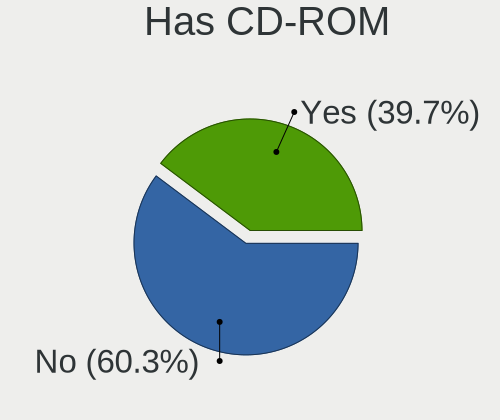
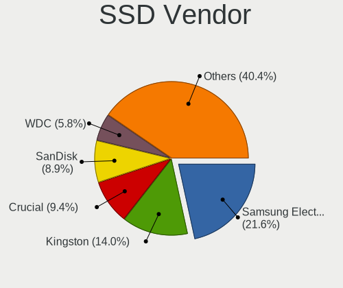
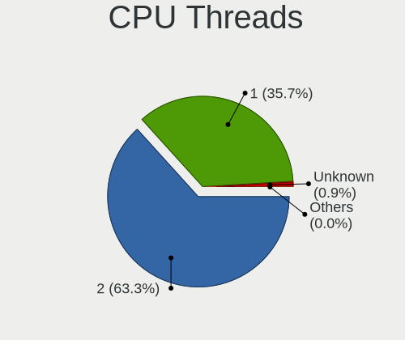
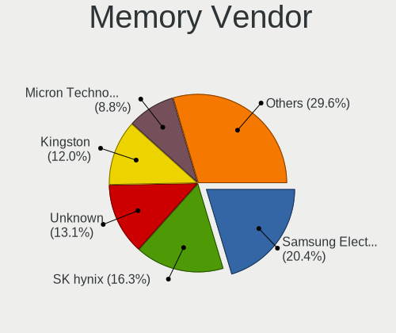

Linux - Tested Hardware & Statistics
------------------------------------

A project to collect tested hardware configurations for Linux.

Anyone can contribute to this report by the [hw-probe](https://github.com/linuxhw/hw-probe) tool:

    sudo -E hw-probe -all -upload

Please contribute! Especially if your hardware is rare.

This is a report for all computer types. See also reports for [desktops](/Desktop/README.md) and [notebooks](/Notebook/README.md).

Distribution-specific reports: [AlmaLinux](/Dist/AlmaLinux), [Alpine](/Dist/Alpine), [ALT_Linux](/Dist/ALT_Linux), [antiX](/Dist/antiX), [Artix](/Dist/Artix), [Chrome_OS](/Dist/Chrome_OS), [Clear_Linux](/Dist/Clear_Linux), [Deepin](/Dist/Deepin), [Devuan](/Dist/Devuan), [EndeavourOS](/Dist/EndeavourOS), [Garuda_Linux](/Dist/Garuda_Linux), [GNOME_OS](/Dist/GNOME_OS), [Kaisen](/Dist/Kaisen), [Mageia](/Dist/Mageia), [Makulu](/Dist/Makulu), [NixOS](/Dist/NixOS), [Nobara](/Dist/Nobara), [Oracle_Linux](/Dist/Oracle_Linux), [Pardus](/Dist/Pardus), [PureOS](/Dist/PureOS), [Q4OS](/Dist/Q4OS), [Reborn_OS](/Dist/Reborn_OS), [Rocky_Linux](/Dist/Rocky_Linux), [Sparky](/Dist/Sparky), [Void_Linux](/Dist/Void_Linux), [Xero](/Dist/Xero).

This report is for real hardware. Report for virtual hardware: [TestDays_VE](https://github.com/linuxhw/TestDays_VE)

Contents
--------

* [ Test Cases ](#test-cases)

* [ System ](#system)
  - [ OS                       ](#os)
  - [ OS Family                ](#os-family)
  - [ Kernel                   ](#kernel)
  - [ Kernel Family            ](#kernel-family)
  - [ Kernel Major Ver.        ](#kernel-major-ver)
  - [ Arch                     ](#arch)
  - [ DE                       ](#de)
  - [ Display Server           ](#display-server)
  - [ Display Manager          ](#display-manager)
  - [ OS Lang                  ](#os-lang)
  - [ Boot Mode                ](#boot-mode)
  - [ Filesystem               ](#filesystem)
  - [ Part. scheme             ](#part-scheme)
  - [ Dual Boot with Linux/BSD ](#dual-boot-with-linuxbsd)
  - [ Dual Boot (Win)          ](#dual-boot-win)

* [ Board ](#board)
  - [ Vendor                   ](#vendor)
  - [ Model                    ](#model)
  - [ Model Family             ](#model-family)
  - [ MFG Year                 ](#mfg-year)
  - [ Form Factor              ](#form-factor)
  - [ Secure Boot              ](#secure-boot)
  - [ Coreboot                 ](#coreboot)
  - [ RAM Size                 ](#ram-size)
  - [ RAM Used                 ](#ram-used)
  - [ Total Drives             ](#total-drives)
  - [ Has CD-ROM               ](#has-cd-rom)
  - [ Has Ethernet             ](#has-ethernet)
  - [ Has WiFi                 ](#has-wifi)
  - [ Has Bluetooth            ](#has-bluetooth)

* [ Location ](#location)
  - [ Country                  ](#country)
  - [ City                     ](#city)

* [ Drives ](#drives)
  - [ Drive Vendor             ](#drive-vendor)
  - [ Drive Model              ](#drive-model)
  - [ HDD Vendor               ](#hdd-vendor)
  - [ SSD Vendor               ](#ssd-vendor)
  - [ Drive Kind               ](#drive-kind)
  - [ Drive Connector          ](#drive-connector)
  - [ Drive Size               ](#drive-size)
  - [ Space Total              ](#space-total)
  - [ Space Used               ](#space-used)
  - [ Malfunc. Drives          ](#malfunc-drives)
  - [ Malfunc. Drive Vendor    ](#malfunc-drive-vendor)
  - [ Malfunc. HDD Vendor      ](#malfunc-hdd-vendor)
  - [ Malfunc. Drive Kind      ](#malfunc-drive-kind)
  - [ Failed Drives            ](#failed-drives)
  - [ Failed Drive Vendor      ](#failed-drive-vendor)
  - [ Drive Status             ](#drive-status)

* [ Storage controller ](#storage-controller)
  - [ Storage Vendor           ](#storage-vendor)
  - [ Storage Model            ](#storage-model)
  - [ Storage Kind             ](#storage-kind)

* [ Processor ](#processor)
  - [ CPU Vendor               ](#cpu-vendor)
  - [ CPU Model                ](#cpu-model)
  - [ CPU Model Family         ](#cpu-model-family)
  - [ CPU Cores                ](#cpu-cores)
  - [ CPU Sockets              ](#cpu-sockets)
  - [ CPU Threads              ](#cpu-threads)
  - [ CPU Op-Modes             ](#cpu-op-modes)
  - [ CPU Microcode            ](#cpu-microcode)
  - [ CPU Microarch            ](#cpu-microarch)

* [ Graphics ](#graphics)
  - [ GPU Vendor               ](#gpu-vendor)
  - [ GPU Model                ](#gpu-model)
  - [ GPU Combo                ](#gpu-combo)
  - [ GPU Driver               ](#gpu-driver)
  - [ GPU Memory               ](#gpu-memory)

* [ Monitor ](#monitor)
  - [ Monitor Vendor           ](#monitor-vendor)
  - [ Monitor Model            ](#monitor-model)
  - [ Monitor Resolution       ](#monitor-resolution)
  - [ Monitor Diagonal         ](#monitor-diagonal)
  - [ Monitor Width            ](#monitor-width)
  - [ Aspect Ratio             ](#aspect-ratio)
  - [ Monitor Area             ](#monitor-area)
  - [ Pixel Density            ](#pixel-density)
  - [ Multiple Monitors        ](#multiple-monitors)

* [ Network ](#network)
  - [ Net Controller Vendor    ](#net-controller-vendor)
  - [ Net Controller Model     ](#net-controller-model)
  - [ Wireless Vendor          ](#wireless-vendor)
  - [ Wireless Model           ](#wireless-model)
  - [ Ethernet Vendor          ](#ethernet-vendor)
  - [ Ethernet Model           ](#ethernet-model)
  - [ Net Controller Kind      ](#net-controller-kind)
  - [ Used Controller          ](#used-controller)
  - [ NICs                     ](#nics)
  - [ IPv6                     ](#ipv6)

* [ Bluetooth ](#bluetooth)
  - [ Bluetooth Vendor         ](#bluetooth-vendor)
  - [ Bluetooth Model          ](#bluetooth-model)

* [ Sound ](#sound)
  - [ Sound Vendor             ](#sound-vendor)
  - [ Sound Model              ](#sound-model)

* [ Memory ](#memory)
  - [ Memory Vendor            ](#memory-vendor)
  - [ Memory Model             ](#memory-model)
  - [ Memory Kind              ](#memory-kind)
  - [ Memory Form Factor       ](#memory-form-factor)
  - [ Memory Size              ](#memory-size)
  - [ Memory Speed             ](#memory-speed)

* [ Printers & scanners ](#printers--scanners)
  - [ Printer Vendor           ](#printer-vendor)
  - [ Printer Model            ](#printer-model)
  - [ Scanner Vendor           ](#scanner-vendor)
  - [ Scanner Model            ](#scanner-model)

* [ Camera ](#camera)
  - [ Camera Vendor            ](#camera-vendor)
  - [ Camera Model             ](#camera-model)

* [ Security ](#security)
  - [ Fingerprint Vendor       ](#fingerprint-vendor)
  - [ Fingerprint Model        ](#fingerprint-model)
  - [ Chipcard Vendor          ](#chipcard-vendor)
  - [ Chipcard Model           ](#chipcard-model)

* [ Unsupported ](#unsupported)
  - [ Unsupported Devices      ](#unsupported-devices)
  - [ Unsupported Device Types ](#unsupported-device-types)

Test Cases
----------

Total: 312517

| Vendor        | Model                       | Form-Factor | Probe                                                      | Date         |
|---------------|-----------------------------|-------------|------------------------------------------------------------|--------------|
| Gigabyte      | P35-S3G                     | Desktop     | [71339b40ec](https://linux-hardware.org/?probe=71339b40ec) | Jun 10, 2023 |
| Valve         | Jupiter                     | Notebook    | [d276b58f38](https://linux-hardware.org/?probe=d276b58f38) | Jun 10, 2023 |
| Acer          | Nitro AN515-44              | Notebook    | [c74a9048c0](https://linux-hardware.org/?probe=c74a9048c0) | Jun 10, 2023 |
| HP            | 250 G1                      | Notebook    | [1b9c881cae](https://linux-hardware.org/?probe=1b9c881cae) | Jun 10, 2023 |
| ASUSTek       | X541UVK                     | Notebook    | [22a8a9d964](https://linux-hardware.org/?probe=22a8a9d964) | Jun 10, 2023 |
| ASUSTek       | F2A85-V PRO                 | Desktop     | [43991c533e](https://linux-hardware.org/?probe=43991c533e) | Jun 10, 2023 |
| AZW           | SER V1.0                    | Mini pc     | [b9eb9677f5](https://linux-hardware.org/?probe=b9eb9677f5) | Jun 10, 2023 |
| Lenovo        | ThinkPad T480 20L50010US    | Notebook    | [aa44c2c8b9](https://linux-hardware.org/?probe=aa44c2c8b9) | Jun 10, 2023 |
| Apple         | MacBookAir5,2               | Notebook    | [18e80281cc](https://linux-hardware.org/?probe=18e80281cc) | Jun 10, 2023 |
| Samsung       | 730QCJ/730QCR               | Notebook    | [96b21d42f1](https://linux-hardware.org/?probe=96b21d42f1) | Jun 10, 2023 |
| Notebook      | NJx0MU                      | Notebook    | [88d3849db5](https://linux-hardware.org/?probe=88d3849db5) | Jun 10, 2023 |
| Intel         | DP45SG AAE27733-404         | Desktop     | [7abba8629e](https://linux-hardware.org/?probe=7abba8629e) | Jun 10, 2023 |
| Acer          | Aspire A517-51              | Notebook    | [01cfb1c93f](https://linux-hardware.org/?probe=01cfb1c93f) | Jun 10, 2023 |
| Gigabyte      | Z87X-UD4H-CF                | Desktop     | [abd31d2f92](https://linux-hardware.org/?probe=abd31d2f92) | Jun 10, 2023 |
| Lenovo        | ThinkPad T440p 20AN0069U... | Notebook    | [a2ddfa44e7](https://linux-hardware.org/?probe=a2ddfa44e7) | Jun 10, 2023 |
| ASUSTek       | ROG Zephyrus G14 GA401QC... | Notebook    | [57f37d5836](https://linux-hardware.org/?probe=57f37d5836) | Jun 10, 2023 |
| Apple         | MacBookAir5,2               | Notebook    | [f7bd03dbb9](https://linux-hardware.org/?probe=f7bd03dbb9) | Jun 10, 2023 |
| MSI           | X370 GAMING M7 ACK          | Desktop     | [450b8ab5a7](https://linux-hardware.org/?probe=450b8ab5a7) | Jun 10, 2023 |
| Acer          | Aspire E5-574G              | Notebook    | [8ca78da386](https://linux-hardware.org/?probe=8ca78da386) | Jun 10, 2023 |
| Intel         | DP45SG AAE27733-404         | Desktop     | [afaced265f](https://linux-hardware.org/?probe=afaced265f) | Jun 10, 2023 |
| HP            | Compaq CQ58                 | Notebook    | [98a4edb43d](https://linux-hardware.org/?probe=98a4edb43d) | Jun 10, 2023 |
| ASRock        | G41M-VS3                    | Desktop     | [d592b19e9b](https://linux-hardware.org/?probe=d592b19e9b) | Jun 10, 2023 |
| ASUSTek       | ROG STRIX B550-F GAMING ... | Desktop     | [7ab0866235](https://linux-hardware.org/?probe=7ab0866235) | Jun 10, 2023 |
| Fujitsu Si... | ESPRIMO Mobile U9200        | Notebook    | [1cfac1228c](https://linux-hardware.org/?probe=1cfac1228c) | Jun 10, 2023 |
| ASUSTek       | P7H55D-M PRO                | Desktop     | [6049b3d69d](https://linux-hardware.org/?probe=6049b3d69d) | Jun 10, 2023 |
| Dell          | Latitude 7440               | Notebook    | [f63ada6c61](https://linux-hardware.org/?probe=f63ada6c61) | Jun 10, 2023 |
| MSI           | MS-B0621 100                | All in one  | [aa67f8201a](https://linux-hardware.org/?probe=aa67f8201a) | Jun 10, 2023 |
| HP            | 250 G1                      | Notebook    | [0591407196](https://linux-hardware.org/?probe=0591407196) | Jun 10, 2023 |
| Intel         | DH55TC AAE70932-302         | Desktop     | [6090a53f8a](https://linux-hardware.org/?probe=6090a53f8a) | Jun 10, 2023 |
| Beelink       | Gemini X                    | Notebook    | [adcb5e774d](https://linux-hardware.org/?probe=adcb5e774d) | Jun 10, 2023 |
| Dell          | 0KC9NP A01                  | Desktop     | [ab5b79d6fd](https://linux-hardware.org/?probe=ab5b79d6fd) | Jun 10, 2023 |
| Lenovo        | ThinkPad 13 2nd Gen 20J2... | Notebook    | [fd388e00c3](https://linux-hardware.org/?probe=fd388e00c3) | Jun 10, 2023 |
| HUAWEI        | HVY-WXX9                    | Notebook    | [d6be89e452](https://linux-hardware.org/?probe=d6be89e452) | Jun 10, 2023 |
| AMI           | Aptio CRB                   | Mini pc     | [edec9d7178](https://linux-hardware.org/?probe=edec9d7178) | Jun 10, 2023 |
| Lenovo        | ThinkPad T480 20L50010US    | Notebook    | [398d708c85](https://linux-hardware.org/?probe=398d708c85) | Jun 10, 2023 |
| HP            | EliteBook 1040 G4           | Notebook    | [98aa06475b](https://linux-hardware.org/?probe=98aa06475b) | Jun 10, 2023 |
| Lenovo        | ThinkPad X240 20AMS5XY00    | Notebook    | [3b98c592e0](https://linux-hardware.org/?probe=3b98c592e0) | Jun 10, 2023 |
| Lenovo        | 32E9 SDK0T76465 WIN 3422... | Desktop     | [2ac8db1b4c](https://linux-hardware.org/?probe=2ac8db1b4c) | Jun 10, 2023 |
| ASUSTek       | P5B                         | Desktop     | [794635cbea](https://linux-hardware.org/?probe=794635cbea) | Jun 10, 2023 |
| Gigabyte      | H57M-USB3                   | Desktop     | [91b1655f60](https://linux-hardware.org/?probe=91b1655f60) | Jun 10, 2023 |
| Microsoft     | Surface Laptop 3            | Tablet      | [b599a55609](https://linux-hardware.org/?probe=b599a55609) | Jun 10, 2023 |
| Gigabyte      | GA-78LMT-USB3               | Desktop     | [dedc98e84e](https://linux-hardware.org/?probe=dedc98e84e) | Jun 10, 2023 |
| Samsung       | P29/28/26                   | Notebook    | [6040d56961](https://linux-hardware.org/?probe=6040d56961) | Jun 10, 2023 |
| Gigabyte      | 8I865GVMK-775               | Desktop     | [3d90d76b7b](https://linux-hardware.org/?probe=3d90d76b7b) | Jun 10, 2023 |
| HP            | 339A                        | Desktop     | [348ce53f71](https://linux-hardware.org/?probe=348ce53f71) | Jun 10, 2023 |
| Lenovo        | G580 ChiefRiver Platform    | Notebook    | [ac48eeb92c](https://linux-hardware.org/?probe=ac48eeb92c) | Jun 10, 2023 |
| Acer          | Aspire E1-572               | Notebook    | [532d86f9e6](https://linux-hardware.org/?probe=532d86f9e6) | Jun 10, 2023 |
| Apple         | MacBookPro11,3              | Notebook    | [b7dfbae839](https://linux-hardware.org/?probe=b7dfbae839) | Jun 10, 2023 |
| HP            | 81B4                        | Desktop     | [2d7748536f](https://linux-hardware.org/?probe=2d7748536f) | Jun 10, 2023 |
| Lenovo        | G580 ChiefRiver Platform    | Notebook    | [ade15528d8](https://linux-hardware.org/?probe=ade15528d8) | Jun 10, 2023 |
| HP            | Laptop 15-dw1xxx            | Notebook    | [bfde2cf63d](https://linux-hardware.org/?probe=bfde2cf63d) | Jun 10, 2023 |
| HP            | Pavilion Laptop 14-ec1xx... | Notebook    | [1eeb12a5ca](https://linux-hardware.org/?probe=1eeb12a5ca) | Jun 10, 2023 |
| Lenovo        | ThinkPad P16s Gen 1 21CK... | Notebook    | [c768cfa03d](https://linux-hardware.org/?probe=c768cfa03d) | Jun 10, 2023 |
| HP            | Pavilion Laptop 14-ec1xx... | Notebook    | [e46f2fe66e](https://linux-hardware.org/?probe=e46f2fe66e) | Jun 10, 2023 |
| Dell          | 0N4YC8 A00                  | Desktop     | [bc832400b4](https://linux-hardware.org/?probe=bc832400b4) | Jun 10, 2023 |
| Lenovo        | ThinkPad T470 20HDS14L00    | Notebook    | [a62438daef](https://linux-hardware.org/?probe=a62438daef) | Jun 10, 2023 |
| ASUSTek       | VivoBook_ASUSLaptop X515... | Notebook    | [29085f8fb4](https://linux-hardware.org/?probe=29085f8fb4) | Jun 10, 2023 |
| Gigabyte      | B650M GAMING X AX           | Desktop     | [5affc12294](https://linux-hardware.org/?probe=5affc12294) | Jun 10, 2023 |
| Dell          | Latitude 9420               | Convertible | [354adf0653](https://linux-hardware.org/?probe=354adf0653) | Jun 10, 2023 |
| Lenovo        | ThinkPad T470 20HDS14L00    | Notebook    | [fab548c31e](https://linux-hardware.org/?probe=fab548c31e) | Jun 10, 2023 |
| ASUSTek       | ZenBook UX331FA_UX331FA     | Notebook    | [8c4d9c62b5](https://linux-hardware.org/?probe=8c4d9c62b5) | Jun 10, 2023 |
| Dell          | Latitude E6510              | Notebook    | [e7c1e59ac7](https://linux-hardware.org/?probe=e7c1e59ac7) | Jun 10, 2023 |
| HP            | Laptop 17-by3xxx            | Notebook    | [421ff52b0b](https://linux-hardware.org/?probe=421ff52b0b) | Jun 10, 2023 |
| Samsung       | N150/N210/N220              | Notebook    | [977d645961](https://linux-hardware.org/?probe=977d645961) | Jun 10, 2023 |
| Notebook      | NJ50_70CU                   | Notebook    | [d39b8694fd](https://linux-hardware.org/?probe=d39b8694fd) | Jun 10, 2023 |
| ASUSTek       | ROG STRIX X670E-F GAMING... | Desktop     | [4cb72d56f7](https://linux-hardware.org/?probe=4cb72d56f7) | Jun 10, 2023 |
| ASUSTek       | TUF Gaming FX505GD_FX505... | Notebook    | [03660fb140](https://linux-hardware.org/?probe=03660fb140) | Jun 10, 2023 |
| Lenovo        | ThinkPad T550 20CJS1XB00    | Notebook    | [3d3375df75](https://linux-hardware.org/?probe=3d3375df75) | Jun 10, 2023 |
| Notebook      | NS50_70MU                   | Notebook    | [87b818815c](https://linux-hardware.org/?probe=87b818815c) | Jun 10, 2023 |
| ASUSTek       | ROG STRIX B450-F GAMING     | Desktop     | [6c8e1de1cf](https://linux-hardware.org/?probe=6c8e1de1cf) | Jun 10, 2023 |
| HP            | Pavilion dv6                | Notebook    | [1388a433de](https://linux-hardware.org/?probe=1388a433de) | Jun 10, 2023 |
| Lenovo        | IdeaPad N580 20182          | Notebook    | [8990fd0b51](https://linux-hardware.org/?probe=8990fd0b51) | Jun 10, 2023 |
| Gigabyte      | H410M H                     | Desktop     | [dfba5357ee](https://linux-hardware.org/?probe=dfba5357ee) | Jun 10, 2023 |
| WeiBu         | OEM                         | Notebook    | [49bd40f956](https://linux-hardware.org/?probe=49bd40f956) | Jun 10, 2023 |
| Lenovo        | ThinkPad X1 Carbon Gen 9... | Notebook    | [f7a2bd2ca8](https://linux-hardware.org/?probe=f7a2bd2ca8) | Jun 10, 2023 |
| Unknown       | Unknown                     | Soc         | [a61c241455](https://linux-hardware.org/?probe=a61c241455) | Jun 10, 2023 |
| Valve         | Jupiter                     | Notebook    | [d2df298764](https://linux-hardware.org/?probe=d2df298764) | Jun 10, 2023 |
| Lenovo        | ThinkPad P1 Gen 3 20TH00... | Notebook    | [65a47406b0](https://linux-hardware.org/?probe=65a47406b0) | Jun 10, 2023 |
| Lenovo        | ThinkPad T470p 20J7S0XV0... | Notebook    | [b2f7d876c7](https://linux-hardware.org/?probe=b2f7d876c7) | Jun 10, 2023 |
| ASRock        | B450M Pro4                  | Desktop     | [c23450b0df](https://linux-hardware.org/?probe=c23450b0df) | Jun 10, 2023 |
| Packard Be... | EasyNote TE11BZ             | Notebook    | [a8f9a31f17](https://linux-hardware.org/?probe=a8f9a31f17) | Jun 10, 2023 |
| Toshiba       | dynabook Satellite B552/... | Notebook    | [46c70e6e33](https://linux-hardware.org/?probe=46c70e6e33) | Jun 10, 2023 |
| Gigabyte      | GA-880GM-D2H                | Desktop     | [2e46385299](https://linux-hardware.org/?probe=2e46385299) | Jun 10, 2023 |
| ASRock        | H61M-DGS R2.0               | Desktop     | [cc206f52b1](https://linux-hardware.org/?probe=cc206f52b1) | Jun 10, 2023 |
| ASUSTek       | PRIME Z690-P WIFI           | Desktop     | [63c110632a](https://linux-hardware.org/?probe=63c110632a) | Jun 10, 2023 |
| HP            | ENVY Laptop 13-ad1xx        | Notebook    | [1de48a4515](https://linux-hardware.org/?probe=1de48a4515) | Jun 10, 2023 |
| MSI           | Prestige 13Evo A13M         | Notebook    | [3feb3bce01](https://linux-hardware.org/?probe=3feb3bce01) | Jun 10, 2023 |
| ASUSTek       | P8H61-M LX                  | Desktop     | [9d9872a84a](https://linux-hardware.org/?probe=9d9872a84a) | Jun 10, 2023 |
| Gigabyte      | GA-MA770-US3                | Desktop     | [704cc1c02b](https://linux-hardware.org/?probe=704cc1c02b) | Jun 10, 2023 |
| MSI           | MS-B9321                    | Desktop     | [a7a878dbe6](https://linux-hardware.org/?probe=a7a878dbe6) | Jun 10, 2023 |
| Fujitsu Si... | ESPRIMO Mobile U9200        | Notebook    | [427db0e78b](https://linux-hardware.org/?probe=427db0e78b) | Jun 10, 2023 |
| Gigabyte      | B560M H                     | Desktop     | [fadb7a6aa8](https://linux-hardware.org/?probe=fadb7a6aa8) | Jun 10, 2023 |
| ASUSTek       | TUF B450M-PLUS GAMING       | Desktop     | [1f8c419c47](https://linux-hardware.org/?probe=1f8c419c47) | Jun 10, 2023 |
| HUAWEI        | NBD-WXX9                    | Notebook    | [61c1703e67](https://linux-hardware.org/?probe=61c1703e67) | Jun 10, 2023 |
| Lenovo        | ThinkPad E15 Gen 4 21EDC... | Notebook    | [fa84ae9906](https://linux-hardware.org/?probe=fa84ae9906) | Jun 10, 2023 |
| ASUSTek       | PRIME B460M-K               | Desktop     | [873975925d](https://linux-hardware.org/?probe=873975925d) | Jun 10, 2023 |
| Dell          | G3 3779                     | Notebook    | [0190c87b35](https://linux-hardware.org/?probe=0190c87b35) | Jun 10, 2023 |
| Lenovo        | ThinkPad W500 4058CTO       | Notebook    | [4b6aa9a912](https://linux-hardware.org/?probe=4b6aa9a912) | Jun 10, 2023 |
| HP            | 2B4B                        | Desktop     | [3ade78a07e](https://linux-hardware.org/?probe=3ade78a07e) | Jun 10, 2023 |
| HP            | ZBook 15 G2                 | Notebook    | [68c941fe5d](https://linux-hardware.org/?probe=68c941fe5d) | Jun 10, 2023 |
| HP            | 2B4B                        | Desktop     | [2da60252b5](https://linux-hardware.org/?probe=2da60252b5) | Jun 10, 2023 |
| Pegatron      | Benicia                     | Desktop     | [c57fee6ea0](https://linux-hardware.org/?probe=c57fee6ea0) | Jun 10, 2023 |
| HP            | 339A                        | Desktop     | [d1fa07d03f](https://linux-hardware.org/?probe=d1fa07d03f) | Jun 10, 2023 |
| Huanan        | X99 F8D V2.2                | Desktop     | [1eeaac2701](https://linux-hardware.org/?probe=1eeaac2701) | Jun 10, 2023 |
| MSI           | MAG B760 TOMAHAWK WIFI      | Desktop     | [88955e82f2](https://linux-hardware.org/?probe=88955e82f2) | Jun 10, 2023 |
| Apple         | MacBookAir5,2               | Notebook    | [6adee93e47](https://linux-hardware.org/?probe=6adee93e47) | Jun 10, 2023 |
| HP            | EliteBook 840 G2            | Notebook    | [770045a9fc](https://linux-hardware.org/?probe=770045a9fc) | Jun 10, 2023 |
| HUAWEI        | NBD-WXX9                    | Notebook    | [321ad38786](https://linux-hardware.org/?probe=321ad38786) | Jun 10, 2023 |
| HP            | ENVY x360 2-in-1 Laptop ... | Convertible | [d3480eedcd](https://linux-hardware.org/?probe=d3480eedcd) | Jun 10, 2023 |
| HP            | Notebook                    | Notebook    | [42558904aa](https://linux-hardware.org/?probe=42558904aa) | Jun 10, 2023 |
| Toshiba       | PORTEGE Z10t-A              | Notebook    | [4a0712b322](https://linux-hardware.org/?probe=4a0712b322) | Jun 10, 2023 |
| HP            | ENVY x360 2-in-1 Laptop ... | Convertible | [8d07581960](https://linux-hardware.org/?probe=8d07581960) | Jun 10, 2023 |
| ASUSTek       | TUF Gaming X570-PLUS        | Desktop     | [0eae3567d9](https://linux-hardware.org/?probe=0eae3567d9) | Jun 10, 2023 |
| MSI           | B450M PRO-VDH MAX           | Desktop     | [4dcc51e897](https://linux-hardware.org/?probe=4dcc51e897) | Jun 10, 2023 |
| ASRock        | B365M Pro4-F                | Desktop     | [e54f1a9447](https://linux-hardware.org/?probe=e54f1a9447) | Jun 10, 2023 |
| HP            | Pavilion Laptop 15-cc5xx    | Notebook    | [68af03eefe](https://linux-hardware.org/?probe=68af03eefe) | Jun 10, 2023 |
| Gigabyte      | B450M S2H                   | Desktop     | [82adaa06b7](https://linux-hardware.org/?probe=82adaa06b7) | Jun 10, 2023 |
| MSI           | MS-7309                     | Desktop     | [9c6db3b61d](https://linux-hardware.org/?probe=9c6db3b61d) | Jun 10, 2023 |
| HP            | Laptop 15-dw1xxx            | Notebook    | [7c79725474](https://linux-hardware.org/?probe=7c79725474) | Jun 10, 2023 |
| HP            | Laptop 15-db0xxx            | Notebook    | [03f0e4060e](https://linux-hardware.org/?probe=03f0e4060e) | Jun 10, 2023 |
| ASUSTek       | ROG STRIX B650E-I GAMING... | Desktop     | [d58405f7c1](https://linux-hardware.org/?probe=d58405f7c1) | Jun 10, 2023 |
| ASRock        | FM2A58M-VG3+ R2.0           | Desktop     | [3e4b7afb1e](https://linux-hardware.org/?probe=3e4b7afb1e) | Jun 10, 2023 |
| ASUSTek       | ROG STRIX B350-F GAMING     | Desktop     | [08114e8a97](https://linux-hardware.org/?probe=08114e8a97) | Jun 10, 2023 |
| Apple         | Mac-942B5BF58194151B        | All in one  | [e3cb803f4e](https://linux-hardware.org/?probe=e3cb803f4e) | Jun 10, 2023 |
| ASUSTek       | K54HR                       | Notebook    | [6eada916c0](https://linux-hardware.org/?probe=6eada916c0) | Jun 10, 2023 |
| ASUSTek       | ROG STRIX B650E-I GAMING... | Desktop     | [86b377710d](https://linux-hardware.org/?probe=86b377710d) | Jun 10, 2023 |
| Lenovo        | IdeaPad 5 15ITL05 82FG      | Notebook    | [5d21e64704](https://linux-hardware.org/?probe=5d21e64704) | Jun 10, 2023 |
| Dell          | 0D883F A06                  | Desktop     | [f0d5120461](https://linux-hardware.org/?probe=f0d5120461) | Jun 10, 2023 |
| HP            | Pavilion Gaming Laptop 1... | Notebook    | [7c9662b5eb](https://linux-hardware.org/?probe=7c9662b5eb) | Jun 10, 2023 |
| Unknown       | Unknown                     | Tablet      | [f9d086b77c](https://linux-hardware.org/?probe=f9d086b77c) | Jun 10, 2023 |
| Fujitsu       | D2828-A2 S26361-D2828-A2    | Desktop     | [dfac11ccad](https://linux-hardware.org/?probe=dfac11ccad) | Jun 10, 2023 |
| ASRock        | B550AM Gaming               | Desktop     | [eca79c3bbb](https://linux-hardware.org/?probe=eca79c3bbb) | Jun 10, 2023 |
| HP            | G42                         | Notebook    | [83eca37118](https://linux-hardware.org/?probe=83eca37118) | Jun 10, 2023 |
| ASRock        | H610M-ITX/ac                | Desktop     | [80002221f5](https://linux-hardware.org/?probe=80002221f5) | Jun 10, 2023 |
| Dell          | Inspiron 7506 2n1           | Convertible | [392ff8bfbb](https://linux-hardware.org/?probe=392ff8bfbb) | Jun 10, 2023 |
| Lenovo        | ThinkPad T61 7660A25        | Notebook    | [e1617105e0](https://linux-hardware.org/?probe=e1617105e0) | Jun 10, 2023 |
| ASUSTek       | PRIME B450-PLUS             | Desktop     | [93555cfd25](https://linux-hardware.org/?probe=93555cfd25) | Jun 10, 2023 |
| Unknown       | Unknown                     | Desktop     | [4c9c3d929b](https://linux-hardware.org/?probe=4c9c3d929b) | Jun 10, 2023 |
| ASUSTek       | PRIME B450-PLUS             | Desktop     | [2e6d82c14f](https://linux-hardware.org/?probe=2e6d82c14f) | Jun 10, 2023 |
| Gigabyte      | B550 GAMING X V2            | Desktop     | [03ef8fea42](https://linux-hardware.org/?probe=03ef8fea42) | Jun 10, 2023 |
| Lenovo        | ThinkPad T570 20H9000UUS    | Notebook    | [606989ab70](https://linux-hardware.org/?probe=606989ab70) | Jun 10, 2023 |
| Dell          | Inspiron 7506 2n1           | Convertible | [b3e01203b0](https://linux-hardware.org/?probe=b3e01203b0) | Jun 10, 2023 |
| Dell          | Latitude 3580               | Notebook    | [9c02d2c4c4](https://linux-hardware.org/?probe=9c02d2c4c4) | Jun 10, 2023 |
| MP            | MS-7848                     | Desktop     | [cd63c98850](https://linux-hardware.org/?probe=cd63c98850) | Jun 10, 2023 |
| Lenovo        | ThinkPad T440 20B6005RUS    | Notebook    | [e7ea5a9368](https://linux-hardware.org/?probe=e7ea5a9368) | Jun 10, 2023 |
| Wistron       | ProLiant ML110 G5           | Desktop     | [eea1c44d94](https://linux-hardware.org/?probe=eea1c44d94) | Jun 10, 2023 |
| Lenovo        | ThinkPad X1 Carbon 7th 2... | Notebook    | [3de2e4c6f9](https://linux-hardware.org/?probe=3de2e4c6f9) | Jun 10, 2023 |
| HP            | Pavilion Gaming Laptop 1... | Notebook    | [758afab931](https://linux-hardware.org/?probe=758afab931) | Jun 10, 2023 |
| ASUSTek       | ASUS BR1100FKA BR1100FKA    | Convertible | [0239123977](https://linux-hardware.org/?probe=0239123977) | Jun 10, 2023 |
| Dell          | XPS 13 7390 2-in-1          | Convertible | [47d37facfc](https://linux-hardware.org/?probe=47d37facfc) | Jun 10, 2023 |
| Apple         | MacBookPro13,2              | Notebook    | [929c318674](https://linux-hardware.org/?probe=929c318674) | Jun 10, 2023 |
| Google        | Pirika                      | Notebook    | [67fce0a645](https://linux-hardware.org/?probe=67fce0a645) | Jun 10, 2023 |
| ASUSTek       | K30BF_M32BF                 | Desktop     | [65b3c16165](https://linux-hardware.org/?probe=65b3c16165) | Jun 10, 2023 |
| Supermicro    | H12SSL-i                    | Server      | [15fb7b8736](https://linux-hardware.org/?probe=15fb7b8736) | Jun 10, 2023 |
| ASRockRack    | X470D4U2-2T                 | Desktop     | [8e10de95af](https://linux-hardware.org/?probe=8e10de95af) | Jun 10, 2023 |
| Dell          | 0PV3YR A05                  | Server      | [ba4527394e](https://linux-hardware.org/?probe=ba4527394e) | Jun 10, 2023 |
| MSI           | MS-7388                     | Desktop     | [6d3a406400](https://linux-hardware.org/?probe=6d3a406400) | Jun 10, 2023 |
| IT Channel... | N8xEJEK                     | Notebook    | [51a7e3f5b4](https://linux-hardware.org/?probe=51a7e3f5b4) | Jun 10, 2023 |
| ASUSTek       | Zenbook UP6502ZA_Q529ZA     | Convertible | [3a1bc7a415](https://linux-hardware.org/?probe=3a1bc7a415) | Jun 10, 2023 |
| GuoGuang      | IC2M1028V-J                 | Desktop     | [d7c1b01b69](https://linux-hardware.org/?probe=d7c1b01b69) | Jun 10, 2023 |
| ASRock        | X570 Phantom Gaming X       | Desktop     | [0c4db9b922](https://linux-hardware.org/?probe=0c4db9b922) | Jun 10, 2023 |
| Dell          | Precision 7520              | Notebook    | [c52fb2f851](https://linux-hardware.org/?probe=c52fb2f851) | Jun 10, 2023 |
| Medion        | Akoya E7226                 | Notebook    | [b46a96183b](https://linux-hardware.org/?probe=b46a96183b) | Jun 10, 2023 |
| Dell          | Vostro 3560                 | Notebook    | [86f646e00f](https://linux-hardware.org/?probe=86f646e00f) | Jun 10, 2023 |
| Acidanther... | MacBookPro15,2              | Notebook    | [fb30b2eb35](https://linux-hardware.org/?probe=fb30b2eb35) | Jun 10, 2023 |
| Pegatron      | 2A99                        | Desktop     | [0a25cd49a5](https://linux-hardware.org/?probe=0a25cd49a5) | Jun 10, 2023 |
| IBM           | FAB2 Controller Producti... | Server      | [af396cb333](https://linux-hardware.org/?probe=af396cb333) | Jun 10, 2023 |
| Lenovo        | IdeaPad 3 15ITL6 82H8       | Notebook    | [1a36e2fa98](https://linux-hardware.org/?probe=1a36e2fa98) | Jun 10, 2023 |
| HP            | 1496                        | Desktop     | [68db57fde8](https://linux-hardware.org/?probe=68db57fde8) | Jun 10, 2023 |
| MSI           | X99A RAIDER                 | Desktop     | [4ab556e4b8](https://linux-hardware.org/?probe=4ab556e4b8) | Jun 10, 2023 |
| Samsung       | 550XCJ/550XCR               | Notebook    | [d8dac01c79](https://linux-hardware.org/?probe=d8dac01c79) | Jun 10, 2023 |
| Dell          | Vostro 3560                 | Notebook    | [1bb9178df2](https://linux-hardware.org/?probe=1bb9178df2) | Jun 10, 2023 |
| ASRock        | FM2A88X Extreme6+           | Desktop     | [212c44c43f](https://linux-hardware.org/?probe=212c44c43f) | Jun 10, 2023 |
| Dell          | 0DWPVW A00                  | Desktop     | [ffad802816](https://linux-hardware.org/?probe=ffad802816) | Jun 10, 2023 |
| ASUSTek       | ROG Strix G512LW_G512LW     | Notebook    | [42722d78d8](https://linux-hardware.org/?probe=42722d78d8) | Jun 10, 2023 |
| Valve         | Jupiter                     | Notebook    | [c1e32f24ee](https://linux-hardware.org/?probe=c1e32f24ee) | Jun 10, 2023 |
| Lenovo        | ThinkPad X1 Carbon 7th 2... | Notebook    | [2e6901471f](https://linux-hardware.org/?probe=2e6901471f) | Jun 10, 2023 |
| Apple         | MacBookPro9,2               | Notebook    | [3554e00d28](https://linux-hardware.org/?probe=3554e00d28) | Jun 10, 2023 |
| Dell          | Inspiron 5515               | Notebook    | [36016c0c6b](https://linux-hardware.org/?probe=36016c0c6b) | Jun 10, 2023 |
| HP            | 8949 11                     | Desktop     | [f5e1f4b6c9](https://linux-hardware.org/?probe=f5e1f4b6c9) | Jun 10, 2023 |
| ASUSTek       | ASUS BR1100FKA BR1100FKA    | Convertible | [e45eaed9f1](https://linux-hardware.org/?probe=e45eaed9f1) | Jun 10, 2023 |
| ASUSTek       | ROG STRIX B450-F GAMING     | Desktop     | [cac24c37e5](https://linux-hardware.org/?probe=cac24c37e5) | Jun 10, 2023 |
| Seco          | C40 C                       | Desktop     | [4d990c8a0c](https://linux-hardware.org/?probe=4d990c8a0c) | Jun 10, 2023 |
| ASUSTek       | ROG STRIX X670E-E GAMING... | Desktop     | [5446a0003e](https://linux-hardware.org/?probe=5446a0003e) | Jun 10, 2023 |
| MSI           | AM1M                        | Desktop     | [42a7d49c03](https://linux-hardware.org/?probe=42a7d49c03) | Jun 10, 2023 |
| Lenovo        | IdeaPad Gaming 3 15ACH6 ... | Notebook    | [3eb12fd9bc](https://linux-hardware.org/?probe=3eb12fd9bc) | Jun 10, 2023 |
| ASUSTek       | M5A97 R2.0                  | Desktop     | [d9e9a51e48](https://linux-hardware.org/?probe=d9e9a51e48) | Jun 10, 2023 |
| Apple         | MacBookAir5,1               | Notebook    | [53ba4689ae](https://linux-hardware.org/?probe=53ba4689ae) | Jun 10, 2023 |
| HP            | ZBook 15 G6                 | Notebook    | [eb23ebb0b8](https://linux-hardware.org/?probe=eb23ebb0b8) | Jun 10, 2023 |
| Apple         | MacBookAir5,1               | Notebook    | [58f4272bee](https://linux-hardware.org/?probe=58f4272bee) | Jun 10, 2023 |
| Lenovo        | ThinkPad T540p 20BFS4P80... | Notebook    | [4160d59c4f](https://linux-hardware.org/?probe=4160d59c4f) | Jun 10, 2023 |
| Intel         | NUC11ATBC2 M53055-202       | Mini pc     | [81aee70d12](https://linux-hardware.org/?probe=81aee70d12) | Jun 10, 2023 |
| Dell          | Latitude E5500              | Notebook    | [41ad12c465](https://linux-hardware.org/?probe=41ad12c465) | Jun 10, 2023 |
| Valve         | Jupiter                     | Notebook    | [fab558feb4](https://linux-hardware.org/?probe=fab558feb4) | Jun 10, 2023 |
| Acer          | Nitro AN515-44              | Notebook    | [b3531502a8](https://linux-hardware.org/?probe=b3531502a8) | Jun 10, 2023 |
| Dell          | 0C4Y3R A02                  | Server      | [976d5e0a08](https://linux-hardware.org/?probe=976d5e0a08) | Jun 10, 2023 |
| Exo           | Smart Serie LT              | Notebook    | [bbecad1cea](https://linux-hardware.org/?probe=bbecad1cea) | Jun 10, 2023 |
| Lenovo        | Y50-70 20378                | Notebook    | [5e060b53c2](https://linux-hardware.org/?probe=5e060b53c2) | Jun 10, 2023 |
| Lenovo        | Y50-70 20378                | Notebook    | [0d548e314b](https://linux-hardware.org/?probe=0d548e314b) | Jun 10, 2023 |
| HP            | ProBook x360 435 G8 Note... | Convertible | [264c056bf2](https://linux-hardware.org/?probe=264c056bf2) | Jun 10, 2023 |
| Acer          | Predator G3600              | Desktop     | [02a0cf3a71](https://linux-hardware.org/?probe=02a0cf3a71) | Jun 10, 2023 |
| Apple         | MacBookPro9,2               | Notebook    | [f502f89e9d](https://linux-hardware.org/?probe=f502f89e9d) | Jun 10, 2023 |
| Gigabyte      | H81M-H                      | Desktop     | [fc025a599d](https://linux-hardware.org/?probe=fc025a599d) | Jun 10, 2023 |
| TYAN Compu... | S7010                       | Server      | [a8b96e89f2](https://linux-hardware.org/?probe=a8b96e89f2) | Jun 10, 2023 |
| MACHENIKE     | F117-7P                     | Notebook    | [78ad896b83](https://linux-hardware.org/?probe=78ad896b83) | Jun 10, 2023 |
| Gigabyte      | GA-890GPA-UD3H              | Desktop     | [f04b28a0e5](https://linux-hardware.org/?probe=f04b28a0e5) | Jun 10, 2023 |
| Gigabyte      | H81M-H                      | Desktop     | [f32fbdf6ea](https://linux-hardware.org/?probe=f32fbdf6ea) | Jun 10, 2023 |
| Samsung       | N102SP/N100SP/N101SP        | Notebook    | [c31b0e5f30](https://linux-hardware.org/?probe=c31b0e5f30) | Jun 10, 2023 |
| Lenovo        | ThinkPad P16 Gen 1 21D7S... | Notebook    | [246facab73](https://linux-hardware.org/?probe=246facab73) | Jun 10, 2023 |
| Lenovo        | IdeaPad Gaming 3 15ARH05... | Notebook    | [bdca36306b](https://linux-hardware.org/?probe=bdca36306b) | Jun 10, 2023 |
| Sony          | VPCF120FD                   | Notebook    | [47f02bd498](https://linux-hardware.org/?probe=47f02bd498) | Jun 10, 2023 |
| Apple         | MacBookPro5,5               | Notebook    | [1b3630b25a](https://linux-hardware.org/?probe=1b3630b25a) | Jun 10, 2023 |
| MSI           | B250M PRO-VH                | Desktop     | [16b496c21d](https://linux-hardware.org/?probe=16b496c21d) | Jun 10, 2023 |
| HUAWEI        | BOD-WXX9                    | Notebook    | [c4063bcf07](https://linux-hardware.org/?probe=c4063bcf07) | Jun 09, 2023 |
| Gigabyte      | P57V6                       | Notebook    | [a2ce7ccc80](https://linux-hardware.org/?probe=a2ce7ccc80) | Jun 09, 2023 |
| HUAWEI        | BOD-WXX9                    | Notebook    | [9016ad81ae](https://linux-hardware.org/?probe=9016ad81ae) | Jun 09, 2023 |
| HP            | 0B4Ch D                     | Desktop     | [672a491915](https://linux-hardware.org/?probe=672a491915) | Jun 09, 2023 |
| HP            | ProBook 6360b               | Notebook    | [cdef37cb2d](https://linux-hardware.org/?probe=cdef37cb2d) | Jun 09, 2023 |
| Dell          | Inspiron 3583               | Notebook    | [2627421665](https://linux-hardware.org/?probe=2627421665) | Jun 09, 2023 |
| HP            | Laptop 15-db0xxx            | Notebook    | [881d5dc409](https://linux-hardware.org/?probe=881d5dc409) | Jun 09, 2023 |
| Intel         | H81                         | Desktop     | [6a51c76e81](https://linux-hardware.org/?probe=6a51c76e81) | Jun 09, 2023 |
| Lenovo        | Yoga 6 13ALC7 82UD          | Convertible | [012e8255f3](https://linux-hardware.org/?probe=012e8255f3) | Jun 09, 2023 |
| ASUSTek       | VivoBook 17_ASUS Laptop ... | Notebook    | [08a506ad4e](https://linux-hardware.org/?probe=08a506ad4e) | Jun 09, 2023 |
| Lenovo        | IdeaPad S145-15IWL 81S9     | Notebook    | [0b0c11a052](https://linux-hardware.org/?probe=0b0c11a052) | Jun 09, 2023 |
| Lenovo        | ThinkPad P16 Gen 1 21D7S... | Notebook    | [233dac6c68](https://linux-hardware.org/?probe=233dac6c68) | Jun 09, 2023 |
| Lenovo        | 3172 SDK0J40697 WIN 3305... | Mini pc     | [7f437dc929](https://linux-hardware.org/?probe=7f437dc929) | Jun 09, 2023 |
| Sony          | SVE1713X1EB                 | Notebook    | [f1c10c92b3](https://linux-hardware.org/?probe=f1c10c92b3) | Jun 09, 2023 |
| Acer          | Aspire F5-573G              | Notebook    | [5648ca2620](https://linux-hardware.org/?probe=5648ca2620) | Jun 09, 2023 |
| Toshiba       | Satellite C650              | Notebook    | [162f690841](https://linux-hardware.org/?probe=162f690841) | Jun 09, 2023 |
| Acer          | Aspire F5-573G              | Notebook    | [30dbebd931](https://linux-hardware.org/?probe=30dbebd931) | Jun 09, 2023 |
| HP            | ZBook 15 G2                 | Notebook    | [2851b41659](https://linux-hardware.org/?probe=2851b41659) | Jun 09, 2023 |
| Acer          | Aspire XC600 v1.0           | Desktop     | [754d228b9b](https://linux-hardware.org/?probe=754d228b9b) | Jun 09, 2023 |
| Dell          | 0PU052                      | Desktop     | [84db4b658c](https://linux-hardware.org/?probe=84db4b658c) | Jun 09, 2023 |
| ASUSTek       | P5GC-MX/1333                | Desktop     | [b47fab6285](https://linux-hardware.org/?probe=b47fab6285) | Jun 09, 2023 |
| ASUSTek       | P8H61-M LX                  | Desktop     | [bd22edfae7](https://linux-hardware.org/?probe=bd22edfae7) | Jun 09, 2023 |
| MSI           | MPG X570 GAMING EDGE WIF... | Desktop     | [0e34d2ee28](https://linux-hardware.org/?probe=0e34d2ee28) | Jun 09, 2023 |
| Intel         | powered classmate PC        | Notebook    | [e530f037c6](https://linux-hardware.org/?probe=e530f037c6) | Jun 09, 2023 |
| HP            | Notebook                    | Notebook    | [9487146a2f](https://linux-hardware.org/?probe=9487146a2f) | Jun 09, 2023 |
| Lenovo        | Legion 5 15ARH05 82B5       | Notebook    | [2b4f40f41b](https://linux-hardware.org/?probe=2b4f40f41b) | Jun 09, 2023 |
| Dell          | 0PU052                      | Desktop     | [145d296b59](https://linux-hardware.org/?probe=145d296b59) | Jun 09, 2023 |
| Lenovo        | IdeaPad L340-15API 81LW     | Notebook    | [1794287cf0](https://linux-hardware.org/?probe=1794287cf0) | Jun 09, 2023 |
| Dell          | 0WMJ54 A01                  | Desktop     | [a4d08407bb](https://linux-hardware.org/?probe=a4d08407bb) | Jun 09, 2023 |
| ASRock        | B360M Pro4                  | Desktop     | [9b52b20f3e](https://linux-hardware.org/?probe=9b52b20f3e) | Jun 09, 2023 |
| Lenovo        | V110-15IAP 80TG             | Notebook    | [68a77b486e](https://linux-hardware.org/?probe=68a77b486e) | Jun 09, 2023 |
| Dell          | Vostro 3500                 | Notebook    | [c64ff76dba](https://linux-hardware.org/?probe=c64ff76dba) | Jun 09, 2023 |
| ASUSTek       | UX530UQ                     | Notebook    | [71d0ddd2f0](https://linux-hardware.org/?probe=71d0ddd2f0) | Jun 09, 2023 |
| Dell          | Latitude 9420               | Convertible | [593403cb67](https://linux-hardware.org/?probe=593403cb67) | Jun 09, 2023 |
| Dell          | Vostro 3500                 | Notebook    | [3d694e1b9a](https://linux-hardware.org/?probe=3d694e1b9a) | Jun 09, 2023 |
| Lenovo        | ThinkPad P1 20MD001VUS      | Notebook    | [9765261d02](https://linux-hardware.org/?probe=9765261d02) | Jun 09, 2023 |
| Apple         | MacBookPro11,4              | Notebook    | [6d70667d42](https://linux-hardware.org/?probe=6d70667d42) | Jun 09, 2023 |
| ASUSTek       | ROG STRIX Z690-A GAMING ... | Desktop     | [afa2a30d75](https://linux-hardware.org/?probe=afa2a30d75) | Jun 09, 2023 |
| HP            | 82C9                        | Desktop     | [b696990030](https://linux-hardware.org/?probe=b696990030) | Jun 09, 2023 |
| Dell          | Inspiron 7348               | Notebook    | [a2bd4ab5b9](https://linux-hardware.org/?probe=a2bd4ab5b9) | Jun 09, 2023 |
| ASUSTek       | M5A97 LE R2.0               | Desktop     | [a1877cb5b3](https://linux-hardware.org/?probe=a1877cb5b3) | Jun 09, 2023 |
| Dell          | Vostro 3558                 | Notebook    | [15185698e7](https://linux-hardware.org/?probe=15185698e7) | Jun 09, 2023 |
| Valve         | Jupiter                     | Notebook    | [7a36bdb92a](https://linux-hardware.org/?probe=7a36bdb92a) | Jun 09, 2023 |
| HUAWEI        | MACHC-WAX9                  | Notebook    | [6f26f51ef6](https://linux-hardware.org/?probe=6f26f51ef6) | Jun 09, 2023 |
| ASUSTek       | P8P67 LE                    | Desktop     | [212ff65852](https://linux-hardware.org/?probe=212ff65852) | Jun 09, 2023 |
| HP            | Victus by Laptop 16-e0xx... | Notebook    | [9cb24f9445](https://linux-hardware.org/?probe=9cb24f9445) | Jun 09, 2023 |
| Apple         | Mac-F65AE981FFA204ED Mac... | Mini pc     | [604f40e700](https://linux-hardware.org/?probe=604f40e700) | Jun 09, 2023 |
| HP            | 339B                        | Desktop     | [bc6de07e07](https://linux-hardware.org/?probe=bc6de07e07) | Jun 09, 2023 |
| ASRock        | H61M-DGS R2.0               | Desktop     | [37c25e136f](https://linux-hardware.org/?probe=37c25e136f) | Jun 09, 2023 |
| Gigabyte      | B550M DS3H                  | Desktop     | [ea724e204b](https://linux-hardware.org/?probe=ea724e204b) | Jun 09, 2023 |
| Lenovo        | ThinkPad T460 20FN002JUS    | Notebook    | [8cc29c049e](https://linux-hardware.org/?probe=8cc29c049e) | Jun 09, 2023 |
| Fujitsu       | LIFEBOOK E734               | Notebook    | [3742e80123](https://linux-hardware.org/?probe=3742e80123) | Jun 09, 2023 |
| Gigabyte      | B460M DS3H                  | Desktop     | [63c9d6c822](https://linux-hardware.org/?probe=63c9d6c822) | Jun 09, 2023 |
| Dell          | Vostro 3460                 | Notebook    | [e8ed8e8b1e](https://linux-hardware.org/?probe=e8ed8e8b1e) | Jun 09, 2023 |
| HP            | Stream Laptop 14-ds0xxx     | Notebook    | [fb9e2f9fc8](https://linux-hardware.org/?probe=fb9e2f9fc8) | Jun 09, 2023 |
| Apple         | Mac-F65AE981FFA204ED Mac... | Mini pc     | [d001c4cf1c](https://linux-hardware.org/?probe=d001c4cf1c) | Jun 09, 2023 |
| HP            | ProBook 4510s               | Notebook    | [43a29ea83e](https://linux-hardware.org/?probe=43a29ea83e) | Jun 09, 2023 |
| ASUSTek       | ROG STRIX B650E-I GAMING... | Desktop     | [92fd36b27a](https://linux-hardware.org/?probe=92fd36b27a) | Jun 09, 2023 |
| Lenovo        | IdeaPadFlex 5 14ITL05 82... | Convertible | [7bc800675d](https://linux-hardware.org/?probe=7bc800675d) | Jun 09, 2023 |
| Onda TLC      | ONDA Oliver                 | Notebook    | [80a06d821b](https://linux-hardware.org/?probe=80a06d821b) | Jun 09, 2023 |
| ASUSTek       | PRIME X370-PRO              | Desktop     | [77145a587d](https://linux-hardware.org/?probe=77145a587d) | Jun 09, 2023 |
| ASUSTek       | ROG ZENITH EXTREME          | Desktop     | [b4de2ccda4](https://linux-hardware.org/?probe=b4de2ccda4) | Jun 09, 2023 |
| MSI           | 970A-G46                    | Desktop     | [e4471b7a38](https://linux-hardware.org/?probe=e4471b7a38) | Jun 09, 2023 |
| Raspberry ... | Raspberry Pi 2 Model B R... | Soc         | [5ad9f9e0bf](https://linux-hardware.org/?probe=5ad9f9e0bf) | Jun 09, 2023 |
| MECHREVO      | Jiaolong16K Series GM6BG... | Notebook    | [a165849009](https://linux-hardware.org/?probe=a165849009) | Jun 09, 2023 |
| HP            | Laptop 17-bs0xx             | Notebook    | [c93d52343c](https://linux-hardware.org/?probe=c93d52343c) | Jun 09, 2023 |
| Gigabyte      | B450 AORUS M                | Desktop     | [280baa2765](https://linux-hardware.org/?probe=280baa2765) | Jun 09, 2023 |
| Valve         | Jupiter                     | Notebook    | [628ee9ac88](https://linux-hardware.org/?probe=628ee9ac88) | Jun 09, 2023 |
| Dell          | 0XCR8D A03                  | Desktop     | [e37bceb6fb](https://linux-hardware.org/?probe=e37bceb6fb) | Jun 09, 2023 |
| Sony          | VPCEB2AFD                   | Notebook    | [1d9d6ddd74](https://linux-hardware.org/?probe=1d9d6ddd74) | Jun 09, 2023 |
| Google        | Akali 360                   | Notebook    | [1f7d5f8bc5](https://linux-hardware.org/?probe=1f7d5f8bc5) | Jun 09, 2023 |
| ASUSTek       | M2N68-AM SE2                | Desktop     | [4f69ba649a](https://linux-hardware.org/?probe=4f69ba649a) | Jun 09, 2023 |
| Dell          | Inspiron N5110              | Notebook    | [62d37454d3](https://linux-hardware.org/?probe=62d37454d3) | Jun 09, 2023 |
| Dell          | XPS 13 9333                 | Notebook    | [88020aee75](https://linux-hardware.org/?probe=88020aee75) | Jun 09, 2023 |
| Lenovo        | ThinkStation E20 422237U    | Desktop     | [2756905647](https://linux-hardware.org/?probe=2756905647) | Jun 09, 2023 |
| Dell          | Latitude 5480               | Notebook    | [5b3fb0b4f8](https://linux-hardware.org/?probe=5b3fb0b4f8) | Jun 09, 2023 |
| Dell          | Latitude 5420               | Notebook    | [956a995580](https://linux-hardware.org/?probe=956a995580) | Jun 09, 2023 |
| MSI           | MAG B550M MORTAR WIFI       | Desktop     | [6491127e6e](https://linux-hardware.org/?probe=6491127e6e) | Jun 09, 2023 |
| ASUSTek       | ROG STRIX B550-F GAMING     | Desktop     | [0f42ca8c95](https://linux-hardware.org/?probe=0f42ca8c95) | Jun 09, 2023 |
| Gigabyte      | AORUS 17X AXF               | Notebook    | [685ba556b4](https://linux-hardware.org/?probe=685ba556b4) | Jun 09, 2023 |
| Gigabyte      | P67A-D3-B3                  | Desktop     | [142fc47b59](https://linux-hardware.org/?probe=142fc47b59) | Jun 09, 2023 |
| Gigabyte      | B450 AORUS PRO WIFI-CF      | Desktop     | [f9677c0861](https://linux-hardware.org/?probe=f9677c0861) | Jun 09, 2023 |
| Lenovo        | ThinkPad X201 3249CTO       | Notebook    | [849dbace60](https://linux-hardware.org/?probe=849dbace60) | Jun 09, 2023 |
| ASUSTek       | P8H61-M LX2                 | Desktop     | [3fb94f0c4b](https://linux-hardware.org/?probe=3fb94f0c4b) | Jun 09, 2023 |
| Dell          | Latitude E7470              | Notebook    | [c5457da74f](https://linux-hardware.org/?probe=c5457da74f) | Jun 09, 2023 |
| Dell          | Latitude E5470              | Notebook    | [c9b909273b](https://linux-hardware.org/?probe=c9b909273b) | Jun 09, 2023 |
| Lenovo        | ThinkPad P53 20QN0011IV     | Notebook    | [9e3dfb25be](https://linux-hardware.org/?probe=9e3dfb25be) | Jun 09, 2023 |
| Dell          | Inspiron 3583               | Notebook    | [adcb3b193a](https://linux-hardware.org/?probe=adcb3b193a) | Jun 09, 2023 |
| Gigabyte      | P55A-UD3                    | Desktop     | [2c8c27897b](https://linux-hardware.org/?probe=2c8c27897b) | Jun 09, 2023 |
| Dell          | Vostro 1310                 | Notebook    | [05fc6f167c](https://linux-hardware.org/?probe=05fc6f167c) | Jun 09, 2023 |
| Digibras      | NH4CU03                     | Notebook    | [c66d30943e](https://linux-hardware.org/?probe=c66d30943e) | Jun 09, 2023 |
| Dell          | XPS 13 9370                 | Notebook    | [c605e51eca](https://linux-hardware.org/?probe=c605e51eca) | Jun 09, 2023 |
| ASUSTek       | A8R32-MVP Deluxe            | Desktop     | [f02bc23dd0](https://linux-hardware.org/?probe=f02bc23dd0) | Jun 09, 2023 |
| Dell          | 07T4MC A02                  | Desktop     | [ad310dd147](https://linux-hardware.org/?probe=ad310dd147) | Jun 09, 2023 |
| Lenovo        | Legion Y540-17IRH 81Q4      | Notebook    | [ab95a219f5](https://linux-hardware.org/?probe=ab95a219f5) | Jun 09, 2023 |
| ECS           | G31T-M9                     | Desktop     | [d8ca98b733](https://linux-hardware.org/?probe=d8ca98b733) | Jun 09, 2023 |
| HP            | Laptop 15-db0xxx            | Notebook    | [5dd8c1fed8](https://linux-hardware.org/?probe=5dd8c1fed8) | Jun 09, 2023 |
| ASRock        | AB350M Pro4                 | Desktop     | [8f0087d741](https://linux-hardware.org/?probe=8f0087d741) | Jun 09, 2023 |
| IBM           | 00J6244 08                  | Server      | [1543d47492](https://linux-hardware.org/?probe=1543d47492) | Jun 09, 2023 |
| HP            | Pavilion x360 Convertibl... | Convertible | [797dea9c96](https://linux-hardware.org/?probe=797dea9c96) | Jun 09, 2023 |
| Nvidia        | MCP79                       | Desktop     | [8203509a77](https://linux-hardware.org/?probe=8203509a77) | Jun 09, 2023 |
| Gigabyte      | 970A-DS3P                   | Desktop     | [1bae25f67b](https://linux-hardware.org/?probe=1bae25f67b) | Jun 09, 2023 |
| MSI           | H81I                        | Desktop     | [c7c19346a2](https://linux-hardware.org/?probe=c7c19346a2) | Jun 09, 2023 |
| Dell          | Precision M4600             | Notebook    | [a79a783515](https://linux-hardware.org/?probe=a79a783515) | Jun 09, 2023 |
| Acer          | Aspire 5750G                | Notebook    | [69227c0908](https://linux-hardware.org/?probe=69227c0908) | Jun 09, 2023 |
| ASUSTek       | PRIME B350-PLUS             | Desktop     | [cc1f571000](https://linux-hardware.org/?probe=cc1f571000) | Jun 09, 2023 |
| Dell          | XPS 9320                    | Notebook    | [c9f26e18c2](https://linux-hardware.org/?probe=c9f26e18c2) | Jun 09, 2023 |
| Gigabyte      | G41M-ES2L                   | Desktop     | [22e9021ae3](https://linux-hardware.org/?probe=22e9021ae3) | Jun 09, 2023 |
| MSI           | A520M-A PRO                 | Desktop     | [8a9223ce9f](https://linux-hardware.org/?probe=8a9223ce9f) | Jun 09, 2023 |
| Gigabyte      | B450M S2H V2                | Desktop     | [fb883c82bc](https://linux-hardware.org/?probe=fb883c82bc) | Jun 09, 2023 |
| Gigabyte      | B450 AORUS ELITE            | Desktop     | [b2c39972c2](https://linux-hardware.org/?probe=b2c39972c2) | Jun 09, 2023 |
| Toshiba       | Satellite C660D             | Notebook    | [a6c222681d](https://linux-hardware.org/?probe=a6c222681d) | Jun 09, 2023 |
| Gigabyte      | B450M H                     | Desktop     | [e54b5ce7da](https://linux-hardware.org/?probe=e54b5ce7da) | Jun 09, 2023 |
| HUAWEI        | BOHB-WAX9                   | Notebook    | [aa0b439e8d](https://linux-hardware.org/?probe=aa0b439e8d) | Jun 09, 2023 |
| HP            | 255 15.6 inch G9 Noteboo... | Notebook    | [50c36acc0d](https://linux-hardware.org/?probe=50c36acc0d) | Jun 09, 2023 |
| MECHREVO      | Jiaolong16K Series GM6BG... | Notebook    | [05c07442a3](https://linux-hardware.org/?probe=05c07442a3) | Jun 09, 2023 |
| Gigabyte      | B550 AORUS PRO              | Desktop     | [61a0a2ea5f](https://linux-hardware.org/?probe=61a0a2ea5f) | Jun 09, 2023 |
| MSI           | Boston                      | Desktop     | [cc58f8cdf3](https://linux-hardware.org/?probe=cc58f8cdf3) | Jun 09, 2023 |
| Acer          | TravelMate P215-53          | Notebook    | [9536bf547a](https://linux-hardware.org/?probe=9536bf547a) | Jun 09, 2023 |
| ASUSTek       | PRIME B450M-A II            | Desktop     | [95bc101c80](https://linux-hardware.org/?probe=95bc101c80) | Jun 09, 2023 |
| Valve         | Jupiter                     | Notebook    | [06f5f2068f](https://linux-hardware.org/?probe=06f5f2068f) | Jun 09, 2023 |
| Gigabyte      | H61M-DS2                    | Desktop     | [8b8c6949b6](https://linux-hardware.org/?probe=8b8c6949b6) | Jun 09, 2023 |
| HP            | 09E0h                       | Desktop     | [b6bb01441c](https://linux-hardware.org/?probe=b6bb01441c) | Jun 09, 2023 |
| Gigabyte      | B450M GAMING                | Desktop     | [8ab2ec8df4](https://linux-hardware.org/?probe=8ab2ec8df4) | Jun 09, 2023 |
| Fujitsu       | LIFEBOOK E754               | Notebook    | [4d09f42447](https://linux-hardware.org/?probe=4d09f42447) | Jun 09, 2023 |
| Toshiba       | Satellite L635              | Notebook    | [4f124d1525](https://linux-hardware.org/?probe=4f124d1525) | Jun 09, 2023 |
| HP            | EliteBook 8440p             | Notebook    | [b88712538e](https://linux-hardware.org/?probe=b88712538e) | Jun 09, 2023 |
| Fujitsu       | LIFEBOOK U7411              | Notebook    | [ab35c95b72](https://linux-hardware.org/?probe=ab35c95b72) | Jun 09, 2023 |
| Dell          | 0YXT71 A00                  | Desktop     | [477afe615b](https://linux-hardware.org/?probe=477afe615b) | Jun 09, 2023 |
| Gigabyte      | Q87M-D2H                    | Desktop     | [56421d7b0f](https://linux-hardware.org/?probe=56421d7b0f) | Jun 09, 2023 |
| Dell          | 0YXT71 A00                  | Desktop     | [463dfa5d83](https://linux-hardware.org/?probe=463dfa5d83) | Jun 09, 2023 |
| Lenovo        | IdeaPad 5 14ARE05 81YM      | Notebook    | [e246e70bb6](https://linux-hardware.org/?probe=e246e70bb6) | Jun 09, 2023 |
| Lenovo        | Yoga Slim 7 Carbon 13ITL... | Notebook    | [27c0e57cb3](https://linux-hardware.org/?probe=27c0e57cb3) | Jun 09, 2023 |
| HP            | 14                          | Notebook    | [1540a787fb](https://linux-hardware.org/?probe=1540a787fb) | Jun 09, 2023 |
| Biostar       | A68N-2100K                  | Desktop     | [9ac86a512d](https://linux-hardware.org/?probe=9ac86a512d) | Jun 09, 2023 |
| HP            | 14                          | Notebook    | [1404218cab](https://linux-hardware.org/?probe=1404218cab) | Jun 09, 2023 |
| ASUSTek       | PRIME A520M-A II            | Desktop     | [176b4ca0bb](https://linux-hardware.org/?probe=176b4ca0bb) | Jun 09, 2023 |
| Gigabyte      | B450 AORUS M                | Desktop     | [50b022f065](https://linux-hardware.org/?probe=50b022f065) | Jun 09, 2023 |
| Lenovo        | ThinkPad P1 Gen 3 20TJS1... | Notebook    | [c47936b50c](https://linux-hardware.org/?probe=c47936b50c) | Jun 09, 2023 |
| Dell          | Inspiron 14 7420 2-in-1     | Convertible | [d7b5162532](https://linux-hardware.org/?probe=d7b5162532) | Jun 09, 2023 |
| Panasonic     | CF-S10CDHEDM                | Notebook    | [19b6085754](https://linux-hardware.org/?probe=19b6085754) | Jun 09, 2023 |
| MSI           | MPG X570S CARBON MAX WIF... | Desktop     | [5833483fe2](https://linux-hardware.org/?probe=5833483fe2) | Jun 09, 2023 |
| MSI           | 760GM-P23                   | Desktop     | [abc3a3d8a1](https://linux-hardware.org/?probe=abc3a3d8a1) | Jun 09, 2023 |
| Lenovo        | ThinkPad T14s Gen 1 20T0... | Notebook    | [a579703f97](https://linux-hardware.org/?probe=a579703f97) | Jun 09, 2023 |
| Lenovo        | ThinkPad T460s 20FAS11X0... | Notebook    | [23568da401](https://linux-hardware.org/?probe=23568da401) | Jun 09, 2023 |
| Huanan        | X99-F8 GAMING V2.0          | Desktop     | [a597fc235e](https://linux-hardware.org/?probe=a597fc235e) | Jun 09, 2023 |
| Huanan        | X99-F8 GAMING V2.0          | Desktop     | [6a368b8ecc](https://linux-hardware.org/?probe=6a368b8ecc) | Jun 09, 2023 |
| Gigabyte      | GA-78LMT-USB3 R2 sex        | Desktop     | [bcad738da6](https://linux-hardware.org/?probe=bcad738da6) | Jun 09, 2023 |
| Lenovo        | IdeaPad 3 14ALC6 82KT       | Notebook    | [c35e22de2b](https://linux-hardware.org/?probe=c35e22de2b) | Jun 09, 2023 |
| MSI           | MAG Z490 TOMAHAWK           | Desktop     | [40f18ae1f4](https://linux-hardware.org/?probe=40f18ae1f4) | Jun 09, 2023 |
| MSI           | B350M MORTAR                | Desktop     | [6e5323aa42](https://linux-hardware.org/?probe=6e5323aa42) | Jun 09, 2023 |
| MSI           | B350M MORTAR                | Desktop     | [fc4b07cbb0](https://linux-hardware.org/?probe=fc4b07cbb0) | Jun 09, 2023 |
| Lenovo        | IdeaPad 320-15ISK 80XH      | Notebook    | [2f0f8eb596](https://linux-hardware.org/?probe=2f0f8eb596) | Jun 09, 2023 |
| MSI           | 760GM-P23                   | Desktop     | [fc826b3cb1](https://linux-hardware.org/?probe=fc826b3cb1) | Jun 09, 2023 |
| ECS           | H81H3-M4                    | Desktop     | [b457e63434](https://linux-hardware.org/?probe=b457e63434) | Jun 09, 2023 |
| Acer          | Aspire 7750                 | Notebook    | [b0daafa057](https://linux-hardware.org/?probe=b0daafa057) | Jun 09, 2023 |
| Lenovo        | ThinkPad T440p 20AWS43W0... | Notebook    | [69e5497306](https://linux-hardware.org/?probe=69e5497306) | Jun 09, 2023 |
| Unknown       | Unknown                     | Notebook    | [c5accf4cf8](https://linux-hardware.org/?probe=c5accf4cf8) | Jun 09, 2023 |
| VIT           | P2402                       | Notebook    | [5ea93f652a](https://linux-hardware.org/?probe=5ea93f652a) | Jun 09, 2023 |
| ASUSTek       | P8H61-M LX                  | Desktop     | [28d0a897d3](https://linux-hardware.org/?probe=28d0a897d3) | Jun 09, 2023 |
| Gigabyte      | X570 GAMING X               | Desktop     | [576a624a1b](https://linux-hardware.org/?probe=576a624a1b) | Jun 09, 2023 |
| Apple         | MacBookPro5,5               | Notebook    | [09344fa63e](https://linux-hardware.org/?probe=09344fa63e) | Jun 09, 2023 |
| ASUSTek       | TUF Gaming B650M-PLUS WI... | Desktop     | [26262445d4](https://linux-hardware.org/?probe=26262445d4) | Jun 09, 2023 |
| Unknown       | Unknown                     | Notebook    | [45e51a6b5d](https://linux-hardware.org/?probe=45e51a6b5d) | Jun 09, 2023 |
| ASUSTek       | STRIX B250F GAMING          | Desktop     | [c0fd33b9cc](https://linux-hardware.org/?probe=c0fd33b9cc) | Jun 09, 2023 |
| ASUSTek       | PRIME H410M-E               | Desktop     | [f40a243bba](https://linux-hardware.org/?probe=f40a243bba) | Jun 09, 2023 |
| Toshiba       | PORTEGE R705                | Notebook    | [c7a032c5cf](https://linux-hardware.org/?probe=c7a032c5cf) | Jun 09, 2023 |
| ASUSTek       | M2N68-AM Plus               | Desktop     | [7411937d5b](https://linux-hardware.org/?probe=7411937d5b) | Jun 09, 2023 |
| Dell          | Inspiron 3493               | Notebook    | [ffcd21fc3b](https://linux-hardware.org/?probe=ffcd21fc3b) | Jun 09, 2023 |
| Lenovo        | 1037 SDK0Q40104 WIN 3305... | Server      | [c7ced127f8](https://linux-hardware.org/?probe=c7ced127f8) | Jun 09, 2023 |
| Dell          | Inspiron 15-5568            | Notebook    | [19b686b7d7](https://linux-hardware.org/?probe=19b686b7d7) | Jun 09, 2023 |
| Dell          | Latitude E7240              | Notebook    | [1d8eb4fce4](https://linux-hardware.org/?probe=1d8eb4fce4) | Jun 09, 2023 |
| Gigabyte      | Z790 AORUS ELITE AX         | Desktop     | [f4f543eaa6](https://linux-hardware.org/?probe=f4f543eaa6) | Jun 09, 2023 |
| HP            | 2B0D A01                    | All in one  | [84275606e0](https://linux-hardware.org/?probe=84275606e0) | Jun 09, 2023 |
| Gigabyte      | GA-78LMT-USB3 SEx           | Desktop     | [1189f6696f](https://linux-hardware.org/?probe=1189f6696f) | Jun 09, 2023 |
| Lenovo        | IdeaPad 3 14ALC6 82KT       | Notebook    | [68be9da7f1](https://linux-hardware.org/?probe=68be9da7f1) | Jun 09, 2023 |
| HP            | Spectre x360 Convertible... | Convertible | [1256480fca](https://linux-hardware.org/?probe=1256480fca) | Jun 09, 2023 |
| Dell          | Latitude E7240              | Notebook    | [da22551dca](https://linux-hardware.org/?probe=da22551dca) | Jun 09, 2023 |
| ASUSTek       | STRIX B250F GAMING          | Desktop     | [76c3e6625b](https://linux-hardware.org/?probe=76c3e6625b) | Jun 09, 2023 |
| Dell          | 0FDY5C A00                  | Desktop     | [1caf029f79](https://linux-hardware.org/?probe=1caf029f79) | Jun 09, 2023 |
| ASUSTek       | M4A785G-HTPC                | Desktop     | [76304dfb4a](https://linux-hardware.org/?probe=76304dfb4a) | Jun 09, 2023 |
| AZW           | SEi                         | Desktop     | [2b085e7ed2](https://linux-hardware.org/?probe=2b085e7ed2) | Jun 09, 2023 |
| Dell          | Precision 7540              | Notebook    | [41fe2f93ff](https://linux-hardware.org/?probe=41fe2f93ff) | Jun 09, 2023 |
| Unknown       | GSUO H61V10C                | Desktop     | [0daf816953](https://linux-hardware.org/?probe=0daf816953) | Jun 09, 2023 |
| HP            | OMEN by Laptop 15-ce0xx     | Notebook    | [fd3b70424a](https://linux-hardware.org/?probe=fd3b70424a) | Jun 09, 2023 |
| Apple         | MacBookPro9,2               | Notebook    | [c22081b097](https://linux-hardware.org/?probe=c22081b097) | Jun 09, 2023 |
| HP            | 2B35                        | Desktop     | [5921b94b60](https://linux-hardware.org/?probe=5921b94b60) | Jun 09, 2023 |
| HP            | Elite Dragonfly G2          | Convertible | [f36fbdace7](https://linux-hardware.org/?probe=f36fbdace7) | Jun 09, 2023 |
| HP            | Notebook                    | Notebook    | [e292bb9d5a](https://linux-hardware.org/?probe=e292bb9d5a) | Jun 09, 2023 |
| ASUSTek       | G771JW                      | Notebook    | [6d989f49b6](https://linux-hardware.org/?probe=6d989f49b6) | Jun 09, 2023 |
| Acer          | Aspire 8930                 | Notebook    | [f8eb3278fe](https://linux-hardware.org/?probe=f8eb3278fe) | Jun 09, 2023 |
| HP            | EliteBook 8440p             | Notebook    | [51bfdec531](https://linux-hardware.org/?probe=51bfdec531) | Jun 09, 2023 |
| HP            | 3646h                       | Desktop     | [046f5d1a5b](https://linux-hardware.org/?probe=046f5d1a5b) | Jun 09, 2023 |
| Lenovo        | Legion 5 15ACH6H 82JU       | Notebook    | [8632ddc565](https://linux-hardware.org/?probe=8632ddc565) | Jun 09, 2023 |
| ASRock        | A320M-HD                    | Desktop     | [9e88454384](https://linux-hardware.org/?probe=9e88454384) | Jun 09, 2023 |
| Acer          | TravelMate P449-G2-M        | Notebook    | [6b42200bee](https://linux-hardware.org/?probe=6b42200bee) | Jun 09, 2023 |
| Lenovo        | ThinkPad X1 Carbon Gen 8... | Notebook    | [531e3f124d](https://linux-hardware.org/?probe=531e3f124d) | Jun 09, 2023 |
| Acer          | Aspire A315-51              | Notebook    | [9bcc99d434](https://linux-hardware.org/?probe=9bcc99d434) | Jun 08, 2023 |
| Panasonic     | CF-53ASCZGFG                | Notebook    | [39e04925ee](https://linux-hardware.org/?probe=39e04925ee) | Jun 08, 2023 |
| Fujitsu       | D2942-B1 S26361-D2942-B1    | Desktop     | [9fb55abc56](https://linux-hardware.org/?probe=9fb55abc56) | Jun 08, 2023 |
| Raspberry ... | Raspberry Pi 4 Model B R... | Soc         | [50844825e2](https://linux-hardware.org/?probe=50844825e2) | Jun 08, 2023 |
| Acer          | Aspire A315-51              | Notebook    | [3013e9caf2](https://linux-hardware.org/?probe=3013e9caf2) | Jun 08, 2023 |
| HP            | EliteBook Folio 9470m       | Notebook    | [5739bbf07f](https://linux-hardware.org/?probe=5739bbf07f) | Jun 08, 2023 |
| Apple         | MacBookPro9,2               | Notebook    | [baf92c8b36](https://linux-hardware.org/?probe=baf92c8b36) | Jun 08, 2023 |
| HP            | 240 G6 Notebook PC          | Notebook    | [f7470e08b0](https://linux-hardware.org/?probe=f7470e08b0) | Jun 08, 2023 |
| ASUSTek       | PRIME B650M-A WIFI II       | Desktop     | [e68e693394](https://linux-hardware.org/?probe=e68e693394) | Jun 08, 2023 |
| HP            | EliteBook Folio 9470m       | Notebook    | [74dd8ef72a](https://linux-hardware.org/?probe=74dd8ef72a) | Jun 08, 2023 |
| ASUSTek       | PRIME A320M-K               | Desktop     | [2dfd2a0844](https://linux-hardware.org/?probe=2dfd2a0844) | Jun 08, 2023 |
| Apple         | MacBookPro8,1               | Notebook    | [70fea7478a](https://linux-hardware.org/?probe=70fea7478a) | Jun 08, 2023 |
| ASUSTek       | Z97M-PLUS                   | Desktop     | [24f6f6e727](https://linux-hardware.org/?probe=24f6f6e727) | Jun 08, 2023 |
| Gigabyte      | X570 AORUS ELITE            | Desktop     | [8173a6e67f](https://linux-hardware.org/?probe=8173a6e67f) | Jun 08, 2023 |
| HP            | 3397                        | Desktop     | [c754fea198](https://linux-hardware.org/?probe=c754fea198) | Jun 08, 2023 |
| Supermicro    | C7H61                       | Desktop     | [7eef5b7873](https://linux-hardware.org/?probe=7eef5b7873) | Jun 08, 2023 |
| HP            | Laptop 15-ef1xxx            | Notebook    | [931b9e2b05](https://linux-hardware.org/?probe=931b9e2b05) | Jun 08, 2023 |
| Dell          | XPS 17 9730                 | Notebook    | [bb7335618d](https://linux-hardware.org/?probe=bb7335618d) | Jun 08, 2023 |
| Dell          | Latitude 5175               | Notebook    | [63d6fcf641](https://linux-hardware.org/?probe=63d6fcf641) | Jun 08, 2023 |
| Apple         | MacBookPro8,1               | Notebook    | [cbf7ed91a7](https://linux-hardware.org/?probe=cbf7ed91a7) | Jun 08, 2023 |
| ASUSTek       | S400CA                      | Notebook    | [25c1d47331](https://linux-hardware.org/?probe=25c1d47331) | Jun 08, 2023 |
| HP            | 18E7                        | Desktop     | [d80810b7f8](https://linux-hardware.org/?probe=d80810b7f8) | Jun 08, 2023 |
| Lenovo        | ThinkPad E14 20RA0016GE     | Notebook    | [4c8d8758b7](https://linux-hardware.org/?probe=4c8d8758b7) | Jun 08, 2023 |
| Dell          | 0KRC95 A02                  | Desktop     | [585c31e8d3](https://linux-hardware.org/?probe=585c31e8d3) | Jun 08, 2023 |
| Acer          | Aspire A517-53              | Notebook    | [c14dcffa32](https://linux-hardware.org/?probe=c14dcffa32) | Jun 08, 2023 |
| HP            | ZBook Studio G3             | Notebook    | [4fb38ec480](https://linux-hardware.org/?probe=4fb38ec480) | Jun 08, 2023 |
| HP            | ZBook Studio G3             | Notebook    | [09260f0742](https://linux-hardware.org/?probe=09260f0742) | Jun 08, 2023 |
| Gigabyte      | G41M-ES2L                   | Desktop     | [a707a562b8](https://linux-hardware.org/?probe=a707a562b8) | Jun 08, 2023 |
| ASUSTek       | UX32LN                      | Notebook    | [97ff235920](https://linux-hardware.org/?probe=97ff235920) | Jun 08, 2023 |
| HUAWEI        | NBLK-WAX9X                  | Notebook    | [e28668e147](https://linux-hardware.org/?probe=e28668e147) | Jun 08, 2023 |
| ASRock        | Z690M-ITX/ax                | Desktop     | [f0bad84fca](https://linux-hardware.org/?probe=f0bad84fca) | Jun 08, 2023 |
| HP            | Laptop 15s-fq2xxx           | Notebook    | [09ba95bf3b](https://linux-hardware.org/?probe=09ba95bf3b) | Jun 08, 2023 |
| Dell          | Precision 5540              | Notebook    | [0e925c8b3c](https://linux-hardware.org/?probe=0e925c8b3c) | Jun 08, 2023 |
| MSI           | H110M PRO-D                 | Desktop     | [ad5baed526](https://linux-hardware.org/?probe=ad5baed526) | Jun 08, 2023 |
| ASUSTek       | Zenbook UP6502ZA_Q529ZA     | Convertible | [a585b9c57c](https://linux-hardware.org/?probe=a585b9c57c) | Jun 08, 2023 |
| ASUSTek       | Z97M-PLUS                   | Desktop     | [8d4e2bedde](https://linux-hardware.org/?probe=8d4e2bedde) | Jun 08, 2023 |
| Supermicro    | X10DRG-Q                    | Desktop     | [c03c5ea1b9](https://linux-hardware.org/?probe=c03c5ea1b9) | Jun 08, 2023 |
| Lenovo        | IdeaPadFlex 5 14ITL05 82... | Convertible | [0c923e1174](https://linux-hardware.org/?probe=0c923e1174) | Jun 08, 2023 |
| HP            | 18EA                        | Desktop     | [d6e48a99e7](https://linux-hardware.org/?probe=d6e48a99e7) | Jun 08, 2023 |
| Supermicro    | X10DRU-i+                   | Server      | [092cd038fc](https://linux-hardware.org/?probe=092cd038fc) | Jun 08, 2023 |
| Dell          | Latitude E7240              | Notebook    | [e21cc2151b](https://linux-hardware.org/?probe=e21cc2151b) | Jun 08, 2023 |
| ASRock        | H81M-HDS                    | Desktop     | [e1ff6f4e2f](https://linux-hardware.org/?probe=e1ff6f4e2f) | Jun 08, 2023 |
| Dell          | 0K83V0 A00                  | Desktop     | [fc7fa0850a](https://linux-hardware.org/?probe=fc7fa0850a) | Jun 08, 2023 |
| Lenovo        | Slim 7 ProX 14ARH7 82V2     | Notebook    | [e8b6d763e4](https://linux-hardware.org/?probe=e8b6d763e4) | Jun 08, 2023 |
| HP            | G42                         | Notebook    | [fe8d2be276](https://linux-hardware.org/?probe=fe8d2be276) | Jun 08, 2023 |
| Gigabyte      | H61M-S1                     | Desktop     | [3063c26aca](https://linux-hardware.org/?probe=3063c26aca) | Jun 08, 2023 |
| HP            | ProLiant DL360 Gen9         | Server      | [20092d99e6](https://linux-hardware.org/?probe=20092d99e6) | Jun 08, 2023 |
| Supermicro    | X8DTU                       | Server      | [8c9992144c](https://linux-hardware.org/?probe=8c9992144c) | Jun 08, 2023 |
| Gigabyte      | H81M-S2H                    | Desktop     | [fc60082dfe](https://linux-hardware.org/?probe=fc60082dfe) | Jun 08, 2023 |
| Dell          | 08GXHX A06                  | Server      | [e4ef5b4ff9](https://linux-hardware.org/?probe=e4ef5b4ff9) | Jun 08, 2023 |
| Supermicro    | X8DTU                       | Server      | [afa1204a2d](https://linux-hardware.org/?probe=afa1204a2d) | Jun 08, 2023 |
| Supermicro    | X8DTU                       | Server      | [71e863c1a8](https://linux-hardware.org/?probe=71e863c1a8) | Jun 08, 2023 |
| Supermicro    | X8DTU                       | Server      | [5033e3aef3](https://linux-hardware.org/?probe=5033e3aef3) | Jun 08, 2023 |
| Supermicro    | X9DRW                       | Server      | [0f8167210a](https://linux-hardware.org/?probe=0f8167210a) | Jun 08, 2023 |
| Supermicro    | X8DTU                       | Server      | [ab8024c378](https://linux-hardware.org/?probe=ab8024c378) | Jun 08, 2023 |
| Gigabyte      | X570 UD                     | Desktop     | [98a10d2fd9](https://linux-hardware.org/?probe=98a10d2fd9) | Jun 08, 2023 |
| Supermicro    | X9DRW                       | Server      | [6845342901](https://linux-hardware.org/?probe=6845342901) | Jun 08, 2023 |
| Supermicro    | X10DRU-i+                   | Server      | [a94d257f7f](https://linux-hardware.org/?probe=a94d257f7f) | Jun 08, 2023 |
| Supermicro    | X8DTL                       | Server      | [b261675cb7](https://linux-hardware.org/?probe=b261675cb7) | Jun 08, 2023 |
| Supermicro    | X8DTU                       | Server      | [605dfce92c](https://linux-hardware.org/?probe=605dfce92c) | Jun 08, 2023 |
| ASUSTek       | Maximus VI HERO             | Desktop     | [5861bc7cef](https://linux-hardware.org/?probe=5861bc7cef) | Jun 08, 2023 |
| ASRock        | X670E Pro RS                | Desktop     | [9770971a47](https://linux-hardware.org/?probe=9770971a47) | Jun 08, 2023 |
| Lenovo        | Unknown                     | Notebook    | [1842b75de0](https://linux-hardware.org/?probe=1842b75de0) | Jun 08, 2023 |
| Gigabyte      | B75M-D3H                    | Desktop     | [8c84a543bf](https://linux-hardware.org/?probe=8c84a543bf) | Jun 08, 2023 |
| HP            | Laptop 14-cm0xxx            | Notebook    | [f1100ce875](https://linux-hardware.org/?probe=f1100ce875) | Jun 08, 2023 |
| Colorful T... | A520M-K PRO V14             | Desktop     | [48c4aa3d8c](https://linux-hardware.org/?probe=48c4aa3d8c) | Jun 08, 2023 |
| Lenovo        | ThinkPad P14s Gen 1 20S5... | Notebook    | [0372aa0747](https://linux-hardware.org/?probe=0372aa0747) | Jun 08, 2023 |
| ASUSTek       | TUF Gaming X570-PRO         | Desktop     | [b9e1c5e320](https://linux-hardware.org/?probe=b9e1c5e320) | Jun 08, 2023 |
| Dell          | Vostro 1015                 | Notebook    | [dcd4a1ad41](https://linux-hardware.org/?probe=dcd4a1ad41) | Jun 08, 2023 |
| Gigabyte      | X570 I AORUS PRO WIFI       | Desktop     | [bf2fc7d3b7](https://linux-hardware.org/?probe=bf2fc7d3b7) | Jun 08, 2023 |
| Lenovo        | ThinkBook 15-IIL 20SM       | Notebook    | [97d002b53a](https://linux-hardware.org/?probe=97d002b53a) | Jun 08, 2023 |
| ASUSTek       | VivoBook_ASUSLaptop M350... | Notebook    | [59ff5486a9](https://linux-hardware.org/?probe=59ff5486a9) | Jun 08, 2023 |
| HP            | G42                         | Notebook    | [4f33462d46](https://linux-hardware.org/?probe=4f33462d46) | Jun 08, 2023 |
| HP            | 240 G6 Notebook PC          | Notebook    | [eda13b898c](https://linux-hardware.org/?probe=eda13b898c) | Jun 08, 2023 |
| Lenovo        | ThinkPad L430 24655Q7       | Notebook    | [7b45c0777e](https://linux-hardware.org/?probe=7b45c0777e) | Jun 08, 2023 |
| Gigabyte      | Z97M-DS3H                   | Desktop     | [5d8df77ade](https://linux-hardware.org/?probe=5d8df77ade) | Jun 08, 2023 |
| Lenovo        | ThinkPad X280 20KES5SE22    | Notebook    | [c25a510191](https://linux-hardware.org/?probe=c25a510191) | Jun 08, 2023 |
| ASUSTek       | PRIME B350M-A               | Desktop     | [ba4bfc1fe1](https://linux-hardware.org/?probe=ba4bfc1fe1) | Jun 08, 2023 |
| ASUSTek       | H81M-R                      | Desktop     | [10d01671ad](https://linux-hardware.org/?probe=10d01671ad) | Jun 08, 2023 |
| HP            | ENVY 15                     | Notebook    | [3776ac93b3](https://linux-hardware.org/?probe=3776ac93b3) | Jun 08, 2023 |
| Dell          | Latitude E6420              | Notebook    | [d408418ddd](https://linux-hardware.org/?probe=d408418ddd) | Jun 08, 2023 |
| Biostar       | H610MH                      | Desktop     | [a2c82f65b6](https://linux-hardware.org/?probe=a2c82f65b6) | Jun 08, 2023 |
| Lenovo        | ThinkPad X270 W10DG 20K5... | Notebook    | [8a01610ae4](https://linux-hardware.org/?probe=8a01610ae4) | Jun 08, 2023 |
| Dell          | Inspiron 7737               | Notebook    | [6f7077634a](https://linux-hardware.org/?probe=6f7077634a) | Jun 08, 2023 |
| HP            | Notebook                    | Notebook    | [1b099710b7](https://linux-hardware.org/?probe=1b099710b7) | Jun 08, 2023 |
| Dell          | 0GY6Y8 A02                  | Desktop     | [65f988a0c3](https://linux-hardware.org/?probe=65f988a0c3) | Jun 08, 2023 |
| Acer          | Aspire E5-573G              | Notebook    | [277ddf45b4](https://linux-hardware.org/?probe=277ddf45b4) | Jun 08, 2023 |
| ASUSTek       | ROG Strix G713PI_G713PI     | Notebook    | [13b0e73872](https://linux-hardware.org/?probe=13b0e73872) | Jun 08, 2023 |
| HP            | Notebook                    | Notebook    | [9bf82397c3](https://linux-hardware.org/?probe=9bf82397c3) | Jun 08, 2023 |
| Gigabyte      | H81M-S2H                    | Desktop     | [5533070ec1](https://linux-hardware.org/?probe=5533070ec1) | Jun 08, 2023 |
| ASUSTek       | ASUS TUF Gaming A17 FA70... | Notebook    | [19c6b51f80](https://linux-hardware.org/?probe=19c6b51f80) | Jun 08, 2023 |
| TUXEDO        | Stellaris Intel Gen4        | Notebook    | [e6cb646bd4](https://linux-hardware.org/?probe=e6cb646bd4) | Jun 08, 2023 |
| ASRock        | B450 Steel Legend           | Desktop     | [483ac7223f](https://linux-hardware.org/?probe=483ac7223f) | Jun 08, 2023 |
| Microsoft     | Surface Laptop Go           | Tablet      | [52df878410](https://linux-hardware.org/?probe=52df878410) | Jun 08, 2023 |
| HP            | OMEN by Laptop 16-c0xxx     | Notebook    | [6de4ea13fe](https://linux-hardware.org/?probe=6de4ea13fe) | Jun 08, 2023 |
| HJS           | OPSH110D4                   | Desktop     | [bfb0ead991](https://linux-hardware.org/?probe=bfb0ead991) | Jun 08, 2023 |
| Acer          | Aspire A515-45              | Notebook    | [975246674d](https://linux-hardware.org/?probe=975246674d) | Jun 08, 2023 |
| Lenovo        | IdeaPad 100-14IBD 80RK      | Notebook    | [42eab3e3af](https://linux-hardware.org/?probe=42eab3e3af) | Jun 08, 2023 |
| Acer          | Aspire A515-45              | Notebook    | [348173e172](https://linux-hardware.org/?probe=348173e172) | Jun 08, 2023 |
| Samsung       | 910S3L                      | Notebook    | [f8e59b4c0f](https://linux-hardware.org/?probe=f8e59b4c0f) | Jun 08, 2023 |
| MSI           | X470 GAMING PLUS            | Desktop     | [eea4cea0e0](https://linux-hardware.org/?probe=eea4cea0e0) | Jun 08, 2023 |
| ASUSTek       | VivoBook_ASUSLaptop M160... | Notebook    | [e355aa21b5](https://linux-hardware.org/?probe=e355aa21b5) | Jun 08, 2023 |
| AZW           | GK mini                     | Desktop     | [d9d37cb11a](https://linux-hardware.org/?probe=d9d37cb11a) | Jun 08, 2023 |
| Dell          | Latitude E6540              | Notebook    | [85520c9a0b](https://linux-hardware.org/?probe=85520c9a0b) | Jun 08, 2023 |
| MSI           | A55M-E35                    | Desktop     | [7800efb785](https://linux-hardware.org/?probe=7800efb785) | Jun 08, 2023 |
| Lenovo        | Legion Y740-17IRHg 81UJ     | Notebook    | [c98ac6e82c](https://linux-hardware.org/?probe=c98ac6e82c) | Jun 08, 2023 |
| Lenovo        | ThinkPad T14 Gen 2a 20XL... | Notebook    | [3cfa2bccb7](https://linux-hardware.org/?probe=3cfa2bccb7) | Jun 08, 2023 |
| Dell          | Latitude E6540              | Notebook    | [30f20f78ac](https://linux-hardware.org/?probe=30f20f78ac) | Jun 08, 2023 |
| ASUSTek       | VivoBook_ASUSLaptop M160... | Notebook    | [c5a1a47343](https://linux-hardware.org/?probe=c5a1a47343) | Jun 08, 2023 |
| Lenovo        | Legion S7 15ACH6 82K8       | Notebook    | [8f160a999a](https://linux-hardware.org/?probe=8f160a999a) | Jun 08, 2023 |
| Dell          | Precision 7710              | Notebook    | [f1b57ded18](https://linux-hardware.org/?probe=f1b57ded18) | Jun 08, 2023 |
| HUAWEI        | HKD-WXX                     | Notebook    | [d6a8e02362](https://linux-hardware.org/?probe=d6a8e02362) | Jun 08, 2023 |
| AZW           | SEi                         | Desktop     | [399b4a7add](https://linux-hardware.org/?probe=399b4a7add) | Jun 08, 2023 |
| Fujitsu       | D3403-U1 S26361-D3403-U1    | Desktop     | [9de320e96f](https://linux-hardware.org/?probe=9de320e96f) | Jun 08, 2023 |
| ASRock        | Z270 Gaming K6              | Desktop     | [31a7447d8b](https://linux-hardware.org/?probe=31a7447d8b) | Jun 08, 2023 |
| Valve         | Jupiter                     | Notebook    | [b23bc1dc48](https://linux-hardware.org/?probe=b23bc1dc48) | Jun 08, 2023 |
| ASUSTek       | X455LA                      | Notebook    | [583596672d](https://linux-hardware.org/?probe=583596672d) | Jun 08, 2023 |
| HP            | ZBook 15 G2                 | Notebook    | [ac292cca00](https://linux-hardware.org/?probe=ac292cca00) | Jun 08, 2023 |
| Lenovo        | ThinkPad P51 20HJS02000     | Notebook    | [bb571d888d](https://linux-hardware.org/?probe=bb571d888d) | Jun 08, 2023 |
| Gigabyte      | H61M-DS2                    | Desktop     | [829912d683](https://linux-hardware.org/?probe=829912d683) | Jun 08, 2023 |
| ASRock        | Z270 Gaming K6              | Desktop     | [267154b0d2](https://linux-hardware.org/?probe=267154b0d2) | Jun 08, 2023 |
| Acer          | TravelMate P449-G2-M        | Notebook    | [0fa009ad04](https://linux-hardware.org/?probe=0fa009ad04) | Jun 08, 2023 |
| Lenovo        | Legion 5 15ACH6A 82NW       | Notebook    | [0aea375d78](https://linux-hardware.org/?probe=0aea375d78) | Jun 08, 2023 |
| Acer          | Nitro AN515-52              | Notebook    | [1bdfa737bc](https://linux-hardware.org/?probe=1bdfa737bc) | Jun 08, 2023 |
| Lenovo        | Z50-70 20354                | Notebook    | [28a5b69096](https://linux-hardware.org/?probe=28a5b69096) | Jun 08, 2023 |
| Dell          | Precision 3551              | Notebook    | [0e484bd6a5](https://linux-hardware.org/?probe=0e484bd6a5) | Jun 08, 2023 |
| Dell          | 0GDG8Y A00                  | Desktop     | [4789561d79](https://linux-hardware.org/?probe=4789561d79) | Jun 08, 2023 |
| Inventec      | VXC Class A02               | Desktop     | [c2bc26120f](https://linux-hardware.org/?probe=c2bc26120f) | Jun 08, 2023 |
| MSI           | A55M-E35                    | Desktop     | [fa4eba3787](https://linux-hardware.org/?probe=fa4eba3787) | Jun 08, 2023 |
| HP            | 87A4 10100                  | All in one  | [3c67e34a5e](https://linux-hardware.org/?probe=3c67e34a5e) | Jun 08, 2023 |
| Lenovo        | IdeaPad 510-15IKB 80SV      | Notebook    | [3f04b950e8](https://linux-hardware.org/?probe=3f04b950e8) | Jun 08, 2023 |
| HP            | Pavilion g6                 | Notebook    | [12b1174ce8](https://linux-hardware.org/?probe=12b1174ce8) | Jun 08, 2023 |
| Apple         | MacBookPro8,1               | Notebook    | [d487214e2a](https://linux-hardware.org/?probe=d487214e2a) | Jun 08, 2023 |
| ASUSTek       | X580VN                      | Notebook    | [8c1cf3f164](https://linux-hardware.org/?probe=8c1cf3f164) | Jun 08, 2023 |
| Dell          | 088DT1 A01                  | Desktop     | [173e9a0e0c](https://linux-hardware.org/?probe=173e9a0e0c) | Jun 08, 2023 |
| MSI           | B450M PRO-VDH MAX           | Desktop     | [c96be9f4cd](https://linux-hardware.org/?probe=c96be9f4cd) | Jun 08, 2023 |
| ASUSTek       | M4A78T-E                    | Desktop     | [fa22309a62](https://linux-hardware.org/?probe=fa22309a62) | Jun 08, 2023 |
| MSI           | Z87-G43                     | Desktop     | [554f8ea405](https://linux-hardware.org/?probe=554f8ea405) | Jun 08, 2023 |
| Gigabyte      | H61M-DS2                    | Desktop     | [f995c68d61](https://linux-hardware.org/?probe=f995c68d61) | Jun 08, 2023 |
| Biostar       | H610MH                      | Desktop     | [2cd4e157d4](https://linux-hardware.org/?probe=2cd4e157d4) | Jun 08, 2023 |
| MSI           | GE66 Raider 10UE            | Notebook    | [38a5122d9c](https://linux-hardware.org/?probe=38a5122d9c) | Jun 08, 2023 |
| INFERIT       | Silver                      | Notebook    | [f6b3fc6762](https://linux-hardware.org/?probe=f6b3fc6762) | Jun 08, 2023 |
| Lenovo        | ThinkPad T490 20N2CTO1WW    | Notebook    | [8fa2e2acc9](https://linux-hardware.org/?probe=8fa2e2acc9) | Jun 08, 2023 |
| HUAWEI        | HKD-WXX                     | Notebook    | [fdb80f6e89](https://linux-hardware.org/?probe=fdb80f6e89) | Jun 08, 2023 |
| Unknown       | Unknown                     | Tablet      | [072c85039e](https://linux-hardware.org/?probe=072c85039e) | Jun 08, 2023 |
| ASUSTek       | ROG Strix G513RC_G513RC     | Notebook    | [fb6aca39d9](https://linux-hardware.org/?probe=fb6aca39d9) | Jun 08, 2023 |
| MSI           | MAG B650 TOMAHAWK WIFI      | Desktop     | [35c7fcb130](https://linux-hardware.org/?probe=35c7fcb130) | Jun 08, 2023 |
| Gigabyte      | Z170X-Gaming 6              | Desktop     | [21eaab076a](https://linux-hardware.org/?probe=21eaab076a) | Jun 08, 2023 |
| Lenovo        | ThinkPad P14s Gen 2a 21A... | Notebook    | [7543a0bbc1](https://linux-hardware.org/?probe=7543a0bbc1) | Jun 08, 2023 |
| Unknown       | Unknown                     | Desktop     | [2c3b00b1ae](https://linux-hardware.org/?probe=2c3b00b1ae) | Jun 08, 2023 |
| MSI           | X58M                        | Desktop     | [7f0ef36058](https://linux-hardware.org/?probe=7f0ef36058) | Jun 08, 2023 |
| MSI           | B450M-A PRO MAX             | Desktop     | [230465c003](https://linux-hardware.org/?probe=230465c003) | Jun 08, 2023 |
| ASRock        | H81M-VG4                    | Desktop     | [04d84e44a5](https://linux-hardware.org/?probe=04d84e44a5) | Jun 08, 2023 |
| Lenovo        | ThinkPad X1 Carbon 3444C... | Notebook    | [4e5e1d4052](https://linux-hardware.org/?probe=4e5e1d4052) | Jun 08, 2023 |
| ASUSTek       | T200TA                      | Notebook    | [2c98c872f8](https://linux-hardware.org/?probe=2c98c872f8) | Jun 08, 2023 |
| Dell          | Precision 5510              | Notebook    | [24317d94ff](https://linux-hardware.org/?probe=24317d94ff) | Jun 08, 2023 |
| HP            | Pavilion dv7                | Notebook    | [896e71aaaf](https://linux-hardware.org/?probe=896e71aaaf) | Jun 08, 2023 |
| Fujitsu       | FMVNA4NE-                   | Notebook    | [59c8fdd841](https://linux-hardware.org/?probe=59c8fdd841) | Jun 08, 2023 |
| Lenovo        | Legion Y740-17IRHg 81UJ     | Notebook    | [7879db73f8](https://linux-hardware.org/?probe=7879db73f8) | Jun 08, 2023 |
| Lenovo        | ThinkPad T580 20L90047US    | Notebook    | [bee34052a3](https://linux-hardware.org/?probe=bee34052a3) | Jun 08, 2023 |
| ASUSTek       | P5B                         | Desktop     | [32baec6c0f](https://linux-hardware.org/?probe=32baec6c0f) | Jun 08, 2023 |
| MSI           | MAG B650 TOMAHAWK WIFI      | Desktop     | [f4e1a7a712](https://linux-hardware.org/?probe=f4e1a7a712) | Jun 08, 2023 |
| MSI           | H510M-A PRO                 | Desktop     | [86dfe28c7a](https://linux-hardware.org/?probe=86dfe28c7a) | Jun 08, 2023 |
| Dell          | XPS 17 9730                 | Notebook    | [5be9db17d1](https://linux-hardware.org/?probe=5be9db17d1) | Jun 08, 2023 |
| HP            | 1494                        | Desktop     | [7e431c0351](https://linux-hardware.org/?probe=7e431c0351) | Jun 08, 2023 |
| HP            | Pavilion Aero Laptop 13-... | Notebook    | [9c9fb1b1a6](https://linux-hardware.org/?probe=9c9fb1b1a6) | Jun 08, 2023 |
| Dell          | Inspiron 3558               | Notebook    | [87b5fd28c2](https://linux-hardware.org/?probe=87b5fd28c2) | Jun 08, 2023 |
| Gigabyte      | F2A88XM-D3H                 | Desktop     | [610c9c318f](https://linux-hardware.org/?probe=610c9c318f) | Jun 08, 2023 |
| Acer          | Aspire ES1-711              | Notebook    | [79bb8d8e39](https://linux-hardware.org/?probe=79bb8d8e39) | Jun 08, 2023 |
| PC Special... | Initia Ii 15                | Notebook    | [36a16c2890](https://linux-hardware.org/?probe=36a16c2890) | Jun 08, 2023 |
| HP            | 895F                        | All in one  | [355d6e856c](https://linux-hardware.org/?probe=355d6e856c) | Jun 08, 2023 |
| MSI           | MAG X570 TOMAHAWK WIFI      | Desktop     | [744c44deca](https://linux-hardware.org/?probe=744c44deca) | Jun 08, 2023 |
| HP            | EliteBook 840 G3            | Notebook    | [cd3bb98a1e](https://linux-hardware.org/?probe=cd3bb98a1e) | Jun 08, 2023 |
| AZW           | Green G4 10                 | Desktop     | [326b499893](https://linux-hardware.org/?probe=326b499893) | Jun 08, 2023 |
| Clevo         | P170HMx                     | Notebook    | [6513e1e52e](https://linux-hardware.org/?probe=6513e1e52e) | Jun 08, 2023 |
| Gigabyte      | B75M-D3H                    | Desktop     | [65e06561cf](https://linux-hardware.org/?probe=65e06561cf) | Jun 08, 2023 |
| Gigabyte      | X99-UD4-CF                  | Desktop     | [a2c63b86b0](https://linux-hardware.org/?probe=a2c63b86b0) | Jun 08, 2023 |
| Lenovo        | 317C SDK0J40700 WIN 3258... | Desktop     | [d5d7ffe9df](https://linux-hardware.org/?probe=d5d7ffe9df) | Jun 08, 2023 |
| Lenovo        | IdeaPad 3 15ITL6 82H8       | Notebook    | [82d0019a0b](https://linux-hardware.org/?probe=82d0019a0b) | Jun 08, 2023 |
| Dell          | Inspiron 5379               | Notebook    | [b161b2177a](https://linux-hardware.org/?probe=b161b2177a) | Jun 08, 2023 |
| HUAWEI        | MACHD-WXX9                  | Notebook    | [f87fe0fe34](https://linux-hardware.org/?probe=f87fe0fe34) | Jun 08, 2023 |
| MSI           | GE60 2PL                    | Notebook    | [e1d118e2d2](https://linux-hardware.org/?probe=e1d118e2d2) | Jun 08, 2023 |
| Gigabyte      | GA-A75M-D2H                 | Desktop     | [f78a07f792](https://linux-hardware.org/?probe=f78a07f792) | Jun 08, 2023 |
| HP            | G62                         | Notebook    | [fb9522ceac](https://linux-hardware.org/?probe=fb9522ceac) | Jun 08, 2023 |
| Acer          | Aspire 7741                 | Notebook    | [c85cff4000](https://linux-hardware.org/?probe=c85cff4000) | Jun 08, 2023 |
| AZW           | SER V1.0                    | Mini pc     | [e127b4c2f4](https://linux-hardware.org/?probe=e127b4c2f4) | Jun 08, 2023 |
| HONOR         | NBR-WAX9                    | Notebook    | [697f2b18e8](https://linux-hardware.org/?probe=697f2b18e8) | Jun 08, 2023 |
| Gigabyte      | Z77MX-D3H                   | Desktop     | [e1fdfde650](https://linux-hardware.org/?probe=e1fdfde650) | Jun 08, 2023 |
| Toshiba       | Satellite Pro C50-A-1E6     | Notebook    | [4614addc21](https://linux-hardware.org/?probe=4614addc21) | Jun 08, 2023 |
| Acer          | Aspire 7741                 | Notebook    | [09b2301e59](https://linux-hardware.org/?probe=09b2301e59) | Jun 08, 2023 |
| Micro Comp... | NUCXI7                      | Notebook    | [3b930f4e22](https://linux-hardware.org/?probe=3b930f4e22) | Jun 08, 2023 |
| Unknown       | Unknown                     | Notebook    | [b7f109f62e](https://linux-hardware.org/?probe=b7f109f62e) | Jun 08, 2023 |
| WOOKING       | X16                         | Notebook    | [aa543651fc](https://linux-hardware.org/?probe=aa543651fc) | Jun 08, 2023 |
| AZW           | SER V01                     | Mini pc     | [6b694e4b4a](https://linux-hardware.org/?probe=6b694e4b4a) | Jun 08, 2023 |
| HPE           | ProLiant MicroServer Gen... | Desktop     | [e95900bc0c](https://linux-hardware.org/?probe=e95900bc0c) | Jun 08, 2023 |
| Gigabyte      | M68M-S2P                    | Desktop     | [ee2b6b0279](https://linux-hardware.org/?probe=ee2b6b0279) | Jun 08, 2023 |
| BESSTAR Te... | UM700                       | Desktop     | [92645b42ac](https://linux-hardware.org/?probe=92645b42ac) | Jun 08, 2023 |
| HP            | Spectre x360 Convertible... | Convertible | [5bec216150](https://linux-hardware.org/?probe=5bec216150) | Jun 08, 2023 |
| HP            | Spectre x360 Convertible... | Convertible | [7fa12c3607](https://linux-hardware.org/?probe=7fa12c3607) | Jun 08, 2023 |
| Gigabyte      | A520M H                     | Desktop     | [302bb0628a](https://linux-hardware.org/?probe=302bb0628a) | Jun 08, 2023 |
| GuoGuang      | IC2M1028V-J                 | Desktop     | [04527d6ad9](https://linux-hardware.org/?probe=04527d6ad9) | Jun 08, 2023 |
| ASUSTek       | PRIME X570-P                | Desktop     | [a91f24af7a](https://linux-hardware.org/?probe=a91f24af7a) | Jun 08, 2023 |
| ASUSTek       | PRIME X570-P                | Desktop     | [96e1e7ea7e](https://linux-hardware.org/?probe=96e1e7ea7e) | Jun 08, 2023 |
| Google        | Lick                        | Notebook    | [d220804cab](https://linux-hardware.org/?probe=d220804cab) | Jun 08, 2023 |
| Valve         | Jupiter                     | Notebook    | [f41491d8ac](https://linux-hardware.org/?probe=f41491d8ac) | Jun 08, 2023 |
| MSI           | X470 GAMING PLUS MAX        | Desktop     | [a8724dfd68](https://linux-hardware.org/?probe=a8724dfd68) | Jun 08, 2023 |
| Dell          | 0HN7XN A01                  | Desktop     | [c44abee9e7](https://linux-hardware.org/?probe=c44abee9e7) | Jun 08, 2023 |
| Dell          | G15 5520                    | Notebook    | [2410d016d6](https://linux-hardware.org/?probe=2410d016d6) | Jun 08, 2023 |
| Gigabyte      | P2542                       | Notebook    | [12a2415432](https://linux-hardware.org/?probe=12a2415432) | Jun 08, 2023 |
| ASUSTek       | ROG STRIX B550-F GAMING     | Desktop     | [cc54139aa6](https://linux-hardware.org/?probe=cc54139aa6) | Jun 08, 2023 |
| MSI           | PRO B550M-VC WIFI           | Desktop     | [ac442da472](https://linux-hardware.org/?probe=ac442da472) | Jun 08, 2023 |
| Lenovo        | IdeaPad 5 Pro 14ACN6 82L... | Notebook    | [292625f2da](https://linux-hardware.org/?probe=292625f2da) | Jun 08, 2023 |
| Multilaser    | UB820                       | All in one  | [7a1e5beb6e](https://linux-hardware.org/?probe=7a1e5beb6e) | Jun 08, 2023 |
| MSI           | PRO B550M-VC WIFI           | Desktop     | [70c409a2b8](https://linux-hardware.org/?probe=70c409a2b8) | Jun 08, 2023 |
| Lenovo        | ThinkPad X1 Tablet Gen 3... | Tablet      | [4797a4c2f9](https://linux-hardware.org/?probe=4797a4c2f9) | Jun 08, 2023 |
| Lenovo        | ThinkPad X1 Tablet Gen 3... | Tablet      | [53833409d1](https://linux-hardware.org/?probe=53833409d1) | Jun 08, 2023 |
| Apple         | MacBookPro5,5               | Notebook    | [ed70e1854d](https://linux-hardware.org/?probe=ed70e1854d) | Jun 08, 2023 |
| Lenovo        | ThinkPad L420 7829W1R       | Notebook    | [25d96d98f8](https://linux-hardware.org/?probe=25d96d98f8) | Jun 08, 2023 |
| ASUSTek       | VivoBook_ASUSLaptop X160... | Notebook    | [3acaedf40f](https://linux-hardware.org/?probe=3acaedf40f) | Jun 08, 2023 |
| Lenovo        | ThinkPad X131e 3374A17      | Notebook    | [d992393271](https://linux-hardware.org/?probe=d992393271) | Jun 08, 2023 |
| Shenzhen M... | F7BFD                       | Desktop     | [74cf1d0b63](https://linux-hardware.org/?probe=74cf1d0b63) | Jun 08, 2023 |
| Shenzhen M... | F7BFD                       | Desktop     | [88cbeea389](https://linux-hardware.org/?probe=88cbeea389) | Jun 08, 2023 |
| Acer          | Aspire A317-53              | Notebook    | [62418abec4](https://linux-hardware.org/?probe=62418abec4) | Jun 08, 2023 |
| Lenovo        | ThinkPad X131e 3374A17      | Notebook    | [dd385507aa](https://linux-hardware.org/?probe=dd385507aa) | Jun 08, 2023 |
| MSI           | MPG Z390 GAMING PRO CARB... | Desktop     | [ddefeff960](https://linux-hardware.org/?probe=ddefeff960) | Jun 08, 2023 |
| Sony          | VPCEH2E1R                   | Notebook    | [97e5366810](https://linux-hardware.org/?probe=97e5366810) | Jun 08, 2023 |
| Gigabyte      | Z370 AORUS Gaming 5-CF      | Desktop     | [74f55613b5](https://linux-hardware.org/?probe=74f55613b5) | Jun 08, 2023 |
| Lenovo        | B590 20208                  | Notebook    | [102b3706f4](https://linux-hardware.org/?probe=102b3706f4) | Jun 08, 2023 |
| Lenovo        | ThinkServer TS140           | Desktop     | [e9ca405eff](https://linux-hardware.org/?probe=e9ca405eff) | Jun 08, 2023 |
| MSI           | MPG X570 GAMING PRO CARB... | Desktop     | [20d28155d8](https://linux-hardware.org/?probe=20d28155d8) | Jun 08, 2023 |
| MSI           | MPG X570 GAMING PRO CARB... | Desktop     | [517cbd7f48](https://linux-hardware.org/?probe=517cbd7f48) | Jun 08, 2023 |
| ASRock        | M3A770DE                    | Desktop     | [aa9ddf538e](https://linux-hardware.org/?probe=aa9ddf538e) | Jun 08, 2023 |
| Lenovo        | ThinkPad L13 Yoga Gen 2a... | Convertible | [41dea00814](https://linux-hardware.org/?probe=41dea00814) | Jun 08, 2023 |
| HP            | Stream Notebook PC 11       | Notebook    | [fd037bb738](https://linux-hardware.org/?probe=fd037bb738) | Jun 08, 2023 |
| Dell          | Inspiron 5505               | Notebook    | [05973f7d9b](https://linux-hardware.org/?probe=05973f7d9b) | Jun 08, 2023 |
| HP            | ENVY m6 Notebook            | Notebook    | [f72410be27](https://linux-hardware.org/?probe=f72410be27) | Jun 08, 2023 |
| Acer          | AO722                       | Notebook    | [a57b6cf2ff](https://linux-hardware.org/?probe=a57b6cf2ff) | Jun 08, 2023 |
| Techvision    | TVI7309X B0                 | Desktop     | [57b238a5ff](https://linux-hardware.org/?probe=57b238a5ff) | Jun 08, 2023 |
| Lenovo        | IdeaPad 110S-11IBR 80WG     | Notebook    | [340054cdd5](https://linux-hardware.org/?probe=340054cdd5) | Jun 08, 2023 |
| AZW           | SER V01                     | Mini pc     | [0b7fb76a0b](https://linux-hardware.org/?probe=0b7fb76a0b) | Jun 08, 2023 |
| Lenovo        | ThinkPad X1 Carbon Gen 9... | Notebook    | [ef71a1641b](https://linux-hardware.org/?probe=ef71a1641b) | Jun 08, 2023 |
| Unknown       | Unknown                     | Soc         | [b23e0f6e09](https://linux-hardware.org/?probe=b23e0f6e09) | Jun 08, 2023 |
| Google        | Edgar                       | Notebook    | [bec197cb98](https://linux-hardware.org/?probe=bec197cb98) | Jun 07, 2023 |
| HP            | 2000                        | Notebook    | [4ae1384345](https://linux-hardware.org/?probe=4ae1384345) | Jun 07, 2023 |
| ASRock        | A320M-DVS R4.0              | Desktop     | [aaf59358b7](https://linux-hardware.org/?probe=aaf59358b7) | Jun 07, 2023 |
| Unknown       | Unknown                     | Notebook    | [829839a3b3](https://linux-hardware.org/?probe=829839a3b3) | Jun 07, 2023 |
| Chuwi         | GemiBook Pro                | Notebook    | [83adb0e53a](https://linux-hardware.org/?probe=83adb0e53a) | Jun 07, 2023 |
| Dell          | G15 5520                    | Notebook    | [8d48df5869](https://linux-hardware.org/?probe=8d48df5869) | Jun 07, 2023 |
| Gigabyte      | H610M H DDR4                | Desktop     | [e7cdd7e89b](https://linux-hardware.org/?probe=e7cdd7e89b) | Jun 07, 2023 |
| Lenovo        | Slim 7 ProX 14ARH7 82V2     | Notebook    | [810e331444](https://linux-hardware.org/?probe=810e331444) | Jun 07, 2023 |
| Dell          | Inspiron 15 5510            | Notebook    | [98d7cb7ea7](https://linux-hardware.org/?probe=98d7cb7ea7) | Jun 07, 2023 |
| HP            | Pavilion 17                 | Notebook    | [da809f90cc](https://linux-hardware.org/?probe=da809f90cc) | Jun 07, 2023 |
| ASRock        | B85M-HDS                    | Desktop     | [e563fa3fe2](https://linux-hardware.org/?probe=e563fa3fe2) | Jun 07, 2023 |
| AMI           | Cherry Trail CR             | Desktop     | [5816e6a1cf](https://linux-hardware.org/?probe=5816e6a1cf) | Jun 07, 2023 |
| Dell          | Inspiron 5565               | Notebook    | [91fc26029a](https://linux-hardware.org/?probe=91fc26029a) | Jun 07, 2023 |
| ASUSTek       | H110M-A                     | Desktop     | [a9ca37ac88](https://linux-hardware.org/?probe=a9ca37ac88) | Jun 07, 2023 |
| Toshiba       | Satellite C855-233          | Notebook    | [fb90f9aa02](https://linux-hardware.org/?probe=fb90f9aa02) | Jun 07, 2023 |
| ASUSTek       | P8Z77-V LE PLUS             | Desktop     | [45cc99775f](https://linux-hardware.org/?probe=45cc99775f) | Jun 07, 2023 |
| HUAWEI        | NBLK-WAX9X                  | Notebook    | [9f3038c25e](https://linux-hardware.org/?probe=9f3038c25e) | Jun 07, 2023 |
| ASUSTek       | WS Z390 PRO                 | Desktop     | [7346eaf346](https://linux-hardware.org/?probe=7346eaf346) | Jun 07, 2023 |
| HP            | 3033h                       | Desktop     | [86a8a0bf1a](https://linux-hardware.org/?probe=86a8a0bf1a) | Jun 07, 2023 |
| Gigabyte      | GA-880GM-D2H                | Desktop     | [328aaf23c9](https://linux-hardware.org/?probe=328aaf23c9) | Jun 07, 2023 |
| TYAN Compu... | S7020                       | Server      | [6b39aa397f](https://linux-hardware.org/?probe=6b39aa397f) | Jun 07, 2023 |
| Apple         | Mac-F2238BAE iMac11,3       | All in one  | [8bfed00d06](https://linux-hardware.org/?probe=8bfed00d06) | Jun 07, 2023 |
| Gigabyte      | Z390 GAMING SLI-CF          | Desktop     | [5f0e8ab63a](https://linux-hardware.org/?probe=5f0e8ab63a) | Jun 07, 2023 |
| Lenovo        | ThinkPad E15 Gen 4 21EES... | Notebook    | [06608c68d7](https://linux-hardware.org/?probe=06608c68d7) | Jun 07, 2023 |
| MSI           | B450 TOMAHAWK MAX II        | Desktop     | [2ad7aefc45](https://linux-hardware.org/?probe=2ad7aefc45) | Jun 07, 2023 |
| Beelink       | Gemini X                    | Notebook    | [49aca69972](https://linux-hardware.org/?probe=49aca69972) | Jun 07, 2023 |
| Gigabyte      | B550M AORUS ELITE           | Desktop     | [87f789c059](https://linux-hardware.org/?probe=87f789c059) | Jun 07, 2023 |
| Gigabyte      | Z87X-UD5H-CF                | Desktop     | [fd156e669f](https://linux-hardware.org/?probe=fd156e669f) | Jun 07, 2023 |
| Apple         | MacBook4,1                  | Notebook    | [c8ee97b7b9](https://linux-hardware.org/?probe=c8ee97b7b9) | Jun 07, 2023 |
| Supermicro    | X9DRi-LN4+/X9DR3-LN4+       | Server      | [b4eb1cdd06](https://linux-hardware.org/?probe=b4eb1cdd06) | Jun 07, 2023 |
| Lenovo        | Legion 5 Pro 16ARH7H 82R... | Notebook    | [f6fddfcd65](https://linux-hardware.org/?probe=f6fddfcd65) | Jun 07, 2023 |
| Fujitsu       | CELSIUS H730                | Notebook    | [a1e397f4a7](https://linux-hardware.org/?probe=a1e397f4a7) | Jun 07, 2023 |
| MSI           | P67A-C45                    | Desktop     | [673f3774bc](https://linux-hardware.org/?probe=673f3774bc) | Jun 07, 2023 |
| MSI           | CreatorPro X17 A12UKS       | Notebook    | [ee827c186c](https://linux-hardware.org/?probe=ee827c186c) | Jun 07, 2023 |
| AZW           | EQ                          | Desktop     | [98e574abed](https://linux-hardware.org/?probe=98e574abed) | Jun 07, 2023 |
| Gigabyte      | B450 AORUS ELITE            | Desktop     | [1d84d556bf](https://linux-hardware.org/?probe=1d84d556bf) | Jun 07, 2023 |
| Dell          | Latitude E6420              | Notebook    | [011dadb850](https://linux-hardware.org/?probe=011dadb850) | Jun 07, 2023 |
| Dell          | Latitude E6420              | Notebook    | [a1c7c69a05](https://linux-hardware.org/?probe=a1c7c69a05) | Jun 07, 2023 |
| Unknown       | Unknown                     | Desktop     | [b2c6247a0e](https://linux-hardware.org/?probe=b2c6247a0e) | Jun 07, 2023 |
| Apple         | Mac-F4208DC8 PVT            | Desktop     | [1b2b9fd7f2](https://linux-hardware.org/?probe=1b2b9fd7f2) | Jun 07, 2023 |
| HP            | Pavilion dv7                | Notebook    | [75a37cd4c8](https://linux-hardware.org/?probe=75a37cd4c8) | Jun 07, 2023 |
| ASUSTek       | NARRA2                      | Desktop     | [e33a2ba9dc](https://linux-hardware.org/?probe=e33a2ba9dc) | Jun 07, 2023 |
| ASUSTek       | VivoBook_ASUSLaptop X415... | Notebook    | [c142d83ce5](https://linux-hardware.org/?probe=c142d83ce5) | Jun 07, 2023 |
| Fujitsu Si... | MS-7504VP-PV                | Desktop     | [3c89a2a6a2](https://linux-hardware.org/?probe=3c89a2a6a2) | Jun 07, 2023 |
| HP            | Stream Laptop 11-ah0XX      | Notebook    | [2f5adf59a3](https://linux-hardware.org/?probe=2f5adf59a3) | Jun 07, 2023 |
| ASUSTek       | NARRA2                      | Desktop     | [e05fc7beed](https://linux-hardware.org/?probe=e05fc7beed) | Jun 07, 2023 |
| MSI           | A88XM-E35                   | Desktop     | [efe1285363](https://linux-hardware.org/?probe=efe1285363) | Jun 07, 2023 |
| HP            | 1905                        | Desktop     | [0617f4e698](https://linux-hardware.org/?probe=0617f4e698) | Jun 07, 2023 |
| Lenovo        | ThinkPad X220 Tablet 429... | Notebook    | [ea8584cbda](https://linux-hardware.org/?probe=ea8584cbda) | Jun 07, 2023 |
| Apple         | Mac-77F17D7DA9285301 iMa... | All in one  | [2ad409f60a](https://linux-hardware.org/?probe=2ad409f60a) | Jun 07, 2023 |
| Lenovo        | SHARKBAY NOK                | Desktop     | [cf560e91e7](https://linux-hardware.org/?probe=cf560e91e7) | Jun 07, 2023 |
| Gigabyte      | 970A-DS3P                   | Desktop     | [540fc1c58d](https://linux-hardware.org/?probe=540fc1c58d) | Jun 07, 2023 |
| Gigabyte      | B85M-D3H                    | Desktop     | [befd126f43](https://linux-hardware.org/?probe=befd126f43) | Jun 07, 2023 |
| ASUSTek       | STRIX Z270I GAMING          | Desktop     | [f836a7d0ff](https://linux-hardware.org/?probe=f836a7d0ff) | Jun 07, 2023 |
| Gigabyte      | B85M-D3H                    | Desktop     | [e146923f12](https://linux-hardware.org/?probe=e146923f12) | Jun 07, 2023 |
| Lenovo        | ThinkPad T440p              | Notebook    | [d46387134e](https://linux-hardware.org/?probe=d46387134e) | Jun 07, 2023 |
| ASUSTek       | M5A97 R2.0                  | Desktop     | [369f5d3044](https://linux-hardware.org/?probe=369f5d3044) | Jun 07, 2023 |
| Gigabyte      | GA-MA770-US3                | Desktop     | [c22850601d](https://linux-hardware.org/?probe=c22850601d) | Jun 07, 2023 |
| Gigabyte      | X470 AORUS ULTRA GAMING-... | Desktop     | [73bc5d84c9](https://linux-hardware.org/?probe=73bc5d84c9) | Jun 07, 2023 |
| Acer          | Aspire E5-553               | Notebook    | [76ca69b8cc](https://linux-hardware.org/?probe=76ca69b8cc) | Jun 07, 2023 |
| HP            | 8169                        | Desktop     | [45543e5040](https://linux-hardware.org/?probe=45543e5040) | Jun 07, 2023 |
| Dell          | Inspiron 5548               | Notebook    | [e67581e121](https://linux-hardware.org/?probe=e67581e121) | Jun 07, 2023 |
| Machcreato... | 14                          | Notebook    | [d889b02b13](https://linux-hardware.org/?probe=d889b02b13) | Jun 07, 2023 |
| ASUSTek       | VivoBook_ASUSLaptop M150... | Notebook    | [6d434209eb](https://linux-hardware.org/?probe=6d434209eb) | Jun 07, 2023 |
| Dell          | Latitude 3350               | Notebook    | [ef85473c50](https://linux-hardware.org/?probe=ef85473c50) | Jun 07, 2023 |
| Apple         | MacBookPro9,2               | Notebook    | [2a0add5b7e](https://linux-hardware.org/?probe=2a0add5b7e) | Jun 07, 2023 |
| Acer          | Aspire E5-553               | Notebook    | [3932ac5190](https://linux-hardware.org/?probe=3932ac5190) | Jun 07, 2023 |
| MSI           | MAG B550 TOMAHAWK           | Desktop     | [96256dca48](https://linux-hardware.org/?probe=96256dca48) | Jun 07, 2023 |
| Maibenben     | MaiBook X series            | Notebook    | [5ca7ad5fb0](https://linux-hardware.org/?probe=5ca7ad5fb0) | Jun 07, 2023 |
| HP            | 8350                        | Desktop     | [113be26d4c](https://linux-hardware.org/?probe=113be26d4c) | Jun 07, 2023 |
| ASUSTek       | B85M-E                      | Desktop     | [9ea0a82205](https://linux-hardware.org/?probe=9ea0a82205) | Jun 07, 2023 |
| HP            | 339B                        | Desktop     | [a1739aa36b](https://linux-hardware.org/?probe=a1739aa36b) | Jun 07, 2023 |
| ASUSTek       | ROG STRIX B550-A GAMING     | Desktop     | [933978a1ae](https://linux-hardware.org/?probe=933978a1ae) | Jun 07, 2023 |
| HP            | Pavilion Laptop 15-eg3xx... | Notebook    | [e103817b2d](https://linux-hardware.org/?probe=e103817b2d) | Jun 07, 2023 |
| Dell          | Latitude 5530               | Notebook    | [1e3452635f](https://linux-hardware.org/?probe=1e3452635f) | Jun 07, 2023 |
| Acer          | Nitro AN515-56              | Notebook    | [f02195de51](https://linux-hardware.org/?probe=f02195de51) | Jun 07, 2023 |
| HP            | 3397                        | Desktop     | [d86a6fc258](https://linux-hardware.org/?probe=d86a6fc258) | Jun 07, 2023 |
| HP            | 255 15.6 inch G9 Noteboo... | Notebook    | [73fa9d854f](https://linux-hardware.org/?probe=73fa9d854f) | Jun 07, 2023 |
| ASUSTek       | PRIME B360-PLUS             | Desktop     | [8b82994313](https://linux-hardware.org/?probe=8b82994313) | Jun 07, 2023 |
| ASUSTek       | ROG STRIX B550-F GAMING     | Desktop     | [276844abe2](https://linux-hardware.org/?probe=276844abe2) | Jun 07, 2023 |
| Apple         | MacBookPro11,1              | Notebook    | [6c62565787](https://linux-hardware.org/?probe=6c62565787) | Jun 07, 2023 |
| ASUSTek       | X205TA                      | Notebook    | [4c56663011](https://linux-hardware.org/?probe=4c56663011) | Jun 07, 2023 |
| MSI           | Stealth 15M B12UE           | Notebook    | [ff2ebbb0ae](https://linux-hardware.org/?probe=ff2ebbb0ae) | Jun 07, 2023 |
| ASUSTek       | PN51-E1                     | Mini pc     | [0f41ab04b6](https://linux-hardware.org/?probe=0f41ab04b6) | Jun 07, 2023 |
| Lenovo        | ThinkPad X250 20CMCTO1WW    | Notebook    | [281be42f34](https://linux-hardware.org/?probe=281be42f34) | Jun 07, 2023 |
| HP            | 2B36                        | Desktop     | [45ee697eed](https://linux-hardware.org/?probe=45ee697eed) | Jun 07, 2023 |
| AZW           | SER V1.0                    | Mini pc     | [cb8797fce5](https://linux-hardware.org/?probe=cb8797fce5) | Jun 07, 2023 |
| HP            | OMEN by Laptop 16-c0xxx     | Notebook    | [9529a983b8](https://linux-hardware.org/?probe=9529a983b8) | Jun 07, 2023 |
| Dell          | XPS 9320                    | Notebook    | [ff5fc17acc](https://linux-hardware.org/?probe=ff5fc17acc) | Jun 07, 2023 |
| Lenovo        | ThinkPad T590 20N5S2NC0F    | Notebook    | [581602e921](https://linux-hardware.org/?probe=581602e921) | Jun 07, 2023 |
| HP            | 2B36                        | Desktop     | [0f36ecaa7e](https://linux-hardware.org/?probe=0f36ecaa7e) | Jun 07, 2023 |
| Dell          | Vostro 15 3510              | Notebook    | [b661a14644](https://linux-hardware.org/?probe=b661a14644) | Jun 07, 2023 |
| ASRock        | B365M Pro4-F                | Desktop     | [7ed0f0346c](https://linux-hardware.org/?probe=7ed0f0346c) | Jun 07, 2023 |
| Google        | Chell                       | Notebook    | [cace26f9f9](https://linux-hardware.org/?probe=cace26f9f9) | Jun 07, 2023 |
| Gigabyte      | Z270N-WIFI-CF               | Desktop     | [26be42ecb8](https://linux-hardware.org/?probe=26be42ecb8) | Jun 07, 2023 |
| Dell          | 0G9322                      | Desktop     | [e81a7f788a](https://linux-hardware.org/?probe=e81a7f788a) | Jun 07, 2023 |
| Lenovo        | ThinkPad X201 3680Y4F       | Notebook    | [7823148e7d](https://linux-hardware.org/?probe=7823148e7d) | Jun 07, 2023 |
| Dell          | XPS 13 9370                 | Notebook    | [f70195a177](https://linux-hardware.org/?probe=f70195a177) | Jun 07, 2023 |
| Gigabyte      | H77N-WIFI                   | Desktop     | [1c8078b748](https://linux-hardware.org/?probe=1c8078b748) | Jun 07, 2023 |
| ECS           | GF8100VM-M5                 | Desktop     | [6aa065057f](https://linux-hardware.org/?probe=6aa065057f) | Jun 07, 2023 |
| Kraftway      | KWH510                      | Desktop     | [3a5ccb373b](https://linux-hardware.org/?probe=3a5ccb373b) | Jun 07, 2023 |
| Supermicro    | H12SSW-NT                   | Server      | [5950749033](https://linux-hardware.org/?probe=5950749033) | Jun 07, 2023 |
| ASUSTek       | H97M-E                      | Desktop     | [97140e9688](https://linux-hardware.org/?probe=97140e9688) | Jun 07, 2023 |
| ASUSTek       | ASUS TUF Gaming A15 FA50... | Notebook    | [6a98d856ee](https://linux-hardware.org/?probe=6a98d856ee) | Jun 07, 2023 |
| HP            | 3396                        | Desktop     | [ca540b449f](https://linux-hardware.org/?probe=ca540b449f) | Jun 07, 2023 |
| Toshiba       | IS 1413G                    | Notebook    | [cc023db7a9](https://linux-hardware.org/?probe=cc023db7a9) | Jun 07, 2023 |
| Onda TLC      | ONDA Oliver                 | Notebook    | [bbfcf4a3be](https://linux-hardware.org/?probe=bbfcf4a3be) | Jun 07, 2023 |
| HP            | ProBook 4530s               | Notebook    | [bdb6739deb](https://linux-hardware.org/?probe=bdb6739deb) | Jun 07, 2023 |
| Dell          | Latitude 5300               | Notebook    | [1eea10cfa3](https://linux-hardware.org/?probe=1eea10cfa3) | Jun 07, 2023 |
| HP            | Pavilion Notebook           | Notebook    | [5254a5fe09](https://linux-hardware.org/?probe=5254a5fe09) | Jun 07, 2023 |
| Lenovo        | ThinkPad X200 74595FG       | Notebook    | [26f1962805](https://linux-hardware.org/?probe=26f1962805) | Jun 07, 2023 |
| Lenovo        | 1036 SDK0K17763 WIN 1801... | Desktop     | [1d36e85f27](https://linux-hardware.org/?probe=1d36e85f27) | Jun 07, 2023 |
| Lenovo        | IdeaPad S340-15IIL 81WL     | Notebook    | [6062ee64a9](https://linux-hardware.org/?probe=6062ee64a9) | Jun 07, 2023 |
| HP            | EliteBook 2540p             | Notebook    | [96a6ae8f4d](https://linux-hardware.org/?probe=96a6ae8f4d) | Jun 07, 2023 |
| Valve         | Jupiter                     | Notebook    | [27771c5ea8](https://linux-hardware.org/?probe=27771c5ea8) | Jun 07, 2023 |
| Lenovo        | Yoga 500-14ISK 80R5         | Notebook    | [2b1a1d3e39](https://linux-hardware.org/?probe=2b1a1d3e39) | Jun 07, 2023 |
| HP            | 1494                        | Desktop     | [0f032c101b](https://linux-hardware.org/?probe=0f032c101b) | Jun 07, 2023 |
| ASUSTek       | ROG Zephyrus G14 GA401IU... | Notebook    | [ee9c6252ae](https://linux-hardware.org/?probe=ee9c6252ae) | Jun 07, 2023 |
| HP            | 2B34                        | Desktop     | [d0b5c9767f](https://linux-hardware.org/?probe=d0b5c9767f) | Jun 07, 2023 |
| Gigabyte      | X670 GAMING X AX            | Desktop     | [05d49007a4](https://linux-hardware.org/?probe=05d49007a4) | Jun 07, 2023 |
| Samsung       | 355V4C/356V4C/3445VC/354... | Notebook    | [6e2a67c010](https://linux-hardware.org/?probe=6e2a67c010) | Jun 07, 2023 |
| Dell          | G15 5511                    | Notebook    | [ddee46cbfa](https://linux-hardware.org/?probe=ddee46cbfa) | Jun 07, 2023 |
| Lenovo        | Yoga 500-14ISK 80R5         | Notebook    | [3308d91565](https://linux-hardware.org/?probe=3308d91565) | Jun 07, 2023 |
| Apple         | MacBookAir5,2               | Notebook    | [8ef73cacf2](https://linux-hardware.org/?probe=8ef73cacf2) | Jun 07, 2023 |
| Lenovo        | G585 20137                  | Notebook    | [6eeacffa3c](https://linux-hardware.org/?probe=6eeacffa3c) | Jun 07, 2023 |
| Gigabyte      | B250M-D3H-CF                | Desktop     | [14016f0f6f](https://linux-hardware.org/?probe=14016f0f6f) | Jun 07, 2023 |
| Microsoft     | Surface Laptop 3            | Tablet      | [646e1db08d](https://linux-hardware.org/?probe=646e1db08d) | Jun 07, 2023 |
| Fujitsu       | LIFEBOOK E5512A             | Notebook    | [7381bd00f3](https://linux-hardware.org/?probe=7381bd00f3) | Jun 07, 2023 |
| Lenovo        | Yoga Slim 7 Pro 16ARH7 8... | Notebook    | [265c19be27](https://linux-hardware.org/?probe=265c19be27) | Jun 07, 2023 |
| ASUSTek       | ROG CROSSHAIR VII HERO      | Desktop     | [12736be80e](https://linux-hardware.org/?probe=12736be80e) | Jun 07, 2023 |
| Apple         | MacBookPro14,1              | Notebook    | [b0435761df](https://linux-hardware.org/?probe=b0435761df) | Jun 07, 2023 |
| Lenovo        | Yoga Pro 9 14IRP8 83BU      | Notebook    | [7d33fb0564](https://linux-hardware.org/?probe=7d33fb0564) | Jun 07, 2023 |
| Acer          | Aspire A315-23              | Notebook    | [cbb39d8d29](https://linux-hardware.org/?probe=cbb39d8d29) | Jun 07, 2023 |
| Lenovo        | Yoga Slim 7 Carbon 13ITL... | Notebook    | [b6bb7bad1d](https://linux-hardware.org/?probe=b6bb7bad1d) | Jun 07, 2023 |
| Apple         | MacBookPro14,1              | Notebook    | [a76212cc40](https://linux-hardware.org/?probe=a76212cc40) | Jun 07, 2023 |
| MSI           | MPG B550 GAMING PLUS        | Desktop     | [793b86c807](https://linux-hardware.org/?probe=793b86c807) | Jun 07, 2023 |
| Acer          | Aspire E1-571               | Notebook    | [f4e4a4b982](https://linux-hardware.org/?probe=f4e4a4b982) | Jun 07, 2023 |
| Acer          | Aspire E1-571               | Notebook    | [7948f267c2](https://linux-hardware.org/?probe=7948f267c2) | Jun 07, 2023 |
| ASUSTek       | VivoBook_ASUSLaptop X150... | Notebook    | [1f4ef72dbd](https://linux-hardware.org/?probe=1f4ef72dbd) | Jun 07, 2023 |
| Acer          | Aspire A315-23              | Notebook    | [47fd407976](https://linux-hardware.org/?probe=47fd407976) | Jun 07, 2023 |
| Gigabyte      | Z270N-WIFI-CF               | Desktop     | [6ba5aae544](https://linux-hardware.org/?probe=6ba5aae544) | Jun 07, 2023 |
| HP            | 250 G1                      | Notebook    | [f5c0548f17](https://linux-hardware.org/?probe=f5c0548f17) | Jun 07, 2023 |
| Samsung       | 350V5C/351V5C/3540VC/344... | Notebook    | [2e0b21f8d4](https://linux-hardware.org/?probe=2e0b21f8d4) | Jun 07, 2023 |
| Dell          | Latitude 3190 2-in-1        | Convertible | [a692e30aea](https://linux-hardware.org/?probe=a692e30aea) | Jun 07, 2023 |
| Apple         | MacBookPro9,2               | Notebook    | [8d70c1dd42](https://linux-hardware.org/?probe=8d70c1dd42) | Jun 07, 2023 |
| Acer          | Predator PT515-51           | Notebook    | [0a6efd54ad](https://linux-hardware.org/?probe=0a6efd54ad) | Jun 07, 2023 |
| Gigabyte      | B550 VISION D               | Desktop     | [94cf7f5675](https://linux-hardware.org/?probe=94cf7f5675) | Jun 07, 2023 |
| HP            | EliteBook 2560p             | Notebook    | [1b491bcfeb](https://linux-hardware.org/?probe=1b491bcfeb) | Jun 07, 2023 |
| Chuwi         | GemiBook Pro                | Notebook    | [1378fdec29](https://linux-hardware.org/?probe=1378fdec29) | Jun 07, 2023 |
| HP            | EliteBook 2560p             | Notebook    | [f1060e2b5d](https://linux-hardware.org/?probe=f1060e2b5d) | Jun 07, 2023 |
| Acer          | Nitro AN515-55              | Notebook    | [99b42755e8](https://linux-hardware.org/?probe=99b42755e8) | Jun 07, 2023 |
| Valve         | Jupiter                     | Notebook    | [7e07a9c15d](https://linux-hardware.org/?probe=7e07a9c15d) | Jun 07, 2023 |
| Gigabyte      | AORUS 17X AXF               | Notebook    | [87bd8323b6](https://linux-hardware.org/?probe=87bd8323b6) | Jun 07, 2023 |
| ASUSTek       | VivoBook_ASUSLaptop X421... | Notebook    | [78f12c4671](https://linux-hardware.org/?probe=78f12c4671) | Jun 07, 2023 |
| System76      | Thelio Mira thelio-mira-... | Desktop     | [d7d155d89d](https://linux-hardware.org/?probe=d7d155d89d) | Jun 07, 2023 |
| Intel         | HURONRIVER                  | Notebook    | [57035a777c](https://linux-hardware.org/?probe=57035a777c) | Jun 07, 2023 |
| ASUSTek       | PRIME B550M-K               | Desktop     | [e45ed702a4](https://linux-hardware.org/?probe=e45ed702a4) | Jun 07, 2023 |
| MSI           | MS-7513                     | Desktop     | [ed69341f3c](https://linux-hardware.org/?probe=ed69341f3c) | Jun 07, 2023 |
| Dell          | 007MXD A00                  | Mini pc     | [b303b8ce0d](https://linux-hardware.org/?probe=b303b8ce0d) | Jun 07, 2023 |
| Dell          | Inspiron 5547               | Notebook    | [7775c4c871](https://linux-hardware.org/?probe=7775c4c871) | Jun 07, 2023 |
| HP            | Pavilion Notebook           | Notebook    | [9ef95ad480](https://linux-hardware.org/?probe=9ef95ad480) | Jun 07, 2023 |
| Dell          | Inspiron 5547               | Notebook    | [3a43778152](https://linux-hardware.org/?probe=3a43778152) | Jun 07, 2023 |
| Acer          | Aspire A515-47              | Notebook    | [db7f17cbe1](https://linux-hardware.org/?probe=db7f17cbe1) | Jun 07, 2023 |
| Lenovo        | Slim 7 16IAH7 82VB          | Notebook    | [c60acf1322](https://linux-hardware.org/?probe=c60acf1322) | Jun 07, 2023 |
| Lenovo        | ThinkPad X61 7674GS3        | Notebook    | [629a290a98](https://linux-hardware.org/?probe=629a290a98) | Jun 07, 2023 |
| Dell          | Vostro 1015                 | Notebook    | [3e38c53463](https://linux-hardware.org/?probe=3e38c53463) | Jun 07, 2023 |
| Acer          | Predator PH315-52           | Notebook    | [f7178495c7](https://linux-hardware.org/?probe=f7178495c7) | Jun 07, 2023 |
| DIEBOLD       | B85H3-M5                    | Desktop     | [7e56b1fd68](https://linux-hardware.org/?probe=7e56b1fd68) | Jun 07, 2023 |
| Dell          | Vostro 1015                 | Notebook    | [0e24e0ad6c](https://linux-hardware.org/?probe=0e24e0ad6c) | Jun 07, 2023 |
| Valve         | Jupiter                     | Notebook    | [2a6ad8df3c](https://linux-hardware.org/?probe=2a6ad8df3c) | Jun 07, 2023 |
| Dell          | Latitude E6420              | Notebook    | [620ca905d2](https://linux-hardware.org/?probe=620ca905d2) | Jun 07, 2023 |
| MSI           | MPG B650I EDGE WIFI         | Desktop     | [d43ce99616](https://linux-hardware.org/?probe=d43ce99616) | Jun 07, 2023 |
| Acer          | Aspire E5-411G              | Notebook    | [9a69b50d97](https://linux-hardware.org/?probe=9a69b50d97) | Jun 07, 2023 |
| HP            | 0A60h                       | Desktop     | [f0498c1a54](https://linux-hardware.org/?probe=f0498c1a54) | Jun 07, 2023 |
| Lenovo        | ThinkPad T14 Gen 1 20S1S... | Notebook    | [f9b3588ff3](https://linux-hardware.org/?probe=f9b3588ff3) | Jun 07, 2023 |
| Lenovo        | ThinkPad T495 20NKS10K00    | Notebook    | [f205c52b8f](https://linux-hardware.org/?probe=f205c52b8f) | Jun 07, 2023 |
| Lenovo        | 0x36C4 SDK0M26027 WIN 32... | All in one  | [beb59fa1d1](https://linux-hardware.org/?probe=beb59fa1d1) | Jun 07, 2023 |
| Lenovo        | ThinkCentre A58e 0841B4Y    | Desktop     | [fe410cd5db](https://linux-hardware.org/?probe=fe410cd5db) | Jun 07, 2023 |
| Samsung       | 450R5J/450R5Q/4550RJ        | Notebook    | [4b679d78eb](https://linux-hardware.org/?probe=4b679d78eb) | Jun 07, 2023 |
| MSI           | GT72 2QE                    | Notebook    | [211494a051](https://linux-hardware.org/?probe=211494a051) | Jun 07, 2023 |
| Lenovo        | 3704 SDK0J40700 WIN 3258... | Desktop     | [b18ffc5311](https://linux-hardware.org/?probe=b18ffc5311) | Jun 07, 2023 |
| Acer          | Swift SF314-43              | Notebook    | [9636ea4dc5](https://linux-hardware.org/?probe=9636ea4dc5) | Jun 07, 2023 |
| HP            | Laptop 15s-eq1xxx           | Notebook    | [db91b1b71c](https://linux-hardware.org/?probe=db91b1b71c) | Jun 07, 2023 |
| ASUSTek       | PRIME H610M-E D4            | Desktop     | [827f6ecac2](https://linux-hardware.org/?probe=827f6ecac2) | Jun 07, 2023 |
| Packard Be... | EasyNote ENTF71BM           | Notebook    | [490ae0bc1c](https://linux-hardware.org/?probe=490ae0bc1c) | Jun 07, 2023 |
| Dell          | 0R6PCT A01                  | Desktop     | [e1623fbc8e](https://linux-hardware.org/?probe=e1623fbc8e) | Jun 07, 2023 |
| Lenovo        | ThinkPad P15s Gen 2i 20W... | Notebook    | [53341e2d0d](https://linux-hardware.org/?probe=53341e2d0d) | Jun 07, 2023 |
| Dell          | Latitude 7200 2-in-1        | Tablet      | [4d60f57084](https://linux-hardware.org/?probe=4d60f57084) | Jun 07, 2023 |
| Lenovo        | ThinkPad P1 20MD001VUS      | Notebook    | [8c505b5d84](https://linux-hardware.org/?probe=8c505b5d84) | Jun 06, 2023 |
| Lenovo        | ThinkPad X270 W10DG 20K5... | Notebook    | [9afe34cdd8](https://linux-hardware.org/?probe=9afe34cdd8) | Jun 06, 2023 |
| Dell          | 0H500Y A00                  | All in one  | [30557b9e70](https://linux-hardware.org/?probe=30557b9e70) | Jun 06, 2023 |
| MSI           | GS63VR 6RF                  | Notebook    | [4bc33968d1](https://linux-hardware.org/?probe=4bc33968d1) | Jun 06, 2023 |
| ASUSTek       | VivoBook_ASUSLaptop X512... | Notebook    | [b7ab29fbb5](https://linux-hardware.org/?probe=b7ab29fbb5) | Jun 06, 2023 |
| ZOTAC         | ZBOX-CI622/CI642/CI662NA... | Mini pc     | [bc11217633](https://linux-hardware.org/?probe=bc11217633) | Jun 06, 2023 |
| Dell          | Latitude E6540              | Notebook    | [b6cc99410f](https://linux-hardware.org/?probe=b6cc99410f) | Jun 06, 2023 |
| Dell          | Latitude E7250              | Notebook    | [a80182e728](https://linux-hardware.org/?probe=a80182e728) | Jun 06, 2023 |
| HP            | Laptop 15s-fq2xxx           | Notebook    | [9d0aa12b81](https://linux-hardware.org/?probe=9d0aa12b81) | Jun 06, 2023 |
| Apple         | Mac-8ED6AF5B48C039E1 Mac... | Mini pc     | [bd4156867b](https://linux-hardware.org/?probe=bd4156867b) | Jun 06, 2023 |
| ASUSTek       | X99-DELUXE II               | Desktop     | [aab84214f1](https://linux-hardware.org/?probe=aab84214f1) | Jun 06, 2023 |
| MSI           | B350M GAMING PRO            | Desktop     | [eb3fbddd2c](https://linux-hardware.org/?probe=eb3fbddd2c) | Jun 06, 2023 |
| Razer         | Blade 15 Advanced Model ... | Notebook    | [8f55e469c8](https://linux-hardware.org/?probe=8f55e469c8) | Jun 06, 2023 |
| ASUSTek       | UX31E                       | Notebook    | [92d0de412b](https://linux-hardware.org/?probe=92d0de412b) | Jun 06, 2023 |
| Dell          | 007MXD A00                  | Mini pc     | [8b904db6cf](https://linux-hardware.org/?probe=8b904db6cf) | Jun 06, 2023 |
| ASUSTek       | G750JM                      | Notebook    | [b2281ad2cb](https://linux-hardware.org/?probe=b2281ad2cb) | Jun 06, 2023 |
| Apple         | Mac-35C5E08120C7EEAF Mac... | Mini pc     | [47c5d7587a](https://linux-hardware.org/?probe=47c5d7587a) | Jun 06, 2023 |
| ASUSTek       | PRIME Z690M-PLUS D4         | Desktop     | [468f6fe603](https://linux-hardware.org/?probe=468f6fe603) | Jun 06, 2023 |
| ASUSTek       | ZenBook UX325JA_UX325JA     | Notebook    | [721ff5908a](https://linux-hardware.org/?probe=721ff5908a) | Jun 06, 2023 |
| Acer          | AOD257                      | Notebook    | [1b75b86659](https://linux-hardware.org/?probe=1b75b86659) | Jun 06, 2023 |
| Foxconn       | H55M-S                      | Desktop     | [83b86844c0](https://linux-hardware.org/?probe=83b86844c0) | Jun 06, 2023 |
| Gigabyte      | B250-FinTech-CF             | Desktop     | [022138ad16](https://linux-hardware.org/?probe=022138ad16) | Jun 06, 2023 |
| ASRock        | Z790 Taichi Carrara         | Desktop     | [bdea2092aa](https://linux-hardware.org/?probe=bdea2092aa) | Jun 06, 2023 |
| Dell          | Latitude 5480               | Notebook    | [dd2fef35ee](https://linux-hardware.org/?probe=dd2fef35ee) | Jun 06, 2023 |
| MSI           | Pulse GL66 12UDK            | Notebook    | [8c9a9eb310](https://linux-hardware.org/?probe=8c9a9eb310) | Jun 06, 2023 |
| Dell          | Latitude 5480               | Notebook    | [7917512387](https://linux-hardware.org/?probe=7917512387) | Jun 06, 2023 |
| Lenovo        | Kabini CRB 31900058 STD     | Desktop     | [8f3282c700](https://linux-hardware.org/?probe=8f3282c700) | Jun 06, 2023 |
| HP            | 822A                        | Desktop     | [8cf8694f03](https://linux-hardware.org/?probe=8cf8694f03) | Jun 06, 2023 |
| Sony          | VPCEH3N6E                   | Notebook    | [788ddd35a8](https://linux-hardware.org/?probe=788ddd35a8) | Jun 06, 2023 |
| Dell          | 06D7TR A01                  | Desktop     | [8db1a8c132](https://linux-hardware.org/?probe=8db1a8c132) | Jun 06, 2023 |
| Dell          | 007MXD A00                  | Mini pc     | [2532dfadd0](https://linux-hardware.org/?probe=2532dfadd0) | Jun 06, 2023 |
| Positivo      | Mobile                      | Notebook    | [12d5c3248c](https://linux-hardware.org/?probe=12d5c3248c) | Jun 06, 2023 |
| HP            | Laptop 15s-eq1xxx           | Notebook    | [d2c05f91c4](https://linux-hardware.org/?probe=d2c05f91c4) | Jun 06, 2023 |
| Dell          | 007MXD A00                  | Mini pc     | [5cc10b1e1e](https://linux-hardware.org/?probe=5cc10b1e1e) | Jun 06, 2023 |
| Gigabyte      | H67MA-USB3-B3               | Desktop     | [c2f52c637b](https://linux-hardware.org/?probe=c2f52c637b) | Jun 06, 2023 |
| MSI           | B550M-A PRO                 | Desktop     | [5fb7d63e80](https://linux-hardware.org/?probe=5fb7d63e80) | Jun 06, 2023 |
| Acer          | Aspire A715-51G             | Notebook    | [dbde8636bb](https://linux-hardware.org/?probe=dbde8636bb) | Jun 06, 2023 |
| Acer          | Aspire A315-31              | Notebook    | [d5da1b4b30](https://linux-hardware.org/?probe=d5da1b4b30) | Jun 06, 2023 |
| ASUSTek       | VivoBook_ASUSLaptop M160... | Notebook    | [e4335c33f6](https://linux-hardware.org/?probe=e4335c33f6) | Jun 06, 2023 |
| Packard Be... | EasyNote TE69KB             | Notebook    | [d6f404ae63](https://linux-hardware.org/?probe=d6f404ae63) | Jun 06, 2023 |
| Valve         | Jupiter                     | Notebook    | [99a7a5bd6e](https://linux-hardware.org/?probe=99a7a5bd6e) | Jun 06, 2023 |
| MSI           | GE70 2PE                    | Notebook    | [c62d13879f](https://linux-hardware.org/?probe=c62d13879f) | Jun 06, 2023 |
| MSI           | MPG X570 GAMING EDGE WIF... | Desktop     | [bc00b26e0a](https://linux-hardware.org/?probe=bc00b26e0a) | Jun 06, 2023 |
| MSI           | MPG X570 GAMING EDGE WIF... | Desktop     | [ee25039289](https://linux-hardware.org/?probe=ee25039289) | Jun 06, 2023 |
| HP            | 3646h                       | Desktop     | [02353b5e9f](https://linux-hardware.org/?probe=02353b5e9f) | Jun 06, 2023 |
| HP            | Pavilion Laptop 14-ec1xx... | Notebook    | [de4c183b01](https://linux-hardware.org/?probe=de4c183b01) | Jun 06, 2023 |
| ASUSTek       | VivoBook_ASUSLaptop M350... | Notebook    | [bf403bb6d8](https://linux-hardware.org/?probe=bf403bb6d8) | Jun 06, 2023 |
| Toshiba       | Satellite L40               | Notebook    | [16c5f74991](https://linux-hardware.org/?probe=16c5f74991) | Jun 06, 2023 |
| HUAWEI        | NBLB-WAX9N                  | Notebook    | [e56988bf8e](https://linux-hardware.org/?probe=e56988bf8e) | Jun 06, 2023 |
| Samsung       | 910S3L                      | Notebook    | [2db0ae25d8](https://linux-hardware.org/?probe=2db0ae25d8) | Jun 06, 2023 |
| MSI           | B85-G43 GAMING              | Desktop     | [326a620bbd](https://linux-hardware.org/?probe=326a620bbd) | Jun 06, 2023 |
| ASRock        | B450M Steel Legend          | Desktop     | [5d75bba35e](https://linux-hardware.org/?probe=5d75bba35e) | Jun 06, 2023 |
| ASRock        | H310M-HG4                   | Desktop     | [47b2817d31](https://linux-hardware.org/?probe=47b2817d31) | Jun 06, 2023 |
| Fujitsu Si... | D2811-A1 S26361-D2811-A1    | Desktop     | [bcb9105121](https://linux-hardware.org/?probe=bcb9105121) | Jun 06, 2023 |
| Apple         | MacBookPro14,1              | Notebook    | [16aa33fdfe](https://linux-hardware.org/?probe=16aa33fdfe) | Jun 06, 2023 |
| Gigabyte      | Z68P-DS3                    | Desktop     | [3371099509](https://linux-hardware.org/?probe=3371099509) | Jun 06, 2023 |
| Gigabyte      | M68MT-S2                    | Desktop     | [2ff7b71aed](https://linux-hardware.org/?probe=2ff7b71aed) | Jun 06, 2023 |
| ASUSTek       | K73SJ                       | Notebook    | [a77a12f870](https://linux-hardware.org/?probe=a77a12f870) | Jun 06, 2023 |
| Dell          | Latitude E6430              | Notebook    | [bfa5da5406](https://linux-hardware.org/?probe=bfa5da5406) | Jun 06, 2023 |
| AMI           | Aptio CRB                   | Mini pc     | [443550d99f](https://linux-hardware.org/?probe=443550d99f) | Jun 06, 2023 |
| Fujitsu       | LIFEBOOK U9310X             | Convertible | [81b1cf6660](https://linux-hardware.org/?probe=81b1cf6660) | Jun 06, 2023 |
| ASUSTek       | ASUS TUF Gaming F15 FX50... | Notebook    | [4c3091f9ff](https://linux-hardware.org/?probe=4c3091f9ff) | Jun 06, 2023 |
| Dell          | 0427JK A00                  | Desktop     | [addb15771e](https://linux-hardware.org/?probe=addb15771e) | Jun 06, 2023 |
| Lenovo        | IdeaPad 330-15IKB 81DE      | Notebook    | [bb5f9c1964](https://linux-hardware.org/?probe=bb5f9c1964) | Jun 06, 2023 |
| HP            | 8643 SMVB                   | Desktop     | [0fd8af3392](https://linux-hardware.org/?probe=0fd8af3392) | Jun 06, 2023 |
| Lenovo        | 317C SDK0J40700 WIN 3258... | Desktop     | [23b41d16db](https://linux-hardware.org/?probe=23b41d16db) | Jun 06, 2023 |
| HP            | 8617                        | Desktop     | [7f5df3475c](https://linux-hardware.org/?probe=7f5df3475c) | Jun 06, 2023 |
| Intel         | NUC5i5MYBE H47797-206       | Mini pc     | [a860a6cf23](https://linux-hardware.org/?probe=a860a6cf23) | Jun 06, 2023 |
| Machcreato... | 14                          | Notebook    | [f0a27a9f97](https://linux-hardware.org/?probe=f0a27a9f97) | Jun 06, 2023 |
| Lenovo        | ThinkPad T590 20N5000AMH    | Notebook    | [91c0d99427](https://linux-hardware.org/?probe=91c0d99427) | Jun 06, 2023 |
| ASUSTek       | PRIME B550M-A               | Desktop     | [e7c8a1c727](https://linux-hardware.org/?probe=e7c8a1c727) | Jun 06, 2023 |
| ASUSTek       | VivoBook_ASUSLaptop M650... | Notebook    | [1e5a50fa47](https://linux-hardware.org/?probe=1e5a50fa47) | Jun 06, 2023 |
| Supermicro    | X11SSL-F                    | Server      | [e32da0a962](https://linux-hardware.org/?probe=e32da0a962) | Jun 06, 2023 |
| Samsung       | 300E5M/300E5L               | Notebook    | [e066300eac](https://linux-hardware.org/?probe=e066300eac) | Jun 06, 2023 |
| MSI           | B85-G43 GAMING              | Desktop     | [9cfd61dae7](https://linux-hardware.org/?probe=9cfd61dae7) | Jun 06, 2023 |
| Dell          | Latitude 7400               | Notebook    | [9968377d89](https://linux-hardware.org/?probe=9968377d89) | Jun 06, 2023 |
| Lenovo        | ThinkPad T480s 20L8S3JE0... | Notebook    | [2834fee64f](https://linux-hardware.org/?probe=2834fee64f) | Jun 06, 2023 |
| HP            | Pavilion 15                 | Notebook    | [d75a894e8c](https://linux-hardware.org/?probe=d75a894e8c) | Jun 06, 2023 |
| Lenovo        | ThinkPad W520 4282AB9       | Notebook    | [790550e99f](https://linux-hardware.org/?probe=790550e99f) | Jun 06, 2023 |
| ASUSTek       | X200MA                      | Notebook    | [7c0552ad30](https://linux-hardware.org/?probe=7c0552ad30) | Jun 06, 2023 |
| Dell          | XPS 13 9370                 | Notebook    | [82aba8957b](https://linux-hardware.org/?probe=82aba8957b) | Jun 06, 2023 |
| Lenovo        | 30D2 SDK0J40697 WIN 3305... | Desktop     | [624a84a2fc](https://linux-hardware.org/?probe=624a84a2fc) | Jun 06, 2023 |
| Lenovo        | ThinkPad T460 20FMS2292K    | Notebook    | [380ffe6574](https://linux-hardware.org/?probe=380ffe6574) | Jun 06, 2023 |
| Dell          | 0NW6H5 A00                  | Desktop     | [631e6bba84](https://linux-hardware.org/?probe=631e6bba84) | Jun 06, 2023 |
| Acer          | Aspire V5-551G              | Notebook    | [7c55457a7e](https://linux-hardware.org/?probe=7c55457a7e) | Jun 06, 2023 |
| Intel         | E5 V1.0                     | Desktop     | [077c08c2dc](https://linux-hardware.org/?probe=077c08c2dc) | Jun 06, 2023 |
| ASRock        | G41C-GS R2.0                | Desktop     | [6e4835c7bc](https://linux-hardware.org/?probe=6e4835c7bc) | Jun 06, 2023 |
| HP            | 8053                        | Desktop     | [29a84ce224](https://linux-hardware.org/?probe=29a84ce224) | Jun 06, 2023 |
| Gigabyte      | Z390 UD                     | Desktop     | [1bf88bda62](https://linux-hardware.org/?probe=1bf88bda62) | Jun 06, 2023 |
| ASUSTek       | GL752VW                     | Notebook    | [662e292b55](https://linux-hardware.org/?probe=662e292b55) | Jun 06, 2023 |
| ASUSTek       | TUF Gaming B650-PLUS WIF... | Desktop     | [db42ab94ee](https://linux-hardware.org/?probe=db42ab94ee) | Jun 06, 2023 |
| Acer          | AO722                       | Notebook    | [8840b1284b](https://linux-hardware.org/?probe=8840b1284b) | Jun 06, 2023 |
| Dell          | Inspiron 5759               | Notebook    | [249f9343d0](https://linux-hardware.org/?probe=249f9343d0) | Jun 06, 2023 |
| Dell          | Latitude 7480               | Notebook    | [61c800a3b4](https://linux-hardware.org/?probe=61c800a3b4) | Jun 06, 2023 |
| Clevo         | P170HMx                     | Notebook    | [7e2d7bfd0d](https://linux-hardware.org/?probe=7e2d7bfd0d) | Jun 06, 2023 |
| ASUSTek       | GL752VW                     | Notebook    | [024a1f80a1](https://linux-hardware.org/?probe=024a1f80a1) | Jun 06, 2023 |
| HP            | 2820h                       | Desktop     | [eb7322ad95](https://linux-hardware.org/?probe=eb7322ad95) | Jun 06, 2023 |
| Valve         | Jupiter                     | Notebook    | [0d22bd5256](https://linux-hardware.org/?probe=0d22bd5256) | Jun 06, 2023 |
| Acer          | Aspire A314-36M             | Notebook    | [7cab0d1591](https://linux-hardware.org/?probe=7cab0d1591) | Jun 06, 2023 |
| Microsoft     | Surface Laptop 2            | Tablet      | [769eb5078e](https://linux-hardware.org/?probe=769eb5078e) | Jun 06, 2023 |
| Nvidia        | MCP79                       | Desktop     | [bf109ed28f](https://linux-hardware.org/?probe=bf109ed28f) | Jun 06, 2023 |
| Acer          | Aspire E1-571               | Notebook    | [1139c69312](https://linux-hardware.org/?probe=1139c69312) | Jun 06, 2023 |
| HP            | EliteBook 840 G3            | Notebook    | [18eeac2fc1](https://linux-hardware.org/?probe=18eeac2fc1) | Jun 06, 2023 |
| HP            | Pavilion g7                 | Notebook    | [f8cccf0fec](https://linux-hardware.org/?probe=f8cccf0fec) | Jun 06, 2023 |
| Lenovo        | V330-15IKB 81AX             | Notebook    | [476a44deee](https://linux-hardware.org/?probe=476a44deee) | Jun 06, 2023 |
| Dell          | 06X1TJ A00                  | Desktop     | [c3f02841f4](https://linux-hardware.org/?probe=c3f02841f4) | Jun 06, 2023 |
| Lenovo        | Z50-70 20354                | Notebook    | [05a473a2be](https://linux-hardware.org/?probe=05a473a2be) | Jun 06, 2023 |
| Gigabyte      | H61M-DS2                    | Desktop     | [10ecbb2117](https://linux-hardware.org/?probe=10ecbb2117) | Jun 06, 2023 |
| Dell          | Precision 5510              | Notebook    | [9888f3aedd](https://linux-hardware.org/?probe=9888f3aedd) | Jun 06, 2023 |
| Win elemen... | M600                        | Desktop     | [360ab80d9b](https://linux-hardware.org/?probe=360ab80d9b) | Jun 06, 2023 |
| Gigabyte      | H61M-S2PV                   | Desktop     | [a34c3550be](https://linux-hardware.org/?probe=a34c3550be) | Jun 06, 2023 |
| Dell          | XPS 15 9560                 | Notebook    | [0d326774c9](https://linux-hardware.org/?probe=0d326774c9) | Jun 06, 2023 |
| HP            | 250 15.6 inch G9 Noteboo... | Notebook    | [be9987ca28](https://linux-hardware.org/?probe=be9987ca28) | Jun 06, 2023 |
| Dell          | G5 5587                     | Notebook    | [909f234c06](https://linux-hardware.org/?probe=909f234c06) | Jun 06, 2023 |
| Dell          | 06X1TJ A00                  | Desktop     | [4cec4f0517](https://linux-hardware.org/?probe=4cec4f0517) | Jun 06, 2023 |
| ASUSTek       | PRIME H410I-PLUS            | Desktop     | [83988ad739](https://linux-hardware.org/?probe=83988ad739) | Jun 06, 2023 |
| Chuwi         | RZBOX                       | Desktop     | [f395c0f429](https://linux-hardware.org/?probe=f395c0f429) | Jun 06, 2023 |
| Dell          | Latitude 5530               | Notebook    | [44aa9db289](https://linux-hardware.org/?probe=44aa9db289) | Jun 06, 2023 |
| Valve         | Jupiter                     | Notebook    | [6e40377338](https://linux-hardware.org/?probe=6e40377338) | Jun 06, 2023 |
| HP            | EliteBook 845 G8 Noteboo... | Notebook    | [2508cbfdd2](https://linux-hardware.org/?probe=2508cbfdd2) | Jun 06, 2023 |
| ASUSTek       | M4A89GTD-PRO/USB3           | Desktop     | [ae164f9998](https://linux-hardware.org/?probe=ae164f9998) | Jun 06, 2023 |
| ASUSTek       | M4A89GTD-PRO/USB3           | Desktop     | [6ae325ff9d](https://linux-hardware.org/?probe=6ae325ff9d) | Jun 06, 2023 |
| Lenovo        | ThinkPad P51 20HH0011US     | Notebook    | [4766608bc1](https://linux-hardware.org/?probe=4766608bc1) | Jun 06, 2023 |
| MSI           | GP75 Leopard 9SE            | Notebook    | [05530e670e](https://linux-hardware.org/?probe=05530e670e) | Jun 06, 2023 |
| HP            | 3397                        | Desktop     | [f85e642ee3](https://linux-hardware.org/?probe=f85e642ee3) | Jun 06, 2023 |
| Apple         | MacBookPro9,2               | Notebook    | [7394a9d94b](https://linux-hardware.org/?probe=7394a9d94b) | Jun 06, 2023 |
| ASUSTek       | ROG STRIX X470-I GAMING     | Desktop     | [77e1fa9533](https://linux-hardware.org/?probe=77e1fa9533) | Jun 06, 2023 |
| Dell          | Latitude E6400              | Notebook    | [ced90af89e](https://linux-hardware.org/?probe=ced90af89e) | Jun 06, 2023 |
| HP            | 250 G1                      | Notebook    | [f6cab30981](https://linux-hardware.org/?probe=f6cab30981) | Jun 06, 2023 |
| Gigabyte      | H310M M.2 x.x               | Desktop     | [602e1c8875](https://linux-hardware.org/?probe=602e1c8875) | Jun 06, 2023 |
| Gigabyte      | Q87M-D2H                    | Desktop     | [05a3b3210a](https://linux-hardware.org/?probe=05a3b3210a) | Jun 06, 2023 |
| ASUSTek       | ROG STRIX X470-I GAMING     | Desktop     | [c33bc572fd](https://linux-hardware.org/?probe=c33bc572fd) | Jun 06, 2023 |
| HP            | 83E1                        | Desktop     | [227e410c6f](https://linux-hardware.org/?probe=227e410c6f) | Jun 06, 2023 |
| Lenovo        | 30D0 NOK                    | Desktop     | [045b011b7a](https://linux-hardware.org/?probe=045b011b7a) | Jun 06, 2023 |
| ASUSTek       | ROG Strix G531GT_G531GT     | Notebook    | [503bc1f4cc](https://linux-hardware.org/?probe=503bc1f4cc) | Jun 06, 2023 |
| ASUSTek       | ROG Strix G531GT_G531GT     | Notebook    | [31a814cd0e](https://linux-hardware.org/?probe=31a814cd0e) | Jun 06, 2023 |
| MSI           | 2AE0                        | Desktop     | [15b3c478d3](https://linux-hardware.org/?probe=15b3c478d3) | Jun 06, 2023 |
| HP            | Pavilion Laptop 15-eg3xx... | Notebook    | [2a612dc748](https://linux-hardware.org/?probe=2a612dc748) | Jun 06, 2023 |
| MSI           | B450 TOMAHAWK MAX II        | Desktop     | [79f63dcf8e](https://linux-hardware.org/?probe=79f63dcf8e) | Jun 06, 2023 |
| ASUSTek       | K50IJ                       | Notebook    | [b06a0c9b89](https://linux-hardware.org/?probe=b06a0c9b89) | Jun 06, 2023 |
| Fujitsu       | FMVNA4NE-                   | Notebook    | [626a677331](https://linux-hardware.org/?probe=626a677331) | Jun 06, 2023 |
| ASUSTek       | PRIME B365M-A               | Desktop     | [c33a9e5ccb](https://linux-hardware.org/?probe=c33a9e5ccb) | Jun 06, 2023 |
| Lenovo        | IdeaPad 3 14ITL6 82H7       | Notebook    | [5159be9e2b](https://linux-hardware.org/?probe=5159be9e2b) | Jun 06, 2023 |
| Apple         | Mac-942B59F58194171B iMa... | All in one  | [3d0f46c6ed](https://linux-hardware.org/?probe=3d0f46c6ed) | Jun 06, 2023 |
| ASUSTek       | PRIME H370M-PLUS            | Desktop     | [bbbe24d6b6](https://linux-hardware.org/?probe=bbbe24d6b6) | Jun 06, 2023 |
| Supermicro    | H12SSL-i                    | Server      | [a777ee9e06](https://linux-hardware.org/?probe=a777ee9e06) | Jun 06, 2023 |
| ASRockRack    | X470D4U2-2T                 | Desktop     | [9c282e76a6](https://linux-hardware.org/?probe=9c282e76a6) | Jun 06, 2023 |
| Dell          | 0PV3YR A05                  | Server      | [c685007aa8](https://linux-hardware.org/?probe=c685007aa8) | Jun 06, 2023 |
| Inspur        | H61H2-TI2                   | All in one  | [2e0c1fbe0d](https://linux-hardware.org/?probe=2e0c1fbe0d) | Jun 06, 2023 |
| Inspur        | H61H2-TI2                   | All in one  | [5832b8b801](https://linux-hardware.org/?probe=5832b8b801) | Jun 06, 2023 |
| Lenovo        | IdeaPad Z500 20202          | Notebook    | [2f138401f6](https://linux-hardware.org/?probe=2f138401f6) | Jun 06, 2023 |
| HP            | Laptop 14s-dq1xxx           | Notebook    | [8f99826bf1](https://linux-hardware.org/?probe=8f99826bf1) | Jun 06, 2023 |
| Apple         | Mac-F2268CC8                | All in one  | [d48dc73993](https://linux-hardware.org/?probe=d48dc73993) | Jun 06, 2023 |
| Gigabyte      | F2A88XM-D3H                 | Desktop     | [6640281a3b](https://linux-hardware.org/?probe=6640281a3b) | Jun 06, 2023 |
| MSI           | X99A RAIDER                 | Desktop     | [d70fe31101](https://linux-hardware.org/?probe=d70fe31101) | Jun 06, 2023 |
| ASRock        | FM2A88X Extreme6+           | Desktop     | [3c3708dcec](https://linux-hardware.org/?probe=3c3708dcec) | Jun 06, 2023 |
| MSI           | Stealth 15M B12UE           | Notebook    | [acae4ee06e](https://linux-hardware.org/?probe=acae4ee06e) | Jun 06, 2023 |
| ASUSTek       | ROG Zephyrus G14 GA401QM... | Notebook    | [bdfe605b6a](https://linux-hardware.org/?probe=bdfe605b6a) | Jun 06, 2023 |
| ASUSTek       | M3A78-CM                    | Desktop     | [50304f8088](https://linux-hardware.org/?probe=50304f8088) | Jun 06, 2023 |
| Notebook      | P65xHP                      | Notebook    | [bf35e218d7](https://linux-hardware.org/?probe=bf35e218d7) | Jun 06, 2023 |
| HP            | Pavilion Laptop 15-cw0xx... | Notebook    | [a9ea51ea77](https://linux-hardware.org/?probe=a9ea51ea77) | Jun 06, 2023 |

...

System
------

OS
--

Installed operating systems

| Name               | Computers | Percent |
|--------------------|-----------|---------|
| Ubuntu 20.04       | 25066     | 11.33%  |
| Ubuntu 18.04       | 13084     | 5.91%   |
| Ubuntu 22.04       | 9392      | 4.24%   |
| Debian 11          | 6404      | 2.89%   |
| OpenMandriva 4.2   | 4642      | 2.1%    |
| OpenMandriva 4.3   | 4472      | 2.02%   |
| ROSA R10           | 4390      | 1.98%   |
| ROSA R11           | 4118      | 1.86%   |
| ROSA R8            | 3637      | 1.64%   |
| ROSA R6            | 3496      | 1.58%   |
| Arch Rolling       | 3427      | 1.55%   |
| ROSA R7            | 3301      | 1.49%   |
| Zorin 16           | 3096      | 1.4%    |
| Linux Mint 20.3    | 3043      | 1.37%   |
| Arch               | 2982      | 1.35%   |
| KDE neon 20.04     | 2862      | 1.29%   |
| ROSA R8.1          | 2852      | 1.29%   |
| BlackPanther 18.1  | 2814      | 1.27%   |
| Pop!_OS 22.04      | 2805      | 1.27%   |
| Manjaro            | 2800      | 1.27%   |
| ROSA R9            | 2549      | 1.15%   |
| Linux Mint 20.2    | 2400      | 1.08%   |
| ROSA R11.1         | 2293      | 1.04%   |
| Linux Mint 20.1    | 2250      | 1.02%   |
| Ubuntu 20.10       | 2221      | 1%      |
| Linux Mint 19.3    | 2181      | 0.99%   |
| Pop!_OS 20.04      | 2123      | 0.96%   |
| Fedora 36          | 2123      | 0.96%   |
| Linux Mint 21.1    | 2097      | 0.95%   |
| Ubuntu 21.10       | 2090      | 0.94%   |
| Ubuntu 19.10       | 2056      | 0.93%   |
| Linux Mint 20      | 2004      | 0.91%   |
| ROSA 12.2          | 1999      | 0.9%    |
| Fedora 37          | 1962      | 0.89%   |
| Xubuntu 20.04      | 1957      | 0.88%   |
| OpenMandriva 23.01 | 1927      | 0.87%   |
| Ubuntu 19.04       | 1903      | 0.86%   |
| Pop!_OS 21.04      | 1802      | 0.81%   |
| Debian 10          | 1773      | 0.8%    |
| Ubuntu 21.04       | 1771      | 0.8%    |

OS Family
---------

OS without a version

| Name          | Computers | Percent |
|---------------|-----------|---------|
| Ubuntu        | 58507     | 28.46%  |
| ROSA          | 26028     | 12.66%  |
| Linux Mint    | 16504     | 8.03%   |
| OpenMandriva  | 13289     | 6.46%   |
| Fedora        | 11183     | 5.44%   |
| Debian        | 9769      | 4.75%   |
| Pop!_OS       | 9057      | 4.41%   |
| Manjaro       | 6610      | 3.22%   |
| Arch          | 6255      | 3.04%   |
| Zorin         | 4904      | 2.39%   |
| Xubuntu       | 4010      | 1.95%   |
| KDE neon      | 3837      | 1.87%   |
| Kubuntu       | 3741      | 1.82%   |
| Endless       | 3428      | 1.67%   |
| BlackPanther  | 3033      | 1.48%   |
| openSUSE      | 1983      | 0.96%   |
| ArcoLinux     | 1807      | 0.88%   |
| Elementary    | 1527      | 0.74%   |
| Kali          | 1473      | 0.72%   |
| Gentoo        | 1457      | 0.71%   |
| Ubuntu MATE   | 1346      | 0.65%   |
| Lubuntu       | 1225      | 0.6%    |
| Ubuntu Unity  | 1133      | 0.55%   |
| EndeavourOS   | 940       | 0.46%   |
| SteamOS       | 915       | 0.45%   |
| Clear Linux   | 844       | 0.41%   |
| LMDE          | 782       | 0.38%   |
| CentOS        | 699       | 0.34%   |
| Ubuntu Budgie | 616       | 0.3%    |
| MX            | 565       | 0.27%   |
| ALT Linux     | 544       | 0.26%   |
| Nobara        | 470       | 0.23%   |
| Parrot        | 455       | 0.22%   |
| Garuda Linux  | 436       | 0.21%   |
| Peppermint    | 291       | 0.14%   |
| Red OS        | 279       | 0.14%   |
| RHEL          | 267       | 0.13%   |
| Raspbian      | 264       | 0.13%   |
| LinuxFX       | 226       | 0.11%   |
| Deepin        | 201       | 0.1%    |

Kernel
------

Version of the Linux kernel

| Version                            | Computers | Percent |
|------------------------------------|-----------|---------|
| 5.10.14-desktop-1omv4002           | 4471      | 1.84%   |
| 5.16.7-desktop-1omv4003            | 4222      | 1.73%   |
| 5.4.0-42-generic                   | 3811      | 1.57%   |
| 4.18.16-desktop-1bP                | 2122      | 0.87%   |
| 5.15.0-56-generic                  | 2079      | 0.85%   |
| 4.9.60-nrj-desktop-1rosa-x86_64    | 2054      | 0.84%   |
| 3.14.44-nrj-desktop-2rosa-x86_64   | 1868      | 0.77%   |
| 4.9.20-nrj-desktop-1rosa-x86_64    | 1840      | 0.76%   |
| 4.15.0-desktop-45.1rosa-x86_64     | 1802      | 0.74%   |
| 5.10.74-generic-2rosa2021.1-x86_64 | 1762      | 0.72%   |
| 6.1.1-desktop-1omv2290             | 1760      | 0.72%   |
| 5.4.0-58-generic                   | 1734      | 0.71%   |
| 4.1.25-nrj-desktop-1rosa-x86_64    | 1602      | 0.66%   |
| 5.4.0-48-generic                   | 1531      | 0.63%   |
| 5.4.0-52-generic                   | 1520      | 0.62%   |
| 5.15.0-58-generic                  | 1474      | 0.61%   |
| 5.15.0-52-generic                  | 1453      | 0.6%    |
| 6.2.6-desktop-1omv2390             | 1413      | 0.58%   |
| 4.1.15-nrj-desktop-1rosa-x86_64    | 1381      | 0.57%   |
| 5.4.0-26-generic                   | 1333      | 0.55%   |
| 5.15.0-46-generic                  | 1216      | 0.5%    |
| 5.3.0-28-generic                   | 1136      | 0.47%   |
| 5.4.0-29-generic                   | 1125      | 0.46%   |
| 5.4.0-40-generic                   | 1101      | 0.45%   |
| 5.3.0-40-generic                   | 1090      | 0.45%   |
| 5.11.0-27-generic                  | 1067      | 0.44%   |
| 5.15.0-48-generic                  | 1066      | 0.44%   |
| 5.10.0-8-amd64                     | 1007      | 0.41%   |
| 5.3.0-46-generic                   | 998       | 0.41%   |
| 4.1.34-nrj-desktop-2rosa-x86_64    | 972       | 0.4%    |
| 5.19.0-35-generic                  | 948       | 0.39%   |
| 5.4.0-54-generic                   | 946       | 0.39%   |
| 5.8.0-43-generic                   | 937       | 0.38%   |
| 5.4.0-91-generic                   | 937       | 0.38%   |
| 5.11.0-38-generic                  | 928       | 0.38%   |
| 5.11.0-37-generic                  | 926       | 0.38%   |
| 5.4.0-37-generic                   | 922       | 0.38%   |
| 5.4.0-65-generic                   | 914       | 0.38%   |
| 5.4.0-47-generic                   | 884       | 0.36%   |
| 5.13.0-39-generic                  | 878       | 0.36%   |

Kernel Family
-------------

Linux kernel without a distro release

| Version | Computers | Percent |
|---------|-----------|---------|
| 5.4.0   | 32979     | 14.35%  |
| 5.15.0  | 16155     | 7.03%   |
| 4.15.0  | 14366     | 6.25%   |
| 5.8.0   | 10654     | 4.63%   |
| 5.11.0  | 10274     | 4.47%   |
| 5.13.0  | 9118      | 3.97%   |
| 5.3.0   | 7857      | 3.42%   |
| 5.10.0  | 7104      | 3.09%   |
| 5.19.0  | 5591      | 2.43%   |
| 5.0.0   | 5258      | 2.29%   |
| 5.10.14 | 4523      | 1.97%   |
| 5.16.7  | 4289      | 1.87%   |
| 4.18.0  | 3960      | 1.72%   |
| 3.14.44 | 2697      | 1.17%   |
| 4.9.60  | 2596      | 1.13%   |
| 4.9.20  | 2582      | 1.12%   |
| 4.18.16 | 2178      | 0.95%   |
| 4.1.25  | 2174      | 0.95%   |
| 6.2.6   | 2036      | 0.89%   |
| 6.1.1   | 2020      | 0.88%   |
| 4.19.0  | 1969      | 0.86%   |
| 4.1.15  | 1836      | 0.8%    |
| 5.10.74 | 1826      | 0.79%   |
| 4.1.34  | 1350      | 0.59%   |
| 4.1.38  | 1110      | 0.48%   |
| 4.9.9   | 1003      | 0.44%   |
| 4.9.124 | 995       | 0.43%   |
| 6.1.0   | 951       | 0.41%   |
| 5.6.14  | 932       | 0.41%   |
| 5.17.5  | 853       | 0.37%   |
| 5.14.0  | 834       | 0.36%   |
| 6.2.0   | 823       | 0.36%   |
| 6.0.12  | 767       | 0.33%   |
| 6.0.0   | 736       | 0.32%   |
| 4.9.155 | 688       | 0.3%    |
| 4.9.76  | 648       | 0.28%   |
| 4.1.16  | 633       | 0.28%   |
| 4.9.41  | 627       | 0.27%   |
| 4.4.0   | 611       | 0.27%   |
| 5.4.32  | 607       | 0.26%   |

Kernel Major Ver.
-----------------

Linux kernel major version

| Version | Computers | Percent |
|---------|-----------|---------|
| 5.4     | 36394     | 16.27%  |
| 5.15    | 22259     | 9.95%   |
| 5.10    | 17462     | 7.8%    |
| 4.15    | 14439     | 6.45%   |
| 5.8     | 12941     | 5.78%   |
| 5.11    | 12203     | 5.45%   |
| 5.13    | 10762     | 4.81%   |
| 4.9     | 9268      | 4.14%   |
| 5.3     | 8870      | 3.96%   |
| 5.19    | 7729      | 3.45%   |
| 4.1     | 7577      | 3.39%   |
| 5.16    | 7216      | 3.23%   |
| 4.18    | 6241      | 2.79%   |
| 6.1     | 6057      | 2.71%   |
| 5.0     | 5577      | 2.49%   |
| 6.2     | 5109      | 2.28%   |
| 6.0     | 4195      | 1.87%   |
| 3.14    | 3554      | 1.59%   |
| 5.17    | 2903      | 1.3%    |
| 5.18    | 2897      | 1.29%   |
| 5.6     | 2706      | 1.21%   |
| 5.14    | 2631      | 1.18%   |
| 4.19    | 2578      | 1.15%   |
| 5.9     | 2353      | 1.05%   |
| 5.12    | 1893      | 0.85%   |
| 5.7     | 1639      | 0.73%   |
| 5.5     | 985       | 0.44%   |
| 6.3     | 948       | 0.42%   |
| 4.4     | 849       | 0.38%   |
| 3.10    | 582       | 0.26%   |
| 4.13    | 406       | 0.18%   |
| 5.2     | 400       | 0.18%   |
| 5.1     | 389       | 0.17%   |
| 4.14    | 226       | 0.1%    |
| 4.12    | 188       | 0.08%   |
| 4.16    | 173       | 0.08%   |
| 4.10    | 159       | 0.07%   |
| 4.8     | 139       | 0.06%   |
| 4.20    | 127       | 0.06%   |
| 4.17    | 94        | 0.04%   |

Arch
----

OS architecture (x86_64, i586, etc.)

| Name        | Computers | Percent |
|-------------|-----------|---------|
| x86_64      | 186931    | 93.98%  |
| i686        | 10131     | 5.09%   |
| aarch64     | 1308      | 0.66%   |
| armv7l      | 383       | 0.19%   |
| armv8l      | 40        | 0.02%   |
| armv6l      | 36        | 0.02%   |
| riscv64     | 18        | 0.01%   |
| ppc64       | 10        | 0.01%   |
| ppc         | 9         | 0.005%  |
| Unknown     | 7         | 0.004%  |
| i586        | 6         | 0.003%  |
| ppc64le     | 5         | 0.003%  |
| e2k         | 4         | 0.002%  |
| mips64      | 3         | 0.002%  |
| mips        | 2         | 0.001%  |
| loongarch64 | 2         | 0.001%  |
| armv5tel    | 2         | 0.001%  |
| unknow      | 1         | 0.001%  |
| sparc64     | 1         | 0.001%  |
| sh4a        | 1         | 0.001%  |
| s390x       | 1         | 0.001%  |

DE
--

Desktop Environment

| Name             | Computers | Percent |
|------------------|-----------|---------|
| GNOME            | 79212     | 38%     |
| KDE5             | 38519     | 18.48%  |
| Unknown          | 23675     | 11.36%  |
| KDE4             | 18319     | 8.79%   |
| XFCE             | 13048     | 6.26%   |
| X-Cinnamon       | 12130     | 5.82%   |
| MATE             | 5291      | 2.54%   |
| KDE              | 4520      | 2.17%   |
| Cinnamon         | 2549      | 1.22%   |
| LXQt             | 2387      | 1.15%   |
| Pantheon         | 1445      | 0.69%   |
| Unity            | 1156      | 0.55%   |
| LXDE             | 1087      | 0.52%   |
| i3               | 956       | 0.46%   |
| Budgie           | 951       | 0.46%   |
| GNOME Flashback  | 516       | 0.25%   |
| Deepin           | 489       | 0.23%   |
| GNOME Classic    | 230       | 0.11%   |
| awesome          | 214       | 0.1%    |
| sway             | 200       | 0.1%    |
| Openbox          | 200       | 0.1%    |
| GNUstep          | 168       | 0.08%   |
| bspwm            | 137       | 0.07%   |
| qtile            | 104       | 0.05%   |
| DWM              | 104       | 0.05%   |
| Hyprland         | 99        | 0.05%   |
| lightdm-xsession | 98        | 0.05%   |
| xmonad           | 77        | 0.04%   |
| Trinity          | 72        | 0.03%   |
| Enlightenment    | 67        | 0.03%   |
| icewm            | 61        | 0.03%   |
| LeftWM           | 43        | 0.02%   |
| i3-with-shmlog   | 26        | 0.01%   |
| fluxbox          | 19        | 0.01%   |
| BunsenLabs       | 19        | 0.01%   |
| chadwm           | 17        | 0.01%   |
| UKUI             | 16        | 0.01%   |
| herbstluftwm     | 16        | 0.01%   |
| fly              | 15        | 0.01%   |
| Cutefish         | 11        | 0.01%   |

Display Server
--------------

X11 or Wayland

| Name        | Computers | Percent |
|-------------|-----------|---------|
| X11         | 159078    | 78%     |
| Wayland     | 28060     | 13.76%  |
| Unknown     | 12866     | 6.31%   |
| Tty         | 3907      | 1.92%   |
| Web         | 27        | 0.01%   |
| Unspecified | 9         | 0.004%  |
| Xcb         | 1         | 0.0005% |

Display Manager
---------------

SDDM, LightDM, etc.

| Name    | Computers | Percent |
|---------|-----------|---------|
| Unknown | 91378     | 44.07%  |
| SDDM    | 34972     | 16.87%  |
| GDM     | 21809     | 10.52%  |
| KDM     | 18454     | 8.9%    |
| GDM3    | 17647     | 8.51%   |
| LightDM | 16049     | 7.74%   |
| TDM     | 6017      | 2.9%    |
| XDM     | 357       | 0.17%   |
| SLiM    | 211       | 0.1%    |
| LXDM    | 155       | 0.07%   |
| Ly      | 93        | 0.04%   |
| MDM     | 88        | 0.04%   |
| GREETD  | 47        | 0.02%   |
| NODM    | 33        | 0.02%   |
| FLY-DM  | 11        | 0.01%   |
| SLIMSKI | 8         | 0.004%  |
| EMPTTY  | 4         | 0.002%  |
| WDM     | 3         | 0.001%  |
| LDM     | 3         | 0.001%  |
| SU      | 2         | 0.001%  |
| LY-DM   | 2         | 0.001%  |
| XINIT   | 1         | 0.0005% |
| LYNDE   | 1         | 0.0005% |
| CDM     | 1         | 0.0005% |

OS Lang
-------

Language

| Lang    | Computers | Percent |
|---------|-----------|---------|
| en_US   | 68040     | 33.39%  |
| Unknown | 42432     | 20.82%  |
| de_DE   | 13035     | 6.4%    |
| ru_RU   | 12441     | 6.11%   |
| en_GB   | 8384      | 4.11%   |
| pt_BR   | 8321      | 4.08%   |
| fr_FR   | 7200      | 3.53%   |
| it_IT   | 4701      | 2.31%   |
| es_ES   | 3766      | 1.85%   |
| en_CA   | 3150      | 1.55%   |
| C       | 3051      | 1.5%    |
| pl_PL   | 2868      | 1.41%   |
| en_IN   | 2680      | 1.32%   |
| en_AU   | 2378      | 1.17%   |
| es_MX   | 1262      | 0.62%   |
| nl_NL   | 1243      | 0.61%   |
| cs_CZ   | 1103      | 0.54%   |
| es_AR   | 1002      | 0.49%   |
| hu_HU   | 945       | 0.46%   |
| zh_CN   | 736       | 0.36%   |
| pt_PT   | 736       | 0.36%   |
| de_AT   | 730       | 0.36%   |
| en_ZA   | 695       | 0.34%   |
| tr_TR   | 648       | 0.32%   |
| sv_SE   | 582       | 0.29%   |
| de_CH   | 529       | 0.26%   |
| ja_JP   | 522       | 0.26%   |
| ru_UA   | 515       | 0.25%   |
| es_CL   | 467       | 0.23%   |
| es_CO   | 457       | 0.22%   |
| en_NZ   | 449       | 0.22%   |
| fi_FI   | 448       | 0.22%   |
| en_IE   | 396       | 0.19%   |
| fr_CA   | 394       | 0.19%   |
| el_GR   | 349       | 0.17%   |
| ro_RO   | 343       | 0.17%   |
| fr_BE   | 340       | 0.17%   |
| nl_BE   | 296       | 0.15%   |
| da_DK   | 278       | 0.14%   |
| sk_SK   | 265       | 0.13%   |

Boot Mode
---------

EFI or BIOS

| Mode | Computers | Percent |
|------|-----------|---------|
| BIOS | 110838    | 54.6%   |
| EFI  | 92152     | 45.4%   |

Filesystem
----------

Type of filesystem

| Type                | Computers | Percent |
|---------------------|-----------|---------|
| Ext4                | 143204    | 69.96%  |
| Unknown             | 21433     | 10.47%  |
| Overlay             | 17700     | 8.65%   |
| Btrfs               | 15725     | 7.68%   |
| Xfs                 | 2589      | 1.26%   |
| Zfs                 | 1343      | 0.66%   |
| Tmpfs               | 1282      | 0.63%   |
| Ext2                | 493       | 0.24%   |
| Ext3                | 396       | 0.19%   |
| F2fs                | 265       | 0.13%   |
| Aufs                | 76        | 0.04%   |
| Reiserfs            | 46        | 0.02%   |
| Jfs                 | 36        | 0.02%   |
| Rootfs              | 25        | 0.01%   |
| XXXXXXX             | 23        | 0.01%   |
| XXXXX               | 6         | 0.003%  |
| SAMSUNG             | 6         | 0.003%  |
| XXX4                | 4         | 0.002%  |
| Fuse.fuse-overlayfs | 4         | 0.002%  |
| XXXX                | 3         | 0.001%  |
| ExX4                | 3         | 0.001%  |
| XXXfs               | 2         | 0.001%  |
| XXX                 | 2         | 0.001%  |
| Ubifs               | 2         | 0.001%  |
| Xtrfs               | 1         | 0.0005% |
| Ufs                 | 1         | 0.0005% |
| SquXshfs            | 1         | 0.0005% |
| SquasXfs            | 1         | 0.0005% |
| OveXlay             | 1         | 0.0005% |
| Ntfs                | 1         | 0.0005% |
| Nfs                 | 1         | 0.0005% |
| Lvm                 | 1         | 0.0005% |
| Fuse.sshfs          | 1         | 0.0005% |
| Fuse.snapfuse       | 1         | 0.0005% |
| Exfat               | 1         | 0.0005% |
| Bcachefs            | 1         | 0.0005% |
| 2G                  | 1         | 0.0005% |
| 20G                 | 1         | 0.0005% |
| 12G                 | 1         | 0.0005% |

Part. scheme
------------

Scheme of partitioning

| Type    | Computers | Percent |
|---------|-----------|---------|
| Unknown | 98284     | 47.98%  |
| GPT     | 69525     | 33.94%  |
| MBR     | 37047     | 18.08%  |

Dual Boot with Linux/BSD
------------------------

Hosting more than one Linux/BSD

| Dual boot | Computers | Percent |
|-----------|-----------|---------|
| No        | 172802    | 85.19%  |
| Yes       | 30038     | 14.81%  |

Dual Boot (Win)
---------------

Hosting Linux and Windows

| Dual boot | Computers | Percent |
|-----------|-----------|---------|
| No        | 144096    | 71.02%  |
| Yes       | 58790     | 28.98%  |

Board
-----

Vendor
------

Motherboard manufacturer

| Name                    | Computers | Percent |
|-------------------------|-----------|---------|
| ASUSTek Computer        | 34996     | 17.66%  |
| Lenovo                  | 25717     | 12.98%  |
| Hewlett-Packard         | 25397     | 12.82%  |
| Dell                    | 23179     | 11.7%   |
| Gigabyte Technology     | 14437     | 7.29%   |
| Acer                    | 12059     | 6.09%   |
| MSI                     | 11201     | 5.65%   |
| ASRock                  | 7485      | 3.78%   |
| Apple                   | 4433      | 2.24%   |
| Intel                   | 3490      | 1.76%   |
| Toshiba                 | 3238      | 1.63%   |
| Samsung Electronics     | 2915      | 1.47%   |
| Unknown                 | 1898      | 0.96%   |
| Sony                    | 1715      | 0.87%   |
| Fujitsu                 | 1439      | 0.73%   |
| Raspberry Pi Foundation | 1120      | 0.57%   |
| HUAWEI                  | 1062      | 0.54%   |
| Medion                  | 917       | 0.46%   |
| Pegatron                | 894       | 0.45%   |
| Packard Bell            | 842       | 0.43%   |
| Foxconn                 | 811       | 0.41%   |
| ECS                     | 800       | 0.4%    |
| Biostar                 | 781       | 0.39%   |
| Valve                   | 755       | 0.38%   |
| Google                  | 754       | 0.38%   |
| Positivo                | 727       | 0.37%   |
| Supermicro              | 713       | 0.36%   |
| Notebook                | 680       | 0.34%   |
| Fujitsu Siemens         | 592       | 0.3%    |
| Microsoft               | 586       | 0.3%    |
| Alienware               | 489       | 0.25%   |
| eMachines               | 446       | 0.23%   |
| Timi                    | 381       | 0.19%   |
| System76                | 373       | 0.19%   |
| TUXEDO                  | 334       | 0.17%   |
| AMI                     | 333       | 0.17%   |
| Clevo                   | 305       | 0.15%   |
| LG Electronics          | 302       | 0.15%   |
| Gateway                 | 302       | 0.15%   |
| Chuwi                   | 263       | 0.13%   |

Model
-----

Motherboard model

| Name                      | Computers | Percent |
|---------------------------|-----------|---------|
| Unknown                   | 2586      | 1.31%   |
| ASUS All Series           | 1993      | 1.01%   |
| Valve Jupiter             | 755       | 0.38%   |
| HP Notebook               | 732       | 0.37%   |
| HP Pavilion g6            | 523       | 0.26%   |
| HP Pavilion dv6           | 495       | 0.25%   |
| Dell OptiPlex 7010        | 384       | 0.19%   |
| Apple MacBook5,2          | 381       | 0.19%   |
| RPi Raspberry Pi          | 362       | 0.18%   |
| ASUS TUF Gaming X570-PLUS | 347       | 0.18%   |
| MSI MS-7C37               | 344       | 0.17%   |
| Gigabyte B450M DS3H       | 318       | 0.16%   |
| HP Pavilion dv7           | 317       | 0.16%   |
| HP Pavilion 15            | 314       | 0.16%   |
| MSI MS-7C02               | 306       | 0.15%   |
| ASUS PRIME A320M-K        | 291       | 0.15%   |
| HP Pavilion Notebook      | 286       | 0.14%   |
| MSI MS-7817               | 280       | 0.14%   |
| Dell OptiPlex 9020        | 266       | 0.13%   |
| Gigabyte 970A-DS3P        | 260       | 0.13%   |
| Dell Latitude E6420       | 246       | 0.12%   |
| MSI MS-7B86               | 241       | 0.12%   |
| Dell OptiPlex 780         | 233       | 0.12%   |
| HP 15                     | 224       | 0.11%   |
| ASUS M5A78L-M/USB3        | 223       | 0.11%   |
| Dell Latitude E6430       | 222       | 0.11%   |
| Dell OptiPlex 790         | 221       | 0.11%   |
| Apple MacBookPro9,2       | 221       | 0.11%   |
| MSI MS-7721               | 218       | 0.11%   |
| Apple MacBookAir7,2       | 217       | 0.11%   |
| MSI MS-7693               | 216       | 0.11%   |
| ASUS M5A97 R2.0           | 211       | 0.11%   |
| Dell Latitude E6410       | 208       | 0.1%    |
| Acer Nitro AN515-54       | 207       | 0.1%    |
| MSI MS-7A38               | 200       | 0.1%    |
| ASRock B450M Pro4         | 195       | 0.1%    |
| Dell Inspiron 15-3567     | 194       | 0.1%    |
| ASUS PRIME B450M-A        | 194       | 0.1%    |
| Apple MacBookPro8,1       | 194       | 0.1%    |
| Dell XPS 15 9570          | 192       | 0.1%    |

Model Family
------------

Motherboard model prefix

| Name                  | Computers | Percent |
|-----------------------|-----------|---------|
| Lenovo ThinkPad       | 10823     | 5.46%   |
| Acer Aspire           | 8067      | 4.07%   |
| Dell Inspiron         | 6280      | 3.17%   |
| Dell Latitude         | 5701      | 2.88%   |
| Lenovo IdeaPad        | 5140      | 2.59%   |
| HP Pavilion           | 4870      | 2.46%   |
| Dell OptiPlex         | 3388      | 1.71%   |
| ASUS PRIME            | 3311      | 1.67%   |
| HP EliteBook          | 2965      | 1.5%    |
| ASUS ROG              | 2791      | 1.41%   |
| HP Compaq             | 2751      | 1.39%   |
| Toshiba Satellite     | 2723      | 1.37%   |
| Unknown               | 2586      | 1.31%   |
| Dell XPS              | 2508      | 1.27%   |
| HP ProBook            | 2429      | 1.23%   |
| HP Laptop             | 2342      | 1.18%   |
| ASUS VivoBook         | 2311      | 1.17%   |
| Dell Precision        | 2030      | 1.02%   |
| ASUS All              | 1993      | 1.01%   |
| ASUS TUF              | 1723      | 0.87%   |
| Lenovo ThinkCentre    | 1526      | 0.77%   |
| Dell Vostro           | 1389      | 0.7%    |
| HP ENVY               | 1191      | 0.6%    |
| RPi Raspberry         | 1118      | 0.56%   |
| Lenovo Yoga           | 999       | 0.5%    |
| Acer Nitro            | 898       | 0.45%   |
| Lenovo Legion         | 818       | 0.41%   |
| Valve Jupiter         | 755       | 0.38%   |
| HP Notebook           | 735       | 0.37%   |
| ASUS M5A78L-M         | 710       | 0.36%   |
| Acer Swift            | 666       | 0.34%   |
| ASUS ZenBook          | 663       | 0.33%   |
| Fujitsu LIFEBOOK      | 628       | 0.32%   |
| Gigabyte X570         | 600       | 0.3%    |
| HP EliteDesk          | 592       | 0.3%    |
| Packard Bell EasyNote | 587       | 0.3%    |
| Microsoft Surface     | 586       | 0.3%    |
| HP ZBook              | 573       | 0.29%   |
| Gigabyte B450M        | 555       | 0.28%   |
| Lenovo ThinkBook      | 522       | 0.26%   |

MFG Year
--------

Motherboard manufacture year

| Year    | Computers | Percent |
|---------|-----------|---------|
| 2012    | 17372     | 8.77%   |
| 2018    | 17346     | 8.76%   |
| 2019    | 16559     | 8.36%   |
| 2011    | 15781     | 7.97%   |
| 2020    | 15247     | 7.7%    |
| 2013    | 14177     | 7.16%   |
| 2017    | 12426     | 6.27%   |
| 2010    | 11546     | 5.83%   |
| 2014    | 10998     | 5.55%   |
| 2021    | 10870     | 5.49%   |
| 2015    | 10083     | 5.09%   |
| 2016    | 9603      | 4.85%   |
| 2009    | 9498      | 4.79%   |
| 2008    | 8734      | 4.41%   |
| 2007    | 6123      | 3.09%   |
| 2022    | 5233      | 2.64%   |
| 2006    | 2885      | 1.46%   |
| Unknown | 1659      | 0.84%   |
| 2005    | 1061      | 0.54%   |
| 2023    | 352       | 0.18%   |
| 2004    | 316       | 0.16%   |
| 2003    | 167       | 0.08%   |
| 2002    | 42        | 0.02%   |
| 2001    | 19        | 0.01%   |
| 2000    | 10        | 0.01%   |
| 1999    | 3         | 0.002%  |

Form Factor
-----------

Physical design of the computer

| Name           | Computers | Percent |
|----------------|-----------|---------|
| Notebook       | 106332    | 53.67%  |
| Desktop        | 77846     | 39.29%  |
| Convertible    | 4141      | 2.09%   |
| Mini pc        | 2538      | 1.28%   |
| All in one     | 2431      | 1.23%   |
| Server         | 1632      | 0.82%   |
| System on chip | 1523      | 0.77%   |
| Tablet         | 1522      | 0.77%   |
| Phone          | 128       | 0.06%   |
| Stick pc       | 13        | 0.01%   |
| Firewall       | 4         | 0.002%  |

Secure Boot
-----------

Enabled or disabled

| State    | Computers | Percent |
|----------|-----------|---------|
| Disabled | 186003    | 93.25%  |
| Enabled  | 13466     | 6.75%   |

Coreboot
--------

Have coreboot on board

| Used | Computers | Percent |
|------|-----------|---------|
| No   | 197000    | 99.44%  |
| Yes  | 1115      | 0.56%   |

RAM Size
--------

Total RAM memory

| Size in GB      | Computers | Percent |
|-----------------|-----------|---------|
| 4.01-8.0        | 44448     | 21.94%  |
| 3.01-4.0        | 43113     | 21.28%  |
| 8.01-16.0       | 35686     | 17.61%  |
| 16.01-24.0      | 35664     | 17.6%   |
| 32.01-64.0      | 16309     | 8.05%   |
| 1.01-2.0        | 11419     | 5.64%   |
| 2.01-3.0        | 5281      | 2.61%   |
| 64.01-256.0     | 4837      | 2.39%   |
| 24.01-32.0      | 2902      | 1.43%   |
| 0.51-1.0        | 2001      | 0.99%   |
| Unknown         | 435       | 0.21%   |
| More than 256.0 | 327       | 0.16%   |
| 0.01-0.5        | 203       | 0.1%    |
| 0               | 1         | 0.0005% |

RAM Used
--------

Used RAM memory

| Used GB         | Computers | Percent |
|-----------------|-----------|---------|
| 1.01-2.0        | 80098     | 36%     |
| 2.01-3.0        | 49575     | 22.28%  |
| 0.51-1.0        | 26982     | 12.13%  |
| 4.01-8.0        | 26970     | 12.12%  |
| 3.01-4.0        | 24494     | 11.01%  |
| 8.01-16.0       | 7528      | 3.38%   |
| 0.01-0.5        | 4221      | 1.9%    |
| 16.01-24.0      | 1130      | 0.51%   |
| Unknown         | 635       | 0.29%   |
| 24.01-32.0      | 412       | 0.19%   |
| 32.01-64.0      | 338       | 0.15%   |
| 64.01-256.0     | 118       | 0.05%   |
| More than 256.0 | 14        | 0.01%   |
| 0               | 9         | 0.004%  |

Total Drives
------------

Number of drives on board

| Drives  | Computers | Percent |
|---------|-----------|---------|
| 1       | 124212    | 60.41%  |
| 2       | 50401     | 24.51%  |
| 3       | 15519     | 7.55%   |
| 4       | 6947      | 3.38%   |
| 5       | 3242      | 1.58%   |
| 0       | 1980      | 0.96%   |
| 6       | 1478      | 0.72%   |
| 7       | 733       | 0.36%   |
| 8       | 358       | 0.17%   |
| 9       | 208       | 0.1%    |
| Unknown | 118       | 0.06%   |
| 10      | 111       | 0.05%   |
| 11      | 87        | 0.04%   |
| 13      | 45        | 0.02%   |
| 12      | 43        | 0.02%   |
| 14      | 26        | 0.01%   |
| 17      | 12        | 0.01%   |
| 16      | 12        | 0.01%   |
| 18      | 11        | 0.01%   |
| 15      | 10        | 0.005%  |
| 20      | 8         | 0.004%  |
| 19      | 7         | 0.003%  |
| 28      | 6         | 0.003%  |
| 25      | 6         | 0.003%  |
| 21      | 6         | 0.003%  |
| 36      | 5         | 0.002%  |
| 27      | 5         | 0.002%  |
| 24      | 5         | 0.002%  |
| 26      | 4         | 0.002%  |
| 23      | 3         | 0.001%  |
| 22      | 3         | 0.001%  |
| 97      | 2         | 0.001%  |
| 93      | 2         | 0.001%  |
| 32      | 2         | 0.001%  |
| 209     | 1         | 0.0005% |
| 87      | 1         | 0.0005% |
| 79      | 1         | 0.0005% |
| 71      | 1         | 0.0005% |
| 68      | 1         | 0.0005% |
| 51      | 1         | 0.0005% |

Has CD-ROM
----------

Has CD-ROM on board

| Presented | Computers | Percent |
|-----------|-----------|---------|
| No        | 115194    | 57.48%  |
| Yes       | 85210     | 42.52%  |

Has Ethernet
------------

Has Ethernet on board

| Presented | Computers | Percent |
|-----------|-----------|---------|
| Yes       | 173707    | 87.45%  |
| No        | 24923     | 12.55%  |

Has WiFi
--------

Has WiFi module

| Presented | Computers | Percent |
|-----------|-----------|---------|
| Yes       | 145335    | 72.78%  |
| No        | 54347     | 27.22%  |

Has Bluetooth
-------------

Has Bluetooth module

| Presented | Computers | Percent |
|-----------|-----------|---------|
| Yes       | 109716    | 54.6%   |
| No        | 91216     | 45.4%   |

Location
--------

Country
-------

Geographic location (country)

| Country      | Computers | Percent |
|--------------|-----------|---------|
| USA          | 31693     | 15.8%   |
| Russia       | 24925     | 12.42%  |
| Germany      | 18669     | 9.3%    |
| Brazil       | 12187     | 6.07%   |
| France       | 8963      | 4.47%   |
| Unknown      | 8148      | 4.06%   |
| UK           | 7145      | 3.56%   |
| Italy        | 7094      | 3.54%   |
| Canada       | 5352      | 2.67%   |
| Spain        | 5101      | 2.54%   |
| Poland       | 4687      | 2.34%   |
| India        | 4187      | 2.09%   |
| Netherlands  | 3807      | 1.9%    |
| Hungary      | 3678      | 1.83%   |
| Ukraine      | 3173      | 1.58%   |
| Australia    | 3089      | 1.54%   |
| Mexico       | 2228      | 1.11%   |
| Switzerland  | 2073      | 1.03%   |
| Sweden       | 1951      | 0.97%   |
| Czechia      | 1951      | 0.97%   |
| Austria      | 1773      | 0.88%   |
| Argentina    | 1731      | 0.86%   |
| Belgium      | 1719      | 0.86%   |
| Romania      | 1684      | 0.84%   |
| Turkey       | 1635      | 0.81%   |
| Portugal     | 1463      | 0.73%   |
| Finland      | 1384      | 0.69%   |
| China        | 1285      | 0.64%   |
| Greece       | 1220      | 0.61%   |
| Indonesia    | 1163      | 0.58%   |
| Japan        | 1151      | 0.57%   |
| South Africa | 1016      | 0.51%   |
| Norway       | 962       | 0.48%   |
| Belarus      | 948       | 0.47%   |
| Bulgaria     | 927       | 0.46%   |
| Colombia     | 922       | 0.46%   |
| Denmark      | 887       | 0.44%   |
| Chile        | 870       | 0.43%   |
| Slovakia     | 729       | 0.36%   |
| Serbia       | 704       | 0.35%   |

City
----

Geographic location (city)

| City              | Computers | Percent |
|-------------------|-----------|---------|
| Unknown           | 8192      | 3.81%   |
| Moscow            | 5087      | 2.37%   |
| St Petersburg     | 2136      | 0.99%   |
| Berlin            | 1687      | 0.79%   |
| Sao Paulo         | 1583      | 0.74%   |
| Budapest          | 1444      | 0.67%   |
| Paris             | 1393      | 0.65%   |
| Voronezh          | 1172      | 0.55%   |
| Warsaw            | 1064      | 0.5%    |
| Vienna            | 1040      | 0.48%   |
| Milan             | 989       | 0.46%   |
| Munich            | 869       | 0.4%    |
| Sydney            | 860       | 0.4%    |
| Madrid            | 854       | 0.4%    |
| Rome              | 844       | 0.39%   |
| Novosibirsk       | 800       | 0.37%   |
| Hamburg           | 785       | 0.37%   |
| Bangor            | 779       | 0.36%   |
| Prague            | 767       | 0.36%   |
| Pecherskoye       | 765       | 0.36%   |
| Kyiv              | 755       | 0.35%   |
| Rio de Janeiro    | 748       | 0.35%   |
| Amsterdam         | 725       | 0.34%   |
| Krasnodar         | 689       | 0.32%   |
| Yekaterinburg     | 684       | 0.32%   |
| Melbourne         | 670       | 0.31%   |
| Athens            | 645       | 0.3%    |
| Frankfurt am Main | 640       | 0.3%    |
| Helsinki          | 627       | 0.29%   |
| Istanbul          | 624       | 0.29%   |
| Zurich            | 603       | 0.28%   |
| Barcelona         | 577       | 0.27%   |
| Toronto           | 545       | 0.25%   |
| Bucharest         | 543       | 0.25%   |
| Montreal          | 533       | 0.25%   |
| Bengaluru         | 531       | 0.25%   |
| London            | 527       | 0.25%   |
| Nizhniy Novgorod  | 513       | 0.24%   |
| Samara            | 493       | 0.23%   |
| Sofia             | 483       | 0.22%   |

Drives
------

Drive Vendor
------------

Hard drive vendors

| Vendor                    | Computers | Drives | Percent |
|---------------------------|-----------|--------|---------|
| WDC                       | 47154     | 74255  | 16.42%  |
| Seagate                   | 46287     | 72631  | 16.12%  |
| Samsung Electronics       | 41144     | 63703  | 14.33%  |
| Toshiba                   | 19890     | 26962  | 6.93%   |
| Kingston                  | 15441     | 20806  | 5.38%   |
| SanDisk                   | 13453     | 17950  | 4.69%   |
| Unknown                   | 11488     | 15636  | 4%      |
| Hitachi                   | 11075     | 14983  | 3.86%   |
| Crucial                   | 9130      | 12795  | 3.18%   |
| Intel                     | 6639      | 9439   | 2.31%   |
| SK hynix                  | 6027      | 7552   | 2.1%    |
| HGST                      | 5647      | 8144   | 1.97%   |
| A-DATA Technology         | 4099      | 5441   | 1.43%   |
| Micron Technology         | 3480      | 4427   | 1.21%   |
| China                     | 2507      | 3258   | 0.87%   |
| Phison                    | 2030      | 2772   | 0.71%   |
| Apple                     | 1933      | 2518   | 0.67%   |
| SPCC                      | 1682      | 2242   | 0.59%   |
| Fujitsu                   | 1609      | 1896   | 0.56%   |
| Maxtor                    | 1530      | 2021   | 0.53%   |
| KIOXIA                    | 1516      | 1937   | 0.53%   |
| PNY                       | 1469      | 1939   | 0.51%   |
| OCZ                       | 1405      | 1852   | 0.49%   |
| Silicon Motion            | 1221      | 1627   | 0.43%   |
| Transcend                 | 1202      | 1527   | 0.42%   |
| Intenso                   | 1141      | 1537   | 0.4%    |
| Patriot                   | 1078      | 1431   | 0.38%   |
| LITEON                    | 1048      | 1265   | 0.37%   |
| Corsair                   | 968       | 1296   | 0.34%   |
| Micron/Crucial Technology | 905       | 1209   | 0.32%   |
| Phison Electronics        | 896       | 1149   | 0.31%   |
| Unknown                   | 868       | 980    | 0.3%    |
| GOODRAM                   | 830       | 1165   | 0.29%   |
| JMicron Technology        | 806       | 969    | 0.28%   |
| Apacer                    | 702       | 909    | 0.24%   |
| Plextor                   | 655       | 928    | 0.23%   |
| Hewlett-Packard           | 627       | 1025   | 0.22%   |
| LITEONIT                  | 609       | 771    | 0.21%   |
| KingSpec                  | 588       | 754    | 0.2%    |
| Team                      | 581       | 757    | 0.2%    |

Drive Model
-----------

Hard drive models

| Model                                               | Computers | Percent |
|-----------------------------------------------------|-----------|---------|
| Kingston SA400S37240G 240GB SSD                     | 3136      | 0.99%   |
| Seagate ST1000LM035-1RK172 1TB                      | 2411      | 0.76%   |
| Seagate ST500DM002-1BD142 500GB                     | 2387      | 0.75%   |
| Samsung SSD 860 EVO 500GB                           | 2133      | 0.67%   |
| Seagate ST1000LM024 HN-M101MBB 1TB                  | 2114      | 0.67%   |
| Samsung SSD 850 EVO 250GB                           | 1958      | 0.62%   |
| Kingston SA400S37120G 120GB SSD                     | 1913      | 0.6%    |
| Unknown MMC Card  32GB                              | 1906      | 0.6%    |
| Toshiba MQ01ABD100 1TB                              | 1822      | 0.57%   |
| Seagate ST1000DM010-2EP102 1TB                      | 1704      | 0.54%   |
| Toshiba MQ01ABF050 500GB                            | 1593      | 0.5%    |
| Samsung SSD 850 EVO 500GB                           | 1559      | 0.49%   |
| Kingston SA400S37480G 480GB SSD                     | 1558      | 0.49%   |
| Seagate ST500LT012-1DG142 500GB                     | 1519      | 0.48%   |
| Unknown MMC Card  64GB                              | 1517      | 0.48%   |
| Kingston SV300S37A120G 120GB SSD                    | 1474      | 0.46%   |
| Toshiba DT01ACA100 1TB                              | 1449      | 0.46%   |
| Samsung NVMe SSD Controller SM981/PM981/PM983 256GB | 1424      | 0.45%   |
| Toshiba MQ04ABF100 1TB                              | 1276      | 0.4%    |
| HGST HTS721010A9E630 1TB                            | 1274      | 0.4%    |
| Samsung SSD 860 EVO 1TB                             | 1263      | 0.4%    |
| Samsung NVMe SSD Drive 512GB                        | 1250      | 0.39%   |
| Seagate ST2000DM008-2FR102 2TB                      | 1249      | 0.39%   |
| WDC WD10EZEX-08WN4A0 1TB                            | 1243      | 0.39%   |
| Crucial CT500MX500SSD1 500GB                        | 1240      | 0.39%   |
| Seagate ST9500325AS 500GB                           | 1229      | 0.39%   |
| Samsung SSD 860 EVO 250GB                           | 1209      | 0.38%   |
| Samsung NVMe SSD Drive 500GB                        | 1157      | 0.36%   |
| Seagate ST3500418AS 500GB                           | 1154      | 0.36%   |
| Crucial CT240BX500SSD1 240GB                        | 1122      | 0.35%   |
| Seagate ST1000DM003-1CH162 1TB                      | 1110      | 0.35%   |
| Crucial CT1000MX500SSD1 1TB                         | 1036      | 0.33%   |
| Samsung NVMe SSD Drive 1TB                          | 1004      | 0.32%   |
| Samsung NVMe SSD Drive 256GB                        | 999       | 0.31%   |
| Unknown SD/MMC/MS PRO 64GB                          | 970       | 0.31%   |
| Toshiba DT01ACA050 500GB                            | 953       | 0.3%    |
| Seagate ST1000DM003-1ER162 1TB                      | 945       | 0.3%    |
| WDC WDS240G2G0A-00JH30 240GB SSD                    | 910       | 0.29%   |
| SanDisk NVMe SSD Drive 512GB                        | 899       | 0.28%   |
| Seagate Expansion 1TB                               | 890       | 0.28%   |

HDD Vendor
----------

Hard disk drive vendors

| Vendor              | Computers | Drives | Percent |
|---------------------|-----------|--------|---------|
| Seagate             | 45529     | 71100  | 34.73%  |
| WDC                 | 39589     | 62368  | 30.2%   |
| Toshiba             | 16021     | 21682  | 12.22%  |
| Hitachi             | 11072     | 14979  | 8.45%   |
| Samsung Electronics | 6687      | 9500   | 5.1%    |
| HGST                | 5637      | 7987   | 4.3%    |
| Fujitsu             | 1591      | 1865   | 1.21%   |
| Maxtor              | 1474      | 1930   | 1.12%   |
| Unknown             | 1061      | 1481   | 0.81%   |
| Apple               | 586       | 683    | 0.45%   |
| Hewlett-Packard     | 169       | 361    | 0.13%   |
| ASMT                | 158       | 283    | 0.12%   |
| External            | 138       | 168    | 0.11%   |
| Intenso             | 133       | 185    | 0.1%    |
| USB3.0              | 100       | 120    | 0.08%   |
| ASMedia             | 95        | 122    | 0.07%   |
| IBM/Hitachi         | 85        | 99     | 0.06%   |
| JMicron Technology  | 76        | 143    | 0.06%   |
| ExcelStor           | 59        | 71     | 0.05%   |
| HGST HTS            | 54        | 66     | 0.04%   |
| SSK                 | 51        | 56     | 0.04%   |
| WD MediaMax         | 50        | 76     | 0.04%   |
| LaCie               | 43        | 67     | 0.03%   |
| HPE                 | 39        | 73     | 0.03%   |
| Inateck             | 31        | 39     | 0.02%   |
| USB                 | 29        | 35     | 0.02%   |
| PHD 3.0             | 25        | 26     | 0.02%   |
| QUANTUM             | 23        | 25     | 0.02%   |
| KESU                | 23        | 33     | 0.02%   |
| SABRENT             | 22        | 33     | 0.02%   |
| ASMT109x            | 21        | 31     | 0.02%   |
| MARVELL             | 20        | 27     | 0.02%   |
| SAGE                | 19        | 25     | 0.01%   |
| Maxone              | 16        | 19     | 0.01%   |
| Magnetic Data       | 16        | 18     | 0.01%   |
| Pioneer             | 15        | 25     | 0.01%   |
| IBM                 | 15        | 21     | 0.01%   |
| Unknown             | 15        | 19     | 0.01%   |
| StoreJet            | 14        | 15     | 0.01%   |
| Apricorn            | 13        | 16     | 0.01%   |

SSD Vendor
----------

Solid state drive vendors

| Vendor              | Computers | Drives | Percent |
|---------------------|-----------|--------|---------|
| Samsung Electronics | 19767     | 29252  | 21.84%  |
| Kingston            | 12905     | 17350  | 14.26%  |
| SanDisk             | 8367      | 11195  | 9.24%   |
| Crucial             | 8330      | 11715  | 9.2%    |
| WDC                 | 5282      | 7021   | 5.84%   |
| A-DATA Technology   | 3328      | 4412   | 3.68%   |
| Intel               | 2576      | 3574   | 2.85%   |
| China               | 2479      | 3222   | 2.74%   |
| Micron Technology   | 1604      | 2097   | 1.77%   |
| SPCC                | 1514      | 2024   | 1.67%   |
| Toshiba             | 1457      | 1958   | 1.61%   |
| SK hynix            | 1431      | 1809   | 1.58%   |
| OCZ                 | 1390      | 1811   | 1.54%   |
| PNY                 | 1362      | 1807   | 1.5%    |
| Transcend           | 1108      | 1398   | 1.22%   |
| Patriot             | 1019      | 1361   | 1.13%   |
| Apple               | 975       | 1135   | 1.08%   |
| LITEON              | 947       | 1154   | 1.05%   |
| Intenso             | 851       | 1125   | 0.94%   |
| GOODRAM             | 800       | 1122   | 0.88%   |
| Corsair             | 665       | 881    | 0.73%   |
| Apacer              | 629       | 820    | 0.69%   |
| LITEONIT            | 609       | 771    | 0.67%   |
| Plextor             | 605       | 854    | 0.67%   |
| KingSpec            | 569       | 732    | 0.63%   |
| Team                | 520       | 671    | 0.57%   |
| JMicron Technology  | 451       | 504    | 0.5%    |
| Netac               | 443       | 609    | 0.49%   |
| Gigabyte Technology | 343       | 479    | 0.38%   |
| Hewlett-Packard     | 325       | 443    | 0.36%   |
| SABRENT             | 322       | 386    | 0.36%   |
| Lexar               | 321       | 377    | 0.35%   |
| Seagate             | 301       | 422    | 0.33%   |
| KingDian            | 287       | 392    | 0.32%   |
| ASMT                | 287       | 352    | 0.32%   |
| Unknown             | 279       | 315    | 0.31%   |
| Smartbuy            | 242       | 316    | 0.27%   |
| Mushkin             | 201       | 298    | 0.22%   |
| AMD                 | 196       | 259    | 0.22%   |
| Unknown             | 190       | 227    | 0.21%   |

Drive Kind
----------

HDD or SSD

| Kind    | Computers | Drives | Percent |
|---------|-----------|--------|---------|
| HDD     | 110925    | 196358 | 43.39%  |
| SSD     | 78973     | 123285 | 30.89%  |
| NVMe    | 51383     | 75151  | 20.1%   |
| MMC     | 10197     | 13669  | 3.99%   |
| Unknown | 4152      | 6035   | 1.62%   |

Drive Connector
---------------

SATA, SAS, NVMe, etc.

| Type | Computers | Drives | Percent |
|------|-----------|--------|---------|
| SATA | 155796    | 308848 | 68.3%   |
| NVMe | 51339     | 74964  | 22.51%  |
| SAS  | 10768     | 17017  | 4.72%   |
| MMC  | 10197     | 13669  | 4.47%   |

Drive Size
----------

Size of hard drive

| Size in TB      | Computers | Drives | Percent |
|-----------------|-----------|--------|---------|
| 0.01-0.5        | 119884    | 193866 | 60.62%  |
| 0.51-1.0        | 54202     | 82646  | 27.41%  |
| 1.01-2.0        | 13162     | 21781  | 6.66%   |
| 3.01-4.0        | 4119      | 7920   | 2.08%   |
| 2.01-3.0        | 2859      | 5192   | 1.45%   |
| 4.01-10.0       | 2704      | 6299   | 1.37%   |
| 10.01-20.0      | 807       | 1915   | 0.41%   |
| 0               | 9         | 9      | 0.005%  |
| 20.01-50.0      | 6         | 10     | 0.003%  |
| More than 100.0 | 1         | 1      | 0.001%  |
| 50.01-100.0     | 1         | 4      | 0.001%  |

Space Total
-----------

Amount of disk space available on the file system

| Size in GB     | Computers | Percent |
|----------------|-----------|---------|
| 101-250        | 54673     | 25.55%  |
| 251-500        | 46266     | 21.62%  |
| 501-1000       | 30266     | 14.15%  |
| 1-20           | 18180     | 8.5%    |
| 51-100         | 15372     | 7.18%   |
| 1001-2000      | 15338     | 7.17%   |
| 21-50          | 10176     | 4.76%   |
| More than 3000 | 9071      | 4.24%   |
| Unknown        | 9019      | 4.22%   |
| 2001-3000      | 5593      | 2.61%   |
| 0              | 1         | 0.0005% |

Space Used
----------

Amount of used disk space

| Used GB        | Computers | Percent |
|----------------|-----------|---------|
| 1-20           | 91996     | 41.69%  |
| 21-50          | 34906     | 15.82%  |
| 101-250        | 24848     | 11.26%  |
| 51-100         | 22700     | 10.29%  |
| 251-500        | 15160     | 6.87%   |
| 501-1000       | 10755     | 4.87%   |
| Unknown        | 9019      | 4.09%   |
| 1001-2000      | 5948      | 2.7%    |
| More than 3000 | 3187      | 1.44%   |
| 2001-3000      | 2111      | 0.96%   |
| 0              | 48        | 0.02%   |

Malfunc. Drives
---------------

Drive models with a malfunction

| Model                               | Computers | Drives | Percent |
|-------------------------------------|-----------|--------|---------|
| Seagate ST500DM002-1BD142 500GB     | 514       | 660    | 1.75%   |
| Seagate ST9500325AS 500GB           | 457       | 579    | 1.55%   |
| Seagate ST1000LM024 HN-M101MBB 1TB  | 335       | 412    | 1.14%   |
| Seagate ST500LT012-9WS142 500GB     | 318       | 401    | 1.08%   |
| Seagate ST3500418AS 500GB           | 305       | 403    | 1.04%   |
| HGST HTS545050A7E680 500GB          | 255       | 337    | 0.87%   |
| Seagate ST500LT012-1DG142 500GB     | 250       | 298    | 0.85%   |
| Seagate ST9320325AS 320GB           | 237       | 295    | 0.81%   |
| Toshiba MQ01ABD100 1TB              | 186       | 221    | 0.63%   |
| Seagate ST1000LM035-1RK172 1TB      | 183       | 199    | 0.62%   |
| Seagate ST9250315AS 250GB           | 181       | 221    | 0.62%   |
| Kingston SV300S37A120G 120GB SSD    | 180       | 204    | 0.61%   |
| Seagate ST31000528AS 1TB            | 169       | 213    | 0.57%   |
| WDC WD5000AAKX-001CA0 500GB         | 162       | 205    | 0.55%   |
| HGST HTS541010A9E680 1TB            | 161       | 199    | 0.55%   |
| Seagate ST3250410AS 250GB           | 150       | 191    | 0.51%   |
| HGST HTS721010A9E630 1TB            | 148       | 175    | 0.5%    |
| Seagate ST3250310AS 250GB           | 143       | 206    | 0.49%   |
| HGST HTS545050A7E380 500GB          | 142       | 196    | 0.48%   |
| Toshiba MQ01ABF050 500GB            | 140       | 180    | 0.48%   |
| Hitachi HTS543232A7A384 320GB       | 133       | 160    | 0.45%   |
| Seagate ST1000DM003-1CH162 1TB      | 130       | 174    | 0.44%   |
| Seagate ST31000524AS 1TB            | 127       | 159    | 0.43%   |
| HGST HTS725050A7E630 500GB          | 127       | 160    | 0.43%   |
| SanDisk SSD U100 256GB              | 124       | 124    | 0.42%   |
| Seagate ST1000DM003-9YN162 1TB      | 123       | 141    | 0.42%   |
| Seagate ST9500420AS 500GB           | 118       | 146    | 0.4%    |
| Seagate ST320LT020-9YG142 320GB     | 116       | 164    | 0.39%   |
| Hitachi HTS547575A9E384 752GB       | 115       | 145    | 0.39%   |
| Toshiba MQ01ABD050 500GB            | 114       | 134    | 0.39%   |
| Seagate ST3320613AS 320GB           | 111       | 145    | 0.38%   |
| Hitachi HTS545050A7E380 500GB       | 111       | 134    | 0.38%   |
| WDC WD10EARS-00Y5B1 1TB             | 108       | 156    | 0.37%   |
| Seagate ST500LM012 HN-M500MBB 500GB | 108       | 128    | 0.37%   |
| Hitachi HTS545050B9A300 500GB       | 108       | 140    | 0.37%   |
| WDC WD5000AADS-00S9B0 500GB         | 101       | 117    | 0.34%   |
| Hitachi HDS721010CLA332 1TB         | 101       | 123    | 0.34%   |
| Seagate ST3160815AS 160GB           | 99        | 115    | 0.34%   |
| Hitachi HTS547550A9E384 500GB       | 98        | 132    | 0.33%   |
| Seagate ST3500413AS 500GB           | 97        | 111    | 0.33%   |

Malfunc. Drive Vendor
---------------------

Vendors of faulty drives

| Vendor              | Computers | Drives | Percent |
|---------------------|-----------|--------|---------|
| Seagate             | 8501      | 11343  | 30.02%  |
| WDC                 | 6306      | 8468   | 22.27%  |
| Hitachi             | 3021      | 3841   | 10.67%  |
| Samsung Electronics | 2210      | 2913   | 7.81%   |
| Toshiba             | 2194      | 2701   | 7.75%   |
| HGST                | 1036      | 1324   | 3.66%   |
| Kingston            | 664       | 790    | 2.35%   |
| SanDisk             | 543       | 610    | 1.92%   |
| Maxtor              | 494       | 603    | 1.74%   |
| Intel               | 424       | 556    | 1.5%    |
| Crucial             | 355       | 450    | 1.25%   |
| Fujitsu             | 286       | 335    | 1.01%   |
| SK hynix            | 285       | 343    | 1.01%   |
| A-DATA Technology   | 272       | 335    | 0.96%   |
| Micron Technology   | 160       | 205    | 0.57%   |
| OCZ                 | 155       | 202    | 0.55%   |
| China               | 111       | 129    | 0.39%   |
| SPCC                | 105       | 126    | 0.37%   |
| Corsair             | 92        | 129    | 0.32%   |
| LITEON              | 65        | 73     | 0.23%   |
| Apple               | 62        | 68     | 0.22%   |
| KingSpec            | 52        | 66     | 0.18%   |
| LITEONIT            | 46        | 59     | 0.16%   |
| Hewlett-Packard     | 46        | 50     | 0.16%   |
| IBM/Hitachi         | 39        | 45     | 0.14%   |
| Kingmax             | 37        | 64     | 0.13%   |
| Plextor             | 36        | 52     | 0.13%   |
| Intenso             | 32        | 39     | 0.11%   |
| Transcend           | 31        | 43     | 0.11%   |
| ASMT                | 31        | 45     | 0.11%   |
| Unknown             | 29        | 33     | 0.1%    |
| Netac               | 28        | 30     | 0.1%    |
| Apacer              | 25        | 33     | 0.09%   |
| Patriot             | 24        | 27     | 0.08%   |
| AMD                 | 20        | 25     | 0.07%   |
| Unknown             | 18        | 23     | 0.06%   |
| Mushkin             | 17        | 17     | 0.06%   |
| PNY                 | 16        | 27     | 0.06%   |
| XPG                 | 14        | 17     | 0.05%   |
| ExcelStor           | 14        | 16     | 0.05%   |

Malfunc. HDD Vendor
-------------------

Vendors of faulty HDD drives

| Vendor              | Computers | Drives | Percent |
|---------------------|-----------|--------|---------|
| Seagate             | 8499      | 11339  | 36.16%  |
| WDC                 | 6120      | 8235   | 26.04%  |
| Hitachi             | 3021      | 3841   | 12.85%  |
| Toshiba             | 2127      | 2619   | 9.05%   |
| Samsung Electronics | 1683      | 2239   | 7.16%   |
| HGST                | 1036      | 1324   | 4.41%   |
| Maxtor              | 494       | 603    | 2.1%    |
| Fujitsu             | 286       | 335    | 1.22%   |
| Apple               | 41        | 45     | 0.17%   |
| IBM/Hitachi         | 39        | 45     | 0.17%   |
| Hewlett-Packard     | 26        | 30     | 0.11%   |
| ASMT                | 16        | 25     | 0.07%   |
| ExcelStor           | 14        | 16     | 0.06%   |
| WD MediaMax         | 13        | 18     | 0.06%   |
| IBM                 | 11        | 13     | 0.05%   |
| ASMedia             | 11        | 13     | 0.05%   |
| Unknown             | 10        | 15     | 0.04%   |
| HGST HTS            | 7         | 9      | 0.03%   |
| USB3.0              | 5         | 6      | 0.02%   |
| QUANTUM             | 5         | 5      | 0.02%   |
| MARSHAL             | 5         | 6      | 0.02%   |
| HPE                 | 4         | 5      | 0.02%   |
| Unknown             | 4         | 5      | 0.02%   |
| JMicron Technology  | 3         | 4      | 0.01%   |
| MDT                 | 2         | 2      | 0.01%   |
| Magnetic Data       | 2         | 2      | 0.01%   |
| LaCie               | 2         | 2      | 0.01%   |
| Intenso             | 2         | 2      | 0.01%   |
| TPH00100500GB       | 1         | 1      | 0.004%  |
| SAGE                | 1         | 1      | 0.004%  |
| RSH-339             | 1         | 1      | 0.004%  |
| RSH-319             | 1         | 1      | 0.004%  |
| MaxDigital          | 1         | 1      | 0.004%  |
| Inateck             | 1         | 1      | 0.004%  |
| ICY BOX             | 1         | 1      | 0.004%  |
| IB                  | 1         | 1      | 0.004%  |
| FEASSO              | 1         | 2      | 0.004%  |
| External            | 1         | 1      | 0.004%  |
| DAS                 | 1         | 3      | 0.004%  |
| CSD                 | 1         | 2      | 0.004%  |

Malfunc. Drive Kind
-------------------

Kinds of faulty drives

| Kind    | Computers | Drives | Percent |
|---------|-----------|--------|---------|
| HDD     | 21706     | 30821  | 82%     |
| SSD     | 4215      | 5256   | 15.92%  |
| NVMe    | 547       | 690    | 2.07%   |
| Unknown | 4         | 4      | 0.02%   |

Failed Drives
-------------

Failed drive models

| Model                              | Computers | Drives | Percent |
|------------------------------------|-----------|--------|---------|
| Seagate ST3500418AS 500GB          | 20        | 23     | 2.58%   |
| Seagate ST31000528AS 1TB           | 16        | 20     | 2.06%   |
| Samsung Electronics HD502HJ 500GB  | 11        | 13     | 1.42%   |
| Hitachi HDS721010DLE630 1TB        | 10        | 17     | 1.29%   |
| Seagate ST500DM002-1BD142 500GB    | 9         | 10     | 1.16%   |
| Samsung Electronics HM321HI 320GB  | 9         | 11     | 1.16%   |
| Seagate ST9500325AS 500GB          | 8         | 10     | 1.03%   |
| Seagate ST31000524AS 1TB           | 8         | 10     | 1.03%   |
| Samsung Electronics SSD 980 1TB    | 8         | 8      | 1.03%   |
| HGST HTS545050A7E680 500GB         | 8         | 8      | 1.03%   |
| Seagate ST9320325AS 320GB          | 7         | 8      | 0.9%    |
| Seagate ST500LT012-1DG142 500GB    | 7         | 7      | 0.9%    |
| Seagate ST1000LM024 HN-M101MBB 1TB | 7         | 7      | 0.9%    |
| Samsung Electronics HD103SJ 1TB    | 7         | 9      | 0.9%    |
| Hitachi HTS545050A7E380 500GB      | 7         | 8      | 0.9%    |
| HGST HTS721010A9E630 1TB           | 7         | 8      | 0.9%    |
| WDC WD3200BEVT-22ZCT0 320GB        | 6         | 7      | 0.77%   |
| WDC WD1600BEVT-22ZCT0 160GB        | 6         | 7      | 0.77%   |
| Seagate ST3500412AS 500GB          | 6         | 8      | 0.77%   |
| Seagate ST3250318AS 250GB          | 6         | 10     | 0.77%   |
| Samsung Electronics SSD 980 500GB  | 6         | 7      | 0.77%   |
| Samsung Electronics HD502IJ 500GB  | 6         | 6      | 0.77%   |
| Samsung Electronics HD252HJ 250GB  | 6         | 10     | 0.77%   |
| HGST HTS545050A7E380 500GB         | 6         | 6      | 0.77%   |
| Apple HDD HTS541010A9E662 1TB      | 6         | 6      | 0.77%   |
| Toshiba MQ01ABD100 1TB             | 5         | 5      | 0.65%   |
| Toshiba MQ01ABD050 500GB           | 5         | 5      | 0.65%   |
| Toshiba MK6465GSX 640GB            | 5         | 7      | 0.65%   |
| Toshiba MK3265GSX 320GB            | 5         | 5      | 0.65%   |
| Toshiba DT01ACA100 1TB             | 5         | 6      | 0.65%   |
| Seagate ST3500410AS 500GB          | 5         | 7      | 0.65%   |
| Samsung Electronics HD322GJ 320GB  | 5         | 6      | 0.65%   |
| Hitachi HTS547550A9E384 500GB      | 5         | 6      | 0.65%   |
| WDC WD5000BEVT-22A0RT0 500GB       | 4         | 10     | 0.52%   |
| Toshiba MK5065GSX 500GB            | 4         | 4      | 0.52%   |
| Seagate ST9250315AS 250GB          | 4         | 4      | 0.52%   |
| Seagate ST31500341AS 1TB           | 4         | 6      | 0.52%   |
| Seagate ST31000333AS 1TB           | 4         | 4      | 0.52%   |
| Samsung Electronics SP0411N 40GB   | 4         | 5      | 0.52%   |
| Samsung Electronics HM160HI 160GB  | 4         | 4      | 0.52%   |

Failed Drive Vendor
-------------------

Failed drive vendors

| Vendor              | Computers | Drives | Percent |
|---------------------|-----------|--------|---------|
| Seagate             | 195       | 238    | 25.26%  |
| WDC                 | 187       | 222    | 24.22%  |
| Samsung Electronics | 143       | 166    | 18.52%  |
| Toshiba             | 83        | 95     | 10.75%  |
| Hitachi             | 62        | 73     | 8.03%   |
| HGST                | 34        | 37     | 4.4%    |
| Maxtor              | 12        | 12     | 1.55%   |
| Apple               | 8         | 9      | 1.04%   |
| Intel               | 7         | 7      | 0.91%   |
| Crucial             | 6         | 6      | 0.78%   |
| Kingston            | 4         | 4      | 0.52%   |
| Hewlett-Packard     | 4         | 8      | 0.52%   |
| SK hynix            | 2         | 2      | 0.26%   |
| Fujitsu             | 2         | 2      | 0.26%   |
| Zheino              | 1         | 1      | 0.13%   |
| Unknown             | 1         | 1      | 0.13%   |
| Transcend           | 1         | 1      | 0.13%   |
| TPH00800640GB       | 1         | 1      | 0.13%   |
| SPCC                | 1         | 1      | 0.13%   |
| SanDisk             | 1         | 1      | 0.13%   |
| Phison              | 1         | 1      | 0.13%   |
| Patriot             | 1         | 2      | 0.13%   |
| OCZ-AGIL            | 1         | 1      | 0.13%   |
| OCZ                 | 1         | 1      | 0.13%   |
| Mushkin             | 1         | 1      | 0.13%   |
| Micron Technology   | 1         | 1      | 0.13%   |
| LITEON              | 1         | 2      | 0.13%   |
| KingDian            | 1         | 4      | 0.13%   |
| JMicron Technology  | 1         | 1      | 0.13%   |
| Intenso             | 1         | 1      | 0.13%   |
| Inland              | 1         | 1      | 0.13%   |
| IBM-ESXS            | 1         | 2      | 0.13%   |
| GOODRAM             | 1         | 1      | 0.13%   |
| External            | 1         | 1      | 0.13%   |
| Corsair             | 1         | 1      | 0.13%   |
| Acer                | 1         | 1      | 0.13%   |
| A-DATA Technology   | 1         | 1      | 0.13%   |

Drive Status
------------

Number of failed and malfunc. drives

| Status   | Computers | Drives | Percent |
|----------|-----------|--------|---------|
| Detected | 107993    | 218517 | 49.47%  |
| Works    | 83774     | 158291 | 38.37%  |
| Malfunc  | 25778     | 36771  | 11.81%  |
| Failed   | 765       | 910    | 0.35%   |
| Limited  | 8         | 8      | 0.004%  |
| Fixed    | 1         | 1      | 0.0005% |

Storage controller
------------------

Storage Vendor
--------------

Storage controller vendors

| Vendor                           | Computers | Percent |
|----------------------------------|-----------|---------|
| Intel                            | 132112    | 54.45%  |
| AMD                              | 39065     | 16.1%   |
| Samsung Electronics              | 18555     | 7.65%   |
| SanDisk                          | 8136      | 3.35%   |
| Nvidia                           | 4973      | 2.05%   |
| SK hynix                         | 4446      | 1.83%   |
| ASMedia Technology               | 3718      | 1.53%   |
| Phison Electronics               | 3562      | 1.47%   |
| JMicron Technology               | 3381      | 1.39%   |
| Kingston Technology Company      | 3185      | 1.31%   |
| Marvell Technology Group         | 3025      | 1.25%   |
| Toshiba America Info Systems     | 2605      | 1.07%   |
| Micron Technology                | 1931      | 0.8%    |
| Silicon Motion                   | 1700      | 0.7%    |
| Micron/Crucial Technology        | 1695      | 0.7%    |
| KIOXIA                           | 1609      | 0.66%   |
| ADATA Technology                 | 1382      | 0.57%   |
| VIA Technologies                 | 990       | 0.41%   |
| LSI Logic / Symbios Logic        | 707       | 0.29%   |
| Realtek Semiconductor            | 686       | 0.28%   |
| Silicon Integrated Systems [SiS] | 579       | 0.24%   |
| Broadcom / LSI                   | 575       | 0.24%   |
| Union Memory (Shenzhen)          | 459       | 0.19%   |
| Solid State Storage Technology   | 401       | 0.17%   |
| Apple                            | 374       | 0.15%   |
| Silicon Image                    | 353       | 0.15%   |
| Lite-On Technology               | 319       | 0.13%   |
| Seagate Technology               | 250       | 0.1%    |
| Hewlett-Packard                  | 228       | 0.09%   |
| Adaptec                          | 223       | 0.09%   |
| MAXIO Technology (Hangzhou)      | 184       | 0.08%   |
| Lenovo                           | 162       | 0.07%   |
| Shenzhen Longsys Electronics     | 151       | 0.06%   |
| Integrated Technology Express    | 120       | 0.05%   |
| O2 Micro                         | 108       | 0.04%   |
| INNOGRIT                         | 89        | 0.04%   |
| Yangtze Memory Technologies      | 88        | 0.04%   |
| Biwin Storage Technology         | 61        | 0.03%   |
| ULi Electronics                  | 43        | 0.02%   |
| OCZ Technology Group             | 43        | 0.02%   |

Storage Model
-------------

Storage controller models

| Model                                                                                   | Computers | Percent |
|-----------------------------------------------------------------------------------------|-----------|---------|
| AMD FCH SATA Controller [AHCI mode]                                                     | 24750     | 8.59%   |
| Samsung NVMe SSD Controller SM981/PM981/PM983                                           | 9598      | 3.33%   |
| Intel Sunrise Point-LP SATA Controller [AHCI mode]                                      | 9418      | 3.27%   |
| Intel 7 Series Chipset Family 6-port SATA Controller [AHCI mode]                        | 9342      | 3.24%   |
| Intel 8 Series/C220 Series Chipset Family 6-port SATA Controller 1 [AHCI mode]          | 8442      | 2.93%   |
| Intel 6 Series/C200 Series Chipset Family 6 port Mobile SATA AHCI Controller            | 6673      | 2.32%   |
| Intel 82801 Mobile SATA Controller [RAID mode]                                          | 6536      | 2.27%   |
| AMD SB7x0/SB8x0/SB9x0 SATA Controller [AHCI mode]                                       | 5518      | 1.92%   |
| Intel NM10/ICH7 Family SATA Controller [IDE mode]                                       | 5393      | 1.87%   |
| AMD SB7x0/SB8x0/SB9x0 IDE Controller                                                    | 5358      | 1.86%   |
| AMD 400 Series Chipset SATA Controller                                                  | 4869      | 1.69%   |
| Intel 82801G (ICH7 Family) IDE Controller                                               | 4848      | 1.68%   |
| Intel 6 Series/C200 Series Chipset Family 6 port Desktop SATA AHCI Controller           | 4439      | 1.54%   |
| Intel Q170/Q150/B150/H170/H110/Z170/CM236 Chipset SATA Controller [AHCI Mode]           | 4375      | 1.52%   |
| Intel 8 Series SATA Controller 1 [AHCI mode]                                            | 4299      | 1.49%   |
| Intel 82801IBM/IEM (ICH9M/ICH9M-E) 4 port SATA Controller [AHCI mode]                   | 4166      | 1.45%   |
| AMD SB7x0/SB8x0/SB9x0 SATA Controller [IDE mode]                                        | 3633      | 1.26%   |
| Intel 7 Series/C210 Series Chipset Family 6-port SATA Controller [AHCI mode]            | 3458      | 1.2%    |
| ASMedia ASM1062 Serial ATA Controller                                                   | 3441      | 1.19%   |
| Samsung NVMe SSD Controller 980                                                         | 3440      | 1.19%   |
| Intel Volume Management Device NVMe RAID Controller                                     | 3231      | 1.12%   |
| Intel 200 Series PCH SATA controller [AHCI mode]                                        | 3190      | 1.11%   |
| Intel Wildcat Point-LP SATA Controller [AHCI Mode]                                      | 3143      | 1.09%   |
| Intel 5 Series/3400 Series Chipset 4 port SATA AHCI Controller                          | 3091      | 1.07%   |
| Intel SATA Controller [RAID mode]                                                       | 2804      | 0.97%   |
| Intel Cannon Lake Mobile PCH SATA AHCI Controller                                       | 2780      | 0.96%   |
| Intel 82801HM/HEM (ICH8M/ICH8M-E) IDE Controller                                        | 2723      | 0.95%   |
| Intel 5 Series/3400 Series Chipset 6 port SATA AHCI Controller                          | 2504      | 0.87%   |
| AMD 500 Series Chipset SATA Controller                                                  | 2410      | 0.84%   |
| Intel Celeron/Pentium Silver Processor SATA Controller                                  | 2392      | 0.83%   |
| Intel Cannon Lake PCH SATA AHCI Controller                                              | 2364      | 0.82%   |
| Samsung NVMe SSD Controller SM961/PM961/SM963                                           | 2351      | 0.82%   |
| Intel 6 Series/C200 Series Chipset Family Desktop SATA Controller (IDE mode, ports 4-5) | 2350      | 0.82%   |
| Intel 6 Series/C200 Series Chipset Family Desktop SATA Controller (IDE mode, ports 0-3) | 2343      | 0.81%   |
| Intel 82801HM/HEM (ICH8M/ICH8M-E) SATA Controller [AHCI mode]                           | 2293      | 0.8%    |
| Samsung NVMe SSD Controller PM9A1/PM9A3/980PRO                                          | 2284      | 0.79%   |
| Intel Comet Lake SATA AHCI Controller                                                   | 2130      | 0.74%   |
| Intel Atom Processor E3800 Series SATA AHCI Controller                                  | 2073      | 0.72%   |
| Intel HM170/QM170 Chipset SATA Controller [AHCI Mode]                                   | 1930      | 0.67%   |
| SanDisk WD Blue SN550 NVMe SSD                                                          | 1912      | 0.66%   |

Storage Kind
------------

Kind of storage controller (IDE, SATA, NVMe, SAS, ...)

| Kind | Computers | Percent |
|------|-----------|---------|
| SATA | 142210    | 57.54%  |
| NVMe | 51841     | 20.97%  |
| IDE  | 36603     | 14.81%  |
| RAID | 15234     | 6.16%   |
| SAS  | 849       | 0.34%   |
| SCSI | 424       | 0.17%   |

Processor
---------

CPU Vendor
----------

Processor vendors

| Vendor                   | Computers | Percent |
|--------------------------|-----------|---------|
| Intel                    | 148143    | 74.77%  |
| AMD                      | 48092     | 24.27%  |
| ARM                      | 1624      | 0.82%   |
| CentaurHauls             | 64        | 0.03%   |
| QUALCOMM                 | 63        | 0.03%   |
| Unknown                  | 60        | 0.03%   |
| Phytium                  | 20        | 0.01%   |
| sifive,u74-mc            | 9         | 0.005%  |
| HISILICON                | 6         | 0.003%  |
| CHRP IBM,8233-E8B        | 5         | 0.003%  |
| Marvell Semiconductor    | 4         | 0.002%  |
| thead,c906               | 3         | 0.002%  |
| sifive,bullet0           | 3         | 0.002%  |
| PowerNV C1P9S01 REV 1.01 | 3         | 0.002%  |
| PowerBook5,6             | 2         | 0.001%  |
| MIPS                     | 2         | 0.001%  |
| CHRP IBM,9131-52A        | 2         | 0.001%  |
| PowerNV FP5466G2         | 1         | 0.001%  |
| PowerNV C829UAG3         | 1         | 0.001%  |
| PowerMac8,1              | 1         | 0.001%  |
| PowerMac7,2              | 1         | 0.001%  |
| PowerMac3,6              | 1         | 0.001%  |
| PowerMac11,2             | 1         | 0.001%  |
| PowerMac10,2             | 1         | 0.001%  |
| PowerBook6,7             | 1         | 0.001%  |
| PowerBook5,5             | 1         | 0.001%  |
| PowerBook5,4             | 1         | 0.001%  |
| PowerBook3,4             | 1         | 0.001%  |
| MBE8C-PC                 | 1         | 0.001%  |
| Loongson                 | 1         | 0.001%  |
| IBM/S390                 | 1         | 0.001%  |
| GenuineTMx86             | 1         | 0.001%  |
| FSP-1                    | 1         | 0.001%  |
| Elbrus-MCST              | 1         | 0.001%  |
| E8C/EATX                 | 1         | 0.001%  |
| E8C-SWTX                 | 1         | 0.001%  |
| AppliedMicro             | 1         | 0.001%  |

CPU Model
---------

Processor models

| Model                                         | Computers | Percent |
|-----------------------------------------------|-----------|---------|
| Intel Core i5-8250U CPU @ 1.60GHz             | 1952      | 0.98%   |
| Intel Core i5-7200U CPU @ 2.50GHz             | 1682      | 0.85%   |
| Intel Core i7-8550U CPU @ 1.80GHz             | 1666      | 0.84%   |
| Intel 11th Gen Core i7-1165G7 @ 2.80GHz       | 1641      | 0.83%   |
| Intel 11th Gen Core i5-1135G7 @ 2.40GHz       | 1476      | 0.74%   |
| AMD Ryzen 5 3600 6-Core Processor             | 1384      | 0.7%    |
| Intel Core i7-8565U CPU @ 1.80GHz             | 1349      | 0.68%   |
| Intel Core i5-8265U CPU @ 1.60GHz             | 1319      | 0.66%   |
| Intel Core i7-9750H CPU @ 2.60GHz             | 1180      | 0.59%   |
| Intel Core i5-3210M CPU @ 2.50GHz             | 1171      | 0.59%   |
| ARM Processor                                 | 1159      | 0.58%   |
| Intel Core i7-8750H CPU @ 2.20GHz             | 1151      | 0.58%   |
| AMD Ryzen 5 3500U with Radeon Vega Mobile Gfx | 1146      | 0.58%   |
| Intel Core i5-6200U CPU @ 2.30GHz             | 1115      | 0.56%   |
| Intel Core i7-10510U CPU @ 1.80GHz            | 1082      | 0.54%   |
| Intel Core i5-10210U CPU @ 1.60GHz            | 1067      | 0.54%   |
| AMD Ryzen 7 3700X 8-Core Processor            | 1048      | 0.53%   |
| Intel Core i7-7700HQ CPU @ 2.80GHz            | 1045      | 0.53%   |
| Intel Core i5-2520M CPU @ 2.50GHz             | 1035      | 0.52%   |
| Intel Atom x5-Z8350 CPU @ 1.44GHz             | 967       | 0.49%   |
| Intel Core 2 Duo CPU E8400 @ 3.00GHz          | 962       | 0.48%   |
| Intel Core i7-7500U CPU @ 2.70GHz             | 954       | 0.48%   |
| Intel Core i5-3470 CPU @ 3.20GHz              | 952       | 0.48%   |
| Intel Core i5-5200U CPU @ 2.20GHz             | 949       | 0.48%   |
| Intel Core i5-3320M CPU @ 2.60GHz             | 908       | 0.46%   |
| Intel Core i5-2400 CPU @ 3.10GHz              | 879       | 0.44%   |
| Intel Core i7-3770 CPU @ 3.40GHz              | 842       | 0.42%   |
| Intel Core i5-6300U CPU @ 2.40GHz             | 789       | 0.4%    |
| Intel Core i5-3230M CPU @ 2.60GHz             | 784       | 0.39%   |
| Intel Core i5-4210U CPU @ 1.70GHz             | 778       | 0.39%   |
| AMD Ryzen 5 2600 Six-Core Processor           | 772       | 0.39%   |
| Intel Celeron CPU N2840 @ 2.16GHz             | 763       | 0.38%   |
| AMD Custom APU 0405                           | 755       | 0.38%   |
| Intel Core i7-10750H CPU @ 2.60GHz            | 748       | 0.38%   |
| Intel Core i7-6700HQ CPU @ 2.60GHz            | 747       | 0.38%   |
| AMD FX-8350 Eight-Core Processor              | 731       | 0.37%   |
| Intel Core i5-2410M CPU @ 2.30GHz             | 717       | 0.36%   |
| AMD FX-6300 Six-Core Processor                | 705       | 0.35%   |
| Intel Core i5-2450M CPU @ 2.50GHz             | 696       | 0.35%   |
| Intel Core i3-2120 CPU @ 3.30GHz              | 686       | 0.34%   |

CPU Model Family
----------------

Processor model prefix

| Model                   | Computers | Percent |
|-------------------------|-----------|---------|
| Intel Core i5           | 40684     | 20.48%  |
| Intel Core i7           | 32998     | 16.61%  |
| Intel Core i3           | 16262     | 8.19%   |
| Other                   | 11265     | 5.67%   |
| Intel Celeron           | 10407     | 5.24%   |
| AMD Ryzen 5             | 10140     | 5.1%    |
| Intel Core 2 Duo        | 9901      | 4.98%   |
| AMD Ryzen 7             | 7499      | 3.78%   |
| Intel Pentium           | 6220      | 3.13%   |
| Intel Xeon              | 4875      | 2.45%   |
| Intel Atom              | 4368      | 2.2%    |
| AMD FX                  | 3500      | 1.76%   |
| Intel Pentium Dual-Core | 3031      | 1.53%   |
| AMD Ryzen 9             | 2505      | 1.26%   |
| Intel Core 2 Quad       | 2079      | 1.05%   |
| AMD Ryzen 3             | 2061      | 1.04%   |
| AMD A6                  | 1775      | 0.89%   |
| AMD A8                  | 1745      | 0.88%   |
| Intel Core 2            | 1509      | 0.76%   |
| AMD Athlon 64 X2        | 1498      | 0.75%   |
| AMD A10                 | 1462      | 0.74%   |
| AMD A4                  | 1435      | 0.72%   |
| Intel Pentium Dual      | 1430      | 0.72%   |
| AMD Athlon II X2        | 1317      | 0.66%   |
| AMD Phenom II X4        | 1206      | 0.61%   |
| Intel Core i9           | 1096      | 0.55%   |
| Intel Pentium 4         | 1005      | 0.51%   |
| AMD E                   | 897       | 0.45%   |
| Intel Genuine           | 823       | 0.41%   |
| AMD E1                  | 738       | 0.37%   |
| AMD Athlon              | 702       | 0.35%   |
| Intel Pentium Silver    | 701       | 0.35%   |
| AMD Ryzen 7 PRO         | 691       | 0.35%   |
| AMD Athlon II X4        | 615       | 0.31%   |
| AMD E2                  | 558       | 0.28%   |
| Intel Pentium D         | 466       | 0.23%   |
| AMD Phenom II X6        | 466       | 0.23%   |
| AMD Ryzen Threadripper  | 449       | 0.23%   |
| AMD Ryzen 5 PRO         | 423       | 0.21%   |
| AMD Sempron             | 389       | 0.2%    |

CPU Cores
---------

Number of processor cores

| Number  | Computers | Percent |
|---------|-----------|---------|
| 2       | 85641     | 42.98%  |
| 4       | 67736     | 34%     |
| 6       | 17022     | 8.54%   |
| 8       | 12102     | 6.07%   |
| 1       | 6614      | 3.32%   |
| 12      | 2662      | 1.34%   |
| Unknown | 2070      | 1.04%   |
| 3       | 1593      | 0.8%    |
| 16      | 1327      | 0.67%   |
| 10      | 915       | 0.46%   |
| 14      | 664       | 0.33%   |
| 24      | 279       | 0.14%   |
| 32      | 168       | 0.08%   |
| 20      | 161       | 0.08%   |
| 28      | 46        | 0.02%   |
| 18      | 42        | 0.02%   |
| 64      | 41        | 0.02%   |
| 40      | 38        | 0.02%   |
| 48      | 24        | 0.01%   |
| 5       | 21        | 0.01%   |
| 36      | 18        | 0.01%   |
| 128     | 9         | 0.005%  |
| 44      | 9         | 0.005%  |
| 96      | 8         | 0.004%  |
| 56      | 6         | 0.003%  |
| 22      | 6         | 0.003%  |
| 80      | 4         | 0.002%  |
| 192     | 3         | 0.002%  |
| 52      | 3         | 0.002%  |
| 104     | 2         | 0.001%  |
| 26      | 2         | 0.001%  |
| 120     | 1         | 0.001%  |
| 72      | 1         | 0.001%  |
| 68      | 1         | 0.001%  |
| 15      | 1         | 0.001%  |
| 7       | 1         | 0.001%  |

CPU Sockets
-----------

Number of sockets

| Number  | Computers | Percent |
|---------|-----------|---------|
| 1       | 195816    | 98.78%  |
| 2       | 1985      | 1%      |
| Unknown | 333       | 0.17%   |
| 4       | 61        | 0.03%   |
| 3       | 29        | 0.01%   |
| 8       | 3         | 0.002%  |
| 0       | 3         | 0.002%  |
| 16      | 1         | 0.001%  |
| 6       | 1         | 0.001%  |

CPU Threads
-----------

Threads per core (Hyper-Threading)

| Number  | Computers | Percent |
|---------|-----------|---------|
| 2       | 122037    | 61.28%  |
| 1       | 74968     | 37.64%  |
| Unknown | 2070      | 1.04%   |
| 4       | 48        | 0.02%   |
| 8       | 24        | 0.01%   |
| 12      | 4         | 0.002%  |
| 16      | 2         | 0.001%  |
| 6       | 2         | 0.001%  |
| 112     | 1         | 0.001%  |

CPU Op-Modes
------------

CPU Operation Modes (32-bit, 64-bit)

| Op mode        | Computers | Percent |
|----------------|-----------|---------|
| 32-bit, 64-bit | 191384    | 96.21%  |
| Unknown        | 4784      | 2.41%   |
| 32-bit         | 2412      | 1.21%   |
| 64-bit         | 335       | 0.17%   |

CPU Microcode
-------------

Microcode number

| Number     | Computers | Percent |
|------------|-----------|---------|
| Unknown    | 44452     | 21.61%  |
| 0x206a7    | 12750     | 6.2%    |
| 0x306a9    | 12000     | 5.83%   |
| 0x1067a    | 8775      | 4.27%   |
| 0x306c3    | 8624      | 4.19%   |
| 0x906ea    | 4782      | 2.32%   |
| 0x806ea    | 4153      | 2.02%   |
| 0x806ec    | 3905      | 1.9%    |
| 0x40651    | 3905      | 1.9%    |
| 0x506e3    | 3702      | 1.8%    |
| 0x20655    | 3644      | 1.77%   |
| 0x806e9    | 3556      | 1.73%   |
| 0x806c1    | 3435      | 1.67%   |
| 0x406e3    | 3430      | 1.67%   |
| 0x906e9    | 3219      | 1.56%   |
| 0x6fd      | 3129      | 1.52%   |
| 0x306d4    | 3087      | 1.5%    |
| 0x010000c8 | 2450      | 1.19%   |
| 0x08701021 | 2260      | 1.1%    |
| 0x10676    | 2242      | 1.09%   |
| 0x30678    | 2206      | 1.07%   |
| 0x08108109 | 2006      | 0.98%   |
| 0x406c4    | 1856      | 0.9%    |
| 0x06001119 | 1797      | 0.87%   |
| 0x0800820d | 1618      | 0.79%   |
| 0x06000852 | 1604      | 0.78%   |
| 0x0a50000c | 1581      | 0.77%   |
| 0x6fb      | 1562      | 0.76%   |
| 0x20652    | 1526      | 0.74%   |
| 0x706e5    | 1336      | 0.65%   |
| 0xa0652    | 1275      | 0.62%   |
| 0x08600106 | 1253      | 0.61%   |
| 0x706a1    | 1208      | 0.59%   |
| 0x08108102 | 1192      | 0.58%   |
| 0x106ca    | 1160      | 0.56%   |
| 0x506c9    | 1136      | 0.55%   |
| 0x106e5    | 1131      | 0.55%   |
| 0x906ed    | 1110      | 0.54%   |
| 0x806eb    | 1088      | 0.53%   |
| 0x08701013 | 1086      | 0.53%   |

CPU Microarch
-------------

Microarchitecture

| Name             | Computers | Percent |
|------------------|-----------|---------|
| KabyLake         | 28300     | 14.25%  |
| Haswell          | 16387     | 8.25%   |
| SandyBridge      | 15647     | 7.88%   |
| IvyBridge        | 14866     | 7.48%   |
| Penryn           | 12666     | 6.38%   |
| Skylake          | 9622      | 4.84%   |
| Core             | 7774      | 3.91%   |
| Zen 2            | 7632      | 3.84%   |
| Westmere         | 6707      | 3.38%   |
| Unknown          | 6635      | 3.34%   |
| Silvermont       | 6297      | 3.17%   |
| Zen+             | 6246      | 3.14%   |
| K10              | 5618      | 2.83%   |
| Piledriver       | 4958      | 2.5%    |
| Zen 3            | 4765      | 2.4%    |
| TigerLake        | 4570      | 2.3%    |
| Broadwell        | 4243      | 2.14%   |
| Zen              | 3744      | 1.88%   |
| CometLake        | 3726      | 1.88%   |
| K8 Hammer        | 2780      | 1.4%    |
| Icelake          | 2621      | 1.32%   |
| Goldmont plus    | 2596      | 1.31%   |
| Excavator        | 2391      | 1.2%    |
| Bonnell          | 2296      | 1.16%   |
| Nehalem          | 2072      | 1.04%   |
| NetBurst         | 1808      | 0.91%   |
| Bobcat           | 1743      | 0.88%   |
| Alderlake Hybrid | 1703      | 0.86%   |
| Goldmont         | 1471      | 0.74%   |
| Puma             | 1331      | 0.67%   |
| P6               | 1073      | 0.54%   |
| K10 Llano        | 969       | 0.49%   |
| Jaguar           | 942       | 0.47%   |
| Steamroller      | 918       | 0.46%   |
| Bulldozer        | 726       | 0.37%   |
| K8 & K10 hybrid  | 382       | 0.19%   |
| Tremont          | 363       | 0.18%   |
| K6               | 63        | 0.03%   |
| Gracemont        | 5         | 0.003%  |
| Sapphire Rapids  | 3         | 0.002%  |

Graphics
--------

GPU Vendor
----------

Vendors of graphics cards

| Vendor                                       | Computers | Percent |
|----------------------------------------------|-----------|---------|
| Intel                                        | 109885    | 47.5%   |
| Nvidia                                       | 65616     | 28.36%  |
| AMD                                          | 53394     | 23.08%  |
| Matrox Electronics Systems                   | 960       | 0.41%   |
| ASPEED Technology                            | 677       | 0.29%   |
| Silicon Integrated Systems [SiS]             | 360       | 0.16%   |
| VIA Technologies                             | 253       | 0.11%   |
| ATI Technologies                             | 74        | 0.03%   |
| XGI Technology (eXtreme Graphics Innovation) | 33        | 0.01%   |
| S3 Graphics                                  | 25        | 0.01%   |
| Zhaoxin                                      | 15        | 0.01%   |
| Silicon Motion                               | 13        | 0.01%   |
| Huawei Technologies                          | 9         | 0.004%  |
| Neomagic                                     | 5         | 0.002%  |
| Loongson Technology                          | 4         | 0.002%  |
| Phytium Technology                           | 3         | 0.001%  |
| Trident Microsystems                         | 2         | 0.001%  |
| Conexant Systems                             | 2         | 0.001%  |
| Red Hat                                      | 1         | 0.0004% |
| NVidia / SGS Thomson (Joint Venture)         | 1         | 0.0004% |
| Nanjing Ruixinview Technology                | 1         | 0.0004% |
| Moore Threads Technology                     | 1         | 0.0004% |
| Dome Imaging Systems                         | 1         | 0.0004% |
| Cirrus Logic                                 | 1         | 0.0004% |
| Alliance Semiconductor                       | 1         | 0.0004% |
| 3DLabs                                       | 1         | 0.0004% |

GPU Model
---------

Graphics card models

| Model                                                                                    | Computers | Percent |
|------------------------------------------------------------------------------------------|-----------|---------|
| Intel 2nd Generation Core Processor Family Integrated Graphics Controller                | 11317     | 4.72%   |
| Intel 3rd Gen Core processor Graphics Controller                                         | 8302      | 3.46%   |
| Intel UHD Graphics 620                                                                   | 4697      | 1.96%   |
| Intel Haswell-ULT Integrated Graphics Controller                                         | 4686      | 1.95%   |
| Intel TigerLake-LP GT2 [Iris Xe Graphics]                                                | 4044      | 1.69%   |
| Intel HD Graphics 620                                                                    | 3994      | 1.66%   |
| Intel Core Processor Integrated Graphics Controller                                      | 3892      | 1.62%   |
| AMD Picasso/Raven 2 [Radeon Vega Series / Radeon Vega Mobile Series]                     | 3803      | 1.58%   |
| Intel Skylake GT2 [HD Graphics 520]                                                      | 3766      | 1.57%   |
| Intel CoffeeLake-H GT2 [UHD Graphics 630]                                                | 3657      | 1.52%   |
| Intel Xeon E3-1200 v3/4th Gen Core Processor Integrated Graphics Controller              | 3611      | 1.5%    |
| Intel Mobile 4 Series Chipset Integrated Graphics Controller                             | 3404      | 1.42%   |
| AMD Ellesmere [Radeon RX 470/480/570/570X/580/580X/590]                                  | 3381      | 1.41%   |
| Intel WhiskeyLake-U GT2 [UHD Graphics 620]                                               | 3347      | 1.39%   |
| Intel Atom/Celeron/Pentium Processor x5-E8000/J3xxx/N3xxx Integrated Graphics Controller | 3337      | 1.39%   |
| Intel HD Graphics 5500                                                                   | 3047      | 1.27%   |
| AMD Renoir                                                                               | 3035      | 1.26%   |
| Intel Atom Processor Z36xxx/Z37xxx Series Graphics & Display                             | 2928      | 1.22%   |
| Intel 4th Gen Core Processor Integrated Graphics Controller                              | 2858      | 1.19%   |
| Intel CometLake-U GT2 [UHD Graphics]                                                     | 2625      | 1.09%   |
| Intel HD Graphics 530                                                                    | 2624      | 1.09%   |
| Intel HD Graphics 630                                                                    | 2507      | 1.04%   |
| AMD Cezanne [Radeon Vega Series / Radeon Vega Mobile Series]                             | 2198      | 0.92%   |
| Intel Xeon E3-1200 v2/3rd Gen Core processor Graphics Controller                         | 2139      | 0.89%   |
| Intel GeminiLake [UHD Graphics 600]                                                      | 2063      | 0.86%   |
| Intel 4 Series Chipset Integrated Graphics Controller                                    | 1862      | 0.78%   |
| Nvidia GK208B [GeForce GT 710]                                                           | 1836      | 0.77%   |
| Intel CoffeeLake-S GT2 [UHD Graphics 630]                                                | 1808      | 0.75%   |
| Intel Mobile GM965/GL960 Integrated Graphics Controller (secondary)                      | 1751      | 0.73%   |
| Intel Mobile GM965/GL960 Integrated Graphics Controller (primary)                        | 1751      | 0.73%   |
| Nvidia GP107 [GeForce GTX 1050 Ti]                                                       | 1746      | 0.73%   |
| AMD Raven Ridge [Radeon Vega Series / Radeon Vega Mobile Series]                         | 1640      | 0.68%   |
| Intel CometLake-H GT2 [UHD Graphics]                                                     | 1539      | 0.64%   |
| Nvidia GT218 [GeForce 210]                                                               | 1420      | 0.59%   |
| AMD Stoney [Radeon R2/R3/R4/R5 Graphics]                                                 | 1394      | 0.58%   |
| Nvidia GF117M [GeForce 610M/710M/810M/820M / GT 620M/625M/630M/720M]                     | 1345      | 0.56%   |
| Nvidia TU117M [GeForce GTX 1650 Mobile / Max-Q]                                          | 1325      | 0.55%   |
| AMD Lucienne                                                                             | 1320      | 0.55%   |
| Intel Mobile 945GM/GMS/GME, 943/940GML Express Integrated Graphics Controller            | 1313      | 0.55%   |
| Nvidia GP107M [GeForce GTX 1050 Mobile]                                                  | 1270      | 0.53%   |

GPU Combo
---------

Combinations of graphics cards

| Name                              | Computers | Percent |
|-----------------------------------|-----------|---------|
| 1 x Intel                         | 79157     | 39.58%  |
| 1 x AMD                           | 41739     | 20.87%  |
| 1 x Nvidia                        | 38949     | 19.48%  |
| Intel + Nvidia                    | 23197     | 11.6%   |
| Intel + AMD                       | 5272      | 2.64%   |
| 2 x AMD                           | 3687      | 1.84%   |
| AMD + Nvidia                      | 2705      | 1.35%   |
| Other                             | 1936      | 0.97%   |
| 1 x Matrox                        | 823       | 0.41%   |
| 2 x Nvidia                        | 509       | 0.25%   |
| 1 x ASPEED                        | 491       | 0.25%   |
| 1 x SiS                           | 359       | 0.18%   |
| 2 x Intel                         | 302       | 0.15%   |
| 1 x VIA                           | 251       | 0.13%   |
| Nvidia + ASPEED                   | 137       | 0.07%   |
| Nvidia + Matrox                   | 93        | 0.05%   |
| Intel + 2 x Nvidia                | 42        | 0.02%   |
| AMD + Matrox                      | 42        | 0.02%   |
| AMD + ASPEED                      | 38        | 0.02%   |
| 1 x XGI                           | 24        | 0.01%   |
| Intel + AMD + 1 x Nvidia          | 23        | 0.01%   |
| 1 x S3 Graphics                   | 22        | 0.01%   |
| 3 x AMD                           | 19        | 0.01%   |
| 1 x Zhaoxin                       | 14        | 0.01%   |
| Intel + 2 x AMD                   | 14        | 0.01%   |
| 3 x Nvidia                        | 12        | 0.01%   |
| 2 x AMD + 1 x Nvidia              | 11        | 0.01%   |
| AMD + 2 x Nvidia                  | 11        | 0.01%   |
| 1 x Silicon Motion                | 10        | 0.01%   |
| 1 x Huawei Technologies           | 8         | 0.004%  |
| 2 x Nvidia + 1 x ASPEED           | 7         | 0.004%  |
| Nvidia + XGI                      | 5         | 0.003%  |
| 1 x Neomagic                      | 5         | 0.003%  |
| 2 x Nvidia + 1 x Matrox           | 4         | 0.002%  |
| AMD + XGI                         | 4         | 0.002%  |
| 4 x Nvidia                        | 3         | 0.002%  |
| 1 x Phytium Technology            | 3         | 0.002%  |
| 1 x Intel + 3 x Nvidia            | 3         | 0.002%  |
| Intel + ASPEED                    | 3         | 0.002%  |
| 2 x AMD + 1 x Nvidia + 1 x ASPEED | 2         | 0.001%  |

GPU Driver
----------

Free vs proprietary

| Driver      | Computers | Percent |
|-------------|-----------|---------|
| Free        | 159430    | 78.77%  |
| Proprietary | 32782     | 16.2%   |
| Unknown     | 10176     | 5.03%   |

GPU Memory
----------

Total video memory

| Size in GB     | Computers | Percent |
|----------------|-----------|---------|
| Unknown        | 105779    | 51.46%  |
| 1.01-2.0       | 29207     | 14.21%  |
| 0.01-0.5       | 26994     | 13.13%  |
| 0.51-1.0       | 16968     | 8.25%   |
| 3.01-4.0       | 12488     | 6.08%   |
| 7.01-8.0       | 6820      | 3.32%   |
| 5.01-6.0       | 3791      | 1.84%   |
| 8.01-16.0      | 1889      | 0.92%   |
| 2.01-3.0       | 1290      | 0.63%   |
| 16.01-24.0     | 245       | 0.12%   |
| 4.01-5.0       | 60        | 0.03%   |
| 32.01-64.0     | 9         | 0.004%  |
| 24.01-32.0     | 9         | 0.004%  |
| 0              | 2         | 0.001%  |
| More than 64.0 | 1         | 0.0005% |

Monitor
-------

Monitor Vendor
--------------

Monitor vendors

| Vendor                  | Computers | Percent |
|-------------------------|-----------|---------|
| Samsung Electronics     | 28699     | 13.66%  |
| AU Optronics            | 23782     | 11.32%  |
| LG Display              | 18349     | 8.74%   |
| Chimei Innolux          | 15513     | 7.39%   |
| BOE                     | 15386     | 7.33%   |
| Goldstar                | 11914     | 5.67%   |
| Dell                    | 11491     | 5.47%   |
| Acer                    | 7826      | 3.73%   |
| Hewlett-Packard         | 6900      | 3.29%   |
| BenQ                    | 5251      | 2.5%    |
| AOC                     | 5039      | 2.4%    |
| Philips                 | 4854      | 2.31%   |
| Ancor Communications    | 4527      | 2.16%   |
| Apple                   | 3911      | 1.86%   |
| Chi Mei Optoelectronics | 3791      | 1.81%   |
| Lenovo                  | 3764      | 1.79%   |
| Sharp                   | 3315      | 1.58%   |
| ViewSonic               | 2546      | 1.21%   |
| Iiyama                  | 1890      | 0.9%    |
| PANDA                   | 1703      | 0.81%   |
| Sony                    | 1607      | 0.77%   |
| ASUSTek Computer        | 1505      | 0.72%   |
| LG Philips              | 1387      | 0.66%   |
| InfoVision              | 1372      | 0.65%   |
| Unknown                 | 1250      | 0.6%    |
| LG Electronics          | 1176      | 0.56%   |
| HannStar                | 1075      | 0.51%   |
| NEC Computers           | 995       | 0.47%   |
| Eizo                    | 789       | 0.38%   |
| Fujitsu Siemens         | 697       | 0.33%   |
| CPT                     | 669       | 0.32%   |
| Panasonic               | 663       | 0.32%   |
| Toshiba                 | 636       | 0.3%    |
| Vizio                   | 592       | 0.28%   |
| MSI                     | 528       | 0.25%   |
| CSO                     | 514       | 0.24%   |
| Valve                   | 462       | 0.22%   |
| Sceptre Tech            | 456       | 0.22%   |
| Medion                  | 388       | 0.18%   |
| Vestel Elektronik       | 309       | 0.15%   |

Monitor Model
-------------

Monitor models

| Model                                                                    | Computers | Percent |
|--------------------------------------------------------------------------|-----------|---------|
| AU Optronics LCD Monitor AUO38ED 1920x1080 344x193mm 15.5-inch           | 993       | 0.46%   |
| LG Display LCD Monitor LGD02DC 1366x768 344x194mm 15.5-inch              | 942       | 0.43%   |
| Samsung Electronics LCD Monitor SEC5441 1280x800 331x207mm 15.4-inch     | 885       | 0.41%   |
| Chimei Innolux LCD Monitor CMN14D4 1920x1080 309x173mm 13.9-inch         | 857       | 0.39%   |
| AU Optronics LCD Monitor AUO21ED 1920x1080 344x194mm 15.5-inch           | 830       | 0.38%   |
| AU Optronics LCD Monitor AUO22EC 1366x768 344x193mm 15.5-inch            | 818       | 0.38%   |
| Chimei Innolux LCD Monitor CMN15DB 1366x768 344x193mm 15.5-inch          | 791       | 0.36%   |
| Chimei Innolux LCD Monitor CMN15F5 1920x1080 344x193mm 15.5-inch         | 677       | 0.31%   |
| Chi Mei Optoelectronics LCD Monitor CMO15A7 1366x768 344x193mm 15.5-inch | 624       | 0.29%   |
| AU Optronics LCD Monitor AUO26EC 1366x768 344x193mm 15.5-inch            | 603       | 0.28%   |
| Goldstar ULTRAWIDE GSM59F1 2560x1080 673x284mm 28.8-inch                 | 582       | 0.27%   |
| Goldstar FULL HD GSM5B55 1920x1080 480x270mm 21.7-inch                   | 580       | 0.27%   |
| LG Display LCD Monitor LGD033A 1366x768 344x194mm 15.5-inch              | 505       | 0.23%   |
| AU Optronics LCD Monitor AUO71EC 1366x768 344x193mm 15.5-inch            | 448       | 0.21%   |
| AU Optronics LCD Monitor AUO403D 1920x1080 309x173mm 13.9-inch           | 447       | 0.21%   |
| BOE LCD Monitor BOE06A5 1366x768 344x194mm 15.5-inch                     | 427       | 0.2%    |
| Valve ANX7530 U VLV3001 800x1280 100x150mm 7.1-inch                      | 426       | 0.2%    |
| Samsung Electronics C24F390 SAM0D2C 1920x1080 521x293mm 23.5-inch        | 413       | 0.19%   |
| Goldstar IPS FULLHD GSM5AB8 1920x1080 480x270mm 21.7-inch                | 393       | 0.18%   |
| AU Optronics LCD Monitor AUO45EC 1366x768 344x193mm 15.5-inch            | 381       | 0.18%   |
| Chimei Innolux LCD Monitor CMN15E7 1920x1080 344x193mm 15.5-inch         | 369       | 0.17%   |
| Chimei Innolux LCD Monitor CMN15E6 1366x768 344x193mm 15.5-inch          | 359       | 0.17%   |
| Samsung Electronics C27F390 SAM0D32 1920x1080 598x336mm 27.0-inch        | 357       | 0.16%   |
| Chimei Innolux LCD Monitor CMN15D5 1920x1080 344x193mm 15.5-inch         | 355       | 0.16%   |
| Dell U2412M DELA07A 1920x1200 518x324mm 24.1-inch                        | 345       | 0.16%   |
| PANDA LCD Monitor NCP004D 1920x1080 344x194mm 15.5-inch                  | 340       | 0.16%   |
| BOE LCD Monitor BOE06A4 1366x768 344x194mm 15.5-inch                     | 336       | 0.15%   |
| AU Optronics LCD Monitor AUO20EC 1366x768 344x193mm 15.5-inch            | 331       | 0.15%   |
| AU Optronics LCD Monitor AUO21EC 1366x768 344x193mm 15.5-inch            | 324       | 0.15%   |
| Chimei Innolux LCD Monitor CMN15DC 1366x768 344x193mm 15.5-inch          | 316       | 0.15%   |
| AU Optronics LCD Monitor AUO10EC 1366x768 344x193mm 15.5-inch            | 311       | 0.14%   |
| Chimei Innolux LCD Monitor CMN15CA 1366x768 344x193mm 15.5-inch          | 310       | 0.14%   |
| Samsung Electronics S24F350 SAM0D20 1920x1080 521x293mm 23.5-inch        | 309       | 0.14%   |
| LG Display LCD Monitor LGD046F 1920x1080 345x194mm 15.6-inch             | 309       | 0.14%   |
| AU Optronics LCD Monitor AUO106C 1366x768 276x155mm 12.5-inch            | 309       | 0.14%   |
| Vestel Elektronik 43UHD_LCD_TV VES3700 3840x2160 950x540mm 43.0-inch     | 307       | 0.14%   |
| Chimei Innolux LCD Monitor CMN15E8 1920x1080 344x193mm 15.5-inch         | 306       | 0.14%   |
| Chi Mei Optoelectronics LCD Monitor CMO1592 1366x768 344x193mm 15.5-inch | 305       | 0.14%   |
| BOE LCD Monitor BOE0687 1920x1080 344x193mm 15.5-inch                    | 303       | 0.14%   |
| AU Optronics LCD Monitor AUO70EC 1366x768 344x193mm 15.5-inch            | 296       | 0.14%   |

Monitor Resolution
------------------

Monitor screen resolution

| Resolution         | Computers | Percent |
|--------------------|-----------|---------|
| 1920x1080 (FHD)    | 81502     | 40.23%  |
| 1366x768 (WXGA)    | 42022     | 20.74%  |
| 3840x2160 (4K)     | 10493     | 5.18%   |
| 1280x1024 (SXGA)   | 9292      | 4.59%   |
| 1600x900 (HD+)     | 9269      | 4.57%   |
| 2560x1440 (QHD)    | 7685      | 3.79%   |
| 1680x1050 (WSXGA+) | 6030      | 2.98%   |
| 1280x800 (WXGA)    | 5982      | 2.95%   |
| 1440x900 (WXGA+)   | 5589      | 2.76%   |
| 1920x1200 (WUXGA)  | 4376      | 2.16%   |
| Unknown            | 2279      | 1.12%   |
| 1360x768           | 1899      | 0.94%   |
| 2560x1080          | 1747      | 0.86%   |
| 3440x1440          | 1646      | 0.81%   |
| 1024x600           | 1275      | 0.63%   |
| 2560x1600          | 1170      | 0.58%   |
| 1024x768 (XGA)     | 1099      | 0.54%   |
| 3840x1080          | 971       | 0.48%   |
| 1920x540           | 688       | 0.34%   |
| 2880x1800          | 649       | 0.32%   |
| 1600x1200          | 598       | 0.3%    |
| 800x1280           | 586       | 0.29%   |
| 3840x2400          | 477       | 0.24%   |
| 2160x1440          | 449       | 0.22%   |
| 1280x720 (HD)      | 347       | 0.17%   |
| 3200x1800 (QHD+)   | 327       | 0.16%   |
| 2736x1824          | 264       | 0.13%   |
| 2288x1287          | 221       | 0.11%   |
| 2256x1504          | 178       | 0.09%   |
| 1400x1050          | 162       | 0.08%   |
| 3840x1600          | 158       | 0.08%   |
| 3000x2000          | 146       | 0.07%   |
| 1920x1280          | 138       | 0.07%   |
| 3840x1200          | 123       | 0.06%   |
| 2048x1152          | 116       | 0.06%   |
| 4480x1440          | 109       | 0.05%   |
| 1280x960           | 99        | 0.05%   |
| 1680x945           | 98        | 0.05%   |
| 5760x1080          | 93        | 0.05%   |
| 3200x1080          | 90        | 0.04%   |

Monitor Diagonal
----------------

Diagonal size in inches

| Inches  | Computers | Percent |
|---------|-----------|---------|
| 15      | 54114     | 25.81%  |
| 13      | 17678     | 8.43%   |
| 14      | 14588     | 6.96%   |
| 24      | 13654     | 6.51%   |
| 17      | 13269     | 6.33%   |
| 23      | 13139     | 6.27%   |
| 27      | 12950     | 6.18%   |
| 21      | 12281     | 5.86%   |
| Unknown | 9687      | 4.62%   |
| 19      | 7794      | 3.72%   |
| 18      | 4869      | 2.32%   |
| 20      | 3839      | 1.83%   |
| 31      | 3817      | 1.82%   |
| 22      | 3771      | 1.8%    |
| 12      | 3426      | 1.63%   |
| 34      | 2782      | 1.33%   |
| 11      | 2743      | 1.31%   |
| 10      | 1584      | 0.76%   |
| 84      | 1380      | 0.66%   |
| 16      | 1288      | 0.61%   |
| 72      | 1177      | 0.56%   |
| 32      | 1088      | 0.52%   |
| 40      | 1061      | 0.51%   |
| 54      | 841       | 0.4%    |
| 25      | 759       | 0.36%   |
| 26      | 615       | 0.29%   |
| 7       | 442       | 0.21%   |
| 52      | 369       | 0.18%   |
| 48      | 367       | 0.18%   |
| 28      | 357       | 0.17%   |
| 46      | 289       | 0.14%   |
| 37      | 275       | 0.13%   |
| 65      | 272       | 0.13%   |
| 42      | 251       | 0.12%   |
| 29      | 250       | 0.12%   |
| 49      | 224       | 0.11%   |
| 33      | 191       | 0.09%   |
| 47      | 180       | 0.09%   |
| 3       | 176       | 0.08%   |
| 39      | 168       | 0.08%   |

Monitor Width
-------------

Physical width

| Width in mm    | Computers | Percent |
|----------------|-----------|---------|
| 301-350        | 80554     | 39.04%  |
| 501-600        | 37169     | 18.01%  |
| 401-500        | 27562     | 13.36%  |
| 201-300        | 16913     | 8.2%    |
| 351-400        | 15529     | 7.53%   |
| Unknown        | 9687      | 4.69%   |
| 601-700        | 5876      | 2.85%   |
| 701-800        | 4201      | 2.04%   |
| 1001-1500      | 2982      | 1.45%   |
| 1501-2000      | 2757      | 1.34%   |
| 801-900        | 1705      | 0.83%   |
| 1-100          | 589       | 0.29%   |
| 901-1000       | 516       | 0.25%   |
| More than 2000 | 154       | 0.07%   |
| 101-200        | 151       | 0.07%   |

Aspect Ratio
------------

Proportional relationship between the width and the height

| Ratio   | Computers | Percent |
|---------|-----------|---------|
| 16/9    | 140952    | 73.51%  |
| 16/10   | 24170     | 12.61%  |
| 5/4     | 8630      | 4.5%    |
| Unknown | 8166      | 4.26%   |
| 21/9    | 3286      | 1.71%   |
| 4/3     | 2681      | 1.4%    |
| 3/2     | 2075      | 1.08%   |
| 6/5     | 494       | 0.26%   |
| 32/9    | 436       | 0.23%   |
| 0.67    | 426       | 0.22%   |
| 1.00    | 159       | 0.08%   |
| 1.96    | 65        | 0.03%   |
| 0.62    | 31        | 0.02%   |
| 0.56    | 27        | 0.01%   |
| 3.40    | 25        | 0.01%   |
| 0.45    | 22        | 0.01%   |
| 3.20    | 21        | 0.01%   |
| 3.73    | 14        | 0.01%   |
| 2.65    | 13        | 0.01%   |
| 2.00    | 10        | 0.01%   |
| 2.12    | 6         | 0.003%  |
| 0.89    | 6         | 0.003%  |
| 0.80    | 5         | 0.003%  |
| 11/10   | 4         | 0.002%  |
| 0.58    | 4         | 0.002%  |
| 0.63    | 3         | 0.002%  |
| 3.33    | 2         | 0.001%  |
| 2.01    | 2         | 0.001%  |
| 1.03    | 2         | 0.001%  |
| 0.75    | 2         | 0.001%  |
| 0.25    | 2         | 0.001%  |
| 3.88    | 1         | 0.001%  |
| 3.76    | 1         | 0.001%  |
| 2.50    | 1         | 0.001%  |
| 2.21    | 1         | 0.001%  |
| 0.65    | 1         | 0.001%  |
| 0.57    | 1         | 0.001%  |
| 0.31    | 1         | 0.001%  |
| 0.00    | 1         | 0.001%  |

Monitor Area
------------

Area in inch

| Area in inch | Computers | Percent |
|----------------|-----------|---------|
| 101-110        | 53554     | 25.76%  |
| 201-250        | 34511     | 16.6%   |
| 81-90          | 25115     | 12.08%  |
| 151-200        | 15369     | 7.39%   |
| 301-350        | 13392     | 6.44%   |
| Unknown        | 9688      | 4.66%   |
| 351-500        | 8276      | 3.98%   |
| 141-150        | 8181      | 3.94%   |
| 121-130        | 7472      | 3.59%   |
| 71-80          | 7189      | 3.46%   |
| 251-300        | 5189      | 2.5%    |
| More than 1000 | 5094      | 2.45%   |
| 501-1000       | 3042      | 1.46%   |
| 61-70          | 3006      | 1.45%   |
| 51-60          | 2805      | 1.35%   |
| 131-140        | 1669      | 0.8%    |
| 41-50          | 1556      | 0.75%   |
| 111-120        | 1425      | 0.69%   |
| 1-40           | 735       | 0.35%   |
| 91-100         | 605       | 0.29%   |

Pixel Density
-------------

Pixels per inch

| Density       | Computers | Percent |
|---------------|-----------|---------|
| 51-100        | 70488     | 34.84%  |
| 101-120       | 57363     | 28.35%  |
| 121-160       | 46095     | 22.78%  |
| 161-240       | 9831      | 4.86%   |
| Unknown       | 9688      | 4.79%   |
| 1-50          | 4906      | 2.43%   |
| More than 240 | 3935      | 1.95%   |

Multiple Monitors
-----------------

Total monitors connected

| Total | Computers | Percent |
|-------|-----------|---------|
| 1     | 163106    | 80.33%  |
| 2     | 26977     | 13.29%  |
| 0     | 9830      | 4.84%   |
| 3     | 2872      | 1.41%   |
| 4     | 240       | 0.12%   |
| 5     | 19        | 0.01%   |
| 6     | 8         | 0.004%  |
| 7     | 1         | 0.0005% |

Network
-------

Net Controller Vendor
---------------------

Controller vendors

| Vendor                            | Computers | Percent |
|-----------------------------------|-----------|---------|
| Realtek Semiconductor             | 109085    | 36.5%   |
| Intel                             | 84539     | 28.29%  |
| Qualcomm Atheros                  | 38102     | 12.75%  |
| Broadcom                          | 17874     | 5.98%   |
| Broadcom Limited                  | 4377      | 1.46%   |
| Marvell Technology Group          | 4214      | 1.41%   |
| Nvidia                            | 4102      | 1.37%   |
| Ralink Technology                 | 4044      | 1.35%   |
| Ralink                            | 3490      | 1.17%   |
| TP-Link                           | 2912      | 0.97%   |
| MediaTek                          | 2727      | 0.91%   |
| Samsung Electronics               | 1442      | 0.48%   |
| Huawei Technologies               | 1397      | 0.47%   |
| ASIX Electronics                  | 1316      | 0.44%   |
| Qualcomm Atheros Communications   | 1186      | 0.4%    |
| Xiaomi                            | 839       | 0.28%   |
| D-Link                            | 825       | 0.28%   |
| NetGear                           | 808       | 0.27%   |
| D-Link System                     | 737       | 0.25%   |
| Dell                              | 733       | 0.25%   |
| ASUSTek Computer                  | 726       | 0.24%   |
| VIA Technologies                  | 700       | 0.23%   |
| JMicron Technology                | 699       | 0.23%   |
| Microsoft                         | 670       | 0.22%   |
| Sierra Wireless                   | 636       | 0.21%   |
| Lenovo                            | 577       | 0.19%   |
| Ericsson Business Mobile Networks | 577       | 0.19%   |
| DisplayLink                       | 577       | 0.19%   |
| Aquantia                          | 488       | 0.16%   |
| Silicon Integrated Systems [SiS]  | 462       | 0.15%   |
| Qualcomm                          | 457       | 0.15%   |
| Hewlett-Packard                   | 444       | 0.15%   |
| Edimax Technology                 | 376       | 0.13%   |
| Linksys                           | 306       | 0.1%    |
| Belkin Components                 | 286       | 0.1%    |
| Motorola PCS                      | 273       | 0.09%   |
| Attansic Technology               | 266       | 0.09%   |
| ZTE WCDMA Technologies MSM        | 244       | 0.08%   |
| Microchip Technology              | 242       | 0.08%   |
| Google                            | 214       | 0.07%   |

Net Controller Model
--------------------

Controller models

| Model                                                                   | Computers | Percent |
|-------------------------------------------------------------------------|-----------|---------|
| Realtek RTL8111/8168/8411 PCI Express Gigabit Ethernet Controller       | 74083     | 21.32%  |
| Realtek RTL810xE PCI Express Fast Ethernet controller                   | 14630     | 4.21%   |
| Intel Wi-Fi 6 AX200                                                     | 7273      | 2.09%   |
| Intel 82579LM Gigabit Network Connection (Lewisville)                   | 6668      | 1.92%   |
| Qualcomm Atheros AR9285 Wireless Network Adapter (PCI-Express)          | 5377      | 1.55%   |
| Qualcomm Atheros QCA9377 802.11ac Wireless Network Adapter              | 5077      | 1.46%   |
| Qualcomm Atheros AR9485 Wireless Network Adapter                        | 5025      | 1.45%   |
| Intel Wireless 8265 / 8275                                              | 4820      | 1.39%   |
| Qualcomm Atheros QCA9565 / AR9565 Wireless Network Adapter              | 4642      | 1.34%   |
| Realtek RTL8153 Gigabit Ethernet Adapter                                | 4163      | 1.2%    |
| Intel I211 Gigabit Network Connection                                   | 4039      | 1.16%   |
| Intel Wireless 7265                                                     | 3743      | 1.08%   |
| Realtek RTL8821CE 802.11ac PCIe Wireless Network Adapter                | 3644      | 1.05%   |
| Intel Wireless 7260                                                     | 3600      | 1.04%   |
| Intel Wi-Fi 6 AX201                                                     | 3475      | 1%      |
| Realtek RTL8822CE 802.11ac PCIe Wireless Network Adapter                | 3268      | 0.94%   |
| Realtek RTL8125 2.5GbE Controller                                       | 3106      | 0.89%   |
| Qualcomm Atheros QCA6174 802.11ac Wireless Network Adapter              | 2872      | 0.83%   |
| Intel Wireless 8260                                                     | 2782      | 0.8%    |
| Broadcom BCM4313 802.11bgn Wireless Network Adapter                     | 2771      | 0.8%    |
| Intel Ethernet Connection (2) I219-V                                    | 2705      | 0.78%   |
| Intel Centrino Advanced-N 6205 [Taylor Peak]                            | 2630      | 0.76%   |
| Intel Cannon Lake PCH CNVi WiFi                                         | 2567      | 0.74%   |
| Intel Wireless 3165                                                     | 2477      | 0.71%   |
| Intel Ethernet Connection I217-LM                                       | 2440      | 0.7%    |
| Realtek RTL8723BE PCIe Wireless Network Adapter                         | 2378      | 0.68%   |
| Intel Comet Lake PCH-LP CNVi WiFi                                       | 2240      | 0.64%   |
| Intel Cannon Point-LP CNVi [Wireless-AC]                                | 2175      | 0.63%   |
| Intel Dual Band Wireless-AC 3168NGW [Stone Peak]                        | 2132      | 0.61%   |
| Qualcomm Atheros AR8151 v2.0 Gigabit Ethernet                           | 2057      | 0.59%   |
| Realtek RTL-8100/8101L/8139 PCI Fast Ethernet Adapter                   | 1944      | 0.56%   |
| Broadcom BCM43142 802.11b/g/n                                           | 1855      | 0.53%   |
| Intel 82579V Gigabit Network Connection                                 | 1766      | 0.51%   |
| Intel Comet Lake PCH CNVi WiFi                                          | 1711      | 0.49%   |
| Ralink MT7601U Wireless Adapter                                         | 1683      | 0.48%   |
| Intel Wireless-AC 9260                                                  | 1681      | 0.48%   |
| Qualcomm Atheros AR242x / AR542x Wireless Network Adapter (PCI-Express) | 1593      | 0.46%   |
| Nvidia MCP61 Ethernet                                                   | 1577      | 0.45%   |
| Intel Ethernet Controller I225-V                                        | 1563      | 0.45%   |
| Realtek RTL8188EUS 802.11n Wireless Network Adapter                     | 1560      | 0.45%   |

Wireless Vendor
---------------

Wireless vendors

| Vendor                                | Computers | Percent |
|---------------------------------------|-----------|---------|
| Intel                                 | 62330     | 40.65%  |
| Qualcomm Atheros                      | 29857     | 19.47%  |
| Realtek Semiconductor                 | 25731     | 16.78%  |
| Broadcom                              | 11844     | 7.72%   |
| Ralink Technology                     | 4044      | 2.64%   |
| Ralink                                | 3488      | 2.27%   |
| Broadcom Limited                      | 2582      | 1.68%   |
| TP-Link                               | 2445      | 1.59%   |
| MediaTek                              | 2410      | 1.57%   |
| Qualcomm Atheros Communications       | 1186      | 0.77%   |
| NetGear                               | 783       | 0.51%   |
| D-Link                                | 767       | 0.5%    |
| ASUSTek Computer                      | 687       | 0.45%   |
| Sierra Wireless                       | 636       | 0.41%   |
| Microsoft                             | 584       | 0.38%   |
| D-Link System                         | 457       | 0.3%    |
| Dell                                  | 429       | 0.28%   |
| Marvell Technology Group              | 407       | 0.27%   |
| Edimax Technology                     | 376       | 0.25%   |
| Linksys                               | 279       | 0.18%   |
| Belkin Components                     | 278       | 0.18%   |
| Qualcomm                              | 222       | 0.14%   |
| IMC Networks                          | 164       | 0.11%   |
| Fibocom                               | 158       | 0.1%    |
| AVM                                   | 136       | 0.09%   |
| Hewlett-Packard                       | 102       | 0.07%   |
| Sitecom Europe                        | 80        | 0.05%   |
| 802.11g Adapter [Linksys WUSB54GC v3] | 77        | 0.05%   |
| ZyDAS                                 | 66        | 0.04%   |
| Gemtek                                | 64        | 0.04%   |
| ZyXEL Communications                  | 61        | 0.04%   |
| Mercucys                              | 57        | 0.04%   |
| Micro Star International              | 52        | 0.03%   |
| BUFFALO                               | 46        | 0.03%   |
| Wilocity                              | 35        | 0.02%   |
| Realtek                               | 32        | 0.02%   |
| TRENDnet                              | 29        | 0.02%   |
| Wacom                                 | 28        | 0.02%   |
| Accton Technology                     | 25        | 0.02%   |
| Xiaomi                                | 23        | 0.01%   |

Wireless Model
--------------

Wireless models

| Model                                                                   | Computers | Percent |
|-------------------------------------------------------------------------|-----------|---------|
| Intel Wi-Fi 6 AX200                                                     | 7273      | 4.7%    |
| Qualcomm Atheros AR9285 Wireless Network Adapter (PCI-Express)          | 5377      | 3.48%   |
| Qualcomm Atheros QCA9377 802.11ac Wireless Network Adapter              | 5077      | 3.28%   |
| Qualcomm Atheros AR9485 Wireless Network Adapter                        | 5025      | 3.25%   |
| Intel Wireless 8265 / 8275                                              | 4820      | 3.12%   |
| Qualcomm Atheros QCA9565 / AR9565 Wireless Network Adapter              | 4642      | 3%      |
| Intel Wireless 7265                                                     | 3743      | 2.42%   |
| Realtek RTL8821CE 802.11ac PCIe Wireless Network Adapter                | 3644      | 2.36%   |
| Intel Wireless 7260                                                     | 3600      | 2.33%   |
| Intel Wi-Fi 6 AX201                                                     | 3475      | 2.25%   |
| Realtek RTL8822CE 802.11ac PCIe Wireless Network Adapter                | 3268      | 2.11%   |
| Qualcomm Atheros QCA6174 802.11ac Wireless Network Adapter              | 2872      | 1.86%   |
| Intel Wireless 8260                                                     | 2782      | 1.8%    |
| Broadcom BCM4313 802.11bgn Wireless Network Adapter                     | 2771      | 1.79%   |
| Intel Centrino Advanced-N 6205 [Taylor Peak]                            | 2630      | 1.7%    |
| Intel Cannon Lake PCH CNVi WiFi                                         | 2567      | 1.66%   |
| Intel Wireless 3165                                                     | 2477      | 1.6%    |
| Realtek RTL8723BE PCIe Wireless Network Adapter                         | 2378      | 1.54%   |
| Intel Comet Lake PCH-LP CNVi WiFi                                       | 2240      | 1.45%   |
| Intel Cannon Point-LP CNVi [Wireless-AC]                                | 2175      | 1.41%   |
| Intel Dual Band Wireless-AC 3168NGW [Stone Peak]                        | 2132      | 1.38%   |
| Broadcom BCM43142 802.11b/g/n                                           | 1855      | 1.2%    |
| Intel Comet Lake PCH CNVi WiFi                                          | 1711      | 1.11%   |
| Ralink MT7601U Wireless Adapter                                         | 1683      | 1.09%   |
| Intel Wireless-AC 9260                                                  | 1681      | 1.09%   |
| Qualcomm Atheros AR242x / AR542x Wireless Network Adapter (PCI-Express) | 1593      | 1.03%   |
| Realtek RTL8188EUS 802.11n Wireless Network Adapter                     | 1560      | 1.01%   |
| Intel PRO/Wireless 3945ABG [Golan] Network Connection                   | 1540      | 1%      |
| Realtek RTL8822BE 802.11a/b/g/n/ac WiFi adapter                         | 1489      | 0.96%   |
| Realtek RTL8188CE 802.11b/g/n WiFi Adapter                              | 1480      | 0.96%   |
| Intel Wireless 3160                                                     | 1414      | 0.91%   |
| Qualcomm Atheros AR9462 Wireless Network Adapter                        | 1366      | 0.88%   |
| Intel Wi-Fi 6 AX210/AX211/AX411 160MHz                                  | 1334      | 0.86%   |
| Intel Alder Lake-P PCH CNVi WiFi                                        | 1271      | 0.82%   |
| MediaTek MT7921 802.11ax PCI Express Wireless Network Adapter           | 1231      | 0.8%    |
| Intel Dual Band Wireless-AC 3165 Plus Bluetooth                         | 1160      | 0.75%   |
| Intel WiFi Link 5100                                                    | 1107      | 0.72%   |
| Intel Centrino Ultimate-N 6300                                          | 1077      | 0.7%    |
| Realtek 802.11ac NIC                                                    | 1051      | 0.68%   |
| Qualcomm Atheros AR9287 Wireless Network Adapter (PCI-Express)          | 1051      | 0.68%   |

Ethernet Vendor
---------------

Ethernet vendors

| Vendor                            | Computers | Percent |
|-----------------------------------|-----------|---------|
| Realtek Semiconductor             | 98570     | 53.37%  |
| Intel                             | 43736     | 23.68%  |
| Qualcomm Atheros                  | 12198     | 6.6%    |
| Broadcom                          | 8206      | 4.44%   |
| Nvidia                            | 4092      | 2.22%   |
| Marvell Technology Group          | 3810      | 2.06%   |
| Broadcom Limited                  | 1871      | 1.01%   |
| ASIX Electronics                  | 1316      | 0.71%   |
| Samsung Electronics               | 1023      | 0.55%   |
| Xiaomi                            | 815       | 0.44%   |
| JMicron Technology                | 699       | 0.38%   |
| Huawei Technologies               | 683       | 0.37%   |
| VIA Technologies                  | 680       | 0.37%   |
| DisplayLink                       | 577       | 0.31%   |
| Lenovo                            | 564       | 0.31%   |
| Aquantia                          | 488       | 0.26%   |
| TP-Link                           | 481       | 0.26%   |
| Silicon Integrated Systems [SiS]  | 449       | 0.24%   |
| MediaTek                          | 298       | 0.16%   |
| D-Link System                     | 281       | 0.15%   |
| Attansic Technology               | 266       | 0.14%   |
| Qualcomm                          | 224       | 0.12%   |
| ZTE WCDMA Technologies MSM        | 218       | 0.12%   |
| Google                            | 205       | 0.11%   |
| OPPO Electronics                  | 202       | 0.11%   |
| Motorola PCS                      | 190       | 0.1%    |
| Apple                             | 181       | 0.1%    |
| Microchip Technology              | 171       | 0.09%   |
| ICS Advent                        | 152       | 0.08%   |
| Mellanox Technologies             | 139       | 0.08%   |
| 3Com                              | 130       | 0.07%   |
| Hewlett-Packard                   | 116       | 0.06%   |
| Sundance Technology Inc / IC Plus | 111       | 0.06%   |
| OnePlus Technology (Shenzhen)     | 93        | 0.05%   |
| HTC (High Tech Computer)          | 88        | 0.05%   |
| Microsoft                         | 78        | 0.04%   |
| IBM                               | 77        | 0.04%   |
| T & A Mobile Phones               | 60        | 0.03%   |
| LG Electronics                    | 60        | 0.03%   |
| D-Link                            | 59        | 0.03%   |

Ethernet Model
--------------

Ethernet models

| Model                                                             | Computers | Percent |
|-------------------------------------------------------------------|-----------|---------|
| Realtek RTL8111/8168/8411 PCI Express Gigabit Ethernet Controller | 74083     | 39.27%  |
| Realtek RTL810xE PCI Express Fast Ethernet controller             | 14630     | 7.76%   |
| Intel 82579LM Gigabit Network Connection (Lewisville)             | 6668      | 3.53%   |
| Realtek RTL8153 Gigabit Ethernet Adapter                          | 4163      | 2.21%   |
| Intel I211 Gigabit Network Connection                             | 4039      | 2.14%   |
| Realtek RTL8125 2.5GbE Controller                                 | 3106      | 1.65%   |
| Intel Ethernet Connection (2) I219-V                              | 2705      | 1.43%   |
| Intel Ethernet Connection I217-LM                                 | 2440      | 1.29%   |
| Qualcomm Atheros AR8151 v2.0 Gigabit Ethernet                     | 2057      | 1.09%   |
| Realtek RTL-8100/8101L/8139 PCI Fast Ethernet Adapter             | 1944      | 1.03%   |
| Intel 82579V Gigabit Network Connection                           | 1766      | 0.94%   |
| Nvidia MCP61 Ethernet                                             | 1577      | 0.84%   |
| Intel Ethernet Controller I225-V                                  | 1563      | 0.83%   |
| Intel Ethernet Connection (7) I219-V                              | 1384      | 0.73%   |
| Intel Ethernet Connection (4) I219-LM                             | 1240      | 0.66%   |
| Intel 82577LM Gigabit Network Connection                          | 1236      | 0.66%   |
| Intel Ethernet Connection (2) I219-LM                             | 1147      | 0.61%   |
| Qualcomm Atheros AR8161 Gigabit Ethernet                          | 1145      | 0.61%   |
| Intel Ethernet Connection I219-LM                                 | 1126      | 0.6%    |
| Intel Ethernet Connection I218-LM                                 | 1070      | 0.57%   |
| Intel Ethernet Connection I217-V                                  | 1058      | 0.56%   |
| Qualcomm Atheros AR8131 Gigabit Ethernet                          | 1056      | 0.56%   |
| ASIX AX88179 Gigabit Ethernet                                     | 1021      | 0.54%   |
| Samsung Galaxy series, misc. (tethering mode)                     | 1000      | 0.53%   |
| Broadcom NetLink BCM57785 Gigabit Ethernet PCIe                   | 958       | 0.51%   |
| Nvidia MCP79 Ethernet                                             | 948       | 0.5%    |
| Qualcomm Atheros Killer E220x Gigabit Ethernet Controller         | 928       | 0.49%   |
| Intel 82567LM-3 Gigabit Network Connection                        | 926       | 0.49%   |
| Intel I210 Gigabit Network Connection                             | 907       | 0.48%   |
| Qualcomm Atheros AR8121/AR8113/AR8114 Gigabit or Fast Ethernet    | 898       | 0.48%   |
| Intel Ethernet Connection (3) I218-LM                             | 890       | 0.47%   |
| Intel 82574L Gigabit Network Connection                           | 890       | 0.47%   |
| Qualcomm Atheros AR8152 v2.0 Fast Ethernet                        | 888       | 0.47%   |
| Intel Ethernet Connection (4) I219-V                              | 875       | 0.46%   |
| Intel 82567LM Gigabit Network Connection                          | 868       | 0.46%   |
| Intel Ethernet Connection (2) I218-V                              | 850       | 0.45%   |
| Qualcomm Atheros QCA8171 Gigabit Ethernet                         | 823       | 0.44%   |
| Broadcom NetXtreme BCM57765 Gigabit Ethernet PCIe                 | 819       | 0.43%   |
| Intel Ethernet Connection (6) I219-V                              | 797       | 0.42%   |
| Intel Ethernet Connection (7) I219-LM                             | 782       | 0.41%   |

Net Controller Kind
-------------------

Ethernet, WiFi or modem

| Kind     | Computers | Percent |
|----------|-----------|---------|
| Ethernet | 173428    | 53.72%  |
| WiFi     | 145191    | 44.97%  |
| Modem    | 3732      | 1.16%   |
| Unknown  | 492       | 0.15%   |

Used Controller
---------------

Currently used network controller

| Kind     | Computers | Percent |
|----------|-----------|---------|
| WiFi     | 112123    | 54.8%   |
| Ethernet | 92365     | 45.14%  |
| Unknown  | 60        | 0.03%   |
| Modem    | 55        | 0.03%   |

NICs
----

Total network controllers on board

| Total | Computers | Percent |
|-------|-----------|---------|
| 2     | 107558    | 54.02%  |
| 1     | 81922     | 41.15%  |
| 0     | 4516      | 2.27%   |
| 3     | 3682      | 1.85%   |
| 4     | 881       | 0.44%   |
| 5     | 193       | 0.1%    |
| 6     | 191       | 0.1%    |
| 8     | 62        | 0.03%   |
| 7     | 35        | 0.02%   |
| 10    | 20        | 0.01%   |
| 12    | 9         | 0.005%  |
| 9     | 8         | 0.004%  |
| 13    | 4         | 0.002%  |
| 20    | 3         | 0.002%  |
| 18    | 3         | 0.002%  |
| 17    | 2         | 0.001%  |
| 16    | 2         | 0.001%  |
| 14    | 2         | 0.001%  |
| 11    | 2         | 0.001%  |
| 132   | 1         | 0.001%  |
| 66    | 1         | 0.001%  |
| 42    | 1         | 0.001%  |
| 33    | 1         | 0.001%  |
| 32    | 1         | 0.001%  |
| 22    | 1         | 0.001%  |
| 21    | 1         | 0.001%  |

IPv6
----

IPv6 vs IPv4

| Used    | Computers | Percent |
|---------|-----------|---------|
| No      | 163043    | 80.26%  |
| Yes     | 32024     | 15.76%  |
| Unknown | 8071      | 3.97%   |

Bluetooth
---------

Bluetooth Vendor
----------------

Controller vendors

| Vendor                          | Computers | Percent |
|---------------------------------|-----------|---------|
| Intel                           | 48439     | 43.61%  |
| Realtek Semiconductor           | 10582     | 9.53%   |
| Qualcomm Atheros Communications | 9928      | 8.94%   |
| Cambridge Silicon Radio         | 6904      | 6.22%   |
| Broadcom                        | 6395      | 5.76%   |
| IMC Networks                    | 5486      | 4.94%   |
| Lite-On Technology              | 4386      | 3.95%   |
| Apple                           | 4144      | 3.73%   |
| Foxconn / Hon Hai               | 3407      | 3.07%   |
| ASUSTek Computer                | 2142      | 1.93%   |
| Dell                            | 1665      | 1.5%    |
| Hewlett-Packard                 | 1360      | 1.22%   |
| Ralink                          | 1030      | 0.93%   |
| Toshiba                         | 1011      | 0.91%   |
| Realtek                         | 619       | 0.56%   |
| MediaTek                        | 509       | 0.46%   |
| Foxconn International           | 455       | 0.41%   |
| Marvell Semiconductor           | 369       | 0.33%   |
| Alps Electric                   | 335       | 0.3%    |
| Ralink Technology               | 243       | 0.22%   |
| TP-Link                         | 198       | 0.18%   |
| Integrated System Solution      | 189       | 0.17%   |
| Belkin Components               | 115       | 0.1%    |
| Dynex                           | 105       | 0.09%   |
| Askey Computer                  | 103       | 0.09%   |
| Edimax Technology               | 93        | 0.08%   |
| Chicony Electronics             | 90        | 0.08%   |
| Micro Star International        | 87        | 0.08%   |
| Taiyo Yuden                     | 74        | 0.07%   |
| USI                             | 71        | 0.06%   |
| Qcom                            | 62        | 0.06%   |
| HTC (High Tech Computer)        | 53        | 0.05%   |
| Opticis                         | 50        | 0.05%   |
| Smart Modular Technologies      | 46        | 0.04%   |
| Logitech                        | 44        | 0.04%   |
| Conwise Technology              | 37        | 0.03%   |
| Fujitsu                         | 29        | 0.03%   |
| ISSC                            | 28        | 0.03%   |
| SINO WEALTH                     | 21        | 0.02%   |
| Unknown                         | 19        | 0.02%   |

Bluetooth Model
---------------

Controller models

| Model                                               | Computers | Percent |
|-----------------------------------------------------|-----------|---------|
| Intel Bluetooth wireless interface                  | 18349     | 16.5%   |
| Intel AX201 Bluetooth                               | 7800      | 7.01%   |
| Intel AX200 Bluetooth                               | 6925      | 6.23%   |
| Cambridge Silicon Radio Bluetooth Dongle (HCI mode) | 6903      | 6.21%   |
| Intel Bluetooth 9460/9560 Jefferson Peak (JfP)      | 6851      | 6.16%   |
| Realtek Bluetooth Radio                             | 6335      | 5.7%    |
| Qualcomm Atheros  Bluetooth Device                  | 4376      | 3.94%   |
| Realtek  Bluetooth 4.2 Adapter                      | 2746      | 2.47%   |
| IMC Networks Bluetooth Radio                        | 2328      | 2.09%   |
| Intel Wireless-AC 3168 Bluetooth                    | 2062      | 1.85%   |
| Intel Bluetooth Device                              | 1997      | 1.8%    |
| Intel Centrino Bluetooth Wireless Transceiver       | 1703      | 1.53%   |
| Qualcomm Atheros AR3011 Bluetooth                   | 1672      | 1.5%    |
| Apple Bluetooth Host Controller                     | 1596      | 1.44%   |
| Intel Wireless-AC 9260 Bluetooth Adapter            | 1568      | 1.41%   |
| Qualcomm Atheros AR3012 Bluetooth 4.0               | 1510      | 1.36%   |
| Lite-On Qualcomm Atheros QCA9377 Bluetooth          | 1507      | 1.36%   |
| IMC Networks Bluetooth Device                       | 1311      | 1.18%   |
| Intel AX210 Bluetooth                               | 1259      | 1.13%   |
| Foxconn / Hon Hai Bluetooth Device                  | 1171      | 1.05%   |
| Lite-On Bluetooth Device                            | 1127      | 1.01%   |
| Apple Bluetooth USB Host Controller                 | 1069      | 0.96%   |
| Ralink RT3290 Bluetooth                             | 1030      | 0.93%   |
| Qualcomm Atheros QCA61x4 Bluetooth 4.0              | 1009      | 0.91%   |
| Apple Built-in Bluetooth 2.0+EDR HCI                | 943       | 0.85%   |
| Lite-On Atheros AR3012 Bluetooth                    | 837       | 0.75%   |
| Broadcom BCM2045B (BDC-2.1)                         | 823       | 0.74%   |
| Broadcom BCM20702A0 Bluetooth 4.0                   | 808       | 0.73%   |
| HP Broadcom 2070 Bluetooth Combo                    | 701       | 0.63%   |
| IMC Networks Wireless_Device                        | 700       | 0.63%   |
| Qualcomm Atheros AR9462 Bluetooth                   | 624       | 0.56%   |
| Realtek Bluetooth Radio                             | 619       | 0.56%   |
| Broadcom BCM20702 Bluetooth 4.0 [ThinkPad]          | 606       | 0.54%   |
| HP Bluetooth 2.0 Interface [Broadcom BCM2045]       | 590       | 0.53%   |
| ASUS Broadcom BCM20702A0 Bluetooth                  | 578       | 0.52%   |
| Dell DW375 Bluetooth Module                         | 552       | 0.5%    |
| Realtek RTL8723B Bluetooth                          | 538       | 0.48%   |
| IMC Networks Atheros AR3012 Bluetooth 4.0 Adapter   | 508       | 0.46%   |
| MediaTek Wireless_Device                            | 454       | 0.41%   |
| Foxconn International BCM43142A0 Bluetooth module   | 453       | 0.41%   |

Sound
-----

Sound Vendor
------------

Sound card vendors

| Vendor                           | Computers | Percent |
|----------------------------------|-----------|---------|
| Intel                            | 140299    | 52.2%   |
| AMD                              | 56345     | 20.96%  |
| Nvidia                           | 46418     | 17.27%  |
| C-Media Electronics              | 4359      | 1.62%   |
| Creative Labs                    | 1908      | 0.71%   |
| Logitech                         | 1866      | 0.69%   |
| Texas Instruments                | 918       | 0.34%   |
| JMTek                            | 834       | 0.31%   |
| Realtek Semiconductor            | 795       | 0.3%    |
| GN Netcom                        | 744       | 0.28%   |
| VIA Technologies                 | 725       | 0.27%   |
| Generalplus Technology           | 652       | 0.24%   |
| Creative Technology              | 652       | 0.24%   |
| Kingston Technology              | 651       | 0.24%   |
| Lenovo                           | 571       | 0.21%   |
| Silicon Integrated Systems [SiS] | 569       | 0.21%   |
| Plantronics                      | 546       | 0.2%    |
| Focusrite-Novation               | 519       | 0.19%   |
| ASUSTek Computer                 | 516       | 0.19%   |
| Razer USA                        | 495       | 0.18%   |
| Corsair                          | 461       | 0.17%   |
| SteelSeries ApS                  | 459       | 0.17%   |
| Blue Microphones                 | 280       | 0.1%    |
| Hewlett-Packard                  | 243       | 0.09%   |
| Apple                            | 241       | 0.09%   |
| Tenx Technology                  | 209       | 0.08%   |
| Sony                             | 203       | 0.08%   |
| Samson Technologies              | 193       | 0.07%   |
| Micro Star International         | 186       | 0.07%   |
| BEHRINGER International          | 184       | 0.07%   |
| Dell                             | 181       | 0.07%   |
| DSEA A/S                         | 177       | 0.07%   |
| M-Audio                          | 161       | 0.06%   |
| GYROCOM C&C                      | 156       | 0.06%   |
| Yamaha                           | 149       | 0.06%   |
| Microsoft                        | 139       | 0.05%   |
| RODE Microphones                 | 135       | 0.05%   |
| XMOS                             | 131       | 0.05%   |
| SAVITECH                         | 112       | 0.04%   |
| Sennheiser Communications        | 109       | 0.04%   |

Sound Model
-----------

Sound card models

| Model                                                                      | Computers | Percent |
|----------------------------------------------------------------------------|-----------|---------|
| Intel 7 Series/C216 Chipset Family High Definition Audio Controller        | 14793     | 4.66%   |
| Intel 6 Series/C200 Series Chipset Family High Definition Audio Controller | 14095     | 4.44%   |
| Intel Sunrise Point-LP HD Audio                                            | 13721     | 4.32%   |
| AMD Family 17h/19h HD Audio Controller                                     | 13404     | 4.22%   |
| AMD SBx00 Azalia (Intel HDA)                                               | 9525      | 3%      |
| Intel 8 Series/C220 Series Chipset High Definition Audio Controller        | 9287      | 2.93%   |
| Intel NM10/ICH7 Family High Definition Audio Controller                    | 8340      | 2.63%   |
| Intel 5 Series/3400 Series Chipset High Definition Audio                   | 7157      | 2.25%   |
| AMD FCH Azalia Controller                                                  | 6967      | 2.19%   |
| Intel Xeon E3-1200 v3/4th Gen Core Processor HD Audio Controller           | 6746      | 2.12%   |
| Intel 82801I (ICH9 Family) HD Audio Controller                             | 6654      | 2.1%    |
| Intel Cannon Lake PCH cAVS                                                 | 6561      | 2.07%   |
| AMD Renoir Radeon High Definition Audio Controller                         | 6244      | 1.97%   |
| AMD Starship/Matisse HD Audio Controller                                   | 6233      | 1.96%   |
| Intel 100 Series/C230 Series Chipset Family HD Audio Controller            | 5187      | 1.63%   |
| AMD Raven/Raven2/Fenghuang HDMI/DP Audio Controller                        | 5186      | 1.63%   |
| Intel 8 Series HD Audio Controller                                         | 4767      | 1.5%    |
| Intel Haswell-ULT HD Audio Controller                                      | 4741      | 1.49%   |
| Intel Tiger Lake-LP Smart Sound Technology Audio Controller                | 4563      | 1.44%   |
| AMD Family 17h (Models 00h-0fh) HD Audio Controller                        | 4032      | 1.27%   |
| Intel Broadwell-U Audio Controller                                         | 3866      | 1.22%   |
| Intel Cannon Point-LP High Definition Audio Controller                     | 3779      | 1.19%   |
| Intel Wildcat Point-LP High Definition Audio Controller                    | 3758      | 1.18%   |
| Nvidia GP107GL High Definition Audio Controller                            | 3711      | 1.17%   |
| Intel 82801H (ICH8 Family) HD Audio Controller                             | 3589      | 1.13%   |
| Intel 200 Series PCH HD Audio                                              | 3462      | 1.09%   |
| AMD Ellesmere HDMI Audio [Radeon RX 470/480 / 570/580/590]                 | 3447      | 1.09%   |
| Nvidia GF108 High Definition Audio Controller                              | 3340      | 1.05%   |
| Nvidia GK208 HDMI/DP Audio Controller                                      | 3239      | 1.02%   |
| AMD Kabini HDMI/DP Audio                                                   | 3035      | 0.96%   |
| Intel Comet Lake PCH-LP cAVS                                               | 2932      | 0.92%   |
| Nvidia High Definition Audio Controller                                    | 2902      | 0.91%   |
| AMD Oland/Hainan/Cape Verde/Pitcairn HDMI Audio [Radeon HD 7000 Series]    | 2609      | 0.82%   |
| Intel Celeron/Pentium Silver Processor High Definition Audio               | 2585      | 0.81%   |
| Intel Atom Processor Z36xxx/Z37xxx Series High Definition Audio Controller | 2410      | 0.76%   |
| Intel 82801JI (ICH10 Family) HD Audio Controller                           | 2357      | 0.74%   |
| Nvidia TU107 GeForce GTX 1650 High Definition Audio Controller             | 2340      | 0.74%   |
| Intel Comet Lake PCH cAVS                                                  | 2332      | 0.73%   |
| Nvidia GP106 High Definition Audio Controller                              | 2328      | 0.73%   |
| AMD Family 15h (Models 60h-6fh) Audio Controller                           | 2287      | 0.72%   |

Memory
------

Memory Vendor
-------------

Memory module vendors

| Vendor              | Computers | Percent |
|---------------------|-----------|---------|
| Samsung Electronics | 26616     | 20.01%  |
| SK hynix            | 21458     | 16.13%  |
| Unknown             | 19322     | 14.53%  |
| Kingston            | 16199     | 12.18%  |
| Micron Technology   | 11026     | 8.29%   |
| Crucial             | 7290      | 5.48%   |
| Corsair             | 6193      | 4.66%   |
| G.Skill             | 3796      | 2.85%   |
| A-DATA Technology   | 2596      | 1.95%   |
| Elpida              | 2410      | 1.81%   |
| Ramaxel Technology  | 2281      | 1.71%   |
| Nanya Technology    | 1960      | 1.47%   |
| Patriot             | 1026      | 0.77%   |
| Unknown (ABCD)      | 968       | 0.73%   |
| Team                | 848       | 0.64%   |
| Smart               | 725       | 0.55%   |
| Unknown             | 630       | 0.47%   |
| Transcend           | 596       | 0.45%   |
| GOODRAM             | 532       | 0.4%    |
| AMD                 | 527       | 0.4%    |
| Apacer              | 344       | 0.26%   |
| ASint Technology    | 323       | 0.24%   |
| Goldkey             | 275       | 0.21%   |
| Silicon Power       | 249       | 0.19%   |
| Kingmax             | 235       | 0.18%   |
| Qimonda             | 206       | 0.15%   |
| Teikon              | 195       | 0.15%   |
| 48spaces            | 185       | 0.14%   |
| PNY                 | 168       | 0.13%   |
| Unifosa             | 160       | 0.12%   |
| Avant               | 157       | 0.12%   |
| GeIL                | 153       | 0.12%   |
| SHARETRONIC         | 126       | 0.09%   |
| Foxline             | 115       | 0.09%   |
| Qumo                | 113       | 0.08%   |
| Smart Brazil        | 111       | 0.08%   |
| Kllisre             | 110       | 0.08%   |
| CSX                 | 103       | 0.08%   |
| Toshiba             | 102       | 0.08%   |
| Hewlett-Packard     | 96        | 0.07%   |

Memory Model
------------

Memory module models

| Model                                                            | Computers | Percent |
|------------------------------------------------------------------|-----------|---------|
| Samsung RAM M471A5244CB0-CTD 4GB SODIMM DDR4 3266MT/s            | 974       | 0.67%   |
| SK hynix RAM HMA81GS6AFR8N-UH 8GB SODIMM DDR4 2667MT/s           | 963       | 0.66%   |
| Samsung RAM M471B5273DH0-CH9 4GB SODIMM DDR3 1334MT/s            | 945       | 0.65%   |
| SK hynix RAM HMT451S6BFR8A-PB 4GB SODIMM DDR3 1600MT/s           | 923       | 0.64%   |
| Samsung RAM M471B5173DB0-YK0 4GB SODIMM DDR3 1600MT/s            | 865       | 0.6%    |
| SK hynix RAM HMT351S6CFR8C-PB 4GB SODIMM DDR3 1600MT/s           | 813       | 0.56%   |
| Samsung RAM M471B5173QH0-YK0 4GB SODIMM DDR3 1600MT/s            | 812       | 0.56%   |
| Samsung RAM M471A1G44AB0-CWE 8GB SODIMM DDR4 3200MT/s            | 812       | 0.56%   |
| Unknown (ABCD) RAM 123456789012345678 2GB SODIMM LPDDR4 2400MT/s | 694       | 0.48%   |
| Samsung RAM M471A5244CB0-CRC 4GB SODIMM DDR4 2667MT/s            | 665       | 0.46%   |
| Samsung RAM M471B5173EB0-YK0 4GB SODIMM DDR3 1600MT/s            | 663       | 0.46%   |
| Samsung RAM M471B5273CH0-CH9 4GB SODIMM DDR3 1334MT/s            | 652       | 0.45%   |
| Unknown RAM Module 2048MB DIMM DDR2 800MT/s                      | 641       | 0.44%   |
| Unknown                                                          | 630       | 0.43%   |
| Unknown RAM Module 2048MB DIMM SDRAM                             | 616       | 0.42%   |
| Samsung RAM M471A1K43DB1-CWE 8GB SODIMM DDR4 3200MT/s            | 578       | 0.4%    |
| Unknown RAM Module 4096MB DIMM 1333MT/s                          | 577       | 0.4%    |
| Unknown RAM Module 2048MB DIMM 800MT/s                           | 570       | 0.39%   |
| SK hynix RAM HMT41GS6BFR8A-PB 8GB SODIMM DDR3 1600MT/s           | 564       | 0.39%   |
| Samsung RAM M471A1K43CB1-CRC 8GB SODIMM DDR4 2667MT/s            | 556       | 0.38%   |
| Samsung RAM M471A1K43CB1-CTD 8GB SODIMM DDR4 2667MT/s            | 543       | 0.37%   |
| Unknown RAM Module 2048MB DIMM 1333MT/s                          | 520       | 0.36%   |
| Unknown RAM Module 1024MB DIMM SDRAM                             | 494       | 0.34%   |
| SK hynix RAM HMT451S6AFR8A-PB 4GB SODIMM DDR3 1600MT/s           | 484       | 0.33%   |
| Samsung RAM M471B5773CHS-CH9 2GB SODIMM DDR3 4199MT/s            | 480       | 0.33%   |
| Samsung RAM M471B1G73DB0-YK0 8GB SODIMM DDR3 1600MT/s            | 474       | 0.33%   |
| Samsung RAM M471A1K43DB1-CTD 8GB SODIMM DDR4 2667MT/s            | 474       | 0.33%   |
| Samsung RAM M471B5273DH0-CK0 4GB SODIMM DDR3 1600MT/s            | 468       | 0.32%   |
| Corsair RAM CMK16GX4M2B3200C16 8GB DIMM DDR4 3600MT/s            | 466       | 0.32%   |
| Samsung RAM M471B5773DH0-CH9 2GB SODIMM DDR3 1600MT/s            | 462       | 0.32%   |
| SK hynix RAM HMA81GS6DJR8N-XN 8GB SODIMM DDR4 3200MT/s           | 456       | 0.31%   |
| Micron RAM 4ATF51264HZ-2G6E1 4GB SODIMM DDR4 2667MT/s            | 439       | 0.3%    |
| Samsung RAM M471B1G73QH0-YK0 8GB SODIMM DDR3 1867MT/s            | 431       | 0.3%    |
| SK hynix RAM HMA81GS6CJR8N-VK 8GB SODIMM DDR4 2667MT/s           | 418       | 0.29%   |
| SK hynix RAM HMA851S6AFR6N-UH 4GB SODIMM DDR4 2667MT/s           | 415       | 0.29%   |
| SK hynix RAM HMA81GS6JJR8N-VK 8GB SODIMM DDR4 2667MT/s           | 415       | 0.29%   |
| Samsung RAM M471A5244CB0-CWE 4GB SODIMM DDR4 3200MT/s            | 403       | 0.28%   |
| Samsung RAM M471A1K43BB1-CRC 8GB SODIMM DDR4 2667MT/s            | 384       | 0.26%   |
| Unknown RAM Module 1024MB DIMM DDR2 800MT/s                      | 381       | 0.26%   |
| Unknown RAM Module 2048MB SODIMM DDR2 667MT/s                    | 378       | 0.26%   |

Memory Kind
-----------

Memory module kinds

| Kind            | Computers | Percent |
|-----------------|-----------|---------|
| DDR4            | 44000     | 38.15%  |
| DDR3            | 42971     | 37.26%  |
| DDR2            | 8782      | 7.61%   |
| Unknown         | 5751      | 4.99%   |
| SDRAM           | 4998      | 4.33%   |
| LPDDR4          | 3427      | 2.97%   |
| LPDDR3          | 2256      | 1.96%   |
| DDR             | 1423      | 1.23%   |
| DDR5            | 893       | 0.77%   |
| LPDDR5          | 452       | 0.39%   |
| DRAM            | 370       | 0.32%   |
| EEPROM          | 7         | 0.01%   |
| RAM             | 5         | 0.004%  |
| Logical non-vol | 3         | 0.003%  |
| DDR2 FB-DIMM    | 2         | 0.002%  |
| SRAM            | 1         | 0.001%  |

Memory Form Factor
------------------

Physical design of the memory module

| Name            | Computers | Percent |
|-----------------|-----------|---------|
| SODIMM          | 62202     | 54.52%  |
| DIMM            | 45063     | 39.5%   |
| Row Of Chips    | 5830      | 5.11%   |
| Chip            | 470       | 0.41%   |
| Unknown         | 323       | 0.28%   |
| FB-DIMM         | 115       | 0.1%    |
| RIMM            | 90        | 0.08%   |
| Proprietary Car | 3         | 0.003%  |
| DIP             | 1         | 0.001%  |

Memory Size
-----------

Memory module size

| Size    | Computers | Percent |
|---------|-----------|---------|
| 8192    | 39097     | 30.67%  |
| 4096    | 38066     | 29.87%  |
| 2048    | 22955     | 18.01%  |
| 16384   | 14125     | 11.08%  |
| 1024    | 8269      | 6.49%   |
| 32768   | 3061      | 2.4%    |
| 512     | 1421      | 1.11%   |
| 256     | 270       | 0.21%   |
| 65536   | 85        | 0.07%   |
| 1536    | 21        | 0.02%   |
| 128     | 18        | 0.01%   |
| Unknown | 18        | 0.01%   |
| 64      | 8         | 0.01%   |
| 32      | 7         | 0.01%   |
| 16      | 7         | 0.01%   |
| 1       | 7         | 0.01%   |
| 3072    | 5         | 0.004%  |
| 129408  | 4         | 0.003%  |
| 131072  | 2         | 0.002%  |
| 32767   | 2         | 0.002%  |
| 6144    | 2         | 0.002%  |
| 258496  | 1         | 0.001%  |
| 8072    | 1         | 0.001%  |
| 384     | 1         | 0.001%  |
| 232     | 1         | 0.001%  |
| 13      | 1         | 0.001%  |
| 8       | 1         | 0.001%  |

Memory Speed
------------

Memory module speed

| Speed   | Computers | Percent |
|---------|-----------|---------|
| 1600    | 26794     | 21.32%  |
| 2667    | 14854     | 11.82%  |
| 3200    | 13490     | 10.73%  |
| 1333    | 10813     | 8.6%    |
| 2400    | 8134      | 6.47%   |
| 2133    | 5408      | 4.3%    |
| 1334    | 5114      | 4.07%   |
| 800     | 4980      | 3.96%   |
| 667     | 4748      | 3.78%   |
| Unknown | 4550      | 3.62%   |
| 3600    | 2625      | 2.09%   |
| 1867    | 2175      | 1.73%   |
| 1067    | 1785      | 1.42%   |
| 1066    | 1364      | 1.09%   |
| 4267    | 1283      | 1.02%   |
| 3266    | 1211      | 0.96%   |
| 4199    | 1036      | 0.82%   |
| 533     | 960       | 0.76%   |
| 1866    | 959       | 0.76%   |
| 400     | 825       | 0.66%   |
| 3000    | 767       | 0.61%   |
| 3400    | 747       | 0.59%   |
| 4800    | 736       | 0.59%   |
| 2666    | 704       | 0.56%   |
| 2048    | 700       | 0.56%   |
| 2933    | 690       | 0.55%   |
| 1800    | 587       | 0.47%   |
| 3733    | 586       | 0.47%   |
| 6400    | 483       | 0.38%   |
| 333     | 480       | 0.38%   |
| 975     | 404       | 0.32%   |
| 3800    | 360       | 0.29%   |
| 3533    | 353       | 0.28%   |
| 2800    | 342       | 0.27%   |
| 3466    | 335       | 0.27%   |
| 3866    | 323       | 0.26%   |
| 8400    | 320       | 0.25%   |
| 4266    | 278       | 0.22%   |
| 1639    | 196       | 0.16%   |
| 266     | 173       | 0.14%   |

Printers & scanners
-------------------

Printer Vendor
--------------

Printer device vendors

| Vendor                          | Computers | Percent |
|---------------------------------|-----------|---------|
| Hewlett-Packard                 | 2246      | 34.38%  |
| Canon                           | 1144      | 17.51%  |
| Brother Industries              | 968       | 14.82%  |
| Samsung Electronics             | 785       | 12.02%  |
| Seiko Epson                     | 593       | 9.08%   |
| Xerox                           | 101       | 1.55%   |
| Prolific Technology             | 86        | 1.32%   |
| Kyocera                         | 66        | 1.01%   |
| Lexmark International           | 65        | 0.99%   |
| Dymo-CoStar                     | 62        | 0.95%   |
| QinHeng Electronics             | 59        | 0.9%    |
| Pantum                          | 56        | 0.86%   |
| Ricoh                           | 48        | 0.73%   |
| Panasonic (Matsushita)          | 48        | 0.73%   |
| Zebra                           | 25        | 0.38%   |
| STMicroelectronics              | 25        | 0.38%   |
| Oki Data                        | 19        | 0.29%   |
| Dell                            | 17        | 0.26%   |
| Fuji Xerox                      | 13        | 0.2%    |
| Apple                           | 10        | 0.15%   |
| Konica Minolta                  | 8         | 0.12%   |
| TSC Auto ID Technology          | 6         | 0.09%   |
| MiiiW                           | 6         | 0.09%   |
| Star Micronics                  | 5         | 0.08%   |
| Citizen                         | 5         | 0.08%   |
| Xiaomi                          | 4         | 0.06%   |
| NXP Semiconductors              | 4         | 0.06%   |
| Datamax-O'Neil                  | 4         | 0.06%   |
| WinChipHead                     | 3         | 0.05%   |
| Sharp                           | 3         | 0.05%   |
| Magic Control Technology        | 3         | 0.05%   |
| ICS Advent                      | 3         | 0.05%   |
| Custom Engineering SPA          | 3         | 0.05%   |
| cab Produkttechnik GmbH & Co KG | 3         | 0.05%   |
| BIXOLON                         | 3         | 0.05%   |
| BESTEASY                        | 3         | 0.05%   |
| ATEN International              | 3         | 0.05%   |
| Zhuhai Poskey Technology        | 2         | 0.03%   |
| Toshiba TEC                     | 2         | 0.03%   |
| Seiko Instruments               | 2         | 0.03%   |

Printer Model
-------------

Printer device models

| Model                                | Computers | Percent |
|--------------------------------------|-----------|---------|
| HP LaserJet 1020                     | 123       | 1.86%   |
| HP LaserJet 1018                     | 90        | 1.36%   |
| Prolific PL2305 Parallel Port        | 86        | 1.3%    |
| Samsung M2020 Series                 | 76        | 1.15%   |
| HP DeskJet 2600 series               | 75        | 1.13%   |
| HP LaserJet P1102                    | 67        | 1.01%   |
| Brother Printer                      | 65        | 0.98%   |
| Samsung SCX-4200 series              | 64        | 0.97%   |
| Samsung M2070 Series                 | 64        | 0.97%   |
| HP DeskJet 2130 series               | 64        | 0.97%   |
| Canon PIXMA MG2500 Series            | 64        | 0.97%   |
| Seiko Epson Printer                  | 60        | 0.91%   |
| QinHeng CH340S                       | 59        | 0.89%   |
| Samsung SCX-3400 Series              | 57        | 0.86%   |
| HP LaserJet P1005                    | 54        | 0.82%   |
| Canon LBP2900                        | 53        | 0.8%    |
| HP ENVY 4520 series                  | 52        | 0.79%   |
| HP DeskJet 2700 series               | 45        | 0.68%   |
| Brother HL-2030 Laser Printer        | 45        | 0.68%   |
| HP LaserJet 1010                     | 43        | 0.65%   |
| HP DeskJet 3630 series               | 42        | 0.63%   |
| HP Deskjet 2050 J510                 | 42        | 0.63%   |
| Samsung ML-1640 Series Laser Printer | 41        | 0.62%   |
| Canon PIXMA MX920 Series             | 39        | 0.59%   |
| Samsung SCX-3200 Series              | 38        | 0.57%   |
| Brother HL-1110 series               | 38        | 0.57%   |
| Samsung ML-216x Series Laser Printer | 35        | 0.53%   |
| Canon PIXMA MG3600 Series            | 35        | 0.53%   |
| HP Deskjet 2540 series               | 34        | 0.51%   |
| HP Deskjet 1050 J410                 | 34        | 0.51%   |
| Canon iP7200 series                  | 34        | 0.51%   |
| Seiko Epson ET-2710 Series           | 33        | 0.5%    |
| HP LaserJet Professional P1102w      | 33        | 0.5%    |
| HP LaserJet 1200                     | 33        | 0.5%    |
| Canon MF4410                         | 33        | 0.5%    |
| Canon LiDE 300                       | 33        | 0.5%    |
| Panasonic (Matsushita) KX-MB1500RU   | 32        | 0.48%   |
| Canon MF3010                         | 31        | 0.47%   |
| HP LaserJet Professional P 1102w     | 30        | 0.45%   |
| HP ENVY 5000 series                  | 30        | 0.45%   |

Scanner Vendor
--------------

Scanner device vendors

| Vendor                                         | Computers | Percent |
|------------------------------------------------|-----------|---------|
| Canon                                          | 753       | 51.54%  |
| Seiko Epson                                    | 318       | 21.77%  |
| Hewlett-Packard                                | 197       | 13.48%  |
| Mustek Systems                                 | 85        | 5.82%   |
| Ultima Electronics                             | 28        | 1.92%   |
| Acer Peripherals (now BenQ)                    | 25        | 1.71%   |
| AGFA-Gevaert NV                                | 16        | 1.1%    |
| KYE Systems (Mouse Systems)                    | 9         | 0.62%   |
| Plustek                                        | 7         | 0.48%   |
| Microtek International                         | 4         | 0.27%   |
| Fujitsu                                        | 4         | 0.27%   |
| Visioneer                                      | 2         | 0.14%   |
| UMAX                                           | 2         | 0.14%   |
| Siemens Information and Communication Products | 2         | 0.14%   |
| Canon Electronics                              | 2         | 0.14%   |
| Avision                                        | 2         | 0.14%   |
| Syscan                                         | 1         | 0.07%   |
| Salix Technology                               | 1         | 0.07%   |
| Papillon Systems                               | 1         | 0.07%   |
| Nikon                                          | 1         | 0.07%   |
| Minolta                                        | 1         | 0.07%   |

Scanner Model
-------------

Scanner device models

| Model                                                                                 | Computers | Percent |
|---------------------------------------------------------------------------------------|-----------|---------|
| Canon CanoScan LiDE 110                                                               | 117       | 7.99%   |
| Canon CanoScan LIDE 25                                                                | 87        | 5.94%   |
| Canon CanoScan LiDE 210                                                               | 81        | 5.53%   |
| Canon CanoScan N670U/N676U/LiDE 20                                                    | 80        | 5.46%   |
| Canon CanoScan LiDE 220                                                               | 65        | 4.44%   |
| Canon CanoScan LiDE 120                                                               | 57        | 3.89%   |
| Canon CanoScan LiDE 100                                                               | 45        | 3.07%   |
| HP ScanJet 2400c                                                                      | 37        | 2.53%   |
| Canon CanoScan N1240U/LiDE 30                                                         | 36        | 2.46%   |
| Seiko Epson GT-F500/GT-F550 [Perfection 2480/2580 PHOTO]                              | 28        | 1.91%   |
| Seiko Epson GT-F730 [GT-S630/Perfection V33/V330 Photo]                               | 27        | 1.84%   |
| Canon CanoScan LiDE 60                                                                | 26        | 1.77%   |
| Ultima Artec Ultima 2000 (GT6801 based)/Lifetec LT9385/ScanMagic 1200 UB Plus Scanner | 25        | 1.71%   |
| Seiko Epson GT-X770 [Perfection V500]                                                 | 24        | 1.64%   |
| Seiko Epson GT-X820 [Perfection V600 Photo]                                           | 23        | 1.57%   |
| Mustek Systems BearPaw 1200 CU Plus                                                   | 23        | 1.57%   |
| Canon CanoScan LiDE 200                                                               | 22        | 1.5%    |
| Seiko Epson GT-F650 [GT-S600/Perfection V10/V100]                                     | 20        | 1.37%   |
| Seiko Epson GT-F520/GT-F570 [Perfection 3590 PHOTO]                                   | 20        | 1.37%   |
| Canon CanoScan LiDE 50/LiDE 35/LiDE 40                                                | 20        | 1.37%   |
| Seiko Epson GT-8400UF [Perfection 1670/1670 PHOTO]                                    | 15        | 1.02%   |
| Mustek Systems SNAPSCAN e22                                                           | 15        | 1.02%   |
| Seiko Epson GT-9300UF [Perfection 2400 PHOTO]                                         | 13        | 0.89%   |
| Seiko Epson GT-7400U [Perfection 1270]                                                | 13        | 0.89%   |
| Canon CanoScan LiDE 700F                                                              | 13        | 0.89%   |
| Canon CanoScan N650U/N656U                                                            | 12        | 0.82%   |
| Canon CanoScan LiDE 90                                                                | 12        | 0.82%   |
| Canon CanoScan 4400F                                                                  | 12        | 0.82%   |
| Seiko Epson Scanner                                                                   | 10        | 0.68%   |
| Seiko Epson GT-X750 [Perfection 4490 Photo]                                           | 10        | 0.68%   |
| Seiko Epson GT-F720 [GT-S620/Perfection V30/V300 Photo]                               | 10        | 0.68%   |
| Mustek Systems ScanExpress 1200 UB                                                    | 10        | 0.68%   |
| Seiko Epson GT-F670 [Perfection V200 Photo]                                           | 9         | 0.61%   |
| Mustek Systems BearPaw 2400 CU Plus                                                   | 9         | 0.61%   |
| HP ScanJet 3800c                                                                      | 9         | 0.61%   |
| Canon CanoScan 9000F Mark II                                                          | 9         | 0.61%   |
| Seiko Epson GT-7300U [Perfection 1260/1260 PHOTO]                                     | 8         | 0.55%   |
| HP ScanJet 5590                                                                       | 8         | 0.55%   |
| HP ScanJet 3970c                                                                      | 8         | 0.55%   |
| HP Scanjet 300                                                                        | 8         | 0.55%   |

Camera
------

Camera Vendor
-------------

Camera device vendors

| Vendor                                 | Computers | Percent |
|----------------------------------------|-----------|---------|
| Chicony Electronics                    | 24879     | 21.57%  |
| IMC Networks                           | 10285     | 8.92%   |
| Microdia                               | 9547      | 8.28%   |
| Realtek Semiconductor                  | 8571      | 7.43%   |
| Logitech                               | 6880      | 5.97%   |
| Sunplus Innovation Technology          | 5914      | 5.13%   |
| Quanta                                 | 4996      | 4.33%   |
| Bison Electronics                      | 4750      | 4.12%   |
| Suyin                                  | 4188      | 3.63%   |
| Cheng Uei Precision Industry (Foxlink) | 4068      | 3.53%   |
| Acer                                   | 3743      | 3.25%   |
| Apple                                  | 3305      | 2.87%   |
| Syntek                                 | 2690      | 2.33%   |
| Lite-On Technology                     | 2146      | 1.86%   |
| Silicon Motion                         | 2116      | 1.83%   |
| Alcor Micro                            | 1710      | 1.48%   |
| Z-Star Microelectronics                | 1508      | 1.31%   |
| Microsoft                              | 1272      | 1.1%    |
| Luxvisions Innotech Limited            | 1209      | 1.05%   |
| Samsung Electronics                    | 1117      | 0.97%   |
| Ricoh                                  | 1067      | 0.93%   |
| Lenovo                                 | 654       | 0.57%   |
| ALi                                    | 488       | 0.42%   |
| Importek                               | 437       | 0.38%   |
| Generalplus Technology                 | 417       | 0.36%   |
| Sonix Technology                       | 399       | 0.35%   |
| Primax Electronics                     | 383       | 0.33%   |
| KYE Systems (Mouse Systems)            | 349       | 0.3%    |
| GEMBIRD                                | 344       | 0.3%    |
| Cubeternet                             | 298       | 0.26%   |
| Creative Technology                    | 291       | 0.25%   |
| DigiTech                               | 262       | 0.23%   |
| ARC International                      | 235       | 0.2%    |
| OmniVision Technologies                | 223       | 0.19%   |
| Aveo Technology                        | 217       | 0.19%   |
| SunplusIT                              | 206       | 0.18%   |
| Pixart Imaging                         | 196       | 0.17%   |
| Arkmicro Technologies                  | 192       | 0.17%   |
| MacroSilicon                           | 173       | 0.15%   |
| Jieli Technology                       | 162       | 0.14%   |

Camera Model
------------

Camera device models

| Model                                   | Computers | Percent |
|-----------------------------------------|-----------|---------|
| Chicony Integrated Camera               | 4250      | 3.66%   |
| Microdia Integrated_Webcam_HD           | 3478      | 3%      |
| Realtek Integrated_Webcam_HD            | 2669      | 2.3%    |
| Chicony HD WebCam                       | 2383      | 2.05%   |
| IMC Networks Integrated Camera          | 2379      | 2.05%   |
| IMC Networks USB2.0 HD UVC WebCam       | 2321      | 2%      |
| Logitech Webcam C270                    | 1642      | 1.41%   |
| Sunplus Integrated_Webcam_HD            | 1600      | 1.38%   |
| IMC Networks USB2.0 VGA UVC WebCam      | 1590      | 1.37%   |
| Bison Integrated Camera                 | 1295      | 1.12%   |
| Syntek Integrated Camera                | 1283      | 1.11%   |
| Logitech HD Pro Webcam C920             | 1169      | 1.01%   |
| Samsung Galaxy series, misc. (MTP mode) | 1095      | 0.94%   |
| Apple iPhone 5/5C/5S/6/SE/7/8/X         | 984       | 0.85%   |
| Realtek USB Camera                      | 895       | 0.77%   |
| Apple Built-in iSight                   | 873       | 0.75%   |
| Quanta HD User Facing                   | 869       | 0.75%   |
| Sunplus HD WebCam                       | 865       | 0.75%   |
| Chicony HP HD Camera                    | 840       | 0.72%   |
| Microdia Integrated Webcam              | 819       | 0.71%   |
| Chicony USB 2.0 Camera                  | 816       | 0.7%    |
| Chicony Lenovo EasyCamera               | 803       | 0.69%   |
| Chicony HP Truevision HD                | 796       | 0.69%   |
| Acer Integrated Camera                  | 790       | 0.68%   |
| Chicony USB2.0 HD UVC WebCam            | 788       | 0.68%   |
| Lite-On Integrated Camera               | 740       | 0.64%   |
| Chicony USB2.0 VGA UVC WebCam           | 725       | 0.62%   |
| Apple FaceTime HD Camera (Built-in)     | 697       | 0.6%    |
| Chicony HD User Facing                  | 692       | 0.6%    |
| Chicony EasyCamera                      | 664       | 0.57%   |
| Quanta VGA WebCam                       | 663       | 0.57%   |
| Chicony USB2.0 Camera                   | 649       | 0.56%   |
| Chicony HP TrueVision HD Camera         | 639       | 0.55%   |
| Chicony TOSHIBA Web Camera - HD         | 629       | 0.54%   |
| Quanta HP TrueVision HD Camera          | 621       | 0.53%   |
| Chicony VGA Webcam                      | 603       | 0.52%   |
| Alcor Micro USB 2.0 Camera              | 603       | 0.52%   |
| Bison Lenovo EasyCamera                 | 594       | 0.51%   |
| Acer HD Webcam                          | 573       | 0.49%   |
| Syntek Lenovo EasyCamera                | 551       | 0.47%   |

Security
--------

Fingerprint Vendor
------------------

Fingerprint sensor vendors

| Vendor                             | Computers | Percent |
|------------------------------------|-----------|---------|
| Validity Sensors                   | 6683      | 34.23%  |
| Synaptics                          | 5089      | 26.07%  |
| Shenzhen Goodix Technology         | 2655      | 13.6%   |
| AuthenTec                          | 1392      | 7.13%   |
| Upek                               | 1146      | 5.87%   |
| Elan Microelectronics              | 1117      | 5.72%   |
| LighTuning Technology              | 822       | 4.21%   |
| STMicroelectronics                 | 355       | 1.82%   |
| Samsung Electronics                | 78        | 0.4%    |
| Focal-systems.Corp                 | 69        | 0.35%   |
| Realtek USB2.0 Finger Print Bridge | 48        | 0.25%   |
| DigitalPersona                     | 19        | 0.1%    |
| HOLTEK                             | 17        | 0.09%   |
| Microsoft                          | 13        | 0.07%   |
| Dell                               | 7         | 0.04%   |
| Futronic Technology                | 4         | 0.02%   |
| Next Biometrics                    | 3         | 0.02%   |
| Gingytech                          | 3         | 0.02%   |
| Suprema                            | 2         | 0.01%   |
| GDMicroelectronics                 | 1         | 0.01%   |

Fingerprint Model
-----------------

Fingerprint sensor models

| Model                                                                      | Computers | Percent |
|----------------------------------------------------------------------------|-----------|---------|
| Synaptics Prometheus MIS Touch Fingerprint Reader                          | 1577      | 8.08%   |
| Validity Sensors VFS495 Fingerprint Reader                                 | 1403      | 7.19%   |
| Shenzhen Goodix  Fingerprint Device                                        | 1403      | 7.19%   |
| Upek Biometric Touchchip/Touchstrip Fingerprint Sensor                     | 1059      | 5.42%   |
| Shenzhen Goodix Fingerprint Reader                                         | 813       | 4.16%   |
| Validity Sensors VFS 5011 fingerprint sensor                               | 754       | 3.86%   |
| Validity Sensors VFS5011 Fingerprint Reader                                | 711       | 3.64%   |
| Synaptics Metallica MIS Touch Fingerprint Reader                           | 675       | 3.46%   |
| Elan ELAN:Fingerprint                                                      | 647       | 3.31%   |
| Validity Sensors Synaptics WBDI                                            | 516       | 2.64%   |
| Validity Sensors Fingerprint scanner                                       | 469       | 2.4%    |
| Validity Sensors VFS491                                                    | 461       | 2.36%   |
| Validity Sensors VFS471 Fingerprint Reader                                 | 451       | 2.31%   |
| Shenzhen Goodix FingerPrint                                                | 439       | 2.25%   |
| AuthenTec AES2810                                                          | 433       | 2.22%   |
| Synaptics  WBDI                                                            | 425       | 2.18%   |
| Elan ELAN:ARM-M4                                                           | 419       | 2.15%   |
| Synaptics UWP WBDI                                                         | 413       | 2.12%   |
| LighTuning EgisTec Touch Fingerprint Sensor                                | 411       | 2.11%   |
| AuthenTec AES2501 Fingerprint Sensor                                       | 362       | 1.85%   |
| Synaptics WBDI                                                             | 361       | 1.85%   |
| STMicroelectronics Fingerprint Reader                                      | 353       | 1.81%   |
| Validity Sensors VFS451 Fingerprint Reader                                 | 329       | 1.69%   |
| Validity Sensors VFS7500 Touch Fingerprint Sensor                          | 324       | 1.66%   |
| Synaptics  VFS7552 Touch Fingerprint Sensor with PurePrint                 | 310       | 1.59%   |
| Validity Sensors Synaptics VFS7552 Touch Fingerprint Sensor with PurePrint | 306       | 1.57%   |
| Synaptics Metallica MOH Touch Fingerprint Reader                           | 275       | 1.41%   |
| Validity Sensors Swipe Fingerprint Sensor                                  | 272       | 1.39%   |
| Synaptics  FS7604 Touch Fingerprint Sensor with PurePrint                  | 267       | 1.37%   |
| LighTuning ES603 Swipe Fingerprint Sensor                                  | 237       | 1.21%   |
| AuthenTec AES1600                                                          | 228       | 1.17%   |
| Synaptics FS7604 Touch Fingerprint Sensor with PurePrint                   | 200       | 1.02%   |
| AuthenTec Fingerprint Sensor                                               | 195       | 1%      |
| Synaptics WBDI Fingerprint Reader USB 086                                  | 192       | 0.98%   |
| Validity Sensors VFS301 Fingerprint Reader                                 | 171       | 0.88%   |
| Validity Sensors VFS101 Fingerprint Reader                                 | 142       | 0.73%   |
| LighTuning Fingerprint Reader                                              | 135       | 0.69%   |
| Validity Sensors VFS7552 Touch Fingerprint Sensor                          | 122       | 0.62%   |
| Synaptics UWP WBDI Device                                                  | 121       | 0.62%   |
| Validity Sensors VFS Fingerprint sensor                                    | 112       | 0.57%   |

Chipcard Vendor
---------------

Chipcard module vendors

| Vendor                            | Computers | Percent |
|-----------------------------------|-----------|---------|
| Broadcom                          | 3613      | 44.36%  |
| Alcor Micro                       | 2144      | 26.32%  |
| O2 Micro                          | 630       | 7.73%   |
| Upek                              | 475       | 5.83%   |
| Lenovo                            | 435       | 5.34%   |
| Gemalto (was Gemplus)             | 131       | 1.61%   |
| SCM Microsystems                  | 103       | 1.26%   |
| Advanced Card Systems             | 85        | 1.04%   |
| OmniKey                           | 75        | 0.92%   |
| Realtek Semiconductor             | 56        | 0.69%   |
| Yubico.com                        | 53        | 0.65%   |
| Aladdin Knowledge Systems         | 46        | 0.56%   |
| Clay Logic                        | 32        | 0.39%   |
| Reiner SCT Kartensysteme          | 31        | 0.38%   |
| Chicony Electronics               | 24        | 0.29%   |
| Cherry                            | 24        | 0.29%   |
| VASCO Data Security International | 23        | 0.28%   |
| BIT4ID                            | 21        | 0.26%   |
| Aktiv                             | 21        | 0.26%   |
| Hewlett-Packard                   | 19        | 0.23%   |
| Giesecke & Devrient               | 14        | 0.17%   |
| Fujitsu Siemens Computers         | 14        | 0.17%   |
| Aladdin R.D.                      | 11        | 0.14%   |
| Athena Smartcard Solutions        | 10        | 0.12%   |
| Watchdata                         | 7         | 0.09%   |
| C3PO                              | 6         | 0.07%   |
| Purism, SPC                       | 5         | 0.06%   |
| In Focus Systems                  | 5         | 0.06%   |
| NXP Semiconductors                | 4         | 0.05%   |
| Kobil Systems                     | 4         | 0.05%   |
| Castles Technology                | 4         | 0.05%   |
| Microchip Technology              | 3         | 0.04%   |
| Feitian Technologies              | 3         | 0.04%   |
| Avtor                             | 2         | 0.02%   |
| ST-Ericsson                       | 1         | 0.01%   |
| SpringCard                        | 1         | 0.01%   |
| Precise Biometrics                | 1         | 0.01%   |
| Mako Technologies                 | 1         | 0.01%   |
| MagTek                            | 1         | 0.01%   |
| Jing-Mold Enterprise              | 1         | 0.01%   |

Chipcard Model
--------------

Chipcard module models

| Model                                                                        | Computers | Percent |
|------------------------------------------------------------------------------|-----------|---------|
| Alcor Micro AU9540 Smartcard Reader                                          | 2095      | 25.7%   |
| Broadcom BCM5880 Secure Applications Processor                               | 1369      | 16.8%   |
| Broadcom 5880                                                                | 819       | 10.05%  |
| Broadcom 58200                                                               | 707       | 8.67%   |
| Broadcom BCM5880 Secure Applications Processor with fingerprint swipe sensor | 689       | 8.45%   |
| O2 Micro OZ776 CCID Smartcard Reader                                         | 541       | 6.64%   |
| Upek TouchChip Fingerprint Coprocessor (WBF advanced mode)                   | 475       | 5.83%   |
| Lenovo Integrated Smart Card Reader                                          | 431       | 5.29%   |
| O2 Micro Oz776 SmartCard Reader                                              | 89        | 1.09%   |
| Gemalto (was Gemplus) GemPC Twin SmartCard Reader                            | 78        | 0.96%   |
| Realtek Semiconductor Smart Card Reader Interface                            | 56        | 0.69%   |
| SCM Microsystems SCR331-LC1 / SCR3310 SmartCard Reader                       | 46        | 0.56%   |
| Alcor Micro Watchdata W 1981                                                 | 46        | 0.56%   |
| Aladdin Knowledge Systems Token JC                                           | 46        | 0.56%   |
| Advanced Card Systems ACR38 SmartCard Reader                                 | 45        | 0.55%   |
| Gemalto (was Gemplus) Compact Smart Card Reader Writer                       | 40        | 0.49%   |
| Yubico.com Yubikey 4/5 U2F+CCID                                              | 37        | 0.45%   |
| Broadcom BCM5880 Secure Applications Processor with fingerprint touch sensor | 33        | 0.4%    |
| OmniKey CardMan 3021 / 3121                                                  | 24        | 0.29%   |
| Chicony Electronics HP Skylab USB Smartcard Keyboard                         | 24        | 0.29%   |
| Clay Logic Nitrokey Pro                                                      | 23        | 0.28%   |
| OmniKey CardMan 1021                                                         | 20        | 0.25%   |
| Aktiv Rutoken lite                                                           | 20        | 0.25%   |
| Hewlett-Packard SC Keyboard - Apollo (Liteon)                                | 19        | 0.23%   |
| SCM Microsystems SCR3340 - ExpressCard54 Smart Card Reader                   | 18        | 0.22%   |
| Reiner SCT Kartensysteme cyberJack RFID basis contactless smartcard reader   | 18        | 0.22%   |
| BIT4ID miniLector EVO                                                        | 18        | 0.22%   |
| Advanced Card Systems ACR122U                                                | 17        | 0.21%   |
| Cherry SmartCard Reader Keyboard KC 1000 SC                                  | 15        | 0.18%   |
| VASCO Data Security International Digipass 905 SmartCard Reader              | 14        | 0.17%   |
| Yubico.com Yubikey NEO(-N) OTP+CCID                                          | 11        | 0.13%   |
| OmniKey CardMan 4321                                                         | 11        | 0.13%   |
| Gemalto (was Gemplus) GemPC Key SmartCard Reader                             | 11        | 0.13%   |
| Athena Smartcard Solutions ASEDrive CCID                                     | 10        | 0.12%   |
| Aladdin R.D. JaCarta                                                         | 10        | 0.12%   |
| Advanced Card Systems ACR39U                                                 | 10        | 0.12%   |
| SCM Microsystems SCR35xx Smart Card Reader                                   | 9         | 0.11%   |
| SCM Microsystems SCR331 SmartCard Reader                                     | 9         | 0.11%   |
| Fujitsu Siemens Computers SmartCard Reader 2A                                | 9         | 0.11%   |
| VASCO Data Security International DIGIPASS 870                               | 8         | 0.1%    |

Unsupported
-----------

Unsupported Devices
-------------------

Total unsupported devices on board

| Total | Computers | Percent |
|-------|-----------|---------|
| 0     | 144322    | 70.81%  |
| 1     | 47602     | 23.36%  |
| 2     | 9462      | 4.64%   |
| 3     | 1598      | 0.78%   |
| 4     | 488       | 0.24%   |
| 5     | 181       | 0.09%   |
| 6     | 82        | 0.04%   |
| 7     | 46        | 0.02%   |
| 8     | 25        | 0.01%   |
| 9     | 8         | 0.004%  |
| 10    | 4         | 0.002%  |

Unsupported Device Types
------------------------

Types of unsupported devices

| Type                     | Computers | Percent |
|--------------------------|-----------|---------|
| Fingerprint reader       | 19285     | 27.16%  |
| Graphics card            | 17694     | 24.92%  |
| Net/wireless             | 8794      | 12.38%  |
| Chipcard                 | 7131      | 10.04%  |
| Multimedia controller    | 4098      | 5.77%   |
| Communication controller | 3156      | 4.44%   |
| Bluetooth                | 2051      | 2.89%   |
| Camera                   | 1880      | 2.65%   |
| Unassigned class         | 1510      | 2.13%   |
| Sound                    | 1127      | 1.59%   |
| Storage                  | 1090      | 1.53%   |
| Net/ethernet             | 704       | 0.99%   |
| Card reader              | 666       | 0.94%   |
| Network                  | 405       | 0.57%   |
| Modem                    | 405       | 0.57%   |
| Flash memory             | 259       | 0.36%   |
| Storage/raid             | 183       | 0.26%   |
| Dvb card                 | 153       | 0.22%   |
| Storage/ide              | 122       | 0.17%   |
| Firewire controller      | 112       | 0.16%   |
| Storage/ata              | 50        | 0.07%   |
| Storage/nvme             | 45        | 0.06%   |
| Tv card                  | 40        | 0.06%   |
| Wireless                 | 22        | 0.03%   |
| Video                    | 17        | 0.02%   |
| Unclassified device      | 16        | 0.02%   |

