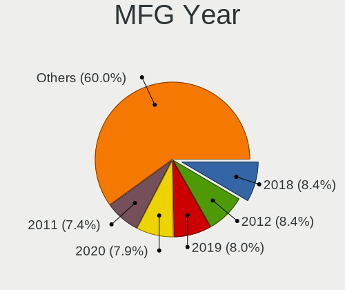
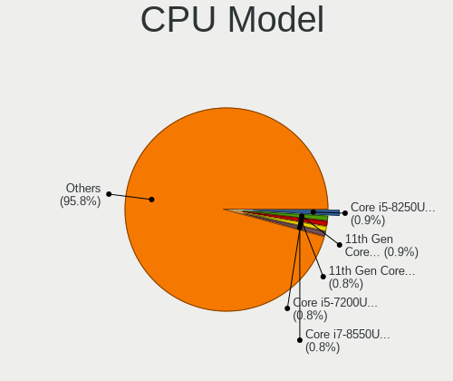
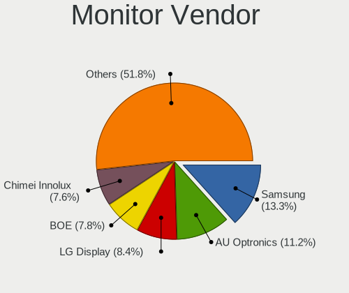
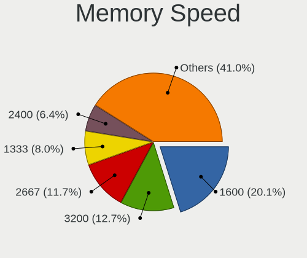
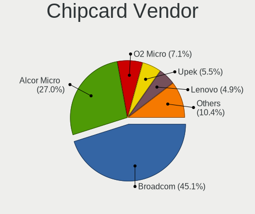

Linux - Tested Hardware & Statistics
------------------------------------

A project to collect tested hardware configurations for Linux.

Anyone can contribute to this report by the [hw-probe](https://github.com/linuxhw/hw-probe) tool:

    sudo -E hw-probe -all -upload

Please contribute! Especially if your hardware is rare.

This is a report for all computer types. See also reports for [desktops](/Desktop/README.md) and [notebooks](/Notebook/README.md).

Distribution-specific reports: [AlmaLinux](/Dist/AlmaLinux), [Alpine](/Dist/Alpine), [ALT_Linux](/Dist/ALT_Linux), [antiX](/Dist/antiX), [Artix](/Dist/Artix), [Chrome_OS](/Dist/Chrome_OS), [Clear_Linux](/Dist/Clear_Linux), [Deepin](/Dist/Deepin), [Devuan](/Dist/Devuan), [EndeavourOS](/Dist/EndeavourOS), [Garuda_Linux](/Dist/Garuda_Linux), [GNOME_OS](/Dist/GNOME_OS), [Kaisen](/Dist/Kaisen), [Mageia](/Dist/Mageia), [Makulu](/Dist/Makulu), [NixOS](/Dist/NixOS), [Nobara](/Dist/Nobara), [Oracle_Linux](/Dist/Oracle_Linux), [Pardus](/Dist/Pardus), [PureOS](/Dist/PureOS), [Q4OS](/Dist/Q4OS), [Reborn_OS](/Dist/Reborn_OS), [Rocky_Linux](/Dist/Rocky_Linux), [Sparky](/Dist/Sparky), [Void_Linux](/Dist/Void_Linux), [Xero](/Dist/Xero).

This report is for real hardware. Report for virtual hardware: [TestCoverage_VE](https://github.com/linuxhw/TestCoverage_VE)

Contents
--------

* [ Test Cases ](#test-cases)

* [ System ](#system)
  - [ OS                       ](#os)
  - [ OS Family                ](#os-family)
  - [ Kernel                   ](#kernel)
  - [ Kernel Family            ](#kernel-family)
  - [ Kernel Major Ver.        ](#kernel-major-ver)
  - [ Arch                     ](#arch)
  - [ DE                       ](#de)
  - [ Display Server           ](#display-server)
  - [ Display Manager          ](#display-manager)
  - [ OS Lang                  ](#os-lang)
  - [ Boot Mode                ](#boot-mode)
  - [ Filesystem               ](#filesystem)
  - [ Part. scheme             ](#part-scheme)
  - [ Dual Boot with Linux/BSD ](#dual-boot-with-linuxbsd)
  - [ Dual Boot (Win)          ](#dual-boot-win)

* [ Board ](#board)
  - [ Vendor                   ](#vendor)
  - [ Model                    ](#model)
  - [ Model Family             ](#model-family)
  - [ MFG Year                 ](#mfg-year)
  - [ Form Factor              ](#form-factor)
  - [ Secure Boot              ](#secure-boot)
  - [ Coreboot                 ](#coreboot)
  - [ RAM Size                 ](#ram-size)
  - [ RAM Used                 ](#ram-used)
  - [ Total Drives             ](#total-drives)
  - [ Has CD-ROM               ](#has-cd-rom)
  - [ Has Ethernet             ](#has-ethernet)
  - [ Has WiFi                 ](#has-wifi)
  - [ Has Bluetooth            ](#has-bluetooth)

* [ Location ](#location)
  - [ Country                  ](#country)
  - [ City                     ](#city)

* [ Drives ](#drives)
  - [ Drive Vendor             ](#drive-vendor)
  - [ Drive Model              ](#drive-model)
  - [ HDD Vendor               ](#hdd-vendor)
  - [ SSD Vendor               ](#ssd-vendor)
  - [ Drive Kind               ](#drive-kind)
  - [ Drive Connector          ](#drive-connector)
  - [ Drive Size               ](#drive-size)
  - [ Space Total              ](#space-total)
  - [ Space Used               ](#space-used)
  - [ Malfunc. Drives          ](#malfunc-drives)
  - [ Malfunc. Drive Vendor    ](#malfunc-drive-vendor)
  - [ Malfunc. HDD Vendor      ](#malfunc-hdd-vendor)
  - [ Malfunc. Drive Kind      ](#malfunc-drive-kind)
  - [ Failed Drives            ](#failed-drives)
  - [ Failed Drive Vendor      ](#failed-drive-vendor)
  - [ Drive Status             ](#drive-status)

* [ Storage controller ](#storage-controller)
  - [ Storage Vendor           ](#storage-vendor)
  - [ Storage Model            ](#storage-model)
  - [ Storage Kind             ](#storage-kind)

* [ Processor ](#processor)
  - [ CPU Vendor               ](#cpu-vendor)
  - [ CPU Model                ](#cpu-model)
  - [ CPU Model Family         ](#cpu-model-family)
  - [ CPU Cores                ](#cpu-cores)
  - [ CPU Sockets              ](#cpu-sockets)
  - [ CPU Threads              ](#cpu-threads)
  - [ CPU Op-Modes             ](#cpu-op-modes)
  - [ CPU Microcode            ](#cpu-microcode)
  - [ CPU Microarch            ](#cpu-microarch)

* [ Graphics ](#graphics)
  - [ GPU Vendor               ](#gpu-vendor)
  - [ GPU Model                ](#gpu-model)
  - [ GPU Combo                ](#gpu-combo)
  - [ GPU Driver               ](#gpu-driver)
  - [ GPU Memory               ](#gpu-memory)

* [ Monitor ](#monitor)
  - [ Monitor Vendor           ](#monitor-vendor)
  - [ Monitor Model            ](#monitor-model)
  - [ Monitor Resolution       ](#monitor-resolution)
  - [ Monitor Diagonal         ](#monitor-diagonal)
  - [ Monitor Width            ](#monitor-width)
  - [ Aspect Ratio             ](#aspect-ratio)
  - [ Monitor Area             ](#monitor-area)
  - [ Pixel Density            ](#pixel-density)
  - [ Multiple Monitors        ](#multiple-monitors)

* [ Network ](#network)
  - [ Net Controller Vendor    ](#net-controller-vendor)
  - [ Net Controller Model     ](#net-controller-model)
  - [ Wireless Vendor          ](#wireless-vendor)
  - [ Wireless Model           ](#wireless-model)
  - [ Ethernet Vendor          ](#ethernet-vendor)
  - [ Ethernet Model           ](#ethernet-model)
  - [ Net Controller Kind      ](#net-controller-kind)
  - [ Used Controller          ](#used-controller)
  - [ NICs                     ](#nics)
  - [ IPv6                     ](#ipv6)

* [ Bluetooth ](#bluetooth)
  - [ Bluetooth Vendor         ](#bluetooth-vendor)
  - [ Bluetooth Model          ](#bluetooth-model)

* [ Sound ](#sound)
  - [ Sound Vendor             ](#sound-vendor)
  - [ Sound Model              ](#sound-model)

* [ Memory ](#memory)
  - [ Memory Vendor            ](#memory-vendor)
  - [ Memory Model             ](#memory-model)
  - [ Memory Kind              ](#memory-kind)
  - [ Memory Form Factor       ](#memory-form-factor)
  - [ Memory Size              ](#memory-size)
  - [ Memory Speed             ](#memory-speed)

* [ Printers & scanners ](#printers--scanners)
  - [ Printer Vendor           ](#printer-vendor)
  - [ Printer Model            ](#printer-model)
  - [ Scanner Vendor           ](#scanner-vendor)
  - [ Scanner Model            ](#scanner-model)

* [ Camera ](#camera)
  - [ Camera Vendor            ](#camera-vendor)
  - [ Camera Model             ](#camera-model)

* [ Security ](#security)
  - [ Fingerprint Vendor       ](#fingerprint-vendor)
  - [ Fingerprint Model        ](#fingerprint-model)
  - [ Chipcard Vendor          ](#chipcard-vendor)
  - [ Chipcard Model           ](#chipcard-model)

* [ Unsupported ](#unsupported)
  - [ Unsupported Devices      ](#unsupported-devices)
  - [ Unsupported Device Types ](#unsupported-device-types)

Test Cases
----------

Total: 253793

| Vendor        | Model                       | Form-Factor | Probe                                                      | Date         |
|---------------|-----------------------------|-------------|------------------------------------------------------------|--------------|
| Dell          | 500                         | Notebook    | [83c01aa11f](https://linux-hardware.org/?probe=83c01aa11f) | Oct 01, 2022 |
| MSI           | B360I GMAING PRO AC         | Desktop     | [bbdf7b4f77](https://linux-hardware.org/?probe=bbdf7b4f77) | Oct 01, 2022 |
| Lenovo        | ThinkPad L540 20AUA13S00    | Notebook    | [04ffca5382](https://linux-hardware.org/?probe=04ffca5382) | Oct 01, 2022 |
| Acer          | Aspire 7540                 | Notebook    | [8e80ccea19](https://linux-hardware.org/?probe=8e80ccea19) | Oct 01, 2022 |
| Chuwi         | HeroBook Air                | Notebook    | [8de9e9df4a](https://linux-hardware.org/?probe=8de9e9df4a) | Oct 01, 2022 |
| Apple         | Mac-27AD2F918AE68F61 Mac... | Desktop     | [3e25da0356](https://linux-hardware.org/?probe=3e25da0356) | Oct 01, 2022 |
| Apple         | MacBookPro5,5               | Notebook    | [42113dd7e3](https://linux-hardware.org/?probe=42113dd7e3) | Oct 01, 2022 |
| Lenovo        | V570 1066EDG                | Notebook    | [8e2439c590](https://linux-hardware.org/?probe=8e2439c590) | Oct 01, 2022 |
| ASUSTek       | TUF Gaming X570-PRO         | Desktop     | [b902f5d873](https://linux-hardware.org/?probe=b902f5d873) | Oct 01, 2022 |
| Acer          | Aspire A715-41G             | Notebook    | [1a473e9809](https://linux-hardware.org/?probe=1a473e9809) | Oct 01, 2022 |
| ASRock        | Z97 Anniversary             | Desktop     | [558ca4b56e](https://linux-hardware.org/?probe=558ca4b56e) | Oct 01, 2022 |
| Positivo      | Mobile                      | Notebook    | [640bc1a962](https://linux-hardware.org/?probe=640bc1a962) | Oct 01, 2022 |
| Unknown       | X79-P3                      | Desktop     | [9269fd5ff4](https://linux-hardware.org/?probe=9269fd5ff4) | Oct 01, 2022 |
| ASRock        | J5005-ITX                   | Desktop     | [783c72d32e](https://linux-hardware.org/?probe=783c72d32e) | Oct 01, 2022 |
| MSI           | GF65 Thin 9SEXR             | Notebook    | [537828a21f](https://linux-hardware.org/?probe=537828a21f) | Oct 01, 2022 |
| Lenovo        | SHARKBAY SDK0E50512 STD     | Desktop     | [ee22a244e2](https://linux-hardware.org/?probe=ee22a244e2) | Oct 01, 2022 |
| Dell          | Inspiron 1545               | Notebook    | [ba72c7ee42](https://linux-hardware.org/?probe=ba72c7ee42) | Oct 01, 2022 |
| Acer          | Aspire 5920G                | Notebook    | [9bd67cf4f9](https://linux-hardware.org/?probe=9bd67cf4f9) | Oct 01, 2022 |
| HUAWEI        | HLYL-WXX9                   | Notebook    | [318010d949](https://linux-hardware.org/?probe=318010d949) | Oct 01, 2022 |
| MSI           | MS-7235                     | Desktop     | [838e2c27f1](https://linux-hardware.org/?probe=838e2c27f1) | Oct 01, 2022 |
| ASUSTek       | StrikerExtreme              | Desktop     | [4aacd62d98](https://linux-hardware.org/?probe=4aacd62d98) | Oct 01, 2022 |
| ASUSTek       | K54LY                       | Notebook    | [98197c818f](https://linux-hardware.org/?probe=98197c818f) | Oct 01, 2022 |
| ASUSTek       | ROG STRIX X570-F GAMING     | Desktop     | [ff1c77c45a](https://linux-hardware.org/?probe=ff1c77c45a) | Oct 01, 2022 |
| HP            | Pavilion Laptop 14-bf0xx    | Notebook    | [a34de7dc69](https://linux-hardware.org/?probe=a34de7dc69) | Oct 01, 2022 |
| Positivo      | POS-PIH81DL                 | Desktop     | [c17fe23ea7](https://linux-hardware.org/?probe=c17fe23ea7) | Oct 01, 2022 |
| HP            | 250 G3                      | Notebook    | [753ef53a5a](https://linux-hardware.org/?probe=753ef53a5a) | Oct 01, 2022 |
| Lenovo        | 3000 N200 0769B4G           | Notebook    | [947f124efc](https://linux-hardware.org/?probe=947f124efc) | Oct 01, 2022 |
| Lenovo        | ThinkPad E15 Gen 3 20YHS... | Notebook    | [9cd72ed352](https://linux-hardware.org/?probe=9cd72ed352) | Oct 01, 2022 |
| Sony          | VPCCA15FX                   | Notebook    | [5063ea411b](https://linux-hardware.org/?probe=5063ea411b) | Oct 01, 2022 |
| ASRock        | 970 Pro3 R2.0               | Desktop     | [592adc6c9b](https://linux-hardware.org/?probe=592adc6c9b) | Oct 01, 2022 |
| Dell          | 0JYH5J A00                  | All in one  | [348bc23246](https://linux-hardware.org/?probe=348bc23246) | Oct 01, 2022 |
| Lenovo        | IdeaPad 3 17IML05 81WC      | Notebook    | [e722d17a52](https://linux-hardware.org/?probe=e722d17a52) | Oct 01, 2022 |
| HP            | 843B                        | Desktop     | [b683039e3b](https://linux-hardware.org/?probe=b683039e3b) | Oct 01, 2022 |
| Lenovo        | 0x30F617AA NOK              | Desktop     | [bb13b87bd5](https://linux-hardware.org/?probe=bb13b87bd5) | Oct 01, 2022 |
| AZW           | GTR V01                     | Mini pc     | [40c181376b](https://linux-hardware.org/?probe=40c181376b) | Oct 01, 2022 |
| MICROMAX      | Canvas Lapbook L1161        | Notebook    | [9efe9e89d6](https://linux-hardware.org/?probe=9efe9e89d6) | Oct 01, 2022 |
| AZW           | GTR V01                     | Mini pc     | [4638cc7f7b](https://linux-hardware.org/?probe=4638cc7f7b) | Oct 01, 2022 |
| HP            | 0B4Ch D                     | Desktop     | [1b409fc1f6](https://linux-hardware.org/?probe=1b409fc1f6) | Oct 01, 2022 |
| HP            | 0B4Ch D                     | Desktop     | [ccc7fe3103](https://linux-hardware.org/?probe=ccc7fe3103) | Oct 01, 2022 |
| ASUSTek       | A78M-A                      | Desktop     | [5ad2e5f2a6](https://linux-hardware.org/?probe=5ad2e5f2a6) | Oct 01, 2022 |
| Itautec       | Infoway a7420               | Notebook    | [bb52fe66cf](https://linux-hardware.org/?probe=bb52fe66cf) | Oct 01, 2022 |
| ASUSTek       | ROG STRIX B550-E GAMING     | Desktop     | [8a75a2c50b](https://linux-hardware.org/?probe=8a75a2c50b) | Oct 01, 2022 |
| Casper        | C15B                        | Desktop     | [be4c7469a6](https://linux-hardware.org/?probe=be4c7469a6) | Oct 01, 2022 |
| Lenovo        | ThinkPad Yoga 260 20FE00... | Convertible | [4eaeb1d5ad](https://linux-hardware.org/?probe=4eaeb1d5ad) | Oct 01, 2022 |
| HUAWEI        | HN-WX9X                     | Notebook    | [4168f641b5](https://linux-hardware.org/?probe=4168f641b5) | Oct 01, 2022 |
| Lenovo        | ThinkPad Yoga 11e 20DAS0... | Notebook    | [dc7e0ada81](https://linux-hardware.org/?probe=dc7e0ada81) | Oct 01, 2022 |
| Sony          | VPCCA15FX                   | Notebook    | [96eb3d8cf7](https://linux-hardware.org/?probe=96eb3d8cf7) | Oct 01, 2022 |
| MSI           | MAG B550 TOMAHAWK           | Desktop     | [a7268f8fba](https://linux-hardware.org/?probe=a7268f8fba) | Oct 01, 2022 |
| ASUSTek       | ROG Zephyrus M16 GU603ZM... | Notebook    | [403aa5af3e](https://linux-hardware.org/?probe=403aa5af3e) | Oct 01, 2022 |
| HP            | Pavilion TS 11              | Notebook    | [5bc67115db](https://linux-hardware.org/?probe=5bc67115db) | Oct 01, 2022 |
| UNOWHY        | Y13G012S4EI                 | Notebook    | [014d8c23f8](https://linux-hardware.org/?probe=014d8c23f8) | Oct 01, 2022 |
| HP            | 650                         | Notebook    | [162893e9ad](https://linux-hardware.org/?probe=162893e9ad) | Oct 01, 2022 |
| MSI           | 2A9C                        | Desktop     | [a933ad6bca](https://linux-hardware.org/?probe=a933ad6bca) | Oct 01, 2022 |
| Lenovo        | IdeaPad 1 14ADA05 82GW      | Notebook    | [7ff2c5ad1c](https://linux-hardware.org/?probe=7ff2c5ad1c) | Oct 01, 2022 |
| Lenovo        | V130-15IKB 81HN             | Notebook    | [44a4ed90e1](https://linux-hardware.org/?probe=44a4ed90e1) | Oct 01, 2022 |
| ASUSTek       | VivoBook_ASUSLaptop E410... | Notebook    | [462f9bbdbe](https://linux-hardware.org/?probe=462f9bbdbe) | Oct 01, 2022 |
| HUAWEI        | BOHK-WAX9X                  | Notebook    | [6525098252](https://linux-hardware.org/?probe=6525098252) | Oct 01, 2022 |
| Lenovo        | ThinkCentre M58 9728AHG     | Desktop     | [a2bc7fc88f](https://linux-hardware.org/?probe=a2bc7fc88f) | Oct 01, 2022 |
| Medion        | MS-7366                     | Desktop     | [c8138f4ffe](https://linux-hardware.org/?probe=c8138f4ffe) | Oct 01, 2022 |
| Medion        | MS-7366                     | Desktop     | [c25c10b259](https://linux-hardware.org/?probe=c25c10b259) | Oct 01, 2022 |
| ONE-NETBOO... | ONE XPLAYER                 | Tablet      | [9bec9e1625](https://linux-hardware.org/?probe=9bec9e1625) | Oct 01, 2022 |
| HP            | Laptop 15s-eq1xxx           | Notebook    | [a4252ba03a](https://linux-hardware.org/?probe=a4252ba03a) | Oct 01, 2022 |
| Lenovo        | IdeaPad 1 14ADA05 82GW      | Notebook    | [a64cec6a4d](https://linux-hardware.org/?probe=a64cec6a4d) | Oct 01, 2022 |
| Lenovo        | SHARKBAY SDK0E50510 PRO     | Desktop     | [cb5d0d1945](https://linux-hardware.org/?probe=cb5d0d1945) | Oct 01, 2022 |
| Dell          | 0RW203                      | Desktop     | [c8a408311d](https://linux-hardware.org/?probe=c8a408311d) | Oct 01, 2022 |
| Lenovo        | G400s VILG1                 | Notebook    | [e666344187](https://linux-hardware.org/?probe=e666344187) | Oct 01, 2022 |
| Lenovo        | SHARKBAY SDK0E50510 PRO     | Desktop     | [3af0c5cc5f](https://linux-hardware.org/?probe=3af0c5cc5f) | Oct 01, 2022 |
| ASUSTek       | UX303UB                     | Notebook    | [e09f793c1a](https://linux-hardware.org/?probe=e09f793c1a) | Oct 01, 2022 |
| Lenovo        | IdeaPad 530S-14ARR 81H1     | Notebook    | [68b0c0ca1a](https://linux-hardware.org/?probe=68b0c0ca1a) | Oct 01, 2022 |
| HP            | Victus by Laptop 16-e0xx... | Notebook    | [4a8d27ad0f](https://linux-hardware.org/?probe=4a8d27ad0f) | Oct 01, 2022 |
| Lenovo        | G770 20089                  | Notebook    | [e06e588d62](https://linux-hardware.org/?probe=e06e588d62) | Oct 01, 2022 |
| ONE-NETBOO... | ONE XPLAYER                 | Tablet      | [501a588f11](https://linux-hardware.org/?probe=501a588f11) | Oct 01, 2022 |
| ASUSTek       | TUF Gaming B550M-PLUS       | Desktop     | [15a068e26b](https://linux-hardware.org/?probe=15a068e26b) | Oct 01, 2022 |
| ASUSTek       | TUF Gaming B550M-PLUS       | Desktop     | [3a9d882d91](https://linux-hardware.org/?probe=3a9d882d91) | Oct 01, 2022 |
| Acer          | Aspire 4733Z                | Notebook    | [4be4debbe5](https://linux-hardware.org/?probe=4be4debbe5) | Oct 01, 2022 |
| Toshiba       | Satellite L55-B             | Notebook    | [f3680300d7](https://linux-hardware.org/?probe=f3680300d7) | Oct 01, 2022 |
| Google        | Blooglet                    | Notebook    | [0081fa7064](https://linux-hardware.org/?probe=0081fa7064) | Oct 01, 2022 |
| Lenovo        | B70-80 80MR                 | Notebook    | [69aec9e100](https://linux-hardware.org/?probe=69aec9e100) | Oct 01, 2022 |
| ASUSTek       | ASUS TUF Gaming F15 FX50... | Notebook    | [88c05ba074](https://linux-hardware.org/?probe=88c05ba074) | Oct 01, 2022 |
| Acer          | Enduro EN314-51W            | Notebook    | [46782cf8f5](https://linux-hardware.org/?probe=46782cf8f5) | Oct 01, 2022 |
| Gigabyte      | B450 AORUS ELITE            | Desktop     | [dda857d7e6](https://linux-hardware.org/?probe=dda857d7e6) | Oct 01, 2022 |
| HP            | 255 G8 Notebook PC          | Notebook    | [1ea0859429](https://linux-hardware.org/?probe=1ea0859429) | Oct 01, 2022 |
| Lenovo        | ThinkPad X230 23256N6       | Notebook    | [ec44263cbd](https://linux-hardware.org/?probe=ec44263cbd) | Oct 01, 2022 |
| MSI           | B350M PRO-VDH               | Desktop     | [1a0d8b695d](https://linux-hardware.org/?probe=1a0d8b695d) | Oct 01, 2022 |
| ASRock        | H87M Pro4                   | Desktop     | [bf8e635afa](https://linux-hardware.org/?probe=bf8e635afa) | Oct 01, 2022 |
| HP            | ENVY x360 Convertible 15... | Convertible | [36aa510782](https://linux-hardware.org/?probe=36aa510782) | Oct 01, 2022 |
| Lenovo        | ThinkPad E15 Gen 2 20T9S... | Notebook    | [0a022a22c6](https://linux-hardware.org/?probe=0a022a22c6) | Oct 01, 2022 |
| HP            | Pavilion TS 11              | Notebook    | [9b59ddb3b2](https://linux-hardware.org/?probe=9b59ddb3b2) | Oct 01, 2022 |
| MSI           | MPG X570S EDGE MAX WIFI     | Desktop     | [d3d117cf14](https://linux-hardware.org/?probe=d3d117cf14) | Oct 01, 2022 |
| MSI           | B450M-A PRO MAX             | Desktop     | [649f4ec8c6](https://linux-hardware.org/?probe=649f4ec8c6) | Oct 01, 2022 |
| Sony          | SVS13118GBB                 | Notebook    | [48dd8fb419](https://linux-hardware.org/?probe=48dd8fb419) | Oct 01, 2022 |
| Gigabyte      | 990FXA-UD3                  | Desktop     | [cb25964ddb](https://linux-hardware.org/?probe=cb25964ddb) | Oct 01, 2022 |
| MSI           | MAG Z490 TOMAHAWK           | Desktop     | [7221bbf8e7](https://linux-hardware.org/?probe=7221bbf8e7) | Oct 01, 2022 |
| Lenovo        | 3098 NOK                    | Desktop     | [a46521af41](https://linux-hardware.org/?probe=a46521af41) | Oct 01, 2022 |
| HP            | Pavilion TS 11              | Notebook    | [4758af490a](https://linux-hardware.org/?probe=4758af490a) | Oct 01, 2022 |
| Unknown       | Unknown                     | Desktop     | [0c82fc9806](https://linux-hardware.org/?probe=0c82fc9806) | Oct 01, 2022 |
| MSI           | X470 GAMING PRO             | Desktop     | [53e99a8ce6](https://linux-hardware.org/?probe=53e99a8ce6) | Oct 01, 2022 |
| Fujitsu       | LIFEBOOK A6210              | Notebook    | [73c4e6626f](https://linux-hardware.org/?probe=73c4e6626f) | Oct 01, 2022 |
| ASUSTek       | PRIME B450-PLUS             | Desktop     | [db15c7b708](https://linux-hardware.org/?probe=db15c7b708) | Oct 01, 2022 |
| HP            | Notebook                    | Notebook    | [fec2594d37](https://linux-hardware.org/?probe=fec2594d37) | Oct 01, 2022 |
| ASUSTek       | F5V                         | Notebook    | [463cd15493](https://linux-hardware.org/?probe=463cd15493) | Oct 01, 2022 |
| Dell          | Inspiron 5737               | Notebook    | [14113affa1](https://linux-hardware.org/?probe=14113affa1) | Oct 01, 2022 |
| Dell          | XPS 13 9300                 | Notebook    | [1fade0f247](https://linux-hardware.org/?probe=1fade0f247) | Oct 01, 2022 |
| ASUSTek       | Zenbook UM5302TA_UM5302T... | Notebook    | [1cfda531dd](https://linux-hardware.org/?probe=1cfda531dd) | Oct 01, 2022 |
| Unknown       | Unknown                     | Notebook    | [b9486c47c1](https://linux-hardware.org/?probe=b9486c47c1) | Oct 01, 2022 |
| Lenovo        | ThinkPad T440 20B6005JUS    | Notebook    | [f12950ed92](https://linux-hardware.org/?probe=f12950ed92) | Oct 01, 2022 |
| Fujitsu       | LIFEBOOK S904               | Notebook    | [c9c83f0112](https://linux-hardware.org/?probe=c9c83f0112) | Oct 01, 2022 |
| HP            | Compaq 420                  | Notebook    | [d3e367cedc](https://linux-hardware.org/?probe=d3e367cedc) | Oct 01, 2022 |
| MSI           | Z270-A PRO                  | Desktop     | [6f96dc34e2](https://linux-hardware.org/?probe=6f96dc34e2) | Oct 01, 2022 |
| Dell          | Latitude E5250              | Notebook    | [aeb221e727](https://linux-hardware.org/?probe=aeb221e727) | Oct 01, 2022 |
| HP            | 655                         | Notebook    | [6b10f9eda8](https://linux-hardware.org/?probe=6b10f9eda8) | Oct 01, 2022 |
| MSI           | MPG B550 GAMING PLUS        | Desktop     | [fca2e4409a](https://linux-hardware.org/?probe=fca2e4409a) | Oct 01, 2022 |
| Lenovo        | ThinkPad T440 20B6005JUS    | Notebook    | [b395d9ce9b](https://linux-hardware.org/?probe=b395d9ce9b) | Oct 01, 2022 |
| Apple         | MacBookPro8,1               | Notebook    | [f42501fcc3](https://linux-hardware.org/?probe=f42501fcc3) | Oct 01, 2022 |
| Dell          | Latitude E5250              | Notebook    | [43f7cf1b59](https://linux-hardware.org/?probe=43f7cf1b59) | Oct 01, 2022 |
| ASUSTek       | B75M-A                      | Desktop     | [cbeab03cbd](https://linux-hardware.org/?probe=cbeab03cbd) | Oct 01, 2022 |
| Fujitsu       | D2990-A2 S26361-D2990-A2    | Desktop     | [982b143d73](https://linux-hardware.org/?probe=982b143d73) | Oct 01, 2022 |
| ASUSTek       | K53SM                       | Notebook    | [f05f33fa9b](https://linux-hardware.org/?probe=f05f33fa9b) | Oct 01, 2022 |
| Unknown       | Xiaobao Nas I               | Soc         | [d74d764466](https://linux-hardware.org/?probe=d74d764466) | Oct 01, 2022 |
| Dell          | Latitude D630               | Notebook    | [d00c756052](https://linux-hardware.org/?probe=d00c756052) | Oct 01, 2022 |
| MSI           | MAG B550 TOMAHAWK           | Desktop     | [151510a184](https://linux-hardware.org/?probe=151510a184) | Oct 01, 2022 |
| Lenovo        | ThinkPad SL500 27463ZG      | Notebook    | [34006e3b46](https://linux-hardware.org/?probe=34006e3b46) | Oct 01, 2022 |
| Dell          | Inspiron 5567               | Notebook    | [82e89b9263](https://linux-hardware.org/?probe=82e89b9263) | Oct 01, 2022 |
| Valve         | Jupiter                     | Notebook    | [12f0d9358a](https://linux-hardware.org/?probe=12f0d9358a) | Oct 01, 2022 |
| Google        | Droid                       | Notebook    | [40550baeb8](https://linux-hardware.org/?probe=40550baeb8) | Oct 01, 2022 |
| Dell          | Inspiron 5567               | Notebook    | [e64a9cf0e2](https://linux-hardware.org/?probe=e64a9cf0e2) | Oct 01, 2022 |
| Sony          | SVS13118GBB                 | Notebook    | [75e6dbe3d2](https://linux-hardware.org/?probe=75e6dbe3d2) | Oct 01, 2022 |
| HP            | ProBook 430 G7              | Notebook    | [bf25686a1f](https://linux-hardware.org/?probe=bf25686a1f) | Oct 01, 2022 |
| Microsoft     | Surface Book 2              | Tablet      | [905ec74659](https://linux-hardware.org/?probe=905ec74659) | Oct 01, 2022 |
| ASUSTek       | M5A78L-M LX                 | Desktop     | [d967f57569](https://linux-hardware.org/?probe=d967f57569) | Oct 01, 2022 |
| MSI           | X370 GAMING PLUS            | Desktop     | [2aa92cb043](https://linux-hardware.org/?probe=2aa92cb043) | Oct 01, 2022 |
| Apple         | Mac-F65AE981FFA204ED Mac... | Mini pc     | [f97d2b97ad](https://linux-hardware.org/?probe=f97d2b97ad) | Oct 01, 2022 |
| Lenovo        | ThinkPad X270 W10DG 20K5... | Notebook    | [012add7349](https://linux-hardware.org/?probe=012add7349) | Oct 01, 2022 |
| Dell          | Inspiron 5737               | Notebook    | [6893292144](https://linux-hardware.org/?probe=6893292144) | Oct 01, 2022 |
| Dell          | Latitude 5480               | Notebook    | [ec9593f051](https://linux-hardware.org/?probe=ec9593f051) | Oct 01, 2022 |
| HP            | 1632                        | Desktop     | [0f9387690b](https://linux-hardware.org/?probe=0f9387690b) | Oct 01, 2022 |
| Dell          | Latitude E5530 non-vPro     | Notebook    | [b2d146f923](https://linux-hardware.org/?probe=b2d146f923) | Oct 01, 2022 |
| Lenovo        | Yoga 730-13IKB 81CT         | Convertible | [cffd9dadf8](https://linux-hardware.org/?probe=cffd9dadf8) | Oct 01, 2022 |
| Notebook      | W330SU2                     | Notebook    | [a5d5500584](https://linux-hardware.org/?probe=a5d5500584) | Oct 01, 2022 |
| ASUSTek       | PRIME B550M-A               | Desktop     | [4d1cbd14c2](https://linux-hardware.org/?probe=4d1cbd14c2) | Oct 01, 2022 |
| Lenovo        | ThinkPad E14 Gen 3 20YES... | Notebook    | [1a210b9eb5](https://linux-hardware.org/?probe=1a210b9eb5) | Oct 01, 2022 |
| HP            | ENVY x360 Convertible 15... | Convertible | [3d7bdf258d](https://linux-hardware.org/?probe=3d7bdf258d) | Oct 01, 2022 |
| HP            | Pavilion                    | Notebook    | [124e8b760a](https://linux-hardware.org/?probe=124e8b760a) | Oct 01, 2022 |
| Apple         | MacBookPro16,2              | Notebook    | [8eaded9cb5](https://linux-hardware.org/?probe=8eaded9cb5) | Oct 01, 2022 |
| Dell          | 0KJCC5 A00                  | Desktop     | [7915b298b2](https://linux-hardware.org/?probe=7915b298b2) | Oct 01, 2022 |
| HP            | Pavilion 17                 | Notebook    | [fa2e48904a](https://linux-hardware.org/?probe=fa2e48904a) | Oct 01, 2022 |
| HP            | EliteBook 745 G6            | Notebook    | [25e087916a](https://linux-hardware.org/?probe=25e087916a) | Oct 01, 2022 |
| Dell          | Vostro 5568                 | Notebook    | [44bf0dbbce](https://linux-hardware.org/?probe=44bf0dbbce) | Oct 01, 2022 |
| Lenovo        | ThinkPad L450 20DSS00M01    | Notebook    | [e52e98a7e7](https://linux-hardware.org/?probe=e52e98a7e7) | Oct 01, 2022 |
| MSI           | GF65 Thin 9SD               | Notebook    | [a761de487d](https://linux-hardware.org/?probe=a761de487d) | Oct 01, 2022 |
| Foxconn       | 2AB1                        | Desktop     | [18971aaf86](https://linux-hardware.org/?probe=18971aaf86) | Oct 01, 2022 |
| Dell          | Inspiron 1200               | Notebook    | [becf544fa6](https://linux-hardware.org/?probe=becf544fa6) | Oct 01, 2022 |
| Dell          | G3 3500                     | Notebook    | [245ebaabe5](https://linux-hardware.org/?probe=245ebaabe5) | Oct 01, 2022 |
| HP            | Pavilion Gaming Laptop 1... | Notebook    | [3595e90895](https://linux-hardware.org/?probe=3595e90895) | Oct 01, 2022 |
| HP            | Pavilion dv2700             | Notebook    | [0da9fb0afd](https://linux-hardware.org/?probe=0da9fb0afd) | Oct 01, 2022 |
| ASUSTek       | M5A99X EVO                  | Desktop     | [4c5134b8fc](https://linux-hardware.org/?probe=4c5134b8fc) | Oct 01, 2022 |
| ASRock        | AD2700-ITX                  | Desktop     | [4275ef3653](https://linux-hardware.org/?probe=4275ef3653) | Oct 01, 2022 |
| Samsung       | 950XDB/951XDB/950XDY        | Notebook    | [5c5353c8b6](https://linux-hardware.org/?probe=5c5353c8b6) | Oct 01, 2022 |
| ASUSTek       | M5A87                       | Desktop     | [89ca067566](https://linux-hardware.org/?probe=89ca067566) | Oct 01, 2022 |
| ASUSTek       | UX360UAK                    | Convertible | [5077b42a8b](https://linux-hardware.org/?probe=5077b42a8b) | Oct 01, 2022 |
| ASUSTek       | Strix 15 GL503GE            | Notebook    | [e48bab666f](https://linux-hardware.org/?probe=e48bab666f) | Oct 01, 2022 |
| Lenovo        | Yoga C640-13IML 81UE        | Convertible | [9d5f38913b](https://linux-hardware.org/?probe=9d5f38913b) | Oct 01, 2022 |
| HP            | EliteBook 840 G3            | Notebook    | [ddf1904011](https://linux-hardware.org/?probe=ddf1904011) | Oct 01, 2022 |
| Dell          | Inspiron 5420               | Notebook    | [71f7e67ca7](https://linux-hardware.org/?probe=71f7e67ca7) | Oct 01, 2022 |
| Dell          | 0PV3YR A05                  | Server      | [27bb1c39eb](https://linux-hardware.org/?probe=27bb1c39eb) | Oct 01, 2022 |
| Lenovo        | ThinkPad T440s 20AQCTO1W... | Notebook    | [fbe1e53387](https://linux-hardware.org/?probe=fbe1e53387) | Oct 01, 2022 |
| ASUSTek       | PRIME B550M-A               | Desktop     | [00ded2a3ed](https://linux-hardware.org/?probe=00ded2a3ed) | Oct 01, 2022 |
| Hampoo        | C3W6_AP108_4GB Reserved     | Notebook    | [93d3e41339](https://linux-hardware.org/?probe=93d3e41339) | Oct 01, 2022 |
| MSI           | PRO X670-P WIFI             | Desktop     | [64299c7b4a](https://linux-hardware.org/?probe=64299c7b4a) | Oct 01, 2022 |
| Lenovo        | ThinkCentre M90p 5498A2U    | Desktop     | [ed9cd240cc](https://linux-hardware.org/?probe=ed9cd240cc) | Oct 01, 2022 |
| Biostar       | B350ET2                     | Desktop     | [d7c5b1ad40](https://linux-hardware.org/?probe=d7c5b1ad40) | Oct 01, 2022 |
| Valve         | Jupiter                     | Notebook    | [9ea6c15d28](https://linux-hardware.org/?probe=9ea6c15d28) | Oct 01, 2022 |
| Apple         | MacBookPro9,1               | Notebook    | [08db9e8d75](https://linux-hardware.org/?probe=08db9e8d75) | Oct 01, 2022 |
| Gigabyte      | GA-970A-D3                  | Desktop     | [8c24fa2271](https://linux-hardware.org/?probe=8c24fa2271) | Oct 01, 2022 |
| Dell          | Inspiron 3451               | Notebook    | [aee33639b9](https://linux-hardware.org/?probe=aee33639b9) | Oct 01, 2022 |
| Lenovo        | IdeaPad 330-15IKB 81FE      | Notebook    | [b62ddbdab0](https://linux-hardware.org/?probe=b62ddbdab0) | Oct 01, 2022 |
| ASRock        | FM2A88X Extreme6+           | Desktop     | [186495d063](https://linux-hardware.org/?probe=186495d063) | Oct 01, 2022 |
| Lenovo        | ThinkCentre M90p 5498A2U    | Desktop     | [f05b832b90](https://linux-hardware.org/?probe=f05b832b90) | Oct 01, 2022 |
| Biostar       | A320MH                      | Desktop     | [b07b6c4fc5](https://linux-hardware.org/?probe=b07b6c4fc5) | Oct 01, 2022 |
| Lenovo        | G480 20149                  | Notebook    | [9a047ee214](https://linux-hardware.org/?probe=9a047ee214) | Oct 01, 2022 |
| MSI           | X99A RAIDER                 | Desktop     | [847283c85d](https://linux-hardware.org/?probe=847283c85d) | Oct 01, 2022 |
| Lenovo        | G480 20149                  | Notebook    | [4c0a153a12](https://linux-hardware.org/?probe=4c0a153a12) | Oct 01, 2022 |
| Acer          | Aspire 5750G                | Notebook    | [8e87575f75](https://linux-hardware.org/?probe=8e87575f75) | Oct 01, 2022 |
| Gigabyte      | Z170X-Gaming GT             | Desktop     | [991ea6c93f](https://linux-hardware.org/?probe=991ea6c93f) | Oct 01, 2022 |
| ASUSTek       | M4N72-E                     | Desktop     | [c1c308be2a](https://linux-hardware.org/?probe=c1c308be2a) | Oct 01, 2022 |
| Acer          | Aspire A315-55G             | Notebook    | [77605e313d](https://linux-hardware.org/?probe=77605e313d) | Oct 01, 2022 |
| SANTECH       | NHx0DB,DE                   | Notebook    | [6dc0730b6a](https://linux-hardware.org/?probe=6dc0730b6a) | Oct 01, 2022 |
| Notebook      | NJx0MU                      | Notebook    | [5df0554ade](https://linux-hardware.org/?probe=5df0554ade) | Oct 01, 2022 |
| Gigabyte      | 990FXA-UD3                  | Desktop     | [36398ba3b9](https://linux-hardware.org/?probe=36398ba3b9) | Oct 01, 2022 |
| Lenovo        | Yoga 7 14ITL5 82BH          | Convertible | [d60b15ea91](https://linux-hardware.org/?probe=d60b15ea91) | Oct 01, 2022 |
| System76      | Darter Pro                  | Notebook    | [2829e72506](https://linux-hardware.org/?probe=2829e72506) | Oct 01, 2022 |
| System76      | Darter Pro                  | Notebook    | [c142cf370a](https://linux-hardware.org/?probe=c142cf370a) | Oct 01, 2022 |
| Gigabyte      | H110M-H DDR3-CF             | Desktop     | [8169fe8dbd](https://linux-hardware.org/?probe=8169fe8dbd) | Oct 01, 2022 |
| Gigabyte      | B360 AORUS GAMING 3-CF      | Desktop     | [87a1c21540](https://linux-hardware.org/?probe=87a1c21540) | Oct 01, 2022 |
| HP            | Pavilion x360 Convertibl... | Convertible | [c4688badf5](https://linux-hardware.org/?probe=c4688badf5) | Oct 01, 2022 |
| Gigabyte      | GA-MA770T-UD3P              | Desktop     | [692b59019a](https://linux-hardware.org/?probe=692b59019a) | Oct 01, 2022 |
| Notebook      | NJx0MU                      | Notebook    | [9eba2a1ed4](https://linux-hardware.org/?probe=9eba2a1ed4) | Oct 01, 2022 |
| Toshiba       | PORTEGE Z10t-A              | Notebook    | [1aa913c010](https://linux-hardware.org/?probe=1aa913c010) | Oct 01, 2022 |
| Gigabyte      | B550 AORUS ELITE            | Desktop     | [bc6bcfe3f2](https://linux-hardware.org/?probe=bc6bcfe3f2) | Oct 01, 2022 |
| ASUSTek       | TUF Gaming B550M-E WIFI     | Desktop     | [2d1e938e68](https://linux-hardware.org/?probe=2d1e938e68) | Oct 01, 2022 |
| Fujitsu       | LIFEBOOK A6210              | Notebook    | [dffb22efdc](https://linux-hardware.org/?probe=dffb22efdc) | Oct 01, 2022 |
| ASUSTek       | P8Z68-V                     | Desktop     | [c6e67f7643](https://linux-hardware.org/?probe=c6e67f7643) | Oct 01, 2022 |
| ASUSTek       | UX360UAK                    | Convertible | [4662cb1d99](https://linux-hardware.org/?probe=4662cb1d99) | Oct 01, 2022 |
| Sony          | SVF15N17CXB                 | Notebook    | [5082dde27d](https://linux-hardware.org/?probe=5082dde27d) | Oct 01, 2022 |
| HP            | ENVY x360 Convertible 15... | Convertible | [9f64b9ed3d](https://linux-hardware.org/?probe=9f64b9ed3d) | Oct 01, 2022 |
| HP            | Pavilion Gaming Laptop 1... | Notebook    | [29648b493a](https://linux-hardware.org/?probe=29648b493a) | Oct 01, 2022 |
| Dell          | 01XK1W A00                  | Desktop     | [29c4292c62](https://linux-hardware.org/?probe=29c4292c62) | Oct 01, 2022 |
| Sony          | VPCYB3V1E                   | Notebook    | [de50c8a304](https://linux-hardware.org/?probe=de50c8a304) | Oct 01, 2022 |
| EVOO          | EG-LP10                     | Notebook    | [32c1a174d1](https://linux-hardware.org/?probe=32c1a174d1) | Oct 01, 2022 |
| ASRock        | Z77 Extreme3                | Desktop     | [c92633e1ee](https://linux-hardware.org/?probe=c92633e1ee) | Oct 01, 2022 |
| Acer          | TMP453-MG                   | Notebook    | [4d36d13ea9](https://linux-hardware.org/?probe=4d36d13ea9) | Oct 01, 2022 |
| Lenovo        | IdeaPadFlex 5 14IIL05 81... | Convertible | [ee185c669a](https://linux-hardware.org/?probe=ee185c669a) | Oct 01, 2022 |
| Lenovo        | IdeaPad S145-15AST 81N3     | Notebook    | [f50a823779](https://linux-hardware.org/?probe=f50a823779) | Oct 01, 2022 |
| ASUSTek       | ASUS EXPERTBOOK B1500CEA... | Notebook    | [24aefc4138](https://linux-hardware.org/?probe=24aefc4138) | Oct 01, 2022 |
| ASUSTek       | ROG Maximus XI HERO         | Desktop     | [32a742b50d](https://linux-hardware.org/?probe=32a742b50d) | Oct 01, 2022 |
| ASRock        | Z77 Extreme3                | Desktop     | [ada9e56162](https://linux-hardware.org/?probe=ada9e56162) | Oct 01, 2022 |
| Lenovo        | IdeaPad C340-14IWL 81N4     | Convertible | [6f6704ea90](https://linux-hardware.org/?probe=6f6704ea90) | Oct 01, 2022 |
| Lenovo        | ThinkPad T470p 20J7S0DK0... | Notebook    | [49bd2b0248](https://linux-hardware.org/?probe=49bd2b0248) | Oct 01, 2022 |
| Gigabyte      | B550 AORUS ELITE V2         | Desktop     | [541e327f0f](https://linux-hardware.org/?probe=541e327f0f) | Oct 01, 2022 |
| Lenovo        | IdeaPad C340-14IWL 81N4     | Convertible | [5e9a9b60e6](https://linux-hardware.org/?probe=5e9a9b60e6) | Oct 01, 2022 |
| HP            | Laptop 15-bs0xx             | Notebook    | [646f4ffa8e](https://linux-hardware.org/?probe=646f4ffa8e) | Oct 01, 2022 |
| Timi          | A35S                        | Notebook    | [c46c820c25](https://linux-hardware.org/?probe=c46c820c25) | Oct 01, 2022 |
| Timi          | TM1709                      | Notebook    | [33022811a8](https://linux-hardware.org/?probe=33022811a8) | Oct 01, 2022 |
| Lenovo        | ThinkPad P1 Gen 5 21DCCT... | Notebook    | [bde2b36c88](https://linux-hardware.org/?probe=bde2b36c88) | Oct 01, 2022 |
| Shuttle       | FS35V4                      | Desktop     | [e38fd71e40](https://linux-hardware.org/?probe=e38fd71e40) | Oct 01, 2022 |
| HP            | Laptop 15s-eq2xxx           | Notebook    | [5983281c3f](https://linux-hardware.org/?probe=5983281c3f) | Oct 01, 2022 |
| Raspberry ... | Raspberry Pi 3 Model B P... | Soc         | [3edc4043a3](https://linux-hardware.org/?probe=3edc4043a3) | Oct 01, 2022 |
| Dell          | Inspiron 3442               | Notebook    | [af9b794734](https://linux-hardware.org/?probe=af9b794734) | Sep 30, 2022 |
| Acer          | Swift SF314-43              | Notebook    | [cfd0c22e29](https://linux-hardware.org/?probe=cfd0c22e29) | Sep 30, 2022 |
| ASUSTek       | VivoBook_ASUSLaptop X340... | Notebook    | [d5407763a0](https://linux-hardware.org/?probe=d5407763a0) | Sep 30, 2022 |
| MSI           | Modern 14 A10M              | Notebook    | [571271ed93](https://linux-hardware.org/?probe=571271ed93) | Sep 30, 2022 |
| Dell          | Latitude E4300              | Notebook    | [a860d9a446](https://linux-hardware.org/?probe=a860d9a446) | Sep 30, 2022 |
| ASRock        | X300M-STX                   | Desktop     | [f6e2c51367](https://linux-hardware.org/?probe=f6e2c51367) | Sep 30, 2022 |
| Biostar       | B350ET2                     | Desktop     | [2b7bea0eda](https://linux-hardware.org/?probe=2b7bea0eda) | Sep 30, 2022 |
| GPD           | G1621-02                    | Notebook    | [6ae9fc596e](https://linux-hardware.org/?probe=6ae9fc596e) | Sep 30, 2022 |
| HP            | 250 G6 Notebook PC          | Notebook    | [992cf7d019](https://linux-hardware.org/?probe=992cf7d019) | Sep 30, 2022 |
| Sony          | VPCEH2D0E                   | Notebook    | [a08d0148e2](https://linux-hardware.org/?probe=a08d0148e2) | Sep 30, 2022 |
| HP            | ZBook 17 G4                 | Notebook    | [1476da42c3](https://linux-hardware.org/?probe=1476da42c3) | Sep 30, 2022 |
| MSI           | A55M-E33                    | Desktop     | [13bd049f55](https://linux-hardware.org/?probe=13bd049f55) | Sep 30, 2022 |
| ASUSTek       | ASUS EXPERTBOOK B1500CEA... | Notebook    | [5bfc8f0a7d](https://linux-hardware.org/?probe=5bfc8f0a7d) | Sep 30, 2022 |
| Lenovo        | ThinkPad T550 20CJS1VD01    | Notebook    | [97d1b5e6c5](https://linux-hardware.org/?probe=97d1b5e6c5) | Sep 30, 2022 |
| Intel         | H61                         | Desktop     | [37af3b0cdb](https://linux-hardware.org/?probe=37af3b0cdb) | Sep 30, 2022 |
| MSI           | MEG X570 UNIFY              | Desktop     | [4d2e449699](https://linux-hardware.org/?probe=4d2e449699) | Sep 30, 2022 |
| ASUSTek       | H81-PLUS                    | Desktop     | [e251d6b8f7](https://linux-hardware.org/?probe=e251d6b8f7) | Sep 30, 2022 |
| Lenovo        | IdeaPad 3 15ITL6 82H8       | Notebook    | [92f9efe077](https://linux-hardware.org/?probe=92f9efe077) | Sep 30, 2022 |
| Apple         | Mac-F221BEC8                | Desktop     | [ab0a3e1a94](https://linux-hardware.org/?probe=ab0a3e1a94) | Sep 30, 2022 |
| Lenovo        | Yoga 7 15ITL5 82BJ          | Convertible | [2e9261e2a7](https://linux-hardware.org/?probe=2e9261e2a7) | Sep 30, 2022 |
| Gigabyte      | B75M-D3H                    | Desktop     | [162334ac1e](https://linux-hardware.org/?probe=162334ac1e) | Sep 30, 2022 |
| MSI           | Modern 14 A10M              | Notebook    | [9da1f3fe66](https://linux-hardware.org/?probe=9da1f3fe66) | Sep 30, 2022 |
| Irbis         | NB121                       | Notebook    | [a2eb8c8af1](https://linux-hardware.org/?probe=a2eb8c8af1) | Sep 30, 2022 |
| OEM           | Unknown                     | Notebook    | [af7df2aea6](https://linux-hardware.org/?probe=af7df2aea6) | Sep 30, 2022 |
| OEM           | Unknown                     | Notebook    | [1d851fe024](https://linux-hardware.org/?probe=1d851fe024) | Sep 30, 2022 |
| OEM           | Unknown                     | Notebook    | [4fd2ca7d03](https://linux-hardware.org/?probe=4fd2ca7d03) | Sep 30, 2022 |
| Lenovo        | ThinkPad T480 20L5001FUS    | Notebook    | [a7e0da7aa4](https://linux-hardware.org/?probe=a7e0da7aa4) | Sep 30, 2022 |
| Dell          | 07PR60 A01                  | Desktop     | [812cb18129](https://linux-hardware.org/?probe=812cb18129) | Sep 30, 2022 |
| Acer          | Extensa 4220                | Notebook    | [c35a0a579a](https://linux-hardware.org/?probe=c35a0a579a) | Sep 30, 2022 |
| MSI           | GF63 Thin 11UD              | Notebook    | [071194b58e](https://linux-hardware.org/?probe=071194b58e) | Sep 30, 2022 |
| OEM           | Unknown                     | Desktop     | [e5a425c399](https://linux-hardware.org/?probe=e5a425c399) | Sep 30, 2022 |
| Dell          | Latitude 5530               | Notebook    | [43874dad6d](https://linux-hardware.org/?probe=43874dad6d) | Sep 30, 2022 |
| HP            | EliteBook 850 G1            | Notebook    | [9667dac801](https://linux-hardware.org/?probe=9667dac801) | Sep 30, 2022 |
| MSI           | GF63 Thin 11UD              | Notebook    | [e29586cf56](https://linux-hardware.org/?probe=e29586cf56) | Sep 30, 2022 |
| Sony          | SVS13118GBB                 | Notebook    | [0e0ca26d00](https://linux-hardware.org/?probe=0e0ca26d00) | Sep 30, 2022 |
| ASUSTek       | X580VD                      | Notebook    | [e7ef06706d](https://linux-hardware.org/?probe=e7ef06706d) | Sep 30, 2022 |
| Notebook      | NJ50GU                      | Notebook    | [430d3b2873](https://linux-hardware.org/?probe=430d3b2873) | Sep 30, 2022 |
| Chuwi         | HeroBook Air                | Notebook    | [1f142c7087](https://linux-hardware.org/?probe=1f142c7087) | Sep 30, 2022 |
| Biostar       | G41D3C                      | Desktop     | [97ee103719](https://linux-hardware.org/?probe=97ee103719) | Sep 30, 2022 |
| Lenovo        | ThinkPad E14 Gen 2 20TA0... | Notebook    | [025a55eab7](https://linux-hardware.org/?probe=025a55eab7) | Sep 30, 2022 |
| ASRock        | B450M Pro4-F                | Desktop     | [75b0aa3c75](https://linux-hardware.org/?probe=75b0aa3c75) | Sep 30, 2022 |
| ASUSTek       | M5A78L LE                   | Desktop     | [1b2683c634](https://linux-hardware.org/?probe=1b2683c634) | Sep 30, 2022 |
| Lenovo        | ThinkPad E14 Gen 2 20TA0... | Notebook    | [875b1df312](https://linux-hardware.org/?probe=875b1df312) | Sep 30, 2022 |
| Irbis         | NB121                       | Notebook    | [90a0ae1cf9](https://linux-hardware.org/?probe=90a0ae1cf9) | Sep 30, 2022 |
| Microsoft     | Surface Pro 2               | Tablet      | [f9cf849f23](https://linux-hardware.org/?probe=f9cf849f23) | Sep 30, 2022 |
| Sony          | SVS13118GBB                 | Notebook    | [12868cf90f](https://linux-hardware.org/?probe=12868cf90f) | Sep 30, 2022 |
| Lenovo        | IdeaPad S540-14API 81NH     | Notebook    | [71ef5c4f0e](https://linux-hardware.org/?probe=71ef5c4f0e) | Sep 30, 2022 |
| Microsoft     | Surface Pro 2               | Tablet      | [6cf53adb30](https://linux-hardware.org/?probe=6cf53adb30) | Sep 30, 2022 |
| ASUSTek       | PHOENIX                     | Desktop     | [55d76f8846](https://linux-hardware.org/?probe=55d76f8846) | Sep 30, 2022 |
| ASUSTek       | PHOENIX                     | Desktop     | [6c28fed25f](https://linux-hardware.org/?probe=6c28fed25f) | Sep 30, 2022 |
| Valve         | Jupiter                     | Notebook    | [dab0a00c02](https://linux-hardware.org/?probe=dab0a00c02) | Sep 30, 2022 |
| Valve         | Jupiter                     | Notebook    | [4d1b722861](https://linux-hardware.org/?probe=4d1b722861) | Sep 30, 2022 |
| SANTECH       | NHx0EH_EJ_EK                | Notebook    | [01366bbeb7](https://linux-hardware.org/?probe=01366bbeb7) | Sep 30, 2022 |
| HP            | 3398                        | Desktop     | [8ef4543254](https://linux-hardware.org/?probe=8ef4543254) | Sep 30, 2022 |
| Dell          | Inspiron 7506 2n1           | Convertible | [659beda7e9](https://linux-hardware.org/?probe=659beda7e9) | Sep 30, 2022 |
| ASUSTek       | M5A78L LE                   | Desktop     | [8762386a2b](https://linux-hardware.org/?probe=8762386a2b) | Sep 30, 2022 |
| Lenovo        | 0x36A017AA SDK0J40700 WI... | Desktop     | [a6b14fdcf3](https://linux-hardware.org/?probe=a6b14fdcf3) | Sep 30, 2022 |
| ASUSTek       | M5A78L-M LX3                | Desktop     | [938523ed34](https://linux-hardware.org/?probe=938523ed34) | Sep 30, 2022 |
| ASRock        | H87M Pro4                   | Desktop     | [f8bb8b6de8](https://linux-hardware.org/?probe=f8bb8b6de8) | Sep 30, 2022 |
| Valve         | Jupiter                     | Notebook    | [e9737fcadf](https://linux-hardware.org/?probe=e9737fcadf) | Sep 30, 2022 |
| ASUSTek       | Zenbook UX3402ZA_UX3402Z... | Convertible | [8e301a5e4e](https://linux-hardware.org/?probe=8e301a5e4e) | Sep 30, 2022 |
| Dell          | XPS 15 9570                 | Notebook    | [0d466bc2f7](https://linux-hardware.org/?probe=0d466bc2f7) | Sep 30, 2022 |
| Dell          | 0NK70N A03                  | Desktop     | [9cfa433855](https://linux-hardware.org/?probe=9cfa433855) | Sep 30, 2022 |
| Lenovo        | IdeaPad 320-17ABR 80YN      | Notebook    | [1ff8e037f4](https://linux-hardware.org/?probe=1ff8e037f4) | Sep 30, 2022 |
| Dell          | Inspiron 11-3162            | Notebook    | [8cd15b2f0c](https://linux-hardware.org/?probe=8cd15b2f0c) | Sep 30, 2022 |
| Dell          | Inspiron 15 7510            | Notebook    | [263276babe](https://linux-hardware.org/?probe=263276babe) | Sep 30, 2022 |
| Intel         | NUC11PABi5 K90634-305       | Mini pc     | [8856e3bf98](https://linux-hardware.org/?probe=8856e3bf98) | Sep 30, 2022 |
| Pegatron      | 2A94                        | Desktop     | [6425f7a434](https://linux-hardware.org/?probe=6425f7a434) | Sep 30, 2022 |
| Lenovo        | Yoga 7 14ITL5 82BH          | Convertible | [02c5cd53e9](https://linux-hardware.org/?probe=02c5cd53e9) | Sep 30, 2022 |
| Dell          | Precision 3551              | Notebook    | [d0341acb53](https://linux-hardware.org/?probe=d0341acb53) | Sep 30, 2022 |
| Acer          | Batman A01                  | Desktop     | [f8ebe348e4](https://linux-hardware.org/?probe=f8ebe348e4) | Sep 30, 2022 |
| Gigabyte      | G41M-Combo                  | Desktop     | [aa49a31777](https://linux-hardware.org/?probe=aa49a31777) | Sep 30, 2022 |
| THUNDEROBO... | 911AirD                     | Notebook    | [448f04d201](https://linux-hardware.org/?probe=448f04d201) | Sep 30, 2022 |
| Chuwi         | HeroBook Air                | Notebook    | [263313ef38](https://linux-hardware.org/?probe=263313ef38) | Sep 30, 2022 |
| Lenovo        | G460 20041                  | Notebook    | [130c0489f9](https://linux-hardware.org/?probe=130c0489f9) | Sep 30, 2022 |
| HP            | Compaq CQ58                 | Notebook    | [28048a6d3e](https://linux-hardware.org/?probe=28048a6d3e) | Sep 30, 2022 |
| Fujitsu       | FMVNU6G1C                   | Notebook    | [1351f25388](https://linux-hardware.org/?probe=1351f25388) | Sep 30, 2022 |
| HUAWEI        | HVY-WXX9                    | Notebook    | [4ce296ba38](https://linux-hardware.org/?probe=4ce296ba38) | Sep 30, 2022 |
| MSI           | B450 GAMING PLUS MAX        | Desktop     | [c06e7e3586](https://linux-hardware.org/?probe=c06e7e3586) | Sep 30, 2022 |
| HP            | Pavilion Laptop 15-eg0xx... | Notebook    | [76dae4e704](https://linux-hardware.org/?probe=76dae4e704) | Sep 30, 2022 |
| HP            | ProBook 6570b               | Notebook    | [d9be946342](https://linux-hardware.org/?probe=d9be946342) | Sep 30, 2022 |
| ASUSTek       | PRIME B360M-A               | Desktop     | [f0eae50061](https://linux-hardware.org/?probe=f0eae50061) | Sep 30, 2022 |
| HP            | Laptop 15-da0xxx            | Notebook    | [176695aa20](https://linux-hardware.org/?probe=176695aa20) | Sep 30, 2022 |
| ASUSTek       | PRIME B450M-A               | Desktop     | [cfe1aba7e6](https://linux-hardware.org/?probe=cfe1aba7e6) | Sep 30, 2022 |
| MSI           | Z97 MPOWER                  | Desktop     | [f16a15a5b7](https://linux-hardware.org/?probe=f16a15a5b7) | Sep 30, 2022 |
| Apple         | Mac-F4218EC8 DVT            | All in one  | [1a331f2583](https://linux-hardware.org/?probe=1a331f2583) | Sep 30, 2022 |
| Apple         | MacBookPro9,2               | Notebook    | [87c9436154](https://linux-hardware.org/?probe=87c9436154) | Sep 30, 2022 |
| HP            | 83EF                        | Desktop     | [f508131396](https://linux-hardware.org/?probe=f508131396) | Sep 30, 2022 |
| Dell          | Inspiron 16 Plus 7620       | Notebook    | [73e2559339](https://linux-hardware.org/?probe=73e2559339) | Sep 30, 2022 |
| HP            | ENVY x360 Convertible 13... | Convertible | [d658b9dcbe](https://linux-hardware.org/?probe=d658b9dcbe) | Sep 30, 2022 |
| Dell          | Latitude E6420              | Notebook    | [e3564482f9](https://linux-hardware.org/?probe=e3564482f9) | Sep 30, 2022 |
| Sony          | SVE1512C6EB                 | Notebook    | [c47a3a5bd7](https://linux-hardware.org/?probe=c47a3a5bd7) | Sep 30, 2022 |
| ASRock        | B450M Pro4                  | Desktop     | [ed76eeb703](https://linux-hardware.org/?probe=ed76eeb703) | Sep 30, 2022 |
| HP            | Laptop 15s-eq3xxx           | Notebook    | [b15bae8e77](https://linux-hardware.org/?probe=b15bae8e77) | Sep 30, 2022 |
| Lenovo        | ThinkPad X1 Extreme 20MF... | Notebook    | [3ad60e2d21](https://linux-hardware.org/?probe=3ad60e2d21) | Sep 30, 2022 |
| ASUSTek       | ROG STRIX B365-G GAMING     | Desktop     | [d19e0fb48b](https://linux-hardware.org/?probe=d19e0fb48b) | Sep 30, 2022 |
| HP            | Laptop 15s-eq3xxx           | Notebook    | [126b8dd3ec](https://linux-hardware.org/?probe=126b8dd3ec) | Sep 30, 2022 |
| Lenovo        | ThinkBook 13s G2 ITL 20V... | Notebook    | [e829c9c0c6](https://linux-hardware.org/?probe=e829c9c0c6) | Sep 30, 2022 |
| ASUSTek       | P8H67-M                     | Desktop     | [583fe6d90d](https://linux-hardware.org/?probe=583fe6d90d) | Sep 30, 2022 |
| HP            | 0AECh D                     | Desktop     | [7e557eb67c](https://linux-hardware.org/?probe=7e557eb67c) | Sep 30, 2022 |
| HP            | Notebook                    | Notebook    | [a30c1af9a5](https://linux-hardware.org/?probe=a30c1af9a5) | Sep 30, 2022 |
| ASRock        | X470 Master SLI             | Desktop     | [47c190b6e9](https://linux-hardware.org/?probe=47c190b6e9) | Sep 30, 2022 |
| Toshiba       | Satellite NB10t-A-102       | Notebook    | [5a8032ee05](https://linux-hardware.org/?probe=5a8032ee05) | Sep 30, 2022 |
| Digma         | EVE 11 C408                 | Notebook    | [b5c7ac8ed3](https://linux-hardware.org/?probe=b5c7ac8ed3) | Sep 30, 2022 |
| Gigabyte      | B660M DS3H AX DDR4          | Desktop     | [97e7d2d80f](https://linux-hardware.org/?probe=97e7d2d80f) | Sep 30, 2022 |
| ASUSTek       | P5KPL-AM EPU                | Desktop     | [66877298d4](https://linux-hardware.org/?probe=66877298d4) | Sep 30, 2022 |
| Lenovo        | ThinkBook 14 G3 ACL 21A2    | Notebook    | [41dc234b26](https://linux-hardware.org/?probe=41dc234b26) | Sep 30, 2022 |
| ASUSTek       | Q504UAK                     | Convertible | [062910424d](https://linux-hardware.org/?probe=062910424d) | Sep 30, 2022 |
| Dell          | Latitude 5400               | Notebook    | [66a5bc26f0](https://linux-hardware.org/?probe=66a5bc26f0) | Sep 30, 2022 |
| Dell          | Latitude E6520              | Notebook    | [04817b4ceb](https://linux-hardware.org/?probe=04817b4ceb) | Sep 30, 2022 |
| Acer          | Aspire E1-531               | Notebook    | [fbe026b995](https://linux-hardware.org/?probe=fbe026b995) | Sep 30, 2022 |
| ASUSTek       | GRYPHON Z87                 | Desktop     | [3f01bbaa12](https://linux-hardware.org/?probe=3f01bbaa12) | Sep 30, 2022 |
| Lenovo        | IdeaPadFlex 5 14IIL05 81... | Convertible | [bf7151a851](https://linux-hardware.org/?probe=bf7151a851) | Sep 30, 2022 |
| ASUSTek       | PRIME B660M-K D4            | Desktop     | [7efad28576](https://linux-hardware.org/?probe=7efad28576) | Sep 30, 2022 |
| HP            | 1497                        | Desktop     | [86ab60b437](https://linux-hardware.org/?probe=86ab60b437) | Sep 30, 2022 |
| Valve         | Jupiter                     | Notebook    | [5e7ec518d4](https://linux-hardware.org/?probe=5e7ec518d4) | Sep 30, 2022 |
| ASUSTek       | Z170-P                      | Desktop     | [996d72bd1e](https://linux-hardware.org/?probe=996d72bd1e) | Sep 30, 2022 |
| Intel Clie... | LAPQC71A                    | Notebook    | [6d7beecaf6](https://linux-hardware.org/?probe=6d7beecaf6) | Sep 30, 2022 |
| Dell          | Inspiron 15 7510            | Notebook    | [86e1da35ba](https://linux-hardware.org/?probe=86e1da35ba) | Sep 30, 2022 |
| Acer          | Aspire A715-74G             | Notebook    | [17abc08754](https://linux-hardware.org/?probe=17abc08754) | Sep 30, 2022 |
| Lenovo        | IdeaPad 310-15IKB 80TV      | Notebook    | [d547ed6f83](https://linux-hardware.org/?probe=d547ed6f83) | Sep 30, 2022 |
| Lenovo        | IdeaPad 310-15IKB 80TV      | Notebook    | [9781419cc1](https://linux-hardware.org/?probe=9781419cc1) | Sep 30, 2022 |
| HP            | Pavilion dv7                | Notebook    | [4d54db9389](https://linux-hardware.org/?probe=4d54db9389) | Sep 30, 2022 |
| Acer          | Aspire A514-54              | Notebook    | [b8b0da1194](https://linux-hardware.org/?probe=b8b0da1194) | Sep 30, 2022 |
| ASUSTek       | Z170-P                      | Desktop     | [8394fca38a](https://linux-hardware.org/?probe=8394fca38a) | Sep 30, 2022 |
| ASUSTek       | ROG CROSSHAIR VIII HERO     | Desktop     | [8c116d30f9](https://linux-hardware.org/?probe=8c116d30f9) | Sep 30, 2022 |
| ASUSTek       | EX-A320M-GAMING             | Desktop     | [33d5d34654](https://linux-hardware.org/?probe=33d5d34654) | Sep 30, 2022 |
| Gigabyte      | Z390 AORUS ULTRA-CF         | Desktop     | [8d8e54ed69](https://linux-hardware.org/?probe=8d8e54ed69) | Sep 30, 2022 |
| Lenovo        | ThinkPad T470p 20J7S0DK0... | Notebook    | [33353fc67c](https://linux-hardware.org/?probe=33353fc67c) | Sep 30, 2022 |
| HP            | Notebook                    | Notebook    | [e172f83238](https://linux-hardware.org/?probe=e172f83238) | Sep 30, 2022 |
| Lenovo        | G460 20041                  | Notebook    | [9018f40ad5](https://linux-hardware.org/?probe=9018f40ad5) | Sep 30, 2022 |
| Lenovo        | ThinkPad X260 20F5S6P801    | Notebook    | [e948792d3d](https://linux-hardware.org/?probe=e948792d3d) | Sep 30, 2022 |
| Lenovo        | ThinkPad T420 42361L0       | Notebook    | [abe6563e67](https://linux-hardware.org/?probe=abe6563e67) | Sep 30, 2022 |
| Pegatron      | IPMSB-GS                    | Desktop     | [5e38213b3b](https://linux-hardware.org/?probe=5e38213b3b) | Sep 30, 2022 |
| Dell          | Latitude 3190 2-in-1        | Convertible | [11e4602764](https://linux-hardware.org/?probe=11e4602764) | Sep 30, 2022 |
| Acer          | Aspire A315-56              | Notebook    | [1ee3922873](https://linux-hardware.org/?probe=1ee3922873) | Sep 30, 2022 |
| HP            | Pavilion dv5                | Notebook    | [9fd2d2169a](https://linux-hardware.org/?probe=9fd2d2169a) | Sep 30, 2022 |
| HP            | Pavilion dv5                | Notebook    | [1c42236e47](https://linux-hardware.org/?probe=1c42236e47) | Sep 30, 2022 |
| Toshiba       | Satellite NB10t-A-102       | Notebook    | [4e9248b1eb](https://linux-hardware.org/?probe=4e9248b1eb) | Sep 30, 2022 |
| Lenovo        | IdeaPad S145-15API 81UT     | Notebook    | [9ccd242ca4](https://linux-hardware.org/?probe=9ccd242ca4) | Sep 30, 2022 |
| Dell          | Latitude 3310               | Notebook    | [3c4874fa51](https://linux-hardware.org/?probe=3c4874fa51) | Sep 30, 2022 |
| Gigabyte      | H81M-D2V                    | Desktop     | [21a601e10a](https://linux-hardware.org/?probe=21a601e10a) | Sep 30, 2022 |
| Lenovo        | ThinkPad T470s 20HGS09L0... | Notebook    | [7c384e5578](https://linux-hardware.org/?probe=7c384e5578) | Sep 30, 2022 |
| ASUSTek       | VivoBook_ASUSLaptop X412... | Notebook    | [d3047f6963](https://linux-hardware.org/?probe=d3047f6963) | Sep 30, 2022 |
| Acer          | TravelMate 8572T            | Notebook    | [927bf01e34](https://linux-hardware.org/?probe=927bf01e34) | Sep 30, 2022 |
| Gigabyte      | RC14UD                      | Notebook    | [744143bdd6](https://linux-hardware.org/?probe=744143bdd6) | Sep 30, 2022 |
| SIEMENS       | SIMATIC ITP1000             | Notebook    | [adbd7dbca6](https://linux-hardware.org/?probe=adbd7dbca6) | Sep 30, 2022 |
| Lenovo        | ThinkCentre M58 9728AHG     | Desktop     | [773ae7f01e](https://linux-hardware.org/?probe=773ae7f01e) | Sep 30, 2022 |
| TUXEDO        | Aura 15 Gen2                | Notebook    | [e8ebe97f13](https://linux-hardware.org/?probe=e8ebe97f13) | Sep 30, 2022 |
| Lenovo        | IdeaPad 5 Pro 16ARH7 82S... | Notebook    | [6bcbc9e08c](https://linux-hardware.org/?probe=6bcbc9e08c) | Sep 30, 2022 |
| ASRock        | B360M-HDV                   | Desktop     | [fad5a877f5](https://linux-hardware.org/?probe=fad5a877f5) | Sep 30, 2022 |
| NEC Comput... | PC-VRL21FB6S3R7             | Notebook    | [2001e2e28e](https://linux-hardware.org/?probe=2001e2e28e) | Sep 30, 2022 |
| Lenovo        | G580 20150                  | Notebook    | [d057161e9d](https://linux-hardware.org/?probe=d057161e9d) | Sep 30, 2022 |
| Dell          | Inspiron 3501               | Notebook    | [4684b672f6](https://linux-hardware.org/?probe=4684b672f6) | Sep 30, 2022 |
| Lenovo        | ThinkBook 15p Gen 2 21B1    | Notebook    | [16f1ddb076](https://linux-hardware.org/?probe=16f1ddb076) | Sep 30, 2022 |
| Gigabyte      | P55-USB3                    | Desktop     | [adf7389f06](https://linux-hardware.org/?probe=adf7389f06) | Sep 30, 2022 |
| Intel         | NUC11ATBPE M49844-202       | Mini pc     | [9e0aff1fbd](https://linux-hardware.org/?probe=9e0aff1fbd) | Sep 30, 2022 |
| Acer          | Predator PH315-51           | Notebook    | [68f7384e7a](https://linux-hardware.org/?probe=68f7384e7a) | Sep 30, 2022 |
| HP            | Laptop 15-bs0xx             | Notebook    | [7ed786bee9](https://linux-hardware.org/?probe=7ed786bee9) | Sep 30, 2022 |
| SK hynix      | HyBook                      | Notebook    | [38b5f704a1](https://linux-hardware.org/?probe=38b5f704a1) | Sep 30, 2022 |
| Dell          | Inspiron 3501               | Notebook    | [ce2d41ee99](https://linux-hardware.org/?probe=ce2d41ee99) | Sep 30, 2022 |
| HP            | Pavilion Laptop 17-ar0xx    | Notebook    | [733654d30d](https://linux-hardware.org/?probe=733654d30d) | Sep 30, 2022 |
| ECS           | A320AM4-M3D/3.x/5.x         | Desktop     | [570ff509ac](https://linux-hardware.org/?probe=570ff509ac) | Sep 30, 2022 |
| ASUSTek       | ASUS EXPERTBOOK B1400CBA    | Notebook    | [4cad2a770c](https://linux-hardware.org/?probe=4cad2a770c) | Sep 30, 2022 |
| ASUSTek       | ROG Zephyrus G15 GA503QR... | Notebook    | [353324cbfd](https://linux-hardware.org/?probe=353324cbfd) | Sep 30, 2022 |
| Lenovo        | ThinkPad T480s 20L7001YU... | Notebook    | [929514123f](https://linux-hardware.org/?probe=929514123f) | Sep 30, 2022 |
| ASUSTek       | TUF Gaming Z490-PLUS        | Desktop     | [2c08befa41](https://linux-hardware.org/?probe=2c08befa41) | Sep 30, 2022 |
| Apple         | MacBookPro14,3              | Notebook    | [3ccd7ea5d6](https://linux-hardware.org/?probe=3ccd7ea5d6) | Sep 30, 2022 |
| A-DATA Tec... | XENIA 14                    | Notebook    | [251f390772](https://linux-hardware.org/?probe=251f390772) | Sep 30, 2022 |
| Positivo      | Mobile                      | Notebook    | [dcf8b09bec](https://linux-hardware.org/?probe=dcf8b09bec) | Sep 30, 2022 |
| Phytium       | FT2000/4                    | Server      | [c8aa4d1457](https://linux-hardware.org/?probe=c8aa4d1457) | Sep 30, 2022 |
| Dell          | 0PV3YR A05                  | Server      | [3c0e0b12ee](https://linux-hardware.org/?probe=3c0e0b12ee) | Sep 30, 2022 |
| Timi          | Xiaomi Book Pro 16 2022     | Notebook    | [703687bcd7](https://linux-hardware.org/?probe=703687bcd7) | Sep 30, 2022 |
| Positivo      | Mobile                      | Notebook    | [6d2584bcb8](https://linux-hardware.org/?probe=6d2584bcb8) | Sep 30, 2022 |
| Dell          | Latitude 5420               | Notebook    | [36ddd1d6d7](https://linux-hardware.org/?probe=36ddd1d6d7) | Sep 30, 2022 |
| Acer          | Aspire E5-521               | Notebook    | [a55d68e93c](https://linux-hardware.org/?probe=a55d68e93c) | Sep 30, 2022 |
| HP            | Pavilion dv8000 (ET839UA... | Notebook    | [46ef409fa9](https://linux-hardware.org/?probe=46ef409fa9) | Sep 30, 2022 |
| Positivo      | POS-PIQ67CG POSITIVO        | Desktop     | [5cdce489b9](https://linux-hardware.org/?probe=5cdce489b9) | Sep 30, 2022 |
| ASUSTek       | ROG STRIX B365-G GAMING     | Desktop     | [4707a778dc](https://linux-hardware.org/?probe=4707a778dc) | Sep 30, 2022 |
| HP            | 859C                        | Desktop     | [08161b9516](https://linux-hardware.org/?probe=08161b9516) | Sep 30, 2022 |
| Dell          | Inspiron 3505               | Notebook    | [097825430f](https://linux-hardware.org/?probe=097825430f) | Sep 30, 2022 |
| Gigabyte      | Z97M-DS3H                   | Desktop     | [fcf7e031e3](https://linux-hardware.org/?probe=fcf7e031e3) | Sep 30, 2022 |
| Positivo      | POS-PIQ67CG POSITIVO        | Desktop     | [3bfbb3744e](https://linux-hardware.org/?probe=3bfbb3744e) | Sep 30, 2022 |
| Acer          | Nitro AN515-44              | Notebook    | [149337514c](https://linux-hardware.org/?probe=149337514c) | Sep 30, 2022 |
| MSI           | B450M MORTAR MAX            | Desktop     | [21028f343b](https://linux-hardware.org/?probe=21028f343b) | Sep 30, 2022 |
| Gigabyte      | AORUS 17 YE5                | Notebook    | [54b271c3fd](https://linux-hardware.org/?probe=54b271c3fd) | Sep 30, 2022 |
| MSI           | X99A RAIDER                 | Desktop     | [7b0b80d00c](https://linux-hardware.org/?probe=7b0b80d00c) | Sep 30, 2022 |
| ASRock        | X370 Taichi                 | Desktop     | [d86c708401](https://linux-hardware.org/?probe=d86c708401) | Sep 30, 2022 |
| HP            | EliteBook 8570p             | Notebook    | [cc4740fa37](https://linux-hardware.org/?probe=cc4740fa37) | Sep 30, 2022 |
| ASRock        | FM2A88X Extreme6+           | Desktop     | [6553398b7d](https://linux-hardware.org/?probe=6553398b7d) | Sep 30, 2022 |
| Dell          | Inspiron 15-3567            | Notebook    | [5f1d0e6142](https://linux-hardware.org/?probe=5f1d0e6142) | Sep 30, 2022 |
| Dell          | Inspiron 15-3567            | Notebook    | [70a80b4201](https://linux-hardware.org/?probe=70a80b4201) | Sep 30, 2022 |
| Fujitsu       | LIFEBOOK A6210              | Notebook    | [81653ba834](https://linux-hardware.org/?probe=81653ba834) | Sep 30, 2022 |
| Lenovo        | Yoga 300-11IBY 80M0         | Notebook    | [d5c0e2c5d3](https://linux-hardware.org/?probe=d5c0e2c5d3) | Sep 30, 2022 |
| Lenovo        | ThinkPad L380 20M5SSIN11    | Notebook    | [0cad79b1f7](https://linux-hardware.org/?probe=0cad79b1f7) | Sep 30, 2022 |
| Dell          | Latitude E6410              | Notebook    | [98545a1050](https://linux-hardware.org/?probe=98545a1050) | Sep 30, 2022 |
| ASRock        | X570 Steel Legend           | Desktop     | [40e65e38cf](https://linux-hardware.org/?probe=40e65e38cf) | Sep 30, 2022 |
| HP            | 3398                        | Desktop     | [2f7b1d28b4](https://linux-hardware.org/?probe=2f7b1d28b4) | Sep 30, 2022 |
| Google        | Relm                        | Notebook    | [e440e5c1cc](https://linux-hardware.org/?probe=e440e5c1cc) | Sep 30, 2022 |
| MSI           | A68HM-E33 V2                | Desktop     | [1001ccbbaf](https://linux-hardware.org/?probe=1001ccbbaf) | Sep 30, 2022 |
| ASUSTek       | PRIME B550M-A               | Desktop     | [1472407523](https://linux-hardware.org/?probe=1472407523) | Sep 30, 2022 |
| Timi          | Xiaomi Book Pro 16 2022     | Notebook    | [d2a3575975](https://linux-hardware.org/?probe=d2a3575975) | Sep 30, 2022 |
| HP            | 1496                        | Desktop     | [e89f06542b](https://linux-hardware.org/?probe=e89f06542b) | Sep 30, 2022 |
| Apple         | MacBookPro16,1              | Notebook    | [03f56ec19b](https://linux-hardware.org/?probe=03f56ec19b) | Sep 30, 2022 |
| Dell          | XPS 13 7390                 | Notebook    | [c4ccdf9992](https://linux-hardware.org/?probe=c4ccdf9992) | Sep 30, 2022 |
| Lenovo        | ThinkPad P50 20EQS1WW00     | Notebook    | [786e0c1f5d](https://linux-hardware.org/?probe=786e0c1f5d) | Sep 30, 2022 |
| Dell          | Inspiron 7591 2n1           | Convertible | [b2e6a0c4ee](https://linux-hardware.org/?probe=b2e6a0c4ee) | Sep 30, 2022 |
| ASUSTek       | VivoBook_ASUSLaptop X513... | Notebook    | [fa00f3d0ca](https://linux-hardware.org/?probe=fa00f3d0ca) | Sep 30, 2022 |
| Dell          | 0HN7XN A00                  | Desktop     | [c9126cd382](https://linux-hardware.org/?probe=c9126cd382) | Sep 30, 2022 |
| Lenovo        | ThinkCentre M90p 5498A2U    | Desktop     | [d638b38369](https://linux-hardware.org/?probe=d638b38369) | Sep 30, 2022 |
| Dell          | 0C8JG6 A00                  | All in one  | [5111677e9e](https://linux-hardware.org/?probe=5111677e9e) | Sep 30, 2022 |
| Lenovo        | ThinkPad P15 Gen 2i 20YQ... | Notebook    | [9015ce1da8](https://linux-hardware.org/?probe=9015ce1da8) | Sep 30, 2022 |
| HUAWEI        | VLT-WX0                     | Notebook    | [1669dae0a6](https://linux-hardware.org/?probe=1669dae0a6) | Sep 30, 2022 |
| Unknown       | 775VM8                      | Desktop     | [114c84d76c](https://linux-hardware.org/?probe=114c84d76c) | Sep 30, 2022 |
| Fujitsu       | LIFEBOOK A6210              | Notebook    | [9ac200d143](https://linux-hardware.org/?probe=9ac200d143) | Sep 30, 2022 |
| Samsung       | R430/P430/R480              | Notebook    | [09795617ab](https://linux-hardware.org/?probe=09795617ab) | Sep 30, 2022 |
| Dell          | Vostro 5402                 | Notebook    | [57995ec944](https://linux-hardware.org/?probe=57995ec944) | Sep 30, 2022 |
| Unknown       | 775VM8                      | Desktop     | [903649eae9](https://linux-hardware.org/?probe=903649eae9) | Sep 30, 2022 |
| Toshiba       | Satellite S70-A             | Notebook    | [7c6b3e14ce](https://linux-hardware.org/?probe=7c6b3e14ce) | Sep 30, 2022 |
| MSI           | H110 PC MATE                | Desktop     | [ac97c636a5](https://linux-hardware.org/?probe=ac97c636a5) | Sep 30, 2022 |
| Gigabyte      | H410M S2H V3                | Desktop     | [8ded1bb1f8](https://linux-hardware.org/?probe=8ded1bb1f8) | Sep 30, 2022 |
| Valve         | Jupiter                     | Notebook    | [a031955ffb](https://linux-hardware.org/?probe=a031955ffb) | Sep 30, 2022 |
| Gigabyte      | H61M-S2PV                   | Desktop     | [cd06f54882](https://linux-hardware.org/?probe=cd06f54882) | Sep 30, 2022 |
| ASRock        | N68C-S UCC                  | Desktop     | [90d8579454](https://linux-hardware.org/?probe=90d8579454) | Sep 30, 2022 |
| HP            | EliteBook 840 G3            | Notebook    | [24a248630f](https://linux-hardware.org/?probe=24a248630f) | Sep 30, 2022 |
| Lenovo        | ThinkPad X1 Carbon 5th 2... | Notebook    | [a1bee52021](https://linux-hardware.org/?probe=a1bee52021) | Sep 29, 2022 |
| Dell          | 0KJCC5 A00                  | Desktop     | [f9582eb0a8](https://linux-hardware.org/?probe=f9582eb0a8) | Sep 29, 2022 |
| HP            | 250 G5 Notebook PC          | Notebook    | [26961d1b30](https://linux-hardware.org/?probe=26961d1b30) | Sep 29, 2022 |
| Gigabyte      | H510M H                     | Desktop     | [51a7f36a69](https://linux-hardware.org/?probe=51a7f36a69) | Sep 29, 2022 |
| Acer          | Aspire VX5-591G             | Notebook    | [b321f4561b](https://linux-hardware.org/?probe=b321f4561b) | Sep 29, 2022 |
| Toshiba       | Satellite L670              | Notebook    | [3b3e7965a5](https://linux-hardware.org/?probe=3b3e7965a5) | Sep 29, 2022 |
| ASUSTek       | Z170-P                      | Desktop     | [2f3c79dd55](https://linux-hardware.org/?probe=2f3c79dd55) | Sep 29, 2022 |
| Fujitsu       | LIFEBOOK A6210              | Notebook    | [d31b97630d](https://linux-hardware.org/?probe=d31b97630d) | Sep 29, 2022 |
| Gigabyte      | Z390 UD                     | Desktop     | [afe1282d38](https://linux-hardware.org/?probe=afe1282d38) | Sep 29, 2022 |
| ASUSTek       | Maximus V GENE              | Desktop     | [7998f02578](https://linux-hardware.org/?probe=7998f02578) | Sep 29, 2022 |
| Notebook      | NJ50_70CU                   | Notebook    | [4914d3ffe1](https://linux-hardware.org/?probe=4914d3ffe1) | Sep 29, 2022 |
| Lenovo        | ThinkBook 13s-IML 20RR      | Notebook    | [d153a4f97a](https://linux-hardware.org/?probe=d153a4f97a) | Sep 29, 2022 |
| Toshiba       | Satellite L505              | Notebook    | [3e91e2bfaf](https://linux-hardware.org/?probe=3e91e2bfaf) | Sep 29, 2022 |
| ASUSTek       | B85M-G                      | Desktop     | [a9983b2858](https://linux-hardware.org/?probe=a9983b2858) | Sep 29, 2022 |
| OEM           | Unknown                     | Desktop     | [21b3a0929b](https://linux-hardware.org/?probe=21b3a0929b) | Sep 29, 2022 |
| GHIA          | LFI3H                       | Notebook    | [4233e4e6c5](https://linux-hardware.org/?probe=4233e4e6c5) | Sep 29, 2022 |
| Apple         | Mac-F226BEC8 PVT            | All in one  | [18f49633e2](https://linux-hardware.org/?probe=18f49633e2) | Sep 29, 2022 |
| MSI           | A68HM-E33 V2                | Desktop     | [3e8f63475d](https://linux-hardware.org/?probe=3e8f63475d) | Sep 29, 2022 |
| ASRock        | X399M Taichi                | Desktop     | [b7943d1645](https://linux-hardware.org/?probe=b7943d1645) | Sep 29, 2022 |
| ASRock        | Q1900M                      | Desktop     | [e6804dc6b7](https://linux-hardware.org/?probe=e6804dc6b7) | Sep 29, 2022 |
| Gigabyte      | Z690 GAMING X DDR4          | Desktop     | [b372f8126f](https://linux-hardware.org/?probe=b372f8126f) | Sep 29, 2022 |
| HP            | Victus by Laptop 16-e0xx... | Notebook    | [85b6d03edb](https://linux-hardware.org/?probe=85b6d03edb) | Sep 29, 2022 |
| Lenovo        | SHARKBAY SDK0E50510 WIN     | Desktop     | [7bffcb84c2](https://linux-hardware.org/?probe=7bffcb84c2) | Sep 29, 2022 |
| Dell          | Latitude D531               | Notebook    | [331cad8b98](https://linux-hardware.org/?probe=331cad8b98) | Sep 29, 2022 |
| Lenovo        | SHARKBAY SDK0E50510 WIN     | Desktop     | [e3e6ad5c35](https://linux-hardware.org/?probe=e3e6ad5c35) | Sep 29, 2022 |
| HP            | Laptop 14s-fq1xxx           | Notebook    | [3990ec6cb0](https://linux-hardware.org/?probe=3990ec6cb0) | Sep 29, 2022 |
| GHIA          | LFI3H                       | Notebook    | [482e78460a](https://linux-hardware.org/?probe=482e78460a) | Sep 29, 2022 |
| Dell          | Latitude 5400               | Notebook    | [4536a4b473](https://linux-hardware.org/?probe=4536a4b473) | Sep 29, 2022 |
| Irbis         | NB61 WS001                  | Notebook    | [3fda78e356](https://linux-hardware.org/?probe=3fda78e356) | Sep 29, 2022 |
| HP            | 3398                        | Desktop     | [c2190a0657](https://linux-hardware.org/?probe=c2190a0657) | Sep 29, 2022 |
| Lenovo        | SHARKBAY NOK                | Desktop     | [aa0eeeda6b](https://linux-hardware.org/?probe=aa0eeeda6b) | Sep 29, 2022 |
| HP            | Pavilion Notebook           | Notebook    | [ee72cbd627](https://linux-hardware.org/?probe=ee72cbd627) | Sep 29, 2022 |
| Positivo B... | VJFE42F11X-XXXXXX           | Notebook    | [fdcdf06f55](https://linux-hardware.org/?probe=fdcdf06f55) | Sep 29, 2022 |
| Lenovo        | IdeaPad Gaming 3 15ARH05... | Notebook    | [dfea1c9f70](https://linux-hardware.org/?probe=dfea1c9f70) | Sep 29, 2022 |
| Lenovo        | ThinkPad X1 Carbon Gen 1... | Notebook    | [2c6b161d0f](https://linux-hardware.org/?probe=2c6b161d0f) | Sep 29, 2022 |
| HP            | 8055                        | Desktop     | [aa3bd09485](https://linux-hardware.org/?probe=aa3bd09485) | Sep 29, 2022 |
| Google        | Blooglet                    | Notebook    | [44a9c6559f](https://linux-hardware.org/?probe=44a9c6559f) | Sep 29, 2022 |
| Lenovo        | G500s 20245                 | Notebook    | [b9001f7817](https://linux-hardware.org/?probe=b9001f7817) | Sep 29, 2022 |
| Dell          | 0YXT71 A02                  | Desktop     | [f36bc1d24e](https://linux-hardware.org/?probe=f36bc1d24e) | Sep 29, 2022 |
| HP            | ENVY x360 Convertible 13... | Convertible | [1570daf698](https://linux-hardware.org/?probe=1570daf698) | Sep 29, 2022 |
| Toshiba       | TECRA M10                   | Notebook    | [64ad67c8e9](https://linux-hardware.org/?probe=64ad67c8e9) | Sep 29, 2022 |
| ASUSTek       | Zenbook UM3402YA_UM3402Y... | Notebook    | [36ad3c69ee](https://linux-hardware.org/?probe=36ad3c69ee) | Sep 29, 2022 |
| ASUSTek       | PHOENIX                     | Desktop     | [ea3a9cf5b4](https://linux-hardware.org/?probe=ea3a9cf5b4) | Sep 29, 2022 |
| ASRock        | X570 Phantom Gaming-ITX/... | Desktop     | [5746aa7609](https://linux-hardware.org/?probe=5746aa7609) | Sep 29, 2022 |
| ASUSTek       | ROG Zephyrus G15 GA503QR... | Notebook    | [25d3fc37f5](https://linux-hardware.org/?probe=25d3fc37f5) | Sep 29, 2022 |
| AMI           | Cherry Trail CR             | Notebook    | [58caf99a77](https://linux-hardware.org/?probe=58caf99a77) | Sep 29, 2022 |
| THUNDEROBO... | 911AirD                     | Notebook    | [99f1b7e253](https://linux-hardware.org/?probe=99f1b7e253) | Sep 29, 2022 |
| ASUSTek       | Q534UXK                     | Convertible | [2908b05b92](https://linux-hardware.org/?probe=2908b05b92) | Sep 29, 2022 |
| Gigabyte      | X570 AORUS PRO WIFI         | Desktop     | [7a2f334861](https://linux-hardware.org/?probe=7a2f334861) | Sep 29, 2022 |
| Acer          | Aspire ES1-311              | Notebook    | [0f40a045a9](https://linux-hardware.org/?probe=0f40a045a9) | Sep 29, 2022 |
| Avell High... | A60 MUV                     | Notebook    | [888e375356](https://linux-hardware.org/?probe=888e375356) | Sep 29, 2022 |
| Dell          | 0Y5DDC A00                  | Desktop     | [f9efac58da](https://linux-hardware.org/?probe=f9efac58da) | Sep 29, 2022 |
| MSI           | Modern 14 B5M               | Notebook    | [1914cf579b](https://linux-hardware.org/?probe=1914cf579b) | Sep 29, 2022 |
| Acer          | Aspire 5741G                | Notebook    | [837c4599cc](https://linux-hardware.org/?probe=837c4599cc) | Sep 29, 2022 |
| ASUSTek       | TUF Gaming FX505DY_FX505... | Notebook    | [bd2dea6653](https://linux-hardware.org/?probe=bd2dea6653) | Sep 29, 2022 |
| Valve         | Jupiter                     | Notebook    | [66731152dd](https://linux-hardware.org/?probe=66731152dd) | Sep 29, 2022 |
| Dell          | Latitude 5400               | Notebook    | [972e4ab3fa](https://linux-hardware.org/?probe=972e4ab3fa) | Sep 29, 2022 |
| ASUSTek       | M5A97 LE R2.0               | Desktop     | [e35b86c3b7](https://linux-hardware.org/?probe=e35b86c3b7) | Sep 29, 2022 |
| Dell          | Latitude 3410               | Notebook    | [0f7ad40255](https://linux-hardware.org/?probe=0f7ad40255) | Sep 29, 2022 |
| HP            | EliteBook 6930p             | Notebook    | [56e5d25094](https://linux-hardware.org/?probe=56e5d25094) | Sep 29, 2022 |
| ASRock        | B250M-HDV                   | Desktop     | [dc21fe6a18](https://linux-hardware.org/?probe=dc21fe6a18) | Sep 29, 2022 |
| Gigabyte      | B75M-D3H                    | Desktop     | [a7d5bbb754](https://linux-hardware.org/?probe=a7d5bbb754) | Sep 29, 2022 |
| Gigabyte      | B75M-D3H                    | Desktop     | [5f261094bf](https://linux-hardware.org/?probe=5f261094bf) | Sep 29, 2022 |
| HP            | ZBook Firefly 15.6 inch ... | Notebook    | [be74c01cca](https://linux-hardware.org/?probe=be74c01cca) | Sep 29, 2022 |
| Lenovo        | Legion 5 17ACH6 82K0        | Notebook    | [18afdc2116](https://linux-hardware.org/?probe=18afdc2116) | Sep 29, 2022 |
| ASUSTek       | B85M-G                      | Desktop     | [ba607b91e0](https://linux-hardware.org/?probe=ba607b91e0) | Sep 29, 2022 |
| HP            | 805D                        | Desktop     | [84d451ab19](https://linux-hardware.org/?probe=84d451ab19) | Sep 29, 2022 |
| HP            | 158A                        | Desktop     | [151ee8b7d6](https://linux-hardware.org/?probe=151ee8b7d6) | Sep 29, 2022 |
| Dell          | Latitude 7430               | Notebook    | [2151370437](https://linux-hardware.org/?probe=2151370437) | Sep 29, 2022 |
| ASUSTek       | ROG Strix G713RW_G713RW     | Notebook    | [a783a36e7e](https://linux-hardware.org/?probe=a783a36e7e) | Sep 29, 2022 |
| HP            | ProBook 440 G7              | Notebook    | [99f729e814](https://linux-hardware.org/?probe=99f729e814) | Sep 29, 2022 |
| Lenovo        | IdeaPad L340-17IRH Gamin... | Notebook    | [f2f9ccf12b](https://linux-hardware.org/?probe=f2f9ccf12b) | Sep 29, 2022 |
| Lenovo        | V330-15IKB 81AX             | Notebook    | [0360123f76](https://linux-hardware.org/?probe=0360123f76) | Sep 29, 2022 |
| HP            | Laptop 15-db0xxx            | Notebook    | [8f42666f03](https://linux-hardware.org/?probe=8f42666f03) | Sep 29, 2022 |
| ASUSTek       | ROG Strix G713RW_G713RW     | Notebook    | [f5ddf4a2b4](https://linux-hardware.org/?probe=f5ddf4a2b4) | Sep 29, 2022 |
| A-DATA Tec... | XENIA 14                    | Notebook    | [e819e5dc14](https://linux-hardware.org/?probe=e819e5dc14) | Sep 29, 2022 |
| OEM           | Unknown                     | Desktop     | [68b7e03b06](https://linux-hardware.org/?probe=68b7e03b06) | Sep 29, 2022 |
| Acer          | Aspire A715-72G             | Notebook    | [8b7e129d4a](https://linux-hardware.org/?probe=8b7e129d4a) | Sep 29, 2022 |
| Lenovo        | Yoga 310-11IAP 80U2         | Convertible | [cc7ad91815](https://linux-hardware.org/?probe=cc7ad91815) | Sep 29, 2022 |
| HP            | Compaq 6720s                | Notebook    | [ddb5163310](https://linux-hardware.org/?probe=ddb5163310) | Sep 29, 2022 |
| ASUSTek       | AM1I-A                      | Desktop     | [201c745d4e](https://linux-hardware.org/?probe=201c745d4e) | Sep 29, 2022 |
| ASRock        | B250M-HDV                   | Desktop     | [b248539946](https://linux-hardware.org/?probe=b248539946) | Sep 29, 2022 |
| HP            | 81C9                        | Desktop     | [c92ebd45a9](https://linux-hardware.org/?probe=c92ebd45a9) | Sep 29, 2022 |
| ASRock        | J3160DC-ITX                 | Desktop     | [7e1818288f](https://linux-hardware.org/?probe=7e1818288f) | Sep 29, 2022 |
| Lenovo        | ThinkPad P53 MWS 15.6 (Q... | Notebook    | [8990060646](https://linux-hardware.org/?probe=8990060646) | Sep 29, 2022 |
| ASUSTek       | P8Z68-V                     | Desktop     | [f0d1b90e89](https://linux-hardware.org/?probe=f0d1b90e89) | Sep 29, 2022 |
| Acer          | AOD257                      | Notebook    | [87b7501836](https://linux-hardware.org/?probe=87b7501836) | Sep 29, 2022 |
| ASUSTek       | H81M-D                      | Desktop     | [a1580941c3](https://linux-hardware.org/?probe=a1580941c3) | Sep 29, 2022 |
| ASUSTek       | GL753VE                     | Notebook    | [456ff5f9a7](https://linux-hardware.org/?probe=456ff5f9a7) | Sep 29, 2022 |
| HP            | Compaq nx6325 (EY344EA#A... | Notebook    | [8808f98c62](https://linux-hardware.org/?probe=8808f98c62) | Sep 29, 2022 |
| ASUSTek       | N56VZ                       | Notebook    | [2b78a7c7f1](https://linux-hardware.org/?probe=2b78a7c7f1) | Sep 29, 2022 |
| Apple         | MacBookPro3,1               | Notebook    | [00f2a6e705](https://linux-hardware.org/?probe=00f2a6e705) | Sep 29, 2022 |
| Fujitsu       | LIFEBOOK P771               | Notebook    | [7325511d27](https://linux-hardware.org/?probe=7325511d27) | Sep 29, 2022 |
| HP            | 2B2C                        | Desktop     | [df8a8ec9bc](https://linux-hardware.org/?probe=df8a8ec9bc) | Sep 29, 2022 |
| ECS           | G31T-M9                     | Desktop     | [45b25aaf8c](https://linux-hardware.org/?probe=45b25aaf8c) | Sep 29, 2022 |
| Lenovo        | ThinkPad X1 Carbon 7th 2... | Notebook    | [54bc787611](https://linux-hardware.org/?probe=54bc787611) | Sep 29, 2022 |
| Valve         | Jupiter                     | Notebook    | [679b3600fa](https://linux-hardware.org/?probe=679b3600fa) | Sep 29, 2022 |
| Lenovo        | ThinkPad E590 20NB002AMB    | Notebook    | [0c8a6ce686](https://linux-hardware.org/?probe=0c8a6ce686) | Sep 29, 2022 |
| ASUSTek       | Q504UAK                     | Convertible | [a205e0ea70](https://linux-hardware.org/?probe=a205e0ea70) | Sep 29, 2022 |
| ASUSTek       | Q504UAK                     | Convertible | [0625d80195](https://linux-hardware.org/?probe=0625d80195) | Sep 29, 2022 |
| ASRock        | N68-GS4 FX                  | Desktop     | [3c4d5b4c65](https://linux-hardware.org/?probe=3c4d5b4c65) | Sep 29, 2022 |
| TUXEDO        | Book_XA1510                 | Notebook    | [f39b64916d](https://linux-hardware.org/?probe=f39b64916d) | Sep 29, 2022 |
| ASUSTek       | TUF Gaming B560M-PLUS WI... | Desktop     | [a686f595ee](https://linux-hardware.org/?probe=a686f595ee) | Sep 29, 2022 |
| Dell          | XPS 13 9370                 | Notebook    | [4e0be93d26](https://linux-hardware.org/?probe=4e0be93d26) | Sep 29, 2022 |
| HP            | ProBook 430 G6              | Notebook    | [5c133ac35b](https://linux-hardware.org/?probe=5c133ac35b) | Sep 29, 2022 |
| Dell          | Latitude E6330              | Notebook    | [b075fbcb56](https://linux-hardware.org/?probe=b075fbcb56) | Sep 29, 2022 |
| Dell          | Precision M4800             | Notebook    | [d4142adadc](https://linux-hardware.org/?probe=d4142adadc) | Sep 29, 2022 |
| HP            | Compaq 6730s                | Notebook    | [565b94d7f4](https://linux-hardware.org/?probe=565b94d7f4) | Sep 29, 2022 |
| ASUSTek       | X555LA                      | Notebook    | [5ec700ea0a](https://linux-hardware.org/?probe=5ec700ea0a) | Sep 29, 2022 |
| Gigabyte      | H270-Gaming 3               | Desktop     | [9426d21070](https://linux-hardware.org/?probe=9426d21070) | Sep 29, 2022 |
| Dell          | Inspiron 1564               | Notebook    | [d9dd05aa12](https://linux-hardware.org/?probe=d9dd05aa12) | Sep 29, 2022 |
| ASUSTek       | Zenbook UM5401QAB_UM5401... | Notebook    | [3e92ba3812](https://linux-hardware.org/?probe=3e92ba3812) | Sep 29, 2022 |
| Phytium       | FT2000/4                    | Server      | [ff17710900](https://linux-hardware.org/?probe=ff17710900) | Sep 29, 2022 |
| ASUSTek       | N53SV                       | Notebook    | [6652e85ddd](https://linux-hardware.org/?probe=6652e85ddd) | Sep 29, 2022 |
| Dell          | Latitude E7250              | Notebook    | [bed2e025b0](https://linux-hardware.org/?probe=bed2e025b0) | Sep 29, 2022 |
| Dell          | 0G3HR7 A00                  | Desktop     | [547cffd8dd](https://linux-hardware.org/?probe=547cffd8dd) | Sep 29, 2022 |
| Lenovo        | IdeaPad 320-15IKB 81BG      | Notebook    | [82528435d8](https://linux-hardware.org/?probe=82528435d8) | Sep 29, 2022 |
| MSI           | Creator Z17 A12UHST         | Notebook    | [4b9249b9b0](https://linux-hardware.org/?probe=4b9249b9b0) | Sep 29, 2022 |
| MSI           | B450 TOMAHAWK MAX           | Desktop     | [c83049a0f6](https://linux-hardware.org/?probe=c83049a0f6) | Sep 29, 2022 |
| Gigabyte      | H270-Gaming 3               | Desktop     | [830af9c53e](https://linux-hardware.org/?probe=830af9c53e) | Sep 29, 2022 |
| HP            | ProBook 6560b               | Notebook    | [902ef8ef79](https://linux-hardware.org/?probe=902ef8ef79) | Sep 29, 2022 |
| Lenovo        | ThinkPad X230 Tablet 343... | Notebook    | [d06b40ddf1](https://linux-hardware.org/?probe=d06b40ddf1) | Sep 29, 2022 |
| HUAWEI        | KLVD-WXX9                   | Notebook    | [72d80e02c9](https://linux-hardware.org/?probe=72d80e02c9) | Sep 29, 2022 |
| HUAWEI        | KLVL-WXXW                   | Notebook    | [fd8b95bb3b](https://linux-hardware.org/?probe=fd8b95bb3b) | Sep 29, 2022 |
| HUAWEI        | KLVD-WXX9                   | Notebook    | [47b22afda2](https://linux-hardware.org/?probe=47b22afda2) | Sep 29, 2022 |
| HP            | 8464                        | Desktop     | [52d29e8721](https://linux-hardware.org/?probe=52d29e8721) | Sep 29, 2022 |
| Apple         | MacBook7,1                  | Notebook    | [88d57c6319](https://linux-hardware.org/?probe=88d57c6319) | Sep 29, 2022 |
| ASRock        | H270M-ITX/ac                | Desktop     | [c6ae2f8a45](https://linux-hardware.org/?probe=c6ae2f8a45) | Sep 29, 2022 |
| Lenovo        | ThinkPad E14 Gen 4 21EBC... | Notebook    | [d1b6a74f84](https://linux-hardware.org/?probe=d1b6a74f84) | Sep 29, 2022 |
| Acer          | Aspire 5742G                | Notebook    | [354a9c2bc2](https://linux-hardware.org/?probe=354a9c2bc2) | Sep 29, 2022 |
| Dell          | Latitude E6420              | Notebook    | [cdd7bd1cc2](https://linux-hardware.org/?probe=cdd7bd1cc2) | Sep 29, 2022 |
| ASUSTek       | PRO H410M-C                 | Desktop     | [2448bfc706](https://linux-hardware.org/?probe=2448bfc706) | Sep 29, 2022 |
| Valve         | Jupiter                     | Notebook    | [92b774ed77](https://linux-hardware.org/?probe=92b774ed77) | Sep 29, 2022 |
| Razer         | Blade                       | Notebook    | [63a4e5f829](https://linux-hardware.org/?probe=63a4e5f829) | Sep 29, 2022 |
| HUAWEI        | HVY-WXX9                    | Notebook    | [4f2655de78](https://linux-hardware.org/?probe=4f2655de78) | Sep 29, 2022 |
| Lenovo        | G580 20157                  | Notebook    | [2b34d591ab](https://linux-hardware.org/?probe=2b34d591ab) | Sep 29, 2022 |
| Acer          | Predator G6-710             | Desktop     | [12fd4575f7](https://linux-hardware.org/?probe=12fd4575f7) | Sep 29, 2022 |
| Dell          | Inspiron 1200               | Notebook    | [32dd972d77](https://linux-hardware.org/?probe=32dd972d77) | Sep 29, 2022 |
| HP            | 1493                        | Desktop     | [60ebd1d8dd](https://linux-hardware.org/?probe=60ebd1d8dd) | Sep 29, 2022 |
| Gateway       | SX2185                      | Desktop     | [8372be8fe3](https://linux-hardware.org/?probe=8372be8fe3) | Sep 29, 2022 |
| Apple         | MacBookAir4,2               | Notebook    | [a423006d4c](https://linux-hardware.org/?probe=a423006d4c) | Sep 29, 2022 |
| Apple         | MacBookAir4,2               | Notebook    | [5dba6cf7fd](https://linux-hardware.org/?probe=5dba6cf7fd) | Sep 29, 2022 |
| HP            | ZBook 15 G3                 | Notebook    | [1d612b997a](https://linux-hardware.org/?probe=1d612b997a) | Sep 29, 2022 |
| ASUSTek       | PRIME Z270-A                | Desktop     | [4118e245a3](https://linux-hardware.org/?probe=4118e245a3) | Sep 29, 2022 |
| Dell          | 0PV3YR A05                  | Server      | [64a7e86e22](https://linux-hardware.org/?probe=64a7e86e22) | Sep 29, 2022 |
| HP            | 843C                        | Desktop     | [e27595d303](https://linux-hardware.org/?probe=e27595d303) | Sep 29, 2022 |
| Sony          | VPCEH12FX                   | Notebook    | [037cda52fd](https://linux-hardware.org/?probe=037cda52fd) | Sep 29, 2022 |
| Dell          | Inspiron 7347               | Notebook    | [ac3079df8c](https://linux-hardware.org/?probe=ac3079df8c) | Sep 29, 2022 |
| Dell          | Inspiron 7347               | Notebook    | [144cad649c](https://linux-hardware.org/?probe=144cad649c) | Sep 29, 2022 |
| Acer          | Veriton X6610G              | Desktop     | [66733e59e2](https://linux-hardware.org/?probe=66733e59e2) | Sep 29, 2022 |
| HP            | Laptop 15-db0xxx            | Notebook    | [067b155d9b](https://linux-hardware.org/?probe=067b155d9b) | Sep 29, 2022 |
| Dell          | Latitude 5490               | Notebook    | [4c59654ea9](https://linux-hardware.org/?probe=4c59654ea9) | Sep 29, 2022 |
| HP            | Laptop 15-db0xxx            | Notebook    | [058aa145d3](https://linux-hardware.org/?probe=058aa145d3) | Sep 29, 2022 |
| Biostar       | IH61MF-Q5                   | Desktop     | [7a63314188](https://linux-hardware.org/?probe=7a63314188) | Sep 29, 2022 |
| ASRock        | FM2A88X Extreme6+           | Desktop     | [362c6b7436](https://linux-hardware.org/?probe=362c6b7436) | Sep 29, 2022 |
| HP            | Notebook                    | Notebook    | [6b7215bcba](https://linux-hardware.org/?probe=6b7215bcba) | Sep 29, 2022 |
| Dell          | 06D7TR A02                  | Desktop     | [7ad0e3e5f4](https://linux-hardware.org/?probe=7ad0e3e5f4) | Sep 29, 2022 |
| MSI           | X99A RAIDER                 | Desktop     | [d4e346f990](https://linux-hardware.org/?probe=d4e346f990) | Sep 29, 2022 |
| Huanan        | X79 (INTEL Xeon E5/Corei... | Desktop     | [a40d59533c](https://linux-hardware.org/?probe=a40d59533c) | Sep 29, 2022 |
| Dell          | Inspiron 15-3552            | Notebook    | [9414d73ae0](https://linux-hardware.org/?probe=9414d73ae0) | Sep 29, 2022 |
| ASRock        | A320M-HD                    | Desktop     | [a674def12d](https://linux-hardware.org/?probe=a674def12d) | Sep 29, 2022 |
| Toshiba       | Satellite C55-C             | Notebook    | [01ebd7e70b](https://linux-hardware.org/?probe=01ebd7e70b) | Sep 29, 2022 |
| MSI           | Modern 14 A10M              | Notebook    | [5c5666fa97](https://linux-hardware.org/?probe=5c5666fa97) | Sep 29, 2022 |
| Lenovo        | 1031 SBB0J05441 WIN 3305... | Desktop     | [75c8af47c2](https://linux-hardware.org/?probe=75c8af47c2) | Sep 29, 2022 |
| Toshiba       | Satellite C55-C             | Notebook    | [d2c06711d7](https://linux-hardware.org/?probe=d2c06711d7) | Sep 29, 2022 |
| Gigabyte      | Z370 HD3-CF                 | Desktop     | [715a83eaa1](https://linux-hardware.org/?probe=715a83eaa1) | Sep 29, 2022 |
| HP            | 15 Notebook PC              | Notebook    | [23c809d2a7](https://linux-hardware.org/?probe=23c809d2a7) | Sep 29, 2022 |
| Dell          | Latitude E6430              | Notebook    | [f3e5e0005d](https://linux-hardware.org/?probe=f3e5e0005d) | Sep 29, 2022 |
| HUAWEI        | BOHK-WAX9X                  | Notebook    | [65f56cc48b](https://linux-hardware.org/?probe=65f56cc48b) | Sep 29, 2022 |
| ASUSTek       | X450EA                      | Notebook    | [345600d392](https://linux-hardware.org/?probe=345600d392) | Sep 29, 2022 |
| Biostar       | H410MH S2                   | Desktop     | [b03e32f37d](https://linux-hardware.org/?probe=b03e32f37d) | Sep 29, 2022 |
| Dell          | Precision 7550              | Notebook    | [75f2949521](https://linux-hardware.org/?probe=75f2949521) | Sep 29, 2022 |
| HP            | Compaq 6730s                | Notebook    | [62fc1b721e](https://linux-hardware.org/?probe=62fc1b721e) | Sep 29, 2022 |
| ASUSTek       | PRIME Z390-A                | Desktop     | [37a7291916](https://linux-hardware.org/?probe=37a7291916) | Sep 29, 2022 |
| Lenovo        | IdeaPad 720-15IKB 81AG      | Notebook    | [9ac63cdce6](https://linux-hardware.org/?probe=9ac63cdce6) | Sep 29, 2022 |
| ASUSTek       | P8Z68-V                     | Desktop     | [36ff9b8bcb](https://linux-hardware.org/?probe=36ff9b8bcb) | Sep 29, 2022 |
| Lenovo        | ThinkPad X1C 5th W10DG 2... | Notebook    | [0cbacebb95](https://linux-hardware.org/?probe=0cbacebb95) | Sep 29, 2022 |
| Gigabyte      | A320M-H-CF                  | Desktop     | [25e3064dd2](https://linux-hardware.org/?probe=25e3064dd2) | Sep 29, 2022 |
| Apple         | Mac-8ED6AF5B48C039E1 Mac... | Mini pc     | [4b12c8e9c1](https://linux-hardware.org/?probe=4b12c8e9c1) | Sep 29, 2022 |
| Acer          | Veriton M275                | Desktop     | [f871926a8e](https://linux-hardware.org/?probe=f871926a8e) | Sep 29, 2022 |
| Sun Micros... | S39                         | Server      | [ed02f6a855](https://linux-hardware.org/?probe=ed02f6a855) | Sep 29, 2022 |
| Gigabyte      | AB350-Gaming 3-CF           | Desktop     | [365d74f8e4](https://linux-hardware.org/?probe=365d74f8e4) | Sep 28, 2022 |
| Biostar       | H410MH S2                   | Desktop     | [fbba79fc43](https://linux-hardware.org/?probe=fbba79fc43) | Sep 28, 2022 |
| Lenovo        | ThinkPad T460 20FMS43J0V    | Notebook    | [0453cd781f](https://linux-hardware.org/?probe=0453cd781f) | Sep 28, 2022 |
| Dell          | XPS 15 9570                 | Notebook    | [eb3798c367](https://linux-hardware.org/?probe=eb3798c367) | Sep 28, 2022 |
| Dell          | Inspiron 7405 2n1           | Convertible | [8196b8f736](https://linux-hardware.org/?probe=8196b8f736) | Sep 28, 2022 |
| ASRock        | Z97 Pro3                    | Desktop     | [7b34a50df8](https://linux-hardware.org/?probe=7b34a50df8) | Sep 28, 2022 |
| Dell          | Inspiron 3582               | Notebook    | [8cd21b783a](https://linux-hardware.org/?probe=8cd21b783a) | Sep 28, 2022 |
| Lenovo        | Yoga S740-15IRH 81NX        | Notebook    | [defae2e862](https://linux-hardware.org/?probe=defae2e862) | Sep 28, 2022 |
| Medion        | Akoya E6422 MD99680         | Notebook    | [52c1708200](https://linux-hardware.org/?probe=52c1708200) | Sep 28, 2022 |
| Intel         | B75                         | Desktop     | [af5aef869c](https://linux-hardware.org/?probe=af5aef869c) | Sep 28, 2022 |
| Biostar       | H55 HD                      | Desktop     | [bde8e0a133](https://linux-hardware.org/?probe=bde8e0a133) | Sep 28, 2022 |
| ASUSTek       | VivoBook_ASUSLaptop X515... | Notebook    | [cd08dccca4](https://linux-hardware.org/?probe=cd08dccca4) | Sep 28, 2022 |
| Gigabyte      | F2A55M-DS2                  | Desktop     | [c17c689217](https://linux-hardware.org/?probe=c17c689217) | Sep 28, 2022 |
| BESSTAR Te... | TH50                        | Desktop     | [2045e665b1](https://linux-hardware.org/?probe=2045e665b1) | Sep 28, 2022 |
| ASUSTek       | ROG Strix G531GW_G531GW     | Notebook    | [113f7431d5](https://linux-hardware.org/?probe=113f7431d5) | Sep 28, 2022 |
| Lenovo        | IdeaPad S145-15AST 81N3     | Notebook    | [96c4c8ba02](https://linux-hardware.org/?probe=96c4c8ba02) | Sep 28, 2022 |
| Lenovo        | IdeaPad N585 20179          | Notebook    | [dcdafbbd9b](https://linux-hardware.org/?probe=dcdafbbd9b) | Sep 28, 2022 |
| Lenovo        | Y520-15IKBN 80WK            | Notebook    | [cf8fefa8b5](https://linux-hardware.org/?probe=cf8fefa8b5) | Sep 28, 2022 |
| Lenovo        | IdeaPad Gaming 3 15ARH05... | Notebook    | [50bf4e6b4e](https://linux-hardware.org/?probe=50bf4e6b4e) | Sep 28, 2022 |
| ASUSTek       | TUF Gaming FX504GE_FX80G... | Notebook    | [4a8bc2a5e5](https://linux-hardware.org/?probe=4a8bc2a5e5) | Sep 28, 2022 |
| Intel         | DQ67SW AAG12527-310         | Desktop     | [235930defb](https://linux-hardware.org/?probe=235930defb) | Sep 28, 2022 |
| ASUSTek       | P8P67                       | Desktop     | [1ad22cf7a8](https://linux-hardware.org/?probe=1ad22cf7a8) | Sep 28, 2022 |
| Gigabyte      | Z87X-UD5H-CF                | Desktop     | [5a7ad7dba9](https://linux-hardware.org/?probe=5a7ad7dba9) | Sep 28, 2022 |
| Gigabyte      | H81M-D2W                    | Desktop     | [467845e1c1](https://linux-hardware.org/?probe=467845e1c1) | Sep 28, 2022 |
| ASUSTek       | TUF Gaming FX505DT_TUF50... | Notebook    | [f758c22d98](https://linux-hardware.org/?probe=f758c22d98) | Sep 28, 2022 |
| ASRock        | B450 Pro4                   | Desktop     | [6a9066019c](https://linux-hardware.org/?probe=6a9066019c) | Sep 28, 2022 |
| Lenovo        | ThinkPad T430 23501K0       | Notebook    | [124afba97e](https://linux-hardware.org/?probe=124afba97e) | Sep 28, 2022 |
| Notebook      | PB50_70RF,RD,RC             | Notebook    | [d56e485c88](https://linux-hardware.org/?probe=d56e485c88) | Sep 28, 2022 |
| ASUSTek       | ROG Strix G531GW_G531GW     | Notebook    | [d0f2ed977a](https://linux-hardware.org/?probe=d0f2ed977a) | Sep 28, 2022 |
| ASRock        | B450 Pro4                   | Desktop     | [ecdbe4f54f](https://linux-hardware.org/?probe=ecdbe4f54f) | Sep 28, 2022 |
| ASRock        | Z68 Pro3-M                  | Desktop     | [7ba6677453](https://linux-hardware.org/?probe=7ba6677453) | Sep 28, 2022 |
| Lenovo        | ThinkPad L15 Gen 1 20U70... | Notebook    | [d137298cb5](https://linux-hardware.org/?probe=d137298cb5) | Sep 28, 2022 |
| Dell          | System Vostro 3750          | Notebook    | [4e08b9be50](https://linux-hardware.org/?probe=4e08b9be50) | Sep 28, 2022 |
| Supermicro    | X10SRA-F                    | Server      | [a9aa07ef24](https://linux-hardware.org/?probe=a9aa07ef24) | Sep 28, 2022 |
| ASUSTek       | PN52                        | Mini pc     | [11f99758e6](https://linux-hardware.org/?probe=11f99758e6) | Sep 28, 2022 |
| Supermicro    | X10SRA-F                    | Server      | [2f41a520ed](https://linux-hardware.org/?probe=2f41a520ed) | Sep 28, 2022 |
| Dell          | 0NK70N A03                  | Desktop     | [7e2d1b00fd](https://linux-hardware.org/?probe=7e2d1b00fd) | Sep 28, 2022 |
| ASUSTek       | Maximus VII HERO            | Desktop     | [d23d86be40](https://linux-hardware.org/?probe=d23d86be40) | Sep 28, 2022 |
| Microsoft     | Surface Pro 3               | Tablet      | [b6bbdd2fc0](https://linux-hardware.org/?probe=b6bbdd2fc0) | Sep 28, 2022 |
| ASUSTek       | VivoBook_ASUSLaptop E410... | Notebook    | [224549bcb6](https://linux-hardware.org/?probe=224549bcb6) | Sep 28, 2022 |
| ASUSTek       | M5A97 EVO R2.0              | Desktop     | [6d92b99f8e](https://linux-hardware.org/?probe=6d92b99f8e) | Sep 28, 2022 |
| Dell          | Inspiron 5559               | Notebook    | [c23649cdd4](https://linux-hardware.org/?probe=c23649cdd4) | Sep 28, 2022 |
| Medion        | MS-7707                     | Desktop     | [240ac993dc](https://linux-hardware.org/?probe=240ac993dc) | Sep 28, 2022 |
| ASUSTek       | M4A785T-M                   | Desktop     | [03277d55bc](https://linux-hardware.org/?probe=03277d55bc) | Sep 28, 2022 |
| Apple         | Mac-F4208EC8 PVT            | Mini pc     | [62d808a3e5](https://linux-hardware.org/?probe=62d808a3e5) | Sep 28, 2022 |
| MSI           | Z87-GD65 GAMING             | Desktop     | [fe6539c021](https://linux-hardware.org/?probe=fe6539c021) | Sep 28, 2022 |
| ASUSTek       | VivoBook 17_ASUS Laptop ... | Notebook    | [a3fc8eb1bc](https://linux-hardware.org/?probe=a3fc8eb1bc) | Sep 28, 2022 |
| ASUSTek       | CROSSHAIR VI HERO           | Desktop     | [46e48bc4c1](https://linux-hardware.org/?probe=46e48bc4c1) | Sep 28, 2022 |
| Lenovo        | Legion S7 15IMH5 82BC       | Notebook    | [4ecc5d01c1](https://linux-hardware.org/?probe=4ecc5d01c1) | Sep 28, 2022 |
| HP            | Laptop 15s-eq2xxx           | Notebook    | [6d9c960574](https://linux-hardware.org/?probe=6d9c960574) | Sep 28, 2022 |
| Lenovo        | ThinkPad X220 4286PJ2       | Notebook    | [2d0c850c3a](https://linux-hardware.org/?probe=2d0c850c3a) | Sep 28, 2022 |
| ASUSTek       | PRIME Z390-P                | Desktop     | [81ddb430e3](https://linux-hardware.org/?probe=81ddb430e3) | Sep 28, 2022 |
| Valve         | Jupiter                     | Notebook    | [9de5371096](https://linux-hardware.org/?probe=9de5371096) | Sep 28, 2022 |
| Toshiba       | Satellite C650D             | Notebook    | [0fce536c7d](https://linux-hardware.org/?probe=0fce536c7d) | Sep 28, 2022 |
| Dell          | Inspiron 5447               | Notebook    | [b30346135b](https://linux-hardware.org/?probe=b30346135b) | Sep 28, 2022 |
| Dell          | Latitude E7250              | Notebook    | [4bf6378dde](https://linux-hardware.org/?probe=4bf6378dde) | Sep 28, 2022 |
| Raspberry ... | Raspberry Pi 4 Model B R... | Soc         | [b063a72d21](https://linux-hardware.org/?probe=b063a72d21) | Sep 28, 2022 |
| MSI           | G41M-P26                    | Desktop     | [45f0101515](https://linux-hardware.org/?probe=45f0101515) | Sep 28, 2022 |
| HP            | Pavilion g6                 | Notebook    | [5dff11336a](https://linux-hardware.org/?probe=5dff11336a) | Sep 28, 2022 |
| Dell          | XPS 13 9360                 | Notebook    | [6f1ecca2f0](https://linux-hardware.org/?probe=6f1ecca2f0) | Sep 28, 2022 |
| Gigabyte      | B450M AORUS ELITE           | Desktop     | [513d236a1f](https://linux-hardware.org/?probe=513d236a1f) | Sep 28, 2022 |
| HP            | 3047h                       | Desktop     | [9426ee3f59](https://linux-hardware.org/?probe=9426ee3f59) | Sep 28, 2022 |
| Lenovo        | ThinkPad L15 Gen 1 20U4S... | Notebook    | [d5a4d2ae41](https://linux-hardware.org/?probe=d5a4d2ae41) | Sep 28, 2022 |
| Dell          | Latitude E6520              | Notebook    | [e228fa6546](https://linux-hardware.org/?probe=e228fa6546) | Sep 28, 2022 |
| Dell          | Inspiron 3442               | Notebook    | [8272a6655b](https://linux-hardware.org/?probe=8272a6655b) | Sep 28, 2022 |
| HP            | 250 G7 Notebook PC          | Notebook    | [6ad96a2beb](https://linux-hardware.org/?probe=6ad96a2beb) | Sep 28, 2022 |
| Dell          | Inspiron 3442               | Notebook    | [be9d7b3e42](https://linux-hardware.org/?probe=be9d7b3e42) | Sep 28, 2022 |
| HP            | 339A                        | Desktop     | [5c961ef93f](https://linux-hardware.org/?probe=5c961ef93f) | Sep 28, 2022 |
| ASUSTek       | M5A97 LE R2.0               | Desktop     | [372cdc3726](https://linux-hardware.org/?probe=372cdc3726) | Sep 28, 2022 |
| Gigabyte      | B450 I AORUS PRO WIFI-CF    | Desktop     | [d5185ee60b](https://linux-hardware.org/?probe=d5185ee60b) | Sep 28, 2022 |
| Dell          | Inspiron 3542               | Notebook    | [6d35107941](https://linux-hardware.org/?probe=6d35107941) | Sep 28, 2022 |
| HP            | 15                          | Notebook    | [28e8e01768](https://linux-hardware.org/?probe=28e8e01768) | Sep 28, 2022 |
| ASUSTek       | TUF Gaming FX505DT_TUF50... | Notebook    | [b08fc47990](https://linux-hardware.org/?probe=b08fc47990) | Sep 28, 2022 |
| Dell          | Latitude E5430 non-vPro     | Notebook    | [12e886f006](https://linux-hardware.org/?probe=12e886f006) | Sep 28, 2022 |
| Acer          | Aspire A715-42G             | Notebook    | [44d8521e1d](https://linux-hardware.org/?probe=44d8521e1d) | Sep 28, 2022 |
| ASUSTek       | P5K Premium                 | Desktop     | [ec3962c685](https://linux-hardware.org/?probe=ec3962c685) | Sep 28, 2022 |
| ASUSTek       | F2A85-M PRO                 | Desktop     | [571cb4bb05](https://linux-hardware.org/?probe=571cb4bb05) | Sep 28, 2022 |
| Dell          | Vostro 15 3515              | Notebook    | [7e4413a053](https://linux-hardware.org/?probe=7e4413a053) | Sep 28, 2022 |
| Lenovo        | G510 20238                  | Notebook    | [46cba6613f](https://linux-hardware.org/?probe=46cba6613f) | Sep 28, 2022 |
| Lenovo        | IdeaPad 3 15ARE 81W4        | Notebook    | [b784552e84](https://linux-hardware.org/?probe=b784552e84) | Sep 28, 2022 |
| Dell          | XPS 13 9350                 | Notebook    | [23142407b0](https://linux-hardware.org/?probe=23142407b0) | Sep 28, 2022 |
| Acer          | Aspire A715-42G             | Notebook    | [ecbc8d9288](https://linux-hardware.org/?probe=ecbc8d9288) | Sep 28, 2022 |
| ASUSTek       | M5A97 LE R2.0               | Desktop     | [f9e71e7e05](https://linux-hardware.org/?probe=f9e71e7e05) | Sep 28, 2022 |
| Apple         | Mac-031B6874CF7F642A iMa... | All in one  | [3052bded51](https://linux-hardware.org/?probe=3052bded51) | Sep 28, 2022 |
| HP            | Pavilion dv7                | Notebook    | [5479c35130](https://linux-hardware.org/?probe=5479c35130) | Sep 28, 2022 |
| ASUSTek       | ROG Strix G513QY_G513QY     | Notebook    | [fbc4f29134](https://linux-hardware.org/?probe=fbc4f29134) | Sep 28, 2022 |
| Gigabyte      | B560M H                     | Desktop     | [80e3cd655a](https://linux-hardware.org/?probe=80e3cd655a) | Sep 28, 2022 |
| Gigabyte      | B560M H                     | Desktop     | [0192951511](https://linux-hardware.org/?probe=0192951511) | Sep 28, 2022 |
| HP            | 339A                        | Desktop     | [ac9538b489](https://linux-hardware.org/?probe=ac9538b489) | Sep 28, 2022 |
| ASUSTek       | P5K                         | Desktop     | [2d278ddcdf](https://linux-hardware.org/?probe=2d278ddcdf) | Sep 28, 2022 |
| Lenovo        | IdeaPad 3 15ALC6 82MF       | Notebook    | [bbd715eb5a](https://linux-hardware.org/?probe=bbd715eb5a) | Sep 28, 2022 |
| Medion        | E6234                       | Notebook    | [19f1d7841e](https://linux-hardware.org/?probe=19f1d7841e) | Sep 28, 2022 |
| Dell          | 0NDYHG A01                  | Desktop     | [7a5df20f28](https://linux-hardware.org/?probe=7a5df20f28) | Sep 28, 2022 |
| ASUSTek       | M5A97 R2.0                  | Desktop     | [2c82f3311d](https://linux-hardware.org/?probe=2c82f3311d) | Sep 28, 2022 |
| Lenovo        | ThinkPad P15v Gen 1 20TQ... | Notebook    | [a64f339e70](https://linux-hardware.org/?probe=a64f339e70) | Sep 28, 2022 |
| HP            | EliteBook 8770w             | Notebook    | [e5ec559da4](https://linux-hardware.org/?probe=e5ec559da4) | Sep 28, 2022 |
| Dell          | Latitude 3410               | Notebook    | [82fe1556b6](https://linux-hardware.org/?probe=82fe1556b6) | Sep 28, 2022 |
| Dell          | Latitude E7450              | Notebook    | [daeb4afb69](https://linux-hardware.org/?probe=daeb4afb69) | Sep 28, 2022 |
| Dell          | 06D7TR A02                  | Desktop     | [a0d832ff6a](https://linux-hardware.org/?probe=a0d832ff6a) | Sep 28, 2022 |
| Dell          | Latitude 3310               | Notebook    | [c21a321dce](https://linux-hardware.org/?probe=c21a321dce) | Sep 28, 2022 |
| MSI           | X299 SLI PLUS               | Desktop     | [1695ba8137](https://linux-hardware.org/?probe=1695ba8137) | Sep 28, 2022 |
| Lenovo        | Legion R70002021 82JW       | Notebook    | [b12e5d06a3](https://linux-hardware.org/?probe=b12e5d06a3) | Sep 28, 2022 |
| Fujitsu       | D2939-B1 S26361-D2939-B1... | Server      | [efe128ba47](https://linux-hardware.org/?probe=efe128ba47) | Sep 28, 2022 |
| HP            | 18E5                        | Desktop     | [bcc9927d20](https://linux-hardware.org/?probe=bcc9927d20) | Sep 28, 2022 |
| Dell          | Inspiron 5558               | Notebook    | [a42a4722f7](https://linux-hardware.org/?probe=a42a4722f7) | Sep 28, 2022 |
| 3Logic Gro... | Graviton N15i-K2            | Notebook    | [6ce327114c](https://linux-hardware.org/?probe=6ce327114c) | Sep 28, 2022 |
| Lenovo        | G570 4334                   | Notebook    | [7b96f1db41](https://linux-hardware.org/?probe=7b96f1db41) | Sep 28, 2022 |
| HP            | Pavilion Gaming Laptop 1... | Notebook    | [05927ed93f](https://linux-hardware.org/?probe=05927ed93f) | Sep 28, 2022 |
| HP            | Pavilion Gaming Laptop 1... | Notebook    | [53cedccf43](https://linux-hardware.org/?probe=53cedccf43) | Sep 28, 2022 |
| Lenovo        | IdeaPad Z510 20287          | Notebook    | [78badcba3c](https://linux-hardware.org/?probe=78badcba3c) | Sep 28, 2022 |
| AMI           | Cherry Trail CR             | Notebook    | [2d55b9b35e](https://linux-hardware.org/?probe=2d55b9b35e) | Sep 28, 2022 |
| Lenovo        | IdeaPadFlex 5 14ALC05 82... | Convertible | [89253de6f0](https://linux-hardware.org/?probe=89253de6f0) | Sep 28, 2022 |
| Lenovo        | ThinkBook 14 G3 ACL 21A2    | Notebook    | [9271d6a014](https://linux-hardware.org/?probe=9271d6a014) | Sep 28, 2022 |
| Dell          | XPS 15 9570                 | Notebook    | [564eb3b439](https://linux-hardware.org/?probe=564eb3b439) | Sep 28, 2022 |
| ASUSTek       | PRIME B450M-K               | Desktop     | [262a244d81](https://linux-hardware.org/?probe=262a244d81) | Sep 28, 2022 |
| Dell          | Latitude 3120               | Convertible | [2e9902fee0](https://linux-hardware.org/?probe=2e9902fee0) | Sep 28, 2022 |
| Lenovo        | IdeaPad Gaming 3 15IHU6 ... | Notebook    | [84187f87ed](https://linux-hardware.org/?probe=84187f87ed) | Sep 28, 2022 |
| Gigabyte      | X570S AORUS ELITE AX        | Desktop     | [10b723415e](https://linux-hardware.org/?probe=10b723415e) | Sep 28, 2022 |
| Dell          | Vostro 5391                 | Notebook    | [61a25cdb83](https://linux-hardware.org/?probe=61a25cdb83) | Sep 28, 2022 |
| ASUSTek       | M5A97 R2.0                  | Desktop     | [9b3c73c104](https://linux-hardware.org/?probe=9b3c73c104) | Sep 28, 2022 |
| Intel         | DH55TC AAE70932-206         | Desktop     | [ac93c3912d](https://linux-hardware.org/?probe=ac93c3912d) | Sep 28, 2022 |
| Apple         | MacBookPro9,2               | Notebook    | [6ea648bc51](https://linux-hardware.org/?probe=6ea648bc51) | Sep 28, 2022 |
| ASUSTek       | P8H61-M LX3 R2.0            | Desktop     | [82b108b3b8](https://linux-hardware.org/?probe=82b108b3b8) | Sep 28, 2022 |
| Dell          | Latitude 3120               | Convertible | [932a938506](https://linux-hardware.org/?probe=932a938506) | Sep 28, 2022 |
| ASUSTek       | M5A97 R2.0                  | Desktop     | [4cdcef3ebd](https://linux-hardware.org/?probe=4cdcef3ebd) | Sep 28, 2022 |
| ASUSTek       | P8H61-MX R2.0               | Desktop     | [3def6cd1c2](https://linux-hardware.org/?probe=3def6cd1c2) | Sep 28, 2022 |
| Medion        | Unknown                     | Notebook    | [821c3c8fed](https://linux-hardware.org/?probe=821c3c8fed) | Sep 28, 2022 |
| Lenovo        | ThinkPad T440s 20ARS06C0... | Notebook    | [a5aa60c709](https://linux-hardware.org/?probe=a5aa60c709) | Sep 28, 2022 |
| Acer          | Aspire A715-75G             | Notebook    | [9489561c26](https://linux-hardware.org/?probe=9489561c26) | Sep 28, 2022 |
| Gigabyte      | AORUS 15P YD                | Notebook    | [61e297be71](https://linux-hardware.org/?probe=61e297be71) | Sep 28, 2022 |
| MSI           | 2A9Ch                       | Desktop     | [16d3df803b](https://linux-hardware.org/?probe=16d3df803b) | Sep 28, 2022 |
| Lenovo        | IdeaPad 500-15ISK 80NT      | Notebook    | [9377d23abd](https://linux-hardware.org/?probe=9377d23abd) | Sep 28, 2022 |
| Dell          | Latitude 3190 2-in-1        | Convertible | [c3041b210f](https://linux-hardware.org/?probe=c3041b210f) | Sep 28, 2022 |
| Apple         | MacBookPro9,2               | Notebook    | [5ce350f38b](https://linux-hardware.org/?probe=5ce350f38b) | Sep 28, 2022 |
| Dell          | XPS 15 9570                 | Notebook    | [085bd81d5b](https://linux-hardware.org/?probe=085bd81d5b) | Sep 28, 2022 |
| Gigabyte      | Z390 AORUS PRO-CF           | Desktop     | [960c35d712](https://linux-hardware.org/?probe=960c35d712) | Sep 28, 2022 |
| MSI           | X570-A PRO                  | Desktop     | [345959e0ed](https://linux-hardware.org/?probe=345959e0ed) | Sep 28, 2022 |
| HUAWEI        | BOHK-WAX9X                  | Notebook    | [af7b986ff8](https://linux-hardware.org/?probe=af7b986ff8) | Sep 28, 2022 |
| Lenovo        | ThinkBook 14s Yoga ITL 2... | Convertible | [74faec9cb4](https://linux-hardware.org/?probe=74faec9cb4) | Sep 28, 2022 |
| eMachines     | E725                        | Notebook    | [04c9a24d86](https://linux-hardware.org/?probe=04c9a24d86) | Sep 28, 2022 |
| Valve         | Jupiter                     | Notebook    | [bdc84f1b9b](https://linux-hardware.org/?probe=bdc84f1b9b) | Sep 28, 2022 |
| HP            | EliteBook 745 G6            | Notebook    | [f9eecf6781](https://linux-hardware.org/?probe=f9eecf6781) | Sep 28, 2022 |
| ASUSTek       | ROG CROSSHAIR VIII HERO     | Desktop     | [76aac25208](https://linux-hardware.org/?probe=76aac25208) | Sep 28, 2022 |
| HP            | ENVY x360 Convertible 15... | Convertible | [43ded0ab11](https://linux-hardware.org/?probe=43ded0ab11) | Sep 28, 2022 |
| eMachines     | E725                        | Notebook    | [f99f2244c7](https://linux-hardware.org/?probe=f99f2244c7) | Sep 28, 2022 |
| Dell          | 09M8Y8 A01                  | Desktop     | [f129c4da4a](https://linux-hardware.org/?probe=f129c4da4a) | Sep 28, 2022 |
| Lenovo        | ThinkPad X230 23256N6       | Notebook    | [8e77417877](https://linux-hardware.org/?probe=8e77417877) | Sep 28, 2022 |
| Dell          | Inspiron 7506 2n1           | Convertible | [650ccc1793](https://linux-hardware.org/?probe=650ccc1793) | Sep 28, 2022 |
| Dell          | 0PU052                      | Desktop     | [2890a8407e](https://linux-hardware.org/?probe=2890a8407e) | Sep 28, 2022 |
| Lenovo        | ThinkPad E590 20NB005MUS    | Notebook    | [4b198e87aa](https://linux-hardware.org/?probe=4b198e87aa) | Sep 28, 2022 |
| ASUSTek       | PRIME Z370-A                | Desktop     | [5d789a1783](https://linux-hardware.org/?probe=5d789a1783) | Sep 28, 2022 |
| Chuwi         | GemiBook Pro                | Notebook    | [fb12905329](https://linux-hardware.org/?probe=fb12905329) | Sep 28, 2022 |
| ASUSTek       | P5GC-MX/CKD/SI              | Desktop     | [72bb90ea71](https://linux-hardware.org/?probe=72bb90ea71) | Sep 28, 2022 |
| Apple         | Mac-27ADBB7B4CEE8E61 iMa... | All in one  | [8086625f5a](https://linux-hardware.org/?probe=8086625f5a) | Sep 28, 2022 |
| HP            | 212B                        | Desktop     | [38aa6e5478](https://linux-hardware.org/?probe=38aa6e5478) | Sep 28, 2022 |
| HP            | 18E7                        | Desktop     | [132a87f746](https://linux-hardware.org/?probe=132a87f746) | Sep 28, 2022 |
| Alienware     | 14                          | Notebook    | [2d46ecc50e](https://linux-hardware.org/?probe=2d46ecc50e) | Sep 28, 2022 |
| Toshiba       | Satellite L855              | Notebook    | [19e5b180eb](https://linux-hardware.org/?probe=19e5b180eb) | Sep 28, 2022 |
| ASUSTek       | H87-PLUS                    | Desktop     | [ccb24cd91e](https://linux-hardware.org/?probe=ccb24cd91e) | Sep 28, 2022 |
| Pine Micro... | Pine64 PinePhone (1.2)      | Phone       | [bc3501546b](https://linux-hardware.org/?probe=bc3501546b) | Sep 28, 2022 |
| Dell          | Vostro 15 5510              | Notebook    | [973307d03b](https://linux-hardware.org/?probe=973307d03b) | Sep 28, 2022 |
| HP            | ProBook 450 G5              | Notebook    | [c000778875](https://linux-hardware.org/?probe=c000778875) | Sep 28, 2022 |
| Notebook      | NJx0MU                      | Notebook    | [91c0e46209](https://linux-hardware.org/?probe=91c0e46209) | Sep 28, 2022 |
| Lenovo        | ThinkPad T15p Gen 3 21DA... | Notebook    | [216b090c47](https://linux-hardware.org/?probe=216b090c47) | Sep 28, 2022 |
| Acer          | Aspire XC-1660G V:1.1       | Desktop     | [f7f5368662](https://linux-hardware.org/?probe=f7f5368662) | Sep 28, 2022 |
| Dell          | Inspiron 7591 2n1           | Convertible | [cbe4496000](https://linux-hardware.org/?probe=cbe4496000) | Sep 28, 2022 |
| Lenovo        | IdeaPad Z510 20287          | Notebook    | [d4797ada2a](https://linux-hardware.org/?probe=d4797ada2a) | Sep 28, 2022 |
| Gigabyte      | B450 AORUS PRO WIFI-CF      | Desktop     | [27ce89f701](https://linux-hardware.org/?probe=27ce89f701) | Sep 28, 2022 |
| Lenovo        | IdeaPad Gaming 3 15ACH6 ... | Notebook    | [d0fd059ca7](https://linux-hardware.org/?probe=d0fd059ca7) | Sep 28, 2022 |
| Acer          | Aspire E5-573               | Notebook    | [f7e628a5a1](https://linux-hardware.org/?probe=f7e628a5a1) | Sep 28, 2022 |
| MSI           | GF63 Thin 11UD              | Notebook    | [455bfad933](https://linux-hardware.org/?probe=455bfad933) | Sep 28, 2022 |
| Toshiba       | dynabook T653/46JR          | Notebook    | [9a613eaf66](https://linux-hardware.org/?probe=9a613eaf66) | Sep 28, 2022 |
| HP            | Laptop 14-dk1xxx            | Notebook    | [4479784a2e](https://linux-hardware.org/?probe=4479784a2e) | Sep 28, 2022 |
| Positivo      | S14CT01                     | Notebook    | [66e0c53646](https://linux-hardware.org/?probe=66e0c53646) | Sep 28, 2022 |
| Unknown       | Unknown                     | Notebook    | [3e450900da](https://linux-hardware.org/?probe=3e450900da) | Sep 28, 2022 |
| Acer          | Aspire XC-1660G V:1.1       | Desktop     | [fb983c65ac](https://linux-hardware.org/?probe=fb983c65ac) | Sep 28, 2022 |
| Apple         | MacBookPro15,2              | Notebook    | [2e6164b675](https://linux-hardware.org/?probe=2e6164b675) | Sep 28, 2022 |
| LG Electro... | C400-G.BC22P1               | Notebook    | [a325f5eb86](https://linux-hardware.org/?probe=a325f5eb86) | Sep 28, 2022 |
| Acer          | Aspire A315-23G             | Notebook    | [3eaaf54d1b](https://linux-hardware.org/?probe=3eaaf54d1b) | Sep 28, 2022 |
| Valve         | Jupiter                     | Notebook    | [4c7799c515](https://linux-hardware.org/?probe=4c7799c515) | Sep 28, 2022 |
| ASUSTek       | X550CL                      | Notebook    | [ded047597e](https://linux-hardware.org/?probe=ded047597e) | Sep 28, 2022 |
| Lenovo        | IdeaPad N585 20179          | Notebook    | [0a8aed635a](https://linux-hardware.org/?probe=0a8aed635a) | Sep 28, 2022 |
| HP            | Laptop 14-dq1xxx            | Notebook    | [9b3a3858bc](https://linux-hardware.org/?probe=9b3a3858bc) | Sep 28, 2022 |
| Dell          | XPS 13 9310                 | Notebook    | [4073c084df](https://linux-hardware.org/?probe=4073c084df) | Sep 28, 2022 |
| Samsung       | RV420/RV520/RV720/E3530/... | Notebook    | [9a1e3a98ab](https://linux-hardware.org/?probe=9a1e3a98ab) | Sep 28, 2022 |
| HP            | Presario CQ58               | Notebook    | [4bb50cd19d](https://linux-hardware.org/?probe=4bb50cd19d) | Sep 28, 2022 |
| Dell          | 0GY6Y8 A02                  | Desktop     | [dad71b5547](https://linux-hardware.org/?probe=dad71b5547) | Sep 28, 2022 |
| Lenovo        | ThinkPad T420 4236WS7       | Notebook    | [ca9c7bf57b](https://linux-hardware.org/?probe=ca9c7bf57b) | Sep 28, 2022 |
| Lenovo        | ThinkPad E550 20DF00CUFR    | Notebook    | [7b5e707097](https://linux-hardware.org/?probe=7b5e707097) | Sep 27, 2022 |
| Apple         | MacBookPro8,3               | Notebook    | [74927fc7d2](https://linux-hardware.org/?probe=74927fc7d2) | Sep 27, 2022 |
| Gigabyte      | 970A-DS3P                   | Desktop     | [ada186ce05](https://linux-hardware.org/?probe=ada186ce05) | Sep 27, 2022 |
| ASRock        | H61M-HVS                    | Desktop     | [660419ed49](https://linux-hardware.org/?probe=660419ed49) | Sep 27, 2022 |
| HP            | Pavilion Laptop 14-ce2xx... | Notebook    | [6eab6db53b](https://linux-hardware.org/?probe=6eab6db53b) | Sep 27, 2022 |
| Dell          | Latitude E6330              | Notebook    | [47b2074732](https://linux-hardware.org/?probe=47b2074732) | Sep 27, 2022 |
| HP            | 2AF7                        | Desktop     | [d6889fef8d](https://linux-hardware.org/?probe=d6889fef8d) | Sep 27, 2022 |
| ASUSTek       | VivoBook_ASUSLaptop E410... | Notebook    | [ebfbdd37b8](https://linux-hardware.org/?probe=ebfbdd37b8) | Sep 27, 2022 |
| Dell          | Inspiron 5566               | Notebook    | [a4b44081c2](https://linux-hardware.org/?probe=a4b44081c2) | Sep 27, 2022 |
| Lenovo        | ThinkPad L13 Yoga Gen 2 ... | Convertible | [8990a66f30](https://linux-hardware.org/?probe=8990a66f30) | Sep 27, 2022 |
| ASUSTek       | PRIME X470-PRO              | Desktop     | [1bdf72d415](https://linux-hardware.org/?probe=1bdf72d415) | Sep 27, 2022 |
| Dell          | Inspiron 16 7620 2-in-1     | Convertible | [7ad1831ce9](https://linux-hardware.org/?probe=7ad1831ce9) | Sep 27, 2022 |
| Acer          | Aspire 5750G                | Notebook    | [f73c1084d0](https://linux-hardware.org/?probe=f73c1084d0) | Sep 27, 2022 |
| HUAWEI        | NBLK-WAX9X                  | Notebook    | [f501591d1b](https://linux-hardware.org/?probe=f501591d1b) | Sep 27, 2022 |
| Gigabyte      | B550M AORUS PRO-P           | Desktop     | [3273908698](https://linux-hardware.org/?probe=3273908698) | Sep 27, 2022 |
| MSI           | MPG X570 GAMING EDGE WIF... | Desktop     | [30507c8461](https://linux-hardware.org/?probe=30507c8461) | Sep 27, 2022 |
| Gigabyte      | AB350-Gaming 3-CF           | Desktop     | [cfd24b9e0a](https://linux-hardware.org/?probe=cfd24b9e0a) | Sep 27, 2022 |
| HP            | ProBook 450 G2              | Notebook    | [a9c7d575cd](https://linux-hardware.org/?probe=a9c7d575cd) | Sep 27, 2022 |
| ASRock        | B450 Pro4                   | Desktop     | [9053250a2c](https://linux-hardware.org/?probe=9053250a2c) | Sep 27, 2022 |
| HP            | ENVY x360 Convertible 13... | Convertible | [d5a3950c4e](https://linux-hardware.org/?probe=d5a3950c4e) | Sep 27, 2022 |
| Gigabyte      | M68MT-S2                    | Desktop     | [55db3c3775](https://linux-hardware.org/?probe=55db3c3775) | Sep 27, 2022 |
| Samsung       | SDNE-R78BA2-20              | Other       | [2278a5c6ea](https://linux-hardware.org/?probe=2278a5c6ea) | Sep 27, 2022 |
| HP            | Pavilion Laptop 15-eg2xx... | Notebook    | [658f9b891f](https://linux-hardware.org/?probe=658f9b891f) | Sep 27, 2022 |
| ASUSTek       | PHOENIX                     | Desktop     | [3c5f24bbb1](https://linux-hardware.org/?probe=3c5f24bbb1) | Sep 27, 2022 |
| ASUSTek       | B85M-E/BR                   | Desktop     | [5116d1cae9](https://linux-hardware.org/?probe=5116d1cae9) | Sep 27, 2022 |
| Samsung       | 750XED                      | Notebook    | [dcb54d69f8](https://linux-hardware.org/?probe=dcb54d69f8) | Sep 27, 2022 |
| Dell          | 01V648 A06                  | Server      | [209c9b938c](https://linux-hardware.org/?probe=209c9b938c) | Sep 27, 2022 |
| ASUSTek       | PRIME B550-PLUS             | Desktop     | [1e0110dd5c](https://linux-hardware.org/?probe=1e0110dd5c) | Sep 27, 2022 |
| MSI           | B450M GAMING PLUS           | Desktop     | [265d059992](https://linux-hardware.org/?probe=265d059992) | Sep 27, 2022 |
| ASUSTek       | TUF Gaming X570-PLUS        | Desktop     | [0031772f40](https://linux-hardware.org/?probe=0031772f40) | Sep 27, 2022 |
| Dell          | XPS 8700                    | Desktop     | [19fff8b508](https://linux-hardware.org/?probe=19fff8b508) | Sep 27, 2022 |
| ASRock        | Z97 Anniversary             | Desktop     | [6132513116](https://linux-hardware.org/?probe=6132513116) | Sep 27, 2022 |
| Dell          | Vostro 15 5510              | Notebook    | [730653ea29](https://linux-hardware.org/?probe=730653ea29) | Sep 27, 2022 |
| Lenovo        | G40-80 80JE                 | Notebook    | [a6347449b3](https://linux-hardware.org/?probe=a6347449b3) | Sep 27, 2022 |
| ASRock        | X470 Gaming-ITX/ac          | Desktop     | [fdafecf7b0](https://linux-hardware.org/?probe=fdafecf7b0) | Sep 27, 2022 |
| Packard Be... | IMEDIA L4875 v1.0           | Desktop     | [bb57b80866](https://linux-hardware.org/?probe=bb57b80866) | Sep 27, 2022 |
| ASUSTek       | PRIME B560-PLUS             | Desktop     | [03fff6add6](https://linux-hardware.org/?probe=03fff6add6) | Sep 27, 2022 |
| Toshiba       | QOSMIO X70-B                | Notebook    | [04589a6a6c](https://linux-hardware.org/?probe=04589a6a6c) | Sep 27, 2022 |
| Lenovo        | Legion 7 16ITHg6 82K6       | Notebook    | [a3c4032d28](https://linux-hardware.org/?probe=a3c4032d28) | Sep 27, 2022 |
| ASUSTek       | VivoBook_ASUSLaptop X512... | Notebook    | [89c48e7d5a](https://linux-hardware.org/?probe=89c48e7d5a) | Sep 27, 2022 |
| Chuwi         | HeroBook Air                | Notebook    | [c31e327867](https://linux-hardware.org/?probe=c31e327867) | Sep 27, 2022 |
| ASUSTek       | ROG Zephyrus G15 GA503QR... | Notebook    | [09d154c2f2](https://linux-hardware.org/?probe=09d154c2f2) | Sep 27, 2022 |
| ASUSTek       | ROG Maximus XI HERO         | Desktop     | [3553d42d14](https://linux-hardware.org/?probe=3553d42d14) | Sep 27, 2022 |
| Acer          | Aspire A317-52              | Notebook    | [6cc6160f7c](https://linux-hardware.org/?probe=6cc6160f7c) | Sep 27, 2022 |
| ASUSTek       | VivoBook_ASUSLaptop X512... | Notebook    | [b39aefdcda](https://linux-hardware.org/?probe=b39aefdcda) | Sep 27, 2022 |
| ASUSTek       | P5B-Deluxe                  | Desktop     | [cf179c716e](https://linux-hardware.org/?probe=cf179c716e) | Sep 27, 2022 |
| MSI           | B550-A PRO                  | Desktop     | [2a5a7aeb95](https://linux-hardware.org/?probe=2a5a7aeb95) | Sep 27, 2022 |
| HP            | 83E9                        | Desktop     | [c24faa3c5b](https://linux-hardware.org/?probe=c24faa3c5b) | Sep 27, 2022 |
| Biostar       | A10N-8800E                  | Desktop     | [d27bf09dc8](https://linux-hardware.org/?probe=d27bf09dc8) | Sep 27, 2022 |
| Dell          | Latitude E6540              | Notebook    | [27c854b1a0](https://linux-hardware.org/?probe=27c854b1a0) | Sep 27, 2022 |
| ASUSTek       | PRIME B550M-K               | Desktop     | [ff511df5c2](https://linux-hardware.org/?probe=ff511df5c2) | Sep 27, 2022 |
| HP            | Laptop 14-dk1xxx            | Notebook    | [d0808e8abe](https://linux-hardware.org/?probe=d0808e8abe) | Sep 27, 2022 |
| Gigabyte      | MZBAYAP-00                  | Desktop     | [2fccc9ec66](https://linux-hardware.org/?probe=2fccc9ec66) | Sep 27, 2022 |
| MSI           | B365M PRO-VDH               | Desktop     | [45e07c7119](https://linux-hardware.org/?probe=45e07c7119) | Sep 27, 2022 |
| HUAWEI        | NBD-WXX9                    | Notebook    | [c1c976ba69](https://linux-hardware.org/?probe=c1c976ba69) | Sep 27, 2022 |
| MSI           | GS66 Stealth 10SGS          | Notebook    | [644efb07cf](https://linux-hardware.org/?probe=644efb07cf) | Sep 27, 2022 |
| Medion        | MS-7707                     | Desktop     | [a88f6ba4da](https://linux-hardware.org/?probe=a88f6ba4da) | Sep 27, 2022 |
| HONOR         | HGE-WX6                     | Notebook    | [5c61df4d20](https://linux-hardware.org/?probe=5c61df4d20) | Sep 27, 2022 |
| Acer          | Spin SP111-32N              | Convertible | [6c3ab0f793](https://linux-hardware.org/?probe=6c3ab0f793) | Sep 27, 2022 |
| MSI           | X570-A PRO                  | Desktop     | [a26dee0cd5](https://linux-hardware.org/?probe=a26dee0cd5) | Sep 27, 2022 |
| Lenovo        | ThinkPad T430 2347G2U       | Notebook    | [5b08d764b4](https://linux-hardware.org/?probe=5b08d764b4) | Sep 27, 2022 |
| Toshiba       | Satellite Pro R50-C         | Notebook    | [834ef0ec59](https://linux-hardware.org/?probe=834ef0ec59) | Sep 27, 2022 |
| MSI           | MAG X570 TOMAHAWK WIFI      | Desktop     | [6bfc8d43ef](https://linux-hardware.org/?probe=6bfc8d43ef) | Sep 27, 2022 |
| Dell          | 0YGYJY A01                  | Desktop     | [73e69debd9](https://linux-hardware.org/?probe=73e69debd9) | Sep 27, 2022 |
| ASUSTek       | Zenbook UM5401QA_UM5401Q... | Notebook    | [04fbd64661](https://linux-hardware.org/?probe=04fbd64661) | Sep 27, 2022 |
| Toshiba       | Satellite Pro R50-C         | Notebook    | [564d385b61](https://linux-hardware.org/?probe=564d385b61) | Sep 27, 2022 |
| Intel         | DH61WW AAG23116-204         | Desktop     | [f35f96af50](https://linux-hardware.org/?probe=f35f96af50) | Sep 27, 2022 |
| Sony          | VPCEH1S1R                   | Notebook    | [5214bb023f](https://linux-hardware.org/?probe=5214bb023f) | Sep 27, 2022 |
| Apple         | MacBookPro8,1               | Notebook    | [c0d2617a28](https://linux-hardware.org/?probe=c0d2617a28) | Sep 27, 2022 |
| Timi          | A35S                        | Notebook    | [bdb2ba4eab](https://linux-hardware.org/?probe=bdb2ba4eab) | Sep 27, 2022 |
| ASUSTek       | ASUS TUF Gaming A15 FA50... | Notebook    | [6677830ce4](https://linux-hardware.org/?probe=6677830ce4) | Sep 27, 2022 |
| Lenovo        | ThinkPad E15 Gen 4 21EDC... | Notebook    | [fb2de59c3f](https://linux-hardware.org/?probe=fb2de59c3f) | Sep 27, 2022 |
| Raspberry ... | Raspberry Pi                | Soc         | [723ba52c05](https://linux-hardware.org/?probe=723ba52c05) | Sep 27, 2022 |
| ASUSTek       | VivoBook_ASUSLaptop X521... | Notebook    | [47acb38827](https://linux-hardware.org/?probe=47acb38827) | Sep 27, 2022 |
| Dell          | Precision 3561              | Notebook    | [77a4030052](https://linux-hardware.org/?probe=77a4030052) | Sep 27, 2022 |
| Samsung       | RV411/RV511/E3511/S3511/... | Notebook    | [ec59847e5b](https://linux-hardware.org/?probe=ec59847e5b) | Sep 27, 2022 |
| Unknown       | Apple MacBook Air (M1, 2... | Notebook    | [02c65b393f](https://linux-hardware.org/?probe=02c65b393f) | Sep 27, 2022 |
| Lenovo        | IdeaPad 310-15IAP 80TT      | Notebook    | [65f896ddab](https://linux-hardware.org/?probe=65f896ddab) | Sep 27, 2022 |
| Lenovo        | ThinkStation S30 056839G    | Desktop     | [427d10a5ca](https://linux-hardware.org/?probe=427d10a5ca) | Sep 27, 2022 |
| ASUSTek       | G73Jh                       | Notebook    | [e5405dd3d8](https://linux-hardware.org/?probe=e5405dd3d8) | Sep 27, 2022 |
| HUAWEI        | BOHK-WAX9X                  | Notebook    | [d0f8e8a0f6](https://linux-hardware.org/?probe=d0f8e8a0f6) | Sep 27, 2022 |
| Dell          | Latitude E7470              | Notebook    | [5bdc528b5a](https://linux-hardware.org/?probe=5bdc528b5a) | Sep 27, 2022 |
| MSI           | A68HM-E33 V2                | Desktop     | [c5e17e9617](https://linux-hardware.org/?probe=c5e17e9617) | Sep 27, 2022 |
| Acer          | Spin SP314-53               | Convertible | [ce95ade177](https://linux-hardware.org/?probe=ce95ade177) | Sep 27, 2022 |
| Gigabyte      | GA-78LMT-USB3 R2 sex        | Desktop     | [63cd838fcc](https://linux-hardware.org/?probe=63cd838fcc) | Sep 27, 2022 |
| Philco        | PNB14.1AC14S128W10          | Notebook    | [ee4bc98535](https://linux-hardware.org/?probe=ee4bc98535) | Sep 27, 2022 |
| Lenovo        | G780                        | Notebook    | [057a86bcdc](https://linux-hardware.org/?probe=057a86bcdc) | Sep 27, 2022 |
| GPD           | G1619-04                    | Notebook    | [9e99ae15fb](https://linux-hardware.org/?probe=9e99ae15fb) | Sep 27, 2022 |
| Dell          | Latitude 3300               | Notebook    | [365349d964](https://linux-hardware.org/?probe=365349d964) | Sep 27, 2022 |
| Acer          | Aspire A515-45G             | Notebook    | [0e8bdd2e37](https://linux-hardware.org/?probe=0e8bdd2e37) | Sep 27, 2022 |
| Medion        | MS-7713                     | Desktop     | [36ca6b7f38](https://linux-hardware.org/?probe=36ca6b7f38) | Sep 27, 2022 |
| Raspberry ... | Raspberry Pi 3 Model B R... | Soc         | [565d46fb85](https://linux-hardware.org/?probe=565d46fb85) | Sep 27, 2022 |
| ASUSTek       | P8H61-M LE                  | Desktop     | [0d9fdddd8a](https://linux-hardware.org/?probe=0d9fdddd8a) | Sep 27, 2022 |
| HP            | Pavilion 10 TS              | Notebook    | [28003748e6](https://linux-hardware.org/?probe=28003748e6) | Sep 27, 2022 |
| Gigabyte      | B450 I AORUS PRO WIFI-CF    | Desktop     | [9f85096ed9](https://linux-hardware.org/?probe=9f85096ed9) | Sep 27, 2022 |
| Gigabyte      | B450 I AORUS PRO WIFI-CF    | Desktop     | [19fe9ebfb6](https://linux-hardware.org/?probe=19fe9ebfb6) | Sep 27, 2022 |
| HP            | ENVY m7 Notebook            | Notebook    | [c2739df54b](https://linux-hardware.org/?probe=c2739df54b) | Sep 27, 2022 |
| Dell          | 0M5DCD A00                  | Desktop     | [5168af6134](https://linux-hardware.org/?probe=5168af6134) | Sep 27, 2022 |
| Dell          | 0WN7Y6 A01                  | Desktop     | [356dc77824](https://linux-hardware.org/?probe=356dc77824) | Sep 27, 2022 |
| Dell          | Latitude 3190 2-in-1        | Convertible | [af23e43e99](https://linux-hardware.org/?probe=af23e43e99) | Sep 27, 2022 |
| Lenovo        | ThinkPad T14s Gen 2i 20W... | Notebook    | [5b7d4c6b7a](https://linux-hardware.org/?probe=5b7d4c6b7a) | Sep 27, 2022 |
| MSI           | MPG X570 GAMING EDGE WIF... | Desktop     | [2c69225287](https://linux-hardware.org/?probe=2c69225287) | Sep 27, 2022 |
| HP            | 635                         | Notebook    | [0509987782](https://linux-hardware.org/?probe=0509987782) | Sep 27, 2022 |
| Medion        | MS-7728                     | Desktop     | [0b9b2ca570](https://linux-hardware.org/?probe=0b9b2ca570) | Sep 27, 2022 |
| Raspberry ... | Raspberry Pi                | Soc         | [a3485b332a](https://linux-hardware.org/?probe=a3485b332a) | Sep 27, 2022 |
| Dell          | Latitude E5250              | Notebook    | [6116460e52](https://linux-hardware.org/?probe=6116460e52) | Sep 27, 2022 |
| Dell          | Latitude 3310               | Notebook    | [313ab64584](https://linux-hardware.org/?probe=313ab64584) | Sep 27, 2022 |
| ASUSTek       | Z170-K                      | Desktop     | [5048b5bef9](https://linux-hardware.org/?probe=5048b5bef9) | Sep 27, 2022 |
| Samsung       | R530/R730                   | Notebook    | [e6168a9f1a](https://linux-hardware.org/?probe=e6168a9f1a) | Sep 27, 2022 |
| Dell          | 0DC48C A02                  | Desktop     | [9292e820c5](https://linux-hardware.org/?probe=9292e820c5) | Sep 27, 2022 |
| HP            | 3031h                       | Desktop     | [8aa316f69f](https://linux-hardware.org/?probe=8aa316f69f) | Sep 27, 2022 |
| Dell          | Latitude 7290               | Notebook    | [31cd735fbc](https://linux-hardware.org/?probe=31cd735fbc) | Sep 27, 2022 |
| HP            | 3031h                       | Desktop     | [8e4696435d](https://linux-hardware.org/?probe=8e4696435d) | Sep 27, 2022 |
| Toshiba       | Satellite C50-B             | Notebook    | [3cea1ede58](https://linux-hardware.org/?probe=3cea1ede58) | Sep 27, 2022 |
| Lenovo        | ThinkPad T410 2537AT9       | Notebook    | [553490bb4c](https://linux-hardware.org/?probe=553490bb4c) | Sep 27, 2022 |
| MSI           | X570-A PRO                  | Desktop     | [8e872a0556](https://linux-hardware.org/?probe=8e872a0556) | Sep 27, 2022 |
| HP            | ProBook 450 G2              | Notebook    | [2935c5bedd](https://linux-hardware.org/?probe=2935c5bedd) | Sep 27, 2022 |
| ASUSTek       | ASUSPRO P3540FA_P3540FA     | Notebook    | [bb1530a50e](https://linux-hardware.org/?probe=bb1530a50e) | Sep 27, 2022 |
| HP            | 844C                        | Desktop     | [51cb0bca57](https://linux-hardware.org/?probe=51cb0bca57) | Sep 27, 2022 |
| ASUSTek       | H97I-PLUS                   | Desktop     | [31036cd828](https://linux-hardware.org/?probe=31036cd828) | Sep 27, 2022 |
| Lenovo        | IdeaPad 5 15ARE05 81YQ      | Notebook    | [3d86bcf1b7](https://linux-hardware.org/?probe=3d86bcf1b7) | Sep 27, 2022 |
| Fujitsu       | FMVA1200G                   | Notebook    | [e91d3af852](https://linux-hardware.org/?probe=e91d3af852) | Sep 27, 2022 |
| HP            | 0A60h                       | Desktop     | [ccb90a4b31](https://linux-hardware.org/?probe=ccb90a4b31) | Sep 27, 2022 |
| Gigabyte      | P34V7                       | Notebook    | [27b9651432](https://linux-hardware.org/?probe=27b9651432) | Sep 27, 2022 |
| Timi          | TM1701                      | Notebook    | [59153cc5fe](https://linux-hardware.org/?probe=59153cc5fe) | Sep 27, 2022 |
| Dell          | 0NV103 A00                  | All in one  | [62a89ede99](https://linux-hardware.org/?probe=62a89ede99) | Sep 27, 2022 |
| Apple         | MacBookAir6,2               | Notebook    | [8c4c7f3dc1](https://linux-hardware.org/?probe=8c4c7f3dc1) | Sep 27, 2022 |
| HP            | Pavilion Laptop 15-cc1xx    | Notebook    | [e27e7bfd76](https://linux-hardware.org/?probe=e27e7bfd76) | Sep 27, 2022 |
| Dell          | XPS 17 9700                 | Notebook    | [cd6dcf0de8](https://linux-hardware.org/?probe=cd6dcf0de8) | Sep 27, 2022 |
| HP            | 339A                        | Desktop     | [25ef7556cc](https://linux-hardware.org/?probe=25ef7556cc) | Sep 27, 2022 |
| Dell          | Latitude 3190 2-in-1        | Convertible | [d46d96565b](https://linux-hardware.org/?probe=d46d96565b) | Sep 27, 2022 |
| Dell          | Latitude 3190 2-in-1        | Convertible | [f5f99a7234](https://linux-hardware.org/?probe=f5f99a7234) | Sep 27, 2022 |
| ASUSTek       | H97I-PLUS                   | Desktop     | [fa2a23dff8](https://linux-hardware.org/?probe=fa2a23dff8) | Sep 27, 2022 |
| ASUSTek       | M5A97 PRO                   | Desktop     | [255a0a928a](https://linux-hardware.org/?probe=255a0a928a) | Sep 27, 2022 |
| Acer          | Aspire E3-111               | Notebook    | [6646e09597](https://linux-hardware.org/?probe=6646e09597) | Sep 27, 2022 |
| Lenovo        | ThinkPad X270 W10DG 20K5... | Notebook    | [ae7c83bb37](https://linux-hardware.org/?probe=ae7c83bb37) | Sep 27, 2022 |
| Dell          | Inspiron 5570               | Notebook    | [3735a32f9e](https://linux-hardware.org/?probe=3735a32f9e) | Sep 27, 2022 |
| Dell          | Latitude 5290 2-in-1        | Notebook    | [19d835ace8](https://linux-hardware.org/?probe=19d835ace8) | Sep 27, 2022 |
| Gigabyte      | B360M HD3                   | Desktop     | [1107ba42b7](https://linux-hardware.org/?probe=1107ba42b7) | Sep 27, 2022 |
| Medion        | MS-7728                     | Desktop     | [82da4b643b](https://linux-hardware.org/?probe=82da4b643b) | Sep 27, 2022 |
| HP            | 829A                        | Mini pc     | [1e26c7813f](https://linux-hardware.org/?probe=1e26c7813f) | Sep 27, 2022 |
| Lenovo        | MAHOBAY NO DPK              | Desktop     | [1979013fa2](https://linux-hardware.org/?probe=1979013fa2) | Sep 27, 2022 |
| Toshiba       | Satellite C850-1LK          | Notebook    | [f0240dcb2d](https://linux-hardware.org/?probe=f0240dcb2d) | Sep 27, 2022 |
| Intel         | NUC12WSBi7 M46422-302       | Mini pc     | [1b2f7b8972](https://linux-hardware.org/?probe=1b2f7b8972) | Sep 27, 2022 |
| Dell          | 0Y5DDC A00                  | Desktop     | [a135b97045](https://linux-hardware.org/?probe=a135b97045) | Sep 27, 2022 |
| Dell          | Latitude 3190 2-in-1        | Convertible | [7cea84adb2](https://linux-hardware.org/?probe=7cea84adb2) | Sep 27, 2022 |
| Dell          | Precision M6800             | Notebook    | [a2f07e79d3](https://linux-hardware.org/?probe=a2f07e79d3) | Sep 27, 2022 |
| Lenovo        | IdeaPad Z580                | Notebook    | [a33ab40c8b](https://linux-hardware.org/?probe=a33ab40c8b) | Sep 27, 2022 |
| Dell          | Latitude 3120               | Convertible | [bc34bf4d73](https://linux-hardware.org/?probe=bc34bf4d73) | Sep 27, 2022 |
| Acer          | TravelMate 5730             | Notebook    | [88b501ffbe](https://linux-hardware.org/?probe=88b501ffbe) | Sep 27, 2022 |
| Samsung       | R425/R525                   | Notebook    | [a5b0ee0a18](https://linux-hardware.org/?probe=a5b0ee0a18) | Sep 27, 2022 |
| Intel         | NUC10i7FNB K61360-303       | Mini pc     | [4a285e2052](https://linux-hardware.org/?probe=4a285e2052) | Sep 27, 2022 |
| Fujitsu       | LIFEBOOK E548               | Notebook    | [bf70c9dd7b](https://linux-hardware.org/?probe=bf70c9dd7b) | Sep 27, 2022 |
| HUAWEI        | NBLK-WAX9X                  | Notebook    | [c60d7e3375](https://linux-hardware.org/?probe=c60d7e3375) | Sep 27, 2022 |
| ASUSTek       | TUF Gaming B660M-PLUS D4    | Desktop     | [757d465447](https://linux-hardware.org/?probe=757d465447) | Sep 27, 2022 |
| HP            | EliteBook 845 G8 Noteboo... | Notebook    | [70f86aa587](https://linux-hardware.org/?probe=70f86aa587) | Sep 27, 2022 |
| Dell          | System Inspiron N7110       | Notebook    | [016d5e3146](https://linux-hardware.org/?probe=016d5e3146) | Sep 27, 2022 |
| HP            | 8433 11                     | Desktop     | [a1d424bced](https://linux-hardware.org/?probe=a1d424bced) | Sep 27, 2022 |
| Dell          | Latitude E7440              | Notebook    | [d211ff97c6](https://linux-hardware.org/?probe=d211ff97c6) | Sep 27, 2022 |
| Gigabyte      | Z690I AORUS ULTRA DDR4      | Desktop     | [7af967061b](https://linux-hardware.org/?probe=7af967061b) | Sep 27, 2022 |
| ASUSTek       | TUF Gaming Z690-PLUS WIF... | Desktop     | [e3826dca71](https://linux-hardware.org/?probe=e3826dca71) | Sep 27, 2022 |
| Lenovo        | Legion S7 15ACH6 82K8       | Notebook    | [3aa314d706](https://linux-hardware.org/?probe=3aa314d706) | Sep 27, 2022 |
| Timi          | TM1612                      | Notebook    | [ad37b74e1e](https://linux-hardware.org/?probe=ad37b74e1e) | Sep 27, 2022 |
| Acer          | Aspire XC-830               | Desktop     | [c8ff01ad2e](https://linux-hardware.org/?probe=c8ff01ad2e) | Sep 27, 2022 |
| Dell          | Latitude 5420               | Notebook    | [c78c69f46a](https://linux-hardware.org/?probe=c78c69f46a) | Sep 27, 2022 |
| HP            | Laptop 17-cp0xxx            | Notebook    | [895fae1f2e](https://linux-hardware.org/?probe=895fae1f2e) | Sep 27, 2022 |
| Intel         | DP35DP AAD81073-208         | Desktop     | [031ff09179](https://linux-hardware.org/?probe=031ff09179) | Sep 27, 2022 |
| Lenovo        | IdeaPad 510-15IKB 80SV      | Notebook    | [18ee2cafd6](https://linux-hardware.org/?probe=18ee2cafd6) | Sep 27, 2022 |
| Acer          | Aspire XC-830               | Desktop     | [4175b74d7a](https://linux-hardware.org/?probe=4175b74d7a) | Sep 27, 2022 |
| Lenovo        | ThinkPad L14 Gen 2 20X2A... | Notebook    | [ce132fc63e](https://linux-hardware.org/?probe=ce132fc63e) | Sep 27, 2022 |
| NU591         | 1.0                         | Desktop     | [6be5a78c90](https://linux-hardware.org/?probe=6be5a78c90) | Sep 27, 2022 |
| ASRock        | 990FX Extreme9              | Desktop     | [c7522b70ba](https://linux-hardware.org/?probe=c7522b70ba) | Sep 27, 2022 |
| Standard      | AHV                         | Notebook    | [a80b2d344d](https://linux-hardware.org/?probe=a80b2d344d) | Sep 27, 2022 |
| ASUSTek       | PRIME Z690-P D4             | Desktop     | [3bafc34ffc](https://linux-hardware.org/?probe=3bafc34ffc) | Sep 27, 2022 |
| ASUSTek       | ROG ZENITH EXTREME          | Desktop     | [3e14df6c26](https://linux-hardware.org/?probe=3e14df6c26) | Sep 27, 2022 |
| HP            | 802F                        | Desktop     | [12645dcde4](https://linux-hardware.org/?probe=12645dcde4) | Sep 27, 2022 |
| Lenovo        | ThinkBook 14s Yoga ITL 2... | Convertible | [98742c4135](https://linux-hardware.org/?probe=98742c4135) | Sep 27, 2022 |
| Lenovo        | ThinkBook 14p Gen 2 20YN    | Notebook    | [28631c9681](https://linux-hardware.org/?probe=28631c9681) | Sep 27, 2022 |
| HP            | ProBook 450 G4              | Notebook    | [4308420b28](https://linux-hardware.org/?probe=4308420b28) | Sep 27, 2022 |
| Valve         | Jupiter                     | Notebook    | [9a2af6352a](https://linux-hardware.org/?probe=9a2af6352a) | Sep 27, 2022 |

...

System
------

OS
--

Installed operating systems

| Name              | Computers | Percent |
|-------------------|-----------|---------|
| Ubuntu 20.04      | 24035     | 13.36%  |
| Ubuntu 18.04      | 12856     | 7.15%   |
| OpenMandriva 4.2  | 4537      | 2.52%   |
| ROSA R10          | 4389      | 2.44%   |
| Debian 11         | 4368      | 2.43%   |
| ROSA R11          | 4108      | 2.28%   |
| ROSA R8           | 3637      | 2.02%   |
| ROSA R6           | 3496      | 1.94%   |
| Ubuntu 22.04      | 3470      | 1.93%   |
| OpenMandriva 4.3  | 3467      | 1.93%   |
| ROSA R7           | 3301      | 1.83%   |
| Arch              | 2994      | 1.66%   |
| ROSA R8.1         | 2852      | 1.59%   |
| KDE neon 20.04    | 2776      | 1.54%   |
| BlackPanther 18.1 | 2696      | 1.5%    |
| ROSA R9           | 2548      | 1.42%   |
| Linux Mint 20.3   | 2476      | 1.38%   |
| Linux Mint 20.2   | 2321      | 1.29%   |
| Manjaro           | 2255      | 1.25%   |
| Linux Mint 20.1   | 2215      | 1.23%   |
| Ubuntu 20.10      | 2214      | 1.23%   |
| ROSA R11.1        | 2197      | 1.22%   |
| Linux Mint 19.3   | 2137      | 1.19%   |
| Pop!_OS 20.04     | 2114      | 1.17%   |
| Ubuntu 21.10      | 2072      | 1.15%   |
| Ubuntu 19.10      | 2055      | 1.14%   |
| Zorin 16          | 1978      | 1.1%    |
| Arch Rolling      | 1960      | 1.09%   |
| Linux Mint 20     | 1954      | 1.09%   |
| Ubuntu 19.04      | 1902      | 1.06%   |
| Xubuntu 20.04     | 1844      | 1.02%   |
| Pop!_OS 21.04     | 1797      | 1%      |
| Ubuntu 21.04      | 1763      | 0.98%   |
| ROSA 12.2         | 1740      | 0.97%   |
| Debian 10         | 1715      | 0.95%   |
| Pop!_OS 20.10     | 1649      | 0.92%   |
| Fedora 35         | 1618      | 0.9%    |
| Fedora 36         | 1584      | 0.88%   |
| Fedora 34         | 1581      | 0.88%   |
| Zorin 15          | 1575      | 0.88%   |

OS Family
---------

OS without a version

| Name          | Computers | Percent |
|---------------|-----------|---------|
| Ubuntu        | 49921     | 29.75%  |
| ROSA          | 24721     | 14.73%  |
| Linux Mint    | 13001     | 7.75%   |
| OpenMandriva  | 8903      | 5.31%   |
| Fedora        | 8226      | 4.9%    |
| Pop!_OS       | 7455      | 4.44%   |
| Debian        | 7182      | 4.28%   |
| Manjaro       | 5568      | 3.32%   |
| Arch          | 4866      | 2.9%    |
| Zorin         | 3736      | 2.23%   |
| Xubuntu       | 3515      | 2.09%   |
| Endless       | 3258      | 1.94%   |
| KDE neon      | 3140      | 1.87%   |
| BlackPanther  | 2909      | 1.73%   |
| Kubuntu       | 2764      | 1.65%   |
| openSUSE      | 1445      | 0.86%   |
| ArcoLinux     | 1316      | 0.78%   |
| Elementary    | 1214      | 0.72%   |
| Gentoo        | 1139      | 0.68%   |
| Ubuntu MATE   | 1117      | 0.67%   |
| Ubuntu Unity  | 1019      | 0.61%   |
| Kali          | 996       | 0.59%   |
| Lubuntu       | 968       | 0.58%   |
| Clear Linux   | 772       | 0.46%   |
| CentOS        | 626       | 0.37%   |
| EndeavourOS   | 603       | 0.36%   |
| LMDE          | 566       | 0.34%   |
| Ubuntu Budgie | 512       | 0.31%   |
| ALT Linux     | 389       | 0.23%   |
| MX            | 367       | 0.22%   |
| Parrot        | 327       | 0.19%   |
| Garuda Linux  | 300       | 0.18%   |
| SteamOS       | 284       | 0.17%   |
| Peppermint    | 272       | 0.16%   |
| RHEL          | 224       | 0.13%   |
| LinuxFX       | 207       | 0.12%   |
| Raspbian      | 196       | 0.12%   |
| RED           | 193       | 0.12%   |
| Deepin        | 178       | 0.11%   |
| Solus         | 160       | 0.1%    |

Kernel
------

Version of the Linux kernel

| Version                            | Computers | Percent |
|------------------------------------|-----------|---------|
| 5.10.14-desktop-1omv4002           | 4369      | 2.21%   |
| 5.4.0-42-generic                   | 3801      | 1.92%   |
| 5.16.7-desktop-1omv4003            | 3352      | 1.7%    |
| 4.18.16-desktop-1bP                | 2065      | 1.04%   |
| 4.9.60-nrj-desktop-1rosa-x86_64    | 2053      | 1.04%   |
| 3.14.44-nrj-desktop-2rosa-x86_64   | 1868      | 0.94%   |
| 4.9.20-nrj-desktop-1rosa-x86_64    | 1839      | 0.93%   |
| 4.15.0-desktop-45.1rosa-x86_64     | 1795      | 0.91%   |
| 5.4.0-58-generic                   | 1726      | 0.87%   |
| 4.1.25-nrj-desktop-1rosa-x86_64    | 1602      | 0.81%   |
| 5.10.74-generic-2rosa2021.1-x86_64 | 1587      | 0.8%    |
| 5.4.0-48-generic                   | 1530      | 0.77%   |
| 5.4.0-52-generic                   | 1517      | 0.77%   |
| 4.1.15-nrj-desktop-1rosa-x86_64    | 1381      | 0.7%    |
| 5.4.0-26-generic                   | 1321      | 0.67%   |
| 5.15.0-46-generic                  | 1148      | 0.58%   |
| 5.3.0-28-generic                   | 1134      | 0.57%   |
| 5.4.0-29-generic                   | 1125      | 0.57%   |
| 5.4.0-40-generic                   | 1101      | 0.56%   |
| 5.3.0-40-generic                   | 1090      | 0.55%   |
| 5.11.0-27-generic                  | 1053      | 0.53%   |
| 5.10.0-8-amd64                     | 1004      | 0.51%   |
| 5.3.0-46-generic                   | 998       | 0.5%    |
| 4.1.34-nrj-desktop-2rosa-x86_64    | 972       | 0.49%   |
| 5.4.0-54-generic                   | 945       | 0.48%   |
| 5.8.0-43-generic                   | 929       | 0.47%   |
| 5.11.0-37-generic                  | 925       | 0.47%   |
| 5.4.0-37-generic                   | 922       | 0.47%   |
| 5.11.0-38-generic                  | 920       | 0.47%   |
| 5.4.0-65-generic                   | 910       | 0.46%   |
| 5.4.0-91-generic                   | 907       | 0.46%   |
| 5.4.0-47-generic                   | 880       | 0.45%   |
| 5.0.0-37-generic                   | 875       | 0.44%   |
| 5.13.0-39-generic                  | 868       | 0.44%   |
| 5.11.0-7620-generic                | 844       | 0.43%   |
| 3.14.44-nrj-desktop-2rosa-i586     | 833       | 0.42%   |
| 5.13.0-30-generic                  | 814       | 0.41%   |
| 5.11.0-40-generic                  | 811       | 0.41%   |
| 4.9.124-nrj-desktop-1rosa-x86_64   | 802       | 0.41%   |
| 5.8.0-14-generic                   | 787       | 0.4%    |

Kernel Family
-------------

Linux kernel without a distro release

| Version | Computers | Percent |
|---------|-----------|---------|
| 5.4.0   | 31764     | 17.03%  |
| 4.15.0  | 14103     | 7.56%   |
| 5.8.0   | 10587     | 5.68%   |
| 5.11.0  | 10094     | 5.41%   |
| 5.13.0  | 8411      | 4.51%   |
| 5.3.0   | 7853      | 4.21%   |
| 5.15.0  | 6035      | 3.24%   |
| 5.0.0   | 5245      | 2.81%   |
| 5.10.0  | 5065      | 2.72%   |
| 5.10.14 | 4421      | 2.37%   |
| 4.18.0  | 3905      | 2.09%   |
| 5.16.7  | 3418      | 1.83%   |
| 3.14.44 | 2697      | 1.45%   |
| 4.9.60  | 2595      | 1.39%   |
| 4.9.20  | 2579      | 1.38%   |
| 4.1.25  | 2174      | 1.17%   |
| 4.18.16 | 2121      | 1.14%   |
| 4.19.0  | 1911      | 1.02%   |
| 4.1.15  | 1836      | 0.98%   |
| 5.10.74 | 1644      | 0.88%   |
| 4.1.34  | 1350      | 0.72%   |
| 4.1.38  | 1110      | 0.6%    |
| 4.9.9   | 1003      | 0.54%   |
| 4.9.124 | 994       | 0.53%   |
| 5.6.14  | 851       | 0.46%   |
| 5.17.5  | 786       | 0.42%   |
| 4.9.155 | 675       | 0.36%   |
| 4.9.76  | 648       | 0.35%   |
| 4.1.16  | 633       | 0.34%   |
| 4.9.41  | 627       | 0.34%   |
| 5.14.0  | 601       | 0.32%   |
| 4.4.0   | 587       | 0.31%   |
| 5.4.32  | 580       | 0.31%   |
| 5.4.83  | 499       | 0.27%   |
| 5.9.16  | 495       | 0.27%   |
| 5.19.0  | 468       | 0.25%   |
| 5.16.0  | 436       | 0.23%   |
| 5.16.11 | 432       | 0.23%   |
| 5.12.4  | 430       | 0.23%   |
| 5.18.0  | 428       | 0.23%   |

Kernel Major Ver.
-----------------

Linux kernel major version

| Version | Computers | Percent |
|---------|-----------|---------|
| 5.4     | 35090     | 19.33%  |
| 5.10    | 14762     | 8.13%   |
| 4.15    | 14173     | 7.81%   |
| 5.8     | 12875     | 7.09%   |
| 5.11    | 11990     | 6.6%    |
| 5.15    | 10166     | 5.6%    |
| 5.13    | 10043     | 5.53%   |
| 4.9     | 9220      | 5.08%   |
| 5.3     | 8852      | 4.88%   |
| 4.1     | 7573      | 4.17%   |
| 5.16    | 6143      | 3.38%   |
| 4.18    | 6129      | 3.38%   |
| 5.0     | 5561      | 3.06%   |
| 3.14    | 3554      | 1.96%   |
| 5.17    | 2668      | 1.47%   |
| 5.6     | 2622      | 1.44%   |
| 5.18    | 2611      | 1.44%   |
| 4.19    | 2501      | 1.38%   |
| 5.9     | 2347      | 1.29%   |
| 5.14    | 2280      | 1.26%   |
| 5.12    | 1886      | 1.04%   |
| 5.19    | 1653      | 0.91%   |
| 5.7     | 1634      | 0.9%    |
| 5.5     | 981       | 0.54%   |
| 4.4     | 814       | 0.45%   |
| 3.10    | 519       | 0.29%   |
| 4.13    | 404       | 0.22%   |
| 5.2     | 399       | 0.22%   |
| 5.1     | 389       | 0.21%   |
| 4.14    | 221       | 0.12%   |
| 4.12    | 186       | 0.1%    |
| 4.16    | 172       | 0.09%   |
| 4.10    | 156       | 0.09%   |
| 4.8     | 136       | 0.07%   |
| 4.20    | 127       | 0.07%   |
| 4.17    | 93        | 0.05%   |
| 4.7     | 66        | 0.04%   |
| 2.6     | 64        | 0.04%   |
| 3.18    | 58        | 0.03%   |
| 4.6     | 54        | 0.03%   |

Arch
----

OS architecture (x86_64, i586, etc.)

| Name     | Computers | Percent |
|----------|-----------|---------|
| x86_64   | 151721    | 93.08%  |
| i686     | 9800      | 6.01%   |
| aarch64  | 1074      | 0.66%   |
| armv7l   | 299       | 0.18%   |
| armv8l   | 38        | 0.02%   |
| armv6l   | 24        | 0.01%   |
| riscv64  | 8         | 0.005%  |
| ppc      | 7         | 0.004%  |
| ppc64    | 6         | 0.004%  |
| Unknown  | 6         | 0.004%  |
| i586     | 4         | 0.002%  |
| ppc64le  | 3         | 0.002%  |
| e2k      | 3         | 0.002%  |
| mips64   | 2         | 0.001%  |
| mips     | 2         | 0.001%  |
| armv5tel | 2         | 0.001%  |
| unknow   | 1         | 0.001%  |
| sh4a     | 1         | 0.001%  |
| s390x    | 1         | 0.001%  |

DE
--

Desktop Environment

| Name              | Computers | Percent |
|-------------------|-----------|---------|
| GNOME             | 63331     | 37.11%  |
| KDE5              | 28121     | 16.48%  |
| Unknown           | 21881     | 12.82%  |
| KDE4              | 18253     | 10.7%   |
| XFCE              | 10414     | 6.1%    |
| X-Cinnamon        | 9058      | 5.31%   |
| KDE               | 4438      | 2.6%    |
| MATE              | 4165      | 2.44%   |
| Cinnamon          | 2266      | 1.33%   |
| LXQt              | 1781      | 1.04%   |
| Pantheon          | 1128      | 0.66%   |
| Unity             | 1043      | 0.61%   |
| LXDE              | 907       | 0.53%   |
| Budgie            | 801       | 0.47%   |
| i3                | 733       | 0.43%   |
| Deepin            | 431       | 0.25%   |
| GNOME Flashback   | 425       | 0.25%   |
| GNOME Classic     | 178       | 0.1%    |
| awesome           | 164       | 0.1%    |
| Openbox           | 150       | 0.09%   |
| GNUstep           | 125       | 0.07%   |
| sway              | 115       | 0.07%   |
| bspwm             | 101       | 0.06%   |
| qtile             | 80        | 0.05%   |
| DWM               | 78        | 0.05%   |
| lightdm-xsession  | 68        | 0.04%   |
| xmonad            | 62        | 0.04%   |
| Trinity           | 49        | 0.03%   |
| Enlightenment     | 49        | 0.03%   |
| icewm             | 37        | 0.02%   |
| LeftWM            | 25        | 0.01%   |
| i3-with-shmlog    | 18        | 0.01%   |
| herbstluftwm      | 14        | 0.01%   |
| UKUI              | 12        | 0.01%   |
| fly               | 12        | 0.01%   |
| fluxbox           | 11        | 0.01%   |
| Cutefish          | 10        | 0.01%   |
| Yaru:ubuntu:GNOME | 8         | 0.005%  |
| xubuntu           | 7         | 0.004%  |
| jwm               | 6         | 0.004%  |

Display Server
--------------

X11 or Wayland

| Name        | Computers | Percent |
|-------------|-----------|---------|
| X11         | 134816    | 81.01%  |
| Wayland     | 16958     | 10.19%  |
| Unknown     | 11931     | 7.17%   |
| Tty         | 2687      | 1.61%   |
| Web         | 17        | 0.01%   |
| Unspecified | 4         | 0.002%  |

Display Manager
---------------

SDDM, LightDM, etc.

| Name    | Computers | Percent |
|---------|-----------|---------|
| Unknown | 79767     | 47.1%   |
| SDDM    | 26619     | 15.72%  |
| KDM     | 18388     | 10.86%  |
| GDM     | 17940     | 10.59%  |
| LightDM | 10489     | 6.19%   |
| GDM3    | 9370      | 5.53%   |
| TDM     | 6001      | 3.54%   |
| XDM     | 306       | 0.18%   |
| SLiM    | 162       | 0.1%    |
| LXDM    | 105       | 0.06%   |
| MDM     | 86        | 0.05%   |
| Ly      | 69        | 0.04%   |
| NODM    | 25        | 0.01%   |
| GREETD  | 19        | 0.01%   |
| FLY-DM  | 7         | 0.004%  |
| SLIMSKI | 3         | 0.002%  |
| WDM     | 2         | 0.001%  |
| LDM     | 2         | 0.001%  |
| XINIT   | 1         | 0.001%  |
| EMPTTY  | 1         | 0.001%  |
| CDM     | 1         | 0.001%  |

OS Lang
-------

Language

| Lang    | Computers | Percent |
|---------|-----------|---------|
| en_US   | 51722     | 31.01%  |
| Unknown | 41728     | 25.02%  |
| de_DE   | 10229     | 6.13%   |
| ru_RU   | 9557      | 5.73%   |
| pt_BR   | 7053      | 4.23%   |
| en_GB   | 6517      | 3.91%   |
| fr_FR   | 5469      | 3.28%   |
| it_IT   | 3367      | 2.02%   |
| es_ES   | 2979      | 1.79%   |
| en_CA   | 2497      | 1.5%    |
| C       | 2356      | 1.41%   |
| pl_PL   | 2250      | 1.35%   |
| en_IN   | 2212      | 1.33%   |
| en_AU   | 1918      | 1.15%   |
| nl_NL   | 994       | 0.6%    |
| es_MX   | 937       | 0.56%   |
| cs_CZ   | 869       | 0.52%   |
| es_AR   | 824       | 0.49%   |
| hu_HU   | 772       | 0.46%   |
| pt_PT   | 603       | 0.36%   |
| en_ZA   | 579       | 0.35%   |
| de_AT   | 546       | 0.33%   |
| zh_CN   | 538       | 0.32%   |
| tr_TR   | 499       | 0.3%    |
| ru_UA   | 483       | 0.29%   |
| sv_SE   | 459       | 0.28%   |
| ja_JP   | 437       | 0.26%   |
| de_CH   | 400       | 0.24%   |
| es_CL   | 372       | 0.22%   |
| es_CO   | 360       | 0.22%   |
| fi_FI   | 359       | 0.22%   |
| en_NZ   | 339       | 0.2%    |
| fr_CA   | 319       | 0.19%   |
| en_IE   | 307       | 0.18%   |
| ro_RO   | 297       | 0.18%   |
| el_GR   | 296       | 0.18%   |
| fr_BE   | 266       | 0.16%   |
| nl_BE   | 241       | 0.14%   |
| da_DK   | 232       | 0.14%   |
| uk_UA   | 228       | 0.14%   |

Boot Mode
---------

EFI or BIOS

| Mode | Computers | Percent |
|------|-----------|---------|
| BIOS | 93831     | 56.54%  |
| EFI  | 72134     | 43.46%  |

Filesystem
----------

Type of filesystem

| Type                | Computers | Percent |
|---------------------|-----------|---------|
| Ext4                | 117706    | 70.43%  |
| Unknown             | 21405     | 12.81%  |
| Overlay             | 13732     | 8.22%   |
| Btrfs               | 9917      | 5.93%   |
| Xfs                 | 2020      | 1.21%   |
| Zfs                 | 976       | 0.58%   |
| Ext2                | 456       | 0.27%   |
| Ext3                | 361       | 0.22%   |
| F2fs                | 198       | 0.12%   |
| Tmpfs               | 162       | 0.1%    |
| Aufs                | 68        | 0.04%   |
| Reiserfs            | 37        | 0.02%   |
| Jfs                 | 28        | 0.02%   |
| Rootfs              | 15        | 0.01%   |
| XXXXXXX             | 13        | 0.01%   |
| XXXXX               | 6         | 0.004%  |
| SAMSUNG             | 6         | 0.004%  |
| Fuse.fuse-overlayfs | 4         | 0.002%  |
| ExX4                | 3         | 0.002%  |
| XXXX                | 2         | 0.001%  |
| XXX4                | 2         | 0.001%  |
| XXX                 | 2         | 0.001%  |
| Ubifs               | 2         | 0.001%  |
| XXXfs               | 1         | 0.001%  |
| Xtrfs               | 1         | 0.001%  |
| Ufs                 | 1         | 0.001%  |
| SquXshfs            | 1         | 0.001%  |
| SquasXfs            | 1         | 0.001%  |
| OveXlay             | 1         | 0.001%  |
| Ntfs                | 1         | 0.001%  |
| Nfs                 | 1         | 0.001%  |
| Lvm                 | 1         | 0.001%  |
| Fuse.sshfs          | 1         | 0.001%  |
| Exfat               | 1         | 0.001%  |
| Bcachefs            | 1         | 0.001%  |
| 2G                  | 1         | 0.001%  |
| 20G                 | 1         | 0.001%  |
| 12G                 | 1         | 0.001%  |

Part. scheme
------------

Scheme of partitioning

| Type    | Computers | Percent |
|---------|-----------|---------|
| Unknown | 88271     | 52.89%  |
| GPT     | 46789     | 28.03%  |
| MBR     | 31841     | 19.08%  |

Dual Boot with Linux/BSD
------------------------

Hosting more than one Linux/BSD

| Dual boot | Computers | Percent |
|-----------|-----------|---------|
| No        | 142173    | 85.74%  |
| Yes       | 23649     | 14.26%  |

Dual Boot (Win)
---------------

Hosting Linux and Windows

| Dual boot | Computers | Percent |
|-----------|-----------|---------|
| No        | 118225    | 71.18%  |
| Yes       | 47857     | 28.82%  |

Board
-----

Vendor
------

Motherboard manufacturer

| Name                    | Computers | Percent |
|-------------------------|-----------|---------|
| ASUSTek Computer        | 29217     | 18.01%  |
| Hewlett-Packard         | 20688     | 12.75%  |
| Lenovo                  | 20551     | 12.67%  |
| Dell                    | 19080     | 11.76%  |
| Gigabyte Technology     | 12158     | 7.49%   |
| Acer                    | 10160     | 6.26%   |
| MSI                     | 9033      | 5.57%   |
| ASRock                  | 6387      | 3.94%   |
| Apple                   | 3444      | 2.12%   |
| Intel                   | 2889      | 1.78%   |
| Toshiba                 | 2814      | 1.73%   |
| Samsung Electronics     | 2556      | 1.58%   |
| Sony                    | 1501      | 0.93%   |
| Unknown                 | 1465      | 0.9%    |
| Fujitsu                 | 1139      | 0.7%    |
| Raspberry Pi Foundation | 951       | 0.59%   |
| Medion                  | 772       | 0.48%   |
| Pegatron                | 768       | 0.47%   |
| Packard Bell            | 761       | 0.47%   |
| ECS                     | 738       | 0.45%   |
| Foxconn                 | 712       | 0.44%   |
| HUAWEI                  | 700       | 0.43%   |
| Biostar                 | 677       | 0.42%   |
| Positivo                | 643       | 0.4%    |
| Supermicro              | 574       | 0.35%   |
| Notebook                | 562       | 0.35%   |
| Fujitsu Siemens         | 532       | 0.33%   |
| Google                  | 515       | 0.32%   |
| Microsoft               | 424       | 0.26%   |
| eMachines               | 401       | 0.25%   |
| Alienware               | 387       | 0.24%   |
| System76                | 307       | 0.19%   |
| AMI                     | 285       | 0.18%   |
| Timi                    | 278       | 0.17%   |
| Gateway                 | 260       | 0.16%   |
| LG Electronics          | 256       | 0.16%   |
| TUXEDO                  | 246       | 0.15%   |
| Clevo                   | 244       | 0.15%   |
| Valve                   | 219       | 0.13%   |
| Chuwi                   | 189       | 0.12%   |

Model
-----

Motherboard model

| Name                      | Computers | Percent |
|---------------------------|-----------|---------|
| Unknown                   | 2065      | 1.27%   |
| ASUS All Series           | 1718      | 1.06%   |
| HP Notebook               | 618       | 0.38%   |
| HP Pavilion g6            | 463       | 0.29%   |
| HP Pavilion dv6           | 437       | 0.27%   |
| RPi Raspberry Pi          | 339       | 0.21%   |
| Apple MacBook5,2          | 328       | 0.2%    |
| Dell OptiPlex 7010        | 306       | 0.19%   |
| MSI MS-7C37               | 277       | 0.17%   |
| Gigabyte B450M DS3H       | 270       | 0.17%   |
| HP Pavilion dv7           | 269       | 0.17%   |
| HP Pavilion 15            | 268       | 0.17%   |
| ASUS TUF Gaming X570-PLUS | 258       | 0.16%   |
| MSI MS-7C02               | 254       | 0.16%   |
| MSI MS-7817               | 242       | 0.15%   |
| HP Pavilion Notebook      | 241       | 0.15%   |
| Gigabyte 970A-DS3P        | 234       | 0.14%   |
| ASUS PRIME A320M-K        | 232       | 0.14%   |
| Valve Jupiter             | 219       | 0.13%   |
| Dell Latitude E6420       | 213       | 0.13%   |
| Dell OptiPlex 9020        | 208       | 0.13%   |
| ASUS M5A78L-M/USB3        | 205       | 0.13%   |
| Dell OptiPlex 780         | 198       | 0.12%   |
| HP 15                     | 194       | 0.12%   |
| MSI MS-7721               | 191       | 0.12%   |
| MSI MS-7693               | 191       | 0.12%   |
| MSI MS-7B86               | 189       | 0.12%   |
| Dell Latitude E6430       | 189       | 0.12%   |
| Dell Latitude E6410       | 189       | 0.12%   |
| Acer Nitro AN515-54       | 187       | 0.12%   |
| Dell OptiPlex 790         | 185       | 0.11%   |
| ASUS M5A97 R2.0           | 185       | 0.11%   |
| HP Laptop 15-bw0xx        | 175       | 0.11%   |
| MSI MS-7A38               | 169       | 0.1%    |
| Dell XPS 15 7590          | 169       | 0.1%    |
| Dell Inspiron 15-3567     | 166       | 0.1%    |
| Apple MacBookAir7,2       | 166       | 0.1%    |
| Apple MacBookPro9,2       | 162       | 0.1%    |
| HP Pavilion g7            | 161       | 0.1%    |
| Dell Latitude E6400       | 161       | 0.1%    |

Model Family
------------

Motherboard model prefix

| Name                  | Computers | Percent |
|-----------------------|-----------|---------|
| Lenovo ThinkPad       | 8537      | 5.26%   |
| Acer Aspire           | 6842      | 4.22%   |
| Dell Inspiron         | 5384      | 3.32%   |
| Dell Latitude         | 4643      | 2.86%   |
| Lenovo IdeaPad        | 4125      | 2.54%   |
| HP Pavilion           | 4059      | 2.5%    |
| Dell OptiPlex         | 2743      | 1.69%   |
| ASUS PRIME            | 2485      | 1.53%   |
| Toshiba Satellite     | 2391      | 1.47%   |
| HP EliteBook          | 2370      | 1.46%   |
| HP Compaq             | 2349      | 1.45%   |
| Unknown               | 2065      | 1.27%   |
| HP ProBook            | 2052      | 1.26%   |
| Dell XPS              | 2045      | 1.26%   |
| ASUS ROG              | 1984      | 1.22%   |
| HP Laptop             | 1851      | 1.14%   |
| ASUS VivoBook         | 1763      | 1.09%   |
| ASUS All              | 1718      | 1.06%   |
| Dell Precision        | 1592      | 0.98%   |
| ASUS TUF              | 1281      | 0.79%   |
| Lenovo ThinkCentre    | 1214      | 0.75%   |
| Dell Vostro           | 1150      | 0.71%   |
| RPi Raspberry         | 949       | 0.58%   |
| HP ENVY               | 938       | 0.58%   |
| Lenovo Yoga           | 757       | 0.47%   |
| Acer Nitro            | 724       | 0.45%   |
| ASUS M5A78L-M         | 633       | 0.39%   |
| HP Notebook           | 621       | 0.38%   |
| Lenovo Legion         | 580       | 0.36%   |
| Packard Bell EasyNote | 534       | 0.33%   |
| Acer Swift            | 533       | 0.33%   |
| Fujitsu LIFEBOOK      | 509       | 0.31%   |
| Gigabyte X570         | 502       | 0.31%   |
| ASUS ZenBook          | 460       | 0.28%   |
| ASUS P8H61-M          | 455       | 0.28%   |
| Gigabyte B450M        | 444       | 0.27%   |
| ASUS M5A97            | 440       | 0.27%   |
| HP ZBook              | 434       | 0.27%   |
| HP EliteDesk          | 432       | 0.27%   |
| Microsoft Surface     | 424       | 0.26%   |

MFG Year
--------

Motherboard manufacture year

| Year    | Computers | Percent |
|---------|-----------|---------|
| 2012    | 14878     | 9.17%   |
| 2018    | 14597     | 9%      |
| 2019    | 13747     | 8.47%   |
| 2011    | 13728     | 8.46%   |
| 2013    | 12113     | 7.47%   |
| 2020    | 11691     | 7.21%   |
| 2017    | 10375     | 6.39%   |
| 2010    | 10242     | 6.31%   |
| 2014    | 9362      | 5.77%   |
| 2009    | 8364      | 5.16%   |
| 2015    | 8258      | 5.09%   |
| 2016    | 8066      | 4.97%   |
| 2008    | 7819      | 4.82%   |
| 2021    | 6656      | 4.1%    |
| 2007    | 5668      | 3.49%   |
| 2006    | 2623      | 1.62%   |
| Unknown | 1317      | 0.81%   |
| 2022    | 1209      | 0.75%   |
| 2005    | 999       | 0.62%   |
| 2004    | 301       | 0.19%   |
| 2003    | 158       | 0.1%    |
| 2002    | 38        | 0.02%   |
| 2001    | 18        | 0.01%   |
| 2000    | 9         | 0.01%   |
| 1999    | 3         | 0.002%  |

Form Factor
-----------

Physical design of the computer

| Name           | Computers | Percent |
|----------------|-----------|---------|
| Notebook       | 86773     | 53.48%  |
| Desktop        | 64806     | 39.94%  |
| Convertible    | 3136      | 1.93%   |
| All in one     | 1896      | 1.17%   |
| Mini pc        | 1849      | 1.14%   |
| Server         | 1265      | 0.78%   |
| System on chip | 1228      | 0.76%   |
| Tablet         | 1159      | 0.71%   |
| Phone          | 108       | 0.07%   |
| Stick pc       | 12        | 0.01%   |
| Other          | 4         | 0.002%  |
| Firewall       | 3         | 0.002%  |

Secure Boot
-----------

Enabled or disabled

| State    | Computers | Percent |
|----------|-----------|---------|
| Disabled | 152575    | 93.47%  |
| Enabled  | 10657     | 6.53%   |

Coreboot
--------

Have coreboot on board

| Used | Computers | Percent |
|------|-----------|---------|
| No   | 161450    | 99.51%  |
| Yes  | 791       | 0.49%   |

RAM Size
--------

Total RAM memory

| Size in GB      | Computers | Percent |
|-----------------|-----------|---------|
| 3.01-4.0        | 37709     | 22.73%  |
| 4.01-8.0        | 35972     | 21.69%  |
| 8.01-16.0       | 28946     | 17.45%  |
| 16.01-24.0      | 28030     | 16.9%   |
| 32.01-64.0      | 11867     | 7.15%   |
| 1.01-2.0        | 10444     | 6.3%    |
| 2.01-3.0        | 4882      | 2.94%   |
| 64.01-256.0     | 3365      | 2.03%   |
| 24.01-32.0      | 2013      | 1.21%   |
| 0.51-1.0        | 1842      | 1.11%   |
| Unknown         | 424       | 0.26%   |
| More than 256.0 | 214       | 0.13%   |
| 0.01-0.5        | 168       | 0.1%    |

RAM Used
--------

Used RAM memory

| Used GB         | Computers | Percent |
|-----------------|-----------|---------|
| 1.01-2.0        | 68225     | 37.58%  |
| 2.01-3.0        | 38874     | 21.41%  |
| 0.51-1.0        | 24932     | 13.73%  |
| 4.01-8.0        | 19798     | 10.91%  |
| 3.01-4.0        | 18521     | 10.2%   |
| 8.01-16.0       | 5425      | 2.99%   |
| 0.01-0.5        | 3732      | 2.06%   |
| 16.01-24.0      | 805       | 0.44%   |
| Unknown         | 616       | 0.34%   |
| 24.01-32.0      | 300       | 0.17%   |
| 32.01-64.0      | 214       | 0.12%   |
| 64.01-256.0     | 76        | 0.04%   |
| More than 256.0 | 9         | 0.005%  |
| 0               | 6         | 0.003%  |

Total Drives
------------

Number of drives on board

| Drives  | Computers | Percent |
|---------|-----------|---------|
| 1       | 102223    | 60.79%  |
| 2       | 41034     | 24.4%   |
| 3       | 12563     | 7.47%   |
| 4       | 5529      | 3.29%   |
| 5       | 2540      | 1.51%   |
| 0       | 1705      | 1.01%   |
| 6       | 1147      | 0.68%   |
| 7       | 566       | 0.34%   |
| 8       | 270       | 0.16%   |
| 9       | 157       | 0.09%   |
| Unknown | 118       | 0.07%   |
| 10      | 77        | 0.05%   |
| 11      | 65        | 0.04%   |
| 13      | 30        | 0.02%   |
| 12      | 29        | 0.02%   |
| 14      | 20        | 0.01%   |
| 16      | 10        | 0.01%   |
| 17      | 8         | 0.005%  |
| 15      | 8         | 0.005%  |
| 18      | 7         | 0.004%  |
| 20      | 5         | 0.003%  |
| 36      | 4         | 0.002%  |
| 24      | 4         | 0.002%  |
| 19      | 3         | 0.002%  |
| 97      | 2         | 0.001%  |
| 93      | 2         | 0.001%  |
| 28      | 2         | 0.001%  |
| 27      | 2         | 0.001%  |
| 25      | 2         | 0.001%  |
| 23      | 2         | 0.001%  |
| 22      | 2         | 0.001%  |
| 21      | 2         | 0.001%  |
| 209     | 1         | 0.001%  |
| 87      | 1         | 0.001%  |
| 71      | 1         | 0.001%  |
| 68      | 1         | 0.001%  |
| 46      | 1         | 0.001%  |
| 45      | 1         | 0.001%  |
| 37      | 1         | 0.001%  |
| 35      | 1         | 0.001%  |

Has CD-ROM
----------

Has CD-ROM on board

| Presented | Computers | Percent |
|-----------|-----------|---------|
| No        | 90043     | 54.86%  |
| Yes       | 74088     | 45.14%  |

Has Ethernet
------------

Has Ethernet on board

| Presented | Computers | Percent |
|-----------|-----------|---------|
| Yes       | 143963    | 88.53%  |
| No        | 18659     | 11.47%  |

Has WiFi
--------

Has WiFi module

| Presented | Computers | Percent |
|-----------|-----------|---------|
| Yes       | 117473    | 71.86%  |
| No        | 46013     | 28.14%  |

Has Bluetooth
-------------

Has Bluetooth module

| Presented | Computers | Percent |
|-----------|-----------|---------|
| Yes       | 86369     | 52.52%  |
| No        | 78084     | 47.48%  |

Location
--------

Country
-------

Geographic location (country)

| Country      | Computers | Percent |
|--------------|-----------|---------|
| USA          | 25180     | 15.31%  |
| Russia       | 21681     | 13.18%  |
| Germany      | 14826     | 9.02%   |
| Brazil       | 10422     | 6.34%   |
| Unknown      | 8072      | 4.91%   |
| France       | 6906      | 4.2%    |
| UK           | 5770      | 3.51%   |
| Italy        | 5170      | 3.14%   |
| Canada       | 4295      | 2.61%   |
| Spain        | 4079      | 2.48%   |
| Poland       | 3703      | 2.25%   |
| India        | 3475      | 2.11%   |
| Hungary      | 3284      | 2%      |
| Netherlands  | 3055      | 1.86%   |
| Ukraine      | 3022      | 1.84%   |
| Australia    | 2483      | 1.51%   |
| Mexico       | 1764      | 1.07%   |
| Switzerland  | 1623      | 0.99%   |
| Czechia      | 1579      | 0.96%   |
| Sweden       | 1558      | 0.95%   |
| Argentina    | 1441      | 0.88%   |
| Austria      | 1417      | 0.86%   |
| Romania      | 1410      | 0.86%   |
| Belgium      | 1391      | 0.85%   |
| Turkey       | 1267      | 0.77%   |
| Portugal     | 1191      | 0.72%   |
| Finland      | 1072      | 0.65%   |
| Greece       | 1001      | 0.61%   |
| China        | 992       | 0.6%    |
| Indonesia    | 920       | 0.56%   |
| Japan        | 894       | 0.54%   |
| South Africa | 850       | 0.52%   |
| Belarus      | 828       | 0.5%    |
| Norway       | 795       | 0.48%   |
| Colombia     | 752       | 0.46%   |
| Bulgaria     | 747       | 0.45%   |
| Denmark      | 695       | 0.42%   |
| Chile        | 688       | 0.42%   |
| Slovakia     | 588       | 0.36%   |
| Serbia       | 573       | 0.35%   |

City
----

Geographic location (city)

| City              | Computers | Percent |
|-------------------|-----------|---------|
| Unknown           | 8111      | 4.64%   |
| Moscow            | 4254      | 2.43%   |
| St Petersburg     | 1814      | 1.04%   |
| Sao Paulo         | 1373      | 0.78%   |
| Berlin            | 1341      | 0.77%   |
| Budapest          | 1265      | 0.72%   |
| Paris             | 1110      | 0.63%   |
| Voronezh          | 977       | 0.56%   |
| Warsaw            | 844       | 0.48%   |
| Vienna            | 835       | 0.48%   |
| Pecherskoye       | 765       | 0.44%   |
| Kyiv              | 716       | 0.41%   |
| Sydney            | 705       | 0.4%    |
| Munich            | 698       | 0.4%    |
| Novosibirsk       | 695       | 0.4%    |
| Milan             | 678       | 0.39%   |
| Bangor            | 669       | 0.38%   |
| Madrid            | 652       | 0.37%   |
| Rome              | 642       | 0.37%   |
| Hamburg           | 625       | 0.36%   |
| Rio de Janeiro    | 619       | 0.35%   |
| Prague            | 617       | 0.35%   |
| Yekaterinburg     | 603       | 0.34%   |
| Krasnodar         | 591       | 0.34%   |
| Amsterdam         | 560       | 0.32%   |
| Athens            | 544       | 0.31%   |
| Melbourne         | 507       | 0.29%   |
| Istanbul          | 493       | 0.28%   |
| Helsinki          | 487       | 0.28%   |
| Frankfurt am Main | 487       | 0.28%   |
| Zurich            | 468       | 0.27%   |
| Bucharest         | 465       | 0.27%   |
| Barcelona         | 465       | 0.27%   |
| Nizhniy Novgorod  | 450       | 0.26%   |
| Toronto           | 449       | 0.26%   |
| Montreal          | 443       | 0.25%   |
| Samara            | 442       | 0.25%   |
| Bengaluru         | 424       | 0.24%   |
| Sofia             | 397       | 0.23%   |
| Rostov-on-Don     | 392       | 0.22%   |

Drives
------

Drive Vendor
------------

Hard drive vendors

| Vendor                    | Computers | Drives | Percent |
|---------------------------|-----------|--------|---------|
| WDC                       | 40304     | 62586  | 17.34%  |
| Seagate                   | 39796     | 61458  | 17.12%  |
| Samsung Electronics       | 32516     | 49592  | 13.99%  |
| Toshiba                   | 16970     | 22720  | 7.3%    |
| Kingston                  | 12369     | 16495  | 5.32%   |
| SanDisk                   | 10252     | 13454  | 4.41%   |
| Hitachi                   | 9790      | 13065  | 4.21%   |
| Unknown                   | 9068      | 12349  | 3.9%    |
| Crucial                   | 6992      | 9695   | 3.01%   |
| Intel                     | 5305      | 7464   | 2.28%   |
| HGST                      | 4864      | 6955   | 2.09%   |
| SK hynix                  | 4550      | 5653   | 1.96%   |
| A-DATA Technology         | 3314      | 4368   | 1.43%   |
| Micron Technology         | 2367      | 2985   | 1.02%   |
| Phison                    | 1782      | 2455   | 0.77%   |
| China                     | 1749      | 2248   | 0.75%   |
| Apple                     | 1458      | 1869   | 0.63%   |
| Fujitsu                   | 1446      | 1688   | 0.62%   |
| Maxtor                    | 1397      | 1842   | 0.6%    |
| SPCC                      | 1300      | 1704   | 0.56%   |
| OCZ                       | 1270      | 1659   | 0.55%   |
| PNY                       | 1115      | 1432   | 0.48%   |
| Transcend                 | 985       | 1257   | 0.42%   |
| KIOXIA                    | 945       | 1217   | 0.41%   |
| LITEON                    | 882       | 1056   | 0.38%   |
| Corsair                   | 845       | 1104   | 0.36%   |
| Patriot                   | 843       | 1109   | 0.36%   |
| Silicon Motion            | 840       | 1111   | 0.36%   |
| Intenso                   | 829       | 1106   | 0.36%   |
| GOODRAM                   | 658       | 887    | 0.28%   |
| Plextor                   | 597       | 848    | 0.26%   |
| JMicron Technology        | 587       | 694    | 0.25%   |
| Micron/Crucial Technology | 519       | 682    | 0.22%   |
| Apacer                    | 519       | 665    | 0.22%   |
| LITEONIT                  | 515       | 637    | 0.22%   |
| Hewlett-Packard           | 488       | 741    | 0.21%   |
| KingSpec                  | 464       | 597    | 0.2%    |
| Unknown                   | 444       | 493    | 0.19%   |
| Team                      | 422       | 553    | 0.18%   |
| XPG                       | 405       | 542    | 0.17%   |

Drive Model
-----------

Hard drive models

| Model                              | Computers | Percent |
|------------------------------------|-----------|---------|
| Kingston SA400S37240G 240GB SSD    | 2429      | 0.95%   |
| Seagate ST500DM002-1BD142 500GB    | 2070      | 0.81%   |
| Seagate ST1000LM035-1RK172 1TB     | 2063      | 0.8%    |
| Seagate ST1000LM024 HN-M101MBB 1TB | 1880      | 0.73%   |
| Samsung SSD 860 EVO 500GB          | 1729      | 0.67%   |
| Samsung SSD 850 EVO 250GB          | 1655      | 0.65%   |
| Kingston SA400S37120G 120GB SSD    | 1654      | 0.64%   |
| Toshiba MQ01ABD100 1TB             | 1575      | 0.61%   |
| Unknown MMC Card  32GB             | 1550      | 0.6%    |
| Toshiba MQ01ABF050 500GB           | 1386      | 0.54%   |
| Seagate ST1000DM010-2EP102 1TB     | 1383      | 0.54%   |
| Seagate ST500LT012-1DG142 500GB    | 1336      | 0.52%   |
| Kingston SV300S37A120G 120GB SSD   | 1295      | 0.5%    |
| Samsung SSD 850 EVO 500GB          | 1285      | 0.5%    |
| Samsung NVMe SSD Drive 512GB       | 1248      | 0.49%   |
| Toshiba DT01ACA100 1TB             | 1224      | 0.48%   |
| Unknown MMC Card  64GB             | 1175      | 0.46%   |
| Samsung NVMe SSD Drive 500GB       | 1153      | 0.45%   |
| Kingston SA400S37480G 480GB SSD    | 1127      | 0.44%   |
| Seagate ST9500325AS 500GB          | 1097      | 0.43%   |
| HGST HTS721010A9E630 1TB           | 1095      | 0.43%   |
| Samsung SSD 860 EVO 1TB            | 1060      | 0.41%   |
| Toshiba MQ04ABF100 1TB             | 1057      | 0.41%   |
| Samsung SSD 860 EVO 250GB          | 1031      | 0.4%    |
| Seagate ST3500418AS 500GB          | 1024      | 0.4%    |
| WDC WD10EZEX-08WN4A0 1TB           | 1022      | 0.4%    |
| Samsung NVMe SSD Drive 256GB       | 998       | 0.39%   |
| Samsung NVMe SSD Drive 1TB         | 988       | 0.39%   |
| Seagate ST2000DM008-2FR102 2TB     | 958       | 0.37%   |
| Seagate ST1000DM003-1CH162 1TB     | 958       | 0.37%   |
| Crucial CT500MX500SSD1 500GB       | 930       | 0.36%   |
| Crucial CT240BX500SSD1 240GB       | 867       | 0.34%   |
| SanDisk NVMe SSD Drive 512GB       | 846       | 0.33%   |
| Toshiba DT01ACA050 500GB           | 829       | 0.32%   |
| Intel NVMe SSD Drive 512GB         | 811       | 0.32%   |
| Seagate ST1000DM003-1ER162 1TB     | 804       | 0.31%   |
| Unknown SD/MMC/MS PRO 2GB          | 764       | 0.3%    |
| HGST HTS545050A7E680 500GB         | 753       | 0.29%   |
| Crucial CT1000MX500SSD1 1TB        | 747       | 0.29%   |
| WDC WDS240G2G0A-00JH30 240GB SSD   | 740       | 0.29%   |

HDD Vendor
----------

Hard disk drive vendors

| Vendor              | Computers | Drives | Percent |
|---------------------|-----------|--------|---------|
| Seagate             | 39214     | 60264  | 34.59%  |
| WDC                 | 34318     | 53186  | 30.27%  |
| Toshiba             | 13794     | 18404  | 12.17%  |
| Hitachi             | 9788      | 13062  | 8.63%   |
| Samsung Electronics | 6035      | 8477   | 5.32%   |
| HGST                | 4858      | 6809   | 4.28%   |
| Fujitsu             | 1430      | 1662   | 1.26%   |
| Maxtor              | 1347      | 1767   | 1.19%   |
| Unknown             | 844       | 1189   | 0.74%   |
| Apple               | 450       | 526    | 0.4%    |
| ASMT                | 134       | 230    | 0.12%   |
| Hewlett-Packard     | 133       | 247    | 0.12%   |
| Intenso             | 97        | 137    | 0.09%   |
| IBM/Hitachi         | 82        | 94     | 0.07%   |
| USB3.0              | 72        | 85     | 0.06%   |
| JMicron Technology  | 70        | 102    | 0.06%   |
| ExcelStor           | 54        | 66     | 0.05%   |
| ASMedia             | 45        | 58     | 0.04%   |
| WD MediaMax         | 42        | 59     | 0.04%   |
| HGST HTS            | 32        | 41     | 0.03%   |
| LaCie               | 31        | 52     | 0.03%   |
| USB                 | 29        | 34     | 0.03%   |
| HPE                 | 24        | 37     | 0.02%   |
| ASMT109x            | 23        | 33     | 0.02%   |
| Inateck             | 22        | 27     | 0.02%   |
| KESU                | 21        | 29     | 0.02%   |
| Quantum             | 19        | 20     | 0.02%   |
| PHD 3.0             | 19        | 20     | 0.02%   |
| MARVELL             | 18        | 25     | 0.02%   |
| SABRENT             | 16        | 23     | 0.01%   |
| IBM                 | 15        | 21     | 0.01%   |
| Magnetic Data       | 14        | 16     | 0.01%   |
| Maxone              | 13        | 15     | 0.01%   |
| Apricorn            | 13        | 16     | 0.01%   |
| SATAFIRM            | 12        | 13     | 0.01%   |
| SAGE                | 11        | 12     | 0.01%   |
| External            | 10        | 10     | 0.01%   |
| Dell                | 10        | 16     | 0.01%   |
| USB 3.0             | 9         | 17     | 0.01%   |
| StoreJet            | 9         | 10     | 0.01%   |

SSD Vendor
----------

Solid state drive vendors

| Vendor              | Computers | Drives | Percent |
|---------------------|-----------|--------|---------|
| Samsung Electronics | 16142     | 23432  | 22.41%  |
| Kingston            | 10550     | 14013  | 14.64%  |
| SanDisk             | 6898      | 9130   | 9.57%   |
| Crucial             | 6461      | 8978   | 8.97%   |
| WDC                 | 4260      | 5583   | 5.91%   |
| A-DATA Technology   | 2737      | 3609   | 3.8%    |
| Intel               | 2190      | 2995   | 3.04%   |
| China               | 1727      | 2224   | 2.4%    |
| Micron Technology   | 1313      | 1694   | 1.82%   |
| OCZ                 | 1255      | 1618   | 1.74%   |
| Toshiba             | 1213      | 1617   | 1.68%   |
| SK hynix            | 1189      | 1485   | 1.65%   |
| SPCC                | 1186      | 1555   | 1.65%   |
| PNY                 | 1041      | 1338   | 1.44%   |
| Transcend           | 921       | 1172   | 1.28%   |
| Patriot             | 803       | 1061   | 1.11%   |
| LITEON              | 803       | 969    | 1.11%   |
| Apple               | 736       | 854    | 1.02%   |
| GOODRAM             | 637       | 859    | 0.88%   |
| Intenso             | 624       | 814    | 0.87%   |
| Corsair             | 606       | 780    | 0.84%   |
| Plextor             | 551       | 780    | 0.76%   |
| LITEONIT            | 515       | 637    | 0.71%   |
| Apacer              | 471       | 613    | 0.65%   |
| KingSpec            | 448       | 578    | 0.62%   |
| Team                | 381       | 492    | 0.53%   |
| Netac               | 283       | 401    | 0.39%   |
| KingDian            | 260       | 341    | 0.36%   |
| Gigabyte Technology | 260       | 356    | 0.36%   |
| Hewlett-Packard     | 249       | 337    | 0.35%   |
| Seagate             | 246       | 341    | 0.34%   |
| Lexar               | 230       | 266    | 0.32%   |
| ASMT                | 215       | 255    | 0.3%    |
| Smartbuy            | 213       | 269    | 0.3%    |
| Unknown             | 171       | 199    | 0.24%   |
| Mushkin             | 170       | 252    | 0.24%   |
| Unknown             | 162       | 185    | 0.22%   |
| AMD                 | 149       | 199    | 0.21%   |
| TO Exter            | 143       | 180    | 0.2%    |
| FORESEE             | 121       | 141    | 0.17%   |

Drive Kind
----------

HDD or SSD

| Kind    | Computers | Drives | Percent |
|---------|-----------|--------|---------|
| HDD     | 96264     | 167268 | 46.39%  |
| SSD     | 63467     | 97035  | 30.58%  |
| NVMe    | 36595     | 52880  | 17.63%  |
| MMC     | 7828      | 10550  | 3.77%   |
| Unknown | 3366      | 4886   | 1.62%   |

Drive Connector
---------------

SATA, SAS, NVMe, etc.

| Type | Computers | Drives | Percent |
|------|-----------|--------|---------|
| SATA | 132147    | 256842 | 71.62%  |
| NVMe | 36130     | 52031  | 19.58%  |
| SAS  | 8397      | 13196  | 4.55%   |
| MMC  | 7828      | 10550  | 4.24%   |

Drive Size
----------

Size of hard drive

| Size in TB      | Computers | Drives | Percent |
|-----------------|-----------|--------|---------|
| 0.01-0.5        | 102443    | 163840 | 61.8%   |
| 0.51-1.0        | 44968     | 67459  | 27.13%  |
| 1.01-2.0        | 10827     | 17754  | 6.53%   |
| 3.01-4.0        | 2961      | 5669   | 1.79%   |
| 2.01-3.0        | 2372      | 4210   | 1.43%   |
| 4.01-10.0       | 1875      | 4345   | 1.13%   |
| 10.01-20.0      | 308       | 1005   | 0.19%   |
| 0               | 7         | 7      | 0.004%  |
| 20.01-50.0      | 5         | 9      | 0.003%  |
| More than 100.0 | 1         | 1      | 0.001%  |
| 50.01-100.0     | 1         | 4      | 0.001%  |

Space Total
-----------

Amount of disk space available on the file system

| Size in GB     | Computers | Percent |
|----------------|-----------|---------|
| 101-250        | 45313     | 25.94%  |
| 251-500        | 37917     | 21.71%  |
| 501-1000       | 24359     | 13.94%  |
| 1-20           | 14568     | 8.34%   |
| 51-100         | 13099     | 7.5%    |
| 1001-2000      | 11997     | 6.87%   |
| 21-50          | 8806      | 5.04%   |
| Unknown        | 7439      | 4.26%   |
| More than 3000 | 6814      | 3.9%    |
| 2001-3000      | 4377      | 2.51%   |
| 0              | 1         | 0.001%  |

Space Used
----------

Amount of used disk space

| Used GB        | Computers | Percent |
|----------------|-----------|---------|
| 1-20           | 77490     | 43.03%  |
| 21-50          | 27977     | 15.54%  |
| 101-250        | 19767     | 10.98%  |
| 51-100         | 18095     | 10.05%  |
| 251-500        | 11986     | 6.66%   |
| 501-1000       | 8474      | 4.71%   |
| Unknown        | 7439      | 4.13%   |
| 1001-2000      | 4696      | 2.61%   |
| More than 3000 | 2460      | 1.37%   |
| 2001-3000      | 1645      | 0.91%   |
| 0              | 34        | 0.02%   |

Malfunc. Drives
---------------

Drive models with a malfunction

| Model                              | Computers | Drives | Percent |
|------------------------------------|-----------|--------|---------|
| Seagate ST500DM002-1BD142 500GB    | 434       | 549    | 1.74%   |
| Seagate ST9500325AS 500GB          | 398       | 512    | 1.6%    |
| Seagate ST1000LM024 HN-M101MBB 1TB | 280       | 340    | 1.13%   |
| Seagate ST500LT012-9WS142 500GB    | 276       | 354    | 1.11%   |
| Seagate ST3500418AS 500GB          | 274       | 363    | 1.1%    |
| HGST HTS545050A7E680 500GB         | 219       | 289    | 0.88%   |
| Seagate ST9320325AS 320GB          | 212       | 266    | 0.85%   |
| Seagate ST500LT012-1DG142 500GB    | 209       | 248    | 0.84%   |
| Seagate ST9250315AS 250GB          | 171       | 209    | 0.69%   |
| Toshiba MQ01ABD100 1TB             | 152       | 181    | 0.61%   |
| WDC WD5000AAKX-001CA0 500GB        | 147       | 186    | 0.59%   |
| Kingston SV300S37A120G 120GB SSD   | 146       | 166    | 0.59%   |
| Seagate ST31000528AS 1TB           | 145       | 184    | 0.58%   |
| Seagate ST1000LM035-1RK172 1TB     | 143       | 154    | 0.57%   |
| Seagate ST3250410AS 250GB          | 140       | 178    | 0.56%   |
| HGST HTS541010A9E680 1TB           | 137       | 168    | 0.55%   |
| Seagate ST3250310AS 250GB          | 128       | 181    | 0.51%   |
| HGST HTS545050A7E380 500GB         | 126       | 176    | 0.51%   |
| HGST HTS721010A9E630 1TB           | 121       | 142    | 0.49%   |
| Hitachi HTS543232A7A384 320GB      | 120       | 145    | 0.48%   |
| Toshiba MQ01ABF050 500GB           | 112       | 142    | 0.45%   |
| Seagate ST1000DM003-1CH162 1TB     | 111       | 150    | 0.45%   |
| Seagate ST31000524AS 1TB           | 110       | 142    | 0.44%   |
| HGST HTS725050A7E630 500GB         | 109       | 133    | 0.44%   |
| Seagate ST9500420AS 500GB          | 108       | 135    | 0.43%   |
| Seagate ST320LT020-9YG142 320GB    | 107       | 152    | 0.43%   |
| Seagate ST1000DM003-9YN162 1TB     | 103       | 118    | 0.41%   |
| Toshiba MQ01ABD050 500GB           | 102       | 121    | 0.41%   |
| SanDisk SSD U100 256GB             | 100       | 100    | 0.4%    |
| Hitachi HTS547575A9E384 752GB      | 100       | 127    | 0.4%    |
| Seagate ST3320613AS 320GB          | 98        | 128    | 0.39%   |
| WDC WD10EARS-00Y5B1 1TB            | 96        | 137    | 0.39%   |
| Hitachi HTS545050B9A300 500GB      | 96        | 123    | 0.39%   |
| Hitachi HTS545050A7E380 500GB      | 96        | 118    | 0.39%   |
| Seagate ST3160815AS 160GB          | 95        | 111    | 0.38%   |
| WDC WD5000AADS-00S9B0 500GB        | 92        | 108    | 0.37%   |
| Hitachi HTS545025B9A300 250GB      | 91        | 117    | 0.37%   |
| Hitachi HTS547550A9E384 500GB      | 90        | 119    | 0.36%   |
| Hitachi HDS721050CLA362 500GB      | 90        | 114    | 0.36%   |
| Seagate ST3250318AS 250GB          | 87        | 112    | 0.35%   |

Malfunc. Drive Vendor
---------------------

Vendors of faulty drives

| Vendor              | Computers | Drives | Percent |
|---------------------|-----------|--------|---------|
| Seagate             | 7329      | 9753   | 30.59%  |
| WDC                 | 5378      | 7193   | 22.45%  |
| Hitachi             | 2680      | 3411   | 11.19%  |
| Samsung Electronics | 1893      | 2456   | 7.9%    |
| Toshiba             | 1831      | 2267   | 7.64%   |
| HGST                | 887       | 1121   | 3.7%    |
| Kingston            | 526       | 623    | 2.2%    |
| Maxtor              | 438       | 539    | 1.83%   |
| SanDisk             | 434       | 484    | 1.81%   |
| Intel               | 328       | 408    | 1.37%   |
| Crucial             | 280       | 345    | 1.17%   |
| Fujitsu             | 258       | 300    | 1.08%   |
| A-DATA Technology   | 219       | 270    | 0.91%   |
| SK hynix            | 200       | 238    | 0.83%   |
| OCZ                 | 139       | 183    | 0.58%   |
| Micron Technology   | 129       | 154    | 0.54%   |
| SPCC                | 92        | 113    | 0.38%   |
| Corsair             | 85        | 109    | 0.35%   |
| China               | 58        | 71     | 0.24%   |
| LITEON              | 51        | 58     | 0.21%   |
| Apple               | 45        | 49     | 0.19%   |
| LITEONIT            | 41        | 51     | 0.17%   |
| IBM/Hitachi         | 38        | 43     | 0.16%   |
| Kingmax             | 37        | 61     | 0.15%   |
| KingSpec            | 34        | 43     | 0.14%   |
| Plextor             | 32        | 47     | 0.13%   |
| Hewlett-Packard     | 32        | 36     | 0.13%   |
| Transcend           | 26        | 34     | 0.11%   |
| ASMT                | 22        | 31     | 0.09%   |
| Unknown             | 18        | 23     | 0.08%   |
| Intenso             | 17        | 24     | 0.07%   |
| Apacer              | 17        | 25     | 0.07%   |
| Patriot             | 15        | 18     | 0.06%   |
| Mushkin             | 15        | 15     | 0.06%   |
| AMD                 | 13        | 17     | 0.05%   |
| ExcelStor           | 12        | 14     | 0.05%   |
| KingDian            | 11        | 16     | 0.05%   |
| IBM                 | 11        | 13     | 0.05%   |
| Goodram             | 11        | 11     | 0.05%   |
| Unknown             | 11        | 14     | 0.05%   |

Malfunc. HDD Vendor
-------------------

Vendors of faulty HDD drives

| Vendor              | Computers | Drives | Percent |
|---------------------|-----------|--------|---------|
| Seagate             | 7328      | 9750   | 36%     |
| WDC                 | 5266      | 7053   | 25.87%  |
| Hitachi             | 2680      | 3411   | 13.17%  |
| Toshiba             | 1781      | 2206   | 8.75%   |
| Samsung Electronics | 1535      | 2026   | 7.54%   |
| HGST                | 887       | 1121   | 4.36%   |
| Maxtor              | 438       | 539    | 2.15%   |
| Fujitsu             | 258       | 300    | 1.27%   |
| IBM/Hitachi         | 38        | 43     | 0.19%   |
| Apple               | 32        | 36     | 0.16%   |
| Hewlett-Packard     | 18        | 22     | 0.09%   |
| ExcelStor           | 12        | 14     | 0.06%   |
| IBM                 | 11        | 13     | 0.05%   |
| ASMT                | 11        | 16     | 0.05%   |
| WD MediaMax         | 10        | 15     | 0.05%   |
| Unknown             | 10        | 15     | 0.05%   |
| ASMedia             | 6         | 6      | 0.03%   |
| HGST HTS            | 5         | 7      | 0.02%   |
| MARSHAL             | 4         | 5      | 0.02%   |
| Quantum             | 3         | 3      | 0.01%   |
| HPE                 | 3         | 3      | 0.01%   |
| Unknown             | 3         | 4      | 0.01%   |
| USB3.0              | 2         | 2      | 0.01%   |
| MDT                 | 2         | 2      | 0.01%   |
| JMicron Technology  | 2         | 2      | 0.01%   |
| TPH00100500GB       | 1         | 1      | 0.005%  |
| SATAFIRM            | 1         | 1      | 0.005%  |
| RSH-339             | 1         | 1      | 0.005%  |
| MaxDigital          | 1         | 1      | 0.005%  |
| Magnetic Data       | 1         | 1      | 0.005%  |
| Inateck             | 1         | 1      | 0.005%  |
| ICY BOX             | 1         | 1      | 0.005%  |
| IB                  | 1         | 1      | 0.005%  |
| FEASSO              | 1         | 2      | 0.005%  |
| DAS                 | 1         | 3      | 0.005%  |
| China               | 1         | 1      | 0.005%  |
| Apricorn            | 1         | 1      | 0.005%  |

Malfunc. Drive Kind
-------------------

Kinds of faulty drives

| Kind    | Computers | Drives | Percent |
|---------|-----------|--------|---------|
| HDD     | 18800     | 26629  | 84.03%  |
| SSD     | 3230      | 3952   | 14.44%  |
| NVMe    | 341       | 415    | 1.52%   |
| Unknown | 2         | 2      | 0.01%   |

Failed Drives
-------------

Failed drive models

| Model                              | Computers | Drives | Percent |
|------------------------------------|-----------|--------|---------|
| Seagate ST3500418AS 500GB          | 18        | 21     | 2.69%   |
| Seagate ST31000528AS 1TB           | 14        | 16     | 2.09%   |
| Samsung Electronics HD502HJ 500GB  | 10        | 12     | 1.49%   |
| Samsung Electronics HM321HI 320GB  | 9         | 11     | 1.34%   |
| Hitachi HDS721010DLE630 1TB        | 9         | 16     | 1.34%   |
| Seagate ST9500325AS 500GB          | 8         | 9      | 1.19%   |
| Seagate ST31000524AS 1TB           | 8         | 10     | 1.19%   |
| HGST HTS545050A7E680 500GB         | 8         | 8      | 1.19%   |
| Seagate ST9320325AS 320GB          | 7         | 8      | 1.04%   |
| Seagate ST500LT012-1DG142 500GB    | 7         | 7      | 1.04%   |
| Seagate ST1000LM024 HN-M101MBB 1TB | 7         | 7      | 1.04%   |
| WDC WD3200BEVT-22ZCT0 320GB        | 6         | 7      | 0.9%    |
| WDC WD1600BEVT-22ZCT0 160GB        | 6         | 7      | 0.9%    |
| Seagate ST3500412AS 500GB          | 6         | 8      | 0.9%    |
| Samsung Electronics HD502IJ 500GB  | 6         | 6      | 0.9%    |
| Samsung Electronics HD103SJ 1TB    | 6         | 7      | 0.9%    |
| Hitachi HTS545050A7E380 500GB      | 6         | 6      | 0.9%    |
| HGST HTS721010A9E630 1TB           | 6         | 7      | 0.9%    |
| Toshiba MK6465GSX 640GB            | 5         | 7      | 0.75%   |
| Seagate ST500DM002-1BD142 500GB    | 5         | 5      | 0.75%   |
| Seagate ST3250318AS 250GB          | 5         | 9      | 0.75%   |
| Samsung Electronics HD322GJ 320GB  | 5         | 6      | 0.75%   |
| Samsung Electronics HD252HJ 250GB  | 5         | 9      | 0.75%   |
| Hitachi HTS547550A9E384 500GB      | 5         | 6      | 0.75%   |
| HGST HTS545050A7E380 500GB         | 5         | 5      | 0.75%   |
| Apple HDD HTS541010A9E662 1TB      | 5         | 5      | 0.75%   |
| Toshiba MQ01ABD100 1TB             | 4         | 4      | 0.6%    |
| Toshiba MQ01ABD050 500GB           | 4         | 4      | 0.6%    |
| Toshiba MK5065GSX 500GB            | 4         | 4      | 0.6%    |
| Toshiba MK3265GSX 320GB            | 4         | 4      | 0.6%    |
| Seagate ST9250315AS 250GB          | 4         | 4      | 0.6%    |
| Seagate ST3500410AS 500GB          | 4         | 5      | 0.6%    |
| Seagate ST31000333AS 1TB           | 4         | 4      | 0.6%    |
| Samsung Electronics SP0411N 40GB   | 4         | 5      | 0.6%    |
| Samsung Electronics HM160HI 160GB  | 4         | 4      | 0.6%    |
| Hitachi HTS547575A9E384 752GB      | 4         | 5      | 0.6%    |
| Hitachi HDS721010CLA332 1TB        | 4         | 4      | 0.6%    |
| HGST HTS541010A9E680 1TB           | 4         | 4      | 0.6%    |
| WDC WD7500BPVT-22HXZT1 752GB       | 3         | 3      | 0.45%   |
| WDC WD5000BEVT-22ZAT0 500GB        | 3         | 3      | 0.45%   |

Failed Drive Vendor
-------------------

Failed drive vendors

| Vendor              | Computers | Drives | Percent |
|---------------------|-----------|--------|---------|
| Seagate             | 175       | 210    | 26.16%  |
| WDC                 | 171       | 198    | 25.56%  |
| Samsung Electronics | 113       | 134    | 16.89%  |
| Toshiba             | 72        | 79     | 10.76%  |
| Hitachi             | 56        | 66     | 8.37%   |
| HGST                | 27        | 29     | 4.04%   |
| Maxtor              | 12        | 12     | 1.79%   |
| Apple               | 7         | 8      | 1.05%   |
| Kingston            | 4         | 4      | 0.6%    |
| Intel               | 4         | 4      | 0.6%    |
| Crucial             | 4         | 4      | 0.6%    |
| Hewlett-Packard     | 2         | 2      | 0.3%    |
| Fujitsu             | 2         | 2      | 0.3%    |
| Zheino              | 1         | 1      | 0.15%   |
| Unknown             | 1         | 1      | 0.15%   |
| Transcend           | 1         | 1      | 0.15%   |
| TPH00800640GB       | 1         | 1      | 0.15%   |
| SK hynix            | 1         | 1      | 0.15%   |
| SanDisk             | 1         | 1      | 0.15%   |
| Phison              | 1         | 1      | 0.15%   |
| Patriot             | 1         | 2      | 0.15%   |
| OCZ-AGIL            | 1         | 1      | 0.15%   |
| OCZ                 | 1         | 1      | 0.15%   |
| Mushkin             | 1         | 1      | 0.15%   |
| Micron Technology   | 1         | 1      | 0.15%   |
| LITEON              | 1         | 2      | 0.15%   |
| KingDian            | 1         | 1      | 0.15%   |
| JMicron Technology  | 1         | 1      | 0.15%   |
| Intenso             | 1         | 1      | 0.15%   |
| GOODRAM             | 1         | 1      | 0.15%   |
| External            | 1         | 1      | 0.15%   |
| Corsair             | 1         | 1      | 0.15%   |
| A-DATA Technology   | 1         | 1      | 0.15%   |

Drive Status
------------

Number of failed and malfunc. drives

| Status   | Computers | Drives | Percent |
|----------|-----------|--------|---------|
| Detected | 90025     | 179536 | 50.57%  |
| Works    | 65496     | 121306 | 36.79%  |
| Malfunc  | 21834     | 30998  | 12.26%  |
| Failed   | 663       | 774    | 0.37%   |
| Limited  | 5         | 5      | 0.003%  |

Storage controller
------------------

Storage Vendor
--------------

Storage controller vendors

| Vendor                           | Computers | Percent |
|----------------------------------|-----------|---------|
| Intel                            | 110276    | 56.5%   |
| AMD                              | 31837     | 16.31%  |
| Samsung Electronics              | 13397     | 6.86%   |
| SanDisk                          | 5665      | 2.9%    |
| Nvidia                           | 4479      | 2.29%   |
| SK hynix                         | 3236      | 1.66%   |
| JMicron Technology               | 3040      | 1.56%   |
| ASMedia Technology               | 2974      | 1.52%   |
| Marvell Technology Group         | 2647      | 1.36%   |
| Phison Electronics               | 2454      | 1.26%   |
| Toshiba America Info Systems     | 2106      | 1.08%   |
| Kingston Technology Company      | 1975      | 1.01%   |
| Silicon Motion                   | 1191      | 0.61%   |
| Micron Technology                | 1094      | 0.56%   |
| KIOXIA                           | 1045      | 0.54%   |
| Micron/Crucial Technology        | 1041      | 0.53%   |
| ADATA Technology                 | 980       | 0.5%    |
| VIA Technologies                 | 913       | 0.47%   |
| LSI Logic / Symbios Logic        | 571       | 0.29%   |
| Silicon Integrated Systems [SiS] | 545       | 0.28%   |
| Realtek Semiconductor            | 492       | 0.25%   |
| Broadcom / LSI                   | 441       | 0.23%   |
| Union Memory (Shenzhen)          | 328       | 0.17%   |
| Silicon Image                    | 317       | 0.16%   |
| Apple                            | 283       | 0.15%   |
| Lite-On Technology               | 268       | 0.14%   |
| Solid State Storage Technology   | 244       | 0.13%   |
| Adaptec                          | 180       | 0.09%   |
| Seagate Technology               | 176       | 0.09%   |
| Hewlett-Packard                  | 171       | 0.09%   |
| Lenovo                           | 138       | 0.07%   |
| Integrated Technology Express    | 109       | 0.06%   |
| Shenzhen Longsys Electronics     | 78        | 0.04%   |
| Yangtze Memory Technologies      | 50        | 0.03%   |
| ULi Electronics                  | 41        | 0.02%   |
| MAXIO Technology (Hangzhou)      | 40        | 0.02%   |
| OCZ Technology Group             | 38        | 0.02%   |
| Unknown                          | 31        | 0.02%   |
| Promise Technology               | 30        | 0.02%   |
| Biwin Storage Technology         | 29        | 0.01%   |

Storage Model
-------------

Storage controller models

| Model                                                                                   | Computers | Percent |
|-----------------------------------------------------------------------------------------|-----------|---------|
| AMD FCH SATA Controller [AHCI mode]                                                     | 19888     | 8.49%   |
| Intel 7 Series Chipset Family 6-port SATA Controller [AHCI mode]                        | 8047      | 3.43%   |
| Intel Sunrise Point-LP SATA Controller [AHCI mode]                                      | 7920      | 3.38%   |
| Samsung NVMe SSD Controller SM981/PM981/PM983                                           | 7557      | 3.22%   |
| Intel 8 Series/C220 Series Chipset Family 6-port SATA Controller 1 [AHCI mode]          | 7024      | 3%      |
| Intel 6 Series/C200 Series Chipset Family 6 port Mobile SATA AHCI Controller            | 5810      | 2.48%   |
| Intel 82801 Mobile SATA Controller [RAID mode]                                          | 5495      | 2.34%   |
| Intel NM10/ICH7 Family SATA Controller [IDE mode]                                       | 4988      | 2.13%   |
| AMD SB7x0/SB8x0/SB9x0 SATA Controller [AHCI mode]                                       | 4885      | 2.08%   |
| AMD SB7x0/SB8x0/SB9x0 IDE Controller                                                    | 4799      | 2.05%   |
| Intel 82801G (ICH7 Family) IDE Controller                                               | 4482      | 1.91%   |
| AMD 400 Series Chipset SATA Controller                                                  | 3932      | 1.68%   |
| Intel 6 Series/C200 Series Chipset Family 6 port Desktop SATA AHCI Controller           | 3784      | 1.61%   |
| Intel 82801IBM/IEM (ICH9M/ICH9M-E) 4 port SATA Controller [AHCI mode]                   | 3704      | 1.58%   |
| Intel 8 Series SATA Controller 1 [AHCI mode]                                            | 3635      | 1.55%   |
| Intel Q170/Q150/B150/H170/H110/Z170/CM236 Chipset SATA Controller [AHCI Mode]           | 3594      | 1.53%   |
| AMD SB7x0/SB8x0/SB9x0 SATA Controller [IDE mode]                                        | 3260      | 1.39%   |
| Intel 7 Series/C210 Series Chipset Family 6-port SATA Controller [AHCI mode]            | 2908      | 1.24%   |
| ASMedia ASM1062 Serial ATA Controller                                                   | 2787      | 1.19%   |
| Intel 5 Series/3400 Series Chipset 4 port SATA AHCI Controller                          | 2704      | 1.15%   |
| Intel Wildcat Point-LP SATA Controller [AHCI Mode]                                      | 2631      | 1.12%   |
| Intel 200 Series PCH SATA controller [AHCI mode]                                        | 2533      | 1.08%   |
| Intel 82801HM/HEM (ICH8M/ICH8M-E) IDE Controller                                        | 2427      | 1.04%   |
| Intel Cannon Lake Mobile PCH SATA AHCI Controller                                       | 2336      | 1%      |
| Intel SATA Controller [RAID mode]                                                       | 2318      | 0.99%   |
| Intel 5 Series/3400 Series Chipset 6 port SATA AHCI Controller                          | 2138      | 0.91%   |
| Samsung NVMe SSD Controller 980                                                         | 2091      | 0.89%   |
| Intel 6 Series/C200 Series Chipset Family Desktop SATA Controller (IDE mode, ports 4-5) | 2089      | 0.89%   |
| Intel 6 Series/C200 Series Chipset Family Desktop SATA Controller (IDE mode, ports 0-3) | 2086      | 0.89%   |
| Intel 82801HM/HEM (ICH8M/ICH8M-E) SATA Controller [AHCI mode]                           | 2022      | 0.86%   |
| Samsung NVMe SSD Controller SM961/PM961/SM963                                           | 1918      | 0.82%   |
| Intel Cannon Lake PCH SATA AHCI Controller                                              | 1891      | 0.81%   |
| Intel Volume Management Device NVMe RAID Controller                                     | 1830      | 0.78%   |
| Intel Atom Processor E3800 Series SATA AHCI Controller                                  | 1782      | 0.76%   |
| Intel Celeron/Pentium Silver Processor SATA Controller                                  | 1763      | 0.75%   |
| Nvidia MCP61 SATA Controller                                                            | 1666      | 0.71%   |
| Intel HM170/QM170 Chipset SATA Controller [AHCI Mode]                                   | 1641      | 0.7%    |
| Intel Comet Lake SATA AHCI Controller                                                   | 1624      | 0.69%   |
| JMicron JMB363 SATA/IDE Controller                                                      | 1572      | 0.67%   |
| AMD 500 Series Chipset SATA Controller                                                  | 1529      | 0.65%   |

Storage Kind
------------

Kind of storage controller (IDE, SATA, NVMe, SAS, ...)

| Kind | Computers | Percent |
|------|-----------|---------|
| SATA | 117368    | 58.8%   |
| NVMe | 36622     | 18.35%  |
| IDE  | 33048     | 16.56%  |
| RAID | 11591     | 5.81%   |
| SAS  | 630       | 0.32%   |
| SCSI | 362       | 0.18%   |

Processor
---------

CPU Vendor
----------

Processor vendors

| Vendor                   | Computers | Percent |
|--------------------------|-----------|---------|
| Intel                    | 122460    | 75.48%  |
| AMD                      | 38270     | 23.59%  |
| ARM                      | 1327      | 0.82%   |
| QUALCOMM                 | 52        | 0.03%   |
| CentaurHauls             | 47        | 0.03%   |
| Unknown                  | 41        | 0.03%   |
| Phytium                  | 12        | 0.01%   |
| HiSilicon                | 5         | 0.003%  |
| sifive,u74-mc            | 3         | 0.002%  |
| sifive,bullet0           | 3         | 0.002%  |
| Marvell Semiconductor    | 3         | 0.002%  |
| PowerNV C1P9S01 REV 1.01 | 2         | 0.001%  |
| MIPS                     | 2         | 0.001%  |
| CHRP IBM,9131-52A        | 2         | 0.001%  |
| PowerNV FP5466G2         | 1         | 0.001%  |
| PowerMac8,1              | 1         | 0.001%  |
| PowerMac7,2              | 1         | 0.001%  |
| PowerMac3,6              | 1         | 0.001%  |
| PowerMac11,2             | 1         | 0.001%  |
| PowerMac10,2             | 1         | 0.001%  |
| PowerBook6,7             | 1         | 0.001%  |
| PowerBook5,6             | 1         | 0.001%  |
| PowerBook5,5             | 1         | 0.001%  |
| PowerBook5,4             | 1         | 0.001%  |
| PowerBook3,4             | 1         | 0.001%  |
| MBE8C-PC                 | 1         | 0.001%  |
| IBM/S390                 | 1         | 0.001%  |
| GenuineTMx86             | 1         | 0.001%  |
| E8C/EATX                 | 1         | 0.001%  |
| E8C-SWTX                 | 1         | 0.001%  |
| CHRP IBM,8233-E8B        | 1         | 0.001%  |
| AppliedMicro             | 1         | 0.001%  |

CPU Model
---------

Processor models

| Model                                         | Computers | Percent |
|-----------------------------------------------|-----------|---------|
| Intel Core i5-8250U CPU @ 1.60GHz             | 1682      | 1.03%   |
| Intel Core i7-8550U CPU @ 1.80GHz             | 1423      | 0.87%   |
| Intel Core i5-7200U CPU @ 2.50GHz             | 1419      | 0.87%   |
| Intel 11th Gen Core i7-1165G7 @ 2.80GHz       | 1208      | 0.74%   |
| Intel Core i7-8565U CPU @ 1.80GHz             | 1160      | 0.71%   |
| Intel Core i5-8265U CPU @ 1.60GHz             | 1130      | 0.69%   |
| AMD Ryzen 5 3600 6-Core Processor             | 1124      | 0.69%   |
| Intel Core i7-9750H CPU @ 2.60GHz             | 998       | 0.61%   |
| Intel Core i5-3210M CPU @ 2.50GHz             | 994       | 0.61%   |
| Intel Core i7-8750H CPU @ 2.20GHz             | 992       | 0.61%   |
| ARM Processor                                 | 967       | 0.59%   |
| AMD Ryzen 5 3500U with Radeon Vega Mobile Gfx | 940       | 0.58%   |
| Intel 11th Gen Core i5-1135G7 @ 2.40GHz       | 928       | 0.57%   |
| Intel Core i5-6200U CPU @ 2.30GHz             | 927       | 0.57%   |
| Intel Core i7-10510U CPU @ 1.80GHz            | 908       | 0.56%   |
| Intel Core i7-7700HQ CPU @ 2.80GHz            | 902       | 0.55%   |
| Intel Core i5-2520M CPU @ 2.50GHz             | 892       | 0.55%   |
| Intel Core 2 Duo CPU E8400 @ 3.00GHz          | 873       | 0.54%   |
| AMD Ryzen 7 3700X 8-Core Processor            | 857       | 0.53%   |
| Intel Core i7-7500U CPU @ 2.70GHz             | 839       | 0.52%   |
| Intel Core i5-10210U CPU @ 1.60GHz            | 821       | 0.5%    |
| Intel Atom x5-Z8350 CPU @ 1.44GHz             | 816       | 0.5%    |
| Intel Core i5-5200U CPU @ 2.20GHz             | 801       | 0.49%   |
| Intel Core i5-3470 CPU @ 3.20GHz              | 794       | 0.49%   |
| Intel Core i5-3320M CPU @ 2.60GHz             | 762       | 0.47%   |
| Intel Core i5-2400 CPU @ 3.10GHz              | 737       | 0.45%   |
| Intel Core i7-3770 CPU @ 3.40GHz              | 683       | 0.42%   |
| Intel Core i5-3230M CPU @ 2.60GHz             | 677       | 0.42%   |
| Intel Core i5-4210U CPU @ 1.70GHz             | 672       | 0.41%   |
| Intel Celeron CPU N2840 @ 2.16GHz             | 664       | 0.41%   |
| AMD FX-8350 Eight-Core Processor              | 644       | 0.4%    |
| Intel Core i5-2410M CPU @ 2.30GHz             | 636       | 0.39%   |
| AMD Ryzen 5 2600 Six-Core Processor           | 627       | 0.39%   |
| AMD FX-6300 Six-Core Processor                | 622       | 0.38%   |
| Intel Core i7-6700HQ CPU @ 2.60GHz            | 619       | 0.38%   |
| Intel Core i5-2450M CPU @ 2.50GHz             | 617       | 0.38%   |
| Intel Core i3-2120 CPU @ 3.30GHz              | 599       | 0.37%   |
| Intel Core i3-6006U CPU @ 2.00GHz             | 595       | 0.37%   |
| Intel Core i5-6300U CPU @ 2.40GHz             | 590       | 0.36%   |
| Intel Core i5-4200U CPU @ 1.60GHz             | 576       | 0.35%   |

CPU Model Family
----------------

Processor model prefix

| Model                   | Computers | Percent |
|-------------------------|-----------|---------|
| Intel Core i5           | 33686     | 20.71%  |
| Intel Core i7           | 27441     | 16.87%  |
| Intel Core i3           | 13827     | 8.5%    |
| Intel Core 2 Duo        | 8796      | 5.41%   |
| Intel Celeron           | 8516      | 5.24%   |
| AMD Ryzen 5             | 7486      | 4.6%    |
| Other                   | 6319      | 3.89%   |
| Intel Pentium           | 5455      | 3.35%   |
| AMD Ryzen 7             | 5342      | 3.28%   |
| Intel Xeon              | 3930      | 2.42%   |
| Intel Atom              | 3870      | 2.38%   |
| AMD FX                  | 3083      | 1.9%    |
| Intel Pentium Dual-Core | 2739      | 1.68%   |
| Intel Core 2 Quad       | 1846      | 1.13%   |
| AMD Ryzen 3             | 1641      | 1.01%   |
| AMD Ryzen 9             | 1639      | 1.01%   |
| AMD A6                  | 1549      | 0.95%   |
| AMD A8                  | 1517      | 0.93%   |
| AMD Athlon 64 X2        | 1408      | 0.87%   |
| Intel Core 2            | 1400      | 0.86%   |
| Intel Pentium Dual      | 1311      | 0.81%   |
| AMD A10                 | 1271      | 0.78%   |
| AMD A4                  | 1261      | 0.78%   |
| AMD Athlon II X2        | 1197      | 0.74%   |
| AMD Phenom II X4        | 1083      | 0.67%   |
| Intel Pentium 4         | 959       | 0.59%   |
| Intel Core i9           | 893       | 0.55%   |
| AMD E                   | 790       | 0.49%   |
| Intel Genuine           | 754       | 0.46%   |
| AMD E1                  | 638       | 0.39%   |
| AMD Athlon              | 587       | 0.36%   |
| AMD Athlon II X4        | 556       | 0.34%   |
| Intel Pentium Silver    | 542       | 0.33%   |
| AMD Ryzen 7 PRO         | 503       | 0.31%   |
| AMD E2                  | 489       | 0.3%    |
| Intel Pentium D         | 433       | 0.27%   |
| AMD Phenom II X6        | 396       | 0.24%   |
| AMD Ryzen Threadripper  | 358       | 0.22%   |
| AMD Sempron             | 356       | 0.22%   |
| AMD Phenom              | 336       | 0.21%   |

CPU Cores
---------

Number of processor cores

| Number  | Computers | Percent |
|---------|-----------|---------|
| 2       | 73605     | 45.09%  |
| 4       | 55122     | 33.77%  |
| 6       | 12797     | 7.84%   |
| 8       | 8605      | 5.27%   |
| 1       | 6017      | 3.69%   |
| Unknown | 1997      | 1.22%   |
| 12      | 1623      | 0.99%   |
| 3       | 1407      | 0.86%   |
| 16      | 831       | 0.51%   |
| 10      | 398       | 0.24%   |
| 14      | 201       | 0.12%   |
| 24      | 157       | 0.1%    |
| 32      | 135       | 0.08%   |
| 20      | 129       | 0.08%   |
| 28      | 32        | 0.02%   |
| 64      | 31        | 0.02%   |
| 40      | 30        | 0.02%   |
| 18      | 29        | 0.02%   |
| 48      | 17        | 0.01%   |
| 5       | 14        | 0.01%   |
| 96      | 7         | 0.004%  |
| 44      | 7         | 0.004%  |
| 36      | 7         | 0.004%  |
| 128     | 6         | 0.004%  |
| 56      | 4         | 0.002%  |
| 22      | 4         | 0.002%  |
| 80      | 3         | 0.002%  |
| 192     | 2         | 0.001%  |
| 52      | 2         | 0.001%  |
| 120     | 1         | 0.001%  |
| 72      | 1         | 0.001%  |
| 68      | 1         | 0.001%  |
| 26      | 1         | 0.001%  |
| 15      | 1         | 0.001%  |
| 7       | 1         | 0.001%  |

CPU Sockets
-----------

Number of sockets

| Number  | Computers | Percent |
|---------|-----------|---------|
| 1       | 160411    | 98.81%  |
| 2       | 1605      | 0.99%   |
| Unknown | 260       | 0.16%   |
| 4       | 54        | 0.03%   |
| 3       | 17        | 0.01%   |
| 8       | 2         | 0.001%  |
| 6       | 1         | 0.001%  |
| 0       | 1         | 0.001%  |

CPU Threads
-----------

Threads per core (Hyper-Threading)

| Number  | Computers | Percent |
|---------|-----------|---------|
| 2       | 96840     | 59.35%  |
| 1       | 64304     | 39.41%  |
| Unknown | 1997      | 1.22%   |
| 8       | 13        | 0.01%   |
| 4       | 12        | 0.01%   |
| 112     | 1         | 0.001%  |
| 16      | 1         | 0.001%  |
| 6       | 1         | 0.001%  |

CPU Op-Modes
------------

CPU Operation Modes (32-bit, 64-bit)

| Op mode        | Computers | Percent |
|----------------|-----------|---------|
| 32-bit, 64-bit | 155805    | 95.58%  |
| Unknown        | 4624      | 2.84%   |
| 32-bit         | 2290      | 1.4%    |
| 64-bit         | 298       | 0.18%   |

CPU Microcode
-------------

Microcode number

| Number     | Computers | Percent |
|------------|-----------|---------|
| Unknown    | 30419     | 18.15%  |
| 0x206a7    | 11485     | 6.85%   |
| 0x306a9    | 10625     | 6.34%   |
| 0x1067a    | 7972      | 4.76%   |
| 0x306c3    | 7562      | 4.51%   |
| 0x906ea    | 4157      | 2.48%   |
| 0x806ea    | 3584      | 2.14%   |
| 0x40651    | 3408      | 2.03%   |
| 0x20655    | 3287      | 1.96%   |
| 0x806ec    | 3276      | 1.95%   |
| 0x506e3    | 3139      | 1.87%   |
| 0x806e9    | 3089      | 1.84%   |
| 0x406e3    | 2950      | 1.76%   |
| 0x6fd      | 2904      | 1.73%   |
| 0x906e9    | 2802      | 1.67%   |
| 0x306d4    | 2701      | 1.61%   |
| 0x806c1    | 2405      | 1.44%   |
| 0x010000c8 | 2265      | 1.35%   |
| 0x10676    | 2065      | 1.23%   |
| 0x30678    | 1972      | 1.18%   |
| 0x08701021 | 1826      | 1.09%   |
| 0x06001119 | 1650      | 0.98%   |
| 0x406c4    | 1620      | 0.97%   |
| 0x08108109 | 1545      | 0.92%   |
| 0x06000852 | 1471      | 0.88%   |
| 0x6fb      | 1433      | 0.86%   |
| 0x20652    | 1373      | 0.82%   |
| 0x0800820d | 1366      | 0.82%   |
| 0x706e5    | 1099      | 0.66%   |
| 0x08108102 | 1070      | 0.64%   |
| 0x106ca    | 1064      | 0.63%   |
| 0x706a1    | 1044      | 0.62%   |
| 0x106e5    | 1008      | 0.6%    |
| 0xa0652    | 1004      | 0.6%    |
| 0x08701013 | 985       | 0.59%   |
| 0x6f6      | 955       | 0.57%   |
| 0x506c9    | 953       | 0.57%   |
| 0x806eb    | 950       | 0.57%   |
| 0x906ed    | 935       | 0.56%   |
| 0x0a50000c | 925       | 0.55%   |

CPU Microarch
-------------

Microarchitecture

| Name             | Computers | Percent |
|------------------|-----------|---------|
| KabyLake         | 23385     | 14.38%  |
| Haswell          | 13646     | 8.39%   |
| SandyBridge      | 13600     | 8.36%   |
| IvyBridge        | 12625     | 7.76%   |
| Penryn           | 11285     | 6.94%   |
| Skylake          | 7760      | 4.77%   |
| Core             | 7090      | 4.36%   |
| Zen 2            | 6125      | 3.77%   |
| Westmere         | 5807      | 3.57%   |
| Silvermont       | 5362      | 3.3%    |
| Zen+             | 5094      | 3.13%   |
| K10              | 5066      | 3.12%   |
| Piledriver       | 4364      | 2.68%   |
| Unknown          | 3542      | 2.18%   |
| Broadwell        | 3490      | 2.15%   |
| Zen              | 3171      | 1.95%   |
| TigerLake        | 2978      | 1.83%   |
| CometLake        | 2746      | 1.69%   |
| K8 Hammer        | 2599      | 1.6%    |
| Zen 3            | 2591      | 1.59%   |
| Bonnell          | 2114      | 1.3%    |
| Excavator        | 1995      | 1.23%   |
| Goldmont plus    | 1886      | 1.16%   |
| IceLake          | 1875      | 1.15%   |
| Nehalem          | 1802      | 1.11%   |
| NetBurst         | 1714      | 1.05%   |
| Bobcat           | 1522      | 0.94%   |
| Goldmont         | 1198      | 0.74%   |
| Puma             | 1147      | 0.71%   |
| P6               | 999       | 0.61%   |
| K10 Llano        | 869       | 0.53%   |
| Jaguar           | 814       | 0.5%    |
| Steamroller      | 774       | 0.48%   |
| Bulldozer        | 650       | 0.4%    |
| Alderlake Hybrid | 376       | 0.23%   |
| K8 & K10 hybrid  | 336       | 0.21%   |
| Tremont          | 160       | 0.1%    |
| K6               | 62        | 0.04%   |
| Sapphire Rapids  | 2         | 0.001%  |
| CannonLake       | 2         | 0.001%  |

Graphics
--------

GPU Vendor
----------

Vendors of graphics cards

| Vendor                                       | Computers | Percent |
|----------------------------------------------|-----------|---------|
| Intel                                        | 89828     | 47.5%   |
| Nvidia                                       | 54264     | 28.7%   |
| AMD                                          | 43019     | 22.75%  |
| Matrox Electronics Systems                   | 753       | 0.4%    |
| ASPEED Technology                            | 503       | 0.27%   |
| Silicon Integrated Systems [SiS]             | 342       | 0.18%   |
| VIA Technologies                             | 237       | 0.13%   |
| ATI Technologies                             | 66        | 0.03%   |
| XGI Technology (eXtreme Graphics Innovation) | 30        | 0.02%   |
| S3 Graphics                                  | 24        | 0.01%   |
| Silicon Motion                               | 11        | 0.01%   |
| Huawei Technologies                          | 8         | 0.004%  |
| Neomagic                                     | 5         | 0.003%  |
| Zhaoxin                                      | 4         | 0.002%  |
| Trident Microsystems                         | 2         | 0.001%  |
| Loongson Technology                          | 2         | 0.001%  |
| Phytium Technology                           | 1         | 0.001%  |
| NVidia / SGS Thomson (Joint Venture)         | 1         | 0.001%  |
| Dome Imaging Systems                         | 1         | 0.001%  |
| Conexant Systems                             | 1         | 0.001%  |
| Alliance Semiconductor                       | 1         | 0.001%  |

GPU Model
---------

Graphics card models

| Model                                                                                    | Computers | Percent |
|------------------------------------------------------------------------------------------|-----------|---------|
| Intel 2nd Generation Core Processor Family Integrated Graphics Controller                | 9790      | 4.98%   |
| Intel 3rd Gen Core processor Graphics Controller                                         | 7140      | 3.63%   |
| Intel Haswell-ULT Integrated Graphics Controller                                         | 3941      | 2.01%   |
| Intel UHD Graphics 620                                                                   | 3926      | 2%      |
| Intel Core Processor Integrated Graphics Controller                                      | 3370      | 1.72%   |
| Intel HD Graphics 620                                                                    | 3164      | 1.61%   |
| Intel CoffeeLake-H GT2 [UHD Graphics 630]                                                | 3103      | 1.58%   |
| Intel Skylake GT2 [HD Graphics 520]                                                      | 3091      | 1.57%   |
| Intel Mobile 4 Series Chipset Integrated Graphics Controller                             | 3023      | 1.54%   |
| AMD Picasso/Raven 2 [Radeon Vega Series / Radeon Vega Mobile Series]                     | 3020      | 1.54%   |
| Intel Xeon E3-1200 v3/4th Gen Core Processor Integrated Graphics Controller              | 2977      | 1.52%   |
| Intel WhiskeyLake-U GT2 [UHD Graphics 620]                                               | 2853      | 1.45%   |
| Intel Atom/Celeron/Pentium Processor x5-E8000/J3xxx/N3xxx Integrated Graphics Controller | 2825      | 1.44%   |
| AMD Ellesmere [Radeon RX 470/480/570/570X/580/580X/590]                                  | 2809      | 1.43%   |
| Intel TigerLake-LP GT2 [Iris Xe Graphics]                                                | 2697      | 1.37%   |
| Intel HD Graphics 5500                                                                   | 2554      | 1.3%    |
| Intel Atom Processor Z36xxx/Z37xxx Series Graphics & Display                             | 2509      | 1.28%   |
| AMD Renoir                                                                               | 2393      | 1.22%   |
| Intel 4th Gen Core Processor Integrated Graphics Controller                              | 2391      | 1.22%   |
| Intel HD Graphics 630                                                                    | 2091      | 1.06%   |
| Intel HD Graphics 530                                                                    | 2058      | 1.05%   |
| Intel CometLake-U GT2 [UHD Graphics]                                                     | 2038      | 1.04%   |
| Intel Xeon E3-1200 v2/3rd Gen Core processor Graphics Controller                         | 1759      | 0.9%    |
| Intel 4 Series Chipset Integrated Graphics Controller                                    | 1638      | 0.83%   |
| Intel Mobile GM965/GL960 Integrated Graphics Controller (secondary)                      | 1575      | 0.8%    |
| Intel Mobile GM965/GL960 Integrated Graphics Controller (primary)                        | 1575      | 0.8%    |
| Nvidia GK208B [GeForce GT 710]                                                           | 1519      | 0.77%   |
| Intel CoffeeLake-S GT2 [UHD Graphics 630]                                                | 1474      | 0.75%   |
| Intel GeminiLake [UHD Graphics 600]                                                      | 1461      | 0.74%   |
| Nvidia GP107 [GeForce GTX 1050 Ti]                                                       | 1436      | 0.73%   |
| AMD Raven Ridge [Radeon Vega Series / Radeon Vega Mobile Series]                         | 1388      | 0.71%   |
| Nvidia GT218 [GeForce 210]                                                               | 1273      | 0.65%   |
| Intel Mobile 945GM/GMS/GME, 943/940GML Express Integrated Graphics Controller            | 1226      | 0.62%   |
| AMD Cezanne                                                                              | 1211      | 0.62%   |
| Nvidia GF117M [GeForce 610M/710M/810M/820M / GT 620M/625M/630M/720M]                     | 1171      | 0.6%    |
| AMD Stoney [Radeon R2/R3/R4/R5 Graphics]                                                 | 1169      | 0.59%   |
| Intel CometLake-H GT2 [UHD Graphics]                                                     | 1158      | 0.59%   |
| Nvidia GP107M [GeForce GTX 1050 Mobile]                                                  | 1085      | 0.55%   |
| Nvidia TU117M [GeForce GTX 1650 Mobile / Max-Q]                                          | 1042      | 0.53%   |
| Intel Atom Processor D4xx/D5xx/N4xx/N5xx Integrated Graphics Controller                  | 1036      | 0.53%   |

GPU Combo
---------

Combinations of graphics cards

| Name                              | Computers | Percent |
|-----------------------------------|-----------|---------|
| 1 x Intel                         | 64752     | 39.56%  |
| 1 x AMD                           | 33576     | 20.52%  |
| 1 x Nvidia                        | 32961     | 20.14%  |
| Intel + Nvidia                    | 18868     | 11.53%  |
| Intel + AMD                       | 4537      | 2.77%   |
| 2 x AMD                           | 3111      | 1.9%    |
| AMD + Nvidia                      | 1787      | 1.09%   |
| Other                             | 1547      | 0.95%   |
| 1 x Matrox                        | 646       | 0.39%   |
| 2 x Nvidia                        | 421       | 0.26%   |
| 1 x ASPEED                        | 360       | 0.22%   |
| 1 x SiS                           | 341       | 0.21%   |
| 1 x VIA                           | 235       | 0.14%   |
| Nvidia + ASPEED                   | 107       | 0.07%   |
| Nvidia + Matrox                   | 69        | 0.04%   |
| 2 x Intel                         | 46        | 0.03%   |
| AMD + Matrox                      | 35        | 0.02%   |
| Intel + 2 x Nvidia                | 32        | 0.02%   |
| AMD + ASPEED                      | 29        | 0.02%   |
| 1 x XGI                           | 24        | 0.01%   |
| 1 x S3 Graphics                   | 21        | 0.01%   |
| Intel + AMD + 1 x Nvidia          | 19        | 0.01%   |
| 3 x AMD                           | 14        | 0.01%   |
| Intel + 2 x AMD                   | 12        | 0.01%   |
| 3 x Nvidia                        | 11        | 0.01%   |
| 2 x AMD + 1 x Nvidia              | 10        | 0.01%   |
| 1 x Silicon Motion                | 8         | 0.005%  |
| AMD + 2 x Nvidia                  | 8         | 0.005%  |
| 1 x Huawei Technologies           | 7         | 0.004%  |
| 2 x Nvidia + 1 x ASPEED           | 6         | 0.004%  |
| 1 x Neomagic                      | 5         | 0.003%  |
| 2 x Nvidia + 1 x Matrox           | 4         | 0.002%  |
| 1 x Zhaoxin                       | 3         | 0.002%  |
| Nvidia + XGI                      | 3         | 0.002%  |
| 1 x Intel + 3 x Nvidia            | 3         | 0.002%  |
| AMD + XGI                         | 3         | 0.002%  |
| 4 x Nvidia                        | 2         | 0.001%  |
| 2 x AMD + 1 x Nvidia + 1 x ASPEED | 2         | 0.001%  |
| 1 x Trident Microsystems          | 2         | 0.001%  |
| 1 x Intel + 4 x Nvidia            | 2         | 0.001%  |

GPU Driver
----------

Free vs proprietary

| Driver      | Computers | Percent |
|-------------|-----------|---------|
| Free        | 130329    | 78.63%  |
| Proprietary | 26995     | 16.29%  |
| Unknown     | 8432      | 5.09%   |

GPU Memory
----------

Total video memory

| Size in GB | Computers | Percent |
|------------|-----------|---------|
| Unknown    | 82147     | 48.86%  |
| 1.01-2.0   | 26069     | 15.5%   |
| 0.01-0.5   | 23480     | 13.96%  |
| 0.51-1.0   | 14894     | 8.86%   |
| 3.01-4.0   | 10628     | 6.32%   |
| 7.01-8.0   | 5371      | 3.19%   |
| 5.01-6.0   | 3076      | 1.83%   |
| 8.01-16.0  | 1212      | 0.72%   |
| 2.01-3.0   | 1085      | 0.65%   |
| 16.01-24.0 | 116       | 0.07%   |
| 4.01-5.0   | 45        | 0.03%   |
| 32.01-64.0 | 8         | 0.005%  |
| 24.01-32.0 | 6         | 0.004%  |
| 0          | 2         | 0.001%  |

Monitor
-------

Monitor Vendor
--------------

Monitor vendors

| Vendor                  | Computers | Percent |
|-------------------------|-----------|---------|
| Samsung Electronics     | 24304     | 14.11%  |
| AU Optronics            | 20003     | 11.61%  |
| LG Display              | 15418     | 8.95%   |
| Chimei Innolux          | 12273     | 7.13%   |
| BOE                     | 11744     | 6.82%   |
| Goldstar                | 10155     | 5.9%    |
| Dell                    | 9362      | 5.44%   |
| Acer                    | 6472      | 3.76%   |
| Hewlett-Packard         | 5570      | 3.23%   |
| BenQ                    | 4452      | 2.58%   |
| AOC                     | 4117      | 2.39%   |
| Philips                 | 4024      | 2.34%   |
| Ancor Communications    | 3831      | 2.22%   |
| Chi Mei Optoelectronics | 3379      | 1.96%   |
| Lenovo                  | 3083      | 1.79%   |
| Apple                   | 3068      | 1.78%   |
| Sharp                   | 2649      | 1.54%   |
| ViewSonic               | 2132      | 1.24%   |
| Iiyama                  | 1524      | 0.88%   |
| Sony                    | 1336      | 0.78%   |
| PANDA                   | 1265      | 0.73%   |
| LG Philips              | 1242      | 0.72%   |
| Unknown                 | 1111      | 0.65%   |
| InfoVision              | 1058      | 0.61%   |
| LG Electronics          | 1036      | 0.6%    |
| ASUSTek Computer        | 1018      | 0.59%   |
| HannStar                | 959       | 0.56%   |
| NEC Computers           | 866       | 0.5%    |
| Eizo                    | 613       | 0.36%   |
| CPT                     | 596       | 0.35%   |
| Fujitsu Siemens         | 577       | 0.33%   |
| Panasonic               | 541       | 0.31%   |
| Toshiba                 | 528       | 0.31%   |
| Vizio                   | 476       | 0.28%   |
| Sceptre Tech            | 356       | 0.21%   |
| MSI                     | 329       | 0.19%   |
| Medion                  | 327       | 0.19%   |
| CSO                     | 286       | 0.17%   |
| Vestel Elektronik       | 253       | 0.15%   |
| InnoLux Display         | 237       | 0.14%   |

Monitor Model
-------------

Monitor models

| Model                                                                    | Computers | Percent |
|--------------------------------------------------------------------------|-----------|---------|
| AU Optronics LCD Monitor AUO38ED 1920x1080 344x193mm 15.5-inch           | 877       | 0.49%   |
| LG Display LCD Monitor LGD02DC 1366x768 344x194mm 15.5-inch              | 844       | 0.47%   |
| Samsung Electronics LCD Monitor SEC5441 1366x768 353x198mm 15.9-inch     | 784       | 0.44%   |
| AU Optronics LCD Monitor AUO22EC 1366x768 344x193mm 15.5-inch            | 750       | 0.42%   |
| AU Optronics LCD Monitor AUO21ED 1920x1080 344x193mm 15.5-inch           | 699       | 0.39%   |
| Chimei Innolux LCD Monitor CMN15DB 1366x768 344x193mm 15.5-inch          | 694       | 0.39%   |
| Chimei Innolux LCD Monitor CMN14D4 1920x1080 309x173mm 13.9-inch         | 676       | 0.38%   |
| Chi Mei Optoelectronics LCD Monitor CMO15A7 1366x768 344x193mm 15.5-inch | 572       | 0.32%   |
| AU Optronics LCD Monitor AUO26EC 1366x768 344x193mm 15.5-inch            | 534       | 0.3%    |
| Goldstar ULTRAWIDE GSM59F1 2560x1080 673x284mm 28.8-inch                 | 500       | 0.28%   |
| Chimei Innolux LCD Monitor CMN15F5 1920x1080 344x193mm 15.5-inch         | 497       | 0.28%   |
| AU Optronics LCD Monitor AUO61ED 1920x1080 344x194mm 15.5-inch           | 497       | 0.28%   |
| Goldstar FULL HD GSM5B55 1920x1080 480x270mm 21.7-inch                   | 461       | 0.26%   |
| LG Display LCD Monitor LGD033A 1366x768 344x194mm 15.5-inch              | 442       | 0.25%   |
| AU Optronics LCD Monitor AUO71EC 1366x768 344x193mm 15.5-inch            | 391       | 0.22%   |
| BOE LCD Monitor BOE06A5 1366x768 344x194mm 15.5-inch                     | 376       | 0.21%   |
| AU Optronics LCD Monitor AUO403D 1920x1080 309x174mm 14.0-inch           | 345       | 0.19%   |
| AU Optronics LCD Monitor AUO45EC 1366x768 344x193mm 15.5-inch            | 332       | 0.19%   |
| Goldstar IPS FULLHD GSM5AB8 1920x1080 480x270mm 21.7-inch                | 323       | 0.18%   |
| Samsung Electronics C24F390 SAM0D2C 1920x1080 521x293mm 23.5-inch        | 319       | 0.18%   |
| Chimei Innolux LCD Monitor CMN15D5 1920x1080 344x193mm 15.5-inch         | 313       | 0.18%   |
| BOE LCD Monitor BOE06A4 1366x768 344x194mm 15.5-inch                     | 299       | 0.17%   |
| Chimei Innolux LCD Monitor CMN15E6 1366x768 344x193mm 15.5-inch          | 292       | 0.16%   |
| Dell U2412M DELA07A 1920x1200 518x324mm 24.1-inch                        | 288       | 0.16%   |
| AU Optronics LCD Monitor AUO21EC 1366x768 344x193mm 15.5-inch            | 288       | 0.16%   |
| AU Optronics LCD Monitor AUO20EC 1366x768 344x193mm 15.5-inch            | 287       | 0.16%   |
| Samsung Electronics C27F390 SAM0D32 1920x1080 600x340mm 27.2-inch        | 278       | 0.16%   |
| HannStar LCD Monitor HSD03E9 1024x600 220x129mm 10.0-inch                | 274       | 0.15%   |
| Chimei Innolux LCD Monitor CMN15DC 1366x768 344x193mm 15.5-inch          | 273       | 0.15%   |
| Chi Mei Optoelectronics LCD Monitor CMO1592 1366x768 344x193mm 15.5-inch | 272       | 0.15%   |
| AU Optronics LCD Monitor AUO10EC 1366x768 344x193mm 15.5-inch            | 270       | 0.15%   |
| Samsung Electronics LCD Monitor SEC3245 1366x768 344x194mm 15.5-inch     | 268       | 0.15%   |
| BOE LCD Monitor BOE0687 1920x1080 344x193mm 15.5-inch                    | 266       | 0.15%   |
| LG Display LCD Monitor LGD046F 1920x1080 345x194mm 15.6-inch             | 264       | 0.15%   |
| Chimei Innolux LCD Monitor CMN15CA 1366x768 344x193mm 15.5-inch          | 262       | 0.15%   |
| Chimei Innolux LCD Monitor CMN15E8 1920x1080 344x193mm 15.5-inch         | 257       | 0.14%   |
| AU Optronics LCD Monitor AUO106C 1366x768 277x156mm 12.5-inch            | 257       | 0.14%   |
| Vestel Elektronik 24W_LCD_TV VES3700 1920x1080 706x398mm 31.9-inch       | 253       | 0.14%   |
| AU Optronics LCD Monitor AUO70EC 1366x768 344x193mm 15.5-inch            | 252       | 0.14%   |
| Samsung Electronics LCD Monitor SEC544B 1600x900 382x215mm 17.3-inch     | 247       | 0.14%   |

Monitor Resolution
------------------

Monitor screen resolution

| Resolution         | Computers | Percent |
|--------------------|-----------|---------|
| 1920x1080 (FHD)    | 65585     | 39.4%   |
| 1366x768 (WXGA)    | 36142     | 21.71%  |
| 1280x1024 (SXGA)   | 8377      | 5.03%   |
| 3840x2160 (4K)     | 8176      | 4.91%   |
| 1600x900 (HD+)     | 7928      | 4.76%   |
| 2560x1440 (QHD)    | 5513      | 3.31%   |
| 1280x800 (WXGA)    | 5295      | 3.18%   |
| 1680x1050 (WSXGA+) | 5216      | 3.13%   |
| 1440x900 (WXGA+)   | 4891      | 2.94%   |
| 1920x1200 (WUXGA)  | 3427      | 2.06%   |
| Unknown            | 1960      | 1.18%   |
| 1360x768           | 1634      | 0.98%   |
| 2560x1080          | 1389      | 0.83%   |
| 1024x600           | 1198      | 0.72%   |
| 3440x1440          | 1122      | 0.67%   |
| 1024x768 (XGA)     | 997       | 0.6%    |
| 3840x1080          | 793       | 0.48%   |
| 2560x1600          | 673       | 0.4%    |
| 1920x540           | 569       | 0.34%   |
| 1600x1200          | 520       | 0.31%   |
| 2880x1800          | 367       | 0.22%   |
| 2160x1440          | 324       | 0.19%   |
| 3840x2400          | 319       | 0.19%   |
| 1280x720 (HD)      | 304       | 0.18%   |
| 3200x1800 (QHD+)   | 282       | 0.17%   |
| 800x1280           | 219       | 0.13%   |
| 2736x1824          | 193       | 0.12%   |
| 2288x1287          | 153       | 0.09%   |
| 1400x1050          | 142       | 0.09%   |
| 2256x1504          | 120       | 0.07%   |
| 3000x2000          | 113       | 0.07%   |
| 3840x1600          | 108       | 0.06%   |
| 2048x1152          | 100       | 0.06%   |
| 3840x1200          | 99        | 0.06%   |
| 4480x1440          | 95        | 0.06%   |
| 1920x1280          | 90        | 0.05%   |
| 1680x945           | 88        | 0.05%   |
| 1280x960           | 85        | 0.05%   |
| 3200x1080          | 80        | 0.05%   |
| 5760x1080          | 76        | 0.05%   |

Monitor Diagonal
----------------

Diagonal size in inches

| Inches  | Computers | Percent |
|---------|-----------|---------|
| 15      | 45369     | 26.39%  |
| 13      | 14169     | 8.24%   |
| 14      | 11563     | 6.73%   |
| 17      | 11283     | 6.56%   |
| 23      | 10881     | 6.33%   |
| 24      | 10843     | 6.31%   |
| 27      | 10313     | 6%      |
| 21      | 10111     | 5.88%   |
| Unknown | 8595      | 5%      |
| 19      | 6906      | 4.02%   |
| 18      | 4230      | 2.46%   |
| 20      | 3287      | 1.91%   |
| 22      | 3260      | 1.9%    |
| 31      | 2826      | 1.64%   |
| 12      | 2800      | 1.63%   |
| 11      | 2234      | 1.3%    |
| 34      | 2052      | 1.19%   |
| 10      | 1424      | 0.83%   |
| 84      | 1072      | 0.62%   |
| 72      | 965       | 0.56%   |
| 32      | 860       | 0.5%    |
| 54      | 739       | 0.43%   |
| 16      | 719       | 0.42%   |
| 40      | 619       | 0.36%   |
| 25      | 614       | 0.36%   |
| 26      | 490       | 0.29%   |
| 52      | 294       | 0.17%   |
| 48      | 276       | 0.16%   |
| 46      | 271       | 0.16%   |
| 28      | 253       | 0.15%   |
| 37      | 215       | 0.13%   |
| 65      | 192       | 0.11%   |
| 49      | 188       | 0.11%   |
| 42      | 185       | 0.11%   |
| 29      | 185       | 0.11%   |
| 33      | 151       | 0.09%   |
| 39      | 143       | 0.08%   |
| 47      | 126       | 0.07%   |
| 43      | 125       | 0.07%   |
| 8       | 109       | 0.06%   |

Monitor Width
-------------

Physical width

| Width in mm    | Computers | Percent |
|----------------|-----------|---------|
| 301-350        | 66560     | 39.33%  |
| 501-600        | 29965     | 17.71%  |
| 401-500        | 23338     | 13.79%  |
| 201-300        | 13720     | 8.11%   |
| 351-400        | 13157     | 7.78%   |
| Unknown        | 8595      | 5.08%   |
| 601-700        | 4466      | 2.64%   |
| 701-800        | 3100      | 1.83%   |
| 1001-1500      | 2391      | 1.41%   |
| 1501-2000      | 2184      | 1.29%   |
| 801-900        | 1074      | 0.63%   |
| 901-1000       | 422       | 0.25%   |
| 101-200        | 131       | 0.08%   |
| More than 2000 | 97        | 0.06%   |
| 1-100          | 17        | 0.01%   |

Aspect Ratio
------------

Proportional relationship between the width and the height

| Ratio   | Computers | Percent |
|---------|-----------|---------|
| 16/9    | 115443    | 73.21%  |
| 16/10   | 19875     | 12.6%   |
| 5/4     | 7766      | 4.92%   |
| Unknown | 7146      | 4.53%   |
| 21/9    | 2397      | 1.52%   |
| 4/3     | 2371      | 1.5%    |
| 3/2     | 1573      | 1%      |
| 32/9    | 327       | 0.21%   |
| 6/5     | 290       | 0.18%   |
| 0.62    | 227       | 0.14%   |
| 1.00    | 98        | 0.06%   |
| 1.96    | 55        | 0.03%   |
| 0.45    | 22        | 0.01%   |
| 3.40    | 17        | 0.01%   |
| 3.20    | 16        | 0.01%   |
| 3.73    | 10        | 0.01%   |
| 0.67    | 10        | 0.01%   |
| 2.65    | 8         | 0.01%   |
| 2.00    | 5         | 0.003%  |
| 0.80    | 4         | 0.003%  |
| 0.56    | 4         | 0.003%  |
| 11/10   | 3         | 0.002%  |
| 1.98    | 3         | 0.002%  |
| 0.58    | 3         | 0.002%  |
| 2.01    | 2         | 0.001%  |
| 1.03    | 2         | 0.001%  |
| 0.75    | 2         | 0.001%  |
| 3.88    | 1         | 0.001%  |
| 3.76    | 1         | 0.001%  |
| 2.50    | 1         | 0.001%  |
| 2.21    | 1         | 0.001%  |
| 0.89    | 1         | 0.001%  |
| 0.65    | 1         | 0.001%  |
| 0.57    | 1         | 0.001%  |
| 0.00    | 1         | 0.001%  |

Monitor Area
------------

Area in inch

| Area in inch | Computers | Percent |
|----------------|-----------|---------|
| 101-110        | 44932     | 26.36%  |
| 201-250        | 28275     | 16.59%  |
| 81-90          | 19952     | 11.7%   |
| 151-200        | 13368     | 7.84%   |
| 301-350        | 10642     | 6.24%   |
| Unknown        | 8596      | 5.04%   |
| 141-150        | 7227      | 4.24%   |
| 351-500        | 6149      | 3.61%   |
| 121-130        | 6138      | 3.6%    |
| 71-80          | 5799      | 3.4%    |
| 251-300        | 4247      | 2.49%   |
| More than 1000 | 4014      | 2.35%   |
| 61-70          | 2489      | 1.46%   |
| 51-60          | 2268      | 1.33%   |
| 501-1000       | 2142      | 1.26%   |
| 41-50          | 1415      | 0.83%   |
| 131-140        | 1400      | 0.82%   |
| 111-120        | 784       | 0.46%   |
| 91-100         | 491       | 0.29%   |
| 1-40           | 144       | 0.08%   |

Pixel Density
-------------

Pixels per inch

| Density       | Computers | Percent |
|---------------|-----------|---------|
| 51-100        | 58921     | 35.5%   |
| 101-120       | 48346     | 29.12%  |
| 121-160       | 36342     | 21.89%  |
| Unknown       | 8596      | 5.18%   |
| 161-240       | 6892      | 4.15%   |
| 1-50          | 4035      | 2.43%   |
| More than 240 | 2864      | 1.73%   |

Multiple Monitors
-----------------

Total monitors connected

| Total | Computers | Percent |
|-------|-----------|---------|
| 1     | 134685    | 81.11%  |
| 2     | 21301     | 12.83%  |
| 0     | 7704      | 4.64%   |
| 3     | 2173      | 1.31%   |
| 4     | 180       | 0.11%   |
| 5     | 11        | 0.01%   |
| 6     | 6         | 0.004%  |
| 7     | 1         | 0.001%  |

Network
-------

Net Controller Vendor
---------------------

Controller vendors

| Vendor                            | Computers | Percent |
|-----------------------------------|-----------|---------|
| Realtek Semiconductor             | 89304     | 36.44%  |
| Intel                             | 67061     | 27.37%  |
| Qualcomm Atheros                  | 33215     | 13.55%  |
| Broadcom                          | 15119     | 6.17%   |
| Marvell Technology Group          | 3762      | 1.54%   |
| Broadcom Limited                  | 3748      | 1.53%   |
| Nvidia                            | 3709      | 1.51%   |
| Ralink Technology                 | 3466      | 1.41%   |
| Ralink                            | 3086      | 1.26%   |
| TP-Link                           | 2243      | 0.92%   |
| MediaTek                          | 1311      | 0.53%   |
| Huawei Technologies               | 1259      | 0.51%   |
| Samsung Electronics               | 1111      | 0.45%   |
| Qualcomm Atheros Communications   | 1034      | 0.42%   |
| ASIX Electronics                  | 829       | 0.34%   |
| D-Link                            | 712       | 0.29%   |
| VIA Technologies                  | 665       | 0.27%   |
| D-Link System                     | 665       | 0.27%   |
| NetGear                           | 654       | 0.27%   |
| Xiaomi                            | 647       | 0.26%   |
| ASUSTek Computer                  | 622       | 0.25%   |
| JMicron Technology                | 613       | 0.25%   |
| Dell                              | 597       | 0.24%   |
| Microsoft                         | 539       | 0.22%   |
| Sierra Wireless                   | 487       | 0.2%    |
| Ericsson Business Mobile Networks | 486       | 0.2%    |
| Silicon Integrated Systems [SiS]  | 438       | 0.18%   |
| Lenovo                            | 436       | 0.18%   |
| DisplayLink                       | 422       | 0.17%   |
| Hewlett-Packard                   | 369       | 0.15%   |
| Aquantia                          | 367       | 0.15%   |
| Edimax Technology                 | 312       | 0.13%   |
| Qualcomm                          | 291       | 0.12%   |
| Linksys                           | 270       | 0.11%   |
| Attansic Technology               | 254       | 0.1%    |
| Belkin Components                 | 240       | 0.1%    |
| Motorola PCS                      | 225       | 0.09%   |
| ZTE WCDMA Technologies MSM        | 217       | 0.09%   |
| Microchip Technology              | 186       | 0.08%   |
| Apple                             | 149       | 0.06%   |

Net Controller Model
--------------------

Controller models

| Model                                                                   | Computers | Percent |
|-------------------------------------------------------------------------|-----------|---------|
| Realtek RTL8111/8168/8411 PCI Express Gigabit Ethernet Controller       | 61600     | 21.68%  |
| Realtek RTL810xE PCI Express Fast Ethernet controller                   | 12892     | 4.54%   |
| Intel Wi-Fi 6 AX200                                                     | 5757      | 2.03%   |
| Intel 82579LM Gigabit Network Connection (Lewisville)                   | 5583      | 1.96%   |
| Qualcomm Atheros AR9285 Wireless Network Adapter (PCI-Express)          | 4836      | 1.7%    |
| Qualcomm Atheros AR9485 Wireless Network Adapter                        | 4430      | 1.56%   |
| Qualcomm Atheros QCA9377 802.11ac Wireless Network Adapter              | 4303      | 1.51%   |
| Qualcomm Atheros QCA9565 / AR9565 Wireless Network Adapter              | 3986      | 1.4%    |
| Intel Wireless 8265 / 8275                                              | 3822      | 1.35%   |
| Intel I211 Gigabit Network Connection                                   | 3347      | 1.18%   |
| Intel Wireless 7260                                                     | 2990      | 1.05%   |
| Intel Wireless 7265                                                     | 2977      | 1.05%   |
| Realtek RTL8153 Gigabit Ethernet Adapter                                | 2973      | 1.05%   |
| Realtek RTL8821CE 802.11ac PCIe Wireless Network Adapter                | 2737      | 0.96%   |
| Broadcom BCM4313 802.11bgn Wireless Network Adapter                     | 2478      | 0.87%   |
| Qualcomm Atheros QCA6174 802.11ac Wireless Network Adapter              | 2373      | 0.84%   |
| Intel Wi-Fi 6 AX201                                                     | 2263      | 0.8%    |
| Intel Centrino Advanced-N 6205 [Taylor Peak]                            | 2261      | 0.8%    |
| Intel Ethernet Connection (2) I219-V                                    | 2214      | 0.78%   |
| Intel Wireless 8260                                                     | 2209      | 0.78%   |
| Intel Cannon Lake PCH CNVi WiFi                                         | 2135      | 0.75%   |
| Realtek RTL8723BE PCIe Wireless Network Adapter                         | 2083      | 0.73%   |
| Intel Wireless 3165                                                     | 2032      | 0.72%   |
| Realtek RTL8822CE 802.11ac PCIe Wireless Network Adapter                | 1946      | 0.68%   |
| Intel Ethernet Connection I217-LM                                       | 1918      | 0.67%   |
| Realtek RTL8125 2.5GbE Controller                                       | 1854      | 0.65%   |
| Intel Cannon Point-LP CNVi [Wireless-AC]                                | 1850      | 0.65%   |
| Qualcomm Atheros AR8151 v2.0 Gigabit Ethernet                           | 1830      | 0.64%   |
| Realtek RTL-8100/8101L/8139 PCI Fast Ethernet Adapter                   | 1820      | 0.64%   |
| Intel Comet Lake PCH-LP CNVi WiFi                                       | 1727      | 0.61%   |
| Intel Dual Band Wireless-AC 3168NGW [Stone Peak]                        | 1719      | 0.6%    |
| Broadcom BCM43142 802.11b/g/n                                           | 1603      | 0.56%   |
| Intel 82579V Gigabit Network Connection                                 | 1525      | 0.54%   |
| Realtek 802.11ac NIC                                                    | 1476      | 0.52%   |
| Qualcomm Atheros AR242x / AR542x Wireless Network Adapter (PCI-Express) | 1475      | 0.52%   |
| Nvidia MCP61 Ethernet                                                   | 1459      | 0.51%   |
| Ralink MT7601U Wireless Adapter                                         | 1428      | 0.5%    |
| Intel PRO/Wireless 3945ABG [Golan] Network Connection                   | 1407      | 0.5%    |
| Intel Wireless-AC 9260                                                  | 1384      | 0.49%   |
| Realtek RTL8188EUS 802.11n Wireless Network Adapter                     | 1310      | 0.46%   |

Wireless Vendor
---------------

Wireless vendors

| Vendor                                | Computers | Percent |
|---------------------------------------|-----------|---------|
| Intel                                 | 49045     | 39.56%  |
| Qualcomm Atheros                      | 25914     | 20.9%   |
| Realtek Semiconductor                 | 19975     | 16.11%  |
| Broadcom                              | 10055     | 8.11%   |
| Ralink Technology                     | 3466      | 2.8%    |
| Ralink                                | 3084      | 2.49%   |
| Broadcom Limited                      | 2181      | 1.76%   |
| TP-Link                               | 2021      | 1.63%   |
| MediaTek                              | 1048      | 0.85%   |
| Qualcomm Atheros Communications       | 1034      | 0.83%   |
| D-Link                                | 663       | 0.53%   |
| NetGear                               | 634       | 0.51%   |
| ASUSTek Computer                      | 586       | 0.47%   |
| Sierra Wireless                       | 487       | 0.39%   |
| Microsoft                             | 470       | 0.38%   |
| D-Link System                         | 411       | 0.33%   |
| Dell                                  | 337       | 0.27%   |
| Marvell Technology Group              | 328       | 0.26%   |
| Edimax Technology                     | 312       | 0.25%   |
| Linksys                               | 250       | 0.2%    |
| Belkin Components                     | 233       | 0.19%   |
| IMC Networks                          | 148       | 0.12%   |
| FIBOCOM                               | 119       | 0.1%    |
| Qualcomm                              | 109       | 0.09%   |
| AVM                                   | 109       | 0.09%   |
| Ericsson Business Mobile Networks     | 98        | 0.08%   |
| Hewlett-Packard                       | 82        | 0.07%   |
| Sitecom Europe                        | 71        | 0.06%   |
| Gemtek                                | 58        | 0.05%   |
| ZyXEL Communications                  | 57        | 0.05%   |
| ZyDAS                                 | 57        | 0.05%   |
| Micro Star International              | 48        | 0.04%   |
| 802.11g Adapter [Linksys WUSB54GC v3] | 44        | 0.04%   |
| BUFFALO                               | 43        | 0.03%   |
| Mercucys                              | 42        | 0.03%   |
| Wilocity                              | 31        | 0.03%   |
| TRENDnet                              | 25        | 0.02%   |
| Tenda                                 | 23        | 0.02%   |
| Xiaomi                                | 22        | 0.02%   |
| Accton Technology                     | 21        | 0.02%   |

Wireless Model
--------------

Wireless models

| Model                                                                   | Computers | Percent |
|-------------------------------------------------------------------------|-----------|---------|
| Intel Wi-Fi 6 AX200                                                     | 5757      | 4.61%   |
| Qualcomm Atheros AR9285 Wireless Network Adapter (PCI-Express)          | 4836      | 3.87%   |
| Qualcomm Atheros AR9485 Wireless Network Adapter                        | 4430      | 3.55%   |
| Qualcomm Atheros QCA9377 802.11ac Wireless Network Adapter              | 4303      | 3.45%   |
| Qualcomm Atheros QCA9565 / AR9565 Wireless Network Adapter              | 3986      | 3.19%   |
| Intel Wireless 8265 / 8275                                              | 3822      | 3.06%   |
| Intel Wireless 7260                                                     | 2990      | 2.39%   |
| Intel Wireless 7265                                                     | 2977      | 2.38%   |
| Realtek RTL8821CE 802.11ac PCIe Wireless Network Adapter                | 2737      | 2.19%   |
| Broadcom BCM4313 802.11bgn Wireless Network Adapter                     | 2478      | 1.98%   |
| Qualcomm Atheros QCA6174 802.11ac Wireless Network Adapter              | 2373      | 1.9%    |
| Intel Wi-Fi 6 AX201                                                     | 2263      | 1.81%   |
| Intel Centrino Advanced-N 6205 [Taylor Peak]                            | 2261      | 1.81%   |
| Intel Wireless 8260                                                     | 2209      | 1.77%   |
| Intel Cannon Lake PCH CNVi WiFi                                         | 2135      | 1.71%   |
| Realtek RTL8723BE PCIe Wireless Network Adapter                         | 2083      | 1.67%   |
| Intel Wireless 3165                                                     | 2032      | 1.63%   |
| Realtek RTL8822CE 802.11ac PCIe Wireless Network Adapter                | 1946      | 1.56%   |
| Intel Cannon Point-LP CNVi [Wireless-AC]                                | 1850      | 1.48%   |
| Intel Comet Lake PCH-LP CNVi WiFi                                       | 1727      | 1.38%   |
| Intel Dual Band Wireless-AC 3168NGW [Stone Peak]                        | 1719      | 1.38%   |
| Broadcom BCM43142 802.11b/g/n                                           | 1603      | 1.28%   |
| Realtek 802.11ac NIC                                                    | 1476      | 1.18%   |
| Qualcomm Atheros AR242x / AR542x Wireless Network Adapter (PCI-Express) | 1475      | 1.18%   |
| Ralink MT7601U Wireless Adapter                                         | 1428      | 1.14%   |
| Intel PRO/Wireless 3945ABG [Golan] Network Connection                   | 1407      | 1.13%   |
| Intel Wireless-AC 9260                                                  | 1384      | 1.11%   |
| Realtek RTL8188EUS 802.11n Wireless Network Adapter                     | 1310      | 1.05%   |
| Realtek RTL8188CE 802.11b/g/n WiFi Adapter                              | 1293      | 1.04%   |
| Intel Comet Lake PCH CNVi WiFi                                          | 1293      | 1.04%   |
| Realtek RTL8822BE 802.11a/b/g/n/ac WiFi adapter                         | 1256      | 1.01%   |
| Intel Wireless 3160                                                     | 1201      | 0.96%   |
| Qualcomm Atheros AR9462 Wireless Network Adapter                        | 1153      | 0.92%   |
| Intel Dual Band Wireless-AC 3165 Plus Bluetooth                         | 981       | 0.79%   |
| Intel WiFi Link 5100                                                    | 976       | 0.78%   |
| Ralink RT3290 Wireless 802.11n 1T/1R PCIe                               | 922       | 0.74%   |
| Qualcomm Atheros AR9287 Wireless Network Adapter (PCI-Express)          | 915       | 0.73%   |
| Intel Centrino Ultimate-N 6300                                          | 912       | 0.73%   |
| Realtek RTL8188EE Wireless Network Adapter                              | 900       | 0.72%   |
| Qualcomm Atheros AR9271 802.11n                                         | 867       | 0.69%   |

Ethernet Vendor
---------------

Ethernet vendors

| Vendor                            | Computers | Percent |
|-----------------------------------|-----------|---------|
| Realtek Semiconductor             | 81591     | 53.37%  |
| Intel                             | 35076     | 22.94%  |
| Qualcomm Atheros                  | 10795     | 7.06%   |
| Broadcom                          | 6835      | 4.47%   |
| Nvidia                            | 3699      | 2.42%   |
| Marvell Technology Group          | 3436      | 2.25%   |
| Broadcom Limited                  | 1637      | 1.07%   |
| Samsung Electronics               | 1085      | 0.71%   |
| ASIX Electronics                  | 829       | 0.54%   |
| VIA Technologies                  | 646       | 0.42%   |
| Xiaomi                            | 624       | 0.41%   |
| JMicron Technology                | 613       | 0.4%    |
| Huawei Technologies               | 585       | 0.38%   |
| Silicon Integrated Systems [SiS]  | 427       | 0.28%   |
| Lenovo                            | 427       | 0.28%   |
| DisplayLink                       | 422       | 0.28%   |
| Aquantia                          | 367       | 0.24%   |
| D-Link System                     | 255       | 0.17%   |
| Attansic Technology               | 254       | 0.17%   |
| MediaTek                          | 246       | 0.16%   |
| TP-Link                           | 225       | 0.15%   |
| ZTE WCDMA Technologies MSM        | 193       | 0.13%   |
| Qualcomm                          | 173       | 0.11%   |
| Motorola PCS                      | 155       | 0.1%    |
| Google                            | 142       | 0.09%   |
| Apple                             | 140       | 0.09%   |
| Microchip Technology              | 125       | 0.08%   |
| 3Com                              | 120       | 0.08%   |
| ICS Advent                        | 118       | 0.08%   |
| Sundance Technology Inc / IC Plus | 106       | 0.07%   |
| OPPO Electronics                  | 103       | 0.07%   |
| Mellanox Technologies             | 89        | 0.06%   |
| Hewlett-Packard                   | 89        | 0.06%   |
| OnePlus Technology (Shenzhen)     | 72        | 0.05%   |
| HTC (High Tech Computer)          | 67        | 0.04%   |
| Microsoft                         | 64        | 0.04%   |
| IBM                               | 56        | 0.04%   |
| T & A Mobile Phones               | 54        | 0.04%   |
| HMD Global                        | 54        | 0.04%   |
| LG Electronics                    | 53        | 0.03%   |

Ethernet Model
--------------

Ethernet models

| Model                                                             | Computers | Percent |
|-------------------------------------------------------------------|-----------|---------|
| Realtek RTL8111/8168/8411 PCI Express Gigabit Ethernet Controller | 61600     | 39.49%  |
| Realtek RTL810xE PCI Express Fast Ethernet controller             | 12892     | 8.27%   |
| Intel 82579LM Gigabit Network Connection (Lewisville)             | 5583      | 3.58%   |
| Intel I211 Gigabit Network Connection                             | 3347      | 2.15%   |
| Realtek RTL8153 Gigabit Ethernet Adapter                          | 2973      | 1.91%   |
| Intel Ethernet Connection (2) I219-V                              | 2214      | 1.42%   |
| Intel Ethernet Connection I217-LM                                 | 1918      | 1.23%   |
| Realtek RTL8125 2.5GbE Controller                                 | 1853      | 1.19%   |
| Qualcomm Atheros AR8151 v2.0 Gigabit Ethernet                     | 1830      | 1.17%   |
| Realtek RTL-8100/8101L/8139 PCI Fast Ethernet Adapter             | 1820      | 1.17%   |
| Intel 82579V Gigabit Network Connection                           | 1525      | 0.98%   |
| Nvidia MCP61 Ethernet                                             | 1459      | 0.94%   |
| Intel Ethernet Connection (7) I219-V                              | 1138      | 0.73%   |
| Intel 82577LM Gigabit Network Connection                          | 1080      | 0.69%   |
| Qualcomm Atheros AR8161 Gigabit Ethernet                          | 1006      | 0.64%   |
| Qualcomm Atheros AR8131 Gigabit Ethernet                          | 943       | 0.6%    |
| Intel Ethernet Connection I218-LM                                 | 886       | 0.57%   |
| Intel Ethernet Connection (2) I219-LM                             | 882       | 0.57%   |
| Intel Ethernet Connection I217-V                                  | 869       | 0.56%   |
| Intel Ethernet Connection I219-LM                                 | 861       | 0.55%   |
| Broadcom NetLink BCM57785 Gigabit Ethernet PCIe                   | 858       | 0.55%   |
| Intel Ethernet Connection (4) I219-LM                             | 855       | 0.55%   |
| Intel Ethernet Controller I225-V                                  | 827       | 0.53%   |
| Qualcomm Atheros AR8121/AR8113/AR8114 Gigabit or Fast Ethernet    | 823       | 0.53%   |
| Intel 82567LM-3 Gigabit Network Connection                        | 820       | 0.53%   |
| Qualcomm Atheros AR8152 v2.0 Fast Ethernet                        | 803       | 0.51%   |
| Qualcomm Atheros Killer E220x Gigabit Ethernet Controller         | 790       | 0.51%   |
| Nvidia MCP79 Ethernet                                             | 788       | 0.51%   |
| Intel 82567LM Gigabit Network Connection                          | 776       | 0.5%    |
| Samsung Galaxy series, misc. (tethering mode)                     | 762       | 0.49%   |
| Intel 82574L Gigabit Network Connection                           | 750       | 0.48%   |
| Intel Ethernet Connection (3) I218-LM                             | 724       | 0.46%   |
| Intel I210 Gigabit Network Connection                             | 722       | 0.46%   |
| Intel Ethernet Connection (4) I219-V                              | 722       | 0.46%   |
| Intel Ethernet Connection (2) I218-V                              | 720       | 0.46%   |
| Marvell Group 88E8040 PCI-E Fast Ethernet Controller              | 719       | 0.46%   |
| Qualcomm Atheros QCA8171 Gigabit Ethernet                         | 709       | 0.45%   |
| Intel Ethernet Connection (6) I219-V                              | 677       | 0.43%   |
| Qualcomm Atheros AR8132 Fast Ethernet                             | 663       | 0.43%   |
| Broadcom NetLink BCM57780 Gigabit Ethernet PCIe                   | 656       | 0.42%   |

Net Controller Kind
-------------------

Ethernet, WiFi or modem

| Kind     | Computers | Percent |
|----------|-----------|---------|
| Ethernet | 143743    | 54.37%  |
| WiFi     | 117394    | 44.41%  |
| Modem    | 2804      | 1.06%   |
| Unknown  | 415       | 0.16%   |

Used Controller
---------------

Currently used network controller

| Kind     | Computers | Percent |
|----------|-----------|---------|
| WiFi     | 91148     | 54.47%  |
| Ethernet | 76106     | 45.48%  |
| Unknown  | 66        | 0.04%   |
| Modem    | 27        | 0.02%   |

NICs
----

Total network controllers on board

| Total | Computers | Percent |
|-------|-----------|---------|
| 2     | 88904     | 54.55%  |
| 1     | 66550     | 40.83%  |
| 0     | 3624      | 2.22%   |
| 3     | 2837      | 1.74%   |
| 4     | 669       | 0.41%   |
| 6     | 145       | 0.09%   |
| 5     | 137       | 0.08%   |
| 8     | 47        | 0.03%   |
| 7     | 17        | 0.01%   |
| 10    | 15        | 0.01%   |
| 12    | 8         | 0.005%  |
| 9     | 5         | 0.003%  |
| 18    | 3         | 0.002%  |
| 13    | 3         | 0.002%  |
| 14    | 2         | 0.001%  |
| 132   | 1         | 0.001%  |
| 66    | 1         | 0.001%  |
| 33    | 1         | 0.001%  |
| 32    | 1         | 0.001%  |
| 22    | 1         | 0.001%  |
| 21    | 1         | 0.001%  |
| 20    | 1         | 0.001%  |
| 17    | 1         | 0.001%  |
| 16    | 1         | 0.001%  |
| 11    | 1         | 0.001%  |

IPv6
----

IPv6 vs IPv4

| Used    | Computers | Percent |
|---------|-----------|---------|
| No      | 137093    | 82.52%  |
| Yes     | 20966     | 12.62%  |
| Unknown | 8071      | 4.86%   |

Bluetooth
---------

Bluetooth Vendor
----------------

Controller vendors

| Vendor                          | Computers | Percent |
|---------------------------------|-----------|---------|
| Intel                           | 37057     | 42.42%  |
| Qualcomm Atheros Communications | 8509      | 9.74%   |
| Realtek Semiconductor           | 8012      | 9.17%   |
| Cambridge Silicon Radio         | 5648      | 6.46%   |
| Broadcom                        | 5541      | 6.34%   |
| IMC Networks                    | 3928      | 4.5%    |
| Lite-On Technology              | 3657      | 4.19%   |
| Apple                           | 3246      | 3.72%   |
| Foxconn / Hon Hai               | 2570      | 2.94%   |
| ASUSTek Computer                | 1744      | 2%      |
| Dell                            | 1466      | 1.68%   |
| Hewlett-Packard                 | 1175      | 1.34%   |
| Ralink                          | 922       | 1.06%   |
| Toshiba                         | 871       | 1%      |
| Realtek                         | 437       | 0.5%    |
| Foxconn International           | 409       | 0.47%   |
| Marvell Semiconductor           | 301       | 0.34%   |
| Alps Electric                   | 294       | 0.34%   |
| Ralink Technology               | 224       | 0.26%   |
| MediaTek                        | 169       | 0.19%   |
| Integrated System Solution      | 167       | 0.19%   |
| Belkin Components               | 92        | 0.11%   |
| Askey Computer                  | 87        | 0.1%    |
| Dynex                           | 84        | 0.1%    |
| Chicony Electronics             | 82        | 0.09%   |
| Micro Star International        | 76        | 0.09%   |
| Edimax Technology               | 68        | 0.08%   |
| Taiyo Yuden                     | 62        | 0.07%   |
| Qcom                            | 56        | 0.06%   |
| TP-Link                         | 52        | 0.06%   |
| HTC (High Tech Computer)        | 49        | 0.06%   |
| Unknown                         | 48        | 0.05%   |
| Logitech                        | 37        | 0.04%   |
| Conwise Technology              | 34        | 0.04%   |
| USI                             | 26        | 0.03%   |
| Fujitsu                         | 19        | 0.02%   |
| Opticis                         | 16        | 0.02%   |
| Roper                           | 14        | 0.02%   |
| Primax Electronics              | 14        | 0.02%   |
| D-Link System                   | 12        | 0.01%   |

Bluetooth Model
---------------

Controller models

| Model                                               | Computers | Percent |
|-----------------------------------------------------|-----------|---------|
| Intel Bluetooth wireless interface                  | 14833     | 16.96%  |
| Cambridge Silicon Radio Bluetooth Dongle (HCI mode) | 5647      | 6.46%   |
| Intel AX200 Bluetooth                               | 5478      | 6.26%   |
| Intel Bluetooth 9460/9560 Jefferson Peak (JfP)      | 5410      | 6.19%   |
| Intel AX201 Bluetooth                               | 5318      | 6.08%   |
| Realtek Bluetooth Radio                             | 4808      | 5.5%    |
| Qualcomm Atheros  Bluetooth Device                  | 3668      | 4.19%   |
| Realtek  Bluetooth 4.2 Adapter                      | 2292      | 2.62%   |
| Intel Wireless-AC 3168 Bluetooth                    | 1658      | 1.9%    |
| Qualcomm Atheros AR3011 Bluetooth                   | 1490      | 1.7%    |
| Intel Centrino Bluetooth Wireless Transceiver       | 1448      | 1.66%   |
| Qualcomm Atheros AR3012 Bluetooth 4.0               | 1325      | 1.52%   |
| Lite-On Qualcomm Atheros QCA9377 Bluetooth          | 1294      | 1.48%   |
| Intel Wireless-AC 9260 Bluetooth Adapter            | 1282      | 1.47%   |
| IMC Networks Bluetooth Radio                        | 1221      | 1.4%    |
| IMC Networks Bluetooth Device                       | 1120      | 1.28%   |
| Apple Bluetooth Host Controller                     | 1036      | 1.18%   |
| Apple Bluetooth USB Host Controller                 | 994       | 1.14%   |
| Foxconn / Hon Hai Bluetooth Device                  | 977       | 1.12%   |
| Lite-On Bluetooth Device                            | 970       | 1.11%   |
| Ralink RT3290 Bluetooth                             | 922       | 1.05%   |
| Qualcomm Atheros QCA61x4 Bluetooth 4.0              | 817       | 0.93%   |
| Intel Centrino Advanced-N 6230 Bluetooth adapter    | 760       | 0.87%   |
| Apple Built-in Bluetooth 2.0+EDR HCI                | 749       | 0.86%   |
| Lite-On Atheros AR3012 Bluetooth                    | 713       | 0.82%   |
| Broadcom BCM2045B (BDC-2.1)                         | 702       | 0.8%    |
| Broadcom BCM20702A0 Bluetooth 4.0                   | 690       | 0.79%   |
| Intel AX210 Bluetooth                               | 666       | 0.76%   |
| HP Broadcom 2070 Bluetooth Combo                    | 593       | 0.68%   |
| Qualcomm Atheros AR9462 Bluetooth                   | 549       | 0.63%   |
| HP Bluetooth 2.0 Interface [Broadcom BCM2045]       | 522       | 0.6%    |
| Broadcom BCM20702 Bluetooth 4.0 [ThinkPad]          | 501       | 0.57%   |
| ASUS Broadcom BCM20702A0 Bluetooth                  | 489       | 0.56%   |
| Realtek RTL8723B Bluetooth                          | 479       | 0.55%   |
| Dell DW375 Bluetooth Module                         | 479       | 0.55%   |
| IMC Networks Atheros AR3012 Bluetooth 4.0 Adapter   | 453       | 0.52%   |
| Realtek Bluetooth Radio                             | 437       | 0.5%    |
| Foxconn International BCM43142A0 Bluetooth module   | 407       | 0.47%   |
| Broadcom BCM2070 Bluetooth 2.1 + EDR                | 406       | 0.46%   |
| Broadcom BCM2045 Bluetooth                          | 385       | 0.44%   |

Sound
-----

Sound Vendor
------------

Sound card vendors

| Vendor                           | Computers | Percent |
|----------------------------------|-----------|---------|
| Intel                            | 115756    | 53%     |
| AMD                              | 45038     | 20.62%  |
| Nvidia                           | 37794     | 17.3%   |
| C-Media Electronics              | 3502      | 1.6%    |
| Creative Labs                    | 1649      | 0.75%   |
| Logitech                         | 1444      | 0.66%   |
| Texas Instruments                | 727       | 0.33%   |
| VIA Technologies                 | 663       | 0.3%    |
| JMTek                            | 643       | 0.29%   |
| Realtek Semiconductor            | 595       | 0.27%   |
| GN Netcom                        | 546       | 0.25%   |
| Silicon Integrated Systems [SiS] | 536       | 0.25%   |
| Creative Technology              | 526       | 0.24%   |
| Kingston Technology              | 465       | 0.21%   |
| Generalplus Technology           | 460       | 0.21%   |
| Plantronics                      | 446       | 0.2%    |
| Lenovo                           | 413       | 0.19%   |
| Focusrite-Novation               | 372       | 0.17%   |
| Corsair                          | 362       | 0.17%   |
| SteelSeries ApS                  | 350       | 0.16%   |
| Razer USA                        | 345       | 0.16%   |
| ASUSTek Computer                 | 267       | 0.12%   |
| Blue Microphones                 | 232       | 0.11%   |
| Apple                            | 166       | 0.08%   |
| Tenx Technology                  | 163       | 0.07%   |
| Hewlett-Packard                  | 143       | 0.07%   |
| BEHRINGER International          | 143       | 0.07%   |
| Samson Technologies              | 142       | 0.07%   |
| Dell                             | 138       | 0.06%   |
| Sony                             | 137       | 0.06%   |
| M-Audio                          | 134       | 0.06%   |
| GYROCOM C&C                      | 133       | 0.06%   |
| Sennheiser Communications        | 131       | 0.06%   |
| Yamaha                           | 122       | 0.06%   |
| Microsoft                        | 116       | 0.05%   |
| XMOS                             | 103       | 0.05%   |
| RODE Microphones                 | 99        | 0.05%   |
| DSEA A/S                         | 92        | 0.04%   |
| SAVITECH                         | 90        | 0.04%   |
| Ensoniq                          | 75        | 0.03%   |

Sound Model
-----------

Sound card models

| Model                                                                      | Computers | Percent |
|----------------------------------------------------------------------------|-----------|---------|
| Intel 7 Series/C216 Chipset Family High Definition Audio Controller        | 12648     | 4.92%   |
| Intel 6 Series/C200 Series Chipset Family High Definition Audio Controller | 12238     | 4.76%   |
| Intel Sunrise Point-LP HD Audio                                            | 11331     | 4.4%    |
| AMD Family 17h/19h HD Audio Controller                                     | 9222      | 3.58%   |
| AMD SBx00 Azalia (Intel HDA)                                               | 8498      | 3.3%    |
| Intel NM10/ICH7 Family High Definition Audio Controller                    | 7710      | 3%      |
| Intel 8 Series/C220 Series Chipset High Definition Audio Controller        | 7693      | 2.99%   |
| Intel 5 Series/3400 Series Chipset High Definition Audio                   | 6218      | 2.42%   |
| AMD FCH Azalia Controller                                                  | 6089      | 2.37%   |
| Intel 82801I (ICH9 Family) HD Audio Controller                             | 5941      | 2.31%   |
| Intel Xeon E3-1200 v3/4th Gen Core Processor HD Audio Controller           | 5601      | 2.18%   |
| Intel Cannon Lake PCH cAVS                                                 | 5445      | 2.12%   |
| AMD Starship/Matisse HD Audio Controller                                   | 4651      | 1.81%   |
| Intel 100 Series/C230 Series Chipset Family HD Audio Controller            | 4268      | 1.66%   |
| AMD Raven/Raven2/Fenghuang HDMI/DP Audio Controller                        | 4219      | 1.64%   |
| Intel 8 Series HD Audio Controller                                         | 4004      | 1.56%   |
| Intel Haswell-ULT HD Audio Controller                                      | 3979      | 1.55%   |
| AMD Renoir Radeon High Definition Audio Controller                         | 3881      | 1.51%   |
| AMD Family 17h (Models 00h-0fh) HD Audio Controller                        | 3426      | 1.33%   |
| Intel 82801H (ICH8 Family) HD Audio Controller                             | 3218      | 1.25%   |
| Intel Broadwell-U Audio Controller                                         | 3213      | 1.25%   |
| Intel Cannon Point-LP High Definition Audio Controller                     | 3188      | 1.24%   |
| Intel Wildcat Point-LP High Definition Audio Controller                    | 3136      | 1.22%   |
| Nvidia GP107GL High Definition Audio Controller                            | 3069      | 1.19%   |
| Intel Tiger Lake-LP Smart Sound Technology Audio Controller                | 2975      | 1.16%   |
| Nvidia GF108 High Definition Audio Controller                              | 2898      | 1.13%   |
| AMD Ellesmere HDMI Audio [Radeon RX 470/480 / 570/580/590]                 | 2834      | 1.1%    |
| Intel 200 Series PCH HD Audio                                              | 2751      | 1.07%   |
| Nvidia GK208 HDMI/DP Audio Controller                                      | 2666      | 1.04%   |
| AMD Kabini HDMI/DP Audio                                                   | 2587      | 1.01%   |
| Nvidia High Definition Audio Controller                                    | 2582      | 1%      |
| Intel Comet Lake PCH-LP cAVS                                               | 2305      | 0.9%    |
| AMD Oland/Hainan/Cape Verde/Pitcairn HDMI Audio [Radeon HD 7000 Series]    | 2286      | 0.89%   |
| Intel Atom Processor Z36xxx/Z37xxx Series High Definition Audio Controller | 2075      | 0.81%   |
| Intel 82801JI (ICH10 Family) HD Audio Controller                           | 2074      | 0.81%   |
| Nvidia GP106 High Definition Audio Controller                              | 1922      | 0.75%   |
| AMD Family 15h (Models 60h-6fh) Audio Controller                           | 1920      | 0.75%   |
| Intel Celeron/Pentium Silver Processor High Definition Audio               | 1877      | 0.73%   |
| Nvidia TU107 GeForce GTX 1650 High Definition Audio Controller             | 1758      | 0.68%   |
| Intel Comet Lake PCH cAVS                                                  | 1758      | 0.68%   |

Memory
------

Memory Vendor
-------------

Memory module vendors

| Vendor              | Computers | Percent |
|---------------------|-----------|---------|
| Samsung Electronics | 20821     | 19.57%  |
| Unknown             | 17143     | 16.11%  |
| SK hynix            | 17025     | 16%     |
| Kingston            | 13157     | 12.37%  |
| Micron Technology   | 8266      | 7.77%   |
| Crucial             | 5667      | 5.33%   |
| Corsair             | 4820      | 4.53%   |
| G.Skill             | 2918      | 2.74%   |
| Elpida              | 2061      | 1.94%   |
| A-DATA Technology   | 2029      | 1.91%   |
| Ramaxel Technology  | 1843      | 1.73%   |
| Nanya Technology    | 1672      | 1.57%   |
| Patriot             | 831       | 0.78%   |
| Unknown (ABCD)      | 626       | 0.59%   |
| Team                | 608       | 0.57%   |
| Smart               | 586       | 0.55%   |
| Transcend           | 485       | 0.46%   |
| GOODRAM             | 414       | 0.39%   |
| AMD                 | 391       | 0.37%   |
| Unknown             | 352       | 0.33%   |
| ASint Technology    | 296       | 0.28%   |
| Apacer              | 259       | 0.24%   |
| Goldkey             | 247       | 0.23%   |
| Silicon Power       | 214       | 0.2%    |
| Kingmax             | 214       | 0.2%    |
| Qimonda             | 178       | 0.17%   |
| 48spaces            | 172       | 0.16%   |
| Teikon              | 166       | 0.16%   |
| GeIL                | 134       | 0.13%   |
| Unifosa             | 131       | 0.12%   |
| PNY                 | 125       | 0.12%   |
| Avant               | 121       | 0.11%   |
| SHARETRONIC         | 112       | 0.11%   |
| Qumo                | 100       | 0.09%   |
| Kllisre             | 90        | 0.08%   |
| Smart Brazil        | 89        | 0.08%   |
| Toshiba             | 83        | 0.08%   |
| CSX                 | 82        | 0.08%   |
| Foxline             | 73        | 0.07%   |
| Hewlett-Packard     | 66        | 0.06%   |

Memory Model
------------

Memory module models

| Model                                                            | Computers | Percent |
|------------------------------------------------------------------|-----------|---------|
| Samsung RAM M471B5273DH0-CH9 4GB SODIMM DDR3 1334MT/s            | 827       | 0.71%   |
| Samsung RAM M471A5244CB0-CTD 4GB SODIMM DDR4 3266MT/s            | 810       | 0.7%    |
| SK hynix RAM HMA81GS6AFR8N-UH 8192MB SODIMM DDR4 2667MT/s        | 764       | 0.66%   |
| Samsung RAM M471B5173DB0-YK0 4GB SODIMM DDR3 1600MT/s            | 713       | 0.61%   |
| SK hynix RAM HMT351S6CFR8C-PB 4GB SODIMM DDR3 1600MT/s           | 691       | 0.59%   |
| Samsung RAM M471B5173QH0-YK0 4GB SODIMM DDR3 1600MT/s            | 657       | 0.56%   |
| Unknown RAM Module 2048MB DIMM DDR2 800MT/s                      | 631       | 0.54%   |
| Samsung RAM M471A1G44AB0-CWE 8GB SODIMM DDR4 3200MT/s            | 610       | 0.52%   |
| Unknown RAM Module 2048MB DIMM SDRAM                             | 609       | 0.52%   |
| Unknown RAM Module 4096MB DIMM 1333MT/s                          | 567       | 0.49%   |
| Unknown RAM Module 2048MB DIMM 800MT/s                           | 566       | 0.49%   |
| Samsung RAM M471A5244CB0-CRC 4GB SODIMM DDR4 2667MT/s            | 557       | 0.48%   |
| Samsung RAM M471B5273CH0-CH9 4GB SODIMM DDR3 1334MT/s            | 553       | 0.47%   |
| Samsung RAM M471B5173EB0-YK0 4GB SODIMM DDR3 1600MT/s            | 533       | 0.46%   |
| Unknown RAM Module 2048MB DIMM 1333MT/s                          | 513       | 0.44%   |
| Unknown RAM Module 1024MB DIMM SDRAM                             | 489       | 0.42%   |
| SK hynix RAM HMT451S6BFR8A-PB 4096MB SODIMM DDR3 1600MT/s        | 465       | 0.4%    |
| Unknown (ABCD) RAM 123456789012345678 1GB SODIMM LPDDR4 2400MT/s | 448       | 0.38%   |
| Samsung RAM M471A1K43CB1-CRC 8GB SODIMM DDR4 2667MT/s            | 448       | 0.38%   |
| Samsung RAM M471A1K43DB1-CWE 8192MB SODIMM DDR4 3200MT/s         | 436       | 0.37%   |
| Samsung RAM M471A1K43CB1-CTD 8GB SODIMM DDR4 2667MT/s            | 421       | 0.36%   |
| Samsung RAM M471B5773CHS-CH9 2GB SODIMM DDR3 4199MT/s            | 420       | 0.36%   |
| Samsung RAM M471B5773DH0-CH9 2GB SODIMM DDR3 1600MT/s            | 418       | 0.36%   |
| Samsung RAM M471B5273DH0-CK0 4096MB SODIMM DDR3 1600MT/s         | 408       | 0.35%   |
| Samsung RAM M471A1K43DB1-CTD 8GB SODIMM DDR4 2667MT/s            | 380       | 0.33%   |
| Unknown RAM Module 1024MB DIMM DDR2 800MT/s                      | 374       | 0.32%   |
| Samsung RAM M471B1G73DB0-YK0 8GB SODIMM DDR3 1600MT/s            | 372       | 0.32%   |
| SK hynix RAM HMT41GS6BFR8A-PB 8GB SODIMM DDR3 1600MT/s           | 368       | 0.32%   |
| Unknown RAM Module 2048MB SODIMM DDR2 667MT/s                    | 367       | 0.32%   |
| Micron RAM 4ATF51264HZ-2G6E1 4GB SODIMM DDR4 2667MT/s            | 367       | 0.32%   |
| Unknown                                                          | 352       | 0.3%    |
| Corsair RAM CMK16GX4M2B3200C16 8GB DIMM DDR4 3600MT/s            | 349       | 0.3%    |
| SK hynix RAM HMA851S6AFR6N-UH 4GB SODIMM DDR4 2667MT/s           | 347       | 0.3%    |
| Samsung RAM M471B1G73QH0-YK0 8192MB SODIMM DDR3 1600MT/s         | 345       | 0.3%    |
| SK hynix RAM HMT451S6AFR8A-PB 4GB SODIMM DDR3 1600MT/s           | 330       | 0.28%   |
| SK hynix RAM HMT351S6EFR8A-PB 4GB SODIMM DDR3 1600MT/s           | 306       | 0.26%   |
| Unknown RAM Module 2048MB SODIMM DDR2                            | 303       | 0.26%   |
| SK hynix RAM HMA81GS6DJR8N-XN 8GB SODIMM DDR4 3200MT/s           | 301       | 0.26%   |
| Unknown RAM Module 1024MB DIMM 800MT/s                           | 296       | 0.25%   |
| Unknown RAM Module 4096MB DIMM DDR3 1333MT/s                     | 294       | 0.25%   |

Memory Kind
-----------

Memory module kinds

| Kind         | Computers | Percent |
|--------------|-----------|---------|
| DDR3         | 36267     | 39.24%  |
| DDR4         | 32803     | 35.49%  |
| DDR2         | 7826      | 8.47%   |
| Unknown      | 5249      | 5.68%   |
| SDRAM        | 4332      | 4.69%   |
| LPDDR4       | 2302      | 2.49%   |
| LPDDR3       | 1789      | 1.94%   |
| DDR          | 1299      | 1.41%   |
| DRAM         | 345       | 0.37%   |
| DDR5         | 120       | 0.13%   |
| LPDDR5       | 81        | 0.09%   |
| EEPROM       | 6         | 0.01%   |
| RAM          | 4         | 0.004%  |
| DDR2 FB-DIMM | 2         | 0.002%  |
| SRAM         | 1         | 0.001%  |

Memory Form Factor
------------------

Physical design of the memory module

| Name            | Computers | Percent |
|-----------------|-----------|---------|
| SODIMM          | 49480     | 54.21%  |
| DIMM            | 37101     | 40.65%  |
| Row Of Chips    | 3970      | 4.35%   |
| Chip            | 372       | 0.41%   |
| Unknown         | 190       | 0.21%   |
| FB-DIMM         | 96        | 0.11%   |
| RIMM            | 65        | 0.07%   |
| Proprietary Car | 1         | 0.001%  |

Memory Size
-----------

Memory module size

| Size    | Computers | Percent |
|---------|-----------|---------|
| 4096    | 32429     | 31.67%  |
| 8192    | 28975     | 28.3%   |
| 2048    | 20024     | 19.56%  |
| 16384   | 9763      | 9.53%   |
| 1024    | 7569      | 7.39%   |
| 32768   | 1892      | 1.85%   |
| 512     | 1341      | 1.31%   |
| 256     | 259       | 0.25%   |
| 65536   | 52        | 0.05%   |
| 128     | 18        | 0.02%   |
| Unknown | 17        | 0.02%   |
| 1536    | 16        | 0.02%   |
| 64      | 7         | 0.01%   |
| 32      | 7         | 0.01%   |
| 16      | 6         | 0.01%   |
| 1       | 6         | 0.01%   |
| 129408  | 3         | 0.003%  |
| 3072    | 3         | 0.003%  |
| 6144    | 2         | 0.002%  |
| 258496  | 1         | 0.001%  |
| 131072  | 1         | 0.001%  |
| 32767   | 1         | 0.001%  |
| 232     | 1         | 0.001%  |
| 13      | 1         | 0.001%  |

Memory Speed
------------

Memory module speed

| Speed   | Computers | Percent |
|---------|-----------|---------|
| 1600    | 22356     | 22.19%  |
| 2667    | 11724     | 11.64%  |
| 1333    | 9503      | 9.43%   |
| 3200    | 9003      | 8.94%   |
| 2400    | 6482      | 6.43%   |
| 1334    | 4465      | 4.43%   |
| 800     | 4461      | 4.43%   |
| 2133    | 4404      | 4.37%   |
| 667     | 4256      | 4.22%   |
| Unknown | 4176      | 4.15%   |
| 3600    | 1912      | 1.9%    |
| 1867    | 1727      | 1.71%   |
| 1067    | 1539      | 1.53%   |
| 1066    | 1158      | 1.15%   |
| 4267    | 881       | 0.87%   |
| 3266    | 877       | 0.87%   |
| 533     | 860       | 0.85%   |
| 4199    | 859       | 0.85%   |
| 400     | 766       | 0.76%   |
| 1866    | 756       | 0.75%   |
| 3466    | 697       | 0.69%   |
| 3000    | 651       | 0.65%   |
| 2933    | 631       | 0.63%   |
| 2048    | 595       | 0.59%   |
| 2666    | 586       | 0.58%   |
| 333     | 447       | 0.44%   |
| 3400    | 432       | 0.43%   |
| 1800    | 370       | 0.37%   |
| 975     | 348       | 0.35%   |
| 3733    | 330       | 0.33%   |
| 8400    | 265       | 0.26%   |
| 2800    | 243       | 0.24%   |
| 4800    | 188       | 0.19%   |
| 1639    | 168       | 0.17%   |
| 266     | 166       | 0.16%   |
| 4266    | 164       | 0.16%   |
| 3800    | 135       | 0.13%   |
| 2000    | 127       | 0.13%   |
| 1400    | 96        | 0.1%    |
| 49926   | 93        | 0.09%   |

Printers & scanners
-------------------

Printer Vendor
--------------

Printer device vendors

| Vendor                          | Computers | Percent |
|---------------------------------|-----------|---------|
| Hewlett-Packard                 | 1946      | 34.98%  |
| Canon                           | 974       | 17.51%  |
| Brother Industries              | 793       | 14.25%  |
| Samsung Electronics             | 696       | 12.51%  |
| Seiko Epson                     | 498       | 8.95%   |
| Xerox                           | 87        | 1.56%   |
| Prolific Technology             | 79        | 1.42%   |
| Kyocera                         | 55        | 0.99%   |
| QinHeng Electronics             | 49        | 0.88%   |
| Lexmark International           | 47        | 0.84%   |
| Panasonic (Matsushita)          | 46        | 0.83%   |
| Dymo-CoStar                     | 46        | 0.83%   |
| Pantum                          | 44        | 0.79%   |
| Ricoh                           | 40        | 0.72%   |
| Zebra                           | 18        | 0.32%   |
| STMicroelectronics              | 17        | 0.31%   |
| Oki Data                        | 17        | 0.31%   |
| Dell                            | 15        | 0.27%   |
| Fuji Xerox                      | 11        | 0.2%    |
| Konica Minolta                  | 7         | 0.13%   |
| Apple                           | 7         | 0.13%   |
| TSC Auto ID Technology          | 6         | 0.11%   |
| NXP Semiconductors              | 4         | 0.07%   |
| Datamax-O'Neil                  | 4         | 0.07%   |
| Xiaomi                          | 3         | 0.05%   |
| WinChipHead                     | 3         | 0.05%   |
| Star Micronics                  | 3         | 0.05%   |
| Sharp                           | 3         | 0.05%   |
| MIIIW                           | 3         | 0.05%   |
| Magic Control Technology        | 3         | 0.05%   |
| Citizen                         | 3         | 0.05%   |
| cab Produkttechnik GmbH & Co KG | 3         | 0.05%   |
| ATEN International              | 3         | 0.05%   |
| Zhuhai Poskey Technology        | 2         | 0.04%   |
| Toshiba TEC                     | 2         | 0.04%   |
| Seiko Instruments               | 2         | 0.04%   |
| SAT                             | 2         | 0.04%   |
| ICS Advent                      | 2         | 0.04%   |
| GODEX INTERNATIONAL             | 2         | 0.04%   |
| Custom Engineering SPA          | 2         | 0.04%   |

Printer Model
-------------

Printer device models

| Model                                 | Computers | Percent |
|---------------------------------------|-----------|---------|
| HP LaserJet 1020                      | 118       | 2.09%   |
| HP LaserJet 1018                      | 81        | 1.44%   |
| Prolific PL2305 Parallel Port         | 79        | 1.4%    |
| Samsung M2020 Series                  | 65        | 1.15%   |
| HP DeskJet 2620 All-in-One Printer    | 64        | 1.14%   |
| Samsung SCX-4200 series               | 62        | 1.1%    |
| HP LaserJet P1102                     | 62        | 1.1%    |
| Seiko Epson Printer                   | 57        | 1.01%   |
| Brother Printer                       | 57        | 1.01%   |
| Canon PIXMA MG2500 Series             | 55        | 0.98%   |
| Samsung M2070 Series                  | 54        | 0.96%   |
| HP DeskJet 2130 series                | 54        | 0.96%   |
| Samsung SCX-3400 Series               | 51        | 0.9%    |
| QinHeng CH340S                        | 49        | 0.87%   |
| HP ENVY 4520 series                   | 48        | 0.85%   |
| Canon LBP2900                         | 48        | 0.85%   |
| HP LaserJet P1005                     | 44        | 0.78%   |
| Brother HL-2030 Laser Printer         | 42        | 0.75%   |
| HP LaserJet 1010                      | 40        | 0.71%   |
| HP DeskJet 3630 series                | 38        | 0.67%   |
| Samsung SCX-3200 Series               | 35        | 0.62%   |
| Samsung ML-1640 Series Laser Printer  | 35        | 0.62%   |
| HP Deskjet 2050 J510                  | 35        | 0.62%   |
| HP Deskjet 2540 series                | 34        | 0.6%    |
| Brother HL-1110 series                | 34        | 0.6%    |
| Canon PIXMA MX920 Series              | 33        | 0.59%   |
| HP Deskjet 1050 J410                  | 32        | 0.57%   |
| Canon iP7200 series                   | 32        | 0.57%   |
| Samsung ML-216x Series Laser Printer  | 31        | 0.55%   |
| Panasonic (Matsushita) KX-MB1500RU    | 31        | 0.55%   |
| Canon PIXMA MG3600 Series             | 31        | 0.55%   |
| Canon MF4410                          | 29        | 0.51%   |
| HP LaserJet Professional P1102w       | 28        | 0.5%    |
| HP LaserJet 1200                      | 28        | 0.5%    |
| HP DeskJet 2700 series                | 28        | 0.5%    |
| Seiko Epson USB2.0 Printer (Hi-speed) | 27        | 0.48%   |
| HP LaserJet Professional P 1102w      | 27        | 0.48%   |
| HP LaserJet 1022                      | 26        | 0.46%   |
| Canon MF3010                          | 26        | 0.46%   |
| Canon LiDE 300                        | 26        | 0.46%   |

Scanner Vendor
--------------

Scanner device vendors

| Vendor                                         | Computers | Percent |
|------------------------------------------------|-----------|---------|
| Canon                                          | 662       | 50.88%  |
| Seiko Epson                                    | 278       | 21.37%  |
| Hewlett-Packard                                | 181       | 13.91%  |
| Mustek Systems                                 | 80        | 6.15%   |
| Ultima Electronics                             | 27        | 2.08%   |
| Acer Peripherals (now BenQ)                    | 23        | 1.77%   |
| AGFA-Gevaert NV                                | 14        | 1.08%   |
| KYE Systems (Mouse Systems)                    | 8         | 0.61%   |
| Plustek                                        | 7         | 0.54%   |
| Microtek International                         | 4         | 0.31%   |
| Fujitsu                                        | 4         | 0.31%   |
| Visioneer                                      | 2         | 0.15%   |
| UMAX                                           | 2         | 0.15%   |
| Canon Electronics                              | 2         | 0.15%   |
| Avision                                        | 2         | 0.15%   |
| Syscan                                         | 1         | 0.08%   |
| Siemens Information and Communication Products | 1         | 0.08%   |
| Papillon Systems                               | 1         | 0.08%   |
| Nikon                                          | 1         | 0.08%   |
| Minolta                                        | 1         | 0.08%   |

Scanner Model
-------------

Scanner device models

| Model                                                                                 | Computers | Percent |
|---------------------------------------------------------------------------------------|-----------|---------|
| Canon CanoScan LiDE 110                                                               | 103       | 7.89%   |
| Canon CanoScan LIDE 25                                                                | 83        | 6.36%   |
| Canon CanoScan N670U/N676U/LiDE 20                                                    | 72        | 5.52%   |
| Canon CanoScan LiDE 210                                                               | 68        | 5.21%   |
| Canon CanoScan LiDE 220                                                               | 58        | 4.44%   |
| Canon CanoScan LiDE 120                                                               | 45        | 3.45%   |
| HP ScanJet 2400c                                                                      | 36        | 2.76%   |
| Canon CanoScan LiDE 100                                                               | 36        | 2.76%   |
| Canon CanoScan N1240U/LiDE 30                                                         | 35        | 2.68%   |
| Seiko Epson GT-F730 [GT-S630/Perfection V33/V330 Photo]                               | 26        | 1.99%   |
| Seiko Epson GT-F500/GT-F550 [Perfection 2480/2580 PHOTO]                              | 25        | 1.92%   |
| Ultima Artec Ultima 2000 (GT6801 based)/Lifetec LT9385/ScanMagic 1200 UB Plus Scanner | 24        | 1.84%   |
| Mustek Systems BearPaw 1200 CU Plus                                                   | 23        | 1.76%   |
| Canon CanoScan LiDE 60                                                                | 22        | 1.69%   |
| Seiko Epson GT-X770 [Perfection V500]                                                 | 21        | 1.61%   |
| Seiko Epson GT-F520/GT-F570 [Perfection 3590 PHOTO]                                   | 19        | 1.46%   |
| Seiko Epson GT-X820 [Perfection V600 Photo]                                           | 18        | 1.38%   |
| Seiko Epson GT-F650 [GT-S600/Perfection V10/V100]                                     | 18        | 1.38%   |
| Canon CanoScan LiDE 50/LiDE 35/LiDE 40                                                | 18        | 1.38%   |
| Canon CanoScan LiDE 200                                                               | 16        | 1.23%   |
| Seiko Epson GT-8400UF [Perfection 1670/1670 PHOTO]                                    | 14        | 1.07%   |
| Mustek Systems SNAPSCAN e22                                                           | 14        | 1.07%   |
| Seiko Epson GT-7400U [Perfection 1270]                                                | 13        | 1%      |
| Canon CanoScan LiDE 700F                                                              | 13        | 1%      |
| Seiko Epson GT-9300UF [Perfection 2400 PHOTO]                                         | 12        | 0.92%   |
| Canon CanoScan N650U/N656U                                                            | 11        | 0.84%   |
| Canon CanoScan LiDE 90                                                                | 11        | 0.84%   |
| Seiko Epson Scanner                                                                   | 10        | 0.77%   |
| Seiko Epson GT-X750 [Perfection 4490 Photo]                                           | 10        | 0.77%   |
| Seiko Epson GT-F720 [GT-S620/Perfection V30/V300 Photo]                               | 10        | 0.77%   |
| Seiko Epson GT-F670 [Perfection V200 Photo]                                           | 9         | 0.69%   |
| Canon CanoScan 4400F                                                                  | 9         | 0.69%   |
| Mustek Systems ScanExpress 1200 UB                                                    | 8         | 0.61%   |
| Mustek Systems BearPaw 2400 CU Plus                                                   | 8         | 0.61%   |
| HP ScanJet 5590                                                                       | 8         | 0.61%   |
| HP ScanJet 3800c                                                                      | 8         | 0.61%   |
| HP Scanjet 200                                                                        | 8         | 0.61%   |
| Canon CanoScan LiDE 600F                                                              | 8         | 0.61%   |
| Seiko Epson GT-7200U [Perfection 1250/1250 PHOTO]                                     | 7         | 0.54%   |
| HP ScanJet 3970c                                                                      | 7         | 0.54%   |

Camera
------

Camera Vendor
-------------

Camera device vendors

| Vendor                                 | Computers | Percent |
|----------------------------------------|-----------|---------|
| Chicony Electronics                    | 20595     | 21.95%  |
| IMC Networks                           | 8221      | 8.76%   |
| Microdia                               | 7720      | 8.23%   |
| Realtek Semiconductor                  | 7151      | 7.62%   |
| Acer                                   | 6711      | 7.15%   |
| Logitech                               | 5625      | 6%      |
| Sunplus Innovation Technology          | 4856      | 5.18%   |
| Quanta                                 | 3750      | 4%      |
| Suyin                                  | 3656      | 3.9%    |
| Cheng Uei Precision Industry (Foxlink) | 3353      | 3.57%   |
| Apple                                  | 2559      | 2.73%   |
| Syntek                                 | 2144      | 2.29%   |
| Silicon Motion                         | 1879      | 2%      |
| Lite-On Technology                     | 1780      | 1.9%    |
| Alcor Micro                            | 1475      | 1.57%   |
| Z-Star Microelectronics                | 1375      | 1.47%   |
| Microsoft                              | 1053      | 1.12%   |
| Ricoh                                  | 949       | 1.01%   |
| Samsung Electronics                    | 921       | 0.98%   |
| Luxvisions Innotech Limited            | 693       | 0.74%   |
| Lenovo                                 | 546       | 0.58%   |
| ALi                                    | 435       | 0.46%   |
| Importek                               | 379       | 0.4%    |
| Primax Electronics                     | 322       | 0.34%   |
| Generalplus Technology                 | 314       | 0.33%   |
| KYE Systems (Mouse Systems)            | 307       | 0.33%   |
| GEMBIRD                                | 296       | 0.32%   |
| Cubeternet                             | 264       | 0.28%   |
| Creative Technology                    | 254       | 0.27%   |
| DigiTech                               | 247       | 0.26%   |
| Aveo Technology                        | 199       | 0.21%   |
| OmniVision Technologies                | 198       | 0.21%   |
| Pixart Imaging                         | 187       | 0.2%    |
| Arkmicro Technologies                  | 181       | 0.19%   |
| ARC International                      | 181       | 0.19%   |
| Unknown                                | 168       | 0.18%   |
| Sonix Technology                       | 168       | 0.18%   |
| Genesys Logic                          | 142       | 0.15%   |
| MacroSilicon                           | 135       | 0.14%   |
| Jieli Technology                       | 126       | 0.13%   |

Camera Model
------------

Camera device models

| Model                               | Computers | Percent |
|-------------------------------------|-----------|---------|
| Chicony Integrated Camera           | 3261      | 3.45%   |
| Microdia Integrated_Webcam_HD       | 2837      | 3%      |
| Realtek Integrated_Webcam_HD        | 2229      | 2.36%   |
| Chicony HD WebCam                   | 2026      | 2.14%   |
| IMC Networks Integrated Camera      | 1831      | 1.94%   |
| IMC Networks USB2.0 HD UVC WebCam   | 1687      | 1.79%   |
| Acer Integrated Camera              | 1528      | 1.62%   |
| IMC Networks USB2.0 VGA UVC WebCam  | 1389      | 1.47%   |
| Logitech Webcam C270                | 1370      | 1.45%   |
| Sunplus Integrated_Webcam_HD        | 1310      | 1.39%   |
| Syntek Integrated Camera            | 920       | 0.97%   |
| Samsung Galaxy A5 (MTP)             | 901       | 0.95%   |
| Acer Lenovo EasyCamera              | 864       | 0.91%   |
| Logitech HD Pro Webcam C920         | 827       | 0.88%   |
| Chicony USB 2.0 Camera              | 791       | 0.84%   |
| Apple iPhone5/5C/5S/6               | 784       | 0.83%   |
| Realtek USB Camera                  | 778       | 0.82%   |
| Sunplus HD WebCam                   | 742       | 0.79%   |
| Chicony Lenovo EasyCamera           | 728       | 0.77%   |
| Chicony USB2.0 HD UVC WebCam        | 695       | 0.74%   |
| Apple Built-in iSight               | 693       | 0.73%   |
| Microdia Integrated Webcam          | 679       | 0.72%   |
| Chicony HP Truevision HD            | 664       | 0.7%    |
| Quanta HD User Facing               | 661       | 0.7%    |
| Chicony HP HD Camera                | 649       | 0.69%   |
| Acer BisonCam, NB Pro               | 637       | 0.67%   |
| Chicony USB2.0 VGA UVC WebCam       | 626       | 0.66%   |
| Lite-On Integrated Camera           | 613       | 0.65%   |
| Acer Lenovo Integrated Webcam       | 583       | 0.62%   |
| Chicony EasyCamera                  | 564       | 0.6%    |
| Chicony TOSHIBA Web Camera - HD     | 546       | 0.58%   |
| Chicony HD User Facing              | 523       | 0.55%   |
| Chicony VGA WebCam                  | 516       | 0.55%   |
| Chicony USB2.0 Camera               | 503       | 0.53%   |
| Acer EasyCamera                     | 487       | 0.52%   |
| Apple FaceTime HD Camera (Built-in) | 486       | 0.51%   |
| Acer HD Webcam                      | 485       | 0.51%   |
| Quanta VGA WebCam                   | 482       | 0.51%   |
| Chicony HP TrueVision HD Camera     | 481       | 0.51%   |
| Syntek Lenovo EasyCamera            | 478       | 0.51%   |

Security
--------

Fingerprint Vendor
------------------

Fingerprint sensor vendors

| Vendor                             | Computers | Percent |
|------------------------------------|-----------|---------|
| Validity Sensors                   | 5554      | 35.41%  |
| Synaptics                          | 3988      | 25.43%  |
| Shenzhen Goodix Technology         | 1963      | 12.52%  |
| AuthenTec                          | 1224      | 7.8%    |
| Upek                               | 972       | 6.2%    |
| Elan Microelectronics              | 828       | 5.28%   |
| LighTuning Technology              | 697       | 4.44%   |
| STMicroelectronics                 | 319       | 2.03%   |
| Samsung Electronics                | 62        | 0.4%    |
| Focal-systems.Corp                 | 35        | 0.22%   |
| DigitalPersona                     | 14        | 0.09%   |
| HOLTEK                             | 10        | 0.06%   |
| Microsoft                          | 6         | 0.04%   |
| Dell                               | 6         | 0.04%   |
| Futronic Technology                | 3         | 0.02%   |
| Suprema                            | 2         | 0.01%   |
| Realtek USB2.0 Finger Print Bridge | 1         | 0.01%   |
| Gingytech                          | 1         | 0.01%   |

Fingerprint Model
-----------------

Fingerprint sensor models

| Model                                                                      | Computers | Percent |
|----------------------------------------------------------------------------|-----------|---------|
| Synaptics Prometheus MIS Touch Fingerprint Reader                          | 1246      | 7.94%   |
| Validity Sensors VFS495 Fingerprint Reader                                 | 1177      | 7.5%    |
| Unknown                                                                    | 1023      | 6.52%   |
| Shenzhen Goodix  FingerPrint Device                                        | 946       | 6.03%   |
| Upek Biometric Touchchip/Touchstrip Fingerprint Sensor                     | 901       | 5.74%   |
| Shenzhen Goodix Fingerprint Reader                                         | 655       | 4.18%   |
| Validity Sensors VFS5011 Fingerprint Reader                                | 623       | 3.97%   |
| Validity Sensors VFS 5011 fingerprint sensor                               | 616       | 3.93%   |
| Elan ELAN:Fingerprint                                                      | 541       | 3.45%   |
| Synaptics Metallica MIS Touch Fingerprint Reader                           | 527       | 3.36%   |
| Validity Sensors Fingerprint scanner                                       | 411       | 2.62%   |
| Validity Sensors VFS491                                                    | 386       | 2.46%   |
| Validity Sensors VFS471 Fingerprint Reader                                 | 386       | 2.46%   |
| AuthenTec AES2810                                                          | 381       | 2.43%   |
| Validity Sensors Synaptics WBDI                                            | 369       | 2.35%   |
| Synaptics  WBDI                                                            | 366       | 2.33%   |
| Shenzhen Goodix FingerPrint                                                | 362       | 2.31%   |
| LighTuning EgisTec Touch Fingerprint Sensor                                | 361       | 2.3%    |
| AuthenTec AES2501 Fingerprint Sensor                                       | 325       | 2.07%   |
| STMicroelectronics Fingerprint Reader                                      | 317       | 2.02%   |
| Validity Sensors VFS451 Fingerprint Reader                                 | 286       | 1.82%   |
| Synaptics  VFS7552 Touch Fingerprint Sensor with PurePrint                 | 265       | 1.69%   |
| Validity Sensors VFS7500 Touch Fingerprint Sensor                          | 253       | 1.61%   |
| Elan ELAN:ARM-M4                                                           | 242       | 1.54%   |
| Synaptics Metallica MOH Touch Fingerprint Reader                           | 239       | 1.52%   |
| Validity Sensors Synaptics VFS7552 Touch Fingerprint Sensor with PurePrint | 237       | 1.51%   |
| Validity Sensors Swipe Fingerprint Sensor                                  | 225       | 1.43%   |
| Synaptics  FS7604 Touch Fingerprint Sensor with PurePrint                  | 217       | 1.38%   |
| AuthenTec AES1600                                                          | 205       | 1.31%   |
| LighTuning ES603 Swipe Fingerprint Sensor                                  | 203       | 1.29%   |
| AuthenTec Fingerprint Sensor                                               | 163       | 1.04%   |
| Validity Sensors VFS301 Fingerprint Reader                                 | 148       | 0.94%   |
| Validity Sensors VFS101 Fingerprint Reader                                 | 131       | 0.84%   |
| LighTuning Fingerprint Reader                                              | 118       | 0.75%   |
| Validity Sensors VFS7552 Touch Fingerprint Sensor                          | 103       | 0.66%   |
| Validity Sensors VFS Fingerprint sensor                                    | 89        | 0.57%   |
| AuthenTec AES1660 Fingerprint Sensor                                       | 81        | 0.52%   |
| Validity Sensors Synaptics VFS7552 Touch Fingerprint Sensor                | 79        | 0.5%    |
| Synaptics WBDI Device                                                      | 78        | 0.5%    |
| Upek TCS5B Fingerprint sensor                                              | 69        | 0.44%   |

Chipcard Vendor
---------------

Chipcard module vendors

| Vendor                            | Computers | Percent |
|-----------------------------------|-----------|---------|
| Broadcom                          | 2924      | 44.74%  |
| Alcor Micro                       | 1637      | 25.05%  |
| O2 Micro                          | 534       | 8.17%   |
| Upek                              | 387       | 5.92%   |
| Lenovo                            | 368       | 5.63%   |
| Gemalto (was Gemplus)             | 106       | 1.62%   |
| SCM Microsystems                  | 85        | 1.3%    |
| Advanced Card Systems             | 67        | 1.03%   |
| OmniKey                           | 64        | 0.98%   |
| Realtek Semiconductor             | 42        | 0.64%   |
| Yubico.com                        | 41        | 0.63%   |
| Aladdin Knowledge Systems         | 40        | 0.61%   |
| Clay Logic                        | 26        | 0.4%    |
| Reiner SCT Kartensysteme          | 22        | 0.34%   |
| Cherry                            | 21        | 0.32%   |
| VASCO Data Security International | 20        | 0.31%   |
| Hewlett-Packard                   | 17        | 0.26%   |
| Chicony Electronics               | 17        | 0.26%   |
| Bit4id                            | 15        | 0.23%   |
| Aktiv                             | 15        | 0.23%   |
| Giesecke & Devrient               | 12        | 0.18%   |
| Fujitsu Siemens Computers         | 12        | 0.18%   |
| Athena Smartcard Solutions        | 10        | 0.15%   |
| Aladdin R.D.                      | 9         | 0.14%   |
| Watchdata                         | 6         | 0.09%   |
| In Focus Systems                  | 5         | 0.08%   |
| Kobil Systems                     | 4         | 0.06%   |
| C3PO                              | 4         | 0.06%   |
| Purism, SPC                       | 3         | 0.05%   |
| NXP Semiconductors                | 3         | 0.05%   |
| Microchip Technology              | 3         | 0.05%   |
| Feitian Technologies              | 2         | 0.03%   |
| Castles Technology                | 2         | 0.03%   |
| Avtor                             | 2         | 0.03%   |
| ST-Ericsson                       | 1         | 0.02%   |
| SpringCard                        | 1         | 0.02%   |
| Precise Biometrics                | 1         | 0.02%   |
| Mako Technologies                 | 1         | 0.02%   |
| MagTek                            | 1         | 0.02%   |
| Jing-Mold Enterprise              | 1         | 0.02%   |

Chipcard Model
--------------

Chipcard module models

| Model                                                                        | Computers | Percent |
|------------------------------------------------------------------------------|-----------|---------|
| Alcor Micro AU9540 Smartcard Reader                                          | 1596      | 24.4%   |
| Broadcom BCM5880 Secure Applications Processor                               | 1191      | 18.21%  |
| Broadcom 5880                                                                | 628       | 9.6%    |
| Broadcom BCM5880 Secure Applications Processor with fingerprint swipe sensor | 583       | 8.91%   |
| Broadcom 58200                                                               | 496       | 7.58%   |
| O2 Micro OZ776 CCID Smartcard Reader                                         | 454       | 6.94%   |
| Upek TouchChip Fingerprint Coprocessor (WBF advanced mode)                   | 387       | 5.92%   |
| Lenovo Integrated Smart Card Reader                                          | 367       | 5.61%   |
| O2 Micro Oz776 SmartCard Reader                                              | 80        | 1.22%   |
| Gemalto (was Gemplus) GemPC Twin SmartCard Reader                            | 58        | 0.89%   |
| Realtek Semiconductor Smart Card Reader Interface                            | 42        | 0.64%   |
| Aladdin Knowledge Systems Token JC                                           | 40        | 0.61%   |
| Alcor Micro Watchdata W 1981                                                 | 39        | 0.6%    |
| Advanced Card Systems ACR38 SmartCard Reader                                 | 39        | 0.6%    |
| Gemalto (was Gemplus) Compact Smart Card Reader Writer                       | 36        | 0.55%   |
| SCM Microsystems SCR331-LC1 / SCR3310 SmartCard Reader                       | 33        | 0.5%    |
| Yubico.com Yubikey 4/5 U2F+CCID                                              | 29        | 0.44%   |
| Broadcom BCM5880 Secure Applications Processor with fingerprint touch sensor | 28        | 0.43%   |
| OmniKey CardMan 3021 / 3121                                                  | 22        | 0.34%   |
| Clay Logic Nitrokey Pro                                                      | 18        | 0.28%   |
| SCM Microsystems SCR3340 - ExpressCard54 Smart Card Reader                   | 17        | 0.26%   |
| Hewlett-Packard SC Keyboard - Apollo (Liteon)                                | 17        | 0.26%   |
| Chicony Electronics HP Skylab USB Smartcard Keyboard                         | 17        | 0.26%   |
| OmniKey CardMan 1021                                                         | 16        | 0.24%   |
| Bit4id miniLector EVO                                                        | 14        | 0.21%   |
| Aktiv Rutoken lite                                                           | 14        | 0.21%   |
| Advanced Card Systems ACR122U                                                | 13        | 0.2%    |
| VASCO Data Security International Digipass 905 SmartCard Reader              | 12        | 0.18%   |
| Cherry SmartCard Reader Keyboard KC 1000 SC                                  | 12        | 0.18%   |
| OmniKey CardMan 4321                                                         | 11        | 0.17%   |
| Yubico.com Yubikey NEO(-N) OTP+CCID                                          | 10        | 0.15%   |
| Gemalto (was Gemplus) GemPC Key SmartCard Reader                             | 10        | 0.15%   |
| Athena Smartcard Solutions ASEDrive CCID                                     | 10        | 0.15%   |
| SCM Microsystems SCR35xx Smart Card Reader                                   | 9         | 0.14%   |
| Reiner SCT Kartensysteme cyberJack RFID basis contactless smartcard reader   | 9         | 0.14%   |
| Aladdin R.D. JaCarta                                                         | 9         | 0.14%   |
| VASCO Data Security International DIGIPASS 870                               | 8         | 0.12%   |
| Fujitsu Siemens Computers SmartCard Reader 2A                                | 8         | 0.12%   |
| SCM Microsystems SCR331 SmartCard Reader                                     | 7         | 0.11%   |
| Reiner SCT Kartensysteme cyberJack one                                       | 7         | 0.11%   |

Unsupported
-----------

Unsupported Devices
-------------------

Total unsupported devices on board

| Total | Computers | Percent |
|-------|-----------|---------|
| 0     | 119327    | 71.58%  |
| 1     | 38204     | 22.92%  |
| 2     | 7327      | 4.4%    |
| 3     | 1205      | 0.72%   |
| 4     | 376       | 0.23%   |
| 5     | 136       | 0.08%   |
| 6     | 61        | 0.04%   |
| 7     | 35        | 0.02%   |
| 8     | 17        | 0.01%   |
| 9     | 6         | 0.004%  |
| 10    | 2         | 0.001%  |

Unsupported Device Types
------------------------

Types of unsupported devices

| Type                     | Computers | Percent |
|--------------------------|-----------|---------|
| Fingerprint reader       | 15502     | 27.61%  |
| Graphics card            | 13612     | 24.24%  |
| Net/wireless             | 7036      | 12.53%  |
| Chipcard                 | 5780      | 10.29%  |
| Multimedia controller    | 3115      | 5.55%   |
| Communication controller | 2556      | 4.55%   |
| Bluetooth                | 1705      | 3.04%   |
| Camera                   | 1292      | 2.3%    |
| Unassigned class         | 1182      | 2.11%   |
| Storage                  | 954       | 1.7%    |
| Sound                    | 854       | 1.52%   |
| Card reader              | 552       | 0.98%   |
| Net/ethernet             | 540       | 0.96%   |
| Modem                    | 346       | 0.62%   |
| Network                  | 302       | 0.54%   |
| Flash memory             | 238       | 0.42%   |
| Storage/raid             | 127       | 0.23%   |
| Dvb card                 | 122       | 0.22%   |
| Storage/ide              | 99        | 0.18%   |
| Firewire controller      | 95        | 0.17%   |
| Storage/ata              | 33        | 0.06%   |
| Tv card                  | 32        | 0.06%   |
| Storage/nvme             | 29        | 0.05%   |
| Video                    | 16        | 0.03%   |
| Wireless                 | 13        | 0.02%   |
| Unclassified device      | 13        | 0.02%   |

