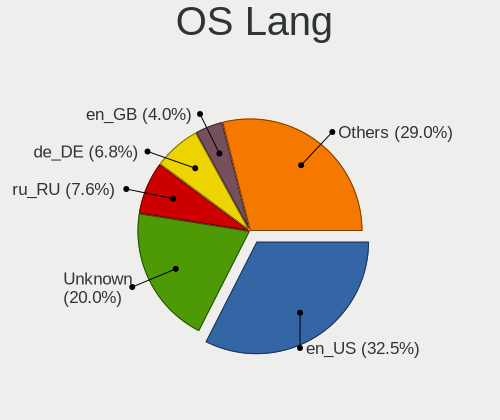
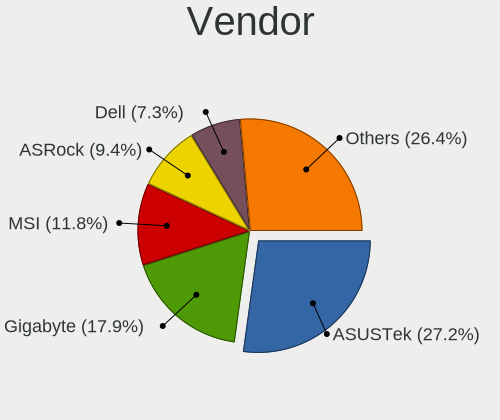
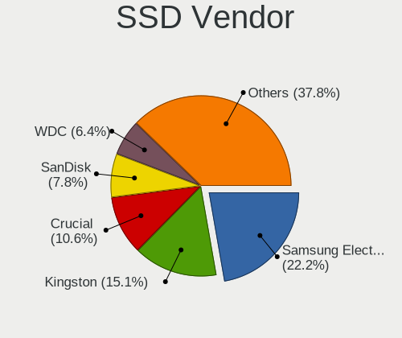
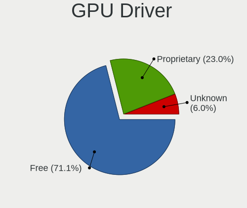
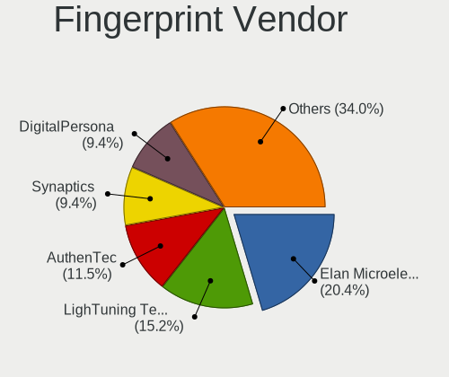

Linux - Tested Hardware & Statistics (Desktops)
-----------------------------------------------

A project to collect tested hardware configurations for Linux.

Anyone can contribute to this report by the [hw-probe](https://github.com/linuxhw/hw-probe) tool:

    sudo -E hw-probe -all -upload

Please contribute! Especially if your hardware is rare.

This report is for real hardware. Report for virtual hardware: [TestDays_VE](https://github.com/linuxhw/TestDays_VE)

Contents
--------

* [ Test Cases ](#test-cases)

* [ System ](#system)
  - [ OS                       ](#os)
  - [ OS Family                ](#os-family)
  - [ Kernel                   ](#kernel)
  - [ Kernel Family            ](#kernel-family)
  - [ Kernel Major Ver.        ](#kernel-major-ver)
  - [ Arch                     ](#arch)
  - [ DE                       ](#de)
  - [ Display Server           ](#display-server)
  - [ Display Manager          ](#display-manager)
  - [ OS Lang                  ](#os-lang)
  - [ Boot Mode                ](#boot-mode)
  - [ Filesystem               ](#filesystem)
  - [ Part. scheme             ](#part-scheme)
  - [ Dual Boot with Linux/BSD ](#dual-boot-with-linuxbsd)
  - [ Dual Boot (Win)          ](#dual-boot-win)

* [ Board ](#board)
  - [ Vendor                   ](#vendor)
  - [ Model                    ](#model)
  - [ Model Family             ](#model-family)
  - [ MFG Year                 ](#mfg-year)
  - [ Form Factor              ](#form-factor)
  - [ Secure Boot              ](#secure-boot)
  - [ Coreboot                 ](#coreboot)
  - [ RAM Size                 ](#ram-size)
  - [ RAM Used                 ](#ram-used)
  - [ Total Drives             ](#total-drives)
  - [ Has CD-ROM               ](#has-cd-rom)
  - [ Has Ethernet             ](#has-ethernet)
  - [ Has WiFi                 ](#has-wifi)
  - [ Has Bluetooth            ](#has-bluetooth)

* [ Location ](#location)
  - [ Country                  ](#country)
  - [ City                     ](#city)

* [ Drives ](#drives)
  - [ Drive Vendor             ](#drive-vendor)
  - [ Drive Model              ](#drive-model)
  - [ HDD Vendor               ](#hdd-vendor)
  - [ SSD Vendor               ](#ssd-vendor)
  - [ Drive Kind               ](#drive-kind)
  - [ Drive Connector          ](#drive-connector)
  - [ Drive Size               ](#drive-size)
  - [ Space Total              ](#space-total)
  - [ Space Used               ](#space-used)
  - [ Malfunc. Drives          ](#malfunc-drives)
  - [ Malfunc. Drive Vendor    ](#malfunc-drive-vendor)
  - [ Malfunc. HDD Vendor      ](#malfunc-hdd-vendor)
  - [ Malfunc. Drive Kind      ](#malfunc-drive-kind)
  - [ Failed Drives            ](#failed-drives)
  - [ Failed Drive Vendor      ](#failed-drive-vendor)
  - [ Drive Status             ](#drive-status)

* [ Storage controller ](#storage-controller)
  - [ Storage Vendor           ](#storage-vendor)
  - [ Storage Model            ](#storage-model)
  - [ Storage Kind             ](#storage-kind)

* [ Processor ](#processor)
  - [ CPU Vendor               ](#cpu-vendor)
  - [ CPU Model                ](#cpu-model)
  - [ CPU Model Family         ](#cpu-model-family)
  - [ CPU Cores                ](#cpu-cores)
  - [ CPU Sockets              ](#cpu-sockets)
  - [ CPU Threads              ](#cpu-threads)
  - [ CPU Op-Modes             ](#cpu-op-modes)
  - [ CPU Microcode            ](#cpu-microcode)
  - [ CPU Microarch            ](#cpu-microarch)

* [ Graphics ](#graphics)
  - [ GPU Vendor               ](#gpu-vendor)
  - [ GPU Model                ](#gpu-model)
  - [ GPU Combo                ](#gpu-combo)
  - [ GPU Driver               ](#gpu-driver)
  - [ GPU Memory               ](#gpu-memory)

* [ Monitor ](#monitor)
  - [ Monitor Vendor           ](#monitor-vendor)
  - [ Monitor Model            ](#monitor-model)
  - [ Monitor Resolution       ](#monitor-resolution)
  - [ Monitor Diagonal         ](#monitor-diagonal)
  - [ Monitor Width            ](#monitor-width)
  - [ Aspect Ratio             ](#aspect-ratio)
  - [ Monitor Area             ](#monitor-area)
  - [ Pixel Density            ](#pixel-density)
  - [ Multiple Monitors        ](#multiple-monitors)

* [ Network ](#network)
  - [ Net Controller Vendor    ](#net-controller-vendor)
  - [ Net Controller Model     ](#net-controller-model)
  - [ Wireless Vendor          ](#wireless-vendor)
  - [ Wireless Model           ](#wireless-model)
  - [ Ethernet Vendor          ](#ethernet-vendor)
  - [ Ethernet Model           ](#ethernet-model)
  - [ Net Controller Kind      ](#net-controller-kind)
  - [ Used Controller          ](#used-controller)
  - [ NICs                     ](#nics)
  - [ IPv6                     ](#ipv6)

* [ Bluetooth ](#bluetooth)
  - [ Bluetooth Vendor         ](#bluetooth-vendor)
  - [ Bluetooth Model          ](#bluetooth-model)

* [ Sound ](#sound)
  - [ Sound Vendor             ](#sound-vendor)
  - [ Sound Model              ](#sound-model)

* [ Memory ](#memory)
  - [ Memory Vendor            ](#memory-vendor)
  - [ Memory Model             ](#memory-model)
  - [ Memory Kind              ](#memory-kind)
  - [ Memory Form Factor       ](#memory-form-factor)
  - [ Memory Size              ](#memory-size)
  - [ Memory Speed             ](#memory-speed)

* [ Printers & scanners ](#printers--scanners)
  - [ Printer Vendor           ](#printer-vendor)
  - [ Printer Model            ](#printer-model)
  - [ Scanner Vendor           ](#scanner-vendor)
  - [ Scanner Model            ](#scanner-model)

* [ Camera ](#camera)
  - [ Camera Vendor            ](#camera-vendor)
  - [ Camera Model             ](#camera-model)

* [ Security ](#security)
  - [ Fingerprint Vendor       ](#fingerprint-vendor)
  - [ Fingerprint Model        ](#fingerprint-model)
  - [ Chipcard Vendor          ](#chipcard-vendor)
  - [ Chipcard Model           ](#chipcard-model)

* [ Unsupported ](#unsupported)
  - [ Unsupported Devices      ](#unsupported-devices)
  - [ Unsupported Device Types ](#unsupported-device-types)

Test Cases
----------

Total: 130284

| Vendor        | Model                       | Probe                                                      | Date         |
|---------------|-----------------------------|------------------------------------------------------------|--------------|
| ASRock        | H61M-DGS R2.0               | [6af1365446](https://linux-hardware.org/?probe=6af1365446) | Aug 12, 2023 |
| MSI           | MAG B550M MORTAR WIFI       | [b6b99bf7bd](https://linux-hardware.org/?probe=b6b99bf7bd) | Aug 12, 2023 |
| ASRock        | H61M-DGS R2.0               | [70e9fe8cdb](https://linux-hardware.org/?probe=70e9fe8cdb) | Aug 12, 2023 |
| MSI           | X470 GAMING PLUS MAX        | [3ea3856297](https://linux-hardware.org/?probe=3ea3856297) | Aug 12, 2023 |
| ASRock        | B85M Pro4                   | [108dae1eae](https://linux-hardware.org/?probe=108dae1eae) | Aug 12, 2023 |
| Gigabyte      | H61M-S1                     | [b92a6f8a9e](https://linux-hardware.org/?probe=b92a6f8a9e) | Aug 12, 2023 |
| Gigabyte      | G1.Sniper M3-CF             | [f4d0fd6811](https://linux-hardware.org/?probe=f4d0fd6811) | Aug 12, 2023 |
| MSI           | P67A-GD65                   | [1024e95ca9](https://linux-hardware.org/?probe=1024e95ca9) | Aug 12, 2023 |
| ASUSTek       | Z170-P                      | [a32f4633c2](https://linux-hardware.org/?probe=a32f4633c2) | Aug 12, 2023 |
| Gigabyte      | Z77X-D3H                    | [f57a3e9f6a](https://linux-hardware.org/?probe=f57a3e9f6a) | Aug 12, 2023 |
| ASUSTek       | CM1630                      | [dfd52e2852](https://linux-hardware.org/?probe=dfd52e2852) | Aug 12, 2023 |
| Gigabyte      | G1.Sniper M3-CF             | [a5681e12d3](https://linux-hardware.org/?probe=a5681e12d3) | Aug 12, 2023 |
| ASUSTek       | Rampage IV GENE             | [2a494a04b5](https://linux-hardware.org/?probe=2a494a04b5) | Aug 12, 2023 |
| HP            | 8643 SMVB                   | [2832e701f2](https://linux-hardware.org/?probe=2832e701f2) | Aug 12, 2023 |
| HP            | 09CCh                       | [15bfdf7213](https://linux-hardware.org/?probe=15bfdf7213) | Aug 12, 2023 |
| MSI           | X470 GAMING PRO CARBON      | [b4b9fa2d17](https://linux-hardware.org/?probe=b4b9fa2d17) | Aug 12, 2023 |
| Gigabyte      | H61M-S1                     | [031ed1d4e7](https://linux-hardware.org/?probe=031ed1d4e7) | Aug 12, 2023 |
| Fujitsu       | D2990-A1 S26361-D2990-A1    | [ae7ae594f1](https://linux-hardware.org/?probe=ae7ae594f1) | Aug 12, 2023 |
| ASUSTek       | M5A78L-M LE                 | [a68db843ea](https://linux-hardware.org/?probe=a68db843ea) | Aug 12, 2023 |
| Gigabyte      | B550 GAMING X V2            | [1f4aa5bf97](https://linux-hardware.org/?probe=1f4aa5bf97) | Aug 12, 2023 |
| ASUSTek       | ROG STRIX X570-E GAMING     | [4fe5238f21](https://linux-hardware.org/?probe=4fe5238f21) | Aug 12, 2023 |
| MSI           | MPG X570 GAMING PLUS        | [2c92ed92eb](https://linux-hardware.org/?probe=2c92ed92eb) | Aug 12, 2023 |
| ASRock        | B450M-HDV R4.0              | [6855901c02](https://linux-hardware.org/?probe=6855901c02) | Aug 12, 2023 |
| Gigabyte      | Z390 AORUS PRO WIFI-CF      | [7298d533c9](https://linux-hardware.org/?probe=7298d533c9) | Aug 12, 2023 |
| Gigabyte      | Z390 AORUS PRO WIFI-CF      | [13e0e622f3](https://linux-hardware.org/?probe=13e0e622f3) | Aug 12, 2023 |
| Gigabyte      | H61M-DS2                    | [3181a592ac](https://linux-hardware.org/?probe=3181a592ac) | Aug 12, 2023 |
| HP            | 1495                        | [837afb7bfa](https://linux-hardware.org/?probe=837afb7bfa) | Aug 12, 2023 |
| CWWK          | CW-J6-6L                    | [8321dcc5ea](https://linux-hardware.org/?probe=8321dcc5ea) | Aug 12, 2023 |
| HP            | 1589                        | [1a38154020](https://linux-hardware.org/?probe=1a38154020) | Aug 12, 2023 |
| ASUSTek       | CM1630                      | [d8f56bcdaf](https://linux-hardware.org/?probe=d8f56bcdaf) | Aug 12, 2023 |
| Gigabyte      | X570 AORUS ELITE            | [0c0df32662](https://linux-hardware.org/?probe=0c0df32662) | Aug 12, 2023 |
| ASUSTek       | PRIME B660M-K D4            | [dad31fab00](https://linux-hardware.org/?probe=dad31fab00) | Aug 12, 2023 |
| HP            | 0A04h                       | [61b0d9bc15](https://linux-hardware.org/?probe=61b0d9bc15) | Aug 12, 2023 |
| Intel         | B85 V5.56                   | [7fb2d45505](https://linux-hardware.org/?probe=7fb2d45505) | Aug 12, 2023 |
| Dell          | 05YDCW A01                  | [3f3195be63](https://linux-hardware.org/?probe=3f3195be63) | Aug 12, 2023 |
| Fujitsu       | JIQ87Y                      | [b11d99014e](https://linux-hardware.org/?probe=b11d99014e) | Aug 12, 2023 |
| Dell          | 05YDCW A01                  | [80c27f0ac1](https://linux-hardware.org/?probe=80c27f0ac1) | Aug 12, 2023 |
| ASUSTek       | ProArt X670E-CREATOR WIF... | [4f6d84a4dd](https://linux-hardware.org/?probe=4f6d84a4dd) | Aug 12, 2023 |
| ASUSTek       | PRIME Z590-P WIFI           | [073d2bb6a7](https://linux-hardware.org/?probe=073d2bb6a7) | Aug 12, 2023 |
| Gigabyte      | F2A88XN-WIFI                | [8ba1a47cc3](https://linux-hardware.org/?probe=8ba1a47cc3) | Aug 12, 2023 |
| ASUSTek       | H81M-PLUS                   | [af419fe003](https://linux-hardware.org/?probe=af419fe003) | Aug 12, 2023 |
| Gigabyte      | F2A88XN-WIFI                | [adb95a05c5](https://linux-hardware.org/?probe=adb95a05c5) | Aug 12, 2023 |
| ASUSTek       | H81M-PLUS                   | [16cd37e4fe](https://linux-hardware.org/?probe=16cd37e4fe) | Aug 12, 2023 |
| ASUSTek       | ROG STRIX B550-F GAMING ... | [580fda2e6b](https://linux-hardware.org/?probe=580fda2e6b) | Aug 12, 2023 |
| Dell          | 0Y2MRG A00                  | [04ce264a3e](https://linux-hardware.org/?probe=04ce264a3e) | Aug 12, 2023 |
| MSI           | X99A RAIDER                 | [90816726b0](https://linux-hardware.org/?probe=90816726b0) | Aug 12, 2023 |
| MSI           | A55M-E33                    | [7d538db764](https://linux-hardware.org/?probe=7d538db764) | Aug 12, 2023 |
| HP            | ProLiant ML350 G5           | [e9e8c3e5a7](https://linux-hardware.org/?probe=e9e8c3e5a7) | Aug 12, 2023 |
| MSI           | A55M-E33                    | [9e64865fbc](https://linux-hardware.org/?probe=9e64865fbc) | Aug 12, 2023 |
| Dell          | 03KWTV A02                  | [4d26902a65](https://linux-hardware.org/?probe=4d26902a65) | Aug 12, 2023 |
| Intel         | DG31PR AAE58249-301         | [28bc891b6d](https://linux-hardware.org/?probe=28bc891b6d) | Aug 12, 2023 |
| ASUSTek       | J1800I-C/BR                 | [5226916c20](https://linux-hardware.org/?probe=5226916c20) | Aug 12, 2023 |
| MSI           | MAG B550M MORTAR WIFI       | [da8cf53467](https://linux-hardware.org/?probe=da8cf53467) | Aug 12, 2023 |
| MSI           | MEG X570 UNIFY              | [179381f376](https://linux-hardware.org/?probe=179381f376) | Aug 12, 2023 |
| ASUSTek       | J1800I-C/BR                 | [f59a93f116](https://linux-hardware.org/?probe=f59a93f116) | Aug 12, 2023 |
| MSI           | PRO Z790-P WIFI             | [5b9aef438f](https://linux-hardware.org/?probe=5b9aef438f) | Aug 12, 2023 |
| MSI           | PRO Z790-P WIFI             | [1f3f8a869b](https://linux-hardware.org/?probe=1f3f8a869b) | Aug 12, 2023 |
| Dell          | 0HD5W2 A01                  | [be4514c366](https://linux-hardware.org/?probe=be4514c366) | Aug 12, 2023 |
| Biostar       | A770 A2+                    | [d35bac0620](https://linux-hardware.org/?probe=d35bac0620) | Aug 12, 2023 |
| Intel         | DG31PR AAE58249-301         | [3050db3fbf](https://linux-hardware.org/?probe=3050db3fbf) | Aug 12, 2023 |
| Gigabyte      | Z170-HD3P-CF                | [7ef87af541](https://linux-hardware.org/?probe=7ef87af541) | Aug 12, 2023 |
| ASRock        | 970A-G                      | [5a2b77eaee](https://linux-hardware.org/?probe=5a2b77eaee) | Aug 12, 2023 |
| Biostar       | A770 A2+                    | [fb7d0009fd](https://linux-hardware.org/?probe=fb7d0009fd) | Aug 12, 2023 |
| ASUSTek       | M5A97 R2.0                  | [96995d7026](https://linux-hardware.org/?probe=96995d7026) | Aug 12, 2023 |
| Alienware     | 0N43JM A01                  | [74cc9030a1](https://linux-hardware.org/?probe=74cc9030a1) | Aug 12, 2023 |
| ASUSTek       | PRIME A520M-E               | [92f4e14369](https://linux-hardware.org/?probe=92f4e14369) | Aug 11, 2023 |
| ASUSTek       | P5G41T-M LX2/BR             | [f8fa12cc07](https://linux-hardware.org/?probe=f8fa12cc07) | Aug 11, 2023 |
| ASUSTek       | PRIME B550M-K               | [60de8d6d38](https://linux-hardware.org/?probe=60de8d6d38) | Aug 11, 2023 |
| MSI           | Boston                      | [62ad275a7d](https://linux-hardware.org/?probe=62ad275a7d) | Aug 11, 2023 |
| ASUSTek       | TUF Gaming X570-PLUS        | [d387c8fec5](https://linux-hardware.org/?probe=d387c8fec5) | Aug 11, 2023 |
| ASUSTek       | ROG STRIX Z590-I GAMING ... | [8903899ce9](https://linux-hardware.org/?probe=8903899ce9) | Aug 11, 2023 |
| Intel         | B85 V5.56                   | [f278787ab5](https://linux-hardware.org/?probe=f278787ab5) | Aug 11, 2023 |
| MSI           | Boston                      | [a34a89c083](https://linux-hardware.org/?probe=a34a89c083) | Aug 11, 2023 |
| ASUSTek       | PRIME B550-PLUS             | [76078461ae](https://linux-hardware.org/?probe=76078461ae) | Aug 11, 2023 |
| Intel         | B75                         | [17641de345](https://linux-hardware.org/?probe=17641de345) | Aug 11, 2023 |
| Gigabyte      | M720-US3                    | [222bc02e4f](https://linux-hardware.org/?probe=222bc02e4f) | Aug 11, 2023 |
| MSI           | X470 GAMING PRO CARBON      | [181db8cf87](https://linux-hardware.org/?probe=181db8cf87) | Aug 11, 2023 |
| ASUSTek       | ROG STRIX X570-E GAMING     | [483fc71762](https://linux-hardware.org/?probe=483fc71762) | Aug 11, 2023 |
| Lenovo        | SHARKBAY SDK0E50510 WIN     | [ab2473ff49](https://linux-hardware.org/?probe=ab2473ff49) | Aug 11, 2023 |
| MSI           | MAG B650M MORTAR WIFI       | [d4b93affe2](https://linux-hardware.org/?probe=d4b93affe2) | Aug 11, 2023 |
| MSI           | MAG B650M MORTAR WIFI       | [7a8e32eb89](https://linux-hardware.org/?probe=7a8e32eb89) | Aug 11, 2023 |
| Gigabyte      | X570 I AORUS PRO WIFI       | [2a218f5ead](https://linux-hardware.org/?probe=2a218f5ead) | Aug 11, 2023 |
| Unknown       | Unknown                     | [62ef56dbab](https://linux-hardware.org/?probe=62ef56dbab) | Aug 11, 2023 |
| Biostar       | B660GTQ                     | [520d57cadc](https://linux-hardware.org/?probe=520d57cadc) | Aug 11, 2023 |
| Gigabyte      | B560M DS3H V2               | [2805e140b5](https://linux-hardware.org/?probe=2805e140b5) | Aug 11, 2023 |
| Gigabyte      | B450 AORUS M                | [f4a323eb82](https://linux-hardware.org/?probe=f4a323eb82) | Aug 11, 2023 |
| Dell          | 0KV3RP A00                  | [47c45a45e5](https://linux-hardware.org/?probe=47c45a45e5) | Aug 11, 2023 |
| Gigabyte      | B365 HD3                    | [e2ebf1941c](https://linux-hardware.org/?probe=e2ebf1941c) | Aug 11, 2023 |
| ASRock        | B450M Pro4                  | [65d55091fa](https://linux-hardware.org/?probe=65d55091fa) | Aug 11, 2023 |
| HP            | 3032h                       | [1727f042cd](https://linux-hardware.org/?probe=1727f042cd) | Aug 11, 2023 |
| Gigabyte      | Z790 GAMING X AX            | [a6d2358585](https://linux-hardware.org/?probe=a6d2358585) | Aug 11, 2023 |
| Gigabyte      | A520M DS3H AC               | [c53eeb4caf](https://linux-hardware.org/?probe=c53eeb4caf) | Aug 11, 2023 |
| Unknown       | Unknown                     | [4b174f07d2](https://linux-hardware.org/?probe=4b174f07d2) | Aug 11, 2023 |
| Intel         | D915GEV AAC63667-501        | [4d65f6d8fa](https://linux-hardware.org/?probe=4d65f6d8fa) | Aug 11, 2023 |
| HP            | 339A                        | [2ecbd957da](https://linux-hardware.org/?probe=2ecbd957da) | Aug 11, 2023 |
| Gigabyte      | B250-HD3P-CF                | [b347883be2](https://linux-hardware.org/?probe=b347883be2) | Aug 11, 2023 |
| Unknown       | Unknown                     | [e32bb1bbb2](https://linux-hardware.org/?probe=e32bb1bbb2) | Aug 11, 2023 |
| Gigabyte      | B85M-D2V                    | [d8d7d7bad7](https://linux-hardware.org/?probe=d8d7d7bad7) | Aug 11, 2023 |
| ASRock        | B550M-ITX/ac                | [e6624cc619](https://linux-hardware.org/?probe=e6624cc619) | Aug 11, 2023 |
| ASUSTek       | PRIME B550-PLUS             | [7f2903e1a4](https://linux-hardware.org/?probe=7f2903e1a4) | Aug 11, 2023 |
| Gigabyte      | P67A-UD3P-B3                | [a1c6469145](https://linux-hardware.org/?probe=a1c6469145) | Aug 11, 2023 |
| Unknown       | Unknown                     | [cf0d6729b4](https://linux-hardware.org/?probe=cf0d6729b4) | Aug 11, 2023 |
| HP            | 1495                        | [9e8b73f16e](https://linux-hardware.org/?probe=9e8b73f16e) | Aug 11, 2023 |
| ASUSTek       | PRIME X670-P WIFI           | [7d31344218](https://linux-hardware.org/?probe=7d31344218) | Aug 11, 2023 |
| Dell          | 0HY9JP A01                  | [48d92d85c7](https://linux-hardware.org/?probe=48d92d85c7) | Aug 11, 2023 |
| ASRock        | J4125B-ITX                  | [fa9ebd523f](https://linux-hardware.org/?probe=fa9ebd523f) | Aug 11, 2023 |
| MSI           | MPG X570 GAMING PRO CARB... | [f711709f3f](https://linux-hardware.org/?probe=f711709f3f) | Aug 11, 2023 |
| Acer          | Aspire G7713                | [cb79bdce06](https://linux-hardware.org/?probe=cb79bdce06) | Aug 11, 2023 |
| Gigabyte      | Z77-D3H                     | [e71fc09944](https://linux-hardware.org/?probe=e71fc09944) | Aug 11, 2023 |
| MSI           | G33M                        | [65de454e8b](https://linux-hardware.org/?probe=65de454e8b) | Aug 11, 2023 |
| Unknown       | Unknown                     | [a9f30f8dd0](https://linux-hardware.org/?probe=a9f30f8dd0) | Aug 11, 2023 |
| ASUSTek       | PRIME H510M-K               | [3c239efc46](https://linux-hardware.org/?probe=3c239efc46) | Aug 11, 2023 |
| HP            | 158A                        | [96e7fa3b8f](https://linux-hardware.org/?probe=96e7fa3b8f) | Aug 11, 2023 |
| AZW           | Green G4 10                 | [a574280172](https://linux-hardware.org/?probe=a574280172) | Aug 11, 2023 |
| Huanan        | X99-QD4 V1.0                | [17e503622d](https://linux-hardware.org/?probe=17e503622d) | Aug 11, 2023 |
| HP            | 8619                        | [00c3a60e4c](https://linux-hardware.org/?probe=00c3a60e4c) | Aug 11, 2023 |
| MSI           | H410M-A PRO                 | [de3739c2a5](https://linux-hardware.org/?probe=de3739c2a5) | Aug 11, 2023 |
| Lenovo        | IdeaCentre B320             | [175fb6f041](https://linux-hardware.org/?probe=175fb6f041) | Aug 11, 2023 |
| ASRock        | B650M-HDV/M.2               | [ffd395aee0](https://linux-hardware.org/?probe=ffd395aee0) | Aug 11, 2023 |
| MSI           | MS-7380                     | [584074ca03](https://linux-hardware.org/?probe=584074ca03) | Aug 11, 2023 |
| ASUSTek       | ROG CROSSHAIR X670E GENE    | [f016fa3756](https://linux-hardware.org/?probe=f016fa3756) | Aug 11, 2023 |
| Gigabyte      | Z170N-WIFI-CF               | [2ee88f0ec0](https://linux-hardware.org/?probe=2ee88f0ec0) | Aug 11, 2023 |
| Dell          | 06X1TJ A00                  | [91ecb8253e](https://linux-hardware.org/?probe=91ecb8253e) | Aug 11, 2023 |
| MSI           | X99A RAIDER                 | [ee1a7cb0aa](https://linux-hardware.org/?probe=ee1a7cb0aa) | Aug 11, 2023 |
| Alienware     | Area-51 R2                  | [07a6f57292](https://linux-hardware.org/?probe=07a6f57292) | Aug 11, 2023 |
| Gigabyte      | B650 AORUS PRO AX           | [5cbfb27db2](https://linux-hardware.org/?probe=5cbfb27db2) | Aug 11, 2023 |
| Gigabyte      | B650 AORUS PRO AX           | [72b375ad38](https://linux-hardware.org/?probe=72b375ad38) | Aug 11, 2023 |
| ASUSTek       | ROG STRIX B350-F GAMING     | [cc7efa7eba](https://linux-hardware.org/?probe=cc7efa7eba) | Aug 11, 2023 |
| Lenovo        | 3740 NOK                    | [9964e9a820](https://linux-hardware.org/?probe=9964e9a820) | Aug 11, 2023 |
| ASUSTek       | P8Z68-V LE                  | [a88d7e81e5](https://linux-hardware.org/?probe=a88d7e81e5) | Aug 11, 2023 |
| Biostar       | A10N-8800E                  | [5ccf8e7d00](https://linux-hardware.org/?probe=5ccf8e7d00) | Aug 11, 2023 |
| HP            | 83E8                        | [a782638343](https://linux-hardware.org/?probe=a782638343) | Aug 11, 2023 |
| Huanan        | X99-F8 V2.0                 | [f028b8f65d](https://linux-hardware.org/?probe=f028b8f65d) | Aug 11, 2023 |
| ASRock        | Z97 Killer                  | [f055a15ccb](https://linux-hardware.org/?probe=f055a15ccb) | Aug 11, 2023 |
| MSI           | H310M PRO-VD                | [f542bb8447](https://linux-hardware.org/?probe=f542bb8447) | Aug 10, 2023 |
| Gigabyte      | GA-78LMT-USB3               | [6a1d87f2aa](https://linux-hardware.org/?probe=6a1d87f2aa) | Aug 10, 2023 |
| ASUSTek       | P8P67 PRO                   | [c0d6900ba3](https://linux-hardware.org/?probe=c0d6900ba3) | Aug 10, 2023 |
| ASUSTek       | PRIME B550M-A               | [7da6954bc5](https://linux-hardware.org/?probe=7da6954bc5) | Aug 10, 2023 |
| ASUSTek       | PRIME B450-PLUS             | [44fe085499](https://linux-hardware.org/?probe=44fe085499) | Aug 10, 2023 |
| Fujitsu Si... | G31T-M2 V3.02               | [1c32da7aed](https://linux-hardware.org/?probe=1c32da7aed) | Aug 10, 2023 |
| HP            | ProLiant ML115 G5           | [305ccefd04](https://linux-hardware.org/?probe=305ccefd04) | Aug 10, 2023 |
| Lenovo        | ThinkStation S30 056848U    | [e6bc23d815](https://linux-hardware.org/?probe=e6bc23d815) | Aug 10, 2023 |
| Gigabyte      | B450M DS3H-CF               | [ee14fdafcf](https://linux-hardware.org/?probe=ee14fdafcf) | Aug 10, 2023 |
| HP            | 18E7                        | [ff27f888f0](https://linux-hardware.org/?probe=ff27f888f0) | Aug 10, 2023 |
| ASRock        | H310CM-HG4                  | [773b111412](https://linux-hardware.org/?probe=773b111412) | Aug 10, 2023 |
| ASRock        | H310CM-HG4                  | [70c4f2863b](https://linux-hardware.org/?probe=70c4f2863b) | Aug 10, 2023 |
| Gigabyte      | H410M S2 V2                 | [d4c5a12d06](https://linux-hardware.org/?probe=d4c5a12d06) | Aug 10, 2023 |
| NEC Comput... | 312C                        | [770ffcfcf5](https://linux-hardware.org/?probe=770ffcfcf5) | Aug 10, 2023 |
| HP            | 2215                        | [40ace58487](https://linux-hardware.org/?probe=40ace58487) | Aug 10, 2023 |
| ASUSTek       | P8Z68-V                     | [cff11cda6f](https://linux-hardware.org/?probe=cff11cda6f) | Aug 10, 2023 |
| MSI           | B450M PRO-M2 MAX            | [07e0bad7da](https://linux-hardware.org/?probe=07e0bad7da) | Aug 10, 2023 |
| ASUSTek       | ROG STRIX Z690-E GAMING ... | [025afcb20d](https://linux-hardware.org/?probe=025afcb20d) | Aug 10, 2023 |
| Dell          | 0YF8P5 A00                  | [93f35a6d26](https://linux-hardware.org/?probe=93f35a6d26) | Aug 10, 2023 |
| ASUSTek       | ROG STRIX B650-A GAMING ... | [6bf6a38fba](https://linux-hardware.org/?probe=6bf6a38fba) | Aug 10, 2023 |
| ASUSTek       | PRIME A320M-K               | [67414922e3](https://linux-hardware.org/?probe=67414922e3) | Aug 10, 2023 |
| Gigabyte      | H61M-D2H-USB3               | [0028486d9d](https://linux-hardware.org/?probe=0028486d9d) | Aug 10, 2023 |
| Gigabyte      | Z690 AORUS MASTER           | [be6c815f39](https://linux-hardware.org/?probe=be6c815f39) | Aug 10, 2023 |
| Intel         | DG41RQ AAE54511-203         | [646d098c58](https://linux-hardware.org/?probe=646d098c58) | Aug 10, 2023 |
| Lenovo        | SDK0E50510 WIN              | [485a8bf15d](https://linux-hardware.org/?probe=485a8bf15d) | Aug 10, 2023 |
| ASRock        | H61M-DGS R2.0               | [4f05b77547](https://linux-hardware.org/?probe=4f05b77547) | Aug 10, 2023 |
| Dell          | 03KWTV A02                  | [d4a16b0b3e](https://linux-hardware.org/?probe=d4a16b0b3e) | Aug 10, 2023 |
| Gigabyte      | Z390 AORUS PRO WIFI-CF      | [aacbd7403c](https://linux-hardware.org/?probe=aacbd7403c) | Aug 10, 2023 |
| Gigabyte      | B365M H                     | [b23c1e6e73](https://linux-hardware.org/?probe=b23c1e6e73) | Aug 10, 2023 |
| Gigabyte      | Z390 AORUS PRO WIFI-CF      | [a7a57a8a56](https://linux-hardware.org/?probe=a7a57a8a56) | Aug 10, 2023 |
| ASUSTek       | ROG STRIX B550-F GAMING     | [d38ef662d4](https://linux-hardware.org/?probe=d38ef662d4) | Aug 10, 2023 |
| Dell          | 0M5DCD A00                  | [6f8ca5724f](https://linux-hardware.org/?probe=6f8ca5724f) | Aug 10, 2023 |
| HP            | 2AF9                        | [b31b796804](https://linux-hardware.org/?probe=b31b796804) | Aug 10, 2023 |
| Gigabyte      | H270N-WIFI-CF               | [bd9c532bbc](https://linux-hardware.org/?probe=bd9c532bbc) | Aug 10, 2023 |
| Gigabyte      | X570S AERO G                | [22916d4c12](https://linux-hardware.org/?probe=22916d4c12) | Aug 10, 2023 |
| ASUSTek       | M4A87TD/USB3                | [c7c0f2ad91](https://linux-hardware.org/?probe=c7c0f2ad91) | Aug 10, 2023 |
| Dell          | 04YP6J A02                  | [5d5ce952b3](https://linux-hardware.org/?probe=5d5ce952b3) | Aug 10, 2023 |
| Gigabyte      | B560M DS3H                  | [96d3419a5f](https://linux-hardware.org/?probe=96d3419a5f) | Aug 10, 2023 |
| ASUSTek       | M4A87TD/USB3                | [6aaa92df1c](https://linux-hardware.org/?probe=6aaa92df1c) | Aug 10, 2023 |
| Unknown       | Unknown                     | [78f477986b](https://linux-hardware.org/?probe=78f477986b) | Aug 10, 2023 |
| ASUSTek       | P7P55-M                     | [6f80191c4a](https://linux-hardware.org/?probe=6f80191c4a) | Aug 10, 2023 |
| Gigabyte      | Z390 AORUS ULTRA-CF         | [5264c46571](https://linux-hardware.org/?probe=5264c46571) | Aug 10, 2023 |
| HP            | 1495                        | [6c458bf059](https://linux-hardware.org/?probe=6c458bf059) | Aug 10, 2023 |
| Acer          | Aspire TC-885 V:1.1         | [63f0153cfe](https://linux-hardware.org/?probe=63f0153cfe) | Aug 10, 2023 |
| YANYU         | EPIC-C57                    | [6d42c0f9af](https://linux-hardware.org/?probe=6d42c0f9af) | Aug 10, 2023 |
| MSI           | A320M PRO-VD/S              | [7f7c988470](https://linux-hardware.org/?probe=7f7c988470) | Aug 10, 2023 |
| ASUSTek       | ROG Maximus X HERO          | [d5d888506b](https://linux-hardware.org/?probe=d5d888506b) | Aug 10, 2023 |
| Gigabyte      | Z390 AORUS PRO WIFI-CF      | [307c7bbe9c](https://linux-hardware.org/?probe=307c7bbe9c) | Aug 10, 2023 |
| ASRock        | B550 Phantom Gaming-ITX/... | [d490bb32ec](https://linux-hardware.org/?probe=d490bb32ec) | Aug 10, 2023 |
| ASUSTek       | TUF Gaming A520M-PLUS II    | [fb99152b24](https://linux-hardware.org/?probe=fb99152b24) | Aug 10, 2023 |
| AMI           | T3 MRD                      | [7a77a54bfd](https://linux-hardware.org/?probe=7a77a54bfd) | Aug 10, 2023 |
| ASUSTek       | PRIME X570-PRO              | [f7fe8fc7f3](https://linux-hardware.org/?probe=f7fe8fc7f3) | Aug 10, 2023 |
| HP            | 8433 11                     | [de06cea570](https://linux-hardware.org/?probe=de06cea570) | Aug 10, 2023 |
| HP            | 8433 11                     | [4275d43a74](https://linux-hardware.org/?probe=4275d43a74) | Aug 10, 2023 |
| ASUSTek       | Q87M-E                      | [0dee84c129](https://linux-hardware.org/?probe=0dee84c129) | Aug 10, 2023 |
| Dell          | 0MGK50 A01                  | [ac0ed4109e](https://linux-hardware.org/?probe=ac0ed4109e) | Aug 10, 2023 |
| Lenovo        | H420                        | [d418e9d1d1](https://linux-hardware.org/?probe=d418e9d1d1) | Aug 10, 2023 |
| MSI           | MPG X570 GAMING PRO CARB... | [0521e62bf9](https://linux-hardware.org/?probe=0521e62bf9) | Aug 10, 2023 |
| ASRock        | B450M-HDV R4.0              | [ab3503021a](https://linux-hardware.org/?probe=ab3503021a) | Aug 10, 2023 |
| MSI           | MPG X570 GAMING PRO CARB... | [198fcb1fc2](https://linux-hardware.org/?probe=198fcb1fc2) | Aug 10, 2023 |
| Gigabyte      | AB350-Gaming 3-CF           | [c2b7b4e760](https://linux-hardware.org/?probe=c2b7b4e760) | Aug 10, 2023 |
| ASUSTek       | ROG Maximus XII EXTREME     | [a0350a164c](https://linux-hardware.org/?probe=a0350a164c) | Aug 10, 2023 |
| ASRock        | B550 Phantom Gaming-ITX/... | [fffee60e72](https://linux-hardware.org/?probe=fffee60e72) | Aug 10, 2023 |
| ASUSTek       | GRYPHON Z87                 | [0638b1c2dd](https://linux-hardware.org/?probe=0638b1c2dd) | Aug 10, 2023 |
| ASUSTek       | GRYPHON Z87                 | [ff98e5f807](https://linux-hardware.org/?probe=ff98e5f807) | Aug 10, 2023 |
| Dell          | OptiPlex 755                | [279ed1e2d5](https://linux-hardware.org/?probe=279ed1e2d5) | Aug 10, 2023 |
| ASUSTek       | P5KPL-AM-CKD-VISUM-SI       | [7acbd56a40](https://linux-hardware.org/?probe=7acbd56a40) | Aug 10, 2023 |
| MSI           | A68HM-E33                   | [be692e44b5](https://linux-hardware.org/?probe=be692e44b5) | Aug 10, 2023 |
| ASUSTek       | PRIME X670-P WIFI           | [19d251df2c](https://linux-hardware.org/?probe=19d251df2c) | Aug 10, 2023 |
| Dell          | 0VXN67 A01                  | [4fbd39d860](https://linux-hardware.org/?probe=4fbd39d860) | Aug 10, 2023 |
| ASRock        | B365 Pro4                   | [45da50b5c8](https://linux-hardware.org/?probe=45da50b5c8) | Aug 10, 2023 |
| MACHINIST     | E5 MR9A PRO MAX V1.1        | [0c4903c4d2](https://linux-hardware.org/?probe=0c4903c4d2) | Aug 10, 2023 |
| Intel         | DZ68BC AAG30742-401         | [9bf37df045](https://linux-hardware.org/?probe=9bf37df045) | Aug 10, 2023 |
| ASRock        | B365 Pro4                   | [03cb2690f7](https://linux-hardware.org/?probe=03cb2690f7) | Aug 10, 2023 |
| Dell          | 0HY9JP A00                  | [f28a198267](https://linux-hardware.org/?probe=f28a198267) | Aug 10, 2023 |
| MSI           | H97 GAMING 3                | [584a47e4ae](https://linux-hardware.org/?probe=584a47e4ae) | Aug 10, 2023 |
| ASUSTek       | ROG STRIX B660-F GAMING ... | [c5491b8e9f](https://linux-hardware.org/?probe=c5491b8e9f) | Aug 10, 2023 |
| Dell          | 0JP3NX A01                  | [a9c4812d66](https://linux-hardware.org/?probe=a9c4812d66) | Aug 09, 2023 |
| ASUSTek       | PRIME Z270-A                | [a6eabbbfef](https://linux-hardware.org/?probe=a6eabbbfef) | Aug 09, 2023 |
| Gigabyte      | G31M-ES2L                   | [1e856f651d](https://linux-hardware.org/?probe=1e856f651d) | Aug 09, 2023 |
| Gigabyte      | B450 AORUS M                | [739bc450b8](https://linux-hardware.org/?probe=739bc450b8) | Aug 09, 2023 |
| ASUSTek       | H87-PRO                     | [817c5f9f93](https://linux-hardware.org/?probe=817c5f9f93) | Aug 09, 2023 |
| Gigabyte      | B560M AORUS ELITE           | [e315608a65](https://linux-hardware.org/?probe=e315608a65) | Aug 09, 2023 |
| MSI           | 970 GAMING                  | [a499728742](https://linux-hardware.org/?probe=a499728742) | Aug 09, 2023 |
| Gigabyte      | 970A-UD3P                   | [b1a8fc0704](https://linux-hardware.org/?probe=b1a8fc0704) | Aug 09, 2023 |
| Intel         | DZ77SL-50K AAG55115-300     | [0ca6c48c2f](https://linux-hardware.org/?probe=0ca6c48c2f) | Aug 09, 2023 |
| ASRock        | Z68 Pro3                    | [f949a6e2a5](https://linux-hardware.org/?probe=f949a6e2a5) | Aug 09, 2023 |
| HP            | 859C                        | [24dd090f2c](https://linux-hardware.org/?probe=24dd090f2c) | Aug 09, 2023 |
| ASRock        | Z77 Extreme4                | [aadaab77db](https://linux-hardware.org/?probe=aadaab77db) | Aug 09, 2023 |
| Gigabyte      | 970A-UD3P                   | [920797388b](https://linux-hardware.org/?probe=920797388b) | Aug 09, 2023 |
| ASUSTek       | Pro WS 565-ACE              | [3d9112e038](https://linux-hardware.org/?probe=3d9112e038) | Aug 09, 2023 |
| HP            | 0AA4h                       | [e4da6a6aaf](https://linux-hardware.org/?probe=e4da6a6aaf) | Aug 09, 2023 |
| Unknown       | Unknown                     | [09037ac346](https://linux-hardware.org/?probe=09037ac346) | Aug 09, 2023 |
| MSI           | X370 GAMING M7 ACK          | [00bb870b78](https://linux-hardware.org/?probe=00bb870b78) | Aug 09, 2023 |
| HP            | 0AA4h                       | [4081f7bbda](https://linux-hardware.org/?probe=4081f7bbda) | Aug 09, 2023 |
| HP            | 8433 11                     | [eac08c7b54](https://linux-hardware.org/?probe=eac08c7b54) | Aug 09, 2023 |
| Gigabyte      | AB350-Gaming-CF             | [466419add0](https://linux-hardware.org/?probe=466419add0) | Aug 09, 2023 |
| ASRock        | X670E Pro RS                | [baa9e459cc](https://linux-hardware.org/?probe=baa9e459cc) | Aug 09, 2023 |
| Dell          | 0WR7PY A03                  | [b97d54f6d8](https://linux-hardware.org/?probe=b97d54f6d8) | Aug 09, 2023 |
| Gigabyte      | X570 AORUS ELITE            | [13b739e83a](https://linux-hardware.org/?probe=13b739e83a) | Aug 09, 2023 |
| ASUSTek       | ROG STRIX B450-F GAMING     | [2be2a9d5f4](https://linux-hardware.org/?probe=2be2a9d5f4) | Aug 09, 2023 |
| Lenovo        | SDK0E50510 WIN 262508147... | [badd1c22ff](https://linux-hardware.org/?probe=badd1c22ff) | Aug 09, 2023 |
| MSI           | Z590-A PRO                  | [4448c9f2e1](https://linux-hardware.org/?probe=4448c9f2e1) | Aug 09, 2023 |
| Gigabyte      | B150M-D3H DDR3-CF           | [5df6fee2f9](https://linux-hardware.org/?probe=5df6fee2f9) | Aug 09, 2023 |
| MSI           | Z590-A PRO                  | [6e1d11025a](https://linux-hardware.org/?probe=6e1d11025a) | Aug 09, 2023 |
| Lenovo        | SDK0E50510 WIN 262508147... | [f74262edcd](https://linux-hardware.org/?probe=f74262edcd) | Aug 09, 2023 |
| ASUSTek       | TUF Gaming X570-PLUS        | [4a7cc2835f](https://linux-hardware.org/?probe=4a7cc2835f) | Aug 09, 2023 |
| MSI           | Z97-G45 GAMING              | [65d491c109](https://linux-hardware.org/?probe=65d491c109) | Aug 09, 2023 |
| HP            | 8433 11                     | [93432b3df2](https://linux-hardware.org/?probe=93432b3df2) | Aug 09, 2023 |
| ASRock        | H77M-ITX                    | [01dc3bfc4b](https://linux-hardware.org/?probe=01dc3bfc4b) | Aug 09, 2023 |
| Intel         | DQ77KB AAG40294-401         | [3a761b76d6](https://linux-hardware.org/?probe=3a761b76d6) | Aug 09, 2023 |
| Unknown       | AB07H                       | [d0b6bc1fce](https://linux-hardware.org/?probe=d0b6bc1fce) | Aug 09, 2023 |
| Dell          | 0WMJ54 A01                  | [6e9ca3c833](https://linux-hardware.org/?probe=6e9ca3c833) | Aug 09, 2023 |
| Huanan        | X99-TF-Q GAMING V1.2        | [da612198cc](https://linux-hardware.org/?probe=da612198cc) | Aug 09, 2023 |
| ASUSTek       | ROG CROSSHAIR VIII DARK ... | [0cf2ab49c0](https://linux-hardware.org/?probe=0cf2ab49c0) | Aug 09, 2023 |
| LORD ELECT... | LORD G4x 775 ICH7 8712 A... | [3e63b3dec0](https://linux-hardware.org/?probe=3e63b3dec0) | Aug 09, 2023 |
| ASUSTek       | B85M-G                      | [9fcf84ff7c](https://linux-hardware.org/?probe=9fcf84ff7c) | Aug 09, 2023 |
| MSI           | PRO B660M-A WIFI DDR4       | [f50b51555f](https://linux-hardware.org/?probe=f50b51555f) | Aug 09, 2023 |
| ASUSTek       | M5A97 LE R2.0               | [8d27e3953f](https://linux-hardware.org/?probe=8d27e3953f) | Aug 09, 2023 |
| HP            | 894D                        | [e1c397df93](https://linux-hardware.org/?probe=e1c397df93) | Aug 09, 2023 |
| NZXT          | N7 Z590                     | [3831033bdc](https://linux-hardware.org/?probe=3831033bdc) | Aug 09, 2023 |
| Gigabyte      | X570 AORUS PRO              | [a43111576a](https://linux-hardware.org/?probe=a43111576a) | Aug 09, 2023 |
| Unknown       | HX90                        | [7a14bb927e](https://linux-hardware.org/?probe=7a14bb927e) | Aug 09, 2023 |
| MSI           | Z97-G43                     | [b6edd8931f](https://linux-hardware.org/?probe=b6edd8931f) | Aug 09, 2023 |
| HP            | 3032h                       | [03a8cc31ea](https://linux-hardware.org/?probe=03a8cc31ea) | Aug 09, 2023 |
| Gigabyte      | H61M-DS2                    | [939205ed85](https://linux-hardware.org/?probe=939205ed85) | Aug 09, 2023 |
| MSI           | B350 GAMING PLUS            | [4d7fbea818](https://linux-hardware.org/?probe=4d7fbea818) | Aug 09, 2023 |
| Gigabyte      | Z370M D3H-CF                | [9326dd9736](https://linux-hardware.org/?probe=9326dd9736) | Aug 09, 2023 |
| MSI           | A78M-E45                    | [d39f224497](https://linux-hardware.org/?probe=d39f224497) | Aug 09, 2023 |
| ASUSTek       | PRIME X470-PRO              | [afef0bb361](https://linux-hardware.org/?probe=afef0bb361) | Aug 09, 2023 |
| SZMZ          | X99M-G2                     | [e22cd6fdac](https://linux-hardware.org/?probe=e22cd6fdac) | Aug 09, 2023 |
| Dell          | 040DDP A00                  | [13d99d66da](https://linux-hardware.org/?probe=13d99d66da) | Aug 09, 2023 |
| SZMZ          | X99M-G2                     | [2242417727](https://linux-hardware.org/?probe=2242417727) | Aug 09, 2023 |
| Supermicro    | X8ST3                       | [13099babf6](https://linux-hardware.org/?probe=13099babf6) | Aug 09, 2023 |
| Shuttle       | XS35V3                      | [ced8776e4d](https://linux-hardware.org/?probe=ced8776e4d) | Aug 09, 2023 |
| ASRock        | AB350 Pro4                  | [1aa926149a](https://linux-hardware.org/?probe=1aa926149a) | Aug 09, 2023 |
| Dell          | 06CJMN A00                  | [cead9bd601](https://linux-hardware.org/?probe=cead9bd601) | Aug 09, 2023 |
| ASUSTek       | TUF Gaming A520M-PLUS II    | [5aeb5ebcbf](https://linux-hardware.org/?probe=5aeb5ebcbf) | Aug 09, 2023 |
| ASUSTek       | M5A97 PLUS                  | [0c755e3349](https://linux-hardware.org/?probe=0c755e3349) | Aug 09, 2023 |
| MSI           | 970 GAMING                  | [4751920c96](https://linux-hardware.org/?probe=4751920c96) | Aug 09, 2023 |
| Dell          | 08HPGT A01                  | [273e794a99](https://linux-hardware.org/?probe=273e794a99) | Aug 09, 2023 |
| Lenovo        | 30C1                        | [dda7ed4e8b](https://linux-hardware.org/?probe=dda7ed4e8b) | Aug 09, 2023 |
| Dell          | 0RN474                      | [61153fe575](https://linux-hardware.org/?probe=61153fe575) | Aug 09, 2023 |
| LORD ELECT... | LORD G4x 775 ICH7 8712 A... | [a036ddad16](https://linux-hardware.org/?probe=a036ddad16) | Aug 09, 2023 |
| ASUSTek       | P8H67-M LX                  | [62d3166469](https://linux-hardware.org/?probe=62d3166469) | Aug 09, 2023 |
| Dell          | 073Y7Y A00                  | [cbf4153713](https://linux-hardware.org/?probe=cbf4153713) | Aug 09, 2023 |
| MSI           | B360M PRO-VDH               | [e3cf4cec26](https://linux-hardware.org/?probe=e3cf4cec26) | Aug 09, 2023 |
| Gigabyte      | F2A88X-D3H                  | [7b0c19a9a2](https://linux-hardware.org/?probe=7b0c19a9a2) | Aug 09, 2023 |
| ASUSTek       | TUF Gaming X570-PLUS_BR     | [0b1144add1](https://linux-hardware.org/?probe=0b1144add1) | Aug 09, 2023 |
| Gigabyte      | H410M H V3                  | [c4ac4952a4](https://linux-hardware.org/?probe=c4ac4952a4) | Aug 09, 2023 |
| Pegatron      | BOWIE                       | [6047747c8f](https://linux-hardware.org/?probe=6047747c8f) | Aug 09, 2023 |
| Gigabyte      | F2A88X-D3H                  | [f0d580edb4](https://linux-hardware.org/?probe=f0d580edb4) | Aug 09, 2023 |
| Gigabyte      | X399 AORUS PRO-CF           | [3ecd6d3f74](https://linux-hardware.org/?probe=3ecd6d3f74) | Aug 09, 2023 |
| Dell          | 02YYK5 A00                  | [14382141e9](https://linux-hardware.org/?probe=14382141e9) | Aug 09, 2023 |
| Pegatron      | BOWIE                       | [8a11b56d79](https://linux-hardware.org/?probe=8a11b56d79) | Aug 09, 2023 |
| Foxconn       | 2A8Ch                       | [a936584caa](https://linux-hardware.org/?probe=a936584caa) | Aug 09, 2023 |
| Biostar       | X370GT3                     | [6c4e484a34](https://linux-hardware.org/?probe=6c4e484a34) | Aug 09, 2023 |
| Gateway       | SX2865                      | [f3655d0539](https://linux-hardware.org/?probe=f3655d0539) | Aug 09, 2023 |
| ASUSTek       | M3A78-CM                    | [a5e0e043cb](https://linux-hardware.org/?probe=a5e0e043cb) | Aug 09, 2023 |
| Gigabyte      | H410M H V3                  | [62a5817462](https://linux-hardware.org/?probe=62a5817462) | Aug 09, 2023 |
| ASRock        | Z77 Extreme4                | [dace48c9ec](https://linux-hardware.org/?probe=dace48c9ec) | Aug 09, 2023 |
| ASRock        | Z77 Extreme4                | [e4c0e430b2](https://linux-hardware.org/?probe=e4c0e430b2) | Aug 09, 2023 |
| Gigabyte      | B85M-DS3H                   | [950bc73be5](https://linux-hardware.org/?probe=950bc73be5) | Aug 09, 2023 |
| Itautec       | ST 4273 ST-4273 Custom 0... | [2e2f861c7c](https://linux-hardware.org/?probe=2e2f861c7c) | Aug 09, 2023 |
| ASUSTek       | PRIME B450-PLUS             | [691838cd8c](https://linux-hardware.org/?probe=691838cd8c) | Aug 09, 2023 |
| Dell          | 08NPPY A00                  | [bdc11616d7](https://linux-hardware.org/?probe=bdc11616d7) | Aug 08, 2023 |
| ASRock        | A320M-HDV R4.0              | [eb99d95702](https://linux-hardware.org/?probe=eb99d95702) | Aug 08, 2023 |
| ASUSTek       | ROG STRIX B550-F GAMING     | [6abad99081](https://linux-hardware.org/?probe=6abad99081) | Aug 08, 2023 |
| MSI           | MAG B760 TOMAHAWK WIFI      | [64fbeeca5e](https://linux-hardware.org/?probe=64fbeeca5e) | Aug 08, 2023 |
| Gigabyte      | B550M DS3H                  | [7889f62638](https://linux-hardware.org/?probe=7889f62638) | Aug 08, 2023 |
| ASUSTek       | M5A97 LE R2.0               | [2e30c62b25](https://linux-hardware.org/?probe=2e30c62b25) | Aug 08, 2023 |
| MSI           | MPG B550I GAMING EDGE WI... | [ee7bcf8fe1](https://linux-hardware.org/?probe=ee7bcf8fe1) | Aug 08, 2023 |
| ASUSTek       | P5LD2-SE                    | [04d19635d5](https://linux-hardware.org/?probe=04d19635d5) | Aug 08, 2023 |
| ASUSTek       | P5LD2-SE                    | [671a686166](https://linux-hardware.org/?probe=671a686166) | Aug 08, 2023 |
| Intel         | X79M-S                      | [8250cad3d6](https://linux-hardware.org/?probe=8250cad3d6) | Aug 08, 2023 |
| ASUSTek       | PRIME H510M-R               | [38ab435feb](https://linux-hardware.org/?probe=38ab435feb) | Aug 08, 2023 |
| Dell          | 0NK5PH A01                  | [eb06b6713d](https://linux-hardware.org/?probe=eb06b6713d) | Aug 08, 2023 |
| MSI           | 970A-G43 PLUS               | [133d4b58c9](https://linux-hardware.org/?probe=133d4b58c9) | Aug 08, 2023 |
| MSI           | MPG B550 GAMING PLUS        | [d073a53c85](https://linux-hardware.org/?probe=d073a53c85) | Aug 08, 2023 |
| MSI           | B450 GAMING PLUS MAX        | [d9c999ffa3](https://linux-hardware.org/?probe=d9c999ffa3) | Aug 08, 2023 |
| ASUSTek       | M5A78L-M/USB3               | [88c76f027a](https://linux-hardware.org/?probe=88c76f027a) | Aug 08, 2023 |
| ASRock        | H61M-HVGS                   | [f78ce03ad4](https://linux-hardware.org/?probe=f78ce03ad4) | Aug 08, 2023 |
| Dell          | 0P301D A00                  | [e5091194fb](https://linux-hardware.org/?probe=e5091194fb) | Aug 08, 2023 |
| MSI           | MAG B550 TOMAHAWK           | [b76b1bf00a](https://linux-hardware.org/?probe=b76b1bf00a) | Aug 08, 2023 |
| MSI           | MAG B550 TOMAHAWK           | [63665fca24](https://linux-hardware.org/?probe=63665fca24) | Aug 08, 2023 |
| Gigabyte      | Z370P D3-CF                 | [ed5ccc8efb](https://linux-hardware.org/?probe=ed5ccc8efb) | Aug 08, 2023 |
| Fujitsu       | D2990-A1 S26361-D2990-A1    | [c48e0220d8](https://linux-hardware.org/?probe=c48e0220d8) | Aug 08, 2023 |
| Intel         | D33217GKE G76540-203        | [fa0fbda262](https://linux-hardware.org/?probe=fa0fbda262) | Aug 08, 2023 |
| ASRock        | H61M-HVGS                   | [60d9dcfa89](https://linux-hardware.org/?probe=60d9dcfa89) | Aug 08, 2023 |
| MSI           | B450 GAMING PLUS            | [c8553cabce](https://linux-hardware.org/?probe=c8553cabce) | Aug 08, 2023 |
| Gigabyte      | H61M-S1                     | [c160e44518](https://linux-hardware.org/?probe=c160e44518) | Aug 08, 2023 |
| Dell          | 0GWHMW A03                  | [ce5dea2bc6](https://linux-hardware.org/?probe=ce5dea2bc6) | Aug 08, 2023 |
| Dell          | 0GWHMW A03                  | [1ba2de9148](https://linux-hardware.org/?probe=1ba2de9148) | Aug 08, 2023 |
| MSI           | H61M-P31                    | [3fa41aaf62](https://linux-hardware.org/?probe=3fa41aaf62) | Aug 08, 2023 |
| Intel         | D33217GKE G76540-203        | [f75916b7c7](https://linux-hardware.org/?probe=f75916b7c7) | Aug 08, 2023 |
| ASUSTek       | P5Q                         | [f485bf4b6e](https://linux-hardware.org/?probe=f485bf4b6e) | Aug 08, 2023 |
| Dell          | 08HPGT A01                  | [616f6ba289](https://linux-hardware.org/?probe=616f6ba289) | Aug 08, 2023 |
| Gigabyte      | H510M S2H                   | [72eb04ca17](https://linux-hardware.org/?probe=72eb04ca17) | Aug 08, 2023 |
| MSI           | H97M-G43                    | [f8905cffe2](https://linux-hardware.org/?probe=f8905cffe2) | Aug 08, 2023 |
| Lenovo        | Bantry CRB SDK0E50510 WI... | [6ffda81a5e](https://linux-hardware.org/?probe=6ffda81a5e) | Aug 08, 2023 |
| Gigabyte      | B360HD3                     | [4dc4fb1691](https://linux-hardware.org/?probe=4dc4fb1691) | Aug 08, 2023 |
| MSI           | Z170A GAMING M9 ACK         | [8839aa58c4](https://linux-hardware.org/?probe=8839aa58c4) | Aug 08, 2023 |
| HP            | 3397                        | [d7edc80c00](https://linux-hardware.org/?probe=d7edc80c00) | Aug 08, 2023 |
| HP            | 2129                        | [f005bdb494](https://linux-hardware.org/?probe=f005bdb494) | Aug 08, 2023 |
| Gigabyte      | Z97M-DS3H                   | [f2547c0339](https://linux-hardware.org/?probe=f2547c0339) | Aug 08, 2023 |
| ASRock        | B550M-ITX/ac                | [c86495f999](https://linux-hardware.org/?probe=c86495f999) | Aug 08, 2023 |
| MSI           | MAG B550M MORTAR            | [6c50235cbc](https://linux-hardware.org/?probe=6c50235cbc) | Aug 08, 2023 |
| HP            | 8456                        | [fa8ea86591](https://linux-hardware.org/?probe=fa8ea86591) | Aug 08, 2023 |
| MSI           | B350 GAMING PLUS            | [951597859a](https://linux-hardware.org/?probe=951597859a) | Aug 08, 2023 |
| Gigabyte      | B560M H                     | [663f9e62db](https://linux-hardware.org/?probe=663f9e62db) | Aug 08, 2023 |
| MSI           | MAG B550 TOMAHAWK           | [121b892fa8](https://linux-hardware.org/?probe=121b892fa8) | Aug 08, 2023 |
| ASUSTek       | PRIME X670-P WIFI           | [2335e10b59](https://linux-hardware.org/?probe=2335e10b59) | Aug 08, 2023 |
| ASUSTek       | STRIX H270F GAMING          | [ab74b5c684](https://linux-hardware.org/?probe=ab74b5c684) | Aug 08, 2023 |
| MSI           | Z270 PC MATE                | [aa107173a1](https://linux-hardware.org/?probe=aa107173a1) | Aug 08, 2023 |
| ASUSTek       | STRIX H270F GAMING          | [85ffbedac4](https://linux-hardware.org/?probe=85ffbedac4) | Aug 08, 2023 |
| MSI           | MPG B760I EDGE WIFI DDR4    | [150d68269d](https://linux-hardware.org/?probe=150d68269d) | Aug 08, 2023 |
| ASUSTek       | M3A78-CM                    | [93e4fee7df](https://linux-hardware.org/?probe=93e4fee7df) | Aug 08, 2023 |
| ASUSTek       | P5G41T-M                    | [9eccce625b](https://linux-hardware.org/?probe=9eccce625b) | Aug 08, 2023 |
| Gigabyte      | H610M S2H DDR4              | [ff4ead4bd3](https://linux-hardware.org/?probe=ff4ead4bd3) | Aug 08, 2023 |
| ASRock        | X300M-STX                   | [e642e8e489](https://linux-hardware.org/?probe=e642e8e489) | Aug 08, 2023 |
| MSI           | MAG B550 TOMAHAWK           | [1ad6abed83](https://linux-hardware.org/?probe=1ad6abed83) | Aug 08, 2023 |
| MSI           | B550-A PRO                  | [61c59e48d2](https://linux-hardware.org/?probe=61c59e48d2) | Aug 08, 2023 |
| Gigabyte      | B75M-D3H                    | [d78e4ab87d](https://linux-hardware.org/?probe=d78e4ab87d) | Aug 08, 2023 |
| ASUSTek       | PHOENIX                     | [388bcf4158](https://linux-hardware.org/?probe=388bcf4158) | Aug 08, 2023 |
| ASUSTek       | TUF Gaming Z590-PLUS WIF... | [58208c1f16](https://linux-hardware.org/?probe=58208c1f16) | Aug 08, 2023 |
| Supermicro    | X10SRG-F                    | [3bdaa7bfef](https://linux-hardware.org/?probe=3bdaa7bfef) | Aug 08, 2023 |
| ASUSTek       | ROG STRIX B450-F GAMING     | [7fe1ce642a](https://linux-hardware.org/?probe=7fe1ce642a) | Aug 08, 2023 |
| MSI           | H97 GAMING 3                | [04962a5072](https://linux-hardware.org/?probe=04962a5072) | Aug 08, 2023 |
| Lenovo        | 3717 SDK0J40700 WIN 3258... | [f7c7290847](https://linux-hardware.org/?probe=f7c7290847) | Aug 08, 2023 |
| ASUSTek       | PRIME B760M-A D4            | [b477184f03](https://linux-hardware.org/?probe=b477184f03) | Aug 08, 2023 |
| Acer          | Aspire TC-710 V:1.1         | [f6af1382fd](https://linux-hardware.org/?probe=f6af1382fd) | Aug 08, 2023 |
| AZW           | MINI S 10                   | [1de6b9a754](https://linux-hardware.org/?probe=1de6b9a754) | Aug 08, 2023 |
| Pegatron      | 2AB5                        | [9579022e6f](https://linux-hardware.org/?probe=9579022e6f) | Aug 07, 2023 |
| AZW           | U59                         | [d7b7b7641b](https://linux-hardware.org/?probe=d7b7b7641b) | Aug 07, 2023 |
| MSI           | PRO Z790-P WIFI DDR4        | [a79335e604](https://linux-hardware.org/?probe=a79335e604) | Aug 07, 2023 |
| Lenovo        | 3717 SDK0J40700 WIN 3258... | [9a0fa703d7](https://linux-hardware.org/?probe=9a0fa703d7) | Aug 07, 2023 |
| ASRock        | Z97 Extreme4                | [27c70b528b](https://linux-hardware.org/?probe=27c70b528b) | Aug 07, 2023 |
| Gigabyte      | B450 AORUS M                | [965220ce86](https://linux-hardware.org/?probe=965220ce86) | Aug 07, 2023 |
| ASRock        | H610M-ITX/ac                | [205fab2707](https://linux-hardware.org/?probe=205fab2707) | Aug 07, 2023 |
| Gigabyte      | B450M DS3H-CF               | [40b0ea74b1](https://linux-hardware.org/?probe=40b0ea74b1) | Aug 07, 2023 |
| HP            | 8876 11                     | [059d4c2db2](https://linux-hardware.org/?probe=059d4c2db2) | Aug 07, 2023 |
| Fujitsu       | D3062-A1 S26361-D3062-A1    | [873825c261](https://linux-hardware.org/?probe=873825c261) | Aug 07, 2023 |
| ASUSTek       | M5A78L-M/USB3               | [e703e9ae63](https://linux-hardware.org/?probe=e703e9ae63) | Aug 07, 2023 |
| Gigabyte      | B550 AORUS ELITE V2         | [ef73e2e520](https://linux-hardware.org/?probe=ef73e2e520) | Aug 07, 2023 |
| ASUSTek       | TUF Gaming B660-PLUS WIF... | [ee8f18e185](https://linux-hardware.org/?probe=ee8f18e185) | Aug 07, 2023 |
| ASUSTek       | M5A97 R2.0                  | [783906b878](https://linux-hardware.org/?probe=783906b878) | Aug 07, 2023 |
| MSI           | A520M-A PRO                 | [009a1819fa](https://linux-hardware.org/?probe=009a1819fa) | Aug 07, 2023 |
| MSI           | A68HM-E33 V2                | [047ae922f7](https://linux-hardware.org/?probe=047ae922f7) | Aug 07, 2023 |
| Fujitsu       | D3162-A1 S26361-D3162-A1    | [cb5a99b4fb](https://linux-hardware.org/?probe=cb5a99b4fb) | Aug 07, 2023 |
| HP            | 3397                        | [3cf9a90333](https://linux-hardware.org/?probe=3cf9a90333) | Aug 07, 2023 |
| ASUSTek       | ROG CROSSHAIR VIII HERO     | [8c664a454a](https://linux-hardware.org/?probe=8c664a454a) | Aug 07, 2023 |
| HP            | 158A                        | [657812fbbf](https://linux-hardware.org/?probe=657812fbbf) | Aug 07, 2023 |
| HP            | 8055                        | [5124119ce1](https://linux-hardware.org/?probe=5124119ce1) | Aug 07, 2023 |
| ASUSTek       | TUF Gaming B550-PLUS WIF... | [04e63e59bd](https://linux-hardware.org/?probe=04e63e59bd) | Aug 07, 2023 |
| HP            | 212B                        | [b7de4a2b0a](https://linux-hardware.org/?probe=b7de4a2b0a) | Aug 07, 2023 |
| MSI           | B450 GAMING PLUS MAX        | [c04ac90ce8](https://linux-hardware.org/?probe=c04ac90ce8) | Aug 07, 2023 |
| HP            | 0B4Ch D                     | [35e4fef6c6](https://linux-hardware.org/?probe=35e4fef6c6) | Aug 07, 2023 |
| Gigabyte      | AB350M-DS3H-CF              | [db512d60d0](https://linux-hardware.org/?probe=db512d60d0) | Aug 07, 2023 |
| Unknown       | Unknown                     | [45fe14954d](https://linux-hardware.org/?probe=45fe14954d) | Aug 07, 2023 |
| MSI           | MAG X670E TOMAHAWK WIFI     | [25bb416eb3](https://linux-hardware.org/?probe=25bb416eb3) | Aug 07, 2023 |
| Unknown       | Unknown                     | [14114ca4aa](https://linux-hardware.org/?probe=14114ca4aa) | Aug 07, 2023 |
| Unknown       | Unknown                     | [d1bca9ae8b](https://linux-hardware.org/?probe=d1bca9ae8b) | Aug 07, 2023 |
| Gigabyte      | Q87M-D2H                    | [dbcb2c4a80](https://linux-hardware.org/?probe=dbcb2c4a80) | Aug 07, 2023 |
| Soyo          | SY-Classic B450M            | [708e9837c5](https://linux-hardware.org/?probe=708e9837c5) | Aug 07, 2023 |
| Gigabyte      | B450M DS3H WIFI-CF          | [608c3967b2](https://linux-hardware.org/?probe=608c3967b2) | Aug 07, 2023 |
| ASUSTek       | Z170-K                      | [209b568765](https://linux-hardware.org/?probe=209b568765) | Aug 07, 2023 |
| Gigabyte      | TRX40 DESIGNARE             | [a71dc0067b](https://linux-hardware.org/?probe=a71dc0067b) | Aug 07, 2023 |
| ASRock        | H81M-HDS                    | [64dc45c007](https://linux-hardware.org/?probe=64dc45c007) | Aug 07, 2023 |
| ASUSTek       | CROSSHAIR VI HERO           | [51c3d4511a](https://linux-hardware.org/?probe=51c3d4511a) | Aug 07, 2023 |
| Gigabyte      | H81M-S2H                    | [f895d0afe3](https://linux-hardware.org/?probe=f895d0afe3) | Aug 07, 2023 |
| Huanan        | X99-QD4 V1.0                | [b62c8c40f5](https://linux-hardware.org/?probe=b62c8c40f5) | Aug 07, 2023 |
| Unknown       | Unknown                     | [946d81eb9d](https://linux-hardware.org/?probe=946d81eb9d) | Aug 07, 2023 |
| ASUSTek       | P8H61-M LX3 PLUS R2.0       | [e6955ee04c](https://linux-hardware.org/?probe=e6955ee04c) | Aug 07, 2023 |
| MSI           | B450 TOMAHAWK MAX           | [31c3da5150](https://linux-hardware.org/?probe=31c3da5150) | Aug 07, 2023 |
| Acer          | Aspire TC-605               | [f3bac278d5](https://linux-hardware.org/?probe=f3bac278d5) | Aug 07, 2023 |
| DEPO Compu... | DPA520S                     | [71b00682fc](https://linux-hardware.org/?probe=71b00682fc) | Aug 07, 2023 |
| Gigabyte      | Z97M-DS3H                   | [beecacb434](https://linux-hardware.org/?probe=beecacb434) | Aug 07, 2023 |
| Gigabyte      | Z390 AORUS PRO WIFI-CF      | [002014034b](https://linux-hardware.org/?probe=002014034b) | Aug 07, 2023 |
| ASRock        | N68C-S UCC                  | [ebe7ed3f69](https://linux-hardware.org/?probe=ebe7ed3f69) | Aug 07, 2023 |
| ASUSTek       | P5N-E SLI                   | [d552e347f5](https://linux-hardware.org/?probe=d552e347f5) | Aug 07, 2023 |
| AZW           | SEi                         | [b38e4eec2e](https://linux-hardware.org/?probe=b38e4eec2e) | Aug 07, 2023 |
| Gigabyte      | F2A68HM-H                   | [4323af2ade](https://linux-hardware.org/?probe=4323af2ade) | Aug 07, 2023 |
| Gigabyte      | Z390 AORUS PRO WIFI-CF      | [fbfc0c60bd](https://linux-hardware.org/?probe=fbfc0c60bd) | Aug 07, 2023 |
| MSI           | B450M MORTAR MAX            | [f772c670ff](https://linux-hardware.org/?probe=f772c670ff) | Aug 07, 2023 |
| MSI           | B450M MORTAR MAX            | [fc8b72dd99](https://linux-hardware.org/?probe=fc8b72dd99) | Aug 07, 2023 |
| MSI           | H370M BAZOOKA               | [760051e27b](https://linux-hardware.org/?probe=760051e27b) | Aug 07, 2023 |
| Digiboard     | NM70-I                      | [280ee6d8fe](https://linux-hardware.org/?probe=280ee6d8fe) | Aug 07, 2023 |
| Gigabyte      | AB350-Gaming-CF             | [fb8e926bd4](https://linux-hardware.org/?probe=fb8e926bd4) | Aug 07, 2023 |
| Unknown       | Unknown                     | [e2427beca2](https://linux-hardware.org/?probe=e2427beca2) | Aug 07, 2023 |
| ASUSTek       | M5A78L-M/USB3               | [3d4073bb1d](https://linux-hardware.org/?probe=3d4073bb1d) | Aug 07, 2023 |
| ASUSTek       | TUF B450M-PLUS GAMING       | [497623fdfd](https://linux-hardware.org/?probe=497623fdfd) | Aug 07, 2023 |
| ASRock        | B460M Pro4                  | [66f1fd8cc5](https://linux-hardware.org/?probe=66f1fd8cc5) | Aug 07, 2023 |
| Dell          | 0M9KCM A02                  | [a854d04706](https://linux-hardware.org/?probe=a854d04706) | Aug 07, 2023 |
| Dell          | 0NW6H5 A00                  | [f8511d64fc](https://linux-hardware.org/?probe=f8511d64fc) | Aug 07, 2023 |
| Dell          | 0WR7PY A03                  | [becf318878](https://linux-hardware.org/?probe=becf318878) | Aug 07, 2023 |
| MSI           | 970A-G43                    | [68384da884](https://linux-hardware.org/?probe=68384da884) | Aug 06, 2023 |
| ASUSTek       | PRIME B560M-K               | [a5ae5a237a](https://linux-hardware.org/?probe=a5ae5a237a) | Aug 06, 2023 |
| Acer          | Aspire XC-705               | [37bf6e8191](https://linux-hardware.org/?probe=37bf6e8191) | Aug 06, 2023 |
| MSI           | Z97 GAMING 5                | [d076b394d9](https://linux-hardware.org/?probe=d076b394d9) | Aug 06, 2023 |
| MSI           | A68HM-E33 V2                | [341fecf811](https://linux-hardware.org/?probe=341fecf811) | Aug 06, 2023 |
| EMAXX TECH... | EMX-B450M-GAMING            | [3f5c0e83d4](https://linux-hardware.org/?probe=3f5c0e83d4) | Aug 06, 2023 |
| ASUSTek       | M4A77TD                     | [667b258dd5](https://linux-hardware.org/?probe=667b258dd5) | Aug 06, 2023 |
| ASUSTek       | P5GDC                       | [82fefe395d](https://linux-hardware.org/?probe=82fefe395d) | Aug 06, 2023 |
| Foxconn       | 2ADA                        | [17d44b6d2c](https://linux-hardware.org/?probe=17d44b6d2c) | Aug 06, 2023 |
| ASUSTek       | PRIME H310T R2.0            | [458a26f70c](https://linux-hardware.org/?probe=458a26f70c) | Aug 06, 2023 |
| ASUSTek       | ROG STRIX X570-E GAMING     | [fe4aa817e1](https://linux-hardware.org/?probe=fe4aa817e1) | Aug 06, 2023 |
| Dell          | 0WMJ54 A01                  | [7f6aa0ed0c](https://linux-hardware.org/?probe=7f6aa0ed0c) | Aug 06, 2023 |
| ASUSTek       | M5A97 R2.0                  | [1d8737323b](https://linux-hardware.org/?probe=1d8737323b) | Aug 06, 2023 |
| Gigabyte      | EP35-DS4                    | [761d545a1e](https://linux-hardware.org/?probe=761d545a1e) | Aug 06, 2023 |
| ASRock        | B460 Phantom Gaming 4       | [5a254fe1d6](https://linux-hardware.org/?probe=5a254fe1d6) | Aug 06, 2023 |
| ASUSTek       | P8H61-M LX3                 | [6875c17337](https://linux-hardware.org/?probe=6875c17337) | Aug 06, 2023 |
| ASRock        | H61M-DGS R2.0               | [032b99ac4f](https://linux-hardware.org/?probe=032b99ac4f) | Aug 06, 2023 |
| MSI           | H310M PRO-D                 | [201844f73e](https://linux-hardware.org/?probe=201844f73e) | Aug 06, 2023 |
| Gigabyte      | B450M GAMING                | [570d622bb5](https://linux-hardware.org/?probe=570d622bb5) | Aug 06, 2023 |
| Foxconn       | 2AAF                        | [e0b2d4efb6](https://linux-hardware.org/?probe=e0b2d4efb6) | Aug 06, 2023 |
| ASRock        | Q1900M                      | [51f69dffd5](https://linux-hardware.org/?probe=51f69dffd5) | Aug 06, 2023 |
| Gigabyte      | B450M DS3H-CF               | [7637f0d91d](https://linux-hardware.org/?probe=7637f0d91d) | Aug 06, 2023 |
| Lenovo        | ThinkCentre M57 6072BJU     | [9c0231c0f3](https://linux-hardware.org/?probe=9c0231c0f3) | Aug 06, 2023 |
| Gigabyte      | J4005ND2P-CF                | [f3644b56ad](https://linux-hardware.org/?probe=f3644b56ad) | Aug 06, 2023 |
| ECS           | H61H2-CM                    | [e2b9ff65d7](https://linux-hardware.org/?probe=e2b9ff65d7) | Aug 06, 2023 |
| Gigabyte      | AB350-Gaming-CF             | [c3df1aaae9](https://linux-hardware.org/?probe=c3df1aaae9) | Aug 06, 2023 |
| MSI           | PRO H610M-B DDR4            | [1b3c788790](https://linux-hardware.org/?probe=1b3c788790) | Aug 06, 2023 |
| ASUSTek       | ROG STRIX B550-A GAMING     | [164e109040](https://linux-hardware.org/?probe=164e109040) | Aug 06, 2023 |
| ASRock        | B650 PG Lightning           | [bc55c09547](https://linux-hardware.org/?probe=bc55c09547) | Aug 06, 2023 |
| Lenovo        | 30BC SDK0J40697 WIN 3305... | [f670b492a9](https://linux-hardware.org/?probe=f670b492a9) | Aug 06, 2023 |
| ASUSTek       | M5A97 EVO R2.0              | [80c705f1a7](https://linux-hardware.org/?probe=80c705f1a7) | Aug 06, 2023 |
| MSI           | 2AE0                        | [9d3b59de32](https://linux-hardware.org/?probe=9d3b59de32) | Aug 06, 2023 |
| Gigabyte      | B450 AORUS ELITE            | [230032816b](https://linux-hardware.org/?probe=230032816b) | Aug 06, 2023 |
| MSI           | H81M-P33                    | [ebed30097f](https://linux-hardware.org/?probe=ebed30097f) | Aug 06, 2023 |
| MSI           | X470 GAMING PLUS            | [0e79a19ed6](https://linux-hardware.org/?probe=0e79a19ed6) | Aug 06, 2023 |
| Lenovo        | 3111 SDK0J40697 WIN 3305... | [c003e20331](https://linux-hardware.org/?probe=c003e20331) | Aug 06, 2023 |
| Gigabyte      | Z270P-D3-CF                 | [ec7fa20ab4](https://linux-hardware.org/?probe=ec7fa20ab4) | Aug 06, 2023 |
| HP            | 2B4B                        | [f85fada33f](https://linux-hardware.org/?probe=f85fada33f) | Aug 06, 2023 |
| Fujitsu       | D3128-A1 S26361-D3128-A1    | [ac2bdfc67b](https://linux-hardware.org/?probe=ac2bdfc67b) | Aug 06, 2023 |
| Gigabyte      | Z370 HD3-CF                 | [97505d521e](https://linux-hardware.org/?probe=97505d521e) | Aug 06, 2023 |
| ASUSTek       | PRIME B650-PLUS             | [93917e587f](https://linux-hardware.org/?probe=93917e587f) | Aug 06, 2023 |
| Gigabyte      | H81M-S2H                    | [247f361473](https://linux-hardware.org/?probe=247f361473) | Aug 06, 2023 |
| MSI           | Z490-A PRO                  | [151339db32](https://linux-hardware.org/?probe=151339db32) | Aug 06, 2023 |
| ASRock        | X470 Taichi                 | [f9d29dca0d](https://linux-hardware.org/?probe=f9d29dca0d) | Aug 06, 2023 |
| ASUSTek       | PRIME B550M-A WIFI II       | [7a15d18c93](https://linux-hardware.org/?probe=7a15d18c93) | Aug 06, 2023 |
| ASUSTek       | TUF Z390M-PRO GAMING        | [a5eb82b4f9](https://linux-hardware.org/?probe=a5eb82b4f9) | Aug 06, 2023 |
| Gigabyte      | AB350M-DS3H-CF              | [4a97a86dd8](https://linux-hardware.org/?probe=4a97a86dd8) | Aug 06, 2023 |
| ASUSTek       | PRIME X570-P                | [48ec623298](https://linux-hardware.org/?probe=48ec623298) | Aug 06, 2023 |
| Lenovo        | SDK0E50510 WIN              | [35bb5f3e65](https://linux-hardware.org/?probe=35bb5f3e65) | Aug 06, 2023 |
| Gigabyte      | X570 GAMING X               | [34dc1bc754](https://linux-hardware.org/?probe=34dc1bc754) | Aug 06, 2023 |
| Pegatron      | IPMMB-MQ1                   | [70c450c395](https://linux-hardware.org/?probe=70c450c395) | Aug 06, 2023 |
| Gigabyte      | EP45-UD3LR                  | [0f3d20a423](https://linux-hardware.org/?probe=0f3d20a423) | Aug 06, 2023 |
| ASUSTek       | P5QD TURBO                  | [3d156d18e6](https://linux-hardware.org/?probe=3d156d18e6) | Aug 06, 2023 |
| AZW           | EQ                          | [4a9aad33f3](https://linux-hardware.org/?probe=4a9aad33f3) | Aug 06, 2023 |
| MSI           | 2AE0                        | [2188c95453](https://linux-hardware.org/?probe=2188c95453) | Aug 06, 2023 |
| ASRock        | B550M Steel Legend          | [d9107b9cb9](https://linux-hardware.org/?probe=d9107b9cb9) | Aug 06, 2023 |
| MSI           | Z170A GAMING PRO CARBON     | [6b22ae1f36](https://linux-hardware.org/?probe=6b22ae1f36) | Aug 06, 2023 |
| ASUSTek       | PRIME B450M-K II            | [06e86f7f63](https://linux-hardware.org/?probe=06e86f7f63) | Aug 06, 2023 |
| Fujitsu       | D3062-A1 S26361-D3062-A1    | [28ee020bed](https://linux-hardware.org/?probe=28ee020bed) | Aug 06, 2023 |
| Gigabyte      | AB350-Gaming-CF             | [932391bfea](https://linux-hardware.org/?probe=932391bfea) | Aug 06, 2023 |
| ASRock        | Z75 Pro3                    | [597461a5ac](https://linux-hardware.org/?probe=597461a5ac) | Aug 06, 2023 |
| HP            | 805D                        | [672e431e69](https://linux-hardware.org/?probe=672e431e69) | Aug 06, 2023 |
| Gigabyte      | Z590 GAMING X               | [a8c865c9bb](https://linux-hardware.org/?probe=a8c865c9bb) | Aug 06, 2023 |
| ASUSTek       | PRIME Z790-P WIFI D4        | [13f47a5399](https://linux-hardware.org/?probe=13f47a5399) | Aug 06, 2023 |
| Biostar       | B365MHC                     | [1a7d051f1e](https://linux-hardware.org/?probe=1a7d051f1e) | Aug 06, 2023 |
| Soyo          | SY-Classic B450M            | [04a850b33b](https://linux-hardware.org/?probe=04a850b33b) | Aug 06, 2023 |
| Intel         | B85 V5.56                   | [9c9e999e7f](https://linux-hardware.org/?probe=9c9e999e7f) | Aug 06, 2023 |
| MSI           | FM2-A55M-E33                | [28384fb38c](https://linux-hardware.org/?probe=28384fb38c) | Aug 06, 2023 |
| Intel         | B85 V5.56                   | [54f0bde318](https://linux-hardware.org/?probe=54f0bde318) | Aug 06, 2023 |
| Lenovo        | 1036 NO DPK                 | [d039bb9d5c](https://linux-hardware.org/?probe=d039bb9d5c) | Aug 06, 2023 |
| Gigabyte      | 990FXA-UD3                  | [4b57f7d6ea](https://linux-hardware.org/?probe=4b57f7d6ea) | Aug 06, 2023 |
| Gigabyte      | Z270P-D3-CF                 | [5ec7de1222](https://linux-hardware.org/?probe=5ec7de1222) | Aug 06, 2023 |
| MSI           | Z270 TOMAHAWK OPT BOOST     | [6baabbdd21](https://linux-hardware.org/?probe=6baabbdd21) | Aug 06, 2023 |
| ASUSTek       | PRIME A320M-K               | [48cf16e31d](https://linux-hardware.org/?probe=48cf16e31d) | Aug 06, 2023 |
| ASUSTek       | Maximus V FORMULA           | [ee882ba789](https://linux-hardware.org/?probe=ee882ba789) | Aug 06, 2023 |
| MSI           | MPG X570S EDGE MAX WIFI     | [ffa55735b6](https://linux-hardware.org/?probe=ffa55735b6) | Aug 06, 2023 |
| Intel         | X79 (INTEL Xeon E5/Corei... | [27792f16e2](https://linux-hardware.org/?probe=27792f16e2) | Aug 06, 2023 |
| ASUSTek       | PRIME H410M-E               | [8618a7051f](https://linux-hardware.org/?probe=8618a7051f) | Aug 06, 2023 |
| Dell          | 02YYK5 A01                  | [5796ca55ef](https://linux-hardware.org/?probe=5796ca55ef) | Aug 06, 2023 |
| Gigabyte      | B85M-D3H                    | [ed642341d8](https://linux-hardware.org/?probe=ed642341d8) | Aug 06, 2023 |
| Medion        | TJ4125                      | [e35dc275ce](https://linux-hardware.org/?probe=e35dc275ce) | Aug 06, 2023 |
| Lenovo        | 110536U ThinkServer TS13... | [5084897812](https://linux-hardware.org/?probe=5084897812) | Aug 05, 2023 |
| HP            | 1791                        | [4a89aab3d6](https://linux-hardware.org/?probe=4a89aab3d6) | Aug 05, 2023 |
| Gigabyte      | 970A-UD3P                   | [dcd061dff8](https://linux-hardware.org/?probe=dcd061dff8) | Aug 05, 2023 |
| ASUSTek       | TUF Gaming Z790-PLUS WIF... | [1af709c14e](https://linux-hardware.org/?probe=1af709c14e) | Aug 05, 2023 |
| MSI           | MPG X670E CARBON WIFI       | [01b9adfb02](https://linux-hardware.org/?probe=01b9adfb02) | Aug 05, 2023 |
| MSI           | B450M MORTAR MAX            | [456ac6507d](https://linux-hardware.org/?probe=456ac6507d) | Aug 05, 2023 |
| Gigabyte      | Z97X-UD5H                   | [3bc330734d](https://linux-hardware.org/?probe=3bc330734d) | Aug 05, 2023 |
| MSI           | MAG B550 TOMAHAWK           | [8add0a69cc](https://linux-hardware.org/?probe=8add0a69cc) | Aug 05, 2023 |
| Lenovo        | 30D2 SDK0J40697 WIN 3305... | [3b5e9f52a2](https://linux-hardware.org/?probe=3b5e9f52a2) | Aug 05, 2023 |
| Huanan        | X99-QD4 V1.0                | [9aaaaec131](https://linux-hardware.org/?probe=9aaaaec131) | Aug 05, 2023 |
| Gigabyte      | GA-880GM-UD2H               | [6622cd2887](https://linux-hardware.org/?probe=6622cd2887) | Aug 05, 2023 |
| Gateway       | SX2185                      | [a6df16b355](https://linux-hardware.org/?probe=a6df16b355) | Aug 05, 2023 |
| MSI           | MAG X670E TOMAHAWK WIFI     | [5d998a099e](https://linux-hardware.org/?probe=5d998a099e) | Aug 05, 2023 |
| ASUSTek       | TUF Gaming X670E-PLUS       | [584974f252](https://linux-hardware.org/?probe=584974f252) | Aug 05, 2023 |
| HP            | 198E                        | [34023c0d62](https://linux-hardware.org/?probe=34023c0d62) | Aug 05, 2023 |
| MSI           | MAG X670E TOMAHAWK WIFI     | [e57d71e056](https://linux-hardware.org/?probe=e57d71e056) | Aug 05, 2023 |
| Dell          | 0NKW6Y A02                  | [09ae57bb9a](https://linux-hardware.org/?probe=09ae57bb9a) | Aug 05, 2023 |
| ASUSTek       | Z87-PRO                     | [9d39447e43](https://linux-hardware.org/?probe=9d39447e43) | Aug 05, 2023 |
| HP            | 1588h                       | [1e041c2365](https://linux-hardware.org/?probe=1e041c2365) | Aug 05, 2023 |
| Medion        | B550A4-EM                   | [f1bf2b93c1](https://linux-hardware.org/?probe=f1bf2b93c1) | Aug 05, 2023 |
| Gigabyte      | A320M-S2H V2-CF             | [ac7079fac9](https://linux-hardware.org/?probe=ac7079fac9) | Aug 05, 2023 |
| ASUSTek       | TUF Gaming B660-PLUS WIF... | [7979e7ce95](https://linux-hardware.org/?probe=7979e7ce95) | Aug 05, 2023 |
| MSI           | Z490-A PRO                  | [0698c83c6e](https://linux-hardware.org/?probe=0698c83c6e) | Aug 05, 2023 |
| MSI           | B450 GAMING PLUS MAX        | [8cc106746a](https://linux-hardware.org/?probe=8cc106746a) | Aug 05, 2023 |
| ASRock        | B450M Pro4                  | [1e157ae535](https://linux-hardware.org/?probe=1e157ae535) | Aug 05, 2023 |
| ASUSTek       | ROG STRIX B450-E GAMING     | [401fdc46ef](https://linux-hardware.org/?probe=401fdc46ef) | Aug 05, 2023 |
| MSI           | PRO B550M-VC WIFI           | [f1727289ea](https://linux-hardware.org/?probe=f1727289ea) | Aug 05, 2023 |
| MSI           | B450M-A PRO MAX             | [ec1bd43523](https://linux-hardware.org/?probe=ec1bd43523) | Aug 05, 2023 |
| ASUSTek       | Z97-K                       | [5ca4ca286b](https://linux-hardware.org/?probe=5ca4ca286b) | Aug 05, 2023 |
| MSI           | A68HM-E33 V2                | [44556227ff](https://linux-hardware.org/?probe=44556227ff) | Aug 05, 2023 |
| MSI           | A78M-E45                    | [988c1f5878](https://linux-hardware.org/?probe=988c1f5878) | Aug 05, 2023 |
| ASUSTek       | PRIME A520M-K               | [ea4d9240fb](https://linux-hardware.org/?probe=ea4d9240fb) | Aug 05, 2023 |
| Gigabyte      | X470 AORUS ULTRA GAMING-... | [66d6565a06](https://linux-hardware.org/?probe=66d6565a06) | Aug 05, 2023 |
| ASUSTek       | Z97-K                       | [4c1ef04fe9](https://linux-hardware.org/?probe=4c1ef04fe9) | Aug 05, 2023 |
| Gigabyte      | X470 AORUS ULTRA GAMING-... | [70aa79986f](https://linux-hardware.org/?probe=70aa79986f) | Aug 05, 2023 |
| ASRock        | B550M-HDV                   | [83ee40459a](https://linux-hardware.org/?probe=83ee40459a) | Aug 05, 2023 |
| Gigabyte      | Z790 AORUS ELITE AX         | [9365c3de56](https://linux-hardware.org/?probe=9365c3de56) | Aug 05, 2023 |
| GMKtec        | NucBox K4                   | [64b27a1390](https://linux-hardware.org/?probe=64b27a1390) | Aug 05, 2023 |
| MSI           | B450 GAMING PLUS MAX        | [4f2449c578](https://linux-hardware.org/?probe=4f2449c578) | Aug 05, 2023 |
| Gigabyte      | Z590 GAMING X               | [231ad3947e](https://linux-hardware.org/?probe=231ad3947e) | Aug 05, 2023 |
| ASRock        | X570 Taichi                 | [34e27f60e0](https://linux-hardware.org/?probe=34e27f60e0) | Aug 05, 2023 |
| MSI           | B350 TOMAHAWK               | [3aa0e077c0](https://linux-hardware.org/?probe=3aa0e077c0) | Aug 05, 2023 |
| Acer          | Aspire TC-895 V:1.0         | [85d2740423](https://linux-hardware.org/?probe=85d2740423) | Aug 05, 2023 |
| Fujitsu       | D3011-A1 S26361-D3011-A1    | [597856f529](https://linux-hardware.org/?probe=597856f529) | Aug 05, 2023 |
| Lenovo        | 3178 SDK0J40700 WIN 3258... | [4e0084cd74](https://linux-hardware.org/?probe=4e0084cd74) | Aug 05, 2023 |
| HP            | 1495                        | [17ae98cda8](https://linux-hardware.org/?probe=17ae98cda8) | Aug 05, 2023 |
| Acer          | EQ45LM                      | [b9be16315e](https://linux-hardware.org/?probe=b9be16315e) | Aug 05, 2023 |
| Unknown       | Unknown                     | [8ee9cccace](https://linux-hardware.org/?probe=8ee9cccace) | Aug 05, 2023 |
| MSI           | A68HM GRENADE               | [a186d8863f](https://linux-hardware.org/?probe=a186d8863f) | Aug 05, 2023 |
| ASUSTek       | ROG STRIX X670E-I GAMING... | [40bc2f506a](https://linux-hardware.org/?probe=40bc2f506a) | Aug 05, 2023 |
| ASUSTek       | P5QD TURBO                  | [ffbbe60721](https://linux-hardware.org/?probe=ffbbe60721) | Aug 05, 2023 |
| Gigabyte      | G31M-S2C                    | [9cda5ca576](https://linux-hardware.org/?probe=9cda5ca576) | Aug 05, 2023 |
| ASUSTek       | P5QD TURBO                  | [50be5e5725](https://linux-hardware.org/?probe=50be5e5725) | Aug 05, 2023 |
| ASRock        | P67 Pro3                    | [da235e8c08](https://linux-hardware.org/?probe=da235e8c08) | Aug 05, 2023 |
| Gigabyte      | EP45-DS3L                   | [b9d8025a54](https://linux-hardware.org/?probe=b9d8025a54) | Aug 05, 2023 |
| ASUSTek       | ROG STRIX X570-E GAMING     | [eb92759c2a](https://linux-hardware.org/?probe=eb92759c2a) | Aug 05, 2023 |
| MSI           | X99A RAIDER                 | [87fc943eb1](https://linux-hardware.org/?probe=87fc943eb1) | Aug 05, 2023 |
| ASUSTek       | ROG Maximus XII EXTREME     | [f5ebaad3b1](https://linux-hardware.org/?probe=f5ebaad3b1) | Aug 05, 2023 |
| MACHINIST     | X99-MR9D PLUS V1.0          | [29f8d73c0e](https://linux-hardware.org/?probe=29f8d73c0e) | Aug 05, 2023 |
| ASUSTek       | PRIME B450M-A               | [d2d45c853b](https://linux-hardware.org/?probe=d2d45c853b) | Aug 05, 2023 |
| ASUSTek       | PRIME B450M-A               | [f18b2ff744](https://linux-hardware.org/?probe=f18b2ff744) | Aug 05, 2023 |
| ASRock        | B550 PG Velocita            | [71ca443602](https://linux-hardware.org/?probe=71ca443602) | Aug 05, 2023 |
| ASUSTek       | SABERTOOTH Z77              | [3cc21c9051](https://linux-hardware.org/?probe=3cc21c9051) | Aug 05, 2023 |
| ASUSTek       | PRIME B550M-A               | [364b15d850](https://linux-hardware.org/?probe=364b15d850) | Aug 05, 2023 |
| Dell          | 0NKW6Y A02                  | [21460cac53](https://linux-hardware.org/?probe=21460cac53) | Aug 05, 2023 |
| Intel         | B75                         | [9411dd987c](https://linux-hardware.org/?probe=9411dd987c) | Aug 05, 2023 |
| Gigabyte      | H110M-H-CF                  | [17ea53b0c6](https://linux-hardware.org/?probe=17ea53b0c6) | Aug 05, 2023 |
| ASUSTek       | PHOENIX                     | [193262b7ea](https://linux-hardware.org/?probe=193262b7ea) | Aug 05, 2023 |
| Shenzhen M... | HX90G                       | [04a083671d](https://linux-hardware.org/?probe=04a083671d) | Aug 05, 2023 |
| ASUSTek       | PRIME B450M-K II            | [fed2da6500](https://linux-hardware.org/?probe=fed2da6500) | Aug 05, 2023 |
| ASUSTek       | Z97-PRO/USB                 | [edd74878c3](https://linux-hardware.org/?probe=edd74878c3) | Aug 05, 2023 |
| Dell          | 0K83V0 A00                  | [e8fbfe7be1](https://linux-hardware.org/?probe=e8fbfe7be1) | Aug 05, 2023 |
| ASUSTek       | PRIME B450M-K II            | [2531b9d0db](https://linux-hardware.org/?probe=2531b9d0db) | Aug 05, 2023 |
| Intel         | H81                         | [4441a1a1ca](https://linux-hardware.org/?probe=4441a1a1ca) | Aug 05, 2023 |
| Fujitsu       | D3430-U1 S26361-D3430-U1    | [5dc4c594ea](https://linux-hardware.org/?probe=5dc4c594ea) | Aug 05, 2023 |
| Gigabyte      | GA-880GMA-UD2H              | [9ffeb0adcd](https://linux-hardware.org/?probe=9ffeb0adcd) | Aug 04, 2023 |
| ASUSTek       | P8H61-M LE/USB3             | [4a2c7a9f15](https://linux-hardware.org/?probe=4a2c7a9f15) | Aug 04, 2023 |
| HP            | 0B4Ch D                     | [297a14921c](https://linux-hardware.org/?probe=297a14921c) | Aug 04, 2023 |
| ASRockRack    | X470D4U                     | [3c7626751d](https://linux-hardware.org/?probe=3c7626751d) | Aug 04, 2023 |
| ASUSTek       | PRIME B350M-A               | [9a4f9f590c](https://linux-hardware.org/?probe=9a4f9f590c) | Aug 04, 2023 |
| Gigabyte      | GA-880GMA-UD2H              | [2886f9202b](https://linux-hardware.org/?probe=2886f9202b) | Aug 04, 2023 |
| MSI           | PRO H610M-G WIFI DDR4       | [d8b172537e](https://linux-hardware.org/?probe=d8b172537e) | Aug 04, 2023 |
| Acer          | Veriton M2632G V:1.0        | [b66051af86](https://linux-hardware.org/?probe=b66051af86) | Aug 04, 2023 |
| ASUSTek       | ROG STRIX B550-I GAMING     | [01846991de](https://linux-hardware.org/?probe=01846991de) | Aug 04, 2023 |
| Lenovo        | SKYBAY SDK0J40705 WIN 34... | [e3fd0f4808](https://linux-hardware.org/?probe=e3fd0f4808) | Aug 04, 2023 |
| Pegatron      | 2A94h                       | [9d5490fb82](https://linux-hardware.org/?probe=9d5490fb82) | Aug 04, 2023 |
| ASUSTek       | ROG STRIX B365-G GAMING     | [eabd86788e](https://linux-hardware.org/?probe=eabd86788e) | Aug 04, 2023 |
| Gigabyte      | B85M-D3H                    | [5157c58f81](https://linux-hardware.org/?probe=5157c58f81) | Aug 04, 2023 |
| System76      | Thelio Major                | [eeea316849](https://linux-hardware.org/?probe=eeea316849) | Aug 04, 2023 |
| Medion        | TJ4125                      | [0adec5cb7e](https://linux-hardware.org/?probe=0adec5cb7e) | Aug 04, 2023 |
| ASUSTek       | TUF Gaming X570-PLUS        | [15826fe271](https://linux-hardware.org/?probe=15826fe271) | Aug 04, 2023 |
| ASUSTek       | CROSSHAIR VI HERO           | [dd1767aec1](https://linux-hardware.org/?probe=dd1767aec1) | Aug 04, 2023 |
| MSI           | 760GM-P23                   | [5746742389](https://linux-hardware.org/?probe=5746742389) | Aug 04, 2023 |
| ASUSTek       | H81M-C                      | [cd16d74fc1](https://linux-hardware.org/?probe=cd16d74fc1) | Aug 04, 2023 |
| ASRock        | N68-VS3 UCC                 | [3793d876eb](https://linux-hardware.org/?probe=3793d876eb) | Aug 04, 2023 |
| ASUSTek       | TUF Gaming B560-PLUS WIF... | [af4f153b11](https://linux-hardware.org/?probe=af4f153b11) | Aug 04, 2023 |
| ASRock        | N68-VS3 UCC                 | [c163ae3710](https://linux-hardware.org/?probe=c163ae3710) | Aug 04, 2023 |
| ASRock        | FM2A68M-DG3+                | [d930261042](https://linux-hardware.org/?probe=d930261042) | Aug 04, 2023 |
| MSI           | B450 GAMING PRO CARBON A... | [420353bf79](https://linux-hardware.org/?probe=420353bf79) | Aug 04, 2023 |
| ASUSTek       | ROG STRIX Z690-A GAMING ... | [67cea35f6d](https://linux-hardware.org/?probe=67cea35f6d) | Aug 04, 2023 |
| Dell          | 06X1TJ A00                  | [ac23fbd687](https://linux-hardware.org/?probe=ac23fbd687) | Aug 04, 2023 |
| ASUSTek       | PRIME A320M-K               | [91b8e07f0d](https://linux-hardware.org/?probe=91b8e07f0d) | Aug 04, 2023 |
| Gigabyte      | H77N-WIFI                   | [32fd45f163](https://linux-hardware.org/?probe=32fd45f163) | Aug 04, 2023 |
| Medion        | B360H4-EM V1.0              | [18146f8bc9](https://linux-hardware.org/?probe=18146f8bc9) | Aug 04, 2023 |
| AZW           | GTR V02                     | [b2afc2c53e](https://linux-hardware.org/?probe=b2afc2c53e) | Aug 04, 2023 |
| ASRock        | X370 Taichi                 | [af453d6ef1](https://linux-hardware.org/?probe=af453d6ef1) | Aug 04, 2023 |
| HP            | 83E8                        | [0d285189b9](https://linux-hardware.org/?probe=0d285189b9) | Aug 04, 2023 |
| ASUSTek       | TUF Z390-PLUS GAMING        | [cc0ea700cc](https://linux-hardware.org/?probe=cc0ea700cc) | Aug 04, 2023 |
| ASUSTek       | PRIME Z270-K                | [838f543301](https://linux-hardware.org/?probe=838f543301) | Aug 04, 2023 |
| ASUSTek       | PRIME Z270-K                | [1b9b10c938](https://linux-hardware.org/?probe=1b9b10c938) | Aug 04, 2023 |
| HP            | 2AF7                        | [655c896815](https://linux-hardware.org/?probe=655c896815) | Aug 04, 2023 |
| ASUSTek       | AT4NM10T-I                  | [a650338ead](https://linux-hardware.org/?probe=a650338ead) | Aug 04, 2023 |
| Gigabyte      | H61M-S1                     | [64803a4cd7](https://linux-hardware.org/?probe=64803a4cd7) | Aug 04, 2023 |
| Gigabyte      | B560 DS3H AC-Y1             | [af88e64084](https://linux-hardware.org/?probe=af88e64084) | Aug 04, 2023 |
| Gigabyte      | Q87M-D2H                    | [d3df0e8ee1](https://linux-hardware.org/?probe=d3df0e8ee1) | Aug 04, 2023 |
| MSI           | H81M-E35 V2                 | [2e72dc6560](https://linux-hardware.org/?probe=2e72dc6560) | Aug 04, 2023 |
| Gigabyte      | GA-MA785G-UD3H              | [a02f0405a3](https://linux-hardware.org/?probe=a02f0405a3) | Aug 04, 2023 |
| ASUSTek       | P8Z77-V LX                  | [92ef92268a](https://linux-hardware.org/?probe=92ef92268a) | Aug 04, 2023 |
| HP            | ProLiant MicroServer Gen... | [fe0a1dbc45](https://linux-hardware.org/?probe=fe0a1dbc45) | Aug 04, 2023 |
| ASUSTek       | P8Z77-V LX                  | [ca1a97268c](https://linux-hardware.org/?probe=ca1a97268c) | Aug 04, 2023 |
| Dell          | 03KWTV A02                  | [294dcce02b](https://linux-hardware.org/?probe=294dcce02b) | Aug 04, 2023 |
| ASRock        | A320M-HDV R4.0              | [de07e937bb](https://linux-hardware.org/?probe=de07e937bb) | Aug 04, 2023 |
| ASRock        | 4CoreDual-SATA2             | [6495cadf19](https://linux-hardware.org/?probe=6495cadf19) | Aug 04, 2023 |
| MSI           | Z490-A PRO                  | [71e97069b6](https://linux-hardware.org/?probe=71e97069b6) | Aug 04, 2023 |
| Dell          | 05XGC8 A01                  | [de1c7d119e](https://linux-hardware.org/?probe=de1c7d119e) | Aug 04, 2023 |
| ASUSTek       | P5K SE/EPU                  | [c125911c18](https://linux-hardware.org/?probe=c125911c18) | Aug 04, 2023 |
| ASUSTek       | M4A785T-M                   | [f297c8efa8](https://linux-hardware.org/?probe=f297c8efa8) | Aug 04, 2023 |
| ASUSTek       | H81M-K                      | [d946977ec8](https://linux-hardware.org/?probe=d946977ec8) | Aug 04, 2023 |
| Gigabyte      | H81M-S2H                    | [f74b524df1](https://linux-hardware.org/?probe=f74b524df1) | Aug 04, 2023 |
| ASRock        | G31M-S                      | [02bb341cc9](https://linux-hardware.org/?probe=02bb341cc9) | Aug 04, 2023 |
| Dell          | 00V62H A00                  | [bb98dda003](https://linux-hardware.org/?probe=bb98dda003) | Aug 04, 2023 |
| ASUSTek       | TUF B450M-PRO GAMING        | [b8f1735d23](https://linux-hardware.org/?probe=b8f1735d23) | Aug 04, 2023 |
| Gigabyte      | B250M-DS3H-CF               | [701c63b20d](https://linux-hardware.org/?probe=701c63b20d) | Aug 04, 2023 |
| Biostar       | B350GTN                     | [5ae18cae6c](https://linux-hardware.org/?probe=5ae18cae6c) | Aug 04, 2023 |
| HP            | 1495                        | [75dae4c3a6](https://linux-hardware.org/?probe=75dae4c3a6) | Aug 04, 2023 |
| Dell          | 0K095G A01                  | [ee2fb87d2f](https://linux-hardware.org/?probe=ee2fb87d2f) | Aug 04, 2023 |
| Apple         | Mac-F221BEC8                | [90aecb9ada](https://linux-hardware.org/?probe=90aecb9ada) | Aug 04, 2023 |
| ASUSTek       | P5G41T-M LX3                | [f82f03bf86](https://linux-hardware.org/?probe=f82f03bf86) | Aug 04, 2023 |
| ASUSTek       | TUF Gaming B450M-PLUS II    | [18f95b58ac](https://linux-hardware.org/?probe=18f95b58ac) | Aug 04, 2023 |
| ASUSTek       | TUF Gaming B450M-PLUS II    | [349de8928b](https://linux-hardware.org/?probe=349de8928b) | Aug 04, 2023 |
| Gigabyte      | Z790 AORUS ELITE AX DDR4    | [025bd1edae](https://linux-hardware.org/?probe=025bd1edae) | Aug 04, 2023 |
| ASUSTek       | ROG Maximus X HERO          | [656e917b79](https://linux-hardware.org/?probe=656e917b79) | Aug 04, 2023 |
| MANCER        | A320M-DA 1006               | [573affec7b](https://linux-hardware.org/?probe=573affec7b) | Aug 04, 2023 |
| ASUSTek       | B85-PRO GAMER               | [d4bb94e07e](https://linux-hardware.org/?probe=d4bb94e07e) | Aug 04, 2023 |
| MSI           | X99A RAIDER                 | [4077d11575](https://linux-hardware.org/?probe=4077d11575) | Aug 04, 2023 |
| Gigabyte      | H77-DS3H                    | [4c677637c2](https://linux-hardware.org/?probe=4c677637c2) | Aug 04, 2023 |
| ASUSTek       | TUF Gaming B450M-PRO S      | [a260479012](https://linux-hardware.org/?probe=a260479012) | Aug 04, 2023 |
| HP            | 158A                        | [ae8ecc3ee7](https://linux-hardware.org/?probe=ae8ecc3ee7) | Aug 04, 2023 |
| ASUSTek       | TUF Gaming X570-PLUS        | [3c3d90d709](https://linux-hardware.org/?probe=3c3d90d709) | Aug 04, 2023 |
| ASUSTek       | PRIME X370-PRO              | [1abcf2ad6f](https://linux-hardware.org/?probe=1abcf2ad6f) | Aug 04, 2023 |
| Dell          | 09M8Y8 A02                  | [4b57bbf30e](https://linux-hardware.org/?probe=4b57bbf30e) | Aug 04, 2023 |
| ASRock        | B450M Pro4                  | [b2004d5d59](https://linux-hardware.org/?probe=b2004d5d59) | Aug 04, 2023 |
| MSI           | MAG B550M MORTAR            | [87d27d2a99](https://linux-hardware.org/?probe=87d27d2a99) | Aug 04, 2023 |
| ASRock        | Z97 Extreme4                | [4252e9a028](https://linux-hardware.org/?probe=4252e9a028) | Aug 04, 2023 |
| ASRock        | B450 Gaming-ITX/ac          | [af4ef366cf](https://linux-hardware.org/?probe=af4ef366cf) | Aug 04, 2023 |
| ASUSTek       | M5A78L-M LX3                | [0ffd23b534](https://linux-hardware.org/?probe=0ffd23b534) | Aug 04, 2023 |
| Gigabyte      | AB350M-DS3H-CF              | [2b5c5c52e8](https://linux-hardware.org/?probe=2b5c5c52e8) | Aug 04, 2023 |
| Dell          | 0KWVT8 A03                  | [6ec952b536](https://linux-hardware.org/?probe=6ec952b536) | Aug 04, 2023 |
| HP            | 0B4Ch D                     | [46e96687a1](https://linux-hardware.org/?probe=46e96687a1) | Aug 04, 2023 |
| MSI           | MPG X670E CARBON WIFI       | [cc7ae6c4e9](https://linux-hardware.org/?probe=cc7ae6c4e9) | Aug 04, 2023 |
| ASUSTek       | ROG STRIX B450-E GAMING     | [724beebcb2](https://linux-hardware.org/?probe=724beebcb2) | Aug 04, 2023 |
| Gigabyte      | B450 AORUS ELITE            | [e0b5eb8809](https://linux-hardware.org/?probe=e0b5eb8809) | Aug 04, 2023 |
| ASUSTek       | P5B-Deluxe                  | [122ba504c1](https://linux-hardware.org/?probe=122ba504c1) | Aug 04, 2023 |
| MSI           | PRO X670-P WIFI             | [cd0d64a16a](https://linux-hardware.org/?probe=cd0d64a16a) | Aug 03, 2023 |
| Gigabyte      | GA-MA69VM-S2                | [197a9b0139](https://linux-hardware.org/?probe=197a9b0139) | Aug 03, 2023 |
| Lenovo        | 1036 NO DPK                 | [a3f6a98176](https://linux-hardware.org/?probe=a3f6a98176) | Aug 03, 2023 |
| HP            | 3031h                       | [95b5c80f67](https://linux-hardware.org/?probe=95b5c80f67) | Aug 03, 2023 |
| MSI           | MS-7380                     | [98aa00b9e1](https://linux-hardware.org/?probe=98aa00b9e1) | Aug 03, 2023 |
| ASUSTek       | H97M-E                      | [5636598221](https://linux-hardware.org/?probe=5636598221) | Aug 03, 2023 |
| MSI           | MAG B650 TOMAHAWK WIFI      | [983329d56b](https://linux-hardware.org/?probe=983329d56b) | Aug 03, 2023 |
| HP            | 844C                        | [36185008dc](https://linux-hardware.org/?probe=36185008dc) | Aug 03, 2023 |
| MSI           | B550M PRO-VDH WIFI          | [f29d0b0571](https://linux-hardware.org/?probe=f29d0b0571) | Aug 03, 2023 |
| MSI           | B550M PRO-VDH WIFI          | [1db8a01118](https://linux-hardware.org/?probe=1db8a01118) | Aug 03, 2023 |
| HP            | 8055                        | [21c8e1fdc2](https://linux-hardware.org/?probe=21c8e1fdc2) | Aug 03, 2023 |
| ASUSTek       | PRIME B550M-A               | [c0a4bb6c7e](https://linux-hardware.org/?probe=c0a4bb6c7e) | Aug 03, 2023 |
| ASUSTek       | M5A97 LE R2.0               | [6d37036a76](https://linux-hardware.org/?probe=6d37036a76) | Aug 03, 2023 |
| ASUSTek       | M3A78-T                     | [e97447ea9d](https://linux-hardware.org/?probe=e97447ea9d) | Aug 03, 2023 |
| MSI           | P43i                        | [683b26e344](https://linux-hardware.org/?probe=683b26e344) | Aug 03, 2023 |
| Lenovo        | 1036 NO DPK                 | [3aa878541c](https://linux-hardware.org/?probe=3aa878541c) | Aug 03, 2023 |
| Medion        | MS-7616                     | [7b9dae91ad](https://linux-hardware.org/?probe=7b9dae91ad) | Aug 03, 2023 |
| Dell          | 0F642F A00                  | [b2c444dc4f](https://linux-hardware.org/?probe=b2c444dc4f) | Aug 03, 2023 |
| Sun Micros... | Ultra 24 50                 | [1318f4d842](https://linux-hardware.org/?probe=1318f4d842) | Aug 03, 2023 |
| ASUSTek       | P8H77-M                     | [1764158bf6](https://linux-hardware.org/?probe=1764158bf6) | Aug 03, 2023 |
| MSI           | MPG X570 GAMING PRO CARB... | [88e9cc22bf](https://linux-hardware.org/?probe=88e9cc22bf) | Aug 03, 2023 |
| Gigabyte      | GA-78LMT-USB3 SEx           | [39e2c1bfad](https://linux-hardware.org/?probe=39e2c1bfad) | Aug 03, 2023 |
| MSI           | PRO B550M-P GEN3            | [163708151e](https://linux-hardware.org/?probe=163708151e) | Aug 03, 2023 |
| Gigabyte      | Q87M-D2H                    | [37725aaff8](https://linux-hardware.org/?probe=37725aaff8) | Aug 03, 2023 |
| Gigabyte      | B450M S2H V2                | [a01412b320](https://linux-hardware.org/?probe=a01412b320) | Aug 03, 2023 |
| Gigabyte      | Z68P-DS3                    | [aa6b646b24](https://linux-hardware.org/?probe=aa6b646b24) | Aug 03, 2023 |
| OEM           | B75 Ver:1.44                | [6dcf79b752](https://linux-hardware.org/?probe=6dcf79b752) | Aug 03, 2023 |
| Gigabyte      | B550M DS3H AC               | [f27f9b2a7f](https://linux-hardware.org/?probe=f27f9b2a7f) | Aug 03, 2023 |
| HP            | 1791                        | [61285d3724](https://linux-hardware.org/?probe=61285d3724) | Aug 03, 2023 |
| ASUSTek       | P9X79                       | [381ebee880](https://linux-hardware.org/?probe=381ebee880) | Aug 03, 2023 |
| Gigabyte      | B550M DS3H AC               | [8193f810ab](https://linux-hardware.org/?probe=8193f810ab) | Aug 03, 2023 |
| MSI           | H110M PRO-VD Plus           | [de9bb54769](https://linux-hardware.org/?probe=de9bb54769) | Aug 03, 2023 |
| JHZD          | X830                        | [7de7f6bb75](https://linux-hardware.org/?probe=7de7f6bb75) | Aug 03, 2023 |
| Dell          | 082WXT A03                  | [27a50c4491](https://linux-hardware.org/?probe=27a50c4491) | Aug 03, 2023 |
| ASUSTek       | P8B75-M LX                  | [6d7ac5bfd2](https://linux-hardware.org/?probe=6d7ac5bfd2) | Aug 03, 2023 |
| ASUSTek       | M5A78L-M/USB3               | [363bee1696](https://linux-hardware.org/?probe=363bee1696) | Aug 03, 2023 |
| JHZD          | X830                        | [4fed3648c0](https://linux-hardware.org/?probe=4fed3648c0) | Aug 03, 2023 |
| MSI           | MPG X570 GAMING PRO CARB... | [52319a8cef](https://linux-hardware.org/?probe=52319a8cef) | Aug 03, 2023 |
| ASUSTek       | TUF Gaming B660-PLUS WIF... | [31d1c3bfbc](https://linux-hardware.org/?probe=31d1c3bfbc) | Aug 03, 2023 |
| Dell          | 0CRH6C A02                  | [79d26043a0](https://linux-hardware.org/?probe=79d26043a0) | Aug 03, 2023 |
| MSI           | B450 TOMAHAWK               | [6b736ced64](https://linux-hardware.org/?probe=6b736ced64) | Aug 03, 2023 |
| ASUSTek       | B85-PRO GAMER               | [e888742592](https://linux-hardware.org/?probe=e888742592) | Aug 03, 2023 |
| Fujitsu       | D3501-A1 S26361-D3501-A1    | [38f7c8653b](https://linux-hardware.org/?probe=38f7c8653b) | Aug 03, 2023 |
| Supermicro    | X7DWU                       | [beddea6e34](https://linux-hardware.org/?probe=beddea6e34) | Aug 03, 2023 |
| MSI           | MPG Z390 GAMING PRO CARB... | [2d10ecdff1](https://linux-hardware.org/?probe=2d10ecdff1) | Aug 03, 2023 |
| Supermicro    | X7DWN+                      | [92bf3762f2](https://linux-hardware.org/?probe=92bf3762f2) | Aug 03, 2023 |
| HP            | 3031h                       | [04c8ac1eee](https://linux-hardware.org/?probe=04c8ac1eee) | Aug 03, 2023 |
| Supermicro    | X7DWU                       | [37ebe498c2](https://linux-hardware.org/?probe=37ebe498c2) | Aug 03, 2023 |
| Supermicro    | X7DWN+                      | [53edc778db](https://linux-hardware.org/?probe=53edc778db) | Aug 03, 2023 |
| Supermicro    | X7DWU                       | [dc1c75a471](https://linux-hardware.org/?probe=dc1c75a471) | Aug 03, 2023 |
| DEPO Compu... | DPA520S                     | [28007801d5](https://linux-hardware.org/?probe=28007801d5) | Aug 03, 2023 |
| DEPO Compu... | DPA520S                     | [5e3a46dee8](https://linux-hardware.org/?probe=5e3a46dee8) | Aug 03, 2023 |
| MSI           | Z97 GAMING 3                | [caac03a431](https://linux-hardware.org/?probe=caac03a431) | Aug 03, 2023 |
| Gigabyte      | F2A88XM-D3HP                | [42ac042892](https://linux-hardware.org/?probe=42ac042892) | Aug 03, 2023 |
| Gigabyte      | Z490M GAMING X              | [ad51d2548b](https://linux-hardware.org/?probe=ad51d2548b) | Aug 03, 2023 |
| MSI           | PRO Z790-P WIFI             | [8f3eaca764](https://linux-hardware.org/?probe=8f3eaca764) | Aug 03, 2023 |
| Gigabyte      | B450 GAMING X               | [bb292f568a](https://linux-hardware.org/?probe=bb292f568a) | Aug 03, 2023 |
| ASUSTek       | ROG STRIX B550-F GAMING     | [53c9161fc5](https://linux-hardware.org/?probe=53c9161fc5) | Aug 03, 2023 |
| Dell          | 0GTK4K A10                  | [b6586709f2](https://linux-hardware.org/?probe=b6586709f2) | Aug 03, 2023 |
| ASUSTek       | PRIME Z270-P                | [219278bb56](https://linux-hardware.org/?probe=219278bb56) | Aug 03, 2023 |
| ASUSTek       | P5QPL-AM                    | [2254be2ae2](https://linux-hardware.org/?probe=2254be2ae2) | Aug 03, 2023 |
| HP            | 843E                        | [dbbfb83ae4](https://linux-hardware.org/?probe=dbbfb83ae4) | Aug 03, 2023 |
| HP            | 843E                        | [952db006c3](https://linux-hardware.org/?probe=952db006c3) | Aug 03, 2023 |
| Medion        | MS-7748                     | [413b9e74a6](https://linux-hardware.org/?probe=413b9e74a6) | Aug 03, 2023 |
| Huanan        | X99-QD4 V1.0                | [e47b01848a](https://linux-hardware.org/?probe=e47b01848a) | Aug 03, 2023 |
| HP            | 21D0                        | [44e0cbb52e](https://linux-hardware.org/?probe=44e0cbb52e) | Aug 03, 2023 |
| Gigabyte      | Z390 AORUS PRO WIFI-CF      | [6b22568f3f](https://linux-hardware.org/?probe=6b22568f3f) | Aug 03, 2023 |
| ASUSTek       | PRIME B450M-K II            | [35cf0fd859](https://linux-hardware.org/?probe=35cf0fd859) | Aug 03, 2023 |
| Gigabyte      | X570 I AORUS PRO WIFI       | [448ad2c06a](https://linux-hardware.org/?probe=448ad2c06a) | Aug 03, 2023 |
| Gigabyte      | H67A-USB3-B3                | [5a368bb70f](https://linux-hardware.org/?probe=5a368bb70f) | Aug 03, 2023 |
| OEM           | Intel H81                   | [82606b5050](https://linux-hardware.org/?probe=82606b5050) | Aug 03, 2023 |
| Dell          | 09M8Y8 A01                  | [e5649696d0](https://linux-hardware.org/?probe=e5649696d0) | Aug 03, 2023 |
| Gigabyte      | X570S AORUS ELITE AX        | [1a9566fa0a](https://linux-hardware.org/?probe=1a9566fa0a) | Aug 03, 2023 |
| ASRock        | B650M PG Riptide            | [2e309e76d7](https://linux-hardware.org/?probe=2e309e76d7) | Aug 03, 2023 |
| ASRock        | Z77 Professional            | [2f0bc369b4](https://linux-hardware.org/?probe=2f0bc369b4) | Aug 03, 2023 |
| Intel         | H61                         | [7b2774c1a1](https://linux-hardware.org/?probe=7b2774c1a1) | Aug 03, 2023 |
| Pegatron      | Eureka3                     | [a999a00c0a](https://linux-hardware.org/?probe=a999a00c0a) | Aug 03, 2023 |
| Gigabyte      | X570 AORUS ULTRA            | [a449d60316](https://linux-hardware.org/?probe=a449d60316) | Aug 03, 2023 |
| Lenovo        | 3102 SDK0J40697 WIN 3305... | [9dcbf7b10c](https://linux-hardware.org/?probe=9dcbf7b10c) | Aug 03, 2023 |
| HP            | 8767 A                      | [2cf5a8cce4](https://linux-hardware.org/?probe=2cf5a8cce4) | Aug 03, 2023 |
| ASUSTek       | TUF Gaming Z690-PLUS WIF... | [986cf08dc9](https://linux-hardware.org/?probe=986cf08dc9) | Aug 03, 2023 |
| ASUSTek       | TUF Gaming Z690-PLUS WIF... | [da8d764a97](https://linux-hardware.org/?probe=da8d764a97) | Aug 03, 2023 |
| ASUSTek       | ROG STRIX Z390-E GAMING     | [3f5df1b569](https://linux-hardware.org/?probe=3f5df1b569) | Aug 03, 2023 |
| Intel         | H61                         | [8d450f7e6e](https://linux-hardware.org/?probe=8d450f7e6e) | Aug 03, 2023 |
| ASUSTek       | ROG STRIX B760-A GAMING ... | [f629b6e16e](https://linux-hardware.org/?probe=f629b6e16e) | Aug 03, 2023 |
| HP            | 2215                        | [f0589325fc](https://linux-hardware.org/?probe=f0589325fc) | Aug 03, 2023 |
| Win elemen... | M600                        | [b9537c621c](https://linux-hardware.org/?probe=b9537c621c) | Aug 02, 2023 |
| Gigabyte      | H510M H                     | [d74aab937a](https://linux-hardware.org/?probe=d74aab937a) | Aug 02, 2023 |
| Gigabyte      | B450M DS3H V2               | [909896213c](https://linux-hardware.org/?probe=909896213c) | Aug 02, 2023 |
| Intel         | X79M-S                      | [5a4d94f325](https://linux-hardware.org/?probe=5a4d94f325) | Aug 02, 2023 |
| Unknown       | Unknown                     | [3bb1942723](https://linux-hardware.org/?probe=3bb1942723) | Aug 02, 2023 |
| AOpen         | iBDWMUx-MD R1.04            | [18dad15a33](https://linux-hardware.org/?probe=18dad15a33) | Aug 02, 2023 |
| MSI           | MAG B650M MORTAR WIFI       | [fd259f2acd](https://linux-hardware.org/?probe=fd259f2acd) | Aug 02, 2023 |
| HP            | 89B5 A                      | [cb6f36f32c](https://linux-hardware.org/?probe=cb6f36f32c) | Aug 02, 2023 |
| Lenovo        | 3140 SDK0J40697 WIN 3305... | [a61b8168b7](https://linux-hardware.org/?probe=a61b8168b7) | Aug 02, 2023 |
| MSI           | A320M-A PRO MAX             | [881ac0a0e0](https://linux-hardware.org/?probe=881ac0a0e0) | Aug 02, 2023 |
| ASUSTek       | TUF H310M-PLUS GAMING/BR    | [11d27dea01](https://linux-hardware.org/?probe=11d27dea01) | Aug 02, 2023 |
| MSI           | X370 GAMING PRO             | [b684b97e44](https://linux-hardware.org/?probe=b684b97e44) | Aug 02, 2023 |
| Gigabyte      | B450 AORUS M                | [518512fe78](https://linux-hardware.org/?probe=518512fe78) | Aug 02, 2023 |
| Gigabyte      | B550 AORUS PRO              | [bd5d07f54f](https://linux-hardware.org/?probe=bd5d07f54f) | Aug 02, 2023 |
| ASUSTek       | ROG STRIX Z690-E GAMING ... | [221b0f2db2](https://linux-hardware.org/?probe=221b0f2db2) | Aug 02, 2023 |
| ASUSTek       | TUF B450M-PRO GAMING        | [6a6f453881](https://linux-hardware.org/?probe=6a6f453881) | Aug 02, 2023 |
| MSI           | A320M-A PRO MAX             | [c3beec95b8](https://linux-hardware.org/?probe=c3beec95b8) | Aug 02, 2023 |
| MSI           | 760GM-P23                   | [c9e70623fc](https://linux-hardware.org/?probe=c9e70623fc) | Aug 02, 2023 |
| Lenovo        | ThinkCentre M91p 4518A4M    | [04f8c42dba](https://linux-hardware.org/?probe=04f8c42dba) | Aug 02, 2023 |
| ASRock        | Z170 Gaming K4              | [2c10cb0378](https://linux-hardware.org/?probe=2c10cb0378) | Aug 02, 2023 |
| HP            | 21D0                        | [099fea9193](https://linux-hardware.org/?probe=099fea9193) | Aug 02, 2023 |
| Gigabyte      | Z690 AORUS ELITE AX         | [0e28c2aae2](https://linux-hardware.org/?probe=0e28c2aae2) | Aug 02, 2023 |
| Dell          | 0WR7PY A01                  | [522acc7a8e](https://linux-hardware.org/?probe=522acc7a8e) | Aug 02, 2023 |
| Intel         | DH67BL AAG10189-211         | [db043e1572](https://linux-hardware.org/?probe=db043e1572) | Aug 02, 2023 |
| ASRock        | 775Dual-VSTA                | [7241233996](https://linux-hardware.org/?probe=7241233996) | Aug 02, 2023 |
| Gigabyte      | B450M DS3H-CF               | [c66b1ed22c](https://linux-hardware.org/?probe=c66b1ed22c) | Aug 02, 2023 |
| ASUSTek       | P5K PRO                     | [b8c2590139](https://linux-hardware.org/?probe=b8c2590139) | Aug 02, 2023 |
| ASUSTek       | TUF Gaming B550M-PLUS       | [c94a18b924](https://linux-hardware.org/?probe=c94a18b924) | Aug 02, 2023 |
| Gigabyte      | B85M-D3H                    | [4e092275e4](https://linux-hardware.org/?probe=4e092275e4) | Aug 02, 2023 |
| ASUSTek       | P8H77-M PRO                 | [1ea7139d7e](https://linux-hardware.org/?probe=1ea7139d7e) | Aug 02, 2023 |
| ECS           | H61H2-M6                    | [12990c5c80](https://linux-hardware.org/?probe=12990c5c80) | Aug 02, 2023 |
| Supermicro    | X9DAi                       | [d7390704d8](https://linux-hardware.org/?probe=d7390704d8) | Aug 02, 2023 |
| ASUSTek       | M3A78-CM                    | [9be3b9bb83](https://linux-hardware.org/?probe=9be3b9bb83) | Aug 02, 2023 |
| Dell          | 0CRH6C A02                  | [141928d8e2](https://linux-hardware.org/?probe=141928d8e2) | Aug 02, 2023 |
| Dell          | 0GY6Y8 A02                  | [e1d2deb748](https://linux-hardware.org/?probe=e1d2deb748) | Aug 02, 2023 |
| Unknown       | Unknown                     | [92f3b39535](https://linux-hardware.org/?probe=92f3b39535) | Aug 02, 2023 |
| ASRock        | Z77 Extreme4                | [52c54dc66e](https://linux-hardware.org/?probe=52c54dc66e) | Aug 02, 2023 |
| Gigabyte      | B550 AORUS ELITE            | [60cb0baf9d](https://linux-hardware.org/?probe=60cb0baf9d) | Aug 02, 2023 |
| MSI           | X570-A PRO                  | [1acfa69d70](https://linux-hardware.org/?probe=1acfa69d70) | Aug 02, 2023 |
| MSI           | B560M PRO-E                 | [b10154befd](https://linux-hardware.org/?probe=b10154befd) | Aug 02, 2023 |
| Gigabyte      | B450 I AORUS PRO WIFI-CF    | [883a115efd](https://linux-hardware.org/?probe=883a115efd) | Aug 02, 2023 |
| Fujitsu       | D3402-A1 S26361-D3402-A1    | [5cbdefa7c5](https://linux-hardware.org/?probe=5cbdefa7c5) | Aug 02, 2023 |
| Dell          | 07PR60 A00                  | [590695e09f](https://linux-hardware.org/?probe=590695e09f) | Aug 02, 2023 |
| MSI           | MAG B560 TORPEDO            | [a76933554c](https://linux-hardware.org/?probe=a76933554c) | Aug 02, 2023 |
| Fujitsu       | D3403-U1 S26361-D3403-U1    | [99cae22846](https://linux-hardware.org/?probe=99cae22846) | Aug 02, 2023 |
| Gigabyte      | GA-990FXA-UD3               | [8395f61392](https://linux-hardware.org/?probe=8395f61392) | Aug 02, 2023 |
| MSI           | H170M PRO-DH                | [e0b553c4dd](https://linux-hardware.org/?probe=e0b553c4dd) | Aug 02, 2023 |
| ASUSTek       | H97-PLUS                    | [485793f801](https://linux-hardware.org/?probe=485793f801) | Aug 02, 2023 |
| ASUSTek       | P5B-VM SE                   | [d5bb32f2de](https://linux-hardware.org/?probe=d5bb32f2de) | Aug 02, 2023 |
| Gigabyte      | H67A-USB3-B3                | [23ba156377](https://linux-hardware.org/?probe=23ba156377) | Aug 02, 2023 |
| Gigabyte      | H410M H V3                  | [2d1e78ec7e](https://linux-hardware.org/?probe=2d1e78ec7e) | Aug 02, 2023 |
| Gigabyte      | B560 AORUS PRO AX           | [c7e057da76](https://linux-hardware.org/?probe=c7e057da76) | Aug 02, 2023 |
| Dell          | 0FR6WH A01                  | [38feb4d1f7](https://linux-hardware.org/?probe=38feb4d1f7) | Aug 02, 2023 |
| Dell          | 0NKW6Y A01                  | [6bae407930](https://linux-hardware.org/?probe=6bae407930) | Aug 02, 2023 |
| Dell          | 0R038D A00                  | [fd5fe120fa](https://linux-hardware.org/?probe=fd5fe120fa) | Aug 02, 2023 |
| HP            | 8054                        | [f53df18325](https://linux-hardware.org/?probe=f53df18325) | Aug 02, 2023 |
| ASUSTek       | TUF Gaming X570-PRO         | [a08886d394](https://linux-hardware.org/?probe=a08886d394) | Aug 02, 2023 |
| Gigabyte      | Z97M-DS3H                   | [8bc1531bf6](https://linux-hardware.org/?probe=8bc1531bf6) | Aug 02, 2023 |
| HP            | 8653 A                      | [09f876ab04](https://linux-hardware.org/?probe=09f876ab04) | Aug 02, 2023 |
| Dell          | 06X1TJ A00                  | [5f9df619f5](https://linux-hardware.org/?probe=5f9df619f5) | Aug 02, 2023 |
| ASUSTek       | TUF Gaming X570-PLUS        | [50ee937fb2](https://linux-hardware.org/?probe=50ee937fb2) | Aug 02, 2023 |
| ASUSTek       | H110M-K                     | [c12e9ed368](https://linux-hardware.org/?probe=c12e9ed368) | Aug 02, 2023 |
| Gigabyte      | H61M-S2PV                   | [70c8bcf589](https://linux-hardware.org/?probe=70c8bcf589) | Aug 02, 2023 |
| ASUSTek       | ROG STRIX Z370-H GAMING     | [e0c07e2d0c](https://linux-hardware.org/?probe=e0c07e2d0c) | Aug 02, 2023 |
| Pegatron      | BOWIE                       | [cfce53f1a3](https://linux-hardware.org/?probe=cfce53f1a3) | Aug 02, 2023 |
| ASUSTek       | P7F-M                       | [5c04bf12d0](https://linux-hardware.org/?probe=5c04bf12d0) | Aug 02, 2023 |
| ASUSTek       | Z170 PRO GAMING             | [a0270160ad](https://linux-hardware.org/?probe=a0270160ad) | Aug 02, 2023 |
| ASUSTek       | ROG STRIX X570-F GAMING     | [4cafb5721e](https://linux-hardware.org/?probe=4cafb5721e) | Aug 02, 2023 |
| MSI           | MAG Z790 TOMAHAWK WIFI      | [ceb7e754a1](https://linux-hardware.org/?probe=ceb7e754a1) | Aug 02, 2023 |
| Lenovo        | SKYBAY SDK0J40705 WIN 34... | [05ef21b742](https://linux-hardware.org/?probe=05ef21b742) | Aug 02, 2023 |
| Lenovo        | Bantry CRB SDK0E50510 WI... | [69cd0aae71](https://linux-hardware.org/?probe=69cd0aae71) | Aug 02, 2023 |
| HP            | 8309                        | [6cb1cfc925](https://linux-hardware.org/?probe=6cb1cfc925) | Aug 02, 2023 |
| HP            | 158A                        | [bac95226bd](https://linux-hardware.org/?probe=bac95226bd) | Aug 02, 2023 |
| ASRock        | B450M Pro4 R2.0             | [5bbfe225b6](https://linux-hardware.org/?probe=5bbfe225b6) | Aug 02, 2023 |
| ASUSTek       | ROG Maximus XII APEX        | [b8a5aee838](https://linux-hardware.org/?probe=b8a5aee838) | Aug 02, 2023 |
| ASRock        | A320M-HDV R4.0              | [2ff30156cf](https://linux-hardware.org/?probe=2ff30156cf) | Aug 02, 2023 |
| ASUSTek       | P5B                         | [a918b28119](https://linux-hardware.org/?probe=a918b28119) | Aug 02, 2023 |
| Unknown       | Unknown                     | [731a8b0e31](https://linux-hardware.org/?probe=731a8b0e31) | Aug 02, 2023 |
| ASRock        | Z490M-ITX/ac                | [80558a1dcd](https://linux-hardware.org/?probe=80558a1dcd) | Aug 02, 2023 |
| Gigabyte      | B450 AORUS M                | [0ced83ffed](https://linux-hardware.org/?probe=0ced83ffed) | Aug 02, 2023 |
| ASRock        | H410M-HDV/M.2               | [71a11bdffd](https://linux-hardware.org/?probe=71a11bdffd) | Aug 02, 2023 |
| ASRock        | B450M Pro4 R2.0             | [8c9bca1e79](https://linux-hardware.org/?probe=8c9bca1e79) | Aug 02, 2023 |
| Gigabyte      | H81M-H                      | [8c4c50cef9](https://linux-hardware.org/?probe=8c4c50cef9) | Aug 02, 2023 |
| Dell          | 0GRJJ9 A01                  | [dca7ee3fdc](https://linux-hardware.org/?probe=dca7ee3fdc) | Aug 02, 2023 |
| MSI           | B450M BAZOOKA V2            | [f37f2f707b](https://linux-hardware.org/?probe=f37f2f707b) | Aug 02, 2023 |
| Gigabyte      | AX370-Gaming K7             | [7748df9ae9](https://linux-hardware.org/?probe=7748df9ae9) | Aug 01, 2023 |
| ASRock        | B450M-HDV                   | [56c71bf2d5](https://linux-hardware.org/?probe=56c71bf2d5) | Aug 01, 2023 |
| Gateway       | DX4840                      | [7268035f51](https://linux-hardware.org/?probe=7268035f51) | Aug 01, 2023 |
| Pegatron      | Benicia                     | [5db4c563c6](https://linux-hardware.org/?probe=5db4c563c6) | Aug 01, 2023 |
| ASRock        | B650M PG Riptide            | [bdccf9a3db](https://linux-hardware.org/?probe=bdccf9a3db) | Aug 01, 2023 |
| MSI           | MS-7380                     | [6f3e83e5a2](https://linux-hardware.org/?probe=6f3e83e5a2) | Aug 01, 2023 |
| ASRock        | Z170 Extreme4               | [7ef89d48d6](https://linux-hardware.org/?probe=7ef89d48d6) | Aug 01, 2023 |
| Gigabyte      | H81M-S2H                    | [0e5d30b504](https://linux-hardware.org/?probe=0e5d30b504) | Aug 01, 2023 |
| ASRock        | B365M-HDV                   | [994853ef26](https://linux-hardware.org/?probe=994853ef26) | Aug 01, 2023 |
| ASUSTek       | ROG STRIX Z690-E GAMING ... | [9b314ec48b](https://linux-hardware.org/?probe=9b314ec48b) | Aug 01, 2023 |
| Gigabyte      | P35-DS4                     | [9116e4042c](https://linux-hardware.org/?probe=9116e4042c) | Aug 01, 2023 |
| ASUSTek       | P8H61-M LX3 PLUS R2.0       | [00311486d2](https://linux-hardware.org/?probe=00311486d2) | Aug 01, 2023 |
| ASUSTek       | M3A78-CM                    | [5d63b469f8](https://linux-hardware.org/?probe=5d63b469f8) | Aug 01, 2023 |
| Gigabyte      | B660 GAMING X DDR4          | [28f1074e0a](https://linux-hardware.org/?probe=28f1074e0a) | Aug 01, 2023 |
| HP            | 2B47                        | [06373794be](https://linux-hardware.org/?probe=06373794be) | Aug 01, 2023 |
| Gigabyte      | B550 GAMING X V2            | [8353d48977](https://linux-hardware.org/?probe=8353d48977) | Aug 01, 2023 |
| Gigabyte      | B550 AORUS PRO V2           | [abe7173905](https://linux-hardware.org/?probe=abe7173905) | Aug 01, 2023 |
| Gigabyte      | Z370 AORUS Gaming 5-CF      | [13d25503d7](https://linux-hardware.org/?probe=13d25503d7) | Aug 01, 2023 |
| HP            | 18E4                        | [20ebffd9a8](https://linux-hardware.org/?probe=20ebffd9a8) | Aug 01, 2023 |
| ASRock        | Z170 Extreme6+              | [84c1a14a56](https://linux-hardware.org/?probe=84c1a14a56) | Aug 01, 2023 |
| ASRock        | A320M-DVS R4.0              | [648421ac0a](https://linux-hardware.org/?probe=648421ac0a) | Aug 01, 2023 |
| ASUSTek       | ROG STRIX B450-F GAMING     | [fd9503645f](https://linux-hardware.org/?probe=fd9503645f) | Aug 01, 2023 |
| Intel         | X79                         | [051316466a](https://linux-hardware.org/?probe=051316466a) | Aug 01, 2023 |
| MSI           | X470 GAMING PLUS            | [9e892c6bc7](https://linux-hardware.org/?probe=9e892c6bc7) | Aug 01, 2023 |
| HP            | 339A                        | [782fefbccd](https://linux-hardware.org/?probe=782fefbccd) | Aug 01, 2023 |
| Lenovo        | 3188 SDK0J40709 WIN 3259... | [59e7f97f2d](https://linux-hardware.org/?probe=59e7f97f2d) | Aug 01, 2023 |
| Fujitsu       | D3162-A1 S26361-D3162-A1    | [b298625640](https://linux-hardware.org/?probe=b298625640) | Aug 01, 2023 |
| ECS           | H61H2-M6                    | [836267e5f7](https://linux-hardware.org/?probe=836267e5f7) | Aug 01, 2023 |
| HP            | 2B2C                        | [3f0b3f8811](https://linux-hardware.org/?probe=3f0b3f8811) | Aug 01, 2023 |
| Dell          | 06NWYK A00                  | [1c3a3db0ec](https://linux-hardware.org/?probe=1c3a3db0ec) | Aug 01, 2023 |
| Fujitsu       | D3222-A1 S26361-D3222-A1    | [22e8927934](https://linux-hardware.org/?probe=22e8927934) | Aug 01, 2023 |
| Fujitsu       | D3222-A1 S26361-D3222-A1    | [046b3ffe68](https://linux-hardware.org/?probe=046b3ffe68) | Aug 01, 2023 |
| ASUSTek       | ROG CROSSHAIR VIII DARK ... | [888c56f232](https://linux-hardware.org/?probe=888c56f232) | Aug 01, 2023 |
| ASUSTek       | PRIME H670-PLUS D4          | [993a10a30b](https://linux-hardware.org/?probe=993a10a30b) | Aug 01, 2023 |
| ASRock        | H61M/U3S3                   | [33c887e577](https://linux-hardware.org/?probe=33c887e577) | Aug 01, 2023 |
| ASUSTek       | M5A78L-M PLUS/USB3          | [668eb36a4a](https://linux-hardware.org/?probe=668eb36a4a) | Aug 01, 2023 |
| Huanan        | X99-QD4 V1.0                | [56573f8499](https://linux-hardware.org/?probe=56573f8499) | Aug 01, 2023 |
| ASRock        | B450M Pro4 R2.0             | [244a32825d](https://linux-hardware.org/?probe=244a32825d) | Aug 01, 2023 |
| Dell          | 0RY007                      | [8317045335](https://linux-hardware.org/?probe=8317045335) | Aug 01, 2023 |
| ASUSTek       | TUF Gaming X570-PLUS        | [66000207b0](https://linux-hardware.org/?probe=66000207b0) | Aug 01, 2023 |
| Shenzhen M... | HX90G                       | [c04f6d6467](https://linux-hardware.org/?probe=c04f6d6467) | Aug 01, 2023 |
| Lenovo        | 1066 SDK0T76528 WIN 3556... | [df0702afb0](https://linux-hardware.org/?probe=df0702afb0) | Aug 01, 2023 |
| ASUSTek       | Z87-A                       | [603bee8812](https://linux-hardware.org/?probe=603bee8812) | Aug 01, 2023 |
| Lenovo        | 1066 SDK0T76528 WIN 3556... | [0ac623dd70](https://linux-hardware.org/?probe=0ac623dd70) | Aug 01, 2023 |
| ASUSTek       | Z87-A                       | [64bc1caf41](https://linux-hardware.org/?probe=64bc1caf41) | Aug 01, 2023 |
| HP            | 18E7                        | [339050cd65](https://linux-hardware.org/?probe=339050cd65) | Aug 01, 2023 |
| ASUSTek       | M5A78L-M/USB3               | [3a500cdb55](https://linux-hardware.org/?probe=3a500cdb55) | Aug 01, 2023 |
| Dell          | 09KPNV A01                  | [1768a6834a](https://linux-hardware.org/?probe=1768a6834a) | Aug 01, 2023 |
| ASUSTek       | P8H67-M PRO                 | [1090d19a71](https://linux-hardware.org/?probe=1090d19a71) | Aug 01, 2023 |
| ASUSTek       | P8H67-M PRO                 | [49e503da8e](https://linux-hardware.org/?probe=49e503da8e) | Aug 01, 2023 |
| MSI           | X399 GAMING PRO CARBON A... | [41d4bd6cfe](https://linux-hardware.org/?probe=41d4bd6cfe) | Aug 01, 2023 |
| MSI           | X399 GAMING PRO CARBON A... | [3a655f04e1](https://linux-hardware.org/?probe=3a655f04e1) | Aug 01, 2023 |
| ASUSTek       | P6X58D-E                    | [84a5ec2d0b](https://linux-hardware.org/?probe=84a5ec2d0b) | Aug 01, 2023 |
| Dell          | OptiPlex 980                | [7ec85c3865](https://linux-hardware.org/?probe=7ec85c3865) | Aug 01, 2023 |
| ASUSTek       | Z170-A                      | [3367a6e149](https://linux-hardware.org/?probe=3367a6e149) | Aug 01, 2023 |
| ASUSTek       | P8H61-M LX                  | [287740b630](https://linux-hardware.org/?probe=287740b630) | Aug 01, 2023 |
| Unknown       | Unknown                     | [7a5ef06c39](https://linux-hardware.org/?probe=7a5ef06c39) | Aug 01, 2023 |
| ASUSTek       | ROG STRIX B450-F GAMING ... | [6519784d61](https://linux-hardware.org/?probe=6519784d61) | Aug 01, 2023 |
| Acer          | Veriton X4650G V:1.0        | [e4d176dd16](https://linux-hardware.org/?probe=e4d176dd16) | Aug 01, 2023 |
| ASRock        | 970M Pro3                   | [567efcf41e](https://linux-hardware.org/?probe=567efcf41e) | Aug 01, 2023 |
| Gigabyte      | B650 AORUS PRO AX           | [a8627dac81](https://linux-hardware.org/?probe=a8627dac81) | Aug 01, 2023 |
| MSI           | X470 GAMING PRO CARBON      | [48c7912f46](https://linux-hardware.org/?probe=48c7912f46) | Aug 01, 2023 |
| ASUSTek       | TUF Gaming X570-PLUS        | [cb493cc8c8](https://linux-hardware.org/?probe=cb493cc8c8) | Aug 01, 2023 |
| Gigabyte      | B650I AORUS ULTRA           | [26cca552dd](https://linux-hardware.org/?probe=26cca552dd) | Aug 01, 2023 |
| ASRock        | B450M/ac                    | [82be4b3dfb](https://linux-hardware.org/?probe=82be4b3dfb) | Aug 01, 2023 |
| Itautec       | ST 4271 ST-4271 Padrao 0... | [2e4793aa6c](https://linux-hardware.org/?probe=2e4793aa6c) | Aug 01, 2023 |
| MSI           | G41M-P33 Combo              | [ec5e4c2338](https://linux-hardware.org/?probe=ec5e4c2338) | Aug 01, 2023 |
| Gigabyte      | F2A68HM-H                   | [08e1a2a1e1](https://linux-hardware.org/?probe=08e1a2a1e1) | Aug 01, 2023 |
| ASUSTek       | P8H67-M                     | [7bebd786bd](https://linux-hardware.org/?probe=7bebd786bd) | Aug 01, 2023 |
| HP            | 1496                        | [24863488f0](https://linux-hardware.org/?probe=24863488f0) | Aug 01, 2023 |
| Fujitsu       | D3543-A1 S26361-D3543-A1... | [30389578ca](https://linux-hardware.org/?probe=30389578ca) | Aug 01, 2023 |
| ASUSTek       | PRIME B350M-A               | [41cc0d3bfc](https://linux-hardware.org/?probe=41cc0d3bfc) | Aug 01, 2023 |
| ASRock        | X300-ITX                    | [70a181c62b](https://linux-hardware.org/?probe=70a181c62b) | Jul 31, 2023 |
| MSI           | PRO Z690-A                  | [19f4cb0c69](https://linux-hardware.org/?probe=19f4cb0c69) | Jul 31, 2023 |
| HP            | 3048h                       | [02df08e8ab](https://linux-hardware.org/?probe=02df08e8ab) | Jul 31, 2023 |
| ASUSTek       | TUF Gaming Z490-PLUS        | [afbf5d75c1](https://linux-hardware.org/?probe=afbf5d75c1) | Jul 31, 2023 |
| MSI           | B560M PRO-VDH WIFI          | [0d26da86c7](https://linux-hardware.org/?probe=0d26da86c7) | Jul 31, 2023 |
| Gigabyte      | B75M-D3H                    | [3aeae112c3](https://linux-hardware.org/?probe=3aeae112c3) | Jul 31, 2023 |
| ASUSTek       | ROG STRIX B550-F GAMING     | [1c44863a1c](https://linux-hardware.org/?probe=1c44863a1c) | Jul 31, 2023 |
| ASRock        | H110M-HG4                   | [7584e2db20](https://linux-hardware.org/?probe=7584e2db20) | Jul 31, 2023 |
| HP            | 3398                        | [c271d5d40e](https://linux-hardware.org/?probe=c271d5d40e) | Jul 31, 2023 |
| MSI           | H97 PC Mate                 | [3e200ead3c](https://linux-hardware.org/?probe=3e200ead3c) | Jul 31, 2023 |
| ASUSTek       | M5A78L-M/USB3               | [d58cf2a585](https://linux-hardware.org/?probe=d58cf2a585) | Jul 31, 2023 |
| Foxconn       | H61MXL/H61MXL-K             | [e51e841817](https://linux-hardware.org/?probe=e51e841817) | Jul 31, 2023 |
| MSI           | B450M PRO-VDH MAX           | [a7cf8e8ef1](https://linux-hardware.org/?probe=a7cf8e8ef1) | Jul 31, 2023 |
| Dell          | 0C27VV A03                  | [75ff82774b](https://linux-hardware.org/?probe=75ff82774b) | Jul 31, 2023 |
| Dell          | 0D8M0M A00                  | [3ac6740883](https://linux-hardware.org/?probe=3ac6740883) | Jul 31, 2023 |
| ASUSTek       | PRIME Z790-A WIFI           | [13a4427208](https://linux-hardware.org/?probe=13a4427208) | Jul 31, 2023 |
| Dell          | 0HJ054                      | [85ceb83c22](https://linux-hardware.org/?probe=85ceb83c22) | Jul 31, 2023 |
| Intel         | DH55HC AAE70933-502         | [e849da706a](https://linux-hardware.org/?probe=e849da706a) | Jul 31, 2023 |
| HP            | 0AA8h                       | [76dbb0d0a3](https://linux-hardware.org/?probe=76dbb0d0a3) | Jul 31, 2023 |
| ASUSTek       | TUF B450M-PLUS GAMING       | [2191e17d89](https://linux-hardware.org/?probe=2191e17d89) | Jul 31, 2023 |
| Gigabyte      | F2A88XM-D3HP                | [6202f3b97e](https://linux-hardware.org/?probe=6202f3b97e) | Jul 31, 2023 |
| Gigabyte      | B85M-D3H                    | [9ddb5c2ea3](https://linux-hardware.org/?probe=9ddb5c2ea3) | Jul 31, 2023 |
| ASRock        | FM2A55M-VG3+                | [ce76d8b410](https://linux-hardware.org/?probe=ce76d8b410) | Jul 31, 2023 |
| Positivo      | POS-PIH110DV                | [faa5c5cda0](https://linux-hardware.org/?probe=faa5c5cda0) | Jul 31, 2023 |
| Gigabyte      | H510M H                     | [51541062dc](https://linux-hardware.org/?probe=51541062dc) | Jul 31, 2023 |
| MSI           | H81M-P33                    | [d5cb55a484](https://linux-hardware.org/?probe=d5cb55a484) | Jul 31, 2023 |
| Fujitsu       | D3401-H2 S26361-D3401-H2    | [36c7268653](https://linux-hardware.org/?probe=36c7268653) | Jul 31, 2023 |
| Gigabyte      | Z490 UD                     | [bdf93fa781](https://linux-hardware.org/?probe=bdf93fa781) | Jul 31, 2023 |
| ASUSTek       | TUF H310-PLUS GAMING        | [a9326ba27e](https://linux-hardware.org/?probe=a9326ba27e) | Jul 31, 2023 |
| ASUSTek       | PRIME B550M-A               | [c7f6e64888](https://linux-hardware.org/?probe=c7f6e64888) | Jul 31, 2023 |
| Supermicro    | X7DWE                       | [a35080b0e5](https://linux-hardware.org/?probe=a35080b0e5) | Jul 31, 2023 |
| ASUSTek       | TUF Gaming X570-PLUS        | [4e4e6cd3eb](https://linux-hardware.org/?probe=4e4e6cd3eb) | Jul 31, 2023 |
| ASUSTek       | TUF Gaming B550M-E WIFI     | [54462345a7](https://linux-hardware.org/?probe=54462345a7) | Jul 31, 2023 |
| ASRock        | X570 Phantom Gaming X       | [4e2e9f1f7f](https://linux-hardware.org/?probe=4e2e9f1f7f) | Jul 31, 2023 |
| Gigabyte      | Z490 GAMING X               | [f710ad8b96](https://linux-hardware.org/?probe=f710ad8b96) | Jul 31, 2023 |
| MSI           | PRO B650-P WIFI             | [92abff2d6e](https://linux-hardware.org/?probe=92abff2d6e) | Jul 31, 2023 |
| Dell          | 0T7D40 A01                  | [19c877cd88](https://linux-hardware.org/?probe=19c877cd88) | Jul 31, 2023 |
| MSI           | PRO B650-P WIFI             | [d1c158eebc](https://linux-hardware.org/?probe=d1c158eebc) | Jul 31, 2023 |
| Unknown       | Unknown                     | [11d7923fa3](https://linux-hardware.org/?probe=11d7923fa3) | Jul 31, 2023 |
| System76      | Thelio Mira thelio-mira-... | [685230003a](https://linux-hardware.org/?probe=685230003a) | Jul 31, 2023 |
| Gigabyte      | Z77-DS3H                    | [cd96592ef8](https://linux-hardware.org/?probe=cd96592ef8) | Jul 31, 2023 |
| BESSTAR Te... | DMAF5 V1.0                  | [93c8724c91](https://linux-hardware.org/?probe=93c8724c91) | Jul 31, 2023 |
| Dell          | 0WMJ54 A01                  | [908f49c376](https://linux-hardware.org/?probe=908f49c376) | Jul 31, 2023 |
| ASRock        | ALiveSATA2-GLAN             | [3c4fbfa426](https://linux-hardware.org/?probe=3c4fbfa426) | Jul 31, 2023 |
| ASUSTek       | H97M-PLUS                   | [940e14c90d](https://linux-hardware.org/?probe=940e14c90d) | Jul 31, 2023 |
| Gigabyte      | B75M-D3V                    | [ef86202c7f](https://linux-hardware.org/?probe=ef86202c7f) | Jul 31, 2023 |
| ASUSTek       | M4N78-AM                    | [a4740d2b14](https://linux-hardware.org/?probe=a4740d2b14) | Jul 31, 2023 |
| ASUSTek       | ROG STRIX B550-F GAMING     | [07a919f178](https://linux-hardware.org/?probe=07a919f178) | Jul 31, 2023 |
| Gigabyte      | B550M K                     | [139e314619](https://linux-hardware.org/?probe=139e314619) | Jul 31, 2023 |
| ASUSTek       | ROG STRIX B365-G GAMING     | [2ca9767252](https://linux-hardware.org/?probe=2ca9767252) | Jul 31, 2023 |
| Dell          | 08NPPY A00                  | [26acefc1b8](https://linux-hardware.org/?probe=26acefc1b8) | Jul 31, 2023 |
| Gigabyte      | B450 I AORUS PRO WIFI-CF    | [e11390bc86](https://linux-hardware.org/?probe=e11390bc86) | Jul 31, 2023 |
| ASRock        | X570 Phantom Gaming 4       | [030f8afe2d](https://linux-hardware.org/?probe=030f8afe2d) | Jul 31, 2023 |
| Unknown       | Phitronics N68C-M           | [0c596c95da](https://linux-hardware.org/?probe=0c596c95da) | Jul 31, 2023 |
| MSI           | MPG X570 GAMING EDGE WIF... | [a3bbf1ecd0](https://linux-hardware.org/?probe=a3bbf1ecd0) | Jul 31, 2023 |
| Gigabyte      | GA-880GM-UD2H               | [bb88f3afdc](https://linux-hardware.org/?probe=bb88f3afdc) | Jul 31, 2023 |
| ASUSTek       | P6T SE                      | [aead9f82b2](https://linux-hardware.org/?probe=aead9f82b2) | Jul 31, 2023 |
| ASUSTek       | Z87-K                       | [ed53779d9a](https://linux-hardware.org/?probe=ed53779d9a) | Jul 31, 2023 |
| ASUSTek       | P6T SE                      | [9e8f131101](https://linux-hardware.org/?probe=9e8f131101) | Jul 31, 2023 |
| Shuttle       | XS35V3                      | [52c5dda710](https://linux-hardware.org/?probe=52c5dda710) | Jul 31, 2023 |
| ASRock        | FM2A75 Pro4                 | [831157a9ac](https://linux-hardware.org/?probe=831157a9ac) | Jul 31, 2023 |
| ASUSTek       | TUF Gaming Z590-PLUS        | [7890c76098](https://linux-hardware.org/?probe=7890c76098) | Jul 31, 2023 |
| Gigabyte      | B550 AORUS ELITE AX V2      | [45405639f5](https://linux-hardware.org/?probe=45405639f5) | Jul 31, 2023 |
| Gigabyte      | B450M DS3H WIFI-CF          | [d1d59592c3](https://linux-hardware.org/?probe=d1d59592c3) | Jul 30, 2023 |
| Gigabyte      | B650 AORUS PRO AX           | [23c9c57a00](https://linux-hardware.org/?probe=23c9c57a00) | Jul 30, 2023 |
| MACHINIST     | E5 MR9A PRO MAX V1.1        | [42a2df4c91](https://linux-hardware.org/?probe=42a2df4c91) | Jul 30, 2023 |
| Intel         | DG41WV AAE90316-102         | [fa7d425224](https://linux-hardware.org/?probe=fa7d425224) | Jul 30, 2023 |
| HP            | 212A                        | [4f81f09718](https://linux-hardware.org/?probe=4f81f09718) | Jul 30, 2023 |
| MSI           | MPG B550 GAMING PLUS        | [e16ea772e1](https://linux-hardware.org/?probe=e16ea772e1) | Jul 30, 2023 |
| MSI           | A320M-A PRO                 | [a0394c8f0b](https://linux-hardware.org/?probe=a0394c8f0b) | Jul 30, 2023 |
| ASUSTek       | P8Z77-V                     | [65dcccd422](https://linux-hardware.org/?probe=65dcccd422) | Jul 30, 2023 |
| AAEON         | MF-001 V1.0                 | [1a2d3f1778](https://linux-hardware.org/?probe=1a2d3f1778) | Jul 30, 2023 |
| HP            | 3398                        | [444f9d27d5](https://linux-hardware.org/?probe=444f9d27d5) | Jul 30, 2023 |
| HP            | 8056                        | [3a98a11778](https://linux-hardware.org/?probe=3a98a11778) | Jul 30, 2023 |
| Dell          | 0K240Y A01                  | [80b81f5eff](https://linux-hardware.org/?probe=80b81f5eff) | Jul 30, 2023 |
| Dell          | 0CU409                      | [7b665ec8f2](https://linux-hardware.org/?probe=7b665ec8f2) | Jul 30, 2023 |
| ASUSTek       | P8Z77-V LX                  | [80ab0f5cd2](https://linux-hardware.org/?probe=80ab0f5cd2) | Jul 30, 2023 |
| Dell          | 0M9KCM A01                  | [b828bdbe29](https://linux-hardware.org/?probe=b828bdbe29) | Jul 30, 2023 |
| Dell          | 0M863N A00                  | [3c403d83cc](https://linux-hardware.org/?probe=3c403d83cc) | Jul 30, 2023 |
| MSI           | PRO X670-P WIFI             | [19b97459c1](https://linux-hardware.org/?probe=19b97459c1) | Jul 30, 2023 |
| Intel         | DH67BL AAG10189-211         | [33ac97b0c6](https://linux-hardware.org/?probe=33ac97b0c6) | Jul 30, 2023 |
| Gigabyte      | B450 I AORUS PRO WIFI-CF    | [63017a7eb1](https://linux-hardware.org/?probe=63017a7eb1) | Jul 30, 2023 |
| ASUSTek       | SABERTOOTH 990FX            | [4070a9350d](https://linux-hardware.org/?probe=4070a9350d) | Jul 30, 2023 |
| HP            | 0AECh D                     | [50c84d005e](https://linux-hardware.org/?probe=50c84d005e) | Jul 30, 2023 |
| Huanan        | X99-F8 GAMING V2.0          | [6bf2e91f31](https://linux-hardware.org/?probe=6bf2e91f31) | Jul 30, 2023 |

...

System
------

OS
--

Installed operating systems

| Name               | Desktops | Percent |
|--------------------|----------|---------|
| Ubuntu 20.04       | 9625     | 10.58%  |
| Ubuntu 18.04       | 5396     | 5.93%   |
| Ubuntu 22.04       | 3697     | 4.06%   |
| Debian 11          | 2448     | 2.69%   |
| OpenMandriva 4.2   | 2274     | 2.5%    |
| ROSA R10           | 2140     | 2.35%   |
| OpenMandriva 4.3   | 2093     | 2.3%    |
| ROSA R11           | 2089     | 2.3%    |
| ROSA R8            | 1892     | 2.08%   |
| ROSA R6            | 1778     | 1.95%   |
| ROSA R7            | 1692     | 1.86%   |
| Arch Rolling       | 1562     | 1.72%   |
| ROSA R8.1          | 1459     | 1.6%    |
| ROSA R9            | 1277     | 1.4%    |
| BlackPanther 18.1  | 1262     | 1.39%   |
| Linux Mint 20.3    | 1212     | 1.33%   |
| Zorin 16           | 1205     | 1.32%   |
| Manjaro            | 1195     | 1.31%   |
| ROSA R11.1         | 1180     | 1.3%    |
| KDE neon 20.04     | 1147     | 1.26%   |
| Pop!_OS 22.04      | 1084     | 1.19%   |
| Arch               | 1042     | 1.15%   |
| ROSA 12.2          | 1034     | 1.14%   |
| Linux Mint 21.1    | 970      | 1.07%   |
| Linux Mint 20.1    | 916      | 1.01%   |
| Linux Mint 20.2    | 905      | 0.99%   |
| OpenMandriva 23.01 | 902      | 0.99%   |
| Linux Mint 19.3    | 868      | 0.95%   |
| Pop!_OS 20.04      | 861      | 0.95%   |
| Xubuntu 20.04      | 845      | 0.93%   |
| ArcoLinux Rolling  | 823      | 0.9%    |
| OpenMandriva 23.03 | 804      | 0.88%   |
| Linux Mint 20      | 794      | 0.87%   |
| Debian 10          | 750      | 0.82%   |
| Ubuntu 19.04       | 745      | 0.82%   |
| Ubuntu 19.10       | 742      | 0.82%   |
| Ubuntu 20.10       | 737      | 0.81%   |
| Pop!_OS 21.04      | 719      | 0.79%   |
| Ubuntu 21.10       | 711      | 0.78%   |
| Fedora 36          | 685      | 0.75%   |

OS Family
---------

OS without a version

| Name          | Desktops | Percent |
|---------------|----------|---------|
| Ubuntu        | 22673    | 27.06%  |
| ROSA          | 13272    | 15.84%  |
| Linux Mint    | 6735     | 8.04%   |
| OpenMandriva  | 6448     | 7.7%    |
| Debian        | 4026     | 4.81%   |
| Fedora        | 3905     | 4.66%   |
| Pop!_OS       | 3568     | 4.26%   |
| Manjaro       | 2614     | 3.12%   |
| Arch          | 2552     | 3.05%   |
| Zorin         | 1829     | 2.18%   |
| Xubuntu       | 1640     | 1.96%   |
| KDE neon      | 1548     | 1.85%   |
| Kubuntu       | 1468     | 1.75%   |
| BlackPanther  | 1328     | 1.59%   |
| ArcoLinux     | 884      | 1.06%   |
| openSUSE      | 876      | 1.05%   |
| Gentoo        | 685      | 0.82%   |
| Endless       | 659      | 0.79%   |
| Ubuntu MATE   | 554      | 0.66%   |
| Ubuntu Unity  | 455      | 0.54%   |
| Elementary    | 423      | 0.5%    |
| Lubuntu       | 419      | 0.5%    |
| CentOS        | 344      | 0.41%   |
| EndeavourOS   | 333      | 0.4%    |
| Clear Linux   | 303      | 0.36%   |
| Nobara        | 291      | 0.35%   |
| Kali          | 290      | 0.35%   |
| LMDE          | 287      | 0.34%   |
| ALT Linux     | 244      | 0.29%   |
| MX            | 195      | 0.23%   |
| Garuda Linux  | 183      | 0.22%   |
| Ubuntu Budgie | 182      | 0.22%   |
| Red OS        | 149      | 0.18%   |
| RED           | 125      | 0.15%   |
| Parrot        | 112      | 0.13%   |
| Peppermint    | 98       | 0.12%   |
| SteamOS       | 94       | 0.11%   |
| LinuxFX       | 89       | 0.11%   |
| RHEL          | 87       | 0.1%    |
| Ubuntu Studio | 81       | 0.1%    |

Kernel
------

Version of the Linux kernel

| Version                            | Desktops | Percent |
|------------------------------------|----------|---------|
| 5.10.14-desktop-1omv4002           | 2207     | 2.18%   |
| 5.16.7-desktop-1omv4003            | 1956     | 1.93%   |
| 5.4.0-42-generic                   | 1393     | 1.38%   |
| 4.9.60-nrj-desktop-1rosa-x86_64    | 1048     | 1.04%   |
| 4.18.16-desktop-1bP                | 969      | 0.96%   |
| 3.14.44-nrj-desktop-2rosa-x86_64   | 951      | 0.94%   |
| 4.9.20-nrj-desktop-1rosa-x86_64    | 947      | 0.94%   |
| 5.10.74-generic-2rosa2021.1-x86_64 | 924      | 0.91%   |
| 4.15.0-desktop-45.1rosa-x86_64     | 918      | 0.91%   |
| 4.1.25-nrj-desktop-1rosa-x86_64    | 863      | 0.85%   |
| 6.1.1-desktop-1omv2290             | 818      | 0.81%   |
| 6.2.6-desktop-1omv2390             | 777      | 0.77%   |
| 5.15.0-56-generic                  | 749      | 0.74%   |
| 4.1.15-nrj-desktop-1rosa-x86_64    | 745      | 0.74%   |
| 5.4.0-58-generic                   | 695      | 0.69%   |
| 5.4.0-52-generic                   | 633      | 0.63%   |
| 5.4.0-48-generic                   | 629      | 0.62%   |
| 5.15.0-58-generic                  | 535      | 0.53%   |
| 5.15.0-52-generic                  | 530      | 0.52%   |
| 5.10.0-7-amd64                     | 517      | 0.51%   |
| 5.4.0-26-generic                   | 509      | 0.5%    |
| 4.1.34-nrj-desktop-2rosa-x86_64    | 500      | 0.49%   |
| 5.4.0-40-generic                   | 450      | 0.44%   |
| 5.15.0-46-generic                  | 438      | 0.43%   |
| 3.14.44-nrj-desktop-2rosa-i586     | 437      | 0.43%   |
| 5.3.0-40-generic                   | 427      | 0.42%   |
| 4.9.124-nrj-desktop-1rosa-x86_64   | 413      | 0.41%   |
| 5.4.0-29-generic                   | 411      | 0.41%   |
| 5.4.0-54-generic                   | 410      | 0.4%    |
| 5.15.0-48-generic                  | 402      | 0.4%    |
| 5.4.0-37-generic                   | 399      | 0.39%   |
| 5.4.0-65-generic                   | 375      | 0.37%   |
| 5.11.0-27-generic                  | 374      | 0.37%   |
| 5.3.0-28-generic                   | 370      | 0.37%   |
| 5.6.14-desktop-2bP                 | 366      | 0.36%   |
| 5.3.0-46-generic                   | 361      | 0.36%   |
| 5.19.0-35-generic                  | 354      | 0.35%   |
| 4.1.38-nrj-desktop-2rosa-x86_64    | 351      | 0.35%   |
| 5.15.0-60-generic                  | 346      | 0.34%   |
| 5.13.0-39-generic                  | 346      | 0.34%   |

Kernel Family
-------------

Linux kernel without a distro release

| Version | Desktops | Percent |
|---------|----------|---------|
| 5.4.0   | 13168    | 13.84%  |
| 4.15.0  | 6634     | 6.97%   |
| 5.15.0  | 6282     | 6.6%    |
| 5.8.0   | 3870     | 4.07%   |
| 5.11.0  | 3647     | 3.83%   |
| 5.13.0  | 3061     | 3.22%   |
| 5.3.0   | 2769     | 2.91%   |
| 5.10.0  | 2518     | 2.65%   |
| 5.19.0  | 2365     | 2.49%   |
| 5.10.14 | 2227     | 2.34%   |
| 5.16.7  | 1975     | 2.08%   |
| 5.0.0   | 1974     | 2.07%   |
| 4.18.0  | 1542     | 1.62%   |
| 3.14.44 | 1382     | 1.45%   |
| 4.9.60  | 1298     | 1.36%   |
| 4.9.20  | 1247     | 1.31%   |
| 4.1.25  | 1162     | 1.22%   |
| 6.2.6   | 1137     | 1.2%    |
| 4.18.16 | 993      | 1.04%   |
| 4.1.15  | 961      | 1.01%   |
| 5.10.74 | 940      | 0.99%   |
| 6.1.1   | 915      | 0.96%   |
| 4.19.0  | 799      | 0.84%   |
| 4.1.34  | 690      | 0.73%   |
| 4.1.38  | 588      | 0.62%   |
| 6.1.0   | 543      | 0.57%   |
| 6.2.0   | 507      | 0.53%   |
| 4.9.9   | 503      | 0.53%   |
| 4.9.124 | 490      | 0.52%   |
| 5.6.14  | 403      | 0.42%   |
| 4.9.155 | 366      | 0.38%   |
| 4.1.16  | 329      | 0.35%   |
| 4.9.76  | 327      | 0.34%   |
| 5.17.5  | 308      | 0.32%   |
| 4.9.41  | 308      | 0.32%   |
| 6.0.12  | 298      | 0.31%   |
| 5.4.32  | 295      | 0.31%   |
| 4.4.0   | 265      | 0.28%   |
| 5.4.83  | 247      | 0.26%   |
| 5.12.4  | 236      | 0.25%   |

Kernel Major Ver.
-----------------

Linux kernel major version

| Version | Desktops | Percent |
|---------|----------|---------|
| 5.4     | 14661    | 15.9%   |
| 5.15    | 8737     | 9.47%   |
| 5.10    | 7291     | 7.91%   |
| 4.15    | 6668     | 7.23%   |
| 5.8     | 4844     | 5.25%   |
| 4.9     | 4514     | 4.89%   |
| 5.11    | 4424     | 4.8%    |
| 4.1     | 3927     | 4.26%   |
| 5.13    | 3665     | 3.97%   |
| 5.19    | 3177     | 3.44%   |
| 5.3     | 3164     | 3.43%   |
| 5.16    | 3055     | 3.31%   |
| 6.1     | 2857     | 3.1%    |
| 4.18    | 2580     | 2.8%    |
| 6.2     | 2481     | 2.69%   |
| 5.0     | 2106     | 2.28%   |
| 3.14    | 1774     | 1.92%   |
| 6.0     | 1480     | 1.6%    |
| 5.6     | 1098     | 1.19%   |
| 5.18    | 1085     | 1.18%   |
| 5.17    | 1024     | 1.11%   |
| 4.19    | 1005     | 1.09%   |
| 5.9     | 894      | 0.97%   |
| 6.3     | 890      | 0.97%   |
| 5.14    | 884      | 0.96%   |
| 5.12    | 779      | 0.84%   |
| 5.7     | 664      | 0.72%   |
| 6.4     | 420      | 0.46%   |
| 5.5     | 364      | 0.39%   |
| 4.4     | 347      | 0.38%   |
| 3.10    | 251      | 0.27%   |
| 5.2     | 161      | 0.17%   |
| 5.1     | 132      | 0.14%   |
| 4.13    | 122      | 0.13%   |
| 4.14    | 91       | 0.1%    |
| 4.12    | 84       | 0.09%   |
| 4.8     | 67       | 0.07%   |
| 4.10    | 65       | 0.07%   |
| 4.20    | 62       | 0.07%   |
| 4.16    | 44       | 0.05%   |

Arch
----

OS architecture (x86_64, i586, etc.)

| Name        | Desktops | Percent |
|-------------|----------|---------|
| x86_64      | 76589    | 94.59%  |
| i686        | 4309     | 5.32%   |
| armv7l      | 12       | 0.01%   |
| ppc64       | 10       | 0.01%   |
| riscv64     | 9        | 0.01%   |
| aarch64     | 8        | 0.01%   |
| ppc64le     | 5        | 0.01%   |
| ppc         | 5        | 0.01%   |
| e2k         | 5        | 0.01%   |
| mips64      | 3        | 0.004%  |
| loongarch64 | 3        | 0.004%  |
| i586        | 3        | 0.004%  |
| armv5tel    | 2        | 0.002%  |
| unknow      | 1        | 0.001%  |
| sparc64     | 1        | 0.001%  |
| sh4a        | 1        | 0.001%  |
| s390x       | 1        | 0.001%  |
| armv6l      | 1        | 0.001%  |
| Unknown     | 1        | 0.001%  |

DE
--

Desktop Environment

| Name              | Desktops | Percent |
|-------------------|----------|---------|
| GNOME             | 29302    | 34.4%   |
| KDE5              | 17308    | 20.32%  |
| Unknown           | 9795     | 11.5%   |
| KDE4              | 9330     | 10.95%  |
| X-Cinnamon        | 5082     | 5.97%   |
| XFCE              | 5064     | 5.94%   |
| MATE              | 2282     | 2.68%   |
| KDE               | 1920     | 2.25%   |
| Cinnamon          | 971      | 1.14%   |
| LXQt              | 933      | 1.1%    |
| Unity             | 458      | 0.54%   |
| Pantheon          | 410      | 0.48%   |
| LXDE              | 385      | 0.45%   |
| Budgie            | 329      | 0.39%   |
| i3                | 325      | 0.38%   |
| Deepin            | 191      | 0.22%   |
| GNOME Flashback   | 174      | 0.2%    |
| GNUstep           | 129      | 0.15%   |
| GNOME Classic     | 124      | 0.15%   |
| awesome           | 83       | 0.1%    |
| openbox           | 74       | 0.09%   |
| sway              | 62       | 0.07%   |
| bspwm             | 54       | 0.06%   |
| Hyprland          | 49       | 0.06%   |
| qtile             | 45       | 0.05%   |
| lightdm-xsession  | 39       | 0.05%   |
| Trinity           | 32       | 0.04%   |
| DWM               | 31       | 0.04%   |
| xmonad            | 28       | 0.03%   |
| icewm             | 21       | 0.02%   |
| Enlightenment     | 21       | 0.02%   |
| LeftWM            | 20       | 0.02%   |
| chadwm            | 12       | 0.01%   |
| i3-with-shmlog    | 9        | 0.01%   |
| herbstluftwm      | 8        | 0.01%   |
| Yaru:ubuntu:GNOME | 5        | 0.01%   |
| fly               | 5        | 0.01%   |
| fluxbox           | 5        | 0.01%   |
| UKUI              | 4        | 0.005%  |
| fvwm              | 4        | 0.005%  |

Display Server
--------------

X11 or Wayland

| Name        | Desktops | Percent |
|-------------|----------|---------|
| X11         | 66290    | 79.84%  |
| Wayland     | 9723     | 11.71%  |
| Unknown     | 4950     | 5.96%   |
| Tty         | 2039     | 2.46%   |
| Web         | 21       | 0.03%   |
| Unspecified | 4        | 0.005%  |

Display Manager
---------------

SDDM, LightDM, etc.

| Name    | Desktops | Percent |
|---------|----------|---------|
| Unknown | 36517    | 43.18%  |
| SDDM    | 15917    | 18.82%  |
| KDM     | 9414     | 11.13%  |
| GDM     | 7222     | 8.54%   |
| GDM3    | 6763     | 8%      |
| LightDM | 6023     | 7.12%   |
| TDM     | 2295     | 2.71%   |
| XDM     | 131      | 0.15%   |
| SLiM    | 98       | 0.12%   |
| LXDM    | 60       | 0.07%   |
| MDM     | 45       | 0.05%   |
| Ly      | 38       | 0.04%   |
| GREETD  | 17       | 0.02%   |
| NODM    | 13       | 0.02%   |
| FLY-DM  | 6        | 0.01%   |
| SLIMSKI | 5        | 0.01%   |
| LY-DM   | 4        | 0.005%  |
| WDM     | 3        | 0.004%  |
| XINIT   | 1        | 0.001%  |
| SU      | 1        | 0.001%  |
| LYNDE   | 1        | 0.001%  |
| LDM     | 1        | 0.001%  |
| EMPTTY  | 1        | 0.001%  |

OS Lang
-------

Language

| Lang    | Desktops | Percent |
|---------|----------|---------|
| en_US   | 25724    | 30.96%  |
| Unknown | 19065    | 22.95%  |
| ru_RU   | 6141     | 7.39%   |
| de_DE   | 5564     | 6.7%    |
| pt_BR   | 3269     | 3.93%   |
| en_GB   | 3237     | 3.9%    |
| fr_FR   | 2949     | 3.55%   |
| it_IT   | 1810     | 2.18%   |
| es_ES   | 1479     | 1.78%   |
| en_CA   | 1463     | 1.76%   |
| C       | 1179     | 1.42%   |
| pl_PL   | 1112     | 1.34%   |
| en_AU   | 1107     | 1.33%   |
| en_IN   | 630      | 0.76%   |
| nl_NL   | 536      | 0.65%   |
| es_AR   | 491      | 0.59%   |
| es_MX   | 416      | 0.5%    |
| cs_CZ   | 380      | 0.46%   |
| hu_HU   | 377      | 0.45%   |
| de_AT   | 331      | 0.4%    |
| ja_JP   | 280      | 0.34%   |
| en_ZA   | 259      | 0.31%   |
| pt_PT   | 252      | 0.3%    |
| sv_SE   | 251      | 0.3%    |
| zh_CN   | 221      | 0.27%   |
| ru_UA   | 214      | 0.26%   |
| fi_FI   | 209      | 0.25%   |
| tr_TR   | 191      | 0.23%   |
| de_CH   | 191      | 0.23%   |
| fr_CA   | 184      | 0.22%   |
| en_NZ   | 182      | 0.22%   |
| el_GR   | 167      | 0.2%    |
| es_CO   | 141      | 0.17%   |
| en_IE   | 140      | 0.17%   |
| fr_BE   | 139      | 0.17%   |
| nl_BE   | 135      | 0.16%   |
| es_CL   | 127      | 0.15%   |
| sk_SK   | 112      | 0.13%   |
| uk_UA   | 111      | 0.13%   |
| ro_RO   | 107      | 0.13%   |

Boot Mode
---------

EFI or BIOS

| Mode | Desktops | Percent |
|------|----------|---------|
| BIOS | 52583    | 63.62%  |
| EFI  | 30072    | 36.38%  |

Filesystem
----------

Type of filesystem

| Type                | Desktops | Percent |
|---------------------|----------|---------|
| Ext4                | 56169    | 67.02%  |
| Unknown             | 10182    | 12.15%  |
| Overlay             | 8033     | 9.59%   |
| Btrfs               | 5959     | 7.11%   |
| Xfs                 | 1248     | 1.49%   |
| Tmpfs               | 962      | 1.15%   |
| Zfs                 | 586      | 0.7%    |
| Ext2                | 212      | 0.25%   |
| Ext3                | 211      | 0.25%   |
| F2fs                | 117      | 0.14%   |
| Reiserfs            | 30       | 0.04%   |
| Aufs                | 26       | 0.03%   |
| Jfs                 | 22       | 0.03%   |
| Rootfs              | 14       | 0.02%   |
| XXXXXXX             | 9        | 0.01%   |
| SAMSUNG             | 6        | 0.01%   |
| XXXX                | 4        | 0.005%  |
| XXXXX               | 2        | 0.002%  |
| XXX4                | 2        | 0.002%  |
| XXX                 | 2        | 0.002%  |
| ExX4                | 2        | 0.002%  |
| XXXfs               | 1        | 0.001%  |
| SquXshfs            | 1        | 0.001%  |
| Fuse.sshfs          | 1        | 0.001%  |
| Fuse.snapfuse       | 1        | 0.001%  |
| Fuse.fuse-overlayfs | 1        | 0.001%  |
| Exfat               | 1        | 0.001%  |
| 2G                  | 1        | 0.001%  |

Part. scheme
------------

Scheme of partitioning

| Type    | Desktops | Percent |
|---------|----------|---------|
| Unknown | 39228    | 46.83%  |
| GPT     | 26173    | 31.25%  |
| MBR     | 18366    | 21.93%  |

Dual Boot with Linux/BSD
------------------------

Hosting more than one Linux/BSD

| Dual boot | Desktops | Percent |
|-----------|----------|---------|
| No        | 66889    | 80.47%  |
| Yes       | 16234    | 19.53%  |

Dual Boot (Win)
---------------

Hosting Linux and Windows

| Dual boot | Desktops | Percent |
|-----------|----------|---------|
| No        | 55492    | 66.78%  |
| Yes       | 27599    | 33.22%  |

Board
-----

Vendor
------

Motherboard manufacturer

| Name                | Desktops | Percent |
|---------------------|----------|---------|
| ASUSTek Computer    | 22254    | 27.62%  |
| Gigabyte Technology | 14635    | 18.16%  |
| MSI                 | 9362     | 11.62%  |
| ASRock              | 7707     | 9.57%   |
| Dell                | 5815     | 7.22%   |
| Hewlett-Packard     | 5019     | 6.23%   |
| Lenovo              | 2344     | 2.91%   |
| Intel               | 2214     | 2.75%   |
| Acer                | 1324     | 1.64%   |
| Unknown             | 1068     | 1.33%   |
| Foxconn             | 823      | 1.02%   |
| Biostar             | 806      | 1%      |
| ECS                 | 789      | 0.98%   |
| Pegatron            | 785      | 0.97%   |
| Fujitsu             | 704      | 0.87%   |
| Medion              | 361      | 0.45%   |
| Supermicro          | 244      | 0.3%    |
| Fujitsu Siemens     | 216      | 0.27%   |
| Apple               | 211      | 0.26%   |
| Huanan              | 209      | 0.26%   |
| Positivo            | 202      | 0.25%   |
| Packard Bell        | 161      | 0.2%    |
| Shuttle             | 158      | 0.2%    |
| Alienware           | 157      | 0.19%   |
| AZW                 | 138      | 0.17%   |
| Gateway             | 120      | 0.15%   |
| PCWare              | 118      | 0.15%   |
| BESSTAR Tech        | 111      | 0.14%   |
| eMachines           | 110      | 0.14%   |
| OEM                 | 84       | 0.1%    |
| AMI                 | 80       | 0.1%    |
| ASRockRack          | 77       | 0.1%    |
| EVGA                | 67       | 0.08%   |
| ABIT                | 64       | 0.08%   |
| System76            | 51       | 0.06%   |
| IBM                 | 49       | 0.06%   |
| AMD                 | 48       | 0.06%   |
| Semp Toshiba        | 47       | 0.06%   |
| MACHINIST           | 47       | 0.06%   |
| Itautec             | 47       | 0.06%   |

Model
-----

Motherboard model

| Name                         | Desktops | Percent |
|------------------------------|----------|---------|
| ASUS All Series              | 2037     | 2.53%   |
| Unknown                      | 1178     | 1.46%   |
| Dell OptiPlex 7010           | 403      | 0.5%    |
| ASUS TUF Gaming X570-PLUS    | 364      | 0.45%   |
| MSI MS-7C37                  | 357      | 0.44%   |
| Gigabyte B450M DS3H          | 323      | 0.4%    |
| MSI MS-7C02                  | 317      | 0.39%   |
| ASUS PRIME A320M-K           | 302      | 0.37%   |
| MSI MS-7817                  | 291      | 0.36%   |
| Dell OptiPlex 9020           | 283      | 0.35%   |
| Gigabyte 970A-DS3P           | 266      | 0.33%   |
| MSI MS-7B86                  | 250      | 0.31%   |
| Dell OptiPlex 780            | 236      | 0.29%   |
| Dell OptiPlex 790            | 230      | 0.29%   |
| ASUS M5A78L-M/USB3           | 230      | 0.29%   |
| MSI MS-7721                  | 224      | 0.28%   |
| MSI MS-7693                  | 219      | 0.27%   |
| ASUS M5A97 R2.0              | 217      | 0.27%   |
| Dell OptiPlex 3020           | 208      | 0.26%   |
| MSI MS-7A38                  | 206      | 0.26%   |
| ASRock B450M Pro4            | 202      | 0.25%   |
| ASUS PRIME B450M-A           | 199      | 0.25%   |
| MSI MS-7C91                  | 196      | 0.24%   |
| ASUS ROG STRIX B450-F GAMING | 195      | 0.24%   |
| MSI MS-7B79                  | 193      | 0.24%   |
| ASUS ROG STRIX B550-F GAMING | 192      | 0.24%   |
| HP Compaq Elite 8300 SFF     | 185      | 0.23%   |
| Dell OptiPlex 755            | 178      | 0.22%   |
| Gigabyte A320M-S2H           | 173      | 0.21%   |
| MSI MS-7C56                  | 165      | 0.2%    |
| Gigabyte G31M-ES2L           | 161      | 0.2%    |
| Dell OptiPlex 3010           | 156      | 0.19%   |
| MSI MS-7B89                  | 153      | 0.19%   |
| HP EliteDesk 800 G1 SFF      | 148      | 0.18%   |
| ASRock N68C-S UCC            | 146      | 0.18%   |
| ASUS PRIME B350-PLUS         | 144      | 0.18%   |
| ASUS M5A97 LE R2.0           | 143      | 0.18%   |
| MSI MS-7A34                  | 142      | 0.18%   |
| Gigabyte X570 AORUS ELITE    | 140      | 0.17%   |
| Gigabyte B450 AORUS M        | 140      | 0.17%   |

Model Family
------------

Motherboard model prefix

| Name                   | Desktops | Percent |
|------------------------|----------|---------|
| ASUS PRIME             | 3454     | 4.29%   |
| Dell OptiPlex          | 3446     | 4.28%   |
| ASUS ROG               | 2187     | 2.71%   |
| ASUS All               | 2037     | 2.53%   |
| HP Compaq              | 1874     | 2.33%   |
| Lenovo ThinkCentre     | 1429     | 1.77%   |
| ASUS TUF               | 1424     | 1.77%   |
| Unknown                | 1178     | 1.46%   |
| Dell Precision         | 858      | 1.06%   |
| Acer Aspire            | 817      | 1.01%   |
| ASUS M5A78L-M          | 727      | 0.9%    |
| Gigabyte X570          | 614      | 0.76%   |
| Dell Inspiron          | 588      | 0.73%   |
| HP EliteDesk           | 586      | 0.73%   |
| Gigabyte B450M         | 570      | 0.71%   |
| ASUS P8H61-M           | 528      | 0.66%   |
| ASUS M5A97             | 508      | 0.63%   |
| Gigabyte B450          | 495      | 0.61%   |
| Fujitsu ESPRIMO        | 473      | 0.59%   |
| HP ProDesk             | 455      | 0.56%   |
| ASUS P8Z77-V           | 402      | 0.5%    |
| ASRock B450M           | 373      | 0.46%   |
| MSI MS-7C37            | 357      | 0.44%   |
| ASUS SABERTOOTH        | 339      | 0.42%   |
| MSI MS-7C02            | 317      | 0.39%   |
| Acer Veriton           | 311      | 0.39%   |
| Gigabyte B550          | 303      | 0.38%   |
| ASUS P5KPL-AM          | 300      | 0.37%   |
| Gigabyte GA-78LMT-USB3 | 299      | 0.37%   |
| Dell XPS               | 293      | 0.36%   |
| ASUS P5G41T-M          | 292      | 0.36%   |
| MSI MS-7817            | 291      | 0.36%   |
| Dell Vostro            | 286      | 0.35%   |
| Gigabyte 970A-DS3P     | 284      | 0.35%   |
| Gigabyte Z390          | 269      | 0.33%   |
| Lenovo IdeaCentre      | 259      | 0.32%   |
| HP Pavilion            | 259      | 0.32%   |
| ASUS P5K               | 259      | 0.32%   |
| ASRock X570            | 257      | 0.32%   |
| ASRock B450            | 253      | 0.31%   |

MFG Year
--------

Motherboard manufacture year

| Year    | Desktops | Percent |
|---------|----------|---------|
| 2012    | 8301     | 10.3%   |
| 2018    | 7722     | 9.58%   |
| 2013    | 6623     | 8.22%   |
| 2011    | 6291     | 7.81%   |
| 2019    | 5447     | 6.76%   |
| 2009    | 5137     | 6.38%   |
| 2010    | 5052     | 6.27%   |
| 2020    | 4996     | 6.2%    |
| 2014    | 4816     | 5.98%   |
| 2017    | 4643     | 5.76%   |
| 2008    | 3934     | 4.88%   |
| 2015    | 3413     | 4.24%   |
| 2007    | 3308     | 4.11%   |
| 2016    | 3174     | 3.94%   |
| 2021    | 2995     | 3.72%   |
| 2006    | 1798     | 2.23%   |
| 2022    | 1420     | 1.76%   |
| 2005    | 731      | 0.91%   |
| 2004    | 239      | 0.3%    |
| 2023    | 206      | 0.26%   |
| Unknown | 137      | 0.17%   |
| 2003    | 130      | 0.16%   |
| 2002    | 32       | 0.04%   |
| 2001    | 17       | 0.02%   |
| 2000    | 9        | 0.01%   |

Form Factor
-----------

Physical design of the computer

| Name    | Desktops | Percent |
|---------|----------|---------|
| Desktop | 80571    | 100%    |

Secure Boot
-----------

Enabled or disabled

| State    | Desktops | Percent |
|----------|----------|---------|
| Disabled | 78988    | 97.72%  |
| Enabled  | 1842     | 2.28%   |

Coreboot
--------

Have coreboot on board

| Used | Desktops | Percent |
|------|----------|---------|
| No   | 80496    | 99.91%  |
| Yes  | 76       | 0.09%   |

RAM Size
--------

Total RAM memory

| Size in GB      | Desktops | Percent |
|-----------------|----------|---------|
| 16.01-24.0      | 17981    | 21.62%  |
| 8.01-16.0       | 16198    | 19.48%  |
| 3.01-4.0        | 14698    | 17.67%  |
| 4.01-8.0        | 11915    | 14.33%  |
| 32.01-64.0      | 10291    | 12.38%  |
| 1.01-2.0        | 3765     | 4.53%   |
| 64.01-256.0     | 3470     | 4.17%   |
| 2.01-3.0        | 2030     | 2.44%   |
| 24.01-32.0      | 1861     | 2.24%   |
| 0.51-1.0        | 579      | 0.7%    |
| Unknown         | 190      | 0.23%   |
| More than 256.0 | 121      | 0.15%   |
| 0.01-0.5        | 58       | 0.07%   |
| 0               | 1        | 0.001%  |

RAM Used
--------

Used RAM memory

| Used GB         | Desktops | Percent |
|-----------------|----------|---------|
| 1.01-2.0        | 32528    | 35.49%  |
| 2.01-3.0        | 18757    | 20.46%  |
| 0.51-1.0        | 12532    | 13.67%  |
| 4.01-8.0        | 11280    | 12.31%  |
| 3.01-4.0        | 9358     | 10.21%  |
| 8.01-16.0       | 3607     | 3.94%   |
| 0.01-0.5        | 2009     | 2.19%   |
| 16.01-24.0      | 740      | 0.81%   |
| 24.01-32.0      | 266      | 0.29%   |
| Unknown         | 264      | 0.29%   |
| 32.01-64.0      | 251      | 0.27%   |
| 64.01-256.0     | 64       | 0.07%   |
| 0               | 4        | 0.004%  |
| More than 256.0 | 2        | 0.002%  |

Total Drives
------------

Number of drives on board

| Drives  | Desktops | Percent |
|---------|----------|---------|
| 1       | 34813    | 40.81%  |
| 2       | 24061    | 28.21%  |
| 3       | 12800    | 15.01%  |
| 4       | 6678     | 7.83%   |
| 5       | 3176     | 3.72%   |
| 6       | 1452     | 1.7%    |
| 0       | 767      | 0.9%    |
| 7       | 695      | 0.81%   |
| 8       | 326      | 0.38%   |
| 9       | 183      | 0.21%   |
| 10      | 96       | 0.11%   |
| 11      | 73       | 0.09%   |
| 12      | 38       | 0.04%   |
| 13      | 34       | 0.04%   |
| Unknown | 24       | 0.03%   |
| 14      | 14       | 0.02%   |
| 20      | 7        | 0.01%   |
| 17      | 7        | 0.01%   |
| 16      | 7        | 0.01%   |
| 15      | 7        | 0.01%   |
| 25      | 5        | 0.01%   |
| 21      | 5        | 0.01%   |
| 19      | 5        | 0.01%   |
| 18      | 5        | 0.01%   |
| 27      | 3        | 0.004%  |
| 24      | 3        | 0.004%  |
| 23      | 3        | 0.004%  |
| 22      | 3        | 0.004%  |
| 29      | 2        | 0.002%  |
| 28      | 2        | 0.002%  |
| 26      | 2        | 0.002%  |
| 71      | 1        | 0.001%  |
| 68      | 1        | 0.001%  |
| 51      | 1        | 0.001%  |
| 46      | 1        | 0.001%  |
| 45      | 1        | 0.001%  |
| 38      | 1        | 0.001%  |
| 32      | 1        | 0.001%  |

Has CD-ROM
----------

Has CD-ROM on board

| Presented | Desktops | Percent |
|-----------|----------|---------|
| No        | 41213    | 50.19%  |
| Yes       | 40902    | 49.81%  |

Has Ethernet
------------

Has Ethernet on board

| Presented | Desktops | Percent |
|-----------|----------|---------|
| Yes       | 79740    | 98.96%  |
| No        | 840      | 1.04%   |

Has WiFi
--------

Has WiFi module

| Presented | Desktops | Percent |
|-----------|----------|---------|
| No        | 50123    | 61.1%   |
| Yes       | 31910    | 38.9%   |

Has Bluetooth
-------------

Has Bluetooth module

| Presented | Desktops | Percent |
|-----------|----------|---------|
| No        | 60685    | 74.08%  |
| Yes       | 21228    | 25.92%  |

Location
--------

Country
-------

Geographic location (country)

| Country      | Desktops | Percent |
|--------------|----------|---------|
| USA          | 13246    | 16.23%  |
| Russia       | 12230    | 14.98%  |
| Germany      | 7733     | 9.47%   |
| Brazil       | 4829     | 5.92%   |
| Unknown      | 4135     | 5.07%   |
| France       | 3570     | 4.37%   |
| UK           | 2969     | 3.64%   |
| Italy        | 2667     | 3.27%   |
| Canada       | 2494     | 3.06%   |
| Spain        | 1987     | 2.43%   |
| Poland       | 1759     | 2.16%   |
| Hungary      | 1549     | 1.9%    |
| Australia    | 1447     | 1.77%   |
| Netherlands  | 1391     | 1.7%    |
| Ukraine      | 1327     | 1.63%   |
| India        | 971      | 1.19%   |
| Sweden       | 827      | 1.01%   |
| Switzerland  | 820      | 1%      |
| Argentina    | 772      | 0.95%   |
| Austria      | 722      | 0.88%   |
| Mexico       | 717      | 0.88%   |
| Czechia      | 649      | 0.8%    |
| Belgium      | 639      | 0.78%   |
| Finland      | 617      | 0.76%   |
| Greece       | 533      | 0.65%   |
| Romania      | 526      | 0.64%   |
| Japan        | 521      | 0.64%   |
| Portugal     | 440      | 0.54%   |
| Turkey       | 424      | 0.52%   |
| China        | 412      | 0.5%    |
| South Africa | 395      | 0.48%   |
| Norway       | 355      | 0.43%   |
| Bulgaria     | 343      | 0.42%   |
| Belarus      | 334      | 0.41%   |
| Denmark      | 327      | 0.4%    |
| Serbia       | 314      | 0.38%   |
| Indonesia    | 295      | 0.36%   |
| New Zealand  | 292      | 0.36%   |
| Slovakia     | 273      | 0.33%   |
| Colombia     | 267      | 0.33%   |

City
----

Geographic location (city)

| City              | Desktops | Percent |
|-------------------|----------|---------|
| Unknown           | 4158     | 4.76%   |
| Moscow            | 2127     | 2.43%   |
| St Petersburg     | 856      | 0.98%   |
| Voronezh          | 850      | 0.97%   |
| Sao Paulo         | 649      | 0.74%   |
| Berlin            | 634      | 0.73%   |
| Budapest          | 539      | 0.62%   |
| Paris             | 456      | 0.52%   |
| Pecherskoye       | 421      | 0.48%   |
| Sydney            | 411      | 0.47%   |
| Vienna            | 407      | 0.47%   |
| Novosibirsk       | 396      | 0.45%   |
| Warsaw            | 368      | 0.42%   |
| Hamburg           | 342      | 0.39%   |
| Rio de Janeiro    | 339      | 0.39%   |
| Yekaterinburg     | 331      | 0.38%   |
| Milan             | 324      | 0.37%   |
| Rome              | 312      | 0.36%   |
| Madrid            | 312      | 0.36%   |
| Munich            | 306      | 0.35%   |
| Melbourne         | 289      | 0.33%   |
| Krasnodar         | 289      | 0.33%   |
| Athens            | 285      | 0.33%   |
| Zurich            | 282      | 0.32%   |
| Kyiv              | 268      | 0.31%   |
| Amsterdam         | 267      | 0.31%   |
| Samara            | 258      | 0.3%    |
| Frankfurt am Main | 257      | 0.29%   |
| Toronto           | 256      | 0.29%   |
| Helsinki          | 256      | 0.29%   |
| Nizhniy Novgorod  | 246      | 0.28%   |
| Rostov-on-Don     | 239      | 0.27%   |
| Montreal          | 238      | 0.27%   |
| Brisbane          | 218      | 0.25%   |
| London            | 211      | 0.24%   |
| Perm              | 209      | 0.24%   |
| Chelyabinsk       | 203      | 0.23%   |
| Barcelona         | 201      | 0.23%   |
| Prague            | 196      | 0.22%   |
| New York          | 192      | 0.22%   |

Drives
------

Drive Vendor
------------

Hard drive vendors

| Vendor                    | Desktops | Drives | Percent |
|---------------------------|----------|--------|---------|
| Seagate                   | 29426    | 50023  | 20.41%  |
| WDC                       | 29318    | 51425  | 20.33%  |
| Samsung Electronics       | 20527    | 35909  | 14.24%  |
| Kingston                  | 8452     | 12138  | 5.86%   |
| Toshiba                   | 7645     | 11471  | 5.3%    |
| Hitachi                   | 5739     | 8304   | 3.98%   |
| SanDisk                   | 5578     | 7985   | 3.87%   |
| Crucial                   | 5497     | 8106   | 3.81%   |
| A-DATA Technology         | 2252     | 3071   | 1.56%   |
| Intel                     | 2206     | 3246   | 1.53%   |
| Maxtor                    | 1526     | 2021   | 1.06%   |
| China                     | 1449     | 1959   | 1.01%   |
| Unknown                   | 1380     | 2172   | 0.96%   |
| HGST                      | 1340     | 2219   | 0.93%   |
| Phison                    | 1241     | 1818   | 0.86%   |
| SPCC                      | 1066     | 1457   | 0.74%   |
| OCZ                       | 1037     | 1400   | 0.72%   |
| PNY                       | 936      | 1283   | 0.65%   |
| Silicon Motion            | 761      | 1052   | 0.53%   |
| Corsair                   | 730      | 1003   | 0.51%   |
| Patriot                   | 706      | 978    | 0.49%   |
| Intenso                   | 678      | 972    | 0.47%   |
| SK hynix                  | 653      | 893    | 0.45%   |
| Micron/Crucial Technology | 627      | 892    | 0.43%   |
| Transcend                 | 558      | 736    | 0.39%   |
| Micron Technology         | 556      | 739    | 0.39%   |
| Phison Electronics        | 532      | 743    | 0.37%   |
| GOODRAM                   | 471      | 728    | 0.33%   |
| Apacer                    | 430      | 573    | 0.3%    |
| Plextor                   | 419      | 625    | 0.29%   |
| Hewlett-Packard           | 390      | 598    | 0.27%   |
| Team                      | 376      | 500    | 0.26%   |
| Gigabyte Technology       | 360      | 525    | 0.25%   |
| XPG                       | 359      | 492    | 0.25%   |
| JMicron Technology        | 346      | 446    | 0.24%   |
| Realtek Semiconductor     | 293      | 375    | 0.2%    |
| Fujitsu                   | 273      | 342    | 0.19%   |
| KingSpec                  | 272      | 359    | 0.19%   |
| Unknown                   | 257      | 300    | 0.18%   |
| ASMT                      | 245      | 350    | 0.17%   |

Drive Model
-----------

Hard drive models

| Model                                               | Desktops | Percent |
|-----------------------------------------------------|----------|---------|
| Seagate ST500DM002-1BD142 500GB                     | 2373     | 1.4%    |
| Kingston SA400S37240G 240GB SSD                     | 1805     | 1.07%   |
| Seagate ST1000DM010-2EP102 1TB                      | 1753     | 1.04%   |
| Toshiba DT01ACA100 1TB                              | 1444     | 0.85%   |
| Samsung SSD 850 EVO 250GB                           | 1371     | 0.81%   |
| Samsung SSD 860 EVO 500GB                           | 1366     | 0.81%   |
| Seagate ST2000DM008-2FR102 2TB                      | 1284     | 0.76%   |
| WDC WD10EZEX-08WN4A0 1TB                            | 1241     | 0.73%   |
| Kingston SA400S37120G 120GB SSD                     | 1176     | 0.7%    |
| Seagate ST3500418AS 500GB                           | 1119     | 0.66%   |
| Seagate ST1000DM003-1CH162 1TB                      | 1101     | 0.65%   |
| Samsung SSD 850 EVO 500GB                           | 1029     | 0.61%   |
| Kingston SV300S37A120G 120GB SSD                    | 997      | 0.59%   |
| Toshiba DT01ACA050 500GB                            | 958      | 0.57%   |
| Seagate ST1000DM003-1ER162 1TB                      | 955      | 0.57%   |
| Kingston SA400S37480G 480GB SSD                     | 880      | 0.52%   |
| Samsung SSD 860 EVO 1TB                             | 876      | 0.52%   |
| Toshiba HDWD110 1TB                                 | 835      | 0.49%   |
| Samsung NVMe SSD Drive 500GB                        | 812      | 0.48%   |
| Samsung NVMe SSD Controller SM981/PM981/PM983 500GB | 811      | 0.48%   |
| Samsung SSD 860 EVO 250GB                           | 774      | 0.46%   |
| Crucial CT500MX500SSD1 500GB                        | 749      | 0.44%   |
| Seagate ST31000528AS 1TB                            | 688      | 0.41%   |
| Crucial CT1000MX500SSD1 1TB                         | 681      | 0.4%    |
| Seagate ST2000DM001-1ER164 2TB                      | 678      | 0.4%    |
| Crucial CT240BX500SSD1 240GB                        | 662      | 0.39%   |
| Seagate ST4000DM004-2CV104 4TB                      | 655      | 0.39%   |
| WDC WD10EZEX-00BN5A0 1TB                            | 646      | 0.38%   |
| Seagate ST2000DM001-1CH164 2TB                      | 640      | 0.38%   |
| Samsung NVMe SSD Drive 1TB                          | 640      | 0.38%   |
| Toshiba DT01ACA200 2TB                              | 629      | 0.37%   |
| Seagate ST2000DM006-2DM164 2TB                      | 624      | 0.37%   |
| Seagate ST31000524AS 1TB                            | 614      | 0.36%   |
| WDC WDS240G2G0A-00JH30 240GB SSD                    | 533      | 0.32%   |
| Seagate ST3500413AS 500GB                           | 521      | 0.31%   |
| WDC WD20EZRZ-00Z5HB0 2TB                            | 510      | 0.3%    |
| Seagate ST1000DM003-1SB102 1TB                      | 492      | 0.29%   |
| Samsung SSD 840 EVO 250GB                           | 490      | 0.29%   |
| Seagate Expansion 1TB                               | 487      | 0.29%   |
| WDC WD5000AAKX-001CA0 500GB                         | 483      | 0.29%   |

HDD Vendor
----------

Hard disk drive vendors

| Vendor              | Desktops | Drives | Percent |
|---------------------|----------|--------|---------|
| Seagate             | 29007    | 49044  | 36.79%  |
| WDC                 | 26546    | 45882  | 33.67%  |
| Toshiba             | 6973     | 10358  | 8.84%   |
| Hitachi             | 5738     | 8303   | 7.28%   |
| Samsung Electronics | 5416     | 8009   | 6.87%   |
| Maxtor              | 1493     | 1965   | 1.89%   |
| HGST                | 1334     | 2160   | 1.69%   |
| Unknown             | 538      | 742    | 0.68%   |
| Fujitsu             | 263      | 324    | 0.33%   |
| JMicron Technology  | 236      | 310    | 0.3%    |
| ASMT                | 189      | 269    | 0.24%   |
| Hewlett-Packard     | 148      | 242    | 0.19%   |
| Apple               | 100      | 113    | 0.13%   |
| Intenso             | 92       | 135    | 0.12%   |
| External            | 60       | 70     | 0.08%   |
| ExcelStor           | 58       | 70     | 0.07%   |
| USB3.0              | 49       | 57     | 0.06%   |
| WD MediaMax         | 48       | 74     | 0.06%   |
| ASMedia             | 48       | 70     | 0.06%   |
| IBM/Hitachi         | 34       | 41     | 0.04%   |
| HPE                 | 30       | 51     | 0.04%   |
| LaCie               | 25       | 44     | 0.03%   |
| QUANTUM             | 24       | 26     | 0.03%   |
| HGST HTS            | 21       | 22     | 0.03%   |
| ASMT109x            | 20       | 30     | 0.03%   |
| USB                 | 19       | 25     | 0.02%   |
| SSK                 | 19       | 20     | 0.02%   |
| Unknown             | 19       | 25     | 0.02%   |
| MARVELL             | 18       | 25     | 0.02%   |
| Inateck             | 18       | 23     | 0.02%   |
| SABRENT             | 16       | 24     | 0.02%   |
| Magnetic Data       | 14       | 15     | 0.02%   |
| PHD 3.0             | 12       | 13     | 0.02%   |
| KESU                | 12       | 22     | 0.02%   |
| IBM                 | 12       | 17     | 0.02%   |
| MaxDigital          | 11       | 15     | 0.01%   |
| RSH-319             | 9        | 9      | 0.01%   |
| Synology            | 8        | 17     | 0.01%   |
| USB 3.0             | 7        | 15     | 0.01%   |
| Maxone              | 7        | 9      | 0.01%   |

SSD Vendor
----------

Solid state drive vendors

| Vendor              | Desktops | Drives | Percent |
|---------------------|----------|--------|---------|
| Samsung Electronics | 10739    | 17255  | 22.57%  |
| Kingston            | 7391     | 10498  | 15.53%  |
| Crucial             | 4999     | 7377   | 10.51%  |
| SanDisk             | 3884     | 5461   | 8.16%   |
| WDC                 | 3117     | 4327   | 6.55%   |
| A-DATA Technology   | 1889     | 2553   | 3.97%   |
| China               | 1433     | 1939   | 3.01%   |
| Intel               | 1269     | 1851   | 2.67%   |
| OCZ                 | 1024     | 1361   | 2.15%   |
| SPCC                | 961      | 1310   | 2.02%   |
| PNY                 | 871      | 1200   | 1.83%   |
| Patriot             | 656      | 919    | 1.38%   |
| Toshiba             | 526      | 765    | 1.11%   |
| Transcend           | 507      | 660    | 1.07%   |
| Intenso             | 497      | 694    | 1.04%   |
| Corsair             | 486      | 661    | 1.02%   |
| Goodram             | 453      | 697    | 0.95%   |
| Micron Technology   | 410      | 546    | 0.86%   |
| Apacer              | 394      | 524    | 0.83%   |
| Plextor             | 380      | 562    | 0.8%    |
| Team                | 345      | 447    | 0.73%   |
| KingSpec            | 264      | 351    | 0.55%   |
| SK hynix            | 256      | 354    | 0.54%   |
| Gigabyte Technology | 238      | 350    | 0.5%    |
| Lexar               | 192      | 223    | 0.4%    |
| Seagate             | 175      | 247    | 0.37%   |
| Hewlett-Packard     | 174      | 237    | 0.37%   |
| LITEON              | 172      | 216    | 0.36%   |
| KingDian            | 170      | 225    | 0.36%   |
| Netac               | 165      | 290    | 0.35%   |
| Unknown             | 147      | 170    | 0.31%   |
| LITEONIT            | 143      | 170    | 0.3%    |
| AMD                 | 142      | 193    | 0.3%    |
| Mushkin             | 138      | 200    | 0.29%   |
| Smartbuy            | 136      | 191    | 0.29%   |
| Verbatim            | 88       | 120    | 0.18%   |
| Unknown             | 87       | 115    | 0.18%   |
| TO Exter            | 87       | 108    | 0.18%   |
| Leven               | 82       | 98     | 0.17%   |
| Kingmax             | 69       | 124    | 0.15%   |

Drive Kind
----------

HDD or SSD

| Kind    | Desktops | Drives | Percent |
|---------|----------|--------|---------|
| HDD     | 60138    | 128921 | 50.66%  |
| SSD     | 39133    | 68736  | 32.97%  |
| NVMe    | 16935    | 28344  | 14.27%  |
| Unknown | 2118     | 3170   | 1.78%   |
| MMC     | 376      | 472    | 0.32%   |

Drive Connector
---------------

SATA, SAS, NVMe, etc.

| Type | Desktops | Drives | Percent |
|------|----------|--------|---------|
| SATA | 74762    | 191939 | 76.75%  |
| NVMe | 16836    | 28084  | 17.28%  |
| SAS  | 5439     | 9148   | 5.58%   |
| MMC  | 376      | 472    | 0.39%   |

Drive Size
----------

Size of hard drive

| Size in TB      | Desktops | Drives | Percent |
|-----------------|----------|--------|---------|
| 0.01-0.5        | 58067    | 109493 | 53.51%  |
| 0.51-1.0        | 29691    | 50435  | 27.36%  |
| 1.01-2.0        | 11138    | 18680  | 10.26%  |
| 3.01-4.0        | 3684     | 6926   | 3.39%   |
| 2.01-3.0        | 2814     | 5067   | 2.59%   |
| 4.01-10.0       | 2627     | 5735   | 2.42%   |
| 10.01-20.0      | 476      | 1287   | 0.44%   |
| More than 100.0 | 16       | 18     | 0.01%   |
| 20.01-50.0      | 7        | 11     | 0.01%   |
| 0               | 6        | 5      | 0.01%   |

Space Total
-----------

Amount of disk space available on the file system

| Size in GB     | Desktops | Percent |
|----------------|----------|---------|
| 101-250        | 19322    | 21.8%   |
| 251-500        | 15328    | 17.3%   |
| 501-1000       | 12922    | 14.58%  |
| 1001-2000      | 9150     | 10.33%  |
| More than 3000 | 7234     | 8.16%   |
| 1-20           | 7191     | 8.12%   |
| 51-100         | 5721     | 6.46%   |
| Unknown        | 4295     | 4.85%   |
| 2001-3000      | 4095     | 4.62%   |
| 21-50          | 3354     | 3.78%   |
| 0              | 1        | 0.001%  |

Space Used
----------

Amount of used disk space

| Used GB        | Desktops | Percent |
|----------------|----------|---------|
| 1-20           | 34738    | 38.23%  |
| 21-50          | 11970    | 13.17%  |
| 101-250        | 9484     | 10.44%  |
| 51-100         | 8082     | 8.9%    |
| 251-500        | 6920     | 7.62%   |
| 501-1000       | 6403     | 7.05%   |
| 1001-2000      | 4453     | 4.9%    |
| Unknown        | 4295     | 4.73%   |
| More than 3000 | 2759     | 3.04%   |
| 2001-3000      | 1736     | 1.91%   |
| 0              | 16       | 0.02%   |

Malfunc. Drives
---------------

Drive models with a malfunction

| Model                              | Desktops | Drives | Percent |
|------------------------------------|----------|--------|---------|
| Seagate ST500DM002-1BD142 500GB    | 508      | 651    | 2.84%   |
| Seagate ST3500418AS 500GB          | 306      | 408    | 1.71%   |
| Seagate ST31000528AS 1TB           | 165      | 206    | 0.92%   |
| WDC WD5000AAKX-001CA0 500GB        | 164      | 207    | 0.92%   |
| Seagate ST3250410AS 250GB          | 150      | 192    | 0.84%   |
| Seagate ST3250310AS 250GB          | 145      | 209    | 0.81%   |
| Kingston SV300S37A120G 120GB SSD   | 135      | 154    | 0.75%   |
| Seagate ST1000DM003-1CH162 1TB     | 128      | 176    | 0.72%   |
| Seagate ST31000524AS 1TB           | 126      | 158    | 0.7%    |
| Seagate ST1000DM003-9YN162 1TB     | 122      | 140    | 0.68%   |
| WDC WD10EARS-00Y5B1 1TB            | 111      | 160    | 0.62%   |
| Seagate ST3320613AS 320GB          | 111      | 146    | 0.62%   |
| Hitachi HDS721010CLA332 1TB        | 103      | 126    | 0.58%   |
| WDC WD5000AADS-00S9B0 500GB        | 101      | 118    | 0.56%   |
| Seagate ST3500413AS 500GB          | 101      | 116    | 0.56%   |
| Toshiba DT01ACA100 1TB             | 99       | 132    | 0.55%   |
| Seagate ST3160815AS 160GB          | 99       | 115    | 0.55%   |
| Hitachi HDS721050CLA362 500GB      | 98       | 126    | 0.55%   |
| Seagate ST3250318AS 250GB          | 97       | 127    | 0.54%   |
| Toshiba DT01ACA050 500GB           | 95       | 120    | 0.53%   |
| Seagate ST31500341AS 1TB           | 94       | 128    | 0.53%   |
| Seagate ST2000DM001-1CH164 2TB     | 84       | 102    | 0.47%   |
| Hitachi HDP725050GLA360 500GB      | 84       | 109    | 0.47%   |
| Samsung Electronics HD080HJ/ 80GB  | 82       | 99     | 0.46%   |
| WDC WD3200AAJS-00L7A0 320GB        | 79       | 89     | 0.44%   |
| WDC WD5000AAKX-00ERMA0 500GB       | 78       | 97     | 0.44%   |
| Samsung Electronics HD161HJ 160GB  | 78       | 91     | 0.44%   |
| Seagate ST9500325AS 500GB          | 76       | 88     | 0.42%   |
| Hitachi HDS721616PLA380 160GB      | 76       | 95     | 0.42%   |
| Seagate ST380011A 80GB             | 75       | 85     | 0.42%   |
| Seagate ST3320620AS 320GB          | 75       | 101    | 0.42%   |
| Seagate ST250DM000-1BD141 250GB    | 74       | 96     | 0.41%   |
| Seagate ST3160811AS 160GB          | 73       | 101    | 0.41%   |
| Seagate ST3500320AS 500GB          | 72       | 90     | 0.4%    |
| Seagate ST3320418AS 320GB          | 71       | 91     | 0.4%    |
| Samsung Electronics HD160JJ/ 160GB | 70       | 100    | 0.39%   |
| Seagate ST1000DM010-2EP102 1TB     | 69       | 84     | 0.39%   |
| Maxtor STM3250310AS 250GB          | 69       | 90     | 0.39%   |
| Samsung Electronics HD103UJ 1TB    | 68       | 97     | 0.38%   |
| Seagate ST380815AS 80GB            | 66       | 84     | 0.37%   |

Malfunc. Drive Vendor
---------------------

Vendors of faulty drives

| Vendor              | Desktops | Drives | Percent |
|---------------------|----------|--------|---------|
| Seagate             | 5408     | 7492   | 32.13%  |
| WDC                 | 4799     | 6640   | 28.51%  |
| Samsung Electronics | 1733     | 2339   | 10.3%   |
| Hitachi             | 1372     | 1808   | 8.15%   |
| Toshiba             | 630      | 788    | 3.74%   |
| Maxtor              | 501      | 617    | 2.98%   |
| Kingston            | 424      | 511    | 2.52%   |
| Intel               | 208      | 295    | 1.24%   |
| Crucial             | 206      | 263    | 1.22%   |
| SanDisk             | 192      | 226    | 1.14%   |
| A-DATA Technology   | 161      | 206    | 0.96%   |
| HGST                | 144      | 193    | 0.86%   |
| OCZ                 | 120      | 156    | 0.71%   |
| SPCC                | 79       | 99     | 0.47%   |
| Corsair             | 70       | 107    | 0.42%   |
| China               | 54       | 62     | 0.32%   |
| Fujitsu             | 51       | 59     | 0.3%    |
| Hewlett-Packard     | 41       | 45     | 0.24%   |
| Micron Technology   | 33       | 51     | 0.2%    |
| SK hynix            | 30       | 51     | 0.18%   |
| Kingmax             | 30       | 57     | 0.18%   |
| Intenso             | 28       | 36     | 0.17%   |
| KingSpec            | 23       | 26     | 0.14%   |
| Plextor             | 22       | 36     | 0.13%   |
| IBM/Hitachi         | 22       | 29     | 0.13%   |
| ASMT                | 22       | 34     | 0.13%   |
| Patriot             | 19       | 20     | 0.11%   |
| Unknown             | 17       | 20     | 0.1%    |
| LITEONIT            | 16       | 16     | 0.1%    |
| Transcend           | 15       | 25     | 0.09%   |
| Netac               | 15       | 15     | 0.09%   |
| ExcelStor           | 14       | 16     | 0.08%   |
| AMD                 | 14       | 17     | 0.08%   |
| WD MediaMax         | 13       | 18     | 0.08%   |
| Apacer              | 13       | 18     | 0.08%   |
| XPG                 | 12       | 15     | 0.07%   |
| LITEON              | 12       | 12     | 0.07%   |
| PNY                 | 11       | 12     | 0.07%   |
| Unknown             | 10       | 15     | 0.06%   |
| Mushkin             | 10       | 10     | 0.06%   |

Malfunc. HDD Vendor
-------------------

Vendors of faulty HDD drives

| Vendor              | Desktops | Drives | Percent |
|---------------------|----------|--------|---------|
| Seagate             | 5407     | 7489   | 37.67%  |
| WDC                 | 4698     | 6490   | 32.73%  |
| Samsung Electronics | 1403     | 1895   | 9.78%   |
| Hitachi             | 1372     | 1808   | 9.56%   |
| Toshiba             | 620      | 778    | 4.32%   |
| Maxtor              | 501      | 617    | 3.49%   |
| HGST                | 144      | 193    | 1%      |
| Fujitsu             | 51       | 59     | 0.36%   |
| Hewlett-Packard     | 26       | 30     | 0.18%   |
| IBM/Hitachi         | 22       | 29     | 0.15%   |
| ExcelStor           | 14       | 16     | 0.1%    |
| WD MediaMax         | 13       | 18     | 0.09%   |
| ASMT                | 13       | 19     | 0.09%   |
| IBM                 | 10       | 12     | 0.07%   |
| Unknown             | 8        | 13     | 0.06%   |
| QUANTUM             | 5        | 5      | 0.03%   |
| ASMedia             | 5        | 8      | 0.03%   |
| Apple               | 5        | 5      | 0.03%   |
| HPE                 | 4        | 5      | 0.03%   |
| Unknown             | 4        | 5      | 0.03%   |
| USB3.0              | 3        | 3      | 0.02%   |
| MDT                 | 3        | 3      | 0.02%   |
| JMicron Technology  | 3        | 3      | 0.02%   |
| Intenso             | 2        | 2      | 0.01%   |
| Initio              | 2        | 2      | 0.01%   |
| TPH00100500GB       | 1        | 1      | 0.01%   |
| RSH-339             | 1        | 1      | 0.01%   |
| RSH-319             | 1        | 1      | 0.01%   |
| MaxDigital          | 1        | 1      | 0.01%   |
| MARSHAL             | 1        | 1      | 0.01%   |
| Magnetic Data       | 1        | 1      | 0.01%   |
| LaCie               | 1        | 1      | 0.01%   |
| Inateck             | 1        | 1      | 0.01%   |
| ICY BOX             | 1        | 1      | 0.01%   |
| IB                  | 1        | 1      | 0.01%   |
| HGST HTS            | 1        | 1      | 0.01%   |
| FEASSO              | 1        | 2      | 0.01%   |
| DAS                 | 1        | 3      | 0.01%   |
| China               | 1        | 1      | 0.01%   |

Malfunc. Drive Kind
-------------------

Kinds of faulty drives

| Kind    | Desktops | Drives | Percent |
|---------|----------|--------|---------|
| HDD     | 12642    | 19524  | 83.79%  |
| SSD     | 2174     | 2871   | 14.41%  |
| NVMe    | 271      | 367    | 1.8%    |
| Unknown | 1        | 1      | 0.01%   |

Failed Drives
-------------

Failed drive models

| Model                                 | Desktops | Drives | Percent |
|---------------------------------------|----------|--------|---------|
| Seagate ST3500418AS 500GB             | 20       | 24     | 4.18%   |
| Seagate ST31000528AS 1TB              | 17       | 20     | 3.55%   |
| Samsung Electronics HD502HJ 500GB     | 11       | 13     | 2.3%    |
| Hitachi HDS721010DLE630 1TB           | 10       | 17     | 2.09%   |
| Seagate ST500DM002-1BD142 500GB       | 9        | 10     | 1.88%   |
| Seagate ST31000524AS 1TB              | 8        | 10     | 1.67%   |
| Samsung Electronics HD103SJ 1TB       | 7        | 9      | 1.46%   |
| Seagate ST3500412AS 500GB             | 6        | 8      | 1.25%   |
| Seagate ST3250318AS 250GB             | 6        | 10     | 1.25%   |
| Samsung Electronics HD252HJ 250GB     | 6        | 10     | 1.25%   |
| Toshiba DT01ACA100 1TB                | 5        | 6      | 1.04%   |
| Seagate ST3500410AS 500GB             | 5        | 7      | 1.04%   |
| Samsung Electronics SSD 980 500GB     | 5        | 6      | 1.04%   |
| Samsung Electronics SSD 980 1TB       | 5        | 5      | 1.04%   |
| Samsung Electronics HD502IJ 500GB     | 5        | 5      | 1.04%   |
| Samsung Electronics HD322GJ 320GB     | 5        | 6      | 1.04%   |
| Apple HDD HTS541010A9E662 1TB         | 5        | 5      | 1.04%   |
| Toshiba DT01ACA050 500GB              | 4        | 4      | 0.84%   |
| Seagate ST31500341AS 1TB              | 4        | 6      | 0.84%   |
| Seagate ST31000333AS 1TB              | 4        | 4      | 0.84%   |
| Samsung Electronics SP0411N 40GB      | 4        | 5      | 0.84%   |
| Hitachi HDS721050DLE630 500GB         | 4        | 4      | 0.84%   |
| Hitachi HDS721010CLA332 1TB           | 4        | 4      | 0.84%   |
| HGST HTS545050A7E380 500GB            | 4        | 4      | 0.84%   |
| WDC WD5000AAKS-00V1A0 500GB           | 3        | 4      | 0.63%   |
| WDC WD3200AAJS-00L7A0 320GB           | 3        | 4      | 0.63%   |
| WDC WD20EARS-00MVWB0 2TB              | 3        | 4      | 0.63%   |
| WDC WD15EARS-00MVWB0 1TB              | 3        | 6      | 0.63%   |
| Toshiba MK5065GSX 500GB               | 3        | 3      | 0.63%   |
| Toshiba DT01ACA200 2TB                | 3        | 3      | 0.63%   |
| Seagate ST500DM002-1BC142 500GB       | 3        | 3      | 0.63%   |
| Seagate ST3750528AS 752GB             | 3        | 3      | 0.63%   |
| Seagate ST3500630AS 500GB             | 3        | 4      | 0.63%   |
| Seagate ST3320613AS 320GB             | 3        | 4      | 0.63%   |
| Seagate ST32000542AS 2TB              | 3        | 5      | 0.63%   |
| Samsung Electronics SSD 960 EVO 250GB | 3        | 4      | 0.63%   |
| Samsung Electronics HD204UI 2TB       | 3        | 3      | 0.63%   |
| Samsung Electronics HD103UJ 1TB       | 3        | 5      | 0.63%   |
| Maxtor 6Y080L0 82GB                   | 3        | 3      | 0.63%   |
| Hitachi HDS721025CLA382 250GB         | 3        | 3      | 0.63%   |

Failed Drive Vendor
-------------------

Failed drive vendors

| Vendor              | Desktops | Drives | Percent |
|---------------------|----------|--------|---------|
| Seagate             | 148      | 181    | 31.09%  |
| Samsung Electronics | 104      | 124    | 21.85%  |
| WDC                 | 102      | 124    | 21.43%  |
| Hitachi             | 37       | 45     | 7.77%   |
| Toshiba             | 32       | 36     | 6.72%   |
| Maxtor              | 11       | 11     | 2.31%   |
| HGST                | 11       | 11     | 2.31%   |
| Apple               | 5        | 5      | 1.05%   |
| Hewlett-Packard     | 4        | 8      | 0.84%   |
| Kingston            | 3        | 3      | 0.63%   |
| Intel               | 3        | 3      | 0.63%   |
| Crucial             | 2        | 2      | 0.42%   |
| Zheino              | 1        | 1      | 0.21%   |
| Unknown             | 1        | 1      | 0.21%   |
| Transcend           | 1        | 1      | 0.21%   |
| TPH00800640GB       | 1        | 1      | 0.21%   |
| SPCC                | 1        | 1      | 0.21%   |
| Patriot             | 1        | 2      | 0.21%   |
| OCZ-AGIL            | 1        | 1      | 0.21%   |
| OCZ                 | 1        | 1      | 0.21%   |
| Mushkin             | 1        | 1      | 0.21%   |
| Intenso             | 1        | 1      | 0.21%   |
| Inland              | 1        | 1      | 0.21%   |
| GOODRAM             | 1        | 1      | 0.21%   |
| Corsair             | 1        | 1      | 0.21%   |
| A-DATA Technology   | 1        | 1      | 0.21%   |

Drive Status
------------

Number of failed and malfunc. drives

| Status   | Desktops | Drives | Percent |
|----------|----------|--------|---------|
| Detected | 42103    | 116129 | 45.08%  |
| Works    | 36300    | 90177  | 38.87%  |
| Malfunc  | 14514    | 22763  | 15.54%  |
| Failed   | 469      | 568    | 0.5%    |
| Limited  | 5        | 5      | 0.01%   |
| Fixed    | 1        | 1      | 0.001%  |

Storage controller
------------------

Storage Vendor
--------------

Storage controller vendors

| Vendor                           | Desktops | Percent |
|----------------------------------|----------|---------|
| Intel                            | 50839    | 45.88%  |
| AMD                              | 25582    | 23.09%  |
| Samsung Electronics              | 7003     | 6.32%   |
| ASMedia Technology               | 3755     | 3.39%   |
| Nvidia                           | 3447     | 3.11%   |
| JMicron Technology               | 3310     | 2.99%   |
| Marvell Technology Group         | 2866     | 2.59%   |
| SanDisk                          | 2598     | 2.34%   |
| Phison Electronics               | 2234     | 2.02%   |
| Kingston Technology Company      | 1420     | 1.28%   |
| Micron/Crucial Technology        | 1134     | 1.02%   |
| Silicon Motion                   | 1063     | 0.96%   |
| VIA Technologies                 | 872      | 0.79%   |
| ADATA Technology                 | 733      | 0.66%   |
| Realtek Semiconductor            | 484      | 0.44%   |
| SK hynix                         | 394      | 0.36%   |
| LSI Logic / Symbios Logic        | 369      | 0.33%   |
| Broadcom / LSI                   | 325      | 0.29%   |
| Silicon Image                    | 319      | 0.29%   |
| Toshiba America Info Systems     | 248      | 0.22%   |
| Seagate Technology               | 192      | 0.17%   |
| Adaptec                          | 184      | 0.17%   |
| Micron Technology                | 176      | 0.16%   |
| Silicon Integrated Systems [SiS] | 151      | 0.14%   |
| MAXIO Technology (Hangzhou)      | 148      | 0.13%   |
| KIOXIA                           | 148      | 0.13%   |
| Integrated Technology Express    | 121      | 0.11%   |
| Lite-On Technology               | 111      | 0.1%    |
| Shenzhen Longsys Electronics     | 64       | 0.06%   |
| Hewlett-Packard                  | 56       | 0.05%   |
| INNOGRIT                         | 44       | 0.04%   |
| Promise Technology               | 35       | 0.03%   |
| OCZ Technology Group             | 34       | 0.03%   |
| ULi Electronics                  | 33       | 0.03%   |
| Netac Technology                 | 32       | 0.03%   |
| HighPoint Technologies           | 30       | 0.03%   |
| Union Memory (Shenzhen)          | 24       | 0.02%   |
| 3ware                            | 24       | 0.02%   |
| Solid State Storage Technology   | 19       | 0.02%   |
| Lite-On IT Corp. / Plextor       | 18       | 0.02%   |

Storage Model
-------------

Storage controller models

| Model                                                                                   | Desktops | Percent |
|-----------------------------------------------------------------------------------------|----------|---------|
| AMD FCH SATA Controller [AHCI mode]                                                     | 13870    | 9.52%   |
| Intel 8 Series/C220 Series Chipset Family 6-port SATA Controller 1 [AHCI mode]          | 5656     | 3.88%   |
| Intel NM10/ICH7 Family SATA Controller [IDE mode]                                       | 5277     | 3.62%   |
| AMD 400 Series Chipset SATA Controller                                                  | 5001     | 3.43%   |
| AMD SB7x0/SB8x0/SB9x0 IDE Controller                                                    | 4932     | 3.39%   |
| Samsung NVMe SSD Controller SM981/PM981/PM983                                           | 4214     | 2.89%   |
| Intel 6 Series/C200 Series Chipset Family 6 port Desktop SATA AHCI Controller           | 4213     | 2.89%   |
| Intel 82801G (ICH7 Family) IDE Controller                                               | 4052     | 2.78%   |
| Intel Q170/Q150/B150/H170/H110/Z170/CM236 Chipset SATA Controller [AHCI Mode]           | 3673     | 2.52%   |
| AMD SB7x0/SB8x0/SB9x0 SATA Controller [AHCI mode]                                       | 3662     | 2.51%   |
| ASMedia ASM1062 Serial ATA Controller                                                   | 3493     | 2.4%    |
| Intel 7 Series/C210 Series Chipset Family 6-port SATA Controller [AHCI mode]            | 3475     | 2.39%   |
| AMD SB7x0/SB8x0/SB9x0 SATA Controller [IDE mode]                                        | 3445     | 2.37%   |
| Intel 200 Series PCH SATA controller [AHCI mode]                                        | 3140     | 2.16%   |
| Intel SATA Controller [RAID mode]                                                       | 2676     | 1.84%   |
| AMD 500 Series Chipset SATA Controller                                                  | 2574     | 1.77%   |
| Intel 6 Series/C200 Series Chipset Family Desktop SATA Controller (IDE mode, ports 4-5) | 2390     | 1.64%   |
| Intel 6 Series/C200 Series Chipset Family Desktop SATA Controller (IDE mode, ports 0-3) | 2379     | 1.63%   |
| Intel Cannon Lake PCH SATA AHCI Controller                                              | 2147     | 1.47%   |
| Nvidia MCP61 SATA Controller                                                            | 1823     | 1.25%   |
| JMicron JMB363 SATA/IDE Controller                                                      | 1756     | 1.21%   |
| Nvidia MCP61 IDE                                                                        | 1558     | 1.07%   |
| Intel 9 Series Chipset Family SATA Controller [AHCI Mode]                               | 1365     | 0.94%   |
| AMD FCH SATA Controller D                                                               | 1326     | 0.91%   |
| Intel 82801I (ICH9 Family) 2 port SATA Controller [IDE mode]                            | 1261     | 0.87%   |
| AMD 300 Series Chipset SATA Controller                                                  | 1258     | 0.86%   |
| Intel 82801JI (ICH10 Family) 4 port SATA IDE Controller #1                              | 1201     | 0.82%   |
| Samsung NVMe SSD Controller PM9A1/PM9A3/980PRO                                          | 1183     | 0.81%   |
| Intel 82801JI (ICH10 Family) 2 port SATA IDE Controller #2                              | 1173     | 0.81%   |
| Phison E12 NVMe Controller                                                              | 1083     | 0.74%   |
| Intel 500 Series Chipset Family SATA AHCI Controller                                    | 1076     | 0.74%   |
| Samsung NVMe SSD Controller SM961/PM961/SM963                                           | 1035     | 0.71%   |
| Intel 82801JI (ICH10 Family) SATA AHCI Controller                                       | 1035     | 0.71%   |
| JMicron JMB368 IDE controller                                                           | 958      | 0.66%   |
| Intel 5 Series/3400 Series Chipset 4 port SATA IDE Controller                           | 932      | 0.64%   |
| Intel 5 Series/3400 Series Chipset 2 port SATA IDE Controller                           | 897      | 0.62%   |
| Intel 5 Series/3400 Series Chipset 6 port SATA AHCI Controller                          | 839      | 0.58%   |
| AMD FCH IDE Controller                                                                  | 833      | 0.57%   |
| Intel 4 Series Chipset PT IDER Controller                                               | 813      | 0.56%   |
| Silicon Motion SM2263EN/SM2263XT (DRAM-less) NVMe SSD Controllers                       | 774      | 0.53%   |

Storage Kind
------------

Kind of storage controller (IDE, SATA, NVMe, SAS, ...)

| Kind | Desktops | Percent |
|------|----------|---------|
| SATA | 59976    | 54.66%  |
| IDE  | 26806    | 24.43%  |
| NVMe | 17034    | 15.52%  |
| RAID | 4925     | 4.49%   |
| SAS  | 619      | 0.56%   |
| SCSI | 363      | 0.33%   |

Processor
---------

CPU Vendor
----------

Processor vendors

| Vendor                   | Desktops | Percent |
|--------------------------|----------|---------|
| Intel                    | 51676    | 64.13%  |
| AMD                      | 28811    | 35.76%  |
| CentaurHauls             | 20       | 0.02%   |
| Unknown                  | 19       | 0.02%   |
| ARM                      | 10       | 0.01%   |
| sifive,u74-mc            | 5        | 0.01%   |
| Marvell Semiconductor    | 5        | 0.01%   |
| CHRP IBM,8233-E8B        | 5        | 0.01%   |
| sifive,bullet0           | 3        | 0.004%  |
| PowerNV C1P9S01 REV 1.01 | 3        | 0.004%  |
| Loongson                 | 2        | 0.002%  |
| CHRP IBM,9131-52A        | 2        | 0.002%  |
| PowerNV FP5466G2         | 1        | 0.001%  |
| PowerNV C829UAG3         | 1        | 0.001%  |
| PowerMac8,1              | 1        | 0.001%  |
| PowerMac7,2              | 1        | 0.001%  |
| PowerMac3,6              | 1        | 0.001%  |
| PowerMac11,2             | 1        | 0.001%  |
| PowerMac10,2             | 1        | 0.001%  |
| PowerBook6,7             | 1        | 0.001%  |
| PowerBook5,5             | 1        | 0.001%  |
| MBE8C-PC                 | 1        | 0.001%  |
| IBM/S390                 | 1        | 0.001%  |
| FSP-1                    | 1        | 0.001%  |
| Elbrus-MCST              | 1        | 0.001%  |
| E8C/EATX                 | 1        | 0.001%  |
| E8C-SWTX                 | 1        | 0.001%  |
| E8C-mITX                 | 1        | 0.001%  |

CPU Model
---------

Processor models

| Model                                       | Desktops | Percent |
|---------------------------------------------|----------|---------|
| AMD Ryzen 5 3600 6-Core Processor           | 1423     | 1.75%   |
| AMD Ryzen 7 3700X 8-Core Processor          | 1071     | 1.32%   |
| Intel Core i5-3470 CPU @ 3.20GHz            | 975      | 1.2%    |
| Intel Core 2 Duo CPU E8400 @ 3.00GHz        | 970      | 1.19%   |
| Intel Core i5-2400 CPU @ 3.10GHz            | 871      | 1.07%   |
| Intel Core i7-3770 CPU @ 3.40GHz            | 862      | 1.06%   |
| AMD Ryzen 5 2600 Six-Core Processor         | 792      | 0.98%   |
| AMD FX-8350 Eight-Core Processor            | 750      | 0.92%   |
| AMD FX-6300 Six-Core Processor              | 723      | 0.89%   |
| Intel Core i7-4790 CPU @ 3.60GHz            | 712      | 0.88%   |
| Intel Core i3-2120 CPU @ 3.30GHz            | 688      | 0.85%   |
| AMD Ryzen 9 3900X 12-Core Processor         | 677      | 0.83%   |
| AMD Ryzen 7 2700X Eight-Core Processor      | 650      | 0.8%    |
| AMD Ryzen 5 5600X 6-Core Processor          | 640      | 0.79%   |
| Intel Core i7-2600 CPU @ 3.40GHz            | 625      | 0.77%   |
| AMD Ryzen 5 1600 Six-Core Processor         | 621      | 0.76%   |
| Intel Core 2 Quad CPU Q6600 @ 2.40GHz       | 601      | 0.74%   |
| Intel Core 2 Duo CPU E7500 @ 2.93GHz        | 586      | 0.72%   |
| Intel Core i5-4460 CPU @ 3.20GHz            | 554      | 0.68%   |
| Intel Core i3-3220 CPU @ 3.30GHz            | 549      | 0.68%   |
| Intel Core i3-2100 CPU @ 3.10GHz            | 529      | 0.65%   |
| Intel Core i5-6500 CPU @ 3.20GHz            | 501      | 0.62%   |
| Intel Core i5-4570 CPU @ 3.20GHz            | 501      | 0.62%   |
| Intel Core i7-6700K CPU @ 4.00GHz           | 496      | 0.61%   |
| Intel Core i7-4790K CPU @ 4.00GHz           | 491      | 0.6%    |
| Intel Core i5-4590 CPU @ 3.30GHz            | 488      | 0.6%    |
| AMD Ryzen 7 5800X 8-Core Processor          | 487      | 0.6%    |
| Intel Core i7-4770 CPU @ 3.40GHz            | 477      | 0.59%   |
| Intel Core i7-6700 CPU @ 3.40GHz            | 460      | 0.57%   |
| AMD Ryzen 9 5900X 12-Core Processor         | 458      | 0.56%   |
| AMD Ryzen 5 3400G with Radeon Vega Graphics | 455      | 0.56%   |
| AMD Ryzen 3 2200G with Radeon Vega Graphics | 454      | 0.56%   |
| AMD Ryzen 5 5600G with Radeon Graphics      | 433      | 0.53%   |
| Intel Core i7-8700 CPU @ 3.20GHz            | 420      | 0.52%   |
| Intel Pentium 4 CPU 3.00GHz                 | 404      | 0.5%    |
| Intel Core i5-8400 CPU @ 2.80GHz            | 397      | 0.49%   |
| AMD Athlon II X2 250 Processor              | 387      | 0.48%   |
| Intel Core i5 CPU 650 @ 3.20GHz             | 380      | 0.47%   |
| Intel Core i5-7400 CPU @ 3.00GHz            | 378      | 0.47%   |
| AMD Ryzen 3 3200G with Radeon Vega Graphics | 377      | 0.46%   |

CPU Model Family
----------------

Processor model prefix

| Model                   | Desktops | Percent |
|-------------------------|----------|---------|
| Intel Core i5           | 13308    | 16.43%  |
| Intel Core i7           | 9555     | 11.79%  |
| AMD Ryzen 5             | 6200     | 7.65%   |
| Intel Core i3           | 6050     | 7.47%   |
| AMD Ryzen 7             | 4187     | 5.17%   |
| Intel Xeon              | 3744     | 4.62%   |
| Intel Core 2 Duo        | 3641     | 4.49%   |
| AMD FX                  | 3481     | 4.3%    |
| Intel Celeron           | 2836     | 3.5%    |
| Intel Pentium           | 2453     | 3.03%   |
| Intel Core 2 Quad       | 2091     | 2.58%   |
| AMD Ryzen 9             | 2068     | 2.55%   |
| Other                   | 1833     | 2.26%   |
| Intel Pentium Dual-Core | 1802     | 2.22%   |
| AMD Athlon 64 X2        | 1386     | 1.71%   |
| AMD Athlon II X2        | 1318     | 1.63%   |
| AMD Phenom II X4        | 1230     | 1.52%   |
| AMD Ryzen 3             | 1229     | 1.52%   |
| Intel Pentium 4         | 969      | 1.2%    |
| AMD A8                  | 844      | 1.04%   |
| Intel Core 2            | 779      | 0.96%   |
| AMD A10                 | 764      | 0.94%   |
| Intel Pentium Dual      | 703      | 0.87%   |
| Intel Core i9           | 687      | 0.85%   |
| Intel Atom              | 633      | 0.78%   |
| AMD Athlon II X4        | 612      | 0.76%   |
| AMD A4                  | 565      | 0.7%    |
| AMD Athlon              | 476      | 0.59%   |
| AMD Phenom II X6        | 474      | 0.59%   |
| AMD A6                  | 472      | 0.58%   |
| Intel Pentium D         | 468      | 0.58%   |
| AMD Ryzen Threadripper  | 462      | 0.57%   |
| AMD Phenom              | 364      | 0.45%   |
| AMD Sempron             | 324      | 0.4%    |
| AMD Athlon II X3        | 323      | 0.4%    |
| AMD Athlon 64           | 310      | 0.38%   |
| AMD Athlon X4           | 253      | 0.31%   |
| Intel Pentium Gold      | 234      | 0.29%   |
| AMD Phenom II X2        | 200      | 0.25%   |
| AMD Ryzen 5 PRO         | 184      | 0.23%   |

CPU Cores
---------

Number of processor cores

| Number  | Desktops | Percent |
|---------|----------|---------|
| 4       | 29974    | 36.8%   |
| 2       | 23979    | 29.44%  |
| 6       | 10494    | 12.89%  |
| 8       | 6750     | 8.29%   |
| 1       | 3062     | 3.76%   |
| 12      | 2009     | 2.47%   |
| 3       | 1547     | 1.9%    |
| Unknown | 1309     | 1.61%   |
| 16      | 1226     | 1.51%   |
| 10      | 496      | 0.61%   |
| 24      | 210      | 0.26%   |
| 32      | 108      | 0.13%   |
| 14      | 101      | 0.12%   |
| 20      | 44       | 0.05%   |
| 18      | 41       | 0.05%   |
| 28      | 26       | 0.03%   |
| 64      | 25       | 0.03%   |
| 5       | 10       | 0.01%   |
| 44      | 8        | 0.01%   |
| 22      | 7        | 0.01%   |
| 36      | 6        | 0.01%   |
| 40      | 4        | 0.005%  |
| 48      | 3        | 0.004%  |
| 128     | 2        | 0.002%  |
| 15      | 1        | 0.001%  |
| 7       | 1        | 0.001%  |

CPU Sockets
-----------

Number of sockets

| Number  | Desktops | Percent |
|---------|----------|---------|
| 1       | 79562    | 98.68%  |
| 2       | 963      | 1.19%   |
| Unknown | 90       | 0.11%   |
| 4       | 4        | 0.005%  |
| 0       | 3        | 0.004%  |
| 16      | 1        | 0.001%  |
| 6       | 1        | 0.001%  |

CPU Threads
-----------

Threads per core (Hyper-Threading)

| Number  | Desktops | Percent |
|---------|----------|---------|
| 2       | 41228    | 50.74%  |
| 1       | 38692    | 47.61%  |
| Unknown | 1309     | 1.61%   |
| 4       | 20       | 0.02%   |
| 8       | 8        | 0.01%   |
| 12      | 2        | 0.002%  |
| 6       | 2        | 0.002%  |

CPU Op-Modes
------------

CPU Operation Modes (32-bit, 64-bit)

| Op mode        | Desktops | Percent |
|----------------|----------|---------|
| 32-bit, 64-bit | 78768    | 97.38%  |
| Unknown        | 1413     | 1.75%   |
| 32-bit         | 612      | 0.76%   |
| 64-bit         | 96       | 0.12%   |

CPU Microcode
-------------

Microcode number

| Number     | Desktops | Percent |
|------------|----------|---------|
| Unknown    | 18422    | 21.88%  |
| 0x306c3    | 6111     | 7.26%   |
| 0x206a7    | 4773     | 5.67%   |
| 0x306a9    | 4716     | 5.6%    |
| 0x1067a    | 4607     | 5.47%   |
| 0x506e3    | 2575     | 3.06%   |
| 0x08701021 | 2320     | 2.76%   |
| 0x010000c8 | 2001     | 2.38%   |
| 0x906ea    | 1854     | 2.2%    |
| 0x906e9    | 1779     | 2.11%   |
| 0x0800820d | 1652     | 1.96%   |
| 0x06000852 | 1620     | 1.92%   |
| 0x06001119 | 1177     | 1.4%    |
| 0x6fb      | 1139     | 1.35%   |
| 0x6fd      | 1137     | 1.35%   |
| 0x08701013 | 1070     | 1.27%   |
| 0x10676    | 953      | 1.13%   |
| 0x08108109 | 808      | 0.96%   |
| 0x106e5    | 726      | 0.86%   |
| 0xa0653    | 714      | 0.85%   |
| 0x08001138 | 672      | 0.8%    |
| 0x906ed    | 634      | 0.75%   |
| 0xa0655    | 606      | 0.72%   |
| 0x0a201016 | 602      | 0.71%   |
| 0x20655    | 575      | 0.68%   |
| 0x306f2    | 564      | 0.67%   |
| 0x06003106 | 559      | 0.66%   |
| 0x010000db | 545      | 0.65%   |
| 0x106a5    | 509      | 0.6%    |
| 0x206d7    | 498      | 0.59%   |
| 0x08001137 | 474      | 0.56%   |
| 0x08101016 | 459      | 0.55%   |
| 0x6f6      | 446      | 0.53%   |
| 0x0a201009 | 446      | 0.53%   |
| 0x906eb    | 438      | 0.52%   |
| 0xa0671    | 437      | 0.52%   |
| 0x0600063e | 423      | 0.5%    |
| 0x20652    | 410      | 0.49%   |
| 0x206c2    | 379      | 0.45%   |
| 0x90672    | 370      | 0.44%   |

CPU Microarch
-------------

Microarchitecture

| Name             | Desktops | Percent |
|------------------|----------|---------|
| Haswell          | 8415     | 10.39%  |
| Penryn           | 6494     | 8.02%   |
| KabyLake         | 6491     | 8.01%   |
| SandyBridge      | 6231     | 7.69%   |
| IvyBridge        | 6139     | 7.58%   |
| Zen 2            | 4920     | 6.07%   |
| K10              | 4870     | 6.01%   |
| Piledriver       | 4143     | 5.11%   |
| Core             | 3722     | 4.59%   |
| Skylake          | 3637     | 4.49%   |
| Zen+             | 3516     | 4.34%   |
| Zen 3            | 3094     | 3.82%   |
| Zen              | 2859     | 3.53%   |
| K8 Hammer        | 2023     | 2.5%    |
| CometLake        | 1779     | 2.2%    |
| NetBurst         | 1739     | 2.15%   |
| Westmere         | 1626     | 2.01%   |
| Nehalem          | 1545     | 1.91%   |
| Unknown          | 1481     | 1.83%   |
| Silvermont       | 798      | 0.98%   |
| Steamroller      | 753      | 0.93%   |
| Bulldozer        | 720      | 0.89%   |
| Alderlake Hybrid | 586      | 0.72%   |
| Excavator        | 454      | 0.56%   |
| Bonnell          | 439      | 0.54%   |
| K10 Llano        | 393      | 0.49%   |
| Icelake          | 359      | 0.44%   |
| Broadwell        | 341      | 0.42%   |
| Goldmont plus    | 339      | 0.42%   |
| Jaguar           | 261      | 0.32%   |
| Bobcat           | 253      | 0.31%   |
| Goldmont         | 214      | 0.26%   |
| Tremont          | 126      | 0.16%   |
| Puma             | 119      | 0.15%   |
| K6               | 61       | 0.08%   |
| TigerLake        | 38       | 0.05%   |
| P6               | 23       | 0.03%   |
| Gracemont        | 14       | 0.02%   |
| K8 & K10 hybrid  | 3        | 0.004%  |
| Geode            | 2        | 0.002%  |

Graphics
--------

GPU Vendor
----------

Vendors of graphics cards

| Vendor                                       | Desktops | Percent |
|----------------------------------------------|----------|---------|
| Nvidia                                       | 35569    | 41.26%  |
| AMD                                          | 25748    | 29.87%  |
| Intel                                        | 24106    | 27.96%  |
| Matrox Electronics Systems                   | 239      | 0.28%   |
| ASPEED Technology                            | 238      | 0.28%   |
| VIA Technologies                             | 138      | 0.16%   |
| Silicon Integrated Systems [SiS]             | 55       | 0.06%   |
| ATI Technologies                             | 43       | 0.05%   |
| XGI Technology (eXtreme Graphics Innovation) | 28       | 0.03%   |
| S3 Graphics                                  | 18       | 0.02%   |
| Silicon Motion                               | 11       | 0.01%   |
| Loongson Technology                          | 5        | 0.01%   |
| Zhaoxin                                      | 3        | 0.003%  |
| NVidia / SGS Thomson (Joint Venture)         | 2        | 0.002%  |
| Conexant Systems                             | 2        | 0.002%  |
| Trident Microsystems                         | 1        | 0.001%  |
| Red Hat                                      | 1        | 0.001%  |
| Moore Threads Technology                     | 1        | 0.001%  |
| Dome Imaging Systems                         | 1        | 0.001%  |
| Cirrus Logic                                 | 1        | 0.001%  |
| Alliance Semiconductor                       | 1        | 0.001%  |
| 3DLabs                                       | 1        | 0.001%  |

GPU Model
---------

Graphics card models

| Model                                                                       | Desktops | Percent |
|-----------------------------------------------------------------------------|----------|---------|
| Intel Xeon E3-1200 v3/4th Gen Core Processor Integrated Graphics Controller | 3660     | 4.09%   |
| AMD Ellesmere [Radeon RX 470/480/570/570X/580/580X/590]                     | 3387     | 3.79%   |
| Intel 2nd Generation Core Processor Family Integrated Graphics Controller   | 2836     | 3.17%   |
| Intel Xeon E3-1200 v2/3rd Gen Core processor Graphics Controller            | 2163     | 2.42%   |
| Intel 4 Series Chipset Integrated Graphics Controller                       | 1892     | 2.12%   |
| Nvidia GK208B [GeForce GT 710]                                              | 1855     | 2.07%   |
| Nvidia GP107 [GeForce GTX 1050 Ti]                                          | 1794     | 2.01%   |
| Intel CoffeeLake-S GT2 [UHD Graphics 630]                                   | 1641     | 1.83%   |
| Intel HD Graphics 530                                                       | 1475     | 1.65%   |
| Nvidia GT218 [GeForce 210]                                                  | 1436     | 1.61%   |
| Nvidia GP106 [GeForce GTX 1060 6GB]                                         | 1178     | 1.32%   |
| AMD Navi 10 [Radeon RX 5600 OEM/5600 XT / 5700/5700 XT]                     | 1019     | 1.14%   |
| AMD Cedar [Radeon HD 5000/6000/7350/8350 Series]                            | 1010     | 1.13%   |
| Nvidia GP108 [GeForce GT 1030]                                              | 996      | 1.11%   |
| Intel 82G33/G31 Express Integrated Graphics Controller                      | 994      | 1.11%   |
| Intel HD Graphics 630                                                       | 989      | 1.11%   |
| AMD Picasso/Raven 2 [Radeon Vega Series / Radeon Vega Mobile Series]        | 921      | 1.03%   |
| Intel 4th Generation Core Processor Family Integrated Graphics Controller   | 865      | 0.97%   |
| Nvidia GM107 [GeForce GTX 750 Ti]                                           | 850      | 0.95%   |
| AMD Raven Ridge [Radeon Vega Series / Radeon Vega Mobile Series]            | 837      | 0.94%   |
| Intel CometLake-S GT2 [UHD Graphics 630]                                    | 809      | 0.9%    |
| Nvidia GK208B [GeForce GT 730]                                              | 796      | 0.89%   |
| Nvidia GP104 [GeForce GTX 1070]                                             | 787      | 0.88%   |
| Intel IvyBridge GT2 [HD Graphics 4000]                                      | 726      | 0.81%   |
| Nvidia GM204 [GeForce GTX 970]                                              | 725      | 0.81%   |
| AMD Caicos [Radeon HD 6450/7450/8450 / R5 230 OEM]                          | 722      | 0.81%   |
| Nvidia GF119 [GeForce GT 610]                                               | 721      | 0.81%   |
| Nvidia GM206 [GeForce GTX 960]                                              | 687      | 0.77%   |
| AMD Cezanne [Radeon Vega Series / Radeon Vega Mobile Series]                | 680      | 0.76%   |
| AMD RS780L [Radeon 3000]                                                    | 665      | 0.74%   |
| Nvidia GP104 [GeForce GTX 1080]                                             | 637      | 0.71%   |
| Intel 82945G/GZ Integrated Graphics Controller                              | 611      | 0.68%   |
| Nvidia GP106 [GeForce GTX 1060 3GB]                                         | 561      | 0.63%   |
| Nvidia GP107 [GeForce GTX 1050]                                             | 557      | 0.62%   |
| Nvidia TU117 [GeForce GTX 1650]                                             | 541      | 0.6%    |
| Nvidia GF108 [GeForce GT 630]                                               | 525      | 0.59%   |
| Intel Core Processor Integrated Graphics Controller                         | 521      | 0.58%   |
| Nvidia GK107 [GeForce GTX 650]                                              | 518      | 0.58%   |
| AMD Lexa PRO [Radeon 540/540X/550/550X / RX 540X/550/550X]                  | 515      | 0.58%   |
| Nvidia GP102 [GeForce GTX 1080 Ti]                                          | 497      | 0.56%   |

GPU Combo
---------

Combinations of graphics cards

| Name                                     | Desktops | Percent |
|------------------------------------------|----------|---------|
| 1 x Nvidia                               | 33097    | 40.3%   |
| 1 x AMD                                  | 23092    | 28.12%  |
| 1 x Intel                                | 20556    | 25.03%  |
| 2 x AMD                                  | 1456     | 1.77%   |
| Intel + Nvidia                           | 1211     | 1.47%   |
| AMD + Nvidia                             | 712      | 0.87%   |
| Intel + AMD                              | 504      | 0.61%   |
| 2 x Nvidia                               | 430      | 0.52%   |
| 1 x Matrox                               | 203      | 0.25%   |
| 1 x ASPEED                               | 169      | 0.21%   |
| 1 x VIA                                  | 136      | 0.17%   |
| Other                                    | 109      | 0.13%   |
| 2 x Intel                                | 81       | 0.1%    |
| 1 x SiS                                  | 54       | 0.07%   |
| Nvidia + ASPEED                          | 45       | 0.05%   |
| Intel + 2 x Nvidia                       | 28       | 0.03%   |
| Nvidia + Matrox                          | 25       | 0.03%   |
| 1 x XGI                                  | 24       | 0.03%   |
| Intel + AMD + 1 x Nvidia                 | 20       | 0.02%   |
| 3 x AMD                                  | 18       | 0.02%   |
| Intel + 2 x AMD                          | 17       | 0.02%   |
| AMD + ASPEED                             | 16       | 0.02%   |
| 1 x S3 Graphics                          | 15       | 0.02%   |
| 3 x Nvidia                               | 12       | 0.01%   |
| 2 x AMD + 1 x Nvidia                     | 12       | 0.01%   |
| AMD + Matrox                             | 12       | 0.01%   |
| AMD + 2 x Nvidia                         | 9        | 0.01%   |
| 1 x Silicon Motion                       | 8        | 0.01%   |
| 1 x Intel + 3 x Nvidia                   | 4        | 0.005%  |
| 2 x Nvidia + 1 x ASPEED                  | 3        | 0.004%  |
| Nvidia + XGI                             | 3        | 0.004%  |
| 1 x Loongson Technology                  | 3        | 0.004%  |
| 4 x Nvidia                               | 2        | 0.002%  |
| 2 x AMD + 1 x Nvidia + 1 x ASPEED        | 2        | 0.002%  |
| 2 x AMD + 1 x ASPEED                     | 2        | 0.002%  |
| 1 x Zhaoxin                              | 2        | 0.002%  |
| 1 x NVidia / SGS Thomson (Joint Venture) | 2        | 0.002%  |
| 1 x Intel + 4 x Nvidia                   | 2        | 0.002%  |
| 1 x Intel + 3 x AMD                      | 2        | 0.002%  |
| Intel + Silicon Motion                   | 2        | 0.002%  |

GPU Driver
----------

Free vs proprietary

| Driver      | Desktops | Percent |
|-------------|----------|---------|
| Free        | 59127    | 71.07%  |
| Proprietary | 19174    | 23.05%  |
| Unknown     | 4889     | 5.88%   |

GPU Memory
----------

Total video memory

| Size in GB | Desktops | Percent |
|------------|----------|---------|
| Unknown    | 32447    | 38.26%  |
| 1.01-2.0   | 12789    | 15.08%  |
| 0.51-1.0   | 10870    | 12.82%  |
| 0.01-0.5   | 10341    | 12.19%  |
| 3.01-4.0   | 6440     | 7.59%   |
| 7.01-8.0   | 6209     | 7.32%   |
| 5.01-6.0   | 2495     | 2.94%   |
| 8.01-16.0  | 1896     | 2.24%   |
| 2.01-3.0   | 973      | 1.15%   |
| 16.01-24.0 | 269      | 0.32%   |
| 4.01-5.0   | 59       | 0.07%   |
| 32.01-64.0 | 7        | 0.01%   |
| 24.01-32.0 | 6        | 0.01%   |

Monitor
-------

Monitor Vendor
--------------

Monitor vendors

| Vendor               | Desktops | Percent |
|----------------------|----------|---------|
| Samsung Electronics  | 15053    | 17.96%  |
| Goldstar             | 9558     | 11.41%  |
| Dell                 | 8166     | 9.74%   |
| Acer                 | 6638     | 7.92%   |
| Hewlett-Packard      | 5220     | 6.23%   |
| BenQ                 | 4345     | 5.18%   |
| AOC                  | 4180     | 4.99%   |
| Philips              | 3926     | 4.68%   |
| Ancor Communications | 3852     | 4.6%    |
| ViewSonic            | 2144     | 2.56%   |
| Iiyama               | 1458     | 1.74%   |
| ASUSTek Computer     | 1193     | 1.42%   |
| LG Electronics       | 1149     | 1.37%   |
| Unknown              | 1104     | 1.32%   |
| Lenovo               | 1056     | 1.26%   |
| Sony                 | 1002     | 1.2%    |
| NEC Computers        | 826      | 0.99%   |
| Eizo                 | 587      | 0.7%    |
| Fujitsu Siemens      | 582      | 0.69%   |
| Vizio                | 429      | 0.51%   |
| HannStar             | 429      | 0.51%   |
| MSI                  | 415      | 0.5%    |
| Sceptre Tech         | 374      | 0.45%   |
| Medion               | 341      | 0.41%   |
| Toshiba              | 337      | 0.4%    |
| Panasonic            | 311      | 0.37%   |
| Gigabyte Technology  | 248      | 0.3%    |
| Unknown              | 237      | 0.28%   |
| Vestel Elektronik    | 208      | 0.25%   |
| Hitachi              | 198      | 0.24%   |
| Sharp                | 179      | 0.21%   |
| Plain Tree Systems   | 177      | 0.21%   |
| Idek Iiyama          | 175      | 0.21%   |
| Belinea              | 174      | 0.21%   |
| ___                  | 172      | 0.21%   |
| Packard Bell         | 171      | 0.2%    |
| Insignia             | 153      | 0.18%   |
| HKC                  | 137      | 0.16%   |
| MStar                | 134      | 0.16%   |
| RTK                  | 129      | 0.15%   |

Monitor Model
-------------

Monitor models

| Model                                                                 | Desktops | Percent |
|-----------------------------------------------------------------------|----------|---------|
| Goldstar FULL HD GSM5B55 1920x1080 480x270mm 21.7-inch                | 417      | 0.47%   |
| Goldstar ULTRAWIDE GSM59F1 2560x1080 673x284mm 28.8-inch              | 389      | 0.43%   |
| Samsung Electronics C24F390 SAM0D2C 1920x1080 521x293mm 23.5-inch     | 284      | 0.32%   |
| Goldstar LG IPS FULLHD GSM5AB8 1920x1080 480x270mm 21.7-inch          | 267      | 0.3%    |
| Samsung Electronics C27F390 SAM0D32 1920x1080 598x336mm 27.0-inch     | 255      | 0.28%   |
| Dell U2412M DELA07A 1920x1200 518x324mm 24.1-inch                     | 242      | 0.27%   |
| Unknown                                                               | 237      | 0.26%   |
| Samsung Electronics S24F350 SAM0D20 1920x1080 521x293mm 23.5-inch     | 219      | 0.24%   |
| Vestel Elektronik 42 FHD_LCD-TV VES3700 1920x540                      | 206      | 0.23%   |
| Goldstar Ultra HD GSM5B09 3840x2160 600x340mm 27.2-inch               | 204      | 0.23%   |
| Goldstar W1943 GSM4BAD 1360x768 406x229mm 18.4-inch                   | 180      | 0.2%    |
| Philips PHL 223V5 PHLC0CF 1920x1080 477x268mm 21.5-inch               | 175      | 0.2%    |
| AOC 24B2W1 AOC2402 1920x1080 527x296mm 23.8-inch                      | 173      | 0.19%   |
| Ancor Communications ASUS VS247 ACI249A 1920x1080 521x293mm 23.5-inch | 173      | 0.19%   |
| AOC Q27G2SG4 AOC2702 2560x1440 597x336mm 27.0-inch                    | 170      | 0.19%   |
| Samsung Electronics U28E590 SAM0C4D 3840x2160 607x345mm 27.5-inch     | 167      | 0.19%   |
| Philips PHL 243V7 PHLC155 1920x1080 530x300mm 24.0-inch               | 164      | 0.18%   |
| Samsung Electronics SyncMaster SAM01E1 1280x1024 376x301mm 19.0-inch  | 157      | 0.18%   |
| Samsung Electronics SyncMaster SAM011E 1280x1024 338x270mm 17.0-inch  | 156      | 0.17%   |
| Samsung Electronics SyncMaster SAM01B7 1280x1024 338x270mm 17.0-inch  | 148      | 0.17%   |
| BenQ GL2460 BNQ78CE 1920x1080 531x299mm 24.0-inch                     | 147      | 0.16%   |
| Philips PHL 243V5 PHLC0D1 1920x1080 521x293mm 23.5-inch               | 136      | 0.15%   |
| Ancor Communications ASUS VS228 ACI22FD 1920x1080 476x268mm 21.5-inch | 135      | 0.15%   |
| BenQ GW2270 BNQ78DB 1920x1080 476x268mm 21.5-inch                     | 131      | 0.15%   |
| AOC 24P1W1 AOC2401 1920x1080 527x296mm 23.8-inch                      | 128      | 0.14%   |
| BenQ GL2450H BNQ78A7 1920x1080 531x298mm 24.0-inch                    | 123      | 0.14%   |
| Ancor Communications VS248 ACI2498 1920x1080 531x299mm 24.0-inch      | 123      | 0.14%   |
| AOC 2270W AOC2270 1920x1080 477x268mm 21.5-inch                       | 117      | 0.13%   |
| Acer AL1707 A ACRAD46 1280x1024 338x270mm 17.0-inch                   | 116      | 0.13%   |
| Goldstar LG HDR WFHD GSM7714 2560x1080 800x340mm 34.2-inch            | 114      | 0.13%   |
| Goldstar IPS FULLHD GSM5AB6 1920x1080 480x270mm 21.7-inch             | 114      | 0.13%   |
| Unknown LCD Monitor SAMSUNG 1920x1080                                 | 113      | 0.13%   |
| Goldstar HD GSM5ACB 1366x768 410x230mm 18.5-inch                      | 113      | 0.13%   |
| Panasonic TV MEIA296 3840x2160 698x392mm 31.5-inch                    | 109      | 0.12%   |
| AOC 2470W AOC2470 1920x1080 521x293mm 23.5-inch                       | 109      | 0.12%   |
| AOC 1970W AOC1970 1366x768 410x230mm 18.5-inch                        | 109      | 0.12%   |
| Ancor Communications VE247 ACI2493 1920x1080 531x299mm 24.0-inch      | 108      | 0.12%   |
| Goldstar ULTRAWIDE GSM76F9 2560x1080 531x298mm 24.0-inch              | 107      | 0.12%   |
| Unknown LCD Monitor FFFF 2288x1287 2550x2550mm 142.0-inch             | 106      | 0.12%   |
| Samsung Electronics S24D300 SAM0B43 1920x1080 531x299mm 24.0-inch     | 106      | 0.12%   |

Monitor Resolution
------------------

Monitor screen resolution

| Resolution         | Desktops | Percent |
|--------------------|----------|---------|
| 1920x1080 (FHD)    | 35459    | 43.11%  |
| 1280x1024 (SXGA)   | 8344     | 10.14%  |
| 3840x2160 (4K)     | 6002     | 7.3%    |
| 2560x1440 (QHD)    | 4996     | 6.07%   |
| 1680x1050 (WSXGA+) | 4813     | 5.85%   |
| 1366x768 (WXGA)    | 3426     | 4.17%   |
| 1440x900 (WXGA+)   | 3280     | 3.99%   |
| 1600x900 (HD+)     | 2577     | 3.13%   |
| 1920x1200 (WUXGA)  | 2233     | 2.71%   |
| Unknown            | 2009     | 2.44%   |
| 1360x768           | 1483     | 1.8%    |
| 3440x1440          | 1199     | 1.46%   |
| 2560x1080          | 1166     | 1.42%   |
| 3840x1080          | 857      | 1.04%   |
| 1024x768 (XGA)     | 792      | 0.96%   |
| 1600x1200          | 509      | 0.62%   |
| 1920x540           | 489      | 0.59%   |
| 1280x720 (HD)      | 269      | 0.33%   |
| 2560x1600          | 162      | 0.2%    |
| 2288x1287          | 142      | 0.17%   |
| 3840x1600          | 112      | 0.14%   |
| 4480x1440          | 103      | 0.13%   |
| 3840x1200          | 103      | 0.13%   |
| 2048x1152          | 93       | 0.11%   |
| 5760x1080          | 90       | 0.11%   |
| 3200x1080          | 83       | 0.1%    |
| 1400x1050          | 83       | 0.1%    |
| 1280x960           | 81       | 0.1%    |
| 5760x2160          | 69       | 0.08%   |
| 5120x1440          | 68       | 0.08%   |
| 1152x864           | 67       | 0.08%   |
| 3600x1080          | 63       | 0.08%   |
| 7680x2160          | 54       | 0.07%   |
| 1280x768           | 50       | 0.06%   |
| 3360x1080          | 33       | 0.04%   |
| 3520x1080          | 31       | 0.04%   |
| 1280x800 (WXGA)    | 30       | 0.04%   |
| 4480x1080          | 28       | 0.03%   |
| 2048x1536          | 28       | 0.03%   |
| 3286x1080          | 27       | 0.03%   |

Monitor Diagonal
----------------

Diagonal size in inches

| Inches  | Desktops | Percent |
|---------|----------|---------|
| 24      | 9966     | 11.93%  |
| 23      | 9933     | 11.89%  |
| 21      | 9595     | 11.48%  |
| 27      | 9486     | 11.35%  |
| Unknown | 8104     | 9.7%    |
| 19      | 6921     | 8.28%   |
| 17      | 4152     | 4.97%   |
| 18      | 3805     | 4.55%   |
| 22      | 3230     | 3.87%   |
| 20      | 3181     | 3.81%   |
| 31      | 2838     | 3.4%    |
| 34      | 1912     | 2.29%   |
| 15      | 1563     | 1.87%   |
| 84      | 973      | 1.16%   |
| 72      | 860      | 1.03%   |
| 32      | 809      | 0.97%   |
| 40      | 734      | 0.88%   |
| 54      | 570      | 0.68%   |
| 25      | 554      | 0.66%   |
| 26      | 341      | 0.41%   |
| 28      | 274      | 0.33%   |
| 48      | 270      | 0.32%   |
| 52      | 255      | 0.31%   |
| 46      | 242      | 0.29%   |
| 42      | 202      | 0.24%   |
| 16      | 195      | 0.23%   |
| 65      | 194      | 0.23%   |
| 37      | 184      | 0.22%   |
| 29      | 181      | 0.22%   |
| 49      | 153      | 0.18%   |
| 33      | 146      | 0.17%   |
| 12      | 133      | 0.16%   |
| 39      | 130      | 0.16%   |
| 35      | 124      | 0.15%   |
| 47      | 120      | 0.14%   |
| 14      | 115      | 0.14%   |
| 36      | 113      | 0.14%   |
| 43      | 110      | 0.13%   |
| 142     | 106      | 0.13%   |
| 13      | 99       | 0.12%   |

Monitor Width
-------------

Physical width

| Width in mm    | Desktops | Percent |
|----------------|----------|---------|
| 501-600        | 27149    | 33.48%  |
| 401-500        | 22257    | 27.45%  |
| Unknown        | 8104     | 9.99%   |
| 301-350        | 5558     | 6.85%   |
| 351-400        | 4540     | 5.6%    |
| 601-700        | 4368     | 5.39%   |
| 701-800        | 2959     | 3.65%   |
| 1001-1500      | 2110     | 2.6%    |
| 1501-2000      | 1972     | 2.43%   |
| 801-900        | 1199     | 1.48%   |
| 901-1000       | 401      | 0.49%   |
| 201-300        | 339      | 0.42%   |
| More than 2000 | 117      | 0.14%   |
| 101-200        | 10       | 0.01%   |
| 1-100          | 3        | 0.004%  |

Aspect Ratio
------------

Proportional relationship between the width and the height

| Ratio   | Desktops | Percent |
|---------|----------|---------|
| 16/9    | 47199    | 60.6%   |
| 16/10   | 10202    | 13.1%   |
| 5/4     | 7770     | 9.98%   |
| Unknown | 7056     | 9.06%   |
| 21/9    | 2291     | 2.94%   |
| 4/3     | 2040     | 2.62%   |
| 3/2     | 514      | 0.66%   |
| 32/9    | 317      | 0.41%   |
| 6/5     | 263      | 0.34%   |
| 1.00    | 123      | 0.16%   |
| 1.96    | 52       | 0.07%   |
| 3.20    | 11       | 0.01%   |
| 2.00    | 11       | 0.01%   |
| 0.56    | 11       | 0.01%   |
| 2.12    | 4        | 0.01%   |
| 11/10   | 4        | 0.01%   |
| 0.80    | 4        | 0.01%   |
| 0.89    | 3        | 0.004%  |
| 0.25    | 2        | 0.003%  |
| 3.76    | 1        | 0.001%  |
| 2.65    | 1        | 0.001%  |
| 2.01    | 1        | 0.001%  |
| 1.03    | 1        | 0.001%  |
| 0.75    | 1        | 0.001%  |
| 0.57    | 1        | 0.001%  |
| 0.31    | 1        | 0.001%  |

Monitor Area
------------

Area in inch

| Area in inch | Desktops | Percent |
|----------------|----------|---------|
| 201-250        | 26422    | 32.24%  |
| 151-200        | 12948    | 15.8%   |
| 301-350        | 9692     | 11.83%  |
| Unknown        | 8104     | 9.89%   |
| 141-150        | 6844     | 8.35%   |
| 351-500        | 6016     | 7.34%   |
| 251-300        | 3812     | 4.65%   |
| More than 1000 | 3567     | 4.35%   |
| 501-1000       | 2204     | 2.69%   |
| 101-110        | 1192     | 1.45%   |
| 111-120        | 424      | 0.52%   |
| 131-140        | 255      | 0.31%   |
| 71-80          | 153      | 0.19%   |
| 121-130        | 115      | 0.14%   |
| 91-100         | 82       | 0.1%    |
| 81-90          | 81       | 0.1%    |
| 51-60          | 16       | 0.02%   |
| 1-40           | 13       | 0.02%   |
| 41-50          | 10       | 0.01%   |
| 61-70          | 6        | 0.01%   |

Pixel Density
-------------

Pixels per inch

| Density       | Desktops | Percent |
|---------------|----------|---------|
| 51-100        | 49142    | 62.66%  |
| 101-120       | 14199    | 18.11%  |
| Unknown       | 8105     | 10.34%  |
| 1-50          | 3422     | 4.36%   |
| 121-160       | 2457     | 3.13%   |
| 161-240       | 1077     | 1.37%   |
| More than 240 | 19       | 0.02%   |

Multiple Monitors
-----------------

Total monitors connected

| Total | Desktops | Percent |
|-------|----------|---------|
| 1     | 64659    | 78.17%  |
| 2     | 11391    | 13.77%  |
| 0     | 5188     | 6.27%   |
| 3     | 1310     | 1.58%   |
| 4     | 149      | 0.18%   |
| 5     | 10       | 0.01%   |
| 6     | 4        | 0.005%  |
| 7     | 1        | 0.001%  |

Network
-------

Net Controller Vendor
---------------------

Controller vendors

| Vendor                            | Desktops | Percent |
|-----------------------------------|----------|---------|
| Realtek Semiconductor             | 49813    | 44.2%   |
| Intel                             | 28534    | 25.32%  |
| Qualcomm Atheros                  | 8020     | 7.12%   |
| Broadcom                          | 3285     | 2.92%   |
| Ralink Technology                 | 3031     | 2.69%   |
| Nvidia                            | 2886     | 2.56%   |
| TP-Link                           | 1920     | 1.7%    |
| Ralink                            | 1453     | 1.29%   |
| Marvell Technology Group          | 1096     | 0.97%   |
| Qualcomm Atheros Communications   | 899      | 0.8%    |
| MediaTek                          | 833      | 0.74%   |
| Broadcom Limited                  | 742      | 0.66%   |
| D-Link System                     | 650      | 0.58%   |
| Huawei Technologies               | 618      | 0.55%   |
| VIA Technologies                  | 610      | 0.54%   |
| D-Link                            | 609      | 0.54%   |
| NetGear                           | 599      | 0.53%   |
| Samsung Electronics               | 585      | 0.52%   |
| Microsoft                         | 563      | 0.5%    |
| ASUSTek Computer                  | 509      | 0.45%   |
| Aquantia                          | 479      | 0.43%   |
| Xiaomi                            | 351      | 0.31%   |
| ASIX Electronics                  | 273      | 0.24%   |
| Edimax Technology                 | 248      | 0.22%   |
| Belkin Components                 | 217      | 0.19%   |
| Linksys                           | 210      | 0.19%   |
| IMC Networks                      | 160      | 0.14%   |
| ZTE WCDMA Technologies MSM        | 135      | 0.12%   |
| Motorola PCS                      | 131      | 0.12%   |
| 3Com                              | 130      | 0.12%   |
| AVM                               | 113      | 0.1%    |
| Sundance Technology Inc / IC Plus | 111      | 0.1%    |
| Silicon Integrated Systems [SiS]  | 107      | 0.09%   |
| Mellanox Technologies             | 107      | 0.09%   |
| Qualcomm                          | 106      | 0.09%   |
| DisplayLink                       | 96       | 0.09%   |
| Gemtek                            | 83       | 0.07%   |
| OPPO Electronics                  | 82       | 0.07%   |
| Google                            | 82       | 0.07%   |
| Arduino SA                        | 74       | 0.07%   |

Net Controller Model
--------------------

Controller models

| Model                                                             | Desktops | Percent |
|-------------------------------------------------------------------|----------|---------|
| Realtek RTL8111/8168/8411 PCI Express Gigabit Ethernet Controller | 39827    | 31.66%  |
| Intel I211 Gigabit Network Connection                             | 4104     | 3.26%   |
| Intel Wi-Fi 6 AX200                                               | 2962     | 2.35%   |
| Realtek RTL8125 2.5GbE Controller                                 | 2879     | 2.29%   |
| Intel 82579LM Gigabit Network Connection (Lewisville)             | 2858     | 2.27%   |
| Intel Ethernet Connection (2) I219-V                              | 2719     | 2.16%   |
| Realtek RTL810xE PCI Express Fast Ethernet controller             | 2259     | 1.8%    |
| Nvidia MCP61 Ethernet                                             | 1593     | 1.27%   |
| Intel Ethernet Connection I217-LM                                 | 1562     | 1.24%   |
| Intel Ethernet Controller I225-V                                  | 1523     | 1.21%   |
| Intel 82579V Gigabit Network Connection                           | 1409     | 1.12%   |
| Realtek RTL-8100/8101L/8139 PCI Fast Ethernet Adapter             | 1372     | 1.09%   |
| Ralink MT7601U Wireless Adapter                                   | 1322     | 1.05%   |
| Intel Ethernet Connection (7) I219-V                              | 1230     | 0.98%   |
| Intel Dual Band Wireless-AC 3168NGW [Stone Peak]                  | 1164     | 0.93%   |
| Realtek RTL8188EUS 802.11n Wireless Network Adapter               | 1094     | 0.87%   |
| Intel 82567LM-3 Gigabit Network Connection                        | 940      | 0.75%   |
| Intel Ethernet Connection (2) I218-V                              | 867      | 0.69%   |
| Intel Ethernet Connection I217-V                                  | 850      | 0.68%   |
| Intel Wireless-AC 9260                                            | 807      | 0.64%   |
| Qualcomm Atheros AR8151 v2.0 Gigabit Ethernet                     | 767      | 0.61%   |
| Intel 82574L Gigabit Network Connection                           | 762      | 0.61%   |
| Qualcomm Atheros AR9271 802.11n                                   | 748      | 0.59%   |
| Realtek RTL88x2bu [AC1200 Techkey]                                | 734      | 0.58%   |
| Qualcomm Atheros AR9485 Wireless Network Adapter                  | 727      | 0.58%   |
| Realtek 802.11ac NIC                                              | 698      | 0.55%   |
| Intel Ethernet Connection (2) I219-LM                             | 655      | 0.52%   |
| Intel Wi-Fi 6 AX210/AX211/AX411 160MHz                            | 647      | 0.51%   |
| Qualcomm Atheros Killer E220x Gigabit Ethernet Controller         | 636      | 0.51%   |
| Ralink RT5370 Wireless Adapter                                    | 564      | 0.45%   |
| Marvell Group 88E8056 PCI-E Gigabit Ethernet Controller           | 564      | 0.45%   |
| Qualcomm Atheros AR8121/AR8113/AR8114 Gigabit or Fast Ethernet    | 552      | 0.44%   |
| Broadcom BCM4360 802.11ac Wireless Network Adapter                | 552      | 0.44%   |
| Intel I210 Gigabit Network Connection                             | 501      | 0.4%    |
| Intel Cannon Lake PCH CNVi WiFi                                   | 496      | 0.39%   |
| Qualcomm Atheros AR8161 Gigabit Ethernet                          | 495      | 0.39%   |
| Realtek RTL8153 Gigabit Ethernet Adapter                          | 486      | 0.39%   |
| Intel 82566DM-2 Gigabit Network Connection                        | 484      | 0.38%   |
| Realtek RTL8169 PCI Gigabit Ethernet Controller                   | 475      | 0.38%   |
| Realtek RTL8821CE 802.11ac PCIe Wireless Network Adapter          | 469      | 0.37%   |

Wireless Vendor
---------------

Wireless vendors

| Vendor                                | Desktops | Percent |
|---------------------------------------|----------|---------|
| Intel                                 | 9293     | 27.04%  |
| Realtek Semiconductor                 | 7679     | 22.34%  |
| Qualcomm Atheros                      | 3692     | 10.74%  |
| Ralink Technology                     | 3031     | 8.82%   |
| TP-Link                               | 1869     | 5.44%   |
| Ralink                                | 1451     | 4.22%   |
| Broadcom                              | 1331     | 3.87%   |
| Qualcomm Atheros Communications       | 899      | 2.62%   |
| MediaTek                              | 684      | 1.99%   |
| NetGear                               | 591      | 1.72%   |
| D-Link                                | 589      | 1.71%   |
| Microsoft                             | 557      | 1.62%   |
| ASUSTek Computer                      | 490      | 1.43%   |
| D-Link System                         | 370      | 1.08%   |
| Edimax Technology                     | 248      | 0.72%   |
| Belkin Components                     | 211      | 0.61%   |
| Linksys                               | 200      | 0.58%   |
| Broadcom Limited                      | 177      | 0.52%   |
| IMC Networks                          | 160      | 0.47%   |
| AVM                                   | 113      | 0.33%   |
| Gemtek                                | 64       | 0.19%   |
| Sitecom Europe                        | 60       | 0.17%   |
| 802.11g Adapter [Linksys WUSB54GC v3] | 57       | 0.17%   |
| Mercucys                              | 51       | 0.15%   |
| ZyDAS                                 | 50       | 0.15%   |
| ZyXEL Communications                  | 47       | 0.14%   |
| Marvell Technology Group              | 38       | 0.11%   |
| Wilocity                              | 34       | 0.1%    |
| BUFFALO                               | 32       | 0.09%   |
| Micro Star International              | 31       | 0.09%   |
| Wacom                                 | 21       | 0.06%   |
| TRENDnet                              | 21       | 0.06%   |
| Texas Instruments                     | 19       | 0.06%   |
| Accton Technology                     | 18       | 0.05%   |
| Xiaomi                                | 15       | 0.04%   |
| Guillemot                             | 14       | 0.04%   |
| PLANEX                                | 13       | 0.04%   |
| AboCom Systems                        | 13       | 0.04%   |
| Philips (or NXP)                      | 11       | 0.03%   |
| Samsung Electronics                   | 9        | 0.03%   |

Wireless Model
--------------

Wireless models

| Model                                                          | Desktops | Percent |
|----------------------------------------------------------------|----------|---------|
| Intel Wi-Fi 6 AX200                                            | 2962     | 8.49%   |
| Ralink MT7601U Wireless Adapter                                | 1322     | 3.79%   |
| Intel Dual Band Wireless-AC 3168NGW [Stone Peak]               | 1164     | 3.34%   |
| Realtek RTL8188EUS 802.11n Wireless Network Adapter            | 1094     | 3.14%   |
| Intel Wireless-AC 9260                                         | 807      | 2.31%   |
| Qualcomm Atheros AR9271 802.11n                                | 748      | 2.14%   |
| Realtek RTL88x2bu [AC1200 Techkey]                             | 734      | 2.1%    |
| Qualcomm Atheros AR9485 Wireless Network Adapter               | 727      | 2.08%   |
| Realtek 802.11ac NIC                                           | 698      | 2%      |
| Intel Wi-Fi 6 AX210/AX211/AX411 160MHz                         | 647      | 1.85%   |
| Ralink RT5370 Wireless Adapter                                 | 564      | 1.62%   |
| Broadcom BCM4360 802.11ac Wireless Network Adapter             | 552      | 1.58%   |
| Intel Cannon Lake PCH CNVi WiFi                                | 496      | 1.42%   |
| Realtek RTL8821CE 802.11ac PCIe Wireless Network Adapter       | 469      | 1.34%   |
| Ralink RT2870/RT3070 Wireless Adapter                          | 465      | 1.33%   |
| Realtek RTL8192CU 802.11n WLAN Adapter                         | 452      | 1.3%    |
| Intel Wireless 7260                                            | 441      | 1.26%   |
| Intel Wireless 3165                                            | 413      | 1.18%   |
| Intel Wireless 7265                                            | 391      | 1.12%   |
| TP-Link TL-WN823N v2/v3 [Realtek RTL8192EU]                    | 390      | 1.12%   |
| Qualcomm Atheros AR93xx Wireless Network Adapter               | 375      | 1.07%   |
| Realtek RTL8192EE PCIe Wireless Network Adapter                | 367      | 1.05%   |
| Qualcomm Atheros AR9227 Wireless Network Adapter               | 355      | 1.02%   |
| Qualcomm Atheros AR9287 Wireless Network Adapter (PCI-Express) | 344      | 0.99%   |
| Realtek RTL8188CUS 802.11n WLAN Adapter                        | 337      | 0.97%   |
| Realtek RTL8188FTV 802.11b/g/n 1T1R 2.4G WLAN Adapter          | 318      | 0.91%   |
| Intel Wireless 8260                                            | 317      | 0.91%   |
| Intel Alder Lake-S PCH CNVi WiFi                               | 313      | 0.9%    |
| TP-Link TL-WN722N v2/v3 [Realtek RTL8188EUS]                   | 305      | 0.87%   |
| Realtek RTL8822BE 802.11a/b/g/n/ac WiFi adapter                | 298      | 0.85%   |
| Microsoft Xbox Wireless Adapter for Windows                    | 293      | 0.84%   |
| Realtek RTL8192EU 802.11b/g/n WLAN Adapter                     | 292      | 0.84%   |
| MediaTek MT7921K (RZ608) Wi-Fi 6E 80MHz                        | 292      | 0.84%   |
| Qualcomm Atheros QCA6174 802.11ac Wireless Network Adapter     | 273      | 0.78%   |
| Realtek RTL8188EE Wireless Network Adapter                     | 268      | 0.77%   |
| Microsoft Xbox 360 Wireless Adapter                            | 263      | 0.75%   |
| Realtek RTL8812AE 802.11ac PCIe Wireless Network Adapter       | 260      | 0.75%   |
| Intel Comet Lake PCH CNVi WiFi                                 | 255      | 0.73%   |
| Qualcomm Atheros AR9462 Wireless Network Adapter               | 250      | 0.72%   |
| Qualcomm Atheros AR9285 Wireless Network Adapter (PCI-Express) | 247      | 0.71%   |

Ethernet Vendor
---------------

Ethernet vendors

| Vendor                                 | Desktops | Percent |
|----------------------------------------|----------|---------|
| Realtek Semiconductor                  | 46843    | 54.02%  |
| Intel                                  | 23916    | 27.58%  |
| Qualcomm Atheros                       | 4672     | 5.39%   |
| Nvidia                                 | 2883     | 3.32%   |
| Broadcom                               | 2016     | 2.32%   |
| Marvell Technology Group               | 1061     | 1.22%   |
| VIA Technologies                       | 590      | 0.68%   |
| Broadcom Limited                       | 566      | 0.65%   |
| Aquantia                               | 479      | 0.55%   |
| Samsung Electronics                    | 411      | 0.47%   |
| Xiaomi                                 | 336      | 0.39%   |
| Huawei Technologies                    | 307      | 0.35%   |
| D-Link System                          | 281      | 0.32%   |
| ASIX Electronics                       | 273      | 0.31%   |
| MediaTek                               | 143      | 0.16%   |
| 3Com                                   | 129      | 0.15%   |
| ZTE WCDMA Technologies MSM             | 121      | 0.14%   |
| Sundance Technology Inc / IC Plus      | 111      | 0.13%   |
| Silicon Integrated Systems [SiS]       | 105      | 0.12%   |
| Qualcomm                               | 99       | 0.11%   |
| DisplayLink                            | 96       | 0.11%   |
| Motorola PCS                           | 88       | 0.1%    |
| Mellanox Technologies                  | 88       | 0.1%    |
| OPPO Electronics                       | 81       | 0.09%   |
| Google                                 | 80       | 0.09%   |
| JMicron Technology                     | 56       | 0.06%   |
| TP-Link                                | 55       | 0.06%   |
| HTC (High Tech Computer)               | 53       | 0.06%   |
| Apple                                  | 47       | 0.05%   |
| ICS Advent                             | 38       | 0.04%   |
| Sony Ericsson Mobile Communications AB | 34       | 0.04%   |
| T & A Mobile Phones                    | 33       | 0.04%   |
| American Megatrends                    | 31       | 0.04%   |
| ADMtek                                 | 31       | 0.04%   |
| OnePlus Technology (Shenzhen)          | 29       | 0.03%   |
| HMD Global                             | 29       | 0.03%   |
| Tenda                                  | 27       | 0.03%   |
| Accton Technology                      | 25       | 0.03%   |
| Spreadtrum Communications              | 24       | 0.03%   |
| Lenovo                                 | 24       | 0.03%   |

Ethernet Model
--------------

Ethernet models

| Model                                                             | Desktops | Percent |
|-------------------------------------------------------------------|----------|---------|
| Realtek RTL8111/8168/8411 PCI Express Gigabit Ethernet Controller | 39827    | 44.54%  |
| Intel I211 Gigabit Network Connection                             | 4104     | 4.59%   |
| Realtek RTL8125 2.5GbE Controller                                 | 2879     | 3.22%   |
| Intel 82579LM Gigabit Network Connection (Lewisville)             | 2858     | 3.2%    |
| Intel Ethernet Connection (2) I219-V                              | 2719     | 3.04%   |
| Realtek RTL810xE PCI Express Fast Ethernet controller             | 2259     | 2.53%   |
| Nvidia MCP61 Ethernet                                             | 1593     | 1.78%   |
| Intel Ethernet Connection I217-LM                                 | 1562     | 1.75%   |
| Intel Ethernet Controller I225-V                                  | 1523     | 1.7%    |
| Intel 82579V Gigabit Network Connection                           | 1409     | 1.58%   |
| Realtek RTL-8100/8101L/8139 PCI Fast Ethernet Adapter             | 1372     | 1.53%   |
| Intel Ethernet Connection (7) I219-V                              | 1230     | 1.38%   |
| Intel 82567LM-3 Gigabit Network Connection                        | 940      | 1.05%   |
| Intel Ethernet Connection (2) I218-V                              | 867      | 0.97%   |
| Intel Ethernet Connection I217-V                                  | 850      | 0.95%   |
| Qualcomm Atheros AR8151 v2.0 Gigabit Ethernet                     | 767      | 0.86%   |
| Intel 82574L Gigabit Network Connection                           | 762      | 0.85%   |
| Intel Ethernet Connection (2) I219-LM                             | 655      | 0.73%   |
| Qualcomm Atheros Killer E220x Gigabit Ethernet Controller         | 636      | 0.71%   |
| Marvell Group 88E8056 PCI-E Gigabit Ethernet Controller           | 564      | 0.63%   |
| Qualcomm Atheros AR8121/AR8113/AR8114 Gigabit or Fast Ethernet    | 552      | 0.62%   |
| Intel I210 Gigabit Network Connection                             | 501      | 0.56%   |
| Qualcomm Atheros AR8161 Gigabit Ethernet                          | 495      | 0.55%   |
| Realtek RTL8153 Gigabit Ethernet Adapter                          | 486      | 0.54%   |
| Intel 82566DM-2 Gigabit Network Connection                        | 484      | 0.54%   |
| Realtek RTL8169 PCI Gigabit Ethernet Controller                   | 475      | 0.53%   |
| Qualcomm Atheros Attansic L1 Gigabit Ethernet                     | 456      | 0.51%   |
| Samsung Galaxy series, misc. (tethering mode)                     | 408      | 0.46%   |
| Qualcomm Atheros AR8131 Gigabit Ethernet                          | 365      | 0.41%   |
| Broadcom NetXtreme BCM5761 Gigabit Ethernet PCIe                  | 338      | 0.38%   |
| Qualcomm Atheros QCA8171 Gigabit Ethernet                         | 312      | 0.35%   |
| Realtek RTL-8110SC/8169SC Gigabit Ethernet                        | 311      | 0.35%   |
| Aquantia AQC107 NBase-T/IEEE 802.3bz Ethernet Controller [AQtion] | 306      | 0.34%   |
| VIA VT6105/VT6106S [Rhine-III]                                    | 290      | 0.32%   |
| Intel 82578DM Gigabit Network Connection                          | 287      | 0.32%   |
| VIA VT6102/VT6103 [Rhine-II]                                      | 280      | 0.31%   |
| Intel Ethernet Connection (14) I219-V                             | 278      | 0.31%   |
| Intel Ethernet Connection (7) I219-LM                             | 270      | 0.3%    |
| Xiaomi Mi/Redmi series (RNDIS)                                    | 266      | 0.3%    |
| Nvidia MCP77 Ethernet                                             | 264      | 0.3%    |

Net Controller Kind
-------------------

Ethernet, WiFi or modem

| Kind     | Desktops | Percent |
|----------|----------|---------|
| Ethernet | 79718    | 70.55%  |
| WiFi     | 31837    | 28.17%  |
| Modem    | 1213     | 1.07%   |
| Unknown  | 233      | 0.21%   |

Used Controller
---------------

Currently used network controller

| Kind     | Desktops | Percent |
|----------|----------|---------|
| Ethernet | 64662    | 77.96%  |
| WiFi     | 18227    | 21.97%  |
| Modem    | 28       | 0.03%   |
| Unknown  | 28       | 0.03%   |

NICs
----

Total network controllers on board

| Total | Desktops | Percent |
|-------|----------|---------|
| 1     | 55383    | 68.07%  |
| 2     | 21711    | 26.68%  |
| 3     | 2818     | 3.46%   |
| 0     | 696      | 0.86%   |
| 4     | 443      | 0.54%   |
| 5     | 165      | 0.2%    |
| 6     | 78       | 0.1%    |
| 7     | 26       | 0.03%   |
| 8     | 16       | 0.02%   |
| 9     | 10       | 0.01%   |
| 13    | 4        | 0.005%  |
| 10    | 4        | 0.005%  |
| 18    | 3        | 0.004%  |
| 12    | 3        | 0.004%  |
| 17    | 2        | 0.002%  |
| 33    | 1        | 0.001%  |
| 32    | 1        | 0.001%  |
| 21    | 1        | 0.001%  |
| 14    | 1        | 0.001%  |

IPv6
----

IPv6 vs IPv4

| Used    | Desktops | Percent |
|---------|----------|---------|
| No      | 65716    | 79.37%  |
| Yes     | 13008    | 15.71%  |
| Unknown | 4068     | 4.91%   |

Bluetooth
---------

Bluetooth Vendor
----------------

Controller vendors

| Vendor                          | Desktops | Percent |
|---------------------------------|----------|---------|
| Intel                           | 8507     | 38.87%  |
| Cambridge Silicon Radio         | 5842     | 26.69%  |
| ASUSTek Computer                | 1527     | 6.98%   |
| Realtek Semiconductor           | 1478     | 6.75%   |
| Broadcom                        | 1208     | 5.52%   |
| Qualcomm Atheros Communications | 805      | 3.68%   |
| MediaTek                        | 408      | 1.86%   |
| IMC Networks                    | 387      | 1.77%   |
| Apple                           | 311      | 1.42%   |
| TP-Link                         | 208      | 0.95%   |
| Integrated System Solution      | 172      | 0.79%   |
| Lite-On Technology              | 144      | 0.66%   |
| Belkin Components               | 101      | 0.46%   |
| Foxconn / Hon Hai               | 97       | 0.44%   |
| Dynex                           | 95       | 0.43%   |
| Edimax Technology               | 68       | 0.31%   |
| HTC (High Tech Computer)        | 57       | 0.26%   |
| Micro Star International        | 47       | 0.21%   |
| Ralink                          | 41       | 0.19%   |
| Logitech                        | 38       | 0.17%   |
| Realtek                         | 36       | 0.16%   |
| Dell                            | 36       | 0.16%   |
| Conwise Technology              | 35       | 0.16%   |
| Hewlett-Packard                 | 33       | 0.15%   |
| ISSC                            | 25       | 0.11%   |
| Actions                         | 19       | 0.09%   |
| Unknown                         | 16       | 0.07%   |
| Primax Electronics              | 15       | 0.07%   |
| SINO WEALTH                     | 14       | 0.06%   |
| Toshiba                         | 13       | 0.06%   |
| Roper                           | 13       | 0.06%   |
| D-Link System                   | 11       | 0.05%   |
| D-Link                          | 8        | 0.04%   |
| Kensington                      | 7        | 0.03%   |
| Creative Technology             | 7        | 0.03%   |
| Fujitsu                         | 6        | 0.03%   |
| Sitecom Europe                  | 5        | 0.02%   |
| Mobile Action Technology        | 5        | 0.02%   |
| Accel Semiconductor             | 5        | 0.02%   |
| Qcom                            | 4        | 0.02%   |

Bluetooth Model
---------------

Controller models

| Model                                                                | Desktops | Percent |
|----------------------------------------------------------------------|----------|---------|
| Cambridge Silicon Radio Bluetooth Dongle (HCI mode)                  | 5841     | 26.63%  |
| Intel AX200 Bluetooth                                                | 2739     | 12.49%  |
| Intel Bluetooth wireless interface                                   | 1799     | 8.2%    |
| Intel Wireless-AC 3168 Bluetooth                                     | 1124     | 5.12%   |
| Realtek Bluetooth Radio                                              | 1040     | 4.74%   |
| Intel Wireless-AC 9260 Bluetooth Adapter                             | 779      | 3.55%   |
| Broadcom BCM20702A0 Bluetooth 4.0                                    | 682      | 3.11%   |
| Intel AX201 Bluetooth                                                | 613      | 2.79%   |
| Intel AX210 Bluetooth                                                | 597      | 2.72%   |
| Intel Bluetooth 9460/9560 Jefferson Peak (JfP)                       | 585      | 2.67%   |
| ASUS Broadcom BCM20702A0 Bluetooth                                   | 516      | 2.35%   |
| MediaTek Wireless_Device                                             | 407      | 1.86%   |
| Realtek  Bluetooth 4.2 Adapter                                       | 286      | 1.3%    |
| Qualcomm Atheros  Bluetooth Device                                   | 266      | 1.21%   |
| ASUS Bluetooth Radio                                                 | 265      | 1.21%   |
| Qualcomm Atheros AR3011 Bluetooth                                    | 226      | 1.03%   |
| IMC Networks Bluetooth Radio                                         | 213      | 0.97%   |
| TP-Link UB500 Adapter                                                | 208      | 0.95%   |
| ASUS ASUS USB-BT500                                                  | 203      | 0.93%   |
| Intel Bluetooth Device                                               | 177      | 0.81%   |
| Apple Bluetooth USB Host Controller                                  | 151      | 0.69%   |
| ASUS BCM20702A0                                                      | 141      | 0.64%   |
| ASUS Bluetooth Adapter                                               | 122      | 0.56%   |
| ASUS Qualcomm Bluetooth 4.1                                          | 118      | 0.54%   |
| Intel Centrino Bluetooth Wireless Transceiver                        | 114      | 0.52%   |
| Qualcomm Atheros Bluetooth USB Host Controller                       | 105      | 0.48%   |
| Lite-On Bluetooth Device                                             | 96       | 0.44%   |
| Qualcomm Atheros AR9462 Bluetooth                                    | 95       | 0.43%   |
| Dynex Bluetooth 4.0 Adapter [Broadcom, 1.12, BCM20702A0]             | 95       | 0.43%   |
| Integrated System Solution Bluetooth Device                          | 92       | 0.42%   |
| Broadcom BCM2045 Bluetooth                                           | 91       | 0.41%   |
| ASUS Broadcom BCM20702 Single-Chip Bluetooth 4.0 + LE                | 84       | 0.38%   |
| Apple Built-in Bluetooth 2.0+EDR HCI                                 | 83       | 0.38%   |
| Integrated System Solution KY-BT100 Bluetooth Adapter                | 80       | 0.36%   |
| Realtek RTL8821A Bluetooth                                           | 77       | 0.35%   |
| ASUS Bluetooth Device                                                | 76       | 0.35%   |
| Foxconn / Hon Hai Wireless_Device                                    | 62       | 0.28%   |
| Qualcomm Atheros QCA61x4 Bluetooth 4.0                               | 61       | 0.28%   |
| IMC Networks Bluetooth Device                                        | 59       | 0.27%   |
| HTC (High Tech Computer) Vive Hub Bluetooth 4.1 (Broadcom BCM920703) | 57       | 0.26%   |

Sound
-----

Sound Vendor
------------

Sound card vendors

| Vendor                               | Desktops | Percent |
|--------------------------------------|----------|---------|
| Intel                                | 48791    | 36.48%  |
| AMD                                  | 34117    | 25.51%  |
| Nvidia                               | 32449    | 24.26%  |
| C-Media Electronics                  | 3523     | 2.63%   |
| Creative Labs                        | 1907     | 1.43%   |
| Logitech                             | 1321     | 0.99%   |
| Texas Instruments                    | 676      | 0.51%   |
| VIA Technologies                     | 602      | 0.45%   |
| JMTek                                | 576      | 0.43%   |
| Kingston Technology                  | 521      | 0.39%   |
| ASUSTek Computer                     | 490      | 0.37%   |
| Creative Technology                  | 481      | 0.36%   |
| Generalplus Technology               | 425      | 0.32%   |
| Razer USA                            | 409      | 0.31%   |
| SteelSeries ApS                      | 383      | 0.29%   |
| Corsair                              | 374      | 0.28%   |
| Focusrite-Novation                   | 340      | 0.25%   |
| GN Netcom                            | 317      | 0.24%   |
| Plantronics                          | 254      | 0.19%   |
| Blue Microphones                     | 237      | 0.18%   |
| Micro Star International             | 216      | 0.16%   |
| Tenx Technology                      | 172      | 0.13%   |
| Realtek Semiconductor                | 152      | 0.11%   |
| BEHRINGER International              | 149      | 0.11%   |
| Samson Technologies                  | 147      | 0.11%   |
| Silicon Integrated Systems [SiS]     | 142      | 0.11%   |
| Sony                                 | 136      | 0.1%    |
| Yamaha                               | 129      | 0.1%    |
| M-Audio                              | 124      | 0.09%   |
| Dell                                 | 122      | 0.09%   |
| GYROCOM C&C                          | 116      | 0.09%   |
| Giga-Byte Technology                 | 109      | 0.08%   |
| XMOS                                 | 103      | 0.08%   |
| Sennheiser Communications            | 98       | 0.07%   |
| RODE Microphones                     | 98       | 0.07%   |
| SAVITECH                             | 94       | 0.07%   |
| Ensoniq                              | 83       | 0.06%   |
| Microsoft                            | 79       | 0.06%   |
| DSEA A/S                             | 79       | 0.06%   |
| Thesycon Systemsoftware & Consulting | 76       | 0.06%   |

Sound Model
-----------

Sound card models

| Model                                                                             | Desktops | Percent |
|-----------------------------------------------------------------------------------|----------|---------|
| AMD SBx00 Azalia (Intel HDA)                                                      | 7118     | 4.59%   |
| Intel 6 Series/C200 Series Chipset Family High Definition Audio Controller        | 6596     | 4.26%   |
| AMD Starship/Matisse HD Audio Controller                                          | 6481     | 4.18%   |
| Intel 8 Series/C220 Series Chipset High Definition Audio Controller               | 6028     | 3.89%   |
| Intel NM10/ICH7 Family High Definition Audio Controller                           | 5295     | 3.42%   |
| Intel 7 Series/C216 Chipset Family High Definition Audio Controller               | 4445     | 2.87%   |
| AMD Family 17h (Models 00h-0fh) HD Audio Controller                               | 4097     | 2.64%   |
| Intel Xeon E3-1200 v3/4th Gen Core Processor HD Audio Controller                  | 4041     | 2.61%   |
| Intel 100 Series/C230 Series Chipset Family HD Audio Controller                   | 3746     | 2.42%   |
| AMD Family 17h/19h HD Audio Controller                                            | 3627     | 2.34%   |
| AMD Ellesmere HDMI Audio [Radeon RX 470/480 / 570/580/590]                        | 3466     | 2.24%   |
| Intel 200 Series PCH HD Audio                                                     | 3419     | 2.21%   |
| AMD FCH Azalia Controller                                                         | 2947     | 1.9%    |
| Nvidia GK208 HDMI/DP Audio Controller                                             | 2885     | 1.86%   |
| Nvidia GP107GL High Definition Audio Controller                                   | 2537     | 1.64%   |
| AMD Oland/Hainan/Cape Verde/Pitcairn HDMI Audio [Radeon HD 7000 Series]           | 2438     | 1.57%   |
| Intel Cannon Lake PCH cAVS                                                        | 2353     | 1.52%   |
| Intel 82801JI (ICH10 Family) HD Audio Controller                                  | 2340     | 1.51%   |
| Nvidia High Definition Audio Controller                                           | 2202     | 1.42%   |
| Nvidia GF108 High Definition Audio Controller                                     | 1882     | 1.21%   |
| Intel 5 Series/3400 Series Chipset High Definition Audio                          | 1868     | 1.21%   |
| Nvidia GP106 High Definition Audio Controller                                     | 1813     | 1.17%   |
| Intel 82801I (ICH9 Family) HD Audio Controller                                    | 1802     | 1.16%   |
| Nvidia MCP61 High Definition Audio                                                | 1766     | 1.14%   |
| AMD Raven/Raven2/Fenghuang HDMI/DP Audio Controller                               | 1736     | 1.12%   |
| Nvidia GP104 High Definition Audio Controller                                     | 1732     | 1.12%   |
| AMD Navi 21/23 HDMI/DP Audio Controller                                           | 1486     | 0.96%   |
| AMD Baffin HDMI/DP Audio [Radeon RX 550 640SP / RX 560/560X]                      | 1450     | 0.94%   |
| Nvidia GM107 High Definition Audio Controller [GeForce 940MX]                     | 1446     | 0.93%   |
| Intel 9 Series Chipset Family HD Audio Controller                                 | 1404     | 0.91%   |
| Nvidia TU116 High Definition Audio Controller                                     | 1361     | 0.88%   |
| AMD Navi 10 HDMI Audio                                                            | 1330     | 0.86%   |
| Nvidia GK107 HDMI Audio Controller                                                | 1279     | 0.83%   |
| AMD Renoir Radeon High Definition Audio Controller                                | 1237     | 0.8%    |
| Nvidia GF119 HDMI Audio Controller                                                | 1212     | 0.78%   |
| AMD Cedar HDMI Audio [Radeon HD 5400/6300/7300 Series]                            | 1141     | 0.74%   |
| AMD Caicos HDMI Audio [Radeon HD 6450 / 7450/8450/8490 OEM / R5 230/235/235X OEM] | 1122     | 0.72%   |
| Intel 82801JD/DO (ICH10 Family) HD Audio Controller                               | 1018     | 0.66%   |
| Nvidia TU106 High Definition Audio Controller                                     | 997      | 0.64%   |
| Nvidia GP108 High Definition Audio Controller                                     | 994      | 0.64%   |

Memory
------

Memory Vendor
-------------

Memory module vendors

| Vendor                       | Desktops | Percent |
|------------------------------|----------|---------|
| Unknown                      | 12899    | 24.03%  |
| Kingston                     | 9404     | 17.52%  |
| Corsair                      | 5515     | 10.27%  |
| Samsung Electronics          | 4473     | 8.33%   |
| Crucial                      | 4072     | 7.58%   |
| SK hynix                     | 3623     | 6.75%   |
| G.Skill                      | 3554     | 6.62%   |
| Micron Technology            | 1944     | 3.62%   |
| A-DATA Technology            | 907      | 1.69%   |
| Patriot                      | 800      | 1.49%   |
| Team                         | 641      | 1.19%   |
| Nanya Technology             | 600      | 1.12%   |
| AMD                          | 375      | 0.7%    |
| Unknown                      | 368      | 0.69%   |
| Elpida                       | 336      | 0.63%   |
| Ramaxel Technology           | 328      | 0.61%   |
| GOODRAM                      | 316      | 0.59%   |
| Transcend                    | 297      | 0.55%   |
| Kingmax                      | 195      | 0.36%   |
| Apacer                       | 192      | 0.36%   |
| Silicon Power                | 176      | 0.33%   |
| Smart                        | 148      | 0.28%   |
| GeIL                         | 145      | 0.27%   |
| Unknown (ABCD)               | 142      | 0.26%   |
| Unifosa                      | 103      | 0.19%   |
| PNY                          | 103      | 0.19%   |
| Qumo                         | 82       | 0.15%   |
| Goldkey                      | 81       | 0.15%   |
| Qimonda                      | 80       | 0.15%   |
| Avant                        | 75       | 0.14%   |
| Foxline                      | 64       | 0.12%   |
| Kllisre                      | 63       | 0.12%   |
| Atermiter                    | 54       | 0.1%    |
| CSX                          | 51       | 0.09%   |
| Hewlett-Packard              | 43       | 0.08%   |
| KETECH                       | 42       | 0.08%   |
| ASint Technology             | 39       | 0.07%   |
| Patriot Memory (PDP Systems) | 36       | 0.07%   |
| OCZ                          | 36       | 0.07%   |
| Hikvision                    | 36       | 0.07%   |

Memory Model
------------

Memory module models

| Model                                                     | Desktops | Percent |
|-----------------------------------------------------------|----------|---------|
| Unknown RAM Module 2048MB DIMM DDR2 800MT/s               | 640      | 1.06%   |
| Unknown RAM Module 2048MB DIMM SDRAM                      | 610      | 1.01%   |
| Unknown RAM Module 4096MB DIMM 1333MT/s                   | 577      | 0.95%   |
| Unknown RAM Module 2048MB DIMM 800MT/s                    | 573      | 0.95%   |
| Unknown RAM Module 2048MB DIMM 1333MT/s                   | 521      | 0.86%   |
| Unknown RAM Module 1024MB DIMM SDRAM                      | 491      | 0.81%   |
| Corsair RAM CMK16GX4M2B3200C16 8GB DIMM DDR4 3600MT/s     | 487      | 0.81%   |
| Unknown RAM Module 1024MB DIMM DDR2 800MT/s               | 382      | 0.63%   |
| Unknown                                                   | 368      | 0.61%   |
| Kingston RAM KHX1600C9D3/4GX 4GB DIMM DDR3 1600MT/s       | 336      | 0.56%   |
| Corsair RAM CMK16GX4M2B3000C15 8GB DIMM DDR4 3533MT/s     | 329      | 0.54%   |
| Kingston RAM KHX1600C10D3/8G 8GB DIMM DDR3 1600MT/s       | 315      | 0.52%   |
| Unknown RAM Module 1024MB DIMM 800MT/s                    | 299      | 0.49%   |
| Unknown RAM Module 1024MB DIMM DDR2 667MT/s               | 294      | 0.49%   |
| Unknown RAM Module 4096MB DIMM DDR3 1333MT/s              | 282      | 0.47%   |
| Unknown RAM Module 2048MB DIMM DDR2 667MT/s               | 279      | 0.46%   |
| Unknown RAM Module 4GB DIMM 1333MT/s                      | 277      | 0.46%   |
| Unknown RAM Module 2GB DIMM SDRAM                         | 264      | 0.44%   |
| Unknown RAM Module 2GB DIMM DDR2 800MT/s                  | 259      | 0.43%   |
| Kingston RAM KHX2666C16/8G 8GB DIMM DDR4 3466MT/s         | 253      | 0.42%   |
| G.Skill RAM F4-3200C16-8GVKB 8GB DIMM DDR4 3866MT/s       | 252      | 0.42%   |
| G.Skill RAM F4-3200C16-16GVK 16GB DIMM DDR4 3600MT/s      | 239      | 0.4%    |
| Kingston RAM KHX3200C16D4/8GX 8GB DIMM DDR4 3600MT/s      | 236      | 0.39%   |
| Unknown RAM Module 2GB DIMM 800MT/s                       | 222      | 0.37%   |
| Kingston RAM KHX1866C10D3/8G 8GB DIMM DDR3 2133MT/s       | 214      | 0.35%   |
| Unknown RAM Module 4096MB DIMM 1600MT/s                   | 213      | 0.35%   |
| Unknown RAM Module 2048MB DIMM 667MT/s                    | 210      | 0.35%   |
| Unknown RAM Module 1024MB DIMM 667MT/s                    | 202      | 0.33%   |
| G.Skill RAM F4-3000C16-8GISB 8GB DIMM DDR4 3200MT/s       | 201      | 0.33%   |
| Unknown RAM Module 4GB DIMM DDR3 1333MT/s                 | 200      | 0.33%   |
| Kingston RAM KHX2400C15/8G 8GB DIMM DDR4 3400MT/s         | 200      | 0.33%   |
| SK hynix RAM HMT351U6CFR8C-PB 4GB DIMM DDR3 1800MT/s      | 196      | 0.32%   |
| Micron RAM 8JTF51264AZ-1G6E1 4GB DIMM DDR3 1600MT/s       | 191      | 0.32%   |
| Unknown RAM Module 2GB DIMM 1333MT/s                      | 190      | 0.31%   |
| Corsair RAM CMK32GX4M2B3200C16 16384MB DIMM DDR4 3400MT/s | 189      | 0.31%   |
| Unknown RAM Module 2048MB DIMM 400MT/s                    | 183      | 0.3%    |
| Unknown RAM Module 512MB DIMM SDRAM                       | 179      | 0.3%    |
| Kingston RAM 99U5584-005.A00LF 4GB DIMM DDR3 1600MT/s     | 178      | 0.29%   |
| Samsung RAM M378B5273DH0-CH9 4GB DIMM DDR3 2133MT/s       | 168      | 0.28%   |
| Samsung RAM M378B5173QH0-CK0 4GB DIMM DDR3 1600MT/s       | 166      | 0.27%   |

Memory Kind
-----------

Memory module kinds

| Kind         | Desktops | Percent |
|--------------|----------|---------|
| DDR4         | 17357    | 36.22%  |
| DDR3         | 16235    | 33.88%  |
| Unknown      | 5284     | 11.03%  |
| DDR2         | 4160     | 8.68%   |
| SDRAM        | 3208     | 6.69%   |
| DDR          | 926      | 1.93%   |
| DDR5         | 484      | 1.01%   |
| LPDDR4       | 194      | 0.4%    |
| DRAM         | 49       | 0.1%    |
| LPDDR3       | 17       | 0.04%   |
| DDR2 FB-DIMM | 4        | 0.01%   |
| LPDDR5       | 3        | 0.01%   |
| RAM          | 1        | 0.002%  |

Memory Form Factor
------------------

Physical design of the memory module

| Name            | Desktops | Percent |
|-----------------|----------|---------|
| DIMM            | 44632    | 94.9%   |
| SODIMM          | 2164     | 4.6%    |
| RIMM            | 93       | 0.2%    |
| FB-DIMM         | 88       | 0.19%   |
| Row Of Chips    | 42       | 0.09%   |
| Unknown         | 10       | 0.02%   |
| Proprietary Car | 1        | 0.002%  |
| Chip            | 1        | 0.002%  |

Memory Size
-----------

Memory module size

| Size    | Desktops | Percent |
|---------|----------|---------|
| 8192    | 15668    | 29.49%  |
| 4096    | 13538    | 25.48%  |
| 2048    | 10419    | 19.61%  |
| 16384   | 6060     | 11.41%  |
| 1024    | 4454     | 8.38%   |
| 32768   | 1749     | 3.29%   |
| 512     | 981      | 1.85%   |
| 256     | 199      | 0.37%   |
| 65536   | 16       | 0.03%   |
| 128     | 11       | 0.02%   |
| 32      | 7        | 0.01%   |
| 16      | 7        | 0.01%   |
| 1536    | 4        | 0.01%   |
| 64      | 4        | 0.01%   |
| 131072  | 2        | 0.004%  |
| 49152   | 2        | 0.004%  |
| 3072    | 2        | 0.004%  |
| Unknown | 2        | 0.004%  |
| 13      | 1        | 0.002%  |

Memory Speed
------------

Memory module speed

| Speed   | Desktops | Percent |
|---------|----------|---------|
| 1600    | 9145     | 17.35%  |
| 1333    | 7121     | 13.51%  |
| 800     | 3632     | 6.89%   |
| 3200    | 3505     | 6.65%   |
| 2400    | 2975     | 5.65%   |
| 3600    | 2737     | 5.19%   |
| Unknown | 2445     | 4.64%   |
| 667     | 2251     | 4.27%   |
| 2133    | 2227     | 4.23%   |
| 2667    | 2163     | 4.1%    |
| 1867    | 1092     | 2.07%   |
| 1866    | 883      | 1.68%   |
| 3000    | 784      | 1.49%   |
| 3400    | 761      | 1.44%   |
| 1800    | 749      | 1.42%   |
| 400     | 743      | 1.41%   |
| 1066    | 723      | 1.37%   |
| 2666    | 628      | 1.19%   |
| 2933    | 568      | 1.08%   |
| 533     | 461      | 0.87%   |
| 3733    | 435      | 0.83%   |
| 3800    | 395      | 0.75%   |
| 3533    | 354      | 0.67%   |
| 2800    | 349      | 0.66%   |
| 3466    | 338      | 0.64%   |
| 3866    | 334      | 0.63%   |
| 333     | 333      | 0.63%   |
| 1067    | 330      | 0.63%   |
| 3266    | 274      | 0.52%   |
| 4800    | 206      | 0.39%   |
| 1334    | 205      | 0.39%   |
| 3666    | 191      | 0.36%   |
| 2048    | 188      | 0.36%   |
| 2000    | 157      | 0.3%    |
| 266     | 146      | 0.28%   |
| 1648    | 139      | 0.26%   |
| 3333    | 136      | 0.26%   |
| 3534    | 126      | 0.24%   |
| 1639    | 115      | 0.22%   |
| 49926   | 107      | 0.2%    |

Printers & scanners
-------------------

Printer Vendor
--------------

Printer device vendors

| Vendor                          | Desktops | Percent |
|---------------------------------|----------|---------|
| Hewlett-Packard                 | 1773     | 34.76%  |
| Canon                           | 865      | 16.96%  |
| Brother Industries              | 794      | 15.57%  |
| Samsung Electronics             | 609      | 11.94%  |
| Seiko Epson                     | 450      | 8.82%   |
| Xerox                           | 72       | 1.41%   |
| Prolific Technology             | 65       | 1.27%   |
| Dymo-CoStar                     | 56       | 1.1%    |
| Lexmark International           | 53       | 1.04%   |
| Kyocera                         | 50       | 0.98%   |
| QinHeng Electronics             | 49       | 0.96%   |
| Pantum                          | 44       | 0.86%   |
| Ricoh                           | 33       | 0.65%   |
| Panasonic (Matsushita)          | 31       | 0.61%   |
| Zebra                           | 22       | 0.43%   |
| STMicroelectronics              | 14       | 0.27%   |
| Dell                            | 14       | 0.27%   |
| Fuji Xerox                      | 12       | 0.24%   |
| Oki Data                        | 11       | 0.22%   |
| Apple                           | 9        | 0.18%   |
| Konica Minolta                  | 6        | 0.12%   |
| Star Micronics                  | 5        | 0.1%    |
| TSC Auto ID Technology          | 4        | 0.08%   |
| Custom Engineering SPA          | 4        | 0.08%   |
| Citizen                         | 4        | 0.08%   |
| WinChipHead                     | 3        | 0.06%   |
| Sharp                           | 3        | 0.06%   |
| NXP Semiconductors              | 3        | 0.06%   |
| Magic Control Technology        | 3        | 0.06%   |
| Datamax-O'Neil                  | 3        | 0.06%   |
| BESTEASY                        | 3        | 0.06%   |
| ATEN International              | 3        | 0.06%   |
| Zhuhai Poskey Technology        | 2        | 0.04%   |
| Toshiba TEC                     | 2        | 0.04%   |
| Seiko Instruments               | 2        | 0.04%   |
| Samsung Info. Systems America   | 2        | 0.04%   |
| Philips (or NXP)                | 2        | 0.04%   |
| GODEX INTERNATIONAL             | 2        | 0.04%   |
| cab Produkttechnik GmbH & Co KG | 2        | 0.04%   |
| Yurex                           | 1        | 0.02%   |

Printer Model
-------------

Printer device models

| Model                                 | Desktops | Percent |
|---------------------------------------|----------|---------|
| HP LaserJet 1020                      | 93       | 1.8%    |
| HP LaserJet 1018                      | 68       | 1.32%   |
| Prolific PL2305 Parallel Port         | 65       | 1.26%   |
| HP DeskJet 2620 All-in-One Printer    | 61       | 1.18%   |
| Brother Printer                       | 58       | 1.12%   |
| Samsung M2020 Series                  | 53       | 1.03%   |
| Samsung M2070 Series                  | 51       | 0.99%   |
| Samsung SCX-4200 series               | 50       | 0.97%   |
| HP DeskJet 2130 series                | 50       | 0.97%   |
| QinHeng CH340S                        | 49       | 0.95%   |
| HP LaserJet P1102                     | 48       | 0.93%   |
| Seiko Epson Printer                   | 47       | 0.91%   |
| Samsung SCX-3400 Series               | 45       | 0.87%   |
| HP LaserJet P1005                     | 44       | 0.85%   |
| Canon LBP2900                         | 44       | 0.85%   |
| Canon PIXMA MG2500 Series             | 42       | 0.81%   |
| HP ENVY 4520 series                   | 40       | 0.77%   |
| Brother HL-2030 Laser Printer         | 38       | 0.74%   |
| HP LaserJet 1010                      | 35       | 0.68%   |
| Samsung ML-1640 Series Laser Printer  | 34       | 0.66%   |
| HP DeskJet 3630 series                | 34       | 0.66%   |
| HP Deskjet 2050 J510                  | 33       | 0.64%   |
| Canon PIXMA MX920 Series              | 32       | 0.62%   |
| Samsung SCX-3200 Series               | 30       | 0.58%   |
| Canon MF4410                          | 29       | 0.56%   |
| Samsung ML-216x Series Laser Printer  | 28       | 0.54%   |
| Canon iP7200 series                   | 28       | 0.54%   |
| Canon CanoScan LiDE 300               | 27       | 0.52%   |
| Seiko Epson USB2.0 Printer (Hi-speed) | 26       | 0.5%    |
| HP LaserJet 1200                      | 26       | 0.5%    |
| HP Deskjet 2540 series                | 26       | 0.5%    |
| Brother HL-2130 series                | 26       | 0.5%    |
| HP DeskJet 2700 series                | 25       | 0.48%   |
| HP Deskjet 1050 J410                  | 25       | 0.48%   |
| Brother HL-1110 series                | 25       | 0.48%   |
| HP LaserJet Professional P 1102w      | 24       | 0.46%   |
| HP ENVY 5000 series                   | 24       | 0.46%   |
| Canon MF3010                          | 24       | 0.46%   |
| Canon LiDE 400                        | 24       | 0.46%   |
| HP LaserJet Professional P1102w       | 23       | 0.45%   |

Scanner Vendor
--------------

Scanner device vendors

| Vendor                      | Desktops | Percent |
|-----------------------------|----------|---------|
| Canon                       | 616      | 51.51%  |
| Seiko Epson                 | 258      | 21.57%  |
| Hewlett-Packard             | 166      | 13.88%  |
| Mustek Systems              | 70       | 5.85%   |
| Ultima Electronics          | 23       | 1.92%   |
| Acer Peripherals (now BenQ) | 21       | 1.76%   |
| AGFA-Gevaert NV             | 15       | 1.25%   |
| KYE Systems (Mouse Systems) | 7        | 0.59%   |
| Plustek                     | 5        | 0.42%   |
| Fujitsu                     | 3        | 0.25%   |
| UMAX                        | 2        | 0.17%   |
| Microtek International      | 2        | 0.17%   |
| Avision                     | 2        | 0.17%   |
| Visioneer                   | 1        | 0.08%   |
| Syscan                      | 1        | 0.08%   |
| Salix Technology            | 1        | 0.08%   |
| Nikon                       | 1        | 0.08%   |
| Minolta                     | 1        | 0.08%   |
| Canon Electronics           | 1        | 0.08%   |

Scanner Model
-------------

Scanner device models

| Model                                                                                 | Desktops | Percent |
|---------------------------------------------------------------------------------------|----------|---------|
| Canon CanoScan LiDE 110                                                               | 88       | 7.33%   |
| Canon CanoScan LiDE 210                                                               | 76       | 6.33%   |
| Canon CanoScan LIDE 25                                                                | 75       | 6.25%   |
| Canon CanoScan N670U/N676U/LiDE 20                                                    | 62       | 5.17%   |
| Canon CanoScan LiDE 220                                                               | 53       | 4.42%   |
| Canon CanoScan LiDE 120                                                               | 47       | 3.92%   |
| Canon CanoScan LiDE 100                                                               | 37       | 3.08%   |
| Canon CanoScan N1240U/LiDE 30                                                         | 33       | 2.75%   |
| HP ScanJet 2400c                                                                      | 32       | 2.67%   |
| Seiko Epson GT-F500/GT-F550 [Perfection 2480/2580 PHOTO]                              | 24       | 2%      |
| Canon CanoScan LiDE 60                                                                | 23       | 1.92%   |
| Ultima Artec Ultima 2000 (GT6801 based)/Lifetec LT9385/ScanMagic 1200 UB Plus Scanner | 21       | 1.75%   |
| Seiko Epson GT-X770 [Perfection V500]                                                 | 21       | 1.75%   |
| Seiko Epson GT-X820 [Perfection V600 Photo]                                           | 20       | 1.67%   |
| Seiko Epson GT-F730 [GT-S630/Perfection V33/V330 Photo]                               | 20       | 1.67%   |
| Canon CanoScan LiDE 200                                                               | 19       | 1.58%   |
| Seiko Epson GT-F520/GT-F570 [Perfection 3590 PHOTO]                                   | 18       | 1.5%    |
| Mustek Systems BearPaw 1200 CU Plus                                                   | 18       | 1.5%    |
| Canon CanoScan LiDE 50/LiDE 35/LiDE 40                                                | 18       | 1.5%    |
| Seiko Epson GT-F650 [GT-S600/Perfection V10/V100]                                     | 14       | 1.17%   |
| Seiko Epson GT-8400UF [Perfection 1670/1670 PHOTO]                                    | 13       | 1.08%   |
| Seiko Epson GT-7400U [Perfection 1270]                                                | 11       | 0.92%   |
| Mustek Systems ScanExpress 1200 UB                                                    | 11       | 0.92%   |
| Canon CanoScan LiDE 90                                                                | 11       | 0.92%   |
| Mustek Systems SNAPSCAN e22                                                           | 10       | 0.83%   |
| Canon CanoScan LiDE 700F                                                              | 10       | 0.83%   |
| Seiko Epson GT-F720 [GT-S620/Perfection V30/V300 Photo]                               | 9        | 0.75%   |
| Seiko Epson GT-9300UF [Perfection 2400 PHOTO]                                         | 9        | 0.75%   |
| HP ScanJet 3800c                                                                      | 9        | 0.75%   |
| Canon CanoScan N650U/N656U                                                            | 9        | 0.75%   |
| Canon CanoScan 9000F Mark II                                                          | 9        | 0.75%   |
| Seiko Epson Scanner                                                                   | 8        | 0.67%   |
| HP ScanJet 3970c                                                                      | 8        | 0.67%   |
| Seiko Epson GT-X750 [Perfection 4490 Photo]                                           | 7        | 0.58%   |
| Seiko Epson GT-F700 [Perfection V350]                                                 | 7        | 0.58%   |
| Seiko Epson GT-F670 [Perfection V200 Photo]                                           | 7        | 0.58%   |
| Seiko Epson GT-7200U [Perfection 1250/1250 PHOTO]                                     | 7        | 0.58%   |
| Mustek Systems BearPaw 2400 CU Plus                                                   | 7        | 0.58%   |
| HP ScanJet 2200c                                                                      | 7        | 0.58%   |
| HP PSC 1200                                                                           | 7        | 0.58%   |

Camera
------

Camera Vendor
-------------

Camera device vendors

| Vendor                        | Desktops | Percent |
|-------------------------------|----------|---------|
| Logitech                      | 5728     | 37.37%  |
| Microdia                      | 1276     | 8.33%   |
| Microsoft                     | 979      | 6.39%   |
| Z-Star Microelectronics       | 894      | 5.83%   |
| Samsung Electronics           | 507      | 3.31%   |
| Sunplus Innovation Technology | 395      | 2.58%   |
| Apple                         | 385      | 2.51%   |
| Chicony Electronics           | 355      | 2.32%   |
| Generalplus Technology        | 310      | 2.02%   |
| KYE Systems (Mouse Systems)   | 305      | 1.99%   |
| Realtek Semiconductor         | 286      | 1.87%   |
| Cubeternet                    | 257      | 1.68%   |
| Creative Technology           | 253      | 1.65%   |
| GEMBIRD                       | 241      | 1.57%   |
| Aveo Technology               | 206      | 1.34%   |
| ARC International             | 186      | 1.21%   |
| Arkmicro Technologies         | 176      | 1.15%   |
| Pixart Imaging                | 145      | 0.95%   |
| MacroSilicon                  | 129      | 0.84%   |
| Jieli Technology              | 126      | 0.82%   |
| Alcor Micro                   | 118      | 0.77%   |
| Hewlett-Packard               | 108      | 0.7%    |
| Razer USA                     | 86       | 0.56%   |
| Trust                         | 83       | 0.54%   |
| Huawei Technologies           | 80       | 0.52%   |
| Genesys Logic                 | 73       | 0.48%   |
| 2M UVC CAMERA                 | 72       | 0.47%   |
| LG Electronics                | 71       | 0.46%   |
| IMC Networks                  | 61       | 0.4%    |
| Guillemot                     | 59       | 0.38%   |
| AVerMedia Technologies        | 59       | 0.38%   |
| Valve Software                | 51       | 0.33%   |
| Philips (or NXP)              | 50       | 0.33%   |
| Sonix Technology              | 49       | 0.32%   |
| Sunplus IT                    | 48       | 0.31%   |
| A4Tech                        | 44       | 0.29%   |
| Lenovo                        | 39       | 0.25%   |
| Unknown                       | 37       | 0.24%   |
| WaveRider Communications      | 36       | 0.23%   |
| Silicon Motion                | 34       | 0.22%   |

Camera Model
------------

Camera device models

| Model                                             | Desktops | Percent |
|---------------------------------------------------|----------|---------|
| Logitech Webcam C270                              | 1425     | 9.24%   |
| Logitech HD Pro Webcam C920                       | 797      | 5.17%   |
| Samsung Galaxy series, misc. (MTP mode)           | 496      | 3.22%   |
| Z-Star Venus USB2.0 Camera                        | 387      | 2.51%   |
| Microsoft LifeCam HD-3000                         | 359      | 2.33%   |
| Apple iPhone 5/5C/5S/6/SE/7/8/X                   | 337      | 2.19%   |
| Logitech Webcam C310                              | 321      | 2.08%   |
| Microdia Camera                                   | 314      | 2.04%   |
| Logitech HD Webcam C525                           | 311      | 2.02%   |
| Logitech C922 Pro Stream Webcam                   | 293      | 1.9%    |
| Logitech Webcam C170                              | 279      | 1.81%   |
| Microdia Webcam Vitade AF                         | 273      | 1.77%   |
| Microdia USB 2.0 Camera                           | 249      | 1.62%   |
| Logitech HD Webcam C615                           | 224      | 1.45%   |
| Z-Star Vega USB 2.0 Camera.                       | 188      | 1.22%   |
| ARC International Camera                          | 181      | 1.17%   |
| Generalplus GENERAL WEBCAM                        | 171      | 1.11%   |
| Z-Star Vimicro USB Camera (Altair)                | 168      | 1.09%   |
| Logitech BRIO Ultra HD Webcam                     | 154      | 1%      |
| Arkmicro USB2.0 PC CAMERA                         | 151      | 0.98%   |
| Microdia Sonix USB 2.0 Camera                     | 150      | 0.97%   |
| Logitech Webcam C210                              | 132      | 0.86%   |
| GEMBIRD USB2.0 PC CAMERA                          | 127      | 0.82%   |
| Jieli USB PHY 2.0                                 | 126      | 0.82%   |
| Logitech HD Webcam C910                           | 125      | 0.81%   |
| Logitech C920 PRO HD Webcam                       | 125      | 0.81%   |
| Microsoft LifeCam Cinema                          | 124      | 0.8%    |
| Logitech Webcam C930e                             | 119      | 0.77%   |
| Realtek FULL HD 1080P Webcam                      | 113      | 0.73%   |
| Logitech QuickCam Pro 9000                        | 113      | 0.73%   |
| Pixart Imaging GE 1.3 MP MiniCam Pro              | 109      | 0.71%   |
| GEMBIRD Generic UVC 1.00 camera [AppoTech AX2311] | 108      | 0.7%    |
| Logitech HD Webcam C510                           | 105      | 0.68%   |
| Microdia Integrated Camera                        | 103      | 0.67%   |
| MacroSilicon USB Video                            | 103      | 0.67%   |
| Logitech Webcam Pro 9000                          | 102      | 0.66%   |
| Cubeternet GL-UPC822 UVC WebCam                   | 102      | 0.66%   |
| Generalplus 808 Camera #9 (web-cam mode)          | 98       | 0.64%   |
| Sunplus 1080P Webcam                              | 90       | 0.58%   |
| Logitech Webcam C925e                             | 85       | 0.55%   |

Security
--------

Fingerprint Vendor
------------------

Fingerprint sensor vendors

| Vendor                     | Desktops | Percent |
|----------------------------|----------|---------|
| Elan Microelectronics      | 37       | 23.87%  |
| LighTuning Technology      | 17       | 10.97%  |
| AuthenTec                  | 17       | 10.97%  |
| Synaptics                  | 16       | 10.32%  |
| DigitalPersona             | 14       | 9.03%   |
| STMicroelectronics         | 13       | 8.39%   |
| Shenzhen Goodix Technology | 10       | 6.45%   |
| Microsoft                  | 10       | 6.45%   |
| Upek                       | 7        | 4.52%   |
| Dell                       | 6        | 3.87%   |
| Validity Sensors           | 4        | 2.58%   |
| Futronic Technology        | 2        | 1.29%   |
| Suprema                    | 1        | 0.65%   |
| Focal-systems.Corp         | 1        | 0.65%   |

Fingerprint Model
-----------------

Fingerprint sensor models

| Model                                                       | Desktops | Percent |
|-------------------------------------------------------------|----------|---------|
| Elan fingerprint sensor [FeinTech FPS00200]                 | 37       | 23.87%  |
| Synaptics  WBDI Fingerprint Reader - USB 052                | 16       | 10.32%  |
| STMicroelectronics Fingerprint Reader                       | 13       | 8.39%   |
| DigitalPersona Fingerprint Reader                           | 13       | 8.39%   |
| LighTuning Fingerprint Sensor                               | 11       | 7.1%    |
| Microsoft Fingerprint Reader                                | 10       | 6.45%   |
| Shenzhen Goodix  Fingerprint Device                         | 9        | 5.81%   |
| Dell MS819 Wired Mouse With Fingerprint Reader              | 6        | 3.87%   |
| AuthenTec AES1600                                           | 6        | 3.87%   |
| Upek Biometric Touchchip/Touchstrip Fingerprint Sensor      | 5        | 3.23%   |
| AuthenTec Fingerprint Sensor                                | 5        | 3.23%   |
| LighTuning ES603 Swipe Fingerprint Sensor                   | 4        | 2.58%   |
| AuthenTec AES2550 Fingerprint Sensor                        | 3        | 1.94%   |
| AuthenTec AES2501 Fingerprint Sensor                        | 3        | 1.94%   |
| Validity Sensors VFS 5011 fingerprint sensor                | 2        | 1.29%   |
| Validity Sensors Synaptics VFS7552 Touch Fingerprint Sensor | 2        | 1.29%   |
| Upek TCS1C EIM/STM32 Fingerprint sensor                     | 2        | 1.29%   |
| LighTuning EgisTec Touch Fingerprint Sensor                 | 2        | 1.29%   |
| Futronic FS81 Fingerprint Scanner Module                    | 2        | 1.29%   |
| Suprema SUP-SFR400(A) BioMini Fingerprint Reader            | 1        | 0.65%   |
| Shenzhen Goodix Fingerprint Reader                          | 1        | 0.65%   |
| Focal-systems.Corp FT9201Fingerprint.                       | 1        | 0.65%   |
| DigitalPersona Fingerprint Scanner, U.are.U 2000            | 1        | 0.65%   |

Chipcard Vendor
---------------

Chipcard module vendors

| Vendor                                  | Desktops | Percent |
|-----------------------------------------|----------|---------|
| Alcor Micro                             | 89       | 15.19%  |
| Advanced Card Systems                   | 61       | 10.41%  |
| SCM Microsystems                        | 60       | 10.24%  |
| Gemalto (was Gemplus)                   | 54       | 9.22%   |
| OmniKey                                 | 46       | 7.85%   |
| Realtek Semiconductor                   | 39       | 6.66%   |
| Reiner SCT Kartensysteme                | 25       | 4.27%   |
| Aladdin Knowledge Systems               | 24       | 4.1%    |
| Yubico.com                              | 19       | 3.24%   |
| VASCO Data Security International       | 18       | 3.07%   |
| Chicony Electronics                     | 18       | 3.07%   |
| Clay Logic                              | 16       | 2.73%   |
| Aktiv                                   | 16       | 2.73%   |
| Cherry                                  | 14       | 2.39%   |
| BIT4ID                                  | 14       | 2.39%   |
| Hewlett-Packard                         | 11       | 1.88%   |
| Fujitsu Siemens Computers               | 11       | 1.88%   |
| Aladdin R.D.                            | 8        | 1.37%   |
| Athena Smartcard Solutions              | 7        | 1.19%   |
| Giesecke & Devrient                     | 5        | 0.85%   |
| Castles Technology                      | 4        | 0.68%   |
| Lenovo                                  | 3        | 0.51%   |
| Kobil Systems                           | 3        | 0.51%   |
| Watchdata                               | 2        | 0.34%   |
| Jing-Mold Enterprise                    | 2        | 0.34%   |
| In Focus Systems                        | 2        | 0.34%   |
| Feitian Technologies                    | 2        | 0.34%   |
| C3PO                                    | 2        | 0.34%   |
| Avtor                                   | 2        | 0.34%   |
| ST-Ericsson                             | 1        | 0.17%   |
| Purism, SPC                             | 1        | 0.17%   |
| Precise Biometrics                      | 1        | 0.17%   |
| Microchip Technology                    | 1        | 0.17%   |
| Mako Technologies                       | 1        | 0.17%   |
| HID Global                              | 1        | 0.17%   |
| Future Technology Devices International | 1        | 0.17%   |
| BLUTRONICS                              | 1        | 0.17%   |
| BIFIT                                   | 1        | 0.17%   |

Chipcard Model
--------------

Chipcard module models

| Model                                                                      | Desktops | Percent |
|----------------------------------------------------------------------------|----------|---------|
| Alcor Micro AU9540 Smartcard Reader                                        | 57       | 9.69%   |
| Gemalto (was Gemplus) GemPC Twin SmartCard Reader                          | 48       | 8.16%   |
| Realtek Semiconductor Smart Card Reader Interface                          | 39       | 6.63%   |
| SCM Microsystems SCR331-LC1 / SCR3310 SmartCard Reader                     | 35       | 5.95%   |
| Advanced Card Systems ACR38 SmartCard Reader                               | 34       | 5.78%   |
| Alcor Micro Watchdata W 1981                                               | 32       | 5.44%   |
| Aladdin Knowledge Systems Token JC                                         | 24       | 4.08%   |
| OmniKey CardMan 3021 / 3121                                                | 20       | 3.4%    |
| Chicony Electronics HP Skylab USB Smartcard Keyboard                       | 18       | 3.06%   |
| OmniKey CardMan 1021                                                       | 15       | 2.55%   |
| Aktiv Rutoken lite                                                         | 15       | 2.55%   |
| Yubico.com Yubikey 4/5 U2F+CCID                                            | 13       | 2.21%   |
| Reiner SCT Kartensysteme cyberJack RFID basis contactless smartcard reader | 13       | 2.21%   |
| VASCO Data Security International Digipass 905 SmartCard Reader            | 12       | 2.04%   |
| Clay Logic Nitrokey Pro                                                    | 12       | 2.04%   |
| Hewlett-Packard SC Keyboard - Apollo (Liteon)                              | 11       | 1.87%   |
| BIT4ID miniLector EVO                                                      | 11       | 1.87%   |
| Advanced Card Systems ACR122U                                              | 11       | 1.87%   |
| Cherry SmartCard Reader Keyboard KC 1000 SC                                | 9        | 1.53%   |
| Fujitsu Siemens Computers SmartCard Reader 2A                              | 8        | 1.36%   |
| SCM Microsystems SCR331 SmartCard Reader                                   | 7        | 1.19%   |
| Reiner SCT Kartensysteme cyberJack one                                     | 7        | 1.19%   |
| Athena Smartcard Solutions ASEDrive CCID                                   | 7        | 1.19%   |
| Aladdin R.D. JaCarta                                                       | 7        | 1.19%   |
| Gemalto (was Gemplus) GemPC Key SmartCard Reader                           | 6        | 1.02%   |
| Advanced Card Systems ACR39U                                               | 6        | 1.02%   |
| VASCO Data Security International DIGIPASS 870                             | 5        | 0.85%   |
| SCM Microsystems SCR335 SmartCard Reader                                   | 5        | 0.85%   |
| Advanced Card Systems ACR1281 1S Dual Reader                               | 5        | 0.85%   |
| Yubico.com Yubikey 4/5 CCID                                                | 4        | 0.68%   |
| OmniKey 3x21 Smart Card Reader                                             | 4        | 0.68%   |
| Giesecke & Devrient StarSign CUT S                                         | 4        | 0.68%   |
| Castles Technology EZCCID Smart Card Reader                                | 4        | 0.68%   |
| Reiner SCT Kartensysteme tanJack USB                                       | 3        | 0.51%   |
| OmniKey CardMan 3121 (HID Technologies)                                    | 3        | 0.51%   |
| Lenovo Smartcard Keyboard                                                  | 3        | 0.51%   |
| Yubico.com Yubikey NEO(-N) OTP+CCID                                        | 2        | 0.34%   |
| Watchdata USB Key                                                          | 2        | 0.34%   |
| SCM Microsystems SCR35xx Smart Card Reader                                 | 2        | 0.34%   |
| SCM Microsystems SCR3500 A Contact Reader                                  | 2        | 0.34%   |

Unsupported
-----------

Unsupported Devices
-------------------

Total unsupported devices on board

| Total | Desktops | Percent |
|-------|----------|---------|
| 0     | 68611    | 82.85%  |
| 1     | 12093    | 14.6%   |
| 2     | 1557     | 1.88%   |
| 3     | 303      | 0.37%   |
| 4     | 127      | 0.15%   |
| 5     | 66       | 0.08%   |
| 6     | 29       | 0.04%   |
| 7     | 15       | 0.02%   |
| 8     | 7        | 0.01%   |
| 9     | 3        | 0.004%  |

Unsupported Device Types
------------------------

Types of unsupported devices

| Type                     | Desktops | Percent |
|--------------------------|----------|---------|
| Graphics card            | 6393     | 39.66%  |
| Net/wireless             | 3673     | 22.79%  |
| Communication controller | 1395     | 8.65%   |
| Unassigned class         | 1043     | 6.47%   |
| Sound                    | 590      | 3.66%   |
| Multimedia controller    | 583      | 3.62%   |
| Camera                   | 380      | 2.36%   |
| Chipcard                 | 369      | 2.29%   |
| Bluetooth                | 326      | 2.02%   |
| Net/ethernet             | 274      | 1.7%    |
| Network                  | 206      | 1.28%   |
| Storage/raid             | 159      | 0.99%   |
| Fingerprint reader       | 135      | 0.84%   |
| Card reader              | 128      | 0.79%   |
| Modem                    | 124      | 0.77%   |
| Storage/ide              | 88       | 0.55%   |
| Dvb card                 | 78       | 0.48%   |
| Firewire controller      | 57       | 0.35%   |
| Tv card                  | 28       | 0.17%   |
| Storage/ata              | 28       | 0.17%   |
| Storage                  | 24       | 0.15%   |
| Storage/nvme             | 19       | 0.12%   |
| Video                    | 9        | 0.06%   |
| Wireless                 | 6        | 0.04%   |
| Unclassified device      | 5        | 0.03%   |

