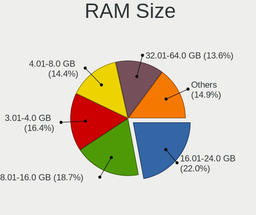
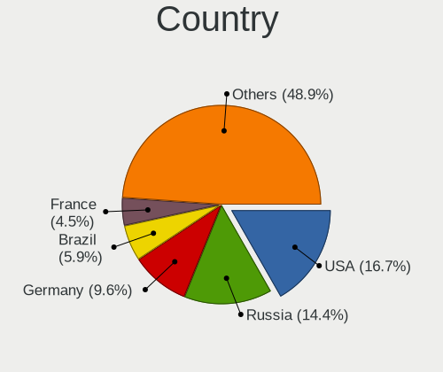
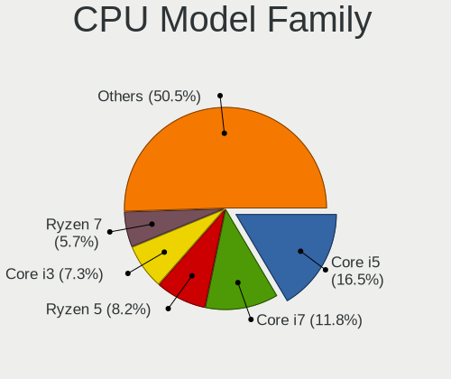
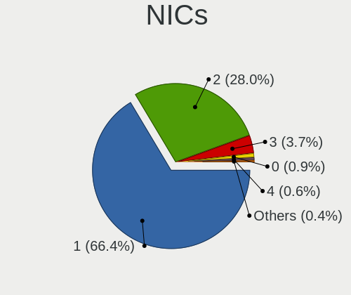

Linux - Tested Hardware & Statistics (Desktops)
-----------------------------------------------

A project to collect tested hardware configurations for Linux.

Anyone can contribute to this report by the [hw-probe](https://github.com/linuxhw/hw-probe) tool:

    sudo -E hw-probe -all -upload

Please contribute! Especially if your hardware is rare.

This report is for real hardware. Report for virtual hardware: [TestDays_VE](https://github.com/linuxhw/TestDays_VE)

Contents
--------

* [ Test Cases ](#test-cases)

* [ System ](#system)
  - [ OS                       ](#os)
  - [ OS Family                ](#os-family)
  - [ Kernel                   ](#kernel)
  - [ Kernel Family            ](#kernel-family)
  - [ Kernel Major Ver.        ](#kernel-major-ver)
  - [ Arch                     ](#arch)
  - [ DE                       ](#de)
  - [ Display Server           ](#display-server)
  - [ Display Manager          ](#display-manager)
  - [ OS Lang                  ](#os-lang)
  - [ Boot Mode                ](#boot-mode)
  - [ Filesystem               ](#filesystem)
  - [ Part. scheme             ](#part-scheme)
  - [ Dual Boot with Linux/BSD ](#dual-boot-with-linuxbsd)
  - [ Dual Boot (Win)          ](#dual-boot-win)

* [ Board ](#board)
  - [ Vendor                   ](#vendor)
  - [ Model                    ](#model)
  - [ Model Family             ](#model-family)
  - [ MFG Year                 ](#mfg-year)
  - [ Form Factor              ](#form-factor)
  - [ Secure Boot              ](#secure-boot)
  - [ Coreboot                 ](#coreboot)
  - [ RAM Size                 ](#ram-size)
  - [ RAM Used                 ](#ram-used)
  - [ Total Drives             ](#total-drives)
  - [ Has CD-ROM               ](#has-cd-rom)
  - [ Has Ethernet             ](#has-ethernet)
  - [ Has WiFi                 ](#has-wifi)
  - [ Has Bluetooth            ](#has-bluetooth)

* [ Location ](#location)
  - [ Country                  ](#country)
  - [ City                     ](#city)

* [ Drives ](#drives)
  - [ Drive Vendor             ](#drive-vendor)
  - [ Drive Model              ](#drive-model)
  - [ HDD Vendor               ](#hdd-vendor)
  - [ SSD Vendor               ](#ssd-vendor)
  - [ Drive Kind               ](#drive-kind)
  - [ Drive Connector          ](#drive-connector)
  - [ Drive Size               ](#drive-size)
  - [ Space Total              ](#space-total)
  - [ Space Used               ](#space-used)
  - [ Malfunc. Drives          ](#malfunc-drives)
  - [ Malfunc. Drive Vendor    ](#malfunc-drive-vendor)
  - [ Malfunc. HDD Vendor      ](#malfunc-hdd-vendor)
  - [ Malfunc. Drive Kind      ](#malfunc-drive-kind)
  - [ Failed Drives            ](#failed-drives)
  - [ Failed Drive Vendor      ](#failed-drive-vendor)
  - [ Drive Status             ](#drive-status)

* [ Storage controller ](#storage-controller)
  - [ Storage Vendor           ](#storage-vendor)
  - [ Storage Model            ](#storage-model)
  - [ Storage Kind             ](#storage-kind)

* [ Processor ](#processor)
  - [ CPU Vendor               ](#cpu-vendor)
  - [ CPU Model                ](#cpu-model)
  - [ CPU Model Family         ](#cpu-model-family)
  - [ CPU Cores                ](#cpu-cores)
  - [ CPU Sockets              ](#cpu-sockets)
  - [ CPU Threads              ](#cpu-threads)
  - [ CPU Op-Modes             ](#cpu-op-modes)
  - [ CPU Microcode            ](#cpu-microcode)
  - [ CPU Microarch            ](#cpu-microarch)

* [ Graphics ](#graphics)
  - [ GPU Vendor               ](#gpu-vendor)
  - [ GPU Model                ](#gpu-model)
  - [ GPU Combo                ](#gpu-combo)
  - [ GPU Driver               ](#gpu-driver)
  - [ GPU Memory               ](#gpu-memory)

* [ Monitor ](#monitor)
  - [ Monitor Vendor           ](#monitor-vendor)
  - [ Monitor Model            ](#monitor-model)
  - [ Monitor Resolution       ](#monitor-resolution)
  - [ Monitor Diagonal         ](#monitor-diagonal)
  - [ Monitor Width            ](#monitor-width)
  - [ Aspect Ratio             ](#aspect-ratio)
  - [ Monitor Area             ](#monitor-area)
  - [ Pixel Density            ](#pixel-density)
  - [ Multiple Monitors        ](#multiple-monitors)

* [ Network ](#network)
  - [ Net Controller Vendor    ](#net-controller-vendor)
  - [ Net Controller Model     ](#net-controller-model)
  - [ Wireless Vendor          ](#wireless-vendor)
  - [ Wireless Model           ](#wireless-model)
  - [ Ethernet Vendor          ](#ethernet-vendor)
  - [ Ethernet Model           ](#ethernet-model)
  - [ Net Controller Kind      ](#net-controller-kind)
  - [ Used Controller          ](#used-controller)
  - [ NICs                     ](#nics)
  - [ IPv6                     ](#ipv6)

* [ Bluetooth ](#bluetooth)
  - [ Bluetooth Vendor         ](#bluetooth-vendor)
  - [ Bluetooth Model          ](#bluetooth-model)

* [ Sound ](#sound)
  - [ Sound Vendor             ](#sound-vendor)
  - [ Sound Model              ](#sound-model)

* [ Memory ](#memory)
  - [ Memory Vendor            ](#memory-vendor)
  - [ Memory Model             ](#memory-model)
  - [ Memory Kind              ](#memory-kind)
  - [ Memory Form Factor       ](#memory-form-factor)
  - [ Memory Size              ](#memory-size)
  - [ Memory Speed             ](#memory-speed)

* [ Printers & scanners ](#printers--scanners)
  - [ Printer Vendor           ](#printer-vendor)
  - [ Printer Model            ](#printer-model)
  - [ Scanner Vendor           ](#scanner-vendor)
  - [ Scanner Model            ](#scanner-model)

* [ Camera ](#camera)
  - [ Camera Vendor            ](#camera-vendor)
  - [ Camera Model             ](#camera-model)

* [ Security ](#security)
  - [ Fingerprint Vendor       ](#fingerprint-vendor)
  - [ Fingerprint Model        ](#fingerprint-model)
  - [ Chipcard Vendor          ](#chipcard-vendor)
  - [ Chipcard Model           ](#chipcard-model)

* [ Unsupported ](#unsupported)
  - [ Unsupported Devices      ](#unsupported-devices)
  - [ Unsupported Device Types ](#unsupported-device-types)

Test Cases
----------

Total: 137749

| Vendor        | Model                       | Probe                                                      | Date         |
|---------------|-----------------------------|------------------------------------------------------------|--------------|
| Lenovo        | SHARKBAY NOK                | [26332591d7](https://linux-hardware.org/?probe=26332591d7) | Nov 06, 2023 |
| ASUSTek       | PRIME Z270-A                | [725ce23e28](https://linux-hardware.org/?probe=725ce23e28) | Nov 06, 2023 |
| MSI           | B450M MORTAR TITANIUM       | [a22610f17c](https://linux-hardware.org/?probe=a22610f17c) | Nov 06, 2023 |
| Pegatron      | 2AF0                        | [d918aae63e](https://linux-hardware.org/?probe=d918aae63e) | Nov 06, 2023 |
| GMKtec        | NucBox K2                   | [a88d491579](https://linux-hardware.org/?probe=a88d491579) | Nov 06, 2023 |
| ASUSTek       | TUF Gaming B550M-PLUS       | [df52b675c8](https://linux-hardware.org/?probe=df52b675c8) | Nov 06, 2023 |
| Medion        | MS-7708                     | [9170f4dd42](https://linux-hardware.org/?probe=9170f4dd42) | Nov 06, 2023 |
| Unknown       | HX90                        | [bc832d475f](https://linux-hardware.org/?probe=bc832d475f) | Nov 06, 2023 |
| ASUSTek       | TUF Gaming X570-PLUS        | [f459ffa824](https://linux-hardware.org/?probe=f459ffa824) | Nov 06, 2023 |
| Gigabyte      | B550 AORUS ELITE V2         | [77a31d50ce](https://linux-hardware.org/?probe=77a31d50ce) | Nov 06, 2023 |
| Gigabyte      | B85M-D3H                    | [ccc7d658ea](https://linux-hardware.org/?probe=ccc7d658ea) | Nov 06, 2023 |
| Unknown       | HX90                        | [91269ec2b8](https://linux-hardware.org/?probe=91269ec2b8) | Nov 06, 2023 |
| ASRock        | H110M-ITX                   | [c384352141](https://linux-hardware.org/?probe=c384352141) | Nov 06, 2023 |
| ASUSTek       | M4A785TD-V EVO              | [d57d789e77](https://linux-hardware.org/?probe=d57d789e77) | Nov 06, 2023 |
| MSI           | A520M PRO                   | [b83b272494](https://linux-hardware.org/?probe=b83b272494) | Nov 06, 2023 |
| Dell          | 0XR1GT A00                  | [f01a35c9a7](https://linux-hardware.org/?probe=f01a35c9a7) | Nov 06, 2023 |
| Gigabyte      | F2A88XM-D3H                 | [ea2142174c](https://linux-hardware.org/?probe=ea2142174c) | Nov 06, 2023 |
| HP            | 2B34                        | [52737869e2](https://linux-hardware.org/?probe=52737869e2) | Nov 06, 2023 |
| HP            | 8594                        | [d51c507511](https://linux-hardware.org/?probe=d51c507511) | Nov 06, 2023 |
| HP            | 82A2                        | [1d34952ece](https://linux-hardware.org/?probe=1d34952ece) | Nov 06, 2023 |
| MSI           | B450 TOMAHAWK               | [9b0f4eeb46](https://linux-hardware.org/?probe=9b0f4eeb46) | Nov 06, 2023 |
| Gigabyte      | Z390 AORUS PRO WIFI-CF      | [cee650aa5a](https://linux-hardware.org/?probe=cee650aa5a) | Nov 06, 2023 |
| ASUSTek       | PRIME X299-A                | [8d9bbb07dd](https://linux-hardware.org/?probe=8d9bbb07dd) | Nov 06, 2023 |
| Gigabyte      | B550M S2H                   | [b58de33b7d](https://linux-hardware.org/?probe=b58de33b7d) | Nov 06, 2023 |
| ASUSTek       | TUF Gaming B450-PLUS II     | [9e50325ddd](https://linux-hardware.org/?probe=9e50325ddd) | Nov 06, 2023 |
| Lenovo        | 1036 NO DPK                 | [6e0b8b9df9](https://linux-hardware.org/?probe=6e0b8b9df9) | Nov 06, 2023 |
| ASUSTek       | Pro WS X570-ACE             | [37aa104ebf](https://linux-hardware.org/?probe=37aa104ebf) | Nov 06, 2023 |
| ASUSTek       | ROG STRIX B650-A GAMING ... | [3734293144](https://linux-hardware.org/?probe=3734293144) | Nov 06, 2023 |
| MSI           | B75MA-P45                   | [bfe1423965](https://linux-hardware.org/?probe=bfe1423965) | Nov 06, 2023 |
| Dell          | OptiPlex 5050               | [6c4a08354b](https://linux-hardware.org/?probe=6c4a08354b) | Nov 06, 2023 |
| Gigabyte      | B450M GAMING                | [7974075b64](https://linux-hardware.org/?probe=7974075b64) | Nov 06, 2023 |
| MSI           | X99A RAIDER                 | [3a2a72df26](https://linux-hardware.org/?probe=3a2a72df26) | Nov 06, 2023 |
| Samsung       | DT1234567890 SEC_SW_REVI... | [4ef314d383](https://linux-hardware.org/?probe=4ef314d383) | Nov 06, 2023 |
| Gigabyte      | A520 AORUS ELITE            | [4d3a7373ae](https://linux-hardware.org/?probe=4d3a7373ae) | Nov 06, 2023 |
| MSI           | MPG B650 CARBON WIFI        | [fcd42a2056](https://linux-hardware.org/?probe=fcd42a2056) | Nov 06, 2023 |
| ASUSTek       | PRIME B450M-A II            | [c8c8d15e25](https://linux-hardware.org/?probe=c8c8d15e25) | Nov 06, 2023 |
| ASRock        | Z97 Killer                  | [f575f3121e](https://linux-hardware.org/?probe=f575f3121e) | Nov 06, 2023 |
| MSI           | B550-A PRO                  | [3333de3c07](https://linux-hardware.org/?probe=3333de3c07) | Nov 06, 2023 |
| MSI           | B560M PRO-E                 | [89a24ae9fa](https://linux-hardware.org/?probe=89a24ae9fa) | Nov 06, 2023 |
| Lenovo        | 3743 SDK0T76463 WIN 3422... | [ce42858c1f](https://linux-hardware.org/?probe=ce42858c1f) | Nov 06, 2023 |
| Gigabyte      | AB350-Gaming-CF             | [ff44a3299b](https://linux-hardware.org/?probe=ff44a3299b) | Nov 06, 2023 |
| ASUSTek       | A68HM-K                     | [c3e5415128](https://linux-hardware.org/?probe=c3e5415128) | Nov 06, 2023 |
| ASUSTek       | ROG STRIX B650-A GAMING ... | [72bedff7a6](https://linux-hardware.org/?probe=72bedff7a6) | Nov 06, 2023 |
| ASUSTek       | SABERTOOTH X79              | [c46040087a](https://linux-hardware.org/?probe=c46040087a) | Nov 06, 2023 |
| MSI           | MAG B650 TOMAHAWK WIFI      | [ff199303a2](https://linux-hardware.org/?probe=ff199303a2) | Nov 06, 2023 |
| Shuttle       | XS35V3                      | [0c51d541de](https://linux-hardware.org/?probe=0c51d541de) | Nov 06, 2023 |
| Gigabyte      | B560M AORUS PRO AX          | [04327aa85c](https://linux-hardware.org/?probe=04327aa85c) | Nov 06, 2023 |
| ASRock        | B550M-HDV                   | [e005a7da3a](https://linux-hardware.org/?probe=e005a7da3a) | Nov 06, 2023 |
| ASUSTek       | TUF Gaming B560M-PLUS       | [9655bf2db1](https://linux-hardware.org/?probe=9655bf2db1) | Nov 06, 2023 |
| Dell          | 0VHWTR A01                  | [8cd8d5ade1](https://linux-hardware.org/?probe=8cd8d5ade1) | Nov 06, 2023 |
| ASUSTek       | P8Z77-M                     | [fef5a2e8ae](https://linux-hardware.org/?probe=fef5a2e8ae) | Nov 05, 2023 |
| Gigabyte      | B450M S2H                   | [b40c43c829](https://linux-hardware.org/?probe=b40c43c829) | Nov 05, 2023 |
| ASUSTek       | ROG Maximus XII FORMULA     | [6c8bb1840e](https://linux-hardware.org/?probe=6c8bb1840e) | Nov 05, 2023 |
| Huanan        | X99-QD4 V1.0                | [3cedc8f704](https://linux-hardware.org/?probe=3cedc8f704) | Nov 05, 2023 |
| Gigabyte      | B450M S2H                   | [67a1ec0ae8](https://linux-hardware.org/?probe=67a1ec0ae8) | Nov 05, 2023 |
| Dell          | 08WKV3 A00                  | [e16dbbaf8b](https://linux-hardware.org/?probe=e16dbbaf8b) | Nov 05, 2023 |
| Biostar       | A10N-8800E                  | [35b7407efb](https://linux-hardware.org/?probe=35b7407efb) | Nov 05, 2023 |
| Gigabyte      | A320M-H-CF                  | [105d51f329](https://linux-hardware.org/?probe=105d51f329) | Nov 05, 2023 |
| HP            | 198E                        | [f1d1b6839f](https://linux-hardware.org/?probe=f1d1b6839f) | Nov 05, 2023 |
| ASUSTek       | P30AD                       | [63322c386f](https://linux-hardware.org/?probe=63322c386f) | Nov 05, 2023 |
| Dell          | 042P49 A02                  | [b8808915ed](https://linux-hardware.org/?probe=b8808915ed) | Nov 05, 2023 |
| Gigabyte      | AB350M-DS3H V2-CF           | [99a6c38b5d](https://linux-hardware.org/?probe=99a6c38b5d) | Nov 05, 2023 |
| ASUSTek       | ROG STRIX B550-F GAMING     | [8ee603dbfc](https://linux-hardware.org/?probe=8ee603dbfc) | Nov 05, 2023 |
| HP            | 2B05                        | [eb343bd373](https://linux-hardware.org/?probe=eb343bd373) | Nov 05, 2023 |
| Pegatron      | 2AF0                        | [de892702f8](https://linux-hardware.org/?probe=de892702f8) | Nov 05, 2023 |
| MSI           | A55M-E33                    | [d1def05873](https://linux-hardware.org/?probe=d1def05873) | Nov 05, 2023 |
| ASRock        | H81M-VG4 R2.0               | [2de5f4ef98](https://linux-hardware.org/?probe=2de5f4ef98) | Nov 05, 2023 |
| MSI           | Z77 MPower                  | [9a199b462a](https://linux-hardware.org/?probe=9a199b462a) | Nov 05, 2023 |
| ASRock        | X670E Taichi                | [6f05d717db](https://linux-hardware.org/?probe=6f05d717db) | Nov 05, 2023 |
| Gigabyte      | B250M-DS3H-CF               | [25b39b698c](https://linux-hardware.org/?probe=25b39b698c) | Nov 05, 2023 |
| ASRock        | X670E Taichi                | [a366b27921](https://linux-hardware.org/?probe=a366b27921) | Nov 05, 2023 |
| Dell          | 0JCTF8 A00                  | [b3669f73a8](https://linux-hardware.org/?probe=b3669f73a8) | Nov 05, 2023 |
| Gigabyte      | Q87M-D2H                    | [62a888f71c](https://linux-hardware.org/?probe=62a888f71c) | Nov 05, 2023 |
| ASUSTek       | P8H61-M LE R2.0             | [1c86a5a6de](https://linux-hardware.org/?probe=1c86a5a6de) | Nov 05, 2023 |
| Dell          | 0J1C3P A01                  | [8aefbb37f5](https://linux-hardware.org/?probe=8aefbb37f5) | Nov 05, 2023 |
| MSI           | MAG X670E TOMAHAWK WIFI     | [d95f04dd2c](https://linux-hardware.org/?probe=d95f04dd2c) | Nov 05, 2023 |
| MSI           | MAG B650 TOMAHAWK WIFI      | [38b95c0462](https://linux-hardware.org/?probe=38b95c0462) | Nov 05, 2023 |
| ASRock        | Z68 Pro3                    | [e6c695d4a7](https://linux-hardware.org/?probe=e6c695d4a7) | Nov 05, 2023 |
| HP            | 1495                        | [fe18b89530](https://linux-hardware.org/?probe=fe18b89530) | Nov 05, 2023 |
| Gigabyte      | B85M-D3H                    | [42cbdffa93](https://linux-hardware.org/?probe=42cbdffa93) | Nov 05, 2023 |
| ASUSTek       | ROG STRIX X570-E GAMING     | [4f690a4297](https://linux-hardware.org/?probe=4f690a4297) | Nov 05, 2023 |
| ASUSTek       | PRIME X470-PRO              | [692601dd3b](https://linux-hardware.org/?probe=692601dd3b) | Nov 05, 2023 |
| Gigabyte      | X570 AORUS ELITE            | [5c4543cc31](https://linux-hardware.org/?probe=5c4543cc31) | Nov 05, 2023 |
| ASUSTek       | ROG STRIX X670E-E GAMING... | [f48ca40214](https://linux-hardware.org/?probe=f48ca40214) | Nov 05, 2023 |
| Medion        | TJ4125                      | [65a059325e](https://linux-hardware.org/?probe=65a059325e) | Nov 05, 2023 |
| ASUSTek       | PRIME J4005I-C              | [76b89da142](https://linux-hardware.org/?probe=76b89da142) | Nov 05, 2023 |
| Gigabyte      | X470 AORUS ULTRA GAMING-... | [9d79aa9486](https://linux-hardware.org/?probe=9d79aa9486) | Nov 05, 2023 |
| ASUSTek       | ROG STRIX Z370-H GAMING     | [8e8cfaa103](https://linux-hardware.org/?probe=8e8cfaa103) | Nov 05, 2023 |
| MSI           | B450M MORTAR TITANIUM       | [8e5ae08c12](https://linux-hardware.org/?probe=8e5ae08c12) | Nov 05, 2023 |
| MSI           | MEG Z590 UNIFY              | [1f84fe45f8](https://linux-hardware.org/?probe=1f84fe45f8) | Nov 05, 2023 |
| Dell          | 0WMJ54 A01                  | [5cff6ffdfc](https://linux-hardware.org/?probe=5cff6ffdfc) | Nov 05, 2023 |
| MSI           | B560M PRO-VDH               | [82bf4f530a](https://linux-hardware.org/?probe=82bf4f530a) | Nov 05, 2023 |
| Gigabyte      | B450M H                     | [436a3dc68e](https://linux-hardware.org/?probe=436a3dc68e) | Nov 05, 2023 |
| Gigabyte      | B550I AORUS PRO AX          | [5f192519d4](https://linux-hardware.org/?probe=5f192519d4) | Nov 05, 2023 |
| HP            | 1497                        | [734abf0595](https://linux-hardware.org/?probe=734abf0595) | Nov 05, 2023 |
| Dell          | 0J8H4R A00                  | [d743b33cc7](https://linux-hardware.org/?probe=d743b33cc7) | Nov 05, 2023 |
| Lenovo        | SDK0E50510 WIN              | [038e8719ec](https://linux-hardware.org/?probe=038e8719ec) | Nov 05, 2023 |
| ASUSTek       | P5K PRO                     | [7dd5e78310](https://linux-hardware.org/?probe=7dd5e78310) | Nov 05, 2023 |
| Dell          | 048DY8 A01                  | [2ef39546ef](https://linux-hardware.org/?probe=2ef39546ef) | Nov 05, 2023 |
| Shuttle       | FH87                        | [1488ef29c3](https://linux-hardware.org/?probe=1488ef29c3) | Nov 05, 2023 |
| MSI           | NIGHTBLADE Z97              | [3da62b47b3](https://linux-hardware.org/?probe=3da62b47b3) | Nov 05, 2023 |
| Gigabyte      | B450M GAMING-CF             | [247cc16161](https://linux-hardware.org/?probe=247cc16161) | Nov 05, 2023 |
| Gigabyte      | Z68XP-UD3                   | [01e74da42d](https://linux-hardware.org/?probe=01e74da42d) | Nov 05, 2023 |
| ASUSTek       | P5G41T-M LX2/GB             | [5196f9303d](https://linux-hardware.org/?probe=5196f9303d) | Nov 05, 2023 |
| Gigabyte      | B550 GAMING X V2            | [9213826ac6](https://linux-hardware.org/?probe=9213826ac6) | Nov 05, 2023 |
| HP            | 8184 X4                     | [fb7f295b44](https://linux-hardware.org/?probe=fb7f295b44) | Nov 05, 2023 |
| HP            | 802F                        | [8fe557cc85](https://linux-hardware.org/?probe=8fe557cc85) | Nov 05, 2023 |
| Gigabyte      | MZBSWAP-K4                  | [ef6c15830d](https://linux-hardware.org/?probe=ef6c15830d) | Nov 05, 2023 |
| Lenovo        | SDK0E50510 WIN              | [1e59a67f24](https://linux-hardware.org/?probe=1e59a67f24) | Nov 05, 2023 |
| ASUSTek       | P5Q-PRO                     | [a1500e2e9c](https://linux-hardware.org/?probe=a1500e2e9c) | Nov 05, 2023 |
| Lenovo        | SHARKBAY 0B98401 PRO        | [7152c7ed2c](https://linux-hardware.org/?probe=7152c7ed2c) | Nov 05, 2023 |
| Intel         | DH61DL AAG14066-205         | [be33944c69](https://linux-hardware.org/?probe=be33944c69) | Nov 05, 2023 |
| Gigabyte      | 970A-DS3P FX                | [615e914ddd](https://linux-hardware.org/?probe=615e914ddd) | Nov 05, 2023 |
| Gigabyte      | 970A-DS3P FX                | [7ba5de3dfd](https://linux-hardware.org/?probe=7ba5de3dfd) | Nov 05, 2023 |
| HP            | 8643 SMVB                   | [22b09dfb91](https://linux-hardware.org/?probe=22b09dfb91) | Nov 05, 2023 |
| ASRock        | X570 Phantom Gaming 4       | [05a8c22a35](https://linux-hardware.org/?probe=05a8c22a35) | Nov 05, 2023 |
| ASUSTek       | PRIME B460M-A               | [034b113ac8](https://linux-hardware.org/?probe=034b113ac8) | Nov 05, 2023 |
| ASUSTek       | PRIME H310M-R R2.0          | [3d09b709c4](https://linux-hardware.org/?probe=3d09b709c4) | Nov 05, 2023 |
| Gigabyte      | AB350-Gaming 3-CF           | [2710dfedf4](https://linux-hardware.org/?probe=2710dfedf4) | Nov 05, 2023 |
| Dell          | 062TCH A00                  | [b82fbd03d5](https://linux-hardware.org/?probe=b82fbd03d5) | Nov 05, 2023 |
| ASRock        | A320M Pro4-F                | [7dab52cd8c](https://linux-hardware.org/?probe=7dab52cd8c) | Nov 05, 2023 |
| Dell          | 0V8WGR A00                  | [9b13411bc8](https://linux-hardware.org/?probe=9b13411bc8) | Nov 05, 2023 |
| ASUSTek       | ROG STRIX Z390-E GAMING     | [e1d50d8743](https://linux-hardware.org/?probe=e1d50d8743) | Nov 05, 2023 |
| MSI           | PRO B760M-P DDR4            | [5b5425c6d8](https://linux-hardware.org/?probe=5b5425c6d8) | Nov 05, 2023 |
| ASUSTek       | PRIME H310M-R R2.0          | [e079b95148](https://linux-hardware.org/?probe=e079b95148) | Nov 05, 2023 |
| Gigabyte      | B650M DS3H                  | [a424739d4f](https://linux-hardware.org/?probe=a424739d4f) | Nov 05, 2023 |
| Gigabyte      | X570 UD                     | [287ceab4df](https://linux-hardware.org/?probe=287ceab4df) | Nov 05, 2023 |
| Alienware     | 0N43JM A01                  | [7bd0e03c1b](https://linux-hardware.org/?probe=7bd0e03c1b) | Nov 05, 2023 |
| Gigabyte      | X570 UD                     | [1c9b1632b8](https://linux-hardware.org/?probe=1c9b1632b8) | Nov 05, 2023 |
| ASRock        | B450M-HDV R4.0              | [c17ad7033c](https://linux-hardware.org/?probe=c17ad7033c) | Nov 05, 2023 |
| Lenovo        | 3098 SDK0E50510 WIN         | [24e4446a67](https://linux-hardware.org/?probe=24e4446a67) | Nov 05, 2023 |
| ASUSTek       | PRIME Z390-P                | [4b29646104](https://linux-hardware.org/?probe=4b29646104) | Nov 05, 2023 |
| Dell          | 0VNP2H A00                  | [98439489ad](https://linux-hardware.org/?probe=98439489ad) | Nov 05, 2023 |
| ASUSTek       | ROG STRIX B650E-E GAMING... | [60f590c96c](https://linux-hardware.org/?probe=60f590c96c) | Nov 05, 2023 |
| ASUSTek       | G11CD                       | [8fcbd49e37](https://linux-hardware.org/?probe=8fcbd49e37) | Nov 05, 2023 |
| HP            | 1589                        | [61922d4b43](https://linux-hardware.org/?probe=61922d4b43) | Nov 05, 2023 |
| ASUSTek       | H110M-A/M.2                 | [2cc662a279](https://linux-hardware.org/?probe=2cc662a279) | Nov 05, 2023 |
| Gigabyte      | Z97M-DS3H                   | [2cbd472a6e](https://linux-hardware.org/?probe=2cbd472a6e) | Nov 05, 2023 |
| HP            | 1494                        | [93e0e0302f](https://linux-hardware.org/?probe=93e0e0302f) | Nov 05, 2023 |
| ASUSTek       | M5A78L-M/USB3               | [4ce8997d5a](https://linux-hardware.org/?probe=4ce8997d5a) | Nov 05, 2023 |
| Gigabyte      | AB350M-DS3H V2-CF           | [c520e5a3b2](https://linux-hardware.org/?probe=c520e5a3b2) | Nov 05, 2023 |
| Dell          | 01XK1W A00                  | [d6cd277a79](https://linux-hardware.org/?probe=d6cd277a79) | Nov 05, 2023 |
| ASUSTek       | TUF Gaming Z790-PLUS WIF... | [9d8a12d929](https://linux-hardware.org/?probe=9d8a12d929) | Nov 05, 2023 |
| GEEKOM        | A5                          | [d3dd0e1aca](https://linux-hardware.org/?probe=d3dd0e1aca) | Nov 05, 2023 |
| MSI           | B560M PRO-E                 | [1488a8a70f](https://linux-hardware.org/?probe=1488a8a70f) | Nov 05, 2023 |
| HP            | 1998                        | [d454314b77](https://linux-hardware.org/?probe=d454314b77) | Nov 05, 2023 |
| ASRockRack    | EPC602D8A                   | [c1b6c06dc5](https://linux-hardware.org/?probe=c1b6c06dc5) | Nov 05, 2023 |
| ASUSTek       | PRIME B550M-A               | [4998a82a6b](https://linux-hardware.org/?probe=4998a82a6b) | Nov 05, 2023 |
| ASUSTek       | PRIME B450M-A II            | [539d8551fc](https://linux-hardware.org/?probe=539d8551fc) | Nov 05, 2023 |
| Unknown       | Unknown                     | [85733c0ec0](https://linux-hardware.org/?probe=85733c0ec0) | Nov 05, 2023 |
| ASUSTek       | PRIME B450M-GAMING/BR       | [f45893cbf7](https://linux-hardware.org/?probe=f45893cbf7) | Nov 05, 2023 |
| ASUSTek       | ROG STRIX X570-F GAMING     | [17acb71f9d](https://linux-hardware.org/?probe=17acb71f9d) | Nov 05, 2023 |
| ASRock        | 970 Pro3 R2.0               | [f070e73453](https://linux-hardware.org/?probe=f070e73453) | Nov 05, 2023 |
| ASUSTek       | PRIME A520M-K               | [907a7f6dd8](https://linux-hardware.org/?probe=907a7f6dd8) | Nov 05, 2023 |
| ASUSTek       | M5A97 R2.0                  | [8a4147b40a](https://linux-hardware.org/?probe=8a4147b40a) | Nov 05, 2023 |
| Gigabyte      | M5NM1AI-GB                  | [99e2275a93](https://linux-hardware.org/?probe=99e2275a93) | Nov 05, 2023 |
| ASUSTek       | ROG Maximus Z790 HERO       | [a9ad2b542a](https://linux-hardware.org/?probe=a9ad2b542a) | Nov 05, 2023 |
| MSI           | MAG B550 TOMAHAWK           | [482f1a0fe7](https://linux-hardware.org/?probe=482f1a0fe7) | Nov 05, 2023 |
| MSI           | H110I PRO                   | [c335c71c4b](https://linux-hardware.org/?probe=c335c71c4b) | Nov 05, 2023 |
| Dell          | 0T7D40 A00                  | [2053de6443](https://linux-hardware.org/?probe=2053de6443) | Nov 05, 2023 |
| Lenovo        | SKYBAY NOK                  | [534fcded19](https://linux-hardware.org/?probe=534fcded19) | Nov 05, 2023 |
| Unknown       | Unknown                     | [dbd2e07499](https://linux-hardware.org/?probe=dbd2e07499) | Nov 05, 2023 |
| HP            | 8054                        | [cbf4895785](https://linux-hardware.org/?probe=cbf4895785) | Nov 05, 2023 |
| Unknown       | Unknown                     | [e98e6bb977](https://linux-hardware.org/?probe=e98e6bb977) | Nov 05, 2023 |
| ASRock        | X470 Taichi Ultimate        | [2b9b1f909c](https://linux-hardware.org/?probe=2b9b1f909c) | Nov 05, 2023 |
| ASRock        | P67 Pro3 SE                 | [10b1460f7a](https://linux-hardware.org/?probe=10b1460f7a) | Nov 05, 2023 |
| ASUSTek       | TUF Gaming X570-PLUS        | [ee2a20b30a](https://linux-hardware.org/?probe=ee2a20b30a) | Nov 05, 2023 |
| Gigabyte      | B450M DS3H-CF               | [fefb7e12d2](https://linux-hardware.org/?probe=fefb7e12d2) | Nov 05, 2023 |
| Pegatron      | 2AD5                        | [f8860a91a3](https://linux-hardware.org/?probe=f8860a91a3) | Nov 05, 2023 |
| ASUSTek       | Maximus IX FORMULA          | [45e65903ff](https://linux-hardware.org/?probe=45e65903ff) | Nov 04, 2023 |
| ASUSTek       | PRIME B460M-A               | [52a36f5268](https://linux-hardware.org/?probe=52a36f5268) | Nov 04, 2023 |
| ASUSTek       | ROG STRIX B650E-F GAMING... | [6f11758faa](https://linux-hardware.org/?probe=6f11758faa) | Nov 04, 2023 |
| Gigabyte      | H410M S2H V2                | [8bbce8a378](https://linux-hardware.org/?probe=8bbce8a378) | Nov 04, 2023 |
| MSI           | MAG B650 TOMAHAWK WIFI      | [5832913981](https://linux-hardware.org/?probe=5832913981) | Nov 04, 2023 |
| MSI           | MAG B650 TOMAHAWK WIFI      | [4f6d5932fa](https://linux-hardware.org/?probe=4f6d5932fa) | Nov 04, 2023 |
| Gigabyte      | GA-970A-DS3                 | [a513bb8188](https://linux-hardware.org/?probe=a513bb8188) | Nov 04, 2023 |
| MSI           | X470 GAMING PLUS MAX        | [4e3cd50b3f](https://linux-hardware.org/?probe=4e3cd50b3f) | Nov 04, 2023 |
| Gigabyte      | B450 AORUS M                | [62798aa8cf](https://linux-hardware.org/?probe=62798aa8cf) | Nov 04, 2023 |
| Gigabyte      | H510M S2H V2                | [29fc753f1e](https://linux-hardware.org/?probe=29fc753f1e) | Nov 04, 2023 |
| MSI           | B560M PRO-VDH               | [04e96e2742](https://linux-hardware.org/?probe=04e96e2742) | Nov 04, 2023 |
| Medion        | H110H4-EM                   | [9fe03aa296](https://linux-hardware.org/?probe=9fe03aa296) | Nov 04, 2023 |
| ASUSTek       | PRIME Z490-P                | [f8a30d78d3](https://linux-hardware.org/?probe=f8a30d78d3) | Nov 04, 2023 |
| Lenovo        | SHARKBAY 0B98401 PRO        | [8841ab599e](https://linux-hardware.org/?probe=8841ab599e) | Nov 04, 2023 |
| Pegatron      | IPMIP-H55-GEN               | [f87bf6e0dd](https://linux-hardware.org/?probe=f87bf6e0dd) | Nov 04, 2023 |
| ASUSTek       | M5A78L-M LX/BR              | [459eb3cd2a](https://linux-hardware.org/?probe=459eb3cd2a) | Nov 04, 2023 |
| Toshiba       | STI 001359                  | [ebf464dbb3](https://linux-hardware.org/?probe=ebf464dbb3) | Nov 04, 2023 |
| Acer          | Aspire M1920                | [f6ffcb0c41](https://linux-hardware.org/?probe=f6ffcb0c41) | Nov 04, 2023 |
| Lenovo        | 3102 SDK0J40697 WIN 3305... | [dade20f823](https://linux-hardware.org/?probe=dade20f823) | Nov 04, 2023 |
| Intel         | DG33BU AAD79951-407         | [734dafca4e](https://linux-hardware.org/?probe=734dafca4e) | Nov 04, 2023 |
| Unknown       | Unknown                     | [f1e059fa93](https://linux-hardware.org/?probe=f1e059fa93) | Nov 04, 2023 |
| MSI           | MPG X570 GAMING PLUS        | [20ffbbc165](https://linux-hardware.org/?probe=20ffbbc165) | Nov 04, 2023 |
| MSI           | H110M PRO-D                 | [9a7337554c](https://linux-hardware.org/?probe=9a7337554c) | Nov 04, 2023 |
| HP            | 21D0                        | [160964fbab](https://linux-hardware.org/?probe=160964fbab) | Nov 04, 2023 |
| ASUSTek       | PRIME X470-PRO              | [c1523fb6a1](https://linux-hardware.org/?probe=c1523fb6a1) | Nov 04, 2023 |
| HP            | 8767 A                      | [307b4eb17b](https://linux-hardware.org/?probe=307b4eb17b) | Nov 04, 2023 |
| Gigabyte      | GA-870A-USB3L               | [d2412dfd7c](https://linux-hardware.org/?probe=d2412dfd7c) | Nov 04, 2023 |
| ASRock        | FM2A68M-HD+                 | [2b5c984cd8](https://linux-hardware.org/?probe=2b5c984cd8) | Nov 04, 2023 |
| HP            | 8265                        | [f6b38e869b](https://linux-hardware.org/?probe=f6b38e869b) | Nov 04, 2023 |
| ASUSTek       | TUF Gaming B550-PLUS        | [e6f4957064](https://linux-hardware.org/?probe=e6f4957064) | Nov 04, 2023 |
| ASUSTek       | PRIME Z370-P II             | [701314a2ff](https://linux-hardware.org/?probe=701314a2ff) | Nov 04, 2023 |
| ASUSTek       | H97M-PLUS                   | [69cb1e7068](https://linux-hardware.org/?probe=69cb1e7068) | Nov 04, 2023 |
| MSI           | B560M PRO                   | [903907b7c0](https://linux-hardware.org/?probe=903907b7c0) | Nov 04, 2023 |
| ASRock        | B250M-HDV                   | [c8521456ad](https://linux-hardware.org/?probe=c8521456ad) | Nov 04, 2023 |
| ASRock        | H470M-STX                   | [5a50d371b8](https://linux-hardware.org/?probe=5a50d371b8) | Nov 04, 2023 |
| ASUSTek       | ROG STRIX X370-F GAMING     | [03f8b26adb](https://linux-hardware.org/?probe=03f8b26adb) | Nov 04, 2023 |
| Gigabyte      | B550M S2H                   | [7fb9150b16](https://linux-hardware.org/?probe=7fb9150b16) | Nov 04, 2023 |
| HP            | 8265                        | [49cb61db2e](https://linux-hardware.org/?probe=49cb61db2e) | Nov 04, 2023 |
| Lenovo        | 103D SDK0Q40112 WIN 3305... | [76acaae6cc](https://linux-hardware.org/?probe=76acaae6cc) | Nov 04, 2023 |
| Apple         | Mac-F221BEC8                | [03f4055831](https://linux-hardware.org/?probe=03f4055831) | Nov 04, 2023 |
| HP            | 89B5 A                      | [e31ecc3904](https://linux-hardware.org/?probe=e31ecc3904) | Nov 04, 2023 |
| MSI           | X570-A PRO                  | [30416c0355](https://linux-hardware.org/?probe=30416c0355) | Nov 04, 2023 |
| ASUSTek       | TUF Gaming B550-PLUS WIF... | [1da3521ff2](https://linux-hardware.org/?probe=1da3521ff2) | Nov 04, 2023 |
| Gigabyte      | 945GM-S2                    | [f71f764594](https://linux-hardware.org/?probe=f71f764594) | Nov 04, 2023 |
| Lenovo        | 317E NOK                    | [1d038af880](https://linux-hardware.org/?probe=1d038af880) | Nov 04, 2023 |
| HP            | 83E1                        | [c82d34ebac](https://linux-hardware.org/?probe=c82d34ebac) | Nov 04, 2023 |
| Gigabyte      | GA-MA78LMT-S2               | [1636a231b2](https://linux-hardware.org/?probe=1636a231b2) | Nov 04, 2023 |
| Gigabyte      | H470M K                     | [d69493b7d2](https://linux-hardware.org/?probe=d69493b7d2) | Nov 04, 2023 |
| Pegatron      | E60                         | [42e0c4ad61](https://linux-hardware.org/?probe=42e0c4ad61) | Nov 04, 2023 |
| ASUSTek       | M4N68T-M                    | [582304a8c5](https://linux-hardware.org/?probe=582304a8c5) | Nov 04, 2023 |
| MSI           | B550M PRO-VDH WIFI          | [cda17ca99b](https://linux-hardware.org/?probe=cda17ca99b) | Nov 04, 2023 |
| ASRock        | B550M Pro4                  | [f0354d2416](https://linux-hardware.org/?probe=f0354d2416) | Nov 04, 2023 |
| Gigabyte      | H470M K                     | [80085c7047](https://linux-hardware.org/?probe=80085c7047) | Nov 04, 2023 |
| MSI           | B650 GAMING PLUS WIFI       | [8edaffcccb](https://linux-hardware.org/?probe=8edaffcccb) | Nov 04, 2023 |
| Dell          | 0W0CHX A00                  | [3ed37b3d70](https://linux-hardware.org/?probe=3ed37b3d70) | Nov 04, 2023 |
| Unknown       | Unknown                     | [50949c6e51](https://linux-hardware.org/?probe=50949c6e51) | Nov 04, 2023 |
| ASUSTek       | PRIME B550-PLUS AC-HES      | [6a8536f5df](https://linux-hardware.org/?probe=6a8536f5df) | Nov 04, 2023 |
| MSI           | MAG B660M MORTAR WIFI DD... | [3521a1f918](https://linux-hardware.org/?probe=3521a1f918) | Nov 04, 2023 |
| ASUSTek       | P8H61-M LX3 R2.0            | [18bafa67dc](https://linux-hardware.org/?probe=18bafa67dc) | Nov 04, 2023 |
| Gigabyte      | B550I AORUS PRO AX          | [9f47c70860](https://linux-hardware.org/?probe=9f47c70860) | Nov 04, 2023 |
| ASUSTek       | TUF Gaming Z690-PLUS WIF... | [d95fab9dc1](https://linux-hardware.org/?probe=d95fab9dc1) | Nov 04, 2023 |
| ASUSTek       | PRIME B350-PLUS             | [4a6383e886](https://linux-hardware.org/?probe=4a6383e886) | Nov 04, 2023 |
| HP            | 0A9Ch                       | [95415dec13](https://linux-hardware.org/?probe=95415dec13) | Nov 04, 2023 |
| ASUSTek       | M5A97 R2.0                  | [798cba826c](https://linux-hardware.org/?probe=798cba826c) | Nov 04, 2023 |
| ASUSTek       | ROG STRIX X570-E GAMING     | [119816ea7d](https://linux-hardware.org/?probe=119816ea7d) | Nov 04, 2023 |
| MSI           | B450 TOMAHAWK               | [2b389d48e1](https://linux-hardware.org/?probe=2b389d48e1) | Nov 04, 2023 |
| ASUSTek       | M5A97 R2.0                  | [905d699d4d](https://linux-hardware.org/?probe=905d699d4d) | Nov 04, 2023 |
| HP            | 8767 A                      | [a9d65549d2](https://linux-hardware.org/?probe=a9d65549d2) | Nov 04, 2023 |
| ASUSTek       | M5A97 R2.0                  | [2c601304f7](https://linux-hardware.org/?probe=2c601304f7) | Nov 04, 2023 |
| Dell          | 062TCH A00                  | [b964b2c6be](https://linux-hardware.org/?probe=b964b2c6be) | Nov 04, 2023 |
| ASUSTek       | PRIME X670E-PRO WIFI        | [f27bded4c1](https://linux-hardware.org/?probe=f27bded4c1) | Nov 04, 2023 |
| ASUSTek       | H110M-D                     | [03303fa6ed](https://linux-hardware.org/?probe=03303fa6ed) | Nov 04, 2023 |
| ASRock        | B450 Steel Legend           | [26aff1917e](https://linux-hardware.org/?probe=26aff1917e) | Nov 04, 2023 |
| ASUSTek       | PRIME H510M-E               | [cd2b005e61](https://linux-hardware.org/?probe=cd2b005e61) | Nov 04, 2023 |
| Dell          | 01NP3N A00                  | [2332805279](https://linux-hardware.org/?probe=2332805279) | Nov 04, 2023 |
| ASRock        | B450 Steel Legend           | [2ab63a2fb6](https://linux-hardware.org/?probe=2ab63a2fb6) | Nov 04, 2023 |
| ASUSTek       | ROG STRIX X570-E GAMING     | [bc3444ed2f](https://linux-hardware.org/?probe=bc3444ed2f) | Nov 04, 2023 |
| ASUSTek       | ROG STRIX X570-E GAMING     | [3c1e4ea8bf](https://linux-hardware.org/?probe=3c1e4ea8bf) | Nov 04, 2023 |
| ASUSTek       | ROG STRIX X670E-E GAMING... | [a3eb4c9d76](https://linux-hardware.org/?probe=a3eb4c9d76) | Nov 04, 2023 |
| Dell          | 018D1Y A00                  | [2135015e09](https://linux-hardware.org/?probe=2135015e09) | Nov 04, 2023 |
| ASRock        | B450M Steel Legend          | [ea9a865ed2](https://linux-hardware.org/?probe=ea9a865ed2) | Nov 03, 2023 |
| ASUSTek       | H81M-C                      | [cfb51ce306](https://linux-hardware.org/?probe=cfb51ce306) | Nov 03, 2023 |
| MSI           | A68HM-E33 V2                | [f029848e7d](https://linux-hardware.org/?probe=f029848e7d) | Nov 03, 2023 |
| Apple         | Mac-F60DEB81FF30ACF6 Mac... | [b213aefe09](https://linux-hardware.org/?probe=b213aefe09) | Nov 03, 2023 |
| HP            | 8643 SMVB                   | [c864159547](https://linux-hardware.org/?probe=c864159547) | Nov 03, 2023 |
| Intel         | DG41RQ AAE54511-203         | [dff06d88c5](https://linux-hardware.org/?probe=dff06d88c5) | Nov 03, 2023 |
| Supermicro    | X9DRW                       | [d9bb198389](https://linux-hardware.org/?probe=d9bb198389) | Nov 03, 2023 |
| ASUSTek       | P5QD TURBO                  | [4a350b6fdb](https://linux-hardware.org/?probe=4a350b6fdb) | Nov 03, 2023 |
| Gigabyte      | H81M-DS2                    | [5ac9818b1f](https://linux-hardware.org/?probe=5ac9818b1f) | Nov 03, 2023 |
| ASUSTek       | PRIME X570-PRO              | [62a859fb72](https://linux-hardware.org/?probe=62a859fb72) | Nov 03, 2023 |
| ECS           | A890GXM-A2                  | [3e5d819c23](https://linux-hardware.org/?probe=3e5d819c23) | Nov 03, 2023 |
| ECS           | A890GXM-A2                  | [9fb5c6d4d3](https://linux-hardware.org/?probe=9fb5c6d4d3) | Nov 03, 2023 |
| Gigabyte      | H510M S2H V2                | [2d4845b6b9](https://linux-hardware.org/?probe=2d4845b6b9) | Nov 03, 2023 |
| ASRock        | H61M-HVS                    | [fbbb34a0cb](https://linux-hardware.org/?probe=fbbb34a0cb) | Nov 03, 2023 |
| ASRock        | TRX40 Creator               | [05304710e4](https://linux-hardware.org/?probe=05304710e4) | Nov 03, 2023 |
| ASUSTek       | TUF Gaming Z490-PLUS        | [c9e7b12e63](https://linux-hardware.org/?probe=c9e7b12e63) | Nov 03, 2023 |
| ASUSTek       | PRIME H510M-K               | [9501d6d6cf](https://linux-hardware.org/?probe=9501d6d6cf) | Nov 03, 2023 |
| HP            | 859C                        | [7928158950](https://linux-hardware.org/?probe=7928158950) | Nov 03, 2023 |
| ASRock        | A770DE+                     | [330e203c8a](https://linux-hardware.org/?probe=330e203c8a) | Nov 03, 2023 |
| ASUSTek       | PRIME Z370-A                | [ae66cf41f9](https://linux-hardware.org/?probe=ae66cf41f9) | Nov 03, 2023 |
| Intel         | H610-MIX v1.0               | [eeaea55301](https://linux-hardware.org/?probe=eeaea55301) | Nov 03, 2023 |
| ASRock        | TRX40 Creator               | [62f85af4b5](https://linux-hardware.org/?probe=62f85af4b5) | Nov 03, 2023 |
| Intel         | DH67CL AAG10212-210         | [792c22d04f](https://linux-hardware.org/?probe=792c22d04f) | Nov 03, 2023 |
| ASUSTek       | PRIME Z370-A                | [92b484d86d](https://linux-hardware.org/?probe=92b484d86d) | Nov 03, 2023 |
| Gigabyte      | B550 AORUS PRO AC           | [4236902f3d](https://linux-hardware.org/?probe=4236902f3d) | Nov 03, 2023 |
| Intel         | X79 V1.0                    | [9483a097a1](https://linux-hardware.org/?probe=9483a097a1) | Nov 03, 2023 |
| Gigabyte      | 970A-D3                     | [80fb26e63a](https://linux-hardware.org/?probe=80fb26e63a) | Nov 03, 2023 |
| ASUSTek       | TUF Gaming B650-PLUS WIF... | [d35fc5aa78](https://linux-hardware.org/?probe=d35fc5aa78) | Nov 03, 2023 |
| Supermicro    | X10DRL-i                    | [cada5224ab](https://linux-hardware.org/?probe=cada5224ab) | Nov 03, 2023 |
| Dell          | 0VHWTR A02                  | [7663b608dd](https://linux-hardware.org/?probe=7663b608dd) | Nov 03, 2023 |
| HP            | 0B54h D                     | [574e5fd946](https://linux-hardware.org/?probe=574e5fd946) | Nov 03, 2023 |
| Dell          | 09WH54 A01                  | [4eae8e67db](https://linux-hardware.org/?probe=4eae8e67db) | Nov 03, 2023 |
| Gigabyte      | B550M DS3H                  | [49ec48adb9](https://linux-hardware.org/?probe=49ec48adb9) | Nov 03, 2023 |
| Inventec      | D CLASS A02                 | [4342649c26](https://linux-hardware.org/?probe=4342649c26) | Nov 03, 2023 |
| MSI           | B550M PRO-VDH WIFI          | [baf30122ca](https://linux-hardware.org/?probe=baf30122ca) | Nov 03, 2023 |
| ASRock        | A320M-HDV R4.0              | [44890192a1](https://linux-hardware.org/?probe=44890192a1) | Nov 03, 2023 |
| Dell          | 0T7D40 A00                  | [a81d5bbd02](https://linux-hardware.org/?probe=a81d5bbd02) | Nov 03, 2023 |
| ASUSTek       | TUF Gaming X570-PLUS_BR     | [2aa4f1a7f7](https://linux-hardware.org/?probe=2aa4f1a7f7) | Nov 03, 2023 |
| Gigabyte      | B550M DS3H                  | [3c4533c5a9](https://linux-hardware.org/?probe=3c4533c5a9) | Nov 03, 2023 |
| ASRock        | H170M Pro4                  | [b87ccd7768](https://linux-hardware.org/?probe=b87ccd7768) | Nov 03, 2023 |
| Biostar       | A10N-8800E                  | [76374cbbfe](https://linux-hardware.org/?probe=76374cbbfe) | Nov 03, 2023 |
| Colorful T... | CVN X570M GAMING PRO V14    | [65b9bad459](https://linux-hardware.org/?probe=65b9bad459) | Nov 03, 2023 |
| Dell          | 0427JK A00                  | [ac631c05bc](https://linux-hardware.org/?probe=ac631c05bc) | Nov 03, 2023 |
| ASUSTek       | ROG STRIX X570-F GAMING     | [d8ceb3854c](https://linux-hardware.org/?probe=d8ceb3854c) | Nov 03, 2023 |
| ASUSTek       | PRIME X299-A                | [387194bdf6](https://linux-hardware.org/?probe=387194bdf6) | Nov 03, 2023 |
| ASUSTek       | STRIX H270F GAMING          | [e95902544f](https://linux-hardware.org/?probe=e95902544f) | Nov 03, 2023 |
| Intel         | X99                         | [cb3515efba](https://linux-hardware.org/?probe=cb3515efba) | Nov 03, 2023 |
| HP            | 843B                        | [8fdaf74414](https://linux-hardware.org/?probe=8fdaf74414) | Nov 03, 2023 |
| HP            | 843B                        | [ba22079238](https://linux-hardware.org/?probe=ba22079238) | Nov 03, 2023 |
| Dell          | 0TDG4V A01                  | [9d9b09db51](https://linux-hardware.org/?probe=9d9b09db51) | Nov 03, 2023 |
| MSI           | 760GM-P21                   | [f3b16a05ae](https://linux-hardware.org/?probe=f3b16a05ae) | Nov 03, 2023 |
| MSI           | B350 PC MATE                | [9c089ed10c](https://linux-hardware.org/?probe=9c089ed10c) | Nov 03, 2023 |
| Supermicro    | X10DRU-i+B                  | [305ce5bbcc](https://linux-hardware.org/?probe=305ce5bbcc) | Nov 03, 2023 |
| Supermicro    | X10DDW-i                    | [8a0ff875f1](https://linux-hardware.org/?probe=8a0ff875f1) | Nov 03, 2023 |
| Supermicro    | X10DDW-i                    | [3138fbde8e](https://linux-hardware.org/?probe=3138fbde8e) | Nov 03, 2023 |
| Supermicro    | X10DDW-i                    | [f3023a2a6f](https://linux-hardware.org/?probe=f3023a2a6f) | Nov 03, 2023 |
| Supermicro    | X10DDW-i                    | [d9dcb6003e](https://linux-hardware.org/?probe=d9dcb6003e) | Nov 03, 2023 |
| ASUSTek       | PRIME B450-PLUS             | [d6f5634b02](https://linux-hardware.org/?probe=d6f5634b02) | Nov 03, 2023 |
| Gigabyte      | G41MT-D3                    | [3a4be91563](https://linux-hardware.org/?probe=3a4be91563) | Nov 03, 2023 |
| MSI           | MEG X570 UNIFY              | [89e8c02e17](https://linux-hardware.org/?probe=89e8c02e17) | Nov 03, 2023 |
| ASUSTek       | P7P55D-E                    | [f16aeca403](https://linux-hardware.org/?probe=f16aeca403) | Nov 03, 2023 |
| Gigabyte      | GA-790XTA-UD4               | [71fd69724b](https://linux-hardware.org/?probe=71fd69724b) | Nov 03, 2023 |
| ASUSTek       | TUF B450M-PLUS GAMING       | [6d39c4f814](https://linux-hardware.org/?probe=6d39c4f814) | Nov 03, 2023 |
| MSI           | MAG B550 TOMAHAWK           | [a08b1cfa29](https://linux-hardware.org/?probe=a08b1cfa29) | Nov 03, 2023 |
| HP            | 21D0                        | [c634d51a77](https://linux-hardware.org/?probe=c634d51a77) | Nov 03, 2023 |
| Gigabyte      | P35-DS3L                    | [c2df6f267b](https://linux-hardware.org/?probe=c2df6f267b) | Nov 03, 2023 |
| ASUSTek       | PRIME H370M-PLUS            | [328a40f6fe](https://linux-hardware.org/?probe=328a40f6fe) | Nov 03, 2023 |
| ASUSTek       | G20AJ                       | [f9942dbf89](https://linux-hardware.org/?probe=f9942dbf89) | Nov 03, 2023 |
| ASUSTek       | TUF B450M-PLUS GAMING       | [e928da88d7](https://linux-hardware.org/?probe=e928da88d7) | Nov 03, 2023 |
| ASUSTek       | M3A78-CM                    | [0e493c7b85](https://linux-hardware.org/?probe=0e493c7b85) | Nov 03, 2023 |
| NEC Comput... | MS-7770MH                   | [9d2ab645d4](https://linux-hardware.org/?probe=9d2ab645d4) | Nov 03, 2023 |
| MSI           | B450M-A PRO MAX             | [3618f2a4b5](https://linux-hardware.org/?probe=3618f2a4b5) | Nov 03, 2023 |
| Acer          | Predator PO3-600 V:1.1      | [9495d53da4](https://linux-hardware.org/?probe=9495d53da4) | Nov 03, 2023 |
| HP            | 0AECh D                     | [2ddad2bbf2](https://linux-hardware.org/?probe=2ddad2bbf2) | Nov 03, 2023 |
| ASUSTek       | ROG CROSSHAIR VIII DARK ... | [367bde5a11](https://linux-hardware.org/?probe=367bde5a11) | Nov 03, 2023 |
| Alienware     | 0GWM1Y A00                  | [01d536cc44](https://linux-hardware.org/?probe=01d536cc44) | Nov 03, 2023 |
| ASUSTek       | TUF B450M-PLUS GAMING       | [239e99c725](https://linux-hardware.org/?probe=239e99c725) | Nov 03, 2023 |
| Gigabyte      | B550I AORUS PRO AX          | [e073d8c90a](https://linux-hardware.org/?probe=e073d8c90a) | Nov 03, 2023 |
| Dell          | 0MGK50 A02                  | [ca062f44be](https://linux-hardware.org/?probe=ca062f44be) | Nov 03, 2023 |
| Gigabyte      | B550 AORUS PRO V2           | [18f018a8ae](https://linux-hardware.org/?probe=18f018a8ae) | Nov 03, 2023 |
| Medion        | MS-7848                     | [ced5528ea5](https://linux-hardware.org/?probe=ced5528ea5) | Nov 03, 2023 |
| HP            | 2215                        | [6acbe1a873](https://linux-hardware.org/?probe=6acbe1a873) | Nov 03, 2023 |
| MSI           | MEG B550 UNIFY-X            | [88f58a978f](https://linux-hardware.org/?probe=88f58a978f) | Nov 03, 2023 |
| Fujitsu Si... | G31T-M2 V3.02               | [d069c6012d](https://linux-hardware.org/?probe=d069c6012d) | Nov 03, 2023 |
| MSI           | A68HM-E33 V2                | [e1edc2410b](https://linux-hardware.org/?probe=e1edc2410b) | Nov 03, 2023 |
| MACHINIST     | H81M-PRO S1 V2.0            | [98b382243b](https://linux-hardware.org/?probe=98b382243b) | Nov 03, 2023 |
| Dell          | 0X8DXD A00                  | [e972336105](https://linux-hardware.org/?probe=e972336105) | Nov 03, 2023 |
| Gigabyte      | Z390 AORUS ELITE-CF         | [7aa3982cb4](https://linux-hardware.org/?probe=7aa3982cb4) | Nov 03, 2023 |
| ASUSTek       | Z97M-PLUS                   | [b0d77e36b1](https://linux-hardware.org/?probe=b0d77e36b1) | Nov 03, 2023 |
| Dell          | 0R6PCT A01                  | [c561f87237](https://linux-hardware.org/?probe=c561f87237) | Nov 02, 2023 |
| ASRock        | B450M Steel Legend          | [dafce26ef5](https://linux-hardware.org/?probe=dafce26ef5) | Nov 02, 2023 |
| HP            | 18E7                        | [212d6dba47](https://linux-hardware.org/?probe=212d6dba47) | Nov 02, 2023 |
| MSI           | MPG B550 GAMING PLUS        | [b58b97e74a](https://linux-hardware.org/?probe=b58b97e74a) | Nov 02, 2023 |
| HP            | 18E7                        | [7064df5d87](https://linux-hardware.org/?probe=7064df5d87) | Nov 02, 2023 |
| Unknown       | X99-GT                      | [751ea1add9](https://linux-hardware.org/?probe=751ea1add9) | Nov 02, 2023 |
| Dell          | 0VHWTR A01                  | [7d589af687](https://linux-hardware.org/?probe=7d589af687) | Nov 02, 2023 |
| Biostar       | B250MHC                     | [528c04a30a](https://linux-hardware.org/?probe=528c04a30a) | Nov 02, 2023 |
| ASUSTek       | PRIME H770-PLUS D4          | [62645c6b56](https://linux-hardware.org/?probe=62645c6b56) | Nov 02, 2023 |
| Shenzhen M... | F7BFD                       | [f2b8e311c3](https://linux-hardware.org/?probe=f2b8e311c3) | Nov 02, 2023 |
| Dell          | 0VHWTR A01                  | [b5c8e35523](https://linux-hardware.org/?probe=b5c8e35523) | Nov 02, 2023 |
| ASUSTek       | TUF Gaming B650-PLUS WIF... | [9a5c45e54b](https://linux-hardware.org/?probe=9a5c45e54b) | Nov 02, 2023 |
| Gigabyte      | B450M DS3H-CF               | [fc6336fedd](https://linux-hardware.org/?probe=fc6336fedd) | Nov 02, 2023 |
| ASUSTek       | P5KPL-AM SE                 | [ea92d94742](https://linux-hardware.org/?probe=ea92d94742) | Nov 02, 2023 |
| ASUSTek       | A88XM-E                     | [b828019cc1](https://linux-hardware.org/?probe=b828019cc1) | Nov 02, 2023 |
| ASUSTek       | TUF Gaming Z690-PLUS        | [99b1ce4372](https://linux-hardware.org/?probe=99b1ce4372) | Nov 02, 2023 |
| Gigabyte      | H61M-S1                     | [3b14b40bc9](https://linux-hardware.org/?probe=3b14b40bc9) | Nov 02, 2023 |
| HP            | 0B54h D                     | [4ec7776a76](https://linux-hardware.org/?probe=4ec7776a76) | Nov 02, 2023 |
| Gigabyte      | Z370 HD3P-CF                | [1a0272a4ca](https://linux-hardware.org/?probe=1a0272a4ca) | Nov 02, 2023 |
| Dell          | 0200DY A02                  | [f07206a75c](https://linux-hardware.org/?probe=f07206a75c) | Nov 02, 2023 |
| Gigabyte      | Z370 HD3P-CF                | [8ce1afee32](https://linux-hardware.org/?probe=8ce1afee32) | Nov 02, 2023 |
| MSI           | B450M-A PRO MAX             | [d48f7514df](https://linux-hardware.org/?probe=d48f7514df) | Nov 02, 2023 |
| MSI           | X370 SLI PLUS               | [98208c406a](https://linux-hardware.org/?probe=98208c406a) | Nov 02, 2023 |
| Gigabyte      | Z790 GAMING X AX            | [c5e282cbad](https://linux-hardware.org/?probe=c5e282cbad) | Nov 02, 2023 |
| Acer          | Nitro N50-600 V:1.1         | [b2c5bb3ed9](https://linux-hardware.org/?probe=b2c5bb3ed9) | Nov 02, 2023 |
| Gigabyte      | B550 AORUS PRO AC           | [54a7f5d1fa](https://linux-hardware.org/?probe=54a7f5d1fa) | Nov 02, 2023 |
| Gigabyte      | B550 AORUS PRO AC           | [175020104d](https://linux-hardware.org/?probe=175020104d) | Nov 02, 2023 |
| ASUSTek       | ROG STRIX B365-G GAMING     | [89a9c53f3a](https://linux-hardware.org/?probe=89a9c53f3a) | Nov 02, 2023 |
| MSI           | PRO Z690-A WIFI DDR4        | [b84c515650](https://linux-hardware.org/?probe=b84c515650) | Nov 02, 2023 |
| ASUSTek       | ROG CROSSHAIR VII HERO      | [fc0052213d](https://linux-hardware.org/?probe=fc0052213d) | Nov 02, 2023 |
| Inventec      | VXC Class A02               | [15fcabdf83](https://linux-hardware.org/?probe=15fcabdf83) | Nov 02, 2023 |
| Gigabyte      | X570 AORUS PRO WIFI         | [bf075c47d2](https://linux-hardware.org/?probe=bf075c47d2) | Nov 02, 2023 |
| ASUSTek       | P5G41T-M LX                 | [ae6c835796](https://linux-hardware.org/?probe=ae6c835796) | Nov 02, 2023 |
| ASUSTek       | M5A78L-M LX                 | [602a2268e2](https://linux-hardware.org/?probe=602a2268e2) | Nov 02, 2023 |
| MSI           | H110M PRO-D                 | [da5c3ffb7e](https://linux-hardware.org/?probe=da5c3ffb7e) | Nov 02, 2023 |
| Intel         | X99                         | [b740510fc0](https://linux-hardware.org/?probe=b740510fc0) | Nov 02, 2023 |
| ASUSTek       | ProArt Z690-CREATOR WIFI    | [41d5ec4633](https://linux-hardware.org/?probe=41d5ec4633) | Nov 02, 2023 |
| Supermicro    | X10DRU-i+A                  | [2eee634512](https://linux-hardware.org/?probe=2eee634512) | Nov 02, 2023 |
| Supermicro    | X9DRW                       | [406a1425ae](https://linux-hardware.org/?probe=406a1425ae) | Nov 02, 2023 |
| Supermicro    | X10DRL-i                    | [7d77c86bc5](https://linux-hardware.org/?probe=7d77c86bc5) | Nov 02, 2023 |
| Dell          | 03TJ75 A00                  | [e082a50dde](https://linux-hardware.org/?probe=e082a50dde) | Nov 02, 2023 |
| ASRock        | X570 Taichi                 | [5ce5b321b0](https://linux-hardware.org/?probe=5ce5b321b0) | Nov 02, 2023 |
| Dell          | 0FXD80 A00                  | [d9b51a3a36](https://linux-hardware.org/?probe=d9b51a3a36) | Nov 02, 2023 |
| MSI           | B560M PRO                   | [adf6c161fa](https://linux-hardware.org/?probe=adf6c161fa) | Nov 02, 2023 |
| MSI           | 760GM-P21                   | [2d08e07e5d](https://linux-hardware.org/?probe=2d08e07e5d) | Nov 02, 2023 |
| AOpen         | D2644 S26361-D2644          | [db682d636c](https://linux-hardware.org/?probe=db682d636c) | Nov 02, 2023 |
| Gigabyte      | X570 AORUS ELITE            | [0631c3ec84](https://linux-hardware.org/?probe=0631c3ec84) | Nov 02, 2023 |
| ASRock        | H61M-VS                     | [677490b7c2](https://linux-hardware.org/?probe=677490b7c2) | Nov 02, 2023 |
| MSI           | MAG B550 TOMAHAWK           | [bbe345cd5d](https://linux-hardware.org/?probe=bbe345cd5d) | Nov 02, 2023 |
| ASRock        | P67 Professional            | [c998340fa9](https://linux-hardware.org/?probe=c998340fa9) | Nov 02, 2023 |
| ASUSTek       | PRIME B450-PLUS             | [6531cff0ef](https://linux-hardware.org/?probe=6531cff0ef) | Nov 02, 2023 |
| Gigabyte      | GA-78LMT-USB3 R2            | [0af35bd53b](https://linux-hardware.org/?probe=0af35bd53b) | Nov 02, 2023 |
| ASRock        | Z77 WS                      | [73b9354a1a](https://linux-hardware.org/?probe=73b9354a1a) | Nov 02, 2023 |
| Gigabyte      | GA-78LMT-USB3 R2            | [32a001fb07](https://linux-hardware.org/?probe=32a001fb07) | Nov 02, 2023 |
| BESSTAR Te... | TH50                        | [fc3a35871e](https://linux-hardware.org/?probe=fc3a35871e) | Nov 02, 2023 |
| ASUSTek       | G20AJ                       | [ca1a60e2df](https://linux-hardware.org/?probe=ca1a60e2df) | Nov 02, 2023 |
| ASUSTek       | Z170-A                      | [7812f09d39](https://linux-hardware.org/?probe=7812f09d39) | Nov 02, 2023 |
| ASUSTek       | Z170-A                      | [b45e25ec01](https://linux-hardware.org/?probe=b45e25ec01) | Nov 02, 2023 |
| Acer          | Aspire TC-885 V:1.1         | [a871f012a2](https://linux-hardware.org/?probe=a871f012a2) | Nov 02, 2023 |
| MSI           | H110M PRO-VH PLUS           | [128a0a94c7](https://linux-hardware.org/?probe=128a0a94c7) | Nov 02, 2023 |
| HP            | 2AF7                        | [65ac8348d7](https://linux-hardware.org/?probe=65ac8348d7) | Nov 02, 2023 |
| ASUSTek       | ROG STRIX X570-F GAMING     | [aec8690672](https://linux-hardware.org/?probe=aec8690672) | Nov 02, 2023 |
| Gigabyte      | A520I AC                    | [2b76c45313](https://linux-hardware.org/?probe=2b76c45313) | Nov 02, 2023 |
| ASRock        | H81M-HG4 R4.0               | [0f5f162498](https://linux-hardware.org/?probe=0f5f162498) | Nov 02, 2023 |
| Gigabyte      | B560M AORUS ELITE           | [3de1d3a50f](https://linux-hardware.org/?probe=3de1d3a50f) | Nov 02, 2023 |
| Gigabyte      | B560M AORUS ELITE           | [64a57926cf](https://linux-hardware.org/?probe=64a57926cf) | Nov 02, 2023 |
| PCChips       | P49G                        | [6b1de00356](https://linux-hardware.org/?probe=6b1de00356) | Nov 02, 2023 |
| ASUSTek       | ROG STRIX B360-F GAMING     | [72a5b8f06a](https://linux-hardware.org/?probe=72a5b8f06a) | Nov 02, 2023 |
| ASUSTek       | P8B75-M LX                  | [77d328e8b9](https://linux-hardware.org/?probe=77d328e8b9) | Nov 02, 2023 |
| Dell          | 03KWTV A00                  | [ae11e0443c](https://linux-hardware.org/?probe=ae11e0443c) | Nov 02, 2023 |
| ASRock        | B760M PG SONIC WiFi         | [71e1e69f30](https://linux-hardware.org/?probe=71e1e69f30) | Nov 02, 2023 |
| ASRockRack    | X470D4U                     | [553af2a3c2](https://linux-hardware.org/?probe=553af2a3c2) | Nov 02, 2023 |
| MSI           | Z170A GAMING M7             | [9ba4f50201](https://linux-hardware.org/?probe=9ba4f50201) | Nov 02, 2023 |
| ASUSTek       | B150M-A/M.2                 | [dad897d3c4](https://linux-hardware.org/?probe=dad897d3c4) | Nov 02, 2023 |
| Dell          | 096JG8 A00                  | [eb001cdbf5](https://linux-hardware.org/?probe=eb001cdbf5) | Nov 02, 2023 |
| MSI           | IONA                        | [579757d1cf](https://linux-hardware.org/?probe=579757d1cf) | Nov 02, 2023 |
| ASRock        | 990FX Extreme3              | [ad8e4a9dae](https://linux-hardware.org/?probe=ad8e4a9dae) | Nov 02, 2023 |
| MSI           | B450M-A PRO MAX             | [97ef2a8173](https://linux-hardware.org/?probe=97ef2a8173) | Nov 02, 2023 |
| ASUSTek       | M11BB                       | [21e7b53022](https://linux-hardware.org/?probe=21e7b53022) | Nov 02, 2023 |
| ECS           | M789CG                      | [87fe73ee84](https://linux-hardware.org/?probe=87fe73ee84) | Nov 02, 2023 |
| MSI           | B550M PRO-VDH WIFI          | [cd018c7ab7](https://linux-hardware.org/?probe=cd018c7ab7) | Nov 02, 2023 |
| ASUSTek       | ROG STRIX B450-F GAMING ... | [1fd433ec1e](https://linux-hardware.org/?probe=1fd433ec1e) | Nov 02, 2023 |
| ASUSTek       | GA35DX                      | [1a9eef3748](https://linux-hardware.org/?probe=1a9eef3748) | Nov 02, 2023 |
| Gigabyte      | AX370-Gaming K7             | [0f4435d620](https://linux-hardware.org/?probe=0f4435d620) | Nov 02, 2023 |
| Lenovo        | ThinkCentre M58p 6234A1U    | [b684f82e3c](https://linux-hardware.org/?probe=b684f82e3c) | Nov 01, 2023 |
| Gigabyte      | 945GCMX-S2                  | [9e43e8bb79](https://linux-hardware.org/?probe=9e43e8bb79) | Nov 01, 2023 |
| Lenovo        | Annapurna CRB 0B98401 PR... | [dacdb79776](https://linux-hardware.org/?probe=dacdb79776) | Nov 01, 2023 |
| MSI           | B450M MORTAR MAX            | [960c1dbbd2](https://linux-hardware.org/?probe=960c1dbbd2) | Nov 01, 2023 |
| ASRock        | N68C-S UCC                  | [cc636af8e3](https://linux-hardware.org/?probe=cc636af8e3) | Nov 01, 2023 |
| ASRock        | Z97 Pro4                    | [6fa2a70f99](https://linux-hardware.org/?probe=6fa2a70f99) | Nov 01, 2023 |
| Unknown       | 1.0                         | [6265787d93](https://linux-hardware.org/?probe=6265787d93) | Nov 01, 2023 |
| ASUSTek       | PRIME A320M-K               | [1b1df273f9](https://linux-hardware.org/?probe=1b1df273f9) | Nov 01, 2023 |
| ASUSTek       | TUF Gaming X570-PRO         | [993d985e9e](https://linux-hardware.org/?probe=993d985e9e) | Nov 01, 2023 |
| MSI           | A320M-A PRO MAX             | [f1e35faa1a](https://linux-hardware.org/?probe=f1e35faa1a) | Nov 01, 2023 |
| ASUSTek       | PRIME B350M-K               | [bc9c6a8334](https://linux-hardware.org/?probe=bc9c6a8334) | Nov 01, 2023 |
| ASUSTek       | PRIME B450M-A II            | [08ee10dc83](https://linux-hardware.org/?probe=08ee10dc83) | Nov 01, 2023 |
| Gigabyte      | Z97X-Gaming 5               | [1ca6496a6c](https://linux-hardware.org/?probe=1ca6496a6c) | Nov 01, 2023 |
| ASUSTek       | M52AD_M12AD                 | [a75715ee4a](https://linux-hardware.org/?probe=a75715ee4a) | Nov 01, 2023 |
| AMI           | Intel                       | [8685e22886](https://linux-hardware.org/?probe=8685e22886) | Nov 01, 2023 |
| Gigabyte      | H61M-S2PV                   | [523fd59139](https://linux-hardware.org/?probe=523fd59139) | Nov 01, 2023 |
| ASRock        | X470 Taichi Ultimate        | [d85d5f59c2](https://linux-hardware.org/?probe=d85d5f59c2) | Nov 01, 2023 |
| HP            | 822A                        | [59c055e360](https://linux-hardware.org/?probe=59c055e360) | Nov 01, 2023 |
| MSI           | Z170A GAMING M7             | [a613aa5a0f](https://linux-hardware.org/?probe=a613aa5a0f) | Nov 01, 2023 |
| ASRock        | Z690 Taichi                 | [b736058f88](https://linux-hardware.org/?probe=b736058f88) | Nov 01, 2023 |
| ASUSTek       | PRIME B550M-A WIFI II       | [801d83a570](https://linux-hardware.org/?probe=801d83a570) | Nov 01, 2023 |
| HP            | 0A58h                       | [9dd3c3fdfb](https://linux-hardware.org/?probe=9dd3c3fdfb) | Nov 01, 2023 |
| ASUSTek       | TUF Z370-PLUS GAMING        | [70365949d8](https://linux-hardware.org/?probe=70365949d8) | Nov 01, 2023 |
| ASRock        | B450M Steel Legend          | [ebfb135726](https://linux-hardware.org/?probe=ebfb135726) | Nov 01, 2023 |
| ASUSTek       | CM6870                      | [ae34108b69](https://linux-hardware.org/?probe=ae34108b69) | Nov 01, 2023 |
| Dell          | 0XCR8D A01                  | [bc8414b164](https://linux-hardware.org/?probe=bc8414b164) | Nov 01, 2023 |
| ASUSTek       | PRIME X570-P                | [f54d8e7dea](https://linux-hardware.org/?probe=f54d8e7dea) | Nov 01, 2023 |
| ASRock        | H97M Anniversary            | [6c66e3862d](https://linux-hardware.org/?probe=6c66e3862d) | Nov 01, 2023 |
| Gigabyte      | H61M-DS2                    | [877ab8782b](https://linux-hardware.org/?probe=877ab8782b) | Nov 01, 2023 |
| Lenovo        | 370A SDK0J40700 WIN 3258... | [39f8a7c959](https://linux-hardware.org/?probe=39f8a7c959) | Nov 01, 2023 |
| ASUSTek       | CROSSHAIR VI HERO           | [4fc590fe55](https://linux-hardware.org/?probe=4fc590fe55) | Nov 01, 2023 |
| ASUSTek       | ROG STRIX X370-F GAMING     | [bbbdb78ae3](https://linux-hardware.org/?probe=bbbdb78ae3) | Nov 01, 2023 |
| MSI           | MPG B550 GAMING PLUS        | [72a2946c83](https://linux-hardware.org/?probe=72a2946c83) | Nov 01, 2023 |
| Gigabyte      | H510M H                     | [6db0212093](https://linux-hardware.org/?probe=6db0212093) | Nov 01, 2023 |
| ASUSTek       | P8H61-M LE R2.0             | [9893d57e1b](https://linux-hardware.org/?probe=9893d57e1b) | Nov 01, 2023 |
| ASUSTek       | Maximus VII HERO            | [a60f1d4a52](https://linux-hardware.org/?probe=a60f1d4a52) | Nov 01, 2023 |
| MSI           | B550M PRO-VDH WIFI          | [38d664802f](https://linux-hardware.org/?probe=38d664802f) | Nov 01, 2023 |
| Dell          | 0RF705                      | [b287691e11](https://linux-hardware.org/?probe=b287691e11) | Nov 01, 2023 |
| ASUSTek       | P5K PRO                     | [00af1ea679](https://linux-hardware.org/?probe=00af1ea679) | Nov 01, 2023 |
| Gigabyte      | B550M AORUS ELITE           | [be72cba293](https://linux-hardware.org/?probe=be72cba293) | Nov 01, 2023 |
| ASUSTek       | TUF Gaming B560M-PLUS       | [493dcbc1f8](https://linux-hardware.org/?probe=493dcbc1f8) | Nov 01, 2023 |
| ASUSTek       | M5A87                       | [b254c30981](https://linux-hardware.org/?probe=b254c30981) | Nov 01, 2023 |
| ASUSTek       | PRIME X570-P                | [9a2f1f7750](https://linux-hardware.org/?probe=9a2f1f7750) | Nov 01, 2023 |
| Pegatron      | Benicia                     | [b253f40dc7](https://linux-hardware.org/?probe=b253f40dc7) | Nov 01, 2023 |
| ASUSTek       | PRIME B550-PLUS             | [037e92aebd](https://linux-hardware.org/?probe=037e92aebd) | Nov 01, 2023 |
| Dell          | 006K82 A00                  | [f8c521f2f6](https://linux-hardware.org/?probe=f8c521f2f6) | Nov 01, 2023 |
| MSI           | MAG Z390 TOMAHAWK           | [a31e5e0862](https://linux-hardware.org/?probe=a31e5e0862) | Nov 01, 2023 |
| Pegatron      | Benicia                     | [a3378fce47](https://linux-hardware.org/?probe=a3378fce47) | Nov 01, 2023 |
| Gigabyte      | Z370N WIFI-CF               | [1ab426a7ed](https://linux-hardware.org/?probe=1ab426a7ed) | Nov 01, 2023 |
| HP            | 83EE                        | [c32478cd8d](https://linux-hardware.org/?probe=c32478cd8d) | Nov 01, 2023 |
| Dell          | 0J3C2F A00                  | [a9ed160c1c](https://linux-hardware.org/?probe=a9ed160c1c) | Nov 01, 2023 |
| ASUSTek       | H81I-PLUS                   | [28c1330071](https://linux-hardware.org/?probe=28c1330071) | Nov 01, 2023 |
| HP            | 83EE                        | [37c7c72156](https://linux-hardware.org/?probe=37c7c72156) | Nov 01, 2023 |
| MSI           | B450-A PRO MAX              | [5116fa401d](https://linux-hardware.org/?probe=5116fa401d) | Nov 01, 2023 |
| Aquarius      | AQX300M                     | [b70a012245](https://linux-hardware.org/?probe=b70a012245) | Nov 01, 2023 |
| ASUSTek       | ROG STRIX Z690-E GAMING ... | [d2d21dcf50](https://linux-hardware.org/?probe=d2d21dcf50) | Nov 01, 2023 |
| Lenovo        | 3704 SDK0J40700 WIN 3258... | [3987d09af3](https://linux-hardware.org/?probe=3987d09af3) | Nov 01, 2023 |
| HP            | 1497                        | [0fd6a908fe](https://linux-hardware.org/?probe=0fd6a908fe) | Nov 01, 2023 |
| AMI           | Intel                       | [fa89237919](https://linux-hardware.org/?probe=fa89237919) | Nov 01, 2023 |
| MSI           | B450-A PRO                  | [f0b1ef4bc8](https://linux-hardware.org/?probe=f0b1ef4bc8) | Nov 01, 2023 |
| Dell          | 03KWTV A00                  | [4bce32e210](https://linux-hardware.org/?probe=4bce32e210) | Nov 01, 2023 |
| ASUSTek       | Z97-AR                      | [39741158bc](https://linux-hardware.org/?probe=39741158bc) | Nov 01, 2023 |
| Foxconn       | 2ADA                        | [18271c13c3](https://linux-hardware.org/?probe=18271c13c3) | Nov 01, 2023 |
| MAINBRD       | OPS62A-SHA                  | [41dc7afbc6](https://linux-hardware.org/?probe=41dc7afbc6) | Nov 01, 2023 |
| Gateway       | FX6840                      | [3c391c7868](https://linux-hardware.org/?probe=3c391c7868) | Nov 01, 2023 |
| ASRock        | B85M Pro4                   | [0ea7f00b4e](https://linux-hardware.org/?probe=0ea7f00b4e) | Nov 01, 2023 |
| ASUSTek       | TUF Gaming X570-PRO         | [bb9a00e5b5](https://linux-hardware.org/?probe=bb9a00e5b5) | Nov 01, 2023 |
| ASUSTek       | PRIME A320M-K               | [4881df8aec](https://linux-hardware.org/?probe=4881df8aec) | Nov 01, 2023 |
| MSI           | B450M PRO-VDH MAX           | [d73c8ca742](https://linux-hardware.org/?probe=d73c8ca742) | Nov 01, 2023 |
| ASUSTek       | Z170-A                      | [50a30d4ebd](https://linux-hardware.org/?probe=50a30d4ebd) | Nov 01, 2023 |
| Sapphire      | PE-AM2RS690V2               | [2b2de28f02](https://linux-hardware.org/?probe=2b2de28f02) | Nov 01, 2023 |
| Gigabyte      | EP31-DS3L                   | [0a33a8b925](https://linux-hardware.org/?probe=0a33a8b925) | Nov 01, 2023 |
| Fujitsu       | D3233-A1 S26361-D3233-A1    | [0026b681e2](https://linux-hardware.org/?probe=0026b681e2) | Nov 01, 2023 |
| ASRock        | B450 Pro4 R2.0              | [c950f24711](https://linux-hardware.org/?probe=c950f24711) | Nov 01, 2023 |
| MSI           | P43i                        | [847f1890e2](https://linux-hardware.org/?probe=847f1890e2) | Nov 01, 2023 |
| Unknown       | Unknown                     | [c7ce75613c](https://linux-hardware.org/?probe=c7ce75613c) | Nov 01, 2023 |
| ASUSTek       | Z170M-PLUS                  | [92b5f4172e](https://linux-hardware.org/?probe=92b5f4172e) | Nov 01, 2023 |
| ASRock        | X570M Pro4                  | [ad5e8f91e5](https://linux-hardware.org/?probe=ad5e8f91e5) | Nov 01, 2023 |
| Gigabyte      | AX370M-Gaming 3-CF          | [3e5415671f](https://linux-hardware.org/?probe=3e5415671f) | Nov 01, 2023 |
| MSI           | MPG B550 GAMING PLUS        | [301a117426](https://linux-hardware.org/?probe=301a117426) | Nov 01, 2023 |
| ASUSTek       | TUF Gaming X570-PRO         | [ba593f267b](https://linux-hardware.org/?probe=ba593f267b) | Nov 01, 2023 |
| Gigabyte      | P55A-UD3                    | [6af2aaed4e](https://linux-hardware.org/?probe=6af2aaed4e) | Nov 01, 2023 |
| ASUSTek       | M3A32-MVP DELUXE            | [fecdf24435](https://linux-hardware.org/?probe=fecdf24435) | Nov 01, 2023 |
| Dell          | 0RN474                      | [0ae8ddb9b3](https://linux-hardware.org/?probe=0ae8ddb9b3) | Nov 01, 2023 |
| Gigabyte      | X570 GAMING X               | [fee5d3eded](https://linux-hardware.org/?probe=fee5d3eded) | Nov 01, 2023 |
| Gigabyte      | A520M K V2                  | [10670f1068](https://linux-hardware.org/?probe=10670f1068) | Nov 01, 2023 |
| ASRock        | B450M-HDV R4.0              | [c962dd6f41](https://linux-hardware.org/?probe=c962dd6f41) | Nov 01, 2023 |
| ASRock        | B450M Pro4                  | [0dc16901b7](https://linux-hardware.org/?probe=0dc16901b7) | Nov 01, 2023 |
| MSI           | B550 GAMING GEN3            | [bd3efc9d84](https://linux-hardware.org/?probe=bd3efc9d84) | Nov 01, 2023 |
| Medion        | MS-7800                     | [8ebfbd5941](https://linux-hardware.org/?probe=8ebfbd5941) | Nov 01, 2023 |
| AMI           | Intel                       | [c4587092bf](https://linux-hardware.org/?probe=c4587092bf) | Nov 01, 2023 |
| ASUSTek       | B85M-E                      | [6709fd475b](https://linux-hardware.org/?probe=6709fd475b) | Nov 01, 2023 |
| Unknown       | Unknown                     | [ae244bf378](https://linux-hardware.org/?probe=ae244bf378) | Nov 01, 2023 |
| Dell          | 09KPNV A01                  | [2477bc3b6a](https://linux-hardware.org/?probe=2477bc3b6a) | Nov 01, 2023 |
| ASUSTek       | PRIME B450M-A               | [8f885b5a65](https://linux-hardware.org/?probe=8f885b5a65) | Nov 01, 2023 |
| ASUSTek       | ROG STRIX Z690-F GAMING ... | [7d5fd28d41](https://linux-hardware.org/?probe=7d5fd28d41) | Nov 01, 2023 |
| MSI           | PRO Z790-P WIFI DDR4        | [e03b553957](https://linux-hardware.org/?probe=e03b553957) | Nov 01, 2023 |
| ASUSTek       | ROG STRIX B550-A GAMING     | [34fe4c8733](https://linux-hardware.org/?probe=34fe4c8733) | Nov 01, 2023 |
| Gigabyte      | GA-MA780G-UD3H              | [168597b33e](https://linux-hardware.org/?probe=168597b33e) | Nov 01, 2023 |
| Unknown       | Unknown                     | [3c4e0eb4fc](https://linux-hardware.org/?probe=3c4e0eb4fc) | Nov 01, 2023 |
| Gigabyte      | X670 AORUS ELITE AX         | [8161abddda](https://linux-hardware.org/?probe=8161abddda) | Nov 01, 2023 |
| ASRock        | B250M Pro4                  | [399fe59760](https://linux-hardware.org/?probe=399fe59760) | Nov 01, 2023 |
| MSI           | X470 GAMING PRO CARBON      | [7271f0fc8c](https://linux-hardware.org/?probe=7271f0fc8c) | Nov 01, 2023 |
| HP            | 2AF7                        | [0a2c239b75](https://linux-hardware.org/?probe=0a2c239b75) | Nov 01, 2023 |
| HP            | 8767 A                      | [618323a058](https://linux-hardware.org/?probe=618323a058) | Nov 01, 2023 |
| MSI           | H110M ECO                   | [d2f60e8bc9](https://linux-hardware.org/?probe=d2f60e8bc9) | Nov 01, 2023 |
| ASUSTek       | PRIME H510M-D               | [d6749e3f8b](https://linux-hardware.org/?probe=d6749e3f8b) | Nov 01, 2023 |
| HP            | ProLiant ML310e Gen8 v2     | [27d8415c88](https://linux-hardware.org/?probe=27d8415c88) | Nov 01, 2023 |
| ASUSTek       | P8Z77-I DELUXE              | [ea285340e0](https://linux-hardware.org/?probe=ea285340e0) | Nov 01, 2023 |
| HP            | 2B2C                        | [1ed40f19d9](https://linux-hardware.org/?probe=1ed40f19d9) | Nov 01, 2023 |
| ASUSTek       | ROG STRIX B550-F GAMING ... | [56fe3d964b](https://linux-hardware.org/?probe=56fe3d964b) | Nov 01, 2023 |
| Gigabyte      | B760 GAMING X               | [a360fd740f](https://linux-hardware.org/?probe=a360fd740f) | Nov 01, 2023 |
| HP            | 8054                        | [b667e30b0e](https://linux-hardware.org/?probe=b667e30b0e) | Nov 01, 2023 |
| ABIT          | F-I90HD                     | [2d6d01983c](https://linux-hardware.org/?probe=2d6d01983c) | Nov 01, 2023 |
| Gigabyte      | GA-MA770-DS3                | [968cf90d9a](https://linux-hardware.org/?probe=968cf90d9a) | Nov 01, 2023 |
| Gigabyte      | P67A-D3-B3                  | [0c51ffc039](https://linux-hardware.org/?probe=0c51ffc039) | Nov 01, 2023 |
| Fujitsu       | D4017-A1 S26361-D4017-A1... | [939aebfa68](https://linux-hardware.org/?probe=939aebfa68) | Nov 01, 2023 |
| Unknown       | Unknown                     | [e135ca8165](https://linux-hardware.org/?probe=e135ca8165) | Oct 31, 2023 |
| AOpen         | iBDWMUx-MD R1.04            | [5b82a04d09](https://linux-hardware.org/?probe=5b82a04d09) | Oct 31, 2023 |
| ASUSTek       | WS X299 SAGE                | [a01ac98915](https://linux-hardware.org/?probe=a01ac98915) | Oct 31, 2023 |
| HP            | 2B01                        | [a345333330](https://linux-hardware.org/?probe=a345333330) | Oct 31, 2023 |
| ASUSTek       | WS X299 SAGE                | [d871633c17](https://linux-hardware.org/?probe=d871633c17) | Oct 31, 2023 |
| Unknown       | Unknown                     | [d58a78a617](https://linux-hardware.org/?probe=d58a78a617) | Oct 31, 2023 |
| Gigabyte      | B450M DS3H WIFI V2-CF       | [ac2f19109e](https://linux-hardware.org/?probe=ac2f19109e) | Oct 31, 2023 |
| Gigabyte      | B75M-HD3                    | [e27c813285](https://linux-hardware.org/?probe=e27c813285) | Oct 31, 2023 |
| Gigabyte      | AX370M-Gaming 3-CF          | [d271d2ae41](https://linux-hardware.org/?probe=d271d2ae41) | Oct 31, 2023 |
| MSI           | B450M PRO-M2 V2             | [7296b22122](https://linux-hardware.org/?probe=7296b22122) | Oct 31, 2023 |
| ASRock        | Z790 Taichi                 | [01ba7dff2f](https://linux-hardware.org/?probe=01ba7dff2f) | Oct 31, 2023 |
| ASUSTek       | M5A97 R2.0                  | [8c9a8c3bcc](https://linux-hardware.org/?probe=8c9a8c3bcc) | Oct 31, 2023 |
| MSI           | MPG Z590 GAMING PLUS        | [e3760a331a](https://linux-hardware.org/?probe=e3760a331a) | Oct 31, 2023 |
| ASRock        | H310CM-HDV                  | [b24b974555](https://linux-hardware.org/?probe=b24b974555) | Oct 31, 2023 |
| MSI           | Z87-G45 GAMING              | [962f4ccb9e](https://linux-hardware.org/?probe=962f4ccb9e) | Oct 31, 2023 |
| HP            | 2B01                        | [b3a75824f5](https://linux-hardware.org/?probe=b3a75824f5) | Oct 31, 2023 |
| Gigabyte      | EP43T-UD3L                  | [a3a25165b1](https://linux-hardware.org/?probe=a3a25165b1) | Oct 31, 2023 |
| MACHINIST     | X99-RS9 V2.0                | [d735ec288c](https://linux-hardware.org/?probe=d735ec288c) | Oct 31, 2023 |
| AMD           | A88K                        | [963e38ef9a](https://linux-hardware.org/?probe=963e38ef9a) | Oct 31, 2023 |
| ASRock        | G41M-VS3                    | [1d5b98622d](https://linux-hardware.org/?probe=1d5b98622d) | Oct 31, 2023 |
| Gigabyte      | B450M S2H                   | [d099ae69e8](https://linux-hardware.org/?probe=d099ae69e8) | Oct 31, 2023 |
| Lenovo        | MAHOBAY                     | [319e545ba5](https://linux-hardware.org/?probe=319e545ba5) | Oct 31, 2023 |
| ASUSTek       | TUF Gaming Z690-PLUS WIF... | [f1d5844389](https://linux-hardware.org/?probe=f1d5844389) | Oct 31, 2023 |
| MSI           | MPG B550 GAMING EDGE WIF... | [3b79851103](https://linux-hardware.org/?probe=3b79851103) | Oct 31, 2023 |
| Unknown       | Unknown                     | [4aa5e757eb](https://linux-hardware.org/?probe=4aa5e757eb) | Oct 31, 2023 |
| ASRock        | G41M-VS3                    | [1a0da2bf85](https://linux-hardware.org/?probe=1a0da2bf85) | Oct 31, 2023 |
| HP            | 0A58h                       | [f7c62b9410](https://linux-hardware.org/?probe=f7c62b9410) | Oct 31, 2023 |
| Gigabyte      | A320M-S2H V2-CF             | [763630b66c](https://linux-hardware.org/?probe=763630b66c) | Oct 31, 2023 |
| eMachines     | EL1352G                     | [e133fecf3e](https://linux-hardware.org/?probe=e133fecf3e) | Oct 31, 2023 |
| Fujitsu       | D3313-B1 S26361-D3313-B1    | [2d90a96dfb](https://linux-hardware.org/?probe=2d90a96dfb) | Oct 31, 2023 |
| ASUSTek       | ROG STRIX X670E-E GAMING... | [40deedc435](https://linux-hardware.org/?probe=40deedc435) | Oct 31, 2023 |
| Gigabyte      | Z370 AORUS Gaming 3         | [d2072a9949](https://linux-hardware.org/?probe=d2072a9949) | Oct 31, 2023 |
| ASUSTek       | PRIME B350-PLUS             | [7b71031ba1](https://linux-hardware.org/?probe=7b71031ba1) | Oct 31, 2023 |
| Gigabyte      | H81M-HD3                    | [5f6ce5dbfb](https://linux-hardware.org/?probe=5f6ce5dbfb) | Oct 31, 2023 |
| ASUSTek       | TUF Gaming B550-PLUS        | [16c9a49c7d](https://linux-hardware.org/?probe=16c9a49c7d) | Oct 31, 2023 |
| ASUSTek       | PRIME B350-PLUS             | [3ab77e3324](https://linux-hardware.org/?probe=3ab77e3324) | Oct 31, 2023 |
| ASUSTek       | H170M-PLUS                  | [90b5515582](https://linux-hardware.org/?probe=90b5515582) | Oct 31, 2023 |
| ASUSTek       | Pro WS X570-ACE             | [650d69cdce](https://linux-hardware.org/?probe=650d69cdce) | Oct 31, 2023 |
| Dell          | 0R849J A01                  | [3891d2fd80](https://linux-hardware.org/?probe=3891d2fd80) | Oct 31, 2023 |
| MSI           | H81M-E34                    | [0babe23a9d](https://linux-hardware.org/?probe=0babe23a9d) | Oct 31, 2023 |
| ASUSTek       | P8H67-M EVO                 | [64a6524677](https://linux-hardware.org/?probe=64a6524677) | Oct 31, 2023 |
| ASUSTek       | ROG STRIX B660-I GAMING ... | [5787618dae](https://linux-hardware.org/?probe=5787618dae) | Oct 31, 2023 |
| ASRock        | A520M Phantom Gaming 4      | [a63d934992](https://linux-hardware.org/?probe=a63d934992) | Oct 31, 2023 |
| MSI           | A320M PRO-M2 V2             | [3b667e2123](https://linux-hardware.org/?probe=3b667e2123) | Oct 31, 2023 |
| ASUSTek       | PRIME Z590-A                | [40f30de33b](https://linux-hardware.org/?probe=40f30de33b) | Oct 31, 2023 |
| Gigabyte      | Z87-HD3                     | [f6db4cc5a7](https://linux-hardware.org/?probe=f6db4cc5a7) | Oct 31, 2023 |
| Gigabyte      | B75M-D3V                    | [c6d1fc4965](https://linux-hardware.org/?probe=c6d1fc4965) | Oct 31, 2023 |
| MSI           | B85-G43 GAMING              | [5d218dd764](https://linux-hardware.org/?probe=5d218dd764) | Oct 31, 2023 |
| Pegatron      | EVANS                       | [3ea2a80843](https://linux-hardware.org/?probe=3ea2a80843) | Oct 31, 2023 |
| Unknown       | Unknown                     | [4e9f4aa1ab](https://linux-hardware.org/?probe=4e9f4aa1ab) | Oct 31, 2023 |
| ASUSTek       | ROG STRIX X670E-E GAMING... | [57d643d36b](https://linux-hardware.org/?probe=57d643d36b) | Oct 31, 2023 |
| ASRock        | Z370 Pro4                   | [55f20f6750](https://linux-hardware.org/?probe=55f20f6750) | Oct 31, 2023 |
| MSI           | MPG B650 CARBON WIFI        | [fdc23b8b95](https://linux-hardware.org/?probe=fdc23b8b95) | Oct 31, 2023 |
| ASUSTek       | BT1AD                       | [133784e5ee](https://linux-hardware.org/?probe=133784e5ee) | Oct 31, 2023 |
| Gigabyte      | Z87-HD3                     | [35fabc6811](https://linux-hardware.org/?probe=35fabc6811) | Oct 31, 2023 |
| HP            | 18EB                        | [83596ab9d9](https://linux-hardware.org/?probe=83596ab9d9) | Oct 31, 2023 |
| Gigabyte      | 970-GAMING                  | [2b4315885f](https://linux-hardware.org/?probe=2b4315885f) | Oct 31, 2023 |
| ASRock        | Z170 Extreme4               | [90fc87e07a](https://linux-hardware.org/?probe=90fc87e07a) | Oct 31, 2023 |
| ASUSTek       | TUF Gaming B550-PLUS        | [7b6fe38982](https://linux-hardware.org/?probe=7b6fe38982) | Oct 31, 2023 |
| Gigabyte      | X570 AORUS ELITE            | [90172d9cef](https://linux-hardware.org/?probe=90172d9cef) | Oct 31, 2023 |
| Gigabyte      | H510M H                     | [d89e17690d](https://linux-hardware.org/?probe=d89e17690d) | Oct 31, 2023 |
| ASRock        | X670E Steel Legend          | [d802042506](https://linux-hardware.org/?probe=d802042506) | Oct 31, 2023 |
| Gigabyte      | Z97P-D3                     | [cf26456a24](https://linux-hardware.org/?probe=cf26456a24) | Oct 31, 2023 |
| Pegatron      | EVANS                       | [52c3eeea68](https://linux-hardware.org/?probe=52c3eeea68) | Oct 31, 2023 |
| Gigabyte      | H610M H DDR4                | [6e876b597c](https://linux-hardware.org/?probe=6e876b597c) | Oct 31, 2023 |
| Gigabyte      | Z97-D3H-CF                  | [56e4a560bc](https://linux-hardware.org/?probe=56e4a560bc) | Oct 31, 2023 |
| ASRock        | Z170 Extreme4               | [5d99367248](https://linux-hardware.org/?probe=5d99367248) | Oct 31, 2023 |
| Gigabyte      | H610M H DDR4                | [01f9a9c872](https://linux-hardware.org/?probe=01f9a9c872) | Oct 31, 2023 |
| MSI           | Z270 GAMING M5              | [fb56165b30](https://linux-hardware.org/?probe=fb56165b30) | Oct 31, 2023 |
| MSI           | Z270-A PRO                  | [b4e85014cc](https://linux-hardware.org/?probe=b4e85014cc) | Oct 31, 2023 |
| ASUSTek       | ROG CROSSHAIR VI HERO       | [dd9715f35d](https://linux-hardware.org/?probe=dd9715f35d) | Oct 31, 2023 |
| ASRock        | B450M-HDV R4.0              | [d9da25aaae](https://linux-hardware.org/?probe=d9da25aaae) | Oct 31, 2023 |
| ASRock        | B450M Pro4                  | [3880922e48](https://linux-hardware.org/?probe=3880922e48) | Oct 31, 2023 |
| MSI           | MAG X570S TOMAHAWK MAX W... | [b522c4b372](https://linux-hardware.org/?probe=b522c4b372) | Oct 31, 2023 |
| ASRock        | B450M-HDV R4.0              | [54a16261d5](https://linux-hardware.org/?probe=54a16261d5) | Oct 31, 2023 |
| ASRock        | A320M-HDV R4.0              | [7941dfd8cf](https://linux-hardware.org/?probe=7941dfd8cf) | Oct 31, 2023 |
| ASUSTek       | H81T                        | [7986b7269f](https://linux-hardware.org/?probe=7986b7269f) | Oct 31, 2023 |
| ASUSTek       | P8H61-M LE                  | [86dd25c85a](https://linux-hardware.org/?probe=86dd25c85a) | Oct 31, 2023 |
| Gigabyte      | F2A88XM-D3H                 | [99ca6d62d6](https://linux-hardware.org/?probe=99ca6d62d6) | Oct 31, 2023 |
| Dell          | 0P01GV A03                  | [c77bed1e18](https://linux-hardware.org/?probe=c77bed1e18) | Oct 31, 2023 |
| Gigabyte      | Z590 D                      | [d986377165](https://linux-hardware.org/?probe=d986377165) | Oct 31, 2023 |
| ASUSTek       | P8Z77-M                     | [69cd55a4dc](https://linux-hardware.org/?probe=69cd55a4dc) | Oct 31, 2023 |
| ASUSTek       | TUF Gaming B550-PLUS        | [25aa8e9401](https://linux-hardware.org/?probe=25aa8e9401) | Oct 31, 2023 |
| ASUSTek       | P8H67-M LE                  | [d4a5c11db9](https://linux-hardware.org/?probe=d4a5c11db9) | Oct 31, 2023 |
| Huanan        | X99-F8                      | [0bcf4adaf6](https://linux-hardware.org/?probe=0bcf4adaf6) | Oct 31, 2023 |
| ASRock        | H110 Pro BTC+               | [c889a29b7f](https://linux-hardware.org/?probe=c889a29b7f) | Oct 31, 2023 |
| Lenovo        | MAHOBAY NOK                 | [77d9982cf2](https://linux-hardware.org/?probe=77d9982cf2) | Oct 31, 2023 |
| Gigabyte      | F2A55M-DS2                  | [069872b404](https://linux-hardware.org/?probe=069872b404) | Oct 31, 2023 |
| ASUSTek       | SABERTOOTH Z97 MARK 2/US... | [95a0ff1bb1](https://linux-hardware.org/?probe=95a0ff1bb1) | Oct 31, 2023 |
| ASUSTek       | PRIME B360M-C               | [874efda598](https://linux-hardware.org/?probe=874efda598) | Oct 31, 2023 |
| ASUSTek       | ROG STRIX X670E-E GAMING... | [d1e473a77b](https://linux-hardware.org/?probe=d1e473a77b) | Oct 31, 2023 |
| Gigabyte      | B450M GAMING                | [ac709dc975](https://linux-hardware.org/?probe=ac709dc975) | Oct 31, 2023 |
| ASUSTek       | PRIME B360M-C               | [16da68741a](https://linux-hardware.org/?probe=16da68741a) | Oct 31, 2023 |
| XFX           | nForce 790i Ultra 3-Way ... | [d470f0fedf](https://linux-hardware.org/?probe=d470f0fedf) | Oct 31, 2023 |
| Gigabyte      | GA-970A-UD3                 | [98b1bd5970](https://linux-hardware.org/?probe=98b1bd5970) | Oct 31, 2023 |
| ASUSTek       | M5A97 EVO R2.0              | [385c30cad6](https://linux-hardware.org/?probe=385c30cad6) | Oct 31, 2023 |
| ASUSTek       | M5A97 EVO R2.0              | [e3db582993](https://linux-hardware.org/?probe=e3db582993) | Oct 31, 2023 |
| MSI           | PRO B550M-P GEN3            | [8a9f37b293](https://linux-hardware.org/?probe=8a9f37b293) | Oct 31, 2023 |
| ZOTAC         | NM10                        | [5a951d80a6](https://linux-hardware.org/?probe=5a951d80a6) | Oct 31, 2023 |
| Intel         | H311 DS3 V1.0               | [2eabffe817](https://linux-hardware.org/?probe=2eabffe817) | Oct 31, 2023 |
| ASUSTek       | ROG STRIX X370-F GAMING     | [3179102373](https://linux-hardware.org/?probe=3179102373) | Oct 31, 2023 |
| ASUSTek       | H81M-C/BR                   | [b92870ed6a](https://linux-hardware.org/?probe=b92870ed6a) | Oct 31, 2023 |
| Win elemen... | M600                        | [205389ccc2](https://linux-hardware.org/?probe=205389ccc2) | Oct 31, 2023 |
| Dell          | 0NW6H5 A00                  | [3f76d752df](https://linux-hardware.org/?probe=3f76d752df) | Oct 31, 2023 |
| ASUSTek       | P7P55D LE                   | [26533c338a](https://linux-hardware.org/?probe=26533c338a) | Oct 31, 2023 |
| ASRock        | H61M-HVS                    | [eccf9444b3](https://linux-hardware.org/?probe=eccf9444b3) | Oct 31, 2023 |
| Win elemen... | M600                        | [f1a08307c8](https://linux-hardware.org/?probe=f1a08307c8) | Oct 31, 2023 |
| HP            | 1589                        | [2161dc3754](https://linux-hardware.org/?probe=2161dc3754) | Oct 31, 2023 |
| MSI           | MAG B650 TOMAHAWK WIFI      | [df43f845a1](https://linux-hardware.org/?probe=df43f845a1) | Oct 31, 2023 |
| ASUSTek       | B150M-A/M.2                 | [e150519e40](https://linux-hardware.org/?probe=e150519e40) | Oct 31, 2023 |
| Gigabyte      | X570 GAMING X               | [85cb35fdc6](https://linux-hardware.org/?probe=85cb35fdc6) | Oct 31, 2023 |
| Gigabyte      | X570 AORUS ELITE            | [f6e8c279ef](https://linux-hardware.org/?probe=f6e8c279ef) | Oct 31, 2023 |
| Gigabyte      | B550M DS3H                  | [6ee7bce3de](https://linux-hardware.org/?probe=6ee7bce3de) | Oct 31, 2023 |
| MSI           | X370 GAMING PRO             | [c8ba0de51d](https://linux-hardware.org/?probe=c8ba0de51d) | Oct 31, 2023 |
| ASUSTek       | STRIX Z270I GAMING          | [62adc05f6a](https://linux-hardware.org/?probe=62adc05f6a) | Oct 31, 2023 |
| ASUSTek       | ROG STRIX B760-F GAMING ... | [e0971c3b56](https://linux-hardware.org/?probe=e0971c3b56) | Oct 31, 2023 |
| ASUSTek       | PRIME B360M-A               | [ef307df799](https://linux-hardware.org/?probe=ef307df799) | Oct 31, 2023 |
| ASRock        | B450 Steel Legend           | [5e090f5c32](https://linux-hardware.org/?probe=5e090f5c32) | Oct 31, 2023 |
| ASUSTek       | M5A78L LE                   | [d7dd5dbdf7](https://linux-hardware.org/?probe=d7dd5dbdf7) | Oct 30, 2023 |
| Gigabyte      | X570S AORUS ELITE AX        | [01ce498c44](https://linux-hardware.org/?probe=01ce498c44) | Oct 30, 2023 |
| Fujitsu Si... | D2750-A2 S26361-D2750-A2    | [5432c8a9f1](https://linux-hardware.org/?probe=5432c8a9f1) | Oct 30, 2023 |
| ASUSTek       | PRIME X570-PRO              | [0251ada092](https://linux-hardware.org/?probe=0251ada092) | Oct 30, 2023 |
| Intel         | DH87MC AAG74242-402         | [7f64778340](https://linux-hardware.org/?probe=7f64778340) | Oct 30, 2023 |
| ASUSTek       | PRIME Z690-A                | [e356c02979](https://linux-hardware.org/?probe=e356c02979) | Oct 30, 2023 |
| MSI           | PRO B550M-P GEN3            | [413254deb3](https://linux-hardware.org/?probe=413254deb3) | Oct 30, 2023 |
| Fujitsu       | D3430-U1 S26361-D3430-U1    | [0b62ec2df6](https://linux-hardware.org/?probe=0b62ec2df6) | Oct 30, 2023 |
| Unknown       | Unknown                     | [4bd69e46d1](https://linux-hardware.org/?probe=4bd69e46d1) | Oct 30, 2023 |
| Dell          | 0WR7PY A02                  | [d63ccd5259](https://linux-hardware.org/?probe=d63ccd5259) | Oct 30, 2023 |
| Cincoze       | DX-1000.01.001              | [fb33e90b93](https://linux-hardware.org/?probe=fb33e90b93) | Oct 30, 2023 |
| ASUSTek       | ROG STRIX B560-G GAMING ... | [4e5ba58b35](https://linux-hardware.org/?probe=4e5ba58b35) | Oct 30, 2023 |
| Gigabyte      | H97M-HD3                    | [0d712d2765](https://linux-hardware.org/?probe=0d712d2765) | Oct 30, 2023 |
| ASUSTek       | B85M-G                      | [e4b4cf1229](https://linux-hardware.org/?probe=e4b4cf1229) | Oct 30, 2023 |
| HP            | 8299                        | [e45f46df9d](https://linux-hardware.org/?probe=e45f46df9d) | Oct 30, 2023 |
| Intel         | X99                         | [426c412f62](https://linux-hardware.org/?probe=426c412f62) | Oct 30, 2023 |
| ASUSTek       | PRIME X399-A                | [69f596f456](https://linux-hardware.org/?probe=69f596f456) | Oct 30, 2023 |
| MSI           | B560M PRO-VDH WIFI          | [a2faa2b06a](https://linux-hardware.org/?probe=a2faa2b06a) | Oct 30, 2023 |
| ASUSTek       | TUF Gaming B550M-PLUS       | [28ddca3b76](https://linux-hardware.org/?probe=28ddca3b76) | Oct 30, 2023 |
| MSI           | Z87-G45 GAMING              | [731cb3b152](https://linux-hardware.org/?probe=731cb3b152) | Oct 30, 2023 |
| Acer          | Veriton M480                | [fb5c756319](https://linux-hardware.org/?probe=fb5c756319) | Oct 30, 2023 |
| Dell          | 0NW6H5 A00                  | [51694ddd7c](https://linux-hardware.org/?probe=51694ddd7c) | Oct 30, 2023 |
| ASRock        | H77 Pro4-M                  | [83aeda3c64](https://linux-hardware.org/?probe=83aeda3c64) | Oct 30, 2023 |
| MSI           | H97 GAMING 3                | [f59457f708](https://linux-hardware.org/?probe=f59457f708) | Oct 30, 2023 |
| Intel         | X99                         | [8f60418655](https://linux-hardware.org/?probe=8f60418655) | Oct 30, 2023 |
| MSI           | X570-A PRO                  | [a198e0f9c2](https://linux-hardware.org/?probe=a198e0f9c2) | Oct 30, 2023 |
| ASUSTek       | PRIME H310M-K R2.0          | [fe3816864f](https://linux-hardware.org/?probe=fe3816864f) | Oct 30, 2023 |
| Gigabyte      | GA-MA78GPM-DS2H             | [4cf4e845eb](https://linux-hardware.org/?probe=4cf4e845eb) | Oct 30, 2023 |
| HP            | 21F5 0A                     | [097ce56daf](https://linux-hardware.org/?probe=097ce56daf) | Oct 30, 2023 |
| ASUSTek       | PRIME A320M-K               | [64bc9621da](https://linux-hardware.org/?probe=64bc9621da) | Oct 30, 2023 |
| Biostar       | H61MHV2                     | [e8472e117d](https://linux-hardware.org/?probe=e8472e117d) | Oct 30, 2023 |
| HP            | 1587h                       | [ecafcd1843](https://linux-hardware.org/?probe=ecafcd1843) | Oct 30, 2023 |
| ASUSTek       | Pro WS X570-ACE             | [6ba3f1daa1](https://linux-hardware.org/?probe=6ba3f1daa1) | Oct 30, 2023 |
| ASUSTek       | PRIME B660-PLUS D4          | [53e53337bb](https://linux-hardware.org/?probe=53e53337bb) | Oct 30, 2023 |
| ASUSTek       | TUF Gaming B550M-PLUS       | [daffd3cd06](https://linux-hardware.org/?probe=daffd3cd06) | Oct 30, 2023 |
| Gigabyte      | X570 AORUS MASTER           | [3f0259e17b](https://linux-hardware.org/?probe=3f0259e17b) | Oct 30, 2023 |
| MSI           | MPG X570 GAMING PLUS        | [e4d622b76b](https://linux-hardware.org/?probe=e4d622b76b) | Oct 30, 2023 |
| MSI           | B550-A PRO                  | [d03daf3967](https://linux-hardware.org/?probe=d03daf3967) | Oct 30, 2023 |
| AZW           | MINI S 10                   | [9695f9bec4](https://linux-hardware.org/?probe=9695f9bec4) | Oct 30, 2023 |
| ASUSTek       | ROG STRIX Z690-I GAMING ... | [c447277c0b](https://linux-hardware.org/?probe=c447277c0b) | Oct 30, 2023 |
| Pegatron      | 2AB6                        | [7bcf41bb9f](https://linux-hardware.org/?probe=7bcf41bb9f) | Oct 30, 2023 |
| MSI           | Z490-A PRO                  | [449c0df691](https://linux-hardware.org/?probe=449c0df691) | Oct 30, 2023 |
| Dell          | 0D883F A06                  | [1813899897](https://linux-hardware.org/?probe=1813899897) | Oct 30, 2023 |
| Gigabyte      | GA-970A-D3                  | [38ae588910](https://linux-hardware.org/?probe=38ae588910) | Oct 30, 2023 |
| MSI           | H310M PRO-VDH PLUS          | [624a99186e](https://linux-hardware.org/?probe=624a99186e) | Oct 30, 2023 |
| MSI           | MAG Z490 TOMAHAWK           | [771ada77a7](https://linux-hardware.org/?probe=771ada77a7) | Oct 30, 2023 |
| Dell          | 0D883F A06                  | [6cf499a771](https://linux-hardware.org/?probe=6cf499a771) | Oct 30, 2023 |
| ASUSTek       | STRIX H270F GAMING          | [b4f34c54ae](https://linux-hardware.org/?probe=b4f34c54ae) | Oct 30, 2023 |
| ASUSTek       | ROG CROSSHAIR VIII DARK ... | [e06f6c5888](https://linux-hardware.org/?probe=e06f6c5888) | Oct 30, 2023 |
| ASUSTek       | GA35DX                      | [c1e204e6b1](https://linux-hardware.org/?probe=c1e204e6b1) | Oct 30, 2023 |
| ASUSTek       | STRIX H270F GAMING          | [1c1290e065](https://linux-hardware.org/?probe=1c1290e065) | Oct 30, 2023 |
| Gigabyte      | B365M DS3H                  | [0a5b6171b7](https://linux-hardware.org/?probe=0a5b6171b7) | Oct 30, 2023 |
| ASUSTek       | F2A85-M PRO                 | [dd2a52ab8f](https://linux-hardware.org/?probe=dd2a52ab8f) | Oct 30, 2023 |
| ASRock        | FM2A88X+ Killer             | [2310075f2d](https://linux-hardware.org/?probe=2310075f2d) | Oct 30, 2023 |
| ASRockRack    | C236 WS                     | [1e6fea20e9](https://linux-hardware.org/?probe=1e6fea20e9) | Oct 30, 2023 |
| Gigabyte      | H170N-WIFI-CF               | [af90b19d11](https://linux-hardware.org/?probe=af90b19d11) | Oct 30, 2023 |
| MSI           | PRO Z690-A WIFI DDR4        | [23fdd2c31d](https://linux-hardware.org/?probe=23fdd2c31d) | Oct 30, 2023 |
| MSI           | B85-G43 GAMING              | [fa91d8044f](https://linux-hardware.org/?probe=fa91d8044f) | Oct 30, 2023 |
| Fujitsu       | D3062-A1 S26361-D3062-A1    | [4d9e5a7157](https://linux-hardware.org/?probe=4d9e5a7157) | Oct 30, 2023 |
| HP            | 8436                        | [4fe5c2e03c](https://linux-hardware.org/?probe=4fe5c2e03c) | Oct 30, 2023 |
| Supermicro    | X10DRU-i+B                  | [516d10eb4d](https://linux-hardware.org/?probe=516d10eb4d) | Oct 30, 2023 |
| Supermicro    | X10DRU-i+A                  | [87881094e7](https://linux-hardware.org/?probe=87881094e7) | Oct 30, 2023 |
| Supermicro    | X10DDW-i                    | [175f00718f](https://linux-hardware.org/?probe=175f00718f) | Oct 30, 2023 |
| Supermicro    | X10DDW-i                    | [a3b51e3697](https://linux-hardware.org/?probe=a3b51e3697) | Oct 30, 2023 |
| Gigabyte      | TRX40 AORUS XTREME          | [d16f2b19b0](https://linux-hardware.org/?probe=d16f2b19b0) | Oct 30, 2023 |
| Lenovo        | 1730-A1G                    | [2a5fda7baf](https://linux-hardware.org/?probe=2a5fda7baf) | Oct 30, 2023 |
| Lenovo        | 1730-A1G                    | [7d99dba1af](https://linux-hardware.org/?probe=7d99dba1af) | Oct 30, 2023 |
| Gigabyte      | H81M-HD3                    | [1be6955dfc](https://linux-hardware.org/?probe=1be6955dfc) | Oct 30, 2023 |
| Gigabyte      | X299 AORUS Gaming 3 Pro-... | [ed34df5e34](https://linux-hardware.org/?probe=ed34df5e34) | Oct 30, 2023 |
| Dell          | 018D1Y A00                  | [ce361a7112](https://linux-hardware.org/?probe=ce361a7112) | Oct 30, 2023 |
| ASRock        | H61M-DGS R2.0               | [d8bd0d7795](https://linux-hardware.org/?probe=d8bd0d7795) | Oct 30, 2023 |
| MSI           | B550-A PRO                  | [fca3ef2e73](https://linux-hardware.org/?probe=fca3ef2e73) | Oct 30, 2023 |
| Dell          | 0KWVT8 A03                  | [b5615554ee](https://linux-hardware.org/?probe=b5615554ee) | Oct 30, 2023 |
| Gigabyte      | B650 AORUS ELITE AX         | [949a1ab2bb](https://linux-hardware.org/?probe=949a1ab2bb) | Oct 30, 2023 |
| MSI           | B450 GAMING PLUS            | [d7fb2de5a7](https://linux-hardware.org/?probe=d7fb2de5a7) | Oct 30, 2023 |
| ASRock        | Z690 Taichi                 | [a9e193be90](https://linux-hardware.org/?probe=a9e193be90) | Oct 30, 2023 |
| MSI           | MPG B550 GAMING PLUS        | [c8b24699a5](https://linux-hardware.org/?probe=c8b24699a5) | Oct 30, 2023 |
| Gigabyte      | B85M-D3V-A                  | [c35ab1031d](https://linux-hardware.org/?probe=c35ab1031d) | Oct 30, 2023 |
| ASUSTek       | PRIME X370-PRO              | [394ab5dbff](https://linux-hardware.org/?probe=394ab5dbff) | Oct 30, 2023 |
| MSI           | MPG X570 GAMING PLUS        | [e231035f6e](https://linux-hardware.org/?probe=e231035f6e) | Oct 30, 2023 |
| ASUSTek       | ROG STRIX Z390-E GAMING     | [102224106e](https://linux-hardware.org/?probe=102224106e) | Oct 30, 2023 |
| ASRock        | 890GM Pro3                  | [cfeea44315](https://linux-hardware.org/?probe=cfeea44315) | Oct 30, 2023 |
| Intel         | H61                         | [0f282da58e](https://linux-hardware.org/?probe=0f282da58e) | Oct 30, 2023 |
| ASUSTek       | P8H77-M                     | [d40277c6b4](https://linux-hardware.org/?probe=d40277c6b4) | Oct 30, 2023 |
| Gigabyte      | X299 AORUS Gaming 3 Pro-... | [6e367fa914](https://linux-hardware.org/?probe=6e367fa914) | Oct 30, 2023 |
| ASRock        | B550M Steel Legend          | [f123c19bb4](https://linux-hardware.org/?probe=f123c19bb4) | Oct 30, 2023 |
| Gigabyte      | F2A88X-D3H                  | [aa9ef029e5](https://linux-hardware.org/?probe=aa9ef029e5) | Oct 30, 2023 |
| AZW           | SEi                         | [aa8ba45b77](https://linux-hardware.org/?probe=aa8ba45b77) | Oct 30, 2023 |
| ASUSTek       | P5G41T-M LX                 | [e741e073e0](https://linux-hardware.org/?probe=e741e073e0) | Oct 30, 2023 |
| ASUSTek       | ROG CROSSHAIR VII HERO      | [5d7ab82de7](https://linux-hardware.org/?probe=5d7ab82de7) | Oct 30, 2023 |
| Unknown       | Unknown                     | [986edacf9a](https://linux-hardware.org/?probe=986edacf9a) | Oct 30, 2023 |
| HP            | 2AF7                        | [04c535a13d](https://linux-hardware.org/?probe=04c535a13d) | Oct 30, 2023 |
| ASUSTek       | ROG STRIX Z590-A GAMING ... | [af90750bac](https://linux-hardware.org/?probe=af90750bac) | Oct 30, 2023 |
| HP            | 8054                        | [6e03a01d3f](https://linux-hardware.org/?probe=6e03a01d3f) | Oct 30, 2023 |
| ASRock        | Z690M-ITX/ax                | [810297d46b](https://linux-hardware.org/?probe=810297d46b) | Oct 30, 2023 |
| MSI           | MPG B550 GAMING PLUS        | [09d5186c37](https://linux-hardware.org/?probe=09d5186c37) | Oct 30, 2023 |
| MSI           | PRO Z790-P WIFI             | [b62cfa508b](https://linux-hardware.org/?probe=b62cfa508b) | Oct 30, 2023 |
| Gigabyte      | MZBSWAP-K4                  | [aed94a16c1](https://linux-hardware.org/?probe=aed94a16c1) | Oct 30, 2023 |
| ASUSTek       | PRIME B450M-A II            | [6cafea6b4c](https://linux-hardware.org/?probe=6cafea6b4c) | Oct 30, 2023 |
| Acer          | Veriton X2631G V:1.0        | [c2c4828db8](https://linux-hardware.org/?probe=c2c4828db8) | Oct 30, 2023 |
| ASUSTek       | ROG STRIX Z590-F GAMING ... | [af050c4fa2](https://linux-hardware.org/?probe=af050c4fa2) | Oct 29, 2023 |
| ASUSTek       | P5E Deluxe                  | [5601096ffc](https://linux-hardware.org/?probe=5601096ffc) | Oct 29, 2023 |
| Intel         | B75                         | [a46db29108](https://linux-hardware.org/?probe=a46db29108) | Oct 29, 2023 |
| ASUSTek       | M5A97 R2.0                  | [7f2d93dc09](https://linux-hardware.org/?probe=7f2d93dc09) | Oct 29, 2023 |
| Gigabyte      | X570 GAMING X               | [1addefe3fc](https://linux-hardware.org/?probe=1addefe3fc) | Oct 29, 2023 |
| ASUSTek       | M4A89GTD-PRO                | [b160015184](https://linux-hardware.org/?probe=b160015184) | Oct 29, 2023 |
| ASUSTek       | PRIME B550-PLUS             | [59f0a72f7b](https://linux-hardware.org/?probe=59f0a72f7b) | Oct 29, 2023 |
| ASUSTek       | PRIME B250-PRO              | [ac060a5eb6](https://linux-hardware.org/?probe=ac060a5eb6) | Oct 29, 2023 |
| ASRock        | G41M-VS3                    | [908b330ba2](https://linux-hardware.org/?probe=908b330ba2) | Oct 29, 2023 |
| ASUSTek       | H81M-E                      | [b48b015b4c](https://linux-hardware.org/?probe=b48b015b4c) | Oct 29, 2023 |
| HP            | 1790                        | [8bde9984db](https://linux-hardware.org/?probe=8bde9984db) | Oct 29, 2023 |
| Gigabyte      | B550 AORUS PRO AC           | [e41780f56a](https://linux-hardware.org/?probe=e41780f56a) | Oct 29, 2023 |
| Gigabyte      | GA-890GPA-UD3H              | [0be3861a6a](https://linux-hardware.org/?probe=0be3861a6a) | Oct 29, 2023 |
| ASUSTek       | P5B                         | [aa136c9e44](https://linux-hardware.org/?probe=aa136c9e44) | Oct 29, 2023 |
| Gigabyte      | B550I AORUS PRO AX          | [7d0eb8f922](https://linux-hardware.org/?probe=7d0eb8f922) | Oct 29, 2023 |
| Pegatron      | IPM41-D3                    | [ff941d75c9](https://linux-hardware.org/?probe=ff941d75c9) | Oct 29, 2023 |
| Trigkey       | Green G4 10                 | [bb72f6af02](https://linux-hardware.org/?probe=bb72f6af02) | Oct 29, 2023 |
| Pegatron      | IPM41-D3                    | [307134fa91](https://linux-hardware.org/?probe=307134fa91) | Oct 29, 2023 |
| Acer          | Predator PO3-600 V:1.1      | [a7a54fb14a](https://linux-hardware.org/?probe=a7a54fb14a) | Oct 29, 2023 |
| ASUSTek       | TUF Gaming Z490-PLUS        | [186a763d8a](https://linux-hardware.org/?probe=186a763d8a) | Oct 29, 2023 |
| HP            | 2AF7                        | [1960b3a243](https://linux-hardware.org/?probe=1960b3a243) | Oct 29, 2023 |
| ASUSTek       | Pro WS X570-ACE             | [e2c02539ce](https://linux-hardware.org/?probe=e2c02539ce) | Oct 29, 2023 |
| ASUSTek       | Z87-DELUXE                  | [00b15965c5](https://linux-hardware.org/?probe=00b15965c5) | Oct 29, 2023 |
| Dell          | 03NVJ6 A01                  | [09d76f025a](https://linux-hardware.org/?probe=09d76f025a) | Oct 29, 2023 |
| Intel         | H81 V2.3                    | [ad1b4d2589](https://linux-hardware.org/?probe=ad1b4d2589) | Oct 29, 2023 |
| Gigabyte      | B450M DS3H-CF               | [e18680d1f4](https://linux-hardware.org/?probe=e18680d1f4) | Oct 29, 2023 |
| Biostar       | H610MH                      | [82198b27e1](https://linux-hardware.org/?probe=82198b27e1) | Oct 29, 2023 |
| Dell          | 02YYK5 A00                  | [bda6b9ff10](https://linux-hardware.org/?probe=bda6b9ff10) | Oct 29, 2023 |
| HP            | 1998                        | [2182b05a45](https://linux-hardware.org/?probe=2182b05a45) | Oct 29, 2023 |
| Gigabyte      | H61MA-D3V                   | [0c4d99e9dc](https://linux-hardware.org/?probe=0c4d99e9dc) | Oct 29, 2023 |
| Dell          | 0Y5DDC A00                  | [537823e1ce](https://linux-hardware.org/?probe=537823e1ce) | Oct 29, 2023 |
| ASUSTek       | M4A88T-M                    | [af4673599a](https://linux-hardware.org/?probe=af4673599a) | Oct 29, 2023 |
| ASUSTek       | M4A89GTD-PRO/USB3           | [9ca810aaa6](https://linux-hardware.org/?probe=9ca810aaa6) | Oct 29, 2023 |
| Intel         | H81                         | [2e37259d45](https://linux-hardware.org/?probe=2e37259d45) | Oct 29, 2023 |
| HP            | 802E                        | [a57f8d5afa](https://linux-hardware.org/?probe=a57f8d5afa) | Oct 29, 2023 |
| Gigabyte      | GA-770TA-UD3                | [f1a5d466cd](https://linux-hardware.org/?probe=f1a5d466cd) | Oct 29, 2023 |
| MSI           | MAG B760 TOMAHAWK WIFI      | [42e6514c85](https://linux-hardware.org/?probe=42e6514c85) | Oct 29, 2023 |
| Medion        | H110H4-EM                   | [1a2d0e5ed4](https://linux-hardware.org/?probe=1a2d0e5ed4) | Oct 29, 2023 |
| Fujitsu       | D2912-A1 S26361-D2912-A1    | [e0b8432cdc](https://linux-hardware.org/?probe=e0b8432cdc) | Oct 29, 2023 |
| ASRock        | AM1B-M                      | [098a155bab](https://linux-hardware.org/?probe=098a155bab) | Oct 29, 2023 |
| Gigabyte      | 970A-DS3P                   | [31d6b19c8d](https://linux-hardware.org/?probe=31d6b19c8d) | Oct 29, 2023 |
| Dell          | 0HHV7N A00                  | [85e507b8b2](https://linux-hardware.org/?probe=85e507b8b2) | Oct 29, 2023 |
| Acer          | Nitro N50-610               | [b83310ffb8](https://linux-hardware.org/?probe=b83310ffb8) | Oct 29, 2023 |
| ASUSTek       | P7P55-M                     | [3fa8a23f12](https://linux-hardware.org/?probe=3fa8a23f12) | Oct 29, 2023 |
| Foxconn       | 2ADA                        | [ce19056aa6](https://linux-hardware.org/?probe=ce19056aa6) | Oct 29, 2023 |
| MSI           | X299 TOMAHAWK AC            | [b878ce40e7](https://linux-hardware.org/?probe=b878ce40e7) | Oct 29, 2023 |
| ASUSTek       | PRIME H410M-R               | [c9a6bd4217](https://linux-hardware.org/?probe=c9a6bd4217) | Oct 29, 2023 |
| HP            | ProLiant ML310e Gen8        | [fa410ee23c](https://linux-hardware.org/?probe=fa410ee23c) | Oct 29, 2023 |
| ASUSTek       | PRIME B550-PLUS             | [28f261fb9a](https://linux-hardware.org/?probe=28f261fb9a) | Oct 29, 2023 |
| ASUSTek       | M5A87                       | [7e4a0870d1](https://linux-hardware.org/?probe=7e4a0870d1) | Oct 29, 2023 |
| ASUSTek       | PRIME B550M-A               | [deef4da5dc](https://linux-hardware.org/?probe=deef4da5dc) | Oct 29, 2023 |
| ASUSTek       | TUF Gaming Z790-PLUS WIF... | [4e093f6544](https://linux-hardware.org/?probe=4e093f6544) | Oct 29, 2023 |
| HP            | ProLiant ML310e Gen8        | [16417bdac2](https://linux-hardware.org/?probe=16417bdac2) | Oct 29, 2023 |
| MSI           | PRO B650M-P                 | [521367f574](https://linux-hardware.org/?probe=521367f574) | Oct 29, 2023 |
| MSI           | B450 TOMAHAWK MAX II        | [67a61bc860](https://linux-hardware.org/?probe=67a61bc860) | Oct 29, 2023 |
| MSI           | B550M PRO-VDH WIFI          | [9c77415bfc](https://linux-hardware.org/?probe=9c77415bfc) | Oct 29, 2023 |
| Dell          | 0T1D10 A01                  | [1b0a34d774](https://linux-hardware.org/?probe=1b0a34d774) | Oct 29, 2023 |
| ASRock        | H81 Pro BTC R2.0            | [6bcf93f1a8](https://linux-hardware.org/?probe=6bcf93f1a8) | Oct 29, 2023 |
| MSI           | X570-A PRO                  | [b6f56d4f6c](https://linux-hardware.org/?probe=b6f56d4f6c) | Oct 29, 2023 |
| Gigabyte      | B550M AORUS ELITE           | [3ea0191175](https://linux-hardware.org/?probe=3ea0191175) | Oct 29, 2023 |
| ASRock        | X399 Taichi                 | [78ab56301b](https://linux-hardware.org/?probe=78ab56301b) | Oct 29, 2023 |
| HP            | 339A                        | [a1ef9b1cd4](https://linux-hardware.org/?probe=a1ef9b1cd4) | Oct 29, 2023 |
| Gigabyte      | B760 AORUS ELITE AX DDR4    | [53ff42384c](https://linux-hardware.org/?probe=53ff42384c) | Oct 29, 2023 |
| MSI           | Z370M MORTAR                | [0af3708cd3](https://linux-hardware.org/?probe=0af3708cd3) | Oct 29, 2023 |
| ASUSTek       | M4N72-E                     | [199a901e5c](https://linux-hardware.org/?probe=199a901e5c) | Oct 29, 2023 |
| Gigabyte      | B450 GAMING X               | [c1785bec94](https://linux-hardware.org/?probe=c1785bec94) | Oct 29, 2023 |
| MSI           | 970A SLI Krait Edition      | [a54528c1ef](https://linux-hardware.org/?probe=a54528c1ef) | Oct 29, 2023 |
| Apple         | Mac-F221BEC8                | [4db0be5324](https://linux-hardware.org/?probe=4db0be5324) | Oct 29, 2023 |
| Koloe         | X58                         | [91fbabe04c](https://linux-hardware.org/?probe=91fbabe04c) | Oct 29, 2023 |
| MSI           | MPG B550 GAMING PLUS        | [dee4ef8a3b](https://linux-hardware.org/?probe=dee4ef8a3b) | Oct 29, 2023 |
| Dell          | 0C27VV A03                  | [3e65f94217](https://linux-hardware.org/?probe=3e65f94217) | Oct 28, 2023 |
| MSI           | PRO Z690-A WIFI DDR4        | [bf5f9098d7](https://linux-hardware.org/?probe=bf5f9098d7) | Oct 28, 2023 |
| Intel         | B75                         | [7b6b287377](https://linux-hardware.org/?probe=7b6b287377) | Oct 28, 2023 |
| ASRock        | Z370 Professional Gaming... | [f589e0c914](https://linux-hardware.org/?probe=f589e0c914) | Oct 28, 2023 |
| Fujitsu       | D3222-A1 S26361-D3222-A1    | [db992da5fa](https://linux-hardware.org/?probe=db992da5fa) | Oct 28, 2023 |
| HP            | 8918                        | [12336ce9fe](https://linux-hardware.org/?probe=12336ce9fe) | Oct 28, 2023 |
| MSI           | MAG B650 TOMAHAWK WIFI      | [04e2b9cf4d](https://linux-hardware.org/?probe=04e2b9cf4d) | Oct 28, 2023 |
| Biostar       | G31D-M7                     | [192416033b](https://linux-hardware.org/?probe=192416033b) | Oct 28, 2023 |
| HP            | 18E4                        | [b192ce4f35](https://linux-hardware.org/?probe=b192ce4f35) | Oct 28, 2023 |
| ASRock        | B450 Steel Legend           | [967ed7a2b9](https://linux-hardware.org/?probe=967ed7a2b9) | Oct 28, 2023 |
| Dell          | 0JP3NX A00                  | [434961d005](https://linux-hardware.org/?probe=434961d005) | Oct 28, 2023 |
| MSI           | B360 GAMING PLUS            | [bb17f05c7f](https://linux-hardware.org/?probe=bb17f05c7f) | Oct 28, 2023 |
| ASRock        | B550M-ITX/ac                | [1643900d75](https://linux-hardware.org/?probe=1643900d75) | Oct 28, 2023 |
| Intel         | JSL MRD                     | [689d88c57b](https://linux-hardware.org/?probe=689d88c57b) | Oct 28, 2023 |
| ECS           | H61H2-M12                   | [885cbf522c](https://linux-hardware.org/?probe=885cbf522c) | Oct 28, 2023 |
| ASUSTek       | ROG STRIX X670E-F GAMING... | [bee59e348e](https://linux-hardware.org/?probe=bee59e348e) | Oct 28, 2023 |
| Shenzhen M... | F7BFD                       | [28096584b1](https://linux-hardware.org/?probe=28096584b1) | Oct 28, 2023 |
| ASUSTek       | P5Q-PRO                     | [2722dd43f2](https://linux-hardware.org/?probe=2722dd43f2) | Oct 28, 2023 |
| MSI           | MS-7235                     | [a20f50ce09](https://linux-hardware.org/?probe=a20f50ce09) | Oct 28, 2023 |
| MSI           | X570-A PRO                  | [df6ef51245](https://linux-hardware.org/?probe=df6ef51245) | Oct 28, 2023 |
| Dell          | 06X1TJ A00                  | [c2bc73c67b](https://linux-hardware.org/?probe=c2bc73c67b) | Oct 28, 2023 |
| Dell          | 076VHM A02                  | [456e31167b](https://linux-hardware.org/?probe=456e31167b) | Oct 28, 2023 |
| GEEKOM        | Mini IT12                   | [b9509f49f1](https://linux-hardware.org/?probe=b9509f49f1) | Oct 28, 2023 |
| Shenzhen M... | TH80                        | [22dea9593a](https://linux-hardware.org/?probe=22dea9593a) | Oct 28, 2023 |
| MSI           | B450M-A PRO MAX             | [84c2a8040c](https://linux-hardware.org/?probe=84c2a8040c) | Oct 28, 2023 |
| HP            | 8053                        | [352cc1bad8](https://linux-hardware.org/?probe=352cc1bad8) | Oct 28, 2023 |
| HP            | 8053                        | [25f2c6e830](https://linux-hardware.org/?probe=25f2c6e830) | Oct 28, 2023 |
| Gigabyte      | EG41MF-US2H                 | [e79e5c88a2](https://linux-hardware.org/?probe=e79e5c88a2) | Oct 28, 2023 |
| ASRock        | B450 Steel Legend           | [21beb00969](https://linux-hardware.org/?probe=21beb00969) | Oct 28, 2023 |
| Gigabyte      | EG41MF-US2H                 | [54665c8266](https://linux-hardware.org/?probe=54665c8266) | Oct 28, 2023 |
| MSI           | H110M PRO-D                 | [96710ad70e](https://linux-hardware.org/?probe=96710ad70e) | Oct 28, 2023 |
| ASRock        | Z97 Killer                  | [b26c6bcd4b](https://linux-hardware.org/?probe=b26c6bcd4b) | Oct 28, 2023 |
| MSI           | GF615M-P33                  | [10af2377c2](https://linux-hardware.org/?probe=10af2377c2) | Oct 28, 2023 |
| Win elemen... | M600                        | [6a027c490c](https://linux-hardware.org/?probe=6a027c490c) | Oct 28, 2023 |
| ASUSTek       | Z10PE-D8 WS                 | [4562f80268](https://linux-hardware.org/?probe=4562f80268) | Oct 28, 2023 |
| ASUSTek       | P8H67-M EVO                 | [a4bed1729d](https://linux-hardware.org/?probe=a4bed1729d) | Oct 28, 2023 |
| ASRock        | X670E Taichi Carrara        | [2ff3541961](https://linux-hardware.org/?probe=2ff3541961) | Oct 28, 2023 |
| HP            | 1589                        | [fe31fa1d5e](https://linux-hardware.org/?probe=fe31fa1d5e) | Oct 28, 2023 |
| HP            | 1589                        | [5d14d38ded](https://linux-hardware.org/?probe=5d14d38ded) | Oct 28, 2023 |
| Gigabyte      | H370 AORUS GAMING 3 WIFI... | [439b0a3497](https://linux-hardware.org/?probe=439b0a3497) | Oct 28, 2023 |
| ASUSTek       | P8B75-M                     | [b9830b7f02](https://linux-hardware.org/?probe=b9830b7f02) | Oct 28, 2023 |
| Lenovo        | 3741 SDK0T76463 WIN 3422... | [33d021b931](https://linux-hardware.org/?probe=33d021b931) | Oct 28, 2023 |
| Fujitsu       | D3222-A1 S26361-D3222-A1    | [2c3cefb71a](https://linux-hardware.org/?probe=2c3cefb71a) | Oct 28, 2023 |
| MSI           | MPG X570 GAMING PLUS        | [6b8560a943](https://linux-hardware.org/?probe=6b8560a943) | Oct 28, 2023 |
| ASUSTek       | TUF Gaming Z790-PLUS WIF... | [8157e9bd12](https://linux-hardware.org/?probe=8157e9bd12) | Oct 28, 2023 |
| MSI           | MPG X570S CARBON MAX WIF... | [8b0a272a4e](https://linux-hardware.org/?probe=8b0a272a4e) | Oct 28, 2023 |
| Gigabyte      | Z77-D3H                     | [77541125c0](https://linux-hardware.org/?probe=77541125c0) | Oct 28, 2023 |
| Gigabyte      | D525TUD                     | [944bb2ecb2](https://linux-hardware.org/?probe=944bb2ecb2) | Oct 28, 2023 |
| Gateway       | WG43M                       | [8f0cb70746](https://linux-hardware.org/?probe=8f0cb70746) | Oct 28, 2023 |
| MSI           | PRO Z790-P WIFI             | [60372b59fe](https://linux-hardware.org/?probe=60372b59fe) | Oct 28, 2023 |
| Dell          | 0P01GV A03                  | [221ff4c2d3](https://linux-hardware.org/?probe=221ff4c2d3) | Oct 28, 2023 |
| Gigabyte      | B75M-D3H                    | [97d8cfe6f0](https://linux-hardware.org/?probe=97d8cfe6f0) | Oct 28, 2023 |
| Gigabyte      | B550 VISION D-P             | [d78b4f6222](https://linux-hardware.org/?probe=d78b4f6222) | Oct 28, 2023 |
| Gigabyte      | 970A-DS3P                   | [e9d377b8cd](https://linux-hardware.org/?probe=e9d377b8cd) | Oct 28, 2023 |
| Dell          | 08NPPY A01                  | [62bc2b3e7a](https://linux-hardware.org/?probe=62bc2b3e7a) | Oct 28, 2023 |
| Gigabyte      | B450M DS3H-CF               | [80b9cb5e56](https://linux-hardware.org/?probe=80b9cb5e56) | Oct 28, 2023 |
| Gigabyte      | X58A-UD3R                   | [7c4b363241](https://linux-hardware.org/?probe=7c4b363241) | Oct 28, 2023 |
| Gigabyte      | Z97X-Gaming 7               | [c5c758e202](https://linux-hardware.org/?probe=c5c758e202) | Oct 28, 2023 |
| HP            | 2B05                        | [a32b598fb9](https://linux-hardware.org/?probe=a32b598fb9) | Oct 28, 2023 |
| HP            | 158A                        | [f8fe5be681](https://linux-hardware.org/?probe=f8fe5be681) | Oct 28, 2023 |
| Lenovo        | ThinkCentre A70z 0401G6G    | [52e07e7ffe](https://linux-hardware.org/?probe=52e07e7ffe) | Oct 28, 2023 |
| Unknown       | Phitronics G31VS-M          | [10bcfab3cb](https://linux-hardware.org/?probe=10bcfab3cb) | Oct 28, 2023 |
| MSI           | A320M GRENADE               | [723b3a152b](https://linux-hardware.org/?probe=723b3a152b) | Oct 28, 2023 |
| HP            | 2AF3                        | [f7c7d92cea](https://linux-hardware.org/?probe=f7c7d92cea) | Oct 28, 2023 |
| Biostar       | A960D+V2                    | [8631ec3b22](https://linux-hardware.org/?probe=8631ec3b22) | Oct 27, 2023 |
| Lenovo        | 36F7 SDK0J40700 WIN 3258... | [b5e0b9a020](https://linux-hardware.org/?probe=b5e0b9a020) | Oct 27, 2023 |
| ASUSTek       | ProArt B650-CREATOR         | [fdb96441a0](https://linux-hardware.org/?probe=fdb96441a0) | Oct 27, 2023 |
| Lenovo        | 36F7 SDK0J40700 WIN 3258... | [38ed4f25af](https://linux-hardware.org/?probe=38ed4f25af) | Oct 27, 2023 |
| ASUSTek       | ProArt B650-CREATOR         | [dde83d5de1](https://linux-hardware.org/?probe=dde83d5de1) | Oct 27, 2023 |
| MSI           | MS-7817                     | [06344ac320](https://linux-hardware.org/?probe=06344ac320) | Oct 27, 2023 |
| MSI           | MS-7817                     | [dc9cc99096](https://linux-hardware.org/?probe=dc9cc99096) | Oct 27, 2023 |
| Gigabyte      | B660M DS3H AX DDR4          | [7610254116](https://linux-hardware.org/?probe=7610254116) | Oct 27, 2023 |
| Fujitsu       | D2912-A1 S26361-D2912-A1    | [eb1a1b2e44](https://linux-hardware.org/?probe=eb1a1b2e44) | Oct 27, 2023 |
| MSI           | H310M PRO-VDH PLUS          | [9dad78d2eb](https://linux-hardware.org/?probe=9dad78d2eb) | Oct 27, 2023 |
| Intel         | H55                         | [f8788bcc72](https://linux-hardware.org/?probe=f8788bcc72) | Oct 27, 2023 |
| Intel         | H61                         | [1496665abb](https://linux-hardware.org/?probe=1496665abb) | Oct 27, 2023 |
| Medion        | TJ4125                      | [f791cf88cb](https://linux-hardware.org/?probe=f791cf88cb) | Oct 27, 2023 |
| MSI           | H310M PRO-VDH PLUS          | [b18bbae606](https://linux-hardware.org/?probe=b18bbae606) | Oct 27, 2023 |
| ASUSTek       | GA35DX                      | [ae8894002e](https://linux-hardware.org/?probe=ae8894002e) | Oct 27, 2023 |
| HC Technol... | HCAR5000-MI                 | [0c3d1e964a](https://linux-hardware.org/?probe=0c3d1e964a) | Oct 27, 2023 |
| MSI           | B550M PRO-VDH WIFI          | [2cb1fb1ec9](https://linux-hardware.org/?probe=2cb1fb1ec9) | Oct 27, 2023 |
| Lenovo        | SHARKBAY SDK0E50510 WIN     | [880bf38f49](https://linux-hardware.org/?probe=880bf38f49) | Oct 27, 2023 |
| HP            | 843F                        | [c39418a5fe](https://linux-hardware.org/?probe=c39418a5fe) | Oct 27, 2023 |
| Gigabyte      | B550M AORUS ELITE           | [5dac9d85f1](https://linux-hardware.org/?probe=5dac9d85f1) | Oct 27, 2023 |
| Gigabyte      | Z370M D3H-CF                | [80b6c027b0](https://linux-hardware.org/?probe=80b6c027b0) | Oct 27, 2023 |
| ASUSTek       | ROG STRIX X670E-I GAMING... | [4eacfc5dd8](https://linux-hardware.org/?probe=4eacfc5dd8) | Oct 27, 2023 |
| Dell          | 0HH807                      | [7f15d65c22](https://linux-hardware.org/?probe=7f15d65c22) | Oct 27, 2023 |
| ASUSTek       | PRIME A320M-R               | [0306fca319](https://linux-hardware.org/?probe=0306fca319) | Oct 27, 2023 |
| Fujitsu       | D3501-A1 S26361-D3501-A1    | [637a5897b7](https://linux-hardware.org/?probe=637a5897b7) | Oct 27, 2023 |
| ASUSTek       | PRIME B350-PLUS             | [92c4516951](https://linux-hardware.org/?probe=92c4516951) | Oct 27, 2023 |
| Lenovo        | SDK0J40700 WIN              | [09f4736f4f](https://linux-hardware.org/?probe=09f4736f4f) | Oct 27, 2023 |
| Gigabyte      | X470 AORUS ULTRA GAMING-... | [71ba004156](https://linux-hardware.org/?probe=71ba004156) | Oct 27, 2023 |
| ASUSTek       | A68HM-PLUS                  | [9d662bd187](https://linux-hardware.org/?probe=9d662bd187) | Oct 27, 2023 |
| ASUSTek       | H81M-PLUS                   | [509c70e6c1](https://linux-hardware.org/?probe=509c70e6c1) | Oct 27, 2023 |
| HP            | 339A                        | [d0deadc097](https://linux-hardware.org/?probe=d0deadc097) | Oct 27, 2023 |
| ASUSTek       | P6TD DELUXE                 | [46049da51f](https://linux-hardware.org/?probe=46049da51f) | Oct 27, 2023 |
| ASUSTek       | H110M-A                     | [a58f65d857](https://linux-hardware.org/?probe=a58f65d857) | Oct 27, 2023 |
| ASUSTek       | M5A97 PLUS                  | [484d866dc6](https://linux-hardware.org/?probe=484d866dc6) | Oct 27, 2023 |
| ASUSTek       | PRIME B550-PLUS             | [40769bf0a3](https://linux-hardware.org/?probe=40769bf0a3) | Oct 27, 2023 |
| ASUSTek       | M5A97 PLUS                  | [a619c8a955](https://linux-hardware.org/?probe=a619c8a955) | Oct 27, 2023 |
| ASUSTek       | M5A78L-M LX PLUS            | [6e2384b7ee](https://linux-hardware.org/?probe=6e2384b7ee) | Oct 27, 2023 |
| ASUSTek       | TUF Gaming B550M-PLUS       | [1cb73bada5](https://linux-hardware.org/?probe=1cb73bada5) | Oct 27, 2023 |
| ASRock        | Z790 PG SONIC               | [3d8af896cc](https://linux-hardware.org/?probe=3d8af896cc) | Oct 27, 2023 |
| Gigabyte      | H97-D3H-CF                  | [e248fcb770](https://linux-hardware.org/?probe=e248fcb770) | Oct 27, 2023 |
| Gigabyte      | G1.Sniper B5-CF             | [291bf42f9d](https://linux-hardware.org/?probe=291bf42f9d) | Oct 27, 2023 |
| Intel         | H61                         | [fccff5fcb2](https://linux-hardware.org/?probe=fccff5fcb2) | Oct 27, 2023 |
| ASUSTek       | TUF Gaming B550-PLUS        | [a8e35b3846](https://linux-hardware.org/?probe=a8e35b3846) | Oct 27, 2023 |
| Supermicro    | X10DDW-i                    | [4ae7cd098c](https://linux-hardware.org/?probe=4ae7cd098c) | Oct 27, 2023 |
| Supermicro    | X10DDW-i                    | [27eeb454c8](https://linux-hardware.org/?probe=27eeb454c8) | Oct 27, 2023 |
| MACHINIST     | H81M-PRO S1 V2.0            | [b9ec438e43](https://linux-hardware.org/?probe=b9ec438e43) | Oct 27, 2023 |
| Supermicro    | X10DDW-i                    | [a822fb4575](https://linux-hardware.org/?probe=a822fb4575) | Oct 27, 2023 |
| Fujitsu       | D3233-A1 S26361-D3233-A1    | [05961f3f8d](https://linux-hardware.org/?probe=05961f3f8d) | Oct 27, 2023 |
| Supermicro    | X10DDW-i                    | [7b1a0dde51](https://linux-hardware.org/?probe=7b1a0dde51) | Oct 27, 2023 |
| Gigabyte      | Z590 Gaming X               | [86bb741092](https://linux-hardware.org/?probe=86bb741092) | Oct 27, 2023 |
| Dell          | 0JCTF8 A00                  | [3cc39678ff](https://linux-hardware.org/?probe=3cc39678ff) | Oct 27, 2023 |
| Gateway       | FX6840                      | [7acd4709ef](https://linux-hardware.org/?probe=7acd4709ef) | Oct 27, 2023 |
| ASUSTek       | H81M-E                      | [1cd579935b](https://linux-hardware.org/?probe=1cd579935b) | Oct 27, 2023 |
| Acer          | Veriton N4660G              | [712511f568](https://linux-hardware.org/?probe=712511f568) | Oct 27, 2023 |
| Dell          | 040DDP A01                  | [6d081e2627](https://linux-hardware.org/?probe=6d081e2627) | Oct 27, 2023 |
| Foxconn       | 17A0                        | [ce8f3561ee](https://linux-hardware.org/?probe=ce8f3561ee) | Oct 27, 2023 |
| Gigabyte      | Z790 GAMING X AX            | [8555f763b4](https://linux-hardware.org/?probe=8555f763b4) | Oct 27, 2023 |
| Gigabyte      | B85M-D3H                    | [e116ef83e9](https://linux-hardware.org/?probe=e116ef83e9) | Oct 27, 2023 |
| Dell          | 0VD5HY A07                  | [3db7e99c4a](https://linux-hardware.org/?probe=3db7e99c4a) | Oct 27, 2023 |
| Dell          | 0GTK4K A02                  | [df85a996c9](https://linux-hardware.org/?probe=df85a996c9) | Oct 27, 2023 |
| MACHINIST     | B75 PRO V1.0                | [8927fc6f11](https://linux-hardware.org/?probe=8927fc6f11) | Oct 27, 2023 |
| Lenovo        | 376D SDK0T76465 WIN 3422... | [2a97bb6c00](https://linux-hardware.org/?probe=2a97bb6c00) | Oct 27, 2023 |
| HP            | 8399                        | [35351ed170](https://linux-hardware.org/?probe=35351ed170) | Oct 27, 2023 |
| Gigabyte      | Z390 DESIGNARE-CF           | [2aaa180afa](https://linux-hardware.org/?probe=2aaa180afa) | Oct 27, 2023 |
| Supermicro    | X10DAI                      | [11b1e48497](https://linux-hardware.org/?probe=11b1e48497) | Oct 27, 2023 |
| MSI           | Z170A PC MATE               | [e76ead66bc](https://linux-hardware.org/?probe=e76ead66bc) | Oct 27, 2023 |
| Intel         | DB85FL AAG89861-201         | [44b772393d](https://linux-hardware.org/?probe=44b772393d) | Oct 27, 2023 |
| MSI           | 2A9Ch                       | [3e7da65a41](https://linux-hardware.org/?probe=3e7da65a41) | Oct 27, 2023 |
| HP            | 845A                        | [cfdb45cad0](https://linux-hardware.org/?probe=cfdb45cad0) | Oct 27, 2023 |
| MSI           | 2A9Ch                       | [6b9e5b921c](https://linux-hardware.org/?probe=6b9e5b921c) | Oct 27, 2023 |
| ASRock        | B450 Gaming K4              | [15488b723a](https://linux-hardware.org/?probe=15488b723a) | Oct 27, 2023 |
| MSI           | Boston                      | [66f7505c8b](https://linux-hardware.org/?probe=66f7505c8b) | Oct 27, 2023 |
| ASUSTek       | Pro WS X570-ACE             | [2021aa6173](https://linux-hardware.org/?probe=2021aa6173) | Oct 27, 2023 |
| ASUSTek       | M3A78-CM                    | [54aa16ef1e](https://linux-hardware.org/?probe=54aa16ef1e) | Oct 27, 2023 |
| Gigabyte      | F2A68HM-H                   | [607a31a8ef](https://linux-hardware.org/?probe=607a31a8ef) | Oct 27, 2023 |
| Supermicro    | X10DDW-i                    | [6afb6d264d](https://linux-hardware.org/?probe=6afb6d264d) | Oct 27, 2023 |
| Supermicro    | X10DDW-i                    | [36fadbfb7a](https://linux-hardware.org/?probe=36fadbfb7a) | Oct 27, 2023 |
| HP            | 8433 11                     | [f4b0e9190f](https://linux-hardware.org/?probe=f4b0e9190f) | Oct 27, 2023 |
| ASUSTek       | SABERTOOTH Z77              | [56f2576af1](https://linux-hardware.org/?probe=56f2576af1) | Oct 27, 2023 |
| MSI           | MAG B760 TOMAHAWK WIFI      | [db2952a9d8](https://linux-hardware.org/?probe=db2952a9d8) | Oct 27, 2023 |
| MSI           | 2AE0                        | [983e34e3c8](https://linux-hardware.org/?probe=983e34e3c8) | Oct 27, 2023 |
| Dell          | 0D24M8 A01                  | [5e52949030](https://linux-hardware.org/?probe=5e52949030) | Oct 27, 2023 |
| MSI           | H97 PC Mate                 | [47336d64a9](https://linux-hardware.org/?probe=47336d64a9) | Oct 27, 2023 |
| MSI           | B250M PRO-VDH               | [c3d5a72f41](https://linux-hardware.org/?probe=c3d5a72f41) | Oct 27, 2023 |
| MSI           | Z77A-G43                    | [7ac5ac2ae2](https://linux-hardware.org/?probe=7ac5ac2ae2) | Oct 27, 2023 |
| ASUSTek       | ROG CROSSHAIR VIII HERO     | [f7c6d6e17e](https://linux-hardware.org/?probe=f7c6d6e17e) | Oct 27, 2023 |
| Gigabyte      | Z490 AORUS ELITE AC         | [3831a70240](https://linux-hardware.org/?probe=3831a70240) | Oct 27, 2023 |
| ASUSTek       | CM6850                      | [b6819e8599](https://linux-hardware.org/?probe=b6819e8599) | Oct 27, 2023 |
| Foxconn       | P35A01                      | [e63e8acdaa](https://linux-hardware.org/?probe=e63e8acdaa) | Oct 27, 2023 |
| HP            | 2AF7                        | [3143f79dcd](https://linux-hardware.org/?probe=3143f79dcd) | Oct 27, 2023 |
| HP            | 0A9Ch                       | [f24350a95c](https://linux-hardware.org/?probe=f24350a95c) | Oct 27, 2023 |
| ASUSTek       | PRIME X570-PRO              | [815b0a4bc4](https://linux-hardware.org/?probe=815b0a4bc4) | Oct 27, 2023 |
| HP            | 1998                        | [4701148920](https://linux-hardware.org/?probe=4701148920) | Oct 26, 2023 |
| Gigabyte      | 965P-S3                     | [ae3a4e206c](https://linux-hardware.org/?probe=ae3a4e206c) | Oct 26, 2023 |
| HP            | 8054                        | [3f9ecca91a](https://linux-hardware.org/?probe=3f9ecca91a) | Oct 26, 2023 |
| HP            | 3397                        | [50b7d4272d](https://linux-hardware.org/?probe=50b7d4272d) | Oct 26, 2023 |
| ASUSTek       | ROG STRIX X370-F GAMING     | [50b77f9f9e](https://linux-hardware.org/?probe=50b77f9f9e) | Oct 26, 2023 |
| HP            | 2215                        | [01fd79c4fe](https://linux-hardware.org/?probe=01fd79c4fe) | Oct 26, 2023 |
| ASUSTek       | PRIME Z370-A                | [75fcf950c2](https://linux-hardware.org/?probe=75fcf950c2) | Oct 26, 2023 |
| Gigabyte      | B550M AORUS PRO-P           | [298718536d](https://linux-hardware.org/?probe=298718536d) | Oct 26, 2023 |
| Gigabyte      | B550 AORUS PRO V2           | [e8432e79c8](https://linux-hardware.org/?probe=e8432e79c8) | Oct 26, 2023 |
| Dell          | 0NW6H5 A00                  | [95858bf436](https://linux-hardware.org/?probe=95858bf436) | Oct 26, 2023 |
| Lenovo        | SHARKBAY SDK0E50510 WIN     | [bcbce33659](https://linux-hardware.org/?probe=bcbce33659) | Oct 26, 2023 |
| ASUSTek       | TUF Gaming B760M-PLUS       | [a576bfd0b1](https://linux-hardware.org/?probe=a576bfd0b1) | Oct 26, 2023 |
| Gigabyte      | H110M-H-CF                  | [b64c6bb72a](https://linux-hardware.org/?probe=b64c6bb72a) | Oct 26, 2023 |
| Unknown       | P4M800CE-8237               | [bf22b887f8](https://linux-hardware.org/?probe=bf22b887f8) | Oct 26, 2023 |
| Gigabyte      | GA-990XA-UD3                | [0990fc4382](https://linux-hardware.org/?probe=0990fc4382) | Oct 26, 2023 |
| ASRock        | G31M-GS                     | [362c4857dd](https://linux-hardware.org/?probe=362c4857dd) | Oct 26, 2023 |
| Dell          | 0RY007                      | [56af1be7cc](https://linux-hardware.org/?probe=56af1be7cc) | Oct 26, 2023 |
| MSI           | B450-A PRO                  | [e71634ac32](https://linux-hardware.org/?probe=e71634ac32) | Oct 26, 2023 |

...

System
------

OS
--

Installed operating systems

| Name               | Desktops | Percent |
|--------------------|----------|---------|
| Ubuntu 20.04       | 9719     | 10.12%  |
| Ubuntu 18.04       | 5412     | 5.63%   |
| Ubuntu 22.04       | 4324     | 4.5%    |
| Debian 11          | 2504     | 2.61%   |
| OpenMandriva 4.2   | 2286     | 2.38%   |
| ROSA R10           | 2140     | 2.23%   |
| OpenMandriva 4.3   | 2137     | 2.22%   |
| ROSA R11           | 2089     | 2.17%   |
| ROSA R8            | 1892     | 1.97%   |
| ROSA R6            | 1778     | 1.85%   |
| Arch Rolling       | 1760     | 1.83%   |
| ROSA R7            | 1692     | 1.76%   |
| ROSA R8.1          | 1459     | 1.52%   |
| Zorin 16           | 1329     | 1.38%   |
| BlackPanther 18.1  | 1297     | 1.35%   |
| ROSA R9            | 1277     | 1.33%   |
| Manjaro            | 1260     | 1.31%   |
| Linux Mint 20.3    | 1241     | 1.29%   |
| Pop!_OS 22.04      | 1233     | 1.28%   |
| ROSA R11.1         | 1193     | 1.24%   |
| KDE neon 20.04     | 1147     | 1.19%   |
| Arch               | 1042     | 1.08%   |
| ROSA 12.2          | 1036     | 1.08%   |
| Linux Mint 21.1    | 1015     | 1.06%   |
| Linux Mint 20.1    | 921      | 0.96%   |
| ArcoLinux Rolling  | 919      | 0.96%   |
| OpenMandriva 23.01 | 917      | 0.95%   |
| Linux Mint 20.2    | 912      | 0.95%   |
| Fedora 38          | 871      | 0.91%   |
| Linux Mint 19.3    | 870      | 0.91%   |
| Pop!_OS 20.04      | 861      | 0.9%    |
| OpenMandriva 23.03 | 851      | 0.89%   |
| Xubuntu 20.04      | 849      | 0.88%   |
| Linux Mint 20      | 798      | 0.83%   |
| Debian 10          | 751      | 0.78%   |
| Ubuntu 19.04       | 745      | 0.78%   |
| Ubuntu 19.10       | 742      | 0.77%   |
| Ubuntu 20.10       | 737      | 0.77%   |
| Pop!_OS 21.04      | 719      | 0.75%   |
| Ubuntu 21.10       | 711      | 0.74%   |

OS Family
---------

OS without a version

| Name          | Desktops | Percent |
|---------------|----------|---------|
| Ubuntu        | 23560    | 26.68%  |
| ROSA          | 13458    | 15.24%  |
| Linux Mint    | 7157     | 8.1%    |
| OpenMandriva  | 7084     | 8.02%   |
| Debian        | 4392     | 4.97%   |
| Fedora        | 4257     | 4.82%   |
| Pop!_OS       | 3710     | 4.2%    |
| Arch          | 2747     | 3.11%   |
| Manjaro       | 2730     | 3.09%   |
| Zorin         | 1954     | 2.21%   |
| Xubuntu       | 1684     | 1.91%   |
| KDE neon      | 1605     | 1.82%   |
| Kubuntu       | 1594     | 1.8%    |
| BlackPanther  | 1368     | 1.55%   |
| ArcoLinux     | 982      | 1.11%   |
| openSUSE      | 968      | 1.1%    |
| Gentoo        | 723      | 0.82%   |
| Endless       | 664      | 0.75%   |
| Ubuntu MATE   | 578      | 0.65%   |
| Ubuntu Unity  | 463      | 0.52%   |
| Elementary    | 449      | 0.51%   |
| Lubuntu       | 442      | 0.5%    |
| EndeavourOS   | 388      | 0.44%   |
| CentOS        | 349      | 0.4%    |
| Nobara        | 337      | 0.38%   |
| Kali          | 319      | 0.36%   |
| LMDE          | 318      | 0.36%   |
| Clear Linux   | 310      | 0.35%   |
| ALT Linux     | 264      | 0.3%    |
| MX            | 217      | 0.25%   |
| Garuda Linux  | 213      | 0.24%   |
| Ubuntu Budgie | 189      | 0.21%   |
| Red OS        | 165      | 0.19%   |
| RED           | 125      | 0.14%   |
| Parrot        | 123      | 0.14%   |
| Xero          | 122      | 0.14%   |
| SteamOS       | 102      | 0.12%   |
| Peppermint    | 99       | 0.11%   |
| RHEL          | 93       | 0.11%   |
| LinuxFX       | 89       | 0.1%    |

Kernel
------

Version of the Linux kernel

| Version                            | Desktops | Percent |
|------------------------------------|----------|---------|
| 5.10.14-desktop-1omv4002           | 2219     | 2.07%   |
| 5.16.7-desktop-1omv4003            | 1989     | 1.86%   |
| 5.4.0-42-generic                   | 1393     | 1.3%    |
| 4.9.60-nrj-desktop-1rosa-x86_64    | 1048     | 0.98%   |
| 4.18.16-desktop-1bP                | 990      | 0.92%   |
| 3.14.44-nrj-desktop-2rosa-x86_64   | 951      | 0.89%   |
| 4.9.20-nrj-desktop-1rosa-x86_64    | 947      | 0.88%   |
| 5.10.74-generic-2rosa2021.1-x86_64 | 932      | 0.87%   |
| 4.15.0-desktop-45.1rosa-x86_64     | 918      | 0.86%   |
| 4.1.25-nrj-desktop-1rosa-x86_64    | 863      | 0.81%   |
| 6.1.1-desktop-1omv2290             | 832      | 0.78%   |
| 6.2.6-desktop-1omv2390             | 825      | 0.77%   |
| 5.15.0-56-generic                  | 756      | 0.71%   |
| 4.1.15-nrj-desktop-1rosa-x86_64    | 745      | 0.7%    |
| 5.4.0-58-generic                   | 698      | 0.65%   |
| 5.4.0-52-generic                   | 635      | 0.59%   |
| 5.4.0-48-generic                   | 630      | 0.59%   |
| 5.15.0-58-generic                  | 548      | 0.51%   |
| 5.15.0-52-generic                  | 532      | 0.5%    |
| 5.10.0-7-amd64                     | 517      | 0.48%   |
| 5.4.0-26-generic                   | 510      | 0.48%   |
| 4.1.34-nrj-desktop-2rosa-x86_64    | 500      | 0.47%   |
| 5.4.0-40-generic                   | 450      | 0.42%   |
| 5.15.0-46-generic                  | 441      | 0.41%   |
| 3.14.44-nrj-desktop-2rosa-i586     | 437      | 0.41%   |
| 5.3.0-40-generic                   | 427      | 0.4%    |
| 5.4.0-54-generic                   | 413      | 0.39%   |
| 4.9.124-nrj-desktop-1rosa-x86_64   | 413      | 0.39%   |
| 5.4.0-29-generic                   | 411      | 0.38%   |
| 5.15.0-48-generic                  | 403      | 0.38%   |
| 5.4.0-37-generic                   | 399      | 0.37%   |
| 6.4.11-desktop-1omv2390            | 398      | 0.37%   |
| 5.6.14-desktop-2bP                 | 381      | 0.36%   |
| 5.11.0-27-generic                  | 376      | 0.35%   |
| 5.4.0-65-generic                   | 375      | 0.35%   |
| 5.3.0-28-generic                   | 371      | 0.35%   |
| 5.3.0-46-generic                   | 361      | 0.34%   |
| 5.19.0-35-generic                  | 355      | 0.33%   |
| 5.15.0-60-generic                  | 351      | 0.33%   |
| 4.1.38-nrj-desktop-2rosa-x86_64    | 351      | 0.33%   |

Kernel Family
-------------

Linux kernel without a distro release

| Version | Desktops | Percent |
|---------|----------|---------|
| 5.4.0   | 13245    | 13.16%  |
| 5.15.0  | 6979     | 6.94%   |
| 4.15.0  | 6659     | 6.62%   |
| 5.8.0   | 3872     | 3.85%   |
| 5.11.0  | 3649     | 3.63%   |
| 5.13.0  | 3063     | 3.04%   |
| 5.3.0   | 2770     | 2.75%   |
| 5.10.0  | 2581     | 2.56%   |
| 5.19.0  | 2441     | 2.43%   |
| 5.10.14 | 2239     | 2.23%   |
| 5.16.7  | 2008     | 2%      |
| 5.0.0   | 1976     | 1.96%   |
| 4.18.0  | 1552     | 1.54%   |
| 6.2.0   | 1518     | 1.51%   |
| 3.14.44 | 1382     | 1.37%   |
| 4.9.60  | 1298     | 1.29%   |
| 4.9.20  | 1248     | 1.24%   |
| 6.2.6   | 1196     | 1.19%   |
| 4.1.25  | 1162     | 1.15%   |
| 4.18.16 | 1014     | 1.01%   |
| 4.1.15  | 961      | 0.96%   |
| 5.10.74 | 948      | 0.94%   |
| 6.1.1   | 929      | 0.92%   |
| 6.1.0   | 865      | 0.86%   |
| 4.19.0  | 801      | 0.8%    |
| 4.1.34  | 690      | 0.69%   |
| 4.1.38  | 588      | 0.58%   |
| 4.9.9   | 503      | 0.5%    |
| 4.9.124 | 490      | 0.49%   |
| 6.4.11  | 489      | 0.49%   |
| 5.6.14  | 418      | 0.42%   |
| 4.9.155 | 368      | 0.37%   |
| 4.1.16  | 329      | 0.33%   |
| 4.9.76  | 327      | 0.32%   |
| 5.17.5  | 310      | 0.31%   |
| 4.9.41  | 308      | 0.31%   |
| 6.0.12  | 300      | 0.3%    |
| 5.4.32  | 296      | 0.29%   |
| 6.1.20  | 290      | 0.29%   |
| 4.4.0   | 265      | 0.26%   |

Kernel Major Ver.
-----------------

Linux kernel major version

| Version | Desktops | Percent |
|---------|----------|---------|
| 5.4     | 14749    | 15.12%  |
| 5.15    | 9486     | 9.72%   |
| 5.10    | 7398     | 7.58%   |
| 4.15    | 6693     | 6.86%   |
| 5.8     | 4846     | 4.97%   |
| 4.9     | 4517     | 4.63%   |
| 5.11    | 4427     | 4.54%   |
| 4.1     | 3927     | 4.03%   |
| 5.13    | 3668     | 3.76%   |
| 6.2     | 3624     | 3.72%   |
| 6.1     | 3518     | 3.61%   |
| 5.19    | 3255     | 3.34%   |
| 5.3     | 3165     | 3.24%   |
| 5.16    | 3101     | 3.18%   |
| 4.18    | 2611     | 2.68%   |
| 5.0     | 2108     | 2.16%   |
| 3.14    | 1774     | 1.82%   |
| 6.4     | 1561     | 1.6%    |
| 6.0     | 1487     | 1.52%   |
| 5.6     | 1113     | 1.14%   |
| 5.18    | 1087     | 1.11%   |
| 6.5     | 1050     | 1.08%   |
| 5.17    | 1028     | 1.05%   |
| 4.19    | 1009     | 1.03%   |
| 6.3     | 963      | 0.99%   |
| 5.14    | 941      | 0.96%   |
| 5.9     | 894      | 0.92%   |
| 5.12    | 779      | 0.8%    |
| 5.7     | 664      | 0.68%   |
| 5.5     | 364      | 0.37%   |
| 4.4     | 347      | 0.36%   |
| 3.10    | 254      | 0.26%   |
| 5.2     | 161      | 0.17%   |
| 5.1     | 132      | 0.14%   |
| 4.13    | 122      | 0.13%   |
| 4.14    | 91       | 0.09%   |
| 4.12    | 84       | 0.09%   |
| 4.8     | 68       | 0.07%   |
| 4.10    | 65       | 0.07%   |
| 4.20    | 62       | 0.06%   |

Arch
----

OS architecture (x86_64, i586, etc.)

| Name        | Desktops | Percent |
|-------------|----------|---------|
| x86_64      | 80851    | 94.83%  |
| i686        | 4329     | 5.08%   |
| armv7l      | 14       | 0.02%   |
| ppc64       | 10       | 0.01%   |
| riscv64     | 9        | 0.01%   |
| aarch64     | 9        | 0.01%   |
| ppc64le     | 5        | 0.01%   |
| ppc         | 5        | 0.01%   |
| loongarch64 | 5        | 0.01%   |
| e2k         | 5        | 0.01%   |
| mips64      | 3        | 0.004%  |
| i586        | 3        | 0.004%  |
| armv5tel    | 2        | 0.002%  |
| unknow      | 1        | 0.001%  |
| sparc64     | 1        | 0.001%  |
| sh4a        | 1        | 0.001%  |
| s390x       | 1        | 0.001%  |
| armv6l      | 1        | 0.001%  |
| Unknown     | 1        | 0.001%  |

DE
--

Desktop Environment

| Name              | Desktops | Percent |
|-------------------|----------|---------|
| GNOME             | 31013    | 34.56%  |
| KDE5              | 18701    | 20.84%  |
| Unknown           | 10060    | 11.21%  |
| KDE4              | 9339     | 10.41%  |
| X-Cinnamon        | 5480     | 6.11%   |
| XFCE              | 5338     | 5.95%   |
| MATE              | 2416     | 2.69%   |
| KDE               | 1930     | 2.15%   |
| LXQt              | 1051     | 1.17%   |
| Cinnamon          | 1001     | 1.12%   |
| Unity             | 465      | 0.52%   |
| Pantheon          | 436      | 0.49%   |
| LXDE              | 402      | 0.45%   |
| i3                | 359      | 0.4%    |
| Budgie            | 355      | 0.4%    |
| Deepin            | 202      | 0.23%   |
| GNOME Flashback   | 181      | 0.2%    |
| GNOME Classic     | 134      | 0.15%   |
| GNUstep           | 129      | 0.14%   |
| awesome           | 87       | 0.1%    |
| Openbox           | 76       | 0.08%   |
| Hyprland          | 73       | 0.08%   |
| sway              | 69       | 0.08%   |
| bspwm             | 55       | 0.06%   |
| qtile             | 46       | 0.05%   |
| lightdm-xsession  | 41       | 0.05%   |
| Trinity           | 33       | 0.04%   |
| dwm               | 33       | 0.04%   |
| xmonad            | 28       | 0.03%   |
| icewm             | 25       | 0.03%   |
| enlightenment     | 25       | 0.03%   |
| LeftWM            | 20       | 0.02%   |
| chadwm            | 12       | 0.01%   |
| i3-with-shmlog    | 9        | 0.01%   |
| herbstluftwm      | 8        | 0.01%   |
| Yaru:ubuntu:GNOME | 6        | 0.01%   |
| UKUI              | 6        | 0.01%   |
| fly               | 6        | 0.01%   |
| fluxbox           | 5        | 0.01%   |
| Xpra              | 4        | 0.004%  |

Display Server
--------------

X11 or Wayland

| Name        | Desktops | Percent |
|-------------|----------|---------|
| X11         | 68747    | 78.43%  |
| Wayland     | 11595    | 13.23%  |
| Unknown     | 5076     | 5.79%   |
| Tty         | 2214     | 2.53%   |
| Web         | 22       | 0.03%   |
| Unspecified | 5        | 0.01%   |

Display Manager
---------------

SDDM, LightDM, etc.

| Name    | Desktops | Percent |
|---------|----------|---------|
| Unknown | 38034    | 42.67%  |
| SDDM    | 17163    | 19.26%  |
| KDM     | 9421     | 10.57%  |
| GDM3    | 7622     | 8.55%   |
| GDM     | 7570     | 8.49%   |
| LightDM | 6572     | 7.37%   |
| TDM     | 2295     | 2.57%   |
| XDM     | 133      | 0.15%   |
| SLiM    | 103      | 0.12%   |
| LXDM    | 67       | 0.08%   |
| MDM     | 45       | 0.05%   |
| Ly      | 38       | 0.04%   |
| GREETD  | 22       | 0.02%   |
| NODM    | 14       | 0.02%   |
| LY-DM   | 7        | 0.01%   |
| FLY-DM  | 7        | 0.01%   |
| SLIMSKI | 6        | 0.01%   |
| WDM     | 4        | 0.004%  |
| XINIT   | 1        | 0.001%  |
| SU      | 1        | 0.001%  |
| LYNDE   | 1        | 0.001%  |
| LDM     | 1        | 0.001%  |
| EMPTTY  | 1        | 0.001%  |

OS Lang
-------

Language

| Lang    | Desktops | Percent |
|---------|----------|---------|
| en_US   | 27550    | 31.48%  |
| Unknown | 19149    | 21.88%  |
| ru_RU   | 6527     | 7.46%   |
| de_DE   | 5940     | 6.79%   |
| en_GB   | 3457     | 3.95%   |
| pt_BR   | 3436     | 3.93%   |
| fr_FR   | 3138     | 3.59%   |
| it_IT   | 1981     | 2.26%   |
| es_ES   | 1579     | 1.8%    |
| en_CA   | 1552     | 1.77%   |
| C       | 1303     | 1.49%   |
| pl_PL   | 1182     | 1.35%   |
| en_AU   | 1175     | 1.34%   |
| en_IN   | 662      | 0.76%   |
| nl_NL   | 566      | 0.65%   |
| es_AR   | 524      | 0.6%    |
| es_MX   | 458      | 0.52%   |
| hu_HU   | 406      | 0.46%   |
| cs_CZ   | 395      | 0.45%   |
| de_AT   | 347      | 0.4%    |
| ja_JP   | 293      | 0.33%   |
| en_ZA   | 279      | 0.32%   |
| pt_PT   | 266      | 0.3%    |
| sv_SE   | 262      | 0.3%    |
| zh_CN   | 242      | 0.28%   |
| fi_FI   | 223      | 0.25%   |
| ru_UA   | 218      | 0.25%   |
| tr_TR   | 207      | 0.24%   |
| de_CH   | 204      | 0.23%   |
| en_NZ   | 193      | 0.22%   |
| fr_CA   | 191      | 0.22%   |
| el_GR   | 171      | 0.2%    |
| es_CO   | 152      | 0.17%   |
| en_IE   | 152      | 0.17%   |
| fr_BE   | 149      | 0.17%   |
| nl_BE   | 148      | 0.17%   |
| es_CL   | 137      | 0.16%   |
| es_VE   | 120      | 0.14%   |
| sk_SK   | 119      | 0.14%   |
| zh_TW   | 117      | 0.13%   |

Boot Mode
---------

EFI or BIOS

| Mode | Desktops | Percent |
|------|----------|---------|
| BIOS | 54836    | 62.94%  |
| EFI  | 32283    | 37.06%  |

Filesystem
----------

Type of filesystem

| Type                | Desktops | Percent |
|---------------------|----------|---------|
| Ext4                | 58798    | 66.44%  |
| Unknown             | 10186    | 11.51%  |
| Overlay             | 8453     | 9.55%   |
| Btrfs               | 6717     | 7.59%   |
| Tmpfs               | 1698     | 1.92%   |
| Xfs                 | 1313     | 1.48%   |
| Zfs                 | 622      | 0.7%    |
| Ext3                | 220      | 0.25%   |
| Ext2                | 218      | 0.25%   |
| F2fs                | 132      | 0.15%   |
| Reiserfs            | 34       | 0.04%   |
| Aufs                | 28       | 0.03%   |
| Jfs                 | 26       | 0.03%   |
| Rootfs              | 14       | 0.02%   |
| XXXXXXX             | 9        | 0.01%   |
| SAMSUNG             | 6        | 0.01%   |
| XXXX                | 4        | 0.005%  |
| XXXXX               | 3        | 0.003%  |
| XXX4                | 2        | 0.002%  |
| XXX                 | 2        | 0.002%  |
| ExX4                | 2        | 0.002%  |
| XXXfs               | 1        | 0.001%  |
| SquXshfs            | 1        | 0.001%  |
| Ntfs                | 1        | 0.001%  |
| Nilfs2              | 1        | 0.001%  |
| Fuse.sshfs          | 1        | 0.001%  |
| Fuse.snapfuse       | 1        | 0.001%  |
| Fuse.fuse-overlayfs | 1        | 0.001%  |
| Exfat               | 1        | 0.001%  |
| 2G                  | 1        | 0.001%  |

Part. scheme
------------

Scheme of partitioning

| Type    | Desktops | Percent |
|---------|----------|---------|
| Unknown | 40548    | 45.92%  |
| GPT     | 28806    | 32.62%  |
| MBR     | 18949    | 21.46%  |

Dual Boot with Linux/BSD
------------------------

Hosting more than one Linux/BSD

| Dual boot | Desktops | Percent |
|-----------|----------|---------|
| No        | 70393    | 80.33%  |
| Yes       | 17238    | 19.67%  |

Dual Boot (Win)
---------------

Hosting Linux and Windows

| Dual boot | Desktops | Percent |
|-----------|----------|---------|
| No        | 58484    | 66.81%  |
| Yes       | 29058    | 33.19%  |

Board
-----

Vendor
------

Motherboard manufacturer

| Name                                 | Desktops | Percent |
|--------------------------------------|----------|---------|
| ASUSTek Computer                     | 23301    | 27.46%  |
| Gigabyte Technology                  | 15323    | 18.06%  |
| MSI                                  | 9906     | 11.67%  |
| ASRock                               | 8049     | 9.49%   |
| Dell                                 | 6140     | 7.24%   |
| Hewlett-Packard                      | 5358     | 6.31%   |
| Lenovo                               | 2483     | 2.93%   |
| Intel                                | 2356     | 2.78%   |
| Acer                                 | 1398     | 1.65%   |
| Unknown                              | 1152     | 1.36%   |
| Foxconn                              | 852      | 1%      |
| Biostar                              | 846      | 1%      |
| Pegatron                             | 826      | 0.97%   |
| ECS                                  | 813      | 0.96%   |
| Fujitsu                              | 754      | 0.89%   |
| Medion                               | 378      | 0.45%   |
| Supermicro                           | 274      | 0.32%   |
| Huanan                               | 226      | 0.27%   |
| Apple                                | 224      | 0.26%   |
| Fujitsu Siemens                      | 220      | 0.26%   |
| Positivo                             | 212      | 0.25%   |
| AZW                                  | 181      | 0.21%   |
| Packard Bell                         | 167      | 0.2%    |
| Shuttle                              | 165      | 0.19%   |
| Alienware                            | 165      | 0.19%   |
| Gateway                              | 125      | 0.15%   |
| PCWare                               | 123      | 0.14%   |
| BESSTAR Tech                         | 122      | 0.14%   |
| eMachines                            | 114      | 0.13%   |
| OEM                                  | 87       | 0.1%    |
| AMI                                  | 87       | 0.1%    |
| ASRockRack                           | 84       | 0.1%    |
| EVGA                                 | 69       | 0.08%   |
| ABIT                                 | 65       | 0.08%   |
| MACHINIST                            | 58       | 0.07%   |
| Shenzhen Meigao Electronic Equipment | 56       | 0.07%   |
| System76                             | 54       | 0.06%   |
| Inventec                             | 52       | 0.06%   |
| AMD                                  | 52       | 0.06%   |
| Semp Toshiba                         | 50       | 0.06%   |

Model
-----

Motherboard model

| Name                         | Desktops | Percent |
|------------------------------|----------|---------|
| ASUS All Series              | 2113     | 2.49%   |
| Unknown                      | 1262     | 1.49%   |
| Dell OptiPlex 7010           | 430      | 0.51%   |
| ASUS TUF Gaming X570-PLUS    | 380      | 0.45%   |
| MSI MS-7C37                  | 378      | 0.45%   |
| MSI MS-7C02                  | 334      | 0.39%   |
| Gigabyte B450M DS3H          | 333      | 0.39%   |
| ASUS PRIME A320M-K           | 314      | 0.37%   |
| Dell OptiPlex 9020           | 306      | 0.36%   |
| MSI MS-7817                  | 303      | 0.36%   |
| Gigabyte 970A-DS3P           | 274      | 0.32%   |
| MSI MS-7B86                  | 267      | 0.31%   |
| Dell OptiPlex 780            | 248      | 0.29%   |
| Dell OptiPlex 790            | 240      | 0.28%   |
| ASUS M5A78L-M/USB3           | 237      | 0.28%   |
| MSI MS-7721                  | 231      | 0.27%   |
| ASUS M5A97 R2.0              | 228      | 0.27%   |
| MSI MS-7693                  | 226      | 0.27%   |
| MSI MS-7C91                  | 217      | 0.26%   |
| MSI MS-7A38                  | 216      | 0.25%   |
| Dell OptiPlex 3020           | 214      | 0.25%   |
| MSI MS-7B79                  | 210      | 0.25%   |
| ASRock B450M Pro4            | 210      | 0.25%   |
| ASUS ROG STRIX B550-F GAMING | 209      | 0.25%   |
| ASUS PRIME B450M-A           | 205      | 0.24%   |
| ASUS ROG STRIX B450-F GAMING | 198      | 0.23%   |
| HP Compaq Elite 8300 SFF     | 197      | 0.23%   |
| MSI MS-7C56                  | 186      | 0.22%   |
| Dell OptiPlex 755            | 185      | 0.22%   |
| Gigabyte A320M-S2H           | 184      | 0.22%   |
| Gigabyte G31M-ES2L           | 166      | 0.2%    |
| MSI MS-7B89                  | 164      | 0.19%   |
| Dell OptiPlex 3010           | 163      | 0.19%   |
| HP EliteDesk 800 G1 SFF      | 157      | 0.19%   |
| Gigabyte X570 AORUS ELITE    | 153      | 0.18%   |
| ASUS PRIME B350-PLUS         | 150      | 0.18%   |
| MSI MS-7A34                  | 148      | 0.17%   |
| Intel H61                    | 148      | 0.17%   |
| Dell OptiPlex 990            | 148      | 0.17%   |
| ASRock N68C-S UCC            | 148      | 0.17%   |

Model Family
------------

Motherboard model prefix

| Name                   | Desktops | Percent |
|------------------------|----------|---------|
| ASUS PRIME             | 3698     | 4.36%   |
| Dell OptiPlex          | 3652     | 4.3%    |
| ASUS ROG               | 2377     | 2.8%    |
| ASUS All               | 2113     | 2.49%   |
| HP Compaq              | 1955     | 2.3%    |
| ASUS TUF               | 1544     | 1.82%   |
| Lenovo ThinkCentre     | 1509     | 1.78%   |
| Unknown                | 1262     | 1.49%   |
| Dell Precision         | 907      | 1.07%   |
| Acer Aspire            | 855      | 1.01%   |
| ASUS M5A78L-M          | 748      | 0.88%   |
| Gigabyte X570          | 656      | 0.77%   |
| HP EliteDesk           | 642      | 0.76%   |
| Dell Inspiron          | 614      | 0.72%   |
| Gigabyte B450M         | 608      | 0.72%   |
| ASUS P8H61-M           | 543      | 0.64%   |
| ASUS M5A97             | 523      | 0.62%   |
| Fujitsu ESPRIMO        | 512      | 0.6%    |
| HP ProDesk             | 506      | 0.6%    |
| Gigabyte B450          | 506      | 0.6%    |
| ASUS P8Z77-V           | 414      | 0.49%   |
| ASRock B450M           | 389      | 0.46%   |
| MSI MS-7C37            | 378      | 0.45%   |
| ASUS SABERTOOTH        | 350      | 0.41%   |
| MSI MS-7C02            | 334      | 0.39%   |
| Gigabyte B550          | 333      | 0.39%   |
| Acer Veriton           | 332      | 0.39%   |
| Dell XPS               | 309      | 0.36%   |
| Gigabyte GA-78LMT-USB3 | 306      | 0.36%   |
| ASUS P5KPL-AM          | 305      | 0.36%   |
| MSI MS-7817            | 303      | 0.36%   |
| ASUS P5G41T-M          | 303      | 0.36%   |
| Dell Vostro            | 299      | 0.35%   |
| Gigabyte 970A-DS3P     | 296      | 0.35%   |
| Gigabyte Z390          | 286      | 0.34%   |
| Lenovo IdeaCentre      | 279      | 0.33%   |
| ASRock B450            | 276      | 0.33%   |
| HP Pavilion            | 275      | 0.32%   |
| ASRock X570            | 268      | 0.32%   |
| MSI MS-7B86            | 267      | 0.31%   |

MFG Year
--------

Motherboard manufacture year

| Year    | Desktops | Percent |
|---------|----------|---------|
| 2012    | 8655     | 10.2%   |
| 2018    | 8093     | 9.54%   |
| 2013    | 6888     | 8.12%   |
| 2011    | 6519     | 7.68%   |
| 2019    | 5682     | 6.7%    |
| 2020    | 5404     | 6.37%   |
| 2009    | 5338     | 6.29%   |
| 2014    | 5231     | 6.16%   |
| 2010    | 5184     | 6.11%   |
| 2017    | 4840     | 5.7%    |
| 2008    | 4055     | 4.78%   |
| 2015    | 3548     | 4.18%   |
| 2007    | 3390     | 3.99%   |
| 2016    | 3342     | 3.94%   |
| 2021    | 3308     | 3.9%    |
| 2006    | 1821     | 2.15%   |
| 2022    | 1815     | 2.14%   |
| 2005    | 734      | 0.86%   |
| 2023    | 434      | 0.51%   |
| 2004    | 242      | 0.29%   |
| Unknown | 142      | 0.17%   |
| 2003    | 133      | 0.16%   |
| 2002    | 33       | 0.04%   |
| 2001    | 18       | 0.02%   |
| 2000    | 9        | 0.01%   |

Form Factor
-----------

Physical design of the computer

| Name    | Desktops | Percent |
|---------|----------|---------|
| Desktop | 84858    | 100%    |

Secure Boot
-----------

Enabled or disabled

| State    | Desktops | Percent |
|----------|----------|---------|
| Disabled | 83136    | 97.64%  |
| Enabled  | 2008     | 2.36%   |

Coreboot
--------

Have coreboot on board

| Used | Desktops | Percent |
|------|----------|---------|
| No   | 84779    | 99.91%  |
| Yes  | 80       | 0.09%   |

RAM Size
--------

Total RAM memory

| Size in GB      | Desktops | Percent |
|-----------------|----------|---------|
| 16.01-24.0      | 19140    | 21.84%  |
| 8.01-16.0       | 16887    | 19.27%  |
| 3.01-4.0        | 15095    | 17.23%  |
| 4.01-8.0        | 12556    | 14.33%  |
| 32.01-64.0      | 11147    | 12.72%  |
| 64.01-256.0     | 3860     | 4.4%    |
| 1.01-2.0        | 3832     | 4.37%   |
| 24.01-32.0      | 2071     | 2.36%   |
| 2.01-3.0        | 2067     | 2.36%   |
| 0.51-1.0        | 583      | 0.67%   |
| Unknown         | 191      | 0.22%   |
| More than 256.0 | 139      | 0.16%   |
| 0.01-0.5        | 59       | 0.07%   |
| 0               | 1        | 0.001%  |

RAM Used
--------

Used RAM memory

| Used GB         | Desktops | Percent |
|-----------------|----------|---------|
| 1.01-2.0        | 33887    | 35.04%  |
| 2.01-3.0        | 19995    | 20.67%  |
| 0.51-1.0        | 12760    | 13.19%  |
| 4.01-8.0        | 12251    | 12.67%  |
| 3.01-4.0        | 10092    | 10.43%  |
| 8.01-16.0       | 3947     | 4.08%   |
| 0.01-0.5        | 2076     | 2.15%   |
| 16.01-24.0      | 813      | 0.84%   |
| 24.01-32.0      | 292      | 0.3%    |
| 32.01-64.0      | 269      | 0.28%   |
| Unknown         | 265      | 0.27%   |
| 64.01-256.0     | 69       | 0.07%   |
| 0               | 4        | 0.004%  |
| More than 256.0 | 2        | 0.002%  |

Total Drives
------------

Number of drives on board

| Drives  | Desktops | Percent |
|---------|----------|---------|
| 1       | 36478    | 40.56%  |
| 2       | 25396    | 28.24%  |
| 3       | 13574    | 15.09%  |
| 4       | 7083     | 7.88%   |
| 5       | 3377     | 3.75%   |
| 6       | 1562     | 1.74%   |
| 0       | 801      | 0.89%   |
| 7       | 736      | 0.82%   |
| 8       | 349      | 0.39%   |
| 9       | 205      | 0.23%   |
| 10      | 106      | 0.12%   |
| 11      | 79       | 0.09%   |
| 12      | 39       | 0.04%   |
| 13      | 36       | 0.04%   |
| Unknown | 24       | 0.03%   |
| 14      | 16       | 0.02%   |
| 17      | 8        | 0.01%   |
| 16      | 8        | 0.01%   |
| 20      | 7        | 0.01%   |
| 19      | 7        | 0.01%   |
| 15      | 7        | 0.01%   |
| 25      | 5        | 0.01%   |
| 21      | 5        | 0.01%   |
| 18      | 5        | 0.01%   |
| 27      | 3        | 0.003%  |
| 24      | 3        | 0.003%  |
| 23      | 3        | 0.003%  |
| 22      | 3        | 0.003%  |
| 32      | 2        | 0.002%  |
| 29      | 2        | 0.002%  |
| 28      | 2        | 0.002%  |
| 26      | 2        | 0.002%  |
| 410     | 1        | 0.001%  |
| 71      | 1        | 0.001%  |
| 68      | 1        | 0.001%  |
| 51      | 1        | 0.001%  |
| 46      | 1        | 0.001%  |
| 45      | 1        | 0.001%  |
| 38      | 1        | 0.001%  |

Has CD-ROM
----------

Has CD-ROM on board

| Presented | Desktops | Percent |
|-----------|----------|---------|
| No        | 44267    | 51.2%   |
| Yes       | 42187    | 48.8%   |

Has Ethernet
------------

Has Ethernet on board

| Presented | Desktops | Percent |
|-----------|----------|---------|
| Yes       | 83983    | 98.96%  |
| No        | 885      | 1.04%   |

Has WiFi
--------

Has WiFi module

| Presented | Desktops | Percent |
|-----------|----------|---------|
| No        | 52353    | 60.58%  |
| Yes       | 34072    | 39.42%  |

Has Bluetooth
-------------

Has Bluetooth module

| Presented | Desktops | Percent |
|-----------|----------|---------|
| No        | 63357    | 73.41%  |
| Yes       | 22944    | 26.59%  |

Location
--------

Country
-------

Geographic location (country)

| Country      | Desktops | Percent |
|--------------|----------|---------|
| USA          | 14066    | 16.37%  |
| Russia       | 12680    | 14.75%  |
| Germany      | 8225     | 9.57%   |
| Brazil       | 5066     | 5.89%   |
| Unknown      | 4135     | 4.81%   |
| France       | 3778     | 4.4%    |
| UK           | 3131     | 3.64%   |
| Italy        | 2877     | 3.35%   |
| Canada       | 2634     | 3.06%   |
| Spain        | 2108     | 2.45%   |
| Poland       | 1849     | 2.15%   |
| Hungary      | 1627     | 1.89%   |
| Australia    | 1532     | 1.78%   |
| Netherlands  | 1477     | 1.72%   |
| Ukraine      | 1341     | 1.56%   |
| India        | 1024     | 1.19%   |
| Switzerland  | 867      | 1.01%   |
| Sweden       | 867      | 1.01%   |
| Argentina    | 824      | 0.96%   |
| Mexico       | 780      | 0.91%   |
| Austria      | 761      | 0.89%   |
| Czechia      | 684      | 0.8%    |
| Belgium      | 680      | 0.79%   |
| Finland      | 650      | 0.76%   |
| Romania      | 564      | 0.66%   |
| Japan        | 557      | 0.65%   |
| Greece       | 553      | 0.64%   |
| Portugal     | 467      | 0.54%   |
| Turkey       | 459      | 0.53%   |
| China        | 440      | 0.51%   |
| South Africa | 417      | 0.49%   |
| Norway       | 383      | 0.45%   |
| Bulgaria     | 369      | 0.43%   |
| Denmark      | 343      | 0.4%    |
| Belarus      | 343      | 0.4%    |
| Serbia       | 328      | 0.38%   |
| Indonesia    | 316      | 0.37%   |
| New Zealand  | 307      | 0.36%   |
| Slovakia     | 291      | 0.34%   |
| Colombia     | 285      | 0.33%   |

City
----

Geographic location (city)

| City              | Desktops | Percent |
|-------------------|----------|---------|
| Unknown           | 4159     | 4.51%   |
| Moscow            | 2238     | 2.43%   |
| St Petersburg     | 884      | 0.96%   |
| Voronezh          | 877      | 0.95%   |
| Berlin            | 680      | 0.74%   |
| Sao Paulo         | 678      | 0.74%   |
| Budapest          | 572      | 0.62%   |
| Paris             | 481      | 0.52%   |
| Sydney            | 437      | 0.47%   |
| Vienna            | 423      | 0.46%   |
| Pecherskoye       | 421      | 0.46%   |
| Novosibirsk       | 405      | 0.44%   |
| Warsaw            | 391      | 0.42%   |
| Hamburg           | 363      | 0.39%   |
| Rio de Janeiro    | 356      | 0.39%   |
| Milan             | 347      | 0.38%   |
| Yekaterinburg     | 344      | 0.37%   |
| Rome              | 333      | 0.36%   |
| Madrid            | 328      | 0.36%   |
| Munich            | 317      | 0.34%   |
| Melbourne         | 310      | 0.34%   |
| Krasnodar         | 298      | 0.32%   |
| Zurich            | 295      | 0.32%   |
| Athens            | 295      | 0.32%   |
| Amsterdam         | 280      | 0.3%    |
| Frankfurt am Main | 274      | 0.3%    |
| Kyiv              | 271      | 0.29%   |
| Toronto           | 270      | 0.29%   |
| Helsinki          | 268      | 0.29%   |
| Samara            | 263      | 0.29%   |
| Montreal          | 255      | 0.28%   |
| Nizhniy Novgorod  | 253      | 0.27%   |
| Rostov-on-Don     | 244      | 0.26%   |
| Brisbane          | 229      | 0.25%   |
| London            | 221      | 0.24%   |
| Perm              | 218      | 0.24%   |
| Chelyabinsk       | 211      | 0.23%   |
| Barcelona         | 211      | 0.23%   |
| Prague            | 205      | 0.22%   |
| New York          | 204      | 0.22%   |

Drives
------

Drive Vendor
------------

Hard drive vendors

| Vendor                      | Desktops | Drives | Percent |
|-----------------------------|----------|--------|---------|
| Seagate                     | 30676    | 52323  | 20.1%   |
| WDC                         | 30579    | 53897  | 20.04%  |
| Samsung Electronics         | 21790    | 38418  | 14.28%  |
| Kingston                    | 8960     | 12966  | 5.87%   |
| Toshiba                     | 8038     | 12116  | 5.27%   |
| SanDisk                     | 6012     | 8716   | 3.94%   |
| Hitachi                     | 5945     | 8634   | 3.9%    |
| Crucial                     | 5894     | 8715   | 3.86%   |
| A-DATA Technology           | 2388     | 3267   | 1.57%   |
| Intel                       | 2324     | 3476   | 1.52%   |
| China                       | 1605     | 2162   | 1.05%   |
| Maxtor                      | 1573     | 2088   | 1.03%   |
| Unknown                     | 1491     | 2356   | 0.98%   |
| HGST                        | 1440     | 2435   | 0.94%   |
| Phison                      | 1266     | 1856   | 0.83%   |
| SPCC                        | 1145     | 1580   | 0.75%   |
| OCZ                         | 1076     | 1446   | 0.71%   |
| PNY                         | 1001     | 1397   | 0.66%   |
| Silicon Motion              | 835      | 1157   | 0.55%   |
| Patriot                     | 767      | 1068   | 0.5%    |
| Corsair                     | 761      | 1057   | 0.5%    |
| Micron/Crucial Technology   | 756      | 1072   | 0.5%    |
| Intenso                     | 734      | 1058   | 0.48%   |
| SK hynix                    | 733      | 1014   | 0.48%   |
| Phison Electronics          | 652      | 932    | 0.43%   |
| Micron Technology           | 601      | 807    | 0.39%   |
| Transcend                   | 587      | 783    | 0.38%   |
| GOODRAM                     | 500      | 791    | 0.33%   |
| Apacer                      | 479      | 638    | 0.31%   |
| Plextor                     | 428      | 641    | 0.28%   |
| Hewlett-Packard             | 422      | 641    | 0.28%   |
| Team                        | 408      | 543    | 0.27%   |
| Gigabyte Technology         | 385      | 557    | 0.25%   |
| XPG                         | 372      | 515    | 0.24%   |
| JMicron Technology          | 368      | 479    | 0.24%   |
| Kingston Technology Company | 338      | 425    | 0.22%   |
| Realtek Semiconductor       | 329      | 424    | 0.22%   |
| KingSpec                    | 307      | 399    | 0.2%    |
| Unknown                     | 293      | 350    | 0.19%   |
| Fujitsu                     | 285      | 373    | 0.19%   |

Drive Model
-----------

Hard drive models

| Model                                              | Desktops | Percent |
|----------------------------------------------------|----------|---------|
| Seagate ST500DM002-1BD142 500GB                    | 2454     | 1.37%   |
| Kingston SA400S37240G 240GB SSD                    | 1930     | 1.08%   |
| Seagate ST1000DM010-2EP102 1TB                     | 1841     | 1.03%   |
| Toshiba DT01ACA100 1TB                             | 1514     | 0.85%   |
| Samsung SSD 850 EVO 250GB                          | 1456     | 0.81%   |
| Samsung SSD 860 EVO 500GB                          | 1444     | 0.81%   |
| Seagate ST2000DM008-2FR102 2TB                     | 1385     | 0.77%   |
| WDC WD10EZEX-08WN4A0 1TB                           | 1320     | 0.74%   |
| Kingston SA400S37120G 120GB SSD                    | 1229     | 0.69%   |
| Seagate ST3500418AS 500GB                          | 1152     | 0.64%   |
| Seagate ST1000DM003-1CH162 1TB                     | 1152     | 0.64%   |
| Samsung SSD 850 EVO 500GB                          | 1074     | 0.6%    |
| Kingston SV300S37A120G 120GB SSD                   | 1029     | 0.58%   |
| Samsung NVMe SSD Controller SM981/PM981/PM983 1TB  | 1023     | 0.57%   |
| Seagate ST1000DM003-1ER162 1TB                     | 1010     | 0.57%   |
| Toshiba DT01ACA050 500GB                           | 999      | 0.56%   |
| Kingston SA400S37480G 480GB SSD                    | 968      | 0.54%   |
| Samsung SSD 860 EVO 1TB                            | 929      | 0.52%   |
| Toshiba HDWD110 1TB                                | 871      | 0.49%   |
| Samsung NVMe SSD Drive 500GB                       | 812      | 0.45%   |
| Crucial CT500MX500SSD1 500GB                       | 810      | 0.45%   |
| Samsung SSD 860 EVO 250GB                          | 805      | 0.45%   |
| Crucial CT1000MX500SSD1 1TB                        | 733      | 0.41%   |
| Seagate ST31000528AS 1TB                           | 710      | 0.4%    |
| Seagate ST2000DM001-1ER164 2TB                     | 702      | 0.39%   |
| Crucial CT240BX500SSD1 240GB                       | 702      | 0.39%   |
| Seagate ST4000DM004-2CV104 4TB                     | 692      | 0.39%   |
| WDC WD10EZEX-00BN5A0 1TB                           | 671      | 0.38%   |
| Seagate ST2000DM001-1CH164 2TB                     | 663      | 0.37%   |
| Seagate ST2000DM006-2DM164 2TB                     | 658      | 0.37%   |
| Toshiba DT01ACA200 2TB                             | 652      | 0.36%   |
| Samsung NVMe SSD Drive 1TB                         | 640      | 0.36%   |
| Seagate ST31000524AS 1TB                           | 631      | 0.35%   |
| WDC WDS240G2G0A-00JH30 240GB SSD                   | 552      | 0.31%   |
| Seagate ST3500413AS 500GB                          | 531      | 0.3%    |
| WDC WD20EZRZ-00Z5HB0 2TB                           | 526      | 0.29%   |
| Seagate ST1000DM003-1SB102 1TB                     | 524      | 0.29%   |
| Samsung NVMe SSD Controller PM9A1/PM9A3/980PRO 1TB | 522      | 0.29%   |
| Samsung SSD 840 EVO 250GB                          | 510      | 0.29%   |
| Unknown SD/MMC/MS PRO 16GB                         | 507      | 0.28%   |

HDD Vendor
----------

Hard disk drive vendors

| Vendor              | Desktops | Drives | Percent |
|---------------------|----------|--------|---------|
| Seagate             | 30224    | 51271  | 36.96%  |
| WDC                 | 27652    | 48011  | 33.81%  |
| Toshiba             | 7328     | 10932  | 8.96%   |
| Hitachi             | 5943     | 8632   | 7.27%   |
| Samsung Electronics | 5571     | 8263   | 6.81%   |
| Maxtor              | 1538     | 2027   | 1.88%   |
| HGST                | 1433     | 2375   | 1.75%   |
| Unknown             | 574      | 795    | 0.7%    |
| Fujitsu             | 275      | 354    | 0.34%   |
| Hewlett-Packard     | 157      | 259    | 0.19%   |
| Apple               | 112      | 125    | 0.14%   |
| Intenso             | 96       | 143    | 0.12%   |
| ASMT                | 79       | 148    | 0.1%    |
| External            | 62       | 73     | 0.08%   |
| ExcelStor           | 61       | 73     | 0.07%   |
| USB3.0              | 54       | 62     | 0.07%   |
| WD MediaMax         | 49       | 76     | 0.06%   |
| JMicron Technology  | 41       | 90     | 0.05%   |
| IBM/Hitachi         | 36       | 43     | 0.04%   |
| HPE                 | 32       | 55     | 0.04%   |
| LaCie               | 25       | 45     | 0.03%   |
| USB                 | 24       | 32     | 0.03%   |
| QUANTUM             | 24       | 26     | 0.03%   |
| Unknown             | 23       | 29     | 0.03%   |
| SSK                 | 22       | 25     | 0.03%   |
| HGST HTS            | 22       | 23     | 0.03%   |
| ASMT109x            | 20       | 30     | 0.02%   |
| ASMedia             | 19       | 29     | 0.02%   |
| SABRENT             | 18       | 28     | 0.02%   |
| MARVELL             | 18       | 25     | 0.02%   |
| Magnetic Data       | 15       | 16     | 0.02%   |
| KESU                | 12       | 22     | 0.01%   |
| IBM                 | 12       | 17     | 0.01%   |
| MaxDigital          | 11       | 16     | 0.01%   |
| Maxone              | 10       | 14     | 0.01%   |
| Synology            | 9        | 18     | 0.01%   |
| RSH-319             | 9        | 9      | 0.01%   |
| Initio              | 8        | 7      | 0.01%   |
| USB 3.0             | 7        | 15     | 0.01%   |
| SAGE                | 7        | 9      | 0.01%   |

SSD Vendor
----------

Solid state drive vendors

| Vendor              | Desktops | Drives | Percent |
|---------------------|----------|--------|---------|
| Samsung Electronics | 11372    | 18383  | 22.3%   |
| Kingston            | 7793     | 11138  | 15.28%  |
| Crucial             | 5341     | 7886   | 10.47%  |
| SanDisk             | 4085     | 5788   | 8.01%   |
| WDC                 | 3299     | 4606   | 6.47%   |
| A-DATA Technology   | 2007     | 2723   | 3.94%   |
| China               | 1589     | 2142   | 3.12%   |
| Intel               | 1332     | 1981   | 2.61%   |
| OCZ                 | 1063     | 1407   | 2.08%   |
| SPCC                | 1030     | 1416   | 2.02%   |
| PNY                 | 934      | 1309   | 1.83%   |
| Patriot             | 709      | 1001   | 1.39%   |
| Toshiba             | 550      | 809    | 1.08%   |
| Intenso             | 539      | 757    | 1.06%   |
| Transcend           | 533      | 702    | 1.05%   |
| Corsair             | 505      | 697    | 0.99%   |
| GOODRAM             | 481      | 755    | 0.94%   |
| Micron Technology   | 436      | 590    | 0.86%   |
| Apacer              | 433      | 576    | 0.85%   |
| Plextor             | 387      | 574    | 0.76%   |
| Team                | 372      | 485    | 0.73%   |
| KingSpec            | 298      | 390    | 0.58%   |
| SK hynix            | 284      | 393    | 0.56%   |
| Gigabyte Technology | 255      | 373    | 0.5%    |
| Lexar               | 212      | 249    | 0.42%   |
| Hewlett-Packard     | 192      | 257    | 0.38%   |
| Netac               | 185      | 318    | 0.36%   |
| Seagate             | 181      | 255    | 0.35%   |
| KingDian            | 177      | 237    | 0.35%   |
| LITEON              | 176      | 224    | 0.35%   |
| SABRENT             | 174      | 215    | 0.34%   |
| ASMT                | 166      | 206    | 0.33%   |
| Unknown             | 165      | 191    | 0.32%   |
| AMD                 | 156      | 211    | 0.31%   |
| LITEONIT            | 148      | 177    | 0.29%   |
| Smartbuy            | 145      | 203    | 0.28%   |
| Mushkin             | 144      | 206    | 0.28%   |
| Verbatim            | 100      | 136    | 0.2%    |
| TO Exter            | 92       | 114    | 0.18%   |
| Unknown             | 87       | 116    | 0.17%   |

Drive Kind
----------

HDD or SSD

| Kind    | Desktops | Drives | Percent |
|---------|----------|--------|---------|
| HDD     | 62537    | 134523 | 49.8%   |
| SSD     | 41665    | 74358  | 33.18%  |
| NVMe    | 18726    | 31729  | 14.91%  |
| Unknown | 2263     | 3388   | 1.8%    |
| MMC     | 397      | 501    | 0.32%   |

Drive Connector
---------------

SATA, SAS, NVMe, etc.

| Type | Desktops | Drives | Percent |
|------|----------|--------|---------|
| SATA | 78409    | 202791 | 76%     |
| NVMe | 18557    | 31358  | 17.99%  |
| SAS  | 5800     | 9849   | 5.62%   |
| MMC  | 397      | 501    | 0.38%   |

Drive Size
----------

Size of hard drive

| Size in TB      | Desktops | Drives | Percent |
|-----------------|----------|--------|---------|
| 0.01-0.5        | 60618    | 115244 | 53.17%  |
| 0.51-1.0        | 31133    | 53020  | 27.31%  |
| 1.01-2.0        | 11855    | 19967  | 10.4%   |
| 3.01-4.0        | 4004     | 7560   | 3.51%   |
| 2.01-3.0        | 3349     | 5985   | 2.94%   |
| 4.01-10.0       | 2498     | 5651   | 2.19%   |
| 10.01-20.0      | 526      | 1416   | 0.46%   |
| More than 100.0 | 16       | 18     | 0.01%   |
| 20.01-50.0      | 10       | 15     | 0.01%   |
| 0               | 6        | 5      | 0.01%   |

Space Total
-----------

Amount of disk space available on the file system

| Size in GB     | Desktops | Percent |
|----------------|----------|---------|
| 101-250        | 20218    | 21.62%  |
| 251-500        | 16150    | 17.27%  |
| 501-1000       | 13739    | 14.69%  |
| 1001-2000      | 9739     | 10.41%  |
| More than 3000 | 7846     | 8.39%   |
| 1-20           | 7540     | 8.06%   |
| 51-100         | 5935     | 6.35%   |
| Unknown        | 4513     | 4.83%   |
| 2001-3000      | 4369     | 4.67%   |
| 21-50          | 3465     | 3.71%   |
| 0              | 1        | 0.001%  |

Space Used
----------

Amount of used disk space

| Used GB        | Desktops | Percent |
|----------------|----------|---------|
| 1-20           | 36266    | 37.81%  |
| 21-50          | 12682    | 13.22%  |
| 101-250        | 10107    | 10.54%  |
| 51-100         | 8572     | 8.94%   |
| 251-500        | 7375     | 7.69%   |
| 501-1000       | 6796     | 7.09%   |
| 1001-2000      | 4728     | 4.93%   |
| Unknown        | 4513     | 4.71%   |
| More than 3000 | 2987     | 3.11%   |
| 2001-3000      | 1866     | 1.95%   |
| 0              | 17       | 0.02%   |

Malfunc. Drives
---------------

Drive models with a malfunction

| Model                             | Desktops | Drives | Percent |
|-----------------------------------|----------|--------|---------|
| Seagate ST500DM002-1BD142 500GB   | 532      | 681    | 2.84%   |
| Seagate ST3500418AS 500GB         | 319      | 428    | 1.71%   |
| Seagate ST31000528AS 1TB          | 171      | 213    | 0.91%   |
| WDC WD5000AAKX-001CA0 500GB       | 167      | 212    | 0.89%   |
| Seagate ST3250410AS 250GB         | 153      | 196    | 0.82%   |
| Seagate ST3250310AS 250GB         | 147      | 213    | 0.79%   |
| Kingston SV300S37A120G 120GB SSD  | 139      | 160    | 0.74%   |
| Seagate ST1000DM003-1CH162 1TB    | 136      | 185    | 0.73%   |
| Seagate ST31000524AS 1TB          | 130      | 164    | 0.7%    |
| Seagate ST1000DM003-9YN162 1TB    | 125      | 145    | 0.67%   |
| WDC WD10EARS-00Y5B1 1TB           | 115      | 164    | 0.61%   |
| Seagate ST3320613AS 320GB         | 112      | 149    | 0.6%    |
| Toshiba DT01ACA100 1TB            | 106      | 145    | 0.57%   |
| Hitachi HDS721010CLA332 1TB       | 106      | 129    | 0.57%   |
| Seagate ST3160815AS 160GB         | 104      | 122    | 0.56%   |
| Seagate ST3500413AS 500GB         | 103      | 119    | 0.55%   |
| WDC WD5000AADS-00S9B0 500GB       | 101      | 118    | 0.54%   |
| Toshiba DT01ACA050 500GB          | 101      | 128    | 0.54%   |
| Hitachi HDS721050CLA362 500GB     | 100      | 129    | 0.53%   |
| Seagate ST3250318AS 250GB         | 99       | 130    | 0.53%   |
| Seagate ST31500341AS 1TB          | 95       | 130    | 0.51%   |
| Seagate ST2000DM001-1CH164 2TB    | 87       | 106    | 0.47%   |
| Hitachi HDP725050GLA360 500GB     | 87       | 112    | 0.47%   |
| Samsung Electronics HD080HJ 80GB  | 85       | 102    | 0.45%   |
| WDC WD5000AAKX-00ERMA0 500GB      | 80       | 100    | 0.43%   |
| WDC WD3200AAJS-00L7A0 320GB       | 80       | 90     | 0.43%   |
| Samsung Electronics HD161HJ 160GB | 79       | 92     | 0.42%   |
| Seagate ST9500325AS 500GB         | 78       | 94     | 0.42%   |
| Seagate ST1000DM010-2EP102 1TB    | 78       | 99     | 0.42%   |
| Hitachi HDS721616PLA380 164GB     | 77       | 96     | 0.41%   |
| Seagate ST3320620AS 320GB         | 76       | 102    | 0.41%   |
| Seagate ST380011A 80GB            | 75       | 85     | 0.4%    |
| Seagate ST3500320AS 500GB         | 74       | 93     | 0.4%    |
| Seagate ST250DM000-1BD141 250GB   | 74       | 96     | 0.4%    |
| Seagate ST3160811AS 160GB         | 73       | 101    | 0.39%   |
| Samsung Electronics HD160JJ 160GB | 72       | 102    | 0.38%   |
| Seagate ST3320418AS 320GB         | 71       | 92     | 0.38%   |
| Maxtor STM3250310AS 250GB         | 71       | 92     | 0.38%   |
| Samsung Electronics HD103UJ 1TB   | 70       | 105    | 0.37%   |
| WDC WD20EARS-00MVWB0 2TB          | 69       | 89     | 0.37%   |

Malfunc. Drive Vendor
---------------------

Vendors of faulty drives

| Vendor              | Desktops | Drives | Percent |
|---------------------|----------|--------|---------|
| Seagate             | 5622     | 7798   | 31.91%  |
| WDC                 | 5004     | 6948   | 28.4%   |
| Samsung Electronics | 1818     | 2462   | 10.32%  |
| Hitachi             | 1429     | 1875   | 8.11%   |
| Toshiba             | 675      | 847    | 3.83%   |
| Maxtor              | 523      | 649    | 2.97%   |
| Kingston            | 438      | 541    | 2.49%   |
| Intel               | 224      | 331    | 1.27%   |
| Crucial             | 215      | 278    | 1.22%   |
| SanDisk             | 203      | 239    | 1.15%   |
| A-DATA Technology   | 172      | 220    | 0.98%   |
| HGST                | 156      | 212    | 0.89%   |
| OCZ                 | 124      | 161    | 0.7%    |
| SPCC                | 84       | 104    | 0.48%   |
| Corsair             | 76       | 115    | 0.43%   |
| China               | 65       | 74     | 0.37%   |
| Fujitsu             | 51       | 62     | 0.29%   |
| Hewlett-Packard     | 42       | 47     | 0.24%   |
| Micron Technology   | 40       | 58     | 0.23%   |
| SK hynix            | 32       | 53     | 0.18%   |
| Kingmax             | 30       | 58     | 0.17%   |
| Intenso             | 28       | 36     | 0.16%   |
| Plextor             | 24       | 39     | 0.14%   |
| IBM/Hitachi         | 24       | 31     | 0.14%   |
| KingSpec            | 23       | 26     | 0.13%   |
| ASMT                | 22       | 34     | 0.12%   |
| Patriot             | 21       | 22     | 0.12%   |
| Netac               | 19       | 20     | 0.11%   |
| Unknown             | 18       | 21     | 0.1%    |
| LITEONIT            | 16       | 16     | 0.09%   |
| ExcelStor           | 16       | 18     | 0.09%   |
| AMD                 | 16       | 19     | 0.09%   |
| Transcend           | 15       | 26     | 0.09%   |
| WD MediaMax         | 13       | 18     | 0.07%   |
| Apacer              | 13       | 18     | 0.07%   |
| XPG                 | 12       | 16     | 0.07%   |
| PNY                 | 12       | 14     | 0.07%   |
| LITEON              | 12       | 12     | 0.07%   |
| Unknown             | 10       | 15     | 0.06%   |
| Mushkin             | 10       | 10     | 0.06%   |

Malfunc. HDD Vendor
-------------------

Vendors of faulty HDD drives

| Vendor              | Desktops | Drives | Percent |
|---------------------|----------|--------|---------|
| Seagate             | 5621     | 7795   | 37.63%  |
| WDC                 | 4888     | 6780   | 32.72%  |
| Samsung Electronics | 1447     | 1963   | 9.69%   |
| Hitachi             | 1429     | 1875   | 9.57%   |
| Toshiba             | 663      | 835    | 4.44%   |
| Maxtor              | 523      | 649    | 3.5%    |
| HGST                | 156      | 212    | 1.04%   |
| Fujitsu             | 51       | 62     | 0.34%   |
| Hewlett-Packard     | 26       | 31     | 0.17%   |
| IBM/Hitachi         | 24       | 31     | 0.16%   |
| ExcelStor           | 16       | 18     | 0.11%   |
| WD MediaMax         | 13       | 18     | 0.09%   |
| IBM                 | 10       | 12     | 0.07%   |
| ASMT                | 10       | 16     | 0.07%   |
| Unknown             | 8        | 13     | 0.05%   |
| Apple               | 8        | 8      | 0.05%   |
| QUANTUM             | 5        | 5      | 0.03%   |
| Unknown             | 5        | 6      | 0.03%   |
| HPE                 | 4        | 6      | 0.03%   |
| ASMedia             | 4        | 8      | 0.03%   |
| USB3.0              | 3        | 3      | 0.02%   |
| MDT                 | 3        | 3      | 0.02%   |
| Magnetic Data       | 2        | 2      | 0.01%   |
| Intenso             | 2        | 2      | 0.01%   |
| Initio              | 2        | 2      | 0.01%   |
| TPH00100500GB       | 1        | 1      | 0.01%   |
| SAGE                | 1        | 1      | 0.01%   |
| RSH-339             | 1        | 1      | 0.01%   |
| RSH-319             | 1        | 1      | 0.01%   |
| MaxDigital          | 1        | 1      | 0.01%   |
| MARSHAL             | 1        | 1      | 0.01%   |
| LaCie               | 1        | 1      | 0.01%   |
| ICY BOX             | 1        | 2      | 0.01%   |
| IB                  | 1        | 1      | 0.01%   |
| HGST HTS            | 1        | 1      | 0.01%   |
| FEASSO              | 1        | 2      | 0.01%   |
| DAS                 | 1        | 3      | 0.01%   |
| CLOVER              | 1        | 1      | 0.01%   |
| China               | 1        | 1      | 0.01%   |

Malfunc. Drive Kind
-------------------

Kinds of faulty drives

| Kind    | Desktops | Drives | Percent |
|---------|----------|--------|---------|
| HDD     | 13151    | 20373  | 83.27%  |
| SSD     | 2340     | 3117   | 14.82%  |
| NVMe    | 301      | 407    | 1.91%   |
| Unknown | 1        | 2      | 0.01%   |

Failed Drives
-------------

Failed drive models

| Model                                 | Desktops | Drives | Percent |
|---------------------------------------|----------|--------|---------|
| Seagate ST3500418AS 500GB             | 20       | 24     | 4.06%   |
| Seagate ST31000528AS 1TB              | 17       | 20     | 3.45%   |
| Samsung Electronics HD502HJ 500GB     | 11       | 16     | 2.23%   |
| Hitachi HDS721010DLE630 1TB           | 10       | 19     | 2.03%   |
| Seagate ST500DM002-1BD142 500GB       | 9        | 10     | 1.83%   |
| Seagate ST31000524AS 1TB              | 8        | 10     | 1.62%   |
| Seagate ST3250318AS 250GB             | 7        | 11     | 1.42%   |
| Samsung Electronics SSD 980 1TB       | 7        | 8      | 1.42%   |
| Samsung Electronics HD103SJ 1TB       | 7        | 9      | 1.42%   |
| Seagate ST3500412AS 500GB             | 6        | 8      | 1.22%   |
| Samsung Electronics HD252HJ 250GB     | 6        | 10     | 1.22%   |
| Toshiba DT01ACA100 1TB                | 5        | 6      | 1.01%   |
| Seagate ST3500410AS 500GB             | 5        | 7      | 1.01%   |
| Seagate ST3320613AS 320GB             | 5        | 6      | 1.01%   |
| Samsung Electronics SSD 980 500GB     | 5        | 6      | 1.01%   |
| Samsung Electronics HD502IJ 500GB     | 5        | 5      | 1.01%   |
| Samsung Electronics HD322GJ 320GB     | 5        | 6      | 1.01%   |
| Apple HDD HTS541010A9E662 1TB         | 5        | 5      | 1.01%   |
| Toshiba DT01ACA050 500GB              | 4        | 4      | 0.81%   |
| Seagate ST31500341AS 1TB              | 4        | 6      | 0.81%   |
| Seagate ST31000333AS 1TB              | 4        | 4      | 0.81%   |
| Samsung Electronics SP0411N 40GB      | 4        | 5      | 0.81%   |
| Hitachi HDS721050DLE630 500GB         | 4        | 4      | 0.81%   |
| Hitachi HDS721010CLA332 1TB           | 4        | 4      | 0.81%   |
| HGST HTS545050A7E380 500GB            | 4        | 4      | 0.81%   |
| WDC WD5000AAKS-00V1A0 500GB           | 3        | 4      | 0.61%   |
| WDC WD3200AAJS-00L7A0 320GB           | 3        | 4      | 0.61%   |
| WDC WD20EARS-00MVWB0 2TB              | 3        | 4      | 0.61%   |
| WDC WD15EARS-00MVWB0 1TB              | 3        | 6      | 0.61%   |
| Toshiba MK5065GSX 500GB               | 3        | 3      | 0.61%   |
| Toshiba DT01ACA200 2TB                | 3        | 3      | 0.61%   |
| Seagate ST500DM002-1BC142 500GB       | 3        | 3      | 0.61%   |
| Seagate ST3750528AS 752GB             | 3        | 3      | 0.61%   |
| Seagate ST3500630AS 500GB             | 3        | 4      | 0.61%   |
| Seagate ST32000542AS 2TB              | 3        | 5      | 0.61%   |
| Samsung Electronics SSD 960 EVO 250GB | 3        | 4      | 0.61%   |
| Samsung Electronics HD204UI 2TB       | 3        | 3      | 0.61%   |
| Samsung Electronics HD103UJ 1TB       | 3        | 5      | 0.61%   |
| Maxtor 6Y080L0 82GB                   | 3        | 3      | 0.61%   |
| Hitachi HDS721025CLA382 250GB         | 3        | 3      | 0.61%   |

Failed Drive Vendor
-------------------

Failed drive vendors

| Vendor              | Desktops | Drives | Percent |
|---------------------|----------|--------|---------|
| Seagate             | 151      | 184    | 30.82%  |
| Samsung Electronics | 106      | 130    | 21.63%  |
| WDC                 | 105      | 127    | 21.43%  |
| Hitachi             | 38       | 48     | 7.76%   |
| Toshiba             | 33       | 37     | 6.73%   |
| HGST                | 12       | 13     | 2.45%   |
| Maxtor              | 11       | 11     | 2.24%   |
| Apple               | 5        | 5      | 1.02%   |
| Intel               | 4        | 7      | 0.82%   |
| Hewlett-Packard     | 4        | 8      | 0.82%   |
| Kingston            | 3        | 3      | 0.61%   |
| Mushkin             | 2        | 2      | 0.41%   |
| Crucial             | 2        | 2      | 0.41%   |
| Zheino              | 1        | 1      | 0.2%    |
| Unknown             | 1        | 1      | 0.2%    |
| Transcend           | 1        | 1      | 0.2%    |
| TPH00800640GB       | 1        | 1      | 0.2%    |
| SPCC                | 1        | 1      | 0.2%    |
| SK hynix            | 1        | 1      | 0.2%    |
| Patriot             | 1        | 2      | 0.2%    |
| OCZ-AGIL            | 1        | 1      | 0.2%    |
| OCZ                 | 1        | 1      | 0.2%    |
| Intenso             | 1        | 1      | 0.2%    |
| Inland              | 1        | 1      | 0.2%    |
| GOODRAM             | 1        | 1      | 0.2%    |
| Corsair             | 1        | 1      | 0.2%    |
| A-DATA Technology   | 1        | 1      | 0.2%    |

Drive Status
------------

Number of failed and malfunc. drives

| Status   | Desktops | Drives | Percent |
|----------|----------|--------|---------|
| Detected | 44265    | 122919 | 44.95%  |
| Works    | 38531    | 97083  | 39.13%  |
| Malfunc  | 15181    | 23899  | 15.42%  |
| Failed   | 483      | 592    | 0.49%   |
| Limited  | 5        | 5      | 0.01%   |
| Fixed    | 1        | 1      | 0.001%  |

Storage controller
------------------

Storage Vendor
--------------

Storage controller vendors

| Vendor                           | Desktops | Percent |
|----------------------------------|----------|---------|
| Intel                            | 53493    | 45.5%   |
| AMD                              | 27101    | 23.05%  |
| Samsung Electronics              | 7626     | 6.49%   |
| ASMedia Technology               | 3988     | 3.39%   |
| Nvidia                           | 3503     | 2.98%   |
| JMicron Technology               | 3409     | 2.9%    |
| Marvell Technology Group         | 2977     | 2.53%   |
| SanDisk                          | 2891     | 2.46%   |
| Phison Electronics               | 2406     | 2.05%   |
| Kingston Technology Company      | 1634     | 1.39%   |
| Micron/Crucial Technology        | 1325     | 1.13%   |
| Silicon Motion                   | 1159     | 0.99%   |
| VIA Technologies                 | 890      | 0.76%   |
| ADATA Technology                 | 786      | 0.67%   |
| Realtek Semiconductor            | 534      | 0.45%   |
| SK hynix                         | 444      | 0.38%   |
| LSI Logic / Symbios Logic        | 385      | 0.33%   |
| Broadcom / LSI                   | 346      | 0.29%   |
| Silicon Image                    | 327      | 0.28%   |
| Toshiba America Info Systems     | 269      | 0.23%   |
| MAXIO Technology (Hangzhou)      | 229      | 0.19%   |
| Seagate Technology               | 220      | 0.19%   |
| Micron Technology                | 196      | 0.17%   |
| Adaptec                          | 192      | 0.16%   |
| KIOXIA                           | 174      | 0.15%   |
| Silicon Integrated Systems [SiS] | 153      | 0.13%   |
| Integrated Technology Express    | 122      | 0.1%    |
| Lite-On Technology               | 113      | 0.1%    |
| Shenzhen Longsys Electronics     | 91       | 0.08%   |
| INNOGRIT                         | 60       | 0.05%   |
| Hewlett-Packard                  | 56       | 0.05%   |
| Netac Technology                 | 41       | 0.03%   |
| Promise Technology               | 35       | 0.03%   |
| OCZ Technology Group             | 35       | 0.03%   |
| ULi Electronics                  | 33       | 0.03%   |
| HighPoint Technologies           | 32       | 0.03%   |
| Union Memory (Shenzhen)          | 26       | 0.02%   |
| 3ware                            | 25       | 0.02%   |
| Solid State Storage Technology   | 24       | 0.02%   |
| Solidigm                         | 22       | 0.02%   |

Storage Model
-------------

Storage controller models

| Model                                                                                   | Desktops | Percent |
|-----------------------------------------------------------------------------------------|----------|---------|
| AMD FCH SATA Controller [AHCI mode]                                                     | 14680    | 9.54%   |
| Intel 8 Series/C220 Series Chipset Family 6-port SATA Controller 1 [AHCI mode]          | 5966     | 3.88%   |
| Intel NM10/ICH7 Family SATA Controller [IDE mode]                                       | 5417     | 3.52%   |
| AMD 400 Series Chipset SATA Controller                                                  | 5293     | 3.44%   |
| AMD SB7x0/SB8x0/SB9x0 IDE Controller                                                    | 5077     | 3.3%    |
| Samsung NVMe SSD Controller SM981/PM981/PM983                                           | 4497     | 2.92%   |
| Intel 6 Series/C200 Series Chipset Family 6 port Desktop SATA AHCI Controller           | 4392     | 2.86%   |
| Intel 82801G (ICH7 Family) IDE Controller                                               | 4153     | 2.7%    |
| Intel Q170/Q150/B150/H170/H110/Z170/CM236 Chipset SATA Controller [AHCI Mode]           | 3873     | 2.52%   |
| AMD SB7x0/SB8x0/SB9x0 SATA Controller [AHCI mode]                                       | 3791     | 2.46%   |
| ASMedia ASM1062 Serial ATA Controller                                                   | 3701     | 2.41%   |
| Intel 7 Series/C210 Series Chipset Family 6-port SATA Controller [AHCI mode]            | 3618     | 2.35%   |
| AMD SB7x0/SB8x0/SB9x0 SATA Controller [IDE mode]                                        | 3542     | 2.3%    |
| Intel 200 Series PCH SATA controller [AHCI mode]                                        | 3329     | 2.16%   |
| AMD 500 Series Chipset SATA Controller                                                  | 2902     | 1.89%   |
| Intel SATA Controller [RAID mode]                                                       | 2832     | 1.84%   |
| Intel 6 Series/C200 Series Chipset Family Desktop SATA Controller (IDE mode, ports 4-5) | 2480     | 1.61%   |
| Intel 6 Series/C200 Series Chipset Family Desktop SATA Controller (IDE mode, ports 0-3) | 2468     | 1.6%    |
| Intel Cannon Lake PCH SATA AHCI Controller                                              | 2285     | 1.49%   |
| Nvidia MCP61 SATA Controller                                                            | 1851     | 1.2%    |
| JMicron JMB363 SATA/IDE Controller                                                      | 1806     | 1.17%   |
| Nvidia MCP61 IDE                                                                        | 1584     | 1.03%   |
| Intel 9 Series Chipset Family SATA Controller [AHCI Mode]                               | 1433     | 0.93%   |
| AMD FCH SATA Controller D                                                               | 1410     | 0.92%   |
| Samsung NVMe SSD Controller PM9A1/PM9A3/980PRO                                          | 1352     | 0.88%   |
| AMD 300 Series Chipset SATA Controller                                                  | 1306     | 0.85%   |
| Intel 82801I (ICH9 Family) 2 port SATA Controller [IDE mode]                            | 1290     | 0.84%   |
| Intel 82801JI (ICH10 Family) 4 port SATA IDE Controller #1                              | 1241     | 0.81%   |
| Intel 82801JI (ICH10 Family) 2 port SATA IDE Controller #2                              | 1211     | 0.79%   |
| Intel 500 Series Chipset Family SATA AHCI Controller                                    | 1189     | 0.77%   |
| Phison E12 NVMe Controller                                                              | 1141     | 0.74%   |
| Samsung NVMe SSD Controller SM961/PM961/SM963                                           | 1089     | 0.71%   |
| Intel 82801JI (ICH10 Family) SATA AHCI Controller                                       | 1078     | 0.7%    |
| JMicron JMB368 IDE controller                                                           | 986      | 0.64%   |
| Intel 5 Series/3400 Series Chipset 4 port SATA IDE Controller                           | 951      | 0.62%   |
| Intel 5 Series/3400 Series Chipset 2 port SATA IDE Controller                           | 915      | 0.59%   |
| Intel Alder Lake-S PCH SATA Controller [AHCI Mode]                                      | 902      | 0.59%   |
| Intel 5 Series/3400 Series Chipset 6 port SATA AHCI Controller                          | 875      | 0.57%   |
| AMD FCH IDE Controller                                                                  | 860      | 0.56%   |
| Silicon Motion SM2263EN/SM2263XT (DRAM-less) NVMe SSD Controllers                       | 852      | 0.55%   |

Storage Kind
------------

Kind of storage controller (IDE, SATA, NVMe, SAS, ...)

| Kind | Desktops | Percent |
|------|----------|---------|
| SATA | 63559    | 54.74%  |
| IDE  | 27561    | 23.74%  |
| NVMe | 18699    | 16.1%   |
| RAID | 5255     | 4.53%   |
| SAS  | 666      | 0.57%   |
| SCSI | 373      | 0.32%   |

Processor
---------

CPU Vendor
----------

Processor vendors

| Vendor                   | Desktops | Percent |
|--------------------------|----------|---------|
| Intel                    | 54346    | 64.04%  |
| AMD                      | 30419    | 35.84%  |
| CentaurHauls             | 23       | 0.03%   |
| Unknown                  | 21       | 0.02%   |
| ARM                      | 13       | 0.02%   |
| sifive,u74-mc            | 5        | 0.01%   |
| Marvell Semiconductor    | 5        | 0.01%   |
| CHRP IBM,8233-E8B        | 5        | 0.01%   |
| Loongson                 | 4        | 0.005%  |
| sifive,bullet0           | 3        | 0.004%  |
| PowerNV C1P9S01 REV 1.01 | 3        | 0.004%  |
| CHRP IBM,9131-52A        | 2        | 0.002%  |
| PowerNV FP5466G2         | 1        | 0.001%  |
| PowerNV C829UAG3         | 1        | 0.001%  |
| PowerMac8,1              | 1        | 0.001%  |
| PowerMac7,2              | 1        | 0.001%  |
| PowerMac3,6              | 1        | 0.001%  |
| PowerMac11,2             | 1        | 0.001%  |
| PowerMac10,2             | 1        | 0.001%  |
| PowerBook6,7             | 1        | 0.001%  |
| PowerBook5,5             | 1        | 0.001%  |
| MBE8C-PC                 | 1        | 0.001%  |
| IBM/S390                 | 1        | 0.001%  |
| FSP-1                    | 1        | 0.001%  |
| Elbrus-MCST              | 1        | 0.001%  |
| E8C/EATX                 | 1        | 0.001%  |
| E8C-SWTX                 | 1        | 0.001%  |
| E8C-mITX                 | 1        | 0.001%  |

CPU Model
---------

Processor models

| Model                                       | Desktops | Percent |
|---------------------------------------------|----------|---------|
| AMD Ryzen 5 3600 6-Core Processor           | 1526     | 1.78%   |
| AMD Ryzen 7 3700X 8-Core Processor          | 1122     | 1.31%   |
| Intel Core i5-3470 CPU @ 3.20GHz            | 1023     | 1.2%    |
| Intel Core 2 Duo CPU E8400 @ 3.00GHz        | 1007     | 1.18%   |
| Intel Core i5-2400 CPU @ 3.10GHz            | 917      | 1.07%   |
| Intel Core i7-3770 CPU @ 3.40GHz            | 899      | 1.05%   |
| AMD Ryzen 5 2600 Six-Core Processor         | 835      | 0.98%   |
| AMD FX-8350 Eight-Core Processor            | 783      | 0.92%   |
| Intel Core i7-4790 CPU @ 3.60GHz            | 760      | 0.89%   |
| AMD FX-6300 Six-Core Processor              | 749      | 0.88%   |
| AMD Ryzen 5 5600X 6-Core Processor          | 713      | 0.83%   |
| AMD Ryzen 9 3900X 12-Core Processor         | 712      | 0.83%   |
| Intel Core i3-2120 CPU @ 3.30GHz            | 711      | 0.83%   |
| AMD Ryzen 7 2700X Eight-Core Processor      | 676      | 0.79%   |
| Intel Core i7-2600 CPU @ 3.40GHz            | 658      | 0.77%   |
| AMD Ryzen 5 1600 Six-Core Processor         | 645      | 0.75%   |
| Intel Core 2 Quad CPU Q6600 @ 2.40GHz       | 619      | 0.72%   |
| Intel Core 2 Duo CPU E7500 @ 2.93GHz        | 599      | 0.7%    |
| Intel Core i3-3220 CPU @ 3.30GHz            | 576      | 0.67%   |
| Intel Core i5-4460 CPU @ 3.20GHz            | 573      | 0.67%   |
| Intel Core i3-2100 CPU @ 3.10GHz            | 546      | 0.64%   |
| Intel Core i5-6500 CPU @ 3.20GHz            | 540      | 0.63%   |
| Intel Core i5-4590 CPU @ 3.30GHz            | 534      | 0.62%   |
| AMD Ryzen 7 5800X 8-Core Processor          | 533      | 0.62%   |
| Intel Core i5-4570 CPU @ 3.20GHz            | 519      | 0.61%   |
| Intel Core i7-4790K CPU @ 4.00GHz           | 518      | 0.61%   |
| AMD Ryzen 5 5600G with Radeon Graphics      | 512      | 0.6%    |
| Intel Core i7-6700K CPU @ 4.00GHz           | 511      | 0.6%    |
| Intel Core i7-4770 CPU @ 3.40GHz            | 501      | 0.59%   |
| AMD Ryzen 9 5900X 12-Core Processor         | 497      | 0.58%   |
| Intel Core i7-6700 CPU @ 3.40GHz            | 495      | 0.58%   |
| AMD Ryzen 5 3400G with Radeon Vega Graphics | 479      | 0.56%   |
| AMD Ryzen 3 2200G with Radeon Vega Graphics | 475      | 0.56%   |
| Intel Core i7-8700 CPU @ 3.20GHz            | 443      | 0.52%   |
| Intel Core i5-8400 CPU @ 2.80GHz            | 420      | 0.49%   |
| Intel Core i5-7400 CPU @ 3.00GHz            | 408      | 0.48%   |
| Intel Pentium 4 CPU 3.00GHz                 | 407      | 0.48%   |
| AMD Ryzen 3 3200G with Radeon Vega Graphics | 399      | 0.47%   |
| AMD Athlon II X2 250 Processor              | 398      | 0.47%   |
| Intel Core i5-3570 CPU @ 3.40GHz            | 394      | 0.46%   |

CPU Model Family
----------------

Processor model prefix

| Model                   | Desktops | Percent |
|-------------------------|----------|---------|
| Intel Core i5           | 14070    | 16.49%  |
| Intel Core i7           | 10083    | 11.82%  |
| AMD Ryzen 5             | 6721     | 7.88%   |
| Intel Core i3           | 6313     | 7.4%    |
| AMD Ryzen 7             | 4521     | 5.3%    |
| Intel Xeon              | 3995     | 4.68%   |
| Intel Core 2 Duo        | 3739     | 4.38%   |
| AMD FX                  | 3589     | 4.21%   |
| Intel Celeron           | 2962     | 3.47%   |
| Intel Pentium           | 2522     | 2.96%   |
| AMD Ryzen 9             | 2293     | 2.69%   |
| Other                   | 2170     | 2.54%   |
| Intel Core 2 Quad       | 2154     | 2.52%   |
| Intel Pentium Dual-Core | 1865     | 2.19%   |
| AMD Athlon 64 X2        | 1409     | 1.65%   |
| AMD Athlon II X2        | 1350     | 1.58%   |
| AMD Ryzen 3             | 1294     | 1.52%   |
| AMD Phenom II X4        | 1272     | 1.49%   |
| Intel Pentium 4         | 979      | 1.15%   |
| AMD A8                  | 869      | 1.02%   |
| Intel Core 2            | 798      | 0.94%   |
| AMD A10                 | 798      | 0.94%   |
| Intel Core i9           | 740      | 0.87%   |
| Intel Pentium Dual      | 718      | 0.84%   |
| Intel Atom              | 653      | 0.77%   |
| AMD Athlon II X4        | 622      | 0.73%   |
| AMD A4                  | 580      | 0.68%   |
| AMD A6                  | 499      | 0.58%   |
| AMD Athlon              | 495      | 0.58%   |
| AMD Phenom II X6        | 491      | 0.58%   |
| AMD Ryzen Threadripper  | 480      | 0.56%   |
| Intel Pentium D         | 471      | 0.55%   |
| AMD Phenom              | 370      | 0.43%   |
| AMD Athlon II X3        | 327      | 0.38%   |
| AMD Sempron             | 326      | 0.38%   |
| AMD Athlon 64           | 311      | 0.36%   |
| AMD Athlon X4           | 260      | 0.3%    |
| Intel Pentium Gold      | 249      | 0.29%   |
| AMD Phenom II X2        | 205      | 0.24%   |
| AMD Ryzen 5 PRO         | 200      | 0.23%   |

CPU Cores
---------

Number of processor cores

| Number  | Desktops | Percent |
|---------|----------|---------|
| 4       | 31512    | 36.74%  |
| 2       | 24759    | 28.87%  |
| 6       | 11326    | 13.21%  |
| 8       | 7280     | 8.49%   |
| 1       | 3129     | 3.65%   |
| 12      | 2201     | 2.57%   |
| 3       | 1597     | 1.86%   |
| 16      | 1376     | 1.6%    |
| Unknown | 1310     | 1.53%   |
| 10      | 563      | 0.66%   |
| 24      | 265      | 0.31%   |
| 14      | 129      | 0.15%   |
| 32      | 112      | 0.13%   |
| 18      | 47       | 0.05%   |
| 20      | 45       | 0.05%   |
| 28      | 34       | 0.04%   |
| 64      | 25       | 0.03%   |
| 5       | 14       | 0.02%   |
| 36      | 12       | 0.01%   |
| 44      | 9        | 0.01%   |
| 22      | 8        | 0.01%   |
| 40      | 4        | 0.005%  |
| 48      | 3        | 0.003%  |
| 128     | 2        | 0.002%  |
| 15      | 1        | 0.001%  |
| 7       | 1        | 0.001%  |

CPU Sockets
-----------

Number of sockets

| Number  | Desktops | Percent |
|---------|----------|---------|
| 1       | 83774    | 98.66%  |
| 2       | 1038     | 1.22%   |
| Unknown | 91       | 0.11%   |
| 4       | 4        | 0.005%  |
| 0       | 3        | 0.004%  |
| 16      | 2        | 0.002%  |
| 14      | 1        | 0.001%  |
| 6       | 1        | 0.001%  |

CPU Threads
-----------

Threads per core (Hyper-Threading)

| Number  | Desktops | Percent |
|---------|----------|---------|
| 2       | 43948    | 51.36%  |
| 1       | 40279    | 47.07%  |
| Unknown | 1310     | 1.53%   |
| 4       | 20       | 0.02%   |
| 8       | 8        | 0.01%   |
| 12      | 4        | 0.005%  |
| 6       | 2        | 0.002%  |

CPU Op-Modes
------------

CPU Operation Modes (32-bit, 64-bit)

| Op mode        | Desktops | Percent |
|----------------|----------|---------|
| 32-bit, 64-bit | 83043    | 97.49%  |
| Unknown        | 1420     | 1.67%   |
| 32-bit         | 618      | 0.73%   |
| 64-bit         | 96       | 0.11%   |

CPU Microcode
-------------

Microcode number

| Number     | Desktops | Percent |
|------------|----------|---------|
| Unknown    | 20922    | 23.53%  |
| 0x306c3    | 6255     | 7.04%   |
| 0x206a7    | 4868     | 5.48%   |
| 0x306a9    | 4797     | 5.4%    |
| 0x1067a    | 4681     | 5.27%   |
| 0x506e3    | 2628     | 2.96%   |
| 0x08701021 | 2428     | 2.73%   |
| 0x010000c8 | 2051     | 2.31%   |
| 0x906ea    | 1900     | 2.14%   |
| 0x906e9    | 1833     | 2.06%   |
| 0x0800820d | 1719     | 1.93%   |
| 0x06000852 | 1659     | 1.87%   |
| 0x06001119 | 1202     | 1.35%   |
| 0x6fd      | 1149     | 1.29%   |
| 0x6fb      | 1149     | 1.29%   |
| 0x08701013 | 1082     | 1.22%   |
| 0x10676    | 964      | 1.08%   |
| 0x08108109 | 857      | 0.96%   |
| 0xa0653    | 751      | 0.84%   |
| 0x106e5    | 737      | 0.83%   |
| 0x08001138 | 697      | 0.78%   |
| 0x906ed    | 647      | 0.73%   |
| 0x0a201016 | 638      | 0.72%   |
| 0xa0655    | 625      | 0.7%    |
| 0x306f2    | 585      | 0.66%   |
| 0x20655    | 582      | 0.65%   |
| 0x06003106 | 581      | 0.65%   |
| 0x010000db | 550      | 0.62%   |
| 0x106a5    | 520      | 0.58%   |
| 0x206d7    | 506      | 0.57%   |
| 0x08001137 | 482      | 0.54%   |
| 0x08101016 | 480      | 0.54%   |
| 0xa0671    | 459      | 0.52%   |
| 0x0a201009 | 459      | 0.52%   |
| 0x6f6      | 451      | 0.51%   |
| 0x906eb    | 445      | 0.5%    |
| 0x0600063e | 435      | 0.49%   |
| 0x20652    | 417      | 0.47%   |
| 0x0a50000c | 407      | 0.46%   |
| 0x0a20120a | 407      | 0.46%   |

CPU Microarch
-------------

Microarchitecture

| Name             | Desktops | Percent |
|------------------|----------|---------|
| Haswell          | 8886     | 10.41%  |
| KabyLake         | 6875     | 8.06%   |
| Penryn           | 6704     | 7.85%   |
| SandyBridge      | 6495     | 7.61%   |
| IvyBridge        | 6412     | 7.51%   |
| Zen 2            | 5212     | 6.11%   |
| K10              | 4998     | 5.86%   |
| Piledriver       | 4268     | 5%      |
| Skylake          | 3855     | 4.52%   |
| Core             | 3800     | 4.45%   |
| Zen+             | 3685     | 4.32%   |
| Zen 3            | 3533     | 4.14%   |
| Zen              | 2956     | 3.46%   |
| K8 Hammer        | 2054     | 2.41%   |
| CometLake        | 1951     | 2.29%   |
| Unknown          | 1817     | 2.13%   |
| NetBurst         | 1755     | 2.06%   |
| Westmere         | 1680     | 1.97%   |
| Nehalem          | 1605     | 1.88%   |
| Silvermont       | 827      | 0.97%   |
| Steamroller      | 785      | 0.92%   |
| Alderlake Hybrid | 741      | 0.87%   |
| Bulldozer        | 740      | 0.87%   |
| Excavator        | 482      | 0.56%   |
| Bonnell          | 451      | 0.53%   |
| Icelake          | 418      | 0.49%   |
| K10 Llano        | 408      | 0.48%   |
| Broadwell        | 385      | 0.45%   |
| Goldmont plus    | 363      | 0.43%   |
| Jaguar           | 273      | 0.32%   |
| Bobcat           | 268      | 0.31%   |
| Goldmont         | 226      | 0.26%   |
| Tremont          | 146      | 0.17%   |
| Puma             | 126      | 0.15%   |
| K6               | 62       | 0.07%   |
| TigerLake        | 49       | 0.06%   |
| Gracemont        | 31       | 0.04%   |
| P6               | 23       | 0.03%   |
| K8 & K10 hybrid  | 3        | 0.004%  |
| Geode            | 2        | 0.002%  |

Graphics
--------

GPU Vendor
----------

Vendors of graphics cards

| Vendor                                       | Desktops | Percent |
|----------------------------------------------|----------|---------|
| Nvidia                                       | 37319    | 41.05%  |
| AMD                                          | 27230    | 29.95%  |
| Intel                                        | 25514    | 28.07%  |
| ASPEED Technology                            | 270      | 0.3%    |
| Matrox Electronics Systems                   | 251      | 0.28%   |
| VIA Technologies                             | 141      | 0.16%   |
| Silicon Integrated Systems [SiS]             | 56       | 0.06%   |
| ATI Technologies                             | 45       | 0.05%   |
| XGI Technology (eXtreme Graphics Innovation) | 29       | 0.03%   |
| S3 Graphics                                  | 18       | 0.02%   |
| Silicon Motion                               | 11       | 0.01%   |
| Loongson Technology                          | 7        | 0.01%   |
| Zhaoxin                                      | 3        | 0.003%  |
| Red Hat                                      | 3        | 0.003%  |
| NVidia / SGS Thomson (Joint Venture)         | 2        | 0.002%  |
| Conexant Systems                             | 2        | 0.002%  |
| Trident Microsystems                         | 1        | 0.001%  |
| Moore Threads Technology                     | 1        | 0.001%  |
| Dome Imaging Systems                         | 1        | 0.001%  |
| Cirrus Logic                                 | 1        | 0.001%  |
| Alliance Semiconductor                       | 1        | 0.001%  |
| 3DLabs                                       | 1        | 0.001%  |

GPU Model
---------

Graphics card models

| Model                                                                       | Desktops | Percent |
|-----------------------------------------------------------------------------|----------|---------|
| Intel Xeon E3-1200 v3/4th Gen Core Processor Integrated Graphics Controller | 3884     | 4.12%   |
| AMD Ellesmere [Radeon RX 470/480/570/570X/580/580X/590]                     | 3528     | 3.74%   |
| Intel 2nd Generation Core Processor Family Integrated Graphics Controller   | 2954     | 3.13%   |
| Intel Xeon E3-1200 v2/3rd Gen Core processor Graphics Controller            | 2273     | 2.41%   |
| Intel 4 Series Chipset Integrated Graphics Controller                       | 1958     | 2.07%   |
| Nvidia GK208B [GeForce GT 710]                                              | 1928     | 2.04%   |
| Nvidia GP107 [GeForce GTX 1050 Ti]                                          | 1874     | 1.99%   |
| Intel CoffeeLake-S GT2 [UHD Graphics 630]                                   | 1749     | 1.85%   |
| Intel HD Graphics 530                                                       | 1594     | 1.69%   |
| Nvidia GT218 [GeForce 210]                                                  | 1474     | 1.56%   |
| Nvidia GP106 [GeForce GTX 1060 6GB]                                         | 1226     | 1.3%    |
| Nvidia GP108 [GeForce GT 1030]                                              | 1066     | 1.13%   |
| AMD Navi 10 [Radeon RX 5600 OEM/5600 XT / 5700/5700 XT]                     | 1065     | 1.13%   |
| Intel HD Graphics 630                                                       | 1044     | 1.11%   |
| AMD Cedar [Radeon HD 5000/6000/7350/8350 Series]                            | 1042     | 1.1%    |
| Intel 82G33/G31 Express Integrated Graphics Controller                      | 1031     | 1.09%   |
| AMD Picasso/Raven 2 [Radeon Vega Series / Radeon Vega Mobile Series]        | 975      | 1.03%   |
| Intel 4th Generation Core Processor Family Integrated Graphics Controller   | 910      | 0.96%   |
| Intel CometLake-S GT2 [UHD Graphics 630]                                    | 891      | 0.94%   |
| Nvidia GM107 [GeForce GTX 750 Ti]                                           | 889      | 0.94%   |
| AMD Raven Ridge [Radeon Vega Series / Radeon Vega Mobile Series]            | 873      | 0.93%   |
| Nvidia GP104 [GeForce GTX 1070]                                             | 830      | 0.88%   |
| Nvidia GK208B [GeForce GT 730]                                              | 826      | 0.88%   |
| AMD Cezanne [Radeon Vega Series / Radeon Vega Mobile Series]                | 797      | 0.84%   |
| Intel IvyBridge GT2 [HD Graphics 4000]                                      | 761      | 0.81%   |
| Nvidia GF119 [GeForce GT 610]                                               | 755      | 0.8%    |
| Nvidia GM204 [GeForce GTX 970]                                              | 751      | 0.8%    |
| AMD Caicos [Radeon HD 6450/7450/8450 / R5 230 OEM]                          | 749      | 0.79%   |
| Nvidia GM206 [GeForce GTX 960]                                              | 713      | 0.76%   |
| AMD RS780L [Radeon 3000]                                                    | 688      | 0.73%   |
| Nvidia GP104 [GeForce GTX 1080]                                             | 671      | 0.71%   |
| Intel 82945G/GZ Integrated Graphics Controller                              | 622      | 0.66%   |
| Nvidia GP106 [GeForce GTX 1060 3GB]                                         | 594      | 0.63%   |
| Nvidia TU117 [GeForce GTX 1650]                                             | 590      | 0.63%   |
| Nvidia GP107 [GeForce GTX 1050]                                             | 586      | 0.62%   |
| AMD Lexa PRO [Radeon 540/540X/550/550X / RX 540X/550/550X]                  | 551      | 0.58%   |
| Intel Core Processor Integrated Graphics Controller                         | 542      | 0.57%   |
| Nvidia GF108 [GeForce GT 630]                                               | 540      | 0.57%   |
| Nvidia GK107 [GeForce GTX 650]                                              | 531      | 0.56%   |
| Nvidia GP102 [GeForce GTX 1080 Ti]                                          | 522      | 0.55%   |

GPU Combo
---------

Combinations of graphics cards

| Name                                     | Desktops | Percent |
|------------------------------------------|----------|---------|
| 1 x Nvidia                               | 34634    | 40.02%  |
| 1 x AMD                                  | 24346    | 28.13%  |
| 1 x Intel                                | 21725    | 25.1%   |
| 2 x AMD                                  | 1566     | 1.81%   |
| Intel + Nvidia                           | 1318     | 1.52%   |
| AMD + Nvidia                             | 801      | 0.93%   |
| Intel + AMD                              | 546      | 0.63%   |
| 2 x Nvidia                               | 452      | 0.52%   |
| 1 x Matrox                               | 211      | 0.24%   |
| 1 x ASPEED                               | 198      | 0.23%   |
| 1 x VIA                                  | 138      | 0.16%   |
| Other                                    | 119      | 0.14%   |
| 2 x Intel                                | 97       | 0.11%   |
| 1 x SiS                                  | 55       | 0.06%   |
| Nvidia + ASPEED                          | 48       | 0.06%   |
| Intel + 2 x Nvidia                       | 29       | 0.03%   |
| Nvidia + Matrox                          | 27       | 0.03%   |
| 1 x XGI                                  | 25       | 0.03%   |
| Intel + AMD + 1 x Nvidia                 | 20       | 0.02%   |
| 3 x AMD                                  | 19       | 0.02%   |
| Intel + 2 x AMD                          | 18       | 0.02%   |
| AMD + ASPEED                             | 16       | 0.02%   |
| 1 x S3 Graphics                          | 15       | 0.02%   |
| AMD + Matrox                             | 15       | 0.02%   |
| 3 x Nvidia                               | 13       | 0.02%   |
| 2 x AMD + 1 x Nvidia                     | 12       | 0.01%   |
| AMD + 2 x Nvidia                         | 9        | 0.01%   |
| 1 x Silicon Motion                       | 8        | 0.01%   |
| 1 x Intel + 3 x Nvidia                   | 4        | 0.005%  |
| 2 x Nvidia + 1 x ASPEED                  | 3        | 0.003%  |
| 1 x Red Hat                              | 3        | 0.003%  |
| Nvidia + XGI                             | 3        | 0.003%  |
| 1 x Loongson Technology                  | 3        | 0.003%  |
| AMD + Loongson Technology                | 3        | 0.003%  |
| 4 x Nvidia                               | 2        | 0.002%  |
| 2 x AMD + 1 x Nvidia + 1 x ASPEED        | 2        | 0.002%  |
| 2 x AMD + 1 x ASPEED                     | 2        | 0.002%  |
| 1 x Zhaoxin                              | 2        | 0.002%  |
| 1 x NVidia / SGS Thomson (Joint Venture) | 2        | 0.002%  |
| 1 x Intel + 4 x Nvidia                   | 2        | 0.002%  |

GPU Driver
----------

Free vs proprietary

| Driver      | Desktops | Percent |
|-------------|----------|---------|
| Free        | 62289    | 71.09%  |
| Proprietary | 20181    | 23.03%  |
| Unknown     | 5151     | 5.88%   |

GPU Memory
----------

Total video memory

| Size in GB | Desktops | Percent |
|------------|----------|---------|
| Unknown    | 34665    | 38.8%   |
| 1.01-2.0   | 13237    | 14.82%  |
| 0.51-1.0   | 11155    | 12.49%  |
| 0.01-0.5   | 10687    | 11.96%  |
| 3.01-4.0   | 6740     | 7.54%   |
| 7.01-8.0   | 6655     | 7.45%   |
| 5.01-6.0   | 2625     | 2.94%   |
| 8.01-16.0  | 2151     | 2.41%   |
| 2.01-3.0   | 1013     | 1.13%   |
| 16.01-24.0 | 337      | 0.38%   |
| 4.01-5.0   | 63       | 0.07%   |
| 32.01-64.0 | 8        | 0.01%   |
| 24.01-32.0 | 6        | 0.01%   |

Monitor
-------

Monitor Vendor
--------------

Monitor vendors

| Vendor               | Desktops | Percent |
|----------------------|----------|---------|
| Samsung Electronics  | 15846    | 17.89%  |
| Goldstar             | 10123    | 11.43%  |
| Dell                 | 8632     | 9.75%   |
| Acer                 | 6965     | 7.87%   |
| Hewlett-Packard      | 5575     | 6.3%    |
| BenQ                 | 4542     | 5.13%   |
| AOC                  | 4407     | 4.98%   |
| Philips              | 4139     | 4.67%   |
| Ancor Communications | 4046     | 4.57%   |
| ViewSonic            | 2254     | 2.55%   |
| Iiyama               | 1547     | 1.75%   |
| ASUSTek Computer     | 1302     | 1.47%   |
| LG Electronics       | 1183     | 1.34%   |
| Lenovo               | 1160     | 1.31%   |
| Unknown              | 1155     | 1.3%    |
| Sony                 | 1048     | 1.18%   |
| NEC Computers        | 853      | 0.96%   |
| Eizo                 | 628      | 0.71%   |
| Fujitsu Siemens      | 620      | 0.7%    |
| MSI                  | 471      | 0.53%   |
| Vizio                | 450      | 0.51%   |
| HannStar             | 443      | 0.5%    |
| Sceptre Tech         | 401      | 0.45%   |
| Medion               | 349      | 0.39%   |
| Toshiba              | 348      | 0.39%   |
| Panasonic            | 330      | 0.37%   |
| Gigabyte Technology  | 286      | 0.32%   |
| Unknown              | 273      | 0.31%   |
| Vestel Elektronik    | 215      | 0.24%   |
| Hitachi              | 211      | 0.24%   |
| Sharp                | 185      | 0.21%   |
| Plain Tree Systems   | 183      | 0.21%   |
| Packard Bell         | 182      | 0.21%   |
| ___                  | 181      | 0.2%    |
| Idek Iiyama          | 178      | 0.2%    |
| Belinea              | 178      | 0.2%    |
| Insignia             | 162      | 0.18%   |
| HKC                  | 160      | 0.18%   |
| RTK                  | 150      | 0.17%   |
| MStar                | 145      | 0.16%   |

Monitor Model
-------------

Monitor models

| Model                                                                 | Desktops | Percent |
|-----------------------------------------------------------------------|----------|---------|
| Goldstar FULL HD GSM5B55 1920x1080 480x270mm 21.7-inch                | 446      | 0.47%   |
| Goldstar LG ULTRAWIDE GSM59F1 2560x1080 800x340mm 34.2-inch           | 411      | 0.43%   |
| Samsung Electronics C24F390 SAM0D2C 1920x1080 521x293mm 23.5-inch     | 307      | 0.32%   |
| Goldstar LG IPS FULLHD GSM5AB8 1920x1080 480x270mm 21.7-inch          | 285      | 0.3%    |
| Samsung Electronics C27F390 SAM0D32 1920x1080 598x336mm 27.0-inch     | 277      | 0.29%   |
| Unknown                                                               | 273      | 0.29%   |
| Dell U2412M DELA07A 1920x1200 518x324mm 24.1-inch                     | 256      | 0.27%   |
| Samsung Electronics S24F350 SAM0D20 1920x1080 521x293mm 23.5-inch     | 237      | 0.25%   |
| Goldstar Ultra HD GSM5B09 3840x2160 600x340mm 27.2-inch               | 219      | 0.23%   |
| Vestel Elektronik 42 FHD_LCD-TV VES3700 1920x540                      | 213      | 0.22%   |
| AOC Q27P2W AOC2702 2560x1440 597x336mm 27.0-inch                      | 191      | 0.2%    |
| Philips PHL 223V5 PHLC0CF 1920x1080 477x268mm 21.5-inch               | 188      | 0.2%    |
| Goldstar W1943 GSM4BAD 1360x768 406x229mm 18.4-inch                   | 188      | 0.2%    |
| AOC 24B2W1G5 AOC2402 1920x1080 527x296mm 23.8-inch                    | 184      | 0.19%   |
| Samsung Electronics U28E590 SAM0C4D 3840x2160 610x350mm 27.7-inch     | 180      | 0.19%   |
| Ancor Communications ASUS VS247 ACI249A 1920x1080 521x293mm 23.5-inch | 179      | 0.19%   |
| Philips PHL 243V7 PHLC155 1920x1080 530x300mm 24.0-inch               | 172      | 0.18%   |
| Samsung Electronics SyncMaster SAM01E1 1280x1024 376x301mm 19.0-inch  | 163      | 0.17%   |
| Samsung Electronics SyncMaster SAM011E 1280x1024 338x270mm 17.0-inch  | 160      | 0.17%   |
| Samsung Electronics SyncMaster SAM01B7 1280x1024 338x270mm 17.0-inch  | 152      | 0.16%   |
| BenQ GL2460 BNQ78CE 1920x1080 531x299mm 24.0-inch                     | 152      | 0.16%   |
| Philips PHL 243V5 PHLC0D1 1920x1080 521x293mm 23.5-inch               | 147      | 0.16%   |
| AOC 24B1W1 AOC2401 1920x1080 527x296mm 23.8-inch                      | 142      | 0.15%   |
| BenQ GW2270 BNQ78DB 1920x1080 476x268mm 21.5-inch                     | 140      | 0.15%   |
| Ancor Communications ASUS VS228 ACI22FD 1920x1080 476x268mm 21.5-inch | 140      | 0.15%   |
| Unknown LCD Monitor FFFF 2288x1287 2550x2550mm 142.0-inch             | 135      | 0.14%   |
| BenQ GL2450H BNQ78A7 1920x1080 531x298mm 24.0-inch                    | 132      | 0.14%   |
| Goldstar HDR WFHD GSM7714 2560x1080 798x334mm 34.1-inch               | 127      | 0.13%   |
| Ancor Communications VS248 ACI2498 1920x1080 531x299mm 24.0-inch      | 125      | 0.13%   |
| AOC 2270W AOC2270 1920x1080 477x268mm 21.5-inch                       | 120      | 0.13%   |
| Goldstar IPS FULLHD GSM5AB6 1920x1080 480x270mm 21.7-inch             | 119      | 0.13%   |
| AOC 2470W1M AOC2470 1920x1080 527x296mm 23.8-inch                     | 119      | 0.13%   |
| Goldstar HD GSM5ACB 1366x768 410x230mm 18.5-inch                      | 118      | 0.12%   |
| Acer AL1717 A ACRAD46 1280x1024 338x270mm 17.0-inch                   | 118      | 0.12%   |
| Unknown LCD Monitor SAMSUNG 1920x1080                                 | 117      | 0.12%   |
| Panasonic TV MEIA296 1920x1080 698x392mm 31.5-inch                    | 117      | 0.12%   |
| Goldstar ULTRAWIDE GSM76F9 2560x1080 531x298mm 24.0-inch              | 116      | 0.12%   |
| Ancor Communications VE247 ACI2493 1920x1080 531x299mm 24.0-inch      | 116      | 0.12%   |
| AOC G2460 AOC2460 1920x1080 531x299mm 24.0-inch                       | 113      | 0.12%   |
| Goldstar HDR 4K GSM7706 3840x2160 600x340mm 27.2-inch                 | 112      | 0.12%   |

Monitor Resolution
------------------

Monitor screen resolution

| Resolution         | Desktops | Percent |
|--------------------|----------|---------|
| 1920x1080 (FHD)    | 37557    | 43.26%  |
| 1280x1024 (SXGA)   | 8594     | 9.9%    |
| 3840x2160 (4K)     | 6575     | 7.57%   |
| 2560x1440 (QHD)    | 5394     | 6.21%   |
| 1680x1050 (WSXGA+) | 4987     | 5.74%   |
| 1366x768 (WXGA)    | 3574     | 4.12%   |
| 1440x900 (WXGA+)   | 3416     | 3.93%   |
| 1600x900 (HD+)     | 2697     | 3.11%   |
| 1920x1200 (WUXGA)  | 2369     | 2.73%   |
| Unknown            | 2071     | 2.39%   |
| 1360x768           | 1545     | 1.78%   |
| 3440x1440          | 1315     | 1.51%   |
| 2560x1080          | 1244     | 1.43%   |
| 3840x1080          | 905      | 1.04%   |
| 1024x768 (XGA)     | 816      | 0.94%   |
| 1600x1200          | 523      | 0.6%    |
| 1920x540           | 511      | 0.59%   |
| 1280x720 (HD)      | 279      | 0.32%   |
| 2560x1600          | 174      | 0.2%    |
| 2288x1287          | 172      | 0.2%    |
| 3840x1600          | 119      | 0.14%   |
| 4480x1440          | 108      | 0.12%   |
| 3840x1200          | 104      | 0.12%   |
| 2048x1152          | 99       | 0.11%   |
| 5760x1080          | 92       | 0.11%   |
| 1400x1050          | 88       | 0.1%    |
| 3200x1080          | 84       | 0.1%    |
| 1280x960           | 84       | 0.1%    |
| 5120x1440          | 72       | 0.08%   |
| 5760x2160          | 70       | 0.08%   |
| 1152x864           | 67       | 0.08%   |
| 3600x1080          | 64       | 0.07%   |
| 7680x2160          | 54       | 0.06%   |
| 1280x768           | 51       | 0.06%   |
| 3360x1080          | 35       | 0.04%   |
| 3520x1080          | 32       | 0.04%   |
| 1280x800 (WXGA)    | 30       | 0.03%   |
| 4480x1080          | 29       | 0.03%   |
| 2048x1536          | 29       | 0.03%   |
| 3286x1080          | 27       | 0.03%   |

Monitor Diagonal
----------------

Diagonal size in inches

| Inches  | Desktops | Percent |
|---------|----------|---------|
| 24      | 10665    | 12.07%  |
| 23      | 10492    | 11.88%  |
| 27      | 10211    | 11.56%  |
| 21      | 10109    | 11.44%  |
| Unknown | 8373     | 9.48%   |
| 19      | 7166     | 8.11%   |
| 17      | 4286     | 4.85%   |
| 18      | 3957     | 4.48%   |
| 22      | 3363     | 3.81%   |
| 20      | 3323     | 3.76%   |
| 31      | 3129     | 3.54%   |
| 34      | 2080     | 2.35%   |
| 15      | 1614     | 1.83%   |
| 84      | 1049     | 1.19%   |
| 72      | 914      | 1.03%   |
| 40      | 857      | 0.97%   |
| 32      | 853      | 0.97%   |
| 54      | 712      | 0.81%   |
| 25      | 580      | 0.66%   |
| 26      | 367      | 0.42%   |
| 28      | 308      | 0.35%   |
| 48      | 297      | 0.34%   |
| 52      | 273      | 0.31%   |
| 46      | 261      | 0.3%    |
| 42      | 214      | 0.24%   |
| 16      | 209      | 0.24%   |
| 65      | 208      | 0.24%   |
| 29      | 195      | 0.22%   |
| 37      | 194      | 0.22%   |
| 33      | 155      | 0.18%   |
| 49      | 150      | 0.17%   |
| 12      | 146      | 0.17%   |
| 39      | 136      | 0.15%   |
| 142     | 135      | 0.15%   |
| 14      | 122      | 0.14%   |
| 35      | 119      | 0.13%   |
| 36      | 118      | 0.13%   |
| 43      | 117      | 0.13%   |
| 13      | 107      | 0.12%   |
| 60      | 73       | 0.08%   |

Monitor Width
-------------

Physical width

| Width in mm    | Desktops | Percent |
|----------------|----------|---------|
| 501-600        | 28936    | 33.77%  |
| 401-500        | 23286    | 27.18%  |
| Unknown        | 8373     | 9.77%   |
| 301-350        | 5736     | 6.69%   |
| 601-700        | 4796     | 5.6%    |
| 351-400        | 4697     | 5.48%   |
| 701-800        | 3183     | 3.71%   |
| 1001-1500      | 2284     | 2.67%   |
| 1501-2000      | 2110     | 2.46%   |
| 801-900        | 1330     | 1.55%   |
| 901-1000       | 428      | 0.5%    |
| 201-300        | 364      | 0.42%   |
| More than 2000 | 146      | 0.17%   |
| 101-200        | 11       | 0.01%   |
| 1-100          | 3        | 0.004%  |

Aspect Ratio
------------

Proportional relationship between the width and the height

| Ratio   | Desktops | Percent |
|---------|----------|---------|
| 16/9    | 50169    | 61.07%  |
| 16/10   | 10688    | 13.01%  |
| 5/4     | 8004     | 9.74%   |
| Unknown | 7263     | 8.84%   |
| 21/9    | 2483     | 3.02%   |
| 4/3     | 2108     | 2.57%   |
| 3/2     | 528      | 0.64%   |
| 32/9    | 358      | 0.44%   |
| 6/5     | 279      | 0.34%   |
| 1.00    | 152      | 0.19%   |
| 1.96    | 52       | 0.06%   |
| 0.56    | 15       | 0.02%   |
| 3.20    | 12       | 0.01%   |
| 2.00    | 12       | 0.01%   |
| 2.12    | 4        | 0.005%  |
| 11/10   | 4        | 0.005%  |
| 0.80    | 4        | 0.005%  |
| 0.89    | 3        | 0.004%  |
| 0.75    | 2        | 0.002%  |
| 0.25    | 2        | 0.002%  |
| 3.76    | 1        | 0.001%  |
| 2.65    | 1        | 0.001%  |
| 2.01    | 1        | 0.001%  |
| 1.03    | 1        | 0.001%  |
| 0.57    | 1        | 0.001%  |
| 0.31    | 1        | 0.001%  |

Monitor Area
------------

Area in inch

| Area in inch | Desktops | Percent |
|----------------|----------|---------|
| 201-250        | 27922    | 32.24%  |
| 151-200        | 13452    | 15.53%  |
| 301-350        | 10436    | 12.05%  |
| Unknown        | 8373     | 9.67%   |
| 141-150        | 7082     | 8.18%   |
| 351-500        | 6552     | 7.57%   |
| 251-300        | 4066     | 4.69%   |
| More than 1000 | 3907     | 4.51%   |
| 501-1000       | 2364     | 2.73%   |
| 101-110        | 1238     | 1.43%   |
| 111-120        | 432      | 0.5%    |
| 131-140        | 268      | 0.31%   |
| 71-80          | 169      | 0.2%    |
| 121-130        | 122      | 0.14%   |
| 81-90          | 90       | 0.1%    |
| 91-100         | 87       | 0.1%    |
| 51-60          | 18       | 0.02%   |
| 1-40           | 13       | 0.02%   |
| 41-50          | 11       | 0.01%   |
| 61-70          | 7        | 0.01%   |

Pixel Density
-------------

Pixels per inch

| Density       | Desktops | Percent |
|---------------|----------|---------|
| 51-100        | 51866    | 62.65%  |
| 101-120       | 15019    | 18.14%  |
| Unknown       | 8374     | 10.12%  |
| 1-50          | 3639     | 4.4%    |
| 121-160       | 2690     | 3.25%   |
| 161-240       | 1179     | 1.42%   |
| More than 240 | 20       | 0.02%   |

Multiple Monitors
-----------------

Total monitors connected

| Total | Desktops | Percent |
|-------|----------|---------|
| 1     | 67915    | 77.92%  |
| 2     | 12152    | 13.94%  |
| 0     | 5498     | 6.31%   |
| 3     | 1416     | 1.62%   |
| 4     | 164      | 0.19%   |
| 5     | 11       | 0.01%   |
| 6     | 5        | 0.01%   |
| 7     | 1        | 0.001%  |

Network
-------

Net Controller Vendor
---------------------

Controller vendors

| Vendor                            | Desktops | Percent |
|-----------------------------------|----------|---------|
| Realtek Semiconductor             | 52591    | 44.23%  |
| Intel                             | 30428    | 25.59%  |
| Qualcomm Atheros                  | 8298     | 6.98%   |
| Broadcom                          | 3441     | 2.89%   |
| Ralink Technology                 | 3151     | 2.65%   |
| Nvidia                            | 2931     | 2.46%   |
| TP-Link                           | 2050     | 1.72%   |
| Ralink                            | 1497     | 1.26%   |
| Marvell Technology Group          | 1121     | 0.94%   |
| MediaTek                          | 1052     | 0.88%   |
| Qualcomm Atheros Communications   | 936      | 0.79%   |
| Broadcom Limited                  | 767      | 0.64%   |
| D-Link System                     | 668      | 0.56%   |
| D-Link                            | 641      | 0.54%   |
| Huawei Technologies               | 633      | 0.53%   |
| NetGear                           | 626      | 0.53%   |
| VIA Technologies                  | 616      | 0.52%   |
| Samsung Electronics               | 610      | 0.51%   |
| Microsoft                         | 605      | 0.51%   |
| ASUSTek Computer                  | 532      | 0.45%   |
| Aquantia                          | 523      | 0.44%   |
| Xiaomi                            | 372      | 0.31%   |
| ASIX Electronics                  | 295      | 0.25%   |
| Edimax Technology                 | 257      | 0.22%   |
| Belkin Components                 | 225      | 0.19%   |
| Linksys                           | 221      | 0.19%   |
| IMC Networks                      | 164      | 0.14%   |
| Motorola PCS                      | 141      | 0.12%   |
| ZTE WCDMA Technologies MSM        | 138      | 0.12%   |
| 3Com                              | 133      | 0.11%   |
| AVM                               | 122      | 0.1%    |
| Mellanox Technologies             | 115      | 0.1%    |
| Sundance Technology Inc / IC Plus | 112      | 0.09%   |
| Qualcomm                          | 110      | 0.09%   |
| Silicon Integrated Systems [SiS]  | 108      | 0.09%   |
| DisplayLink                       | 103      | 0.09%   |
| Google                            | 92       | 0.08%   |
| OPPO Electronics                  | 88       | 0.07%   |
| Gemtek                            | 84       | 0.07%   |
| Arduino SA                        | 78       | 0.07%   |

Net Controller Model
--------------------

Controller models

| Model                                                             | Desktops | Percent |
|-------------------------------------------------------------------|----------|---------|
| Realtek RTL8111/8168/8411 PCI Express Gigabit Ethernet Controller | 41854    | 31.47%  |
| Intel I211 Gigabit Network Connection                             | 4288     | 3.22%   |
| Realtek RTL8125 2.5GbE Controller                                 | 3275     | 2.46%   |
| Intel Wi-Fi 6 AX200                                               | 3155     | 2.37%   |
| Intel 82579LM Gigabit Network Connection (Lewisville)             | 3015     | 2.27%   |
| Intel Ethernet Connection (2) I219-V                              | 2844     | 2.14%   |
| Realtek RTL810xE PCI Express Fast Ethernet controller             | 2358     | 1.77%   |
| Intel Ethernet Controller I225-V                                  | 1737     | 1.31%   |
| Intel Ethernet Connection I217-LM                                 | 1690     | 1.27%   |
| Nvidia MCP61 Ethernet                                             | 1618     | 1.22%   |
| Intel 82579V Gigabit Network Connection                           | 1462     | 1.1%    |
| Realtek RTL-8100/8101L/8139 PCI Fast Ethernet Adapter             | 1400     | 1.05%   |
| Ralink MT7601U Wireless Adapter                                   | 1383     | 1.04%   |
| Intel Ethernet Connection (7) I219-V                              | 1302     | 0.98%   |
| Intel Dual Band Wireless-AC 3168NGW [Stone Peak]                  | 1249     | 0.94%   |
| Realtek RTL8188EUS 802.11n Wireless Network Adapter               | 1157     | 0.87%   |
| Intel 82567LM-3 Gigabit Network Connection                        | 977      | 0.73%   |
| Intel Ethernet Connection (2) I218-V                              | 901      | 0.68%   |
| Intel Ethernet Connection I217-V                                  | 890      | 0.67%   |
| Intel Wireless-AC 9260                                            | 848      | 0.64%   |
| Intel 82574L Gigabit Network Connection                           | 795      | 0.6%    |
| Qualcomm Atheros AR8151 v2.0 Gigabit Ethernet                     | 792      | 0.6%    |
| Realtek RTL88x2bu [AC1200 Techkey]                                | 788      | 0.59%   |
| Intel Wi-Fi 6 AX210/AX211/AX411 160MHz                            | 785      | 0.59%   |
| Qualcomm Atheros AR9271 802.11n                                   | 780      | 0.59%   |
| Realtek 802.11ac NIC                                              | 770      | 0.58%   |
| Qualcomm Atheros AR9485 Wireless Network Adapter                  | 756      | 0.57%   |
| Intel Ethernet Connection (2) I219-LM                             | 712      | 0.54%   |
| Qualcomm Atheros Killer E220x Gigabit Ethernet Controller         | 662      | 0.5%    |
| Ralink RT5370 Wireless Adapter                                    | 581      | 0.44%   |
| Marvell Group 88E8056 PCI-E Gigabit Ethernet Controller           | 580      | 0.44%   |
| Broadcom BCM4360 802.11ac Dual Band Wireless Network Adapter      | 578      | 0.43%   |
| Qualcomm Atheros AR8121/AR8113/AR8114 Gigabit or Fast Ethernet    | 562      | 0.42%   |
| Realtek RTL8153 Gigabit Ethernet Adapter                          | 540      | 0.41%   |
| Intel I210 Gigabit Network Connection                             | 540      | 0.41%   |
| Realtek RTL8821CE 802.11ac PCIe Wireless Network Adapter          | 537      | 0.4%    |
| Intel Cannon Lake PCH CNVi WiFi                                   | 530      | 0.4%    |
| Qualcomm Atheros AR8161 Gigabit Ethernet                          | 508      | 0.38%   |
| Intel 82566DM-2 Gigabit Network Connection                        | 499      | 0.38%   |
| Realtek RTL8169 PCI Gigabit Ethernet Controller                   | 486      | 0.37%   |

Wireless Vendor
---------------

Wireless vendors

| Vendor                                | Desktops | Percent |
|---------------------------------------|----------|---------|
| Intel                                 | 10080    | 27.46%  |
| Realtek Semiconductor                 | 8238     | 22.44%  |
| Qualcomm Atheros                      | 3836     | 10.45%  |
| Ralink Technology                     | 3151     | 8.58%   |
| TP-Link                               | 1995     | 5.43%   |
| Ralink                                | 1495     | 4.07%   |
| Broadcom                              | 1402     | 3.82%   |
| Qualcomm Atheros Communications       | 936      | 2.55%   |
| MediaTek                              | 894      | 2.44%   |
| D-Link                                | 621      | 1.69%   |
| NetGear                               | 618      | 1.68%   |
| Microsoft                             | 598      | 1.63%   |
| ASUSTek Computer                      | 512      | 1.39%   |
| D-Link System                         | 383      | 1.04%   |
| Edimax Technology                     | 257      | 0.7%    |
| Belkin Components                     | 219      | 0.6%    |
| Linksys                               | 211      | 0.57%   |
| Broadcom Limited                      | 188      | 0.51%   |
| IMC Networks                          | 164      | 0.45%   |
| AVM                                   | 122      | 0.33%   |
| Gemtek                                | 65       | 0.18%   |
| Sitecom Europe                        | 62       | 0.17%   |
| 802.11g Adapter [Linksys WUSB54GC v3] | 60       | 0.16%   |
| Mercucys                              | 53       | 0.14%   |
| ZyDAS                                 | 51       | 0.14%   |
| ZyXEL Communications                  | 49       | 0.13%   |
| Marvell Technology Group              | 40       | 0.11%   |
| Wilocity                              | 37       | 0.1%    |
| BUFFALO                               | 36       | 0.1%    |
| Micro Star International              | 31       | 0.08%   |
| Tenda                                 | 30       | 0.08%   |
| Wacom                                 | 23       | 0.06%   |
| TRENDnet                              | 21       | 0.06%   |
| Texas Instruments                     | 19       | 0.05%   |
| Xiaomi                                | 18       | 0.05%   |
| Accton Technology                     | 18       | 0.05%   |
| Guillemot                             | 15       | 0.04%   |
| PLANEX                                | 13       | 0.04%   |
| AboCom Systems                        | 13       | 0.04%   |
| Philips (or NXP)                      | 11       | 0.03%   |

Wireless Model
--------------

Wireless models

| Model                                                          | Desktops | Percent |
|----------------------------------------------------------------|----------|---------|
| Intel Wi-Fi 6 AX200                                            | 3155     | 8.47%   |
| Ralink MT7601U Wireless Adapter                                | 1383     | 3.71%   |
| Intel Dual Band Wireless-AC 3168NGW [Stone Peak]               | 1249     | 3.35%   |
| Realtek RTL8188EUS 802.11n Wireless Network Adapter            | 1157     | 3.1%    |
| Intel Wireless-AC 9260                                         | 848      | 2.28%   |
| Realtek RTL88x2bu [AC1200 Techkey]                             | 788      | 2.11%   |
| Intel Wi-Fi 6 AX210/AX211/AX411 160MHz                         | 785      | 2.11%   |
| Qualcomm Atheros AR9271 802.11n                                | 780      | 2.09%   |
| Realtek 802.11ac NIC                                           | 770      | 2.07%   |
| Qualcomm Atheros AR9485 Wireless Network Adapter               | 756      | 2.03%   |
| Ralink RT5370 Wireless Adapter                                 | 581      | 1.56%   |
| Broadcom BCM4360 802.11ac Dual Band Wireless Network Adapter   | 578      | 1.55%   |
| Realtek RTL8821CE 802.11ac PCIe Wireless Network Adapter       | 537      | 1.44%   |
| Intel Cannon Lake PCH CNVi WiFi                                | 530      | 1.42%   |
| Ralink RT2870/RT3070 Wireless Adapter                          | 482      | 1.29%   |
| Intel Wireless 7260                                            | 474      | 1.27%   |
| Realtek RTL8192CU 802.11n WLAN Adapter                         | 468      | 1.26%   |
| Intel Wireless 7265                                            | 437      | 1.17%   |
| Intel Wireless 3165                                            | 434      | 1.16%   |
| TP-Link TL-WN823N v2/v3 [Realtek RTL8192EU]                    | 409      | 1.1%    |
| Realtek RTL8192EE PCIe Wireless Network Adapter                | 386      | 1.04%   |
| Qualcomm Atheros AR93xx Wireless Network Adapter               | 384      | 1.03%   |
| MediaTek MT7921K (RZ608) Wi-Fi 6E 80MHz                        | 375      | 1.01%   |
| Qualcomm Atheros AR9227 Wireless Network Adapter               | 366      | 0.98%   |
| Intel Alder Lake-S PCH CNVi WiFi                               | 361      | 0.97%   |
| Qualcomm Atheros AR9287 Wireless Network Adapter (PCI-Express) | 356      | 0.96%   |
| Realtek RTL8188FTV 802.11b/g/n 1T1R 2.4G WLAN Adapter          | 354      | 0.95%   |
| Realtek RTL8188CUS 802.11n WLAN Adapter                        | 347      | 0.93%   |
| Intel Wireless 8260                                            | 331      | 0.89%   |
| TP-Link TL-WN722N v2/v3 [Realtek RTL8188EUS]                   | 325      | 0.87%   |
| Realtek RTL8822BE 802.11a/b/g/n/ac WiFi adapter                | 308      | 0.83%   |
| Realtek RTL8192EU 802.11b/g/n WLAN Adapter                     | 306      | 0.82%   |
| Qualcomm Atheros QCA6174 802.11ac Wireless Network Adapter     | 294      | 0.79%   |
| MediaTek MT7922 802.11ax PCI Express Wireless Network Adapter  | 290      | 0.78%   |
| Realtek RTL8188EE Wireless Network Adapter                     | 284      | 0.76%   |
| Realtek RTL8812AE 802.11ac PCIe Wireless Network Adapter       | 277      | 0.74%   |
| Intel Comet Lake PCH CNVi WiFi                                 | 276      | 0.74%   |
| Microsoft Xbox 360 Wireless Adapter                            | 273      | 0.73%   |
| Realtek RTL8821AE 802.11ac PCIe Wireless Network Adapter       | 258      | 0.69%   |
| Intel Wireless 8265 / 8275                                     | 257      | 0.69%   |

Ethernet Vendor
---------------

Ethernet vendors

| Vendor                                 | Desktops | Percent |
|----------------------------------------|----------|---------|
| Realtek Semiconductor                  | 49426    | 54.05%  |
| Intel                                  | 25388    | 27.76%  |
| Qualcomm Atheros                       | 4820     | 5.27%   |
| Nvidia                                 | 2928     | 3.2%    |
| Broadcom                               | 2105     | 2.3%    |
| Marvell Technology Group               | 1084     | 1.19%   |
| Samsung Electronics                    | 598      | 0.65%   |
| VIA Technologies                       | 596      | 0.65%   |
| Broadcom Limited                       | 580      | 0.63%   |
| Aquantia                               | 523      | 0.57%   |
| Xiaomi                                 | 354      | 0.39%   |
| Huawei Technologies                    | 321      | 0.35%   |
| ASIX Electronics                       | 295      | 0.32%   |
| D-Link System                          | 286      | 0.31%   |
| MediaTek                               | 151      | 0.17%   |
| 3Com                                   | 132      | 0.14%   |
| ZTE WCDMA Technologies MSM             | 124      | 0.14%   |
| Sundance Technology Inc / IC Plus      | 112      | 0.12%   |
| Silicon Integrated Systems [SiS]       | 106      | 0.12%   |
| Qualcomm                               | 103      | 0.11%   |
| DisplayLink                            | 103      | 0.11%   |
| Motorola PCS                           | 97       | 0.11%   |
| Mellanox Technologies                  | 93       | 0.1%    |
| Google                                 | 90       | 0.1%    |
| OPPO Electronics                       | 87       | 0.1%    |
| TP-Link                                | 59       | 0.06%   |
| JMicron Technology                     | 58       | 0.06%   |
| HTC (High Tech Computer)               | 53       | 0.06%   |
| Apple                                  | 50       | 0.05%   |
| ICS Advent                             | 42       | 0.05%   |
| T & A Mobile Phones                    | 36       | 0.04%   |
| Sony Ericsson Mobile Communications AB | 35       | 0.04%   |
| American Megatrends                    | 33       | 0.04%   |
| ADMtek                                 | 32       | 0.03%   |
| OnePlus Technology (Shenzhen)          | 29       | 0.03%   |
| HMD Global                             | 29       | 0.03%   |
| Lenovo                                 | 27       | 0.03%   |
| Accton Technology                      | 26       | 0.03%   |
| Spreadtrum Communications              | 24       | 0.03%   |
| LG Electronics                         | 23       | 0.03%   |

Ethernet Model
--------------

Ethernet models

| Model                                                             | Desktops | Percent |
|-------------------------------------------------------------------|----------|---------|
| Realtek RTL8111/8168/8411 PCI Express Gigabit Ethernet Controller | 41854    | 44.37%  |
| Intel I211 Gigabit Network Connection                             | 4288     | 4.55%   |
| Realtek RTL8125 2.5GbE Controller                                 | 3275     | 3.47%   |
| Intel 82579LM Gigabit Network Connection (Lewisville)             | 3015     | 3.2%    |
| Intel Ethernet Connection (2) I219-V                              | 2844     | 3.01%   |
| Realtek RTL810xE PCI Express Fast Ethernet controller             | 2358     | 2.5%    |
| Intel Ethernet Controller I225-V                                  | 1737     | 1.84%   |
| Intel Ethernet Connection I217-LM                                 | 1690     | 1.79%   |
| Nvidia MCP61 Ethernet                                             | 1618     | 1.72%   |
| Intel 82579V Gigabit Network Connection                           | 1462     | 1.55%   |
| Realtek RTL-8100/8101L/8139 PCI Fast Ethernet Adapter             | 1400     | 1.48%   |
| Intel Ethernet Connection (7) I219-V                              | 1302     | 1.38%   |
| Intel 82567LM-3 Gigabit Network Connection                        | 977      | 1.04%   |
| Intel Ethernet Connection (2) I218-V                              | 901      | 0.96%   |
| Intel Ethernet Connection I217-V                                  | 890      | 0.94%   |
| Intel 82574L Gigabit Network Connection                           | 795      | 0.84%   |
| Qualcomm Atheros AR8151 v2.0 Gigabit Ethernet                     | 792      | 0.84%   |
| Intel Ethernet Connection (2) I219-LM                             | 712      | 0.75%   |
| Qualcomm Atheros Killer E220x Gigabit Ethernet Controller         | 662      | 0.7%    |
| Marvell Group 88E8056 PCI-E Gigabit Ethernet Controller           | 580      | 0.61%   |
| Qualcomm Atheros AR8121/AR8113/AR8114 Gigabit or Fast Ethernet    | 562      | 0.6%    |
| Realtek RTL8153 Gigabit Ethernet Adapter                          | 540      | 0.57%   |
| Intel I210 Gigabit Network Connection                             | 540      | 0.57%   |
| Qualcomm Atheros AR8161 Gigabit Ethernet                          | 508      | 0.54%   |
| Intel 82566DM-2 Gigabit Network Connection                        | 499      | 0.53%   |
| Realtek RTL8169 PCI Gigabit Ethernet Controller                   | 486      | 0.52%   |
| Qualcomm Atheros Attansic L1 Gigabit Ethernet                     | 464      | 0.49%   |
| Samsung Galaxy series, misc. (tethering mode)                     | 428      | 0.45%   |
| Qualcomm Atheros AR8131 Gigabit Ethernet                          | 377      | 0.4%    |
| Broadcom NetXtreme BCM5761 Gigabit Ethernet PCIe                  | 358      | 0.38%   |
| Aquantia AQC107 NBase-T/IEEE 802.3bz Ethernet Controller [AQtion] | 329      | 0.35%   |
| Realtek RTL-8110SC/8169SC Gigabit Ethernet                        | 320      | 0.34%   |
| Qualcomm Atheros QCA8171 Gigabit Ethernet                         | 319      | 0.34%   |
| Intel Ethernet Connection (14) I219-V                             | 307      | 0.33%   |
| Intel Ethernet Connection (7) I219-LM                             | 299      | 0.32%   |
| Intel 82578DM Gigabit Network Connection                          | 294      | 0.31%   |
| VIA VT6105/VT6106S [Rhine-III]                                    | 293      | 0.31%   |
| VIA VT6102/VT6103 [Rhine-II]                                      | 283      | 0.3%    |
| Xiaomi Mi/Redmi series (RNDIS)                                    | 280      | 0.3%    |
| Nvidia MCP77 Ethernet                                             | 270      | 0.29%   |

Net Controller Kind
-------------------

Ethernet, WiFi or modem

| Kind     | Desktops | Percent |
|----------|----------|---------|
| Ethernet | 83961    | 70.39%  |
| WiFi     | 33987    | 28.49%  |
| Modem    | 1088     | 0.91%   |
| Unknown  | 241      | 0.2%    |

Used Controller
---------------

Currently used network controller

| Kind     | Desktops | Percent |
|----------|----------|---------|
| Ethernet | 68026    | 77.77%  |
| WiFi     | 19411    | 22.19%  |
| Unknown  | 28       | 0.03%   |
| Modem    | 6        | 0.01%   |

NICs
----

Total network controllers on board

| Total | Desktops | Percent |
|-------|----------|---------|
| 1     | 57955    | 67.61%  |
| 2     | 23193    | 27.06%  |
| 3     | 3024     | 3.53%   |
| 0     | 737      | 0.86%   |
| 4     | 479      | 0.56%   |
| 5     | 171      | 0.2%    |
| 6     | 87       | 0.1%    |
| 7     | 26       | 0.03%   |
| 8     | 16       | 0.02%   |
| 9     | 10       | 0.01%   |
| 13    | 4        | 0.005%  |
| 12    | 4        | 0.005%  |
| 10    | 4        | 0.005%  |
| 18    | 3        | 0.003%  |
| 33    | 2        | 0.002%  |
| 17    | 2        | 0.002%  |
| 32    | 1        | 0.001%  |
| 21    | 1        | 0.001%  |
| 14    | 1        | 0.001%  |
| 11    | 1        | 0.001%  |

IPv6
----

IPv6 vs IPv4

| Used    | Desktops | Percent |
|---------|----------|---------|
| No      | 68722    | 78.78%  |
| Yes     | 14441    | 16.55%  |
| Unknown | 4068     | 4.66%   |

Bluetooth
---------

Bluetooth Vendor
----------------

Controller vendors

| Vendor                          | Desktops | Percent |
|---------------------------------|----------|---------|
| Intel                           | 9242     | 39.02%  |
| Cambridge Silicon Radio         | 6152     | 25.97%  |
| Realtek Semiconductor           | 1669     | 7.05%   |
| ASUSTek Computer                | 1624     | 6.86%   |
| Broadcom                        | 1270     | 5.36%   |
| Qualcomm Atheros Communications | 845      | 3.57%   |
| MediaTek                        | 551      | 2.33%   |
| IMC Networks                    | 436      | 1.84%   |
| Apple                           | 328      | 1.38%   |
| TP-Link                         | 252      | 1.06%   |
| Integrated System Solution      | 174      | 0.73%   |
| Lite-On Technology              | 154      | 0.65%   |
| Foxconn / Hon Hai               | 134      | 0.57%   |
| Belkin Components               | 107      | 0.45%   |
| Dynex                           | 99       | 0.42%   |
| Edimax Technology               | 76       | 0.32%   |
| HTC (High Tech Computer)        | 60       | 0.25%   |
| Realtek                         | 50       | 0.21%   |
| Micro Star International        | 47       | 0.2%    |
| Ralink                          | 43       | 0.18%   |
| Logitech                        | 41       | 0.17%   |
| Dell                            | 36       | 0.15%   |
| Conwise Technology              | 36       | 0.15%   |
| Hewlett-Packard                 | 33       | 0.14%   |
| Actions                         | 27       | 0.11%   |
| ISSC                            | 25       | 0.11%   |
| Unknown                         | 23       | 0.1%    |
| Primax Electronics              | 15       | 0.06%   |
| Toshiba                         | 14       | 0.06%   |
| SINO WEALTH                     | 14       | 0.06%   |
| Roper                           | 14       | 0.06%   |
| D-Link System                   | 11       | 0.05%   |
| D-Link                          | 9        | 0.04%   |
| Kensington                      | 8        | 0.03%   |
| Creative Technology             | 7        | 0.03%   |
| Mobile Action Technology        | 6        | 0.03%   |
| Fujitsu                         | 6        | 0.03%   |
| Sitecom Europe                  | 5        | 0.02%   |
| Accel Semiconductor             | 5        | 0.02%   |
| Qcom                            | 4        | 0.02%   |

Bluetooth Model
---------------

Controller models

| Model                                                    | Desktops | Percent |
|----------------------------------------------------------|----------|---------|
| Cambridge Silicon Radio Bluetooth Dongle (HCI mode)      | 6151     | 25.91%  |
| Intel AX200 Bluetooth                                    | 2919     | 12.3%   |
| Intel Bluetooth wireless interface                       | 1917     | 8.08%   |
| Realtek Bluetooth Radio                                  | 1248     | 5.26%   |
| Intel Wireless-AC 3168 Bluetooth                         | 1209     | 5.09%   |
| Intel Wireless-AC 9260 Bluetooth Adapter                 | 818      | 3.45%   |
| Intel AX210 Bluetooth                                    | 722      | 3.04%   |
| Broadcom BCM20702A0 Bluetooth 4.0                        | 713      | 3%      |
| Intel AX201 Bluetooth                                    | 683      | 2.88%   |
| Intel Bluetooth 9460/9560 Jefferson Peak (JfP)           | 634      | 2.67%   |
| MediaTek Wireless_Device                                 | 550      | 2.32%   |
| ASUS Broadcom BCM20702A0 Bluetooth                       | 545      | 2.3%    |
| Realtek  Bluetooth 4.2 Adapter                           | 310      | 1.31%   |
| ASUS Bluetooth Radio                                     | 282      | 1.19%   |
| Qualcomm Atheros  Bluetooth Device                       | 279      | 1.18%   |
| TP-Link UB500 Adapter                                    | 252      | 1.06%   |
| Intel Bluetooth Device                                   | 252      | 1.06%   |
| IMC Networks Bluetooth Radio                             | 240      | 1.01%   |
| Qualcomm Atheros AR3011 Bluetooth                        | 233      | 0.98%   |
| ASUS ASUS USB-BT500                                      | 230      | 0.97%   |
| ASUS BCM20702A0                                          | 150      | 0.63%   |
| Apple Bluetooth Host Controller                          | 145      | 0.61%   |
| ASUS Qualcomm Bluetooth 4.1                              | 126      | 0.53%   |
| ASUS Bluetooth Adapter                                   | 125      | 0.53%   |
| Intel Centrino Bluetooth Wireless Transceiver            | 123      | 0.52%   |
| Qualcomm Atheros Bluetooth USB Host Controller           | 109      | 0.46%   |
| Qualcomm Atheros AR9462 Bluetooth                        | 103      | 0.43%   |
| Lite-On Bluetooth Device                                 | 100      | 0.42%   |
| Foxconn / Hon Hai Wireless_Device                        | 100      | 0.42%   |
| Dynex Bluetooth 4.0 Adapter [Broadcom, 1.12, BCM20702A0] | 99       | 0.42%   |
| Broadcom BCM2045 Bluetooth                               | 99       | 0.42%   |
| Integrated System Solution Bluetooth Device              | 94       | 0.4%    |
| Apple Built-in Bluetooth 2.0+EDR HCI                     | 89       | 0.37%   |
| ASUS Broadcom BCM20702 Single-Chip Bluetooth 4.0 + LE    | 86       | 0.36%   |
| Integrated System Solution KY-BT100 Bluetooth Adapter    | 80       | 0.34%   |
| ASUS Bluetooth Device                                    | 78       | 0.33%   |
| Realtek RTL8821A Bluetooth                               | 77       | 0.32%   |
| IMC Networks Wireless_Device                             | 71       | 0.3%    |
| Qualcomm Atheros QCA61x4 Bluetooth 4.0                   | 68       | 0.29%   |
| IMC Networks Bluetooth Device                            | 61       | 0.26%   |

Sound
-----

Sound Vendor
------------

Sound card vendors

| Vendor                               | Desktops | Percent |
|--------------------------------------|----------|---------|
| Intel                                | 51367    | 36.35%  |
| AMD                                  | 36062    | 25.52%  |
| Nvidia                               | 34125    | 24.15%  |
| C-Media Electronics                  | 3724     | 2.64%   |
| Creative Labs                        | 1977     | 1.4%    |
| Logitech                             | 1420     | 1%      |
| Texas Instruments                    | 728      | 0.52%   |
| JMTek                                | 620      | 0.44%   |
| VIA Technologies                     | 616      | 0.44%   |
| ASUSTek Computer                     | 574      | 0.41%   |
| Kingston Technology                  | 570      | 0.4%    |
| Creative Technology                  | 506      | 0.36%   |
| Generalplus Technology               | 461      | 0.33%   |
| Razer USA                            | 446      | 0.32%   |
| Focusrite-Novation                   | 446      | 0.32%   |
| SteelSeries ApS                      | 424      | 0.3%    |
| Corsair                              | 404      | 0.29%   |
| GN Netcom                            | 345      | 0.24%   |
| Plantronics                          | 269      | 0.19%   |
| Micro Star International             | 269      | 0.19%   |
| Blue Microphones                     | 256      | 0.18%   |
| Tenx Technology                      | 181      | 0.13%   |
| Realtek Semiconductor                | 161      | 0.11%   |
| BEHRINGER International              | 160      | 0.11%   |
| Samson Technologies                  | 156      | 0.11%   |
| Sony                                 | 148      | 0.1%    |
| Silicon Integrated Systems [SiS]     | 144      | 0.1%    |
| Yamaha                               | 134      | 0.09%   |
| M-Audio                              | 134      | 0.09%   |
| Dell                                 | 131      | 0.09%   |
| GYROCOM C&C                          | 120      | 0.08%   |
| Giga-Byte Technology                 | 113      | 0.08%   |
| XMOS                                 | 106      | 0.08%   |
| RODE Microphones                     | 104      | 0.07%   |
| Sennheiser Communications            | 102      | 0.07%   |
| SAVITECH                             | 98       | 0.07%   |
| Ensoniq                              | 88       | 0.06%   |
| Microsoft                            | 86       | 0.06%   |
| DSEA A/S                             | 86       | 0.06%   |
| Thesycon Systemsoftware & Consulting | 85       | 0.06%   |

Sound Model
-----------

Sound card models

| Model                                                                             | Desktops | Percent |
|-----------------------------------------------------------------------------------|----------|---------|
| AMD SBx00 Azalia (Intel HDA)                                                      | 7345     | 4.48%   |
| AMD Starship/Matisse HD Audio Controller                                          | 6977     | 4.25%   |
| Intel 6 Series/C200 Series Chipset Family High Definition Audio Controller        | 6873     | 4.19%   |
| Intel 8 Series/C220 Series Chipset High Definition Audio Controller               | 6377     | 3.89%   |
| Intel NM10/ICH7 Family High Definition Audio Controller                           | 5444     | 3.32%   |
| Intel 7 Series/C216 Chipset Family High Definition Audio Controller               | 4640     | 2.83%   |
| Intel Xeon E3-1200 v3/4th Gen Core Processor HD Audio Controller                  | 4284     | 2.61%   |
| AMD Family 17h (Models 00h-0fh) HD Audio Controller                               | 4253     | 2.59%   |
| AMD Family 17h/19h HD Audio Controller                                            | 4092     | 2.49%   |
| Intel 100 Series/C230 Series Chipset Family HD Audio Controller                   | 3951     | 2.41%   |
| AMD Ellesmere HDMI Audio [Radeon RX 470/480 / 570/580/590]                        | 3641     | 2.22%   |
| Intel 200 Series PCH HD Audio                                                     | 3629     | 2.21%   |
| AMD FCH Azalia Controller                                                         | 3052     | 1.86%   |
| Nvidia GK208 HDMI/DP Audio Controller                                             | 2995     | 1.83%   |
| Nvidia GP107GL High Definition Audio Controller                                   | 2655     | 1.62%   |
| AMD Oland/Hainan/Cape Verde/Pitcairn HDMI Audio [Radeon HD 7000 Series]           | 2542     | 1.55%   |
| Intel Cannon Lake PCH cAVS                                                        | 2511     | 1.53%   |
| Intel 82801JI (ICH10 Family) HD Audio Controller                                  | 2430     | 1.48%   |
| Nvidia High Definition Audio Controller                                           | 2269     | 1.38%   |
| Nvidia GF108 High Definition Audio Controller                                     | 1940     | 1.18%   |
| Intel 5 Series/3400 Series Chipset High Definition Audio                          | 1923     | 1.17%   |
| Nvidia GP106 High Definition Audio Controller                                     | 1900     | 1.16%   |
| Intel 82801I (ICH9 Family) HD Audio Controller                                    | 1849     | 1.13%   |
| AMD Raven/Raven2/Fenghuang HDMI/DP Audio Controller                               | 1826     | 1.11%   |
| Nvidia GP104 High Definition Audio Controller                                     | 1823     | 1.11%   |
| Nvidia MCP61 High Definition Audio                                                | 1793     | 1.09%   |
| AMD Navi 21/23 HDMI/DP Audio Controller                                           | 1737     | 1.06%   |
| AMD Baffin HDMI/DP Audio [Radeon RX 550 640SP / RX 560/560X]                      | 1520     | 0.93%   |
| Nvidia GM107 High Definition Audio Controller [GeForce 940MX]                     | 1518     | 0.93%   |
| Intel 9 Series Chipset Family HD Audio Controller                                 | 1478     | 0.9%    |
| Nvidia TU116 High Definition Audio Controller                                     | 1473     | 0.9%    |
| AMD Renoir Radeon High Definition Audio Controller                                | 1451     | 0.88%   |
| AMD Navi 10 HDMI Audio                                                            | 1389     | 0.85%   |
| Nvidia GK107 HDMI Audio Controller                                                | 1330     | 0.81%   |
| Nvidia GF119 HDMI Audio Controller                                                | 1265     | 0.77%   |
| AMD Cedar HDMI Audio [Radeon HD 5400/6300/7300 Series]                            | 1178     | 0.72%   |
| AMD Caicos HDMI Audio [Radeon HD 6450 / 7450/8450/8490 OEM / R5 230/235/235X OEM] | 1165     | 0.71%   |
| Nvidia GP108 High Definition Audio Controller                                     | 1064     | 0.65%   |
| Intel 82801JD/DO (ICH10 Family) HD Audio Controller                               | 1055     | 0.64%   |
| Nvidia TU106 High Definition Audio Controller                                     | 1048     | 0.64%   |

Memory
------

Memory Vendor
-------------

Memory module vendors

| Vendor                       | Desktops | Percent |
|------------------------------|----------|---------|
| Unknown                      | 13257    | 23.36%  |
| Kingston                     | 9955     | 17.54%  |
| Corsair                      | 5879     | 10.36%  |
| Samsung Electronics          | 4773     | 8.41%   |
| Crucial                      | 4302     | 7.58%   |
| SK hynix                     | 3859     | 6.8%    |
| G.Skill                      | 3810     | 6.71%   |
| Micron Technology            | 2089     | 3.68%   |
| A-DATA Technology            | 998      | 1.76%   |
| Patriot                      | 835      | 1.47%   |
| Team                         | 688      | 1.21%   |
| Nanya Technology             | 633      | 1.12%   |
| Unknown                      | 441      | 0.78%   |
| AMD                          | 397      | 0.7%    |
| Elpida                       | 355      | 0.63%   |
| Ramaxel Technology           | 349      | 0.61%   |
| GOODRAM                      | 324      | 0.57%   |
| Transcend                    | 310      | 0.55%   |
| Apacer                       | 213      | 0.38%   |
| Kingmax                      | 205      | 0.36%   |
| Silicon Power                | 184      | 0.32%   |
| Smart                        | 156      | 0.27%   |
| Unknown (ABCD)               | 155      | 0.27%   |
| GeIL                         | 151      | 0.27%   |
| PNY                          | 110      | 0.19%   |
| Unifosa                      | 104      | 0.18%   |
| Goldkey                      | 84       | 0.15%   |
| Qimonda                      | 83       | 0.15%   |
| Qumo                         | 82       | 0.14%   |
| Avant                        | 77       | 0.14%   |
| Foxline                      | 66       | 0.12%   |
| Kllisre                      | 65       | 0.11%   |
| Atermiter                    | 59       | 0.1%    |
| CSX                          | 55       | 0.1%    |
| Patriot Memory (PDP Systems) | 47       | 0.08%   |
| Hewlett-Packard              | 47       | 0.08%   |
| ASint Technology             | 45       | 0.08%   |
| KETECH                       | 42       | 0.07%   |
| Hikvision                    | 40       | 0.07%   |
| Timetec                      | 37       | 0.07%   |

Memory Model
------------

Memory module models

| Model                                                  | Desktops | Percent |
|--------------------------------------------------------|----------|---------|
| Unknown RAM Module 2048MB DIMM DDR2 800MT/s            | 640      | 1%      |
| Unknown RAM Module 2048MB DIMM SDRAM                   | 613      | 0.96%   |
| Unknown RAM Module 4096MB DIMM 1333MT/s                | 581      | 0.91%   |
| Unknown RAM Module 2048MB DIMM 800MT/s                 | 574      | 0.9%    |
| Corsair RAM CMK16GX4M2B3200C16 8GB DIMM DDR4 3600MT/s  | 535      | 0.84%   |
| Unknown RAM Module 2048MB DIMM 1333MT/s                | 521      | 0.82%   |
| Unknown RAM Module 1024MB DIMM SDRAM                   | 493      | 0.77%   |
| Unknown                                                | 441      | 0.69%   |
| Unknown RAM Module 1024MB DIMM DDR2 800MT/s            | 383      | 0.6%    |
| Corsair RAM CMK16GX4M2B3000C15 8GB DIMM DDR4 3533MT/s  | 348      | 0.55%   |
| Kingston RAM KHX1600C9D3/4GX 4GB DIMM DDR3 1600MT/s    | 345      | 0.54%   |
| Kingston RAM KHX1600C10D3/8G 8GB DIMM DDR3 1648MT/s    | 328      | 0.51%   |
| Unknown RAM Module 4GB DIMM 1333MT/s                   | 302      | 0.47%   |
| Unknown RAM Module 1024MB DIMM 800MT/s                 | 299      | 0.47%   |
| Unknown RAM Module 1024MB DIMM DDR2 667MT/s            | 295      | 0.46%   |
| Unknown RAM Module 4096MB DIMM DDR3 1333MT/s           | 286      | 0.45%   |
| Unknown RAM Module 2GB DIMM DDR2 800MT/s               | 283      | 0.44%   |
| Unknown RAM Module 2048MB DIMM DDR2 667MT/s            | 281      | 0.44%   |
| Unknown RAM Module 2GB DIMM SDRAM                      | 279      | 0.44%   |
| G.Skill RAM F4-3200C16-8GVKB 8GB DIMM DDR4 3866MT/s    | 266      | 0.42%   |
| Kingston RAM KHX2666C16/8G 8GB DIMM DDR4 3466MT/s      | 263      | 0.41%   |
| G.Skill RAM F4-3200C16-16GVK 16GB DIMM DDR4 3600MT/s   | 254      | 0.4%    |
| Kingston RAM KHX3200C16D4/8GX 8GB DIMM DDR4 3733MT/s   | 252      | 0.39%   |
| Unknown RAM Module 2GB DIMM 800MT/s                    | 236      | 0.37%   |
| Kingston RAM KHX1866C10D3/8G 8GB DIMM DDR3 2133MT/s    | 223      | 0.35%   |
| Unknown RAM Module 4GB DIMM DDR3 1333MT/s              | 215      | 0.34%   |
| Unknown RAM Module 4096MB DIMM 1600MT/s                | 214      | 0.34%   |
| G.Skill RAM F4-3000C16-8GISB 8GB DIMM DDR4 3200MT/s    | 212      | 0.33%   |
| Unknown RAM Module 2048MB DIMM 667MT/s                 | 211      | 0.33%   |
| Kingston RAM KHX2400C15/8G 8GB DIMM DDR4 3400MT/s      | 208      | 0.33%   |
| SK hynix RAM HMT351U6CFR8C-PB 4GB DIMM DDR3 1800MT/s   | 205      | 0.32%   |
| Micron RAM 8JTF51264AZ-1G6E1 4GB DIMM DDR3 1600MT/s    | 205      | 0.32%   |
| Unknown RAM Module 1024MB DIMM 667MT/s                 | 203      | 0.32%   |
| Unknown RAM Module 2GB DIMM 1333MT/s                   | 199      | 0.31%   |
| Corsair RAM CMK32GX4M2B3200C16 16GB DIMM DDR4 3400MT/s | 195      | 0.31%   |
| Samsung RAM M378B5273DH0-CH9 4096MB DIMM DDR3 2133MT/s | 185      | 0.29%   |
| Unknown RAM Module 2048MB DIMM 400MT/s                 | 183      | 0.29%   |
| Samsung RAM M378B5173QH0-CK0 4GB DIMM DDR3 1600MT/s    | 183      | 0.29%   |
| Kingston RAM 99U5584-005.A00LF 4GB DIMM DDR3 1600MT/s  | 180      | 0.28%   |
| Unknown RAM Module 512MB DIMM SDRAM                    | 179      | 0.28%   |

Memory Kind
-----------

Memory module kinds

| Kind         | Desktops | Percent |
|--------------|----------|---------|
| DDR4         | 18664    | 36.9%   |
| DDR3         | 16978    | 33.57%  |
| Unknown      | 5424     | 10.72%  |
| DDR2         | 4272     | 8.45%   |
| SDRAM        | 3288     | 6.5%    |
| DDR          | 954      | 1.89%   |
| DDR5         | 674      | 1.33%   |
| LPDDR4       | 214      | 0.42%   |
| DRAM         | 83       | 0.16%   |
| LPDDR3       | 18       | 0.04%   |
| LPDDR5       | 5        | 0.01%   |
| DDR2 FB-DIMM | 4        | 0.01%   |
| RAM          | 3        | 0.01%   |

Memory Form Factor
------------------

Physical design of the memory module

| Name            | Desktops | Percent |
|-----------------|----------|---------|
| DIMM            | 46973    | 94.63%  |
| SODIMM          | 2418     | 4.87%   |
| RIMM            | 98       | 0.2%    |
| FB-DIMM         | 89       | 0.18%   |
| Row Of Chips    | 50       | 0.1%    |
| Unknown         | 11       | 0.02%   |
| Proprietary Car | 1        | 0.002%  |
| Chip            | 1        | 0.002%  |

Memory Size
-----------

Memory module size

| Size    | Desktops | Percent |
|---------|----------|---------|
| 8192    | 16745    | 29.87%  |
| 4096    | 14090    | 25.13%  |
| 2048    | 10747    | 19.17%  |
| 16384   | 6610     | 11.79%  |
| 1024    | 4548     | 8.11%   |
| 32768   | 2052     | 3.66%   |
| 512     | 995      | 1.77%   |
| 256     | 202      | 0.36%   |
| 65536   | 17       | 0.03%   |
| 128     | 11       | 0.02%   |
| 49152   | 9        | 0.02%   |
| 32      | 7        | 0.01%   |
| 16      | 7        | 0.01%   |
| 1536    | 4        | 0.01%   |
| 64      | 4        | 0.01%   |
| 131072  | 2        | 0.004%  |
| 3072    | 2        | 0.004%  |
| Unknown | 2        | 0.004%  |
| 24576   | 1        | 0.002%  |
| 15616   | 1        | 0.002%  |
| 12333   | 1        | 0.002%  |
| 6144    | 1        | 0.002%  |
| 13      | 1        | 0.002%  |

Memory Speed
------------

Memory module speed

| Speed   | Desktops | Percent |
|---------|----------|---------|
| 1600    | 9553     | 17.13%  |
| 1333    | 7402     | 13.27%  |
| 3200    | 3905     | 7%      |
| 800     | 3722     | 6.67%   |
| 2400    | 3059     | 5.49%   |
| 3600    | 2795     | 5.01%   |
| Unknown | 2498     | 4.48%   |
| 2133    | 2351     | 4.22%   |
| 2667    | 2307     | 4.14%   |
| 667     | 2303     | 4.13%   |
| 1867    | 1160     | 2.08%   |
| 1866    | 930      | 1.67%   |
| 3000    | 826      | 1.48%   |
| 3400    | 792      | 1.42%   |
| 1800    | 790      | 1.42%   |
| 2666    | 763      | 1.37%   |
| 400     | 760      | 1.36%   |
| 1066    | 745      | 1.34%   |
| 3733    | 714      | 1.28%   |
| 2933    | 644      | 1.15%   |
| 533     | 473      | 0.85%   |
| 3800    | 431      | 0.77%   |
| 3533    | 378      | 0.68%   |
| 2800    | 367      | 0.66%   |
| 3466    | 359      | 0.64%   |
| 3866    | 352      | 0.63%   |
| 1067    | 340      | 0.61%   |
| 333     | 340      | 0.61%   |
| 3266    | 289      | 0.52%   |
| 4800    | 255      | 0.46%   |
| 1334    | 215      | 0.39%   |
| 3666    | 210      | 0.38%   |
| 2048    | 192      | 0.34%   |
| 2000    | 168      | 0.3%    |
| 1648    | 148      | 0.27%   |
| 266     | 147      | 0.26%   |
| 3534    | 139      | 0.25%   |
| 6000    | 127      | 0.23%   |
| 2733    | 121      | 0.22%   |
| 1639    | 118      | 0.21%   |

Printers & scanners
-------------------

Printer Vendor
--------------

Printer device vendors

| Vendor                          | Desktops | Percent |
|---------------------------------|----------|---------|
| Hewlett-Packard                 | 1849     | 34.71%  |
| Canon                           | 904      | 16.97%  |
| Brother Industries              | 839      | 15.75%  |
| Samsung Electronics             | 622      | 11.68%  |
| Seiko Epson                     | 474      | 8.9%    |
| Xerox                           | 78       | 1.46%   |
| Prolific Technology             | 66       | 1.24%   |
| Dymo-CoStar                     | 61       | 1.15%   |
| Lexmark International           | 55       | 1.03%   |
| Pantum                          | 53       | 0.99%   |
| Kyocera                         | 51       | 0.96%   |
| QinHeng Electronics             | 49       | 0.92%   |
| Ricoh                           | 33       | 0.62%   |
| Panasonic (Matsushita)          | 31       | 0.58%   |
| Zebra                           | 22       | 0.41%   |
| STMicroelectronics              | 15       | 0.28%   |
| Dell                            | 14       | 0.26%   |
| Oki Data                        | 12       | 0.23%   |
| Fuji Xerox                      | 12       | 0.23%   |
| Apple                           | 9        | 0.17%   |
| Konica Minolta                  | 6        | 0.11%   |
| Star Micronics                  | 5        | 0.09%   |
| TSC Auto ID Technology          | 4        | 0.08%   |
| Custom Engineering SPA          | 4        | 0.08%   |
| Citizen                         | 4        | 0.08%   |
| WinChipHead                     | 3        | 0.06%   |
| Sharp                           | 3        | 0.06%   |
| NXP Semiconductors              | 3        | 0.06%   |
| Magic Control Technology        | 3        | 0.06%   |
| Datamax-O'Neil                  | 3        | 0.06%   |
| BESTEASY                        | 3        | 0.06%   |
| ATEN International              | 3        | 0.06%   |
| Zhuhai Poskey Technology        | 2        | 0.04%   |
| Toshiba TEC                     | 2        | 0.04%   |
| Seiko Instruments               | 2        | 0.04%   |
| Samsung Info. Systems America   | 2        | 0.04%   |
| Philips (or NXP)                | 2        | 0.04%   |
| GODEX INTERNATIONAL             | 2        | 0.04%   |
| cab Produkttechnik GmbH & Co KG | 2        | 0.04%   |
| Yurex                           | 1        | 0.02%   |

Printer Model
-------------

Printer device models

| Model                                | Desktops | Percent |
|--------------------------------------|----------|---------|
| HP LaserJet 1020                     | 95       | 1.76%   |
| HP LaserJet 1018                     | 71       | 1.32%   |
| Prolific PL2305 Parallel Port        | 66       | 1.22%   |
| HP DeskJet 2600 series               | 65       | 1.2%    |
| Brother Printer                      | 59       | 1.09%   |
| Samsung M2020 Series                 | 55       | 1.02%   |
| HP LaserJet P1102                    | 54       | 1%      |
| Samsung M2070 Series                 | 52       | 0.96%   |
| HP DeskJet 2130 series               | 51       | 0.94%   |
| Samsung SCX-4200 series              | 50       | 0.93%   |
| QinHeng CH340S                       | 49       | 0.91%   |
| Seiko Epson Printer                  | 48       | 0.89%   |
| Samsung SCX-3400 Series              | 45       | 0.83%   |
| HP LaserJet P1005                    | 45       | 0.83%   |
| Canon PIXMA MG2500 Series            | 44       | 0.82%   |
| Canon LBP2900                        | 44       | 0.82%   |
| HP ENVY 4520 series                  | 41       | 0.76%   |
| Brother HL-2030 Laser Printer        | 38       | 0.7%    |
| Samsung ML-1640 Series Laser Printer | 36       | 0.67%   |
| HP LaserJet 1010                     | 36       | 0.67%   |
| HP DeskJet 3630 series               | 36       | 0.67%   |
| HP Deskjet 2050 J510                 | 35       | 0.65%   |
| Canon PIXMA MX920 Series             | 32       | 0.59%   |
| Samsung SCX-3200 Series              | 30       | 0.56%   |
| Canon MF4410                         | 29       | 0.54%   |
| Canon LiDE 300                       | 29       | 0.54%   |
| Samsung ML-216x Series Laser Printer | 28       | 0.52%   |
| HP DeskJet 2700 series               | 28       | 0.52%   |
| Canon LiDE 400                       | 28       | 0.52%   |
| Canon iP7200 series                  | 28       | 0.52%   |
| Seiko Epson USB2.0 Printer           | 26       | 0.48%   |
| HP LaserJet 1200                     | 26       | 0.48%   |
| HP Deskjet 2540 series               | 26       | 0.48%   |
| Brother HL-2130 series               | 26       | 0.48%   |
| HP ENVY 5000 series                  | 25       | 0.46%   |
| HP Deskjet 1050 J410                 | 25       | 0.46%   |
| Canon PIXMA MG3600 Series            | 25       | 0.46%   |
| Canon MF3010                         | 25       | 0.46%   |
| Brother HL-1110 series               | 25       | 0.46%   |
| HP LaserJet Professional P 1102w     | 24       | 0.44%   |

Scanner Vendor
--------------

Scanner device vendors

| Vendor                      | Desktops | Percent |
|-----------------------------|----------|---------|
| Canon                       | 645      | 51.89%  |
| Seiko Epson                 | 267      | 21.48%  |
| Hewlett-Packard             | 171      | 13.76%  |
| Mustek Systems              | 71       | 5.71%   |
| Ultima Electronics          | 23       | 1.85%   |
| Acer Peripherals (now BenQ) | 21       | 1.69%   |
| AGFA-Gevaert NV             | 15       | 1.21%   |
| Plustek                     | 8        | 0.64%   |
| KYE Systems (Mouse Systems) | 7        | 0.56%   |
| Fujitsu                     | 3        | 0.24%   |
| UMAX                        | 2        | 0.16%   |
| Microtek International      | 2        | 0.16%   |
| Avision                     | 2        | 0.16%   |
| Visioneer                   | 1        | 0.08%   |
| Syscan                      | 1        | 0.08%   |
| Salix Technology            | 1        | 0.08%   |
| Nikon                       | 1        | 0.08%   |
| Minolta                     | 1        | 0.08%   |
| Canon Electronics           | 1        | 0.08%   |

Scanner Model
-------------

Scanner device models

| Model                                                                                 | Desktops | Percent |
|---------------------------------------------------------------------------------------|----------|---------|
| Canon CanoScan LiDE 110                                                               | 91       | 7.3%    |
| Canon CanoScan LIDE 25                                                                | 80       | 6.42%   |
| Canon CanoScan LiDE 210                                                               | 80       | 6.42%   |
| Canon CanoScan N670U/N676U/LiDE 20                                                    | 64       | 5.13%   |
| Canon CanoScan LiDE 220                                                               | 58       | 4.65%   |
| Canon CanoScan LiDE 120                                                               | 47       | 3.77%   |
| Canon CanoScan LiDE 100                                                               | 37       | 2.97%   |
| HP ScanJet 2400c                                                                      | 33       | 2.65%   |
| Canon CanoScan N1240U/LiDE 30                                                         | 33       | 2.65%   |
| Seiko Epson GT-F500/GT-F550 [Perfection 2480/2580 PHOTO]                              | 24       | 1.92%   |
| Canon CanoScan LiDE 60                                                                | 24       | 1.92%   |
| Seiko Epson GT-X770 [Perfection V500]                                                 | 23       | 1.84%   |
| Ultima Artec Ultima 2000 (GT6801 based)/Lifetec LT9385/ScanMagic 1200 UB Plus Scanner | 21       | 1.68%   |
| Seiko Epson GT-X820 [Perfection V600 Photo]                                           | 21       | 1.68%   |
| Canon CanoScan LiDE 200                                                               | 21       | 1.68%   |
| Seiko Epson GT-F730 [GT-S630/Perfection V33/V330 Photo]                               | 20       | 1.6%    |
| Canon CanoScan LiDE 50/LiDE 35/LiDE 40                                                | 19       | 1.52%   |
| Seiko Epson GT-F520/GT-F570 [Perfection 3590 PHOTO]                                   | 18       | 1.44%   |
| Mustek Systems BearPaw 1200 CU Plus                                                   | 18       | 1.44%   |
| Seiko Epson GT-F650 [GT-S600/Perfection V10/V100]                                     | 15       | 1.2%    |
| Seiko Epson GT-8400UF [Perfection 1670/1670 PHOTO]                                    | 13       | 1.04%   |
| Canon CanoScan LiDE 90                                                                | 12       | 0.96%   |
| Seiko Epson GT-7400U [Perfection 1270]                                                | 11       | 0.88%   |
| Mustek Systems ScanExpress 1200 UB                                                    | 11       | 0.88%   |
| Canon CanoScan LiDE 700F                                                              | 11       | 0.88%   |
| Seiko Epson GT-F720 [GT-S620/Perfection V30/V300 Photo]                               | 10       | 0.8%    |
| Mustek Systems SNAPSCAN e22                                                           | 10       | 0.8%    |
| Canon CanoScan N650U/N656U                                                            | 10       | 0.8%    |
| Seiko Epson GT-9300UF [Perfection 2400 PHOTO]                                         | 9        | 0.72%   |
| HP ScanJet 3800c                                                                      | 9        | 0.72%   |
| Canon CanoScan 9000F Mark II                                                          | 9        | 0.72%   |
| Seiko Epson Scanner                                                                   | 8        | 0.64%   |
| Seiko Epson GT-X750 [Perfection 4490 Photo]                                           | 8        | 0.64%   |
| Seiko Epson GT-F700 [Perfection V350]                                                 | 8        | 0.64%   |
| HP ScanJet 3970c                                                                      | 8        | 0.64%   |
| Seiko Epson GT-F670 [Perfection V200 Photo]                                           | 7        | 0.56%   |
| Seiko Epson GT-7200U [Perfection 1250/1250 PHOTO]                                     | 7        | 0.56%   |
| Mustek Systems BearPaw 2448 TA Plus                                                   | 7        | 0.56%   |
| Mustek Systems BearPaw 2400 CU Plus                                                   | 7        | 0.56%   |
| HP ScanJet 2200c                                                                      | 7        | 0.56%   |

Camera
------

Camera Vendor
-------------

Camera device vendors

| Vendor                        | Desktops | Percent |
|-------------------------------|----------|---------|
| Logitech                      | 6030     | 37.3%   |
| Microdia                      | 1352     | 8.36%   |
| Microsoft                     | 1021     | 6.32%   |
| Z-Star Microelectronics       | 915      | 5.66%   |
| Samsung Electronics           | 534      | 3.3%    |
| Sunplus Innovation Technology | 441      | 2.73%   |
| Apple                         | 407      | 2.52%   |
| Chicony Electronics           | 376      | 2.33%   |
| Generalplus Technology        | 339      | 2.1%    |
| KYE Systems (Mouse Systems)   | 323      | 2%      |
| Realtek Semiconductor         | 301      | 1.86%   |
| Cubeternet                    | 266      | 1.65%   |
| Creative Technology           | 263      | 1.63%   |
| GEMBIRD                       | 248      | 1.53%   |
| Aveo Technology               | 209      | 1.29%   |
| ARC International             | 197      | 1.22%   |
| Arkmicro Technologies         | 180      | 1.11%   |
| Pixart Imaging                | 149      | 0.92%   |
| MacroSilicon                  | 145      | 0.9%    |
| Jieli Technology              | 138      | 0.85%   |
| Alcor Micro                   | 119      | 0.74%   |
| Hewlett-Packard               | 117      | 0.72%   |
| Trust                         | 98       | 0.61%   |
| Razer USA                     | 92       | 0.57%   |
| Huawei Technologies           | 82       | 0.51%   |
| HD 2MP WEBCAM                 | 81       | 0.5%    |
| Genesys Logic                 | 76       | 0.47%   |
| LG Electronics                | 72       | 0.45%   |
| AVerMedia Technologies        | 68       | 0.42%   |
| IMC Networks                  | 63       | 0.39%   |
| Guillemot                     | 60       | 0.37%   |
| Valve Software                | 56       | 0.35%   |
| Sonix Technology              | 56       | 0.35%   |
| SunplusIT                     | 54       | 0.33%   |
| Philips (or NXP)              | 50       | 0.31%   |
| A4Tech                        | 48       | 0.3%    |
| WaveRider Communications      | 41       | 0.25%   |
| Unknown                       | 41       | 0.25%   |
| Lenovo                        | 40       | 0.25%   |
| Silicon Motion                | 36       | 0.22%   |

Camera Model
------------

Camera device models

| Model                                             | Desktops | Percent |
|---------------------------------------------------|----------|---------|
| Logitech Webcam C270                              | 1479     | 9.1%    |
| Logitech HD Pro Webcam C920                       | 840      | 5.17%   |
| Samsung Galaxy series, misc. (MTP mode)           | 523      | 3.22%   |
| Z-Star Venus USB2.0 Camera                        | 399      | 2.45%   |
| Microsoft LifeCam HD-3000                         | 379      | 2.33%   |
| Apple iPhone 5/5C/5S/6/SE/7/8/X                   | 357      | 2.2%    |
| Logitech Webcam C310                              | 335      | 2.06%   |
| Microdia Camera                                   | 328      | 2.02%   |
| Logitech C922 Pro Stream Webcam                   | 326      | 2%      |
| Logitech HD Webcam C525                           | 321      | 1.97%   |
| Logitech Webcam C170                              | 292      | 1.8%    |
| Microdia Webcam Vitade AF                         | 291      | 1.79%   |
| Logitech HD Webcam C615                           | 238      | 1.46%   |
| Microdia USB 2.0 Camera                           | 234      | 1.44%   |
| ARC International Camera                          | 192      | 1.18%   |
| Generalplus GENERAL WEBCAM                        | 191      | 1.17%   |
| Z-Star A4 TECH USB2.0 PC Camera J                 | 187      | 1.15%   |
| Sunplus Full HD webcam                            | 173      | 1.06%   |
| Z-Star A4 TECH USB2.0 PC Camera E                 | 170      | 1.05%   |
| Logitech BRIO Ultra HD Webcam                     | 166      | 1.02%   |
| Microdia Sonix USB 2.0 Camera                     | 155      | 0.95%   |
| Arkmicro USB2.0 PC CAMERA                         | 154      | 0.95%   |
| Logitech C920 PRO HD Webcam                       | 148      | 0.91%   |
| Jieli USB PHY 2.0                                 | 137      | 0.84%   |
| GEMBIRD USB2.0 PC CAMERA                          | 133      | 0.82%   |
| Logitech Webcam C210                              | 132      | 0.81%   |
| Logitech HD Webcam C910                           | 132      | 0.81%   |
| Microsoft LifeCam Cinema                          | 129      | 0.79%   |
| Logitech Webcam C930e                             | 128      | 0.79%   |
| MacroSilicon USB Video                            | 116      | 0.71%   |
| Logitech QuickCam Pro 9000                        | 116      | 0.71%   |
| Pixart Imaging GE 1.3 MP MiniCam Pro              | 111      | 0.68%   |
| Logitech HD Webcam C510                           | 111      | 0.68%   |
| GEMBIRD Generic UVC 1.00 camera [AppoTech AX2311] | 109      | 0.67%   |
| Realtek Full HD webcam                            | 106      | 0.65%   |
| Logitech Webcam Pro 9000                          | 105      | 0.65%   |
| Cubeternet GL-UPC822 UVC WebCam                   | 105      | 0.65%   |
| Microdia Integrated Camera                        | 103      | 0.63%   |
| Generalplus 808 Camera #9 (web-cam mode)          | 102      | 0.63%   |
| Sunplus MTD Camera                                | 99       | 0.61%   |

Security
--------

Fingerprint Vendor
------------------

Fingerprint sensor vendors

| Vendor                     | Desktops | Percent |
|----------------------------|----------|---------|
| Elan Microelectronics      | 37       | 21.64%  |
| LighTuning Technology      | 25       | 14.62%  |
| AuthenTec                  | 19       | 11.11%  |
| Synaptics                  | 18       | 10.53%  |
| DigitalPersona             | 15       | 8.77%   |
| STMicroelectronics         | 14       | 8.19%   |
| Shenzhen Goodix Technology | 11       | 6.43%   |
| Microsoft                  | 10       | 5.85%   |
| Upek                       | 7        | 4.09%   |
| Dell                       | 7        | 4.09%   |
| Validity Sensors           | 4        | 2.34%   |
| Futronic Technology        | 2        | 1.17%   |
| Suprema                    | 1        | 0.58%   |
| Focal-systems.Corp         | 1        | 0.58%   |

Fingerprint Model
-----------------

Fingerprint sensor models

| Model                                                       | Desktops | Percent |
|-------------------------------------------------------------|----------|---------|
| Elan fingerprint sensor [FeinTech FPS00200]                 | 37       | 21.64%  |
| LighTuning Fingerprint Sensor                               | 19       | 11.11%  |
| Synaptics  WBDI Fingerprint Reader - USB 052                | 17       | 9.94%   |
| STMicroelectronics Fingerprint Reader                       | 14       | 8.19%   |
| DigitalPersona Fingerprint Reader                           | 14       | 8.19%   |
| Shenzhen Goodix  FingerPrint Device                         | 10       | 5.85%   |
| Microsoft Fingerprint Reader                                | 10       | 5.85%   |
| Dell MS819 Wired Mouse With Fingerprint Reader              | 7        | 4.09%   |
| AuthenTec Fingerprint Sensor                                | 6        | 3.51%   |
| AuthenTec AES1600                                           | 6        | 3.51%   |
| Upek Biometric Touchchip/Touchstrip Fingerprint Sensor      | 5        | 2.92%   |
| LighTuning ES603 Swipe Fingerprint Sensor                   | 4        | 2.34%   |
| AuthenTec AES2501 Fingerprint Sensor                        | 4        | 2.34%   |
| AuthenTec AES2550 Fingerprint Sensor                        | 3        | 1.75%   |
| Validity Sensors VFS 5011 fingerprint sensor                | 2        | 1.17%   |
| Validity Sensors Synaptics VFS7552 Touch Fingerprint Sensor | 2        | 1.17%   |
| Upek TCS1C EIM/STM32 Fingerprint sensor                     | 2        | 1.17%   |
| LighTuning EgisTec Touch Fingerprint Sensor                 | 2        | 1.17%   |
| Futronic FS81 Fingerprint Scanner Module                    | 2        | 1.17%   |
| Synaptics  FS7604 Touch Fingerprint Sensor with PurePrint   | 1        | 0.58%   |
| Suprema SUP-SFR400(A) BioMini Fingerprint Reader            | 1        | 0.58%   |
| Shenzhen Goodix Fingerprint Reader                          | 1        | 0.58%   |
| Focal-systems.Corp FT9201Fingerprint.                       | 1        | 0.58%   |
| DigitalPersona Fingerprint Scanner, U.are.U 2000            | 1        | 0.58%   |

Chipcard Vendor
---------------

Chipcard module vendors

| Vendor                                  | Desktops | Percent |
|-----------------------------------------|----------|---------|
| Alcor Micro                             | 95       | 15.47%  |
| Advanced Card Systems                   | 64       | 10.42%  |
| SCM Microsystems                        | 60       | 9.77%   |
| Gemalto (was Gemplus)                   | 57       | 9.28%   |
| OmniKey                                 | 49       | 7.98%   |
| Realtek Semiconductor                   | 41       | 6.68%   |
| Reiner SCT Kartensysteme                | 26       | 4.23%   |
| Aladdin Knowledge Systems               | 25       | 4.07%   |
| Chicony Electronics                     | 21       | 3.42%   |
| Yubico.com                              | 19       | 3.09%   |
| VASCO Data Security International       | 19       | 3.09%   |
| Cherry                                  | 17       | 2.77%   |
| Clay Logic                              | 16       | 2.61%   |
| Aktiv                                   | 16       | 2.61%   |
| Bit4id                                  | 15       | 2.44%   |
| Hewlett-Packard                         | 11       | 1.79%   |
| Fujitsu Siemens Computers               | 11       | 1.79%   |
| Aladdin R.D.                            | 9        | 1.47%   |
| Athena Smartcard Solutions              | 7        | 1.14%   |
| Giesecke & Devrient                     | 5        | 0.81%   |
| Castles Technology                      | 4        | 0.65%   |
| Lenovo                                  | 3        | 0.49%   |
| Kobil Systems                           | 3        | 0.49%   |
| Watchdata                               | 2        | 0.33%   |
| Jing-Mold Enterprise                    | 2        | 0.33%   |
| In Focus Systems                        | 2        | 0.33%   |
| Feitian Technologies                    | 2        | 0.33%   |
| C3PO                                    | 2        | 0.33%   |
| Avtor                                   | 2        | 0.33%   |
| ST-Ericsson                             | 1        | 0.16%   |
| Purism, SPC                             | 1        | 0.16%   |
| Precise Biometrics                      | 1        | 0.16%   |
| Microchip Technology                    | 1        | 0.16%   |
| Mako Technologies                       | 1        | 0.16%   |
| HID Global                              | 1        | 0.16%   |
| Future Technology Devices International | 1        | 0.16%   |
| BLUTRONICS                              | 1        | 0.16%   |
| BIFIT                                   | 1        | 0.16%   |

Chipcard Model
--------------

Chipcard module models

| Model                                                                      | Desktops | Percent |
|----------------------------------------------------------------------------|----------|---------|
| Alcor Micro AU9540 Smartcard Reader                                        | 62       | 10.06%  |
| Gemalto (was Gemplus) GemPC Twin SmartCard Reader                          | 50       | 8.12%   |
| Realtek Semiconductor Smart Card Reader Interface                          | 41       | 6.66%   |
| Advanced Card Systems ACR38 SmartCard Reader                               | 36       | 5.84%   |
| SCM Microsystems SCR331-LC1 / SCR3310 SmartCard Reader                     | 35       | 5.68%   |
| Alcor Micro Watchdata W 1981                                               | 33       | 5.36%   |
| Aladdin Knowledge Systems Token JC                                         | 25       | 4.06%   |
| OmniKey CardMan 3021 / 3121                                                | 21       | 3.41%   |
| Chicony Electronics HP Skylab USB Smartcard Keyboard                       | 21       | 3.41%   |
| OmniKey CardMan 1021                                                       | 15       | 2.44%   |
| Aktiv Rutoken lite                                                         | 15       | 2.44%   |
| Reiner SCT Kartensysteme cyberJack RFID basis contactless smartcard reader | 14       | 2.27%   |
| Yubico.com Yubikey 4/5 U2F+CCID                                            | 13       | 2.11%   |
| VASCO Data Security International Digipass 905 SmartCard Reader            | 13       | 2.11%   |
| Clay Logic Nitrokey Pro                                                    | 12       | 1.95%   |
| Advanced Card Systems ACR122U                                              | 12       | 1.95%   |
| Hewlett-Packard SC Keyboard - Apollo (Liteon)                              | 11       | 1.79%   |
| Cherry SmartCard Reader Keyboard KC 1000 SC                                | 11       | 1.79%   |
| Bit4id miniLector EVO                                                      | 11       | 1.79%   |
| Fujitsu Siemens Computers SmartCard Reader 2A                              | 8        | 1.3%    |
| SCM Microsystems SCR331 SmartCard Reader                                   | 7        | 1.14%   |
| Reiner SCT Kartensysteme cyberJack one                                     | 7        | 1.14%   |
| Gemalto (was Gemplus) GemPC Key SmartCard Reader                           | 7        | 1.14%   |
| Athena Smartcard Solutions ASEDrive CCID                                   | 7        | 1.14%   |
| Aladdin R.D. JaCarta                                                       | 7        | 1.14%   |
| Advanced Card Systems ACR39U                                               | 6        | 0.97%   |
| VASCO Data Security International DIGIPASS 870                             | 5        | 0.81%   |
| SCM Microsystems SCR335 SmartCard Reader                                   | 5        | 0.81%   |
| OmniKey CardMan 3121 (HID Technologies)                                    | 5        | 0.81%   |
| Advanced Card Systems ACR1281 1S Dual Reader                               | 5        | 0.81%   |
| Yubico.com Yubikey 4/5 CCID                                                | 4        | 0.65%   |
| OmniKey 3x21 Smart Card Reader                                             | 4        | 0.65%   |
| Giesecke & Devrient StarSign CUT S                                         | 4        | 0.65%   |
| Castles Technology EZCCID Smart Card Reader                                | 4        | 0.65%   |
| Reiner SCT Kartensysteme tanJack USB                                       | 3        | 0.49%   |
| Lenovo Smartcard Keyboard                                                  | 3        | 0.49%   |
| Bit4id miniLector-s                                                        | 3        | 0.49%   |
| Yubico.com Yubikey NEO(-N) OTP+CCID                                        | 2        | 0.32%   |
| Watchdata USB Key                                                          | 2        | 0.32%   |
| SCM Microsystems SCR35xx Smart Card Reader                                 | 2        | 0.32%   |

Unsupported
-----------

Unsupported Devices
-------------------

Total unsupported devices on board

| Total | Desktops | Percent |
|-------|----------|---------|
| 0     | 72035    | 82.54%  |
| 1     | 12974    | 14.87%  |
| 2     | 1665     | 1.91%   |
| 3     | 320      | 0.37%   |
| 4     | 149      | 0.17%   |
| 5     | 69       | 0.08%   |
| 6     | 34       | 0.04%   |
| 7     | 15       | 0.02%   |
| 8     | 8        | 0.01%   |
| 9     | 3        | 0.003%  |

Unsupported Device Types
------------------------

Types of unsupported devices

| Type                     | Desktops | Percent |
|--------------------------|----------|---------|
| Graphics card            | 6996     | 40.45%  |
| Net/wireless             | 3860     | 22.32%  |
| Communication controller | 1479     | 8.55%   |
| Unassigned class         | 1127     | 6.52%   |
| Sound                    | 633      | 3.66%   |
| Multimedia controller    | 617      | 3.57%   |
| Camera                   | 398      | 2.3%    |
| Chipcard                 | 384      | 2.22%   |
| Bluetooth                | 347      | 2.01%   |
| Net/ethernet             | 295      | 1.71%   |
| Network                  | 218      | 1.26%   |
| Storage/raid             | 175      | 1.01%   |
| Fingerprint reader       | 149      | 0.86%   |
| Card reader              | 135      | 0.78%   |
| Modem                    | 125      | 0.72%   |
| Storage/ide              | 91       | 0.53%   |
| Dvb card                 | 80       | 0.46%   |
| Firewire controller      | 61       | 0.35%   |
| Tv card                  | 29       | 0.17%   |
| Storage/ata              | 29       | 0.17%   |
| Storage                  | 25       | 0.14%   |
| Storage/nvme             | 21       | 0.12%   |
| Video                    | 10       | 0.06%   |
| Wireless                 | 6        | 0.03%   |
| Unclassified device      | 6        | 0.03%   |

